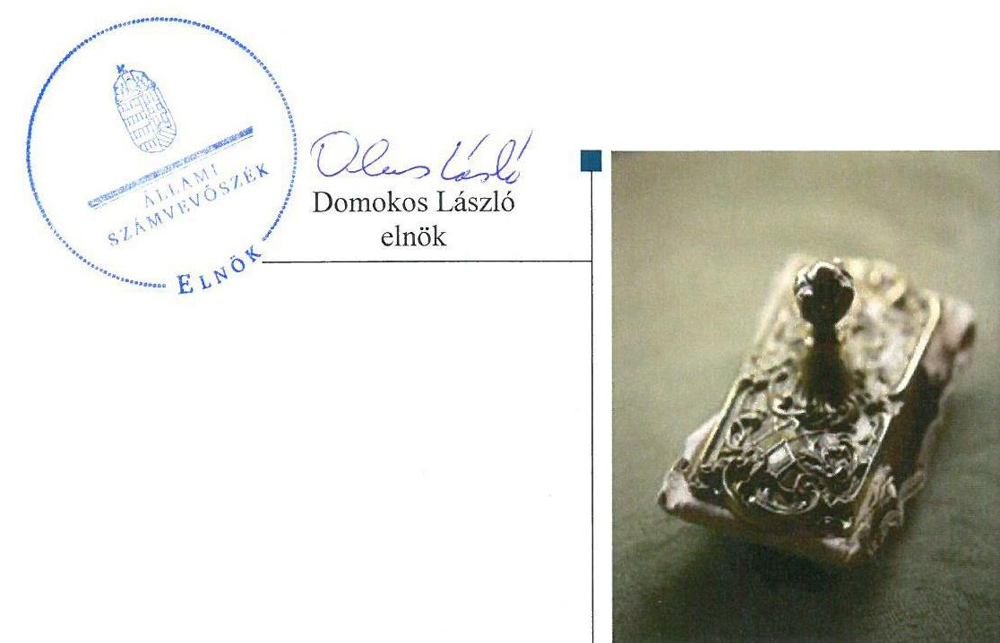
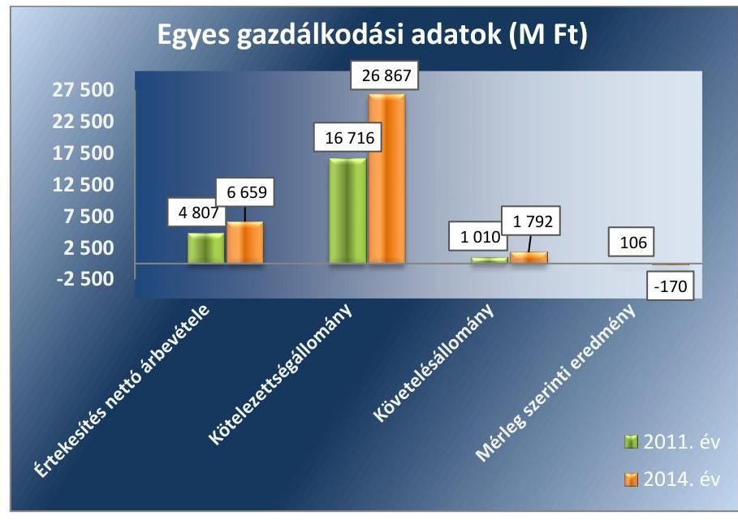
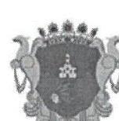
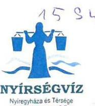
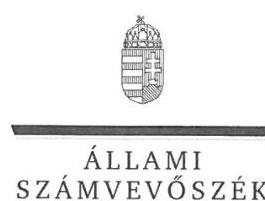
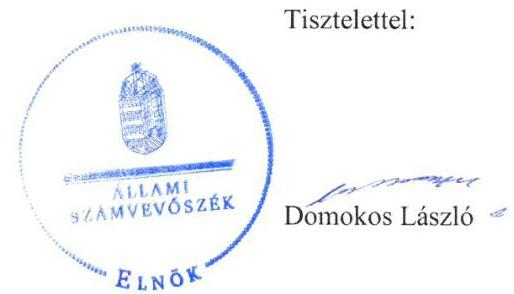

# Jelentés 

## Az önkormányzatok gazdasági társaságai

Az önkormányzatok többségi tulajdonában lévő gazdasági társaságok gazdálkodásának ellenőrzése - NYÍRSÉGVÍZ Nyíregyháza és Térsége Víz-és Csatornamű Zrt.
2016.

---

# Jelentés 

## Az önkormányzatok gazdasági társaságai

Az önkormányzatok többségi tulajdonában lévő gazdasági társaságok gazdálkodásának ellenőrzése - NYÍRSÉGVÍZ Nyíregyháza és Térsége Víz-és Csatornamú Zrt.
2016. 12. hó 20. nap

---

# AZ ELLENŐRZÉST FELÜGYELTE:

## MAKKAI MÁRIA felügyeleti vezető

## AZ ELLENŐRZÉST VEZETTE ÉS A VÉGREHAJTÁSÁÉRT FELELŐS:

### SALAMIN VIKTOR ellenőrzésvezető

## A PROGRAM ÖSSZEÁLLÍTÁSÁÉRT FELELŐS:

### JANIK JÓZSEF osztályvezető

---

**IKTATÓSZÁM:** V-1121-117/2016.

**TÉMASZÁM:** 2155

**ELLENŐRZÉS-AZONOSÍTÓ SZÁM:** V070786

---

Jelentéseink az Országgyűlés számítógépes hálózatán és az Interneta a www.asz.hu címen is olvashatóak.

---

# TARTALOMJEGYZÉK 

■ ÖSSZEGZÉS ..... 5
■ AZ ELLENŐRZÉS CÉLJA ..... 6
■ AZ ELLENŐRZÉS TERÜLETE ..... 7
■ AZ ELLENŐRZÉS HÁTTERE, INDOKOLTSÁGA ..... 8
■ A JELENTÉS LÉNYEGES KÉRDÉSKÖREI ..... 9
■ ELLENŐRZÉS HATÓKÖRE ÉS MÓDSZEREI ..... 10
■ MEGÁLLAPÍTÁSOK ..... 12
■ JAVASLATOK ..... 22
■ MELLÉKLETEK ..... 23
I. sz. melléklet: Értelmező szótár ..... 23
II. sz. melléklet: Múködési adatok ..... 25
III. sz. melléklet: Eredménykimutatás ..... 26
■ FÜGGELÉK: ÉSZREVÉTELEK ..... 27
■ RÖVIDÍTÉSEK JEGYZÉKE ..... 33

---

.

---

# ÖSSZEGZÉS 

A 2011-2014 közötti időszakban a víziközmű-szolgáltatás közfeladat ellátását Nyíregyháza Megyei Jogú Város Önkormányzata szabályszerűen szervezte meg, a tulajdonosi joggyakorlás megfelelt a jogszabályi előírásoknak. A Nyírségvíz Zrt. vagyongazdálkodása szabályszerű volt. Az ellátott közfeladat bevételeinek, ráfordításainak elszámolása, valamint az önköltségszámitás és árképzés szabályszerű volt.

## Az ellenőrzés társadalmi indokoltsága

Az Állami Számvevőszék kiemelt célja, hogy a helyi önkormányzatok gazdálkodásában rejlő pénzügyi kockázatok feltárásával, az államháztartáson kívülre nyújtott költségvetési támogatások és ingyenes vagyonjuttatások, valamint az államháztartáson kívül múködő feladat-ellátó rendszerek ellenőrzéseivel hozzájáruljon ahhoz, hogy a közpénzeket az államháztartáson kívül múködő szervezetek is átlátható, rendezett módon használják fel.

Magyarországon az intézmény-centrikus közfeladat-ellátás jellemző, de egyre jelentősebb a költségvetésen kívüli feladatellátás térnyerése. Ennek legfontosabb szereplői - a nonprofit szervezetek mellett - az önkormányzati tulajdonú gazdasági társaságok. Az önkormányzatok szervezetalakítási szabadságának következménye, hogy a korábban is vállalati formában múködő közszolgáltatások mellett, mind a kötelező, mind az önként vállalt feladatok ellátásában a gazdasági társaságok kiemelt fontosságú szerephez jutottak.

## Főbb megállapítások, következtetések, javaslatok

Az Önkormányzat a víziközmű-szolgáltatás közfeladatának megszervezéséről a jogszabályi előírásoknak megfelelően döntött, annak ellátásáról a többségi tulajdonában lévő gazdasági társaság útján gondoskodott. A közfeladat ellátásához szükséges eszközöket a Társaság vagyonkezelésébe adta, a közművekkel való rendeltetésszerű gazdálkodás érdekében kötött vagyonkezelési szerződés megfelelt a jogszabályi előírásoknak. Az Önkormányzat tulajdonosi joggyakorlása szabályos volt.

A Társaság vagyongazdálkodása szabályszerű volt. A Nyírségvíz Zrt. által alkalmazott számviteli szabályzatok megfeleltek a vonatkozó jogszabály előírásainak. A saját, valamint vagyonkezelésbe vett vagyonnal való gazdálkodás, annak nyilvántartása szabályszerű volt. A vagyonkezelésbe vett eszközök felújításáról, pótlásáról - a vagyonkezelési szerződésben foglaltaknak megfelelően - a terv szerinti értékcsökkenést meghaladó mértékben gondoskodtak.

A Társaság kötelezettségállománya nem jelentett veszélyt a közfeladat ellátására, a múködésre. A kötelezettségek jelentős részét a tulajdonossal szembeni, a vagyonkezelésbe átvett eszközök miatti hosszú lejáratú kötelezettségek képezték. A Nyírségvíz Zrt. az előírt beszámolási és adatszolgáltatási kötelezettségét összességében a jogszabályi előírásoknak megfelelően teljesítette.

A közfeladat bevételeinek, ráfordításainak, valamint az értékcsökkenés elszámolása szabályos volt. A Társaság rendelkezett a jogszabály előírásainak megfelelő önköltségszámítási szabályzattal, melyet megfelelően alkalmazott. A közszolgáltatás díjainak megállapítása szabályos volt.

---

# AZ ELLENŐRZÉS CÉLJA 

pozottsága szabályszerű önköltségszámítással.

Az ellenőrzés célja annak értékelése volt, hogy az Önkormányzat vagyongazdálkodási tevékenysége során szabályszerűen gyakorolta-e tulajdonosi jogait.

Ellenőriztük, hogy a gazdasági társaság szabályozottsága, gazdálkodása és vagyongazdálkodási tevékenysége, bevételeinek és ráfordításainak elszámolása megfelelt-e a jogszabályi és tulajdonosi előírásoknak.

Értékeltük továbbá, hogy a gazdasági társaság kötelezettségállománya jelentett-e kockázatot a múködésre, valamint a gazdálkodás átláthatósága és elszámoltathatósága érdekében biztosítva volt-e a szolgáltatás díjának megala-

---

# **AZ ELLENŐRZÉS TERÜLETE**

## **Nyíregyháza Megyei Jogú Város Önkormányzata és a többségi tulajdonában lévő NYÍRSÉGVÍZ Nyíregyháza és Térsége Víz- és Csatornamű Zártkörűen Működő Részvénytársaság**

A Nyírségvíz Zrt.1 tulajdonosa – 2011. január 1-jén – a többségi tulajdonos Önkormányzat2 mellett 48 települési önkormányzat és a Magyar Állam volt. Működési területe Szabolcs-Szatmár-Bereg megye nyugati részén, 86 településre terjed ki. A működési területen a vízellátottság teljes körű, a szennyvíz csatornázottság közel 73%-os. A 2011-2014. években a vízellátásban részesülő lakosság 65 ezer fővel 322 ezerre nőtt, a csatornaszolgáltatásban részesülő lakosság 49 ezerrel, 218 ezer főre emelkedett.

Nyíregyháza Megyei Jogú Város Önkormányzata 2011-2012. években 57,9%, 2013-ban és 2014-ben 52,8% tulajdoni részesedéssel rendelkezett a Nyírségvíz Zrt.-ben. A fennmaradó tulajdoni részesedéssel más önkormányzatok rendelkeztek, valamint a részesedések 1%-a a Magyar Állam tulajdonában volt. A Nyírségvíz Zrt. tevékenységét saját tulajdonú, illetve vagyonkezelésbe vett önkormányzati tulajdonú eszközökkel látta el.

A Társaság3 gazdálkodásának egyes adatait a 2011. és 2014. évek vonatkozásában az 1. ábra szemlélteti.

1. ábra

*Forrás: A Nyírségvíz Zrt. 2011., 2014. évi beszámolói*

Az ellenőrzött időszakban a polgármester és a jegyző személye nem változott.

---

# **AZ ELLENŐRZÉS HÁTTERE, INDOKOLTSÁGA**

*Az önkormányzatok közfeladat-ellátásában egyre jelentősebb a gazdasági társaságok útján történő feladatellátás térnyerése.*

**AZ ÖNKORMÁNYZATI TULAJDONÚ GAZDASÁGI TÁRSASÁGOK** teljes körű ellenőrzésének lehetőségét az Állami Számvevőszékről szóló 1989. évi XXXVIII. törvény 2011. január 1-jétől hatályos módosítása teremtette meg. Az önkormányzati tulajdonú gazdasági társaságok ellenőrzése kiemelten fontos a vagyon megőrzése, megóvása érdekében, valamint a kormányzati szektor elszámolásaiban megjelenő önkormányzati tulajdonú gazdálkodó szervezetek esetében, amelyekkel szemben alapvető követelmény, hogy gazdálkodásuk, működésük szabályszerű, az általuk szolgáltatott adatok minél megbízhatóbbak legyenek. A feladat/közfeladat ellátás költségeinek, ráfordításainak alakulása, színvonala hatással van a lakosság elégedettségére.

**AZ ELLENŐRZÉS VÁRHATÓ HASZNOSULÁSA-KÉNT** az ÁSZ6 a megállapításaival segítséget nyújthat az államháztartáson kívüli közfeladat-ellátás értékeléséhez, jogszabályi keretei pontosításához, átláthatóságot biztosító szabályozásához. Meghatározhatóvá válnak az önkormányzati feladatellátásban részt vevő államháztartáson kívüli szervezeteknek – az önkormányzat költségvetését, pénzügyi helyzetét is befolyásoló – kockázatai, lehetővé válik ezen kockázatok csökkentése. Ellenőrzéseink feltárhatják, hogy az önkormányzat feladat-ellátási kötelezettségének szabályszerűen tett-e eleget, a feladatellátáshoz rendelt vagyonkezelésbe vett és saját vagyon működtetését az elvárható gondossággal, szabályszerűen szervezte-e meg és a tulajdonosi felügyelete hozzájárult-e a feladatellátásához. Értékelhetővé válik, hogy a gazdasági társaság a feladat-ellátási, közszolgáltatási szerződésben foglaltak betartásával, a vagyon használatával biztosította-e a szolgáltatás folytatásának feltételeit. Ezzel az ellenőrzöttek és a helyi döntéshozók számára az ÁSZ visszajelzést ad feladatszervezési, feladat-ellátási kockázataikról, alapot ad a meglévő hibák megszüntetéséhez, a jobb feladat-ellátás biztosításához. Mindezeken keresztül az ÁSZ hozzájárul Magyarország közpénzügyi helyzetének javításához, a közpénzek mérhető módon történő, a döntéshozók által meghatározott célok szerinti felhasználásához.

---

# A JELENTÉS LÉNYEGES KÉRDÉSKÖREI 

1. Az önkormányzat feladat/közfeladat megszervezéséről szóló döntése, valamint tulajdonosi joggyakorlása szabályszerű volt-e?
2. A gazdasági társaság vagyongazdálkodása szabályszerű volt-e, kötelezettségállománya jelentett-e kockázatot a müködésre, illetve a feladat/közfeladat ellátásra?
3. A gazdasági társaságnál az ellátott feladat/közfeladat bevételei és ráfordításai elszámolása, valamint az önköltségszámitás és árképzés szabályszerű volt-e?

---

# ELLENŐRZÉS HATÓKÖRE ÉS MÓDSZEREI 

## Az ellenőrzés típusa

Megfelelőségi ellenőrzés.

## Az ellenőrzött időszak

2011. január 1-jétől 2014. december 31-ig terjedő időszak.

## Az ellenőrzés tárgya

A gazdasági társaság feletti tulajdonosi joggyakorlás, valamint a gazdasági társaság gazdálkodásának szabályozottsága és szabályszerűsége.

Az ellenőrzés kiterjed minden olyan körülményre és adatra, amely az ÁSZ jogszabályban meghatározott feladatainak teljesítéséhez, valamint a program végrehajtása folyamán felmerült újabb összefüggések feltárásához szükséges.

## Az ellenőrzött szervezet

Nyíregyháza Megyei Jogú Város Önkormányzata és a többségi tulajdonában lévő NYÍRSÉGVÍZ Nyíregyháza és Térsége Víz- és Csatornamú Zártkörűen Működő Részvénytársaság

## Az ellenőrzés jogalapja

Az ellenőrzés jogszabályi alapját az ÁSZ tv. 1. § (3) bekezdése és 5. § (3)-(4)-(5) bekezdései képezték.

## Az ellenőrzés módszerei

Az ellenőrzést a nemzetközi standardokat irányadónak tekintve az ellenőrzési program ellenőrzési kérdései, az ellenőrzött időszakban hatályos jogszabályok, az ellenőrzés szakmai szabályok és módszertanok figyelembe vételével végeztük.

Az ellenőrzés ideje alatt az ellenőrzött szervezettel történő kapcsolattartást az ÁSZ Szervezeti és Múködési Szabályzatának vonatkozó előírásai alapján biztosítottuk.

Az ellenőrzés a kiválasztott, tulajdonosi jogokat gyakorló önkormányzatra, illetve az ellenőrzésre kijelölt gazdasági társaságra terjedt ki.

Az ellenőrzési kérdések megválaszolásához szükséges bizonyítékok megszerzése a következő ellenőrzési eljárások alkalmazásával történt:

---

megfigyelés, kérdésfeltevés (információkérés), összehasonlítás, valamint elemző eljárás. Az ellenőrzési bizonyítékként felhasználható adatforrások közé tartoztak egyrészt a szakmai programban felsorolt adatforrások, másrészt adatforrás lehetett még minden - az ellenőrzés folyamán - feltárt, az ellenőrzés szempontjából információkat tartalmazó dokumentum.

Az ellenőrzést a kérdésekre adott válaszok kiértékelésével, valamint a megjelölt adatforrások, a csatolt tanúsítványok felhasználásával, továbbá az adott időszakban hatályos jogszabályok figyelembe vételével folytattuk le.

A bevételek és ráfordítások elszámolása, valamint a vagyonnyilvántartás terén a szabályszerű múködést véletlen mintavétellel ellenőriztük. A mintavétellel ellenőrzött területek esetében minden egyes tétel vonatkozásában a szabályszerűségre vonatkozó kérdéseket tettünk fel, amelyek eredménye összesítésre került. Megfelelőnek értékeltünk egy ellenőrzött területet, amennyiben 95\%-os bizonyossággal a teljes sokaságban a hibaarány legfeljebb 10\%, nem megfelelőnek, amennyiben 10\%-nál magasabb arányt képviselt. Abban az esetben, ha a teljes sokaság tekintetében a 10\%os hibaarányhoz való viszony megítélésnek megbízhatósága nem érte el a 95\%-ot, annak elérése érdekében értékelésünket további szempontokkal egészítettük ki, és figyelembe vettük a feltárt hibák típusát és súlyát. A ráfordítások elszámolására és a vagyonnyilvántartásra vonatkozó véletlen mintavételt kockázati alapú kiválasztással egészítettük ki, amelynek során évente a három legnagyobb összegű tételt választottuk ki.

---

# 1. Az önkormányzat feladat/közfeladat megszervezéséről szóló döntése, valamint tulajdonosi joggyakorlása szabályszerű volt-e? 

Összegző megállapítás

Az Önkormányzat a víziközmú-szolgáltatás közfeladatának ellátását szabályszerűen biztosította, a tulajdonosi jogok gyakorlása megfelelt a jogszabályi előírásoknak.

### 1.1. számú megállapítás

A víziközmú-szolgáltatás közfeladata ellátásának biztosítása szabályszerű volt.

Az Ötv³. 91. § (6) bekezdése, 2013. január 1-jétől az Mötv6. 116. § (3)-(4) bekezdései szerint az önkormányzatnak a gazdasági programjában kell meghatároznia azokat a célkitűzéseket, amelyek az általa ellátott feladatok biztosítását, fejlesztését szolgálják. Az Önkormányzat gazdasági programja tartalmazta a Társasággal kapcsolatos fejlesztési elképzeléseket, terveket a 2011-2014. évekre vonatkozóan. Célul tűzték ki az ivóvíz minőségének európai uniós forrás bevonásával történő - javítását, a szennyvíztisztító kapacitás növelését.

A helyi csatornázási és ivóvízellátással kapcsolatos feladatok elvégzése az Ötv. 8. § (1) és (4) bekezdései, valamint a Mötv. 13. § (1) bekezdés 21. pontja alapján az Önkormányzat törvényi kötelezettsége volt, melyet a Nyírségvíz Zrt. működtetésével teljesített. Az Önkormányzat SZMSZ7-e 2012 októberétől tartalmazta a kötelezően ellátandó településfejlesztési és kommunális feladatok között a vízközművek üzemeltetését. A vagyongazdálkodási rendelet, ${ }^{8},{ }^{9} .4$. §-a rögzítette, hogy az Önkormányzat a közszolgáltatást ellátó vízközművek üzemeltetéséről a Társaság útján gondoskodott. A közfeladat-ellátás megszervezése megfelelt az Ötv. 9. § (4) bekezdés, illetve a Mötv. 41. § (6) bekezdés előírásának.

AZ ALAPSZABÁLY ${ }^{10}$ meghatározta a Zrt. Közgyűlés ${ }^{11}$ kizárólagos hatáskörébe tartozó jogokat és kötelezettségeket. A Társaság Közgyűlése döntött - többek között - a számviteli beszámoló elfogadásáról, a szervezeti és működési szabályzatáról, az igazgatóság és az $\mathrm{FB}^{12}$ ügyrendjéről. Az Alapszabály rögzítette az igazgatóság ${ }^{13}$ feladatait, közöttük a számviteli nyilvántartás vezetéséről és az éves beszámoló elkészítéséről való gondoskodást.

Az Önkormányzat és a Társaság közszolgáltatási szerződést ${ }^{14}$ kötött a közfeladat-ellátására, melyben meghatározták Nyírségvíz Zrt. által végzett közszolgáltatás feltételeit, a szerződő felek jogait és kötelezettségeit, valamint a szerződés módosításának, megszűnésének szabályozását.

Az Önkormányzat Vagyonkezelési szerződést, ${ }^{15}{ }^{16}{ }^{17}$ kötött a Társasággal a tulajdonában lévő víziközmű vagyon kezelése, a közművekkel való rendeltetésszerű gazdálkodás tárgyában.

---

A 2007 januárjában kötött vagyonkezelési szerződés ${ }_{1}$ alapján az Önkormányzat a tulajdonában álló vízközmű vagyont adta vagyonkezelésbe a Társaság részére. A vagyonkezelési szerződés ${ }_{2}$ megkötésére az Nvtv. 11. § (1) bekezdése adott felhatalmazást, mely szerint az állam és a helyi önkormányzatok 100\%-os tulajdonában álló gazdasági szervezettel vagyonkezelési szerződés köthető. A 2013. január 1-jétől a víziközművek átadását követően - a Vksztv. ${ }^{18}$ 6. § (1) bekezdése alapján víziközmű kizárólag az állam és települési önkormányzat tulajdonába tartozhat - azokra vonatkozóan a vagyonkezelési szerződés ${ }_{3}$-t kötötte meg az Önkormányzat és a Nyírségvíz Zrt.

A vagyonkezelési szerződés ${ }_{1,2,3}$ tartalmazta a működtetésből származó bevételek és ráfordítások elkülönítésére vonatkozó szabályokat, amelyek összhangban álltak a 2011. december 31-ig hatályos Áht. ${ }^{19}$ 105/A. § (12) bekezdésében illetve a 2012. január 1-jétől hatályos Mötv. 109. § (7) bekezdésében foglalt előírásokkal. Meghatározták a vagyonkezelési szerződésekben a vagyonkezelt eszközök elkülönített nyilvántartásának, pótlásának, leltározásának kötelezettségét.

Az Önkormányzat az ivóvíz- és csatornahasználat díját Ártv. ${ }^{20}$ 7. § (1) bekezdésének megfelelően 2011. december 31-ig a Díjrendelet ${ }^{21}$-ben határozta meg. Az ivóvízdíj, valamint a szennyvízelvezetés és tisztítás hatósági árát a Zrt. Közgyűlési határozatban elfogadott díjavaslata alapozta meg. A Vksztv. 93. §-a 2011. december 31. napjával megszüntette a települési önkormányzatok víz- és csatornadíj megállapítására vonatkozó árhatósági jogkörét.

# 1.2. számú megállapítás 

A tulajdonosi jogok gyakorlása megfelelt a jogszabályi előírásoknak.

A TULAJ DONOSI JOG GYAKORLÁSÁNAK módját és rendjét az Önkormányzat a vagyongazdálkodási rendelet ${ }_{1,2}$-ben és azzal összhangban lévő Alapszabályban szabályozta.

A tulajdonosi jogok gyakorlása szabályszerű volt, az Önkormányzat a tulajdonosi jogait a Zrt. Közgyűlésén gyakorolta. A Zrt. Közgyűlése az ellenőrzött években határozattal döntött az üzleti jelentés, az üzleti terv, valamint - a Gt. 35. § (3) bekezdésének és a Ptk. 3:120. § (2) bekezdésének előírásait betartva az FB írásos jelentésének birtokában - a számviteli beszámolók elfogadásáról.

ÜZLETI TERV KÉSZÍTÉSÉT és azon belül a beruházási terv készítést a tulajdonosi joggyakorló ${ }^{22}$ az Alapszabályban előírta, mely kötelezettségnek az igazgatóság eleget tett. Az üzleti tervekben szereplő feladatok összhangban álltak az Önkormányzat gazdasági programjában meghatározott célokkal. Az Önkormányzat a vagyonkezelési szerződés ${ }_{1,2,3}$-ban beruházási, fejlesztési terv készítési kötelezettséget írt elő a Társaság számára. Az üzleti tervek a vagyonkezelésbe vett vagyonhoz kapcsolódó beruházási és fejlesztési terveket is tartalmazták. az üzleti terveket a Zrt. Közgyűlése az ellenőrzés időszakában minden évben határozattal elfogadta.

A FELÚGYELŐBIZOTTSÁG ellenőrzési kötelezettségét az Alapszabály előírta, mely alapján az FB köteles volt minden, a Zrt. Közgyűlés elé terjesztett üzletpolitikai jelentést és az éves tervet, valamint minden olyan jelentést, mely a Zrt. Közgyűlés kizárólagos hatáskörébe tartozik,

---

megvizsgálni. Az FB ennek megfelelően határozatot hozott az éves beszámolókról készített írásbeli véleményéről, az üzleti tervek elfogadásának javaslatáról, valamint a vezetők prémiumfeladatainak teljesítéséről. Az Alapszabály az FB tagjainak számát hat főben határozta meg, megbízatásuk időtartama négy évre szólt. Az FB létszáma megfelelt a Taktv. ${ }^{23} 4$. § (2) bekezdésében meghatározott létszámnak. Az FB az Alapszabály rendelkezése alapján elkészítette ügyrendjét, melyet a Zrt. Közgyűlése elfogadott a Gt. ${ }^{24}$ 34. § (4) bekezdésének megfelelően.

A KÖNYVVIZSGÁLÓ megválasztásáról az Alapszabály rendelkezett. Az éves beszámoló jóváhagyását megalapozó könyvvizsgálói jelentések rendelkezésre álltak a Zrt. Közgyűlés beszámolóról szóló határozatainak meghozatalakor.

OSZTALÉK KIFIZETÉSÉRE a 2011-2014. évek között nem került sor. A 2011, 2012. évek pozitív mérleg szerinti eredményét eredménytartalékba helyezték az igazgatóság és az FB határozatainak birtokában meghozott Zrt. Közgyűlés döntésének megfelelően.

A 2013. évben jelentős mértékű negatív mérleg szerinti eredmény keletkezett a víziközmű eszközöknek az ellátásért felelős önkormányzatoknak történő térítésmentes átadása eredményeképpen. A víziközmű eszközök 2013. január 1-jén - a Vksztv. 79. § (1) bekezdés előírásának megfelelően - az önkormányzatok tulajdonába kerültek, a közművek értékének kivezetése megtörtént. A veszteség egyszeri és tervezett volt, azonban szükség volt a veszteség rendezésére. Ennek megfelelően a Zrt. Közgyűlése 2013. június 25-én döntött a Nyírségvíz Zrt. alaptőkéjének 5,5 Mrd Ft összeggel történő leszállításáról.

# 2. A gazdasági társaság vagyongazdálkodása szabályszerű volt-e, kötelezettségállománya jelentett-e kockázatot a múködésre, illetve a feladat/közfeladat ellátásra? 

Összegző megállapítás

A Társaság vagyongazdálkodása szabályszerű volt, a kötelezettségek állománya nem jelentett veszélyt a múködésre, közfeladat ellátásra.
2.1. számú megállapítás

A Nyírségvíz Zrt. rendelkezett a jogszabály által előírt számviteli szabályzatokkal.

A Társaság rendelkezett a Számv. tv². 14. § (3) bekezdésben előírt számviteli politikával, valamint a Számv. tv. 14. § (5) bekezdés a), b), d) pontjaiban előírtaknak megfelelően eszközök és források leltárkészítési és leltározási, illetve értékelési szabályzatával, valamint pénzkezelési szabályzattal. Elkészítették továbbá a Számv. tv. 161. § (1) bekezdésben előírt számlarendet.

A SZÁMVITELI POLITIKA a Számv. tv. 14. § (4) bekezdése, valamint a 161/A. § előírásainak megfelelt. Az eszközök és források leltárkészítési és leltározási szabályzata azon eszközök esetében, amelyekről folya-

---

matos mennyiségi nyilvántartást vezettek (immateriális javak, tárgyi eszközök) eltérő gyakoriságú, de maximum 3 évenkénti mennyiségi felvétellel történő leltározási kötelezettségét írt elő. A szabályozás megfelelt a Számv. tv. 69. § (3) bekezdésében foglalt előírásoknak. Az eszközök és források értékelési szabályzata a Számv. tv. előírásaival és a számviteli politikával összhangban biztosította a vagyon értékének meghatározását. A pénzkezelési szabályzatban a Számv. tv. 14. § (8) bekezdésében előírtaknak megfelelően - többek között - rendelkeztek a pénzforgalom lebonyolításának rendjéről, a készpénzben és a bankszámlán tartott pénzeszközök közötti forgalomról, a bankkártya használat rendjéről, a készpénzállomány ellenőrzésekor követendő eljárásról, az ellenőrzés gyakoriságáról. A számlarend tartalma megfelelt a Számv. tv. 161. § (2) bekezdés előírásainak.

A Társaság a Vksztv. 49. §-ának számviteli szétválasztásra vonatkozó rendelkezéseit az 58/2013. Korm. rendelet ${ }^{26}$ 93. § (6) bekezdésének megfelelően első alkalommal a 2013. évi beszámoló készítésénél alkalmazta. A Társaság a Számv. tv. 161/A. § (1) bekezdésében előírtaknak megfelelően számviteli politikáját, belső szabályait úgy alakította ki, hogy az a mérleg és az eredménykimutatás alátámasztásán túlmenően a kiegészítő melléklet közvetlen alátámasztására is alkalmas volt. A Társaság a Vksztv. 49. § (2) bekezdése előírásainak teljesítése érdekében a számviteli politikát, valamint a számlarendet kiegészítette a víziközmű-szolgáltatás és egyéb tevékenységek elkülönült nyilvántartása vezetésének szabályaival.

A Nyírségvíz Zrt. rendelkezett a Zrt. Közgyűlése által jóváhagyott Javadalmazási szabályzattal ${ }^{27}$, amely megfelelt a Taktv. tv. 5. § (3) bekezdés előírásainak.

A vagyonkezelési szabályzat ${ }_{1}{ }^{28} \mathrm{z}^{29}$-ban a vagyonkezelési szerződés ${ }_{1,2,3}$ előírásaival összhangban határozták meg a vagyonkezelésben működtetett közművekkel kapcsolatos nyilvántartási, adatszolgáltatási és beszámolási szabályokat.

# 2.2. számú megállapítás 

## A Nyírségvíz Zrt. a saját és a vagyonkezelésbe vett vagyonnal szabályzzerűen gazdálkodott.

A VAGYONNYILVÁNTARTÁS megfelelt a Számv. tv. 159. § előírásainak mind a saját, mind a vagyonkezelt vagyonhoz kapcsolódóan. A Számv. tv. 23. § (2) bekezdésében előírt kötelezettségüknek eleget tettek, a 2011-2014. évi beszámolók mérlegeiben az eszközök között kimutatták a vagyonkezelésbe vett eszközöket.

A Társaság az Áht.: 105/A. § (12), (13) bekezdéseiben, illetve a 2012. évtől a Mötv. 109. § (7) bekezdésében, valamint a vagyonkezelési szabály-zat ${ }_{1,2}$-ben előírtaknak megfelelően a vagyonkezelésébe vett vagyon használatából, működtetéséből származó bevételeit, illetve közvetlen költségeit és ráfordításait külön főkönyvi számon, elkülönítetten tartotta nyilván.

## A NYÍRSÉGVÍZ ZRT. MÉRLEG SZERINTI VAGYONA 2011. január 1. és 2014. december 31. között 4599,7 M Ft-tal (17,3\%-kal) növekedett. A Társaság főbb mérleg adatait az 1. táblázat szemlélteti.

---

1. táblázat

NYÍRSÉGVÍZ ZRT. MÉRLEGADATAI 2011-2014. (M FT)

| Megnevezés | $\begin{gathered} 2011 . \\ 01 .01 . \end{gathered}$ | $\begin{gathered} 2011 . \\ 12.31 . \end{gathered}$ | $\begin{gathered} 2012 . \\ 12.31 . \end{gathered}$ | $\begin{gathered} 2013 . \\ 12.31 . \end{gathered}$ | $\begin{gathered} 2014 . \\ 12.31 . \end{gathered}$ |
| :--: | :--: | :--: | :--: | :--: | :--: |
| I. Befektetett eszközök | 22526,4 | 22899,8 | 24427,1 | 26822,5 | 26327,2 |
| - ebből: Tárgyi eszközök | 21423,3 | 21715,6 | 22444,5 | 24711,3 | 24131,7 |
| II. Forgóeszközök | 3786,8 | 4404,5 | 4423,8 | 4457,7 | 4561,8 |
| - ebből: Követelések | 1256,2 | 1009,7 | 1132,8 | 1515,5 | 1791,8 |
| III. Aktív időbeli elhatárolások | 227,5 | 212,1 | 216,8 | 304,2 | 251,4 |
| Eszközök összesen | 26540,7 | 27516,4 | 29067,7 | 31584,4 | 31140,4 |
| IV. Saját tőke | 9209,9 | 9315,4 | 10021,2 | 4063,3 | 3892,9 |
| - ebből: Jegyzett tőke | 7313,8 | 7313,8 | 7313,8 | 1808,9 | 1808,9 |
| - ebből: Mérleg szerinti eredmény | 64,1 | 105,5 | 705,8 | $-5928,0$ | $-170,4$ |
| V. Céltartalékok | 0,0 | 0,0 | 34,8 | 33,7 | 33,7 |
| VI. Kötelezettségek | 15804,4 | 16715,5 | 17598,6 | 27165,7 | 26866,6 |
| VII. Passzív időbeli elhatárolások | 1526,4 | 1485,5 | 1413,1 | 321,7 | 347,2 |
| Források összesen | 26540,7 | 27516,4 | 29067,7 | 31584,4 | 31140,4 |

Az eszköz érték 3,8 Mrd Ft értékű emelkedését a befektetett eszközök, forgóeszközök, és aktív időbeli elhatárolások állományának együttes emelkedése eredményezte az ellenőrzött időszakban.

A saját tőke értéke 2013-ban - az előző évi értékhez képest 6,0 Mrd Ft-tal csökkent, elsősorban a negatív mérleg szerinti eredmény elszámolása miatt. A 2013. évi veszteséget alapvetően a tulajdonos önkormányzatok részére történő, Vksztv. 79. § alapján teljesített víziközmű vagyon átadás számviteli elszámolása eredményezte. A jegyzett tőke 2013. évi 5,5 Mrd Ft-os csökkenésének oka az eredménytartalékkal szembeni tőkeleszállítás volt. Az önkormányzatok részére térítés nélkül átadott víziközmű eszközöket a Társaság vagyonkezelési szerződés keretében viszszavette, a kezelésbevételhez kapcsolódó kötelezettség Számv. tv. 42. § (5) bekezdés szerinti elszámolása miatt a hosszú lejáratú kötelezettségek állománya emelkedett.

Az ellenőrzött évek beszámolóinak mérlegét alátámasztó, Számv. tv. 69. § (1) bekezdése szerinti leltárakat elkészítették. Az immateriális javak, tárgyi eszközök Számv. tv. 69. § (3) bekezdése szerinti, mennyiségi felvétellel történő leltározását az eszközök és források leltározási és leltárkészítési szabályzatában előírtaknak megfelelően elvégezték.

A vagyonkezelési szerződés ${ }_{1,2,3}$ a közművek pótló beruházásaira, fejlesztéseire évenkénti terv készítési kötelezettséget írtak elő a Nyírségvíz Zrt. számára. A Zrt. Közgyűlése jóváhagyta az éves üzleti tervet, illetve az annak keretében elkészített beruházási tervet. A Társaság a 2011-2014. években az elszámolt értékcsökkenést meghaladó összeget fordított beruházásra, felújításra, karbantartásra. A vagyonkezelésbe vett eszközök vonatkozásában az Áht. ${ }_{1}$ 105/A. § (6), illetve a Mötv. 109. § (6) bekezdés előírásait teljesítette, mivel azok felújítására, pótlására a terv szerinti értékcsökkenést (2,7 Mrd Ft) meghaladó összeget (5,9 Mrd Ft-ot) fordított az ellenőrzött időszakban. A saját tulajdonú és a vagyonkezelt eszközök elhasználódási szintje az ellenőrzött időszakban csökkenő tendenciát mutatott, mellyel

---

párhuzamosan a használhatósági fok javult. Az elszámolt értékcsökkenés és eszközpótlás adatait a 2. táblázat mutatja be.
2. táblázat

A NYÍRSÉGVÍZ ZRT. SAJÁT ÉS VAGYONKEZELT ESZKÖZEINEK ÉRTÉKCSÖKKENÉSE ÉS AZ ESZKÖZÖK PÓTLÁSA (M FT)

| Megnevezés | 2011. | 2012. | 2013. | 2014. |
| :-- | :--: | :--: | :--: | :--: |
| Vagyonkezelésben lévő önkor-   mányzati vagyon után elszámolt   értékcsökkenés | 483,7 | 523,8 | 732,5 | 931,0 |
| Eszközök pótlására elszámolt fel-   újítás, beruházás, karbantartás | 966,6 | 1380,9 | 1905,1 | 1621,7 |
| Saját vagyon után elszámolt érték-   csökkenés | 600,9 | 672,7 | 567,3 | 408,5 |
| Eszközök pótlására elszámolt fel-   újítás, beruházás, karbantartás | 1357,3 | 1372,5 | 797,8 | 731,4 |

A Társaságnál az ellenőrzött időszakban biztosított volt a Gt. 51. § (1) bekezdés, illetve a 2014. március 15-től hatályos Ptk. 3:133. § (2) bekezdés előírása szerinti tőkemegfelelés.

A Vksztv. 79. § (1) bekezdésben foglalt víziközmű vagyon ingyenes átadása 2013. január 1-jével megtörtént, a saját tőke/jegyzett tőke előírt szintjének biztosítása érdekében a Zrt. Közgyűlése döntött a tőkeleszállításról 2013. június 25-én. A tőkeleszállítás végrehajtásával a 2013. december 31-i mérleg fordulónapra elkészített mérlegben kimutatott saját tőke összege megfelelt a Gt. 245. § (1) bekezdésben foglalt követelménynek.

# 2.3. számú megállapítás 

A Nyírségvíz Zrt. kötelezettségállománya nem veszélyeztette a közfeladat ellátását, a Társaság múködését.

A KÖTELEZETTSÉGEK jelentős részét a hosszú lejáratú kötelezettségek tették ki, ezen belül a legnagyobb arányt a tulajdonossal szembeni, a vagyonkezelésbe átvett eszközök miatti állomány képezte. Ezen túl a 2008-ban kibocsátott kötvénytartozás szerepelt a hosszúlejáratú kötelezettségek között. A vagyonkezelésbe átvett eszközök hosszú lejáratú kötelezettségekkel szemben történő kimutatása a Számv. tv. 42. § (5) bekezdésében foglalt előírásnak megfelelően történt. A Társaság kötelezettségeinek állománya - figyelmen kívül hagyva a vagyonkezelésbe vett eszközökhöz kapcsolódó kötelezettséget- az ellenőrzött időszakban 345,0 M Ft-tal (10,5\%-kal) csökkent.

A szállítók állománya az ellenőrzött időszakban 411,6 M Ft-tal (143,2\%kal) emelkedett, amelynek legfőbb oka volt, hogy a Társaság egyre több taggal és nagyobb területen folytatta tevékenységét. A kötelezettségek alakulását a 3. táblázat szemlélteti.

---

| A NYÍRSÉGVÍZ ZRT. KÖTELEZETTSÉGEI (M FT) |  |  |  |  |
| :--: | :--: | :--: | :--: | :--: |
| Megnevezés | 2011. | 2012. | 2013. | 2014. |
| Rövid lejáratú kötelezettségek | 963,8 | 1351,4 | 1477,3 | 1569,3 |
| - ebből: kötelezettségek áruszállításból (szállítók) | 287,5 | 374,6 | 597,3 | 699,1 |
| Hosszú lejáratú kötelezettségek | 15751,7 | 16247,2 | 25688,4 | 25297,3 |
| - ebből: vagyonkezelt vagyonhoz kapcsolódó | 13425,2 | 14376,3 | 24125,8 | 23921,3 |
| - ebből: tartozás kötvénykibocsátásból | 2326,5 | 1870,9 | 1562,6 | 1376,0 |
| Összes kötelezettség | 16715,5 | 17598,6 | 27165,7 | 26866,6 |
| Vagyonkezeléshez kapcsolódó kötelezettségek aránya az összes kötelezettségen belül (\%) | 80,3 | 81,7 | 88,8 | 89,0 |

A kötvénytartozás negyedévente esedékes törlesztő részleteit és kamatait határidőben megfizették, a beszámolókban kimutatott szállítói állomány és egyéb rövid lejáratú kötelezettség nem tartalmazott határidőn túli tartozást.

AZ ELADÓSODOTTSÁGI MUTATÓ 2011-2012-ben 0,61 volt. A 2013. évi tőkeleszállítás és a víziközmű vagyon vagyonkezelésbe vétele miatti kötelezettség növekedése miatt a mutató értéke kedvezőtlen irányba változott, 2013-ban és 2014-ben 0,86 volt.

Az adósságfedezeti mutató alapján 1 Ft adósságra 2011-2012-ben 1,631,64 Ft vagyon jutott. A mutató értéke 2013. és 2014. években a vagyonkezelésbe átvett eszközállomány miatt kimutatott kötelezettségek eredményeképpen csökkent 1,15 értékre.

Az eladósodottság mértéke nem jelentett kockázatot a működésre. A vagyonkezeléshez kapcsolódó kötelezettség nélküli idegen tőke nem haladta meg a saját tőke értékét.
2.4. számú megállapítás

A Nyírségvíz Zrt. az előírt beszámolási és adatszolgáltatási kötelezettségét összességében a jogszabályi előírásoknak megfelelően teljesítette.

A Nyírségvíz Zrt. a tulajdonosi joggyakorló felé történő beszámolási, adatszolgáltatási kötelezettségét az Alapszabályban és a vagyonkezelési szerződés ${ }_{1,2,3}$-ban előírtak szerint teljesítette.

ÉVES BESZÁMOLÓIT a Társaság elkészítette, azok a Számv. tv. 19. § (1) bekezdés előírásának megfelelően tartalmazták a mérleget, eredménykimutatást, kiegészítő mellékletét, valamint az üzleti jelentést.

A 2012-2014. évi beszámolók kiegészítő mellékleteiben az elszámolt terven felüli értékcsökkenést a Számv. tv. 92. § (2) bekezdésében foglaltak ellenére nem mutatták be.

A Zrt. Közgyűlése által elfogadott éves beszámolók letétbe helyezése és azok közzététele a Számv. tv. 153. § (1) bekezdésben, illetve a 154. § (1) bekezdésben előírtak szerint megtörtént.

---

A KÖNYVVIZSGÁLÓ a Gt. 40. § (1) és a Ptk. 3:129. § (1) bekezdés előírása alapján szerint véleményezte az éves beszámolókat, azokat hitelesítő záradékkal látta el.

A 2013. és 2014. évi könyvvizsgálói jelentés hiányossága volt, hogy nem tartalmazott a Vksztv. 49. § (4) bekezdésében előírt igazolását arról, hogy a víziközmű-szolgáltató által kidolgozott és alkalmazott számviteli szétválasztási szabályok biztosították a víziközmű-szolgáltató üzletágai közötti ke-resztfinanszírozás-mentességet.

A belső adatvédelmi felelőst az Avtv. ${ }^{30} 31 /$ A. § (1) bekezdés c) pontja és az Info tv. ${ }^{31}$ 2012. január 1-jétől hatályos 24. § (1) bekezdés c) pontja előírásainak megfelelően kijelölték, aki az Avtv. 31/A. § (1) bekezdés d) pontjában rögzítetteknek megfelelően adatvédelmi és adatbiztonsági szabályzatot ${ }^{32}$ készített.

A közérdekű adatok megismerésére irányuló igények teljesítésének rendjét rögzítő szabályzatot az Avtv. 20. § (8) bekezdése, illetve az Info tv. 2012. január 1-jétől hatályos 30. § (6) bekezdés előírásainak ellenére nem készítettek.

A Társaság 2011-ben az Eisztv ${ }^{33}$. 6. § (1) bekezdésében, 2012-2014. években az Info tv ${ }^{34}$. 33. § (3) bekezdésben előírt kötelezettségének eleget téve szervezeti, személyi adatait, a tevékenységére, múködésére vonatkozó, és gazdálkodási adatait, valamint a Vksztv. 48. § (1) bekezdésben előírt adatokat honlapján közzétette.

# 3. A gazdasági társaságnál az ellátott feladat/közfeladat bevételei és ráfordításai elszámolása, valamint az önköltségszámítás és árképzés szabályszerű volt-e? 

Összegző megállapítás

## 3.1. számú megállapítás

A bevételek és a ráfordítások, valamint az értékcsökkenés elszámolása szabályszerű volt. Az árképzés megfelelt az előírásoknak, az önköltségszámítást szabályosan végezték.

A közfeladat bevételeinek, ráfordításainak, valamint az értékcsökkenés elszámolása szabályos volt.

A Vksztv. 49. § (1) bekezdése rendelkezett a számviteli szétválasztásról. A Társaság a 2013 januárjától hatályos számviteli politikájában szabályozta a számviteli szétválasztást a jogszabályi előírásokkal összhangban. A főkönyvi nyilvántartásában településkódok, illetve munkaszámok alkalmazásával melyek lehetővé tették a településenkénti szétválasztást - választotta szét az ivóvíz szolgáltatási, a szennyvíz szolgáltatási, valamint az egyéb tevékenységek bevételeit és ráfordításait. Ezzel biztosította az egyes víziközműszolgáltatási ágazati tevékenységek oly módon történő nyilvántartását, mintha azokat önálló vállalkozások keretében végezték volna.

AZ ÉRTÉKESÍTÉS NETTÓ ÁRBEVÉTELÉNEK ELSZÁMOLÁSA megfelelő volt. A bevételek előírása és kiszámlázása a belső szabályozásnak megfelelően történt, a bevételeket a megfelelő számlacsoportban számolták el. Az alkalmazott díjak megfeleltek az egyes települési önkormányzatok által megállapított díjaknak, 2012. január 1-

---

jétől a Vksztv. 76. § (1), (2) bekezdései, valamint a Rezsi tv. 4. § (1) bekezdése előírásainak.

# AZ ANYAGJELLEGŰ RÁFORDÍTÁSOK ELSZÁMOLÁSA 

megfelelő volt. A közfeladattal kapcsolatban elszámolt költségeket és ráfordításokat a megfelelő közfeladatra és költségnemre számolták el. A költségelszámolást megalapozó dokumentumok rendelkezésre álltak. A számviteli elszámolás bizonylatai a Számv. tv. 165-167. §-aiban rögzített alaki és tartalmi követelményeknek megfeleltek.

## AZ ÉRTÉKCSÖKKENÉSI LEÍRÁS ELSZÁMOLÁSA

megfelelő volt, a számviteli politikában meghatározott leírási kulcsokat alkalmazták. Az elszámolás alapját képező bekerülési értékeket a Számv. tv. 47-51. §-aiban és a számviteli politikában előírtak alapján állapították meg. Az állománybavételt megalapozó üzembe helyezés megtörtént, az állománybavétel szabályszerű volt.

A vevőkövetelések és az elszámolt értékvesztés alakulását a 4. táblázat mutatja be.
4. táblázat

## A TÁRSASÁG VEVŐ-KÖVETELÉSÁLLOMÁNYÁNAK VÁLTOZÁSA (M FT)

| Mennonytás | 2011. | 2012. | 2013. | 2014. |
| :-- | --: | --: | --: | --: |
| Vevőkövetelések bruttó értéke | 1029,4 | 1150,2 | 1388,4 | 1719,7 |
| Elszámolt értékvesztés | 52,6 | 58,8 | 51,8 | 47,4 |
| Vevőkövetelések nettó értéke | 976,7 | 1091,4 | 1336,6 | 1672,3 |
| Értékvesztés/bruttó érték (\%) | 5,1 | 5,1 | 3,7 | 2,8 |

A teljes vevőkövetelés az ellenőrzött időszakban 67,1\%-kal emelkedett, ezzel párhuzamosan az elszámolt értékvesztés értékben és arányban is csökkent. A 2011. évi 5,1\% mértékű értékvesztéssel szemben a 2014. évben már csak 2,8\% volt az elszámolt értékvesztés aránya.

A követelések behajtása érdekében a Nyírségvíz Zrt. fizetési felszólítással, szolgáltatás korlátozásával, fizetési meghagyással, valamint végrehajtás kezdeményezésével élt.

A 30 napon túli kintlévőségek aránya az árbevételhez viszonyítva javuló tendenciát mutatott. A lakossággal szembeni követelések állománya a 2014. évben 3,3\%-kal nőtt az előző évhez viszonyítva, azonban az árbevétel arányos követelés a rezsicsökkentést követő évben csökkent, a 2011-2014. évek legalacsonyabb értékére mérséklődött.

### 3.2. számú megállapítás

Az önköltségszámítás kialakított rendje és gyakorlata, valamint az árképzés megfelelt a jogszabályi előírásoknak.

A Társaság a Számv. tv. 14. § (5) bekezdés c) pontjában előírtaknak megfelelően rendelkezett önköltségszámítási szabályzat ${ }_{2}{ }^{35}{ }_{2}$, ${ }^{36}$-vel amely tartalmazta a közvetett költségek felosztásánál alkalmazandó vetítési alapot és az utókalkuláció sémáját.

Az önköltségszámítási szabályzat ${ }_{2}$ meghatározta a közvetlen és közvetett költségek tartalmát, a tevékenységek számviteli szétválasztása során alkalmazott módszereket és a vetítési alapokat, mely összhangban állt a Vksztv. 49. §-ában előírt számviteli szétválasztás rendelkezésével, valamint

---

megfelelt az 58/2013. Korm. rendelet 91. § (4) bekezdésének. Az önköltségszámítás az előírások szerint, szabályosan történt.

A Társaság a 2011. évre vonatkozóan önköltségszámítással határozta meg a Zrt. Közgyűlés elé terjesztett díjat. A 2012. évtől a díjmegállapítás miniszteri hatáskörbe került. A 2012. évtől a Vksztv. 76. § (1)-(2) bekezdése előírta 2013. június 30-ig a 2011. december 31-én alkalmazott díjak maximális emelési mértékét. 2013. július 1-jétől a Rezsi tv. ${ }^{37}$ 4. § (1) bekezdése írt elő 10\%-os díjmérséklést a lakossági felhasználók részére. A Nyírségvíz Zrt. a jogszabálynak megfelelően alkalmazta a díjakat a 2011-2014. években.

---

# JAVASLATOK 

Az ÁSZ tv. 33. § (1) bekezdésében foglaltak értelmében az ellenőrzött szervezet vezetője köteles a jelentésben foglalt megállapításokhoz kapcsolódó intézkedési tervet összeállítani és azt a jelentés kézhezvételétől számított 30 napon belül az ÁSZ részére megküldeni. Amennyiben az ellenőrzött szervezet vezetője nem küldi meg határidőben az intézkedési tervet, vagy továbbra sem elfogadható intézkedési tervet küld, az Állami Számvevőszék elnöke az ÁSZ tv. 33. § (3) bekezdése a) és b) pontjaiban foglaltakat érvényesítheti.

## A NYÍRSÉGVÍZ Nyíregyháza és Térsége Víz- és Csatornamú Zrt. vezérigazgatójának

1. Intézkedjen annak érdekében, hogy az éves beszámoló kiegészítő melléklete teljes körűen feleljen meg a Számv. tv. előírásainak.
(2.4. sz. megállapítás 3. bekezdése alapján)
2. Intézkedjen a közérdekü adatok megismerésére irányuló igények teljesítésének rendjére vonatkozó szabályzat elkészítéséről.
(2.4. sz. megállapítás 8. bekezdése alapján)

---

# MELLÉKLETEK 

- I. SZ. MELLÉKLET: ÉRTELMEZŐ SZÓTÁR
adósságfedezeti mutató
eladósodottság mértéke
eladósodottsági mutató (tőkeáttétel)
garancia
gazdasági társaság
kezesség
közfeladat
(befektetett eszközök + forgó eszközök) / idegen forrás
Azt mutatja, hogy 1 Ft adósságra hány Ft vagyon jut. Általánosságban véve kedvező, ha értéke 2 körül van, de nagy eszközberuházás-igényű iparágakban értéke kisebb is lehet.
kötelezettségek / saját tőke
Fontos szerepet játszik ez a mutató egy vállalat megítélésében. Azt mutatja, hogy a saját források a kötelezettségek hány százalékát fedezik. Törekedni kell, hogy a mutató tartósan (jelentősen) 1 alatti értéket érjen el.
idegen tőke / összes forrás
Egészségesnek mondható egy olyan mértékű áttétel, amelyet az üzleti tervek szerint és az elmúlt időszak tapasztalatai alapján a társaság megfelelő biztonsággal ki tud termelni. Nagy eszközberuházás-igényű iparágakban értéke magasabb, azaz magasabb eladósodottság is elfogadható, de 75-85\%-ot meghaladó értéknél már itt is erős, sőt túlzott külső finanszírozottságról beszélhetünk. Általánosságban véve kedvező, ha értéke kisebb, mint 0.
A garancia olyan önálló, az önkormányzat nevében vállalt kötelezettség, amely alapján az önkormányzat az önkormányzati költségvetés terhére szerződésben meghatározott feltételek szerint, a kötelezett nem teljesítése esetén a jogosultnak fizetést teljesít az előzetesen rögzített összeghatárig.
Ptk. 3:88. § (1) A gazdasági társaságok üzletszerű közös gazdasági tevékenység folytatására, a tagok vagyoni hozzájárulásával létrehozott, jogi személyiséggel rendelkező vállalkozások, amelyekben a tagok a nyereségből közösen részesednek, és a veszteséget közösen viselik.
A kezességre vonatkozó előírásokat a Ptk. 6:416-430. §-ai tartalmazzák. Kezességi szerződéssel a kezes kötelezettséget vállal a jogosulttal szemben, hogyha a kötelezett nem teljesít, maga fog helyette a jogosultnak teljesíteni. Kezesség egy vagy több, fennálló vagy jövőbeli, feltétlen vagy feltételes, meghatározott vagy meghatározható összegű pénzkövetelés vagy pénzben kifejezhető értékkel rendelkező egyéb kötelezettség biztosítására vállalható. A Ptk. szerint kezességet csak írásban lehet vállalni. A kezes kötelezettsége ahhoz a kötelezettséghez igazodik, amelyért kezességet vállalt. A kezes kötelezettsége nem válhat terhesebbé, mint amilyen elvállalásakor volt, kiterjed azonban a kötelezett szerződésszegésének jogkövetkezményeire és a kezesség elvállalása után esedékessé váló mellékkövetelésekre is.
Jogszabályban meghatározott állami vagy önkormányzati feladat, amit az arra kötelezett közérdekből, jogszabályban meghatározott követelményeknek és feltételeknek megfelelve végez, ideértve a lakosság közszolgáltatásokkal való ellátását, továbbá az állam nemzetközi szerződésekben vállalt kötelezettségeiből adódó közérdekű feladatokat, valamint e feladatok ellátásához szükséges infrastruktúra biztosítását is (Nvtv. 3. § (1) bekezdés 7. pont).

---

közszolgáltatás
közvetett tulajdon, illetve közvetett befolyás
nemzeti vagyon
tulajdonosi joggyakorló

A közszolgáltatás: „közcélú, illetőleg közérdekü szolgáltatást jelent, amely egy nagyobb közösség (állam, település) minden tagjára nézve megközelítőleg azonos feltételek mellett vehető igénybe, ezért valamilyen mértékig közösségi megszervezést, illetve szabályozást, ellenőrzést igényel." Az Ebktv ${ }^{38}$. 3. § d) pontja a következőképpen határozza meg a közszolgáltatást: „szerződéskötési kötelezettség alapján a lakosság alapvető szükségleteinek ellátására irányuló szolgáltatás, így különösen a villamos energia-, gáz-, hő-, víz-, szennyvíz- és hulladékkezelési, köztisztasági, postai és távközlési szolgáltatás, továbbá a menetrend alapján közlekedő jármúvekkel végzett közforgalmú személyszállitás"
Egy vállalkozás tulajdoni hányadának, illetőleg szavazati jogának a vállalkozásban tulajdoni részesedéssel, illetőleg szavazati joggal rendelkező más vállalkozás (köztes vállalkozás) tulajdoni hányadán, szavazati jogán keresztül történő gyakorlása. A közvetett tulajdon, a közvetett befolyás arányának megállapításához a közvetett tulajdonnal, közvetett befolyással rendelkezőnek a köztes vállalkozásban fennálló szavazati jogát vagy tulajdoni hányadát meg kell szorozni a köztes vállalkozásnak a vállalkozásban fennálló szavazati vagy tulajdoni hányada közül azzal, amelyik a nagyobb. Ha a köztes vállalkozásban fennálló szavazati vagy tulajdoni hányad az ötven százalékot meghaladja, akkor azt egy egészként kell figyelembe venni (a tőkepiacról szóló 2001. évi CXX. törvény 5. § (1) bekezdés 84. pont).

Az Nvtv. 1. § (2) bekezdés c) pontja szerint „az állam vagy a helyi önkormányzatot tulajdonában lévő pénzügyi eszközök, továbbá az államot vagy a helyi önkormányzatot megillető társasági részesedések"
Aki a nemzeti vagyon felett az államot vagy a helyi önkormányzatot megillető tulajdonosi jogok és kötelezettségek összességének gyakorlására jogosult (Nvtv. 3. § (1) bekezdés 17. pont).

---

# A NYÍRSÉGVÍZ ZRT. MŰKÖDÉSÉNEK FŐBB JELLEMZŐI 

| Sorszám | Megnevezés |  | 2011. év | 2012. év | 2013. év | 2014. év |
| :--: | :--: | :--: | :--: | :--: | :--: | :--: |
| 1. | A gazdasági társaság tulajdonosi összetétele |  |  |  |  |  |
| 2. | Önkormányzat megnevezése |  | Nyíregyháza Megyei Jogú Város Önkormányzata |  |  |  |
| 3. | Önkormányzat tulajdoni részesedésének aránya | \% | 57,9 | 57,9 | 52,8 | 52,8 |
| 4. | Önkormányzat tulajdoni részesedésének összege | ezer Ft | 4237600 | 4237600 | 955800 | 955800 |
| 5. | Más önkormányzatok megnevezése |  | Szabolcs-Szatmár-Bereg Megyei Önkormányzatok |  |  |  |
| 6. | Más önkormányzatok tulajdoni részesedés aránya | \% | 41,1 | 41,2 | 47,2 | 47,2 |
| 7. | Más önkormányzatok tulajdoni részesedés összege | $\operatorname{ezer} \mathrm{Ft}$ | 3006300 | 3013000 | 853100 | 852200 |
| 8. | Egyéb tulajdonos megnevezése |  | Magyar Állam |  |  |  |
| 9. | Egyéb tulajdonos tulajdoni részesedés aránya | \% | 0,0 | 0,0 | 0,0 | 0,0 |
| 10. | Egyéb tulajdonos tulajdoni részesedés összege | $\operatorname{ezer} \mathrm{Ft}$ | 1,0 | 1,0 | 1,0 | 1,0 |
| 11. | Gazdasági társaság megnevezése |  | Nyírségvíz Zrt. |  |  |  |
| 12. | Gazdasági társaság tulajdoni részesedés aránya | \% | 1,0 | 0,9 | 0,0 | 0,0 |
| 13. | Gazdasági társaság tulajdoni részesedés összege | $\operatorname{ezer} \mathrm{Ft}$ | 69900 | 63200 | 0,0 | 900 |
| 14. | A gazdasági társaság müködése a vizsgált évek során megszűnte? (IGEN/NEM) |  | NEM |  |  |  |
| 15. | A tárgyévben a gazdasági társaság vagyonkeze-lésben lévő önkormányzati vagyon után elszámolt értékcsökkenés összege | $\operatorname{ezer} \mathrm{Ft}$ | 483689 | 523755 | 732532 | 931033 |
| 16. | A tárgyévben az önkormányzati tulajdonú, gazdasági társaság által kezelt eszközök pótlására (karbantartás, felújítás, beruházás) elszámolt költség | $\operatorname{ezer} \mathrm{Ft}$ | 966604 | 1380936 | 1905053 | 1621725 |
| 17. | A tárgyévben a gazdasági társaság saját vagyona után elszámolt értékcsökkenés összege | $\operatorname{ezer} \mathrm{Ft}$ | 600896 | 672743 | 567336 | 408478 |
| 18. | A tárgyévben a saját tulajdonú eszközök pótlására (karbantartására) elszámolt költség | $\operatorname{ezer} \mathrm{Ft}$ | 1357282 | 1372494 | 797839 | 731386 |
| 19. | Értékesítés nettó árbevétele | $\operatorname{ezer} \mathrm{Ft}$ | 4807072 | 5308482 | 6283250 | 6659220 |
| 20. | Müködési cash flow | $\operatorname{ezer} \mathrm{Ft}$ | 1789622 | 2071715 | 596855 | 987287 |

---

III. SZ. MELLÉKLET: EREDMÉNYKIMUTATÁS

NYÍRSÉGVÍZ ZRT. EREDMÉNYKIMUTATÁSAI (M FT)

|  Tétel megnevezése | 2011. | 2012. | 2013. | 2014.  |
| --- | --- | --- | --- | --- |
|  I. Értékesítés nettó árbevétele | 4807,1 | 5308,5 | 6283,3 | 6659,2  |
|  II. Aktivált saját teljesítmények értéke | 397,2 | 489,8 | 459,9 | 588,7  |
|  III. Egyéb bevételek | 80,5 | 91,3 | 106,9 | 133,1  |
|  IV. Anyagjellegú ráfordítások | 1826,4 | 2153,8 | 2697,0 | 3008,4  |
|  V. Személyi jellegú ráfordítások | 1901,3 | 2012,7 | 2397,4 | 2664,8  |
|  VI. Értékcsökkenési leírás | 1097,3 | 1163,7 | 1323,4 | 1362,4  |
|  VII. Egyéb ráfordítások | 248,2 | 330,8 | 638,7 | 726,0  |
|  A. Üzemi (üzleti) tevékenység eredménye | 211,6 | 228,6 | $-206,4$ | $-380,6$  |
|  VIII. Pénzügyi műveletek bevételei | 252,1 | 475,1 | 237,0 | 184,2  |
|  IX. Pénzügyi műveletek ráfordításai | 404,4 | 22,2 | 30,0 | 173,5  |
|  B. Pénzügyi műveletek eredménye | $-152,3$ | 452,9 | 207,0 | 10,7  |
|  C. Szokásos vállalkozási eredmény | 59,3 | 681,5 | 0,6 | $-369,9$  |
|  X. Rendkívüli bevételek | 78,1 | 75,1 | 1189,6 | 204,3  |
|  XI. Rendkívüli ráfordítások | 23,2 | 39,8 | 7118,0 | 4,8  |
|  D. Rendkívüli eredmény | 54,9 | 35,3 | $-5928,4$ | 199,5  |
|  E. Adózás előtti eredmény | 114,2 | 716,8 | $-5927,8$ | $-170,4$  |
|  XII. Adófizetési kötelezettség | 8,7 | 11,0 | 0,2 | 0,0  |
|  F. Adózott eredmény | 105,5 | 705,8 | $-5928,0$ | $-170,4$  |
|  G. Mérleg szerinti eredmény | 105,5 | 705,8 | $-5928,0$ | $-170,4$  |

Fonrás: a Nyírségvíz Zrt. éves beszámolói

---

# FÜGGELÉK: ÉSZREVÉTELEK 

A jelentéstervezetet a Számvevőszék 15 napos észrevételezésre megküldte az ellenőrzött szervezetek vezetőinek az ÁSZ tv. 29. §* (1) bekezdése előírásának megfelelően.
A függelék tartalmazza az ellenőrzött észrevételét, illetve az el nem fogadott észrevétel elutasításának indoklását.

Az ÁSZ a jelentéstervezetet észrevételezésre megküldte Nyíregyháza Megyei Jogú Város Önkormányzata polgármesterének és a NYÍRSÉGVÍZ Nyíregyháza és Térsége Víz- és Csatornamú Zrt. vezérigazgatójának.

A Nyíregyháza Megyei Jogú Város Önkormányzat polgármesterének nemleges észrevételét, valamint a NYÍRSÉGVÍZ Zrt. vezérigazgatójának észrevételét és az arra adott választ a függelék alább tartalmazza.

[^0]
[^0]:    * 29. § (1) Az Állami Számvevőszék az ellenőrzési megállapításait megküldi az ellenőrzött szervezet vezetőjének vagy az általa megbízott személynek, és annak, akinek személyes felelősségét állapította meg.
    (2) Az ellenőrzött szervezet vezetője és a felelősként megjelölt személy az ellenőrzés megállapításaira tizenöt napon belül írásban észrevételt tehet.
    (3) Az Állami Számvevőszék az észrevételre a beérkezésétől számított harminc napon belül írásban válaszol. A figyelembe nem vett észrevételeket köteles a jelentésben feltüntetni, és megindokolni, hogy azokat miért nem fogadta el.

---

NYÍREGYHÁZA
MEGYEI JOGÚ VÁROS POLGÁRMESTERE

4401 NYÍREGYHÁZA, KOSSUTH TÉR 1. PF.: 83. 2-46-12. 17
TELEFON: +36 42524 -500
FAX: +36 42524 -501
E-MAIL: POLGARMESTER@NYIREGYHAZA.HU

ügyiratszám: VAGY/331/2016
ügyintéző: Havasiné Tári Tímea

Tárgy: Észrevétel

ÁLLAMI SZÁMVEVŐSZÉK
0551821206
Érkeze: 2016 NOV 23.
Tktatószám: V-1122-112606
Mailéklet:

# ÁLLAMI SZÁMVEVŐSZÉK
Domokos László Elnök Úr részére

Budapest
Apáczai Csere János utca 10.
1052

Tisztelt Elnök Úr!

Az „Önkormányzatok gazdasági társaságai – az önkormányzatok többségi tulajdonában lévő gazdasági társaságok gazdálkodásának ellenőrzése – NYÍRSÉGVÍZ Nyíregyháza és Térsége Víz- és Csatornamű Zrt.” címmel készült, V-1121-110/2016 iktatószámú jelentéstervezetüket megkaptuk.

A jelentés tervezet Nyíregyháza MJV Önkormányzata számára intézkedést igénylő megállapítást nem tartalmaz, a jelentéstervezettel egyetértünk, észrevételt nem kívánunk tenni.

Nyíregyháza, 2016. november 15.

Tisztelettel:

Dr. Kovács Ferenc

NYÍREGYHÁZA

NYÍREGYHÁZA

VINNICKHJREGYHÁZA.HU

28

---

# NYÍRSÉGVÍZ NYÍREGYHÁZA ÉS TÉRSÉGE VÍZ- ÉS CSATORNAMÚ ZÁRTKÖRÜEN MÜKÖDŐ RÉSZVÉNYTÁRSASÁG 

4401 Nyíregyháza, Tó u. 5. - Pf.: 290. - Tel.: (42) 523-600, Fax: (42) 523-610 - www.nyirsegviz.hu - nyirsegviz@mail.nyirsegviz.hu

## Állami Számvevőszék

## Domokos László

elnők úr részére

Budapest
Apáczai Csere János u. 10.
1052

## Tisztelt Elnök Úr!

„Az önkormányzatok gazdasági társaságai - Az önkormányzatok többségi tulajdonában lévő gazdasági társaságok ellenőrzése - NYÍRSÉGVÍZ Nyíregyháza és Térsége Víz-és Csatornamú Zrt." címmel készített számvevőszéki jelentéstervezetet megkaptuk. Az ellenőrzés megállapításaira észrevételt nem kívánok tenni, a megállapításokkal egyetértek, azokra vonatkozóan a szükséges intézkedéseket megteszem.
Ezúton jelzem, hogy a jelentéstervezet 2.2. számú megállapításának 3. bekezdésében feltehetően elírás történt, a mérleg föösszege nőtt $4599,7 \mathrm{M}$ Ft-tal, nem a cég vagyona. (A vagyon, a saját tőke csökkenését ugyanezen fejezet a későbbiekben bemutatja.)
A továbbiakban is megadjuk Önöknek, munkatársainak az ellenőrzés realizálásához szükséges segítséget, és részünkről is köszönjük az ellenőrzés szakszerű lefolytatását és a tényszerủ megállapításokat.

Tisztelettel:

## NYÍRSÉGVÍZ

Nyíregyháza és Térs: Víz és Csatornamú Zártkötés: Múszézi: Víz és Csatornamú
Szabó Istvánné
vezérigazgató

---

# Szabó Istvánné úrhölgy 

vezérigazgató
NYÍRSÉGVÍZ Nyíregyháza és Térsége Víz-
és Csatornamú Zrt.

## Nyíregyháza

## Tisztelt Vezérigazgató Úrhölgy!

„Az önkormányzatok gazdasági társaságai - Az önkormányzatok többségi tulajdonában lévő gazdasági társaságok gazdálkodásának ellenörzése - NYÍRSÉGVÍZ Nyíregyháza és Térsége Viz- és Csatornamú Zrt. " címmel készített számvevőszéki jelentéstervezetre tett észrevételét köszönettel megkaptam.

Az Állami Számvevőszék észrevételre vonatkozó álláspontjáról a felügyeleti vezető által készített tájékoztatást csatoltan megküldöm.

Tájékoztatom Vezérigazgató Úrhölgyet, hogy a számvevőszéki jelentésben - az Állami Számvevőszékről szóló 2011. évi LXVI. törvény 29. § (3) bekezdése alapján - a figyelembe nem vett észrevételt szerepeltetjük az elutasítás indokának feltüntetésével.

Budapest, 2016. 11 hó 21 nap

Melléklet: Tájékoztatás az észrevétel kezeléséről

---

# Tájékoztatás   az észrevétel kezeléséről 

„Az önkormányzatok gazdasági társaságai - Az önkormányzatok többségi tulajdonában lévő gazdasági társaságok gazdálkodásának ellenörzése - NYÍRSÉGVÍZ Nyiregyháza és Térsége Viz- és Csatornamú Zrt. " című jelentéstervezetre 2016. november 23-án érkezett észrevételét áttekintettük, annak kezelésével kapcsolatban a következő tájékoztatást adom.
A jelentéstervezetre tett észrevételt nem tudjuk figyelembe venni, mert a Társaság összes vagyonát a mérleg szerinti föösszeg mutatja be, a vagyon megjelenési forma szerinti összetételben. Az egyértelműség érdekében a 2.2. számú megállapítás 3. bekezdés első mondatát kiegészítettük, a „mérleg szerinti" kifejezéssel, mely szerint a NYÍRSÉGVÍZ Zrt. mérleg szerinti vagyona 2011. január 1. és 2014. december 31. között 4599,7 M Ft-tal (17,3\%kal) növekedett."

Budapest, 2016. 12. hó $C L$ nap

Makkai Mária
felügyeleti vezető

---

.

---

# RÖVIDÍTÉSEK JEGYZÉKE 

${ }^{1}$ Nyírségvíz Zrt.
${ }^{2}$ Önkormányzat
${ }^{3}$ Társaság
${ }^{4}$ ÁSZ
${ }^{5}$ Ötv.
${ }^{6}$ Mötv.
${ }^{7}$ Önkormányzat SZMSZ-e
${ }^{8}$ vagyongazdálkodási rendelet ${ }_{1}$
${ }^{9}$ vagyongazdálkodási rendelet ${ }_{2}$
${ }^{10}$ Alapszabály
${ }^{11}$ Zrt. Közgyűlés
${ }^{12} \mathrm{FB}$
${ }^{13}$ Igazgatóság
${ }^{14}$ közszolgáltatási szerződés
${ }^{15}$ vagyonkezelési szerződés ${ }_{1}$
${ }^{16}$ vagyonkezelési szerződés ${ }_{2}$
${ }^{17}$ vagyonkezelési szerződés ${ }_{3}$
${ }^{18}$ Vksztv.
${ }^{19}$ Áht ${ }_{1}$
${ }^{20}$ Ártv.
${ }^{21}$ Díjrendelet

NYÍRSÉGVÍZ Nyíregyháza és Térsége Víz- és Csatornamú Zártkörűen Müködő Részvénytársaság
Nyíregyháza Megyei Jogú Város Önkormányzata
NYÍRSÉGVÍZ Nyíregyháza és Térsége Víz- és Csatornamú Zártkörűen Müködő Részvénytársaság
Állami Számvevőszék
a helyi önkormányzatokról szóló 1990. évi LXV. törvény (hatálytalan: 2014. október 12-től)
Magyarország helyi önkormányzatairól szóló 2011. évi CLXXXIX. törvény (hatályos: 2012. január 1-jétől)
Nyíregyháza Megyei Jogú Város Önkormányzat Szervezeti és Müködési Szabályzata
Nyíregyháza Megyei Jogú Város Közgyűlésének 21/2004. számú rendelete Nyíregyháza Megyei Jogú Város Önkormányzata vagyonának meghatározásáról, a vagyon feletti tulajdonjog gyakorlásának szabályozásáról, hatályos 2012. december 16-ig
Nyíregyháza Megyei Jogú Város Közgyűlésének 48/2012. számú rendelete Nyíregyháza Megyei Jogú Város Önkormányzata vagyonának meghatározásáról, a vagyon feletti tulajdonjog gyakorlásának szabályozásáról, hatályos 2012. december 17-től
NYÍRSÉGVÍZ Nyíregyháza és Térsége Víz- és Csatornamú Zártkörűen Müködő Részvénytársaság többször módosított Alapszabálya
NYÍRSÉGVÍZ Nyíregyháza és Térsége Víz- és Csatornamú Zártkörűen Müködő Részvénytársaság Közgyűlése
NYÍRSÉGVÍZ Nyíregyháza és Térsége Víz- és Csatornamú Zártkörűen Müködő Részvénytársaság Felügyelő Bizottsága
NYÍRSÉGVÍZ Nyíregyháza és Térsége Víz- és Csatornamú Zártkörűen Müködő Részvénytársaság Igazgatósága
Nyírségvíz Zrt. és Nyíregyháza Megyei Jogú Város Önkormányzata által 2011. október 27-én kötött közszolgáltatási szerződés (hatályos: 2014. november 1jéig)
Nyírségvíz Zrt. és Nyíregyháza Megyei Jogú Város Önkormányzata által kötött vagyonkezelési szerződés (hatályos: 2012. június 27-ig)
Nyírségvíz Zrt. és Nyíregyháza Megyei Jogú Város Önkormányzata által kötött vagyonkezelési szerződés (hatályos: 2012. június 28. és 2012. december 31. között)
Nyírségvíz Zrt. és Nyíregyháza Megyei Jogú Város Önkormányzata által kötött vagyonkezelési szerződés (hatályos: 2013. január 1-jétől)
2011. évi CCIX. törvény a víziközmű-szolgáltatásról
1992. évi XXXVIII. törvény az államháztartásról
1990. évi LXXXVII. törvény az árak megállapításáról

Nyíregyháza Megyei Jogú Város Közgyűlésének 50/2002. (2003. I. 01.) számú, többször módosított rendelete a közüzemi vízműből szolgáltatott ivóvízért, illetőleg a közüzemi csatornamú használatáért fizetendő legmagasabb hatósági díjak megállapításáról, a díjalkalmazás feltételeiről, és a közműves ivóvízellátás, szennyvízelvezetés helyi szabályairól. Hatályos: 2012. február 27-ig.

---

${ }^{22}$ tulajdonosi joggyakorló
${ }^{23}$ Taktv.
${ }^{24} \mathrm{Gt}$.
${ }^{25}$ Számv. tv.
${ }^{26}$ 58/2013. Korm. rendelet
${ }^{27}$ Javadalmazási szabályzat
${ }^{28}$ vagyonkezelési szabályzat ${ }_{1}$
${ }^{29}$ vagyonkezelési szabályzat ${ }_{2}$
${ }^{30}$ Avtv.
${ }^{31}$ Info tv.
${ }^{32}$ adatvédelmi és adatbiztonsági szabályzat
${ }^{33}$ Eisztv.
${ }^{34}$ Info tv.
${ }^{35}$ önköltségszámítási szabályzat ${ }_{1}$
${ }^{36}$ önköltségszámítási szabályzat ${ }_{2}$
${ }^{37}$ Rezsi tv.
${ }^{38}$ Ebktv.

NYÍRSÉGVÍZ Nyíregyháza és Térsége Víz- és Csatornamú Zártkörűen Működő Részvénytársaság Közgyűlése
2009. évi CXXII. törvény a köztulajdonban álló gazdasági társaságok takarékosabb müködéséről
2006. évi IV. törvény a gazdasági társaságokról (hatálytalan: 2014. március 15től)
2000.évi C. törvény a számvitelről

58/2013. (II. 27.) Korm. rendelet a víziközmú-szolgáltatásról szóló 2011. évi CCIX. törvény egyes rendelkezéseinek végrehajtásáról
a Zrt. Közgyűlése által 2003. október 10-étől jóváhagyott, 2013. szeptember 17étől módosított javadalmazási szabályzat
a Nyírségvíz Zrt. 2009. április 30-tól hatályos Vagyonkezelési szabályzata
a Nyírségvíz Zrt. 2013. szeptember 16-tól hatályos Vagyonkezelési szabályzata
1992. évi LXIII. törvény a személyes adatok védelméről és a közérdekú adatok nyilvánosságáról
2011. évi CXII. törvény az információs önrendelkezési jogról és az információszabadságról
a Nyírségvíz Zrt. 2004. június 21-től hatályos adatvédelmi és adatbiztonsági szabályzata
2005. évi XC. törvény az elektronikus információszabadságról (hatályos: 2011. december 31-ig)
2011. évi CXII. törvény az információs önrendelkezési jogról és az információszabadságról (hatályos: 2011. július 27-től)
a Nyírségvíz Zrt. 2012. december 31-ig hatályos önköltségszámítási szabályzata
a Nyírségvíz Zrt. 2013. január 1-jétől hatályos önköltségszámítási szabályzata
2013. évi LIV. törvény a rezsicsökkentések végrehajtásáról
2003.évi CXXV. törvény az egyenlő bánásmódról és az esélyegyenlőség előmozdításáról (hatályos: 2004. január 27-től)

---

ÁLLAMI SZÁMVEVŐSZÉK
1052 Budapest, Apáczai Csere János utca 10.
Levélcím: 1364 Budapest 4. Pf. 54
Telefon: +36 14849100 Telefax: +36 14849200
www.asz.hu