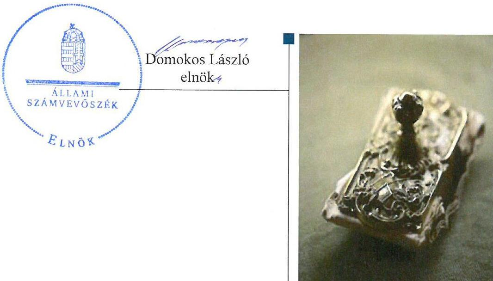
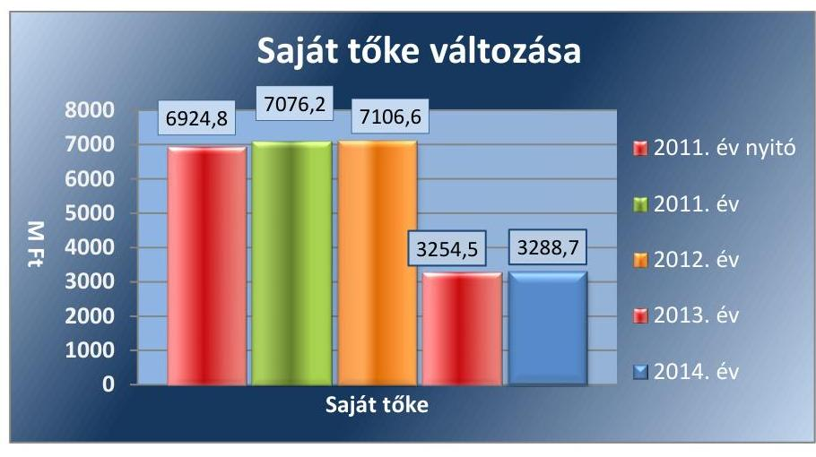
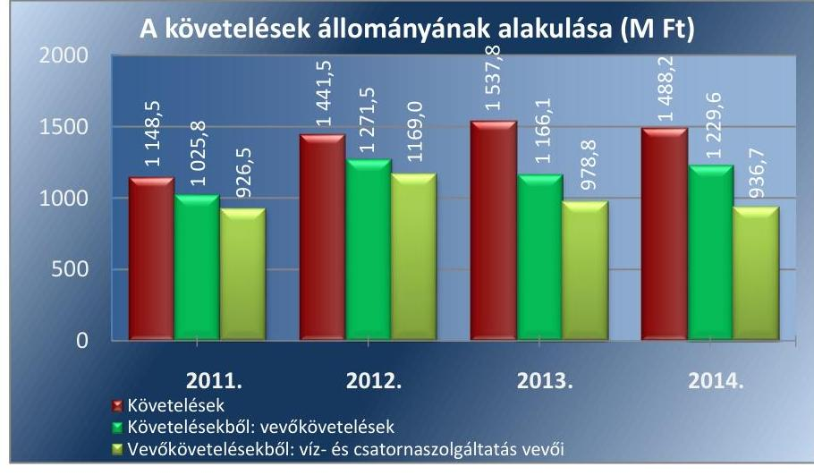
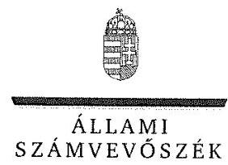
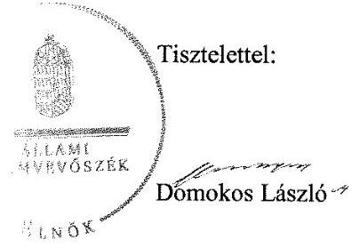
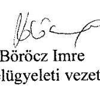
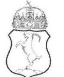
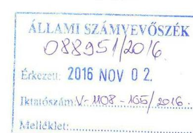
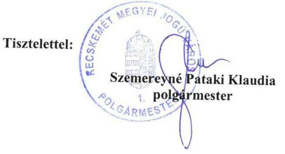

# Jelentés 

## Az önkormányzatok gazdasági társaságai

Az önkormányzatok többségi tulajdonában lévő gazdasági társaságok gazdálkodásának ellenőrzése - BÁCSVÍZ Víz- és
Csatornaszolgáltató Zrt.
2016.

---

# Jelentés 

## Az önkormányzatok gazdasági társaságai

Az önkormányzatok többségi tulajdonában lévő gazdasági társaságok gazdálkodásának ellenőrzése - BÁCSVÍZ Víz- és Csatornaszolgáltató Zrt.
2016. elecentér hó nap

---

# AZ ELLENŐRZÉST FELÜGYELTE:

- BÖRÖCZ IMRE felügyeleti vezető

- AZ ELLENŐRZÉST VEZETTE ÉS A VÉGREHAJTÁSÁÉRT FELELŐS:
  - DR. NAGY IMRE ellenőrzésvezető
  - A PROGRAM ÖSSZEÁLLÍTÁSÁÉRT FELELŐS:
    - JANIK JÓZSEF osztályvezető

- IKTATÓSZÁM: V-1108-111/2016.
- TÉMASZÁM: 2142
- ELLENŐRZÉS-AZONOSÍTÓ SZÁM: V070773

Jelentéseink az Országgyűlés számítógépes hálózatán és az Interneta a www.asz.hu címen is olvashatóak.

---

# TARTALOMJEGYZÉK 

■ ÖSSZEGZÉS ..... 5
■ AZ ELLENŐRZÉS CÉLJA ..... 6
■ AZ ELLENŐRZÉS TERÜLETE ..... 7
■ AZ ELLENŐRZÉS HÁTTERE, INDOKOLTSÁGA ..... 8
■ A JELENTÉS LÉNYEGES KÉRDÉSKÖREI ..... 9
■ ELLENŐRZÉS HATÓKÖRE ÉS MÓDSZEREI ..... 10
■ MEGÁLLAPÍTÁSOK ..... 12
■ JAVASLATOK ..... 23
■ MELLÉKLETEK ..... 25
I. Sz. melléklet: Értelmező szótár ..... 25
■ FÜGGELÉK: ÉSZREVÉTELEK ..... 29
■ RÖVIDÍTÉSEK JEGYZÉKE ..... 43

---

.

---

# ÖSSZEGZÉS 

Kecskemét Megyei Jogú Város Önkormányzata a víz- és csatornaszolgáltatáshoz kapcsolódó közfeladat ellátását szabályszerűen alakította ki, és tulajdonosi jogait a jogszabályoknak megfelelően gyakorolta. A BÁCSVÍZ Víz- és Csatornaszolgáltató Zrt. vagyongazdálkodása szabályszerű volt. A Társaságnál az ellátott közfeladattal összefüggő bevételek és ráfordítások elszámolása megfelelően történt, a Társaság önköltségszámitása és árképzése szabályszerű volt.

## Az ellenőrzés társadalmi indokoltsága

Az Állami Számvevőszék kiemelt célja, hogy a helyi önkormányzatok gazdálkodásában rejlő pénzügyi kockázatok feltárásával, az államháztartáson kívülre nyújtott költségvetési támogatások és ingyenes vagyonjuttatások, valamint az államháztartáson kívül múködő feladat-ellátó rendszerek ellenőrzéseivel hozzájáruljon ahhoz, hogy a közpénzeket az államháztartáson kívül múködő szervezetek is átlátható, rendezett módon használják fel.

A Magyarországon az intézmény-centrikus közfeladat-ellátás jellemző, de egyre jelentősebb a költségvetésen kívüli feladatellátás térnyerése. Ennek legfontosabb szereplői - a nonprofit szervezetek mellett - az önkormányzati tulajdonú gazdasági társaságok. Az önkormányzatok szervezetalakítási szabadságának következménye, hogy a korábban is vállalati formában múködő közszolgáltatások mellett, mind a kötelező, mind az önként vállalt feladatok ellátásában a gazdasági társaságok kiemelt fontosságú szerephez jutottak.

Minden közpénzt, közvagyont használó szervezettel szemben társadalmi igény, hogy a tevékenységükről elszámoljanak. Ezt figyelembe véve az Állami Számvevőszék Stratégiájával összhangban került sor a BÁCSVÍZ Víz- és Csatornaszolgáltató Zrt. 2011-2014. évekre kiterjedő ellenőrzésére.

## Főbb megállapítások, következtetések, javaslatok

Az Önkormányzat ${ }^{1}$ víz- és csatornaszolgáltatási közfeladat-ellátásának megszervezése szabályszerű volt. A tulajdonosi joggyakorlás rendjének kialakítása és végrehajtása megfelelte a jogszabályi előírásoknak.

A Társaság ${ }^{2}$ rendelkezett a múködéshez szükséges szabályzatokkal, amelyek a vagyonkezelt vagyonnal összefüggő rendelkezések hiányosságai mellett alapvetően megfeleltek a jogszabályi és belső előírásoknak. A Társaság vagyongazdálkodása, a vagyon nyilvántartása és hasznosítása a jogszabályi és belső előírásoknak megfelel. A belső ellenőrzés rendszerét kialakították. A Társaság beszámolási kötelezettségét a jogszabályi és belső előírásoknak megfelelően teljesítette. Az adatvédelem és az adatnyilvánosság tekintetében a Társaság alapvetően szabályszerűen járt el. A Társaság kötelezettségállománya, eladósodottságának mértéke és szerkezete nem jelentett kockázatot a közfeladat ellátására és a Társaság múködésére.

Az ellátott közfeladat bevételeinek, ráfordításainak, beruházásainak elszámolása megfelelő, az értékcsökkenés elszámolása részben megfelelő volt. A Társaságnál az önköltség-számítás szabályozása a jogszabályi előírásoknak megfelelte, az önköltség-számítása és az árképzése szabályszerű volt.

Az ÁSZ a Társaság elnök-vezérigazgatójának fogalmazott meg javaslatokat, amelyek alapján köteles intézkedési tervet összeállítani és azt a jelentés kézhezvételétől számított 30 napon belül az ÁSZ részére megküldeni.

---

# AZ ELLENŐRZÉS CÉLJA 

Az ellenőrzés célja annak értékelése, hogy az önkormányzat vagyongazdálkodási tevékenysége során szabályszerűen gyakorolta-e tulajdonosi jogait; a gazdasági társaság szabályozottsága, gazdálkodása és vagyongazdálkodási tevékenysége, bevételeinek és ráfordításainak elszámolása megfelelt-e a jogszabályi és tulajdonosi előírásoknak; a gazdasági társaság kötelezettségállománya jelentett-e kockázatot a múködésre, valamint a gazdálkodás átláthatósága és elszámoltathatósága érdekében biztosítva volte a szolgáltatás dijának megalapozottsága szabályszerű önköltségszámítással.

---

# **AZ ELLENŐRZÉS TERÜLETE**

## **Kecskemét Megyei Jogú Város Önkormányzata és a többségi tulajdonában lévő BÁCSVÍZ Víz- és Csatornaszolgáltató Zártkörűen Működő Részvénytársaság**

### **A KECSKEMÉT MEGYEI JOGÚ VÁROS ÖNKORMÁNYZATA** többségi tulajdonában lévő Társaságot 1950-ben alapították Észak-Bács-Kiskun Megyei Vízmű Vállalat néven, majd 1991. december 31-én alakult át víziközmű szolgáltató gazdasági társasággá. Az ellenőrzött időszakban a Társaság részvényeit az Önkormányzat mellett további 56 települési önkormányzat és a Magyar Állam birtokolta. Kecskemét Megyei Jogú Város Önkormányzatának többségi tulajdoni részesedése 55,6% volt.

A Társaság víziközmű-szolgáltatási (víz- és csatornaszolgáltatás) alaptevékenysége mellett csapadékvíz-elvezetési, települési folyékony hulladék begyűjtési és szállítási és nem közművel összegyűjtött háztartási szennyvíz begyűjtési közfeladatot látott el. A víz- és csatornaszolgáltatáson túl kiegészítő szolgáltatásokat – vízminőség-ellenőrzést, vízmérő- és szivattyújavítást, vízhálózat-vizsgálatot, csatornahálózat-vizsgálatot, térinformatikai adatszolgáltatást, műszaki tervezést, mélyépítést, szállítást és gépjármű-javítást – végzett.

A közfeladat ellátásához szükséges víziközműveket a 2011-2012. években használati szerződés, a 2013-2014. években bérleti-üzemeltetési szerződés keretében bocsátotta a Társaság rendelkezésére az Önkormányzat bérleti díj ellenében.

A Társaságnak nem volt más gazdasági társaságban tulajdonosi részesedése. Az ellenőrzött időszakban az elnök-vezérigazgató személyében változás nem történt. A 2011. évben 269,8 M Ft, a 2012. évben 269,8 M Ft összeg került kifizetésre osztalékként. Osztalék kifizetés 2013-ban és 2014-ben nem volt. A foglalkoztatottak száma 2011. évben 481 fő, 2012. évben 491 fő, 2013. évben 551 fő, 2014. évben 550 fő volt.

1. táblázat

### **A TÁRSASÁG FŐBB GAZDÁLKODÁSI ADATAINAK ALAKULÁSA A 2011-2014. ÉVEK KÖZÖTT (M FT)**

|   | 2011. | 2012. | 2013. | 2014.  |
| --- | --- | --- | --- | --- |
|  Mérleg főösszege | 10 775,5 | 11 135,2 | 9614,1 | 9689,3  |
|  Mérleg szerinti eredmény | 151,3 | 30,5 | -3852,1 | 41,5  |
|  Értékesítés nettó árbevétele | 5489,6 | 5912,8 | 6426,4 | 6641,3  |
|  Saját tőke | 7076,2 | 7106,6 | 3254,5 | 3288,7  |
|  - |  |  |  |   |
|  ebből jegyzett tőke | 4636,2 | 4636,2 | 4636,2 | 3100,0  |
|  Kötelezettségek | 1015,8 | 1247,8 | 4942,1 | 5229,5  |

*Forrás: A Társaság 2011-2014. évi beszámolói / A Társaság adatszolgáltatása*

Az Önkormányzat tekintetében 2013. évben a jegyző, 2014. évben a polgármester személye változott.

---

# AZ ELLENŐRZÉS HÁTTERE, INDOKOLTSÁGA 

Objektív kép kialakítása Kecskemét Megyei Jogú Város Önkormányzata által a víz- és csatornaszolgáltatási közfeladatának megszervezéséről, tulajdonosi joggyakorlásáról, a többségi tulajdonában lévő BÁCSVÍZ Víz- és Csatornaszolgáltató Zrt. közfeladat ellátását érintő gazdálkodási tevékenységének szabályszerűségéről.

AZ ÖNKORMÁNYZATI TULAJDONÚ GAZDASÁGI TÁRSASÁGOK ellenőrzése kiemelten fontos a vagyon megőrzése, megóvása érdekében, valamint a kormányzati szektor elszámolásaiban megjelenő önkormányzati tulajdonú gazdálkodó szervezetek esetében, amelyekkel szemben alapvető követelmény, hogy gazdálkodásuk, múködésük szabályszerű, az általuk szolgáltatott adatok minél megbízhatóbbak legyenek. A feladat/közfeladat-ellátás költségeinek, ráfordításainak alakulása, színvonala hatással van a lakosság elégedettségére.

A törvényalkotás számára - az észlelt problémák, szabálytalanságok, vagy egyéb nem kívánatos jelenségek felszínre kerülésével - az ellenőrzés megállapításai segítséget nyújthatnak az államháztartáson kívüli feladat/közfeladat-ellátás értékeléséhez, jogszabályi keretei pontosításához, átláthatóságot biztosító szabályozásához. Meghatározhatóvá válnak az önkormányzati feladatellátásban részt vevő államháztartáson kívüli szervezeteknek - az önkormányzat költségvetését, pénzügyi helyzetét is befolyásoló - kockázatai, lehetővé válik ezen kockázatok csökkentése. Ellenőrzéseink feltárhatják, hogy az önkormányzat feladat-ellátási kötelezettségének szabályszerűen tett-e eleget, a feladatellátáshoz rendelt vagyonkezelésbe vett és saját vagyon múködtetését az elvárható gondossággal, szabályszerűen szervezte-e meg és a tulajdonosi felügyelete hozzájárult-e a feladatellátásához. Az ellenőrzés rávilágíthat arra, hogy a gazdasági társaság a feladat-ellátási, közszolgáltatási szerződésben foglaltak betartásával, a vagyon használatával biztosította-e a szolgáltatás folytatásának feltételeit, a feladat ellátását. Ezzel az ellenőrzöttek és a helyi döntéshozók számára visszajelzést ad feladatszervezési, feladat-ellátási kockázataikról, alapot ad a meglévő hibák megszüntetéséhez, a jobb feladatellátás biztosításához. Fokozza a fegyelmet, igazolja, hogy lejárt a következmények nélküli ellenőrzések időszaka.

---

# A JELENTÉS LÉNYEGES KÉRDÉSKÖREI 

1. Az önkormányzat közfeladat megszervezéséről szóló döntése, valamint tulajdonosi joggyakorlása szabályszerű volt-e?
2. A gazdasági társaság vagyongazdálkodása szabályszerű volt-e, kötelezettségállománya jelentett-e kockázatot a müködésre, illetve közfeladat ellátására?
3. A gazdasági társaságnál az ellátott közfeladat bevételei és ráfordításai elszámolása, valamint az önköltségszámítás és árképzés szabályszerű volt-e?

---

# ELLENŐRZÉS HATÓKÖRE ÉS MÓDSZEREI 

## Az ellenőrzés típusa

Megfelelőségi ellenőrzés.

## Az ellenőrzött időszak

2011. január 1-jétől 2014. december 31-ig tart.

## Az ellenőrzés tárgya

A gazdasági társaság feletti tulajdonosi joggyakorlás, valamint a gazdasági társaság gazdálkodásának szabályozottsága és szabályszerűsége.

Az ellenőrzés kiterjed minden olyan körülményre és adatra, amely az ÁSZ ${ }^{3}$ jogszabályban meghatározott feladatainak teljesítéséhez, valamint a program végrehajtása folyamán felmerült újabb összefüggések feltárásához szükséges.

## Az ellenőrzött szervezet

Az ellenőrzött szervezetek:
— Kecskemét Megyei Jogú Város Önkormányzata,
— BÁCSVíZ Víz- és Csatornaszolgáltató Zrt.

## Az ellenőrzés jogalapja

Az ellenőrzés jogszabályi alapját az ÁSZ tv. ${ }^{4} 1$. § (3) bekezdése és 5. § (3)(4)-(5) bekezdései képezik.

## Az ellenőrzés módszerei

Az ellenőrzést a nemzetközi standardokat irányadónak tekintve az ellenőrzési program ellenőrzési kérdései, az ellenőrzött időszakban hatályos jogszabályok, az ellenőrzés szakmai szabályok és módszertanok figyelembevételével végeztük.

Az ellenőrzés ideje alatt az ellenőrzött szervezettel történő kapcsolattartást az ÁSZ Szervezeti és Müködési Szabályzatának vonatkozó előírásai alapján biztosítottuk.

---

Az ellenőrzés a kiválasztott, tulajdonosi jogokat gyakorló önkormányzatra, illetve az ellenőrzésre kijelölt gazdasági társaság felett tulajdonosi jogokat gyakorló szervezetre és az ellenőrzött gazdasági társaságra terjedt ki.

Az ellenőrzési kérdések megválaszolásához szükséges bizonyítékok megszerzése a következő ellenőrzési eljárások alkalmazásával történt: megfigyelés, kérdésfeltevés (információkérés), összehasonlítás, valamint elemző eljárás. Az ellenőrzési bizonyítékként felhasználható adatforrások közé tartoznak egyrészt a szakmai programban felsorolt adatforrások, másrészt adatforrás lehet még minden - az ellenőrzés folyamán - feltárt, az ellenőrzés szempontjából információkat tartalmazó dokumentum.

Az ellenőrzést a kérdésekre adott válaszok kiértékelésével, valamint a megjelölt adatforrások, a csatolt tanúsítványok felhasználásával, továbbá az adott időszakban hatályos jogszabályok figyelembevételével folytattuk le.

A bevételek és ráfordítások elszámolása, valamint a vagyonnyilvántartás terén a szabályszerű múködést véletlen mintavétellel ellenőriztük. A ráfordítások elszámolására és a vagyonnyilvántartásra vonatkozó véletlen mintavételt kockázati alapú kiválasztással egészítettük ki, amelynek során évente a három legnagyobb összegű tételt választottuk ki. A mintavétellel ellenőrzött területek esetében minden egyes tétel vonatkozásában a szabályszerűségre vonatkozó kérdéseket tettünk fel, amelyek eredménye öszszesítésre került. A jogszabályoknak és a belső előírásoknak megfelelőnek tekintettük az adott területet, amennyiben a minta ellenőrzésének eredménye alapján 95\%-os bizonyossággal a teljes sokaságban a hibaarány kisebb volt, mint 10\%, nem megfelelőnek, ha a hibaarány a 10\%-ot meghaladta. Részben megfelelő minősítést adtunk, amennyiben egy adott terület vonatkozásában a minta alapján a teljes sokaságban nem volt egyértelműen biztosított a jogszabályoknak és a belső szabályzatoknak megfelelő működés.

---

# 1. Az önkormányzat közfeladat megszervezéséről szóló döntése, valamint tulajdonosi joggyakorlása szabályszerű volt-e? 

Összegző megállapítás

Az Önkormányzat a víz- és csatornaszolgáltatási közfeladat-ellátást és a tulajdonosi jogok gyakorlásának rendjét szabályszerűen szervezte meg, a tulajdonosi jogok gyakorlása megfelelt a jogszabályi előírásoknak.
1.1. számú megállapítás

Az Önkormányzat víz- és csatornaszolgáltatási közfeladat-ellátásának megszervezése szabályszerű volt.

Gazdasági programmal az Önkormányzat az Ötv. ${ }^{5}$ 91. § (1) bekezdése, 2013. január 1-jétől az Mötv. ${ }^{6}$ 116. § (1) bekezdése rendelkezéseinek megfelelően rendelkezett. A Gazdasági program ${ }^{7}$ szerint a kecskeméti szennyvízkezelési tevékenység ellátása mellett kiemelt feladatot jelent a Társaság részvételével a dél-alföldi ivóvíz minőség javító program céljainak megvalósítása.

Az Nvtv. ${ }^{8}$ 9. § (1) bekezdése 2012. január 1-jétől előírta közép- és hosszú távú vagyongazdálkodási terv készítését, az Önkormányzat a kötelezettségének azonban csak 2013. évtől tett eleget. A Vagyongazdálkodási terv ${ }^{9}$ szerint a kizárólagos és többségi önkormányzati tulajdonban álló gazdasági társaságok működését és vagyongazdálkodását kiemelt figyelemmel kell kísérni a társaságok rendelkezésére bocsátott önkormányzati vagyon értékének megőrzése, növelése, eredményesebb működtetése érdekében.

Az Önkormányzat közgyűlése ${ }^{10}$ a 2007-2012. évekre, és a 2014-2019. évekre vonatkozó Környezetvédelmi Programot határozatban elfogadta. A Környezetvédelmi program meghatározta a víz- és csatornagazdálkodással kapcsolatos környezetvédelmi stratégiai célokat.

Az Önkormányzat a víz- és csatornaszolgáltatás árainak hatósági megállapításáról rendelkező, valamint a nem közművel összegyűjtött háztartási szennyvíz begyűjtésére vonatkozó közszolgáltatás helyi szabályairól szóló önkormányzati rendeletekkel eleget tett a vízgazdálkodásról szóló 1995. évi LVII. törvény 44/C. § (2) bekezdésében és 45. § (6) bekezdésében előírt rendeletalkotási kötelezettségének. Az elfogadott rendeleteket a jogszabályi változásoknak megfelelően módosították.

Az Önkormányzat a Társasággal a 2011-2012. években megkötött használati, majd a 2013-2014. években létrejött bérleti-üzemeltetési szerződésekben meghatározta a közfeladat ellátásához szükséges, a Társaság rendelkezésére bocsátott vagyon körét.

Az Önkormányzat évente előírta üzleti terv készítését. A Társaság az Önkormányzat által meghatározott tartalmi és formai követelményeknek megfelelően elkészítette az üzleti terveket.

---

# 1.2. számú megállapítás 

A tulajdonosi joggyakorlás rendjének kialakítása és végrehajtása
megfelelt a jogszabályi előírásoknak.

A tulajdonosi joggyakorlás rendjét az Önkormányzat közgyűlése az Önkormányzat SZMSZ-ében, valamint a Vagyonrendeletben ${ }_{1,2}{ }^{11}$ szabályozta. A Vagyonrendelet ${ }_{1,2}$ - a jogszabályban meghatározottakon túl - előírta a gazdasági társaságok részére, hogy az éves beszámoló mellett félévenkénti beszámolót is készítsenek. A Vagyonrendelet ${ }_{1,2}$ szerint a nem kizárólag az Önkormányzat tulajdonában lévő gazdasági társaságok legfőbb szervének ülésén az Önkormányzatot a polgármester képviseli.

Az Alapszabály ${ }^{12}$ szabályozta a Társasági közgyűlésben, és Felügyelő bizottságban való képviseletre kijelölt személyek képviselettel összefüggő feladatait, beszámolási kötelezettségét.

A Felügyelő bizottság a Gt. ${ }^{13}$ 34. § (1) bekezdésében, valamint a Ptk. ${ }^{14}$ 3:121. § (1) bekezdésében előírtakat figyelembe véve három tagból állt.

A független könyvvizsgálói jelentések a féléves és az éves beszámolókról elkészültek. A Társasági közgyűlés megismerte a könyvvizsgálói jelentésben foglaltakat.

A Társaság éves beszámolóját az Önkormányzat KVB.-a ${ }^{15}$ és VPB.-a ${ }^{16}$ megtárgyalta és javasolta a Társasági közgyűlésnek elfogadásra. A Társasági közgyűlés a beszámolókat elfogadta.

Az Önkormányzat belső ellenőrzése a Társasággal kapcsolatban a 20112013. évben nem folytatott le vizsgálatot. A 2014. évben az Önkormányzat belső ellenőrzése vizsgálta a Társaság gazdálkodási rendszerét és közfeladat ellátását a 2012-2014. közötti időszak vonatkozásában. Az ellenőrzés számviteli és árképzési szabályozási hiányosságokat állapított meg, amelyekre a Társaság intézkedési tervet készített. Az intézkedési tervet az Önkormányzat elfogadta.

## 2. A gazdasági társaság vagyongazdálkodása szabályszerű volt-e, kötelezettségállománya jelentett-e kockázatot a múködésre, illetve közfeladat ellátására?

Összegző megállapítás

### 2.1. számú megállapítás

A Társaság vagyongazdálkodása alapvetően megfelelt a jogszabályi és belső előírásoknak, kötelezettségállománya és eladósodottsága nem jelentett kockázatot a Társaság múködésére és a közfeladat ellátásra.

A Társaság rendelkezett a múködéshez szükséges szabályzatokkal, amelyek a vagyonkezelt vagyon elkülönített nyilvántartására vonatkozó rendelkezések hiányosságai mellett megfeleltek a jogszabályi és belső előírásoknak.

A Társaság az ellenőrzött időszakban rendelkezett a Számv. tv. ${ }^{17}$ 14. § (3) bekezdésben előírtaknak megfelelően Számviteli politikával ${ }^{18}$, és a Számv. tv. 14. § (5) bekezdés a)-d) pontjai előírásának megfelelően Pénzkezelési szabályzattal ${ }^{19}$, Értékelési szabályzattal ${ }^{20}$, Leltározási szabályzat$\mathrm{tal}^{21}$, valamint Önköltség-számítási szabályzattal ${ }^{22}$.

---

A SZÁMVITELI POLITIKA a Számv. tv. 14. § (4) bekezdésében foglaltak szerint került kialakításra, aktualizálására a Számv. tv. 14. § (11) bekezdésének megfelelően került sor. A Számviteli politika 2013. évi módosításával a Vksztv. ${ }^{23}$ 49. §-ában előírtakkal összhangban szabályozták a víziközmű-szolgáltatási ágazati tevékenységek elkülönített bemutatását önálló mérleg és eredménykimutatás készítésével.

A PÉNZKEZELÉSI SZABÁLYZAT a Számv. tv. 14. § (8) bekezdésével összhangban tartalmazta a pénzforgalom készpénzben, illetve bankszámlán történő lebonyolításának rendjét, a pénzkezelés személyi és tárgyi feltételeit, a felelősség szabályait, a készpénzben és a bankszámlán tartott pénzeszközök közötti forgalmat, a készpénzállományt érintő pénzmozgások jogcímeit és eljárási rendjét, a napi készpénz záró állomány maximális mértékét, a készpénzállomány ellenőrzésekor követendő eljárást, az ellenőrzés gyakoriságát, a pénzszállítás feltételeit, a pénzkezeléssel kapcsolatos bizonylatok rendjét és a pénzforgalommal kapcsolatos nyilvántartási szabályokat.

AZ ÉRTÉKELÉSI SZABÁLYZAT a Számv. tv. előírásaival összhangban biztosította a vagyon értékének meghatározását, a mérlegtételek értékelésére, a bekerülési érték meghatározására vonatkozó szabályokat. Az értékvesztés elszámolásáról a Társaság a Számviteli politikában rendelkezett.

A LELTÁROZÁSI SZABÁLYZAT a leltározás gyakoriságára vonatkozó előírást a Számv. tv. 69. § (3) bekezdésének megfelelően tartalmazta. A Leltározási szabályzat rendelkezett a vagyonkezelésre, valamint az üzemeltetésre átvett vagyon elkülönített leltározásáról, és a tulajdonossal történő leltáregyeztetésről.

# AZ ÖNKÖLTSÉG-SZÁMÍTÁSI SZABÁLYZATOT a 

Számv. tv. 14. § (5) bekezdés c) pont előírása alapján a Társaság elkészítette, mely tartalmazta a költségtényezők tagolását, a költségelszámolás menetét, a költségfelosztás módját.

A SZÉTVÁLASZTÁSI SZABÁLYZATBAN ${ }^{24}$ a Vksztv. 49. § (2)-(3) és (5) bekezdésének elkülönített nyilvántartás vezetésre, éves beszámolóra vonatkozó előírásait rögzítették a Számv. tv.-ben, a Számviteli politikában és az Önköltség-számítási szabályzatban megfogalmazottakkal összhangban. A számviteli szétválasztás részletszabályainak meghatározásával biztosították mérlegsoronként az ellátott közfeladat tevékenységenkénti bevételeinek és ráfordításainak elkülönített nyilvántartását.

A SZÁMLARENDET ${ }_{1,2}{ }^{25}$ a Társaság a Számv. tv. 161. § (1) bekezdésében előírtaknak megfelelően a Számv. tv. 161. § (2) bekezdés a)-c) pontok szerinti tartalommal elkészítette. A Számlarendet ${ }_{1,2}$ alátámasztó Bizonylati rendet ${ }^{26}$ a Társaság önálló szabályzatban állapította meg.

A Társaság a Számv. tv. 161/A. § (1) bekezdésében előírtaknak nem tett eleget, mivel a könyvvezetésre, bizonylatolásra vonatkozó részletes belső szabályait nem úgy alakította ki, hogy az alkalmas legyen a kiegészítő mel-

---

# Megállapítások 

lékletben - a Számv. tv. 88. § (1) bekezdése alapján - feltüntetendő, vagyonkezeléssel összefüggő, a Mötv. 109. § (7) bekezdésének végrehajtását szolgáló adatainak közvetlen alátámasztására.

A JAVADALMAZÁSI SZABÁLYZATOT ${ }^{27}$ a Taktv. ${ }^{28}$ 5. § (3) bekezdésében foglaltak szerint a Társasági közgyűlés ${ }^{29}$ megalkotta. A Javadalmazási szabályzat a Taktv.-ben foglaltak szerint tartalmazta a Társaság vezető tisztségviselőinek, vezető állású munkavállalóinak, valamint a felügyelőbizottsági tagoknak a javadalmazására, valamint a jogviszony megszűnése esetére biztosított juttatások módjára és mértékére vonatkozó szabályokat.

## A Társaság vagyongazdálkodása, a vagyon nyilvántartása és hasznosítása a jogszabályi és belső előírásoknak megfelelt. A belső ellenőrzés rendszerét kialakították.

A Társaság vagyonnyilvántartása mind a saját, mind a kisebbségi tulajdonos önkormányzatoktól származó, üzemeltetésre vagy vagyonkezelésre, illetve az Önkormányzattól üzemeltetésre átvett víziközmű vagyon tekintetében átlátható, naprakész, a Számv. tv., a Vksztv. és a belső szabályzatok előírásainak megfelelő volt. Az Önkormányzattól az ellenőrzött időszakban vagyonkezelésbe nem vett át vagyont, az üzemeltetésre átvett eszközöket a Számv. tv. 160. § (5) bekezdésében meghatározott mérlegen kívüli tételként nyilvántartásba vette.

A leltározást a Számv. tv. 69. § (3) bekezdésében foglaltaknak, és a Leltározási szabályzat előírásainak megfelelően a Társaság elvégezte. A beszámolókban és a számviteli nyilvántartásokban lévő mérlegtételek értékét szabályszerűen elkészített leltárral támasztotta alá.

Az eszközérték az ellenőrzött időszakban összességében 7,3\%-kal csökkent. A befektetett eszközökön belül a tárgyi eszközök értéke 13,7\%-kal csökkent elsősorban annak következtében, hogy a 2013. évben a térítés nélkül a kisebbségi tulajdonos önkormányzatok részére átháramoltatott vagyon egy részét a Társaság üzemeltetésre kapta vissza.

A Társaság saját vagyonát nem terhelte meg, az üzemeltetett eszközök, illetve a vagyonkezelt vagyon elidegenítésére, megterhelésére nem került sor a 2011-2014. években. A saját vagyonából minden ellenőrzött évben sor került - tárgyi eszköz, immateriális eszköz - értékesítésre, melyhez nem volt szükség a Közgyűlés illetve az Igazgatóság hozzájárulására, mivel az Alapszabályban és az SZMSZ-ben előírt összeget nem érte el egyik esetben sem az értékesítés szerződés szerinti összege.

A saját tőke állománya az ellenőrzött időszak első két évében növekedett, de 2013. évben a saját tőke a jegyzett tőke törvényben meghatározott szintje alá csökkent. Ennek oka, hogy a Társaság tulajdonában lévő víziközművek a 2011. évi CCIX. törvény 79. § (1) bekezdésében foglaltak alapján 2013. január 1. napjával térítésmentesen a tulajdonos önkormányzatok tulajdonába kerültek. Ez a Társaságnál veszteségként jelentkezett, amelynek következtében a Társaság 2013. évi mérleg szerinti eredménye -3 852,1 M Ft lett. A 2014. évben a veszteség rendezésére a Társasági közgyűlés határozatával a jegyzett tőkét leszállították, a Gt. 269. § (1) bekezdésének és a Ptk. 3:310. § (1) bekezdésének megfelelően a Társaság tulajdonában lévő saját részvényeket vontak be. A veszteség rendezése során

---

betartották a jogszabályi előírásokat. A 2014. évben a mérleg szerinti eredmény ismét pozitív volt. A saját tőke változását a 1. ábra szemlélteti.
1. ábra

A Társaság elnök-vezérigazgatója kialakította az operatív tevékenységektől független belső ellenőrzést.
2.3. számú megállapítás

A Társaság kötelezettségállománya, eladósodottságának mértéke és szerkezete nem jelentett kockázatot a közfeladat ellátására és a Társaság múködésére.

A KÖTELEZETTSÉGEKET az ellenőrzött időszak első két évében a rövid lejáratú kötelezettségek tették ki, melynek állományát elsősorban a szállítók felé fennálló tartozások összegének változása befolyásolta. A Vksztv. 79. § előírásai szerint átháramoltatott víziközmű vagyon egy részének vagyonkezelésbe történő visszavételével a 2013-2014. években hosszú lejáratú kötelezettsége keletkezett a Társaságnak. A Társaság öszszesen 5 759,7 M Ft értékű víziközmű vagyont adott át a tulajdonos önkormányzatoknak, a vagyon egy részét a víziközmű szolgáltatás további ellátása érdekében vagyonkezelésre kapta vissza a Társaság a 2013. évben, összesen 4 461,6 M Ft értékben. A vagyonkezelt vagyont a Számv. tv. 42. § (5) bekezdés előírásának megfelelően egyéb hosszú lejáratú kötelezettségként mutatta ki.

A Társaság a szerződésen és jogszabályon alapuló rövid lejáratú kötelezettségeit határidőben teljesítette.

AZ ELADÓSODOTTSÁG mértéke a 2013-2014. években megnövekedett. A Társaság eladósodottságát jellemző mutatók alakulását a 2. táblázat szemlélteti.

---

| ELADÓSODOTTSÁGI MUTATÓK ALAKULÁSA (ARÁNY) |  |  |  |  |
| :--: | :--: | :--: | :--: | :--: |
| Mutató megnevezése | 2011. | 2012. | 2013. | 2014. |
| Eladósodottsági mutató (idegen tőke/összes for-   rás) | 0,09 | 0,11 | 0,51 | 0,54 |
| Eladósodottság mértéke (kötelezettségek/saját   tőke) | 0,14 | 0,18 | 1,52 | 1,59 |
| Nettó eladósodottság (kötelezettségek-követel-   lések/saját tőke) | $-0,02$ | $-0,03$ | 1,05 | 1,14 |
| Adósságfedezeti mutató I. (befektetett eszkö-   zök+forgóeszközök/idegen forrás) | 10,51 | 8,83 | 1,94 | 1,85 |
| Adósságfedezeti mutató II. (működési cash   flow/hosszú lejáratú kötelezettségek) | - | - | 0,10 | 0,23 |
| Árbevételre vetített eladósodottság (kötelezettségek-forgóeszközök/ért. nettó árbevétele) | $-0,22$ | $-0,19$ | 0,38 | 0,39 |

Forrás: A Társaság 2011-2014. évi beszámolói, Társaság adatszolgáltatása

Az eladósodottság mértékének növekedése alapvetően annak a következménye, hogy 2013-ban az önkormányzatok részére átháramoltatott víziközmű vagyon egy részét az önkormányzatok társasági vagyonkezelésbe adták. A hosszú lejáratú kötelezettségként kimutatott vagyonkezelt eszközök nem jelentettek valós pénzügyi terhet a működésben és gazdálkodásban, mivel fizetési kötelezettséggel nem járt, törlesztő részletei, kamatai nem voltak. Azonban nagymértékben befolyásolták a Társaság 20112012. években kedvező értéket mutató eladósodottsági mutatóinak alakulását az ellenőrzött időszak utolsó két évében. A mutatók értékének 20132014. évi változása ellenére az eladósodottság mértéke, szerkezete nem jelentett kockázatot a Társaság müködésére, a közfeladat ellátására.
2.4. számú megállapítás

A Társaság beszámolási kötelezettségét a jogszabályi és belső előírásoknak megfelelően teljesítette. Az adatvédelem, adatnyilvánosság tekintetében a Társaság alapvetően szabályszerűen járt el.

A Társaság beszámolási, adatszolgáltatási kötelezettségét az Alapszabály, az SZMSZ, a Számviteli politika, valamint a Vagyonrendelet ${ }_{1,2}$ szabályozta. A 2014. évben önálló Adatszolgáltatási szabályzatban ${ }^{30}$ rögzítette adatszolgáltatási kötelezettségeit. A Társaság az üzleti terveket, az éves számviteli beszámolókat és a pénzügyi múködésről szóló féléves beszámolókat az előírások szerint elkészítette, és a Társasági közgyűlés jóváhagyta.

AZ ÉVES BESZÁMOLÓKAT a Társaság a 2011-2014. évekre vonatkozóan a Számv. tv. 17-19. § előírásainak megfelelően készítette el. A Vksztv. 49. § (3) és (5) bekezdéseivel összhangban a kiegészítő melléklet tartalmazta az egyes víziközmű-szolgáltatási ágazati tevékenységeket oly módon, mintha azokat önálló vállalkozások keretében végezték volna.

A beszámolókat a Társasági közgyűlés a Gt. 231. § (2) bekezdés e) pontja, a Ptk. 3:109. § (2) bekezdése alapján jóváhagyta. A Társasági közgyűlés a Gt. 35. § (3) bekezdés és a Ptk. 3:120. § (2) bekezdés előírásainak megfelelően a Felügyelő bizottság írásos véleményének és a könyvvizsgáló korlátozás nélküli hitelesítő záradékkal ellátott jelentésének birtokában határozott. Az éves beszámolókat a Számv. tv. 153. § (1) bekezdésben, és a 154. § (1) bekezdésben foglaltakat betartva letétbe helyezték és közzétették.

---

A KÖNYVVIZSGÁLÓ a Gt. 44. § (1) bekezdésében, illetve a Ptk. 3:131. § (2) bekezdésében foglaltaknak megfelelően az éves beszámolót tárgyaló Társasági közgyűlésen részt vett. A 2013-2014. évekre vonatkozó jelentésében a Vksztv. 49. § (4) bekezdésében előírtak alapján igazolta, hogy a Társaság által kidolgozott és alkalmazott számviteli szétválasztási szabályok biztosítják a víziközmű-szolgáltató üzletágai közötti keresztfinan-szírozás-mentességet a Vksztv. 49. §, valamint a Vksz. rendelet ${ }^{31}$ 91-94. § előírásainak megfelelően. A könyvvizsgáló figyelemfelhívással nem élt, nem kezdeményezte a Társasági közgyűlés összehívását, vagyongazdálkodást érintő javaslatot, észrevételt nem tett.

AZ ADATOK VÉDELME, NYILVÁNOSSÁGA az ellenőrzött időszakban biztosított volt a Társaságnál. Az Avtv. ${ }^{32}$ 31/A. § (3) bekezdésének és az Info tv. ${ }^{33} 24$. § (3) bekezdésének megfelelően rendelkezett az adatvédelmi felelős által elkészített adatvédelmi és adatbiztonsági szabályzattal ${ }^{34}$. Az adatvédelmi felelős az Avtv. 31/A. § (2) bekezdés e) pontjában, valamint az Info tv. 24. § (2) bekezdés e) pontjában előírtaknak megfelelően vezette a belső adatvédelmi nyilvántartást.

A Társaság a közérdekú adatok megismerésére irányuló igények teljesítésének rendjét rögzítő szabályzatot a 2011-2014. években az Avtv. 20. § (8) bekezdésében, valamint az Info tv. 30. § (6) bekezdésében foglaltak ellenére nem készített.

Az ellenőrzött években az Eisztv. ${ }^{35}$ 6. § (1) bekezdésében, és az Info tv. 37. § (1) bekezdésében meghatározott közzétételi kötelezettségének eleget tett.

# 3. A gazdasági társaságnál az ellátott közfeladat bevételei és ráfordításai elszámolása, valamint az önköltségszámítás és árképzés szabályszerű volt-e? 

Összegző megállapítás

### 3.1. számú megállapítás

A Társaságnál az ellátott közfeladat bevételeinek és ráfordításainak elszámolása alapvetően megfelelően történt, az önköltségszámítás és az árképzés szabályszerű volt.

Az ellátott közfeladat bevételeinek, ráfordításainak és beruházásainak elszámolása megfelelő volt, az értékcsökkenés elszámolása részben megfelelően történt.

A közfeladat ellátásához szükséges víziközműveket az Önkormányzat bérleti díj ellenében bocsátotta a Társaság rendelkezésére. A bérleti díjról minden évben számlát állítottak ki, melyek értéke megfelelt a vonatkozó szerződésben foglaltaknak. A számlák rendezése minden esetben megvalósult.

A Társaság meghatározta a közfeladatok bevételeinek és ráfordításainak a többi feladattól történő egyértelmú elhatárolásához szükséges előírásokat. A bevételek esetében a teljes ellenőrzött időszakra vonatkozóan a Számlarend ${ }_{1,2}$ tartalmazta a közfeladataihoz, illetve egyéb tevékenységeihez kapcsolódó bevételeinek elkülönítését. Költségei tekintetében az Önköltségszámítási szabályzatában ${ }_{1,2}{ }^{36}$ rögzítette a tevékenységenkénti el-

---

különítést, a költségek gyűjtésére, elemzésére és elszámolására SAP ${ }^{37}$ rendszerében kontrolling objektumokat alkalmazott. A 2013-2014. években a Vksztv. 49. § (2) bekezdése és a Vksz. rendelet 91. §-ának előírásai határozták meg a tevékenységenkénti bevételek és ráfordítások elkülönített nyilvántartási kötelezettségét. Ennek megfelelve a Szétválasztási szabályzatban határozták meg az ellátott feladatok bevételei és ráfordításai elkülönített nyilvántartásának részletszabályait.

AZ ANYAGJELLEGŰ RÁFORDÍTÁSOK elszámolása megfelelő volt. A ráfordításokat elkülönítetten, a megfelelő főkönyvi számlára számolták el, és rendelkezésre állt az elszámolást alátámasztó számviteli bizonylat.

# AZ ÉRTÉKESÍTÉS NETTÓ ÁRBEVÉTELÉNEK ELSZÁMOLÁSA megfelelő volt. A bevételek kiszámlázása a belső szabályozásnak megfelelően történt, a bevételeket elkülönítetten számolták el és a tulajdonosi követelményeknek, jogszabályi előírásoknak megfelelő árat alkalmazták. 

A BERUHÁZÁSOK, FELÚJÍTÁSOK elszámolása megfelelő volt. Az üzembe helyezés megtörtént, a besorolás és a bekerülési érték meghatározása szabályszerű volt, az eszközök a tárgyévi leltárban megtalálhatóak voltak.

## AZ ÉRTÉKCSÖKKENÉSI LEÍRÁS ELSZÁMOLÁSA

részben megfelelő volt, mivel egyes kis értékű tárgyi eszközök értékcsökkenésének számítását nem az üzembe helyezés időpontjában, hanem később kezdték meg, így az értékcsökkenés elszámolása nem felelt meg a Számviteli politika 5.2.15. pontjában foglaltaknak.

Az értékcsökkenési leírás elszámolásának módszere, gyakorisága, öszszege és a terven felüli értékcsökkenés adatai az éves beszámolók kiegészítő mellékletében bemutatásra kerültek.

## AZ ELSZÁMOLT AMORTIZÁCIÓNAK MEGFELELŐ MÉRTÉKŰ VISSZAPÓTLÁSI kötelezettsége a Társaságnak a

kisebbségi tulajdonos önkormányzatoktól származó vagyonkezelt vagyonra vonatkozóan 2013. évtől állt fenn. A 2013-2014. években a vagyonkezelésbe vett eszközök tárgyévi felújítási, beruházási értéke elmaradt az értékcsökkenés értékétől: 2013-ban az elszámolt értékcsökkenés 136,2 M Ft, a pótlásra fordított összeg 49,5 M Ft, 2014-ben az elszámolt értékcsökkenés 138,1 M Ft, a pótlásra fordított összeg 62,5 M Ft volt. A visszapótlási kötelezettség teljesítése érdekében azonban tartalékot képeztek, ezzel eleget tettek az Mötv. 109. § (6) bekezdésében foglaltaknak és a vagyonkezelői szerződések előírásainak.

Saját vagyona tekintetében - a 2013. év kivételével - az elszámolt értékcsökkenés összegénél magasabb volt az eszközvisszapótlás összege. A pótlásra elszámolt költség 2014. évben 2011-hez viszonyítva csökkent. A 3. táblázat az értékcsökkenés és eszközpótlás alakulását mutatja be.

---

3. táblázat

SAJÁT VAGYONRA VONATKOZÓ ÉRTÉKCSÖKKENÉS ÉS ESZKÖZPÓTLÁS (M Ft)

| Tárgyi eszközök | 2011. | 2012. | 2013. | 2014. |
| :-- | :--: | :--: | :--: | :--: |
| elszámolt értékcsökkenése | 542,9 | 583,4 | 408,1 | 383,5 |
| eszközök pótlására fordított összeg | 982,6 | 756,0 | 203,0 | 448,1 |

A saját eszközök pótlása a Társaság működésére legjellemzőbb három eszközcsoportban a használhatósági fok és az átlagos életkor mutatókkal került minősítésre, melyet a 4. táblázat mutat be.
4. táblázat

TÁRGYI ESZKÖZÖK HASZNÁLHATÓSÁGI FOKA (\%) ÉS ÁTLAGOS ÉLETKORA (ÉV)

| Tárgyi eszköz | Mutató | 2011. | 2012. | 2013. | 2014. |
| :--: | :--: | :--: | :--: | :--: | :--: |
| 1. Ingatlanok és a kapcsolódó vagyoni értékú jogok | használhatósági fok (\%) | 67,0 | 65,7 | 63,8 | 61,9 |
|  | átlagos életkor (év) | 12,9 | 13,4 | 14,2 | 15,0 |
| 2. Müszaki berendezések, gépek, jármúvek | használhatósági fok (\%) | 28,5 | 29,3 | 28,6 | 27,0 |
|  | átlagos életkor (év) | 5,7 | 5,6 | 5,8 | 5,9 |
| 3. Egyéb berendezések, felszerelések, jármúvek | használhatósági fok (\%) | 21,1 | 26,5 | 22,1 | 19,4 |
|  | átlagos életkor (év) | 2,7 | 2,6 | 2,8 | 2,8 |

Forrás: a Társaság 2011-2014. beszámolói
Az ellenőrzött időszak elejéhez viszonyítva a tárgyi eszközök használhatósági foka csökkent, az átlagos életkora emelkedett. 2013-tól a Vksztv. előírásai jelentősen befolyásolták a vagyon szerkezetét: a saját vagyon aránya lecsökkent, megjelentek a vagyonkezelt eszközök és maradtak továbbra is üzemeltetésre átvett eszközök. A 2014. évi értékcsökkenést meghaladó mértékű eszközvisszapótlás nem kompenzálta a 2013. évi értékcsökkenés összege alatt megvalósult pótlást.

A KÖVETELÉSÁLLOMÁNY, a vevőkövetelések, valamint a vízés csatornaszolgáltatás vevőállomány 2011-2014. évek közötti alakulását a 2. ábra mutatja.
2. ábra

Forrás: A Társaság 2011-2014. évi mérlegei, fökönyvi kivonatai

---

A követelésállomány, és ezen belül a víz-és csatornaszolgáltatás vevőállománya 2014-ben 2011. évhez képest növekedett, de 2013-hoz viszonyítva csökkent.

A DÍJHÁTRALÉK BEHAJTÁSÁNAK részleteit a Közműrendelet ${ }^{38} 9$. §-a, majd a Vksztv. 58. §-a és a Vksz. rendelet 72. §-a szabályozta. A Társaság a hátralékos követelések nyilvántartásának és behajtásának szabályait elnök-vezérigazgatói utasításokban határozta meg, majd a 2013ban hatályba lépő Üzletszabályzatában ${ }^{39}$ foglalta írásba a betartandó szabályokat.

A belső szabályozásnak megfelelően végezték a követelések behajtását, és naprakész nyilvántartással rendelkeztek a behajtás alatt lévő hátralékosokról. A Társaság követelésállománya az ellenőrzött időszak alatt összességében növekedett, annak csökkentése érdekében intézkedtek. A megtett intézkedéseket és az azokhoz kapcsolódó összegeket az 5. számú táblázat szemlélteti.
5. táblázat

HÁTRALÉKKEZELÉS SORÁN TETT INTÉZKEDÉSEK ÉS AZOK ÖSSZEGE (EZER FT)

| Intézkedés megnevezése | 2011. | 2012. | 2013. | 2014. |
| :--: | :--: | :--: | :--: | :--: |
| Kibocsátott fizetési felszólítások, korlátozási értesítők | 1393869 | 787951 | 2373386 | 2156448 |
| Részletfizetési megállapodások | 140314 | 118515 | 139379 | 117206 |
| Adósságkezelési, lakhatási támogatásban részesülők | 12382 | 15880 | 22121 | 18414 |
| Fizetési haladékok | 134431 | 57832 | 8546 | 4784 |
| Mellékszolgáltatási szerződés felmondás | 8442 | 2003 | 7962 | 6466 |
| Személyes beszedés | 0 | 6041 | 59538 | 106146 |
| Kizárás, korlátozó intézkedések | 18994 | 15346 | 21382 | 1034 |
| Jogi útra terelt ügyek | 128254 | 122787 | 96760 | 116080 |

3.2. számú megállapítás

A Társaságnál az önköltség-számítás szabályozása a jogszabályi előírásoknak megfelelt, az önköltség-számítása és az árképzése szabályszerű volt.

ÖNKÖLTSÉG SZÁMÍTÁSÁRA VONATKOZÓ SZABÁLYZAT elkészítését a Társaság számára a Számv. tv. 14. § (5) bekezdése kötelezően előírta, mellyel az ellenőrzött időszak alatt rendelkezett. Az Önköltség-számítási szabályzatok tartalmazták a Vksztv. 49.§ (2), valamint a Vksz. rendelet 91. § (4) bekezdés előírása szerinti ráfordítások elkülönített nyilvántartási kötelezettségének alapjait, a költségtényezőket és

---

azok részletes tartalmát, a vetítési alapokat. Meghatározták a kalkulációs módszerek leírását és az utókalkuláció tartalmát.

Az utókalkulációkban felsorolt költségelemek megegyeztek az Önkölt-ség-számítási szabályzatban feltüntetett költségtényezőkkel, megfeleltek a Vksztv. 49. § (2), valamint a Vksz. rendelet 91. § bekezdésében foglaltaknak. A számítás módja megfelelt az Önklötség-számítási szabályzat előírásainak.

A szolgáltatási dí alapdíjból és fogyasztással arányos díjból állt. Az ivó-víz- és a szennyvízcsatorna-szolgáltatás díja hatóságilag megállapított, maximált ár volt. Az árhatósági jogkört 2011. december 31-ig a települési önkormányzatok képviselő-testületei gyakorolták, a Társaság az önkormányzati rendeletalkotás alapján meghatározott szolgáltatási díjakat alkalmazta. Ezek a díjak a Társaságnak a díjképzés alapelvét tartalmazó Árszabályzata ${ }^{41}$ alapján kerültek megállapításra.
2012. január elsejétől a víziközmű-szolgáltató a Vksztv. 76. § (1) bekezdés b) pontja szerint a 2011. december 31-én alkalmazott bruttó díjhoz képest legfeljebb 4,2 \%-kal megemelt mértékű díjat alkalmazhatott. A Társaság élt az emelés lehetőségével. A 2012. évtől kezdve az árak nem változtak a nem lakossági (vállalkozói, intézményi) szektort tekintve, ezzel eleget téve a hatósági árbefagyasztás követelményeinek.

---

# JAVASLATOK 

Az ÁSZ tv. 33. § (1) bekezdésében foglaltak értelmében az ellenőrzött szervezet vezetője köteles a jelentésben foglalt megállapításokhoz kapcsolódó intézkedési tervet összeállítani és azt a jelentés kézhezvételétől számított 30 napon belül az ÁSZ részére megküldeni. Amennyiben az ellenőrzött szervezet vezetője nem küldi meg határidőben az intézkedési tervet, vagy továbbra sem elfogadható intézkedési tervet küld, az Állami Számvevőszék elnöke az ÁSZ tv. 33. § (3) bekezdése a) és b) pontjaiban foglaltakat érvényesítheti.

## A BÁCSVÍZ Víz- és Csatornaszolgáltató Zrt. elnökvezérigazgatójának

1. Intézkedjen a jogszabályi előírásnak megfelelően a részletes belső szabályok olyan kialakításáról, hogy az alkalmas legyen a kiegészítő mellékletben foglalt, jogszabályban elöirt adatok közvetlen alátámasztására.
(2.1. sz. megállapítás 9. bekezdései alapján)
2. Intézkedjen a jogszabályi előírásnak megfelelően a közérdekú adatok megismerésére irányuló igények teljesítésének rendjét rögzítő szabályzat elkészítéséről.
(2.4. sz. megállapítás 6. bekezdése alapján)
3. Intézkedjen, hogy az értékcsökkenés elszámolása megfeleljen a számviteli politikának.
(3.1. sz. megállapítás 6. bekezdése alapján)

---

.

---

# MELLÉKLETEK 

## I. SZ. MELLÉKLET: ÉRTELMEZŐ SZÓTÁR

garancia

gazdasági társaság
gazdálkodó szervezet
kezesség
nemzeti vagyon
a garancia olyan önálló, az önkormányzat nevében vállalt kötelezettség, amely alapján az önkormányzat az önkormányzati költségvetés terhére szerződésben meghatározott feltételek szerint, a kötelezett nem teljesítése esetén a jogosultnak fizetést teljesít az előzetesen rögzített összeghatárig.
Ptk. 3.88. § (1) bekezdése szerint „a gazdasági társaságok üzletszerű közös gazdasági tevékenység folytatására, a tagok vagyoni hozzájárulásával létrehozott, jogi személyiséggel rendelkező vállalkozások, amelyekben a tagok a nyereségből közösen részesednek, és a veszteséget közösen viselik".
A Ptk. 685. § c) pontja szerint gazdálkodó szervezet:
„az állami vállalat, az egyéb állami gazdálkodó szerv, a szövetkezet, a lakásszövetkezet, az európai szövetkezet, a gazdasági társaság, az európai részvénytársaság, az egyesülés, az európai gazdasági egyesülés, az európai területi együttműködési csoportosulás, az egyes jogi személyek vállalata, a leányvállalat, a vízgazdálkodási társulat, az erdő birtokossági társulat, a végrehajtói iroda, az egyéni cég, továbbá az egyéni vállalkozó." (2014. 03.15-ig hatályos)
A kezességre vonatkozó előírásokat a Ptk. 6:416-430. §-ai tartalmazzák. Kezességi szerződéssel a kezes kötelezettséget vállal a jogosulttal szemben, hogyha a kötelezett nem teljesít, maga fog helyette a jogosultnak teljesíteni. Kezesség egy vagy több, fennálló vagy jövőbeli, feltétlen vagy feltételes, meghatározott vagy meghatározható összegű pénzkövetelés vagy pénzben kifejezhető értékkel rendelkező egyéb kötelezettség biztosítására vállalható.
A Ptk. szerint kezességet csak írásban lehet vállalni. A kezes kötelezettsége ahhoz a kötelezettséghez igazodik, amelyért kezességet vállalt. A kezes kötelezettsége nem válhat terhesebbé, mint amilyen elvállalásakor volt, kiterjed azonban a kötelezett szerződésszegésének jogkövetkezményeire és a kezesség elvállalása után esedékessé váló mellékkövetelésekre is.
Nvt. 1. § (2) bekezdése szerint:
„az állam vagy a helyi önkormányzat kizárólagos tulajdonában álló dolgok,
az a) pont hatálya alá nem tartozó, állam vagy a helyi önkormányzat tulajdonában lévő dolog,
az állam vagy a helyi önkormányzatot tulajdonában lévő pénzügyi eszközök, továbbá az államot vagy a helyi önkormányzatot megillető társasági részesedések,
az államot vagy a helyi önkormányzatot megillető bármely vagyoni értékkel rendelkező jogosultság, amelyet jogszabály vagyoni értékű jogként nevesít,
Magyarország határa által körbezárt terület feletti légtér,
az üvegházhatású gázok kibocsátási egységeinek kereskedelméről szóló törvény szerint kibocsátási egység és légiközlekedési kibocsátási egység, valamint az ENSZ Éghajlat változási Keretegyezménye és annak Kiotói Jegyzőkönyve végrehajtási keretrendszeréről szóló törvény szerinti kiotói egység, állami vagy helyi önkormányzati fenntartású közgyűjtemény (muzeális intézmény, levéltár, közgyűjteményként működő kép- és hangarchívum, valamint könyvtár) saját gyűjteményében nyilvántartott kulturális javak körébe tartozó dolog,
a régészeti lelet,
a nemzeti adatvagyon körébe tartozó állami nyilvántartások fokozottabb védelméről szóló törvény szerinti nemzeti adatvagyon." (hatályos 2012. január 1-jétől, g) pont módosult 2012. június 30-tól)
tonprofit gazdasági társaság
többségi befolyást biztosító részesedés

Ctv. 9/F Ctv. 9/F. § (2) bekezdése szerint „az a gazdasági társaság minősül nonprofit gazdasági társaságnak és cégnevében az a gazdasági társaság tüntetheti fel a nonprofit jelleget, amelynek létesítő okirata tartalmazza, hogy a gazdasági társaság tevékenységéből származó nyereség a tagok között nem osztható fel, hanem az a gazdasági társaság vagyonát gyarapítja." (hatályos 2014. március 15-től)
A Ptk. 8:2. § (1) bekezdése szerint „többségi befolyás az olyan kapcsolat, amelynek révén természetes személy vagy jogi személy (befolyással rendelkező) egy jogi személyben a szavazatok több mint felével vagy meghatározó befolyással rendelkezik."

---

eladósodottságot jellemző mutatók
keresztfinanszírozás tilalma
közszolgáltatás
közszolgáltató
közületi felhasználó
lakossági felhasználó
nemzeti vagyon
eladósodottsági mutató (tőkeáttétel): idegen tőke/összes forrás. Egészségesnek mondható egy olyan mértékű áttétel, amelyet az üzleti tervek szerint és az elmúlt időszak tapasztalatai alapján a társaság megfelelő biztonsággal ki tud termelni. Nagy eszközberuházás-igényű iparágakban értéke magasabb, azaz magasabb eladósodottság is elfogadható, de 75-85\%-ot meghaladó értéknél már itt is erős, sőt túlzott külső finanszírozottságról beszélhetünk. Általánosságban véve kedvező, ha értéke kisebb, mint 0,6 .
eladósodottság mértéke: kötelezettségek / saját tőke. Fontos szerepet játszik ez a mutató egy vállalat megítélésében. Azt mutatja, hogy a saját források a kötelezettségek hány százalékát fedezik. Törekedni kell, hogy a mutató tartósan (jelentősen) 1 alatti értéket érjen el.
nettó eladósodottság: (kötelezettségek-követelések) / saját tőke. Azt mutatja, hogy a kintlévőségekkel csökkentett kötelezettségeket milyen mértékben fedezi a saját forrás. Ez feltételezi, hogy a követelések pénzügyileg előbb realizálódnak, mint ahogy a kötelezettségeket teljesíteni kell. A mutató minél kisebb, csökkenő értéke a kedvező.
adósságfedezeti mutató I.: (befektetett eszközök+forgó eszközök) / idegen forrás. Azt mutatja, hogy 1 Ft adósságra hány Ft vagyon jut. Általánosságban véve kedvező, ha értéke 2 körül van, de nagy eszközberuházás-igényű iparágakban értéke kisebb is lehet.
adósságfedezeti mutató II.: működési cash flow / hosszú lejáratú kötelezettségek. A mutató azt jelzi, hogy az adott gazdálkodási időszak működési pénzáramainak eredményeként realizált cash flow révén a vállalkozás mennyiben lenne képes valamennyi hosszú lejáratú kötelezettségének eleget tenni. Ennek vizsgálatára viszonylag ritkán kerül sor, az elsősorban a veszélyhelyzetbe került vállalkozások esetében lehet érdekes. Általánosságban véve kedvező, ha a működési cash flow minél nagyobb arányban nyújt fedezetet a hosszú lejáratú kötelezettségre (értéke nagyobb, mint 1, nő az ellenőrzött időszakban).
árbevételre vetített eladósodottság: (kötelezettségek-forgóeszközök) / értékesítés nettó árbevétele. Az árbevételre vetített eladósodottság azt mutatja, hogy az árbevétel mekkora fedezetet nyújt a kötelezettségeknek a forgóeszközökkel csökkentett részére. Általánosságban véve kedvező, ha az árbevétel minél nagyobb arányban nyújt fedezetet a forgóeszközökkel csökkentett kötelezettségekre (értéke kisebb, mint 1, csökken az ellenőrzött időszakban).
A közszolgáltatás díját úgy kell megállapítani, hogy az maradéktalanul fedezetet nyújtson a közszolgáltatás indokolt költségeire és ráfordításaira, valamint a közszolgáltató e tevékenységével kapcsolatos ésszerű nyereségére; az ésszerű nyereség nem tartalmazhatja a közszolgáltatáson kívül eső egyéb gazdasági tevékenységei költségeinek, ráfordításainak fedezetét.
A közszolgáltatás: „közcélú, illetőleg közérdekű szolgáltatást jelent, amely egy nagyobb közösség (állam, település) minden tagjára nézve megközelítőleg azonos feltételek mellett vehető igénybe, ezért valamilyen mértékig közösségi megszervezést, illetve szabályozást, ellenőrzést igényel." Az Ebktv. 3. § d) pontja a következőképpen határozza meg a közszolgáltatást: „szerződéskötési kötelezettség alapján a lakosság alapvető szükségleteinek ellátására irányuló szolgáltatás, így különösen a villamos energia-, gáz-, hő-, víz-, szennyvíz- és hulladékkezelési, köztisztasági, postai és távközlési szolgáltatás, továbbá a menetrend alapján közlekedő járművekkel végzett közforgalmú személyszállítás".
A közszolgáltatás ellátására feljogosított hulladékkezelő (Forrás: a 2011-2012. években a Hgt. 21. § (3) bekezdés a) pontja)
Az a hulladékgazdálkodási közszolgáltatási engedéllyel rendelkező és a Ht. szerint minősített gazdálkodó szervezet, amely a települési önkormányzattal kötött hulladékgazdálkodási közszolgáltatási szerződés alapján hulladékgazdálkodási közszolgáltatást lát el. (Forrás: a 2013-2014. években a Ht. 2. § (1) bekezdés 37. pontja).

Az a jogi személy, illetőleg jogi személyiséggel nem rendelkező gazdasági társaság, aki (amely) a meghatározott szolgáltatásra, és/vagy a keletkező hulladék elszállítására közüzemi szerződést kötött a közszolgáltatóval.
Az a természetes személy, aki az Önkormányzat közigazgatási, vagy ellátási területén ingatlannal rendelkezik, és aki a közszolgáltatóval a hulladékelszállítására szerződést kötött.
Nvt. 1. § (2) bekezdése szerint:

---

„az állam vagy a helyi önkormányzat kizárólagos tulajdonában álló dolgok,
az a) pont hatálya alá nem tartozó, állam vagy a helyi önkormányzat tulajdonában lévő dolog, az állam vagy a helyi önkormányzatot tulajdonában lévő pénzügyi eszközök, továbbá az államot vagy a helyi önkormányzatot megillető társasági részesedések,
az államot vagy a helyi önkormányzatot megillető bármely vagyoni értékkel rendelkező jogosultság, amelyet jogszabály vagyoni értékű jogként nevesít,
Magyarország határa által körbezárt terület feletti légtér,
az üvegházhatású gázok kibocsátási egységeinek kereskedelméről szóló törvény szerint kibocsátási egység és légiközlekedési kibocsátási egység, valamint az ENSZ Éghajlat változási Keretegyezménye és annak Kiotói Jegyzőkönyve végrehajtási keretrendszeréről szóló törvény szerinti kiotói egység, állami vagy helyi önkormányzati fenntartású közgyűjtemény (muzeális intézmény, levéltár, közgyűjteményként múködő kép- és hangarchívum, valamint könyvtár) saját gyűjteményében nyilvántartott kulturális javak körébe tartozó dolog,
a régészeti lelet,
a nemzeti adatvagyon körébe tartozó állami nyilvántartások fokozottabb védelméről szóló törvény szerinti nemzeti adatvagyon." (hatályos 2012. január 1-jétől, g) pont módosult 2012. június 30-tól)
közfeladat
átháramoltatott vagyon

Jogszabályban meghatározott állami vagy önkormányzati feladat, amit az arra kötelezett közérdekből, jogszabályban meghatározott követelményeknek és feltételeknek megfelelve végez, ideértve a lakosság közszolgáltatásokkal való ellátását, továbbá az állam nemzetközi szerződésekben vállalt kötelezettségeiből adódó közérdekű feladatokat, valamint e feladatok ellátásához szükséges infrastruktúra biztosítását is (Nvtv. 3. § (1) bekezdés 7. pont).
A Vksztv. 6. § (1) bekezdése és 79. § (1) bekezdése alapján az önkormányzatokra átruházott víziközmű vagyon

---

.

---

# FÜGGELÉK: ÉSZREVÉTELEK 

A jelentéstervezetet a Számvevőszék 15 napos észrevételezésre megküldte az ellenőrzött szervezetek vezetőinek az ÁSZ tv. 29. §* (1) bekezdése előírásának megfelelően.
Az elfogadott észrevételek alapján a Számvevőszék módosította a jelentést.
A függelék tartalmazza az ellenőrzött észrevételeit, illetve az el nem fogadott észrevételek elutasításának indoklását.
—_ BÁCSVíZ Víz- és Csatornaszolgáltató Zrt. elnök-vezérigazgatójának észrevétele
—_ Tájékoztatás az észrevételek kezeléséről az elnök-vezérigazgatónak
—_ Kecskemét Megyei Jogú Város Önkormányzata polgármesterének levele arról, hogy észrevétellel nem kíván élni

[^0]
[^0]:    * 29. § (1) Az Állami Számvevőszék az ellenőrzési megállapításait megküldi az ellenőrzött szervezet vezetőjének vagy az általa megbízott személynek, és annak, akinek személyes felelősségét állapította meg.
    (2) Az ellenőrzött szervezet vezetője és a felelősként megjelölt személy az ellenőrzés megállapításaira tizenöt napon belül írásban észrevételt tehet.
    (3) Az Állami Számvevőszék az észrevételre a beérkezésétől számított harminc napon belül írásban válaszol. A figyelembe nem vett észrevételeket köteles a jelentésben feltüntetni, és megindokolni, hogy azokat miért nem fogadta el.

---

# 1443 

BÁCSVIZ Viz- és Csatornaszolgáltató Zrt. 6000 Kecskemét, Izsáki út 13. Pf. 133. Tel.: 76/511 511, Fax: 76/481 282
E-mail: info@bacsviz.hu

## ÁLLAMI SZÁMVEVŐSZÉK

## Domokos László

## Elnök

16KECD37570

Budapest 4,
Pf. 54.
1364

Iktatószám: 004514-13/2016.
Ügyintéző: Aczél Péter
Ügyiratszám: V-1108-100/2016.
Témaszám: 2142
Ellenőrzés-azonosító szám: V070773
Az ellenőrzést felügyelte: Böröcz Imre felügyeleti vezető

Tárgy: A BÁCSVÍZ Zrt. V-1108-100/2016. iktatószámmal ellátott számvevöszéki jelentéstervezettel kapcsolatos észrevételei

## Tisztelt Elnök Úr!

Köszönettel vettük kézhez az Állami Számvevőszék „Az önkormányzatok gazdasági társaságai - Az önkormányzatok többségi tulajdonában lévő gazdasági társaságok gazdálkodásának ellenőrzése - BÁCSVÍZ Viz-és Csatornaszolgáltató Zrt." címmel készített számvevőszéki jelentéstervezetét, amellyel kapcsolatosan az alábbi észrevételeket tesszük.

Az észrevételek lenti részletes kifejtéséhez kapcsolódóan általánosságban megjegyezzük, hogy a megállapítások

- általános jellegủek;
- az alátámasztó adatok tekintetében nem utalnak számosságra, sem arra, hogy mekkora (milyen méretű) mintából kerültek ki;
- még példálózó jelleggel sem tartalmaznak konkrétumokat.

## Észrevételek

1. [jelentéstervezet 5. oldal]

Jelenlegi tartalom:
„A Társaság" rendelkezett a müködéshez szükséges szabályzatokkal, amelyek a vagyonkezelt vagyonnal összefüggő hiányosságai mellett alapvetően megfelelnek a jogszabályi és belső elöírásoknak."

## ÁLLAMI SZÁMVEVŐSZÉK 087854/2016.

Erkeze: 2016 OKT 26.
Iktatószám: V-1108-104/2016.
Szelítsát:

---

# BÁCSVÍZ Zrt. javaslata (észrevétele): 

A bekezdést kérjük módosítani - a „vagyonkezelt vagyonnal összefüggö hiányosságai mellett alapvetöen" rész törlésével - az alábbiak szerint:
„A Társaság ${ }^{2}$ rendelkezett a müködéshez szükséges szabályzatokkal, amelyek megfelelnek a jogszabályi és belsö elöirásoknak."

## Indokolás:

Az ,,alapvetően" jelző a megfelelő működés hatókörét jelentősen csökkenti, amely álláspontunk szerint - figyelemmel a jelentéstervezet tartalmára is - nem indokolt. A vagyonkezeléssel kapcsolatban lásd a 4. észrevételhez tett indokolást.
2. [jelentéstervezet 13. oldal]

Jelenlegi tartalom:
„Összegzö megállapítás A Társaság vagyongazdálkodása alapvetően megfelelt a jogszabályi és belsö elöirásoknak, kötelezettségállománya és eladósodottsága nem jelentett kockázatot a Társaság müködésére és a közfeladat ellátására."

## BÁCSVÍZ Zrt. javaslata (észrevétele):

A bekezdést kérjük módosítani - az „alapvetően" szó törlésével - az alábbiak szerint:
„Összegzö megállapítás A Társaság vagyongazdálkodása megfelelt a jogszabályi és belsö elöirásoknak, kötelezettségállománya és eladósodottsága nem jelentett kockázatot a Társaság müködésére és a közfeladat ellátására."

## Indokolás:

Az ,,alapvetően" jelző a megfelelő működés hatókörét jelentősen csökkenti, amely álláspontunk szerint - figyelemmel a jelentéstervezet tartalmára is - nem indokolt.
3. [jelentéstervezet 13. oldal]

Jelenlegi tartalom:
„2.1. számú megállapítás A Társaság rendelkezett a müködéshez szükséges szabályzatokkal, amelyek a vagyonkezelt vagyon elkülönített nyilvántartására vonatkozó rendelkezések hiányosságai mellett megfeleltek a jogszabályi és belsö elöirásoknak."

---

# BÁCSVíZ Zrt. javaslata (észrevétele): 

A bekezdést kérjük módosítani - a „vagyonkezelt vagyon elkülönitett nyilvántartására vonatkozó rendelkezések hiányosságai mellett" tész törlésével - az alábbiak szerint:
„2.1. számú megállapítás A Társaság rendelkezett a müködéshez szükséges szabályzatokkal, amelyek megfeleltek a jogszabályi és belső elöírásoknak."

## Indokolás:

Lásd a 4. észrevételhez tett indokolást.
4. [jelentéstervezet 14-15. oldal]

Jelenlegi tartalom:
„A Társaság a Számv. tv. 161/A. § (1) bekezdésében elöírtaknak nem tett eleget, mivel a könyvvezetésre, bizonylatolásra vonatkozó részletes belső szabályait nem úgy alakította ki, hogy az alkalmas legyen a kiegészitő mellékletben - a Számv. tv. 88. § (1) bekezdése alapján - feltüntetendő, vagyonkezeléssel összefüggő, a Mötv. 109. § (7) bekezdésének végrehajtását szolgáló adatainak közvetlen alátámasztására."

## BÁCSVÍZ Zrt. javaslata (észrevétele):

A bekezdést kérjük törölni.

## Indokolás:

Társaságunk a víziközmű-szolgáltatásról szóló 2011. évi CCIX. törvényben, valamint az annak végrehajtására kiadott 58/2013. (II. 27.) Korm. rendeletben előírt számviteli szétválasztás - könyvvizsgáló által hitelesített - teljesítésével megfelel a Mötv. 109. § (7) bekezdésében előírtaknak.

A vállalkozási tevékenységből (számviteli szétválasztás másodlagos tevékenység) származó bevételektől, költségektől és ráfordításoktól egyértelműen elhatároltak a vagyonkezelésbe vett vagyon használatából, müködtetéséből származó bevételek, közvetlen költségek, ráfordítások.
A vagyonkezelt eszközöket a saját tulajdonú eszközök mintájára, Társaságunk egyedileg vette nyilvántartásba, eszközosztály, főkönyvi szám és leltárszám szerint elkülönítve a saját tulajdontól. Ezen felül az eszközöket Társaságunk kódolta a tulajdonos önkormányzatnak, ezen belül ágazatnak megfelelően. A vagyonban bekövetkezett minden változás, növekedés, csökkenés és az értékcsökkenés elszámolása eszközönként tételesen kimutatható, listáztatható. Társaságunk a tulajdonosoknak minden év végén tételes elszámolást küldött, mely tartalmazta a

---

tárgyévben elszámolt értékcsökkenés tételes analitikáját, a nyitó és záró adatokat (bruttó/nettó érték) valamint az állományban bekövetkezett változást is.
5. [jelentéstervezet 17. oldal]

Jelenlegi tartalom:
„A Számviteli politikában a mérlegkészitésre elöirt február 28-ai határidőt egyik ellenőrzött évben sem tartották be."

BÁCSVÍZ Zrt. javaslata (észrevétele):
A bekezdést kérjük törölni.

# Indokolás: 

A Számv.tv. 3. § (6) 1. pontban foglaltak szerint mérlegkészítés időpontja „a mérleg egyes tételeihez kapcsolódóan meghatározott azon - az üzleti év mérleg-fordulónapját követő - időpont, amely időpontig a megbizható és valós vagyoni helyzet bemutatásához szükséges értékelési feladatokat el lehet és el kell végezni".
A megállapítás törlendő tekintettel arra, hogy Társaságunk az értékelési feladatok elvégzése során valamennyi évben maradéktalanul betartotta számviteli politikában rögzített a február 28-i mérleg készítés napjára vonatkozó szabályokat, valamint a belső szabályozás szerint minden évzárás kapcsán kiadott és elfogadott zárási ütemtervben foglaltakat. Minden év vonatkozásában igaz, hogy a tárgyévi beszámolóban kizárólag a tárgyévet követő év február 28. napjáig ismertté vált, és a tárgyévet érintő, a mérleg egyes tételeihez kapcsolódó releváns információk kerültek figyelembe vételre.
6. [jelentéstervezet 19. oldal]

Jelenlegi tartalom:
„A visszapótlási kötelezettség teljesitése érdekében azonban céltartalékot képeztek, ezzel eleget tettek az Mötv. 109. § (6) bekezdésben foglaltaknak és a vagyonkezelői szerzödések elöírásainak.

BÁCSVÍZ Zrt. javaslata (észrevétele):
A bekezdést kérjük módosítani - a „céltartalék" szó „lekötött tartalék" kifejezésre történő cseréjével - az alábbiak szerint:
„A visszapótlási kötelezettség teljesitése érdekében azonban lekötött tartalékot képeztek, ezzel eleget tettek az Mötv. 109. § (6) bekezdésben foglaltaknak és a vagyonkezelői szerződések elöírásainak.

---

# Indokolás: 

Társaságunk - az érintett tulajdonosokkal kötött üzemeltetési szerződésben foglaltak szerint - a víziközmúvek kapcsán elszámolt, de vissza nem pótolt értékcsökkenés összege után - az eredménytartalék terhére - lekötött tartalékot képzett.
7. [jelentéstervezet 23. oldal]

Jelenlegi tartalom:
, 1. Intézkedjen a jogszabályi elöirásnak megfelelöen a részletes belső szabályok olyan kialakításáról, hogy az alkalmas legyen a kiegészitő mellékletben foglalt, jogszabályban elöirt adatok közvetlen alátámasztására.
(2.1. sz megállapitás 9. bekezdései alapján)"

## BÁCSVÍZ Zrt. javaslata (észrevétele):

A bekezdést kérjük törölni.
Indokolás:
Lásd a 4. észrevételhez tett indokolást.
8. [jelentéstervezet 23. oldal]

Jelenlegi tartalom:
, 2. Intézkedjen a mérlegkészités számviteli politikában meghatározott határidejének betartásáról."
(2.4. sz megállapitás 3. bekezdése alapján)"

## BÁCSVÍZ Zrt. javaslata (észrevétele):

A bekezdést kérjük törölni.

## Indokolás:

Lásd az 5. észrevételhez tett indokolást.
9. [jelentéstervezet 23. oldal]

Jelenlegi tartalom:
,,Intézkedjen, hogy az értékcsökkenés elszámolása megfeleljen a számviteli politikának.

---

# BÁCSVÍZ Zrt. javaslata (észrevétele): 

Kérjük az észrevételt az alábbiak szerint pontosítani:
„Intézkedjen, hogy az értékcsökkenés elszámolása a kisértékü tárgyi eszközök tekintetében is maradéktalanul megfeleljen a számviteli politikának."

## Indokolás:

A javaslatot a jelen tartalmával nem tartjuk helytállónak tekintettel egyrészt arra, hogy az észrevétel kizárólag a kisértékủ tárgyi eszközök vonatkozásában fordult elő, másrészt azért, mert ott sem általánosságban (mértékadóan), hanem „egyes" esetekben.

Észrevételeink és javaslataink végleges jelentésben történő figyelembe vétele kapcsán előre is köszönjük együttműködésüket.

Tisztelettel:
Kecskemét, 2016. október 25.

Kurdi Viktor
elnök-vezérigazgató

---

ELNÖK

Ikt.szám: V-1108-106/2016.

# Kurdi Viktor úr 

elnök-vezérigazgató
BÁCSVÍZ Víz- és Csatornaszolgáltató Zrt.

## Kecskemét

## Tisztelt Elnök-vezérigazgató Úr!

„Az önkormányzatok gazdasági társaságai - Az önkormányzatok többségi tulajdonában lévő gazdasági társaságok gazdálkodásának ellenőrzése - BÁCSVÍZ Víz- és Csatornaszolgáltató Zrt." címmel készített számvevőszéki jelentéstervezetre tett észrevételeit köszönettel megkaptam.
Az Állami Számvevőszék észrevételekre vonatkozó álláspontjáról a felügyeleti vezető által készített részletes tájékoztatást csatoltan megküldőm.
Tájékoztatom Elnök-vezérigazgató Urat, hogy a számvevőszéki jelentésben - az Állami Számvevőszékről szóló 2011. évi LXVI. törvény 29. § (3) bekezdése alapján - a figyelembe nem vett észrevételeket szerepeltetjük, annak indoklásával, hogy azokat az Állami Számvevőszék miért nem fogadta el.

Budapest, 2016. 77 hó 24 nap

Melléklet: Tájékoztatás az észrevételek kezeléséről

---

# Tájékoztatás   az észrevételek kezeléséről 

„Az önkormányzatok gazdasági társaságai - Az önkormányzatok többségi tulajdonában lévő gazdasági társaságok gazdálkodásának ellenörzése - BÁCSVIZ Viz- és Csatornaszolgáltató Zrt. " című jelentéstervezetre 2016. október 25 -én tett (az Állami Számvevőszékhez 2016. október 26 -án érkezett) észrevételeit áttekintettük, azok kezelésével kapcsolatban a következő tájékoztatást adom.
A jelentéstervezetre általánosságban tett észrevételek tekintetében tájékoztatom, hogy a jelentéstervezet Megállapitások címü fejezetében szerepelő megállapításokat alátámasztó bekezdések - hiba, hiányosság esetében - kritérium feltüntetésével egyértelmüen megjelölik, ha szabálytalanság történt. A megállapítások az egyes bekezdéseket szintetizálva kerülnek megfogalmazásra, ahogyan a megállapítások alapján összegző megállapítások, azok alapján pedig a föbb megállapítások kerülnek rögzítésre. A mintavétellel ellenőrzött területek esetében (bevételek és ráfordítások elszámolása, valamint a vagyonnyilvántartás terén) minden egyes tétel vonatkozásában a szabályszerűségre vonatkozó kérdéseket tettünk fel, amelyek eredménye összesitésre került. A mintavételre a BÁCSVIZ Viz- és Csatornaszolgáltató Zrt.-től (Társaság) bekért és az általa szolgáltatott adatokból került sor a teljes sokaság alapulvételével.
Az általánosságban tett megjegyzések a jelentéstervezet módosítását nem indokolták.

## 1. észrevétel [jelentéstervezet 5. oldal]

Az észrevétel arra irányult, hogy az érintett megállapításban ${ }^{1}$ az ,,alapvetően" jelző a megfelelő működés hatókörét jelentősen csökkenti.
Az 5. oldalon a Föbb megállapítások, következtetések címü rész második bekezdés első mondata a 2.1. számú megállapításon alapul. A 2.1. számú megállapítást megalapozó bekezdések között nem kizárólag pozitív megállapítások szerepelnek, hanem hiányosság is rögzítésre került (2.1. számú megállapítást megalapozó kilencedik bekezdés), amelyre tekintettel nem mondható ki, hogy a müködéshez szükséges szabályzatok teljes körüen megfeleltek a jogszabályi és belső előírásoknak. Ezért az észrevétel a jelentéstervezet módosítását nem teszi indokolttá.
A vagyonkezelésbe vett vagyonnal kapcsolatban az észrevétel értékelésére a 4. észrevétel kezelésénél kifejtettek az irányadók.

## 2. észrevétel [jelentéstervezet 13. oldal]

Az észrevétel arra irányult, hogy az érintett megállapításban ${ }^{2}$ az ,,alapvetően" jelző a megfelelő működés hatókörét jelentősen csökkenti.
A 2. összegző megállapítást megalapozó bekezdések között nem kizárólag pozitív megállapítások szerepelnek, hanem hiányosság is rögzítésre került (2.1. számú megállapítást megalapozó

[^0]
[^0]:    ${ }^{1}$ Megállapítás: „A Társaság rendelkezett a müködéshez szükséges szabályzatokkal, amelyek a vagyonkezelt vagyonnal összefüggő rendelkezések hiányosságai mellett alapvetően megfeleltek a jogszabályi és belső elöírásoknak."
    ${ }^{2}$ Megállapítás: „A Társaság vagyongazdálkodása alapvetően megfelelı a jogszabályi és belső elöírásoknak, kötelezettségállománya és eladósodottsága nem jelentett kockázatot a Társaság müködésére és a közfeladat ellátásra."

---

kilencedik bekezdés), amelyre tekintettel nem mondható ki, hogy a Társaság vagyongazdálkodása teljes körűen megfelelt a jogszabályi és belső előírásoknak. Ezért az észrevétel a jelentéstervezet módosítását nem teszi indokolttá.

# 3. észrevétel [jelentéstervezet 13. oldal] 

Az észrevétel nem teszi szükségessé a jelentéstervezet módosítását. Ennek indoklása a 4. észrevétel kezelése keretében kerül kifejtésre.

## 4. észrevétel [jelentéstervezet 14-15. oldal]

Az észrevétel arra irányult, hogy a 2.1. számú megállapítást alátámasztó kilencedik bekezdés ${ }^{3}$ kerüljön törlésre, mert a Társaság a víziközmű-szolgáltatásról szóló 2011. évi CCIX. törvényben (Vksztv.) és a víziközmủ-szolgáltatásról szóló 2011. évi CCIX. törvény egyes rendelkezéseinek végrehajtásáról szóló 58/2013. (II. 27.) Korm. rendeletben (Korm. rendelet) előírt számviteli szétválasztás teljesítésével megfelel a Magyarország helyi önkormányzatairól szóló 2011. évi CLXXXIX. törvény (Mötv.) 109. § (7) bekezdésében előírtaknak. Az észrevétel továbbá azt tartalmazza, hogy a Társaság a vagyonkezelt eszközöket a saját tulajdontól elkülönítve tartotta nyilván.
A Vksztv. 49. § (2) bekezdése alapján a több víziközmủ-szolgáltatási ágazati tevékenységet végző víziközmủ-szolgáltató az egyes tevékenységeiről köteles elkülönült nyilvántartást vezetni. A kiegészítő mellékletben a Vksztv. 49. § (3) és (5) bekezdése szerint be kell mutatni

- az egyes víziközmủ-szolgáltatási ágazati tevékenységeket (több víziközmü-szolgáltatási ágazati tevékenységet végző víziközmü-szolgáltató esetén), valamint
- a víziközmű-szolgáltatás nyújtása érdekében végzett tevékenységét (a másodlagos tevékenységet is végző víziközmủ-szolgáltató esetén).
A Korm. rendelet 91-94. §-ai rendelkeznek a számviteli szétválasztásról, amelyek a víziközmủszolgáltató tevékenységeinek számviteli szétválasztására irányulnak.
A Mötv. 109. § (7) bekezdése alapján a vagyonkezelő a vagyonkezelésbe vett vagyon használatából, működtetéséből származó bevételeit, illetve közvetlen költségeit és ráfordításait a saját vagyonnal folytatott vállalkozási tevékenységéből származó bevételeitől, költségeitől és ráfordításaitól elkülönítetten köteles nyilvántartani.
A fentiek alapján tehát megállapítható, hogy a Vksztv. és a Korm. rendelet rendelkezései a víziközmü-szolgáltatási tevékenység, a Mötv. rendelkezései a vagyonkezelésbe vett vagyon használatából, működtetéséből származó bevételek, illetve közvetlen költségek és ráfordítások elkülönítésére vonatkoznak. Így a víziközmü-szolgáltatási tevékenységek Vksztv. és Korm. rendelet szerinti számviteli szétválasztásának teljesítése és szabályozása (szétválasztási szabályzat) még nem eredményezi a vagyonkezelésbe vett vagyon használatából, működtetéséből származó bevételek, közvetlen költségek és ráfordítások Mötv. szerinti elkülönítését és annak szabályozását.
A víziközmü-szolgáltatási tevékenységek elkülönítési kötelezettségének teljesítését és annak szabályozásának megfelelőségét a jelentéstervezet nem vitatta. A 2.1. számú megállapítást alátámasztó hetedik bekezdés tartalmazza a szétválasztási szabályzatra vonatkozó pozitív megállapításokat. A jelentéstervezet továbbá a vagyonkezelt vagyon elkülönítésére is pozitív megállapítást tartalmaz. A 2.2. számú megállapítást alátámasztó első bekezdés szerint a Társaság vagyon-

[^0]
[^0]:    ${ }^{3}$ Megállapítás: „A Társaság a Számv. tv. 161/A. § (1) bekezdésében elöírtaknak nem tett eleget, mivel a könyvvezetésre, bizonylatolásra vonatkozó részletes belső szabályait nem úgy alakította ki, hogy az alkalmas legyen a kiegészitő mellékletben - a Számv. tv. 88. § (1) bekezdése alapján - feltüntetendő, vagyonkezeléssel összefüggő, a Mötv. 109. § (7) bekezdésének végrehajtását szolgáló adatainak közvetlen alátámasztására."

---

nyilvántartása megfelelő volt. Vagyis a jelentéstervezet nem a vagyonkezelt eszközök nyilvántartásának megfelelőségét vitatta, illetve nem a Mötv. 109. § (7) bekezdésének megsértését állapította meg.
A számvitelről szóló 2000. évi C. törvény (Számv. tv.) 88. § (1) bekezdése alapján a kiegészítő mellékletbe azokat a számszerú adatokat és szöveges magyarázatokat kell felvenni, amelyeket e törvény előír, továbbá mindazokat, amelyek a vállalkozó vagyoni, pénzügyi helyzetének, müködése eredményének megbízható és valós bemutatásához a tulajdonosok, a befektetők, a hitelezők számára - a mérlegben, az eredménykimutatásban szereplőkön túlmenően - szükségesek. A kiegészítő mellékletben - a hivatkozott jogszabályi rendelkezés alapján - be kell mutatni a sajátos tevékenységgel kapcsolatos - más jogszabályban előirt - információkat is. A Számv. tv. 161/A. $\S$ (1) bekezdése szerint a könyvvezetésre, bizonylatolásra vonatkozó részletes belső szabályokat úgy kell kialakítani, hogy azok a kiegészítő melléklet adatainak közvetlen alátámasztására is alkalmasak legyenek. A hivatkozott jogszabályi rendelkezések értelmében a Társaságnak úgy kell kialakítania a részletes belső szabályait, hogy azok a kiegészítő mellékletben a vagyonkezelt eszközökkel kapcsolatos adatok alátámasztására is alkalmasak legyenek. Az ezzel kapcsolatos szabályozási hiányosságra tekintettel került rögzítésre a 2.1. számú megállapítást alátámasztó kilencedik bekezdés.
A fentiekre tekintettel a jelentéstervezet módosítása nem indokolt.

# 5. észrevétel [jelentéstervezet 17. oldal] 

Az észrevétel arra irányult, hogy a 2.4. számú megállapítást alátámasztó harmadik bekezdés ${ }^{4}$ kerüljön törlésre, mert a Társaság az értékelési feladatok elvégzése során valamennyi évben betartotta a számviteli politikában rögzített, a mérlegkészítés február 28-i határidejére vonatkozó szabályokat. Az észrevétel alapján áttekintettük a rendelkezésre álló dokumentumokat, amelyre tekintettel a bekezdés törlésre került.

## 6. észrevétel [jelentéstervezet 19. oldal]

Az észrevétel arra irányult, hogy a 3.1. számú megállapítást alátámasztó nyolcadik bekezdésben a ,,céltartalék" szó kerüljön módosításra lekötött tartalék kifejezésre.
Az észrevétel alapján áttekintettük a rendelkezésre álló dokumentumokat, amely alapján az észrevétel átvezetése nem indokolt, azonban az észrevétellel érintett kifejezés a Mötv. 109. § (6) bekezdésének szövegével összhangban kerül módosításra.

## 7. észrevétel [jelentéstervezet 23. oldal]

Az észrevétel nem teszi szükségessé a jelentéstervezet módosítását. Ennek indoklása a 4. észrevétel kezelése keretében került kifejtésre.

## 8. észrevétel [jelentéstervezet 23. oldal]

Az észrevétel szorosan kapcsolódik az 5. észrevételhez, ezért a jelentéstervezetből az érintett bekezdéssel együtt az elnök-vezérigazgatónak címzett 2 . javaslat is törlésre kerül.

## 9. észrevétel [jelentéstervezet 23. oldal]

Az észrevétel arra irányult, hogy az elnök-vezérigazgatónak címzett negyedik javaslat kerüljön kiegészítésre ,, a kisértékü tárgyi eszközök tekintetében is maradéktalanul" szövegrésszel, mert csak a kisértékủ tárgyi eszközök vonatkozásában fordult elő a hiányosság, és ott is csak egyes esetekben.

[^0]
[^0]:    ${ }^{4}$ Megállapítás: ,,A Számviteli politikában a mérlegkészitésre elöirt február 28-ai határidöi egyik ellenörzött évben sem tartották be."

---

A jelentéstervezet Ellenörzés hatóköre és módszerei címủ része tartalmazza az ellenőrzés lefolytatása során alkalmazott módszereket. A bevételek és ráfordítások, illetve azokkal összefüggésben az értékcsökkenési leírás elszámolása terén a szabályszerű működést véletlen mintavétellel ellenőriztük, vagyis az eredmény összesitésre került, a kísértékủ tárgyi eszközök körében feltárt hiányosságok a teljes sokaságra kivetítésre kerültek. Erre tekintettel tartalmazza a jelentéstervezet azt a megállapítást, hogy ,, az értékcsökkenés elszámolása nem felelt meg a Számviteli politika 5.2.15. pontjában foglaltaknak" (3.1. számú megállapítást alátámasztó hatodik bekezdés), és ezzel összhangban került megfogalmazásra az elnök-vezérigazgatónak címzett negyedik javaslat, amely alatt feltüntetésre került a megállapításnak azon bekezdése, amelyen a javaslat alapul.
A fentiekre tekintettel az észrevétel alapján a jelentéstervezet módosítása nem indokolt.
Tájékoztatom, hogy a számvevőszéki jelentés függelékeként szerepeltetjük a jelentéstervezethez tett észrevételeit, valamint az azokra adott válaszunkat.

Budapest, 2016. AA. hó.2A, nap

---

# 1460 

## Kecskemét Megyei Jogú Város Polgármestere

Ugyiratszám: 6222-20/2016.
Úgyintéző: dr. Szappanos Csilla

Tárgy: BÁCSVIZ Víz- és Csatornaszolgáltató Zrt. ellenőrzési jelentéstervezete

Állami Számvevőszék
Domokos László elnök
részére

Budapest
Apáczai Csere János u. 10.
1052

Tisztelt Elnök Úr!
Kecskemét Megyei Jogú Város Önkormányzata megkapta „Az önkormányzatok gazdasági társaságai - Az önkormányzatok többségi tulajdonában lévő gazdasági társaságok gazdálkodásának ellenőrzése - BÁCSVÍZ Víz- és Csatornaszolgáltató Zrt." címmel készített számvevőszéki ellenőrzéshez készült jelentéstervezet.

A jelentéstervezetben foglaltakra érdemi észrevétellel nem kívánunk élni, az abban foglaltakat maradéktalanul elfogadjuk.

Kecskemét, 2016. október 24.

## Ügyintézés helye:

Kecskemét Megyei Jogú Város Polgármesteri Hivatala
Szervezési és Jogi Iroda
Jogi Osztály
Vagyongazdálkodási Csoport
(2) 6000 Kecskemét, Kossuth tér 1.

- 76/513-513/2381 ügyintéző telefonszáma Fax: 76/513-538 e-mail: szappanos.csilla@kecskemet.hu

---

.

---

# RÖVIDÍTÉSEK JEGYZÉKE 

${ }^{1}$ Önkormányzat
${ }^{2}$ Társaság
${ }^{3}$ ÁSZ
${ }^{4}$ ÁSZ tv.
${ }^{5}$ Ötv.
${ }^{6}$ Mótv.
${ }^{7}$ Gazdasági program
${ }^{8}$ Nvtv.
${ }^{9}$ Vagyongazdálkodási terv
${ }^{10}$ Önkormányzat közgyűlése
${ }^{11}$ Vagyonrendelet
${ }^{12}$ Alapszabály
${ }^{13} \mathrm{Gt}$.
${ }^{14}$ Ptk.
${ }^{15}$ KVB.
${ }^{16}$ VPB.
${ }^{17}$ Számv. tv.
${ }^{18}$ Számviteli politika
${ }^{19}$ Pénzkezelési szabályzat
${ }^{20}$ Értékelési szabályzat
${ }^{21}$ Leltározási szabályzat
${ }^{22}$ Önköltségszámítási szabályzat
${ }^{23}$ Vksztv.
${ }^{24}$ Szétválasztási szabályzat
${ }^{25}$ Számlarend ${ }_{1,2}$
${ }^{26}$ Bizonylati rend
${ }^{27}$ Javadalmazási szabályzat

Kecskemét Megyei Jogú Város Önkormányzata
BÁCSVÍZ Víz- és Csatornaszolgáltató Zrt.
Állami Számvevőszék
2011. évi LXVI. törvény az Állami Számvevőszékről
a helyi önkormányzatokról szóló 1990. évi LXV. törvény (hatálytalan: a 2014. október 12-től)
Magyarország helyi önkormányzatairól szóló 2011. évi CLXXXIX. törvény (hatályos: 2012. január 1-jétől)
Kecskemét Város Gazdasági programja 2007-2013.
a nemzeti vagyonról szóló 2011. évi CXCVI. törvény (hatályos 2012. január 1-től) 151/2013. (VI. 27.) közgyűlési határozattal elfogadott közép- és hosszú távú vagyongazdálkodási terv 2013-2020. közötti időszakra
Kecskemét Megyei Jogú Város Közgyűlése
25/2003. (VI. 2.) és 19/2013. (VI. 27.) önkormányzati rendeletek
BÁCSVÍZ Víz- és Csatornaszolgáltató Zrt. alapszabálya és módosításai
2006. évi IV. törvény a gazdasági társaságokról (hatálytalan: 2014. március 15től)
2013. évi V. törvény a Polgári Törvénykönyvről (hatályos: 2014. március 15-től)

Költségvetési és Vagyongazdálkodási Bizottság (2011-2013)
Városstratégiai és Pénzügyi Bizottság (2014. január 1-től)
2000. évi C. törvény a számvitelről (hatályos 2001. január 1-jétől)

BÁCSVÍZ Víz- és Csatornaszolgáltató Zrt. számviteli politikája (hatályos: 2009. január 1-től) és módosításai (2012. március 8-tól, 2013. március 20-tól)
BÁCSVÍZ Víz- és Csatornaszolgáltató Zrt. pénzkezelési szabályzata (hatályos: 2011. január 3-tól) és módosítása (2013. március 20-tól)

BÁCSVÍZ Víz- és Csatornaszolgáltató Zrt. eszközök és források értékelési szabályzata (hatályos: 2001. január 1-től) és módosítása (2012. április 2-től)
BÁCSVÍZ Víz- és Csatornaszolgáltató Zrt. leltározáskészítési és leltározási szabályzata (hatályos: 2009. szeptember 30-tól) és módosításai (hatályos: 2012. szeptember 30-tól, 2013. március 20-tól)
BÁCSVÍZ Víz- és Csatornaszolgáltató Zrt önköltségszámítási szabályzata (hatályos: 2009. január 1-től) és módosítása (2013. március 20-tól)
a víziközmű szolgáltatásról szóló 2011. évi CCIX. törvény (hatályos 2012.01.01től)
BÁCSVÍZ Víz- és Csatornaszolgáltató Zrt. számviteli szétválasztási szabályzata (hatályos: 2013. március 20-tól)
Számlarend ${ }_{1}$ - BÁCSVÍZ Víz- és Csatornaszolgáltató Zrt. számlarendje (hatályos: 2001. január 1-től)

Számlarend ${ }_{2}$ - BÁCSVÍZ Víz- és Csatornaszolgáltató Zrt. számlarendje (hatályos: 2014. november 25-től)

BÁCSVÍZ Víz- és Csatornaszolgáltató Zrt. bizonylati rendje (hatályos: 2004. szeptember 1-től) és módosítása (hatályos: 2014. január 6-tól)
BÁCSVÍZ Víz- és Csatornaszolgáltató Zrt. javadalmazási szabályzata (hatályos: 2010. december 3-tól) és módosítása (hatályos: 2013. május 23-tól)

---

${ }^{28}$ Taktv.
${ }^{29}$ Társasági közgyűlés
${ }^{30}$ Adatszolgáltatási szabályzat
${ }^{31}$ Vksz. rendelet
${ }^{32}$ Avtv.
${ }^{33}$ Info tv.
${ }^{34}$ Adatvédelmi és adatbiztonsági szabályzat
${ }^{35}$ Eisztv.
${ }^{36}$ Önköltségszámítási szabályzat ${ }_{1,2}$
${ }^{37} \mathrm{SAP}$
${ }^{38}$ Közműrendelet
${ }^{39}$ Üzletszabályzat
${ }^{40}$ Rezsicsökkentésről szóló törvény
${ }^{41}$ Árszabályzat
a köztulajdonban álló gazdasági társaságok takarékosabb müködéséről szóló 2009. évi CXXII. törvény (hatályos: 2009. december 4-től)
BÁCSVíZ Víz- és Csatornaszolgáltató Zrt. közgyűlése
BÁCSVíZ Víz- és Csatornaszolgáltató Zrt. adatszolgáltatási szabályzata (hatályos: 2014. július 8 -tól)
58/2013. (II.27.) Korm. rendelet a Vksztv. egyes rendelkezéseinek végrehajtásáról (hatályos: 2013. március 1-től)
1992. évi LXIII. törvény a személyes adatok védelméről és a közérdekú adatok nyilvánosságáról, hatályos 2011. december 31-ig;
2011. évi CXII. törvény az információs önrendelkezési jogról, hatályos 2011. július 27 -tól;
BÁCSVíZ Víz- és Csatornaszolgáltató Zrt. adatvédelmi és adatbiztonsági szabályzata (hatályos: 2008. szeptember 30-tól)
2005. évi XC. törvény az elektronikus információszabadságról (hatályos: 2011. december 31-ig)
Bácsvíz Észak-Bács-Kiskun Megyei Víz- és Csatornaművek Rt. Önköltségszámítási szabályzat (hatályos 2009. január 1-től) és módosítása (hatályos:2013. március 20-tól)
„Egy olyan integrált informatikai alkalmazás, mely kiterjed a társaság teljes gazdasági tevékenységére. Müködése modulok formájában történik, melyek egymásra épülve és egymással szorosan együttmüködve a gazdasági területen teljes integrációt biztosítanak." (Idézet a Bácsvíz Víz- és Csatornaszolgáltató Zártkörűen Müködő Részvénytársaság Önköltségszámítási szabályzatának 4. oldaláról (hatályos:2013. március 20-tól))
38/1995. (IV.5.) Kormányrendelet a közműves ivóvízellátásról és a közműves szennyvízelvezetésről (hatálytalan: 2013. március 1-től)
Bácsvíz Víz- és Csatornaszolgáltató Zártkörűen Müködő Részvénytársaság Üzletszabályzat (hatályos: 2013. november 7-től)
2013. évi LIV. törvény a rezsicsökkentések végrehajtásáról (hatályos: 2013. május 10-től)
Bácsvíz Víz- és Csatornaszolgáltató Zártkörűen Müködő Részvénytársaság Árképzési és árajánlat adási szabályzat (hatályos: 2011. május 9-től)

---

# ÁLLAMI SZÁMVEVŐSZÉK 

1052 Budapest, Apáczai Csere János utca 10.
Levélcím: 1364 Budapest 4. Pf. 54
Telefon: +36 14849100 Telefax: +36 14849200
www.asz.hu