# Jelentés 

## Az önkormányzatok gazdasági társaságai

Az önkormányzatok többségi tulajdonában lévő gazdasági társaságok gazdálkodásának ellenőrzése - Hírös Sport Szabadidő Létesítményeket Működtető és Szolgáltató Nonprofit Kft.
2016.

---

# Jelentés 

## Az önkormányzatok gazdasági társaságai

Az önkormányzatok többségi tulajdonában lévő gazdasági társaságok gazdálkodásának ellenőrzése - Hírös Sport Szabadidő Létesítményeket Múködtető és Szolgáltató Nonprofit Kft.
2016. decemter hó 6. nap
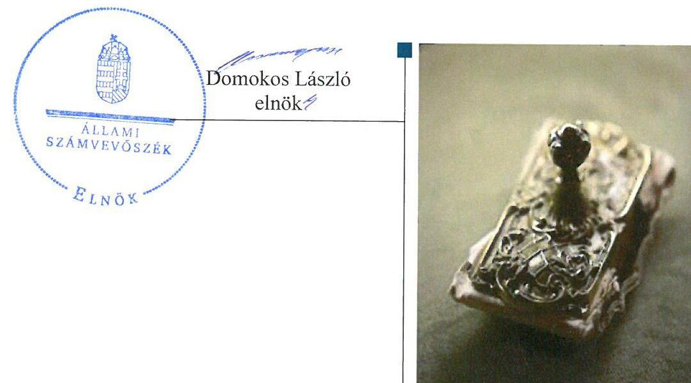

---

# AZ ELLENŐRZÉST FELÜGYELTE:

- BÖRÖCZ IMRE felügyeleti vezető

- AZ ELLENŐRZÉST VEZETTE ÉS A VÉGREHAJTÁSÁÉRT FELELŐS:
  - DR. NAGY IMRE ellenőrzésvezető
  - A PROGRAM ÖSSZEÁLLÍTÁSÁÉRT FELELŐS:
    - JANIK JÓZSEF osztályvezető

- IKTATÓSZÁM: V-1132-212/2016.
- TÉMASZÁM: 2166
- ELLENŐRZÉS-AZONOSÍTÓ SZÁM: V070772

Jelentéseink az Országgyűlés számítógépes hálózatán és az Interneta a www.asz.hu címen is olvashatóak.

---

# TARTALOMJEGYZÉK 

■ ÖSSZEGZÉS ..... 5
■ AZ ELLENŐRZÉS CÉLJA ..... 7
■ AZ ELLENŐRZÉS TERÜLETE ..... 8
■ AZ ELLENŐRZÉS HÁTTERE, INDOKOLTSÁGA ..... 9
■ A JELENTÉS LÉNYEGES KÉRDÉSKÖREI ..... 10
■ ELLENŐRZÉS HATÓKÖRE ÉS MÓDSZEREI ..... 11
■ MEGÁLLAPÍTÁSOK ..... 13
■ JAVASLATOK ..... 23
■ MELLÉKLETEK ..... 25
I. Sz. melléklet: Értelmező szótár ..... 25
■ FÜGGELÉK: ÉSZREVÉTELEK ..... 29
■ RÖVIDÍTÉSEK JEGYZÉKE ..... 39

---

.

---

# ÖSSZEGZÉS 

Kecskemét Megyei Jogú Város Önkormányzata a sportlétesítmények fenntartásához és müködtetéséhez kapcsolódó közfeladat ellátását szabályszerűen alakította ki, és tulajdonosi jogait összességében a jogszabályoknak megfelelően gyakorolta. A Hírös Sport Szabadidő Létesítményeket Müködtető és Szolgáltató Nonprofit Kft. vagyongazdálkodása a szabályozás és a vagyonkezelés hiányosságai miatt részben volt szabályszerű. A Társaságnál az ellátott közfeladattal összefüggő bevételek és ráfordítások elszámolása megfelelően történt, a Társaság önköltségszámitása és árképzése nem felelt meg a jogszabályi és a belső előírásoknak.

## Az ellenőrzés társadalmi indokoltsága

Az Állami Számvevőszék kiemelt célja, hogy a helyi önkormányzatok gazdálkodásában rejlő pénzügyi kockázatok feltárásával, az államháztartáson kívülre nyújtott költségvetési támogatások és ingyenes vagyonjuttatások, valamint az államháztartáson kívül múködő feladat-ellátó rendszerek ellenőrzéseivel hozzájáruljon ahhoz, hogy a közpénzeket az államháztartáson kívül múködő szervezetek is átlátható, rendezett módon használják fel.

A Magyarországon az intézmény-centrikus közfeladat-ellátás jellemző, de egyre jelentősebb a költségvetésen kívüli feladatellátás térnyerése. Ennek legfontosabb szereplői - a nonprofit szervezetek mellett - az önkormányzati tulajdonú gazdasági társaságok. Az önkormányzatok szervezetalakítási szabadságának következménye, hogy a korábban is vállalati formában múködő közszolgáltatások mellett, mind a kötelező, mind az önként vállalt feladatok ellátásában a gazdasági társaságok kiemelt fontosságú szerephez jutottak.

Minden közpénzt, közvagyont használó szervezettel szemben társadalmi igény, hogy a tevékenységükről elszámoljanak. Ezt figyelembe véve az Állami Számvevőszék Stratégiájával összhangban került sor a Hírös Sport Szabadidő Létesítményeket Múködtető és Szolgáltató Nonprofit Kft. 2011-2014. évekre kiterjedő ellenőrzésére.

## Főbb megállapítások, következtetések, javaslatok

Az Önkormányzat ${ }^{1}$ sportlétesítmény fenntartási és múködtetési közfeladat-ellátásának megszervezése szabályszerű volt. A tulajdonosi joggyakorlás rendjének kialakítása és végrehajtása összességében megfelelő a jogszabályi előírásoknak.

A Társaság ${ }^{2}$ az ellenőrzött időszakban alapvetően rendelkezett a múködéshez szükséges szabályzatokkal, de a pénzkezelésre és a számlarendre vonatkozó szabályokat nem minden évben alakították ki. A szabályozás a vagyonkezelt és a közhasznú tevékenységet szolgáló vagyon elkülönített nyilvántartására vonatkozó rendelkezések hiányosságai miatt részben felelt meg a jogszabályi és belső előírásoknak. A Társaság vagyongazdálkodása a vagyonkezelt vagyon beszámolóban történő bemutatásának hiánya miatt a jogszabályi rendelkezéseknek nem felelt meg teljes körűen. A Társaság beszámolási kötelezettségét a jogszabályi és belső előírásoknak megfelelően teljesítette. Az adatvédelem és az adatnyilvánosság szabályozása hiányos volt: a közérdekű adat megismerésére vonatkozó igények teljesítésére szabályozással nem rendelkeztek, adatvédelmi szabályozatot nem készítettek. Adatvédelmi felelőst a Társaság a jogszabályi előírások ellenére nem nevezett ki és nem bízott meg. Közzétételi kötelezettségeinek a Társaság szabályszerűen eleget tett. A Társaság kötelezettségállománya, eladósodottságának mértéke és szerkezete az Önkormányzat támogatás mellett nem jelentett kockázatot a közfeladat ellátására és a Társaság múködésére.

Az ellátott közfeladat bevételeinek, ráfordításainak, beruházásainak és értékcsökkenésének elszámolása megfelelő volt. A Társaságnál az önköltség-számítás szabályozása hiányos volt, emellett az önköltség számítása és az árképzés sem felelt meg a jogszabályi és a belső előírásoknak.

---

Az ÁSZ a Társaság ügyvezetőjének és a polgármesternek fogalmazott meg javaslatokat, amelyek alapján kötelesek intézkedési tervet összeállítani és azt a jelentés kézhezvételétől számított 30 napon belül az ÁSZ részére megküldeni.

---

# AZ ELLENŐRZÉS CÉLJA 

Az ellenőrzés célja annak értékelése, hogy az önkormányzat vagyongazdálkodási tevékenysége során szabályszerűen gyakorolta-e tulajdonosi jogait; a gazdasági társaság szabályozottsága, gazdálkodása és vagyongazdálkodási tevékenysége, bevételeinek és ráfordításainak elszámolása megfelelt-e a jogszabályi és tulajdonosi előírásoknak; a gazdasági társaság kötelezettségállománya jelentett-e kockázatot a működésre, valamint a gazdálkodás átláthatósága és elszámoltathatósága érdekében biztosítva volte a szolgáltatás díjának megalapozottsága szabályszerű önköltségszámítással.

---

# AZ ELLENŐRZÉS TERÜLETE

## Kecskemét Megyei Jogú Város Önkormányzata és a kizárólagos tulajdonában lévő Hírös Sport Szabadidő Létesítményeket Működtető és Szolgáltató Nonprofit Kft.

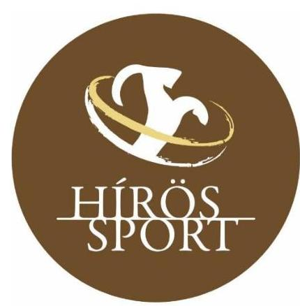

A KECSKEMÉT MEGYEI JOGÚ VÁROS ÖNKORMÁNYZATA kizárólagos tulajdonában lévő Társaságot 2001. augusztus 9-én alapították és 2008. augusztus 10-ig kiemelkedően közhasznú társaság volt. A Társaság 2008. augusztus 11-től vált nonprofittá. Az Önkormányzatnak a Társaságban 100%-os tulajdoni részesedése volt.

A Társaság a sportlétesítmény fenntartási és működtetési alapfeladata mellett az egészséges életmód segítését célzó szolgáltatások és a sport, ifjúsági ügyek közfeladatát látta el, illetve a sport- és rekreációs szolgáltatások területén folytatott tevékenységet a kezelésére bízott létesítményekben. A Társaság működtetette a Kecskeméti Élményfürdő és Csúszdaparkot, valamint a 2012-ben átadott Kecskeméti Fürdőt.

A Társaságnak nem volt más gazdasági társaságban tulajdonosi részesedése. Az ellenőrzött időszakban a vezető személyében egyszer, 2012. évben történt változás. A foglalkoztatottak száma 2011. évben 81 fő, 2012. évben 116 fő, 2013. és 2014. évben 85 fő volt.

1. táblázat

|   | 2011. | 2012. | 2013. | 2014.  |
| --- | --- | --- | --- | --- |
|  Mérleg főösszege | 1541,5 | 8903,9 | 8814,4 | 9926,7  |
|  Mérleg szerinti eredmény | -91,1 | -335,0 | -272,5 | -12,7  |
|  Értékesítés nettó árbevétele | 221,6 | 469,3 | 609,7 | 635,3  |
|  Saját tőke | 448,9 | 544,8 | 306,3 | 1038,6  |
|  - ebből jegyzett tőke | 425,5 | 425,5 | 425,5 | 425,5  |
|  Kötelezettségek | 635,2 | 7924,3 | 8060,6 | 8369,1  |

A TÁRSASÁG FŐBB GAZDÁLKODÁSI ADATAINAK ALAKULÁSA

A 2011-2014. ÉVEK KÖZÖTT (M FT)

|   | 2011. | 2012. | 2013. | 2014.  |
| --- | --- | --- | --- | --- |
|  Mérleg főösszege | 1541,5 | 8903,9 | 8814,4 | 9926,7  |
|  Mérleg szerinti eredmény | -91,1 | -335,0 | -272,5 | -12,7  |
|  Értékesítés nettó árbevétele | 221,6 | 469,3 | 609,7 | 635,3  |
|  Saját tőke | 448,9 | 544,8 | 306,3 | 1038,6  |
|  - ebből jegyzett tőke | 425,5 | 425,5 | 425,5 | 425,5  |
|  Kötelezettségek | 635,2 | 7924,3 | 8060,6 | 8369,1  |

Forrás: A Társaság 2011-2014. évi beszámolói / A Társaság adatszolgáltatása

Az Önkormányzat tekintetében 2013. évben a jegyző, 2014. évben a polgármester személye változott.

---

# AZ ELLENŐRZÉS HÁTTERE, INDOKOLTSÁGA 

Objektív kép kialakítása Kecskemét Megyei Jogú Város Önkormányzata által a sportlétesítmény fenntartási és müködtetési közfeladatának megszervezéséről, tulajdonosi joggyakorlásáról, a kizárólagos tulajdonában lévő Hírös Sport Szabadidő Létesítményeket Müködtető és Szolgáltató Nonprofit Kft. közfeladat ellátását érintő gazdálkodási tevékenységének szabályszerűségéről.

## AZ ÖNKORMÁNYZATI TULAJDONÚ GAZDASÁGI

TÁRSASÁGOK ellenőrzése kiemelten fontos a vagyon megőrzése, megóvása érdekében, valamint a kormányzati szektor elszámolásaiban megjelenő önkormányzati tulajdonú gazdálkodó szervezetek esetében, amelyekkel szemben alapvető követelmény, hogy gazdálkodásuk, működésük szabályszerű, az általuk szolgáltatott adatok minél megbízhatóbbak legyenek. A feladat/közfeladat-ellátás költségeinek, ráfordításainak alakulása, színvonala hatással van a lakosság elégedettségére.

A törvényalkotás számára - az észlelt problémák, szabálytalanságok, vagy egyéb nem kívánatos jelenségek felszínre kerülésével - az ellenőrzés megállapításai segítséget nyújthatnak az államháztartáson kívüli feladat/közfeladat-ellátás értékeléséhez, jogszabályi keretei pontosításához, átláthatóságot biztosító szabályozásához. Meghatározhatóvá válnak az önkormányzati feladatellátásban részt vevő államháztartáson kívüli szervezeteknek - az önkormányzat költségvetését, pénzügyi helyzetét is befolyásoló - kockázatai, lehetővé válik ezen kockázatok csökkentése. Ellenőrzéseink feltárhatják, hogy az önkormányzat feladat-ellátási kötelezettségének szabályszerűen tett-e eleget, a feladatellátáshoz rendelt vagyonkezelésbe vett és saját vagyon működtetését az elvárható gondossággal, szabályszerűen szervezte-e meg és a tulajdonosi felügyelete hozzájárult-e a feladatellátásához. Az ellenőrzés rávilágíthat arra, hogy a gazdasági társaság a feladat-ellátási, közszolgáltatási szerződésben foglaltak betartásával, a vagyon használatával biztosította-e a szolgáltatás folytatásának feltételeit, a feladat ellátását. Ezzel az ellenőrzöttek és a helyi döntéshozók számára visszajelzést ad feladatszervezési, feladat-ellátási kockázataikról, alapot ad a meglévő hibák megszüntetéséhez, a jobb feladatellátás biztosításához. Fokozza a fegyelmet, igazolja, hogy lejárt a következmények nélküli ellenőrzések időszaka.

---

# A JELENTÉS LÉNYEGES KÉRDÉSKÖREI 

1.     - Az önkormányzat közfeladat megszervezéséről szóló döntése, valamint tulajdonosi joggyakorlása szabályszerű volt-e?
2.     - A gazdasági társaság vagyongazdálkodása szabályszerű volt-e, kötelezettségállománya jelentett-e kockázatot a müködésre, illetve közfeladat ellátására?
3.     - A gazdasági társaságnál az ellátott közfeladat bevételei és ráfordításai elszámolása, valamint az önköltségszámitás és árképzés szabályszerű volt-e?

---

# ELLENŐRZÉS HATÓKÖRE ÉS MÓDSZEREI 

## Az ellenőrzés típusa

Megfelelőségi ellenőrzés.

## Az ellenőrzött időszak

2011. január 1-jétől 2014. december 31-ig tart.

## Az ellenőrzés tárgya

A gazdasági társaság feletti tulajdonosi joggyakorlás, valamint a gazdasági társaság gazdálkodásának szabályozottsága és szabályszerűsége.

Az ellenőrzés kiterjed minden olyan körülményre és adatra, amely az ÁSZ ${ }^{3}$ jogszabályban meghatározott feladatainak teljesítéséhez, valamint a program végrehajtása folyamán felmerült újabb összefüggések feltárásához szükséges.

## Az ellenőrzött szervezet

Az ellenőrzött szervezetek:
$\longrightarrow$ Kecskemét Megyei Jogú Város Önkormányzata,
$\longrightarrow$ Hírös Sport Szabadidő Létesítményeket Működtető és Szolgáltató Nonprofit Kft.

## Az ellenőrzés jogalapja

Az ellenőrzés jogszabályi alapját az ÁSZ tv. ${ }^{4}$ 1. § (3) bekezdése és 5. § (3)-(4)-(5) bekezdései képezik.

## Az ellenőrzés módszerei

Az ellenőrzést a nemzetközi standardokat irányadónak tekintve az ellenőrzési program ellenőrzési kérdései, az ellenőrzött időszakban hatályos jogszabályok, az ellenőrzés szakmai szabályok és módszertanok figyelembevételével végeztük.

Az ellenőrzés ideje alatt az ellenőrzött szervezettel történő kapcsolattartást az ÁSZ Szervezeti és Működési Szabályzatának vonatkozó előírásai alapján biztosítottuk.

---

Az ellenőrzés a kiválasztott, tulajdonosi jogokat gyakorló önkormányzatra, illetve az ellenőrzésre kijelölt gazdasági társaság felett tulajdonosi jogokat gyakorló szervezetre és az ellenőrzött gazdasági társaságra terjedt ki.

Az ellenőrzési kérdések megválaszolásához szükséges bizonyítékok megszerzése a következő ellenőrzési eljárások alkalmazásával történt: megfigyelés, kérdésfeltevés (információkérés), összehasonlítás, valamint elemző eljárás. Az ellenőrzési bizonyítékként felhasználható adatforrások közé tartoznak egyrészt a szakmai programban felsorolt adatforrások, másrészt adatforrás lehet még minden - az ellenőrzés folyamán - feltárt, az ellenőrzés szempontjából információkat tartalmazó dokumentum.

Az ellenőrzést a kérdésekre adott válaszok kiértékelésével, valamint a megjelölt adatforrások, a csatolt tanúsítványok felhasználásával, továbbá az adott időszakban hatályos jogszabályok figyelembevételével folytattuk le.

A bevételek és ráfordítások elszámolása, valamint a vagyonnyilvántartás terén a szabályszerű múködést véletlen mintavétellel ellenőriztük. A ráfordítások elszámolására és a vagyonnyilvántartásra vonatkozó véletlen mintavételt kockázati alapú kiválasztással egészítettük ki, amelynek során évente a három legnagyobb összegű tételt választottuk ki. A mintavétellel ellenőrzött területek esetében minden egyes tétel vonatkozásában a szabályszerűségre vonatkozó kérdéseket tettünk fel, amelyek eredménye öszszesítésre került. A jogszabályoknak és a belső előírásoknak megfelelőnek tekintettük az adott területet, amennyiben a minta ellenőrzésének eredménye alapján 95\%-os bizonyossággal a teljes sokaságban a hibaarány kisebb volt, mint 10\%, nem megfelelőnek, ha a hibaarány a 10\%-ot meghaladta. Részben megfelelő minősítést adtunk, amennyiben egy adott terület vonatkozásában a minta alapján a teljes sokaságban nem volt egyértelműen biztosított a jogszabályoknak és a belső szabályzatoknak megfelelő működés.

---

# 1. Az önkormányzat közfeladat megszervezéséről szóló döntése, valamint tulajdonosi joggyakorlása szabályszerű volt-e? 

Összegző megállapítás

Az Önkormányzat a sportlétesítmény fenntartási és múködtetési közfeladat-ellátást és a tulajdonosi jogok gyakorlásának rendjét szabályszerűen szervezte meg, a tulajdonosi jogok gyakorlása összességében megfelelt a jogszabályi előírásoknak.

### 1.1. számú megállapítás

Az Önkormányzat sportlétesítmény fenntartási és múködtetési közfeladat-ellátásának megszervezése szabályszerű volt.

Gazdasági programmal ${ }^{5}$ az Önkormányzat az Ötv. ${ }^{6}$ 91. § (1) bekezdése, 2013. január 1-jétől az Mötv. ${ }^{7}$ 116. § (1) bekezdése rendelkezéseinek megfelelően rendelkezett. A Gazdasági program szerint a sportvagyon célja, hogy gazdaságos működtetésével lehetőséget biztosítson a verseny-, a szabadidő, a diáksport, valamint a fogyatékos sport területén tevékenykedők számára, valamint a sport és egyéb rendezvények lebonyolítása céljából biztosítsa a megfelelő létesítményeket.

Az Nvtv. ${ }^{8}$ 9. § (1) bekezdése 2012. január 1-jétől előírta közép- és hosszú távú vagyongazdálkodási terv készítését, az Önkormányzat a kötelezettségének azonban csak 2013. évtől tett eleget. A Vagyongazdálkodási terv ${ }^{9}$ szerint a kizárólagos és többségi önkormányzati tulajdonban álló gazdasági társaságok múködését és vagyongazdálkodását kiemelt figyelemmel kell kísérni a társaságok rendelkezésére bocsátott önkormányzati vagyon értékének megőrzése, növelése, eredményesebb működtetése érdekében.

Rendeletalkotási kötelezettsége az Önkormányzatnak a közfeladat ellátással kapcsolatban a Sporttörvény ${ }^{10}$ 55. § (6) bekezdése alapján volt. Az Önkormányzat a 8/2009. (I.30.) közgyűlési rendelettel módosított 23/2004. (VI. 1.) közgyűlési rendelettel a helyi jogszabály-alkotási kötelezettségének eleget tett.

Az Önkormányzat a sporttal kapcsolatos helyi célkitűzéseket és feladatokat a 170/2008. (IV. 24.) közgyűlési határozattal elfogadott Középtávú Testnevelési és Sportfejlesztési Koncepcióban határozta meg.

Az Önkormányzat a közfeladat ellátását szabályozta, a sportlétesítmények működtetése az SZMSZ ${ }^{11}$-ének mellékletében kötelező feladatként szerepelt.

Az Önkormányzat és a Társaság között Közhasznú megállapodás ${ }^{12}$ jött létre, amelyet a jogszabályi változásoknak és a költségvetési kereteknek megfelelően évente aktualizáltak.

A Társaságnak nyújtott múködési célú támogatást az Önkormányzat évente támogatási szerződés keretében, elszámolási kötelezettség meghatározásával adta át.

---

Vagyonkezelési szerződés ${ }^{13}$ jött létre az Önkormányzat és a Társaság között, melynek keretében az Önkormányzat a közfeladat ellátását szolgáló, tulajdonát képező ingatlanokat a Társaság részére vagyonkezelésbe adta. A szerződésben a felek rögzítették, hogy a Társaság a gazdálkodási szabályoknak megfelelően köteles gondoskodni a kezelt vagyon nyilvántartásáról, biztosításáról, közterheinek viseléséről, karbantartásáról, megőrzéséről és gyarapításáról.

Az Önkormányzat évente előírta üzleti terv készítését. A Társaság az Önkormányzat által meghatározott tartalmi és formai követelményeknek megfelelően elkészítette az üzleti terveket.

# 1.2. számú megállapítás 

## A tulajdonosi joggyakorlás rendjének kialakítása és végrehajtása összességében megfelelt a jogszabályi előírásoknak.

A tulajdonosi joggyakorlás rendjét a Közgyűlés az Önkormányzat SZMSZében, valamint a Vagyonrendeletben ${ }_{\mathrm{t}, 2}{ }^{14}$ szabályozta. A Vagyonrendelet ${ }_{\mathrm{t}, 2}$ - a jogszabályban meghatározottakon túl - előírta a gazdasági társaságok részére, hogy az éves beszámoló mellett félévenkénti beszámolót is készítsenek.

A tulajdonosi joggyakorlás kérdéskörébe tartozó ügyek megtárgyalását a KVB $^{15}$, 2014. október 22. után a VPB ${ }^{16}$ hatáskörébe utalta. A bizottságok elkészítették ügyrendjüket, feladataikat ezek alapján látták el. A KVB és a VPB folyamatosan figyelemmel kísérte, megtárgyalta és értékelte a Társaság gazdálkodását, a közhasznú megállapodásban foglaltak érvényesülését, elfogadta az éves beszámolót. Az Alapító okiratban ${ }^{17}$ meghatározott döntéseket meghozták.

Az Alapító okirat szabályozta a Felügyelő bizottságban való képviseletre kijelölt személyek képviselettel összefüggő feladatait, beszámolási kötelezettségét.

A Felügyelő bizottság a Gt. ${ }^{18}$ 34. § (1) bekezdésében, valamint a Ptk. ${ }^{19}$ 3:121. § (1) bekezdésében előírtakat figyelembe véve három tagból állt. A Felügyelő bizottság a 416/2011. (XII. 15.) közgyűlési határozat ellenére nem számolt be a 2014. évben lefolytatott ellenőrzéseiről a KVB részére.

A független könyvvizsgálói jelentések a féléves és az éves beszámolókról elkészültek.

Az Önkormányzat belső ellenőrzése a Társasággal kapcsolatban a 20112013. évben nem folytatott le vizsgálatot. A 2014. évben az Önkormányzat belső ellenőrzése vizsgálta a Társaság gazdálkodási rendszerét és közfeladat ellátását a 2013-2014. közötti időszak vonatkozásában. A vagyongazdálkodással összefüggő karbantartási kiadások és feladatok ellenőrzésére külső szakértő is bevonásra került. Az ellenőrzés számos szabályozási hiányosságot és szabálytalanságot állapított meg, amelyekre a Társaság 20 pontból álló intézkedési tervet készített. Az intézkedési tervet az Önkormányzat elfogadta.

---

# 2. A gazdasági társaság vagyongazdálkodása szabályszerű volt-e, kötelezettségállománya jelentett-e kockázatot a múködésre, illetve közfeladat ellátására? 

Összegző megállapítás

A Társaság vagyongazdálkodása a szabályozás és a vagyonkezelés hiányosságai miatt nem felelt meg teljes körűen a jogszabályi és belső előírásoknak. A Társaság kötelezettségállománya és eladósodottsága az Önkormányzat támogatása mellett nem jelentett kockázatot a Társaság múködésére és a közfeladat ellátására.
2.1. számú megállapítás

A Társaság a szabályozás hiányosságai mellett rendelkezett a múködéshez szükséges szabályzatokkal. A vagyon elkülönített nyilvántartására vonatkozó szabályozás hiányos volt.

A Társaság az ellenőrzött időszakban rendelkezett a Számv. tv. ${ }^{20}$ 14. § (3) bekezdésben előírtaknak megfelelően Számviteli politikával ${ }^{21}$ és a Számv. tv. 14. § (5) bekezdése szerinti Leltározási szabályzattal ${ }^{22}$, Értékelési szabályzattal ${ }^{23}$, valamint Önköltség-számítási szabályzattal ${ }^{24}$. A Társaság Pénzkezelési szabályzattal ${ }^{25}$ a 2012-2014. években rendelkezett.

A SZÁMVITELI POLITIKA a Számv. tv.-ben foglaltak szerint került kialakításra, aktualizálására a Számv. tv. 14. § (11) bekezdésének megfelelően került sor.

AZ ÉRTÉKELÉSI SZABÁLYZAT a Számviteli politika részeként a Számv. tv.-ben foglaltakkal összhangban biztosította a vagyon értékének meghatározását, tartalmazta a mérlegtételek értékelésére, a követelések minősítésére, az értékcsökkenésre, értékvesztésre vonatkozó szabályokat.

A LELTÁROZÁSI SZABÁLYZAT a leltározás gyakoriságára vonatkozó előírást a Számv. tv. 69. § (3) bekezdésének megfelelően tartalmazta.

AZ ÖNKÖLTSÉG-SZÁMÍTÁSI SZABÁLYZATOT a Számv. tv. 14. § (7) bekezdés előírásai alapján a Társaság elkészítette, és az ellenőrzött időszakban többször módosította. A módosításokkal a Társaság a 2012. évben a saját és a vagyonkezelésbe vett vagyon közvetlen költségeinek elkülönített nyilvántartása érdekében bevezette az ún. kalkulációs egységeket, a közhasznú és a vállalkozási tevékenység közvetlen költségeinek elkülönítése céljából az ún. költségirányítási kódokat.

PÉNZKEZELÉSI SZABÁLYZATTAL a Társaság 2011. december 23-ig a Számv. tv. 14. § (5) bekezdés d) pontja ellenére nem rendelkezett. A 2011. december 23-ától hatályos Pénzkezelési szabályzat kizárólag a Kecskeméti Fürdőre terjedt ki. A 2012. február 1-től hatályos, a Társaság egészére vonatkozó Pénzkezelési szabályzat a Számv. tv. 14. § (8) bekezdésében foglaltak ellenére nem tért ki a készpénzben és a bankszámlán

---

tartott pénzeszközök közötti forgalom szabályozására, valamint nem határozta meg a napi készpénz záró állomány maximális mértékét.

SZÁMLARENDET a Társaság a Számv. tv. 161. § (1) bekezdésében foglaltak ellenére a 2011-2012. években nem készített. A 2013-2014. években a Számlarend ${ }^{26}$ megfelelt a Számv. tv. 161. § (1)-(3) bekezdésekben foglaltaknak.

A Társaság a Számv. tv. 161/A. § (1) bekezdésében előírtaknak nem tett eleget, mivel a könyvvezetésre, bizonylatolásra vonatkozó részletes belső szabályait nem úgy alakította ki, hogy az alkalmas legyen a kiegészítő mellékletben - a Számv. tv. 88. § (1) bekezdése alapján - feltüntetendő alábbi adatok alátámasztására:
$\longrightarrow$ a vagyonkezeléssel összefüggésben az Mötv. 109. § (7) bekezdésében előírt adatok,
$\longrightarrow$ a közhasznú szervezetként történő működéssel összefüggésben a Közhasznú tv ${ }^{27}$. 18. § (1) bekezdésében, majd a Civil tv ${ }^{28}$. 29. § (4)(5) bekezdésében előírt adatok.

A JAVADALMAZÁSI SZABÁLYZATOT ${ }^{29}$ a Taktv. ${ }^{30}$ 5. § (3) bekezdésében foglaltak szerint a Közgyűlés ${ }^{31}$ elkészítette. A Javadalmazási szabályzat a Taktv.-ben foglaltaknak megfelelően tartalmazta a vezetők, a vezető állású munkavállalók, valamint a felügyelőbizottsági tagok javadalmazására vonatkozó és a jogviszony megszűnésére vonatkozó szabályokat.

# 2.2. számú megállapítás 

A Társaság vagyongazdálkodása a vagyonkezelt vagyon beszámolóban történő bemutatásának hiánya miatt a jogszabályi rendelkezéseknek nem felelt meg teljes körűen.

A Társaság az ellenőrzött időszakban rendelkezett az Önkormányzattól ingyenes használatba kapott ingatlanokkal és vagyonkezelésbe átvett vagyonnal ${ }^{32}$. A Társaság nyilvántartása a saját és a kezelt vagyon bevételeinek, költségeinek és ráfordításainak elkülönítési kötelezettségére vonatkozóan az Áht.1 105/A. § (12)-(13) bekezdéseiben, az Mötv. 109. § (7) bekezdésében és a Vagyonkezelési szerződésben előírtaknak megfelelt. A főkönyvi könyvelésben a vagyonkezelésbe kapott vagyont a saját vagyontól elkülönítetten tartotta nyilván.

A vagyonkezelt eszközök leltározását a Társaság a Vagyonkezelési szerződésnek megfelelően minden évben elvégezte. A Társaság a vagyonkezelésében lévő eszközöket az ellenőrzött időszakban az Ötv. 80/A. § (8) bekezdése, valamint az Nvtv. ${ }^{33}$ 6. § előírásainak megfelelően nem idegenítette el, a vagyonelemeket nem terhelte meg.

A beszámolóban és a számviteli nyilvántartásokban lévő vagyontárgyak értékét szabályszerűen elkészített leltárral támasztották alá.

A befektetett eszközök állománya a 2012. évben jelentős mértékben megnövekedett, a 2011. évi nyitó értékhez képest 6 795,9 M Ft-tal volt magasabb. A növekedést az ellenőrzött időszakot megelőzően közgyűlési határozattal jóváhagyott „Kecskemét új versenyuszoda létesítése és él-ményfürdő-fejlesztés" elnevezésű projekt eredményeként megépült Kecskeméti Fürdő 2012. évi üzembe helyezése és ezzel egy időben a Társaság könyveiben történő aktiválása eredményezte.

---

A saját tőke állománya a 2014. évben - az ingatlanokon elszámolt értékhelyesbítés következtében az értékelési tartalék állományában bekövetkezett növekedés miatt - a 2011. évi 540,0 M Ft-ról a 2014. évben 1 038,6 M Ft-ra nőtt. A kötelezettségeken belül a hosszú lejáratú kötelezettségek állományának növekedését a Kecskeméti Fürdő beruházáshoz kapcsolódó hosszú lejáratú, devizában fennálló lízingkötelezettség okozta. A Társaság az ellenőrzött időszak minden évében veszteséges volt, mely az új létesítmény, a Kecskeméti Fürdő üzemeltetési költségeiből, valamint a veszteséges gazdálkodásból származott.

A 2013. évben a saját tőke összege 119,2 M Ft-tal a jegyzett tőke öszszege alá csökkent. A Társaság a 2014. évben élt az ingatlanokhoz kapcsolódó értékhelyesbítés lehetőségével, és az azzal azonos összegű értékelési tartalék képzésével a saját tőke összegét a jegyzett tőke fölé emelte. Az ingatlanok értékbecslésének könyvvizsgálói auditálása megtörtént. A Számv. tv. 59. § (2) bekezdés alapján az értékhelyesbítések megállapításának, elszámolásának szabályszerűségét a könyvvizsgáló a 2014. évi kötelező könyvvizsgálat keretében ellenőrizte. A veszteség rendezése során betartották a jogszabályi előírásokat. A saját tőke változását a 1. ábra szemlélteti.

1. ábra
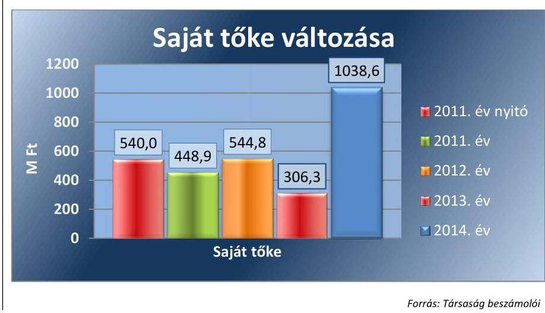

A Társaság kötelezettségállománya, eladósodottságának mértéke és szerkezete az Önkormányzat rendszeres támogatása mellett nem jelentett kockázatot a közfeladat ellátására és a Társaság múködésére.

A kötelezettségek állománya a 2011. évi 635,2 M Ft összegről a 2014. év végére 8 369,1 M Ft-ra nőtt elsősorban a Kecskeméti Fürdő projekt megvalósítására az ellenőrzött időszakot megelőzően kötött, hosszú lejáratú kötelezettségként nyilvántartott lizingszerződés következtében. Az Önkormányzat a 11/2009. (I. 30.) KH számú közgyűlési határozatában készfizető kezességet vállalt arra az esetre, ha a Társaság a szerződésben foglalt kötelezettségeit nem tudja teljesíteni. A biztosíték az ellenőrzött időszakban nem került igénybevételre.

A Társaság a hosszú lejáratú kötelezettségeit határidőben teljesítette az Önkormányzattól származó, a lízingdíj megfizetésére biztosított támogatás felhasználásával, amelyet az Önkormányzat minden ellenőrzött évben a közhasznú megállapodás keretében adott át.

---

Az ellenőrzött időszakban a rövid lejáratú kötelezettségek 62,8 \%-át az a szállítói kötelezettségek tették ki, az egyéb rövid lejáratú kötelezettségek elsősorban a fel nem használt sporttámogatások miatt keletkezett. A rövid lejáratú kötelezettségeit nem minden esetben teljesítette a szerződésben vagy jogszabályban meghatározott határidőben. A szállítói kötelezettségek késedelmes kifizetését szemlélteti a 2. táblázat.
2. táblázat

SZÁLLÍTÓI KÖTELEZETTSÉGEK ALAKULÁSA (M FT)

|  | 2011. | 2012. | 2013. | 2014. |
| :-- | --: | --: | --: | --: |
| Szállítói kötelezettségek összesen | 181,6 | 606,9 | 599,8 | 494,4 |
| Ebből Lejárt kötelezettség | 90,3 | 427,0 | 437,4 | 331,1 |
| Lejárt kötelezettségek aránya (\%) | 49,7 | 70,4 | 72,9 | 67,0 |

Forrás: A Társaság 2011-2014. évi beszámolói, adatszolgáltatása
AZ ELADÓSODOTTSÁG mértéke a 2012. évtől a lízingkötelezettségből eredő fizetési kötelezettség miatt jelentős mértékben megnövekedett. Az Önkormányzat által évente biztosított támogatás mellett az eladósodottság mértéke nem jelentett kockázatot a közfeladat ellátására. A Társaság eladósodottságát jellemző mutatók alakulását a 3. táblázat szemlélteti.
3. táblázat

ELADÓSODOTTSÁGI MUTATÓK ALAKULÁSA (ARÁNY)

| Mutató megnevezése | 2011. | 2012. | 2013. | 2014. |
| :--: | :--: | :--: | :--: | :--: |
| Eladósodottsági mutató (idegen tőke/összes forrás) | 0,41 | 0,89 | 0,91 | 0,84 |
| Eladósodottság mértéke (kötelezettségek/saját tőke) | 1,41 | 14,55 | 26,31 | 8,06 |
| Nettó eladósodottság (kötelezettségek-követelések/saját tőke) | 1,29 | 14,30 | 25,92 | 7,92 |
| Adósságfedezeti mutató I. (befektetett eszközök+forgóeszközök/idegen forrás) | 2,40 | 1,09 | 1,04 | 1,08 |
| Adósságfedezeti mutató II. (működési cash flow/hosszú lejáratú kötelezettségek) | 0,66 | $-0,01$ | $-0,03$ | 0,02 |
| Árbevételre vetített eladósodottság (kötele-zettségek-forgóeszközök/ért, nettó árbevétele) | 1,70 | 15,77 | 12,61 | 12,42 |

Forrás: A Társaság 2011-2014. évi beszámolói, Társaság adatszolgáltatása
Az eladósodottsági mutató értéke a 2012. évtől kedvezőtlenül alakult az új épületkomplexummal kapcsolatos lízingdíj fizetési kötelezettsége miatt.

Az eladósodottság mértékének magas értéke azt mutatja, hogy a saját tőke összege egyik ellenőrzött évben sem nyújtott fedezetet a kötelezettségekre. A mutató kedvezőtlen irányú növekedését a 2014. évben a saját tőke állományának emelkedése mérsékelte.

A nettó eladósodottság mutató értéke alapján megállapítható, hogy az alacsony összegű kintlévőségekkel csökkentett magas kötelezettségállományt a 2011-2014. években nem fedezte a saját forrás.

Az adósságfedezeti mutató I. kedvezőtlenül alakult az ellenőrzött években, mivel az 1 Ft adósságra jutó vagyon értéke a 2011. évi 2,4 Ft-ról 2014. év végére 1,08 Ft-ra csökkent a hosszú lejáratú kötelezettségek növekedése miatt.

---

# 2.4. számú megállapítás 

Az adósságfedezeti mutató II. értéke azt mutatja, hogy a múködési cash flow értéke révén a Társaság nem lett volna képes valamennyi hosszú lejáratú kötelezettségének eleget tenni.

Az árbevételre vetített eladósodottság értéke kedvezőtlenül alakult a 2013-2014. években.

A Társaság a beszámolási kötelezettségeit alapvetően szabályszerűen teljesítette. Az adatvédelem és az adatnyilvánosság szabályozása hiányos volt, adatvédelmi felelőssel a Társaság nem rendelkezett. Közzétételi kötelezettségeinek a Társaság szabályszerűen eleget tett.

A Társaság beszámolási, adatszolgáltatási kötelezettségét az Alapító okirat, az SZMSZ, a Vagyonkezelési szerződés, valamint a Vagyonrendelet ${ }_{1 / 2}$ szabályozta. Az Önkormányzat által előírtak szerint az üzleti terveket, az éves és féléves beszámolókat a Társaság elkészítette.

A Társaság a Vagyonkezelési szerződésben előírt adatszolgáltatási kötelezettségek közül a vagyonkataszter adatszolgáltatási kötelezettségének nem tett eleget.

AZ ÉVES BESZÁMOLÓKAT ${ }^{34}$ a Társaság a 2011-2014. évekre vonatkozóan a Számv. tv. 19. § (1) bekezdésében meghatározottak szerint elkészítette. A Számv. tv. szerinti beszámolókat és a közhasznúsági mellékleteket a 2011-2013. évek vonatkozásában a KVB, a 2014. év tekintetében a VPB jóváhagyta. Az éves beszámolókat a Számv. tv. 153. § (1) bekezdés és 154. § (1) bekezdés előírásainak megfelelően letétbe helyezték és közzétették.

A Társaság a Számv. tv. 23. § (2) bekezdésében előírtak ellenére a vagyonkezelésbe vett eszközöket a kiegészítő mellékletben nem mutatta be mérlegtételek szerinti bontásban, amelyet könyvvizsgáló az éves beszámolóhoz kapcsolódó jelentésében nem észrevételezett.

A KÖNYVVIZSGÁLÓ a Gt. 44. § (1) bekezdésében, illetve a Ptk. 3:131. § (2) bekezdésében foglaltaknak megfelelően az éves beszámolót tárgyaló Taggyűlésen részt vett. A 2012-2014. években figyelemfelhívással élt a tulajdonos felé a Társaság eladósodottságáról és a folyamatos veszteséges múködés saját tőkét csökkentő hatásáról.

A KÖZÉRDEKŰ ADATOK megismerésére irányuló igények teljesítésének rendjére szabályzatot a Társaság az ellenőrzött időszakban az Avtv. ${ }^{35}$ 20. § (8) bekezdésében, valamint az Info tv. ${ }^{36}$ 30. § (6) bekezdésében foglaltak ellenére nem készített. A Társaságnál belső adatvédelmi felelős az Avtv. 31/A. § (1) bekezdésében és az Info tv. 24. § (1) bekezdésében előírtak ellenére nem volt. A Társaság az Avtv. 31/A. § (3) bekezdése és az Info tv. 24. § (3) bekezdése ellenére adatvédelmi és adatbiztonsági szabályzattal nem rendelkezett. Az ellenőrzött években az Eisztv. ${ }^{37}$ 6. § (1) bekezdésében, és az Info tv. 37. § (1) bekezdésében meghatározott közzétételi kötelezettségének eleget tett.

---

# 3. A gazdasági társaságnál az ellátott közfeladat bevételei és ráfordításai elszámolása, valamint az önköltségszámítás és árképzés szabályszerű volt-e? 

Összegző megállapítás

A Társaságnál az ellátott közfeladat bevételeinek és ráfordításainak elszámolása megfelelő volt. Az önköltség-számítás szabályozása hiányos volt, az önköltség számítása és az árképzés nem szabályszerűen történt.
3.1. számú megállapítás

Az ellátott közfeladat bevételeinek, ráfordításainak, beruházásainak és értékcsökkenésének elszámolása megfelelő volt.

Közfeladata ellátásához a Társaság az Önkormányzattól a Kecskeméti Élményfürdő és Csúszdaparkot vagyonkezelésbe kapta. Emellett rendelkezett saját vagyonnal is.

AZ ANYAGJELLEGŰ RÁFORDÍTÁSOK elszámolása megfelelő volt, a ráfordításokat elkülönítetten számolták el.

AZ ÉRTÉKESÍTÉS NETTÓ ÁRBEVÉTELÉNEK ELSZÁMOLÁSA megfelelő volt. A bevételek kiszámlázása a belső szabályozásnak megfelelően történt, a bevételeket elkülönítetten számolták el a megfelelő főkönyvi számlákra.

A BERUHÁZÁSOK, FELÚJÍTÁSOK elszámolása megfelelő volt. Az üzembe helyezés megtörtént, az állományba vétel és a besorolás szabályszerű volt, az eszközök a tárgyévi leltárban megtalálhatóak voltak. A bekerülési érték meghatározása megfelelt az előírásoknak.

AZ ÉRTÉKCSÖKKENÉSI LEÍRÁS ELSZÁMOLÁSA megfelelő volt. A Társaság a kiegészítő mellékletekben a Számv. tv. 92. § (2) bekezdésében foglaltaknak megfelelően bemutatta az elszámolt értékcsökkenés évenkénti alakulását.

AZ ELSZÁMOLT AMORTIZÁCIÓNAK MEGFELELŐ MÉRTÉKŰ VISSZAPÓTLÁS a vagyonkezelt eszközök esetében a 2011. évben nem történt meg az Áht. 105/A. § (6) bekezdésében foglaltakkal ellentétesen. A Társaság visszapótlási kötelezettsége 2012-ben teljesült, 3 124,6 E Ft-tal lépte túl a beruházások, felújítások összege a tárgyévben elszámolt értékcsökkenés összegét. Ezen túlmenően, még ugyanebben az évben 7 963,0 E Ft-ot helyezett lekötött tartalékba a vagyonkezeléssel kapcsolatos korábbi visszapótlási kötelezettségére tekintettel. 2013. és 2014. években a visszapótlásra fennálló kötelezettségét értéknövelő beruházással, illetve a pótlási kötelezettségből fennmaradó összegnek lekötött tartalékba helyezésével teljesítette. A 4. táblázat a vagyonkezelt eszközökre elszámolt értékcsökkenés és visszapótlás alakulását mutatja be.

---

| 4. táblázat |  |  |  |  |
| :--: | :--: | :--: | :--: | :--: |
| ÉRTÉKCSÖKKENÉS ÉS ESZKÖZPÓTLÁS (M Ft) |  |  |  |  |
| Vagyonkezolt tárgyi eszközök | 2011. | 2012. | 2013. | 2014. |
| elszámolt értékcsökkenése | 4163,5 | 4275,4 | 4437,3 | 5309,1 |
| pótlására fordított összeg | - | 7400,0 | 3885,7 | 5298,0 |
| lekötött tartalékba helyezés | - | 7963,0 | 551,6 | 11,1 |

Saját vagyona tekintetében az eszközpótlás csak a 2012. évben - a Kecskeméti Fürdő üzembe helyezésével - haladta meg az elszámolt értékcsökkenés összegét. Az ellenőrzött időszak többi évében az eszközvisszapótlás összege elmaradt az értékcsökkenés összegétől, de összességében a 2012. évi nagy összegű ( $6545,3 \mathrm{M} \mathrm{Ft}$ ) aktiválással biztosított volt a saját vagyon esetében az eszközpótlás.

Az eszközpótlás a Társaság múködésére legjellemzőbb három saját eszközcsoportban a használhatósági fok és az átlagos életkor mutatókkal került minősítésre, melyet az 5. táblázat mutat be.
5. táblázat

TÁRGYI ESZKÖZÖK HASZNÁLHATÓSÁGI FOKA (\%) ÉS ÁTLAGOS ÉLETKORA (ÉV)

| Tárgyi eszköz | Mutató | 2011. | 2012. | 2013. | 2014. |
| :--: | :--: | :--: | :--: | :--: | :--: |
| 1. Ingatlanok és a kapcsolódó vagyoni értékú jogok | használhatósági fok (\%) | 89,3 | 97,1 | 95,2 | 93,4 |
|  | átlagos életkor (év) | 6,1 | 1,2 | 2,0 | 2,8 |
| 2. Múszaki berendezések, gépek, jármúvek | használhatósági fok (\%) | 42,8 | 94,5 | 87,9 | 81,4 |
|  | átlagos életkor (év) | 4,0 | 0,7 | 1,6 | 2,5 |
| 3. Egyéb berendezések, felszerelések, jármúvek | használhatósági fok (\%) | 13,7 | 41,2 | 42,5 | 39,7 |
|  | átlagos életkor (év) | 3,3 | 2,2 | 2,2 | 2,4 |

Forrás: a Társaság 2011-2014. beszámolói
2011. évhez viszonyítva valamennyi saját eszköz használhatósági foka javult, ezzel párhuzamosan az átlagos életkoruk csökkent, a Kecskeméti Fürdő üzembe helyezésének köszönhetően. Ennek következtében a közfeladat ellátását biztosító tárgyi eszköz vagyon értéke nőtt a 2011. évi 1 196,2 M Ft-ról 2014. évre 8 592,9 M Ft-ra.

A KÖVETELÉSÁLLOMÁNY ALAKULÁSÁT, azon belül a vevőkövetelések 2011-2014. évek közötti alakulását a 2. ábra mutatja.
2. ábra
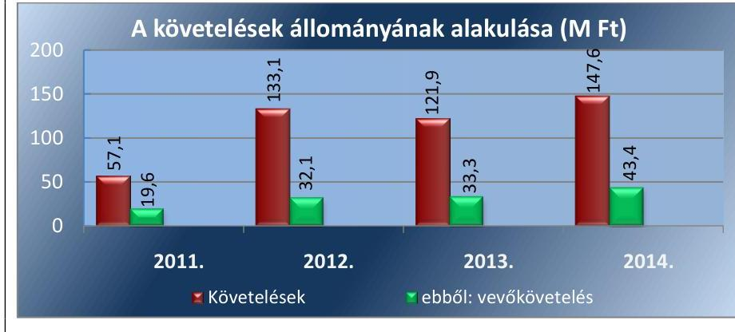

---

A HÁTRALÉKOS KÖVETELÉSÁLLOMÁNY csökkentésére irányuló intézkedések rendjét az 50 E Ft és 100 E Ft közötti követelések kivételével szabályozták. A Társaság beszámolói szerint a gyakorlatban a kintlévőségek behajtását jogi úton is érvényesítették.

A fizetési határidő lejárata szerinti vevőkövetelések alakulását a 3. ábra mutatja.
3. ábra
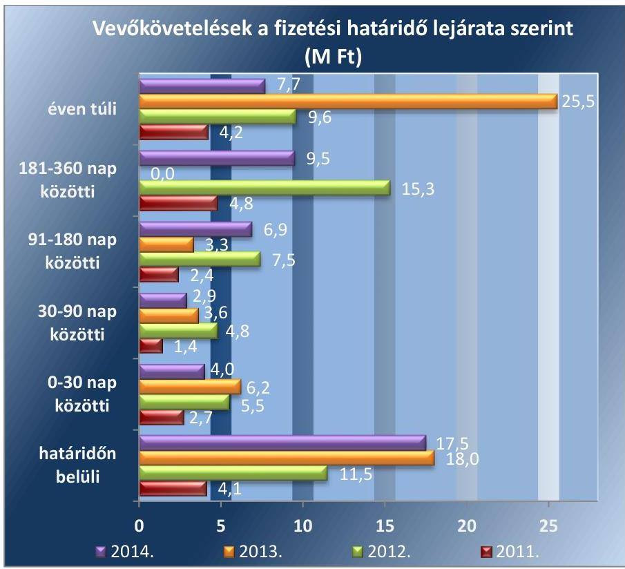

Forrás: A Társaság 2011-2014. évi beszámolói
A fizetési határidő lejárta után tettek intézkedéseket a követelések behajtására, ennek ellenére a nem vitatott, jogszerű követelések határidőre ki nem fizetett összege az ellenőrzött időszakban emelkedett valamennyi lejárati kategóriában.

# 3.2. számú megállapítás 

A Társaságnál az önköltség-számítás szabályozása hiányos volt, az önköltség számítása és az árképzés nem felelt meg a jogszabályi és a belső előírásoknak.

ÖNKÖLTSÉG-SZÁMÍTÁSI SZABÁLYZATÁT $_{1,2,3}$ a Társaság a Számv. tv. 14. § (5) bekezdés c) pontjának megfelelően elkészítette. A szabályzat a Számv. tv. 14. § (4) bekezdésével ellentétesen nem tartalmazta a Számv. tv. 14. § (7) bekezdés szerinti utókalkuláció elvégzését biztosító részletszabályokat.

Az alkalmazott jegyárakat minden évben közgyűlési határozattal elfogadták, a Társaság és az Önkormányzat által aláírt közhasznú megállapodásokban rögzítették. A jegyárak kialakításához nem készültek az adott évi jegyár módosításokat megalapozó kalkulációk, ezzel nem tettek eleget a Számv. tv. 14. § (7) bekezdésében, az Önköltség-számítási szabályzat ${ }_{1} 5$. pontjában, illetve az Önköltség-számítási szabályzat ${ }_{2 ; 3} 7$.pontjában foglalt önköltség-megállapítási kötelezettségnek.

---

# JAVASLATOK 

Az ÁSZ tv. 33. § (1) bekezdésében foglaltak értelmében az ellenőrzött szervezet vezetője köteles a jelentésben foglalt megállapításokhoz kapcsolódó intézkedési tervet összeállítani és azt a jelentés kézhezvételétől számított 30 napon belül az ÁSZ részére megküldeni. Amennyiben az ellenőrzött szervezet vezetője nem küldi meg határidőben az intézkedési tervet, vagy továbbra sem elfogadható intézkedési tervet küld, az Állami Számvevőszék elnöke az ÁSZ tv. 33. § (3) bekezdése a) és b) pontjaiban foglaltakat érvényesítheti.

## A Hírös Sport Szabadidő Létesítményeket Müködtető és Szolgáltató Nonprofit Kft. ügyvezetőjének

1. Intézkedjen, hogy a pénzkezelési szabályzat tartalma megfeleljen a jogszabályi előírásnak.
(2.1. sz. megállapítás 6. bekezdése alapján)
2. Intézkedjen a jogszabályi előírásnak megfelelően a részletes belső szabályok olyan kialakításáról, hogy az alkalmas legyen a kiegészítő mellékletben foglalt, külön jogszabályban előírt adatok közvetlen alátámasztására.
(2.1. sz. megállapítás 8. bekezdése alapján)
3. Intézkedjen, hogy a Társaság a vagyonkezelési szerződésben foglaltaknak megfelelően eleget tegyen a vagyonkataszter adatszolgáltatási kötelezettségének.
(2.4. sz. megállapítás 2. bekezdése alapján)
4. Intézkedjen, hogy a vagyonkezelésbe vett eszközöket a kiegészítő mellékletben - legalább mérlegtételek szerinti megbontásban - bemutassák a jogszabályi előírásnak megfelelően.
(2.4. sz. megállapítás 4. bekezdése alapján)
5. Intézkedjen a jogszabályi előírásnak megfelelően
a) a közérdekü adatok megismerésére irányuló igények teljesítésének rendjét rögzítő szabályzat elkészítéséről;
b) adatvédelmi felelős kinevezéséről vagy megbízásáról;
c) adatvédelmi és adatbiztonsági szabályzat elkészítéséről.
(2.4. sz. megállapítás 6. bekezdése alapján)

---

6. Intézkedjen, hogy
a) az önköltségszámitási szabályzat tartalma megfeleljen a jogszabályi elöírásnak;
b) az önköltségszámitásra a jogszabályi elöírásnak és az önköltségszámitási szabályzatnak megfelelöen kerüljön sor.
(3.2. sz. megállapítás 1-2. bekezdése alapján)

# Kecskemét Megyei Jogú Város Önkormányzata polgármesterének 

1. Kezdeményezze, hogy - a tulajdonosi joggyakorló döntésének megfelelöen - a felügyelőbizottság beszámoljon a lefolytatott ellenőrzéseiről.
(1.2. sz. megállapítás 4. bekezdése alapján)

---

# MELLÉKLETEK 

## I. SZ. MELLÉKLET: ÉRTELMEZŐ SZÓTÁR

garancia
gazdasági társaság
gazdálkodó szervezet
kezesség
nemzeti vagyon

A garancia olyan önálló, az önkormányzat nevében vállalt kötelezettség, amely alapján az önkormányzat az önkormányzati költségvetés terhére szerződésben meghatározott feltételek szerint, a kötelezett nem teljesítése esetén a jogosultnak fizetést teljesít az előzetesen rögzített összeghatárig.
Ptk. 3.88. § (1) bekezdése szerint „a gazdasági társaságok üzletszerű közös gazdasági tevékenység folytatására, a tagok vagyoni hozzájárulásával létrehozott, jogi személyiséggel rendelkező vállalkozások, amelyekben a tagok a nyereségből közösen részesednek, és a veszteséget közösen viselik".
A Ptk. 685. § c) pontja szerint gazdálkodó szervezet:
„az állami vállalat, az egyéb állami gazdálkodó szerv, a szövetkezet, a lakásszövetkezet, az európai szövetkezet, a gazdasági társaság, az európai részvénytársaság, az egyesülés, az európai gazdasági egyesülés, az európai területi együttmúködési csoportosulás, az egyes jogi személyek vállalata, a leányvállalat, a vízgazdálkodási társulat, az erdő birtokossági társulat, a végrehajtói iroda, az egyéni cég, továbbá az egyéni vállalkozó." (2014. 03.15-ig hatályos)
A kezességre vonatkozó előírásokat a Ptk. 6:416-430. §-ai tartalmazzák. Kezességi szerződéssel a kezes kötelezettséget vállal a jogosulttal szemben, hogyha a kötelezett nem teljesít, maga fog helyette a jogosultnak teljesíteni. Kezesség egy vagy több, fennálló vagy jövőbeli, feltétlen vagy feltételes, meghatározott vagy meghatározható összegű pénzkövetelés vagy pénzben kifejezhető értékkel rendelkező egyéb kötelezettség biztosítására vállalható.
A Ptk. szerint kezességet csak írásban lehet vállalni. A kezes kötelezettsége ahhoz a kötelezettséghez igazodik, amelyért kezességet vállalt. A kezes kötelezettsége nem válhat terhesebbé, mint amilyen elvállalásakor volt, kiterjed azonban a kötelezett szerződésszegésének jogkövetkezményeire és a kezesség elvállalása után esedékessé váló mellékkövetelésekre is.
Nvt. 1. § (2) bekezdése szerint:
„az állam vagy a helyi önkormányzat kizárólagos tulajdonában álló dolgok,
az a) pont hatálya alá nem tartozó, állam vagy a helyi önkormányzat tulajdonában lévő dolog,
az állam vagy a helyi önkormányzatot tulajdonában lévő pénzügyi eszközök, továbbá az államot vagy a helyi önkormányzatot megillető társasági részesedések,
az államot vagy a helyi önkormányzatot megillető bármely vagyoni értékkel rendelkező jogosultság, amelyet jogszabály vagyoni értékű jogként nevesít,
Magyarország határa által körbezárt terület feletti légtér,
az üvegházhatású gázok kibocsátási egységeinek kereskedelméről szóló törvény szerint kibocsátási egység és légiközlekedési kibocsátási egység, valamint az ENSZ Éghajlat változási Keretegyezménye és annak Kiotói Jegyzőkönyve végrehajtási keretrendszeréről szóló törvény szerinti kiotói egység, állami vagy helyi önkormányzati fenntartású közgyűjtemény (muzeális intézmény, levéltár, közgyűjteményként múködő kép- és hangarchívum, valamint könyvtár) saját gyűjteményében nyilvántartott kulturális javak körébe tartozó dolog,
a régészeti lelet,
a nemzeti adatvagyon körébe tartozó állami nyilvántartások fokozottabb védelméről szóló törvény szerinti nemzeti adatvagyon." (hatályos 2012. január 1-jétől, g) pont módosult 2012. június 30-tól)
Ctv. 9/F Ctv. 9/F. § (2) bekezdése szerint „az a gazdasági társaság minősül nonprofit gazdasági társaságnak és cégnevében az a gazdasági társaság tüntetheti fel a nonprofit jelleget, amelynek létesítő okirata tartalmazza, hogy a gazdasági társaság tevékenységéből származó nyereség a tagok között nem osztható fel, hanem az a gazdasági társaság vagyonát gyarapítja." (hatályos 2014. március 15től)

---

többségi befolyást biztosító részesedés
eladósodottságot jellemző mutatók
keresztfinanszírozás tilalma
közszolgáltatás
közszolgáltató
közületi felhasználó

A Ptk. 8:2. § (1) bekezdése szerint „többségi befolyás az olyan kapcsolat, amelynek révén természetes személy vagy jogi személy (befolyással rendelkező) egy jogi személyben a szavazatok több mint felével vagy meghatározó befolyással rendelkezik."
eladósodottsági mutató (tőkeáttétel): idegen tőke/összes forrás. Egészségesnek mondható egy olyan mértékű áttétel, amelyet az üzleti tervek szerint és az elmúlt időszak tapasztalatai alapján a társaság megfelelő biztonsággal ki tud termelni. Nagy eszközberuházás-igényű iparágakban értéke magasabb, azaz magasabb eladósodottság is elfogadható, de 75-85\%-ot meghaladó értéknél már itt is erős, sőt túlzott külső finanszírozottságról beszélhetünk. Általánosságban véve kedvező, ha értéke kisebb, mint 0,6 .
eladósodottság mértéke: kötelezettségek / saját tőke. Fontos szerepet játszik ez a mutató egy vállalat megítélésében. Azt mutatja, hogy a saját források a kötelezettségek hány százalékát fedezik. Törekedni kell, hogy a mutató tartósan (jelentősen) 1 alatti értéket érjen el.
nettó eladósodottság: (kötelezettségek-követelések) / saját tőke. Azt mutatja, hogy a kintlévőségekkel csökkentett kötelezettségeket milyen mértékben fedezi a saját forrás. Ez feltételezi, hogy a követelések pénzügyileg előbb realizálódnak, mint ahogy a kötelezettségeket teljesíteni kell. A mutató minél kisebb, csökkenő értéke a kedvező.
adósságfedezeti mutató I.: (befektetett eszközök+forgó eszközök) / idegen forrás. Azt mutatja, hogy 1 Ft adósságra hány Ft vagyon jut. Általánosságban véve kedvező, ha értéke 2 körül van, de nagy eszközberuházás-igényű iparágakban értéke kisebb is lehet.
adósságfedezeti mutató II.: működési cash flow / hosszú lejáratú kötelezettségek. A mutató azt jelzi, hogy az adott gazdálkodási időszak működési pénzáramainak eredményeként realizált cash flow révén a vállalkozás mennyiben lenne képes valamennyi hosszú lejáratú kötelezettségének eleget tenni. Ennek vizsgálatára viszonylag ritkán kerül sor, az elsősorban a veszélyhelyzetbe került vállalkozások esetében lehet érdekes. Általánosságban véve kedvező, ha a működési cash flow minél nagyobb arányban nyújt fedezetet a hosszú lejáratú kötelezettségre (értéke nagyobb, mint 1, nő az ellenőrzött időszakban).
árbevételre vetített eladósodottság: (kötelezettségek-forgóeszközök) / értékesítés nettó árbevétele. Az árbevételre vetített eladósodottság azt mutatja, hogy az árbevétel mekkora fedezetet nyújt a kötelezettségeknek a forgóeszközökkel csökkentett részére. Általánosságban véve kedvező, ha az árbevétel minél nagyobb arányban nyújt fedezetet a forgóeszközökkel csökkentett kötelezettségekre (értéke kisebb, mint 1, csökken az ellenőrzött időszakban).
A közszolgáltatás díját úgy kell megállapítani, hogy az maradéktalanul fedezetet nyújtson a közszolgáltatás indokolt költségeire és ráfordításaira, valamint a közszolgáltató e tevékenységével kapcsolatos ésszerű nyereségére; az ésszerű nyereség nem tartalmazhatja a közszolgáltatáson kívül eső egyéb gazdasági tevékenységei költségeinek, ráfordításainak fedezetét.
A közszolgáltatás: „közcélú, illetőleg közérdekű szolgáltatást jelent, amely egy nagyobb közösség (állam, település) minden tagjára nézve megközelítőleg azonos feltételek mellett vehető igénybe, ezért valamilyen mértékig közösségi megszervezést, illetve szabályozást, ellenőrzést igényel." Az Ebktv. 3. § d) pontja a következőképpen határozza meg a közszolgáltatást: „szerződéskötési kötelezettség alapján a lakosság alapvető szükségleteinek ellátására irányuló szolgáltatás, így különösen a villamos energia-, gáz-, hő-, víz-, szennyvíz- és hulladékkezelési, köztisztasági, postai és távközlési szolgáltatás, továbbá a menetrend alapján közlekedő járművekkel végzett közforgalmú személyszállítás".
A közszolgáltatás ellátására feljogosított hulladékkezelő (Forrás: a 2011-2012. években a Hgt. 21. § (3) bekezdés a) pontja)
Az a hulladékgazdálkodási közszolgáltatási engedéllyel rendelkező és a Ht. szerint minősített gazdálkodó szervezet, amely a települési önkormányzattal kötött hulladékgazdálkodási közszolgáltatási szerződés alapján hulladékgazdálkodási közszolgáltatást lát el. (Forrás: a 2013-2014. években a Ht. 2. § (1) bekezdés 37. pontja).

Az a jogi személy, illetőleg jogi személyiséggel nem rendelkező gazdasági társaság, aki (amely) a meghatározott szolgáltatásra, és/vagy a keletkező hulladék elszállítására közüzemi szerződést kötött a közszolgáltatóval.

---

lakossági felhasználó nemzeti vagyon
„az állam vagy a helyi önkormányzat kizárólagos tulajdonában álló dolgok, az a) pont hatálya alá nem tartozó, állam vagy a helyi önkormányzat tulajdonában lévő dolog, az állam vagy a helyi önkormányzatot tulajdonában lévő pénzügyi eszközök, továbbá az államot vagy a helyi önkormányzatot megillető társasági részesedések, az államot vagy a helyi önkormányzatot megillető bármely vagyoni értékkel rendelkező jogosultság, amelyet jogszabály vagyoni értékű jogként nevesít,
Magyarország határa által körbezárt terület feletti légtér,
az üvegházhatású gázok kibocsátási egységeinek kereskedelméről szóló törvény szerint kibocsátási egység és légiközlekedési kibocsátási egység, valamint az ENSZ Éghajlat változási Keretegyezménye és annak Kiotói Jegyzőkönyve végrehajtási keretrendszeréről szóló törvény szerinti kiotói egység, állami vagy helyi önkormányzati fenntartású közgyűjtemény (muzeális intézmény, levéltár, közgyűjteményként múködő kép- és hangarchívum, valamint könyvtár) saját gyűjteményében nyilvántartott kulturális javak körébe tartozó dolog,
a régészeti lelet,
a nemzeti adatvagyon körébe tartozó állami nyilvántartások fokozottabb védelméről szóló törvény szerinti nemzeti adatvagyon." (hatályos 2012. január 1-jétől, g) pont módosult 2012. június 30-tól)
közfeladat
Jogszabályban meghatározott állami vagy önkormányzati feladat, amit az arra kötelezett közérdekből, jogszabályban meghatározott követelményeknek és feltételeknek megfelelve végez, ideértve a lakosság közszolgáltatásokkal való ellátását, továbbá az állam nemzetközi szerződésekben vállalt kötelezettségeiből adódó közérdekű feladatokat, valamint e feladatok ellátásához szükséges infrastruktúra biztosítását is (Nvtv. 3. § (1) bekezdés 7. pont).

---

.

---

# FÜGGELÉK: ÉSZREVÉTELEK 

A jelentéstervezetet a Számvevőszék 15 napos észrevételezésre megküldte az ellenőrzött szervezetek vezetőinek az ÁSZ tv. 29. §* (1) bekezdése előírásának megfelelően.
Az elfogadott észrevétel alapján a Számvevőszék módosította a jelentést.
A függelék tartalmazza az ellenőrzöttek észrevételeit, illetve az el nem fogadott észrevételek elutasításának indoklását.

- Hírös Sport Szabadidő Létesítményeket Működtető és Szolgáltató Nonprofit Kft. ügyvezetőjének észrevétele
- Tájékoztatás az észrevételek kezeléséről az ügyvezetőnek
- Kecskemét Megyei Jogú Város Önkormányzata polgármesterének észrevétele (melléklet nélkül)
- Tájékoztatás az észrevétel kezeléséről a polgármesternek

[^0]
[^0]:    * 29. § (1) Az Állami Számvevőszék az ellenőrzési megállapításait megküldi az ellenőrzött szervezet vezetőjének vagy az általa megbízott személynek, és annak, akinek személyes felelősségét állapította meg.
    (2) Az ellenőrzött szervezet vezetője és a felelősként megjelölt személy az ellenőrzés megállapításaira tizenöt napon belül írásban észrevételt tehet.
    (3) Az Állami Számvevőszék az észrevételre a beérkezésétől számított harminc napon belül írásban válaszol. A figyelembe nem vett észrevételeket köteles a jelentésben feltüntetni, és megindokolni, hogy azokat miért nem fogadta el.

---

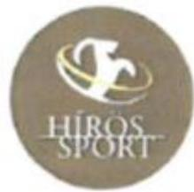

Hirós Sport Nonprofit Kft.
H - 6000 Kecskemét, Olímpia u. tia
Tel: +36 76 / 500 - 320 • Fax: +36 76 / 418 - 910
E-mail: titkarsag@hiros-sport.hu • www.hiros-sport.hu

Cégjegyzékszám: 03-99-116398 • Adószám: 21067202-2-03 • Szakszámlaszám (Be)Tétlen Bank ) 12076903-00143519-00100006

Állami Számvevőszék
1052 Budapest
Apáczai Csere János u. 10.

Tárgy: Észrevételek a Számvevőszéki jelentéstervezetről

Tisztelt Állami Számvevőszék!

Ikt.szám: HÍR

ÁLLAMI SZÁMVEVŐSZÉK
ÜGYVÍTELI HÍODA
088217/215
Érk.: OCT 27 2016

Báziskedve: 11-11-2017/2018
Melléklet:

Csatoltan megküldöm Pásztrai Ilona gazdálkodási igazgatónk által készített észrevételeket az Önöktől kapott „Számvevőszéki jelentéstervezet” című anyagra. Kérem szíveskedjenek ezt hivatalos válaszlevelünknek tekinteni.

Kecskemét, 2016. október 24.

Tisztelettel:

Szenes Márton
ügyvezető igazgató

---

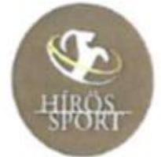

Hirós Sport Nonprofit Kft
H – 6000 Kecskemét, Olimpia u. 19
Tel.: +36 76 / 500 - 320 • Fax: +36 76 / 418 - 910
E-mail: tilkarsag@hiros-sport.hu • www.hiros-sport.hu

Cinglegzetéssem: 03-09-116398 • Adószám: 21087202-2-01 • Bankszámfeszám: Raiffeisen Bank | 12076903-00142519-00100006

Állami Számvevőszék

1052 Budapest

Apáczai Csere János u. 10.

Hiv.szám: V-1132-197/2016.

Tisztelt Címzett!

A fenti iktatószámon lefolytatott számvevőszéki ellenőrzés jelentéstervezetéhez az alábbi észrevételeket kívánom tenni.

Az Önök által lefolytatott ellenőrzés által érintett évek 2011-2014. voltak, azóta számos személyi változás történt, a jelenlegi ügyvezető 2015-ben vette át a Kft. irányítását, én magam két hónapja vagyok a cégnél, és az elmúlt években az Önök által feltárt hiányosságok döntő többsége megnyugtatóan rendezésre került, de az alábbiakban ezek részletes kifejtését is megteszem.

1. Hiányosságként említették a különböző szabályzatok meglétét, de Önök is megjegyezték, hogy az ellenőrzésbe bevont időszak utolsó éveiben ezek már javulást mutattak, a hiányzó szabályzatok többségével már rendelkezett cégünk. Ez a tendencia továbbra is folytatódik, 2015-ben és 2016-ban további szabályzatok készültek el, így tárgyévben már minden szükséges szabályzattal rendelkezünk, valamint a meglévők aktualizálása és továbbfejlesztése is folyamatban van. Az intézkedési javaslatoknál nevesítésre is került a pénzkezelési szabályzat, melynek legújabb változata 2016. január 1-től került kiadásra, és részletekbe menőkig szabályozza a készpénz és a bankszámla forgalmat, a pénzszállítást, jogosultságokat, stb.

2. A kiegészítő mellékletből hiányolták a vagyonkezelésbe vett eszközök mérlegtételek szerinti bontását, melyre a könyvvizsgáló sem hívta fel a figyelmünket, de a későbbiekben ez is kijavításra kerül, megtörténik a kívánt bontásban az eszközök bemutatása. A kiegészítő mellékletben a

---

későbbiekben viszont a bevételek és ráfordítások bemutatása is megtörténik a kívánt bontásban, melyre a könyvelésben alkalmazott üzemkódok lehetőséget adnak vagyonkezelt eszközre vonatkozóan is.
3. A közhasznú melléklet készítése éppen ezen a belső kódrendszeren alapul és kimutatásra kerülnek a vagyonkezelt eszközök, esetünkben az Élményfürdő és Csúszdapark ( mely a UL01 kód), vagyis a jelenlegi rendszer is alkalmas a kért adatok bemutatására a kiegészítő mellékletben is.
4. Kecskemét Megyei Jogú Város Városstratégiai Irodájával egyeztetve a vagyonkezelési adatszolgáltatáshoz igazítva vezetjük jelenleg is nyilvántartásunkat és megküldjük azt részükre, csak eddig évente történt, ezt követően negyedévente fogjuk a jelentést továbbítani, emennyiben történik változás, melyet önök szintén hiányosságként említettek.
5. A közérdekủ adatok megismerésének lehetősége már több éve megoldott, a honlapunkon minden ilyen jellegű adat megtekinthető, és teljes körű leszabályozása még folyamatban van, valamint az adatvédelmi és adatbiztonsági szabályzat is elkészült még 2015-ben, ahol az adatvédelmi felelős kijelölése is megtörtént.
6. Az önköltség számítási szabályzat továbbfejlesztése jelenleg is folyamatban van, ugyanis az általunk használt informatikai rendszer is tovább fejlesztésre esetleg cserére szorul, mely még részletesebb önköltség számítási rendszer kiépítést alapozza meg.

Az ellenőrzési jelentéstervezetüket fel kívánjuk használni rendszerünket és szabályzatainkat érintő továbbfejlesztés során, így köszönettel vettük jobbító szándékú észrevételeiket.

Kecskemét, 2016. október 24.

Tisztelettel:
Pásztrai Ilona
gazdálkodási igazgató

---

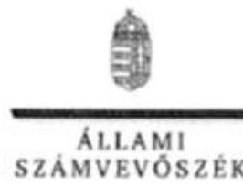

ELNÖK

Ikt.szám: V-1132-205/2016.

Szenes Márton úr
ügyvezető igazgató
Hirő́s Sport Szabadidő Létesítményeket
Müködtető és Szolgáltató Nonprofit Kft.

# Keeskemet 

## Tisztelt Ügyvezető Igazgató Úr!

„Az önkormányzatok gazdasági társaságai - Az önkormányzatok többségi tulajdonában lévő gazdasági társaságok gazdálkodásának ellenörzése - Hirós Sport Szabadidő Létesítményeket Müködtető és Szolgáltató Nonprofit Kft." címmel készített számvevőszéki jelentéstervezetre tett észrevételeit köszönettel megkaptam.
Az Állami Számvevőszék észrevételekre vonatkozó álláspontjáról a felügyeleti vezető által készített részletes tájékoztatást csatoltan megküldöm.
Tájékoztatom Ügyvezető Igazgató Urat, hogy a számvevőszéki jelentésben - az Állami Számvevőszékről szóló 2011. évi LXVI. törvény 29. § (3) bekezdése alapján - a figyelembe nem vett észrevételeket szerepeltetjük az elutasítás indokának feltüntetésével.

Budapest, 2016. 11 hó 4 nap

Tisztelettel:

Melléklet: Tájékoztatás az észrevételek kezelésérő́- $\mathrm{E} \mathrm{LN}^{\mathrm{S}}$

---

# Tájékoztatás   az észrevételek kezeléséről 

„Az önkormányzatok gazdasági társaságai - Az önkormányzatok többségi tulajdonában lévő gazdasági társaságok gazdálkodásának ellenőrzése - Hírös Sport Szabadidő Létesítményeket Működtető és Szolgáltató Nonprofit Kft." című jelentéstervezetre 2016. október 25-én tett (az Állami Számvevőszékhez 2016. október 27-én érkezett) észrevételeit áttekintettük, azok kezelésével kapcsolatban a következő tájékoztatást adom.
Az 1. észrevétel a szabályzatok elkészítésével, aktualizálásával kapcsolatban tartalmaz információkat az ellenőrzött időszakon (2011-2014. évek) túli évekre vonatkozóan, amelyek alapján azonban a jelentéstervezet módosítása nem indokolt.
A 2. észrevétel a kiegészítő melléklet hiányosságainak megszüntetésére vonatkozó jövőbeli, az ellenőrzött időszakon túli intézkedéseket vetít előre, melyek alapján a jelentéstervezet módosítása nem indokolt.
A 3. észrevétel a vagyonkezelésbe vett eszközök közhasznúsági mellékletben és kiegészítő mellékletben történő kimutatását jelzi az ellenőrzött időszakon túl, ezért a jelentéstervezet módosítását nem indokolja.
A 4. észrevétel a vagyonkezeléssel kapcsolatos (vagyonkataszteri) adatszolgáltatás gyakoriságának jövőbeni módosítását jelzi, amely alapján a jelentéstervezet módosítása nem indokolt.
Az 5. észrevétel tájékoztat arról, hogy a közérdekủ adatok megismerési lehetőségének szabályozása folyamatban van, a 2015. évben elkészült az adatvédelmi és adatbiztonsági szabályzat és megtörtént az adatvédelmi felelős kijelölése. Az ellenőrzött időszakon kívül tett intézkedések a jelentéstervezet módosítását nem indokolják.
A 6. észrevétel az önköltségszámítási szabályzat - és ehhez kapcsolódóan az informatikai rendszer - jelenleg is zajló továbbfejlesztéséről tájékoztat, amely alapján azonban a jelentéstervezet módosítása nem indokolt.
Tájékoztatom, hogy a számvevőszéki jelentés függelékeként szerepeltetjük a jelentéstervezethez tett észrevételeit, valamint az azokra adott válaszunkat.

Budapest, 2016. 11. hó 10. nap
Böröcz Imre felügyeleti vezető

---

# 1453 

## KECSKEMÉT MEGYEI JOGÚ VÁROS POLGÁRMESTERE

Ügyiratszám: 6222-18/2016.
Ügyintéző: dr. Szappanos Csilla

Tárgy: Hírös Sport Szabadidő Létesítményeket Müködtető és Szolgáltató Nonprofit Kft. ellenőrzési jelentéstervezete
Melléklet: 12/2016. (II. 16.) VPB. számú határozat

Állami Számvevőszék Domokos László elnök részére

## Budapest

Apáczai Csere János u. 10.
1052

## ÁLLAMI SZÁMVEVÖSZÉK   0895521016

Érkeze: 2016 OKT 28
Tílatósam: 11-4152-2016/1052
Melléklet:

Tisztelt Elnök Úr!
Kecskemét Megyei Jogú Város Önkormányzata megkapta „Az önkormányzatok gazdasági társaságai - Az önkormányzatok többségi tulajdonában lévő gazdasági társaságok gazdálkodásának ellenőrzése - Hírös Sport Szabadidő Létesítményeket Müködtető és Szolgáltató Nonprofit Kft." címmel készített számvevőszéki ellenőrzéshez készült jelentéstervezetet.

A jelentéstervezet Kecskemét Megyei Jogú Város Polgármestere számára megfogalmazott javaslata alapjául szolgáló 1.2. számú megállapítás 4. bekezdésére az alábbi észrevételt tesszük.

Kecskemét Megyei Jogú Város Közgyűlése 416/2011. (XII.15.) KH. számú határozatának pontjában előírta az önkormányzat kizárólagos és többségi tulajdonában álló gazdasági társaságai felügyelőbizottságai részére, hogy a gazdasági társaságnál tervezett ellenőrzéseikről minden év február 28. napjáig tervet nyújtsanak be a tulajdonosi joggyakorló felé, valamint a határozat 2.) pontja szerint tárgyévet követő év február 28. napjáig számoljanak be az elfogadott ellenőrzési tervben foglaltak végrehajtásáról.

Tájékoztatom Tisztelt Elnök Urat, hogy a társaság felügyelőbizottságának a 2011. üzleti évre vonatkozóan az önkormányzat, mint tulajdonos még nem írt elő beszámolási kötelezettséget, tekintettel arra, hogy a 416/2011. (XII.15.) KH. számú határozat a közgyűlés 2011 decemberi rendes ülésén került elfogadásra és a jövőre nézve írta elő a felügyelőbizottság ellenőrzéseire vonatkozó tervezési és beszámolási kötelezettségét, melynek megfelelően a Költségvetési és Vagyongazdálkodási Bizottság, mint a kijelölt tulajdonosi joggyakorló - 2012. február 15. napján - a 14/2012. (II.15.) KVB. sz. határozatával elfogadta a kizárólagos és többségi önkormányzati tulajdonú gazdasági társaságok felügyelőbizottságainak 2012. évi ellenőrzési tervét.

A 2014. évi helyi önkormányzati választásokat követően az önkormányzat kizárólagos és többségi tulajdonában lévő gazdasági társaságoknál új személyi összetételű felügyelőbizottságok alakultak. Kecskemét Megyei Jogú Város Közgyűlése Városstratégiai és

---

Pénzügyi Bizottság 33/2014. (XII.5.) VPB. számú határozatával megválasztotta a Hírös Sport Nonprofit Kft. új személyi összetételű felügyelőbizottságát. A tárgyi határozat szerint az új felügyelőbizottságok tagjai megbízatásának időtartama 2014. december 5. napjától 2019. november 30. napjáig tart. Ennek következtében a 2014. november 30. napjáig müködő felügyelőbizottság tagjait az általuk lefolytatott 2014. évi ellenőrzésekről a jogviszonyuk megszünésére tekintettel nem lehet beszámoltatni.

Fentiekre tekintettel - összefoglalóan megállapítható -, hogy a társaságnál müködő felügyelőbizottság a 2011. évre vonatkozóan nem rendelkezett beszámolási kötelezettséggel, míg a 2014. év tekintetében az önkormányzatnak nincs lehetősége arra, hogy - az év közben bekövetkezett jogviszony megszűnésre tekintettel - beszámoltassa a korábban (2014. november 30. napját megelőzően) müködő felügyelőbizottságot.

Tájékoztatom Tisztelt Elnök Urat, hogy Kecskemét Megyei Jogú Város Önkormányzata Közgyűlésének a Közgyűlés és Szervei Szervezeti és Müködési Szabályzatáról szóló 4/2013. (II. 14.) önkormányzati rendelete 1. melléklet 5.1.3. pontja és a 416/2011. (XII.15.) KH. számú határozat szerint a kijelölt tulajdonosi joggyakorló a Városstratégiai és Pénzügyi Bizottság. A nevezett bizottság felelős a kizárólagos és többségi tulajdonú gazdasági társaságok vezető tisztségviselői gazdálkodásának, valamint a felügyelőbizottságok ellenőrzési tevékenységének beszámoltatásáért, ami kiterjed az egységes adatszolgáltatás és beszámoltatás rendjére, így a felügyelőbizottságok egységes szempontok szerinti ellenőrzésére és beszámoltatására is, melyre vonatkozóan - a 2016. évtől kezdődően - a 12/2016. (II. 15.) VPB. számú határozat alapján született döntés. Ennek megfelelően a bizottság 2016 decemberében is határozatot hoz a kizárólagos és többségi tulajdonú gazdasági társaságok 2017. évre vonatkozó adatszolgáltatási és beszámoltatási rendjének tárgyában.

Kérem fenti észrevételeink szíves figyelembevételét.
Kecskemét, 2016. október 24.
Tisztelettel:
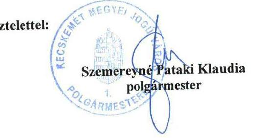

Ügyintézés helye:
Kecskemét Megyei Jogú Város Polgármesteri Hivatala
Szervezési és Jogi Iroda
Jogi Osztály
Vagyongazdálkodási Csoport
$\square 6000$ Kecskemét, Kossuth tér 1.
76/513-513/2381 ügyintéző telefonszáma Fax: 76/513-538 e-mail: szappanos.csilla@kecskemet.hu

---

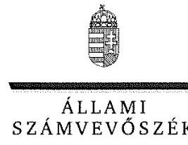

ELNÖK

Ikt.szám: V-1132-206/2016.

# Szemereyné Pataki Klaudia úrhölgy 

polgármester

Kecskemét Megyei Jogú Város Önkormányzata

## Kecskemét

## Tisztelt Polgármester Úrhölgy!

„Az önkormányzatok gazdasági társaságai - Az önkormányzatok többségi tulajdonában lévő gazdasági társaságok gazdálkodásának ellenörzése - Hirös Sport Szabadidő Létesítményeket Müködtető és Szolgáltató Nonprofit Kft. " címmel készített számvevőszéki jelentéstervezetre tett észrevételeit köszönettel megkaptam.
Az Állami Számvevőszék észrevételekre vonatkozó álláspontjáról a felügyeleti vezető által készített részletes tájékoztatást csatoltan megküldöm.
Tájékoztatom Polgármester Úrhölgyet, hogy a számvevőszéki jelentésben - az Állami Számvevőszékről szóló 2011. évi LXVI. törvény 29. § (3) bekezdése alapján - a figyelembe nem vett észrevételeket szerepeltetjük az elutasítás indokának feltüntetésével.

Budapest, 2016. 17. hó 2.1. nap
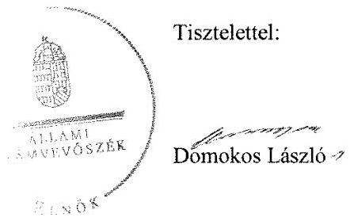

Melléklet: Tájékoztatás az észrevétel kezeléséről

---

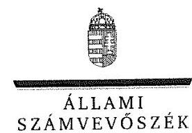

FELÜGYELETI VEZETŐ

Melléklet
Ikt.szám: V-1132-206/2016.

# Tájékoztatás   az észrevétel kezeléséről 

„Az önkormányzatok gazdasági társaságai - Az önkormányzatok többségi tulajdonában lévő gazdasági társaságok gazdálkodásának ellenőrzése - Hírős Sport Szabadidő Létesítményeket Működtető és Szolgáltató Nonprofit Kft." című jelentéstervezetre 2016. október 25-én tett (az Állami Számvevőszékhez 2016. október 28-án érkezett) észrevételét áttekintettük, annak kezelésével kapcsolatban a következő tájékoztatást adom.
A Polgármester számára megfogalmazott javaslat alapjául szolgáló 1.2. számú megállapítás 4. bekezdésére tett észrevétele alapján a felügyelőbizottság a 2011. évi ellenőrzéseiről azért nem számolt be a Költségvetési és Vagyongazdálkodási Bizottság részére, mert a 416/2011. (XII. 15.) KH számú határozat 2. pontja szerint a tárgyévet követő év február 28-ig kell beszámolni az elfogadott ellenőrzési tervben foglaltak végrehajtásáról, amelyre a 2012. évre vonatkozóan kerülhetett először sor. A dokumentumok (a 416/2011. (XII. 15.) KH számú határozat és a kapcsolódó előterjesztés) ismételt áttekintését követően a jelentéstervezet megállapításából a 2011. évre vonatkozó részt töröljük.
Az észrevétel alapján a 2014. november 30 -áig müködő felügyelőbizottság tagjait az általuk lefolytatott 2014. évi ellenőrzésekről a jogviszonyuk megszünése miatt nem lehetett beszámoltatni. Tekintettel arra, hogy a felügyelőbizottság tagjaiban bekövetkezett változás nem befolyásolja a 416/2011. (XII. 15.) KH számú határozat 2. pontjában foglalt beszámolási kötelezettség teljesítését (továbbá a 2014. november 30 -áig müködő felügyelőbizottság tagjai 2014. november 30 -áig beszámoltathatóak voltak), azonban erre nem került sor, ezért a jelentéstervezet módosítása nem indokolt.
Köszönjük tájékoztatását a felügyelőbizottságok egységes szempontok szerinti ellenőrzését és adatszolgáltatását is érintő, 12/2016. (II. 15.) VPB számú határozatról, valamint a 2017. évre vonatkozó adatszolgáltatás és beszámolás rendjének tárgyában tervezett határozatról.
Tájékoztatom, hogy a számvevőszéki jelentés függelékeként szerepeltetjük a jelentéstervezethez tett észrevételeit, valamint az azokra adott válaszunkat.

Budapest, 2016. 111. hó 21, nap

Böröcz Imre
felügyeleti vezető

---

# RÖVIDÍTÉSEK JEGYZÉKE 

${ }^{1}$ Önkormányzat
${ }^{2}$ Társaság
${ }^{3}$ ÁSZ
${ }^{4}$ ÁSZ tv.
${ }^{5}$ Gazdasági program
${ }^{6}$ Ötv.
${ }^{7}$ Mótv.
${ }^{8}$ Nvtv.
${ }^{9}$ Vagyongazdálkodási terv
${ }^{10}$ Sporttörvény
${ }^{11}$ SZMSZ
${ }^{12}$ Közhasznú megállapodás
${ }^{13}$ Vagyonkezelési szerződés
${ }^{14}$ Vagyonrendelet
${ }^{15} \mathrm{KVB}$
${ }^{16} \mathrm{VPB}$
${ }^{17}$ Alapító okirat
${ }^{18} \mathrm{Gt}$.
${ }^{19}$ Ptk.
${ }^{20}$ Számv. tv.
${ }^{21}$ Számviteli politika
${ }^{22}$ Leltározási szabályzat
${ }^{23}$ Értékelési szabályzat
${ }^{24}$ Önköltségszámítási szabályzat
${ }^{25}$ Pénzkezelési szabályzat
${ }^{26}$ Számlarend
${ }^{27}$ Közhasznú tv.

Kecskemét Megyei Jogú Város Önkormányzata
Hírös Sport Szabadidő Létesítményeket Működtető és Szolgáltató Nonprofit Kft. Állami Számvevőszék
2011. évi LXVI. törvény az Állami Számvevőszékről

Kecskemét Város Gazdasági programja 2007-2013.
a helyi önkormányzatokról szóló 1990. évi LXV. törvény (hatálytalan: a 2014. október 12-től)
Magyarország helyi önkormányzatairól szóló 2011. évi CLXXXIX. törvény (hatályos: 2012. január 1-jétől)
a nemzeti vagyonról szóló 2011. évi CXCVI. törvény (hatályos 2012. január 1-től) 151/2013. (VI. 27.) közgyűlési határozattal elfogadott közép- és hosszú távú vagyongazdálkodási terv 2013-2020. közötti időszakra
a sportról szóló 2004. évi I. törvény
Szervezeti és Müködési Szabályzat
83/2003. (III.5.) KH alapján létrejött, többször módosított Közhasznú megállapodás
2009. május 4-én megkötött vagyonkezelési szerződés Kecskemét Megyei Jogú Város Önkormányzata és a Hírös Sport Szabadidő Létesítményeket Müködtető és Szolgáltató Nonprofit Kft. között
25/2003. (VI. 2.) és 19/2013. (VI. 27.) számú önkormányzati rendeletek
Költségvetési és Vagyongazdálkodási Bizottság (2011-2013)
Városstratégiai és Pénzügyi Bizottság (2014. január 1-től)
Hírös Sport Szabadidő Létesítményeket Müködtető és Szolgáltató Nonprofit Kft. alapító okirata és módosításai
2006. évi IV. törvény a gazdasági társaságokról (hatálytalan: 2014. március 15től)
2013. évi V. törvény a Polgári Törvénykönyvről (hatályos: 2014. március 15-től)
2000. évi C. törvény a számvitelről, hatályos 2001. január 1-jétől
Hírös Sport Szabadidő Létesítményeket Müködtető és Szolgáltató Nonprofit Kft. számviteli politikája (hatályos: 2009. március 16-tól) és módosítása (2012. január 1-től)
Hírös Sport Szabadidő Létesítményeket Müködtető és Szolgáltató Nonprofit Kft. leltárkészítési és leltározási szabályzata (hatályos: 2009. január 1-től)
Hírös Sport Szabadidő Létesítményeket Müködtető és Szolgáltató Nonprofit Kft. értékelési szabályzata a Számviteli politika részeként (hatályos: 2009. január 1től) és módosítása (2012. január 1-től)
Hírös Sport Szabadidő Létesítményeket Müködtető és Szolgáltató Nonprofit Kft. önköltségszámítási szabályzata (hatályos: 2001. január 1-től), módosításai: 2012. június 1-től, 2012. november 1-től)
Hírös Sport Szabadidő Létesítményeket Müködtető és Szolgáltató Nonprofit Kft. pénzkezelési szabályzata (hatályos: 2012. február 1-től)
Hírös Sport Szabadidő Létesítményeket Müködtető és Szolgáltató Nonprofit Kft. számlarendje (hatályos: 2013. január 1-től)
A közhasznú szervezetekről szóló 1997. évi CLVI. törvény

---

${ }^{28}$ Civil tv.
${ }^{29}$ Javadalmazási szabályzat
${ }^{30}$ Taktv.
${ }^{31}$ Közgyűlés
${ }^{32}$ vagyonkezelésbe vett vagyon
${ }^{33}$ Nvtv.
${ }^{34}$ Éves beszámoló
${ }^{35}$ Avtv.
${ }^{36}$ Info tv.
${ }^{37}$ Eisztv.

Az egyesülési jogról, a közhasznú jogállásról, valamint a civil szervezetek múködéséről és támogatásáról szóló 2011. évi CLXXV. törvény
Hírös Sport Szabadidő Létesítményeket Működtető és Szolgáltató Nonprofit Kft. javadalmazási szabályzata (hatályos: 2010. február 5-től) és módosítása (hatályos: 2012. február 17-től)
a köztulajdonban álló gazdasági társaságok takarékosabb müködéséről szóló 2009. évi CXXII. törvény (hatályos: 2009. december 4-től)

Kecskemét Megyei Jogú Város Önkormányzatának Közgyűlése
Kecskeméti Élményfürdő és Csúszdapark (hrsz: 10211/2, kivett strandfürdő megjelölésű ingatlan), a 157/2009. (IV.29.) sz. KH alapján
a nemzeti vagyonról szóló 2011. évi CXCVI. törvény
Hírös Sport Szabadidő Létesítményeket Múködtető és Szolgáltató Nonprofit Kft. 2011-2014. évi éves beszámolói
1992. évi LXIII. törvény a személyes adatok védelméről és a közérdekú adatok nyilvánosságáról (hatályos 2011. december 31-ig)
2011. évi CXII. törvény az információs önrendelkezési jogról (hatályos 2011. július 27-től)
2005. évi XC. törvény az elektronikus információszabadságról (hatályos: 2011. december 31-ig)

---

# ÁLLAMI SZÁMVEVŐSZÉK 

1052 Budapest, Apáczai Csere János utca 10.
Levélcím: 1364 Budapest 4. Pf. 54
Telefon: +36 14849100 Telefax: +36 14849200
www.asz.hu