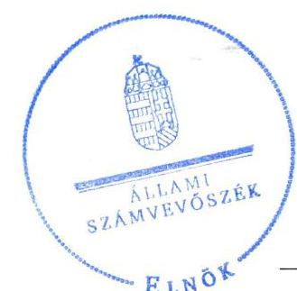
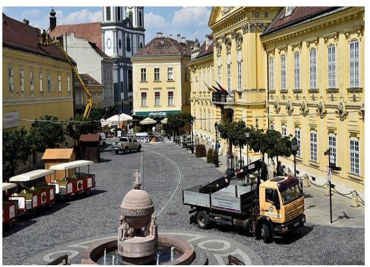
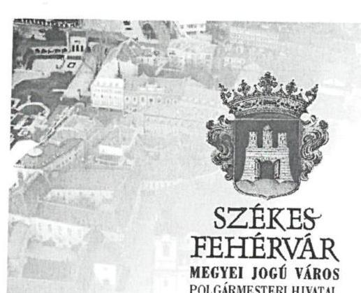
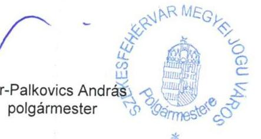
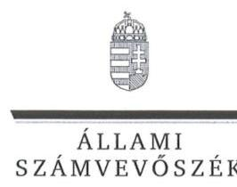

# Jelentés 

## Az önkormányzatok gazdasági társaságai

Az önkormányzatok többségi tulajdonában lévő gazdasági társaságok gazdálkodásának ellenőrzése - Székesfehérvár Városgondnoksága Kft.
2016.

Az ÁSZ az államháztartáson kívül működő közfeladat-ellátó rendszerek ellenőrzéseivel hozzájárul ahhoz, hogy a közpénzeket az államháztartáson kívül működő szervezetek is átlátható, rendezett módon használják fel a közfeladatok ellátása érdekében.

---

# Jelentés 

## Az önkormányzatok gazdasági társaságai

Az önkormányzatok többségi tulajdonában lévő gazdasági társaságok gazdálkodásának ellenőrzése - Székesfehérvár Városgondnoksága Kft.
2016. december hó 16. nap

16248
www.asz.hu

Domokos László elnök

Az ÁSZ az államháztartáson kívül működő közfeladat-ellátó rendszerek ellenőrzéseivel hozzájárul ahhoz, hogy a közpénzeket az államháztartáson kívül működő szervezetek is átlátható, rendezett módon használják fel a közfeladatok ellátása érdekében.

---

# AZ ELLENŐRZÉST FELÜGYELTE:

DR. HORVÁTH MARGIT felügyeleti vezető

## AZ ELLENŐRZÉST VEZETTE ÉS A VÉGREHAJTÁSÁÉRT FELELŐS:

VIDA KATALIN ellenőrzésvezető

## A PROGRAM ÖSSZEÁLLÍTÁSÁÉRT FELELŐS:

JANIK JÓZSEF osztályvezető

IKTATÓSZÁM: V-1111-295/2016

TÉMASZÁM: 2145

ELLENŐRZÉS-AZONOSÍTÓ SZÁM: V070776

Jelentéseink az Országgyűlés számítógépes hálózatán és az Interneten a www.asz.hu címen is olvashatóak.

---

# TARTALOMJEGYZÉK 

■ ÖSSZEGZÉS ..... 5
■ AZ ELLENŐRZÉS CÉLJA ..... 7
■ AZ ELLENŐRZÉS TERÜLETE ..... 8
■ AZ ELLENŐRZÉS HÁTTERE, INDOKOLTSÁGA ..... 10
■ A JELENTÉS LÉNYEGES KÉRDÉSKÖREI ..... 11
■ ELLENŐRZÉS HATÓKÖRE ÉS MÓDSZEREI ..... 12
■ MEGÁLLAPÍTÁSOK ..... 14
■ JAVASLATOK ..... 23
■ MELLÉKLETEK ..... 25
I. sz. melléklet: Értelmező szótár ..... 25
II. sz. melléklet: A működés főbb jellemzői ..... 28
III. sz. melléklet: A Városgondnokság Kft. eszközei használhatósági foka, elhasználódási szintje és átlagos életkora ..... 29
IV. sz. melléklet: A Városgondnokság Kft. eladósodottsági mutatói ..... 30
■ FÜGGELÉK: ÉSZREVÉTELEK ..... 31
■ RÖVIDÍTÉSEK JEGYZÉKE ..... 35

---

.

---

# ÖSSZEGZÉS 

A Székesfehérvár Megyei Jogú Város Önkormányzata a Székesfehérvár Városgondnoksága Kft. által ellátott piac üzemeltetési közfeladat ellátását szabályszerűen szervezte meg, és a tulajdonosi jogokat összességében megfelelően gyakorolta. A Társaság vagyongazdálkodásának belső szabályozása megfelelt a jogszabályi előírásoknak, kötelezettségállománya az ellenőrzött időszakban nem jelentett veszélyt a közfeladatok ellátására, a működésre. A Társaság az ellenőrzött időszakban a beszámolási kötelezettségét teljesítette, a beszámoló közzétételi kötelezettségének összességében eleget tett. A bevételek és ráfordítások, valamint az értékcsökkenés elszámolása megfelelő volt. A Társaságnál az önköltségszámítás és árképzés a jogszabályoknak, az Önkormányzat rendeleteinek és a belső szabályoknak megfelelően történt.

## Az ellenőrzés társadalmi indokoltsága

Az Állami Számvevőszék stratégiájában megfogalmazta, hogy a helyi önkormányzatok gazdálkodásában rejlő pénzügyi kockázatok feltárásával, az államháztartáson kívülre nyújtott költségvetési támogatások és ingyenes vagyonjuttatások, valamint az államháztartáson kívül működő közfeladat-ellátó rendszerek ellenőrzéseivel hozzájárul ahhoz, hogy a közpénzeket az államháztartáson kívül működő szervezetek is átlátható, rendezett módon használják fel a közfeladatok szerződésben vállalt ellátása érdekében.

A Magyarországon az intézmény-centrikus közfeladat-ellátás jellemző, de egyre jelentősebb a költségvetésen kívüli feladatellátás térnyerése. Ennek legfontosabb szereplői - a nonprofit szervezetek mellett - az önkormányzati tulajdonú gazdasági társaságok. Az önkormányzatok szervezetalakítási szabadságának következménye, hogy a korábban is vállalati formában működő közszolgáltatások mellett, mind a kötelező, mind az önként vállalt feladatok ellátásában a gazdasági társaságok kiemelt fontosságú szerephez jutottak.

## Főbb megállapítások, következtetések, javaslatok

A Székesfehérvár Városgondnoksága Kft. által ellátott piac üzemeltetési közfeladat megszervezésére vonatkozó önkormányzati döntés és annak előkészítése összességében szabályszerű volt. A tulajdonosi jogok gyakorlása a jogszabályi előírásoknak, a vagyonrendeletnek, az Alapító okiratnak és az Önkormányzat SZMSZ-ének megfelelt. Az ellenőrzött időszakban a Felügyelő Bizottság ügyrendet nem készített.

A Városgondnokság Kft. rendelkezett a működéshez szükséges szabályzatokkal, azonban azok - a közfeladatok bevételeinek és ráfordításainak egyértelmű elkülönítési kötelezettsége, a beszámoló készítés formájának szabályozása, valamint az önköltségszámítás szabályozása vonatkozásában - hiányosak voltak az ellenőrzött időszakban. A vagyongazdálkodás a jogszabályi rendelkezéseknek megfelelt. A Városgondnokság Kft. kötelezettségállománya az ellenőrzött időszakban nem jelentett veszélyt a közfeladatainak ellátására, illetve a Társaság működésére.

A Városgondnokság Kft. az ellenőrzött időszakban a jogszabályi, illetve az alapító által előírt beszámolási és adatszolgáltatási kötelezettségét teljesítette.

A Városgondnokság Kft. a közérdekű adatok megismerésére irányuló kérelmek intézésének, igények teljesítésének rendjére vonatkozó szabályzatot az Avtv., valamint az Info tv. előírásai ellenére a 2011-2014. években nem készített, az adatok közzétételére vonatkozó feladatokat hiányosan teljesítették az ellenőrzött időszakban.

A Városgondnokság Kft.-nél az anyagjellegű ráfordításokat, valamint az értékesítés nettó árbevételeit megfelelően számolták el. A beruházások, felújítások elszámolása az írásbeli kötelezettségvállalásra vonatkozó dokumentumok

---

tekintetében hiányos volt. A követelések behajtására vonatkozó jogszabályi előírásokat - a hulladékgazdálkodási tevékenységből származó hátralékokra vonatkozó Ht. kivételével - betartották.

A Városgondnokság Kft. önköltség-számítása és árképzése a jogszabályoknak, az Önkormányzat rendeleteinek és a belső szabályoknak megfelelően történt.

Az Önkormányzat többségi tulajdonában lévő Városgondnokság Kft. gazdálkodásának a kormányzati szektor hiányára és az államadósságra befolyással bíró elemei a jogszabályi előírásoknak megfeleltek. A Társaság az ellenőrzött időszakban adósságot keletkeztető kötelezettséget nem vállalt. Az ellenőrzött időszakot megelőzően, 2010. évben kötött hosszú lejáratú jelzálog alapú beruházási hitelszerződésének számviteli elszámolása szabályszerű volt.

A kormányzati szektor hiányára befolyást gyakorló bevételek és ráfordítások elszámolása a Városgondnokság Kft.-nél a jogszabályi és a belső előírásoknak megfelelően történt. Az ellenőrzött időszakban az alapító Önkormányzat a Városgondnokság Kft. eredményének eredménytartalékba történő helyezéséről döntött, így osztalék kifizetésére nem került sor.

---

# AZ ELLENŐRZÉS CÉLJA 

Az ellenőrzés célja annak értékelése, hogy az önkormányzat vagyongazdálkodási tevékenysége során szabályszerűen gyakorolta-e a tulajdonosi jogait; a gazdasági társaság szabályozottsága, gazdálkodása és vagyongazdálkodási tevékenysége, bevételeinek és ráfordításainak elszámolása megfelelt-e a jogszabályi és tulajdonosi előírásoknak; a gazdasági társaság kötelezettségállománya jelent-e kockázatot a működésre, valamint a gazdálkodás átláthatósága és elszámoltathatósága érdekében biztosítva volt-e a szolgáltatás díjának megalapozottsága szabályszerű önköltségszámítással, továbbá annak értékelése, hogy a gazdasági társaság gazdálkodásának a kormányzati szektor hiányára és az államadósságra befolyással bíró elemei a jogszabályi előírásoknak megfeleltek-e.

---

# **AZ ELLENŐRZÉS TERÜLETE**

## **Székesfehérvár Megyei Jogú Város Önkormányzata és a kizárólagos tulajdonában lévő Székesfehérvár Városgondnoksága Kft.**

Az Önkormányzat¹ – az Ötv.² 9. § (4) bekezdésében foglalt lehetőségével élve – az ellenőrzött időszakot megelőzően, a 2009. évben döntött a piac- és vásári tevékenység működtetési közfeladat gazdasági társaság útján történő ellátásáról.

### **A SZÉKESFEHÉRVÁR VÁROSGONDNOKSÁGA KFT.**

-t 2009. május 27-én alapította Székesfehérvár Megyei Jogú Város Önkormányzata, Székesfehérvár Városgondnoksága Nonprofit Kft. néven, majd 2010. december 9-étől Székesfehérvár Városgondnoksága Kft. néven működött. A Társaság³ 100%-os tulajdonosa Székesfehérvár Megyei Jogú Város Önkormányzata. A Társaság részére a feladatellátáshoz szükséges vagyont 100,0 M Ft értékben a 2009. május 27-i alakulásakor az Önkormányzat bocsátotta rendelkezésre. A jegyzett tőke 10 M Ft pénzbeli hozzájárulásból és 90 M Ft apportból állt.

A Városgondnokság Kft.⁴-t az Önkormányzat a törzsvagyonába tartozó vagyon üzemeltetésével, az önkormányzati kötelező és önként vállalt feladatok költség-hatékony ellátása érdekében hozta létre. Az alapító okirat szerint a Városgondnokság Kft. fő tevékenysége az építmény-üzemeltetés volt. A Városgondnokság Kft. által ellátott közfeladatok közül a teljesített bevétele, valamint az ellenőrzött szerv nyilatkozata alapján a piac üzemeltetési tevékenységét ellenőriztük 2011-2014. évek vonatkozásában.

A Társaság feladatkörébe tartozott még a városüzemeltetés, kisegítő mezőgazdasági szolgáltatás, közvilágítás, vízkárelhárítás, közutak, hidak, alagutak üzemeltetése, piaci és vásári tevékenység, fizető parkolási rendszer üzemeltetése, közmunka foglalkoztatás szervezése, karbantartás, állategészségügyi tevékenység, szabadidős létesítmények üzemeltetése, önkormányzati vagyon kezelése, illetve temetők fenntartása.

A Városgondnokság Kft. piac üzemeltetésével kapcsolatos bevételeit és kiadásait az 1. táblázat tartalmazza.

1. táblázat

|  VÁROSGONDNOKSÁG KFT. PIAC ÜZEMELTETÉSÉVEL KAPCSOLATOS BEVÉTELEI ÉS KIADÁSAI 2011-2014. ÉVEK (M FT) |  |  |  |   |
| --- | --- | --- | --- | --- |
|  Megnevezés | 2011. év | 2012. év | 2013. év | 2014. év  |
|  Piac üzemeltetés, értékesítés nettó árbevétele (M Ft) | 158,4 | 143,1 | 149,3 | 148,2  |
|  Piac üzemeltetés kiadásai (M Ft) | 125,8 | 128,9 | 135,9 | 157,7  |

*Forrás: Beszámolók adatai*

---

A Városgondnokság Kft. vagyoni helyzetét jellemző, főbb mérlegadatait a 2. táblázat tartalmazza.
2. táblázat

A VÁROSGONDNOKSÁG KFT. FŐBB MÉRLEG ADATAI (MILLIÓ FORINT)

| Megnevezés | $\begin{gathered} 2011 . \\ (2.3) \end{gathered}$ | $\begin{gathered} 2012 . \\ (2.3) \end{gathered}$ | $\begin{gathered} 2013 . \\ (2.3) \end{gathered}$ | $\begin{gathered} 2014 . \\ (2.3) \end{gathered}$ |
| :--: | :--: | :--: | :--: | :--: |
| I. Befektetett eszközök | 1102,1 | 1250,4 | 3956,7 | 2414,3 |
| - ebből: Tárgyi eszközök | 1048,7 | 1188,9 | 3896,1 | 2356,2 |
| II. Forgó eszközök | 431,1 | 459,4 | 831,2 | 228,2 |
| - ebből: Követelések | 139,2 | 230,4 | 511,9 | 167,7 |
| III. Aktív időbeli elhatárolás | 16,6 | 6,5 | 36,1 | 39,1 |
| Eszközök összesen | 1549,8 | 1716,3 | 4824,0 | 2681,6 |
| IV. Saját tőke | 751,3 | 943,7 | 2705,2 | 797,7 |
| - ebből: Jegyzett tőke | 100,0 | 100,0 | 100,0 | 100,0 |
| - ebből Eredménytartalék | 47,4 | 563,3 | 503,8 | 614,8 |
| - ebből Lekötött tartalék | 141,6 | 88,0 | 88,0 | - |
| - ebből Mérleg szerinti eredmény | 462,3 | 192,4 | 198,6 | 83,0 |
| V. Kötelezettségek | 622,3 | 598,7 | 1220,1 | 1052,9 |
| VI. Passzív időbeli elhatárolás | 176,2 | 173,9 | 898,7 | 831,0 |
| Források összesen | 1549,8 | 1716,3 | 4824,0 | 2681,6 |

A Társaság működésének főbb jellemzőit a 2011-2014. évek vonatkozásában a II. sz. melléklet mutatja be. Az ellenőrzött években a Városgondnokság Kft. nyereségesen gazdálkodott.

A beruházásokhoz a Társaság az ellenőrzött időszakot megelőzően a Szent Vendel utcai székhely beruházáshoz 300 M Ft hosszú lejáratú hitelt vett fel 2009. évben, az ellenőrzött években az ARAK Sportcentrum kivitelezéséhez az EMMI-től 739,2 M Ft vissza nem térítendő támogatást kapott.

A Társaság átlagos statisztikai állományi létszáma a 2011. évi 314 főről 2014. év végére 668 főre növekedett a foglalkoztatási jogviszony módjának változása miatt.

Az ellenőrzött időszakban a polgármester és a jegyző, valamint az ügyvezető személye nem változott.

---

# AZ ELLENŐRZÉS HÁTTERE, INDOKOLTSÁGA 

Az önkormányzatok közfeladat-ellátásában egyre jelentősebb a gazdasági társaságok útján történő feladatellátás térnyerése.

AZ ÖNKORMÁNYZATI TULAJDONÚ GAZDASÁGI TÁRSASÁGOK ellenőrzése kiemelten fontos a vagyon megőrzése, megóvása érdekében, valamint a kormányzati szektor elszámolásaiban megjelenő önkormányzati tulajdonú gazdálkodó szervezetek esetében, amelyekkel szemben alapvető követelmény, hogy gazdálkodásuk, működésük szabályszerű, az általuk szolgáltatott adatok minél megbízhatóbbak legyenek. A feladat/közfeladat-ellátás költségeinek, ráfordításainak alakulása, színvonala hatással van a lakosság elégedettségére. A törvényalkotás számára - az észlelt problémák, szabálytalanságok, vagy egyéb nem kívánatos jelenségek felszínre kerülésével - az ellenőrzés megállapításai segítséget nyújthatnak az államháztartáson kívüli feladat/közfeladat-ellátás értékeléséhez, jogszabályi keretei pontosításához, átláthatóságot biztosító szabályozásához. Meghatározhatóvá válnak az önkormányzati feladatellátásban részt vevő államháztartáson kívüli szervezeteknek - az önkormányzat költségvetését, pénzügyi helyzetét is befolyásoló - kockázatai, lehetővé válik ezen kockázatok csökkentése. Ellenőrzéseink feltárhatják, hogy az önkormányzat feladat-ellátási kötelezettségének szabályszerűen tett-e eleget, a feladatellátáshoz rendelt vagyonkezelésbe vett és saját vagyon működtetését az elvárható gondossággal, szabályszerűen szervezte-e
 meg és a tulajdonosi felügyelete hozzájárult-e a feladatellátásához. Az ellenőrzés rávilágíthat arra, hogy a gazdasági társaság a feladat-ellátási, közszolgáltatási szerződésben foglaltak betartásával, a vagyon használatával biztosította-e a szolgáltatás folytatásának feltételeit, a feladat ellátását. Ezzel az ellenőrzöttek és a helyi döntéshozók számára visszajelzést ad feladatszervezési, feladat-ellátási kockázataikról, alapot ad a meglévő hibák megszüntetéséhez, a jobb feladatellátás biztosításához. Fokozza a fegyelmet, igazolja, hogy lejárt a következmények nélküli ellenőrzések időszaka. Az ÁSZ értékteremtő rend kialakításához és megőrzéséhez hozzájáruló tevékenysége pozitív hatással van a szervezetről kialakított összkép formálására.

---

# A JELENTÉS LÉNYEGES KÉRDÉSKÖREI 

1. Az Önkormányzat közfeladat megszervezéséről szóló döntése, valamint tulajdonosi joggyakorlása szabályszerű volt-e?
2. A gazdasági társaság vagyongazdálkodása szabályszerű volt-e, kötelezettségállománya jelentett-e kockázatot a működésre, illetve a feladat/közfeladat ellátásra?
3. A gazdasági társaságnál az ellátott közfeladat bevételei és ráfordításai elszámolása, valamint az önköltségszámítás és árképzés szabályszerű volt-e?
4. A többségi önkormányzati tulajdonban lévő gazdasági társaság gazdálkodásának a kormányzati szektor hiányára és az államadósságra befolyással bíró elemei megfeleltek-e a jogszabályi előírásoknak?

---

# ELLENŐRZÉS HATÓKÖRE ÉS MÓDSZEREI 

## Az ellenőrzés típusa

Megfelelőségi ellenőrzés

## Az ellenőrzött időszak

2011. január 1-jétől 2014. december 31-ig tartó időszak

## Az ellenőrzés tárgya

A gazdasági társaság feletti tulajdonosi joggyakorlás, valamint a gazdasági társaság gazdálkodásának szabályozottsága és szabályszerűsége. A kormányzati szektorba sorolt, többségi önkormányzati tulajdonban lévő gazdasági társaságok gazdálkodásának a kormányzati szektor hiányára és az államadósságra befolyással bíró elemei szabályszerűsége.

Az ellenőrzés kiterjed minden olyan körülményre és adatra, amely az ÁSZ jogszabályban meghatározott feladatainak teljesítéséhez, valamint a program végrehajtása folyamán felmerült újabb összefüggések feltárásához szükséges.

## Az ellenőrzött szervezet

Székesfehérvár Megyei Jogú Város Önkormányzata és a Székesfehérvár Városgondnoksága Kft.

## Az ellenőrzés jogalapja

Az ellenőrzés jogszabályi alapját az Állami Számvevőszékről szóló 2011. évi LXVI. törvény 1. § (3) bekezdése, és az 5. § (3)-(4)-(5) bekezdése képezte.

## Az ellenőrzés módszerei

Az ellenőrzést a nemzetközi standardokat irányadónak tekintve az ellenőrzési program ellenőrzési kérdései, az ellenőrzött időszakban hatályos jogszabályok, az ellenőrzés szakmai szabályok és módszertanok figyelembe vételével végeztük.

Az ellenőrzés ideje alatt az ellenőrzött szervezettel történő kapcsolattartást az ÁSZ Szervezeti és Működési Szabályzatának vonatkozó előírásai alapján biztosítottuk.

---

Az ellenőrzés a kiválasztott, tulajdonosi jogokat gyakorló önkormányzatra, illetve az ellenőrzésre kijelölt gazdasági társaság felett tulajdonosi jogokat gyakorló szervezetre és az ellenőrzött gazdasági társaságra terjedt ki. Amennyiben az ellenőrzött szervezet kormányzati szektorba sorolt gazdasági társaság, ezért a V0708 ESA kiegészítő modul szerinti ellenőrzési feladatokat is elvégeztük a jelen program végrehajtásával egyidejűleg.

Az ellenőrzést a kérdésekre adott válaszok kiértékelésével, valamint a megjelölt adatforrások, a csatolt tanúsítványok felhasználásával, továbbá az adott időszakban hatályos jogszabályok figyelembe vételével folytattuk le. Az ellenőrzési kérdések megválaszolásához szükséges bizonyítékok megszerzése a következő ellenőrzési eljárások alkalmazásával történt: megfigyelés, kérdésfeltevés (információkérés), összehasonlítás, valamint elemző eljárás. Az ellenőrzési bizonyítékként felhasználható adatforrások közé tartoztak egyrészt a szakmai programban felsorolt adatforrások, másrészt adatforrás lehet még minden - az ellenőrzés folyamán - feltárt, az ellenőrzés szempontjából információkat tartalmazó dokumentum.

A bevételek és ráfordítások elszámolása, valamint a vagyonnyilvántartás terén a szabályszerű működést véletlen mintavétellel ellenőriztük. A kormányzati szektorba sorolt gazdálkodó szervezetek esetében a személyi jellegű ráfordítások elszámolása mellett az egyéb ráfordítások, pénzügyi műveletek ráfordításai, rendkívüli ráfordítások, illetve az egyéb bevételek, pénzügyi műveletek bevételei, rendkívüli bevételek elszámolásának szabályszerűségét szintén mintatételeken keresztül ellenőriztük. A mintavétellel ellenőrzött területek esetében minden egyes tétel vonatkozásában a szabályszerűségre vonatkozó kérdéseket tettünk fel, amelyek eredménye összesítésre került. A jogszabályoknak és a belső előírásoknak megfelelőnek tekintettük az adott területet, amennyiben a minta ellenőrzésének eredménye alapján 95%-os bizonyossággal a teljes sokaságban a hibaarány kisebb volt, mint 10%, nem megfelelőnek, ha a hibaarány a 10%-ot meghaladta. Részben megfelelő minősítést adtunk, amennyiben egy adott terület vonatkozásában a minta alapján a teljes sokaságban nem volt egyértelműen biztosított a jogszabályoknak és a belső szabályzatoknak megfelelő működés.

A ráfordítások elszámolására és a vagyonnyilvántartásra vonatkozó véletlen mintavételt kockázati alapú kiválasztással egészítettük ki, amelynek során évente a három legnagyobb összegű tételt választottuk ki.

---

# 1. Az Önkormányzat közfeladat megszervezéséről szóló döntése, valamint tulajdonosi joggyakorlása szabályszerű volt-e? 

Összegző megállapítás

A Városgondnokság Kft. által ellátott közfeladat megszervezéséről szóló önkormányzati döntés, valamint az ellenőrzött időszakban a tulajdonosi joggyakorlás összességében szabályszerű volt.

A Városgondnokság Kft. által ellátott közfeladatok megszervezésére vonatkozó önkormányzati döntés és annak előkészítése szabályszerű volt.

AZ ÖNKORMÁNYZAT A KÖZFELADATOK ELLÁTÁSÁRA VONATKOZÓ TERVÉT az Ötv. 91. § (6) bekezdése, 2013. január 1-jétől az Mötv. ${ }^{5}$ 116. § (3)-(4) bekezdései szerinti gazdasági programjában határozta meg. A Közgyűlés ${ }^{6}$ által a 2011-2014. évekre jóváhagyott „Program az erős Székesfehérvárért"7 gazdasági programban - amely vagyongazdálkodással kapcsolatos terveket is tartalmazott - a Városgondnokság Kft. által ellátott közfeladatok biztosítására, színvonalának javítására vonatkozóan is rendelkezett. A gazdasági program módosítására, kiegészítésére az ellenőrzött időszakban egy alkalommal került sor. Az Önkormányzat a közfeladatok ellátására vonatkozóan a fejlesztési elképzeléseit Integrált városfejlesztési stratégiájában ${ }^{8}$ rögzítette.

Az Önkormányzat az Ötv. és az Mötv. előírásainak megfelelő $\mathrm{SzMSz}_{1,2}{ }^{9}$ 11. § (3) bekezdésének megfelelően a vásárok és piacok tartásának rendjéről szóló rendelet ${ }^{10}$ mellékletében rögzítette a Városgondnokság Kft. útján ellátott közszolgáltatások körének kötelező- és önként vállalt feladatait, így a piac- és önkormányzati vagyon üzemeltetési feladatok ellátásának kötelezettségét, valamint meghatározta azok ellátási módját, a piac üzemeltetésével kapcsolatos díjakat.

A Városgondnokság Kft. alapító okirata megfelelt a Gt. ${ }^{11}$ 12. § (1) bekezdésében, valamint a Ptk. ${ }^{12}$ 54. § (2) bekezdésében, illetve 2014. március 15-től a Ptk. ${ }^{13} 3:5$ §-ában előírt tartalmi követelményeknek. Az alapító okiratot hét alkalommal módosították, telephely és tevékenységi kör bővítés, székhely változás, valamint az Ügyvezető ${ }^{14}$, könyvvizsgáló és a Felügyelő Bizottsági ${ }^{15}$ tagok személyében bekövetkezett változások miatt.

A tulajdonosi jogok gyakorlása összességében a jogszabályi előírásoknak megfelelően történt, azonban a Felügyelő Bizottság ügyrendet nem készített.

A TULAJDONOSI JOGGYAKORLÁS RENDJÉT az Önkormányzat az $\mathrm{SzMSz}_{1,2}$-ben, a vagyongazdálkodási rendeletben ${ }^{16}$ és a Vá-

---

rosgondnokság Kft. alapító okirataiban szabályozta. A tulajdonosi jogok átruházására az ellenőrzött időszakban a Városgondnokság Kft. vonatkozásában nem került sor, így azt a Közgyűlés gyakorolta.

# A TULAJDONOSI JOGGYAKORLÓ A FELÜGYELŐ 

BIZOTTSÁGOT a Gt. 34. § (1) bekezdésében, valamint a Ptk. 2 3:121. § (1) bekezdésében előírtak szerint három taggal működtette az ellenőrzött időszakban, a tagok személyében bekövetkezett változásokat az alapító okiraton átvezették. A Felügyelő Bizottság az ügyrendjét a Gt. 34. § (4) bekezdésében, illetve a Ptk. 2 3:122. § (3) bekezdésében előírtak ellenére nem készítette el.

A 2011-2013. évekre vonatkozó éves beszámolókról a Felügyelő Bizottság írásbeli jelentést nem készített, ezzel megsértette a Gt. 35. § (3) bekezdését, 2014. március 15-től a Ptk. 2 3:120. § (2) bekezdésének előírásait. A Felügyelő Bizottság 2015. május 4-ei ülésén elfogadott 2014. évi beszámolóról szóló írásbeli jelentése a tulajdonos rendelkezésére állt.

A Városgondnokság Kft. könyvvizsgálójának személyét az alapító okiratban az Önkormányzat hagyta jóvá, véleményét a beszámolók, üzleti tervek jóváhagyása során a tulajdonos Önkormányzat figyelembe vette. A közgyűlésen a könyvvizsgáló részvételét dokumentáltan nem igazolták.

A Városgondnokság Kft. Javadalmazási szabályzatát ${ }^{17}$ 2011. június 30-án hagyta jóvá a Közgyűlés. Javadalmazási szabályzattal 2011. január 1. és 2011. június 30. között a Társaság nem rendelkezett, ezzel sérült a Taktv. ${ }^{18}$ 5. § (3) bekezdése. Az Ügyvezető és a Felügyelő Bizottsági tagok a szabályzatban rögzítettek szerinti díjazásban részesültek.

Az Önkormányzat, a jogszabályi előírásoknak megfelelően az alapító okiratban előírta a Városgondnokság Kft.-nek a tájékoztatási, adatszolgáltatási és beszámolási kötelezettséget. Az ellenőrzött időszakban a Városgondnokság Kft. üzleti terveit, éves beszámolóit a Közgyűlés határozattal jóváhagyta. Az éves beszámolón túl, a Városgondnokság Kft. negyedévente a tulajdonos Önkormányzat részére rendszeresen adatot szolgáltatott.

Az Önkormányzat az Ötv. 92. § (11) bekezdésének b) pontjában biztosított lehetőséggel élve 2011. évben a Városgondnokság Kft.-t ellenőrizte. Az Ellenőrzési iroda ${ }^{19}$ által elvégzett ellenőrzés célja a Városgondnokság Kft. rendelkezésére álló erőforrásokkal való gazdálkodás hatékonyságának, az elszámolások megbízhatóságának ellenőrzése volt.

A Városgondnokság Kft. az ellenőrzött időszak gazdálkodási éveit nyereséggel zárta. A Közgyűlés, a 2011-2014. évi éves beszámolók jóváhagyása során a Városgondnokság Kft. mérleg szerinti eredményét eredménytartalékba helyezte.

Az ellenőrzött időszakban az Önkormányzat a Városgondnokság Kft. részére garanciát nem nyújtott, kezességet nem vállalt.

---

# 2. A gazdasági társaság vagyongazdálkodása szabályszerű volt-e, kötelezettségállománya jelentett-e kockázatot a működésre, illetve a feladat/közfeladat ellátásra? 

Összegző megállapítás

A Városgondnokság Kft. az ellenőrzött időszakban rendelkezett a működés alapját képező szabályzatokkal, de a közfeladatok bevételeinek és ráfordításainak egyértelmű elkülönítési kötelezettségét, valamint a beszámoló készítés formáját hiányosan rögzítették a számviteli szabályzatokban. A kötelezettségállomány az ellenőrzött időszakban nem jelentett veszélyt a közfeladatok ellátására, a Társaság működésére.
2.1. számú megállapítás

A Városgondnokság Kft. rendelkezett a működéshez szükséges szabályzatokkal, azonban a számviteli politika - a közfeladatok bevételeinek és ráfordításainak egyértelmű elkülönítési kötelezettségét, a beszámoló készítés formáját - nem a jogszabályi előírásoknak megfelelően tartalmazta.

A VÁROSGONDNOKSÁG KFT. ÜZLETI TERVEIT az alapító okirat és az Üzemeltetési megállapodás ${ }^{20}{ }_{1,2}$ előírásának megfelelően az Ügyvezető elkészítette és jóváhagyásra a Közgyűlés elé terjesztette. Az ellenőrzött időszakban az Önkormányzat gazdasági programjával és az Integrált városfejlesztési stratégiájával összhangban előkészített üzleti terveket a Közgyűlés határozatokkal ${ }^{21}$ hagyta jóvá.

A SZÁMVITELI POLITIKA ${ }_{1-5}$-tel ${ }^{22}$ a Városgondnokság Kft. az ellenőrzött időszakban rendelkezett. Ennek keretében elkészítették a Számv. tv. ${ }^{23}$ 14. § (5) bekezdés előírásainak megfelelően az Eszközök és források értékelési szabályzatát ${ }^{24}$, Leltározási és a Selejtezési szabályzatot ${ }^{25}$, a Pénzkezelési szabályzatot ${ }^{26}$, valamint az Önköltségszámítás rendjére vonatkozó belső szabályzat ${ }_{1,2}{ }^{27}$-t és a Számv. tv. 161. §-a alapján a Számlarendet.

A Számviteli politika ${ }_{1-5}$-ben a Számv. tv. 14. § (3) és (11) bekezdésben foglaltakkal ellentétesen a Számv. tv. végrehajtásának módszereit és eszközeit nem a jogszabályi előírásnak megfelelően határozták meg.
$\longrightarrow$ A Számviteli politika ${ }_{1-5}$-ben a Városgondnokság Kft. beszámolójának formáját egyszerűsített éves beszámolóként rögzítették, annak ellenére, hogy a Számv. tv. 9. § (2) bekezdése szerinti - az egyszerűsített beszámoló készítés - feltételeinek a gazdálkodó szervezet nem felelt meg.
$\longrightarrow$ A Számviteli politika ${ }_{1-5}$-ben az Üzemeltetési megállapodás ${ }_{1-2}$-ben rögzítettek ellenére az ellátott közfeladatok, illetve feladataihoz kapcsolódó bevételeik és ráfordítások és az üzemeltetésre átvett vagyon egyértelmű elkülönítéséhez szükséges szabályokat nem rögzítette.

---

# AZ ESZKÖZÖK ÉS FORRÁSOK LELTÁROZÁSI SZABÁLYZATA 

részletesen és a jogszabályi előírásoknak megfelelően tartalmazta az eszközökre és forrásokra vonatkozóan a leltározási szabályokat.

AZ ÉRTÉKELÉSI SZABÁLYZAT a Számv. tv. 55. § (1)-(2) bekezdéseinek előírásaival összhangban meghatározta a követelések minősítésére, a mérlegtételek értékelésére, a bekerülési érték meghatározására, az értékcsökkenésre, értékvesztésre vonatkozó szabályokat.

A PÉNZKEZELÉSI SZABÁLYZAT tartalmazta a Számv. tv. 14. § (8) bekezdésében foglalt előírásokat.

Az ellenőrzött
 időszakban a Városgondnokság Kft.-nél az Önköltség-számítási Szabályzat ${ }_{1,2}$ volt hatályban. Az Önköltség-számítási Szabályzat ${ }_{1}$ részletesen tartalmazta a felmerülő bevételek elkülönítését tevékenységi körönként, nem tért ki a költséghelyek felosztásának vetítési alapjára, a felosztás arányát meghatározó felelősökre, illetve az utókalkuláció tartalmára a Számv. tv. 51. § (2) bekezdés c) pontjában előírtak ellenére. Az Önköltségszámítási Szabályzat ${ }_{2}$ meghatározta a Városgondnokság Kft. kalkulációs egységét, mint szolgáltatást, meghatározta a kalkulációs sémát, a költségtényezők tartalmát, illetve az önköltségszámítás módszerét, mint tevékenység alapú költségszámítást. Az Önköltség-számítási Szabályzat ${ }_{2}$ összhangban volt a Számviteli politikával, a hatályos jogszabályi előírásoknak megfelelt.

## 2.2. számú megállapítás

A vagyongazdálkodás az ellenőrzött időszakban a jogszabályi rendelkezéseknek megfelelően történt.

A Városgondnokság Kft. a közfeladatainak ellátásához vagyonkezelésbe nem vett át vagyonelemeket az Önkormányzattól. A Társaságnál a közfeladat ellátása során a saját vagyon értékének megőrzése, gyarapítása, hasznosítása biztosítva volt az ellenőrzött időszakban.

Az Önkormányzat a közfeladat ellátásához szükséges vagyonát az Üzemeltetési megállapodás ${ }_{1,2}$-ben rögzített feltételekkel bocsátotta a Városgondnokság Kft. rendelkezésére. Az Önkormányzat megbízása alapján a Városgondnokság Kft. analitikus nyilvántartást vezetett az üzemeltetett vagyonról, valamint rendszeresen adatot szolgáltatott a tulajdonos részére.

Leltározási kötelezettségének a Városgondnokság Kft. a Számv. tv. 69. § (3) bekezdésében előírt követelmények, valamint a leltározási szabályzat rendelkezéseinek figyelembe vételével eleget tett.

Az eszközérték az ellenőrzött időszakban összességében 1 131,8 M Ft-tal, több mint a másfélszeresére növekedett, a tárgyi eszközök növekedése miatt.

A saját tőke a 2011. évi nyitó értékről 2014. év végére 797,7 M Ft-ra, 46,4 M Ft-tal emelkedett, a mérleg szerinti eredményből képzett eredménytartalék és az eszközök értékének növekedése hatására. A Gt. 51. § (1) bekezdésének megfelelően tulajdonosi intézkedésre nem

---

volt szükség, mert a Városgondnokság Kft. rendelkezett a társasági formájára kötelezően előírt jegyzett tőkének megfelelő összegű saját tőkével.

Az ellenőrzött időszakban a Városgondnokság Kft. a saját vagyonának elidegenítésére, megterhelésére nem került sor.

# 2.3. számú megállapítás 

A Városgondnokság Kft. vezetője kialakította és működtette a független belső ellenőrzést, ezért 2014. évben megfelelt a Bkr. ${ }^{28}$ előírásainak. A Társaság kötelezettségállománya az ellenőrzött időszakban nem jelentett veszélyt közfeladatainak ellátására, működésére.

A kötelezettségek állománya a 2011. évi értékhez képest 2014. év végére 69,2%-kal, (430,6 M Ft-tal) 1 052,9 M Ft-ra növekedett. A kötelezettségek alakulását a 3. táblázat részletezi.
3. táblázat

Kötelezettségek alakulása (millió Ft)

| Megnevezés | 2011.   12.31. | 2012.   12.31. | 2013.   12.31. | 2014.   12.31. |
| :--: | :--: | :--: | :--: | :--: |
| Kötelezettségek összesen, ebből | 622,3 | 598,7 | 1220,1 | 1052,9 |
| Hosszú lejáratú kötelezettségek | 246,3 | 196,4 | 141,4 | 85,3 |
| Rövid lejáratú kötelezettségek ebből | 376,0 | 402,4 | 1078,7 | 967,6 |
| Szállítói kötelezettségek | 225,4 | 255,9 | 821,3 | 304,5 |
| ebből 90 napon túli tartozás | 1,0 | 3,1 | 1,2 | 65,3 |
| Egyéb rövid lejáratú kötelezettségek | 104,7 | 91,9 | 188,0 | 583,3 |

Forrás: a Társaság 2011-2014. évi mérlegadatai

Az ellenőrzött időszakban a Városgondnokság Kft. kötelezettségállománya a 2010. évben felvett hosszú lejáratú beruházási hitelből, valamint rövid lejáratú kötelezettségekből állt. A szállítói kötelezettségek a 2013. évben az előző évhez viszonyítva több mint háromszorosára emelkedtek, mivel 2013. évben a Városgondnokság Kft. végezte a hulladékgazdálkodással kapcsolatos feladatokat. A hulladékgazdálkodási közfeladat ellátásával kapcsolatban elsősorban az alvállalkozóval szemben a szállítói kötelezettség állománya is megnövekedett.

Az eladósodottsági mutatók az ellenőrzött időszakban kedvezően alakultak, az eladósodottság mértéke és szerkezete a Városgondnokság Kft. feladat ellátására, illetve működésére nem jelentett veszélyt. Az eladósodottsági mutató az ellenőrzött időszakban 0,25-0,40 értékek között mozgott, ami az összes forráson belül az alacsony kötelezettségállományt jelzi. Az eladósodottság mértéke 2011-2013. években az elfogadható 1 alatti értéket mutatott, azonban a 2014. évben jelzi, hogy a Társaság kötelezettségállománya meghaladta a saját tőke értékét, ami elsősorban nem a kötelezettségállomány növekedéséből, hanem az alapító részére történő eszköz átadás miatti csökkenő saját tőkéből adódott. Az adósságfedezeti mutató I. azt mutatta, hogy 1,0 Ft adósságra mennyi vagyon jutott. A mutató értéke az ellenőrzött időszak mindegyik évében meghaladta az irányadó 2,0 értéket. Az árbevételre vetített eladósodottság mutatója az ellenőrzött időszak alatt pozitív volt, mivel a kötelezettség értéke minden évben meghaladta a forgóeszközök értékét. A nettó eladósodottsági mutató értéke alacsony volt, ami azt mutatta, hogy a követelések összességében fedezték a kötelezettségek értékét. A Városgondnokság Kft.

---

# 2.4. számú megállapítás 

eladósodottsággal kapcsolatos mutatóit az ellenőrzött időszakban a IV. sz. melléklet mutatja be.

Az ellenőrzött időszakban a hosszú lejáratú beruházási hitel törlesztő részleteinek határidőben történő teljesítéséhez, a banki fedezet rendelkezésre állt.

A Bkr. rendelkezéseinek megfelelően a Városgondnokság Kft. vezetője kialakította és működtette a független belső ellenőrzést 2014. évben a Társaságnál.

Az ellenőrzött időszakban a Városgondnokság Kft. a jogszabályban, valamint az alapító által előírt beszámolási és adatszolgáltatási kötelezettségének eleget tett.

A Társaság a tulajdonosi joggyakorló felé történő adatszolgáltatási kötelezettségét a Számv. tv. szerint elkészített beszámolók, valamint az Üzemeltetési megállapodás ${ }_{1,2}$-ben előírt negyedéves, illetve féléves beszámolók benyújtásával teljesítette.

Az éves beszámolók elkészítésével, beszámolási kötelezettségeinek a Társaság az ellenőrzött időszak alatt, a Számv. tv. 4. § (1) bekezdése alapján eleget tett. A Gt. 40. § (1) bekezdésében és a Ptk. 3:129. § (1) bekezdésében előírtaknak megfelelően a választott könyvvizsgáló az ellenőrzött időszak minden évében megállapította, hogy a Városgondnokság Kft. Számv. tv. szerint elkészített beszámolója megbízható és valós képet ad a Társaság vagyoni és pénzügyi helyzetéről, működésének eredményéről.

Az ellenőrzött időszakban az éves beszámolók jóváhagyásához, a Felügyelő Bizottsági határozatok, illetve a könyvvizsgálói jelentések a Közgyűlés rendelkezésére álltak. A Közgyűlés a Városgondnokság Kft. 2011-2014. évekre vonatkozó éves beszámolóit határozatokkal ${ }^{29}$ elfogadta.

A Városgondnokság Kft.-nél az éves beszámolók letétbe helyezése és közzététele a Számv. tv. 154. § (7) és a 154B. § (2) bekezdéseiben előírtaknak megfelelően megtörtént. A Városgondnokság Kft. éves beszámolói elektronikusan a cégadat nyilvántartásból elérhetőek. Azokat az ellenőrzött időszakban - a 2011. évi beszámoló kivételével, melynek közzétételére a Számv. tv. 153. § (1) bekezdésében rögzített határidőn túl került sor - a céginformációs szolgálat részére megküldték a független könyvvizsgálói jelentéssel és a tulajdonos elfogadó határozatával együtt.

Az adatok védelmére, közzétételére vonatkozó feladatokat hiányosan teljesítették az ellenőrzött időszakban. A Városgondnokság Kft. a közérdekű adatok megismerésére irányuló igények teljesítésének rendjét rögzítő szabályzatot az Avtv. ${ }^{30}$ 20. § (8) bekezdése, illetve 2012. január 1-től az Info tv. ${ }^{31}$ 30. § (6) bekezdése alapján a 2011-2014. években nem készített.

A Városgondnokság Kft. a Taktv. 2. § (2)-(3) bekezdéseiben rögzítettek ellenére a varosgondnoksag.hu honlapján a bankszámla feletti rendelkezésre jogosult munkavállalók adatait, valamint a pénzeszközeinek felhasználásával, a vagyonával történő gazdálkodással összefüggő - az egyszerű közbeszerzési értékhatárt elérő, vagy azt meghaladó - beszerzésekre, vagyonértékesítésre, vagyonhasznosításra vonatkozó szerződések adatait. A

---

Városgondnokság Kft. az Info tv. 37. § (1) bekezdésében előírt kötelezettségének az 1. számú mellékletében előírt adatok tekintetében nem tett eleget.

# 3. A gazdasági társaságnál az ellátott közfeladat bevételei és ráfordításai elszámolása, valamint az önköltségszámítás és árképzés szabályszerű volt-e? 

Összegző megállapítás

A Városgondnokság Kft.-nél a bevételek és ráfordítások, valamint az értékcsökkenés elszámolása szabályszerűen történt. A beruházások, felújítások elszámolása - az írásbeli kötelezettségvállalások hiányzó dokumentumai miatt - részben megfelelő volt. A Társaságnál az önköltségszámítás és árképzés a jogszabályoknak és a belső szabályoknak megfelelően történt.
3.1. számú megállapítás

A Városgondnokság Kft.-nél az értékesítés nettó árbevételét, valamint az anyagjellegű ráfordításokat megfelelően számolták el. A beruházások, felújítások elszámolása - az írásbeli kötelezettségvállalásra vonatkozó dokumentumok hiánya miatt - részben megfelelő volt. A követelések behajtására vonatkozó jogszabályi és belső előírásokat - a Ht. ${ }^{32}$ rendelkezéseit kivéve - betartották.

A Városgondnokság Kft. a piac üzemeltetési közfeladat mellett egyéb feladatokat is ellátott. Így az Önkormányzat által a Társaság részére feladatellátásra átadott tevékenységekhez kapcsolódó bevételeinek és ráfordításainak elkülönítését az ellenőrzött időszakban az Üzemeltetési megállapodás ${ }_{1,2}$ rögzítette.

Az értékesítés nettó árbevételének elszámolása megfelelően történt. A bevételeknél az önkormányzati rendeletekben, illetve az önköltség-számítási szabályzat szerint az üzleti tervekben kalkulált, a Közgyűlés által jóváhagyott díjtételeket érvényesítették. A bevételek a megfelelő főkönyvi számra lettek elszámolva, továbbá a 9-es számlaosztály alábontásával elkülönülten szerepeltek a tevékenységenkénti bevételek, mellyel biztosították a közfeladati tevékenységgel kapcsolatos elkülönítést.

Az anyagjellegű ráfordítások elszámolása megfelelő volt, a költségelszámolást dokumentumokkal alátámasztottan hajtották végre.

A beruházások, felújítások elszámolása az ellenőrzött időszakban részben megfelelő volt, mert a költségelszámolást megalapozó megrendelések, szerződéskötések esetében a kötelezettségvállalás nem írásban történt, a Számviteli politika ${ }_{1-5}$-ben előírtak ellenére.

A saját vagyon értékcsökkenési leírásának elszámolása a jogszabályoknak megfelelően, azonban a

---

4. táblázat

## Az értékcsökkenés és az eszközök pótlásának alakulása (millió Ft)

|  Év | Értékcsökkenés | Eszköz-   pótlás  |
| --- | --- | --- |
|  2011. | 70,4 | 149,8  |
|  2012. | 86,7 | 136,6  |
|  2013. | 106,5 | 201,1  |
|  2014. | 156,3 | 223,5  |
|  Összesen | 419,9 | 711,0  |

Forrás: A Társaság 2011-2014. évi beszámolói 3.2. számú megállapítás

Számviteli politika 2,4,5-ben meghatározott havi gyakoriság ellenére, negyedévente történt meg 2011-2014. években. A befektetett eszközök besorolása, bekerülési értékének meghatározása, állományba vétele, értékcsökkenésének meghatározása, leltárba vétele szabályos volt. Az ellenőrzött időszakban az éves beszámolók kiegészítő mellékleteiben bemutatták az elszámolt értékcsökkenési leírást, a jelentősebb összegű terven felüli értékcsökkenést.

A Városgondnokság Kft. a befektetett eszközeinek pótlására a 2011-2014. évek között összesen 69,7%-kal magasabb összeget fordított, mint az elszámolt értékcsökkenés (4. táblázat).

Az eszközök használhatósági fokát és az átlagos élettartam mértékét a három eszközfőcsoport (ingatlanok, műszaki berendezések és egyéb gépek, berendezések) vonatkozásában a III. számú melléklet mutatja be. Az ellenőrzött időszakban az eszközök használhatósági foka és az átlagos életkor mutatói nem javultak, mivel a beruházás csak az ingatlanokat érintette.

Az éves eredmény eszközpótlásra, felújításra történő felhasználásáról az ellenőrzött időszakban a tulajdonos nem döntött.

Az ellenőrzött időszakban a Városgondnokság Kft.-nél a követelésállomány csökkentése érdekében a hátralékok beszedése érdekében fizetési felszólításokat adtak ki, illetve ügyvédet bíztak meg a hátralékok behajtásra. A hulladékgazdálkodási tevékenységből származó követelések NAV ${ }^{33}$ által történő behajtását a Ht. 52. § (3) bekezdésében előírtak ellenére nem kezdeményezték. A Városgondnokság Kft. követelésállományának alakulását az 5. táblázat szemlélteti, vevőkövetelések és a kapcsolt vállalkozásokkal szemben fennálló követelések szerinti bontásban.
5. táblázat

Városgondnokság Kft. követelésállománya (millió Ft)

|  Megnevezés | 2011. év | 2012. év | 2013. év | 2014. év  |
| --- | --- | --- | --- | --- |
|  Követelések összesen | 139,2 | 230,4 | 511,9 |

 | 167,7  |
|  Ebből: |  |  |  |   |
|  - Vevőkövetelések | 37,3 | 62,6 | 301,4 | 56,4  |
|  - Követelés kapcsolt vállalkozásokkal | 0 | 31,7 | 15,6 | 18,1  |
|  szemben |  |  |  |   |
|  Változás %-ban | - | 65,6 | 267,8 | 20,5  |

A Városgondnokság Kft. követelésállománya az ellenőrzött időszak alatt, a 2011. évről a 2014. év végére 20,5%-kal nőtt. A 2013. évben kiugróan magas követelésállományt, a hulladékgazdálkodási tevékenységnél keletkezett lakossági hátralékok okozták. A Városgondnokság Kft. a Számviteli politikája ${ }_{1-5}$, valamint az értékelési szabályzatának megfelelően a 2011. évben 2029 ezer Ft, a 2012. évben 645 ezer Ft, a 2013. évben 1678 ezer Ft illetve, a 2014. évben 3797 ezer Ft behajthatatlan követelést vezetett ki a nyilvántartásából.

## A Városgondnokság Kft. önköltség-számítása és árképzése a jogszabályoknak, az Önkormányzat rendeletének és a belső szabályoknak megfelelően történt.

A Városgondnokság Kft. a Számv. tv. 14. § (5) bekezdésének megfelelően készített önköltség-számításra vonatkozó szabályzatot.

---

A Városgondnokság Kft. feladatkörébe utalt piaci és vásári tevékenység esetében a bérleti-, szolgáltatási díjakat az Önkormányzat rendeletben határozta meg. A Társaság által alkalmazott piac üzemeltetési díjtételek az Önkormányzat rendeletének megfeleltek az ellenőrzött időszakban.

# 4. A többségi önkormányzati tulajdonban lévő gazdasági társaság gazdálkodásának a kormányzati szektor hiányára és az államadósságra befolyással bíró elemei megfeleltek-e a jogszabályi előírásoknak? 

Összegző megállapítás

Az Önkormányzat többségi tulajdonában lévő Városgondnokság Kft. gazdálkodásának a kormányzati szektor hiányára és az államadósságra befolyással bíró elemei a jogszabályi előírásoknak megfeleltek.

A Városgondnokság Kft. a Stabilitási tv. ${ }^{34}$ 3. § (1) bekezdése szerinti adósságot keletkeztető ügyletet az ellenőrzött időszakon belül nem kötött. Az ellenőrzött időszakot megelőzően (2010. június 9-én) a Duna Takarékszövetkezettel létrejött hosszú lejáratú beruházási hitel szerződés számviteli elszámolása, nyilvántartása és év végi értékelése a Számv. tv. 57. § (1) bekezdés előírásainak, valamint a Városgondnokság Kft. értékelési szabályzatában foglaltaknak megfelelt.

A Városgondnokság Kft.-nél az anyagjellegű ráfordítások, a személyi jellegű ráfordítások, valamint az értékcsökkenés elszámolása mellett az egyéb ráfordítások, pénzügyi műveletek ráfordításai, rendkívüli ráfordítások, illetve a nettó árbevétel, az egyéb bevételek, pénzügyi műveletek bevételei, rendkívüli bevételek kormányzati szektor hiányára befolyást gyakorló tételeinek elszámolása a jogszabályi és a Társaság belső előírásainak megfelelően történt.

---

# JAVASLATOK 

Az ÁSZ tv. 33. § (1) bekezdésében foglaltak értelmében az ellenőrzött szervezet vezetője köteles a jelentésben foglalt megállapításokhoz kapcsolódó intézkedési tervet összeállítani és azt a jelentés kézhezvételétől számított 30 napon belül az ÁSZ részére megküldeni. Amennyiben az intézkedési tervet határidőre nem küldi meg a szervezet, vagy amennyiben az nem elfogadható, az ÁSZ elnöke az ÁSZ tv. 33. § (3) bekezdés a)-b) pontjaiban foglaltakat érvényesítheti.

Javaslataink célja a Városgondnokság Kft. gazdálkodása szabályozottságának javítása annak érdekében, hogy a szabályozási környezet és a gazdálkodási gyakorlat megfelelően tudja támogatni az átlátható működést.

## A Városgondnokság Kft. Ügyvezetőjének

1. Intézkedjen annak érdekében, hogy a Társaság számviteli politikájában rögzített beszámoló formája megfeleljen a Számv. tv.-ben előírtaknak.
(2.1. sz. megállapítás 3. bekezdésének első francia bekezdése alapján)
2. Intézkedjen a közérdekű adatok megismerésére irányuló igények teljesítésének rendjét rögzítő szabályzat elkészítéséről.
(2.4. sz. megállapítás 5. bekezdése alapján)
3. Intézkedjen a közérdekű adatok teljes körű közzétételére a Taktv.-ben valamint az Info tv. 1. mellékletében foglaltak szerint.
(2.4. sz. megállapítás 6. bekezdése alapján)

---

Javaslataink célja az Önkormányzat szabályszerű működésének elősegítése.

# Székesfehérvár Megyei Jogú Város Önkormányzata Polgármesterének 

1. Kezdeményezze, hogy az FB az ügyrendjét készítse el és azt a Társaság legfőbb szerve hagyja jóvá.
(1.2. sz. megállapítás 2. bekezdésének 2. mondata alapján)

---

# MELLÉKLETEK 

## I. SZ. MELLÉKLET: ÉRTELMEZŐ SZÓTÁR

eladósodottságot jellemző mutatók
garancia
gazdasági társaság
gazdálkodó szervezet
keresztfinanszírozás tilalma
eladósodottsági mutató (tőkeáttétel): idegen tőke/összes forrás. Egészségesnek mondható egy olyan mértékű áttétel, amelyet az üzleti tervek szerint és az elmúlt időszak tapasztalatai alapján a társaság megfelelő biztonsággal ki tud termelni. Nagy eszközberuházás-igényű iparágakban értéke magasabb, azaz magasabb eladósodottság is elfogadható, de 75-85%-ot meghaladó értéknél már itt is erős, sőt túlzott külső finanszírozottságról beszélhetünk. Általánosságban véve kedvező, ha értéke kisebb, mint 0,6 .
eladósodottság mértéke: kötelezettségek / saját tőke. Fontos szerepet játszik ez a mutató egy vállalat megítélésében. Azt mutatja, hogy a saját források a kötelezettségek hány százalékát fedezik. Törekedni kell, hogy a mutató tartósan (jelentősen) 1 alatti értéket érjen el.
nettó eladósodottság: (kötelezettségek-követelések) / saját tőke. Azt mutatja, hogy a kintlévőségekkel csökkentett kötelezettségeket milyen mértékben fedezi a saját forrás. Ez feltételezi, hogy a követelések pénzügyileg előbb realizálódnak, mint ahogy a kötelezettségeket teljesíteni kell. A mutató minél kisebb, csökkenő értéke a kedvező. adósságfedezeti mutató I.: (befektetett eszközök+forgó eszközök) / idegen forrás. Azt mutatja, hogy 1 Ft adósságra hány Ft vagyon jut. Általánosságban véve kedvező, ha értéke 2 körül van, de nagy eszközberuházás-igényű iparágakban értéke kisebb is lehet.
árbevételre vetített eladósodottság: (kötelezettségek-forgóeszközök) / értékesítés nettó árbevétele. Az árbevételre vetített eladósodottság azt mutatja, hogy az árbevétel mekkora fedezetet nyújt a kötelezettségeknek a forgóeszközökkel csökkentett részére. Általánosságban véve kedvező, ha az árbevétel minél nagyobb arányban nyújt fedezetet a forgóeszközökkel csökkentett kötelezettségekre (értéke kisebb, mint 1, csökken az ellenőrzött időszakban).
A garancia olyan önálló, az önkormányzat nevében vállalt kötelezettség, amely alapján az önkormányzat az önkormányzati költségvetés terhére szerződésben meghatározott feltételek szerint, a kötelezett nem teljesítése esetén a jogosultnak fizetést teljesít az előzetesen rögzített összeghatárig.
Ptk. 3:88. § (1) bekezdése szerint „a gazdasági társaságok üzletszerű közös gazdasági tevékenység folytatására, a tagok vagyoni hozzájárulásával létrehozott, jogi személyiséggel rendelkező vállalkozások, amelyekben a tagok a nyereségből közösen részesednek, és a veszteséget közösen viselik".
A Ptk. 685. § c) pontja szerint gazdálkodó szervezet:
„az állami vállalat, az egyéb állami gazdálkodó szerv, a szövetkezet, a lakásszövetkezet, az európai szövetkezet, a gazdasági társaság, az európai részvénytársaság, az egyesülés, az európai gazdasági egyesülés, az európai területi együttműködési csoportosulás, az egyes jogi személyek vállalata, a leányvállalat, a vízgazdálkodási társulat, az erdő birtokossági társulat, a végrehajtói iroda, az egyéni cég, továbbá az egyéni vállalkozó." (2014. 03.15-ig hatályos)
A közszolgáltatás díját úgy kell megállapítani, hogy az maradéktalanul fedezetet nyújtson a közszolgáltatás indokolt költségeire és ráfordításaira, valamint a közszolgáltató e tevékenységével kapcsolatos ésszerű nyereségére; az ésszerű nyereség nem tartalmazhatja a közszolgáltatáson kívül eső egyéb gazdasági tevékenységei költségeinek, ráfordításainak fedezetét.

---

kezesség

közszolgáltatás
közszolgáltató
lakossági felhasználó
nemzeti vagyon

A kezességre vonatkozó előírásokat a Ptk. 6:416-430. §-ai tartalmazzák. Kezességi szerződéssel a kezes kötelezettséget vállal a jogosulttal szemben, hogyha a kötelezett nem teljesít, maga fog helyette a jogosultnak teljesíteni. Kezesség egy vagy több, fennálló vagy jövőbeli, feltétlen vagy feltételes, meghatározott vagy meghatározható összegű pénzkövetelés vagy pénzben kifejezhető értékkel rendelkező egyéb kötelezettség biztosítására vállalható.
A Ptk. szerint kezességet csak írásban lehet vállalni. A kezes kötelezettsége ahhoz a kötelezettséghez igazodik, amelyért kezességet vállalt. A kezes kötelezettsége nem válhat terhesebbé, mint amilyen elvállalásakor volt, kiterjed azonban a kötelezett szerződésszegésének jogkövetkezményeire és a kezesség elvállalása után esedékessé váló mellékkövetelésekre is.
A közszolgáltatás: „közcélú, illetőleg közérdekű szolgáltatást jelent, amely egy nagyobb közösség (állam, település) minden tagjára nézve megközelítőleg azonos feltételek mellett vehető igénybe, ezért valamilyen mértékig közösségi megszervezést, illetve szabályozást, ellenőrzést igényel." Az Ebktv. 3. § d) pontja a következőképpen határozza meg a közszolgáltatást: „szerződéskötési kötelezettség alapján a lakosság alapvető szükségleteinek ellátására irányuló szolgáltatás, így különösen a villamos energia-, gáz-, hő-, víz-, szennyvíz- és hulladékkezelési, köztisztasági, postai és távközlési szolgáltatás, továbbá a menetrend alapján közlekedő járművekkel végzett közforgalmú személyszállítás".
A közszolgáltatás ellátására feljogosított hulladékkezelő (Forrás: a 2011-2012. években a Hgt. 21. § (3) bekezdés a) pontja)
Az a hulladékgazdálkodási közszolgáltatási engedéllyel rendelkező és a Ht. szerint minősített gazdálkodó szervezet, amely a települési önkormányzattal kötött hulladékgazdálkodási közszolgáltatási szerződés alapján hulladékgazdálkodási közszolgáltatást lát el. (Forrás: a 2013-2014. években a Ht. 2. § (1) bekezdés 37. pontja).
Az a természetes személy, aki az Önkormányzat közigazgatási, vagy ellátási területén ingatlannal rendelkezik, és aki a közszolgáltatóval a hulladékelszállítására szerződést kötött.
Nvt. 1. § (2) bekezdése szerint:
„az állam vagy a helyi önkormányzat kizárólagos tulajdonában álló dolgok, az a) pont hatálya alá nem tartozó, állam vagy a helyi önkormányzat tulajdonában lévő dolog,
az állam vagy a helyi önkormányzat tulajdonában lévő pénzügyi eszközök, továbbá az államot vagy a helyi önkormányzatot megillető társasági részesedések,
az államot vagy a helyi önkormányzatot megillető bármely vagyoni értékkel rendelkező jogosultság, amelyet jogszabály vagyoni értékű jogként nevesít,
Magyarország határa által körbezárt terület feletti légtér,
az üvegházhatású gázok kibocsátási egységeinek kereskedelméről szóló törvény szerint kibocsátási egység és légiközlekedési kibocsátási egység, valamint az ENSZ Éghajlatváltozási Keretegyezménye és annak Kiotói Jegyzőkönyve végrehajtási keretrendszeréről szóló törvény szerinti kiotói egység,
állami vagy helyi önkormányzati fenntartású közgyűjtemény (muzeális intézmény, levéltár, közgyűjteményként működő kép- és hangarchívum, valamint könyvtár) saját gyűjteményében nyilvántartott kulturális javak körébe tartozó dolog,
a régészeti lelet,
a nemzeti adatvagyon körébe tartozó állami nyilvántartások fokozottabb védelméről szóló törvény szerinti nemzeti adatvagyon." (hatályos 2012. január 1-jétől, g) pont módosult 2012. június 30-tól)

---

nonprofit gazdasági társaság
többségi befolyást biztosító részesedés

Ctv. 9/F. § (2) bekezdése szerint „az a gazdasági társaság minősül nonprofit gazdasági társaságnak és cégnevében az a gazdasági társaság tüntetheti fel a nonprofit jelleget, amelynek létesítő okirata tartalmazza, hogy a gazdasági társaság tevékenységéből származó nyereség a tagok között nem osztható fel, hanem az a gazdasági társaság vagyonát gyarapítja." (hatályos 2014. március 15-től)
A Ptk. 8:2. § (1) bekezdése szerint „többségi befolyás az olyan kapcsolat, amelynek révén természetes személy vagy jogi személy (befolyással rendelkező) egy jogi személyben a szavazatok több mint felével vagy meghatározó befolyással rendelkezik."

---

II. SZ. MELLÉKLET: A MŰKÖDÉS FŐBB JELLEMZŐI

# A VÁROSGONDNOKSÁG KFT. MŰKÖDÉSÉNEK FŐBB JELLEMZŐI (\%, M FT) 

| Sorszám | Megnevezés |  | 2011. | 2012. | 2013. | 2014. |
| :--: | :--: | :--: | :--: | :--: | :--: | :--: |
|  | A gazdasági társaság tulajdonosi összetétele: |  |  |  |  |  |
| 1. | Tulajdonos Önkormányzat megnevezése: |  | Székesfehérvár Megyei Jogú Város Önkormányzata |  |  |  |
| 2. | Önkormányzat tulajdoni részesedésének aránya | $\%$ |  | 100,0 |  |  |
| 3. | Önkormányzat tulajdoni részesedésének összege | M Ft |  | 100,0 |  |  |
| 4. | A tárgyévben a gazdasági társaság vagyonkezelésben lévő önkormányzati vagyon után elszámolt értékcsökkenés összege | M Ft |  |  |  |  |
|  |  |  | Nem kezelt Önkormányzati vagyont |  | 
 |  |
| 5. | A tárgyévben a gazdasági társaság saját vagyona után elszámolt értékcsökkenés összege teljes tevékenység | M Ft | 70,4 | 86,7 | 106,5 | 156,3 |
| 6. | Értékesítés nettó árbevétele teljes tevékenység | M Ft | 656,2 | 667,4 | 2109,1 | 932,8 |
| 7. | Mérleg szerinti eredmény teljes tevékenység | M Ft | 462,3 | 192,4 | 198,6 | 83,0 |

---

III. SZ. MELLÉKLET: A VÁROSGONDNOKSÁG KFT. ESZKÖZEI HASZNÁLHATÓSÁGI FOKA, ELHASZNÁLÓDÁSI SZINTJE ÉS ÁTLAGOS ÉLETKORA

# A TÁRSASÁG SAJÁT ESZKÖZEI HASZNÁLHATÓSÁGI FOKA, ELHASZNÁLÓDÁSI SZINTJE ÉS ÁTLAGOS ÉLETKORA 

| Használhatósági fok (\%) |  |  |  |  |
| :--: | :--: | :--: | :--: | :--: |
| Megnevezés | 2011. év | 2012. év | 2013. év | 2014. év |
| 12 Ingatlanok és kapcsolódó vagyoni értékű jogok | 100,0 | 99,5 | 96,9 | 98,5 |
| 131 Termelő gépek, berendezések | 74,8 | 73,6 | 71,3 | 58,9 |
| 132 Termelésben közvetlenül részt vevő járművek | 81,9 | 71,8 | 73,8 | 58,5 |
| 143 Irodai, igazgatási berendezések, felszerelések / számítástechnikai eszközök | 36,6 | 38,8 | 36,0 | 32,1 |
| Eszközcsoportok súlyozott átlaga | 81,4 | 78,8 | 75,4 | 93,4 |
| Elhasználódási szint (\%) |  |  |  |  |
| Megnevezés | 2011. év | 2012. év | 2013. év | 2014. év |
| 12 Ingatlanok és kapcsolódó vagyoni értékű jogok | 0,0 | 0,5 | 3,1 | 1,5 |
| 131 Termelő gépek, berendezések | 25,2 | 26,4 | 28,7 | 41,1 |
| 132 Termelésben közvetlenül részt vevő járművek | 18,1 | 28,2 | 26,2 | 41,5 |
| 143 Irodai, igazgatási berendezések, felszerelések / számítástechnikai eszközök | 63,4 | 61,2 | 64,0 | 67,9 |
| Eszközcsoportok súlyozott átlaga | 18,6 | 21,2 | 24,6 | 6,6 |
| Átlagos életkor (év) |  |  |  |  |
| Megnevezés | 2011. év | 2012. év | 2013. év | 2014. év |
| 12 Ingatlanok és kapcsolódó vagyoni értékű jogok | 0,0 | 0,2 | 0,7 | 1,1 |
| 131 Termelő gépek, berendezések | 1,7 | 1,8 | 2,0 | 2,8 |
| 132 Termelésben közvetlenül részt vevő járművek | 0,9 | 1,4 | 1,3 | 2,1 |
| 143 Irodai, igazgatási berendezések, felszerelések / számítástechnikai eszközök | 1,9 | 1,9 | 1,9 | 2,1 |

---

| IV. SZ. MELLÉKLET: A VÁROSGONDNOKSÁG KFT. ELADÓSODOTTSÁGI MUTATÓI |  |  |  |  |
| :--: | :--: | :--: | :--: | :--: |
| AZ ELADÓSODOTTSÁG MUTATÓI (\%) |  |  |  |  |
| Megnevezés | 2011. év | 2012. év | 2013. év | 2014. év |
| Eladósodottsági mutató (tőkeáttétel): idegen tőke/összes forrás | 0,40 | 0,35 | 0,25 | 0,39 |
| Eladósodottság mértéke: kötelezettségek / saját tőke | 0,83 | 0,63 | 0,45 | 1,32 |
| Nettó eladósodottság: (kötelezettségek-követelések) / saját tőke | 0,64 | 0,39 | 0,26 | 1,11 |
| Adósságfedezeti mutató I.: (befektetett eszközök + forgó eszközök) / idegen forrás | 2,46 | 2,86 | 3,92 | 2,51 |
| Adósságfedezeti mutató II.: működési cash flow / hosszú lejáratú kötelezettségek | 0,96 | 1,00 | 8,04 | 9,67 |
| Árbevételre vetített eladósodottság: (kötelezettségek - likvid forgóeszközök) / értékesítés nettó árbevétele | 0,29 | 0,21 | 0,18 | 0,88 |

---

# FÜGGELÉK: ÉSZREVÉTELEK 

A jelentéstervezetet a Számvevőszék 15 napos észrevételezésre megküldte az ellenőrzött szervezetek vezetőinek az ÁSZ tv. 29. § (1) bekezdése előírásának megfelelően.

Székesfehérvár Megyei Jogú Város Önkormányzata polgármesterétől érkezett észrevételt és a kezeléséről szóló válaszlevelet a jelentés függeléke tartalmazza. Székesfehérvár Városgondnoksága Kft. ügyvezetője észrevételezési lehetőségével nem élt.

[^0]
[^0]:    * 29. § (1) Az Állami Számvevőszék az ellenőrzési megállapításait megküldi az ellenőrzött szervezet vezetőjének vagy az általa megbízott személynek, és annak, akinek személyes felelősségét állapította meg.
    (2) Az ellenőrzött szervezet vezetője és a felelősként megjelölt személy az ellenőrzés megállapításaira tizenöt napon belül írásban észrevételt tehet.
    (3) Az Állami Számvevőszék az észrevételre a beérkezésétől számított harminc napon belül írásban válaszol. A figyelembe nem vett észrevételeket köteles a jelentésben feltüntetni, és megindokolni, hogy azokat miért nem fogadta el.

---

Állami Számvevőszék
Domokos László
elnök

## Budapest 4.

Pf. 54.
1364

## Tisztelt Elnök Úr!

Köszönettel kézhez kaptuk a Székesfehérvár Városgondnoksága Kft. ellenőrzéséről készült jelentéstervezetüket.

Úgy ítéljük meg, hogy a jelentés tervezetben tett megállapítások alapján a közfeladat-ellátás önkormányzati megszervezésének, a tulajdonosi jogok gyakorlásának megítélése pozitív, egyértelműen azt igazolja vissza, hogy azok megszervezése, ellátása törvényes volt. A jelentésben tett megállapításokat korrektnek tartjuk. Egyúttal a Felügyelő Bizottság ügyrendjének tárgyában leírt megállapításuk, illetve ezzel összefüggésben tett intézkedési javaslatuk vonatkozásában szíves tájékoztatásul közlöm, hogy a Székesfehérvár Városgondnoksága Kft. felügyelőbizottsága ügyrendjét elkészítette és azt Székesfehérvár Megyei Jogú Város Önkormányzat Közgyűlése 308/2016. (V.13.) számú határozatával jóváhagyta, melyet csatoltan megküldök.
Tekintettel arra, hogy a megállapítással érintett hiányosság megszüntetése a végleges jelentés elkészültét megelőzően megtörtént, kérem Elnök Urat, hogy ennek tényét a végleges jelentésben szíveskedjenek megjeleníteni.

Egyúttal megköszönöm az ellenőrzés során a munkatársai szakszerű, segítő jellegű munkavégzését.

Székesfehérvár, 2016. november 8.

Tisztelettel:

---

ELNÖK

Ikt.szám: V-1111-290/2016

# Dr. Cser-Palkovics András úr 

polgármester
Székesfehérvár Megyei Jogú Város Önkormányzata

## Székesfehérvár

## Tisztelt Polgármester Úr!

Köszönettel vettem a Székesfehérvár Városgondnoksága Kft. ellenőrzéséről készített számvevőszéki jelentéstervezetre tett észrevételeit.

Az Állami Számvevőszéknek (a továbbiakban: ÁSZ) az észrevételekre vonatkozó álláspontjáról a felügyeleti vezető által készített részletes tájékoztatásból kap választ, melyet levelemhez mellékeltem.

Jelzem Polgármester úrnak, hogy az Állami Számvevőszékről szóló 2011. évi LXVI. tv. 29. § (3) bekezdése alapján az ÁSZ a figyelembe nem vett észrevételeket köteles a jelentésben feltüntetni, és megindokolni, hogy azokat miért nem fogadta el.

Budapest, 2016. 12. hó 06. nap
Tisztelettel:

Domokos László
Elnök Úr
megbízásából
Dr. Elek János
Főtitkár

Melléklet: Tájékoztatás az észrevételről

---

# Tájékoztatás az észrevételekről 

„Az önkormányzatok gazdasági társaságai - Az önkormányzatok többségi tulajdonában lévő gazdasági társaságok közfeladat ellátását érintő gazdálkodási tevékenysége szabályszerűségének ellenőrzése - Székesfehérvár Városgondnoksága Kft." címmel készített jelentéstervezetre Polgármester úr észrevételét megköszönöm. Az észrevétel kezeléséről az alábbi tájékoztatást adom.

A Felügyelő Bizottság ügyrendjének tárgyában leírt megállapításra tett észrevételét - mely szerint a Felügyelő Bizottság az ügyrendjét elkészítette - nem áll módomban elfogadni, mivel az Ön által megnevezett (Székesfehérvár Megyei Jogú Város Önkormányzat Közgyűlése 308/2016. (V.13.) számú) határozat 2016. évben született, az ellenőrzött időszak viszont 2014. december 31-ig tartott, így a hiányosság az ellenőrzött időszakban fennállt.

Budapest, 2016. december hó 5. nap

Dr. Horváth Margit felügyeleti vezető

---

# RÖVIDÍTÉSEK JEGYZÉKE 

${ }^{1}$ Önkormányzat
${ }^{2}$ Ötv.
${ }^{3}$ Társaság
${ }^{4}$ Városgondnokság Kft.
${ }^{5}$ Mótv.
${ }^{6}$ Közgyűlés
${ }^{7}$ Program az erős Székesfehérvárért
${ }^{8}$ Integrált városfejlesztési stratégia
${ }^{9} \mathrm{SzMSz}_{1,2}$
${ }^{10}$ Vásárok és piacok tartásának rendjéről szóló rendelet
${ }^{11}$ Gt.
${ }^{12}$ Ptk. 1
${ }^{13}$ Ptk. 2
${ }^{14}$ Ügyvezető
${ }^{15}$ Felügyelő Bizottság
${ }^{16}$ Vagyongazdálkodási rendelet
${ }^{17}$ Javadalmazási szabályzat
${ }^{18}$ Taktv.
${ }^{19}$ Ellenőrzési iroda
${ }^{20}$ Üzemeltetési megállapodás ${ }_{1}$
Üzemeltetési megállapodás ${ }_{2}$
${ }^{21}$ Üzleti terveket jóváhagyó határozatok
${ }^{22}$ Számviteli politika $1,2,3,4,5$

Székesfehérvár Megyei Jogú Város Önkormányzata
1990. évi LXV. törvény a helyi önkormányzatokról

Székesfehérvár Városgondnoksága Korlátolt Felelősségű Társaság
Székesfehérvár Városgondnoksága Korlátolt Felelősségű Társaság
Magyarország Helyi Önkormányzatairól szóló 2011. évi CLXXXIX. tv.
Székesfehérvár Megyei Jogú Város Önkormányzatának Közgyűlése
Székesfehérvár Megyei Jogú Város „Program az erős Székesfehérvárért" elnevezésű a 314/2011.(V. 31.) számú Képviselő-testületi határozattal jóváhagyott, a 226/2013. (V. 24.) számú Képviselő-testületi határozattal módosított gazdasági programja.
Székesfehérvár Megyei Jogú Város Önkormányzat 645/2014. (IX.19.) számú határozatával jóváhagyott Integrált Városfejlesztési Stratégiája
Székesfehérvár Megyei Jogú Város Önkormányzatának Közgyűlésének többször módosított 18/2011. (VI.3.) számú és 4/2013. (II.25.) számú rendelete a Közgyűlés szervezeti és működési szabályairól

Székesfehérvár Megyei Jogú Város Önkormányzat Közgyűlése többször módosított 40/2001. (XI.26.) számú rendelete a vásárok és piacok tartásának rendjéről
2006. évi IV. törvény a gazdasági társaságokról (hatálytalan 2014. március 15-től)
1959. évi IV. törvény A polgári törvénykönyvről (hatályos 2014. március 15-ig) 2013. évi V. törvény A polgári törvénykönyvről (hatályos 2014. március 15-től)

Székesfehérvár Városgondnoksága Kft. ügyvezető igazgatója
Székesfehérvár Városgondnoksága Felügyelő Bizottsága
Székesfehérvár Megyei Jogú Város Önkormányzatának 22/2001. (V. 28.) számú rendelete az önkormányzat vagyonáról és vagyona feletti tulajdonosi jog gyakorlásáról, valamint annak 28/2012. (IV. 27.) számú, 32/2013. (VI.28.) számú és 23/2014. (VI.27.) számú módosításai
Székesfehérvár Városgondnoksága Kft. 468/2011. (VI.30.) számú Közgyűlési határozattal jóváhagyott Javadalmazási szabályzata
a köztulajdonban álló gazdasági társaságok takarékosabb működéséről szóló 2009. évi CXXII. törvény

Székesfehérvár Megyei Jogú Város Polgármesteri hivatalának Ellenőrzési Irodája
Székesfehérvár Megyei Jogú Város és a Székesfehérvár Városgondnoksága Kft. között 2009. július 21-én kötött megállapodás
Székesfehérvár Megyei Jogú Város és a Székesfehérvár Városgondnoksága Kft. között 2014. április 1-jén kötött megállapodás
Székesfehérvár Megyei Jogú Város Közgyűlésének 775/2010.(XII.09.); 816/2011.(XII.15.); 64/2013.(II.15.); 75/2014.(II.14.) számú Közgyűlési határozatok, a Városgondnokság Kft. 2011,2012,2013,2014. évi üzleti terveinek jóváhagyásáról
Székesfehérvár Városgondnoksága Kft. Számviteli politikája (Számviteli politika 1 hatályos 2009. július 1-jétől - 2012. január 1-jéig; Számviteli politika 2 hatályos 2012. január 1-jétől - 2013. január 1-jéig; Számviteli politika 3 hatályos

---

${ }^{23}$ Számv. tv.
${ }^{24}$ Eszközök és források értékelési szabályzata
${ }^{25}$ Leltározási és selejtezési szabályzat
${ }^{26}$ Pénzkezelési szabályzat
${ }^{27}$ Önköltség-számítási Szabályzat ${ }_{1,2}$
${ }^{28} \mathrm{Bkr}$.
${ }^{29}$ Éves beszámolókat elfogadó határozatok
${ }^{30}$ Avtv.
${ }^{31}$ Info tv.
${ }^{32} \mathrm{Ht}$.
${ }^{33} \mathrm{NAV}$
${ }^{34}$ Stabilitási tv.
2013. január 1-jétől - 2013. szeptember 1-jéig; Számviteli politika 4 hatályos 2013. szeptember 1-jétől - 2014. január 1-jéig; Számviteli politika 5 hatályos 2014. január 1-jétől)
2000. évi C. törvény a számvitelről

Székesfehérvár Városgondnoksága Kft. Értékelési szabályzata (hatályos 2009. július 1)
Székesfehérvár Városgondnoksága Kft. 2009. július 1-jétől hatályos Leltározási és Selejtezési szabályzata
Székesfehérvár Városgondnoksága Kft. 2009. július 1
Székesfehérvár Városgondnoksága Önköltség-számítási Szabályzata (Önköltség-számítási Szabályzat 1 2009. július 1-jétől hatályos, Önköltségszámítási Szabályzat 2 2014. január 5-étől hatályos)
370/2011. (XII. 31.) Korm. rendelet a költségvetési szervek belső kontrollrendszeréről és belső ellenőrzéséről (hatályos 2012. január 1-jétől)
Székesfehérvár megyei Jogú Város Közgyűlésének 299/2012. (V. 30.) számú; 251/2013. (V. 24.) számú; 368/2014. (V. 30.) számú; 406/2015. (V. 29.) számú határozatai a Városgondnokság Kft. 2011., 2012., 2013., 2014. évi beszámolóinak jóváhagyásáról
1992. évi LXIII. törvény a személyes adatok védelméről és a közérdekű adatok nyilvánosságáról (hatályos 2011. december 31-ig)
2011. évi CXII. törvény az információs önrendelkezési jogról (hatályos 2011. július 27-től)
A hulladékról szóló 2012. évi CLXXXV. törvény (Hatályos: 2013. január 1-jétől)
Nemzeti Adó- és Vámhivatal
Magyarország gazdasági stabilitásáról szóló 2011. évi CXCIV. törvény (hatályba lépett: 2011. december 31.)

---

# ÁLLAMI SZÁMVEVŐSZÉK 

1052 Budapest, Apáczai Csere János utca 10.
Levélcím: 1364 Budapest 4. Pf. 54
Telefon: +36 14849100 Telefax: +36 14849200
www.asz.hu

