# Jelentés 

## Az önkormányzatok gazdasági társaságai

Az önkormányzatok többségi tulajdonában lévő gazdasági társaságok gazdálkodásának ellenőrzése - SZÉPHŐ Székesfehérvári Épületfenntartó és Hőszolgáltató Zrt. 2016.

Az ÁSZ az államháztartáson kívül müködő közfel-adat-ellátó rendszerek ellenőrzéseivel hozzájárul ahhoz, hogy a közpénzeket az államháztartáson kívül müködő szervezetek is átlátható, rendezett módon használják fel a közfeladatok ellátása érdekében.

---

# Jelentés 

## Az önkormányzatok gazdasági társaságai

Az önkormányzatok többségi tulajdonában lévő gazdasági társaságok gazdálkodásának ellenőrzése - SZÉPHŐ Székesfehérvári Épületfenntartó és Hőszolgáltató Zrt.
2016. decemher hó 16. nap
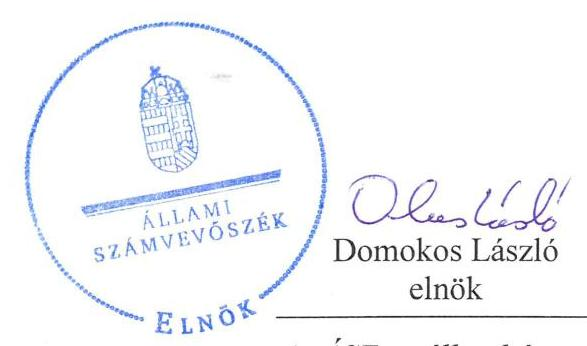

Az ÁSZ az államháztartáson kivïl müködő közfel-adat-ellátó rendszerek ellenörzéseivel hozzájárul ahhoz, hogy a közpénzeket az államháztartáson kivïl müködő szervezetek is átlátható, rendezett módon használják fel a közfeladatok ellátása érdekében.
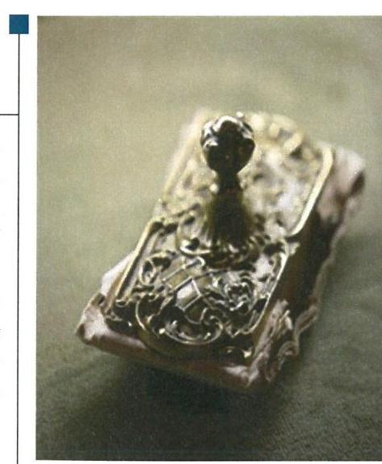

---

# AZ ELLENŐRZÉST FELÜGYELTE:

DR. HORVÁTH MARGIT felügyeleti vezető

## AZ ELLENŐRZÉST VEZETTE ÉS A VÉGREHAJTÁSÁÉRT FELELŐS:

VIDA KATALIN ellenőrzésvezető

## A PROGRAM ÖSSZEÁLLÍTÁSÁÉRT FELELŐS:

JANIK JÓZSEF osztályvezető

IKTATÓSZÁM: V-1112-164/2016

TÉMASZÁM: 2146

ELLENŐRZÉS-AZONOSÍTÓ SZÁM: V070777

Jelentéseink az Országgyűlés számítógépes hálózatán és az Interneta a www.asz.hu címen is olvashatóak.

---

# TARTALOMJEGYZÉK 

■ ÖSSZEGZÉS ..... 5
■ AZ ELLENŐRZÉS CÉLJA ..... 7
■ AZ ELLENŐRZÉS TERÜLETE ..... 8
■ AZ ELLENŐRZÉS HÁTTERE, INDOKOLTSÁGA ..... 10
■ A JELENTÉS LÉNYEGES KÉRDÉSKÖREI ..... 11
■ ELLENŐRZÉS HATÓKÖRE ÉS MÓDSZEREI ..... 12
■ MEGÁLLAPÍTÁSOK ..... 14
■ JAVASLATOK ..... 24
■ MELLÉKLETEK ..... 25
I. sz. melléklet: Értelmező szótár ..... 25
II. sz. melléklet: Eszközök használhatósági fokának alakulása a 2011-2014. években ..... 27
III. sz. melléklet: Eszközök átlagos életkorának alakulása a 2011-2014. években ..... 28
IV. sz. melléklet: A SZÉPHŐ Zrt. szolgáltatási díjai a 2011-2014. években ..... 29
V. sz. melléklet: A SZÉPHŐ Zrt. eladósodottsági mutatószámai 2011-2014. években ..... 30
VI. sz. melléklet: A SZÉPHŐ Zrt. hosszú lejáratú kötelzettségei 2011-2014. években ..... 31
VII. sz. melléklet: A beruházások és az elszámolt értékcsökkenések alakulása 2011-2014. években ..... 32
VIII. sz. melléklet: A SZÉPHŐ zrt. követelésállománya 2011-2014. években (m Ft) ..... 33
■ FÜGGELÉK: ÉSZREVÉTELEK ..... 35
■ RÖVIDÍTÉSEK JEGYZÉKE ..... 41

---

.

---

# ÖSSZEGZÉS 

A Székesfehérvár Megyei Jogú Város Önkormányzat közfeladat megszervezéséről szóló döntése, valamint tulajdonosi joggyakorlása szabályszerű volt a kizárólagos tulajdonában lévő gazdasági társaságnál. A Székesfehérvári Épületfenntartó és Hőszolgáltató Zrt. vagyongazdálkodása összességében szabályos volt az ellenőrzött időszakban, kötelezettségállománya nem jelentett veszélyt a müködésére, illetve a közfeladat ellátására. A Társaságnál az ellátott közfeladat bevételeinek és ráfordításainak elszámolása, valamint az önköltségszámítás és árképzés szabályszerű volt.

## Az ellenőrzés társadalmi indokoltsága

Az önkormányzati tulajdonú gazdasági társaságok ellenőrzése kiemelten fontos a vagyon megőrzése, megóvása érdekében, valamint a kormányzati szektor elszámolásaiban megjelenő önkormányzati tulajdonú gazdálkodó szervezetek esetében, amelyekkel szemben alapvető követelmény, hogy gazdálkodásuk, működésük szabályszerű, az általuk szolgáltatott adatok minél megbízhatóbbak legyenek. A feladat/közfeladat-ellátás költségeinek, ráfordításainak alakulása, színvonala hatással van a lakosság elégedettségére.

A törvényalkotás számára - az észlelt problémák, szabálytalanságok, vagy egyéb nem kívánatos jelenségek felszínre kerülésével - az ellenőrzés megállapításai segítséget nyújthatnak az államháztartáson kívüli feladat/közfeladatellátás értékeléséhez, jogszabályi keretei pontosításához, átláthatóságot biztosító szabályozásához. Meghatározhatóvá válnak az önkormányzati feladatellátásban részt vevő államháztartáson kívüli szervezeteknek - az önkormányzat költségvetését, pénzügyi helyzetét is befolyásoló - kockázatai, lehetővé válik ezen kockázatok csökkentése. Ellenőrzéseink feltárhatják, hogy az önkormányzat feladat-ellátási kötelezettségének szabályszerűen tett-e eleget, a feladatellátáshoz rendelt vagyonkezelésbe vett és saját vagyon működtetését az elvárható gondossággal, szabályszerűen szervezte-e meg és a tulajdonosi felügyelete hozzájárult-e a feladatellátásához. Az ellenőrzés rávilágíthat arra, hogy a gazdasági társaság a feladat-ellátási, közszolgáltatási szerződésben foglaltak betartásával, a vagyon használatával biztosította-e a szolgáltatás folytatásának feltételeit, a feladat ellátását. Ezzel az ellenőrzöttek és a helyi döntéshozók számára visszajelzést ad feladatszervezési, feladat-ellátási kockázataikról, alapot ad a meglévő hibák megszüntetéséhez, a jobb feladatellátás biztosításához. Fokozza a fegyelmet, igazolja, hogy lejárt a következmények nélküli ellenőrzések időszaka. Az ÁSZ értékteremtő rend kialakításához és megőrzéséhez hozzájáruló tevékenysége pozitív hatással van a szervezetről kialakított összkép formálására.

## Főbb megállapítások, következtetések, javaslatok

A SZÉPHŐ Zrt. által ellátott közfeladatok megszervezésére vonatkozó önkormányzati döntés és annak előkészítése szabályszerű volt. Az ellenőrzött időszakban a jogszabályi előírásoknak megfelelően kialakították a tulajdonosi joggyakorlás rendjét, az Önkormányzat a tulajdonosi jogait a vagyonrendeletnek, az Alapító okiratnak és az Önkormányzat SZMSZ-ének megfelelően gyakorolta. Az átadott vagyonnal történő gazdálkodásról és a közszolgáltatási szerződésben vállalt feladatellátásról a SZÉPHŐ Zrt. az ellenőrzött időszakra vonatkozóan beszámolt.

A SZÉPHŐ Zrt. a Számviteli politikája keretében elkészített szabályzatok közül a Számv. tv. előírása ellenére nem aktualizálta a leltározási szabályzatot az ellenőrzött időszakban. A Számviteli politika és a Leltárkészítési és leltározási szabályzat 2014. évben nem tartalmazta a vagyonkezelésbe vett önkormányzati vagyonnal kapcsolatos eljárásokat. A SZÉPHŐ Zrt. önköltség-számítási szabályzatának kialakítása megfelelő volt, a közszolgáltatások önköltségét és díjait a szabályozásnak megfelelően állapították meg. A közérdekű adatok megismerésére irányuló igények teljesítésének rendjét rögzítő szabályzatot nem készítették el.

A SZÉPHŐ Zrt. vagyongazdálkodása összességében a jogszabályi rendelkezéseknek és előírásoknak megfelelően történt, a belső ellenőrzés rendszerét kialakították és működtették 2014. évben.

---

A SZÉPHŐ Zrt. eladósodásának mértéke, adósságának összetétele nem jelentett veszélyt a közfeladat ellátására, illetve a SZÉPHŐ Zrt. múködésére az ellenőrzött időszakban.

A SZÉPHŐ Zrt. a beszámolási és közzétételi kötelezettségeit szabályszerűen, az előírt határidőkben teljesítette.
Az ellátott közfeladat bevételeinek és ráfordításainak elszámolása szabályszerű volt. A bevételek kiszámlázása a belső szabályozásnak, valamint a Rezsi tv. előírásainak megfelelően történt.

A SZÉPHŐ Zrt. gondoskodott a vagyonkezelésbe vett eszközök után elszámolt értékcsökkenésnek megfelelő mértékű beruházásról, eszközfelújításról, illetve e célokra tartalékot képzett.

---

# AZ ELLENŐRZÉS CÉLJA 

Az ellenőrzés célja annak értékelése, hogy az önkormányzat vagyongazdálkodási tevékenysége során szabályszerűen gyakorolta-e a tulajdonosi jogait; a gazdasági társaság szabályozottsága, gazdálkodása és vagyongazdálkodási tevékenysége, bevételeinek és ráfordításainak elszámolása megfelelt-e a jogszabályi és tulajdonosi előírásoknak; a gazdasági társaság kötelezettségállománya jelent-e kockázatot a működésre, valamint a gazdálkodás átláthatósága és elszámoltathatósága érdekében biztosítva volte a szolgáltatás díjának megalapozottsága szabályszerű önköltségszámítással.

---

# AZ ELLENŐRZÉS TERÜLETE 

## Székesfehérvár Megyei Jogú Város Önkormányzata és a kizárólagos tulajdonában lévő SZÉPHŐ Székesfehérvári Épületfenntartó és Hőszolgáltató Zrt.

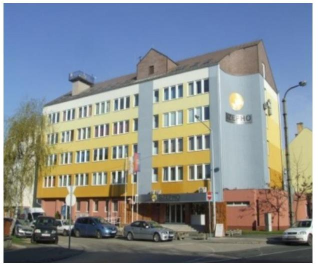

Az Önkormányzat ${ }^{1}$ - az Ötv. ${ }^{2}$-ben foglaltaknak megfelelően az ellenőrzött időszakot megelőzően döntött a települési távhőszolgáltatás működtetésének gazdasági társaság útján történő ellátásáról.

A SZÉPHŐ Zrt. ${ }^{3}$ jogelődje 1949. április 15-én alakult Közületi Ingatlan Központ Székesfehérvári Kirendeltsége néven, majd 1951. évtől a Székesfehérvári Ingatlankezelő Vállalatként müködött tovább, majd 1993. január 1-jével a Székesfehérvári Ingatlankezelő Vállalat jogutódjaként az SZMJV Közgyűlés ${ }^{4}$ megalapította a SZÉPHŐ Székesfehérvári Épületfenntartó és Hőszolgáltató Részvénytársaságot 291 millió Ft jegyzett tőkével. A jogelőd vállalat jegyzett tőkén felüli 870,2 M Ft-os vagyonát tőketartalékként vették nyilvántartásba.

A Társaság ${ }^{5}$ saját- és jegyzett tőkéjének változását az ellenőrzött időszakban az 1. ábra mutatja be.

1. ábra

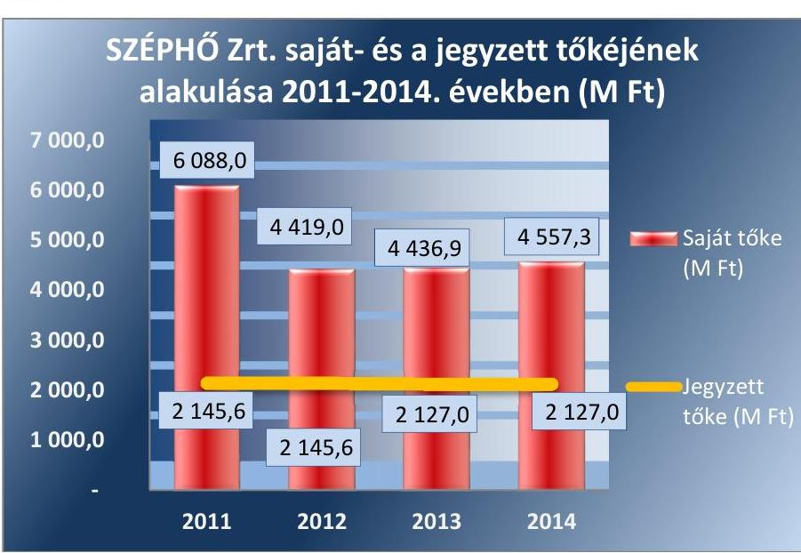

A Társaság feladata a távhőszolgáltatás közfeladata mellett az Önkormányzat tulajdonában lévő épületek, lakás és nem lakás célú ingatlanok fenntartása, bérbeadása, hasznosítása volt. A Társaság az ellenőrzött időszakban építőipari tevékenységet is végzett.

A SZÉPHŐ Zrt. 2011. január 1-jétől 2014. június 30-ig a hőtermelést végző Székesfehérvári Fűtőerőmű Kft. ${ }^{6}$-től szerezte be a szolgáltatáshoz

---

szükséges hőenergiát. A 2014. évben a város zavartalan és folyamatos távhőtermelésének biztosítása érdekében, az Önkormányzat megvásárolta a felszámolás alatt lévő Székesfehérvári Fűtőerőmű Kft. vagyonelemeit és azokat a SZÉPHŐ Zrt. vagyonkezelésébe adta, ezzel biztosítva a távhőtermeléshez szükséges ingatlanokat és eszközöket.

A Társaság alaptőkéje 214564 db , egyenként 10 ezer Ft névértékű névre szóló részvény, melyből 1860 db , a törzsrészvényekkel azonos részvényesi jogokat biztosító dolgozói részvény ( $0,87 \%$ ) volt. A Társaság jegyzett tőkéje - a visszavásárolt dolgozói részvények révén - 2013. június 12i cégbírósági bejegyzéssel leszállításra került. A SZÉPHŐ Zrt. 100\%-ban az Önkormányzat tulajdonába került. Az Igazgató ${ }^{7}$ személye az ellenőrzési időszak alatt egy alkalommal, a 2014. évben változott.

A Társaság gazdálkodásának egyes adatait a 2011-2014. évek vonatkozásában az 1. táblázat mutatja be.

1. táblázat

A SZÉPHŐ ZRT. GAZDÁLKODÁSÁNAK ADATAI (M FT)

|  Megnevezés | 2011. | 2012. | 2013. | 2014.  |
| --- | --- | --- | --- | --- |
|  Éves nettó árbevétel (M Ft) | 4696,1 | 4601,3 | 4078,6 | 3787,1  |
|  Mérlegfőösszeg (M Ft) | 8804,7 | 7327,0 | 7345,0 | 10419,7  |
|  Mérleg szerinti eredmény (M Ft) | 41,5 | $-1587,9$ | 25,9 | 18,3  |
|  Saját tőke (M Ft) | 6088,0 | 4419,0 | 4436,9 | 4557,3  |
|  Követelések (M Ft) | 1449,0 | 1556,3 | 1175,0 | 1405,1  |
|  ebből lakossági tartozások állomá-
nya (M Ft) | 313,3 | 271,8 | 327,5 | 285,5  |
|  Foglalkoztatottak száma (fő) | 165 | 173 | 167 | 193  |

A SZÉPHŐ Zrt. távhőszolgáltatásra vonatkozó 2012-2014. évi nettó árbevételét és mérleg szerinti eredményét az 2. ábra szemlélteti. 2. ábra

A SZÉPHŐ Zrt. távhőszolgáltatási közfeladatának gazdálkodási adatai 2012-2014. években (M Ft)
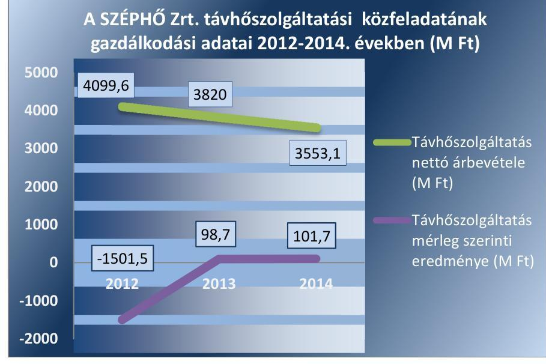

Forrás: a SZÉPHŐ Zrt. 2011-2014. évi beszámolói

---

# AZ ELLENŐRZÉS HÁTTERE, INDOKOLTSÁGA 

## SZÉPHŐ Székesfehérvári Épületfenntartó és Hőszolgáltató Zrt.

Az önkormányzati tulajdonú gazdasági társaságok ellenőrzése kiemelten fontos a vagyon megőrzése, megóvása érdekében, valamint a kormányzati szektor elszámolásaiban megjelenő önkormányzati tulajdonú gazdálkodó szervezetek esetében, amelyekkel szemben alapvető követelmény, hogy gazdálkodásuk, működésük szabályszerű, az általuk szolgáltatott adatok minél megbízhatóbbak legyenek. A feladat/közfeladat-ellátás költségeinek, ráfordításainak alakulása, színvonala hatással van a lakosság elégedettségére.

A törvényalkotás számára - az észlelt problémák, szabálytalanságok, vagy egyéb nem kívánatos jelenségek felszínre kerülésével - az ellenőrzés megállapításai segítséget nyújthatnak az államháztartáson kívüli feladat/közfeladat-ellátás értékeléséhez, jogszabályi keretei pontosításához, átláthatóságot biztosító szabályozásához. Meghatározhatóvá válnak az önkormányzati feladatellátásban részt vevő államháztartáson kívüli szervezeteknek - az önkormányzat költségvetését, pénzügyi helyzetét is befolyásoló - kockázatai, lehetővé válik ezen kockázatok csökkentése. Ellenőrzéseink feltárhatják, hogy az önkormányzat feladat-ellátási kötelezettségének szabályszerűen tett-e eleget, a feladatellátáshoz rendelt vagyonkezelésbe vett és saját vagyon működtetését az elvárható gondossággal, szabályszerűen szervezte-e meg, és a tulajdonosi felügyelete hozzájárult-e a feladatellátásához. Az ellenőrzés rávilágíthat arra, hogy a gazdasági társaság a feladat-ellátási, közszolgáltatási szerződésben foglaltak betartásával, a vagyon használatával biztosította-e a szolgáltatás folytatásának feltételeit, a feladat ellátását. Ezzel az ellenőrzöttek és a helyi döntéshozók számára visszajelzést ad feladatszervezési, feladat-ellátási kockázataikról, alapot ad a meglévő hibák megszüntetéséhez, a jobb feladatellátás biztosításához. Fokozza a fegyelmet, igazolja, hogy lejárt a következmények nélküli ellenőrzések időszaka. Az ÁSZ értékteremtő rend kialakításához és megőrzéséhez hozzájáruló tevékenysége pozitív hatással van a szervezetről kialakított összkép formálására.

---

# A JELENTÉS LÉNYEGES KÉRDÉSKÖREI 

1. Az Önkormányzat közfeladat megszervezéséről szóló döntése, valamint tulajdonosi joggyakorlása szabályszerű volt-e?
2. A SZÉPHŐ Zrt. vagyongazdálkodása szabályszerű volt-e, kötelezettségállománya jelent-e kockázatot a müködésre, illetve a közfeladat ellátására?
3. A SZÉPHŐ Zrt.-nél az ellátott közfeladat bevételei és ráfordításai elszámolása, valamint az önköltségszámítás és árképzés szabályszerű volt-e?

---

# ELLENŐRZÉS HATÓKÖRE ÉS MÓDSZEREI 

## Az ellenőrzés típusa

Megfelelőségi ellenőrzés

## Az ellenőrzött időszak

2011. január 1-jétől 2014. december 31-éig

## Az ellenőrzés tárgya

A gazdasági társaság feletti tulajdonosi joggyakorlás, valamint a gazdasági társaság gazdálkodásának szabályozottsága és szabályszerűsége.

Az ellenőrzés kiterjed minden olyan körülményre és adatra, amely az ÁSZ jogszabályban meghatározott feladatainak teljesítéséhez, valamint a program végrehajtása folyamán felmerült újabb összefüggések feltárásához szükséges.

## Az ellenőrzött szervezet

Székesfehérvár Megyei Jogú Város Önkormányzata és a SZÉPHŐ Zrt.

## Az ellenőrzés jogalapja

Az ellenőrzés jogszabályi alapját az ÁSZ tv. ${ }^{9}$ 1. § (3) bekezdése és 5. § (3)(4)-(5) bekezdései képezik.

## Az ellenőrzés módszerei

Az ellenőrzést a nemzetközi standardokat irányadónak tekintve az ellenőrzési program ellenőrzési kérdései, az ellenőrzött időszakban hatályos jogszabályok, az ellenőrzés szakmai szabályok és módszertanok figyelembe vételével végeztük.

Az ellenőrzés ideje alatt az ellenőrzött szervezettel történő kapcsolattartást az ÁSZ Szervezeti és Múködési Szabályzatának vonatkozó előírásai alapján biztosítottuk.

Az ellenőrzés a kiválasztott, tulajdonosi jogokat gyakorló önkormányzatra, illetve az ellenőrzésre kijelölt gazdasági társaság felett tulajdonosi jogokat gyakorló szervezetre és az ellenőrzött gazdasági társaságra terjedt

---

ki. Amennyiben az ellenőrzött szervezet kormányzati szektorba sorolt gazdasági társaság, ezért a V0708 ESA kiegészítő modul szerinti ellenőrzési feladatokat is elvégeztük a jelen program végrehajtásával egyidejűleg.

Az ellenőrzést a kérdésekre adott válaszok kiértékelésével, valamint a megjelölt adatforrások, a csatolt tanúsítványok felhasználásával, továbbá az adott időszakban hatályos jogszabályok figyelembe vételével folytattuk le. Az ellenőrzési kérdések megválaszolásához szükséges bizonyítékok megszerzése a következő ellenőrzési eljárások alkalmazásával történt: megfigyelés, kérdésfeltevés (információkérés), összehasonlítás, valamint elemző eljárás. Az ellenőrzési bizonyítékként felhasználható adatforrások közé tartoztak egyrészt a szakmai programban felsorolt adatforrások, másrészt adatforrás lehet még minden - az ellenőrzés folyamán - feltárt, az ellenőrzés szempontjából információkat tartalmazó dokumentum.

A bevételek és ráfordítások elszámolása, valamint a vagyonnyilvántartás terén a szabályszerű működést véletlen mintavétellel ellenőriztük. A mintavétellel ellenőrzött területek esetében minden egyes tétel vonatkozásában a szabályszerűségre vonatkozó kérdéseket tettünk fel, amelyek eredménye összesítésre került. „Megfelelőnek" értékeltünk egy ellenőrzött területet, amennyiben 95\%-os bizonyossággal a teljes sokaságban a hibaarány legfeljebb 10\% volt. A ráfordítások elszámolására és a vagyonnyilvántartásra vonatkozó véletlen mintavételt kockázati alapú kiválasztással egészítettük ki, amelynek során évente a három legnagyobb összegű tételt választottuk ki.

Az ellenőrzést a kérdésekre adott válaszok kiértékelésével, valamint a megjelölt adatforrások, a csatolt tanúsítványok felhasználásával, továbbá az adott időszakban hatályos jogszabályok figyelembe vételével kell lefolytatni.

---

# 1. Az Önkormányzat közfeladat megszervezéséről szóló döntése, valamint tulajdonosi joggyakorlása szabályszerű volt-e? 

Összegző megállapítás

Az Önkormányzat távhőszolgáltatási közfeladat megszervezéséről szóló döntése, valamint tulajdonosi joggyakorlása szabályszerű volt.
1.1. számú megállapítás

A SZÉPHŐ Zrt. által ellátott távhőszolgáltatási közfeladat megszervezésére vonatkozó önkormányzati döntés és annak előkészítése szabályszerű volt. Az Önkormányzat a távhőszolgáltatásra vonatkozó rendeletalkotási kötelezettségének eleget tett.

AZ ÖNKORMÁNYZAT Integrált városfejlesztési stratégiájában ${ }^{9}$ rögzítette a közfeladatok ellátására vonatkozó fejlesztési elképzeléseit. Az SZMJV Közgyűlés a 2012-2020-ig terjedő időszakra vonatkozó Középtávú Energetikai stratégiájában ${ }^{10}$ meghatározta a város energetikai gazdálkodásával kapcsolatos középtávú elképzeléseit, melyben a távhőszolgáltatással, hőtermeléssel kapcsolatos fejlesztési terveket is felvázolták. Az SZMJV Közgyűlés 2011-2014. évekre jóváhagyta a „Program az erős Székesfehérvárért"11 gazdasági programját, amely vagyongazdálkodással kapcsolatos terveket is tartalmazott.

A távhőszolgáltatás a Tszt. ${ }^{12}$ 6. § (1) bekezdése alapján az Önkormányzat kötelezően ellátandó feladata. Az Önkormányzat az Ötv. és az Mötv. ${ }^{13}$ előírásainak megfelelően $\mathrm{SzMSz}_{1}{ }^{14} 2^{15}$ mellékletében rögzítette a SZÉPHŐ Zrt. útján ellátott távhőszolgáltatás közfeladatot.

A TÁVHŐRENDELET megalkotásával az Önkormányzat eleget tett a SZÉPHŐ Zrt. által ellátott távhőszolgáltatás közfeladathoz kapcsolódóan az Mötv. és a Tszt. 6. § (2) bekezdésében előírt kötelezettségének.

A SZÉPHŐ ZRT. ALAPÍTÓ OKIRATA megfelelt a Gt. ${ }^{16}$-ben, illetve Ptk. ${ }^{17}$-ben előírt tartalmi követelményeinek. A SZÉPHŐ Zrt. alapszabályát, alapító okiratát az ellenőrzött időszakban hét alkalommal módosították.

Az SZMJV Közgyűlés 574/2010. (VIII. 19.) számú határozatának megfelelően határozatlan idejű közszolgáltatási szerződést ${ }^{18}$ kötött a SZÉPHŐ Zrt.-vel, mint engedélyessel a közszolgáltatási feladatellátásra. A felek a szerződést az ellenőrzött időszakban nem módosították, a szerződés tartalma a Tszt., valamint a Vhr. előírásainak megfelelt.

Az Önkormányzat a távhőszolgáltatás közfeladatának ellátásához szükséges vagyont, a Társaság alapításával egy időben, jegyzett tőkeként a SZÉPHŐ Zrt. rendelkezésére bocsátotta. Az Önkormányzat a 3 001,4 millió Ft nyilvántartási értékű távhőtermelő eszközöket, 2014. május 30-án kelt vagyonkezelési szerződéssel ${ }^{19}$ a SZÉPHŐ Zrt.-nek átadta. A Vagyonkezelési

---

### 1.2. számú megállapítás

szerződésben, az Nvtv. ${ }^{20}$ előírásának megfelelően előírták a vagyon elkülönített nyilvántartására, leltározására, az értékcsökkenés összegének felhasználására vonatkozó kötelezettséget.

Az ellenőrzött időszakban a tulajdonosi joggyakorlás rendjét szabályosan alakították ki, a közfeladat ellátással kapcsolatos döntések esetében az arra jogosultak érvényesítették a tulajdonosi jogaikat. Az Igazgatóság és a Felügyelő Bizottság múködése megfelelt az alapító okirat és az ügyrend előírásainak. Az Önkormányzat az ellenőrzött években két ellenőrzést végzett a Társaságnál.

A TULAJ DONOSI JOGGYAKORLÁS RENDJÉT az Önkormányzat az SzMSz ${ }_{1,2}$-ben, a vagyongazdálkodási rendeletben és a Társaság alapító okirataiban szabályozta. A tulajdonosi jogosítványok átadására az ellenőrzött időszakban a SZÉPHŐ Zrt. vonatkozásában nem került sor, így azt a Közgyűlés ${ }^{21}$ gyakorolta. A dolgozói részvények tulajdonosai részére a törzsrészvényekkel azonos részvényesi jogokat biztosították 2011. évben, valamint 2012. június 21-éig.

A SZÉPHŐ Zrt. által ellátott távhőszolgáltatási közfeladat árképzés szabályait az Önkormányzat a Tszt., továbbá annak végrehajtásáról szóló Vhr. ${ }^{22}$-ben rögzítettek alapján jóváhagyott Távhőrendeletének 1. számú mellékletében határozta meg, a rendeletben megállapított árképlet alapján történt a díj számítása. A közszolgáltatásoknál alkalmazott díjakat az SZMJV Közgyűlés minden év november 30 -áig felülvizsgálta, a távhőszolgáltatás díjának módosítását jóváhagyta.

A Közgyűlés a SZÉPHŐ Zrt. Igazgatóságának megválasztásával és az Igazgató kinevezésével biztosította a tulajdonosi képviseletet. Az igazgatóság az Alapítói Okiratban meghatározottak szerint ülésezett, a SZÉPHŐ Zrt. üzleti terveit, a Számv. tv. ${ }^{23}$ szerinti beszámolóit jóváhagyta az ellenőrzött években.

A tulajdonosi joggyakorló a Felügyelő Bizottságot ${ }^{24}$ a Gt. és a Ptk. ${ }_{2}$ előírásainak megfelelően öt taggal múködtette, a tagok személyében bekövetkezett változásokat az alapító okiraton átvezette. A Felügyelő Bizottság az ellenőrzött időszakban hatályos Ügyrendjét ${ }^{25}$, a Gt.-ben és a Ptk. ${ }_{2}$-ben előírtak szerint az SZMJV Közgyűlése jóváhagyta és az abban foglaltakat múködése során betartotta.

A Társaság könyvvizsgálójának személyét, illetve a személyében bekövetkezett változást az alapító okiratban az Önkormányzat jóváhagyta. Az ellenőrzött időszakban a könyvvizsgáló véleményét a beszámolók, üzleti tervek jóváhagyása során a tulajdonos Önkormányzat figyelembe vette.

A könyvvizsgáló és a Felügyelő Bizottság elnöke rendszeresen részt vett az éves beszámolót elfogadó SZMJV Közgyűlésein.

Az Önkormányzat, a jogszabályi előírásoknak megfelelően az alapító okiratban előírta a Társaságnak a tájékoztatási, adatszolgáltatási és beszámolási kötelezettséget. A Társaság éves beszámolóit az alapító okirat rendelkezései szerint az igazgató elkészítette.

A 2011-2014. évekre vonatkozóan az éves beszámolókról a Felügyelő Bizottság a Gt. és a Ptk. ${ }_{2}$ előírásainak megfelelően írásbeli jelentést készített, amit a beszámoló előterjesztéséhez a Közgyűlés rendelkezésére bocsátott. Az ellenőrzött időszakban a SZÉPHŐ Zrt. 2011-2014. évekre készített üzleti terveit, továbbá az éves beszámolóit a Közgyűlés jóváhagyta. A

---

Társaság év végi szöveges beszámolóiban, a közszolgáltatási szerződésben és az Együttműködési megállapodás ${ }^{26},{ }^{27}$-ben meghatározott feladatok ellátásáról, teljesítéséről az ellenőrzött időszak éveiben a SZÉPHŐ Zrt. részletesen beszámolt.

A Közgyűlés az ellenőrzött időszak minden évében jóváhagyta a Társaság üzleti tervét.

Az Önkormányzat a 2011-2014. évek között két alkalommal végzett belső ellenőrzést a SZÉPHŐ Zrt.-nél. Az ellenőrzés célja a Társaság rendelkezésére álló erőforrásokkal való gazdálkodás hatékonyságának, az elszámolások megbízhatóságának ellenőrzése, továbbá a követelések behajtása érdekében a szükséges humán erőforrás rendelkezésre állásának ellenőrzése volt. Az ellenőrzési jelentések javaslatai hozzájárultak a feladatellátás szabályszerű teljesítéséhez, a Társaság vagyonának megóvásához.

A Társaság az ellenőrzött időszak gazdálkodási éveit - a 2012. év kivételével - mérleg szerinti nyereséggel zárta, az alapító okirat XII. 2. pontja szerint az adózott eredmény felhasználásával kapcsolatos döntés a Közgyűlés kizárólagos hatáskörébe tartozott. A Közgyűlés, a 2011-2013-2014. évi beszámolók jóváhagyása során a Társaság mérleg szerinti eredményét eredménytartalékba helyezte.

Az ellenőrzött időszakban az Önkormányzat részéről garancia- és kezességvállalás nem történt.

# 2. A SZÉPHŐ Zrt. vagyongazdálkodása szabályszerű volt-e, kötelezettségállománya jelent-e kockázatot a múködésre, illetve a közfeladat ellátására? 

Összegző megállapítás

A SZÉPHŐ Zrt. vagyongazdálkodása összességében szabályosan történt, kötelezettségállománya nem jelentett veszélyt a múködésére, illetve a közfeladat ellátására.
2.1. számú megállapítás

A SZÉPHŐ Zrt. szabályozási rendszerét kialakította, a Számviteli politikája keretében elkészített szabályzatok közül a leltározási szabályzatot a Számv. tv. előírása ellenére nem aktualizálta.

A SZÉPHŐ ZRT. AZ ÜZLETI TERVÉT az ellenőrzött időszak minden évében elkészítette, amelyet a Közgyűlés elfogadott. Az Igazgatóság és a Felügyelő Bizottság az alapító okiratban, illetve az ügyrendekben előírt feladatukat teljesítve 2011-2014. évek üzleti terveinek elfogadásáról döntöttek. Az üzleti tervek összhangban voltak az Önkormányzattal kötött közszolgáltatási szerződésben foglaltakkal, továbbá 2014. évtől az Önkormányzat által meghatározott Integrált Településfejlesztési Stratégia koncepcióival.

A SZÉPHŐ Zrt. kialakította belső szabályozási rendszerét. A SZÉPHŐ Zrt. számviteli politikáját 2001. január 1-jén adta ki. A számviteli politikát 20112014. években a Számv. tv. 14. § (11) bekezdése ellenére 90 napon belül nem aktualizálták, mivel a számviteli politika nem tartalmazta a 2014. évben kezelésbe vett önkormányzati vagyon - Vagyonkezelési szerződésének 9.2. pontjában meghatározott - elkülönítésével kapcsolatos számviteli,

---

nyilvántartási és adatszolgáltatási irányelveket. A számviteli politika nem felelt meg a Számv. tv. előírásainak. A számviteli politika keretében elkészült a Számv. tv. 14. § (5) bekezdésben előírt leltárkészítési és leltározási, a selejtezési-, valamint az eszközök és források értékelési-, az önköltség-számítási- és pénzkezelési szabályzat, melyek a leltárkészítési és leltározási szabályzat kivételével megfeleltek a jogszabályi előírásoknak. A SZÉPHŐ Zrt. Leltárkészítési és leltározási szabályzata nem tért ki a - Vagyonkezelési szerződésének 9.5. pontjában meghatározott - tulajdonossal történő leltáregyeztetésre és az adatszolgáltatási kötelezettségre. A SZÉPHŐ Zrt. számlarendje megfelelt a Számv. tv. 161. § (1)-(4) bekezdésekben előírt feltételeknek, alkalmas volt a kiegészítő melléklet adatainak közvetlen alátámasztására.

A Társaság a távhőszolgáltatás érdekében felmerült bevételek és kiadások egyértelmú elhatárolásának, számviteli szétválasztásának szabályait, a Tszt. 18/A. § (2) bekezdésében, valamint az 51/2011 (IX.30.) NFM rendelet 7. § (2) bekezdésében foglaltak betartásával 2012.01.01-től szabályszerűen meghatározta az Önköltség-számítási szabályzatában. A Társaság eleget tett a 36/2009. (VII.22). KHEM rendelet 4.§ (4) bekezdés előírásainak is, mivel az általános múködési költségek felosztásának szabályait is rögzítette az Önköltség-számítási szabályzatában 2012-2013-2014. években. A szétválasztási szabályokat, az erről készült beszámolót az Energia Hivatal ${ }^{28}$ az ellenőrzött időszakban minden esetben elfogadta.

A SZÉPHŐ Zrt. rendelkezett a Tszt. 3. § v) pontjában előírt Távhőszolgáltatási üzletszabályzattal ${ }_{1}{ }^{29},{ }_{2}{ }^{30}$.

A SZÉPHŐ Zrt. SZMSZ ${ }_{1,2}$-e rögzíti tevékenységének múködési kereteit, amely a múködést szabályozó alapdokumentumként iránymutatást ad dolgozói számára. Az SZMSZ előírásai összhangban voltak a Gt. és a Ptk. ${ }_{2}$ rendelkezéseivel, valamint a SZÉPHŐ Zrt. alapító okiratával.

A SZÉPHŐ Zrt. javadalmazási szabályzata a Taktv. ${ }^{31}$-ben előírtaknak megfelelően készült, amit az SZMJV Közgyűlése 11/2011. (VIII.25) számú határozatával jóváhagyott.

# 2.2. számú megállapítás 

## A SZÉPHŐ Zrt. vagyongazdálkodása összességében a jogszabályi rendelkezéseknek megfelelően történt.

A SZÉPHŐ Zrt. számlarendjében rögzített szabályozásnak megfelelően, a távhőszolgáltatással kapcsolatos saját, illetve vagyonkezelésbe vett vagyon nyilvántartása elkülönítetten történt. A vagyonkezelési szerződésben meghatározottak szerint a SZÉPHŐ Zrt. számviteli nyilvántartásaiban 2014. július 1-étől a vagyonkezelt - 3 001,4 millió Ft értékű - vagyonelemeket a saját eszközeitől elkülönítve tartotta nyilván.

A SZÉPHŐ Zrt. saját vagyonáról minden évben az éves mérleg valódiságát alátámasztó tételes (teljes) vagyonmegállapító leltárt készített. A leltározás folyamata a Számv. tv. 14. § (4)-(12) bekezdésben meghatározott alapelveknek megfelelő leltárkészítési és leltározási szabályzat előírásainak megfelelően történt. Ugyanakkor leltározási szabályzata nem tért ki a - Vagyonkezelési szerződésének 9.5. pontjában meghatározott - tulajdonossal történő leltáregyeztetésre és az adatszolgáltatási kötelezettségre.

A vagyonkezelésbe vett és a saját vagyon megóvása és gyarapítása érdekében a SZÉPHŐ Zrt. üzleti tervei az ellenőrzött időszak minden évében

---

tartalmazták a beruházási koncepciókat, melyeket az SZÉPHŐ Zrt. tulajdonosa elfogadott. A 2014. évben létrejött Vagyonkezelési szerződés 8.5. pontjában meghatározottak szerint a SZÉPHŐ Zrt. 2014. év október 31-ig elkészítette és beterjesztette az Önkormányzatnak jóváhagyásra a vagyonkezeléssel érintett eszközök karbantartására, felújítására és pótlására vonatkozó 2015. évi feladattervet, amit az SZMJV Közgyűlés jóváhagyott. A közfeladat ellátása során a vagyonkezelésbe vett és saját vagyon megőrzése, gyarapítása az Áht. ${ }^{32}$, az Ötv., az Mötv. és az Nvtv. előírásainak megfelelően történt.

A vagyonkezelésbe vett vagyon hasznosítására, értékesítésére, ingyenes átruházására, biztosítékba adására, illetve megterhelésére a 2014. évben nem került sor.

Az Önkormányzat 2014. szeptember 5-én kelt tagi kölcsön megállapodásban a SZÉPHŐ Zrt. számára a Társaság saját, illetve a vagyonkezelésbe vett vagyonát érintő fejlesztéseket írt elő. A kölcsönszerződési megállapodásban az Önkormányzat 129,8 millió Ft tagi kölcsönt biztosított a SZÉPHŐ Zrt. részére, amelyet 2016. június 30-ig köteles a SZÉPHŐ Zrt. egy összegben visszafizetni.

Az ellenőrzött időszakban elszámolt értékvesztés ellenére a SZÉPHŐ Zrt. rendelkezett a Gt.-ben és a Ptk. ${ }_{2}$-ben kötelezően előírt jegyzett tőkének megfelelő összegű saját tőkével. Az Értékelési szabályzat 5.2. pontjának és a Számv. tv. 54. § (1) bekezdésének figyelembe vételével a 2011. évben 24,6 M Ft, a 2012. évben - a Társaság tulajdonában lévő Fútőerőmű Kft. üzletrésze miatt elszámolt - 1514,0 M Ft volt a kimutatott értékvesztés összege. A saját tőke/jegyzett tőke arányának alakulását az 3. ábra mutatja be.
3. ábra
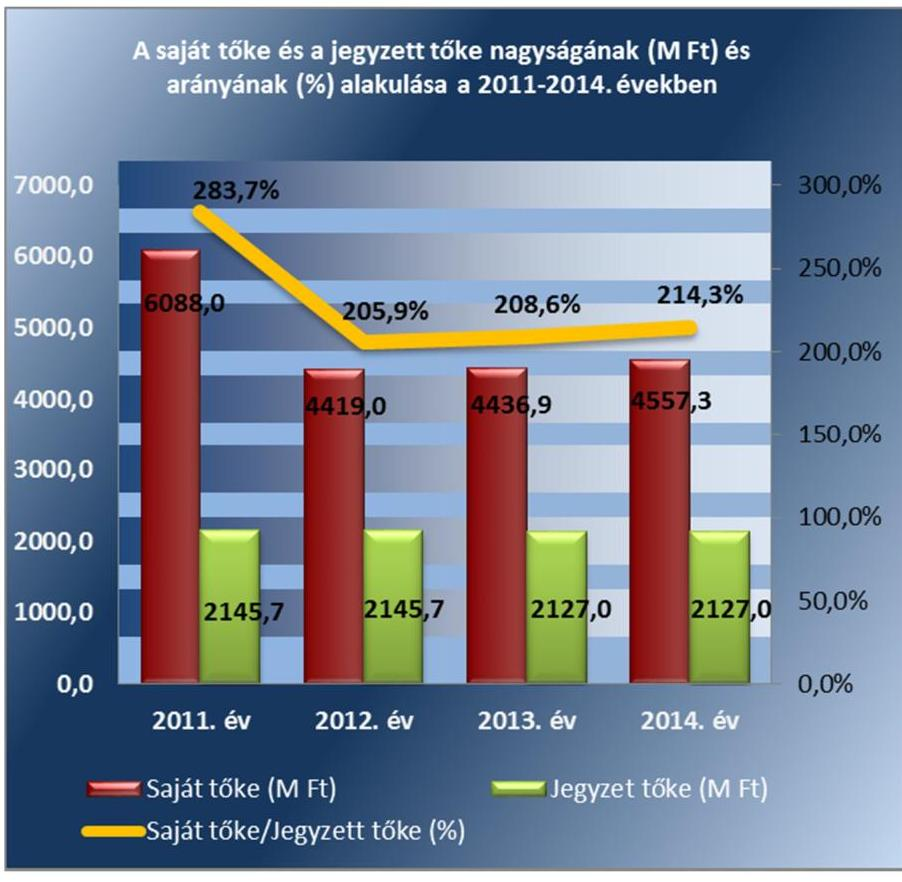

---

2.3. számú megállapítás
2.4. számú megállapítás

A SZÉPHŐ Zrt. vezetője kialakította és működtette az operatív tevékenységektől független belső ellenőrzést.

## A kötelezettségek állománya nem jelentett veszélyt a közfeladat ellátására, illetve a SZÉPHŐ Zrt. múködésére.

A SZÉPHŐ ZRT. KÖTELEZETTSÉGEINEK állománya összetétele nem jelentett veszélyt a közfeladat ellátására, illetve a SZÉPHŐ Zrt. múködésére az ellenőrzött időszakban. Az V. sz. melléklet a SZÉPHŐ Zrt. eladósodását leíró mutatószámokat tartalmazza. A valós eladósodási helyzet pontosabb jellemzése érdekében a 2014. évre vonatkozó mutatószámok meghatározása a vagyonkezelésbe vett eszközök nyilvántartási adatai nélkül történt.

AZ ELADÓSODOTTSÁGI MUTATÓ tartósan 60,0\% alatti értékei nem utaltak a SZÉPHŐ Zrt. vonatkozásában túlzott külső finanszírozásra. Az eladósodottság, illetve a nettó eladósodottság kedvező értékei azt mutatták, hogy a saját források megfelelő fedezetet nyújtottak a kimutatott kötelezettségek, illetve a kötelezettségek követelésekkel csökkentett teljesítésére. Az adósságfedezeti mutató I. értéke kedvező volt, mivel 1 Ft adósságra 2 Ft-nál több vagyon jutott az ellenőrzött években.

AZ ADÓSSÁGFEDEZETI MUTATÓ II. értéke azt mutatta, hogy a SZÉPHŐ Zrt. múködési pénzáramainak eredménye 2013. évig nyújtottak fedezetet a hosszú lejáratú kötelezettségek teljesítésére, a 2014. évben a mutató értéke jelentősen visszaesett a rövid lejáratú hitelek csökkenése és vevőkövetelések növekedése miatt.

## AZ ÁRBEVÉTELRE VETÍTETT ELADÓSODOTTSÁG

kedvező volt, azaz az árbevétel fedezetet nyújtott a forgóeszközökkel csökkentett kötelezettségekre.

Az ellenőrzött időszakban biztosított volt a hosszú lejáratú kötelezettségek határidőben történő teljesítése. A SZÉPHŐ Zrt. hosszú lejáratú kötelezettségeit a VI. sz. melléklet mutatja.

A 2011. évben hosszú lejáratú kötelezettségként kimutatott banki hitel visszafizetésre került. A 2014. év szeptember 5-én az Önkormányzattal kötött megállapodás alapján biztosított 129,8 M Ft értékű tagi kölcsön jegybanki alapkamattal növelt értékének egyösszegű visszafizetése 2016. június 30 -áig esedékes.

Az ellenőrzött időszakban biztosított volt a rövid lejáratú kötelezettségek határidőben történő teljesítése. A SZÉPHŐ Zrt. rövid lejáratú hiteleit a 2. táblázat mutatja.

A számviteli nyilvántartás szerint a banki hitelek visszafizetése a hitelszerződésekben meghatározott határidőkben megtörtént.

## A SZÉPHŐ Zrt. előírt beszámolási és adatszolgáltatási kötelezettségét teljesítette.

Az Önkormányzat és a SZÉPHŐ Zrt. közötti együttműködés feltételeit, a beszámolási, az adatszolgáltatási és egyéb tájékoztatási feladatokat a többször módosított, 1992. december 22-én kötött Együttműködési szerződés

---

előírásai határozták meg. A szerződés tartalmazta a rendszeres adatszolgáltatás és operatív kapcsolattartás keretében azokat a havonta, negyedévente és évente esedékes kimutatásokat, melyek elkészítése a SZÉPHŐ Zrt. feladata volt. A SZÉPHŐ Zrt. a Számviteli Politikájában meghatározott elvek szerint alakította ki a Számv. tv. előírásainak megfelelő éves beszámolási rendszerét.

Az ellenőrzött időszakban a SZÉPHŐ Zrt. adatszolgáltatási és beszámolási kötelezettségeit az előírt határidőkben teljesítette.

A Társaság az ellenőrzött időszakban a beszámolóit a Számv. tv. 19. § (1) bekezdésében előírt tartalommal elkészítette, a Számv. tv. 153. § (1) bekezdésében előírt határidőben letétbe helyezte. Az SZMJV Közgyűlés a SZÉPHŐ Zrt. éves beszámolóit a könyvvizsgálói és a felügyelő bizottsági jelentések alapján fogadta el.

A könyvvizsgáló a 2012. évi mérlegbeszámoló összeállításánál figyelemfelhívó levelet adott át a SZÉPHŐ Zrt. vezérigazgatójának a tulajdonosi részesedést érintő befektetések jelentős értékvesztése miatt.

A SZÉPHŐ Zrt. könyvvizsgálója a 2012-2013-2014. évi beszámolók esetében a könyvvizsgálói jelentésében igazolta, hogy a Társaság által kidolgozott és alkalmazott számviteli szétválasztási szabályok, valamint az egyes tevékenységek közötti tranzakciók árazása, biztosították a társaság tevékenységei közötti keresztfinanszírozás mentességét. Az auditált éves beszámolókat a könyvvizsgálói jelentéssel együtt az Energia Hivatalnak - a Számv. tv. szerinti letétbehelyezéssel egyidejűleg - szabályszerűen megküldték.

A Felügyelő Bizottság nem tett olyan megállapítást, miszerint az ügyvezetés tevékenysége jogszabályba, SZÉPHŐ Zrt. által kötött szerződésbe, illetve a gazdasági társaság legfőbb szervének határozataiba ütközött.

A közérdekú adatok megismerésére irányuló igények teljesítésének rendjét rögzítő szabályzatot 2011. évben az Avtv. ${ }^{33} 20$. § (8) bekezdése, illteve 2012. évtől az Info tv. ${ }^{34} 30$. § (6) bekezdése ellenére nem készített a Társaság. A közérdekú adatok közzététele a Taktv., Tszt. és az Info tv. szerint történtek.

A SZÉPHŐ Zrt. vezérigazgatója 2012. június 1-jén nevezte ki az Info tv. előírásainak megfelelően a belső adatvédelmi felelőst. A NAIH ${ }^{35}$ az Info tv. 68. § (6) bekezdésében előírt a Társaság távhőszolgáltatási adatkezelését 2012. augusztus 1-jén nyilvántartásba vette. A Társaság 2012. július 7-től rendelkezik Belső adatvédelmi és adatbiztonsági szabályzattal. A belső adatvédelmi nyilvántartás, a közüzemi szolgáltatás adatkezelése, a szolgáltatói szerződésekből eredő követelések adatkezelése és a társasház kezelési tevékenységgel összefüggő adatkezelések előírásszerűek voltak.

---

# 3. A SZÉPHŐ Zrt.-nél az ellátott közfeladat bevételei és ráfordításai elszámolása, valamint az önköltségszámítás és árképzés szabályszerű volt-e? 

Összegző megállapítás

A SZÉPHŐ Zrt. által ellátott közfeladat bevételeinek és ráfordításainak elszámolása szabályszerű volt. A közszolgáltatási díjakat 2012. december 31-éig önkormányzati rendelet alapján, majd a Rezsi tv.-ben foglaltak szerint szabályosan határozták meg. Az önköltségszámítás és árképzés szabályszerű volt.
3.1. számú megállapítás

Az ellátott közfeladat bevételeinek és ráfordításainak elszámolása szabályszerű volt.

A közfeladat bevételei és ráfordításai elkülönített nyilvántartási kötelezettségét - összhangban a Számv. tv. és az Mötv. előírásaival - a SZÉPHŐ Zrt. az ellenőrzött évekre vonatkozó számlakereteiben és az Önköltség-számítási szabályzat ${ }_{1}{ }^{36}-{ }^{37}$-ben meghatározta. A számlakeretekben alkalmazott főkönyvi számlaszámok biztosították a közhasznú tevékenység bevételeinek és ráfordításainak megfelelő bontását. Az Önköltség-számítási szabály-zat ${ }_{1,2}$-ben leírtak alapján az önköltségszámítás tagolása és költségekhez rendelt technológiai folyamatok nyilvántartása lehetővé tette a közhasznú feladatellátás ráfordításának elkülönített nyilvántartását.

## A KÖZFELADAT BEVÉTELEINEK ÉS RÁFORDÍTÁ-

SAINAK ELSZÁMOLÁSA szabályszerű volt. A ráfordítások és az értékesítés nettó árbevételének elszámolása a Számv. tv.-ben, az Áht ${ }_{1}$-ben és az Mötv.-ben előírtak szerint történt. A bevételek kiszámlázása a belső szabályozásnak megfelelően történt, a megfelelő főkönyvi számlán történt a bevétel elszámolása. A ráfordítások esetében előírás szerint az írásbeli kötelezettségvállalás és számviteli bizonylat rendelkezésre állt, elszámolásuk elkülönítetten történt.

AZ ÉRTÉKCSÖKKENÉSI LEÍRÁS elszámolása a jogszabályoknak és a belső szabályozásnak megfelelően történt. A SZÉPHŐ Zrt. számviteli politikájában és értékelési szabályzatában határozta meg a Számv. tv. előírásainak megfelelő eszköz csoportonkénti leírási kulcsokat. A befektetett eszközök besorolása, bekerülési értékének meghatározása, állományba vétele, értékcsökkenésének meghatározása, leltárba vétele szabályos volt. Az ellenőrzött időszakban az éves beszámolók kiegészítő mellékleteiben bemutatták az elszámolt értékcsökkenési leírást, a jelentősebb összegű terven felüli értékcsökkenést.

## A VAGYONKEZELÉSBE VETT ESZKÖZÖK ÉS A SA-

JÁT VAGYON elszámolt értékcsökkenéséből képzett forrásoknak megfelelő mértékben valósult meg azok pótlása, felújítása. Az ellenőrzött időszakban - 2012. év kivételével - a saját vagyon elhasználódásának, értékcsökkenésének megfelelő mértékben valósult meg az eszközök pótlása, felújítása. A 2012. évben a beruházások értéke a saját vagyon vonatkozá-

---

sában az értékcsökkenés 89,5\%-át tette ki, az ellenőrzött időszakban a beruházások értéke 33,8\%-kal haladta meg az elszámolt értékcsökkenés öszszegét. A SZÉPHŐ Zrt. az ellenőrzött időszakban összesen 1 059,7 M Ft értékcsökkenést számolt el, az aktivált beruházások értéke összesen 1 417,4 M Ft volt. A VII. sz. melléklet az eszközök után elszámolt értékcsökkenések és felújítások értékét, illetve azok arányát mutatja.

Az Mötv. előírásainak megfelelően a SZÉPHŐ Zrt. gondoskodott az elszámolt értékcsökkenésnek megfelelő mértékű vagyonkezelésbe vett eszközök felújításáról, pótlólagos beruházásáról, illetve céltartalékot képzett. A SZÉPHŐ Zrt. főkönyvi nyilvántartása szerint a 3 001,4 M Ft bruttó értéken nyilvántartott vagyonkezelésbe vett eszközökkel kapcsolatban 2014. évben 131,5 M Ft értékcsökkenést számolt el. A vagyonkezelt eszközök felújítására, karbantartására 7,3 M Ft-ot fordított. Az állagmegőrzési, karbantartási, pótlási, felújítási, korszerűsítési, műszaki fejlesztési célok teljesülése érdekében a vagyonkezelésbe vett vagyonelemek után elszámolt értékcsökkenés mértékének megfelelően 124,2 millió forint céltartalékot képzett.

Az eszközök használhatósági fokát és az átlagos élettartam mértékét a három eszközfőcsoport (ingatlanok, műszaki berendezések és egyéb gépek, berendezések) vonatkozásában a II. és III. sz. mellékletek mutatják be. Az ellenőrzött időszakban az eszközök használhatósági foka növekedett, az átlagos életkor mutatói nem javultak.

Az ellenőrzött időszakban a SZÉPHŐ Zrt. intézkedéseket tett a követelésállomány csökkentése érdekében. A SZÉPHŐ Zrt. Kintlévőség-kezelési szabályzatában ${ }^{38}{ }_{2}{ }^{39}$ és Üzletszabályzatában ${ }_{1}{ }^{40}{ }_{2}{ }^{41}$ meghatározta a fizetési hátralék behajtásának folyamatát. A hátralékkal rendelkező díjfizetőket értesítették a fennálló hátralékról, részletfizetési megállapodásokat kötöttek, fizetési meghagyás kibocsátását és végrehajtási eljárást kezdeményeztek, illetve követeléskezelőt bíztak meg a hátralék behajtása érdekében. A VIII. sz. melléklet a követelések, ezen belül a lejárt követelések és a lakossággal szemben kimutatott követelések alakulását mutatja az ellenőrzött időszakban. A követelések és ezen belül a lejárt követelések állománya 2014. évben a 2011. évi állományhoz képest csökkenést mutatott. A 2013. évben a közszolgáltatások árának csökkenése ellenére a lakossági felhasználókkal szembeni követelések növekedtek. A 2014. évben történt további árcsökkentés a követelések csökkenését vonta maga után, de a kimutatott követelés állománya meghaladta a 2012. évi követelés állományát.

A SZÉPHŐ Zrt. a 2013. évben és a 2014. évben az 50/2011. (IX.30.) NFM rendelet ${ }^{42}$ 5. § (2) bekezdés c) pontjában előírt nyereségkorlátot túllépte. A 2013. évben a SZÉPHŐ Zrt. adózás előtti eredménye 29,9 M Ft-tal haladta meg az 50/2011. (IX.30.) NFM rendeletben meghatározott nyereségkorlát összegét. A SZÉPHŐ Zrt. a MAVIR Zrt. ${ }^{43}$ részére 2016. június 15-ig volt köteles visszafizetni a 2013. évi nyereségkorlátot meghaladó eredményrészt. A 2014. évi nyereségkorlátot meghaladó rész visszafizetésére nem került sor, a MEKH ${ }^{44}$ határozata szerint a SZÉPHŐ Zrt. a visszafizetendő összeget a 2016. évben előírt beruházások megvalósítására köteles felhasználni.

---

### 3.2. számú megállapítás

A SZÉPHŐ Zrt. önköltség-számítási szabályzatának kialakítása megfelelő volt, a közszolgáltatások önköltségét és díjait a szabályozásnak megfelelően állapították meg.

A SZÉPHŐ Zrt. a Számv. tv. előírásainak megfelelően elkészítette Önköltség-számítási szabályzatát ${ }_{1,2}$. Az Önköltség-számítási szabályzat ${ }_{1,2}$ megjelenítette az ellátott feladatra vonatkozó ágazati előírásokat, elkülönítette a közvetlen és közvetett költségeket, tartalmazta a kalkulációs módszerek leírását, a könyvviteli rendszerrel való egyeztetés módját és az önköltségszámítási adatok szolgáltatásáért felelős munkakörök megnevezését.

A közfeladat önköltségét az Önköltség-számítási szabályzat ${ }_{1,2}$-ben előírtak szerint határozták meg. Az árképzéshez készített önköltség meghatározása az Önköltség-számítási szabályzat ${ }_{1,2}$-ben rögzített kalkulációs séma a lakossági és a közületi felhasználókra volt meghatározva. A SZÉPHŐ Zrt. a MEKH ajánlásának és a Számv. tv.-ben előírtaknak megfelelően az önköltséget tevékenységek szerint, utókalkulációs módszerrel mutatta be.

A TÁVHŐSZOLGÁLTATÁS DÍJÁNAK meghatározása, illetve módosítása során a SZÉPHŐ Zrt. a Tszt.-ben, az NFM rendeletben és az Önkormányzat távhőszolgáltatási rendeletében előírtak szerint járt el. A IV. számú melléklet a közszolgáltatási díjak árának alakulását mutatja az ellenőrzött időszakban.

SZMJV Közgyűlése 43/2010. (XII.14.) számú rendeletében ${ }^{45}$ határozta meg a 2011. január 1-jétől érvényes szolgáltatási díjakat. A SZÉPHŐ Zrt. a távhőszolgáltatás díjképzése során betartotta a 36/2009. (VII.22.) KHEM rendeletben ${ }^{46}$, előírtakat, így a lakossági távhőszolgáltatás díja kizárólag a tevékenységhez kapcsolódóan ténylegesen felmerülő és a távhőszolgáltatás folytatásához szükséges költségeket, valamint a hatékony vállalkozás működéséhez szükséges nyereséget tartalmazta. A SZÉPHŐ Zrt. a Tszt.-nek megfelelően a szolgáltatási díj befagyasztását 2011. március 31-ei hatállyal elvégezte. Az 50/2011. (IX.30) NFM rendeletben előírt 4,2\%-os díjemelést 2012. január 1-jei hatállyal elrendelte, illetve 2013. január 1-jétől a Rezsi tv. ${ }^{47}$ egyes módosításai során előírt 10\%-os, 11,1\%-os és 3,3\%-os díjcsökkentést végrehajtotta.

---

# JAVASLATOK 

Az ÁSZ tv. 33. § (1) bekezdésében foglaltak értelmében az ellenőrzött szervezet vezetője köteles a jelentésben foglalt megállapításokhoz kapcsolódó intézkedési tervet összeállítani és azt a jelentés kézhezvételétől számított 30 napon belül az ÁSZ részére megküldeni. Amennyiben az ellenőrzött szervezet vezetője nem küldi meg határidőben az intézkedési tervet, vagy továbbra sem elfogadható intézkedési tervet küld, az Állami Számvevőszék elnöke az ÁSZ tv. 33. § (3) bekezdése a) és b) pontjaiban foglaltakat érvényesítheti.

Javaslataink célja a Székesfehérvári Épületfenntartó és Hőszolgáltató Zrt. gazdálkodása szabályozottságának javítása annak érdekében, hogy a szabályozási környezet és a gazdálkodási gyakorlat megfelelően tudja támogatni az átlátható múködést.

## A SZÉPHŐ Zrt. Vezérigazgatójának

1. Intézkedjen a számviteli politika jogszabályi előírásoknak megfelelő aktualizálásáról, valamint a szabályzatban a vagyonkezelésbe vett önkormányzati vagyon elkülönített nyilvántartásának és adatszolgáltatásának szabályozásáról.
(2.1. sz. megállapítás 2. bekezdés 2. és 3. mondata alapján)
2. Intézkedjen a leltározási szabályzatban a vagyonkezelésbe vett önkormányzati vagyon leltáregyeztetésének és adatszolgáltatásának meghatározásáról.
(2.1. sz. megállapítás 2. bekezdés 6. mondata alapján)
3. Intézkedjen a közérdekü adatok megismerésére irányuló igények teljesítésének rendjét rögzítő szabályzat elkészítéséről.
(2.4. sz. megállapítás 7. bekezdése alapján)

---

# MELLÉKLETEK 

- I. SZ. MELLÉKLET: ÉRTELMEZŐ SZÓTÁR
eladósodottságot jellemző mutatók
garanciaszerződés
gazdasági társaság
gazdálkodó szervezet
eladósodottsági mutató (tőkeáttétel): idegen tőke/összes forrás.
Egészségesnek mondható egy olyan mértékű áttétel, amelyet az üzleti tervek szerint és az elmúlt időszak tapasztalatai alapján a társaság megfelelő biztonsággal ki tud termelni. Nagy eszközberuházás-igényű iparágakban értéke magasabb, azaz magasabb eladósodottság is elfogadható, de 75-85\%-ot meghaladó értéknél már itt is erős, sőt túlzott külső finanszírozottságról beszélhetünk. Általánosságban véve kedvező, ha értéke kisebb, mint 0,6.
eladósodottság mértéke: kötelezettségek / saját tőke.
Fontos szerepet játszik ez a mutató egy vállalat megítélésében. Azt mutatja, hogy a saját források a kötelezettségek hány százalékát fedezik. Törekedni kell, hogy a mutató tartósan (jelentősen) 1 alatti értéket érjen el.
nettó eladósodottság: (kötelezettségek-követelések) / saját tőke.
Azt mutatja, hogy a kintlévőségekkel csökkentett kötelezettségeket milyen mértékben fedezi a saját forrás. Ez feltételezi, hogy a követelések pénzügyileg előbb realizálódnak, mint ahogy a kötelezettségeket teljesíteni kell. A mutató minél kisebb, csökkenő értéke a kedvező.
adósságfedezeti mutató I.: (befektetett eszközök+forgó eszközök) / idegen forrás. Azt mutatja, hogy 1 Ft adósságra hány Ft vagyon jut. Általánosságban véve kedvező, ha értéke 2 körül van, de nagy eszközberuházás-igényű iparágakban értéke kisebb is lehet.
adósságfedezeti mutató II.: működési cash flow / hosszú lejáratú kötelezettségek. A mutató azt jelzi, hogy az adott gazdálkodási időszak működési pénzáramainak eredményeként realizált cash flow révén a vállalkozás mennyiben lenne képes valamennyi hosszú lejáratú kötelezettségének eleget tenni. Ennek vizsgálatára viszonylag ritkán kerül sor, az elsősorban a veszélyhelyzetbe került vállalkozások esetében lehet érdekes. Általánosságban véve kedvező, ha a múködési cash flow minél nagyobb arányban nyújt fedezetet a hosszú lejáratú kötelezettségre (értéke nagyobb, mint 1, nő az ellenőrzött időszakban).
árbevételre vetített eladósodottság: (kötelezettségek - forgóeszközök) / értékesítés nettó árbevétele.
Az árbevételre vetített eladósodottság azt mutatja, hogy az árbevétel mekkora fedezetet nyújt a kötelezettségeknek a forgóeszközökkel csökkentett részére. Általánosságban véve kedvező, ha az árbevétel minél nagyobb arányban nyújt fedezetet a forgóeszközökkel csökkentett kötelezettségekre (értéke kisebb, mint 1, csökken az ellenőrzött időszakban).
A garanciaszerződés, illetve a garanciavállaló nyilatkozat a garantőr olyan kötelezettségvállalása, amely alapján a nyilatkozatban meghatározott feltételek esetén köteles a jogosultnak fizetést teljesíteni. (Ptk.: 6:431. § (1) bekezdése)
Ptk2. 3.88. § (1) bekezdése szerint „a gazdasági társaságok üzletszerű közös gazdasági tevékenység folytatására, a tagok vagyoni hozzájárulásával létrehozott, jogi személyiséggel rendelkező vállalkozások, amelyekben a tagok a nyereségből közösen részesednek, és a veszteséget közösen viselik".
A Ptk. 685. § c) pontja szerint gazdálkodó szervezet: „az állami vállalat, az egyéb állami gazdálkodó szerv, a szövetkezet, a lakásszö-

---

vetkezet, az európai szövetkezet, a gazdasági társaság, az európai részvénytársaság, az egyesülés, az európai gazdasági egyesülés, az európai területi együttmúködési csoportosulás, az egyes jogi személyek vállalata, a leányvállalat, a vízgazdálkodási társulat, az erdő birtokossági társulat, a végrehajtói iroda, az egyéni cég, továbbá az egyéni vállalkozó." (2014. 03.15-ig hatályos)
kezesség
A kezességre vonatkozó előírásokat a Ptk. 2 6:416-430. §-ai tartalmazzák. Kezességi szerződéssel a kezes kötelezettséget vállal a jogosulttal szemben, hogyha a kötelezett nem teljesít, maga fog helyette a jogosultnak teljesíteni. Kezesség egy vagy több, fennálló vagy jövőbeli, feltétlen vagy feltételes, meghatározott vagy meghatározható összegű pénzkövetelés vagy pénzben kifejezhető értékkel rendelkező egyéb kötelezettség biztosítására vállalható.
A Ptk. 2 szerint kezességet csak írásban lehet vállalni. A kezes kötelezettsége ahhoz a kötelezettséghez igazodik, amelyért kezességet vállalt. A kezes kötelezettsége nem válhat terhesebbé, mint amilyen elvállalásakor volt, kiterjed azonban a kötelezett szerződésszegésének jogkövetkezményeire és a kezesség elvállalása után esedékessé váló mellékkövetelésekre is.

---

II. SZ. MELLÉKLET: ESZKÖZÖK HASZNÁLHATÓSÁGI FOKÁNAK ALAKULÁSA A 2011-2014. ÉVEKBEN
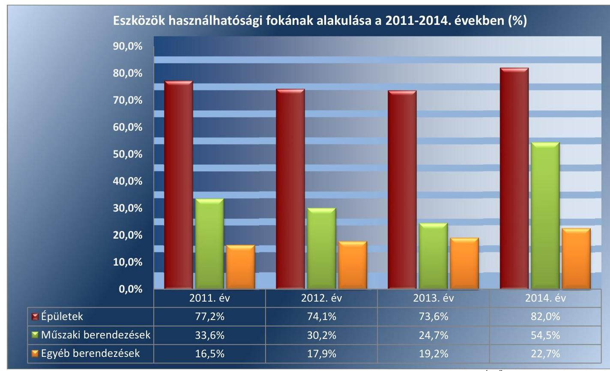

*Forrás: SZÉPHŐ Zrt.2011-2014. évi, beszámolói*

---

II. SZ. MELLÉKLET: ESZKÖZÖK ÁTLAGOS ÉLETKORÁNAK ALAKULÁSA A 2011-2014. ÉVEKBEN
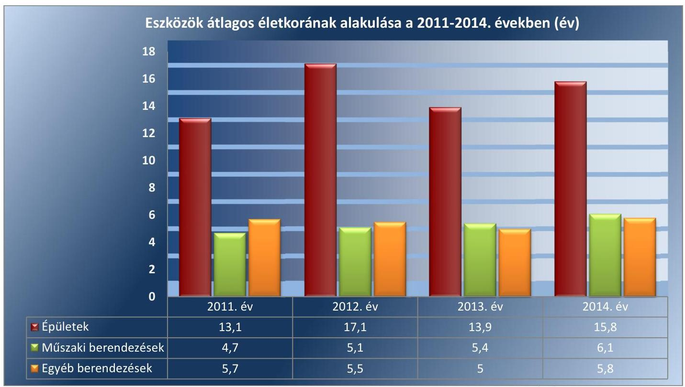

*Forrás: SZEPHŐ Zrt. 2011-2014. évi, beszámolói*

---

IV. SZ. MELLÉKLET: A SZÉPHŐ ZRT. SZOLGÁLTATÁSI DÍJAI A 2011-2014. ÉVEKBEN

| A SZÉPHŐ ZRT. SZOLGÁLTATÁSI DÍJAI A 2011-2014. ÉVEKBEN (FT) |  |  |  |  |  |  |  |  |  |  |
| :--: | :--: | :--: | :--: | :--: | :--: | :--: | :--: | :--: | :--: | :--: |
|  | 2011. |  | 2012. |  | 2013.01.01- |  | 2013.11.01- |  | 2014.10.01- |  |
|  | Alapdíj | Hódíj | Alapdíj | Hódíj | Alapdíj | Hódíj | Alapdíj | Hódíj | 2014.12.31. |  |
| Lakossági háztartási fogyasztókra vonatkozó | 423,4 | 3625,7 | 441,1 | 3788,0 | 397,0 | 3400,1 | 352,2 | 3022,4 | 339,7 | 2922,3 |
| Lakossági nem ház-tartási fogyasztókra vonatkozó | 423,4 | 4219,4 | 441,1 | 4396,3 | 397,0 | 3956,7 | 352,2 | 3517,1 | 339,7 | 3400,6 |

---

# V. SZ. MELLÉKLET: A SZÉPHŐ ZRT. ELADÓSODOTTSÁGI MUTATÓSZÁMAI 2011-2014. ÉVEKBEN

|  A SZÉPHŐ ZRT. ELADÓSOTTSÁGI MUTATÓSZÁMAI 2011-2014. ÉVEKBEN (\%) |  |  |  |   |
| --- | --- | --- | --- | --- |
|  Megnevezés | 2011. | 2012. | 2013. | 2014.  |
|  eladósodottsági mutató (\%) | 25,2 | 33,5 | 29,9 | $27,3^{*}$  |
|  eladósodottság mértéke (\%) | 36,4 | 55,5 | 49,5 | $45,3^{*}$  |
|  nettó eladósodottság (\%) | 12,6 | 20,3 | 23,0 | $14,5^{*}$  |
|  adósságfedezeti mutató I. | 396,7 | 298,2 | 333,9 | $390,0^{*}$  |
|  adósságfedezeti mutató II. | 13,91 | 44,42 | 159,3 | $0,25^{*}$  |
|  árbevételre vetített eladósodottság (\%) | 13,8 | 16,5 | 20,1 | $12,8^{*}$  |
|   |  | *a vagyonkezelésbe vett eszközök nyilvántartási adatai nélkül |  |   |
|   |  |  |  | Forrás: SZÉPHŐ Zrt. 2011-2014. évi beszámolói  |

---

VI. SZ. MELLÉKLET: A SZÉPHŐ ZRT. HOSSZÚ LEJÁRATÚ KÖTELZETTSÉGEI 2011-2014. ÉVEKBEN

|  HOSSZÚ LEJÁRATÚ KÖTELEZETTSÉGEK (M FT) |  |  |  |   |
| --- | --- | --- | --- | --- |
|  Mégnevezés | 2011. | 2012. | 2013. | 2014.  |
|  Hosszú lejáratú hitel | 29,3 | 0 | 0 | 0  |
|  Önkormányzati tagi kölcsön | 0 | 0 | 0 | 129,8  |
|  Kapott kaució | 1,7 | 2,4 | 3,9 | 4,3  |
|  Kölcsön (lizing) | 3,8 | 3,3 | 1,5 | 0  |
|  Vagyonkezelésbe vett eszközök értéke | 0 | 0 | 0 | 3001,4  |
|  Hosszú lejáratú kötelezettségek összesen | 34,8 | 5,7 | 5,4 | 3135,5  |
|   |  |  |  | Forrás: SZÉPHŐ Zrt. 2011-2014. évi beszámolói  |

---

VII. SZ. MELLÉKLET: A BERUHÁZÁSOK ÉS AZ ELSZÁMOLT ÉRTÉKCSÖKKENÉSEK ALAKULÁSA 2011-2014. ÉVEKBEN

| A BERUHÁZÁSOK ÉS AZ ELSZÁMOLT ÉRTÉKCSÖKKENÉSEK ALAKULÁSA (M FT, \%) |  |  |  |  |  |
| :--: | :--: | :--: | :--: | :--: | :--: |
| Megnevezés | 2011 | 2012. | 2013 | 2014. | Összesen |
| Tárgyévben elszámolt értékcsökkenés (M Ft) | 197,9 | 221,5 | 249,7 | 390,6 | 1059,7 |
| Tárgyévben elszámolt beruházás (M Ft) | 430,1 | 198,1 | 286,8 | 502,5 | 1417,5 |
| Beruházás és az értékcsökkenés aránya (\%) | 217,3 | 89,5 | 114,9 | 128,6 | 133,8 |

---

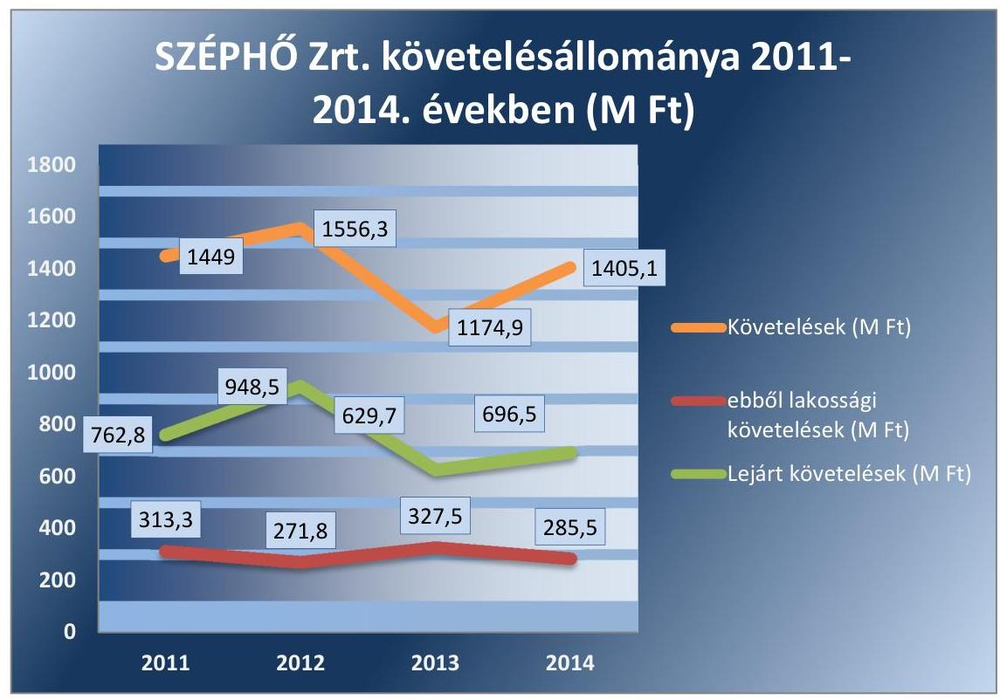

Fonrás: SZÉPHŐ Zrt. 2011-2014. évi beszámolói

---

.

---

# FÜGGELÉK: ÉSZREVÉTELEK 

A jelentéstervezetet a Számvevőszék 15 napos észrevételezésre megküldte az ellenőrzött szervezetek vezetőinek az ÁSZ tv. 29. §* (1) bekezdése előírásának megfelelően.

A SZÉPHŐ Székesfehérvári Épületfenntartó és Hőszolgáltató Zrt. vezérigazgatójától érkezett észrevételeket és a kezeléséről szóló válaszlevelet a jelentés függeléke tartalmazza. Székesfehérvár Megyei Jogú Város Önkormányzatának polgármestere észrevételezési lehetőségével nem élt.
Az elfogadott észrevételek alapján a Számvevőszék módosította a jelentést.

[^0]
[^0]:    * 29. § (1) Az Állami Számvevőszék az ellenőrzési megállapításait megküldi az ellenőrzött szervezet vezetőjének vagy az általa megbízott személynek, és annak, akinek személyes felelősségét állapította meg.
    (2) Az ellenőrzött szervezet vezetője és a felelősként megjelölt személy az ellenőrzés megállapításaira tizenöt napon belül írásban észrevételt tehet.
    (3) Az Állami Számvevőszék az észrevételre a beérkezésétől számított harminc napon belül írásban válaszol. A figyelembe nem vett észrevételeket köteles a jelentésben feltüntetni, és megindokolni, hogy azokat miért nem fogadta el.

---

# Állami Számvevőszék 

Domokos László Elnök Úr részére

## 1364 BUDAPEST 4.

Pf. 54.
Tárgy: észrevétel jelentéstervezetre

Tisztelt Elnök Úr!

A SZÉPHŐ Zrt. számvevőszéki jelentéstervezetét tartalmazó, V-1112-148/2016. iktatószámú levelét köszönettel megkaptuk, és az abban foglalt felhívásra az alábbiakat nyilatkozzuk.

A jelentéstervezetben foglalt érdemi kérdésekkel kapcsolatban nem kívánunk észrevételt tenni, az abban foglalt megállapításokkal és javaslatokkal egyetértünk. A pontosság és tényszerűség érdekében három javaslatot kívánunk megfogalmazni a jelentéstervezet alábbi pontjai vonatkozásában:
1./ A jelentéstervezet 8. oldalán a kép mellett levő szöveg szerint: „A jogelőd vállalat jegyzett tőkén felüli 855,4 MFt-os vagyonát tőketartalékként vették nyilvántartásban." Ez vélhetően elírás, tekintettel arra, hogy a nyilvántartásaink szerint a helyes összeg 870.180 eFt.
2./ A jelentéstervezet 9. oldalán, a dolgozói részvényekkel kapcsolatos második bekezdésben „A dolgozói részvényeket az Önkormányzat 2012. június 21. napján megvásárolta," tagmondatot javasoljuk módosítani, mert a tényszerű megállapítás az, hogy a Társaság a dolgozói részvényeket bevonta, és a változás 2013. június 12-i cégbírósági bejegyzésével a dolgozói részvények névértékének megfelelő mértékben csökkentette az alaptőkéjét. Az Önkormányzat ez időtől megvalósuló kizárólagos részvényesi pozíciójára vonatkozó megállapítás természetesen helyes, csak annak megvalósulásának módját javasoljuk pontosítani.
3./ A jelentéstervezet 23. oldalának utolsó mondatában, a rezsicsökkentés mértékével összefüggésben kívánjuk jelezni, hogy vélhetően elírás folytán szerepel $3,5 \%$ a ténylegesen $3,3 \%$ általános mértékű rezsicsökkentés helyett.

---

Megjegyezzük, hogy a 3,5\% mértékű csökkenés is helytálló, azonban kizárólag az alapdij egységárára vonatkoztatva.

Köszönjük a Tisztelt Állami Számvevőszéknek, és az ellenőrzést személyesen végzőknek a hatékony, hozzáértő munkát, különösen azt, hogy annak végzésekor megértően figyelemmel voltak Társaságunk mindennapi müködésére.

Kelt Székesfehérváron, 2016. november 8. napján

Tisztelettel:

SZÉPYŐ Zrt.
Szauter Ákos
vezérigazgató

Székesfehérvári Épületfenntartó és Hősszégáltató Zrt.
8000 Székesfehérvár, Honvéd u. 1.
UNICREDIT: 10918001-00000036-72480008

---

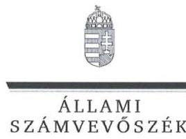

ELHök

# Szauter Ákos úr 

vezérigazgató
SZÉPHŐ Székesfehérvári Épületfenntartó és Hőszolgáltató Zrt.

## Székesfehérvár

## Tisztelt Vezérigazgató Úr!

Köszönettel vettem a SZÉPHŐ Székesfehérvári Épületfenntartó és Hőszolgáltató Zrt. ellenőrzéséről készített számvevőszéki jelentéstervezetre tett észrevételeit.

Az Állami Számvevőszéknek (a továbbiakban: ÁSZ) az észrevételekre vonatkozó álláspontjáról a felügyeleti vezető által készített részletes tájékoztatásból kap választ, melyet levelemhez mellékeltem.

Budapest, 2016. 12. hó 05. nap
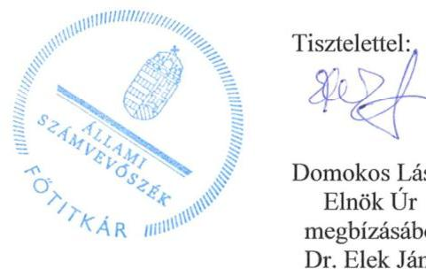

Tisztelettel: 2222

Domokos László
Elnök Úr
megbízásából
Dr. Elek János
Főtitkár

Melléklet: Tájékoztatás az észrevételekről

---

# Tájékoztatás az észrevételekról 

„Az önkormányzatok gazdasági társaságai - Az önkormányzatok többségi tulajdonában lévő gazdasági társaságok közfeladat ellátását érintő gazdálkodási tevékenysége szabályszerűségének ellenőrzése - SZÉPHŐ Székesfehérvári Épületfenntartó és Hőszolgáltató Zrt." címmel készített jelentéstervezetre Vezérigazgató úr észrevételét megköszönöm. Az észrevétel kezeléséről az alábbi tájékoztatást adom.

1. A jelentéstervezet 8. oldalán a kép melletti szövegre - „A jogelőd vállalat jegyzett tőkén felüli 855,4 M Ft-os vagyonát tőketartalékként vették nyilvántartásba." - tett észrevételét elfogadom. Észrevétele alapján a jelentéstervezetet pontosítom az alábbiak szerint: „A jogelőd vállalat jegyzett tőkén felüli 870,2 M Ft-os vagyonát tőketartalékként vették nyilvántartásba."
2. A jelentéstervezet 9. oldalán, a dolgozói részvényekkel kapcsolatos második bekezdésre - „A dolgozói részvényeket az Önkormányzat 2012. június 21-én megvásárolta, így ettől az időponttól kezdődően a SZÉPHŐ Zrt. 100\%-ban az Önkormányzat tulajdonába került. " - tett észrevételét elfogadom Észrevétele alapján a jelentéstervezet módosításra kerül az alábbiak szerint: „A Társaság jegyzett tőkéje - a visszavásárolt dolgozói részvények révén - 2013. június 12-i cégbírósági bejegyzéssel leszállitásra került. A SZÉPHŐ Zrt. 100\%-ban az Önkormányzat tulajdonába került."
3. A jelentéstervezet 23. oldalán, a rezsicsökkentés mértékével összefüggő megállapításra - „Az 50/2011. (IX.30) NFM rendeletben elöirt 4,2\%-os díjemelést 2012. január 1-jei hatállyal elrendelte, illetve 2013. január 1-jétől a Rezsi tv. egyes módosításai során elöirt 10\%-os, 11,1\%-os és 3,5\%-os dij-csökkentést végrehajtotta." - tett észrevételét elfogadom. Észrevétele alapján a jelentéstervezet pontosításra kerül az alábbiak szerint: „Az 50/2011. (IX.30) NFM rendeletben elöirt 4,2\%-os díjemelést 2012. január 1-jei hatállyal elrendelte, illetve 2013. január 1-jétől a Rezsi tv. egyes módosításai során elöirt 10\%-os, 11,1\%-os és 3,3\%-os dij-csökkentést végrehajtotta."

Budapest, 2016. december hó 5. nap
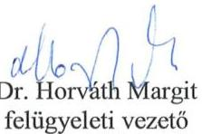

---

.

---

# RÖVIDÍTÉSEK JEGYZÉKE 

${ }^{1}$ Önkormányzat
${ }^{2}$ Ötv.
${ }^{3}$ SZÉPHŐ Zrt.
${ }^{4}$ SZMJV Közgyűlés
${ }^{5}$ Társaság
${ }^{6}$ Fűtőerőmű Kft.
${ }^{7}$ Igazgató
${ }^{8}$ ÁSZ tv.
${ }^{9}$ Integrált városfejlesztési stratégia
${ }^{10}$ Középtávú Energetikai stratégia
${ }^{11}$ Program az erős Székesfehérvárért
${ }^{12}$ Tszt.
${ }^{13}$ Mötv.
${ }^{14} \mathrm{SzMSz}_{1}$
${ }^{15} \mathrm{SzMSz}_{2}$
${ }^{16} \mathrm{Gt}$.
${ }^{17} \mathrm{Ptk} .2$
${ }^{18}$ Közszolgáltatási szerződés
${ }^{19}$ Vagyonkezelési szerződés
${ }^{20}$ Nvtv.
${ }^{21}$ Közgyűlés
${ }^{22}$ Vhr.
${ }^{23}$ Számv. tv.
${ }^{24}$ Felügyelő Bizottság
${ }^{25}$ Felügyelő Bizottság Ügyrendje
${ }^{26}$ Együttműködési megállapodás ${ }_{1}$
${ }^{27}$ Együttműködési megállapodás ${ }_{2}$
${ }^{28}$ Energia Hivatal

Székesfehérvár Megyei Jogú Város Önkormányzata
1990. évi LXV. törvény a helyi önkormányzatokról

SZÉPHŐ Székesfehérvári Épületfenntartó és Hőszolgáltató Zrt.
Székesfehérvár Megyei Jogú Város Közgyűlése
SZÉPHŐ Székesfehérvári Épületfenntartó és Hőszolgáltató Zrt.
Székesfehérvári Fűtőerőmű Kft. "fa"
SZÉPHŐ Székesfehérvári Épületfenntartó és Hőszolgáltató Zrt. Igazgatója
Az Állami Számvevőszékről szóló 2011. évi LXVI. törvény (hatályos 2011. július 1jétől)
Székesfehérvár Megyei Jogú Város Önkormányzat 645/2014. (IX.19.) számú határozatával jóváhagyott Integrált Városfejlesztési Stratégiája
Székesfehérvár Megyei Jogú Város Önkormányzat Közgyűlésének 697/2012. (XII. 14.) számú határozatával jóváhagyott Középtávú Energetikai Stratégiája

Székesfehérvár Megyei Jogú Város „Program az erős Székesfehérvárért" elnevezésű a 314/2011.(V. 31.) számú Képviselő-testületi határozattal jóváhagyott, a 226/2013.(V. 24.) számú Képviselő testületi határozattal módosított gazdasági programja.
2005. évi XVIII. törvény a távhőszolgáltatásról

Magyarország helyi önkormányzatairól szóló 2011. évi CLXXXIX. törvény
Székesfehérvár Megyei Jogú Város Önkormányzatának Közgyűlésének többször módosított 18/2011. (VI.3.) számú rendelete a Közgyűlés szervezeti és működési szabályairól
Székesfehérvár Megyei Jogú Város Önkormányzatának Közgyűlésének többször módosított 4/2013. (II.25.) számú rendelete a Közgyűlés szervezeti és működési szabályairól
2006. évi IV. törvény a gazdasági társaságokról (hatálytalan 2014. január 1-jétől)
2013. évi V. törvény a polgári törvénykönyvről (hatályos 2014. március 15-től)

Székesfehérvár Megyei Jogú Város Önkormányzata és a SZÉPHŐ Zrt. között
Székesfehérvár Megyei Jogú Város Önkormányzata ás a SZÉPHŐ Zrt. között 90097/2014. számon létrejött vagyonkezelési szerződés
2011. évi CXCVI. törvény a nemzeti vagyonról

SZÉPHŐ Székesfehérvári Épületfenntartó és Hőszolgáltató Zrt. Közgyűlése
2005. évi XVIII. törvény végrehajtásáról szóló 157/2005. (VIII. 15.) számú Kormány rendelet
2000. évi C. törvény a számvitelről

SZÉPHŐ Székesfehérvári Épületfenntartó és Hőszolgáltató Zrt. Felügyelő Bizottsága
SZÉPHŐ Zrt. Felügyelő Bizottságának 8/2010. (V. 21.) számú határozatával jóváhagyott Ügyrendje
Az Önkormányzat és a Társaság között 1993. január 1-jétől hatályos Együttműködési megállapodás
Az Önkormányzat és a Társaság között 2013. január 1-jétől hatályos Együttműködési megállapodás
Magyar Energetikai és Közmű-szabályozási Hivatal

---

${ }^{29}$ Üzletszabályzat ${ }_{1}$
${ }^{30}$ Üzletszabályzat ${ }_{1}$
${ }^{31}$ Taktv.
${ }^{32}$ Áht. ${ }_{1}$
${ }^{33}$ Avtv.
${ }^{34}$ Info tv.
${ }^{35}$ NAIH
${ }^{36}$ Önköltség-számítási szabályzat ${ }_{1}$
${ }^{37}$ Önköltség-számítási szabályzat ${ }_{2}$
${ }^{38}$ Kintlévőség-kezelési szabályzat ${ }_{1}$
${ }^{39}$ Kintlévőség-kezelési szabályzat ${ }_{2}$
${ }^{40}$ Üzletszabályzat ${ }_{1}$
${ }^{41}$ Üzletszabályzat ${ }_{2}$
${ }^{42} 50 / 2011$. (IX.30.) NFM rendelet
${ }^{43}$ MAVIR Zrt.
${ }^{44}$ MEKH
${ }^{45}$ SZMJV Közgyűlése 43/2010. (XII.14.) számú rendelet
${ }^{46}$ 36/2009 . (VII.22.) KHEM rendelet
${ }^{47}$ Rezsi tv.

Székesfehérvári Épületfenntartó és Hőszolgáltató Zrt. Üzletszabályzat (hatályos 2004-2013. február 14-ig)
Székesfehérvári Épületfenntartó és Hőszolgáltató Zrt. Üzletszabályzat (hatályos 2013. február 14-től)
a köztulajdonban álló gazdasági társaságok takarékosabb múködéséről szóló 2009. évi CXXII. törvény
az államháztartásról szóló 1992. évi XXXVIII. törvény
1992. évi LXIII. törvény a személyes adatok védelméről és a közérdekú adatok nyilvánosságáról (hatályon kívül: 2012. január 1-jétől)
az információs önrendelkezési jogról és az információszabadságról szóló 2011. évi CXII. törvény
Nemzeti Adatvédelmi és Információszabadság Hatóság
SZÉPHŐ Zrt. Önköltség-számítási szabályzata (hatályos 2010. január 1-jétől 2013. január 1-ig)
SZÉPHŐ Zrt. Önköltség-számítási szabályzata (2013. január 2-tól)
Székesfehérvári Épületfenntartó és Hőszolgáltató Zrt. Kintlévőség-kezelési szabályzat (hatályos 2012. július 1-jétől 2014. április 14-ig)
Székesfehérvári Épületfenntartó és Hőszolgáltató Zrt. Kintlévőség-kezelési szabályzat (hatályos 2014. április 15-től)
Székesfehérvári Épületfenntartó és Hőszolgáltató Zrt. Üzletszabályzat (hatályos 2004-2013. február 14-ig)
Székesfehérvári Épületfenntartó és Hőszolgáltató Zrt. Üzletszabályzat (hatályos 2013. február 15-től)

A távhőszolgáltatónak értékesített távhő árának, valamint a lakossági felhasználóknak és a külön kezelt intézményeknek nyújtott távhőszolgáltatás dijának megállapításáról szóló 50/2011. (IX.30) NFM rendelet
Magyar Villamosenergia-ipari Átviteli Rendszerirányító Zrt.
Magyar Energetikai és Közmúszabályozási Hivatal
A távhőszolgáltatásról szóló 12/2006. (V.29.) számú önkormányzati rendelet módosításáról szóló SZMJV Közgyűlése 43/2010. (XII.14.) számú rendelete a távhőszolgáltatás csatlakozási dijának és a lakossági távhőszolgáltatás dijának, valamint a hőenergia távhőtermelő és a távhőszolgáltató közötti szerződésben alkalmazott árának meghatározása során figyelembe veendő szempontokról, és a Magyar Energia Hivatal által lefolytatott eljárásban kötelezően benyújtandó adatok köréről szóló 36/2009 . (VII.22.) KHEM rendelet
a rezsicsökkentések végrehajtásáról szóló 2013. évi LIV. törvény

---

# ÁLLAMI SZÁMVEVŐSZÉK 

1052 Budapest, Apáczai Csere János utca 10.
Levélcím: 1364 Budapest 4. Pf. 54
Telefon: +36 14849100 Telefax: +36 14849200
www.asz.hu