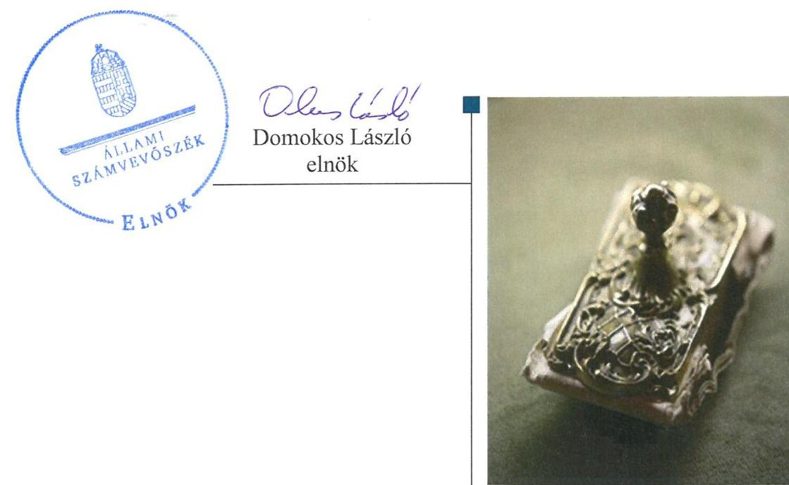
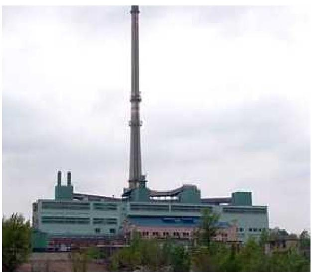
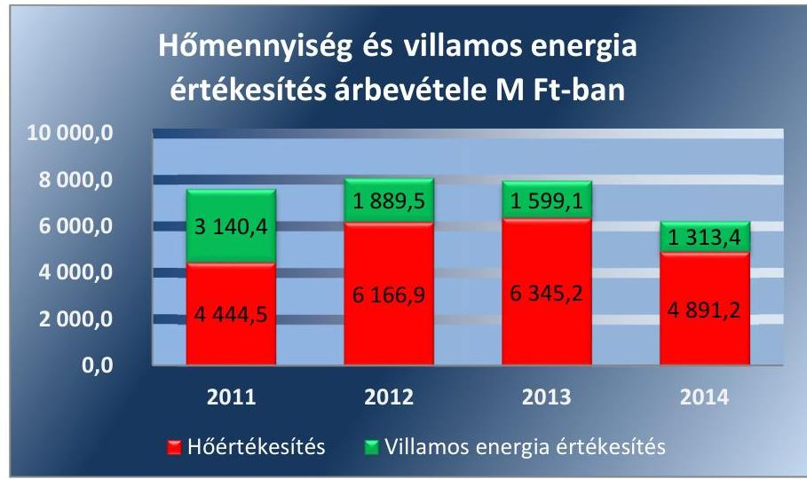
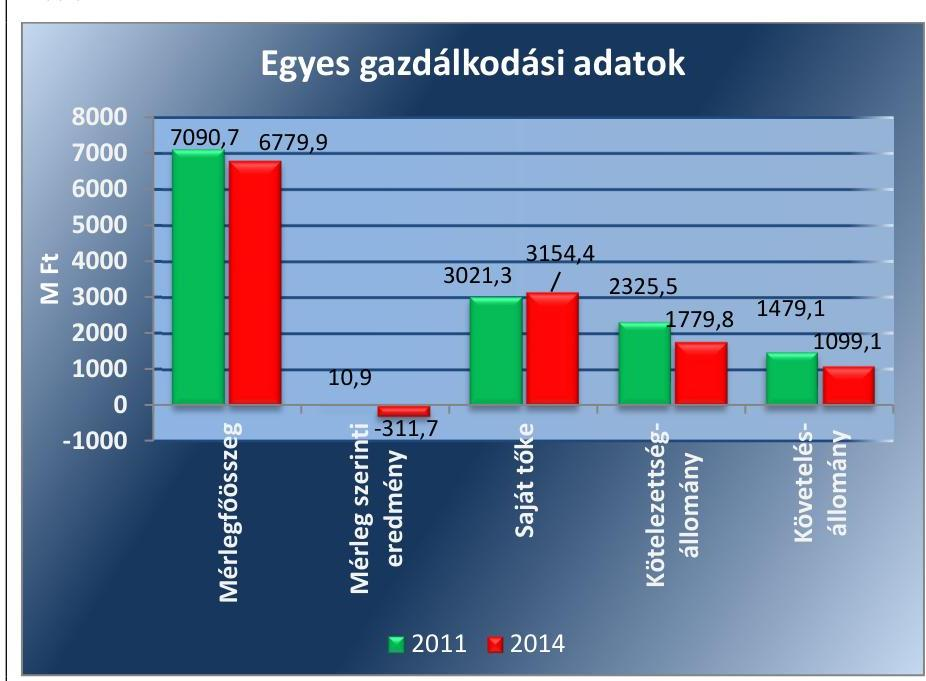

# Jelentés 

## Az önkormányzatok gazdasági társaságai

Az önkormányzatok többségi tulajdonában lévő gazdasági társaságok gazdálkodásának ellenőrzése - Tatabánya Erőmű Kft.
2016.

---

# Jelentés 

## Az önkormányzatok gazdasági társaságai

Az önkormányzatok többségi tulajdonában lévő gazdasági társaságok gazdálkodásának ellenőrzése - Tatabánya Erőmű Kft.
2016. decembe- hó 16. nap

---

# AZ ELLENŐRZÉST FELÜGYELTE:

DR. HORVÁTH MARGIT felügyeleti vezető

## AZ ELLENŐRZÉST VEZETTE ÉS A VÉGREHAJTÁSÁÉRT FELELŐS:

PENCZ MÁRIA ellenőrzésvezető

## A PROGRAM ÖSSZEÁLLÍTÁSÁÉRT FELELŐS:

JANIK JÓZSEF LÁSZLÓ osztályvezető

IKTATÓSZÁM: V-1131-138/2016.

TÉMASZÁM: 2165

ELLENŐRZÉS-AZONOSÍTÓ SZÁM: V070796

Jelentéseink az Országgyűlés számítógépes hálózatán és az Interneta a www.asz.hu címen is olvashatóak.

---

# TARTALOMJEGYZÉK 

■ ÖSSZEGZÉS ..... 5
■ AZ ELLENŐRZÉS CÉLJA ..... 7
■ AZ ELLENŐRZÉS TERÜLETE ..... 8
■ AZ ELLENŐRZÉS HÁTTERE, INDOKOLTSÁGA ..... 10
■ A JELENTÉS LÉNYEGES KÉRDÉSKÖREI ..... 11
■ ELLENŐRZÉS HATÓKÖRE ÉS MÓDSZEREI ..... 12
■ MEGÁLLAPÍTÁSOK ..... 14
■ JAVASLATOK ..... 23
■ MELLÉKLETEK ..... 25
I. sz. melléklet: Értelmező szótár ..... 25
II. sz. melléklet: Tatabánya Erőmű Kft. vagyonának változása 2011-2014.között (E Ft, \%) ..... 27
III. sz. melléklet: Tatabánya Erőmú Kft. eredményének alakulása a 2011-2014. közötti években (E Ft, \%) ..... 29
■ FÜGGELÉK: ÉSZREVÉTELEK ..... 31
■ RÖVIDÍTÉSEK JEGYZÉKE ..... 33

---

.

---

# ÖSSZEGZÉS 

A Tatabánya Megyei Jogú Város Önkormányzata szabályszerűen gyakorolta a tulajdonosi jogokat. A Tatabánya Erőmú Kft. a szabályszerű vagyongazdálkodás feltételeit összességében megfelelően alakította ki, vagyongazdálkodása részben felelt meg a jogszabályi előírásoknak. A kötelezettségállománya és az eladósodottság mértéke, szerkezete nem jelentett veszélyt a müködésre és a feladatellátásra. A feladatellátás bevételeinek és ráfordításainak elszámolása megfelelt a jogszabályi előírásoknak. A Tatabánya Erőmú Kft. által termelt távhőenergia értékesítése során alkalmazott árak a jogszabályi előírásnak megfeleltek.

## Az ellenőrzés társadalmi indokoltsága

Az Állami Számvevőszék stratégiájában megfogalmazta, hogy a helyi önkormányzatok gazdálkodásában rejlő pénzügyi kockázatok feltárásával, az államháztartáson kívülre nyújtott költségvetési támogatások és ingyenes vagyonjuttatások, valamint az államháztartáson kívül múködő közfeladat-ellátó rendszerek ellenőrzéseivel hozzájárul ahhoz, hogy a közpénzeket az államháztartáson kívül múködő szervezetek is átlátható, rendezett módon használják fel a közfeladatok szerződésben vállalt ellátása érdekében.

Magyarországon az intézmény-centrikus közfeladat-ellátás jellemző, de egyre jelentősebb a költségvetésen kívüli feladatellátás térnyerése. Ennek legfontosabb szereplői - a nonprofit szervezetek mellett - az önkormányzati tulajdonú gazdasági társaságok. Az önkormányzatok szervezetalakítási szabadságának következménye, hogy a korábban is vállalati formában múködő közszolgáltatások mellett, mind a kötelező, mind az önként vállalt feladatok ellátásában a gazdasági társaságok kiemelt fontosságú szerephez jutottak.

## Főbb megállapítások, következtetések, javaslatok

A Tatabánya Megyei Jogú Város Önkormányzata feladat-ellátás megszervezésére vonatkozó döntése szabályszerű volt. A vagyongazdálkodással összefüggő feladatait az Önkormányzat vagyongazdálkodási rendeletben szabályozta. Az Önkormányzat szabályszerűen, a Gt., a Ptk., valamint az önkormányzati rendeletben foglaltaknak megfelelően teljesítette tulajdonosi joggyakorlási, ellenőrzési, beszámoltatási kötelezettségét.

A Tatabánya Erőmú Kft. által ellátandó feladatok körét a Társasági szerződésben szabályszerűen határozták meg, a feladatellátás követelményeit a távhőszolgáltatást ellátó gazdasági társasággal kötött hő értékesítési szerződések tartalmazták.

A Tatabánya Erőmú Kft. a szabályszerű vagyongazdálkodás feltételeit részben alakította ki, mert szabályzatait a jogszabályváltozásoknak megfelelően nem minden esetben aktualizálta, és számlarenddel nem rendelkezett. A Tatabánya Erőmú Kft. vagyonnal való gazdálkodása részben felelt meg a jogszabályi rendelkezéseknek, mert a Számv. tvben előírt háromévenkénti leltározási kötelezettségének nem tett eleget, a tárgyi eszközök mennyiségi leltárral történő alátámasztását az ellenőrzött időszak egyik évében sem biztosította. Az Önköltség-számítási szabályzatban a Számviteli politikában előírtak ellenére nem szabályozták a Tszt.-ben, valamint a Vet.-ben előírt számviteli szétválasztásra vonatkozó szabályokat.

A Tatabánya Erőmú Kft.-nél az eladósodottság mértéke, szerkezete nem jelentett kockázatot a feladat ellátására.
A Tatabánya Erőmú Kft. éves beszámolóit határidőben elkészítette, közzétette, azokról az FB írásbeli jelentéseit elkészítette. A könyvvizsgáló a beszámolókat hitelesítő záradékkal látta el, és nem kifogásolta a tárgyi eszközök leltári alátámasztásának hiányát, továbbá nyilatkozott a számviteli szétválasztás megfelelőségéről annak ellenére, hogy a szétválasztási szabályokat a Tszt. előírásai ellenére nem dolgozták ki. A 2012. és a 2014. évi üzleti jelentéskészítési kötelezettségének a Tatabánya Erőmú Kft. nem tett eleget.

---

A Tatabánya Erőmú Kft. bevételeinek és anyagjellegú ráfordításainak elszámolása a Számv. tv előírásainak megfelelte.

A Tatabánya Erőmú Kft. által termelt távhőenergia értékesítése során alkalmazott árak a jogszabályi előírásnak megfeleltek.

---

# AZ ELLENŐRZÉS CÉLJA 

AZ ELLENŐRZÉS CÉLJA annak értékelése, hogy az önkormányzat vagyongazdálkodási tevékenysége során szabályszerűen gyakorolta-e tulajdonosi jogait; a gazdasági társaság szabályozottsága, gazdálkodása és vagyongazdálkodási tevékenysége, bevételeinek és ráfordításainak elszámolása megfelelte a jogszabályi és tulajdonosi előírásoknak; a gazdasági társaság kötelezettségállománya jelent-e kockázatot a múködésre, valamint a gazdálkodás átláthatósága és elszámoltathatósága érdekében biztosítva volt-e a szolgáltatás dijának megalapozottsága szabályszerű önköltségszámítással.

---

# **AZ ELLENŐRZÉS TERÜLETE**

## **Tatabánya Megyei Jogú Város Önkormányzata és a többségi tulajdonában lévő Tatabánya Erőmű Korlátolt Felelősségű Társaság**

A Tatabánya Erőmű Kft.-t1 1998. július 30-án alapította 3,0 M Ft törzstőkével a VÉRT2, a Horizon Energy Development B.V., és a Wartsila NSD. Az Önkormányzat3 2010. február 11-én megvásárolta a Tatabánya Erőmű Kft. üzletrészének 51%-át, amellyel többségi befolyást biztosító részesedést szerzett a Tatabánya Erőmű Kft.-ben. A tulajdonosi szerkezet az ellenőrzött időszakban változott, 2014.-től az Önkormányzat 51%-os, az ELMIB Zrt.4 39%-os, az Energott Zrt.5 10%-os tulajdonosi részaránnyal rendelkezett a Tatabánya Erőmű Kft.-ben.

A Tatabánya Erőmű Kft. jegyzett tőkéje az ellenőrzött időszakban 3 176,5 M Ft volt. A Tatabánya Erőmű Kft. az ellenőrzött időszakban közfeladatot nem látott el, fő tevékenysége villamosenergia-termelés, gőzellátás, légkondicionálás volt.

A Tatabánya Erőmű Kft. Tatabánya város fűtőerőműve, a közel 23 ezer tatabányai távfűtéses lakást és számos közintézményt ellátó forró vizes távfűtő rendszer központi hőforrása, amely a hőenergia mellett kapcsoltan villamos energiát is termel. Elsődleges tüzelőanyaga a vezetékes földgáz volt.

A hő és áram termeléshez szükséges energia hordozót teljes egészében külső partnertől szerezte be. A 2011. évben értékesített hőmennyiség 1 156 935 GJ, az értékesített villamos energia mennyisége 136 596 MWh volt. 2014. évi értékesített hőmennyiség 972 378 GJ, ami 15,9%-os csökkenést jelentett, az értékesített villamos energia mennyisége 79 175 MWh, ami 42%-os csökkenést jelentett a 2011. évhez képest.

A változás mértékét M Ft-ban az 1. ábra szemlélteti.

1. ábra

*Forrás: A Társaság 2011-2014. évi beszámolói*

---

1. táblázat

TATABÁNYA ERŐMŰ KFT. ÁLTAL ALKALMAZOTT ÉRTÉKESÍTŐI DÍJAK AZ ELLENŐRZÖTT IDŐSZAKBAN

|  időszak | Távhőverleél -tató megnevezése | értékesítői teljesítményéjE $E$ EX/MM/és | Értékesítői hódé $E / / 01$  |
| --- | --- | --- | --- |
|  2011.10.01-
2011.11.30. | Komtávhő
Zrt. | 12381 | 2567  |
|  2011.12.01-
2012.04.30. | Komtávhő
Zrt. | 4118 | 4657  |
|  2012.05.01-
2012.10.31. | Komtávhő
Zrt. | 6175 | 4657  |
|  2012.11.01-
2013-10.31. | Komtávhő
Zrt. | 6175 | 4978  |
|  2013.11.01-
2014.01.31. | T-Szol Tata-
bányai Szol-
gáltató Zrt. | 6175 | 4200  |
|  2014.02.01-
2014.12.31. | T-Szol Tata-
bányai Szol-
gáltató Zrt. | 6175 | 4034  |

Forrás: 1. melléklet az 50/2011. (IX. 30.) NFM rendelethez

A Tatabánya Erőmű Kft. a termelt távhőenergiát távhő szolgáltatást végző társaságnak értékesítette. Az értékesítést a távhő árának megállapításáról szóló 50/2011. (IX.30) NFM rendelet ${ }^{6}$ alapján, a MEKH ${ }^{7}$ által meghatározott, kötelezően alkalmazandó egységár alapján végezte. A kapcsoltan termelt villamos energia ára az értékesítési szerződésekben került meghatározásra.

A Tatabánya Erőmű Kft.-nél a foglalkoztatottak átlagos statisztikai állományi létszáma a 2011. évi 107 fơről 2014. év végére 110 főre növekedett. A Tatabánya Erőmű Kft. gazdálkodásának egyes adatait a 2011-2014. évek vonatkozásában az 2. ábra szemlélteti. 2. ábra

Forrás: A Tatabánya Erőmú Kft. 2011-2014. évi beszámolói.

A Tatabánya Erőmű Kft. mérlegfőösszege 2011. évben 7090,7 M Ft, 2014-ben 6 779,9 M Ft volt. A kötelezettség állomány minden évben a saját tőke alatt volt, 2011. december 31-éről a 2014. év végére a szállítói állomány csökkenése miatt 23,5\%-kal csökkent. A követelésállomány a 2011. és a 2014. év vége között 27,4\%-kal, azaz 399,9 M Ft-tal csökkent.

A Tatabánya Erőmű Kft.-nek bevétele főként a vállalkozási tevékenységéből származott. Az Önkormányzat a Társaság részére működési és fejlesztési célú támogatást nem nyújtott az ellenőrzött időszakban.

A Tatabánya Erőmű Kft. az ellenőrzött időszakban más gazdasági társaságban tulajdonosi részesedéssel nem rendelkezett. Az ügyvezetők személye az ellenőrzött időszak alatt nem változott.

Az ellenőrzött időszakban a polgármester személye nem, a jegyző személye egy alkalommal változott. A polgármester a 2010. évi önkormányzati választások óta tölti be tisztségét.

A Tatabánya Erőmű Kft. nem minősül kormányzati szektorba sorolt egyéb szervezeteknek.

---

# AZ ELLENŐRZÉS HÁTTERE, INDOKOLTSÁGA 

## AZ ÖNKORMÁNYZATI TULAJDONÚ GAZDASÁGI

TÁRSASÁGOK ellenőrzése kiemelten fontos a vagyon megőrzése, megóvása érdekében, valamint a kormányzati szektor elszámolásaiban megjelenő önkormányzati tulajdonú gazdálkodó szervezetek esetében, amelyekkel szemben alapvető követelmény, hogy gazdálkodásuk, működésük szabályszerű, az általuk szolgáltatott adatok minél megbízhatóbbak legyenek. A feladat/közfeladat-ellátás költségeinek, ráfordításainak alakulása, színvonala hatással van a lakosság elégedettségére.

A törvényalkotás számára - az észlelt problémák, szabálytalanságok, vagy egyéb nem kívánatos jelenségek felszínre kerülésével - az ellenőrzés megállapításai segítséget nyújthatnak az államháztartáson kívüli feladat/közfeladat-ellátás értékeléséhez, jogszabályi keretei pontosításához, átláthatóságot biztosító szabályozásához. Meghatározhatóvá válnak az önkormányzati feladatellátásban részt vevő államháztartáson kívüli szervezeteknek - az önkormányzat költségvetését, pénzügyi helyzetét is befolyásoló - kockázatai, lehetővé válik ezen kockázatok csökkentése. Ellenőrzéseink feltárhatják, hogy az önkormányzat feladat-ellátási kötelezettségének szabályszerűen tett-e eleget, a feladatellátáshoz rendelt vagyonkezelésbe vett és saját vagyon működtetését az elvárható gondossággal, szabályszerűen szervezte-e meg és a tulajdonosi felügyelete hozzájárult-e a feladatellátásához. Az ellenőrzés rávilágíthat arra, hogy a gazdasági társaság a feladat-ellátási, közszolgáltatási szerződésben foglaltak betartásával, a vagyon használatával biztosította-e a szolgáltatás folytatásának feltételeit, a feladat ellátását. Ezzel az ellenőrzöttek és a helyi döntéshozók számára visszajelzést ad feladatszervezési, feladat-ellátási kockázataikról, alapot ad a meglévő hibák megszüntetéséhez, a jobb feladatellátás biztosításához. Fokozza a fegyelmet, igazolja, hogy lejárt a következmények nélküli ellenőrzések idő-szaka. Az ÁSZ értékteremtő rend kialakításához és megőrzéséhez hozzájáruló tevékenysége pozitív hatással van a szervezetről kialakított összkép formálására.

---

# A JELENTÉS LÉNYEGES KÉRDÉSKÖREI 

1. Az önkormányzat feladat megszervezéséről szóló döntése, valamint tulajdonosi joggyakorlása szabályszerű volt-e?
2. A Tatabánya Erőmú Kft. vagyongazdálkodása szabályszerű volt-e, kötelezettségállománya jelent-e kockázatot a múködésre, illetve a feladat ellátására?
3. A Tatabánya Erőmú Kft.-nél az ellátott feladat bevételei és ráfordításai elszámolása, valamint az önköltségszámítás és árképzés szabályszerű volt-e?

---

# ELLENŐRZÉS HATÓKÖRE ÉS MÓDSZEREI 

## Az ellenőrzés típusa

Megfelelőségi ellenőrzés

## Az ellenőrzött időszak

A 2011. január 1-jétől 2014. december 31-éig terjedő időszak.

## Az ellenőrzés tárgya

A gazdasági társaság feletti tulajdonosi joggyakorlás, valamint a gazdasági társaság gazdálkodásának szabályozottsága és szabályszerűsége.

Az ellenőrzés kiterjed minden olyan körülményre és adatra, amely az ÁSZ jogszabályban meghatározott feladatainak teljesítéséhez, valamint a program végrehajtása folyamán felmerült újabb összefüggések feltárásához szükséges.

## Az ellenőrzött szervezet

Tatabánya Megyei Jogú Város Önkormányzata, Tatabánya Erőmű Korlátolt Felelősségű Társaság

## Az ellenőrzés jogalapja

Az ellenőrzés jogszabályi alapját az ÁSZ tv. 1. § (3) bekezdése és 5. § (3)(4)-(5) bekezdései képezik.

## Az ellenőrzés módszerei

Az ellenőrzést a nemzetközi standardokat irányadónak tekintve az ellenőrzési program ellenőrzési kérdései, az ellenőrzött időszakban hatályos jogszabályok, az ellenőrzés szakmai szabályok és módszertanok figyelembe vételével végeztük.

Az ellenőrzés ideje alatt az ellenőrzött szervezettel történő kapcsolattartást az ÁSZ Szervezeti és Múködési Szabályzatának vonatkozó előírásai alapján biztosítottuk.

Az ellenőrzés a kiválasztott, tulajdonosi jogokat gyakorló önkormányzatra, illetve az ellenőrzésre kijelölt gazdasági társaság felett tulajdonosi

---

jogokat gyakorló szervezetre (holding szervezetre) és az ellenőrzött gazdasági társaságra terjedt ki.

Az ellenőrzést a kérdésekre adott válaszok kiértékelésével, valamint a megjelölt adatforrások, a csatolt tanúsítványok felhasználásával, továbbá az adott időszakban hatályos jogszabályok figyelembe vételével folytattuk le. Az ellenőrzési kérdések megválaszolásához szükséges bizonyítékok megszerzése a következő ellenőrzési eljárások alkalmazásával történt: megfigyelés, kérdésfeltevés (információkérés), összehasonlítás, valamint elemző eljárás.

A bevételek és ráfordítások elszámolása, valamint a vagyonnyilvántartás terén a szabályszerű működést véletlen mintavétellel ellenőriztük. A mintavétellel ellenőrzött területek esetében minden egyes tétel vonatkozásában a szabályszerűségre vonatkozó kérdéseket tettünk fel, amelyek eredménye összesítésre került. A jogszabályoknak és a belső előírásoknak megfelelőnek tekintettük az adott területet, amennyiben a minta ellenőrzésének eredménye alapján 95\%-os bizonyossággal a teljes sokaságban a hibaarány kisebb volt, mint 10\%, nem megfelelőnek, ha a hibaarány a 10\%ot meghaladta. Részben megfelelő minősítést adtunk, amennyiben egy adott terület vonatkozásában a minta alapján a teljes sokaságban nem volt egyértelműen biztosított a jogszabályoknak és a belső szabályzatoknak megfelelő működés. A ráfordítások elszámolására és a vagyonnyilvántartásra vonatkozó véletlen mintavételt kockázati alapú kiválasztással egészítettük ki, amelynek során évente a három legnagyobb összegű tételt választottuk ki.

---

# 1. Az önkormányzat feladat megszervezéséről szóló döntése, valamint tulajdonosi joggyakorlása szabályszerű volt-e? 

Összegző megállapítás

Az Önkormányzat a jogszabályi és a belső előírások betartásával látta el a Tatabánya Erőmú Kft. feletti tulajdonosi jogok érvényesítését.
1.1. számú megállapítás

Az Önkormányzat feladat-ellátás megszervezésére vonatkozó döntése szabályszerű volt.

Az Önkormányzat rendelkezett az Ötv ${ }^{8}$-ben és az Mötv. ${ }^{9}$-ben előírt gazdasági programmal, valamint közép és hosszú távú vagyongazdálkodási tervvel.

A GAZDASÁGI PROGRAMBAN ${ }^{10}$ az Önkormányzat a 20112014. évekre vonatkozóan stratégiai céljai között szerepeltette az energiahatékonyság növelését. Támogatandó célként tartalmazta a tatabányai erőmű kazánjainak új, magasabb hatásfokú berendezésekre történő kiváltását, melynek hatásaként mérsékelhetők a távhőszolgáltatás költségei. A Tatabánya Erőmű Kft. beruházásai a gazdasági programban meghatározott célok megvalósulását szolgálták.

A Tatabánya Erőmű Kft. fejlesztései - összhangban az Önkormányzat gazdasági programjában szereplő célokkal -a kazánok felújítására, korszerűsítésére, valamint a termelt hőenergia költségcsökkentését célzó földgáz tüzelőanyag biomassza (faapríték) tüzelőanyagra történő részleges cseréjére irányultak az ellenőrzött időszakban.

A VAGYONGAZDÁLKODÁSSAL összefüggő feladatait az Önkormányzat vagyongazdálkodási rendeletben ${ }^{11}$ szabályozta. Az Nvtv. 9. § (1) bekezdésében előírtaknak megfelelően a Közgyűlés ${ }^{12}$ a 145/2013. (VIII. 29.) számú határozatával közép- és hosszú távú vagyongazdálkodási tervet fogadott el. A közép- és hosszú távú vagyongazdálkodási terv tartalmazta a vagyongazdálkodás célkitűzéseit, valamint általános vagyongazdálkodási elveket, szempontokat határoztak meg a vagyongazdálkodás szervezetére, irányítására és döntés előkészítő folyamataira.

Az ellátandó feladatok körét a Gt. ${ }^{13}$ elöírásainak megfelelően a Társasági szerződésben ${ }^{14}$ szabályszerűen határozták meg, a feladatellátás követelményeit az érvényes hatósági engedélyek valamint a hosszú távú és éves - távhőszolgáltatást ellátó gazdasági társasággal kötött - hő értékesítési szerződések tartalmazták.

A Tatabánya Erőmű Kft. múködésének ellenőrzési kötelezettségét a tulajdonosok a Társasági szerződésben írták elő. A Társasági szerződés

---

X. fejezet 2. pontjában előírtak alapján az FB ellenőrizte a Tatabánya Erőmú Kft. múködését, ügyvezetését, köteles volt megvizsgálni a Taggyúlés ${ }^{15}$ elé terjesztett valamennyi lényeges üzletpolitikai jelentést, valamint minden olyan előterjesztést, amely a Taggyúlés kizárólagos hatáskörébe tartozó ügyre vonatkozik. A Számv. tv. ${ }^{16}$ szerinti beszámolóról és az adózott eredmény felhasználásáról a Taggyúlés csak az FB írásbeli jelentésének birtokában határozhatott.

Az Önkormányzatnak - a Tatabánya Erőmú Kft. Társasági szerződésben meghatározott és ellátott tevékenységével összefüggésben - a Vet $^{17}$.-ben és a Tszt. ${ }^{18}$-ben előírtak szerint nem volt rendeletalkotási kötelezettsége.

# 1.2. számú megállapítás 

Az Önkormányzat szabályszerűen teljesítette tulajdonosi joggyakorlási és beszámoltatási kötelezettségét.

A TULAJDONOSI JOGOKAT az Önkormányzat a Gt.-ben, $\mathrm{Ptk}^{19}$ - ban és vagyongazdálkodási rendeletében foglalt előírások alapján, szabályszerűen gyakorolta.

Az Önkormányzat az ellenőrzött időszakban a vagyongazdálkodási rendeletében és a Társasági szerződésben szabályozta társasági üzletrésze vonatkozásában a tulajdonosi jogok gyakorlásának rendjét. A szabályozás alapján a Tatabánya Erőmú Kft. önkormányzati üzletrészével öszszefüggő tulajdonosi jogok gyakorlása a Közgyűlés és a GLB ${ }^{20}$ jogosítványa volt, az Önkormányzat a Tatabánya Erőmú Kft. vonatkozásában nem döntött a tulajdonosi jogok átruházásáról.

A VAGYONGAZDÁLKODÁSI RENDELETBEN előírtak szerint gazdasági társaság alapításáról, az önkormányzati vagyon gazdasági társaságba történő beviteléről kizárólag a Közgyűlés volt jogosult dönteni. Az Önkormányzat résztulajdonában lévő többszemélyes társaságoknál a vagyongazdálkodási rendelet 22. § (1) bekezdésében előírtak alapján a legfőbb szerv döntését megelőzően a Közgyűlés döntött a Társasági szerződés jóváhagyása, az igazgatóság, az ügyvezető és az FB tagjainak megbízása, a törzstőke felemelése, valamint más társasági formává alakulása esetén.

A tulajdonosok a Társasági szerződésben a Gt. előírásainak megfelelően határozták meg a Tatabánya Erőmú Kft. Taggyúlése, Felügyelő Bizottsága és az ügyvezetése múködésére, feladat és hatásköreire vonatkozó szabályokat. A Társasági szerződés tartalmazta a Taggyúlés kizárólagos hatásköreit, az összehívására vonatkozó szabályokat és a határozatképességére vonatkozó előírásokat. A Tatabánya Erőmú Kft. Taggyúlésében az Önkormányzatot a polgármester, akadályoztatása esetén az alpolgármester képviselte.

A Tatabánya Erőmú Kft. múködését - az Önkormányzat és az ELMIB Zrt. által jelölt egy-egy fő -kettő ügyvezető irányította, kötelezettségeiket, feladatkörüket és döntési jogosultságukat, a Tatabánya Erőmú Kft. képviseletét és a cégjegyzés módját a Társasági szerződés VIII/B. és IX. fejezete tartalmazta.

A vezető tisztségviselőket, az FB tagjait, valamint a könyvvizsgálót a Gt.-ben foglaltakkal összhangban a Taggyúlés választotta.

---

AZ FB a Gt., valamint a Ptk. előírásainak megfelelően öt tagból állt, tagjait a taggyűlés választotta. Az FB ügyrenddel rendelkezett. Az FB a Gt., valamint a Ptk. előírásainak megfelelően minden évben megtárgyalta a Tatabánya Erőmű Kft. számviteli törvény szerinti beszámolóját és döntése alapján javasolta a Taggyűlésnek a beszámoló elfogadását.

Az éves beszámolók Taggyűlési előterjesztését megelőzően a Tatabánya Erőmű Kft. ügyvezetése az Önkormányzat rendelkezésére bocsátotta a Számv. tv. szerinti beszámoló előterjesztését, az erre vonatkozó FB jelentést és döntést, valamint a könyvvizsgálói jelentést. A beszámoló jóváhagyására vonatkozó döntést - a vagyonrendeletben és a Társasági szerződésben előírtaknak megfelelően az ellenőrzött időszakban a Közgyűlésen történt megtárgyalást követően a Taggyűlés hozta meg. A Tatabánya Erőmű Kft. múködéséről az ügyvezetés a Számv. tv. alapján elkészített éves beszámolója keretében számolt be a tulajdonosok felé. Az éves beszámolók Taggyűlés általi jóváhagyásakor a beszámolókra vonatkozó FB és a minősítés nélküli záradékkal ellátott könyvvizsgálói jelentések rendelkezésre álltak.

AZ ÜZLETI TERV jóváhagyása a Társasági szerződés VIII. fejezet 1.14. pontjában előírtak szerint a Taggyűlés kizárólagos hatáskörébe tartozott. A Tatabánya Erőmű Kft. az ellenőrzött időszakban elkészítette az üzleti terveket, azokat 2011-ben és 2012-ben az FB és a Taggyűlés jóváhagyta. 2013-ra és 2014-re - a Társasági szerződésben előírt érvényes határozathoz szükséges szavazat hiánya miatt - nem rendelkeztek a tulajdonosok által elfogadott üzleti tervvel.

Az Önkormányzatnak a Tszt.-ben és az 50/2011. (IX.30) NFM rendelet előírtak alapján nem volt ármegállapító hatásköre a Tatabánya Erőmű Kft. által ellátott tevékenységekkel kapcsolatban.

# 2. A Tatabánya Erőmú Kft. vagyongazdálkodása szabályszerű volt-e, kötelezettségállománya jelent-e kockázatot a múködésre, illetve a feladat ellátására? 

Összegző megállapítás

A Tatabánya Erőmű Kft. vagyongazdálkodása részben volt szabályszerű, a kötelezettségállománya nem veszélyeztette a múködést, feladatellátást.

### 2.1. számú megállapítás

A Tatabánya Erőmű Kft. a szabályszerű vagyongazdálkodás feltételeit - a feltárt hiányosságok mellett - összességében megfelelően alakította ki.

A Tatabánya Erőmű Kft. vagyongazdálkodási tevékenységének feltételeit összességében megfelelően alakította ki. A Tatabánya Erőmű Kft. a Számv. tv. előírásainak megfelelően elkészítette belső szabályzatait, azonban azokat a jogszabályváltozásoknak megfelelően nem minden esetben aktualizálta. A Tatabánya Erőmű Kft. a Számv. tv. 161. § (1) bekezdésében előírt számlarenddel nem rendelkezett.

---

A SZÁMVITELI POLITIKA ${ }^{21}$ a Számv. tv. előírásainak megfelelően tartalmazta a gazdálkodóra jellemző szabályokat, előírásokat, módszereket, amelyekkel meghatározta, hogy mit tekint a számviteli elszámolás, az értékelés szempontjából lényegesnek, jelentősnek, nem lényegesnek, nem jelentősnek.

# A LELTÁRKÉSZÍTÉSI ÉS LELTÁROZÁSI SZA- 

BÁLYZAT ${ }^{22}$ nem felelt meg a Számv. tv. 69. § (3) bekezdésében foglaltaknak, mert a tárgyi eszközök öt évenkénti mennyiségi felvétellel történő leltározási kötelezettségét írta elő a Számv. tv-ben rögzített három évenkénti kötelezettség ellenére. A Tatabánya Erőmű Kft. az eszközeiről folyamatos mennyiségi nyilvántartást vezetett.

AZ ÉRTÉKELÉSI SZABÁLYZATBAN ${ }^{23}$, meghatározták a mérlegtételek értékelésének rendjét, ezen belül az eszközök és források értékelésének módszereit, módjait, szabályait, azonban a szabályzatot a Számv. tv. 14. § (11) bekezdés előírása ellenére a jogszabályváltozásoknak megfelelően nem aktualizálták. Az Értékelési szabályzatban a Számv. tv. 14. § (4) bekezdése előírásai ellenére a tárgyi eszközök várható élettartamát nem aktualizálták, az elszámolás gyakorlata nem felelt meg a szabályzat előírásainak.

ÖNKÖLTSÉG-SZÁMÍTÁSI SZABÁLYZATTAL ${ }^{24}$, a Tatabánya Erőmű Kft. a Számv. tv. előírásainak megfelelően rendelkezett, amelyben meghatározták a hő illetve villamos energia termelés közvetlen és közvetett költségeit. Az Önköltség-számítási szabályzatban a Számviteli politika 5.3.1.1. pontjában előírtak ellenére nem szabályozták 2012. január 1-jétől a Tszt. 18/A. § (2)-(3) bekezdésében, valamint 2011. április 15-től a Vet. ${ }^{25}$ 105. § (2) bekezdésében előírt számviteli szétválasztásra vonatkozó szabályokat. Az önköltség-számítási szabályzatban a Számv. tv. 14. § (7) bekezdésében, valamint a Számviteli politika 5.2.3 pontjában előírtak ellenére nem rögzítették a megfelelő kalkulációs módszert, nem határozták meg az önköltségszámítás során alkalmazandó elő- és utókalkuláció tartalmát, valamint a felosztandó költségek vetítési alapjait, az előkalkuláció és az utókalkuláció időszakait, a könyvviteli rendszerrel való egyeztetés módját.

A PÉNZKEZELÉSI SZABÁLYZATBAN ${ }^{26}$ a Számv. tv. előírásainak megfelelően rendelkeztek - többek között -a pénzforgalom lebonyolításának rendjéről, a készpénzben és a bankszámlán tartott pénzeszközök közötti forgalomról, a pénzszállítás feltételeiről, a készpénzállomány ellenőrzésekor követendő eljárásról, az ellenőrzés gyakoriságáról, a pénzkezeléssel kapcsolatos bizonylatok rendjéről és a pénzforgalommal kapcsolatos nyilvántartási szabályokról.

SZÁMLARENDDEL a Tatabánya Erőmű Kft. a Számv. tv. 161. § (1) bekezdése előírása ellenére nem rendelkezett.

A Tatabánya Erőmű Kft. rendelkezett a Taggyűlés által jóváhagyott SZMSZ-szel, melyben meghatározták a Tatabánya Erőmű Kft. szabályozási és szervezeti rendjét, a szervezeti egységek rendjét, illetve a vezetők feladatait és felelősségi köreit.

---

### 2.2. számú megállapítás

2. táblázat

EURÓPAI UNIÓS FORRÁSBÓL A TATABÁNYA ERŐMŰ KFT. RÉSZÉRE NYÚJTOTT FEJLESZTÉSI CÉLÚ TÁMOGATÁSOK (M FT)

|   | KEOP- | GOP- | KEOP-  |
| --- | --- | --- | --- |
|   | 5.4.0/11- | 2.1.3-11- | 4.10.0/C/  |
|   | 2011-002 | 2012- | 12-2013-  |
|   |  | 0037 | 0152  |
|  2011. | 0,0 | 0,0 | 0,0  |
|  2012. | 0,0 | 0,0 | 0,0  |
|  2013. | 57541 963,0 | 523537,8 | 987731,2  |
|  2014. | 184268 233,0 | 0,0 | 0,0  |
|  Össze- | 241810 196,0 | 523537,8 | 987731,2  |
|  sen |  |  |   |

Forrás: Tatabánya Erőmú Kft tanúsítványai, beszámolói

A Taktv ${ }^{27}$. 5. § (3) bekezdésében foglaltaknak megfelelően a Taggyúlés által jóváhagyott javadalmazási szabályzatban ${ }^{28}$ határozták meg a vezetők és tisztségviselők javadalmazási elveit, a vezetők prémium fizetésének feltételeit, valamint a költségtérítés szabályozását.

## A Tatabánya Erőmú Kft. vagyonnal való gazdálkodása részben felelt meg a jogszabályi rendelkezéseknek, mert a tárgyi eszközök mennyiségi leltárral történő alátámasztását az ellenőrzés időszakában nem biztosította.

A Tatabánya Erőmú Kft. az ellenőrzött időszakban vagyonkezelt eszközzel nem rendelkezett, így a vagyonkezelt vagyon elkülönítésére vonatkozó kötelezettsége nem keletkezett. Az analitikus és főkönyvi nyilvántartási rendszer a Tatabánya Erőmú Kft. vagyonának átlátható, naprakész nyilvántartását biztosította. A vagyonnyilvántartásokban a vagyonváltozás nyomon követhető volt.

A főkönyvi könyvelés és az analitikus nyilvántartások közötti egyeztetést a mérleg fordulónapjára vonatkozóan a Tatabánya Erőmú Kft.-nél szabályszerűen elvégezték. A Számv. tv. 69. § (1) és (3) bekezdése szerinti kötelező háromévenkénti leltározási kötelezettségének a Tatabánya Erőmú Kft. az ellenőrzött időszakban nem tett eleget, a tárgyi eszközök beszámoló szerinti értékének mennyiségi leltárral történő alátámasztását a 2011-2014. évek egyikében sem biztosította.

A Tatabánya Erőmú Kft. az ellenőrzött időszakban saját vagyonán fejlesztéseket hajtott végre, melyhez uniós támogatást vett igénybe. A fejlesztések - többek között - a költségek csökkentése érdekében a legjelentősebb költségtételt jelentő földgáz megújuló energiaforrásra (faapríték) történő cseréjével kapcsolatos átalakításokra irányultak. A fejlesztések alakulását az ellenőrzött időszakban és az évenként elszámolt értékcsökkenést a 3. táblázat mutatja be: 3. táblázat

TATABÁNYA ERŐMŰ KFT. ÁLTAL VÉGZETT FEJLESZTÉSEK ÉS AZ ELSZÁMOLT ÉRTÉKCSÖKKENÉS ALAKULÁSA (E FT)

|  Megnevezés | 2011. | 2012. | 2013. | 2014.  |
| --- | --- | --- | --- | --- |
|  Tárgyévben elszámolt ÉCS | 505422 | 324923 | 322509 | 346487  |
|  Tárgyévben aktivált fejlesztés | 42659 | 78886 | 69175 | 969581  |

Forrás: Tatabánya Erőmú Kft. 2011-2014. évi beszámolói

A saját vagyon pótlására, fejlesztésére vonatkozó igényeket az üzleti terv részeként éves fejlesztési tervekben határozták meg. A fejlesztések tényleges alakulásáról az éves beszámoló keretében számoltak be. A Tatabánya Erőmú Kft. - kazánok felújítására és a hőtároló rendszer kialakítására irányuló - jelentősebb fejlesztései 2013. évben indultak, amelyeket döntően 2014. évben aktiváltak. Az elszámolt értékcsökkenést meghaladó fejlesztés 2014-ben következett be, 2011. és 2013. között az aktivált fejlesztések mértéke elmaradt az elszámolt értékcsökkenés mértékétől.

A saját tőke/jegyzett aránya a Gt., valamint a Ptk. előírásainak megfelelt az ellenőrzött időszakban.

---

# 2.3. számú megállapítás 

A Tatabánya Erőmú Kft.-nél az eladósodottság mértéke, szerkezete nem veszélyeztette a feladatellátást.

Az eladósodás mértéke, szerkezete nem jelentett kockázatot a feladat ellátására, illetve a Tatabánya Erőmú Kft. múködésére az ellenőrzött időszakban.

AZ ELADÓSODOTTSÁGI MUTATÓ értéke javult az ellenőrzött időszakban, a mutatószám értéke a kedvező 0,6-os érték alatt maradt. Az eladósodottság mértéke hasonlóan alakult, 0,21\%-kal csökkent, az év végén fennálló kötelezettségek - a 2014. év kivételével - a saját tőke egyre kisebb hányadát kötötték le. A nettó eladósodottsági mutató értéke az ellenőrzött időszakban 0,06\% ponttal csökkent, egyik évben sem haladta meg 0,3\%-ot.

Az adósság fedezeti mutató I. kedvezőnek tekinthető a Tatabánya Erőmú Kft.-nél az ellenőrzött időszakban, mivel eszközállománya kötelezettségeinek (idegen forrásainak) több mint háromszorosa volt. 2011-ről 2014-re a mutató értéke 0,76 Ft-tal, 3,05 Ft-ról 3,81 Ft-ra, 24,9\%-kal növekedett. A 2011. évben a Tatabánya Erőmú Kft.-nek 393,4 M Ft hosszú lejáratú hitelállománya volt. Az adósságfedezeti mutató II. 2012. és 2014. között nem értelmezhető, mert a Tatabánya Erőmú Kft. nem rendelkezett hosszú lejáratú kötelezettséggel.

Az árbevételre vetített eladósodottság mutatója kedvezően alakult. A 2012 - 2013. években a forgóeszköz állomány értéke fedezetet nyújtott a kötelezettségekre, 2011-ben és 2014-ben az árbevétel fedezetett nyújtott a forgóeszközökkel csökkentett kötelezettségek törlesztésére.

A rövid lejáratú kötelezettségek határidőben történő teljesítése a Tatabánya Erőmú Kft.-nél részben volt biztosított. A rövid lejáratú kötelezettségek teljesítése jelentős hányadban késedelmesen történt, a lejárt határidejú tartozások részaránya a 2011- 2014. években $21,6 \%$ és 58,3\% közötti volt. A fizetési kötelezettség határidőn túli teljesítése átlagosan 11 illetve 22 nap között valósult meg.

A Tatabánya Erőmú Kft. éves beszámolóit elkészítette, közzétette, azokról az FB és a könyvvizsgáló írásbeli jelentéseit elkészítette. A 2012. és a 2014. évi üzleti jelentéskészítési kötelezettségének nem tett eleget.

A BESZÁMOLÁSI ÉS ADATSZOLGÁLTATÁSI kötelezettséget a tulajdonosi joggyakorlók a Társasági szerződésben írták elő. Ennek körében az ügyvezetők feladataként határozták meg az éves beszámoló elkészítését és a Taggyűlés elé terjesztését.

AZ ÉVES BESZÁMOLÓKAT a Számv. tv. előírásainak megfelelően határidőben elkészítették, ugyanakkor a Számv. tv. 19. § (1) bekezdésében előírtak ellenére a 2012. és 2014. években nem készítettek üzleti jelentést, valamint a Számv. tv. 88. § (6) bekezdése előírásai ellenére a 2012. év kivételével a beszámolók kiegészítő melléklete nem tartalmazta a cash-flow kimutatást. Az egyes tevékenységek elkülönítését a Tatabánya Erőmú Kft. beszámolóinak kiegészítő mellékletei - a 2013. évi beszámolót kivéve - tartalmazták. A beszámolókat a Taggyűlés jóváhagyta, a letétbe helyezési és közzétételi kötelezettségüknek - a 2014.

---

évi beszámoló kivételével - határidőben eleget tettek. Az éves beszámoló jóváhagyásakor az FB és a könyvvizsgálói jelentések rendelkezésre álltak.

AZ FB ${ }^{29}$ a Tatabánya Erőmű Kft. beszámolóira vonatkozóan a Gt., illetve a Ptk. előírásai alapján írásbeli jelentéseit elkészítette. Az FB az éves beszámolókat minden évben elfogadásra javasolta.

A KÖNYVVIZSGÁLÓ - a Számv. tv. 155. § (1) bekezdése elle-nére- a beszámolókra készített könyvvizsgálói jelentését az ellenőrzött időszakban hitelesítő záradékkal látta el, és nem kifogásolta a tárgyi eszközök háromévenkénti mennyiségi leltárral történő alátámasztásának hiányát, továbbá nem észlelte a Leltárkészítési és Leltározási szabályzat törvénysértő szabályozását. A könyvvizsgáló nem kifogásolta továbbá a 2012. és 2014. évek üzleti jelentések hiányát sem, ezáltal a Számv. tv. 156. § ((5) bekezdés h) pontja előírásai ellenére nem győződött meg, hogy a beszámoló az adott üzleti évről készített üzleti jelentéssel összhangban áll-e. A könyvvizsgálói jelentés a Számv. tv. 156. § (5) bekezdés e.) pontjában foglaltaknak megfelelően tartalmazta a tevékenységek szétválasztásának megfelelőségére vonatkozó nyilatkozatot is.

A Tatabánya Erőmű Kft. az Önkormányzat által előírt - a negyedéves gazdálkodási adatokra vonatkozó (pl. cash-flow kimutatás, lejárt esedékességű kötelezettségek tételes bemutatása, stb.)- adatszolgáltatási kötelezettségének - a 2013. és a 2014. évi adatszolgáltatások elmaradásai miatt - részben tett eleget.

ELEKTRONIKUS KÖZZÉTÉTELI KÖTELEZETTSÉGÉT az ellenőrzött időszakban az Avtv. és az Info tv., valamint a Taktv. előírásai szerint teljesítette, a kötelezően közzéteendő közérdekű adatokat az internetes honlapján hozzáférhetővé tette.

# 3. A Tatabánya Erőmú Kft.-nél az ellátott feladat bevételei és ráfordításai elszámolása, valamint az önköltségszámítás és árképzés szabályszerű volt-e? 

Összegző megállapítás

## 3.1. számú megállapítás

A feladatellátás bevételeinek és ráfordításainak elszámolása megfelelt a jogszabályi előírásoknak.

A Tatabánya Erőmű Kft. bevételeinek és anyagjellegú ráfordításainak elszámolása megfelelt, az értékcsökkenés elszámolása nem teljes körűen felelt meg a belső szabályozásnak.

A Tatabánya Erőmű Kft. a Tszt.-ben előírt - az ellátott feladatok bevételeinek és ráfordításainak egyértelmú elhatárolását éves beszámolói kiegészítő mellékleteiben -üzletági és telephelyi bontásban elkészített mérleg és eredménykimutatás - bemutatta.

---

SZÉTVÁLASZTÁSI KÖTELEZETTSÉGÉT telephelyi és tevékenységi bontásban (villamos, hő és egyéb tevékenység üzletág) teljesítette. Azon bevételek és költségek (pl. pénzügyi műveletek bevétele) felosztása, amelyek nem rendelhetők egyértelműen a villamos energia és hőenergia üzletághoz arányosítással történt.

AZ ANYAGJELLEGŰ RÁFORDÍTÁSOK elszámolása megfelelt a Számv. tv. előírásainak. A ráfordításokat az előzetes kötelezettségvállalási dokumentumok (szerződés, megrendelés) rendelkezésre állása mellett a megfelelő főkönyvi számlákra számolták el. Az anyagjellegű ráfordítások elszámolását megfelelő számviteli bizonylat támasztotta alá.

AZ ÉRTÉKESÍTÉS NETTÓ ÁRBEVÉTELÉNEK elszámolása a Számv. tv. előírásainak megfelelően, szabályszerűen történt, az árbevételek kiszámlázása a hatályos szerződéseknek megfelelt. A Tatabánya Erőmű Kft. árbevételei alapvetően a megtermelt hőenergia és a kapcsoltan termelt villamos energia értékesítéséből származtak. Ezen termékeket a hatósági ármegállapítás keretében szabályozott egységárakon, illetve szerződésben foglalt feltételek betartásával értékesítette a Tatabánya Erőmű Kft.

# AZ ÉRTÉKCSÖKKENÉSI LEÍRÁS ELSZÁMOLÁSA 

a 2012.-2014. években - az Értékelési szabályzat aktualizálásának elmaradása miatt - nem teljes körűen felelt meg a szabályozásban előírtaknak. 2011. évben az értékcsökkenés elszámolásának módszere azonos volt a Számviteli politikában és az Értékelési szabályzatban előírtakkal, a leírás elszámolása a választott módszer szerint történt.

A Tatabánya Erőmű Kft. kiegészítő mellékleteiben az amortizáció értékei a 2012-2014. években nem egyeztek a Számviteli Politika részeként elkészítendő Értékelési Szabályzatban előírt értékekkel. 2012. évtől az épületek, építmények, gépek és berendezések várható élettartamát a kiegészítő mellékletben 2026. december 31.-ben határozták meg, az értékcsökkenési leírás alá vont eszközök leírását is ennek megfelelően alakították. Az Értékelési szabályzat ugyanakkor a 0-ra írás várható időpontját 2020. december 31-ben határozta meg. A Tatabánya Erőmű Kft. a Számv. tv. 14. § (4) bekezdésében előírtak ellenére nem vezette át a Számviteli politikában és az Értékelési szabályzatában az amortizáció elszámolására vonatkozó változtatásokat, ezért az értékcsökkenési leírás elszámolása a 2012-2014. években - az értékelési szabályzat aktualizálásának elmaradása miatt - nem felelt meg a szabályozásban előírtaknak.

A Tatabánya Erőmű Kft.-nél az ellenőrzött időszakban nem került sor hátralékos állomány csökkentésére szolgáló intézkedések megtételére. A Tatabánya Erőmű Kft.-nek 2011. és 2013. években nem volt lejárt követelés állománya. A 2012. évben 144,7 M Ft, a 2014.évben 0,8 M Ft hátralékos vevő követelést mutattak ki, amelyek az összes vevő követelés 9,4 illetve $0,1 \%$-át jelentették. A késedelembe esés napjainak száma átlagosan 10-15 nap volt.

---

# 3.2. számú megállapítás 

ÉRTÉKVESZTÉS ELSZÁMOLÁSRA, behajthatatlan követelés kivezetésre nem kerül sor. Az éves számviteli beszámolóban, a kiegészítő mellékletben bemutatták a követelés állományban bekövetkezett változásokat.

## A Tatabánya Erőmú Kft. által termelt távhőenergia értékesítése során alkalmazott árak a jogszabályi előírásnak megfeleltek.

A Tatabánya Erőmú Kft. az ellenőrzött időszakban a Számv. tv. 14. § (7) bekezdésében előírtak ellenére nem végzett önköltségszámítást.

A Tatabánya Erőmú Kft. távhőtermelési tevékenységet látott el, a termelt távhőenergiát távhő szolgáltatást végző társaságnak értékesítette. Az értékesítést a távhő árának megállapításáról szóló 50/2011. (IX.30) NFM rendelet alapján, a MEKH által meghatározott, kötelezően alkalmazandó egységár alapján végezte. A kapcsoltan termelt villamos energia ára az értékesítési szerződésekben került meghatározásra.

---

# JAVASLATOK 

Az ÁSZ tv. 33. § (1) bekezdésében foglaltak értelmében az ellenőrzött szervezet vezetője köteles a jelentésben foglalt megállapításokhoz kapcsolódó intézkedési tervet összeállítani és azt a jelentés kézhezvételétől számított 30 napon belül az ÁSZ részére megküldeni. Amennyiben az intézkedési tervet határidőre nem küldi meg a szervezet, vagy amennyiben az nem elfogadható, az ÁSZ elnöke az ÁSZ tv. 33. § (3) bekezdés a)-b) pontjaiban foglaltakat érvényesítheti.

Javaslataink célja a Tatabánya Erőmú Kft. gazdálkodása szabályszerűségének és gyakorlatának javítása annak érdekében, hogy a szabályozási környezet és az alkalmazott gyakorlat megfelelően tudja támogatni az átlátható múködést.

## A Tatabánya Erőmú Kft. ügyvezetőinek

1. Intézkedjen a számlarend elkészítéséről, abban a fökönyvi számla értéke növekedése, csökkenése jogcímeinek, a számlákat érintő gazdasági eseményeknek, azok más számlákkal való kapcsolatának, valamint a fökönyvi számla és analitikus nyilvántartás kapcsolatának szabályozásáról.
(2.1. megállapítás 7. bekezdése alapján)
2. Intézkedjen a leltárkészítési és leltározási szabályzat módosításáról, abban a tárgyi eszközök legalább három évenkénti mennyiségi felvétellel történő leltározási kötelezettségének előírásáról.
(2.1. megállapítás 3. bekezdése alapján)
3. Intézkedjen az értékelési szabályzat módosításáról, abban a tárgyi eszközök értékcsökkenési leírása mértékének és módjának a Számv. tv. előírásainak megfelelő szabályozásáról.
(2.1. megállapítás 4. bekezdése alapján)
4. Intézkedjen az önköltség-számítási szabályzat kiegészítéséről a Számv. tv előírásainak megfelelően.
(2.1. megállapítás 5. bekezdés 3. mondata alapján)
5. Intézkedjen a számviteli szétválasztás belső szabályozásának kidolgozásáról a Tszt. és a Vet. előírásainak megfelelően.
(2.1. megállapítás 5. bekezdés 2. mondata alapján)

---

6. Intézkedjen a tárgyi eszközöknek a Számv. tv-ben elöirt, legalább háromévente mennyiségi felvétellel történő leltározásáról.
(2.2. megállapítás 2. bekezdése alapján)

---

# MELLÉKLETEK 

## I. SZ. MELLÉKLET: ÉRTELMEZŐ SZÓTÁR

eladósodottságot jellemző mutatók
garanciaszerződés
gazdasági társaság
gazdálkodó szervezet
eladósodottsági mutató (tőkeáttétel): idegen tőke/összes forrás.
Egészségesnek mondható egy olyan mértékű áttétel, amelyet az üzleti tervek szerint és az elmúlt időszak tapasztalatai alapján a társaság megfelelő biztonsággal ki tud termelni. Nagy eszközberuházás-igényű iparágakban értéke magasabb, azaz magasabb eladósodottság is elfogadható, de 75-85\%-ot meghaladó értéknél már itt is erős, sőt túlzott külső finanszírozottságról beszélhetünk. Általánosságban véve kedvező, ha értéke kisebb, mint 0,6 .
eladósodottság mértéke: kötelezettségek / saját tőke.
Fontos szerepet játszik ez a mutató egy vállalat megítélésében. Azt mutatja, hogy a saját források a kötelezettségek hány százalékát fedezik. Törekedni kell, hogy a mutató tartósan (jelentősen) 1 alatti értéket érjen el.
nettó eladósodottság: (kötelezettségek-követelések) / saját tőke.
Azt mutatja, hogy a kintlévőségekkel csökkentett kötelezettségeket milyen mértékben fedezi a saját forrás. Ez feltételezi, hogy a követelések pénzügyileg előbb realizálódnak, mint ahogy a kötelezettségeket teljesíteni kell. A mutató minél kisebb, csökkenő értéke a kedvező.
adósságfedezeti mutató I.: (befektetett eszközök+forgó eszközök) / idegen forrás.
Azt mutatja, hogy 1 Ft adósságra hány Ft vagyon jut. Általánosságban véve kedvező, ha értéke 2 körül van, de nagy eszközberuházás-igényű iparágakban értéke kisebb is lehet.
adósságfedezeti mutató II.: működési cash flow / hosszú lejáratú kötelezettségek.
A mutató azt jelzi, hogy az adott gazdálkodási időszak múködési pénzáramainak eredményeként realizált cash flow révén a vállalkozás mennyiben lenne képes valamenynyi hosszú lejáratú kötelezettségének eleget tenni. Ennek vizsgálatára viszonylag ritkán kerül sor, az elsősorban a veszélyhelyzetbe került vállalkozások esetében lehet érdekes. Általánosságban véve kedvező, ha a müködési cash flow minél nagyobb arányban nyújt fedezetet a hosszú lejáratú kötelezettségre (értéke nagyobb, mint 1, nő az ellenőrzött időszakban).
árbevételre vetített eladósodottság: (kötelezettségek - forgóeszközök) / értékesítés nettó árbevétele.
Az árbevételre vetített eladósodottság azt mutatja, hogy az árbevétel mekkora fedezetet nyújt a kötelezettségeknek a forgóeszközökkel csökkentett részére. Általánosságban véve kedvező, ha az árbevétel minél nagyobb arányban nyújt fedezetet a forgóeszközökkel csökkentett kötelezettségekre (értéke kisebb, mint 1, csökken az ellenőrzött időszakban).
A garanciaszerződés, illetve a garanciavállaló nyilatkozat a garantőr olyan kötelezettségvállalása, amely alapján a nyilatkozatban meghatározott feltételek esetén köteles a jogosultnak fizetést teljesíteni. (Ptk.: 6:431. § (1) bekezdése)
Ptk.. 3.88. § (1) bekezdése szerint „a gazdasági társaságok üzletszerű közös gazdasági tevékenység folytatására, a tagok vagyoni hozzájárulásával létrehozott, jogi személyiséggel rendelkező vállalkozások, amelyekben a tagok a nyereségből közösen részesednek, és a veszteséget közösen viselik".
A Ptk. 685. §c) pontja szerint gazdálkodó szervezet: „az állami vállalat, az egyéb állami gazdálkodó szerv, a szövetkezet, a lakásszövetkezet, az európai szövetkezet, a gazdasági társaság, az európai részvénytársaság., az

---

kezesség
közszolgáltatás
meghatározó befolyás
minősített többséget biztosító részesedés
nemzeti vagyon
többségi befolyást biztosító részesedés
egyesülés, az európai gazdasági egyesülés, az európai területi együttműködési csoportosulás, az egyes jogi személyek vállalata, a leányvállalat, a vízgazdálkodási társulat, az erdő birtokossági társulat, a végrehajtói iroda, az egyéni cég, továbbá az egyéni vállalkozó." (2014. 03.15-ig hatályos)
A kezességre vonatkozó előírásokat a Ptk. 2 6:416-430. §-ai tartalmazzák. Kezességi szerződéssel a kezes kötelezettséget vállal a jogosulttal szemben, hogyha a kötelezett nem teljesít, maga fog helyette a jogosultnak teljesíteni. Kezesség egy vagy több, fennálló vagy jövőbeli, feltétlen vagy feltételes, meghatározott vagy meghatározható összegű pénzkövetelés vagy pénzben kifejezhető értékkel rendelkező egyéb kötelezettség biztosítására vállalható.
A Ptk. 3 szerint kezességet csak írásban lehet vállalni. A kezes kötelezettsége ahhoz a kötelezettséghez igazodik, amelyért kezességet vállalt. A kezes kötelezettsége nem válhat terhesebbé, mint amilyen elvállalásakor volt, kiterjed azonban a kötelezett szerződésszegésének jogkövetkezményeire és a kezesség elvállalása után esedékessé váló mellékkövetelésekre is.
Az Ebktv. ${ }^{30}$ 3. § d) pontja a következőképpen határozza meg a közszolgáltatást: „szerződéskötési kötelezettség alapján a lakosság alapvető szükségleteinek ellátására irányuló szolgáltatás, így különösen a villamos energia-, gáz-, hő-, víz-, szennyvíz- és hulladékkezelési, köztisztasági, postai és távközlési szolgáltatás, továbbá a menetrend alapján közlekedő járművekkel végzett közforgalmú személyszállítás".
A Ptk.2 8:2. § (2) bekezdése szerint „A befolyással rendelkező akkor rendelkezik egy jogi személyben meghatározó befolyással, ha annak tagja vagy részvényese, és
a) jogosult e jogi személy vezető tisztségviselői vagy felügyelőbizottsága tagjai többségének megválasztására, illetve visszahívására; vagy
b) a jogi személy más tagjai, illetve részvényesei a befolyással rendelkezővel kötött megállapodás alapján a befolyással rendelkezővel azonos tartalommal szavaznak, vagy a befolyással rendelkezőn keresztül gyakorolják szavazati jogukat, feltéve, hogy együtt a szavazatok több mint felével rendelkeznek."
A minősített befolyásszerző az ellenőrzött gazdasági társaságban a szavazatok legalább hetvenöt százalékával rendelkezik. (Ptk.2. 3:324. §)
Nvtv. 1. § (2) bekezdése szerint többek között:
„az állam vagy a helyi önkormányzat kizárólagos tulajdonában álló dolgok, az a) pont hatálya alá nem tartozó, állam vagy a helyi önkormányzat tulajdonában lévő dolog,
az állam vagy a helyi önkormányzat tulajdonában lévő pénzügyi eszközök, továbbá az államot vagy a helyi önkormányzatot megillető társasági részesedések, az államot vagy a helyi önkormányzatot megillető bármely vagyoni értékkel rendelkező jogosultság, amelyet jogszabály vagyoni értékű jogként nevesít."
Civil tv. 9/F. § (2) bekezdése szerint „az a gazdasági társaság minősül nonprofit gazdasági társaságnak és cégnevében az a gazdasági társaság tüntetheti fel a nonprofit jelleget, amelynek létesítő okirata tartalmazza, hogy a gazdasági társaság tevékenységéből származó nyereség a tagok között nem osztható fel, hanem az a gazdasági társaság vagyonát gyarapítja." (hatályos 2014. március 15-től)
A Ptk. 2 8:2. § (1) bekezdése szerint „többségi befolyás az olyan kapcsolat, amelynek révén természetes személy vagy jogi személy (befolyással rendelkező) egy jogi személyben a szavazatok több mint felével vagy meghatározó befolyással rendelkezik."

---

|  Megnevezés | 2011. | 2012. | 2013. | 2014. | Változás 2014/2011 (\%)  |
| --- | --- | --- | --- | --- | --- |
|  1. | 2. | 3. | 4. | 5. | 6.  |
|  A. Befektetett eszközök | 5045467 | 4469102 | 4874875 | 5367042 | 6,37\%  |
|  I. IMMATERIÁLIS JAVAK | 19375 | 15385 | 13582 | 10922 | $-43,63 \%$  |
|  Vagyoni értékű jogok | 5768 | 3781 | 6638 | 4325 | $-25,02 \%$  |
|  Szellemi termékek | 13607 | 11604 | 6944 | 6597 | $-51,52 \%$  |
|  II. TÁRGYI ESZKÖZÖK | 4654240 | 4452133 | 4860189 | 5171432 | 11,11\%  |
|  Ingatlanok és a kapcsolódó vagyoni értékủ jogok | 857095 | 816297 | 761973 | 874984 | 2,09\%  |
|  Műszaki berendezések, gépek, járművek | 3742806 | 3538137 | 3336822 | 3843444 | 2,69\%  |
|  Egyéb berendezések, felszerelések, járművek | 30967 | 30850 | 33330 | 39450 | 27,39\%  |
|  Beruházások, felújítások | 23372 | 66849 | 641567 | 413554 | 1669,44\%  |
|  Beruházásokra adott előlegek | - | - | 86497 | 0 | -  |
|  III. BEFEKTETETT PÉNZÜGYI ESZKÖZÖK | 371852 | 1584 | 1104 | 184688 | $-50,33 \%$  |
|  Tartósan adott kölcsön kapcsolt vállalkozásban | 294000 | - | - | 184000 | $-37,41 \%$  |
|  Egyéb tartósan adott kölcsön | 77852 | 1584 | 1104 | 688 | $-99,12 \%$  |
|  B. Forgóeszközök | 2041895 | 2632647 | 1835786 | 1392498 | $-31,80 \%$  |
|  I. KÉSZLETEK | 559924 | 481712 | 235565 | 310996 | $-44,46 \%$  |
|  Anyagok | 91395 | 89030 | 93447 | 99975 | 9,39\%  |
|  Áruk | 468529 | 392682 | 142118 | 211021 | $-54,96 \%$  |
|  II. KÖVETELÉSEK | 1479078 | 1952692 | 1580153 | 1079132 | $-27,04 \%$  |
|  Követelések áruszállításból és szolgáltatásból (vevők) | 356796 | 309800 | 165497 | 109510 | $-69,31 \%$  |
|  Követelések kapcsolt vállalkozással szemben | 907831 | 1490460 | 1345352 | 745023 | $-17,93 \%$  |
|  ebből vevőkövetelés | 907831 | 1196460 | 1051352 | 635023 | $-30,05 \%$  |
|  ebből egyéb követelés |  | 294000 | 294000 | 110000 | -  |
|  Egyéb követelések | 214451 | 152432 | 69304 | 224599 | 4,73\%  |
|  III. ÉRTÉKPAPÍROK | - | - | - | - | -  |
|  IV. PÉNZESZKÖZÖK | 2893 | 198243 | 20068 | 2370 | $-18,08 \%$  |
|  Pénztár, csekkek | 100 | 32 | 124 | 83 | $-17,00 \%$  |
|  Bankbetétek | 2793 | 198211 | 19944 | 2287 | $-18,12 \%$  |
|  C. Aktív időbeli elhatárolások | 3384 | 4521 | 6316 | 20346 | 501,24\%  |
|  Bevételek aktív időbeli elhatárolása | 107 | 1001 | 2598 | 4967 | 4542,06\%  |
|  Költségek, ráfordítások aktív időbeli elhatárolása | 3277 | 3520 | 3718 | 15379 | 369,30\%  |
|  ESZKÖZÖK (AKTÍVÁK) ÖSSZESEN | 7090746 | 7106270 | 6716977 | 6779886 | $-4,38 \%$  |
|  D. Saját tőke | 3021337 | 3068355 | 3154363 | 3165334 | 4,77\%  |
|  I. JEGYZETT TÖKE | 3176490 | 3176490 | 3176490 | 3176490 | 0,00\%  |
|  II. JEGYZETT, DE MÉG BE NEM FIZETETT TÖKE (-) | - | - | - | - | -  |
|  III. TÖKETARTALÉK | - | - | - | - | -  |
|  IV. EREDMÉNYTARTALÉK | 156592 | $-155153$ | $-108135$ | $-22127$ | $-114,13 \%$  |

---

|  V. LEKÖTÖTT TARTALÉK | - | - | - | - | -  |
| --- | --- | --- | --- | --- | --- |
|  VI. ÉRTÉKELÉSI TARTALÉK | - | - | - | - | -  |
|  VII. MÉRLEG SZERINTI EREDMÉNY | $-311745$ | 47018 | 86008 | 10971 | $-103,52 \%$  |
|  E. Céltartalékok | 1360627 | 1468001 | 1591201 | 1331853 | $-2,11 \%$  |
|  Céltartalék a várható kötelezettségekre | 1275447 | 1418001 | 1525578 | 1331853 | $4,42 \%$  |
|  Céltartalék a jövőbeni költségekre | - | - | 65623 | - | -  |
|  Egyéb céltartalék | 85180 | 50000 | - | - | -  |
|  F. Kötelezettségek | 2325459 | 2098296 | 1627245 | 1779753 | $-23,47 \%$  |
|  I. HÁTRASOROLT KÖTELEZETTSÉGEK | - | - | - | - | -  |
|  II. HOSSZÚ LEJÁRATÚ KÖTELEZETTSÉGEK | 393413 | 0 | 0 | 0 | $-100,00 \%$  |
|  Egyéb hosszú lejáratú hitelek | 393413 | - | - | - | -  |
|  III. RÖVID LEJÁRATÚ KÖTELEZETTSÉGEK | 1932046 | 2098296 | 1627245 | 1779753 | $-7,88 \%$  |
|  Rövid lejáratú hitelek | 740689 | 741461 | 389595 | 492936 | $-33,45 \%$  |
|  Kötelez. áruszállításból és szolgáltatásból (szállítók) | 1125332 | 1205005 | 1067510 | 923936 | $-17,90 \%$  |
|  Egyéb rövid lejáratú kötelezettségek | 66025 | 151830 | 170140 | 362881 | 449,61\%  |
|  G. Passzív időbeli elhatárolások | 383323 | 471618 | 344168 | 502946 | $31,21 \%$  |
|  Bevételek passzív időbeli elhatárolása | - | - | 43 | - | -  |
|  Költségek, ráfordítások passzív időbeli elhatárolása | 26934 | 96067 | 88177 | 58495 | $117,18 \%$  |
|  Halasztott bevételek | 356389 | 375551 | 255948 | 444451 | $24,71 \%$  |
|  FORRÁSOK (PASSZÍVÁK) ÖSSZESEN | 7090746 | 7106270 | 6716977 | 6779886 | $-4,38 \%$  |

---

| Megnevezés | 2011.12.31. | 2012.12.31. | 2013.12.31. | 2014.12.31. | Változás   2014.12.31.   2015.01.01   (\%) |
| :--: | :--: | :--: | :--: | :--: | :--: |
| 1. | 2. | 3. | 4. | 5. | 6. |
| Belföldi értékesítés nettó árbevétele | 8031738 | 7772235 | 7954125 | 5611903 | $-30,13 \%$ |
| Exportértékesítés nettó árbevétele | - | 32529 | - | 610334 | - |
| I. Értékesítés nettó árbevétele | 8031738 | 8096764 | 7954125 | 6222237 | $-22,53 \%$ |
| Saját termelésű készletek állományváltozása | - | - | - | - | - |
| Saját előállítású eszközök aktivált értéke | 3317 | 6428 | 2246 | 36128 | 989,18\% |
| II. Aktivált saját teljesítmények értéke | 3317 | 6428 | 2246 | 36128 | 989,18\% |
| III. Egyéb bevételek | 726303 | 397884 | 302082 | 488153 | $-32,79 \%$ |
| Ebből: visszaírt értékvesztés | - | - | - | - | - |
| Anyagköltség | 5851134 | 6143233 | 5898972 | 4658297 | $-20,39 \%$ |
| Igénybe vett szolgáltatások értéke | 493324 | 326054 | 442885 | 570484 | 15,64\% |
| Egyéb szolgáltatások értéke | 22628 | 21912 | 26444 | 37409 | 65,32\% |
| Eladott áruk beszerzési értéke | 500015 | 51289 | 0 | 0 | $-100,00 \%$ |
| Eladott (közvetített) szolgáltatások értéke | 374 | 327 | 765 | 331 | $-11,50 \%$ |
| IV. Anyagjellegú ráfordítások | 6867475 | 6542815 | 6369066 | 5266521 | $-23,31 \%$ |
| Bérköltség | 452846 | 462009 | 500874 | 488915 | 7,96\% |
| Személyi jellegű egyéb kifizetések | 164706 | 134394 | 134000 | 141298 | $-14,21 \%$ |
| Bérjárulékok | 142529 | 155986 | 161679 | 158915 | 11,50\% |
| V. Személyi jellegú ráfordítások | 760081 | 752389 | 796553 | 789128 | 3,82\% |
| VI. Értékcsökkenési leírás | 505422 | 324923 | 322509 | 346487 | $-31,45 \%$ |
| VII. Egyéb ráfordítások | 735872 | 760150 | 622354 | 245201 | $-66,68 \%$ |
| Üzemi (üzleti) tevékenység eredménye | $-107492$ | 120799 | 147971 | 99181 | $-192,27 \%$ |
| Kapott (járó) osztalék és részesedés | - | - | - | - | - |
| Ebből: kapcsolt vállalkozástól kapott | - | - | - | - | - |
| Egyéb kapott (járó) kamatok és kamatjellegú bevételek | 3695 | 874 | 1172 | 93 | $-97,48 \%$ |
| Pénzügyi műveletek egyéb bevételei | 84453 | 90789 | 55972 | 27382 | $-67,58 \%$ |
| VIII. Pénzügyi műveletek bevételei | 88148 | 91663 | 57144 | 27475 | $-68,83 \%$ |
| Fizetendő kamatok és kamatjellegú ráfordítások | 118373 | 105084 | 33804 | 30081 | $-74,59 \%$ |
| Részesedések, értékpapírok, bankbetétek értékesítése | - | - | - | - | - |
| Pénzügyi műveltek egyéb ráfordításai | 171961 | 23807 | 55696 | 82768 | $-51,87 \%$ |
| IX. Pénzügyi műveletek ráfordításai | 290335 | 128891 | 89500 | 112849 | $-61,13 \%$ |
| Pénzügyi műveletek eredménye | $-202187$ | $-37228$ | $-32356$ | $-85374$ | $-57,77 \%$ |
| Szokásos vállalkozási eredmény | $-309679$ | 83571 | 115615 | 13807 | $-104,46 \%$ |
| X. Rendkívüli bevételek | - | - | - | 258 | - |
| XI. Rendkívüli ráfordítások | 2066 | 2204 | 2843 | 3094 | 49,76\% |
| Rendkívüli eredmény | $-2066$ | $-2204$ | $-2843$ | $-2836$ | 37,27\% |
| Adózás előtti eredmény | $-311745$ | 81367 | 112772 | 10971 | $-103,52 \%$ |
| XII. Adófizetési kötelezettség |  | 34349 | 26764 |  | - |
| Adózott eredmény | $-311745$ | 47018 | 86008 | 10971 | $-103,52 \%$ |
| Eredménytartalék igénybevétel osztalékra | - | - | - | - | - |
| Jóváhagyott osztalék, részesedés | - | - | - | - | - |
| Mérleg szerinti eredmény | $-311745$ | 47018 | 86008 | 10971 | $-103,52 \%$ |

Forrás: Tatabánya Erömü Kft. éves beszámolói

---

.

---

# FÜGGELÉK: ÉSZREVÉTELEK 

A jelentéstervezetet a Számvevőszék 15 napos észrevételezésre megküldte az ellenőrzött szervezetek vezetőinek az ÁSZ tv. 29. §* (1) bekezdése előírásának megfelelően.
Az ellenőrzött szervezetek észrevételt nem tettek.

[^0]
[^0]:    * 29. § (1) Az Állami Számvevőszék az ellenőrzési megállapításait megküldi az ellenőrzött szervezet vezetőjének vagy az általa megbízott személynek, és annak, akinek személyes felelősségét állapította meg.
    (2) Az ellenőrzött szervezet vezetője és a felelősként megjelölt személy az ellenőrzés megállapításaira tizenöt napon belül írásban észrevételt tehet.
    (3) Az Állami Számvevőszék az észrevételre a beérkezésétől számított harminc napon belül írásban válaszol. A figyelembe nem vett észrevételeket köteles a jelentésben feltüntetni, és megindokolni, hogy azokat miért nem fogadta el.

---

.

---

# RÖVIDÍTÉSEK JEGYZÉKE 

${ }^{1}$ Tatabánya Erőmű Kft.
${ }^{2}$ VÉRT
${ }^{3}$ Önkormányzat
${ }^{4}$ ELMIB Zrt.
${ }^{5}$ Energott Kft.
${ }^{6}$ 50/2011. (IX.30.) NFM rendelet
${ }^{7}$ MEKH
${ }^{8}$ Ötv.
${ }^{9}$ Mötv.
${ }^{10}$ Gazdasági program
${ }^{11}$ Vagyongazdálkodási rendelet
${ }^{12}$ Közgyűlés
${ }^{13} \mathrm{Gt}$.
${ }^{14}$ Társasági szerződés
Társasági szerződés
Társasági szerződés
Társasági szerződés
Társasági szerződés
${ }^{15}$ Taggyűlés
${ }^{16}$ Számv. tv.
${ }^{17}$ Vet.
${ }^{18}$ Tszt.
${ }^{19}$ Ptk. 2
${ }^{20}$ GLB
${ }^{21}$ Számviteli Politika
${ }^{22}$ Leltárkészítési és leltározási szabályzat
${ }^{23}$ Eszközök és források értékelési szabályzata
${ }^{24}$ Önköltségszámítás rendjére vonatkozó szabályzat
${ }^{25}$ Vet.

Tatabánya Erőmű Korlátolt Felelősségű Társaság.
Vértesi Erőmű Részvénytársaság.
Tatabánya Megyei Jogú Város Önkormányzata
ELMIB Energetikai Szolgáltató Zrt.
Energott Fejlesztő és Vagyonkezelő Kft.
A Távhőszolgáltatónak értékesített távhő árának, valamint a lakossági felhasználónak és a külön kezelt intézménynek nyújtott távhőszolgáltatás díjának megállapításáról szóló 20/2011. (IX. 30.) NFM rendelet
Magyar Energetikai és Közmű-szabályozási Hivatal
A helyi önkormányzatokról szóló 1990. évi LXV. törvény (hatálytalan: 2014. október 12-től)
Magyarország helyi önkormányzatairól szóló 2011. évi CLXXXIX. törvény
Tatabánya Megyei Jogú Város Önkormányzatának 2010-2014 közötti időszakra vonatkozó gazdasági programja (69/2011. számú Kgy. határozat)
Tatabánya Megyei Jogú Város Önkormányzata Közgyűlésének 8/2011. (II. 25.) számú rendelete az önkormányzati vagyonnal való gazdálkodásról (hatályos 2011. március 1-jétől)
Tatabánya Megyei Jogú Város Önkormányzata Közgyűlése
A gazdasági társaságokról szóló 2006. évi IV. törvény (hatálytalan: 2014. március 15 -étől)
A Tatabánya Erőmű Kft. Társasági szerződés módosításai
A Tatabánya Erőmű Kft. Társasági szerződése (hatályos 2011. január 1-jétől)
A Tatabánya Erőmű Kft. Társasági szerződése (hatályos 2011. július 1-jétől)
A Tatabánya Erőmű Kft. Társasági szerződése (hatályos 2013. szeptember 14től)
A Tatabánya Erőmű Kft. Társasági szerződése (hatályos 2014. március 11-től)
Tatabánya Erőmű Kft. Taggyűlése
A számvitelről szóló 2000. évi C. törvény
a villamos energiáról szóló 2007. évi LXXXVI. törvény
A távhőszolgáltatásról szóló 2005. évi XVIII. törvény (hatályos: 2005. július 1jétől
A Polgári Törvénykönyvről szóló 2013. évi V. törvény
Tatabánya Megyei Jogú Város Önkormányzatának Gazdasági és Lakásügyi Bizottsága
Tatabánya Erőmű Kft. Számviteli politikája (hatályos 2010. február 14-étől)
Tatabánya Erőmű Kft. Eszközök és források leltárkészítési és leltározási szabályzata (hatályos 2005. január 1-jétől)
Tatabánya Erőmű Kft. Eszközök és források értékelési szabályzata (hatályos 2006. január 1-jétől)

Tatabánya Erőmű Kft. Önköltségszámítási szabályzat (hatályos 2005. január 1jétől)
A villamos energiáról szóló 2007. évi LXXXVI. törvény

---

${ }^{26}$ Pénzkezelési szabályzat
${ }^{27}$ Taktv.
${ }^{28}$ Javadalmazási szabályzat
${ }^{29} \mathrm{FB}$
${ }^{30}$ Ebktv.

Tatabánya Erőmű Kft. Pénzkezelési szabályzata. (hatályos 2009. február 1-jétől)
A köztulajdonban álló gazdasági társaságok takarékosabb müködéséről szóló 2009. évi CXXII. törvény

A Tatabánya Erőmű Kft. javadalmazási szabályzata
Tatabánya Erőmű Kft. Felügyelő Bizottsága
Egyenlő bánásmódról és az esélyegyenlőség előmozdításáról szóló 2003. évi CXXV. törvény

---

# ÁLLAMI SZÁMVEVŐSZÉK 

1052 Budapest, Apáczai Csere János utca 10.
Levélcím: 1364 Budapest 4. Pf. 54
Telefon: +36 14849100 Telefax: +36 14849200
www.asz.hu