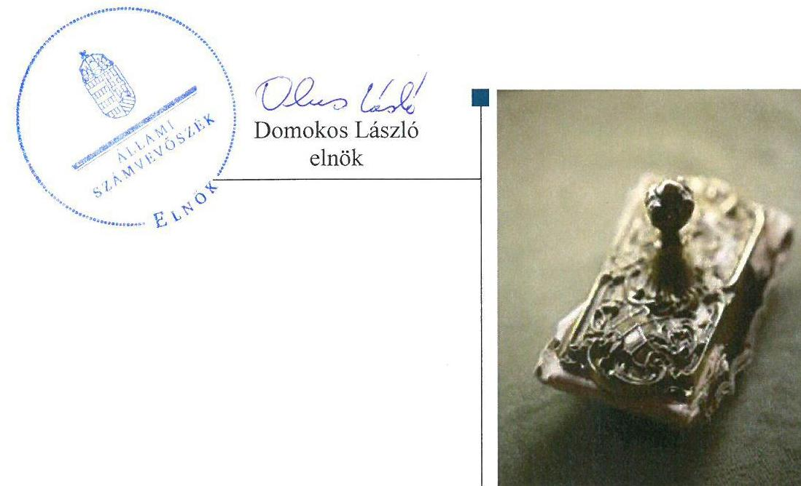
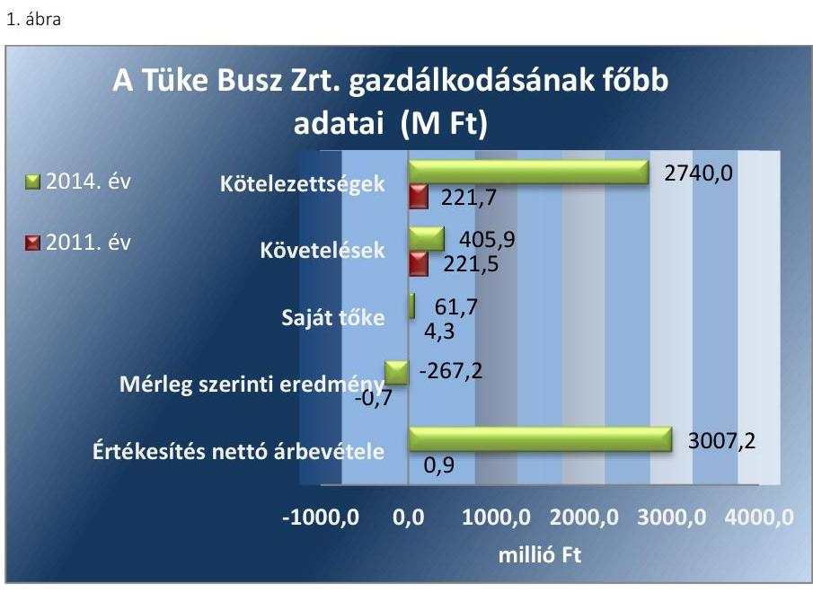
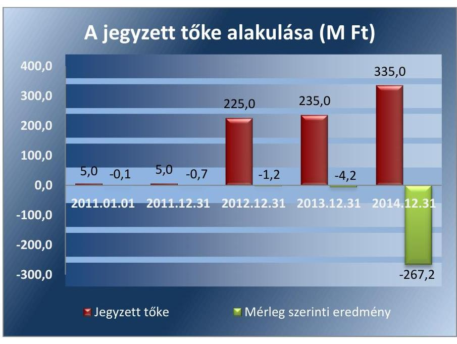
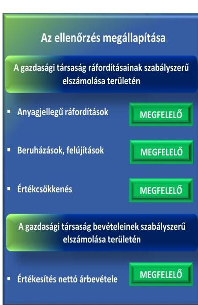
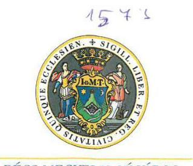
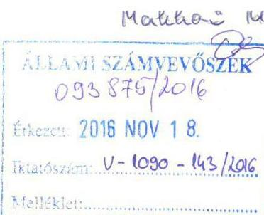
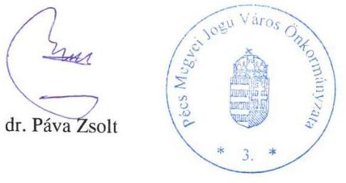
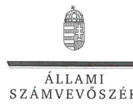
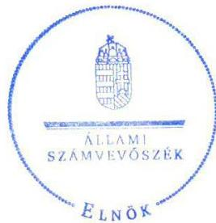
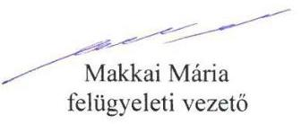

# Jelentés 

## Az önkormányzatok gazdasági társaságai

Az önkormányzatok többségi tulajdonában lévő gazdasági társaságok gazdálkodásának ellenőrzése - Tüke Busz Közösségi Közlekedési Zrt.
2016.

---

# Jelentés 

## Az önkormányzatok gazdasági társaságai

Az önkormányzatok többségi tulajdonában lévő gazdasági társaságok gazdálkodásának ellenőrzése - Tüke Busz Közösségi Közlekedési Zrt.
2016. 12. hó 20. nap

---

Jelentéseink az Országgyűlés számítógépes hálózatán és az Interneten a www.asz.hu címen is olvashatóak.

## AZ ELLENŐRZÉST FELÜGYELTE:

MAKKAI MÁRIA felügyeleti vezető

## AZ ELLENŐRZÉST VEZETTE ÉS A VÉGREHAJTÁSÁÉRT FELELŐS:

VALASTYÁNNÉ DR. VÍZHÁNYÓ JÚLIA ellenőrzésvezető

## A PROGRAM ÖSSZEÁLLÍTÁSÁÉRT FELELŐS:

JANIK JÓZSEF osztályvezető

## A TÉMÁHOZ KAPCSOLÓDÓ KORÁBBI SZÁMVEVŐSZÉKI JELENTÉSEK:

- címe:

Jelentés Az önkormányzatok gazdasági társaságai Az önkormányzatok többségi tulajdonában lévő gazdasági társaságok közfeladat ellátását érintő gazdálkodási tevékenysége szabályszerűségének ellenőrzése - PÉTÁV Pécsi Távfütő Korlátolt Felelősségű Társaság

- sorszáma: $\quad 15058$
- címe: $\quad$ Jelentés Az önkormányzatok gazdasági társaságai Az önkormányzatok többségi tulajdonában lévő gazdasági társaságok közfeladat ellátását érintő gazdálkodási tevékenysége szabályszerűségének ellenőrzése - BIOKOM Pécsi Városüzemeltetési és Környezetgazdálkodási Kft.
- sorszáma: $\quad 15020$

IKTATÓSZÁM: V-1090-147/2016.
TÉMASZÁM: 2124
ELLENŐRZÉS-AZONOSÍTÓ SZÁM: V070754

---

# TARTALOMJEGYZÉK 

■ ÖSSZEGZÉS ..... 5
■ AZ ELLENŐRZÉS CÉLJA ..... 6
■ AZ ELLENŐRZÉS TERÜLETE ..... 7
■ AZ ELLENŐRZÉS HÁTTERE, INDOKOLTSÁGA ..... 9
■ FÓKUSZKÉRDÉSEK ..... 10
■ ELLENŐRZÉS HATÓKÖRE ÉS MÓDSZEREI ..... 11
■ MEGÁLLAPÍTÁSOK ..... 13
■ JAVASLATOK ..... 23
■ MELLÉKLETEK ..... 25
I. Sz. melléklet: Értelmező szótár ..... 25
II. Sz. melléklet: pénzügyi mutatószámok alakulása 2011-2014. között ..... 29
■ FÜGGELÉK: ÉSZREVÉTELEK ..... 31
■ RÖVIDÍTÉSEK JEGYZÉKE ..... 37

---

.

---

# ÖSSZEGZÉS 

Az Állami Számvevőszék a többségi önkormányzati tulajdonú Tüke Busz Közösségi Közlekedési Zrt. gazdálkodását ellenőrizte és megállapította, hogy Pécs Megyei Jogú Város Önkormányzatának a közfeladat-ellátás megszervezésére vonatkozó döntése és annak előkészítése szabályszerű volt, a tulajdonosi jogait szabályszerűen gyakorolta. A Tüke Busz Zrt. vagyongazdálkodása szabályszerű volt. A helyi közösségi közlekedés közfeladata bevételeinek és ráfordításainak elszámolása, valamint az önköltségszámítás és az árképzés megfelelő volt.

## Az ellenőrzés társadalmi indokoltsága

Az Állami Számvevőszék kiemelt célja, hogy a helyi önkormányzatok gazdálkodásában rejlő pénzügyi kockázatok feltárásával, az államháztartáson kívülre nyújtott költségvetési támogatások és ingyenes vagyonjuttatások, valamint az államháztartáson kívül működő feladat-ellátó rendszerek ellenőrzéseivel hozzájáruljon ahhoz, hogy a közpénzeket az államháztartáson kívül működő szervezetek is átlátható, rendezett módon használják fel.

Magyarországon az intézmény-centrikus közfeladat-ellátás jellemző, de egyre jelentősebb a költségvetésen kívüli feladatellátás térnyerése. Ennek legfontosabb szereplői - a nonprofit szervezetek mellett - az önkormányzati tulajdonú gazdasági társaságok. Az önkormányzatok szervezetalakítási szabadságának következménye, hogy a korábban is vállalati formában működő közszolgáltatások mellett, mind a kötelező, mind az önként vállalt feladatok ellátásában a gazdasági társaságok kiemelt fontosságú szerephez jutottak.

## Főbb megállapítások, következtetések, javaslatok

Pécs Megyei Jogú Város Önkormányzata és a Tüke Busz Közösségi Közlekedési Zrt. 2012. március 20-án közszolgáltatási szerződést kötöttek az Önkormányzat közigazgatási területén a helyi menetrend szerinti autóbusszal végzett személyszállítási közszolgáltatási tevékenység ellátására. Az Önkormányzatnak a Tüke Busz Zrt. közfeladat-ellátásának megszervezésére vonatkozó döntése és annak előkészítése szabályszerű volt. Az Önkormányzat a közfeladat-ellátás felügyelete és a tulajdonosi jogok gyakorlása során szabályszerűen járt el.

A Tüke Busz Zrt. vagyongazdálkodása szabályszerű volt, és a kötelezettségállománya az ellenőrzött időszakban nem veszélyeztette a közfeladat ellátást és a működést. A Tüke Busz Zrt. rendelkezett a működéséhez szükséges szabályzatokkal. A Tüke Busz Zrt. az ellenőrzött időszakban nem teljes körűen teljesítette a közérdekű adatokra vonatkozó közzétételi kötelezettségét. A Tüke Busz Zrt. által ellátott közfeladat bevételeinek és ráfordításainak elszámolása megfelelő volt. A jogszabályoknak megfelelő volt az önköltségszámítás és árképzés.

---

# AZ ELLENŐRZÉS CÉLJA 

## Az önkormányzatok gazdasági társaságai - Az önkormányzatok tulajdonában lévő gazdasági társaságok gazdálkodásának ellenőrzése - Tüke Busz Közösségi Közlekedési Zrt.

Az ellenőrzés célja annak értékelése volt, hogy az Önkormányzat vagyongazdálkodási tevékenysége során szabályszerűen gyakorolta-e tulajdonosi jogait; a gazdasági társaság szabályozottsága, gazdálkodása és vagyongazdálkodási tevékenysége, bevételeinek és ráfordításainak elszámolása megfelelt-e a jogszabályi és tulajdonosi előírásoknak; a gazdasági társaság kötelezettségállománya jelent-e kockázatot a működésre, valamint a gazdálkodás átláthatósága és elszámoltathatósága érdekében biztosítva volt-e a szolgáltatás díjának megalapozottsága szabályszerű önköltségszámítással.

---

# AZ ELLENŐRZÉS TERÜLETE 

## Pécs Megyei Jogú Város Önkormányzata és a többségi tulajdonában álló Tüke Busz Közösségi Közlekedési Zrt.

PÉCS MEGYEI JOGÚ VÁROS ÖNKORMÁNYZATA ${ }^{1}$ a Tüke Busz Zrt. ${ }^{2}$-t 2010. december 1-jén határozatlan időre hozta létre, jogelődje nem volt. Az alapításkor a Tüke Busz Zrt. egyetlen tulajdonosa az Önkormányzat volt. 2013. április 18-án az egyszemélyes Zrt. többszemélyessé vált, mivel a Közgyűlés ${ }^{3}$ a Tüke Busz Zrt. alaptőkéjét 10 M Ft-tal, új részvények kibocsátásával megemelte. Az új részvények átvételére a DDRF Zrt. ${ }^{4}$ volt jogosult. Az Önkormányzat tulajdoni hányada 2014. december 31-én 98,13%-volt a Társaságban.

## A HELYI KÖZÖSSÉGI KÖZLEKEDÉS KÖZ-

FELADAT-ELLÁTÁS megszervezéséről és a közfeladat ellátásának módjáról az Önkormányzat a részben saját tulajdonú PK Zrt. ${ }^{5}$ által gondoskodott 2011. január 1-je és 2012. március 31. közötti időszakban. Az Önkormányzat a helyi közösségi közlekedés biztosítását 2012. április 1-jétől közszolgáltatási szerződés ${ }^{6}$ alapján az ellenőrzött időszak végéig a Tüke Busz Zrt. közszolgáltató útján látta el. A Közgyűlés 2012. február 23-án hozott határozatot a PK Zrt.-vel kötött közszolgáltatási szerződés közös megegyezéssel történő megszüntetéséről és a Tüke Busz Zrt.-vel történő közszolgáltatási szerződés megkötéséről. A Társaság az alapításától 2012. április 1-ig nem végzett közszolgáltatási tevékenységet.

A TÜKE BUSZ ZRT. fő tevékenysége 2011. január 1-től az Alapító okirat ${ }^{7}$ alapján gépjármű kölcsönzés (3,5 tonna fölött) volt. A Társaság Közgyűlése ${ }^{8}$ 2013. május 29-ei döntésével módosította az Alapszabályt ${ }^{9}$ és így a Tüke Busz Zrt. fő tevékenysége a városi, elővárosi szárazföldi személyszállítás tevékenységre változott.

Az ellenőrzött időszakban a polgármester ${ }^{10}$ személye nem, a jegyző ${ }^{11}$ személye egy alkalommal változott. A polgármester a 2010. évi önkormányzati választások óta tölti be tisztségét, a helyszíni ellenőrzés időszakában a munkakört betöltő jegyző 2011. május 1-től látja el feladatait. Az ellenőrzött időszakban a vezérigazgató személye egy alkalommal, a gazdasági igazgató személye két alkalommal változott.

A Társaság a 2011. évben a 479/2009/EK rendelet ${ }^{12}$, a 2012-2014. években pedig az Áht. ${ }^{13}$ 2. § (1) bekezdés I) pontja alapján nem minősült kormányzati szektorba sorolt egyéb szervezetnek.

A Tüke Busz Zrt. 2011. és 2014. évi gazdálkodásának egyes adatait az 1. ábra mutatja be.

---

Forrás: A Társaság 2011. és 2014. évi beszámolói
A Társaság jegyzett tőkéje 2011. december 31-én 5,0 M Ft volt, amely a 2014. év végére 335,0 M Ft-ra emelkedett. A Társaság mérleg szerinti vagyona 2014. december 31-én 3454,9 M Ft-ot tett ki. Az értékesítés nettó árbevétele a 2014. év végén 3007,2 M Ft, az adózott eredmény 267,2 M Ft volt.

---

# AZ ELLENŐRZÉS HÁTTERE, INDOKOLTSÁGA 

Objektív kép kialakítása a Pécs Megyei Jogú Város Önkormányzata által a személyszállítás közszolgáltatási tevékenység megszervezéséről, a többségi tulajdonában lévő Tüke Busz Zrt. gazdálkodási tevékenységének szabályszerűségéről és a tulajdonosi joggyakorlásáról.

AZ ÖNKORMÁNYZATI TULAJDONÚ GAZDASÁGI TÁRSASÁGOK ellenőrzése kiemelten fontos a vagyon megőrzése, megóvása érdekében, valamint a kormányzati szektor elszámolásaiban megjelenő önkormányzati tulajdonú gazdálkodó szervezetek esetében, amelyekkel szemben alapvető követelmény, hogy gazdálkodásuk, működésük szabályszerű, az általuk szolgáltatott adatok minél megbízhatóbbak legyenek. A közfeladat-ellátás költségeinek, ráfordításainak alakulása, színvonala hatással van a lakosság elégedettségére.

A TÖRVÉNYALKOTÁS SZÁMÁRA - az észlelt problémák, szabálytalanságok, vagy egyéb nem kívánatos jelenségek felszínre kerülésével - az ellenőrzés megállapításai segítséget nyújthatnak az államháztartáson kívüli közfeladat-ellátás értékeléséhez, jogszabályi keretei pontosításához, átláthatóságot biztosító szabályozásához. Meghatározhatóvá válnak az önkormányzati feladatellátásban részt vevő államháztartáson kívüli szervezeteknek - az önkormányzat költségvetését, pénzügyi helyzetét is befolyásoló - kockázatai, lehetővé válik ezen kockázatok csökkentése. Ellenőrzéseink feltárhatják, hogy az önkormányzat feladat-ellátási kötelezettségének szabályszerűen tett-e eleget, a feladatellátáshoz rendelt vagyonkezelésbe vett és saját vagyon működtetését az elvárható gondossággal, szabályszerűen szervezte-e meg és a tulajdonosi felügyelete hozzájárult-e a feladatellátásához. Az ellenőrzés rávilágíthat arra, hogy a gazdasági társaság a feladat-ellátási, közszolgáltatási szerződésben foglaltak betartásával, a vagyon használatával biztosította-e a szolgáltatás folytatásának feltételeit, a feladat ellátását. Ezzel az ellenőrzöttek és a helyi döntéshozók számára visszajelzést ad feladatszervezési, feladat-ellátási kockázataikról, alapot ad a meglévő hibák megszüntetéséhez, a jobb feladatellátás biztosításához. Fokozza a fegyelmet, igazolja, hogy lejárt a következmények nélküli ellenőrzések időszaka. Az ÁSZ értékteremtő rend kialakításához és megőrzéséhez hozzájáruló tevékenysége pozitív hatással van a szervezetről kialakított összkép formálására.

---

# FÓKUSZKÉRDÉSEK 

1.     - Az Önkormányzat közfeladat megszervezéséről szóló döntése, valamint tulajdonosi joggyakorlása szabályszerű volt-e?
2.     - A gazdasági társaság vagyongazdálkodása szabályszerű volt-e, kötelezettségállománya jelent-e kockázatot a működésre, illetve a közfeladat ellátására?
3.     - A gazdasági társaságnál az ellátott közfeladat bevételei és ráfordításai elszámolása, valamint az önköltségszámítás és árképzés szabályszerű volt-e?

---

# ELLENŐRZÉS HATÓKÖRE ÉS MÓDSZEREI 

## Az ellenőrzés típusa

Megfelelőségi ellenőrzés

## Az ellenőrzött időszak

Az ellenőrzött időszak 2011. január 1-jétől 2014. december 31-ig.

## Az ellenőrzés tárgya

A gazdasági társaság feletti tulajdonosi joggyakorlás, valamint a gazdasági társaság gazdálkodásának szabályozottsága és szabályszerűsége.

Az ellenőrzés kiterjed minden olyan körülményre és adatra, amely az ÁSZ jogszabályban meghatározott feladatainak teljesítéséhez, valamint a program végrehajtása folyamán felmerült újabb összefüggések feltárásához szükséges.

## Az ellenőrzött szervezet

Pécs Megyei Jogú Város Önkormányzata
Tüke Busz Közösségi Közlekedési Zrt.

## Az ellenőrzés jogalapja

Az ellenőrzés jogszabályi alapját az ÁSZ tv. 1. § (3) bekezdése és 5. § (3)-(4)-(5) bekezdései képezik.

## Az ellenőrzés módszerei

Az ellenőrzést a nemzetközi standardokat irányadónak tekintve az ellenőrzési program ellenőrzési kérdései, az ellenőrzött időszakban hatályos jogszabályok, az ellenőrzés szakmai szabályok és módszertanok figyelembevételével végeztük.

Az ellenőrzés ideje alatt az ellenőrzött szervezettel történő kapcsolattartást az ÁSZ Szervezeti és Működési Szabályzatának vonatkozó előírásai alapján történt.

Az ellenőrzés tulajdonosi jogokat gyakorló Pécs Megyei Jogú Város Önkormányzatára, és a Tüke Busz Zrt.-re terjedt ki.

---

Az ellenőrzési kérdések megválaszolásához szükséges bizonyítékok megszerzése a következő ellenőrzési eljárások alkalmazásával történt: megfigyelés, kérdésfeltevés (információkérés), összehasonlítás, valamint elemző eljárás. Az ellenőrzési bizonyítékként felhasználható adatforrások közé tartoznak egyrészt a szakmai programban felsorolt adatforrások, másrészt adatforrás lehet még minden - az ellenőrzés folyamán - feltárt, az ellenőrzés szempontjából információkat tartalmazó dokumentum.

Az ellenőrzést a kérdésekre adott válaszok kiértékelésével, valamint a megjelölt adatforrások, a csatolt tanúsítványok felhasználásával, továbbá az adott időszakban hatályos jogszabályok figyelembe vételével került lefolytatásra.

A bevételek és ráfordítások elszámolása, valamint a vagyonnyilvántartás terén a szabályszerű működést véletlen mintavétellel ellenőriztük. A mintavétellel ellenőrzött területek esetében minden egyes tétel vonatkozásában a szabályszerűségre vonatkozó kérdéseket tettünk fel, amelyek eredménye összesítésre került. „Megfelelőnek" értékeltünk egy ellenőrzött területet, amennyiben 95%-os bizonyossággal a teljes sokaságban a hibaarány legfeljebb 10% volt.

A ráfordítások elszámolására és a vagyonnyilvántartásra vonatkozó véletlen mintavételt kockázati alapú kiválasztással egészítettük ki, amelynek során évente a három legnagyobb összegű tételt

 választottuk ki.

---

# 1. Az Önkormányzat közfeladat megszervezéséről szóló döntése, valamint tulajdonosi joggyakorlása szabályszerű volt-e? 

Összegző megállapítás

Az Önkormányzat közfeladat-ellátás megszervezéséről szóló döntése és annak előkészítése szabályszerű volt. A tulajdonosi jogok gyakorlása szabályszerű volt.
1.1. számú megállapítás

Az Önkormányzat közfeladat-ellátás megszervezésére vonatkozó döntése és annak előkészítése szabályszerű volt.

GAZDASÁGI PROGRAMOT az ellenőrzött időszakban az Önkormányzat elkészítette az Ötv. ${ }^{14} 91 . \S$ (1) bekezdés, Mötv. ${ }^{15} 116 . \S$ (1) bekezdése szerint. A Közgyűlés által elfogadott 2011-2014. évekre vonatkozó gazdasági program ${ }^{16}$ a közszolgáltatások rendszerének ésszerűsítését és bevételek realizálását helyezte a középpontba.

## A KÖZÉP ÉS HOSSZÚ TÁVÚ FEJLESZTÉSI STRATÉGIÁT a Közgyűlés az ellenőrzött időszakra vonatkozóan elkészítette és jóváhagyta, amelyben elemezték a helyi közösségi közlekedés jelenlegi helyzetét, valamint felvázolták a fejlesztésre vonatkozó elképzeléseket.

## A KÖZÉP- ÉS HOSSZÚ TÁVÚ VAGYONGAZDÁLKO-

DÁSI TERVET ${ }^{17}$ az Önkormányzat 2012. január 1. és 2013. február 7. között nem készített az Nvtv. ${ }^{18}$ 9. § (1) bekezdésben előírtak ellenére. Az Nvtv. 7. § (2) bekezdésének megfelelően a 2013-2016. évekre vonatkozóan elkészítette a közép- és hosszú távú vagyongazdálkodási tervét, amelyet a Közgyűlés szabályszerűen elfogadott.

KÖZSZOLGÁLTATÁSI SZERZŐDÉST a közfeladat ellátásának érdekében az Önkormányzat és a Társaság 2012. március 20-án kötöttek az Autóbusz tv. ${ }^{19}$ 8. § (5) bekezdésének megfelelően. A szerződés időbeli hatálya 2012. április 1-jétől 2017. március 31-ig terjedő időtartam. Az ellenőrzött időszakban a közszolgáltatási szerződést hét alkalommal módosították: egy alkalommal a szerződés időbeli hatályának vége 2022. március 31.-re módosult, a többi esetben a közlekedési viteldíjak, pótdíjak változtak.

A közszolgáltatási szerződésben meghatározták a szolgáltatások nyújtásához kapcsolódó költségek megosztására vonatkozó szabályokat, a szerződés felmondásának szabályait, a szakmai feladatellátás mérésére alkalmas kritériumrendszert, mutatószámokat, az ellátás színvonala értékeléséhez szükséges szakmai követelmények tartalmát, valamint a beszámolási és az ellenőrzési kötelezettséget. A közszolgáltatási szerződés 8. és 9. számú mellékleteiben meghatározták az Önkormányzat által a közfel-

---

adat-ellátás érdekében a Társaság részére használatba átadott ingatlanokat, valamint üzemeltetett járműveket. A közszolgáltatási szerződés nem felelt meg az Autóbusz tv. 9. § (5) bekezdésének, valamint a Személyszállítási tv. ${ }^{20} 25 . \S$ (2) bekezdésének, mivel nem tartalmazta a menetrendet. A közszolgáltatási szerződés nem felelt meg a Személyszállítási tv. 25. § (3) bekezdés b) pontjának, mivel nem tartalmazta a szolgáltatás nyújtásának mennyiségi feltételeit. A közszolgáltatási szerződés nem tartalmazta az Autóbusz tv. 9. § (2) bekezdés c), valamint a Személyszállítási tv. 25. § (3) bekezdés i) pontjaiban foglaltak ellenére a vagyon Önkormányzat részére történő visszaszolgáltatására vonatkozó szabályokat. Az ellenőrzött időszakban a feltárt hiányosságok megszűntetése érdekében a közszolgáltatási szerződést nem módosították.

# 1.2. számú megállapítás 

## A tulajdonosi jogok gyakorlása szabályszerű volt.

## A TULAJDONOSI JOGOK GYAKORLÁSÁNAK

RENDJÉT a Közgyűlés az Ötv. 80. § (1) bekezdésében és az Mötv. 107. §-ában kapott felhatalmazás alapján a vagyonrendelet ${ }_{1,2}{ }^{21}$-ben szabályozta. A vagyonrendelet ${ }_{1,2}$ szerint a tulajdonosi jogokat a Közgyűlés és a polgármester gyakorolta. A tulajdonosi joggyakorlás rendjét a Gt. ${ }^{22}$-nek és a Ptk. ${ }_{2}{ }^{23}$-nak megfelelő Alapító okirat és Alapszabály is szabályozta. A tulajdonosi joggyakorlás szabályszerűen történt.

ALAPÍTÓ OKIRATOT az Önkormányzat az ellenőrzött időszakot megelőzően fogadta el. Az Alapító okirat az ellenőrzött időszakban öt alkalommal módosult. A módosítások a vezető tisztségviselők személyének változásait, a tulajdonosi joggyakorló kizárólagos jogait, a többszemélyes részvénytársasággá történő átalakulást, valamint a cégvezető tisztség bevezetését érintették.

A TÁRSASÁG ALAPSZABÁLYÁT a Közgyűlés az ellenőrzött időszakot megelőzően fogadta el, amely az ellenőrzött időszakban hat alkalommal módosult. A módosítások a Társaság többszemélyessé válását, a vezető tisztségviselő személyek változását, fő tevékenység változását, a Társaság Közgyűlésének kizárólagos jogának változását, a Ptk. ${ }_{2}$ hatályba lépésének megfelelést, részvénykibocsátásokat, tőkeemeléseket érintették.

AZ IGAZGATÓSÁG a Tüke Busz Zrt.-nél a Gt. 247. §-a alapján nem működött. Az Alapító okirat, illetve az Alapszabály szerint az igazgatóság jogait a vezérigazgató, illetve a 2012. március 22. és 2014. március 4. közötti időszakban a cégvezető gyakorolta az ellenőrzött időszak végéig.

AZ FB ${ }^{24}$ az Alapító okirat előírásai alapján 3 tagból, az Alapszabályban foglaltak szerint 2013. május 3-tól 6 tagból állt a Gt. 34. § (1) bekezdésének és a Ptk. ${ }_{2}$ 3:121. § (1) bekezdésének előírásainak megfelelően.

ELLENŐRZÉST az Önkormányzat az önkormányzati tulajdonú gazdasági társaságok részére nyújtott 2012. évi kompenzáció, támogatás felhasználása tárgyában hajtott végre. Az ellenőrzési jelentésben a Tüke Busz Zrt.-vel kötött közszolgáltatási szerződés esetében a menetrendre és a szolgáltatás nyújtására vonatkozó hiányosságokat tárta fel az ellenőrzés

---

és ezzel kapcsolatosan az Önkormányzat részére fogalmaztak meg javaslatokat.

# A TÜKE BUSZ ZRT. BESZÁMOLTATÁSI RENDJÉT 

az Önkormányzat a közszolgáltatási szerződésben szabályozta. A Társaság a 2012-2014. években elkészítette a közszolgáltatási szerződésben meghatározott feladatainak végrehajtásáról szóló féléves jelentéseit, melyeket az Önkormányzat részére megküldött.

GARANCIA- ÉS KEZESSÉGVÁLLALÁST az Önkormányzat az ellenőrzött időszakban több esetben teljesített, mivel a Tüke Busz Zrt. a 2012-2014. évi időszakban több alkalommal vett fel hitelt. Az ellenőrzött időszak végéig a hitel felvételekhez kapcsolódóan a garancia és a kezesség nem került érvényesítésre, az Önkormányzatnak ebből fakadó fizetési kötelezettsége nem keletkezett.

## 2. A gazdasági társaság vagyongazdálkodása szabályszerű volt-e, kötelezettségállománya jelent-e kockázatot a működésre, illetve a közfeladat ellátására?

Összegző megállapítás

A Tüke Busz Zrt. vagyongazdálkodása szabályszerű volt. A kötelezettségek állománya nem jelentett kockázatot a közfeladat ellátására, nem veszélyeztette a Társaság működését.
2.1. számú megállapítás

A Tüke Busz Zrt. rendelkezett a működéséhez szükséges szabályzatokkal.

ÜZLETI TERVET a Tüke Busz Zrt. a 2011. évre nem készített, mivel annak készítését az Önkormányzat a 2012. évtől írta elő. A 2012-2014. évi üzleti tervet a Társaság a Közgyűlés határozatában foglaltaknak megfelelően elkészítette.

A SZÁMVITELI SZABÁLYZATOKAT a Tüke Busz Zrt. a Számv. tv ${ }^{25}$. 14. § (5) bekezdésének megfelelően a 2012-2014. évekre elkészítette. A 2011. évre vonatkozóan a Társaság a Számv. tv. 14. § (3)-(5) és a (11) bekezdéseiben, valamint a 161. §-ában foglaltakat megsértve számviteli politikával ${ }^{26}$ és szabályzatokkal nem rendelkezett. A Tüke Busz Zrt. 2012. április 1-jei hatállyal készítette el és hagyta jóvá a Társaság számviteli politikáját, számlarendjét ${ }^{27}$ a számlatükörrel együtt, leltározási szabályzatát ${ }^{28}$, pénzkezelési szabályzat${ }_{1}$-et $^{29}$ és az önköltségszámítási szabályzatát ${ }^{30}$ a Számv. tv előírásainak megfelelően.

A SZÁMVITELI POLITIKA a Számv. tv. előírásainak megfelelően rendelkezett az eszközök és források értékelésére és a saját vagyon értékelésére vonatkozó szabályokról.

A SZÁMLARENDBEN a Számv. tv. előírásainak megfelelően alakította ki a Tüke Busz Zrt. a számviteli elszámolásait, a közszolgáltatással kapcsolatos számviteli elkülönítési kötelezettségeinek eleget tett.

---

LELTÁROZÁSI SZABÁLYZAT megfelelt a Számv. tv. előírásainak. A leltározási szabályzatban a Számv. tv.-ben foglaltaknak megfelelően meghatározták a leltározási, egyeztetési kötelezettséget az eszközök és források vonatkozásában.

A PÉNZKEZELÉSI SZABÁLYZAT-ban a Tüke Busz Zrt. a Számv. tv. 14. § (8) bekezdésében foglaltak ellenére nem rendelkezett a bankszámlán történő pénzforgalom lebonyolításának rendjéről. A hiányosságot a 2014. április 1-jétől hatályos pénzkezelési szabályzat${ }_{2}$-ben ${ }^{31}$ javították. A pénzkezelési szabályzat${ }_{1}$-et hét alkalommal módosították a pénzkezelési szabályzat${ }_{2}$ hatályba lépéséig.

AZ ÖNKÖLTSÉGSZÁMÍTÁSI SZABÁLYZATOT a Tüke Busz Zrt. 2012. április 1-én léptette hatályba, mely megfelelt a Számv. tv. 14. § (7) bekezdésében, az 51. §-ában és a 160. § (4) bekezdésében foglaltaknak, valamint a közszolgáltatási szerződésben meghatározott kritériumnak.

ÜZLETSZABÁLYZATOT ${ }^{32}$ a Társaság a Személyszállítási tv. 19. §-ában foglaltaknak megfelelően 2013. június 21-én léptette hatályba, amelyet az NKH ${ }^{33}$ határozatban hagyott jóvá. A szabályzatot a 2013-2014. években négy alkalommal módosították.

JAVADALMAZÁSI ILLETVE JUTTATÁSI SZABÁLYZATTAL a 2011. január 1-je és 2013. november 15-e közötti időszakban a Taktv. ${ }^{34}$ 5.§ (3) bekezdése ellenére a Társaság nem rendelkezett. A Társaság Közgyűlése 2013. november 15-én a Taktv. előírásainak megfelelően jóváhagyta a Tüke Busz Zrt. javadalmazási szabályzatát ${ }^{35}$.

ADATVÉDELMI SZABÁLYZAT${ }^{36}$-tal a Tüke Busz Zrt. az Avtv. ${ }^{37}$ 31/A. § (2) d) pontja és (3) bekezdése ellenére 2011. január 1-je és 2012. április 1. közötti időszakban nem rendelkezett. Az adatvédelmi szabályzat 2012. április 2. napján lépett hatályba az Info tv. ${ }^{38}$ 24. §. (3) bekezdése előírásainak megfelelően.

# 2.2. számú megállapítás 

A Tüke Busz Zrt. vagyongazdálkodása szabályszerű volt.
A TÁRSASÁG a közszolgáltatási feladatát saját és bérelt eszközökkel látta el. A Társaság a számviteli nyilvántartásait a Számv. tv. 69. § (3) bekezdésében és a számlarendben foglalt előírásokkal összhangban vezette. A Tüke Busz Zrt. az eszközök tekintetében a közszolgáltatással kapcsolatos szétválasztási kötelezettségének eleget tett, az eszközök bekerülési értékét a Számv. tv 47-51. § valamint a számviteli politika előírásainak megfelelően állapították meg.

A 2011-2014. évi beszámolókban és a számviteli nyilvántartásokban lévő vagyontárgyak állományát szabályszerűen - a leltározási szabályzatban foglaltak alapján - folyamatosan elkészített leltárral alátámasztották.

A Társaság éves beszámolóinak főbb mérlegadatait az 1. táblázat szemlélteti.

---

| Megnevezés | 2011.01.01. | 2011.12.31. | 2012.12.31. | 2013.12.31. | 2014.12.31. |
| :--: | :--: | :--: | :--: | :--: | :--: |
| I. Befektetett eszközök | 0,0 | 0,0 | 130,8 | 1149,3 | 2881,4 |
| - ebből: Tárgyi eszközök | 0,0 | 0,0 | 29,2 | 1061,5 | 2672,0 |
| II. Forgó eszközök | 4,9 | 226,0 | 548,7 | 780,0 | 566,0 |
| - ebből: Követelések | 0,0 | 221,5 | 478,5 | 709,0 | 405,9 |
| III. Aktív időbeli elhatárolások | 0,0 | 0,0 | 283,4 | 241,7 | 7,5 |
| Eszközök összesen | 4,9 | 226,0 | 962,9 | 2171,0 | 3454,9 |
| IV. Saját tőke | 4,9 | 4,3 | 223,0 | 228,9 | 61,7 |
| - ebből: Jegyzett tőke | 5,0 | 5,0 | 225,0 | 235,0 | 335,0 |
| - ebből Mérleg szerinti eredmény | $-0,1$ | $-0,7$ | $-1,2$ | $-4,2$ | $-267,2$ |
| V. Céltartalékok | 0,0 | 0,0 | 0,0 | 0,0 | 0,0 |
| VI. Kötelezettségek | 0,0 | 221,7 | 635,7 | 1483,1 | 2740,0 |
| - ebből Hosszú lejáratú | 0,0 | 0,0 | 2,4 | 745,7 | 1791,1 |
| VII. Passzív időbeli elhatárolások | 0,0 | 0,0 | 104,2 | 459,0 | 653,2 |
| Források összesen | 4,9 | 226,0 | 962,9 | 2171,0 | 3454,9 |

TÜKE BUSZ ZRT. MÉRLEGÉNEK KIEMELT ADATAI (M Ft)

Forrás: Tüke Busz Zrt. adatszolgáltatása/Tüke Busz Zrt. 2011-2014. évi beszámolói

AZ ESZKÖZÖK állománya a 2014. év végén $3454,9^{\circ} \mathrm{M}^{\circ} \mathrm{Ft}$ volt a 2011. január 1-jei 4,9 M Ft-tal szemben. Ezt elsődlegesen a tárgyi eszközök állományának 2672,0 M Ft-os
 növekedése okozta. Az emelkedés fő oka a saját tulajdonú autóbuszok beszerzése volt a 2013. évben 15 db 753,9 M Ft, a 2014. évben 28 db 1509,7 M Ft összegben.

A FORRÁSOK 3450,0 M Ft-os összegű növekedése az ellenőrzött időszakban a hitelből és a lízing keretében megvalósított beruházásokhoz kapcsolódott. A döntően idegen forrásból végrehajtott beruházások következtében a kötelezettség állomány 2740,0 M Ft-tal növekedett, amelyet elsődlegesen a hosszú lejáratú kötelezettségek 1791,1 M Ft-os összegű emelkedése idézett elő. A rövid lejáratú kötelezettségek 2014. év végi állománya 948,9 M Ft volt, mellyel szemben 405,9 M Ft a rövid lejáratú követelés állt.

A KÖZSZOLGÁLTATÁS ellátására használt eszközök megőrzésére, hasznosítására, megterhelésére vonatkozó, a közszolgáltatási szerződésben rögzített megőrzési szabályoknak a Társaság az ellenőrzött időszakban eleget tett. A Társaság a 2013. évben 15 db, a 2014. évben 28 db új autóbuszt szerzett be, javítóbázist vásárolt, 5 db autóbuszt lízingelt és új utas tájékoztatási rendszert helyezett üzembe, a fejlesztések esetében rendelkezett tulajdonosi hozzájárulással.

A TÜKE BUSZ ZRT. az ellenőrzött időszakban veszteségesen gazdálkodott, a saját tőke összege minden évben a jegyzett tőke alatt volt. A saját tőke értéke 2011. december 31-én nem érte el a gazdasági társaságra meghatározott jegyzett tőke összegét, ezért a Közgyűlés a Gt. 245. § (1) bekezdés b) pont és (2) bekezdésben foglaltaknak megfelelően 2012. március 22-én az alaptőke 220,0 M Ft-tal történő felemeléséről a Gt. 248. § (1) bekezdés a) pontja szerint új részvények kibocsátásáról döntött. A 2013. évben a Társaság új, kisebbségi tulajdonosa által teljesített 10 M Ft befizetéssel a jegyzett tőke 235,0 M Ft-ra emelkedett. 2014. április 4-én az Önkormányzat 100,0 M Ft-os összegű tőkeemelést hajtott

---

végre, amivel a Tüke Busz Zrt. jegyzett tőkéje az ellenőrzött időszak végére 335,0 M Ft-ra nőtt.

A jegyzett tőke alakulását a 2. számú ábra mutatja be.
2. ábra

Forrás: Tüke Busz Zrt. 2011-2014. éves beszámolói

# 2.3. számú megállapítás 

A Tüke Busz Zrt. kötelezettségeinek állománya nem veszélyeztette közfeladat ellátást és a Társaság működését.

A TÜKE BUSZ ZRT. eladósodottsága az ellenőrzött időszakban a saját tőkéhez viszonyítva kedvezőtlenül alakult.

A Társaság rövid és hosszú lejáratú kötelezettségeinek összértéke a 2014. év végén 2740,0 M Ft volt. Az ellenőrzött időszak végén a Tüke Busz Zrt. pénzeszközeinek állománya összesen 64,2 M Ft volt. A Társaság a 2011. évben nem kapott támogatást. A 2012. évben 1225,5 M Ft, a 2013. évben 2187,3 M Ft, a 2014. évben 2315,6 M Ft, mindösszesen 5728,4 M Ft összegű működési célú támogatást, fogyasztói árkiegészítést, helyi közösségi közlekedési támogatást és pénzügyi kompenzációt kapott. A Társaság nettó árbevételéhez viszonyított eladósodottsága kedvező volt a 2011-2014. évi időszakban, mivel a forgóeszközök értékével csökkentett kötelezettségek értékét minden évben meghaladta a realizált nettó árbevétel összege. A kötelezettségek állománya nem veszélyeztette a közfeladat ellátást és a Társaság működését.
2. táblázat

## A KÖTELEZETTSÉG ÁLLOMÁNY ALAKULÁSA (M FT)

| Megnevezés | 2011. | 2012. | 2013. | 2014. |
| :-- | --: | --: | --: | --: |
|  | 12.31. | 12.31. | 12.31. | 12.31. |
| Rövid lejáratú kötelezettségek | 221,7 | 633,3 | 737,4 | 948,9 |
| ebből Rövid lejáratú hitelek, kölcsönök | 220,0 | 150,0 | 236,9 | 225,1 |
| ebből Szállítók | 1,3 | 246,6 | 261,2 | 145,9 |
| ebből Kötelezettségek kapcsolt vállalkozással | 0,0 | 50,7 | 1,7 | 1,7 |
| szemben |  |  |  |  |
| ebből: Pénzügyi lízing éven belüli részlete | 0,0 | 2,4 | 3,6 | 90,8 |

---

| Megnevezés | 2011. | 2012. | 2013. | 2014. |
| :--: | :--: | :--: | :--: | :--: |
|  | 12.31. | 12.31. | 12.31. | 12.31. |
| ebből: 2014-ben még be nem jegyzett tőke-   emelés összege | 0,0 | 0,0 | 0,0 | 200,0 |
| ebből: DDRF Zrt. tagi kölcsön éven belüli része | 0,0 | 0,0 | 49,0 | 66,4 |
| Hosszú lejáratú kötelezettségek | 0,0 | 2,4 | 745,7 | 1791,1 |
| ebből Beruházási és fejlesztési hitelek | 0,0 | 0,0 | 592,4 | 911,3 |
| ebből Gépjármű- Autóbusz-lízing éven túli   részlete | 0,0 | 2,3 | 6,2 | 798,8 |
| ebből: DDRF Zrt. tagi kölcsön éven túli része | 0,0 | 0,0 | 147,0 | 80,1 |
| Kötelezettség összesen | 221,7 | 635,7 | 1483,1 | 2740,0 |

A 2014. évben a saját források aránya csökkent, míg az idegen források aránya lényegesen növekedett. A saját források arányának csökkenését a 2014. évi 267,2 M Ft-os veszteség eredményezte. Az idegen források arányának növekedését a kötelezettségek 1256,9 M Ft-os állománynövekedése okozta.

A szállítói tartozások állománya a 2011-2013. években folyamatosan emelkedett, 2014. december 31-én azonban 115,3 M Ft-tal csökkent 2013. december 31-éhez képest. A Tüke Busz Zrt. szállítói állományának alakulását az ellenőrzött időszakban a 3. táblázat mutatja be.
3. táblázat

A SZÁLLÍTÓI KÖTELEZETTSÉGEK LEJÁRAT SZERINTI ALAKULÁSA (M FT)

| Dátum | Nem   lejárt | 1-30   nap | 31-60   nap | 61 napon   túl | Lejárt következős összesen | Összesen |
| :-- | :--: | :--: | :--: | :--: | :--: | :--: |
| 2011.12.31. | 1,3 | 0,0 | 0,0 | 0,0 | 0,0 | 1,3 |
| 2012.12.31. | 231,7 | 14,9 | 0,0 | 0,0 | 14,9 | 246,6 |
| 2013.12.31. | 234,0 | 23,6 | 3,6 | 0,0 | 27,2 | 261,2 |
| 2014.12.31. | 118,2 | 27,7 | 0,0 | 0,0 | 27,7 | 145,9 |

A beszámolási és adatszolgáltatási kötelezettségeit a Társaság megfelelően teljesítette. A Tüke Busz Zrt. az ellenőrzött időszakban nem teljes körűen teljesítette a közzétételi kötelezettségét.

A BESZÁMOLÁSI ÉS ADATSZOLGÁLTATÁSI kötelezettségének a Tüke Busz Zrt. az ellenőrzött időszakban a számviteli politikában előírtak szerint eleget tett a Számv. tv. 153. § - 154. § - ban foglaltaknak megfelelően. Az Önkormányzat a Tüke Busz Zrt.-t a közszolgáltatási szerződésben és egyedi döntéseiben kötelezte adatszolgáltatásra, amelynek a Társaság eleget tett. A Társaság a gazdálkodásáról havi rendszerességgel tájékoztatta az Önkormányzatot.

A Tüke Busz Zrt. a Számv. tv. előírásainak megfelelően elkészítette a 2011-2014. évekre vonatkozó éves beszámolóit. A Társaság a 2011. és a 2012. évekre vonatkozó beszámolóit a Számv. tv. 153. § (1), és a 154. § (1) bekezdésekben foglaltakat megsértve határidőn túl teljesítette letétbe helyezési és közzétételi kötelezettségét.

A 2011-2014. évi számviteli beszámolóit a Társaság legfőbb szerve az FB írásbeli jelentése alapján minden évben elfogadta. A könyvvizsgáló az ellenőrzött időszak minden évében hitelesítő záradékkal látta el a Tüke Busz Zrt. beszámolóit.

---

A 2013-2014. évi beszámolókat a Tüke Busz Zrt. letétbe helyezte és ezzel egyidejűleg közzé is tette.

A KÖZÉRDEKŰ ADATOK KÖZZÉ TÉTELÉVEL kapcsolatos kötelezettségének a Társaság a Taktv. 2. § - ban foglaltaknak megfelelően eleget tett. A Társaság az Info tv. 1. számú melléklet III. pontja szerinti gazdálkodási adatait a honlapján, illetve az Önkormányzat honlapján az Info tv. 33. § (3) és 37. § (1) bekezdésekben foglaltak ellenére nem tette közzé.

# 3. A gazdasági társaságnál az ellátott közfeladat bevételei és ráfordításai elszámolása, valamint az önköltségszámítás és árképzés szabályszerű volt-e? 

Összegző megállapítás

### 3.1. számú megállapítás

3. ábra

A Tüke Busz Zrt. által ellátott közfeladat bevételeinek, ráfordításainak elszámolása megfelelő volt. A jogszabályoknak megfelelő volt az önköltségszámítás és árképzés.

A Tüke Busz Zrt. által ellátott közfeladat bevételeinek, anyagjellegű ráfordításainak és az értékcsökkenési leírásainak elszámolása megfelelő volt.

## A KÖZFELADATOK BEVÉTELEINEK ÉS RÁFORDÍ-

TÁSAINAK szétválasztását a Tüke Busz Zrt. a Számv. tv. 51. § és 161/A. § előírásainak figyelembe vételével alakította ki. A Tüke Busz Zrt. az egyes tevékenységek költségeinek megállapítására munkaszámrendszert alkalmazott a közszolgáltatási tevékenység megkezdésétől - 2012. április 1-től - az ellenőrzött időszak végéig. Az alkalmazott munkaszámrendszer kellően tagolt, részletes, így biztosította a különböző tevékenységek ráfordításai és bevételei pontos és egyértelmű elhatárolását.

A bevételeket külön főkönyvi számlákon, bérlet és jegytípusonként számolta el a Társaság. A Tüke Busz Zrt. ráfordításokat a munkaszámrendszer használatával az általa végzett tevékenységek között különítette el. Az általános költségek tevékenységekre vonatkozó felosztását az önköltségszámítási szabályzatban rögzítettek szerint a futott összkilométer alapján végezte el.

AZ ANYAGJELLEGŰ KÖLTSÉGEK és ráfordítások elszámolása az ellenőrzött időszakban megfelelő volt. Az anyagjellegű költségeket az ellenőrzött időszakban a megfelelő közfeladatra, költséghelyre és a számlarend szerinti főkönyvi számlákra számolták el, amely megfelelt a Számv. tv. előírásainak.

A BERUHÁZÁSOK, FELÚJÍTÁSOK elszámolása megfelelt a Számv. tv-ben foglaltaknak.

---

A BEVÉTELEK ELSZÁMOLÁSA megfelelő volt. Az elszámolás megfelelt a Számv. tv. 160. §-ban, valamint a Tüke Busz Zrt. számviteli politikájában, számlarendjében és számlakeretében, illetve az önköltségszámítási szabályzatában foglaltaknak.

AZ ÉRTÉKCSÖKKENÉS ELSZÁMOLÁSA megfelelő volt. A Számv. tv. 52-53. §-aiban és a 113. § (1) bekezdésében, valamint a számviteli politika értékcsökkenés elszámolása fejezetében rögzített előírásoknak megfelelt.

A Társaságnak az ellenőrzött időszakban nem volt vagyonkezelt vagyona. A Tüke Busz Zrt. a 2011-2014. években a saját vagyona után elszámolt 357,4 M Ft összegű értékcsökkenésből keletkezett forrásokat meghaladó mértékben 3216,9 M Ft összegben valósított meg üzembe helyezett fejlesztést.

A LAKOSSÁGGAL SZEMBENI KINTLÉVŐSÉGE a Tüke Busz Zrt.-nek „a közösségi közlekedési szolgáltatást jogosulatlanul igénybevevő utasok pótdíj tartozása" címén volt hátralékos, mérlegen kívüli követelésként nyilvántartva. A lakossággal szembeni pótdíj követelésnyilvántartott összege a 2012. évben 208,0 M Ft, a 2013. évben 508,8 M Ft, illetve a 2014. évben 769,7 M Ft volt. A pótdíj befizetések egyéb bevételként kerültek elszámolásra a Számv. tv. 77. §-ában meghatározottak szerint. Az óvatosság elvét érvényesítve a társaság csak a pénzügyileg rendezett pótdíjakat számolta el a számviteli nyilvántartásaiban.

A pótdíjak kezelését és behajtását a 2013. június 28-tól hatályos kintlévőség-kezelési szabályzatban ${ }^{39}$ foglaltaknak megfelelően végezték. A Tüke Busz Zrt. lakossággal szembeni pótdíj követelése folyamatosan emelkedett az ellenőrzött időszakban a közösségi közlekedést jogosulatlanul igénybevevő utasok miatt. A 2012-2014. évek közötti időszakban 1,6 M Ft összegű pótdíjat engedett el a Tüke Busz Zrt., illetve 0,2 M Ft összegű pótdíj évült el. A pótdíjkövetelések lejárat szerinti alakulását a 4. táblázat mutatja.
4. táblázat

| A LAKOSSÁGGAL SZEMBENI PÓTDÍJ KINTLÉVŐSÉG ALAKULÁSA (M FT) |  |  |  |  |  |  |  |  |
| :--: | :--: | :--: | :--: | :--: | :--: | :--: | :--: | :--: |
| Dátum | Nem lejárt | 1-30   nap | 31-90   nap | 91-120   nap |

 121-360   nap | 360   napon túli | Lejárt követelés   összesen | Összesen |
| 2011.12.31. | 0,0 | 0,0 | 0,0 | 0,0 | 0,0 | 0,0 | 0,0 | 0,0 |
| 2012.12.31. | 0,0 | 9,2 | 53,5 | 23,6 | 121,7 | 0,0 | 208,0 | 208,0 |
| 2013.12.31. | 0,0 | 10,9 | 48,8 | 25,4 | 210,8 | 213,0 | 508,9 | 508,9 |
| 2014.12.31. | 0,0 | 11,0 | 53,4 | 23,5 | 167,3 | 514,5 | 769,7 | 769,7 |

3.2. számú megállapítás

Az önköltségszámítás és az árképzés a jogszabályi előírásoknak megfelelően történt.

A közszolgáltatás önköltségét a Tüke Busz Zrt. a 2012. április 1-jétől hatályos önköltségszámítási szabályzatában előírtak szerint határozta meg. A Társaság negyedévente készített önköltségszámítást autóbusz típusonként a futott összkilométerre vetítve. Félévente, a közszolgáltatási szerződés értékelésében a végzett tevékenységek (közszolgáltatási; egyéb autóbusz közlekedési; reklám; máshová nem sorolt egyéb) szerinti bontásban készített eredménykimutatást. Az

---

eredménykimutatások elkülönítetten tartalmazták az egyes tevékenységek eredmény levezetését. A készített önköltségszámítás megfelelt a belső szabályzatokban és a jogszabályokban foglalt előírásoknak.

Az ármegállapítás során az Önkormányzat a 2011. január 1. és 2013. június 21. közötti időszakban az Ártv. ${ }^{40} 7 . \S$ (1) bekezdésének megfelelően önkormányzati rendelet ${ }^{41}$-ben szabályozta a menetrend szerinti helyi autóbusz-közlekedési viteldíjakat, valamint az iskolák és tanintézetek által rendelt autóbusz különjáratok viteldíját. A Személyszállítási tv. előírásai alapján 2013. június 21-től a közszolgáltatási szerződés tartalmazta a közszolgáltatás díjait. A közszolgáltatási díjak vonatkozásában a közszolgáltatási szerződést 2014. december 31-ig öt alkalommal módosították.

A Rezsi tv. ${ }^{42}$ által meghatározott rezsicsökkentés nem terjedt ki a Tüke Busz Zrt. által végzett tevékenység áraira, mivel a törvény előírásai nem érintették a helyi menetrendszerű autóbusz közlekedés díjait.

---

# JAVASLATOK 

Az ÁSZ tv. ${ }^{43}$ 33. § (1) bekezdésében foglaltak értelmében az ellenőrzött szervezet vezetője köteles a jelentésben foglalt megállapításokhoz kapcsolódó intézkedési tervet összeállítani és azt a jelentés kézhezvételétől számított 30 napon belül az ÁSZ részére megküldeni. Amennyiben az ellenőrzött szervezet vezetője nem küldi meg határidőben az intézkedési tervet, vagy továbbra sem elfogadható intézkedési tervet küld, az Állami Számvevőszék elnöke az ÁSZ tv. 33. § (3) bekezdése a) és b) pontjaiban foglaltakat érvényesítheti.

## Pécs Megyei Jogú Város Önkormányzata polgármesterének

1. Intézkedjen a Társaság közreműködésével a közszolgáltatási szerződés módosításáról annak érdekében, hogy az teljes körűen megfeleljen a jogszabályi előírásoknak.
(1.1. sz. megállapítás 5. bekezdése alapján)

## A Tüke Busz Közösségi Közlekedési Zrt. Igazgatósága elnökének

1. Intézkedjen az Önkormányzat közreműködésével a közszolgáltatási szerződés módosításáról annak érdekében, hogy az teljes körűen megfeleljen a jogszabályi előírásoknak.
(1.1. sz. megállapítás 5. bekezdése alapján)
2. Intézkedjen a kötelezően közzéteendő adatok teljes körű közzétételéről.
(2.4. sz. megállapítás 5. bekezdése alapján)

---

.

---

# MELLÉKLETEK 

## I. SZ. MELLÉKLET: ÉRTELMEZŐ SZÓTÁR

adósságfedezeti mutató I.
adósságfedezeti mutató II.

Adósságot keletkeztető ügylet
árbevételre vetített eladósodottság
eladósodottság mértéke
(befektetett eszközök + forgó eszközök) / idegen forrás
Azt mutatja, hogy 1 Ft adósságra hány Ft vagyon jut. Általánosságban véve kedvező, ha értéke 2 körül van, de nagy eszközberuházás-igényű iparágakban értéke kisebb is lehet.
működési cash flow / hosszú lejáratú kötelezettségek
A mutató azt jelzi, hogy az adott gazdálkodási időszak működési pénzáramainak eredményeként realizált cash flow révén a vállalkozás mennyiben lenne képes valamennyi hosszú lejáratú kötelezettségének eleget tenni. Ennek vizsgálatára viszonylag ritkán kerül sor, az elsősorban a veszélyhelyzetbe került vállalkozások esetében lehet érdekes. Általánosságban véve kedvező, ha a működési cash flow minél nagyobb arányban nyújt fedezetet a hosszú lejáratú kötelezettségre (értéke nagyobb, mint 1, nő az ellenőrzött időszakban).
Adósságot keletkeztető ügylet és annak értéke:
a) hitel, kölcsön felvétele, átvállalása a folyósítás, átvállalás napjától a végtörlesztés napjáig, és annak aktuális tőketartozása,
b) a Számv. tv. szerinti hitelviszonyt megtestesítő értékpapír forgalomba hozatala a forgalomba hozatal napjától a beváltás napjáig, kamatozó értékpapír esetén annak névértéke, egyéb értékpapír esetén annak vételára,
c) váltó kibocsátása a kibocsátás napjától a beváltás napjáig, és annak a váltóval kiváltott kötelezettséggel megegyező, kamatot nem tartalmazó értéke,
d) a Számv. tv. szerint pénzügyi lízing lízingbevevői félként történő megkötése a lízing futamideje alatt, és a lízingszerződésben kikötött tőkerész hátralévő összege,
e) a visszavásárlási kötelezettség kikötésével megkötött adásvételi szerződés eladói félként történő megkötése - ideértve a Számv. tv. szerinti valódi penziós és óvadéki repóügyleteket is - a visszavásárlásig, és a kikötött visszavásárlási ár,
f) a szerződésben kapott, legalább háromszázhatvanöt nap időtartamú halasztott fizetés, részletfizetés, és a még ki nem fizetett ellenérték,
g) hitelintézetek által, származékos műveletek különbözeteként az Államadósság Kezelő Központ Zrt. -nél elhelyezett fedezeti betétek, és azok összege.
Forrás: Stabilitási tv. ${ }^{44}$ 3. § (1) bekezdése
(kötelezettségek - forgóeszközök) / értékesítés nettó árbevétele
Az árbevételre vetített eladósodottság azt mutatja, hogy az árbevétel mekkora fedezet nyújt a kötelezettségeknek a forgóeszközökkel csökkentett részére. Általánosságban véve kedvező, ha az árbevétel minél nagyobb arányban nyújt fedezetet a forgóeszközökkel csökkentett kötelezettségekre (értéke kisebb, mint 1, csökken az ellenőrzött időszakban).
Kötelezettségek / saját tőke
Fontos szerepet játszik ez a mutató egy vállalat megítélésében. Azt mutatja, hogy a saját források a kötelezettségek hány százalékát fedezik. Törekedni kell, hogy a mutató tartósan (jelentősen) 1 alatti értéket érjen el.

---

eladósodottságot jellemző mutatók
garancia
gazdasági társaság
eladósodottsági mutató (tőkeáttétel): idegen tőke/összes forrás.
Egészségesnek mondható egy olyan mértékű áttétel, amelyet az üzleti tervek szerint és az elmúlt időszak tapasztalatai alapján a társaság megfelelő biztonsággal ki tud termelni. Nagy eszközberuházás-igényű iparágakban értéke magasabb, azaz magasabb eladósodottság is elfogadható, de 75-85\%-ot meghaladó értéknél már itt is erős, sőt túlzott külső finanszírozottságról beszélhetünk. Általánosságban véve kedvező, ha értéke kisebb, mint 0,6 .
eladósodottság mértéke: kötelezettségek / saját tőke.
Fontos szerepet játszik ez a mutató egy vállalat megítélésében. Azt mutatja, hogy a saját források a kötelezettségek hány százalékát fedezik. Törekedni kell, hogy a mutató tartósan (jelentősen) 1 alatti értéket érjen el.
nettó eladósodottság: (kötelezettségek-követelések) / saját tőke.
Azt mutatja, hogy a kintlévőségekkel csökkentett kötelezettségeket milyen mértékben fedezi a saját forrás. Ez feltételezi, hogy a követelések pénzügyileg előbb realizálódnak, mint ahogy a kötelezettségeket teljesíteni kell. A mutató minél kisebb, csökkenő értéke a kedvező.
adósságfedezeti mutató I.: (befektetett eszközök+forgó eszközök) / idegen forrás.
Azt mutatja, hogy 1 Ft adósságra hány Ft vagyon jut. Általánosságban véve kedvező, ha értéke 2 körül van, de nagy eszközberuházás-igényű iparágakban értéke kisebb is lehet. adósságfedezeti mutató II.: működési cash flow / hosszú lejáratú kötelezettségek.
A mutató azt jelzi, hogy az adott gazdálkodási időszak működési pénzáramainak eredményeként realizált cash flow révén a vállalkozás mennyiben lenne képes valamennyi hosszú lejáratú kötelezettségének eleget tenni. Ennek vizsgálatára viszonylag ritkán kerül sor, az elsősorban a veszélyhelyzetbe került vállalkozások esetében lehet érdekes. Általánosságban véve kedvező, ha a működési cash flow minél nagyobb arányban nyújt fedezetet a hosszú lejáratú kötelezettségre (értéke nagyobb, mint 1, nő az ellenőrzött időszakban).
árbevételre vetített eladósodottság: (kötelezettségek - forgóeszközök) / értékesítés nettó árbevétele.
Az árbevételre vetített eladósodottság azt mutatja, hogy az árbevétel mekkora fedezetet nyújt a kötelezettségeknek a forgóeszközökkel csökkentett részére. Általánosságban véve kedvező, ha az árbevétel minél nagyobb arányban nyújt fedezetet a forgóeszközökkel csökkentett kötelezettségekre (értéke kisebb, mint 1, csökken az ellenőrzött időszakban).
A garancia olyan önálló, az önkormányzat nevében vállalt kötelezettség, amely alapján az önkormányzat az önkormányzati költségvetés terhére szerződésben meghatározott feltételek szerint, a kötelezett nem teljesítése esetén a jogosultnak fizetést teljesít az előzetesen rögzített összeghatárig.
Ptk.: 3.88. § (1) bekezdése szerint „a gazdasági társaságok üzletszerű közös gazdasági tevékenység folytatására, a tagok vagyoni hozzájárulásával létrehozott, jogi személyiséggel rendelkező vállalkozások, amelyekben a tagok a nyereségből közösen részesednek, és a veszteséget közösen viselik".

---

gazdálkodó szervezet A Ptk. $4^{45}$ 685. § c) pontja szerint gazdálkodó szervezet: „az állami vállalat, az egyéb állami gazdálkodó szerv, a szövetkezet, a lakásszövetkezet, az európai szövetkezet, a gazdasági társaság, az európai részvénytársaság, az egyesülés, az európai gazdasági egyesülés, az európai területi együttműködési csoportosulás, az egyes jogi személyek vállalata, a leányvállalat, a vízgazdálkodási társulat, az erdő birtokossági társulat, a végrehajtói iroda, az egyéni cég, továbbá az egyéni vállalkozó." (Hatályos: 2014. március 15-éig) A Hgt. ${ }^{46}$ 2. § (1) bekezdés 15. pontja szerint „a polgári perrendtartásról szóló törvényben meghatározott gazdálkodó szervezet, ide nem értve azt a költségvetési szervet, amelyet az államháztartásról szóló törvény szerint közfeladat ellátására hoztak létre." (hatályos: 2014. március 15-től)
kezesség A kezességre vonatkozó előírásokat a Ptk. 2 6:416-430. §-ai tartalmazzák. Kezességi szerződéssel a kezes kötelezettséget vállal a jogosulttal szemben, hogyha a kötelezett nem teljesít, maga fog helyette a jogosultnak teljesíteni. Kezesség egy vagy több, fennálló vagy jövőbeli, feltétlen vagy feltételes, meghatározott vagy meghatározható összegű pénzkövetelés vagy pénzben kifejezhető értékkel rendelkező egyéb kötelezettség biztosítására vállalható.
A Ptk. 1 szerint kezességet csak írásban lehet vállalni. A kezes kötelezettsége ahhoz a kötelezettséghez igazodik, amelyért kezességet vállalt. A kezes kötelezettsége nem válhat terhesebbé, mint amilyen elvállalásakor volt, kiterjed azonban a kötelezett szerződésszegésének jogkövetkezményeire és a kezesség elvállalása után esedékessé váló mellékkövetelésekre is.
közfeladat Jogszabályban meghatározott állami vagy önkormányzati feladat, amit az arra kötelezett közérdekből, jogszabályban meghatározott követelményeknek és feltételeknek megfelelve végez, ideértve a lakosság közszolgáltatásokkal való ellátását, továbbá az állam nemzetközi szerződésekben vállalt kötelezettségeiből adódó közérdekű feladatokat, valamint e feladatok ellátásához szükséges infrastruktúra biztosítását is (Nvtv. 3. § (1) bekezdés 7. pont).
közszolgáltatás A közszolgáltatás: „közcélú, illetőleg közérdekű szolgáltatást jelent, amely egy nagyobb közösség (állam, település) minden tagjára nézve megközelítőleg azonos feltételek mellett vehető igénybe, ezért valamilyen mértékig közösségi megszervezést, illetve szabályozást, ellenőrzést igényel." Az Ebktv. ${ }^{47}$ 3. § d) pontja a következőképpen határozza meg a közszolgáltatást: „szerződéskötési kötelezettség alapján a lakosság alapvető szükségleteinek ellátására irányuló szolgáltatás, így különösen a villamos energia-, gáz-, hő-, víz, szennyvíz- és hulladékkezelési, köztisztasági, postai és távközlési szolgáltatás, továbbá a menetrend alapján közlekedő járművekkel végzett közforgalmú személyszállítás".
nemzeti vagyon Nvtv. 1. § (2) bekezdése szerint:
„az állam vagy a helyi önkormányzat kizárólagos tulajdonában álló dolgok,
az a) pont hatálya alá nem tartozó, állam vagy a helyi önkormányzat tulajdonában lévő dolog,
az állam vagy a helyi önkormányzat tulajdonában lévő pénzügyi eszközök, továbbá az államot vagy a helyi önkormányzatot megillető társasági részesedések,
az államot vagy a helyi önkormányzatot megillető bármely vagyoni értékkel rendelkező jogosultság, amelyet jogszabály vagyoni értékű jogként nevesít,
Magyarország határa által körbezárt terület feletti légtér,
az üvegházhatású gázok kibocsátási egységeinek kereskedelméről szóló törvény szerint kibocsátási egység és légiközlekedési kibocsátási egység, valamint az ENSZ Éghajlatváltozási Keretegyezménye és annak Kiotói Jegyzőkönyve végrehajtási keretrendszeréről szóló törvény szerinti kiotói egység,

---

többségi befolyást biztosító részesedés
tulajdonosi joggyakorló
állami vagy helyi önkormányzati fenntartású közgyűjtemény (muzeális intézmény, levéltár, közgyűjteményként működő kép- és hangarchívum, valamint könyvtár) saját

 gyűjteményében nyilvántartott kulturális javak körébe tartozó dolog, a régészeti lelet,
a nemzeti adatvagyon körébe tartozó állami nyilvántartások fokozottabb védelméről szóló törvény szerinti nemzeti adatvagyon." (hatályos 2012. január 1-jétől, g) pont módosult 2012. június 30-ától)
A Ptk. 2 8:2. § (1) bekezdése szerint „többségi befolyás az olyan kapcsolat, amelynek révén természetes személy vagy jogi személy (befolyással rendelkező) egy jogi személyben a szavazatok több mint felével vagy meghatározó befolyással rendelkezik."
Aki a nemzeti vagyon felett az államot vagy a helyi önkormányzatot megillető tulajdonosi jogok és kötelezettségek összességének gyakorlására jogosult. (Nvtv. 3. § (1) bekezdés 17. pont).

---

II. SZ. MELLÉKLET: PÉNZÜGYI MUTATÓSZÁMOK ALAKULÁSA 2011-2014. KÖZÖTT

|  |   |   |   |   |
| --- | --- | --- | --- | --- |
|  PÉNZÜGYI MUTATÓSZÁMOK ALAKULÁSA 2011-2014. KÖZÖTT |  |  |  |   |
|   | 2011. | 2012. | 2013. | 2014.  |
|  Eladósodottság mértéke | 52,07 | 2,85 | 6,48 | 44,44  |
|  kötelezettségek/saját tőke |  |  |  |   |
|  Nettó eladósodottság | 0,06 | 0,70 | 3,38 | 37,85  |
|  (kötelezettségek-követelések)/saját tőke |  |  |  |   |
|  Adósságfedezeti mutató I. | 1,02 | 1,07 | 1,30 | 1,26  |
|  (befektetett eszközök+forgóeszközök)/idegen forrás |  |  |  |   |
|  Árbevételre vetített eladósodottság | $-4,82$ | 0,04 | 0,23 | 0,72  |
|  (kötelezettségek-forgóeszközök)/értékesítés nettó árbevétele |  |  |  |   |

Fonrás: Tüke Busz Zrt. 2011-2014. évi beszámolói

---

.

---

# FÜGGELÉK: ÉSZREVÉTELEK 

A jelentéstervezetet a Számvevőszék 15 napos észrevételezésre megküldte az ellenőrzött szervezetek vezetőinek az ÁSZ tv. 29. § (1) bekezdése előírásának megfelelően.

Az ÁSZ a jelentéstervezetet észrevételezésre megküldte Pécs Megyei Jogú Város polgármesterének és a Tüke Busz Közösségi Közlekedési Zrt. Igazgatóságának elnökének.

Pécs Megyei Jogú Város polgármesterének észrevételét és az arra adott választ a függelék alább tartalmazza. A Tüke Busz Közösségi Közlekedési Zrt. Igazgatóságának elnöke az ÁSZ tv. 29. § (2) bekezdésében foglalt észrevételezési jogával nem élt, a törvényes határidőn belül észrevételt nem tett.

[^0]
[^0]:    * 29. § (1) Az Állami Számvevőszék az ellenőrzési megállapításait megküldi az ellenőrzött szervezet vezetőjének vagy az általa megbízott személynek, és annak, akinek személyes felelősségét állapította meg.
    (2) Az ellenőrzött szervezet vezetője és a felelősként megjelölt személy az ellenőrzés megállapításaira tizenöt napon belül írásban észrevételt tehet.
    (3) Az Állami Számvevőszék az észrevételre a beérkezésétől számított harminc napon belül írásban válaszol. A figyelembe nem vett észrevételeket köteles a jelentésben feltüntetni, és megindokolni, hogy azokat miért nem fogadta el.

---

Pécs MEGYEI JOGÚ VÁROS POLGÁRMESTERE

Állami Számvevőszék
Domokos László Elnök részére

Budapest
Apáczai Csere János utca 10. 1364

Tisztelt Elnök Úr!

Pécs, 2016. november 11.
dr. Szilovicsné dr. Holló-
sy Andrea
05-5/553-15/2016.
V-1091-141/2016.
Tárgy: Észrevétel

Hivatkozva V-1091-141/2016. számú jelentéstervezet megküldéséről szóló tájékoztató levelében foglaltakra, - amely a TÜKE BUSZ Közösségi Közlekedési Zrt. gazdálkodásának ellenőrzése tárgyában készült, az alábbi észrevételemet juttatom el Önhöz, további szíves felhasználása.
A jelentés tervezetben foglalt megállapításokat, javaslatokat, kollégái segítő együttműködését ez úton is szeretném megköszönni. A tervezetben foglaltakat az illetékes munkatársaim részére eljuttattam annak érdekében, hogy az abban foglaltak maradéktalanul a közfeladat ellátásának jobb megszervezésére, végrehajtására kerüljenek alkalmazásra, végrehajtásra, a rögzített vizsgálati célok megvalósulása érdekében.
A tervezetben foglaltakkal egyetértek, megállapításait, köztük a túlnyomó többségben lévő pozitív visszajelzését megköszönöm.
Az esetlegesen feltárt hiányosságok mielőbbi pótlása érdekében minden szükséges intézkedést haladéktalanul megtesznek illetékes kollégáim.

A jelentéstervezet 14. oldala megállapította, hogy a „közszolgáltatási szerződés nem felelt meg az Autóbusz tv. 9. § (5) bekezdésének, valamint a Személyszállítási tv. 25. § (2) bekezdésének, mivel nem tartalmazta a menetrendet. A közszolgáltatási szerződés nem felelt meg a Személyszállítási tv. 25. § (3) bekezdés b) pontjának, mivel nem tartalmazta a szolgáltatás nyújtásának mennyiségi feltételeit. A közszolgáltatási szerződés nem tartalmazta az Autóbusz tv. 9. § (2) bekezdés c) pont, valamint a Személyszállítási tv. 25. § (3) bekezdés i) pontjaiban foglaltak ellenére a vagyon Önkormányzat részére történő visszaszolgáltatására vonatkozó szabályokat.,, A megállapításnak megfelelően a részemre címzett valamint a társaság Igazgatósága elnökének címzett javaslat kéri intézkedésünket a szerződés módosítása tárgyában annak érdekében,hogy az teljes körűen megfeleljen a jogszabályi előírásoknak.
A fentiek tárgyában azt a tájékoztatást adhatom, hogy az Önkormányzat és a társaság által megkötött, az adott időszakban hatályban lévő közszolgáltatási szerződés 2015. 12. 31. napjával megszüntetésre került.

---

Az Önkormányzat Közgyűlése által a közlekedésszervező kijelölése tárgyában meghozott 5/2015. (III.16.) Ör.-nek megfelelően a Tüke Busz Zrt. mint belsőszolgáltató és a BIOKOM Nonprofit Kft., mint közlekedésszervező között 2016. 01.01-i hatállyal került a személyszállítás tárgyában jelenleg is hatályban lévő közszolgáltatási szerződés megkötésre. Minden szükséges intézkedést megteszek az érintett társaságok vezetőinek bevonásával annak érdekében, hogy a hatályos közszolgáltatási szerződés a jogszabályi előírásoknak teljes körűen megfeleljen.

A jelentéstervezet 20. oldalán található megállapítás szerint a Társaság az Info tv. 1. számú melléklet III. pontja szerinti gazdálkodási adatait a honlapján, illetve az Önkormányzat honlapján az Info tv. 33. § (3) és 37. § (1) bekezdésében foglaltak ellenére nem tette közzé. A társaság tájékoztatása szerint a vizsgálat által feltárt hiányt elektronikus felületükön pótolták.

Az ellenőrzés során tanúsított mindvégig segítő hozzáállásukat, hasznos megállapításaikat ismételten megköszönöm.

Tisztelettel:

[^0]
[^0]:    H-7621 PÉCS Széchenyi tér 1. Postacím: H-7621 PF. 58
    Telefon: +36 (72) 533-800 Fax: +36 (72) 224-172
    Internet: httplwww.pecs.hu E-mail: citydev@ph.pecs.hu

---

ELNÖK

Ikt.szám: V-1090-144/2016.

# Dr. Páva Zsolt úr 

polgármester
Pécs Megyei Jogú Város Önkormányzata

## Pécs

## Tisztelt Polgármester Úr!

„Az önkormányzatok gazdasági társaságai - Az önkormányzatok többségi tulajdonában lévő gazdasági társaságok gazdálkodásának ellenőrzése - Tüke Busz Közösségi Közlekedési Zrt." címmel készített számvevőszéki jelentéstervezetre tett észrevételét köszönettel megkaptam.

Az Állami Számvevőszék észrevételre vonatkozó álláspontjáról a felügyeleti vezető által készített részletes tájékoztatást csatoltan megküldöm.

Tájékoztatom Polgármester urat, hogy a számvevőszéki jelentésben - az Állami Számvevőszékről szóló 2011. évi LXVI. törvény 29. § (3) bekezdése alapján - a figyelembe nem vett észrevételeket szerepeltetjük az elutasítás indokának feltüntetésével.

Budapest, 2016. 12. hó cs nap

Tisztelettel:

Domokos László

Melléklet: Tájékoztatás az el nem fogadott észrevételekről

---

# Tájékoztatás   az el nem fogadott észrevételekről 

„Az önkormányzatok gazdasági társaságai - Az önkormányzatok többségi tulajdonában lévő gazdasági társaságok gazdálkodásának ellenőrzése - Tüke Busz Közösségi Közlekedési Zrt. "című jelentéstervezetre 2016. november 18-án érkezett észrevételét áttekintettük, annak kezelésével kapcsolatban a következő tájékoztatást adom.

## 1. Jelentéstervezet 14. oldal, a közszolgáltatási szerződéssel kapcsolatos megállapítás

A közszolgáltatási szerződés megszüntetésére, illetve az új közszolgáltatási szerződés megkötésére vonatkozó tájékoztatását köszönöm. Az abban leírtak nem kifogásolják megállapításainkat, ezért a jelentéstervezet módosítása nem szükséges.
2. Jelentéstervezet 20. oldalán, az Info tv. 1. számú melléklet III. pontja szerinti kötelezően közzéteendő adatokra vonatkozó megállapítás
Az adatok közzétételére vonatkozó tájékoztatását köszönöm. A hiányosság megszüntetése érdekében az ellenőrzött időszakot követően megtett intézkedést az intézkedési terv összeállítása során indokolt figyelembe venni. A fentiek alapján a jelentéstervezet megállapításának módosítása nem indokolt.

Budapest, 2016. 12. hó 05. nap

---

.

---

# RÖVIDÍTÉSEK JEGYZÉKE 

${ }^{1}$ Önkormányzat
${ }^{2}$ Tüke Busz Zrt./Társaság
${ }^{3}$ Közgyűlés
${ }^{4}$ DDRF Zrt.
${ }^{5}$ PK Zrt.
${ }^{6}$ közszolgáltatási szerződés
${ }^{7}$ Alapító okirat
${ }^{8}$ Társaság Közgyűlése
${ }^{9}$ Alapszabály
${ }^{10}$ polgármester
${ }^{11}$ jegyző
${ }^{12}$ 479/2009/EK rendelet
${ }^{13}$ Áht. 2
${ }^{14}$ Ötv.
${ }^{15}$ Mötv.
${ }^{16}$ gazdasági program
${ }^{17}$ vagyongazdálkodási terv
${ }^{18}$ Nvtv.
${ }^{19}$ Autóbusz tv.
${ }^{20}$ Személyszállítási tv.
${ }^{21}$ vagyonrendelet1.
${ }^{22}$ Gt.
${ }^{23}$ Ptk. 2
${ }^{24} \mathrm{FB}$
${ }^{25}$ Számv. tv.
${ }^{26}$ számviteli politika
${ }^{27}$ számlarend
${ }^{28}$ leltározási szabályzat

Pécs Megyei Jogú Város Önkormányzata
Tüke Busz Közösségi Közlekedési Zrt.
Pécs Megyei Jogú Város Önkormányzatának Közgyűlése
Dél-Dunántúli Regionális Fejlesztő Zrt.
PK Zrt. Pécsi Közlekedési Zrt.
az Önkormányzat és a Tüke Busz Zrt. által 2012. március 20-án kötött közszolgáltatási szerződés és annak módosításai
a Tüke Busz Közösségi Közlekedési Zrt. alapító okirata, mely Pécs Megyei Jogú Város Önkormányzata Közgyűlésének a 458/2010. (11.18.) számú határozatán alapult és annak a 2013. május 3-ig történt módosításai.
a Tüke Busz Zrt. Közgyűlése
a Tüke Busz Zrt. 2013. május 3-án jóváhagyott alapszabálya és annak a 2014. december 31-ig történt módosításai
Pécs Megyei Jogú Város Önkormányzatának Polgármestere
Pécs Megyei Jogú Város Önkormányzatának Jegyzője
az Európai Közösséget létrehozó szerződéshez csatolt, a túlzott hiány esetén követendő eljárásról szóló jegyzőkönyv alkalmazásáról szóló 479/2009/EK rendelet
az államháztartásról szóló 2011. évi CXCV. törvény (hatályos 2011. december 31-től)
a helyi önkormányzatokról szóló 1990. évi LXV. törvény
Magyarország helyi önkormányzatairól szóló 2011. évi CLXXXIX. törvény
Pécs Megyei Jogú Város Önkormányzatának gazdasági programja (159/2011.
(04.21.) határozat, hatályos 2011-2014. évekre

Pécs Megyei Jogú Város Önkormányzatának Közép- és hosszú távú vagyongazdálkodási terve
a nemzeti vagyonról szóló 2011. évi CXCVI. törvény
az autóbusszal végzett menetrend szerinti személyszállításról szóló 2004. évi XXXIII. törvény (hatálytalan: 2012. július 1-től)
a személyszállítási szolgáltatásokról szóló 2012. évi XLI. törvény
Pécs Megyei Jogú Város Önkormányzata Közgyűlésének a többször módosított 40/2008. (XI. 26.) önkormányzati rendelete az Önkormányzat vagyonával kapcsolatos tulajdonosi jogok gyakorlásának szabályairól (hatályos: 2012. február 24-ig)
a gazdasági társaságokról szóló 2006. évi IV. törvény (hatálytalan: 2014. március 15-jétől)
a Polgári Törvénykönyvről szóló 2013. évi V. törvény (hatályos: 2014. március 15-jétől)
a Tüke Busz Zrt Felügyelőbizottsága.
a számvitelről szóló 2000. évi C. törvény
Tüke Busz Zrt. Számviteli politika (hatályos: 2012. április 1-től)
Tüke Busz Zrt. Számlarend (hatályos: 2012. április 1-től)
Tüke Busz Zrt. Leltározási Szabályzat (hatályos: 2012. április 1-től)

---

${ }^{29}$ pénzkezelési szabályzat ${ }_{1}$
${ }^{30}$ önköltségszámítási szabályzat
${ }^{31}$ pénzkezelési szabályzat ${ }_{2}$
${ }^{32}$ üzletszabályzat
${ }^{33} \mathrm{NKH}$
${ }^{34}$ Taktv.
${ }^{35}$ javadalmazási szabályzat
${ }^{36}$ adatvédelmi szabályzat
${ }^{37}$ Avtv
${ }^{38}$ Info tv.
${ }^{39}$ kintlévőség-kezelési szabályzat
${ }^{40}$ Ártv.
${ }^{41}$ önkormányzati rendelet
${ }^{42}$ Rezsi tv
${ }^{43}$ ÁsZ tv.
${ }^{44}$ Stabilitási tv.
${ }^{45}$ Ptk. 1
${ }^{46} \mathrm{Hgt} .2$
${ }^{47}$ Ebktv.

Tüke Busz Zrt. Házipénztár, pénzkezelési, utalványozási szabályzat (hatályos: 2012. április 1-től)

Tüke Busz Zrt. Önköltségszámítási Szabályzat (hatályos: 2012. április 1-től)
Tüke Busz Zrt. Házipénztár és pénzkezelési szabályzat (hatályos: 2014. április 1-től)
Tüke Busz Zrt. Személyszállítási Üzletszabályzata (hatályos: 2013. június 21-től)
Nemzeti Közlekedési Hivatal
a köztulajdonban álló gazdasági társaságok takarékosabb működéséről szóló 2009. évi CXXII. törvény (hatályos: 2009. december 4-től)
a Tüke Busz Zrt. Javadalmazási szabályzat (hatályos: 2013. november 15-től)
a Tüke Busz Zrt. Adatvédelmi szabályzata (hatályos: 2012. április 1-től)
a személyes adatok védelméről és a közérdekű adatok nyilvánosságáról szóló 1992. évi LXIII. törvény (hatályos 2011. december 31-éig)
az információs önrendelkezési jogról és az információszabadságról szóló 2011. évi CXII. törvény (hatályos 2012. január 1-től)
a Tüke Busz Zrt. Kintlévőség-kezelési szabályzata (hatályos: 2013. június 28-tól) az árak megállapításáról szóló 1990. évi LXXXVII. tv.
4/2004. (XII. 17). számú önkormányzati rendelet

 a menetrend szerinti helyi autóbusz-közlekedési viteldíjak, valamint az iskolák és tanintézetek által rendelt helyi autóbusz-különjáratok díjmegállapításáról;
a rezsicsökkentések végrehajtásáról szóló 2013. évi LIV. törvény
2011. évi LXVI. törvény az Állami Számvevőszékről, hatályos 2011. július 1-jétől Magyarország gazdasági stabilitásáról szóló 2011. évi CXCIV. törvény
a Polgári Törvénykönyvről szóló 1959. évi IV. törvény (hatályos: 2014. március 14-ig)
A hulladékról szóló 2012. évi CLXXXV. törvény (hatályos 2013. január 1-től) az egyenlő bánásmódról és az esélyegyenlőség előmozdításáról szóló 2003. évi CXXV. törvény

---

# ÁLLAMI SZÁMVEVŐSZÉK 

1052 Budapest, Apáczai Csere János utca 10.
Levélcím: 1364 Budapest, Pf. 54
Telefon: +36 1 4849100 Telefax: +36 1 4849200
www.asz.hu
