# Jelentés 

## Az önkormányzatok gazdasági társaságai

Az önkormányzatok többségi tulajdonában lévő gazdasági társaságok gazdálkodásának ellenőrzése - BAKONYKARSZT Víz- és Csatornamű Zrt.
2016.

---

# Jelentés 

## Az önkormányzatok gazdasági társaságai

Az önkormányzatok többségi tulajdonában lévő gazdasági társaságok gazdálkodásának ellenőrzése - BAKONYKARSZT Víz- és Csatornamű Zrt.
2016. december hó 22. nap
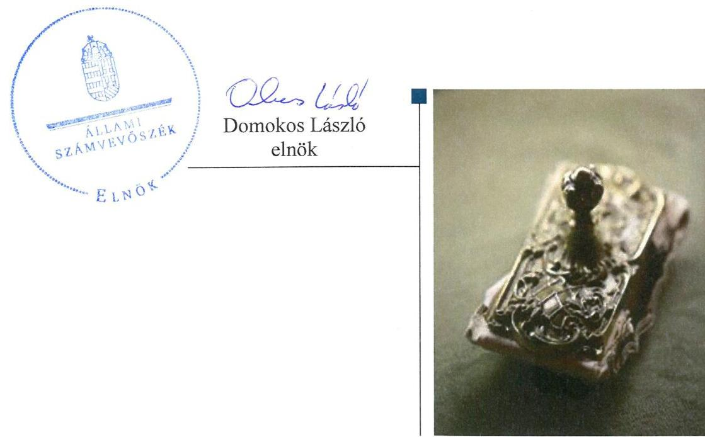

---

# AZ ELLENŐRZÉST FELÜGYELTE:

- BÖRÖCZ IMRE felügyeleti vezető

- AZ ELLENŐRZÉST VEZETTE ÉS A VÉGREHAJTÁSÁÉRT FELELŐS:
  - KORSÓSNÉ VIGH ANDREA ellenőrzésvezető
  - A PROGRAM ÖSSZEÁLLÍTÁSÁÉRT FELELŐS:
    - JANIK JÓZSEF LÁSZLÓ osztályvezető

- IKTATÓSZÁM: V-1115-190/2016
- TÉMASZÁM: 2149
- ELLENŐRZÉS-AZONOSÍTÓ SZÁM: V070780

Jelentéseink az Országgyűlés számítógépes hálózatán és az Interneten a www.asz.hu címen is olvashatóak.

---

# TARTALOMJEGYZÉK 

■ ÖSSZEGZÉS ..... 5
■ AZ ELLENŐRZÉS CÉLJA ..... 7
■ AZ ELLENŐRZÉS TERÜLETE ..... 8
■ AZ ELLENŐRZÉS HÁTTERE, INDOKOLTSÁGA ..... 10
■ A JELENTÉS LÉNYEGES KÉRDÉSKÖREI ..... 11
■ ELLENŐRZÉS HATÓKÖRE ÉS MÓDSZEREI ..... 12
■ MEGÁLLAPÍTÁSOK ..... 14
■ JAVASLATOK ..... 29
■ MELLÉKLETEK ..... 31
I. sz. melléklet: Értelmező szótár ..... 31
■ FÜGGELÉK: ÉSZREVÉTELEK ..... 33
■ RÖVIDÍTÉSEK JEGYZÉKE ..... 45

---

.

---

# ÖSSZEGZÉS 

Veszprém Megyei Jogú Város Önkormányzata szabályszerűen szervezte meg a víziközműszolgáltatás ellátását és gyakorolta a tulajdonosi jogokat. A BAKONYKARSZT Víz- és Csatornamű Zrt. vagyongazdálkodása szabályszerű volt, kötelezettségállománya a jogszabályi változásokkal összefüggésben növekedett, nem veszélyeztette a működést és a közszolgáltatás ellátását. A bevételek és ráfordítások elszámolása, valamint az önköltségszámítás és árképzés megfelelt a jogszabályi előírásoknak.

## Az ellenőrzés társadalmi indokoltsága

Az Állami Számvevőszék kiemelt célja, hogy a helyi önkormányzatok gazdálkodásában rejlő pénzügyi kockázatok feltárásával, az államháztartáson kívülre nyújtott költségvetési támogatások és ingyenes vagyonjuttatások, valamint az államháztartáson kívül működő feladat-ellátó rendszerek ellenőrzéseivel hozzájáruljon ahhoz, hogy a közpénzeket az államháztartáson kívül működő szervezetek is átlátható, rendezett módon használják fel.

Magyarországon az intézmény-centrikus közfeladat-ellátás jellemző, de egyre jelentősebb a költségvetésen kívüli feladatellátás térnyerése. Ennek legfontosabb szereplői - a nonprofit szervezetek mellett - az önkormányzati tulajdonú gazdasági társaságok. Az önkormányzatok szervezetalakítási szabadságának következménye, hogy a korábban is vállalati formában működő közszolgáltatások mellett, mind a kötelező, mind az önként vállalt feladatok ellátásában a gazdasági társaságok kiemelt fontosságú szerephez jutottak.

## Főbb megállapítások, következtetések, javaslatok

Az Önkormányzat víziközmű-szolgáltatás, mint kötelező feladata megszervezéséről az ellenőrzött időszakot megelőzően döntött, annak ellátásától a 38,29\%-os tulajdonában lévő gazdasági társasága útján gondoskodott. A közfeladat ellátás részletes szabályait az Önkormányzat és a Társaság közötti szerződésekben rögzítették, amelyeket a víziközmű-szolgáltatást szabályozó törvényi rendelkezéseknek és ezzel összefüggésben a Veszprém területén lévő víziközművek tulajdoni jogviszonyában bekövetkezett változásoknak megfelelően módosítottak a felek. Az Önkormányzat eleget tett a víziközmű-szolgáltatáshoz kapcsolódó, jogszabályban előírt rendeletalkotási kötelezettségének, továbbá a jogszabályokban, az Alapszabályban és a Vagyonrendeletben rögzített előírásoknak megfelelően gyakorolta a tulajdonosi jogokat. A Társaságot a gazdálkodás, ezen belül a közszolgáltatási tevékenység helyzetéről az Önkormányzat minden évben beszámoltatta, továbbá az FB-n keresztül ellenőrizte.

A Társaság az ellenőrzött időszakban a jogszabályi előírásoknak és a tulajdonosi elvárásoknak megfelelően alakította ki gazdálkodási kereteit. A 2011-2014. években a Társaság az Alapszabály előírásának megfelelve évente tevékenységenkénti bontásban a tervezett beruházásokat, fejlesztéseket is magába foglaló éves üzleti terveket készített, amelyeket az Önkormányzat támogatott, a Társaság Közgyűlése jóváhagyott. Aktualizált szabályzatokkal a Társaság a jogszabályi előírásoknak megfelelően rendelkezett. A leltározási szabályzat 2012-től az ingatlanok mennyiségi felvétellel történő leltározása elvégzésére a jogszabályban előírt háromévenkénti gyakorisággal szemben négyévenkénti gyakoriságot írt elő. A szabályzataiban a Társaság meghatározta az ellátott közfeladat, illetve 2013-tól a vagyonkezelésbe vett vagyon, és a kapcsolódó bevételek és ráfordítások egyértelmű elhatározásához szükséges előírásokat, biztosította a számviteli szétválasztási előírások teljesülésének feltételeit.

A számviteli nyilvántartásokban az ellátott közfeladatra és a vagyonkezelt eszközökre előírt szétválasztási előírásokat a Társaság érvényesítette, továbbá e nyilvántartásokban szereplő vagyon állományát évente teljes körű leltárral alátámasztotta. Az ingatlanok leltározásánál nem tettek eleget a 2012-től törvényben előírt legalább háromévenkénti mennyiségi felvétellel történő leltározási kötelezettségnek, mert ezeket az eszközöket a Társaság 2012-2014-ben az analitikus nyilvántartásokkal való egyeztetéssel leltározta.

---

A Társaság vagyona az ellenőrzött időszakban főként a jogszabályi előírás alapján elvégzett vagyonértékelés hatására növekedett. A forrásokon belül a 2013-2014. években a víziközmű vagyonnak az ellátásért felelős önkormányzatok részére a törvényi rendelkezéseknek megfelelő térítés nélküli átadása és vagyonkezelésbe történő visszavétele miatt jelentős átrendeződés, a saját tőke csökkenése és a kötelezettségek emelkedése következett be. A jogszabályi változások, így a 2013. évben bevezetett közműadó, a rezsicsökkentés, a vagyonértékelés miatti amortizációs költség növekedés a Társaság eredményének alakulását is negatívan befolyásolta. A Társaság 2013. és 2014. években realizált vesztesége miatt a jegyzett tőke nem csökkent a kötelezően előírt szint alá. A kötelezettségek állományának növekedését a közművagyon vagyonkezelésbe vétele és felértékelése okozta, ami fizetési kötelezettséggel nem járt, a közfeladat ellátását és a működést nem veszélyeztette. A követelések behajtására a Társaság a belső szabályzatának megfelelően intézkedett.

Beszámolási és adatszolgáltatási kötelezettségeinek a Társaság szabályszerűen eleget tett. A könyvvizsgáló az éves beszámolókat hitelesítő záradékkal látta el, a Társaság felé a 2012-2014. évi könyvvizsgálói jelentésekben nem jelezte az ingatlanok mennyiségi leltárfelvétellel történő leltározás gyakoriságára vonatkozó belső szabályozás és gyakorlat jogszabályi előírásoktól való eltérését. Az adatok védelmével és közzétételével kapcsolatos jogszabályi kötelezettségeknek a Társaság eleget tett.

Az ellátott közfeladat bevételeinek és ráfordításainak, az értékcsökkenés elszámolása, továbbá az önköltségszámítás és az árképzés szabályszerű volt, a számviteli szétválasztási szabályok érvényesültek.

Az ÁSZ a Társaság vezérigazgatójának fogalmazott meg javaslatokat, amelyek alapján köteles intézkedési tervet összeállítani és azt a jelentés kézhezvételétől számított 30 napon belül az ÁSZ részére megküldeni.

---

# AZ ELLENŐRZÉS CÉLJA 

AZ ELLENŐRZÉS CÉLJA annak értékelése volt, hogy az önkormányzat vagyongazdálkodási tevékenysége során szabályszerűen gyakorolta-e tulajdonosi jogait; a gazdasági társaság szabályozottsága, gazdálkodása és vagyongazdálkodási tevékenysége, bevételeinek és ráfordításainak elszámolása megfelelt-e a jogszabályi és tulajdonosi előírásoknak; a gazdasági társaság kötelezettségállománya jelentett-e kockázatot a működésre, valamint a gazdálkodás átláthatósága és elszámoltathatósága érdekében biztosítva volt-e a szolgáltatás díjának megalapozottsága szabályszerű önköltségszámítással.

---

# **BAKONYKARSZT Víz- és Csatornamű Zrt. és legnagyobb részvényese, Veszprém Megyei Jogú Város Önkormányzata**

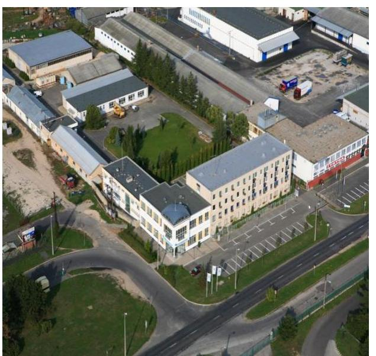

1. táblázat

**A VAGYONÁLLOMÁNY, EBBŐL A VAGYONKEZELT ESZKÖZÖK ALAKULÁSA (M FT)**

|  Megnevezés | Összes
eszköz | Vagyon-
kezelte
eszköz  |
| --- | --- | --- |
|  2011. | 11 840,1 | -  |
|  2012. | 12 153,3 | -  |
|  2013. | 12 434,9 | 9 187,4  |
|  2014. | 24 279,9 | 20 558,7  |

*Forrás: a Társaság adatszolgáltatása*

**A BAKONYKARSZT VÍZ- ÉS CSATORNAMŰ ZRT.-** 1996. január 1-jén alapították határozatlan időre a Veszprém Megyei Víz- és Csatornamű Részvénytársaság megszűnésével, jogutódlással. A Társaság${ }^{1}$ az ellenőrzött időszakban 132 település önkormányzatának tulajdonában volt. Legnagyobb részvényese Veszprém Megyei Jogú Város Önkormányzata 38,29%-os tulajdoni hányaddal.

A Társaságot elsődlegesen az Ötv.^{2}-ben kötelező önkormányzati feladatként előírt egészséges ivóvíz ellátási, valamint csatornázási, szennyvízelvezetési és -tisztítási szolgáltatások kielégítésére hozták létre. 2012-től a Társaság alaptevékenysége helyben biztosítható közfeladat ellátására, a víziközműszolgáltatásra irányul az Mötv.^{3} és a Vksztv.^{4} alapján.

A víziközmű-beruházás révén keletkező vagyontárgyakat – a Szindikátusi Szerződésben^{5} foglaltak szerint – az önkormányzatok a Társaság tulajdonába adták: a jegyzett tőkét a forgalomképes vagyonelemek (működtető vagyon), tőketartalékot a korlátozottan forgalomképes vagyonelemek (közművagyon) testesítették meg 2012. december 31-ig. 2013. január 1-jétől a víziközmű vagyon a Vksztv. rendelkezései erejénél fogva az ellátásért felelős önkormányzatok ingyenes tulajdonába került.

A Társaság vagyonállománya, ezen belül a vagyonkezelt eszközök állományának változását az 1. táblázat szemlélteti. A mérlegfőösszeg növekedése főként 2013-tól a Vksztv. alapján az önkormányzatok tulajdonába átkerült, majd vagyonkezelésbe vett vagyonelemek egy részére elvégzett vagyonértékelés hatására emelkedett. A Társaság saját tőkéje a 2011. évi 10 107,4 M Ft-ról a 2014. évre 2253,2 M Ft-ra csökkent a víziközmű vagyont érintő tulajdonosváltozással összefüggésben. A jegyzett tőke összege nem változott, az ellenőrzött időszakban 886,2 M Ft volt.

A Társaság 2011. és 2014. évi árbevétel, követelés és kötelezettség adatait az 1. ábra szemlélteti.

---

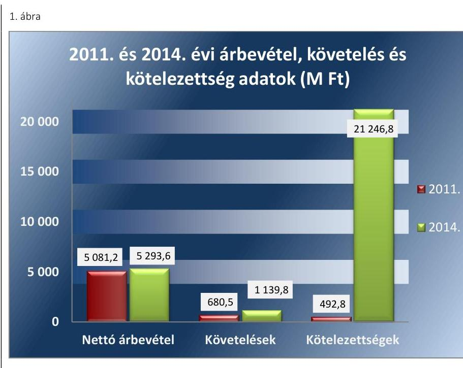

Forrás: Társaság 2011. és 2014. évi mérlegadatok
A kötelezettségek nagyarányú növekedését a víziközmű vagyon tulajdonjogának megszűnésével egyidejűen annak vagyonkezelésbe vétele - a számviteli szabályok szerint hosszú lejáratú kötelezettségekkel szembeni kimutatása - okozta.

A Társaság a 2011. évben 337,7 M Ft, 2012-ben 156,6 M Ft mérleg szerinti eredményt ért el, a törvényi változások hatására a 2013. évben 7 862,3 M Ft, 2014-ben 148,5 M Ft veszteséget realizált. A lakossági tartozások állománya a 2011. évi 200,2 M Ft-ról a 2014. évre 195,6 M Ft-ra csökkent.

A foglalkoztatottak száma a 2011-2014. években 394-398 fő között változott. A Társaság más gazdasági társaságban részesedéssel nem rendelkezett. A vezérigazgató személye az ellenőrzött időszakban nem változott.

A Társaság az ellenőrzött időszakban nem volt kormányzati szektorba sorolt egyéb szervezet.

AZ ÖNKORMÁNYZAT ${ }^{6}$ 2014. december 31-én kilenc gazdasági társaságban rendelkezett többségi tulajdonnal. Ezekből a „VKSZ" Veszprémi Közüzemi Szolgáltató Zrt. a közüzemi feladatokkal kapcsolatos tevékenységeket látta el, a Veszprémi Városi Televízió és Lapkiadó Kft. a nevében megjelölt tevékenységet, a Kittenberger Kálmán Növény és Vadaspark Szolgáltató Közhasznú Nonprofit Kft. állatkertet üzemeltet. A „Csarnok" Veszprémi Csarnoküzemeltető, Rendezvényszervező és Kommunikációs Kft. feladata a Veszprém Aréna működtetése. A Pro Veszprém Városfejlesztési és Befektetés-ösztönző Nonprofit Kft. fő tevékenységi köre épületépítési projekt szervezés. A Veszprémi Turisztikai Közhasznú Nonprofit Kft. turisztikával kapcsolatos tevékenységet látott el. A Pannon TISZK Veszprém Nonprofit Kft. fő feladata szakmai középfokú oktatás. A Kolostorok és Kertek Kft. zöldterület kezelésért felelős. A Veszprémi Programiroda Rendezvényszervező Kulturális Szolgáltató Kft. előadó művészeti rendezvények szervezését végzi fő tevékenységeként. Az Önkormányzatnál a polgármester és a jegyző személye az ellenőrzött időszak alatt nem változott.

---

# AZ ELLENŐRZÉS HÁTTERE, INDOKOLTSÁGA 

Az önkormányzati tulajdonú gazdasági társaságok ellenőrzése kiemelten fontos a vagyon megőrzése, megóvása érdekében, valamint a kormányzati szektor elszámolásaiban megjelenő önkormányzati tulajdonú gazdálkodó szervezetek esetében, amelyekkel szemben alapvető követelmény, hogy gazdálkodásuk, működésük szabályszerű, az általuk szolgáltatott adatok minél megbízhatóbbak legyenek. A közfeladat-ellátás költségeinek, ráfordításainak alakulása, színvonala hatással van a lakosság elégedettségére.

A törvényalkotás számára - az észlelt problémák, szabálytalanságok, vagy egyéb nem kívánatos jelenségek felszínre kerülésével - az ellenőrzés megállapításai segítséget nyújthatnak az államháztartáson kívüli közfeladat-ellátás értékeléséhez, jogszabályi keretei pontosításához, átláthatóságot biztosító szabályozásához. Meghatározhatóvá válnak az önkormányzati feladatellátásban részt vevő államháztartáson kívüli szervezeteknek az önkormányzat költségvetését, pénzügyi helyzetét is befolyásoló - kockázatai, lehetővé válik ezen kockázatok csökkentése. Ellenőrzéseink feltárhatják, hogy az önkormányzat feladat-ellátási kötelezettségének szabályszerűen tett-e eleget, a feladatellátáshoz rendelt vagyon működtetését az elvárható gondossággal, szabályszerűen szervezte-e meg és a tulajdonosi felügyelete hozzájárult-e a feladatellátáshoz. Az ellenőrzés rávilágíthat arra, hogy a gazdasági társaság a feladat-ellátási, közszolgáltatási szerződésben foglaltak betartásával, a vagyon használatával biztosította-e a szolgáltatás folytatásának feltételeit, a feladat ellátását. Ezzel az ellenőrzöttek és a helyi döntéshozók számára visszajelzést ad feladatszervezési, feladatellátási kockázataikról, alapot ad a meglévő hibák megszüntetéséhez,
 a jobb feladatellátás biztosításához. Fokozza a fegyelmet, igazolja, hogy lejárt a következmények nélküli ellenőrzések időszaka. Az ÁSZ ${ }^{7}$ értékteremtő rend kialakításához és megőrzéséhez hozzájáruló tevékenysége pozitív hatással van a szervezetről kialakított összkép formálására.

---

# A JELENTÉS LÉNYEGES KÉRDÉSKÖREI 

1. Az önkormányzat közfeladat megszervezéséről szóló döntése, valamint tulajdonosi joggyakorlása szabályszerű volt-e?
2. A gazdasági társaság vagyongazdálkodása szabályszerű volt-e, kötelezettségállománya jelentett-e kockázatot a működésre, illetve a közfeladat ellátására?
3. A gazdasági társaságnál az ellátott közfeladat bevételei és ráfordításai elszámolása, valamint az önköltségszámítás és árképzés szabályszerű volt-e?

---

# ELLENŐRZÉS HATÓKÖRE ÉS MÓDSZEREI 

## Az ellenőrzés típusa

Megfelelőségi ellenőrzés

## Az ellenőrzött időszak

Az ellenőrzött időszak 2011. január 1-jétől 2014. december 31-ig terjedő időszak volt.

## Az ellenőrzés tárgya

A gazdasági társaság feletti tulajdonosi joggyakorlás, valamint a gazdasági társaság gazdálkodásának szabályozottsága és szabályszerűsége.

Az ellenőrzés kiterjedt minden olyan körülményre és adatra, amely az ÁSZ jogszabályban meghatározott feladatainak teljesítéséhez, valamint a program végrehajtása folyamán felmerült újabb összefüggések feltárásához volt szükséges.

## Az ellenőrzött szervezet

Veszprém Megyei Jogú Város Önkormányzata
BAKONYKARSZT Víz- és Csatornamű Zrt.

## Az ellenőrzés jogalapja

Az ellenőrzés jogszabályi alapját az ÁSZ tv. ${ }^{8}$ 1. § (3) bekezdése és 5. § (3)(4)-(5) bekezdései képezték.

## Az ellenőrzés módszerei

Az ellenőrzést a nemzetközi standardokat irányadónak tekintve az ellenőrzési program ellenőrzési kérdései, az ellenőrzött időszakban hatályos jogszabályok, az ellenőrzés szakmai szabályok és módszertanok figyelembe vételével végeztük.

Az ellenőrzés ideje alatt az ellenőrzött szervezettel történő kapcsolattartást az ÁSZ Szervezeti és Működési Szabályzatának vonatkozó előírásai alapján biztosítottuk.

---

Az ellenőrzés a kiválasztott, tulajdonosi jogokat gyakorló önkormányzatra és az ellenőrzött közfeladatot ellátó gazdasági társaságra terjedt ki.

Az ellenőrzési kérdések megválaszolásához szükséges bizonyítékok megszerzése a következő ellenőrzési eljárások alkalmazásával történt: megfigyelés, kérdésfeltevés (információkérés), összehasonlítás, valamint elemző eljárás.

Az ellenőrzést a kérdésekre adott válaszok kiértékelésével, valamint a megjelölt adatforrások, a csatolt tanúsítványok felhasználásával, továbbá az adott időszakban hatályos jogszabályok figyelembe vételével folytattuk le.

A bevételek és ráfordítások elszámolása, valamint a vagyonnyilvántartás terén a szabályszerű működést véletlen mintavétellel ellenőriztük. A mintavétellel ellenőrzött területek esetében minden egyes tétel vonatkozásában a szabályszerűségre vonatkozó kérdéseket tettünk fel, amelyek eredménye összesítésre került. A jogszabályoknak és a belső előírásoknak megfelelőnek tekintettük az adott területet, amennyiben a minta ellenőrzésének eredménye alapján 95\%-os bizonyossággal a teljes sokaságban a hibaarány kisebb volt, mint 10\%, nem megfelelőnek, ha a hibaarány a 10%-ot meghaladta. Részben megfelelő minősítést adtunk, amennyiben egy adott terület vonatkozásában a minta alapján a teljes sokaságban nem volt egyértelműen biztosított a jogszabályoknak és a belső szabályzatoknak megfelelő működés. A ráfordítások elszámolására és a vagyonnyilvántartásra vonatkozó véletlen mintavételt kockázati alapú kiválasztással egészítettük ki, amelynek során a három legnagyobb összegű tételt választottuk ki.

---

# 1. Az önkormányzat közfeladat megszervezéséről szóló döntése, valamint tulajdonosi joggyakorlása szabályszerű volt-e? 

Összegző megállapítás

Veszprém Megyei Jogú Város Önkormányzata szabályszerűen gyakorolta a tulajdonosi jogokat az ellenőrzött időszakot megelőzően megszervezett víziközmű-szolgáltatás közfeladat tekintetében.

### 1. számú megállapítás

A víziközmű-szolgáltatás közfeladat megszervezéséről az Önkormányzat az ellenőrzött időszakot megelőzően döntött. A szolgáltatás megszervezése a 2011-2014. években szabályszerű volt.

KÖZÉP- ÉS HOSSZÚ TÁVÚ TERVEKBEN rögzítette az Önkormányzat az ellenőrzött időszakban a víziközmű-szolgáltatás biztosítására vonatozó célkitűzéseket: az Nvtv. ${ }^{9}$ alapján készített közép- és hosszú távú vagyongazdálkodási tervet ${ }^{10}$, illetve rendelkezett további közfeladat-ellátási tervekkel, Gazdasági Programmal ${ }^{11}$.
$\longrightarrow$ A vagyongazdálkodási tervben a kötelező feladatellátást szolgáló társaságok esetében a fő célkitűzés a szolgáltatás magas szintű ellátását biztosító bevételek elérése volt a szolgáltatási díjak alacsony szinten történő megtartása mellett.
$\longrightarrow$ Víziközművekkel kapcsolatos terveket tartalmazott még az Önkormányzat 2010-2025 közötti időszakra szóló energetikai stratégiája ${ }^{12}$, illetve a 2014-2020 közötti időszakra szóló Integrált Területi Programja ${ }^{13}$ is. Ezek a környezettudatos vízfelhasználás elérése mellett a víziközművek fenntartásának, fejlesztésének - a sérülékeny vízbázis védelmének, a tisztítási technológiák fejlesztésének - feladatait fogalmazták meg.
$\longrightarrow$ A 2011-2014. évekre jóváhagyott Gazdasági Program a víziközművekkel kapcsolatosan a vízbázis védelmet, illetve a csatornázottság 100%-os szintjének elérését tűzte ki célul.
A közép- és hosszú távú vagyongazdálkodási tervben és a Gazdasági Programban megfogalmazott célkitűzések megvalósítását az Önkormányzat a 2013. és a 2014. évben a következő évi vagyongazdálkodási irányelvek előterjesztése keretében értékelte: a víziközművekkel kapcsolatban nem történt tervmódosítás.

Az Önkormányzat törvényi kötelezettsége volt 2011. december 31-ig a vízrendezés, vízelvezetés, csatornázás biztosítása az Ötv. 8. § (1) bekezdés, az egészséges ivóvízellátásról gondoskodás az Ötv. 8. § (4) bekezdés előírása alapján, 2012. január 1-jétől a víziközmű-szolgáltatás biztosítása az Mötv. 13. § (1) bekezdés 21. pontja alapján.

Az Önkormányzat az ellenőrzött időszakot megelőzően döntött a közfeladat gazdasági társasági formában történő ellátásáról.

---

A FELADATELLÁTÁS MÓDJA nem változott, azt az Önkormányzat az Ötv. 9. § (4) bekezdése, illetve 2012-től az Mötv. 41. § (6) bekezdése és a Vksztv. 15. § (2) bekezdése alapján a Társaság útján, a vele kötött szerződések alapján látta el az ellenőrzött időszakban. A feladatellátás módját az SZMSZ; ${ }^{14}$-ben, illetve a közép- és hosszú távú vagyongazdálkodási tervben rögzítették.

AZ ELLÁTANDÓ FELADATOK KÖRÉNEK MEGHATÁROZÁSA számonkérhető volt. Az Alapszabály ${ }^{15}$ megfelelt a Gt. ${ }^{16}$ 12. § (1) bekezdésében és a Ptk. ${ }^{17}$ 3:5. §-ában meghatározott tartalmi követelményeknek, illetve rögzítette a Gt. 19. § (2) bekezdése, valamint a Ptk. 3:109. §-a szerint a Társaság Közgyűlésének ${ }^{18}$, mint legfőbb szervnek a feladatait. A Társaság feladatellátással kapcsolatos naturális, pénzügyi adatait pedig az éves üzleti tervek fogalmazták meg.

A közfeladat ellátásra az Önkormányzat és a Társaság között megkötött szerződések 2011-2014 között a jogszabályok, valamint az Önkormányzat területén lévő víziközművek tulajdonjogában bekövetkezett változások hatására módosultak.
$\longrightarrow$ A 2011-2012. években az Önkormányzat területén lévő víziközmű elemek tulajdonjoga megoszlott az Önkormányzat és a Társaság között.
Az önkormányzati beruházásban megvalósult „Veszprém város szennyvízelvezető és tisztító létesítmények, valamint a zárt rendszerű csapadékelvezető létesítmények" tulajdonosa az Önkormányzat volt. Ezen eszközöket az Önkormányzat mutatta ki könyveiben (2011. évben 1,1 Mrd Ft összegben), amelyekre vonatkozóan az üzemeltetővel, a Társasággal az ellenőrzött időszakot megelőzően üzemeltetési szerződést; ${ }^{19}$-t kötöttek határozatlan időre.
A veszprémi ivóvízellátó, valamint szennyvízelvezető és -tisztító víziközmű rendszer (az önkormányzati beruházásban megvalósult részek kivételével) tulajdonjoga a Társaságé volt. Az Önkormányzat a Társaságban részvényhányaddal rendelkezett, a vagyoni kört apportként bocsátotta rendelkezésre. A részvényes önkormányzatok az ivóvíz- és szennyvízkezelési szolgáltatással kapcsolatos főbb elveket, előírásokat az Alapszabályon kívül Szindikátusi Szerződésben rögzítették.
$\longrightarrow$ A Társaság vagyonkezelési tevékenységet a 2013. évtől folytatott. A Vksztv. 79. § (1) bekezdése értelmében a víziközmű vagyon 2013. január 1-jén ingyenesen, a tulajdonjoghoz kötődő jogokkal és kötelezettségekkel együtt az ellátásért felelős Önkormányzat(ok) tulajdonába szállt át. Az Önkormányzathoz visszaháramlott víziközmű vagyon összege 2,8 Mrd Ft volt.
A Vksztv. 83. § (2) bekezdés alapján az apportált víziközmű elemekre az Önkormányzat 2012. március 29-én a Társasággal üzemeltetési szerződést; ${ }^{20}$-t kötött. A szerződést 2013. január 1-jei hatállyal kiegészítették, melynek értelmében az Önkormányzat a Vksztv. 15. § (2) a) pontja szerinti vagyonkezeléssel a Társaságot bízta meg.

---

Az önkormányzati beruházásban megvalósult víziközmű elemek tekintetében 2013. évben is az üzemeltetési szerződés; volt érvényben. Az Önkormányzat és a Társaság közötti szerződések teljes körűen megfeleltek a Vksztv. előírásainak.
A Vksztv. 78. § (1) bekezdése előírta a víziközmű vagyon 2015. december 31-ig történő felértékelését, amely előírásnak az ellenőrzött időszakban a veszprémi szennyvíz vagyonra vonatkozóan eleget tettek. Az Önkormányzat a felértékelt szennyvízelvezető és -tisztító rendszerre a Társasággal 2014. évtől hatályosan a Vksztv., az Nvtv. és az Mötv. előírásainak megfelelő vagyonkezelési szerződést ${ }^{21}$ kötött. A szerződésben rögzítették, hogy a szennyvíz vagyont érintően minden korábbi szerződés megszűnik.
A veszprémi ivóvíz hálózatot a Társaság 2014. évben is az üzemeltetési szerződés; és annak kiegészítése alapján működtette.
A közfeladat ellátásra megkötött és 2011-2014. években hatályos üzemeltetési/vagyonkezelési szerződésekben rögzítették a felek jogait kötelezettségeit, továbbá az érintett vagyoni kört, amelyet az Önkormányzat a Társaság rendelkezésére bocsátott.

Az üzleti terv teljesülését elősegítő anyagi ösztönzési rendszerre vonatkozó előírásokat a Társaság Közgyűlése által elfogadott javadalmazási szabályzatban ${ }^{22}$ rögzítették. A vezető beosztású dolgozók éves prémium célkitűzését az Igazgatóság ${ }^{23}$ fogadta el, a prémium kifizetéséről a következő évben az üzleti terv és az üzleti jelentés tényadatai, valamint a könyvvizsgáló által auditált mérleg alapján döntöttek.

RENDELETALKOTÁSI KÖTELEZETTSÉGÉNEK az Önkormányzat az Ár. tv. ${ }^{24}$ 7. § (1) bekezdésében kapott felhatalmazás alapján eleget tett. A 2011. évi helyi ivóvíz, valamint szennyvízelvezetés, -tisztítás díjairól, valamint a vízfogyasztás rendjéről szóló előírásokat az Önkormányzat 42/2010. (XII. 17.) számú rendelete ${ }^{25}$ tartalmazta. Az Önkormányzat 2012. évre vonatkozó díjrendelete már nem lépett hatályba, mert a Vksztv. szolgáltatási díjakra vonatkozó rendelkezései 2011. december 31-én 23 órától léptek hatályba. Ez az önkormányzatoktól megvonta az árhatósági jogkört. Ezt követően a Vksztv. 65. §-a értelmében a közműves ivóvíz ellátás és közműves szennyvízelvezetés és -tisztítás díját a miniszter rendeletben állapítja meg. Az Önkormányzatnak a vízgazdálkodásról szóló 1995. évi LVII. törvény 17. § (8) bekezdésének előírása alapján rendeletet kellett alkotni a vízfogyasztás rendjéről is, amely tartalmazta a vízkorlátozási tervet. Ez a 2011. évben része volt az Önkormányzat 42/2010. (XII. 17.) számú rendeletének. A vízfogyasztás rendjéről szóló rendeletet a 2014. évben módosították.

### 2. számú megállapítás

A tulajdonosi jogok gyakorlása szabályszerű volt.

## A TULAJDONOSI JOGGYAKORLÁS KERETEINEK

KIALAKÍTÁSA a Gt. 11-12. §-aiban, valamint a Ptk. 3:4. §-aiban előírtak szerint az Alapszabályban történt. Az Önkormányzat a Társaságban 38,29%-os tulajdonrészével meghatározó befolyással nem bírt. Az Alapszabály elfogadása és módosítása a Társaság Közgyűlésének hatáskörébe tartozott. Az Önkormányzat a módosításokról határozatot hozott, a többi részvényes önkormányzattal együtt. Az Alapszabály értelmében a Társaság

---

Közgyűlésének kizárólagos hatáskörébe tartozott többek közt az éves üzleti terv és a beszámoló jóváhagyása, az adózott eredmény felhasználására vonatkozó döntés, az FB ${ }^{26}$ tagok, az Igazgatóság, a könyvvizsgáló megválasztása, visszahívása, díjazása. Szintén ebbe a körbe tartozott az alaptőke 50%-át meghaladó garancia és kezességvállalás, az alaptőke 20%-át meghaladó hosszú lejáratú, és 10%-át meghaladó összegű rövidlejáratú hitelfelvételéről szóló döntés. A Társaság Közgyűlésén minden részvényes jogosult volt résztvenni. A részvényest a közgyűlésben 1 fő képviselhette. Az Önkormányzatot a Társaság Közgyűlésében a polgármester képviselte.

A VAGYONRENDELET ${ }_{1-2}{ }^{27}$-ben szabályozta az Önkormányzat a tulajdonosi joggyakorlás hatásköri rendjét, amely megoszlott az Önkormányzat Közgyűlése, a Gazdasági ${ }^{28}$ /Tulajdonosi ${ }^{29}$ Bizottság valamint a polgármester között. Az Önkormányzat részvételével működő gazdasági társaság esetében:
—az Önkormányzat Közgyűlésének hatáskörébe tartozott a társasági szerződés tartalmáról, módosításáról, az alaptőke felemeléséről, leszállításáról, a társaság átalakulásáról, megszűnéséről, az igazgató kinevezéséről, felmentéséről, továbbá a vagyonrendelet ${ }_{2}$ szerint az igazgatósági tag kinevezéséről, felmentéséről és a könyvvizsgáló személyéről történő állásfoglalás;
— a Gazdasági/Tulajdonosi Bizottság hatásköre volt a számviteli törvény szerinti beszámoló jóváhagyásáról és az adózott eredmény felhasználásáról, az éves üzleti terv elfogadásáról való állásfoglalás;
— a polgármester gyakorolhatta az Önkormányzat Közgyűlése, vagy a Gazdasági/Tulajdonosi Bizottság hatáskörébe nem tartozó hatásköröket. A vagyonrendelet ${ }_{1}$ a polgármester hatáskörébe utalta az igazgatósági tag és az FB tag kijelölését.
A vagyonrendelet ${ }_{1,2}$-ben határozta meg továbbá az Önkormányzat a vagyongazdálkodási döntések megalapozására vonatkozó szabályokat.

Az Önkormányzatnak a Társaság Igazgatóságában, illetve az FB-ben való képviseletéről a Szindikátusi Szerződés, majd annak 2012. december 5-i megszűnését követően a Társaság Közgyűlésének határozata tartalmazott előírásokat.

A TULAJDONOSI JOGOK GYAKORLÁSA szabályszerű volt. A szabályozásnak megfelelően az Önkormányzat Közgyűlése tárgyalta és határozatával támogatta az Alapszabály módosításokat, a Gazdasági/Tulajdonosi Bizottság pedig az üzleti terveket és a számviteli beszámolókat. A Társaság a vagyont érintő döntésekhez rendelkezett az Önkormányzat hozzájárulásával. A fejlesztési tervek az üzleti terv részét képezték, amelyek tulajdonosi jóváhagyása megtörtént. A Vksztv. rendelkezései nyomán szükséges döntéseket az Önkormányzat Közgyűlése szintén határozatával támogatta. Az Önkormányzat, mint legnagyobb részvényes, a szabályozásnak megfelelően az Igazgatóságban és az FB-ben is egy fő képviselettel rendelkezett. A képviseletre jogosultak feladataikat a Gt., illetve Ptk. alapján látták el, az Önkormányzat részéről további követelményt nem határoztak meg.

---

AZ IGAZGATÓSÁG az Alapszabályban előírtak alapján legalább háromhavonta ülésezett. A Társaság üzleti terveit, valamint a Számv. tv. ${ }^{30}$ szerinti beszámolókat megtárgyalta és az Alapszabályban rögzítettek szerint a Társaság Közgyűlése elé terjesztette elfogadásra.

A FELÜGYELŐ BIZOTTSÁG létszáma a Gt. 34. § (1) bekezdésének és a Tak. tv. ${ }^{31} 4 . \S$ (2) bekezdés előírásának megfelelő volt, hat tagból állt. Az FB minden évben elfogadta munkatervét. Minden évben megtárgyalta és véleményezte a Társaság üzleti tervét, számviteli beszámolóját, az üzleti jelentést és azokat a Társaság Közgyűlésének elfogadásra ajánlotta. Az FB munkaterve alapján ellenőrzéseket végzett még egyes üzemmérnökségeken, illetve egyes témákban (pl.: oktatási tevékenység, labor működés, vízminőség védelem, stb.). Az FB ülésein készült jegyzőkönyveket az Önkormányzatra eljuttatták, így az FB megállapításai rendelkezésre álltak.

KÖNYVVIZSGÁLÓ megbízására a Társaság a Számv. tv. 155. § (2) bekezdés előírása alapján kötelezett volt, amelynek az ellenőrzött időszakban eleget tett.

AZ ÁRKÉPZÉS legfőbb szabályait a 2011. évben az Alapszabályban határozták meg. Az alapelvek szerint a szolgáltatási díjkalkulációba a tevékenységek fajlagos ráfordításait településenként eltérő (helyi), illetve településenként egységes érvényű költségek bontásban kalkulálták. A költségelszámolás részletes szabályait a Társaság önköltségszámítási szabályzata tartalmazta. Az egyes víziközmű-szolgáltatások 2011. évre alkalmazandó díját árhatósági jogkörükben a tulajdonos önkormányzatok - a Társaság kalkulációja alapján - önkormányzati rendeletben (az Önkormányzat a 42/2010. (XII. 17.) számú rendeletében) rögzítették. A Vksztv. 2012-től megvonta az önkormányzatok árhatósági jogkörét, és helyette a szolgáltatót hatalmazta fel - a törvényi előírások figyelembevételével - a víziközműszolgáltatási díjak meghatározására.

A BESZÁMOLTATÁSI RENDSZERT az Önkormányzat működtette. A Társaságot a gazdálkodás, ezen belül a közszolgáltatási tevékenység helyzetéről minden évben beszámoltatta. A vezérigazgató a Tulajdonosi/Gazdasági Bizottság ülésén megjelent, ott értékelte a beszámolóval lezárt év fontosabb feladatait, a működést befolyásoló belső, külső okokat, az eredmény alakulására ható tényezőket, az üzleti tervben meghatározott célok teljesülését. A vagyonrendelet ${ }_{1,2}$-ben előírtak szerint a Gazdasági/Tulajdonosi Bizottság a Társaság beszámolóit határozatával a Társaság Közgyűlésének elfogadásra ajánlotta, az FB, valamint a könyvvizsgáló írásos véleményének birtokában (a könyvvizsgáló a beszámolókat minden évben véleményezte és észrevétel nélkül elfogadta) a Gt. 35. § (3) bekezdése, illetve a Ptk. 3:120. § (2) bekezdésében előírtaknak megfelelően. A Gazdasági/Tulajdonosi Bizottság az átruházott hatáskörben hozott döntésekről az Önkormányzat Közgyűlését tájékoztatta. A Társaságot az Önkormányzat az FB-n keresztül ellenőrizte.

A Társaság számára Szervezeti és Működési Szabályzata előírta belső ellenőrzés működtetését, aminek egy fő belső ellenőr révén eleget tettek. A belső ellenőrzés munkatervét évente az FB jóváhagyta. A belső ellenőr évente négy alkalommal írásban beszámolt tevékenységéről az FB-nek, így

---

annak eredményéről az Önkormányzatnak tudomása volt. A belső ellenőrzés a vagyont érintően kiterjedt az év végi zárási feladatok, közte a leltározás ellenőrzésére.

A Társaság 2011-2012. évi üzleti évét nyereséggel zárta, amely nem került felosztásra, a képződött nyereséget a közfeladat ellátására fordították. A 2013-2014. évben a jogszabályi változások hatására veszteség keletkezett, de a tulajdonos önkormányzatoknak a Gt. 51. § (1) bekezdése, valamint a Ptk. 3:133. § (2) bekezdés alapján intézkedési kötelezettségük nem keletkezett, mert a Társaság saját tőkéjének összege egymást követő két évben nem csökkent a jegyzett tőke meghatározott szintje alá.

Az Önkormányzatnak a Társaság kötelezettségvállalásához kapcsolódó garancia-, illetve kezességvállalása nem volt.

# 2. A gazdasági társaság vagyongazdálkodása szabályszerű volt-e, kötelezettségállománya jelentett-e kockázatot a működésre, illetve a közfeladat ellátására?

Összegző megállapítás

A Társaság vagyongazdálkodása megfelelt jogszabályoknak, kötelezettségállománya nem veszélyeztette a működést, a közfeladat ellátást.
2.1. számú megállapítás

A Társaság rendelkezett a jogszabályokban előírt, aktualizált belső szabályzatokkal. A leltározási szabályzat teljes körűen nem felelt meg a Számv. tv. előírásainak.

ÜZLETI TERV készítés kötelezettségét a Társaság részére az Alapszabály írt elő, aminek eleget tettek. A 2011-2014. évekre vonatkozó üzleti terveket a Társaság Közgyűlése jóváhagyta. Ezt megelőzően az FB azokat véleményezte. Az Önkormányzat részéről a Tulajdonosi/Gazdasági Bizottsága azokat határozattal elfogadta és a Társaság Közgyűlése számára elfogadásra ajánlotta. Az üzleti tervek tevékenységenkénti bontásban készültek, illetve tartalmazták a tervezett beruházásokat, fejlesztéseket az Önkormányzattal történő előzetes egyeztetések alapján, a Gazdasági Programmal összhangban.

AKTUALIZÁLT SZABÁLYZATOKKAL a Társaság a jogszabályi előírásoknak megfelelően rendelkezett. A Számv. tv. 14. § (3)-(5) bekezdéseiben foglalt előírásoknak megfelelően elkészítették számviteli politikát ${ }^{32}$, a leltározási ${ }^{33}$, értékelési ${ }^{34}$, pénzkezelési ${ }^{35}$ és önköltségszámítási ${ }^{36}$ szabályzatokat, továbbá a Számv. tv. 161. §-ában foglaltaknak megfelelő számlarendet ${ }^{37}$, amelyek tartalma - egy kivétellel - a jogszabályi előírásoknak megfelelt.

A Társaság leltározási szabályzatának az ingatlanok mennyiségi felvétellel történő leltározása négyévenkénti gyakoriságára vonatkozó előírása nem felelt meg a Számv. tv. 2012. január 1-jétől hatályos 69. § (3) bekezdése rendelkezésének, ami legalább háromévente mennyiségi felvétellel történő leltározási kötelezettséget írt elő.

---

A Társaság Közgyűlése a javadalmazási, juttatási rendszerről megalkotta javadalmazási szabályzatát, amely megfelelt a Tak. tv. 5. § (2)-(3) bekezdéseiben foglaltaknak. Személyi hatálya kiterjedt a Társaság első számú vezetőjére, a vezető állású munkavállalókra, az FB tagjaira, elnökére. Tárgyi hatálya kiterjedt a javadalmazási elvekre, a jogviszony megszüntetése esetén járó juttatásokra, prémium feltételekre, költségtérítések szabályozására.

Üzletszabályzatát ${ }^{38}$ a 2013. évben a Vksztv. 47. § (1) bekezdésében előírtak alapján elkészítette a Társaság, amelyet a Magyar Energetikai és Közmű-szabályozási Hivatal 1980/2013. számú határozatával elfogadott. Az üzletszabályzatot a Vksztv. 48. § (1) bekezdés b) pontjának megfelelően honlapjukon közzétették.

A VAGYONKEZELÉSBE VETT VAGYON elkülönített nyilvántartását, a kapcsolódó bevételek és ráfordítások elkülönítését a Társaság a jogszabályi előírásoknak megfelelően szabályozta. A Társaság 2012. december 31-ig vagyonkezelésbe vett vagyonnal nem rendelkezett. A 2013. évtől vagyonkezelésbe vett vagyon saját vagyontól elkülönített nyilvántartásáról a számlatükrében a számlák megfelelő alábontásával gondoskodott, megtörtént továbbá a számlarendben a bevételek, költségek és ráfordítások víziközmű-szolgáltatásonkénti elkülönítése is. A Társaság a Vksztv. 49. § (1)-(5) bekezdéseiben az ágazati tevékenységre előírt számviteli szétválasztási kötelezettségek részletes szabályait 2013-tól a számviteli politikában és az önköltségszámítási szabályzatban határozta meg, amely szétválasztási kötelezettségeknek 2013-2014-ben eleget tett.

# 2.2. számú megállapítás

A vagyongazdálkodás az ingatlanok 2014. évi leltározási módja kivételével megfelelt a jogszabályi rendelkezéseknek.

A VAGYONNYILVÁNTARTÁSOKAT - a vagyonkezelésbe vett és a saját vagyon esetében is - a jogszabályi előírásoknak megfelelően vezették. A számviteli nyilvántartásokban szereplő vagyontárgyak állományát évente teljes körű leltárral alátámasztották.

Az ingatlanok 2011. évi mennyiségi felvétellel történt leltározását követően, 2012-től nem teljesült a Számv. tv. 69. § (3) bekezdésében foglalt előírás, amely a tárgyi eszközökre vonatkozóan legalább háromévente mennyiségi felvétellel történő leltározást ír elő, mivel a Társaság az ingatlanokat mennyiségi felvétellel a 2012-2014. évek egyikében sem leltározta, mindhárom évben az analitikus nyilvántartások egyeztetésével történő leltározást végzett.

A könyvvizsgáló a 2012-2014. évi beszámolókhoz kapcsolódó könyvvizsgálói jelentésekben nem kifogásolta, hogy az ingatlanok mennyiségi felvétellel történő leltározás gyakorisága tekintetében a szabályozás és a leltározási gyakorlat nem felelt meg a Számv. tv. 69. § (3) bekezdés előírásainak.

A TÁRSASÁG VAGYONA az ellenőrzött időszakban 109,5%-kal növekedett, amit alapvetően a Vksztv. 78. §-a alapján (Veszprém, Zirc, Hegyesd régió szennyvízrendszerére vonatkozóan) a 2014. évben elvégzett vagyonértékelés eredményezett.

A forrásokon belül a 2013-2014. években a víziközmű vagyon térítés nélküli átadása és vagyonkezelésbe történő visszavétele miatt jelentős át-

---

3.  táblázat

VÍZ- ÉS
SZENNYVÍZSZOLGÁLTATÁSI TEVÉKENYSÉG ESZKÖZÁLLOMÁNYA (M FT)

|  | 2013. | 2014. |
| :-- | --: | --: |
| Tárgyi eszköz | 10691,9 | 21950,7 |
| összesen |  |  |
| ebből | 7059,7 | 6990,4 |
| vízszolg. |  |  |
| ebből: | 3613,9 | 14943,0 |
| szennyvízsz. |  |  |

Forrás: Társaság 2013-2014. évi kieg. melléklet
rendeződés következett be. A saját tőke 2011. évi nyitó értékéhez viszonyított közel 77%-os csökkenését egyrészt a víziközmű vagyon önkormányzatok részére történő ingyenes átadása miatt realizált veszteség, illetve a tőketartalékként kimutatott apportált víziközmű vagyon eredménytartalék javára történő átvezetése okozta. A Társaság a vagyonkezelésbe vett vagyont a Számv. tv. 42. § (5) bekezdése alapján hosszú lejáratú kötelezettségként kimutatta. Ez eredményezte a kötelezettségállomány 2013. évi növekedését. A 2014. évi további növekedés a három régióban elvégzett vagyonértékelés hatására történt.

A Társaság főbb mérleg adatait a 2. táblázat szemlélteti.
2. táblázat

A TÁRSASÁG FŐBB MÉRLEG ADATAI (M FT)

| Megnevezés | 2011. | 2011. | 2012. | 2013. | 2014. |
| :-- | :--: | :--: | :--: | :--: | :--: |
|  | 01.01. | 12.31. | 12.31. | 12.31. | 12.31. |
| I. Befektetett eszközök | 10056,5 | 10332,9 | 10756,2 | 10853,9 | 22108,8 |
| ebből: Tárgyi eszköz | 9999,7 | 10243,7 | 10642,3 | 10691,9 | 21950,7 |
| II. Forgó eszközök | 1106,7 | 1035,3 | 1043,6 | 1208,4 | 1792,5 |
| ebből: Követelések | 679,5 | 680,5 | 683,5 | 700,5 | 1139,8 |
| III. Aktív időbeli elha- |  |  |  |  |  |
| tárolások | 426,2 | 471,9 | 353,5 | 372,6 | 378,6 |
| ESZKÖZÖK ÖSSZESEN | 11589,4 | 11840,1 | 12153,3 | 12434,9 | 24279,9 |
| IV. Saját tőke | 9769,7 | 10107,4 | 10264,0 | 2401,7 | 2253,2 |
| ebből: Jegyzett tőke | 886,2 | 886,2 | 886,2 | 886,2 | 886,2 |
| V. Céltartalékok | 0,0 | 3,0 | 4,0 | 122,5 | 195,3 |
| VI. Kötelezettségek | 401,1 | 492,8 | 470,6 | 9324,4 | 21246,8 |
| VII. Passzív időbeli el- |  |  |  |  |  |
| határolások | 1418,6 |
 | 1236,9 | 1414,7 | 586,3 | 584,6 |
| FORRÁSOK ÖSSZESEN | 11589,4 | 11840,1 | 12153,3 | 12434,9 | 24279,9 |

A Vksztv. 49. § (3) bekezdésének megfelelve a kiegészítő mellékletben, a 2013-2014. évben eleget tettek az egyes víziközmű-szolgáltatási tevékenységek elkülönített bemutatásának, amelynek fő adatait a 3. táblázat mutatja be. A 2014. évben a tárgyi eszközökből 31,8\%-a a vízszolgáltatást, 68,0\%-a a szennyvíztevékenységet szolgálta.

Az ellenőrzött időszakban a Társaság a víziközmű-üzemeltetési jogviszony keretében átvett vagyont nem értékesítette, nem terhelte meg, biztosítékul nem adta.

ESZKÖZPÓTLÁSRÓL a Társaság az ellenőrzött időszakban az éves üzleti tervek részét képező Beruházási és Fejlesztési tervek alapján gondoskodott, amelyeket az FB, a Gazdasági/Tulajdonosi Bizottság határozatával támogatott, a Társaság Közgyűlése pedig határozatával elfogadott. Ezáltal a fejlesztésekre vonatkozóan rendelkeztek az Önkormányzat tulajdonosi hozzájárulásával.

A jogszabályi változások (2013. évben bevezetett közműadó, rezsicsökkentés, vagyonértékelés miatti amortizációs költségnövekedés) a Társaság üzemi eredményének alakulását is negatív módon befolyásolták, amit a 2. ábra szemléltet.

---

2. ábra
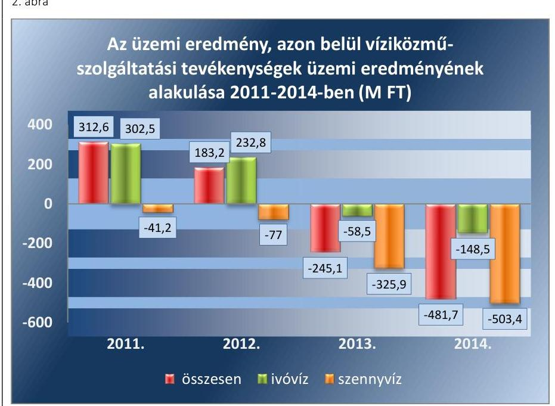

A Társaság 2013. és 2014. évben realizált vesztesége miatt a jegyzett tőke nem csökkent a kötelezően előírt szint alá.

### 2.3. számú megállapítás

4. táblázat

|  KÖTELEZETTSÉGÁLLOMÁNY |  |   |
| --- | --- | --- |
|  ALAKULÁSA (M FT) |  |   |
|   | Hosszú
lejáratú | Rövid
lejáratú  |
|  2011. | 0,0 | 492,8  |
|  2012. | 0,0 | 470,6  |
|  2013. | 8729,1 | 595,3  |
|  2014. | 20332,9 | 913,9  |

Forrás: A társaság 2011-2014. évi éves beszámolói

A kötelezettségek növekvő állománya nem akadályozta a közfeladat ellátást, illetve a működést.

A KÖTELEZETTSÉGEK ÁLLOMÁNYA a 2011. évi 492,8 M Ft-ról 2014. év végére 21 246,8 M Ft-ra, közel 43-szorosára emelkedett, elsődlegesen a 2013-tól hatályba lépő Vksztv. előírásaival összefüggésben. A kötelezettségállomány évenkénti változását, összetételét szemlélteti a 4. táblázat.

Hosszú lejáratú kötelezettség 2013-tól a Vksztv. 15. §-a alapján víziközmű-üzemeltetési jogviszonyba átvett eszközök kapcsán keletkezett, ami fizetési kötelezettséggel nem járt. A 2014. évben három régióban elvégzett szennyvíz vagyon felértékelés következtében ez az összeg emelkedett. A Társaságnak egyéb, törlesztési kötelezettséggel is járó hosszú lejáratú kötelezettsége nem volt.

A rövid lejáratú kötelezettségek határidőben történő teljesítésének a Társaság eleget tett. A Társaságnál a rövid lejáratú kötelezettség szállítói-, valamint egyéb (munkavállalókkal, költségvetéssel szembeni) kötelezettségből származott. A beszámolók alapján a lejárt tartozás aránya a 2011. évben 3,3\%-os, a 2012. évben 4,5\%-os, a 2013. évben 1,4\%-os volt, míg a 2014. évben nem érte el az egy százalékot. A Társasággal szemben késedelmes fizetés miatt jogi eljárás nem volt.

AZ ELADÓSODOTTSÁG mértéke, szerkezete - az eladósodottsági mutatók alakulása alapján, amelyet az 5. táblázat szemléltet - kedvezőtlenül változott a 2013-2014. években, ennek ellenére nem veszélyeztette a közfeladatok ellátását, a Társaság működését.

---

5. táblázat

ELADÓSODOTTSÁGI MUTATÓK ALAKULÁSA

| Mutató | Referencia | 2011. | 2012. | 2013. | 2014. |
| :-- | :--: | :--: | :--: | :--: | :--: |
| Adósságfedezeti mutató I. | $>2,0$ | 23,07 | 25,08 | 1,29 | 1,18 |
| Eladósodottsági mutató | $<0,6$ | 0,04 | 0,04 | 0,75 | 0,88 |
| Eladósodottság mértéke | $<1$ | 0,05 | 0,05 | 3,88 | 9,43 |
| Nettó eladósodottság | $<0$ | $-0,02$ | $-0,02$ | 3,59 | 8,92 |
| Árbevételre vetített eladó-   sodottság | $<1$ | $-0,11$ | $-0,11$ | 1,65 | 3,68 |

Forrás: A Társaság adatszolgáltatása
Az eladósodottsági mutatók alakulására a vagyont érintő jogszabályi változások (vagyonkezelésbe vett eszközök hosszú lejáratú kötelezettségként történő kimutatása, felértékelése) voltak a 2013-2014. években kedvezőtlen hatással.

# 2.4. számú megállapítás 

Az előírt beszámolási és adatszolgáltatási kötelezettségeket teljesítették.

A BESZÁMOLÁSI KÖTELEZETTSÉGEKET az Alapszabályban, valamint a számviteli politikában a jogszabályi előírásokkal összhangban szabályozták. Ennek megfelelően az éves üzleti tervek, valamint beszámolók benyújtására kerültek az Önkormányzat felé. A Társaság éves beszámolóit határidőben, a Számv. tv. 17. § (1) bekezdése alapján elkészítette.

A Gt. 244. § (2) bekezdése, valamint a Ptk. 3:284. §-ának előírása alapján az FB felé negyedévente teljesítették a gazdálkodásra vonatkozó adatszolgáltatást. Az Önkormányzattal kötött üzemeltetési, vagyonkezelési szerződésben előírt információ szolgáltatási kötelezettséget a szerződésben megfogalmazottak szerint teljesítették.

A Társaság a Számv. tv. 155. § (2) bekezdése szerint eleget tett a könyvvizsgálati kötelezettségének. A könyvvizsgáló az éves beszámolókat hitelesítő záradékkal látta el. A 2013-2014. évi könyvvizsgálói jelentésben a könyvvizsgáló igazolta, hogy a Vksztv. 49. § (4) bekezdésében előírt víziközmű-szolgáltató üzletágai közötti keresztfinanszírozás-mentességet a Társaság által alkalmazott számviteli szétválasztási szabályok biztosítják.

Az Önkormányzat Gazdasági/Tulajdonosi Bizottsága a beszámolókat a könyvvizsgáló és az FB írásbeli véleményének birtokában javasolta a Társaság Közgyűlése számára elfogadásra. A Társaság Közgyűlése az éves beszámolókat határozatával elfogadta és a Számv. tv. 153. §-ának és 154. §-ának megfelelően gondoskodott azok letétbe helyezéséről és közzétételéről.

Az FB, illetve a könyvvizsgáló a közvagyon védelme, illetve egyéb okból nem kezdeményezte a Társaság Közgyűlésének összehívását.

AZ ADATOK VÉDELMÉVEL kapcsolatos kötelezettségeknek eleget tettek. A Társaság rendelkezett belső adatvédelmi szabályzattal ${ }^{39}$. Az Avtv. ${ }^{40}$ 31/A. §-a, illetve az Infotv. ${ }^{41}$ 24. § (1) bekezdésének megfelelően adatvédelmi felelőst neveztek ki, aki folyamatosan vezette az adatvédelmi nyilvántartást.

A közérdekű adatok megismerésére irányuló igények intézésének és nyilvánosságra hozatalának rendjét vezérigazgatói utasításban szabályoz-

---

ták. A Társaság a 2011. évben az Eisztv. ${ }^{42}$ 3. § (2) és 6. § (1) bekezdés alapján az Eisztv. mellékletében, a 2012-2014. években az Infotv. 37. § (1) bekezdés alapján az Infotv. 1. számú mellékletében meghatározott közzétételi kötelezettségét teljesítette, az előírt - szervezetére, tevékenységére, gazdálkodására vonatkozó - adatokat honlapján közzé tette.

# 3. A gazdasági társaságnál az ellátott közfeladat bevételei és ráfordításai elszámolása, valamint az önköltségszámítás és árképzés szabályszerű volt-e? 

Összegző megállapítás

Az ellátott közfeladat bevételeinek és ráfordításainak elszámolása, valamint az önköltségszámítás és árképzés szabályszerű volt.

### 3.1. számú megállapítás

Az ellátott közfeladat bevételeinek és ráfordításainak elszámolása a jogszabályok és a belső szabályzatok előírásainak megfelelő volt.

A Társaság belső szabályzataiban - a számviteli politikában, az önköltségszámítási szabályzatban és a számlarendben - meghatározta az ellátott közfeladat, valamint a 2013-tól vagyonkezelésbe vett vagyon bevételeinek és ráfordításainak egyértelmű elhatárolásához szükséges előírásokat.

A közfeladat ellátáshoz kapcsolódó bevételeit és ráfordításait a Társaság az önköltségszámítás elvégzése során a számviteli nyilvántartásaiban elkülönítetten tartotta nyilván. A Társaság a bevételeinek és ráfordításainak elkülönített nyilvántartása alapján ágazati eredménykimutatást állított össze a számviteli beszámolóinak részeként, amely az egyes tevékenységeihez kapcsolódó bevételeit, ráfordításait és eredményét külön tartalmazta.

A Társaság 2013. január 1-jétől a Mötv. előírásának megfelelően a vagyonkezelésébe vett vagyon használatából, működtetéséből származó bevételeit, illetve közvetlen költségeit és ráfordításait elkülönítetten tartotta nyilván, a saját vagyonnal folytatott vállalkozási tevékenységéből származó bevételeitől, költségeitől és ráfordításaitól egyértelműen elhatárolható módon.

A Társaság a Vksztv. számviteli szétválasztás szabályainak megfelelően a víziközmű-szolgáltatási ágazati tevékenységeire elkülönített nyilvántartást vezetett, a jogszabályi előírásoknak megfelelően, mintha azokat önálló vállalkozások keretében végezte volna. A másodlagos tevékenységét a Társaság elkülönítetten mutatta be, arra a 2013. évi beszámolótól kezdődően önálló mérleget és eredménykimutatást készített a Vksztv. és a Vksztv. vhr. ${ }^{43}$ előírásainak megfelelően.

AZ ÉRTÉKESÍTÉS NETTÓ ÁRBEVÉTELE ÉS AZ ANYAGJELLEGŰ RÁFORDÍTÁSOK ELSZÁMOLÁSA a jogszabályok és a belső szabályozások előírásainak megfelelő volt.

A Társaság munkaszámok alkalmazásával és a főkönyvi számlák részletes alábontásával a teljes ellenőrzött időszakban gondoskodott arról, hogy ágazati tevékenységenként és egyéb tevékenységenként, valamint a

---

feladatellátási helyenként elkülönítésre kerüljön a közfeladatellátással kapcsolatos árbevétel és anyagjellegű ráfordítás.

A közfeladat ellátással összefüggő díjak kiszámlázása (árbevétel) a 2011. évben az árképzési szabályzatban ${ }^{44}$, valamint az Önkormányzat és a többi tulajdonos helyi önkormányzat díjrendeleteiben meghatározott áraknak, 2012. évtől kezdődően a jogszabályi - Vksztv. és a rezsicsökkentések végrehajtásáról szóló 2013. évi LIV. törvény - előírások által meghatározott módon számított áraknak megfelelően történt.

Az anyagjellegű ráfordítások elszámolása során a költségelszámolást megalapozó dokumentum (szerződés, megrendelés), valamint a ráfordítás elszámolását alátámasztó megfelelő számviteli bizonylat rendelkezésre állt, a pénzügyi teljesítés a szerződés szerinti összegben, a ráfordítás elszámolása a megfelelő főkönyvi számlára történt.

A beruházások, felújítások elszámolása során a költségelszámolást megalapozó dokumentumok rendelkezésre álltak, a pénzügyi teljesítés a szerződés szerinti összegben történt. Az állománybavétel, a besorolás, a bekerülési érték meghatározása során a Számv. tv. és a belső szabályzatok előírásait megfelelően alkalmazták. Az üzembehelyezést a Számv. tv. 52. § (2) bekezdés szerint hitelt érdemlően dokumentálták. A beszerzett eszközök a tárgyévi leltárban megtalálhatók voltak.

# AZ ÉRTÉKCSÖKKENÉS ELSZÁMOLÁSA a jogszabályok 

és a Társaság belső szabályzatainak megfelelően történt.

A Társaság a teljes ellenőrzött időszakban a Számv. tv. előírásainak megfelelően határozta meg a számviteli politikájában a terv szerinti és a terven felüli értékcsökkenési leírás elszámolásának módszerét, beleértve annak gyakoriságát. Az amortizációs kulcsok jegyzékét a számviteli politika melléklete rögzítette a Tao. tv.-ben ${ }^{45}$ foglalt leírási kulcsoknak megfelelően.

A Társaság az értékcsökkenés tevékenységek közötti megbontására vonatkozó szabályokat az önköltségszámítási szabályzatában a teljes ellenőrzött időszakra vonatkozóan rögzítette. A teljes ellenőrzött időszakban az értékcsökkenés elszámolás főkönyvi és analitikus szinten is elkülönítésre került, annak elszámolása lineáris módszerrel a számviteli politikának megfelelően történt, az elszámolás gyakorisága megfelelt az előírásoknak.

A vagyonkezelésbe vett eszközök és a saját vagyon elszámolt értékcsökkenése és azok pótlása, felújítása a 6. táblázat szerint alakult 2011-2014-ben.
6. táblázat

## ELSZÁMOLT ÉRTÉKCSÖKKENÉS ÉS ESZKÖZPÓTLÁS (M FT)

| Megnevezés | 2011. | 2012. | 2013. | 2014. |
| :--: | :--: | :--: | :--: | :--: |
| Vagyonkezelésben lévő önkormányzati vagyon után elszámolt értékcsökkenés összege | 0 | 0 | 291,4 | 695,9 |
| Vagyonkezelésben lévő eszközök pótlására elszámolt költség (felújítás és pótlólagos beruházás) | 0 | 0 | 253,1 | 131,9 |
| Saját vagyon után elszámolt értékcsökkenés összege | 558,2 | 584,7 | 192,6 | 186,7 |
| Saját tulajdonú eszközök pótlására elszámolt költség (felújítás és pótlólagos beruházás) | 887,7 | 1074,2 | 175,8 | 79,6 |

Forrás: 2011-2014. évi beszámolók, és az azokat alátámasztó főkönyvi kivonatok és analitikák

---

A Társaság a 2011-2012. években a saját vagyon elszámolt értékcsökkenéséből képzett forrásoknak megfelelő mértékben valósította meg azok pótlását, felújítását, vagyonkezelésbe vett eszközzel ezen időszakban nem rendelkezett. A 2013-2014. években az eszközpótlás mértéke lecsökkent, az sem a saját vagyonra, sem a vagyonkezelésbe vett eszközökre vonatkozóan nem érte el az elszámolt értékcsökkenés összegét.

A Társaság a beruházási, felújítási tervéhez képest a tényleges beruházási, felújítási és pótlási költségek alakulásáról a Társaság Közgyűlése számára az üzleti jelentés keretében a 2011-2014. években beszámolt.

A 2011-2012. években a Társaság pozitív adózott eredményt ért el, ezen évek vonatkozásában a Társaság osztalékot nem fizetett. A 2011. évi mérleg szerinti eredmény felhasználására vonatkozóan a 3/2012.(V. 23.) számú határozatban, a 2012. évi mérleg szerinti eredmény vonatkozásában a 2/2013. (V. 22.) számú határozatban rögzítette, hogy az eredménytartalékba helyezett mérleg szerinti eredmény a Társaság üzleti tervében megfogalmazott beruházási, felújítási célok megvalósításának forrásául szolgáljon. A Társaság által a 2012-2013. években elvégzett beruházási és felújítási munkák értéke meghaladta az eredménytartalékba helyezett mérleg szerinti eredmény összegét a 2012-2013. évi üzleti terveiben megfogalmazott céloknak és összegnek megfelelően.

# A KÖVETELÉSÁLLOMÁNY CSÖKKENTÉSE érdekében 

a Társaság a belső szabályzatának megfelelően intézkedett.

A Társaság 2012. október 1-jétől rendelkezett hátralékkezelési szabályzattal ${ }^{46}$, amelyben megjelölte a - Vksztv. szerinti - jogszabályi keretek között alkalmazható intézkedéseket a követelésállomány csökkentése érdekében. A Társaság minden ellenőrzött év vonatkozásában számot adott a megtett intézkedésekről, azok hatásáról a követelésállományra. A kimutatásokból, nyilvántartásokból megállapítható volt a hátralékos díjbevételek állománya, elkülönítetten a lakossági és a közületi kintlévőségekre vonatkozóan. A behajtás alatt lévő hátralékos díjbevételekről külön nyilvántartással rendelkeztek. Az ellenőrzött időszakban a nem vitatott, jogszerű, közfeladattal kapcsolatos vevőkövetelések határidőre ki nem fizetett összegét a 7. táblázat szemlélteti.
7. táblázat

HÁTRALÉKOS VEVŐKÖVETELÉSEK (M FT)

| Mégnevezés | 2011. | 2012. | 2013. | 2014. |
| :-- | :--: | :--: | :--: | :--: |
| Lakossági hátralék | 200,2 | 232,8 | 208,5 | 195,6 |
| Közületi hátralék | 56,7 | 34,1 | 43,8 | 42,5 |
| Összesen hátralék | $\mathbf{2 5 6 , 9}$ | $\mathbf{266 , 9}$ | $\mathbf{2 5 2 , 3}$ | $\mathbf{2 3 8 , 1}$ |

Az ellenőrzött időszakban a 2011. évről a 2014. évre csökkent a nem vitatott, jogszerű követelések határidőre ki nem fizetett összege. A Társaság követelések behajtására vonatkozó belső szabályait maradéktalanul alkalmazta az eredményes behajtás érdekében.

---

# 3.2. számú megállapítás 

A jogszabályoknak és belső előírásoknak megfelelő volt az önköltségszámítás és árképzés.

AZ ÖNKÖLTSÉGSZÁMÍTÁSI SZABÁLYZATÁT a Társaság az előírásoknak - az Alapszabályban foglalt tulajdonosi rendelkezéseknek és a Számv. tv. előírásainak, valamint 2013. január 1-jétől a Vksztv. szerinti számviteli szétválasztás szabályainak - megfelelően készítette el:

- megjelenítette az egyes ellátott feladatokra vonatkozó ágazati előírásokat, amely alapján az elvégzett utókalkuláció eredményeként a társaság az ágazati eredménykimutatását az ellenőrzött időszak üzleti éveire vonatkozóan elkészítette;
- a Számv. tv. előírásainak megfelelően elkülönítette a közvetlen és közvetett költségeket a 2011-2014. években;
- az ellenőrzött időszakban tartalmazta a kalkulációs módszerek leírását, a felosztandó költségek vetítési alapjait.
A Társaság a Számv. tv. által biztosított lehetőséggel élve a 6-7. számlaosztály alkalmazásával a vezetői információk biztosítására utókalkulációt végzett, amely biztosította az információt a tevékenységek elkülönítéséhez és az ágazati eredménykimutatás összeállításához.

A 2011. évben önkormányzati tulajdonú közművek esetén az árhatósági jogkört a helyi önkormányzatok gyakorolták az Ár. tv. értelmében. Az Önkormányzat és a további tulajdonos helyi önkormányzatok az Alapszabályban és az alapítók között létrejött Szindikátusi Szerződésben fogalmazták meg az árkialakítás elveit, amely elvekkel összhangban alakította ki a Társaság az árképzési szabályzatát. A társaság az árképzési szabályzatában és az önköltségszámítási szabályzatában meghatározta az árképzéshez szükséges önköltségszámítás során alkalmazandó, tervszámokra vonatkozó kalkuláció és utókalkuláció tartalmát, formáját és időszakait, határidejét.

Az önköltségszámítási szabályzat, a számviteli politika és annak mellékletét képező számlarend kiegészítése 2011-2014. évek között tartalmazta a könyvviteli rendszerrel való egyeztetés módját, továbbá az önköltségszámítási adatok szolgáltatásáért, a kalkuláció ellenőrzéséért felelős munkakörök és szervezeti egységek kijelölését.

AZ ÖNKÖLTSÉGSZÁMÍTÁS az árképzési szabályzatnak és az önköltségszámítási szabályzatnak, valamint 2013. január 1-től a Vksztv. számviteli szétválasztási szabályainak megfelelően került elvégzésre.

A víziközmű-szolgáltatás árának meghatározása összhangban volt az előírásokkal.

A 2011. évben a tulajdonosi joggyakorló önkormányzatok határozták meg a díjakat a költségkalkulációk alapján. Az Ár. tv. értelmében a közüzemi vízből szolgáltatott ivóvíz és a közüzemi csatornamű használatáért fizetendő díjak esetén az árhatósági jogkört az Önkormányzat és a további tulajdonos helyi önkormányzatok gyakorolták a 2011. évben, amely a társaság által készített önköltség kalkuláción alapult.

A 2012. évtől a közszolgáltatás díjának megállapítása során a Társaság figyelembe vette az ágazati előírásokat. A Vksztv. 2012. január 1-től megvonta az önkormányzatok árhatósági jogkörét, helyette a szolgáltatót hatalmazta fel - a törvényi előírások figyelembevételével - a víziközmű-szol-

---

gáltatási díjak meghatározására. A Társaság a Vksztv. előírásainak megfelelően 2012. január 17-től 2013. június 30-ig a 2011. december 31-én alkalmazott bruttó díjhoz képest 4,2 százalékkal megemelt mértékű díjat alkalmazott.

A Társaság 2013. július 1-jétől a díjmegállapítás során figyelembe vette a rezsicsökkentések végrehajtásáról szóló 2013. évi LIV. tv. előírásait, a 4. § (1) bekezdésének megfelelően a Társaság a lakossági felhasználók esetében a 2013. január 31-én jogszerűen alkalmazott díj $90 \%$-ában határozta meg a víziközmű-szolgáltatás díját a 2013. július 1-jét követő időszakban.

A rezsicsökkentési intézkedésekkel párhuzamosan a Társaság a költségcsökkentés érdekében 2013. április 24-én módosította a Közgyűlés által 2012. december 5-én elfogadott, 2013. évi üzleti tervét. Többek között elhalasztásra került a teljes működési területére vonatkozó közművagyon vagyonértékelése, tekintettel a rezsicsökkentés terheire. A módosított üzleti terv a 2012. évi üzemi ráfordításokhoz képest alacsonyabb tervszámokat határozott meg.

---

# JAVASLATOK 

Az ÁSZ tv. 33. § (1) bekezdésében foglaltak értelmében az ellenőrzött szervezet vezetője köteles a jelentésben foglalt megállapításokhoz kapcsolódó intézkedési tervet összeállítani és azt a jelentés kézhezvételétől számított 30 napon belül az ÁSZ részére megküldeni. Amennyiben az ellenőrzött szervezet vezetője nem küldi meg határidőben az intézkedési tervet, vagy továbbra sem elfogadható intézkedési tervet küld, az Állami Számvevőszék elnöke az ÁSZ tv. 33. § (3) bekezdése a) és b) pontjaiban foglaltakat érvényesítheti.

## A BAKONYKARSZT Víz- és Csatornamű Zrt. vezérigazgatójának

1.  Intézkedjen arról, hogy a leltározási szabályzatban az ingatlanok leltározási gyakoriságának meghatározása megfeleljen a jogszabályi előírásnak.
(2.1. sz. megállapítás 3. bekezdése alapján)
2.  Intézkedjen az ingatlanok mennyiségi felvétellel történő leltározásáról a jogszabályi előírásnak megfelelően.
(2.2. sz. megállapítás 2. bekezdése alapján)

---

.

---

# MELLÉKLETEK 

I. SZ. MELLÉKLET: ÉRTELMEZŐ SZÓTÁR
eladósodottságot jellemző mutatók
eladósodottsági mutató (tőkeáttétel): idegen tőke/összes forrás.
Egészségesnek mondható egy olyan mértékű áttétel, amelyet az üzleti tervek szerint és az elmúlt időszak tapasztalatai alapján a társaság megfelelő biztonsággal ki tud termelni. Nagy eszközberuházás-igényű iparágakban értéke magasabb, azaz magasabb eladósodottság is elfogadható, de 75-85\%-ot meghaladó értéknél már itt is erős, sőt túlzott külső finanszírozottságról beszélhetünk. Általánosságban véve kedvező, ha értéke kisebb, mint 0,6 .
eladósodottság mértéke: kötelezettségek / saját tőke.
Fontos szerepet játszik ez a mutató egy vállalat megítélésében. Azt mutatja, hogy a saját források a kötelezettségek hány százalékát fedezik. Törekedni kell, hogy a mutató tartósan (jelentősen) 1 alatti értéket érjen el.
nettó eladósodottság: (kötelezettségek-követelések) / saját tőke.
Azt mutatja, hogy a kintlévőségekkel csökkentett kötelezettségeket milyen mértékben fedezi a saját forrás. Ez feltételezi, hogy a követelések pénzügyileg előbb realizálódnak, mint ahogy a kötelezettségeket teljesíteni kell. A mutató minél kisebb, csökkenő értéke a kedvező.
adósságfedezeti mutató I.: (befektetett eszközök+forgó eszközök) / idegen forrás.
Azt mutatja, hogy 1 Ft adósságra hány Ft vagyon jut. Általánosságban véve kedvező, ha értéke 2 körül van, de nagy eszközberuházás-igényű iparágakban értéke kisebb is lehet.
adósságfedezeti mutató II.: működési cash flow / hosszú lejáratú kötelezettségek.
A mutató azt jelzi, hogy az adott gazdálkodási időszak működési pénzáramainak eredményeként realizált cash flow révén a vállalkozás mennyiben lenne képes valamennyi hosszú lejáratú kötelezettségének eleget tenni. Ennek vizsgálatára viszonylag ritkán kerül sor, az elsősorban a veszélyhelyzetbe került vállalkozások esetében lehet érdekes. Általánosságban véve kedvező, ha a működési cash flow minél nagyobb arányban nyújt fedezetet a hosszú lejáratú kötelezettségre (értéke nagyobb, mint 1, nő az ellenőrzött időszakban).
árbevételre vetített eladósodottság: (kötelezettségek - forgóeszközök) / értékesítés nettó árbevétele.
Az árbevételre vetített eladósodottság azt mutatja, hogy az árbevétel mekkora fedezetet nyújt a kötelezettségeknek a forgóeszközökkel csökkentett részére. Általánosságban véve kedvező, ha az árbevétel minél nagyobb arányban nyújt fedezetet a forgóeszközökkel csökkentett kötelezettségekre (értéke kisebb, mint 1, csökken az ellenőrzött időszakban).
garanciaszerződés A garanciaszerződés, illetve a garanciavállaló nyilatkozat a garantőr olyan kötelezettségvállalása, amely alapján a nyilatkozatban meghatározott feltételek esetén köteles a jogosultnak fizetést teljesíteni. (Ptk. 2 6:431. § (1) bekezdése)
gazdasági társaság $\quad$ Ptk. 3.88. § (1) bekezdése szerint „a gazdasági társaságok üzletszerű közös gazdasági tevékenység folytatására, a tagok vagyoni hozzájárulásával létrehozott, jogi személyiséggel rendelkező vállalkozások, amelyekben a tagok a nyereségből közösen részesednek, és a veszteséget közösen viselik".
gazdálkodó szervezet A Ptk. 685. § c) pontja szerint gazdálkodó szervezet: „az állami vállalat, az egyéb állami gazdálkodó szerv, a szövetkezet, a lakásszövetkezet, az európai szövetkezet, a gazdasági társaság, az európai részvénytársaság, az

---

|  | egyesülés, az európai gazdasági egyesülés, az európai területi együttműködési csoportosulás, az egyes jogi személyek vállalata, a leányvállalat, a vízgazdálkodási társulat, az erdő birtokossági társulat, a végrehajtói iroda, az egyéni cég, továbbá az egyéni vállalkozó." (2014. 03.15-ig hatályos) |
| :--: | :--: |
| kezesség | A kezességre vonatkozó előírásokat a Ptk. 2 6:416-430. §-ai tartalmazzák. Kezességi szerződéssel a kezes kötelezettséget vállal a jogosulttal szemben, hogyha a kötelezett nem teljesít, maga fog helyette a jogosultnak teljesíteni. Kezesség egy vagy több, fennálló vagy jövőbeli, feltétlen vagy feltételes, meghatározott vagy meghatározható összegű pénzkövetelés vagy pénzben kifejezhető értékkel rendelkező egyéb kötelezettség biztosítására vállalható.   A Ptk. 3 szerint kezességet csak írásban lehet vállalni. A kezes kötelezettsége ahhoz a kötelezettséghez igazodik, amelyért kezességet vállalt. A kezes kötelezettsége nem válhat terhesebbé, mint amilyen elvállalásakor volt, kiterjed azonban a kötelezett szerződésszegésének jogkövetkezményeire és a kezesség elvállalása után esedékessé váló mellékkövetelésekre is. |
| közszolgáltatás | Az Ebktv. ${ }^{47}$ 3. § d) pontja a következőképpen határozza meg a közszolgáltatást: „szerződéskötési kötelezettség alapján a lakosság alapvető szükségleteinek ellátására irányuló szolgáltatás, így különösen a villamos energia-, gáz-, hő-, víz-, szennyvíz- és hulladékkezelési, köztisztasági, postai és távközlési szolgáltatás, továbbá a menetrend alapján közlekedő járművekkel végzett közforgalmú személyszállítás". |
| meghatározó befolyás | A Ptk. 2 8:2. § (2) bekezdése szerint „A befolyással rendelkező akkor rendelkezik egy jogi személyben meghatározó befolyással, ha annak tagja vagy részvényese, és   a) jogosult e jogi személy vezető tisztségviselői vagy felügyelőbizottsága tagjai többségének megválasztására, illetve visszahívására; vagy   b) a jogi személy más tagjai, illetve részvényesei a befolyással rendelkezővel kötött megállapodás alapján a befolyással rendelkezővel azonos tartalommal szavaznak, vagy a befolyással rendelkezőn keresztül gyakorolják szavazati jogukat, feltéve, hogy együtt a szavazatok több mint felével rendelkeznek." |
| minősített többséget biztositó részesedés | A minősített befolyásszerző az ellenőrzött társaságban a szavazatok legalább hetvenöt százalékával rendelkezik. (Ptk.2. 3:324. §) |
| nemzeti vagyon | Nvtv. 1. § (2) bekezdése szerint többek között:   „az állam vagy a helyi önkormányzat kizárólagos tulajdonában álló dolgok,   az a) pont hatálya alá nem tartozó, állam vagy a helyi önkormányzat tulajdonában lévő dolog,   az állam vagy a helyi önkormányzat tulajdonában lévő pénzügyi eszközök, továbbá az államot vagy a helyi önkormányzatot megillető társasági részesedések,   az államot vagy a helyi önkormányzatot megillető bármely vagyoni értékkel rendelkező jogosultság, amelyet jogszabály vagyoni értékű jogként nevesít." |
| többségi befolyást biztosító részesedés | A Ptk. 8:2. § (1) bekezdése szerint „többségi befolyás az olyan kapcsolat, amelynek révén természetes személy vagy jogi személy (befolyással rendelkező) egy jogi személyben a szavazatok több mint felével vagy meghatározó befolyással rendelkezik." |

---

# FÜGGELÉK: ÉSZREVÉTELEK 

A jelentéstervezetet a Számvevőszék 15 napos észrevételezésre megküldte az ellenőrzött szervezetek vezetőinek az ÁSZ tv. 29. § (1) bekezdése előírásának megfelelően.
Az észrevételek alapján a jelentés módosítása nem volt indokolt.

A függelék tartalmazza az ellenőrzöttek észrevételeit, illetve az észrevételekre adott válaszleveleket.

- BAKONYKARSZT Víz- és Csatornamű Zrt. vezérigazgatójának írásban tett észrevétele
- Tájékoztatás az észrevételek kezeléséről a vezérigazgatónak
- Veszprém Megyei Jogú Város Önkormányzata polgármesterének írásban tett észrevétele
- Tájékoztatás az észrevételek kezeléséről a polgármesternek

[^0]
[^0]:    * 29. § (1) Az Állami Számvevőszék az ellenőrzési megállapításait megküldi az ellenőrzött szervezet vezetőjének vagy az általa megbízott személynek, és annak, akinek személyes felelősségét állapította meg.
    (2) Az ellenőrzött szervezet vezetője és a felelősként megjelölt személy az ellenőrzés megállapításaira tizenöt napon belül írásban észrevételt tehet.
    (3) Az Állami Számvevőszék az észrevételre a beérkezésétől számított harminc napon belül írásban válaszol. A figyelembe nem vett észrevételeket köteles a jelentésben feltüntetni, és megindokolni, hogy azokat miért nem fogadta el.

---

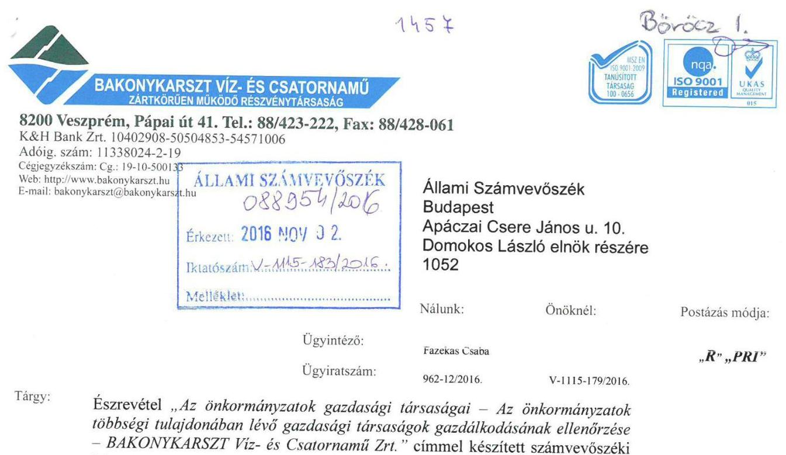

Tárgy: Észrevétel „Az önkormányzatok gazdasági társaságai - Az önkormányzatok többségi tulajdonában lévő gazdasági társaságok gazdálkodásának ellenőrzése - BAKONYKARSZT Víz- és Csatornamű Zrt." címmel készített számvevőszéki jelentéstervezethez.

# Tisztelt Elnök Úr! 

Kézhez kaptuk a fenti tárgyban készült jelentéstervezetet, melynek megállapításait az alábbiakkal kívánjuk kiegészíteni:

1. Javaslat: Intézkedjen arról, hogy a leltározási szabályzatban az ingatlanok leltározási gyakoriságának meghatározása megfeleljen a jogszabályi előírásoknak.

Természetesen a hiányosságot elismerjük, és egyben tájékoztatni szeretném Elnök urat arról, hogy a Társaság Leltározási Szabályzatát 2016. augusztus 1-i hatállyal módosítottuk, amely így már megfelel a hatályos jogszabályi előírásoknak.
2. Javaslat: Intézkedjen az ingatlanok mennyiségi felvétellel történő leltározásáról a jogszabályi előírásoknak megfelelően.

A tárgyi eszközök közül az ingatlanok mennyiségi leltárának elmulasztásával kapcsolatban szeretném megjegyezni, hogy 2014. évben a formális mennyiségi leltározás valóban nem történt meg, azonban a mennyiségi egyeztetés 2014 évben is megtörtént. Ez ingatlanok esetében tartalmilag megfelel a Társaság leltározási szabályzatában előírtaknak
A vizsgálat megállapítja, hogy a Társaság az egyéb eszközeit, ezen belül az egyéb tárgyi eszközeit megfelelően leltározta, az ingatlanok esetében az egyeztetés megtörtént. A vitatott eszközöknek a Társaság által alkalmazott egyeztetéssel történő leltározása a szabályzatban foglaltaknak megfelelően történt. Társaság analitikus, műszaki nyilvántartásai megbízhatóak, naprakészek, áttekinthetőek.
A Társaság vagyoni eszközeiben, tulajdonviszonyaiban 2013.01.01-i hatállyal jelentős változás következett be. A Társaság vízi közművei „a víziközműszolgáltatásról" szóló 2011. évi CCIX. sz. törvény alapján az Ellátásért Felelős önkormányzatok tulajdonába háramlott. A háramoltatás során ezen eszközöket a

[^0]
[^0]:    Ügyfélszolgálat:
    8400 Ajka, Fő út 62. Tel.: 88/312-166, Fax: 88/312-567
    8291 Nagyvázsony, Petőfi S. u. 2/C Tel./Fax: 88/264-355
    8522 Nemesgörzsöny, Zrínyi u. 29. Tel.: 89/349-690

---

Társaság műszaki nyilvántartásai alapján tételesen egyeztette, és adta át. Az eszközök a nyilvántartásból kivezetésre kerültek. A törvény alapján, ugyanezen eszközök a kivezetéskor érvényes nettó értéken 2013.01.01. hatállyal, mint vagyonkezelt eszközök, bevételezésre kerültek úgy, hogy a korábbi nettó érték az eszköz új bruttó értéke lett, a törvényi szabályozásnak megfelelően.
Az eszközöknek fenti változása, ha formailag nem is, tartalmilag teljesen megfelel a leltározás követelményének. Ezen eszközök az egyes önkormányzatokkal kötött vagyonkezelési szerződésekben tételesen szerepelnek. Így ha ezt tekintjük a társaság ingatlan eszközeinek leltározásának, annak szigorúbban is megfelel, tekintve hogy szerződésben rögzítetten is megjelent.
Fontos kiemelni, hogy 2013 évben a leltározásnál szigorúbb, kiterjedtebb tevékenységet végzett a Társaság a vitatott ingatlanok létezésével, értékelésével kapcsolatosan. A 2013. január 1.-i háramoltatás tartalmilag, mint külső megerősítés is alátámasztotta a vitatott ingatlanok létezését, könyvszerinti értékét is. A vitatott eszközök háramoltatása jogilag azt jelenti, hogy 2013.01.01. óta vannak a Társaság birtokában, mint vagyonkezelt eszközök, így a vitatott eszközöket az ezt követő 3. év múlva szükséges leltározni.
Társaságunk a vízi közművek vagyonértékelésére vonatkozóan 2015. december 31-i határnapot jelölte ki, mint az ingatlanvagyon leltározásának fordulónapját. A vagyonértékelés végső határideje 2015. évben törvénymódosítás következtében négy évvel kitolódott 2019. december 31-re. Ettől függetlenül az ingatlanok leltározását 2015. október 31-i fordulónappal elvégeztük. Ezen leltározás során a nyilvántartásban szereplő és a leltározott mennyiség között eltérést nem tapasztaltunk.
Összefoglalás képen ki szeretném emelni, hogy mindezek következtében - bár a Leltározási Szabályzat nem ezt írta elő, de - Társaságunk 2012-ben, 2014-ben és 2015 évben is teljes körű leltározást végzett.

Veszprém, 2016. október 26.

Tisztelettel:

Kugler Gyula
vezérigazgató

---

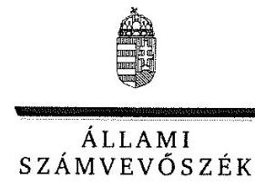

ELNÖK

Ikt.szám: V-1115-184/2016.

# Kugler Gyula László úr 

vezérigazgató
BAKONYKARSZT Víz- és Csatornamű Zrt.

## Veszprém

## Tisztelt Vezérigazgató Úr!

„Az önkormányzatok gazdasági társaságai - Az önkormányzatok többségi tulajdonában lévő gazdasági társaságok gazdálkodásának ellenőrzése - BAKONYKARSZT Víz- és Csatornamű Zrt." címmel készített számvevőszéki jelentéstervezetre tett észrevételeit köszönettel megkaptam.
Az Állami Számvevőszék észrevételekre vonatkozó álláspontjáról a felügyeleti vezető által készített részletes tájékoztatást csatoltan megküldöm.
Tájékoztatom Vezérigazgató Urat, hogy a számvevőszéki jelentésben - az Állami Számvevőszékről szóló 2011. évi LXVI. törvény 29. § (3) bekezdése alapján - a figyelembe nem vett észrevételeket a számvevőszéki álláspont indoklásával együtt szerepeltetjük.

Budapest, 2016. november hó 4. nap
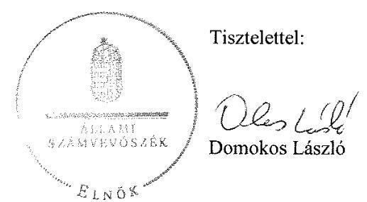

Melléklet: Tájékoztatás az észrevételek kezeléséről

---

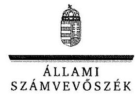

# Tájékoztatás   az észrevételek kezeléséről 

„Az önkormányzatok gazdasági társaságai - Az önkormányzatok többségi tulajdonában lévő gazdasági társaságok gazdálkodásának ellenőrzése - BAKONYKARSZT Víz- és Csatornamű Zrt." című jelentéstervezetre 2016. október 26-án tett (az Állami Számvevőszékhez 2016. november 2-án érkezett) észrevételeit áttekintettük, azok kezelésével kapcsolatban a következő tájékoztatást adom.

## 1. észrevétel - az 1. számú javaslathoz

Az észrevétel a leltározási szabályzattal kapcsolatos hiányosságot (az ingatlanok leltározási gyakorisága meghatározásának hiányát) megerősítette, ezért nem indokolt a jelentéstervezet (sem a megállapítás, sem a javaslat) módosítása.
Köszönjük tájékoztatását a leltározási szabályzat 2016. augusztus 1-jei hatállyal történt módosításáról. A jelentéstervezet módosítása azonban ez alapján sem indokolt, mert az Állami Számvevőszék a jelentésében csak az ellenőrzött időszakra vonatkozóan tesz megállapítást.

## 2. észrevétel - a 2. számú javaslathoz

Az észrevétel az ingatlanok mennyiségi felvétellel történő leltározásával kapcsolatos hiányosságot megerősítette és jelezte, hogy mennyiségi egyeztetésre került sor a 2014. évben a leltározási szabályzatban előírtak szerint, továbbá a 2013. évben a víziközmű szolgáltatásról szóló 2011. évi CCIX. törvény alapján történt vízi közművek önkormányzati tulajdonba háramoltatása során. Az észrevétel szerint az érintett eszközök 2013. január 1-jétől vannak a társaság birtokában mint vagyonkezelt eszközök, így azokat csak a vagyonkezelésbe történő átvételt követő 3. év múlva szükséges leltározni.
Az érintett eszközök az ellenőrzött időszakban folyamatosan szerepeltek a társaság mérlegében (a társaság birtokában voltak), 2013. január 1-jéig saját tulajdonú, attól kezdődően pedig vagyonkezelésbe vett eszközként, ami a mennyiségi felvétellel történő leltározásukat legalább három évenként indokolta volna. A jelentéstervezet a 2012-2014. évekre vonatkozóan az ingatlanok mennyiségi felvétellel történő leltározásának hiányát és az analitikus nyilvántartások egyeztetésével történt leltározás tényét tartalmazta, ezért a kapcsolódó megállapítás és javaslat módosítása nem indokolt.
Köszönjük tájékoztatását a 2015. évi leltározásról, azonban az Állami Számvevőszék a jelentésében csak az ellenőrzött időszakra vonatkozóan tesz megállapítást.

---

Tájékoztatom, hogy a számvevőszéki jelentés függelékeként szerepeltetjük a jelentéstervezethez tett észrevételeit, valamint az azokra adott válaszunkat.

Budapest, 2016. 11. hó 4. nap

Böröcz Imre
felügyeleti vezető

---

# VESZPRÉM MEGYEI JOGÚ VÁROS POLGÁRMESTERE 

Szám: KOZP/10715/2/2016.
Tárgy: számvevőszéki jelentés tervezetre észrevétel

Ellenőrzés iktató száma Önöknél: V-1115-180/2016.

## Állami Számvevőszék Elnöke Domokos László úr részére

## Budapest

Apáczai Csere János u. 10
1052

## Tisztelt Elnök Úr!

Állami Számvevőszéknek „Az önkormányzatok gazdasági társaságai-Az önkormányzatok többségi tulajdonában lévő gazdasági társaságok gazdálkodásának ellenőrzése-BAKONYKARSZT Víz- és Csatornamű Zrt" tárgyú jelentéstervezetét köszönettel megkaptuk. A tervezetben önkormányzatunk számára Javaslatokat nem fogalmaztak meg. A gazdasági társaság részére tett Javaslatokra az alábbi- a társaság vezérigazgatójával való egyeztetés alapján - észrevételeket teszem:

1. Javaslat: Intézkedjen arról, hogy a leltározási szabályzatban az ingatlanok leltározási gyakoriságának meghatározása megfeleljen a jogszabályi előírásoknak.

Társaság a Leltározási Szabályzatát 2016. augusztus 1-i hatállyal módosította, amely így már megfelel a hatályos jogszabályi előírásoknak.
2. Javaslat: Intézkedjen az ingatlanok mennyiségi felvétellel történő leltározásáról a jogszabályi előírásoknak megfelelően.

A tárgyi eszközök közül az ingatlanok mennyiségi leltárának elmulasztásával kapcsolatban szeretném megjegyezni, hogy 2014. évben a formális mennyiségi leltározás valóban nem történt meg, azonban a mennyiségi egyeztetés 2014 évben is megtörtént. Ez ingatlanok esetében tartalmilag megfelel a Társaság leltározási szabályzatában előírtaknak
A vizsgálat megállapítja, hogy a Társaság az egyéb eszközeit, ezen belül az egyéb tárgyi eszközeit megfelelően leltározta, az ingatlanok esetében az egyeztetés megtörtént. A vitatott eszközöknek a Társaság által alkalmazott egyeztetéssel történő leltározása a szabályzatban foglaltaknak megfelelően történt. Társaság analitikus, műszaki nyilvántartásai megbízhatóak, naprakészek, áttekinthetőek.
A Társaság vagyoni eszközeiben, tulajdonviszonyaiban 2013.01.01-i hatállyal jelentős változás következett be. A Társaság vízi közművei „a víziközmű-szolgáltatásról" szóló 2011. évi CCIX. sz. törvény alapján az Ellátásért Felelős önkormányzatok tulajdonába háramlott. A háramoltatás során ezen eszközöket a Társaság műszaki nyilvántartásai alapján tételesen egyeztette, és adta át. Az eszközök a nyilvántartásból kivezetésre kerültek. A törvény

---

alapján, ugyanezen eszközök a kivezetéskor érvényes nettó értéken 2013.01.01. hatállyal, mint vagyonkezelt eszközök, bevételezésre kerültek úgy, hogy a korábbi nettó érték az eszköz új bruttó értéke lett, a törvényi szabályozásnak megfelelően.
Az eszközöknek fenti változása, ha formailag nem is, tartalmilag teljesen megfelel a leltározás követelményének. Ezen eszközök az egyes önkormányzatokkal kötött vagyonkezelési szerződésekben tételesen szerepelnek. Így ha ezt tekintjük a társaság ingatlan eszközeinek leltározásának, annak szigorúbban is megfelel, tekintve hogy szerződésben rögzítetten is megjelent.
Fontos kiemelni, hogy 2013 évben a leltározásnál szigorúbb, kiterjedtebb tevékenységet végzett a Társaság a vitatott ingatlanok létezésével, értékelésével kapcsolatosan. A 2013. január 1.-i háramoltatás tartalmilag, mint külső megerősítés is alátámasztotta a vitatott ingatlanok létezését, könyvszerinti értékét is. A vitatott eszközök háramoltatása jogilag azt jelenti, hogy 2013.01.01. óta vannak a Társaság birtokában, mint vagyonkezelt eszközök, így a vitatott eszközöket az ezt követő 3. év múlva szükséges leltározni.
Társaságunk a vízi közművek vagyonértékelésére vonatkozóan 2015. december 31-i határnapot jelölte ki, mint az ingatlanvagyon leltározásának fordulónapját. A vagyonértékelés végső határideje 2015. évben törvénymódosítás következtében négy évvel kitolódott 2019. december 31-re. Ettől függetlenül az ingatlanok leltározását 2015. október 31-i fordulónappal elvégeztük. Ezen leltározás során a nyilvántartásban szereplő és a leltározott mennyiség között eltérést nem tapasztaltunk.
Összefoglalás képen ki szeretném emelni, hogy mindezek következtében - bár a Leltározási Szabályzat nem ezt írta elő, de - Társaságunk 2012-ben, 2014-ben és 2015 évben is teljes körű leltározást végezett.

Tisztelt Elnök úr, kérem észrevételeimet szíveskedjen figyelembe venni a végleges jelentés elkészítése során.

Veszprém, 2016. október 26.
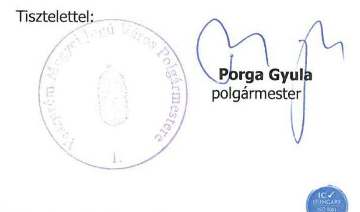

---

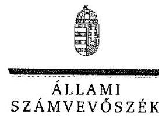

ELKÖK

Ikt.szám: V-1115-187/2016.

# Porga Gyula úr 

polgármester

Veszprém Megyei Jogú Város Önkormányzata

## Veszprém

## Tisztelt Polgármester Úr!

„Az önkormányzatok gazdasági társaságai - Az önkormányzatok többségi tulajdonában lévő gazdasági társaságok gazdálkodásának ellenőrzése - BAKONYKARSZT Víz- és Csatornamű Zrt." címmel készített számvevőszéki jelentéstervezetre tett észrevételeit köszönettel megkaptam.
Az Állami Számvevőszék észrevételekre vonatkozó álláspontjáról a felügyeleti vezető által készített részletes tájékoztatást csatoltan megküldöm.
Tájékoztatom Polgármester Urat, hogy a számvevőszéki jelentésben - az Állami Számvevőszékről szóló 2011. évi LXVI. törvény 29. § (3) bekezdése alapján - a figyelembe nem vett észrevételeket a számvevőszéki álláspont indoklásával együtt szerepeltetjük.

Budapest, 2016. november 9. nap
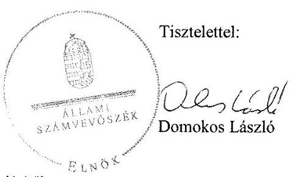

Melléklet: Tájékoztatás az észrevételek kezeléséről

---

# Tájékoztatás   az észrevételek kezeléséről 

„Az önkormányzatok gazdasági társaságai - Az önkormányzatok többségi tulajdonában lévő gazdasági társaságok gazdálkodásának ellenőrzése - BAKONYKARSZT Víz- és Csatornamű Zrt." című jelentéstervezetre 2016. október 26-án kelt, 2016. október 28-án tett (az Állami Számvevőszékhez 2016. november 7-én érkezett) észrevételeit áttekintettük. Az ellenőrzött társaság vezérigazgatója által tett észrevétellel azonos tartalmú polgármesteri észrevételek kezelésével kapcsolatban a következő tájékoztatást adom.

## 1. észrevétel - az 1. számú javaslathoz

Az észrevétel a leltározási szabályzattal kapcsolatos hiányosságot nem vitatta, ezért nem indokolt a jelentéstervezet (sem a megállapítás, sem a javaslat) módosítása.
Köszönjük tájékoztatását a leltározási szabályzat 2016. augusztus 1-jei hatállyal történt módosításáról. A jelentéstervezet módosítása azonban ez alapján sem indokolt, mert az Állami Számvevőszék a jelentésében csak az ellenőrzött időszakra vonatkozóan tesz megállapítást.

## 2. észrevétel - a 2. számú javaslathoz

Az észrevétel az ingatlanok mennyiségi felvétellel történő leltározásával kapcsolatos hiányosságot megerősítette és jelezte, hogy mennyiségi egyeztetésre került sor a 2014. évben a leltározási szabályzatban előírtak szerint, továbbá a 2013. évben a víziközmű szolgáltatásról szóló 2011. évi CCIX. törvény alapján történt vízi közművek önkormányzati tulajdonba háramoltatása során. Az észrevétel szerint az érintett eszközök 2013. január 1-jétől vannak a társaság birtokában mint vagyonkezelt eszközök, így azokat csak a vagyonkezelésbe történő átvételt követő 3. év múlva szükséges leltározni.
Az érintett eszközök az ellenőrzött időszakban folyamatosan szerepeltek a társaság mérlegében (a társaság birtokában voltak), 2013. január 1-jéig saját tulajdonú, attól kezdődően pedig vagyonkezelésbe vett eszközként, ami a mennyiségi felvétellel történő leltározásukat legalább három évenként indokolta volna. A jelentéstervezet a 2012-2014. évekre vonatkozóan az ingatlanok mennyiségi felvétellel történő leltározásának hiányát és az analitikus nyilvántartások egyeztetésével történt leltározás tényét tartalmazta, ezért a kapcsolódó megállapítás és javaslat módosítása nem indokolt.
Köszönjük tájékoztatását a 2015. évi leltározásról, azonban az Állami Számvevőszék a jelentésében csak az ellenőrzött időszakra vonatkozóan tesz megállapítást.

---

Tájékoztatom, hogy a számvevőszéki jelentés függelékeként szerepeltetjük a jelentéstervezethez tett észrevételeit, valamint az azokra adott válaszunkat.

Budapest, 2016. november 17. nap

Böröcz Imre
felügyeleti vezető

---

.

---

# RÖVIDÍTÉSEK JEGYZÉKE 

${ }^{1}$ Társaság
${ }^{2}$ Ötv.
${ }^{3}$ Mötv.
${ }^{4}$ Vksztv.
${ }^{5}$ Szindikátusi Szerződés
${ }^{6}$ Önkormányzat
${ }^{7}$ ÁSZ
${ }^{8}$ ÁSZ tv.
${ }^{9}$ Nvtv.
${ }^{10}$ vagyongazdálkodási terv
${ }^{11}$ Gazdasági Program
${ }^{12}$ energetikai stratégia
${ }^{13}$ Integrált Területi Program
${ }^{14} \mathrm{SZMSZ}_{1-3}$
${ }^{15}$ Alapszabály
${ }^{16} \mathrm{Gt}$
${ }^{17}$ Ptk.
${ }^{18}$ Társaság Közgyűlése
${ }^{19}$ üzemeltetési szerződés
${ }^{20}$ üzemeltetési szerződés
${ }^{21}$ vagyonkezelési szerződés

BAKONYKARSZT Víz- és Csatornamű Zrt.
1990. évi LXV. törvény a helyi önkormányzatokról (hatálytalan: a 2014. évi általános önkormányzati választások napjától)
2011. évi CLXXXIX. törvény Magyarország helyi önkormányzatairól (hatályos:2012. január 1-jétől)
2011. évi CCIX. törvény a víziközmű szolgáltatásról (hatályos: 2011. december 31-től)
a Társaság és az alapításában résztvevő önkormányzatok között 2010. december 8-án megkötött Szindikátusi Szerződés (hatálytalan: 2012. december 5-től)
Veszprém Megyei Jogú Város Önkormányzata
Állami Számvevőszék
2011. évi LXVI. törvény az Állami Számvevőszékről (hatályos 2011. július 1-jétől)
2011. évi CXCVI. törvény a nemzeti vagyonról (hatályos: 2011. december 31-től)

Veszprém Megyei Jogú Város Önkormányzata közép- és hosszú távú vagyongazdálkodási terve (elfogadva: 321/2012. (X.26.) számú határozattal) Veszprém Megyei Jogú Város Önkormányzatának 2011-2014. évekre szóló gazdasági programja (elfogadva 66/2011. (IV. 1.) számú határozattal) Veszprém Megyei Jogú Város 2010-2025 közötti időszakra szóló energetikai stratégiája (elfogadva: 176/2011. (V. 27.) számú határozattal)
Veszprém Megyei Jogú Város 2014-2020 közötti időszakra szóló Integrált Területi Programja (elfogadva 288/2014. (XI. 27.) számú határozattal elfogadva) SZMSZ1: Veszprém Megyei jogú Város Önkormányzata többször módosított szervezeti és működési szabályzata: 29/2010. (VI. 28)/2008. (XI. 14.) számú önkormányzati rendelet (hatályos:2013. január 31-ig)
SZMSZ2: Veszprém Megyei jogú Város Önkormányzata többször módosított szervezeti és működési szabályzata: 1/2013. (I. 31)/2008. (XI. 14.) számú önkormányzati rendelet (hatályos: 2014. október 30-ig)
SZMSZ3: Veszprém Megyei jogú Város Önkormányzata többször módosított szervezeti és működési szabályzata: 39/2014. (X. 31)/2008. (XI. 14.) számú önkormányzati rendelet (hatályos: 2014. október 31-től)
BAKONYKARSZT Víz- és Csatornamű Zrt. Alapszabálya és módosításai
2006. évi IV. törvény a gazdasági társaságokról (hatályos:2014. március 14-ig)
2013. évi V. törvény a Polgári Törvénykönyvről (hatályos: 2014. március 15-től)

BAKONYKARSZT Víz- és Csatornamű Zrt. Közgyűlése
a Társaság és Veszprém Megyei Jogú Város Önkormányzata között az önkormányzati beruházásban megvalósult Veszprém város szennyvízelvezető és -tisztító létesítményeinek üzemeltetésére 2007. január 19-én megkötött szerződés (módosítások:2008. december 1., 2010. április 15., 2012. március 1.)
a Társaság és Veszprém Megyei Jogú Város Önkormányzata között a víziközművek (veszprémi ivóvízhálózat, szennyvízcsatorna hálózat) üzemeltetésére 2012. március 29-én megkötött szerződés és annak 2012. december 21-én kelt (2013. január 1-jétől hatályos) kiegészítése
a Társaság és Veszprém Megyei Jogú Város Önkormányzata között Veszprém szennyvízelvezető és tisztító rendszerének vagyonkezelésére megkötött szerződés

---

${ }^{22}$ javadalmazási szabályzat
${ }^{23}$ Igazgatóság
${ }^{24}$ Ár. tv.
${ }^{25}$ 42/2010. (XII. 17.) számú rendelet
${ }^{26} \mathrm{FB}$
${ }^{27}$ vagyonrendelet ${ }_{1,2}$

[^0]BAKONYKARSZT Víz- és Csatornamű Zrt. Szabályzat a vezető tisztségviselők, felügyelő bizottsági tagok, MT. 188. § (1) bekezdése és a 188/A. (1) bekezdése hatálya alá eső munkavállalók javadalmazásának, valamint a jogviszony megszűnése esetére biztosított juttatások módjának, mértékének elveiről, annak rendszeréről (hatályos 2013. május 21-ig)
BAKONYKARSZT Víz- és Csatornamű Zrt.Szabályzat a vezető tisztségviselők, felügyelő bizottsági tagok, MT. 208. § (1) bekezdése hatálya alá eső munkavállalók javadalmazásának, valamint a jogviszony megszűnése esetére biztosított juttatások módjának, mértékének elveiről, annak rendszeréről (hatályos:2013. május 22-től)
BAKONYKARSZT Víz- és Csatornamű Zrt. igazgatósága
1990. évi LXXXVII. törvény az árak megállapításáról

Veszprém Megyei Jogú Város Önkormányzatának 42/2010. (XII. 17.) számú rendelete a 2011. évi helyi ivóvíz, valamint szennyvízelvezetés, tisztítás díjairól, valamint a vízfogyasztás rendjéről
BAKONYKARSZT Víz- és Csatornamű Zrt. Felügyelő Bizottsága
vagyonrendelet ${ }_{1}$ : Veszprém Megyei Jogú Város Önkormányzatának 22/2010 (VI. 28.) számú rendelete az Önkormányzat vagyonáról, a vagyongazdálkodás és vagyonhasznosítás szabályairól (hatályos 2012. február 23-ig) vagyonrendelet ${ }_{2}$ : Veszprém Megyei Jogú Város Önkormányzatának 6/2012. (II. 24.) számú rendelete az Önkormányzat vagyonáról, a vagyongazdálkodás és vagyonhasznosítás szabályairól (hatályos 2012. február 24-től)
Veszprém Megyei Jogú Város Önkormányzatának Gazdasági Bizottsága (2012. február 23-ig)
Veszprém Megyei Jogú Város Önkormányzatának Tulajdonosi Bizottsága (2012. február 24-től)
2000. évi C. törvény a számvitelről
2009. évi CXXII. törvény a köztulajdonban álló gazdasági társaságok takarékosabb működéséről
BAKONYKARSZT Zrt. számviteli politikája, hatályos 2010. január 1-jétől 2012. december 31-ig;
2013 január 1-jétől 2013. december 31-ig;
2014. január 1-jétől

BAKONYKARSZT Zrt. leltározási szabályzata, hatályos 2006. január 1-jétől 2012. december 31-ig;
2013. január 1-jétől

BAKONYKARSZT Zrt. értékelési szabályzata, hatályos 2006. január 1-jétől 2012. december 31-ig;
2013. január 1-jétől

BAKONYKARSZT Zrt. pénz és értékkezelési szabályzat, hatályos 2011. január 3-tól 2013 január 1-jéig
2013. január 2-től

BAKONYKARSZT Zrt. önköltségszámítási szabályzat, hatályos 2010. január 1-jétől 2012. december 31-ig;
hatályos 2013 január 1-jétől
BAKONYKARSZT Zrt. számlarend, hatályos 2010. január 1-jétől 2012. december 31-ig;
hatályos 2013 január 1-jétől
BAKONYKARSZT Zrt. üzletszabályzata, hatályos 2013. november 7-től
BAKONYKARSZT Zrt. adatvédelmi szabályzata, hatályos 2009. május 1-jétől 2012. július 4-ig,
2012. július 5-től 2012. szeptember 19-ig,

[^0]:    ${ }^{22}$ Igazgatóság
    ${ }^{24}$ Ár. tv.
    ${ }^{25}$ 42/2010. (XII. 17.) számú rendelet
    ${ }^{26} \mathrm{FB}$
    ${ }^{27}$ vagyonrendelet ${ }_{1,2}$

    ${ }^{28}$ Gazdasági Bizottság
    ${ }^{29}$ Tulajdonosi Bizottság
    ${ }^{30}$ Számv. tv.
    ${ }^{31}$ Tak. tv.
    ${ }^{32}$ számviteli politika
    ${ }^{33}$ leltározási szabályzat
    ${ }^{34}$ értékelési szabályzat
    ${ }^{35}$ pénzkezelési szabályzat
    ${ }^{36}$ önköltségszámítási szabályzat
    ${ }^{37}$ számlarend
    ${ }^{38}$ üzletszabályzat
    ${ }^{39}$ adatvédelmi szabályzat

---

|  | 2012. szeptember 20-tól 2013. április 24-ig, 2013. április 25-től |
| :--: | :--: |
| ${ }^{40}$ Avtv. | 1992. évi LXIII. törvény a személyes adatok védelméről és a közérdekű adatok nyilvánosságáról (hatályos: 2011. december 31-ig) |
| ${ }^{41}$ Infotv. | 2011. évi CXII. törvény az információs önrendelkezési jogról és az információszabadságról (hatályos: 2011. július 27-től) |
| ${ }^{42}$ Eisztv. | 2005. évi XC. törvény az elektronikus információszabadságról (hatályos: 2011. december 31-ig) |
| ${ }^{43}$ Vksztv. vhr. | 58/2013. (II. 27.) Korm. rendelet a víziközmű-szolgáltatásról szóló 2011. évi CCIX. törvény egyes rendelkezéseinek végrehajtásáról (hatályos 2013. március 1-jétől) |
| ${ }^{44}$ árképzési szabályzat | a Társaság árszabályzata (hatályos 2010 január 1-jétől) |
| ${ }^{45}$ Tao. tv. | 1996. évi LXXXI. törvény a társasági adóról és az osztalékadóról (hatályos 1997. január 1-jétől) |
| ${ }^{46}$ hátralékkezelési szabályzat | a Társaság hátralékkezelési szabályzata (hatályos 2012. október 1-jétől) |
| ${ }^{47}$ Ebktv. | 2003. évi CXXV. törvény az egyenlő bánásmódról és az esélyegyenlőség előmozdításáról |

---

# ÁLLAMI SZÁMVEVŐSZÉK 

1052 Budapest, Apáczai Csere János utca 10.
Levélcím: 1364 Budapest 4. Pf. 54
Telefon: +36 14849100 Telefax: +36 14849200
www.asz.hu