# Jelentés 

## Az önkormányzatok gazdasági társaságai

Az önkormányzatok többségi tulajdonában lévő gazdasági társaságok gazdálkodásának ellenőrzése - „Kittenberger Kálmán" Növény és Vadaspark Szolgáltató Közhasznú Nonprofit Kft. 2016.

---

# Jelentés 

## Az önkormányzatok gazdasági társaságai

Az önkormányzatok többségi tulajdonában lévő gazdasági társaságok gazdálkodásának ellenőrzése - „Kittenberger Kálmán" Növény és Vadaspark Szolgáltató Közhasznú Nonprofit Kft. 2016. decemler hó 22. nap
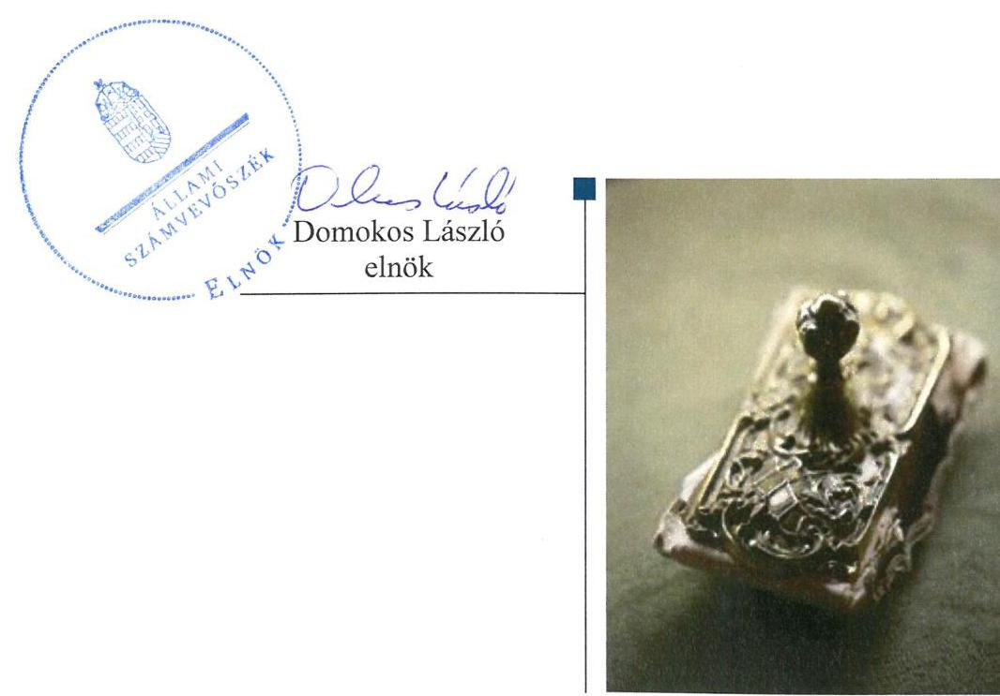

---

# AZ ELLENŐRZÉST FELÜGYELTE: 

BÖRÖCZ IMRE felügyeleti vezető

## AZ ELLENŐRZÉST VEZETTE ÉS A VÉGREHAJTÁSÁÉRT FELELŐS:

KORSÓSNÉ VIGH ANDREA ellenőrzésvezető

## A PROGRAM ÖSSZEÁLLÍTÁSÁÉRT FELELŐS:

JANIK JÓZSEF LÁSZLÓ osztályvezető

IKTATÓSZÁM: V-1117-143/2016

TÉMASZÁM: 2151

## ELLENŐRZÉS-AZONOSÍTÓ SZÁM: V070782

Jelentéseink az Országgyúlés számítógépes hálózatán és az Interneten a www.asz.hu címen is olvashatóak.

---

# TARTALOMJEGYZÉK 

■ ÖSSZEGZÉS ..... 5
■ AZ ELLENŐRZÉS CÉLJA ..... 7
■ AZ ELLENŐRZÉS TERÜLETE ..... 8
■ AZ ELLENŐRZÉS HÁTTERE, INDOKOLTSÁGA ..... 10
■ A JELENTÉS LÉNYEGES KÉRDÉSKÖREI ..... 11
■ ELLENŐRZÉS HATÓKÖRE ÉS MÓDSZEREI ..... 12
■ MEGÁLLAPÍTÁSOK ..... 14
■ JAVASLATOK ..... 30
■ MELLÉKLETEK ..... 33
I. sz. melléklet: Értelmező szótár ..... 33
■ FÜGGELÉK: ÉSZREVÉTELEK ..... 37
■ RÖVIDÍTÉSEK JEGYZÉKE ..... 49

---

.

---

# ÖSSZEGZÉS 

Veszprém Megyei Jogú Város Önkormányzata szabályszerűen szervezte meg a közfeladat ellátást és gyakorolta a tulajdonosi jogokat. A „Kittenberger Kálmán" Növény és Vadaspark Szolgáltató Közhasznú Nonprofit Kft. vagyongazdálkodása szabályszerű volt. Kötelezettségállománya a beruházásokkal összefüggésben növekedett, nem veszélyeztette a müködést, illetve a feladatellátást. A bevételek elszámolása megfelelő volt, a költségek és ráfordítások elszámolása nem volt megfelelő a közhasznú és vállalkozási tevékenység szerinti elkülönített nyilvántartás hiánya miatt.

## Az ellenőrzés társadalmi indokoltsága

Az Állami Számvevőszék kiemelt célja, hogy a helyi önkormányzatok gazdálkodásában rejlő pénzügyi kockázatok feltárásával, az államháztartáson kívülre nyújtott költségvetési támogatások és ingyenes vagyonjuttatások, valamint az államháztartáson kívül múködő feladat-ellátó rendszerek ellenőrzéseivel hozzájáruljon ahhoz, hogy a közpénzeket az államháztartáson kívül múködő szervezetek is átlátható, rendezett módon használják fel.

Magyarországon az intézmény-centrikus közfeladat-ellátás jellemző, de egyre jelentősebb a költségvetésen kívüli feladatellátás térnyerése. Ennek legfontosabb szereplői - a nonprofit szervezetek mellett - az önkormányzati tulajdonú gazdasági társaságok. Az önkormányzatok szervezetalakítási szabadságának következménye, hogy a korábban is vállalati formában múködő közszolgáltatások mellett, mind a kötelező, mind az önként vállalt feladatok ellátásában a gazdasági társaságok kiemelt fontosságú szerephez jutottak.

## Főbb megállapítások, következtetések, javaslatok

Az Önkormányzat a kulturális szolgáltatással és turizmussal kapcsolatos önként vállalt közfeladataként a növény- és állatkert, természetvédelmi terület múködtetését az ellenőrzött időszakot megelőzően szervezte meg, annak ellátásáról a 97,5\%-os tulajdonában lévő gazdasági társasága útján gondoskodott. A közfeladat ellátás részletes szabályait az Önkormányzat és a Társaság közötti szerződésekben - Társasági Szerződésben, Közhasznú Szerződésben, Támogatási Megállapodásban - rögzítették. Az Önkormányzat a jogszabályokban, a Társasági Szerződésben és a vagyonrendeletben meghatározott előírásoknak megfelelően gyakorolta a tulajdonosi jogokat, a Társaságot a gazdálkodás helyzetéről minden évben beszámoltatta, a folyósított támogatásról elszámoltatta, továbbá az FB-n keresztül ellenőrizte.

A Társaság a 2011-2014. években az Önkormányzat által a Társasági Szerződésben előírt éves üzleti terveket elkészítette, amelyeket az Önkormányzat támogatott. A Társaság a közfeladat ellátáshoz kapcsolódó, jogszabályban előírt szabályzatok többségével rendelkezett, az ügyvezető azonban nem készítette el a leltározási szabályzatot és a kötelező közzétételi kötelezettség teljesítésének részletes rendjét előíró belső szabályzatot. A közhasznú és vállalkozási tevékenységhez kapcsolódó bevételek és ráfordítások egyértelmú elhatárolásához, elkülönült nyilvántartásához szükséges előírásokat belső szabályzatban nem határozta meg. A Számviteli Politika jogszabályi változások miatt indokolt aktualizálásáról nem gondoskodott.

A Társaság a könyvviteli mérlegben kimutatott saját vagyon állományát évente teljes körú leltárral alátámasztotta, vagyonkezelt eszközzel nem rendelkezett. Az ingatlanok, gépek, berendezések, felszerelések, jármúvek, befejezetlen beruházások mérlegsorokon kimutatott eszközöket a Társaság a 2012-2014. években az analitikus nyilvántartásokkal való egyeztetéssel leltározta, így a 2012-től törvényben előírt, legalább háromévenkénti mennyiségi felvétellel történő leltározási kötelezettségnek nem tettek eleget.

A vagyon értékének megőrzése, gyarapítása, hasznosítása az előírásoknak megfelelően történt. Az ellenőrzött időszakban a Társaság vagyona folyamatosan nőtt, meghatározóan a tárgyi eszközöknél, a 2014. évben megvalósuló

---

EU projekt eredményeként. A vagyonváltozást eredményező döntésekhez, szerződésekhez, a saját vagyon megterheléséhez az előírt esetekben rendelkeztek a tulajdonosi hozzájárulással. A Társaság saját tőkéje a nyereséges gazdálkodás, továbbá a 2014. évi EU projekt kapcsán az Önkormányzat tőkeemelése hatására emelkedett, az ellenőrzött időszakban a jogszabályban előírt mértéknek megfelelt. A hosszú lejáratú kötelezettségek növekedését a felvett beruházási és fejlesztési hitel eredményezte, a kötelezettségek állománya nem veszélyeztette a feladatellátást, illetve a múködést.

Beszámolási és adatszolgáltatási, valamint az éves beszámolók letétbe helyezési és közzétételi kötelezettségének a Társaság szabályszerűen eleget tett. A Társaságra kötelezően előírt, az egyes szervezeti, személyzeti, valamint gazdálkodási adatokra vonatkozó közzétételi kötelezettségeit az ügyvezető hiányosan teljesítette.

A bevételek elszámolása megfelelt a jogszabályi előírásoknak, a közhasznú és vállalkozási tevékenység szétválasztására vonatkozó szabályok érvényesültek. Az anyagjellegú ráfordítások elszámolása nem volt megfelelő a közhasznú és vállalkozási tevékenység nyilvántartásokban való elkülönítésének hiánya miatt. A beruházások, felújítások elszámolása megfelelő volt.

A könyvvizsgáló az éves beszámolókat hitelesítő záradékkal látta el, a Társaság felé a könyvvizsgálói jelentésekben nem jelezte a leltározási szabályzat hiányát, az ingatlanok, gépek, berendezések, felszerelések, járművek, befejezetlen beruházások leltározási módjának a jogszabályi előírástól való eltérését, valamint a közhasznú és vállalkozási tevékenység ráfordításai elkülönített nyilvántartásának hiányát.

Az ÁSZ a Társaság ügyvezetőjének fogalmazott meg javaslatokat, amelyek alapján köteles intézkedési tervet öszszeállítani és azt a jelentés kézhezvételétől számított 30 napon belül az ÁSZ részére megküldeni.

---

# AZ ELLENŐRZÉS CÉLJA 

AZ ELLENŐRZÉS CÉLJA annak értékelése volt, hogy az önkormányzat vagyongazdálkodási tevékenysége során szabályszerűen gyakorolta-e tulajdonosi jogait; a gazdasági társaság szabályozottsága, gazdálkodása és vagyongazdálkodási tevékenysége, bevételeinek és ráfordításainak elszámolása megfelelt-e a jogszabályi és tulajdonosi előírásoknak; a gazdasági társaság kötelezettségállománya jelentett-e kockázatot a múködésre, valamint a gazdálkodás átláthatósága és elszámoltathatósága érdekében biztosítva volt-e a szolgáltatás dijának megalapozottsága szabályszerű önköltségszámítással.

---

# AZ ELLENŐRZÉS TERÜLETE

## „Kittenberger Kálmán” Növény és Vadaspark Szolgáltató Közhasznú NKft. és a többségi tulajdonos Veszprém Megyei Jogú Város Önkormányzata

**A TÁRSASÁGOT**1 1958-ban alapították Kittenberger Kálmán Állatkert néven. A Kittenberger Kálmán Növény és Vadaspark Szolgáltató Közhasznú Nonprofit Korlátolt Felelősségű Társaság elődje 2009. május 26-án alakult, Kittenberger Kálmán Növény és Vadaspark Szolgáltató Kiemelten Közhasznú Nonprofit Korlátolt Felelősségű Társaság néven és egészen 2014. május 29-ig ezen a néven működött.

A Kittenberger Nkft.2 tulajdonosa az ellenőrzött időszakban 97,5%-os tulajdonosi aránnyal Veszprém Megyei Jogú Város Önkormányzata, 2,5%-os aránnyal 2011-ben a Veszprém Megyei Önkormányzat, 2012-től a Magyar Állam volt. Az Önkormányzat3 a 2014. évben kezdeményezte a Magyar Állam tulajdonában lévő üzletrész Önkormányzat részére történő térítésmentes átadását a Kittenberger Nkft.-ben meginduló további fejlesztések eredményes megvalósulása, illetve a döntési mechanizmusok hatékonyabbá tétele érdekében. A Kormány 2014. október 10-én kelt határozatában ehhez hozzájárult. A tényleges átadás az ellenőrzött időszakon túl valósult meg.

A Társaság az Mötv.4 13. § (1) bekezdés 7. és 13. pontja szerinti kulturális szolgáltatással és turizmussal kapcsolatos közfeladatokat lát el, fő tevékenységi köre növény-, állatkert, természetvédelmi terület működtetése. Évente 250-300 ezer látogatót fogad.

A Kittenberger Nkft. mérleg főösszege a 2011. évben 1306,3 M Ft volt, ami a 2014. évre 2831,0 M Ft-ra nőtt. A jegyzett tőke 2011-2013 között 431,8 M Ft volt, amit a 2014. évben 450,6 M Ft-ra emeltek. A gazdálkodást jellemző főbb adatokat az 1. ábra szemlélteti.

1. ábra

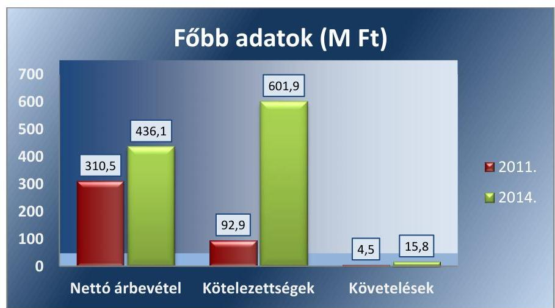

*Forrás: a Társaság éves mérlegjelentései*

---

Az értékesítés nettó árbevételében meghatározó volt a jegyértékesítésből származó bevétel. A kötelezettségek 2014. évi átmeneti növekedése $\mathrm{EU}^{5}$-s fejlesztéssel összefüggésben keletkezett. A követelések között lakossági tartozást nem mutattak ki. A saját tőke 2011. évi 692,1 M Ft-os összegének a 2014. évre 1676,3 M Ft-ra történő emelkedését a tőketartalék emelés okozta. A mérleg szerinti eredmény a 2011. évi 32,3 M Ft-ról a 2014. évre 126,8 M Ft-ra emelkedett. A foglalkoztatottak száma a 2011. évben 51 fő, a 2014. évben 45 fő volt. A Társaság a Veszprémi Turisztikai Közhasznú Nonprofit Kft.-ben rendelkezett tulajdonosi részesedéssel, amelynek nyilvántartási értéke $0,1 \mathrm{M}$ Ft volt. Az ügyvezető személye az ellenőrzött időszakban nem változott.

AZ ÖNKORMÁNYZAT a Kittenberger Nkft.-vel együtt 2014. december 31-én kilenc gazdasági társaságban rendelkezett többségi tulajdonnal. Ezekből a „VKSZ" Veszprémi Közüzemi Szolgáltató Zrt. a közüzemi feladatokkal kapcsolatos tevékenységeket látta el, a Veszprémi Városi Televízió és Lapkiadó Kft. a nevében megjelölt tevékenységet, a „Csarnok" Kft. a Veszprém Aréna működtetését végezte. A Pro Veszprém Városfejlesztési és Befektetés-ösztönző Nonprofit Kft. fő tevékenységi köre épületépítési projekt szervezés. A Veszprémi Turisztikai Közhasznú Nonprofit Kft. turisztikával kapcsolatos tevékenységet látott el. A Pannon TISZK Veszprém Nonprofit Kft. fő feladata szakmai középfokú oktatás volt. A Kolostorok és Kertek Kft. zöldterület kezelésért felelt. A Veszprémi Programiroda Rendezvényszervező Kulturális Szolgáltató Kft. előadó művészeti rendezvények szervezését végezte fő tevékenységeként.

Az Önkormányzatnál a polgármester és a jegyző személye az ellenőrzött időszak alatt nem változott.

---

# AZ ELLENŐRZÉS HÁTTERE, INDOKOLTSÁGA 

Az önkormányzati tulajdonú gazdasági társaságok ellenőrzése kiemelten fontos a vagyon megőrzése, megóvása érdekében, valamint a kormányzati szektor elszámolásaiban megjelenő önkormányzati tulajdonú gazdálkodó szervezetek esetében, amelyekkel szemben alapvető követelmény, hogy gazdálkodásuk, működésük szabályszerű, az általuk szolgáltatott adatok minél megbízhatóbbak legyenek. A közfeladat-ellátás költségeinek, ráfordításainak alakulása, színvonala hatással van a lakosság elégedettségére.

A törvényalkotás számára - az észlelt problémák, szabálytalanságok, vagy egyéb nem kívánatos jelenségek felszínre kerülésével - az ellenőrzés megállapításai segítséget nyújthatnak az államháztartáson kívüli közfel-adat-ellátás értékeléséhez, jogszabályi keretei pontosításához, átláthatóságot biztosító szabályozásához. Meghatározhatóvá válnak az önkormányzati feladatellátásban részt vevő államháztartáson kívüli szervezeteknek az önkormányzat költségvetését, pénzügyi helyzetét is befolyásoló - kockázatai, lehetővé válik ezen kockázatok csökkentése. Ellenőrzéseink feltárhatják, hogy az önkormányzat feladat-ellátási kötelezettségének szabályszerűen tett-e eleget, a feladatellátáshoz rendelt vagyon működtetését az elvárható gondossággal, szabályszerűen szervezte-e meg és a tulajdonosi felügyelete hozzájárult-e a feladatellátáshoz. Az ellenőrzés rávilágíthat arra, hogy a gazdasági társaság a feladat-ellátási, közszolgáltatási szerződésben foglaltak betartásával, a vagyon használatával biztosította-e a szolgáltatás folytatásának feltételeit, a feladat ellátását. Ezzel az ellenőrzöttek és a helyi döntéshozók számára visszajelzést ad feladatszervezési, feladatellátási kockázataikról, alapot ad a meglévő hibák megszüntetéséhez, a jobb feladatellátás biztosításához. Fokozza a fegyelmet, igazolja, hogy lejárt a következmények nélküli ellenőrzések időszaka. Az ÁSZ ${ }^{6}$ értékteremtő rend kialakításához és megőrzéséhez hozzájáruló tevékenysége pozitív hatással van a szervezetről kialakított összkép formálására.

---

# A JELENTÉS LÉNYEGES KÉRDÉSKÖREI 

1. Az önkormányzat közfeladat megszervezéséről szóló döntése, valamint tulajdonosi joggyakorlása szabályszerű volt-e?
2. A gazdasági társaság vagyongazdálkodása szabályszerű volt-e, kötelezettségállománya jelentett-e kockázatot a müködésre, illetve a közfeladat ellátásra?
3. A gazdasági társaságnál az ellátott közfeladat bevételei és ráfordításai elszámolása, valamint az önköltségszámítás és árképzés szabályszerű volt-e?

---

# ELLENŐRZÉS HATÓKÖRE ÉS MÓDSZEREI 

## Az ellenőrzés típusa

Megfelelőségi ellenőrzés.

## Az ellenőrzött időszak

Az ellenőrzött időszak 2011. január 1-jétől 2014. december 31-ig terjedő időszak volt.

## Az ellenőrzés tárgya

A gazdasági társaság feletti tulajdonosi joggyakorlás, valamint a gazdasági társaság gazdálkodásának szabályozottsága és szabályszerűsége.

Az ellenőrzés kiterjedt minden olyan körülményre és adatra, amely az ÁSZ jogszabályban meghatározott feladatainak teljesítéséhez, valamint a program végrehajtása folyamán felmerült újabb összefüggések feltárásához volt szükséges.

## Az ellenőrzött szervezet

$\longrightarrow$ „Kittenberger Kálmán" Növény és Vadaspark Szolgáltató Közhasznú NKft.,
$\longrightarrow$ Veszprém Megyei Jogú Város Önkormányzata

## Az ellenőrzés jogalapja

Az ellenőrzés jogszabályi alapját az ÁSZ tv. ${ }^{7}$ 1. § (3) bekezdése és 5. § (3)-(4)-(5) bekezdései képezték.

## Az ellenőrzés módszerei

Az ellenőrzést a nemzetközi standardokat irányadónak tekintve az ellenőrzési program ellenőrzési kérdései, az ellenőrzött időszakban hatályos jogszabályok, az ellenőrzés szakmai szabályok és módszertanok figyelembe vételével végeztük.

Az ellenőrzés ideje alatt az ellenőrzött szervezettel történő kapcsolattartást az ÁSZ Szervezeti és Müködési Szabályzatának vonatkozó előírásai alapján biztosítottuk.

---

Az ellenőrzés a kiválasztott, tulajdonosi jogokat gyakorló önkormányzatra és az ellenőrzött közfeladatot ellátó gazdasági társaságra terjedt ki.

Az ellenőrzési kérdések megválaszolásához szükséges bizonyítékok megszerzése a következő ellenőrzési eljárások alkalmazásával történt: megfigyelés, kérdésfeltevés (információkérés), összehasonlítás, valamint elemző eljárás.

Az ellenőrzést a kérdésekre adott válaszok kiértékelésével, valamint a megjelölt adatforrások, a csatolt tanúsítványok felhasználásával, továbbá az adott időszakban hatályos jogszabályok figyelembe vételével folytattuk le.

A bevételek és ráfordítások elszámolása, valamint a vagyonnyilvántartás terén a szabályszerű működést véletlen mintavétellel ellenőriztük. A mintavétellel ellenőrzött területek esetében minden egyes tétel vonatkozásában a szabályszerűségre vonatkozó kérdéseket tettünk fel, amelyek eredménye összesítésre került. A jogszabályoknak és a belső előírásoknak megfelelőnek tekintettük az adott területet, amennyiben a minta ellenőrzésének eredménye alapján 95\%-os bizonyossággal a teljes sokaságban a hibaarány kisebb volt, mint 10\%, nem megfelelőnek, ha a hibaarány a 10\%ot meghaladta. Részben megfelelő minősítést adtunk, amennyiben egy adott terület vonatkozásában a minta alapján a teljes sokaságban nem volt egyértelműen biztosított a jogszabályoknak és a belső szabályzatoknak megfelelő működés. A ráfordítások elszámolására és a vagyonnyilvántartásra vonatkozó véletlen mintavételt kockázati alapú kiválasztással egészítettük ki, amelynek során a három legnagyobb összegű tételt választottuk ki.

---

# 1. Az önkormányzat közfeladat megszervezéséről szóló döntése, valamint tulajdonosi joggyakorlása szabályszerű volt-e? 

Összegző megállapítás

Az Önkormányzat a közfeladat megszervezéséről az ellenőrzött időszakot megelőzően döntött, a tulajdonosi joggyakorlás szabályszerű volt.

### 1.1. számú megállapítás

A közfeladat-ellátás megszervezésére vonatkozó önkormányzati döntés az ellenőrzött időszakot megelőzően történt. A feladat megszervezése a 2011-2014. években szabályszerű volt.

GAZDASÁGI PROGRAMMAL ${ }^{8}$ az Önkormányzat rendelkezett az Ötv. ${ }^{9}$ 91. § (6) bekezdésében előírtaknak megfelelően a 2011-2014. évekre vonatkozóan, amelyet a Közgyűlés ${ }^{10}$ jóváhagyott. A gazdasági program kulturális turizmus fejlesztése célkitúzés keretében megfogalmazták a Kittenberger Nkft.-vel kapcsolatos fejlesztési elképzeléseket, valamint az állatállomány bővítését.

KÖZÉP- ÉS HOSSZÚ TÁVÚ VAGYONGAZDÁLKODÁSI TERVÉT ${ }^{11}$ az Önkormányzat az Nvtv. ${ }^{12}$ 9. § (1) bekezdése alapján elkészítette. Ebben a Kittenberger Nkft.-t érintő fejlesztés az Elefántházhoz kapcsolódott. A vagyongazdálkodási tervben megfogalmazott célkitűzések megvalósítását a 2013. és a 2014. évben, a következő évi vagyongazdálkodási irányelvek Közgyűlés elé terjesztése keretében értékelték. Ekkor fogalmazták meg a Kittenberger Nkft. Magyar Állam tulajdonában lévő törzsbetétjének megszerzésére irányuló igényt.

A Kittenberger Nkft. fejlesztésével kapcsolatosan célokat - különleges elemek létrehozásával attraktív, idegenforgalmat is vonzó bemutatóhely megteremtését - tartalmazott még az Önkormányzat Integrált Területi Programja ${ }^{13}$.

A FELADATELLÁTÁST - kulturális szolgáltatással és turizmussal kapcsolatos közfeladatként a növény- és állatkert, természetvédelmi terület működtetését - az Önkormányzat az ellenőrzött időszakot megelőzően szervezte meg. A feladatellátás módja nem változott, azt az Önkormányzat SZMSZ ${ }^{14}$-e értelmében önként vállalt feladatként a Kittenberger Nkft. útján látta el, amelyben minősített befolyást biztosító részesedéssel rendelkezett. A feladatellátás módja összhangban volt 2011-ben az Ötv. 9. § (4) bekezdése, illetve 2012-től az Mótv. 41. § (6) bekezdés előírásával.

AZ ELLÁTANDÓ FELADATOK KÖRÉNEK MEGHATÁROZÁSA számonkérhető volt. A Társasági Szerződés ${ }^{15}$ nevesítette a Taggyűlés, az ügyvezetés, az $\mathrm{FB}^{16}$ feladatait. A Társaság feladatellátással

---

kapcsolatos naturális, pénzügyi adatait pedig az éves üzleti tervek tartalmazták.

Az Önkormányzat a feladatellátására vonatkozóan a Kittenberger Nkft.vel az ellenőrzött időszakot megelőzően Közhasznú Szerződést ${ }^{17}$ kötött. Ebben rögzítették, hogy az Önkormányzat átadja a korábban, mint intézmény által ellátott közművelődési, nevelési, kulturális feladatokat, továbbá egyes környezetvédelmi, közművelődési, sport feladatokat határozatlan időre, a Társaság pedig átvállalja azokat. A Közhasznú Szerződést határozatlan időre kötötték, az tartalmazta a szerződés felmondásának lehetőségét.

A feladatok ellátása, az EU normák által előírt feltételek biztosítása érdekében az Önkormányzat a Kittenberger Nkft.-vel Támogatási Megállapodást ${ }^{18}$ kötött. A támogatás mértékét (60,0-85,0 M Ft között változó összegben) az Önkormányzat aktuális költségvetési rendelete tartalmazta. A támogatás összegének felhasználásáról készített elszámolást az Önkormányzat minden évben elfogadta.

VAGYONKEZELÉST az Áht. ${ }^{19}$ 105/A. §-a , illetve 2012. január 1től az Mótv. 108. §-a alapján a Kittenberger Nkft. nem végzett. Feladatait saját vagyonával látta el. Az Önkormányzattal egy területhasználati szerződést kötöttek látogatók parkolási lehetőségének biztosítása céljából az ellenőrzött időszakot megelőzően, amit 2010. február 26-án módosítottak. A szerződés két helyrajzi számon lévő önkormányzati ingatlanra vonatkozott. A szerződés időtartama 25 év, a Kittenberger Nkft.-t díjfizetési kötelezettség nem terheli. A terület használata során a Kittenberger Nkft. köteles a terület állagmegóvására, tisztántartására, illetve a használati szerződés időtartama alatt jogosult szedni az ingatlan hasznait. A két használatba adott terület az Önkormányzat számviteli nyilvántartásában szerepelt, az Önkormányzat éves leltározása során külön leltározási körzet volt, leltározási kötelezettségüknek évente eleget tettek.

Rendeletalkotási kötelezettséget az Önkormányzat részére a Kittenberger Nkft. feladatellátásával kapcsolatosan jogszabály nem írt elő.
1.2. számú megállapítás

A tulajdonosi jogok gyakorlása a jogszabályi előírások alapján kialakított szabályozás szerint történt.

## A TULAJDONOSI JOGGYAKORLÁS KERETEINEK

KIALAKÍTÁSÁT a Gt. ${ }^{20}$ 11-12. §-aiban, valamint a Ptk. ${ }^{21}$ 3:4. §-ában előírtak szerint a Társasági Szerződésben szabályozták. Az Önkormányzat a Kittenberger Nkft.-ben többségi tulajdoni hányaddal rendelkezett. A Társasági Szerződés módosítása a Taggyúlés ${ }^{22}$ hatáskörébe tartozott. A Társasági Szerződés értelmében a Gt.-ben, illetve a Ptk.-ban meghatározott eseteken túl a Taggyúlés hatáskörébe tartozott többek között olyan jogügylet megkötésének előzetes jóváhagyása, amely esetben a kötelezettségvállalás nettó értéke meghaladja a törzstőke $1 / 4$-ét, a $25,0 \mathrm{M}$ Ft-ot meghaladó hitelfelvétel engedélyezése, a Társaság tulajdonában lévő ingatlan eladásának engedélyezése.

Önkormányzati részről a gazdasági társaságok feletti tulajdonosi joggyakorlás szabályait, gyakorlásának rendjét - annak módját, feltételeit, a döntésekkel kapcsolatos folyamatokat - az Önkormányzat a vagyonrendeletben ${ }^{23}$ szabályszerűen határozta meg. A tulajdonosi jogok gyakorlása - a

---

vagyonrendelet előírása szerint - az Önkormányzat részvételével múködő gazdasági társaság esetében megoszlott a Közgyűlés, a Gazdasági ${ }^{24}$, illetve a Tulajdonosi ${ }^{25}$ Bizottság, valamint a polgármester között. A Közgyűlés állást foglalt többek között a Társasági Szerződés módosításáról, az alaptőke felemelésről, leszállításról. A Gazdasági, illetve Tulajdonosi Bizottság állást foglalt a számviteli törvény szerinti beszámoló jóváhagyásáról, és az üzleti tervről. A vagyongazdálkodási döntések megalapozására vonatkozó szabályokat is a vagyonrendeletben rögzítette az Önkormányzat.

Az Önkormányzat, mint a Kittenberger Nkft. többségi tulajdonosa a Taggyűlésben 97,5\% szavazati aránnyal rendelkezett. A tulajdoni arányokra tekintettel a háromtagú FB-ben két főt az Önkormányzat delegált. Így a társaság legfőbb szervénél és az FB-ben az Önkormányzat képviselete biztosított volt. A képviseletre jogosultak feladataikat a Gt., illetve Ptk. alapján látták el, az Önkormányzat részéről további követelményt nem határoztak meg.

Az Önkormányzat monitoring tevékenysége a Kittenberger Nkft. üzleti tervének és éves beszámolójának elfogadására, a Támogatási Megállapodásban előírt adatszolgáltatási kötelezettségre terjedt ki. Évközi beszámoló készítésére, értékelésre vonatkozóan előírás nem volt, továbbá mint nonprofit társaságra vonatkozóan külön tájékoztatási kötelezettséget nem határoztak meg. Az Önkormányzat a Kittenberger Nkft. vonatkozásában tulajdonosi jogosítványokat nem adott át.

Az árképzésre vonatkozóan jogszabályi előírás nem volt és az Önkormányzat sem határozott meg szabályokat. A szolgáltatási ár az állatkerti belépők árát jelentette, amelyet a Kittenberger Nkft. határozott meg, figyelembe véve a kereslet és a környező, hasonló létesítmények belépőjegyeinek árát.

A TULAJ DONOSI JOGGYAKORLÁS szabályszerű volt. A Társasági Szerződést az ellenőrzött időszakban többször módosították a Magyar Állam képviseletében eljáró személyének módosulása, az ügyvezető újraválasztása, a közhasznúsággal kapcsolatos jogszabályi változások, valamint a gazdasági társaságokat szabályozó törvényi változások következtében, továbbá a 2014. évben a törzstőke 18,8 M Ft-os emelése miatt. A Közgyűlés a Társasági Szerződés módosításait megtárgyalta, azokat határozatával támogatta és felhatalmazta a polgármestert a határozatban rögzítettek Taggyűlésen való képviseletére. A Kittenberger Nkft. által megvalósított fejlesztések esetében a vagyonrendeletben előírtaknak megfelelően rendelkeztek a Közgyűlés hozzájárulásával. A Kittenberger Nkft. a 2011-2014. években ingatlant nem értékesített, erre vonatkozóan előterjesztés nem volt.

A FELÜGYELŐBIZOTTSÁG létszáma a Gt. 34. § (1) bekezdés és a Tak. tv. ${ }^{26}$ 4. § (2) bekezdés előírásának megfelelő volt, három tagból állt. Az FB minden évben elfogadta munkatervét. Minden évben megtárgyalta és véleményezte többek között az üzleti tervet, a számviteli beszámolót, az ügyvezető prémium feltételeinek kiírását, teljesítését. Az FB munkaterve alapján ellenőrzéseket is végzett (pl.: fejlesztések állapotáról, állatkertek közötti állatcseréről). Az FB ülésein készült jegyzőkönyveket az Önkormányzathoz eljuttatták, így az FB által tett megállapítások rendelkezésre álltak.

---

A KÖNYVVIZSGÁLÓ alkalmazására a Kittenberger Nkft. a Számv. tv. ${ }^{27}$ 155. §-a alapján kötelezett volt, amelynek az ellenőrzött időszakban eleget tett. A könyvvizsgáló a 2011-2014. évi éves beszámolókhoz hitelesítő záradékot tartalmazó véleményt adott.

A BESZÁMOLTATÁSI RENDSZERT az Önkormányzat megfelelően múködtette. A Társaságot a gazdálkodás helyzetéről minden évben beszámoltatta. Az ügyvezető értékelte a múködésüket befolyásoló külső és belső körülményeket, a fejlesztések alakulását, az eredmény alakulására ható okokat. A vagyonrendeletben előírtak szerint a Gazdasági, illetve Tulajdonosi Bizottság a beszámolókat megtárgyalásukat követően határozatával a Taggyúlésnek elfogadásra ajánlotta, az FB, valamint a könyvvizsgáló írásos véleményének birtokában a Gt. 35. § (3) bekezdése, illetve a Ptk. 3:120 § (2) bekezdésében előírtaknak megfelelően.

ÜZLETI TERV készítési kötelezettséget a Társasági Szerződés előírt, amelynek elfogadása a Taggyúlés hatáskörébe tartozott. Az üzleti terveket az Önkormányzat részéről a vagyonrendelet előírásának megfelelően a Gazdasági, illetve Tulajdonosi Bizottság megtárgyalta, határozatával a Taggyúlés számára elfogadásra javasolta.

BELSŐ ELLENŐRZÉS a Kittenberger Nkft.-nél nem volt, az Önkormányzat külső szakértőt sem bízott meg ellenőrzéssel. Az Önkormányzat belső ellenőrzési osztálya minden évben összeállította belső ellenőrzési tervét a kockázatelemzés alapján felállított prioritások, valamint a belső ellenőrzés rendelkezésére álló erőforrások figyelembevételével. A kockázatelemzés kiterjedt azokra a gazdasági társaságokra is, ahol az Önkormányzat többségi tulajdonos volt. A Társaság gazdálkodását és múködését az önkormányzati belső ellenőrzés kockázatelemzése egyik évben sem minősítette magas kockázatúnak, így a Kittenberger Nkft. belső ellenőrzése a munkatervekben nem szerepelt, arra nem került sor.

# A KÖZHASZNÚ TEVÉKENYSÉG EREDMÉNYÉRE vo- 

natkozó előírásokat betartották. A Kittenberger Nkft. eredménnyel zárta az ellenőrzött időszakban az üzleti éveit, amely nem került felosztásra a Közhasznú tv. ${ }^{28}$ 14. § (1) bekezdése, illetve 2012. évtől a Civil. tv. ${ }^{29}$ 34. § (1) bekezdés c) pontja előírásainak megfelelően. A mérleg szerinti eredmény az eredménytartalékba került a Számv. tv. 37. § (1) bekezdés a) pontjának előírása és az ezzel összhangban lévő taggyúlési határozatok szerint.

A 2011-2014. években a Társaság saját tőkéje nem csökkent a Gt. 143. § (2), illetve a Ptk. 3:189. § (1) bekezdésében meghatározott jegyzett tőke szintje alá, így a tulajdonosokat visszapótlási kötelezettség nem terhelte.

A Kittenberger Nkft. mérleg szerinti eredményének alakulását a 2011-2014. években a 2. ábra mutatja.

---

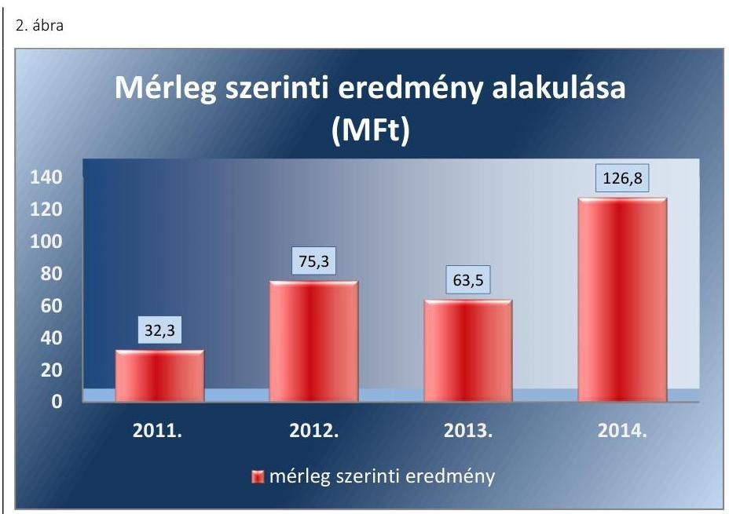

*Forrás: egyszerűsített éves beszámolók*

A mérleg szerinti eredmény 2014. évi jelentős mértékű emelkedését a jegyértékesítésből származó bevételek, valamint az Önkormányzattól kapott támogatás növekedése eredményezte.

Az Önkormányzatnak a Kittenberger Nkft. kötelezettségvállalásához kapcsolódó garancia-, illetve kezességvállalása nem volt.

## 2. A gazdasági társaság vagyongazdálkodása szabályszerű volt-e, kötelezettségállománya jelentett-e kockázatot a működésre, illetve a közfeladat ellátásra?

|  Összegző megállapítás | A Társaság gazdálkodásának belső szabályait a leltározás, valamint a közhasznú és vállalkozási tevékenység számviteli szétválasztási szabályai kivételével kialakították. A vagyongazdálkodás – a leltározás módjában feltárt hiányosság kivételével – szabályszerű volt, a kötelezettségállomány nem veszélyeztette a működést, illetve a feladatellátást. Beszámolási kötelezettségének szabályszerűen eleget tett.  |
| --- | --- |
|  2.1. számú megállapítás | A Kittenberger Nkft. a gazdálkodására vonatkozó, jogszabályok által előírt szabályzatokkal a leltározási szabályzat kivételével rendelkezett, azonban a közhasznú és vállalkozási tevékenység elkülönített nyilvántartását nem szabályozta és a Számviteli Politika aktualizálása az ellenőrzött időszakban nem történt meg.  |

**ÜZLETI TERV** készítési kötelezettséget a Társasági Szerződés írt elő, amelynek az ellenőrzött időszakban a Társaság eleget tett. A 2011-2014. évi üzleti tervek tartalmazták a tervezett árbevételt tevékenységenként, a kalkulált ráfordításokat költségnemenként, valamint az adózás előtti eredményben.

---

mény tervezett összegét. Az üzleti terveket, a Taggyúlési jóváhagyást megelőzően az FB, valamint az Önkormányzat részéről a Gazdasági, illetve Tulajdonosi Bizottság megtárgyalta és azokat a Taggyúlés számára elfogadásra javasolta. A Taggyúlés az előterjesztett éves üzleti terveket az ellenőrzés minden évében határozattal elfogadta.

Az SZMSZ ${ }^{30}$ belső ellenőrzésre vonatkozó részei nem voltak összhangban a gyakorlattal, mivel az SZMSZ IV. fejezet 6) pontja szerint „a belső ellenőrzés rendjét a Belső Ellenőrzési Szabályzat tartalmazza", e szabályzatot az SZMSZ V. fejezet 1) pontja is a szabályzatok egyikeként felsorolja, ennek ellenére a Kittenberger Nkft. az ellenőrzött időszakban nem rendelkezett belső ellenőrzési szabályzattal, belső ellenőrt nem foglalkoztatott (erre vonatkozó jogszabályban előírt kötelezettsége nem volt). A Társasági Szerződés 8.7.6 pontjában foglaltak alapján a szervezeti, működési szabályzat elkészítése az ügyvezető feladata, amit a Társasági Szerződés 7.10.30. pontja alapján a Taggyúlés hagy jóvá.

A Kittenberger Nkft. rendelkezett a Számv. tv. 14. § (3)-(4) bekezdéseiben előírt Számviteli Politikával ${ }^{31}$.

A SZÁMVITELI POLITIKA tekintetében törvénymódosítás esetén a változások hatálybalépését követő 90 napon belüli átvezetéséről a Számv. tv. 14. § (11) bekezdés előírása ellenére, továbbá az ellenőrzött időszak egészében az ügyvezető nem gondoskodott:
a 2011. évben a Számv. tv. 60. § (2) szerinti változás, a mérlegben a valutapénztárban lévő valutakészlet, a devizaszámlán lévő deviza, továbbá a külföldi pénzértékre szóló követelések értékelésére vonatkozó szabályok vonatkozásában. Így a számviteli politika ezen eszközöknek a mérlegben történő értékelésére a Számv. tv. 60. § (2) bekezdés előírásával ellentétes rendelkezéseket tartalmazott;
a 2013. évben a Számv. tv. 3. § (3) bekezdés 3. pont szerint változás, a jelentős összegű hiba értelmezése tekintetében.

# ESZKÖZÖK ÉS FORRÁSOK LELTÁRKÉSZÍTÉSI ÉS 

LELTÁROZÁSI SZABÁLYZATTAL a Számv. tv. 14. § (5) bekezdés a) pontja és az SZMSZ V. pontjának 1) bekezdés előírása ellenére a Kittenberger Nkft. nem rendelkezett, elkészítéséről az ügyvezető nem gondoskodott az ellenőrzött időszakban. Eszközök és források leltárkészítési és leltározási szabályzat hiányában az ügyvezető a Társaság vonatkozásában nem határozta meg a mennyiségi leltárfelvétel gyakoriságát a Számv. tv. 2012-től hatályos 69. § (3) bekezdés előírása ellenére, amely szerint a folyamatosan mennyiségben nyilvántartott eszközök leltározását „az eszközök és források leltárkészítési és leltározási szabályzatában meghatározott időszakonként, de legalább háromévente mennyiségi felvétellel" kell elvégezni.

A könyvvizsgáló a 2011-2014. évi beszámolókhoz kapcsolódó könyvvizsgálói jelentésében nem kifogásolta, hogy a Számv. tv. 14. § (5) bekezdés a) pontjában előírt eszközök és források leltárkészítési és leltározási szabályzatot nem készítették el.

A Számv. tv. 14. § (5) bekezdés b) pontjában előírt eszközök és források értékelési szabályzatát a Számviteli Politika részeként készítették el, továbbá rendelkeztek a Számv. tv. 14.§ (5) bekezdés d) pontja szerint Pénzkezelési szabályzattal ${ }^{32}$. Mindkét szabályozás tartalma megfelelt a

---

Számv. tv. előírásainak. Önköltségszámítás rendjére vonatkozó belső szabályzat készítésére a Számv. tv. 14. § (6) bekezdésének előírása alapján a Kittenberger Nkft. nem volt kötelezett, ilyen szabályzatot nem készített.

A Számviteli Politika mellékleteként a Számv. tv. 161. § (1)-(4) bekezdéseiben előírtaknak megfelelően elkészítették a számlarendet, amely tartalmazta a Kittenberger Nkft. által alkalmazott számlák kijelölését, szöveges számlamagyarázatát, a főkönyv és az analitikus nyilvántartás kapcsolatát, a bizonylati rendet.

A Kittenberger Nkft. a könyvvezetésre és bizonylatolásra vonatkozó részletes belső szabályait úgy alakította ki, hogy azok a Számv. tv. 161/A. §ában előírtak ellenére a beszámoló adatainak közvetlen alátámasztására, a vonatkozó külön jogszabályban - 2011-ben a Közhasznú. tv. 18. § (1) bekezdésében, 2012-2014-ben a 350/2011. (XII. 30.) Korm. rendelet ${ }^{33}$ 1. § (4) bekezdésében foglaltak alapján a közhasznúsági melléklet tekintetében a 12. § (1) és (3) bekezdéseiben - meghatározott adatok rendelkezésre állásához szükséges elkülönített nyilvántartással összefüggésben nem tartalmaztak előírásokat. A Társaság a jogszabályi előírások szerint 2011-ben közhasznú jelentést, 2012-2014-ben közhasznú mellékletet, továbbá a 2011-2014. évi beszámolók kiegészítő melléklete részeként közhasznú eredménykimutatást készített, azonban az ezekben bemutatott közhasznú/nem közhasznú tevékenység számviteli szétválasztásához szükséges szabályokat, alkalmazott módszereket nem határozta meg.

A Társasági Szerződés a Taggyűlés hatáskörébe utalta az ügyvezető és az FB díjazásának megállapítását. A Kittenberger Nkft. az ellenőrzött időszakban rendelkezett a Tak. tv. 5. § (3) bekezdésben előírt, a Taggyűlés által jóváhagyott Javadalmazási Szabályzattal ${ }^{34}$, amely az ügyvezetőre illetve az FB tagjaira vonatkozott. Az FB tagok díjazása az ellenőrzött időszakban nem haladta meg a Tak. tv. 6. § által meghatározott mértéket.

# 2.2. számú megállapítás 

A Kittenberger Nkft. vagyongazdálkodása - a leltározás módjában feltárt hiányosság kivételével - szabályszerű volt.

A Kittenberger Nkft. a feladatát saját eszközeivel látta el, vagyonkezelésbe vett eszköze nem volt.

A Társaság a 2011-2014. évi mérlegben kimutatott eszközök és források állományát teljes körű leltárral alátámasztotta. A leltározás lebonyolításához évente az ügyvezető által kiadott leltározási utasítások és ütemtervek készültek, amelyekben meghatározták a leltározás lefolytatásának feladatait és időpontját, a leltározási körzeteket, a leltározási bizottság személyi összetételét.

Az ingatlanok, gépek, berendezések, felszerelések, jármúvek, befejezetlen beruházások mérlegsorokon kimutatott eszközök állományát a Társaság az ellenőrzött 2011-2014. évek mindegyikében az analitikus nyilvántartásokkal való egyeztetéssel leltározta annak ellenére, hogy a Számv. tv. 2012-től hatályos 69. § (3) bekezdése a mennyiségben kimutatott eszközökre legalább háromévenkénti mennyiségi leltárfelvételi kötelezettséget írt elő.

A könyvvizsgáló a 2012-2014. évi beszámolókhoz kapcsolódó könyvvizsgálói jelentésben nem kifogásolta a Számv. tv. 2012-től hatályos 69. § (3) bekezdés - a mennyiségben kimutatott eszközökre legalább hároméven-

---

kénti mennyiségi leltárfelvételre vonatkozó - előírás megsértését az ingatlanok, gépek, berendezések, felszerelések, járművek, befejezetlen beruházások mérlegsorokon kimutatott eszközök tekintetében annak ellenére, hogy a Társaság ezeket az eszközöket a 2012-2014. évek mindegyikében az analitikus nyilvántartásokkal való egyeztetéssel leltározta.

A bemutatás céljából tartott állatokat minden évben mennyiségi felvétellel leltározták. A Kittenberger Nkft. nemzetközi és hazai szakmai kapcsolatai révén hozzá kihelyezett és általa más állatkertekbe kihelyezett állatokkal is rendelkezett. A más állatkertbe kihelyezett állatok esetében az év végi leltározást a fogadó állatkert végezte, a leltári dokumentációhoz csatolásra kerültek a fogadó állatkertek leltározási nyilatkozatai.

A Kittenberger Nkft. saját vagyona tekintetében a vagyon értékének megőrzése, gyarapítása, hasznosítása az előírásoknak megfelelően történt. Az Önkormányzattal kötött Támogatási Megállapodásban rögzítésre került, hogy az átvett közfeladat ellátása, az állatkert fejlesztése a Társaság rendszeres támogatását teszi szükségessé. A Kittenberger Nkft. részére a 2011. és a 2014. évek között nyújtott támogatásokat szemlélteti a 3. ábra.
3. ábra
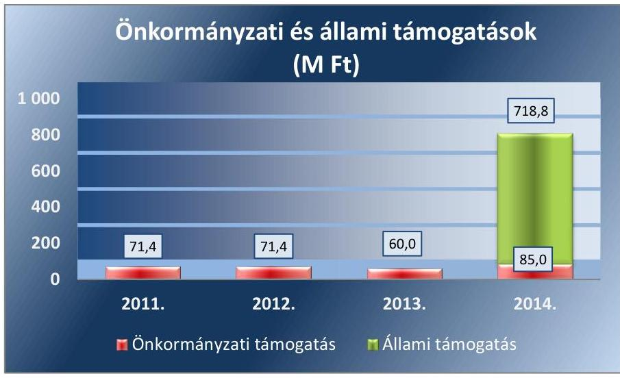

Fonrás: Egyszerüuitett éves beszámolók
AZ ESZKÖZÁLLOMÁNY folyamatosan emelkedett az ellenőrzött időszakban, ezen belül meghatározó a tárgyi eszközök 90\% feletti aránya és jelentős növekedése. Kiemelkedő mértékű a növekedés a 2014. évben a megvalósított EU projekt hatására. A Kittenberger Nkft. eszközállományát mutatja be az 1. táblázat.

1. táblázat

KITTENBERGER NKFT. ESZKÖZÁLLOMÁNYA (M FT)

|  | 2011. | 2012. | 2013. | 2014. |
| :--: | :--: | :--: | :--: | :--: |
| Befektetett eszközök | 1282,9 | 1366,7 | 1552,2 | 2592,1 |
| Ebből: Tárgyi eszközök | 1282,7 | 1366,5 | 1552,0 | 2591,9 |
| Forgóeszközök | 23,0 | 17,4 | 18,1 | 238,5 |
| Készletek | 10,8 | 8,8 | 6,8 | 6,6 |
| Követelések | 4,5 | 4,9 | 7,0 | 15,8 |
| Pénzeszközök | 7,7 | 3,7 | 4,3 | 216,1 |
| Aktív időbeli elhatárolások | 0,4 | 0,6 | 0,3 | 0,4 |
| ESZKÖZÖK ÖSSZESEN | 1306,3 | 1384,7 | 1570,6 | 2831,0 |

---

A tárgyi eszközök állományán belül az ingatlanok (2011-ben 93\%, 2012ben $91 \%, 2013$-ban $86 \%, 2014$-ben $52 \%$ ), illetve 2014. évben a beruházások aránya (42\%) volt a meghatározó. A Kittenberger Nkft. tárgyi eszközei közül az ingatlanok, beruházások változását mutatja be a 4. ábra.
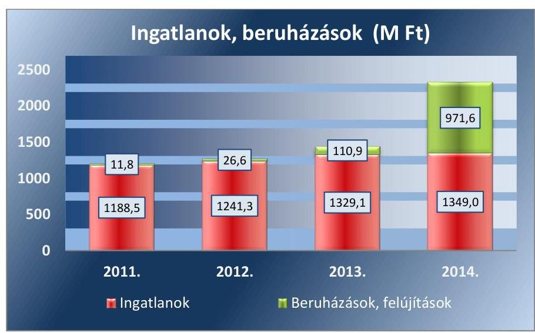

Forrás: Egyszerúsített éves beszámolók
A Kittenberger Nkft. a vagyonváltozást eredményező döntések meghozatalához minden esetben rendelkezett a Taggyűlés hozzájárulásával.

Tulajdonosi jóváhagyást igénylő saját vagyon elidegenítése nem történt az ellenőrzött időszakban. A saját vagyon megterhelésére az EU-s projekt megvalósítása kapcsán került sor a támogatási szerződés megkötéséhez, illetve a biztosítéknyújtáshoz kapcsolódóan, amihez a 11/2014. (I. 24.) taggyűlési határozat alapján a Kittenberger Nkft. tulajdonosi hozzájárulással rendelkezett.

A Taggyűlés hatáskörébe tartozott minden olyan szerződés jóváhagyása, amikor a szerződéses összeg a törzstőke $1 / 4$-ét meghaladta illetve a 25,0 M Ft-nál magasabb összegű hitelfelvétel jóváhagyása, valamint a társaság tulajdonában álló ingatlan eladása. A Társasági Szerződések által előírt esetekben, a Kittenberger Nkft. az előírásoknak megfelelően a fejlesztésekre a Taggyűlés hozzájárulását megszerezte.

A SAJÁT TÖKE összege 692,1 M Ft-ról 1676,3 M Ft-ra növekedett az ellenőrzött időszakban. A Kittenberger Nkft. a 2011-2014. években rendelkezett a Gt. 51. § (1) bekezdésében, valamint a Ptk. 3:133. § (2) bekezdésében előírt jegyzett tőkének megfelelő összegű saját tőkével. A Kittenberger Nkft. saját tőke változását szemlélteti az 5. ábra.

---

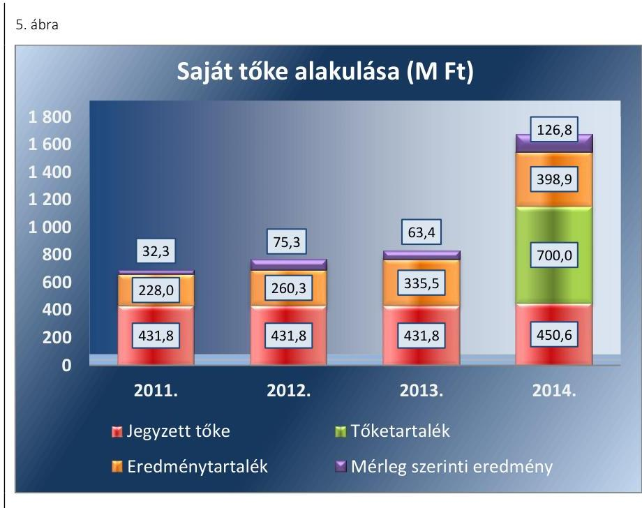

Fornás: Egyszerúsített éves beszámolók
A saját tőke növekedése a nyereséges gazdálkodásnak, illetve 2014. évben az EU projekt megvalósítása kapcsán - az 1052/2014. Korm. határozatban ${ }^{25}$ 718,8 M Ft összegben megítélt felhalmozási célú támogatásból a jegyzett tőke Önkormányzat által történt 18,8 M Ft összegű megemelésének, valamint 700,0 M Ft tőketartalék átadásának az eredménye volt. A Kormány az 1052/2014. Korm. határozat 1. bekezdés (f) pontja szerint döntött - az Önkormányzat feladatainak támogatása keretében - a Kittenberger Nkft. önkormányzati támogatása kiegészítéséről.

# 2.3. számú megállapítás 

A növekvő kötelezettségállomány nem akadályozta a feladatellátást, illetve a múködést.

A KÖTELEZETTSÉGEK állománya a 2011. évi 92,9 M Ft-ról 2014. év végére 601,9 M Ft-ra emelkedett, amelynek évenkénti alakulását mutatja a 2. táblázat.
2. táblázat

KÖTELEZETTSÉGEK ALAKULÁSA (M FT)

|  | 2011. | 2012. | 2013. | 2014. |
| :--: | :--: | :--: | :--: | :--: |
| Hosszú lejáratú kötelezettségek | 9,8 | 2,5 | 126,3 | 100,0 |
| Rövid lejáratú kötelezettségek | 83,1 | 48,8 | 49,4 | 501,9 |
| ebből szállítók | 9,2 | 4,6 | 3,4 | 176,5 |

Fornás: Egyszerúsített éves beszámolók
A hosszú lejáratú kötelezettségek 2013. évi növekedését a felvett beruházási és fejlesztési hitel eredményezte. Az ellenőrzött időszakban a hoszszú lejáratú kötelezettségek esedékes törlesztő részleteit határidőben teljesítették.

A rövid lejáratú kötelezettségek határidőben történő, a szerződésen és jogszabályon alapuló teljesítésének a Kittenberger Nkft. összességében eleget tett. Határidőn túli fizetési kötelezettsége 2014. év kivételével nem volt. A 2014. évben a „ZooEvolúció" EU társfinanszírozású projekt megva-

---

lósítása történt, melynek során a kifizetési kérelmek összeállításának és elfogadásának hosszabb időigénye miatt a határidőben történő fizetés nem valósult meg.

AZ ELADÓSODÁS mértéke, szerkezete - az eladósodottsági mutatók alapján, amelyet a 3. táblázat szemléltet - nem veszélyeztette a feladatellátást, a múködést. A mutatók 2013-2014. évi romlása az EU-s forrásból megvalósuló fejlesztésekhez volt köthető.
3. táblázat

| ADÓSSÁGMUTATÓK ALAKULÁSA |  |  |  |  |  |
| :-- | :--: | :--: | :--: | :--: | :--: |
| Mutató | Referencia | $\mathbf{2 0 1 1 .}$ | $\mathbf{2 0 1 2 .}$ | $\mathbf{2 0 1 3 .}$ | $\mathbf{2 0 1 4 .}$ |
| Eladósodottsági mutató | $<0,6$ | 0,47 | 0,45 | 0,47 | 0,41 |
| Eladósodottság mértéke | $<1$ | 0,13 | 0,07 | 0,21 | 0,36 |
| Nettó eladósodottság | minél kisebb | 0,13 | 0,06 | 0,2 | 0,35 |
| Adósságfedezeti mutató I. | 2,0 | 2,13 | 2,24 | 2,12 | 2,45 |
| Árbevételre vetített eladósodottság | $<1$ | 0,23 | 0,11 | 0,46 | 0,83 |

Az eladósodottsági mutató (idegen tőke/összes forrás) alapján az idegen tőke összes forráson belüli aránya egyik évben sem érte el a kritikus 0,6-os értéket.

Az eladósodottság mértéke (kötelezettség/saját tőke) az ellenőrzött időszakban az elvárt referencia szinten belül volt, a mutató értéke 2013-2014-ben romlott, a saját források csökkenő arányban fedezték a kötelezettségek értékét.

A nettó eladósodottság mutató [(kötelezettségek-követelések)/saját tőke] alapján a kintlévőségekkel csökkentett kötelezettségek aránya nőtt a saját forráshoz képest, a mutató 2013-2014. évi növekedése kedvezőtlen tendenciát mutat.

Az adósságfedezeti mutató I. [(befektetett eszközök + forgóeszközök)/idegen forrás] értéke az ellenőrzött időszakban az elvárt érték körül alakult, a befektetett eszközök és forgóeszközök együttes értéke több mint kétszeresen meghaladta az idegen források értékét. Az ellenőrzött időszak elején 1,0 Ft adósságra 2,13 Ft, a végén 2,45 Ft vagyon jutott.

Az árbevételre vetített eladósodottság mutató [(kötelezettségek - forgóeszközök)/értékesítés nettó árbevétele] értéke az ellenőrzött időszakban az elvárt referencia értéken belül volt, tendenciája az ellenőrzés első két évében kedvező volt, 2013-2014-ben romlott, amit a nagyléptékű fejlesztések és az azokhoz kapcsolódó beruházási hitelfelvételek okoztak.

# 2.4. számú megállapítás 

A Társaság az éves beszámolóit elkészítette, a könyvvizsgálói záradékkal ellátott dokumentumok letétbe helyezése határidőben megtörtént. Közzétételi kötelezettségét hiányosan teljesítette.

A BESZÁMOLÁSI KÖTELEZETTSÉGET a Gt. 19. §, a Ptk. 3:109. § illetve a Civil tv. 46. § (1) bekezdésében foglaltaknak megfelelően szabályozták a Társasági Szerződésben a Tulajdonosok ${ }^{36}$. Meghatározták a Taggyűlés, az ügyvezető, a könyvvizsgáló, valamint az FB beszámoló készítéssel, jóváhagyással kapcsolatos feladatait, jogköreit.

---

A Kittenberger Nkft. a 2011-2014. években az egyszerűsített éves beszámolóját elkészítette, gondoskodott a letétbe helyezésről és a közzétételről a Számv. tv. 153. és 154. §-ai előírásainak megfelelően.

A közhasznúsági jelentést 2011-ben a Közhasznú tv. 19. § (1) bekezdés előírása szerint, 2012-2014-ben a közhasznúsági mellékletet a Civil tv. 46. § (1) bekezdésében foglaltaknak megfelelően beszámolójával egyidejűleg elkészítette, az elfogadott beszámolót letétbe helyezte és közzétette.

A könyvvizsgáló gondoskodott a Számv. tv. 156. § és 157. §-aiban meghatározott könyvvizsgálat elvégzéséről, és az egyszerűsített éves beszámolókat az ellenőrzési időszak minden évére hitelesítő záradékkal látta el.

A Taggyúlés az FB és a könyvvizsgáló írásbeli véleményének birtokában az egyszerűsített éves beszámolókat jóváhagyta.

Az FB és a könyvvizsgáló a Gt. 35. § (4) bekezdésben és a Gt. 44. § (2) bekezdésben, illetve a Ptk 3:120. § (3) bekezdésben a rögzített jogával nem élt, a vagyon védelme érdekében nem kezdeményezték a legfőbb döntést hozó szerv összehívását és nem tettek észrevételt vagy javaslatot a vagyongazdálkodással kapcsolatban.

Az Önkormányzat és a Kittenberger Nkft. között létrejött Közhasznú Szerződés és ahhoz kapcsolódó Támogatási Megállapodás adatszolgáltatási kötelezettséget írt elő a Társaság részére az Önkormányzat által folyósított támogatás felhasználásnak tervezéséről, illetve a folyósított támogatás elszámolásáról. A Kittenberger Nkft. minden év február 28-ig volt köteles beszámolót készíteni az előző évi támogatás összegének felhasználásáról, illetve minden év január 31-ig a tárgyévi fejlesztési célokat, a támogatás felhasználást bemutató tervet készíteni. A beszámoló illetve a terv tartami követelményei nem kerültek meghatározásra. A Kittenberger Nkft. az előírt terv és beszámoló készítési kötelezettségének az ellenőrzött időszakban eleget tett.

# A KÖTELEZŐ KÖZZÉTÉTELI KÖTELEZETTSÉG teljesítésének részletes szabályait az ügyvezető belső szabályzatban nem állapította meg 

- 2011-ben az Eisztv. ${ }^{37}$ 4. § (3) bekezdés előírása ellenére, az Eisztv. 4. § (1) és 6. § (1) bekezdéseiben hivatkozott, az Eisztv. melléklete szerinti általános közzétételi listában meghatározott adatok vonatkozásában;
- 2012-2014-ben az Infotv. ${ }^{38}$ 35. § (3) bekezdés előírása ellenére, az Infotv. 35. § (1) és 37. § (1) bekezdéseiben hivatkozott, az Infotv. 1. melléklete szerinti általános közzétételi listában meghatározott adatok vonatkozásában.
A Kittenberger Nkft. az Infotv. 30. § (6) bekezdésében a közfeladatot ellátó szervekre előírt, a közérdekú adatok igénylésének és közzétételének rendjét rögzítő szabályzatát elkészítette, azzal 2012. január 26-tól rendelkezett.

Az ügyvezető 2011-ben az Eisztv. 4. § (1) bekezdés, 2012-2014-ben az Infotv. 35. § (1) bekezdés előírása ellenére nem gondoskodott az Eisztv. 6. §-ában, illetve az Infotv. 37. § (1) bekezdésében meghatározott általános közzétételi listákon szereplő adatok pontos, naprakész és folyamatos közzétételéről, mert a megadott közzétételi honlap az általános közzétételi listákon szereplő adatok közül nem tartalmazta:

---

$\longrightarrow$ az I. Szervezeti személyzeti adatok közül a közfeladatot ellátó szerv postai címét, telefon- és telefaxszámát, elektronikus levélcímét, honlapját; a közfeladatot ellátó szerv vezetőinek és az egyes szervezeti egységek vezetőinek nevét, beosztását, elérhetőségét (telefonés telefaxszámát, elektronikus levélcímét), valamint a közfeladatot ellátó szerv felett törvényességi ellenőrzést gyakorló szerv adatait;
$\longrightarrow$ a III. Gazdálkodási adatok közül az államháztartás pénzeszközei felhasználásával, az államháztartáshoz tartozó vagyonnal történő gazdálkodással összefüggő, ötmillió forintot elérő vagy azt meghaladó értékű szerződések felsorolását.

# 3. A gazdasági társaságnál az ellátott közfeladat bevételei és ráfordításai elszámolása, valamint az önköltségszámítás és árképzés szabályszerű volt-e? 

Összegző megállapítás

Az ellátott közfeladat bevételeit szabályszerűen számolták el, a ráfordítások elszámolása nem volt a jogszabályi előírásoknak megfelelő.
3.1. számú megállapítás

A bevételek elszámolása megfelelő, a költségek és a ráfordítások elszámolása a közfeladat és a vállalkozási tevékenység szerinti elkülönített nyilvántartás hiánya miatt nem megfelelő volt.

AZ ANYAGJELLEGŰ RÁFORDÍTÁSOK ELSZÁMOLÁSA nem volt megfelelő a közhasznú és vállalkozási tevékenységhez kapcsolódó elkülönített nyilvántartás hiánya miatt.

A 2011-2014. években a költségek és ráfordítások közhasznú és vállalkozási tevékenységhez kapcsolódó - 2011-ben a Közhasznú tv. 18. § (1) bekezdésben, 2012-2014-ben a 350/2011. (XII. 30.) Korm. rendelet 1. § (4) bekezdésében foglaltak alapján a közhasznúsági melléklet tekintetében a 12. § (1) és (3) bekezdéseiben előírt adatok rendelkezésre állása érdekében szükséges - elkülönített nyilvántartása nem valósult meg, a Számv. tv. 161/A. § (2) bekezdés előírása ellenére.

A Kittenberger Nkft. a 2011. évi közhasznúsági jelentésben, illetve a 2012-2014. évi közhasznúsági mellékletekben a költségeit, ráfordításait a közhasznú tevékenység és a vállalkozási tevékenység között, az előzőekben felsorolt tevékenységek árbevételének arányában osztotta meg. A költségek ilyen módon történő megosztását 2011-ben a Közhasznú tv. 18. § (3) bekezdés d) pont előírása csak a közvetett költségek esetén tette lehetővé, a közvetlen költségek esetében nem.

A könyvvizsgáló a 2011-2014. évi beszámolókhoz kapcsolódó könyvvizsgálói jelentéseiben nem kifogásolta, hogy a Társaság a Számv. tv. 161/A. § (2) bekezdés előírása ellenére nem biztosította nyilvántartási (könyvvezetési) rendszerének továbbrészletezésével, hogy abból a vonatkozó külön jogszabályban - 2011-ben a Közhasznú tv.-ben, 2012-től a 350/2011. (XII. 30.) Korm. rendeletben - meghatározott adatok rendelkezésre álljanak.

---

Az anyagjellegú ráfordítások elszámolása során érvényesültek a Számv. tv. 78. § (1)-(4) bekezdései, valamint a Számviteli Politika és a Számlarend előírásai. A költségelszámolást megalapozó dokumentum (szerződés, megrendelés, valamint a ráfordítás elszámolását alátámasztó megfelelő számviteli bizonylat) rendelkezésre állt, a pénzügyi teljesítés a szerződés szerinti összegben, a ráfordítás elszámolása a megfelelő főkönyvi számlára történt.

# AZ ÉRTÉKESÍTÉS NETTÓ ÁRBEVÉTELÉNEK ELSZÁMOLÁSA a jogszabályi előírásoknak megfelelő volt. A bevételek előírása és kiszámlázása a Számv. tv. 72-74. §-ok előírásai betartásával történt. A főkönyvi kivonatok alapján a 9. számlaosztályban a bevételek elkülönítésre kerültek a 91 Közhasznú tevékenység árbevétele és a 92 Vállalkozási tevékenység árbevétele megbontásban. A szabályozásbeli hiányosság ellenére a gyakorlatban a bevételek egyértelmú elhatárolása a közfeladatok és vállalkozási tevékenység tekintetében megtörtént. 

## A BERUHÁZÁSOK, FELÚJÍTÁSOK ELSZÁMOLÁSA

megfelelő volt. A kötelezettségvállalás, a pénzügyi elszámolás, a főkönyvi számlák kijelölése a Számviteli Politikában előírtaknak megfelelően történt. Az állománybavétel, a besorolás, a bekerülési érték meghatározása során a Számv. tv. és a belső szabályzatok előírásait megfelelően alkalmazták. Az üzembe helyezést a Számv. tv. 52. § (2) bekezdés szerint hitelt érdemlően dokumentálták. A beszerzett eszközök a tárgyévi leltárban megtalálhatóak voltak.

Az értékcsökkenés elszámolása szabályszerű volt. Az értékcsökkenést évente számolták el a Számviteli Politika előírása szerint a Tao. tv. ${ }^{39}$-ben foglalt leírási kulcsokkal, lineáris módszerrel. A 100 E Ft egyedi beszerzési érték alatti vagyoni értékú jogok, szellemi termékek, tárgyi eszközök bekerülési értéke a használatbavételkor értékcsökkenési leírásként egy összegben került elszámolásra a Számviteli Politika előírása szerint, a Számv. tv. 80. § (2) bekezdésében biztosított döntési lehetőség alapján. Az éves beszámolók kiegészítő mellékletében a Számv. tv. 92. § (1)-(2) bekezdései előírásainak megfelelően részletesen bemutatták az immateriális javak és tárgyi eszközök állományának alakulását. Terven felüli értékcsökkenést az elhullott állatok leírása miatt 2012-ben és 2013-ban számoltak el, amit az éves beszámoló kiegészítő mellékletében bemutattak. Az ellenőrzött időszakban terven felüli értékcsökkenés visszaírása nem történt.

A Kittenberger Nkft. vagyonkezelést nem végzett, ezért jogszabály alapján visszapótlási kötelezettség nem vonatkozott rá és a tulajdonosi joggyakorló sem írt elő ilyen kötelezettséget. A Kittenberger Nkft. eszközvisszapótlásának 2011-2014. évek közötti alakulását szemlélteti a 6. ábra.

---

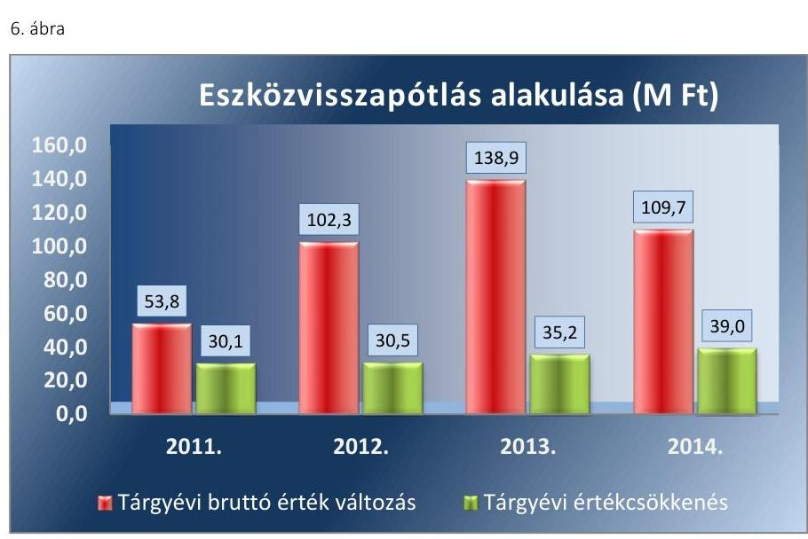

Forrás: Egyszerúsített éves beszámolók
A 2011-2014. években a működéshez szükséges vagyonelemek bruttó értékének növekedése meghaladta az éves elszámolt értékcsökkenés mértékét.

Az ellenőrzött időszakban a Kittenberger Nkft. több ingatlanfejlesztést is végrehajtott, ezek közé tartozott - többek között - a Gulya-dombi kifutó, Madár röpte, Szavanna kifutó. A műszaki gépek visszapótlása, fejlesztése keretében valósult meg a beléptető rendszer és a hűtőház kialakítása. A járműveknél 2012-től történt visszapótlás az értékcsökkenést meghaladó mértékben, 2014-ben például tehergépjármú és hozzá kapcsolódó pótkocsik beszerzése. A Kittenberger Nkft. eszközpótlását minősítő mutatók alakulását mutatja a 4. táblázat.
4. táblázat

ESZKÖZPÓTLÁST MINŐSÍTŐ MUTATÓK

| Évek | Használhatósági fok (\%) |  |  | Átlagos életkor (év) |  |  |
| :--: | :--: | :--: | :--: | :--: | :--: | :--: |
|  | Épületek | Műszaki   berendezések | Jármú-   vek | Épületek | Múszaki   berendezések | Jármú-   vek |
| 2011. | 92 | 49 | 22 | 4 | 4 | 4 |
| 2012. | 91 | 59 | 36 | 5 | 3 | 3 |
| 2013. | 89 | 59 | 41 | 5 | 3 | 3 |
| 2014. | 88 | 58 | 39 | 6 | 3 | 3 |

Forrás: Egyszerúsített éves beszámolók adatai alapján számítás

Az eszközök használhatósági foka - az ingatlanoknál bekövetkezett kismértékű csökkenést kivéve - emelkedett, az eszközök átlagos életkora ezzel ellentétesen változott.

A követelések 2011-2014. évek közötti alakulását szemlélteti a 7. ábra.

---

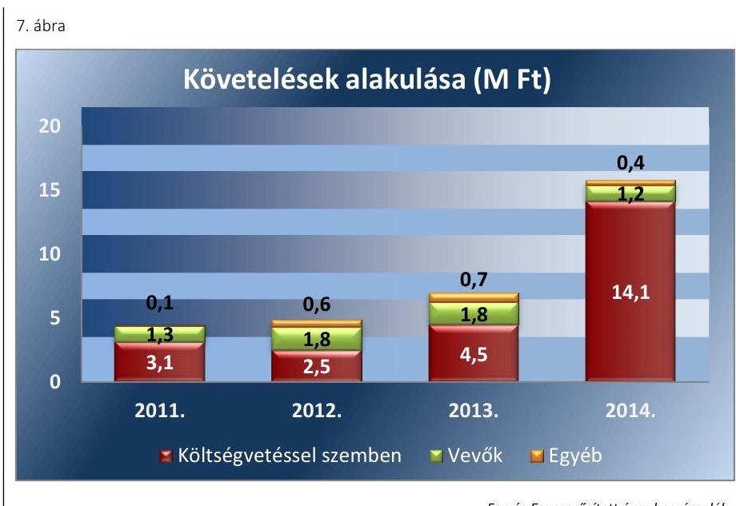

Forrás Egyszerúsített éves beszámolók
A követelések közül a vevői követelés stagnált, az egyéb követelések és a költségvetéssel szembeni követelések összege növekedett, ami a beruházások után visszaigényelhető általános forgalmi adóból eredt. A lejárt követelésekre minden esetben küldtek fizetési felszólítást. A mérleg-fordulónapján kimutatott vevői követelések nem tartalmaztak határidőn túli követelésállományt.
3.2. számú megállapítás

A Társaság önköltségszámítás rendjére vonatkozó belső szabályzat készítésére nem volt kötelezett, a közszolgáltatás árára vonatkozó jogszabályi, tulajdonosi előírás nem volt.

Önköltségszámítás rendjére vonatkozó belső szabályzat készítésére a Kittenberger Nkft. a Számv. tv. 14. § (6) bekezdésének előírása alapján nem volt kötelezett, önköltségszámítási szabályzatot nem készített.

A közszolgáltatások árának meghatározására jogszabályi vagy tulajdonosi előírás nem volt. Az SZMSZ ügyvezetői jogkörbe sorolta az árképzés rendjét.

Az előző évi bevételek és költségek alapján tervezték meg a belépőjegyek árát, figyelembe véve a fizetőképes keresletet, a várható látogatói létszámot illetve a belépőjegyek árának országos alakulását. Az ügyvezető az üzleti tervekben bemutatta a tulajdonosnak a várható látogatói létszámot és az ezzel összefüggő árbevételt, de a belépőjegyek ára nem szerepelt az üzleti tervekben.

---

# JAVASLATOK 

Az ÁSZ tv. 33. § (1) bekezdésében foglaltak értelmében az ellenőrzött szervezet vezetője köteles a jelentésben foglalt megállapításokhoz kapcsolódó intézkedési tervet összeállítani és azt a jelentés kézhezvételétől számított 30 napon belül az ÁSZ részére megküldeni. Amennyiben az ellenőrzött szervezet vezetője nem küldi meg határidőben az intézkedési tervet, vagy továbbra sem elfogadható intézkedési tervet küld, az Állami Számvevőszék elnöke az ÁSZ tv. 33. § (3) bekezdése a) és b) pontjaiban foglaltakat érvényesítheti.

## A „Kittenberger Kálmán" Növény és Vadaspark Szolgáltató Közhasznú Nonprofit Kft. ügyvezetőjének

1. Intézkedjen belső ellenőrzési szabályzat készitéséről az SZMSZ előírásának megfelelően.
(2.1. sz. megállapítás 2. bekezdése alapján)
2. Vezesse keresztül a számviteli politikán a Számv. tv. módosításai miatti változásokat, és a jövőben a jogszabályi előírás betartása érdekében a változás hatálybalépését követő 90 napon belül végezze el annak keresztülvezetését a számviteli politikán.
(2.1. sz. megállapítás 4. bekezdése alapján)
3. Intézkedjen a jogszabályban és az SZMSZ-ben előírt eszközök és források leltárkészittési és leltározási szabályzatának készitéséről.
(2.1. sz. megállapítás 5. bekezdése alapján)
4. Intézkedjen a könyvvezetésre és bizonylatolásra vonatkozó olyan részletes belső szabályok kialakítására, hogy azok alkalmasak legyenek a beszámoló adatainak közvetlen alátámasztására, valamint tartalmazzanak előírásokat a vonatkozó külön jogszabályban meghatározott adatok rendelkezésre állását biztositó elkülönített nyilvántartás tekintetében.
(2.1. sz. megállapítás 9. bekezdése alapján)
5. Intézkedjen a mennyiségben kimutatott eszközök mennyiségi felvétellel történő leltározásáról a jogszabályi előírásnak megfelelően.
(2.2. sz. megállapítás 3. bekezdése alapján)

---

6. Állapítsa meg belső szabályzatban az elektronikus közzétételi kötelezettség teljesitésének részletes belső szabályait.
(2.4. sz. megállapítás 8. bekezdése alapján)
7. Intézkedjen az elektronikus közzétételi kötelezettség jogszabályi előírások szerinti, teljes körü teljesitéséről.
(2.4. sz. megállapítás 10. bekezdése alapján)
8. Intézkedjen a nyilvántartási rendszer továbbrészletezéséről, hogy abból a vonatkozó külön jogszabályban meghatározott adatok - a költségek és ráfordítások közhasznú és vállalkozási tevékenységhez kapcsolódóan, elkülönítetten - rendelkezésre álljanak a jogszabályi előírásnak megfelelően.
(3.1. sz. megállapítás 2. bekezdése alapján)

---

.

---

# MELLÉKLETEK 

- I. SZ. MELLÉKLET: ÉRTELMEZŐ SZÓTÁR
eladósodottságot jellemző mutatók
eladósodottsági mutató (tőkeáttétel): idegen tőke/összes forrás.
Egészségesnek mondható egy olyan mértékű áttétel, amelyet az üzleti tervek szerint és az elmúlt időszak tapasztalatai alapján a társaság megfelelő biztonsággal ki tud termelni. Nagy eszközberuházás-igényű iparágakban értéke magasabb, azaz magasabb eladósodottság is elfogadható, de 75-85\%-ot meghaladó értéknél már itt is erős, sőt túlzott külső finanszírozottságról beszélhetünk. Általánosságban véve kedvező, ha értéke kisebb, mint 0,6 .
eladósodottság mértéke: kötelezettségek / saját tőke.
Fontos szerepet játszik ez a mutató egy vállalat megítélésében. Azt mutatja, hogy a saját források a kötelezettségek hány százalékát fedezik. Törekedni kell, hogy a mutató tartósan (jelentősen) 1 alatti értéket érjen el.
nettó eladósodottság: (kötelezettségek-követelések) / saját tőke.
Azt mutatja, hogy a kintlévőségekkel csökkentett kötelezettségeket milyen mértékben fedezi a saját forrás. Ez feltételezi, hogy a követelések pénzügyileg előbb realizálódnak, mint ahogy a kötelezettségeket teljesíteni kell. A mutató minél kisebb, csökkenő értéke a kedvező.
adósságfedezeti mutató I.: (befektetett eszközök+forgó eszközök) / idegen forrás.
Azt mutatja, hogy 1 Ft adósságra hány Ft vagyon jut. Általánosságban véve kedvező, ha értéke 2 körül van, de nagy eszközberuházás-igényű iparágakban értéke kisebb is lehet.
adósságfedezeti mutató II.: működési cash flow / hosszú lejáratú kötelezettségek.
A mutató azt jelzi, hogy az adott gazdálkodási időszak múködési pénzáramainak eredményeként realizált cash flow révén a vállalkozás mennyiben lenne képes valamenynyi hosszú lejáratú kötelezettségének eleget tenni. Ennek vizsgálatára viszonylag ritkán kerül sor, az elsősorban a veszélyhelyzetbe került vállalkozások esetében lehet érdekes. Általánosságban véve kedvező, ha a múködési cash flow minél nagyobb arányban nyújt fedezetet a hosszú lejáratú kötelezettségre (értéke nagyobb, mint 1, nő az ellenőrzött időszakban).
árbevételre vetített eladósodottság: (kötelezettségek - forgóeszközök) / értékesítés nettó árbevétele.
Az árbevételre vetített eladósodottság azt mutatja, hogy az árbevétel mekkora fedezetet nyújt a kötelezettségeknek a forgóeszközökkel csökkentett részére. Általánosságban véve kedvező, ha az árbevétel minél nagyobb arányban nyújt fedezetet a forgóeszközökkel csökkentett kötelezettségekre (értéke kisebb, mint 1, csökken az ellenőrzött időszakban).
eszközök elhasználódását
Hazználhatósági fok (\%): Tárgyi eszközök nettó értéke x 100 / Tárgyi eszközök bruttó jellemző mutatók
granciaszerződés értéke
Elhasználódási szint (\%): 100\% - Használhatósági fok \%
Átlagos életkor: Elhasználódási szint (\%) / Értékcsökkenési leírási kulcs (\%)
A garanciaszerződés, illetve a garanciavállaló nyilatkozat a garantőr olyan kötelezettségvállalása, amely alapján a nyilatkozatban meghatározott feltételek esetén köteles a jogosultnak fizetést teljesíteni. (Ptk.: 6:431. § (1) bekezdése)

---

gazdasági társaság
gazdálkodó szervezet
kezesség
közszolgáltatás
meghatározó befolyás
minősített többséget biztositó részesedés
nemzeti vagyon
nonprofit gazdasági társaság
Ptk. 3.88. § (1) bekezdése szerint „a gazdasági társaságok üzletszerű közös gazdasági tevékenység folytatására, a tagok vagyoni hozzájárulásával létrehozott, jogi személyiséggel rendelkező vállalkozások, amelyekben a tagok a nyereségből közösen részesednek, és a veszteséget közösen viselik".
A Ptk. 685. § c) pontja szerint gazdálkodó szervezet:
„az állami vállalat, az egyéb állami gazdálkodó szerv, a szövetkezet, a lakásszövetkezet, az európai szövetkezet, a gazdasági társaság, az európai részvénytársaság, az egyesülés, az európai gazdasági egyesülés, az európai területi együttmüködési csoportosulás, az egyes jogi személyek vállalata, a leányvállalat, a víggazdálkodási társulat, az erdő birtokossági társulat, a végrehajtói iroda, az egyéni cég, továbbá az egyéni vállalkozó." (2014. 03.15-ig hatályos)
A kezességre vonatkozó előírásokat a Ptk. 2 6:416-430. §-ai tartalmazzák. Kezességi szerződéssel a kezes kötelezettséget vállal a jogosulttal szemben, hogyha a kötelezett nem teljesít, maga fog helyette a jogosultnak teljesíteni. Kezesség egy vagy több, fennálló vagy jövőbeli, feltétlen vagy feltételes, meghatározott vagy meghatározható összegű pénzkövetelés vagy pénzben kifejezhető értékkel rendelkező egyéb kötelezettség biztosítására vállalható.
A Ptk. 2 szerint kezességet csak írásban lehet vállalni. A kezes kötelezettsége ahhoz a kötelezettséghez igazodik, amelyért kezességet vállalt. A kezes kötelezettsége nem válhat terhesebbé, mint amilyen elvállalásakor volt, kiterjed azonban a kötelezett szerződésszegésének jogkövetkezményeire és a kezesség elvállalása után esedékessé váló mellékkövetelésekre is.
Az Ebktv. ${ }^{40}$ 3. § d) pontja a következőképpen határozza meg a közszolgáltatást: „szerződéskötési kötelezettség alapján a lakosság alapvető szükségleteinek ellátására irányuló szolgáltatás, így különösen a villamos energia-, gáz-, hő-, víz-, szennyvíz- és hulladékkezelési, köztisztasági, postai és távközlési szolgáltatás, továbbá a menetrend alapján közlekedő járművekkel végzett közforgalmú személyszállítás".
A Ptk. 2 8:2. § (2) bekezdése szerint „A befolyással rendelkező akkor rendelkezik egy jogi személyben meghatározó befolyással, ha annak tagja vagy részvényese, és
a) jogosult e jogi személy vezető tisztségviselői vagy felügyelőbizottsága tagjai többségének megválasztására, illetve visszahívására; vagy
b) a jogi személy más tagjai, illetve részvényesei a befolyással rendelkezővel kötött megállapodás alapján a befolyással rendelkezővel azonos tartalommal szavaznak, vagy a befolyással rendelkezőn keresztül gyakorolják szavazati jogukat, feltéve, hogy együtt a szavazatok több mint felével rendelkeznek."
A minősített befolyásszerző az ellenőrzött társaságban a szavazatok legalább hetvenöt százalékával rendelkezik. (Ptk.2. 3:324. §)
Nvtv. 1. § (2) bekezdése szerint többek között:
„az állam vagy a helyi önkormányzat kizárólagos tulajdonában álló dolgok, az a) pont hatálya alá nem tartozó, állam vagy a helyi önkormányzat tulajdonában lévő dolog,
az állam vagy a helyi önkormányzat tulajdonában lévő pénzügyi eszközök, továbbá az államot vagy a helyi önkormányzatot megillető társasági részesedések, az államot vagy a helyi önkormányzatot megillető bármely vagyoni értékkel rendelkező jogosultság, amelyet jogszabály vagyoni értékű jogként nevesít."
Civil tv. 9/F. § (2) bekezdése szerint „az a gazdasági társaság minősül nonprofit gazdasági társaságnak és cégnevében az a gazdasági társaság tüntetheti fel a nonprofit jelleget, amelynek létesítő okirata tartalmazza, hogy a gazdasági társaság tevékenységéből származó nyereség a tagok között nem osztható fel, hanem az a gazdasági társaság vagyonát gyarapítja." (hatályos 2014. március 15-től)

---

többségi befolyást biztosító részesedés

A Ptk. 2 8:2. § (1) bekezdése szerint „többségi befolyás az olyan kapcsolat, amelynek révén természetes személy vagy jogi személy (befolyással rendelkező) egy jogi személyben a szavazatok több mint felével vagy meghatározó befolyással rendelkezik."

---

.

---

# FÜGGELÉK: ÉSZREVÉTELEK 

A jelentéstervezetet a Számvevőszék 15 napos észrevételezésre megküldte az ellenőrzött szervezetek vezetőinek az ÁSZ tv. 29. §* (1) bekezdése előírásának megfelelően.
Az észrevételek alapján a jelentés módosítása nem volt indokolt.

A függelék tartalmazza az ellenőrzöttek észrevételeit, illetve az észrevételekre adott válaszleveleket.
$\longrightarrow$ „Kittenberger Kálmán" Növény és Vadaspark Szolgáltató Közhasznú Nonprofit Kft. ügyvezetőjének észrevételei
$\longrightarrow$ Tájékoztatás az észrevételek kezeléséről a Kittenberger Kálmán" Növény és Vadaspark Szolgáltató Közhasznú Nonprofit Kft. ügyvezetője részére
$\longrightarrow$ Veszprém Megyei Jogú Város Önkormányzata polgármesterének észrevételei
$\longrightarrow$ Tájékoztatás az észrevételek kezeléséről Veszprém Megyei Jogú Város Önkormányzata polgármestere részére

[^0]
[^0]:    * 29. § (1) Az Állami Számvevőszék az ellenőrzési megállapításait megküldi az ellenőrzött szervezet vezetőjének vagy az általa megbízott személynek, és annak, akinek személyes felelősségét állapította meg.
    (2) Az ellenőrzött szervezet vezetője és a felelősként megjelölt személy az ellenőrzés megállapításaira tizenöt napon belül írásban észrevételt tehet.
    (3) Az Állami Számvevőszék az észrevételre a beérkezésétől számított harminc napon belül írásban válaszol. A figyelembe nem vett észrevételeket köteles a jelentésben feltüntetni, és megindokolni, hogy azokat miért nem fogadta el.

---

# Állami Számvevőszék 

Dómokos László Elnök részére

Budapest
Apáczai Csere János u. 10
1052

Hiv. szám: V-1117-131/2016

## Tisztelt Elnök Úr!

A Kittenberger Kálmán Nonprofit Kft. (8200 Veszprém, Kittenberger K. u. 17.) 2016. október 17. napján vette át a „Számvevőszéki jelentéstervezet"-et a 2016. évben lefolytatott és a 2011. - 2014. gazdasági évet érintő vizsgálatukkal kapcsolatban.

A jelentéstervezet 2. pontja tartalmazza a gazdasági társaságra vonatkozó részletes megállapításokat. A megállapítások közül kettő pontra kivánok érdemi nyilatkozatot, észrevételt tenni:
2.1 - „Eszközök és források leltárkészítési és leltározási szabályzattal a Számv. tv. 14. § (5) bekezdés a) pontja és az SZMSZ V. pontjának 1) bekezdés előírása ellenére a Kittenberger Nkft. nem rendelkezett.."

A jelentéstervezet kézhezvételekor azt a Kft. könyvelőjének is megküldtem, aki akkor szembesült, hogy tévesen került az ellenőrzés során rögzítésre, hogy nincsen leltározási szabályzat. Az ő nyilvántartásában megtalálható a 2009-ben kelt szabályzat (melléklet), ami alapján ő a leltározási folyamatokat könyvelte.

Sajnos az elmúlt időszakban (7-8 évben) a Kft. irodájában több alkalmazott csere volt, így tavasszal az akkor dolgozó kolléganók nem találták meg a 7 évvel ezelőtt és most is hatályban lévő szabályzatot. Az adatszolgáltatás során sem a könyvelőt, sem a könyvvizsgálót nem kérdezték meg, hanem kitöltötték a nem releváns nyilatkozatot, mivel a központi szabályzatok között nem lelték fel.

A leltárszabályzaton kívül minden esetben leltározási utasítást is meghoztam, amely a konkrét leltározási feladatokat tartalmazta.

Az eszközök és források értékelése a Számviteli politika részeként is szerepel.
3.1 - „a ráfordítások elszámolása a közfeladat és vállalkozási tevékenység szerinti elkülönített nyilvántartás hiánya miatt nem megfelelő volt"

A helyszíni ellenőrzésen a könyvelő iroda képviselőjét is meghallgatták az ellenőrök. Az elmondottakat fenntartom azzal a kiegészítéssel, hogy a Kft. vállalkozási tevékenység költségei és ráfordításai között közvetlen költségként jelenik meg az eladott áruk beszerzési értéke, melyet elkülönítetten az „Eladott áruk beszerzési értéke" fékönyvi számlán tartunk nyilván. Az egyéb költségek és ráfordítások (bér, járulékok, rezsiköltségek stb.), mint közvetett költségek jelennek meg, tételesen nem elkülöníthetők.

---

Állásponom alapján a közhasznú és a vállalkozási tevékenységhez kapcsolódó anyagjellegủ ráfordítások könyvelése a vizsgált időszakban megfelelő és szabályszerű volt.

A 8 javaslati ponttal kapcsolatban az alábbi nyilatkozatot teszem:

1., 2., 3. pontok vonatkozásában a hatályos szabályzatok felülvizsgálata folyamatban van külső szakember bevonásával.

Határidő: 2016. december 31.

Felelős: ügyvezető igazgató

4., 5. pontok vonatkozásában a könyvelő és könyvvizsgáló bevonásával kívánom megvalósítani.

Határidő: 2016. december 1.

Felelős: ügyvezető igazgató

6., 7., 8. pontok vonatkozásában az adminisztrációt végző kollégák bevonásával folyamatosan frissülő dokumentumokat kívánunk közzétenni a kft. hivatalos weboldalán.

Határidő: 2016. november 30

Felelős: ügyvezető igazgató,

adminisztrációs munkatárs

A jelentéstervezettel kapcsolatban a fentieken kívül további észrevételt nem kívánok tenni.

Veszprém, 2016. október 26.

Tisztelettel:

Török László
ügyvezető igazgató

---

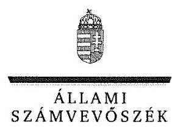

ELNÖK

Ikt.szám: V-1117-139/2016.

# Török László úr 

ügyvezető igazgató
"Kittenberger Kálmán" Növény és Vadaspark
Szolgáltató Közhasznú Nonprofit Kft.

## Veszprém

## Tisztelt Ügyvezető Igazgató Úr!

„Az önkormányzatok gazdasági társaságai - Az önkormányzatok többségi tulajdonában lévő gazdasági társaságok gazdálkodásának ellenörzése - „Kittenberger Kálmán" Növény és Vadaspark Szolgáltató Közhasznú Nonprofit Kft." címmel készített számvevőszéki jelentéstervezetre tett észrevételeit köszönettel megkaptam.
Az Állami Számvevőszék észrevételekre vonatkozó álláspontjáról a felügyeleti vezető által készített részletes tájékoztatást csatoltan megküldőm.
Tájékoztatom Ügyvezető Igazgató Urat, hogy a számvevőszéki jelentésben - az Állami Számvevőszékről szóló 2011. évi LXVI. törvény 29. § (3) bekezdése alapján - a figyelembe nem vett észrevételeket szerepeltetjük az elutasítás indokának feltüntetésével.

Budapest, 2016. AA. .hó A7, nap
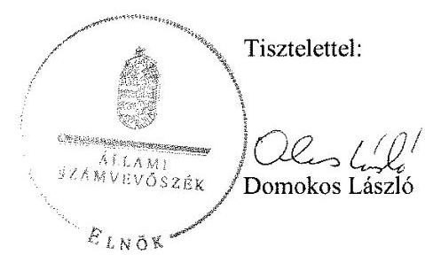

Melléklet: Tájékoztatás az észrevételek kezeléséről

---

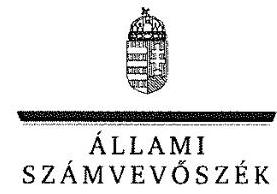

FELÜGYELETI VEZETŐ

Melléklet
Ikt.szám: V-1117-139/2016.

# Tájékoztatás   az észrevételek kezeléséről 

„Az önkormányzatok gazdasági társaságai - Az önkormányzatok többségi tulajdonában lévő gazdasági társaságok gazdálkodásának ellenőrzése - „Kittenberger Kálmán" Növény és Vadaspark Szolgáltató Közhasznú Nonprofit Kft." című jelentéstervezetre 2016. november 2-án tett (az Állami Számvevőszékhez 2016. november 7-én érkezett) észrevételeit áttekintettük, azok kezelésével kapcsolatban a következő tájékoztatást adom.

1. észrevétel - a 2.1. számú megállapításhoz („Eszközők és források leltárkészítési és leltározási szabályzattal a Számv. tv. 14. § (5) bekezdés a) pontja és az SZMSZ V. pontjának 1) bekezdés előirása ellenére a Kittenberger Nkft. nem rendelkezett...")
Az észrevétel jelzi, hogy a társaság az ellenőrzött időszakban rendelkezett eszközök és források leltárkészítési és leltározási szabályzatával, melyet az Állami Számvevőszék ellenőrzése során nem leltek fel.

Az ügyvezető 2016. február 17-én arról nyilatkozott, hogy az eszközök és források leltározási és leltárkészítési szabályzata a társaság szempontjából nem releváns. 2016. április 6-ai nyilatkozatában az Állami Számvevőszék ellenőrzése rendelkezésére nem bocsátott dokumentumok között szerepeltette a leltározásra vonatkozó szabályzatot. Indoklásként rögzítette, hogy minden évben a leltározás megkezdése előtt leltározási ütemterv és utasítás készül, amelyben rögzítésre kerülnek a feladatok és határidők a felelősök megnevezésével. 2016. április 19-én arról nyilatkozott, hogy a vizsgált időszakban leltárszabályzata nem volt, minden évben a leltározási utasítás és ütemterv tartalmazta a leltározással kapcsolatos feladatokat. A 2016. május 30 -ai teljességi és hitelességi nyilatkozatban büntetőjogi felelőssége tudatában jelentette ki, hogy az ellenőrzéshez - az ellenőrzést végzők részéről - az ellenőrzött tárgykörben kért és átadott dokumentumokon kívül más adatokkal, iratokkal nem rendelkeznek.

Az észrevétel mellékleteként megküldött, 2009. október 1-jétől hatályos leltárkészítési és leltározási szabályzatot (melynek ellenőrzésére nem kerülhetett sor) - a teljességi és hitelességi nyilatkozat kiállítását követően - már nem áll módunkban figyelembe venni, ezért a jelentéstervezet módosítása nem indokolt.

Az észrevétel szerint az eszközök és források értékelése a Számviteli politika részeként szerepel. Erre vonatkozó hiányosságot a jelentéstervezet nem tartalmazott, ezért módosítása nem indokolt.

---

2. észrevétel - a 3.1. számú megállapításhoz (,...a ráfordítások elszámolása a közfeladat és a vállalkozási tevékenység szerinti elkülönített nyilvántartás hiánya miatt nem megfelelő volt.")

Az észrevétel szerint az eladott áruk beszerzési értékét közvetlen költségként elkülönítették a vállalkozási tevékenység költségei, ráfordításai között, az egyéb költségek és ráfordítások (pl.: bér, járulékok, rezsiköltségek, stb.) pedig közvetett költségként jelentek meg, tételesen nem elkülöníthetőek. Álláspontja alapján a közhasznú és a vállalkozási tevékenységhez kapcsolódó anyagjellegú ráfordítások könyvelése a vizsgált időszakban megfelelő és szabályszerű volt.

Az észrevétel alapján a közvetlen költségek közül csak az eladott áruk beszerzési értékét különítették el a vállalkozási tevékenységhez kapcsolódóan. Az észrevétel más közvetlen költséggel kapcsolatban nem kifogásolja az elkülönítés hiánya miatt tett megállapítást. Az ellenőrzés rendelkezésére bocsátott számlatükörben és a 2011-2014. évekre szóló fökönyvi kivonatokban csak a 9. számlaosztály (Értékesítés árbevétele és bevételek) tételei kerültek elkülönítésre a közhasznú és a vállalkozási tevékenység szempontjából (91. és 92. fökönyvi számla), az eladott áruk beszerzési értékét tartalmazó 814 . fökönyvi számla megnevezése nem tartalmazta a tevékenység jellegét (közhasznú vagy vállalkozási tevékenység). A társaság számviteli szabályozásai nem tartalmaztak a közvetlen költségek elkülönítési módjára vonatkozó előírást, ezért sem állapítható meg, hogy az eladott áruk beszerzési értéke milyen tevékenységhez kapcsolódott. A társaság ügyvezetője a 2016. április 19-én az Állami Számvevőszék ellenőrzése során arról nyilatkozott, hogy ,,a vizsgált időszakban a közhasznúsági ráfordításokat a közhasznúsági bevételek arányában bontottuk meg a könyvelésben." A nyilatkozat valamennyi ráfordításra vonatkozott. Az észrevételben foglaltakkal együtt sem igazolt a szétválasztás szabályszerű, átlátható végrehajtása. Fentiek alapján a jelentéstervezet módosítása nem indokolt.

Köszönjük a jelentéstervezetben rögzített nyolc javaslattal összefüggésben tett nyilatkozatát, amellyel kapcsolatban tájékoztatom, hogy az ellenőrzött időszakot követően - a hiányosságok megszüntetése érdekében - megtett intézkedésekről az Állami Számvevőszékről szóló 2011. évi LXVI. törvény 33. § (1) bekezdése alapján összeállított intézkedési tervben szükséges számot adni.
Tájékoztatom, hogy a számvevőszéki jelentés függelékeként szerepeltetjük a jelentéstervezethez tett észrevételeit, valamint az azokra adott válaszunkat.

Budapest, 2016. 11. hó 17. nap

Böröcz Imre felügyeleti vezető

---

# 1432 

## Söröez 1

## 12

## VESZPRÉM MEGYEI JOGÚ VÁROS POLGÁRMESTERE

Szám: KOZP/10715/1/2016.
Tárgy: számvevőszéki jelentés tervezetre észrevétel

Ellenőrzés iktató száma Önöknél: V-1117-132/2016.

## Állami Számvevőszék Elnöke Domokos László úr részére

## Budapest

Apáczai Csere János u. 10
1052

## Tisztelt Elnök Úr!

Állami Számvevőszéknek „Az önkormányzatok gazdasági társaságai-Az önkormányzatok többségi tulajdonában lévő gazdasági társaságok gazdálkodásának ellenőrzése- Kittenberger Kálmán Növény és Vadaspark Szolgáltató Közhasznú Nonprofit Kft" tárgyú jelentéstervezetét köszönettel megkaptuk.
A tervezetben önkormányzatunk számára Javaslatokat nem fogalmaztak meg. A gazdasági társaság részére tett Javaslatokra az alábbi- a társaság vezérigazgatójával való egyeztetés alapján - észrevételeket teszem:
2.1 - „Eszközök és források leltárkészítési és leltározási szabályzattal a Számv. tv. 14. § (5) bekezdés a) pontja és az SZMSZ V. pontjának 1) bekezdés előirása ellenére a Kittenberger Nkft. nem rendelkezett.."

A gazdasági társaság tájékoztatása szerint az ellenőrzött időszakban rendelkeztek a fent említett szabályzattal.
3.1 - „a ráfordítások elszámolása a közfeladat és vállalkozási tevékenység szerinti elkülönített nyilvántartás hiánya miatt nem megfelelő volt"

Gazdasági társaság ügyvezetőjének a tájékoztatása szerint, a helyszíni ellenőrzésen a könyvelő iroda képviselőjét is meghallgatták az ellenőrök. Az elmondta, hogy a Kft. vállalkozási tevékenység költségei és ráfordításai között közvetlen költségként jelenik meg az eladott áruk beszerzési értéke, melyet elkülönítetten az „Eladott áruk beszerzési értéke" főkönyvi számlán tartanak nyilván. Az egyéb költségek és ráfordítások (bér, járulékok, rezsiköltségek stb.), mint közvetett költségek jelennek meg, tételesen nem elkülöníthetők.
Gazdasági társaság állásáspontja alapján a közhasznú és a vállalkozási tevékenységhez kapcsolódó anyagjellegű ráfordítások könyvelése a vizsgált időszakban megfelelő és szabályszerű volt

---

Tisztelt Elnök úr, kérem észrevételeimet szíveskedjen figyelembe venni a végleges jelentés elkészítése során.

Veszprém, 2016. október 26.
Tisztelettel:
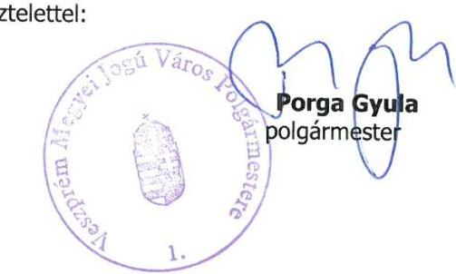

---

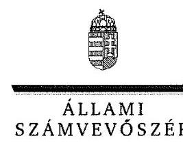

ELNÖK

Ikt.szám: V-1117-140/2016.

# Porga Gyula úr 

polgármester

Veszprém Megyei Jogú Város Önkormányzata

## Veszprém

## Tisztelt Polgármester Úr!

„Az önkormányzatok gazdasági társaságai - Az önkormányzatok többségi tulajdonában lévő gazdasági társaságok gazdálkodásának ellenörzése - „Kittenberger Kálmán" Növény és Vadaspark Szolgáltató Közhasznú Nonprofit Kft." címmel készített számvevőszéki jelentéstervezetre tett észrevételeit köszönettel megkaptam.
Az Állami Számvevőszék észrevételekre vonatkozó álláspontjáról a felügyeleti vezető által készített részletes tájékoztatást csatoltan megküldöm.
Tájékoztatom Polgármester Urat, hogy a számvevőszéki jelentésben - az Állami Számvevőszékről szóló 2011. évi LXVI. törvény 29. § (3) bekezdése alapján - a figyelembe nem vett észrevételeket szerepeltetjük az elutasítás indokának feltüntetésével.
Budapest, 2016. 11.1. hó 14 nap
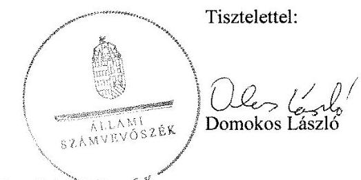

Melléklet: Tájékoztatás az észrevételek kezeléséről ${ }^{-1}$ E L N $0^{6}$

---

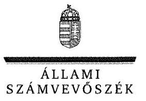

FELÜSVELETI VEZETŐ

Melléklet
Ikt.szám: V-1117-140/2016.

# Tájékoztatás   az észrevételek kezeléséről 

„Az önkormányzatok gazdasági társaságai - Az önkormányzatok többségi tulajdonában lévő gazdasági társaságok gazdálkodásának ellenőrzése - „Kittenberger Kálmán" Növény és Vadaspark Szolgáltató Közhasznú Nonprofit Kft." című jelentéstervezetre 2016. október 28-án tett (az Állami Számvevőszékhez 2016. november 7-én érkezett) észrevételeit áttekintettük. Az ellenőrzött társaság ügyvezetője által tett észrevétellel azonos tartalmú polgármesteri észrevételek kezelésével kapcsolatban a következő tájékoztatást adom.

1. észrevétel - a 2.1. számú megállapításhoz („Eszközök és források leltárkészítési és leltározási szabályzattal a Számv. tv. 14. § (5) bekezdés a) pontja és az SZMSZ V. pontjának 1) bekezdés előírása ellenére a Kittenberger Nkft. nem rendelkezett...")
Az észrevétel jelzi, hogy a gazdasági társaság tájékoztatása szerint rendelkeztek eszközök és források leltárkészítési és leltározási szabályzatával.
Az ügyvezető 2016. február 17-én arról nyilatkozott, hogy az eszközök és források leltározási és leltárkészítési szabályzata a társaság szempontjából nem releváns. 2016. április 6-ai nyilatkozatában az Állami Számvevőszék ellenőrzése rendelkezésére nem bocsátott dokumentumok között szerepeltette a leltározásra vonatkozó szabályzatot. Indoklásként rögzítette, hogy minden évben a leltározás megkezdése előtt leltározási ütemterv és utasítás készül, amelyben rögzítésre kerülnek a feladatok és határidők a felelősök megnevezésével. 2016. április 19-én arról nyilatkozott, hogy a vizsgált időszakban leltárszabályzata nem volt, minden évben a leltározási utasítás és ütemterv tartalmazta a leltározással kapcsolatos feladatokat. A 2016. május 30 -ai teljességi és hitelességi nyilatkozatban büntetőjogi felelőssége tudatában jelentette ki, hogy az ellenőrzéshez - az ellenőrzést végzők részéről - az ellenőrzött tárgykörben kért és átadott dokumentumokon kívül más adatokkal, iratokkal nem rendelkeznek.
A társaság által tett észrevétel mellékleteként megküldött, 2009. október 1-jétől hatályos leltárkészítési és leltározási szabályzatot (melynek ellenőrzésére nem kerülhetett sor) - a teljességi és hitelességi nyilatkozat kiállítását követően - már nem áll módunkban figyelembe venni, ezért a jelentéstervezet módosítása nem indokolt.
2. észrevétel - a 3.1. számú megállapításhoz (,....a ráfordítások elszámolása a közfeladat és a vállalkozási tevékenység szerinti elkülönített nyilvántartás hiánya miatt nem megfelelő volt.")
Az észrevétel a gazdasági társaság ügyvezetőjének tájékoztatását ismerteti, amely szerint az eladott áruk beszerzési értékét közvetlen költségként elkülönítették a vállalkozási tevékenység

---

költségei, ráfordításai között, az egyéb költségek és ráfordítások (pl.: bér, járulékok, rezsiköltségek, stb.) pedig közvetett költségként jelentek meg, tételesen nem elkülöníthetőek. A gazdasági társaság álláspontja alapján a közhasznú és a vállalkozási tevékenységhez kapcsolódó anyagjellegủ ráfordítások könyvelése a vizsgált időszakban megfelelő és szabályszerű volt.
Az észrevétel alapján a közvetlen költségek közül csak az eladott áruk beszerzési értékét különítették el a vállalkozási tevékenységhez kapcsolódóan. Az észrevétel más közvetlen költséggel kapcsolatban nem kifogásolja az elkülönítés hiánya miatt tett megállapítást. Az ellenőrzés rendelkezésére bocsátott számlatükörben és a 2011-2014. évekre szóló fökönyvi kivonatokban csak a 9. számlaosztály (Értékesítés árbevétele és bevételek) tételei kerültek elkülönítésre a közhasznú és a vállalkozási tevékenység szempontjából (91. és 92 . fökönyvi számla), az eladott áruk beszerzési értékét tartalmazó 814. fökönyvi számla megnevezése nem tartalmazta a tevékenység jellegét (közhasznú vagy vállalkozási tevékenység). A társaság számviteli szabályozásai nem tartalmaztak a közvetlen költségek elkülönítési módjára vonatkozó előirást, ezért sem állapítható meg, hogy az eladott áruk beszerzési értéke milyen tevékenységhez kapcsolódott. A társaság ügyvezetője a 2016. április 19-én az Állami Számvevőszék ellenőrzése során arról nyilatkozott, hogy „a vizsgált időszakban a közhasznúsági ráfordításokat a közhasznúsági bevételek arányában bontottuk meg a könyvelésben." A nyilatkozat valamennyi ráfordításra vonatkozott. Az észrevételben foglaltakkal együtt sem igazolt a szétválasztás szabályszerű, átlátható végrehajtása. Fentiek alapján a jelentéstervezet módosítása nem indokolt.
Tájékoztatom, hogy a számvevőszéki jelentés függelékeként szerepeltetjük a jelentéstervezethez tett észrevételeit, valamint az azokra adott válaszunkat.

Budapest, 2016. 11. hó 17. nap

Böröcz Imre felügyeleti vezető

---

.

---

# RÖVIDÍTÉSEK JEGYZÉKE 

${ }^{1}$ Társaság
${ }^{2}$ Kittenberger Nkft.
${ }^{3}$ Önkormányzat
${ }^{4}$ Mötv.
${ }^{5}$ EU
${ }^{6}$ ÁSZ
${ }^{7}$ ÁSZ tv.
${ }^{8}$ gazdasági program
${ }^{9}$ Ötv.
${ }^{10}$ Közgyűlés
${ }^{11}$ vagyongazdálkodási terv
${ }^{12}$ Nvtv.
${ }^{13}$ Integrált Területi Program
${ }^{14}$ Önkormányzat SZMSZ-e
${ }^{15}$ Társasági Szerződés
${ }^{16} \mathrm{FB}$
${ }^{17}$ Közhasznú Szerződés
${ }^{18}$ Támogatási Megállapodás
${ }^{19}$ Áht.
${ }^{20} \mathrm{Gt}$.
${ }^{21} \mathrm{Ptk}$.

Kittenberger Kálmán Növény és Vadaspark Szolgáltató Közhasznú Nonprofit Korlátolt Felelősségű Társaság
Kittenberger Kálmán Növény és Vadaspark Szolgáltató Közhasznú Nonprofit Korlátolt Felelősségű Társaság
Veszprém Megyei Jogú Város Önkormányzata
2011. évi CLXXXIX. törvény Magyarország helyi önkormányzatairól (hatályos: 2012. január 1-jétől)

Európai Unió
Állami Számvevőszék
2011. évi LXVI. törvény az Állami Számvevőszékről (hatályos: 2011. július 1-jétől)

Veszprém Megyei Jogú Város Önkormányzatának 2011-2014. évekre szóló gazdasági programja (elfogadva 66/2011. (IV. 1.) számú határozattal)
1990. évi LXV. törvény a helyi önkormányzatokról (hatályos: 2014. október 12-ig)

Veszprém Megyei Jogú Város Önkormányzatának Közgyűlése
Veszprém Megyei Jogú Város Önkormányzata közép- és hosszú távú vagyongazdálkodási terve (elfogadva: 321/2012. (X. 26.) számú határozattal) 2011. évi CXCVI. törvény a nemzeti vagyonról (hatályos: 2011. december 31-től)

Veszprém Megyei Jogú Város 2014-2020 közötti időszakra szóló Integrált Területi Programja (288/2014. (XI. 27.) számú határozattal elfogadva)
Veszprém Megyei Jogú Város Önkormányzata többször módosított szervezeti és működési szabályzata;: 29/2010. (VI. 28)/2008. (XI. 14.) számú önkormányzati rendelet (hatályos:2013.január 31-ig)
Veszprém Megyei Jogú Város Önkormányzata többször módosított szervezeti és működési szabályzata;: 1/2013. (I. 31)/2008. (XI. 14.) számú önkormányzati rendelet (hatályos: 2013. február 1-jétől 2014. október 31-ig)
Veszprém Megyei Jogú Város Önkormányzata többször módosított szervezeti és működési szabályzata;: 39/2014. (X.31)/2008. (XI. 14.) számú önkormányzati rendelet (hatályos: 2014. november 1-jétől)
Egységes szerkezetbe foglalt Társasági Szerződés; hatályos: 2009.07.16-tól Egységes szerkezetbe foglalt Társasági Szerződés; hatályos: 2012.04.26-tól Egységes szerkezetbe foglalt Társasági Szerződés; hatályos: 2012.12.28-tól Egységes szerkezetbe foglalt Társasági Szerződés; hatályos: 2013.11.14-től Egységes szerkezetbe foglalt Társasági Szerződés; hatályos: 2014.05.29-től Felügyelőbizottság
Veszprém Megyei Jogú Város Önkormányzata és a Kittenberger Kálmán Növényés Vadaspark Szolgáltató Közhasznú Társaság között 2000. december 18-án kötött Közhasznú Szerződés
Veszprém Megyei Jogú Város Önkormányzat és a Kittenberger Kálmán Növényés Vadaspark Szolgáltató Közhasznú Társaság között 2000. december 18-án kötött és többször módosított Támogatási Megállapodás
1992. évi XXXVIII. törvény az államháztartásról (hatályos: 2011. december 31-ig) 2006. évi IV. törvény a gazdasági társaságokról (hatályos: 2014. március 15-ig) 2013. évi törvény a Polgári Törvénykönyvről (hatályos: 2014. március 15-től)

---

${ }^{22}$ Taggyűlés
${ }^{23}$ vagyonrendelet ${ }_{1-2}$
${ }^{24}$ Gazdasági Bizottság
${ }^{25}$ Tulajdonosi Bizottság
${ }^{26}$ Tak. tv.
${ }^{27}$ Számv. tv.
${ }^{28}$ Közhasznú tv.
${ }^{29}$ Civil tv.
${ }^{30}$ SZMSZ
${ }^{31}$ Számviteli Politika
${ }^{32}$ Pénzkezelési szabályzat
${ }^{33}$ 350/2011. (XII. 30.) Korm. rendelet
${ }^{34}$ Javadalmazási Szabályzat
${ }^{35}$ 1052/2014. Korm. határozat
${ }^{36}$ Tulajdonosok
${ }^{37}$ Eisztv.
${ }^{38}$ Infotv.
${ }^{39}$ Tao. tv.
${ }^{40}$ Ebktv.

Kittenberger Kálmán Növény és Vadaspark Szolgáltató Közhasznú Nonprofit Kft. Taggyűlése
vagyonrendelet1: a 22/2010. (VI. 28.) számú önkormányzati rendelet az Önkormányzat vagyonáról, a vagyongazdálkodás és vagyonhasznosítás szabályairól (hatályos 2012. február 23-ig)
vagyonrendelet2: a 6/2012. (II. 24.) számú önkormányzati rendelet az Önkormányzat vagyonáról, a vagyongazdálkodás és vagyonhasznosítás szabályairól (hatályos 2012. február 24-től
Veszprém Megyei Jogú Város Önkormányzatának Gazdasági Bizottsága (hatályos: 2012. február 23-ig)

Veszprém Megyei Jogú Város Önkormányzatának Gazdasági Bizottsága
2009. évi CXXII. törvény a köztulajdonban álló gazdasági társaságok takarékosabb müködéséről
2000. évi C. törvény a számvitelről
1997. évi CLVI. törvény a közhasznú szervezetekről (hatályos: 2011. december 31-ig)
2011. évi CLXXV törvény az egyesülési jogról, a közhasznú jogállásról, valamint a civil szervezetek müködéséről és támogatásáról (hatályos: 2012. január 1-jétől)
Szervezeti és Müködési Szabályzat Kittenberger Nkft. (hatályos: 2008. április 1-jétől)
Számviteli Politika Kittenberger Nkft. (hatályos: 2010. január 1-jétől)
Pénzkezelési Szabályzat Kittenberger Nkft. (hatályos: 2009. július 1-jétőll)
350/2011. (XII. 30.) Korm. rendelet a civil szervezetek gazdálkodása, az adománygyűjtés és a közhasznúság egyes kérdéseiről
Kittenberger Kálmán Növény és Vadaspark Szolgáltató Kiemelten Közhasznú Nonprofit Kft. Javadalmazási Szabályzata, (hatályos: 2009. november 23-tól) 1052/2014. (II. 11.) Korm. határozat a rendkívüli kormányzati intézkedésekre szolgáló tartalékból történő előirányzat-átcsoportosításról és egyes kormányhatározatok módosításáról
97,5\%-ban a Veszprém Megyei Jogú Város Önkormányzat, 2,5\%-ban a Magyar Állam
2005. évi XC. törvény az elektronikus információszabadságról (hatályos: 2011. december 31-ig)
2011. évi CXIII. törvény az információs önrendelkezési jogról és az információszabadságról (hatályos: 2011. július 27-től)
1996. évi LXXXI. törvény a társasági adóról és az osztalékadóról
2003. évi CXXV. törvény egyenlő bánásmódról és az esélyegyenlőség előmozdításáról

---

# ÁLLAMI SZÁMVEVŐSZÉK 

1052 Budapest, Apáczai Csere János utca 10.
Levélcím: 1364 Budapest 4. Pf. 54
Telefon: +36 14849100 Telefax: +36 14849200
www.asz.hu