# Jelentés 

## Az önkormányzatok gazdasági társaságai

Az önkormányzatok többségi tulajdonában lévő gazdasági társaságok gazdálkodásának ellenőrzése - KAVÍZ Kaposvári Víz- és Csatornamű Kft.
2016.

Az ÁSZ az államháztartáson kívül működő közfeladat-ellátó rendszerek ellenőrzéseivel hozzájárul ahhoz, hogy a közpénzeket az államháztartáson kívül működő szervezetek is átlátható, rendezett módon használják fel a közfeladatok ellátása érdekében.

---

# Jelentés 

## Az önkormányzatok gazdasági társaságai

Az önkormányzatok többségi tulajdonában lévő gazdasági társaságok gazdálkodásának ellenőrzése - KAVÍZ Kaposvári Víz- és Csatornamű Kft.
2016. 12. hó 20. nap
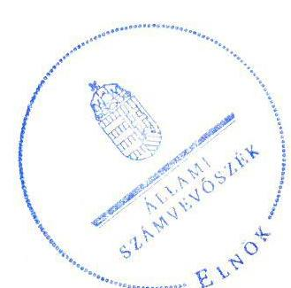

16254
www.asz.hu

Domokos László elnök

Az ÁSZ az államháztartáson
kivül működő közfeladat-ellátó rendszerek ellenőrzéseivel hozzájárul ahhoz, hogy a közpénzeket
az államháztartáson
kivül működő szervezetek
is átlátható, rendezett
módon használják fel a
közfeladatok ellátása érdekében.
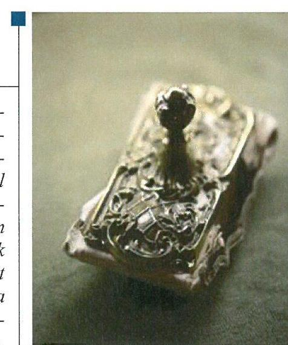

---

# AZ ELLENŐRZÉST FELÜGYELTE: 

MAKKAI MÁRIA felügyeleti vezető

## AZ ELLENŐRZÉST VEZETTE ÉS A VÉGREHAJTÁSÁÉRT FELELŐS:

SALI SÁNDORNÉ ellenőrzésvezető

## A PROGRAM ÖSSZEÁLLÍTÁSÁÉRT FELELŐS:

JANIK JÓZSEF osztályvezető

## A TÉMÁHOZ KAPCSOLÓDÓ KORÁBBI SZÁMVEVŐSZÉKI JELENTÉSEK:

- címe: Jelentés Az önkormányzatok gazdasági társaságai Az önkormányzatok többségi tulajdonában lévő gazdasági társaságok közfeladat ellátását érintő gazdálkodási tevékenysége szabályszerűségének ellenőrzése - Kaposvári Önkormányzati Vagyonkezelő és Szolgáltató Zrt.
- sorszáma: 15066

IKTATÓSZÁM: V-1104-094/2016.
TÉMASZÁM: 2138
ELLENŐRZÉS-AZONOSÍTÓ SZÁM: V070768

---

# TARTALOMJEGYZÉK 

■ ÖSSZEGZÉS ..... 5
■ AZ ELLENŐRZÉS CÉLJA ..... 6
■ AZ ELLENŐRZÉS TERÜLETE ..... 7
■ AZ ELLENŐRZÉS HÁTTERE, INDOKOLTSÁGA ..... 9
■ A JELENTÉS LÉNYEGES KÉRDÉSKÖREI ..... 10
■ ELLENŐRZÉS HATÓKÖRE ÉS MÓDSZEREI ..... 11
■ MEGÁLLAPÍTÁSOK ..... 13
■ JAVASLATOK ..... 21
■ MELLÉKLETEK ..... 23
I. Sz. melléklet: Értelmező szótár ..... 23
II. Sz. melléklet: Működési adatok ..... 25
■ FÜGGELÉK: ÉSZREVÉTELEK ..... 27
■ RÖVIDÍTÉSEK JEGYZÉKE ..... 31

---

.

---

# ÖSSZEGZÉS 

A 2011-2014. években a KAVÍZ Kaposvári Víz- és Csatornamű Kft.-nél a Kaposvár Megyei Jogú Város Önkormányzata a közfeladat-ellátását szabályszerűen megszervezte. Az Önkormányzat és a Kapos Holding Közszolgáltató Zrt. tulajdonosi joggyakorlása szabályos volt. A Társaság vagyongazdálkodása megfelelt a jogszabályi előírásoknak, a közfeladat bevételeinek és ráfordításainak elszámolása megfelelő volt. Az önköltségszámítás szabályait meghatározták, az árképzés szabályszerűen történt. Az adatok közzététele során nem volt biztosított teljes körűen a működés jogszabályoknak megfelelő átláthatósága.

## Az ellenőrzés társadalmi indokoltsága

Az Állami Számvevőszék középtávra szóló stratégiájában megfogalmazta, hogy a helyi önkormányzatok gazdálkodásában rejlő pénzügyi kockázatok feltárásával, az államháztartáson kívülre nyújtott költségvetési támogatások és ingyenes vagyonjuttatások, valamint az államháztartáson kívül működő közfeladat-ellátó rendszerek ellenőrzéseivel hozzájárul ahhoz, hogy a közpénzeket az államháztartáson kívül működő szervezetek is átlátható, rendezett módon használják fel a közfeladatok szerződésben vállalt ellátása érdekében.

Magyarországon az intézmény-centrikus közfeladat-ellátás jellemző, de egyre jelentősebb a költségvetésen kívüli feladatellátás térnyerése. Ennek legfontosabb szereplői - a nonprofit szervezetek mellett - az önkormányzati tulajdonú gazdasági társaságok. Az önkormányzatok szervezetalakítási szabadságának következménye, hogy a korábban is vállalati formában működő közszolgáltatások mellett, mind a kötelező, mind az önként vállalt feladatok ellátásában a gazdasági társaságok kiemelt fontosságú szerephez jutottak.

## Főbb megállapítások, következtetések

Az Önkormányzat a Társaság számára a közfeladat-ellátását szabályszerűen megszervezte, valamint a közfeladat-ellátással kapcsolatos terv- és rendeletalkotási kötelezettségének a vonatkozó jogszabályi előírásoknak megfelelően eleget tett. Az Önkormányzat és 2011. március 23-tól a Holding tulajdonosi joggyakorlása szabályszerűen történt. Az Önkormányzat a közszolgáltatás ellátására az ellenőrzött időszak előtt üzemeltetési szerződést kötött, amelyek tartalma az előírásokkal összhangban volt. A három tagból álló FB feladatát szabályszerűen ellátta.

A Társaság vagyongazdálkodása szabályszerű volt. A vagyongazdálkodás szabályozása összességében megfelelt a jogszabályi előírásoknak a számlarend kivételével. Az éves beszámolók mérlegei leltárral alátámasztottak voltak. A Társaság a jogszabályokban és az üzemeltetési szerződésben foglalt beszámolási és adatszolgáltatási kötelezettségének teljesítése megfelelt az előírásoknak a 2013. évi beszámoló kiegészítő melléklete kivételével. Az ellátott feladat, illetve közfeladat bevételeinek és ráfordításainak elszámolását szabályszerűen végezte. A díjak alkalmazása a jogszabályok előírásai szerint történt.

A közérdekű adatok megismerésének rendjét a Társaság az ellenőrzött időszakban nem szabályozta. Az ügyvezető az elektronikus közzétételnek nem teljes körűen tett eleget, mert a Társaság internetes honlapján, illetve a Holding honlapján való közzététel érdekében nem intézkedett az Eisztv.-ben, valamint az Info tv.-ben foglalt előírásoknak megfelelően.

---

# AZ ELLENŐRZÉS CÉLJA 

Az ellenőrzés célja annak értékelése volt, hogy az önkormányzat vagyongazdálkodási tevékenysége során szabályszerűen gyakorolta-e tulajdonosi jogait; a gazdasági társaság szabályozottsága, gazdálkodása és vagyongazdálkodási tevékenysége, bevételeinek és ráfordításainak elszámolása megfelelt-e a jogszabályi és tulajdonosi előírásoknak; a gazdasági társaság kötelezettségállománya jelentett-e kockázatot a működésre, valamint a gazdálkodás átláthatósága és elszámoltathatósága érdekében biztosítva volt-e a szolgáltatás díjának megalapozottsága szabályszerű önköltségszámítással.

---

# AZ ELLENŐRZÉS TERÜLETE 

## Kaposvár Megyei Jogú Város Önkormányzata, Kapos Holding Közszolgáltató Zrt. és a KAVÍZ Kaposvári Víz- és Csatornamű Kft.

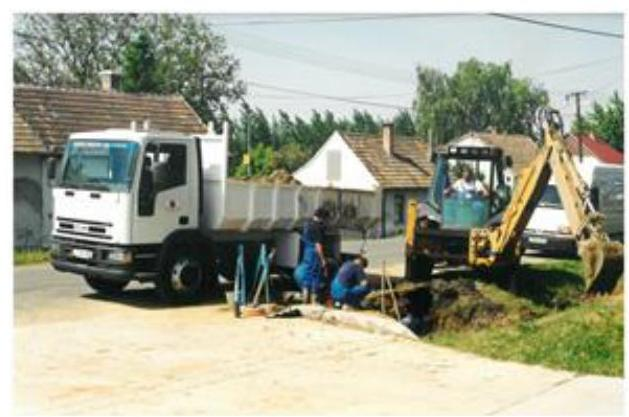

A KAPOSVÁR MEGYEI JOGÚ VÁROS ÖNKORMÁNYZATA a Társaságot ${ }^{1} 2008$ októberében 15,0 M Ft² törzstőkével alapította Juta Község Önkormányzatával, Kaposhomok Község Önkormányzatával, valamint Zselickislak Község Önkormányzatával együtt. A Társaság többségi tulajdonosa az Önkormányzat ${ }^{3}$ volt 2011. március 22-ig, ezt követően a Kapos Holding Közszolgáltató Zrt. Az Önkormányzat részesedése a Társaságban a 2011. év elején 98,9\% volt, majd az ellenőrzött időszakban történt tőkeemeléseket követően a Holding ${ }^{4}$ többségi tulajdonrésze a 2014. év végére 85,7\%-ra változott. Az Önkormányzat 100\%-ban tulajdonosa a Holdingnak. Az Önkormányzat az Ötv. ${ }^{5}$-ben, valamint az Mötv. ${ }^{6}$-ben foglaltakkal összhangban a víziközmű-szolgáltatással kapcsolatos közfeladat-ellátását a Társaság útján biztosította.

A KAVÍZ KAPOSVÁRI VÍZ- ÉS CSATORNAMŰ KFT. az ellenőrzött időszakban a víztermelés, -kezelés, -ellátás, a szennyvíz gyűjtése, kezelése, a szennyeződésmentesítés, egyéb hulladékkezelés közfeladatokat látta el. A Társaság bérlő-üzemeltetőként végezte el az Önkormányzat megbízásából az önkormányzati tulajdonban lévő vízi létesítményekkel összefüggő közfeladatot. Egyéb tevékenységei közé tartoztak többek között a vízbekötés, a bérbeadás, a csatornabekötések átvétele, az építőipari és a labor tevékenységek. Az ellenőrzött időszak folyamán tulajdonosainak száma nőtt és ellátási területe számos környékbeli településsel bővült.

A Társaság gazdálkodásának főbb adatait az ellenőrzött időszakra vonatkozóan az 1. ábra szemlélteti.

---

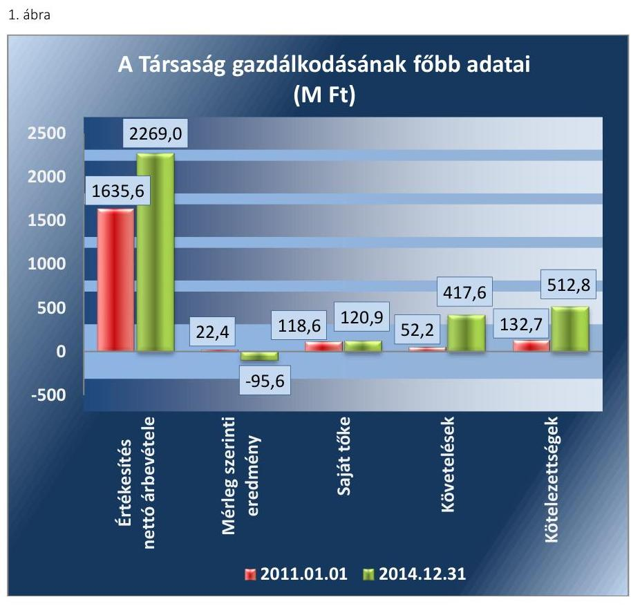

Forrás: A Társaság 2011. és 2014. évi beszámolói
A Társaság mérlegfőösszege 2011. január 1-jén 365,0 M Ft, 2014. december 31-én 666,1 M Ft volt. A mérleg szerinti eredmény a 2014. év kivételével nyereség volt. A saját tőke összege a 2011. január 1-jei 118,6 M Ftról a 2014. év végére 120,9 M Ft-ra, jegyzett tőke 2011. január 1-jén 65,0 M Ft-ról 2014. december 31-én 213,7 M Ft-ra nőtt. Átlagos állományi létszáma 2011. december 31-én 135 fő, 2014. december 31-én 165 fő volt.

Az ellenőrzött időszakban a polgármester, a jegyző és az ügyvezető személye nem változott. A polgármester az 1994. évi önkormányzati választások óta látja el feladatát, a jegyző személye 1990. év óta nem változott. Az ellenőrzött időszakban az ügyvezető személye nem változott.

A Társaság az ellenőrzött időszakban a 479/2009/EK ${ }^{7}$ rendelet alapján 2011. évben, az Áht. ${ }^{8}$ 109. § (8) bekezdése szerint a 2012-2014. években nem minősült a kormányzati alszektorba sorolt társaságnak.

A Társaság működésének főbb jellemzőit a II. számú melléklet mutatja be.

---

# AZ ELLENŐRZÉS HÁTTERE, INDOKOLTSÁGA 

Az önkormányzatok közfeladat-ellátásában egyre jelentősebb a gazdasági társaságok útján történő feladatellátás térnyerése.

AZ ÖNKORMÁNYZATI TULAJDONÚ GAZDASÁGI TÁRSASÁGOK ELLENŐRZÉSE kiemelten fontos a vagyon megőrzése, megóvása érdekében, amelyekkel szemben alapvető követelmény, hogy gazdálkodásuk, működésük szabályszerű, az általuk szolgáltatott adatok minél megbízhatóbbak legyenek. A feladat-, közfeladat-ellátás költségeinek, ráfordításainak alakulása, színvonala hatással van a lakosság elégedettségére.

## AZ ELLENŐRZÉS VÁRHATÓ HASZNOSULÁSA-

KÉNT az ÁSZ ${ }^{9}$ a megállapításaival segítséget nyújthat az államháztartáson kívüli közfeladat-ellátás értékeléséhez, jogszabályi keretei pontosításához, átláthatóságot biztosító szabályozásához. Meghatározhatóvá válnak az önkormányzati feladatellátásban résztvevő államháztartáson kívüli szervezeteknek - az önkormányzat költségvetését, pénzügyi helyzetét is befolyásoló - kockázatai, lehetővé válik ezen kockázatok csökkentése. Ellenőrzéseink feltárhatják, hogy az önkormányzat feladatellátási kötelezettségének szabályszerűen tett-e eleget, a saját vagyon működtetését az elvárható gondossággal, szabályszerűen szervezte-e meg és a tulajdonosi felügyelete hozzájárult-e a feladatellátásához. Az ellenőrzés rávilágíthat arra, hogy a gazdasági társaság a feladatellátási, közszolgáltatási szerződésben foglaltak betartásával, a vagyon használatával biztosította-e a szolgáltatás folytatásának feltételeit, a feladat ellátását. Ezzel az ellenőrzöttek és a helyi döntéshozók számára visszajelzést ad feladatszervezési, feladatellátási kockázataikról, alapot ad a meglévő hibák megszüntetéséhez, a jobb feladatellátás biztosításához. Fokozza a fegyelmet, igazolja, hogy lejárt a következmények nélküli ellenőrzések időszaka. Az ÁSZ értékteremtő rend kialakításához és megőrzéséhez hozzájáruló tevékenysége pozitív hatással van a Társaságról kialakított összkép formálására.

---

# A JELENTÉS LÉNYEGES KÉRDÉSKÖREI 

1.     - Az Önkormányzat közfeladat megszervezéséről szóló döntése, valamint a tulajdonosi joggyakorlás szabályszerű volt-e?
2.     - A Társaság vagyongazdálkodása szabályszerű volt-e, kötelezettségállománya jelentett-e kockázatot a működésre, illetve a közfeladat-ellátásra?
3.     - A Társaságnál az ellátott közfeladat bevételei és ráfordításai elszámolása, valamint az önköltségszámítás és árképzés szabályszerű volt-e?

---

# ELLENŐRZÉS HATÓKÖRE ÉS MÓDSZEREI 

## Az ellenőrzés típusa

Megfelelőségi ellenőrzés

## Az ellenőrzött időszak

A 2011. január 1-jétől 2014. december 31-éig terjedő időszak.

## Az ellenőrzés tárgya

A gazdasági társaság feletti tulajdonosi joggyakorlás, valamint a gazdasági társaság gazdálkodásának szabályozottsága és szabályszerűsége.

Az ellenőrzés kiterjed minden olyan körülményre és adatra, amely az ÁSZ jogszabályban meghatározott feladatainak teljesítéséhez, valamint a program végrehajtása folyamán felmerült újabb összefüggések feltárásához szükséges.

## Az ellenőrzött szervezet

Kaposvár Megyei Jogú Város Önkormányzata és a Kapos Holding Közszolgáltató Zrt., továbbá a KAVÍZ Kaposvári Víz- és Csatornamű Kft.

## Az ellenőrzés jogalapja

Az ellenőrzés végrehajtásának jogszabályi alapját az Állami Számvevőszékről szóló 2011. évi LXVI. törvény 1. § (3) és 5. § (3)-(4)-(5) bekezdései képezték.

## Az ellenőrzés módszerei

Az ellenőrzést a nemzetközi standardokat irányadónak tekintve az ellenőrzési program ellenőrzési kérdései, az ellenőrzött időszakban hatályos jogszabályok, az ellenőrzés szakmai szabályok és módszertanok figyelembevételével végeztük.

Az ellenőrzés ideje alatt az ellenőrzött szervezettel történő kapcsolattartást az ÁSZ Szervezeti és Működési Szabályzatának vonatkozó előírásai alapján biztosítottuk.

---

Az ellenőrzés a többségi tulajdonosi jogokat gyakorló Kaposvár Megyei Jogú Város Önkormányzatára, a Kapos Holding Közszolgáltató Zrt.-re, illetve az ellenőrzött közfeladatot ellátó KAVÍZ Kaposvári Víz- és Csatornamű Kft.-re terjedt ki.

Az ellenőrzési kérdések megválaszolásához szükséges bizonyítékok megszerzése a következő ellenőrzési eljárások alkalmazásával történt: megfigyelés, kérdésfeltevés (információkérés), összehasonlítás, valamint elemző eljárás. Az ellenőrzési bizonyítékként felhasználható adatforrások közé tartoztak egyrészt a szakmai programban felsorolt adatforrások, másrészt az ellenőrzés folyamán feltárt, az ellenőrzés szempontjából információkat tartalmazó dokumentumok.

Az ellenőrzést a kérdésekre adott válaszok kiértékelésével, valamint a megjelölt adatforrások, a csatolt tanúsítványok felhasználásával, továbbá az adott időszakban hatályos jogszabályok figyelembevételével folytattuk le.

A Társaság bevételeinek és ráfordításainak elszámolása, valamint a vagyonnyilvántartás terén a szabályszerű működést az ÁSZ véletlen mintavétellel ellenőrizte. A mintavétellel ellenőrzött területek esetében a szabályszerűségre vonatkozó kérdések eredménye összesítésre került. Az ÁSZ a jogszabályoknak és a belső előírásoknak "megfelelő"-nek tekintette az adott területet, amennyiben a minta ellenőrzésének eredménye alapján 95\%-os bizonyossággal a teljes sokaságban a hibaarány legfeljebb 10\%, "nem megfelelő"-nek, amennyiben 10\%-nál magasabb arányt képviselt. A ráfordítások elszámolására és a vagyonnyilvántartásra vonatkozó véletlen mintavételt az ÁSZ kockázat alapú kiválasztással egészítette ki,
 amelynek során évente a három legnagyobb összegű tételt választotta ki.

---

# 1. Az Önkormányzat közfeladat megszervezéséről szóló döntése, valamint a tulajdonosi joggyakorlás szabályszerű volt-e? 

Összegző megállapítás

Az Önkormányzat a Társaság számára a közfeladat-ellátását szabályszerűen megszervezte. Az Önkormányzat és a Holding tulajdonosi joggyakorlása szabályszerű volt.

### 1.1. számú megállapítás

Az Önkormányzat a Társaság számára szabályszerűen megszervezte a gazdálkodási feltételeket. Terv- és rendeletalkotási kötelezettségének a jogszabályi előírásoknak megfelelően eleget tett.

A GAZDASÁGI PROGRAM ${ }_{1,2}{ }^{10}$-t az Önkormányzat elkészítette, melyben meghatározta a víziközmű-szolgáltatás, mint kötelező feladat biztosítására, fejlesztésére vonatkozó célkitűzéseket.

RENDELETALKOTÁSI KÖTELEZETTSÉGÉNEK az Önkormányzat az ellenőrzött időszakban eleget tett, megalkotta a Vagyongazdálkodási Rendelet ${ }_{1-3}{ }^{11}$-at. A 2011. évre vonatkozóan az Ártörvény ${ }^{12}$ előírása szerint díjrendelet ${ }^{13}$-ben határozta meg a lakossági és közületi vízés csatornadíjakat. Az ellenőrzött időszak további éveiben az ivóvíz díjának és a szennyvízelvezetés, szennyvíztisztítás és -kezelés díjának tekintetében már az Önkormányzatnak nem volt ár-megállapítási jogköre.

A 2013. évben elkészítette és az Önkormányzat közgyűlése ${ }^{14}$ elfogadta a vagyongazdálkodási koncepcióját, és a közép- és hosszú távú vagyongazdálkodási tervét, melyben meghatározta a szennyvíz és vízmű létesítmények fejlesztési irányait is.

ÜZEMELTETÉSI SZERZŐDÉS ${ }^{15}$-ben szabályszerűen meghatározták a közfeladat-ellátásának követelményeit. A tulajdonosnak fenntartott jogok és kötelezettségek mellett meghatározták az üzemeltető jogait és teljesítendő kötelezettségeit, az ellátási területet, a szerződés felmondásának, módosításának szabályait, a szerződés lejártakor a vagyon Önkormányzat részére történő visszaszolgáltatásának módját. Az üzemeltetési szerződés ${ }_{1}$ a közfeladat-ellátásához szükséges, üzemeltetésre átadott víziközmű vagyon leltárát, továbbá a felújítási és karbantartási feltételeket tartalmazta. A 2012. évtől az üzemeltetési szerződés ${ }_{2}$ a Vksztv. ${ }^{16}$ ben előírtakkal összhangban meghatározta a nem lakossági felhasználók által fizetendő víziközmű-fejlesztési hozzájárulással kapcsolatos követelményeket.
1.2. számú megállapítás

A tulajdonosi jogok gyakorlása szabályszerű volt.
A TULAJDONOSI JOGOK gyakorlásának rendjét az előírásoknak megfelelően alakították ki. A Taggyűlés ${ }^{17}$ szabályszerű működése során

---

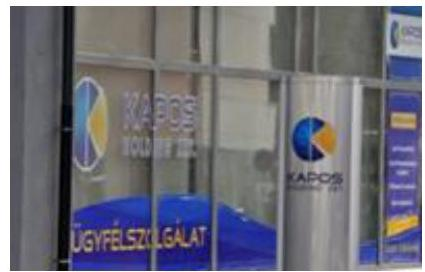
érvényesültek a Gt. ${ }^{18}$ és a Ptk. ${ }^{19}$ előírásai. A Társaság feletti tulajdonosi jogok gyakorlásának rendjét a tulajdonosi joggyakorló ${ }_{1,2}{ }^{20}$ az SZMSZ rende-let ${ }^{22}{ }_{1,2}$-ben, valamint a Társasági Szerződés ${ }^{23}$-ben határozta meg. A tulajdonosi joggyakorló ${ }_{1,2}$ az ellenőrzött időszakban szabályszerűen gyakorolta jogait, meghatározta az ügyvezető, az FB és a könyvvizsgáló feladatait, kijelölte hatáskörüket.

AZ FB ${ }^{24}$ feladatait és beszámolási kötelezettségét a Társasági Szerződés, valamint az FB ügyrendje írta elő. Az FB a Társaság Számv. tv. ${ }^{25}$ szerinti éves beszámolóiról az ellenőrzött időszakban szabályszerűen írásbeli jelentést készített, amelynek alapján döntött a Taggyűlés a beszámoló elfogadásáról.

AZ ANYAGI ÖSZTÖNZÉSI RENDSZERT a Taktv. ${ }^{26}$-ben foglaltaknak megfelelően a Taggyűlés által elfogadott javadalmazási szabályzat ${ }_{1-2}{ }^{27}$-ben szabályszerűen rögzítették.

A BESZÁMOLTATÁSI RENDSZER keretében a tulajdonosi joggyakorló ${ }_{1,2}$ az ügyvezetőt a Taggyűlés útján évente beszámoltatta a gazdálkodásról, valamint a tevékenységéről. Az ellenőrzött időszakban a Társaság éves beszámolóit - az FB előzetes írásbeli véleményezését követően - a Taggyűlés a Gt., illetve a Ptk. ${ }_{2}$-ben előírtaknak megfelelően elfogadta, a beszámolókkal kapcsolatban elkészített független könyvvizsgálói jelentések rendelkezésre álltak. A Társaság beszámoltatása a közfeladat-ellátásról az év végi beszámoló elkészítése során valósult meg.

Az Önkormányzat belső ellenőrzést a 2011-2013. években nem végzett, a 2014. évben a Társaság 2013. évi tárgyi eszköz beszerzését, leltározását és selejtezését ellenőrizte, javaslatai alapján intézkedési terv készült.

# 2. A Társaság vagyongazdálkodása szabályszerű volt-e, kötelezettségállománya jelentett-e kockázatot a működésre, illetve a közfeladat-ellátásra? 

Összegző megállapítás

### 2.1. számú megállapítás

A Társaság vagyongazdálkodása szabályszerű volt, a kötelezettségállománya nem jelentett veszélyt a működésre, illetve a közfeladat-ellátásra.

A Társaság az ellenőrzött időszakban a gazdálkodásra vonatkozó szabályzatokkal rendelkezett, a számlarend azonban nem teljes körűen felelt meg a Számv. tv. előírásainak.

AZ ÜZLETI TERVET a Társaság a Társasági Szerződésben és a Holding utasításában foglaltak szerint készítette el az ellenőrzött időszak minden évében, amelyet a Taggyűlés jóváhagyott. Az üzleti tervek részletesen tartalmazták a Társaság vízszolgáltatási, szennyvízkezelési közfeladat-ellátásának célkitűzéseit.

---

A SZÁMVITELI POLITIKA ${ }_{1-5}{ }^{28}$ a Számv. tv. előírásaival összhangban volt, melyben meghatározták a Társaságra vonatkozó szabályokat, előírásokat.

# A LELTÁROZÁSI ÉS SELEJTEZÉSI SZABÁLY-

$\mathbf{ZAT}_{1-3}{ }^{29}$-at a Számv. tv. előírásainak megfelelően a számviteli politika részeként készítették el. A Leltározási és Selejtezési Szabályzat ${ }_{1-3}$-ban meghatározták a leltározás módját, a leltározás időpontját és rendjét, rögzítették továbbá a feleslegessé vált eszközök feltárásának, hasznosításának és a selejtezés folyamatának menetét.

A PÉNZKEZELÉSI SZABÁLYZAT ${ }_{1-5}{ }^{30}$ a Számv. tv.-ben foglaltaknak megfelelően tartalmazta a pénzforgalom készpénzben, illetve bankszámlán történő lebonyolításának rendjét, a pénzkezelés személyi és tárgyi feltételeit, felelősségi szabályait, a készpénzállományt érintő pénzmozgások jogcímeit és eljárási rendjét, a napi készpénz záró állomány maximális mértékét, az ellenőrzés gyakoriságát, a pénzszállítás feltételeit, a pénzkezeléssel kapcsolatos bizonylatok rendjét.

A SZÁMLAREND ${ }^{31}$ a Számv. tv. 161. § (2) bekezdése a)-c) pontjaiban előírtak ellenére a 2012. évtől nem tartalmazta az alkalmazott 6. és 7. számlák számjelét, megnevezését, a számla tartalmát, továbbá a számla értéke növekedésének, csökkenésének jogcímeit, a számlát érintő gazdasági eseményeket, azok más számlákkal való kapcsolatát, valamint a főkönyvi számla és az analitikus nyilvántartás kapcsolatát.

BESZERZÉSI SZABÁLYZAT ${ }^{32}$-ot a Vksztv. és a 2013-ban hatályba lépő Vksztv. végrehajtási rendelet ${ }^{33}$ előírásának megfelelően 2013. május 23-án adta ki a Társaság, amelyet a MEKH ${ }^{34}$ 2013. októberében auditált.

AZ ÜZLETSZABÁLYZAT ${ }_{1,2}{ }^{35}$ a Vksztv. előírásaival összhangban rögzítette a szolgáltatási jogviszony feltételeit, a vízjogi üzemeltetési engedélyben meghatározott településekre kiterjedő érvényességét. Meghatározta továbbá a végzett szolgáltatások körét, működési területét, a környezetvédelmi feladatokat, a számlázást, a díjfizetést, a hibabejelentés módját, valamint az ügyfélszolgálat működési rendjét.

## 2.1. számú megállapítás

A Társaság vagyongazdálkodása a jogszabályi és a belső előírásoknak megfelelt.

Az analitikus és főkönyvi nyilvántartási rendszer alkalmas volt a Társaság vagyonának nyilvántartására, a bekövetkezett változások folyamatos nyomon követésére. A vagyonnyilvántartás átlátható és naprakész volt, megfelelt a Számv. tv.-ben és a Számviteli Politika ${ }_{1-5}$-ben foglaltaknak.

A Társaság éves beszámolóinak főbb mérlegadatait az 1. táblázat szemlélteti.

---

| A TÁRSASÁG FŐBB MÉRLEGADATAI (M FT-BAN) |  |  |  |  |  |
| :--: | :--: | :--: | :--: | :--: | :--: |
| Megnevezés | 2011.01.01. | 2011.12.31. | 2012.12.31. | 2013.12.31. | 2014.12.31. |
| I. Befektetett eszközök | 103,1 | 152,5 | 155,7 | 132,9 | 135,0 |
| - ebből: Tárgyi eszközök | 97,1 | 147,5 | 150,8 | 129,2 | 131,2 |
| II. Forgó eszközök | 106,5 | 139,8 | 452,1 | 333,4 | 446,1 |
| - ebből: Követelések | 52,2 | 121,7 | 433,2 | 296,0 | 417,6 |
| III. Aktív időbeli elhatárolások | 155,4 | 171,5 | 77,3 | 130,1 | 85,0 |
| Eszközök összesen | 365,0 | 463,8 | 685,1 | 596,4 | 666,1 |
| IV. Saját tőke | 118,6 | 118,6 | 165,8 | 193,7 | 120,9 |
| - ebből: Jegyzett tőke | 65,0 | 95,0 | 118,8 | 213,7 | 213,7 |
| - ebből: Jegyzett, de be nem fizetett tőke (-) | 0 | 0 | 0 | -22,9 | 0 |
| - ebből: Eredménytartalék | 31,2 | 23,6 | 16,9 | 0 | 2,8 |
| - ebből: Mérleg szerinti eredmény | 22,4 | 0 | 30,1 | 2,8 | -95,6 |
| V. Céltartalékok | 0 | 0 | 0 | 1,2 | 0 |
| VI. Kötelezettségek | 132,7 | 220,0 | 432,3 | 351,7 | 512,8 |
| VII. Passzív időbeli elhatárolások | 113,7 | 125,2 | 87,0 | 49,8 | 32,4 |
| Források összesen | 365,0 | 463,8 | 685,1 | 596,4 | 666,1 |

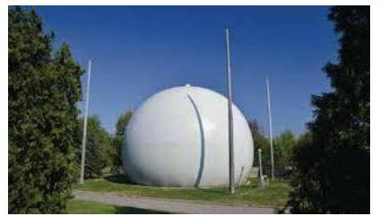

AZ ESZKÖZ VAGYON értéke 2011. január 1-jéről 2014. december 31-ére 301,1 M Ft-tal, 82,5%-kal növekedett, melyet alapvetően a követelések állományának növekedése okozott. Az ellenőrzött időszakban a tárgyi eszközök beruházása 187,4 M Ft értékben valósult meg. A Társaság az ellenőrzött időszakban a saját vagyont érintő fejlesztések esetében rendelkezett a szükséges taggyűlési jóváhagyással. Az értékcsökkenés elszámolása a Számv. tv.-ben előírtaknak megfelelt. A saját vagyon értékének megőrzését a Társaság az évenként készített beruházási terv alapján valósította meg. A beruházási terv az üzleti terv része volt, amelyet a Taggyűlés minden évben elfogadott a Társasági Szerződésben rögzítettek szerint.

## A BESZÁMOLÓKAT ALÁTÁMASZTÓ LELTÁRAK a

Számv. tv. előírásaival összhangban voltak. A Társaság az ellenőrzött időszakban a saját vagyona beszámoló szerinti értékét a Leltározási és Selejtezési Szabályzat ${ }_{1-3}$-ban, valamint a Számv. tv.-ben foglaltaknak megfelelően minden évben tételes leltárral alátámasztotta.

A FORRÁSOK alakulását alapvetően a saját tőke és a kötelezettségek változása befolyásolta. A 2011. és a 2013. években a tőkeemelések következtében a Társaság jegyzett tőkéje több mint háromszorosára növekedett a feladatellátás bővülésével összefüggésben. A Társaság 2011. és 2013. évek között eredményesen gazdálkodott, ezért tőkerendezésre nem volt szükség. A 2013. és a 2014. évben a saját tőke a jegyzett tőke értéke alá csökkent. A kötelezettségek állománya a 2011. január 1-jei 132,7 M Ft-ról 2014. december 31-re 512,8 M Ft-ra növekedett. Ezen belül a hosszú lejáratú kötelezettségek a 2011. január 1-jei 6,8 M Ft-ról 2014. december 31-re 5,0 M Ft-ra csökkentek, míg a rövid lejáratú kötelezettségek értéke a 2011. január 1-jei 125,9 M Ft-ról 2014. december 31-re 507,8 M Ft-ra növekedett. A rövid lejáratú kötelezettségek mintegy négyszeres növekedését a szállítói és az egyéb kötelezettségek növekedése okozta.

---

# 2.2. számú megállapítás 

A Társaság kötelezettségállománya nem veszélyeztette a Társaság közfeladat-ellátását, valamint a működését.

A Társaság kötelezettségállománya a 2011. január 1-jéhez képest 2014. december 31-ére közel négyszeresére növekedett. A növekedés ellenére az eladósodottság mértéke és szerkezete a közfeladat-ellátását nem veszélyeztette. A kötelezettségek alakulását és összetételét a 2. táblázat mutatja be.
2. táblázat

KÖTELEZETTSÉGEK ALAKULÁSA (M Ft)

| Megnevezés | $\begin{gathered} 2011. \\ 01.01. \end{gathered}$ | $\begin{gathered} 2011. \\ 12.31. \end{gathered}$ | $\begin{gathered} 2012 \\ 12.31. \end{gathered}$ | $\begin{gathered} 2013 \\ 12.31. \end{gathered}$ | $\begin{gathered} 2014 \\ 12.31. \end{gathered}$ |
| :--: | :--: | :--: | :--: | :--: | :--: |
| Hosszú lejáratú kötelezettségek | 6,8 | 12,9 | 9,8 | 3,1 | 5,0 |
| Rövid lejáratú kötelezettségek | 125,9 | 207,1 | 422,5 | 348,6 | 507,8 |
| ebből - Vevőtől kapott előlegek |  | 0 | 0,1 | 0,1 | 0 |
| Kötelezettségek áruszállításból és szolg. (szolgáltatók) | 55,0 | 52,8 | 230,3 | 128,1 | 278,2 |
| Röv.lej. kötelezettség kapcsolt vállalk. szemben |  | 22,3 | 47,8 | 94,9 | 38,2 |
| Egyéb |  |  |  |  |  |

 rövidlejáratú kötelezettségek | 70,9 | 132,0 | 144,2 | 124,4 | 191,4 |
| Kötelezettségek összesen | 132,7 | $\begin{gathered} 220,0 \\ \text { 220,0 } \end{gathered}$ | $\begin{gathered} 432,3 \\ 432,3 \end{gathered}$ | $\begin{gathered} 351,7 \\ 351,7 \end{gathered}$ | $\begin{gathered} 512,8 \\ 512,8 \end{gathered}$ |

A hosszú lejáratú kötelezettség 26,5%-kal csökkent, amely kötelezettség a tevékenység ellátását szolgáló termelő gépekkel, járművekkel kapcsolatban megkötött lízingszerződések alapján keletkezett.

A rövid lejáratú kötelezettségek értéke négyszeresére, ezen belül a szállítók állománya a 2011. január 1-jei értékhez viszonyítva a 2014. december 31-re ötszörösére emelkedett, amely a rövid lejáratú kötelezettségek 54,8%-át tette ki. Az ellenőrzött időszakban a rövid lejáratú kötelezettség teljesítését a Holding által működtetett cash-pool rendszer támogatta. A 2014. évben a rövid lejáratú kötelezettségek 37,7%-át az egyéb rövid lejáratú kötelezettségek állománya képviselte, amely alapvetően az év végéről a következő évre áthúzódó 12. havi adó és munkabér kifizetéshez, valamint a 2014. évben ki nem egyenlített 36,4 M Ft közművezeték-adó kötelezettséghez kapcsolódott.

Az eladósodottság mértéke és szerkezete a közfeladat-ellátását nem veszélyeztette. A 2011. és a 2013. években kedvezően, a 2012. és a 2014. években az idegen tőke megnövekedett aránya miatt kedvezőtlenül alakult az eladósodottság.

---

### 2.3. számú megállapítás

A Társaság beszámolási és adatszolgáltatási kötelezettségének teljesítése összességében szabályszerű volt. A jogszabályi előírások ellenére a közérdekű adatok megismerésének rendjét a Társaság nem szabályozta, illetve az ügyvezető a közzétételi kötelezettségének nem minden esetben tett teljes körűen eleget.

Az éves beszámolókat a Társaság elkészítette, és beterjesztette a Taggyűlés részére. A Taggyűlés a Társasági Szerződésben előírtak szerint az FB írásbeli jelentéseinek birtokában határozattal határidőben döntött az éves beszámolók elfogadásáról. A Társaság a Számv. tv. 153. § (1), valamint a 154. § (1) bekezdéseiben foglaltak szerint letétbe helyezési, illetve közzétételi kötelezettségének eleget tett.

A Társaság a Vksztv.-ben foglaltaknak megfelelően a 2013. évtől az éves beszámolók kiegészítő mellékletében a vízmű és a szennyvízkezelési ágazatra, valamint az egyéb tevékenységre vonatkozóan elkülönült beszámolót, mérleget és eredmény-kimutatást készített.

Az ellenőrzött időszak alatt egy alkalommal került sor osztalék kifizetésére, amelyet a Taggyűlés hagyott jóvá a 2011. évi eredményből. A 2012-2014. évi eredményeket taggyűlési jóváhagyással az eredménytartalékba helyezték.

A Társaság a 2013. évben a Számv. tv. 92. § (1) bekezdése előírása ellenére a beszámoló kiegészítő mellékletében nem mutatta be az immateriális javak és tárgyi eszközök nyitó bruttó értékét, annak növekedését és csökkenését, záró bruttó értékét, továbbá a halmozott értékcsökkenés nyitó értékét, tárgyévi növekedését, csökkenését, záró értékét.

A könyvvizsgálói jelentések rendelkezésre álltak az éves beszámolók jóváhagyásakor. A könyvvizsgáló az évenkénti ellenőrzésekről készített független könyvvizsgálói jelentéseket hitelesítő záradékkal látta el.

A Társaság az üzemeltetési szerződés ${ }_{1,2}$-ben előírtak szerint a víziközmű nyilvántartás alapján az eszközökhöz kapcsolódó értékcsökkenési leírás összegét negyedévenként megküldte az Önkormányzat részére.

Adatszolgáltatási kötelezettségét teljesítette a Társaság és a 2013-2014. évekre vonatkozó éves beszámolókat a Vksztv.-ben rögzítettek szerint megküldte a MEKH részére.

A Társaság Belső Adatvédelmi Szabályzat ${ }_{1,2}{ }^{36}$-vel az ellenőrzött időszakban rendelkezett, mely összhangban volt a jogszabályi előírással. Mindamellett a Belső Adatvédelmi Szabályzat ${ }_{2}$ az Info tv. ${ }^{37}$ 2012. január 1-jei hatálybalépése után (másfél évvel később) 2013. november 5-én készült el.

A Társaság, mint közfeladatot ellátó szerv a 2011. évben az Avtv. ${ }^{38}$ 20. § (8) bekezdésében, a 2012-2014. években az Info tv. 30. § (6) bekezdésében előírtakkal ellentétesen a közérdekű adatok megismerésére irányuló igények teljesítésének rendjét rögzítő szabályzattal nem rendelkezett.

Az ügyvezető az elektronikus közzétételnek nem teljes körűen tett eleget, mert a Társaság internetes honlapján, illetve a Holding honlapján való közzététel érdekében nem intézkedett az Eisztv. ${ }^{39} 3 . \S$ (2) és 6. § (1) bekezdéseiben, az Info tv. 33. § (1) és a (3), a 37. § (1) bekezdéseiben, valamint az 1. számú mellékletben foglaltaknak megfelelően. A honlapon az 1. számú melléklet II. Tevékenységre, működésre vonatkozó, valamint III. Gazdálkodási adatok nem kerültek közzétételre.

---

Az Eisztv. és az Info tv. 1. számú melléklet I. Szervezeti és személyzeti adatok fejezetben foglaltaknak megfelelően közzétételre került a szervezeti ábra, a szervezeti egységek feladatai, a vezetők neve, e-mail címe, telefonszáma.

A Társaság kinevezett belső adatvédelmi felelőst, ezzel eleget tett az Avtv. és az Info tv. előírásainak.

# 3. A Társaságnál az ellátott közfeladat bevételei és ráfordításai elszámolása, valamint az önköltségszámítás és árképzés szabályszerű volt-e? 

Összegző megállapítás

### 2.4. számú megállapítás

2. ábra

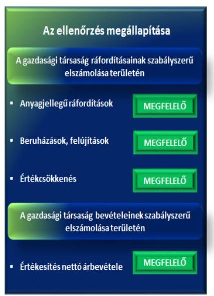

A Társaságnál az ellátott közfeladat bevételeinek és ráfordításainak elszámolása, valamint az önköltségszámítás és árképzés szabályszerű volt.

Az ellátott közfeladat bevételeinek és ráfordításainak elszámolása megfelelt a jogszabályi előírásoknak.

A mintavétellel ellenőrzött területek értékelését a 2. ábra mutatja.
Az értékesítés nettó árbevételének elszámolása megfelelő volt, a bevételek kiszámlázása megfelelt a jogszabályi előírásoknak. A bevételt a megfelelő számlacsoportban és számlaszámokra számolták el. A számla kijelöléssel, számlaszámok bontásával és a számlasorszámok alkalmazásával biztosították a közfeladat bevételeinek elkülönítését.

Az anyagjellegű ráfordítások elszámolása megfelel a jogszabályi előírásoknak. A költségeket a számlarendben, illetve a számlatükör ${ }_{1-5}$-ben rögzített, a könyvviteli eseménynek megfelelő főkönyvi számlára számolták el.

Az értékcsökkenési leírás elszámolása megfelelő volt. A Társaság saját eszközei tekintetében szabályszerűen alkalmazta a Számv. tv. szerint meghatározott leírási kulcsokat, és figyelembe vette a maradványértékeket.

A beruházás, felújítás elszámolása megfelelő volt. Az ellenőrzött időszak alatt összesen 193,3 M Ft értékben valósult meg immateriális javak és tárgyi eszközök beruházása, a költségként elszámolt értékcsökkenési leírás összesen 157,5 M Ft volt. A költségként elszámolt értékcsökkenésnek megfelelő mértékű eszközpótlás valósult meg az ellenőrzött időszakban.

A követelésállomány a 2011. január 1-jei 52,2 M Ft értékről 2014. december 31-ére 417,6 M Ft értékre, nyolcszorosára növekedett. Különösen növekedett a lakossággal szembeni 360 napon túl lejárt követelések állománya, amely a 2011. január 1-jei 1,1 M Ft-ról 2014. december 31-ére 27,2 M Ft-ra emelkedett. A Társaság a követelések értékvesztését a Számv. tv.-ben és a Számviteli Politika ${ }_{1-5}$-ben foglaltaknak megfelelően számolta el. A követelés kezelését a Társaság a Kintlévőség-kezelési utasítás ${ }_{1-4}{ }^{40}$ szerint végezte. A kintlévőség kezelése során a Társaság betartotta a Vksztv. vonatkozó előírásait és a Vksztv. végrehajtási rendelet szerződésszegés esetére megfogalmazott előírásait. A 3. táblázat a követelések állományának alakulását mutatja 2011-2014. években.
3. táblázat

Követelések állományának alakulása 2011-2014. években (M Ft-ban)

| Megnevezés | 2011. | 2011. | 2012. | 2013. | 2014. |
| :-- | :--: | :--: | :--: | :--: | :--: |
|  | 01.01. | 12.31. | 12.31. | 12.31. | 12.31. |
| Vevőkövetelés | 46,5 | 118,3 | 404,7 | 257,5 | 371,4 |
| Összes követelés | 52,2 | 121,7 | 433,2 | 296,0 | 417,6 |

Forrás: a Társaság 2011-2014. évi beszámolói
2.5. számú megállapítás

Az önköltségszámítás szabályait meghatározták, az árképzés szabályszerű volt.

Számviteli szétválasztási szabályzatát ${ }^{41}$ a Társaság Vksztv.-ben foglaltaknak megfelelően elkészítette. A szabályzatban meghatározták az eszközök és források, valamint a bevételek és költségek tevékenységenkénti elkülönítését, továbbá a közfeladatok és az egyéb tevékenységek elkülönítésének módját.

Az önköltségszámítási szabályzat ${ }_{1-3}{ }^{42}$-at a Társaság a Számv. tv. szerint készítette el. A szabályzat meghatározta a közfeladat-ellátásához kapcsolódó költségeket tevékenységenként (ivóvízellátás és szennyvízkezelés), valamint településenként, továbbá az egyéb tevékenységek közvetlen költségeit és a tevékenységek eredményét. A szabályzat tartalmazta a tevékenységek elkülönítéséhez szükséges vetítési alapokat.

# Az egyes közszolgáltatások árának meghatározása összhangban volt a jogszabályi előírásokkal. A 2011. évben alkalmazott díjak az Ártörvény 10. § (1) bekezdésében foglaltak szerint a Társaság előterjesztése, díjkalkulációja alapján kerültek meghatározásra. Az Önkormányzat a díjakat rendeletben szabályszerűen állapította meg. Az Ártörvény 2011. december 31-én hatályon kívül helyezte a települési önkormányzatok ivóvíz díjára, valamint a szennyvízelvezetés, szennyvíztisztítás és -kezelés díjaira vonatkozó hatósági ár megállapítási jogkörét. A Vksztv. a díjak megállapítását 2012. január 1-jétől a MEH javaslatának figyelembevételével a víziközmű-szolgáltatásért felelős miniszter hatáskörébe utalta. A Társaság a 2013. és a 2014. évi díjakat a Rezsicsökkentési tv. ${ }^{43}$-ben előírtakkal összhangban határozta meg. A Társaság az ellenőrzött időszakban a jogszabályi előírásoknak megfelelő díjakat alkalmazott.

---

# Javaslatok 

Az ÁSZ tv. 33. § (1) bekezdésében foglaltak értelmében az ellenőrzött szervezet vezetője köteles a jelentésben foglalt megállapításokhoz kapcsolódó intézkedési tervet összeállítani és azt a jelentés kézhezvételétől számított 30 napon belül az ÁSZ részére megküldeni. Amennyiben az ellenőrzött szervezet vezetője nem küldi meg határidőben az intézkedési tervet, vagy továbbra sem elfogadható intézkedési tervet küld, az Állami Számvevőszék elnöke az ÁSZ tv. 33. § (3) bekezdése a) és b) pontjaiban foglaltakat érvényesítheti.

## KAVÍZ Kaposvári Víz- és Csatornamű Kft. ügyvezetőjének

1. Intézkedjen a számlarend módosításáról annak érdekében, hogy az a jogszabályi előírásoknak megfeleljen.
(2.1. sz. megállapítás 5. bekezdése alapján)
2. Intézkedjen a közérdekű adatok megismerésére irányuló igények teljesítésének rendjét rögzítő szabályzat elkészítéséről.
(2.4. sz. megállapítás 9. bekezdése alapján)
3. Intézkedjen a kötelezően közzéteendő közérdekű adatok teljes körű közzétételéről.
(2.4. sz. megállapítás 10. bekezdése alapján)

---

.

---

# Mellékletek 

- I. sz. melléklet: Értelmező szótár
cash-pool
gazdasági társaság
gazdálkodó szervezet
kapcsolt vállalkozás
közfeladat
közgyűlés
közszolgáltatás
többségi befolyást biztosító részesedés
tulajdonosi joggyakorló
víziközmű-szolgáltatás

Folyamat, melyet pénzintézetek végeznek, mikor az ügyfelük több pénzforgalmi számláját összevonják egy számlára, hogy kedvezőbb kondíciókat biztosítsanak.
Ptk. 3.88. § (1) bekezdése szerint „a gazdasági társaságok üzletszerű közös gazdasági tevékenység folytatására, a tagok vagyoni hozzájárulásával létrehozott, jogi személyiséggel rendelkező vállalkozások, amelyekben a tagok a nyereségből közösen részesednek, és a veszteséget közösen viselik".
A Ptk. ${ }^{44}$ 685. § c) pontja szerint gazdálkodó szervezet: „az állami vállalat, az egyéb állami gazdálkodó szerv, a szövetkezet, a lakásszövetkezet, az európai szövetkezet, a gazdasági társaság, az európai részvénytársaság, az egyesülés, az európai gazdasági egyesülés, az európai területi együttműködési csoportosulás, az egyes jogi személyek vállalata, a leányvállalat, a vízgazdálkodási társulat, az erdő birtokossági társulat, a végrehajtói iroda, az egyéni cég, továbbá az egyéni vállalkozó." (hatályos: 2014. március 15-éig)
A Hgt. ${ }^{45}$ 2. § (1) bekezdés 15. pontja szerint „a polgári perrendtartásról szóló törvényben meghatározott gazdálkodó szervezet, ide nem értve azt a költségvetési szervet, amelyet az államháztartásról szóló törvény szerint közfeladat-ellátására hoztak létre." (hatályos: 2014. március 15-étől)
Azok a társaságok, amelyekben az Önkormányzatnak 100%-os vagy többségi tulajdona van.
Jogszabályban meghatározott állami vagy önkormányzati feladat, amit az arra kötelezett közérdekből, jogszabályban meghatározott követelményeknek és feltételeknek megfelelve végez, ideértve a lakosság közszolgáltatásokkal való ellátását, továbbá az állam nemzetközi szerződésekben vállalt kötelezettségeiből adódó közérdekű feladatokat, valamint e feladatok ellátásához szükséges infrastruktúra biztosítását is (Nvtv. ${ }^{46}$ 3. § (1) bekezdés 7. pont).
Az Önkormányzat döntési jogkörrel felruházott szerve.
A közszolgáltatás: „közcélú, illetőleg közérdekű szolgáltatást jelent, amely egy nagyobb közösség (állam, település) minden tagjára nézve megközelítőleg azonos feltételek mellett vehető igénybe, ezért valamilyen mértékig közösségi megszervezést, illetve szabályozást, ellenőrzést igényel." Az Ebktv.

 ${ }^{47}$ 3. § d) pontja a következőképpen határozza meg a közszolgáltatást: „szerződéskötési kötelezettség alapján a lakosság alapvető szükségleteinek ellátására irányuló szolgáltatás, így különösen a villamos energia-, gáz-, hő-, víz-, szennyvíz- és hulladékkezelési, köztisztasági, postai és távközlési szolgáltatás, továbbá a menetrend alapján közlekedő járművekkel végzett közforgalmú személyszállítás".
A Ptk. 2 8:2. § (1) bekezdése szerint „többségi befolyás az olyan kapcsolat, amelynek révén természetes személy vagy jogi személy (befolyással rendelkező) egy jogi személyben a szavazatok több mint felével vagy meghatározó befolyással rendelkezik."
Aki a nemzeti vagyon felett az államot vagy a helyi önkormányzatot megillető tulajdonosi jogok és kötelezettségek összességének gyakorlására jogosult. (Nvtv. 3. § (1) bekezdés 17. pont).
A Vksztv. 2. § 24. pontja szerint: a közműves ivóvízellátás, a közműves szennyvízelvezetés és -tisztítás, valamint az egyesített rendszerű csapadékvíz-elvezetés (a továbbiakban együtt: víziközmű-szolgáltatási ágazatok) közül egy vagy több, a víziközmű-szolgáltató által a felhasználók részére nyújtott szolgáltatás,
a) a felszíni vagy felszín alatti víz kitermelése, duzzasztása, tárolása, kezelése és elosztása,
b) a szennyvíz összegyűjtése és kezelése, amelyet ezt követően a felszíni vizekbe juttatnak.

II. SZ. MELLÉKLET: MŰKÖDÉSI ADATOK

| A TÁRSASÁG MŰKÖDÉSÉNEK FŐBB JELLEMZŐI (M Ft/\%) |  |  |  |  |  |  |
| :--: | :--: | :--: | :--: | :--: | :--: | :--: |
| Sorszám | Megnevezés |  | 2011. | 2012. | 2013. | 2014. |
| 1. | A gazdasági társaság tulajdonosi összetétele: |  |  |  |  |  |
|  | Önkormányzat megnevezése: |  | Kaposvár Megyei Jogú Város Önkormányzata 2011. március 22-ig, ezt követően a Kapos Holding Közszolgáltató Zrt. |  |  |  |  |
| 2. | Önkormányzat tulajdoni részesedésének aránya | $\%$ | 98,91 | 79,12 | 85,67 | 85,68 |
| 3. | Önkormányzat tulajdoni részesedésének összege | M Ft | 94,0 | 94,0 | 183,0 | 183,2 |
| 4. | A tárgyévben a gazdasági társaság saját vagyona után elszámolt értékcsökkenés összege | M Ft | 32,3 | 36,4 | 37,9 | 39,3 |
| 5. | A tárgyévben a saját tulajdonú eszközök pótlására (karbantartás, felújítás, beruházás) elszámolt költség | M Ft | 106,1 | 81,6 | 30,4 | 71,5 |
| 6. | Értékesítés nettó árbevétele | M Ft | 1931,2 | 1994,6 | 2152,4 | 2269,0 |
| 7. | Működési cash flow | M Ft | 56,5 | 51,3 | $-78,9$ | $-4,5$ |

FÜGGELÉK: ÉSZREVÉTELEK 

A jelentéstervezetet a Számvevőszék 15 napos észrevételezésre megküldte az ellenőrzött szervezetek vezetőinek az ÁSZ tv. 29. § (1) bekezdése előírásának megfelelően.

Az ÁSZ a jelentéstervezetet észrevételezésre megküldte a Kaposvár Megyei Jogú Város Önkormányzata polgármesterének, a Kapos Holding Közszolgáltató Zrt. elnök-vezérigazgatójának, valamint a KAVÍZ Kaposvári Víz- és Csatornamű Kft. ügyvezetőjének.

A Kaposvár Megyei Jogú Város Önkormányzat polgármesterének és a KAVÍZ Kft. ügyvezetőjének nemleges észrevételét a függelék alább tartalmazza. A Kapos Holding Közszolgáltató Zrt. elnök-vezérigazgatója az ÁSZ tv. 29. § (2) bekezdésében foglalt észrevételezési jogával nem élt, a törvényes határidőn belül észrevételt nem tett.

[^0]
[^0]:    * 29. § (1) Az Állami Számvevőszék az ellenőrzési megállapításait megküldi az ellenőrzött szervezet vezetőjének vagy az általa megbízott személynek, és annak, akinek személyes felelősségét állapította meg.
    (2) Az ellenőrzött szervezet vezetője és a felelősként megjelölt személy az ellenőrzés megállapításaira tizenöt napon belül írásban észrevételt tehet.
    (3) Az Állami Számvevőszék az észrevételre a beérkezésétől számított harminc napon belül írásban válaszol. A figyelembe nem vett észrevételeket köteles a jelentésben feltüntetni, és megindokolni, hogy azokat miért nem fogadta el.

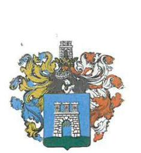

# Kaposvár Megyei Jogú Város Polgármestere 

■ 7400 Kaposvár, Kossuth tér 1. Telefon: (36) 82/501-501, 501-503 Fax: (36) 82/501-500 E-mail: polgarmester@kaposvar.hu
ügyiratszám: G/196-16/16.

Állami Számvevőszék
Domokos László
elnök

Budapest 4.
Pf. 54
1364
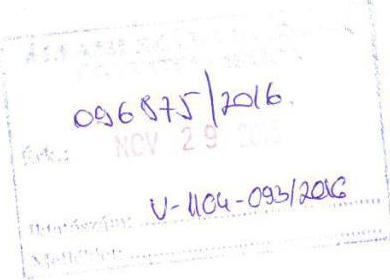

Tisztelt Elnök Úr!

A V-1104-089/2016., valamint a V-1102-190/2016. iktatószámú leveleiben megküldött, ..Az önkormányzatok gazdasági társaságai - Az önkormányzatok többségi tulajdonában lévő gazdasági társaságok gazdálkodásának ellenőrzése" tárgyban a KAVÍZ Kaposvári Víz- és Csatornamű Kft.-nél, és a Kaposvári Közlekedési Zrt.-nél végzett ellenőrzésről készült számvevőszéki jelentéstervezeteket megkaptam. Azokra észrevételt nem kívánok tenni.

Engedje meg, hogy ezúton is megköszönjem számvevő munkatársainak az ellenőrzés során végzett alapos és lelkiismeretes munkáját.

Kaposvár, 2016. november 22.

Tisztelettel:
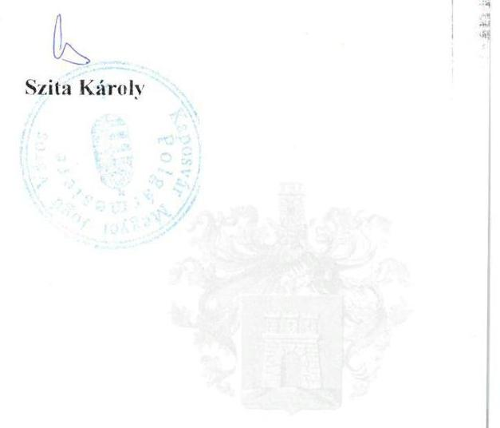

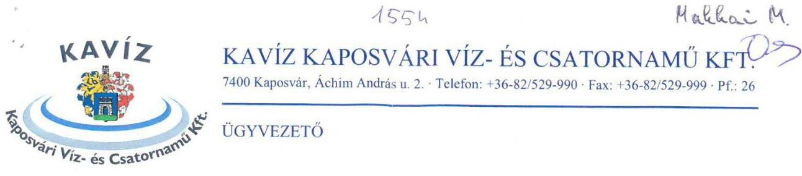

Állami Számvevőszék
Domokos László Elnök Úr részére

Budapest
Apáczai Csere János u. 10. 1052

Ikt. szám: KK/2016/1141
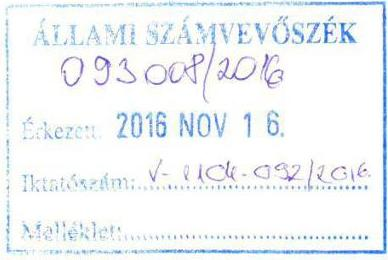

Tisztelt Elnök Úr!

V-1104-087/2016. iktatószámú levelében megkaptam „Az önkormányzatok gazdasági társaságai - Az önkormányzatok többségi tulajdonában lévő gazdasági társaságok gazdálkodásának ellenőrzése - KAVÍZ Kaposvári Víz- és Csatornamű Kft." címmel készített számvevőszéki jelentés tervezetét.

Megköszönöm Elnök Úrnak és Munkatársainak a vizsgálat szakszerű lefolytatását.
A vizsgálat során szerzett tapasztalatok hozzájárulnak a jövőbeni még eredményesebb, szabályosabb gazdálkodáshoz, működéshez.

Kaposvár, 2016. november 11.
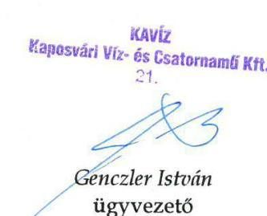

Kapja: - Címzett,

- Irattár.

RÖVIDÍTÉSEK JEGYZÉKE 

${ }^{1}$ Társaság
${ }^{2} \mathrm{M} Ft$
${ }^{3}$ Önkormányzat
${ }^{4}$ Holding
${ }^{5}$ Ötv.
${ }^{6}$ Mötv.
${ }^{7}$ 479/2009/EK rendelet
${ }^{8}$ Áht.
${ }^{9}$ ÁSZ
${ }^{10}$ gazdasági program ${ }_{1,2}$
${ }^{11}$ Vagyongazdálkodási Rendelet ${ }_{1-3}$
${ }^{12}$ Ártörvény
${ }^{13}$ díjrendelet
${ }^{14}$ Önkormányzat közgyűlése
${ }^{15}$ üzemeltetési szerződés ${ }_{1,2}$

KAVÍZ Kaposvári Víz- és Csatornamű Kft.
millió forint
Kaposvár Megyei Jogú Város Önkormányzata
2011. december 14-éig Kaposvári Közszolgáltató Holding Zártkörűen Működő Részvénytársaság
2011. december 15-étől Kapos Holding Közszolgáltató Zártkörűen Működő Részvénytársaság
a helyi önkormányzatokról szóló 1990. évi LXV. törvény (hatálytalan: 2014. október 12-étől)
Magyarország helyi önkormányzatairól szóló 2011. évi CLXXXIX. törvény (hatályos: 2012. január 1-jétől)
az Európai Közösséget létrehozó szerződéshez csatolt, a túlzott hiány esetén követendő eljárásról szóló 2009. május 25-i 479/2009/EK rendelet
az államháztartásról szóló 2011. évi CXCV. törvény (hatályos: 2011. december 31-étől)
Állami Számvevőszék
gazdasági program: 2011-2014. évekre szóló "Kaposvár a legfontosabb" nevet viselő gazdasági programja
gazdasági program: „Hiszünk egymásban a kaposváriak programja - 2014." nevet viselő várospolitikai célokat megfogalmazó program, amelyet az Önkormányzat közgyűlése a 213/2014. (X. 30.) önkormányzati határozatával jóváhagyott
Vagyongazdálkodási Rendelet: Kaposvár Megyei Jogú Város Önkormányzatának többször módosított 34/2005. (VI. 24.) számú rendelete az Önkormányzat vagyonáról, a vagyongazdálkodás szabályairól, valamint a nem lakáscélú helyiségek bérletéről (hatályos: 2011. február 28-áig)
Vagyongazdálkodási Rendelet: Kaposvár Megyei Jogú Város Önkormányzatának többször módosított 9/2011. (II. 25.) számú rendelete az Önkormányzat vagyonáról, a vagyongazdálkodás szabályairól, valamint a nem lakáscélú helyiségek bérletéről (hatályos: 2011. március 1-jétől 2012. október 14-éig)
Vagyongazdálkodási Rendelet: Kaposvár Megyei Jogú Város Önkormányzatának többször módosított 59/2012. (X. 03.) számú rendelete az önkormányzati vagyongazdálkodásról (hatályos: 2012. október 15-étől)
az árak megállapításáról szóló 1990. évi LXXXVII. törvény (hatályos: 1991. január 1-jétől)
az Önkormányzat 55/2010. (XI. 17) számú rendelettel módosított 26/1994. (VI. 09.) számú önkormányzati rendelete az önkormányzati tulajdonú víziközműből szolgáltatott ivóvíz díjának és az önkormányzati tulajdonú víziközmű által biztosított szennyvízelvezetés, szennyvíztisztítás és -kezelés díjának megállapításáról (hatályos: 2011. január 1-jétől - 2011. december 31-éig)
Kaposvár Megyei Jogú Város Önkormányzatának Közgyűlése
üzemeltetési szerződés: 2009. január 15-én a KAVÍZ és Önkormányzat között az önkormányzati víziközmű vagyon üzemeltetési célú használatba adásáról a Vízgazd. tv. alapján létrejött szerződés (hatályos: 2012. december 31-éig)
üzemeltetési szerződés: 2012. december 31-én a KAVÍZ és Önkormányzat között az önkormányzati víziközmű vagyon üzemeltetési célú használatba adásáról a

${ }^{16}$ Vksztv.
${ }^{17}$ Taggyűlés
${ }^{18} \mathrm{Gt}$.
${ }^{19}$ Ptk. 2
${ }^{20}$ tulajdonosi joggyakorló ${ }_{1}$
${ }^{21}$ tulajdonosi joggyakorló2
${ }^{22}$ SZMSZ rendelet ${ }_{3-2}$
${ }^{23}$ Társasági Szerződés
${ }^{24} \mathrm{FB}$
${ }^{25}$ Számv. tv.
${ }^{26}$ Taktv.
${ }^{27}$ javadalmazási szabályzat ${ }_{3-2}$
${ }^{28}$ Számviteli Politika ${ }_{3-5}$
${ }^{29}$ Leltározási és Selejtezési Szabályzat ${ }_{1-3}$
${ }^{30}$ Pénzkezelési Szabályzat ${ }_{3-5}$

Vízgazd. tv. és a Vksztv. alapján, Bérleti-üzemeltetési Szerződés megnevezéssel létrejött, módosított szerződés (hatályos: 2013. január 1-jétől)
a víziközmű-szolgáltatásról szóló 2011. évi CCIX. törvény (hatályos: 2011. december 31-étől)
a KAVÍZ Kaposvári Víz- és Csatornamű Kft. taggyűlése
a gazdasági társaságokról szóló 2006. évi IV. törvény (hatálytalan 2014. március 15-től)
a Polgári Törvénykönyvről szóló 2013. évi V. törvény (hatályos: 2014. március 15-étől)
Kaposvár Megyei Jogú Város Önkormányzata (2011. március 22-éig)
Kapos Holding Közszolgáltató Zártkörűen Működő Részvénytársaság (2011. március 23-ától)
SZMSZ rendelet: Kaposvár Megyei Jogú Város Önkormányzatának többször módosított 4/1997. (I. 21.) számú rendelete a Közgyűlés és Szervei Szervezeti és Működési Szabályzatáról (hatályos: 2012. december 31-éig)
SZMSZ rendelet: Kaposvár Megyei Jogú Város Önkormányzatának többször módosított 85/2012. (XII. 17.) számú rendelete a Közgyűlés és Szervei Szervezeti és Működési Szabályzatáról (hatályos: 2013. január 1-jétől)
KAVÍZ Kaposvári Víz- és Csatornamű Kft. Társasági Szerződése
KAVÍZ Kaposvári Víz- és Csatornamű Kft. Felügyelő Bizottsága
a számvitelről szóló 2000. évi C. törvény (hatályos: 2001. január 1-jétől)
a köztulajdonban álló gazdasági társaságok gazdaságosabb működéséről szóló 2009. évi CXXII. törvény (hatályos: 2009. december 4-étől)
javadalmazási szabályzat: a KAVÍZ Kaposvári Víz- és Csatornamű Kft. javadalmazási szabályzata (hatályos: 2012. május 21-éig)
javadalmazási szabályzat: a KAVÍZ Kaposvári Víz- és Csatornamű Kft. javadalmazási szabályzata (hatályos: 2012. május 22-étől)
Számviteli Politika: a KAVÍZ Kaposvári Víz- és Csatornamű Kft. Számviteli Politikája (hatályos: 2011. június 30-áig)
Számviteli Politika: a KAVÍZ Kaposvári Víz- és Csatornamű Kft. Számviteli Politikája (hatályos: 2012. augusztus 9-éig)
Számviteli Politika: a KAVÍZ Kaposvári Víz- és Csatornamű Kft. Számviteli Politikája (hatályos: 2012. december 31-éig)
Számviteli Politika: a KAVÍZ Kaposvári Víz- és Csatornamű Kft. Számviteli Politikája (hatályos: 2014. január 31-éig)
Számviteli Politika: a KAVÍZ Kaposvári Víz- és Csatornamű Kft. Számviteli Politikája (hatályos: 2014. február 1-jétől)
Leltározási és Selejtezési szabályzat: a KAVÍZ Kaposvári Víz- és Csatornamű Kft. Leltározási és Selejtezési szabályzata (hatályos: 2011. június 30-áig)
Leltározási és Selejtezési szabályzat: a KAVÍZ Kaposvári Víz- és Csatornamű Kft. Leltározási és Selejtezési szabályzata (hatályos: 2012. augusztus 9-éig)
Leltározási és Selejtezési szabályzat: a KAVÍZ Kaposvári Víz- és Csatornamű Kft. Leltározási és Selejtezési szabályzata (hatályos: 2012. augusztus 10-étől)
Pénzkezelési Szabályzat: a KAVÍZ Kaposvári Víz- és Csatornamű Kft. Pénzkezelési Szabályzata (hatályos: 2011. június 30-áig)
Pénzkezelési Szabályzat: a KAVÍZ Kaposvári Víz- és Csatornamű Kft. Pénzkezelési Szabályzata (hatályos: 2012. augusztus 9-éig)
Pénzkezelési Szabályzat: a KAVÍZ Kaposvári Víz- és Csatornamű Kft. Pénzkezelési Szabályzata (hatályos: 2013. február 1-jéig)

${ }^{31}$ számlarend
${ }^{32}$ Beszerzési Szabályzat
${ }^{33}$ Vksztv. végrehajtási rendelet
${ }^{34}$ MEKH/MEH
${ }^{35}$ Üzletszabályzat ${ }_{1,2}$
${ }^{36}$ Belső Adatvédelmi Szabályzat ${ }_{1,2}$
${ }^{37}$ Info tv.
${ }^{38}$ Avtv.
${ }^{39}$ Eisztv.
${ }^{40}$ Kintlévőség-kezelési utasítás1-4
${ }^{41}$ Számviteli Szétválasztási Szabályzat
${ }^{42}$ Önköltségszámítási Szabályzat ${ }_{1-3}$
${ }^{43}$ Rezsicsökkentési tv.
${ }^{44}$ Ptk. 1
${ }^{45} \mathrm{Hgt}$.

Pénzkezelési Szabályzat4: a KAVÍZ Kaposvári Víz- és Csatornamű Kft. Pénzkezelési Szabályzata (hatályos: 2014. szeptember 14-éig)
Pénzkezelési Szabályzat5: a KAVÍZ Kaposvári Víz- és Csatornamű Kft. Pénzkezelési Szabályzata (hatályos: 2014. szeptember 15-étől)
KAVÍZ Kaposvári Víz- és Csatornamű Kft. Számlarendje (hatályos: 2009. február 1-jétől)
KAVÍZ Kaposvári Víz- és Csatornamű Kft. Beszerzési Szabályzata (hatályos: 2013. május 23-ától)
58/2013. (II. 27.) Korm. rendelet a víziközmű-szolgáltatásról szóló 2011. évi CCIX. törvény egyes rendelkezéseinek végrehajtásáról (hatályos: 2013. március 1-jétől)
Magyar Energia Hivatal 2012. január 1-jétől, ezt követően Magyar Energetikai és
 Közmű-szabályozási Hivatal (2013. április 4-től)
Üzletszabályzat ${ }_{1}$ : a KAVÍZ Kaposvári Víz- és Csatornamű Kft. Üzletszabályzata (hatályos: 2013. október 2-áig)
Üzletszabályzat 2: a KAVÍZ Kaposvári Víz- és Csatornamű Kft. Üzletszabályzata (hatályos: 2013. október 3-ától)
Belső Adatvédelmi Szabályzat 1: a KAVÍZ Kaposvári Víz- és Csatornamű Kft. Belső Adatvédelmi Szabályzata (hatályos: 2013. november 4-éig)
Belső Adatvédelmi Szabályzat 2: a KAVÍZ Kaposvári Víz- és Csatornamű Kft. Belső Adatvédelmi Szabályzata (hatályos: 2013. november 5-étől)
az információs önrendelkezési jogról és az információszabadságról szóló 2011. évi CXII. törvény (hatályos: 2011. július 26-ától)
a személyes adatok védelméről és a közérdekű adatok nyilvánosságáról szóló 1992. évi LXIII. törvény (hatályos: 2012. január 1-jéig)
az elektronikus információszabadságról szóló 2005. évi XC. törvény (hatályos: 2011. december 31-éig)
Kintlévőség-kezelési utasítás 1: a KAVÍZ Kaposvári Víz- és Csatornamű Kft. Kintlévőség-kezelési utasítása (hatályos: 2012. szeptember 29-éig)
Kintlévőség-kezelési utasítás 2: a KAVÍZ Kaposvári Víz- és Csatornamű Kft. Kintlévőség-kezelési utasítása (hatályos: 2012. december 13-áig)
Kintlévőség-kezelési utasítás 3: a KAVÍZ Kaposvári Víz- és Csatornamű Kft. Kintlévőség-kezelési utasítása (hatályos: 2014. február 28-áig)
Kintlévőség-kezelési utasítás 4: a KAVÍZ Kaposvári Víz- és Csatornamű Kft. Kintlévőség-kezelési utasítása (hatályos: 2014. március 1-jétől)
Számviteli Szétválasztási Szabályzat 1: a KAVÍZ Kaposvári Víz- és Csatornamű Kft. számviteli szétválasztási szabályzata (hatályos: 2013. január 1-jétől - 2014. április 30-áig)
Számviteli Szétválasztási Szabályzat 2: a KAVÍZ Kaposvári Víz- és Csatornamű Kft. számviteli szétválasztási szabályzata (hatályos: 2014. május 1-jétől)
Önköltségszámítási Szabályzat 1: a KAVÍZ Kaposvári Víz- és Csatornamű Kft. önköltségszámítási szabályzata (hatályos: 2012. december 30-áig)
Önköltségszámítási Szabályzat 2: a KAVÍZ Kaposvári Víz- és Csatornamű Kft. önköltségszámítási szabályzata (hatályos: 2014. április 30-áig)
Önköltségszámítási Szabályzat 3: a KAVÍZ Kaposvári Víz- és Csatornamű Kft. önköltségszámítási szabályzata (hatályos: 2014. május 1-jétől)
a rezsicsökkentések végrehajtásáról szóló 2013. évi LIV. törvény (hatályos: 2013. május 9-től)
a Polgári Törvénykönyvről szóló 1959. évi IV. törvény (hatálytalan: 2014. március 15-étől)
a hulladékról szóló 2012. évi CLXXXV. törvény (hatályos: 2013. január 1-jétől)

---

${ }^{46}$ Nvtv.
${ }^{47}$ Ebktv.
a nemzeti vagyonról szóló 2011. évi CXCVI. törvény (hatályos: 2012. január 1-jétől)
az egyenlő bánásmódról és az esélyegyenlőség előmozdításáról szóló 2003. évi CXXV. törvény (hatályos: 2004. január 27-étől)

---

# ÁLLAMI SZÁMVEVŐSZÉK 

1052 Budapest, Apáczai Csere János utca 10.
Levélcím: 1364 Budapest 4. Pf. 54
Telefon: +36 14849100 Telefax: +36 14849200
www.asz.hu
