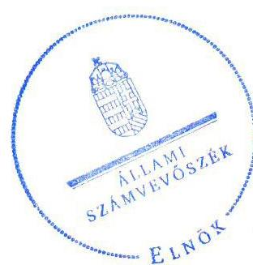
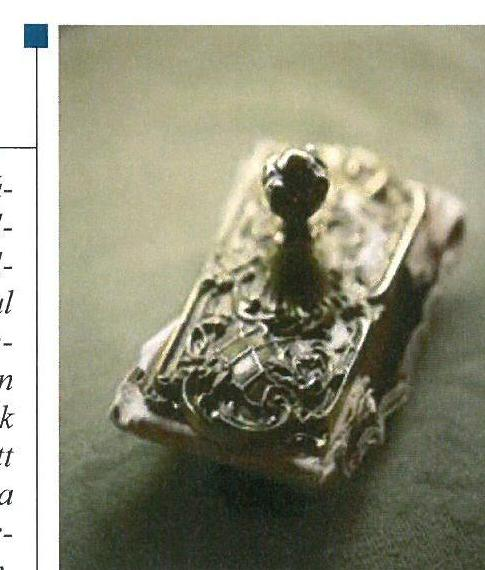
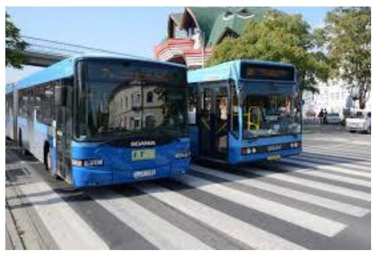
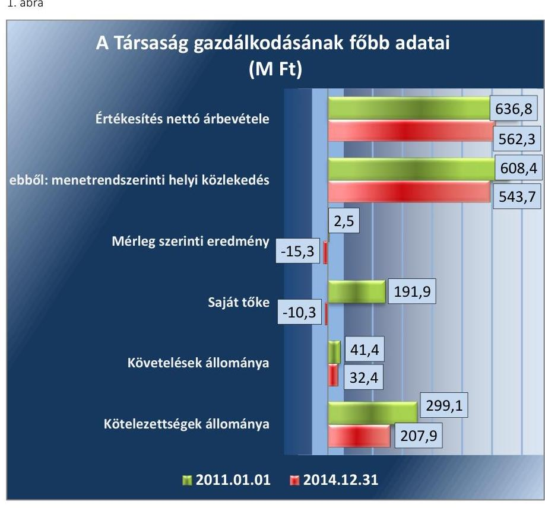
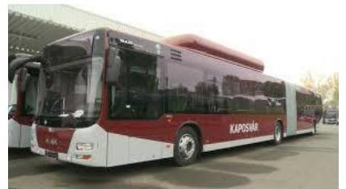
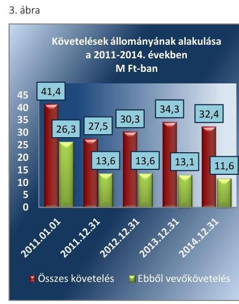
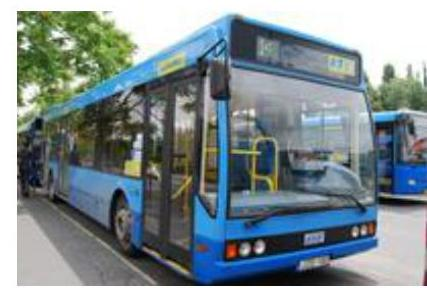
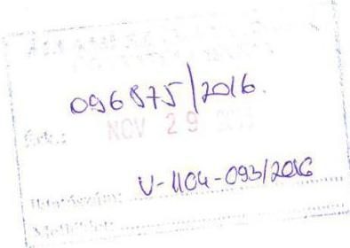
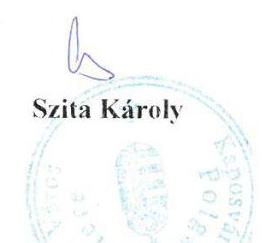

# Jelentés 

## Az önkormányzatok gazdasági társaságai

Az önkormányzatok többségi tulajdonában lévő gazdasági társaságok gazdálkodásának ellenőrzése - Kaposvári Közlekedési Zrt. 2016.

Az ÁSZ az államháztartáson kívül müködő közfel-adat-ellátó rendszerek el-lenőrzéseivel hozzájárul ahhoz, hogy a közpénzeket az államháztartáson kívül müködő szervezetek is átlátható, rendezett módon használják fel a közfeladatok ellátása érdekében.

---

# Jelentés 

## Az önkormányzatok gazdasági társaságai

Az önkormányzatok többségi tulajdonában lévő gazdasági társaságok gazdálkodásának ellenőrzése - Kaposvári Közlekedési Zrt.
2016. 12. hó 20. nap

16255
www.asz.hu

## 

---

# AZ ELLENŐRZÉST FELÜGYELTE: 

MAKKAI MÁRIA felügyeleti vezető

## AZ ELLENŐRZÉST VEZETTE ÉS A VÉGREHAJTÁSÁÉRT FELELŐS:

SALI SÁNDORNÉ ellenőrzésvezető

## A PROGRAM ÖSSZEÁLLÍTÁSÁÉRT FELELŐS:

JANIK JÓZSEF osztályvezető

## A TÉMÁHOZ KAPCSOLÓDÓ KORÁBBI SZÁMVEVŐSZÉKI JELENTÉSEK:

- címe: Jelentés Az önkormányzatok gazdasági társaságai Az önkormányzatok többségi tulajdonában lévő gazdasági társaságok közfeladat ellátását érintő gazdálkodási tevékenysége szabályszerűségének ellenőrzése - Kaposvári Önkormányzati Vagyonkezelő és Szolgáltató Zrt.
- sorszáma: 15066

IKTATÓSZÁM: V-1102-193/2016.
TÉMASZÁM: 2136
ELLENŐRZÉS-AZONOSÍTÓ SZÁM: V070766

---

# TARTALOMJEGYZÉK 

■ ÖSSZEGZÉS ..... 5
■ AZ ELLENŐRZÉS CÉLJA ..... 6
■ AZ ELLENŐRZÉS TERÜLETE ..... 7
■ AZ ELLENŐRZÉS HÁTTERE, INDOKOLTSÁGA ..... 9
■ A JELENTÉS LÉNYEGES KÉRDÉSKÖREI ..... 10
■ ELLENŐRZÉS HATÓKÖRE ÉS MÓDSZEREI ..... 11
■ MEGÁLLAPÍTÁSOK ..... 13
■ JAVASLATOK ..... 21
■ MELLÉKLETEK ..... 23
I. Sz. melléklet: Értelmező szótár ..... 23
II. Sz. melléklet: Múködési adatok ..... 24
■ FÜGGELÉK: ÉSZREVÉTELEK ..... 25
■ RÖVIDÍTÉSEK JEGYZÉKE ..... 29

---

.

---

# ÖSSZEGZÉS 

A 2011-2014. években a Kaposvári Közlekedési Zrt.-nél a Kaposvár Megyei Jogú Város Önkormányzata a közfeladat-ellátását szabályszerűen szervezte meg. Az Önkormányzat és a Kapos Holding Közszolgáltató Zrt. tulajdonosi joggyakorlása szabályos volt. A Társaság vagyongazdálkodása megfelelt a jogszabályi előírásoknak. A bevételek és a ráfordítások elszámolása megfelelő volt az anyagjellegú ráfordítások kivételével, mely a közfeladat költségeinek elkülönítése tekintetében nem volt szabályszerű. Az önköltségszámítás szabályait meghatározták, az árképzés szabályszerű volt. Az adatok közzététele során nem volt biztosított teljes körűen a müködés jogszabályoknak megfelelő átláthatósága.

## Az ellenőrzés társadalmi indokoltsága

Az Állami Számvevőszék középtávra szóló stratégiájában megfogalmazta, hogy a helyi önkormányzatok gazdálkodásában rejlő pénzügyi kockázatok feltárásával, az államháztartáson kívülre nyújtott költségvetési támogatások és ingyenes vagyonjuttatások, valamint az államháztartáson kívül működő közfeladat-ellátó rendszerek ellenőrzéseivel hozzájárul ahhoz, hogy a közpénzeket az államháztartáson kívül működő szervezetek is átlátható, rendezett módon használják fel a közfeladatok szerződésben vállalt ellátása érdekében.

Magyarországon az intézmény-centrikus közfeladat-ellátás jellemző, de egyre jelentősebb a költségvetésen kívüli feladatellátás térnyerése. Ennek legfontosabb szereplői - a nonprofit szervezetek mellett - az önkormányzati tulajdonú gazdasági társaságok. Az önkormányzatok szervezetalakítási szabadságának következménye, hogy a korábban is vállalati formában működő közszolgáltatások mellett, mind a kötelező, mind az önként vállalt feladatok ellátásában a gazdasági társaságok kiemelt fontosságú szerephez jutottak.

## Főbb megállapítások, következtetések

Az Önkormányzat által az ellenőrzött időszakban a közfeladat-ellátás megszervezése szabályszerű volt. Az Önkormányzat 2011. évi és a Holding ezt követő tulajdonosi joggyakorlása szabályszerű volt. Az Önkormányzat rendeletalkotási kötelezettségének a jogszabályi előírásoknak megfelelően eleget tett. Az Önkormányzat a közfeladat-ellátására vonatkozóan a közszolgáltatási szerződés ${ }_{1,2}$-t megkötötte, amelyek tartalma az előírásokkal összhangban volt. Az FB feladatát szabályszerűen ellátta.

A Társaság vagyongazdálkodása szabályszerű volt. A Társaság a gazdálkodásra vonatkozó szabályzatokkal a jogszabályi előírásoknak megfelelően rendelkezett, azonban a számviteli politika; a ráfordítások tevékenységenkénti elkülönítésének hiányossága miatt nem felelt meg teljes körűen az előírásnak. A Társaság a vagyonának értékét és változásait szabályszerűen tartotta nyilván, az éves beszámolók mérlegei leltárral alátámasztottak voltak.

A Társaság beszámolási és adatszolgáltatási kötelezettségének szabályszerűen eleget tett. A Társaság a közérdekú adatok megismerésének rendjét nem szabályozta. Az adatok elektronikus közzététele nem volt szabályos, mert a Társaság internetes honlapján, illetve a Holding honlapján való közzétételről nem teljes körűen gondoskodtak az Eisztv.-vel és az Info tv.-vel ellentétesen.

Az ellátott közfeladat bevételeinek és a ráfordításainak elszámolása megfelelő volt az anyagjellegú ráfordítások kivételével. Az anyagjellegú ráfordítások elszámolása a Számv. tv.-ben, a Busz tv.-ben, valamint a Személyszállítási tv.ben foglalt előírásokkal ellentétesen a közfeladat és az egyéb tevékenységek könyvelésben történő elkülönítése nem valósult meg. Az önköltségszámítás szabályait meghatározták, az árképzés szabályszerű volt.

---

# AZ ELLENŐRZÉS CÉLJA 

Az ellenőrzés célja annak értékelése volt, hogy az önkormányzat vagyongazdálkodási tevékenysége során szabályszerűen gyakorolta-e tulajdonosi jogait; a gazdasági társaság szabályozottsága, gazdálkodása és vagyongazdálkodási tevékenysége, bevételeinek és ráfordításainak elszámolása megfelelt-e a jogszabályi és tulajdonosi előírásoknak; a gazdasági társaság kötelezettségállománya jelentett-e kockázatot a múködésre, valamint a gazdálkodás átláthatósága és elszámoltathatósága érdekében biztosítva volt-e a szolgáltatás dijának megalapozottsága szabályszerű önköltségszámítással.

---

# AZ ELLENŐRZÉS TERÜLETE 

## Kaposvár Megyei Jogú Város Önkormányzata, a Kapos Holding Közszolgáltató Zrt. és a kizárólagos tulajdonában lévő Kaposvári Tömegközlekedési Zrt.

A KAPOSVÁR MEGYEI JOGÚ VÁROS ÖNKORMÁNYZATA 1994. július 1-jén többségi tulajdonosként megalapította a Kaposvári Tömegközlekedési Zrt.-t a Kaposvári Tömegközlekedési Kft. jogutódjaként. A Társaság ${ }^{1}$ 2006. december 22-én az Önkormányzat² kizárólagos tulajdonába került, majd 2011. március 23-ával a Kapos Holding Közszolgáltató Zrt. lett a tulajdonos. A Holding ${ }^{3}$-ba az Önkormányzat 100\%-os tulajdoni hányaddal rendelkezett.

Az alapításkor a Társaság jegyzett tőkéje 138,9 M Ft4 volt, mely az ellenőrzött időszakban, a 2014. évre a veszteség rendezése miatt 5,1 M Ft-ra csökkent. Az ellenőrzött időszakban a Társaság az Önkormányzattól kezelésbe vagyont nem vett át, a közfeladatot saját vagyonával látta el.

A KAPOSVÁRI TÖMEGKÖZLEKEDÉSI ZRT. főtevékenysége a Kaposvár Megyei Jogú Város közigazgatási területén a menetrendszerinti közúti helyi személyszállítási közfeladat-ellátása volt. A közfeladatellátás mellett egyéb tevékenységként különjárati autóbusz közlekedési feladatokat, bérbeadást és reklámtevékenységet végzett. A Társaság az ellenőrzött időszakban egy társaságban rendelkezett 16,6\%-os tulajdoni hányaddal. A Társaság átlagos statisztikai állományi létszáma 2011-ben 88 fő, 2014-ben 86 fő volt.

A Társaság gazdálkodásának főbb adatait az 1. ábra szemlélteti.

---

Forrás: A Társaság 2011. és 2014. évi beszámolói és kiegészítő mellékletei
A Társaság mérlegfőösszege 2011. január 1-jén 605,5 M Ft, 2014. december 31-én 568,2 M Ft volt. Az értékesítés nettó árbevétele a 2011. évről a 2014. évre 11,7\%-kal csökkent. A mérleg szerinti eredmény az ellenőrzött időszak minden évében negatív volt. A saját tőke összege 2011. január 1-jei 191,9 M Ft-ról 2014. december 31-re -10,3 M Ft-ra csökkent.

Az ellenőrzött időszakban a polgármester és a jegyző személye nem változott. A polgármester az 1994. évi önkormányzati választások óta látja el feladatát, a jegyző 1990. év óta. A vezérigazgató személye az ellenőrzött időszakban változott, 2011. július 1-jétől töltötte be tisztségét.

A Társaság az ellenőrzött időszakban a 479/2009/EK ${ }^{5}$ rendelet alapján 2011. évben, az Áht. ${ }^{6}$ 109. § (8) bekezdése szerint a 2012-2014. években nem minősült a kormányzati alszektorba sorolt társaságnak.

A múködésének főbb jellemzőit a II. sz. melléklet mutatja be.

---

# AZ ELLENŐRZÉS HÁTTERE, INDOKOLTSÁGA 

Az önkormányzatok közfeladat-ellátásában egyre jelentősebb a gazdasági társaságok útján történő feladatellátás térnyerése.

AZ ÖNKORMÁNYZATI TULAJDONÚ GAZDASÁGI TÁRSASÁGOK ellenőrzése kiemelten fontos a vagyon megőrzése, megóvása érdekében, amelyekkel szemben alapvető követelmény, hogy gazdálkodásuk, működésük szabályszerű, az általuk szolgáltatott adatok minél megbízhatóbbak legyenek. A közfeladat, illetve a feladatellátás költségeinek, ráfordításainak alakulása, színvonala hatással van a lakosság elégedettségére.

## AZ ELLENŐRZÉS VÁRHATÓ HASZNOSULÁSA-

KÉNT az ÁSZ ${ }^{7}$ a megállapításaival segítséget nyújthat az államháztartáson kívüli közfeladat-ellátás értékeléséhez, jogszabályi keretei pontosításához, átláthatóságot biztosító szabályozásához. Meghatározhatóvá válnak az önkormányzati feladatellátásban résztvevő államháztartáson kívüli szervezeteknek - az Önkormányzat költségvetését, pénzügyi helyzetét is befolyásoló - kockázatai, lehetővé válik ezen kockázatok csökkentése. Ellenőrzéseink feltárhatják, hogy az Önkormányzat feladatellátási kötelezettségének szabályszerűen tett-e eleget, a feladatellátáshoz a saját vagyon működtetését az elvárható gondossággal, szabályszerűen szervezte-e meg és a tulajdonosi felügyelete hozzájárult-e a feladatellátásához. Az ellenőrzés rávilágíthat arra, hogy a gazdasági társaság a feladatellátási, közszolgáltatási szerződésben foglaltak betartásával, a vagyon használatával biztosí-totta-e a szolgáltatás folytatásának feltételeit, a feladat ellátását. Ezzel az ellenőrzöttek és a helyi döntéshozók számára visszajelzést ad feladatszervezési, feladatellátási kockázataikról, alapot ad a meglévő hibák megszüntetéséhez, a jobb feladatellátás biztosításához. Fokozza a fegyelmet, igazolja, hogy lejárt a következmények nélküli ellenőrzések időszaka. Az ÁSZ értékteremtő rend kialakításához és megőrzéséhez hozzájáruló tevékenysége pozitív hatással van a Társaságról kialakított összkép formálására.

---

# A JELENTÉS LÉNYEGES KÉRDÉSKÖREI 

1. Az Önkormányzat feladat és közfeladat megszervezéséről szóló döntése, valamint a tulajdonosi joggyakorlás szabályszerű volt-e?
2. A gazdasági társaság vagyongazdálkodása szabályszerű volt-e, kötelezettségállománya jelentett-e kockázatot a müködésre, illetve a feladat- és közfeladat-ellátásra?
3. A gazdasági társaságnál az ellátott feladat és közfeladat bevételei és ráfordításai elszámolása, valamint az önköltségszámítás és árképzés szabályszerű volt-e?

---

# ELLENŐRZÉS HATÓKÖRE ÉS MÓDSZEREI 

## Az ellenőrzés típusa

Megfelelőségi ellenőrzés

## Az ellenőrzött időszak

A 2011. január 1-jétől 2014. december 31-éig terjedő időszak.

## Az ellenőrzés tárgya

A gazdasági társaság feletti tulajdonosi joggyakorlás, valamint a gazdasági társaság gazdálkodásának szabályozottsága és szabályszerűsége.

Az ellenőrzés kiterjed minden olyan körülményre és adatra, amely az ÁSZ jogszabályban meghatározott feladatainak teljesítéséhez, valamint a program végrehajtása folyamán felmerült újabb összefüggések feltárásához szükséges.

## Az ellenőrzött szervezet

Kaposvár Megyei Jogú Város Önkormányzata és a Kapos Holding Közszolgáltató Zrt., továbbá a Kaposvári Tömegközlekedési Zrt.

## Az ellenőrzés jogalapja

Az ellenőrzés végrehajtásának jogszabályi alapját az Állami Számvevőszékről szóló 2011. évi LXVI. törvény 1. § (3) és az 5. § (3)-(4)-(5) bekezdései képezték.

## Az ellenőrzés módszerei

Az ellenőrzést a nemzetközi standardokat irányadónak tekintve az ellenőrzési program ellenőrzési kérdései, az ellenőrzött időszakban hatályos jogszabályok, az ellenőrzés szakmai szabályok és módszertanok figyelembevételével végeztük.

Az ellenőrzés ideje alatt az ellenőrzött szervezettel történő kapcsolattartást az ÁSZ Szervezeti és Müködési Szabályzatának vonatkozó előírásai alapján biztosítottuk.

---

Az ellenőrzés a többségi tulajdonosi jogokat gyakorló Kaposvár Megyei Jogú Város Önkormányzatára, a Kapos Holding Közszolgáltató Zrt.-re, illetve az ellenőrzött közfeladatot ellátó Kaposvári Tömegközlekedési Zrt.-re terjedt ki.

Az ellenőrzési kérdések megválaszolásához szükséges bizonyítékok megszerzése a következő ellenőrzési eljárások alkalmazásával történt: megfigyelés, kérdésfeltevés (információkérés), összehasonlítás, valamint elemző eljárás. Az ellenőrzési bizonyítékként felhasználható adatforrások közé tartoztak egyrészt a szakmai programban felsorolt adatforrások, másrészt az ellenőrzés folyamán feltárt, az ellenőrzés szempontjából információkat tartalmazó dokumentumok.

Az ellenőrzést a kérdésekre adott válaszok kiértékelésével, valamint a megjelölt adatforrások, a csatolt tanúsítványok felhasználásával, továbbá az adott időszakban hatályos jogszabályok figyelembevételével folytattuk le.

A Társaság bevételeinek és ráfordításainak elszámolása, valamint a vagyonnyilvántartás terén a szabályszerű múködést az ÁSZ véletlen mintavétellel ellenőrizte. A mintavétellel ellenőrzött területek esetében a szabályszerűségre vonatkozó kérdések eredménye összesítésre került. Az ÁSZ a jogszabályoknak és a belső előírásoknak "megfelelő"-nek tekintette az adott területet, amennyiben a minta ellenőrzésének eredménye alapján 95\%-os bizonyossággal a teljes sokaságban a hibaarány legfeljebb 10\%, "nem megfelelő"-nek, amennyiben 10\%-nál magasabb arányt képviselt. A ráfordítások elszámolására és a vagyonnyilvántartásra vonatkozó véletlen mintavételt az ÁSZ kockázat alapú kiválasztással egészítette ki, amelynek során évente a három legnagyobb összegű tételt választotta ki.

---

# 1. Az Önkormányzat feladat és közfeladat megszervezéséről szóló döntése, valamint a tulajdonosi joggyakorlás szabályszerű volt-e? 

Összegző megállapítás

Az Önkormányzat az ellenőrzött időszakban a Társaság számára a közfeladat-ellátását szabályszerűen szervezte meg. Az Önkormányzat és a Holding tulajdonosi joggyakorlása szabályszerű volt.

### 1.1. számú megállapítás

Az Önkormányzat a közfeladat-ellátását szabályszerűen szervezte meg. Rendeletalkotási kötelezettségének a jogszabályi előírásoknak megfelelően eleget tett.

A GAZDASÁGI PROGRAM ${ }_{1,2}{ }^{8}$-ben, melyet az Önkormányzat közgyűlése ${ }^{9}$ elfogadott, az Önkormányzat meghatározta az Ötv. ${ }^{10}$, majd a jogszabályi változásoknak megfelelően 2013. január 1-jétől a Mótv. ${ }^{11}$ 13. § (1) bekezdésének 18. pontjában foglaltak alapján mindazokat a célkitűzéseket és feladatokat, amelyek az általa nyújtott feladatok és közfeladatok biztosítását, fejlesztését szolgálták. A gazdasági program ${ }_{2}$ a járműpark rekonstrukcióját tartalmazta, mely fejlesztés megvalósításával előtérbe került a közlekedés színvonalának emelése. A közfeladat megszervezésének módjáról az Önkormányzat 2011. január 1-jét megelőzően döntött.

RENDELETALKOTÁSI KÖTELEZETTSÉGÉNEK az Önkormányzat az ellenőrzött időszakban eleget tett, megalkotta a vagyongazdálkodási rendelet ${ }_{1,2,3}{ }^{12}$-at, valamint a 2013. évben elkészítette és az Önkormányzat közgyűlése elfogadta a vagyongazdálkodási koncepcióját és a közép- és hosszú távú vagyongazdálkodási tervét.

A KÖZSZOLGÁLTATÁSI SZERZŐDÉS ${ }_{1,2}{ }^{13}$-ben az Önkormányzat szabályszerűen meghatározta a közfeladat körét, a feladat-ellátás számon kérhető követelményeit, továbbá a közfeladat mérhetőségére mutatószámokat, valamint ezekhez féléves és éves adatszolgáltatási kötelezettséget.
1.2. számú megállapítás

Az Önkormányzat és a Holding tulajdonosi joggyakorlása szabályszerű volt.

A TULAJ DONOSI JOGOK gyakorlásának rendjéről a tulajdonosi joggyakorló ${ }_{1}{ }^{14}$ az ellenőrzött időszakban a Gt. ${ }^{15}$, valamint az Ötv. előírásainak megfelelően az SZMSZ rendelet ${ }_{1,2}{ }^{16}$-ben és a Társaság alapító okiratában rendelkezett. A Társaság feletti tulajdonosi jogokat 2011. március 23ától a tulajdonosi joggyakorló ${ }_{2}{ }^{17}$ gyakorolta a Holdingot képviselő elnök-

---

vezérigazgató útján. A tulajdonosi joggyakorló ${ }_{1,2}$ joggyakorlása az ellenőrzött időszakban szabályszerű volt.

AZ FB ${ }^{18}$ feladatait és beszámolási kötelezettségét a Társaság alapító okirata, valamint az FB ügyrend ${ }^{19}$-je szabályszerűen tartalmazta, feladatait az ügyrendnek megfelelően látta el. Az FB rendszeres beszámoltatása megtörtént. Az FB az ellenőrzött időszak minden évében írásbeli jelentést készített a Társaság számviteli beszámolóiról a tulajdonosi joggyakorló ${ }_{1,2}$ részére a beszámoló elfogadásához.

AZ ANYAGI ÖSZTÖNZÉSI RENDSZERT a Taktv. ${ }^{20}$-ben foglaltaknak megfelelően a Társaság legfőbb döntéshozó szerve által elfogadott javadalmazási szabályzat ${ }_{1,2}{ }^{21}$-ben rögzítette.

A BESZÁMOLTATÁSI RENDSZER keretében a tulajdonosi joggyakorló ${ }_{1,2}$ a vezérigazgatót évente beszámoltatta a gazdálkodásról, valamint a tevékenységéről. A Holding a 2012. évben utasításban szabályozta monitoring tevékenységét, melynek keretében havi kontrolling jelentés, negyedéves mérlegjelentés, valamint féléves beszámoló készült.

Az Önkormányzat belső ellenőrzése a 2011. évben ellenőrizte a Társaság 2008-2010. évek tárgyi eszköz gazdálkodását, javaslatokat nem fogalmazott meg. A 2012-2014. években az Önkormányzat belső ellenőrzést nem végzett a Társaságnál.

# 2. A gazdasági társaság vagyongazdálkodása szabályszerű volt-e, kötelezettségállománya jelentett-e kockázatot a múködésre, illetve a feladat- és közfeladat-ellátásra? 

Összegző megállapítás

### 2.1. számú megállapítás

A Társaság vagyongazdálkodása szabályszerű volt, a kötelezettségek állománya nem jelentett kockázatot a múködésre, illetve a feladat- és közfeladat-ellátásra. A közérdekú adatok megismerésének rendjét nem szabályozta, illetve a vezérigazgató közzétételi kötelezettségének nem teljes körúen tett eleget.

A Társaság a gazdálkodásra vonatkozó szabályzatokkal a jogszabályi előírásának megfelelően rendelkezett, azonban a számviteli politika1 a ráfordítások tevékenységenkénti elkülönítésének hiányossága miatt nem felelt meg teljes körúen az előírásnak.

AZ ÜZLETI TERVEK elkészítésének kötelezettségét a Társaság számára az ellenőrzött időszakban az alapító okirat írta elő. A Holding a 2012-2014. évekre vonatkozóan meghatározta az üzleti tervek tartalmi elemeit. Az üzleti terveket az FB véleményezése és jóváhagyása után a tulajdonosi joggyakorló2 határozatokkal elfogadta.

A SZÁMVITELI POLITIKA ${ }_{1,2}{ }^{22}$ készítési kötelezettségének a Társaság az ellenőrzött időszakban eleget tett. A számviteli politika1 nem

---

felelt meg teljes körűen a Busz tv. ${ }^{23}$ 11. § (6) bekezdésében előírtaknak, mivel a ráfordítások tevékenységenkénti elkülönítésének nyilvántartása nem került szabályozásra. Ezt követően a 2012-2014. években a számviteli politika ${ }_{2}$ a Busz tv., a Személyszállítási tv. ${ }^{24}$, valamint a közszolgáltatási szerződés ${ }_{1,2}$ előírásaival összhangban volt.

## A LELTÁROZÁSI ÉS SELEJTEZÉSI SZABÁLY-

ZAT $_{1,2}{ }^{25}$ megfelelt a jogszabályi előírásoknak. A leltározási és selejtezési szabályzat ${ }_{1,2}$-ben a Számv. tv ${ }^{26}$-vel összhangban meghatározták az évenkénti mennyiségben és értékben történő leltározást az eszközök és a forrásokra vonatkozóan.

## AZ ESZKÖZÖK ÉS FORRÁSOK ÉRTÉKELÉSI SZABÁLYAI a Számv. tv. előírásainak megfelelően biztosították a vagyon értékének meghatározását, a követelések minősítésének és az értékvesztés elszámolásának szabályait.

A PÉNZKEZELÉSI SZABÁLYZAT ${ }_{1,2}{ }^{27}$ a Számv. tv. 14. § (8) bekezdésének előírásaival és a számviteli politika ${ }_{1,2}$-vel összhangban tartalmazta a pénzforgalom rendjét, a pénzkezelés személyi és tárgyi feltételeit, a felelősségi szabályokat, a készpénzben és a bankszámlán tartott pénzeszközök közötti forgalmat, a pénzmozgások eljárási rendjét, a napi készpénz záró állomány maximális mértékét, az ellenőrzés gyakoriságát, a pénzszállítás feltételeit, továbbá a kapcsolódó bizonylati rendet.

A SZÁMLAREND ${ }_{1}{ }^{28}$ a Számv. tv. 161. § (2) és a Busz tv. 11. § (6) bekezdései ellenére a ráfordítások tevékenységenkénti elkülönítésére szolgáló számlák tekintetében nem tartalmazta a számlák számjelét, megnevezését, a számla tartalmát, értékük növekedésének és csökkenésének jogcímét, a számlát érintő gazdasági eseményeket, azok más számlákkal, valamint a főkönyvi számlákkal és az analitikus nyilvántartással való kapcsolatát. A számlarend ${ }_{2}{ }^{29}$ megfelelt a Számv. tv., a Busz tv., valamint a Személyszállítási tv.-ben foglalt előírásoknak.

AZ ÜZLETSZABÁLYZAT ${ }^{30}$ készítési kötelezettséget a Társaság számára a Személyszállítási tv., valamint a 213/2012. (VII. 30.) Korm. rendelet ${ }^{31}$ írta elő, melyet a Társaság elkészített és a Nemzeti Közlekedési Hatóság jóváhagyott. Az üzletszabályzat tartalma az előírásoknak megfelelt.

## 2.2. számú megállapítás

## A Társaság vagyongazdálkodása megfelelt a jogszabályi és a belső szabályzatok előírásainak.

A Társaság saját tulajdonú vagyonát, annak értékét és változásait a Számv. tv. előírásának megfelelően tartotta nyilván. A beszámolókban és a számviteli nyilvántartásokban lévő vagyontárgyak állományát szabályszerűen elkészített leltárral alátámasztották, amely tételesen, ellenőrizhető módon tartalmazta a Társaság mérleg fordulónapján meglévő eszközök, források mennyiségét és értékét.

A Társaság éves beszámolóinak főbb mérlegadatait az 1. táblázat szemlélteti.

---

| A TÁRSASÁG FŐBB MÉRLEG ADATAI (M Ft) |  |  |  |  |  |
| :--: | :--: | :--: | :--: | :--: | :--: |
| Megnevezés | 2011.01.01. | 2011.12.31. | 2012.12.31. | 2013.12.31. | 2014.12.31. |
| Befektetett eszközök | 508,8 | 392,3 | 290,8 | 596,4 | 521,9 |
| - ebből: Tárgyi eszközök | 508,3 | 391,7 | 288,8 | 471,9 | 406,0 |
| Forgóeszközök | 93,0 | 32,5 | 45,7 | 39,7 | 42,1 |
| - ebből: Követelések | 41,4 | 27,5 | 30,3 | 34,3 | 32,4 |
| Aktív időbeli elhatárolások | 3,6 | 33,8 | 2,1 | 1,4 | 4,2 |
| ESZKÖZÖK ÖSSZESEN | 605,5 | 458,6 | 338,6 | 637,5 | 568,2 |
| Saját tőke | 191,9 | 128,6 | 34,4 | $-45,6$ | $-10,3$ |
| - ebből: Jegyzett tőke | 138,9 | 138,9 | 158,9 | 34,4 | 5,1 |
| - ebből: Mérleg szerinti eredmény | 2,5 | $-63,3$ | $-114,2$ | $-79,9$ | $-15,3$ |
| Céltartalékok | 0 | 0 | 0 | 0 | 0 |
| Kötelezettségek | 299,1 | 242,7 | 237,9 | 275,4 | 207,9 |
| Passzív időbeli elhatárolások | 114,5 | 87,3 | 66,3 | 407,7 | 370,6 |
| FORRÁSOK ÖSSZESEN | 605,5 | 458,6 | 338,6 | 637,5 | 568,2 |

AZ ESZKÖZÉRTÉK 2011. január 1-jéről 2014. december 31-ére 37,3 M Ft-tal, 6,2\%-kal csökkent, melyet a tárgyi eszközök, a pénzeszközök, valamint a követelések állományának változásai okoztak. Az ellenőrzött időszakban a befektetett eszközök a 421,5 M Ft értékben megvalósult beruházások miatt növekedtek, míg a csökkenése jellemzően az értékcsökkenési leírás elszámolásával volt összefüggésben. A beruházások között nagyságrendet képviselt a 2013. évben üzembe helyezett dinamikus utas tájékoztatási rendszer 398,6 M Ft értékben.

A FORRÁSOK alakulását jelentősen befolyásolta az ellenőrzött időszakban a saját tőke csökkenése, amelyet a mérleg szerinti eredmény vesztesége és a jegyzett tőke csökkenése okozott. A Társaság 2011-2012-ben, a két egymást követő évben rendelkezett a társasági formára kötelezően előírt jegyzett tőkének megfelelő összegű saját tőkével a Gt. 51. § (1) bekezdése előírásainak megfelelően. A 2012. évi veszteség miatt a Társaság tulajdonosa a jegyzett tőkét rendezte, 20,0 M Ft-tal felemelte. A 2013. évben a jegyzett tőkét 34,4 M Ft-ra, valamint a 2014. évben 5,1 M Ft-ra leszállította, ugyanakkor tőketartalékba helyezett 50,6 M Ft-ot. A tőkerendezések Gt. 51. § (1) és a Ptk. 3 :133. § (2) bekezdéseiben előírtaknak megfelelően szabályszerűen történtek. A kötelezettségállomány csökkent, 25,1\%-a hosszú, 74,9\%-a rövid lejáratú kötelezettség volt az ellenőrzött időszak végén. A passzív időbeli elhatárolások több mint háromszoros növekedését a Dinamikus Utas Tájékoztatási Rendszer beruházásához kapcsolódó fejlesztési támogatással összefüggő elhatárolás okozta.

### 2.3. számú megállapítás

A kötelezettségek állománya nem jelentett kockázatot a közfel-adat-ellátására, illetve a múködésre.

Az ellenőrzött időszakban a kötelezettségállomány a 2011. január 1-jei 299,1 M Ft-ról 2014. december 31-re 207,9 M Ft-ra, 30,5\%-kal csökkent. Az eladósodottság mértéke és szerkezete a közfeladat-ellátását nem veszélyeztette.

---

A Társaság kötelezettségállományát a 2. táblázat mutatja.
2. táblázat

# A TÁRSASÁG KÖTELEZETTSÉGÁLLOMÁNYÁNAK ALAKULÁSA 2011-2014. ÉVEKBEN (M Ft-BAN) 

| kégnevezés | $\begin{gathered} 2011 . \\ \text { 01.01. } \end{gathered}$ | $\begin{gathered} 2011 . \\ 12.31 . \end{gathered}$ | $\begin{gathered} 2012 . \\ 12.31 . \end{gathered}$ | $\begin{gathered} 2013 . \\ 12.31 . \end{gathered}$ | $\begin{gathered} 2014 . \\ 12.31 . \end{gathered}$ |
| :--: | :--: | :--: | :--: | :--: | :--: |
| HOSSZÚ LEJÁRATÚ KÖTELEZETTSÉGEK | 165,0 | 99,0 | 99,6 | 52,6 | 52,1 |
| RÖVID LEJÁRATÚ KÖTELEZETTSÉGEK | 134,1 | 143,7 | 138,3 | 222,8 | 155,8 |
| ebből:   - rövid lejáratú hitel   - szállítói tartozás | 66,0 | 95,8 | 66,0 | 33,0 | 0 |
| - rövid lej. kötelez. kapcsolt vállalkozással szemben   - egyéb rövid lej. kötelezettség | 29,5 | 27,1 | 41,1 | 80,8 | 53,1 |
|  |  | 0,2 | 1,3 | 7,8 | 60,0 |
|  | 38,6 | 20,6 | 29,9 | 101,2 | 42,7 |
| Kötelezettségek összesen | 299,1 | 242,7 | 237,9 | 275,4 | 207,9 |

A Társaság részére az ellenőrzött időszakban az Önkormányzat a közfel-adat-ellátásának, illetve müködésének biztosítása érdekében támogatási megállapodások alapján vissza nem térítendő támogatásokat nyújtott. A Társaság részére juttatott támogatást minden esetben az Önkormányzat közgyűlése határozattal fogadta el. Az ellenőrzött időszakban a Társaság közszolgáltatási tevékenységéből kimutatott vesztesége a 2011. évben 64,0 M Ft, a 2012. évben 117,4 M Ft, a 2013. évben 84,8 M Ft, valamint a 2014. évben 22,4 M Ft volt.

## A HOSSZÚ LEJÁRATÚ KÖTELEZETTSÉGÁLLOMÁ-

NYA az ellenőrzött időszakban 2011. január 1-jéhez képest 2014. december 31-re 68,4\%-kal csökkent, melyet a lízing kötelezettség csökkenése okozott. A Társaság az ellenőrzött időszakba határidőben eleget tett az esedékes hosszú lejáratú fizetési kötelezettségének.

## A RÖVID LEJÁRATÚ KÖTELEZETTSÉGEK ÁLLO-

MÁNYA összességében az ellenőrzött időszakban a 2011. január 1jéhez képest 2014. december 31-re 21,7 M Ft-tal nőtt. A rövid lejáratú kötelezettségeken belül 2011. évben 18,8\%-át, 2012. évben 29,7\%-át, 2013. évben 36,3\%-át, 2014. évben 34,1\%-át tették ki a szállítói kötelezettségek. Az egyéb rövid lejáratú kötelezettségek állománya a 2011. január 1-jéhez képest 2014. december 31-re 10,6\%-kal emelkedett. A Holding által működtetett cash-pool szolgáltatási rendszer keretében a Társaság likviditáskezelése megtörtént. A Társaság folyószámla-hitel állománya a 2011. évben 95,8 M Ft, a 2012. évben 66,0 M Ft és a 2013. évben 33,0 M Ft volt. A 2014. évben a Társaság nem rendelkezett folyószámla-hitel állománnyal.

---

### 2.4. számú megállapítás

A Társaság beszámolási és adatszolgáltatási kötelezettsége szabályszerű volt. A jogszabályi előírások ellenére a közérdekú adatok megismerésének rendjét a Társaság nem szabályozta, illetve a vezérigazgató közzétételi kötelezettségének nem teljes körűen tett eleget.

A Társaság az Önkormányzat részére a közszolgáltatási szerződés1,2-ben foglalt előírással összhangban adatszolgáltatási kötelezettségét teljesítette. A tulajdonosi joggyakorlóz részére az előírt kontrolling, valamint az FB részére a negyedéves beszámolási kötelezettségének a Társaság az előírásnak megfelelően eleget tett a 2012-2014. években.

AZ ÉVES BESZÁMOLÓKAT a Társaság a Számv. tv. 9. § (1) bekezdésben előírt tartalommal elkészítette, a beszámolási kötelezettségének határidőben a Számv. tv. 153. § (1) bekezdése szerint eleget tett. Az ellenőrzött időszak alatt a Társaság éves beszámolóját a Holding az FB írásbeli véleményének és a könyvvizsgálói jelentés birtokában fogadta el. Az FB az ellenőrzött időszak éveiben elfogadásra javasolta az éves beszámolókat, mindamellett a 2013-2014. évek tekintetében felhívta a figyelmet a negatív saját tőke miatti intézkedések meghozatalára.

A Társaság választott könyvvizsgálója az ellenőrzött időszakban az éves beszámolókat hitelesítő záradékkal látta el, a 2012-2014. évekre figyelemfelhívással élt a Társaság csökkenő, illetve a 2013-2014. években már negatívvá vált saját tőkéje miatt. A saját tőke rendezésére a Társaság könyvvizsgálója a 2013-2014. évi könyvvizsgálói jelentéseiben felhívta a figyelmet.

A Társaság adatvédelmi szabályzattal az Avtv. ${ }^{32}$ 31/A. § (3) bekezdése, valamint az Info tv. ${ }^{33}$ 24. § (3) bekezdésében előírtak ellenére a 2012. június 30 -ig nem rendelkezett, majd ezt követően az előírásoknak megfelelően szabályozta.

A Társaság a 2011. évben az Avtv. 20. § (8) bekezdésében, a 2012-2014. években az Info tv. 30. § (6) bekezdésében előírtakkal ellentétesen nem rendelkezett közérdekú adatok megismerésére irányuló igények teljesítésének rendjét rögzítő szabályzattal.

Az ellenőrzött időszakban a Társaság internetes honlapján, illetve a Holding honlapján való elektronikus közzétételről a vezérigazgató nem teljes körűen gondoskodott az Eisztv. ${ }^{34}$ 3. § (2) és 6. § (1) bekezdéseiben, valamint az Info tv. 33. § (1) és a (3), a 37. § (1) bekezdéseiben foglaltakkal ellentétesen, mert nem tette közzé:
— az adatvédelmi és adatbiztonsági szabályzat hatályos és teljes szövegét (1. sz. melléklet. II. 1 pontjában előírtakat),
— a közfeladatot ellátó szerv Számv. tv. szerinti beszámolóját (1. sz. melléklet. III. 1 pontjában előírtakat),
— a közfeladatot ellátó szerv szervezeti felépítését, egységek megjelölésével, az egyes szervezeti egységek feladataival (1. sz. melléklet. I. 2. pontjában előírtakat),
— közfeladatot ellátó szerv vezetőinek és az egyes szervezeti egységek vezetőinek nevét, beosztását, elérhetőségét (1. sz. melléklet I. 3. pontjában előírtakat).

---

# 3. A gazdasági társaságnál az ellátott feladat és közfeladat bevételei és ráfordításai elszámolása, valamint az önköltségszámítás és árképzés szabályszerű volt-e? 

Összegző megállapítás

### 3.1. számú megállapítás

2. ábra

| Az ellenőrzés megállapítása |
| :-- |
| A gazdasági társaság ráfordításainak szabályszerü |
| elszámolása területén |
| 4. Anyagjellegú ráfordítások |
| 4. Borsházások, felújítások |
| 4. Értékcsökkenés |
| 4. A gazdasági társaság bevételeinek szabályszerü |
| elszámolása területén |
| Értékesítés nettó árbevétele |

A közfeladat bevételeinek és a ráfordításainak elszámolása az anyagjellegú ráfordítások kivételével megfelelt a jogszabályi előírásoknak. Az önköltségszámítás szabályait meghatározták, az árképzés szabályszerű volt.

Az ellátott közfeladat bevételeinek és a ráfordításainak elszámolása megfelelő volt az anyagjellegú ráfordítások kivételével. Az anyagjellegú ráfordítások elszámolása nem felelt meg az előírásoknak a tevékenységek elkülönítésének hiányossága miatt.

A Társaság az ellenőrzött időszakban a menetrendszerinti autóbusz közlekedés közfeladat-ellátás mellett egyéb tevékenységeket is végzett, így különjárati autóbusz közlekedést, bérbeadást és reklámtevékenységet. A Busz tv. 11. § (6) bekezdésében és a Személyszállítási tv. 30. § (7) bekezdése a) pontjában, valamint a közszolgáltatási szerződés ${ }_{1,2}$-ben előírtaknak megfelelően a Társaságnak az egyes feladatok ellátásával összefüggésben felmerülő költségeit és ráfordításait (beleértve a közvetlen és a közvetett költségeket, ráfordításokat), illetve a bevételeit egymástól elkülönítetten kellett nyilvántartania.

A mintavétellel ellenőrzött területek értékelését a 2. ábra mutatja.
AZ ÉRTÉKESÍTÉS NETTÓ ÁRBEVÉTELÉNEK ELSZÁMOLÁSA megfelelő volt, érvényesültek a jogszabályok és a belső szabályozások előírásai. A bevételt a megfelelő számlacsoportban és számlaszámokra számolták el. A számla kijelöléssel, számlaszámok bontásával és a számlasorszámok alkalmazásával biztosították a közfeladat bevételeinek elkülönítését.

AZ ANYAGJELLEGÚ RÁFORDÍTÁSOK ELSZÁMOLÁSÁNAK szabályszerűsége nem volt megfelelő az ellenőrzött időszakban, mivel a Számv. tv. 161/A. § (2) bekezdésében, továbbá a Busz tv. 11. § (6) bekezdésében és a Személyszállítási tv. 30. § (7) bekezdés a) pontjában előírtakat megsértve nem elkülönítetten történt a könyvelés a közfeladat és egyéb tevékenységek tekintetében.

A BERUHÁZÁSOK, FELÚJÍTÁSOK elszámolásának szabályszerűsége megfelelő volt. Az ellenőrzött időszakban a saját vagyon elszámolt értékcsökkenésénél alacsonyabb mértékben valósult meg az eszközök pótlása és felújítása. Az időszak alatt a tárgyi eszközök bruttó értéke 358,2 M Ft-tal növekedett, ezzel szemben 405,3 M Ft értékcsökkenést számoltak el.

AZ ÉRTÉKCSÖKKENÉSI LEÍRÁS elszámolása megfelelő volt, a Számv. tv.-ben, a számviteli politika ${ }_{1,2}$-ben, valamint a számlarend ${ }_{1,2^{-}}$

---

Ferrás: a Társaság 2011-2014. évi beszámolói
ben meghatározottak szerint történt. Az eszközök átlagos életkora a kezdeti 7,3 évről 9,4 évre növekedett.

A KÖVETELÉSEK ÁLLOMÁNYA 2011. január 1-jéről 2014. december 31-ére 41,4 M Ft-ról 32,4 M Ft-ra, 21,7\%-kal csökkent. A követeléseken belül a vevőkövetelések mérlegértéke a 2011. január 1-jei 26,3 M Ft-ról a 2014. év végére 11,6 M Ft-ra 55,9\%-kal csökkent. A mérlegben kimutatott vevőkövetelések állománya a mérlegfőösszeghez viszonyított aránya alacsony volt a jellemzően készpénzes és bankkártyás fizetések miatt. A lejárt követelések behajtásával kapcsolatosan a Társaság ügyvédi irodával kötött szerződést. Az ügyvédi iroda megtette a szükséges intézkedéseket, melynek eredményeként a lejárt követelések értéke folyamatosan és jelentősen csökkent az ellenőrzött időszak alatt. A Társaság az ellenőrzött időszakban a Számv. tv.-ben előírtakkal összhangban összesen 7,2 M Ft értékvesztést számolt el, valamint 6,7 M Ft értékben került sor értékvesztés visszaírására a lejárt követelések behajtása következtében. A 3. ábra a követelések állományának alakulását mutatja a 2011-2014. években.

### 3.2. számú megállapítás

## Az önköltségszámítás szabályait meghatározták, az árképzés szabályszerű volt.

A díjmegállapításhoz szükséges adatokat a Társaságnak - a közszolgáltatási szerződés ${ }_{1,2}$-ben előírtaknak megfelelően - minden év szeptember 15-éig kellett benyújtania az Önkormányzat részére, melyet az Önkormányzat határozattal elfogadott. Az Önkormányzat a 2014. évre nem emelte a díjakat, a 2013. évben meghatározottakat hagyta érvényben.

AZ ÁRKÉPZÉS SZABÁLYAIT az Önkormányzat az Ártörvény ${ }^{35}$ 7. § (1) bekezdése és melléklete előírása szerint, mint hatósági ármegállapító az autóbusz-közlekedés díjról szóló önkormányzati rendelet ${ }^{36}$-ben határozta meg a helyi autóbusz-közlekedés járatain alkalmazható legmagasabb díjakat. A díjrendelet megfelelt az ágazati előírásoknak. A díjmegállapítás alapja a Társaság által elkészített díjkalkulációja volt. 2012. április 1jétől, az Ártörvény hatályon kívül helyezését követően, az Önkormányzatnak nem volt rendeletalkotási kötelezettsége a díjakra vonatkozóan. 2012. április 1-jétől az ellenőrzött időszak végéig a közszolgáltatási szerződés ${ }_{1,2}$ a Busz tv. 5/E. § (1), valamint a Személyszállítási tv. 31. § (1) bekezdései alapján tartalmazta az alkalmazható díjakat.

ÖNKÖLTSÉGSZÁMÍTÁST a Társaság az ellenőrzött időszakban az önköltségszámítási szabályzat ${ }_{1,2}{ }^{37}$-ben előírta, valamint az üzleti jelentés 5. számú mellékletében meghatározott felosztási elvek szerint szabályosan határozta meg. Önköltségszámítási szabályzat elkészítésére a Társaság a Számv. tv. 14. § (6) bekezdése alapján kötelezett volt. Az önköltségszámítási szabályzat ${ }_{1,2}$-ben szabályszerűen meghatározta az önköltségszámítás tárgyát, a kalkulációs egységet, a kalkulációs formákat, a számviteli nyilvántartások és az önköltségszámítás kapcsolatát. Előírta továbbá a tarifa kalkuláció, a helyi autóbusz közlekedési tevékenység önköltségszámítási sémáját, a költségtényezőket, azok tartalmát, illetve rögzítésre került az önköltségszámítás elkészítésének határideje és az elkészítésért felelős személy.

---

# JAVASLATOK 

Az ÁSZ tv. 33. § (1) bekezdésében foglaltak értelmében az ellenőrzött szervezet vezetője köteles a jelentésben foglalt megállapításokhoz kapcsolódó intézkedési tervet összeállítani és azt a jelentés kézhezvételétől számított 30 napon belül az ÁSZ részére megküldeni. Amennyiben az ellenőrzött szervezet vezetője nem küldi meg határidőben az intézkedési tervet, vagy továbbra sem elfogadható intézkedési tervet küld, az Állami Számvevőszék elnöke az ÁSZ tv. 33. § (3) bekezdése a) és b) pontjaiban foglaltakat érvényesítheti.

## Kaposvári Közlekedési Zrt. vezérigazgatójának

1. Intézkedjen a közérdekú adatok megismerésére irányuló igények teljesitésének rendjét rögzítő szabályzat elkészítéséről.
(2.4. sz. megállapítás 5. bekezdése alapján)
2. Intézkedjen a kötelezően közzéteendő közérdekú adatok teljes körü közzétételéről.
(2.4. sz. megállapítás 6. bekezdése alapján)
3. Intézkedjen a közfeladat-ellátás és egyéb tevékenységek anyagjellegü ráfordításainak a Társaság belső számvitelében történő elkülönített nyilvántartásáról.
(3.1. sz. megállapítás 4. bekezdése alapján)

---

.

---

# MELLÉKLETEK 

- I. SZ. MELLÉKLET: ÉRTELMEZŐ SZÓTÁR
cash-pool
gazdasági társaság
gazdálkodó szervezet
közfeladat
közszolgáltatás
többségi befolyást biztosító részesedés
tulajdonosi joggyakorló

Folyamat, melyet pénzintézetek végeznek, mikor az ügyfelük több pénzforgalmi számláját összevonják egy számlára, hogy kedvezőbb kondíciókat biztosítsanak.
Ptk. ${ }^{38}$ 3:88. § (1) bekezdése szerint „a gazdasági társaságok üzletszerű közös gazdasági tevékenység folytatására, a tagok vagyoni hozzájárulásával létrehozott, jogi személyiséggel rendelkező vállalkozások, amelyekben a tagok a nyereségből közösen részesednek, és a veszteséget közösen viselik".
A Ptk. ${ }^{39}$ 685. § c) pontja szerint gazdálkodó szervezet: „az állami vállalat, az egyéb állami gazdálkodó szerv, a szövetkezet, a lakásszövetkezet, az európai szövetkezet, a gazdasági társaság, az európai részvénytársaság, az egyesülés, az európai gazdasági egyesülés, az európai területi együttmúködési csoportosulás, az egyes jogi személyek vállalata, a leányvállalat, a vízgazdálkodási társulat, az erdő birtokossági társulat, a végrehajtói iroda, az egyéni cég, továbbá az egyéni vállalkozó." (hatályos: 2014. március 15 -éig)
A Hgt. ${ }^{40}$ 2. § (1) bekezdés 15. pontja szerint „a polgári perrendtartásról szóló törvényben meghatározott gazdálkodó szervezet, ide nem értve azt a költségvetési szervet, amelyet az államháztartásról szóló törvény szerint közfeladat-ellátására hoztak létre." (hatályos: 2014. március 15 -étől)
Jogszabályban meghatározott állami vagy önkormányzati feladat, amit az arra kötelezett közérdekből, jogszabályban meghatározott követelményeknek és feltételeknek megfelelve végez, ideértve a lakosság közszolgáltatásokkal való ellátását, továbbá az állam nemzetközi szerződésekben vállalt kötelezettségeiből adódó közérdekű feladatokat, valamint e feladatok ellátásához szükséges infrastruktúra biztosítását is (Nvtv. ${ }^{41}$ 3. § (1) bekezdés 7. pont)
A közszolgáltatás: „közcélú, illetőleg közérdekű szolgáltatást jelent, amely egy nagyobb közösség (állam, település) minden tagjára nézve megközelítőleg azonos feltételek mellett vehető igénybe, ezért valamilyen mértékig közösségi megszervezést, illetve szabályozást, ellenőrzést igényel." Az Ebktv. ${ }^{42}$ 3. § d) pontja a következőképpen határozza meg a közszolgáltatást: „szerződéskötési kötelezettség alapján a lakosság alapvető szükségleteinek ellátására irányuló szolgáltatás, így különösen a villamos energia-, gáz-, hő-, víz-, szennyvíz- és hulladékkezelési, köztisztasági, postai és távközlési szolgáltatás, továbbá a menetrend alapján közlekedő járművekkel végzett közforgalmú személyszállítás"
A Ptk. ${ }_{2}$ 8:2. § (1) bekezdése szerint „többségi befolyás az olyan kapcsolat, amelynek révén természetes személy vagy jogi személy (befolyással rendelkező) egy jogi személyben a szavazatok több mint felével vagy meghatározó befolyással rendelkezik."
Aki a nemzeti vagyon felett az államot vagy a helyi önkormányzatot megillető tulajdonosi jogok és kötelezettségek összességének gyakorlására jogosult. (Nvtv. 3. § (1) bekezdés 17. pont)

---

II. SZ. MELLÉKLET: MŰKÖDÉSI ADATOK

| A TÁRSASÁG MŰKÖDÉSÉNEK FŐBB JELLEMZŐI (M Ft/\%) |  |  |  |  |  |  |
| :--: | :--: | :--: | :--: | :--: | :--: | :--: |
| Sorszám | Megnevezés |  | 2011. | 2012. | 2013. | 2014. |
|  | A gazdasági társaság tulajdonosi összetétele: |  |  |  |  |  |
| 1. | Gazdasági társaság megnevezése: |  |  | Kapos Holding Zrt. |  |  |
| 2. | Gazdasági társaság tulajdoni részesedésének aránya | $\%$ |  | 100,0 |  |  |
| 3. | Gazdasági társaság tulajdoni részesedésének összege | M Ft | 138,9 | 158,9 | 34,4 | 5,1 |
| 4. | A tárgyévben a gazdasági társaság saját vagyona után elszámolt értékcsökkenés összege | M Ft | 114,8 | 105,1 | 102,4 | 83,0 |
| 5. | A tárgyévben a saját tulajdonú eszközök pótlására (karbantartás, felújítás, beruházás) elszámolt költség | M Ft | 94,8 | 102,1 | 518,7 | 101,5 |
| 6. | Értékesítés nettó árbevétele | M Ft | 617,3 | 581,9 | 557,9 | 562,3 |
| 7. | Működési cash flow | M Ft | $-11,0$ | 63,8 | 477,0 | $-3,5$ |

---

# FÜGGELÉK: ÉSZREVÉTELEK 

A jelentéstervezetet a Számvevőszék 15 napos észrevételezésre megküldte az ellenőrzött szervezetek vezetőinek az ÁSZ tv. 29. §* (1) bekezdése előírásának megfelelően.

Az ÁSZ a jelentéstervezetet észrevételezésre megküldte a Kaposvár Megyei Jogú Város Önkormányzata polgármesterének, a Kapos Holding Közszolgáltató Zrt. elnök-vezérigazgatójának, valamint a Kaposvári Közlekedési Zrt. vezérigazgatójának.

A Kaposvári Megyei Jogú Város Önkormányzat polgármesterének és a Kaposvári Közlekedési Zrt. vezérigazgatójának nemleges észrevételét a függelék alább tartalmazza. A Kapos Holding Közszolgáltató Zrt. elnök-vezérigazgatója az ÁSZ tv. 29. § (2) bekezdésében foglalt észrevételezési jogával nem élt, a törvényes határidőn belül észrevételt nem tett.

[^0]
[^0]:    * 29. § (1) Az Állami Számvevőszék az ellenőrzési megállapításait megküldi az ellenőrzött szervezet vezetőjének vagy az általa megbízott személynek, és annak, akinek személyes felelősségét állapította meg.
    (2) Az ellenőrzött szervezet vezetője és a felelősként megjelölt személy az ellenőrzés megállapításaira tizenöt napon belül írásban észrevételt tehet.
    (3) Az Állami Számvevőszék az észrevételre a beérkezésétől számított harminc napon belül írásban válaszol. A figyelembe nem vett észrevételeket köteles a jelentésben feltüntetni, és megindokolni, hogy azokat miért nem fogadta el.

---

# Kaposvár Megyei Jogú Város Polgármestere 

- 7400 Kaposvár, Kossuth tér 1. Telefon: (36) 82/501-501, 501-503 Fax: (36) 82/501-500 E-mail: polgarmester@kaposvar.hu
ügyiratszám: G/196-16/16.

## Állami Számvevöszék   Domokos László   elnök

Budapest 4.
Pf. 54
1364

## Tisztelt Elnök Úr!

A V-1104-089/2016., valamint a V-1102-190/2016. iktatószámú leveleiben megküldött. ..Az önkormányzatok gazdasági társaságai - Az önkormányzatok többségi tulajdonában lévó gazdasági társaságok gazdálkodásának ellenörzése" tárgyban a KAVIZ Kaposvári Víz- és Csatornamú Eft.-nél. és a Kaposvári Közlekedési Zrt.-nél végzett ellenörzésröl készült számvevőszéki jelentéstervezeteteket megkaptam. Azokra észrevételt nem kívánok tenni.

Engedje meg, hogy ezúton is megköszönjem számvevő munkatársainak az ellenörzés során végzett alapos és lelkiismeretes munkáját.

Kaposvár, 2016. november 22.

Tisztelettel:

---

# Kaposvári Közlekedési Zártkörüen Müködő Részvénytársaság 

7400 Kaposvár, Áchim A. u. 1. Adószám: 11229359-2-14

Levélcím:7400 Kaposvár, Achim A. u. 1. Telefon/fax: 82/411-850, 412-153 Email:titkarsag@kkzrt.hu
ikt.sz.: 1684-2/2016
ügyintéző: Király István
Állami Számvevőszék
Domokos László Úr
elnök
Budapest

## Tisztelt Elnök Úr!

„Az önkormányzatok gazdasági társaságai - Az önkormányzatok többségi tulajdonában lévő gazdasági társaságok gazdálkodásának ellenőrzése - Kaposvári Közlekedési Zrt." címmel készített számvevőszéki jelentéstervezet tárgyában írt V-1102-188/2016. iktatószámú levelükben foglaltakat megvizsgáltuk azokkal kapcsolatba az alábbi tájékoztatást adjuk.

Köszönjük az Állami Számvevőszék társaságunknál végzett munkáját, mellyel segítették, hogy a Kaposvári Közlekedési Zrt. szolgáltatásai megfeleljenek a vonatkozó jogszabályokban foglaltaknak, ezáltal javuljon azok minősége. A jelentésben foglaltakkal kapcsolatban egyéb észrevételt tenni nem kívánunk.

Kaposvár, 2016. november 25.

Tisztelettel:

## Veizer Jánosné

vezérigazgató

---

.

---

# RÖVIDÍTÉSEK JEGYZÉKE 

${ }^{1}$ Társaság
${ }^{2}$ Önkormányzat
${ }^{3}$ Holding
${ }^{4} \mathrm{M} \mathrm{Ft}$
${ }^{5} 479 / 2009 /$ EK rendelet
${ }^{6}$ Áht.
${ }^{7}$ ÁSZ
${ }^{8}$ gazdasági program ${ }_{1,2}$

[^0]Kaposvári Közlekedési Zrt. (2015. október 5-től, az ellenőrzött időszakban Kaposvári Tömegközlekedési Zrt.)
Kaposvár Megyei Jogú Város Önkormányzata
2011. december 14-éig Kaposvári Közszolgáltató Holding Zártkörűen Működő Részvénytársaság
2011. december 15-étől KAPOS HOLDING Közszolgáltató Zártkörűen Múködő Részvénytársaság
millió forint
az Európai Közösséget létrehozó szerződéshez csatolt, a túlzott hiány esetén követendő eljárásról szóló jegyzőkönyv alkalmazásáról szóló 2009. május 25-I 479/2009/EK rendelet
az államháztartásról szóló 2011. évi CXCV. törvény (hatályos: 2011. december 31étől)
Állami Számvevőszék
gazdasági program ${ }_{1}$ : 2011-2014. évekre szóló "Kaposvár a legfontosabb" nevet viselő gazdasági programja
gazdasági program ${ }_{2}$ : „Hiszünk egymásban a kaposváriak programja - 2014." nevet viselő várospolitikai célokat megfogalmazó program, amelyet az Önkormányzat közgyűlés a 213/2014. (X. 30.) önkormányzati határozatával jóváhagyott
Kaposvár Megyei Jogú Város Önkormányzatának Közgyűlése
a helyi önkormányzatokról szóló 1990. évi LXV. törvény (hatálytalan: 2013. január 1-jétől)
Magyarország helyi önkormányzatairól szóló 2011. évi CLXXXIX. törvény (hatályos: 2013. január 1-jétől)
vagyongazdálkodási rendelet ${ }_{1}$ : Kaposvár Megyei Jogú Város Önkormányzatának többször módosított 34/2005. (VI. 24.) számú rendelete az önkormányzat vagyonáról, a vagyongazdálkodás szabályairól, valamint a nem lakáscélú helyiségek bérletéről (hatályos: 2011. február 28-áig)
vagyongazdálkodási rendelet ${ }_{2}$ : Kaposvár Megyei Jogú Város Önkormányzatának többször módosított 9/2011. (II. 25.) számú rendelete az önkormányzat vagyonáról, a vagyongazdálkodás szabályairól, valamint a nem lakáscélú helyiségek bérletéről (hatályos: 2011. március 1-jétől 2012. október 14-éig)
vagyongazdálkodási rendelet ${ }_{3}$ : Kaposvár Megyei Jogú Város Önkormányzatának többször módosított 59/2012. (X. 03.) számú rendelete az önkormányzati vagyongazdálkodásról (hatályos: 2012. október 15-étől)
közszolgáltatási szerződés ${ }_{1}$ : a Társaság és az Önkormányzat által 2004. december 16-án aláírt Közszolgáltatási szerződés (hatályos: 2005. január 1-2012. december 31.)
közszolgáltatási szerződés ${ }_{2}$ : a Társaság és az Önkormányzat által 2012. július 4-én aláírt Közszolgáltatási szerződés (hatályos: 2013. január 1-2022. december 31.)
Kaposvár Megyei Jogú Város Önkormányzata (2011. március 22-éig)
a gazdasági társaságokról szóló 2006. évi IV. törvény (hatálytalan: 2014. március 15-étől)
SZMSZ rendelet ${ }_{1}$ : Kaposvár Megyei Jogú Város Önkormányzatának többször módosított 4/1997. (I. 21.) számú rendelete a Közgyűlés és Szervei Szervezeti és Múködési Szabályzatáról (hatályos: 2012. december 31-éig)

[^0]:    ${ }^{13}$ közszolgáltatási szerződés ${ }_{1,2}$
    ${ }^{14}$ tulajdonosi joggyakorló ${ }_{1}$
    ${ }^{15} \mathrm{Gt}$.
    ${ }^{16}$ SZMSZ rendelet ${ }_{1,2}$

---

${ }^{17}$ tulajdonosi joggyakorlóz
${ }^{18} \mathrm{FB}$
${ }^{19}$ FB ügyrend
${ }^{20}$ Taktv.
${ }^{21}$ javadalmazási szabályzat ${ }_{1,2}$
${ }^{22}$ számviteli politika $_{1,2}$
${ }^{23}$ Busz tv.
${ }^{24}$ Személyszállítási tv.
${ }^{25}$ leltározási és selejtezési szabályzat ${ }_{1,2}$
${ }^{26}$ Számv. tv.
${ }^{27}$ pénzkezelési szabályzat ${ }_{1,2}$
${ }^{28}$ számlarend $_{1}$
${ }^{29}$ számlarend $_{2}$
${ }^{30}$ üzletszabályzat
${ }^{31}$ 213/2012. (VII. 30.) Korm. rendelet
${ }^{32}$ Avtv.
${ }^{33}$ Info tv.
${ }^{34}$ Eisztv.

SZMSZ rendelet2: Kaposvár Megyei Jogú Város Önkormányzatának többször módosított 85/2012. (XII. 17.) számú rendelete a Közgyűlés és Szervei Szervezeti és Működési Szabályzatáról (hatályos: 2013. január 1-jétől)
Kapos Holding Közszolgáltató Zártkörűen Múködő Részvénytársaság (2011. március 23 -ától)
Kaposvári Tömegközlekedési Zrt. Felügyelő Bizottsága
az 5/2010. (XII .29.) számú részvényesi határozattal elfogadott Kaposvári Tömegközlekedési Zrt. felügyelőbizottságának múködési szabályzata és ügyrendje (hatályos: 2011. január 1-jétől)
a köztulajdonban álló társaságok takarékosabb múködéséről szóló 2009. évi CXXII. törvény (hatályos: 2009. december 4-étől)
javadalmazási szabályzat ${ }_{1}$ : A Kaposvári Tömegközlekedési Zrt. Javadalmazási szabályzata, melyet az Önkormányzat közgyűlése 8/2010. (I. 07.) számú határozattal jóváhagyott (hatályos: 2012. október 16-ig)
javadalmazási szabályzat2: A Kaposvári Tömegközlekedési Zrt. Javadalmazási szabályzata, melyet a Holding 1/2012. (X. 17.) sz. alapítói határozatával hagyta jóvá (hatályos: 2012. október 17-étől)
számviteli politika1: a Kaposvári Tömegközlekedési Zrt. számviteli politikája (hatályos: 2011. december 31-ig)
számviteli politika2: a Kaposvári Tömegközlekedési Zrt. számviteli politikája (hatályos: 2012. január 1-jétől)
az autóbusszal végzett menetrend szerinti személyszállításról szóló 2004. évi XXXIII. törvény (hatálytalan: 2012. július 1-jétől)
a személyszállítási szolgáltatásokról szóló 2012. évi XLI. törvény (hatályos: 2012. július 1-jétől)
leltározási és selejtezési szabályzat ${ }_{1}$ : a Kaposvári Tömegközlekedési Zrt. leltározási és selejtezési szabályzata (hatályos: 2012. december 31-éig)
leltározási és selejtezési szabályzat2: a Kaposvári Tömegközlekedési Zrt. leltározási szabályzata (hatályos: 2013. január 1-jétől)
a számvitelről szóló 2000. évi C. törvény (hatályos: 2001. január 1-jétől)
pénzkezelési szabályzat ${ }_{1}$ : a Kaposvári Tömegközlekedési Zrt. pénzkezelési szabályzata (hatályos: 2013. december 31-éig)
pénzkezelési szabályzat2: a Kaposvári Tömegközlekedési Zrt. pénzkezelési szabályzata (hatályos: 2014. január 1-jétől)
a Kaposvári Tömegközlekedési Zrt. vállalkozási számlarendje (hatályos: 2011. december 31-ig)
a Kaposvári Tömegközlekedési Zrt. számviteli politikájának 1. számú melléklete (hatályos: 2012. január 1-jétől)
a Kaposvári Tömegközlekedési Zrt. Üzletszabályzata és módosítása (hatályos: 2013. április 17-étől)
az autóbuszos személyszállítási szolgáltatásnak a 181/2011/EU rendeletben nem szabályozott részletes feltételeire, az abban foglaltak alóli mentességekre, az autóbuszos személyszállítási szolgáltatási feltételekre, valamint a közúti személyszállítási üzletszabályzatra vonatkozó szabályokról (hatályos: 2013. március 1-jétől)
a személyes adatok védelméről és a közérdekú adatok nyilvánosságáról szóló 1992. évi LXIII. törvény (hatályos: 2012. január 1-jéig)
az információs önrendelkezési jogról és az információszabadságról szóló 2011. évi CXII. törvény (hatályos: 2011. július 27-étől)
az elektronikus információszabadságról szóló 2005. évi XC. törvény (hatályos: 2011. december 31-éig)

---

${ }^{35}$ Ártörvény
${ }^{36}$ autóbusz-közlekedés dijról szóló rendelet
${ }^{37}$ önköltségszámítási szabályzat ${ }_{1,2}$
${ }^{38}$ Ptk. 2
${ }^{39}$ Ptk. 1
${ }^{40} \mathrm{Hgt}$.
${ }^{41}$ Nvtv.
${ }^{42}$ Ebktv.
az árak megállapításáról szóló 1990. évi LXXXXVII. törvény (hatályos: 1991. január 1-jétől)
a menetrendszerű helyi autóbusz-közlekedés dijáról, valamint az iskolák és tanintézetek által rendelt helyi autóbusz különjáratok dijáról szóló 7/1991. (IV. 19.) számú rendelet (hatályos: 2012. április 1-jéig)
önköltségszámítási szabályzat1: a Kaposvári Tömegközlekedési Zrt. önköltségszámítási szabályzata (hatályos: 2010. január 1-jétől)
önköltségszámítási szabályzat2: a Kaposvári Tömegközlekedési Zrt. önköltségszámítási szabályzata (hatályos: 2012. január 1-jétől)
a Polgári Törvénykönyvről szóló 2013. évi V. törvény (hatályos: 2014. március 15étől)
a Polgári Törvénykönyvről szóló 1959. évi IV. törvény (hatálytalan: 2014. március 15-étől)
a hulladékról szóló 2012. évi CLXXXV. törvény (hatályos: 2013. január 1-jétől)
a nemzeti vagyonról szóló 2011. évi CXCVI. törvény (hatályos: 2012. január 1-jétől) az egyenlő bánásmódról és az esélyegyenlőség előmozdításáról szóló 2003. évi CXXV. törvény (hatályos: 2004. január 27-étől)

---

# ÁLLAMI SZÁMVEVŐSZÉK 

1052 Budapest, Apáczai Csere János utca 10.
Levélcím: 1364 Budapest 4. Pf. 54
Telefon: +36 14849100 Telefax: +36 14849200
www.asz.hu