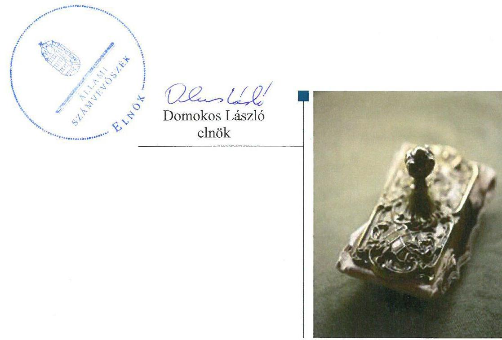
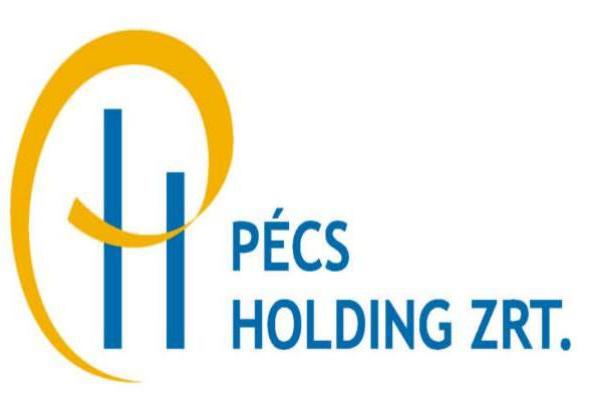
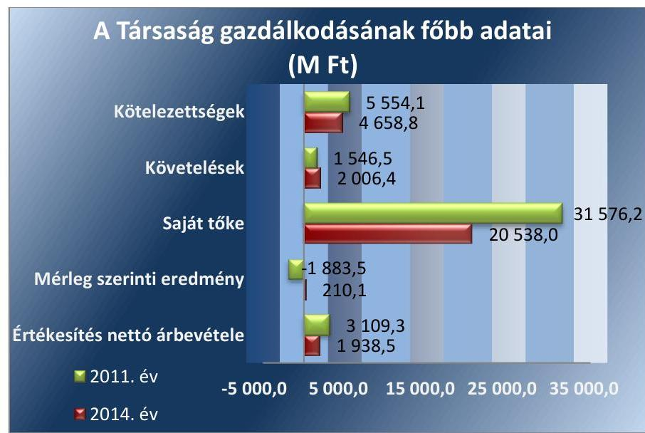
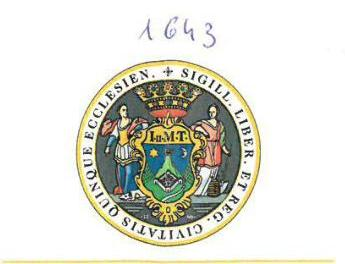
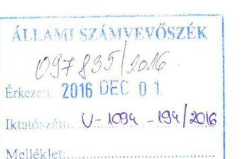
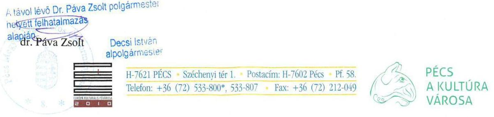

# Jelentés 

## Az önkormányzatok gazdasági társaságai

Az önkormányzatok többségi tulajdonában lévő gazdasági társaságok gazdálkodásának ellenőrzése - Pécs Holding Városi
Vagyonkezelő Zrt.
2016.

---

# J elentés 

## Az önkormányzatok gazdasági társaságai

Az önkormányzatok többségi tulajdonában lévő gazdasági társaságok gazdálkodásának ellenőrzése - Pécs Holding Városi Vagyonkezelő Zrt.
2016. 12. hó 20. nap

---

Jelentéseink az Országgyúlés számítógépes hálózatán és az Interneten a www.asz.hu címen is olvashatóak.

## AZ ELLENŐRZÉST FELÜGYELTE:

MAKKAI MÁRIA felügyeleti vezető

## AZ ELLENŐRZÉST VEZETTE ÉS A VÉGREHAJTÁSÁÉRT FELELŐS:

VALASTYÁNNÉ DR. VÍZHÁNYÓ JÚLIA ellenőrzésvezető

## A PROGRAM ÖSSZEÁLLÍTÁSÁÉRT FELELŐS:

JANIK JÓZSEF osztályvezető

## A TÉMÁHOZ KAPCSOLÓDÓ KORÁBBI SZÁMVEVŐSZÉKI JELENTÉSEK:

- címe:

Jelentés Az önkormányzatok gazdasági társaságai Az önkormányzatok többségi tulajdonában lévő gazdasági társaságok közfeladat ellátását érintő gazdálkodási tevékenysége szabályszerűségének ellenőrzése - PÉTÁV Pécsi Távfütő Korlátolt Felelősségű Társaság

- sorszáma: $\quad 15058$
- címe: $\quad$ Jelentés Az önkormányzatok gazdasági társaságai Az önkormányzatok többségi tulajdonában lévő gazdasági társaságok közfeladat ellátását érintő gazdálkodási tevékenysége szabályszerűségének ellenőrzése - BIOKOM Pécsi Városüzemeltetési és Környezetgazdálkodási Kft.
- sorszáma: $\quad 15020$

IKTATÓSZÁM: V-1094-193/2016.
TÉMASZÁM: 2128
ELLENŐRZÉS-AZONOSÍTÓ SZÁM: V070758

---

# TARTALOMJEGYZÉK 

■ ÖSSZEGZÉS ..... 5
■ AZ ELLENŐRZÉS CÉLJA ..... 6
■ AZ ELLENŐRZÉS TERÜLETE ..... 7
■ AZ ELLENŐRZÉS HÁTTERE, INDOKOLTSÁGA ..... 9
■ FÓKUSZKÉRDÉSEK ..... 10
■ ELLENŐRZÉS HATÓKÖRE ÉS MÓDSZEREI ..... 11
■ MEGÁLLAPÍTÁSOK ..... 13
■ JAVASLATOK ..... 20
■ MELLÉKLETEK ..... 21
I. Sz. melléklet: Értelmező szótár ..... 21
II. Sz. melléklet: pénzügyi mutatószámok alakulása 2011-2014. között ..... 23
■ FÜGGELÉK: ÉSZREVÉTELEK ..... 25
■ RÖVIDÍTÉSEK JEGYZÉKE ..... 29

---

.

---

# ÖSSZEGZÉS 

Az Állami Számvevőszék a Pécs Holding Városi Vagyonkezelő Zrt. lakás- és helyiséggazdálkodás közfeladat ellenőrzése során megállapította, hogy Pécs Megyei Jogú Város Önkormányzata a közfeladat-ellátását szabályszerűen szervezte meg, tulajdonosi jogait összességében megfelelően gyakorolta. A Társaság vagyongazdálkodása az ellátott közfeladat vonatkozásában szabályszerű volt. A közzétételi kötelezettségét nem teljes körűen teljesítette, így nem biztosították a Társaság müködése jogszabályoknak megfelelő átláthatóságát. A Társaság közfeladat bevételeinek, ráfordításainak és az értékcsökkenés elszámolása megfelelő volt.

## Az ellenőrzés társadalmi indokoltsága

Az Állami Számvevőszék kiemelt célja, hogy a helyi önkormányzatok gazdálkodásában rejlő pénzügyi kockázatok feltárásával, az államháztartáson kívülre nyújtott költségvetési támogatások és ingyenes vagyonjuttatások, valamint az államháztartáson kívül múködő feladat-ellátó rendszerek ellenőrzéseivel hozzájáruljon ahhoz, hogy a közpénzeket az államháztartáson kívül múködő szervezetek is átlátható, rendezett módon használják fel.

Magyarországon az intézmény-centrikus közfeladat-ellátás jellemző, de egyre jelentősebb a költségvetésen kívüli feladatellátás térnyerése. Ennek legfontosabb szereplői - a nonprofit szervezetek mellett - az önkormányzati tulajdonú gazdasági társaságok. Az önkormányzatok szervezetalakítási szabadságának következménye, hogy a korábban is vállalati formában múködő közszolgáltatások mellett, mind a kötelező, mind az önként vállalt feladatok ellátásában a gazdasági társaságok kiemelt fontosságú szerephez jutottak. Az ellenőrzés lehetőséget biztosít annak bemutatására, hogy a Pécs Holding Zrt. megbízása annak ellátására biztosította-e a közfeladat megfelelő ellátását.

## Főbb megállapítások, következtetések, javaslatok

Az Önkormányzat a közfeladat-ellátását szabályszerűen szervezte meg. Rendeletalkotási kötelezettségének eleget tett. A tulajdonosi jogok gyakorlása összességében megfelelő volt.

A Társaság vagyongazdálkodása az ellátott közfeladat vonatkozásában szabályszerű volt. A Társaság rendelkezett a múködéshez szükséges szabályzatokkal. A Pécs Holding Zrt. kötelezettségeinek állománya nem veszélyeztette a közfeladat ellátást és a Társaság múködését. A Társaság az előírt beszámolási, adatszolgáltatási kötelezettséget teljesítette. A Társaság az ellenőrzött időszakban nem teljes körűen teljesítette a közzétételi kötelezettségét, így nem biztosították a Társaság múködése jogszabályoknak megfelelő átláthatóságát.

A Társaság által ellátott közfeladat bevételeinek, ráfordításainak és az értékcsökkenés elszámolása megfelelő volt. Az önkormányzati ingatlanok üzemeltetésével kapcsolatban önköltségszámítási kötelezettsége nem volt a Társaságnak. Az önkormányzati ingatlanok bérleti diját az Önkormányzat rendeletben határozta meg.

---

# AZ ELLENŐRZÉS CÉLJA 

## Az önkormányzatok gazdasági társaságai - Az önkormányzatok tulajdonában lévő gazdasági társaságok gazdálkodásának ellenőrzése - Pécs Holding Városi Vagyonkezelő Zrt.

Az ellenőrzés célja annak értékelése volt, hogy az önkormányzat vagyongazdálkodási tevékenysége során szabályszerűen gyakorolta-e tulajdonosi jogait; a gazdasági társaság szabályozottsága, gazdálkodása és vagyongazdálkodási tevékenysége, bevételeinek és ráfordításainak elszámolása megfelelt-e a jogszabályi és tulajdonosi előírásoknak; a gazdasági társaság kötelezettségállománya jelentett-e kockázatot a múködésre, valamint a gazdálkodás átláthatósága és elszámoltathatósága érdekében biztosítva volt-e a szolgáltatás dijának megalapozottsága szabályszerű önköltségszámítással.

---

# AZ ELLENŐRZÉS TERÜLETE

## Pécs Megyei Jogú Város Önkormányzata és a kizárólagos tulajdonában álló Pécs Holding Városi Vagyonkezelő Zrt.

### PÉCS MEGYEI JOGÚ VÁROS ÖNKORMÁNYZATA¹

a Pécs Holding Zrt. - t Pécs közigazgatási területén önkormányzati lakás- és helyiséggazdálkodás közfeladat ellátása, közszükséglet kielégítése alaptevékenység ellátására az ellenőrzött időszakot megelőzően, 2000. október 12. napján határozatlan időre hozta létre jogelőd gazdasági társaságok összeolvadásával. 2008. május 23-án az Önkormányzat 12 gazdasági társaságában lévő részesedését apportálta a Társaság²-ba, átadva azzal a tulajdonosi jogok gyakorlását is. A Pécs Holding Zrt. a 2014. év végén 18 leányvállalattal rendelkezett, amelyekben 1 és 100% közötti tulajdoni hányadot birtokolt. Az ellenőrzött időszakban a Társaság cégcsoportként összevont számviteli beszámolót is készített a Számv. tv. előírásainak megfelelően. A Társaság konszolidációs körébe 2014. december 31-én nyolc gazdasági társaság tartozott.

### A PÉCS HOLDING ZRT. FŐ TEVÉKENYSÉGE

az Alapító okirat³ alapján az ellenőrzött időszakban vagyonkezelés holding tevékenység volt. Az ellenőrzés a Társaság egyetlen közfeladat ellátására az önkormányzati lakás- és helyiséggazdálkodásra terjedt ki. Vagyonkezelésbe vagyont a Társaság nem kapott.

A Pécs Holding Zrt. 2011. és 2014. évi gazdálkodásának egyes adatait az 1. ábra mutatja be.

1. ábra

*Forrás: A Társaság 2011. és 2014. évi beszámolói*

---

A Társaság 2014. évi beszámolója szerint a jegyzett tőkéje 7139,1 M Ftot, mérleg szerinti vagyona $26714,8 \mathrm{M}$ Ft-ot tett ki. A 2014. évben az értékesítés nettó árbevétele 1938,5 M Ft, az adózott eredmény 210,1 M Ft volt.

Az ellenőrzött időszakban a polgármester ${ }^{4}$ nem, a jegyző ${ }^{5}$ személye egy alkalommal változott. A polgármester a 2010. évi önkormányzati választások óta tölti be tisztségét, a hivatalban lévő jegyző 2011. május 1-jétől látja el feladatait. A társaság vezérigazgatójának személye egy, a gazdasági vezető személye két alkalommal változott a 2011-2014. évi időszakban.

A Társaság a 2011. évben a 479/2009/EK rendelet ${ }^{6}$ a 2012 - 2014. években pedig az Áht. ${ }^{7} 2$. § (1) bekezdés I) pontja alapján nem minősült kormányzati szektorba sorolt egyéb szervezetnek.

---

# AZ ELLENŐRZÉS HÁTTERE, INDOKOLTSÁGA 

AZ ÖNKORMÁNYZATI TULAJDONÚ GAZDASÁGI TÁRSASÁGOK ellenőrzése kiemelten fontos a vagyon megőrzése, megóvása érdekében, amelyekkel szemben alapvető követelmény, hogy gazdálkodásuk, működésük szabályszerű, az általuk szolgáltatott adatok minél megbízhatóbbak legyenek. A közfeladat-ellátás költségeinek, ráfordításainak alakulása, színvonala hatással van a lakosság elégedettségére.

A TÖRVÉNYALKOTÁS SZÁMÁRA - az észlelt problémák, szabálytalanságok, vagy egyéb nem kívánatos jelenségek felszínre kerülésével - az ellenőrzés megállapításai segítséget nyújthatnak az államháztartáson kívüli közfeladat-ellátás értékeléséhez, jogszabályi keretei pontosításához, átláthatóságot biztosító szabályozásához. Meghatározhatóvá válnak az önkormányzati feladatellátásban részt vevő államháztartáson kívüli szervezeteknek - az önkormányzat költségvetését, pénzügyi helyzetét is befolyásoló - kockázatai, lehetővé válik ezen kockázatok csökkentése. Ellenőrzéseink feltárhatják, hogy az önkormányzat feladat-ellátási kötelezettségének szabályszerűen tett-e eleget, és a tulajdonosi felügyelete hozzájárult-e a feladatellátásához. Az ellenőrzés rávilágíthat arra, hogy a gazdasági társaság a feladat-ellátási, közszolgáltatási szerződésben foglaltak betartásával, a vagyon használatával biztosította-e a szolgáltatás folytatásának feltételeit, a feladat ellátását. Ezzel az ellenőrzöttek és a helyi döntéshozók számára visszajelzést ad feladatszervezési, feladat-ellátási kockázataikról, alapot ad a meglévő hibák megszüntetéséhez, a jobb feladatellátás biztosításához. Fokozza a fegyelmet, igazolja, hogy lejárt a következmények nélküli ellenőrzések időszaka. Az ÁSZ értékteremtő rend kialakításához és megőrzéséhez hozzájáruló tevékenysége pozitív hatással van a szervezetről kialakított összkép formálására.

---

# FÓKUSZKÉRDÉSEK 

1.- Az Önkormányzat közfeladat megszervezéséről szóló döntése, valamint a tulajdonosi joggyakorlása szabályszerű volt-e?
2.- A gazdasági társaság vagyongazdálkodása szabályszerű volt-e, kötelezettségállománya jelentett-e kockázatot a müködésre, illetve a közfeladat ellátására?
3.- A gazdasági társaságnál az ellátott közfeladat bevételei és ráfordításai elszámolása, valamint az önköltségszámitás és árképzés szabályszerű volt-e?

---

# ELLENŐRZÉS HATÓKÖRE ÉS MÓDSZEREI 

## Az ellenőrzés típusa

Megfelelőségi ellenőrzés

## Az ellenőrzött időszak

Az ellenőrzött időszak 2011. január 1-jétől 2014. december 31-ig.

## Az ellenőrzés tárgya

A gazdasági társaság feletti tulajdonosi joggyakorlás, valamint a gazdasági társaság gazdálkodásának szabályozottsága és szabályszerűsége.

Az ellenőrzés kiterjed minden olyan körülményre és adatra, amely az ÁSZ jogszabályban meghatározott feladatainak teljesítéséhez, valamint a program végrehajtása folyamán felmerült újabb összefüggések feltárásához szükséges.

## Az ellenőrzött szervezet

Az ellenőrzött szervezetek:
Pécs Megyei Jogú Város Önkormányzata
Pécs Holding Városi Vagyonkezelő Zrt.

## Az ellenőrzés jogalapja

Az ellenőrzés jogszabályi alapját az ÁSZ tv. 1. § (3) bekezdése és 5. § (3)-(4)-(5) bekezdései képezik.

## Az ellenőrzés módszerei

Az ellenőrzést a nemzetközi standardokat irányadónak tekintve az ellenőrzési program ellenőrzési kérdései, az ellenőrzött időszakban hatályos jogszabályok, az ellenőrzés szakmai szabályok és módszertanok figyelembevételével végeztük.

Az ellenőrzés ideje alatt az ellenőrzött szervezettel történő kapcsolattartást az ÁSZ Szervezeti és Múködési Szabályzatának vonatkozó előírásai alapján történt.

---

Az ellenőrzés a tulajdonosi jogokat gyakorló Pécs Megyei Jogú Város Önkormányzatára és a Pécs Holding Városi Vagyonkezelő Zrt.-re terjedt ki.

Az ellenőrzési kérdések megválaszolásához szükséges bizonyítékok megszerzése a következő ellenőrzési eljárások alkalmazásával történt: megfigyelés, kérdésfeltevés (információkérés), összehasonlítás, valamint elemző eljárás. Az ellenőrzési bizonyítékként felhasználható adatforrások közé tartoztak egyrészt a szakmai programban felsorolt adatforrások, másrészt adatforrás lehetett még minden - az ellenőrzés folyamán - feltárt, az ellenőrzés szempontjából információkat tartalmazó dokumentum.

Az ellenőrzést a kérdésekre adott válaszok kiértékelésével, valamint a megjelölt adatforrások, a csatolt tanúsítványok felhasználásával, továbbá az adott időszakban hatályos jogszabályok figyelembe vételével került lefolytatásra.

A bevételek és ráfordítások elszámolása terén a szabályszerű múködést véletlen mintavétellel, a beruházások, felújítások elszámolása terén teljes körűen ellenőriztük. A mintavétellel ellenőrzött területek esetében minden egyes tétel vonatkozásában a szabályszerűségre vonatkozó kérdéseket tettünk fel, amelyek eredménye összesítésre került. „Megfelelőnek" értékeltünk egy ellenőrzött területet, amennyiben 95\%-os bizonyossággal a teljes sokaságban a hibaarány legfeljebb 10\% volt.

A ráfordítások elszámolására vonatkozó véletlen mintavételt kockázati alapú kiválasztással egészítettük ki, amelynek során évente a három legnagyobb összegű tételt választottuk ki.

---

# 1. Az Önkormányzat közfeladat megszervezéséről szóló döntése, valamint a tulajdonosi joggyakorlása szabályszerű volt-e? 

Összegző megállapítás

Az Önkormányzat az ellenőrzött időszakban a közfeladat ellátását szabályszerűen szervezte meg. A tulajdonosi jogok gyakorlása összességében megfelelő volt.
1.1. számú megállapítás

Az Önkormányzat a közfeladat-ellátását szabályszerűen szervezte meg. Rendeletalkotási kötelezettségének eleget tett.

A GAZDASÁGI PROGRAMOT ${ }^{8}$ az ellenőrzött időszakban az Önkormányzat elkészítette az Ötv. ${ }^{9}$ és a Mötv. ${ }^{10}$ szerint. A Közgyűlés ${ }^{11}$ által elfogadott 2011 - 2014. évekre vonatkozó gazdasági program a közszolgáltatások rendszerének ésszerűsítését és bevételek realizálását helyezte a középpontba.

KÖZÉP- ÉS HOSSZÚ TÁVÚ VAGYONGAZDÁLKODÁSI TERVET ${ }^{12}$ az Önkormányzat 2012. január 1. és 2013. február 7. között nem készített, amivel megsértette az Nvtv. ${ }^{13}$ 9. § (1) bekezdésben előírtakat. Az Önkormányzat az Nvtv. -nek megfelelően a 2013 2016. évekre vonatkozóan elkészítette a közép- és hosszú távú vagyongazdálkodási tervét, amelyet a Közgyűlés is szabályszerűen elfogadott.

A PÉCS HOLDING ZRT. fő tevékenységét az Alapító okirat a Gt. ${ }^{14}$, a Ptk. ${ }^{15}$ és a Ptk. ${ }^{16}$-nek megfelelően tartalmazta, amely az ellenőrzött időszakban nem változott.

A Pécs Holding Zrt. az Önkormányzat tulajdonában álló bérlakások és nem lakás céljára szolgáló helyiségek kezelési és üzemeltetési közfeladatának ellátását az ellenőrzött időszakban az Ötv., Mötv. szabályai szerint a közfeladat-ellátási szerződés ${ }_{1-3}{ }^{17}$-nek megfelelően végezte. A közfeladatellátási szerződés ${ }_{2-3}$ alapján a Társaság kötelezettsége volt az átvett és az üzemeltetett önkormányzati lakások és nem lakás célú bérlemények mérleg alátámasztó leltárának elkészítése. Az Önkormányzat a közfeladat-ellátási szerződés ${ }_{1-3}$ mellékletében tételesen meghatározta a közfeladat ellátásához szükséges lakás és egyéb bérlemények körét.

Az Önkormányzat Lakásrendelet ${ }^{18}{ }_{1,2}$ megalkotásával eleget tett az Ötv., Mötv. és Lt. ${ }^{19}$-ben meghatározott rendeletalkotási kötelezettségének. A Lakásrendelet ${ }_{1,2}$-ben szabályozták a lakástulajdonosi és bérbeadói jogokat, kötelezettségeket, hasznosítási, bérbeadási, lakásgazdálkodási feladatokat, a bérleti díjak megállapításának részletszabályait.

---

# 1.2. számú megállapítás 

A tulajdonosi jogok gyakorlása összességében megfelelő volt.

## A TULAJDONOSI JOGOK GYAKORLÁSÁNAK

RENDJÉT a Közgyűlés az Ötv. és az Mótv. alapján a vagyonrende-let ${ }_{1,2}{ }^{20}$-ben szabályozta. A tulajdonosi jogokat a vagyonrendelet ${ }_{1,2}$-nek megfelelően gyakorolták.

AZ FB ${ }^{21}$ a Gt. és a Ptk. ${ }_{2}$-nak megfelelően kialakította múködésének kereteit.

ELLENŐRZÉST az Önkormányzat a Társaságnál a közfeladat-ellátási szerződés2 2012. évi teljesítése vonatkozásában végzett az ellenőrzött időszakban. Az ellenőrzési jelentésben hiányosságot tárt fel többek között a bérleménykezeléssel foglalkozó dolgozók tervezett bérjellegú kifizetéseivel, a közfeladat-ellátási szerződés2-ben foglaltak nem teljesülésével kapcsolatosan. Az ellenőrzési jelentés 10 javaslatot tartalmazott. A megfogalmazott észrevételek megvalósítása érdekében az intézkedési terv készítését írták elő. Az Önkormányzat belső ellenőrzése nyilvántartotta az intézkedési tervet és figyelemmel kísérte az abban foglaltak végrehajtását.

Az Önkormányzat 2014. június 10-ei megbízása alapján volt külső szakértői ellenőrzés a Társaság, a Társaság jogi és gazdasági helyzete vonatkozásában. A tulajdonosi joggyakorló nem írt elő a Társaságnak beszámolási kötelezettséget a külső ellenőrzések megállapításairól és a megtett intézkedésekről.

A TÁRSASÁG BESZÁMOLTATÁSI RENDJÉT az Önkormányzat a közfeladat-ellátási szerződés ${ }_{1,2,3}$-ben szabályozta.

GARANCIA- ÉS KEZESSÉGVÁLLALÁS az Önkormányzatnál az ellenőrzött időszakban több esetben történt. Az ellenőrzött időszakban garancia és kezesség nem került érvényesítésre.

## 2. A gazdasági társaság vagyongazdálkodása szabályszerű volt-e, kötelezettségállománya jelentett-e kockázatot a múködésre, illetve a közfeladat ellátására?

Összegző megállapítás A Társaság vagyongazdálkodása szabályszerű volt. A Pécs Holding Zrt. kötelezettségeinek állománya nem veszélyeztette a közfeladat ellátást és a Társaság múködését.
2.1. számú megállapítás

A Társaság rendelkezett a múködéshez szükséges szabályzatokkal.
AZ ÜZLETI TERVEKET a Társaság a 2012 - 2014. években az éves beszámolóval egyidejúleg elkészítette. A Társaságnak 2011. évben üzleti terv készítési kötelezettsége nem volt. A Társaság 2012-2014. évi üzleti terveit a tulajdonosi joggyakorló jóváhagyta.

---

SZÁMVITELI SZABÁLYZATOKKAL a Társaság a Számv. tv. ${ }^{22}$-nek megfelelően a 2011 - 2014. években rendelkezett. A Társaság az ellenőrzött időszakban rendelkezett számviteli politika ${ }_{1,2,3}$-mal ${ }^{23}$, melynek keretében elkészítették a Számv. tv. - nek megfelelően a leltározási szabályzatot ${ }^{24}$, az önköltségszámítási szabályzatot ${ }^{25}$, a pénzkezelési szabályzatot ${ }_{1,2}{ }^{26}$, valamint az értékelési szabályzatot ${ }_{1,2}{ }^{27}$, illetve a számlarendet ${ }_{1,2}{ }^{28}$.

A SZÁMVITELI POLITIKA ${ }_{1,2,3}$ keretén belül elkészített értékelési szabályzat ${ }_{1,2}$ a Számv. tv. előírásainak megfelelően rendelkezett az eszközök és források értékelésére és a saját vagyon értékelésére vonatkozó szabályokról.

A SZÁMLAREND ${ }_{1,2}$ a Számv. tv. előírásainak megfelelt. A Társaság a közszolgáltatással kapcsolatos számviteli elkülönítési kötelezettségeinek eleget tett.

LELTÁROZÁSI SZABÁLYZAT megfelelt a Számv. tv. előírásainak. A szabályzatban meghatározták a mennyiségi leltárfelvétel gyakoriságát.

A PÉNZKEZELÉSI SZABÁLYZAT ${ }_{1,2}$ megfelelt a Számv. tv. előírásainak.

AZ ÖNKÖLTSÉGSZÁMÍTÁSI SZABÁLYZATOT a Társaság 2012. április 1-jén léptette hatályba, amely megfelelt a Számv. tv. ben, valamint a közszolgáltatási szerződésben előírtaknak.

JAVADALMAZÁSI ILLETVE JUTTATÁSI SZABÁLYZAT ${ }^{29}$-tal a Taktv. ${ }^{30}$-ben foglaltak szerint a Társaság az ellenőrzött időszakban rendelkezett, melyet a tulajdonosi joggyakorló az ellenőrzött időszakot megelőzően jóváhagyott.

ADATVÉDELMI ÉS ADATBIZTONSÁGI SZABÁLYZATTAL a Pécs Holding Zrt. az Avtv. ${ }^{31}$ 31/A. § (2) bekezdés d) pontjában és (3) bekezdésében foglaltak ellenére a 2011. január 1-je és 2012. március 31-e közötti időszakban nem rendelkezett. A Társaságnak 2012. április 1-től volt hatályos adatvédelmi szabályzata ${ }^{32}$ az Info tv. ${ }^{33}$ előírásainak megfelelően.

# 2.2. számú megállapítás 

A Pécs Holding Zrt. vagyongazdálkodása az ellátott közfeladat vonatkozásában szabályszerű volt.

A Társaság saját és az üzemeltetésre kapott vagyonának nyilvántartása naprakész, átlátható volt, megfelelt a közfeladat-ellátási szerződés ${ }_{2-3}$-nek, valamint belső szabályzatainak. Az üzemeltetésre átvett eszközök megőrzésére, hasznosítására, megterhelésére vonatkozó szabályokat a Társaság az ellenőrzött időszak egészében betartotta.

---

1. táblázat

A PÉCS HOLDING ZRT. MÉRLEGÉNEK KIEMELT ADATAI (M FT)

|  Megnevezés | 2011.01.01. | 2011.12.31. | 2012.12.31. | 2013.12.31. | 2014.12.31.  |
| --- | --- | --- | --- | --- | --- |
|  I. Befektetett eszközök | 37574,4 | 35421,6 | 33486,6 | 24489,7 | 24409,1  |
|  - ebből: Tárgyi eszközök | 34376,0 | 32720,6 | 31669,0 | 23694,3 | 23620,2  |
|  ebből: befektetett pénzügyi eszközök | 3192,5 | 2696,9 | 1814,7 | 792,5 | 783,9  |
|  II. Forgó eszközök | 2021,0 | 1963,4 | 1086,0 | 1006,6 | 2216,6  |
|  - ebből: Követelések | 1546,5 | 1559,8 | 929,0 | 875,8 | 2006,4  |
|  - ebből: Pénzeszközök | 115,3 | 171,6 | 153,3 | 127,7 | 203,0  |
|  III. Aktív időbeli elhatárolások | 123,0 | 105,0 | 80,3 | 74,8 | 89,1  |
|  Eszközök összesen | 39718,4 | 37490,0 | 34652,9 | 25571,1 | 26714,8  |
|  IV. Saját tőke | 31576,2 | 29502,8 | 28241,9 | 20361,2 | 20538,0  |
|  - ebből: Jegyzett tőke | 7542,3 | 7092,1 | 7139,1 | 7139,1 | 7139,1  |
|  - ebből Mérleg szerinti eredmény | $-1883,5$ | 11,1 | 22,5 | $-8157,9$ | 210,1  |
|  V. Céltartalékok | 319,4 | 529,8 | 19,3 | 23,6 | 393,2  |
|  VI. Kötelezettségek | 5554,1 | 5027,7 | 4400,1 | 3965,6 | 4658,8  |
|  - ebből Hosszú lejáratú | 1969,2 | 1299,0 | 2817,3 | 2422,7 | 3719,8  |
|  VII. Passzív időbeli elhatárolások | 2268,7 | 2429,7 | 1991,6 | 1220,7 | 1124,8  |
|  Források összesen | 39718,4 | 37490,0 | 34652,9 | 25571,1 | 26714,8  |

Forrás: Társaság 2011-2014. évi beszámolói 2.3. számú megállapítás

AZ ESZKÖZÖK értéke a 2011. évről a 2014. év végére 13 003,6 M Ft-tal csökkent. Ezt elsődlegesen a tárgyi eszközök állományának 10 755,8 M Ft-os csökkenése okozta. A csökkenése fő oka az volt, hogy a 2013. évben a Társaság a víziközmű vagyont 7700,1 M Ft értékben az Önkormányzatnak a víziközmű-szolgáltatásról szóló 2011. évi CCIX. törvény értelmében térítésmentesen átadta.

A FORRÁSOK 13 003,6 M Ft-os összegű csökkenése az ellenőrzött időszakban a saját tőke 11 038,2 M Ft-os, azon belül a tőketartalék 8466,2 M Ft-os csökkenéséhez kapcsolódott.

A PÉCS HOLDING ZRT. saját tőkéjének összege az ellenőrzött időszak minden évében meghaladta a jegyzett tőke összegét. A minimális saját tőke összegére vonatkozó Gt. és a Ptk. 2 szabályokat a Társaság az ellenőrzött időszakban betartotta, tulajdonosi intézkedésre nem volt szükség.

## A Pécs Holding Zrt. kötelezettségeinek állománya nem veszélyeztette a közfeladat ellátást és a Társaság müködését.

A TÁRSASÁG rövid és hosszú lejáratú kötelezettségeinek összértéke a 2014. év végén 4658,8 M Ft volt. Az ellenőrzött időszak végén a Társaság pénzeszközeinek állománya összesen 203,0 M Ft volt. A Társaság az ellenőrzött időszakban 128,0 M Ft összegű működési célú támogatást kapott az Önkormányzattól. A Társaság pénzügyi mutatói közül az eladósodottság mértéke, a nettó eladósodottság és az adósságfedezeti mutató I. kedvező volt az ellenőrzött időszakban. A Társaság pénzügyi mutatószámait a II. számú melléklet mutatja be. A Pécs Holding Zrt. kötelezettségeinek állománya nem veszélyeztette a közfeladat ellátást és a Társaság müködését.

---

A kötelezettség állomány alakulásának fontosabb értékeit az alábbi táblázat mutatja be.
2. táblázat

A KÖTELEZETTSÉGEK ÁLLOMÁNY ALAKULÁSA (M FT)

| Megnevezés | 2011-   01.01. | 2011-   12.31. | 2012-   12.31. | 2013-   12.31. | 2014-   12.31. |
| :-- | --: | --: | --: | --: | --: |
| Rövid lejáratú kötelezettségek | 3584,9 | 3728,7 | 1582,8 | 1542,9 | 939,0 |
| Hosszú lejáratú kötelezettségek | 1969,2 | 1299,0 | 2817,3 | 2422,7 | 3719,8 |
| Beruházási és fejlesztési hitelek | 519,7 | 356,2 | 303,9 | 208,1 | 0,0 |
| Egyéb hosszú lejáratú hitelek | 918,0 | 390,0 | 2176,2 | 1902,3 | 3420,0 |
| Tartós kötelezettség kapcsolt vál-   laikozással szemben | 162,6 | 162,6 | 0,0 | 0,0 | 0,0 |
| Kötelezettség összesen | 5554,1 | 5027,7 | 4400,1 | 3965,6 | 4658,8 |

A rövid lejáratú kötelezettségek csökkenését a rövid lejáratú hitelek 686,5 M Ft összegű csökkenése okozta. A 2014. évben a saját források aránya csökkent, míg az idegen források aránya növekedett, amelyet a kötelezettségek összegének 693,2 M Ft összegű növekedése okozott. A szállítói tartozások év végi állománya 2011 - 2014. években folyamatosan csökkent, értéke 2014. december 31-én 163,8 M Ft volt.
2.4. számú megállapítás

A Társaság az előírt beszámolási, adatszolgáltatási kötelezettséget teljesítette. A Társaság az ellenőrzött időszakban nem teljes körűen teljesítette a közzétételi kötelezettségét, így nem biztosították a Társaság müködése jogszabályoknak megfelelő átláthatóságát.

A BESZÁMOLÁSI ÉS ADATSZOLGÁLTATÁSI kötelezettségének a Társaság az ellenőrzött időszakban a Számv. tv.-ben, a számviteli politika ${ }_{1,2,3}$ - ban foglaltaknak megfelelően eleget tett.

## A SZÁMVITELI BESZÁMOLÁSI KÖTELEZETTSÉ-

GÉNEK a Társaság eleget tett, a Számv. tv.-nek megfelelően elkészítette a 2011-2014. évekre vonatkozó éves beszámolóit. A 2011-2014. évi éves beszámolókat a tulajdonosi joggyakorló elfogadta.

A Társaság az ellenőrzött időszakban elkészített számviteli éves beszámolóit a Számv. tv.-nek, valamint a közfeladat-ellátási szerződés ${ }_{2-3}$-nek megfelelően az ellenőrzött közfeladat vonatkozásában leltárral alátámasztotta.

Az FB a Társaság 2011-2014. évi számviteli beszámolóiról szóló írásos jelentéseit a Gt., illetve a Ptk. ${ }_{2}$ szerint elkészítette, és megküldte az Önkormányzat részére.

A könyvvizsgáló az ellenőrzött időszak minden évében hitelesítő záradékkal látta el a Társaság beszámolóját.

A Társaság a 2011-2014. években elkészítette a közfeladat-ellátási szerződés ${ }_{1,2,3}$-ban meghatározott feladatainak végrehajtásáról szóló jelentéseit, melyeket az Önkormányzat részére megküldött.

---

# A KÖZÉRDEKŰ ADATOK NYILVÁNOSSÁGRA HOZATALÁVAL kapcsolatos kötelezettségének az Eisztv. ${ }^{34} 6 . \S$ (1), valamint az Info tv. 37. § (1) bekezdésében foglaltak ellenére Társaság az ellenőrzött időszakban nem tett eleget, mivel a tevékenységre, működésre, gazdálkodásra vonatkozó adatokat a honlapján, illetve az Önkormányzat honlapján nem tette közzé. 

## 3. A gazdasági társaságnál az ellátott közfeladat bevételei és ráfordításai elszámolása, valamint az önköltségszámítás és árképzés szabályszerű volt-e?

## Összegző megállapítás

### 3.1. számú megállapítás

A Társaság által ellátott közfeladat bevételeinek, ráfordításainak és az értékcsökkenés elszámolása megfelelő volt.

A Társaság által ellátott közfeladat bevételeinek, ráfordításainak és az értékcsökkenés elszámolása megfelelő volt.

A KÖZFELADAT BEVÉTELEINEK ÉS RÁFORDÍTÁSAINAK szétválasztását a Társaság a Számv. tv. előírásainak figyelembe vételével alakította ki. A Társaság közfeladattal érintett önkormányzati ingatlanok üzemeltetése, karbantartása, felújítása és a társasházi feladatok ellátását vállalkozók bevonásával végezte. A közfeladat ellátással összefüggő kiadások és bevételek a Társaság számviteli elszámolásaiban és nyilvántartásában meghatározott kódrendszerében szereplő munkaszámok szerint kerültek kimutatásra.

Az ellenőrzött időszakban a számlarend ${ }_{1,2}$ szerinti bontás alapján a közfeladat bevételeinek és közvetlen ráfordításainak elkülönítését a közfel-adat-ellátási szerződésben ${ }_{2,3}$ előírtaknak megfelelően elvégezték.

AZ ANYAGJELLEGŰ RÁFORDÍTÁSOK elszámolása az ellenőrzött időszakban a Számv. tv.-nek megfelelő volt.

A BERUHÁZÁSOK, FELÚJÍTÁSOK elszámolása megfelelt Számv. tv.-ben foglaltaknak.

A BEVÉTELEK ELSZÁMOLÁSA megfelelő volt. A bevételek elszámolása a Számv. tv. előírásai szerint a Társaság számlarendjében ${ }_{1,2}$ meghatározott, a közfeladat ellátással kapcsolatos elkülönítésnek megfelelő főkönyvi számlákon történt.

AZ ÉRTÉKCSÖKKENÉS ELSZÁMOLÁSA a Számv. tv. nek megfelelően az Önkormányzatnál történt.

## A LAKOSSÁGGAL SZEMBENI KÖVETELÉSEK ÉRTÉKÉT, valamint a dí hátralékosok és az adósok nyilvántartását a Társaság a közfeladat ellátási szerződés ${ }_{3}$-ban előírtaknak megfelelően adta át az Önkormányzatnak. Az ellenőrzött időszakban a dí hátralékosok száma és a bérleti díjak miatti követelés állomány is emelkedett. A 2011. évi 2808ról a 2014. év végére 3111-re emelkedett a díjhátralékos bérlők száma.

---

# Megállapítások 

A tartozás összege a 2011. évi 320,6 M Ft-ról az ellenőrzött időszak végére 88,2\%-kal, 603,4 M Ft-ra emelkedett. A tartozások összegének 59-85\%-a 360 napot meghaladó bérleti díjtartozás volt. A Társaság a kintlévőségek behajtását a közfeladat ellátási szerződés ${ }_{3}$-ban előírtaknak megfelelően végezte. Ennek keretében fizetési felszólítást küldött, hátralékokat folyamatos nyilvántartotta, a felszólításra fizetni szándékozók részletfizetési kérelmét kezelte és továbbította az Önkormányzat részre. A lakásbérleti dijhátralékos állomány csökkentésére irányuló intézkedések megtétele az Önkormányzat feladata volt.

## 3.2. számú megállapítás

A Társaság önköltségszámítási szabályzatot készített. Az önkormányzati ingatlanok bérleti diját az Önkormányzat rendeletben határozta meg.

ÖNKÖLTSÉGSZÁMÍTÁSI SZABÁLYZATÁT a Társaság a Számv. tv. alapján elkészítette. A Társaságnak az önkormányzati ingatlanok üzemeltetésével kapcsolatosan jogszabályi, illetve az Önkormányzat által előírt önköltségszámítási kötelezettsége nem volt.

Az önkormányzati lakások bérleti dijait az Önkormányzat a Lakásrende-let ${ }_{1,2}$-ben foglaltaknak megfelelően határozta meg. A közfeladat ellátás keretében közfeladat-ellátási szerződés ${ }_{2,3}$ szerint a Pécs Holding Zrt. az Önkormányzat helyett és nevében számlázta, szedte be és kezelte az önkormányzati ingatlanok bérleti diját.

---

# JAVASLATOK 

Az ÁSZ tv. 33. § (1) bekezdésében foglaltak értelmében az ellenőrzött szervezet vezetője köteles a jelentésben foglalt megállapításokhoz kapcsolódó intézkedési tervet összeállítani és azt a jelentés kézhezvételétől számított 30 napon belül az ÁSZ részére megküldeni. Amennyiben az ellenőrzött szervezet vezetője nem küldi meg határidőben az intézkedési tervet, vagy továbbra sem elfogadható intézkedési tervet küld, az Állami Számvevőszék elnöke az ÁSZ tv. 33. § (3) bekezdése a) és b) pontjaiban foglaltakat érvényesítheti.

## A Pécsi Vagyonhasznosító Zrt. vezérigazgatójának

1. Intézkedjen a kötelezően közzéteendő közérdekü adatok teljes körü közzétételéről.
(2.4. sz. megállapítás 7. bekezdése alapján)

---

# MELLÉKLETEK 

## I. SZ. MELLÉKLET: ÉRTELMEZŐ SZÓTÁR

eladósodottságot jellemző
mutatók
egészségesnek mondható egy olyan mértékű áttétel, amelyet az üzleti tervek szerint és az elmúlt időszak tapasztalatai alapján a társaság megfelelő biztonsággal ki tud termelni. Nagy eszközberuházás-igényű iparágakban értéke magasabb, azaz magasabb eladósodottság is elfogadható, de 75-85\%-ot meghaladó értéknél már itt is erős, sőt túlzott külső finanszírozottságról beszélhetünk. Általánosságban véve kedvező, ha értéke kisebb, mint 0,6.
eladósodottság mértéke: kötelezettségek / saját tőke.
Fontos szerepet játszik ez a mutató egy vállalat megítélésében. Azt mutatja, hogy a saját források a kötelezettségek hány százalékát fedezik. Törekedni kell, hogy a mutató tartósan (jelentősen) 1 alatti értéket érjen el.
nettó eladósodottság: (kötelezettségek-követelések) / saját tőke.
Azt mutatja, hogy a kintlévőségekkel csökkentett kötelezettségeket milyen mértékben fedezi a saját forrás. Ez feltételezi, hogy a követelések pénzügyileg előbb realizálódnak, mint ahogy a kötelezettségeket teljesíteni kell. A mutató minél kisebb, csökkenő értéke a kedvező.
adósságfedezeti mutató I.: (befektetett eszközök+forgó eszközök) / idegen forrás.
Azt mutatja, hogy 1 Ft adósságra hány Ft vagyon jut. Általánosságban véve kedvező, ha értéke 2 körül van, de nagy eszközberuházás-igényű iparágakban értéke kisebb is lehet.
adósságfedezeti mutató II.: működési cash flow / hosszú lejáratú kötelezettségek.
A mutató azt jelzi, hogy az adott gazdálkodási időszak múködési pénzáramainak eredményeként realizált cash flow révén a vállalkozás mennyiben lenne képes valamennyi hosszú lejáratú kötelezettségének eleget tenni. Ennek vizsgálatára viszonylag ritkán kerül sor, az elsősorban a veszélyhelyzetbe került vállalkozások esetében lehet érdekes. Általánosságban véve kedvező, ha a múködési cash flow minél nagyobb arányban nyújt fedezetet a hosszú lejáratú kötelezettségre (értéke nagyobb, mint 1, nő az ellenőrzött időszakban).
árbevételre vetített eladósodottság: (kötelezettségek - forgóeszközök) / értékesítés nettó árbevétele.
Az árbevételre vetített eladósodottság azt mutatja, hogy az árbevétel mekkora fedezetet nyújt a kötelezettségeknek a forgóeszközökkel csökkentett részére. Általánosságban véve kedvező, ha az árbevétel minél nagyobb arányban nyújt fedezetet a forgóeszközökkel csökkentett kötelezettségekre (értéke kisebb, mint 1, csökken az ellenőrzött időszakban).
garancia
gazdasági társaság
gazdálkodó szervezet

A garancia olyan önálló, az önkormányzat nevében vállalt kötelezettség, amely alapján az önkormányzat az önkormányzati költségvetés terhére szerződésben meghatározott feltételek szerint, a kötelezett nem teljesítése esetén a jogosultnak fizetést teljesít az előzetesen rögzített összeghatárig.
Ptk.: 3.88. § (1) bekezdése szerint „a gazdasági társaságok üzletszerű közös gazdasági tevékenység folytatására, a tagok vagyoni hozzájárulásával létrehozott, jogi személyiséggel rendelkező vállalkozások, amelyekben a tagok a nyereségből közösen részesednek, és a veszteséget közösen viselik".
A Ptk.: 685. § c) pontja szerint gazdálkodó szervezet:
„az állami vállalat, az egyéb állami gazdálkodó szerv, a szövetkezet, a lakásszövetkezet, az európai szövetkezet, a gazdasági társaság, az európai részvénytársaság, az egyesülés, az európai gazdasági egyesülés, az európai területi együttműködési csoportosulás, az egyes jogi személyek vállalata, a leányvállalat, a vízgazdálkodási társulat, az erdő birtokossági társulat, a végrehajtói iroda, az egyéni cég, továbbá az egyéni vállalkozó." (Hatályos: 2014. március 15-éig) A Hgt.: 2. § (1) bekezdés 15. pontja szerint „a polgári perrendtartásról szóló törvényben meghatározott gazdálkodó szervezet, ide nem értve azt a költségvetési szervet, amelyet az államháztartásról szóló törvény szerint közfeladat ellátására hoztak létre." (hatályos: 2014. március 15 -től)

---

kezesség
közfeladat
közszolgáltatás
nemzeti vagyon
többségi befolyást biztosító részesedés
tulajdonosi joggyakorló

A kezességre vonatkozó előírásokat a Ptk.: 6:416-430. §-ai tartalmazzák. Kezességi szerződéssel a kezes kötelezettséget vállal a jogosulttal szemben, hogyha a kötelezett nem teljesít, maga fog helyette a jogosultnak teljesíteni. Kezesség egy vagy több, fennálló vagy jövőbeli, feltétlen vagy feltételes, meghatározott vagy meghatározható összegű pénzkövetelés vagy pénzben kifejezhető értékkel rendelkező egyéb kötelezettség biztosítására vállalható.
A Ptk. 1 szerint kezességet csak írásban lehet vállalni. A kezes kötelezettsége ahhoz a kötelezettséghez igazodik, amelyért kezességet vállalt. A kezes kötelezettsége nem válhat terhesebbé, mint amilyen elvállalásakor volt, kiterjed azonban a kötelezett szerződésszegésének jogkövetkezményeire és a kezesség elvállalása után esedékessé váló mellékkövetelésekre is. Jogszabályban meghatározott állami vagy önkormányzati feladat, amit az arra kötelezett közérdekből, jogszabályban meghatározott követelményeknek és feltételeknek megfelelve végez, ideértve a lakosság közszolgáltatásokkal való ellátását, továbbá az állam nemzetközi szerződésekben vállalt kötelezettségeiből adódó közérdekű feladatokat, valamint e feladatok ellátásához szükséges infrastruktúra biztosítását is (Nvtv. 3. § (1) bekezdés 7. pont).
A közszolgáltatás: „közcélú, illetőleg közérdekű szolgáltatást jelent, amely egy nagyobb közösség (állam, település) minden tagjára nézve megközelítőleg azonos feltételek mellett vehető igénybe, ezért valamilyen mértékig közösségi megszervezést, illetve szabályozást, ellenőrzést igényel." Az Ebktv. ${ }^{35}$ 3. § d) pontja a következőképpen határozza meg a közszolgáltatást: „szerződéskötési kötelezettség alapján a lakosság alapvető szükségleteinek ellátására irányuló szolgáltatás, így különösen a villamos energia-, gáz-, hő-, víz-, szennyvíz- és hulladékkezelési, köztisztasági, postai és távközlési szolgáltatás, továbbá a menetrend alapján közlekedő járművekkel végzett közforgalmú személyszállítás".
Nvtv. 1. § (2) bekezdése szerint:
„az állam vagy a helyi önkormányzat kizárólagos tulajdonában álló dolgok,
az a) pont hatálya alá nem tartozó, állam vagy a helyi önkormányzat tulajdonában lévő dolog, az állam vagy a helyi önkormányzatot tulajdonában lévő pénzügyi eszközök, továbbá az államot vagy a helyi önkormányzatot megillető társasági részesedések,
az államot vagy a helyi önkormányzatot megillető bármely vagyoni értékkel rendelkező jogosultság, amelyet jogszabály vagyoni értékű jogként nevesít,
Magyarország határa által körbezárt terület feletti légtér,
az üvegházhatású gázok kibocsátási egységeinek kereskedelméről szóló törvény szerint kibocsátási egység és légiközlekedési kibocsátási egység, valamint az ENSZ Éghajlat változási Keretegyezménye és annak Kiotói Jegyzőkönyve végrehajtási keretrendszeréről szóló törvény szerinti kiotói egység,
állami vagy helyi önkormányzati fenntartású közgyűjtemény (muzeális intézmény, levéltár, közgyűjteményként működő kép- és hangarchívum, valamint könyvtár) saját gyűjteményében nyilvántartott kulturális javak körébe tartozó dolog,
a régészeti lelet,
a nemzeti adatvagyon körébe tartozó állami nyilvántartások fokozottabb védelméről szóló törvény szerinti nemzeti adatvagyon." (hatályos 2012. január 1-jétől, g) pont módosult 2012. június 30 -ától)
A Ptk.: 8:2. § (1) bekezdése szerint „többségi befolyás az olyan kapcsolat, amelynek révén természetes személy vagy jogi személy (befolyással rendelkező) egy jogi személyben a szavazatok több mint felével vagy meghatározó befolyással rendelkezik."
Aki a nemzeti vagyon felett az államot vagy a helyi önkormányzatot megillető tulajdonosi jogok és kötelezettségek összességének gyakorlására jogosult. (Nvtv. 3. § (1) bekezdés 17. pont).

---

II. SZ. MELLÉKLET: PÉNZÜGYI MUTATÓSZÁMOK ALAKULÁSA 2011-2014. KÖZÖTT

|  |   |   |   |   |
| --- | --- | --- | --- | --- |
|  PÉNZÜGYI MUTATÓSZÁMOK ALAKULÁSA 2011-2014. KÖZÖTT |  |  |  |   |
|   | 2011 | 2012 | 2013 | 2014  |
|  Eladósodottság mértéke | 0,17 | 0,16 | 0,19 | 0,23  |
|  kötelezettségek**/saját tőke |  |  |  |   |
|  Nettó eladósodottság | 0,12 | 0,12 | 0,15 | 0,13  |
|  (kötelezettségek** követelések)/saját tőke |  |  |  |   |
|  Adósságfedezeti mutató I. | 7,44 | 7,86 | 6,43 | 5,72  |
|  (befektetett eszközök+forgóeszközök)/idegen forrás |  |  |  |   |
|  Árbevételre vetített eladósodottság | 1,01 | 1,11 | 1,45 | 1,26  |
|  (kötelezettségek**- forgóeszközök)/értékesítés nettó árbevétele |  |  |  |   |

Fonrás: Pécs Holding Zrt. 2011-2014. évi beszámolói

---

.

---

# FÜGGELÉK: ÉSZREVÉTELEK 

A jelentéstervezetet a Számvevőszék 15 napos észrevételezésre megküldte az ellenőrzött szervezetek vezetőinek az ÁSZ tv. 29. §* (1) bekezdése előírásának megfelelően.

Az ÁSZ a jelentéstervezetet észrevételezésre megküldte Pécs Megyei Jogú Város polgármesterének és a Pécsi Vagyonhasznosító Zrt. vezérigazgatójának.
Pécs Megyei Jogú Város polgármesterének és a Pécsi Vagyonhasznosító Zrt. vezérigazgatójának nemleges észrevételeit a függelék alább tartalmazza.

[^0]
[^0]:    * 29. § (1) Az Állami Számvevőszék az ellenőrzési megállapításait megküldi az ellenőrzött szervezet vezetőjének vagy az általa megbízott személynek, és annak, akinek személyes felelősségét állapította meg.
    (2) Az ellenőrzött szervezet vezetője és a felelősként megjelölt személy az ellenőrzés megállapításaira tizenöt napon belül írásban észrevételt tehet.
    (3) Az Állami Számvevőszék az észrevételre a beérkezésétől számított harminc napon belül írásban válaszol. A figyelembe nem vett észrevételeket köteles a jelentésben feltüntetni, és megindokolni, hogy azokat miért nem fogadta el.

---

Pécs MEGYEI JOGÚ VÁROS POLGÁRMESTERE

Állami Számvevőszék
Domokos László Elnök részére

Budapest
Apáczai Csere János utca 10. 1364

Tisztelt Elnök Úr!

Pécs, 2016. november 23.
dr. Szilovicsné dr. Hollósy
Andrea
05-5/553-17/2016.
V-1094-189/2016.

Tárgy:
Észrevétel
Moldai M.

Hivatkozva V-1094-189/2016. számú jelentéstervezet megküldéséről szóló tájékoztató levelében foglaltakra, - amely a Pécs Holding Városi Vagyonkezelő Zrt. gazdálkodásának ellenőrzése tárgyában készült, az alábbi észrevételemet juttatom el Önhöz, további szíves felhasználása.
A jelentés tervezetben foglalt megállapításokat, javaslatokat, kollégái segitő együttműködését ez úton is szeretném megköszönni. A tervezetben foglaltakat az illetékes munkatársaim részére eljuttattam annak érdekében, hogy az abban foglaltak maradéktalanul a közfeladat ellátásának jobb megszervezésére, végrehajtására kerüljenek alkalmazásra, végrehajtásra, a rögzített vizsgálati célok megvalósulása érdekében.
A tervezetben foglaltakkal egyetértek, megállapításait, köztük a túlnyomó többségben lévő pozitív visszajelzését megköszönöm.
Az esetlegesen feltárt hiányosságok mielőbbi pótlása érdekében minden szükséges intézkedést haladéktalanul megtesznek illetékes kollégáim.

A jelentéstervezet 18. oldala / a 2.4. számú megállapításával/ megállapította, hogy a Társaság az ellenőrzött időszakban nem teljes körűen teljesítette közzétételi kötelezettségét, mivel a tevékenységre, müködésre, gazdálkodásra vonatkozó adatokat a honlapján, illetve az Önkormányzat honlapján az Info tv. 37. § (1) bekezdésében foglalt kötelezettség ellenére nem tette közzé. A Pécsi Vagyonhasznosító Zrt. vezérigazgatójának címzett javaslat szerint a tervezet azt tartalmazza, hogy ,,intézkedjen a kötelezően közzéteendő közérdekủ adatok teljes körű közzétételéről."
Megkeresésemre a társaság azt a tájékoztat adta, hogy a vizsgálat által feltárt hiány elektronikus felületükön történő pótlását haladéktalanul megkezdik.

Az ellenőrzés során tanúsított mindvégig segítő hozzáállásukat, hasznos megállapításaikat ismételten megköszönöm.

Tisztelettel:

---

Mallai M.

Dátum: 2016. november 23.
Iktatószám/hivatkozási szám: FH/3244-350/2016
Ügyintéző nálunk: Lajkó János László
Tárgy: Számvevőszéki jelentéstervezet
Melléklet:-

Állami Számvevőkszék
Domokos László Elnök részére
1052 Budapest, Apáczai Csere János u. 10.

## Tisztelt Elnök Úr!

Az Állami Számvevőszék által „Az önkormányzatok gazdasági társaságai - Az önkormányzatok többségi tulajdonában lévő gazdasági társaságok gazdálkodásának ellenőrzése - Pécs Holding Városi Vagyonkezelő Zrt." címmel készített számvevőszéki jelentéstervezettel kapcsolatban nem kívánok észrevételt tenni, az abban leírtakat tudomásul veszem.

A jelentéstervezetben részemre megfogalmazottak szerint intézkedem a kötelező közzé teendő közérdekű adatok teljes körű közzé tételéről.

Pécs, 2016. november 23.

Tisztelettel,

Pécsi Vagyonhasznosító Zrt.
7626 Pécs, Búza tér 8/8
Levélcím: 7603 Pécs 3, Pf.: 158
Sándor Zsolt
vezérigazgató

PÉCSI VAGYONHASZNOSÍTÓ ZRT.
Cégjegyzéket vezető bíróság: Pécsi Törvényszék Cégbírósága. | Cégjegyzékszám: 02-10-060289
7626 Pécs, Búza tér 8. b. ép. | 7603 Pécs, Pf.: 158. | Tel.: 06 (72) 801801 | Zöld szám: 06 (80) 203988 | www.pvh.hu

---

.

---

# RÖVIDÍTÉSEK JEGYZÉKE 

${ }^{1}$ Önkormányzat
${ }^{2}$ Társaság/Pécs Holding Zrt.
${ }^{3}$ Alapító okirat
${ }^{4}$ polgármester
${ }^{5}$ jegyző
${ }^{6} 479 / 2009 /$ EK rendelet
${ }^{7}$ Áht. 2
${ }^{8}$ Gazdasági program
${ }^{9}$ Ötv.
${ }^{10}$ Mötv.
${ }^{11}$ Közgyűlés
${ }^{12}$ Vagyongazdálkodási terv
${ }^{13}$ Nvtv.
${ }^{14}$ Gt.
${ }^{15}$ Ptk $_{1}$
${ }^{16}$ Ptk $_{2}$
${ }^{17}$ közfeladat-ellátási szerződés ${ }_{1,2,3}$

[^0]Pécs Megyei Jogú Város Önkormányzata
Pécs Holding Városi Vagyonkezelő Zrt. (2016. június 1-jétől Pécsi Vagyonhasznosító Zrt.)
Pécs Holding Városi Vagyonkezelő Zrt. alapító okirata, mely Pécs Megyei Jogú Város Önkormányzata Közgyűlésének a 294/2000. (06. 09.) számú határozatán alapult és annak a 2014. december 31-ig történt módosításai.
Pécs Megyei Jogú Város Önkormányzatának Polgármestere
Pécs Megyei Jogú Város Önkormányzatának Jegyzője
az Európai Közösséget létrehozó szerződéshez csatolt, a túlzott hiány esetén
követendő eljárásról szóló jegyzőkönyv alkalmazásáról szóló 479/2009/EK rendelet
az államháztartásról szóló 2011. évi CXCV. törvény (hatályos 2011. december 31-től)
Pécs Megyei Jogú Város Önkormányzatának gazdasági programja (159/2011.
(04.21.) határozat, hatályos 2011-2014. évekre
a helyi önkormányzatokról szóló 1990. évi LXV. törvény
Magyarország helyi önkormányzatairól szóló 2011. évi CLXXXIX. törvény
Pécs Megyei Jogú Város Önkormányzatának Közgyűlése
Pécs Megyei Jogú Város Önkormányzatának Közép- és hosszú távú vagyongazdálkodási terve
a nemzeti vagyonról szóló 2011. évi CXCVI. törvény (hatályos 2012. január 1-től)
A gazdasági társaságokról szóló 2006. évi IV. törvény (hatályos 2014. március 14-ig)
A Polgári Törvénykönyvről szóló 1959. évi IV. törvény (hatályos 2014. március 14-ig)
A Polgári Törvénykönyvről szóló 2013. évi V. törvény (hatályos 2014. március 15-től)
Pécs Megyei Jogú Város Önkormányzata és a Pécs Holding Zrt. között 1996. október
2-án kötött szerződés az önkormányzati bérlakások és nem lakás célú helyiségek
üzemeltetési feladatainak ellátására (hatálytalan: 2011. március 24-től), Pécs Megyei
Jogú Város Önkormányzata és a Pécs Holding Zrt. között 2011. március 24-én kötött
Közfeladat-átadási megállapodás az Önkormányzat tulajdonában álló bérlakások és
nem lakás céljára szolgáló helyiségek kezelési és üzemeltetési feladatainak
ellátására, Pécs Megyei Jogú Város Önkormányzata és a Pécs Holding Zrt. között
2013. október 15-én kötött Közfeladat-átadási megállapodás az Önkormányzat
tulajdonában álló bérlakások és nem lakás céljára szolgáló helyiségek kezelési és üzemeltetési feladatainak ellátására.
Pécs Megyei Jogú Város Önkormányzata Közgyűlésének 14/2006. (IV. 29.) rendelete az Önkormányzat tulajdonában lévő lakások bérletéről és elidegenítéséről (hatálytalan: 2012. december 31-től)
A lakások és helyiségek bérletére, valamint az elidegenítésükre vonatkozó egyes szabályokról szóló 1993. évi LXXVIII. törvény
Pécs Megyei Jogú Város Önkormányzata Közgyűlésének a többször módosított 40/2008. (XI. 26.) önkormányzati rendelete az Önkormányzat vagyonával kapcsolatos tulajdonosi jogok gyakorlásának szabályairól (hatályos 2012. február 24ig)
Pécs Megyei Jogú Város Önkormányzata Közgyűlésének többször módosított 11/2012. (II.24.) önkormányzati rendelete az Önkormányzat vagyonával kapcsolatos tulajdonosi jogok gyakorlásának szabályairól (hatályos 2012. február 24-től)
a Pécs Holding Zrt. Felügyelőbizottsága

[^0]:    ${ }^{33}$ Lakásrendelet $_{1}$

    19 Lt.
    ${ }^{20}$ Vagyonrendelet $_{1}$

    Vagyonrendelet $_{2}$
    ${ }^{21}$ FB

---

${ }^{22}$ Számv. tv.
${ }^{23}$ számviteli politika $_{1,2,3}$
${ }^{24}$ leltározási szabályzat ${ }_{1,2}$
${ }^{25}$ önköltségszámítási szabályzat
${ }^{26}$ pénzkezelési szabályzat ${ }_{1}$
${ }^{27}$ értékelési szabályzat ${ }_{1,2}$
${ }^{28}$ számlarend $_{1,2}$
${ }^{29}$ javadalmazási szabályzat
${ }^{30}$ Taktv.
${ }^{31}$ Avtv
${ }^{32}$ adatvédelmi szabályzat
${ }^{33}$ Info tv.
${ }^{34}$ Eisztv.
${ }^{35}$ Ebktv.
a számvitelről szóló 2000. évi C. törvény
Pécs Holding Zrt Számviteli politika hatályos: 2011. január 1-től
Pécs Holding Zrt Számviteli politika hatályos: 2012. január 1-től
Pécs Holding Zrt Számviteli politika hatályos: 2013. január 1-től
Pécs Holding Zrt. Leltározási szabályzat hatályos: 2011. január 1-től
Pécs Holding Zrt. Leltározási szabályzat hatályos: 2012. január 1-től
Pécs Holding Zrt. Önköltségszámítási szabályzat, hatályos: 2011. január 1-től
Pécs Holding Zrt. Pénzkezelési szabályzat hatályos: 2011. január 1-től
Pécs Holding Zrt. Pénzkezelési szabályzat hatályos: 2012. július 19-től
Pécs Holding Zrt. Értékelési szabályzat, hatályos: 2011. január 1-től
Pécs Holding Zrt. Értékelési szabályzat, hatályos: 2012. január 1-től
Pécs Holding Zrt. Számlarendje hatályos: 2011. január 1-től
Pécs Holding Zrt. Számlarendje hatályos: 2012. április 1-től
Pécs Holding Zrt. Javadalmazási szabályzata
a köztulajdonban álló gazdasági társaságok takarékosabb múködéséről szóló 2009. évi
CXXII. törvény (hatályos 2009. december 4-től)
a személyes adatok védelméről és a közérdekú adatok nyilvánosságáról szóló 1992. évi LXIII. törvény (hatályos 2011. december 31-jéig)
Pécs Holding Zrt adatvédelmi szabályzat érvényes: 2012. április 1-től
az információs önrendelkezési jogról és az információszabadságról szóló 2011. évi CXII. törvény (hatályos 2012. január 1-től)
az elektronikus információszabadságról szóló 2005. évi XC. törvény (hatályos: 2011. december 31-ig)
az egyenlő bánásmódról és az esélyegyenlőség előmozdításáról szóló 2003. évi CXXV. törvény

---

# ÁLLAMI SZÁMVEVŐSZÉK 

1052 Budapest, Apáczai Csere János utca 10.
Levélcím: 1364 Budapest 4. Pf. 54
Telefon: +36 14849100 Telefax: +36 14849200
www.asz.hu