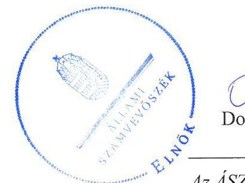
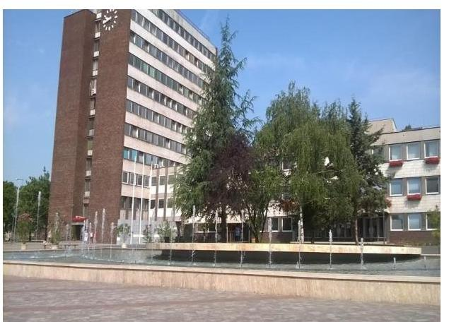
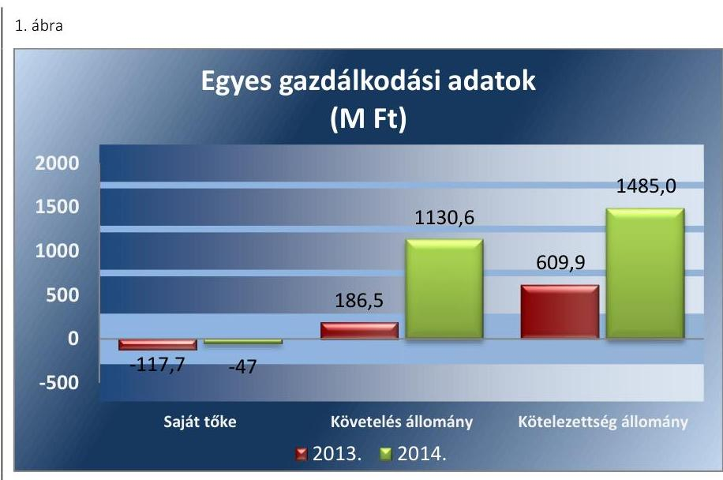
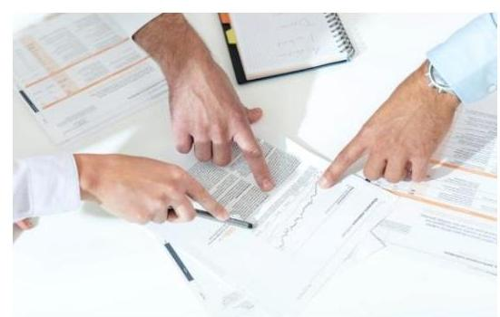
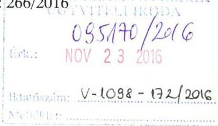
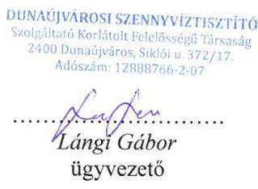
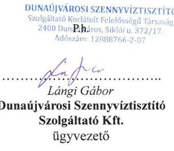
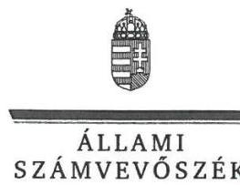
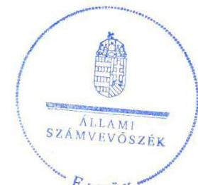

# Jelentés 

## Az önkormányzatok gazdasági társaságai

Az önkormányzatok többségi tulajdonában lévő gazdasági társaságok gazdálkodásának ellenőrzése - Dunaújvárosi Szennyvíztisztító Szolgáltató Kft.
2016.

Az ÁSZ az államháztartáson kívül müködő közfel-adat-ellátó rendszerek el-lenőrzéseivel hozzájárul ahhoz, hogy a közpénzeket az államháztartáson kívül müködő szervezetek is átlátható, rendezett módon használják fel a közfeladatok ellátása érdekében.

---

# Jelentés 

## Az önkormányzatok gazdasági társaságai

Az önkormányzatok többségi tulajdonában lévő gazdasági társaságok gazdálkodásának ellenőrzése - Dunaújvárosi Szennyvíztisztító Szolgáltató Kft.
2016. 12. hó 20. nap

16257
www.asz.hu

---

# AZ ELLENŐRZÉST FELÜGYELTE:

## MAKKAI MÁRIA felügyeleti vezető

## AZ ELLENŐRZÉST VEZETTE ÉS A VÉGREHAJTÁSÁÉRT FELELŐS:

## NEMESVÁRI-HORTHY ESZTER ellenőrzésvezető

## KLINGA LÁSZLÓ ellenőrzésvezető

## A PROGRAM ÖSSZEÁLLÍTÁSÁÉRT FELELŐS:

## JANIK JÓZSEF LÁSZLÓ osztályvezető

---

**IKTATÓSZÁM:** V-1098-176/2016.

**TÉMASZÁM:** 2132

**ELLENŐRZÉS-AZONOSÍTÓ SZÁM:** V070762

---

Jelentéseink az Országgyűlés számítógépes hálózatán és az Interneta a www.asz.hu címen is olvashatóak.

---

# TARTALOMJEGYZÉK 

■ ÖSSZEGZÉS ..... 5
■ AZ ELLENŐRZÉS CÉLJA ..... 7
■ AZ ELLENŐRZÉS TERÜLETE ..... 8
■ AZ ELLENŐRZÉS HÁTTERE, INDOKOLTSÁGA ..... 10
■ A JELENTÉS LÉNYEGES KÉRDÉSKÖREI ..... 11
■ ELLENŐRZÉS HATÓKÖRE ÉS MÓDSZEREI ..... 12
■ MEGÁLLAPÍTÁSOK ..... 14
■ JAVASLATOK ..... 22
■ MELLÉKLETEK ..... 25
I. Sz. melléklet: Értelmező szótár ..... 25
■ FÜGGELÉK: ÉSZREVÉTELEK ..... 27
■ RÖVIDÍTÉSEK JEGYZÉKE ..... 35

---

.

---

# ÖSSZEGZÉS 

Az Állami Számvevőszék a Dunaújvárosi Szennyvíztisztító Szolgáltató Kft. 2013-2014 közötti gazdálkodásának ellenőrzése során megállapította, hogy a tulajdonosi joggyakorlás nem volt szabályszerű. A Bérleti-üzemeltetési szerződés nem tartalmazta a bérbe adott vagyon körét, így nem biztosították az átláthatóságot. A Társaság a szabályszerű vagyongazdálkodás feltételeit teljes körűen nem alakította ki, a 2013-2014. évi beszámolók leltárral nem voltak alátámasztva, így azok valódisága nem volt megalapozva. A Társaság kötelezettségállománya veszélyt jelentett a közfeladat ellátására és a müködésre egyaránt. A Társaság az adatok közzétételi kötelezettségét nem teljesítette, így az ügyvezető nem biztosította a müködés jogszabályoknak megfelelő átláthatóságát.

## Az ellenőrzés társadalmi indokoltsága

Az Állami Számvevőszék kiemelt célja, hogy a helyi önkormányzatok gazdálkodásában rejlő pénzügyi kockázatok feltárásával, az államháztartáson kívülre nyújtott költségvetési támogatások és ingyenes vagyonjuttatások, valamint az államháztartáson kívül múködő feladat-ellátó rendszerek ellenőrzéseivel hozzájáruljon ahhoz, hogy a közpénzeket az államháztartáson kívül múködő szervezetek is átlátható, rendezett módon használják fel.

Magyarországon az intézmény-centrikus közfeladat-ellátás jellemző, de egyre jelentősebb a költségvetésen kívüli feladatellátás térnyerése. Ennek legfontosabb szereplői - a nonprofit szervezetek mellett - az önkormányzati tulajdonú gazdasági társaságok. Az önkormányzatok szervezetalakítási szabadságának következménye, hogy a korábban is vállalati formában múködő közszolgáltatások mellett, mind a kötelező, mind az önként vállalt feladatok ellátásában a gazdasági társaságok kiemelt fontosságú szerephez jutottak.

## Főbb megállapítások, következtetések, javaslatok

Az Önkormányzat a szennyvíztisztítási közfeladatának ellátásáról gondoskodott. Az Önkormányzat a Bérleti-üzemeltetési szerződés alapján a múködés biztosításához szükséges vagyont bérbe adta a Társaságnak. A Bérleti-üzemeltetési szerződésben az Önkormányzat által előírt éves karbantartási terv készítési kötelezettségének a Társaság nem tett eleget. A Közgyűlés a tulajdonosi jogait a 2014. évi tőkepótlás során nem gyakorolta szabályszerűen, mivel nem a Ptk. ${ }_{2}$-ben előírt határidőben és mértékben biztosította a saját tőkét. Az FB nem teljesítette a Közgyűlés részére a Vagyongazdálkodási rendeletben előírt beszámolási kötelezettségét. A Társaságnál az Önkormányzat belső ellenőrzése nem ellenőrzött, így a szabályszerű működés kontrollját nem támogatta.

A Társaság a Közgyűlés előírása ellenére a 2013-2014. évekre üzleti tervet nem készített, így a megalapozott tervezésen alapuló gazdálkodás nem volt biztosított. A szabályszerű vagyongazdálkodás feltételeit teljes körűen nem alakították ki, mivel a Számv. tv.-ben előírt leltározási, értékelési, pénzkezelési szabályzattal 2013. május 30 -áig nem rendelkeztek, számlarendet az ellenőrzött időszakban nem készítettek. Üzemeltetési és vagyonvédelmi szabályzattal a Bérleti-üzemeltetési szerződésben előírtak ellenére nem rendelkeztek. A 2013-2014. évi beszámolókat a Számv. tv.ben előírtak ellenére leltárral nem támasztották alá, így azok valódiságát nem alapozták meg.

A DVCSH Kft. a felhasználóktól a szolgáltatásért járó díjat beszedte, de abból a DSZSZ Kft.-nek a megállapodás ${ }_{1,2}$ ben rögzített díjat nem adta át, így a Társaságnak jelentős összegű követelésállománya halmozódott fel. A Társaság a 2013. évi beszámolót a Közgyűlésnek nem nyújtotta be, a 2014. évi beszámolót a Közgyűlés tárgyalta, de nem fogadta el. A 2013. és 2014. évi beszámolók letétbe helyezése annak közgyűlési elfogadásának hiányában megtörtént. A DSZSZ Kft. a szervezeti, személyi és gazdálkodási adatait az Info tv.-ben előírtak ellenére honlapján nem tette

---

közzé. A Társaságnál a közfeladat bevételeinek elszámolása nem megfelelő, az anyagjellegú ráfordításainak elszámolása megfelelő volt. Értékcsökkenést a 2013-2014. években egyes tárgyi eszközök esetében a Számv. tv. előírása ellenére nem számoltak el.

---

# AZ ELLENŐRZÉS CÉLJA 

pozottsága szabályszerű önköltségszámítással.

Az ellenőrzés célja annak értékelése volt, hogy az Önkormányzat vagyongazdálkodási tevékenysége során szabályszerűen gyakorolta-e tulajdonosi jogait.

Ellenőriztük, hogy a gazdasági társaság szabályozottsága, gazdálkodása és vagyongazdálkodási tevékenysége, bevételeinek és ráfordításainak elszámolása megfelelt-e a jogszabályi és tulajdonosi előírásoknak.

Értékeltük továbbá, hogy a gazdasági társaság kötelezettségállománya jelentett-e kockázatot a múködésre, valamint a gazdálkodás átláthatósága és elszámoltathatósága érdekében biztosítva volt-e a szolgáltatás dijának megala-

---

# **AZ ELLENŐRZÉS TERÜLETE**

## **Dunaújváros Megyei Jogú Város Önkormányzata és a Dunaújvárosi Szennyvíztisztító Szolgáltató Kft.**

### **A DUNAÚJVÁROSI SZENNYVÍZTISZTÍTÓ SZOLGÁLTATÓ KFT.-** (továbbiakban: DSZSZ Kft.) az Önkormányzat 2002. augusztus 1-jén alapította 20 millió Ft törzstőkével. A DSZSZ Kft.-ben 2012. május 30-ig az E.ON Hungária Zrt.-nek az ellenőrzött időszakot megelőző üzletrészvásárlása következtében 49%-os tulajdonjoga volt. Az Önkormányzat 2012. május 31-én megvásárolta az E.ON Hungária Zrt. 49 %-os üzletrészét, így továbbiakban 100%-os tulajdonosa lett a DSZSZ Kft-nek.

### **A DSZSZ KFT. FŐ TEVÉKENYSÉGE** szennyvíz gyűjtése és kezelése volt. A DSZSZ Kft. a szennyvíztisztítási feladatot az Önkormányzat tulajdonában álló, IBRD hitelből létesített szennyvíztisztító telepen végezte, amelyet szerződéssel bérleti díj ellenében használatba kapott az Önkormányzattól. A DSZSZ Kft. nem minősült közüzemi közszolgáltatónak, feladatát víziközmű szolgáltatóként látta el. A víz- és csatornahálózat üzemeltetését, a fogyasztók felé történő számlázást a Dunaújvárosi Víz,- Csatorna- Hőszolgáltató Kft. (továbbiakban: DVCSH Kft.) végezte közszolgáltatóként, amely az Önkormányzat 100%-os tulajdonában álló DVG Dunaújvárosi Vagyonkezelő Zrt. többségi tulajdonában állt. A DSZSZ Kft.-nek a lakosság felé szolgáltatási díj megállapítására nem volt joga.

A DSZSZ Kft. árbevételét a szennyvíztisztításból származó bevételek tették ki, legnagyobb vevője a Dunaújvárosban a víz- és csatornahálózat üzemeltetését végző DVCSH Kft. volt. A DSZSZ Kft. részére a szennyvíztisztításért fizetendő szolgáltatási díj alapja a DVCSH Kft. által kiszámlázott szennyvíz mennyisége volt. A DSZSZ Kft. árbevételét képezték a nem közművel összegyűjtött háztartási szennyvíz befogadása után a szolgáltatók felé kiszámlázott szennyvíztisztítási díjak is.

A DSZSZ Kft. gazdálkodásának főbb adatait az alábbi grafikon szemlélteti:

---

Forrás: A Társaság 2013. és 2014. évi beszámolói

A DSZSZ Kft. munkavállalóinak létszáma a 2011. évi 19 főről 2014. évre 1 főre csökkent. A csökkenés oka az volt, hogy a DSZSZ Kft. a DVCSH Kft.vel 2012. decemberben megállapodást kötött az üzemeltetést végző szakszemélyzet átvételéről a teljes körű munkajogi jogutódlás biztosítása mellett. A DSZSZ Kft. a DVCSH Kft.-vel megállapodást kötött, amelynek értelmében 2013. évtől a szennyvíztisztító telep üzemeltetését, karbantartását a DVCSH Kft. vállalkozóként látta el a DSZSZ Kft.-től átvett munkavállalókkal.

A DSZSZ Kft. az ellenőrzött időszakban a szennyvíztisztítási közfeladat ellátásához vagyonkezelésbe nem vett át eszközöket, a szennyvíztisztításhoz szükséges vagyonelemeket az Önkormányzattól kapta kizárólagos használatra vagyonbérleti díj fizetése ellenében.

Dunaújváros népessége 2011-ben 47357 fő, 2014-ben 46320 fő volt*. Területe 5267 hektár (52,7 négyzetkilométer), a vízvezetékek hossza 131 km , a csatorna 168 km . A város vezetékes ivóvíz-ellátottsága 97,3\%, a közcsatorna ellátottsága 91,4\% volt. A szennyvíztisztító mú kapacitása $15000 \mathrm{~m}^{3} /$ nap. ${ }^{* *}$

A DSZSZ Kft.-nél 2012. május 31-ig kettős ügyvezetés volt, majd az E.ON Hungária Zrt. üzletrészének kivásárlását követően a kettős ügyvezetés megszűnt, egy ügyvezető volt. A 2011-2014. években az ügyvezető személye két alkalommal változott. Az ügyvezető 2016. január 1-jétől tölti be tisztségét. A polgármester ${ }^{1}$ személyében nem, a jegyző ${ }^{2}$ személyében egy alkalommal, 2014. április 10-től volt változás. A polgármester a 2010. évi önkormányzati választásoktól tölti be tisztségét.

A DSZSZ Kft. nem minősült az Áht. $2^{3}$ 2. § l) pontja, valamint a 479/2009/EK rendelet ${ }^{4}$ szerint nevesített kormányzati szektorba sorolt egyéb szervezetnek, ezért adatszolgáltatási kötelezettség az ellenőrzött időszakban nem terhelte.

[^0]
[^0]:    * Központi Statisztikai Hivatal adatai
    ** Az Önkormányzat honlapjának adatai szerint (2016.)

---

# AZ ELLENŐRZÉS HÁTTERE, INDOKOLTSÁGA 

Az önkormányzatok közfeladat-ellátásában egyre jelentősebb a gazdasági társaságok útján történő feladatellátás térnyerése.

AZ ÖNKORMÁNYZATI TULAJDONÚ GAZDASÁGI TÁRSASÁGOK teljes körű ellenőrzésének lehetőségét az Állami Számvevőszékről szóló 1989. évi XXXVIII. törvény 2011. január 1-jétől hatályos módosítása teremtette meg. Az önkormányzati tulajdonú gazdasági társaságok ellenőrzése kiemelten fontos a vagyon megőrzése, megóvása érdekében. Az önkormányzati tulajdonú gazdálkodó szervezetekkel szemben alapvető követelmény, hogy gazdálkodásuk, működésük szabályszerű, az általuk szolgáltatott adatok minél megbízhatóbbak legyenek. A feladat/közfeladat ellátás költségeinek, ráfordításainak alakulása, színvonala hatással van a lakosság elégedettségére.

## AZ ELLENŐRZÉS VÁRHATÓ HASZNOSULÁSA-

KÉNT az ÁSZ ${ }^{5}$ a megállapításaival segítséget nyújthat az államháztartáson kívüli közfeladat-ellátás értékeléséhez, jogszabályi keretei pontosításához, átláthatóságot biztosító szabályozásához. Meghatározhatóvá válnak az önkormányzati feladatellátásban részt vevő államháztartáson kívüli szervezeteknek - az önkormányzat költségvetését, pénzügyi helyzetét is befolyásoló - kockázatai, lehetővé válik ezen kockázatok csökkentése. Ellenőrzéseink feltárhatják, hogy az önkormányzat feladat-ellátási kötelezettségének szabályszerűen tett-e eleget, a feladatellátáshoz rendelt vagyon működtetését az elvárható gondossággal, szabályszerűen szerveztee meg és a tulajdonosi felügyelete hozzájárult-e a feladatellátásához. Értékelhetővé válik, hogy a gazdasági társaság a feladat-ellátási, közszolgáltatási szerződésben foglaltak betartásával, a vagyon használatával biztosí-totta-e a szolgáltatás folytatásának feltételeit. Ezzel az ellenőrzöttek és a helyi döntéshozók számára az ÁSZ visszajelzést ad feladatszervezési, fel-adat-ellátási kockázataikról, alapot ad a meglévő hibák megszüntetéséhez, a jobb feladat-ellátás biztosításához. Mindezeken keresztül az ÁSZ hozzájárul Magyarország közpénzügyi helyzetének javításához, a közpénzek mérhető módon történő, a döntéshozók által meghatározott célok szerinti felhasználásához.

---

# A JELENTÉS LÉNYEGES KÉRDÉSKÖREI 

1. Az önkormányzat közfeladat megszervezéséről szóló döntése, valamint tulajdonosi joggyakorlása szabályszerű volt-e?
2. A gazdasági társaság vagyongazdálkodása szabályszerű volt-e, kötelezettségállománya jelent-e kockázatot a müködésre, illetve a közfeladat ellátására?
3. A gazdasági társaságnál az ellátott közfeladat bevételei és ráfordításai elszámolása, valamint az önköltségszámítás és az árképzés szabályszerű volt-e?

---

# ELLENŐRZÉS HATÓKÖRE ÉS MÓDSZEREI 

## Az ellenőrzés típusa

Megfelelőségi ellenőrzés

## Az ellenőrzött időszak

2013. január 1-jétől 2014. december 31-ig terjedő időszak

A helyszíni ellenőrzés során megismert tény, hogy a Társaságnál a 20112012. évekre vonatkozóan a számviteli nyilvántartás adatai nem álltak rendelkezésre peres ügy és nyomozóhatósági lefoglalás miatt. Így az ellenőrzött szervezeteknél nem történt megállapítás a 2011-2012. évekre vonatkozóan.

## Az ellenőrzés tárgya

A gazdasági társaság feletti tulajdonosi joggyakorlás, valamint a gazdasági társaság gazdálkodásának szabályozottsága és szabályszerűsége.

Az ellenőrzés kiterjed minden olyan körülményre és adatra, amely az ÁSZ jogszabályban meghatározott feladatainak teljesítéséhez, valamint a program végrehajtása folyamán felmerült újabb összefüggések feltárásához szükséges.

## Az ellenőrzött szervezet

Dunaújváros Megyei Jogú Város Önkormányzata és a Dunaújvárosi Szennyvíztisztító Szolgáltató Kft.

## Az ellenőrzés jogalapja

Az ellenőrzés jogszabályi alapját az ÁSZ tv. 1. § (3) bekezdése és 5. § (3)-(4)-(5) bekezdései képezték.

## Az ellenőrzés módszerei

Az ellenőrzést a nemzetközi standardokat irányadónak tekintve az ellenőrzési program ellenőrzési kérdései, az ellenőrzött időszakban hatályos jogszabályok, az ellenőrzés szakmai szabályok és módszertanok figyelembe vételével végeztük.

---

Az ellenőrzés ideje alatt az ellenőrzött szervezettel történő kapcsolattartást az ÁSZ Szervezeti és Müködési Szabályzatának vonatkozó előírásai alapján biztosítottuk.

Az ellenőrzés a kiválasztott, tulajdonosi jogokat gyakorló önkormányzatra, illetve az ellenőrzésre kijelölt gazdasági társaságra terjedt ki.

Az ellenőrzési kérdések megválaszolásához szükséges bizonyítékok megszerzése a következő ellenőrzési eljárások alkalmazásával történt: megfigyelés, kérdésfeltevés (információkérés), összehasonlítás, valamint elemző eljárás. Az ellenőrzési bizonyítékként felhasználható adatforrások közé tartoztak egyrészt a szakmai programban felsorolt adatforrások, másrészt adatforrás lehetett még minden - az ellenőrzés folyamán - feltárt, az ellenőrzés szempontjából információkat tartalmazó dokumentum.

Az ellenőrzést a kérdésekre adott válaszok kiértékelésével, valamint a megjelölt adatforrások, a csatolt tanúsítványok felhasználásával, továbbá az adott időszakban hatályos jogszabályok figyelembe vételével folytattuk le.

A bevételek és ráfordítások elszámolása terén a szabályszerű múködést véletlen mintavétellel ellenőriztük. A mintavétellel ellenőrzött területek esetében minden egyes tétel vonatkozásában a szabályszerűségre vonatkozó kérdéseket tettünk fel, amelyek eredménye összesítésre került. Megfelelőnek értékeltünk egy ellenőrzött területet, amennyiben 95\%-os bizonyossággal a teljes sokaságban a hibaarány legfeljebb 10\%, nem megfelelőnek, amennyiben 10\%-nál magasabb arányt képviselt. Abban az esetben, ha a teljes sokaság tekintetében a 10\%-os hibaarányhoz való viszony megítélésnek megbízhatósága nem érte el a 95\%-ot, annak elérése érdekében értékelésünket további szempontokkal egészítettük ki, és figyelembe vettük a feltárt hibák típusát és súlyát. A ráfordítások elszámolására vonatkozó véletlen mintavételt kockázati alapú kiválasztással egészítettük ki, amelynek során évente a három legnagyobb összegű tételt választottuk ki.

---

# 1. Az önkormányzat közfeladat megszervezéséről szóló döntése, valamint tulajdonosi joggyakorlása szabályszerű volt-e? 

Összegző megállapítás

1.1. számú megállapítás

A tulajdonosi joggyakorlás nem volt szabályszerű. Az Önkormányzat 2014-ben a tőkepótlásról késve és nem megfelelő mértékben gondoskodott, a Társaságnak használatba adott eszközök körét nem határozta meg, a karbantartási terv készítésének és az FB beszámolási kötelezettségének elmaradását nem kérte számon.

Az Önkormányzat a DSZSZ Kft. útján biztosította a szennyvíztisztítási feladatok ellátását. A használatba adott eszközök körét a Bérleti-üzemeltetési szerződés nem tartalmazta, így azok nem voltak beazonosíthatók.

GAZDASÁGI PROGRAMMAL az Önkormányzat ${ }^{6}$ 20132014. években nem rendelkezett az Ötv. 91. § (1) és az Mötv. 116. § (1) bekezdésében előírtak ellenére.

## A KÖZÉP- ÉS HOSSZÚ TÁVÚ VAGYONGAZDÁLKO-

DÁSI TERVET az Önkormányzata az Nvtv. ${ }^{7}$ 2012. január 1-jétől hatályba lépő 9. § (1) bekezdésében előírtak szerint 2013-2018. évekre vonatkozóan elkészítette, amelyet a Közgyűlés ${ }^{8}$ határozatával elfogadott.

Az Önkormányzat az Ötv. 9. § (4) bekezdésében foglalt lehetőséggel élve az ellenőrzött időszakot megelőzően döntött a közműves szennyvíztisztítás gazdasági társaság útján történő ellátásáról és 20 millió Ft alaptőkével megalapította a DSZSZ Kft ${ }^{9}$.-t. Az Önkormányzat szennyvíztisztítási feladatok ellátásához vagyonkezelésre nem bocsátott eszközöket a DSZSZ Kft. rendelkezésére.

A SZENNYVÍZ KÖZMŰ VAGYONTÁRGYAK kizárólagos használatba adására az Önkormányzat a 2013. évet megelőzően 10 évre szóló Bérleti-üzemeltetési szerződést ${ }^{10}$ kötött a vagyontárgyak kizárólagos használatba (bérbe) adására. A Bérleti-üzemeltetési szerződés tartalmazta - többek között - a felek jogait és kötelezettségeit, a közműves szennyvíztisztítás ellátásának kötelezettségét, az Önkormányzat részére fizetendő vagyonbérleti díjjal összefüggő előírásokat. A Bérleti-üzemeltetési szerződés 1.1 pontjában hivatkozott, a vagyontárgyak felsorolását tartalmazó 1. számú melléklet nem képezte annak részét. Ennek hiányában a DSZSZ Kft. kizárólagos használatába adott szennyvíz közmű vagyontárgyak, infrastrukturális javak, továbbá az üzemeltetési javak köre nem volt beazonosítható, így az Nvtv. 7. § (2) bekezdése alapján a vagyon használatának átláthatósága nem volt biztosított.

---

Az Önkormányzat számviteli nyilvántartásaiban az üzemeltetésre átadott eszközök között a DSZSZ Kft.-nek átadott vagyont nyilvántartotta.

A DSZSZ Kft.-nek a Bérleti-üzemeltetési szerződésben rögzített kötelezettsége volt a szennyvíztisztító telep szakszerű üzemeltetése, karbantartása, a folyamatos szennyvíztisztításhoz szükséges technikai és személyi feltételek biztosítása. A DSZSZ Kft.-ben a 2013. évtől 1 fő ügyvezető látta el a cég képviseletével kapcsolatos teendőket. A szennyvíztisztító telep üzemeltetését, karbantartását vállalkozói szerződés keretében a DVCSH Kft. látta el a DSZSZ Kft.-től átvett (14 fő) munkavállalóval.

A KÖZFELADAT-ELLÁTÁSA ÉRDEKÉBEN a DSZSZ Kft. rendelkezett a szennyvíztisztító telep üzemeltetéséhez a Vízügyi hatóság által kiadott vízjogi üzemeltetési engedéllyel. A 38/1995. (IV. 5.) Korm. rendelet ${ }^{11} 1$. § (1) bekezdése alapján a DSZSZ Kft. nem minősült szolgáltatónak, ezért a szennyvíztisztítási díjakat a DVCSH Kft. ${ }^{12}$ számlázta ki és szedte be.

A DSZSZ KFT. TÁRSASÁGI SZERZŐDÉSE ${ }^{13}$, ILLETVE ALAPÍTÓ OKIRATA ${ }^{14}$ szabályszerűen tartalmazta a Gt. ${ }^{15}$ 19. § (5) bekezdésében, illetve 2014. március 15-től a Ptk. ${ }^{16}$ 3:109. § (2) bekezdésében foglaltaknak megfelelően a döntési jogosultságokat. A Társasági szerződés 10.9 pontja alapján a taggyűlés, 2012. június 1-től az Alapító Okirat 10.2 pontjában foglaltak alapján a Közgyűlés kizárólagos hatásköre volt - többek között - a Számv. tv. ${ }^{17}$ szerinti beszámoló jóváhagyása, az eredmény felosztása, pótbefizetés elrendelése, az ügyvezető, az $\mathrm{FB}^{18}$ és a könyvvizsgáló megválasztása, visszahívása, a társasági szerződés módosítása, törzstőke felemelésének és leszállításának elhatározása. Az ügyvezető feladataként határozták meg a Társaság üzletpolitikájának kidolgozását, az éves mérleg, eredménykimutatás jogszabály szerinti határidőben történő összeállításának biztosítását, írásbeli beszámoló készítésének kötelezettségét.

A tulajdonosi jogok gyakorlása nem volt szabályszerű. Az Önkormányzat a 2014. évben a tőkepótlási kötelezettséget nem az előírt határidőn belül és nem a megfelelő mértékben teljesítette, a Társaság karbantartási terv készítésének, továbbá az FB beszámolási kötelezettségének elmaradását nem kérte számon.

A TULAJDONOSI JOGOK GYAKORLÁSA SZABÁLYAIRÓL a Közgyűlés az Ötv. 80. § (1) bekezdésében és az Mótv. 107. § -ában kapott felhatalmazás alapján Vagyongazdálkodási rendeletben ${ }^{19}$ rendelkezett. A Vagyongazdálkodási rendeletben meghatározták a Közgyűlés kizárólagos hatáskörébe tartozó, az Önkormányzat egyszemélyes, illetőleg 50\%-ot meghaladó tulajdoni részesedéssel rendelkező gazdasági társaságai esetében a hatáskörébe tartozó jogait. A Közgyűlés kizárólagos joga volt jogi személy, jogi személyiség nélküli szervezet létrehozására, létesítő okiratának módosítására vonatkozó döntés. A tulajdonosi jogokat a Vagyongazdálkodási rendelet előírásaival összhangban lévő Alapító Okirat alapján az arra jogosultak gyakorolták.

---

A Közgyűlés a tulajdonosi jogait a 2014. évi tőkepótlás során nem gyakorolta szabályszerűen. A könyvvizsgáló a 2013. május 21-én kelt könyvvizsgálói jelentésében a 2012. évi beszámolóhoz kapcsolódó korlátozott véleményében jelezte, hogy a DSZSZ Kft. saját tőkéje - 117,7 millió Ft-ra csökkent, ami szükségessé teszi a tulajdonos beavatkozását. A 2013. évi gazdálkodás eredményeként a veszteség 81,9 millió Ft, a saját tőke értéke -199,7 millió Ft volt. A Gt. 51. § (1) bekezdésében előírtak alapján az Önkormányzatnak intézkedési kötelezettsége a 2013. évben nem volt. A Közgyűlés a 143/2014. (IV. 24.) számú határozatában a DSZSZ Kft. veszteségének fedezetére a 2014. évben 120,7 millió Ft tőkepótlásról döntött, amit négy részletben 2014. november 19-éig teljesített a Társaság felé. A tőkepótlás meghatározásakor nem vették figyelembe a tárgyévi eredmény várható értékét ( 32 millió Ft) és az üzleti évet nyitó saját tőke állományt (- 199,7 millió Ft), így a saját tőke összege (- 47,0 millió Ft) a 2014. évben a jegyzett tőke összegét továbbra sem érte el. Az Önkormányzat a Ptk. 3:133 § (2) bekezdésében előírtakat nem vette figyelembe, amely szerint, ha egymást követő két üzleti évben a Társaság saját tőkéje nem éri el az adott társasági formára kötelezően előírt jegyzett tőkét, és a tagok a második év beszámolójának elfogadásától számított három hónapon belül a szükséges saját tőke biztosításáról nem gondoskodnak, e határidő lejártát követő hatvan napon belül a gazdasági társaság köteles elhatározni átalakulását. Átalakulás helyett a gazdasági társaság a jogutód nélküli megszűnést vagy az egyesülést is választhatja.

AZ ÉVES KARBANTARTÁSI TERV készítési kötelezettségének a Társaság ${ }^{20}$ a 2013-2014. évekre vonatkozóan nem tett eleget. Az Önkormányzat a Bérleti-üzemeltetési szerződésben előírtak betartatására nem hívta fel a DSZSZ Kft. figyelmét.

AZ FB rendelkezett - a Gt. 34. § (4) és Ptk. 3 :122. § (3) bekezdésében előírt - a 2003. évtől hatályos ügyrenddel. A 2013. évi beszámolóról - ellentétben a Gt. 35. § (3) bekezdésében és a Ptk. 3 :120. § (2) bekezdésében előírtaknak - írásbeli jelentést az FB nem készített. Az FB a 2014. évi Számv. tv. szerinti beszámolóról írásbeli jelentést készített. A 20132014. évekre vonatkozóan az FB nem teljesítette a Közgyűlés részére a Vagyongazdálkodási rendelet 22. § (6) bekezdésében előírt, az FB éves munkájáról szóló beszámolási kötelezettséget. Az Önkormányzat a Vagyongazdálkodási rendeletben előírtak betartatására nem hívta fel az FB figyelmét.

ELLENŐRZÉST az Önkormányzat belső ellenőrzése a DSZSZ Kft.-nél az ellenőrzött időszakban nem végzett, így a szabályszerű működés kontrollját nem támogatta.

A BESZÁMOLTATÁSI RENDSZER keretében a Számv. tv. szerint éves beszámoló elkészítése mellett az Önkormányzat a Bérleti-üzemeltetési szerződésben az éves karbantartási tervek végrehajtásáról való beszámolást írt elő. Az Önkormányzat a Társasági szerződés 11.5. e) pontjában és az Alapító Okirat 11.4 e) pontjában az ügyvezető részére írásbeli beszámoló készítését írta elő, olyan tartalommal, hogy az magyarázatot adjon az éves eredményre és kitekintést adjon a vállalkozás jövőjére.

---

# 2. A gazdasági társaság vagyongazdálkodása szabályszerű volt-e, kötelezettségállománya jelent-e kockázatot a múködésre, illetve a közfeladat ellátására? 

Összegző megállapítás

A DSZSZ Kft. a szabályszerű vagyongazdálkodás feltételeit nem alakította ki, nem rendelkeztek számlarenddel, üzleti tervekkel. A beszámolókat leltárral nem támasztották alá. Az adatvédelmi és közzétételi kötelezettséget a jogszabályi előírások ellenére nem teljesítették. A kötelezettségállomány veszélyt jelentett a közfeladat-ellátásra és a múködésre.
2.1. számú megállapítás

A DSZSZ Kft. a szabályszerű vagyongazdálkodás feltételeit nem alakította ki. Egyes számviteli szabályzatokkal 2013. júniusáig nem rendelkeztek, számlarenddel ezt követően sem. A Társaság feladatait üzleti tervek hiányában végezte.

ÜZLETI TERVEKET a DSZSZ Kft. a 2013. és a 2014. évekre a Közgyűlés határozataiban foglalt előírások ellenére nem készített. Az Önkormányzat az üzleti terv készítési kötelezettség teljesítésére nem hívta fel a Társaság figyelmét.

A szervezet és múködés rendjét meghatározó SZMSZ ${ }^{21}$-el a DSZSZ Kft. rendelkezett, azonban az nem állt összhangban az Alapító Okirattal, amely alapján 2012. júniustól megszűnt a kettős ügyvezetés.

A SZÁMVITELI POLITIKA KERETÉBEN a Társaság 2013. május 30 -áig nem rendelkezett a Számv. tv. 14. § (5) bekezdés a), b) és d) pontjaiban előírtak ellenére az eszközök és a források leltárkészítési és leltározási szabályzatával, az eszközök és a források értékelési szabályzatával, valamint pénzkezelési szabályzattal.

Önköltségszámítási szabályzat készítésére a Társaság a Számv. tv. 14. § (7) bekezdése alapján előírtak figyelembe vételével nem volt kötelezett.

A Társaság 2013. június 1-jétől a számviteli politika keretében elkészítette a Számv. tv. 14. § (5) bekezdés a)-d) pontjaiban előírt szabályzatokat.

A Társaság ellenőrzött időszakban nem rendelkezett a Számv. tv. 161. § (1) bekezdésében előírt számlarenddel.

A pénzkezelési szabályzat a Számv. tv. 14. § (8) bekezdésében előírt tartalmi követelményeknek nem felelt meg, mivel nem tartalmazta a bankszámlán történő pénzforgalom rendjét, továbbá a készpénzben és a bankszámlán tartott pénzeszközök közötti forgalom szabályait.

Úzletszabályzat készítésére a Vksztv. ${ }^{22}$ 47. § (1) bekezdésében előírtak szerint a DSZSZ Kft. nem volt kötelezett, mert nem végzett víziközmű szolgáltatást.

ÜZEMELTETÉSI ÉS VAGYONVÉDELMI SZABÁLY-
ZATTAL a DSZSZ Kft. nem rendelkezett a Bérleti-üzemeltetési szerződés 2.2.2.- 2.2.3. pontjaiban foglalt előírások ellenére.

---

JAVADALMAZÁSI SZABÁLYZATOT a Társaság legfőbb szerve a Taktv. ${ }^{23} 5 . \S$ (3) bekezdésében foglaltak ellenére 2013. szeptember 18.-áig nem alkotott. A Javadalmazási szabályzatot ${ }^{24}$ a Közgyűlés 2013. szeptember 19-étől léptette hatályba, ami megfelelt az előírásoknak.

# 2.2. számú megállapítás 

A DSZSZ Kft. vagyongazdálkodása nem volt szabályszerű, mivel a beszámolók adatait leltárral nem támasztották alá.

ANALITIKUS NYILVÁNTARTÁST a DSZSZ Kft. a saját vagyonához kapcsolódóan nem vezetett, így nem tudott eleget tenni a Számv. tv. 69. § (2) bekezdésében előírtak alapján a főkönyvi könyvelés és az analitikus nyilvántartások adatai közötti egyeztetési kötelezettségének az üzleti év mérlegfordulónapjára vonatkozóan.

A TÁRSASÁG VAGYONÁT bemutató éves beszámolók adatait leltárral nem támasztották alá. A Számv. tv. 69. § (1) bekezdésében előírtak ellenére a mérleg tételeinek alátámasztásához nem állítottak össze olyan leltárt, amely tételesen, ellenőrizhető módon tartalmazza a mérleg fordulónapján meglévő eszközöket és forrásokat mennyiségben és értékben.

A Társaság 2013. május 30 -áig nem rendelkezett a leltározás és a leltárkészítés szabályait előíró szabályzattal. A hatályos számviteli politika 13.3. pontja a mérlegtételek leltárral történő alátámasztását írta elő. A 2013. június 1-jétől hatályos leltározási és leltárkészítési szabályzat 1.1. pontja a Számv. tv. 69. § (3) bekezdésének előírásával összhangban háromévenkénti mennyiségi leltározási kötelezettséget írt elő, azonban ennek a kötelezettségnek az ellenőrzött időszak végét megelőző három évben nem tettek eleget, mennyiségi leltározást nem végeztek. A leltározási kötelezettség elmulasztásának következtében a beszámolók valódisága nem volt megalapozva.

A Társaság 2012-2014. évi - letétbe helyezett - beszámolóinak főbb mérlegadatait az 1. táblázat szemlélteti.

1. táblázat

A DSZSZ KFT. FŐBB MÉRLEGADATAI (MILLIÓ FORINT)

| Megnevezés | 2013.01.01. | 2013.12.31. | 2014.12.31. |
| :-- | :--: | :--: | :--: |
| I.Befektetett eszközök | 3,2 | 6,3 | 6,3 |
| -ebből: Tárgyi eszközök | 3,2 | 6,3 | 6,3 |
| II.Forgó eszközök | 187,3 | 697,5 | 1144,4 |
| -ebből követelések | 186,5 | 692,4 | 1130,6 |
| IV.Aktív időbeli elhatárolások | 417,7 | 315,9 | 350,4 |
| Eszközök összesen | 608,3 | 1019,8 | 1501,1 |
| IV. Saját tőke | $-117,7$ | $-199,7$ | $-47,0$ |
| - ebből jegyzett tőke | 20,0 | 20,0 | 140,7 |
| ebből Mérleg szerinti eredmény | 306,1 | $-81,9$ | 32,0 |
| V. Céltartalékok | - | - | - |
| VI. Kötelezettségek | 609,9 | 1172,9 | 1485,0 |
| VII. Passzív időbeli elhatárolások | 116,1 | 46,5 | 63,0 |
| Források összesen | 608,3 | 1019,8 | 1501,1 |

Forrás: A Társaság adatszolgáltatása

---

A VAGYON belső szerkezete kedvezőtlenül alakult. A DSZSZ Kft. nyilvántartásaiban szereplő befektetett eszközök állománya nem volt jelentős. Az eszközérték 2013. január 1. és 2014. december 31-e közötti 892,8 millió Ft-tal, közel két és félszeresére nőtt, amit legjelentősebben a követelések állományában bekövetkezett változások befolyásoltak. A követelések állományában a 2013. évi nyitó 186,5 millió Ft-ról a 2014. év végére 1130,6 millió Ft-ra, több mint hatszorosával emelkedett. A követelések állománya döntően a DVCSH Kft. által meg nem fizetett szennyvíztisztítási díjak miatt halmozódott fel.

A DSZSZ Kft. saját tőkéje a 2014. évben végrehajtott 120,7 millió Ft tőkepótlás ellenére is a jegyzett tőke alatt maradt. A DSZSZ Kft. a mérlegben a pótbefizetés összegét szabálytalanul jegyzett tőkeként mutatta ki, megsértve ezzel a Számv. tv. 102. § (2) bekezdésében előírtakat. A kötelezettségek állománya a 2013. évi 609,9 millió Ft-ról a 2014. évre 1485,0 millió Ft-ra nőtt, ami az Önkormányzat részére - a Bérleti-üzemeltetési szerződésben előírt - meg nem fizetett vagyonbérleti díjak miatt halmozódott fel.

# 2.3. számú megállapítás 

A DSZSZ Kft. kötelezettségállománya veszélyt jelentett a múködésre és a közfeladat ellátására.

AZ ELADÓSODOTTSÁG mértéke a közfeladat ellátására az ellenőrzött időszakban veszélyt jelentett, mivel a kötelezettségek állománya jelentősen meghaladta a forgóeszközök értékét.

A DVCSH Kft. a felhasználóktól a szolgáltatásért járó díjat beszedte, de az abból a DSZSZ Kft.-nek a szennyvízátadási-megállapodás ${ }_{1,2}$-ben rögzített díjat nem adta át. A DSZSZ Kft. részére a szennyvíztisztításért fizetendő szolgáltatási dí alapja a DVCSH Kft. által kiszámlázott szennyvíz mennyiség volt. A DSZSZ Kft. pert indított a DVCSH Kft. ellen az ellenőrzött időszakot megelőzően halmozódó összeg beszedése érdekében. A bíróság 2012. január 8-án kelt elsőfokú - nem jogerős - ítélete értelmében a DVCSH Kft.nek 624,2 millió Ft-ot kellett megfizetnie a DSZSZ Kft. részére, ebből az öszszegből 235,8 millió Ft végrehajtható volt, amely összeg a DSZSZ Kft. számlájára befolyt. Ezt követően két alkalommal kötöttek az egymás között fennálló követelések és kötelezettségek rendezésérő szóló megállapodás ${ }_{1,2}$-t, 2012. augusztus 15-én és 2013. május 31-én. A megállapodás ${ }_{1,2}$ felbontására a 417/2012. (IX. 27.) és 351/2013. (VII. 9.) számú határozataiban utasította a Közgyűlés a DSZSZ Kft. ügyvezetését, mivel azok megkötésére az ügyvezető nem volt jogosult. A DVCSH Kft. és a DSZSZ Kft. az egymással szemben fennálló követelések és kötelezettségek tekintetében az ellenőrzött időszakban nem állapodott meg, így a Társaság követelés- és kötelezettség állománya tovább nőtt. Az ellenőrzött időszakban az Önkormányzat engedményezési szerződést kötött a DVCSH Kft-vel, amelynek értelmében a DSZSZ Kft.-nek az Önkormányzat felé fennálló - jogerős fizetési meghagyásban szereplő - 438, 2 millió Ft vagyonbérleti dí tartozását a DVCSH Kft-re engedményezte. Az engedményezés célja volt, hogy abból a DVCSH Kft. a DSZSZ Kft. felé fennálló, illetve felmerülő kötelezettségeit kompenzálja.

HOSSZÚ LEJÁRATÚ KÖTELEZETTSÉGEI az ellenőrzött időszakban a DSZSZ Kft.-nek az éves beszámolók mérlegadatai alapján nem voltak.

---

# 2.4. számú megállapítás 

## RÖVIDLEJÁRATÚ KÖTELEZETTSÉGEKEN belül

a 2013-2014. években az áruszállításból és szolgáltatásból származó kötelezettségek (szállítók) állománya jelentős $85,6 \%$, illetve $89,4 \%$ volt.

A Társaság a 2013. évi beszámolót elkészítette, de a Közgyűlésnek elfogadásra nem nyújtotta be, a 2014. évi beszámolót a tulajdonos nem fogadta el. Az adatvédelmi és közzétételi kötelezettséget a jogszabályi előírások ellenére nem teljesítették.

A Társaság a 2013. évi beszámolót elkészítette, azonban a Közgyűlésnek nem nyújtotta be, így annak hiányában a Közgyűlés nem döntött. A 2014. évi beszámolót a Közgyűlés nem fogadta el.

Az Alapító Okiratban és a Társasági szerződésben előírt írásos beszámolási kötelezettségének az ügyvezető a 2013. évben nem tett eleget.

A KÖNYVVIZSGÁLÓ a Gt. 40. § (1) bekezdésében és a Ptk. 2 3.129. § (11) bekezdésében előírtaknak megfelelően a könyvvizsgálatot elvégezte. A 2013. és a 2014. évi beszámolókkal kapcsolatban a könyvvizsgáló a véleménynyilvánítást visszautasította egyrészt a DVCSH Kft.-vel folyamatban lévő peres ügy, másrészt a DSZSZ Kft. számviteli alapbizonylatainak hiánya miatt.

A Közgyűlés a DSZSZ Kft. 2013. és 2014. évi beszámolókat nem fogadta el, azonban a Számv. tv. 153. § (1) bekezdésében előírt letétbe helyezés ennek ellenére megtörtént.

A Vksztv. 11. § (1) bekezdésében - 2012. július 13-át követően a fenntartható fejlődés szempontjaira tekintettel - előírt tizenöt éves időtávú gördülő fejlesztési terv felújítási és pótlási tervrészét, valamint a beruházási tervrészét az Önkormányzat nem készítette el.

A Társaság az ellenőrzött időszakban a szervezeti, személyi adatait, tevékenységre, múködésre vonatkozó adatait és gazdálkodási adatait az Info. tv ${ }^{25}$. 37. § (1) bekezdésében előírtak ellenére, annak 1. mellékletében meghatározott részletezettségben honlapján nem tette közzé.

## 3. A gazdasági társaságnál az ellátott közfeladat bevételei és ráfordításai elszámolása, valamint az önköltségszámítás és az árképzés szabályszerű volt-e?

Összegző megállapítás

## 3.1. számú megállapítás

A közfeladat 2013-2014. évi bevételeinek elszámolása nem volt megfelelő, a ráfordításainak elszámolása megfelelő volt.

A 2013-2014. évi közfeladat bevételeinek elszámolása nem volt megfelelő, a ráfordításainak elszámolása megfelelő volt.

A DSZSZ Kft. a szennyvíz-befogadási és szennyvíztisztítási tevékenységen kívül más tevékenységet nem végzett, a két tevékenység számviteli szétválasztására jogszabályi, illetve tulajdonosi előírás nem volt.

AZ ÉRTÉKESÍTÉS NETTÓ ÁRBEVÉTELÉNEK elszámolásának szabályszerűsége a 2013-2014. években nem megfelelő volt.

---

A főkönyvi könyvelés során a lakossági szennyvízbefogadás árbevételét több esetben a közületi szennyvízbefogadás árbevételeként számolták el a számlatükörben meghatározottakkal ellentétben.

AZ ANYAGJELLEGŰ RÁFORDÍTÁSOK elszámolás a 20132014. években megfelelő volt. A költségeket a Számv. tv. 78. §-ában előírtaknak megfelelő költségnemre számolták el. Az anyagjellegú ráfordítások elszámolását a Számv. tv. 166. § (1)-(3) bekezdései előírásának megfelelő bizonylat alátámasztotta.

A beruházások, felújítások elszámolásának szabályszerűsége a dokumentumok hiánya miatt nem volt ellenőrizhető

ÉRTÉKCSÖKKENÉST a beszámolók kiegészítő mellékletei alapján a 2013-2014 években a műszaki gépek, berendezések, járművek és egyéb műszaki gépek, berendezések, járművek értéke után nem számoltak el. Ezzel megsértették a Számv. tv. 52. § (7) bekezdésében előírtakat, mivel a terv szerinti értékcsökkenést a már rendeltetésszerűen használatba vett, üzembe helyezett immateriális javak, tárgyi eszközök után kell elszámolni addig, amíg azokat rendeltetésüknek megfelelően használják.

A KÖVETELÉSEK állományának kezelését nem szabályozta a Társaság, arra jogszabályi előírás nem kötelezte. A 2014. évi beszámolóban kimutatott 1130,6 millió Ft követelés a mérleg főösszeg jelentős, 75,3\%-át tette ki. A Közgyűlés időközönként tárgyalta a DSZSZ Kft.-nek a DVCSH Kft.vel szemben fennálló követelései ügyét. Az ellenőrzött időszak végéig a DVCSH Kft. kötelezettségeit nem teljesítette a DSZSZ Kft. felé.

# 3.2. számú megállapítás 

## A Társaság önköltségszámítási szabályzat készítésére nem volt kötelezett.

ÖNKÖLTSÉGSZÁMÍTÁS RENDJÉRE vonatkozó szabályzat készítésére a DSZSZ Kft. a Számv. tv. 14. § (6) bekezdésében előírtak és a 14. §. (7) bekezdésében előírt értékhatár alapján az ellenőrzött években nem volt kötelezett.

A DSZSZ Kft.-nek ármegállapítási joga a fogyasztók felé nem volt, a szennyvíztisztítás díját a szennyvíz-átadási megállapodás ${ }_{1,2}$ alapján számlázta ki DVCSH Kft. Ennek alapját a DVCSH Kft. által készített, a szolgáltatási számlák alapján az összesített árbevétel adatokat - lakossági és közületi fogyasztók szerint megbontva - tartalmazó adatszolgáltatás szolgáltatta.

---

# JAVASLATOK 

Az ÁSZ tv. 33. § (1) bekezdésében foglaltak értelmében az ellenőrzött szervezet vezetője köteles a jelentésben foglalt megállapításokhoz kapcsolódó intézkedési tervet összeállítani és azt a jelentés kézhezvételétől számított 30 napon belül az ÁSZ részére megküldeni. Amennyiben az ellenőrzött szervezet vezetője nem küldi meg határidőben az intézkedési tervet, vagy továbbra sem elfogadható intézkedési tervet küld, az Állami Számvevőszék elnöke az ÁSZ tv. 33. § (3) bekezdése a) és b) pontjaiban foglaltakat érvényesítheti.

## Dunaújváros Megyei Jogú Város polgármesterének

1. Intézkedjen a DSZSZ Kft. közremüködésével a bérleti-üzemeltetési szerződés módosításáról annak érdekében, hogy az az előírásoknak megfelelően tartalmazza a Társaság kizárólagos használatába adott szennyvíz közmü vagyontárgyak, infrastrukturális javak és üzemeltetési javak körét.
(1.1. sz. megállapítás 4. bekezdése alapján)
2. Kezdeményezze a Közgyülésnél a Társaság szabályos müködése érdekében a saját tőke jogszabályi előírásoknak megfelelő szintre emelését, illetve a gazdasági társaság átalakulását vagy jogutód nélküli megszüntetését vagy egyesülését.
(1.2. sz. megállapítás 2. bekezdése alapján)
3. Kezdeményezze, hogy a DSZSZ Kft. Felügyelőbizottsága a Vagyongazdálkodási rendeletben foglalt előírásnak megfelelően teljesítse éves munkájáról szóló beszámolási kötelezettségét.
(1.2. sz. megállapítás 4. bekezdése alapján)
4. Tegyen intézkedéseket a bérleti-üzemeltetési szerződéssel, valamint a beszámolók elkészítésével és alátámasztásával összefüggésben feltárt szabálytalanságok tekintetében a felelősség tisztázása érdekében, és szükség szerint intézkedjen a felelősség érvényesítéséről.
(1.1. sz. megállapítás 4. bekezdése, 2.2. sz. megállapítás 2. és 6. bekezdései alapján)
5. Intézkedjen a hatályos Vksztv. rendelkezései szerint a tizenöt éves időtávú gördülő fejlesztési terv beruházási tervrészének elkészítéséről és a Magyar Energetikai és Közmü-szabályozási Hivatal részére történő megküldéséről.
(2.4. sz. megállapítás 5. bekezdése alapján)

---

# A DSZSZ Kft. ügyvezetőjének 

1. Intézkedjen DMJV Önkormányzat közremüködésével a bérleti-üzemeltetési szerződés módosításáról annak érdekében, hogy az az előírásoknak megfelelően tartalmazza a Társaság kizárólagos használatába adott szennyvíz közmü vagyontárgyak, infrastrukturális javak és üzemeltetési javak körét.
(1.1. sz. megállapítás 4. bekezdése alapján)
2. Intézkedjen a bérleti-üzemeltetési szerződésben foglaltak szerint a karbantartási terv és az üzemeltetési és vagyonvédelmi szabályzat elkészitéséről.
(1.2. sz. megállapítás 3. bekezdése, 2.1. sz. megállapítás 9. bekezdése alapján)
3. Intézkedjen a belső szabályozások előirása szerint a Társaság üzleti terveinek határidőben történő elkészitéséről, és azoknak az Önkormányzat részére történő megküldéséről.
(2.1. sz. megállapítás 1. bekezdése alapján)
4. Intézkedjen annak érdekében, hogy az SZMSZ tartalma összhangban legyen az Alapitó Okirattal.
(2.1. sz. megállapítás 2. bekezdése alapján)
5. Intézkedjen a Számv. tv. előírásainak megfelelő számlarend elkészitéséről, valamint arról, hogy a pénzkezelési szabályzat megfeleljen a jogszabályi előírásoknak.
(2.1. sz. megállapítás 6-7. bekezdései alapján)
6. Intézkedjen a saját vagyonra vonatkozó analitikus nyilvántartás vezetéséről.
(2.2. sz. megállapítás 1. bekezdése alapján)
7. Intézkedjen a leltározás szabályszerü elvégzéséről és az éves beszámolók mérlegeinek leltárral történő alátámasztásáról.
(2.2. sz. megállapítás 2-3. bekezdései alapján)

---

8. Intézkedjen a Társaság éves beszámolóinak a jogszabályi előírásoknak és a belső szabályozásnak megfelelő tartalommal történő elkészítéséről és szabályszerú́ letétbe helyezéséről.
(2.2. sz. megállapítás 6. bekezdése, 2.4. sz. megállapítás 4. bekezdése, 3.1. sz. megállapítás 2., 5. bekezdései alapján)
9. Intézkedjen a hatályos Vksztv. rendelkezései szerint a tizenöt éves időtávú gördülő fejlesztési terv felújitási és pótlási tervrészének elkészítéséről és a Magyar Energetikai és Közmű-szabályozási Hivatal részére történő megküldéséről.
(2.4. sz. megállapítás 5. bekezdése alapján)
10. Intézkedjen a kötelezően közzéteendő adatok teljes körü közzétételéről.
(2.4. sz. megállapítás 6. bekezdése alapján)

---

# MELLÉKLETEK 

## I. SZ. MELLÉKLET: ÉRTELMEZŐ SZÓTÁR

eladósodottsági mutató (tőkeáttétel): idegen tőke/összes forrás
eladósodottság mértéke: kötelezettségek / saját tőke
gazdasági társaság
gazdálkodó szervezet
kezesség
közszolgáltatás
nem közművel összegyűjtött háztartási szennyvíz
nemzeti vagyon

Egészségesnek mondható egy olyan mértékű áttétel, amelyet az üzleti tervek szerint és az elmúlt időszak tapasztalatai alapján a társaság megfelelő biztonsággal ki tud termelni. Nagy eszközberuházás-igényű iparágakban értéke magasabb, azaz magasabb eladósodottság is elfogadható, de 75-85\%-ot meghaladó értéknél már itt is erős, sőt túlzott külső finanszírozottságról beszélhetünk. Általánosságban véve kedvező, ha értéke kisebb, mint 0,6.
Fontos szerepet játszik ez a mutató egy vállalat megítélésében. Azt mutatja, hogy a saját források a kötelezettségek hány százalékát fedezik. Törekedni kell, hogy a mutató tartósan (jelentősen) 1 alatti értéket érjen el.
A Ptk.2. 3.88. § (1) bekezdése szerint „a gazdasági társaságok üzletszerű közös gazdasági tevékenység folytatására, a tagok vagyoni hozzájárulásával létrehozott, jogi személyiséggel rendelkező vállalkozások, amelyekben a tagok a nyereségből közösen részesednek, és a veszteséget közösen viselik".
A Ptk. 1 685. § c) pontja szerint gazdálkodó szervezet:
„az állami vállalat, az egyéb állami gazdálkodó szerv, a szövetkezet, a lakásszövetkezet, az európai szövetkezet, a gazdasági társaság, az európai részvénytársaság, az egyesülés, az európai gazdasági egyesülés, az európai területi együttműködési csoportosulás, az egyes jogi személyek vállalata, a leányvállalat, a vízgazdálkodási társulat, az erdő birtokossági társulat, a végrehajtói iroda, az egyéni cég, továbbá az egyéni vállalkozó." (2014. 03.15-ig hatályos)
A kezességre vonatkozó előírásokat a Ptk. 2 6:416-430. §-ai tartalmazzák. Kezességi szerződéssel a kezes kötelezettséget vállal a jogosulttal szemben, hogyha a kötelezett nem teljesít, maga fog helyette a jogosultnak teljesíteni. Kezesség egy vagy több, fennálló vagy jövőbeli, feltétlen vagy feltételes, meghatározott vagy meghatározható összegű pénzkövetelés vagy pénzben kifejezhető értékkel rendelkező egyéb kötelezettség biztosítására vállalható. A Ptk. 2 szerint kezességet csak írásban lehet vállalni. A kezes kötelezettsége ahhoz a kötelezettséghez igazodik, amelyért kezességet vállalt. A kezes kötelezettsége nem válhat terhesebbé, mint amilyen elvállalásakor volt, kiterjed azonban a kötelezett szerződésszegésének jogkövetkezményeire és a kezesség elvállalása után esedékessé váló mellékkövetelésekre is. A Ptk.1. 272.§ (1) szerint Kezességi szerződéssel a kezes arra vállal kötelezettséget, hogy amennyiben a kötelezett nem teljesít, maga fog helyette a jogosultnak teljesíteni. A Ptk.1. 272.§ (2) szerint kezességet csak írásban lehet érvényesen vállalni.

Az Ebktv. ${ }^{26}$ 3. § d) pontja a következőképpen határozza meg a közszolgáltatást: „szerződéskötési kötelezettség alapján a lakosság alapvető szükségleteinek ellátására irányuló szolgáltatás, így különösen a villamos energia-, gáz-, hő-, víz-, szennyvíz- és hulladékkezelési, köztisztasági, postai és távközlési szolgáltatás, továbbá a menetrend alapján közlekedő járművekkel végzett közforgalmú személyszállítás".
Olyan háztartási szennyvíz, amelyet a keletkezés helyéről vagy átmeneti tárolóból - közcsatornára való bekötés vagy a helyben történő tisztítás és befogadóba vezetés lehetőségének hiányában - gépjárművel szállítanak el ártalmatlanítás céljából.
Az Nvtv. 1. § (2) bekezdése alapján többek között:
„az állam vagy a helyi önkormányzat kizárólagos tulajdonában álló dolgok, az a) pont hatálya alá nem tartozó, állam vagy a helyi önkormányzat tulajdonában lévő dolog, az állam vagy a helyi önkormányzat tulajdonában lévő pénzügyi eszközök, továbbá az államot vagy a helyi önkormányzatot megillető társasági részesedések, az államot vagy a helyi önkormányzatot megillető bármely vagyoni értékkel rendelkező jogosultság, amelyet jogszabály vagyoni értékű jogként nevesít."

---

# Mellékletek 

víziközmű szolgáltatás

Víziközmű-szolgáltatásba bekapcsolt ingatlan
víziközmű üzemeltetése:
víziközműves kapcsolódó szolgáltatás

A Vksztv. 2. § 24. pontja szerint víziközmú-szolgáltatás: a közmúves ivóvízellátás az ahhoz kapcsolódó túzivíz biztosítással, továbbá a közmúves szennyvízelvezetés és -tisztítás, ide értve az egyesített rendszerú csapadékvíz-elvezetést is, mely tevékenységek által megnyilvánuló szolgáltatások közül az egyiket, vagy mindkettőt a víziközmú-szolgáltató a felhasználó részére közszolgáltatási jogviszony keretében nyújtja (a továbbiakban együtt: víziközmúszolgáltatási ágazatok).
A Vksztv. 2. § 25 pontja szerint az az ingatlan vagy ingatlanrész
a) amelyen legalább egy olyan vízvételi hely található, amely a közmúves ivóvízellátásra lehetőséget kínál, vagy
b) amelyen a keletkező szennyvíz részben, vagy egészben történő elvezetése érdekében a szennyvíz-bekötővezeték, vagy a szennyvíz bekötővezeték és a csatlakozó szennyvízhálózat kiépült.
A Vksztv. 2. § 26. pontja szerint a víziközmú-szolgáltatás nyújtása céljából a víziközmú-szolgáltató által végzett mindazon tevékenységek összessége, amelyek a jogszabályokban és az üzemeltetési szerződésben előírt követelmények teljesítése érdekében okszerúen merülnek fel, különösen a víziközmú múszaki értelemben vett napi üzemben tartása, karbantartása és javítása, közszolgáltatási szerződés-kötés, számlázás, ügyfélszolgálat müködtetése.
A Vksztv. 2. § 27. pontja szerint szerződés alapján a víziközmú-szolgáltató által más víziközmú-szolgáltató részére nyújtott ivóvíz-értékesítési vagy szennyvízelvezetési és -tisztítási szolgáltatás.

---

# FÜGGELÉK: ÉSZREVÉTELEK 

A jelentéstervezetet a Számvevőszék 15 napos észrevételezésre megküldte az ellenőrzött szervezetek vezetőinek az ÁSZ tv. 29. § ${ }^{\dagger}$ (1) bekezdése előírásának megfelelően.

Az ÁSZ a jelentéstervezetet észrevételezésre megküldte Dunaújváros Megyei Jogú Város polgármesterének és a Dunaújvárosi Szennyvíztisztító Szolgáltató Kft. ügyvezetőjének.

Dunaújváros Megyei Jogú Város polgármestere az ÁSZ tv. 29. § (2) bekezdésében foglalt észrevételezési jogával nem élt, a törvényes határidőn belül észrevételt nem tett. A Dunaújvárosi Szennyvíztisztító Szolgáltató Kft. ügyvezetőjének észrevételét és az arra adott választ a függelék alább tartalmazza.

[^0]
[^0]:    ${ }^{+} 29 . \S$ (1) Az Állami Számvevőszék az ellenőrzési megállapításait megküldi az ellenőrzött szervezet vezetőjének vagy az általa megbízott személynek, és annak, akinek személyes felelősségét állapította meg.
    (2) Az ellenőrzött szervezet vezetője és a felelősként megjelölt személy az ellenőrzés megállapításaira tizenöt napon belül írásban észrevételt tehet.
    (3) Az Állami Számvevőszék az észrevételre a beérkezésétől számított harminc napon belül írásban válaszol. A figyelembe nem vett észrevételeket köteles a jelentésben feltüntetni, és megindokolni, hogy azokat miért nem fogadta el.

---

# DUNAÚJVÁROSI SZENNYVÍZTISZTÍTÓ 

## Szolgáltató Korlátolt Felelősségü Társaság 2400 Dunaújváros, Siklói u. 372/17. hrsz.

- ERSTE Bank Zrt:11600006-00000000-66899701 - Adószám: 12888766-2-07 - - Cégjegyzékszám: 07-09-008831 - TÉ̉OR: 3700 - KÜJ: 100405536 -

Állami Számvevőszék
1364 Budapest 4.
Pf.: 54
Domokos László elnökúr részére
Tárgy: Észrevétel „Számvevőszéki jelentéstervezethez"

Dunaújváros, 2016. november 22.
Iktatószám: 266/2016

Tisztelt Domokos László úr!

Hivatkozva a V-1098-169/2016 iktatószámon társaságunk részére megküldött „Az önkormányzatok többségi tulajdonban lévő gazdasági társaságok gazdálkodásának ellenőrzése - Dunaújvárosi Szennyvíztisztító Kft." címmel készített jelentéstervezetre ezúton élünk véleményezési jogunkkal, melyet ezen levél mellékletében küldünk meg Önöknek.

Tisztelettel:

---

Észrevételek az Állami Számvevőszék V-1098-167/2016 iktatószámú jelentéstervezetéről
Témaszám: 2132
Ellenőrzés-azonosító szám: V070762

A jelentéstervezet összegzés részében tett megállapítás:" A Társaság az adatok közzétételi kötelezettségét nem teljesítette, így az ügyvezető nem biztosította a müködés jogszabályoknak megfelelő átláthatóságát."

Társaságunk az adatok közzétételi kötelezettségének oly módon tett eleget, hogy határidőben az Éves beszámolókat a Céginformációs Szolgálat részére megküldte. Így biztosított mindenki részére visszamenőlegesen is az ingyenes hozzáférési lehetőség.

A jelentéstervezet összegzés részében tett megállapítás: „A Társaságnál a közfeladat bevételeinek elszámolása nem megfelelő."

Ez csak a 2013. évi bevételi adatokra vonatkozik, azon belül pedig a lakossági bevételre. Társaságunk 2013. 01-11. havi könyvelési adatai számunkra a mai napig - lent bővebben kifejtett okok miatt - nem elérhetőek. Ebből kifolyólag a 2013. évi bevétel adatok az akkori ismereteinket tartalmazzák és nem teljes körüek. 2014. évben megfelelőek a közfeladat bevételeinek adatai.

A jelentéstervezet 12. oldalán tett megállapítás: „A helyszíni ellenőrzés során megismert tény, hogy a Társaságnál a 2011-2012. évekre vonatkozóan a számviteli nyilvántartás adatai nem álltak rendelkezésre nyomozóhatósági lefoglalás miatt."

DSZSZ Kft. nem a 2011-2012. évekre, hanem a 2012-2013. évekre vonatkozóan, ill. nem nyomozóhatósági foglalás miatt nem rendelkezik a 2012-es 2013-as könyvelési anyaggal, hanem, azért nem rendelkezik, mert az Ügyvitel Szolgáltató Kft. "f.a." (2400 Dunaújváros, Építők útja 7.) céggel megkötött, majd 2013.12.01-vel megszűnt könyvelési szerződés alapján a Dunaújvárosi Járásbíróság előtt 6.P.21.241/2013. számon folyt perben 5. sorszám alatt meghozott jogerős ítélet ellenére azt a mai napig nem kapta meg.
Ennek az ítéletnek a végrehajtása érdekében 0703-6.Vh.323/2014. számon végrehajtási eljárást indított a DSZSZ Kft. az Ügyvitel Szolgáltató Kft-vel szemben, amely eljárásban a mai napig nem történt meg a könyvelés visszaszolgáltatása., illetve a cég felszámolója, Tóth Nikolett felszámoló biztos ezen mulasztása miatt őt többször is megbírságolta a Dunaújvárosi Járásbíróság.
Továbbá büntetőfeljelentést is tett a DSZSZ Kft. a könyvelési anyag visszaadása érdekében, de azt a feljelentést a Dunaújvárosi Járási Ügyészség B.3898/2013/1/I. szám alatt elutasította, majd pedig az ez ellen benyújtott panaszt a Fejér Megyei Főügyészség NF.66/2014/1/I. szám alatti határozatában szintén elutasította, mivel úgy gondolták, hogy nem történt bűncselekmény. Ezekről a bírósági, illetve ügyészségi határozatokról az Állami Számvevőszék kapott másolatot is.
A 2011. évi fökönyvi kartonok, főkönyvi kivonat rendelkezésre álltak. A 2011. évi alapbizonylatok szintén az Ügyvitel Szolgáltató Kft-nél találhatóak.

Levelezési cím: 2405 Dunaújváros, Pf. 24. Telefon: (25) 511-220 Fax: (25) 511-221
Honlap: www.szennyvictisztito.hu E-mail cím: szennyvictisztito@ynet.hu.

---

A jelentéstervezet 19. oldalán tett 2.2 számú megállapítás: „A DSZSZ Kft vagyongazdálkodása nem volt szabályszerű, mivel a beszámolók adatait leltárral nem támasztottak alá."

A cég könyvelését 2012. 07.01 - 2013. 11. 30. között az Ügyvitel Szolgáltató Kft végezte alvállalkozó bevonásával. Az alvállalkozó a Dunaújvárosi Víz- Csatorna és Hőszolgáltató Kft (DVCSH Kft) volt.
2013. 12. 01-én semmilyen átadás-átvételre nem került sor. Egyetlen könyvelési bizonylat, fökönyvi kivonat, fökönyvi karton, bevallás, analitika nem került átadásra. Többszöri felszólítás után sem jutott hozzá cégünk a könyvelési anyagokhoz.

A 2013. év lekönyvelése az alábbiak szerint történt:
Az akkori könyvvizsgálótól megkaptuk betekintésre a 2012. évi fökönyvi kivonatot. Ez alapján történt meg a 2013. évi nyitás. Mivel sem a szállítói, sem a vevői analitika (tartozások, kintlévőségek cégenként) nem állt rendelkezésünkre, az általunk ismert szállítóktól számlamásolatokat kértünk. Ezek lettek lekönyvelve. A banki kivonatokat kikértük az érintett bankoktól. Ezek alapján lekönyveltük a banki tételeket.
Az ismert pénztári tételeket lekönyveltük, majd beállítottuk a 2013. 11. 30-i pénztáregyenleget. A december hónapot már a tényleges tételek alapján könyveltük le. A tárgyi eszközök kartonok nem álltak rendelkezésünkre, ezért ezekben 2013. évben nem történt változás a 2012. évhez képest. Sem üzembe helyezési jegyzőkönyveket, sem selejtezési jegyzőkönyveket, sem leltárakat nem kaptunk. A pénztári tételekben „beruházás, fejlesztés" megjegyzéssel ellátott tételeket a befejezetlen beruházások közé könyveltük. Sajnos a mai napig nem derült ki, hogy mely eszközökre történhet a ráaktiválás.

A 2013. évi teljes szennyvíztisztítási bevételi adatszolgáltatást 2014. márciusában kaptuk meg a DVCSH Kft-től, többszöri felszólítás után. Ezeket a számlákat csak elhatárolásként tudtuk elszámolni a 2013. évben.
2013. és 2014. évben több pert is indítottunk az Ügyvitel Szolgáltató Kft-vel és a DVCSH Kft-vel szemben.
2014. 09. 23-án végrehajtó jelenlétében átvettük a 2013. évi pénztár, szállítói, vevői, banki, vegyes alapbizonylatokat, ill. a bevallásokat, tárgyi eszköz kartonok nyilvántartását, engedményezéseket. A számunkra legfontosabb alapbizonylatokat, mint a fökönyvi kivonatot, fökönyvi kartonokat, szállítói és vevői analitikákat, ill. az ÁFA analitikát nem kaptuk meg. Ebből adódóan a mai napig nem tudjuk beazonosítani, hogy az összes adat rendelkezésünkre áll-e, vagy sem. A tárgyi eszközök karton szerinti értéke nem egyezik a beszámoló értékével. Az engedményezések nem egyértelműek, ezért nem tudjuk feldolgozni őket. Bírói határozat ellenére sem tudunk a 2012. és 2013. évi adatokhoz hozzájutni.

A jelentéstervezet 21. oldalán tett 2.4. számú megállapítás: „A Közgyűlés a DSZSZ Kft 2013. és 2014. évi beszámolókat nem fogadta el, azonban a Számv. tv. 153. § (1) bekezdésében előírt letétbe helyezés ennek ellenére megtörtént."

A Felügyelőbizottság a beszámolót elfogadta. A tulajdonosok a Mérlegbeszámoló számszaki adatait nem kifogásolták, a beszámoló el nem fogadása egyéb okokra vezethető vissza. Viszont a Beszámoló közzétételének elmulasztása súlyos és visszafordíthatatlan

Levelezési cím: 2405 Dunaújváros, Pf. 24. Telefon: (25) 511-220 Fax: (25) 511-221 Honlap: www.szennyviztisztito.hu E-mail cím: szennyviztisztito@vnet.hu.

---

következményekkel járt volna társaságunkra i, a tulajdonosokra és városunk valamint a környező települések lakosságára is, mivel a szennyvíztisztítással közfeladatot látunk el. Az alábbi jogszabályokban leírtak szerinti következmények elkerülése érdekében tettük közzé a 2013. és 2014. évi beszámolót:
2003. évi XCII. tv. az adózás rendjéről: 174/A §
2006. évi V. tv. A cégnyilvánosságról, a bírósági cégeljárásról és a végelszámolásról: 87. § (1), (2), (3)
2000. évi C. tv. A számvitelről: 154. § (1)
1978. évi IV. tv. A Büntető Törvénykönyvről: 289. § (1), (6), 298/A §, 299. § (1), (2)

A jelentéstervezet 21. oldalán 3.1. számú megállapítás: „A 2013-2014.évi közfeladat bevételeinek elszámolása nem volt megfelelő, a ráfordításainak elszámolása megfelelő volt."

Ez csak a 2013. évi bevételi adatokra vonatkozik, azon belül pedig a lakossági bevételre. Társaságunk 2013. 01-11. havi könyvelési adatai számunkra a mai napig - fent bővebben kifejtett okok miatt - nem elérhetőek. Ebből kifolyólag a 2013. évi bevétel adatok az akkori ismereteinket tartalmazzák és nem teljes körüek. 2014. évben megfelelőek a közfeladat bevételeinek adatai.

Dunaújváros, 2016. november 22.

Levelezési cím: 2405 Dunaújváros, Pf. 24. Telefon: (25) 511-220 Fax: (25) 511-221
Honlap: www.szennyviztisztito.hu E-mail cím: szennyviztisztito@vnet.hu.

---

ELNÖK

Ikt.szám: V-1098-173/2016.

# Lángi Gábor úr 

ügyvezető
Dunaújvárosi Szennyvíztisztító
Szolgáltató Kft.

## Dunaújváros

## Tisztelt Ügyvezető Úr!

„Az önkormányzatok gazdasági társaságai - Az önkormányzatok többségi tulajdonában lévő gazdasági társaságok gazdálkodásának ellenörzése - Dunaújvárosi Szennyvíztisztító Szolgáltató Kft." címmel készített számvevőszéki jelentéstervezetre tett észrevételét köszönettel megkaptam.

Az Állami Számvevőszék észrevételre vonatkozó álláspontjáról a felügyeleti vezető által készített részletes tájékoztatást csatoltan megküldöm.

Tájékoztatom Ügyvezető urat, hogy a számvevőszéki jelentésben - az Állami Számvevőszékről szóló 2011. évi LXVI. törvény 29. § (3) bekezdése alapján - a figyelembe nem vett észrevételeket szerepeltetjük az elutasítás indokának feltüntetésével.

Budapest, 2016. 11 hó 0 nap

Tisztelettel:

Dömokos László

Melléklet: Tájékoztatás az elfogadott és el nem fogadott észrevételekről

---

# Tájékoztatás   az elfogadott és el nem fogadott észrevételekről 

„Az önkormányzatok gazdasági társaságai - Az önkormányzatok többségi tulajdonában lévő gazdasági társaságok gazdálkodásának ellenörzése - Dunaújvárosi Szennyvíztisztitó Szolgáltató Kft. "címủ jelentéstervezetre 2016. november 23 -án érkezett észrevételét áttekintettük, annak kezelésével kapcsolatban a következő tájékoztatást adom.

## 1. A jelentéstervezet összegzés részében az adatok közzétételi kötelezettségére vonatkozó megállapítás

A megállapítás nem az éves beszámoló közzétételére vonatkozik, hanem arra, hogy a Társaságnak 2011. évben az elektronikus információszabadságról szóló 2005. évi. XC. törvény 6. § (1) bekezdése, 2012. évtől az információs önrendelkezési jogról és az információszabadságról szóló 2011. évi CXII. törvény 33. § (3) bekezdése alapján az ezen jogszabályokban meghatározott adatokat közzé kellett tennie. A Társaság a szervezeti, személyi és gazdálkodási adatait honlapon nem tette közzé. Ezért a megállapítás helytálló, annak módosítása nem indokolt.

## 2. Jelentéstervezet összegzés részében a közfeladat bevételeinek elszámolására vonatkozó megállapítás

A bevételek elszámolása terén a szabályszerű működést a 2013-2014. évek összevont adataiból vett véletlen mintavétellel ellenőriztük. Az ellenőrzés a rendelkezésére bocsátott dokumentumok alapján megállapította, hogy a bevételek elszámolása a 2013-2014. években nem volt megfelelő. Az észrevételben nem szerepel annak alátámasztása, hogy a 2014. évi bevételek adatai véleményük szerint miért megfelelőek. Ezért a jelentéstervezet megállapításának módosítása nem indokolt.

## 3. Jelentéstervezet 12. oldal, az ellenőrzött időszakra vonatkozó megállapítás

Az ügyvezető által aláirt Teljességi és hitelességi nyilatkozat, valamint a 2016. április 14-én kelt jegyzőkönyv szerint a Társaság nem rendelkezett a 2011-2012. évi számviteli alapbizonylatokkal, mivel azokat a könyvelést végző társaság a peres eljárásban elrendeltek ellenére nem szolgáltatta vissza a Társaságnak, illetve a Nemzeti Adó- és Vámhivatal Középdunántúli Regionális Bűnügyi Igazgatósága lefoglalta. Ezért az ellenőrzés során a 20112012. évekre vonatkozóan nem történt megállapítás. A jelentéstervezet hivatkozott részét az alábbiak szerint pontosítjuk:
„A helyszíni ellenörzés során megismert tény, hogy a 2011-2012. évekre vonatkozóan a számviteli nyilvántartás adatai nem álltak rendelkezésre peres ügy és nyomozóhatósági lefoglalás miatt. Így az ellenőrzött szervezeteknél nem történt megállapítás a 20112012. évekre vonatkozóan."

---

# 4. Jelentéstervezet 19. oldal 2.2. számú megállapítás 

A Társaság az éves beszámolók adatait leltárral nem támasztotta alá, a jogszabályi előírások és a belső szabályozás ellenére a mennyiségi leltárfelvételi kötelezettségének nem tett eleget. Az észrevételben leírt tájékoztatás megerősíti megállapításunkat. Ezért a jelentéstervezet módosítása nem indokolt.

## 5. Jelentéstervezet 21. oldal 2.4. számú megállapítás 4. bekezdés

Az észrevételben leírtak megerősítik megállapításunkat, miszerint a Társaság Közgyűlése a beszámolókat nem fogadta el, a Társaság ennek ellenére letétbe helyezte a beszámolókat. Megállapításunk módosítása nem szükséges.

## 6. Jelentéstervezet 21. oldal 3.1. számú megállapítás

A bevételek elszámolása terén a szabályszerű működést a 2013-2014. évek összevont adataiból vett véletlen mintavétellel ellenőriztük. Az ellenőrzés a rendelkezésére bocsátott dokumentumok alapján megállapította, hogy a bevételek elszámolása a 2013-2014. években nem volt megfelelő. Az észrevételben nem szerepel annak alátámasztása, hogy a 2014. évi bevételek adatai véleményük szerint miért megfelelőek. Ezért a jelentéstervezet megállapításának módosítása nem indokolt.

Budapest, 2016. 8. 0. 8. nap

Makkai Mária
felügyeleti vezető

---

# RÖVIDÍTÉSEK JEGYZÉKE 

${ }^{1}$ polgármester
${ }^{2}$ jegyző
${ }^{3}$ Áht ${ }_{2}$
${ }^{4}$ 479/2009/EK rendelet
${ }^{5}$ ÁSZ
${ }^{6}$ Önkormányzata
${ }^{7}$ Nvtv.
${ }^{8}$ Közgyűlés
${ }^{9}$ DSZSZ Kft.
${ }^{10}$ Bérleti-üzemeltetési szerződés
${ }^{11}$ 38/1995. (IV. 5.) Korm. rendelet
${ }^{12}$ DVCSH Kft.
${ }^{13}$ Társasági szerződés
${ }^{14}$ Alapító Okirat
${ }^{15} \mathrm{Gt}$.
${ }^{16}$ Ptk. 2
${ }^{17}$ Számv. tv.
${ }^{18} \mathrm{FB}$
${ }^{19}$ Vagyongazdálkodási rendelet
${ }^{20}$ Társaság
${ }^{21}$ SZMSZ
${ }^{22}$ Vksztv.
${ }^{23}$ Taktv.
${ }^{24}$ Javadalmazási szabályzat
${ }^{25}$ Info tv.
${ }^{26}$ Ebktv.

Dunaújváros Megyei Jogú Város polgármestere
Dunaújváros Megyei Jogú Város jegyzője
az államháztartásról szóló 2011. évi CXCV. törvény (hatályos 2012.01.01-jétől)
a TANÁCS 2009. május 25-1 479/2009/EK RENDELETE az Európai Közösséget létrehozó szerződéshez csatolt, a túlzott hiány esetén követendő eljárásról szóló jegyzőkönyv alkalmazásáról
Állami Számvevőszék
Dunaújváros Megyei Jogú Város Önkormányzata
a nemzeti vagyonról szóló 2011. évi CXCVI törvény (hatályos 2011. december 31től, kivéve a 20. § (2) bekezdésében meghatározott paragrafusok, amelyek 2012. január 1-jétől, a (3) bekezdésében meghatározott paragrafus 2013. január 1-jétől, a (4) bekezdésében meghatározott paragrafus 2012. március 2-ától léptek hatályba.)
Dunaújváros Megyei Jogú Város Közgyűlése
Dunaújvárosi Szennyvíztisztító Szolgáltató Kft.
az Önkormányzat és a Dunaújvárosi Szennyvíztisztító Szolgáltató Kft. között 2012. június 1. és 2023. január 31. közötti határozott időre létrejött Bérletiüzemeltetési szerződés
a közműves ivóvízellátásról és a közműves szennyvízelvezetésről szóló 38/1995. (IV. 5.) Korm. rendelet

Dunaújvárosi Víz-, Csatorna- Hőszolgáltató Kft.
a DSZSZ Kft. Társasági szerződése
a DSZSZ Kft. 2012. június 7-én kelt és az ellenőrzött időszak végéig hatályos Alapító Okirata
a 2006. évi IV. törvény a gazdasági társaságokról
a polgári törvénykönyvről szóló 2013. évi V. évi törvény
a számvitelről 2000. évi C. törvény
a DSZSZ Kft. felügyelőbizottsága
Dunaújváros Megyei Jogú Város Közgyűlése 1/2008. (I. 18.) KR. számú rendelete az önkormányzat gazdálkodásának rendjéről
DSZSZ Kft.
a DSZSZ Kft. Szervezeti és Működési Szabályzata (hatályos 2004. X. 13.-ától)
a víziközmű szolgáltatásról szóló 2011. évi CCIX törvény
a köztulajdonban álló gazdasági társaságok takarékosabb müködéséről szóló 2009. évi CXXII törvény
a DSZSZ Kft. javadalmazási szabályzata
az információs önrendelkezési jogról és az információszabadságról szóló 2011. évi CXII. törvény (hatályos: 2011. július 27-től)
egyenlő bánásmódról és az esélyegyenlőség előmozdításáról szóló 2003. évi CXXV. törvény (hatályos 2004.01.27-étől)

---

# ÁLLAMI SZÁMVEVŐSZÉK 

1052 Budapest, Apáczai Csere János utca 10.
Levélcím: 1364 Budapest 4. Pf. 54
Telefon: +36 14849100 Telefax: +36 14849200
www.asz.hu