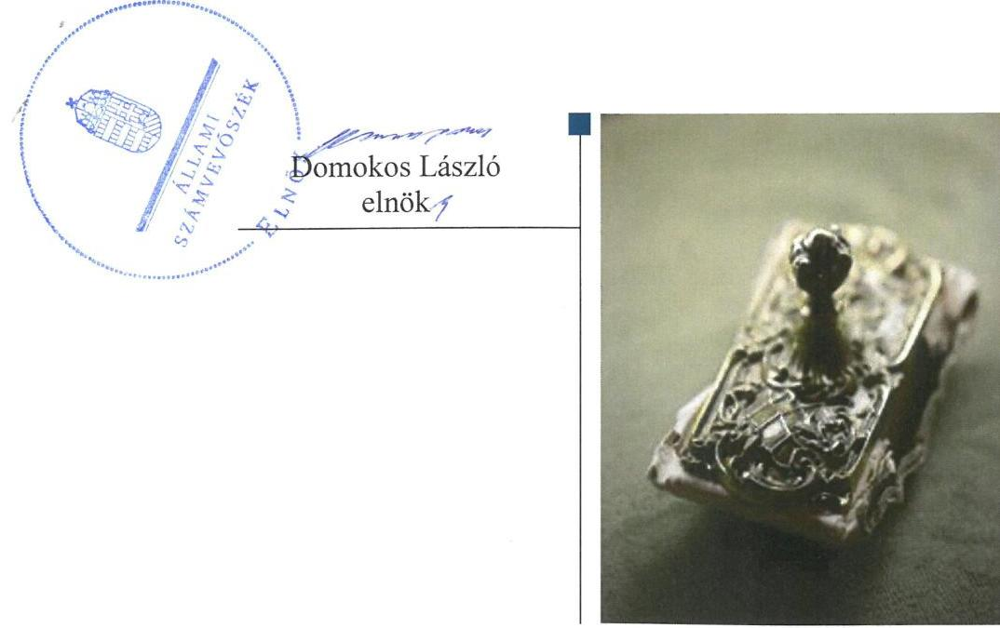
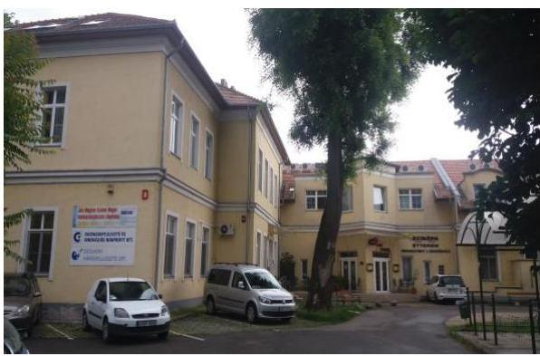
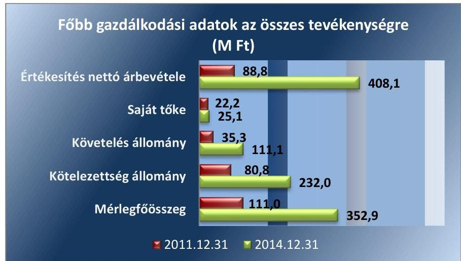
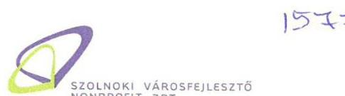
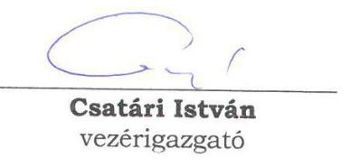
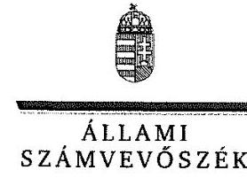
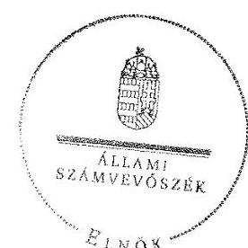
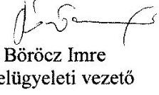
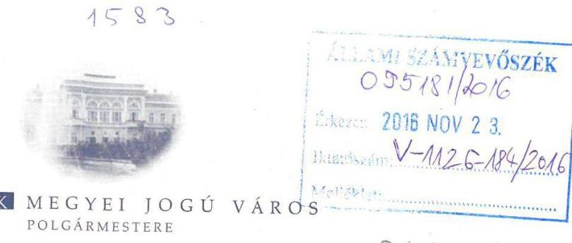
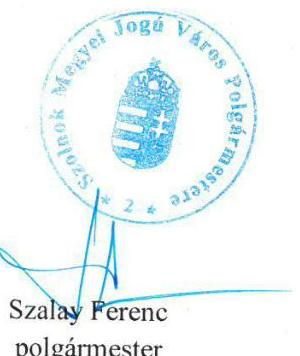

# Jelentés 

## Az önkormányzatok gazdasági társaságai

Az önkormányzatok többségi tulajdonában lévő gazdasági társaságok gazdálkodásának ellenőrzése - Szolnoki Városfejlesztő Zrt. 2016. december hó 23. nap

---

# Jelentés 

## Az önkormányzatok gazdasági társaságai

Az önkormányzatok többségi tulajdonában lévő gazdasági társaságok gazdálkodásának ellenőrzése - Szolnoki Városfejlesztő Zrt.
2016. december hó 23. nap

---

# AZ ELLENŐRZÉST FELÜGYELTE:

- BÖRÖCZ IMRE felügyeleti vezető

- AZ ELLENŐRZÉST VEZETTE ÉS A VÉGREHAJTÁSÁÉRT FELELŐS:
  - NIKLAI HELÉNA ellenőrzésvezető
  - A PROGRAM ÖSSZEÁLLÍTÁSÁÉRT FELELŐS:
    - JANIK JÓZSEF LÁSZLÓ osztályvezető

- IKTATÓSZÁM: V-1126-189/2016.
- TÉMASZÁM: 2160
- ELLENŐRZÉS-AZONOSÍTÓ SZÁM: V070792

Jelentéseink az Országgyűlés számítógépes hálózatán és az Interneten a www.asz.hu címen is olvashatóak.

---

# TARTALOMJEGYZÉK 

■ ÖSSZEGZÉS ..... 5
■ AZ ELLENŐRZÉS CÉLJA ..... 7
■ AZ ELLENŐRZÉS TERÜLETE ..... 8
■ AZ ELLENŐRZÉS HÁTTERE, INDOKOLTSÁGA ..... 10
■ A JELENTÉS LÉNYEGES KÉRDÉSKÖREI ..... 11
■ ELLENŐRZÉS HATÓKÖRE ÉS MÓDSZEREI ..... 12
■ MEGÁLLAPÍTÁSOK ..... 14
■ JAVASLATOK ..... 23
■ MELLÉKLETEK ..... 27
I. sz. melléklet: Értelmező szótár ..... 27
II. sz. melléklet: A Társaság főbb mérlegadatai a 2011-2014. években (Adatok M Ft-ban) ..... 29
III. sz. melléklet: A Társaság eredményének alakulása 2011-2014. években (Adatok M Ft-ban) ..... 30
■ FÜGGELÉK: ÉSZREVÉTELEK ..... 31
■ RÖVIDÍTÉSEK JEGYZÉKE ..... 45

---

.

---

# ÖSSZEGZÉS 

Szolnok Megyei Jogú Város Önkormányzata tulajdonosi jogait a Szolnoki Városfejlesztő Zártkörűen Működő Részvénytársaság felett 2011-2014. években összességében szabályszerűen gyakorolta. A Társaság településfejlesztési, településrendezési feladata ellátásának megszervezése megfelel a jogszabályi előírásoknak. A feladatellátás bevételeinek és ráfordításainak elszámolása szabályszerű volt. A Társaság vagyongazdálkodása az ellenőrzött időszakban nem volt szabályszerű. Kötelezettségállománya veszélyeztette a működését, illetve a feladatellátását.

## Az ellenőrzés társadalmi indokoltsága

Magyarországon az intézmény-centrikus közfeladat-ellátás mellett egyre jelentősebb a költségvetésen kívüli feladatellátás térnyerése, amelynek legfontosabb szereplői - a nonprofit szervezetek mellett - az önkormányzati tulajdonú gazdasági társaságok. Az önkormányzatok szervezetalakítási szabadságának következménye, hogy a korábban is vállalati formában működő közszolgáltatások mellett, mind a kötelező, mind az önként vállalt feladatok ellátásában a gazdasági társaságok kiemelt fontosságú szerephez jutottak. Az Állami Számvevőszék Stratégiájában foglaltakkal összhangban az ÁSZ kiemelt célja, hogy a helyi önkormányzatok gazdálkodásában rejlő pénzügyi kockázatok feltárásával, az államháztartáson kívülre nyújtott költségvetési támogatások és ingyenes vagyonjuttatások, valamint az államháztartáson kívül működő feladat-ellátó rendszerek ellenőrzéseivel hozzájáruljon ahhoz, hogy a közpénzeket az államháztartáson kívül működő szervezetek is átlátható, rendezett módon használják fel.

## Főbb megállapítások, következtetések, javaslatok

Szolnok Megyei Jogú Város Önkormányzata kizárólagos tulajdonában álló Szolnoki Városfejlesztő Zártkörűen Működő Részvénytársaság feladatellátásának megszervezése megfelel a jogszabályi előírásoknak. A Társaság felett a tulajdonosi jogokat az Önkormányzat összességében szabályszerűen gyakorolta, azonban a Társaság éves számviteli beszámolóiról a jogszabályban előírtak ellenére a felügyelőbizottság írásbeli jelentésének hiányában határozott.

A Társaság rendelkezett a működéséhez szükséges szabályzatokkal, azonban a számlarend tartalma a jogszabályi előírásoknak nem felelt meg. Éves beszámolási kötelezettségének eleget tett, azonban az éves számviteli beszámolók letétbe helyezése és a közzétételi kötelezettség teljesítése során nem a jogszabályban előírtak szerint járt el. A könyvvizsgáló az éves számviteli beszámolókat hitelesítő záradékkal látta el. A vezérigazgató a részére az Önkormányzat és a felügyelőbizottság felé fennálló, az ügyvezetésre, a Társaság vagyoni helyzetére, és üzletpolitikájára vonatkozó beszámolási kötelezettség teljesítését az ellenőrzött időszakban elmulasztotta.

A Társaság vagyongazdálkodása az ellenőrzött időszakban nem volt szabályszerű. Az Önkormányzattól vagyonkezelésbe vett eszközök nyilvántartása és számviteli elszámolása 2013-2014. években nem felelt meg a törvényi előírásoknak, továbbá a Társaság az éves számviteli beszámolók kiegészítő mellékletében az önkormányzati vagyon részét képező eszközöket nem mutatta be. 2014. évben a vagyonkezelésbe vett eszközön végrehajtott beruházáshoz nem kérte meg az Önkormányzat előzetes írásbeli hozzájárulását. Az ellenőrzött időszakban a Társaság által ellátott feladat bevételeinek és ráfordításainak elszámolása szabályszerű volt. Az értékcsökkenési leírás elszámolása nem volt szabályszerű.

A Társaság likviditását 2011. évben működési támogatás, 2013-2014. években a központi költségvetésből folyósított támogatási előleg átmenetileg javította. Kötelezettségállománya a 2011. év végi 80,8 M Ft-ról 2014. év végére 187,1 %-kal (151,2 M Ft-tal) növekedett és veszélyeztette a Társaság feladatellátását illetve a működését.

---

Az ÁSZ a Társaság vezérigazgatójának, a polgármesternek és a jegyzőnek fogalmazott meg javaslatokat, amelyek alapján kötelesek intézkedési tervet összeállítani és azt a jelentés kézhezvételétől számított 30 napon belül az ÁSZ részére megküldeni.

---

# AZ ELLENŐRZÉS CÉLJA 

Az ellenőrzés célja annak értékelése volt, hogy az önkormányzat vagyongazdálkodási tevékenysége során szabályszerűen gyakorolta-e tulajdonosi jogait; a gazdasági társaság szabályozottsága, gazdálkodása és vagyongazdálkodási tevékenysége, bevételeinek és ráfordításainak elszámolása megfelel-e a jogszabályi és tulajdonosi előírásoknak; a gazdasági társaság kötelezettségállománya jelentett-e kockázatot a működésre, valamint a gazdálkodás átláthatósága és elszámoltathatósága érdekében biztosítva volt-e a szolgáltatás dijának megalapozottsága szabályszerű önköltségszámítással.

---

# **AZ ELLENŐRZÉS TERÜLETE**

## **Szolnoki Városfejlesztő Zártkörűen Működő Részvénytársaság és Szolnok Megyei Jogú Város Önkormányzata**

**SZOLNOK MEGYEI JOGÚ VÁROS ÖNKORMÁNYZATA** 2008. február 21-én alapította a Szolnoki Városfejlesztő Zártkörűen Működő Részvénytársaságot komplex városfejlesztési elképzelései megvalósítására. Az ellenőrzött időszakban a Társaság¹ kizárólagos tulajdonosa az Önkormányzat² volt. A Társaság egyszemélyes zártkörűen működő részvénytársaság, a tulajdonosi jogokat az Önkormányzat, mint alapító részvényes gyakorolta. A város polgármestere személyében az ellenőrzött időszakban nem történt változás. A jegyző személyében változás történt 2011. évben, a jegyző 2011. március 1-jétől töltötte be hivatalát.

**A SZOLNOKI VÁROSFEJLESZTŐ ZRT.** és az Önkormányzat között megkötött feladat-ellátási keretszerződés³ alapján a Társaság feladatai a települési önkormányzati feladatok és az önkormányzat városfejlesztési megvalósításának koordinálására, pályázatok előkészítésére, lebonyolítására és kapcsolódó feladatok ellátására terjedtek ki.

A Társaság főbb gazdálkodási adatai (1. ábra) alapján az ellenőrzött időszakban a Társaság árbevétele 359,6%-kal, 319,3 M Ft-tal növekedett. Az értékesítés nettó árbevételének 80-99%-a származott az Önkormányzat részére végzett feladatok ellátásából.

1. ábra

*Forrás: A Társaság 2011. és 2014. évi éves beszámolói*

A Társaság a 2011-2014. éveket pozitív eredménnyel zárta, mérleg szerinti eredménye az ellenőrzött időszakban 2,4 M Ft és 1,4 M Ft között alakult. A Társaság eredményének alakulását az ellenőrzött időszakban a III. sz. melléklet mutatja be.

---

A Társaság vezérigazgatójának személye az ellenőrzött időszakban nem változott, tisztségét 2008. október 1-je óta töltötte be. A Társaság átlagos állományi létszáma az ellenőrzött időszakban 9 és 15 fő között alakult.

A Társaság a feladatát saját eszközeivel látta el 2013. első feléig. Az Önkormányzat és a Társaság között 2013. július 9-én - az Önkormányzat turizmussal kapcsolatos önként vállalt közfeladata ellátásának elősegítése érdekében - vagyonkezelési szerződés jött létre, amely 2013. július 15-én lépett hatályba. A turizmussal kapcsolatos közfeladat ellátásának megkezdésére az ellenőrzött időszakban nem került sor.

Az önköltségszámítás rendjére vonatkozó belső szabályzat készítésének kötelezettsége alól a Társaság az ellenőrzött időszakban a Számv. tv. ${ }^{4} 14 . \S$ (6) és (7) bekezdései alapján mentesült. A Társaság részére az árképzést jogszabály nem írta elő.

A Társaság az ellenőrzött időszakban más gazdasági társaságban részesedéssel nem rendelkezett.

A Társaság az ellenőrzött időszakban nem tartozott a kormányzati szektorba sorolt egyéb szervezetek körébe.

---

# AZ ELLENŐRZÉS HÁTTERE, INDOKOLTSÁGA 

## AZ ÖNKORMÁNYZATI TULAJDONÚ GAZDASÁGI

TÁRSASÁGOK ellenőrzése kiemelten fontos a vagyon megőrzése, megóvása érdekében, valamint a kormányzati szektor elszámolásaiban megjelenő önkormányzati tulajdonú gazdálkodó szervezetek esetében, amelyekkel szemben alapvető követelmény, hogy gazdálkodásuk, működésük szabályszerű, az általuk szolgáltatott adatok minél megbízhatóbbak legyenek. A feladat/közfeladat-ellátás költségeinek, ráfordításainak alakulása, színvonala hatással van a lakosság elégedettségére.

A TÖRVÉNYALKOTÁS SZÁMÁRA - az észlelt problémák, szabálytalanságok, vagy egyéb nem kívánatos jelenségek felszínre kerülésével - az ellenőrzés megállapításai segítséget nyújthatnak az államháztartáson kívüli feladat/közfeladat-ellátás értékeléséhez, jogszabályi keretei pontosításához, átláthatóságot biztosító szabályozásához. Meghatározhatóvá válnak az önkormányzati feladatellátásban részt vevő államháztartáson kívüli szervezeteknek - az önkormányzat költségvetését, pénzügyi helyzetét is befolyásoló - kockázatai, lehetővé válik ezen kockázatok csökkentése. Ellenőrzéseink feltárhatják, hogy az önkormányzat feladat-ellátási kötelezettségének szabályszerűen tett-e eleget, a feladatellátáshoz rendelt vagyonkezelésbe vett és saját vagyon működtetését az elvárható gondossággal, szabályszerűen szervezte-e meg és a tulajdonosi felügyelete hozzájárult-e a feladatellátásához. Az ellenőrzés rávilágíthat arra, hogy a gazdasági társaság a feladat-ellátási, közszolgáltatási szerződésben foglaltak betartásával, a vagyon használatával biztosította-e a szolgáltatás folytatásának feltételeit, a feladat ellátását. Ezzel az ellenőrzöttek és a helyi döntéshozók számára visszajelzést ad feladatszervezési, feladat-ellátási kockázataikról, alapot ad a meglévő hibák megszüntetéséhez, a jobb feladatellátás biztosításához. Fokozza a fegyelmet, igazolja, hogy lejárt a következmények nélküli ellenőrzések időszaka. Az ÁSZ⁵ értékteremtő rend kialakításához és megőrzéséhez hozzájáruló tevékenysége pozitív hatással van a szervezetről kialakított összkép formálására.

---

# A JELENTÉS LÉNYEGES KÉRDÉSKÖREI 

1. Az önkormányzat feladat megszervezéséről szóló döntése, valamint tulajdonosi joggyakorlása szabályszerű volt-e?
2. A Társaság vagyongazdálkodása szabályszerű volt-e, kötelezettségállománya jelentett-e kockázatot a működésre, illetve a feladat ellátására?
3. Az ellátott feladat esetében a Társaság bevételeinek és ráfordításainak elszámolása szabályszerű volt-e?

---

# ELLENŐRZÉS HATÓKÖRE ÉS MÓDSZEREI 

## Az ellenőrzés típusa

Az ellenőrzés típusa megfelelőségi ellenőrzés.

## Az ellenőrzött időszak

Az ellenőrzött időszak 2011. január 1-jétől 2014. december 31-ig tartott.

## Az ellenőrzés tárgya

Az ellenőrzés tárgyát képezte a gazdasági társaság feletti tulajdonosi joggyakorlás, valamint a gazdasági társaság gazdálkodásának szabályozottsága és szabályszerűsége. Az ellenőrzés kiterjedt minden olyan körülményre és adatra, amely az ÁSZ jogszabályban meghatározott feladatainak teljesítéséhez, valamint a program végrehajtása folyamán felmerült újabb összefüggések feltárásához szükséges.

## Az ellenőrzött szervezet

Szolnoki Városfejlesztő Zártkörűen Működő Részvénytársaság és Szolnok Megyei Jogú Város Önkormányzata.

## Az ellenőrzés jogalapja

Az ellenőrzés jogszabályi alapját az ÁSZ tv. ${ }^{6}$ 1. § (3) bekezdése és 5. § (3)-(4)-(5) bekezdései képezték.

## Az ellenőrzés módszerei

Az ellenőrzést az ÁSZ az ellenőrzött időszakban hatályos jogszabályok, az ellenőrzés szakmai szabályok és módszertanok figyelembevételével, az ellenőrzési program kérdései alapján végezte.

Az ellenőrzés ideje alatt az ellenőrzött szervezettel történő kapcsolattartás az ÁSZ Szervezeti és Működési Szabályzatának vonatkozó előírásai alapján történt.

Az ellenőrzési kérdések megválaszolásához szükséges bizonyítékok megszerzése a következő ellenőrzési eljárások alkalmazásával történt: megfigyelés, kérdésfeltevés (információkérés), összehasonlítás, valamint elemző eljárás. Az ellenőrzési bizonyítékként felhasználható adatforrások

---

közé tartoztak egyrészt a szakmai programban felsorolt adatforrások, másrészt adatforrás lehetett még minden - az ellenőrzés folyamán - feltárt, az ellenőrzés szempontjából információkat tartalmazó dokumentum.

A Társaság bevételeinek és ráfordításainak elszámolása, valamint a vagyonnyilvántartás terén a szabályszerű működést az ÁSZ véletlen mintavétellel ellenőrizte. A mintavétellel ellenőrzött területek esetében a szabályszerűségre vonatkozó kérdések eredménye összesítésre került. Az ÁSZ a jogszabályoknak és a belső előírásoknak „megfelelő"-nek tekintette az adott területet, amennyiben a minta ellenőrzésének eredménye alapján 95\%-os bizonyossággal a teljes sokaságban a hibaarány legfeljebb 10\%, „nem megfelelő"-nek, amennyiben 10\%-nál magasabb arányt képviselt. Abban az esetben, ha a teljes sokaság tekintetében a 10\%-os hibaarányhoz való viszony megítélésének megbízhatósága nem érte el a 95\%-ot, annak elérése érdekében az ÁSZ értékelését további szempontokkal egészítette ki, és figyelembe vette a feltárt hibák típusát és súlyát.

A ráfordítások elszámolására és a vagyonnyilvántartásra vonatkozó véletlen mintavételt az ÁSZ kockázat alapú kiválasztással egészítette ki, amelynek során évente a három legnagyobb összegű tételt választotta ki.

---

# 1. Az önkormányzat feladat megszervezéséről szóló döntése,
 valamint tulajdonosi joggyakorlása szabályszerű volt-e? 

Összegző megállapítás

A Társaság feladatellátásának megszervezése megfelelt a jogszabályi előírásoknak. Az Önkormányzat tulajdonosi joggyakorlása összességében szabályszerű volt.
1.1. számú megállapítás

A Társaság feladatellátásának megszervezése megfelelt a jogszabályi előírásoknak.

Az Önkormányzat az Ötv. ${ }^{7}$-ben és az Mötv. ${ }^{8}$-ben előírt gazdasági programmal rendelkezett. A 2007. évben készített gazdasági programot Szolnok Megyei Jogú Város Közgyűlése az Ötv. 91. § (7) bekezdésében foglaltak szerint 2011. évben felülvizsgálta és módosította.

A 76/2011. (III. 31.) számú közgyűlési határozattal elfogadott, módosított gazdasági program 2011. évben az Ötv. 91. § (6) bekezdésében előírtak ellenére nem tartalmazta az adópolitikai célkitűzéseket, valamint az egyes közszolgáltatások biztosítására, színvonalának javítására vonatkozó fejlesztési elképzeléseket. A módosított gazdasági program 2012-2014. években az Mötv. 116. § (4) bekezdésében előírtak ellenére nem tartalmazta az egyes közszolgáltatások biztosítására, színvonalának javítására vonatkozó fejlesztési elképzeléseket.

Közép- és hosszú távú vagyongazdálkodási terv készítésére 2012. évtől előírt kötelezettségének az Önkormányzat az Nvtv. ${ }^{9}$ 9. § (1) bekezdése szerint eleget tett.

A Társaság feladatellátására vonatkozó terveit az Önkormányzat a 25/2003. (VII. 9.) számú önkormányzati rendelettel kihirdetett, többször módosított Vagyonrendeletében ${ }^{10}$; a 4/2008. (I. 24.) számú és a 215/2014. (IX. 25) számú közgyűlési határozattal elfogadott Szolnok Hosszú Távú Városfejlesztési Koncepciójában, illetve az 56/2008. (III. 20.) és 216/2014. (IX. 25.) számú közgyűlési határozattal elfogadott Szolnok Város Integrált Városfejlesztési Stratégiájában rögzítette.

Rendeletalkotási kötelezettségének az Önkormányzat a 2013. január 1-jétől hatályos Épít. tv. ${ }^{11}$ 6/A. § (3) bekezdésében előírtaknak megfelelően eleget tett.

Az Épít. tv. 9. §-ában előírtak szerint az Önkormányzat meghatározta a településfejlesztési irányokat, célokat, az azok elérését biztosító programokat és eszközöket, az Épít. tv. 9/A. § (1)-(3) bekezdéseiben előírtaknak megfelelően megállapította a településfejlesztési koncepciót és az integrált településfejlesztésre vonatkozó stratégiát.

---

# A TELEPÜLÉSFEJLESZTÉSI, TELEPÜLÉSRENDE-

ZÉSI FELADATOKAT az Ötv. 8. § (1) bekezdése, illetve az Mötv. 13. § (1) bekezdés 1. pontja szerint 2011-2014. években az Önkormányzat SZMSZ ${ }^{12, 13, 14}$-e rögzítette. Az Önkormányzat a fejlesztési feladatokat és kapcsolódó projekttevékenységet 2008. évi döntése szerint, az Ötv. 9.§ (4) bekezdése, illetve a Mötv. 41. § (6) bekezdése alapján a Társaság útján látta el az ellenőrzött időszakban. A feladatellátás megszervezése az ellenőrzött időszakban megfelelt az Ötv. és az Mötv. előírásainak.

A feladatellátás keretszabályait az Önkormányzat Vagyonrendelete, a városfejlesztési koncepciók, stratégiák ${ }^{15}$, illetve a 2008-tól az Önkormányzat és a Társaság között létrejött feladatellátási keretszerződés rögzítette. A városfejlesztési stratégiákban meghatározott akcióterületek összehangolt fejlesztésének megvalósítását az Önkormányzat a Társaság részére a feladat-ellátási keretszerződésben előírta.

## A TÁRSASÁG TEVÉKENYSÉGÉNEK DÍJAZÁSÁRA

vonatkozó feltételeket az Önkormányzat a Társasággal kötött Megállapodás ${ }^{16}$ 1-5. számú mellékleteiben részletesen meghatározta. A Társaság által az Önkormányzat részére kiszámlázott összegek megfeleltek ezeknek a feltételeknek.

A tulajdonosi jogok gyakorlása összességében szabályszerű volt. Az ellenőrzés szabályszerűségi hibákat a felügyelőbizottság működésével és az éves számviteli beszámolókról való tulajdonosi döntéssel kapcsolatban állapított meg.

A Társaság feletti tulajdonosi jogok gyakorlásának rendjét az Önkormányzat SZMSZ ${ }^{12, 13, 14}$-ében, Vagyonrendeletében, valamint a Társaság Alapító Okiratában ${ }^{17}$ szabályozták. Az Alapító Okirat megfelelt a Gt. ${ }^{18}$ 12. § (1) bekezdésében és 208. §-ában, illetve a Ptk. ${ }^{19}$ 3:5. §-ában és 3:250. §-ában előírt tartalmi követelményeknek. Az Alapító Okirat az Önkormányzat kizárólagos hatáskörébe tartozónak azokat a feladatokat rögzítette, amelyeket a Gt. 231. § (2) bekezdése és a Ptk. ${ }^{19}$ 3:109. § (2)-(3) bekezdései a Társaság legfőbb szervének kizárólagos hatáskörébe utaltak. A Társaság felett a tulajdonosi jogokat az Önkormányzat, mint alapító részvényes a Gt. 19. § (5) bekezdésében, 284. § (2) bekezdésében, illetve a Ptk. ${ }^{19}$ 3:109. § (4) bekezdésében foglaltaknak megfelelően, írásban hozott döntések formájában gyakorolta.

Felügyelőbizottság létrehozására a 2011-2014. években a Társaságnál a Gt. 33. § (2) bekezdés c) pontjában és a Taktv. ${ }^{20}$ 4. § (1) bekezdésében előírtak szerint került sor. A felügyelőbizottság az ellenőrzött időszakban az Alapító Okiratban, a Gt. 34. § (4) bekezdésében és a Ptk. ${ }^{19}$ 3:122. § (3) bekezdésében rögzítettek szerint rendelkezett a gazdasági társaság legfőbb szerve által jóváhagyott Ügyrenddel ${ }^{21}$.

A felügyelőbizottság 2011. évben egy esetben úgy hozott határozatot, hogy nem volt határozatképes, ezzel megsértette a Gt. 34. § (2) bekezdésében, valamint az Ügyrendjének 4.9. pontjában előírtakat.

---

A felügyelőbizottság az ellenőrzött időszakban a számviteli törvény szerinti beszámolókra, valamint a Társaság által előterjesztett üzleti tervekre vonatkozó írásos jelentést nem készített, ezzel megsértette az Alapító Okirat IX. 9.7. c) pontjában, valamint Ügyrendjének 5.1 c.) pontjában előírt kötelezettséget.

A könyvvizsgáló megválasztása megfelelt a Gt. 42. § (1) bekezdés és a Ptk. ${ }^{19}$ 3:130. § (2) bekezdés előírásainak. Az ellenőrzött időszakban a könyvvizsgáló a Társaság éves számviteli beszámolóit a Gt. 40.§ (1) bekezdés, valamint a Ptk. ${ }^{19}$ 3:129. § (1) bekezdés szerint ellenőrizte, azokról minden évben hitelesítő záradékot adott a Számv. tv. 156. § (5) bekezdés f) pontjának megfelelően. 2011. évben a könyvvizsgáló vezetői levélben jelezte, hogy a társaság vagyona jelentős csökkenésének veszélye és súlyos likviditási nehézségek álltak fenn és a Gt. 44. § (2) bekezdése értelmében kezdeményezte a gazdasági társaság legfőbb szervének összehívását.

Üzleti terv készítésének kötelezettségét a Társaság Alapító Okirata, annak tartalmi és formai követelményeit az Önkormányzat Tervezési Kézikönyve rögzítette. Az üzleti terveket az ellenőrzött időszakban a Társaság az előírások figyelembevételével elkészítette, azokat Szolnok Megyei Jogú Város Közgyűlése jóváhagyta. Az üzleti tervekben meghatározott célkitűzések összhangban voltak az Önkormányzat vonatkozó terveivel (stratégiáival).

Javadalmazási szabályzatban ${ }^{22}$ rögzítette az Önkormányzat a Társaság vezérigazgatójának, valamint a felügyelőbizottság tagjainak javadalmazásával kapcsolatos szabályokat, amelyet az ellenőrzött időszakot megelőzően (2009. évben) Szolnok Megyei Jogú Város Közgyűlése jóváhagyott.

Az Önkormányzat a feladat-ellátási szerződésben rögzített feladatok ellátásáról az ellenőrzött időszakban az éves számviteli beszámolók, 2011-2012. években az üzleti jelentés, valamint Szolnok Megyei Jogú Város Közgyűlése ellenőrző bizottságának ülésére készült tájékoztatók keretében számoltatta be a Társaságot.

Az Önkormányzat az ellenőrzött időszakban a Gt. 35. § (3) bekezdés, illetve a Ptk. ${ }^{19}$ 3:120. § (2) bekezdés előírásai ellenére a Társaság Számv. tv. szerinti beszámolóját a felügyelőbizottság írásbeli jelentésének hiányában fogadta el.

Az ellenőrzött időszakban a Közgyűlés a Társaság Számv. tv. szerinti beszámolóinak elfogadásáról szóló határozataiban a Társaság 2011-2014. évi pozitív eredményének eredménytartalékba helyezéséről döntött.

A Társaság által készített üzleti terveket az Önkormányzat az Alapító Okirat IX. 9. 7. c) pontjában, valamint a felügyelőbizottság Ügyrendjének 5.1 c.) pontjában előírtak ellenére a felügyelőbizottság írásbeli jelentésének hiányában fogadta el.

Vagyonkezelési szerződést ${ }^{23}$ az Önkormányzat az Mótv. 109. § (1) bekezdésében rögzítetteknek eleget téve 2013. július 9-én kötött a Társasággal, a szerződéssel vagyonkezelésbe adta a Társaság

---

részére az Önkormányzat tulajdonában lévő ingatlanrész kezelő jogát, azzal a céllal, hogy ott a Társaság az Európai Unió támogatásával Interaktív sör- és gasztronómiai pincemúzeumot alakítson ki. A turizmussal kapcsolatos közfeladat ellátásának megkezdésére az ellenőrzött időszakban nem került sor.

A Vagyonkezelési szerződés az Mötv. 109. § (6) bekezdésének megfelelően tartalmazta a vagyon után elszámolt értékcsökkenés összegének felhasználására vonatkozó rendelkezéseket. A Vagyonkezelési szerződés IV. 10. pontjában az Önkormányzat a Számv. tv. szerinti könyvvezetési és beszámolási kötelezettséget írta elő a Társaság részére.

A Vagyonkezelési szerződés IV. 11. pontja az Nvtv. 11. § (11) bekezdés a) pontja alapján előírta a vagyonkezelésbe vett vagyonnal kapcsolatos beszámolási, adatszolgáltatási kötelezettségeket, amelyeket a Társaság 2013-2014. évekre vonatkozóan teljesített. A Társaság vonatkozó adatszolgáltatásában rögzítette, hogy a vagyonkezelt eszközt befejezetlen beruházásként tartotta nyilván, értékcsökkenés nem került elszámolásra.

A Társaság adatszolgáltatása alapján az Önkormányzat:
2013. évben az Áhsz. ${ }^{24}$ 34. § (4) bekezdés előírásai ellenére a vagyonkezelésbe adott eszközök év végi értékelése során nem számolta el a Társaság, mint vagyonkezelő adatszolgáltatásában szereplő tárgyévi vagyonváltozások hatását.
2014. évben az Áhsz. ${ }^{25}$ 39. § (3) bekezdés előírásai ellenére az adatszolgáltatási kötelezettségek alátámasztásáról az Áhsz. ${ }^{25}$ 14. melléklet IX. 2. pontja szerinti tartalommal nem gondoskodott, a vagyonkezelésbe adott eszközök nyilvántartása során az állományváltozással kapcsolatos információkat a Társaságtól, mint vagyonkezelőtől kapott adatszolgáltatás alapján nem számolta el.

Ellenőrzés lehetőségével - amelyet az Ötv. 92. § (11) bekezdés d) pontjában, 2012. évtől az Áht. ${ }^{26}$ 70. § (1) bekezdés d) pontjában foglaltak lehetővé tettek - az Önkormányzat az ellenőrzött időszakban élt. Az Önkormányzat belső ellenőrzése által végzett ellenőrzések kiterjedtek a feladat-ellátási szerződés keretében megvalósított projektekhez kapcsolódó pénzügyi elszámolások és nyilvántartások, az üzleti terv, valamint a beszámoló összeállítása szabályszerűségének ellenőrzésére, 2011. évben a könyvvizsgáló vezetői levele alapján a projektek megvalósítása során a rendelkezésre álló anyagi források felhasználása hatékonyságának ellenőrzésére. A belső ellenőrzések megállapításaival kapcsolatosan az Önkormányzatnak intézkedési kötelezettsége nem merült fel. Az Önkormányzat megbízása alapján a Társaságnál külső szakértő által elvégzett ellenőrzésre nem került sor az ellenőrzött időszakban.

---

# 2. A Társaság vagyongazdálkodása szabályszerű volt-e, kötelezettségállománya jelentett-e kockázatot a működésre, illetve a feladat ellátására? 

Összegző megállapítás

2.1. számú megállapítás

A Társaság vagyongazdálkodása nem volt szabályszerű. Kötelezettségállománya veszélyeztette a Társaság feladatellátását illetve a működését.

A Társaság rendelkezett a jogszabályban előírt szabályzatokkal, azonban a számlarend tartalma a jogszabályi előírásoknak nem felelt meg.

A Társaság az ellenőrzött időszakban rendelkezett a Számv. tv. 14. § (3) bekezdésében előírt számviteli politikával, a Számv. tv. 14. § (5) bekezdés a) pontjában rögzített, az eszközök és a források leltárkészítési és leltározási szabályzatával, a Számv. tv. 14. § (5) bekezdés b) pontjában előírt, az eszközök és a források értékelési szabályzatával, valamint a Számv. tv. 14. § (5) bekezdés d) pontjában meghatározott pénzkezelési szabályzattal.

A számviteli politika ${ }^{27}$ nem felelt meg a Számv. tv. 14. § (4) bekezdésében a számviteli politika keretében a gazdálkodóra jellemző szabályok, előírások, módszerek írásban történő rögzítésével kapcsolatos előírásoknak. Számviteli politikájában a Társaság a vállalkozókra előírt szabályoktól eltérő, sajátos beszámoló-készítési és könyvvezetési szabályokat meghatározó 224/2000. (XII. 19.) Korm. rendelet ${ }^{28}$ 4.-5. számú melléklete szerinti mérleg- és eredménykimutatás alkalmazását rögzítette, azonban a Társaság nem minősült a Számv. tv. 3. § (1) bekezdés 4. pontja szerinti egyéb szervezetnek, a Társaságra a hivatkozott kormányrendelet hatálya nem terjedt ki.

A Számviteli politika a Társaság éves számviteli beszámolójának közzétételére kizárólag helyi napilapban történő meghirdetést írta elő, így az nem felelt meg a Számv. tv. 154. § (7) bekezdés előírásainak.

A Társaság Számlarendjének ${ }^{29}$ könyvvezetésre vonatkozó előírásai a Számv. tv. 161. § (1) bekezdésében előírtak ellenére a Számv. tv.-ben előírt beszámoló készítését maradéktalanul nem biztosították, a következők miatt:

- A Számv. tv. 161. § (2) bekezdés d) pontja előírásai ellenére a Társaság Számlarendje az ellenőrzött időszakban nem tartalmazta a számlarendben foglaltakat alátámasztó bizonylati rendet.
- A Társaság a Számv. tv. 161.
 § (2) bekezdés b) pont előírásaival szemben Számlarendjében nem határozta meg az alkalmazásra kijelölt számlák tartalmát, annak ellenére, hogy az a számlák megnevezéséből egyértelműen nem következett.

A leltározási szabályzatot ${ }^{30}$ a Társaság a Számv. tv. előírásainak betartásával elkészítette.

---

# 2.2. számú megállapítás 

## A Társaság vagyongazdálkodása a jogszabályi előírásoknak nem felelt meg.

A Társaság 2013. július 15-től az Önkormányzattal megkötött Vagyonkezelési szerződés II.1. és III.1. pontjai alapján az Önkormányzat kizárólagos tulajdonában álló, korlátozottan forgalomképes vagyoni körbe tartozó ingatlanrészt vett vagyonkezelésbe.

A vagyonkezelésbe vett ingatlanrész bekerülési értékét a Társaság a Számv. tv. 26. § (2) bekezdése előírásai ellenére befejezetlen beruházásként tartotta nyilván.

A vagyonkezelésbe vett ingatlanrész tekintetében 2013-2014. években a Társaság a leltáraiba bekerülő adatokat a Számv. tv. 69. § (3) bekezdésében előírtak ellenére leltározással nem támasztotta alá.

2013-2014. években Számv. tv. 23. § (2) bekezdésében előírtak ellenére a Társaságnál, mint vagyonkezelőnél az egyszerűsített éves beszámolók kiegészítő mellékleteiben - legalább mérlegtételek szerinti megbontásban - nem került külön bemutatásra a vagyonkezelésbe vett ingatlanrész.

A Társaság a vagyonkezelésbe vett eszköz forrását az egyszerűsített éves beszámolók kiegészítő mellékleteiben a Számv. tv. 45. § (2) bekezdése előírásainak megfelelően a hosszú lejáratú kötelezettségek között bemutatta.

2013-2014. években a Társaságnak az Mötv. 109. § (6) bekezdésében és a Vagyonkezelési szerződés IV. 4.1. pontjában előírtak szerint a vagyonkezelt vagyon felújításáról, pótlólagos beruházásáról legalább a vagyoni eszközök elszámolt értékcsökkenésének megfelelő mértékben gondoskodnia kellett, azonban értékcsökkenést a Társaság a Számv. tv. 46. § (4) bekezdése előírásai ellenére, a Számv. tv. 52-56. §-aiban foglaltak alapján, nem számolt el. Az el nem számolt értékcsökkenés értéke nem minősült jelentős hibának, nem volt hatással a mérleg valódiságára.
2014. évben a Társaság a Vagyonkezelési szerződés IV. 4.2. és IV. 5. pontja előírásai ellenére nem kérte meg az Önkormányzat előzetes írásbeli hozzájárulását a vagyonkezelésbe vett ingatlanrészen végrehajtott beruházáshoz.

Az Nvtv. 6. § (1) és a 11. § (8) és a Vagyonkezelési szerződés IV. 1. pontjában foglaltaknak megfelelően a vagyonkezelésbe vett ingatlanrészt a Társaság nem terhelte meg, nem idegenítette el, biztosítékul nem adta, azon osztott tulajdont nem létesített, a vagyonkezelői jogot harmadik fél részére nem engedte át.

A Társaság főbb mérlegadatait a II. sz. melléklet mutatja be. A Társaság eszközein belül a tárgyi eszközök aránya a 2011. év eleji 33,9 %-ról 2014. év végére 44,3 %-ra növekedett, amelyhez hozzájárult a 2013. évi vagyonkezelési szerződés megkötése miatt az ellenőrzött időszakban folyamatban lévő, még nem aktivált beruházás állományának 138,1 M Ft értékű növekedése. Az immateriális javak és a tárgyi eszközök bruttó értéke (a befejezetlen beruházások nélkül) a 2011. évi 62,4 M Ft-ról 2014. évre 37,7 M Ft-ra csökkent, amelyhez hozzájárult, hogy ingatlan rehabilitációja tárgyában készített tanulmány értékét a Társaság átminősítette befejezetlen beruházásra, majd azt Szolnok Megyei Jogú Város Közgyűlésének 256/2014. (XI.27.) számú közgyűlési határozata

---

alapján az Önkormányzat részére értékesítette. A saját tőke a 2011. év eleji 19,8 M Ft-ról 2014. év végére 25,1 M Ft-ra növekedett. A Társaságnál osztalékfizetésre nem került sor az ellenőrzött időszakban.

A saját vagyon után 16,4 M Ft értékcsökkenést számoltak el, a beruházás, felújítás értéke 8,7 M Ft volt.

A követelésállományt az ellenőrzött időszakban döntően az Önkormányzattal szembeni követelések tették ki. Az egyéb vevőkkel szembeni követelések jellemzően a továbbszámlázott áru, illetve szolgáltatás tételeiből, valamint megállapodások teljesítéséből adódtak. A követelések jellege nem tette szükségessé behajtásra irányuló intézkedés meghozatalát. A Társaság 2011-2014. években lejárt, behajthatatlan követelést nem mutatott ki.

# 2.3. számú megállapítás 

## A kötelezettségek állománya veszélyeztette a Társaság feladatellátását, illetve a működését.

A kötelezettségek állománya a 2011. év végi 80,8 M Ft-ról 2014. év végére 187,1 %-kal (151,2 M Ft-tal) 232,0 M Ft-ra növekedett a rövid lejáratú kötelezettségek növekedése miatt. A rövid lejáratú kötelezettségeket elsősorban az Önkormányzattal, mint kapcsolt vállalkozással szemben fennálló kötelezettségek, a központi költségvetésből folyósított támogatási előlegek, valamint a munkabér és az adó- és járulékterhek tették ki. A Társaság likviditását 2011. évben a működésre kapott 20,5 M Ft támogatás, 2013-2014. években a központi költségvetésből folyósított támogatási előleg átmenetileg javította. Kötelezettségeit 2011-2012. években jelentős késedelemmel teljesítette. Kötelezettségállománya veszélyeztette a feladat ellátását, illetve a Társaság működését. Hitelfelvételre az ellenőrzött időszakban nem került sor.

Az eladósodottság mértékének 255,6%-os mértékű növekedését az ellenőrzött időszakban a 2013. évben az Önkormányzattól kapott előleg miatti kötelezettségállomány növekedése okozta. A Társaság kötelezettségeinek összege az ellenőrzött időszak valamennyi évében meghaladta a saját tőke összegét. A Társaság kötelezettségállományhoz kapcsolódó mutatói az ellenőrzött időszakban az 1. táblázatban bemutatottak szerint alakultak.

1. táblázat

## A Társaság kötelezettségállományhoz kapcsolódó mutatójainak alakulása

| Megegyezés | 2011 | 2012 | 2013 | 2014 |
| :-- | :--: | :--: | :--: | :--: |
| Eladósodottsági mutató | 0,7 | 0,8 | 0,8 | 0,7 |
| Eladósodottság mértéke | 3,6 | 5,2 | 7,9 | 9,2 |
| Nettó eladósodottság | 2,0 | 4,3 | 4,7 | 4,8 |
| Adósságfedezeti mutató I. | 1,3 | 1,2 | 1,2 | 1,5 |
| Árbevételre vetített eladósodottság | 0,3 | 0,2 | 0,2 | 0,1 |

Forrás: A Társaság 2011-2014. évi éves beszámolói

---

### 2.4. számú megállapítás

A Társaság az előírt beszámolási, adatszolgáltatási kötelezettséget teljesítette. A vezérigazgató a részére az Alapító Okiratban előírt beszámolási kötelezettség teljesítését elmulasztotta. A Társaság az éves számviteli beszámoló kiegészítő mellékletének elkészítése, a beszámoló letétbe helyezése és a közzétételi kötelezettség teljesítése során nem a jogszabályban előírtak szerint járt el.

Az éves számviteli beszámolókat (2011-2012. években éves, 2013-2014. években egyszerűsített éves beszámolókat) a Társaság a Számv. tv. 19. § (1), illetve a 96. § (1) bekezdéseiben meghatározott tartalommal elkészítette.

A 2012. évi éves beszámolót a Társaság a Számv. tv. 153. (1) bekezdésben rögzített határidőn túl helyezte letétbe.

Az ellenőrzött időszakban a Cégtv. ${ }^{31}$ 18. § (7) és a Számv. tv. 153. § (1) bekezdésében előírtak ellenére a Társaság az adózott eredmény felhasználására vonatkozó határozatot nem helyezte letétbe.

A Társaság 2011-2012. években az éves beszámolók, 2013-2014. években az egyszerűsített éves beszámolók kiegészítő mellékleteiben nem mutatta be az elszámolt értékcsökkenési leírást a Számv. tv. 92. § (2) bekezdésében előírt bontásban, az értékcsökkenési leírás módszere szerint.

A vezérigazgató a részére az Alapító Okirat VIII. 8.3. b) pontjában előírt, az alapító részvényes és negyedévente a felügyelőbizottság felé fennálló, az ügyvezetésre, a Társaság vagyoni helyzetére, és üzletpolitikájára vonatkozó beszámolási kötelezettségének nem tett eleget.

A közérdekű adatok megismerésére irányuló igények teljesítésének rendjére vonatkozó szabályzattal a Társaság 2011. január 1. és 2013. május 31. közötti időszakban nem rendelkezett, ezzel megsértette 2011. évben az Avtv. ${ }^{32}$ 20. § (8) bekezdés és az Info tv. ${ }^{33}$ 30. § (6) bekezdés előírásait, 2012-2013. években az Info tv. 30. § (6) bekezdés előírásait.

A 2013. június 1-jével kiadott Közérdekű adatok közzétételére vonatkozó szabályzat ${ }^{34}$ megfelelt az Info. tv. előírásainak.

A Társaság az ellenőrzött időszakban a Taktv. 2. § (1) bekezdés cb) pontjában foglalt előírások ellenére a közzététel időpontjában fennálló adatok alapján nem tette közzé a vezető tisztségviselőkre irányadó végkielégítés, illetve felmondási idő időtartamát.

---

# 3. Az ellátott feladat esetében a Társaság bevételeinek és ráfordításainak elszámolása szabályszerű volt-e? 

Összegző megállapítás

Az ellátott feladat bevételeinek és ráfordításainak elszámolása szabályszerű volt.

### 3.1. számú megállapítás

Az ellátott feladat bevételeinek és anyagjellegű ráfordításainak elszámolása szabályszerű volt. Az értékcsökkenési leírás elszámolása nem volt szabályszerű.

Az értékesítés nettó árbevételének elszámolása a Számv. tv.-ben előírtaknak megfelelően történt.

Az anyagjellegű ráfordítások elszámolása megfelelő volt. A ráfordítások elszámolását a költségelszámolást megalapozó, a Számv. tv. 166. § (1) bekezdésében előírt számviteli bizonylattal alátámasztották, és a megfelelő költségnemekre könyvelték. Az elszámolást alátámasztó bizonylatok a Számv. tv. 167. §-ában rögzített alaki és tartalmi követelményeknek megfeleltek.

A Társaság 2013-2014. években nem tett eleget a Számv. tv. 161/A. § (2) bekezdésben foglalt előírásnak, nyilvántartási (könyvvezetési) rendszerét nem részletezte tovább oly módon, hogy abból a vonatkozó külön jogszabályban - az Mötv. 109. § (7) bekezdésében - meghatározott adatok rendelkezésre álljanak.

Az Mötv. 109. § (7) bekezdése előírásai ellenére a Társaság a feladatellátást szolgáló vagyonkezelésbe vett vagyon használatából, működtetéséből származó közvetlen költségeit és ráfordításait elkülönítetten nem tartotta nyilván oly módon, hogy az a saját vagyonnal folytatott vállalkozási tevékenységéből származó bevételeitől, költségeitől és ráfordításaitól egyértelműen elhatárolható legyen.

Az értékcsökkenés elszámolása nem volt megfelelő. Az ellenőrzés a következő hibákat, hiányosságokat állapította meg:

- 2011-2012. években előfordult, hogy a bekerülési érték meghatározása nem felelt meg a Számv. tv. 47. § (1)-(2) bekezdése előírásainak, az eszközök állományba vétele nem a törvényben előírt értéken történt. Ezzel összefüggésben az értékcsökkenés elszámolásánál nem tartották be a Számv. tv. 52. § (2) bekezdése előírásait.
- 2013. évben előfordult, hogy az értékcsökkenés elszámolásának kezdő időpontja megelőzte az üzembe helyezés időpontját, így az értékcsökkenés elszámolása nem felelt meg a Számv. tv. 52. § (1)(2) és (5) bekezdése előírásainak.
- 2012-2014. években előfordult, hogy az értékcsökkenés mértékét nem az állományba vételi bizonylaton jelöltek szerint számolták el, ezzel megsértve a Számv. tv. 52. § (2) bekezdésében foglaltakat.

---

# JAVASLATOK 

Az ÁSZ tv. 33. § (1) bekezdésében foglaltak értelmében az ellenőrzött szervezet vezetője köteles a jelentésben foglalt megállapításokhoz kapcsolódó intézkedési tervet összeállítani és azt a jelentés kézhezvételétől számított 30 napon belül az ÁSZ részére megküldeni. Amennyiben az ellenőrzött szervezet vezetője nem küldi meg határidőben az intézkedési tervet, vagy továbbra sem elfogadható intézkedési tervet küld, az Állami Számvevőszék elnöke az ÁSZ tv. 33. § (3) bekezdés a) és b) pontjaiban foglaltakat érvényesítheti.

## A Szolnoki Városfejlesztő Zrt. vezérigazgatójának

1. Intézkedjen, hogy a számlarend tartalmazza a jogszabályi rendelkezésekben meghatározott tartalmi elemeket.
(2.1. sz. megállapítás 4. bekezdése alapján)
2. Intézkedjen, hogy a vagyonkezelésbe vett ingatlanrészt a jogszabályi előírásnak megfelelően tartsák nyilván.
(2.2. sz. megállapítás 2. bekezdése alapján)
3. Intézkedjen, hogy a leltárba bekerülő adatok valódiságáról - a leltár összeállítását megelőzően - leltározással meggyőződjenek a jogszabályi előírásnak megfelelően.
(2.2. sz. megállapítás 3. bekezdése alapján)
4. Intézkedjen az önkormányzati vagyon részét képező eszközöknek a kiegészítő mellékletben történő bemutatásáról a jogszabályi előírásnak megfelelően.
(2.2. sz. megállapítás 4. bekezdése alapján)
5. Intézkedjen a vagyonkezelésbe vett eszközök értékcsökkenésének jogszabályi előírásnak megfelelő elszámolásáról.
(2.2. sz. megállapítás 6. bekezdése alapján)
6. Intézkedjen az elszámolt értékcsökkenési leírás jogszabályi előírásnak megfelelő bontásban történő bemutatásáról a kiegészítő mellékletben.
(2.4. sz. megállapítás 4. bekezdése alapján)

---

7. Tegyen eleget - az alapító okiratnak megfelelően - az alapító és a felügyelőbizottság felé fennálló beszámolási kötelezettségének.
(2.4. sz. megállapítás 5. bekezdése alapján)
8. Intézkedjen a jogszabályi előírásnak megfelelően nyilvántartási (könyvvezetési) rendszerének oly módon való továbbrészletezéséről, hogy abból a vonatkozó külön jogszabályban

 meghatározott adatok rendelkezésre álljanak.
(3.1. sz. megállapítás 3. bekezdése alapján)
9. Intézkedjen, hogy a vagyonkezelésbe vett vagyon használatából, működtetéséből származó közvetlen költségeket és ráfordításokat elkülönítve tartsák nyilván a jogszabályi előírásnak megfelelően.
(3.1. sz. megállapítás 4. bekezdése alapján)
10. Intézkedjen az értékcsökkenési leírás jogszabályi előírásoknak megfelelő elszámolásáról.
(3.1. sz. megállapítás 5. bekezdése alapján)

# Szolnok Megyei Jogú Város Önkormányzata polgármesterének 

1. Terjessze a Közgyűlés elé a gazdasági program módosításának tervezetét, annak érdekében, hogy annak tartalma megfeleljen a jogszabályi előírásoknak.
(1.1. sz. megállapítás 2. bekezdése alapján)
2. Kezdeményezze, hogy
a) a felügyelőbizottság a számviteli beszámolókra és az üzleti tervekre vonatkozóan készítsen írásbeli jelentést az alapító okiratban és az ügyrendben foglaltaknak megfelelően;
b) a Társaság legfőbb szervének hatáskörében eljáró alapító az üzleti tervekről - az alapító okiratban és az ügyrendben -, valamint a számviteli beszámolókról - a jogszabályi előírásban foglaltaknak megfelelően - a felügyelőbizottság írásbeli jelentésének birtokában döntsön.
(1.2. sz. megállapítás 4., 9. és 11. bekezdései alapján)
3. Intézkedjen a vagyonkezelő adatszolgáltatása alapján az állományváltozásokkal kapcsolatos információk elszámolásáról a jogszabályi előírásnak megfelelően.
(1.2. sz. megállapítás 15. bekezdése alapján)

---

# Szolnok Megyei Jogú Város Önkormányzata jegyzőjének 

1. Készítse el a gazdasági program módosításának tervezetét úgy, hogy annak tartalma megfeleljen a jogszabályi előírásoknak.
(1.1. sz. megállapítás 2. bekezdése alapján)

---

.

---

# MELLÉKLETEK 

## I. SZ. MELLÉKLET: ÉRTELMEZŐ SZÓTÁR

adósságfedezeti mutató I.
adósságfedezeti mutató II.
árbevételre vetített eladósodottság
eladósodottság mértéke
eladósodottsági mutató (tőkeáttétel)
gazdasági társaság
gazdálkodó szervezet
(befektetett eszközök + forgó eszközök) / idegen forrás
Azt mutatja, hogy 1 Ft adósságra hány Ft vagyon jut. Általánosságban véve kedvező, ha értéke 2 körül van, de nagy eszközberuházás-igényű iparágakban értéke kisebb is lehet.
működési cash flow / hosszú lejáratú kötelezettségek
A mutató azt jelzi, hogy az adott gazdálkodási időszak működési pénzáramainak eredményeként realizált cash flow révén a vállalkozás mennyiben lenne képes valamennyi hosszú lejáratú kötelezettségének eleget tenni. Ennek vizsgálatára viszonylag ritkán kerül sor, az elsősorban a veszélyhelyzetbe került vállalkozások esetében lehet érdekes. Általánosságban véve kedvező, ha a működési cash flow minél nagyobb arányban nyújt fedezetet a hosszú lejáratú kötelezettségre (értéke nagyobb, mint 1, nő az ellenőrzött időszakban).
(kötelezettségek - forgóeszközök) / értékesítés nettó árbevétele
Az árbevételre vetített eladósodottság azt mutatja, hogy az árbevétel mekkora fedezet nyújt a kötelezettségeknek a forgóeszközökkel csökkentett részére. Általánosságban véve kedvező, ha az árbevétel minél nagyobb arányban nyújt fedezetet a forgóeszközökkel csökkentett kötelezettségekre (értéke kisebb, mint 1, csökken az ellenőrzött időszakban).
kötelezettségek / saját tőke
Fontos szerepet játszik ez a mutató egy vállalat megítélésében. Azt mutatja, hogy a saját források a kötelezettségek hány százalékát fedezik. Törekedni kell, hogy a mutató tartósan (jelentősen) 1 alatti értéket érjen el.
idegen tőke / összes forrás
Egészségesnek mondható egy olyan mértékű áttétel, amelyet az üzleti tervek szerint és az elmúlt időszak tapasztalatai alapján a társaság megfelelő biztonsággal ki tud termelni. Nagy eszközberuházás-igényű iparágakban értéke magasabb, azaz magasabb eladósodottság is elfogadható, de 75-85%-ot meghaladó értéknél már itt is erős, sőt túlzott külső finanszírozottságról beszélhetünk. Általánosságban véve kedvező, ha értéke kisebb, mint 0.
A Ptk. 3:88. § (1) bekezdése szerint „a gazdasági társaságok üzletszerű közös gazdasági tevékenység folytatására, a tagok vagyoni hozzájárulásával létrehozott, jogi személyiséggel rendelkező vállalkozások, amelyekben a tagok a nyereségből közösen részesednek, és a veszteséget közösen viselik".
A Ptk. 685. § c) pontja szerint gazdálkodó szervezet:
„az állami vállalat, az egyéb állami gazdálkodó szerv, a szövetkezet, a lakásszövetkezet, az európai szövetkezet, a gazdasági társaság, az európai részvénytársaság, az egyesülés, az európai gazdasági egyesülés, az európai területi együttműködési csoportosulás, az egyes jogi személyek vállalata, a leányvállalat, a vízgazdálkodási társulat, az erdő birtokossági társulat, a végrehajtói iroda, az egyéni cég, továbbá az egyéni vállalkozó." (hatályos 2014. március 15-ig)

---

kezesség
közfeladat
közszolgáltatás
nemzeti vagyon
nettó eladósodottság
tulajdonosi joggyakorló
vezetői levél

A kezességre vonatkozó előírásokat a $\mathrm{Ptk}_{2}$ 6:416-430. §-ai tartalmazzák. Kezességi szerződéssel a kezes kötelezettséget vállal a jogosulttal szemben, hogy ha a kötelezett nem teljesít, maga fog helyette a jogosultnak teljesíteni. Kezesség egy vagy több, fennálló vagy jövőbeli, feltétlen vagy feltételes, meghatározott vagy meghatározható összegű pénzkövetelés vagy pénzben kifejezhető értékkel rendelkező egyéb kötelezettség biztosítására vállalható. A Ptk ${ }_{2}$ szerint kezességet csak írásban lehet vállalni. A kezes kötelezettsége ahhoz a kötelezettséghez igazodik, amelyért kezességet vállalt. A kezes kötelezettsége nem válhat terhesebbé, mint amilyen elvállalásakor volt, kiterjed azonban a kötelezett szerződésszegésének jogkövetkezményeire és a kezesség elvállalása után esedékessé váló mellékkövetelésekre is.
Jogszabályban meghatározott állami vagy önkormányzati feladat, amit az arra kötelezett közérdekből, jogszabályban meghatározott követelményeknek és feltételeknek megfelelve végez, ideértve a lakosság közszolgáltatásokkal való ellátását, továbbá az állam nemzetközi szerződésekben vállalt kötelezettségeiből adódó közérdekű feladatokat, valamint e feladatok ellátásához szükséges infrastruktúra biztosítását is (Nvtv. 3. § (1) bekezdés 7. pont).
Az Ebktv. ${ }^{35}$ 3. § d) pontja alapján: „szerződéskötési kötelezettség alapján a lakosság alapvető szükségleteinek ellátására irányuló szolgáltatás, így különösen a villamos energia-, gáz-, hő-, víz-, szennyvíz- és hulladékkezelési, köztisztasági, postai és távközlési szolgáltatás, továbbá a menetrend alapján közlekedő járművekkel végzett közforgalmú személyszállítás".
Az Nvtv. 1. § (2) bekezdés c) pontja szerint „az állam vagy a helyi önkormányzat tulajdonában lévő pénzügyi eszközök, továbbá az államot vagy a helyi önkormányzatot megillető társasági részesedések"
(kötelezettségek - követelések) / saját tőke
Azt mutatja, hogy a kintlévőségekkel csökkentett kötelezettségeket milyen mértékben fedezi saját forrás. Ez feltételezi, hogy a követelések pénzügyileg előbb realizálódnak, mint ahogy a kötelezettségeket teljesíteni kell. A mutató minél kisebb, csökkenő értéke kedvező.
Aki a nemzeti vagyon felett az államot vagy a helyi önkormányzatot megillető tulajdonosi jogok és kötelezettségek összességének gyakorlására jogosult (Vagyon tv. 3. § (1) bekezdés 17. pont).
A könyvvizsgálói jelentéstől elkülönülten elkészített, a könyvvizsgálónak a könyvvizsgálat során tudomására jutott jelentős hiányosságokat tartalmazó dokumentuma. A vezetői levélben foglaltak nem vezettek a záradék (vélemény) korlátozásához vagy elutasításhoz, de a következő időszakokban jelentős hatással lehetnek a pénzügyi kimutatásokra. Az egyéb hiányosságokat és gyengeségeket, az észlelt helyzet rövid bemutatásával, a feltárt kockázat vagy veszély leírásával, a fejlesztésekre tett javaslatok kifejtésével és a vezetés válaszának szerepeltetésével (ha van ilyen) lehet a vezetői levélben bemutatni. (Forrás: 1007. témaszámú állásfoglalás, kapcsolattartás a vezetéssel, www.mkvk.hu)

---

II. SZ. MELLÉKLET: A TÁRSASÁG FŐBB MÉRLEGADATAI A 2011-2014. ÉVEKBEN (ADATOK M FT-BAN)

|   | 2011.01.01. | 2011.12.31. | 2012.12.31. | 2013.12.31. | 2014.12.31.  |
| --- | --- | --- | --- | --- | --- |
|  I. Befektetett eszközök | 56,3 | 53,7 | 53,6 | 77,7 | 157,7  |
|  - ebből: Tárgyi eszközök | 28,2 | 23,3 | 52,0 | 76,2 | 156,5  |
|  II. Forgóeszközök | 26,2 | 55,2 | 87,6 | 146,3 | 194,1  |
|  - ebből: Követelések | 10,1 | 35,3 | 19,9 | 76,1 | 111,1  |
|  - ebből: Pénzeszközök | 2,7 | 2,7 | 24,9 | 60,9 | 76,3  |
|  III. Aktív időbeli elhatárolások | 0,6 | 2,1 | 7,1 | 2,7 | 1,1  |
|  Eszközök összesen | 83,1 | 111,0 | 148,3 | 226,7 | 352,9  |
|  IV. Saját tőke | 19,8 | 22,2 | 23,0 | 23,6 | 25,1  |
|  - ebből: Jegyzett tőke | 20,0 | 20,0 | 20,0 | 20,0 | 20,0  |
|  - ebből Mérleg szerinti eredmény | 1,8 | 2,4 | 0,7 | 0,7 | 1,4  |
|  V. Céltartalékok | - | 0,0 | - | - | -  |
|  VI. Kötelezettségek | 62,4 | 80,8 | 119,3 | 186,5 | 232,0  |
|  - ebből: Hosszú lejáratú kötelezettségek | 5,8 | 2,6 | 2,1 | 16,6 | 16,0  |
|  - ebből: Szállítókkal szembeni kötelezettség | 18,8 | 21,2 | 54,3 | 21,8 | 16,2  |
|  - ebből: Kapcsolt vállalkozással szembeni kötelezettség | 27,2 | 43,0 | 46,7 | 127,3 | 136,2  |
|  VII. Passzív időbeli elhatárolások | 0,9 | 8,0 | 6,0 | 16,6 | 95,8  |
|  Források összesen | 83,1 | 111,0 | 148,3 | 226,7 | 352,9  |

Forrás: A Társaság adatszolgáltatója

---

III. SZ. MELLÉKLET: A TÁRSASÁG EREDMÉNYÉNEK ALAKULÁSA 2011-2014. ÉVEKBEN (ADATOK M FT-BAN)

|  Tétel megnevezése | 2011. | 2012. | 2013. | 2014.  |
| --- | --- | --- | --- | --- |
|  I. Értékesítés nettó árbevétele | 88,8 | 152,8 | 243,6 | 408,1  |
|  ebből az Önkormányzattal kötött szerződésből realizált | 70,6 | 145,1 | 226,5 | 404,0  |
|  II. Aktivált saját teljesítmények értéke | 3,8 | -1,1 | -14,1 | -  |
|  III. Egyéb bevételek | 20,5 | 0,6 | 1,5 | 48,5  |
|  IV. Anyagjellegű ráfordítások | 61,5 | 93,2 | 157,4 | 354,8  |
|  V. Személyi jellegű ráfordítások | 40,3 | 48,9 | 63,5 | 61,7  |
|  VI. Értékcsökkenési leírás | 5,4 | 3,5 | 3,5 | 4,0  |
|  VII. Egyéb ráfordítások | 2,6 | 3,7 | 4,1 | 32,0  |
|  A. Üzemi (üzleti) tevékenység eredménye | 3,3 | 3,0 | 2,5 | 4,1  |
|  VIII. Pénzügyi műveletek bevételei | 0,3 | 0,2 | 0,7 | 0,2  |
|  IX. Pénzügyi műveletek ráfordításai | 0,9 | 0,4 | 0,2 | 0,2  |
|  B. Pénzügyi műveletek eredménye | -0,6 | -0,2 | 0,5 | -0,0  |
|  C. Szokásos Vállalkozási eredmény | 2,7 | 2,8 | 3,0 | 4,1  |
|  X. Rendkívüli bevételek | - | - | - | -  |
|  XI. Rendkívüli ráfordítások | - | 1,9 | 2,3 | 2,2  |
|  D. Rendkívüli eredmény | - | -1,9 | -2,3 | -2,2  |
|  E. Adózás előtti eredmény | 2,7 | 0,9 | 0,7 | 1,9  |
|  XII. Adófizetési kötelezettség | 0,3 | 0,2 | - | 0,5  |
|  F. Adózott eredmény | 2,4 | 0,7 | 0,7 | 1,4  |
|  G. Mérleg szerinti eredmény | 2,4 | 0,7 | 0,7 | 1,4  |

---

# FÜGGELÉK: ÉSZREVÉTELEK 

A jelentéstervezetet a Számvevőszék 15 napos észrevételezésre megküldte az ellenőrzött szervezetek vezetőinek az ÁSZ tv. 29. § (1) bekezdése előírásának megfelelően.
A Társaság vezérigazgatója élt észrevételezési jogával. A polgármester a jelentéstervezet elfogadásáról szóló
 tájékoztatást küldött.

$\longrightarrow$ a Szolnoki Városfejlesztő Zrt. vezérigazgatójának észrevételei
$\longrightarrow$ tájékoztatás az észrevételek kezeléséről a Szolnoki Városfejlesztő Zrt. vezérigazgatójának
$\longrightarrow$ Szolnok Megyei Jogú Város Önkormányzata polgármesterének tájékoztatása a jelentéstervezet elfogadásáról

[^0]
[^0]:    * 29. § (1) Az Állami Számvevőszék az ellenőrzési megállapításait megküldi az ellenőrzött szervezet vezetőjének vagy az általa megbízott személynek, és annak, akinek személyes felelősségét állapította meg.
    (2) Az ellenőrzött szervezet vezetője és a felelősként megjelölt személy az ellenőrzés megállapításaira tizenöt napon belül írásban észrevételt tehet.
    (3) Az Állami Számvevőszék az észrevételre a beérkezésétől számított harminc napon belül írásban válaszol. A figyelembe nem vett észrevételeket köteles a jelentésben feltüntetni, és megindokolni, hogy azokat miért nem fogadta el.

---

Állami Számvevőszék
Budapest
Apáczai Csere János utca 10.
1052

Tárgy: Észrevétel a számvevőszéki jelentéstervezetre

# Tisztelt Domokos László! 

A 2016. november 4-én érkezett V-1126/178/2016 iktatószámú, „Az önkormányzatok gazdasági társaságai - Az önkormányzatok többségi tulajdonában lévő gazdasági társaságok gazdálkodásának ellenőrzése Szolnoki Városfejlesztő Zrt." című számvevőszéki jelentéstervezetre a következő észrevételeket teszem:

### 2.1. számú megállapítás

A számviteli politikába rögzített, egyéb szervezetekre vonatkozó 224/2000. (XII.19.) Korm. rendelet 4-5. számú melléklete szerinti mérleg- és eredménybemutatás alkalmazása ellenére a beszámolási kötelezettségünket a megfelelő mérleg- és eredménykimutatás szerint teljesítettük.

### 2.2. számú megállapítás

Társaságunk 2013. július 15-ével vagyonkezelésbe vett ingatlanrészt befejezetlen beruházásként tartotta nyilván, mivel az ingatlanrész teljesen használhatatlan állapotban volt. A Szt. 26. § (1)-(6) bekezdése kimondja, hogy a mérlegben a tárgyi eszközök között a rendeltetésszerűen használatba vett eszközöket kell kimutatni, illetve a Szt. 26. § (7) bekezdése szerint a beruházások, felújítások között kell kimutatni a rendeltetésszerűen használatba nem vett, üzembe nem helyezett, a (2)-(6) bekezdésben nevesített eszközök bekerülési értékét.

---

# 2 

Terv szerinti értékcsökkenés a rendeltetésszerű használatba vétel, az üzembe helyezés időpontjától számolható el. Egy adott eszköz üzembe helyezésének (aktiválásának) időpontja az adott eszköz szokásos vállalkozási tevékenység keretében történő rendeltetésszerű hasznosításának a kezdő időpontja, vagyis az az időpont, amikor az eszközzel az üzemszerű tevékenység megkezdésre kerül. Cégünk az Önkormányzattól vagyonkezelésbe vett ingatlant használhatatlan állapotban vette át, ezért véleményünk szerint csak beruházásként lehetett azt nyilvántartani.

A 2013-2014. évi kiegészítő mellékletekben az eszközök értékelésénél feltüntettük ugyan, hogy vagyonkezelésbe vett ingatlan került átvételre az Önkormányzattól, azonban a vagyonkezelésbe vett ingatlan értéke csak a kötelezettségek részletezésénél lett számszerűsítve (2013. évi Kiegészítő melléklet 7., 9. oldal, 2014. évi Kiegészítő melléklet 7., 9. oldal).

A Vagyonkezelési szerződés I. Preambulum részében rögzítésre került, hogy a vagyonkezelésbe vett ingatlan az Interaktív sör- és gasztronómiai pincemúzeum kialakítása céljából került átadásra, illetve a pályázat lebonyolításának alapfeltétele volt Szolnok Megyei Jogú Város Önkormányzatának, mint tulajdonosnak jóváhagyó döntése, mely döntést az Önkormányzat a 148/2013. (V.30.) határozatával hozta meg.

### 2.4. számú megállapítás

Társaságunk a 2012. évi beszámolót 2013.05.31-én a CEGINFO részére elküldte (1. számú melléklet), azonban adminisztratív hiba miatt nem került sor a beszámoló befogadására. A hiba kijavítása a következő munkanapon megtörtént.

Társaságunk az egyes gazdasági évekről készített beszámolók részeként elkészített kiegészítő mellékleteiben az értékcsökkenési leírást Nyitó Változás (+) (-) Záró bontásban, eszközcsoportonként bemutatta, illetve az

---

értékcsökkenés módja is (lineáris) szövegesen feltüntetésre került a táblázat alatt, pl. 2012. évi kiegészítő melléklet 8. oldal.
2012. évben cégünk megváltoztatta tárgyi eszközei értékcsökkenési leírási kulcsait, melynek eredményre gyakorolt hatása a Számviteli törvény 53. § (5) bekezdése értelmében a kiegészítő mellékletben bemutatásra került. Véleményünk szerint csak a változás évében kell az eredményre gyakorolt hatást a kiegészítő mellékletben bemutatni a Számviteli törvény szerinti következetesség elve és hozzá kapcsolódóan a folytonosság elve alapján, ha az előző üzleti év értékelési, számbavételi elveit a törvényben szabályozott módon a gazdálkodó megváltoztatja, akkor a változtatást előidéző tényezőket, azok számszerűsített hatásait a kiegészítő mellékletben külön meg kell adni.

# 3.1. számú megállapítás 

A vagyonkezelésbe vett ingatlan működtetéséből származó bevétel nem keletkezett, használatából eredő költség kizárólag a hasznosítási szerződésben foglaltak szerinti vagyonkezelői díj volt, melyet az 5221 Főkönyvi számon elkülönítve tartott nyilván Társaságunk.

Észrevételeiket, javaslataikat köszönjük, intézkedési tervünket elkészítjük és megküldjük Önök részére!

## Szolnok, 2016. november 18.

## Üdvözlettel:

SZOLNOKI VÁROSFEJLESZTŐ
NONPROFIT ZRT.
5000 Szolnok, József A. u. 83.
Bezzz.: 11745004-20137797-00000000
Asz.: 14279566-2-16

---

# 2   SZOLNOKI VÁROSFEJLESZTŐ NONPROFIT ZRT. 

1. számú melléklet
2.4. számú megállapításhoz

---

# Érkeztetés visszaigazolás 

## Tisztelt HORVÁTHNÉ IGRINYI ÁGNES!

Ön a(z) CEGINFO részére elküldte a 'CEGINFO_13EB_01' típusú kitöltött dokumentumát/nyomtatványát. A dokumentumot az elektronikus közigazgatási rendszer befogadta és gondoskodik annak továbbításáról a(z) CEGINFO részére.

Az elküldésre került dokumentum file-neve:
CEGINFO_13EB_01_14279566216_Szolnoki_Városfejlesztő_Zrt__1370005440763_1370005554649.kr
a befogadott dokumentum érkeztetési száma:
100791395-201305311506-009685
a befogadás hivatalos érkeztetési időpontja:
2013.05.31. 15:06
a befogadott dokumentum elektronikus lenyomata (SHA1-es algoritmussal és hexadecimális formában):

37B992D971CEBB0CAE80DD16BA4A5E8B0E4F8A35
a befogadott dokumentumra került időpecsét elektronikus lenyomata (SHA1-es algoritmussal és hexadecimális formában):

92C15C0C1E99E56CA4D13884FF50F7C90F0DA9D9

## Segítség a nap 24 órájában

## Telefon

Magyarországról (helyi tarifával) hívható kék telefonszám: 1818
Külföldről hívható telefonszám: +36 14523622

## Honlap

Mindent az Ügyfélkapuról: https://segitseg.magyarorszag.hu/segitseg/ugyfelkapu
www.ugyfelvonal.hu

## E-mail

1818@ugyfelvonal.hu

## Fax

Magyarországról: +36 14523621
külföldről: +36 14523621

Üdvözlettel,
Központi Rendszer

Budapest, 2013.05.31.

Ezt a levelet egy automata küldte önnek. Erre az e-mail címre ne válaszoljon. E-mailt az

---

Függelék: Észrevételek
info@magyarorszag.hu címen fogadunk.

---

Tisztelt Címzett!
A céginformációs szolgálathoz közzététel és letétbe helyezés céljából benyújtott Szolnoki Városfejlesztő Zrt. számviteli törvény szerinti beszámolójának informatikai szempontú vizsgálatánál az alábbi hibát/hibákat találtuk:

- Nem annyi PDF csatolmányt adott hozzá, mint amennyit az űrlapon jelzett. - Elvárt: 3, Kapott: 2

Az e-beszámolót a 100791395201305311506009685 érkeztető számon kaptuk meg. A visszaigazolás kiküldési időpontja 2013.06.01. 01:25:29.

Felhívjuk tisztelt figyelmét, hogy az informatikai szempontból nem szabályszerűen megküldött beszámoló nem került befogadásra, ezért azt honlapunkon nem jelenítjük meg.

Amennyiben segítségre van szüksége a beküldéssel kapcsolatban, kérjük keresse bizalommal a KIM Céginformációs Osztályt a fenti érkeztető számra hivatkozva.

Kérjük, hogy a fenti hibák javítását követően ismételje meg a beszámoló megküldését.
Szíves együttműködését ezúton köszönjük.
Tisztelettel:

# Közigazgatási és Igazságügyi Minisztérium 

Céginformációs Osztály
Honlap:
e-beszamolo.kim.gov.hu
www.e-cegjegyzek.hu
www.ceginformaciosszolgalat.kim.gov.hu
www.e-cegkozlony.gov.hu
Email: e-beszamolo@kim.gov.hu

---

ELNÖK

# Csatári István úr 

vezérigazgató
Szolnoki Városfejlesztő Nonprofit Zrt.

## Szolnok

## Tisztelt Vezérigazgató Úr!

„Az önkormányzatok gazdasági társaságai - Az önkormányzatok többségi tulajdonában lévő gazdasági társaságok gazdálkodásának ellenőrzése - Szolnoki Városfejlesztő Zrt." címmel készített számvevőszéki jelentéstervezetre tett észrevételeit köszönettel megkaptam.
Az Állami Számvevőszék észrevételekre vonatkozó álláspontjáról a felügyeleti vezető által készített részletes tájékoztatást csatoltan megküldöm.

Tájékoztatom Vezérigazgató urat, hogy a számvevőszéki jelentésben - az Állami Számvevőszékről szóló 2011. évi LXVI. törvény 29. § (3) bekezdése alapján - a figyelembe nem vett észrevételeket szerepeltetjük, annak indoklásával, hogy azokat az Állami Számvevőszék miért nem fogadta el.

Budapest, 2016. december 2.

Tisztelettel:

Domokos László ${ }^{\circ}$

Melléklet: Tájékoztatás az észrevételek kezeléséről

---

# Tájékoztatás   az észrevételek kezeléséről 

„Az önkormányzatok gazdasági társaságai - Az önkormányzatok többségi tulajdonában lévő gazdasági társaságok gazdálkodásának ellenőrzése - Szolnoki Városfejlesztő Zrt. " című jelentéstervezetre 2016. november 18-án tett (az Állami Számvevőszékhez 2016. november 21-én érkezett) észrevételeit áttekintettük, azok kezelésével kapcsolatban a következő tájékoztatást adom.

## 1. A 2.1. számú megállapításhoz füzött észrevétel

Az észrevétel a számviteli politikával kapcsolatos megállapítás megfelelőségét nem vitatta, ezért nem indokolt a jelentéstervezet módosítása.

## 2. A 2.2. számú megállapításhoz füzött észrevétel

a) A 2.2. számú megállapításhoz füzött észrevétel 1. és 2. bekezdése arra irányult, hogy a Szolnoki Városfejlesztő Zrt. (Társaság) a vagyonkezelésbe vett ingatlant azért tartotta nyilván befejezetlen beruházásként, mert az teljesen használhatatlan állapotban volt, és a számvitelről szóló 2000. évi C. törvény (Számv. tv.) 26. § (1)-(6) bekezdése szerint a tárgyi eszközök között a rendeltetésszerűen használatba vett eszközöket kell kimutatni. A rendeltetésszerűen használatba nem vett, üzembe nem helyezett eszközök bekerülési értékét a Számv. tv. 26. § (7) bekezdése szerint a beruházások, felújítások között kell kimutatni.
Az észrevétel alapján a rendelkezésre álló dokumentumokat ismételten áttekintettük, és megállapítottuk, hogy a 2013. július 9-én kelt vagyonkezelési szerződéssel Szolnok Megyei Jogú Város Önkormányzata (Önkormányzat) vagyonkezelésbe adta a Társaságnak az észrevétellel érintett ingatlanrészt. Az Önkormányzat részéről feladatellátáshoz biztosított eszközként, majd a vagyonkezelésbe adott ingatlanok között tartották nyilván.
A Számv. tv. 23. § (2) bekezdése alapján a vagyonkezelőnél eszközként kell kimutatni a kezelésbe vett, az önkormányzati vagyon részét képező eszközöket. A Számv. tv. 26. § (7) bekezdése alapján a beruházások, felújítások között nem csak a rendeltetésszerűen használatba nem vett, üzembe nem helyezett eszközök bekerülési értékét kell kimutatni, hanem a már használatba vett tárgyi eszközökön végzett bővítéssel, rendeltetésváltozással, átalakítással, élettartam-növeléssel, felújítással összefüggő munkák - még nem aktivált - bekerülési értékét.
A fentiek alapján tehát a Társaság nem befejezetlen beruházást vett át az Önkormányzattól, hanem ingatlant vett vagyonkezelésbe, ezért azt a Számv. tv. 23. § (2) bekezdése alapján eszközként szükséges nyilvántartani. Befejezetlen beruházásként a Számv. tv. 26. § (7) bekezdése alapján az interaktív sör- és pincemúzeum kialakításával kapcsolatos pályázat keretében megvalósított bővítéssel, rendeltetésváltozással, átalakítással, élettartam-növeléssel, felújítással összefüggő munkák - még nem aktivált - bekerülési értékét szükséges nyilvántartani.
A fentiekre tekintettel az észrevétel a jelentéstervezet módosítását nem indokolja.
b) A 2.2. számú megállapításhoz füzött észrevétel 3. bekezdése a megállapítás helytállóságát nem vitatja, hanem megerősíti a tekintetben, hogy a vagyonkezelésbe vett ingatlan értéke csak a

---

kötelezettségek részletezésénél lett számszerűsítve. Erre tekintettel az észrevétel a jelentéstervezet módosítását nem indokolja.
c) A 2.2. számú megállapításhoz füzött észrevétel 4. bekezdése arra irányult, hogy a vagyonkezelésbe vett ingatlan az interaktív sör- és gasztronómiai pincemúzeum kialakítása céljából került átadásra, illetve a pályázat lebonyolításának alapfeltétele volt az Önkormányzat mint tulajdonos jóváhagyása, amelyet az Önkormányzat a 148/2013. (V. 30.) határozatával hozott meg.
A hivatkozott 148/2013. (V. 30.) határozatot ismételten áttekintettük, és megállapítottuk, hogy az Önkormányzat a határozat 1. pontjában a projekt indítását, a 4. pontban a szóban forgó ingatlanrész turisztikai célú hasznosításának, üzemeltetésének a Társaság általi végzését hagyta jóvá. Ezzel szemben a 2013. július 9-én létrejött vagyonkezelési szerződés IV/4.2. pontja arra vonatkozott, hogy amennyiben a Társaság mint vagyonkezelő az ingatlanrészt átalakítani, bővíteni kívánja, ehhez az Önkormányzat mint tulajdonos előzetes írásbeli hozzájárulását kell kérnie. Ugyanezen pont szerint a Társaság és az Önkormányzat a felújítás tartalmát a számvitelről szóló 2000. évi C. törvény 3. § (4) bekezdése 8. pontjában foglaltak szerint határozzák meg.

Álláspontunk szerint a hivatkozott önkormányzati határozat csak a projektindítás és az ingatlanrész Társaság általi hasznosítása jóváhagyását tartalmazta, de az ingatlanon végzett beruházás (a felújítás tartalmának) jóváhagyását nem.
A fentiekre tekintettel a jelentéstervezet módosítása nem indokolt.

# 3. A 2.4. számú megállapításhoz füzött észrevétel 

a) A 2.4. számú megállapításhoz füzött észrevétel 1. bekezdése a 2012. évi beszámoló letétbe helyezésével, közzétételével kapcsolatos késedelmet nem vitatja, továbbá a késedelmet okozó adminisztratív hiba a Társaság érdekkörében merült fel, ugyanis a beszámolót informatikai szempontból nem szabályszerűen küldte meg, ezért nem került befogadásra. Erre tekintettel a jelentéstervezet módosítása nem indokolt.
b) A 2.4. számú megállapításhoz füzött észrevétel 2. bekezdése arra irányult, hogy a kiegészítő mellékletekben az értékcsökkenési leírást „nyitó-változás-záró" bontásban, eszközcsoportonként bemutatták, és az
 értékcsökkenés módja (lineáris) szövegesen is feltüntetésre került.
Az észrevétel alapján az ellenőrzött időszakra vonatkozó beszámolók kiegészítő mellékleteit ismételten áttekintettük, és megállapítottuk, hogy azokban az értékcsökkenési leírás valóban „nyitó-változás-záró" bontásban, eszközcsoportonként került bemutatásra, és az értékcsökkenés módja (lineáris) szövegesen is feltüntetésre került. Ugyanakkor a Számv. tv. 92. § (2) bekezdése szerint az értékcsökkenési leírást a következő bontásban kell bemutatni: terv szerinti leírás lineárisan, degresszíven, teljesítményarányosan, egyéb módszerrel, továbbá a terven felüli értékcsökkenés, a visszaírt terven felüli értékcsökkenés összege. Erre tekintettel a jelentéstervezet módosítása nem indokolt.
c) A 2.4. számú megállapításhoz füzött észrevétel 3. bekezdése alapján a rendelkezésre álló dokumentumokat ismételten áttekintettük, amelynek eredménye alapján a jelentéstervezetből az értékcsökkenési leírás megváltoztatása eredményre gyakorolt hatásának kiegészítő mellékletben való bemutatásával kapcsolatos bekezdés törlésre került.

---

# 4. A 3.1. számú megállapításhoz füzött észrevétel 

A 3.1. számú megállapításhoz füzött észrevétel arra vonatkozott, hogy a vagyonkezelésbe vett ingatlan működtetéséből származó bevétel nem keletkezett, a költségként keletkezett vagyonkezelői díjat pedig elkülönítve tartotta nyilván a Társaság.
Az észrevétel alapján a rendelkezésre álló dokumentumokat ismételten áttekintettük, és megállapítottuk, hogy a 2013. július 9-én létrejött vagyonkezelési szerződés IV/4. pontja szerint a Társaság mint vagyonkezelő kötelessége volt a vagyonkezelt ingatlanrész infrastrukturális, dologi, tárgyi és személyi feltételeinek biztosítása, üzemeltetésével, karbantartásával, fenntartásával járó költségek viselése a vagyonkezelés időtartama alatt a rendes gazdálkodás szerinti időben. A vagyonkezelési szerződés IV/4.1. pontja további kötelezettséget írt elő, amely szerint a Társaságnak mint vagyonkezelőnek a vagyontárgyak felújításáról, pótlólagos beruházásáról legalább a vagyoni eszközök elszámolt értékcsökkenésének megfelelő mértékben köteles volt gondoskodni.
A fentiekre tekintettel a 3.1. számú megállapítást alátámasztó negyedik bekezdésből és a Társaság vezérigazgatójának szóló 9. javaslatból a bevételre vonatkozó szövegrész törlésre került, a közvetlen költség és a ráfordítás elkülönítésével kapcsolatos szövegrész megtartásával.
Tájékoztatom, hogy a számvevőszéki jelentés függelékeként szerepeltetjük a jelentéstervezethez tett észrevételeit, valamint az azokra adott válaszunkat.

Budapest, 2016. 12. hó 09. nap

---

# Állami Számvevőszék 

## Domokos László

elnök

1052 Budapest
Apáczai Cs. J. u. 10.

Ikt. szám: XIV. 7772-43/2016.
Hiv.sz.: V-1126-179/2016.

## Tisztelt Elnök Úr!

„Az önkormányzatok gazdasági társaságai - Az önkormányzatok többségi tulajdonában lévő gazdasági társaságok gazdálkodásának ellenőrzése - Szolnoki Városfejlesztő Zrt." címmel készített számvevőszéki jelentéstervezetet megkaptuk és áttanulmányoztuk. Köszönjük az ellenőrök lelkiismeretes munkáját.
A jelentéstervezet megállapításait elfogadjuk, és megtesszük a szükséges intézkedéseket a javaslatok megvalósulása érdekében.

Szolnok, 2016. november 18.

Tisztelettel:

---

.

---

# RÖVIDÍTÉSEK JEGYZÉKE 

${ }^{1}$ Társaság
${ }^{2}$ Önkormányzat
${ }^{3}$ Feladat-ellátási keretszerződés
${ }^{4}$ Számv. tv.
${ }^{5}$ ÁSZ
${ }^{6}$ ÁSZ tv.
${ }^{7}$ Ötv.
${ }^{8}$ Mótv.
${ }^{9}$ Nvtv.
${ }^{10}$ Vagyonrendelet
${ }^{11}$ Épít. tv.
${ }^{12} \mathrm{SZMSZ}_{1}$
${ }^{13} \mathrm{SZMSZ}_{2}$
${ }^{14} \mathrm{SZMSZ}_{3}$
${ }^{15}$ Városfejlesztési koncepciók, stratégiák
${ }^{16}$ Megállapodás
${ }^{17}$ Alapító Okirat
${ }^{18} \mathrm{Gt}$.
${ }^{19} \mathrm{Ptk}_{2}$
${ }^{20}$ Taktv.

Szolnoki Városfejlesztő Zrt.
Szolnok Megyei Jogú Város Önkormányzata
Szolnoki Városfejlesztő Zártkörűen Működő Részvénytársaság és Szolnok Megyei Jogú Város Önkormányzata között 2008. október 02-án megkötött megállapodás, 1. számú módosítása: 2008. november 28; 2. számú módosítás: 2009. február 27; 3. számú módosítás: 2009. május 6; 4. számú módosítás: 2012. február 23; 5. számú módosítás: 2012. május 02; 6. számú módosítás: 2013. május 31.
2000. évi C. törvény a számvitelről

Állami Számvevőszék
az Állami Számvevőszékről szóló 2011. évi LXVI. törvény (hatályos 2011. július 1-jétől)
1990. évi LXV. törvény a helyi önkormányzatokról (hatályos 2014. október 12-éig) Magyarország helyi önkormányzatairól szóló 2011. évi CLXXXIX. törvény (hatályos 2012. január 1-jétől)
2011. évi CXCVI. törvény a nemzeti vagyonról (hatályos: 2011. december 31-étől) 25/2003. (VII.9) számú önkormányzati rendelet Szolnok Megyei Jogú Város vagyonáról és a vagyonnal való gazdálkodás egyes szabályairól, egységes szerkezetbe foglalva a módosításokkal, az ellenőrzött időszakban utolsó módosítás a 24/2014. (IX.4) számú önkormányzati rendelettel történt 1997. évi LXXVIII. törvény az épített környezet alakításáról és védelméről 31/2002 (XII.19) önkormányzati rendelet Szolnok Megyei Jogú Város Önkormányzata Szervezeti és Működési Szabályzatairól (hatályos: 2013. május 6-ig)
17/2013 (V.6) önkormányzati rendelet Szolnok Megyei Jogú Város Önkormányzata Szervezeti és Működési Szabályzatairól (hatályos: 2013. május 7-től 2014. február 28-ig)
7/2014 (II.28) önkormányzati rendelet Szolnok Megyei Jogú Város Önkormányzata Szervezeti és Működési Szabályzatairól (hatályos: 2014. március 1-től)
4/2008. (I.24.) számú, majd a 215/2014. (IX.25) számú közgyűlési határozattal elfogadott Szolnok Hosszú Távú Városfejlesztési Koncepciója 56/2008. (III.20.) számú, majd a 216/2014. (IX.25) számú közgyűlési határozattal elfogadott Szolnok város Integrált Városfejlesztési Stratégiája
Szolnok Megyei Jogú Város Önkormányzata és a Szolnoki Városfejlesztő Zártkörűen Működő Részvénytársaság között 2008.10.02-án kötött keretszerződés az Önkormányzat Integrált Városfejlesztési Stratégiájában (IVS) meghatározott akcióterületek összehangolt fejlesztésének, megvalósításának koordinálására, valamint a Város-rehabilitációs pályázatok elkészítésével, megvalósításával kapcsolatos feladatok elvégzésére
Szolnoki Városfejlesztő Zártkörűen Működő Részvénytársaság ellenőrzött időszakban 2010. január 1-től hatályos Alapító Okirat és módosításai: 2010.04.29; 2012.04.26; 2013.01.31; 2013.05.30; 2013.06.27; 2014.05.29. 2006. évi IV. törvény a gazdasági társaságokról (hatályos: 2014. március 15-éig) 2013. évi V. törvény a Polgári Törvénykönyvről (hatályos: 2014. március 15-étől) 2009. évi CXXII. törvény a köztulajdonban álló gazdasági társaságok takarékosabb működéséről

---

${ }^{21}$ Ügyrend
${ }^{22}$ Javadalmazási szabályzat
${ }^{23}$ Vagyonkezelési szerződés
${ }^{24}$ Áhsz. 1
${ }^{25}$ Áhsz. 2
${ }^{26}$ Áht. 2
${ }^{27}$ Számviteli politika
${ }^{28}$ 224/2000. (XII. 19.) Korm. rendelet
${ }^{29}$ Számlarend
${ }^{30}$ Leltározási szabályzat
${ }^{31}$ Cégtv.
${ }^{32}$ Avtv.
${ }^{33}$ Info tv.
${ }^{34}$ Közérdekű adatok közzétételére vonatkozó szabályzat Szolnoki Városfejlesztő Zrt. Közérdekű adatok közzétételére vonatkozó szabályzata (hatályos 2013. június 1-től)
${ }^{35}$ Ebktv.

Szolnoki Városfejlesztő Zártkörűen Működő Részvénytársaság Felügyelő Bizottságának ügyrendje, kelt: 2010. március 19.
328/2009 (XII.17) számú közgyűlési határozattal elfogadott Szolnoki Városfejlesztő Zártkörűen Működő Részvénytársaság javadalmazási szabályzata
Szolnoki Városfejlesztő Zártkörűen Működő Részvény Társaság és Szolnok Megyei Jogú Város Önkormányzata között 2013. július 9-én kelt az önkormányzat belterületén lévő pincerész turizmussal kapcsolatos feladatok ellátására történő vagyonkezelésbe adásáról szóló szerződés
249/2000. (XII.24.) Korm. rendelet az államháztartás szervezetei beszámolási és könyvvezetési kötelezettségének sajátosságairól
4/2013. (I.11.) Korm. rendelet az államháztartás számviteléről (hatályos 2014. január 1-jétől)
2011. évi CXCV. törvény az államháztartásról (hatályos: 2011. december 31-étől)

Számviteli szabályzat (számviteli politika, számlarend): 2008.05.31-től hatályos, 2012.01.01-től hatályos; 2013.01.01-től hatályos; 2014.01.01-től hatályos

224/2000. (XII. 19.) Korm. rendelet a számviteli törvény szerinti egyes egyéb szervezetek beszámoló-készítési és könyvvezetési kötelezettségének sajátosságairól
Számviteli szabályzat (számviteli politika, számlarend): 2008.05.31-től hatályos, 2012.01.01-től hatályos; 2013.01.01-től hatályos; 2014.01.01-től hatályos

Leltározási szabályzat, kelt: 2009.03.30.
2006. évi V. törvény a cégnyilvánosságról, a bírósági cégeljárásról és a végelszámolásról
1992. évi LXIII. törvény a személyes adatok védelméről és a közérdekű adatok nyilvánosságáról (hatályos 2011. december 31-ig)
2011. évi CXII. törvény az információs önrendelkezési jogról (hatályos 2011. július 27-től)
${ }^{34}$ Közérdekű adatok közzétételére vonatkozó szabályzat Szolnoki Városfejlesztő Zrt. Közérdekű adatok közzétételére vonatkozó szabályzata (hatályos 2013. június 1-től)
az egyenlő bánásmódról és az esélyegyenlőség előmozdításáról szóló 2003. évi CXXV. törvény

---

ÁLLAMI SZÁMVEVŐSZÉK
1052 Budapest, Apáczai Csere János utca 10.
Levélcím: 1364 Budapest 4. Pf. 54
Telefon: +36 14849100 Telefax: +36 14849200
www.asz.hu
