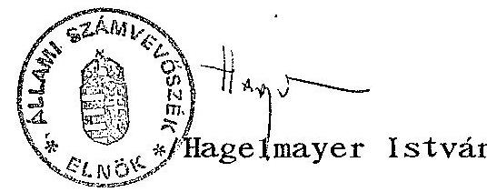
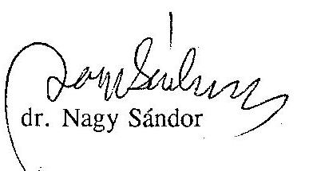
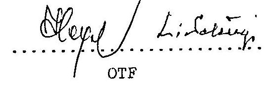
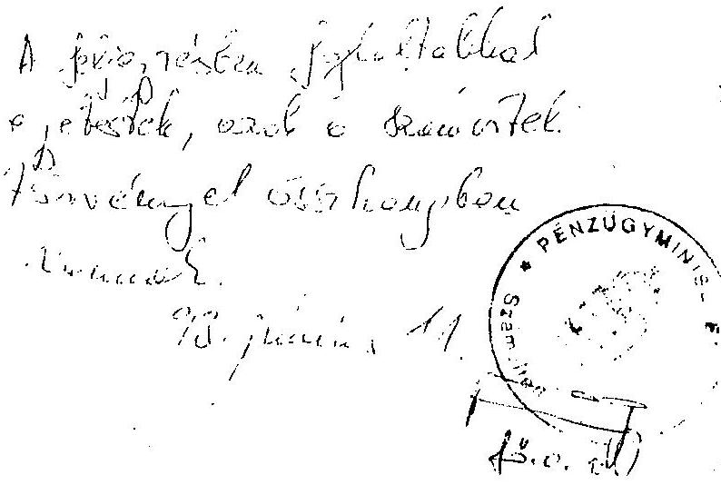
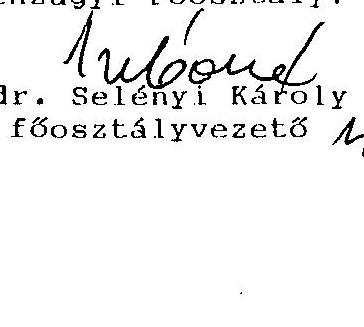
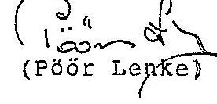
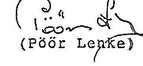
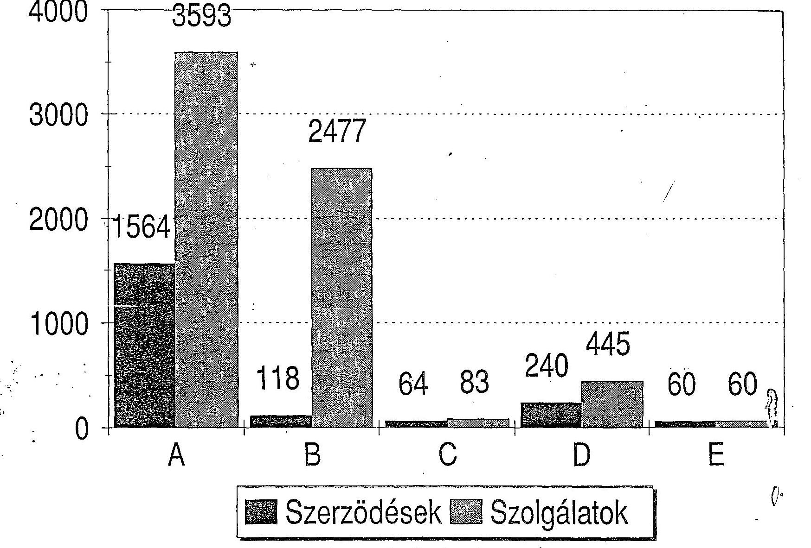
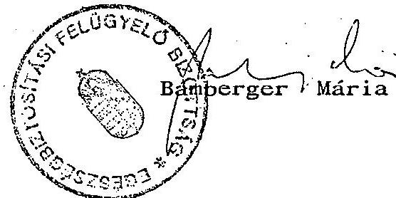
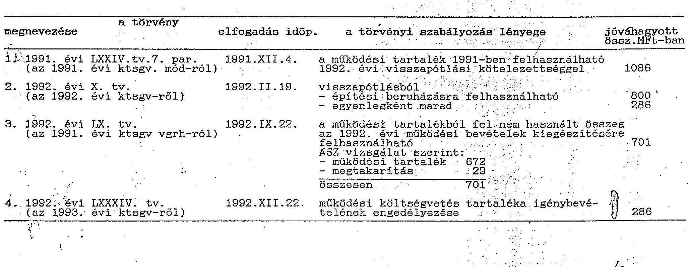

14303. szám

# Állami Számvevőszék

## JELENTÉS

a Társadalombiztosítási Alap 1992. évi zárszámadásához kapcsolódó ellenőrzések tapasztalatairól

---

A vizsgálatot vezette: dr. Csépán Magdolna osztályvezető főtanácsos

A vizsgálatban résztvettek:

| Balla Józsefné | számvevő tanácsos |
| :-- | :-- |
| dr. Fónyad Erzsébet | számvevő |
| Hajagos Józsefné | számvevő tanácsos |
| Hegyesné dr. Solymosi Mária | számvevő |
| dr. Kurucz István | számvevő tanácsos |
| Molnár Istvánné | számvevő tanácsos |
| Szendrődi Józsefné | számvevő |

A megyei társadalombiztosítási igazgatóságoknál és települési önkormányzatoknál:

Nagy Jánosné
dr. Klapcsík László
Buczkó András
dr. Csapó Anna
Heves Kornél
Hadházi Sándor
Péntek László
Kispálné Wiedmann Györgyi

---

# JELENTÉS

a Társadalombiztosítási Alap 1992. évi zárszámadásához kapcsolódó ellenőrzések tapasztalatairól

## BEVEZETÉS

Az államháztartásról szóló 1992. évi XXXVIII. törvény (86. paragrafusa) értelmében a társadalombiztosítás költségvetéséről és annak végrehajtásáról az Országgyűlés törvény alkot. A törvényjavaslatokat az Állami Számvevőszék véleményével, illetőleg - a zárszámadás esetében - jelentésével együtt tárgyalja meg.

Az ÁSZ kötelezettsége az 1992. évre vonatkozó zárszámadási törvényjavaslat megalapozottságának ellenőrzése. Ennek során annak megállapítása volt a cél, hogy

- a Társadalombiztosítási Alap 1992. évi költségvetéséről szóló 1992. évi X. törvényt hogyan hajtották végre, milyen az alapok és az alapkezelő gazdálkodásának szabályszerűsége és szabályozottsága;
- a törvénytervezetben szereplő adatok az előirányzatokhoz képest hogyan alakultak, miként ítélhetők meg az adatoknak a költségvetési beszámolókkal való összefüggései;
- miként értékelhető az Alap 1991. évi zárszámadásáról szóló 1992. évi LX. törvény előírásainak végrehajtása;
- a társadalombiztosítási rendszer átalakításának 1992. évi célkitűzései az egészségügyben hogyan valósultak meg;
- az önkormányzati irányításra történő felkészülés szempontjából hogyan értékelhető az 1992. év.

---

Az elkészült jelentés a zárszámadáshoz kapcsolódó helyszíni vizsgálatok tapasztalatain kívül felhasználta az 1993. első negyedévében folytatott, a téma hátterét részleteiben is feldolgozó elemzések, illetve hat megyei társadalombiztosítási igazgatóság számvevőszéki ellenőrzésének megállapításait is.

Az ÁSZ munkatársai 1993. május 3-án kezdték meg a társadalombiztosítás zárszámadásához kapcsolódó helyszíni ellenőrzéseket, az ehhez nélkülözhetetlen költségvetési beszámolók előbb nem is álltak rendelkezésre. Munkakapcsolat útján kaptuk csak meg az OTF-tól (a Népjóléti Minisztériumnak átadott) zárszámadási törvényjavaslatot. Magát a benyújtott tervezetet azonban még jóval a helyszíni vizsgálatok befejezése után sem kapta meg az ÁSZ, annak ellenére, hogy a problémát már május 13-án jelezte az Országgyűlés elnökének, illetékes bizottságainak és a népjóléti miniszternek (az 1. sz. melléklet szerint). A zárszámadási törvényjavaslatot a Kormány 13789. számon, végül is csak november 8-án nyújtotta be és azt az ÁSZ hivatalosan november 10-én kapta meg.

Az ellenőrzés során az ÁSZ elsődlegesen az OTF szervezeti egységeit vizsgálta, de több kérdésben folytatott konzultációt a Népjóléti Minisztérium, a Pénzügyminisztérium, illetve az Állami Vagyonügynökség illetékes munkatársaival is.

A jelentés tartalma túlnyúlik a zárszámadás adatainak minősítésén, az abban szereplő egyes témák vizsgálatán. Ez a megközelítés az ÁSZ részéről tudatos volt. Az elmúlt évek ellenőrzési tapasztalatai, a felhalmozódott gondok a zárszámadáskor szokásos éves elszámolással is (közvetlen, illetve közvetett) kapcsolatban állnak. A feladat ilyen értelmezése lehetőséget adott a társadalombiztosítás átfogó helyzetértékelésére, amivel az év közepén létrejött társadalombiztosítási önkormányzatok felelős munkájához is segítséget kívántunk nyújtani, megfelelve az önkormányzatok ilyen igényének is (2. sz. melléklet).

# ÖSSZEFOGLALÓ KÖVETKEZTETÉSEK

A társadalombiztosítás 1992. évi zárszámadásának ellenőrzése kapcsán a fontosabb tapasztalatok, következtetések az alábbiakban foglalhatók össze.

---

# 1. / Szabályozottság, szabályszerűség

Az ÁSZ zárszámadási vizsgálata ismételten felvetette, hogy a társadalombiztosítás alapszerű gazdálkodására vonatkozóan, a beszámolás, könyvvezetés rendjére nincs külön szabályozás. A sajátosságokat az államháztartási, a számviteli törvény és a költségvetési szervekre vonatkozó jogszabályok nem is érintik.

A belső szabályozás - a korábbi OTF-nél - kialakult gyakorlata csak szükségmegoldásként fogadható el. Az Állami Számvevőszék súlyos hibának tartja, hogy a Társadalombiztosítási Alap létrejötte (pénzügyi önállósága) óta az államháztartás alrendszerére vonatkozó szabályozást sem az alapkezelő, sem a számviteli rendért felelős kormányzati szerv (PM) nem szorgalmazta.

Az ÁSZ egyetért azzal, hogy a társadalombiztosítási alapokra és kezelő szervezeteikre egyaránt a költségvetési gazdálkodási rend vonatkozzon. Azzal viszont szembe kell nézni, hogy e szabályok eltérések nélkül nem alkalmazhatók, aminek meghatározása nem bízható az alapkezelők egyéni értelmezésére.

A helyszíni vizsgálatok alkalmával feltárt szabályszerűségi problémák egy része (pl. a költségvetési beszámolók egyes űrlapjainak kitöltése, az adatok egyeztetése) a szabályozatlanságból ered, más esetekben azok oka kifejezetten mulasztás, figyelmetlenség, késve kiadott intézkedések.

Az ÁSZ a számviteli szabályok megsértésének tekinti, hogy határidőre nem készült el a számlarend és a költségvetési beszámoló. Az értékvesztés elszámolásának elmulasztásával a szolgáltatási szektor éves beszámolójának valódiságát jelentősen befolyásoló zárlati feladatot nem hajtottak végre. Hasonlóan minősíthetők a leltározási (folyószámla) hibák is.

A költségvetési beszámolók adatai a zárszámadás adattartalmával megegyeznek. A kiadási főösszeget és a hiány összegét (és az egyes törvényi mellékletek adatait) az ÁSZ - tartalékokkal kapcsolatos - megállapítása, az OGY döntésétől függően, módosíthatja. Az ellenőrzés adatai viszont egyes esetekben eltérést mutatnak. A függő tételek rendezetlensége miatt a kiadások és a bevételek pontos összege is megkérdőjelezhető.

---

A beszámolás továbbra sem teljeskörű. Legszembetűnőbb, hogy az ellátási feladatok teljesítéséhez szükséges 222 milliárd forintos évközi hitel felvételt a zárszámadás nem mutatja be. A benyújtott törvényjavaslatokhoz csatolt "háttérinformációk" között a főbb eltéréseket már ismertetik.

# 2. / A tartalékok alakulása

A társadalombiztosítás pénzügyi tevékenységét - a szokásos költségvetési gyakorlattal ellentétben - a hatályos törvényi előírások nem korlátozzák. Ezt is figyelembe véve a közpénzek kezelésében nagyobb gondosságra lenne szükség. E téren több esetben tapasztalható volt hiányosság, ami az értékpapírok nyilvántartásában, kezelésében, a hosszú és rövid lejáratú ügyletek "eredményességében", bonyolításában, vezetői ellenőrzésében egyaránt megnyilvánult.

A befektetési tevékenység nem volt kellően átgondolt, előkészített és nem szolgálta a társadalombiztosítás hosszú távú érdekeit (pl. a vagyongyarapítás terén).

A kamat és hozambevételeket a biztosítási ágak között megosztva tartalékba kell helyezni. A rövidlejáratú befektetések hozamát a zárszámadási törvényjavaslatban 90:10 % arányban osztották meg az alapok között, aminek következtében az Egészségbiztosítási Alapnak nem jutott annyi hozambevétel, amiből az azt terhelő 280 millió forintos kiadási tétel teljesíthető lett volna. A bevételek - ellenőrzés szerint helyes, 50-50 %-os megosztása esetén ez az akadály elhárulna. A megállapítás 196 millió forinttal csökkentené a zárszámadás kiadási főösszegét és a hiány összegét is.
Az 1992-ben aktivált bérházakkal kapcsolatos bevételeket és kiadásokat a befektetések hozama tartalék javára, illetve terhére számolták el, ami ugyan nem szabálytalan, de nem megfelelő megoldás.

Az 1991. évi hiány finanszírozásába bevont likviditási tartalék időarányosan előírt visszapótlását nem sikerült teljesíteni. A hiányzó 1644 millió forint rendezésére a zárszámadás az 1992. évi hiányrendezéssel azonos megoldást (hosszúlejáratú értékpapírkibocsátást) tartalmaz és "eltekint" az 1992. évi LX. törvényben, az adósok ingatlanainak értékesítésével összefüggő állami garancia érvényesítésétől.

---

A likviditási tartalék visszapótlás összegét rendkívül bonyolult, munkaigényes, ugyanakkor megbízhatatlan számításokkal állapították meg, aminek alkalmazása 1993-ban és 1994-ben már nem célszerű.

# 3. / A társadalombiztosítás pénzügyi helyzete

A társadalombiztosítás pénzügyi helyzete 1992-ben tovább romlott, aminek következtében a költségvetési törvényben prognosztizált "0"-szaldós költségvetés végül is 31 milliárd forintot meghaladó hiánnyal teljesült. A társadalombiztosítás működőképességét ma már szinte kizárólag csak az állami forgóalap kamatmentes hiteljellegű igénybevételének lehetősége biztosítja és a rendszer csak addig nem fenyeget összeomlással, amíg ez a lehetőség fennáll.

A tartozásállomány gyakorlatilag már kezelhetetlen méreteket öltött. Ebben alapvető szerepet az általános gazdasági helyzet játssza, de az ellenőrzés tapasztalata szerint kialakulásában szervezeten belüli okok is közrejátszottak. Megkésve jött létre a társadalombiztosítás behajtási szervezete.
A gazdálkodók nehézségei mellett ugyanakkor a járulékfizetési fegyelem lazulása is egyértelmű tendenciát mutat, amit a társadalombiztosítási szakellenőrzés jelenlegi rendszere (létszám, szankcionálási eszközök, ellenőrzési módszerek stb.) nem képes követni és kezelni.

## 4. / A társadalombiztosítás ingyenes vagyonjuttatása

A társadalombiztosítás törvényben előírt 300 milliárd forint értékű ingyenes vagyonjuttatására még nem került sor. A zárszámadással összefüggésben ez 1880 millió forint tervezett bevétel elmaradását jelenti. Az eltelt időszakban bekövetkezett változások indokolttá teszik a vagyonjuttatás témakörének - koncepcionális - újragondolását, a szükséges intézkedések ismételt megfogalmazását.
5. / Az egészségfinanszírozás helyzete, 1992. évi változásai

Az Egészségbiztosítási Alap 257,5 milliárd forintos kiadásából a gyógyító-megelőző egészségügyi ellátásokra 112,1 milliárd forintot fordítottak.

A helyszíni vizsgálat a zárszámadásban bemutatott összeghez képest 11 millió forint (többlet) eltérést talált, amit időközben sem rendeztek.

---

Nem megoldott a számviteli és a pénzforgalmi nyilvántartások rendszeres évközi egyeztetése, erre csak a zárszámadást követően utólag került sor.

A tervezés bizonytalanságaira utal, hogy a teljesítés számos előirányzati tételnél alacsonyabb volt. Az alapelőirányzatokon felül az egészségügyi intézményeknek juttatott - egyszeri - támogatások nagy részének az ebből eredő megtakarítás képezte forrását. E támogatásokkal összefüggően az odaítélés döntési folyamatát kormányrendelet szabályozta, amely azonban nem tudta teljesen felváltani a korábban kifogásolt szubjektív döntések gyakorlatát.

Az 1992. év közepén megindult finanszirozási reform első lépése az alapellátásban a háziorvosi rendszer bevezetése volt. Az átállás zökkenőmentesen történt meg. Az erre szánt 2,6 milliárd forintot felhasználták. Mivel a "teljesítménydíj" felhasználását központilag nem szabályozták, az alkalmazott helyi gyakorlat igen változatos volt.

A biztosítási kártya a neki szánt kettős funkciót 1992-ben nem tudta teljesíteni, a finanszírozást nem a leadott kártyák, hanem a szolgáltatások adatközlése alapján végezték. A törzskartonok kitöltése sem oldódott meg.

A finanszírozás szervezeti feltételei viszont központi és területi szinten egyaránt javultak.

Az 1992. évi központi bérpolitikai intézkedések 2,4 milliárd forintos áthúzódó hatásának forrásaival a társadalombiztosítás ez évi költségvetése a bevételi oldalon nem számolt. Az 1992. évi LXXXIV. törvényben szereplő, a központi költségvetéstől származó, 2500 millió forintos bevétel a terhesgondozás és a közgyógyellátás - profiltisztítás körébe tartozó - megtérítésivel függ össze, noha a törvény indoklása valóban tartalmazta, hogy ezek átvétele gyakorlatilag kiváltja a bérintézkedések áthúzódó hatását. Ez a megoldás viszont nem jelent mást, mint a profiltisztítás - a társadalombiztosítástól idegen, feladatkörébe nem tartozó - és a forráscsere (ilyen volt a családi pótlék helyett átvett egészségügyfinanszírozás) eltérő tartalmú fogalmainak összekeverését. Ezt a gondot az ÁSZ már az 1993. évi költségvetés véleményezésekor is felvetette.

---

# 6. / Működési költségvetés

Az 1992. évi X. törvényben jóváhagyott bevételi és kiadási előirányzatot az OTF 1992 májusában (a költségvetési beszámoló aláírása előtt) 801 millió forinttal megemelte.
Az OTF eljárását az 1991. évi zárszámadásról szóló 1992. évi LX. törvény jóváhagyta. Ezzel utólag törvényes lehetőséget adott arra, hogy a módosított előirányzatban bevételként (egyúttal többletforrásként) jelenjen meg a működési tartalék.

A költségvetési törvénnyel ugyanakkor ellentétes a 672 millió forint működési tartalék elszámolása pénzmaradványként, illetve bevételként. A költségvetési törvény egyszer már figyelembe vette (és csak a kiadási oldalon) a működési tartalék felhasználását. A törvényesen elszámolható, illetve felhasználható bevételek és kiadások egyenlege 8 millió forint lenne. A zárszámadási törvénytervezetben kimutatott 966 millió forint, a működési tartalék nélküli 760 millió forint megtakarítás lényegét tekintve az alapoktól elvont forrás, amit a működési kiadások alakulása nem indokolt. Az időközben
 elkészült 1993. I. félévi költségvetési beszámolóból megállapítható, hogy az OTF 700 millió forintot rövidlejáratú értékpapírvásárlásra fordított, ez is az előbbieket támasztja alá.

Az ÁSZ megállapítása szerint a jogszerűen realizálható működési bevétel az 1992. évi LXVII. törvényben módosított előirányzatnál 92 millió forinttal, a működési kiadás pedig 94 millió forinttal lehet több.

A működési tartalékból törvénymódosítás nélkül, de Felügyelő Bizottság tudtával a székházépítésre további 80 millió forintot használtak fel.

## 7./ Az állami költségvetéssel való kapcsolat

Az elmúlt évben mintegy 150 milliárd forint volt a társadalombiztosítás által folyósított különféle ellátások összege. Ezekből 40,2 milliárd forintot átmenetileg még az alapok terhére finanszíroztak.

A profiltisztítás körébe tartozó juttatások összege 4,1 milliárd forint volt. A többit a családi pótlék és egyes nyugdíjszerű ellátások folyósítása tette ki. A kifizetéseket a társadalombiztosításnak a költségvetés, illetve szervei (és a

---

gazdálkodó szervezetek) megtérítik. A megtérítésekre vonatkozóan az ÁSZ nem talált olyan megállapodásokat, amelyek jogcímenként - az utalás módjára, az elszámolás részleteire, az eltérések rendezésére egyértelmű eligazítást adnának.

Összességében az 1992. évi megtérítések fedezték a kifizetéseket, de tételesen igen jelentős eltérések mutatkoznak. Ez különösen a foglalkoztatáspolitikai célú korhatár-csökkentett nyugdíjak esetében okoz gondot, ahol a több, mint 2 milliárdos elmaradás nagy része a munkáltatók tartozása.
A pozitív egyenleget egyébként a személyi kárpótlás életjáradékra váltása kapcsán, év végén átutalt, nagyobb összeg eredményezte. Az ide tartozó kiadások viszont 1993-ban jelentkeznek.

# 8./ Az állami garancia érvényesülése 

A költségvetés az 1991. évi XCI. törvényen alapuló, a nyugdíjkiadásokkal összefüggő 1%-os megtérítési kötelezettsége 2810 millió forint lenne. A törvény szerinti költségvetési megtérítési helyett ez is az általános hiányrendezés keretében valósul meg.

A profiltisztítás körébe tartozó és az átmenetileg ellátott juttatások együttes összege nem érte el a törvényben szereplő 44.700 millió forintot, itt megtérítési kötelezettség nem keletkezett.

Az Alapok 1992-ben használhatták az állami forgóalaphoz kapcsolt megelőlegezési számlát (amit szabályszerűen ugyan csak a Nyugdíjbiztosítási Alap tehetett volna).

A hiány finanszírozása a társadalombiztosítási önkormányzatok - mint az alapok kezelői - által kibocsátandó, államilag garantált, értékpapír formájában történik. Ennek a törvényjavaslatban ismertetett módja állami kötelezettségvállalással is jár. Erről azonban a Magyar Köztársaság 12200. számon benyújtott költségvetéséről szóló törvénytervezete nem tesz említést, vélhetően azért, mert valós kötelezettség ebből első ízben csak 1995-ben származik.

Az ÁSZ az előbbieken kívül áttekintette a társadalombiztosítással kapcsolatos kormányzati feladatokról hozott 53/1992. (X.1.) OGY határozat végrehajtását, valamint az önkormányzati irányítás előkészítésével kapcsolatos kérdéseket is. A megállapításokat a jelentés VII. és VIII. fejezete részletesen ismerteti.

---

# JAVASLATOK 

Az Állami Számvevőszék a vizsgálat tapasztalatai alapján javasolja, hogy
az Országgyülés
Tekintse át - lehetőleg még 1994. elején - a társadalombiztosítási rendszer továbbfejlesztésével (reformjával) kapcsolatos 60/1991. (X. 29.) OGY határozat végrehajtását. Ezt a biztosítási ágak pénzügyi helyzete, illetőleg az eddigi intézkedések hasznosulásának megismerése, a változások tapasztalatainak összegzése feltétlenül indokolja.

## a Kormány

a.) Kezdeményezze, illetve készítse elő az államháztartás társadalombiztosítási alrendszerének mielőbbi törvényi szintű szabályozását, figyelemmel:

- az ellátó rendszer (1975. évi II. törvényben foglaltakhoz viszonyított) változásaira,
- a társadalombiztosítás működési-gazdálkodási kérdéseire, kapcsolatrendszerére,
- az éves költségvetésre és a zárszámadásra.
b.) Gondoskodjon arról, hogy a társadalombiztosítás beszámolási, könyvelési rendszerének felülvizsgálata és - a sajátosságokat is figyelembe vevő - szabályozása megtörténjen.
c.) Segítse elő, hogy a zárszámadási törvény keretében a működési költségvetés előző évekről (és nem megtakarításból) származó tartalékának a "sorsa" megnyugtatóan rendeződjön, olymódon, hogy az egyéb szükséges törvénymódosításokkal: - az a működés céljaira szabadon felhasználható legyen, - azt az alapoknak visszajuttassák, vagy
- továbbra is tartalékként kezeljék.
d.) Mérlegelje a zárszámadási törvényben a kiadások és a hiány összegének 196 millió forinttal történő csökkentésének indokoltságát.
e.) Gondolja át az egészségügyi dolgozók központi elhatározáson alapuló bérfejlesztésének forrásszükségletét, annak a társadalombiztosítási járulékbevételekkel, az egészségügyi teljesítmény finanszírozásával összhangban álló és profiltisztítástól független megoldása érdekében.

---

az alapok kezelői
a.) A társadalombiztosítás pénzügyi tevékenységét, annak lehetőségeit, a jelenleginél szigorúbban, egyértelműbben szabályozzák. A belső ellenőrzési rendszert úgy alakítsák ki, hogy a pénzügyi műveletek rendszeres ellenőrzése a vezetői munka szerves és számonkérhető része legyen.
b.) Rendezzék a bérházak bevételeinek és fenntartási kiadásainak elszámolási kérdéseit.
c.) Egyszerűsítsék az 1991. évi hiány finanszírozásába bevont likviditási tartalék-visszapótlás számítási módszerét.
d.) Javítsák a társadalombiztosítási szakellenőrzési tevékenységet.
e.) Részletesen vizsgálják meg a társadalombiztosítási feladatok teljesítéséhez kapcsolódó működési kiadások alakulását és indokoltságát, gondoskodjanak arról, hogy az alapok működési költségvetéshez való hozzájárulása a valós szükségletekhez igazodjon.
f.) Tekintsék át ismételten a társadalombiztosítás vagyonhoz juttatásának kérdéskörét, a rövid- és hosszú távú célok alapján fogalmazzák meg a reális igényeket.
g.) Kössenek jogcímenkénti megállapodásokat a társadalombiztosítás alapjaiba nem tartozó ellátások folyósítására és azok megtérítésére, ezen belül külön gondolják át a foglalkoztatáspolitikai célú korhatár-csökkentett nyugdíjazásokkal összefüggő megtérítések szabályozását.
h.) A belső számviteli rend változtatásával biztosítsák az egészségügyfinanszírozás analitikus és főkönyvi adatainak évközi, folyamatos egyeztetését. E változások szolgáljanak a pénzügyi ellenőrzés alapjául is.
i.) A társadalombiztosítás igazgatási szervezetének végső formában történő kialakítása során törekedjenek a minél ésszerűbb megoldásokra, a felesleges párhuzamosságok elkerülésére, a működési költségvetés ésszerű keretek között tartása érdekében.
j.) Kísérjék figyelemmel az információs rendszer fejlesztéseinek megvalósulását, a hatékonysági szempontok, a nyugdíjbiztosítás és az egészségbiztosítás sajátosságainak érvényesülését.

---

# RÉSZLETES MEGÁLLAPÍTÁSOK 

1. A Társadalombiztosítási Alap gazdálkodásának szabályozottsága, szabályszerűsége
1./ Az Alap beszámolási, könyvvezetési rendszerének szabályozottsága

A társadalombiztosítás számvevőszéki ellenőrzésének kezdete (1990) óta rendszeresen felvetődik és ellenőrzési szempontból is problémát jelent, hogy az államháztartás alrendszerét képező, önálló pénzalap(ok) gazdálkodására, számviteli beszámolási rendszerére a költségvetési szervekre vonatkozó szabályozás nem, illetve csak jelentős eltérésekkel alkalmazható.

A szabályozás hiányosságait az 1991-ben megjelent számviteli törvény és az 1992-ben életbelépett államháztartási törvény sem szüntette meg. A számviteli törvény a költségvetési szervek beszámolási, könyvvezetési kötelezettségének előírásait kormányrendelet hatáskörébe utalja. A 179/1991. (XII. 30.) Kormányrendelet hatálya azonban 1992-re "szó szerint" csak az OTF-re, mint a Társadalombiztosítási Alap kezelőjére vonatkoztatható, azt viszont rögzíti, hogy az Alap köteles beszámolót készíteni.

A rendelet 1993-ban megjelent módosítása megszünteti ezt (egyébként bizonyára formai) hiányosságot. Az "alapszerű" működés miatt a Társadalombiztosítási Alap törvényre hivatkozva az OTF szükségesnek és indokoltnak tartja az ettől való eltéréseket.

Az 1992. évet ugyan nem érinti, de megemlítjük, hogy ezeket a követelményeket a társadalombiztosítás pénzügyi alapjairól és az 1993. évi költségvetésről szóló 1992. évi LXXXIV. törvény sem elégíti ki.

Az államháztartási törvény 85. paragrafusa szerint: "az államháztartás alrendszerét képező társadalombiztosítás irányítását, működését, hatásköri, eljárási szabályait, bevételeinek és kiadásainak körét, gazdálkodását, vagyonát, a központi költségvetéssel és az államháztartás többi

---

alrendszerével való kapcsolatát külön törvény szabályozza". Olyan törvényt azonban, amely mindezeket egységesen és teljeskörűen rendezi, mindeddig nem hoztak.

A törvény (11. paragrafus (3) bekezdése) utal arra, hogy az alapok és kezelő szervezeteik a költségvetési szervekre vonatkozó szabályokat alkalmazzák, de jelzi a sajátosságokból adódó további (eltérő) szabályozás lehetőségét is.
Ilyen törvény pedig nincs!
A társadalombiztosítási alrendszert illetően az államháztartási törvény költségvetési szervekre vonatkozó előírásai (XI. fejezet) sem egyértelműek.

Az 1992. évi zárszámadás ellenőrzése során megállapítottuk, hogy a Társadalombiztosítási Alap költségvetési beszámolóját nem a költségvetési szervekre vonatkozó előbb említett kormányrendelet szerint, illetőleg nem az intézményi beszámoló - PM által előírt - formájának és tartalmának megfelelően készítették el.

A költségvetési törvényben foglaltakat sajátosan "értelmezve" a költségvetési szervekre előírtaktól eltérő (lásd 3. sz. mellékletet)

- a pénzmaradvány,
- a tartalékalapok,
- a tőkeváltozás,
- a rövid lejáratú befektetések,
- a nem társadalombiztosítási ellátások
elszámolása, könyvelése és a 494. költségvetési kiadások és bevételek elszámolási számla évvégi zárása. A számszerű kimutatások mellől hiányzik a kormányrendeletben előírt kiegészítő melléklet szöveges magyarázata is.

A sajátos értelmezés miatt a beszámoló az egyébként egyezőségi követelményeket sem elégíti ki. A kapott tájékoztatás szerint a PM (szóban) elfogadta, hogy az OTP a szolgáltatási szektor beszámolóját a sajátosságok figyelembevételével, egyedileg alakítsa ki. Így tehát bizonyos belső szabályozások alapján működik egyfajta gyakorlat.

Ez azonban ellenőrzési szempontból kezelhetetlen, nem szolgálja a biztosítási ágak - nehezen haladó - pénzügyi szétválasztásához, az önkormányzati (tulajdonosi) irányításhoz, valamint az állami felügyelet gyakorlásához nélkülözhetetlen tisztánlátást.

---

Az éves beszámolóról egyébként az Arthur Andersen könyvvizsgáló cég "átvilágítási jelentése" sem nyilvánított véleményt, azt nem hitelesítette.

# 2. / A számviteli szabályok megtartása 

A szabályszerűségi kérdések vizsgálatánál az ÁSZ (értelemszerűen) a számviteli törvény és a költségvetési szervekre vonatkozó speciális előírások betartását vizsgálta.

### 2.1. Az 1992. január 1-jei rendezőmérlegek elkészítése

A költségvetés alapján gazdálkodó szervezeteknek az 1991. évi mérlegét a 3/1992. (III. 4.) PM rendelet előírásai szerint - 1992. július 31-ig - kellett átrendezni.

A rendezőmérlegek elkészítése általában az előírásoknak megfelelően történt. A megyei társadalombiztosítási igazgatóságokon végzett számvevőszéki ellenőrzések eseti jelleggel találtak téves átkönyveléseket. Az OTF a megyei igazgatóságok munkáját tájékoztatókkal, munkaértekezletekkel, számítógépes programokkal segítette.

Az 1991. végén meglévő értékpapírokat felülvizsgálták abból a szempontból, hogy tartós befektetésnek minősülnek-e, így került az 1991. X. 1-jén vásárolt MATÁV-kötvény a befektetett eszközök közül a forgóeszközök állományába.

### 2.2. Az 1992. évi költségvetési beszámoló elkészítése

Az OTF a költségvetési szervekre vonatkozó határidőig (tárgyévet követő február 28-ig, illetve az OTF szintjén március 10-ig) nem készítette el az 1992. évre vonatkozó beszámolóját.

Márciusban határidő módosítást kértek a Pénzügyminisztériumtól, de azt nem kapták meg (erre nincs is lehetőség). Az ÁSZ munkatársai a zárszámadás helyszíni vizsgálatának kezdetekor - május 3-án - írásban (4. sz. melléklet) kérték a Társadalombiztosítási Alap jóváhagyott beszámolóját, de azt csak május 5-én adták át részükre. Az átadott dokumentumokon viszont a mérlegkészítés időpontjaként 1993. április 23. szerepel!

---

A késedelem hivatkozott okaként az előző évi hiány finanszírozásába bevont likviditási tartalék visszapótlási kötelezettségének az 1992. évi LX. törvényben előírtak szerinti végrehajtását jelölték meg (e kérdésről a jelentés II/2.4. pontja szól részletesebben). A feladat valóban rendkívüli munkaigénnyel járt, ugyanakkor nincs érthető magyarázata, hogy arra miért csak 1993 februárjában intézkedtek. Az említett törvényt 1992 októberében tették közzé.

A költségvetési beszámoló késedelmes elkészítése nem újkeletű probléma. Ez különösen azért kifogásolható, mert a zárlati munkálatok rendben történő elvégzését semmi sem akadályozta.

A beszámoló egyes tételeinek ellenőrzését a rendelkezésre bocsátott főkönyvi kivonat(ok) nem biztosították. Így a mérlegben kimutatott 39. és 48. számlák (függő, kiegyenlítő elszámolások) tételeinek záróállományát a forgalmi, főkönyvi kivonatból nem lehetett levezetni, a számlák teljes éves bevételi, kiadási forgalmát megállapítani, nem egyeztethetőek a pénzforgalmi jelentés adatai, s kérdéses a pénzmaradvány úrlapon levezetett kiadási többlet alátámasztottsága is. A főbb eltéréseket a 3. sz. melléklet tartalmazza.

# 2.3. A mérlegtételek értékelése és leltározása 

A számviteli törvény értelmében a mérlegben szereplő eszközöket és kötelezettségeket leltározással, egyeztetéssel, ellenőrizni és egyedenként értékelni kell.

A mérlegtételek értékelése során figyelembe kell venni minden olyan értékvesztést, amely a mérleg fordulónapján meglévő eszközöket érinti és a mérlegkészítés napjáig bekövetkezett és ismertté vált.

Ennek a követelménynek több szempontból nem tettek eleget.

Az Alap mérlegében 1992. december 31-én
 a befektetett pénzügyi eszközök állománya 17.199 millió forint, a forgóeszközök között kimutatott - rövid lejáratú - értékpapírok állománya 5.149 millió forint volt. (A tartalékok alakulásáról részletesen a II. fejezet szól.)

---

Az OTF az értékpapírok után nem számolt el értékvesztést.
Az értékpapírvagyon piaci árának alakulásáról készített elemzések, továbbá az Arthur Andersen cég megállapításai több tételnél felvetették az értékvesztés elszámolásának szükségességét.

Az OTF Pénzügyi Főosztályának - 1993. június 11-én készített - indoklása (5. sz. melléklet) csupán egy tételt, az Ybl Banknál, 236 millió forint értékben, tartotta ezt alátámasztottnak. A PM Számviteli Főosztálya az indoklással egyetértett.

Az 1992. március 23-án és április 10-én vásárolt IBUSZ részvények (II. fejezet 1.1. pontja) tőzsdei árfolyama már 1992. április 15-étől tartósan elmarad a 3604 forintos vételi ártól. A Társadalombiztosítási Alap dokumentálható mérlegkészítési időpontja 1993. április 23., noha az előbb említett indoklásban március 31. szerepel.

Az ÁSZ véleménye az, hogy a számviteli törvény előírásai és az óvatosság számviteli elve alapján az IBUSZ részvények esetében értékvesztést kellett volna elszámolni. A beszámoló időben történő elkészítése esetén az értékvesztés elszámolása nem merült volna fel.

Az egyéb hosszú lejáratú banki részvényeket (6. sz. melléklet) a tőzsdén nem jegyzik, de a szakvélemények szerint - az MKB kivételével - ezek piaci megítélése is tartósan romlott. Ezt látszik igazolni az is, hogy az 1989-ben és 1990-ben névértéken vásárolt OKHB és B.B. Rt részvényeket az OTF 1991-ben és 1992-ben már jóval a névérték alatt tudta beszerezni. A korábban vásárolt értékpapírokat azonban mégsem értékelték le. A "piac értékítéletének" pontos meghatározását a számviteli törvény nem tartalmazza. Az OTF a szakirodalomban található értelmezésre (az érintett pénzintézetek saját tőkéjének alakulására) hivatkozva nem számolt el értékvesztést.

A rövid lejáratú értékpapírok esetében (II. fejezet 1. 2. pontja) sem került sor értékvesztés elszámolására. A lejáratig meg nem térült 800 millió forint összegű befektetésnél az érintett pénzintézetek felszámolási eljárása még nem zárult le.

---

Nem kétséges, hogy az értékpapírvagyon értékvesztését 1993-ban (akár több százmillió forintos nagyságrendben) el kell számolni, így a vagyonvesztés elkerülhetetlenül bekövetkezik. Az Alap birtokában lévő banki részvények értéke jelenleg mintegy 2,8 milliárd forint. Ma már ismert tény, hogy a kereskedelmi bankok nagy része az 1992. év után (veszteség, illetve tartalékolás miatt) nem fizet osztalékot, sőt az Általános Vállalkozási Bank, amelytől az OTF 182,7 millió forintért vásárolt részvényeket - már 1991. év után sem fizetett.

Nem történt meg az értékpapírvagyon mennyiségi leltározása sem. Az ÁSZ által korábban kifogásolt nyilvántartási problémák ugyan enyhültek, de a kialakított rendszer továbbra sem biztosítja a vagyonvédelmet. A trezorban elhelyezett értékpapírok nyilvántartása áttekinthetetlen. A vizsgálat idején ott talált (a FORCON vállalattól átvett) banki részvények például sem az analitikus, sem a főkönyvi nyilvántartásban nem szerepeltek. A letétben elhelyezett értékpapírok (Budapest Bank Rt és OKHB Rt törzstőke-kiegészítése) adatai több esetben nem egyeznek a nyilvántartás és a letéti szerződések között.

A társadalombiztosítás egyik legfontosabb ügyviteli területe a járulék- és folyószámla könyvelés, ez a szolgáltatási szektor alapvető analitikus nyilvántartása. A szakterületen meglévő ügyviteli hiányosságok közismertek, azokat az ÁSZ is többször jelezte. A problémákat a folyamatos erőfeszítések mellett sem sikerült még megoldani. Legsúlyosabb a helyzet a Budapesti és Pest megyei Társadalombiztosítási Igazgatóságon. A rendezetlen folyószámlák miatt az adós állomány tételes egyeztetése (leltározása) a mérlegkészítés előtt - teljeskörűen - nem történt meg. A leltárat gyakorlatilag a Nyugdíjfolyósító Igazgatóság számítóközpontjában készülő összesítés "helyettesíti".

Ez a tény nem egyszerűen szabályszerűségi (mérlegvalódisággal kapcsolatos) megállapítás. Az óriási tömegű tartozásállomány szempontjából is gondot jelent a megbízható adatok hiánya (III. fejezet 1.1. pontja).

# 2.4. A Társadalombiztosítási Alap számlarendje 

A kettős könyvvitelt vezető gazdálkodó olyan számlarendet köteles készíteni, amely szerint a könyvvezetés az előírt

---

beszámoló készítését maradéktalanul biztosítja. A számlarend elkészítésének végső határideje 1992. március 31. volt. Eddig az időpontig az OTF nem készítette el a számlarendet, azt az ÁSZ munkatársai részére csak (egy évvel később) 1993. februárjában adták át.

A könyvvezetés könyvelési útmutató és számítógépes program alapján történt, a rovati könyvelés egyidejű alkalmazása mellett. Ezen kívül a beszámoló összeállításához mintegy 30 intézkedő levelet küldtek ki az igazgatóságoknak.

A számlarend nem tartalmaz szabályokat az 1992. évi X. törvény szerinti vagyonátvétel eseteire (ilyenre egyébként a gyakorlatban nem is került sor), hasonlóan az úgynevezett társadalombiztosítási börze keretében értékesítésre kerülő vagyonból származó bevétel elszámolására sem.
3. / A zárszámadás adatainak egyezősége a költségvetési beszámoló adataival

# 3.1. A biztosítási alapok bevételei és kiadásai 

A Társadalombiztosítási Alap 1992. évi módosított költségvetési törvénye az alapok bevételeit és kiadásait azonos összegben - 0-egyenleggel - 529.230 millió forintban állapította meg.

A zárszámadási törvény tervezete szerint az Alap tényleges éves bevételi főösszege 514.669 millió forint, a kiadások összege 546.020 millió forint, így tehát a hiány 31.351 millió forint.

A költségvetési beszámoló pénzforgalmi jelentésének adatai a zárszámadás adattartalmával megegyeznek. Megemlítendő azonban, hogy a függő, kiegyenlítő, átfutó tételek rovati könyvelésből származó adatai a főkönyvi könyvelés számláival nem egyeznek (2.2. pontban leírtak).

Az alapok kiadásait, így a hiány összegét is módosíthatja az ÁSZ (II. fejezet 2.2 pontjában részletezett) vizsgálati megállapítása, mely 196 millió forintos csökkentést indokol.

---

# 3.2. Az éves gazdálkodás teljeskörű bemutatása 

Az 1991. évi zárszámadás ellenőrzésekor az ÁSZ kifogásolta, hogy a beszámolás nem teljeskörű. Ez a megállapítás 1992-re is vonatkoztatható.

A törvénytervezet nem mutatja be a befektetések hozama tartalékalapot érintő valamennyi gazdasági eseményt, melynek "eredményeként" az év eleji 2041 millió forintos nyitóállomány az év végére 5.261 millió forintra emelkedett. A tartalékalap tényleges pénzügyi fedezete 5.149 millió forinttal kevesebb, az év végi áthúzódó ügyletek miatt.

A befektetések hozama tartalékalap számla 1992. évi záróállománya egyébként nem egyezik meg az MNB-nél vezetett bankszámla XII. 31-i záró pénzkészletével, amire a helyszíni vizsgálat ideje alatt nem tudtak magyarázatot adni.

Az ellátási feladatok lebonyolításához 1992. évben az állami forgóalapról 222 milliárd forint hitelt kellett igénybevenni (1991-ben ez az összeg 174 milliárd forint volt), az év végi hitelállomány pedig 24 milliárd forintot tett ki. A felvett hitelekról az államháztartási törvény 86. paragrafusa szerint is számot kell adni.

A Társadalombiztosítási Alap költségvetési beszámolója és a zárszámadási törvényjavaslat számszerű eltéréseit a 7. sz. melléklet részletesen bemutatja.
II. A Társadalombiztosítási Alap tartalékainak alakulása 1992-ben
1./ Az Alap pénzügyi tevékenységéből származó bevételek

A költségvetési szervek szabad pénzeszközeikből csak egy évnél rövidebb lejáratú, államilag garantált értékpapírt vásárolhatnak. A társadalombiztosítási szabályok a hosszú- és rövid lejáratú ügyletek bonyolítását egyaránt megengedik és (egyértelműen) nem kötik ki az állami garancia követelményét sem.

---

# 1.1. Tartós befektetések 

Az Alap 9 milliárd forint összegű kamat és egyéb hozambevételéből 4184 millió forint bevétel az előző években vásárolt hosszú lejáratú értékpapírok hozadéka. A kötvények kamata 3921 millió forint, a vételárra vetítve ez 28-35 %-ot jelent. A részvények utáni 263 millió forint osztalék 0 és 13 % közötti hozamnak felel meg.

Az átutalt osztalék számításának helyessége megfelelő dokumentumok hiányában nem ellenőrizhető.

A szabályok értelmében a tartós befektetések (nettó) hozama is "tartós" célra fordítható. A hosszú lejáratú értékpapírvagyon 1992-ben vételi áron 963 millió forinttal (névértéken 250 millió forinttal!) gyarapodott.

Ezekre az ügyletekre az év első négy hónapjában került sor. A Felügyelő Bizottságok a tartósan lekötött eszközökkel kapcsolatos döntési jogot 1992. V. 1-jétől maguknak tartották fenn, ilyenekre azonban később már nem került sor. Az I. fejezet 2. 3. pontjában foglaltakkal összefüggésben megállapítható, hogy az értékpapírállomány egy részének (IBUSZ-részvények, CA-befektetési jegy, egyes banki részvények) értékállósága bizonytalanná vált.

### 1.2. Rövidlejáratú befektetések

A Társadalombiztosítási Alap tartalékaiban átmenetileg rendelkezésre álló pénzeszközök különféle rövid lejáratú pénzpiaci műveletek lebonyolítására használhatók fel. Az OTF 1992-ben igen élénk, sokrétű pénzügyi tevékenységet folytatott, aminek eredményeként az előirányzott 500 millió forinttal szemben (a gyógyszertámogatás túligénylésének 9 millió forintos kamata nélkül) 805 millió forint hozambevételt értek el. A kincstárjegyek, államkötvények hozama 440 millió forint (ez júniusig 30 % felett, azt követően 16-19 %-os kamatszintet jelent).

Év végén a rövidlejáratú pénzkihelyezés összege 5.149 millió forint volt, amiből összesen 800 millió forint befektetés (Ybl Banknál, Gyomaendrődi Vállalkozói Takarékszövetkezetnél és a Thermál Invest Rt-nél) a lejáratkor, de még a mérlegkészítés idejéig sem térült meg. E tényről a törvény indoklása sem tesz említést.

---

A Thermál Invest Rt egyébként mérlegkészítésig a már lekönyvelt kamatot sem utalta át, ezért az ügyletek tényleges hozambevétele 37 millió forinttal kevesebb, vagyis csak 768 millió forint. A számviteli szabályok szerint azonban az eljárás nem kifogásolható.

# 1.3. A pénzügyi tevékenység minősítése 

Az államháztartásról szóló törvény hangsúlyozza, hogy a vagyonnal felelős módon kell gazdálkodni. E követelménynek az OTF nem tett maradéktalanul eleget. A hosszú lejáratú részvények esetében az 1991. évre fizetett osztalékokra (a Külkereskedelmi Bank kivételével) olyan dokumentumot nem talált az ellenőrzés, amelynek alapján bizonyítható lenne, hogy az átutalt összeg megfelel a közgyűlési határozatban foglaltaknak. Az OKHB és a Budapest Bank esetében a számítások ennek ellenkezőjét látszanak igazolni.

A vállalkozóknak, bankoknak történő kölcsön nyújtásakor, részvény-, váltó vásárlásakor az adós pénzügyi helyzetéről nem készült körültekintő elemzés.

Az 5/1991. OTF vezetői utasítás az Alap számára az állam által kibocsátott, illetve garantált értékpapírok vásárlását engedi meg. Ennek ellenére számos esetben államilag nem garantált ügyleteket is kötöttek, az utasítás alóli felmentéssel, vagy anélkül (Gyomaendrődi Vállalkozói Takarékszövetkezettől 200 millió forintért vásárolt váltó, az Elzett váltó, a New York Br. Rt váltó stb.).

Eredményesség szempontjából az 1992. évi hosszú- és rövidlejáratú banki ügyletek minősítése elég nehéz. Az előirányzatok túlteljesítése önmagában tekintve pozitív tény, ugyanakkor egy ilyen minősítés a valóságos eseményeket nem tükrözi vissza. Az Alap tartós értékpapírvagyona ugyan közel egy milliárd forinttal gyarapodott (1. 1. pont), de sem az IBUSZ-részvény, sem a CA befektetési jegy vásárlása nem tűnik jó befektetésnek. A rövid lejáratú ügyletekből származó hozam meghaladja a tervezettet, az azonban negatívumként értékelhető, hogy nagy kockázattal járó ügyletekre is sor került (1. 2. pont), több esetben a befektetett összegek részleges visszatérülése is bizonytalan.

---

# 2. / Az Alap tartalékainak alakulása 

### 2.1. A kamat és hozambevételek terhére teljesíthető kiadások

Az 1991-ben fel nem használt keretösszeggel együtt az 1992. évi LX. törvény, illetve az 1992. évi X. törvény alapján összesen 533 millió forint (253+280) volt az 1992. évben a kamat és hozambevételek terhére teljesíthető kiadások összege.

Egészségmegőrzési célokra fordítható 69 millió forintos maradvány-összegből 58 millió forintot használtak fel, a zárszámadási törvényjavaslat 11 millió forint 1993. évre történő áthúzódását engedi meg.

Az alkoholizmus elleni megelőzésre szánt 30 millió forintról az OTF szerződést kötött az Országos Alkohológiai Intézettel és a pénzt rendelkezésre bocsátotta. Tényleges felhasználásra 1992-ben még nem került sor, mert az erről
 szóló program csak ez év márciusában készült el.

Az ifjúsági szabadidő-, sporttevékenység támogatására 434 millió forintot számoltak el, amiből 184 millió forint volt az - 1992. LX. törvényben már elszámolt - előző évi maradvány és 250 millió forint az 1992-re jóváhagyott összeg.

A Nemzeti Ifjúsági és Szabadidősport az Egészséges Életmódért Alapítvány 1993. májusában megkezdte az 1991. évi támogatások felhasználása ellenőrzését (ennek hiányát az ÁSZ korábban kifogásolta).

A tapasztalatok rámutattak arra, hogy a jövőben nagyobb figyelmet kell fordítani az egyéni érdekekkel szemben a csoportérdekekre. Megállapították, hogy az elnyert összegek átutalását is szigorítani kell.

Az 1992. évre rendelkezésre álló (250 millió forintos) összeget az Emberi Kockázatok Intézetének három részletben az év végén, novemberben és decemberben utalták át. A keretből 3624 intézmény, egyesület stb. kapott 243 millió forintos támogatást, mely az ezekkel összefüggésben felmerült 7 millió forintos működési költséggel együttesen a keretösszeg teljes felhasználását jelenti.

---

A támogatási célokról a zárszámadás keretében (ellentétben az 1991. évi elszámolással) még nagy vonalakban sem adnak tájékoztatást. Ezt az ÁSZ jelentés (8. sz. melléklete) ismerteti. Az Emberi Kockázatok Intézete elszámolt a kezelésére bízott összeggel, a fennmaradó 150 ezer forintot visszautalta a Társadalombiztosítási Alap elszámolási számlára.
2.2. A kamat és hozambevételek tartalékba helyezése és megosztása a biztosítási ágak között

A Társadalombiztosítási Alap 9 milliárd forintos kamat- és hozambevételéből (II. fejezet 1. pontja) az elérésük érdekében felmerült 17 millió forintos ráfordítás nélkül számítva 8983 millió forint lenne tartalékba helyezhető.

A rövidlejáratú befektetések hozamát - a tartós befektetésekre vonatkozó szabályok szerint - 90:10% arányban osztották meg a Nyugdíjbiztosítási és az Egészségbiztosítási Alap között, mivel e pénzeszközök fő forrása a befektetések hozama tartalék volt. Ezt kétségtelenül alátámasztja az 1992. évi LX. törvény 8. paragrafusának (2) bekezdése.

Az Állami Számvevőszék álláspontja szerint ugyanakkor ez az eljárás az 1992. évi X. törvény 12. paragrafus (2) bekezdésében foglaltak és az 1992. évi LX. törvény 8. paragrafus (3) bekezdésének előírása alapján vitatható, illetőleg a szabályozás ellentmondásos.

A rövid lejáratú befektetések nettó hozamának és a felvett hitelek miatt felmerült bankköltségek különbözetéből a költségvetési törvény szerinti kiadásokat lehet teljesíteni.

Ilyen kiadás az előző pontban részletezett együttesen 280 (250+30) millió forint is, amelyre az 1991. évi zárszámadási törvény úgy rendelkezett, hogy azt a rövid lejáratú hozambevételek Egészségbiztosítási Alapot illető részéből kell fedezni. A hozambevételek törvényjavaslat szerinti megosztása esetén azonban az Egészségbiztosítási Alap forrása (mindössze 81 millió forint) erre nem elegendő, a szükséges fedezetet csak a folyó kiadások terhére, a hiány növelése árán biztosíthatták, ami viszont egyértelműen a törvényi szabályozás megsértését jelenti.

---

A kiadások teljesítése után fennmaradó összeget a likviditási tartalék feltöltésére és (csak) ezt követően kell a befektetések hozamát a tartalék növelésére fordítani.

Mivel a rövidlejáratú pénzpiaci tevékenység elsődleges célja, hogy azok hozama az alapok likviditását biztosítsa (ez pedig mindkét biztosítási ág létérdeke), az Állami Számvevőszék a rövidlejáratú befektetések hozamának 50-50%-os az alapok közötti megosztását tartaná helyesnek. Az OTF és az ÁSZ szerinti számításokat a 9/a és b. sz. melléklet mutatja be.

Abban sem elég világos a szabályozás, hogy a hozamból teljesíthető kiadásokat az alapok közötti megosztás előtt, vagy után kell-e elszámolni. Mivel az 1991. évi zárszámadási törvényből az utóbbi következik, az Állami Számvevőszék is ezt a változatot fogadta el.

A megállapítás a kiadási főösszegre és a hiány összegére is kihat, azokat 196 millió forinttal csökkentett (az I. fejezet 3.1. pontja szerint) és érinti a Társadalombiztosítási Alap tartalékalapjainak 1992. évi záróállományát is.

Amíg a társadalombiztosítási törvényben előírt alapvető feladatainak is csak pénzügyi nehézségek mellett tud megfelelni, addig az egyébként fontos, de feladatkörébe egyáltalán nem tartozó - legfeljebb prevenciónak tekinthető - célokat a járulékbevételek terhére támogatni egyébként sem pályázati úton, sem más formában nem indokolt.
2.3. A bérházvagyon aktiválása, a kapcsolódó bevételek és kiadások elszámolása

Az OTF 1992-ben aktiválta azt a két bérházat, amelyekhez a Társadalombiztosítási Alap gyakorlatilag térítésmentesen jutott hozzá (1991-ben derült ki, hogy a telekkönyvi nyilvántartásban ezek tulajdonosaként a társadalombiztosítás szerepel).
Az ingatlanok bruttó értéke 38.150 ezer forint, értékcsökkenése 32.023 ezer forint, így a mérlegben szereplő nettó érték 6.127 ezer forint.

---

A költségvetési törvény e vagyonelemmel nem számolt (noha a tény - az ingatlanok megléte - már korábban ismert volt), nem intézkedett a bérházak bevételeinek és fenntartási kiadásainak elszámolási kérdéseiről. Az OTF a bérházakkal kapcsolatos bevételeket és kiadásokat végülis a befektetések hozama tartalék javára, illetve terhére számolta el.
Szabályozás hiányában ezt az Állami Számvevőszék nem kifogásolja, de - az eredetileg járulékbevételi többletből létrejött tartalékokkal való "összemosást" - semmiképpen nem tartja megfelelő megoldásnak. A társadalombiztosítás "ingyen" jutott e vagyontárgyakhoz, amelyet elkülönítetten kellene kezelni, célszerűen olymódon, ahogy azt az 1992. évi X. törvény az alapok terhére visszterhesen juttatott vagyonra előírja.

Ez esetben "láthatóvá" válna az is, hogy a bérházak kezelése negatív hozammal járt.
A veszteség 1992-ben ugyan még csak 159 ezer forint, de 1993-ban ennél sokkal több lesz (mivel az épületek felújításával járó kiadások zömmel ebben az évben jelentkeznek).

A ma még egyedi eset rámutat arra is, hogy az ingyenes vagyonátvétel (nem megfelelő összetételű, rosszul működő vagyontömeg esetén) a "veszteség átvállalásának" kockázatával is járhat.
2.4. Az 1991. évi hiány finanszírozásába bevont likviditási tartalékalap visszapótlása

Az 1992. évi LX. törvény 4. paragrafus (1) c. pontja úgy rendelkezett, hogy a Társadalombiztosítási Alap 1991. évi kiadási többletéből 21.717 millió forintot a likviditási tartalék felhasználása fedezte. A (4) bekezdés értelmében a tartalékot az adósok Alappal szemben 1991. december 31-én fennálló tartozásai megfizetésére befolyt összegből 1994. végéig egyenlő részletekben vissza kell pótolni.
Az 1992. évre arányosan jutó összeg így 7.239 millió forint lett volna.

Ezzel szemben a törvényjavaslat szerint az ilyen címen figyelembe vehető összeg 4.888 millió forint, tehát az arányos visszapótlást nem sikerült biztosítani. Ennek részben oka az is, hogy az OTF a számításoknál a MÁV járuléktartozásának megfizetéseként a zárszámadási törvényben előírt 2.000 millió forinttal szemben csak 640 millió forintot vett figyelembe, ugyanis 1992 második felében a MÁV - eltérve az OTF-fel kötött megállapodástól - nem, illetve csak késedelmesen fizetett járulékot, éves szinten így a tartozásból ténylegesen csak 640 millió forint térült meg.

A likviditási tartalék visszapótlásánál alkalmazott számítási módszerről az OTF 1993. február 24-i körlevele intézkedett (I. fejezet 2.2. pontja). A kiindulás alapja az a tételes számítógépes lista volt, amelyen az 1991. évi 1992. december 31-én fennálló - 1.000 forint feletti - tartozásokat mutatták ki. A két év közötti "megtérült" tartozásállomány e szerint 5.922 millió forint lett volna, de az OTF (az ismert folyószámlaproblémák - I. fejezet 2.3. pontja - miatt) a túlfizetésekkel és az év közben törölt késedelmi pótlékkal, bírsággal összefüggő korrekciók végrehajtását rendelte el. Ennek eredményeként született meg a 4.888 millió forintos összeg.

A korrekciók végrehajtása - a zárlati munkák idején rendkívül nagy feladatot jelentett az apparátus számára. Ugyanakkor a korrigált megtérülési összeg sem közelíti meg jobban a valós helyzetet. Hasonló eljárás a jövőre nézve mindaddig értelmetlen, amíg a folyószámlák a járulékfizetésről nem mutatnak pontos képet. A Budapesti és Pest megyei Társadalombiztosítási Igazgatóságon végzett helyszíni ellenőrzés bizonyította, hogy az OTF említett intézkedését több ponton félreértették, az egyéni vállalkozói körben a végrehajtás csak formális volt és (188 millió forintos nagyságrendű) számítási hibát is elkövettek. A számítások eredménye gyakorlatilag ellenőrizetlen, az igazgatóságok adatközlését az OTF fenntartás nélkül fogadta el.
III. A Társadalombiztosítási Alap likviditási helyzetének alakulása
1./ A társadalombiztosítás kintlévőségei és a beszedésük érdekében tett intézkedések

A társadalombiztosítás pénzügyi helyzetére nézve a "legnagyobb veszélyt" a járulékfizetők tartozásainak méretei és növekedési üteme jelenti.

---

# 1.1. A tartozásállomány alakulása 

A kintlévőségek növekedése 1992-ben is folytatódott. Az összes (bruttó) tartozás december 31-én 94,3 milliárd forint, a túlfizetések összege pedig 10,7 milliárd forint volt. A tartozások több mint 70%-a a "hagyományos" gazdálkodó szervezeteknél jelentkezett, de igen jelentős az egyéni és társas vállalkozások tartozása is (együttesen már meghaladta a 20 milliárd forintot).

A tartozások időbeni alakulását szemléltetik az alábbi adatok:

| 1990. XII. 31-én | 23,9 Mrd Ft, |
| :-- | :-- |
| 1991. XII. 31-én | 54,4 Mrd Ft, |
| 1992. XII. 31-én | 94,3 Mrd Ft |

volt a tartozások bruttó összege, ami az ismert folyószámlaproblémák miatt a valós helyzetet legfeljebb közelítő pontossággal tükrözi.
A kintlévőségek növekedésének üteme az elmúlt évben valamelyest mérséklődött, de annak nagyságrendje már megközelítette a társadalombiztosítás működőképességét veszélyeztető kritikus határt.

A tartozások növekedése 1993-ban tovább tart, a júniusi adatok szerint már elérte a 125,9 milliárd forintot (a túlfizetések összege 12 milliárd forint).

Külön említendő a Magyar Államvasutak tartozása, ami december végén meghaladta a 9 milliárd forintot, júniusban pedig már 10,9 milliárd forint.

Figyelemre méltó az 1992. évi LX. (zárszámadási) törvénynek az 1991-es hiány rendezésével összefüggő azon rendelkezése - 4. paragrafus (5) bekezdés - mely szerint:
"Az állam a gazdálkodó szervezetekben megjelenő tulajdona (tulajdoni hányada) arányában biztosítja, hogy a társadalombiztosítással szembeni tartozások rendezéséhez a szükséges nagyságrendű ingatlanok kijelölésre és értékesítésre kerüljenek.

---

Az értékesítésből származó bevételeket a járuléktartozás és foglalkoztatáspolitikai célú korengedményes nyugdíjakból származó követelések megtérítésére kell fordítani."

E rendelkezés egyértelműen formálisnak bizonyult (ezt már az ÁSZ 1991. évi zárszámadási jelentése is jelezte), a gyakorlatban egyetlen ilyen eset sem fordult elő.
Az ÁSZ értelmezése szerint az idézett szabály, az időarányos és a tényleges visszapótlási összeg különbségére automatikusan nem jelenti a költségvetés megtérítési kötelezettségét, garanciális jellege azonban vitathatatlan. A zárszámadási törvénytervezet ezt a kérdést az általános hiányrendezéssel együtt kezeli.

A járuléktartozások alakulásáról havi rendszerességgel statisztikai jelentés készül, de a tartozások okait, a csökkentés lehetőségeit rendszeresen nem elemzik.

# 1.2. A társadalombiztosítás behajtási szervezetének kialakítása 

A Társadalombiztosítási Alap helyzete érdekében teendő intézkedéseket megfogalmazó 3304/1991. Kormányhatározat tűzte célul a társadalombiztosítási tartozások behajtását végző külön apparátus felállítását. A szervezet (az OTF-nél Behajtási-, Végrehajtási Főosztály, Budapesten szintén főosztály, vidéken önálló osztályok) csak több, mint egy éves késedelemmel kezdte meg működését.

Az új szervezetbe integrálódott a csőd- és felszámolási, végelszámolási, ingó- és ingatlanvégrehajtási eljárásokkal összefüggő valamennyi feladat, érintve a folyószámla szakterület, valamint a jogi munka korábban behajtással kapcsolatos ügykörét is. Lényeges változás, hogy 1992 októberétől a társadalombiztosítási szervek végrehajtási joggal is rendelkeznek. E jogkör (végrehajtási cselekmények) gyakorlásának a tartozásállomány 1992. évi alakulására még nem volt érdemi hatása. Pozitívumként értékelhető, hogy a kintlévőségek eredményesebb behajtása céljából az APEH és az OTF között megállapodás született. A helyszíni vizsgálat tapasztalatai szerint azonban az együttműködés még inkább eseti jellegűnek tekinthető.

---

1.3. A társadalombiztosítási szervek ellenőrzési gyakorlata

A társadalombiztosítási tartozások kezelésének, a hiány mérséklésének egyik
 lehetséges eszköze az igazgatási szervek (1975. évi II. törvény 121/a. paragrafusában biztosított) ellenőrzési joga - az úgynevezett szakellenőrzés.

Az OTF-nél és a Budapesti Igazgatóságon a szakellenőrzési tevékenység vizsgálata során az a vélemény alakult ki, hogy a jelenlegi ellenőrzési gyakorlat (módszerek) nem megfelelő, nem hatékony. A fő problémákat abban látjuk, hogy:

- Az ellenőri létszám kevés, nagy a fluktuáció és meglehetősen alacsony a képzettségi színvonal, amiben alapvető szerepet játszik az apparátus alacsony "anyagi elismerése", az ellenőrzési munka "alacsony presztizse".
- Kevés az ellenőrzések száma is, a járulékfizetőknek évente csak töredékét képesek ellenőrizni. A magánszemélyek és magánmunkáltatók ellenőrzésére alig jut kapacitás, holott ez a fekete munkavállalás és az elfedett járulék okán is indokolt lenne.
- A szakellenőrzés szabályaira jelenleg érvényben lévő 7/1990. OTF utasítás elavult, kifizetőhelycentrikus, nem követi a gazdasági változásokat.
- A járulék és folyószámla nyilvántartás (amely a hatékony ellátási, ellenőrzési, behajtási tevékenységek alapfeltétele) ismert ügyviteli problémáit - erről már az I. fejezet 2.3. pontja is szólt - még nem sikerült megoldani.
- A szakellenőrzésnek nem feladata a járulékbefizetés tényének vizsgálata.
2. Az állami forgóalap hiteljellegű igénybevétele

Az 1992. évi XCI. központi költségvetési törvény 19. paragrafusa a Nyugdíjbiztosítási Alapot terhelő ellátások folyamatos teljesítéséhez engedi meg az állami forgóalaphoz kapcsolt Nyugdíj-megelőlegezési számla hiteljellegű

igénybevételét. Ismert okokból azonban ez a lehetőség mindkét biztosítási ág likviditását szolgálja. (Az 1992. évi igénybevételről az I. fejezet 3.2. pontja szól.)

Az 1993. évi költségvetési törvény ezt a tényt méltányolva az Egészségbiztosítási Alap esetében is megengedte a számla használatát. A Kormány által 12200. számon benyújtott 1994. évi költségvetési törvényjavaslat ismét csak a nyugellátásokkal összefüggően szándékozott volna megengedni ezt. A 13555. számon benyújtott módosító javaslat azonban visszaállítja a jelenlegi gyakorlatot.

Az OTF naprakészen tartja nyilván a szabad pénzállományt és a hiteltartozást. Nagyobb hitelfelvételekre főleg az év utolsó hónapjaiban került sor, a legnagyobb összeg (1992. december 10-én) 38 milliárd forint volt.

Mivel az alapok pénzforgalmi számláinak szétválasztása (a mai napig) nem történt meg, továbbra sem állapítható meg, hogy a pénzfelvételre milyen okból került sor.

# 3. / A társadalombiztosítás ingyenes vagyonjuttatása 

Az 1992. évi X. törvény előírta, hogy a Társadalombiztosítási Alapot 1994. december 31-ig 300 milliárd forintos ingyenes vagyonjuttatásban kell részesíteni, azzal, hogy a végrehajtás kormányszintű szabályozását 1992. június 30-ig kell elvégezni. A Gazdasági Kabinet e célra létrehozta a Társadalombiztosítási Vagyonátadást Előkészítő Szakmai Bizottságot.

Ingyenes vagyonátadásra azonban 1992. folyamán, de az ÁSZ helyszíni vizsgálatáig sem került sor, ami egyértelműen a törvényi előírások megsértését jelenti.

A vagyonátadás meghiúsulása többek között annak tulajdonítható, hogy:

- már a költségvetési törvényben is, - az ÁSZ véleménye szerint - a kellő átgondolás nélkül rögzítették a 300 milliárdos vagyontömeget, anélkül, hogy a vagyonátadók körét, az átadandó vagyon összetételét, a könyv szerinti vagy az üzleti érték alapján való számítás módját, az átadás reálisan teljesíthető ütemezését, a társadalombiztosítás vagyonnal való ellátásának rövid és hosszú távú céljait stb. tisztázták volna;

- a vagyon fogadásának (kezelésének) feltételei a társadalombiztosításnál nem alakultak ki;
- időközben a figyelembe vehető vagyon jelentős része az ÁV Rt kezelésébe került (érdemi intézkedések itt sem születtek), de az ÁVÜ-nek és az ÁV Rt-nek (a privatizációs stratégia és a vagyonátadás közötti elvi ellentmondás miatt) valójában nem volt érdeke a kérdés megoldásának előmozdítása;

A zárszámadással összefüggésben az a tény bir jelentőséggel, hogy az előbbiek miatt nem realizálódott a vagyonjuttatásból származó 1880 millió forintos bevételi előirányzat, így ez is hiányt növelő tétel.

A költségvetési törvény a járuléktartozás fejében az adós által felajánlott vagyontárgy elfogadását is megengedte. Az így átvett vagyon jelentéktelen értékű volt, arra csak eseti jelleggel került sor. E célra (az előírás szerinti) külön tartalékalapot nem is hoztak létre.

E jogszabályi lehetőséggel nem azonos az úgynevezett társadalombiztosítási-börze működése, amelyen az adósok által felajánlott vagyontárgyakat az OTF által megbízott szervezetek közvetítésével értékesítik. Az első börze-ügyletre 1992 végén került sor, a bevételek elszámolásának belső szabályozását azonban nem alakították ki. A börze eredményes működése enyhíthetné a társadalombiztosítás likviditási gondjait, egyik eszköze lehet a tartozásállomány mérséklésének, de ennek pozitív tapasztalatai még nem voltak.
IV. Az Egészségbiztosítási Alap kiadási előirányzatainak teljesítése

1. / A gyógyító-megelőző egészségügyi ellátások finanszírozása

Az éves előirányzatok felhasználásának tartalmi és szabályszerűségi ellenőrzését az ÁSZ harmadik negyedévben végezte el. Az 1992. év az egészségügy finanszírozási reformja szempontjából (háziorvosi rendszer bevezetése) kiemelkedő jelentőségű volt.

# 1.1. Az előirányzatok teljesítése 

Az 1992. évi X. törvényben jóváhagyott 110.600 millió forintos előirányzat évközben - központi bérpolitikai intézkedések miatt - 1.660 millió forinttal emelkedett, s így a rendelkezésre álló keret 112.260 millió forint volt.

A zárszámadásban - a költségvetési beszámolóval megegyezően - a bemutatott teljesítés 112.123 millió forint. Az ellenőrzés szerint a tényleges teljesítés ennél 11 millió forinttal több (11. sz. melléklet). Az eltérést több rendezetlen tétel (könyvelési helyesbítés, a szolnoki kórház évvégi támogatása, függő kiadások helyesbítése) együttes hatása okozza.

A gyógyító-megelőző egészségügyi ellátások zárszámadásban bemutatott - jogcímenkénti - bontása eltér a X. törvény 7. mellékletében foglaltaktól, ugyanakkor pontosabb képet ad a tényleges felhasználásról, jobban követi a pénzügyi-gazdasági eseményeket.

Az egyes jogcímeknél a törvényi előíráshoz képest sehol sem volt túllépés, de a felhasználásnál lényeges az eltérés a tervezetthez képest. A zárszámadásban a tervtől való eltéréseket (megtakarításokat) - mint központilag kezelhető pénzeszközöket mutatják ki (ahogyan a teljesítés után azzá is váltak). E megtakarítások képezték az ÁSZ által megállapított 1.270 millió forintos "egyszeri fejlesztések" forrását.

A költségvetési szerkezetnek megfelelő "báziselőirányzat" összege 98.343 millió forint.

Az úgynevezett központi kezelésű keret kb. 20%-ának felhasználásáról az OTF gyakorlatilag szabadon döntött.

A költségvetési törvény egyébként előírta (a 10. paragrafus (1) bekezdésében), hogy az Alap kezelője 1992. június 30-ig köteles a jóváhagyott előirányzat szakfeladatok szerinti részletezését elkészíteni és az OGY Szociális, Családvédelmi és Egészségügyi Bizottságának bemutatni. Ez azonban nem történt meg.

Szakfeladatonkénti bontást a zárszámadás sem tartalmaz! Ez egyébként is csak közelítő pontossággal jelezheti a társadalombiztosítási finanszírozás igényét, mivel a szakfeladatok továbbra sem tiszta profilúak.

Problémát jelentett az egészségügyfinanszírozás analitikus adatainak a számviteli nyilvántartásokkal való egyeztetése. E szempontból a számvitel áttekinthetetlen, az egyes jogcímekre, feladatokra nem biztosít egyeztetési lehetőséget, s csak a "végszám" vethető össze (ami a ténylegestől 11 millió forinttal kevesebb). Nem volt évközi egyeztetés, az eltérések megállapítására, a szükséges korrekciók elvégzésére már a költségvetési beszámoló elkészülte után került sor.

# 1.2. A fejlesztések döntési mechanizmusa 

Az alapelőirányzatok módosításának eseteit és feltételeit a 79/1992. (V. 12.) Kormányrendelet szabályozta. Az ellenőrzés során az ÁSZ úgy tapasztalta, hogy a fejlesztések döntési folyamata formailag az előírások szerint ment végbe, a megvalósulás azonban sok tekintetben eltért annak elveitől.

Az Egészségbiztosítási Felügyelő Bizottság 1992-ben csak az 50 millió forint feletti fejlesztések esetében tartotta fenn a döntés jogát, miközben nem volt tisztázva, hogy ez az összeg témánként vagy intézményenként értendő-e.

Lényegében ismét az Alap kezelőjének (Egészségügyi Finanszírozási Főosztály) hatáskörébe került a fejlesztési témák konkrét támogatási összegének meghatározása, egyszeri vagy beépülő fejlesztésként való minősítése. Nem szűnt meg tehát az egyedileg elbírált (szubjektív) döntés lehetősége.

A pénzeszközök felosztása és a pénzforgalmi lebonyolítás nagy késéssel, az év utolsó hónapjára tolódott el. Az Egészségbiztosítási Alapból (az ellenőrzés által feltárt korrekciót is figyelembe véve) 864 millió forint összegű beépülő és 1.270 millió forint egyszeri támogatás kifizetése történt meg (beleértve a Felügyelő Bizottság által nem véleményezett tartalékkeret felosztását is). A

fejlesztési támogatások beépülőnek, vagy egyszerinek minősítése, továbbra is a döntéshozó egyéni megítélésének függvénye. (Így például több új háziorvosi körzet szerepel az egyszeri fejlesztések között.)

Előrehaladásnak tekinthető, hogy megtörtént a vállalkozások, alapítványi kifizetések elkülönítése.

Rendezetlen a korábban jelentős összegekkel támogatott, de azóta a megváltozott koncepció miatt függőben hagyott vagy részlegesen megvalósult fejlesztések (Ajkai Kórház, Farkasgyepűi Tüdőgyógyintézet, Szolnok megyei Hetényi Kórház) helyzete, további sorsa.

# 1.3. Vállalkozások, alapítványok finanszírozása 

Az 1992-ben finanszírozott egészségügyi vállalkozások (művesekezelés, epe és vesekőzúzás, diagnosztika, betegszállítás) támogatására összesen 1.646,8 millió forintot fordítottak, zömmel a befogadó kórházakon keresztül bonyolítva. A vállalkozások szakmai megítélését az NM-OTF Kuratóriuma végezte, a Felügyelő Bizottság egyetértése mellett.

Alapítványok támogatására 25 millió forintot fizettek ki, főként megelőzési célokra.

### 1.4. Az intézmények gyógyszerbeszerzésének támogatása

Az egészségügyi intézmények teljesáras gyógyszerbeszerzésének támogatására az 1992. évi előirányzat 6.000 millió forint volt, melyet teljes egészében felhasználtak. Ebből 1.640 millió forint június 1-jétől beépült a költségvetésekbe, 4.360 millió forint többszörös felosztás után került az intézményekhez. A tapasztalatok szerint a keret szűkösnek bizonyult, a többletkiadásokat teljes mértékben nem ellensúlyozta.

### 1.5. Központi bérpolitikai intézkedés végrehajtása

A 3275/1992. Kormányhatározatban foglaltaknak megfelelően a Társadalombiztosítási Alapból finanszírozott egészségügyi intézmények részére összesen 1.660 millió forint felosztásáról kellett gondoskodni. A felosztás létszámarányosan történt, nem terjedt ki a háziorvosi

szolgálatok teljesítmény szerint javadalmazott dolgozóira. A bérintézkedés július 1-jétől 178 ezer dolgozót érintett $1.240 \mathrm{Ft} /$ fő/hó béralap $+44 \%$ társadalombiztosítási járulék összeggel.

Az intézkedés 1993-ra áthúzódó (hét havi) hatása további 2,4 milliárd forint, mely tétel az Egészségbiztosítási Alap 1993. évi költségvetésének bevételi oldalán nem szerepel, a kiadások között viszont igen! Az OTF a 12. sz. mellékletben szereplő jegyzőkönyv szerint hozzájárult, hogy a bérfejlesztés szintrehozásának összegét "betudják" az állami költségvetés finanszírozási körébe tartozó, de ideiglenesen a társadalombiztosítás által ellátott feladatokba (az úgynevezett profiltisztításba). Ez később már csak a költségvetési törvény indokló részében fogalmazódott meg, magában a jogszabályban nem.

# 1.6. Egészségmegőrző mentálhigiénés programok támogatása 

A gyógyító-megelőző ellátások keretéből a költségvetési törvény e célokra 200 millió forint felhasználását tette lehetővé. A keret felhasználására az OTF Egészségügyi Mentálhigiénés Kuratóriuma pályázatot hirdetett. Az 1992. december 31-i döntés alapján összesen 225 pályázó részesült 161,7 millió forint támogatásban. Jogcímenkénti nyilvántartás nem áll rendelkezésre. Az előző évben hasonló címen kiutalt támogatások ellenőrzésére nem került sor.

### 1.7. A háziorvosi rendszer finanszírozásának kezdeti tapasztalatai

A finanszírozás 1992-ben kétpólusú volt: megmaradt a szolgálatonkénti alapelőirányzat, ami egyfajta teljesítménydíjjal egészült ki. Ennek fedezeteként a költségvetés 2,6 milliárd forintot tartalmazott. Az 1992. évi zárszámadásban a háziorvosi rendszer működtetésére fordított kiadásokat féléves szinten mutatják be. Az alapellátásból kiemelt háziorvosi rendszer működtetésére a 11. félévben az alapelőirányzat leválasztásával együtt összesen 6.432 millió forintot használtak fel. (Az éves adatok kimutatása nem lehetséges.)

A megyei igazgatóságokon a múlt év végéig 9.230.327 db leadott kártyát regisztrálták. A megkötött szerződések és szolgálattípusok (A, B, C, D, E) alakulását 13. sz.

melléklet szemlélteti. Jelenleg még meghatározó az "A" típusú (önkormányzati) és a "B" típusú (integráltan működő) szolgálatok száma. A legmagasabb leadott kártyaszám 3.987 (Özd, Városi Önkormányzat), de jelentős a 3000 feletti kártyaszámmal rendelkező szolgálatok száma is (optimálisnak az 1500-2000 közöttit tekintik).

Az elmúlt évi finanszírozás
 egyik fő problémája, hogy a teljesítménydíjak leadott kártyák szerinti elszámolását nem sikerült megoldani, vagyis a biztosítási kártya kettős rendeltetését (biztosítási jogviszony igazolása és a dí elszámolása) nem tudta betölteni, következésképpen ellenőrző funkciója sem működik. A rendszer előzőeket kiküszöbölő átszervezése az ÁSZ zárszámadási vizsgálata idején még tartott.

A kártyapénz felhasználását a jogszabály részletesen nem szabályozta. A hat megyei társadalombiztosítási igazgatóságnál és megyénként két-két önkormányzatnál folytatott ÁSZ-vizsgálat a megoldások sokszínűsége mellett problémákat is jelzett. Sok helyen a kártyapénzt késedelmesen fizették ki, volt ahol ez még az év végéig sem történt meg. Esetenként a kártyapénzből felújításokat finanszíroztak, jellemzően azonban személyi jövedelem növelésére fordították.

Megoldhatatlan volt 1992-ben a törzskartonok kitöltése, ami - elvileg - a teljesítménydíj fizetésének jogszabályi kritériuma.
1.8. A megyei társadalombiztosítási igazgatóságok szerepe az egészségügy finanszírozásban

A megyei társadalombiztosítási igazgatóságok 1991-től vesznek részt a gyógyító-megelőző ellátások finanszírozásában. Kezdetben érdemi szerepük nem volt, a megyében beszedett járulékból finanszírozták - központi listák alapján - az egészségügyi alapellátást.

A háziorvosi rendszer finanszírozásának előkészítésében és lebonyolításában a területi szervek már fontos feladatot láttak el.

Az előkészítés során 1991. végén az OTF központi programja szerint elvégezték a különböző alapellátási funkciókra fordított társadalombiztosítási támogatások

---

szakfeladatok szerinti összegzését, továbbá végrehajtották az alapellátási funkciók és az azt ellátó szervezetek teljeskörű felmérését, azonosítását. Ezt követően került sor a háziorvosi rendszerbe bekerült szakfeladat költségvetési előirányzatának leválasztására a szakellátás, illetve a háziorvosi finanszírozásba be nem került más alapellátási feladatok előirányzataitól, majd a szerződéskötések lebonyolítására. A megyei társadalombiztosítási igazgatóságok feladata a szolgálatok (szerződések) nyilvántartása és a nyilvántartások karbantartása, az alapelőirányzatok nyilvántartása, a teljesítménydíjak számfejtése és utalása, a kártya nyilvántartása, továbbá a háziorvosi rendszer ellenőrzése is.
2. / A gyógyszerek- és gyógyászati segédeszközök fogyasztói árának támogatása

Az 1992. évi X. törvény szerinti előirányzat 31 milliárd forint az analitikus nyilvántartások szerinti tényleges felhasználás pedig 43.770 millió forint volt. Ez az összeg 808 millió forinttal több, mint a zárszámadási törvényjavaslat - számviteli adatokkal megegyező - 42.962 millió forintos teljesítési adata. Az eltérés a gyógyszertámogatásokkal függ össze és abból adódik, hogy a számvitelben az év végi támogatási különbségeket, amelyek januárban jelentkeznek, a tárgyévre már nem könyvelték le.

A jóváhagyott keret jelentős túllépésének oka (az előirányzat alultervezettsége mellett) a növekvő fogyasztás mérséklését célzó központi intézkedések részbeni elmaradása, a gyógyszerválaszték bővülése, az importliberalizálás, a gyógyszerárak fokozatos növekedése, a hazai gyártók helyzete. A negatív tendenciák együttes hatására a gyógyszerek árának támogatása - elszakadva a járulékbevételek által biztosított reális lehetőségektől - egyre aránytalanabb terheket ró a társadalombiztosításra.

# V. A működési költségvetés 

A társadalombiztosítással kapcsolatos kiadások között egyre növekvő a működési kiadások aránya és összege. Az 1989. évhez viszonyítva a kiadások 1992. évi 8.267 millió forintos összege több, mint háromszoros emelkedést jelent (miközben a társada-

---

lombiztosítás bevételei csak 1,7-szeresére összes kiadásai pedig kétszeresére emelkedtek). Mint ismeretes korábban az Alap a (kamat és hozambevételekkel csökkentett) bevételeinek 1%-a erejéig járult hozzá a működési költségvetéshez. Ez a mérték a társadalombiztosítási reform által támasztott követelmények teljesíthetősége érdekében emelkedett 1,5%-ra.

# 1./ A működési költségvetés tervezése, módosítása 

A költségvetési törvény a működési költségvetést 8.395 millió forint bevételi és 8.099 millió forint kiadási előirányzattal, 296 millió forint megtakarítással hagyta jóvá. Az előirányzatok a későbbiekben (központi bérpolitikai intézkedés miatt) 74 millió forinttal emelkedtek.

A működési költségvetés egyes sorainak tervezése és módosítása nem volt kellően megalapozott. A teljesítés nem az előirányzatok szerint alakult, amiben a járulékbevételek bizonytalanságai csak részleges szerepet játszottak (2. pontban foglaltak).
A költségvetési törvény jóváhagyását követően 1992 májusában az OTF (gyakorlatilag "saját hatáskörben") 801 millió forinttal megemelte a bevételi és kiadási előirányzatot, ami az 1992. évi X. törvényben foglaltakkal ellentétes.

A 801 millió forint összetevői: 29 millió forint a megtakarítás, 100 millió forint a családi pótlék és más ellátások folyósítási kiadásaira jóváhagyott, de 1991-ben át nem utalt összeg, 672 millió forint a működési tartalék.

Az OTF formai szempontból is megsértette a törvény előírásait, mert a költségvetési beszámolót csak június 16-án írták alá.

A beszámoló szerint 18,3 millió forint volt a pénzmaradvány és 10,5 millió forint a vállalkozási tevékenységből származó eredmény. Jogszerűen csak e két összeg tervezéséről, illetve felhasználásáról dönthettek, a mérlegzárást követően.

A 100 millió forint felhasználását az 1992. szeptember 22-én jóváhagyott LX. törvény engedélyezte.

---

A 672 millió forint működési tartalékot - helytelenül - a saját tevékenység megtakarításaként (pénzmaradványaként) szerepeltették. Az ÁSZ már az 1991. évi zárszámadás ellenőrzésekor is kifogásolta ezt. Megtakarítás csak a biztosítási ágaktól működési célra átvett pénzeszközökből és az alapkezelő működési-, ár- és díbevételeiből érhető el. A helytelen megítélés alapján megemelték a bevételi és kiadási előirányzatot. Nem vették figyelembe, hogy a törvény csak a kiadási oldalon fogadta el a működési tartalék (építési célú) felhasználását. Ezzel a döntéssel 672 millió forint többletforrás elvonását készítették elő.

A módosított formában beterjesztett költségvetésről a felügyelő bizottságok nem hoztak határozatot.
Az OTF eljárását "utólag jóváhagyta" a Társadalombiztosítási Alap 1991. évi zárszámadásáról szóló 1992. évi LX. törvény, mely a költségvetési törvénnyel ellentétesen bevételként is jóváhagyta, illetve elszámolta a működési tartalékot.

A felügyelő bizottságok 1993. március 30-án együttes határozatukban (14. sz. melléklet) tudomásul vették, hogy az OTF az 1992. évi működési tartalék terhére, a székházépítéssel összefüggésben 80 millió forint többletátfordítást számoljon el. Ezzel gyakorlatilag - a szükséges törvénymódosítást mellőzve - megváltoztatták a jóváhagyott 1992. és 1993. évi működési költségvetést. A tényleges kiadások nem indokolták ezt az intézkedést.

# 2. / A működési költségvetés végrehajtása 

A zárszámadásban bemutatott működési költségvetési mérleg szerkezete, egyes sorainak tartalma eltér az 1992. évi X. törvényben jóváhagyott mérlegtől. Közvetlenül nem volt alkalmas az előirányzat és a teljesítés összehasonlítására, értékelésére, ezért a törvénynek megfelelő mérleget kellett készíteni (15. sz. melléklet).

A bevételek és a kiadások összege meghaladta az 1992. évi X., illetve LXVII. törvényben jóváhagyott előirányzatokat.

A jogszerűen realizálható bevétel 92 millió forinttal több a törvényben jóváhagyott 8.469 millió forintnál. Az előirányzattól eltérő teljesítést befolyásolta, hogy 235

---

millió forinttal kevesebb volt az Alaptól működési célra átvett összeg.

A kiadások összege a törvényben előirányzott 8.173 millió forintot 94 millió forinttal haladta meg. A tervezettnél kevesebb volt a dologi kiadások és a fejlesztési kiadások összege, a vártnál jobban növekedtek a bérköltségek és új tételként a költségvetési törvényben még nem tervezett társadalombiztosítási kártyával összefüggő kiadások 804 millió forintos összege (amit azonban az eredeti előirányzaton belül maradva finanszírozni tudtak).

A bevételek és a kiadások helyes egyenlege a törvényjavaslat 966 millió forintjával szemben csak 294 millió forint (16. sz. melléklet). A törvény által jóváhagyott működési tartalék 286 millió forint, tehát a működési költségvetés helyesbített mérlegében kimutatható megtakarítás 8 millió forint, mely az 1992. évi X. törvény 22. paragrafusa alapján felhasználható az 1993. évi működési bevétel kiegészítésére.

Az 1992. évi X. és LX. törvény ellentétes szabályozása következtében az OTF 672 millió forinttal tovább növelte az Alapok hiányát.

Az eltérő értelmezésre az egymást követő törvények tartalék felhasználására, visszapótlására vonatkozó ellentmondásos szabályozásai kétségtelenül alapot adnak (17. sz. melléklet). Kérdéses ugyanakkor, hogy a társadalombiztosítás jelenlegi súlyos pénzügyi helyzetében indokolt-e a működés céljaira - és ha igen, mik azok - 760 millió forintos szabadrendelkezésű pénzösszeget meghagyni?
3. / A főbb fejlesztési célok teljesülése

A működési költségvetés kiadási előirányzata 1.942 millió forintos beruházási keretet határozott meg (18. sz. melléklet) a teljesítés 1.854 millió forint volt. Az előirányzottnál kisebb volt a teljesítés az igazgatóságok beruházásainál, a társadalombiztosítási információs rendszer fejlesztésénél. Irodaépületekre 1.250 millió forintot fordítottak, ebből a központi székház tárgyévi építési költsége 880 millió forint. Az igazgatósági beruházásokon belül jelentősebb összeget fordítottak irodatechnikai berendezésekre, gépkocsik vásárlására, hírközlési beruházásra.

---

A beruházási keretből közel 450 millió forint értékben számítástechnikai eszközöket vásároltak. A zárszámadási ellenőrzésnek nem volt tárgya az információs rendszer 1992. évi fejlesztésének hatékonysági vizsgálata. A témakörhöz kapcsolódó és az ellenőrzéshez felhasználható szakértői vélemény nem készült.

Az igazgatóságoknál végzett helyszíni ellenőrzések tapasztalata, hogy a programok egy része (pl. a bérszámfejtési, járuléki, betegellátási program) nem felelt meg az igényeknek, a szükséges módosítások lassan haladtak.

Célszerű, ha az önkormányzatok megszervezik az információs fejlesztések hatékonysági vizsgálatát. A vizsgálat elvégzését különösen indokolttá teszi a világbanki hitelből megvalósuló információs fejlesztések jelentős értéke, kockázata.

# 4./ A létszám, a bér-, jövedelmi helyzet alakulása 

A teljes munkaidőben foglalkoztatottak tényleges létszáma az év végén 7.883 fő volt, az üres álláshelyek száma 441. Az ügyviteli munkát gyakran hátráltatja a nagy munkaerőmozgás. Komolyabb létszámgond a Budapesti és Pest megyei Igazgatóságon jelentkezett.

A felhasznált béralap az 1991. évi 1,71 milliárd forintról 2,52 milliárd forintra emelkedett, mely 47,4%-os növekedést jelent.
Az átlagbér havi 21.737 forint volt, ebből a vezetői besorolású dolgozóké 49.157 forint az ügyviteli dolgozóké pedig 16.349 forint. Az OTF nem készített országos szintű átlagjövedelem számításokat. A költségvetési beszámolóból megállapítható, hogy a kifizetett összes jutalom 627 millió forint volt, ami négy havi bérnek megfelelő jutalmazást jelent. Céljutalomként fizettek ki 25 millió forintot az ügyirathátralék 1993. március 31-ig történő feldolgozásához kapcsolva. A vizsgált hat megyei igazgatóság közül egy esetben a cél nem teljesült, hasonlóan Budapesten sem.

A jelentős arányú jutalom ellenére igen kedvezőtlen a beosztott dolgozók jövedelmi helyzete, anyagi elismerése. A vezető beosztású dolgozók esetében ugyanakkor problémát okozott a köztisztviselői törvény előírásainak betartása.

---

Az OTF-nél közel 250 középiskolai végzettségű munkatárs vezetői megbízatását kellett volna módosítani (ez a vezetői kör 60%-át jelenti). Erre nem került sor. Több alkalommal kezdeményezték, hogy a törvény megtartása alól ideiglenes felmentést kapjanak, de sikertelenül. Ily módon a vezetői illetmények (bér és jutalom) a besorolási lehetőséggel nincsenek összhangban. A bérezési gyakorlat összességében erősen vitatható.

# 5. / A területi szervek önállósága 

Az egyes igazgatóságoknál végzett helyszíni vizsgálatok szerint elavult az addig alkalmazott, bázisjellegű tervezési gyakorlat. A területi szervek önállósága korlátozott, csak a költségvetés végrehajtásáig, az operatív gazdálkodás megszervezésig terjed. A teljes ügyvitel a központi irányításra épül. Sok és összehangolatlan a központi információkérés, a rövid határidők miatt az adatok megbízhatósága (pl. likviditási tartalék visszapótlás számítása) gyakran kérdéses.
VI. A Társadalombiztosítási Alap és a központi költségvetés közötti kapcsolat

A nyugdíjbiztosítási és az egészségbiztosítási ellátások mellett a társadalombiztosítás egyéb pénzbeni juttatások folyósítását is végzi, 1992-ben ezek előirányzott összege 151,6 milliárd forint volt, a tényadatok szerint pedig 149,3 milliárd forint (19. sz. melléklet). A juttatások egy része még átmenetileg a Társadalombiztosítási Alapot terheli, másik részét az állami költségvetésnek kell megtérítenie, illetve más külső forrásból finanszírozzák. A társadalombiztosítás 1992. évi költségvetési törvénye először fogalmazta meg a leválasztandó feladatokat, ezen belül a tárgyévi profiltisztítást és külön az átmenetileg
 még társadalombiztosítási forrásból finanszírozandó juttatásokat.

A központi költségvetésről szóló 1991. évi XLI. törvény tételesen fogalmazza meg a költségvetés megtérítési kötelezettségeit, az ezen kívüli kötelezettségek a megfelelő fejezeti előirányzatokban szerepelnek.

---

1. / Átmenetileg az Alapból finanszírozott ellátások

Az 1992. évi X. törvény ezen ellátásokra 41.200 millió forintot irányzott elő, a tényleges kiadás 40.189 millió forint volt. Olyan juttatások tartoznak ide (felsorolásukat a törvénytervezet 7. melléklete tartalmazza), amelyek a rászoruló állampolgárokat állampolgári jogon, szociális helyzetük, egészségügyi-, családi állapotuk alapján illetik meg. A finanszírozás feladata továbbra is igen megterhelő a társadalombiztosítás számára.
2. / A profiltisztítás körébe tartozó juttatások

Az ellátások egy része 1992-ben kikerült az Alap által átmenetileg ellátott feladatok köréből. Ezeket a juttatásokat (előirányzott kiadásaik összege 3.600 millió forint, a tényleges felhasználás 4.088 millió forint volt) az 1992. évre vonatkozó költségvetési törvény előírásai értelmében a központi költségvetésnek havonkénti ütemezés mellett kell megtérítenie. A vizsgált időszakban a megtérítési a tényleges kifizetésnél 138,4 millió forinttal volt kevesebb.

A profiltisztítás körébe tartozó vagy egyéb okból a társadalombiztosításnak megtérítendő ellátásokra (az utalás módjára, az elszámolás részleteire, az eltérések rendezésére) - a tisztánlátást elősegítő - megállapodásokat nem találtunk.
3. / A költségvetés egyéb megtérítési kötelezettségei

Az előzőekben említett költségvetési törvény 17. paragrafusa részletesen felsorolja a központi költségvetés további megtérítési kötelezettségeit.

Az ellátások között legjelentősebb a családi pótlék összege, ami tervezetten 92.700 millió forint volt, ténylegesen 91.960 millió forint merült fel kiadásként. Az átutalt összeg azonban ennél 985 millió forinttal kevesebb volt.

Az 1990. évi forráscsere alkalmából a társadalombiztosítás által kifizetett (14.722 millió forint összegű) három havi családi pótlékból még vissza nem fizetett

---

2.722 millió forintot az ÁVU - a privatizációs bevételekből - 1992. januárjában utalta át. Az összeg az alapok tartalékait bemutató 8. sz. törvényi mellékletben jelenik meg, likviditási tartalékként.

Az 1991. évi családi pótlék-tartozás utáni 4000 millió forintos kamatmegtérítést az Alaphoz rendben befolyt, s mint a társadalombiztosítás pénzügyi tevékenységéből származó bevétel, az előírások szerint 50-50%-ban oszlik meg a két biztosítási ág között.

Az 1975. évi II. törvényben meghatározott (nem biztosított) személyek egészségügyi ellátására a költségvetés 1992. második félévére 2.600 millió forintot térített meg, mely összeg az Egészségbiztosítási Alap bevételét képezi.

A társadalombiztosítási alapokba nem tartozó ellátások után, azok folyósítási költségeire a költségvetés az előirányzott 500 millió forintot átutalta, ez a működési költségvetés része.

A társadalombiztosításon kívüli forrásból (költségvetés, Foglalkoztatási Alap, Szolidaritási Alap, privatizációs bevétel) finanszírozott juttatások (a már említett családi pótléktól eltekintve) a nyugdíjhoz kapcsolódnak. Az 1992. évi előirányzatok között a politikai rehabilitációval összefüggő nyugdíjkiegészítésekre 4.000 millió, a bányászok korengedményes nyugdíjazásának átvállalására 500 millió forint szerepel a Népjóléti Minisztérium fejezetében.

A törvénytervezet 11. sz. mellékletében bemutatott juttatások közül nem szabályozott a tudományos fokozatok után (a 88/1987. (XII. 30.) MT és az 5/1989. (I. 13.) MT rendeletek alapján) folyósított nyugdíjkiegészítések fedezeti háttere.

Összességében az elszámolás pozitív egyenleget (1,6 milliárd forintot) mutat. Ez azonban alapvetően azzal függ össze, hogy a személyi kárpótlás alapján járó életjáradék fedezeteként az év végén több, mint 5 milliárd forintot utaltak át, a tényleges ellátási igények viszont csak 1993-ban jelentkeznek.

---

A foglalkoztatáspolitikai célú korengedményes nyugdíjak megtérítési 2.328 millió forintos hiányából a Foglalkoztatási Alapot csak 194,1 millió forint terheli, a többi munkáltatói tartozás. Ezt a főkönyvi könyvelés elkülönítve nem mutatja ki.
4. / Az állami garancia érvényesülése, a hiány finanszírozásának módja

A társadalombiztosítási alapok kiadási többlete 1992-ben 31.351 (az ÁSZ megállapítását is figyelembevéve 31.155) millió forint, melynek rendezéséről a zárszámadási törvényben intézkedni kell.

A Nyugdíjbiztosítási Alap kiadásainak az 1991. XCI. törvényben megfogalmazott 1%-os állami garanciájaként a költségvetés megtérítési kötelezettsége 2.810 millió forint (amit a zárszámadási törvény szerint a hiány részeként kezelnek, és betudják az értékpapírkibocsátásba).

Ugyancsak a költségvetési törvény írja elő, hogy ha a profiltisztítás körébe tartozó, illetve az Alap által átmenetileg ellátott juttatások együttes összege meghaladja a 44.700 millió forintot, a többletet a költségvetésnek meg kell térítenie. A juttatások tényleges kifizetései (40.189+4.088) azonban alatta maradtak e határnak, így fizetési kötelezettség nem keletkezett.

A társadalombiztosítási ellátások (1992-ben szabály szerint csak a nyugdíjellátások) akadálytalan teljesítéséhez vehető igénybe az állami forgóalaphoz kapcsolódó megelőlegezési számla. Erről részletesebben az I. fejezet 3.2. pontja, illetve a III. fejezet 2. pontja szól.

A társadalombiztosítás 1992. évi zárszámadási törvénye benyújtásának elhúzódása egyebek mellett a hiány finanszírozásának kérdésével magyarázható. E témakör is szerepelt a Kormány és a társadalombiztosítási önkormányzatok közötti egyeztető tárgyalásokon. Augusztus 26-án olyan megállapodás született, hogy az alapok 1992. évi hiánya a társadalombiztosítást nem terheli. A későbbiek során azonban a Kormány álláspontja ebben megváltozott.

A benyújtott törvényjavaslat meglehetősen sajátos megoldást tartalmaz. E szerint a hiány finanszírozására az

---

alapok kezelői (az önkormányzatok) a törvény elfogadását követően egy évnél hosszabb lejáratú államilag garantált értékpapírt bocsátanak ki, amelynek minden kötelezettségét a kibocsátástól számított 30 napon belül a pénzügyminiszter átvállalja. Mivel erre már legfeljebb csak 1994-ben kerülhet sor, a költségvetés számára tényleges kötelezettséget az ügylet csak 1995-ben jelenthet.

A hiányrendezés megvalósulásáig az alapok likviditási tartalékát ismét lekötöttnek kell tekinteni, sőt az Egészségbiztosítási Alap esetében a tartalék erre önmagában nem is elegendő (negatív előjelűvé vált). A visszapótlás esélyét a kibocsátandó értékpapír forgalomképessége nagymértékben befolyásolhatja. Erről azonban semmilyen ismerettel nem rendelkezünk. A választott megoldástól függ, hogy enyhül-e az állami forgóalapra nehezedő társadalombiztosítási terhelés, az egyre növekvő és rendszeres hiteligény.
VII. Az 53/1992. OGY határozat végrehajtása

Az Állami Számvevőszék a Társadalombiztosítási Alap 1991. évi zárszámadásának ellenőrzési tapasztalatairól szóló jelentésben összefoglaló következtetéseket és javaslatokat is megfogalmazott. Az Országgyűlés ezeket elfogadva a szükséges kormányzati intézkedésekről határozatot hozott, egyúttal előírta, hogy annak végrehajtásáról az 1993. évi társadalombiztosítási költségvetési törvény beterjesztésével egyidejűleg be kell számolni. Erre nem került sor, részben azért, mert a határozatot közvetlenül a költségvetés benyújtását megelőzően hozták meg.

A Népjóléti Minisztérium 1992. novemberében kormányelőterjesztést készített és azt véleményezésre az ÁSZ-nak is megküldte. Az erre tett számvevőszéki észrevételt a jelentés (20. sz. melléklete) ismerteti.

A téma 1993 áprilisában került ismételten napirendre, az NM és az OTF némileg aktualizált újabb kormányelőterjesztésében, de az ÁSZ tudomása szerint annak megtárgyalására mindeddig nem került sor. Időközben kétségtelenül következtek be változások. Az állami garanciával és a társadalombiztosítás pénzügyi ellenőrzési jogával összefüggésben módosult az 1975. évi II. törvény, az Országgyűlés elé került a köl-

---

csönös biztosítópénztárakról szóló törvénytervezet, megalakultak a társadalombiztosítási önkormányzatok stb.

A határozat végrehajtását az Állami Számvevőszék e változások figyelembevétele mellett is számos kérdésben "formálisnak" érzi, a korábbi észrevételeit pedig továbbra is helytállónak tartja.
VIII. A társadalombiztosítás önkormányzati irányításának előkészítése

A társadalombiztosítás önkormányzati irányításáról szóló 1991. évi LXXXIV. törvény az eredeti ütemezés szerint már 1993. januárjától számolt a biztosítási önkormányzatok létével. Erre azonban csak némi késéssel, az év közepén került sor. A biztosítási ellátásokra jogosultak érdekvédelmét ellátó képviselők választásának időpontját az 1993. évi XII. törvény május 21-ére írta ki. Az érvényes választásokat követően a két önkormányzat első (alakuló) közgyűlését június 13-án tartották meg.
Az önkormányzati törvény értelmében a választások költségeit a Társadalombiztosítási Alapból (a biztosítási alapokból) kell fedezni. Az Alapból 500 millió forintot utaltak át - 1992. végén - a Belügyminisztériumnak.

Az önkormányzati jogosítványok között kiemelkedő jelentőséggel bírnak az önálló ágazati alapok kezelésével, az alapokat érintő tulajdonosi jogok gyakorlásával kapcsolatos törvényi felhatalmazások és kötelezettségek. A hatásköri, működési kérdéseket az augusztus 31-éig elkészítendő alapszabályban kellett rendezni (amelyet az Országgyűlés még nem hagyott jóvá).

A társadalombiztosítás önkormányzati irányításra történő átállás, az ellátási feladatok zavartalan ellátása szempontjából jelenleg különösen fontos az önkormányzatok igazgatási szervezetének kialakítása. Az önkormányzati törvény keret jelleggel határozta meg a biztosítási ágak szervezetét, illetve a meglévők átalakítását, eredetileg nem rendelkezett arról, hogy az átalakítás kinek a feladata (az átmeneti időszakra életre hívott felügyelő bizottságoké, a kormányzaté, vagy az "ellenérdekelt" OTF-é). Ezzel magyarázható, de nem elfogadható, hogy az igazgatási szervezetek kialakítása érdekében érdemi intézkedés nem történt.

---

Az Országgyűlés illetékes szakbizottsága június 2-i ülésén meghallgatta a két Felügyelő Bizottság beszámolóját. Megállapították az igazgatási szervek átalakításának elmaradását, és felkérték a Kormányt, hogy a szükséges intézkedéseket tegye meg.

Az önkormányzati törvényt is módosító 1992. évi LXIV. törvény úgy fogalmazott, hogy a szervek "legkésőbb a biztosítási önkormányzatok első közgyűlésének napján kezdik meg működésüket".
Az előkészítő munkák ugyan már hosszabb ideje folytak, de "végleges megoldás" csak közvetlenül az önkormányzatok megalakulása előtt született. A Kormány 91/1993.(VI.9.) rendelete létrehozta az Országos Nyugdíjbiztosítási Főigazgatóságot, az Országos Egészségbiztosítási Pénztárt és ezek igazgatási szerveit.

Az 1991. évi LXXXIV. törvényben a hivatali szervezet kétpólusú jellege hangsúlyosan jelent meg, bár nem zárta ki további igazgatási szerv(ek) létrehozását sem, amennyiben az alapszabályban ezt rögzítik. A törvény megjelenése óta nyilvánvalóvá vált, hogy az ellátandó feladatokat három csoportba lehet sorolni:

- a nyugdíjbiztosítási ágba tartozó,
- az egészségbiztosítási ágba tartozó specifikus feladatok és
- a két ágnál azonos módon jelentkező (közös) feladatok szerint.

Az említett kormányrendelet az önkormányzati törvényben foglaltaknak (az ÁSZ szerint meglehetősen formálisan) eleget téve a két ágazathoz kötődő igazgatási szerveket hozott létre, központilag és területi szinten is. Az átmeneti rendelkezésekben ugyanis hangsúlyozottan jelzik, hogy a szervezeti kérdéseket az ágazati igazgatási szervek feladatkörét - igen rövid időtartamra - "legkésőbb 1993. december 31-ig" szabályozzák.

# A közös feladatokat: 

- a járulék elszámolási, nyilvántartási, végrehajtási-behajtási, pénzügyi-számviteli tevékenységet, valamint a világbanki projektből adódó feladatok ellátását illetően az Egészségbiztosítási Pénztár;

---

- a biztosítottak bejelentésének, a járulék bevallási (befizetési) kötelezettség teljesítésének és az ezzel kapcsolatos nyilvántartási, adatszolgáltatási feladatok ellátásának szakellenőrzését illetően pedig a Nyugdíjbiztosítási Főigazgatóság
között osztotta meg.
Az igazgatási szervek kormányrendeletben történt "deklarálása" nem egyenértékű az átgondoltan kialakított igazgatási szervek működésével (az átalakítás jelenleg is folyik).

A közös feladatok "mesterséges" szétosztása nem jelenthet végleges megoldást. Várhatóan mindkét önkormányzat (de különösen a nyugdíjágazat) törekedni fog arra, hogy létrehozza saját különálló apparátusát.

Ez részben természetes igényként is jelentkezik, hiszen az alapok pénzügyi, gazdálkodási önállósága adott esetben ezt kívánja meg. Ugyanakkor reálisan kell azzal számolni, hogy - főleg a területi szerveknél - kialakul a párhuzamosság, ami a működési költségek további tetemes növekedését hozhatja magával. Az újabb átszervezés(ek) az ellátási feladatok megoldásában is zavarokat okozhatnak.

Budapest, 1993. november 23.

---

1. sz. melléklet
a V-11-47/1993. sz. jelentéshez

---

Budapest, 1993. május 13.
A - 124/3/93

SZABAD GYÖRGY úr
a Magyar Köztársaság Országgyűlése
elnöke

# B U D A P E S T 

Tisztelt Elnök Úr!
Az államháztartásról szóló 1992. évi XXXVIII. törvény értelmében az Állami Számvevőszék a központi és a társadalombiztosítási költségvetés végrehajtásáról - a zárszámadásokról - szóló törvényjavaslatot ellenőrzi és megállapításairól jelentésben számol be az Országgyűlésnek.

Az eljárási szabályok szerint a Kormány kötelezettsége, hogy az állami költségvetés végrehajtásáról
 szóló törvényjavaslatot a szükséges ellenőrzés érdekében két hónappal az Országgyűlés elé terjesztés előtt az Állami Számvevőszéknek átadja. Az államháztartási törvény a társadalombiztosítás zárszámadására irányulóan ilyen előírást nem tartalmaz. Tekintettel azonban arra, hogy az a központi költségvetés zárszámadásával egyidejűleg kerül az Országgyűlés elé, így az ASZ jelentésének elkészítése utóbbi esetben is megkívánja, hogy a munkához legalább két hónapos időtartam álljon rendelkezésre. Itt említem meg, hogy az államháztartási törvény ilyen értelmű kiegészítésére korábban már javaslatot tettünk.

Az ASZ munkatársai megkezdték a központi és a társadalombiztosítási költségvetés zárszámadásához kapcsolódó - a kormányzati szervek előkészítő munkáját vizsgáló - helyszíni ellenőrzéseket. Maguk a törvényjavaslatok azonban, amelyekhez kapcsolódóan végül is nyilatkoznunk kell, nem állnak rendelkezésünkre. A korábbi évek gyakorlata szerint átvizsgálásra júniusban kapjuk meg a Kormány által az Országgyűlésnek beterjeszteni szándékozott dokumentumokat. Az előkészítés helyzetét ismerve, erre számítottunk ebben az évben is. A jelentéseink lezárását és benyújtását augusztusra terveztük.

---

A napokban megkaptuk az Országgyűlés - nyári szünetig hátralévő - ülésszakának május 10-én készült, táblázatban összefoglalt munkatervét. Ebben június közepére irányozták elő a központi és a társadalombiztosítási költségvetés végrehajtásáról szóló törvényjavaslatok vitáját és határozathozatalát. Figyelembevéve az előzetes bizottsági ülések időszükségletét is, a törvényi előírások szerint már április első napjaiban meg kellett volna kapnunk a Kormány által a központi költségvetés végrehajtásáról készült, általa véglegesnek tekintett törvényjavaslatot. Hasonlóan a társadalombiztosítás zárszámadását is. Ehhez képest azonban mindkét területen akkor még az előkészítés helyszíni vizsgálhatóságát lehetővé tevő alapdokumentumok is hiányoztak.

Az ASZ törvényi kötelezettségének minden körülmények között eleget kíván tenni. Szükség esetén munkaszervezési intézkedéseket teszünk, hogy mielőbb az Országgyűlés rendelkezésére álljunk. Az adott időpontra azonban - túl azon, hogy a törvényi előírások ezáltal nem tarthatók be - az Állami Számvevőszék nem tud megfelelően megalapozott jelentéseket benyújtani.

Más a gond az Állami Vagyonügynökség és az Állami Vagyonkezelő Rt. tevékenységéről szóló kormánybeszámolókkal. A vonatkozó törvényi előírások szerint e dokumentumokat a Kormánynak a költségvetés végrehajtásáról szóló beszámolóval egyidejűleg kell az Országgyűlésnek benyújtani, amihez csatolni kell az ASZ jelentéseit is. A hivatkozott munkaterv azonban ezeket nem tartalmazza. A kapcsolódó vizsgálatok megfelelő ütemben haladnak, terveink szerint a jelentéseket július első napjaiban zárjuk le és nyújtjuk be az Országgyűlésnek.

Kérem Elnök urat, hogy döntései során a fentiekben foglaltak figyelembevételét szíveskedjék megfontolni. Tekintettel arra, hogy mind a központi és a társadalombiztosítási költségvetési, mind az AVU és AV Rt. beszámolókkal szakbizottságok foglalkoznak, így jelen levelem másolatának megküldésével gondjaimat e bizottságok elnökeivel is megosztottam.

---

Budapest, 1993. május 14. 9-124-5193.

Dr. Surján László úr népjóléti miniszter

# B U D A P E S T

Tisztelt Miniszter Úr!
Az államháztartásról szóló 1992. évi XXXVIII. törvény 86. paragrafusában foglaltak értelmében az Állami Számvevőszék kötelezettsége a társadalombiztosítás zárszámadási törvényjavaslatának ellenőrzése.
E törvényi kötelezettségének az ASZ 1992-ben csak igen nagy erőfeszítések árán tudott eleget tenni, mivel e törvényi kötelezettségét annak első félév végi megalkotása miatt előre nem tervezhette és a Társadalombiztosítási Alap 1991. évi zárszámadási törvényjavaslatát is csak jelentős késéssel kapta meg.

E feladattal ez évi ellenőrzési terveink készítése során már előzetesen számolhattunk. Annak érdekében, hogy az 1992. évi zárszámadás ellenőrzésekor a múlt évihez hasonló helyzetet elkerülhessük, munkánkat igyekeztünk megfelelően előkészíteni, és arra megfelelő időt biztosítani.
Hat megyei társadalombiztosítási igazgatóság ellenőrzése a napokban fejeződik be. Ennek során munkatársaim a költségvetési beszámolók elkészítését, a működést, az egészségügy-finanszírozást vizsgálják.
A Társadalombiztosítási Alap 1992. évi költségvetésének végrehajtásáról szóló törvényjavaslat ellenőrzéséről az Országgyűlés részére készülő jelentésünket megalapozó helyszíni vizsgálatokat az Alap Kezelőjénél május első napjaiban kezdtük meg, s azok június közepéig tartanak.

Meg kell említenem, hogy a vizsgálatokat korábban nem kezdhettük meg, mivel az ahhoz szükséges nélkülözhetetlen költségvetési beszámolók - a társadalombiztosítás szolgáltatási és ügyviteli szektoraira vonatkozóan - nem álltak rendelkezésre, sőt az ÖTF az 1992. év lezárásával kapcsolatos dokumentumok egy részét még ma sem adta át. Munkakapcsolat útján a napokban kaptuk meg a zárszámadási törvény tervezetének még államigazgatási egyeztetés előtti változatát.

---

Ütemezésünk szerint - mint erről az Országgyűlés és a Kormány illetékes vezetőit az ellenőrzési terv megküldésével tájékoztattam az év elején - a zárszámadáshoz kapcsolódó ASZ jelentés első változatát júliusra kell munkatársaimnak elkészítenie, majd ezt a szükséges egyeztetések és véleményezések után augusztus első felében tárgyalja meg az elnöki értekezlet.

A napokban megkaptuk az Országgyűlés - nyári szünetig hátralévő - ülésszakának munkatervét. Meglepetéssel tapasztaltuk, hogy abban június közepére előirányozva szerepel a Központi Költségvetés, illetve a Társadalombiztosítási Alap költségvetésének végrehajtásáról szóló törvényjavaslat vitája és határozathozatala. Amennyiben ezt az ütemezést az Országgyűlés tartani tudja - a bizottsági ülések időpontjait is figyelembevéve - június első napjaira nekünk is el kell készíteni jelentésünket. Ezt a Kormány által beterjesztett végleges dokumentumok ismerete, részletes áttanulmányozása nélkül megoldhatatlannak tartom.

Kötelezettségünknek minden körülmények között eleget kívánunk tenni. Sajnos - az idő kényszerében - még akkor is, ha a végleges beszámoló napokon belül rendelkezésünkre áll, ez csak kompromisszumokkal lehetséges.

Kérem Miniszter úr szíves segítségét, hogy az 1992. évi zárszámadási törvényjavaslatot mielőbb megkapjuk.

Tisztelettel:
Hagel
/Hagelmayer István/

---

2. sz. melléklet
a V-11-47/1993. sz. jelentéshez

---

# Nyugdíjbiztosítási Önkormányzat Elnöke

## Egészségbiztosítási Önkormányzat Elnöke

dr. Hagelmayer István úr
az Állami Számvevőszék elnöke

Budapest

Tisztelt Elnök Úr!

1993-06-30
Ati-123/92

Mint ismeretes 1993. június 13-án a társadalombiztosítási önkormányzatok megtartották alakuló üléseiket és a társadalombiztosítás önkormányzati igazgatásáról szóló 1991. évi LXXXIV. törvény alapján megkezdték működésüket. Az önkormányzati jogosítványok között kiemelkedő jelentőséggel bírnak az önálló ágazati alapok kezelésével, az alapok költségvetésével, a társadalombiztosítási vagyont érintő egyes tulajdonosi jogok gyakorlásával kapcsolatos törvényi felhatalmazások és kötelezettségek.

Az önkormányzatoktól joggal várja el a közvélemény, hogy a törvények szigorú betartásával és az ésszerűség követelményei szerint gazdálkodjanak. Az új típusú önkormányzati gazdálkodás elindításánál természetesen az adott helyzetből lehet és kell kiindulni, ezért fontos érdek fűződik ahhoz, hogy a társadalombiztosítás pénzügyi-vagyoni helyzete az önkormányzati működés kezdetekor hivatalosan is rögzítésre kerüljön. Tudjuk, hogy ez bonyolult kérdés, hiszen egy működő rendszerről van szó.

Természetesen a jelenlegi helyzetről a volt Felügyelő Bizottságok és a hivatali szervezet is információkat adtak. Az adott helyzet rögzítése azonban véleményünk szerint nem képzelhető el az Állami Számvevőszék ellenőrzése és hivatalos értékelése nélkül.

## Elnök Úr!

A leírtak alapján tisztelettel arra kérjük, hogy a társadalombiztosítási önkormányzatok megalakulásának, illetőleg a féléves zárás (június 30-a) időpontjára nézve az Állami Számvevőszék végezzen a társadalombiztosítás területén általános ellenőrzést és értékelő jelentésében rögzítse a helyzetet. Különös részletességgel kérnénk a működési költségvetés felhasználásának a vizsgálatát, figyelemmel az ÁSz azon jogára, hogy vizsgálatai nem csak törvényességi, hanem célszerűségi szempontokra is kiterjedhetnek. Ez a vizsgálat és elemző értékelés megkönnyítené az önkormányzatok tisztánlátását és a továbbiakban a felelős gazdálkodást és a szükséges ágazati elkülönítést.

Bízunk abban, hogy javaslatunk indokát Elnök Úr alaposnak látja és módot talál arra, hogy a kért vizsgálat mielőbb megkezdődjön és befejeződjön.

---

Végül szeretnénk arra is rámutatni, hogy az önkormányzati irányítás keretei között a két különálló és azonos jogállású biztosítási ág önálló pénzügyi rendszerének a kialakítása, a ma még közös vagyon felosztása, a közös működési költségvetés helyett ágazatonkénti működési költségvetés előkészítése, a likviditás, a hatékonyság, a célirányos és ellenőrzött gazdálkodás mind olyan kérdés, amelyeket sürgősen napirendre kell tűznünk. Szívesen vennénk, ha a javasolt vizsgálat keretei között ezen kérdésekre, akár feladatkitűző - pénzügyi-számviteli stb. - javaslatot is kapnánk.

Tudatában vagyunk annak, hogy a társadalombiztosítás pénzügyi, ellátási rendszerét szélesebb összefüggések is meghatározzák, de törekvésünkben a minél korrektebb működés, az átlátható pénzmozgás, a központi költségvetéssel szabályozott és kiszámítható, az ágazatok garanciákkal védett, ugyanakkor törvényileg kontrollált kapcsolatának a kialakítása áll előtérben. Ehhez szeretnénk minél előbb eljutni és ehhez számítunk az Állami Számvevőszék segítőkészségére.

Budapest, 1993. június

Tisztelettel

dr. Nagy Sándor
dr. Sándor László

---

3. sz. melléklet
a V-11-47/1993. sz. jelentéshez

---

# A szolgáltatási szektor beszámolójának eltérései a költségvetési szervekre előírtaktól

A 74 pénzmaradvány űrlap, a 60. sz. mérleg űrlap 46., 47., 44. sora, valamint a 80., 81. sz. pénzforgalmi jelentés eltér a költségvetési szervekre kiadott útmutatóban foglaltaktól:

- A pénzmaradvány űrlap 11. sorában és a mérleg 47. sorában nem az előző évben fel nem használt tartalék összege került beállításra, hanem az 1992. évi záróállomány. A 179/1991. (XII. 30.) Kormányrendelet 27. paragrafusa szerint a tárgyidőszakot megelőző időszakban (1991-ben) képzett tartalék fel nem használt része a záró pénzkészletben szerepel. Ezért a tárgyévi pénzmaradvány megállapításánál az előző évből származó tartalékot le kell vonni.
Az 1992. évben képzett tartalék összegét a tartalék növekedést helytelenül mérlegzáráskor már lekönyvelték a 4212 Költségvetési pénzmaradvány számlára, holott erre a költségvetési intézményekre vonatkozó kitöltési útmutató szerint csak a következő évben (1993-ban) a jóváhagyás után lehet könyvelni.
- A 8-Sz-350/1993. sz. levél 3.2. pontjában arról intézkedtek, hogy amennyiben a 494. számla záróegyenlege és a 74. pénzmaradvány űrlap 13. sora tárgyévi helyesbített pénzmaradvány között eltérés van, akkor azt zárlati tételként a 42111 Költségvetési tartalék számlára, illetve ezt helyesbítő 8-Sz-458/1993. sz. levél szerint a 39,48 függő bevétel, kiadás állományi számlákra kell könyvelni, a 412 Tőkeváltozással szemben, ami ellentétes az Intézményekre PM által kiadott kitöltési útmutatóban foglaltakkal. Az útmutató szerint ugyanis a 494. számla egyenlegét a 4211-re kell vezetni, és ettől eltérni csak abban az esetben lehet, ha az előző évi pénzmaradvány elszámolással kapcsolatosan bizonyítottan még rendezetlen tételek vannak. Ezek az útmutató szerint a be nem fizetett pénzmaradvány elvonás, ki nem utalt támogatás. A vizsgálat megállapítása szerint a Központi Társadalombiztosítási

---

Alap könyvelésében is tőkeváltozásként és a 39112 függő kiadás állományi számlára helyesbítésként a zárlati tételre hivatkozva több mint 45.808.282,22 forintot könyveltek, melynek eredete nem ismert.

- A szolgáltatási szektorra a költségvetési szervezetekre előírt 65-66. sz. pénzforgalmi jelentés helyett sajátos helyzetének megfelelő 80-81. számmal ellátott pénzforgalmi jelentést alakított ki, amelyet a PM-nek megküldött, de a kitöltéséhez a PM által jóváhagyott útmutatóval nem rendelkezik. A pénzforgalmi jelentésből a bevétel a kiadás nem egyeztethető a 72-es pénzforgalom egyeztetése elnevezésű űrlap 04, 05 sorával, míg a költségvetési szervekre PM kiadott útmutató 65., 66. és 72. űrlapok egyezőségét előírja. Az OTF által készített 8. Sz.353/1991. szám alatti útmutató II/2. pontjában a 72. és 80-81. űrlapokra előírt egyezőség az 1992. évi beszámoló adatai között nem áll fenn.

A pénzforgalmi jelentés szerkezete az eltér a költségvetési szervezetekre rendszeresített 65-66. űrlapokban a folyó bevételek és folyó kiadásokon felüli tételeknél is. Így nem tünteti fel külön sorban a pénzforgalom nélküli bevételeket, függő tételként számolták el az 1992. évi teljes tartalékbahelyezést. A tartalékbahelyezés összege - a számviteli előírások szerint - nem függő bevétel.
A pénzforgalom nélküli bevételt a jelentésben nem mutatták ki, holott az előző évi (1991. évi) tartalék
 felhasználása ennek minősül.

- A nem társadalombiztosítás által finanszírozott ellátásokat 1992. I. 1-jétől a 38. finanszírozási számlára könyvelik helytelenül a 39. főkönyvi számla helyett. A pénzmaradvány 74. űrlapon ugyanakkor helyesbítő tételként figyelembe veszik a 38. sz. főkönyvi számla tételeit, melyre a 179/1991. (XII. 31.) Kormányrendelet nem ad lehetőséget. Ezeket a tételeket a 39. számlán kell elszámolni és így van mód a pénzmaradvány helyesbítésére.

---

- A befektetések hozama tartalékalap pénzügyi forrásából vásárolt rövid lejáratú értékpapírokat nem a 4212 tartalékalap számlára könyvelték, hanem a tárgyévi 4211 költségvetési tartalék elszámolási számlára. Ez esetben a Társadalombiztosítási Alap törvény ellentétes a számviteli törvénnyel, illetve erre vonatkozóan külön számviteli szabályozás nem történt.

---

4. sz. melléklet
a V-11-47/1993. sz. jelentéshez

---

# JELENTÉSKÖNYV 

Felvéve: Országos Társadalombiztosítási Főigazgatóság

Tárgy: zárszámadás vizsgálati alapdokumentációjának átadása

A zárszámadás vizsgálatának megkezdési időpontjában, a mai napon kértük a társadalombiztosítás (szolgáltatási, ügyviteli szektor) 1992. évi jóváhagyott beszámolóit a 179/1991. sz. Kormányrendeletben előírt mellékletekkel, kiegészítőkkel, amelyet nem kaptunk meg.

Előzetesen azonban rendelkezésünkre bocsájtották a szolgáltatási szektor nem végleges beszámolóját.

A végleges beszámolók átadását 1993. május ...-re ígérték.

Budapest, 1993. május 3.

... Paella fínd...
ASZ

---

5. sz. melléklet
a V-11-47/1993. sz. jelentéshez

---

8-Sz-584/1993.

Egyetértek:
Berényi Sándorné dr. vezetőhelyettes

# Feljegyzés 

az OTF tulajdonában -1992. december 31-én- lévő értékpapírok értékvesztésének könyvelésével kapcsolatban

A számviteli törvény 39. §. 4. pontjában foglaltak alapján az egy évnél hosszabb lejáratú értékpapírok nyilvántartás szerinti (vételár) értékét csökkenteni kell akkor, ha a mérlegkészítés napját megelőzően legalább egy éven keresztül a piaci értéke alacsonyabb, mint a nyilvántartás szerinti érték.

A fentieket alapulvéve az Arthur Andersen könyvvizsgálói részjelentés alapján a Pénzügyi Főosztály - figyelemmel arra a tényre, hogy a mérleg készítés időpontja 1993. március 31. volt - véleménye a következő.

1/ A Lakásalap fedezeti kötvénnyel kapcsolatban egyetértünk az Arthur Andersen cég megállapításával, így annak értékvesztésére nem teszünk javaslatot, tekintettel arra, hogy a kötvények 100%-os visszafizetésére az állami garancia véleményünk szerint biztosított.
2.) IBUSZ részvények tőzsdei árfolyama 1992. április 14.-én haladta meg utoljára a 3.604.- Ft-os vételi értéket. Az egy éven túli tartós árfolyamcsökkenés, tehát csak 1993. április 15.-e utáni időponttól vehető figyelembe.

Így a számviteli törvényben foglaltakra hivatkozással, az IBUSZ részvények értékvesztésének könyvelését az auditáló cég véleményével ellentétben nem javasoljuk.
3.) Az egyéb banki részvényekkel kapcsolatos javaslatunk: (Budapest Bank Rt, OKHB Rt, MHB Rt, MKB Rt, Corvinbank, West D.L.Bank Rt.)

A számviteli törvény 39. §/3/és /4/ pontjainak magyarázatában foglaltak alapján álláspontunk a következő.

A tőzsdén nem jegyzett befektetett pénzügyi eszközök piaci megítélésére a gazdasági társaság mérleg szerinti saját tőkéjének alakulásából lehet következtetni.

---

Ha a saját tőke két év mérlegében, így a tárgyévben és az előző évben is kevesebb, mint a jegyzett tőke, - mert a gazdasági társaság elvesztette saját tőkéjének egy részét - akkor a befektetett pénzügyi eszközök könyvekben szereplő értékét csökkenteni kell.

Az auditáló cég javaslatában megfogalmazott értékvesztéssel fentiekre hivatkozással nem értünk egyet, tekintettel arra, hogy a gazdasági társaságok az 1991. évet osztalékfizetéssel zárták, 1992. évben pedig értékvesztést nem jeleztek.
4.) Forgóeszközként nyilvántartott értékpapirokkal kapcsolatos javaslatunk.
a/ Yb1 Bank
Egyetértünk az Arthur Andersen cég megállapításával. Az Yb1 Bank felszámolási eljárása során készült nyilatkozat a követelések 41%-os kielégítési arányát helyezi kilátásba, ezért az értékpapirok leértékelését a névérték 41%-ára javasoljuk. Így értékvesztésként
$236.000.000 \mathrm{Ft}$
lekönyvelését javasoljuk.
b/ Gyomaendrödi Takarékszövetkezet

Az Arthur Andersen cég megállapításával - az óvatosság elvére hivatkozva - nem értünk egyet, így az értékpapír 100%-os értékvesztésének könyvelésére nem teszünk javaslatot. A Takarékszövetkezet ellen ugyanis peres eljárás van folyamatban, így a tőketartozás és kamat megtérülésének lehetősége fennáll.

Budapest, 1993. június 11.

Pénzügyi Főosztály:

---

Ha a saját tőke két év mérlegében, így a tárgyévben és az előző évben is kevesebb, mint a jegyzett tőke, - mert a gazdasági társaság elvesztette saját tőkéjének egy részét - akkor a befektetett pénzügyi eszközök könyvekben szereplő értékét csökkenteni kell.

Az auditáló cég javaslatában megfogalmazott értékvesztéssel fentiekre hivatkozással nem értünk egyet, tekintettel arra, hogy a gazdasági társaságok az 1991. évet osztalékfizetéssel zárták, 1992. évben pedig értékvesztést nem jeleztek.
4.) Forgóeszközként nyilvántartott értékpapirokkal kapcsolatos javaslatunk.

# a/ Yb1 Bank 

Egyetértünk az Arthur Andersen cég megállapításával. Az Yb1 Bank felszámolási eljárása során készült nyilatkozat a követelések 41%-os kielégítési arányát helyezi kilátásba, ezért az értékpapirok leértékelését a névérték 41%-ára javasoljuk. Így értékvesztésként
236.000.000 Ft
lekönyvelését javasoljuk.
b/ Gyomaendrődi Takarékszövetkezet

Az Arthur Andersen cég megállapításával - az óvatosság elvére hivatkozva - nem értünk egyet, így az értékpapír 100%-os értékvesztésének könyvelésére nem teszünk javaslatot. A Takarékszövetkezet ellen ugyanis peres eljárás van folyamatban, így a tőketartozás és kamat megtérülésének lehetősége fennáll.

Budapest, 1993. június 11.
Megjegyzés: hogy a 4. pont alatti felnamutani eltérés eredményéről az OTF-nel a mérlegkészítés jogrendjének nem vallásos, az értékpapír-utógondozás listája 1993. év végéig kell elkészüljön, és dr. Selényi Károly az 1993. évi mérleg összeállításáért felelős főosztályvezető helyett kell figyelembe venni. 1993. június 11. Gulyás Károly

---

6. sz. melléklet
a V-11-47/1993. sz. jelentéshez

---

# 6.62. melléklet 

Tartósan befektetett eszközök állománya 1992.XII.31-én

|  |  | névérték   ezer Ft | vételár   ezer Ft |
| :--: | :--: | :--: | :--: |
| Részvények 6:1992.I.1. |  | 2.378.200 | 2.334.874 |
| Részvény vált. 1992. |  | 749.900 | 863.440 |
| Részvények 6:1992.XII. 31 |  | 3.127.799 | 3.198.314 |
| -BB Rt |  | 616.780 | 589.081 |
| ebből: | 1989 | 500.000 | 500.000 |
|  | 1991 | 35.000 | 35.000 |
|  | 1991 | 32.100 | 21.186 |
|  | 1992 | 49.680 | 32.895 |
| -OKHB Rt |  | 1.553.925 | 1.490.368 |
| ebből: | 1989 | 1.300.000 | 1.300.000 |
|  | 1991 | 65.000 | 65.000 |
|  | 1992 | 188.925 | 125.368 |
| Magyar Külker.Bank |  | 228.000 | 212.920 |
| ebből: | 1990 | 30.000 | 30.000 |
|  | 1991 | 70.000 | 70.000 |
|  | 1992 | 128.000 | 112.920 |
| Inter.Európa Bank | 1991 | 29.000 | 46.400 |
| Alt.Váll. Bank | 1991 | 157.500 | 182.700 |
| Magyar Hitel Bank |  | 425.775 | 263.521 |
| ebből: | 1991 | 159.600 | 84.588 |
|  | 1992 | 266.175 | 178.933 |
| Ipar.Fejl. Bank | 1992 | 3.000 | 2.400 |
| IBUSZ Rt | 1992 | 114.019 | 410.924 |
| Ingatlanbank | 1990 | 100.000 | 100.000 |
|  | 1991 | -100.000 | -100.000 |
| Részvényekből járuléktartozás címén átvett (könyvelt) 1992 |  | 66.600 | 55.382 |

---

| Kötvények összesen: 1991 | 13.929.580 | 13.899.997 |
| :-- | --: | :-- |
|  | 1992 | 13.829.580 |

ebből:
-Lakás.fed.kötv.: 1989 13.100.000
-Magyar Államk.Lupis 1991 419.720
-Magyar Államk.Daiwa 1991 209.860
-Mc Donald's kötv. 1991 100.000
-MATAV kötv. 1991 100.000
-MATAV kötv. 1992 -100.000

Befektetési jegy
CA bef.jegy 1992 200.000
PX Kft törzstőke 1988 1.000
Részvények, kötvények
összesen:
1990 15.031.000
1992 17.158.579
15.031.000
17.199.311

Részvények, kötvények
járuléktartozás címén
átvett nélkül
17.090.779
17.143.929

Járuléktartozás címén átvett, de
nem könyvelt részv. Besabai I. 2.250
2.250

---

7. sz. melléklet
a V-11-47/1993. sz. jelentéshez

---

Az Országos Társadalombiztosítási Főigazgatóság 1992. évi zárszámadásának teljeskörű bemutatása (szolgáltatási szektor)

|  Megnevezés | Költségvetési beszámoló | Zárszámadási törvényjav. | Eltérés  |
| --- | --- | --- | --- |
|  I. BEVÉTEL |  |  |   |
|  1. Folyó bevétel |  |  |   |
|  Járulékbevétel | 483.759 | 483.759 | -  |
|  2. További egyéb bevétel | 19.267 | 19.267 | -  |
|  Eamat és egyéb bevétel | 9.000 | 9.000 | -  |
|  Forrás átadás bérintézkedése | 1.660 | 1.660 | -  |
|  Előny pol.r.nyit. | 278 | 278 | -  |
|  Korrekciós nyugdíj nyit. | 706 | 706 | -  |
|  Bevétel összesen | 514.669 | 514.669 | -  |
|  2. TB által folyósított nem TB forrásból |  |  |   |
|  finanszíroz. ell. | 105.422 | 105.422 |   |
|  finanszíroz. ell. 1-3 n. tép. | 20 | - | 20  |
|  AVG kárpótlás | 5.304 | 5.304 |   |
|   | 425.415 | 425.395 | 20  |
|  3. Befektetések hozama tartalékalapot érintő bevétel |  |  |   |
|  Értékpapír elad. és tart. | 16 | 16 | -  |
|  Értékpapír elad. rövid l. | 11.597 | - | 11.597  |
|  4. Nem végleges bevétel |  |  |   |
|  Likviditási alapot érintő hitelfelvétel |  |  |   |
|  1992. XXXVIII.tv. 85. par. | 221.959 | - | 221.959  |
|  Függ. járadék és egyéb bevétel (rovat) | 32.557 | - | 32.557  |
|  Függő bevétel tartalékba helyezés csp. megtérítés | 2.722 | - | 2.722  |
|  5. Összes bevétel 80 űrlap | 894.266 | 625.411 | 268.855  |

---

| Megnevezés | Költségvetési beszámoló | Zárszámadási törvényjav. | Eltérés |
| :--: | :--: | :--: | :--: |
| 11. KIADÁSOK |  |  |  |
| 1. Folyó kiadások |  |  |  |
| Nyugdíj, anyasági táppénz | 363.764 | 363.764 | - |
| Gyógyszer, gyógyszerészeti s. | 42.962 | 42.962 | - |
| Gyógyító-megelőző | 112.123 | 112.123 | - |
| Egyéb, ill. egyéb kiadás | 4.542 | 4.542 | - |
| Működési kiadás | 7.560 | 7.560 | - |
| Eamat h. bér. I.h. | 8.900 | 8.900 | - |
| Pénz. tev. ref. | 16 | 16 | - |
| Ifj. sport eg. lak. | 280 | 280 | - |
| Likvid vissz. | 5.595 | 5.595 | - |
| Előny, prof. r. | 278 | 278 | - |
| Összesen: | 546.021 | 546.021 | - |
| 2. TB által folyósított nem TB forrásból |  |  |  |
| finanszírozás | 109.066 | 109.066 | - |
| 1-3 táppénz | 26 | - | 26 |
| AVG

 kárpótlás | 31 | 31 | - |
|  | 655.144 | 655.118 | 26 |
| 3. Befektetések hozása tartalékalapot érintő kiadások |  |  |  |
| Stékpapír vás. tart. | 1.079 | 1.679 | - |
| Stékpapír vás.rövid | 15.593 | - | 15.593 |
| egészs. sport. fel. | 242 | 242 | - |
| 4. Nem végleges egyszeri kiadások Likviditási alapot érintik Hitel visszafizetés 1992. XXXVIII. 86. par. | 157.845 | - | 197.615 |
| - kiegyenlítő, függő kiadás (rovat) | 25.529 | - | 25.629 |
| 5. Összesen: | 895.433 | 656.439 | 238.993 |

---

8. sz. melléklet
a V-11-47/1993. sz. jelentéshez

---

Ifjúsági és szabadidő-sporttevékenység
1992. évi támogatásának fő célok szerinti megoszlása (1992. évi X. törvény 3. paragrafus /2/)
ezer forint
Megnevezés
odaítélt összeg
Építés
Vásárlás
Működtetés
Táborozás
Oszásoktatás
Rendezvény
Egyéb
Összesen:
Működési költség
Fel nem használt keret
Banki kamat
OTF-nek visszautalva
$82.658,-$
$102.658,-$
$16.328,-$
$11.034,-$
$20.629,-$
$7.113,-$
$2.150,-$
$242.570,-$
$7.326,-$
104, -
46, -
150, -
249.946

---

9. sz. melléklet
a V-11-47/1993. sz. jelentéshez

---

# Az 1992. évi kamat- és hozambevételek alapok közötti megosztása és tartalékba helyezése 

OTF számítása /millió Ft/

|  | Összesen | Ny. Alap | E. Alap |
| :--: | :--: | :--: | :--: |
| Tartós bef. hozam | 4.186 | 3.767 | 419 |
| rövid lej. bef. " | 814 | 730 | 84 |
| csal.p. kamata | 4.000 | 2.000 | 2.000 |
| együtt | 9.000 | 6.497 | 2.503 |
| felmerült költség | 17 | 15 | 2 |
| ebből: tartósra | 2 | 2 | - |
| bérházra | 1 | 1 | - |
| rövid lej. | 14 | 12 | 2 |
| Nettó hozambev: | 8.983 | 6.482 | 2.501 |
| rövid lejáratú bef-k hozamát terhelő |  |  |  |
| kiadásokra | - 82 | - | - 82 |
| tartalékba helyezés | 8.901 | 6.482 | 2.419 |
| a.) likv. tartalékba | 4.718 | 2.718 | 2.000 |
| b.) bef. h. tart-ba | 4.183 | 3.764 | 419 |

---

|  | összesen | Ny. Alap | E. Alap |
| :--: | :--: | :--: | :--: |
| Tartós bef. hozama | 4.186 | 3.767 | 419 |
| rövid lej. hozama | $814^{*}$ | 407 | $407^{*}$ |
| Csal. p. kamata | 4.000 | 2.000 | 2.000 |
| együtt | 9.000 | 6.174 | 2.826 |
| felmerült költség | 17 | 10 | 7 |
| ebből: tartósra | 2 | 2 | - |
| bérházra | 1 | 1 | - |
| rövid lej. | 14 | 7 | 7 |
| Nettó hozambev. kiadások rövid. | 8.983 | 6.164 | 2.819 |
| lej.hoz. bev-ből | - 280 | - | - $280^{*}$ |
| Tart-ba helyezés | 8.703 | 6.164 | 2.539 |
| a.) likv. t-ba | 4.520 | 2.400 | 2.120 |
| b.) bef.h.t-ba | 4.183 | 3.764 | 419 |

* Megjegyzés: A megállapítás hiányra gyakorolt hatása - 196 millió forint, ezzel a kiadási többlet 31.351 millió forintról 31.155 millió forintra, a kiadási főösszeg pedig 546.020 millió forintról 545.824 millió forintra csökken.

---

10. melléklet
a V-11-47/1993. sz. Jelentéshez

---

A társadalombiztosítás tartalékainak alakulása 1992-ben az ASZ számítása szerint (törvényjavaslat 8.sz. melléklete helyett)
(millió forint)

| Megnevezés | $\begin{gathered} \text { Összesen } \\ \text { Ny }+ \text { E } \end{gathered}$ | Ny | E | Likvid. tart. |  | Befekt. hoza. tart. |  | Tart.bef.pénz.enzk. |  |
| :--: | :--: | :--: | :--: | :--: | :--: | :--: | :--: | :--: | :--: |
|  |  |  |  | Ny | E | Ny | E | Ny | E |
| 1. 1992. évi induló állapot | 26.511 | 20.566 | 5.945 | 4.117 | 4.117 | 1.837 | 204 | 14.612 | 4.624 |
| 2. A lakás fedezeti állami kötvény hozama | 3.644 | 3.280 | 364 | - | - | 3.280 | 364 | - | - |
| 3. Egyéb tartós bef. hozamának ráfordítással való csökk. után a bef.hoz.tart-ba helyezése | 538 | 484 | 54 | - | - | 484 | 54 | - | - |
| 4. Rövidlej. pénzplaci műv-ből eredő hozam likvid.tart-ba helyezése | 512 | 396 | 116 | 396 | 116 | - | - | - | - |
| 5. Gyógyszertámogatás túlig-ból származó kamat likviditási tart. helyezése | 8 | 4 | 4 | 4 | 4 | - | - | - | - |
| 6. Családi pótlék 1990. I-III. havi fin. kapcs.kamat likvid. tart-ba helyezése | 4.000 | 2.000 | 2.000 | 2.000 | 2.000 | - | - | - | - |
| 7. 1990.I-III. havi családi pótl. kiadás egy részének vissza téritésének likvid.tart.helyez. | 2.722 | 1.361 | 1.361 | 1.361 | 1.361 | - | - | - | - |
| 8. Kötvényvásárlás | - | - | - | - | - | - 180 | - 20 | 180 | 20 |
| 9. Részvényvásárlás | - | - | - | - | - | - 777 | - 86 | 777 | 86 |
| 10. Kötvénymegtérülés | - | - | - | - | - | 90 | 10 | - 90 | -10 |
| 11. A társbizt-tulajd-ban álló bérházak 1992. évi aktívából eredő nettó ért-ben vett vagyon gyarapodás | 7 | 6 | 1 | - | - | - | - | 6 | 1 |
| 12. A járlék-és késedelmi pótléktart. megfiz.elsz.likv.tart.helyez. | 4.888 | 2.444 | 2.444 | 2.444 | 2.444 | - | - | - | - |
| 13. A foglalkoztatás-politi.célu korrengen. nyugd.kiad.megt befolyt össz. likvid. tart.belyezése | 706 | 353 | 353 | 353 | 353 | - | - | - | - |
| 1992. évi záró | 43.536 | 30.894 | 12.642 | 10.675 | 10.395 | 4.735 | 526 | 15.485 | 1.722 |

---

11. sz. melléklet
a V-11-47/1993. sz. jelentéshez

---

A gyógyító-megelőző intézmények és szolgáltatások
1992. évi előirányzatainak végrehajtása
(millió forintban)

| Megnevezés | Tervezett előirányzat | Felhasználás Intézeti előirányzat | Központilag kezelt | Együtt |
| :--: | :--: | :--: | :--: | :--: |
| 1. 1991. évi eredeti előirányzat | 88.135 | 84.783 | 3.352 | 88.135 |
| II. Szintrehozások |  |  |  |  |
| 1. 1991. évben belépett fejlesztések | 1.600 | 682 | 918 | 1.600 |
| 2. Bérpolitika | 350 | 342 | 8 | 350 |
| 3. Bérautomatizmus | 750 | 690 | 60 | 750 |
| 4. Gyógyfürdő | 300 | - | 300 | 300 |
| 5. Csípőprotézis | 200 | - | 200 | 200 |
| 6. 1991. évi gyógyszereir. ellentételezés |  | 488 | 488 | - |
| 7. Feladat átrendezés |  | 64 | 64 | - |
| 1991. évi szintrehozott bázis előirányzat | 91.335 | 87.049 | 4.286 | 91.335 |
| III. Automatizmusok |  |  |  |  |
| 1. Bérautomatizmus | 5.243 | 5.014 | 229 | 5.243 |
| 2. Dologi automatizmus | 2.002 | 1.567 | 435 | 2.002 |
| Automatizmusok összesen: | 7.245 | 6.581 | 664 | 7.245 |
| IV. 1992. évi szerkezeti változás |  |  |  |  |
| 1. Gyógyszer teljesáras | 6.000 | 1.640 | 4.360 | 6.000 |
| 2. Szolidaritási járulék | 2.225 | - | 2.225 | 2.225 |
| 3. 1 % járulék emelés, beteg. szabadság | 500 | 637 | - | 2.725 |
| Szerkezeti változás összesen: | 8.725 | 2.277 | 6.448 | 8.725 |
| 1992. évi alapelőirányzat korrekció | - | 25 | 25 | - |
| V. Háziorvosi rendszer teljesítmény finanszírozás | 2.295 | - | 2.295 | 2.295 |
| VI. Belépő beruházás, egyéb fejlesztések többlete | 1.000 | 864 | 136 | 1.000 |
| 1992. évi eredeti előirányzat | 110.600 | 96.746 | 13.854 | 110.600 |
| Évközi módosítás |  |  |  |  |
| 1992. évi bérintézkedés | 1.660 | 1.597 | 63 | 1.660 |
| 1992. évi módosított előirányzat | 112.260 | 98.343 | 13.917 | 112.260 |
| 1992. évi teljesítés | - | 98.343 | 13.917 | 112.260 |
|  |  |  |  |  |

Központilag kezelt előirányzat felhasználása főbb jogcímenként:

Szolidaritási járulék befizetés
2.144

Háziorvosi szolgáltatás teljesítmény finanszírozás
2.600

Gyógyfürdőszolgáltatás
770
Egészségmegőrzési program
162
Vér és vérkészítmény
400
Csípőprotézis
385
Gyógyszer teljes áras
4.360

Alapítványok támogatása
25
Vállalkozások
1.647

Egyszeri jellegű fejlesztések
1.259
Háziorvosi szolgáltatás nyomtatvány
38
Összesen:
13.917

---

# TÁRSADALOMBIZTOSÍTÁSI ALAP

## Pénztárgazdálkodási előirányzat és teljesítés

### 3 1 3 5 9 11 10 55 69 05 0 75 210 81 19912 2

| Kiadások megnevezése |  | Eredeti előirányzat | Módosított felhasználhat | Tényleges kiadás  |
| --- | --- | --- | --- | --- |
| Magváltozott munkaképességűek járadékai | 51 | 6.280.000 | 6.280.000 | 7.500.977  |
| Mezőgazdasági járadékok | 42 | 6.000.000 | 6.000.000 | 4.337.218  |
| Házastársi pótlék és jövedelem pótlék | 82 | 6.000.000 | 6.000.000 | 4.983.251  |
| Anyasági segély | 64 | 1.140.000 | 1.140.000 | 1.110.705  |
| Gyermekgondozási segély | 55 | 6.620.000 | 6.620.000 | 7.066.250  |
| Gyermekgondozási díj | 54 | 14.640.000 | 14.640.000 | 14.744.909  |
| Temetési segély | 07 | 520.000 | 520.000 | 445.242  |
| Átmenetileg fin. ellát. /01+..+07/ | 02 | 41.200.000 | 41.200.000 | 40.188.551  |
| Nyugellátások /korhatár feletti/ | 50 | 253.600.000 | 253.600.000 | 252.234.858  |
| Nyugellátások /korhatár alatti/ | 10 | 35.900.000 | 35.900.000 | 36.454.806  |
| Terhességi gyermekágyi segély | 11 | 6.500.000 | 6.500.000 | 6.419.336  |
| Táppénz | 12 | 29.100.000 | 29.100.000 | 28.912.359  |
| Egyéb betegséggel kapcsolatos ellátás | 13 | 1.900.000 | 1.900.000 | 2.227.061  |

 Pénzben nyújtott ellát. össz./09+..+13/ | 14 | 327.000.000 | 327.000.000 | 326.248.420  |
|  Gyógyszer és gyógyászati segédeszköz támogatás | 15 | 31.000.000 | 31.000.000 | 42.962.250  |
|  Gyógyító-megelőző ellátások | 16 | 110.600.000 | 112.260.000 | 112.122.839  |
|  Utazási költségtérítés | 17 |  |  |   |
|  Term-ben nyújtott tb. juttatás/15+..+17/ | 18 | 141.600.000 | 143.260.000 | 155.085.089  |
|  Ellátásokkal kapcsolatos egyéb kiadások | 19 | 1.200.000 | 1.200.000 | 1.186.764  |
|  Kamatok | 20 | 50.000 | 50.000 |   |
|  Biztosítási képv. választási költsége | 21 | 500.000 | 500.000 | 500.000  |
|  Kifizetőhelyi költségtérítés | 22 | 275.000 | 275.000 | 198.772  |
|  Ellát.-al kapcs. egyéb költs./19+.122/ | 23 | 2.025.000 | 2.025.000 | 1.885.536  |
|  Tb. ellátások összesen /14+18+23/ | 24 | 470.625.000 | 472.205.000 | 483.219.045  |
|  Juttatások és ellátások összesen/08+24/ | 25 | 511.825.000 | 513.485.000 | 523.407.596  |
|  Működési kiadások fedezete | 26 | 7.795.000 | 7.795.000 | 7.560.141  |
|  Kamat és egyéb hozambev. tart.-ba hely. | 27 | 7.670.000 | 7.670.000 | 8.900.227  |
|  Kuratóriumi támogatások | 28 | 280.000 | 280.000 | 280.000  |
|  1991. évi hiányt fedező bev. felhasználás | 29 |  |  | 5.872.680  |
|  FOLYÓ KIADÁSOK ÖSSZESEN /25+26+..29/ | 30 | 527.570.000 | 529.230.000 | 546.020.944  |

---

12. sz. melléklet
a V-11-47/1993. sz. jelentéshez

---

Emlékeztető

Készült a Népjóléti Minisztériumban, az egészségügyi dolgozók 1992. évi központi bérpolitikai intézkedések végrehajtásáról tartott egyeztető megbeszélésről.

Jelen vannak:
Béltekiné dr. Major Mária (PM főosztályvezető)
Pöőr Lenke (OTF mb. főosztályvezető)
Vasvári Ildikó (OTF Közgazdasági főosztály)
Krémerné Gerencsér Ildikó (NM főosztályvezető-helyettes)
Perényi László (OTF főtanácsos)
Dévai Zsuzsanna (NM főosztályvezető)
Kassai Lászlóné (NM főmunkatárs)

1. A bérpolitikai intézkedés végrehajtására vonatkozóan jelenlévők egyetértenek abban, hogy a Társadalombiztosítási Alap 1992. évi költségvetésében bevételi oldalon a központi bérpolitikai intézkedés ez évi kihatása külön jogcímen az állami költségvetésből átadott forrásként jelenjen meg, kiadási oldalon szintén külön sorban történjék a prezentáció az Egészségbiztosítási alap éves kiadásai között. Ennek indoka az egészségügy területén alkalmazott jelenlegi finanszírozási gyakorlat. az 1992. évi Lxxxiv. törvény bevételi jogcímen vonatkozó rendelkezése.
2. Figyelembe véve, hogy az 1993. évi költségvetés kidolgozása során az állami költségvetés és a Társadalombiztosítási Alap (ezen belül az Egészségbiztosítási Alap) kiadásai között a forrásátcsoportosítás (profiltisztítás) mértéke ma még előre nem becsülhető, elfogadható az az álláspont, hogy az Alap jövő évi költségvetése bevételi oldalán az intézkedés szintrehozott hatása ne központi bérpolitikai intézkedés jogcímen jelenjen meg. Az 1990. évi központi bérpolitikai

---

intézkedés 12 havi fedezetét az állami költségvetés által a biztosítási rendszerre történő áttérés keretében átvett feladatok ellentételezése képezze. Ez az ez évi állami költségvetésből történő megtérítések szintrehozott kereteit illetve jogcímeit nem érintheti.

Budapest, 1992. június 19.
Béltekiné dr. Major Mária
(Béltekiné dr. Major Mária)
Vasvári Ildikó
(Vasvári Ildikó)

(Dévai Zsuzsanna)

(Perényi László)
Kassai Lászlóné
(Kassai Lászlóné)
Krémerné Gerencsér Ildikó
(Krémerné Gerencsér Ildikó)

---

13. sz. melléklet
a V-11-47/1993. sz. jelentéshez

---

Szerződések és szolgálatok megoszlása 1992 végén szerződéstípusonként

---

14. sz. melléklet
a V-11-47/1993. sz. jelentéshez

---

# Együttes határőrző

A Nyugdíjbiztosítási Felügyelő Bizottság és az Egészségbiztosítási Felügyelő Bizottság 1993. március 30-ai együttes ülésén megtárgyalta az OTF gazdálkodó szervezet 1993. évi működési költségvetéséről szóló előterjesztést, és az alábbi határozatot hozta:

1. Az 1992. évi maradvány a törvényi szabályozás szerint csak a mérlegzárást követően használható fel. Amennyiben a mérlegben a maradvány az előterjesztésben foglaltakkal megegyezik, úgy az előterjesztés szerinti előirányzat módosítással (123,2 millió Ft) a Felügyelő Bizottságok egyetértenek. Eltérés esetén arról és a módosítási javaslatról a Felügyelő Bizottságok részére javaslatot kell tenni.
2. A Felügyelő Bizottságok tudomásul veszik, hogy 1992-ben az OTF épületberuházásra 80 millió Ft-tal többet használt fel az előirányzatnál. Ez az összeg csökkenti az ez évi, e célra a törvényben meghatározott előirányzatot.
3. Az 1993. évi béralap előirányzat 24,6 millió Ft-tal történő emeléséhez a Felügyelő Bizottságok hozzájárulnak, amely a Köztisztviselői Törvényből eredő kötelező juttatások OTF-nél megjelenő fedezetigénye. Így az 1993. évi béralap-előirányzat összege 282,7 millió Ft.
4. Az 1993. évi dologi előirányzatokat az 1992. évi LXXXIV. törvényben meghatározott működési költségvetés felosztására című javaslat 5. sz. mellékletének 89-92. oldal 5. oszlopában szereplő összegek szerint fogadja el.

---

5. A fejlesztési előirányzatok közül a Felügyelő Bizottságok jóváhagyják:

- a beruházási előirányzatokat a 6. sz. melléklet szerint; - a TB kártya és egészségügy finanszírozás előirányzatait 38 fő létszámfejlesztéssel és az előterjesztés 7. melléklet 21. sora szerinti összegeket;
- az informatikai fejlesztési projektként nevezett 101 millió Ft kiadási előirányzattal összefüggésben tudomásul veszi, hogy arra a társadalombiztosítási irodaház telekommunikációs rendszerének tender kiírása megtörtént.

6. A Bizottságok nem fogadták el a fejlesztési előirányzatok közül a Fejlesztési Iroda működési előirányzatait. A Fejlesztési Iroda költségvetésének elfogadásához a költségvetési szervekre vonatkozó tervezési utasításnak megfelelő (báziselőirányzat, alapelőirányzat, fejlesztési célok és indokok, normák, összegek) előterjesztés szükséges.
k.m.f.

---

15. sz. melléklet
a V-11-47/1993. sz. jelentéshez

---

|  MEGNÉVEZÉS |  |  |  |  |  |  |  |  |  |  |  |  |  |  |  |  |  |  |  |  |  |  |  |  |  |  |  |  |  |  |  |  |  |  |  |  |  |  |  |  |  |  |  |  |  |  |  |  |  |  |  |  |  |  |  |  |  |  |  |  |  |  |  |  |  |  |  |  |  |  |  |  |  |  |  |  |  |  |  |  |  |  |  |  |  |  |  |  |  |  |  |  |  |  |  |  |  |  |  |  |  |

---

16. sz. melléklet
a V-11-47/1993. sz. jelentéshez

---

A működési költségvetés bevételeinek és kiadásainak fő összegei (az ÁSZ által számított teljesítési adatokkal)
millió forintban

| Megnevezés | Előirányzat |  |  |  |  |  |  |  |  |  |  |  |  |  |  |  |  |  |  |  |  |  |  |  |  |  |  |  |  |  |  |  |  |  |  |  |  |  |  |  |  |  |  |  |  |  |  |  |  |  |  |  |  |  |  |  |  |  |  |  |  |  |  |  |  |  |  |  |  |  |  |  |  |  |  |  |  |  |  |  |  |  |  |  |  |  |  |  |  |  |  |  |  |  |  |  |  |  |  |  |  |

---

17. sz. melléklet
a V-11-47/1993. sz. jelentéshez

---

A működési tartalék felhasználására, visszapótlására vonatkozó 1991-1992. évi törvényi előírások

---

18. sz. melléklet
a V-11-47/1993. sz. jelentéshez

---

Az OTF 1992. évi beruházásai
millió Ft-ban
az 1992. évi
telj./az előir.
Megnevezés előirányzat teljesítés %-ában

Igazgatóságok beruházásai 1.470 1.405 95,6
TB információs rendszer fejlesztése 400 366 91,5
Behajtási szervezet létrehozása 25 -
TB fiókok kialakítása 47 -
TB kártya bevezetése 62 -
Egészségügyi finanszírozás 21 -
Beruházás összesen 1.942 1.854 95,5

---

19. sz. melléklet
a V-11-47/1993. sz. jelentéshez

---

A társadalombiztosítás által 1992-ben folyósított
(az állami költségvetés, más intézmény vagy gazdálkodó szervezet által finanszírozott)
egyes ellátások
(millió forint)

| Megnevezés | Előirányzat | Kifizetés | Megtérítés | Eltérés |
| :-- | :--: | :--: | :--: | :--: |
| 1. Családi pótlék | 92.700 | 91.960 | 90.975 | - 985 |
| 2. Profiltisztítás | 3.600 | 4.088 | 3.950 | - 138 |
| 3. Nyugdíjak és kiegészítések |  |  |  |  |
| $\quad$ - politikai rehabilitáció |  |  |  |  |
| $\quad$ miatt | 4.000 | 3.119 | 3.362 | + 143 |
| - foglalk. pol. célú |  |  |  |  |
| $\quad$ korhatár előtti nyugdíjak | 9.000 | 8.467 | 6.139 | -2.323 |
| - előnyugdíj | 600 | 940 | 733 | - 207 |
| - bányásznyugdíj | 500 | 346 | 258 | - 88 |
| - kitüntetésekhez | - | 100 |  | - 100 |
| - tudományos fokozat |  |  |  |  |
| $\quad$ után | - | 42 |  | - 42 |
| - nemzeti gondozottai |  |  |  |  |
| $\quad$ ellátások | - | 4 | 4 |  |
| - tulajdoni kárpótlás | - | 4 | 8 | + 4 |
| - személyi kárpótlás | - | 27 | 5.296 | +5.269 |
| összesen | 110.400 | 109.097 | 110.975 | +1.628 |
| kiegészítve a tb. |  |  |  |  |
| által átmenetileg |  |  | nincs |  |
| fin. ellátással | 41.200 | 40.189 | köt. seg |  |
| együtt | 151.600 | 149.286 |  |  |

---

20. sz. melléklet
a V-11-47/1993. sz. jelentéshez

---

# NH fax: 1314895 

Budapest, 1992. december 1. V-20-14/1992.
dr. JAVORKA ANDRÁS úr
államtitkár
Népjóléti Minisztérium

BUDAPEST

Tisztelt Államtitkár úr:

Az Állami Számvevőszék megkapta a Társadalombiztosítási Alap
 1991. évi zárszámadásának ellenőrzéséről készített jelentés nyomán született. "A társadalombiztosítással kapcsolatos kormányzati feladatokról" szóló 53/1992. X. 1. OGY határozat végrehajtására készített kormány előterjesztés tervezetét.
Megtisztelő számunkra, hogy az előterjesztők az Állami Számvevőszék véleményét már a Kormányhoz történő benyújtás előtt meg kívánják ismerni. Sajnálatosnak tartjuk ugyanakkor, hogy az országgyűlési határozat azon előírásának, mely szerint a szükségesnek tartott kormányzati intézkedésekről az 1993. évi központi, illetőleg társadalombiztosítási költségvetés benyújtásával egyidejűleg kell beszámolni (részben időzavar miatt) nem sikerült eleget tenni. Így e kérdéskörre az ASZ időközben elkészült és az Országgyűlésnek átadott véleménye sem terhetett ki, noha több témanál - állami garancia értelmezése, egészségügyfinanszírozás stb. - vitathatatlanok az összefüggések.

Az előterjesztésben foglaltakhoz a következő megjegyzéseket kívánjuk fűzni.

## Általánosságban:

Az ASZ korábbi javaslatainak egy része törvényi szabályozás igényét fogalmazta meg. A társadalombiztosítás 1993. évi költségvetési törvényjavaslatában foglaltakon kívül csupán az 1975.

---

évi II. törvény módosításának októberi változatát ismerjük, a napirenden lévő egyéb törvénymódosításokat nem, az egyes kérdésekben kialakított álláspontunk így ezek ismeretét nélkülözi.

Készleteiben (az előterjesztés sorrendjéhez igazodva):
1./ A 60/1991. OGY határozat megfogalmazása szerint - az átérés zavartalansága érdekében - "úgy kell meghatározni a kötelező betegbiztosításba tartozó szolgáltatások körét, hogy azok (néhány kivételes ellátástól eltekintve) tartalmazzák a jelenleg állampolgári jogon járó ellátásokat".

A kötelező biztosítás keretében nyújtandó és térítésmentesen igénybevehető szolgáltatásokat az 1975. évi II. törvényt módosító 1992. évi IX. törvény által életbe léptetett 16/A. paragrafusa sorolja fel.
Ezzel azonban megítélésünk szerint még nem történt meg a biztosítói feladatok elkülönítése (pl. az üzemegészségügy, ami a 16/A. paragrafusban sem sincs sorolva - bár a társadalombiztosítás finanszírozza - hasonlóan egyes szűrővizsgálatok is). Az egyes ellátásokkal kapcsolatban az állam (önkormányzat) vagy a biztosító feladatköre, felelőssége más törvényi szabályozás következtében is változik, illetve változhat. A hivatkozott jogszabályhely csak címszavakban sorolja fel a biztosító által térítendő ellátásokat, anélkül, hogy pontosan meghatározná a társadalombiztosítás finanszírozási kötelezettségének határait.
Újabb problémát jelent(het) - és egyben a 60/1991. OGY határozatban rögzített elvektől való elszakadást -, hogy az 1975. évi II. törvény készülő módosítása szerint a jövőben csak a területi ellátási kötelezettséget vállaló szolgáltatások igénybevétele lenne a kötelező biztosítás keretében "ingyenes" és az alapellátásba kerülő magánorvosok (üzemorvosok...) egészségügyi szolgáltatásait már csak térítési díj, illetve kiegészítő biztosítás mellett vehetné igénybe a biztosított. Ezeket a szolgáltatásokat a társadalombiztosítás ugyanis csak részlegesen támogatná. A megoldás sértheti a biztosítottak érdekeit, mivel azt, hogy a biztosító "kivel köt szerződést" semmilyen módon nem befolyásolhatja, de nincs összhangban a szektorsemleges finanszírozás elvével sem.

---

Mindezek alapján nem tartjuk egyértelműen meghatározhatónak azoknak az ellátásoknak a körét sem, amelyekre - elméletileg - a kiegészítő biztosítások vonatkozhatnának.

Az előterjesztésben - készülő törvényjavaslatra hivatkozva - szerepel az "elismert" pénztárak működésére történő utalás. A már említett országgyűlési határozat e kérdésről nem tett említést. Úgy látjuk, hogy olyan biztosítási pénztárak kialakításának feltételei, amelyek a kötelező biztosítás körébe tartozó szolgáltatásokat is nyújtanak, finanszíroznak, a közeli jövőben még nem teremthetők meg.
2./ Az egészségügyi ágazat forrásszükségletének meghatározását akkor is indokoltnak tartjuk, ha a költségvetés jelenlegi helyzete ennek csak részleges kielégítését teszi lehetővé. Ezen egy átfogó egészségügyi koncepció alapján szükségesnek és a pénzügyi lehetőségek figyelembevételével elégségesnek ítélt ellátórendszer törvényben részletezett - biztosítási alapon nyújtott - szolgáltatásai forrásigényének meghatározását értjük, nem a jelenlegi intézményrendszer változatlan struktúrában történő finanszírozási igényét.

Megjegyezzük, hogy a 2. pontra adott válasz szerinti makroszintű számítások létéről nem volt tudomásunk.
Köszönettel vennénk, ha azokat megismerhetnénk.

Éppen a források szűkössége indokolja az egészségügyi koncepció megfogalmazását, a források célirányos felhasználását. Ennek hiánya pazarláshoz is vezethet. (Utalunk a jelentős költségvetési cél- és címzett támogatásokkal évek óta folyó kórházrekonstrukciókra, amelyek a teljesítményfinanszírozás tervezett rendszerében esetleg túlméretezettnek, feleslegesnek, illetőleg finanszírozhatatlannak bizonyulhatnak.) A szektorsemleges finanszírozás feltételeinek megteremtését jelenleg nem csak az amortizáció ellentételezésének hiánya akadályozza, hanem a szakellátás fekvőbeteg intézményeiben az úgynevezett sajátáras rendszer alkalmazása is.
A társadalombiztosítási jogszabályok és a számviteli törvény közötti összhang megteremtésének fontosságát, illetőleg az ASZ megítélése szerint fennálló problémákat "A Társadalom-

---

biztosítási Alap kezelőjénél végzett számvevőszéki vizsgálatok hasznosulásának utóellenőrzéséről" 1992. augusztusában készített összefoglaló jelentésünkben részletesen kifejtettük. Ittben további fontos feladatnak tartjuk - az új finanszírozási rend bevezetésével kapcsolatban - a szakfeladatrend pontos tartalmi meghatározását, jogszabályi rögzítését.
3./ 1991. évi LXXXIV. törvény a kormányzati felelősséget már mint megalakult, működő önkormányzat esetére szabályozza, de azt is csak keretjelleggel és nem a javaslat részletezése szerint.

Az önkormányzatok megalakulásáig terjedő időszakra, valamint az önkormányzati irányítás szervezeteinek kialakítására vonatkozó kormányzati felelősséget a törvény nem szabályozza.

A javaslatban szereplő kérdésekre vonatkozó intézkedéseknél a válasz csak igen tág határidőt (az önkormányzati irányítás létrejöttére, felügyelő bizottságok véleményének kikérése után, stb.) és részletezés nélküli feladatokat fogalmaz meg. Ez az átmeneti időszak rendezetlen kérdéseit nem oldja meg. A megfelelő szabályozások elkészítéséhez véleményünk szerint intézkedési tervet kellett volna készíteni

- a feladatok pontos megjelölésével,
- a határidők kitűzésével, a szükséges törvényhozó munka figyelembe vételével (biztosítási képviselők megválasztásának szabályozására, szakszervezetek közötti választások lebonyolítására),
- a végrehajtásért felelősök megnevezésével.

Mindezek hiányában az önkormányzati irányításra való átéréséig elvégzendő kormányzati feladatok ütemezése nem megnyugtató és késedelemre is alapul szolgálhat.
4./ A kötelező társadalombiztosítással összefüggő állami garancia tisztázását, egyértelmű megfogalmazását továbbra is fontosnak tartjuk. Ennek indokoltságát alátámasztja az is, hogy a jelenleg folyó költségvetési vitában - elsősorban a hiány finanszírozásával összefüggésben - e kérdés vetődik fel leggyakrabban.

---

Az előterjesztésből a garancia kettős értelmezése tűnik ki, egyfelől a folyó kiadások zavartalan finanszírozásának garantálása (az 1975. évi II. törvény javasolt módosítása szerint az állam ezt vállalna), másfelől az éves költségvetési hiány fedezéséhez kapcsolódó garanciális szabályozás. Nézetünk szerint a kétféle "garancia" nehezen értelmezhető, illetve választható el egymástól. Ezt a logikát egyébként már a Magyar Köztársaság 1993. évi költségvetéséről szóló törvényjavaslat megtörni látszik, mert a garanciát "kombináltan" fogalmazta meg.

A társadalombiztosítás sajnos valóban jelentős vagyoni követelésekkel rendelkezik, amelyeknek behajthatósága esetén a befolyó bevételeket be lehetne vonni az éves hiány rendezésébe. Ma azonban ez már csak azért sem reális feltételezés, mert a társadalombiztosítás 1991. évi zárszámadási törvénye szerint a tartozások megfizetéséből befolyt összeget (aminek legfeljebb a töredékére van esély) a likviditási tartalék visszapótlására kell felhasználni. Jelenleg a társadalombiztosításnak még olyan jelentős vagyona sincs, amelyet - pontosabban amelynek hozamát - a hiány rendezésébe be lehetne vonni, ezzel az 1993. évi költségvetés sem számol.
5./ A társadalombiztosítás gazdálkodásának teljes körű bemutatásának igényét úgy tűnik még mindig eltérően ítéljük meg. Az Állami Számvevőszék az 1991. évi zárszámadás ellenőrzése kapcsán azt vetette fel, hogy a törvény a szolgáltatási és az ügyviteli szektor költségvetési beszámolójában szereplő valamennyi bevételről, illetve kiadásról nem ad hű képet, a teljes pénzforgalmat nem mutatja be. Az eltéréseknek a beszámoló vagy a zárszámadási törvény mellékleteként történő számszerű bemutatása ezt a hiányosságot pótolhatná.
6./ A társadalombiztosítás szerveinek ellenőrzési jogosítványai az 1975. évi II. törvény vonatkozó előírásának pontosításával kiegészülnek a pénzügyi ellenőrzéssel is. Remélhetőleg ennek gyakorlati feltételei is megteremtődnek.

---

7./ A központi költségvetés megtérítési kötelezettségi körébe folyósítási költségek előirányzat szerinti 1/12-ed részének havi megtérítése a korábbi viták forrását valóban megszünteti. Meg kell ugyanakkor jegyezni, hogy - tudomásunk szerint - az 1991. évi családi pótlék folyósításával kapcsolatos 100 millió forintot az UTF eddig még nem kapta meg. Az összeg megtérítésével a Magyar Köztársaság 1992. évi költségvetése, illetve annak pótköltségvetése sem számolt. Megnyugtatóan nem rendezett az előirányzat, illetve a juttatásokra átutalt összeg és a tényleges teljesítés közötti különbözet megtérítése. Az egyenlegek zárszámadást követő rendezése a felmerüléshez képest késve történik (mint az 1991. évben folyósított és az e címen átutalt összeg közel 840 millió forintos különbözete esetében).
8./ A folyószámla nyilvántartás területén mutatkozó problémák rendezését a társadalombiztosítás pénzügyi alapjai teljes önállóságának megteremtése szempontjából meghatározó követelménynek tekintjük. Az alapok tényleges pénzügyi önállósága egyebek mellett feltételezi a külön bankszámlát és a járulékfizetők egyéni folyószámláinak megkettőzését. A jelenlegi súlyos ügyviteli hiányosságok megszüntetése a Világbanki projektek részét képező új folyószámla- és járulék elszámolási rendszer megvalósítása szempontjából is alapvető feltétel.

Tisztelettel
