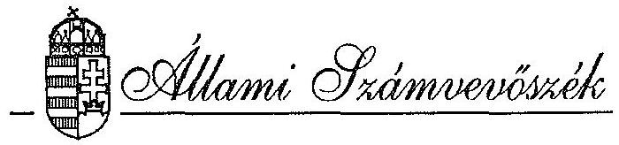
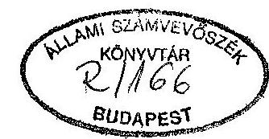
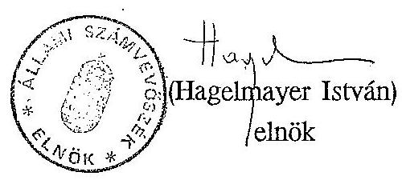
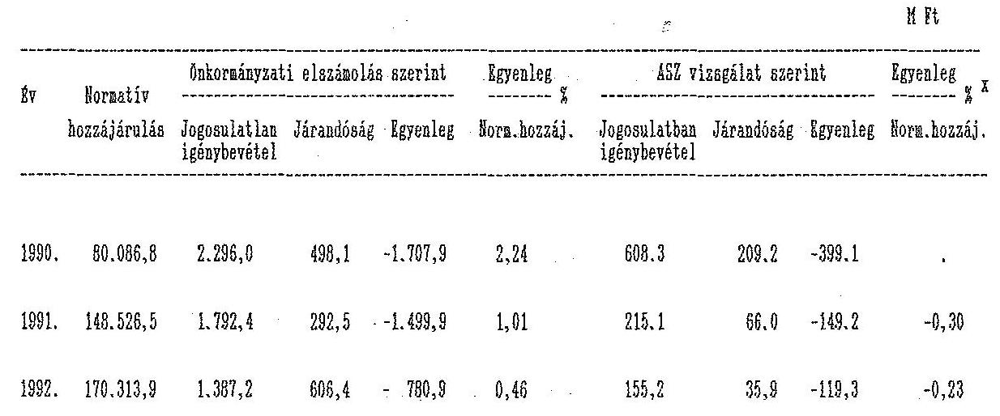
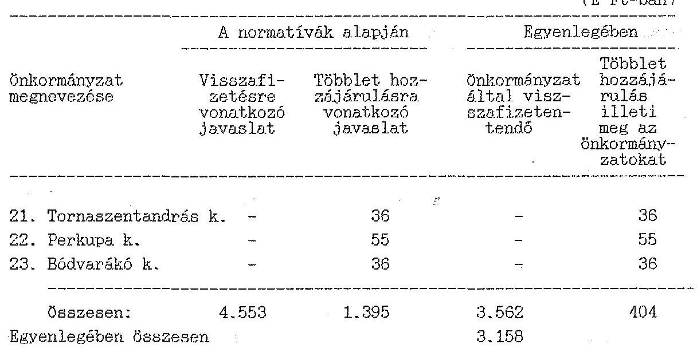
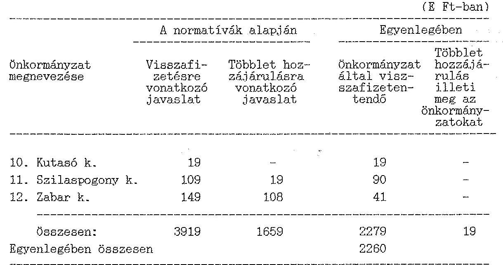
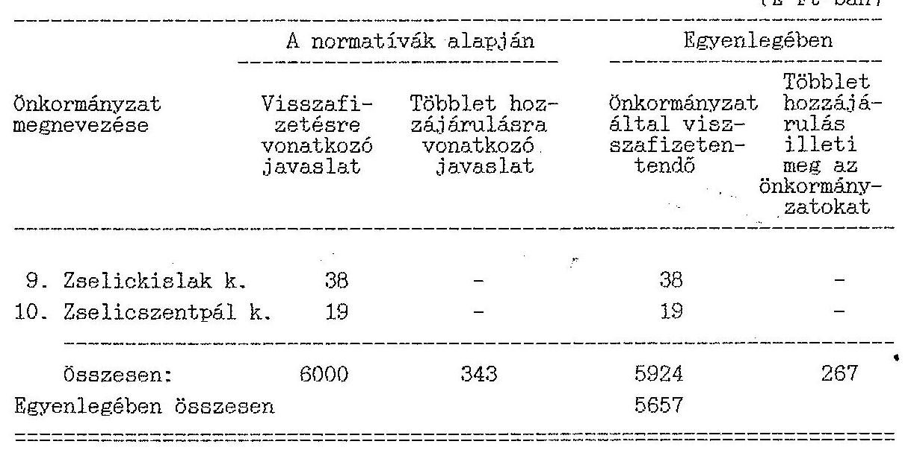
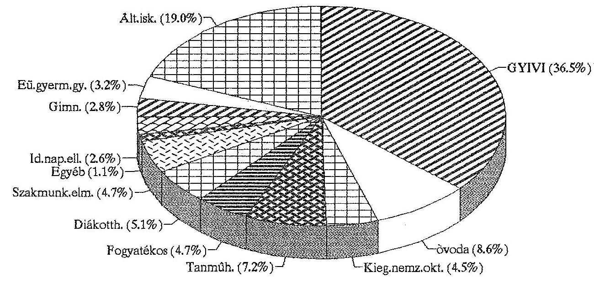

#  

## JELENTÉS

az önkormányzatok 1992. évi normatív állami hozzájárulás igénybevételének és elszámolásának ellenőrzési tapasztalatairól

---

# Állami Számvevőszék 

V-1005-65/1993
Témaszám:168

Az Állami Számvevőszék az 1989. évi XXXVIII. törvényben foglalt előírás alapján az 1992. évi költségvetés zárszámadásához kapcsolódóan alapvetően törvényességi, szabályszerűségi szempontok szerint ellenőrizte az önkormányzatok által 1992. évre igényelt és a Magyar Köztársaság 1992. évi költségvetéséről és az államháztartás vitelének szabályairól szóló 1991. évi XCI. törvényben, valamint az ezt módosító 1992. évi LXX. törvényben részükre felhasználási kötöttség nélkül jóváhagyott normatív állami hozzájárulások tervezésének, igénylésének, elszámolásának gyakorlatát. A vizsgálat kiterjedt a normatív hozzájárulási rendszer működésének egyéb kérdéseire is.

A vizsgálat célja annak megállapítása volt, hogy

- a tervezés során alkalmazott normatív hozzájárulások összhangban voltak-e a költségvetési törvény 3. számú mellékletében foglalt előírásokkal;
- az önkormányzatoknál és intézményeknél a tervezés alapját képező mutatószámok, adatok időben rendelkezésre álltak-e, és megfelelően dokumentálták-e a tényleges helyzetet;
- szabályszerű volt-e a normatív állami hozzájárulások igénybevétele és elszámolása; túllépés esetén időben teljesítették-e visszafizetési és kamatfizetési kötelezettségüket;
- a normatív állami hozzájárulások mennyiben nyújtottak fedezetet az önkormányzatok által ellátott feladatokra.

A tételes helyszíni ellenőrzés az ország önkormányzatainak 14,4 %-ára, 462 önkormányzatra (19 megyei és a fővárosi, 6 megyei jogú városi, 19 városi, 2 fővárosi kerületi, 35 nagy községi, 380 községi) és az önkormányzatok irányítása alá tartozó, a vizsgált mutatókkal érintett 757 intézményre terjedt ki. (L. 2. sz. melléklet.)

A vizsgált önkormányzatok együttesen 50.704,8 M Ft normatív hozzájárulásban részesültek, ami az ország valamennyi önkormányzata részére ily módon juttatott

---

állami hozzájárulás ( $170.313,9 \mathrm{M} \mathrm{Ft}$ ) $29,8 \%$-át tette ki. (L. 3-4. sz. melléklet.) Ezeken kívül a TÁKISZ-oknál áttekintettük 238 olyan önkormányzat elszámolását, amelyek kizárólag a lakosság száma alapján járó normatív hozzájárulásban részesültek.

Az Állami Számvevőszék korábbi azonos tárgyú vizsgálatainak tapasztalatait, következtetéseit, a hiányosságok felszámolását és a munka színvonalának emelését célzó javaslatait tartalmazó jelentéseit az Országgyűlés illetékes bizottságai kívül megküldtük mindazon szervezeteknek, amelyek a rendszer további korszerűsítése szempontjából érintettek, illetve javaslattételre, döntéselőkészítésre és döntéshozatalra jogosultak voltak.

Meg kell jegyezni, hogy adott év vizsgálati tapasztalatainak hasznosítására az azt követő évre vonatkozó költségvetési törvénynél technikai okokból már jóváhagyott törvény! - nem kerülhet sor. Ezért a javaslatok további egy éves csúszással válnak hasznosíthatóvá. (Pl. az 1991. évi tapasztalatokról készült jelentésben foglaltakat csak az 1993. évi költségvetési törvényhez lehetett felhasználni.)

Ajánlásaink, javaslataink kedvező fogadtatását jelzi, hogy az érintett tárcák azokat figyelembevéve a költségvetési törvények normatív állami hozzájárulásra vonatkozó részeit folyamatosan javították, az elszámolási feltételeket és több jogcím tartalmának értelmezését egyértelműbbé tették. Ezek, valamint az Állami Számvevőszék önkormányzatoknál végzett helyszíni ellenőrzéseinek helyi hasznosítása és az önkormányzatok gyakorlottabbá válása révén - annak ellenére, hogy az Állami Számvevőszék által feltárt jogosulatlanul igénybevett hozzájárulások egyik évben sem kerültek elvonásra - a normatív állami hozzájárulásokkal kapcsolatos törvényi szabályozás és a gyakorlati végrehajtás a későbbiekben ismertetett hiányosságok ellenére összességében fokozatosan javult.

Az önkormányzatok elszámolásai alapján (TÁKISZ országos adatok) a költségvetésbe visszafizetendő, az önkormányzatokat meg nem illető összeg 1990-1992 között 1.707,9 M Ft-ról 780,9 M Ft-ra csökkent, miközben a normatív hozzájárulásként kapott összeg 80 milliárd Ft-ról több mint kétszeresére, 170,3 milliárd Ft-ra nőtt. (L. 4. sz. melléklet)

Hasonló tendenciát mutatnak az Állami Számvevőszék vizsgálatának összesített adatai is. Amíg ugyanis 1991-ben az ellenőrzött 92 önkormányzatnál együttesen egyenlegében 149,2 M Ft-os visszafizetési kötelezettséget állapítottunk meg, addig 1992-ben 462 önkormányzatnál már csak 119,3 M Ft-ot.

---

A vizsgálatba vont önkormányzatok 1991-ben 48.924 M Ft, 1992-ben pedig 50.704,8 M Ft normatív hozzájárulásban részesültek. (L. 5. sz. melléklet)

Az 1992. évi vizsgálati tapasztalatok összegzésekor nem lehet figyelmen kívül hagyni azt sem, hogy több - a későbbiekben részletesen kifejtett - problémát az 1993. évi költségvetésre vonatkozó 1992. évi LXXX. törvény már megoldott. Így pl. a törvény 3. sz. melléklete szerint:

- az állami gondoskodásba vett gyermekek alap- és középfokú oktatásához kapcsolódó normatív hozzájárulásokat a GYIVI-t fenntartó önkormányzat veheti igénybe, téríti meg a feladatot ellátó önkormányzatnak legalább a kapcsolódó normatív hozzájárulásnak megfelelő szintig. A törvény a konkrét jogcímeknél is rögzíti, hogy az állami gondoskodásban részesülők után a feladatot ellátó önkormányzat az állami költségvetéstől normatív hozzájárulást nem igényelhet;
- az általános iskolai oktatás normatív hozzájárulásánál elhagyta a korábbi korlátozást (6-14 éves) és a nappali rendszerű oktatásban résztvevők után engedi meg az igénylést. Kiegészíti a levelező dolgozó, túlkoros (14-18 éves), általános iskolát nem végzettek oktatási terv szerinti képzésében résztvevőkkel a normatív hozzájárulás 1/3-ának igénybevételére való jogosultságot. Egyidejűleg konkrétan megjelöli a nyilvántartás alapokmányait is (pl. a Törzslapot, Tanuló nyilvántartó könyvet stb.);
- a gimnáziumi és szakiskolai oktatási normatív hozzájárulásnál rendezi, hogy az a Művelődési Minisztérium által engedélyezett szakiskolai, előkészítő, humán-szakmai képzésben résztvevők után is elszámolható;
- kiegészítő szabályként közli, hogy a korábban a szociális otthoni ellátásra vonatkozó gondozási nap tartalma alkalmazandó az egészségügyi gyermekotthoni és gyógypedagógiai intézeti, az idősek és fogyatékosok szállást biztosító intézményei, valamint az állami gondozásban részesülők ellátására is.

A helyszíni ellenőrzéseink tapasztalatai szerint még mindig maradtak megoldatlan kérdések, problémák, amelyek összességében - a már jelzett javuló tendencia ellenére - oda vezettek, hogy mind a tervezésben, mind az elszámolásban továbbra is számos hiányosság mutatkozott. Ezekről a következőkben adunk számot.

---

# I. Az irányító- és tervező munka 

Az elmúlt három évben az önkormányzatok részére juttatott állami támogatások, és ezen belül a normatív állami hozzájárulások belső struktúrája jelentős változáson ment keresztül. A személyi jövedelemadónak 1991-ben és 1992-ben már csak 50%-a illette meg az önkormányzatokat. Ezzel egyidejűleg azonban a normatív állami hozzájárulások összege több mint kétszeresére, 170 Md Ft-ra növekedett és ily módon az önkormányzatok bevételi forrásain belüli aránya 36%-ra emelkedett.

Változott a normatív állami hozzájárulások odaítélésének alapjául szolgáló mutatószámok köre is. Az önkormányzatok részére 1990-ben 12 jogcímen adott hozzájárulás nagyobb részét a népesség, vagy meghatározott korcsoport létszáma alapján osztották el, és a tényleges ellátás költségét csak egyes területeken (pl. gyermek- és ifjúságvédelem, szociális intézeti ellátás) vették figyelembe. A központi pénzek felosztása 1991-től - a szaktárcák és az önkormányzatok érdekszövetségeinek igényeit figyelembevéve - differenciáltabb lett. A normatív hozzájárulások jogcímeinek száma főleg az oktatási formák és intézményeik eltérő ráfordításaira alapozottan a korábbi 12-ről 24-re nőtt.

A korábbi sok szubjektív elemet tartalmazó alkumechanizmusra épülő támogatásokat normatív hozzájárulási rendszer váltotta fel.

Ennek jogcímei közül hat a települések lakosságszáma, nyolc a különböző, zömmel szociális intézményekben ellátottak, ugyancsak nyolc az oktatásban résztvevők, kettő pedig egyéb szempontok (községek általános támogatása, üdülőhelyi feladatok) alapján illette meg az önkormányzatokat.

A normatív állami hozzájárulások rendszerének kialakítása, a jogcímek számának, tartalmának, mértékének meghatározása az érintett tárcák szoros, a szakmai és a pénzügyi, a költségvetési szempontokat ütköztető, de a Magyar Köztársaság költségvetési helyzete által meghatározott kompromisszumok alapján történt. A szaktárcák (Művelődési és Közoktatási, valamint a Népjóléti Minisztérium) 1992-re a jogcímek számát tovább szerették volna növelni. Ezirányú javaslataikat - amelyeket a Pénzügy, valamint a Belügyminisztérium nem fogadott el - különböző reprezentatív felmérésekre, intézményektől bekért adatokra, önkormányzati információkra alapozott számításokkal igyekeztek alátámasztani.

A szaktárcák által végzett számítások azonban a tartalmukban, összetételükben eltérő, az intézmények korábbról örökölt adottságaiból, a személyi és tárgyi feltételek jelentős mértékű szóródásából adódó szakmai szolgáltatá-

---

si színvonal és a működési költségek közötti eltérések kiszűrése nélkül nem adtak megfelelő alátámasztást sem a tényleges költségek reális megítéléséhez, sem a további differenciálás indokolásához, illetve a normatív hozzájárulások mértékeinek évek közötti változtatásához.

A tárcák között a differenciálás szükségességének kérdésében továbbra is véleménykülönbség van. A normatív hozzájárulások összegeinek különböző mértékű - a lehetőségek határain belüli - emelésében viszont egyetértésre jutottak. Ezek ismeretében a Belügyminisztérium Önkormányzati Gazdasági Főosztálya 1991. szeptember 30-án kelt levelében tájékoztatta az önkormányzatokat az 1992. évi költségvetés tervezésével kapcsolatos feladatokról. Ebben előírta, hogy a tájékoztató figyelembevételével kell kialakítani az 1992. évi normatív állami hozzájárulások tervezett adatait. A tájékoztató III. sz. melléklete azonban - annak ellenére, hogy a korábbiaknál célirányosabb volt - továbbra sem szabályozta az egyes eltérően értelmezhető jogcímek tartalmát. Részben a tájékoztató készítőinek fel nem róható okokból (tárcák közötti egyeztetések, képviselői módosító indítványok) a tervezés alapjául szolgáló tájékoztatóban foglaltak és az 1992. évre vonatkozó költségvetési törvény 3. számú mellékletében rögzítettek több ponton tartalmukban és a normatív hozzájárulások összegének mértékében is eltértek egymástól. Így pl.

- a fiatalkorúak egészségügyi gyermekotthonában ellátottak számba vételénél a tájékoztató 18 éves korhatárt jelölt meg, a törvény viszont ezt a korhatárt megkötésekkel 24 éves korig kiterjesztette;
- a törvényben foglaltaktól eltérően a tájékoztató még nem korlátozta az alapfokú művészeti oktatás normatív hozzájárulásának igénybevételét, nem zárta ki annak tervezhetőségét a művészeti tagozatos általános iskolai tanulók után;
- a törvény a fogyatékos gyermekek oktatására tervezhető normatív hozzájárulás jogcímét kiterjesztette a gimnáziumi tanulókra is.

A normatív hozzájárulások közül többnek az u.n. "sarokszámait" előre csak becsléssel lehetett meghatározni, mivel azok egy része csak az elszámoláskor állhat rendelkezésre (pl. üdülőhelyi díj) más része pedig a tervkészítés utáni időpontok adatait igényelte (pl. a GYIVI adatait december 31-én). Mindezek magukban rejtették a tervezési hiba lehetőségét.

Tekintettel arra, hogy az 1992. évi költségvetésre vonatkozó törvény kilátásba helyezte az 5%-os mértéket meghaladó többletigénybevétel után a büntető kamat

---

fizetési kötelezettséget, az önkormányzatok kezdeményezésére év közben lehetőség nyílt a tervezett mutatók meghatározott szempontok szerinti korrekciójára.

A BM-PM 1992. április 28-i körlevelében foglaltak alapján az önkormányzatok a normatív hozzájárulásként igényelt összegekről, vagy azok egy részéről

- időközben véglegessé vált feladatelmaradások,
- hibás jogszabályértelmezésből eredő párhuzamos igénybejelentések,
- idegenforgalmi adó kivetésének elmaradása, vagy az adó nagymértékű csökkenése miatt
lemondhattak.
Annak ellenére azonban, hogy az 5%-os túllépés miatti büntetőkamat fizetési kötelezettséget az Államháztartási és az 1991. évi XCI. törvényből is ismerték, továbbá, hogy a BM Önkormányzati Gazdasági Főosztálya 1992. január 25-i körlevelében erre külön is felhívta a figyelmet, az önkormányzatoknak csak egy kisebb része (280 önkormányzat) élt a módosítás lehetőségével 342,1 millió Ft értékben, ami az 1992. évi normatív állami hozzájárulás teljes összegének 2 ezreléke! Ezt az Országgyűlés az 1992. évi LXX. - a Magyar Köztársaság 1992. évi pótköltségvetéséről szóló - törvényben hagyta jóvá.

Az önkormányzatok tervező munkája a korábbiakhoz képest a tárcáktól kapott segítség, a TÁKISZ-ok közreműködése, az ezzel foglalkozó munkatársak gyakorlottabbá válása, valamint az Állami Számvevőszék helyszíni ellenőrzéseinek hatására javult. Az előző évek ellenőrzései által érintett önkormányzatok (pl. megyei önkormányzatok) a korábbiaknál nagyobb gondot fordítottak az intézményektől származó és a tervezés alapját képező mutatószámok értelmezésére, egységesítésére, valóságtartalmuk dokumentálására. A kisebb, illetve az ellenőrzések által korábban nem érintett önkormányzatoknál azonban továbbra is tapasztalhatók voltak az előző években már feltárt tipikusnak
 tekinthető hibák. Így pl.

- tévesen ítélték meg az állami gondoskodásban részesülők számának változását;
- kétszeresen vették figyelembe a GYIVI-s gyermekeket;
- gondozási nap helyett az élelmezési napokkal számoltak;
- a férőhelynek megfelelő vagy annál magasabb létszámot tüntettek fel.

---

Ezek mellett néhány újabb hibaforrásként rögzíthető, hogy

- irreálisan tervezték az idegenforgalmi bevételeket, mert nem számolhattak reálisan a délszláv háború, a balatoni angolna pusztulás, a belföldi üdülési gyakorlatban bekövetkező változások hatásával, s nem vették figyelembe az adómorál romlását;
- az önkormányzatok intézményeinek számában és a velük szemben jelentkező követelményekben bekövetkező változásokra nem voltak figyelemmel (pl. egyházak részére átadott iskolák, vállalati tanműhelyek számának csökkenése, iskolai tanműhelyek iránti igények növekedése).

Részben a törvényismeret hiányára, illetve törvényértelmezési problémákra, részben a nem eléggé konkrét szakmai előírások és ellenőrzések elmaradására, részben a gyakorlatlanságra visszavezethetően még mindig gyakoriak az alul, illetve többségükben a túlfinanszírozást okozó tervezési hibák.

# II. Az igénybevétel alapjául szolgáló mutatószámrendszer, a nyilvántartások vezetése, az önkormányzatok adatszolgáltatása. 

A költségvetési törvény a normatív állami hozzájárulások tervezéséhez, igénybevételéhez és elszámolásához szükséges mutatószámrendszer megalapozására, a nyilvántartások vezetésére - a Gyermek és Ifjúságvédő Intézetek (GYIVI) kivételével - nem tartalmaz előírásokat.

Meg kell jegyezni, hogy a GYIVI által vezetendő nyilvántartás módja és tartalma sem került egyértelműen szabályozásra, amit néhány igazgató a társintézményekhez írt körlevéllel próbált - a tapasztalatok szerint váltakozó sikerrel - feloldani.

Az önkormányzatok többsége még mindig nem ismerte fel saját érdekét, s jó részük úgy vélte, elegendőek az intézményeknél ágazati szakmai szempontok szerint vezetett nyilvántartások. Ezért, valamint, mert központi utasítások sem készültek, ők sem szabályozták helyileg - néhány önkormányzat kivételével - az adatok szolgáltatásának, tartalmának, nyilvántartásának módját.

Az intézményeknél vezetett nyilvántartások alapvető funkciója a szakmai követelmények igényeinek megfelelő statisztikai adatok biztosítása. A normatív állami hozzájárulások tervezéséhez, igényléséhez és elszámolásához a statikus állapotot tükröző adatokon kívül további nyilvántartások

---

vezetése lett volna szükséges nem csak az intézményeknél, hanem az önkormányzatoknál is, mert enélkül ezirányú tevékenységük nem kellően megalapozott. Ilyen nyilvántartásokat azonban nem vezettek.

Az intézményektől az önkormányzatok többnyire telefonon, ahol korábban ellenőriztünk, ott néhány esetben írásban kérték be az adatokat. Többségük még a helyszíni ellenőrzések időpontjában sem rendelkezett az intézményi statisztikákkal. Így annak ellenére, hogy az adatok összevontan beépültek az önkormányzatok beszámolási pénzügyi információs rendszerébe, a jogszerűség megítéléséhez nélkülözhetetlen adatok - intézményenként az ellátottak száma, az intézmény fenntartója, a figyelembevett korrekciók - nem mindig állapíthatók meg.

Ellenőrzéseink hatására viszont a megyei önkormányzatoknál és néhány nagyobb város önkormányzatánál valamelyest javult az intézmények által közölt adatok felülvizsgálata.

#### Abstract

A Győr-Moson-Sopron, a Vas és a Csongrád megyei önkormányzatok teljeskörűen, a Fejér, a Hajdú-Bihar, a Heves, a Nógrád, a Tolna és a Zala megyei önkormányzat részlegesen ellenőrizte a bekért adatokat. Teljeskörű felülvizsgálatot végzett a kaposvári, és ellenőrzéseket folytatott a szentesi és makói városi önkormányzat. A községek körében csak elvétve fordult elő olyan pozitív gyakorlat, mint Zala megyében, ahol három községi önkormányzat az általuk közösen fenntartott intézményektől községenként részletezett adatokat kért.

Gondot okozott az is, hogy az önkormányzati költségvetés tervezésénél és a beszámoló készítése során alkalmazott feladat- és teljesítménymutatók nincsenek összhangban a normatív hozzájárulások alapját képező mutatókkal. Mivel az intézmények nem kaptak megfelelő tájékoztatást, ezért esetenként önhibájukon kívül is helytelen adatokat szolgáltattak. Az alapadatok ellenőrzésére még az önkormányzatok által végzett felügyeleti vizsgálatok keretében sem került sor, mert az nem épült be az ilyen ellenőrzések programjába.

Az intézményeknél lefolytatott helyszíni ellenőrzések tapasztalatai szerint a nem megfelelő, hiányos, vagy téves adatszolgáltatás zöme arra vezethető vissza, hogy az alapdokumentumokat nem, vagy hiányosan vezetik pl.

- az óvodai felvételnél nem rögzítik a felvétel dátumát, valamint hogy ki az előfelvételis, az iskolai felvételeknél pedig a beiratkozást követően nem mindig írták be az érkezés, illetve az eltávozás időpontját;

---

- a cigánytanulók differenciált foglalkoztatásánál nem volt dokumentálva részvételük, de problémát okozott nyilvántartásba vételük is, mivel személyiségi jogaik védelme ezt megnehezíti;
- az idősek klubját fenntartók különböző módszereket alkalmaztak a tagok nyilvántartására. Volt, ahol a beiratkozottak, volt, ahol a naponta megjelentek és volt, ahol az élelmezésben részesülők adatai alapján összesítettek. Több önkormányzatnál azonban nem volt alapító okirat és eseménynaplót sem vezettek.

A jelzett hiányosságokkal ugyan, de az önkormányzatok az erre a célra rendszeresített, az önkormányzati beszámoló részét képező 39. sz. úrlapon a megadott határidőre - egy-két kivételtől eltekintve - benyújtották elszámolásaikat a TÁKISZ-okhoz. Az adatokat a TÁKISZ-ok számszakilag egyeztették a költségvetési törvényben, illetve az annak módosítását jelentő 1992. évi LXX. törvényben szereplő adatokkal, de mélyebb, az önkormányzatok által közölt adatok valóságtartalmára vonatkozó elemzéseket, ellenőrzéseket, miután erre jogosultságuk nem volt, nem végeztek. Ily módon az országos összesítések is tartalmazzák az önkormányzatok által elkövetett hibákat. Az Állami Számvevőszék vizsgálata által érintett önkormányzatoknál is csak az intézményekre is kiterjedő tételes ellenőrzésekkel lehetett a reális helyzetet feltárni. A jelenlegi szabályozás azonban nem tette lehetővé a vizsgálat alapján az adatok utólagos helyesbítését, pontosítását, átvezetését.

# III. A normatív állami hozzájárulások igénybevételének és elszámolásának helyessége. 

A részletes ellenőrzéssel érintett 462 önkormányzat kapta a Magyar Köztársaság 1992. évi állami költségvetéséről szóló 1991. évi XCI. tv. alapján a helyi önkormányzatok részére jóváhagyott 170.314 M Ft-os normatív állami hozzájárulás 29,8 %-át, 50.704,8 M Ft-ot. Mindössze 208 önkormányzatnál (45 %-nál) volt rendben az elszámolás, 254 önkormányzatnál pedig (55 %) eltéréseket tárt fel a vizsgálat. (L. 7. sz. melléklet.)

Kedvező jelenségként értékelhető, hogy a magasabban képzett szakemberekkel kevésbé ellátott önkormányzatok előző évinél szélesebb körét érintő vizsgálat ellenére a nem megfelelő gyakorlatot folytató önkormányzatok aránya jelentősen csökkent. (1991-ben ezek aránya még meghaladta a 80 %-ot.)

---

Az ellenőrzés mindkét évben kiterjedt valamennyi megyei önkormányzatra. Az előző évben csak a Pest és Vas megyei önkormányzatnál nem volt eltérés, 1992-ben viszont már 7 megyei önkormányzatnál (Borsod, Csongrád, Fejér, Győr-Moson-Sopron, Heves, Vas, Zala) találtuk rendben az elszámolást, ami a központi iránymutatások egyértelműbbé válása és a gyakorlottság növelése mellett az Állami Számvevőszék ellenőrzései hatásának is betudható.

Továbbra is gyakori jelenség volt, hogy ugyanannál az önkormányzatnál a normatív hozzájárulás egyik jogcíme alapján túlfinanszírozást, a másiknál pedig alulfinanszírozást tártak fel a számvevők. Ez egyértelműen azt igazolja, hogy az önkormányzatoknál - még a szakmailag jobban felkészülteknél is - az egyes normatív hozzájárulások jogcímeinek tartalmát a még mindig hiányos, vagy nem kellően konkrét megfogalmazás miatt eltérően értelmezik, illetve a szükséges számításokat nem előírásszerűen végzik el. Nem lehet azonban szó nélkül elmenni azon jelenség mellett sem, hogy a "tévedések" nagyobb hányada 1992-ben is a költségvetés terhére történt. Az Állami Számvevőszék helyszíni ellenőrzései - amelyekre az önkormányzatok költségvetéssel szembeni elszámolásának lezárását követően került sor - a vizsgált körben összesen 136.204 E Ft jogosulatlan igénybevételt és 16.917 E Ft önkormányzatokat megillető hozzájárulási többletet tártak fel. Ezek egyenlege 119.287 E Ft, ami - az országgyűlés döntésétől függően - a költségvetésbe visszafizetendő. (Részletes adatok a 8-10. sz. mellékletben.)

Megjegyezzük, hogy a vizsgált körben a 12 megyei (25.244 E Ft) és a fővárosi önkormányzatnál (29.463 E Ft) tapasztalt eltérések együttes összege (54.707 E Ft) tette ki a 254 eltérést mutató önkormányzatnál összevontan feltárt, egyenlegében a költségvetésnek visszafizetendő eltérés 51 %-át, pedig a megyei önkormányzatok és a fővárosi önkormányzat is rendelkezett megfelelő létszámú és képzettségű hivatali apparátussal.

Az egyes jogcímek szerint elemezve az eltéréseket mind gyakoriságát, mind mértékét tekintve három jogcím (gyermek és ifjúságvédelem, általános iskola és az óvoda) együttesen adja a visszafizetendő összeg 64,2 %-át (76.552 E Ft-ot). Az eltérés mértéke öt jogcím esetében nem érte el az 1 %-ot, a többi pedig 1,0 % és 7,2 % között szóródik. Mindössze két jogcímnél fordult elő, hogy egyenlegében az önkormányzatoknál járandóság mutatkozott (szociális otthonok, alapfokú művészeti képzés).

Az óvodai és az általános iskolai normatív hozzájárulásnál tapasztaltuk a leggyakoribb eltéréseket. Az óvodait 153 vizsgált önkormányzatnál számolták helytelenül. Ebből 114 önkormányzat jogosulatlanul többet, 39 pedig

---

kevesebbet igényelt. Hasonló módon 154 önkormányzatnál mutatkozott eltérés az általános iskolai normatív hozzájárulás számításakor. Ebből 103 esetben többet, 51 esetben kevesebbet számoltak.

A TÁKISZ összesített (országos) adatai szerint az önkormányzatok a 170 Md Ft-os normatív hozzájárulásra vonatkozó elszámolásai 1.387.233 E Ft jogosulatlan igénybevételről és 606.350 E Ft járandóságról adnak számot, egyenlegében 780.882 E Ft-ról (0,46 %-os eltérésről).

A hibákat többnyire az okozta, hogy

- tervadatként nem a költségvetési törvény, illetve a pótköltségvetés előirányzatait tüntették fel;
- intézmény átadás-átvételnek nem minősülő mutatószám változásokat vették figyelembe évközi változásként;
- az adatokat "ezer forintban" közölték;
- számszaki összesítésnél tévedtek.

Az összességében javuló tendenciát támasztja alá az is, hogy az eltérések mértéke megyénként annak ellenére sem jelentős, hogy az önkormányzatok közül csak igen kevés végzett felülvizsgálatot és élt a módosítás lehetőségével.

Hajdú megyében 9 Md Ft-os normatív állami hozzájárulás mellett 136 E Ft (!), Jász-Nagykun-Szolnok megyében 7 Md Ft mellett 1 M Ft, Szabolcs-Szatmár-Bereg megyében 10 Md Ft mellett csupán 5 M Ft az eltérés. A legnagyobb mértékű az eltérés Veszprém megyében 6,7 Md mellett 73 M Ft (1,1 %). Az eltérés abszolút összege Borsod megyében a legnagyobb, 121 M Ft (0,9 %). (L. 4. sz. melléklet)

A normatív hozzájárulást kapott vizsgált önkormányzatok adatszolgáltatási kötelezettségüknek előírás szerint eleget tettek és döntő többségükben teljesítették az általuk kiszámított és indokoltnak tartott visszafizetési kötelezettségüket is. Néhány esetben azonban előfordult, hogy csak a vizsgálat ideje alatt került sor a visszafizetésre, illetve, hogy az ellenőrzés befejezéséig még nem fizették vissza a jogosulatlanul igényelt normatív hozzájárulási többletet. Ezek a szórványos esetek különböző speciális okokra vezethetők vissza.

Mátraterenyén félreértették a rendelkezéseket. Úgy gondolták, hogy amennyiben az eltérés nem haladja meg az 5 %-ot, akkor nincs tennivalójuk.

Harkány önkormányzata a menekültek befogadásával kapcsolatos költségeket mindig csak utólag kapta meg a Menekültügyi Hivataltól, ezért meg kellett előlegeznie a ténylegesen felmerülő kiadásokat, sőt saját forrásaiból is hozzájárult az ellátáshoz. Mivel tartalékai nem voltak, így fizetési kötelezettségének nem tudott eleget tenni.

---

Nem jellemezte ilyen fegyelmezettség a jogosulatlanul igénybevett normatív hozzájárulás után számítandó "büntető kamat" visszafizetését. Ennek részben az is oka, hogy a Pénzügyminisztérium által kiadott, a kamat kiszámítására vonatkozó útmutató és az annak alapjául szolgáló két törvény között nincs meg a kötelező összhang.

Az Államháztartási törvény 64. §-ának (2) bekezdése szerint akkor kell a költségvetési törvényben meghatározott mértékű kamatot fizetni, ha az önkormányzat által igénybevett normatív állami hozzájárulás legalább 5 %-kal meghaladja az őt megillető összeget. Az 1991. évi XCI. tv. 9. §-ának (4) bekezdése viszont úgy rendelkezik, hogy a kamatfizetésre
 akkor kötelezett az önkormányzat, ha az 5. §-ban foglaltak szerinti konkrét feladatmutatóhoz kapcsolódó állami hozzájárulást az őt megilletőnél 5%-kal nagyobb mértékben veszi igénybe. (Az egyesszám használata kizárja, hogy a jogcímek között kompenzálni lehessen!) A kiadott útmutató a két törvény közül az Államháztartási törvényben foglaltakra épül.

Az eltérő törvényi rendelkezések mellett feltárta a vizsgálat, hogy azok a kistelepülések, amelyek a népességszám alapján járó normatív hozzájárulásokon kívül csak 1-3 további ún. "feladatmutatóhoz kötött" jogcím alapján vehetnek igénybe állami hozzájárulást, hátrányos helyzetbe kerültek a nagyobb önkormányzatokkal szemben.

Ezeknél az önkormányzatoknál ugyanis egy-egy feladatmutatóhoz kapcsolódó létszám (iskola, óvoda stb.) viszonylag csekély, s emiatt 1-2 fő évközi mozgása arányaiban oly jelentős, hogy az önkormányzat büntető kamatot kénytelen fizetni. Itt a számítási mód szerinti jogcímek közötti kiegyenlítődésre kevés a lehetőség. A nagyobb önkormányzatoknál viszont a jogcímek nagyobb száma miatt a plusz-mínusz eltérések kiegyenlíthetik egymást, mentesítve az önkormányzatot a kamatfizetés alól.

A Tolna megyei Kisvejke a 19 fős létszámból 1 fő óvodás miatt a normatív hozzájárulás 19.000 Ft-os összege alapján 8.300 Ft kamatot is fizetni kellett.

A Veszprém megyei Szentbékkálai önkormányzat Idősek Klubjában a 15 fős tervhez képest a gondozottak tényleges létszáma 13 fő volt. A két fős eltérés 13%-ot tett ki, így 24.400 Ft kamatot kellett az önkormányzatnak fizetnie.

A Heves megyei Bátor községi önkormányzat 8 fővel számolt az óvodai normatív hozzájárulás tervezése során, ami végül 7 főre teljesült. Ezért kamatfizetési kötelezettsége keletkezett.

---

Ugyanakkor pl. a Veszprém megyei önkormányzatnak 32.496 ezer Ft, a Veszprém megyei jogú városnak pedig 26.376 ezer Ft jogosulatlan többlet igénybevétel után sem kellett kamatot fizetni, mivel az eltérés a számítási mód miatt 5% alattinak minősült.

Alsóörs önkormányzata sajátos módon figyelmen kívül hagyva, hogy a jogosulatlan igénybevétel január 1-től már a pénzeszköz lekötését jelenti, az előírástól eltérően, a folyósítási ütem alapján számította ki és fizette be az ily módon általa csökkentett büntető kamatot.

Továbbra is az egyik legnagyobb gondot okozza a gyermek- és ifjúságvédelemhez való állami normatív hozzájárulás finanszírozása, elszámolása. A tapasztalatok azt mutatják, hogy a GYIVI-vel kapcsolatos "szabályozás" túlságosan bonyolult, áttekinthetetlen, és indokolatlanul nehézkessé, a korábbiaknál költségesebbé tette az állami gondoskodásban részesülők finanszírozását. Fő hibája, hogy nem alkalmas a jogszerű intézkedések biztosítására, a kettős finanszírozás kiszűrésére, a rendelkezésre álló állami pénzeszközök racionális felhasználására.

Ez a normatív állami hozzájárulás nevében is egyértelműen állami feladat finanszírozását oldja meg, mivel állami gondoskodásban részesülő gyermekek ellátására szolgál. Ezért indokolatlan, hogy az önkormányzatokat a finanszírozás különböző pontjain bevonják. A vizsgálati tapasztalatok ugyanis azt mutatják, hogy a többszörös áttétel, az önkormányzatok közötti nem egyértelműen tisztázott igénylési, pénzátutalási gyakorlat, a létszámmozgást nem mindig követő nyilvántartások hiányosságai, az önkormányzatok, a GYIVI és a társintézmények közötti információáramlás nehézkessége, a törvény különböző módon való értelmezése ill. egyes esetekben azok joghézagai miatt nem csak a tervezésnél, hanem az igénylésnél is előfordulnak párhuzamos, dupla igénybevételek. Több esetben viszont nem, vagy csak jelentős késéssel jutott el a normatív hozzájárulás összege ahhoz az önkormányzathoz, amelyik a feladatot ténylegesen ellátta.

Külön ki kell emelni az átutalások helytelen gyakorlatát. A költségvetési törvény ugyanis - miközben felhasználási kötöttség nélkül adja az önkormányzatoknak a normatív hozzájárulást - ennél a jogcímnél tételesen előírja, hogy az oktatási és óvodai feladatokkal kapcsolatos intézményi ellátás esetén a GYIVI-t fenntartó önkormányzat át kell, hogy adja legalább az erre igényelt, a költségvetési törvényben meghatározott normatív hozzájárulásnak megfelelő összeget. Ezt az összeget tehát konkrétan meghatározott célra kapják, ami nem csoportosítható át más területre.

---

Ezen túlmenően problémákat okozott az is, hogy

- az egyes önkormányzatok eltérő módon vették számba az ellátottakat, mert a statisztikai és a normatív hozzájárulási jogcímek szerinti számbavétel között nem volt összhang;
- a törvény nem határozta meg egyértelműen a GYIVI-nél alkalmazandó gondozási nap fogalmát, a létszámnyilvántartás szabályait, a szökésben lévő gyermekek napjai duplázódásának kiszűrését, a tartós szabadságon lévők számbavételét;
- az átlaglétszámok kiszámításánál 1992-ben a tényleges 366 nappal számoltak a törvényben előírt 365 nappal szemben;
- nincs megnyugtatóan rendezve az "egészségügyi beutalt" csecsemőotthoni elhelyezésének finanszírozása, ha utólag nem veszik állami gondozásba;
- az állami gondozottak után a települési önkormányzatok is igénybevették az oktatási jogcímen járó normatív hozzájárulást.

A költségvetési törvény 3. sz. mellékletének f/pontja az állami gondoskodásban részesülők közül a nevelő intézetekben és a büntetésvégrehajtási intézetekben elhelyezettek után nem engedi figyelembe venni azok gondozási napjait. Nem tesz a törvény említést a különleges gyermekotthonokról (Debrecen, Esztergom, Kalocsa, Zalaegerszeg), amelyekről az 1/1991. (I. 31.) NM rendelet intézkedik.

A Veszprém megyei önkormányzat - abból kiindulva, hogy a törvény melléklete e sajátos státuszú intézményt nem nevesítette, az ilyen intézetekben elhelyezett gyermekek után is elszámolta a normatív hozzájárulást, amit az Állami Számvevőszék nem fogadott el. A PM Önkormányzati, Területfejlesztési Főosztályának "szakmai véleménye" a kettős finanszírozást elismerve jelzi, hogy annak oka "joghézag", amit érdemes mérlegelni.

Hasonló gond vetődött fel a nem önkormányzati intézményben, a Battonyai SOS gyermekfaluban elhelyezett állami gondozottakkal kapcsolatban is, akik után a megyei önkormányzat annak ellenére leigényelte a normatív állami hozzájárulás összegét, hogy a gyermekfalut egy alapítvány finanszírozta. A hozzájárulásból a gyermekfalu nem részesült.

A PM és a BM illetékes főosztályainak az 1994. évi költségvetési tervezéshez 1993. május 14-én kiadott levele egyértelművé teszi, hogy - véleményük szerint - a gyermekfaluban elhelyezett állami gondozott gyermekek létszám megállapításánál az ott töltött idő nem számítható be a gondozási napokba.

---

Az irányításban érdekelt tárcák a törvényi megfogalmazások hiányosságainak kiszűrésére az Állami Számvevőszék ellenőrzését követően az egyedi ügyekben hozzájuk forduló önkormányzatok részére írásos "szakmai véleményeket" adtak ki, jelezve, hogy azok nem kötelező erejűek. Ezt azért rögzítették, mert a leíratokkal, állásfoglalásokkal való irányítást az Alkotmánybíróság 60/1992. (XI.17.) AB határozata alkotmányellenesnek minősítette. Ezek a "szakmai vélemények" az adott tárca utólagos álláspontját jelentik, amelyek kiadására nem került volna sor, ha a költségvetési törvény mellékletében konkrét hivatkozással rögzítették volna, hogy mi a számítás alapjául szolgáló alapdokumentum.

Az Idősek Klubját fenntartó önkormányzatoknak pl. a 10/1986 (IX.24) EüM számú rendelet 7. sz. mellékletének 2. oszlopában szereplő adatot (tagok létszáma összesen) kellett volna alapul venni. Mivel ezt nem írták le ilyen egyértelműen, ezért az önkormányzatok ettől eltérően esetenként a megjelent tagok, vagy az étkezők száma alapján számoltak. A "szakmai vélemény" szerint a törvényi hivatkozás azért "egyértelmű", mert nem hivatkozik e két másik oszlop adatára.

Megjegyezzük, hogy a "tagok létszáma összesen" használata mutatószámként nem szerencsés, mert visszaélésekre ad lehetőséget. (Pl. előfordult, hogy korábban meghalt személyt még hosszabb időszakon keresztül figyelembe vettek, illetve a településről elköltözöttet is beszámítottak.)

A Művelődési és Közoktatási Minisztérium - kérésünkre adott - szakmai véleménye szerint a tanügyi nyilvántartások vezetését érvényes jogszabály írja elő (16/1987 (VIII. 12.) MM. sz. rendelet). Erre a jogszabályra azonban nem utalt a költségvetési törvény hivatkozott melléklete.

A költségvetési törvény 3. sz. melléklete nem határozta meg egyértelműen az externátusi ellátásra jogosultak körét. Ennek következtében fordulhatott elő, hogy pl. Szarvason a helyben lakók gyermekeinek egésznapos ellátását is externátusi ellátásnak tekintették és így igényelték a normatív hozzájárulást.

A Művelődési és Közoktatási Minisztérium Közoktatási Szakmai Irányítási Főosztályának ezzel kapcsolatos 2044/1993. KSzI számú szakmai véleménye miközben megfogalmazza az externátus fogalmát, tartalmát, egyidejűleg jogszabályi felhatalmazás nélkül - közli, hogy "Egyedi elbírálás alapján indokolt esetben azonban externátusi ellátást biztosítani lehet olyan tanulónak is, aki a lakóhelyén lévő, vagy lakóhelyről bejárással könnyen megközelíthető iskolákban tanul".

A helytelen gyakorlat kiszűrését a szaktárca a PM-mel közösen az 1994. évi költségvetési törvényben úgy tervezi megvalósítani, hogy kímondja; "csak

---

azok után igényelhető ez a normatív hozzájárulás, akik szállásköltségét a fenntartó fedezi".

A vázolt gyakorlatnak további problémája, hogy az "egyedi ügyek" több önkormányzatot is érintettek. Amennyiben a "szakmai vélemény" célja az egységes gyakorlat kialakításának elősegítése, akkor minden olyan önkormányzatnak meg kellett volna küldeni, amelyik a téma szerint érintett intézményt tart fenn.

# IV. A normatív állami hozzájárulások rendszerének az önkormányzatok működésére gyakorolt hatása. 

A normatív állami hozzájárulások mértékei magukon viselték annak következményeit, hogy az 1989. évi induláskor megfelelő, kellően megalapozott részletes elemzéseken nyugvó modellszámítások nélkül a költségvetés helyzete által meghatározottan kerültek kialakításra. Az elmúlt időszakban az önkormányzatok állami támogatásának rendszerében bekövetkezett változások (SZJA-ból való részesedés csökkenése, normatív hozzájárulások növekedése, cél-címzett támogatási kör bővülése) során a normatív hozzájárulások mértékei az említett tárcák szoros együttműködése révén, de az "erőviszonyok" alapján alakultak ki.(L. 6. sz. melléklet)

Három normatív hozzájárulás összege (községek általános támogatása, üdülőhelyi támogatás, nemzetiségi, etnikai óvodai ellátás) az előző évivel azonos mértékben került megállapításra. Az átlagos növekedést jelentősen meghaladó a kommunális tevékenységre szolgáló normatív hozzájárulás (1400 Ft/fő-ről 3000 Ft/fő-re) egyidejűleg azonban megszűnt az állandó lakosok után korábban a települések általános támogatása jogcímén elszámolható 2000 Ft/fő hozzájárulás, lényegében tehát itt 400 Ft/fő csökkenés mutatkozik. Az idősek és fogyatékosok szállást biztosító intézeti ellátásának normatív hozzájárulása 100%-kal (40.000 Ft/fő-ről 80.000 Ft/fő-re) emelkedett.

Ugyancsak 100%-kal emelkedett a helyi közművelődési feladatok normatív hozzájárulásának összege, de ez csupán 100 Ft-ról 200 Ft-ra való növekedést jelentett. A többi jogcímnél a mértékek 3-27% közötti szóródással növekedtek.

Megváltozott a megyei és fővárosi önkormányzatok igazgatási és területi közművelődési feladatainak ellátásához rendelt normatív hozzájárulás számítási módja. Míg korábban 50 millió Ft-ot kaptak önkormányzatonként e célra létszámuktól függetlenül, most az illetékességi területükön élők létszáma után 400 Ft/fő összeget vehetnek figyelembe. Ez túl azon, hogy abszolút

---

számban is lényegesen nagyobb mértékű a korábbinál, annál igazságosabb elosztást is jelent.

Megváltozott a színházak - korábban az Állami Számvevőszék által is bírált - támogatási rendje, odaítélésének alapja. A nézőszám helyett a bázis időszak költségeinek meghatározott hányada illeti meg az önkormányzatokat. (Fővárosban 50%, vidéken 60%.) (L. 6. sz. melléklet.)

Az intézmények eltérő szakmai és gazdasági adottságai miatt igen nagymértékű szóródás tapasztalható a normatív hozzájárulások összegei és a feladatok tényleges ellátásához szükséges költségek fedezeti tartalma között. A felhasználási kötöttség nélkül juttatott normatív állami hozzájárulások pozitívuma - azon túl, hogy a korábbi alku mechanizmust megszüntette -, hogy országos átlagban lehetőséget nyújt a helyi szükségleteknek megfelelő kiegyenlítődésre. Ez alatt az értendő, hogy minden önkormányzat saját belátása szerint rangsorolhat és az általa az adott időszakban fontosabbnak tartott feladatok finanszírozásához nyújthat nagyobb hozzájárulást.

A fővárostól, 19 megyei, 24 városi, 33 nagyközségi, 124 községi önkormányzattól bekért adatok összesítése azt mutatja, hogy az 1 főre jutó tényleges ráfordítások szinte mindenütt meghaladják a normatív hozzájárulások összegét. (L. 11. sz. melléklet.) Az önkormányzatok tehát a népességszám alapján kapott normatív hozzájárulásokból, illetve saját egyéb
 bevételeikből csoportosítottak át a feladatmutatókhoz kötött normatív hozzájárulások kiegészítésére, ha azt szükségesnek tartották.

Az állami szerepvállalás reális megítélését nehezíti, hogy az egyes település-típusokhoz tartozó önkormányzatok adott feladatok fontosságát eltérően ítélték meg, továbbá, hogy az egyes normatívák mértéke a tárcák közötti viták eredményének függvényében változik. Részben ebből adódik, hogy az óvodai ellátásnál csupán 31%-os, a GYIVI-nél pedig 96%-os a "fedezeti arány". Az óvodai ellátásnál azonban nem szabad figyelmen kívül hagyni, hogy egyes önkormányzatok a helyi igényeket akkor is ki akarják elégíteni, amikor a kapacitás kihasználatlanság miatt az csak jelentős többletráfordítással lehetséges.

Baranya megye kistelepülésein az 1 óvodás ellátásának költsége 40-98 E Ft között szóródik. Ibafán pl. az 1991. évi 64 E Ft-tal szemben 1992-ben 139 E Ft-ba került egy óvodás ellátása, mert a 8 óvodást 3 alkalmazott látja el.

Az inflációs hatások miatt az önkormányzatok elsősorban a meglévő intézményhálózat működőképességének fenntartására törekedtek. A működési színvonal emeléséhez azonban nem rendelkeztek forrásokkal. Ez is oka volt annak, hogy az előző évinél nagyobb mértékben került sor az intézmények racionálisabb kihasználására, a gazdaságosság javítására irányuló intézkedések meghozatalára, de a külső kényszerítő hatások (pl. normatív hozzájárulás megvonása, vagy a normatív hozzájárulás mértékének változatlanul hagyása) ellenére ez még ma sem általános jelenség.

A jelenlegi gyakorlatra az jellemző, hogy

- megszüntették a nem megfelelően kihasznált intézményeket (bölcsődéket, idősek klubját), vagy nagyobb településeken az azonos célú intézményeket (pl. óvodákat) összevonták, az iskolákban a napközis csoportok számát csökkentették;
- több helyen megkezdték a szakfeladatokat ellátó intézmények "átvilágítását", a hivatali apparátus, az intézmények dolgozóinak racionálisabb foglalkoztatását;

Ezzel egyidejűleg ellentétes tendenciák is tapasztalhatók. Az önállóságra való törekvés jegyében a gazdaságossági követelményeket figyelmen kívül hagyva szakmai és főleg pénzügyi oldalról kifogásolható módon - egyre gyakoribb a közös fenntartású intézmények megszüntetése és helyettük településenként egy-egy azonos célú intézmény létesítése, ami nemzetgazdasági szinten indokolatlan költségnövekedéssel jár.

Baranya megyében pl. az alsó tagozatos iskolai oktatást 1992-ben kezdő vagy az 1993. évi kezdést előkészítő önkormányzatok száma 26 volt.

A kialakult helyzethez hozzájárult az is, hogy számos kérdést pl. a közös fenntartású intézmények finanszírozását a törvény az önkormányzatok egymás közötti megállapodásával kívánt rendezni. Az önkormányzatoknál azonban többnyire az együttműködési készség hiányával, zavaraival találkoztak a számvevők. Ebben az is szerepet játszott, hogy a közös üzemeltetésű intézmények tényleges költségeit, mivel azok meghaladják a normatív hozzájárulás mértékét, nem akarták az önkormányzatok megtéríteni, sőt egyes esetekben még a normatív hozzájárulás összegét sem utalták át teljes egészében, az intézményt működtető önkormányzatnak.

# V. Következtetések, javaslatok 

A normatív állami hozzájárulás 1992-ben az önkormányzatok támogatási rendszerében kiemelt szerepet töltött be és döntő mértékben határozta meg az önkormányzatok feladatellátásának finanszírozását. A normatív hozzájárulások jogcímeinek kialakításában, mértékének meghatározásában érintett tárcák egymás közti kapcsolatai javulásának, az igénylést, felhasználást végző önkormányzatok témakörrel foglalkozó munkatársainak gyakorlottabbá válásának és az ellenőrzések együttes hatására - a még meglévő, az előzőekben és a függelékben, példatárban részletesen ismertetett problémák ellenére - a rendszer működése hatékonyabbá vált, a hibaszázalék (plusz és mínusz eltérések együttes összege) három év alatt országos méretekben harmadára csökkent.

Az Államháztartási törvényben nem került meghatározásra az önkormányzatok feladataiban az állami szerepvállalás mértéke. Erre a konkrét normatív hozzájárulás összegei utalnak ugyan, de egyik évről a másikra való, nagy szóródás melletti (0-114%) változtatásuk mögött nem lelhetők fel a részletes, széles kört felölelő, a valós és indokolt hosszabb távú ráfordítást tartalmazó megalapozott költségszámítások. Ennek következménye, hogy a tényleges ráfordításoknak a normatív hozzájárulások jelentős szóródással 31-96%-át fedezik.
A kétségtelen javulás ellenére az önkormányzatok 1992. évi elszámolását követő helyszíni ellenőrzéseink során - a normatívák szerinti részletezésben - (ahol önkormányzatonként az eltérések nem kompenzálják egymást) 155.956 EFt jogosulatlan igénybevételt és 36.669 EFt jogos további hozzájárulást állapítottak meg számvevőink, amelynek egyenlege 119.287 E Ft költségvetést megillető visszafizetési kötelezettség.

Ez alapvetően annak következménye, hogy

- egyes normatív hozzájárulások jogcímeinek fogalma és tartalma az illetékes szaktárcák részéről a törvény mellékletében még nem minden esetben került egyértelműen meghatározásra, és az igénylésük alapját képező nyilvántartások vezetésére sem adtak ki megfelelő útmutatást;
- az önkormányzatok többsége továbbra sem fordít kellő figyelmet a normatív hozzájárulások tervezésének, igénylésének megalapozását szolgáló mutatószámok intézmények általi adatszolgáltatásainak helyességére, az adatok ellenőrzésére;

- a kisebb települési önkormányzatoknál még mindig általános jelenség, hogy a törvényt nem ismerik, illetve annak szövegét félreértelmezik és nincsenek tisztában az elszámolás módszereivel.

Nem segítette a hibák kiküszöbölését az sem, hogy az Országgyűlés az elmúlt két évben az Állami Számvevőszék által feltárt jogosulatlan igénybevételt nem vonatta el az önkormányzatoktól és így az ellenőrzések preventív jellege nem érvényesülhetett.

A Magyar Köztársaság 1993. évi költségvetéséről szóló 1992. évi LXXX. törvényben - a korábbi ajánlásaink figyelembevételével - végrehajtott módosítások megfelelően szolgálják a rendszer hatékonyabb működését. Egyetértünk "az államháztartás alrendszereinek tervezési-beszámolási és adatszolgáltatási kötelezettségéről, valamint a központi költségvetés végrehajtásával kapcsolatos egyes kérdések"-ről szóló kormányrendelet tervezet 23. § (2) bekezdésében foglaltakkal, miszerint "A helyi önkormányzat az ÁHT 72. §-ában foglalt határidőt követő 30 napon belül a feladatmutató változását közölve lemondhat a normatív állami hozzájárulásról". Indokoltnak tartjuk ezeken túlmenően, hogy

- a pénzügyminiszter és a belügyminiszter tegyen előterjesztést az Országgyűlésnek, hogy az törvényi szinten hozzon döntést az elszámolások számvevőszéki megállapításokkal való korrigálására. Kötelezze az önkormányzatokat és a Kormányt a 8. és 8/A. sz. mellékletben foglalt konkrét pénzügyi elszámolások meghatározott időn belüli teljesítésére, a feltárt eltérések rendezésére;
- a pénzügyminiszter és a belügyminiszter az érintett miniszterek bevonásával korszerűsítse és az 1994. évre szóló költségvetési törvényben egyértelműen fogalmaztassa meg a még értelmezési vitára alapot adó normatívák fogalmát, tartalmát és nyilvántartásuk módját. Teremtsék meg a szakmai statisztikák és az önkormányzati és a költségvetési-pénzügyi információs rendszer összhangját. Mindezeket figyelembe véve a Kormány rendeletben szabályozza az egységes nyilvántartás módját, az önkormányzat és intézményei közötti kötelező adatáramlás körét, és annak gyakoriságát;
- a pénzügyminiszter, - a belügyminiszter és a népjóléti miniszter bevonásával - tekintse át a GYIVI jelenlegi működését és annak problémáit. A jelentésünkben foglaltakat figyelembevéve - egyetértésük esetén - tegyék meg

a szükséges intézkedéseket, hogy a feladatok a Népjóléti Minisztérium hatáskörébe kerüljenek;

- a Pénzügyminiszter fontolja meg és egyetértése esetén javasolja az Országgyűlésnek, hogy a csak 1-3 feladatmutatóhoz kötött normatív hozzájárulással rendelkező kisebb önkormányzatoknál az 5%-os mértéket meghaladó többlet igénybevétel után csak az alapkamatot térítsék meg.

Budapest, 1993. augusztus

A V-1005-65/1993. sz. vizsgálati jelentés

# mellékletei: 

1. sz. melléklet: - A vizsgálatban részt vevők
2. sz. melléklet: - Összesítés a vizsgált önkormányzatokról
3. sz. melléklet: - Összesítő a vizsgált önkormányzatok megyénkénti állami hozzájárulásáról
3/A. sz. melléklet: - Vizsgált önkormányzatok megyénkénti felsorolása és az állami normatív hozzájárulás mértéke
4. sz. melléklet: - 1992. évi megállapított normatív állami hozzájárulás megyénkénti részletezése (TAKISZ adatok alapján)
5. sz. melléklet: - Az állami normatív hozzájárulás önkormányzati elszámolásának eltérései 1990 - 1992. között
6. sz. melléklet: - A helyi önkormányzatok normatív állami hozzájárulásának jogcímei és összegei
7. sz. melléklet: - Kimutatás az 1992. évi normatív hozzájárulás során vizsgált önkormányzatok és elszámolási eltérést mutató önkormányzatok számának alakulásáról
8. sz. melléklet: - Kimutatás az 1992. évi normatív állami hozzájárulás igénybevételénél tapasztalt eltérésekről vizsgált önkormányzatonként
8/A. sz.melléklet: - Kimutatás az 1992. évi normatív állami hozzájárulás igénybevételénél megyénként tapasztalt eltérésekről
9. sz. melléklet: - Kimutatás az 1992. évi normatív hozzájárulás jogcímenkénti igénybevételénél tapasztalt összes (±) eltérésről
10. sz. melléklet: - Kimutatás az 1992. évi normatív állami hozzájárulás jogcímenkénti igénybevételénél tapasztalt eltérésekről (megyénként)
10/A. sz. melléklet: - Kimutatás az 1992. évi normatív állami hozzájárulás jogcímenkénti igénybevételénél tapasztalt eltérésekről
11. sz. melléklet: - Tájékoztató adatok a vizsgált önkormányzatok által igénybe vehető normatív állami hozzájárulások tényleges ráfordításokhoz viszonyított arányáról (%)

Függelék
Példatár
Összesen: 91 oldal

A vizsgálatot vezette:

A vizsgálat szervezésében és az összefoglaló jelentés összeállításában részt vett:

A helyszíni vizsgálatot végezte:
Központi szerveknél:

Baranya megye:

Bács-Kiskun megye:

Békés megye:

Borsod-Abaúj-Zemplén megye:

Csongrád megye:

Fejér megye:

Győr-Moson-Sopron megye:

Dr. Saly Ferenc régióvezető főtanácsos
Dr. Nagy Ágnes számvevő tanácsos
Dr. Spilák Antal számvevő tanácsos

Dr. Saly Ferenc régióvezető főtanácsos
Dr. Nagy Ágnes számvevő tanácsos
Dr. Spilák Antal számvevő tanácsos
Száraz György számvevő
Maczekó Károly számvevő tanácsos
Dr. Nagy Ágnes számvevő tanácsos
Domján Jenő számvevő tanácsos
Tréfás Antal számvevő tanácsos

Baji Ferencné számvevő tanácsos
Galuska Józsefné számvevő
Dankó Géza számvevő tanácsos
Dr. Takács András számvevő tanácsos
Csiszárné dr. Kosik Mária számvevő tan.
Dr. Ótott Lajos számvevő tanácsos
Horváth József számvevő tanácsos
Huberné Kuncsik Zsuzsanna számvevő
Kalmár István számvevő tanácsos
Dr. Szeli Tibor számvevő tanácsos

Hajdú-Bihar megye:

Heves megye:

Jász-Nagykun-Szolnok megye:

Komárom-Esztergom megye:
Nógrád megye:

Pest megye:

Somogy megye:

Szabolcs-Szatmár-Bereg megye:

Tolna megye:

Vas megye:

Veszprém megye:

Zala megye:

Fővárosi és Kerületi
Önkormányzatok:

Molnár Mária számvevő
Szilágyi Sándor számvevő tanácsos
Maróti Sándor számvevő tanácsos
Nagy Sándorné számvevő tanácsos
Csomán Mihály számvevő tanácsos
Dr. Mezei Imréné számvevő

Ambrus Lajos számvevő
Huszár Sándorné számvevő
Zeke József számvevő
Nagy Józsefné számvevő tanácsos
Dr. Telkes Imre számvevő
Dr. Hegedűs György számvevő tanácsos
Dr. Szigeti István számvevő
László András számvevő tanácsos
Szűcs Zoltán számvevő
Csekei Gyula számvevő tanácsos
Major Lászlóné számvevő
Horváth János számvevő tanácsos
Kántor Ilona számvevő
Komlósiné Bogár Éva számvevő
Dr.Vasváriné dr.Rózsa Anikó számv.tan.
Gerencsér Ferenc számvevő
Köcse Istvánné számvevő

Gordos László számvevő tanácsos
Dr. Magyar György számvevő
Turnheimné Lakos Zsuzsa számvevő

2. az. melléklete

Összesítés
a vizsgált önkormányzatokról

| Megnevezés | Megye és   főváros | Város és   kerület | Nagy-   község | Község | Vizsgált önkorm. összesen | Vizsgált intézmények összesen |
| :--: | :--: | :--: | :--: | :--: | :--: | :--: |
| Baranya megye | 1 | 1 | 3 | 33 | 38 | 63 |
| Bács-Kiskun megye | 1 | 1 | 3 | 32 | 37 | 56 |
| Békés megye | 1 | 2 | 2 | 3 | 8 | 33 |
| Borsod-Abaúj-Zemplén megye | 1 | 1 | 2 | 52 | 56 | 7 |
| Csongrád megye | 1 | 2 | 1 | 7 | 11 | 37 |
| Fejér megye | 1 | 1 | 2 | 11 | 15 | 44 |
| Győr-Moson-Sopron megye | 1 | 1 | 2 | 18 | 22 | 19 |
| Hajdú-Bihar megye | 1 | 1 | 3 | 7 | 12 | 35 |
| Heves megye | 1 | 2 | 2 | 9 | 14 | 35 |
| Jász-Nagykun-Szolnok megye | 1 | 2 | 1 | 10 | 14 | 53 |
| Komárom-Esztergom megye | 1 | 3 | 2 | 11 | 17 | 79 |
| Nógrád megye | 1 | 1 | 1 | 14 | 17 | 49 |
| Pest megye | 1 | 1 | 3 | 12 | 17 | 3 |
| Somogy megye | 1 | 1 | 1 | 25 | 28 | 30 |
| Szabolcs-Szatmár-Bereg megye | 1 | 1 | 1 | 

 | 15 | 18 | 36 |
| Tolna megye | 1 | 1 | 1 | 11 | 14 | 10 |
| Vas megye | 1 | 1 | 2 | 31 | 35 | 33 |
| Veszprém megye | 1 | 1 | 2 | 27 | 31 | 67 |
| Zala megye | 1 | 1 | 1 | 52 | 55 | 56 |
| Főváros | 1 | 2 | - | - | 3 | 12 |
| Összesen: | 20 | 27 | 35 | 380 | 462 | 757 |

---

# 3. sz. melléklete 

## Összesítő

## a vizsgált önkormányzatok megyénkénti állami normatív hozzájárulásáról

K Ft-ban

Törvény szerinti eredeti hozzájár.
Megnevezés
1991. évi XCI. tv., valamint az
1992. évi LXX. tv. sz.mód.hozzájár.

Budapest
$16.108.393.84$
Baranya megye
$1.634.091,18$
Bács-Kiskun megye
$1.678.052,60$
Békés megye
$1.318.302.40$
Borsod-Abaúj-Zemplén megye
$2.192.166,87$
Csongrád megye
$1.857.254.02$
Fejér megye
$1.303.034,20$
Győr-Moson-Sopron megye
$912.653,92$
Hajdú-Bihar megye
$1.297.910,80$
Heves megye
$2.182.459,24$
Jász-Nagykun-Szolnok megye
$2.631.874,18$
Komárom-Esztergom megye
$2.886.960.94$
Nógrád megye
$849.003,90$
Pest megye
$2.473.222.08$
Somogy megye
$2.517.284,20$
Szabolcs-Szatmár-Bereg megye
$1.866.006,68$
Tolna megye
$1.274.268,60$
Vas megye
$2.303.148,32$
Veszprém megye
$2.440.926,88$
Zala megye
$977.802,67$
összesen:
$50.704.817,52$

---

# Vizsgált önkormányzatok megyénkénti felsorolása és az állami normatív hozzájárulás mértéke (E Ft-ban) 

## BARANYA MEGYE

Megyei önkormányzat
Mohács Város
Bóly Nagyközség
Harkány Nagyközség
Mágocs Nagyközség
Babarc Község
Bakonya Község
Bakóca Község
Basal Község
Bükkösd Község
Cserkút Község
Cserdi Község
Dinnyeberki Község
Helesfa Község
Ibafa Község
Ilocska Község
Kisbeszterce Község
Kishajmás Község
Kislippó Község
Kövágószőlős Község
Kövágótöttös Község
Lapáncsa Község
Liptód Község
Magyarhertelend Község
Bodolyabér Község
Mekényes Község
Mindszentgodisa Község
Magyarbóly Község
Nagyhajmás Község
Nagyharsány Község
Kisharsány Község
Nagytótfalu Község
Patapoklosi Község
Somogyapáti Község

829.699,20
$410.548,40$
$56.310,50$
$78.404,72$
$34.738,28$
$13.922,66$
$5.943,32$
$4.901,16$
$3.996,52$
$9.670,90$
$4.119,04$
$3.797,68$
$3.434,00$
$5.484,10$
$3.441,96$
$3.474,14$
$3.124,66$
$4.206,76$
$4.084,20$
$14.210,70$
$4.756,34$
$3.139,30$
$4.142,42$
$9.111,78$
$4.883,18$
$5.687,32$
$13.353,58$
$16.270,88$
$6.598,30$
$19.049,06$
$7.122,60$
$4.702,74$
$6.594,76$
$7.823,10$

---

Somogyhatvan Község ..... 5.726.84
Somogyviszló Község ..... 4.550.62
Szava Község ..... 4.292.32
Töttös Község ..... 8.773,14
összesen: ..... 1.634.091,18
BÁCS-KISKUN MEGYE
Megyei Önkormanyzat ..... 801.975.20
Bácsalmás Város ..... 111.111.66
Dunavecse Nagyközség ..... $42.329,30$
Solt Nagyközség ..... 74.044.32
Soltvadkert Nagyközség ..... 82.159,66
Ballószög Község ..... 22.685.58
Bácsszentgyörgy Község ..... 3.681.26
Borota Község ..... 19.026.84
Csályospályos Község ..... 19.850.46
Drágszél Község ..... 4.212.68
Dunaszentbenedek Község ..... 12.340.66
Fajsz Község ..... 23.936.80
Felsőlajos Község ..... 9.304.66
Felsőszentiván Község ..... 22.176.54
Foktő Község ..... 20.667.28
Fülöpjakab Község ..... 12.071.10
Gara Község ..... 31.432.66
Gátér Község ..... 13.242.44
Helvécia Község ..... 33.413.82
Homokmégy Község ..... 17.677.56
Kaskantyú Község ..... 12.616.76
Kunadacs ..... 12.616.76
Kömöc Község ..... 9.426.36
Kunbaracs Község ..... 8.472.16
Kunszállás Község ..... 18.935.08
Ladánybene Község ..... 18.768.66
Miske Község ..... 23.023.50
Nagybaracska Község ..... 26.422.14
Nyárlőrinc Község ..... 26.947.94
Pálmonostora Község ..... 21.265.56
Pirtó Község ..... 12.156.18
Rém Község ..... 16.947.96
Szentkirály Község ..... 22.078.02

---

Szeremle Község ..... $17.517,12$
Tázlár Község ..... $21.411,68$
Uszód Község ..... $14.552,60$
Zsana Község ..... $10.576,46$
összesen: ..... $1.678.052,60$
BÉKÉS MEGYE
Megyei Önkormanyzat ..... $658.550,20$
Battonya Város ..... $117.083,94$
Szarvas Város ..... $295.314,06$
Csorvás Nagyközség ..... $70.858,28$
Dévaványa Nagyközség ..... $98.821,02$
Gerendás Község ..... $17.211,88$
Méhkerék Község ..... $27.584,60$
Okány Község ..... $32.878,42$
összesen: ..... $1.318.302,40$
BORSOD-ABAÚJ-ZEMPLÉN MEGYE
Megyei Önkormanyzat ..... $1.588.457,60$
Mezőcsát Város ..... $94.011,74$
Alsózsolca Nagyközség ..... $65.920,28$
Gönc Nagyközség ..... $30.564,46$
Bodvarákó Község ..... $3.755,92$
Bodrogolaszi Község ..... $14.592,40$
Bódvaszilas Község ..... $15.969,02$
Domaháza Község ..... $12.976,10$
Egerszög ..... $2.785,34$
Gagyvendégi ..... $4.534,72$
Gagybátor ..... $4.076,30$
Girincs Község ..... $10.157,90$
Hangács Község ..... $8.383,78$
Hegymeg Község ..... $3.396,91$
Hernádbüd Község ..... $3.408,38$
Hernádpetri Község ..... $4.187,66$
Hernádvécse Község ..... $13.474,84$
Hét Község ..... $6.082,80$
Imola Község ..... $3.232,38$
Irota Község ..... $3.570,60$

---

| Kelemér Község | $6.712.36$ |
| :-- | --: |
| Kissikátor Község | $5.440,70$ |
| Komjáti Község | $5.844.74$ |
| Korlát Község | $4.279.98$ |
| Lak Község | $7.789.92$ |
| Makkoshotyka Község | $13.855,26$ |
| Muhi Község | $6.787.16$ |
| Nyomár Község | $4.399.64$ |
| Oszlár Község | $4.835.54$ |
| Parasznya Község | $22.598,80$ |
| Perkupa Község | $11.633,90$ |
| Pusztaradvány Község | $3.946.28$ |
| Radostyán Község | $6.229.72$ |
| Ragály Község | $10.843,06$ |
| Sajókápolna Község | $5.013.32$ |
| Sajólászlófalva Község | $5.082.80$ |
| Sajópálfalva Község | $6.935.88$ |
| Sajósenye Község | $4.421.04$ |
| Sajóvámos Község | $26.937.60$ |
| Sárazsadány Község | $4.439.06$ |
| Sáta Község | $19.319.78$ |
| Serényfalva Község | $10.702.80$ |
| Szakácsi Község | $3.162.40$ |
| Szegi Község | $4.048.98$ |
| Szőlősardó Község | $3.546.54$ |
| Teresztenye Község | $2.297.52$ |
| Tiszaladány Község | $10.620,80$ |
| Tiszapalkonya Község | $18.492.90$ |
| Tiszatardos Község | $4.464.00$ |
| Tomor Község | $5.261.22$ |
| Tornabarakony Község | $2.333.84$ |
| Tornanádaska Község | $7.867.54$ |
| Tornaszentandrás Község | $5.159.58$ |
| Trizs Község | $4.723.26$ |
| Varbóc Község | $11.324,56$ |
| Vizsoly Község | $17.427.26$ |
|  |  |

összesen: $2.192.166,87$

# CSONGRÁD MEGYE 

Megyei Önkormanyzat
Makó Város
$761.955.80$
$400.983,26$

---

Szentes Város ..... $536.759,30$
Kiszombor Község ..... 47.098.82
Ambrózfalva Község ..... 7.426,16
Nagyér Község ..... 7.716,20
Baks Község ..... 27.415,96
Tömörkény Község ..... 21.938,24
Felgyő Község ..... 14.682,62
Csanádalberti Község ..... 7.500,60
Pitvaros Község ..... 23.777.06
összesen: ..... 1.857.254,02
FEJÉR MEGYE
Megyei Önkormanyzat ..... 791.187,60
Sárbogárd Város ..... 234.860,72
Soponya Nagyközség ..... 21.704,00
Szabadbattyán Nagyközség ..... 43.858,44
Baracs Község ..... 27.257,56
Csősz Község ..... 12.359,98
Fehérvárcsurgó Község ..... 21.938,48
Iszkaszentgyörgy Község ..... 16.722,14
Kincsesbánya Község ..... 19.622,50
Kisapostag Község ..... 9.258,32
Kőszárhegy Község ..... 7.850,66
Nagyvenyim Község ..... 31.563,20
Nádasladány Község ..... 18.712,62
Sárszentmihály Község ..... 29.332,72
Tác Község ..... 16.805,26
összesen: ..... 1.303.034,20
GYŐR-MOSON-SOPRON MEGYE
Megyei Önkormanyzat ..... 497.164,60
Csorna Város ..... 241.926,10
Bősárkány Nagyközség ..... 26.914,28
Sopronkorpács Nagyközség ..... 9.971,42
Csáfordjánosfa Község ..... 4.682,78
Csér Község ..... 2.426,74
Csikvánd Község ..... 5.632,84
Bogyoszló Község ..... 9.546,66
Dunakiliti Község ..... 20.277,68

---

Dunaremete Község ..... $4.025,38$
Feketeerdő Község ..... $5.352,96$
Iván Község ..... $16.773,08$
Kisbajcs Község ..... $9.871,74$
Kisbodak Község ..... $5.344,56$
Nagybajcs Község ..... $9.588,70$
Potyond Község ..... $2.981,32$
Pusztacsalád Község ..... $4.482,20$
Püski Község ..... $9.815,02$
Rábacsanak Község ..... $8.852,40$
Rábasebes Község ..... $3.052,82$
Szilsárkány Község ..... $10.712,46$
Vének Község ..... $3.258,18$
összesen: ..... $912.653,92$
HAJDÚ-BIHAR MEGYE
Megyei Önkormanyzat ..... $928.273,80$
Derecske Város ..... $119.274,64$
Csökmő Nagyközség ..... $27.533,08$
Hajdúsámson Nagyközség ..... $89.616,98$
Kaba Nagyközség ..... $73.492,08$
Artánd Község ..... $5.345,02$
Bihardancsháza Község ..... $3.400,36$
Furta Község ..... $15.908,06$
Tiszagyulaháza Község ..... $11.211,44$
Ujiráz Község ..... $8.902,80$
Újtikos Község ..... $11.666,70$
Vekerd Község ..... $3.285,84$
összesen: ..... $1.297.910,80$
HEVES MEGYE
Megyei Önkormanyzat ..... $616.628,00$
Eger Megyei Jogú Város ..... $1.254.113,34$
Lőrinci Város ..... $36.053,88$
Kisköre Nagyközség ..... $35.373,66$
Verpelét Nagyközség ..... $45.014,02$
Apc Község ..... $28.801,42$

---

Bátor Község
Boldog Község
Gyöngyösoroszi Község
Heréd Község
Hevesvezerkény Község
Karácsond Község
Petőfibánya Község
Tenk Község

2.182.459.24

# JÁSZ-NAGYKUN-SZOLNOK MEGYE 

Megyei Önkormanyzat
Szolnok Megyei Jogú Város
Jászárokszállás Város
Abádszalók Nagyközség
Jászdózsa Község
Jászivány Község
Jászjákóhalma Község
Jásztelek Község
Kuncsorba Község
Mesterszállás Község
Tiszapüspöki Község
Tiszaroff Község
Szászberek Község
Vezseny Község

770.464.40
$1.527.523,16$
$99.115,66$
$57.649,60$
$27.084,92$
$7.113,20$
$33.198,22$
$20.013,10$
$11.690,76$
$10.753,88$
$23.218,50$
$24.537,70$
$11.457,44$
$8.053,64$
összesen: $\quad 2.631.874,18$

## KOMÁROM-ESZTERGOM MEGYE

Megyei Önkormanyzat
Tatabánya Megyei Jogú Város
Esztergom Város
Tata Város
Bábolna Nagyközség
Nagyigmánd Nagyközség
Csém Község
Csép Község

430.763.60
$1.193.521.34$
$615.383,36$
$452.868,18$
$43.689,22$
$35.341,56$
$6.676,08$
$6.378,70$

---

Dad Község ..... 12.381,24
Dunaszentmiklós Község ..... 5.847.36
Ete Község ..... 7.568,38
Kisigmánd Község ..... 7.182,86
Szomód Község ..... 19.825.98
Tárkány Község ..... 18.743.02
Várgesztes Község ..... 5.796.22
Vértessomló Község ..... 7.036,36
Vértessomló ..... 17.957.48
összesen: ..... 2.886.960,94
NÓGRÁD MEGYE
Megyei Önkormanyzat ..... 580.972,40
Pásztó Város ..... 143.364.28
Mátraterenye Nagyközség ..... 23.487.84
Alsótold Község ..... 5.328.46
Bokor Község ..... 3.437.34
Borsosberény Község ..... 12.907.58
Cered Község ..... 16.625.18
Cserhátszentiván Község ..... 3.713.16
Csitár Község ..... 5.313.16
Felsőtold Község ..... 4.147.80
Garáb Község ..... 2.750.66
Karancsberény Község ..... 7.891.98
Kishartyán Község ..... 5.958.10
Kutasó Község ..... 3.040.08
Orhalom Község ..... 16.188.84
Szilaspogony Község ..... 6.642.10
Zabar Község ..... 7.234.66
összesen: ..... 849.003.90
PEST MEGYE
Megyei Önkormanyzat ..... 1.479.990,80
Gödöllő Város ..... 428.931.02
Halásztelek Nagyközség ..... 95.816.90
Szob Nagyközség ..... 43.752.52
Budajenő Község ..... 12.780.34

---

Letkés Község ..... $14.808,12$
Ipolytölgyes Község ..... $4.471,88$
Páty Község ..... $44.157,04$
Pilisborosjenő Község ..... $23.695,58$
Pilisszentiván Község ..... $48.220,70$
Tök Község ..... $9.250,48$
Tésa Község ..... $3.450,26$
Tinnye Község ..... $13.324,34$
Zebegény Község ..... $14.469,76$
Üröm Község ..... $34.841,80$
Kerepes-tarcsa Község ..... $178.828,04$
Perbál Község ..... $22.432,50$
összesen: ..... $2.473.222,08$
SOMOGY MEGYE
Megyei Önkormanyzat ..... $1.055.287,00$
Kaposvár Megyei Jogú Város ..... $1.281.767,60$
Berzence Nagyközség ..... $27.814,14$
Babócsa Község ..... $24.159,70$
Balatonöszöd Község ..... $7.715,08$
Bonnya Község ..... $5.617,68$
Böhönye Község ..... $5.089,70$
Csoma Község ..... $5.454.82$
Fiad Község ..... $3.771,42$
Hács Község ..... $5.168,58$
Kisbajom Község ..... $4.869,56$
Kisbárapáti Község ..... $7.575,06$
Komlósd Község ..... $3.789,48$
Magyaregres Község ..... $5.894,16$
Miklósi Község ..... $5.852,84$
Orci Község ..... $6.405,58$
Porrog Község ..... $3.889,68$
Porrogszentkirály Község ..... $4.850,84$
Simonfa Község ..... $4.451,14$
Siójut Község ..... $5.134,90$
Somogyaracs Község ..... $3.572,52$
Somogydöröcske Község ..... $5.821,74$
Somogymeggyes Község ..... $6.418,36$
Szenta Község ..... $5.194,88$
Szenyér Község ..... $4.494,30$

---

Törökkoppány Község ..... 9.341,54
Zselickislak Község ..... 3.717,68
Zselicszentpál Község ..... 4.164,22
összesen: 2.517.284,20
SZABOLCS-SZATMÁR-BEREG MEGYE
Megyei

 Onkormányzat ..... 1.332.856,20
Záhony Város ..... 92.669,20
Nagyecsed Nagyközség ..... 84.711,06
Ajak Község ..... 50.248,88
Berkesz Község ..... 10.888,10
Kocsord Község ..... 32.699,50
Komoró Község ..... 17.588,76
Kisar Község ..... 14.937,54
Méhtelek Község ..... 12.459,52
Milota Község ..... 14.578,04
Nyírmeggyes Község ..... 30.554,50
Nyírkáta Község ..... 23.229,70
Nyírpilis Község ..... 12.831,28
Opályi Község ..... 37.214,86
Pap Község ..... 22.116,96
Porcsalma Község ..... 35.972,58
Tornyospálca Község ..... 33.159,26
Zsurk Község ..... 7.290,74
összezen: 1.866.006,68
TOLNA MEGYE
Megyei Onkormányzat ..... 880.562,80
Paks Város ..... 276.974,08
Nagymányok Nagyközség ..... 34.718,78
Bikács Község ..... 5.482,16
Ertény Község ..... 9.090,86
Grábóc Község ..... 4.138,38
Györe Község ..... 11.216,88
Kölesd Község ..... 20.358,54
Kistormás Község ..... 7.054,94
Kisvejke Község ..... 4.803,44

---

Szőcsény Község ..... 4.628,46
Munosfa Község ..... 5.008,74
Pörböly Község ..... 5.838,02
Závod Község ..... 4.392,52
összesen: ..... 1.274.268,60
VAS MEGYE
Megyei Onkormányzat ..... 577.559,60
Szombathely Megyei Jogú Város ..... 1.493.412,06
Jánosháza Nagyközség ..... 36.745,04
Oriszentpéter Nagyközség ..... 19.689,46
Apátisvánfalva Község ..... 7.328,92
Borgáta Község ..... 3.229,80
Bögöt Község ..... 4.366,56
Bögöte Község ..... 4.341,40
Csörötnek Község ..... 11.444,44
Egyházashetye Község ..... 7.478,96
Gasztony Község ..... 6.773,48
Iklandberény Község ..... 2.306,54
Karakó Község ..... 4.200,68
Keléd Község ..... 2.959,20
Kétvölgy Község ..... 3.110,74
Kissomlyó Község ..... 4.346,34
Kisunyom Község ..... 4.524,24
Körmend Község ..... 4.967,90
Lócs Község ..... 3.220,34
Nagygeresd Község ..... 5.134,56
Nemesbőd Község ..... 6.126,24
Nemesládony Község ..... 3.675,64
Nemeskeresztúr Község ..... 5.764,58
Nagyrákos Község ..... 4.291,54
Orfalu Község ..... 2.576,48
Orimagyarósd ..... 3.855,54
Oriszentpéter Község ..... 19.689,46
Rátót Község ..... 6.212,78
Rönök Község ..... 4.965,62
Sajtoskál Község ..... 4.513,66
Simaság Község ..... 8.620,82
Szergény Község ..... 4.795,22
Szöce Község ..... 4.919,02

---

Vasalja Község 4.149,78
Vát Község 11.851,68
összesen: 2.303.148,32

# VESZPREM MEGYE 

Megyei Onkormányzat 940.011,80
Veszprém Megyei Jogú Város 1.171.658,64
Balatonfüzfő Nagyközség 48.550,48
Berhida Nagyközség 61.247,14
Alsóörs Község 31.439,62
Aszófő Község 5.555,66
Bakonybél Község 18.613,78
Bakonyjákó Község 13.347,08
Balatonakali Község 11.143,68
Balatonhenye Község 3.853,88
Balatonudvari Község 7.267,80
Bazsi Község 5.429,16
Dörgicse Község 3.979,34
Farkasgyepű Község 3.947,26
Gógánfa Község 9.566,56
Hidegkút Község 4.504,26
Köveskál Község 8.934,02
Marcalgergelyi Község 5.449,08
Mindszentkálla Község 5.619,08
Orvényes Község 3.211,70
Paláznok Község 8.342,90
Pecsely Község 10.839,92
Pénzesgyőr Község 5.003,90
Rigács Község 4.152,22
Sümegprága Község 6.633,86
Szentantalfa Község 4.820,30
Szentbékkálla Község 3.902,80
Tótvázsony Község 17.530,52
Ukk Község 7.504,54
Vászoly Község 3.276,70
Zalagyömörő Község 5.589,20
összesen: 2.440.926,88

---

# ZALA MEGYE 

Megyei Onkormányzat
Héviz Város
Zalalövő Nagyközség
Alsószenterzsébet Község
Bagod Község
Barlahida Község
Bázakerettye Község
Bode Község
Boncodfölde Község
Csertalakos
Csöde
Dobri
Felsőszenterzsébet Község
Geszteréd Község
Garabonc Község
Gombosszeg Község
Gőzfa Község
Gyűrűs Község
Hagyárosbörönd Község
Kacorlak Község
Kávás Község
Kerkafalva Község
Kerkateskánd Község
Kerkakutas Község
Kisbucsa Község
Kiscsehi Község
Kisvásárhely Község
Kozmadombja Község
Lasztonya Község
Lisszentadorján Község
Liszó Község
Lovászi Község
Magyarföld Község
Maróc Község
Mikekarácsonyfa Község
Nagypáli Község
Nemesnép Község
Nemespátró Község
Nemesrádó Község
Nova Község
Ozmánbük Község
557.536,60
116.321,42
37.532,88
2.896,12
16.372,60
4.286,30
13.366,16
4.785,30
3.143,36
2.381,16
2.880,14
3.739,40
2.152,20
11.543,06
9.922,66
2.221,74
5.000,70
2.876,22
4.858,90
4.136,14
4.147,12
3.214,57
3.528,00
3.667,26
5.628,08
4.581,40
2.923,56
2.570,68
3.245,02
5.319,00
4.813,88
15.828,86
2.310,24
3.248,88
4.268,64
3.877,16
3.355,44
4.655,68
4.843,68
11.647,62
3.360,74

---

Pólaszepetk Község ..... 11.168,38
Ramocsa Község ..... 2.297,04
Szalapa Község ..... 4.447,98
Szécsisziget Község ..... 4.218,50
Szentgyörgyvár Község ..... 4.671,94
Szentkozmadombja Község ..... 2.827,46
Tormafölde Község ..... 6.374,56
Tornyiszentmiklós Község ..... 7.856,96
Vasboldogasszony Község ..... 7.570,04
Vöckönd Község ..... 3.031,82
Zalaboldogfa Község ..... 5.728,58
Zalamerenye Község ..... 3.875,54
Zalaköveskút Község ..... 2.306,34
Zalasárszeg Község ..... 2.438,96
összesen: 977.802,67
FŐVÁROS ÉS KERÜLETI ÖNKORMÁNYZATOK
Fővárosi önkormányzat ..... 14.893.878,40
II. Kerületi önkormányzat ..... 668.064,78
VIII. Kerületi önkormányzat ..... 546.450,66
összesen: 16.108.393,84
Vizsgált önkormányzatok
mindösszesen: 50.704.817,52

---

# 1992. évi megallapított normatív állami hozzájárulás megyenkénti részletezése (TAKISZ adatok alapján) 

|  | Állami normatív hozzájárulás   összesen | $\begin{gathered} \text { Eltérés } \\ \text { a jóváhagyottól } \end{gathered}$ |  | Egyenleg | $\begin{gathered} \text { Egyenleg } \\ \text { az összes hozzájáruláshoz } \end{gathered}$ |
| :--: | :--: | :--: | :--: | :--: | :--: |
| Budapest Főváros | 28.737.987.880 | 191.710.254 | -131.024.280 | +60.685.974 | +0,21 |
| Baranya megye | 7.416.766.780 | 11.515.498 | -80.440.000 | -68.924.502 | -0,93 |
| Bács-Kiskun megye | 8.698.884.200 | 13.376.038 | -75.519.000 | -62.142.962 | -0,71 |
| Békés megye | 6.825.361.700 | 4.979.424 | -55.635.160 | -50.675.736 | -0,74 |
| Borsod-Abaúj-Zemplén megye | 13.263.205.400 | 22.412.198 | -143.829.982 | -121.417.784 | -0,91 |
| Csongrád megye | 7.052.129.980 | 5.219.000 | -70.157.208 | -64.938.208 | -0,92 |
| Fejér megye | 6.819.634.940 | 14.050.690 | -86.508.616 | -72.457.926 | -1,06 |
| Győr-Moson-Sopron megye | 7.032.310.120 | 34.403.960 | -51.051.030 | -16.647.070 | -0,24 |
| Hajdú-Bihar megye | 9.061.144.940 | 53.629.148 | -53.765.000 | -135.852 | -0,00 |
| Heves megye | 5.521.725.400 | 9.209.914 | -44.492.424 | -35.282.510 | -0,64 |
| Komárom-Esztergom megye | 5.095.210.160 | 5.741.000 | -47.204.000 | -41.463.000 | -0,80 |
| Nógrád megye | 3.796.738.700 | 10.529.000 | -24.397.000 | -13.868.000 | -0,36 |
| Pest megye | 13.543.474.840 | 25.548.400 | -146.077.928 | -120.528.528 | -0,89 |
| Somogy megye | 6.333.782.580 | 28.722.208 | -66.770.174 | -38.047.966 | -0,60 |
| Szabolcs-Szatmár-Bereg megye | 10.151.364.440 | 63.460.000 | -68.655.000 | -5.195.000 | -0,00 |
| Jász-Nagykun-Szolnok megye | 7.081.539.240 | 24.408.520 | -23.474.498 | +934.022 | +0,00 |
| Tolna megye | 4.437.649.480 | 27.818.438 | -43.527.760 | -15.709.322 | -0,35 |
| Vas megye | 4.751.337.860 | 23.001.556 | -26.927.140 | -3.925.564 | -0,01 |
| Veszprém megye | 6.673.848.140 | 28.692.492 | -101.867.020 | -73.174.528 | -1,10 |
| Zala megye | 5.520.368.480 | 7.922.638 | -45.709.354 | -37.786.716 | -0,72 |
|  | 2.500.000.000 |  |  |  |  |
| Országos összesen: | 170.313.865.260 | 606.350.376 | -1.387.232.574 | -780.882.198 | -0,46 |

[^0]
[^0]:    ${ }^{2}$ A törvény 5. paragrafus (4) bekezdése alapján év közben az önkormányzatok részére megállapított lakás célú kölcsönszánlákra jutó normatív állami hozzájárulás

---

# Az állami normatív hozzájárulás önkormányzati elszámolásának és ÁSZ vizsgálat eltérése 1990-1992. között 

${ }^{z}$ A vizsgált önkormányzatok állami normatív hozzájárulás összege:
1991-ben 48.924 M Ft
1992-ben 50.705 M Ft

---

# A helyi önkormányzatok normatív állami hozzájárulásának jogcímei és összegei 

| Megnevezés | 1991. év | 1992. év | 1991=100% |
| :--: | :--: | :--: | :--: |
|  |  |  |  |
| Községek általános támogatása | 2.000 E Ft | 2.000 E Ft | 100,00 |
| Település üzemeltetés | 1.400 Ft/fő | 3.000 Ft/fő | 214,29 |
| Helyi közművelődési feladatok | 100 Ft/fő | 200 Ft/fő | 200,00 |
| Térségi (megyei, fővárosi) feladatok | 50.000 E Ft/önk. | 400 Ft/fő | - |
| Szociálpolitikai feladatok | 3.100 Ft/fő | 3.500 Ft/fő | 112,90 |
| Üdülőhelyi feladatok (minden Ft-hoz) | 2 Ft | 2 Ft | 100,00 |
| Gyermek- és ifjúságvédelem | 210 E Ft/fő | 233 E Ft/fő | 110,95 |
| Szociális otthoni, intézeti ellátás | 147 E Ft/fő | 174 E Ft/fő | 118,37 |
| Fiatalkorúak egészségügyi, gyermekotthoni és óvodai intézeti ellátása | 172 E Ft/fő | 201 E Ft/fő | 116,86 |
| Általános iskolai oktatás | 30 E Ft/fő | 36 E Ft/fő | 120,00 |
| Alapfokú művészeti oktatás | 19 E Ft/fő | 21 E Ft/fő | 110,53 |
| Fogyatékos gyermekek oktatása | 56 E Ft/fő | 65 E Ft/fő | 116,67 |
| Gimnáziumi oktatás | 44 E Ft/fő | 51 E Ft/fő | 115,91 |
| Szakközépiskolai és szakiskolai oktatás | 54 E Ft/fő | 63 E Ft/fő | 116,67 |
| Szakmunkásképzés (elméleti oktatás) | 33 E Ft/fő | 39 E Ft/fő | 118,18 |
| Szakmunkásképző iskolai tanműhelyi okt. | 36 E Ft/fő | 37 E Ft/fő | 102,78 |
| Kiegészítő állami hozzájárulás a nemzetiségi etnikai, vagy kétnyelvű oktatáshoz | 14 E Ft/fő | 15 E Ft/fő | 107,14 |
| Diákotthoni ellátás | 53 E Ft/fő | 62 E Ft/fő | 117,00 |
| Vidéki színház | 450 Ft/néző | 60% | - |
| Fővárosi színház | 300 Ft/fő | 50% | - |
| Óvodai ellátás | 15 E Ft/fő | 19 E Ft/fő | 126,67 |
| Kiegészítő állami hozzájárulás a nemzetiségi, etnikai óvodai ellátáshoz | 5 E Ft/fő | 5 E Ft/fő | 100,00 |
| Idősek és fogyatékosok nappali intézményi ellátása | 24 E Ft/fő | 28 E Ft/fő | 116,67 |
| Idősek és fogyatékosok szállást biztosító intézményi ellátása | 40 E Ft/fő | 80 E Ft/fő | 200,00 |

---

A V-1005-65/1993. sz. vizsgálati jelentés
7.sz. melléklete

# Kimutatás 

az 1992. évi normatív hozzájárulás során vizsgált önkormányzatok és elszámolási eltérést mutató önkormányzatok számának alakulása

| Megye | Vizsgált önkormányzatok száma | ÁSZ vizsgálat során elszámolási eltérést mutató önkorm.-ok száma | %   3:2 |
| :--: | :--: | :--: | :--: |
| 1 | 2 | 3 | 4 |
| Baranya megye | 38 | 19 | 50,0 |
| Bács-Kiskun megye | 37 | 25 | 67,6 |
| Békés megye | 8 | 5 | 62,5 |
| Borsod-Abaúj-Zemplén megye | 56 | 23 | 41,1 |
| Csongrád megye | 11 | 7 | 63,6 |
| Fejér megye | 15 | 7 | 46,7 |
| Győr-Moson-Sopron megye | 22 | 10 |

 45.4 |
| Hajdú-Bihar megye | 12 | 8 | 66.7 |
| Heves megye | 14 | 9 | 64.3 |
| Jász-Nagykun-Szolnok megye | 14 | 12 | 85.7 |
| Komárom-Esztergom megye | 17 | 15 | 88.2 |
| Nógrád megye | 17 | 12 | 70.6 |
| Pest megye | 17 | 8 | 47.1 |
| Somogy megye | 28 | 10 | 35.7 |
| Szabolcs-Szatmár-Bereg megye | 18 | 16 | 88.9 |
| Tolna megye | 14 | 9 | 64.3 |
| Vas megye | 35 | 12 | 34.3 |
| Veszprém megye | 31 | 16 | 51.6 |
| Zala megye | 55 | 28 | 50.9 |
| Főváros | 3 | 3 | 100.0 |
| Összesen: | 462 | 254 | 55.0 |

---

A V-1005-65/1993. sz. vizsgálati jelentés
8. sz. melléklete

Kimutatás
az 1992. évi normatív állami hozzájárulás igénybevételénél tapasztalt eltérésekről vizsgált önkormányzatonként
(E Ft-ban)

|  | A normatívák alapján |  | Egyenlegében |  |
| :--: | :--: | :--: | :--: | :--: |
| Önkormányzat megnevezése | Visszafizetésre vonatkozó javaslat | Többlet hozzájárulásra vonatkozó javaslat | Önkormányzat által visszafizetendő | Többlet hozzájárulás illeti meg az önkormányzatokat |

Baranya megye

| 1. Baranya megyei | 1.206 | 233 | 973 | - |
| :--: | :--: | :--: | :--: | :--: |
| 2. Mohács város | 4.739 | 1.169 | 3.570 | - |
| 3. Bóly nk. | 57 | - | 57 | - |
| 4. Harkány nk. | 216 | - | 216 | - |
| 5. Babarc k. | - | 24 | - | 24 |
| 6. Bakonya k. | 91 | - | 91 | - |
| 7. Bakóca k. | 93 | - | 93 | - |
| 8. Basal k. | 36 | - | 36 | - |
| 9. Cserkút k. | 72 | 179 | - | 107 |
| 10. Ibafa k. | - | 57 | - | 57 |
| 11. Kishajmás k. | 72 | - | 72 | - |
| 12. Kővágószőlős k. | 404 | 260 | 144 | - |
| 13. Kővágótöttös k. | 173 | 76 | 97 | - |
| 14. Magyarbóly k. | 228 | - | 228 | - |
| 15. Magyarhertelend k. | 1.188 | - | 1.188 | - |
| 16. Mindszentgodisa k. | 38 | 40 | - | 2 |
| 17. Nagyharsány k. | 114 | 533 | - | 419 |
| 18. Somogyapáti k. | 38 | - | 38 | - |
| 19. Szava k. | - | 19 | - | 19 |
| Összesen: | 8.765 | 2.590 | 6.803 | 628 |

Egyenlegében összesen
6.175

Megjegyzés:
x Magyarhertelend-Bodolyabér közös költségvetést fogadott el és együtt számolt el.
xx Kisharsány-Nagyharsány-Nagytótfalu közös költségvetést fogadott el és együtt számolt el. A számszaki összesíthetőség miatt az eltérések csak az aláhúzott önkormányzatnál szerepelnek.

---

|  | A normativák alapján |  | Egyenlegében |  |
| :--: | :--: | :--: | :--: | :--: |
| önkormányzat megnevezése | Visszafizetésre vonatkozó javaslat | Többlet hozzájárulásra vonatkozó javaslat | önkormányzat által visszafizetendő | Többlet hozzájárulás illeti meg az önkormányzatokat |

Bács-Kiskun megye

| 1. Bács-Kiskun megyei | - | 2.405 | - | 2.405 |
| :--: | :--: | :--: | :--: | :--: |
| 2. Bácsalmás városi | 72 | - | 72 | - |
| 3. Dunavecse nk. | 72 | - | 72 | - |
| 4. Solt k. | 108 | - | 108 | - |
| 5. Soltvadkert k. | 1.026 | - | 1.026 | - |
| 6. Ballószög k. | 55 | - | 55 | - |
| 7. Barota k. | 148 | - | 148 | - |
| 8. Csályospálos k. | 91 | - | 91 | - |
| 9. Dunaszentbenedek k. | 91 | - | 91 | - |
| 10. Fajsz k. | 228 | - | 228 | - |
| 11. Felsőszentiván k. | 36 | - | 36 | - |
| 12. Foktő k. | 244 | - | 244 | - |
| 13. Fülöpjakab k. | - | 57 | - | 57 |
| 14. Gara k. | 36 | 224 | - | 188 |
| 15. Gáter k. | 38 | - | 38 | - |
| 16. Helvécia k. | 72 | - | 72 | - |
| 17. Homokmégy k. | 72 | - | 72 | - |
| 18. Kaskantyú k. | 144 | - | 144 | - |
| 19. Kunadacs k. | 91 | - | 91 | - |
| 20. Ladánybene k. | 38 | - | 38 | - |
| 21. Nagybaracska k. | 114 | - | 114 | - |
| 22. Nyárlőrinc k. | 325 | - | 325 | - |
| 23. Rém k. | 19 | - | 19 | - |
| 24. Szentkirály k. | - | 56 | - | 56 |
| 25. Tázlár k. | 531 | - | 531 | - |
| Összesen: | 3.651 | 2.742 | 3.615 | 2.706 |
| Egyenlegében összesen |  |  | 909 |  |

---

|  | A normativák alapján |  | Egyenlegében |  |
| :--: | :--: | :--: | :--: | :--: |
| Önkormányzat megnevezése | Visszafizetésre vonatkozó javaslat | Többlet hozzájárulásra vonatkozó javaslat | Önkormányzat által visszafizetendő | Többlet hozzájárulás illeti meg az önkormányzatokat |

# Békés megye 

| 1. Békés megyei | 23.675 | 264 | 23.411 | - |
| :--: | :--: | :--: | :--: | :--: |
| 2. Battonya városi | 361 | 90 | 271 | - |
| 3. Szarvas városi | 7.230 | 145 | 7.085 | - |
| 4. Csorvás nk. | 1.482 | - | 1.482 | - |
| 5. Okány k. | 171 | - | 171 | - |
| Összesen: | 32.919 | 499 | 32.420 | - |
| Egyenlegében összesen |  |  | 32.420 | - |

## Borsod-Abaúj-Zemplén megye

| 1. Alsózsolca nk. | 583 | 420 | 163 | - |
| :--: | :--: | :--: | :--: | :--: |
| 2. Gönc nk. | 28 | 87 | - | 59 |
| 3. Bodrogolaszi k. | 301 | 252 | 49 | - |
| 4. Bódvaszilas k. | 57 | - | 57 | - |
| 5. Domaháza k. | 36 | 19 | 17 | - |
| 6. Girincs k. | 144 | 130 | 14 | - |
| 7. Hangács k. | 36 | - | 36 | - |
| 8. Hernádpetri k. | 36 | - | 36 | - |
| 9. Hernádvécse k. | 686 | 56 | 630 | - |
| 10. Komjáti k. | 36 | - | 36 | - |
| 11. Korlát k. | - | 36 | - | 36 |
| 12. Makkosbotyka k. | 178 | - | 178 | - |
| 13. Parasznya k. | 91 | - | 91 | - |
| 14. Pusztaradvány k. | - | 36 | - | 36 |
| 15. Radostyán k. | - | 36 | - | 36 |
| 16. Sajopálfalva k. | - | 38 | - | 38 |
| 17. Sáta k. | 2.197 | 86 | 2.111 | - |
| 18. Sajóvámos | 144 | - | 144 | - |
| 19. Szegi k. | - | 36 | - | 36 |
| 20. Tornanádaska k. | - | 36 | - | 36 |

---

(E Ft-ban)

# Csongrád megye 

| 1. Makó városi | - | 189 | - | 189 |
| :--: | :--: | :--: | :--: | :--: |
| 2. Szentes városi | 150 | 279 | - | 129 |
| 3. Ambrózfalva k. | - | 84 | - | 84 |
| 4. Baks k. | 705 | - | 705 | - |
| 5. Nagyér k. | 71 | 47 | 25 | - |
| 6. Pitvaros k. | - | 10 | - | 10 |
| 7. Tömörkény k. | 38 | - | 38 | - |
| Összesen: | 965 | 609 | 768 | 412 |
| Egyenlegében összesen: |  |  | 356 |  |

## Fejér megye

| 1. Sárbogárd városi | 228 | - | 228 | - |
| :--: | :--: | :--: | :--: | :--: |
| 2. Soponya nk. | - | 36 | - | 19 |
| 3. Baracs k. | 19 | - | 19 | - |
| 4. Fehérvárcsurgó k. | - | 160 | - | 160 |
| 5. Iszkaszentgyörgy k. | 38 | - | 38 | - |
| 6. Kincsesbánya k. | - | 72 | - | 72 |
| 7. Sárszentmihály k. | 36 | - | 36 | - |
| Összesen: | 321 | 268 | 321 | 268 |
| Egyenlegében összesen: |  |  | 53 |  |

---

|  | A normativák alapján |  | Egyenlegében |  |
| :--: | :--: | :--: | :--: | :--: |
| Önkormányzat megnevezése | Visszafizetésre vonatkozó javaslat | Többlet hozzájárulásra vonatkozó javaslat | Önkormányzat által visszafizetendő | Többlet hozzájárulás illeti meg az önkormányzatokat |

# Győr-Moson-Sopron megye 

| 1. Csáfordjánosfa k. | 72 | - | 72 | - |
| :--: | :--: | :--: | :--: | :--: |
| 2. Csér k. | 36 | - | 36 | - |
| 3. Bogyoszló k. | 182 | - | 182 | - |
| 4. Dunakiliti k. | 76 | - | 76 | - |

 5. Dunaremete k. | - | 36 | - | 36 |
| 6. Iván k. | 76 | 324 | - | 248 |
| 7. Kisbodak k. | 36 | - | 36 | - |
| 8. Pusztacsolád k. | - | 108 | - | 108 |
| 9. Püski k. | - | 256 | - | 256 |
| 10. Szilsárkány k. | 199 | - | 199 | - |
| Összesen: | 677 | 724 | 601 | 648 |
| Egyenlegében összesen |  |  |  | 47 |

## Hajdú-Bihar megye

| 1. Hajdú-Bihar megyei | 1631 | 367 | 1264 | - |
| :--: | :--: | :--: | :--: | :--: |
| 2. Derecske városi | 1187 | 73 | 1114 | - |
| 3. Hajdúsámson nk. | 168 | 28 | 140 | - |
| 4. Kaba nk. | 386 | - | 386 | - |
| 5. Csökenő nk. | 129 | - | 129 | - |
| 6. Ojttikos k. | 38 | - | 38 | - |
| 7. Furta k. | 151 | 56 | 95 | - |
| 8. Opráz k. | 112 | 19 | 93 | - |
| Összesen: | 3802 | 543 | 3259 | - |
| Egyenlegében összesen: |  |  | 3259 |  |

---

(E Ft-ban)

|  | A normativák alapján |  | Egyenlegében |  |
| :--: | :--: | :--: | :--: | :--: |
| Önkormányzat megnevezése | Visszafizetésre vonatkozó javaslat | Többlet hozzájárulásra vonatkozó javaslat | Önkormányzat által visszafizetendő | Többlet hozzájárulás illeti meg az önkormányzatokat |

# Heves megye 

| 1. Lőrinc városi | 74 | - | 74 | - |
| :--: | :--: | :--: | :--: | :--: |
| 2. Verpelét nk. | 36 | - | 36 | - |
| 3. Kisköre nk. | 180 | 140 | 40 | - |
| 4. Petőfibánya k. | 114 | - | 114 | - |
| 5. Heréd k. | 108 | - | 108 | - |
| 6. Apc k. | 288 | - | 288 | - |
| 7. Hevesvezekény k. | 76 | 64 | 12 | - |
| 8. Karácsond k. | 150 | - | 150 | - |
| 9. Boldog k. | - | 400 | - | 400 |
| Összesen: | 1026 | 604 | 822 | 400 |
| Egyenlegében összesen: |  |  | 422 |  |

Jász-Nagykún-Szolnok megye

1. Jász-Nagykún-

Szolnok megyei 2279
3. Jászárokszállás v. 456
4. Abádszalók nk. 66
5. Jászdózsa k. 285
6. Jászivány k. 19
7. Jászjákóhalma k. 76
8. Jásztelek k. 531
9. Kuncsorba k. 38
10. Mesterszállás k. 412
11. Tiszapüspöki k. 412
12. Szászberek k

Összesen:
Egyenlegében összesen
$372 \quad 914$
2279
186
36
36
285
-
76
531
19
38
-
19
-
2248
2286
542
-
270
30
285
19
-
244
206
-
19
-
2
-
412
-
19
-
824

---

|  | A normativák alapján |  | Egyenlegében |  |
| :--: | :--: | :--: | :--: | :--: |
| Önkormányzat megnevezése | Visszafizetésre vonatkozó javaslat | Többlet hozzájárulásra vonatkozó javaslat | Önkormányzat által visszafizetendő | Többlet hozzájárulás illeti meg az önkormányzatokat |

# Komárom-Esztergom megye 

| 1. Komárom megyei | 2088 | 903 | 1185 | - |
| :--: | :--: | :--: | :--: | :--: |
| 2. Tatabánya m.j.v. | - | 870 | - | 870 |
| 3. Esztergom városi | 818 | 82 | 736 | - |
| 4. Tata városi | 2738 | 1331 | 1047 | - |
| 5. Bábolna nk. | 19 | 340 | - | 321 |
| 6. Nagyigmánd nk. | 205 | 158 | 47 | - |
| 7. Csém k. | 19 | - | 19 | - |
| 8. Dad k. | 93 | - | 93 | - |
| 9. Dunaszentmiklós k. | - | 93 | - | 93 |
| 10. Ete k. | - | 91 | - | 91 |
| 11. Szomód k. | 146 | - | 146 | - |
| 12. Tárkány k. | 72 | 19 | 53 | - |
| 13. Várgesztes k. | 48 | 51 | - | 3 |
| 14. Vértesskéthely k. | 76 | 36 | 40 | - |
| 15. Vértessomló k. | - | 102 | - | 102 |
| Összesen: | 6322 | 4076 | 3726 | 1480 |
| Egyenlegében összesen |  |  | 2246 |  |

## Nógrád megye

| 1. Nógrád megyei | 2210 | 1148 | 1062 | - |
| :-- | :--: | :--: | :--: | :--: |
| 2. Pásztó városi | 513 | 285 | 228 | - |
| 3. Mátraterenye nk. | 305 | 80 | 225 | - |
| 4. Alsótold k. | 38 | - | 38 | - |
| 5. Bokor k. | 95 | - | 95 | - |
| 6. Borsosberény | 180 | - | 180 | - |
| 7. Cered k. | 282 | - | 282 | - |
| 8. Csitár k. | - | 19 | - | 19 |
| 9. Felsőtold k. | 19 | - | 19 | - |

---

(E Ft-ban)

# Pest megye 

| 1. Pest megyei | 195 | 2790 | - | 2595 |
| :--: | :--: | :--: | :--: | :--: |
| 2. Halásztelek nk. | 7069 | 288 | 6781 | - |
| 3. Szob nk. | 210 | - | 210 | - |
| 4. Kerepestarcsa nk. | 38 | 165 | - | 127 |
| 5. Ipolytölgyes k. | 280 | - | 280 | - |
| 6. Pilisborosjenő k. | 81 | - | 81 | - |
| 7. Piliszentiván k. | 594 | 297 | 297 | - |
| 8. Üröm k. | 282 | - | 282 | - |
| Összesen: | 8749 | 3540 | 7931 | 2722 |
| Egyenlegében összesen |  |  | 5209 |  |

## Somogy megye

| 1. Somogy megyei | 5592 | - | 5592 | - |
| :--: | :--: | :--: | :--: | :--: |
| 2. Kaposvári m.j.v. | - | 195 | - | 195 |
| 3. Berzence nk. | - | 55 | - | 55 |
| 4. Babócsa k. | 108 | 57 | 51 | - |
| 5. Ortilos k. | 133 | - | 133 | - |
| 6. Simonfa k. | 19 | - | 19 | - |
| 7. Somogydöröcske k. | 72 | - | 72 | - |
| 8. Törökkoppány k. | 19 | 36 | - | 17 |

---

(E Ft-ban)

Szabolcs-Szatmár-Bereg megye

| 1. Szabolcs-Szatmár- |  |  |  |  |
| :--: | :--: | :--: | :--: | :--: |
| Bereg megyei | 1300 | 3667 | - | 2367 |
| 2. Nagyecsed | 492 | 1308 | - | 816 |
| 3. Ajak | 396 | 162 | 234 | - |
| 4. Berkesz k. | - | 57 | - | 57 |
| 5. Kocsord k. | 19 | - | 19 | - |
| 6. Méhtelek k. | 412 | 108 | 304 | - |
| 7. Kisar k. | 424 | 57 | 367 | - |
| 8. Milota k. | 611 | - | 611 | - |
| 9. Opályi k. | 486 | 80 | 406 | - |
| 10. Nyírmeggyes k. | 648 | 209 | 439 | - |
| 11. Pap k. | 324 | 38 | 286 | - |
| 12. Komoró k. | 472 | 105 | 367 | - |
| 13. Nyírkáta k. | 2025 | - | 2025 | - |
| 14. Tornyospálca k. | 328 | 180 | 148 | - |
| 15. Nyírpilis k. | 1495 | 891 | 604 | - |
| 16. Zsurk k. | 57 | - | 57 | - |
| Összesen: | 9489 | 6862 | 5867 | 3240 |
| Egyenlegében összesen: |  |  | 2627 |  |

---

(E Ft-ban)

|  | A normativák alapján |  | Egyenlegében |  |
| :--: | :--: | :--: | :--: | :--: |
| Önkormányzat megnevezése | Visszafizetésre vonatkozó javaslat | Többlet hozzájárulásra vonatkozó javaslat | Önkormányzat által visszafizetendő | Többlet hozzájárulás illeti meg az önkormányzatokat |

# Tolna megye 

| 1. Tolna megyei | 2612 | 1332 | 1280 | - |
| :--: | :--: | :--: | :--: | :--: |
| 2. Paks városi | 208 | 732 | - | 524 |
| 3. Nagymányok nk. | - | 345 | - | 345 |
| 4. Bikács k. | - | 84 | - | 84 |
| 5. Grábóc k. | 38 | - | 38 | - |
| 6. Mőcsény k. | - | 19 | - | 19 |
| 7. Ertény k. | - | 36 | - | 36 |
| 8. Györe k. | 456 | 57 | 399 | - |
| 9. Kölesd k. | 256 | - | 256 | - |
| Összesen: | 3570 | 2605 | 1973 | 1008 |
| Egyenlegében összesen: |  |  | 965 |  |

## Vas megye

| 1. Szombathely m.j.v. | - | 195 | - | 195 |
| :--: | :--: | :--: | :--: | :--: |
| 2. Jánosháza nk. | 21 | 84 | - | 63 |
| 3. Oriszentpéter nk. | 969 | - | 969 | - |
| 4. Nemeskeresztúr k. | - | 28 | - | 28 |
| 5. Apátistvánfa k. | 30 | - | 30 | - |
| 6. Egyházasbetye k. | 72 | 19 | 53 | - |
| 7. Bucsu k. | 76 | - | 76 | - |
| 8. Gasztony k. | 187 | - | 187 | - |
| 9. Rátót k. |

 72 | - | 72 | - |
| 10. Rönök k. | - | 38 | - | 38 |
| 11. Szergény k. | - | 19 | - | 19 |
| 12. Vát k. | - | 108 | - | 108 |
| Összesen: | 1427 | 491 | 1387 | 451 |
| Egyenlegében összesen: |  |  | 936 |  |

---

(E Ft-ban)

|  | A normativák alapján |  | Egyenlegében |  |
| :--: | :--: | :--: | :--: | :--: |
| Önkormányzat megnevezése | Visszafizetésre vonatkozó javaslat | Többlet hozzájárulásra vonatkozó javaslat | Önkormányzat által visszafizetendő | Többlet hozzájárulás illeti meg az önkormányzatokat |

# Veszprém megye 

| 1. Veszprém megyei | 14165 | 868 | 13297 | - |
| :--: | :--: | :--: | :--: | :--: |
| 2. Veszprém m.j.v. | 2555 | 51 | 2504 | - |
| 3. Balatonfüzfő nk. | 57 | - | 57 | - |
| 4. Berhida nk. | 1409 | - | 1409 | - |
| 5. Alsóörs k. | 76 | 36 | 40 | - |
| 6. Bakonybél k. | 384 | - | 384 | - |
| 7. Bakonyjákó k. | 19 | 87 | - | 68 |
| 8. Balatonakali k. | 56 | - | 56 | - |
| 9. Balatonbenye k. | 28 | - | 28 | - |
| 10. Gógánfa k. | 72 | 76 | - | 4 |
| 11. Köveskál k. | 281 | - | 281 | - |
| 12. Palóznak k. | 385 | - | 385 | - |
| 13. Pécsely k. | 182 | - | 182 | - |
| 14. Pénzesgyőr k. | 95 | - | 95 | - |
| 15. Szentbékkálla k. | 28 | - | 28 | - |
| 16. Ukk k. | 182 | - | 182 | - |
| Összesen: | 19974 | 1118 | 18928 | 72 |
| Egyenlegében összesen: |  |  | 18856 |  |

## Zala megye

| 1. Hévíz városi | 1173 | - | 1173 | - |
| :--: | :--: | :--: | :--: | :--: |
| 2. Boncodfölde k. | 36 | - | 36 | - |
| 3. Bagod k. | 369 | - | 369 | - |
| 4. Barlahida k. | 130 | - | 130 | - |
| 5. Bázakerettye k. | 95 | 36 | 59 | - |
| 6. Böde k. | 144 | - | 144 | - |
| 7. Cseszreg k. | 19 | - | 19 | - |
| 8. Dobri k. | - | 252 | - | 252 |
| 9. Garabonc k. | - | 28 | - | 28 |

---

|  | A normatívák alapján |  | Egyenlegében |  |
| :--: | :--: | :--: | :--: | :--: |
| Önkormányzat megnevezése | Visszafizetésre vonatkozó javaslat | Többlet hozzájárulásra vonatkozó javaslat | Önkormányzat által visszafizetendő | Többlet hozzájárulás illeti meg az önkormányzatokat |
| 10. Hagyárosbörönd k. | 19 | - | 19 | - |
| 11. Kerkateskánd k. | - | 36 | - | 36 |
| 12. Kiscsehi k. | 36 | - | 36 | - |
| 13. Lasztonya k. | 72 | - | 72 | - |
| 14. Lispeszentadorján k. | 108 | - | 108 | - |
| 15. Liszó k. | 19 | - | 19 | - |
| 16. Lovász k. | 300 | - | 300 | - |
| 17. Maróc k. | 36 | - | 36 | - |
| 18. Mikekarácsonyfa k. | 36 | - | 36 | - |
| 19. Nemespátró k. | - | 36 | - | 36 |
| 20. Nemesrádó k. | 140 | - | 140 | - |
| 21. Nova k. | 212 | - | 212 | - |
| 22. Pókaszepetk k. | 76 | 72 | 4 | - |
| 23. Szentgyörgyvár k. | - | 36 | - | 36 |
| 24. Tormafölde k. | 271 | - | 271 | - |
| 25. Tornyiszentmiklós k. | 254 | - | 254 | - |
| 26. Vasboldogasszony k. | - | 36 | - | 36 |
| 27. Zalaboldogfa k. | 57 | - | 57 | - |
| 28. Zalamerenye k. | - | 28 | - | 28 |
| Összesen: | 3602 | 560 | 3494 | 452 |
| Egyenlegében összesen: |  |  | 3042 |  |

Fővárosi és a kerületi önkormányzatok

| Fővárosi önkormányzatok | 30066 | 603 | 29463 | - |
| :-- | :--: | :--: | :--: | :--: |
| II. Kerületi | 1603 | 3413 | - | 1810 |
| VIII. Kerületi | 1058 | 213 | 845 | - |
| Összesen: | 32727 | 4229 | 30308 | 1810 |
| Egyenlegében összesen: |  |  | 28498 |  |

---

A.V-1005-65/1993. sz. vizsgálati jelentés
$8 / A$ sz. melléklete

# Kimutatás 

az 1992. évi normatív állami hozzájárulás igénybevételénél
megyénként tapasztalt eltéréseiről
(E Ft-ban)

| Önkormányzat megnevezése | A normatívák alapján |  | Egyenlegében |  | Az állami költségvetéssel szembeni kötelezettség |
| :--: | :--: | :--: | :--: | :--: | :--: |
|  | $\begin{aligned} & \text { Visszafizetésre } \\ & \text { vonatkozó } \\ & \text { javaslat } \end{aligned}$ | Többlet hozzájárulásra vonatkozó javaslat | Önkormányzat által visszafizetendő | $\begin{aligned} & \text { Többlet } \\ & \text { hozzájárulás } \\ & \text { illeti } \\ & \text { meg az } \\ & \text { önkormányzatokat } \end{aligned}$ |  |
| Baranya megye | 8765 | 2590 | 6803 | 628 | $-6175$ |
| Bács-Kiskun m. | 3651 | 2742 | 2721 | 1812 | $-909$ |
| Békés m. | 32919 | 499 | 32420 | - | $-32420$ |
| Borsod-Abaúj-Z.m. | 4553 | 1395 | 3562 | 404 | $-3158$ |
| Csongrád m. | 965 | 609 | 768 | 412 | $-356$ |
| Fejér m. | 321 | 268 | 321 | 268 | $-53$ |
| Győr-Moson-S.m. | 677 | 724 | 601 | 648 | $+47$ |
| Hajdú-Bihar m. | 3802 | 543 | 3259 | - | $-3259$ |
| Heves m. | 1026 | 604 | 822 | 400 | $-422$ |
| Jász-Nagykun-Sz.m. | 4534 | 2248 | 3110 | 824 | $-2286$ |
| Komárom-Eszterg.m. | 6322 | 4076 | 3726 | 1480 | $-2246$ |
| Nógrád m. | 3919 | 1659 | 2279 | 19 | $-2260$ |
| Pest m. | 6912 | 1703 | 7931 | 2722 | $-5209$ |
| Somogy m. | 6000 | 343 | 5924 | 267 | $-5657$ |
| Szabolcs-Szatmár-Bereg m. | 9489 | 6862 | 5867 | 3240 | $-2627$ |
| Tolna m. | 3570 | 2605 | 1973 | 1008 | $-965$ |
| Vas m. | 1427 | 491 | 1387 | 451 | $-936$ |
| Veszprém m. | 19974 | 1118 | 18928 | 72 | $-18856$ |
| Zala m. | 3602 | 560 | 3494 | 452 | $-3042$ |
| Főváros és | 32727 | 4229 | 30308 | 1810 | $-28498$ |
| Kerületi Önk. |  |  |  |  |  |
| Összesen: | 155155 | 35868 | 136204 | 16917 | $-119287$ |

---

A V-1005-65/1993. sz. vizsgálati jelentés
9. sz. melléklete

# Kimutatás 

az 1992. évi normatív hozzájárulás jogcímenkénti
igénybevételénél tapasztalt összes (+ -) eltérésről

| Jogcím | Különbség |  | Összesen |
| :--: | :--: | :--: | :--: |
|  | + | - |  |
| Üdülőhely | - | 660 | -660 |
| Gyermek- és ifjúságvédelem | 1398 | 44037 | -42639 |
| Szoc.Otth. | 1566 | 1392 | +174 |
| Idősek nappali ellátás | 2212 | 5325 | -3113 |
| Idősek szállásbizt. | 240 | 560 | -320 |
| Egészségügyi gyermekgyógyászat | 2010 | 5829 | -3819 |
| Óvoda | 2033 | 12285 | -10252 |
| Általános iskolai | 8085 | 30746 | -22661 |
| Alapfokú művészeti | 1029 | 441 | +588 |
| Fogyatékos | 4618 | 10205 | -5587 |
| Gimnázium | 1938 | 5253 | -3315 |
| Szakközépiskola | 2583 | 4095 | -1512 |
| Szakmunkásképző elméleti | 468 | 6123 | -5655 |
| Tanműhely | 481 | 9139 | -8658 |
| Diákotthon | 3968 | 10106 | -6138 |
| Kiegészítő Nemzeti oktatás | 3585 | 8955 | -5370 |
| Kiegészítő óvodai | 455 | 805 | -350 |
| Összesen | 36669 | 155956 | -119287 |

---

# Kimutatás

az 1992. évi normatív állami hozzájárulás jogcímenkénti igénybevételénél tapasztalt eltérésekről (megyénként)

| Önkormányzat megnevezése | Üdülőhely | Gyermek- és Ifjúságvédelem | Szociális Otthon | Idősek ellátás | Egészségügyi gyermekgyógyászat | Óvoda | Általános Iskola | Alapfokú művészeti | Fogyatékos | Gimnázium | Szakközépiskola | Szakmunkásképző elméleti | Tanműhely | Diákotthon | Kiegészítő Nemzeti oktatás | Kiegészítő Óvoda | Összesen |
| --- | --- | --- | --- | --- | --- | --- | --- | --- | --- | --- | --- | --- | --- | --- | --- | --- | --- |
| 1 | 2 | 3 | 4 | 5 | 6 | 7 | 8 | 9 | 10 | 11 | 12 | 13 | 14 | 15 | 16 | 17 | 18 |
| Baranya megye |  |  |  |  |  |  |  |  |  |  |  |  |  |  |  |  |

 |
|  Baranya megyei önk. | - | +233 | - | - | - | -1206 | - | - | - | - | - | - | - | - | -  |
|  Mohács város | - | - | +348 | +224 | - | - | -190 | +36 | - | - | +561 | - | - | - | -124  |
|  Böly nk. | - | - | - | -28 | - | - | -19 | - | - | - | - | - | - | - | -10  |
|  Barkány nk. | - | - | - | -140 | - | - | -75 | - | - | - | - | - | - | - | -216  |
|  Babarc k. | - | - | - | - | - | - | +19 | - | - | - | - | - | - | - | -  |
|  Bakonya k. | - | - | - | - | - | - | -19 | -72 | - | - | - | - | - | - | -  |
|  Bakóca k. | - | - | - | - | - | - | -57 | -36 | - | - | - | - | - | - | -  |
|  Basul k. | - | - | - | - | - | - | - | -36 | - | - | - | - | - | - | -  |
|  Cserkút k. | - | - | - | - | - | - | +114 | -72 | - | +65 | - | - | - | - | -  |
|  Ibafa k. | - | - | - | - | - | - | +57 | - | - | - | - | - | - | - | -  |
|  Kishajmás k. | - | - | - | - | - | - | - | -72 | - | - | - | - | - | - | -  |
|  Kövágószőlős k. | - | - | - | - | - | - | - | -152 | -252 | - | +260 | - | - | - | -  |
|  Kövágótöttös k. | - | - | - | - | - | - | - | +76 | -108 | - | -65 | - | - | - | -  |
|  Magyarböly k. | - | - | - | -84 | - | - | - | -144 | - | - | - | - | - | - | -  |
|  Magyarbertelend k. | - | - | - | - | - | - | - | -1188 | - | - | - | - | - | - | -  |
|  Mindszentgodisa k. | - | - | - | - | - | - | - | -36 | - | - | - | - | - | - | +30  |
|  Nagybarsány k. | - | - | - | - | - | - | - | -114 | +466 | - | +65 | - | - | - | -  |
|  Somojapáti k. | - | - | - | - | - | - | - | -36 | - | - | - | - | - | - | -  |
|  Szava k. | - | - | - | - | - | - | - | +19 | - | - | - | - | - | - | -  |
|  Összesen | - | +233 | +348 | -28 | - | -1206 | -418 | -1476 | - | +325 | +561 | - | - | - | -124  |

---

|  Önkormányzat | Odálelőhely | Gyerm. és ifj. védelem | Szoc. Id. Otth. nap. ell. bizt. | Idős. Otth. nap. 2. díj. | Eki. Otth. nap. 2. díj. | Óvoda Otth. | Áll. Otth. 2. díj. | Alapf. Otth. 2. díj. | Fogra Otth. 2. díj. | Szak Otth. 2. díj. | Szakképző Otth. 2. díj. | Tan Otth. 2. díj. | Diák Otth. 2. díj. | Kieg. Otth. 2. díj. | Zleg. Otth. 2. díj. | Össze Otth. 2. díj.  |
| --- | --- | --- | --- | --- | --- | --- | --- | --- | --- | --- | --- | --- | --- | --- | --- |
|  1 | 2 | 3 | 4 | 5 | 6 | 7 | 8 | 9 | 10 | 11 | 12 | 13 | 14 | 15 | 16  |
|  Bács-Kiskun megye |  |  |  |  |  |  |  |  |  |  |  |  |  |  |   |
|  Bács-Kiskun m. önk. |  |  |  |  |  |  |  |  |  |  | +2405 |  |  |  |   |
|  Bácsalmás város |  |  |  |  |  |  |  |  | -72 |  |  |  |  |  |   |
|  Dunavecse k. |  |  |  |  |  |  |  |  | -72 |  |  |  |  |  |   |
|  Dolt k. |  |  |  |  |  |  |  |  | -108 |  |  |  |  |  |   |
|  Dolt-Vadkert k. |  |  |  |  |  |  |  |  | -38 | -468 |  | -520 |  |  |   |
|  Dálészög k. |  |  |  |  |  |  |  |  | -19 | -36 |  |  |  |  |   |
|  Borota k. |  |  |  |  |  |  |  |  | -76 | -72 |  |  |  |  |   |
|  Csályospálos k. |  |  |  |  |  |  |  |  | -19 | -72 |  |  |  |  |   |
|  Dunaegyháza k. |  |  |  |  |  |  |  |  | -19 | -72 |  |  |  |  |   |
|  Fajsz k. |  |  |  |  |  |  |  |  | -228 |  |  |  |  |  |   |
|  Felsőszentiván k. |  |  |  |  |  |  |  |  | -36 |  |  |  |  |  |   |
|  Foktő k. |  |  |  |  | -28 |  |  |  | -216 |  |  |  |  |  |   |
|  Fülöpjakab k. |  |  |  |  |  |  |  |  | +57 |  |  |  |  |  |   |
|  Gara k. |  |  |  |  | +224 |  |  |  | -36 |  |  |  |  |  |   |
|  Gátér k. |  |  |  |  |  |  |  |  | -38 |  |  |  |  |  |   |
|  Helvécia k. |  |  |  |  |  |  |  |  | -72 |  |  |  |  |  |   |
|  Honokő k. |  |  |  |  |  |  |  |  | -72 |  |  |  |  |  |   |
|  Kaskantyú k. |  |  |  |  |  |  |  |  | -144 |  |  |  |  |  |   |
|  Kunadacs k. |  |  |  |  |  |  |  |  | -19 | -72 |  |  |  |  |   |
|  Ladánybene k. |  |  |  |  |  |  |  |  | -38 |  |  |  |  |  |   |
|  Nagybaracska k. |  |  |  |  |  |  |  |  |  |  |

  |  |  | -114 |  |  |  |  |  |   |
|  Nyékládháza k. |  |  |  |  |  |  |  |  | -325 |  |  |  |  |  |   |
|  Sényő k. |  |  |  |  |  |  |  |  | -19 |  |  |  |  |  |   |
|  Szentkirály k. |  |  |  |  | +56 |  |  |  |  |  |  |  |  |  |   |
|  Tázlár k. |  |  |  |  |  |  |  |  | -171 | -360 |  |  |  |  |   |
|  Összesen: |  |  |  |  | +252 |  |  |  | -741 | -1980 |  | +1580 |  |  |   |

---

|  Önkormányzat megnevezése | OdS15hely | Gyerm. és Ifj. védelem | Szoc. Otth. | Idős. száll. | Eg. gyerm. | Övoda | Ált. | Alapf. | Fogya- | Szak- | Szak- | Tan- | Diák- | Kieg. | Kieg. | Össze- |  |  |  |  |  |  |  |  |  |  |  |  |  |  |  |  |  |  |  |  |  |  |  |  |  |  |  |  |  |  |  |  |  |  |  |  |  |  |  |  |  |  |  |  |  |  |  |  |  |  |  |  |  |  |  |  |  |  |  |  |  |  |  |  |  |  |  |  |  |  |  |  |  |  |  |  |  |  |  |  |  |  |  |  |  |  |  |  |  |  |  |  |  |  |  |  |  |  |

---

|  Önkormányzat | Odáighely | Gyerm. és ifj. védelem | Szoc. Id. otth. | Idős. 2d. | Hő. 2d. | Ovoda 2d. | Ált. 2d. | Alapf. 2d. | Fogya 2d. | Szak. 2d. | Szak. 2d. | Tan. 2d. | Diák 2d. | Kieg. 2d. | Kieg. 2d. | Összesen  |
| --- | --- | --- | --- | --- | --- | --- | --- | --- | --- | --- | --- | --- | --- | --- | --- | --- |
|  1 | 2 | 3 | 4 | 5 | 6 | 7 | 8 | 9 | 10 | 11 | 12 | 13 | 14 | 15 | 16 | 17  |
|  Borsod-Abaúj-Zemplén megye |  |  |  |  |  |  |  |  |  |  |  |  |  |  |  |   |
|  Alsózsolca 2d. | - | - | - | +56 | - | - | +204 | -288 | - | -130 | - | - | - | - | -165 | +60  |
|  Göcsej 2d. | - | - | - | -28 | - | - | +19 | - | - | +68 | - | - | - | - | - | -  |
|  Bodrogolaszi 1. | - | - | - | -168 | - | - | -133 | +252 | - | - | - | - | - | - | - | -49  |
|  Bódvaszilas 1. | - | - | - | - | - | - | -57 | - | - | - | - | - | - | - | - | -57  |
|  Donnáház 1. | - | - | - | - | - | - | +19 | -36 | - | - | - | - | - | - | - | -17  |
|  Girincs 1. | - | - | - | - | - | - | - | -144 | - | +130 | - | - | - | - | - | -14  |
|  Hangács 1. | - | - | - | - | - | - | - | -36 | - | - | - | - | - | - | - | -36  |
|  Hernádpetri 1. | - | - | - | - | - | - | - | -36 | - | - | - | - | - | - | - | -36  |
|  Hernádvécse 1. | - | - | - | +56 | - | - | -38 | -646 | - | - | - | - | - | - | - | -630  |
|  Komjáti 1. | - | - | - | - | - | - | - | -36 | - | - | - | - | - | - | - | -36  |
|  Korlát 1. | - | - | - | - | - | - | - | +36 | - | - | - | - | - | - | - | -36  |
|  Makkoshotyka 1. | - | - | - | - | - | - | - | -198 | - | - | - | - | - | - | -45 | -25  |
|  Parasznya 1. | - | - | - | - | - | - | -19 | -72 | - | - | - | - | - | - | - | -91  |
|  Puszteradvány 1. | - | - | - | - | - | - | - | +36 | - | - | - | - | - | - | - | -36  |
|  Radosztán 1. | - | - | - | - | - | - | - | -136 | - | - | - | - | - | - | - | -136  |
|  Sajópálfalva 1. | - | - | - | - | - | - | +36 | - | - | - | - | - | - | - | - | -136  |
|  Sátoraljaújhely 1. | - | - | - | -28 | - | - | +76 | -2124 | - | - | - | - | - | - | -45 | +10  |
|  Sajóvémos 1. | - | - | - | - | - | - | - | -144 | - | - | - | - | - | - | - | -144  |
|  Szegvá 1. | - | - | - | - | - | - | - | -136 | - | - | - | - | - | - | - | -136  |
|  Tornaszentandrás 1. | - | - | - | - | - | - | - | +36 | - | - | - | - | - | - | - | -136  |
|  Tornaszentandrás 1. | - | - | - | - | - | - | - | +36 | - | - | - | - | - | - | - | -136  |
|  Perkupa 1. | - | - | - | - | - | - | +19 | +36 | - | - | - | - | - | - | - | -135  |
|  Bódvarákó 1. | - | - | - | - | - | - | - | +36 | - | - | - | - | - | - | - | -135  |
|  Összesen: | - | - | - | -112 | - | - | +228 | -3132 | - | +68 | - | - | - | - | -255 | +45  |

---

Mérték: 1.000 Ft

|  Önkormányzat megnevezése | Odáighely | Gyerm. és Ifj. védelem | Szoc. Id. út. | Idős. Id. út. | Hő. Id. út. | Óvoda Id. út. | Ált. Id. út. | Alapf. Id. út. | Fogya-Id. út. | Sza. Id. út. | Szak-Id. út. | Tan-Id. út. | Diák-Id. út. | Kieg. Id. út. | Kieg. Id. út. | Összesen Id. út.  |
| --- | --- | --- | --- | --- | --- | --- | --- | --- | --- | --- | --- | --- | --- | --- | --- | --- |
|  1 | 2 | 3 | 4 | 5 | 6 |

 7 | 8 | 9 | 10 | 11 | 12 | 13 | 14 | 15 | 16 | 17  |
|  Csongrád megye |  |  |  |  |  |  |  |  |  |  |  |  |  |  |  |  |   |
|  Makó város Szentés város | - | - | - | - | - | - | - | - | +189 | - | - | - | - | - | - | -  |
|  Ambrózfalu k. Békés k. | - | - | - | +84 | - | - | - | - | - | - | - | - | - | - | - | -  |
|  Nagyér k. Fülöpszállás k. | - | - | - | +28 | - | - | +19 | -72 | - | - | - | - | - | - | - | -  |
|  Tömörkény k. | - | - | - | - | - | - | - | - | - | - | - | - | - | - | - | -  |
|  Összesen: | - | - | - | +112 | - | - | +19 | -72 | +357 | - | - | - | - | +111 | - | -765  |
|  Fejér megye |  |  |  |  |  |  |  |  |  |  |  |  |  |  |  |  |   |
|  Sárbogárd város Székesfehérvár nk. | - | - | - | -112 | -80 | - | - | -36 | - | - | - | - | - | - | - | -  |
|  Baracs k. Fehérvárcsurgó k. | - | - | - | - | - | - | -19 | - | - | - | - | - | - | - | - | -  |
|  Iszkaszentgyörgy k. Kincsesbánya k. | - | - | - | - | - | - | -38 | - | - | - | - | - | - | - | - | -  |
|  Sárszentmihály k. | - | - | - | - | - | - | - | +72 | - | - | - | - | - | - | - | -  |
|  Összesen: | - | - | - | -112 | -80 | - | -76 | - | - | - | - | - | - | - | - | -  |

---

|  Önkormányzat megnevezése | Odülőhely | Gyerm. és ifj. védelem | Szoc. Otb. | Id. nap. | Id. szám. | Hő. gyerm. | Óvoda | Ált. Szak. | Alapf. mủv. | Fogya-tékoz | Ginn. | Szak. közö. | Szak. munk. | Tanm. | Diók-otth. | Kieg. hőv. | Kieg. óvodal | Összesen  |
| --- | --- | --- | --- | --- | --- | --- | --- | --- | --- | --- | --- | --- | --- | --- | --- | --- | --- | --- |
|  1 | 2 | 3 | 4 | 5 | 6 | 7 | 8 | 9 | 10 | 11 | 12 | 13 | 14 | 15 | 16 | 17 | 18 | 19  |
|  Győr-Moson-Sopron megye |  |  |  |  |  |  |  |  |  |  |  |  |  |  |  |  |  |   |
|  Csáfordjánosfa k. | - | - | - | - | - | - | - | -72 | - | - | - | - | - | - | - | - | - | -72  |
|  Cséb k. | - | - | - | - | - | - | - | -36 | - | - | - | - | - | - | - | - | - | -36  |
|  Bogyoszló k. | - | - | - | - | - | - | -144 | -38 | - | - | - | - | - | - | - | - | - | -182  |
|  Dunakiliti k. | - | - | - | - | - | - | -76 | - | - | - | - | - | - | - | - | - | - | -76  |
|  Dunaremete k. | - | - | - | - | - | - | - | +36 | - | - | - | - | - | - | - | - | - | +36  |
|  Iván k. | - | - | - | - | - | - | -76 | +324 | - | - | - | - | - | - | - | - | - | +248  |
|  Etebudak k. | - | - | - | - | - | - | - | -36 | - | - | - | - | - | - | - | - | - | -36  |
|  Pusztacsalád k. | - | - | - | - | - | - | - | +108 | - | - | - | - | - | - | - | - | - | +108  |
|  Püski k. | - | - | - | - | - | - | +76 | +180 | - | - | - | - | - | - | - | - | - | +256  |
|  Szilvárkány k. | - | - | - | - | - | - | -19 | -180 | - | - | - | - | - | - | - | - | - | -199  |
|  Összesen: | - | - | - | - | - | - | -239 | +286 | - | - | - | - | - | - | - | - | - | +47  |
|  Hajdú-Bihar megye |  |  |  |  |  |  |  |  |  |  |  |  |  |  |  |  |  |   |
|  Hajdú-Bihar m. önk. | - | -1631 | +174 | - | - | - | - | - | - | +130 | - | +83 | - | - | - | - | - | -1264  |
|  Derecske város | - | - | - | +28 | - | - | -95 | -468 | - | - | -408 | - | - | - | -166 | +45 | -30 | -614  |
|  Hajdúsámson nk. | - | - | - | +28 | - | - | -38 | - | - | -130 | - | - | - | - | - | - | - | -140  |
|  Zsadány nk. | - | - | - | -56 | - | - | - | - | - | - | - | - | - | - | - | -330 | - | -386  |
|  Csökmő nk. | - | - | - | - | - | - | -57 | -72 | - | - | - | - | - | - | - | - | - | -129  |
|  Gyomaendrőd k. | - | - | - | - | - | - | -38 | - | - | - | - | - | - | - | - | - | - | -38  |
|  Fürjes nk. | - | - | - | +56 | - | - | -76 | - | - | - | - | - | - | - | - | -75 | - | -95  |
|  Gyoma k. | - | - | - | -112 | - | - | +19 | - | - | - | - | - | - | - | - | - | - | -93  |
|  Összesen: | - | -1631 | +174 | -56 | - | - | -285 | -540 | - | -408 | +83 | - | - | -186 | -360 | -30 | -3259  |

---

Mérték: 1.000 Ft

|  Önkormányzat megnevezése | Odülő- hely | Gyerm. és Ifj. védelem | Szoc. Id. | Idős. | Ed. | Övoda | Ált. | Alapf. | Fogra- tékos | Szak- mük. | Tan- múh. | Diák- otth. | Kieg. | Kieg. | Össze- sen  |
| --- | --- | --- | --- | --- | --- | --- | --- | --- | --- | --- | --- | --- | --- | --- | --- |
|  1 | 2 | 3 |

 4 | 5 | 6 | 7 | 8 | 9 | 10 | 11 | 12 | 13 | 14 | 15 | 16  |
|  Neves megye |  |  |  |  |  |  |  |  |  |  |  |  |  |  |   |
|  Lőrinci város | - | - | - | - | - | - | - | - | - | - | - | - | -74 | - | -  |
|  Kinkörös nk. | - | - | - | +140 | - | - | - | -180 | - | - | - | - | - | - | -  |
|  Verpelét nk. | - | - | - | - | - | - | - | -36 | - | - | - | - | - | - | -  |
|  Apc k. | - | - | - | - | - | - | - | -288 | - | - | - | - | - | - | -  |
|  Boldog k. | - | - | - | - | - | - | - | +76 | +324 | - | - | - | - | - | -  |
|  Heréd k. | - | - | - | - | - | - | - | -108 | - | - | - | - | - | - | -  |
|  Nevesvezekény k. | - | - | - | +28 | - | - | - | -76 | +36 | - | - | - | - | - | -  |
|  Karácmond k. | - | - | - | -112 | - | - | - | -38 | - | - | - | - | - | - | -  |
|  Petőfihánya k. | - | - | - | - | - | - | - | -114 | - | - | - | - | - | - | -  |
|  Összesen: | - | - | - | +56 | - | - | - | -152 | -252 | - | - | - | - | -74 | -  |

Jász-Nagykun-Szolnok megye

|  Jász-Nagyk.-Szolnok | - | +233 | - | - | - | +201 | - | - | - | +65 | -357 | +252 | +39 | - | +124 | -15  |
| --- | --- | --- | --- | --- | --- | --- | --- | --- | --- | --- | --- | --- | --- | --- | --- | --- |
|  Szolnok m.v. | - | - | - | +168 | - | - | - | -874 | +36 | +180 | -390 | - | - | - | - | -855  |
|  Jászárókszállás v. | - | - | - | - | - | - | - | -456 | - | - | - | +51 | - | - | - | +135  |
|  Ábédszalók nk. | - | - | - | -28 | - | - | - | -38 | +36 | - | - | - | - | - | - | -  |
|  Jászdózsa k. | - | - | - | - | - | - | - | -285 | - | - | - | - | - | - | - | -  |
|  Jászivány k. | - | - | - | - | - | - | - | -19 | - | - | - | - | - | - | - | -  |
|  Jászjákóhalma k. | - | - | - | - | - | - | - | -78 | - | - | - | - | - | - | - | +285  |
|  Jásztelek k. | - | - | - | -140 | - | - | - | -247 | -144 | - | - | - | - | - | - | +315  |
|  Küncsorba k. | - | - | - | - | - | - | - | +19 | - | - | - | - | - | - | - | -  |
|  Mesterszállás k. | - | - | - | - | - | - | - | -38 | +36 | - | - | - | - | - | - | -  |
|  Tiszapalkonyai k. | -6 | - | - | - | - | - | - | -190 | -216 | - | - | - | - | - | - | -  |
|  Szászberék k. | - | - | - | - | - | - | - | +19 | - | - | - | - | - | - | - | -  |
|  Összesen: | -6 | +233 | - | - | - | +201 | - | -2185 | -252 | +189 | -325 | -306 | +252 | +39 | - | -  |

---

|  Önkormányzat | Odülőhely | Gyerm. és ifj. védelem | Szoc. | Id. | Időn. | H. | Óvoda | Ált. | Alapf. | Fogya | Szak | Szak | Tan | Dák | Kieg. | Kieg. | Össze- |  |  |  |  |  |  |  |  |  |  |  |  |  |  |  |  |  |  |  |  |  |  |  |  |  |  |  |  |  |  |  |  |  |  |  |  |  |  |  |  |  |  |  |  |  |  |  |  |  |  |  |  |  |  |  |  |  |  |  |  |  |  |  |  |  |  |  |  |  |  |  |  |  |  |  |  |  |  |  |  |  |  |  |  |  |  |  |  |  |  |  |  |  |  |  |  |  | 

---

|  Önkormányzat megnevezése | Odülőhely | Gyerm. és ifj. védelem | Szoc. l. út. | Idős. szám. | Kő. szám. | Óvoda szám. | Ált. szám. | Alapf. szám. | Fogyatékos szám. | Gimn. szám. | Szakm. szám. | Szakhatás szám. | Tanm. szám. | Diákm. szám. | Kieg. szám. | Kieg. óvodai szám.  |
| --- | --- | --- | --- | --- | --- | --- | --- | --- | --- | --- | --- | --- | --- | --- | --- | --- |
|  1 | 2 | 3 | 4 | 5 | 6 | 7 | 8 | 9 | 10 | 11 | 12 | 13 | 14 | 15 | 16 | 17  |
|  **Nógrád megye** |  |  |  |  |  |  |  |  |  |  |  |  |  |  |  |   |
|  Nógrád megyei önk. | - | -233 | - | - | - | - | +38 | +252 | - | -520 | - | +693 | -975 | -407 | - | +165  |
|  Pásztó város | - | - | - | - | - | - | -304 | - | +210 | - | +204 | - | - | - | - | +75  |
|  Mátraterenye k. | - | - | - | -28 | +80 | - | -133 | -144 | - | - | - | - | - | - | - | -225  |
|  Alsótold k. | - | - | - | - | - | - | -38 | - | - | - | - | - | - | - | - | -38  |
|  Bokor k. | - | - | - | - | - | - | -95 | - | - | - | - | - | - | - | - | -95  |
|  Borosjenő k. | - | - | - | - | - | - | - | -180 | - | - | - | - | - | - | - | -180  |
|  Cered k. | - | - | - | - | - | - | - | -108 | - | - | - | - | - | - | - | -282  |
|  Csitár k. | - | - | - | - | - | - | - | -108 | - | - | - | - | - | - | - | -282  |

 | - | +19 | - | - | - | - | - | - | - | - | -19  |
|  Fejőtold k. | - | - | - | - | - | - | -19 | - | - | - | - | - | - | - | - | -19  |
|  Eutató k. | - | - | - | - | - | - | -19 | - | - | - | - | - | - | - | - | -19  |
|  Sziláspógany k. | - | - | - | - | - | - | +19 | -36 | -63 | - | - | - | - | - | - | -10  |
|  Zabar k. | - | - | - | - | - | - | - | +108 | -84 | -65 | - | - | - | - | - | -41  |
|  **Összesen:** | - | -233 | -174 | -28 | +80 | - | -532 | -108 | +63 | -585 | -204 | +693 | -975 | -407 | - | +240  |

|  **Pest megye** |  |  |  |  |  |  |  |  |  |  |  |  |  |  |  |  |  |  |  |  |  |  |  |  |  |  |  |  |  |  |  |  |  |  |  |  |  |  |  |  |  |  |  |  |  |  |  |  |  |  |  |  |  |  |  |  |  |  |  |  |  |  |  |  |  |  |  |  |  |  |  |  |  |  |  |  |  |  |  |  |  |  |  |  |  |  |  |  |  |  |  |  |  |  |  |  |  |  |  |  | 

---

Mérték: 1.000 Ft

|  Önkormányzat megnevezése | Odaítélő- hely | Gyerm. és ifj. védelem | Szoc. 1d. 0tth. nap. ell. bizt. | Idős. 2tth. nap. grém. gyógyp. | Eg. 3. 0voda 1ok. | Alt. 1ok. | Alapf. 1ok. | Fogya- tékos | Szak- 2t. 1ok. | Szak- 3t. 1ok. | Tan- 4t. 1ok. | Diák- 5t. 1ok. | Kieg. 6t. 1ok. | Kieg. 7t. 1ok. | Összesen  |
| --- | --- | --- | --- | --- | --- | --- | --- | --- | --- | --- | --- | --- | --- | --- | --- |
|  1 | 2 | 3 | 4 | 5 | 6 | 7 | 8 | 9 | 10 | 11 | 12 | 13 | 14 | 15 | 16  |
|  Somogy megye |  |  |  |  |  |  |  |  |  |  |  |  |  |  |   |
|  Somogy megyei önk. | - | -5592 | - | - | - | - | - | - | - | - | - | - | - | - | -  |
|  Epesvár m.j.város | - | - | - | - | - | - | - | - | - | - | - | - | - | - | -  |
|  Berzence nk. | - | - | - | - | - | - | +19 | +36 | - | - | - | - | - | - | -  |
|  Babócsa k. | - | - | - | - | - | - | +57 | -108 | - | - | - | - | - | - | -  |
|  Grítios k. | - | - | - | - | - | - | -133 | - | - | - | - | - | - | - | -  |
|  Simonfa k. | - | - | - | - | - | - | -19 | - | - | - | - | - | - | - | -  |
|  Somogydöröcske k. | - | - | - | - | - | - | - | -72 | - | - | - | - | - | - | -  |
|  Törökkoppány k. | - | - | - | - | - | - | - | -19 | +36 | - | - | - | - | - | -  |
|  Iselickislak k. | - | - | - | - | - | - | - | -38 | - | - | - | - | - | - | -  |
|  Iselicezentpál k. | - | - | - | - | - | - | - | -19 | - | - | - | - | - | - | -  |
|  Összesen: | - | -5592 | - | - | - | - | - | -152 | -108 | - | - | - | - | - | -  |

Szabolcs-Szatmár-Bereg megye

|  Szabolcs-Szatmár m.önk. | +699 | +174 | - | +1206 | - | - | - | +867 | -819 | +39 | -481 | +682 | - | +2367  |
| --- | --- | --- | --- | --- | --- | --- | --- | --- | --- | --- | --- | --- | --- | --- |
|  Nagyeszed nk. | - | - | - | - | - | -152 | +273 | -210 | -130 | - | - | - | +1035 | -  |
|  Ajak k. | - | - | +28 | - | - | +114 | -396 | - | - | - | - | - | - | +20  |
|  Berkesz k. | - | - | - | - | - | +57 | - | - | - | - | - | - | - | -  |
|  Koczord k. | - | - | - | - | - | -19 | - | - | - | - | - | - | - | -  |
|  Méhtelek k. | - | - | - | -168 | - | - | -19 | +108 | - | - | - | - | - | -225  |
|  Kisar k. | - | - | - | -28 | - | - | +57 | -396 | - | - | - | - | - | -  |
|  Milota k. | - | - | - | - | - | - | -95 | -216 | - | - | - | - | - | -300  |
|  Opályi k. | - | - | - | -140 | - | - | -289 | -72 | - | -65 | - | - | - | -  |
|  Nyírmeggyes k. | - | - | - | - | - | - | +209 | -648 | - | - | - | - | - | -  |
|  Pap k. | - | - | - | - | - | - | +38 | -324 | - | - | - | - | - | -  |
|  Komoró k. | - | - | - | - | - | - | -76 | -396 | - | - | - | - | - | +105  |
|  Nyírkáta k. | - | - | - | - | - | - | -361 | -1404 | - | -260 | - | - | - | -  |
|  Tornyospálca k. | - | - | - | - | - | - | -76 | -252 | - | - | - | - | - | +180  |
|  Nyíregyháza k. | - | - | - | - | - | - | - | +36 | - | -1495 | - | - | - | +855  |
|  Zsúrk k. | - | - | - | - | - | - | -57 | - | - | - | - | - | - | -  |
|  Összesen: | +699 | +174 | +28 | -308 | - | +1206 | -589 | -3687 | -210 | -1950 | +867 | -819 | +39 | -481  |

---

Mérték: 1.000 Ft

|  Önkormányzat megnevezése | Odaítélőhely | Gyerm. és ifj. védelem | Szoc. 0tth. | Id. nap. | Idős. 1d. | Egész. 2tth. | Óvoda 2tth. | Áll. 2tth. | Alapf. 2tth. | Fogya 2tth. | Szak. 2tth. | Szak.

 2tth. | Szak. 1tth. | Tan. 2tth. | Diák 2tth. | Kieg. 2tth. | Kieg. 1tth. | Össz. 2tth.  |
| --- | --- | --- | --- | --- | --- | --- | --- | --- | --- | --- | --- | --- | --- | --- | --- | --- | --- | --- |
|  1 | 2 | 3 | 4 | 5 | 6 | 7 | 8 | 9 | 10 | 11 | 12 | 13 | 14 | 15 | 16 | 17 | 18 | 19  |
|  Tolna megye |  |  |  |  |  |  |  |  |  |  |  |  |  |  |  |  |  |   |
|  Tolna megyei önk. | - | - | - | - | - | - | -57 | +72 | - | -1300 | - | +1260 | -156 | -851 | -248 | - | - | -1280  |
|  Paks város | - | - | - | - | - | - | - | +324 | - | -130 | +408 | - | -78 | - | - | - | - | +524  |
|  Magyarkesző ök. | - | - | - | +280 | - | - | - | - | - | +65 | - | - | - | - | - | - | - | +345  |
|  Bikács k. | - | - | - | +84 | - | - | - | - | - | - | - | - | - | - | - | - | - | +84  |
|  Grábóc k. | - | - | - | - | - | - | -38 | - | - | - | - | - | - | - | - | - | - | -38  |
|  Mócsény k. | - | - | - | - | - | - | +19 | - | - | - | - | - | - | - | - | - | - | +19  |
|  Artény k. | - | - | - | - | - | - | - | +36 | - | - | - | - | - | - | - | - | - | +36  |
|  Györe k. | - | - | - | - | - | - | +57 | -216 | - | - | - | - | - | - | -240 | - | -399  |
|  Kölesd k. | - | - | - | - | - | - | -76 | -180 | - | - | - | - | - | - | - | - | - | -256  |
|  Összesen: | - | - | - | +364 | - | - | -95 | +36 | - | -1365 | +408 | +1260 | -234 | -851 | -248 | -240 | - | -965  |
|  Vas megye |  |  |  |  |  |  |  |  |  |  |  |  |  |  |  |  |  |   |
|  Szombathely m. j. v. | - | - | - | - | - | - | - | - | - | +195 | - | - | - | - | - | - | - | +195  |
|  Jánosháza ök. | - | - | - | +84 | - | - | - | - | -21 | - | - | - | - | - | - | - | - | +63  |
|  Orisszentpéter ök. | - | - | - | - | - | - | -76 | -828 | - | -65 | - | - | - | - | - | - | - | -969  |
|  Ápátistvánfalva k. | - | - | - | - | - | - | - | - | - | - | - | - | - | -30 | - | -30 | -30  |
|  Bucsú k. | - | - | - | - | - | - | -76 | - | - | - | - | - | - | - | - | - | - | -76  |
|  Egyházashetye k. | - | - | - | - | - | - | +19 | -72 | - | - | - | - | - | - | - | - | - | -53  |
|  Gasztony k. | - | - | - | -168 | - | - | -19 | - | - | - | - | - | - | - | - | - | - | -187  |
|  Nemeskeresztúr k. | - | - | - | +28 | - | - | - | - | - | - | - | - | - | - | - | - | - | +28  |
|  Bátorkeszi k. | - | - | - | - | - | - | - | -72 | - | - | - | - | - | - | - | - | - | -72  |
|  Söpte k. | - | - | - | - | - | - | +38 | - | - | - | - | - | - | - | - | - | - | +38  |
|  Szergény k. | - | - | - | - | - | - | +19 | - | - | - | - | - | - | - | - | - | - | +19  |
|  Vát k. | - | - | - | - | - | - | - | +106 | - | - | - | - | - | - | - | - | - | +108  |
|  Összesen: | - | - | - | -56 | - | - | -95 | -864 | -21 | +130 | - | - | - | - | -30 | - | -936  |

---

Mérték: 1.000 Ft

| Onkormányzat megnevezése | Odálőbely | Gyerm. és ifj. védelem | Szoc. 1d. 0tth. | Időn. 0xáll. | Eü. 0yrs. | Ovoda 0xáll. | Alt. 0xáll. | Alapf. 0xáll. | Fogya 0xáll. | Szak 0xáll. | Szak 0xáll. | Tan 0xáll. | Diák 0xáll. | Kieg. 0xáll. | Kieg. 0xód | Össze 0xód | Össze 0xen |
| --- | --- | --- | --- | --- | --- | --- | --- | --- | --- | --- | --- | --- | --- | --- | --- | --- | --- |
| 1 | 2 | 3 | 4 | 5 | 6 | 7 | 8 | 9 | 10 | 11 | 12 | 13 | 14 | 15 | 16 | 17 | 18 |
| **Veszprém megye** |  |  |  |  |  |  |  |  |  |  |  |  |  |  |  |  |  |
|  Veszprém megyei önk. - -9320 | - | - | - | - | -4623 | - | - | - | - | - | - | - | - | -222 | +868 | - | -13297 |
|  Veszprém m.j.város - - - - | - | - | - | -2040 | - | - | - | - | -21 | - | +51 | -189 | - | -296 | - | - | -2504 |
| Balatonfüred nk. - - - - | - | - | - | - | - | - | -57 | - | - | - | - | - | - | - | - | - | -57 |
| Berhida nk. - - - - | - | - | - | - | - | - | -798 | -504 | -42 | -65 | - | - | - | - | - | - | -1409 |
| Alsóörs k. - - - - | - | - | - | - | - | - | -76 | +36 | - | - | - | - | - | - | - | - | -40 |
| Bakonybél k. - - - - | -213 | - | - | - | - | - | -171 | - | - | - | - | - | - | - | - | - | -384 |
| Bakonyjákó k. - - - - | - | - | - | - | - | - | -19 | +72 | - | - | - | - | - | - | - | +15 | +68 |
| Balatonakali k. - - - - | -56 | - | - | - | - | - |

 - | - | - | - | - | - | - | - | - | - | -56 |
| Balatonhenye k. - - - - | - | - | - | -28 | - | - | - | - | - | - | - | - | - | - | - | - | -28 |
| Gógánfa k. - - - - | - | - | - | - | - | - | - | +76 | -72 | - | - | - | - | - | - | - | - +4 |
| Köveskál k. - - - - | - | - | - | - | - | - | -224 | - | -57 | - | - | - | - | - | - | - | -281 |
| Paláznak k. - - - - | -385 | - | - | - | - | - | - | - | - | - | - | - | - | - | - | - | -385 |
| Pécsely k. - - - - | - | - | - | - | - | - | - | -38 | -144 | - | - | - | - | - | - | - | -182 |
| Pénzesgyőr k. - - - - | - | - | - | - | - | - | - | - | - | - | - | - | - | - | - | - | -95 |
| Szentbékkálla k. - - - - | - | - | - | - | -28 | - | - | - | - | - | - | - | - | - | - | - | -28 |
| UEL. - - - - | - | - | - | - | - | - | -38 | -144 | - | - | - | - | - | - | - | - | -182 |
| **Összesen:** | -654 | -9320 | - | -2329 | - | - | -4623 | -1273 | -756 | -63 | -65 | +51 | -189 | - | -518 | +868 | +15 |
| **Összesen:** |  |  |  |  |  |  |  |  |  |  |  |  |  |  |  |  |  |

---

Mérték: 1.000 Ft

|  Önkormányzat megnevezése | Odálőhely | Gyerm. és Ifj. védelem | Szoc. 1d. otth. | Idős. 1d. ova | Idős. 2d. gyerm. | Hő. 2d. gyerm. | Óvoda 1. 1. 1. 1. 1. 1. 1. 1. 1. 1. 1. 1. 1. 1. 1. 1. 1. 1. 1. 1. 1. 1. 1. 1. 1. 1. 1. 1. 1. 1. 1. 1. 1. 1. 1. 1. 1. 1. 1. 1. 1. 1. 1. 1. 1. 1. 1. 1. 1. 1. 1. 1. 1. 1. 1. 1. 1. 1. 1. 1. 1. 1. 1. 1. 1. 1. 1. 

---

| Onkormányzat megnevezése |  |  |  |  |  |  |  |  |  |  |  |  |  |  |  |  |  |  |  |  |  |  |  |  |  |
| :--: | :--: | :--: | :--: | :--: | :--: | :--: | :--: | :--: | :--: | :--: | :--: | :--: | :--: | :--: | :--: | :--: | :--: | :--: | :--: | :--: | :--: | :--: | :--: | :--: | :--: |
|  |  |  |  |  |  |  |  |  |  |  |  |  |  |  |  |  |  |  |  |  |  |  |  |  |  |
|  |  |  |  |  |  |  |  |  |  |  |  |  |  |  |  |  |  |  |  |  |  |  |  |  |  |
| 1 |  | 2 | 3 |  | 4 | 5 | 6 |  | 7 | 8 | 9 | 10 | 11 |  | 12 | 13 | 14 | 15 | 16 |  | 17 | 18 |  | 19 |  |

Fővárosi és kerületi önkormányzatok

| Fővárosi önkormányzat |  |  |  |  |  |  |  |  |  |  |  |  |  |  |  |  |  |  |  |  |  |  |  |  |  |
| :--: | :--: | :--: | :--: | :--: | :--: | :--: | :--: | :--: | :--: | :--: | :--: | :--: | :--: | :--: | :--: | :--: | :--: | :--: | :--: | :--: | :--: | :--: | :--: | :--: | :--: |
| II. Kerületi önk. |  |  |  |  |  |  |  |  |  |  |  |  |  |  |  |  |  |  |  |  |  |  |  |  |  |
|  |  |  |  |  |  |  |  |  |  |  |  |  |  |  |  |  |  |  |  |  |  |  |  |  |  |  |
|  |  |  |  |  |  |  |  |  |  |  |  |  |  |  |  |  |  |  |  |  |  |  |  |  |  |  |
|  |  |  |  |  |  |  |  |  |  |  |  |  |  |  |  |  |  |  |  |  |  |  |  |  |  |  |
|  |  |  |  |  |  |  |  |  |  |  |  |  |  |  |  |  |  |  |  |  |  |  |  |  |  |  |
|  |  |  |  |  |  |  |  |  |  |  |  |  |  |  |  |  |  |  |  |  |  |  |  |  |  |  |
|  |  |  |  |  |  |  |  |  |  |  |  |  |  |  |  |  |  |  |  |  |  |  |  |  |  |  |
|  |  |  |  |  |  |  |  |  |  |  |  |  |  |  |  |  |  |  |  |  |  |  |  |  |  |  |
|  |  |  |  |  |  |  |  |  |  |  |  |  |  |  |  |  |  |  |  |  |  |  |  |  |  |  |
|  |  |  |  |  |  |  |  |  |  |  |  |  |  |  |  |  |  |  |  |  |  |  |  |  |  |  |
|  |  |  |  |  |  |  |  |  |  |  |  |  |  |  |  |  |  |  |  |  |  |  |  |  |  |  |
|  |  |  |  |  |  |  |  |  |  |  |  |  |  |  |  |  |  |  |  |  |  |  |  |  |  |  |
|  |  |  |  |  |  |  |  |  |  |  |  |  |  |  |  |  |  |  |  |  |  |  |  |  |  |  |
|  |  |  | 

 |  |  |  |  |  |  |  |  |  |  |  |  |  |  |  |  |  |  |  |  |  |  |  |
|  |  |  |  |  |  |  |  |  |  |  |  |  |  |  |  |  |  |  |  |  |  |  |  |  |  |  |
|  |  |  |  |  |  |  |  |  |  |  |  |  |  |  |  |  |  |  |  |  |  |  |  |  |  |  |
|  |  |  |  |  |  |  |  |  |  |  |  |  |  |  |  |  |  |  |  |  |  |  |  |  |  |  |
|  |  |  |  |  |  |  |  |  |  |  |  |  |  |  |  |  |  |  |  |  |  |  |  |  |  |  |
|  |  |  |  |  |  |  |  |  |  |  |  |  |  |  |  |  |  |  |  |  |  |  |  |  |  |  |
|  |  |  |  |  |  |  |  |  |  |  |  |  |  |  |  |  |  |  |  |  |  |  |  |  |  |  |
|  |  |  |  |  |  |  |  |  |  |  |  |  |  |  |  |  |  |  |  |  |  |  |  |  |  |  |
|  |  |  |  |  |  |  |  |  |  |  |  |  |  |  |  |  |  |  |  |  |  |  |  |  |  |  |
|  |  |  |  |  |  |  |  |  |  |  |  |  |  |  |  |  |  |  |  |  |  |  |  |  |  |  |
|  |  |  |  |  |  |  |  |  |  |  |  |  |  |  |  |  |  |  |  |  |  |  |  |  |  |  |
|  |  |  |  |  |  |  |  |  |  |  |  |  |  |  |  |  |  |  |  |  |  |  |  |  |  |  |
|  |  |  |  |  |  |  |  |  |  |  |  |  |  |  |  |  |  |  |  |  |  |  |  |  |  |  |
|  |  |  |  |  |  |  |  |  |  |  |  |  |  |  |  |  |  |  |  |  |  |  |  |  |  |  |
|  |  |  |  |  |  |  |  |  |  |  |  |  |  |  |  |  |  |  |  |  |  |  |  |  |  |  |
|  |  |  |  |  |  |  |  |  |  |  |  |  |  |  |  |  |  |  |  |  |  |  |  |  |  |  |
|  |  |  |  |  |  |  |  |  |  |  |  |  |  |  |  |  |  |  |  |  |  |  |  |  |  |  |
|  |  |  |  |  |  |  |  |  |  |  |  |  |  |  |  |  |  |  |  |  |  |  |  |  |  |  |
|  |  |  |  |  |  |  |  |  |  |  |  |  |  |  |  |  |  |  |  |  |  |  |  |  |  |  |

---

A V-1005-65/1993. sz. vizsgálati jelentés

10/A. sz. melléklete

Kimutatás az 1992. évi normatív állami hozzájárulás jogcímenkénti igénybevételénél tapasztalt eltérésekről

Mérték: 1.000 Ft

|  Önkormányzat megnevezése | Odaítélő hely | Össz. l. | Szoc. | Id. | Időn. | Kő. | Óvoda | Ált. | Alapt. | Fogyatékon | Szak- | Szak- | Tan- | Diák- | Kieg. | Kieg. | Összesen  |
| --- | --- | --- | --- | --- | --- | --- | --- | --- | --- | --- | --- | --- | --- | --- | --- | --- | --- |
|   |  |  |  |  |  |  |  |  |  |  |  |  |  |  |  |  |   |
|   |  |  |  |  |  |  |  |  |  |  |  |  |  |  |  |  |   |
|  1 | 2 | 3 | 4 | 5 | 6 | 7 | 8 | 9 | 10 | 11 | 12 | 13 | 14 | 15 | 16 | 17 | 18  |
|  BARANYA MEGYE | - | +233 | +348 | -28 | - | -1206 | -418 | -1476 | - | +325 | +561 | - | - | - | -124 | -4050 | -340  |
|  BÁCS-KISKUN MEGYE | - | - | - | +252 | - | - | -741 | -1980 | - | +1560 | - | - | - | - | - | - | -909  |
|  BÉKÉS MEGYE | - | -20271 | -1218 | -1624 | -240 | - | -1368 | -324 | - | +65 | - | - | +78 | -3241 | -4092 | +30 | -15  |
|  B.-A.-Z. MEGYE | - | - | - | -112 | - | - | +228 | -3132 | - | +66 | - | - | - | - | - | -255 | +45  |
|  CSONGGRÁD MEGYE | - | - | - | +112 | - | - | -19 | -72 | +357 | - | - | - | - | +111 | - | -765 | -80  |
|  FEJÉR MEGYE | - | - | - | -112 | +80 | - | -57 | +36 | - | - | - | - | - | - | - | - | -53  |
|  GYŐR MEGYE | - | - | - | - | - | - | -239 | +286 | - | - | - | - | - | - | - | - | +47  |
|  HAJDÚ-BIHAR MEGYE | - | -1631 | +174 | -56 | - | - | -285 | -540 | - | - | -408 | +63 | - | - | -186 | -380 | -30  |
|  HEVES MEGYE | - | - | - | +56 | - | - | -152 | -252 | - | - | - | - | - | -74 | - | - | -422  |
|  JÁSZ-NAGYKUN-SZOLNOK MEGYE | -6 | +233 | - | - | - | - | +201 | -2185 |

 -252 | +189 | -325 | -360 | +252 | +39 | - | +124 | -135  |
|  KOMAROM MEGYE | - | +233 | +870 | +756 | - | - | -456 | +216 | - | +975 | -255 | -1008 | -1638 | -481 | -1486 | +45 | -15  |
|  NOGRAD MEGYE | - | -233 | -174 | -28 | +80 | - | -532 | -108 | +63 | -585 | -204 | +693 | -975 | -407 | - | +240 | -90  |
|  PEST MEGYE | - | - | - | -792 | -80 | - | -171 | -360 | +273 | -650 | - | +252 | -2852 | -2442 | +1178 | -165 | -5209  |
|  SOMOGI MEGYE | - | -5592 | - | - | - | - | -152 | -108 | - | - | - | - | - | - | - | - | -5657  |
|  SZABOLCS-SZATMÁN M. | - | +699 | +174 | -308 | - | +1206 | -589 | -3887 | -210 | -1950 | +867 | -819 | +39 | -481 | +682 | +1850 | +100  |
|  TOLNA MEGYE | - | - | - | +384 | - | - | -95 | +36 | - | -1365 | +408 | -1280 | -234 | -851 | -248 | -240 | -965  |
|  VAS MEGYE | - | - | - | -56 | - | - | -95 | -864 | -21 | +130 | - | - | - | - | - | -30 | -936  |
|  VESZPRÉM MEGYE | -654 | -9320 | - | -2329 | - | -4623 | -1273 | -756 | -63 | -65 | +51 | -189 | - | -518 | +866 | +15 | -18856  |
|  ZALA MEGYE | - | - | - | -280 | -160 | - | -779 | -1548 | - | - | - | - | - | - | - | -270 | -5  |
|  FŐVÁROSI ÉS KER. ÖNK. | - | -6990 | - | +672 | - | +603 | -874 | -7776 | - | -3770 | -4029 | -2016 | -312 | -74 | -2852 | -1080 | -28498  |
|  ÖSSZESSÉGÉBEN: |  | -660 | -42639 | +174 | -3113 | -320 | -3819 | -10252 | -22661 | +588 | -5587 | -3315 | -1512 | -5655 | -8658 | -6138 | -5370  |

---

A V-1005-65/1993. az. vizsgálati jelentés
11. sz. melléklete

Tájékoztató adatok a vizsgált önkormányzatok által igénybe vehető normatív állami hozzájárulások tényleges ráfordításokhoz viszonyított arányáról ( $\mathbf{x}$ )

| Megnevezés | Budapest 1991. |  | 19 megye 1991. |  | 24 város 1992. |  | 33 nagyközség 1991. |  | 124 község 1991. |  | 201 önkormányzat önszeben 1991. |  |
| :--: | :--: | :--: | :--: | :--: | :--: | :--: | :--: | :--: | :--: | :--: | :--: | :--: |
|  |  |  |  |  |  |  |  |  |  |  |  |  |
| Gyermek- és ifjúságvéd. | 80,7 | 88,7 | 106,4 | 97,7 | - | - | - | - | - | - | 101,8 | 96,3 |
| Szociális otth.ell. | 74,2 | 81,6 | 82,9 | 75,5 | 71,4 | 74,0 | 97,8 | - | - | - | 79,4 | 76,7 |
| Id.és fogy.napk.otth.ell. | - | - | 31,1 | 47,1 | 37,9 | 39,8 | 41,1 | 36,6 | 55,9 | 59,1 | 42,0 | 43,0 |
| Id. és fogy.szállás bizt. | - | - | 22,0 | 34,1 | 31,3 | 74,1 | 44,0 | 56,8 | 34,6 | 32,9 | 31,0 | 49,7 |
| EG. gyermekotth. és gyp.int. | 40,0 | 46,2 | 65,0 | 60,9 | - | 71,6 | - | - | - | - | 60,2 | 58,5 |
| Ovodai ellátás | 28,5 | 20,9 | 33,9 | 26,2 | 29,0 | 31,2 | 31,9 | 31,7 | 30,7 | 31,6 | 29,7 | 31,0 |
| Alt.isk.oktatás | 37,3 | 28,4 | 44,8 | 68,0 | 73,3 | 69,0 | 77,4 | 69,5 | 75,0 | 68,0 | 72,0 | 66,7 |
| Alapfokú múv.képz. | - | 32,5 | - | - | 81,4 | 84,4 | 102,9 | 117,7 | 175,8 | 120,1 | 83,4 | 65,4 |
| Fogyatékos gyermmokt. | 46,4 | 50,1 | 66,6 | 65,6 | 69,7 | 66,6 | 95,0 | 88,6 | 110,9 | 108,0 | 63,6 | 63,4 |
| Gimn.oktatás | 68,4 | 42,3 | 59,6 | 60,2 | 83,3 | 69,7 | 79,9 | - | - | - | 77,2 | 63,3 |
| Szakközépisk.,szakisk. | 81,0 | 89,1 | 95,7 | 76,0 | 99,9 | 90,8 | 97,5 | 91,5 | 27,5 | 28,6 | 86,6 | 88,1 |
| Szakmunkás elméleti | 86,6 | 90,4 | 75,5 | 79,8 | 109,9 | 95,8 | 85,6 | 65,2 | - | - | 92,2 | 89,8 |
| Szakmunkás tannüh. | 38,5 | 42,1 | 48,7 | 46,0 | 53,1 | 45,3 | 117,1 | 78,2 | - | - | 44,2 | 44,2 |
| Diákotthoni ell. | 47,7 | 53,7 | 83,7 | 75,7 | 74,9 | 74,4 | 60,9 | 76,7 | 69,9 | 21,6 | 67,9 | 69,1 |

---

# V-1005-65/1993. sz. vizsgálati jelentéshez 

## Függelék   Helyszíni ellenőrzések tapasztalatai normatívánként

A helyszíni vizsgálatok során felülvizsgáltuk az önkormányzatok elszámolásában feltüntetett adatok valódiságát és megalapozottságát. Tapasztalatainkat összegezve, - normatívánként - az elszámolásban feltüntetett adatokhoz viszonyítva mutatjuk be. A konkrét megállapításokat a Példatár tartalmazza.
Összesítve az elszámolásokban foglaltakon túlmenően 36.669 E Ft megilleti az önkormányzatokat és 155.956 E Ft normatív állami hozzájárulást jogtalanul vettek igénybe az önkormányzatok, aminek egyenlege 119.287 E Ft.

A települések népességszámához kötődő normatívák közös jellemzője, hogy a szükséges adatokat az ANH biztosította, a terv- és a tényszámnak egyeznie kellett az önkormányzatok elszámolásában. A helyszíni ellenőrzések során eltérést nem tapasztaltunk, mivel a megyei TÁKISZ-ok a vizsgálatot megelőző időszakban számszakilag a 39-es beszámolási űrlap adatait az önkormányzatokkal egyeztették, az esetleges eltéréseket kijavították.

Az "Üdülőhelyi feladatok" jogcímnél négy önkormányzatnál (Tiszapüspöki, Bakonybél, Balatonakali, Palóznak) 660 E Ft jogosulatlan igénybevételt állapítottunk meg, melynek az volt az oka, hogy az önkormányzatok nem a ténylegesen beszedett idegenforgalmi adó összegét vették figyelembe az elszámolásukkor.

Összegszerűségét tekintve - az elmúlt évekhez hasonlóan - legnagyobb eltéréseket a "gyermek- és ifjúságvédelem" jogcímnél állapítottunk meg. Négy önkormányzatnál (Baranya, Jász-Nagykun-Szolnok, Komárom-Esztergom és Szabolcs-Szatmár-Bereg Megyei Önkormányzat) pótlólagos jogosultságot (1.398 E Ft-ot), míg hat önkormányzatnál (Békés-, Hajdú-Bihar-, Nógrád-, Somogy-, Veszprém Megyei- és a Fővárosi Önkormányzat) 44.037 E Ft jogtalan többletigénybevételt állapítottunk meg. Összesítve e normatívánál az önkormányzatok 42.639 E Ft-tal többel számoltak el, mint amennyi megillette volna őket.

Eltérő módon vették számba az önkormányzatok az ellátottakat, aminek oka az egyértelmű központi szabályozás hiányosságaira, valamint a szakmai szempontok szerinti statisztikai számbavétel és a normatív állami hozzájáruláshoz meghatározott számbavétel közötti összhang hiányára vezethető vissza.

A költségvetési törvény a gyermek- és ifjúságvédő intézetet kötelezte elhelyezési típusonként az ellátottak gondozási napjainak vezetésére, azonban a gondozási nap fogalmát és a létszámnyilvántartás szabályait nem határozta meg, továbbá, nem volt megoldott a szökésben lévő gyermekek napjai duplázódásának kiszűrése és a tartós szabadságon lévők gondozási napjainak számbavétele.

---

Eltérően jártak el az önkormányzatok a "nevelőintézetekbe" beutaltak vonatkozásában.

Több önkormányzat elszámolásában az eredményezte az eltérést, hogy nem a költségvetési törvényben előírt 365 napot vette figyelembe az átlaglétszám kiszámításánál, hanem az 1992. év tényleges napjainak a számát, azaz 366 napot.

A feltárt eltérések jelentős részét az eredményezte, hogy konkrét kizáró törvényi szabályozás hiányában az önkormányzatok közül többen a nem önkormányzati intézményben ellátott állami gondoskodásban részesülőket is figyelembe vették (Békés Megyei Önkormányzat, Veszprém Megyei Önkormányzat, Fővárosi Önkormányzat).
Két új rendelkezés került 1992. évben elfogadásra, melyeket az önkormányzatok sajátosan értelmeztek, vagy egyáltalán nem vettek figyelembe. Az önkormányzati törvény 84. § (1) bekezdésében és az 1992. évi költségvetési törvény 5. § (1) bekezdésében foglaltak szerint a normatív állami hozzájárulás közvetlenül a feladatot ellátó önkormányzatot illeti meg. A költségvetési törvény 3. sz. melléklete f/ pontja szerint azonban a hozzájárulás a gyermek- és ifjúságvédő intézetet fenntartó önkormányzatot illeti meg, és a gyermek- és ifjúságvédelem egy ellátottjára vonatkozó normatív hozzájáruláson túl a GYIVI-t fenntartó önkormányzat külön igénybe veheti az ellátottak alap- és középfokú oktatásához kapcsolódó normatív hozzájárulásokat.
Mindkét rendelkezés sérti a települési önkormányzatok érdekeit, ugyanis csak közvetetten - a megyei önkormányzat átutalásától függően - időbeni késedelemmel juthattak az őket jogosan megillető normatív állami hozzájáruláshoz.
Több önkormányzat ez utóbbi új rendelkezést úgy értelmezte, hogy az csak lehetőség és nem kötelező jellegű, ezért az általa ellátottak teljes körére igénybe vette és elszámolásában is szerepeltette az állami gondozott tanulókat is.

A megyei önkormányzatok többsége megállapodást kötött a települési önkormányzatokkal, de több megyében az érintettek között nem jött létre megállapodás, az elszámolás kapcsán sem egyeztettek (Borsod-, Fejér-, Szabolcs-Szatmár-Bereg) és pénzügyi rendezésre sem került sor. Mivel az állami gondoskodásban részesülők oktatási feladatait nem kizárólag a megyén belül található önkormányzatok oldják meg, így velük a kapcsolatfelvétel bonyolultabb és költségesebb lett volna, ezért több helyen el is maradt. Tovább bonyolította a helyzetet, hogy az oktatási intézményekben nem álltak rendelkezésre megbízható adatok arról, hogy melyik megye gyermek- és ifjúságvédő intézeténél van nyilvántartva az állami gondoskodásban részesülő.

A "szociális otthoni, intézeti ellátás" jogcímnél 6 önkormányzatnál tapasztaltunk eltérést. Összesítve 174 E Ft pótlólag megilleti az önkormányzatokat. Négy önkormányzatot számszaki hiba miatt, illetve azért, mert nem gondozási nap szerinti, hanem étkezők szerinti számbavételt alkalmazott, pótlólag megillet normatív állami
 hozzájárulás 1.566 E Ft összegben, míg 2 önkormányzat pontatlan számbavétel miatt 1.392 E Ft-tal többet szerepeltetett az elszámolásában, mint amennyi megillette volna.

---

Az "idősek és fogyatékosok nappali intézményi ellátása" jogcímnél azt tapasztaltuk, hogy az önkormányzatok eltérő adattartalmú nyilvántartásokat vezettek és eltérő számbavétel szerint számoltak el.

A költségvetési törvény nem tartalmazott egyértelmű útmutatást a számbavétel módjára vonatkozóan, ugyanis részben az ellátottakhoz kötötte a jogosultságot, részben pedig azt a rendelkezést tartalmazta, hogy az eseménynapló alapján a naponta összesített tagok számát kell osztani az éves nyilvántartási napok számával.
Az eseménynaplóban többféle taglétszám található. A tagok számát a beiratkozott, vagy a megjelent, míg más esetekben az étkezésben részesülő tagként értelmezték.

Több önkormányzatnál tapasztaltuk, hogy nem megfelelően vezették a nyilvántartásokat, de előfordult, hogy az intézménynek nem volt alapító okirata. Összességében 3.113 E Ft jogosulatlan igénybevételt állapítottunk meg, melyből 20 önkormányzatot 2.212 E Ft többlet illet meg, és 40 önkormányzat jogosulatlanul vett igénybe, összesen 5.325 E Ft normatív állami hozzájárulást.

Az "idősek és fogyatékosok szállást biztosító intézeti ellátása" jogcímnél öt önkormányzatnál 320 E Ft jogtalan igénybevételt állapítottunk meg, melyből két önkormányzatot pótlólagosan 240 E Ft többlet illet meg, míg négy önkormányzat jogosulatlanul vett igénybe 560 E Ft összegű normatív állami hozzájárulást. Az eltérések számszaki hibákból és helytelen számbavételből adódtak.

Az "egészségügyi gyermekotthoni és gyógypedagógiai intézeti ellátás" jogcímnél öt önkormányzatnál tapasztaltunk összesítve 3.819 E Ft jogosulatlan igénybevételt. Három önkormányzatot 2.010 E Ft többlet illet meg, míg két önkormányzatnál 5.829 E Ft jogtalan igénybevétel volt megállapítható.

Az 1985. évi I. tv. megszüntette a gyógypedagógiai intézet fogalmát és az 1991. évi XCI. költségvetési törvény sem tartalmaz megfelelő útmutatást arra, hogy mely intézmények tartoznak e normatívához. A korábbi gyógypedagógiai intézmények tevékenységi körének megfelelő intézmények "általános iskola és diákotthon" néven találhatók. Csak szakmai szempontok alapján lehet eldönteni, hogy a fogyatékosság mértéke alapján gyógypedagógiai ellátást és az ahhoz kapcsolódó normatív állami hozzájárulást lehet igénybe venni, vagy fogyatékos tanulók oktatására és a diákotthonra biztosított normatív állami hozzájárulás igényelhető.

További problémákat vetett fel, hogy gondozási napok szerinti számbavételt írt elő a költségvetési törvény, azonban annak fogalmát és módját nem határozta meg. Az önkormányzatok eltérően jártak el pl. a szünidő napjainak, a beíratott, - de még ellátást nem kapó - tanulók gondozási napjainak figyelembevételekor.

Rendkívül nagy számban - 153 önkormányzatnál - kisebb-nagyobb eltéréseket tapasztaltunk az "óvodai ellátás" jogcímnél. Összesítve 10.252 E Ft jogosulatlan igénybevételt állapítottunk meg, mely abból adódott, hogy 39 önkormányzatot pótlólag megillet 2.033 E Ft, míg 114 önkormányzat jogtalanul vett igénybe 12.285 E Ft normatív állami hozzájárulást.

---

Az eltérések leggyakrabban az alábbi okokból fordultak elő:

- több önkormányzat a tervszámokkal egyezően számolt el annak ellenére, hogy az ellátottak száma nem a tervezettel egyezően alakult,
- nem vették figyelembe a közös fenntartású intézményekre vonatkozó szabályozást és az intézmény székhelye szerinti önkormányzat elszámolt valamennyi ellátottra,
- figyelmen kívül hagyták a költségvetési törvény 3. sz. melléklete f/ pontjában foglaltak szerinti szabályozást,
- az ún. előfelvételis gyermekeket is beszámították az átlaglétszámba, függetlenül attól, hogy ténylegesen ellátást nem kaptak,
- a statisztikai adatszolgáltatásban meghatározott október 15-i létszámot vették figyelembe, az október 1-jei létszám helyett.

Megjegyezzük, hogy a költségvetési törvény félrevezető, ugyanis az október 1-jei, az oktatási statisztikai létszámmal megegyező létszám figyelembevételét írja elő, a statisztikai adatszolgáltatás azonban az október 15-i létszámot tartalmazza.

Az "általános iskolai oktatás" jogcímnél döntően az előzőekben részletezett okokból szintén nagy számban, 154 önkormányzatnál állapítottunk meg összesítve 22.661 E Ft jogosulatlan igénybevételt, mely abból adódott, hogy 51 önkormányzatot 9.085 E Ft többlet illet meg, míg 103 önkormányzat helytelenül állapította meg a neki járó normatív állami hozzájárulás összegét (30.746 E Ft-ot).

Az "alapfokú művészeti oktatás" jogcímnél 11 önkormányzatnál tapasztaltunk összesítve 588 E Ft pótlólagos jogosultságot, mely abból adódik, hogy öt önkormányzatot pótlólag megillet 1.029 E Ft, míg hat önkormányzat jogtalanul vett igénybe 441 E Ft normatív állami hozzájárulást. A pontatlan számbavétel mellett, a közösen fenntartott intézményekre vonatkozó költségvetési törvényi szabályozás figyelmen kívül hagyása eredményezte az eltéréseket.

A "fogyatékos gyermekek oktatása" jogcímnél 35 önkormányzatnál összesítve 5.587 E Ft jogtalan igénybevételt állapítottunk meg, döntően az "általános iskolai oktatás" normatívájánál tapasztalt okokból. Az eltérés abból adódott, hogy 15 önkormányzatot pótlólag megillet 4.618 E Ft normatív állami hozzájárulás, 20 önkormányzat helytelenül számolt el, ezért jogtalanul vett igénybe 10.205 Ft-ot.

Bizonytalanul jártak el az önkormányzatok a "gimnáziumi oktatás" jogcímnél, ugyanis több helyen új, vagy speciális oktatási formákat valósítanak meg, melyek beazonosítása a költségvetési törvényben szabályozottakkal rendkívül nehéz volt.

Gondot okozott a "0" évfolyamos nyelvoktatásban részesültek és a dolgozók nappali tagozatos gimnáziumában tanulók számba vétele, melyekre a költség-

---

vetési törvény nem ad egyértelmű útmutatást. A minisztérium szakmai álláspontja szerint csak a kéttannyelvű oktatást folytató intézményeknél fogadható el az ún. "0" osztály a normatíva terhére.

Összesen 11 önkormányzatnál összesítve 3.315 E Ft jogtalan igénybevételt állapítottunk meg, mely abból adódott, hogy öt önkormányzatot pótlólag megillet 1.938 E Ft és hat önkormányzat jogtalanul vett igénybe 5.253 E Ft normatív állami hozzájárulást.

A "szakközépiskolai, szakiskolai oktatás" jogcímnél tíz önkormányzatnál állapítottunk meg összesítve 1.512 E Ft jogtalan igénybevételt, melyből hat önkormányzatot pótlólagosan megillet 2.583 E Ft, négy önkormányzat pedig jogosulatlanul vett igénybe 4.095 E Ft normatív állami hozzájárulást. Az eltérések többségében pontatlan számbavételből adódtak, de gondot okozott az is, hogy az oktatási intézmény nyilvántartásaiból nem azonosíthatók a nevelőszülőkhöz kihelyezett állami gondozottak, így csak az intézeti neveltekről van tudomásuk.

A "szakmunkásképzés elméleti oktatás" jogcímnél 12 önkormányzatnál tapasztaltunk összesítve 5.655 E Ft jogtalan igénybevételt. Négy önkormányzatot pótlólag megillet 468 E Ft normatív állami hozzájárulás, míg nyolc önkormányzat helytelenül számolt el és ezért jogtalanul vett igénybe 6.123 E Ft-ot. Az eltérések oka a pontatlan számba vétel mellett az volt, hogy néhány települési önkormányzatnál figyelembe vették a már szakmával rendelkezőket, és az állami gondoskodásban részesülőket is.

A "szakmunkásképző iskolai tanműhelyi oktatás" jogcímnél 12 önkormányzatnál tapasztaltunk összesítve 8658 E Ft jogtalan igénybevételt. Két önkormányzatnál volt megállapítható pótlólagos jogosultság 481 E Ft összegben, míg 10 önkormányzatnál a jogtalan igénybevétel összege 9.139 E Ft.
Problémát jelentett a speciális képzésű "ciklikus" oktatásban részt vevők számbavétele. Az eltérések döntően abból adódtak, hogy a gyakorlati csoportnaplók létszámadatai nem egyeztek meg a statisztikai jelentések adataival, továbbá volt, ahol figyelembe vették a vállalati üzemekben foglalkoztatott tanulókat is.

A "diákotthoni ellátás" jogcímnél 15 önkormányzatnál tapasztaltunk összesítve 6.138 E Ft jogtalan igénybevételt. Öt önkormányzatnál 3.968 E Ft pótlólagos jogosultságot, míg tíz önkormányzatnál 10.106 E Ft jogtalan igénybevételt állapítottunk meg.
Nehézséget okozott a ciklikus képzésben résztvevő kollégiumi tanulók figyelembe vétele. Az eltérések többségében az állami gondoskodásban részesülők figyelembe vételéből és abból adódtak, hogy több önkormányzat a statisztikával egyezően az október 15-i létszámmal számolt el, a költségvetési törvény viszont szeptember 15-i létszámadatokhoz kötötte az átlaglétszám kiszámítását. Előfordult, hogy az intézményi férőhely számát vették figyelembe, vagy a szállás biztosítása nélküli egész napos ellátásra is a diákotthoni normatívát vették számításba.

Jelentős gondot okozott az önkormányzatoknak a "kiegészítő állami hozzájárulás a nemzetiségi, etnikai, vagy kéttannyelvű oktatáshoz" jogcímre vonatkozó költség-

---

vetési törvényi szabályozás értelmezése. A költségvetési törvény az oktatási statisztikák alapján rendelte el a számbavételt, azonban az 1991. évi statisztikákból a szükséges adatok nem derültek ki.

Legproblémásabb a cigány tanulók differenciált egyéni vagy csoportos felzárkóztatását biztosító foglalkozások minősítése és az ahhoz szükséges dokumentáltság megítélése volt. Nem egyértelmű továbbá, hogy milyen eljárást kell követni, ha az intézményekben folyó oktatás az előírt feltételeknek csak részben felel meg.

Összesen 35 önkormányzatnál tapasztaltunk összesítve 5.370 E Ft jogtalan igénybevételt. Pótlólagos jogosultságot 16 önkormányzatnál 3.585 E Ft összegben, jogtalan igénybevételt pedig 19 önkormányzatnál 8.955 E Ft összegben állapítottunk meg.

Hasonló értelmezési gondok merültek fel a "kiegészítő állami hozzájárulás a nemzetiségi, etnikai óvodai ellátáshoz" jogcímnél, ezért az önkormányzatok rendkívül eltérő formában és tartalommal dokumentálták a cigány gyermekek differenciált foglalkoztatását. Összesen 26 önkormányzatnál tártunk fel összesítve 350 E Ft jogtalan igénybevételt, mely abból adódott, hogy 12 önkormányzatot pótlólagos jogosultság illet meg 455 E Ft összegben és 14 önkormányzat jogtalanul vett igénybe 805 E Ft normatív állami hozzájárulást.

---

# 1992. évi normatív hozzájárulás jogcímenkénti eltérése (ÁSZ vizsgálat)

Egyéb: Odülőhely; Szoc.otthon; Id.száll.bizt.; Alapfokú művészeti; Szakközép; Kieg. óvoda

---

A V-1005-65/93. sz. vizsgálati jelentéshez

# Példatár

## 1. Az önkormányzatok nyilvántartásai, az intézmények adatszolgáltatása

Baranya megyében az önkormányzatok a normatív állami hozzájárulások tervezéséhez, igénybevételéhez és elszámolásához külön mutatószám nyilvántartásokat nem fektettek fel.

A Baranya Megyei Önkormányzat a költségvetési rendeletben külön megbízta a GYIVI-t a nem megyei intézményekben ellátott állami gondoskodásban részesülőkkel kapcsolatos feladatok teljeskörű ellátásával. A Baranya Megyei Közgyűlés elnöke írásban felkérte a GYIVI igazgatóját, hogy a megfelelő nyilvántartási rendszert alakítsa ki, és annak folyamatos vezetéséről gondoskodjon. A GYIVI saját maga alakította ki a létszámnyilvántartásra a szabályzatot, melyet megküldött a társintézményeknek is. Azonban annak betartását - mellérendeltségi helyzeténél fogva - nem kérhette számon. Az adatok egyeztetése céljából a GYIVI ugyan megkereste az érintett intézményeket, de csak közölte a saját kimutatása szerinti létszámokat - név szerint - és a gondozási napok számát, köztük a tényleges egyeztetések viszont elmaradtak. A társ megyei intézményeket a megyei közgyűlés kereste meg a GYIVI-nek szolgáltatandó adatok biztosítása érdekében.

A nem megyei fenntartású intézményekben ellátott állami gondoskodásban részesülőkre vonatkozóan a feladatot ellátó önkormányzatok adatszolgáltatási kötelezettsége jogszabályban nem lett előírva, ezért nem tekintették kötelezettségüknek a GYIVI számára az adatszolgáltatást, az adatok egyeztetését.

Békés megyében az intézmények által vezetett nyilvántartásokból az évközi változások nyomon követhetők voltak, azonban az intézményi adatszolgáltatások alapját több esetben nem ezek képezték.

Borsod megyében a normatív állami hozzájárulások igénybevételének megalapozásához kért adatokat az önkormányzatok polgármesteri hivatalai általában az intézmények adatszolgáltatására, az intézményi statisztikákra alapozták. A szolgáltatott adatok azonban a költségvetési törvény mellékletében rögzített előírások érvényesítéséhez, az átfedések kiszűréséhez nem szolgáltattak megfelelő információkat. Az önkormányzatok az elszámoláshoz az intézményektől bekért adatokat néhány kivételtől eltekintve helyszíni felülvizsgálat nélkül összesítették és továbbították a TÁ-KISZ-hoz.

---

Bács-Kiskun megyében a helyszíni vizsgálattal érintett 37 önkormányzat közül egynél sem szabályozták írásban a normatív állami támogatások tervezéséhez, igénybevételéhez és elszámolásához szükséges alapadatok gyűjtését, nyilvántartását és Bácsalmás város kivételével sehol sem győződtek meg a beérkezett alapadatok helyességéről.

Csongrád megyében a vizsgált önkormányzatok - néhány községi önkormányzat kivételével - mind az igénybevételnél, mind az elszámolásnál az intézmények által szolgáltatott adatokra építettek. Az intézmények által közölt adatok valódiságának és a nyilvántartások megbízhatóságának egyeztetését több oldalról is biztosították.

Fejér megyében a korábbi
 vizsgálatok hatására lényegesen pontosabb és megbízhatóbb nyilvántartások találhatók az önkormányzatok intézményeiben. A gyermek- és ifjúságvédő intézetben a nyilvántartások vezetése folyamatos volt, a bejegyzésekhez szükséges dokumentumokat is csatolták.

Győr-Moson-Sopron megyében a községeknél az volt jellemző, hogy a polgármesteri hivatalokban az intézményi adatközlésnek írásos nyoma nem volt. Az adatokat szóbeli tájékoztatás alapján használták fel a polgármesteri hivatalok a mutatószámok tervezéséhez, elszámolásához.

Hajdú-Bihar megyében több önkormányzat intézményében rendkívül hiányosak voltak a nyilvántartások.
Csökmő nagyközség óvodájában a felvételi és mulasztási naplóban több gyermeknél hiányzott felvételük időpontjának bejegyzése és nem volt egyértelműen megállapítható, hogy kik az előfelvételisek.
Kaba nagyközség és Furta község általános iskolájában nem volt egyértelműen dokumentálva a cigány származású tanulók differenciált foglalkoztatása, a felzárkóztatásuk érdekében tartott órákon való részvételük.
Kaba és Hajdúsámson nagyközségekben az idősek klubjának tagjairól nem vezettek megfelelő nyilvántartást.
A megyei önkormányzat Gyermek- és Ifjúságvédelmi Intézetében nem álltak rendelkezésre az állami gondozottak éves szintű gondozási napjai, csak a havonkénti adatok szerepelnek a gépi adatfeldolgozási táblákon az érintett személyek törzsszámai mellett. A gondozottak elhelyezését biztosító nevelőotthonok és egyéb intézmények gondozási napokról vezetett nyilvántartásaiban viszont, általában csak a nevek voltak feltüntetve, a törzsszámok sok esetben hiányoztak. Így az éves szintű adategyeztetések csak a havonkénti adatsorok és a törzsszám-nyilvántartások alapulvételével, azaz jelentős többletidő ráfordításokkal voltak elvégezhetők.

Jász-Nagykun-Szolnok megyében az önkormányzatok mind a tervezésnél, mind az elszámolásnál a kötelezően elrendelt statisztikai jelentések adataira támaszkodtak. Külön további adatgyűjtést csak abban az esetben

végeztek, ha az a statisztikai adatgyűjtésben nem szerepelt (pl.: állami gondoskodás alatt állók oktatási intézményekben való elhelyezkedése, idősek és fogyatékosok nappali ellátását végző intézmények gondozási napjai).
A beérkező statisztikai jelentések adatainak megbízhatóságát nem ellenőrizték, a tanügyi dokumentumok és a gondozottak személyi nyilvántartási adataival nem egyeztették.

Komárom-Esztergom megyében a megyei és városi önkormányzatok írásban kérték be az adatokat az intézményektől.
A megyei önkormányzat az intézményi statisztikákkal nem rendelkezett, csak az intézményektől formanyomtatványokon bekért adatokkal.
A vizsgált városi önkormányzatok az intézményi statisztikákkal is rendelkeztek.
A nagyközségek, községek többsége az alapadatok begyűjtését nem tudta dokumentálni, az intézményi statisztikákat sem kérték be.
Az óvodákban a mulasztási napló vezetése még óvodánként sem volt egységes. A felvétel ideje nem, vagy nem egyértelműen volt kitöltve: a mulasztott napok helyére az étkezőket jegyezték be. Esetenként a beszoktatás idején is mulasztást írtak, ha nem étkezett a gyermek. Az általános iskolákban a beírási napló vezetése néhány iskolánál nem volt megfelelő.
Folyamatos vezetés helyett utólagos beírásokat jelzett a gyermekek nem érkezési sorrendben történő beírása. A felmentett általános iskolai tanulók a dolgozók általános iskolájába is be voltak írva és a felmentést adó iskola is szerepeltette a tanulólétszámban.
Olyan tanuló is szerepelt az esztergomi Petőfi iskola létszámában, aki nem járt iskolába.
Előfordult, hogy az iskola nem tudta a 3. osztályos tanulóról (3 éve odajár!), hogy állami gondozott.
A beírási naplót a szakmunkásképző iskolák sem vezették szabályosan: érkezés, távozás, kimaradás kelte nem volt minden esetben kitöltve.
A tatai Bláthy Ottó Szakmunkásképző iskolában az 1991/1992. tanévnyitó statisztikában szereplő tanulólétszám és ebből az állami gondozottak száma 12 fős eltérést mutatott.
Az előző tanévben kimaradtakat automatikusan beírták, de ezek a tanulók sem a tanévnyitó statisztika mérési időpontjáig, sem utána nem voltak ténylegesen az iskola tanulói. Egyetlen napon sem vettek részt az oktatásban.

Nógrád megyében az önkormányzatoknál - néhány kivételtől eltekintve az elszámolás alapját képező adatok az intézményi statisztikák voltak, melyek bizonylati alátámasztását külön nem ellenőrizték.

A Nógrád Megyei Önkormányzat az állami gondoskodásban részesülők gondozási napjainak alakulását helyszíni célvizsgálat keretében ellenőrizte, egyeztette, helyesbítette. Ugyanakkor az intézmények más vonatkozá-

sú jelentett adatait nem vizsgálta felül, megbízhatóságáról nem győződött meg.
Pásztó Városi Önkormányzata az 1992. évi beszámolóhoz kiadott intézményi körlevélben a már ismert statisztikai adatok ismételt felülvizsgálatára és szükség esetén módosítására hívta fel a figyelmet. A lehetőséggel egyedül a II. sz. óvoda élt, melynek helyességét a vizsgálat megállapította.

Pest megyében az önkormányzatoknál rendkívül eltérő tapasztalatokat szereztünk.
Azoknál az önkormányzatoknál, ahol az intézményi statisztikákat folyamatosan bekérték és az elszámolást ennek alapján állították össze, ott eltérést nem tapasztaltunk. Az elszámolás pontos volt, pl.:Gödöllő Város Önkormányzata, Budajenő, Letkés.
Azok az önkormányzatok, amelyek az intézményi statisztikák fenntartói példányát részben kapták csak meg, a hibákat nem tudták kiszűrni. Pl.: Pest megyei Önkormányzat, Szob Nagyközség Önkormányzata, Ipolytölgyes, Pilisszentiván önkormányzatai.
Azoknál az önkormányzatoknál, ahol az intézményi statisztikákkal egyáltalán nem rendelkeztek és csak a TÁKISZ formanyomtatvány számított adataiból töltötték ki a beszámolót, nagy összegű eltérés mutatkozott. Pl.: Halásztelek Nagyközség Önkormányzata.
A normatív állami támogatások elszámolásához az intézményi statisztikák a megyei önkormányzatnál nem álltak teljeskörűen rendelkezésre. Így nem állt módjában minden esetben ellenőriznie az adatok valódiságát. (Pl.: a Biatorbágyi Mg. Szakmunkásképző Intézet a statisztikai lapját sem 1991ben, sem pedig 1992-ben nem küldte el az önkormányzatnak!)

Somogy megyében az ellenőrzés pozitívan értékelte Kaposvár Megyei Jogú Város normatív hozzájárulások tervezése és elszámolása terén végzett munkáját. Az önkormányzat a vizsgálat megkezdésekor pontos és teljeskörű nyilvántartást, kimutatást mutatott be valamennyi normatíva tervezését, igénybevételét és elszámolását illetően.
Több önkormányzatnál meg lehetett állapítani, hogy a pontatlan számításokban szerepet játszott a tervezési és beszámolási munka elhanyagolása, felületes kezelése (pl.: Örtilos, Somogydöröcske, Zselickislak).

Somogydöröcske Község elszámolásának áttekintésekor nem kis nehézséget jelentett az óvodai létszám megállapítása a pontatlan és hiányos óvodai nyilvántartások miatt.

Szabolcs-Szatmár megyében az önkormányzatok az intézményektől bekért adatokat nem ellenőrizték, a bekért adatok pontatlanok és nem kellően részletezettek voltak.

Tolna megyében a községi önkormányzatok nem a normatívák tartalmi követelményeinek megfelelően kérték az intézményektől az adatokat.

Bicskás községben az idősek klubja az élelmezési napok havi összesített adatait küldte meg a körjegyzőségnek az elszámoláshoz.
Györe Község Önkormányzata az általános iskolai oktatás normatív állami hozzájárulásának elszámolásánál nem átlaglétszámmal, hanem csak az intézmény 1992. október 1-jei statisztikai jelentésében szereplő létszámadatokkal számolt.

Paks Város Polgármesteri Hivatala az intézményektől az elszámolás céljából kért jelentésben nyitó és záró állomány megnevezést használt, ez a törvényben megjelölt (oktatási statisztika szerinti) időpontoktól eltérő értelmezést eredményezett.

A Tolna Megyei Önkormányzat Hivatalának munkatársai az intézmények mutatószámokról adott írásos jelentéseit az elszámolást megelőzően felülvizsgálták, több intézménynél helyszíni vizsgálatot is tartottak.

Veszprém megyében az intézmények által szolgáltatott adatok helyszíni ellenőrzését egyetlen önkormányzat sem végezte el.

Kedvező tapasztalat viszont a megyében, hogy 1992-ben a GYIVI-ben a gondozási napok nyilvántartása már számítógépen történt. Olyan programot dolgoztak ki, melynek alapján a gondozási napok száma intézményi bontásban bármikor rendelkezésre áll. Meghatározott időszakonként az intézményekkel egyeztetik a nyilvántartásokat, a kimutatott gondozási napok számát.
Nem megoldott viszont a nagykorú állami gondozottak nyilvántartása. Ezen ellátottak hivatalos állami gondozása nagykorúságuk után megszűnik, így a számítógépes kimutatáson már nem szerepelnek.
A törvény értelmében - amennyiben magukról gondoskodni nem képesek - igénybevehető utánuk a normatív állami támogatás. A gondozási napok kigyűjtése csak különböző analitikus nyilvántartásokból (ügyeleti napló, albérletben lakók listája, nevelőszülőknek fizetett térítési díj stb.) volt megoldható.

Vas megyében az ellenőrzött önkormányzatok döntő többsége nem szabályozta a normatív állami hozzájárulások tervezéséhez, igénybevételéhez és az elszámoláshoz szükséges alapadatok intézményektől való begyűjtését, nyilvántartását és a valódiságukról való meggyőződés módját, idejét.

Zala megyében a vizsgált önkormányzatoknál az adatszolgáltatásoknak 1992. évben még mindig nem volt kialakult rendszere, eseti jelleggel működött és formáját, tartalmát illetően erősen változó képet mutatott.

A Zala Megyei Önkormányzatnál a konkrét szabályozás hiányában is jól funkcionált az információáramlás.

A vizsgált települések körében általános tapasztalat volt, hogy az oktatási intézményektől legfeljebb a statisztikai jelentést, vagy azzal egyező tartalmú információt kértek a tervezéshez és a beszámoló elkészítéséhez.

Kávás, Zalaboldogfa, Hagyárosbörönd községi önkormányzatok az általuk közösen fenntartott intézményektől községenként részletezett adatokat kértek.

A beérkezett intézményi adatok ellenőrzése, így a szükséges ismeretek hiánya, illetve a gyakorlatlanság miatt a fegyelmezettebb önkormányzatoknál is kimerült a statisztikai jelentések adataival történő összevetésben.

Kivételt képez ez alól a megyei önkormányzat, mely a hozzá beérkezett intézményi adatok teljeskörű ellenőrzését elvégezte.
A vizsgált körben több helyen tapasztalta az ellenőrzés, hogy a beiratkozást követően érkezett és eltávozott tanulók esetében a változás tényét, illetve időpontját a tanulók nyilvántartó könyvében nem rögzítették, ebből eredően többször pontatlan adatokat szolgáltattak az önkormányzatok részére.
A Fővárosi és a vizsgált kerületi önkormányzatoknál szerzett tapasztalataink szerint a statisztikai adatszolgáltatás alapját képező tanügyigazgatási alapdokumentumok (törzskönyv, osztálynapló stb.) vezetése is gyakran pontatlan, hiányos, esetleg ceruzával vezetett, javított, így alapdokumentumként nem fogadható el.

A vizsgálat során nem tapasztaltuk egyetlen esetben sem, hogy az alapdokumentumokat az önkormányzatok a helyszínen ellenőrizték volna, felügyeleti ellenőrzések programjába a normatív mutatószámok megalapozottságának vizsgálata még nem épült be.

Komárom-Esztergom megyében a vizsgált községek 82%-ánál (Győr-Mo-son-Sopron megyében 30,5%-nál, Tolna megyében 16%-nál, Szabolcs-Szatmár-Bereg megyében 16%-nál) Baranya megyében 103 önkormányzatnál a normatív állami hozzájárulások terv- és tényszáma megegyezett, az elszámolások formálisak voltak, az ÁSZ ellenőrzés eltéréseket mutatott ki.

Veszprém megyében 34 önkormányzat a tervezett adatokkal egyezően számolt el annak ellenére, hogy nem csak népességarányos támogatásban részesült.

Nógrád megyében Mátraterenye Nagyközségi Önkormányzata a vonatkozó előírásokat félreértelmezve megállapította, hogy az eltérés 5%-on belül van, így az elszámolásban változatlanul a tervezett adatokat szerepeltette.

2. Az önkormányzatok normatív állami hozzájárulásra vonatkozó visszafizetési kötelezettségének teljesítése

Hajdú-Bihar megyében Újtikos község önkormányzata 72 E Ft befizetési kötelezettséget mutatott ki. Ezzel szemben 1993. április 19-én csak 36 E Ft-ot fizetett be.

Heves megyében a helyszíni ellenőrzés időpontjáig nem rendezte visszafizetési kötelezettségét Lőrinc Városi, Boldog, Hevesvezekény, Karácsond községi önkormányzatok. A helyszíni ellenőrzés alatt fizette be kamat-fizetési kötelezettségét Apc község önkormányzata.

Jász-Nagykun-Szolnok megyében Jászárokszállás város, Abádszalók nagyközség, Jászdózsa község késve, a vizsgálat időtartama alatt teljesítette visszafizetési kötelezettségét.

Szabolcs-Szatmár megyében az önkormányzatok - Záhony város kivételével - a visszafizetési kötelezettségeiknek határidőre eleget tettek.

Tolna megyében Nagymányok Nagyközségi Önkormányzat a 465 E Ft visszafizetési kötelezettségét az előírt határidőre nem teljesítette. Az önkormányzat vizsgálatunk ideje alatt - 1993. április 5 -én - mulasztását pótolta.

# 3. A kamatfizetési kötelezettség teljesítése 

A Borsod Megyei Közgyűlés Hivatala a 62.926 E Ft visszafizetési kötelezettségének az előírt határidőn belül eleget tett. A túllépés mértéke a megyei közgyűlést ténylegesen megillető, feladatmutatóhoz kapcsolódó állami hozzájáruláshoz viszonyítva 5,2%-os, ezért a túllépés teljes összege után 27.423 E Ft kamatfizetési kötelezettsége is keletkezett. Ezt azonban az ellenőrzés időpontjáig nem fizették be az előírt számlára.

Fejér megyében Kisapostagnál a 214 E Ft befizetési kötelezettség alapján 94 E Ft, Soponyánál a 853 E Ft után 372 E Ft a fizetendő kamat összege.

Pest megyében Ipolytölgyes önkormányzata az elszámolásnál tényként nem a gondozási napok alapján számított létszámot vette figyelembe, hanem mechanikusan a 30 fős kapacitást szerepeltette. Az eseménynapló alapján a támogatás csak 20 főre járt volna. Így az önkormányzatnak 280 E Ft visszafizetési kötelezettsége áll fenn. Viszonylag jelentős 10 fős eltérésre az önkormányzatot büntetőkamat is terheli, mivel a többletigénybevétel
 50%-os volt. Eszerint a 280 E Ft-on túl 129.360 Ft kamatot kellett volna befizetnie.

---

Veszprém megyében az ellenőrzött önkormányzatok közül kamatfizetési kötelezettsége 13-nak volt. A kamat összegének kiszámításánál az önkormányzatok a PM-BM útmutató előírásainak megfelelően jártak el. Hét önkormányzat határidőre, míg három határidőn túl teljesítette kamatfizetési kötelezettségét (Balatonfüzfő, Balatonhenye, Mindszentkálla).

Rigács és Ukk önkormányzata egyáltalán nem számolt kamatfizetési kötelezettséggel, annak ellenére, hogy többletigénybevételük az 5%-ot meghaladta.

Balatonudvari önkormányzata 2.700 E Ft üdülőhelyi hozzájárulást tervezett, melyből az elszámolás alapján a jogos igénybevétel 1.662,5 E Ft volt. A többletigénybevétel miatt 1.037,5 E Ft visszafizetési és 452 E Ft kamatfizetési kötelezettsége keletkezett az önkormányzatnak.

Alsóőrs polgármestere észrevételében megkifogásolta a kamatszámítási módszert. Az önkormányzatnak 3792 E Ft többletigénybevétele volt, mely után a kamatot úgy számította ki, mintha a többletigénybevételt is havi bontásban kapta volna meg. Ezzel a módszerrel számított kamat 895 E Ft lett, holott a törvény által előírt számítási módszerrel az önkormányzatnak a kamatfizetési kötelezettsége 1652 E Ft. Az önkormányzat csak a saját módszerével számított kamatot fizette be.

A Szentbékkálai önkormányzat az Idősek Klubjában 15 fővel számolt, de ténylegesen a gondozottak száma 13 fő volt. A 2 fő eltérés 56 E Ft többletigénybevételt eredményezett, mely után 24,4 E Ft kellett az önkormányzatnak fizetnie.

Zala megyében az ellenőrzés 2 önkormányzatnál feltárta, hogy a visszafizetendő összeg után nem számoltak kamatot.
Hévíz városnál 5.126 E Ft után nem számoltak és nem fizettek be 2.233.911 Ft összegű kamatot. A konkrét feladatmutatóhoz kapcsolódó állami hozzájárulásba valamennyi, a költségvetési törvény 5. §-ában szereplő mutatót számításba vették.

Bázakerettye községi önkormányzat másik négy községgel (Kiscsehi, Lasztonya, Lispeszentadorján, Maróc) közös képviselőtestülettel rendelkezik. Az SZMSZ szerint teljes mértékben egyesített költségvetést készített és egy költségvetési számlával rendelkeztek. Ugyanakkor az állami hozzájárulást külön-külön tervezik és számolják el. Erre az Ötv. lehetőséget biztosít, melyet a jelenlegi pénzügyi szabályozás nem kezel és lényegében szabálytalan gyakorlatba kényszeríti az önkormányzatokat.
Az elszámolást együttesen és külön-külön is leadták, a visszafizetendő összeget együttesen kezelték, így kamattal nem számoltak.
Külön kezelve Bázakerettye esetében 330 E Ft többletigénybevétel után 143.814 E Ft a számított kamat.

---

# 4. Az önkormányzatok tervező munkája 

Baranya megyében az önkormányzatok elszámolását figyelembe véve jelentős mértékű túltervezés volt tapasztalható az "üdülőhelyi feladatok" normatívánál. Az érintett hat önkormányzat 20.850 E Ft üdülőhelyi bevételt tervezett, azonban az csak 12.868.249 Ft-ban teljesült, emiatt a normatíva alapján 15.969.502 Ft-tal az önkormányzatok többet vettek igénybe, mint amennyi őket megillette volna. Az üdülőhelyi adó bevételét rendkívül nehéz volt megtervezni, ugyanis a tervezés időszakában még csak részben voltak ismertek a testületek ez irányú döntései, továbbá az idegenforgalom alakulását sem lehetett felmérni biztonsággal sem az előző év őszén, sem pedig a tervezett adatok módosítására biztosított májusi időpontban.

A elszámolások szerint legnagyobb összegű visszafizetési kötelezettség a "gyermek- és ifjúságvédelem" normatívánál volt megállapítható.

Jelentős mértékben - 58 fővel - alátervezte a megyei önkormányzat a "fiatalkorúak egészségügyi gyermekotthoni és gyógypedagógiai intézeti ellátása" normatívánál figyelembe vehető létszámokat, melynek döntő oka az volt, hogy a tervezés során a kiadott útmutató szerint a fiatalkorúak egészségügyi gyermekotthonában ellátottak közül csak a 18. éven aluliak voltak számba vehetők, azonban a költségvetési törvény szerint "korhatár nélkül" számításba vehetők az ellátottak mindaddig, amíg áthelyezésük más intézménybe nem oldható meg. Az önkormányzatot a beszámolója szerint pótlólag megilleti e normatívánál 11.658 E Ft.

Bács-Kiskun megyében Solt nagyközségben a tervezetthez viszonyítva azért volt az időskorúak napközi otthonos ellátásánál eltérés, mert az ún. Petőfi-telepre tervezett házi szociális étkeztetési ellátást - tévesen - napközi otthoni ellátásnak irányozták elő.

Békés megyében Szarvas város közel 1,5 M Ft többletigénnyel számolt el, melynek indoka egyrészt, hogy a szakmunkás iskolai tanműhelyi oktatásban résztvevők számát 28 fővel növelte 1992. szeptemberétől, másrészt az alapfokú művészeti oktatásban részt vevők létszáma 1992. szeptemberi tanévtől 38 fővel növekedett.
A Békés Megyei Önkormányzatnál 11 feladatmutatóhoz kötött normatívából 9-nél mutatkozott eltérés, melyből 8 többlet igénybevételt takart 13.181 E Ft-os értékben.

Ezeknek indoka egyrészt a helytelen adatszolgáltatásra épülő tervezés, másrészt a jogszabályi előírások helytelen értelmezése volt. A Gyermek- és Ifjúságvédő feladathoz kapcsolódóan 4.893 E Ft-os többletigénnyel számoltak el, mely az ellenőrzés szerint nem volt jogos.

---

Borsod megyében a gyermek- és ifjúságvédelem ellátottjainak gondozási nap alapján számított átlaglétszámát a megyei közgyűlés bizonytalan prognózisokra építve tervezte.
A tervezés során a nevelőszülőkhöz kihelyezett állami gondozottak létszámának növekedésével számoltak. Így a tervezett 2.616 átlaglétszámmal szemben a különböző elhelyezési formákban a GYIVI kimutatásai alapján 2.331 fő volt az állami gondozottak december 31-i létszáma (1991. évben 2.520 fő, 1992. évben már csak 2.386 fő). Az állami gondozottakhoz kapcsolódó óvodai normatívát nem tervezte a megyei önkormányzat, melyet az elszámolásban helyesbítettek.

Az általános iskolai oktatásban a tanulólétszám tervezése a már jelzett okok miatt (közös fenntartású intézmények esetében az iskola székhelye és az állandó lakóhely szerinti önkormányzat is tervezte a mutatót), valamint a demográfiai folyamatok téves megítéléséből eredően is a tényleges létszám jelentősen alacsonyabb volt a tervezettnél.

A szakközépiskolai tanulók létszámának tervezetthez viszonyított csökkenése a támogatás jogcímének változásával függ össze, mert 1992. évtől a fogyatékosok speciális szakiskolai képzésében résztvevőket a fogyatékos gyermekek oktatása támogatási jogcímnél kellett figyelembe venni, azonban ezt a tervezésnél nem vették számításba.

Csongrád megyében a tervezett és a tényleges adatok között nem volt kiemelkedő eltérés. A törvényben meghatározott 5%-os mértéken felüli többlet igénybevételre sem került sor.
Makó városban az általános iskolai tanulók és a szakmunkástanulók számában volt nagyobb eltérés, ami miatt visszafizetési kötelezettsége keletkezett az önkormányzatnak.

Fejér megyében az önkormányzatok elszámolásai a tervezett adatokhoz viszonyítva jelentős eltéréseket mutatnak. A megyei összesítés a 106 önkormányzatnál a tervhez képest 72.458 E Ft befizetési kötelezettséget tartalmaz, ez a ténylegesen igénybe vehető mutatóhoz kapcsolódó támogatás 1,7%-a.

A települési önkormányzatoknál a legtöbb esetben az állami gondozottak létszámát is tervezték, bár már rendelkeztek a szükséges információval a várható módosításról.

Győr-Moson-Sopron megyében a tervezés hibaszázaléka - azaz az önkormányzati számítások alapján tervezett támogatások tényleges adatához viszonyítva - -2,1%, a tervezett és tényleges hozzájárulások különbsége csak 16.647 E Ft volt, azaz 0,4%.
Az átlagostól eltérő, lényegesen nagyobb hibaszázalék az üdülőhelyi feladatoknál +19,5%, a szociális otthoni intézeti ellátásnál +4,6%, a fiatal-

---

korúak egészségügyi gyermekotthoni és óvodai intézeti ellátásánál -23,7%, a szakmunkásképző tanműhelyi oktatásnál -10% volt kimutatható.

Heves megyében általános tapasztalat volt, hogy az állami gondozott gyermekek által igénybe vett oktatási ellátások létszámai - az önkormányzati mutatószám nyilvántartások hiányának betudhatóan - a helyi önkormányzatok tervszámaiban kivétel nélkül szerepeltek (Eger, Lőrinci, Kisköre, Apc), ugyanakkor a Heves Megyei Önkormányzat teljeskörűen és szabályszerűen tervezte az állami gondozottakkal kapcsolatos normatívákat.
Az előzetes központi információk alapján a megyei önkormányzati tervbe bekerült és bent maradt az etnikai kiegészítő támogatás is, mely azonban a költségvetési törvény szerint már a helyi önkormányzatok által volt tervezhető.
Üdülőhelyi támogatást az ellenőrzött 14 önkormányzatból 2 tervezett, tapasztalati illetve KSH adatok alapján. Teljesítése mindkettőnél elmaradt a várttól, melynek oka, hogy

- nem rendelkeztek pontos, teljeskörű felméréssel,
- ellenőrzésekre idő hiányában nem került sor.

Jász-Nagykun-Szolnok megyében az önkormányzati elszámolások szerint mindössze 4 normatívánál mutatkozott jelentősebb eltérés a tervezetthez képest.
Az üdülőhelyi feladatokhoz kapcsolódó állami támogatás 14%-kal haladta meg a tervezettet, mely részben alultervezéssel, részben pedig az önkormányzatok adóztatási magatartásával függ össze.
Az idegenforgalomban érintett önkormányzatok a helyi lakosság adóterheinek kímélése miatt a tartózkodási idő alapján megállapítható idegenforgalmi adó bevezetését részesítik előnyben.
Az általános iskolai oktatásban 1060 fővel kevesebb volt a tanulók száma a költségvetésben tervezettnél. Ebből 332 fő csökkenés az egyházaknak történő intézmény átadásokkal kapcsolatos, 728 fő (1,6%) pedig a népesség megyén kívülre irányuló mozgásával és az iskolaérettség, valamint a tankötelezettség határidejének rugalmasabb kezelésével magyarázható.

Komárom-Esztergom megyében a tervezett és tényleges mutatószámok, illetve az ezekhez kapcsolódó állami hozzájárulások eltérése megye összesen -87,3%-tól +8,52%-ig szóródott.
Az eltérés mértéke megyei szinten az üdülőhelyi feladatoknál volt a legnagyobb, -87,3% (-4.316 E Ft). Ezen belül az elszámolás szerinti összegnek Esztergom város több mint háromszorosát (-1.540 E Ft-ot), Tata város közel 4,5 szeresét (-3.016 E Ft-ot) mutatta ki többlet igénybevételként.

Pest megyében több önkormányzat az általános iskolai oktatásnál a tervszámot részben tévesen alakította ki, pl. hozzáadták az alapfokú művészeti

---

oktatás mutatószámait is, részben pedig az általános iskolás létszám csökkent és ezt nem vették kellőképpen figyelembe. Pl.: Kerepestarcsa, Halásztelek, Szob.
Az üdülőhelyi feladatokhoz tervezett 2 Ft idegenforgalmi adó összegét túltervezték. Az önkormányzatokhoz lényegesen kevesebb idegenforgalmi adó folyt be.
A gyermek- és ifjúságvédelem címen tervezett összeg a GYIVI-t fenntartó önkormányzatot illeti meg. A megyei önkormányzat oktatási normatívát átadásra 38,5 millió Ft értékben tervezett. Az átutalások megtörténtével az elszámolható összeg 22 milliót tett ki és 16,5 milliót a tervezett összeg 43%-át az állami költségvetésbe vissza kellett fizetnie.

Somogy megyében a Balaton-part szinte valamennyi önkormányzata jelentős üdülőhelyi díjbevétel kiesés miatt fizetett vissza igénybevett állami támogatást, sőt Fonyód város tapasztalva a bevételek szerény befolyását, a módosítási lehetőségekkel élve 4.000 E Ft normatíváról lemondott. A Balaton-part üdülővendég forgalmának jelentős visszaesésében szerepet játszott a közismert angolna pusztulás, melynek bekövetkezését az önkormányzatok reálisan nem tervezhették meg.

Vas megyében a tervezett és a tényleges mutatószámok között a legnagyobb eltérés a "gyermek- és ifjúságvédelem", a "szociális otthoni intézeti ellátás" és a "fiatalkorúak egészségügyi és gyógypedagógiai intézeti ellátás" normatíváknál volt tapasztalható, mert a nagykorúak számának alakulása, illetve az, hogy milyen típusú intézményekben kapnak elhelyezést, nem volt biztonsággal tervezhető.

Veszprém megyében a tervezetthez képest 21 fővel növekedett (4.221 E Ft támogatási igény) a gyógypedagógiai intézeti ellátottak száma a Megyei Önkormányzatnál. A növekedést az okozta, hogy Várpalotán a fogyatékosok speciális szakiskolájában tanuló diákotthonos hallgatókat az elszámolásnál ezen normatívánál vették figyelembe, annak ellenére, hogy tervezéskor és a korábbi években is kollégiumi normatívával számoltak.
A szakközépiskolai, szakiskolai létszám a tervezettet 117 fővel haladta meg. Az emelkedés oka, hogy a szakiskolai létszám erőteljes növekedési tendenciát mutat.
A legnagyobb visszafizetési kötelezettség a gyermek- és ifjúságvédelem normatívával kapcsolatban merült fel. A 90 fő eltérést az okozta, hogy a tervezés időpontjában még nem volt számítógépes nyilvántartás az állami gondozottakról és a létszámokat "becsléssel" állapították meg.

Jelentős visszafizetési kötelezettség keletkezett a szakmunkások elméleti (9.438 E Ft) és iskolai tanműhelyi (18.093 E Ft) képzésével kapcsolatosan. Az üdülőhelyi feladatokkal kapcsolatosan 13.716,5 E Ft visszafizetési kötelezettség került megállapításra. Ez részben a tervszám nagyfokú bizonytalanságára, részben pedig az üdülővendégek számának csökkenésére, az üdültetők alacsony adófizetési moráljára vezethető vissza.

Zala megyében az ellenőrzés tapasztalata szerint a tervezetthez
 képest az elszámolásban mutatkozó eltérések több okra vezethetők vissza. Ezek közül a jelentősebbek:

- az üdülőhelyi díjaknál bizonyos mértékű túltervezés, ugyanakkor az idegenforgalom kedvezőtlen alakulása, ellenőrzési fogyatékosságok. Ilyen összetett okok miatt Hévíz városnál 5.487 E Ft visszafizetési kötelezettség keletkezett;
- a GYIVI-nél részben a tervezettnél nagyobb mértékű mozgás, ugyanakkor - éppen az előző évi ellenőrzés tapasztalatait hasznosítva - az ellátottakról vezetett nyilvántartások következetesebb ellenőrzése, egyeztetés megszigorítása. Ezek miatt a Zala Megyei Önkormányzatnak 31 fő után 7.223 E Ft-ot kellett visszatérítenie;
- a költségvetésben még nem tervezték, de évközben etnikai körbe tartozó gyermekek részére külön felzárkóztatási programot indítottak, ezt az elszámolásban érvényesítették.
Pl. Garabonc község 21 cigánytanuló után 315 E Ft-ot vett igénybe, melyet eredetileg nem tervezett. (Az ellenőrzés szerint megalapozatlan.)

A mutatószámok tervezése során a Fővárosi Önkormányzat érintett ügyosztályai csakúgy, mint az ellenőrzött két kerületi önkormányzat illetékes irodái, illetve osztályai nem minden esetben mérték fel reálisan a mutatók alakulására befolyást gyakorló tényezőket.
Torzította a tervmutatókat az a körülmény is, hogy a tervkészítés időszakában még nem állhattak rendelkezésre még önkormányzati szintű tényadatok az oktatást érintő mutatószámok kialakítására.

# 5. Normatívánként a helyszíni ellenőrzések során feltárt eltérések 

"Üdülőhelyi feladatok"
A Tiszapüspöki Önkormányzat 1992. évi költségvetési beszámolójában és főkönyvi kivonatában üdülőhelyi bevételként 22.000 Ft-ot számoltak el. Az ezután járó normatív hozzájárulás 6.000 Ft-tal kevesebb, mint amennyit elszámolásukban kimutattak.
Palóznak község elszámolásában nem a ténylegesen befolyt idegenforgalmi adót, hanem a tervezett összeget tüntette fel.
Bakonybél és Balatonakali községek elszámolásaikban az adószámlára befolyt adóbevétellel számoltak, mely azonban december 31-ig teljes összegben nem került átutalásra a költségvetési elszámolási számlára.

---

# "Gyermek- és Ifjúságvédelem" 

Baranya Megyében az állami gondoskodásban érintett intézmények által közölt létszámadatok a helyszínen nem, a GYIVI-nél pedig csak részben voltak visszaigazolhatók.
A GYIVI által készített összegzésben nagy számban fordult elő az "egynapos" eltérés, azaz több esetben egy-egy nappal kevesebbet vettek számításba, mint amennyit ténylegesen lehetett volna.
"Létszámnyilvántartás szabályai" alapján továbbra sem biztosított a szökésben lévő fiatalok gondozási napjai duplázódásának kiszűrése.

A Békés Megyei Önkormányzat 21 főre 4.893 E Ft-tal több támogatást vett igénybe a jogszerű mértéknél. Az eltérés indoka a helytelen adatszolgáltatás volt.

A Hajdú-Bihar Megyei Önkormányzatnál 1.631 E Ft jogtalan igénybevétel volt megállapítható, melynek oka alapvetően az 1992. évben bevezetett számítógépes adatfeldolgozás programhibája volt, aminek kihatásait nem korrigálták teljeskörűen.
Heves megyében egyes intézményeknél gondként merült fel a nagykorú, katonának bevonult fiatalok vonatkozásában az eltávozás, szabadság idején visszatérők gondozási napjainak helyes, szabályos kezelése. Jelen idő szerint is mintegy 5 főt tesz ki ezek száma.

Komárom-Esztergom megyében a jogosulatlan igénybevétel a nem megfelelő központi szabályozás mellett az önkormányzati szabályozás hiányából, az állami gondozott gyermekek létszámának a GYIVI által történő helytelen közléséből, a kapott adatok ellenőrzésének és helyi önkormányzatokkal való egyeztetésének elmaradásából adódott.

Veszprém megyében a nevelőintézetekre vonatkozó kizáró feltételt nem vették figyelembe. A költségvetési törvény 3. sz. mellékletének f/ pontja értelmében a gyermek és ifjúságvédelem normatívája nem vehető igénybe a nevelőintézetekben és a büntetésvégrehajtási intézetekben elhelyezettek után.
Az 1/1991. (I.31.) NM rendelettel - mely 1991. január 25-én lépett hatályba - négy nevelőintézetet (zalaegerszegi, kalocsai, esztergomi és debreceni) különleges gyermekotthonokká alakítottak át. Az intézmények finanszírozását a Népjóléti Minisztérium végzi. A beutaltak teljes ellátását (élelmezését, oktatását, ruházkodását, utaztatási költség biztosítását, zsebpénzt) a gyermekotthonok biztosítják.
Arra való hivatkozással, hogy a beutaltak gyámsága a Megyei GYIVI-nél marad, ezen állami gondozottak után is igénybe vette a normatív állami támogatást a Megyei Önkormányzat 9.553 E Ft összegben.

---

Tatabánya és Komárom városoknál a nagyobb adateltéréseket sikerült tisztázni, de végül is a helyi önkormányzatok által ténylegesen levont állami gondozottak számával kellett a megyei önkormányzat elszámolását is véglegesíteni a dupla igénybevétel elkerülése érdekében. A helyi önkormányzatok és a GYIVI közötti egyeztetések csak az ÁSZ vizsgálat során történtek meg.

1992-ben a főváros 22. kerületében, továbbá 33 más települési önkormányzatnál oktatott gyermekek után mindössze három önkormányzat (Bp. II. kerület, Mikófalva, Bernecebaráti) kezdeményezte oktatási jogcímen az őket illető normatív hozzájárulás átadására vonatkozó megállapodás megkötését. A vizsgálat időpontjáig csak Mikófalva önkormányzata részére történt meg a hozzájárulás átutalása. A megállapodásokat a Fővárosi Önkormányzat részéről a főpolgármester írta alá. A kialakított, mintegy 13 lépésből álló önkormányzati ügymenet több hónapos átfutási időt igényelve nyújt lehetőséget a normatíva-átadásra.

A beszámolóban jelentett és a valós gondozási napok közötti eltérés döntő hányada annak következménye, hogy a GYIVI a Népjóléti Minisztérium közvetlen felügyelete alatt álló Pikler Emmi Csecsemőotthonok Országos Módszertani Intézetében (továbbiakban: PEOMI) elhelyezett 30 fővárosi, állami gondoskodásban részesülő csecsemő után is elszámolta a gondozási napokat, miközben velük összefüggésben költségei nem merültek fel. Ezeket a csecsemőket a nyilvántartásban értelemszerűen szerepeltetnie kell. Miután azonban a normatív hozzájárulást a tárca költségvetési támogatásából gazdálkodó PEOMI-nak nem utalja tovább a Fővárosi Önkormányzat, így a hozzájárulás igénybevételének alapját képező statisztikában az ott elhelyezett gyermekek szerepeltetése nem jogos.

# "Szociális otthoni, intézeti ellátás" 

Baranya megyében a helyszíni ellenőrzés során öt szociális otthon ellenőrzésére került sor.
A költségvetési törvény erre vonatkozó egyértelmű előírásainak betartása volt a jellemző. Mindössze egy helyen számszaki hibát tartalmazott az összesítés, mely miatt Mohács Város Önkormányzata 2 fővel kevesebbet számolt el, mint amennyi megillette volna.

Békés megyében a szociális intézeti ellátáshoz igénybe vett normatív állami hozzájárulást Szarvas város 7 fő után 1.218 E Ft-tal magasabb összegben állította be beszámolójába, mint a tényleges létszám volt. A ténylegesen ellátottakkal szemben a férőhely kapacitást szerepeltették.

Fejér megyében a szociális otthonoknál a nyilvántartások rendezettek voltak és eltérés sem volt megállapítható.

---

Heves megyében a szociális intézeti ellátás után a megyei önkormányzat által igénybe vett állami támogatás elszámolása szabályos volt, azt az intézményi alapdokumentumok megfelelően támasztják alá. Így pl.:
Csány és Vámosgyörk községekben működő szociális otthonoknál a helyszíni ellenőrzés a nyilvántartásokat rendben találta, a gondozási napok vezetése a törvényi előírásoknak megfelelt.

Komárom-Esztergom megyében Tatabánya Megyei Jogú Város a megyei önkormányzat részére átadott intézmények közül a Mentálhigiénes Szociális Intézmény tévesen adta meg Tatabánya részére az elszámoláshoz szükséges gondozási napok számát, mivel csak az étkezőket jelentette.

# "Idősek és fogyatékosok nappali intézményi ellátása" 

Baranya megyében eltérő adattartalmú nyilvántartásokat vezettek az önkormányzatok és eltérő számbavétel szerint számoltak el. Volt olyan önkormányzat, mely valamennyi beírt tagot figyelembe vett, függetlenül attól, hogy a tag betegség, vagy egyéb ok miatt tartósan nem vett részt a rendezvényeken, pl. Harkányban ez eredményezett 6 fő eltérést.

Az önkormányzatok többsége kizárólag az étkezők alapján összesített. Volt azonban olyan intézmény is, ahol több tag rendszeresen látogatta a rendezvényeket, de étkezést nem vett igénybe, így az étkezők alapján történő számbavétel sem eredményez megnyugtató számbavételt.
Magyarhertelenden az intézménynek nem volt alapító okirata, és megfelelően dokumentált eseménynaplója, azonban a helyszíni vizsgálat során a tényleges időszakra a nappali otthoni intézményi ellátást az elszámolt körre bizonyítani tudták.
Magyarbólyban a szociális otthoni intézeti ellátásra vonatkozó - gondozási napok szerinti - számbavétel eredményezett 3 fős eltérést, ugyanis a tényleges nyilvántartási időt nem vették figyelembe, azért 3 fővel többet mutattak ki, mint amennyi az önkormányzatot megillette volna.
Mohácson csak az étkezőket vették figyelembe, továbbá számszaki hibákat is tartalmazott az összesítés, ezért az önkormányzat 8 fővel kevesebbet számolt el, mint amennyi megillette volna.

Bács-Kiskun megyében Foktő községben két elhalálozott személy részére is elszámoltak az év hátralévő részére gondozási napot, továbbá 1 fő a kórházból kikerülése után a családjához elköltözött a községből. Ezen napokra is elszámoltak gondozási napot.

Az önkormányzat részére pótlólag járó összeg az idősek napközi otthonánál két önkormányzat esetében - Gara és Szentkirály - fordult elő, mert élelmezési nappal számoltak, nem gondozási nappal.

---

Békés megyében Szarvas városnál 51 fő utáni támogatás igénybevétele volt jogtalan, mely a mutatószám helytelen számítási metodikájából származott.

Borsod-Abaúj-Zemplén megyében az intézmények jelentős részében nem, vagy rendszertelenül vezették az eseménynaplót. Előfordult, hogy a létszámnál a házi szociális gondozottakat is figyelembe vették (pl.: Bodrogolaszi).

Heves megyében Verpelét nagyközség "ÖNO": intézménye tagnyilvántartással rendelkezett, de értelmezési hiba folytán a naponta bejegyzett gondozási nap a férőhelyek számát jelentette. Az elszámolás az élelmezési napok alapján a jogosnál alacsonyabban történt.
Apc községben működő Idősek Klubja esetében a felvett és beírt tagok gondozási napjai alapján került sor a normatíva elszámolására, melynek helyessége azonban nem volt bizonyítható a Tagnyilvántartás hiányos dátumai miatt. Itt fordult elő, hogy átlagosan 8-9 fő étkezés nélkül veszi igénybe az intézményt a magas térítés miatt. A normatíva elszámolása utánuk is megtörtént.

Pest megyében Ipolytölgyes önkormányzata a tényleges gondozási napok helyett az ÖNO beiratkozott tagjainak létszámával számolt, Üröm község önkormányzata a tényleges adatok helyett a tervezettet vette figyelembe.

Tolna megyében Nagymányok nagyközség és Bikács község önkormányzata a normatívák helytelen értelmezéséből adódóan az idősek és fogyatékosok nappali intézményi ellátásánál csupán az élelmezési napokkal számolt.

Vas megyében Gasztony községben az Idősek Napközi Otthonában látogatási és eseménynaplót nem vezetnek, az önkormányzat nem rendelkezik olyan dokumentummal sem, melyben az éves nyilvántartási nap száma szabályozott lett volna. Ezért az étkezők nyilvántartása alapján megállapított tényleges létszám 6 fővel maradt el az elszámolttól.

Veszprém megyében az idősek és fogyatékosok nappali ellátásához kapcsolódó normatívá-nál 2.328,7 E Ft jogtalan igénybevételt állapított meg az ellenőrzés.
A köveskáli önkormányzat Idősek Klubjában az elszámolásához képest az eltérés 8 fő volt. Az intézményben gondozási naplót nem vezettek, a tényleges létszám a jelenléti ívek alapján került ellenőrzésre.
Szentbékkállán és Balatonhenyén az önkormányzatok elszámolásukban nem a tényleges ellátottak számát vették figyelembe, hanem az intézmények férőhelyeit.

---

Zala megyében az "idősek, fogyatékosok nappali intézményi ellátása" címén támogatást igénybe vevő megvizsgált 9 önkormányzat közül 7 önkormányzatnál 56 E Ft pótlólagos járandóság és 111,3 E Ft jogosulatlan igénybevétel került megállapításra.
A körültekintés hiányát mutatja, hogy pl. Hévíz az elszámolásában 28 E Ft járandóságot, az ÁSZ ellenőrzés 84 E Ft jogosulatlan igénybevételt állapított meg.
Nemesrádó községben az 1992. évi normatív állami hozzájárulás elszámolásánál a következő évi tervezéshez év közben kért, kalkulált adatokra alapoztak.

A főváros VIII. kerületében az Időskorúak Klubjában a gondozottak átlaglétszámának nem a törvényi előírások szerinti számítása miatt 7 fővel kisebb létszámot, s ennek alapján 196 E Ft-tal kevesebb normatív támogatás-igénybevételt eredményezett.

# "Idősek és fogyatékosok szállást biztosító intézményi ellátása" 

Fejér megyében Sárbogárdon mind a nappali, mind a szállást biztosító intézetnél a férőhelyek számát szerepeltették tényleges adatként.

Fehérváresurgón sem a nappali ellátást, sem a szállást biztosító intézet nem üzemelt egész évben. A nappali ellátásnál a mutatót helyesen számolták ki, de a szállást biztosítónál 365 nappal osztották a gondozási napok számát, holott az üzemelés csak 256 napig tartott.

Zala megyében Lovászi községnél bár a gondozottakról (ceruzával vezetett) nyilvántartás volt, a gondozási napokat nem összegezték, a létszámot
 a tényleges létszám helyett - becsléssel - állapították meg. Az eltérés 3 fő volt.

## "Egészségügyi gyermekotthoni és gyógypedagógiai intézeti ellátás"

Baranya megyében a megyei önkormányzat által fenntartott Mohácsi Általános Iskolában és Diákotthonban végzett vizsgálat állapított meg eltérést. Az önkormányzat gyógypedagógiai intézeti ellátásnál 6 fővel többet vett igénybe, mint amennyi megillette volna. Az eltérés részben számszaki hibából, részben pedig abból adódott, hogy az újonnan felvett 16 tanuló már a tanév végén beírásra került, így a nyári szünet időtartamára is szerepelt a gondozási nap nyilvántartásban, függetlenül attól, hogy tényleges ellátásuk csak szeptember 1-tól kezdődött meg.

Somogy megyében Kaposváron a Bárczi Gusztáv úti Általános Szakiskola és Diákotthon elnevezésű intézményre a fenntartó önkormányzat nem gyógypedagógiai intézeti ellátott, hanem a diákotthoni ellátott normatívával számolt, ugyanis az alapító okirata szerint ugyan "gyógypedagógiai

---

jellegű intézmény", amelyet 1987-ben nyitottak meg, mely az 1985. évi I. tv. értelmében már nem lehetett egyértelműen gyógypedagógiai intézet. Nem lehetne gyógypedagógiai intézet az öreglaki Általános Iskola és Diákotthon sem, melyet még 1985. előtt alapítottak, de őrizve a hagyományt, magát gyógypedagógiai intézetnek tekinti.

Veszprém megyében Várpalotán a 8. számú Általános Iskola Speciális Szakiskolájának Kollégiumában elhelyezett tanulók után a korábbi években kollégiumi normatívát vett igénybe a megyei önkormányzat, 1992. évre vonatkozóan viszont a gyógypedagógiai intézeti ellátás normatívájával számolt. Az intézmény alapító okirata nem került módosításra, a kollégiumban a törzskönyv adataiból gyűjtötték ki a gondozási napokat az önkormányzat elszámolásához.

# "Óvodai ellátás" 

Baranya megyében Bakonyán -1 fő, Cserkúton +6 fő, Kővágószőlősön -6 fő, Kővágótöttösön +4 fő, Somogyapátiban -2 fő eltérést az eredményezett, hogy az önkormányzat a tervezett létszámadatokkal egyezően számolt el és figyelmen kívül hagyta a tényleges átlaglétszámok alakulását. Bakócán 3 fő, Nagyharsányban 6 fő eltérést eredményezett, hogy az ún. előfelvételis gyermekeket is beszámították az átlaglétszámba, függetlenül attól, hogy tényleges ellátást nem kaptak.

Bács-Kiskun megyében az óvodáskorú gyermekek nevét többször csak beírták, de a valóságban jóval később vette igénybe az óvodai szolgáltatást. Emiatt több helyen ténylegesen nem voltak óvodásak azok közül, akiket figyelembe vettek (Ballószög, Borota, Csólyospálos, Fajsz, Gátér, Kunadacs, Ladánybene, Nagybaracska, Rém, Tázlár községe).
Az óvodai nyilvántartások hiányosak voltak, a felvételi és mulasztási naplót nem folyamatosan, vagy adathiányosan vezették, ezért az állapot létszámot sok hibával számolták el.
A helyesen elkészített statisztikát nem mindig vették figyelembe, Dunaszentbenedeken ezért 1 fővel többet számoltak el.
Fülöpjakabon az óvoda statisztikát hiányosan készítették el, ezért megilleti 3 fő óvodás normatívája az önkormányzatot.

Békés megyében az óvodai ellátás normatíváját 4 település számolta el helytelenül, 72 fővel 1.368 E Ft-tal jelentettek többet, mint amennyi fő dokumentálva volt. Legnagyobb eltérést a Csorvási önkormányzatnál mutattunk ki, ahol 49 főre igénybevett 931 E Ft támogatás volt jogtalan.

Borsod-Abaúj-Zemplén megyében az óvodai ellátottak számánál megállapított eltérések zöme a becsült és a tényleges adat közötti eltérésből, illetve ennek a beszámoló készítés során történő figyelembe vételének elmulasztásából adódott.

---

Csongrád megyében Tömörkény önkormányzata olyan 2 fő gyermekre is igénybe vette az óvodáskorúak támogatását, akik csak 1993. évben kezdtek óvodába járni.

Heves megyében a statisztikában igen gyakran az előfelvételis gyermekek száma is szerepelt.

Jász-Nagykún-Szolnok megyében összesen 117 felvételi előjegyzésben szereplő gyermeket is ténylegesen a már ellátottak körébe soroltak. Az óvodai ellátottak pontos számbavételét nehezítette, hogy az intézményekben a felvételi és mulasztási naplók vezetése hiányos volt.

Nógrád megyében Mátraterenye Nagyközség Önkormányzatánál az intézmények eltérő módon vették figyelembe az előfelvételis gyermekeket.
Több önkormányzatnál az óvodás korúakat beírt óvodásnak tekintették, a gyermekek azonban óvodai ellátásban egyetlen napon sem részesültek. (Pl.: Bokor Községi Önkormányzat).

Pest megyében a tényleges adatok helyett a tervezettel számoltak több önkormányzatnál (Üröm, Halásztelek, Kerepestarcsa, Pilisszentiván).

Vas megyében Bucsuban az óvodánál az előfelvételiseket is figyelembe vették az oktatási statisztikánál és az önkormányzat ez alapján számolt el. Szergényben úgy "kerekítettek", hogy csak az egész számokat vették figyelembe.
Az Őriszentpéteri óvoda elszámolásának ellenőrzése 4 fő, 76 E Ft-os jogosulatlan igénybevételt mutatott több ok miatt:

- az önkormányzat csak az 1992. októberi statisztikai adatokat vette figyelembe elszámolásában ( $12 / 12$ arányban),
- a két év statisztikáiban az előfelvételis gyermekek is szerepeltek,
- az állami gondozott gyermekek utáni normatívát is elszámolták.

Veszprém megyében az óvodai ellátás normatívájánál 1.349 E Ft-os jogtalan igénybevételt és 76 E Ft pótlólagos járandóságot állapított meg az ellenőrzés. Az eltérés 10 önkormányzatot érintett.
A berhidai óvodánál a 42 fős eltérést az okozta, hogy az óvodai létszámot nem csökkentették az állami gondozottak számával annak ellenére, hogy a megyei önkormányzat átutalta részükre a normatív állami támogatás összegét.

Alsóőrs elszámolásában 4 fős eltérést okozott, hogy a szóban bekért létszámadatok nem egyeztek meg a statisztikai jelentések adataival.
Gógánfa község önkormányzatának az óvodai normatívánál 76 E Ft járandósága van, melynek oka, hogy a létszámadatok meghatározásánál az önkormányzat figyelembe vette az óvoda téli és nyári szünetben való

---

zárvatartását és ezzel csökkentette az éves átlaglétszámot. A felvételi és mulasztási napló vezetése a legtöbb intézményben (berhidai-, zalagyömö-rői-, marcalgergelyi-, balatonudvari óvodák) hiányos volt.
A statisztikai jelentések létszámadatai nem egyeztek meg a felvételi és mulasztási naplóban szereplő létszámmal (Bazsi, Sümegprága).

Zala megyében az ellenőrzés 8 önkormányzatnál nem tapasztalt eltérést, ugyanakkor 13 önkormányzatnál 41 létszámra 779 E Ft jogosulatlan igénybevétel került megállapításra.
Több helyen az állami gondoskodásban részesülő és a megyei önkormányzat által átadott támogatást a gyermekek számának megállapításakor figyelmen kívül hagyták.

# "Általános iskolai oktatás" 

Baranya megyében több önkormányzatnál az eltérések oka döntően az volt, hogy az önkormányzat a tervezettel egyezően számolt el.
Sajátos számbavételt alkalmazott két önkormányzat.
Magyarhertelend 33 fővel többet számolt el a ténylegesnél, ugyanis a község általános iskolás korúak tényleges létszámát vette figyelembe, Nagyharsány pedig helytelenül 13 fővel számolt el többet, ugyanis a statisztikai hivatal közzé tett 1992. évi általános iskolás korúakra vonatkozó létszámadatát szerepeltette az elszámolásában.

Bács-Kiskún megyében az általános iskolai oktatásnál összesen 1.980 E Ft-ot számoltak el jogosulatlanul, döntően azért, mert az iskolalátogatás alól felmentetteket is elszámolták (pl.: Bácsalmás, Dunavecse, Solt, Soltvadkert, Ballószög, Borota, Dunaszentbenedek, Felsőszentiván, Helvécia, Kaskantyú), továbbá az állami gondoskodásban részesültek után a megyei önkormányzattól megkapták a normatíva szerinti állami támogatást, de a törvénnyel ellentétesen az önkormányzat is elszámolta a TÁKISZ részére a normatív állami támogatást ezen gyermekek után is. (Így pl.: Soltvadkert, Tázlár, Foktő, Csólyospálos, Fajsz, Gara, Homokmégy, Kaskantyú, Kunadacs önkormányzata.)

Békés megyében Szarvas város teljes létszámmal vette számításba az esti oktatásban részt vevőket is.

Borsod-Abaúj-Zemplén megyében az általános iskolai oktatás tanulói létszámnál többféle okra volt visszavezethető az eltérés. A törvény téves értelmezéséből eredően az állami gondozottak létszáma után is igényelték a normatív támogatást a költségvetésből és azt nem a GYIVI-t fenntartó megyei közgyűléstől kérték (pl. Sáta).

---

Közös fenntartás esetén az iskola székhelye szerinti önkormányzat és az állandó lakóhely szerinti önkormányzat is igénybe vette a normatív támogatást (pl.: Hernádvécse).

Előfordult olyan eset is, hogy a volt székhely és társközség a vagyonmegosztásról szóló megállapodásban az iskola tulajdonjogának rendezéséről úgy döntött, hogy az a székhelyközség önkormányzatát illeti meg, az általános iskola közös fenntartásában nem állapodott meg, ennek ellenére 1992-ben a lakóhely szerint igényelték az általános iskolás korúak utáni hozzájárulást, majd átutalták a fenntartó önkormányzatnak. (Pl.: Ónod általános iskolába Muhiból járó gyermekek esetében.)
Mind az iskola székhelye, mind az állandó lakóhely szerinti önkormányzat tervezte és igénybe vette a normatív támogatást Hernádvécse önkormányzat esetében a Hernádpetri, Pusztaradványi állandó lakóhelyű általános iskolás korúak után is.

Csongrád megyében Nagyar község önkormányzata az általános iskola normatívájánál 2 fővel több gyermek után indokolatlanul vette igénybe az állami támogatást, mint ahogy az ellenőrzés során a nyilvántartásokból ténylegesen megállapítottuk. Az eltérés oka számszaki hiba és hiányos nyilvántartásvezetés volt.

Heves megyében Apc községben az iskola nyilvántartásai pontosak, a statisztikai létszám visszaigazolható volt. Az önkormányzat ugyanakkor az általa "Megállapodás"-ban is elismert állami gondozotti létszámot (8 fő) a tényleges mutatószámokból nem vonta le.
Boldog községnél figyelmetlenségből eredő számolási hiba miatt az önkormányzat (354 fő helyett 345 főt vett figyelembe) jelentős hátrányba hozta önmagát, ugyanis a hiba kamatfizetési kötelezettséget idézett elő. Az ellenőrzés által megállapított jogos többlettámogatás 324 E Ft, mely a kamatkötelezettséget is megszünteti.

Jász-Nagykún-Szolnok megyében Tiszapüspöki önkormányzatánál volt eltérés. Az önkormányzat 1992. évi költségvetési beszámolójában 228 fő ténylegesen oktatott tanuló után számolta el a normatív állami hozzájárulást, mely azonban az ellenőrzés megállapítása szerint 6 fővel több volt a ténylegesen számíthatónál.

Komárom-Esztergom megyében Bábolna Nagyközség Önkormányzatánál az általános iskolai oktatásnál 144 E Ft pótlólagos járandóságot tárt fel az ellenőrzés.
Tata Város Önkormányzatnál abból adódott eltérés, hogy az oktatási normatívák mutatószámainak meghatározásakor az állami gondozott gyermekek számát nem vonták le az összlétszámból.
Esztergom Város Önkormányzatánál végzett vizsgálat megállapította,

---

hogy a felmentett tanulókat is figyelembe vették a létszámban, holott azok a dolgozók általános iskolájába is be voltak iratkozva.

Nógrád megyében különböző okok játszottak szerepet a feltárt eltérések kialakulásában:

- a GYIVI nem az oktatási statisztika időpontjának megfelelő állapotú adatot közölte. Általános iskolai oktatásban részesülőknek jelentette a nem tanuló 14-18 éveseket. A megyei önkormányzat nem számolt a horpácsi intézetből kijáró állami gondozott általános iskolai tanulókkal,
- a közös fenntartású általános iskola tévesen bontotta meg az ide tartozó községek között a létszámot (Cered, Zabar),
- év végén figyelmen kívül hagyták az egyébként pontos statisztikai adatokat, az elszámolásban a tervszámokat szerepeltették (Mátraterenye, Szilaspogony),
- az állami gondozottak után is igénybe vették a normatívát (Borsosberény).

Szabolcs-Szatmár megyében az általános iskola esetében volt legnagyobb mértékű a jogosulatlan igénybevétel, alapvetően azon ok miatt, hogy nem az oktatási statisztika, hanem a helytelen intézményi adatszolgáltatás képezte az elszámolás alapját.

Komoró község önkormányzata 6 fő állami gondozott általános iskolai tanuló után annak ellenére igényelte beszámolójában a normatív hozzájárulás összegét, hogy azt a megyei önkormányzattól is megkapta.

Vas megyében Őriszentpéter nagyközség elszámolásában figyelembe vette az általános iskolában oktatott állami gondozott gyermekek számát is. A helytelen elszámolás (23 fős eltérés) 828 E Ft jogosulatlan igénybevételt eredményezett.
Rátót község az iskolai normatíva elszámolása során intézményi tényleges adatokat nem kért, melyből két fős, 72 E Ft-os eltérés mutatkozott a vizsgálatot követően.

Veszprém megyében az általános iskolai oktatás normatívájával kapcsolatosan hat önkormányzatnál állapított meg eltérést az ellenőrzés.
Berhida nagyközség elszámolásához képest 14 fő utáni többletigénybevételt állapított meg az ellenőrzés, mivel a létszámadatok nem kerültek csökkentésre az állami gondozottakkal.
Ukk és Pécsely önkormányzata elszámolásában nem a statisztikai jelentésekben szereplő létszámadatokkal számolt.
Gógánfán a 2 fő állami gondozottal nem csökkentették a létszámot.

---

Zala megyében az általános iskolai oktatás jogcímén a megvizsgált önkormányzatok közül 39-en vettek igénybe hozzájárulást. Az ÁSZ ellenőrzése 7 önkormányzatnál 14 tanuló után 504 E Ft összegű pótlólagos járandóságot, 14 önkormányzatnál 57 tanuló után pedig 2.052 E Ft jogosulatlan igénybevételt tárt
 fel.
Az állami gondozott gyermekek utáni hozzájárulást egy kivétellel mindenütt leigényelték, illetve az átlaglétszám számításánál figyelmen kívül hagyták. Ez azért is külön említésre méltó, mert a Zala Megyei Önkormányzat 156 gyermek után igényelt támogatást, és ezt a települési önkormányzatoknak átadta.

A főváros II. kerületében az általános iskolai statisztikák szerinti "intézeti és állami gondozott" létszám az ún. "hetes gyermekotthonokban" elhelyezett tanulókat is tartalmazza, akik után a GYIVI-t fenntartó Fővárosi Önkormányzat állami támogatást nem vehet igénybe. Így az ezen gyermekek létszámát nem tartalmazó - a főváros önkormányzatával született megállapodásban szerepeltetett - adattal szükséges csökkenteni az iskolát fenntartó kerületi önkormányzat létszámadatát.

A Fővárosi Önkormányzat 1992. áprilisától - a VII. kerületi Önkormányzattal megkötött megállapodás alapján - átvette a Szerb-Horvát Általános Iskolát, Gimnáziumot és Diákotthont, valamint az értelmi fogyatékosokat oktató, Dohány u. 65. sz. alatti Általános Iskolát. Az átvétel pénzügyi rendezésére 1992. V. 1-i fordulónappal került sor, ezért az 1991. évi XCI. tv. 58. § (2) bekezdésének megfelelően az állami hozzájárulással a VII. kerületi Önkormányzatnak kellett elszámolnia.
A Fővárosi Önkormányzat helytelenül szerepeltette tehát az intézmények 1992. évi statisztikai adatait saját normatív hozzájárulás elszámolásában. Ennek alapján a jogtalanul igénybe vett normatív állami hozzájárulás 11.562 E Ft.

# "Alapfokú művészeti oktatás" 

Csongrád megyében Makó város pontatlan számítás miatt nyolc fővel kevesebbet tüntetett fel a beszámolójában, mint amennyi ténylegesen megillette volna, Szentes városban az intézményi statisztika számszaki hibájából adódóan nyolc fővel tüntettek fel kevesebbet a ténylegesnél.

Pest megyében Pilisszentiván önkormányzatánál abból adódott eltérés, hogy a tervezett adatokat tüntette fel és nem vette figyelembe a létszámváltozást.

Nógrád megyében Pásztó Városi Önkormányzatának zeneiskolája a tandíjat nem rendező, de iskolába járó gyermekeket nem szerepeltette a statisztikában, így azt az önkormányzat sem vette figyelembe.
Kétszeres igénybevételre került sor Cered, Zabar, Szilaspogony Községi

---

Önkormányzatoknál. Cered anyaintézményként igénybe vette az összes oktatott létszám után a normatívát. Zabar és Szilaspogony ugyanezt megtette a területükről bejáró oktatottak után.

Veszprém megyében az alapfokú művészeti oktatás normatívájánál két önkormányzat esetében volt eltérés.
Berhídán az önálló zeneiskolában sem 1991-ben, sem 1992-ben statisztikai jelentést nem készítettek. Az analitikus nyilvántartások alapján az önkormányzat elszámolásához képest 2 fő eltérés volt.
Veszprém M.J. Városnál a statisztikai jelentés pontatlansága miatt 1 fő után többletigénybevétel keletkezett.

# "Fogyatékos gyermekek oktatása" 

Baranya megyében Cserkúton egy fővel, Kővágószőlősön egy fővel kevesebbel, míg Kővágótöttösön egy fővel többel számoltak el, mivel az önkormányzat a tervezett adatokkal egyezően számolt el a tényleges létszám helyett.

Bács-Kiskún megyében az állami gondoskodásban részesültek utáni kétszeres elszámolás következtében Soltvadkert, Helvécia, Homokmégy, Kaskantyú, Nyárlőrinc önkormányzatánál állapított meg eltéréseket az ellenőrzés.
A megyei önkormányzatnál 2.405 E Ft eltérés volt, mely abból adódott, hogy a fogyatékos gyermekek oktatásába nem számították bele a munkára felkészítő oktatást.

Heves megyében Kisköre nagyközségnél a határozattal fogyatékosnak minősítettek statisztikai létszáma 1992-ben 2 fő volt, ezek átlaglétszáma (azaz 1 fő) után fogyatékosok oktatási normatíváját számolta el az önkormányzat. Ugyanakkor e tanulók a megfelelő évfolyam nyilvántartásaiban is szerepelnek, és külön gyógypedagógiai oktatásban heti 6 órában vesznek részt.

Nógrád megyében a megyei önkormányzat felülvizsgálat nélkül elfogadta a vonatkozó mutatószámra közölt helytelen adatokat és a saját intézményben ellátott fogyatékos gyermekeket kétszeresen vették figyelembe. Zabar Község önkormányzatánál helytelen kerekítésből adódott eltérés.

Pest megyében a Halásztelki önkormányzat a fogyatékos gyermekek létszámát kétszer vette figyelembe, egyszer az óvodai ellátásnál, egyszer pedig a fogyatékos óvodás gyermekek oktatásánál.

---

A Fővárosi Önkormányzat Csalogány u. 43. sz. alatti gyógypedagógiai intézetében a nem állami gondoskodásban részesülő intézeti elhelyezettek esetében a statisztikában jelentetteknél 873 nappal több gondozási napot állapítottunk meg. Ennek figyelembevételével 603 E Ft még megilleti az önkormányzatot.

# "Gimnáziumi oktatás" 

Hajdú-Bihar megyében Derecske város önkormányzatánál 408 E Ft jogtalan igénybevétel volt megállapítható az érintett intézmények által hibásan összeállított és a polgármesteri hivatal által nem ellenőrzött helytelen adatok figyelembe vétele miatt.

Komárom-Esztergom megyében Esztergom város elszámolása azért bizonyult helytelennek, mert a gimnáziumi oktatásnál az állami gondoskodásban részesülteket nem helyezték levonásba, továbbá az önkormányzat helytelenül kerekített.

Veszprém megyében 1 fő utáni járandóságot állapított meg az ellenőrzés Veszprém Megyei Jogú Város Önkormányzatánál. A Veszprémi Gimnázium tanulólétszáma a beírási naplók alapján 1991. évben 1 fővel kevesebb, míg 1992. évben 2 fővel több volt, mint ami a statisztikai jelentésekben szerepelt.

A II. kerületi önkormányzat II. Rákóczi Ferenc gimnáziumában "Középfokú Nyelvi Alapítvány" keretében tanuló "0" évfolyamos diákok után, mivel oktatásuk nem a költségvetési törvény 3. sz. melléklete g/ pontjának megfelelően történik - a gimnáziumi normatíva elszámolása nem jogos. A törvény szerint nincs jogcím ilyen jellegű oktatás normatív állami finanszírozására.

## "Szakközépiskolai, szakiskolai oktatás"

Nógrád megyében a Nógrád Megyei Önkormányzat intézményei által közölt pontatlan, felülvizsgálat nélküli adatszolgáltatásából adódott eltérés. Az érintett intézmények a szakiskolai és szakmunkásképző iskolai oktatást nem különböztették meg. A szakiskolai tanulókra szakmunkásképző elméleti és - néhány kivétellel - tanműhelyi oktatási normatíva igénybevételéhez közöltek adatokat.

Pest megyében Halásztelek önkormányzata szakközépiskola, szakiskolás oktatásnál kétszer szerepeltette a létszámot az elszámolásnál.

---

Veszprém megyében Veszprém Megyei Jogú Város elszámolásához képest 3 fő eltérést állapított meg az ellenőrzés.

Az önkormányzat a statisztikai jelentésekben szereplő létszámadatok alapján készítette el elszámolását, azonban a statisztika 4 intézmény esetében pontatlan volt.

# "Szakmunkásképzés elméleti oktatás" 

Komárom-Esztergom megyében Tata Város Önkormányzata 12 fővel többel számolt el a ténylegesnél, ami abból adódott, hogy az előző évben kimaradt tanulókat is automatikusan beírták, akik egyetlen napon sem vettek részt az oktatásban.

Tolna megyében a megyei önkormányzat elszámolásában a szakmunkásképző tanulók elméleti képzésénél figyelembe vette a már szakmával rendelkezőket is, a tanműhelyi oktatásnál pedig az intézeten kívüli (pl. kisiparosok) gyakorlati oktatásban részesülőket beszámította a létszámba.

## "Szakmunkásképzés iskolai tanműhelyi oktatás"

Békés megyében a megyei önkormányzat a vállalati üzemekben foglalkoztatott tanulókat is az iskolai tanműhelyi oktatásban részesülők között szerepeltette, ebből eredően 92 fővel jelentett le többet, mint a valóságban volt.

Tolna megyében az 505. számú Szakmunkásképző Intézet és Szakközépiskolánál tartott megyei hivatali ellenőrzés az igénybe vehető állami hozzájárulást csökkentő megállapítást tett. Az elszámolásnak ennek alapján az intézeti jelentéshez viszonyítva a szakmunkástanulók 1992. szeptember 15-i létszámát - a már szakmával rendelkező - 41 fővel, az iskolai tanműhelyben oktatottak 1992. szeptember 15-i létszámát - a gyakorlati oktatásban üzemeknél lévő tanulók iskolai tanműhelyi képzését figyelmen kívül hagyva - 31 fővel csökkentették és ezzel 916 E Ft-tal kevesebb állami hozzájárulást vettek igénybe. Az 1991. évi szeptember 15-i adatoknál viszont ilyen tartalmú vizsgálatot és korrekciót nem végeztek.

Veszprém megyében a szakmunkások iskolai tanműhelyi képzésénél a jogtalan igénybevétel 518 E Ft volt.

Veszprém Megyei Jogú Városnál a 8 fős eltérést az okozta, hogy a gyakorlati csoportnaplók létszámadatai nem egyeztek meg a statisztikai jelentések adataival.
A megyei önkormányzat elszámolásában nem a statisztikai jelentéseknek megfelelő létszámadatok szerepeltek, a megállapított eltérés 6 fő volt.

---

# "Diákotthoni ellátás" 

Baranya megyében Mohács Város Önkormányzata a ténylegesnél 2 fővel többel számolt el, mert a statisztikában megjelölt október 15-i létszámot vette figyelembe a szeptember 15. létszám helyett.

Békés megyében a diákotthoni ellátásban részesülők után három önkormányzat állapította meg helytelenül az igénybevétel alapját képező mutatószámokat, mely összesen 66 főt és 4.092 E Ft többletigénybevételt jelent.
Szarvas város Szlovák Általános Iskola és Diákotthon intézménye 100 fős kapacitással üzemel. A diákotthonban 1992. évben ténylegesen elhelyezettek száma a nyilvántartások alapján 99 fő volt, ugyanakkor a statisztikai jelentésükben 170 főt szerepeltettek. A 71 fős eltérés abból adódott, hogy az intézménybe járó óvodások és iskolások egésznapos étkeztetését, szállásbiztosítása nélkül diákotthoni ellátásként szerepeltették. Elsősorban ebből következően 68 fő után 4.216 E Ft jogtalan igényt állítottak be a beszámolóba.

Hajdú-Bihar megyében Derecske Város Önkormányzatánál 186 E Ft jogtalan igénybevétel volt megállapítható a pontatlan számbavétel miatt.

Komárom-Esztergom megyében Tata Város Önkormányzatánál az intézmények éves beszámolójából átvett helytelen adatok miatt adódott eltérés, míg Esztergom Város Önkormányzata az elszámoláskor az állami gondoskodásban részesülőket is helytelenül figyelembe vette.

Pest megyében az eltérés abból adódott, hogy a Pest Megyei Önkormányzat nem ellenőrizte le az intézményi statisztikát, Halásztelek pedig az intézmény kapacitásával számolt és nem a tényleges adatokkal.

Veszprém megyében abból adódott jelentős eltérés, hogy a megyei önkormányzat gyógypedagógiai ellátásra megállapított normatívával számolt el 22 fő fogyatékosok oktatásában részt vevő és diákotthoni elhelyezést kapó tanulót. További eltérést eredményezett, hogy a Tetőfedő Szakmunkásképző Intézetben a képzés ciklusos. Az önkormányzat elszámolásában azokat a diákokat is figyelembe vette, akik csak 1993-ban érkeztek meg a kollégiumba, amit az ellenőrzés nem fogadott el. Ez a mutatószámban 8 fő csökkenést eredményezett.

A főváros VIII. kerületében a diákotthonban elhelyezettek létszámát a statisztikától eltérő időpontban mérték, mivel a szlovák iskola nagyobb befogadóképességű új kollégiumát október végén adták át rendeltetésének.

---

# "Kiegészítő állami hozzájárulás a nemzetiségi, etnikai vagy kétnyelvű oktatáshoz" 

Baranya megyében Mohács Város Önkormányzata a Széchenyi István Általános Iskolában francia nyelven történő oktatást 15 főre nemzetiségi oktatásként vette számításba, azonban az sem óraszámban, sem pedig egyéb (tantárgyi, tankönyvi) követelményeknek nem felelt meg.
Mohácson a Park utcai Általános Iskolában 1992-ben 90 fő nemzetiségi oktatásban részesülő első osztályos tanulót vettek figyelembe, melyből 24 fő heti három órában, 66 fő heti két órában tanulja az idegen nyelvet nemzetiségi nyelvként. A Művelődési Minisztérium által kiadott "Nemzetiségi Nyelvi Tájékoztató" szerint három óra kötelező a nemzetiségi nyelvi oktatásnál, az intézmény azonban a hiányzó egy órát csak később kívánja pótoltatni.
Mohács város több iskolájában hiányzott, illetve hiányos volt a dokumentáltság, így összességében a normatívának 27 fős eltérés volt kimutatható.

Békés megyében Szarvas Város Önkormányzata 4 fővel többet, Battonya város 6 fővel kevesebbet jelentett be a beszámolójában mint a tényleges volt.

Csongrád megyében Szentesen az általános iskoláskorúak kiegészítő etnikai támogatásánál a nyilvántartásban feltüntetett 67 fővel szemben csak 57 fő dokumentációja volt megtalálható.

Hajdú-Bihar megyében a Kabai Nagyközségi Önkormányzatnál 330 E Ft jogtalan igénybevétel volt megállapítható a hiányos dokumentáltság miatt.

Veszprém megyében Bakonyjákó község esetében volt 1 fő eltérés, melynek oka a statisztikai jelentés pontatlansága volt.

Kiegészítő nemzetiségi, etnikai általános iskolai oktatás címén igénybe vett hozzájárulásról az ellenőrzött önkormányzatokból 3 település számolt el. Zala megyében az ellenőrzés megállapította, hogy 2 önkormányzatnál a tanulók külön foglalkoztatására, felzárkóztatására program nem készült, a feladat ellátását sem tudták dokumentálni.
Emiatt Hévíz városnál 7 tanuló után 105 E Ft, Bagod Község Önkormányzatánál 11 tanuló után 165 E Ft jogosulatlan igénybevétel került megállapításra.

A Bp. VIII. kerület Józsefvárosi Önkormányzat az összes cigánytanuló statisztikában közölt (becsült) létszámadatát vette figyelembe.

---

"Kiegészítő állami hozzájárulás a nemzetiségi, etnikai óvodai ellátáshoz"

Baranya megyében Mohács Város Önkormányzatánál 65 fő eltérés volt kimutatható a nem megfelelő dokumentáltság miatt.

Csongrád megyében Baks községben nem terveztek az általános iskolai és óvodáskorú cigánytanulók után kiegészítő normatív támogatást. A beszámolójában
 azonban 27 óvodáskorú és 61 általános iskolás korú gyermek után kívánt igénybe venni további állami hozzájárulást. A gyermekekkel való foglalkozás dokumentáltsága azt mutatta, hogy csak az 1992. és az 1993. tanévben tettek eleget a törvényi feltételeknek, melynek alapján jogosultak a kiegészítő normatíva igénybevételére. A vizsgálat során nem az önkormányzat által közölt cigánygyerekek száma után, hanem az 1992. október 1-jei statisztikában feltüntetett gyermekek számának 4/12-ét fogadtuk el. A beszámolóban a 27 fő óvodáskorú helyett 9 fő és a 61 fő általános iskoláskorú helyett 20 fő után veheti igénybe a kiegészítő etnikai támogatást.

Jász-Nagykun-Szolnok megyében Jászárokszállás, Jászjákóhalma, Jásztelek önkormányzata úgy vélelmezte, hogy csak abban az esetben tarthatnak igényt a kiegészítő hozzájárulásra, amennyiben eredetileg azt meg is tervezte. A tényleges létszám alapján ezért többletjogosultság volt megállapítható.

Zala megyében "kiegészítő óvodai ellátás" címén az ellenőrzöttek közül egyedül Bagod község számolt el 1 fő etnikai ellátott után 5 E Ft támogatást.
Az igénybevételt jogosulatlannak minősítette az ellenőrzés. Az érintett intézménynél nem is ismerték, hogy ilyen címen az önkormányzat támogatást igényelt.
6. Az önkormányzatok az ellátandó feladatok színvonalának megőrzésére, javítására, az ésszerű takarékosság érvényesítésére tett és tervezett intézkedések

Baranya megyében az évközben bekövetkezett többszöri áremelések, valamint köztisztviselői és a közalkalmazotti törvény hatályba léptetése nagyon megfontolt és takarékos gazdálkodásra kényszerítette az önkormányzatokat és az intézményeiket. A kiadások csökkentése érdekében az intézmények általában törekedtek arra, hogy a piaci viszonyoknak megfelelően a legkedvezőbb áron - lehetőleg nagykereskedőtől, vagy gyártótól szerezzék be a szükséges anyagokat, eszközöket.

---

A kistelepüléseken egyre több helyen szeretnék a helyi oktatás feltételeit megteremteni. Az alsótagozatos iskolai tanítást megkezdő, vagy az 1993. évi kezdést előkészítő önkormányzatok száma a megyében 26 volt.

A kistelepülések iskoláinak kihasználtsága rendkívül alacsony, mely arány további romlására lehet számítani. A központosított iskolák esetében is magas az egy főre jutó kiadás, mintegy 46-96 E Ft közötti, óvodák esetében pedig 40-98 E Ft közötti.

Kővágószőlősön 1991-ben 55 E Ft-ba, 1992-ben 80 E Ft-ba került egy általános iskolás oktatása, Ibafán 1991-ben 64 E Ft-ba, 1992-ben 139 E Ft-ba került egy fő óvodás ellátása, melynek oka, hogy nagyon kevés az óvodás. A 8 óvodásra jelenleg 3 alkalmazott van.

Bács megyében Dunavecse nagyközség az ésszerű takarékosság céljából a volt GAMESZ-t megszüntette és így létszám-, valamint költségmegtakarítást értek el.

Solt nagyközségben egyes munkák elvégzésére társadalmi munkát szerveznek, továbbá közhasznú munkást alkalmaznak.

Békés megyében a normatív állami támogatás körébe tartozó feladatokat teljesítették az önkormányzatok, olyan intézkedéseket, amelyek tevékenység szüneteltetésére vonatkoztak, a vizsgálat során nem tapasztaltunk. Az intézmények működésének folyamatos finanszírozása biztosított volt.

Csongrád megyében az intézkedések megtételekor elsődleges cél a színvonal és az ellátási szint megőrzése volt.

Szentes városban folyamatos az ellátandó feladatok felülvizsgálata. Döntésközelben van egy bölcsőde szüneteltetése, több óvoda esetleges megszüntetése, általános iskolai tanulócsoportok összevonása, külterületi iskolák és óvodák bezárása.

A vizsgált időszak alatt több területen feladat átrendezésre és párhuzamosságok megszüntetésére került sor. Ezeket az átszervezéseket gazdasági szempontok indokolták, ezek azonban nem a normatívához kapcsolhatóak, de az itt megtakarított összegből tudják kiegészíteni a normatívából működtetett intézmények költségvetését.

Makó város a bölcsődéjét működteti, csak a napköziotthonos csoportok számát csökkentette, de ezt nem elsősorban a finanszírozás, hanem a szülők fizetőképes keresletének beszűkülése miatt.

Csongrád megyei önkormányzat az általa fenntartott gyermek- és ifjúságvédő intézet gazdálkodási körébe tartozó balástyai nevelőotthont meg-

---

szüntette, mivel az állami gondozásba kerülő gyermekek száma a megyében mérséklődött. A jövőben tervezik több nevelőotthon összevonását az alacsony kapacitás kihasználtság miatt.

A községekben csak napköziotthonos csoportokat vontak össze (Kiszombor és Pitvaros községben) Bakson pedig nevelői létszámleépítéseket és a túlóra csökkentésére tett intézkedéseket hajtottak végre.

Hajdú-Bihar megyében a feladatvégzések színvonalának megőrzésére, illetve javítására, valamint az ésszerű takarékosság érvényesítésére irányuló intézkedéseik hatásait nem számszerűsítették, azok általában szervezeti változtatásokat eredményeztek.

Hajdúsámson nagyközségben az alacsony fokú férőhely kihasználtságra való hivatkozással 1992. szeptember elejétől megszűntették a bölcsődét és egyúttal az óvodában un. "mini" csoportot hoztak létre 2,5 éves alsó korhatárral.
Kaba nagyközségben a bölcsődei férőhelyek számát csökkentették.
Újtikos községben az általános iskola felső tagozatán a takarékosság érvényesítése érdekében megszüntették a tanulószobai ellátást, csökkentették a szakkörök számát és a korrepetálási tevékenységet.

A megyei önkormányzatnál jelenleg tervbe vették a szakfeladatokat ellátó intézetek "átvilágítását". A továbbiakban teendő intézkedéseket az "átvilágítások" eredményeinek függvényében kívánják megvalósítani.

Jász-Nagykun-Szolnok megyében az intézményi költségvetésekben már csak a legalapvetőbb üzemeltetési kiadásokra (fűtés, világítás, élelmezés, bér és járulékai) biztosított a fedezet. Különösen a kistelepülésekre jellemző az alacsony kihasználtságú intézmények megszüntetése vagy férőhelyeinek csökkentése.
Megszüntette az idősek napközi otthonát 1992. évben Jásztelek, Jászivány. Helyenként csökkentették az óvodai férőhelyeket pl: Jásztelken 25 fővel.

Ezeknek az intézményeknek a megszüntetése, vagy kapacitásának csökkentése a lakosság körében kedvezőtlen visszhangot váltott ki, nehezen fogadják el az ellátás anyagi okok miatti szűkítését.
Esetenként ettől eltérően intézménylétesítési, bővítési lakossági igények is megjelennek pl: Jászivány, Vezseny önálló iskola létesítés, illetve bővítés, mini szociális otthonok kialakítása.
Az egyes óvodai egységek közötti átszervezést Szolnok városban terveznek, a településrészek eltérő igényei, valamint a vállalati szociális intézmények megszüntetése miatt kiszoruló gyermekek ellátása érdekében.

---

Komárom megyében az ellátandó feladatok színvonalának megőrzése, javítása érdekében a következő intézkedéseket tették:
a) Takarékossági intézkedések:

Esztergom városban:

- technikai létszám csökkentése,
- túlóraátalány megszüntetése,
- a kötelező óraszámokat csak tantermi órákkal lehet kitölteni,
- az iskolavezetés szervezetének racionális áttekintése, helyettesítések számának csökkentése,
- munkaközösségek számának maximálása,
- tanórán kívüli tevékenységek átgondolása, szakkörök egy részének költségtérítésessé tétele,
- csoportbontások felülvizsgálata, napközis csoportok létszámának felülvizsgálata (I-II. osztályban 20 fő, a többi 30 fő),
- osztálylétszámok felülvizsgálata, az alsó határt 20 főben, a felső határt 34 főben határozták meg.

Tata városban:

- a pályázati lehetőségek kihasználásának szorgalmazása,
- a nagykereskedelemből történő közvetlen beszerzés alkalmazása,
- diákétkeztetés pályázat útján történő megoldása,
- a városi GAMESZ megszüntetése, feladatait a Polgármesteri Hivatal vette át (1991.),
- településszolgáltató intézmény megszüntetése,
- Ifjúsági- és Szabadidő Központ egyes részlegei (Berta Malom, Kertvárosi Klubkönyvtár, Agostyáni Művelődési Ház) vállalkozók részére történt átadása,
- intézmények szétválasztása (TV-Könyvtár), leválása Bölcsődei ellátó szervezet (a kórháztól vált le).

Több városi intézmény szűnt meg 1992. évben a vizsgált városokban. A felszabaduló épületkapacitásokat más célra hasznosították, illetve vállalkozóknak adták ki.

Somogy megyében Kaposvár Megyei Jogú Városnak az általános iskolai oktatás reformkoncepciója a rohamosan csökkenő gyermeklétszám miatt szervezeti változásokat, ezzel együtt pedagógus létszámcsökkenést és az egy tanulócsoportban foglalkoztatott tanulók számának növelését - többek között - irányozza elő. Ennek bevezetése, megvalósítása racionalizálása ellenére vontatottan halad.

---

A Somogy Megyei Önkormányzat hosszas, több éves előkészületek után 1992-ben bezárta, megszüntette a Kaposvári Csecsemőotthont. A korábban működő három csecsemőotthon kapacitás kihasználtsága külön-külön sem érte el az 50%-ot. A megszűnt csecsemőotthonból a gyermekeket a másik két intézménybe helyezték át. Ennek az intézkedésnek a jogossága, ésszerűsége aligha vitatható.
Önkormányzati körökben inkább a megőrizve fejlődni, fejleszteni elmélet dominál. Általános tapasztalat, hogy egy-egy feladat, intézmény leépítése, megszüntetése nehezen realizálódik annak ellenére, hogy annak ok- és célszerűségét alig lehet vitatni.

Tolna megyében a vizsgált önkormányzatoknál az ellátás színvonalában visszaesést nem tapasztaltunk. Az állami hozzájárulás és a tényleges ráfordításokkal összefüggésben több önkormányzatnál felmerült a kiadások mérséklésével kapcsolatos vizsgálat indokoltsága. (Viszonylag alacsony kihasználtságú nevelőotthonoknál, kisebb létszámú községi iskoláknál.) Konkrét kezdeményezések 1993. évben várhatóak.

Vas megyében az ellenőrzött önkormányzatok egy kisebb csoportjánál már mérhető eredménnyel is járó takarékossági intézkedéseket tettek:

- Simaság és Sajtoskál közös testületi döntés alapján három fővel (egy pedagógus, két fizikai) csökkentette a közös fenntartású általános iskola dolgozói létszámát. Az 1992. évi megtakarításuk 0,5 millió Ft volt.
- Egyházashetye és Vát községeknél - szintén az általános iskolában a napközis csoportok összevonásával csökkentették a költségeket 150 E Ft-tal 1992-ben, illetve 0,5 millió Ft csökkenést várnak az intézkedéstől Váton 1993-ban.
- Szergény község a saját tulajdonú - kivágásra ítélt - akácfák felhasználásával csökkentette az óvoda 1992. évi energiaköltségét 40 E Ft-tal.

Jelentősebb megtakarítással járnak a megyei képviselőtestület intézkedései. A racionális gazdálkodási törekvéseik alapja a 88/1991. (X.31.) sz. megyei közgyűlési határozat, amely a megyei önkormányzat intézményeinél a szakmai feladatok ellátásához szükséges feltételrendszer helyzetéről szól. E dokumentum felhívja az intézményvezetők figyelmét pl. a takarékos gazdálkodásra; a meglévő kapacitások igénybevételére, a párhuzamos kapacitások kiépítése helyett; az ingyenes szolgáltatások körének átvizsgálására stb.
Ezen intézkedések sorába tartozik két megyei intézmény megszüntetése úgy, hogy az eddigi feladatokat megyei intézményekre - mint jogutódra ruházták át.

---

- Szombathely Megyei Jogú Város az egészségügyi és alapfokú oktatási intézmények önállóvá alakításával próbál takarékosabb gazdálkodásra törekedni.
- Őriszentpéter szintén önálló intézményeket hozott létre az oktatás területén. Az önállóságtól takarékosabb gazdálkodást vár.

Zala megyében a fajlagos ráfordítás csökkentésére elsősorban a viszonylag nagyobb településeken az óvodák esetében tapasztalt az ellenőrzés törekvéseket.
Pl. óvodai csoport összevonást hajtottak végre Bagod, Bázakerettye, Zalaháshágy községekben.

Néhány községi iskolánál az alsótagozatos osztályokat (1-3, 2-4) összevonták, de ez a felsőtagozatos osztályok alacsony létszámgondját nem oldja meg. Nem csekély számban lesz a megyében olyan iskola, ahol ez év szeptemberétől az V. osztályban a tanulók száma 10 fő alatt lesz.
Ezekben az intézményekben a ráfordítások csökkentésére objektív okokból nincs lehetőség.

Intézmény megszüntetéséről a vizsgáltak közül két önkormányzat döntött.
A Zala Megyei Önkormányzat - a gyermekek más intézményekbe, családi házakba történő elhelyezésével - a Balatonberényi Általános Iskolát, Nevelőotthont és Gyermeküdülőt, a Garabonci Községi Önkormányzat - az igények jelentős csökkenése miatt - az idősek nappali intézményét szüntette meg. A megszüntetés a ráfordítások csökkenése érdekében történt. Feladatellátás szüneteltetésével az ellenőrzés nem találkozott.
