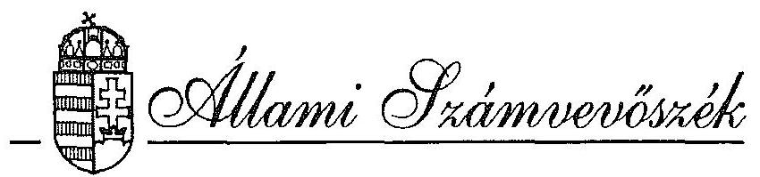
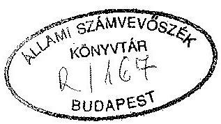
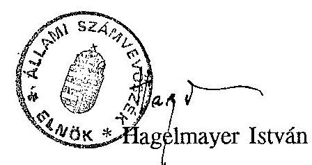
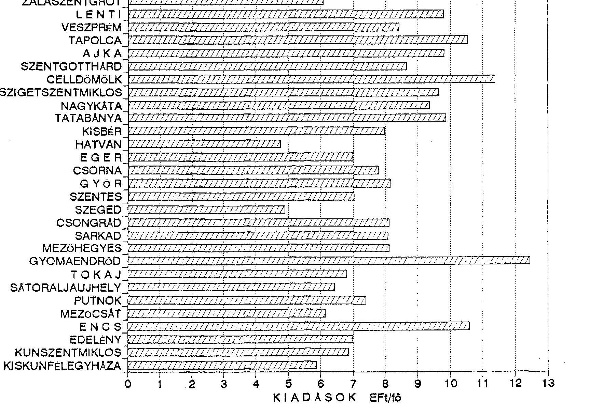

# JELENTÉS 

az önkormányzatok felnőtt szociális alapellátási tevékenységéről

---

# JELENTÉS 

az önkormányzatok felnőtt szociális alapellátási tevékenységéről

A helyi önkormányzatokról szóló 1990. évi LXV. törvény az önkormányzatok kötelező feladatává teszi a lakosság szociális alapellátásáról történő gondoskodást. A helyi önkormányzatok és szerveik, a köztársasági megbízottak, valamint egyes centrális alárendeltségű szervek feladat- és hatásköréről szóló 1991. évi XX. törvényben a szociális alapellátásnak, mint kötelező feladatnak a tartalma is rögzítésre került.

A feladatok színvonalas ellátásához az egyes önkormányzatok eltérő adottságokkal és anyagi feltételekkel rendelkeznek.

A nagyobb városokban a gondozás egyes intézményi formái még a tanácsrendszer időszakában kiépültek. A kisebb településeken viszont jelenleg is csak a pénzbeni támogatás lehetősége biztosított, az önkormányzat anyagi helyzetétől függően településenként eltérő színvonalon.

Az önkormányzatok szociálpolitikai tevékenysége a rászorulók számának növekedése miatt egyre nagyobb lakossági rétegek életkörülményeire, anyagi helyzetére gyakorol közvetlen hatást. 1980. évben országosan 186.271 esetben folyósítottak rendkívüli szociális segélyt. Ez a mutatószám 1991. évre 885.240 esetre növekedett. A rendkívüli segélyezés pénzügyi ráfordításai az 1980. évi 163 millió Ft-ról 1991. évre 2.225 millió Ft-ra növekedtek. Az idősek nappali ellátását biztosító intézményhálózat működtetésére 1980. évben 363 millió Ft-ot, 1991. évben pedig már 4.725 millió Ft-ot fordítottak az önkormányzatok.

Az Állami Számvevőszék 1993. I. félévi munkaterve alapján a fővárosban és 11 megyében vizsgálta a szociális alapellátás helyzetét. Az ellenőrzés 74 városi, községi

---

és kerületi önkormányzatra és azok felnőtt – tartós intézeti ellátást nem nyújtó szociális intézményeire terjedt ki.

A vizsgálattal érintett településeken 1.423.460 fő él. Ezen belül a 60 éven felüli lakosok aránya 18,6%-ot tesz ki.

A vizsgálat célja: annak megállapítása volt, hogy

- a felnőtt – tartós intézeti ellátást nem nyújtó – szociális alapellátás feltételrendszere hogyan alakult a vizsgált időszakban,
- milyen módon hasznosultak az e célt szolgáló központi és helyi (önkormányzati) erőforrások,
- a jelentkező igények és a meglévő lehetőségek összhangja mennyiben biztosított.

A magyar gazdaság nagyrészt állami tulajdonon alapuló és lényegében központilag tervezett rendszerből a magántulajdon túlsúlyán alapuló piacorientált rendszer felé halad. A gazdaság átalakulása a szociálpolitika olyan irányú átalakítását igényli, amely a piacgazdaság érvényesülését nem akadályozza, és alkalmas a piaci hatások szociális következményeinek ellensúlyozására.
A szociálpolitikai rendszer jelenlegi működésének megítéléséhez és a szükséges változás fő irányainak meghatározásához elengedhetetlenül szükség van a társadalmi folyamatok áttekintésére, a társadalom demográfiai körülményeiben, életszínvonalában, életkörülményeiben végbemenő változások, tendenciák megismerésére.

A népesedés területén az 1980-as években megindult tendenciák érvényesülnek jelenleg is. A természetes szaporodás arányszáma 1981. óta negatív, 1983. óta 1,73-1,84 között helyezkedik el. A magyar termékenységi arányszám alacsony szintje miatt hosszú távon nincs biztosítva a népesség egyszerű újratermelődése, reprodukciója, s demográfiai becslések szerint a népesség fogyása elkerülhetetlen.

A lakosság egészségi állapotában az 1980-as évek közepe óta két ellentétes tendencia figyelhető meg. Miközben a csecsemő- és gyermekhalandóság mutatószámai kissé javultak, a felnőttkori – elsősorban a 40 és 60 éves életkor közötti – halandóság tovább romlott. A születéskor várható átlagos élettartam jelzőszámában e két tendencia nagyjából kiegyenlítette egymást. A népmozgalmi tendenciák

---

együttes hatásaként a népesség korösszetétele megváltozott, a 60 éven felüli lakosok részaránya megnövekedett.

A demográfiai változások és a lakosság egészségi állapotának romlása miatt az aktív keresők száma és népességen belüli aránya is fokozatosan csökkent. Mindez a családok jövedelmi helyzetére negatív hatást gyakorolt.

A gazdaságban bekövetkező változások közvetlen hatással vannak a lakosság jövedelmi helyzetére, életszínvonalára. Az 1980-as évek elejétől, amikor a piaci viszonyok nagyobb szerephez jutottak a gazdaságban, a jövedelmi egyenlőtlenségek kisebb-nagyobb mértékben megnőttek.
A szegénység, ennek mértéke a jövedelmi adatok és a létminimum számítások adatainak összehasonlítása alapján ítélhető meg. A rendelkezésre álló adatok azt mutatják, hogy a létminimum alatti egy főre jutó jövedelemből megélni kényszerülők száma 1982-ben és 1987-ben is egymillió körül lehetett.

Nincsenek újabb megbízható adatok a szegénység kiterjedéséről, a rendelkezésre álló (kismintás vizsgálatokon alapuló) adatok alapján azonban arra lehet következtetni, hogy jelenleg 1,5-2,0 millió ember él a létminimum alatti jövedelemből.

Egyes társadalmi csoportok jövedelmi viszonyaira a nagy társadalmi ellátó rendszerek (nyugdíjrendszer, családi pótlék, GYES) nagyságrendjében eltérő mértékű hatást gyakoroltak, azonban a létminimum határán levő családok megélhetési gondjain alapvetően nem tudtak segíteni.
A családi támogatások – noha a családi pótlék reálértéke hosszabb időszakot tekintve nőtt és a gyermekgondozási díj lényeges új támogatási forma volt – nem tudták a gyermekes családok átlagos helyzetét a gyermektelenekhez viszonyítva lényegesen javítani. (1982. és 1987. között a gyermektelen aktív kereső családok egy főre jutó jövedelméhez viszonyítva az egy gyermekesek jövedelmi szintje 76-79% között, a kétgyermekeseké 62-67% között, míg a négy és többgyermekeseké 35-39% között ingadozott).

A nyugdíjasok helyzetének javítására hozott intézkedések az infláció okozta reálérték-csökkenésnek csak egy részét tudták ellensúlyozni. A nyugdíjasok számára az életszínvonal süllyedése és – életük végén – a létminimumhoz közeli szint elérése a „perspektíva”. 1991. márciusában a saját jogú nyugdíjasok 38%-a (798 ezer fő) 7000 Ft alatti minimális jövedelemmel rendelkezett.

---

A jelenlegi körülmények között, amikor a gazdaság teljesítménye jelentős mértékben visszaesett, amit a bruttó társadalmi termék (GDP) 1991. évi mintegy 10%-os csökkenése is jelez, nem várható el jelentős javulás a lakosság életszínvonalában, a leghátrányosabb helyzetű rétegek életkörülményeiben. Ezért fontos társadalmi érdek, hogy a helyi önkormányzatok a részükre központi forrásból biztosított és saját bevételeikből kiegészített szociális célú előirányzataikat a lehető leghatékonyabban használják fel.

# MEGÁLLAPÍTÁSOK 

## I.   A szociális kiadások támogatása

A Parlament az önkormányzatok szociális célú kiadásaihoz az éves költségvetési törvényben meghatározott feltételek szerint jelentős összegű forrásokat biztosít. (1. sz. melléklet).

A normatív állami hozzájárulások meghatározott kritériumok szerint, de felhasználási kötöttség nélkül illetik meg az önkormányzatokat. Ez azt jelenti, hogy az önkormányzati testületek döntésétől függ, hogy ezekből a pénzügyi forrásokból milyen nagyságrendű összegek jutnak szociális célú hasznosításra.
A rendelkezésre álló források és hozzájuk rendelhető kiadások adatait összehasonlítva megállapítható, hogy 1992. évben a felnőtt- és gyermekvédelmi feladatok ellátásához biztosított normatív állami hozzájárulás összege országos szinten 72,4%-ban fedezte az önkormányzatok ilyen jellegű működési kiadásait.
1993. évben jelentős változások történtek a szociális célú normatív állami hozzájárulás finanszírozási rendjében. Az új finanszírozási rendszer már érzékenyebben reagál az utóbbi két évben jelentkező szociális feszültségekre (felnőtt, munkaképes korú népesség elszegényedése, munkanélküliség fokozódása stb.).

A változás lényege, hogy míg 1991-1992. években a kormány az inaktív lakosság arányában juttatott állami hozzájárulást a települési önkormányzatoknak, addig 1993. évben az állandó lakosságszám alapján differenciált módon igényelhető normatív állami hozzájárulás. A differenciálás alapjául az inaktív népesség aránya,

---

a munkanélküliek aránya és a személyi jövedelemadót fizetők aránya szolgál. A szociálpolitikai feladatok ellátásához biztosított normatív állami hozzájárulás 1992. évről 1993. évre jelentős mértékben, 11.605 millió forinttal megnövekedett. Ennek pénzügyi fedezetét a Kormány a személyi jövedelemadó átengedés 20 százalékpontos csökkentésével tudta csak megteremteni. (Ez az előirányzat 14 milliárd Ft összegű csökkentését jelentette). E két intézkedés jelentősen átrendezte az egyes önkormányzatok pénzügyi helyzetét. Hátrányosabb helyzetbe kerültek a fejlett, átlag feletti jövedelemtermelő képességű települések, ugyanakkor az elmaradott, alacsony jövedelmet kitermelő, előregedett lakosságú települések a korábbi évekhez képest több állami támogatásban részesülnek.

A normatív támogatási rendszer az egyedi eseteket, a hátrányos helyzetű települések gondjait nem képes kezelni, az nem is lehet feladata. Ezért szükség van olyan központi kezelésű előirányzatokra, amelyek egyedi mérlegelést követő döntés alapján jutnak el az önkormányzatokhoz.

A Népjóléti Minisztérium fejezet költségvetésében szereplő szociális célú források az elmaradott térségek felzárkóztatását, egyes hiányzó – alapellátás körébe tartozó – intézmények kiépítését, valamint az utóbbi években jelentkező új típusú szociális problémák kezelésére képes intézmények létrehozását kívánták támogatni (2. sz. melléklet).
1991. évben a szociális ellátórendszer családközpontú intézményeinek támogatása, a kisközösségi, családias gondozási formák bővítése, a válságprogram keretében éjjeli menedékhelyek, átmenti szálláshelyek, népkonyhák létrehozása és fenntartásának támogatása volt a cél.
1992. évben folytatódott a kisközösségi, családias gondozás intézményei kiépítésének támogatása. A válságkezelő programokon belül nagyobb súlyt kapott a hajléktalanokkal kapcsolatos ellátási formák, szolgálatok, a térségi válságkezelő programok segítése. Folytatódott az előző évben kialakított hajléktalanok elhelyezését szolgáló intézmények működésének támogatása. Új cél volt a foglalkoztatást elősegítő rehabilitációs központok és védett munkahelyek kialakításának támogatása. 1991. évben 560 millió Ft-ot, 1992. évben 2.240,7 millió Ft-ot, 1993. évben 1.324,5 millió Ft-ot terveztek központi szociális programokra. Az 1992. évi feladatok megoldását nehezítette, hogy az előirányzatok többségét az Országgyűlés az éves költségvetési törvényben zárolta. A felhasználási tilalmat – 800,7 millió Ft-ot elvonva – június 2-i ülésén oldotta fel. Az év végi költségvetési szigorítások

---

következtében a központi szociális feladatokra fordítható előirányzat 196 millió Ft-tal tovább csökkent. A központi intézkedések hatására az eredeti előirányzathoz képest közel 45%-os volt a csökkenés mértéke. A jelentős mértékű előirányzat-csökkenés miatt meghiúsult az időskorúak alapellátásának javítására, az elfekvő, házigondozó szolgálatok bővítésére szánt 370 millió Ft-os előirányzat felhasználása.

A minisztérium a költségvetésben jóváhagyott pénzeszközök egy részét nyílt pályáztatás útján osztotta fel. 1991. évben a felosztásra kerülő előirányzatok – 310 millió Ft – megegyeztek a tervezettel. 1992. évben a pályázható feladatokra a költségvetésben 650 millió Ft-ot terveztek, amit a parlamenti döntést követően 360 millió Ft-ra módosítottak.

A pályázatok elbírálásához bizottságokat alakítottak, melyeknek a minisztériumi dolgozók mellett külső szakértő tagjai is voltak. A benyújtott és elbírált pályázatok jelentős része nem felelt meg a pályázati kiírás által támasztott feltételeknek. A pályázati cél megvalósításához és a folyamatos működtetéshez szükséges költségtervet az önkormányzatok nem, vagy csak nagyvonalúan készítették el.

A pályázók által igényelt és a bizottságok által elfogadott támogatás nagysága több esetben eltér egymástól. Az eltérések okairól írásos indoklás nem készült. Az egyes önkormányzatok sem kaptak tájékoztatást arról, hogy miért részesültek az igényeltnél kisebb vagy nagyobb összegű támogatásban.

A pályázatok elnyerését követően megkötött támogatási szerződések nem mindig rögzítik egyértelműen a támogatott cél megvalósításának határidejét, ebből adódóan nem egyértelmű a pénzügyi elszámolás végső határideje sem. Ezekben a szerződésekben csupán azt rögzítik, hogy az elnyert támogatások felhasználásáról az önkormányzatok kötelesek az adott év befejezését követő év március 15-ig a minisztérium részére elszámolást küldeni. Az elszámolás határideje után elköltött pénzek felhasználásának ellenőrzése nem szabályozott.

---

# II. 

Az önkormányzatok felnőtt szociális alapellátást érintő tevékenysége

## 1. Az önkormányzati testületek tevékenysége, irányító munkája

Megfelelő színvonalú irányítás, szervezés elképzelhetetlen információs alapok nélkül. Érvényes ez az önkormányzatok szociális kötelezettségeinek megvalósítására is, melynek fontosságát, szükségességét az életkörülmények romlása következtében jelentkező növekvő igények még inkább alátámasztják. Rendkívül megnövekedett és növekszik jelenleg is – azoknak az állampolgároknak a száma, akik a különféle szociális ellátások útján kapcsolatba kerültek az önkormányzatokkal. A különféle településeken élő, és egyre újabb ellátásokat igénylő rászorultak növekvő tömegének segítése, ellátása már csak úgy képzelhető

 el jogszerűen, igazságosan, a rászorultság figyelembevételével, ha a szociális tevékenység széles körű és kellő mélységű információs alapokon nyugszik.

Az ellenőrzés tapasztalatai szerint az önkormányzatok nem rendelkeznek az ellátás elveinek kialakítását szolgáló és a mindennapi munkát segítő információs bázissal. Ennek megteremtését központi és helyi intézkedések elmaradása is nehezítette. A jelenlegi jogi szabályozás a meglévő adatok, információk önkormányzatokhoz történő eljutását korlátozza. Bár a településeken élők korösszetételét mindenütt ismerik, a munkanélküliek számáról, a nyugdíjasok jövedelmi helyzetéről már nem rendelkeznek elegendő információval.

Az önkormányzatokhoz eljutó statisztikai információk nem teljeskörűek, kevés általuk hasznosítható ismeretet hordoznak. Fő gondot az okoz, hogy a "múlt"-ra vonatkoznak és a gyors változások miatt ezek helyi hasznosítása a "jelen"-re nehezen oldható meg.
Mindezek miatt az önkormányzatok többsége általában csak valószínűsíti azt, hogy milyen ellátási formákra milyen mértékben van igény; ennélfogva a feltételek (kapacitás, pénz stb.) biztosítása is csak hozzávetőlegesen történik meg.

Általánosnak tekinthető ugyanakkor az, hogy az önkormányzatok sem tettek meg mindent a rászorultak felderítésére attól való félelmükben, hogy az esetleg feltárt újabb igények további feszültségeket keltenének az amúgy is szűkös pénzügyi források felosztásában.

---

Mindössze néhány vizsgált - elsősorban városi - önkormányzat tett intézkedéseket arra, hogy a településen élők jövedelmi viszonyainak, életkörülményeinek felmérésével a valós rászorultság megismeréséhez szükséges információk körét bővítse.

Az önkormányzatoknál a szociális ellátásokra irányuló feladat- és hatáskörök megosztásában sokféle megoldás tapasztalható. Általában a település, az önkormányzat nagyságrendje a meghatározó a testületi hatáskörök átruházása tekintetében.

Az önkormányzati törvény megjelenését viszonylag későn - 1991. június 23-án követte a hatásköri törvény, addig a testületek gyakorolták - esetenként célszerűtlenül - a szociális hatásköröket. A hatásköri törvény hatálybalépése után szinte minden ellenőrzött önkormányzatnál felülvizsgálták a szociális hatásköröket, és újraszabályozták, módosították azokat. Különösen a városoknál volt jellemző a hatáskörök átadása, "telepítése", melynek során a szociális bizottságok, illetve a polgármesterek kaptak jogosítványokat. A községekben - ahol sok helyen bizottságot sem hoztak létre - többségében továbbra is centralizáltak maradtak a hatáskörök. A hatáskör-átadásokról a testületek általában megalkották rendeleteiket, törvénysértő gyakorlatot néhány kivételtől eltekintve, az ellenőrzés nem tapasztalt.

A hatáskörök rendezettebbé válása a gyakorlati munkát általában mindenhol segítette, gyorsította. Ennek ellenére a kérelmek elbírálása a lassú, nehézkes ügyintézés miatt esetenként több hónapot is igénybe vett.

Az ellenőrzés a sokféle hatásköri megoldás és a gyakorlati munka minősége között nem tudott egyértelmű kapcsolatot kimutatni. A szociális ellátások minőségét, tartalmát alapvetően és döntően a testületek, bizottságok összetétele, az ügyintézők személyi adottságai, szemlélete determinálják. Ahol szociálisan érzékenyebbek a tisztségviselők, ügyintézők ott gyorsabb, gördülékenyebb az ügyintézés, függetlenül a hatáskörök megosztásától.

Az önkormányzatok képviselőtestületei különböző mértékben és súllyal foglalkoztak az elmúlt időszakban szociálpolitikai kérdésekkel. Összességében nem kapott e számukra kötelező feladatcsoport jelentőségének és fontosságának megfelelő teret és szerepet az irányító munkában.

A testületek többségében eseti ügyekkel foglalkoztak - hatáskörátadások, személyi kérdések, előirányzat-módosítások, nyersanyagnorma, illetve térítési díjak megálla-

---

pítása stb. - és igen ritka volt az, hogy a szociális ellátás helyzetét átfogóan áttekintették volna. Átfogó helyzetértékelés hiányában a szükségletekhez jobban igazodó támogatási rendszer kialakítására koncepciót általában nem alakítottak ki.

A testületek mellett dolgozó szakbizottságok döntően eseti ügyek elbírálásával foglalkoztak. Többségében nem, vagy csak erőtlenül segítették a testületeket a települések szociális helyzetének megismerésében és az ezek alapján történő hosszabb és rövidtávú feladat-meghatározásokban.

A döntések előkészítését végző hivatali apparátus szakmai felkészültsége, empatikus készsége kevés helyen biztosítja a feladatok színvonalas ellátását. A nagyobb városokban (fővárosi kerületek, Győr, Szeged, Tatabánya) van lehetőség elsősorban korszerű szervezeti megoldások és megfelelő képzettségű személyi állomány alkalmazásával magas szintű és sokrétű szociális feladatellátásra.

A kisvárosi hivatalokban, ahol általában megszüntették az ágazati tagozódású hivatali szervezeteket, nagyon visszaesett, elsorvadt e terület szakmai irányítási funkciója. Jó esetben a bizottságok hatáskörébe utalták a szociális teendőkkel kapcsolatos szakmai irányítás, felügyelet, ellenőrzés jogát, de egyes helyeken még ez sem történt meg.

A községek még rosszabb helyzetben vannak, ugyanis ezek a "hivatalok" minimális létszámmal (többségében 2-6 fő) működnek. Az ügyintézők közül általában 1-2 fő foglalkozik - de csak kapcsolt munkakörben - szociális ügyekkel. Ezek az ügyintézők, akik egyébként is túlterheltek, általában nem tudnak érdemben, megfelelő szakmai szinten foglalkozni a szociálpolitikával. Többségében nem is tekinthetők szakképzettnek, legfeljebb gyakorlattal, helyismerettel rendelkeznek. A túlterhelt, rosszul fizetett hivatali ügyintézőknek - pontosan a községi hivatalok kis létszáma miatt - sok mindenhez kell (kellene) érteniük, (ami irreális elvárás) mivel a növekvő és szerteágazó, sokrétű önkormányzati feladatok egyre inkább specialisták, szakemberek foglalkozását követelik meg. E körülmények különösen a kistelepülések vonatkozásában fokozottan igényelnék a szakmai segítséget nyújtó középszintű szervezet létrehozását.

# 2. A felnőtt szociális alapellátás pénzügyi feltételei 

Az önkormányzatok 1991. és 1992. évben a kötelező és önként vállalt feladatok ellátása mellett megőrizték fizetőképességüket, finanszírozási gondok nem merültek

---

fel. Összességében konszolidált gazdálkodást folytattak, melyben nagy szerepe volt a takarékos, esetenként visszafogott pénzköltésnek, illetve az előző évről áthozott pénzmaradványoknak is. A vizsgált önkormányzatok többsége fejlesztéseket is megvalósított, vagy a kitűzött fejlesztési célokra takarékoskodott.

A vizsgált önkormányzatoknál 1991. és 1992. évek között a teljesített költségvetési kiadások volumene átlagosan 27,6 %-kal nőtt. Legnagyobb mértékű növekedést a vizsgált fővárosi kerületek átlaga mutat (45,5 %), legkisebb a növekedés a községeknél (10,8 %).

Az önkormányzatok felnőtt szociális célú feladataik finanszírozására kiadásaik 3,5 %-át költötték. Az átlag az egyes önkormányzatok tekintetében jelentős, 0,8-15 % közötti szóródást takar.

Az önkormányzatok szociálpolitikai célú forrásainak döntő részét az inaktív lakosságra tervezhető normatív állami támogatás tette ki. Arányában lényegesen kisebb súlya volt az idősek klubja, szállást biztosító idősek klubja normatív támogatásának, illetve a térítési díjakból adódó saját bevételeknek.

A normatívák felhasználási kötöttség nélkül illetik meg az önkormányzatokat. Ezt figyelembe véve is szembetűnő azonban, hogy a vizsgált körben az elmaradott térségű községekben - ahol az időskorú népesség aránya magas - az államilag biztosított normatív támogatásnál kevesebbet fordítottak szociális feladatokra.

A szociális ellátásra tervezett és felhasznált előirányzatok a különböző településeken élő, azonos élethelyzetben levő állampolgárok számára nem biztosítanak azonos színvonalú ellátást. Az egy állandó lakosra jutó felnőtt szociális célú kiadások a vizsgált körben 800-11.300 Ft között mozogtak. Az eltérések nemcsak a különböző településtípusok között, hanem az azonos településtípuson belül is jelentősek.

# 3. A felnőtt szociális ellátás gyakorlati megvalósítása, a végrehajtás értékelése 

A társadalmi - gazdasági helyzet változása, az életkörülmények romlása következtében az önkormányzatok szociálpolitikai feladatai megnövekedtek. Az időskor, a romló egészségi állapot miatti korlátozott önellátó képesség mellett egyre inkább előtérbe kerülő gondozásbavételi indok a tartósan létminimum alatt élők anyagi jellegű rászorultsága.

---

Az önkormányzatok részben anyagi támogatások nyújtásával, részben különböző intézményi ellátások biztosításával igyekeznek a növekvő igényeket valamilyen szinten kielégíteni. Az anyagi támogatás különböző formái mindegyik önkormányzat költségvetésében megtervezésre kerülnek, a természetbeni ellátások egyes intézményei azonban csak az önkormányzatok egy részénél, általában a nagyobb településeken, városokban kerültek kiépítésre.

# a) Pénzbeli ellátások 

Az önkormányzatok szociális célú kiadásainak mintegy felét kitevő pénzbeli ellátások 1991-ről 1992-re átlagosan 15,7 %-kal emelkedtek. Ez meglehetősen kismértékű növekedés, ha figyelembe vesszük, hogy a romló életkörülmények miatt a támogatásra szorulók száma, az igények mértéke is emelkedett.

A rendszeres szociális segélyben részesülők száma az utóbbi években fokozatosan csökken. Ennek oka, hogy az idő előrehaladtával a teljesen ellátatlan, megfelelő munkaviszonyt igazolni nem tudó réteg kihalóban van. A TB ellátás keretében szerezhető résznyugdíj, illetve szociális járadékhoz jutás lehetősége tovább csökkentette az ebben az ellátásban részesíthetők számát.

A vizsgált önkormányzatoknál átlagosan mintegy 14 %-kal csökkent a rendszeresen segélyezettek száma 1991-ről 1992-re, ugyanakkor a segélyátlagok 16 %-kal emelkedtek. A vizsgált körben minden 1000 lakosból 2 fő kap rendszeres segélyt. Az 1 főre jutó segélyátlagok mindkét évben nagy szóródást mutatnak (1991. évben 333-6.025 Ft, 1992. évben 458-8625 Ft), amelynek oka az, hogy a segélyezettek egy része nem volt jogosult teljes összegű segélyre.
Az önkormányzatok többségénél sem a testületek sem a bizottságok nem alakítottak ki helyi szabályokat a rendszeres szociális segély mértékére vonatkozóan. Ebből következően minden kérelemnél eseti mérlegelés alapján került meghatározásra a támogatás mértéke. Általános tapasztalat, hogy a megállapított segély összege nem haladta meg az özvegyi nyugdíjminimum mindenkori mértékét.

A felnőtt szociális ellátás pénzbeli támogatásának közel felét az eseti segélyek teszik ki. Ebből az állandó népesség 4,9 %-a részesül. Az eseti segélyezési rendszernek, amely kezdetben az átmenetileg nehéz körülmények között élők gondjainak megoldásában kívánt segítséget nyújtani, egyre inkább a tartósan nehéz anyagi körülmények között élő családok támogatását kell felvállalnia. Ennek oka, hogy a nehéz anyagi helyzetben élők hosszabb távon sem számíthatnak körül-

---

ményeik változására, anyagi helyzetük lényeges javulására. A rászorulók számának növekedése ellenére a vizsgált körben 1991-ről 1992-re csupán 10 %-kal nőtt a rendkívüli segélyekre fordított kiadás, ami a rendszeres segélyekre fordított előirányzatok növekedésénél is alacsonyabb. A növekedés az infláció mértékét sem érte el.

Az átlagos növekedésen belül a fővárosi kerületekben 10 %-kal, a községekben 2 %-kal kevesebbet, míg a városokban 27 %-kal többet költöttek eseti segélyekre. A községekben a felhasznált előirányzat csökkenése sokkal inkább szemléletbeli okokkal magyarázható, mint azzal, hogy ezen körben csökkent volna a rászorultak száma.

A vizsgált önkormányzatoknál általában nem szabályozták az esetenként kifizethető, illetve az évente egy személy részére adható segély legnagyobb összegét. Megnövekedett hatásköri lehetőségeikkel nem élve általában a korábban kialakult gyakorlatot folytatták. Ahol valamilyen módon szabályozták a segélyezést, az sem jelentett lényeges változást a korábbi eljáráshoz képest.

Az egy főre jutó segélyátlagok, a differenciálás mértéke önkormányzatonként rendkívül eltérően alakult. A községekben a differenciálás kisebb mértékű, a városokban nagyobb eltérések mutatkoznak az esetenként kifizetett segélyek nagysága tekintetében. Az eseti segély összege helyenként olyan minimális, hogy az szinte elutasításnak minősül. Az egy alkalommal kifizetésre kerülő 500-800 Ft-os segély hathatós segítséget nem nyújthat a kérelmező válsághelyzetének megoldásában.

Az egy főre jutó segélyátlagok önkormányzatonként 976-11.667 Ft között mozogtak 1992. évben. A közel tizenkétszeres különbséget semmi nem indokolja. Az egyes megyéken belül is négy-ötszörös eltérések vannak a segélyátlagok tekintetében.

A kampányszerű és a rászorultságot nem kellően figyelembe vevő segélyezési gyakorlatot bizonyítja a támogatások nagy részének (esetenként 60-70 %-ának) évvégi "kiosztása". E gyakorlattal városokban és községekben egyaránt találkoztunk. Ezzel az egyenlősdi segélyezéssel igyekeztek a döntéshozók a konfliktushelyzeteket elkerülni, illetve az évközben visszatartott pénzeket a rászorultság vizsgálata nélkül elkölteni.

---

A vizsgálat tapasztalatai alapján megállapítható, hogy az eseti segélyezés - jelenlegi formájában - többnyire csak pénzköltést jelent, felhasználása nem hatékony, és kevéssé követi a tényleges rászorultságot.

Egyéb pénzbeli juttatásokat valamilyen speciális szükséglethez kapcsolódóan kapnak a rászorultak. 1990. évben új támogatási formaként jelent meg az ápolási díj, amely a tartósan ápolásra, gondozásra szoruló személyek családi környezetben történő ellátását kívánja segíteni. A díj
 megállapítása minden esetben kérelemre történik, melyet környezettanulmány és a háziorvos igazolása egészít ki. Az ápolás szolgálati időnek számít, ezért feltehetően egyre többen részesítik előnyben a munkanélküli segéllyel szemben még akkor is, ha ez alacsonyabb jövedelmet biztosít.

A vizsgált kör adatai alapján megállapítható, hogy az ápolási díjra kifizetett előirányzatok emelkedtek a legnagyobb mértékben ( $42,2 \%$ ), melyek az eseti segélyekre felhasznált összeg mintegy harmad részét teszi ki.

A jogszabályban ajánlott díjtételt - a mindenkori legalacsonyabb munkabér összege - nagyon differenciáltan alkalmazták az önkormányzatok. Az idősek gondozásáért általában alacsonyabb összegű támogatást állapítottak meg. A díjak 2.000-10.000 Ft között változtak, és egyes megyéken belül is jelentős eltéréseket tapasztaltunk.

A közgyógyellátásban részesülők térítésmentesen jutnak hozzá gyógyászati segédeszközökhöz és külön jogszabályban meghatározott gyógyszerekhez. Számuk 1991. évről 1992-re jelentősen (több mint 50\%) megnövekedett. Ezen belül a méltányossági alapon közgyógyellátásban részesültek száma valamivel kisebb mértékben (48\%) nőtt. A vizsgált városokban az összlakosság mintegy $2 \%$-a, a községekben $3 \%$-a kap ilyen típusú ellátást.

# b) Természetbeni ellátások 

A felnőtt szociális kiadások növekvő arányát fordították az önkormányzatok a vizsgált években természetbeni ellátásokra (50,2, illetve 53,1 \%).

Nappali szociális ellátásban (idősek klubja) a vizsgált önkormányzatok 4.544, illetve 4.630 főt részesítettek. Az ilyen típusú ellátásnak intézményi feltételei vannak (klubok), ezért úgy a természetbeni, mint a pénzbeni szociális alapellátások között ez a legköltségesebb szolgáltatás. Az 1991. évi 62.337 Ft-os fajlagos kiadás 1992. évre 81.978 Ft-ra emelkedett. Az összes természetbeni szociális kiadások 41,3

---

illetve 42,4 %-át kitevő intézményi ellátás a 60 éven felüli lakosságnak csak mintegy 1,68 - $1.75 \%$-át érintette. A kis rétegen segítő, viszonylag drága ellátási forma iránt kétségtelenül nő az igény, de annak mértékét, nagyságrendjét legfeljebb csak becsülni lehet. Emiatt az igénykielégítés szintje sem állapítható meg, legfeljebb csak valószínűsíthető, hogy a sok helyen nem teljesen kihasznált idősek klubjai valamennyi igény kielégítésére alkalmasak. Néhány településen viszont arra való hivatkozással, hogy arra nincs igény, nem is szervezték meg ezideig a nappali szociális ellátást (klubokat).

A nappali szociális ellátás intézményrendszerének lassú terjedésében az is közrejátszik, hogy ezen intézmények önfinanszírozó képessége igen alacsony.
Az ezek működéséhez nyújtott normatív állami támogatás kiegészítés a kiadásoknak csak kis hányadára nyújt fedezetet. A támogatás mértéke évről-évre csökkenő mértékű, mivel a költségvetési törvényben érvényesített korrekciók az inflációs ráta hatását sem veszik figyelembe.

A vizsgált önkormányzatoknál 1992. évben az egy főre jutó fajlagos kiadás 81.978 Ft volt, amelyhez a központi költségvetés csupán 28.000 Ft kiegészítést biztosított.

Egyes önkormányzatok az intézményi bevételek növelése érdekében a térítési díjak radikális emelése mellett döntöttek. A gondozott szociális helyzetét nem, vagy kevéssé vették figyelembe a díjak megállapítása során. Ennek következtében egyes településeken visszaesett az ezen ellátást igénybevevők száma.

Az önkormányzatok többsége törekedett az ellátás tárgyi feltételeinek a javítására. Az ilyen irányú intézkedések ellenére a klubok műszaki állapota, felszereltsége eltérő színvonalú. Az újonnan épültek, vagy a közelmúltban felújítottak az átlagosnál jobb színvonaluak, míg a régebbiek - amelyek többségében nem erre a célra épített épületekben üzemelnek - csak a működés alapvető feltételeit biztosítják.

Az intézményekben a szolgáltatások minősége többnyire kielégítő, a tárgyi feltételek általában mindenütt biztosítják a hasznos és kultúrált időtöltést. Híradástechnikai berendezések, szórakoztató elektronika mellett újságok, könyvek állnak mindenhol rendelkezésre. Gyakori a mosási, fürdési lehetőség biztosítása is.

Hasznos, kulturált időtöltést biztosító programokat (kirándulás, névnapok megünneplése stb.) a klubok többségében terveznek, azok megvalósulása azonban nagymértékben függ az intézményi ellátást igénybe vevők életkorától, egészségi

---

állapotától, aktívitásától. Azokban a klubokban, ahol az igénytelenség vagy a pénzügyi lehetőség szűkössége miatt a programok szegényesek, nem vonzóak, az ellátás is részleges. Ez azt jelenti, hogy csak az ebéd körüli időben ( 10 és 14 óra között) tartózkodnak az idősek ezekben az intézményekben.

Több intézményben megszervezték az idősek házon belüli "foglalkoztatását". Ennek keretében szőnek, hulladékdrótot tisztítanak, diót, földimogyorót válogatnak a klub tagjai. Ez a tevékenység elsősorban nem a jövedelemszerzés, hanem a jó hangulatú hasznos időtöltés szempontjából meghatározó.

Magasabb szintű ellátási forma a szállást biztosító idősek klubja, ami a vizsgálat tapasztalata szerint sajátos átmenetet képez a nappali ellátás és a szociális intézeti gondozás között. Ezt az intézménytípust az átmeneti időre gondozásra szorulók ellátására létesítik, de gyakori, hogy a kórházi elfekvő ágyak alacsony száma, vagy a szociális otthoni férőhelyek hiánya miatt, tartós, intézeti ellátásra szoruló idősek is bekerülnek ezekbe az intézményekbe. A vizsgált körben átmeneti elhelyezést biztosító klub mindössze 20 településen működik, 378 a biztosított férőhelyek száma. Ez a települések időskorú lakónépességének $0,14 \%$-ának elhelyezésére biztosít csupán lehetőséget. Az intézmények többnyire a nagyobb településeken, városokban létesültek, de kedvező és egyes önkormányzatok szociális érzékenységét mutatja, hogy kisebb településeken is egyre inkább felismerik ennek az ellátási formának a létjogosultságát, fontosságát.

A házi gondozás kiadásai a vizsgált önkormányzatok esetében 1992. évben már meghaladták a 200 millió Ft-ot (204.896 E Ft), ez 24,7 %-kal több az előző évi kiadásoknál. Az ellátottak száma kisebb mértékben 5,3 %-kal növekedett.
1992. évben a vizsgált körben 8.591 fő vette igénybe ezt az ellátást, ami duplája a nappali szociális ellátásban részesülőknek. Lényegesen több emberen tudtak tehát az önkormányzatok ilyen módon segíteni. Ez nemcsak a közvetlen, személyes segítségadás miatt tekinthető előnyösnek és hatásosnak, hanem amiatt is, hogy ezen szolgáltatás fajlagos költségei - mivel intézményi hátteret nem tesz szükségessé - viszonylag alacsonyak. (Nappali ellátásra a vizsgált települések 1992. évben 81.978 Ft-ot költöttek gondozottanként, a házi gondozás ugyanakkor "csak" 23.850 Ft-ba került.)

---

Amellett, hogy a településeken összességében $5 \%$-ot meghaladó mértékben nőtt az ellátottak száma, néhány községben arra való hivatkozással, hogy ilyen típusú ellátásra nincs igény, nem biztosítják ezen kötelező szolgáltatást az állampolgárok számára.

A házi gondozás keretében a mozgásukban korlátozott, de állandó ápolást, felügyeletet nem igénylő személyek kapnak életvitelükhöz saját otthonukban segítséget. Ettől néhány településen a bentlakásos intézményi rendszer hiánya miatt kénytelenek voltak eltérni és intézeti ellátást igénylő személyek gondozását otthoni körülmények között megoldani.

A gondozás tartalmát, minőségét tekintve igen eltérő, amiben az igény, a rászorultság döntő szerepet játszik. A rászorultak általában minden településen megkapják az életvitelükhöz szükséges segítséget. Az étel házhozszállítása az egészségügyi ellátás, ápolás, a pszichés gondozás, az érdekvédelmi segítségnyújtás, a ház (lakás) körüli teendők mellett egyes települések különlegesnek nevezhető szolgáltatásokat (pl: patyolat jellegű tisztítás) is nyújtanak.
Egyes önkormányzatok a gondozói létszám bővítésével, a rászorulók hétvégi ellátását, felügyeletét is megoldották annak érdekében, hogy az idős beteg emberek tovább élhessenek megszokott, otthoni körülmények között és minél később kerüljön sor szociális otthoni gondozás igénybevételére.

A szociális étkeztetés az egyik legismertebb, leginkább igényelt ellátási forma. A vizsgált településeken 1992-ben már 11.317 fő részesült ezen ellátásban, ami 6,1 %-kal magasabb az előző évinél. A kiadások ugyanezen időszakban 22,7 %-kal nőttek, melynek következtében a fajlagos kiadások megközelítették a $15.000 \mathrm{Ft} /$ főt. A nappali szociális ellátást nyújtó intézményi szolgáltatások között az étkeztetés a legolcsóbb, igaz a legszűkebb segítséget jelentő ellátási forma.

A szociális étkeztetés, a napi egyszeri meleg étel biztosítása alapvető, mással nem pótolható ellátás, amely az idős, elesett, nehéz anyagi körülmények között élők számára jelent otthonukban segítséget. Az önkormányzatok többsége saját intézményei (kórház, iskola, óvoda) konyhai kapacitásának igénybevételével oldja meg a szociális étkeztetést. Ily módon nemcsak olcsóbb, de jobbára az idős emberek életkorának, egészségi állapotának megfelelő összetételű (diétás) étkezést tudnak nyújtani a rászorulóknak.
Azoknál az önkormányzatoknál, ahol az étkeztetést csak étteremben tudják biztosítani, a magasabb ár mellett általában gond van a szolgáltatás minőségével is.

---

Kedvezőtlen, hogy egyes önkormányzatok a térítési díjak emelésével csökkentették az ellátás szociális jellegét. A térítési díjak egységes - szociális helyzetet figyelembe nem vevő - megállapításával pedig a rászorultak egy része számára ezen ellátás igénybevétele meghiúsult. Ezeknél az önkormányzatoknál jelentősen csökkent az ellátást igénybevevők száma.

A több évtizede kialakult és folyamatosan fejlődő szociális ellátó rendszer hagyományos intézményei önmagukban a család működési zavarainak hatásos kezelésére nem képesek.
A gazdasági és társadalmi változások következtében jelentkező újszerű problémák megoldásához (hajléktalanság, munkanélküliség stb.) a család működési zavarainak megelőzéséhez és eredményes kezeléséhez a meglévő hagyományos ellátásokat kiegészítő, a problémákat komplex módon kezelő intézmények szükségesek. Ezen igényeket felismerve döntött 1984. évben a Kormány a családgondozói szolgálat kísérleti jellegű megszervezéséről, amelynek fokozatos elterjedésében meghatározó szerepe van az ezek létesítését ösztönző központi pénzügyi támogatásoknak.

Az önkormányzatok a pénzügyi támogatáson túl kevés szakmai segítséget kaptak az újszerű ellátások kialakításához. Ennek oka az ilyen típusú intézmények működési kereteit meghatározó jogi szabályok, iránymutatások megalkotásának hiánya, valamint az e területen is szakmai segítséget, iránymutatást nyújtani tudó középszintű szervezet kiépítésének elmaradása. Mindezek következtében az önkormányzatok mind a szervezeti keretek kialakításában, mind a szakmai tevékenység meghatározásában magukra maradtak.

Egyes önkormányzatok ezen intézmények szakmai és pénzügyi önállóságát, a hagyományos ellátórendszerbe történő beillesztéssel korlátozták, más településeken viszont éppen önállóságuk, hatáskörük növelése figyelhető meg. Gyakori, hogy a krízishelyzetek kezelésére létesített egyéb intézmények (átmeneti szálló, ingyen konyha stb.) a családsegítő központ irányításával működnek.
A családgondozó szolgálatok jelentős része ma is az útkeresés, kísérletezés időszakát éli, amely a központi és helyi erőforrások elfecsérelődéséhez vezet.

---

# III. 

A szociális törvény megalkotásának körülményei és várható hatása

A piacgazdaságra történő átállás a lakosság jelentős körében a terhek növekedésével, a szociális feszültségek kiéleződésével jár együtt. Az elmúlt években az ipari ágazatokat érintő nagymértékű létszámleépítés mellett felgyorsult a mezőgazdaságban dolgozók munkanélkülivé válása. Folytatódik a középrétegek jövedelmi és egzisztenciális helyzetének differenciálódása, leszakadása. Újszerű egzisztenciális gondot jelenthet a vállalkozói csőd. A munkanélküliség jelentős mértékű növekedése mellett, égető napi probléma a növekvő számú hajléktalanok ellátása, számukra a minimális életfeltételek biztosítása. Folytatódik a lakosság elöregedése, emelkedik a pályakezdő, munkát nem találó fiatalok száma.

Az elmúlt 40 évben létrehozott - jelenleg már alig finanszírozható - elosztási rendszer nem ad lehetőséget a felsorolt problémák kezelésére és nem nyújt biztonságot a rohamosan növekvő elszegényedés ellen.
A szociális problémák kezelése ma már nem képzelhető el a bekövetkezett változásoktól elmaradó és szétaprózott jogszabályi háttérrel. A hatályos szociálpolitikai jogszabályok (az 1960-as évek közepétől) különböző időszakokban születtek, más-más gazdasági feltételekre épültek. Az egyes ellátási formák "önmagukban" léteznek, olykor egymásnak is ellentmondó rendelkezésekkel. Mindezen okok miatt tovább már nem volt halasztható egy olyan szociális törvény megalkotása, amely az eddig bevált támogatási formákat megtartva - az ellátási rendszert új alapokra helyezve, a társadalmi változások miatt új igények kielégítésének feltételeit megteremti, és a legrászorultabb rétegek szociális biztonságát törvényi szinten garantálja.

A szociális igazgatásról és a szociális ellátásokról szóló 1993. évi III. törvény a fenti elvárásoknak várhatóan csak részben tud megfelelni.

A törvény az egyenlő elosztás elve helyett, - mely
 az igényekhez képest szűkösen rendelkezésre álló kereteket nem mindig oda juttatta el, ahová az indokolt lett volna – a rászorultság elvét hirdette meg. Ebből követően lényeges átrendeződés kezdődik meg a feladatmegosztásban az állam és az önkormányzatok között. A szociális gondokat tehát ott kívánja megoldani, ahol azok leginkább jelentkeznek és

---

indokoltságuk elbírálható. (Persze az más kérdés, hogy az önkormányzatok erre mennyire felkészültek, és van-e rá elegendő anyagi fedezet.)

A törvény áttekinthetőbbé teszi az ellátási rendszereket, egyértelműbbé a jogosultsági feltételeket, s az eddigi szétaprózott jogszabályi háttér egy részét (teljes egészét a szociális törvény többlépcsős kiteljesítésével kívánják átfogni) egységes szerkezetbe foglalja. Rögzíti az állampolgárok jogait a szociális ellátásra és előírja az állam és az önkormányzatok kötelezettségeit, ezzel az állampolgárok számára mintegy garanciát épít be az „ellátatlanság” elkerülésére.

A támogatási formák azon elemeit erősíti (ápolási díj, lakásfenntartási támogatás, házi segítségnyújtás, átmeneti elhelyezést nyújtó intézmények stb.), amelyek humánusabb formában biztosítanak szociális gondoskodást, az ellátásra szorulókat nem környezetükből kiemelve támogatja.

A szociális törvény megalkotásával hozható összefüggésbe, hogy 1993-ban jelentősen nőnek a szociálpolitikai feladatokra biztosított állami pénzeszközök. A pénzbeni és dologi ellátások többletfeladataira 13,5 Mrd Ft-tal növelte a központi költségvetés az érintett tárcák és az önkormányzatok előirányzatát.

A szociális törvény, mint az a koncepcióból is kiderül, egy többlépcsős törvénykezés első szakaszának tekinthető. Az élet által indukált szociális ellátási igények a koncepcióban megfogalmazódtak, azonban pénzügyi fedezet hiányában a törvény az indokolt ellátási formáknak csak egy részét vehette figyelembe. Az így bekerült ellátási formák szakmai és jogi garanciáit megfogalmazza a törvény, de a pénzügyi fedezet garanciáit egyértelműen nem rendezi. A törvény VII. fejezete általános elvként előírja a szociális ellátások finanszírozási szabályait. A feladatok megoldására rendelkezésre bocsátható forrásokat az éves költségvetési törvények határozzák meg. Mindez azt jelenti, hogy egy-egy nehezebb gazdasági évben a jogi-szakmai garanciák ellenére a szociális törvényben deklarált ellátási formák alkalmazása korlátokba ütközik és az önkormányzatok számára kötelezően előírt intézményrendszer kiépítése – melyre 5 év haladékot biztosít a törvény – időben elhúzódik.

E makroszintű probléma mellett egy-egy önkormányzat helyzetét tekintve is tartalmaz a rendszer kritikus pontokat. A nem normatív módon finanszírozott fejlesztési többletköltségek fedezetének biztosítása – még ha országos szinten elegendő forrás állna is rendelkezésre – adott önkormányzatnál problémát jelenthet, ugyanis az intézményi fejlesztésekhez biztosított állami támogatás nagy részéhez

---

pályázati úton lehet hozzájutni, melynek feltétele, hogy adott mértékű saját forrás is rendelkezésre álljon (céltámogatás, szakmai pályázatok stb.).

Az önkormányzatiság szellemével összhangban a szociális törvény egyik legfontosabb alapelve, hogy a rászorultságot ott kell megállapítani, ahol az leginkább megítélhető, vagyis az önkormányzatoknál. Ennek alapján a törvény jelentős többletfeladatokat ró a helyi szociálpolitikára. Félő azonban, hogy az önkormányzatok a jelenlegi szakember-ellátottsággal, szakmai felkészültséggel, igazgatási bérrel nehezen és nem megfelelő színvonalon tudnak megbirkózni a törvény által meghatározott kötelező feladatokkal.

A jelenleg megalkotott szociális törvény nem tartalmazza az egyik legfontosabb ellátási formát: az időskorúak és gyermekkorúak rendszeres szociális segélyezését. Bár a törvényelőkészítők pénzügyi fedezet hiányára (6 Mrd Ft többletet igényelt volna) hivatkoztak, a helyszíni ellenőrzések alapján úgy ítélhető meg, hogy – miután az ország jelentős részét kitevő vidéki kistelepüléseken szinte ez az egyetlen szociálpolitikai eszköz, amellyel a rászorulóknak segíteni tudnak – ennek a jelenleg elfogadott szociális törvénybe történő beemelése indokolt lett volna. Ezt annál is inkább meg kellett volna lépni, mivel a jelenlegi segélyezési rendszer fő hibájaként róható fel, hogy az összes előírt feltétel esetén is csak adható. Tehát nincs igazán garancia a legrászorultabb réteg támogatására.

A Kormány a Parlament elé terjesztett egy országgyülési határozattervezetet, melyben rendelkezik arról, hogy a „szociális ellátórendszer teljes körű törvényi szintű szabályozásának megteremtése érdekében 1994-1995-ben folytatni kell a minimum-garanciák és az intézményrendszer kiépítését”. Ennek első pontjában szerepel az egységes elvekre és jogosultsági feltételekre épülő pénzbeni jövedelempótló támogatási rendszer kiépítése, mely felváltaná a jelenlegi rendszeres segélyezést. Ezt a határozattervezetet azonban a Parlament még nem fogadta el.

A rászorultsági minimum határait a törvény az öregségi nyugdíj minimumhoz köti, ami 1993. március 1-től 6.400 Ft. Ez jelentősen elmarad a KSH által számított létminimumtól.
A különféle ellátási összegek olyan alacsonyak, hogy a jövedelemmel nem rendelkező rászorulók számára szerény megélhetési lehetőséget sem garantálnak.

---

# KÖVETKEZTETÉSEK, JAVASLATOK 

A helyhatósági választásokat követő első két évben nem következett be lényeges változás, minőségi javulás a szociális ellátás területén. Az európai normákhoz igazodó önkormányzati igazgatás elméleti (jogszabályi) alapjai kialakulóban vannak, de a helyi szociális igazgatás gyakorlata még sok kívánnivalót hagy maga után. Sem a testületek, sem a bizottságok irányító, ellenőrző munkája nem tekinthető hatásosnak, eredményesnek. Bár a szegénység növekedése, újszerű szociális problémák (hajléktalanság, munkanélküliség) megjelenése az önkormányzatokat egyre nehezebb feladat elé állította, a testületek többsége mégsem tekintette át a településeken élő lakosság szociális helyzetét és nem fogalmazott meg koncepciót az e téren meglévő feszültségek oldására.
A feladatok – korábbinál színvonalasabb – ellátását számos objektív tényező nehezítette.

A korábban kialakult felnőtt szociális ellátó rendszer igen eltérő színvonalú ellátást biztosított a rászorulóknak. A nagyobb városokban a komplex gondozás feltételeit biztosító intézményrendszer egyes elemei már létrejöttek, míg a kisebb településeken, főként a községekben, ilyen intézmények egyáltalán nem működtek. Az önkormányzatok ezeken a kedvezőtlen arányokon – főként az anyagi feltételek hiánya miatt – alapvetően változtatni nem tudtak. Az intézményi fejlesztéseket segíteni kívánó – fejezeti kezelésű – előirányzatok az igényekhez képest csekély támogatást jelentettek a hátrányos helyzetű települések számára.

Az önkormányzati feladatok ellátását a jogi, szakmai és információs környezet sem segítette megfelelően. Az önkormányzatok egy elavult, egymással összhangban nem álló, az újszerű problémák kezelésére nem alkalmazható jogszabályi háttérrel, széteső információs rendszer mellett voltak kénytelenek az igényeket kielégíteni. A korábbi középszintű szakmai-felügyeleti funkciók megszűnésével az önkormányzatok gondjaik megoldásában lényegében magukra maradtak. A szakmai segítségnyújtás elősorban az újszerű problémák kezelésére alkalmas intézmények létesítésénél hiányzik, de megoldatlan a több települést ellátó szakosított ellátás megszervezésének koordinálása is.

Az önkormányzati hivatalok jelentős része nem rendelkezik a feladatok előkészítését és végrehajtását megfelelő szakmai színvonalon ellátni képes személyi állománnyal.

---

A községi önkormányzatok többségénél, ahol gyakran kapcsolt munkakörben, más jellegű feladatokkal együtt kell végezni ezt az összetett, sokirányú ismereteket igénylő munkát, nem megfelelőek a személyi feltételek.

A többségében korlátozott pénzügyi lehetőségekkel rendelkező önkormányzatok eltérő színvonalon látták el a törvény által kötelezően előírt szociális alapfeladataikat. Az ellátás színvonalában meghatározó szerepe volt a testületek szociális gondok iránti érzékenységének. Ennek hiányában előfordult, hogy a szociális előirányzatok elköltésre sem kerültek, vagy azok egy hányada a rászorultság vizsgálata nélkül került kifizetésre.

Mindezek alapján megállapítható, hogy még nem sikerült egy olyan egységes elvekre épülő ellátórendszer alapjait kiépíteni, amelyben a folyamatosan növekvő, változó igények, szükségletek figyelembevételével minden rászorult mindenhol legalább megközelítőleg ugyanolyan szintű segítségnyújtásban részesül. A kiegyensúlyozottabb, feszültségmentesebb, az egyén számára minimális garanciákat nyújtó szociális ellátórendszer kialakulásával csak hosszabb távon lehet számolni, amihez fontos alapot ad az új szociális törvény és az erre épülő helyi rendeletalkotás.
Az ellenőrzés során szerzett tapasztalatok alapján a szociális ellátórendszer továbbfejlesztése érdekében az Állami Számvevőszék ajánlja, hogy

A Népjóléti Minisztérium a Pénzügyminisztériummal és a Belügyminisztériummal együttműködve kezdeményezze

- A szociális törvényalkotó munka folytatását, az állampolgárok létbiztonságát erősítő további garanciáknak a törvénybe történő beépítését. A törvény garantálja a rendszeres segélyre szorulók ellátását.
- A területi és központi szervek döntéseinek megalapozását segítő információs rendszer kidolgozását.
Az információs rendszer a különböző ellátásban részesülők számbavétele mellett az önkormányzatok számára tegye lehetővé, hogy az egyes támogatásra szoruló lakossági rétegekről legalább összevont – település szintű – adatok rendelkezésre álljanak.
- A központi akarat helyi végrehajtásában szakmai segítséget nyújtó középszintű koordinációs szervezet kialakítását. Ez az egyes szociális feladatok végrehajtásának egységes értelmezéséhez, az újszerű problémák, gondok megoldását

---

segítő intézményi ellátások kialakításához és működtetéséhez, a regionális feladatok ellátásának összehangolásához is segítséget tudna nyújtani az önkormányzatoknak. Megítélésünk szerint e feladatok nem feltétlenül új intézmények létesítésével, hanem a már korábban létrehozott szervezetekhez történő telepítéssel is elláthatók.

A Népjóléti Minisztérium tekintse át a fejezeti kezelésű szociális célú előirányzatok elosztásának jelenlegi mechanizmusát és tegyen intézkedéseket az ezen pénzeszközök felosztásában közreműködő főosztályok munkájának jobb összehangolására.

A pályázatok elfogadásának legyen kizárólagos feltétele a pályázati cél megvalósításának műszaki és pénzügyi dokumentáltsága. A támogatási szerződések egyértelműen rendezzék a támogatás pénzügyi folyósításának feltételeit és határidejét, valamint a megvalósult fejlesztésről történő önkormányzati elszámolás rendjét.

Budapest, 1993. augusztus

---

AZ ÖNKORMÁNYZATOK SZOCIÁLPOLITIKAI FELADATAINAK ÁLLAMI TÁMOGATÁSA

|  | 1991. év |  |  | 1992. év |  |  | 1993. év |
| :--: | :--: | :--: | :--: | :--: | :--: | :--: | :--: |
| Megnevezés | Állami támogatás (tény) M Ft | Önk. kiadások ${ }^{+}$(tény) M Ft | Állami   támogatás   aránya   \% | Állami   támogatás (tény) M Ft | Önk. kiadások ${ }^{+}$ (tény) M Ft | Állami   támogatás aránya $\%$ | Állami   támogatás   (tervezett)   M Ft |
| 1. | 2. | 3. | 4. | 5. | 6. | 7. | 8. |
| NORMATÍV ÁLLAMI HOZZÁJÁRULÁSOK |  |  |  |  |  |  |  |
| - Szociálpolitikai feladatokhoz | 14.283 | 19.964 | 71,5 | 16.081 | 23.548 | 68,3 | 27.686 |
| - Idősek, fogyatékosak nappali intézeti ellátásához | 999 | 2.066 | 48,4 | 1.066 | 2.293 | 46,5 | 1.247 |
| - Idősek, fogyatékosak szállást biztosító intézményéhez | 106 | 265 | 40,0 | 194 | 582 | 33,3 | 233 |
| - Szociális otthonokhoz, intézetekhez | 5.787 | 6.802 | 85,1 | 6.751 | 8.727 | 77,4 | 7.456 |
| - Egészségügyi gyermekotthonokhoz, gyógypedagógiai intézetekhez | 1.475 | 2.699 | 54,6 | 1.657 | 3.165 | 52,4 | 2.273 |

---

|   | 1991. év |  |  | 1992. év |  |  | 1993. év  |
| --- | --- | --- | --- | --- | --- | --- | --- |
|  Megnevezés | Állami támogatás (tény) M Ft | Önk. kiadások (tény) M Ft | Állami támogatás (tény) M Ft | Állami támogatás (tény) M Ft | Önk. kiadások (tény) M Ft | Állami támogatás (tény) M Ft | Állami támogatás (tervezett) M Ft  |
|  1. | 2. | 3. | 4. | 5. | 6. | 7. | 8.  |
|  - Gyermek- és
 ifjúságvédelemhez | 5.983 | 5.273 | 113.5 | 6.053 | 5.592 | 108.2 | 6.354  |
|  Összesen | 28.633 | 37.069 | 77.2 | 31.802 | 43.907 | 72.4 | 45.249  |
|  KÖZPONTOSÍTOTT ELŐÍRÁNYZATOK |  |  |  |  |  |  |   |
|  - Nevelési segélykiegészítés | 2.800 |  |  | 2.850 |  |  | 1.850  |
|  - Munkanélküliek jövedelempótló támogatása |  |  |  |  |  |  | 2.850  |
|  - Gyermek nev. támogatás |  |  |  |  |  |  | 3.180  |
|  MINDÖSSZESEN | 31.433 | 37.069 | 84.8 | 34.652 | 43.907 | 79.3 | 53.129  |

Megjegyzés: * Az önkormányzati kiadások tartalmukban a működési kiadásokat jelentik, a szociálpolitikai feladatoknál a lakosság részére folyósított különféle segélyeket is tartalmazzák.

---

# Kiemelt szociálpolitikai célok 

| M Ft-ban |  |  |  |  |  |  |  |
| :--: | :--: | :--: | :--: | :--: | :--: | :--: | :--: |
|  | 1991. |  |  | 1992. |  |  | 1993. |
|  | Kred. | Mód. | Tel.j. | Kred. | Mód. | Tel.j. | Kredeti |
|  | előirányzat |  |  | előirányzat |  |  | előirányzat |

## Alapítványok:

Ebből:

- Gyorssegély
- Hajléktalanokért
- Mocsáry Lajos
- Jóléti Szolgálat
- ADDETUR
- külföldön élő magyarok ellátását segítő
Térségi válságkezelő programok
(krizis alap)
- Hajléktalanok ellátása (pályázat nélkül) - 15
Kistelepüléseken falu-gondnoki rendszer
- 20
Tartós munkanélküllek támogatása
- 111 79
Hajléktalanok ellátása (pályázat nélkül) 15 20 16
- 20 18 18 18 20 22 22 22 20 20 16 15 15 15 15
Tartós munkanélküllek támogatása
- 140 140
Tüzelő
- 50
- 300 300 300
- 300 300 300
- 100 30 22
Egyes lakossági csoportok célzott
- 100 30 22
támogatása
Kistelepülésen időskorúak alapellátása tára.form.
Elfekvő, házigondozó szolgálat
Szociális lakás egyes lakossági csoportoknak
Szociális képzés, kutatás és egyéb
Szociálpolitikai pályázatok programjai összesen:
Ebből:
- Családsegítés intézményei és módszerei területi gyermekvédelem, kallódó munkanélküli fiatalok rehabilitációja, fiatalkori devianciát megelőzése
- Új ellátó intézmények, szolgálatok és non-profit szerződések
- Gyermekek napközbeni ellátásának új formái
- Időskorúak ellátása, fogyatékosok intézményi ellátása, nappali ellátást nyújtó szolgálatok
- Rehabilitációs központok, védett munkahelyek
- Szociális krizis-kezelő intézmények: éjjeli menedékhely, átmeneti szállás, népkonyha, Szociális Információs Szolgálat stb.

| 110 | 110 | 97 | - | - | - | $\times$ |
| :--: | :--: | :--: | :--: | :--: | :--: | :--: |
| - | - | - | 250 | 92 | 92 | - |
| - | - | - | - | - | - | $\times$ |
| 80 | 80 | 91 | 80 | 54 | 54 | - |
| - | - | - | 200 | 83 | 83 | - |
| 120 | 120 | 116 | 120 | 92 | 92 | $\times$ |
| 560 | 985 | 827 | 2.240 .7 | 1.244 | 1.221 | $1.324,5^{1}$ |

Megjegyzés: ${ }_{x}^{1}$ Magyar Nemzeti Udülési Alapítvány nélkül
A tervezéskor a konkrét összeg nincs meghatározva, de a pályázati programok között támogatandó célként szerepel.

---

A Vizsgált önkormányzatok szociálpolitikai célú kiadásai 1991-1992. években

| Megnevezés | Mennyiségi egység | FŐVÁROS ÖSSZESEN |  |  | KÖZSÉGEK ÖSSZESEN |  |  | VÁROSOK ÖSSZESEN |  |  | VIZSGÁLT ÖSSZESEN |  |  |
| :--: | :--: | :--: | :--: | :--: | :--: | :--: | :--: | :--: | :--: | :--: | :--: | :--: | :--: |
|  |  | 1991 | 1992 | 92/9   (\%) | 1991 | 1992 | 92/9   (\%) | 1991 | 1992 | 92/9   (\%) | 1991 | 1992 | 92/9   (\%) |
| Állandó lakosok száma | fő | 460041 | 464318 |  | 92320 | 91838 |  | 865812 | 867304 |  | 1418173 | 1423460 |  |
| Ebből: 60 éven felüli lak.száma | fő | 105755 | 99893 |  | 18639 | 18783 |  | 145844 | 146156 |  | 270238 | 264832 |  |
| 60 éven felüliek aránya | \% | 23 | 21.5 |  | 20.2 | 20.5 |  | 16.8 | 16.9 |  | 19.1 | 18.6 |  |
| Teljesített összes kiadás | E Ft | 7410102 | 10780604 | 146 | 2299458 | 2547136 | 111 | 28949579 | 36011655 | 124 | 38659139 | 49339395 | 128 |
| Felnőtt szoc. célú kiadás össz. | E Ft | 414575 | 466800 | 113 | 106536 | 129662 | 122 | 846661 | 1086783 | 128 | 1367772 | 1683245 | 123 |
| Felnőtt szoc. célú kiad. aránya | \% | 5.6 | 4.3 |  | 4.6 | 5.1 |  | 2.9 | 3 |  | 3.5 | 3.4 |  |
| Egy állandó lakosra jutó felnőtt szoc.kiad. | Ft/fő | 901 | 1005 |  | 1153 | 1411 |  | 977 | 1253 |  | 964 | 1182 |  |
| Egy 60 éven felülire jutó felnőtt szoc.kiad. | Ft/fő | 3920 | 4673 |  | 5715 | 6903 |  | 5805 | 7435 |  | 5061 | 6355 |  |
| TERMÉSZETBENI SZOCIÁLIS ELLÁTÁS |  |  |  |  |  |  |  |  |  |  |  |  |  |
| Nappali szoc.ell. kiadásai | E Ft | 73996 | 92427 | 125 | 29495 | 39551 | 134 | 179772 | 247584 | 138 | 283263 | 379562 | 134 |
| Házi gondozó szolgálat | E Ft | 61523 | 80423 | 131 | 11922 | 14197 | 119 | 90807 | 110276 | 121 | 164252 | 204896 | 125 |
| Szociális étkeztetés | E Ft | 41272 | 45223 | 110 | 9254 | 9413 | 102 | 87413 | 114676 | 131 | 137939 | 169312 | 123 |
| Családsegítő Központ | E Ft | 23292 | 28968 | 124 | 3745 | 4725 | 126 | 73809 | 107108 | 145 | 100846 | 140801 | 140 |
| Nappali szoc. ell. /klub/ | fő | 1073 | 1032 | 96 | 494 | 554 | 112 | 2977 | 3044 | 102 | 4544 | 4630 | 102 |
| Házi gondozott | fő | 2876 | 2925 | 102 | 571 | 648 | 114 | 4709 | 5018 | 107 | 8156 | 8591 | 105 |
| Szociális étkeztetés | fő | 3443 | 3335 | 97 | 958 | 1004 | 105 | 6266 | 6978 | 111 | 10667 | 11317 | 108 |
| Nappali szoc. ellátás fajlagos kiadásai | Ft/fő | 68961 | 89561 |  | 59706 | 71391 |  | 60366 | 81335 |  | 62337 | 81978 |  |
| Házi gondozotti ellátás fajlagos kiadásai | Ft/fő | 21391 | 27495 |  | 20879 | 21908 |  | 19283 | 21976 |  | 20138 | 23850 |  |
| Szociális étkeztetés fajlagos kiadásai | Ft/fő | 11987 | 13560 |  | 9659 | 9375 |  | 13950 | 16433 |  | 12931 | 14960 |  |
| Természetbeni szoc. kiadás össz. | E Ft | 200083 | 247041 | 124 | 54416 | 67886 | 125 | 431801 | 579644 | 134 | 686300 | 894571 | 130 |
| Természetbeni ellátások aránya | \% | 48.3 | 52.9 |  | 51.1 | 52.4 |  | 51 | 53.3 |  | 50.2 | 53.1 |  |
| PÉNZBENI SZOCIÁLIS ELLÁTÁS |  |  |  |  |  |  |  |  |  |  |  |  |  |
| Pénzbeni ellátások aránya | \% | 51.7 | 47.1 |  | 48.9 | 47.6 |  | 49 | 46.7 |  | 49.8 | 46.9 |  |
| Pénzbeni ellátások összege | E Ft | 214492 | 219759 | 103 | 52120 | 61776 | 119 | 414860 | 507139 | 122 | 681472 | 788674 | 116 |
| Rendszeres szociális segély | E Ft | 20253 | 21178 | 105 | 19258 | 18529 | 96 | 131138 | 128222 | 98 | 170649 | 167929 |  |
| Segélyben részesülők száma | fő | 451 | 382 | 85 | 396 | 335 | 85 | 2599 | 2254 | 87 | 3446 | 2971 |  |
| Rendszeres segélyátlag | Ft/fő | 3340 | 4263 |  | 3969 | 4540 |  | 3991 | 4573 |  | 3898 | 4528 |  |
| Eseti szociális segély | E Ft | 137467 | 124827 | 91 | 20407 | 20037 | 98 | 168068 | 213700 | 127 | 325942 | 358564 | 110 |
| Eseti szoc. segélyben részesülők száma | fő | 16969 | 15007 | 88 | 6306 | 5865 | 93 | 45821 | 49068 | 107 | 69096 | 69940 | 101 |
| 1 főre jutó eseti segély | Ft/év | 8121 | 7419 |  | 3017 | 3378 |  | 3866 | 4728 |  | 4653 | 5277 |  |
| 1 esetre jutó eseti segély | Ft/eset | 2881 | 2836 |  | 2179 | 2536 |  | 2275 | 2593 |  | 2489 | 2669 |  |
| Ápolási díj | E Ft | 18178 | 25978 | 143 | 7194 | 9047 | 126 | 49319 | 71156 | 144 |

 74691 | 106181 | 142 |
| Ápolási díjban részesülők száma | fő | 220 | 335 | 152 | 174 | 170 | 97 | 1077 | 1069 | 99 | 1471 | 1574 | 107 |
| Kiadott közgyógyell. igazolv. száma | db | 3625 | 6972 | 192 | 1927 | 2646 | 137 | 12638 | 18488 | 146 | 18190 | 28106 | 155 |
| Ebből: méltányossági alapon juttatott | db | 1339 | 2836 | 212 | 842 | 971 | 115 | 5730 | 7895 | 138 | 7911 | 11702 | 148 |

---

# Egy 60 éven felülire jutó felnőtt szoc. kiadás a vizsg. városokban 1992. évben 

---

4/b sz. Melléklet
a V-1-29/1993. sz. Jelentéshez

Egy 60 éven felülire jutó felnőtt szoc.
kiadás a vizsg. községekben 1992. évben

ZALASZENTGYÖRGY.
POLOSKE
KÁVÁS
VÁROSLÓD.
NYIRÁD.
NEMESVÁMOS.
DEVECSER.
PINKAMINDSZENT.
MERSEVÁT.
CSÁKÁNYDOROSZLO.
SZIGETMONOSTOR.
PÁND.
KEREPESTARCSA.
CSOBÁNKA.
CSÁTKA.
BARSONYOS.
BABOLNA.
ACSTESZER.
ALMÁSFÜZÍTŐ.
VERPELET.
TARNALELESZ.
POROSZLO.
BELAPATFALVA.
VITNYED.
SZÁRFOLD.
SZANY.
RABAPORDÁNY.
ENESE.
BAGYOGSZŐVÁT.
UJSZENTIVÁN.
BAKS.
KETSOPRONY.
KORÓSTARCSA.
RÁTKA.
KÁZSMÁRK.
AROKTÓ.
VASKUT.
SZENTKIRÁLY.
NYÁRLÓRINC.
HELVECIA.
BALLOSZÓG.

2500 5000 7500 10000 12500 15000 17500 20000 22500 25000

KIADÁSOK Ft/fő

---

Állami Számvevőszék
V. Önkormanyzati és Területi

Ellenőrzési Igazgatóság
$\mathrm{V}-1 / 18 / 1993$

A vizsgálatot vezette és az összefoglaló jelentést összeállította: Dr. Felleg Zsoltné főtanácsos

A jelentés összeállításában közreműködött:

Berényi Magdolna számvevő tanácsos
Vécsey László számvevő tanácsos

A vizsgálatot végezték:
a Pénzügyminisztériumban és
a Népjóléti Minisztériumban
Marosi Gyöngyi számvevő tanácsos
Dr. Molnár Klára számvevő tanácsos

A települési önkormányzatoknál:
Bács-Kiskun megye:
Botta Tibor számvevő tanácsos
Békés megye:
Kollár Lászlóné számvevő tanácsos
Borsod-Abaúj-Zemplén megye:
Fekete Tibor számvevő tanácsos
Kocsis István számvevő tanácsos

---

Csongrád megye:
Grünwald Péterné számvevő tanácsos
Győr-Moson-Sopron megye:
Berényi Magdolna számvevő tanácsos
Vécsey László számvevő tanácsos

Heves megye:
dr. Tóth András számvevő tanácsos
Komárom-Esztergom megye:
Koltayné Szepesi Zsuzsanna számvevő tanácsos
Pest megye:
dr. Katona Béláné számvevő tanácsos
Vas megye:
Tóth Ferencné számvevő
Veszprém megye:
Rénes Mária számvevő tanácsos
Zala megye:
dr. Koller Valéria számvevő tanácsos
Főváros:
Fancsali Mária számvevő tanácsos
Timár József számvevő

