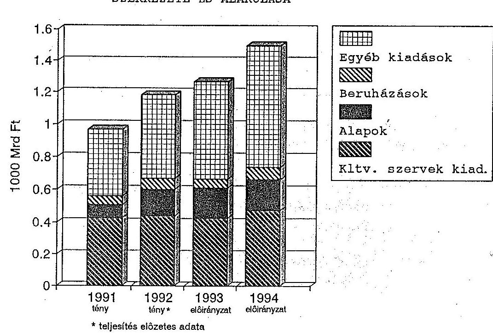
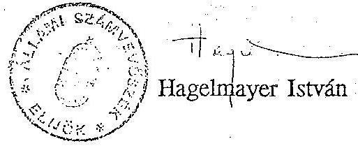
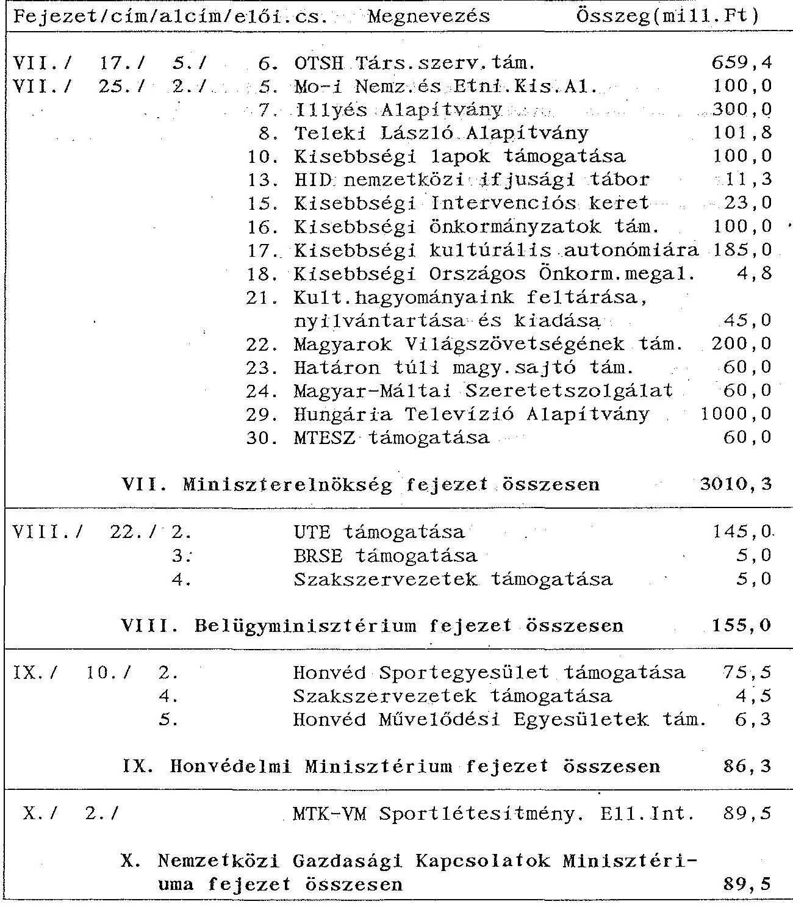
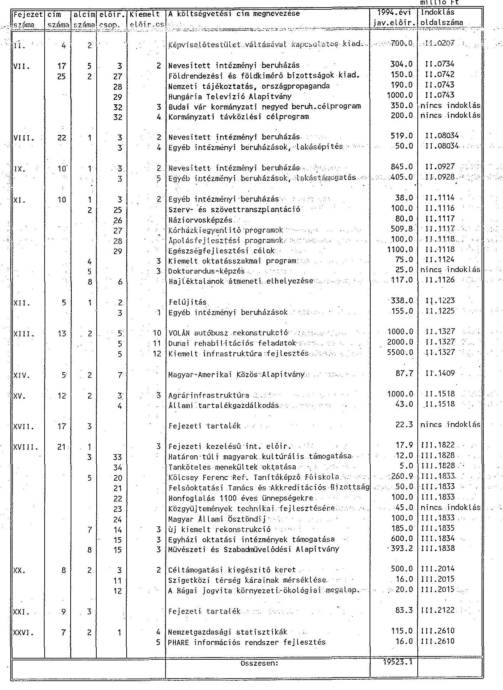
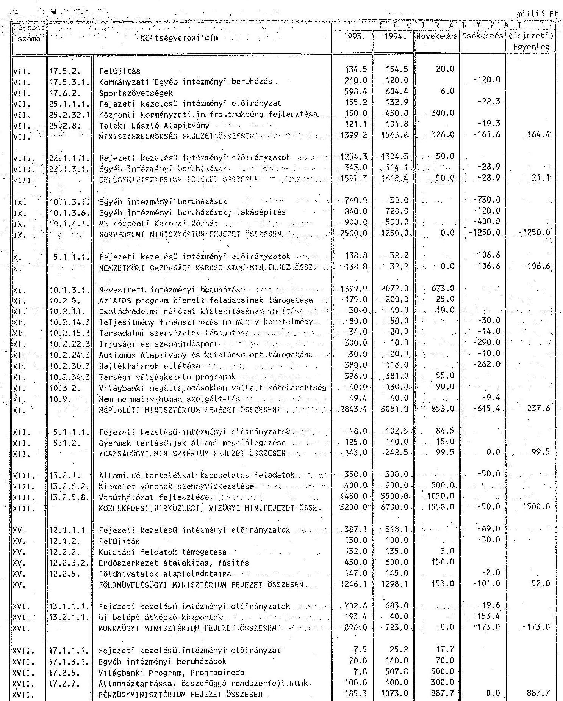
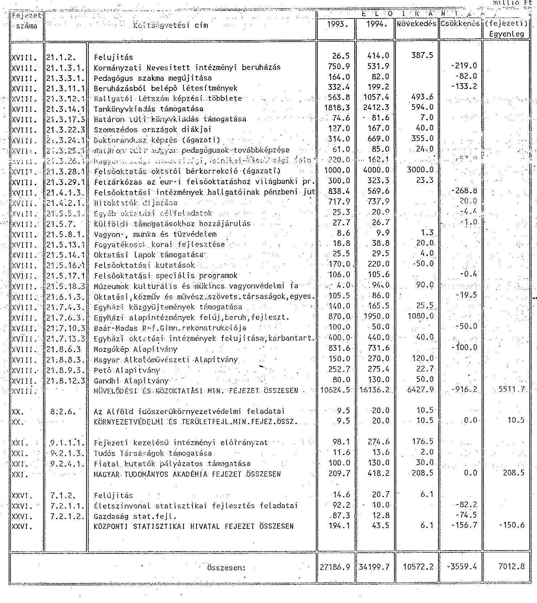
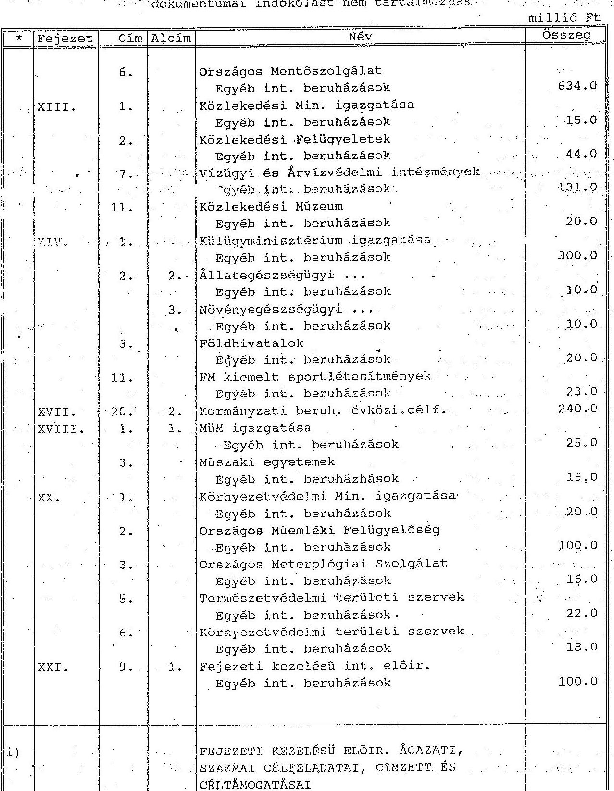

# 12728. szám 

## Állami Számvevőszék

## VÉLEMÉNY

a Magyar Köztársaság 1994. évi állami költségvetéséről szóló törvényjavaslat (12200/1-3 szám) ellenőrzéséről
I. Rész

---

# BEVEZETÉS 

Az Állami Számvevőszék alkotmányos kötelezettségének, valamint a számvevőszéki törvénynek megfelelően ellenőrzi az állami költségvetési javaslat megalapozottságát, a bevételi előirányzatok teljesíthetőségét. Az államháztartásról szóló 1992. évi XXXVIII. törvény (ÁHT) szerint a költségvetési törvényjavaslatot az Országgyűlés az Állami Számvevőszék véleményével együtt tárgyalja meg.

A Kormány - az ÁHT előírásait figyelmen kívül hagyva - nem tájékoztatta az Országgyűlést az 1994. évi gazdaságpolitikai programjáról, a költségvetési politika fő irányairól. A költségvetési törvényjavaslattal egyidejűleg nem nyújtotta be az 1994. évi vagyonpolitikai irányelveket, továbbá - az 1992. évi zárszámadás hiányában - a törvényjavaslat az 1992. évi tényadatokra sem támaszkodhatott. Ezek a körülmények nemcsak a költségvetési javaslat megalapozottsága és ellenőrizhetősége szempontjából emeltek korlátokat, hanem a hatályos törvényi előírások [ÁHT 50. § (2) bekezdés, 115. §, illetve az 1992. évi LIV. tv. 18. § (2) bekezdés] megszegését is jelentik.

Az Állami Számvevőszék az 1994. évi központi költségvetési törvényjavaslatnak a korábbi gyakorlattól eltérő - a zárszámadást megelőző - benyújtása miatt arra a megoldásra kényszerült, hogy a költségvetési javaslatról készülő véleményét két ütemben küldje meg az Országgyűlésnek. Véleményünk első része a költségvetési törvényjavaslat benyújtott dokumentumainak ellenőrzése alapján készült. A költségvetés megalapozottságának helyszíni (a Pénzügyminisztériumban és a fejezeteknél szerzett) ellenőrzési tapasztalatait a későbbiek során, lehetőség szerint az általános vita lezárásáig bocsátjuk az Országgyűlés rendelkezésére.

A költségvetési törvényjavaslatot elsősorban az ÁHT rendelkezéseivel való összhang érvényesülése szempontjából ellenőriztük. A költségvetés számszaki vizsgálata a dokumentumok összefüggéseire és az előirányzatok alátámasztottságára irányult. A gazdaságpolitika minősítését mellőztük, mivel az nem tartozik az Állami Számvevőszék illetékességi körébe.

---

A törvényjavaslat vizsgálatából az a fő következtetés adódik, hogy a tervezésben az ÁHT-ben megfogalmazott követelmények, előírások nem érvényesülnek teljeskörűen. Továbbra is hiányzik a törvényjavaslatból a költségvetést terhelő, hosszabb távú kötelezettségek bemutatása, így különösen az adósságszolgálati terhek, közöttük a kamatterhek várható alakulása.

Az állami feladatok felülvizsgálata lassan halad, ezzel összefüggésben a társadalmi közkiadások feltételrendszerében az 1994. évi költségvetési törvényjavaslat sem hoz lényegi változást.

# 1. MÉRLEGVALÓDISÁG, A KÖLTSÉGVETÉS SZÁMSZAKI EGYEZŐSÉGE 

1.1. A törvényjavaslat 1. §-a meghatározza a központi költségvetés főösszegeit, a 2. § a főösszegen belül a fejezetek, költségvetési címek előirányzatait, a 46. § pedig jóváhagyja a 9. számú mellékletben csatolt központi költségvetés mérlegét. A költségvetési törvényjavaslat 1. és 2. számú mellékletének minden egyes adatát számítógépes ellenőrző rendszerünkbe rögzítettük. Feldolgozásunk során ezen adatok csoportosításával lehetővé tettük a törvényjavaslat 9. számú mellékletének, a központi költségvetés mérlegének számszaki egyeztetését. Az ellenőrzés alapján megállapítható, hogy az 1., 2. és a 9. számú mellékletek számszakilag egyeznek.
1.2. A törvényjavaslat 1. és 2. számú melléklete a kiadási és a bevételi előirányzatokat tartalmazza.

A jóváhagyandó előirányzatok között a költségvetési szerveknél - a bruttó elszámolásnak megfelelően - megtervezett saját bevételek, illetve ezzel együtt a kiadások az Országgyűlés döntésétől függetlenül automatikusan változhatnak, így a jóváhagyottól eltérően alakulhatnak. Ugyanis az intézmények feladataik ellátása érdekében olyan tevékenységeket is végeznek, amelyek többlet bevételt, illetve ezzel fedezett kiadást eredményeznek. A kiadások nagyobb hányadára viszont a közpénzekből biztosított támogatások nyújtanak fedezetet. Indokoltnak tartjuk ezért, hogy a költségvetési szerveknél az Országgyűlés a bruttó kiadások és bevételek mellett a támogatásokat is hagyja jóvá.

---

1.3. A törvényjavaslat az 5. §-ban a költségvetés szerkezeti rendjének megfelelően megnevezi, de összegszerűen nem határozza meg a rendkívüli kiadásokat és bevételeket.

Az 5. § (1) bekezdésében a rendkívülinek minősített kiadások összege 100898 millió forint. A központi költségvetés mérlegében (9. számú melléklet) azonban csak 9200 millió forint kormányzati rendkívüli kiadás szerepel. Az 5. § (2) bekezdésében meghatározott rendkívüli bevételek összege 8000 millió forint. A mérleg azonban - elkülönítetten - rendkívüli bevételt nem tartalmaz, így nincs összhangban az 5. §-sal.

Az ÁHT 16. § (1), (3) bekezdése szerint "A tervezés és beszámolás során külön kell választani az államháztartás rendes bevételeit és kiadásait a rendkívüli bevételektől és kiadásoktól. A rendkívüli bevételek és kiadások nem állandó jellegűek, általában egyetlen évben merülnek fel, de esetleg több éven át tartó felmerülésük ellenére sem képezik az államháztartás rendes, hosszú távú vitelének részét." Ennek az előírásnak a javaslat szövege csak formailag, a mérleg csak részben tesz eleget, emiatt nem állapítható meg teljeskörűen, hogy a rendkívüli bevételek és kiadások milyen mértékben befolyásolják a költségvetés pozícióját.
1.4. A társadalmi önszerveződések támogatása a központi költségvetés mérlegében (9. számú melléklet) 2270 millió forint. Ez az összeg azonban nem tartalmazza a törvényjavaslat 32., 35. és 36. §-a által ide sorolt egyházak közvetlen támogatására szolgáló keretet (3760,5 millió forint), valamint a nem állami intézmények és társadalmi szervezetek - fejezeti előirányzatok között megtervezett - támogatásait (10668 millió forint, ennek részletezését az 1. táblázat tartalmazza). Ezáltal a mérlegnek a társadalmi önszerveződések támogatása sora nem a valós támogatást tükrözi.

---

# 2. A TÖRVÉNYJAVASLAT ÖSSZHANGJA AZ ÁLLAMHÁZTARTÁSI TÖRVÉNNYEL ÉS MÁS TÖRVÉNYEKKEL 

2.1. A törvényjavaslat 3. § (3) bekezdése szerint a Magyar Nemzeti Bank a kibocsátandó államkötvényekből úgy vásárolhat, hogy az MNB "tárcájában lévő, a költségvetésnek nyújtott hitelek és a költségvetés által kibocsátott értékpapírok állományának növekedése - az 1993. december 31-ei állományhoz képest egyetlen napon se haladja meg a 80 milliárd forintot." Ez az összeg az 1994. évi központi költségvetés bevételi főösszegének 6,3 %-a. A Magyar Nemzeti Bankról szóló 1991. évi LX. törvény 19. § (3), 22. § (1) és 81. § (2) bekezdése szerint ez az arány 1994. évre maximum 4% lehet. A törvényjavaslat hivatkozott bekezdése ezért nincs összhangban a Magyar Nemzeti Bankról szóló 1991. évi LX. törvénnyel, de nem felel meg az ÁHT 27. §-ának sem, ami szerint a hiányt a Magyar Nemzeti Bankról szóló törvény keretei között lehet fedezni.
2.2. A törvényjavaslat 4. § (1) bekezdése az általános tartalék és a céltartalék egy részének együttes összegét 38300 millió forintban határozza meg. Ugyanakkor a központi költségvetés mérlegében és az 1. számú mellékletben (Miniszterelnökség fejezet 29. cím) a teljes összeget általános tartalék címen közlik. Emiatt nincs összhang a törvényjavaslat szövege és a mérleg között.

Az ÁHT 25. §-a szerint az általános tartalékot és a céltartalékot külön címen kell előirányozni. A külön kezelést indokolja az, hogy
— egyértelmű legyen a Kormány hatáskörébe tartozó összeg nagysága (az ÁHT 38. §-a előírja, hogy a Kormány rendelkezik az általános tartalékkal, és annak legfeljebb 40 %-a használható fel az első félévben),
—a pótköltségvetés készítési kötelezettség egyik feltételeként az általános tartalék felhasználását jelöli meg az ÁHT 41. §-a.
2.3. A költségvetési törvényjavaslat 27. §-a a TB alapokkal kapcsolatban csak a Nyugdíjbiztosítási Alappal összefüggésben tartalmaz garanciát. Az Egészségbiztosítási Alapot terhelő ellátások folyamatos teljesítésére, a bevételek és kiadások eltéréséből fakadó pénzhiány ellensúlyozására viszont semmilyen garanciát nem tartalmaz. Ugyanakkor változatlanul érvényes az 1975. évi II. törvény 5. §-a. Eszerint az állam a társadalombiztosítási ellátások kifizetését akkor is biztosítja, ha a kiadások meghaladják a bevételeket.

---

2.4. A költségvetési törvényjavaslat 30. §-a szerint az "Országgyűlés az elkülönített állami pénzalapok összevont mérlegét a 7. sz. melléklet szerint tájékoztatásul tudomásul veszi". Az ÁHT 116. § (1) bekezdése alapján az Országgyűlés a tervezéskor az alapok költségvetési mérlegét jóváhagyja.

Megjegyezzük, hogy az ÁHT 54. § követelményeinek megfelelően a 7. sz. mellékletben szereplő alapok egy kivétellel - Bérgarancia Alap - törvénnyel jöttek létre, működésük szabályozott.
2.5. A költségvetési törvényjavaslat 37. § (2) bekezdése az ÁHT 42. § (1) bekezdésének megfelelően meghatározza a korábbi években vállalt és az adott költségvetési évben esedékes, valamint az új kezességvállalások 1994. évi együttes lehetséges mértékét. Ugyanakkor a törvényjavaslat tételesen nem tartalmazza a kezesi felelősség alapján 1994-ben esedékessé válható fizetési kötelezettségeket, ezáltal nincs összhangban az ÁHT ide vonatkozó, 42. § (2) bekezdésével.
2.6. A törvényjavaslat 39. § (3) bekezdése felsorolja, hogy mely esetekben nem szükséges az Országgyűlés jóváhagyását kérni a fejezetek közötti előirányzat átcsoportosításokhoz. A 41. § (1) bekezdése szerint a költségvetési előirányzatok közül a kormányzati rendkívüli kiadásokat az ágazati irányítás szempontjából teljesítő fejezet költségvetésébe csoportosíthatná át a Kormány.

Mindkét javasolt felhatalmazás ellentétes az ÁHT 32. § (2) bekezdésével, ami szerint a fejezetek között az előirányzatokat - az általános tartalék kivételével - csak az Országgyűlés csoportosíthatja át. Véleményünk szerint az ÁHT előírásai szakmailag indokoltak, mert erősítik az Országgyűlés szerepét a költségvetés végrehajtása során.
2.7. A központi költségvetés mérlege (9. számú melléklet), valamint a 230. oldalon közölt részletesebb központi költségvetési mérleg sem tartalmazza az 1992. évi tényszámokat. A törvényjavaslat emiatt nem felel meg az ÁHT 115. §-ában előírtaknak, ami szerint az államháztartás mérlegeinek "a költségvetés előterjesztésekor a vonatkozó év és az előző év várható, valamint az azt megelőző év tényadatait kell tartalmaznia". (Az 1992. évi teljesítés előzetes adatait is csak a fejezeti indokolások tartalmazzák.)

---

2.8. Az ÁHT 36. § b) pontja alapján a Kormány a költségvetési törvényjavaslat benyújtásakor "tájékoztatást ad a többéves elkötelezettséggel járó kiadási tételek később évekre vonatkozó hatásairól". Ezt az előírást a törvényjavaslat nem teljesíti. Az előző évvel ellentétben még a kormányzati beruházásoknál sem készült ilyen tájékoztatás. A kezességvállalás és garanciavállalás következő évekre vonatkozó hatásairól a törvényjavaslat ugyancsak nem tartalmaz tájékoztatást.
2.9. Az ÁHT 116. § (2) bekezdése felsorolja azokat a mérlegeket, amelyeket a költségvetés tárgyalásakor tájékoztatásul be kell mutatni az Országgyűlésnek. Ezek közül több továbbra sem készült el. Az ÁHT 124. § (2) bekezdés b) pontja felhatalmazza a Kormányt, hogy a költségvetésben jóváhagyandó mérlegek tartalmát rendeletben szabályozza. A Kormány az 1994. évi költségvetési törvényjavaslat benyújtásáig még nem alakította ki az új államháztartási mérlegrendszert.

---

# 3. INFORMÁCIÓK A TÖRVÉNYJAVASLAT ELŐIRÁNYZATAI MEGALAPOZOTTSÁGÁNAK ÉRTÉKELÉSÉHEZ 

Az Állami Számvevőszék a bevételi és kiadási előirányzatok megalapozottságát helyszíni vizsgálatok keretében értékeli. Ennek tapasztalatait - a már ismertetett okok miatt - csak a későbbiek során, véleményünk második részeként bocsátjuk az Országgyűlés rendelkezésére. Ebben a fejezetben az egyes költségvetési tételek csoportosításával, ezek indokolási részének értékelésével kívánunk segítséget adni a költségvetés előirányzatainak megítéléséhez.
3.1. Az állami vagyonnal való gazdálkodás szempontjait az éves Vagyonpolitikai Irányelvekben kell rögzíteni. Az 1994. évre vonatkozó irányelveket a Kormány nem nyújtotta be a költségvetési törvényjavaslattal egyidejűleg, így annak hiányában kell értékelni az állami vagyonnal kapcsolatos - a törvényjavaslatban rögzített - szándékokat.

A törvényjavaslat a 6. § (1., 5., 7.) bekezdéseiben összesen 59 milliárd forint privatizációs bevétellel számol. Ebből az ÁVÜ 4 milliárd forintot közvetlenül, 26,8 milliárd forintot a privatizációval összefüggő kiadások fedezetére fizet be a központi költségvetésbe. Ezen kívül a privatizációs bevételekből a különböző alapoknak 28,3
 milliárd forintot köteles átutalni.

Az előirányzat megítélésénél célszerű figyelembe venni, hogy 1992-ben 63 milliárd forint olyan bevétele keletkezett az ÁVÜ-nek, amiből a Vagyonpolitikai Irányelvek szerint különböző alapokba történő átutalást teljesíthetett, illetve osztalékként befizetett a költségvetésbe. Az ÁVÜ 1993-ra mérsékelte bevételi előirányzatát. A költségvetés az első félévben privatizációs bevételből nem részesedett. Várható, hogy 1994-ben továbbra is csökkenő mértékű bevételekkel lehet számolni. Mindezek a törvényjavaslatban figyelembe vett 59 milliárd forintos kiadási előirányzat teljesíthetőségének bizonytalanságát jelzik.
3.2. A törvényjavaslat az Állami Vagyonkezelő Rt. részére 5000 millió forint osztalékbefizetési kötelezettséget és 3000 millió forint privatizációs bevételt, összesen 8000 millió forint költségvetési befizetési kötelezettséget rögzít (2. sz. melléklet XXXI. fejezet). Az 1994. évi osztalékbefizetési kötelezettséget az

---

1993. évi teljesítéssel azonos mértékben határozták meg és ez 0,5 milliárd forinttal több, mint amivel az ÁV Rt. számolt.

A 3000 millió forintos privatizációs bevételi előirányzat az ÁV Rt. tőketartalékába helyezett privatizálható vagyon 1%-a.

Az ÁV Rt. által az év során privatizálandó vagyonrész összege, valamint a bevétel felhasználásának jogcíme nem ismert. Ezeket az éves vagyonpolitikai irányelvek hivatottak szabályozni. Hiányuk a költségvetési törvényjavaslat értékelését nehezíti.

A törvényjavaslat a 6. § (2) bekezdésében rögzített bevételeket (ÁV Rt. kezelésében lévő pénzintézeti részvények osztalékai stb.) valamint a 6. § (4) bekezdésében szabályozott minisztériumi kezelésben lévő állami vagyon hozadékaiból származó bevételeket nem számszerűsíti. A várható bevételek így a központi költségvetés mérlegének bevételi adatai között nem szerepelnek.
3.3. A Kincstári Vagyonkezelő Szervezet kezelésében lévő állami vagyon értékesítéséből, hasznosításából, valamint a központi költségvetési szervektől átvett ingatlanok értékesítéséből 3,7 milliárd forint bevételt irányoztak elő.

A törvényjavaslat a részletes indokolásban (1712-1713. oldal) fogalmazza meg, hogy egyrészt az állami ingatlanok értékesítéséből származó bevétel az 1993. évihez hasonlóan 1,2 milliárd forint, másrészt további 2,5 milliárd forint bevétel várható a központi költségvetési szervektől átvett ingatlanok értékesítéséből. Az ingatlanokat a Kormány jelöli ki.

A kincstári vagyonról szóló törvény hiányában, valamint a Kormány által még nem kijelölt ingatlanok miatt a KVSz előirányzatainak teljesítése bizonytalan.
3.4. Az 1994. évi központi költségvetés kiadásai a megelőző évhez viszonyítva 18,2 %-kal emelkednek. Ezen belül a beruházások, valamint az egyéb kiadások (központi feladatok előirányzatai, nemzetközi elszámolások, államadósság) növekedése a meghatározó. A központi költségvetési szervek kiadásai szerényebb mértékben emelkednek. A növekmény fedezetét döntően a saját bevételekből tervezik biztosítani.

---

A fejezeti kiadások szerkezetének változását főbb csoportonként az alábbi ábra szemlélteti:

Az összes kiadási többlet közel 60%-a (135,9 milliárd forint) a Miniszterelnökség, a Belügyminisztérium, a Népjóléti Minisztérium, a Közlekedési, Hírközlési és Vízügyi Minisztérium és a Pénzügyminisztérium fejezeteknél mutatható ki. A kiadás növekedéséből a Belföldi államadósság fejezet további 36,9 %-kal részesedik. (A kiadások változásának részletesebb bemutatását az 2. táblázat tartalmazza.) A miniszteriális fejezetek kiadásainak bővülése elsősorban nem az intézményi hálózattal, hanem a beruházások, illetve az egyéb kiadások körével függ össze. Ez indokolja, hogy véleményünkben külön-külön is foglalkozunk egyes előirányzatcsoportokkal, mint például a rendkívüli kiadásokkal és a fejezeti kezelésű előirányzatokkal.

A fejezeti béralap előirányzatok 13%-os növekedést tartalmaznak az 1993. évi előirányzathoz viszonyítva. A 16,5 milliárd forint növekedés értékelését

---

nehezíti az, hogy létszámadatokat a törvényjavaslat és indokolásai nem tartalmaznak.
3.5. A fejezeti kezelésű előirányzatok teljesítése jellemzően nem az előirányzat költségvetési helyén jelenik meg. Egy részük beolvad a feladatot ellátó fejezet előirányzataiba, más részük pedig elhagyja az államháztartás körét. Az előirányzatok teljesítése ezért nem követhető nyomon, tisztázatlan az elszámoltatási kötelezettség, amiből az ellenőrzési nehézségek adódnak.

A fejezeti kezelésű előirányzatok 52,5 milliárd forintról 71,4 milliárd forintra növekednek. Ezen belül az új feladatok miatti növekedés 19,5 milliárd forint.

A fejezeti kezelésű előirányzatok indokolását nem tartjuk kielégítőnek. Hiányosságaik, hogy:

- nem adnak magyarázatot az előirányzat felhasználási céljára (pl. a II. Országgyűlés fejezetnél a képviselőváltásra előirányzott 700 millió forint);
- több esetben az indoklások az előirányzat felhasználási célját általánosságokkal határozzák meg (pl. XI. Népjóléti Minisztérium 10. cím 2 alcím egészségfejlesztési célok);
- az indoklás becsült összegnek nevezi, sőt bizonyosnak tekinti a tervezettet meghaladó felhasználást; ilyen esetben a többlet fedezetének forrása nem tisztázott (pl. a VII. Miniszterelnökség fejezet 25. címébe tartozó, földrendezési és földkimérő bizottságok kiadási előirányzata);
- az indoklásban megfogalmazott szakmai feladatok között párhuzamosságokat is tapasztaltunk [pl. a XI. Népjóléti Minisztérium fejezet 10. címe alatt a hajléktalanok átmeneti elhelyezésének normatív támogatása (8. alcím 6. előirányzatcsoport) és a hajléktalanok ellátása (2. alcím 30. előirányzatcsoport) között].

A fejezeti kiadások értékelésének elősegítése érdekében a 3. táblázatban közöljük a kiadások fejezetenkénti alakulását. Az új feladatokkal kapcsolatos előirányzatokat a 4. táblázatban, míg az 1993-ról 1994-re áthúzódó feladatok előirányzatának változását a 5. táblázatban foglaltuk össze.

---

3.6. Az 1994. évi költségvetési törvényjavaslatban a rendkívüli kiadások az előző évhez képest változatlan szerkezetben, lényegesen bővebb tartalommal szerepelnek (6. táblázat) és összegük 28%-kal több, mint az előző évben.

A növekedés azért is figyelmet érdemel, mert a rendkívüli kiadások az összes előirányzaton belül 101 milliárd forintot jelentenek. A rendkívüli kiadásokon belül 14696 millió forintot (14,6%-ot) tesznek ki azok a 10 millió forintot meghaladó előirányzatok, amelyekre vonatkozóan a fejezeti indoklások semmiféle magyarázatot nem adnak. Ezeket tételesen a 7. táblázat tartalmazza.
3.7. A kiadási előirányzatok értékelésének elősegítése érdekében felmértük a szervezeti változások egy részének hatását az intézményi támogatásokra. A törvényjavaslat II. és III. kötetében szereplő adatok alapján megállapítható változásokat, intézmény megszüntetéseket, illetve új intézmények létrehozását a 8. táblázatban foglaljuk össze. A felsorolt szervezeti változtatások történhettek összevonással és szétválással. Összességében 15 intézmény szűnik meg, 17 intézmény jön létre.

A szervezeti változtatások hatására a nyomonkövethető támogatások összege 8,8 milliárd forintról 17,9 milliárd forintra növekedik. Az indoklások néhány kivételtől eltekintve nem adnak magyarázatot a változtatás okaira és a megnövekedett támogatásokra. Nem derül ki továbbá az indoklásokból (és így nem követhető néhány intézmény megszűnése esetén) az sem, hogy csak a feladat kerül-e át más szervhez, vagy a korábbi támogatás is (Hadiipari Hivatal, Rendészeti szervek kiképző központja, Nemzetközi Technológiai Együttműködési Iroda).

Ezek a szervezeti változások a költségvetési megtakarítások szempontjából érzékelhető eredményt nem hoznak, sőt a támogatások jelentősen emelkednek.
3.8. Az önkormányzatok állami támogatása az 1994. évi költségvetési törvényjavaslatban 19248 millió forinttal növekedik az 1993. évi eredeti előirányzathoz képest. Az átengedett bevétellel együtt a forrásnövekedés 27495 millió forint. A növekedés összetevőit áttekintve megállapítható, hogy:
-új, illetve megnövekedett feladattal összefüggésben (hajléktalanok ellátása, szociális törvény, munkanélküliek ellátása, mutatószám változás) 6845 millió forinttal nő az előirányzat,

---

- a növekményből fennmaradó 20650 millió forint a teljeskörű önkormányzati feladatok ellátásához 6,5%-os többletet jelent az előző évhez képest:

Az önkormányzati saját bevételek szerepe - a javaslat indoklási része szerint - tovább nő. A törvényjavaslat az önkormányzatok helyi adókból származó bevételeinél 1994-re az 1993. évi (önkormányzatok által tervezett) előirányzathoz viszonyítva 44%-os növekedéssel számol, ami eléri a 25 milliárd forintot. Ennek teljesíthetősége - a törvényjavaslatban szereplő 1992. évi teljesítési adatokat (17 milliárd forint), valamint a lakosság adóleterheltségét figyelembe véve - bizonytalan.
3.9. A címzett és céltámogatásokkal összefüggésben a törvényjavaslat 17.§ (2) bekezdése szűkíti és rangsorolja az 1994. évben támogatható célok körét. A (3) bekezdésben az 1993. évi kezdésre elfogadott, tehát már folyamatban lévő beruházások 1994. évi támogatási ütemét elhalasztja.

Az 1992. évi LXXXIX. sz., az önkormányzatok címzett és céltámogatási rendszeréről szóló törvény 8.§, (2) bekezdése szerint a "költségvetés helyzetétől függően az új induló céltámogatási igényekre vonatkozóan az Országgyűlés az éves költségvetési törvényben szűkítheti a célok körét...". Természetesen az Országgyűlés a címzett és céltámogatásról szóló törvényben megfogalmazottakon túl további szigorításokat is jóváhagyhat a költségvetési törvényben, de ezzel nagyfokú bizonytalanságot visz a rendszerbe, csökkenti a címzett és céltámogatási rendszer stabilitását.

A címzett és céltámogatási előirányzatok indoklása ellentmondásos (197. oldal). Az első mondatban az áll, hogy az előirányzat lehetőséget ad az 1993-ban fedezet híján ki nem elégített (igényes kör) céltámogatások 1994. évi ütemére. A bekezdés utolsó mondata szerint az 1993. évi igényes céltámogatások 1994. évi kielégítésére nincs lehetőség.
3.10. A törvényjavaslat 1994-ben 30 elkülönített alapot tartalmaz. 1993-1994. évben az újonnan létrehozott, költségvetésből támogatott alapok a következők:
—Nemzeti Kultúrális Alap (támogatása: 213 millió forint);

- Gépjármű Felelősségbiztosítási, Kárrendezési Alap (támogatása: 2200 millió forint),

---

- Bérgarancia Alap (támogatása: 600 millió forint).

Az alapok 1994. évi tervezett bevétele 220,6 milliárd forint, 3%-kal kisebb az 1993. évi tervezettnél. Ezen belül a központi költségvetés támogatása mérséklődik ugyan, de tovább bővülnek a másodlagos csatornákon keresztül központosított és elosztott jövedelmek. A privatizációs bevételekből az alapok közvetlen támogatása 26 milliárd forintról 28,3 milliárd forintra nő.

A számvevőszéki ellenőrzés eddigi tapasztalatai szerint az alapokkal való célszerű gazdálkodás követelményei alig vagy hiányosan érvényesülnek. Ezt igazolja lezárt vizsgálataink közül például az OMFB ellenőrzése, aminek keretében sor került a központi MÜFA gazdálkodásának ellenőrzésére. Megállapítottuk, hogy a pénzeszközök felhasználása nem szabálytalan, de célszerűtlen, a MÜFÁ-ból finanszírozott témák (pályázatok) és a műszaki fejlesztés között a szakmai kapcsolat igen laza. Az alap egyre csökkenő bevételeiből jelentős összegeket (1992. végén 3,2 milliárd forintot) tartós betétként kötöttek le. A MÜFÁ-ból átadott összegek egyes minisztériumoknál (IKM, KHVM) az éves költségvetésük 20-30%-át képezték. Felhasználásuk során - az elnyert pályázati témák jellege miatt (pl. ágazati szabványosítás, konferenciákon, kiállításokon való részvétel, tanulmányok készítése stb.) - igazgatási költségekre is fedezetül szolgáltak.
3.11. A helyi önkormányzati képviselők és polgármesterek választásáról szóló 1990. évi LXIV. törvény 55. § (2) bekezdése rögzíti, hogy "A választások előkészítésével és lebonyolításával kapcsolatos állami feladatok végrehajtásának költségeit - az Országgyűlés által megállapított mértékben - az állami költségvetésből kell biztosítani."

A törvényjavaslatban különböző helyeken csak az országgyűlési választásokkal kapcsolatos költségelőirányzatok szerepelnek. A törvényjavaslat figyelmen kívül hagyja, s nem számol azzal, hogy az önkormányzati képviselői testületek mandátuma is lejár.
3.12. A költségvetési törvényjavaslat több más törvény módosítását feltételezi. A módosítások egy részét a 49-64. §-ok tartalmazzák. Az adózási eljárással, egyes adófajtákkal, illetve az illetékekkel kapcsolatos törvénymódosítási javaslatokat a Kormány külön nyújtotta be az Országgyűlésnek. Felhívjuk a figyelmet arra, hogy a költségvetési törvényjavaslat több olyan előirányzatot tartalmaz, amely

---

feltételezi a más törvényeket módosító javaslatok maradéktalan elfogadását. (Pl.: magánszemélyek jövedelemadójáról szóló törvény, társasági adó törvény, illeték törvény.)
3.13. Az állami forgóalapszámlát 1991. januárban 40 milliárd forint MNB-től felvett hitellel töltötték fel. Ez az akkori forgalom mellett kielégítő volt. A költségvetés mai pénzforgalma viszont jelentősen meghaladja az 1991. évit, emiatt a korábbi 60 milliárd forint körüli hóvégi egyenleg 30-40 milliárd forintra csökken, s egyre gyakrabban okoz finanszírozási gondokat a következő hó elején. A törvényjavaslat a Foglalkoztatási-, a Területfejlesztési- és a Mezőgazdasági Átalakítási és Újjáépítési alapok számára is az állami forgóalap terhére engedményez - privatizációs bevétel csökkenése esetén átmeneti jelleggel - támogatást.
 Ez tovább növeli az állami forgóalap esetenkénti terhelését. Az állami forgóalap folyamatos likviditásának biztosítására a törvényjavaslat kincstárjegy kibocsátásra ad – összegszerű korlátozás nélkül – felhatalmazást a pénzügyminiszternek.

Az állami forgóalap finanszírozási feladatai valószínűleg nem átmeneti időszakra vonatkoznak, ezért a kincstárjegykibocsátás nem a legcélszerűbb eszköz a likviditás biztosítására. Hosszabb távú megoldás kialakítása érdekében a forgóalap funkcióját, finanszírozási feladatait újból át kellene gondolni.
3.14. A törvényjavaslat a hiány finanszírozására egy évnél hosszabb lejáratú államkötvény, illetve kincstárjegy formájában összesen 249 956,8 millió forint értékben ad felhatalmazást a pénzügyminiszternek állami értékpapír kibocsátására. A törvényjavaslat további állami értékpapír kibocsátásokra is ad felhatalmazásokat [pl.: 3. § (4) bekezdés – értékhatár nélkül; 3. § (5) bekezdés – 125 milliárd forint; 1992. évi LXXX törvény 39. § – 18 milliárd forint összegben].

Az államháztartás belföldi adósságain belül az állami értékpapírok állománya 1993. december 31-én várhatóan 1019,7 milliárd forintot tesz ki (lásd a költségvetési törvényjavaslat I. kötetének 275-276. oldalain lévő táblázatok 13-48 sorait). A törvényjavaslat az 1994. évre vonatkozóan további, legalább 393 milliárd forintnyi növekedést tartalmaz.

---

# Állami értékpapír kibocsátásra vonatkozó döntések/Javaslatok az 1993-1994. évekre (1993. augusztusi állapot szerint) 

millió forintban

| MEGNEVEZÉS | 1993. | 1994. |
| :--: | :--: | :--: |
| 1. Költségvetési hiányt finanszírozó, egy évnél hosszabb lejáratú államkötvény | $190.000,0$ | $230.000,0$ |
| 2. Költségvetési hiányt finanszírozó kincstárjegy | $23.316,7$ | $19.956,8$ |
| 3. A bankrendszer hitelkonszolidációjára szolgáló államkötvény | $115.000,0$ | $125.000,0$ |
| 4. Világkiállítási Alap/Felsőoktatási kötvény | $5.000,0$ | $18.000,0$ |
| 5. Az állami forgóalap likviditásának biztosítására likviditási kincstárjegy | nem meghatározott | nem meghatározott |
| Összesen: ${ }^{+}$ | $333.316,7$ | $392.956,8$ |
| 1993 - 1994. években együtt: ${ }^{+}$26273,5 |  |  |

+) az állami forgóalap likviditásának biztosításához szükséges kincstárjegy kibocsátást nem tartalmazza

A táblázat mutatja, hogy 1993-94-ben – a jóváhagyott törvények, illetve a törvényjavaslat alapján – összességében több mint 726 milliárd forint értékű állami értékpapír kibocsátás jelentkezik. A törvényjavaslat általános indoklása nem tér ki ennek makrogazdasági összefüggéseire, illetve a későbbi évekre gyakorolt hatásaira.
3.15. A törvényjavaslat mellékletei, kiegészítő információs táblái még mindig nem nyújtanak elegendő információt az egyes tételek megalapozottságának vizsgálatához. Az államháztartás belföldi adósságai és törlesztései című táblázatok az egyes adósságelemek kamatkondícióit nem tartalmazzák, így jelentős információ hiányzik a megfelelő értékeléshez. A kamatkondíciók részbeni hiánya miatt nem érzékelhető az elkövetkező évek adósságszolgálatának nagysága és belső megoszlása (törlesztés, illetve kamat). Az előirányzati bizonytalanságot szemlélteti a következő táblázat:

---

# A Belföldi államadósság fejezet 

kamatkiadásainak alakulása 1991-1994. évekre
millió forintban

| MEGNEVEZÉS |  | ELTÉRÉS |
| :--: | :--: | :--: |
| 1991. előirányzat | 95370 |  |
| 1991. tény | 92800 | $-2570$ |
| 1992. előirányzat | 151009 |  |
| 1992. előzetes tény | 170053 | $+19044$ |
| 1993. eredeti előir. | 179772 |  |
| 1993. várható | 169872 | $-9900$ |
| 1994. javaslat | 220015 |  |

A fejezeten belül a legnagyobb eltérések az államkötvények kamata és jutaléka, valamint az egyéb kamatfizetések címnél tapasztalhatók. Azáltal, hogy a költségvetési törvény a Belföldi államadósság fejezeten belül "külön szabályozott módosítás nélküli" eltérést engedélyez a kamatként kifizetendő összegekre, e címek gondosabb megtervezéséről és szigorúbb betartatásáról mond le az Országgyűlés. A kamatkiadások 3 év alatt 2,4-szeresükre nőnek, elérik a kiadási előirányzat 14,6 %-át. Ezért indokolt az Országgyűlés nagyobb ellenőrzési szerepe. Az évről-évre növekvő adósságszolgálaton belül a kamatnak továbbra is meghatározó szerepe lesz (az 1994. évi előirányzat szerint az adósságszolgálaton belül a kamatköltség 76%), ami szintén indokolja a kamat pontosabb tervezését.

---

# JAVASLATOK 

Az államháztartásról szóló törvény és a költségvetési törvényjavaslat összhangjának megteremtése, valamint a központi költségvetési mérleg egyes sorainak kiegészítése érdekében a következő intézkedéseket célszerű végrehajtani.

1. A központi költségvetési mérleg egyes sorainak közgazdasági tartalom szerinti pontosítása
-a rendkívüli kiadások és bevételek, valamint
-a társadalmi önszerveződéseknek adandó támogatások
teljeskörű számbavételével oldható meg.
2. A költségvetési törvényjavaslat és az ÁHT, valamint más törvények közötti összhang megteremtése céljából a következőket javasoljuk:
2.1. Összhangot kell teremteni a törvényjavaslat 3.§.(3) bekezdésében megfogalmazottak (az MNB által a költségvetésnek nyújtott hitelek és értékpapírok állományának növekedése), valamint az MNB-ről szóló 1991. évi LX. törvény 19. § (3) bekezdése között.
2.2. Az általános és céltartalék különválasztásával meg kell teremteni a törvényjavaslat szövege és a központi költségvetési mérleg közötti megfeleltetést, ezáltal az ÁHT 25. §-át is betartani.
2.3. A költségvetési törvényjavaslat társadalombiztosítás garanciavállalásaival (27. §) kapcsolatos előírásait és a TB-ről szóló törvény (1975. II.tv. 5. §) közötti összhangot is biztosítani kell.
2.4. A többéves elkötelezettséggel járó kiadási tételek későbbi évekre vonatkozó hatásait be kellene mutatni a törvényjavaslatban (beruházások, kezességvállalás, garanciavállalás, adósságszolgálat kamata). Ezen kívül az 1994-ben esedékessé váló várható kezességvállalási fizetési kötelezettségek tételes kimutatását is el kell készíteni.

---

2.5. Időszerűnek tartjuk, hogy a Kormány az ÁHT 124. § (2) bekezdése alapján a költségvetési év során az államháztartási mérlegrendszer tartalmának részletes szabályait kialakítsa.

# 3. Egyéb javaslatok. 

3.1. A Kormánynak rendelkezni kellene 1994-ben arról, hogy az ágazati és célfeladatok az ÁHT 24. § (3) bekezdésének megfelelően csak az adott célra legyenek felhasználhatók. Megoldást jelentene, ha az ágazati és célfeladatokra elszámolási, a nem teljesített vagy elmaradt feladatokra pedig visszafizetési kötelezettség érvényesülne.
3.2. A fejezeti kezelésű előirányzatok (4., 5. táblázat) és a rendkívüli kiadások (6., 7. táblázat) tételes kimutatása hozzájárulhat a költségvetési kiadások mérsékléséhez.
3.3. A költségvetési törvény számozott mellékletei közé szükségesnek tartjuk a költségvetési szervek támogatását is tartalmazó táblázatot felvenni (I. kötet 243-265 oldalak).

Budapest, 1993. szeptember 7.

---

A FEJEZETI ELŐIRÁNYZATOK KÖZÖTT MEGTERVEZETT – NEM ÁLLAMI INTÉZMÉNYEK ÉS TÁRSADALMI SZERVEZETEK TÁMOGATÁSA

---

|  | Fejezet/cím/alcím/előir.cs. Megnevezés Összeg(mill.Ft) |  |  |  |  |  |  |  |  |  |
| :--: | :--: | :--: | :--: | :--: | :--: | :--: | :--: | :--: | :--: | :--: |
| XI./ | 10./ | 2./ | 15. | Társadalmi szervezetek tám. | 20,0 |  |  |  |  |  |
|  |  |  | 22. | Ifjúsági és szabadidő sport | 10,0 |  |  |  |  |  |
|  |  |  | 24. | Autizmus Alapítvány és kut.cs.tám. | 20,0 |  |  |  |  |  |
|  |  |  | 38. | Gyorssegély Alapítvány tám. | 50,0 |  |  |  |  |  |
|  |  |  | 39. | Hajléktalanokért Alapítvány tám. | 10,0 |  |  |  |  |  |
|  |  |  | 40. | Mocsáry Lajos Alapítvány tám. | 30,0 |  |  |  |  |  |
|  |  |  | 41. | ADDETUR Alapítvány tám. | 15,0 |  |  |  |  |  |
|  |  |  | 42. | Segítő Jobb Alapítvány tám. | 120,0 |  |  |  |  |  |
|  |  |  | 43. | Magyar Nemzeti Üdülési A. tám. | 760,6 |  |  |  |  |  |
|  |  |  | 47. | Szociális alapellátás feltételeinek megteremtése | 333,5 |  |  |  |  |  |
|  |  | 8. |  | Humán szolgáltatások normatív állami támogatása | 1021,0 |  |  |  |  |  |
|  |  | 9. |  | Nem normatív humán szolgáltatás | 40,0 |  |  |  |  |  |
|  |  | XI. | Népjóléti | Minisztérium fejezet összesen | 2430,1 |  |  |  |  |  |
| XV./ |  | 11. |  | FM kiemelt sportlétesítmények | 279,1 |  |  |  |  |  |
|  |  | XV. | Földművelésügyi Minisztérium fejezet összesen |  |  |  |  |  |  |  |
|  |  |  |  |  |  |  |  |  |  | 279,1 |
| XVIII./ |  | 21./ | 4./ | 3. | Humán szolg.norm.áll.támogatása | 2498,1 |  |  |  |  |
|  |  |  | 6. |  | Társadalmi szervezetek támogat. | 136,0 |  |  |  |  |
|  |  |  | 8. |  | Alapítványok támogatása | 1983,9 |  |  |  |  |
|  |  | XVIII. | Művelődési és Közoktatási Minisztérium fejezet összesen |  |  |  |  |  |  | 4618,0 |
|  |  |  |  |  |  |  |  |  |  |  |
| MINISZTÉRIUMOK, ORSZÁGOS SZERVEK MINDÖSSZESEN |  |  |  |  |  |  |  |  |  | 10668,3 |

---

2. számú táblázat

A költségvetési törvényjavaslatban szereplő fejezetek előirányzatainak változása (1994/1993)

X-ben

|  FEJE- ZET | MEGNEVEZÉS | I Bér | N T T-B | É Z | M É D | N Y Y | I D Dologi | I TÁMOGAT. 1+2+3+4-5 | ÁGAZATI FELADAT | FEJEZETI TÁMOGAT. 6+7+8+9 | ÉZET ÉZET | KÖZ. SZER TÁMOGAT. 6+7+8+9 | BEVÉTEL ÉZET | KÖZ. SZER TÁMOGAT. 10+11 | ÁGAPOK ÉZET | BERUHÁZÁS KÖZ. SZER KÖZ. SZER | FEJEZETI KÖZ. SZER KÖZ. KÖZ.  |
| --- | --- | --- | --- | --- | --- | --- | --- | --- | --- | --- | --- | --- | --- | --- | --- | --- | --- |
|   |  | 1. | 2. | 3. | 4. | 5. | 6. | 7. | 8. | 9. | 10. | 11. | 12. | 13. | 14. | 15. | 16.  |
|  I. | KÖZTÁRSASÁGI ELNÖKSÉG | 123.1 | 122.5 |

 | 131.1 | * | * | 127.6 | 59.7 | * | * | 105.0 | * | 105.0 | * |  | * | 105.0  |
|  II. | ORSZÁGGYŰLÉS | 106.6 | 106.8 | 145.4 | 85.8 | 108.5 | 118.6 | 117.6 | * | * | 118.1 | 108.5 | 117.8 | * |  | * | 117.8  |
|  III. | ALKOTMÁNYBÍRÓSÁG | 119.6 | 120.2 | 125.6 | 0.0 | 0.0 | 116.5 | * | * | * | 116.5 | 0.0 | 116.4 | * | 400.0 | * | 123.9  |
|  IV. | LEGFELSŐBB BÍRÓSÁG | 138.1 | 137.6 | 134.1 | 100.0 | 108.0 | 135.9 | * | * | * | 135.9 | 108.0 | 134.8 | * |  | * | 137.0  |
|  V. | MAGYAR KÖZTÁRSASÁG ÜGYÉSZSÉGE | 147.6 | 147.7 | 107.8 | 192.3 | 100.0 | 142.9 | * | * | * | 142.9 | 100.0 | 142.9 | * | 420.0 | * | 143.3  |
|  VI. | ÁLLAMI SZÁMVEVŐSZÉK | 100.0 | 100.0 | 100.7 | 100.0 | 111.1 | 100.0 | * | * | * | 100.0 | 111.1 | 100.2 | * |  | * | 100.2  |
|  VII. | MINISZTERELNÖKSÉG | 131.7 | 128.4 | 116.5 | 167.4 | 159.6 | 80.4 | 54.4 | 106.3 | 100.0 | 67.4 | 175.0 | 122.8 | 44.3 | 294.4 | 228.4 | 134.6  |
|  VIII. | BELÜGYMINISZTÉRIUM | 119.2 | 119.9 | 108.9 | 113.0 | 100.0 | 116.8 | 100.0 | * | * | 116.4 | 100.0 | 115.1 | 100.0 | 166.7 | 107.3 | 109.0  |
|  IX. | HONVÉDELMI MINISZTÉRIUM | 106.9 | 104.1 | 99.8 | 101.6 | 100.0 | 103.4 | * | * | * | 103.6 | 100.0 | 103.2 | * | 100.0 | * | 103.0  |
|  X. | NEMZETKÖZI GAZDASÁGI KAPCS. MIN. | 109.8 | 109.9 | 103.2 | 143.8 | 116.9 | 101.6 | 23.2 | * | * | 97.5 | 116.9 | 101.5 | 83.3 |  | * | 92.0  |
|  XI. | NÉPJÖVEdelmi MINISZTÉRIUM | 105.5 | 110.8 | 111.6 | * | 112.9 | 102.9 | 129.4 | 0.0 | * | 104.8 | 112.9 | 108.9 | 111.0 | 146.0 | * | 111.1  |
|  XII. | IGazSÁGÜGYI MINISZTÉRIUM | 125.0 | 125.4 | 140.2 | 55.8 | 102.5 | 129.7 | 169.1 | * | * | 132.6 | 102.4 | 129.7 | * | 142.6 | * | 129.9  |
|  XIII. | KÖZLEKEDÉSI, HÍRK., VÍZÜGYI MIN. | 118.4 | 119.3 | 145.6 | 169.8 | 144.2 | 89.8 | 78.9 | 100.0 | 100.0 | 90.4 | 143.7 | 138.3 | * | 207.2 | * | 150.9  |
|  XIV. | KÜLÜGYMINISZTÉRIUM | 104.5 | 162.6 | 97.5 | 100.0 | 116.2 | 98.1 | 109.4 | 100.0 | * | 99.8 | 116.2 | 103.5 | * | 100.0 | * | 103.4  |
|  XV. | FÖLDMŰVELÉSI MINISZTÉRIUM | 105.8 | 105.1 | 144.7 | 106.6 | 114.8 | 121.6 | 90.0 | 76.9 | 100.0 | 119.3 | 115.5 | 118.0 | * | 292.3 | * | 123.7  |
|  XVI. | MUNKAÜGYI MINISZTÉRIUM | 125.6 | 126.9 | 133.8 | 142.3 | 182.3 | 110.6 | 3.9 | 0.0 | * | 12.1 | 182.3 | 17.3 | 87.4 | 785.0 | * | 62.1  |
|  XVII. | PÉNZÜGYMINISZTÉRIUM | 108.1 | 109.1 | 129.9 | 49.4 | 123.0 | 111.0 | 100.9 | 46.7 | * | 109.1 | 123.0 | 110.7 | * | 130.1 | 118.3 | 121.7  |
|  XVIII. | MŰVELŐDÉSI ÉS KÖZOKTATÁSI MIN. | 106.7 | 106.0 | 127.6 | 105.8 | 147.3 | 109.1 | 127.9 | 1562.3 | 0.0 | 116.9 | 147.3 | 119.7 | 201.3 | 103.4 | * | 120.5  |
|  XIX. | IPARI ÉS KERESKEDELMI MIN. | 92.1 | 93.3 | 100.8 | 88.2 | 98.7 | 100.5 | 100.0 | 100.0 | * | 100.5 | 98.7 | 99.0 | 30.8 | 3.2 | * | 81.4  |
|  XX. | KÖRNYEZETVÉDELMI ÉS TERÜLETFEJL. MIN. | 119.5 | 119.6 | 93.1 | 100.0 | 66.0 | 117.8 | 129.4 | * | 100.0 | 118.5 | 66.0 | 106.7 | * | 437.5 | * | 120.1  |
|  XXI. | MAGYAR TUDOMÁNYOS AKADÉMIA | 98.1 | 97.6 | 95.9 | * | 97.4 | 97.2 | 126.0 | 0.0 | * | 98.1 | 97.4 | 97.9 | * | 100.0 | * | 98.0  |
|  XXII. | MAGYAR TÁVIRATI IRODA | 112.0 | 113.0 | 96.3 | 100.0 | 118.9 | 84.5 | * | * | * | 84.5 | 118.9 | 104.6 | * | 41.7 | * | 98.6  |
|  XXV. | GAZDASÁGI VERSENYHIVATAL | 107.1 | 107.1 | 101.7 | * | * | 104.9 | 0.0 | * | * | 102.1 | * | 102.1 | * |  | * | 102.1  |
|  XXVI. | KÖZPONTI STATISZTIKAI HIVATAL | 105.5 | 108.6 | 256.4 | * | 100.0 | 124.8 | 59.7 | 141.8 | * | 110.5 | 100.0 | 109.6 | * |  | * | 109.6  |
|  XXVII. | ÁLLAMPOLGÁRI JOGOK ÉRTÉK. BIZOTTS. HIV. |  |  |  |  |  |  |  |  |  |  |  |  | * |  | * | *  |
|  XXX. | NEMZETKÖZI ELSZÁMOLÁSOK |  |  |  |  |  |  |  |  |  |  |  |  | * |  | 132.8 | 132.8  |
|  XXXI. | BELFÖLDI ÁLLAMADÓSSÁG |  |  |  |  |  |  |  |  |  |  |  |  | * |  | 142.1 | 142.1  |
|   | MINDÖSSZESÉN | 113.0 | 113.7 | 116.7 | 118.7 | 125.7 | 109.5 | 73.7 | 63.0 | 118.2 | 101.5 | 133.7 | 111.3 | 101.5 | 141.7 | 126.1 | 118.2  |

*/ 1993. = 0

---

Fejezeti kezelésű előirányzatok alakulása és aránya 1993-1994-ben

|  Fejezet | Fejezetek kiadásai | Fejezeti kezelésű előirányzatok összege | Fejezeti kezelésű előirányzatok aránya a kiadás X-ában  |
| --- | --- | --- | --- |
|   | 1993. | 1994. | 1993.  |
|  1 | 2 | 3 | 4=3\2*100  |
|  I. | Köztársasági Elnökség | 185.8 | 195.0  |
|  II. | Országgyűlés | 4806.6 | 5663.2  |
|  III. | Alkotmánybíróság | 189.7 | 235.0  |
|  IV. | Legfelsőbb Bíróság | 448.2 | 614.0  |
|  V. | Magyar Köztársaság Ügyészsége | 2918.9 | 4184.2  |
|  VI. | Állami Számvevőszék | 570.6 | 571.6  |
|  VII. | Miniszterelnökség | 91511.6 | 123130.4  |
|  VIII. | Belügyminisztérium | 326864.8 | 356338.9  |
|  IX. | Honvédelmi Minisztérium | 64529.5 | 66489.0  |
|  X. | Nemzetközi Gazdasági Kapcs. M. | 6893.3 | 6343.7  |
|  XI. | Népjóléti Minisztérium | 173424.9 | 192693.8  |
|  XII. | Igazságügyi Minisztérium | 14936.3 | 19409.6  |
|  XIII. | Közlekedési, Hírk. és Vízü. M. | 50538.8 | 76265.0  |
|  XIV. | Külügyminisztérium | 8400.9 | 8683.2  |
|  XV. | Földművelésügyi Minisztérium | 20040.5 | 24783.7  |
|  XVI. | Munkaügyi Minisztérium | 56579.7 | 35126.8  |
|  XVII. | Pénzügyminisztérium | 137729.0 | 167551.7  |
|  XVIII. | Művelődési és Közoktatási M. | 52400.2 | 63116.5  |
|  XIX. | Ipari és Kereskedelmi M. | 16111.4 | 13115.3  |
|  XX. | Környezetvédelmi és Ter. Fejl. M. | 3954.3 | 4748.0  |
|  XXI. | Magyar Tudományos Akadémia | 6745.6 | 6608.0  |
|  XXII. | Magyar Távirati Iroda | 1260.1 | 1243.0  |
|  XXV. | Gazdasági Versenyhivatal | 210.0 | 214.4  |
|  XXVI. | Központi Statisztikai Hivatal | 1541.2 | 1688.6  |
|  XXVII. | Állampolg. Jogok Bizt. Hiv. | 0.0 | 115.0  |
|  XXX. | Nemzetközi elszámolások | 29440.0 | 39100.0  |
|  XXXI. | Belföldi államadósság | 203597.0 | 289241.0  |
|   | Összesen: | 1275828.9 | 1507468.6  |

---

Az 1994. évi új, illetve átsorolt fejezeti kezelésű feladatok előirányzatai

---

Az 1993. és az 1994. évi költségvetési előirányzatokban azonos jogcímeken, de megváltozott összegekkel előforduló fejezeti kezelésű előirányzatok

---

Az 1993. és az 1994. évi költségvetési előirányzatokban azonos jogcímeken, de megváltozott összegekkel előforduló fejezeti kezelésű előirányzatok

---

Összesítő kimutatás a rendkívüli kiadásáról a törvényjavaslat 5. par. (1) bekezdése alapján

|   | Előirányzat megnevezése | Fejezet száma | Cím, alcím, előirányzatcsop. | a-e. és h. pontokban felsorolt címek | f. pont szerinti felújítások | g. pont szerinti korm. beruh. | i. pont szerinti ágaz. fel. címz., célt. | 5. par. összesen  |
| --- | --- | --- | --- | --- | --- | --- | --- | --- |
|  a) | Kárpótlás | VII. | 30.2. | 4000.0 |  |  |  | 4000.0 |

 |
|  b) | Egyházi ingatlanok visszaszolgáltatása | VII. | 30.4. | 4000.0 |  |  |  | 4000.0  |
|  c) | Büntetőeljárásról szóló törvény alapján megállapított kártalanítás | VII. | 30.5. | 100.0 |  |  |  | 100.0  |
|  d) | Országgyűlési képviselőválasztás | VII. | 30.6. | 800.0 |  |  |  | 800.0  |
|  e) | Európai Biztonsági és Együttműködési Értekezlet | VII. | 30.7. | 300.0 |  |  |  | 300.0  |
|  f) | Felújítás - fejezetenként |  |  |  | 16447.5 |  |  | 16447.5  |
|  g) | Kormányzati beruházások - fejezetenként |  |  |  |  | 46000.0 |  | 46000.0  |
|  h) | Pártszékházak felújítása | II. | 7. | 200.0 |  |  |  | 200.0  |
|  i) | Ágazati feladat, címzett, céltámogatás |  |  |  |  |  |  |   |
|   | Képviselőtestület választási kapcs. kiad. | II. | 4.2. |  |  |  | 700.0 |   |
|   | Nemzeti és etnikai kisebbségek támogatása |  | 5. |  |  |  | 220.0 |   |
|   | Célelőirányzatok | VII. | 17.5.4. |  |  |  | 146.5 |   |
|   | Egyéb ágazati szakmai célfeladatok |  | 17.5.5. |  |  |  | 89.6 |   |
|   | Társadalmi szervezetek támogatása |  | 17.5.6. |  |  |  | 659.4 |   |
|   | Célelőirányzatok |  | 25.2.4-30. |  |  |  | 2601.1 |   |
|   | Ágazati szakmai célkeretek előírásai | XI. | 10.2. |  |  |  | 4107.9 |   |
|   | Nemzetközi megállapodások végrehajtása |  | 10.3. |  |  |  | 130.6 |   |
|   | Kiemelt oktatásszakmai program |  | 10.4. |  |  |  | 75.0 |   |
|   | Nem normatív humán szolgáltatás |  | 10.9. |  |  |  | 40.0 |   |
|   | Ágazati célelőirányzatok | XIII. | 13.2.1-3. |  |  |  | 335.0 |   |
|   | Ágazati célfeladatok | XIV. | 5.2. |  |  |  | 1024.5 |   |
|   | Kutatási feladatok támogatása | XV. | 12.2.2. |  |  |  | 135.0 |   |
|   | Címzett támogatások | XVIII. | 21.3. |  |  |  | 10413.2 |   |
|   | Feladatfinanszírozás |  | 21.5. |  |  |  | 1201.1 |   |
|   | Társadalmi szervezetek támogatása |  | 21.6. |  |  |  | 136.0 |   |
|   | Egyházak támogatása |  | 21.7. |  |  |  | 3760.5 |   |
|   | Alapítványok támogatása |  | 21.8. |  |  |  | 1978.9 |   |
|   | Ágazati és célfeladatok | XIX. | 23.2. |  |  |  | 12.0 |   |
|   | Ágazati és célfeladatok | XX. | 8.2:3.,5-12. |  |  |  | 724.6 |   |
|   | Célelőirányzatok | XXI. | 9.2. |  |  |  | 406.3 |   |
|   | Célelőirányzatok | XXVI. | 7.2. |  |  |  | 153.8 |   |
|   | i) pont összesen |  |  |  |  |  | 29050.4 | 29050.4  |
|   | Rendkívüli kiadások összesen |  |  | 9400.0 | 16447.5 | 46000.0 | 29050.4 | 100897.9  |

---

| * | Fejezet | Cím | Alcím | Név | Összeg |
| :--: | :--: | :--: | :--: | :--: | :--: |
| d) | VII. | 30. | 6. | Országgyűlési képviselőválasztás | 800.0 |
| f) |  |  |  | Felújítások |  |
|  | II. | 1. |  | Országgyűlési hivatali szervei | 220.0 |
|  | VII. | 11. | 2. | Információs Hivatal | 10.9 |
|  |  | 16. | 1. | A lami Vagyonügynökség igazgatása | 97.0 |
|  |  | 20. |  | * * Tárgyi 11 yat* | 20.0 |
|  |  | 21. |  | Országos Mérésügyi Hivatal | 37.2 |
|  |  | 22. |  | Országos Műsz. Inf. Közp. és Könyvtár | 28.1 |
|  |  | 26. | 1. | Fejezeti kizárólag int. előirányzatok | 182.0 |
|  |  | 31. |  | Magyar Rádió | 31.4 |
|  |  | 32. | 1. | MTV Központi Szervezete | 234.5 |
|  | VIII. | 1. |  | Belügyminisztérium igazgatása | 148.2 |
|  |  | 5. | 1. | ORFK és háttérintézményei | 147.7 |
|  |  |  | 2. | BRFK | 40.0 |
|  |  |  | 3. | Megyei Rendőr-főkapitányságok | 520.5 |
|  |  |  | 6. | Híradástechnikai Szolgálat | 13.6 |
|  |  |  | 3. | Határőrigazgatóság | 620.7 |
|  |  | 13. | 1. | Államigazgatási Főiskola | 40.0 |
|  |  |  | 2. | Rendőrtiszti Főiskola | 10.6 |
|  |  | 14. | 1. | Üdülők | 40.0 |
|  |  |  | 2. | Gyermekintézmények | 12.0 |
|  |  | 15. |  | BM Központi Kórház és Intézményei | 50.0 |
|  |  | 20. |  | Kormány Kiemelt Objektumok Igazgatósága | 10.0 |
|  | X. | 3. |  | Külkereskedelmi Szolgálat | 10.0 |
|  | XIII. | 2. |  | Közlekedési Felügyeletek | 46.3 |
|  |  | 3. |  | Hírközlési felügyelet | 22.0 |
|  |  | 4. |  | Közúti és Autópálya Igazgatóságok | 4320.0 |
|  |  | 5. |  | Légiforg. és Repülőtéri Igazgatóság | 370.8 |
|  |  | 7. |  | Vízügyi és Árvízvédelmi Intézet | 81.9 |
|  | XIV. | 2. |  | Külképviseletek | 200.0 |
|  | XV. | 1. | 1. | FM központi igazgatási kiadások | 22.5 |
|  |  | 2. | 2. | Állategészségügyi, | 35.0 |
|  |  |  | 3. | Növényegészségügyi | 25.0 |
|  |  |  | 5. | Erdészeti szakigazgatási intézet | 15.0 |
|  |  | 3. |  | Földhivatalok, | 70.0 |
|  |  | 4. |  | Mezőgazdasági minősítés és | 15.0 |
|  |  | 6. |  | Mezőgazd. középfokú szakoktatás | 100.0 |
|  |  |  |  |  |  |
|  |  | 8. | 1. | Egyetemek | 250.0 |

[^0]
[^0]:    */ Költségvetési törvénytervezet 5. par. szerint

---

| * | Fejezet | Cím | Alcím | Név | Összeg |
| :--: | :--: | :--: | :--: | :--: | :--: |
|  |  |  | 2. | Gyakorlóiskolák | 30.0 |
|  |  |  | 3. | Egyetemi kutatóintézetek | 25.0 |
|  |  | 9. |  | Közművelődési intézmények | 15.0 |
|  |  | 10. |  | Agrárkutató intézetek | 80.0 |
|  |  | 11. |  | FM kiemelt sportlétesítmények | 35.0 |
|  |  | 12. | 1. | Fejezeti kezelésű intézményi előirányzatok | 100.0 |
|  | XVI. | 6. |  | Regionális átképző központok | 470.0 |
|  |  |  |  |  |  |

 - - - - - - - - - - - - - - - -

---

[^0]
[^0]:    */ Költségvetési törvénytervezet 5. par. szerint

---

10 millió forint feletti rendkívüli kiadások, amelyekre a törvényjavaslat dokumentumai indokolást nem tartalmaznak
millió Ft

| * Fejezet | Cím | Alcím | Név | Összeg |
| :--: | :--: | :--: | :--: | :--: |
| VII. | 17. | 5. | Célelöirányzatok   Utánpótlás   Testnevelés   Szabadidősport   Nemzetközi sportkapcsolatok   Központi sportesemények támogatása   Sporttudomány   Egyéb ágazati szakmai célfeladatok   Társadalmi szervezetek támogatása   Sportegyesület létesítmény támogatása   Sportszövetségek   Ágazati és célfeladatok   Fogyasztók Tiszt. Táj. Alapítvány | 15.5   11.8   30.0   18.0   55.2   11.0   89.6   55.0   604.4   12.0 |
| Rendkívüli kiadások összesen: |  |  |  | 14696.7 |

* Költségvetési törvénytervezet 5. par. szerint

---

8. számú táblázat

Szervezeti változások 1993 - 1994. évek között

| Fejezet szám új | Cím/alcím | Intézmény megnevezés | megszűnés | új | 1993. |  |  | 1994. |  |  |
| --- | --- | --- | --- | --- | --- | --- | --- | --- | --- | --- |
|  |  |  |  |  | kiadás | bevétel | támogatás | kiadás | bevétel | támogatás |
| 19 | 7 | 8. 26. 14. | Országos Bányamúszaki Főfelügyelőség Magyar bányászati hivatal | * | 125.3 | 6.0 | 119.3 | 223.3 | 6.0 | 217.3 |
|  | 7 | 14. | Hadilpari Hivatal (egyes feladatai az IpKM-nél) | * | 75.5 | 0.0 | 75.5 |  |  |  |
| 8 |  | 5.2. 19.1. | BRFK Rendészeti Kutató Intézetek | * | 19.2 |  |  | 8310.7 | 336.2 | 7974.5 |
|  | 8 | 14.5 | Rendészeti szervek kiképző központja | * | 75.0 | 0.0 | 19.2 |  |  |  |
|  | 8 | 5.1. 17.2. | (ORFK-hoz integrálva) Lakásfenntartó és kezelő szervezet | * |  |  |  | 71.0 | 1.0 | 70.0 |
|  | 9 | 7. 9 | MH Sportlétesítmények (fejezeti kezelésű előirányzat) | * | 266.8 | 6.0 | 260.8 | 75.5 | - | 75.5 |
|  | 10 | 4. | Nemzetközi Technológiai Együttműködés Irodája (feladat a Puskás Tivadar Alapítványnál) | * | 47.3 | 0.0 | 47.3 |  |  |  |
|  | 15 | 15.2. 2.1. | FM szakigazgatási szolg. és inform. int. Költségvetési Iroda | * | 4910.3 | 3090.8 | 1819.5 | 144.7 | 15.8 | 128.9 |
|  | 15 | 2.2. 2.3. | Állategészségügyi, Élelmiszerellenőrző Int. Növényegészségügyi Szakig. Int. Földművelésügyi Szakig. Int. | * |  |  |  | 3166.6 | 1906.6 | 1260.0 |
|  | 15 | 2.4. 2.5. | Földművelésügyi Szakig. Int. Erdészeti Szakigazgatási Int. | * |  |  |  | 297.7 | 20.2 | 277.5 |
|  | 15 | 2.5. 6. | Mezőgazdasági szakmunkásképző és munkás továbbképző intézetek | * |  |  |  | 547.1 | 117.4 | 429.7 |
|  | 15 | 7. 1. | Mezőgazdasági szakközépiskolák | * | 672.8 | 136.1 | 536.7 |  |  |  |
|  | 15 | 6. 6. 8. | Mezőgazdasági középfokú szakoktatás és szaktanácsadás Agrárfelsőoktatás | * | 39.1 | 1.5 | 37.6 | 685.4 | 149.8 | 535.6 |
|  | 15 | 8. 8.1. 8.2. | Egyetemek Gyakorlóiskolák | * | 6653.1 | 1484.6 | 5168.5 | 6027.6 | 1183.5 | 4844.1 |
|  | 15 | 8.3. 8.4. | Egyetemi kutató intézményei | * |  |  |  | 346.9 | 43.3 | 303.6 |
|  | 15 | 8.4. | Tangazdaságok | * |  |  |  | 1018.1 | 601.3 | 416.8 |
|  | 17 | 16. | Központi Számvevőszéki Hivatal | * |  |  |  | 7994.1 | 2183.3 | 5810.8 |
|  | 18 | 1.2. 1.2. | Magyar Unesco Bizottság Titkársága | * |  |  |  | 160.0 | 0.0 | 160.0 |
|  | 19 | 15. 19. | IKM Gépjárműjavító Üzem Építőgépkezelőket Képző Központ | * | 41.0 | 41.0 | 0.0 |  |  |  |
|  | 19 | 17. 19. | 18. 17. | Központi Földtani Hivatal igazgatása | * | 44.0 | 44.0 | 0.0 |  |  |
|  | 19 | 18. 19. | Magyar Állami Földtani Intézet Magyar Állami Eötvös L. Geofiz. Int. | * | 54.4 | 2.3 | 52.1 |  |  |  |
|  | 19 | 25. 25. | Magyar Geológiai Szolgálat | * | 341.1 | 21.3 | 319.8 |  |  |  |
|  | 27 | 1. | Az állampolgári jogok egyetemi biztos | * | 521.2 | 269.0 | 252.2 |  |  |  |
|  |  |  |  |  | 916.7 | 292.6 | 624.1 | 405.0 | 5.0 | 400.0 |
|  |  |  |  |  |  |  |  | 115.0 | 0.0 | 115.0 |
|  |  |  | ÖSSZESEN: | 15 | 13886.1 | 5107.1 | 8779.0 | 23627.3 | 5734.1 | 17893.2 |

Támogatás változás 1994-re (millió Ft)
+ 9114.2
% 204
