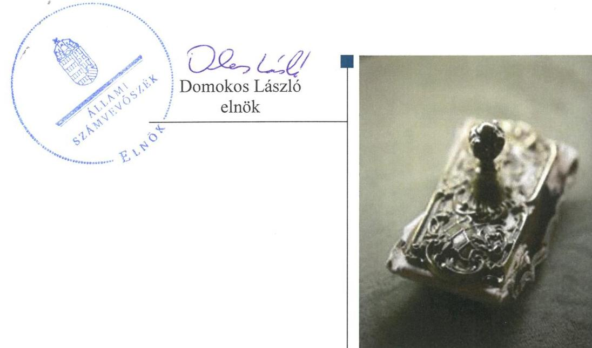
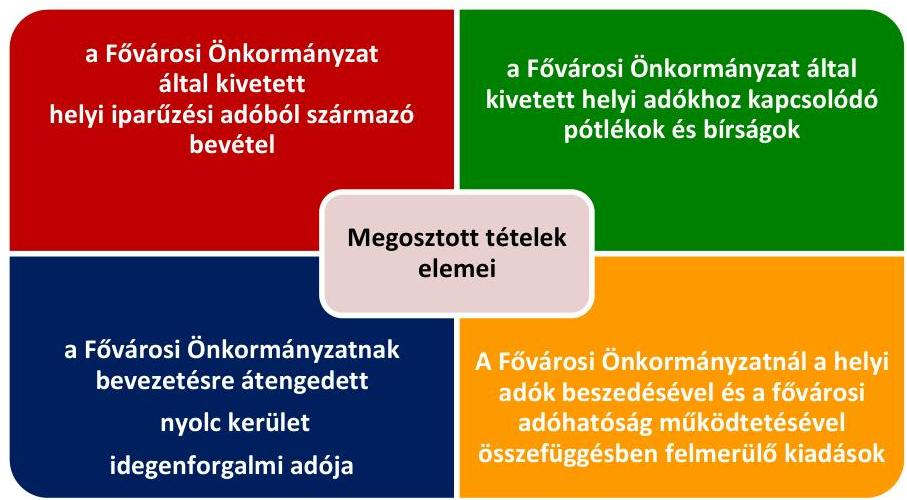

# Jelentés 

## A forrásmegosztás ellenőrzése

A Fővárosi Önkormányzatot és a kerületi önkormányzatokat osztottan megillető bevételek 2016. évi megosztásáról szóló önkormányzati rendelet felülvizsgálata 2017.

---

# A forrásmegosztás ellenőrzése 

A Fővárosi Önkormányzatot és a kerületi önkormányzatokat osztottan megillető bevételek 2016. évi megosztásáról szóló önkormányzati rendelet felülvizsgálata 2017. 04. hó 04. nap

---

# AZ ELLENŐRZÉST FELÜGYELTE: 

RENKŐ ZSUZSANNA felügyeleti vezető

## AZ ELLENŐRZÉST VEZETTE ÉS A VÉGREHAJTÁSÁÉRT FELELŐS:

KORSÓSNÉ VIGH ANDREA ellenőrzésvezető

## A PROGRAM ÖSSZEÁLLÍTÁSÁÉRT FELELŐS:

JANIK JÓZSEF LÁSZLÓ osztályvezető

## A TÉMÁHOZ KAPCSOLÓDÓ KORÁBBI SZÁMVEVŐSZÉKI JELENTÉSEK:

- címe: A Fővárosi Önkormányzatot és a kerületi önkormányzatokat osztottan megillető bevételek 2015. évi megosztásáról szóló önkormányzati rendelet felülvizsgálata
- sorszáma: 15216

IKTATÓSZÁM: V-1204-055/2016.
TÉMASZÁM: 2238
ELLENŐRZÉS-AZONOSÍTÓ SZÁM: V0769

---

# TARTALOMJEGYZÉK 

■ ÖSSZEGZÉS ..... 5
■ AZ ELLENŐRZÉS CÉLJA ..... 6
■ AZ ELLENŐRZÉS TERÜLETE ..... 7
■ AZ ELLENŐRZÉS HÁTTERE, INDOKOLTSÁGA ..... 9
■ A JELENTÉS LÉNYEGES KÉRDÉSKÖREI ..... 10
■ ELLENŐRZÉS HATÓKÖRE ÉS MÓDSZEREI ..... 11
■ MEGÁLLAPÍTÁSOK ..... 12
■ MELLÉKLETEK ..... 21
I. sz. melléklet: Értelmező szótár ..... 21
■ FÜGGELÉK: ÉSZREVÉTELEK ..... 23
■ RÖVIDÍTÉSEK JEGYZÉKE ..... 25

---

.

---

# ÖSSZEGZÉS 

A Főjegyző által a forrásmegosztás tekintetében kialakított irányítási rendszer biztosította a szabályszerű, átlátható és elszámoltatható közpénzfelhasználást. A 2016. évi forrásmegosztási rendeletet szabályszerűen, megalapozott tervszámokkal fogadta el a Fővárosi Önkormányzat Közgyűlése. A Fővárosi Önkormányzatot és a kerületeket osztottan megillető bevételek és kiadások pénzügyi elszámolásában az ÁSZ eltérést nem tárt fel. A 2017. évi forrásmegosztás során korrekció érvényesítése nem indokolt.

## Az ellenőrzés társadalmi indokoltsága

A Fővárosi Önkormányzat Közgyűlése a helyi adóztatással kapcsolatos feladat- és hatáskörében a 2016. évben 232 157,2 M Ft helyi adóbevétel beszedéséről rendelkezett, amelyből 232 006,0 M Ft volt a főváros és a kerületek között megosztható helyi adóbevétel.

A törvényi előírás szerint az ÁSZ felülvizsgálja a Fővárosi Önkormányzat tárgyévre vonatkozó forrásmegosztási rendeletét és megállapítja a Fővárosi Önkormányzat és a kerületi önkormányzatok közötti helyi adóbevételekhez kapcsolódó elszámolások jogszabályi előírásnak való megfelelőségét, vagy a tapasztalt eltérések miatt szükséges pénzügyi elszámolási korrekciókat, szabályozási pontosításokat, módosításokat.

Az ellenőrzés támogatja az átlátható és elszámoltatható közpénzfelhasználás megteremtését, valamint a felelősségteljes, következményekkel járó, a jognak érvényt szerző közigazgatási működést.

## Főbb megállapítások, következtetések

A Főjegyző a forrásmegosztási rendeletalkotással és a végrehajtással kapcsolatos feladatok tekintetében olyan egymásra épülő, a jogszabályi előírásokkal és egymással összhangban lévő belső szabályozórendszert alakított ki, amely megfelelő alapot biztosított a forrásmegosztási rendelet szabályozott és szabályszerű megalkotásához, végrehajtásához.

A 2016. évi forrásmegosztási rendeletet a törvényi és a belső szabályozó elemekben rögzített eljárásrend és határidők figyelembevételével, szabályszerűen alkotta meg a Fővárosi Önkormányzat. Számításokkal, elemzésekkel, az időarányos teljesülési adatokkal alátámasztva megalapozottan határozták meg az iparűzési és idegenforgalmi adóból, valamint a kivetett pótlékból és bírságból származó bevételek, továbbá a Fővárosi Önkormányzati Adóhatóság működtetésével összefüggő, helyi adózással kapcsolatos kiadások tervszámait. A Fővárosi Önkormányzatot és a kerületeket osztottan megillető bevételek és kiadások tervezésénél a törvényben rögzített részesedési arányokat érvényesítették.

A 2016. január 1-jétől augusztus 31-éig befolyt megosztható bevételek pénzügyi elszámolása szabályszerűen történt meg a Fővárosi Önkormányzat és a kerületek között. A Fővárosi Önkormányzat a jogszabályi rendelkezések szerint állapította meg és számolta el a kerületek felé a Fővárosi Önkormányzati Adóhatóság működtetésével összefüggő, helyi adózással kapcsolatos 2016. évi kiadási előleget, továbbá 2015. évi kiadási előleg, valamint a tény adatok alapján elszámolható kiadás különbözetét.

Az ÁSZ nem tárt fel a 2016. évi forrásmegosztást érintően eltérést, így a 2017. évi forrásmegosztás során nem szükséges korrekció érvényesítése.

---

# AZ ELLENŐRZÉS CÉLJA 

Az ellenőrzés célja a Fővárosi Önkormányzatot ${ }^{1}$ és a kerületi önkormányzatokat osztottan megillető bevételek 2016. évi forrásmegosztási rendeletben előírt megosztásának, valamint a helyi adóztatással kapcsolatos kiadások megállapítása, elszámolása szabályszerűségének ellenőrzése volt.

---

# AZ ELLENŐRZÉS TERÜLETE 

## A 2016. évi forrásmegosztási rendeletalkotás és annak végrehajtása a Fővárosi Önkormányzatnál

A Mötv. ${ }^{2}$ által rögzített kétszintű fővárosi önkormányzati rendszerben az adóbeszedésre vonatkozó hatáskörök az illetékességre vonatkozó szabályok figyelembevételével megoszlanak a főváros és a kerületek között.

A Hatv ${ }^{3}$. alapján a Fővárosi Önkormányzat a helyi iparűzési adót, a kerületi önkormányzat az építményadót, a telekadót, a magánszemélyek kommunális adóját és az idegenforgalmi adót jogosult bevezetni. A Hatv. szerint a kerületi önkormányzat képviselő-testülete beleegyezését adhatja ahhoz, hogy az általa kivethető helyi adót a Fővárosi Önkormányzat vezesse be rendeletével. A törvényi rendelkezések alapján a Fővárosi Önkormányzat által közvetlenül igazgatott Margitszigeten a Fővárosi Önkormányzat jogosult kivetni a kerületi önkormányzat által bevezethető adókat, melyekből származó bevétel a Fővárosi Önkormányzatot illeti meg.

A forrásmegosztási tv. ${ }^{4}$ határozza meg a Fővárosi Önkormányzatot és a kerületi önkormányzatokat osztottan megillető bevételek körét és a részesedési arányokat. A forrásmegosztási tv. és az annak felhatalmazása alapján készült forrásmegosztási rendelet ${ }^{5}$ szerint a Fővárosi Önkormányzat és a kerületi önkormányzatok között a 2016. évben megosztott tételeket az 1. ábra szemlélteti.
1. ábra

A megosztott tételekből a forrásmegosztási tv. 2016. évben hatályos előírása alapján a Fővárosi Önkormányzatot 52,5\%, a kerületi önkormányzatokat együttesen 47,5\% részesedés illeti meg, amely változott a 2015. évi 51-49\%-os megosztási arányhoz képest. A kerületi önkormányzatokat megillető forrás a forrásmegosztási tv. mellékletében rögzített arányok szerint kerül felosztásra.

---

A Fővárosi Önkormányzat Közgyűlése ${ }^{6}$ az Alaptörvény ${ }^{7}$, a Mötv. és a forrásmegosztási tv. felhatalmazása alapján minden évben az adott évre tervezett helyi adóbevételek megosztásának rendjét forrásmegosztási rendeletben rögzíti. A 2016. évi forrásmegosztási rendeletben meghatározott bevételi és kiadási tervszámokat az 1. táblázat mutatja be.

1. táblázat

| A 2016. ÉVI MEGOSZTOTT FORRÁSOK TERVEZETT ÖSSZEGE (E FT) |  |  |  |
| :--: | :--: | :--: | :--: |
| Megosztandó tételek | Megosztandó   forrás   összege   E FT | Főváros   részesedése   (52,5\%)   E FT | Kerületek   részesedése   (47,5\%)   E FT |
| Iparűzési adó | 232000000 | 121800000 | 110200000 |
| Kerületek által átengedett   idegenforgalmi adó | 6000 | 3150 | 2850 |
| Megosztandó helyi   adóbevételek | 232006000 | 121803150 | 110202850 |
| Kivetett adókhoz kapcsolódó pótlék, bírság | 600000 | 315000 | 285000 |
| Megosztandó bevételek   összesen | 232606000 | 122118150 | 110487850 |
| Helyi adókhoz kapcsolódó   kiadás | $-300000$ | $-157500$ | $-142500$ |
| Összesen | 232306000 | 121960650 | 110345350 |

Forrás: forrásmegosztási rendelet

---

# AZ ELLENŐRZÉS HÁTTERE, INDOKOLTSÁGA 

A forrásmegosztási tv. 6. § (1) bekezdése alapján az ÁSZ ${ }^{8}$ felülvizsgálja a Fővárosi Önkormányzat tárgyévre vonatkozó forrásmegosztási rendeletét, valamint az elszámolás szabályszerűségét. Amennyiben az ÁSZ megállapítja, hogy a Fővárosi Önkormányzat vagy valamely kerületi önkormányzat jogosulatlan forráshoz jutott vagy az őt jogszerűen megillető forrásnál alacsonyabb összegben részesült, ennek mértékével a forrásmegosztási törvény alapján meghatározott, a felülvizsgálat lezárását követő évi forrásmegosztást a Fővárosi Önkormányzat rendeletében módosítja. A Fővárosi Önkormányzat költségvetési bevételeinek több mint 50\%-át a forrásmegosztási tv. és a forrásmegosztási rendeletben érintett bevételek teszik ki, ezért is fontos ezeknek az elszámolásoknak a kontrollja.

Az ellenőrzés eredményeképp a törvényalkotás tapasztalatokkal gazdagodik a forrásmegosztás szabályozásáról, a forrásmegosztási rendelet szabályszerűségéről, következtetés vonható le arra vonatkozóan, hogy indokolt-e jogszabályi módosítás kezdeményezése. Az ellenőrzés az ellenőrzött számára visszajelzést ad a forrásmegosztás végrehajtásának szabályosságáról, javaslataival hozzájárul az esetleges hiányosságok kiküszöböléséhez. A társadalom számára jelzi, hogy a közpénzek tervezett felhasználása sem maradhat ellenőrizetlenül, az ÁSZ értékteremtő rend kialakításához és megőrzéséhez hozzájáruló tevékenysége pozitív hatással lesz a szervezetről kialakított összkép formálására.

---

# A JELENTÉS LÉNYEGES KÉRDÉSKÖREI 

1.     - A Fővárosi Önkormányzat 2016. évi forrásmegosztási rendeletalkotási folyamata szabályozott és szabályszerű volt-e?
2.     - A forrásmegosztás bevételi tervszámai megalapozottak voltak-e, a forrásmegosztás szabályszerű volt-e?
3.     - A forrásmegosztásnál figyelembe vett, a Fővárosi Önkormányzati Adóhatóság működtetésével összefüggő, helyi adózással kapcsolatos kiadások megállapítása és elszámolása szabályszerű volt-e?
4.     - Szükséges-e korrekciót érvényesíteni a 2017. évi forrásmegosztás során?

---

# ELLENŐRZÉS HATÓKÖRE ÉS MÓDSZEREI 

## Az ellenőrzés típusa

Szabályszerűségi ellenőrzés.

## Az ellenőrzött időszak

2015. szeptember 1-jétől 2016. augusztus 31-ig terjedő időszak (a forrásmegosztási rendelet előkészítésével és végrehajtásával érintett időszak)

## Az ellenőrzés tárgya

A Fővárosi Önkormányzatot és a kerületi önkormányzatokat osztottan megillető bevételek megosztásáról szóló 2016. évi forrásmegosztási rendelet.

## Az ellenőrzött szervezet

Budapest Főváros Önkormányzata

## Az ellenőrzés jogalapja

Az ellenőrzés jogszabályi alapját a forrásmegosztási tv. 6. § (1) bekezdése, valamint az ÁSZ tv. ${ }^{9}$ 1. § (3) bekezdése és 3. § (1) bekezdése képezték.

## Az ellenőrzés módszerei

Az ellenőrzés szakmai módszertana az ÁSZ hivatalos honlapján (www.asz.hu) közzétett szakmai szabályokon alapult.

Az ellenőrzési kérdések megválaszolásához szükséges bizonyítékok megszerzése az ellenőrzött által rendelkezésre bocsátott dokumentumok, adatok elemzésével valósult meg, kiegészítve a kérdésfeltevés (információkérés) módszerével.

Az ellenőrzés kiterjedt minden olyan körülményre és adatra, amely az ÁSZ jogszabályban meghatározott feladataiban, valamint a program végrehajtása folyamán felmerült újabb összefüggések feltárásához szükséges.

---

# 1. A Fővárosi Önkormányzat 2016. évi forrásmegosztási rendeletalkotási folyamata szabályozott és szabályszerű volt-e? 

Összegző megállapítás

A Fővárosi Önkormányzat a forrásmegosztási rendeletalkotás folyamatát a szabályozási rendszerébe beépítette. A forrásmegosztási rendeletalkotás feladatainak meghatározása és végrehajtása a jogszabályi előírásoknak megfelelő volt.
1.1. számú megállapítás

A Fővárosi Önkormányzat a forrásmegosztási rendeletalkotással kapcsolatos feladatokról rendelkezett belső szabályzataiban, folyamatleírásaiban és a munkaköri leírásokban. E szabályozó elemek együttese megfelelő alapot biztosított a forrásmegosztási rendeletalkotás szabályozott és szabályszerű végrehajtásához.

HIVATALI SZMSZ ${ }^{10}$-ben a Fővárosi Önkormányzat szakterületekre lebontva, a hatályos jogszabályi előírásoknak megfelelően szabályozta a forrásmegosztási rendeletalkotással kapcsolatos feladatokat.

## A FELADATELLÁTÁSSAL ÉRINTETT OSZTÁLYOK

BMSZ ${ }^{11}$-ét a Főjegyző ${ }^{12}$ a Hivatali SZMSZ-ben foglalt feladatmegosztás alapulvételével, azzal összhangban határozta meg:
$\longrightarrow$ a Pénzügyi Főosztály BMSZ ${ }^{13}$-e a forrásmegosztási javaslat és az önkormányzati rendelettervezet előkészítési feladatokat;
$\longrightarrow$ az Adó Főosztály BMSZ ${ }^{14}$-e az adóbevételek forrásmegosztás szerinti felosztását és a kerületek részére történő utalását, valamint az adóbevételi tervekhez adatszolgáltatás, elemzés, javaslat készítését írta elő.
A BMSZ-ek a jogszabályok előírásaival összhangban tartalmazták a munkafolyamatok leírását - a végrehajtással érintett munkakörök megnevezésével - és az ellenőrzési nyomvonalat.

A MUNKAFOLYAMAT LEÍRÁSOKBAN ÉS A MUNKAKÖRI LEÍRÁSOKBAN megjelenítésre kerültek a forrásmegosztási rendeletalkotással kapcsolatos belső szabályozásokban előírt feladatok.

A forrásmegosztási rendeletalkotással és a végrehajtással kapcsolatos feladatokat a Fővárosi Önkormányzat belső szabályozói a jogszabályi elírásokkal és egymással összhangban, egymásra épülve rögzítették, megfelelő alapot képeztek a forrásmegosztási rendeletalkotás szabályozott és szabályos végrehajtásához.

---

### 1.2. számú megállapítás

1.3. számú megállapítás

A Fővárosi Önkormányzat a forrásmegosztási rendeletalkotás során betartotta a forrásmegosztási tv-ben és a belső szabályzataiban, folyamatleírásaiban, a munkaköri leírásokban előírt eljárási szabályokat.

A Fővárosi Önkormányzat a forrásmegosztási tv.-ben és a belső szabályozó elemekben meghatározott eljárásrend és határidők figyelembe vételével, szabályszerűen járt el a forrásmegosztási rendeletalkotás során, mert:

- a tárgyév január 10-éig előírt határidőn belül - 2016. január 8-án küldte meg a

 kerületi önkormányzatoknak véleményezésre a forrásmegosztási rendelettervezetet;
- a forrásmegosztási rendelettervezet 2016. január 8-i véleményezésre megküldése és a forrásmegosztási rendelet 2016. január 27-i jóváhagyása között a kerületek számára az előírt 15 napos véleményezési idő biztosított volt;
- a Közgyűlés a kerületi önkormányzatoknak a forrásmegosztási rendelettervezetről a Fővárosi Önkormányzat részére megküldött vélemények, valamint nyolc kerületi önkormányzat tekintetében az idegenforgalmi adó beszedés Fővárosi Önkormányzat részére történő átengedéséről adott előzetes beleegyező nyilatkozat birtokában fogadta el a forrásmegosztási rendeletet;
- a Közgyűlés által elfogadott forrásmegosztási rendelet hatályba léptetése az előírt határidőben - 2016. január 31-én - megtörtént.

A forrásmegosztási rendelet a forrásmegosztási tv. előírásaival összhangban és a végrehajtáshoz szükséges valamennyi tartalmi elemre kiterjedően szabályozta a forrásmegosztás rendjét.

A FORRÁSMEGOSZTÁS SZABÁLYAIT a forrásmegosztási rendeletben a Fővárosi Önkormányzat a forrásmegosztási tv. előírásaival összhangban, a szabályszerű végrehajtáshoz szükséges valamennyi tartalmi elemre kiterjedően meghatározta, így:
$\longrightarrow$ a megosztandó bevételek körét és összegét;
$\longrightarrow$ a megosztott forrásokból a Fővárosi Önkormányzatot megillető 52,5 %, valamint a kerületi önkormányzatokat együttesen megillető 47,5 %, továbbá ebből a kerületeket egyedileg megillető megosztási arányt;
$\longrightarrow$ az idegenforgalmi adóból származó tervezett bevétel megosztását azok között a kerületi önkormányzatok között, amelyek a Fővárosi Önkormányzatnak átengedték az adó kivetésének és beszedésének a jogát;
$\longrightarrow$ a helyi adó beszedésével kapcsolatos - a Fővárosi Önkormányzat és a kerületek között megosztandó - kiadások tervezett összegét, az elszámolható kiadás felső korlátra vonatkozó szabályt, valamint e kiadások elszámolásának rendjét;
$\longrightarrow$ a pénzügyi teljesítés rendjét.

---

1.4. számú megállapítás

Kialakították és megfelelően, a folyamatba építve működtették a rendeletalkotásra vonatkozóan az előzetes, utólagos és vezetői ellenőrzést.

KIALAKÍTOTTA a Fővárosi Önkormányzat a forrásmegosztási rendeletalkotás folyamatára vonatkozó FEUVE${ }^{15}$-t, amely megfelelt a Bkr. ${ }^{16}$ ben előírt követelményeknek:
$\longrightarrow$ a feladatellátásban érintett szervezeti egységek belső szabályozó elemeiben (BMSZ-ekben, folyamatleírásokban, ellenőrzési nyomvonalakban, munkaköri leírásokban) előírt feladatokhoz hozzárendelték a kontrolltevékenységeket és meghatározták azok felelőseit;
$\longrightarrow$ biztosították a tevékenységek feladatköri elkülönítését.
MEGFELELŐEN MŰKÖDTETTÉK a forrásmegosztási rendeletalkotás folyamatában érintett szervezeti egységek a FEUVE-t, mert a belső szabályozó eszközökben előírt kontrolltevékenységeket a kijelölt felelősök dokumentáltan, nyomon követhető módon végrehajtották.

# 2. A forrásmegosztás bevételi tervszámai megalapozottak vol-tak-e, a forrásmegosztás szabályszerű volt-e? 

Összegző megállapítás

A forrásmegosztási rendeletben az iparűzési- és idegenforgalmi adó, valamint pótlék és bírság bevételek tervszámai megalapozottak voltak. A megosztott bevételek megállapítása, a 2016. év ellenőrzött időszakában a befolyt bevételek pénzügyi elszámolása szabályszerű volt.
2.1. számú megállapítás

A forrásmegosztás bevételi tervszámai számításokkal, elemzésekkel, az adóbevételek időarányos teljesülésének adataival alátámasztottak, megalapozottak voltak.

A HELYI IPARŰZÉSI ADÓBEVÉTEL forrásmegosztási rendeletben előirányzott összesen 232 000 000,0 E Ft megosztandó bevételi tervszáma megalapozott volt, mert a számításokat elemzésekkel, a 2015. december 20-án esedékes adóelőleg kiegészítés (Art. ${ }^{17}$ szerinti feltöltési kötelezettség), illetve a 2015. évi adóbevételek teljesülésének adataival alátámasztották.

A 2015. évben 221 256 351 E Ft helyi iparűzési adóbevétel teljesült, amely 5%-kal meghaladta a 2015. évi tervszámot. A 2016. évi tervezést megalapozó elemzéseknél, számításoknál figyelembe vették a külső gazdasági hatásokat, a kormányzat által jelzett GDP növekedést, a fogyasztói árindex várható alakulását, továbbá a fővárosra jellemző, legjelentősebb ágazatok - a kereskedelem, az ipar, a pénzügyi szektor - eredményeinek, illetve kockázati tényezőinek a hatását.

## A KERÜLETEK ÁLTAL ÁTENGEDETT IDEGENFOR-

GALMI ADÓBEVÉTEL forrásmegosztási rendeletben meghatározott 6000 E Ft tervszáma megalapozott volt az ahhoz készített számítások, a 2015. évi teljesülési adatok, valamint az adó bevezetését (kivetését és

---

beszedését) a Fővárosi Önkormányzat számára átengedő kerületek számában bekövetkezett változás alapján.

Az idegenforgalmi adóbevétel bevezetését a bázisként szolgáló 2015. évben kilenc kerületi önkormányzat engedte át a Fővárosi Önkormányzat részére, amelyből 7098 E Ft adóbevétel teljesült. A 2016. évi idegenforgalmi adóbevételek tervezésénél:

- figyelembe vették, hogy az adó bevezetését átengedő kerületek száma nyolcra csökkent, mert a 2015. évhez képest a XV. kerület Képviselő-testülete nem adta az előzetes beleegyezését az általa bevezethető idegenforgalmi adónak a Fővárosi Önkormányzat részére történő átengedéséhez;
- az idegenforgalmi adó kivetésére és beszedésére előzetesen beleegyezését adó XVI-XXIII. kerületeket érintően a 2015. évi zárási összesítővel alátámasztott bázis adatokból kiindulva - a tényadatot a XV. kerület részesedésével csökkentve - tervezték meg ezen adónemre a megosztandó bevétel összegét.

# A KIVETETT HELYI ADÓKHOZ KAPCSOLÓDÓAN KISZABOTT PÓTLÉK ÉS BíRSÁG BEVÉTELEKET 

600 000 E Ft összeggel megalapozottan, elsődlegesen a 2015. évben azonos jogcímen befolyt pótlék és bírság bevételekre alapozva tervezte meg a Fővárosi Önkormányzat, figyelemmel a Fővárosi Önkormányzat által kivetett helyi adók 2016. évi bevételi tervszámait is.

- A 2015. évre előirányozott 1 000 000 E Ft pótlék és bírság bevétel 58,1%-os mértékben, 581 181 E Ft összegben teljesült. A 2016. évi tervezés során a pótlék és bírság bevételek tervezettől való elmaradásának okait elemezték. A pótlék és bírság bevételek visszaesését eredményező tényezőként tárták fel a pótlékok mértékében szerepet játszó jegybanki alapkamat, valamint a behajtási cselekmények növelése következtében a hátralékos napok számának csökkenését.
- A 2016. évi tervezésnél a 2015. évben teljesült pótlék és bírság bevételhez képest növelő tényezőként vették figyelembe a Fővárosi Önkormányzat által kivetett helyi adók tekintetében a 2015. évben befolyt bevételekhez képest a 2016. évre tervezett növekedést. A 2015. évben a Fővárosi Önkormányzat által kivetett helyi adóból származó bevétel 221 423 750 E Ft volt, amellyel szemben a 2016. évben 232 157 150 E Ft-ot irányoztak elő.

A 2016. évi forrásmegosztási rendeletben szereplő pótlék és bírságbevétel tervezésénél - és a tervezés bázisául szolgáló 2015. évben is - szabályszerűen a Fővárosi Önkormányzat által kivetett helyi adókhoz kapcsolódóan kiszabott pótlék, bírság teljes összegét figyelembe vették megosztandó bevételként.

## 2.2. számú megállapítás

A Fővárosi Önkormányzatot és a kerületi önkormányzatokat együttesen megillető és a megosztott bevételek kerületenkénti megállapítása megfelelt a forrásmegosztási tv. előírásainak.

A forrásmegosztási rendeletben a Fővárosi Önkormányzat szabályszerűen, a forrásmegosztási tv. előírásaival összhangban állapította meg az egyes bevételi jogcímek szerint a Fővárosi Önkormányzatot, valamint a kerületi

---

önkormányzatokat együttesen megillető bevételek részarányát, összegét, továbbá az egyes kerületek részesedését.
$\longrightarrow$ A forrásmegosztásba bevont bevételekből a Fővárosi Önkormányzat részesedését 52,5%, a 23 kerületi önkormányzat együttes részesedését 47,5%-os megosztási arány alkalmazásával határozták meg.
$\longrightarrow$ Az egyes kerületeket megillető forrásrész kiszámítását a forrásmegosztási tv. mellékletében szereplő arányszámok alapján végezték el.
$\longrightarrow$ A forrásmegosztási tv-ben rögzített - fenti - arányszámok alkalmazásával az iparűzési adó és a Fővárosi Önkormányzat által kivetett helyi adókhoz kapcsolódóan kiszabott pótlék és bírság tervezett összegének kiszámítása szabályszerű volt.
$\longrightarrow$ Az idegenforgalmi adóból származó tervezett bevétel megosztása csak az adóbeszedést a Fővárosi Önkormányzatnak átengedő (XVI-XXIII.) kerületi önkormányzatok között, a forrásmegosztási tv. mellékletében kerületekre meghatározott arányszámok megfelelő alkalmazásával történt meg.

# 2.3. számú megállapítás 

A 2016. január 1-jétől augusztus 31-éig befolyt megosztható bevételek pénzügyi elszámolása szabályszerűen történt meg a Fővárosi Önkormányzat és a kerületi önkormányzatok között.

A 2016. január 1-jétől augusztus 31-éig befolyt megosztható bevételek pénzügyi elszámolását a Fővárosi Önkormányzat a forrásmegosztási tv. és a forrásmegosztási rendelet előírásainak megfelelően, szabályszerűen végezte el.
$\longrightarrow$ A tárgyhónapban befolyt megosztható bevételek kerületeket megillető hányadát (47,5%-át) a Fővárosi Önkormányzat a forrásmegosztási tv. mellékletében szereplő arányszámok alapján felosztva az egyes kerületek között, havonta a forrásmegosztási rendelet szerinti határidőben (a tárgyhót követő hó 10. napjáig, illetve júniusban a hónap 30. napjáig), a kerületi önkormányzatok részére átutalta.
$\longrightarrow$ A tárgyhónapban befolyt megosztható bevételekből az egyes kerületeket megillető összeg meghatározását a Fővárosi Önkormányzat adónemenként külön-külön végezte el. A forrásmegosztási tv. előírása szerint a helyi iparűzési adóbevételt és a Fővárosi Önkormányzat által kivetett helyi adókhoz kapcsolódó pótlék és bírság bevételt mind a 23 kerülettel, az idegenforgalmi adót az adó kivetését és beszedését átengedő nyolc kerületi önkormányzattal osztották meg.
$\longrightarrow$ A 2016. június havi utalásban érvényesítették a 2016. évi kiadási előleget, továbbá a 2015. évben levont kiadási előleg és a 2015. évi zárszámadási rendeletben ${ }^{18}$ elfogadott tényadatok alapján elszámolható különbözetet.

---

# 3. A forrásmegosztásnál figyelembe vett, a Fővárosi Önkormányzati Adóhatóság működtetésével összefüggő, helyi adózással kapcsolatos kiadások megállapítása és elszámolása szabályszerű volt-e? 

Összegző megállapítás

A Fővárosi Önkormányzat szabályszerűen állapította meg és számolta el a forrásmegosztás során, a Fővárosi Önkormányzati Adóhatóság működtetésével összefüggő, helyi adózással kapcsolatos kiadásokat.
3.1. számú megállapítás

Megalapozottan tervezték meg a forrásmegosztási rendeletben a 2016. évi előlegként meghatározott működtetési kiadások tervszámát.

A FŐVÁROSI ÖNKORMÁNYZATI ADÓHATÓSÁG ${ }^{18}$ MŰKÖDTETÉSÉVEL ÖSSZEFÜGGŐ KIADÁSOKAT valamennyi helyi adónem beszedésével kapcsolatos kiadást figyelembe véve - 942 677 E Ft összeggel tervezték a 2016. évi forrásmegosztást megalapozó számításokban. Közvetlenül felmerült működési célú kiadásként az Adó Főosztály ${ }^{20}$ dolgozóinak személyi juttatásaival és járulékaival, az adóügyi feladatok ellenőrzését végző dolgozók érdekeltségi rendszerével kapcsolatos személyi juttatással és járulékával, valamint az adóigazgatási feladatokhoz kapcsolódó dologi kiadásokkal terveztek, a 2015. évi könyvviteli nyilvántartásokkal alátámasztott bázis adatok alapján.

KORLÁTKÉNT FIGYELEMBE VETTÉK a forrásmegosztási tv. előírását, mely szerint a Fővárosi Önkormányzati Adóhatóság működtetésével összefüggően felmerült kiadásokat legfeljebb a Fővárosi Önkormányzat rendelete alapján kivetett helyi adókhoz kapcsolódóan kiszabott pótlék és bírság bevétel 50%-áig lehet elszámolni a forrásmegosztás során. Ez alapján a 942 677 E Ft működési kiadásból 300 000 E Ft volt 2016. évi kiadási előlegként érvényesíthető.

A 2016. évi forrásmegosztási rendeletben megalapozottan terveztek meg a 300 000 E Ft megosztandó működési kiadást (2016. évi kiadási előleget) és azt szabályszerűen, a forrásmegosztási tv-ben előírt arányszámokat alkalmazva osztották meg a Fővárosi Önkormányzat (157 500 E Ft) és a kerületek között (együttesen 142 500 E Ft).
3.2. számú megállapítás

A 2016-ban elszámolt kiadási előleg megosztása, érvényesítése szabályszerű volt.

A Fővárosi Önkormányzat a kerületek felé történt 2016. június havi utalásban szabályszerűen osztott meg és érvényesített együttesen 142 500 E Ft kiadási előleget.

A 2015. évi zárszámadási rendeletben a helyi adók beszedéséhez kapcsolódóan jóváhagyott közvetlen működési célú kiadás összege 837 025 E Ft volt, amelyet főkönyvi kivonattal és analitikával alátámasztottak. Ez meghaladta a kiadási előlegként elszámolható felső korlátot, ezért a Fővárosi Önkormányzat a forrásmegosztási rendelet szerinti pótlék és

---

# 3.3. számú megállapítás 

bírság bevételek 50%-os szintjére korrigálva érvényesítette a 2016. évi kiadási előlegeket a kerületek felé.

A 2015. év során érvényesített kiadási előlegek és a ténylegesen elszámolható kiadások összevetése 2016-ban megtörtént, a megállapított különbözetet a Fővárosi Önkormányzat szabályosan elszámolta az egyes kerületekkel.

## A 2015. ÉVI KIADÁSI ELŐLEG ELSZÁMOLÁSA

2016. júniusban szabályszerű volt.

A 2015. évi zárszámadási rendelet elfogadását követően a 2015. júniusban elszámolt kiadási előlegeket és a 2015. évre vonatkozóan ténylegesen elszámolható kiadásokat összevetették.
—_A 2015. évi forrásmegosztás során a Fővárosi Önkormányzat a kerületek felé együttesen 245 000 E Ft kiadási előleget érvényesített.
—_A 2015. évre elszámolható, megosztható kiadást a forrásmegosztási tv. előírásának megfelelően, a 2015. évi zárszámadásban jóváhagyott tényszámok alapján, a szükséges korrekciókat elvégezve határozták meg. A 2015. évi zárszámadási rendeletben a helyi adók beszedéséhez kapcsolódóan 837 025 E Ft közvetlen működési célú kiadást mutattak ki. A helyi adókhoz kapcsolódóan kiszabott pótlékból

 és bírságból befolyt összes bevétel ebben az évben 581182 E Ft volt, mely összeg 50\%-a - 290591 E Ft - a Fővárosi Önkormányzat és a kerületek között megosztható kiadás felső korlátját jelentette. A 2015. évben hatályos forrásmegosztási tv. szerint, a megosztandó forrásokból a Fővárosi Önkormányzatot 51\%, a kerületeket együttesen 49\% részesedés illette meg, amely alapján a kerületi önkormányzatokat terhelő 2015. évi kiadási tényösszegként 142389 E Ft volt elszámolható.
A Fővárosi Önkormányzat kimutatta az elszámolt és az elszámolható kiadás közötti 102611 E Ft különbözetet, amelyet a 2015. évi zárszámadási rendelet hatályba lépését követő hónapban megfelelően érvényesített az egyes kerületek felé történő utalásokban.

---

# 4. Szükséges-e korrekciót érvényesíteni a 2017. évi forrásmegosztás során? 

Összegző megállapítás

Az ÁSZ nem tárt fel a 2016. évi forrásmegosztást érintő eltérést, így a 2017. évi forrásmegosztás során korrekció érvényesítése nem szükséges.
4.1. számú megállapítás

A 2016. évi forrásmegosztásba bevont bevételek és kiadások megállapítása, elszámolása tekintetében az ÁSZ nem tárt fel a 2017. évi forrásmegosztás során korrigálni szükséges számítási hibát, egyéb eltérést.

A forrásmegosztási rendeletben a forrásmegosztási tv. előírásaival összhangban, megalapozottan és számszakilag helyesen határozták meg a Fővárosi Önkormányzatot és a kerületi önkormányzatokat együttesen megillető bevételek és kiadások tervszámait.

A forrásmegosztással érintett bevételek és kiadások 2016. évi pénzügyi elszámolása során az ÁSZ eltérést nem tárt fel.

A Fővárosi Önkormányzat a jogszabályi előírásoknak megfelelően járt el az ellenőrzött időszakban, ezért a 2017. évi forrásmegosztási eljárás során korrekció nem indokolt.

---

.

---

# MELLÉKLETEK 

- I. SZ. MELLÉKLET: ÉRTELMEZŐ SZÓTÁR

Fővárosi Önkormányzat által kivetett helyi adóhoz kapcsolódóan kiszabott pótlék és bírság
helyi adóztatással kapcsolatos kiadás
idegenforgalmi adó
iparűzési adó
kiadási előleg
részesedés

A fővárost és a kerületeket osztottan illetik meg a fővárosi önkormányzat közgyűlésének rendelete alapján kivetett helyi adóhoz kapcsolódóan kiszabott pótlékból és bírságból származó bevételek. (Forrás: A forrásmegosztási törvény 2. § (2) bekezdése alapján meghatározott fogalom.
A fővárosi önkormányzati helyi adóztatással kapcsolatos - a tárgyévre vonatkozóan a fővárosi önkormányzatot és a kerületi önkormányzatokat osztottan megillető bevételek (iparűzési adó, nyolc kerületnél befolyt idegenforgalmi adó, a kivetett helyi adóhoz kapcsolódóan kiszabott pótlék és bírság) beszedésével összefüggően felmerült - kiadásokat a forrásmegosztási tv. 2. § (1) bekezdés a) pontja szerinti bevételből részesülők viselik részesedésük arányában. Kiadásként a fővárosi önkormányzatnál a beszedéssel - a fővárosi önkormányzati adóhatóság működtetésével - összefüggően felmerült működtetési kiadásokat kell figyelembe venni. A forrásmegosztási tv. 2. § (1) bekezdés a) pontja és a (4) bekezdés szerint figyelembe vehető kiadásokat a (2) bekezdésben felsorolt bevételek legfeljebb 50\%-áig terjedő mértékben lehet érvényesíteni. (Forrás: A forrásmegosztási törvény 2. § (4), (6) bekezdése alapján meghatározott fogalom.)
A kommunális jellegű adók közül a kerület döntése alapján átengedett helyi idegenforgalmi adóból beszedett bevétel. A helyi idegenforgalmi adót a kerületi önkormányzat helyett a Fővárosi Önkormányzat rendeletével akkor jogosult bevezetni, ha ahhoz minden adóév tekintetében az érintett kerület önkormányzatának képviselőtestülete előzetes beleegyezését adja. A fővárosi önkormányzat által közvetlenül igazgatott terület tekintetében a kerületi önkormányzat által bevezethető adó bevezetésére a fővárosi önkormányzat jogosult. (Forrás: A Hatv. III. fejezet Kommunális jellegű adók pontja alapján meghatározott fogalom)
A Hatv. felhatalmazása alapján a Fővárosi Közgyűlés rendeletével kivetett helyi adónem. A Fővárosi Önkormányzat illetékességi területén vállalkozói tevékenységet (iparűzési tevékenységet) állandó vagy ideiglenes jelleggel végző vállalkozó helyi iparűzési adót köteles fizetni. (Forrás: A Hatv. 1. § (2) bekezdése, valamint a 35. § (1) és (2) bekezdései alapján meghatározott fogalom.)
A tárgyévet megelőző év költségvetési rendeletének végrehajtásáról szóló Fővárosi Önkormányzati rendeletben elfogadott adóbeszedéssel kapcsolatos kiadásokat kell előlegként figyelembe venni és a levonását a rendelet hatályba lépését követő havi utalásban kell a kerületi önkormányzatok felé érvényesíteni. Az előleg és a tárgyévi tényleges kiadások különbözetét a tárgyévi költségvetési rendelet végrehajtásáról szóló rendelet hatályba lépését követő havi utalásban kell elszámolni. (Forrás: A forrásmegosztási törvény 2. § (5) bekezdése alapján meghatározott fogalom.)
A forrásmegosztásba bevont bevételekből a Fővárosi Önkormányzatot és a kerületi önkormányzatokat együttesen megillető részesedés arányszáma. A Fővárosi Önkormányzatot és a kerületi önkormányzatokat a forrásmegosztási törvény 2. § alapján osztottan megillető bevételekből a Fővárosi Önkormányzatot 52,5\%, a kerületi önkormányzatokat együttesen 47,5\% részesedés illeti meg. (Forrás: A forrásmegosztási törvény 2-3. §-ai alapján meghatározott fogalom)

---

részesedési arányok

A kerületi önkormányzatokat megillető források egyes kerületek közötti megosztásának aránya, amelyet a forrásmegosztási törvény melléklete tartalmaz. (Forrás: A forrásmegosztási törvény 4. § (1) bekezdése alapján meghatározott fogalom.)
tárgyév Azon gazdasági év, amelyhez tartozó megosztandó bevételeknek a Fővárosi Önkormányzat és a kerületi önkormányzatok közötti megosztását a forrásmegosztási rendelet határozza meg. (Forrás: A forrásmegosztási törvény 1. §-a alapján meghatározott fogalom.)

---

# FÜGGELÉK: ÉSZREVÉTELEK 

A jelentéstervezetet a Számvevőszék 15 napos észrevételezésre megküldte az ellenőrzött szervezet vezetőjének az ÁSZ tv. 29. § (1) bekezdése előírásának megfelelően.

Az ellenőrzött szervezet vezetője az ÁSZ tv. 29. § (2) bekezdésében foglalt észrevételezési jogával nem élt, a jelentéstervezetre észrevételt nem tett.

[^0]
[^0]:    * 29. § (1) Az Állami Számvevőszék az ellenőrzési megállapításait megküldi az ellenőrzött szervezet vezetőjének vagy az általa megbízott személynek, és annak, akinek személyes felelősségét állapította meg.
    (2) Az ellenőrzött szervezet vezetője és a felelősként megjelölt személy az ellenőrzés megállapításaira tizenöt napon belül írásban észrevételt tehet.
    (3) Az Állami Számvevőszék az észrevételre a beérkezésétől számított harminc napon belül írásban válaszol. A figyelembe nem vett észrevételeket köteles a jelentésben feltüntetni, és megindokolni, hogy azokat miért nem fogadta el.

---

.

---

# RÖVIDÍTÉSEK JEGYZÉKE 

${ }^{1}$ Fővárosi Önkormányzat
${ }^{2}$ Mötv.
${ }^{3}$ Hatv.
${ }^{4}$ forrásmegosztási tv.
${ }^{5}$ forrásmegosztási rendelet
${ }^{6}$ Közgyűlés
${ }^{7}$ Alaptörvény
${ }^{8}$ ÁSZ
${ }^{9}$ ÁSZ tv.
${ }^{10}$ Hivatali SZMSZ
${ }^{11}$ BMSZ
${ }^{12}$ Főjegyző
${ }^{13}$ Pénzügyi Főosztály BMSZ
${ }^{14}$ Adó Főosztály BMSZ
${ }^{15}$ FELIVE
${ }^{16}$ Bkr.
${ }^{17}$ Art.
${ }^{18} 2015$. évi zárszámadási rendelet
${ }^{19}$ Fővárosi Önkormányzati Adóhatóság
${ }^{20}$ Adó Főosztály

Budapest Főváros Önkormányzata
2011. évi CLXXXIX. törvény Magyarország helyi Önkormányzatairól
1990. évi C. törvény a helyi adókról
2006. évi CXXXIII. törvény a fővárosi önkormányzat és a kerületi önkormányzatok közötti forrásmegosztásról (2016. január 1-jétől hatályos szöveg)
4/2016. (I. 29.) Főv. Kgy. rendelet a Fővárosi Önkormányzatot és a kerületi önkormányzatokat osztottan megillető bevételek 2016. évi megosztásáról
Budapest Főváros Önkormányzatának Közgyűlése
Magyarország Alaptörvénye (kihirdetve 2011. április 25-én)
Állami Számvevőszék
2011. évi LXVI. törvény az Állami Számvevőszékről, hatályos 2011. július 1-jétől

A főpolgármester és a Főjegyző 6/2015. (II. 3.) - többször módosított - együttes utasítása Budapest Főváros Főpolgármesteri Hivatal Szervezeti és Működési Szabályzatáról, Ügyrendjéről egységes szerkezetben (a 2015. május 8 -tól 2016. szeptember 7-ig hatályos szöveg)
belső működési szabályzat
Budapest Főváros Önkormányzatának Főjegyzője
Budapest Főváros Főjegyzője 53/2015. (VI. 15.) utasítása a Pénzügyi Főosztály belső működési szabályzatáról (hatályos: 2015. június 16-ától)
Budapest Főváros Főjegyzője 72/2013. (IX. 17.) számú - többször módosított utasítása az Adó Főosztály belső működési szabályzatáról (hatályos: 2016. március 9 -éig)
Budapest Főváros Főjegyzője 17/2016. (III. 9.) utasítása az Adó Főosztály belső működési szabályzatáról (hatályos: 2016. március 10-étől)
folyamatba épített előzetes, utólagos és vezetői ellenőrzés
370/2011. (XII. 31.) Korm. rendelet a költségvetési szervek belső kontrollrendszeréről és belső ellenőrzéséről
2003. évi XCII. törvény az adózás rendjéről

Budapest Főváros Önkormányzata Közgyűlésének 16/2016. (V. 18.) önkormányzati rendelete a Budapest Főváros Önkormányzata 2015. évi összevont költségvetéséről 9/2015. (III. 16.) Főv. Kgy. rendelet végrehajtásáról
Budapest Főváros Önkormányzatának Főjegyzője által átruházott hatáskörben Budapest Főváros Önkormányzata Főpolgármesteri Hivatalának Adóhatósága
Budapest Főváros Önkormányzata Főpolgármesteri Hivatalának Adó Főosztálya

---

# ÁLLAMI SZÁMVEVŐSZÉK 

1052 Budapest, Apáczai Csere János utca 10.
Levélcím: 1364 Budapest 4. Pf. 54
Telefon: +36 14849100 Telefax: +36 14849200
www.asz.hu
