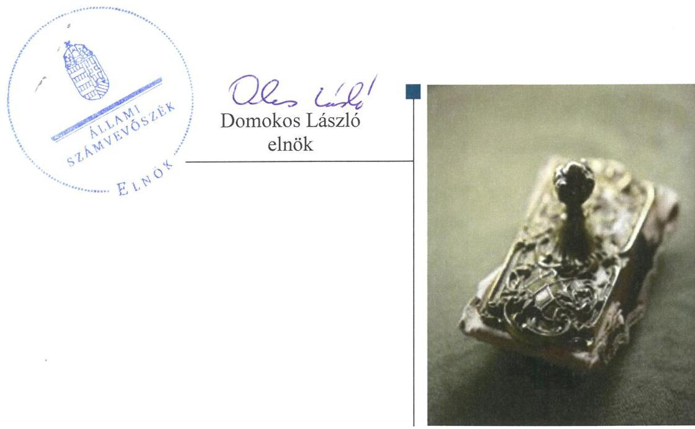
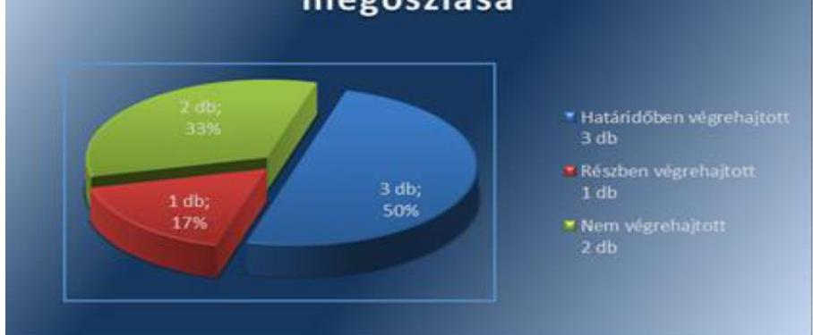

# Jelentés 

## Utóellenőrzések

Az önkormányzatok pénzügyi gazdálkodási helyzetének, szabályszerűségének utóellenőrzése - Gyöngyös
2017.

---

# Jelentés 

## Utóellenőrzések

Az önkormányzatok pénzügyi gazdálkodási helyzetének, szabályszerűségének utóellenőrzése - Gyöngyös
2017. O.A. hó OG. nap

---

|  J | AZ ELLENŐRZÉST FELÜGYELTE:  |
| --- | --- |
|   | RENKŐ ZSUZSANNA felügyeleti vezető  |
|   | AZ ELLENŐRZÉST VEZETTE ÉS A VÉGREHAJTÁSÁÉRT FELELŐS:  |
|   | DR. SIMON JÓZSEF ellenőrzésvezető  |
|   | A PROGRAM ÖSSZEÁLLÍTÁSÁÉRT FELELŐS:  |
|   | JANIK JÓZSEF LÁSZLÓ osztályvezető  |
|   | A TÉMÁHOZ KAPCSOLÓDÓ KORÁBBI SZÁMVEVŐSZÉKI JELENTÉSEK:  |
|   | - címe: Jelentés az önkormányzatok pénzügyi gazdálkodási helyzete értékelésének, és gazdálkodása szabályosságának – 2013. évben induló – ellenőrzéséről – Gyöngyös  |
|  J | - sorszáma: 14021  |
|   | IKTATÓSZÁM: V-1175-071/2016.  |
|   | TÉMASZÁM: 2209  |
|   | ELLENŐRZÉS-AZONOSÍTÓ SZÁM: V075524  |

---

# TARTALOMJEGYZÉK 

■ ÖSSZEGZÉS ..... 5
■ AZ ELLENŐRZÉS CÉLJA ..... 6
■ AZ ELLENŐRZÉS TERÜLETE ..... 7
■ AZ ELLENŐRZÉS HÁTTERE, INDOKOLTSÁGA ..... 9
■ A JELENTÉS LÉNYEGES KÉRDÉSKÖREI ..... 10
■ ELLENŐRZÉS HATÓKÖRE ÉS MÓDSZEREI ..... 11
■ MEGÁLLAPÍTÁSOK ..... 13
■ MELLÉKLETEK ..... 15
I. sz. melléklet: Az ÁSZ 14021 számú jelentéséhez kapcsolódó intézkedési terv végrehajtása ..... 15
■ FÜGGELÉK: ÉSZREVÉTELEK ..... 17
■ RÖVIDÍTÉSEK JEGYZÉKE ..... 19

---

.

---

# ÖSSZEGZÉS 

Gyöngyös Városi Önkormányzat gazdálkodásában az Állami Számvevőszék korábbi ellenőrzése során megfogalmazott javaslatok nem hasznosultak. Az Önkormányzat által a pénzügyi egyensúly megőrzése és az adósságállomány újratermelődésének elkerülése érdekében tett intézkedései nem voltak elégségesek annak ellenére, hogy évente képeztek egyensúlyi tartalékot, mivel a pénzügyi problémákat kiváltó okokat nem mérték fel, kezelésükről nem intézkedtek. A korábbi ÁSZ jelentés alapján a részesedések értékének szabályszerű elszámolására és a közbeszerzési eljárások lefolytatására vonatkozó javaslatok hasznosultak.

## Az ellenőrzés társadalmi indokoltsága

Az ÁSZ ${ }^{1}$ stratégiájában célul tűzte ki a számvevőszéki munka hasznosulásának javítását. Ezzel összhangban utóellenőrzések keretében ellenőrzi, hogy az ellenőrzött önkormányzatok megvalósították-e a korábbi ellenőrzések által feltárt hibák, hiányosságok és szabálytalanságok megszüntetése céljából kialakított intézkedési terveikben foglaltakat. A rendszeres utóellenőrzések hozzájárulnak a szükséges intézkedések tényleges végrehajtásához, ezáltal a közpénzügyek rendezettségének javulásához és a közpénzek szabályszerű felhasználásához. Az Önkormányzat intézkedési tervében szereplő feladatok jelentősége indokolttá tette az utóellenőrzés elvégzését.

## Főbb megállapítások, következtetések

Az intézkedési terv ${ }^{3}$ feladatainak végrehajtásáról a Bkr. ${ }^{4}$ által előírt nyilvántartást vezette az Önkormányzat.
Az intézkedési tervben meghatározott feladatok közül három feladat végrehajtása történt meg. Az Önkormányzat egy feladatot részben hajtott végre, továbbá két feladat végrehajtása érdekében nem történt intézkedés.

Az Önkormányzat a végrehajtott feladatok keretében a saját és az Önkormányzat kizárólagos tulajdonában álló gazdasági társaságok éves kötelezettségeire biztosította az egyensúlyi (elkülönített) tartalékot, gondoskodott a közbeszerzési eljárás szabályszerű lefolytatásáról, valamint a részesedések értékét a jogszabályi előírásoknak megfelelően mutatta be az éves költségvetési beszámolóban.

Az Önkormányzat részben teljesítette a költségvetési rendelettervezet, valamint annak évközi módosítása előterjesztését megelőzően a bevételszerző és kiadáscsökkentő lehetőségek felmérésére illetve ezzel kapcsolatban a Képviselő-testület ${ }^{6}$ számára döntési javaslat előterjesztésére vonatkozó feladatot. A bevételszerző és kiadáscsökkentési lehetőségek felmérése évente a költségvetési koncepció összeállítása során megtörtént. Azonban az éves költségvetés egyensúlyának javítása érdekében, a bevételek növelését célzó döntési javaslatot az ellenőrzött időszakban a polgármester ${ }^{7}$ nem terjesztett elő a Képviselő-testület részére.

A nem végrehajtott feladatok esetében az Önkormányzat nem gondoskodott a pénzügyi egyensúly hosszú távú megőrzése és az adósságállomány újratermelődésének elkerülése érdekében az Önkormányzatra vonatkozó stabilizációs program elkészítéséről. Továbbá nem intézkedett a polgármester stabilizációs intézkedési terv ${ }^{8}$ készítéséről az Önkormányzat kizárólagos tulajdonában lévő gazdasági társaságok gazdálkodásának optimalizálása érdekében.

---

# AZ ELLENŐRZÉS CÉLJA

Az ellenőrzés célja annak értékelése volt, hogy az Önkormányzat pénzügyi gazdálkodási helyzetének, szabályszerűségének ellenőrzéséről készült ÁSZ jelentésben foglalt intézkedést igénylő megállapításokkal és javaslatokkal összhangban készített intézkedési tervben meghatározott feladatokat az Önkormányzat végrehajtotta-e.

---

# **AZ ELLENŐRZÉS TERÜLETE**

## **Gyöngyös Városi Önkormányzat**

Gyöngyös város Heves megyében található, a gyöngyösi járás székhelye. Közigazgatási területe 55,31 km², állandó lakosainak száma a Központi Statisztikai Hivatal által közzétett népességi adatok szerint 2015. január 1-jén 30 190 fő volt*.

Az Önkormányzat és intézményei 2014-ben 7857,5 millió Ft, 2015-ben 5816,2 millió Ft költségvetési bevételt értek el, amely közel 26%-os csökkenést jelent. 2014-ben az Önkormányzat 5879,8 millió Ft, 2015-ben 5819,7 millió Ft költségvetési kiadást teljesített. Az Önkormányzat konszolidált mérlegfőösszege 2014-ben 16 856,6 millió Ft, 2015-ben 16 649,0 millió Ft volt.*

Az Önkormányzat a 2014. december 31-i egyszerűsített mérlegében összesen 428,4 millió Ft, a 2015. december 31-i egyszerűsített mérlegében 217,5 millió Ft kötelezettségállományt mutatott ki, amelyből 15,4 millió Ft, illetve 48,8 millió Ft a költségvetési évet követően volt esedékes. Az összes kötelezettség állománya összességében csökkenő tendenciát mutatott az ellenőrzött időszakban.

Az Önkormányzat 2015. december 31-én hét gazdasági társaságban rendelkezett 100 %-os tulajdoni hányaddal.

1. táblázat

### **A RÉSZESEDÉSEK ÉRTÉKE A 100%-OS TULAJDONÚ ÖNKORMÁNYZATI GAZDASÁGI TÁRSASÁGOKBAN**

|  Társaság megnevezése | Részesedés értéke (M Ft)  |
| --- | --- |
|  Gyöngyösi Sportfólió Kft. | 0,5  |
|  Gyöngyös Sportcsarnok Ingatlanhasznosító Kft. | 3,0  |
|  Gyöngyös Tornacsarnok Ingatlanhasznosító Kft. | 3,8  |
|  Gyöngyös Strand Ingatlanhasznosító Kft. | 97,0  |
|  Városgondozási Zrt. | 429,3  |
|  Gyöngyösi TV Nonprofit Kft. | 12,9  |
|  Gyöngyös Ipari Park Fejlesztő Kft. | 18,5  |
|  Gyöngyösi Várostérség Fejlesztő Kft. | 3,0  |

*Forrás: Önkormányzat számviteli nyilvántartása*

A 2014. évi ÁSZ jelentés megállapította, hogy az Önkormányzat pénzügyi egyensúlyi helyzetét jelentősen javította a két lépésben lezajlott adósságkonszolidáció. 2013-ban összesen 1597,4 millió Ft adósságot és annak bizonyos járulékait vállalta át az állam. 2014-ben további közel 1800 millió Ft-tal csökkent az adósság átvállalás második üteme által az Önkor-

- Forrás: Központi Statisztikai Hivatal, Magyarország Közigazgatási Helységnévkönyve, Gyöngyös Város 2015. január 1-jei adatai

* Forrás: Zárszámadási rendeletek, Gyöngyös Városi Önkormányzat

mányzat hosszú lejáratú kötelezettségállománya. Ennek ellenére a fennmaradó esedékes adósságszolgálat, valamint az Önkormányzat minősített többségi befolyása alatt álló gazdasági társaságok jelentős nagyságrendű hosszú lejáratú hitelállománya középtávon veszélyezteti a pénzügyi egyensúlyt.

Az utóellenőrzés az ÁSZ jelentésben a polgármester és a jegyző ${ }^{10}$ részére megfogalmazott intézkedést igénylő megállapításokra és javaslatokra készített intézkedési tervben foglalt feladatok végrehajtásának ellenőrzésére, illetve értékelésére terjedt ki. Az ÁSZ jelentés a polgármesternek öt, a jegyzőnek pedig egy javaslatot fogalmazott meg.

---

# AZ ELLENŐRZÉS HÁTTERE, INDOKOLTSÁGA 

AZ ÁSZ TÖRVÉNY 33. § (1) bekezdése értelmében a számvevőszéki jelentések intézkedést igénylő megállapításaihoz és javaslataihoz kapcsolódóan az ellenőrzött szervezet vezetője intézkedési tervet köteles összeállítani, és az Állami Számvevőszék részére megküldeni. Az intézkedési tervben foglaltak megvalósítását - az ÁSZ tv. 33. § (7) bekezdésében foglaltak alapján - az Állami Számvevőszék utóellenőrzés keretében ellenőrizheti. Az intézkedések megvalósulásának értékelése során az Állami Számvevőszék figyelembe veszi az ellenőrzött szervezetek működési feltételeiben, valamint a jogszabályi előírásokban bekövetkezett változásokat.

AZ INTÉZKEDÉSI TERVEKBEN foglalt feladatok hiányos, illetve késedelmes végrehajtása, valamint megvalósításának elmaradása azt mutatja, hogy az ellenőrzések során feltárt hibák, hiányosságok és szabálytalanságok megszüntetése nem kapott kellő hangsúlyt. Ez a szabályszerű működés és a felelős vezetői magatartás vonatkozásában kockázatot hordoz. E kockázatok feltárásával az Állami Számvevőszék utóellenőrzési rendszere fokozza a fegyelmet, és igazolja, hogy a közpénzzel való szabályos gazdálkodás felelőssége elől nem lehet kitérni.

## AZ UTÓELLENŐRZÉS NÉGY SZINTEN HASZNOSULHAT:

- A társadalom szintjén az utóellenőrzés jelzi, hogy a számvevőszéki ellenőrzés megállapításainak van következménye: a hiányosságok megszüntetésére az ellenőrzött szervezet által meghatározott intézkedések végrehajtását is számon kéri az ÁSZ.
- Az ellenőrzött terület szintjén az utóellenőrzés tájékoztatást nyújt a terület döntéshozóinak a hiányosságok kiküszöbölésének jó gyakorlatairól, ezzel lehetőséget biztosítva arra, hogy az ÁSZ ellenőrzési megállapításai, javaslatai a terület nem ellenőrzött szervezeteinek a működése során is hasznosuljanak.
- Az ellenőrzött szervezet szintjén az utóellenőrzés feltárja, hogy a szervezet az intézkedések végrehajtásával hasznosította-e a korábbi ellenőrzési jelentésben a hiányosságok megszüntetése, illetve a kockázatok kezelése érdekében megfogalmazott javaslatokat.
- Az ÁSZ szintjén az utóellenőrzés visszacsatolást ad az ellenőrzési jelentések hasznosulásáról, az intézkedések elmaradása, vagy részleges megvalósulása a további ellenőrzésekhez kockázati jelzésként szolgál.

---

# A JELENTÉS LÉNYEGES KÉRDÉSKÖREI 

1. Az ellenőrzött szervezet az intézkedési tervben foglaltakat az előírt határidőben végrehajtotta-e?

---

# ELLENŐRZÉS HATÓKÖRE ÉS MÓDSZEREI 

## Az ellenőrzés típusa

Megfelelőségi ellenőrzés

## Az ellenőrzött időszak

Az utóellenőrzés alapját képező számvevőszéki jelentés közzétételének napjától (2014. január 29.) az ellenőrzésről szóló kiértesítő levél keltének napjáig (2016. június 9.) tartó időszak.

## Az ellenőrzés tárgya

Az ÁSZ tv. 2011. július 1-jei hatálybalépését követően a számvevőszéki jelentésben foglalt intézkedést igénylő megállapításokkal és javaslatokkal összhangban - az ellenőrzött szervezet által - készített intézkedési tervben foglaltak végrehajtásának ellenőrzése.

Az ellenőrzés kiterjed minden olyan körülményre és adatra, amely az ÁSZ jogszabályban meghatározott feladatainak teljesítéséhez, valamint a program végrehajtása folyamán felmerült újabb összefüggések feltárásához szükséges.

## Az ellenőrzött szervezet

Gyöngyös Városi Önkormányzat

## Az ellenőrzés jogalapja

Az Alaptörvény 43. cikk (1) bekezdése alapján az ÁSZ az Országgyűlés pénzügyi és gazdasági ellenőrző szerve. Az ÁSZ törvényben meghatározott feladatkörében ellenőrzi a központi költségvetés végrehajtását, az államháztartás gazdálkodását, az államháztartásból származó források felhasználását és a nemzeti vagyon kezelését. Az ÁSZ tv. 1. § (3) bekezdése szerint az ÁSZ általános hatáskörrel végzi a közpénzekkel és az állami és önkormányzati vagyonnal való felelős gazdálkodás ellenőrzését. A 33. § (7) bekezdése alapján az ÁSZ tv. 33. § (1)-(2) bekezdése szerinti intézkedési tervben foglaltak megvalósítását az ÁSZ utóellenőrzés keretében ellenőrizheti.

---

# Az ellenőrzés módszerei 

Az ellenőrzést a nemzetközi standardokat irányadónak tekintve az ellenőrzési program ellenőrzési kérdései, az ellenőrzött időszakban hatályos jogszabályok, az ellenőrzés szakmai szabályok és módszertanok figyelembevételével, önállóan végezzük.

Az ellenőrzés ideje alatt az ellenőrzött szervezettel történő kapcsolattartást az ÁSZ SZMSZ ${ }^{11}$-ének vonatkozó előírásai alapján biztosítjuk.

Az utóellenőrzés megállapításait elsősorban az ÁSZ rendelkezésére álló, valamint az ellenőrzött szervezetektől elektronikusan bekért dokumentumok alapozzák meg, amely szükség esetén helyszíni ellenőrzéssel egészülhet ki.

Az ellenőrzési bizonyítékként felhasználható adatforrások közé tartoznak egyrészt a szakmai programban ${ }^{12}$ felsorolt adatforrások, másrészt minden - az ellenőrzés folyamán feltárt, az ellenőrzés szempontjából információt tartalmazó - dokumentum.

Az intézkedési tervekben előírt feladatokat azok végrehajthatósága, illetve végrehajtása szempontjából az alábbiak szerint kell értékelni:
$\longrightarrow$ „határidőben végrehajtott" a feladat, ha a teljesítés dokumentáltan, az intézkedési tervben előírt határidőben és tartalommal megtörtént;
$\longrightarrow$ „határidőn túl végrehajtott" a feladat, ha annak teljesítése az intézkedési tervben meghatározott módon, de az előírt határidőn túl történt meg;
$\longrightarrow$ „részben végrehajtott" a feladat, ha végrehajtása teljes körűen az intézkedési tervben előírt módon nem történt meg;
$\longrightarrow$ „nem végrehajtott" ha a végrehajtás
 nem történt meg, vagy amennyiben a teljesítést nem dokumentálták;
$\longrightarrow$ „okafogyottá vált" a feladat, ha végrehajtására - meghatározott esemény bekövetkezése, továbbá külső körülmény, a működést érintő feltétel változása miatt - már nincs szükség, illetve lehetőség, és egyértelműen megállapítható, hogy az intézkedést szükségessé tevő körülmény a jövőben nem fordulhat elő;
$\longrightarrow$ „nem időszerű" az a feladat, amelynek ellenőrzési időszakon belüli végrehajtására azért nem került (kerülhetett) sor, mert az intézkedés alapjául szolgáló esemény nem következett be, de annak jövőbeni előfordulása lehetséges, a végrehajtása nem volt esedékes, vagy a végrehajtás határideje még nem járt le.
Az utóellenőrzésre az Önkormányzat elektronikus adatszolgáltatása alapján került sor, helyszíni ellenőrzést nem végeztünk. Az Önkormányzat által szolgáltatott adatok és dokumentumok valódiságát és teljes körűségét a polgármester által kiállított teljességi és hitelességi nyilatkozat igazolta.

---

# MEGÁLLAPÍTÁSOK 

## 1. Az ellenőrzött szervezet az intézkedési tervben foglaltakat az előírt határidőben végrehajtotta-e?

Összegző megállapítás

Az Önkormányzat az intézkedési tervben foglalt, pénzügyi egyensúlyt érintő feladatokat jellemzően nem hajtotta végre. A részesedések értékének szabályszerű elszámolásáról és a közbeszerzési eljárások lefolytatásáról megfelelően gondoskodtak. Az intézkedési terv végrehajtásáról vezették a kötelező nyilvántartást.

Az intézkedési tervben szereplő hat feladat közül három feladatot határidőben, egyet részben hajtott végre, két feladatot pedig nem hajtott végre az Önkormányzat.

Az ÁSZ jelentés a polgármester számára öt, a jegyző részére egy javaslatot fogalmazott meg. A javaslatok alapján az Önkormányzat az ÁSZ részére megküldött intézkedési tervében hat feladat teljesítését vállalta.

Az ÁSZ jelentés javaslatai alapján készült intézkedési terv végrehajtásáról a jegyző - a Bkr. 14. § (1) bekezdésében foglalt előírásoknak megfelelően - vezette a nyilvántartást.

Az intézkedési tervben meghatározott feladatokat, határidőket, az intézkedési tervben rögzített feladatok elvégzésének felelősét és a feladatok végrehajtását az I. sz. melléklet mutatja be.

Az ellenőrzés megállapította, hogy az intézkedési tervben szereplő hat feladat közül három feladatot határidőben, egy feladatot részben hajtott végre, továbbá két feladatot nem hajtott végre az Önkormányzat.

Az intézkedési tervben foglalt feladatok végrehajtásának értékelését az 1. ábra foglalja össze:

1. ábra

## Az intézkedések végrehajtásának megoszlása

---

# VÉGREHAJTOTT FELADATOK: 

$\qquad$ 1. A polgármester 2014-től kezdődően az éves költségvetési rendeletben gondoskodott az Önkormányzat és az Önkormányzat kizárólagos tulajdonában álló gazdasági társaságok éves kötelezettségeinek 10\%-át kitevő egyensúlyi (elkülönített) tartalék képzéséről.
$\qquad$ 2. Az ellenőrzött időszakban az Önkormányzat egy alkalommal kötött közbeszerzési értékhatárt meghaladó összegű pénzügyi szolgáltatási szerződést. A polgármester ez esetben intézkedett - a Kvtv. ${ }^{13}$ és a Kbt. ${ }^{14}$ rendelkezéseit betartva - a közbeszerzési eljárás lefolytatásáról.
$\qquad$ 3. A jegyző intézkedett a részesedések értékének 2014. január 1-jét megelőzően az Áhsz. ${ }^{15}$, 2014. január 1-je után pedig az Áhsz. ${ }^{16}$ rendelkezései szerinti kimutatása érdekében. A részesedések értékét az egyes évekre vonatkozó költségvetési beszámoló a jogszabályi előírásoknak megfelelően mutatta be.

## RÉSZBEN VÉGREHAJTOTT FELADATOK:

$\qquad$ 4. A bevételszerző és kiadáscsökkentési lehetőségek felmérése évente a költségvetési koncepció összeállítása során megtörtént. A felmérések a helyi adóbevételekre, illetve az energetikai és kommunikációs szolgáltatások díjának elemzésére terjedtek ki. A polgármester döntési javaslatot a Képviselő-testület felé azonban kizárólag az energetikai és kommunikációs szolgáltatások kiadásainak csökkentése érdekében terjesztett elő. A költségvetés egyensúlyának javítása érdekében, a bevételek növelését célzó döntési javaslatot a polgármester nem terjesztett elő az ellenőrzött időszakban a Képviselő-testület részére.

## NEM VÉGREHAJTOTT FELADATOK:

$\qquad$ 5. A polgármester nem intézkedett a gazdasági helyzetről szóló elemzés elkészítéséről, továbbá nem gondoskodott a pénzügyi egyensúly hosszú távú megőrzése és az adósságállomány újratermelődésének elkerülése érdekében stabilizációs program készítéséről.
$\qquad$ 6. A polgármester nem intézkedett az Önkormányzat kizárólagos tulajdonú gazdasági társaságaira vonatkozó stabilizációs intézkedési terv összeállítása érdekében. Az ellenőrzött időszakban az Önkormányzat kizárólagos tulajdonában álló gazdasági társaságok nem készítettek stabilizációs intézkedési tervet.

---

# MELLÉKLETEK

- I. SZ. MELLÉKLET: AZ ÁSZ 14021 SZÁMÚ JELENTÉSÉHEZ KAPCSOLÓDÓ INTÉZKEDÉSI TERV VÉGREHAJTÁSA

|  1. | Intézkedési terv alapján elvégzendő feladat | Az intézkedési tervben meghatározott határidő | Az intézkedési tervben rögzített feladatok elvégzésének felelőse | A feladat végrehajtása  |
| --- | --- | --- | --- | --- |
|   | 1. | 2. | 3.
Végrehajtott feladatok |   |
|  1. | Egyensúlyi (elkülönített) tartalék képzésére szóló javaslat készítése a Képviselő-testület felé az Önkormányzat, valamint az önkormányzat kizárólagos tulajdonában lévő gazdasági társaságok éves kötelezettségeire. | 2014. június testületi ülésre, szükség esetén először a 2015. évi költségvetési rendeletben folyamatos | polgármester
polgármester
polgármester | A polgármester 2014-től kezdődően az éves költségvetési rendeletben gondoskodott az Önkormányzat és az Önkormányzat kizárólagos tulajdonában álló gazdasági társaságok éves kötelezettségeinek 10\%-át kitevő egyensúlyi (elkülönített) tartalék képzéséről.
Az összes éves kötelezettség illetve képzett költségvetési tartalék 2014-ben 239,2 M Ft, illetve 25 M Ft, 2015-ben 233,3 M Ft, illetve 23 M Ft, 2016-ben pedig 184 M Ft, illetve 18,1 M Ft volt. Az ellenőrzött időszakban az Önkormányzat egy alkalommal kötött közbeszerzési értékhatárt meghaladó összegű pénzügyi szolgáltatási szerződést. A Képviselő-testület 14/2014. (I. 30.) számú határozatában döntött a 2014. évi likviditása biztosítása érdekében 288 millió Ft összegű folyószámla-hitelkeret szerződés megkötéséről és a közbeszerzési eljárás lefolytatásáról. A Kvtv. 68. § (4) bekezdés b) pontja, a Kbt. 6. § (1) bekezdés b) pontja és a 7. § (4) bekezdése alapján az Önkormányzat közbeszerzési eljárás lefolytatására volt kötelezett. E rendelkezések betartásával, a Képviselő-testület 14/2014. (I.30.) számú határozata alapján, a közbeszerzési eljárást lefolytatták. A polgármester a Kbt. 121. § (1) bekezdés b) pontja alapján, a 94. § (2) bekezdés c) pontja szerint 2014. február 25-én hirdetmény közzététele nélküli tárgyalásos eljárásra vonatkozó felhívást tett közzé a képviselő-testületi döntésben meghatározott összegű folyószámlahitel felvétele tárgyában és ezt követően a közbeszerzési eljárás lefolytatása a hirdetmény szerint megtörtént.  |
|  3. | A részesedések értékének Áhsz. előírásai szerinti kimutatása | 2013. évi költségvetési rendelet utolsó módosításakor, illetve folyamatos | jegyző | A jegyző intézkedett a részesedések értékének 2014. január 1-jét megelőzően az Áhsz. ${ }^{15}$ 29. § (1) bekezdésében, a 32. § (1) bekezdésében és a 9. számú mellékletének 1. pont h) alpontjában, 2014. január 1-je után pedig az Áhsz. ${ }^{16}$ 16. § (5) bekezdésében, a 21. § (3) bekezdésében és a 15. mellékletének I. fejezet K66. sorban szereplő rendelkezések szerinti kimutatásáról. A korábbi években a részesedések közé helytelenül elszámolt pótbefizetések összege a 2013. évi mérlegben, leltárral való alátámasztás alapján, a részesedések értékéből kivezetésre került. Ezáltal 2013-ban a részesedések értékét a főkönyvi és az analitikus nyilvántartás szerint az Áhsz. ${ }^{15}$ 29. § (1) bekezdése és 9. számú melléklete előírásainak megfelelően számolta el az Önkormányzat. A részesedések 2013. évi végi állományának értékét az Áhsz. ${ }^{15}$ 32. § (1) bekezdése előírásainak megfelelően határozta meg az Önkormányzat. Az ellenőrzött időszak további éveiben - az Áhsz. ${ }^{16}$ 16. § (5) bekezdése és 15. számú melléklete előírásának megfelelően - része-  |

---

|  4. | A költségvetési rendelettervezet, valamint annak évközi módosítása előterjesztését megelőzően a bevételszerző és kiadáscsökkentő lehetőségek felmérése, döntési javaslat képviselő-testület felé történő beterjesztése | 2014. évi költségvetés elfogadásától kezdve folyamatosan | Az intézkedési tervben rögzített feladatok elvégzésének felelőse.  |
| --- | --- | --- | --- |
|  5. | Stabilizációs program a pénzügyi egyensúly hosszú távú megőrzésére és az adósságállomány újratermelődésének elkerülésére (gazdasági helyzet elemzésén alapulóan) | 2014. júniusi testületi ülés |   |
|  6. | Stabilizációs intézkedési terv az önkormányzat kizárólagos tulajdonú gazdasági társaságokra vonatkozóan | 2014. júniusi testületi ülésre |   |

## A feladat végrehajtása

szedés beszerzéseként kizárólag a részesedések beszerzéséhez és a meglévő részesedések növeléséhez kapcsolódó kiadásokat mutatta ki az Önkormányzat. Az éves könyvviteli mérlegben a részesedések értékének kimutatása az Áhsz.; 21. § (3) bekezdésében előírt rendelkezés szerint történt.

## Részben végrehajtott feladat

A bevételszerző és kiadáscsökkentési lehetőségek felmérése évente a költségvetési koncepció összeállítása során megtörtént. Az évente elvégzett felmérések a helyi adóbevételekre illetve az energetikai és kommunikációs szolgáltatások díjának elemzésére terjedtek ki. A polgármester döntési javaslatot a Képviselő-testület felé kizárólag az energetikai és kommunikációs szolgáltatások kiadásainak csökkentése érdekében terjesztett elő. Az Önkormányzat kiadáscsökkentés céljából energetikai és kommunikációs szolgáltatások felmérésére kötött vállalkozási szerződéseket 2015-ben. 2015. október 30-án az Önkormányzat a MYL Energy Kft-vel az elektromos- és gáz-energia költségcsökkentésére, 2015. szeptember 18-án pedig a SciamuS Tanácsadó és Szolgáltató Kft.-vel a telekommunikációs költségeinek felmérésére és csökkentésére irányuló szerződést kötött. Az éves költségvetés egyensúlyának javítása érdekében, a bevételek növelését célzó döntési javaslatot a polgármester nem terjesztett elő az ellenőrzött időszakban a Képviselő-testület részére.

## Végre nem hajtott feladatok

A polgármester nem intézkedett a gazdasági helyzet elemzésének, illetve ezek alapján a pénzügyi egyensúly hosszú távú megőrzése és az adósságállomány újratermelődésének elkerülése érdekében stabilizációs program készítéséről. A polgármester nem intézkedett az Önkormányzat kizárólagos tulajdonú gazdasági társaságaira vonatkozó stabilizációs intézkedési terv összeállítása érdekében.

---

# FÜGGELÉK: ÉSZREVÉTELEK 

A jelentéstervezetet a Számvevőszék 15 napos észrevételezésre megküldte az ellenőrzött szervezet vezetőjének az ÁSZ tv. 29. § (1) bekezdése előírásának megfelelően.
Az ellenőrzött szervezet vezetője az ÁSZ tv. 29. § (2) bekezdésében foglalt észrevételezési jogával nem élt, a jelentéstervezetre észrevételt nem tett.

[^0]
[^0]:    ${ }^{5}$ 29. § (1) Az Állami Számvevőszék az ellenőrzési megállapításait megküldi az ellenőrzött szervezet vezetőjének vagy az általa megbízott személynek, és annak, akinek személyes felelősségét állapította meg.
    (2) Az ellenőrzött szervezet vezetője és a felelősként megjelölt személy az ellenőrzés megállapításaira tizenöt napon belül írásban észrevételt tehet.
    (3) Az Állami Számvevőszék az észrevételre a beérkezésétől számított harminc napon belül írásban válaszol. A figyelembe nem vett észrevételeket köteles a jelentésben feltüntetni, és megindokolni, hogy azokat miért nem fogadta el.

---

.

---

# RÖVIDÍTÉSEK JEGYZÉKE 

${ }^{1}$ ÁSZ
${ }^{2}$ utóellenőrzés
${ }^{3}$ intézkedési terv
${ }^{4}$ Bkr.
${ }^{5}$ Önkormányzat
${ }^{6}$ Képviselő-testület
${ }^{7}$ polgármester
${ }^{8}$ stabilizációs intézkedési terv
${ }^{9}$ ÁSZ jelentés
${ }^{10}$ jegyző
${ }^{11}$ ÁSZ SZMSZ
${ }^{12}$ szakmai program
${ }^{13}$ Kvtv.
${ }^{14}$ Kbt.
${ }^{15}$ Áhsz. 1
${ }^{16}$ Áhsz. 2

Állami Számvevőszék
Az ÁSZ 14021 számú jelentésében foglalt megállapításokhoz kapcsolódóan összeállított intézkedési tervben foglaltak megvalósításának ellenőrzése
Gyöngyös Városi Önkormányzat intézkedési terve
a költségvetési szervek belső kontrollrendszeréről és belső ellenőrzéséről szóló 370/2011. (XII. 31.) Korm. rendelet (hatályos 2012. január 1-jétől)
Gyöngyös Városi Önkormányzat
Gyöngyös Városi Önkormányzat Képviselő-testülete
Gyöngyös Városi Önkormányzat polgármestere
Gyöngyös Városi Önkormányzat polgármestere által elkészítendő intézkedési terv az Önkormányzat kizárólagos tulajdonú gazdasági társaságaira vonatkozóan
14021 Állami Számvevőszék -Jelentés az önkormányzatok pénzügyi gazdálkodási helyzete értékelésének, és gazdálkodása szabályosságának - 2013. évben induló ellenőrzéséről - Gyöngyös
Gyöngyös Városi Önkormányzat jegyzője
Állami Számvevőszék elnökének 3/2015.
 (XII.30.) ÁSZ utasítása az Állami Számvevőszék Szervezeti és Működési Szabályzatáról
Az utóellenőrzések lefolytatásának szabályait és módszereit tartalmazó dokumentum
Magyarország 2013. évi központi költségvetéséről szóló 2012. évi CCIV. törvény 2011. évi CVIII. törvény a közbeszerzésről (hatályos 2015. november 1-ig)
az államháztartás szervezetei beszámolási és könyvvezetési kötelezettségének sajátosságairól szóló 249/2000. (XII. 24.) Korm. rendelet (hatályos 2014. január 1-jéig)
az államháztartás számviteléről szóló 4/2013. (I. 11.) Korm. rendelet (hatályos 2014. január 1-jétől)

---

# ÁLLAMI SZÁMVEVŐSZÉK 

1052 Budapest, Apáczai Csere János utca 10.
Levélcím: 1364 Budapest Pf. 54
Telefon: +36 14849100 Telefax: +36 14849200
www.asz.hu
