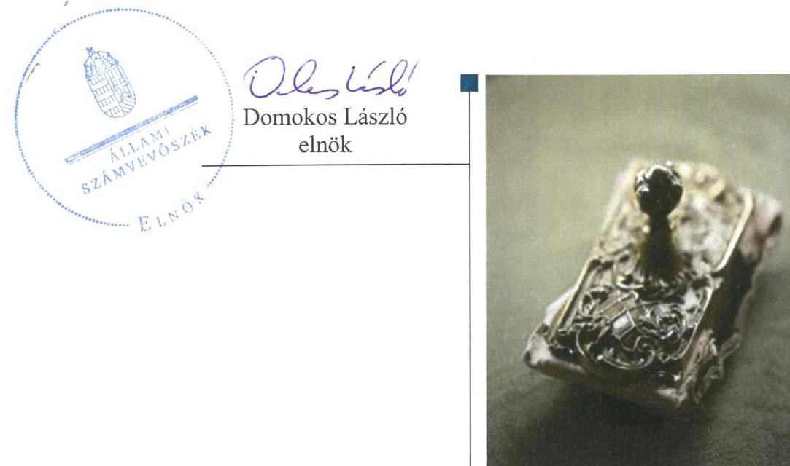
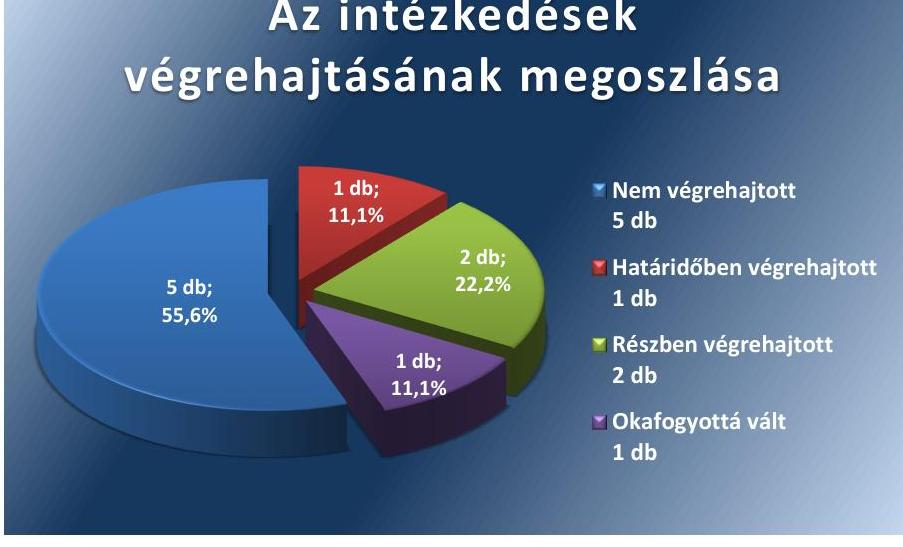
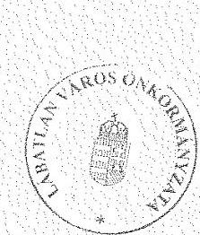
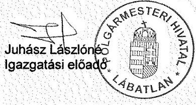
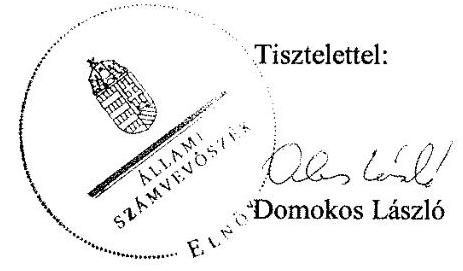
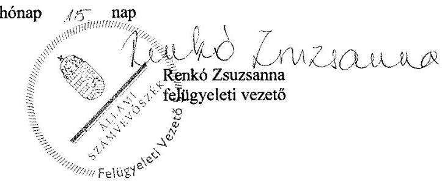

# Jelentés 

## Utóellenőrzések

Az önkormányzatok pénzügyi gazdálkodási helyzetének, szabályszerűségének utóellenőrzése - Lábatlan
2017.

---

# Jelențtés 

## Utóellenőrzések

Az önkormányzatok pénzügyi gazdálkodási helyzetének, szabályszerűségének utóellenőrzése - Lábatlan
2017. 04. hó 06. nap

---

# AZ ELLENŐRZÉST FELÜGYELTE: 

RENKŐ ZSUZSANNA felügyeleti vezető

## AZ ELLENŐRZÉST VEZETTE ÉS A VÉGREHAJTÁSÁÉRT FELELŐS:

SZALAY NAGY JÁNOS ellenőrzésvezető

## A PROGRAM ÖSSZEÁLLÍTÁSÁÉRT FELELŐS:

JANIK JÓZSEF osztályvezető

## A TÉMÁHOZ KAPCSOLÓDÓ KORÁBBI SZÁMVEVŐSZÉKI JELENTÉSEK:

- címe: Jelentés az önkormányzatok pénzügyi gazdálkodási helyzetének, szabályosságának ellenőrzéséről Lábatlan
- sorszáma: 13093

Jelentéseink az Országgyúlés számítógépes hálózatán és az Interneten a www.asz.hu címen is olvashatóak.

IKTATÓSZÁM: V-1170-058/2016
TÉMASZÁM: 2204
ELLENŐRZÉS-AZONOSÍTÓ SZÁM: V-075519

---

# TARTALOMJEGYZÉK 

■ ÖSSZEGZÉS ..... 5
■ AZ ELLENŐRZÉS CÉLJA ..... 6
■ AZ ELLENŐRZÉS TERÜLETE ..... 7
■ AZ ELLENŐRZÉS HÁTTERE, INDOKOLTSÁGA ..... 8
■ FÓKUSZKÉRDÉS ..... 9
■ ELLENŐRZÉS HATÓKÖRE ÉS MÓDSZEREI ..... 10
■ MEGÁLLAPÍTÁSOK ..... 12
■ MELLÉKLETEK ..... 15
I. Sz. melléklet: Az ÁSZ 13093 számú jelentéséhez kapcsolódó intézkedési terv végrehajtása ..... 15
■ FÜGGELÉK: ÉSZREVÉTELEK ..... 27
■ RÖVIDÍTÉSEK JEGYZÉKE ..... 39

---

.

---

# ÖSSZEGZÉS 

Lábatlan Város Önkormányzata az intézkedési tervben meghatározott feladatok végrehajtásáról összességében nem gondoskodott. A pénzügyi egyensúly megteremtésével és megtartásával kapcsolatban vállalt intézkedések részben, a pénzügyi gazdálkodás szabályossága érdekében vállalt intézkedések - egy kivétellel - nem hasznosultak.

## Az ellenőrzés társadalmi indokoltsága

Az ÁSZ ${ }^{1}$ stratégiájában célul tűzte ki a számvevőszéki munka hasznosulásának javítását. Ezzel összhangban ellenőrzi, hogy az ellenőrzött szervezetek megvalósították-e a korábbi ellenőrzései által feltárt hibák, hiányosságok és szabálytalanságok megszüntetése céljából kialakított intézkedési terveikben foglaltakat. A rendszeres utóellenőrzések hozzájárulnak a szükséges intézkedések tényleges végrehajtáshoz, ezáltal a közpénzügyek rendezettségének javulásához, igazolják, hogy lezárult a következmények nélküli ellenőrzések időszaka. Az Önkormányzat intézkedési tervében² szereplő feladatok jelentősége indokolttá tette az utóellenőrzés ${ }^{3}$ elvégzését.

## Főbb megállapítások, következtetések

Az Önkormányzat ${ }^{4}$ a Bkr. előírása ellenére nem vezetett nyilvántartást az intézkedési terv végrehajtásáról. Az intézkedési tervben meghatározott kilenc feladatból egyet határidőben, kettőt részben, ötöt pedig nem hajtottak végre és egy feladat végrehajtása okafogyottá vált.

A jegyző intézkedéseket tett annak érdekében, hogy az éves belső ellenőrzési tervek 2014-től kezdődően tartalmazzák a pénzügyi egyensúlyi helyzetet befolyásoló döntések kockázati tényezőinek feltárását és az ellenőrzési terveket megalapozó kockázatelemzéseket.

Az Önkormányzat csak részben hajtotta végre az intézkedési tervében a kiadások csökkentésével és a bevételszerző tevékenységekkel kapcsolatos vállalását, és a pénzügyi-gazdasági helyzet további stabilizálása érdekében elfogadott reorganizációs programot.

Az Önkormányzat a hitelszerződéseire vonatkozóan az ÁSZ által feltárt szabálytalanságok megszüntetése érdekében az intézkedési tervében vállalt módosításokat nem végezte el. Nem módosította a hitelszerződéseket úgy, hogy megszüntesse a jogszabályba ütköző számla hozzáféréseket, amelyeket a pénzintézet számára a hitel fedezeteként tett lehetővé. A jegyző nem tett intézkedést a pénzügyi egyensúlyt befolyásoló kockázatok kezelésére szolgáló kockázatkezelési rendszer működtetése érdekében. A jegyző nem gondoskodott az államháztartáson kívüli források (támogatások) átadásának átvételének rendjéről szóló helyi rendelet módosításáról, és nem készített a fizetőképesség és eladósodás kezeléséről szóló szabályzatot, valamint a jegyző nem dolgozta át a FEUVE szabályzatot sem. Emellett a jegyző nem gondoskodott a folyószámlahitel nettó módon történő könyvelése érdekében.

Az okafogyottá vált feladat esetén az Önkormányzatnak az állami adósságkonszolidáció miatt a 2013. év végén még fennálló hiteltartozását nem kellett a 2014. évi költségvetésében szerepeltetnie.

Az Önkormányzat nem hajtotta végre azokat az intézkedési terv pontokat, amelyeket az ÁSZ jelentés ${ }^{5}$ az Önkormányzat pénzügyi gazdálkodási szabályozási hiányosságaira vonatkozóan tett javaslatai alapján dolgozott ki. Ennek következtében a fenntartható pénzügyi egyensúly feltételei a jogszabályoknak megfelelő belső szabályozási keretrendszer hiányában továbbra sem biztosítottak, annak ellenére, hogy az Önkormányzat pénzügyi egyensúlya a Magyar Állam 2014. évi teljes körű adósságátvállalása következtében helyreállt.

---

# AZ ELLENŐRZÉS CÉLJA 

Az ellenőrzés célja annak értékelése volt, hogy a számvevőszéki jelentésben foglalt intézkedést igénylő megállapításokkal és javaslatokkal összhangban készített intézkedési tervben meghatározott feladatokat az Önkormányzat végrehajtotta-e.

---

# **AZ ELLENŐRZÉS TERÜLETE**

## **Lábatlan Város Önkormányzata**

Lábatlan város Komárom-Esztergom megyében a Duna mentén fekszik. A lakónépességének száma a KSH6 által közzétett népességi adatok szerint 2015. január 1-jén 4839 fő volt.

Az Önkormányzat három önállóan működő költségvetési szervvel rendelkezik.

Az Önkormányzat pénzügyi helyzetének ellenőrzését az ÁSZ a 2009. január 1. és 2012. december 31. közötti időszakra végezte el, és megállapította, hogy az Önkormányzat pénzügyi egyensúlya rövidtávon nem volt biztosított.

Az Önkormányzat adósságállományának 40,0%-át (154,6 millió Ft) a 2013. február 28-án kötött megállapodásban, majd a 2013. december 31-én fennálló adósságállományának 100%-át (274,8 millió Ft) a 2014. február 28-án kötött megállapodásban a Magyar Állam átvállalta.

Az Önkormányzat 2015. évi zárszámadási rendelete7 szerint az Önkormányzat és intézményei 815,2 millió Ft költségvetési bevételt értek el, és 787,4 millió Ft költségvetési kiadást teljesítettek. Az eszközvagyon értéke 2015. december 31-én 3371,2 millió Ft, a kötelezettségek állománya 69,1 millió Ft szállítói kötelezettség volt, amelyben nem volt lejárt tartozás. Az Önkormányzatnak 2015. december 31-én nem volt hitel, illetve kölcsön törlesztési kötelezettsége.

A 2013-ban végrehajtott ÁSZ ellenőrzés megállapította, hogy az Önkormányzat pénzügyi egyensúlya rövidtávon nem volt biztosított, ezen belül sem a működési sem a felhalmozási költségvetés egyensúlya nem állt fenn.

A működéssel kapcsolatban kockázatot jelentett, hogy az önként vállalt feladatokra fordított működési célú kiadásokkal és a megvalósított létesítmények fenntartási és üzemeltetési költségeivel az Önkormányzat alacsony működési jövedelemtermelő képessége nem volt összhangban.

A pénzügyi egyensúlyt befolyásoló kockázatok feltárása, beazonosítása, értékelése és kezelése elmaradt, így a pénzintézeti kötelezettségvállalások állományának növekedése a költségvetés egyensúlyának megbomlásához vezetett. Ehhez hozzájárult, hogy az Önkormányzatnál finanszírozási célú pénzügyi műveletekkel kapcsolatban nem írtak elő kockázatértékelési tevékenységet, a kockázatok kezelését biztosító kontrolltevékenységek kialakítása nem volt megfelelő, így fennállt a fenntartható pénzügyi egyensúly megbomlásának kockázata.

A polgármester8 és a jegyző9 személye nem változott az ellenőrzött időszakban.

Az utóellenőrzés, a 2016. június 14-ig végrehajtott intézkedéseket figyelembe véve, az Önkormányzat pénzügyi gazdálkodási helyzetének, szabályosságának ellenőrzéséről készült ÁSZ jelentés javaslatai hasznosítására elfogadott intézkedési terv végrehajtására irányult.

---

# AZ ELLENŐRZÉS HÁTTERE, INDOKOLTSÁGA 

AZ ÁSZ TÖRVÉNY 33. § (1) bekezdése értelmében a számvevőszéki jelentések intézkedést igénylő megállapításaihoz és javaslataihoz kapcsolódóan az ellenőrzött szervezet vezetője intézkedési tervet köteles összeállítani, és az Állami Számvevőszék részére megküldeni. Az intézkedési tervben foglaltak megvalósítását - az ÁSZ tv. ${ }^{10}$ 33. § (7) bekezdésében foglaltak alapján - az Állami Számvevőszék utóellenőrzés keretében ellenőrizheti. Az intézkedések megvalósulásának értékelése során az Állami Számvevőszék figyelembe veszi az ellenőrzött szervezetek működési feltételeiben, valamint a jogszabályi előírásokban bekövetkezett változásokat.

AZ INTÉZKEDÉSI TERVEK-ben foglalt feladatok hiányos, illetve késedelmes végrehajtása, valamint megvalósításának elmaradása azt mutatja, hogy az ellenőrzések során feltárt hibák, hiányosságok és szabálytalanságok megszüntetése nem kapott kellő hangsúlyt. Ez a szabályszerű működés és a felelős vezetői magatartás vonatkozásában kockázatot hordoz. E kockázatok feltárásával az Állami Számvevőszék utóellenőrzési rendszere fokozza a fegyelmet, és igazolja, hogy a közpénzzel való szabályos gazdálkodás felelőssége elől nem lehet kitérni.

## AZ UTÓELLENŐRZÉS VÁRHATÓ HASZNOSULÁSA

Az utóellenőrzés négy szinten hasznosulhat:

- A társadalom szintjén az utóellenőrzés jelzi, hogy a számvevőszéki ellenőrzés megállapításainak van következménye: a hiányosságok megszüntetésére az ellenőrzött szervezet által meghatározott intézkedések végrehajtását is számon kéri az ÁSZ.
- Az ellenőrzött terület szintjén az utóellenőrzés tájékoztatást nyújt a terület döntéshozóinak a hiányosságok kiküszöbölésének jó gyakorlatairól, ezzel lehetőséget biztosítva arra, hogy az ÁSZ ellenőrzési megállapításai, javaslatai a terület nem ellenőrzött szervezeteinek a működése során is hasznosuljanak.
- Az ellenőrzött szervezet szintjén az utóellenőrzés feltárja, hogy a szervezet az intézkedések végrehajtásával hasznosította-e a korábbi ellenőrzési jelentésben a hiányosságok megszüntetése, illetve a kockázatok kezelése érdekében megfogalmazott javaslatokat.
- Az ÁSZ szintjén az utóellenőrzés visszacsatolást ad az ellenőrzési jelentések hasznosulásáról, az intézkedések elmaradása vagy részleges megvalósulása a további ellenőrzésekhez kockázati jelzésként szolgál.

---

# FÓKUSZKÉRDÉS 

Az Önkormányzat az intézkedési tervben foglaltakat az elöirt határidőben végrehajtotta-e?

---

# ELLENŐRZÉS HATÓKÖRE ÉS MÓDSZEREI 

## Az ellenőrzés típusa

Megfelelőségi ellenőrzés.

## Az ellenőrzött időszak

Az utóellenőrzés alapját képező ÁSZ jelentés közzétételének napjától (2013. szeptember 10.) az ellenőrzésről szóló kiértesítő levél keltének napjáig (2016. június 14.) tartó időszak.

## Az ellenőrzés tárgya

Az ÁSZ tv. 2011. július 1-jei hatálybalépését követően a számvevőszéki jelentésben foglalt intézkedést igénylő megállapításokkal és javaslatokkal összhangban - az Önkormányzat által - készített intézkedési tervben foglaltak végrehajtásának ellenőrzése.

Az ellenőrzés kiterjed minden olyan körülményre és adatra, amely az ÁSZ jogszabályban meghatározott feladatainak teljesítéséhez, valamint a program végrehajtása folyamán felmerült újabb összefüggések feltárásához szükséges

## Az ellenőrzött szervezet

Lábatlan Város Önkormányzata

## Az ellenőrzés jogalapja

Az ÁSZ tv. 1. § (3) bekezdése szerint az ÁSZ általános hatáskörrel végzi a közpénzekkel és az állami és önkormányzati vagyonnal való felelős gazdálkodás ellenőrzését. Az ÁSZ tv. 33. § (7) bekezdése alapján a 33. § (1)-(2) bekezdés szerinti intézkedési tervben foglaltak megvalósítását az ÁSZ utóellenőrzés keretében ellenőrizheti.

## Az ellenőrzés módszerei

Az utóellenőrzést a nemzetközi standardokat irányadónak tekintve az ellenőrzési program ${ }^{11}$ ellenőrzési kérdései, az ellenőrzött időszakban hatályos jogszabályok, az ellenőrzés szakmai szabályok és módszertanok figyelembevételével, önálló ellenőrzés keretében végeztük.

---

Az ellenőrzés ideje alatt az ellenőrzött szervezettel történő kapcsolattartást az ÁSZ SZMSZ ${ }^{12}$-ének vonatkozó előírásai alapján biztosítottuk.

Az utóellenőrzés megállapításait elsősorban az ÁSZ rendelkezésére álló, valamint az Önkormányzattól elektronikusan bekért dokumentumok alapozzák meg.

Az ellenőrzési bizonyítékként felhasználható adatforrások közé tartoznak egyrészt a szakmai programban felsorolt adatforrások, másrészt minden - az ellenőrzés folyamán feltárt, az ellenőrzés szempontjából információt tartalmazó - dokumentum.

Az intézkedési tervekben előírt feladatokat azok végrehajthatósága, illetve végrehajtása szempontjából az alábbiak szerint értékeltük:
„határidőben végrehajtott" a feladat, ha a teljesítés dokumentáltan, az intézkedési tervben előírt határidőben és tartalommal megtörtént;
"határidőn túl végrehajtott" a feladat, ha annak teljesítése az intézkedési tervben meghatározott módon, de az előírt határidőn túl történt meg;
„részben végrehajtott" a feladat, ha végrehajtása teljes körűen az intézkedési tervben előírt módon nem történt meg;
"nem végrehajtott" ha a végrehajtás nem történt meg, vagy amenynyiben a teljesítést nem dokumentálták;
„okafogyottá vált" a feladat, ha végrehajtására - meghatározott esemény bekövetkezése, továbbá külső körülmény, a működést érintő feltétel változása miatt - már nincs szükség, illetve lehetőség, és egyértelműen megállapítható, hogy az intézkedést szükségessé tevő körülmény a jövőben nem fordulhat elő;
„nem időszerű" az a feladat, amelynek ellenőrzött időszakon belüli végrehajtására azért nem került (kerülhetett) sor, mert az intézkedés alapjául szolgáló esemény nem következett be, de annak jövőbeni előfordulása lehetséges, a végrehajtása nem volt esedékes, vagy a végrehajtás határideje még nem járt le.
Az ellenőrzés lefolytatásához az Önkormányzat a tanúsítványok elektronikus kitöltésével, valamint az ÁSZ által kért dokumentumok elektronikus megküldésével szolgáltatott adatokat, amelyek valódiságát és teljes körűségét a polgármester által tett teljességi és hitelességi nyilatkozat igazolja. Az így rendelkezésre bocsátott adatok, információk kontrollja az ellenőrzés keretében történt.

---

# MEGÁLLAPÍTÁSOK 

## Az Önkormányzat az intézkedési tervben foglaltakat az előírt határidőben végrehajtotta-e?

Összegző megállapítás

Az Önkormányzat az intézkedési tervben meghatározott kilenc feladatból egyet határidőben, kettőt részben, ötöt nem hajtott végre, egy feladat végrehajtása pedig okafogyottá vált. Az intézkedési tervben rögzített feladatok végrehajtásáról nem vezették a Bkr.-ben előírt nyilvántartást.

Az Önkormányzat az ÁSZ jelentésben megállapított hiányosságok megszüntetésére intézkedési tervet készített, amely a polgármesternek öt, a jegyzőnek négy intézkedést fogalmazott meg.

Az intézkedési tervben meghatározott feladatokat, határidőket és a feladatok végrehajtását az I. számú melléklet mutatja be.

Az Önkormányzat intézkedési tervében vállalt és az ellenőrzött időszakban időszerű intézkedések végrehajtási kategóriánkénti megoszlását az 1. ábra szemlélteti.

1. ábra

## Az intézkedések végrehajtásának megoszlása

Fonrás: ÁSZ

## HATÁRIDŐBEN VÉGREHAJTOTT FELADAT:

1. Az éves belső ellenőrzési tervek 2014. évtől kezdődően tartalmazzák a pénzügyi egyensúlyi helyzetet befolyásoló döntések kockázati tényezőinek feltárását és tartalmazzák az ellenőrzési terveket megalapozó kockázatelemzéseket.

---

# RÉSZBEN VÉGREHAJTOTT FELADATOK: 

2. Az Önkormányzat a bevételszerzés és kiadáscsökkentés érdekében vállalt intézkedést részben hajtotta végre, mert az intézkedési tervben rögzített feladatok nem teljes körűen valósultak meg. Az intézkedési terv részfeladatai között végrehajtott, részben végrehajtott, nem végrehajtott és nem időszerű intézkedések egyaránt megtalálhatóak.
3. A Képviselő-testület által a 2014. január 1-ével kezdődő időszakra vonatkozó pénzügyi-gazdasági helyzet stabilizálása érdekében elfogadott reorganizációs programot részben hajtották végre, mert az egyes részfeladatok teljesítéséről a polgármester gondoskodott, más feladatok azonban részben teljesültek, nem végrehajtottnak, illetve nem időszerűnek minősíthetőek.

## NEM VÉGREHAJTOTT FELADATOK:

4. A 2013. évben megkötött 65 M Ft összegű, öt év futamidejű szerződés tartalmazott az Áht. és az Ávr. előírásaival ellentétes rendelkezéseket. Az Önkormányzat költségvetési támogatást is felajánlott a hitelintézet számára a hitel fedezeteként.
5. Az intézkedési tervben foglaltak ellenére a 2013. évben megkötött 65 M Ft összegű, öt év futamidejű szerződés továbbra is tartalmazott az ÁSZ jelentésében kifogásolt, az Ávr. előírásával ellentétes rendelkezéseket.
6. A jegyző nem gondoskodott - az intézkedési tervben foglaltak ellenére - annak érdekében, hogy a folyószámlahitel könyvelése nettó módon történjen.
7. A jegyző nem működtetett a pénzügyi egyensúlyt befolyásoló kockázatok kezelésére a Bkr. ${ }^{13}$ rendelkezésének megfelelő kockázatkezelési rendszert, illetve nem dolgozta át a FEUVE szabályzatot a belső kontrolltevékenységek területén.
8. Az Önkormányzat nem egészítette ki az intézkedési tervben vállalt pontokkal a 13/2013. (IX.11.) számú, az Államháztartáson kívüli források (támogatások) átadásának átvételének rendjéről szóló helyi rendeletét, és nem készített szabályzatot a fizetőképesség és eladósodás kezelésére, valamint a pénzügyi kötelezettségek teljesítésére, a szállítói tartozások és az egyéb kiadáselmaradások rendezésére, továbbá a jegyző nem dolgozta át a FEUVE szabályzatot a belső kontrolltevékenységek területén.

## OKAFOGYOTTÁ VÁLT FELADAT:

9. A Magyar Állam az Önkormányzat adósságállományát, a 2013. évi adósság konszolidáció után még fennmaradt kötelezettségét, 2014. február 28-án átvállalta. Ezáltal az Önkormányzatnak ilyen jogcímen az ellenőrzött időszakban nem volt a költségvetésben megjelenítendő adóssága.

A JEGYZŐ a Bkr. 14. § (1) bekezdésében előírtak ellenére az ÁSZ javaslatai alapján készített intézkedési tervben rögzített feladatok végrehajtásáról a Bkr. 47. § (2) bekezdése előírásának megfelelő nyilvántartás vezetéséről nem gondoskodott.

---

.

---

# MELLÉKLETEK

I. SZ. MELLÉKLET: AZ ÁSZ 13093 SZÁMÚ JELENTÉSÉHEZ KAPCSOLÓDÓ INTÉZKEDÉSI TERV VÉGREHAJTÁSA

|  Sorszám | Intézkedési terv alapján elvégzendő feladat | Az intézkedési tervben meghatározott határidő 2. | Az intézkedési tervben rögzített feladatok elvégzésnek felelőse 3. | A feladat végrehajtása  |
| --- | --- | --- | --- | --- |
|  1. |  |  |  |   |
|  1. | „4. Teljesült. A 2014. évi belső ellenőrzési terv tartalmazza a kockázatelemzéseket, valamint tartalmazza a pénzügyi egyensúlyi helyzetet befolyásoló döntésekkel kapcsolatos ellenőrzéseket.
„A 2014. évtől kezdődően az éves belső ellenőrzési tervnek tartalmaznia kell a pénzügyi egyensúlyi helyzetet befolyásoló döntések kockázati tényezőinek feltárását, tartalmazniuk kell az ellenőrzési terveket megalapozó kockázatelemzéseket." | évente a belső ellenőrzési tervek elfogadásakor | jegyző, belső ellenőr | A 2014., 2015. és 2016. évi belső ellenőrzési tervek tartalmazzák az elvégzendő ellenőrzések kockázatelemzését, valamint „Átfogó ellenőrzés az önkormányzat pénzügyi helyzetének kockázati tényezőiről" tervezett ellenőrzést.  |
|  2. | „A müködési jövedelemtermelő képesség és a feladatellátás összhangja, valamint az Önkormányzat pénzügyi egyensúlyának helyreállítása, hosszú távú fenntarthatósága érdekében - a 2013. évi kormányzati adósságkonszolidációt, valamint a 2013. évtől változó feladat-ellátási kötelezettséget, feladatfinanszírozási rendszert figyelembe véve az alábbi intézkedéseket tesszük:" |  |  |   |
|  2013. évi költségvetés elfogadása (2013. február 13.) |  |  |  |   |
|  2013. november 26. |  |  |  |   |
|  2. | „2.1. Intézményi létszámok felmérése, a jogszabályban kötelezően előírt létszámokkal való összevetése. A felmérés a 2013. évi Kormányhivatal általi ellenőrzés, valamint a köznevelési törvény változása során 2 fő felvételét tárta fel, amely leépítésre 2012-ben a költségcsökkentő intézkedések során került |  |  |   |
|  |   |   |   |   |
|  |   |   |   |   |
|  |   |   |   |   |
|  |   |   |   |   |
|  |   |   |   |   |
|  |   |   |   |   |
|  |   |   |   |   |
|  |   |   |   |   |
|  |   |   |   |   |
|  |   |   |   |   |
|  |   |   |   |   |
|  |   |   |   |   |
|  |   |   |   |   |
|  |   |   |   |   |
|  |   |   |   |   |
|  |   |   |   |   |
|  |   |   |   |   |
|  |   |   |   |   |
|  |   |   |   |   |
|  |   |   |   |   |
|  |   |   |   |   |
|  |   |   |   |   |
|  |   |   |   |   |
|  |   |   |   |   |
|  |   |   |   |   |
|  |   |   |   |   |
|  |   |   |   |   |
|  |   |   |   |   |
|  |   |   |   |   |
|  |   |   |   |   |
|  |   |   |   |   |

---

|  Sorszám | Intézkedési terv alapján elvégzendő feladat | Az intézkedési tervben meghatározott határidő | Az intézkedési tervben rögzített feladatok elvégzésnek felelőse | A feladat végrehajtása  |
| --- | --- | --- | --- | --- |
|   | 1. | 2. |  | 3.  |
|   | sor. 2013. november 26-án a képviselő-testület a feltárt hiányosság és a jogszabályi lehetőségre tekintettel 1 fő felvételéről döntött a Zengő Óvodába, 1 fő felvételéről pedig a Gondozási Központba. |  |  |   |
|   | A Polgármesteri Hivatalban a létszám a költségvetési törvény szerinti Magyarország költségvetéséről szóló 2012. évi CCIV. törvény első ízben 2013. januártól már meghatározásra kerültek ezek a keretek. Városunk esetében 2013-ban a törvény szerint elismert köztisztviselői létszám minimum 22, maximum 27 fő volt. 2013. január 1-vel 4 fő státusz átadásra került a járási hivatalnak, így a Polgármesteri Hivatal köztisztviselői létszáma 18 főre csökkent. Létszám nem került felvételre." |  |  |   |
|   | „2.2. Takarítási feladatok az intézményekben
A takarítási feladatokat az önkormányzat intézményeiben külső vállalkozóval oldjuk meg, így közalkalmazottak felvételére nem kerül sor 2013-ban." | 2013. évi költségvetés elfogadása
(2013. február 13.) | polgármester | Határidőn túl végrehajtott:
A polgármester az intézményekben történő takarítási feladatok ellátására a vállalt 2013. február 13-i határidő után, 2013. február 15-én kötötte meg a szerződést a külső vállalkozóval. 2013-ban nem került sor közalkalmazottak felvételére.  |
|   | „2.3. A Kuckó Gyermekjóléti és Családsegítő Szolgálat és Támogató Szolgálat hatékonyabb működtetésére intézményfenntartó társulást hozunk létre 2013. július 1-től, ugyanis a régi formában működő társulások 2013. június 30-val megszűntek." | 2013. június 30. | jegyző, gazdasági irodavezető | Határidőben végrehajtott:
Az Önkormányzat 2013. június 18-án kötötte meg a Kuckó Gyermekjóléti és Családsegítő Szolgálat működtetésére vonatkozó Társulási megállapodást, amely 2013. július 1-jétől hatályos.  |
|   | „2.4. Zeneiskola finanszírozásának megszüntetése" | 2013. évi költségvetés elfogadása
(2013. február 13.) | polgármester | Határidőben végrehajtott:
A 2013. évi költségvetési rendelet 7. számú függelékében nem tervezetek a Zeneiskolának támogatást. A 2013. évi zárszámadási rendelet 6. számú függeléke szerint a Zeneiskola nem kapott támogatást.  |
|   | „2.5. Közművelődési rendezvények kiadásainak csökkentése" | 2013. évi költségvetés elfogadása
(2013. február 13.) | polgármester | Nem végrehajtott:
Az Önkormányzat a közművelődési rendezvények kiadásainak csökkentését dokumentumokkal nem támasztotta alá.  |
|   | „2.6. Intézményi dologi kiadások áttekintése" | 2013. évi költségvetés elfogadása
(2013. február 13.) | gazdasági irodavezető | Határidőben végrehajtott:
Az Önkormányzat által az ellenőrzés számára rendelkezésre bocsátott dokumentumok alapján megállapítható, hogy az intézményi dologi kiadások áttekintése a 2013. évi költségvetési rendelet elfogadása előtt megtörtént.  |

---

|  Sorszám | Intézkedési terv alapján elvégzendő feladat | Az intézkedési tervben meghatározott határidő | Az intézkedési tervben rögzített feladatok elvégzésnek felelőse | A feladat végrehajtása  |
| --- | --- | --- | --- | --- |
|   | 1. | 2. |  | 3.  |
|  "2.7. A Hivatal feladatai kerüljenek áttekintésre, a településüzemeltetési és egyéb kiadások csökkentésének felmérésére - Dologi költségek tételes áttekintése - Nem kötelező feladatok tételes áttekintése - Sikosságmentesítés, zöldfelületkezelés költségeinek csökkentési lehetősége - Rendkívüli segélyek mértékének csökkentése - Telefonálási költségek csökkentése vezetékes és ingyenes mobilflotta működtetése" | 2013. február 15. | irodavezetők, jegyző | Nem végrehajtott: Az Önkormányzat által az ellenőrzés számára rendelkezésre bocsátott dokumentumok alapján nem volt megállapítható, hogy a Hivatal feladatait áttekintették-e, és a településüzemeltetési és egyéb kiadások csökkentésének lehetőségét felmérték-e. |   |
|  "3. Energia szerződések áttekintése, közbeszerzés lefolytatása | 2013. december 20 | polgármester | Részben végrehajtott: A villamos energia olcsóbbá tétele érdekében az Önkormányzat lefolytatta a közbeszerzési eljárást, a nyertes ajánlattevővel 2013. december 21-én kötötte meg a villamos energia kereskedelmi szerződést. Nem támasztották azonban alá az energia szerződések áttekintését, különös tekintettel a villamos energia szerződések teljes körűsége illetve a földgáz szerződések vonatkozásában. |   |
|  "4. A képviselői tiszteletdíjak ne kerüljenek emelésre" | 2013. évi költségvetés elfogadása (2013. február 13.) | polgármester | Határidőben végrehajtott: A képviselők, a bizottsági elnökök és a bizottságok nem képviselő tagjainak tiszteletdíjáról és juttatásairól szóló 20/2006. (X. 27.) számú rendelet 2006. október 1-től módosítás nélkül hatályos volt. |   |
|  "5. Napi szintű likviditás készüljön a fizetési kötelezettségek ütemezésére és teljesítésére, a 60 napon belüli fizetést figyelembe véve" | 2013. január 1-től folyamatosan | gazdasági irodavezető | Határidőben végrehajtott: Az Önkormányzatnál készítettek napi szintű likviditást a fizetési kötelezettségek ütemezésére és teljesítésére. |   |
|  "6.1. Adómértékek emelésének felülvizsgálata. Kerüljön a képviselő-testület elé a 2013. évi koncepcióban az adómértékek vizsgálata a jogszabályok szerinti emelhető mértékek bemutatásával." | 2012. október 31. | polgármester | Határidőn túl végrehajtott: Az intézkedési tervben vállalt 2012. október 31-i határidő után, a 2013. évi költségvetési koncepció 2012. november 14-i keltezésű Képviselő-testületi előterjesztésében összehasonlították a jogszabály szerinti és a helyi adórendelet szerinti adómértékeket. |   |
|  "6.2. Idegenforgalmi adó bevezetésére kerüljön sor a 2013-as évben." | 2013. január 1. | polgármester | Határidőben végrehajtott: A Képviselő-testület a 24/2012. (XI. 28.) számú rendeletével módosította a helyi adórendeletet, amelynek 5/A §-a tartalmazta az idegenforgalmi adó 2013. január 1-jétől történő bevezetését. |   |

---

|  Sorszám | Intézkedési terv alapján elvégzendő feladat | Az intézkedési tervben meghatározott határidő | Az intézkedési tervben rögzített feladatok elvégzésnek felelőse | A feladat végrehajtása  |
| --- | --- | --- | --- | --- |
|   | 1. | 2. |  | 3.  |
|  "6.3. A konszolidálásra nem kerülő 65 m Ft hitel 5 évre történő meghosszabbítására a Kormányengedély kerüljön megkérésre majd a pénzintézettel a szerződés kerüljön megkötésre." |  | 2013. augusztus 30. és 2013. december 2. | polgármester | Határidőben végrehajtott:  |
|  "6.4. Az önkormányzat készítse el középtávú vagyongazdálkodási tervét és ezzel együtt mérje fel a tulajdonában álló eladható ingatlanok körét, majd az eladható ingatlanokat hirdesse meg értékesítésre. A korábban meghirdetett volt iskolaépület kerüljön meghirdetésre csökkentett áron, 100 m Ft + áfa összegben." |  | 2013. június 30. | polgármester | A Képviselő-testület az 57/2013. (VI. 18.) számú határozatával kezdeményezte az Önkormányzat 65 millió Ft összegű hitelének 5 éves adósságmegújító hitellé történő átalakítását, és ennek megfelelően az Önkormányzat kölcsönszerződést kötött a 65 millió Ft hitel 5 évre történő meghosszabbítására. Az 1716/2013. (X. 9.) számú Kormány határozat 1. melléklete szerint a Kormány hozzájárult a kölcsönszerződés 2013. évben történő megkötéséhez.  |
|  "Intézkedés kiegészítése a polgármesternek címzett 1.a) javaslat megvalósítására: - A költségvetési rendelet-tervezet, valamint annak évközi módosítása előterjesztését megelőzően a döntések meghozatalát alternatívák elemzésével és kidolgozásával segítjük. Az aktuális időszakra vonatkozóan elkészítjük a pénzügyi helyzet elemzését, továbbá a gazdasági lehetőségek elemzését is a lehetséges bevételnövelő és kiadáscsökkentő lehetőségek feltárásával. A döntések előtt a Képviselő-testületet tájékoztatjuk a kockázati tényezőkről a kockázatkezelési szabályzat szerint. Ennek részletes tartalmát az ellenőrzési nyomvonal tartalmazza, melybe a kontrollpontok beépítésre kerülnek. Ennek kiegészítése folyamatban van." |  | 2013. június 30. | polgármester | Határidőben végrehajtott:  |
|   |  | költségvetési rendelet-tervezet elkészítését és az évközi módosítások előterjesztését megelőzően, ellenőrzési nyomvonal kiegészítése 2014. március 30. | jegyző, gazdasági irodavezető | Az Önkormányzat vagyongazdálkodási tervét a Képviselő-testület az 5/2013. (II. 12.) számú határozatával elfogadta. A jegyző 2013. június 11-i keltezéssel kimutatást készített az Önkormányzat tulajdonában álló értékesíthető ingatlanokról. Lábatlan város honlapján 2013. június 27-én meghirdették értékesítésre az Önkormányzat tulajdonában álló – jegyző által készített kimutatás szerint – értékesíthető ingatlanokat, beleértve a volt iskolaépületet is 100 m Ft+áfa összegben.  |
|   |  |  |  | Részben végrehajtott feladat:  |
|   |  |  |  | Az Önkormányzat a könyvtár statikai felülvizsgálata, az iskola működtetés átadás-átvétele, gyermekjóléti feladat átszervezése előterjesztésekkel támasztotta alá, hogy a költségvetési rendelet-tervezet, valamint annak évközi módosítása előterjesztését megelőzően a döntések meghozatalát alternatívák elemzésével és kidolgozásával segítették.  |
|   |  |  |  | Az ÁSZ jelentésben a polgármesternek címzett 1. b) pontban tett javaslatra készítették el 2014. évre a reorganizációs programot. Ennek keretében végezték el a pénzügyi helyzet elemzését, továbbá a gazdasági lehetőségek elemzését is a lehetséges bevételnövelő és kiadáscsökkentő lehetőségek feltárásával.  |
|   |  |  |  | A Kockázatkezelési szabályzatban nem rendelkeztek arról, hogy a döntések előtt a kockázati tényezőkről hogyan tájékoztatják a Képviselő-testületet. Az Ellenőrzési nyomvonal nem tartalmazta a Képviselő-testület tájékoztatásának módját döntések előtt a kockázatkezelési szabályzat szerinti kockázati tényezőkről. Az Ellenőrzési nyomvonalba kontrollpontok nem kerültek beépítésre.  |

---

|  3. | „A pénzügyi pénzügyi-gazdasági helyzet stabilizálása érdekében szükséges intézkedések bemutatása 2014. évre" | 2014. évi költségvetés elfogadása (2014. február 5.) | polgármester | Nem végrehajtott:  |
| --- | --- | --- | --- | --- |
|   | „2.1 Létszám, személyi juttatások. a) Cafeteria keretet a közalkalmazottak részére nem biztosítunk a költségvetésben. A pedagógus (óvodapedagógus) béremelés miatti önkormányzati többletkiadást a költségvetésben biztosítanunk kell." |  |  | A Képviselő-testület 2014. február 4-i ülésére készített előterjesztésben és a Képviselő-testület 1/2014. (II.5.) önkormányzati rendelete az önkormányzat 2014. évi költségvetéséről 16. § (1) c) pontja szerint, 2014. évre a közalkalmazottaknak béren kívüli juttatást, Erzsébet utalványkeretet biztosított.  |
|   | „2.1 Létszám, személyi juttatások b) 2014. január 1-től a költségvetési törvényben tervezhető, finanszírozott létszám minimum 19 fő, a maximum létszám 25 fő. A polgármesteri hivatal létszáma 18 fő. A polgármesteri hivatalban ennek ellenére nem kerül sor létszámfelvételre" | 2014. költségvetés tervezése (2014. február 5.) | jegyző | Határidőben végrehajtott:  |
|   | „2.1. Létszám, személyi juttatások c) Az intézményeknél a további státuszhely bővítésre ne kerüljön sor" | 2014. január 1-től | polgármester | A polgármesteri hivatalban 2014. január 1-étől nem került sor létszámfelvételre. A közfoglalkoztatottak létszáma 2014. január 1-én 25 fő volt. A létszám 18 fő köztisztviselőből és 7 fő fizikai dolgozóból állt és a 2014. évi költségvetés tervezéséig nem változott.  |
|   | „2.1. Létszám, személyi juttatások d) Élni szükséges a közfoglalkoztatás lehetőségével, támogatott munkaerő alkalmazásával, hogy a feladatellátás kevesebb önkormányzati kiadást jelentsen". | 2014.január 1 | polgármester | Nem végrehajtott:  |
|   |  |  |  | Az intézményeknél 2014. január 1 után sor került státuszhely bővítésre, a 2014. évi 46,5 fős létszám 2016. évre 49,5 főre nőtt.  |
|   | „2.2 Dologi kiadások a) A 2014. évi költségvetés során a számlavezető banknál fennálló folyószámla-hitel esetében törekedni kell arra, hogy felveendő likvid hitel összege 100,0 M Ft-ról 60,0 M Ft alá csökkenjen" | 2014.január 1 | polgármester | Határidőben végrehajtott:  |
|   | „2.2 Dologi kiadások b) Az állam teljes adósságátvállalásával kapcsolatos szerződéssel kapcsolatos minden adatszolgáltatást határidőre biztosítani szükséges." | 2014.január 1 | polgármester | Az Önkormányzat élt a közfoglalkoztatás, támogatott közmunkaerő foglalkoztatás lehetőségével és ez a feladatellátás során kevesebb önkormányzati kiadást jelentett. A közmunka foglalkoztatásról készült kimutatás szerint a közmunka programban 2013. évben 98 fő, 2014. évben 128 fő vett részt, mindez az Önkormányzatnak 10,8 M Ft illetve 11,6 M Ft megtakarítást jelentett.  |
|   |  |  |  | Okafogyottá vált:  |
|   |  |  |  | Az Önkormányzatnak 2013. szeptember 20-át követően likvid hitel állománya nem volt, így a 2014. évi költségvetés során a likvid hitel összegének 60,0 M Ft alá csökkentése nem volt szükséges.  |
|   |  |  | gazdasági irodavezető | Határidőben végrehajtott:  |
|   |  |  |  | A Magyarország 2014. évi központi költségvetéséről szóló 2013. évi CCXXX. törvény 67. § (1) és (2) bekezdése szerinti 2013. december 31-i 274,8 M Ft adósságállományát 2014. február 28-ig a Magyar Állam átvállalta. Az Önkormányzat a törvény végrehajtásához a belügyminisztériumi útmutató ${ }^{14}$ alapján az előírt módon szolgáltatta az adatokat a Magyar Államkincstár felé.  |

---

|  Sorszám | Intézkedési
tervben
meghatározott
határidő | Az intézkedési
tervben rögzített
feladatok elvég-
zésnek felelőse | A feladat végrehajtása  |
| --- | --- | --- | --- |
|   | 2. |  | 3.  |
|  "2.2 Dologi kiadások c) 2014-ben várhatóan az állam az önkormányzatok fennmaradó hitelállományát is átveszi. Amennyiben ez nem valósulna meg, a vagyontárgyak értékesítéséből befolyó bevételt első sorban a hitelállomány csökkentésére kell felhasználni." | 2014. január 1-től | polgármester | Okafogyottá vált:
A Magyar Állam az Önkormányzat teljes hitelállományát 2013. február 28.-i megállapodás alapján 154,6 M Ft-ot, 2014. február 28-án 274,8 M Ft-ot átvállalta.  |
|  "2.2 Dologi kiadások d) A nagyobb összegű szállítói tartozások vonatkozásában törekedni kell a részletfizetés lehetőségének igénybevételére." | folyamatos | polgármester, jegyző | Nem időszerű:
Az Önkormányzat 2013-2016. évi szállítói tartozás kimutatása szerint nagyobb összegű szállítói tartozása nem volt.  |
|  "2.2 Dologi kiadások e) Takarítási feladatok az intézményekben. A takarítási feladatokat az önkormányzat intézményeiben külső vállalkozóval oldjuk meg, így közalkalmazottak felvételére nem kerül sor 2014-ben." | 2014. évi költségvetés elfogadása (2014. február 5.) | polgármester | Határidőben végrehajtott:
Az intézményekben a takarítási feladatokat 2013. február 15-től külső vállalkozóval oldották meg, így közalkalmazottak felvételére nem került sor.  |
|  "2.2 Dologi kiadások f) Közművelődési rendezvények kiadásainak csökkentése." | 2014. évi költségvetés elfogadása (2014. február 5.) | polgármester | Nem végrehajtott:
Az Önkormányzat a közművelődési rendezvények kiadásainak csökkentését dokumentumokkal nem támasztotta alá.  |
|  "2.2 Dologi kiadások g) Intézményi dologi kiadások áttekintése" | 2013. és 2014. évi költségvetés elfogadása | gazdasági irodavezető | Határidőben végrehajtott:
Az Önkormányzat által az ellenőrzés számára rendelkezésre bocsátott dokumentumok alapján megállapítható, hogy az intézményi dologi kiadások áttekintése a 2013. évi és a 2014. évi költségvetési rendelet elfogadása előtt megtörtént.  |
|  "2.2 Dologi kiadások h) A Hivatal feladatai kerüljenek áttekintésre, a településüzemeltetési és egyéb kiadások csökkentésének felmérésére | 2014. február 15. | irodavezetők, jegyző | Nem végrehajtott:
Az Önkormányzat által az ellenőrzés számára rendelkezésre bocsátott dokumentumok alapján nem volt megállapítható, hogy a Hivatal feladatait áttekintették-e és a településüzemeltetési és egyéb kiadások csökkentésének lehetőségét felmérték-e.  |
|  - Dologi költségek tételes áttekintése,
- Nem kötelező feladatok tételes áttekintése, meghatározása a költségvetési rendeletben,
- síkosságmentesítés, zöldfelületkezelés költségeinek csökkentési lehetősége,
- rendkívüli segélyek mértékének csökkentése,
- telefonálási költségek csökkentése vezetékes és ingyenes mobilfióta működtetése" |  |  |   |

---

|  Sorszám | Intézkedési
tervben
meghatározott
határidő | Az intézkedési
tervben rögzített
feladatok elvég-
zésnek felelőse | A feladat végrehajtása  |
| --- | --- | --- | --- |
|   | 2. |  | 3.  |
|  "2.2 Dologi kiadások i) Felül kell vizsgálni a közétkeztetés rendszerét, a képviselő-testület döntsön arról, hogy szükséges-e a szolgáltatás felmondása és új közbeszerzés kiírása" | 2014. március 30. | polgármester | Nem végrehajtott:
Dokumentummal nem támasztották alá a közétkeztetés rendszerének felülvizsgálatát. Az ellenőrzés számára nem adtak át olyan dokumentumot, amely – a 4/2014. (II.4.) sz. Képviselő-testületi határozatban foglaltakkal szemben – alátámasztotta volna, hogy a Képviselő-testület döntött arról, hogy nem szükséges a közétkeztetési szerződés felmondása és új közbeszerzés kiírása.  |
|  "2.2 Dologi kiadások j.) Napi szintű likviditás készüljön a fizetési kötelezettségek nyomon követésére." | 2014. január 1-től
folyamatos | gazdasági
irodavezető | Határidőben végrehajtott:
Az Önkormányzat készített napi szintű likviditást a fizetési kötelezettségek ütemezésére és teljesítésére.  |
|  "2.2 Dologi kiadások k) A kötelező feladatokat a lehető legkisebb veszteséggel kiadással kell elvégezni." | 2014. január 1-től
folyamatosan | polgármester, jegyző,
irodavezetők,
intézményvezetők | Nem végrehajtott:
Az Önkormányzat dokumentumokkal nem támasztotta alá a feladat végrehajtását.  |
|  "2.2 Dologi kiadások l) A városi rendezvények finanszírozására pályázati források feltárása szükséges." | 2014. január 1-től
folyamatosan | közművelődési
vezető | Nem végrehajtott:
Az Önkormányzat dokumentumokkal nem támasztotta alá a pályázati források feltárását a városi rendezvények finanszírozása érdekében.  |
|  "2.2 Dologi kiadások m) Minden döntést gazdaságilag elemezni kell annak jövőbeli anyagi kihatására, fenntarthatóságára és működtetésére tekintettel." | 2014. január 1-től
folyamatosan | polgármester, jegyző,
irodavezetők | Nem végrehajtott:
Az Önkormányzat dokumentumokkal nem igazolta döntései gazdasági elemzését, azok jövőbeli anyagi kihatására, fenntarthatóságára és működtetésére tekintettel.  |
|  "2.3 Felhalmozási kiadások a) Folytatni kell az energiaköltöskége csökkentését, a legkorszerűtlenebb Zengő Óvoda Micimackó telephelye és a Polgármesteri Hivatal épületének energia-korszerűsítésével." | 2014. december 31. | polgármester, jegyző | Határidőben végrehajtott:
Folytatták a Zengő Óvoda Micimackó telephelye és a Polgármesteri Hivatal épületének energia-korszerűsítését. Az Önkormányzat 6/2013. (II.12.) sz. képviselő-testületi határozatával döntött a polgármesteri hivatal épületének energetikai felújításáról, a 8/2013. (II.12.) sz. képviselő-testületi határozatával döntöttek az Óvoda Micimackó telephelye és a Polgármesteri Hivatal épületének napelemmel való ellátásáról, amelyeket KEOP15 pályázatból oldották meg és azok műszaki átvétele 2014. októberig mindkét helyszín tekintetében megtörtént.  |
|  "2.3 Felhalmozási kiadások b) Csak olyan beruházások vállalását tűzi ki célul az önkormányzat, amelynek az önrészét a költségvetésben hitel felvétele nélkül biztosítani lehetséges." | folyamatos | polgármester | Határidőben végrehajtott:
Az Önkormányzatnál a beruházásainak önrészét hitel felvétele nélkül valósította meg. Beruházási határozataikban rögzítették, hogy az önkormányzati saját forrás összegét a költségvetésben elkülönítik. Az Önkormányzat 2013. évi,  |

---

|  Sorszám | Intézkedési | Az intézkedési | A feladat végrehajtása  |
| --- | --- | --- | --- |
|   | tervben | tervben rögzített |   |
|   | meghatározott | feladatok elvég- |   |
|   | határidő | zésnek felelőse |   |
|   | 1. | 2. | 3.  |
|   | 2014. január 1. | polgármester | 2014. évi, 2015. évi és 2016. évi költségvetésében hitel felvétel nem szerepelt, hitelt nem vettek fel.  |
|  "2.4 Bevételek növelése a) Az önkormányzat által bérbe adott helyiségek bérleti díjait emelni szükséges az infláció mértékével." | 2014. január 1. | polgármester | Részben végrehajtott:  |
|   |  |  | A bérbe adott helyiségek bérleti díjának emeléséről a Képviselő-testület a 7/2013.(II.05.) sz., 7/2014. (II.9.) sz., 24/2015. (IV.21.) sz., 29/2015. (V.19.).  |
|   |  |  | határozataival döntött. A bérleti díjaknak a bérleti szerződésekben történő emelését, új bérleti szerződések kötését nem dokumentálták.  |
|  "2.4 Bevételek növelése b) Az adóbevételek teljesítésére fokozott figyelmet kell fordítani, a hátralékok behajtására intézkedni szükséges. Éven túli részletfizetést a jegyző nem engedélyezhet. Kintlévőségeink behajtásához bírósági végrehajtó segítségét is kérjük és élünk a felszólítások, inkasszók lehetőségével." | 2014. január 1-től | jegyző | Határidőben végrehajtott:  |
|   |  |  | Az adóbevételek teljesítésének fokozott figyelemmel kísérésére és a hátralékok behajtására vonatkozó intézkedést teljesítették, mivel a Képviselő-testület a helyi adókról szóló rendeletének 24/2012. (XI.14.) számú módosítása 3. §-ában a helyi adókról, beszedett adókról szóló analitikus nyilvántartás vezetését írta elő.  |
|   |  |  | Továbbá a jegyző a 2014. évi ellenőrzési terv keretében a helyi adók vonatkozásában vizsgálta az adókötelezettségek teljesítését vagy elmulasztásának kontrollálását, szankcionálását.  |
|   |  |  | Éven túli részletfizetést a jegyző nem engedélyezett.  |
|   |  |  | A felszólítások és inkasszók lehetőségének alkalmazását igazolták.  |
|   |  |  | A kintlévőségeik behajtásához történő bírósági végrehajtó segítségére nem volt szükség.  |
|  "2.4 Bevételek növelése c) (1) A nem jól, vagy nem határidőben fizető bérlőink lakásbérleti szerződését felmondjuk, vagy szigorúbb részletfizetést előíró szerződéseket kötünk." | folyamatos | jegyző | Nem időszerű:  |
|   |  |  | A jegyző 2013-2014. évi és a 2015. október 20.-i - a "reorganizációs program végrehajtásának ellenőrzéséhez készült – intézkedési terv végrehajtásának ellenőrzése" és az "intézkedési terv végrehajtásának ellenőrzése 2015. évben" szerint 2013-2015 évben lakásbérleti szerződések felmondására nem kellett sort keríteni, a bérlők fizették a megállapodások szerinti díjakat.  |
|  "2.4 Bevételek növelése c) (2) Adómértékek emelésének felülvizsgálata a képviselő-testület elé került a 2014. évi koncepció kiegészítéseként a jogszabályok szerinti emelhető mértékek bemutatásával. Az önkormányzat a 2014. évi költségvetési koncepció elkészítésénél úgy döntött, hogy az adómértékeket 2014. | 2014. október 31. | polgármester | Határidőben végrehajtott:  |
|   |  |  | Az adómérték emelésének felülvizsgálata 2013. november 26-án a Képviselő-testület elé került, a 2014. évi költségvetési koncepció kiegészítés előterjesztésében a jogszabályok szerinti emelhető mértékek bemutatásával. Az Önkormányzatnál a "112/2013. (XI.26.) sz. képviselő-testületi határozat a 2014. évi  |

---

|  Sorszám | Intézkedési terv alapján elvégzendő feladat | Az intézkedési tervben meghatározott határidő | Az intézkedési tervben rögzített feladatok elvégzésnek felelőse | A feladat végrehajtása  |
| --- | --- | --- | --- | --- |
|   | 1. | 2. |  | 3.  |
|   | évben nem emeli a vállalkozások és a lakosság teherbíró képességét figyelembe véve. Az iparűzési adó a maximális mértéken van." |  |  | költségvetési koncepció kiegészítéséről" szóló határozat 2. pontja szerint az adómértékek emelését 2014. évben nem tervezték.  |
|   | „2.4 Bevételek növelése d) Az eladó önkormányzati ingatlanok meghirdetését újra el kell indítani, fel kell frissíteni. Az ingatlanértékesítéseknél törekedni kell a lehető legmagasabb piaci ár elérésére." | 2014. január 1-től | polgármester | Részben végrehajtott:  |
|   | „2.4 Bevételek növelése e) Az intézményeknél törekedni kell a magasabb összegű saját bevétel elérésére, a müködési költségek csökkentésére." | folyamatos | intézményvezetők | A legmagasabb piaci ár elérésére való törekvést nem, az ingatlanok meghirdetését részben támasztották alá. Az Önkormányzat a volt iskolaépület és sportcsarnok 2014. január 8-án megjelent 100 M Ft hirdetését dokumentálta.  |
|   | „Intézkedés kiegészítése a polgármesternek címzett 1.b) számú javaslat megvalósítására:
- A jegyző köteles a reorganizációs programban megfogalmazott intézkedések végrehajtását figyelemmel kísérni.
- Munkájának segítésére a jegyző írásban utasította a belső ellenőrt, hogy kísérje figyelemmel az elfogadott reorganizációs programban feltüntetett határidők szerint a konkrét intézkedések végrehajtását, az egyes pontok végrehajtásáról írásban tájékoztassa a jegyzőt.
- A jegyző köteles a polgármester és a Képviselő-testület felé jelezni, ha a reorganizációs programban megfogalmazott valamely döntés nem valósul meg, a meghatározottaktól eltérő módon valósul meg, vagy a határidőkben késedelem keletkezik." | Az egyes pontok határidejét, vagy az eltérés észlelést követő 10. nap, a folyamatos határidők esetén évente október 30. | jegyző, belső ellenőr | Nem végrehajtott:
Az intézmények saját bevétel teljesítése 2014 évben 22,4 M Ft, 2015 évben 17,0 M Ft volt, tehát nem növekedtek, hanem csökkent, a működési kiadások viszont a 2014. évi 191,7 M Ft-ról 2015. évben 216,3 M Ft-ra növekedtek.
Részben végrehajtott:
A reorganizációs terv feladatai végrehajtását a jegyző ellenőrizte és erről írásban 2013-2015. évre ellenőrzési jelentés készült. A jelentésekben leírtak szerint „a reorganizációs programban foglaltak maradéktalanul megvalósultak, a képviselő-testület felé intézkedés nem szükséges". Ugyanakkor nem dokumentálták a belső ellenőr jegyzőnek készített reorganizációs program végrehajtásáról szóló írásbeli tájékoztatását.  |
|   |  | Végre nem hajtott feladatok |  |   |
|  4. | „A képviselő-testület vállalja, hogy a jövőbeni hitelfelvétel, kötvénykibocsátás fedezeteként az Áht. 84. § (4) bekezdésében és az Ávr. 145. § (2) bekezdésében előírtak szerint a pénzintézettel megkötött szerződésekben az Önkormányzat általános müködésének és ágazati feladatainak támogatása, valamint a költségvetési támogatás nem kerülhet felhasználásra." | folyamatosan | polgármester | A 2013. június 28-án megkötött 65 M Ft összegű, öt év futamidejű szerződés 4. pontja megsértette az Áht. 84. § (4) bekezdésében és az Ávr. 145. § (2) bekezdésében foglalt rendelkezéseket. Az Önkormányzat költségvetési támogatás vezetésére szolgáló számlát is felajánlott a hitelintézet számára fedezetként.  |

---

|  5 |  | Az intézkedési
tervben
meghatározott
határidő | Az intézkedési
tervben rögzített
feladatok elvég-
zésnek felelőse | A feladat végrehajtása  |
| --- | --- | --- | --- | --- |
|   | 1. | 2. |  | 3.  |
|  5.. | „Az ÁSZ ellenőrzésénél kifogásolt 65 millió Ft összegű rövid lejáratú hitel azóta lejárt. Az önkormányzat a Kormányengedély birtokában új, 5 év futamidejű szerződést kötött, mely nem tartalmazza a kifogásolt szerződéses szakaszt, így a jogszerű állapot helyreállítása megtörtént.
A 350 m Ft iskola felújításra felvett hitel tekintetében a képviselő-testület kezdeményezi az OTP Bank Nyrt. felé, hogy a szerződés azon szakasza, melyben rögzítésre került, hogy „az önkormányzat költségvetése a hitel biztosítéka" módosításra kerüljön az alábbi tartalommal: „Az adós megbízást ad az OTP Bank Nyrt. részére, hogy a Hitel futamideje alatt amennyiben a Pénzforgalmi Bankszámláján, a jelen szerződés alapján esedékessé váló fizetési kötelezettségeinek teljesítéséhez nem áll rendelkezésre a szükséges fedezet, úgy annak biztosítása érdekében a helyi adó és a gépjármű adó fogadására szolgáló számláiról a szükséges összeget Adós Pénzforgalmi Bankszámlájára átvezesse." | 2014. március 31. | jegyző | Az intézkedési tervben foglaltak ellenére a jogszerű állapot a 2013. június 28-án megkötött új, 65 M Ft összegű, öt év futamidejű szerződéssel nem állt helyre, mert a szerződés 4. pontja felhatalmazást adott a pénzintézet számára olyan bankszámlák megterhelésére is, amelyeken az ÁSZ jelentésében kifogásolt, az Ávr. 145. § (2) bekezdésében foglalt pénzeszközöket vezettek.
Az intézkedés további része okafogyottá vált, mert az Önkormányzat és a pénzintézet között létrejött szerződésében rögzített 350 m Ft-os kötelezettséget a Magyar Állam - az Önkormányzat intézkedési tervében vállalt határidő lejárta előtt - 2014. február 28-án átvállalta.  |
|  6. | „Az Áhsz. 9. számú mellékletében a számlaosztályok tartalmára vonatkozó előírások 3. pont bb) alpontjában foglalt előírásnak megfelelően végezzük a folyószámlahitel könyvelését, azaz nettó módon" | folyamatos | jegyző | Az Önkormányzat könyvelési dokumentumokkal nem támasztotta alá a folyószámlahitel nettó módon történő könyvelését. Ezáltal nem hajtotta végre az intézkedési tervben rögzített feladatot.  |
|  7. | „A Bkr. 7. § (1)-(2) bekezdéseiben foglalt előírásoknak megfelelően a pénzügyi egyensúlyt befolyásoló kockázatok kezelésére alkalmas kockázatkezelési rendszert működtetünk. A FEUVE szabályzat átdolgozásra kerül a belső kontrolltevékenységek területén, a pénzügyi egyensúlyi helyzet alakulását befolyásoló döntések kockázatainak kezelése érdekében." | folyamatos,
2013. december 31. | jegyző | A jegyző nem működtetett a pénzügyi egyensúlyt befolyásoló kockázatok kezelésére alkalmas kockázatkezelési rendszert. A kockázatkezelési szabályzatban nem állapították meg a Bkr. 7. § (1)-(2) bekezdése alapján a pénzügyi egyensúlyt befolyásoló kockázatokat, nem határozták meg a kockázatokkal kapcsolatos intézkedéseket és azok folyamatos nyomon követési módját. Továbbá a jegyző nem dolgozta át a FEUVE szabályzatot a belső kontrolltevékenység területén a pénzügyi egyensúlyi helyzet alakulását befolyásoló döntések kockázatainak kezelése érdekében.  |
|  8. | „- Lábatlan Város Önkormányzat Képviselő-testülete a 13/2013. (IX.11.) Az államháztartáson kívüli források (támogatások) át- | 2013. december 31. | jegyző | Az Önkormányzat a 13/2013. (IX.11.) számú az Államháztartáson kívüli források (támogatások) átadásának átvételének rendjéről szóló helyi rendeletben nem írta elő a kötelező és önként vállalt feladatok átadás-átvételre vonatkozó  |

---

|  Sorszám | Intézkedési terv alapján elvégzendő feladat | Az intézkedési tervben meghatározott határidő | Az intézkedési tervben rögzített feladatok elvégzésnek felelőse | A feladat végrehajtása  |
| --- | --- | --- | --- | --- |
|   | 1. | 2. |  | 3.  |
|   | adásának átvételének rendjéről helyi rendeletet alkotott, melyet szükséges kiegészíteni a jegyzőnek tett javaslat 3. pont c), d), e) pontokban tett javaslatokkal.
- A FEUVE szabályzat átdolgozásra kerül a belső kontrolltevékenységek területén, a pénzügyi egyensúlyi helyzet alakulását befolyásoló döntések kockázatainak kezelése érdekében, a jegyzőnek tett javaslat 3. pont f), g), h), i), j) pontokban tett javaslatokkal.
- A jegyzőnek tett javaslat 3. pont k) pontja alapján készítünk egy szabályzatot, melyben az önkormányzat szankciókat határoz meg a fizetőképesség és eladósodás kezelésére, valamint a pénzügyi kötelezettségek teljesítésére, a szállítói tartozások és az egyéb kiadáselmaradások rendezésére." |  |  | döntés előkészítése során az átadás-átvétel pénzügyi egyensúlyi helyzetre gyakorolt hatásának vizsgálatát. Nem írta elő a szerződések minimum tartalmi követelményeinek meghatározásával, valamint nem határozta meg a szerződések teljesítésére vonatkozó beszámolási kötelezettséggel kapcsolatos kontrolltevékenységeket.
Az Önkormányzat FEUVE szabályzatát 2013. október 2. óta nem módosították, így az intézkedési tervben vállalt átdolgozás nem történt meg.
Az Önkormányzat szabályzatot készített a fizetőképesség és az eladósodottság kezelésére, amelyben a 3. k) javaslatra vonatkozó intézkedésükben foglaltak ellenére nem írták elő a fizetőképesség és az eladósodás kezelésére vonatkozó szankciókat. Szabályzatot készítettek az egyes önkormányzati kötelezettségvállalások előkészítésének és a szállítói tartozások kezelésének rendjéről is, amelyben az intézkedési terv ellenére nem határozták meg a szállítói tartozások és az egyéb kiadás elmaradások rendezésének jogkövetkezményeit.  |
|   |  | Okalopvottá vált feladat |  |   |
|  9. | „Az adósságkonszolidációt követően fennmaradó kötelezettségek jövőbeni teljesítése a mindenkori költségvetés részét képezik. A képviselő-testület határozatban fogadta el, hogy a kötelezettségeket minden esetben biztosítja a költségvetési keretből. A képviselő-testület jelen intézkedési terv elfogadásával vállalja, hogy a realizált többletbevételek és a meglévő és a jövőben képződő tartalékot mindaddig a kötelezettségek rendezésére fordítja, azt nem használja más célra, amíg az önkormányzat pénzügyi egyensúlya rövidtávon veszélyeztetett." | azonnal, illetve folyamatos | jegyző, gazdasági irodavezető | A Magyar Állam az Önkormányzat adósságállományát, a 2013. évi adósság konszolidáció után még fennmaradt kötelezettségét, 2014. február 28-án átvállalta. Ezáltal az Önkormányzat teljes adósságállománya megszűnt.  |

---

.

---

# FÜGGELÉK: ÉSZREVÉTELEK 

A jelentéstervezetet a Számvevőszék 15 napos észrevételezésre megküldte az ellenőrzött szervezet vezetőjének az ÁSZ tv. 29. §* (1) bekezdése előírásának megfelelően.
Az elfogadott észrevételek alapján a Számvevőszék módosította a jelentést.

A függelék tartalmazza az ellenőrzött észrevételeit, illetve az el nem fogadott észrevételek elutasításának indoklását.

[^0]
[^0]:    * 29. § (1) Az Állami Számvevőszék az ellenőrzési megállapításait megküldi az ellenőrzött szervezet vezetőjének vagy az általa megbízott személynek, és annak, akinek személyes felelősségét állapította meg.
    (2) Az ellenőrzött szervezet vezetője és a felelősként megjelölt személy az ellenőrzés megállapításaira tizenöt napon belül írásban észrevételt tehet.
    (3) Az Állami Számvevőszék az észrevételre a beérkezésétől számított harminc napon belül írásban válaszol. A figyelembe nem vett észrevételeket köteles a jelentésben feltüntetni, és megindokolni, hogy azokat miért nem fogadta el.

---

#    2016 DEC 07. 

## LÁBATLAN VÁROS   Polgármesterétől

Ikt. sz.: 1701-8/2016.

Tárgy: Utóellenőrzés észrévétel Ügyintéző: Schantzl Edit

Állami Számvevőszék
Domokos László

Budapest.
Apáczai Csere János utca 10.
1052

Tisztelt Domokos László Úr!
Az Állami Számvevőszék "Utóellenőrzések - Az önkormányzatok pénzügyi gazdálkodási helyzetének, szabályszerűségének utóellenőrzése - Lábatlan" címủ jelentéstervezetet megkaptuk, melyben a 15 napos határidőn belüli észrevételi lehetőség alapján kívánjuk az észrevételeinket megtenni.

Az I. sz. Melléklet: az ÁSZ 13093 számú jelentéséhez kapcsolódó intézkedési terv végrehajtása részletesen tartalmazza, hogy az egyes feladatok teljesítését hogyan értékelte az ÁSZ.
Az ebben foglaltakban sajnálattal látjuk, hogy több általunk alátámasztottnak vélt feladat részben végrehajtottként, vagy nem végrehajtott feladatként került értékelésre.
2. sorszámnál szerepel a közalkalmazottak cafeteria keretére vonatkozó megállapítás. Itt az önkormányzat vállalása arra vonatkozott, hogy a törvény a köztisztviselők részére jogszabályilag garantálta a bruttó 200 e Ft/év cafeteria összeget, a közalkalmazottak részére azonban nem. Erre tekintettel a közalkalmazottak részére az önkormányzat a vállalt időszakban nem is adta e juttatást, hanem 8 e Ft/hó étkezési utalványt kaptak a közalkalmazottak, amely béren kívüli juttatás, de nélkülözi a cafeteria rendszerre jellemző választható felhasználást. Ez összegét tekintve jelentős megtakarítást jelentett az önkormányzatnál. Mi a bruttó 200-e Ft/év/fő juttatásról beszéltünk a vállalásunknál, melyet véleményünk szerint teljesítettünk.
2.1 Az intézményi létszámok felülvizsgálatát és jogszabályban kötelezően előírt létszámokkal való összevetését 2012. január 17-én készül rendkívüli testületi ülésre beterjesztett anyagban mutattuk ki, mely 2013-ban is érvényes volt és érvényesen használtunk, ezért szükségtelen lett volna mégegyszer leírni. Ezt az anyagunkban megküldtünk Önöknek. Volt több olyan terület, amelynél az ágazati jogszabályoknál (szociális, és köznevelési) szigorúbb létszámfeltételeink voltak, de ez nem volt hosszútávon tartható és mint látható a soron következő ellenőrzéseknél, 2013-ban pl. a Gondozási Központ esetén kötelező létszámfelvételt írtak elő 1 fő szociális gondozó személyében és erre határidő megjelöléssel szólították fel az önkormányzatot.

---

Véleményünk szerint itt is végrehajtottnak tekinthető a feladat a 2012-es jogszabályi létszám felülvizsgálat alapján.
2.5 és 2.6. Az intézményi dologi kiadások áttekintése mindig megtörténik a költségvetések tervezése előtt, intézményenként külön adatlapon tételesen szerepelnek a kiadási tételek. Itt a rendelet mellett nem küldtük meg az adatlapokat, mert nem gondoltuk, hogy ez a Rendelet mellett még szükséges. Ezt azonban jelen levél mellékleteként pótlólag megküldjük. Ez a feladat is végrehajtott véleményünk szerint.
5. Napi szintű likviditás mind a vizsgált időszakban, mind a mai napig készül, ezért a nem végrehajtott megállapítás nem helytálló. Az anyagba bizonyításként 3 hónapból 1-1 nap került példaként elküldésre három alkalommal is, de kérésre bármelyik időszak bármelyik napi likviditását el tudjuk küldeni, mert nem gondoltuk, hogy több évi napi likviditást kell a vizsgálati anyaghoz csatolnunk, ahhoz hogy ennek tényét bizonyítottnak vegyék.
6.4 A döntések meghozatalánál alternatívák készítésével kapcsolatosan szintén nem találjuk helytállónak, hogy nem készülnek kidolgozott alternatívák. Erre vonatkozóan szintén csatoltunk dokumentumokat, pl. könyvtár statikai felülvizsgálat, iskola müködtetés átadás-átvétele, gyermekjóléti feladat átszervezése előterjesztések.
Kockázatkezelési szabályzatunk aktualizálása folyamatban van. 2014. január 1-től (mint ismert) az önkormányzat gazdálkodásában jelentős változások voltak, az 1 fő könyvelő személye megváltozott és a határidős beszámolási feladataiknak is csak nehezen sikerült határidőben eleget tenni.
A szabályzatok aktualizálása a napi feladatokhoz és a kevés gazdasági feladatot ellátó dolgozói létszámhoz viszonyítva későbbre tolódott, így valóban nem teljesült a vállalt határidőben.
3. sorszámnál 2.1 pont az intézményeknél, Gondozási Központnál a képviselő-testület új feladat ellátását határozta el, a demens személyek napközbeni ellátását, ezért a képviselőtestület a korábbi vállalását átgondolva, pénzügyi egyensúlyi helyzetének javulása mellett engedélyezte a létszám felvételt.
A Zengő Óvodánál a jogszabályban előírt óvónői létszám biztosítását nem tudtuk megoldani (óvónő jelentkezése híján), emiatt 1 fő pedagógiai asszisztens felvételére került sor, aki időközben óvónői képesítést szerzett. Így tudtunk csak eleget tenni a képesítési előírásoknak.
2.2 A közétkeztetés rendszerének felülvizsgálatánál a polgármester nyilatkozatát csatoltuk, hogy miért nem indított beszerzésre vonatkozó eljárást a képviselő-testület, holott a közbeszerzési tevben minden évben elfogadta a testület a közétkeztetésre vonatkozó közbeszerzés kiírását. A

---

téma folyamatosan napirenden volt, de nagy volt a bizonytalanság a kiírással kapcsolatosan. Egyébként az erre vonatkozó beszerzési eljárás megindítása most van napirenden.
2.4 A adóknál dokumentummal azért nem támasztottuk alá , hogy éven túli részletfizetést a jegyző nem engedélyezett, mert nem volt éven túli részletfizetési kérelem, és a nemleges tényt nem tudtuk hogy alátámasztani. Ezért ennek nemlegességéről nyilatkozott a jegyző. A felszólítások alkalmazását más évre is igazolni tudjuk, de a vizsgálat során ezt nem kérték. Jelen levéllel együtt 2015-2016-ra vonatkozóan is küldünk ennek alátámasztására szolgáló iratokat. Bírósági végrehajtó segítségére nem volt szükség ebben az időszakban, ezért ezt szintén nincs hogy alátámasztani. A bírósági végrehajtásra vonatkozó szerződésünk azonban rendelkezésre áll. (Mellékeljük)
2.4 Az intézmények saját bevétel teljesítése 2014-ben és 2015-ben nem növekedett, a működési kiadások viszont növekedtek. 2014 és 2015 évben a likviditási problémák már nem álltak fenn, a feladatfinanszírozás kapcsán az önkormányzati feladatok támogatási rendszere is jelentősen megváltozott, ezért a 2012 és 2013 évi megszorító intézkedések fenntartása már nem volt szükséges. Likviditási problémák már nem álltak fenn, az önkormányzat gazdálkodási egyensúlya stabil volt. A működési kiadások növekedése nem pazarló szintre állt vissza, hanem a normál feladatellátást és működést lehetővé tévő szintre. Az intézményi bevételek növekedésére ugyan törekedtek az intézményvezetők, de ennek ellenére nem teljesült.
A belső ellenőr jegyzőnek készített reorganizációs program végrehajtásáról szóló írásbeli tájékoztatóját valóban nem dokumentáltuk.
4. sorszámnál: A 65 millió Ft összegű hitellel kapcsolatos megállapítás véleményünk szerint szintén az okafogyottá vált kategóriába tartozik, nem a nem teljesített besorolásba, miután e hitel is konszolidálásra került. Már a vizsgálat időpontjában sem élt az a szerződés, amelyre az észrevétel vonatkozott, így nem értelmezhető a végrehajtás, végre nem hajtás kategória.
6. sorszámnál: folyószámlahitel nettó módon történő könyvelésének alátámasztásánál nyilatkoztunk, hogy a folyószámla hitelünk megszűnt, így nem volt könyvelendő tétel. A nemleges tényt csak az erre való nyilatkozattal tudtuk alátámasztani.
7. sorszámnál, 8. sorszámnál: a pénzügyi egyensúlyt befolyásoló kockázatokat és intézkedéseket a pénzügyi egyensúlyt biztosító gazdálkodási szabályzat III. pontjában szabályoztuk. A FEUVE szabályzat átdolgozására a vállalt határidőben valóban nem került sor a korábban is jelzett soron lévő gazdálkodási, pénzügyi feladatok sürgőssége miatt.

---

A fizetőképesség és eladósodottság kezelésére szintén alkottunk szabályzatot, az eladósodás kezelésével kapcsolatosan azonban a szabályozási környezet jelentősen megváltozott az önkormányzatok adósságkonszolidációja óta, az éven túli hitel felvétel kormányengedélyhez kötött lett. Ezért az eladósodásra gyakorlatilag nem kerülhet sor.
Természetesen a részben végrehajtott részeknél jelzett észrevételekkel kiegészítjük a jelzett dokumentumokat.

Kérjük észrevételeink szíves figyelembe vételét.

Lábatlan, 2016. november 30.

Dinnyés István polgármester

---

# KIVONAT 

Lábatlan Város Önkormányzat Képviselő-testületének
2016. november 29-i ülésének
jegyzőkönyvéből

## 124/2016.(XI.29.) sz. Képviselő-testületi határozat az Állami Számvevőszék utóellenörzés észrevételeiről

Lábatlan Város Önkormányzat Képviselő-testülete

1. A 2009. január 1-től 2012. december 31. közötti Állami Számvevőszéki vizsgálat utóellenőrzése keretében tett részletes megállapításokra adott polgármester által összeállított észrevételekkel egyetért.
2. Utasítja a jegyzőt, hogy az utóellenőrzésben hivatkozott dokumentumokat, szabályzatokat a jelzett hiányzó szabályozási tárgykörökben egészítse ki.

Felelős: Schantzl Edit jegyző
Határidő: 2017. március 31.
k.m.f.

Dinnyés István sk.
polgármester

A kivonat hiteléül:

Lábatlan, 2016. november 30.

---

# Dinnýés István Gábor úr 

polgármester

Lábatlan Város Önkormányzata

## Lábatlan

## Tisztelt Polgármester Úr!

Köszönettel megkaptam ,,Utóellenörzések - Az önkormányzatok pénzügyi gazdálkodási helyzetének, szabályszerüségének utóellenörzése - Lábatlan" címủ jelentéstervezet megállapításaira tett észrevételét.

Az ellenőrzési megállapításokra vonatkozó észrevételét az Állami Számvevőszékről szóló 2011. évi LXVI. törvény 29. § (2) bekezdésében meghatározott tizenöt napos határidőn belül küldte meg. Az Állami Számvevőszék észrevétellel kapcsolatos álláspontját a mellékletként csatolt, a felügyeleti vezető által készített indokolás tartalmazza.

Budapest, 2016. 12 hónap 15 nap

Melléklet: Észrevételre adott válasz

---

„Utóellenörzések - Az önkormányzatok pénzügyi gazdálkodási helyzetének, szabályszerűségének utóellenörzése - Lábatlan" című jelentéstervezetre tett észrevételekre adott válasz

| Észrevétel: | Lsz. melléklet 2. sor 1.   Megállapítás: nem végrehajtott feladat   Észrevétel: A közalkalmazottak részére nem biztosították a $200 \mathrm{eFt} / \mathrm{év}$ cafetéria keretet, helyette $8 \mathrm{eFt} /$ hó étkezési utalványt kaptak a közalkalmazottak, amely jelentős megtakarítást jelentett. Az intézkedési tervben vállalt feladatot teljesítették. |
| :--: | :--: |
| Válasz: | Az Állami Számvevőszék az észrevételt elfogadja. |
| Indoklás: | Az észrevétel alapján módosítottuk a feladat végrehajtására vonatkozó megállapítást és minősítést. |
| Észrevétel: | Lsz. melléklet 2. sor 2.1.   Megállapítás: nem végrehajtott feladat   Észrevétel: Az intézményi létszámok felülvizsgálatát és a jogszabályban kötelezően előírt létszámokkal való összevetését végrehajtották 2012. január 17-én készült testületi előterjesztésben. |
| Válasz: | Az Állami Számvevőszék az észrevételt nem fogadja el. |
| Indoklás: | Tekintettel az észrevételben jelzett dokumentum keletkezési időpontjára nem alkalmas az intézkedési tervben vállalt feladat végrehajtására, mert az utóellenőrzéssel érintett intézkedési terv a 2013. szeptember 10-én közzé tett ÁSZ jelentés javaslataira vonatkoztak. |
| Észrevétel: | Lsz. melléklet 2. sor 2.5. és 2.6.   Megállapítás: nem végrehajtott feladat   Észrevétel: Az intézményi dologi kiadásokat a költségvetések tervezése előtt áttekintik, intézményenként, amely adatlapokat azonban nem küldtek meg az ellenőrzés részére. |
| Válasz: | Az Állami Számvevőszék az észrevételt részben fogadja el. |
| Indoklás: | Az intézkedési terv 2.5 számú feladata a közművelődési rendezvények kiadásainak csökkentéséről szólt, amelynek alátámasztására az ellenőrzés során, illetve az észrevételhez olyan dokumentumot nem csatoltak, amelyből egyértelműen kiderül az intézkedési tervben vállalt feladat teljesítése. A 2.6 számú, az intézményi dologi kiadások áttekintése feladatot az észrevételhez csatolt dokumentumok alapján végrehajtott feladatnak minősítettük. |
| Észrevétel: | Lsz. melléklet 2. sor 5.   Megállapítás: nem végrehajtott feladat |

---

|  | Észrevétel: Napi szintü likviditást folyamatosan készítenek, az ellenőrzéshez példaként csak 3 hónap 1-1 napjának likviditását küldték meg. |
| :--: | :--: |
| Válasz: | Az Állami Számvevőszék az észrevételt elfogadja. |
| Indoklás: | Az észrevétel alapján módosítottuk a feladat végrehajtására vonatkozó megállapítást és a minősítést végrehajtottra pontositottuk, mert az ellenőrzés során nyilatkoztak a feladat végrehajtásáról és annak három időpont (2013. 01.17., 2013.01.27., 2013.02.07.) szerinti dokumentálásáról, és dokumentumokat csatoltak 2014-2016. évek kiválasztott napjainak likviditásáról is. |
| Észrevétel: | I.sz. melléklet 2. sor 6.4.   Megállapítás: részben végrehajtott feladat   Észrevétel: A döntések meghozatalnál készülnek kidolgozott alternatívák, erre vonatkozóan az ellenőrzés során csatoltak dokumentumokat. |
| Válasz: | Az Állami Számvevőszék az észrevételt elfogadja. |
| Indoklás: | A könyvtár statikai felülvizsgálata, az iskola működtetés átadás-átvétele, gyermekjóléti feladat átszervezése előterjesztések alátámasztják, hogy a döntések meghozatala előtt készítettek több változatot, ezzel pontosítottuk a megállapításokat. A kockázatkezelési szabályzat és az ellenőrzési nyomvonal hiányosságaira vonatkozó megállapítást nem vitatták, ezért összességében a minősités nem változott. |
| Észrevétel: | I.sz. melléklet 3. sor 2.1.   Megállapítás: nem végrehajtott feladat   Észrevétel: Új feladat, illetve a jogszabályban előirt feltételek miatt történt a létszám növekedése. |
| Válasz: | Az Állami Számvevőszék az észrevételt nem fogadja el. |
| Indoklás: | Az intézkedési terv feladatának végrehajtására vonatkozó minősítést nem vitatták. |
| Észrevétel: | I.sz. melléklet 3. sor 2.2.   Megállapítás: nem végrehajtott feladat   Észrevétel: A közétkeztetés rendszerének felülvizsgálatánál az ellenőrzés során a polgármester nyilatkozatát csatolták, amelyből kiderül, hogy miért nem indítottak közbeszerzésre vonatkozó eljárást. Egyébként az eljárás megindítása most van folyamatban. |
| Válasz: | Az Állami Számvevőszék az észrevételt nem fogadja el. |
| Indoklás: | Az intézkedési terv feladatának végrehajtására vonatkozó minősítést nem vitatták. |
| Észrevétel: | I.sz. melléklet 3. sor 2.4.   Megállapítás: részben végrehajtott feladat   Észrevétel: Az ellenőrzés időszakában nyilatkoztak arról, hogy éven túli részletfizetést nem engedélyeztek. 2015-2016-ra vonatkozóan az észrevételhez mellékeltek a |

---

|  | felszólítások alátámasztására iratokat. Bírósági végrehajtó segítségére nem volt szükség. |
| :--: | :--: |
| Válasz: | Az Állami Számvevőszék az észrevételt elfogadja. |
| Indoklás: | Az észrevétel alapján módosítottuk a feladat végrehajtására vonatkozó megállapításokat és minősítést. |
| Észrevétel: | I.sz. melléklet 3. sor 2.4.   Megállapítás: nem végrehajtott feladat   Észrevétel: A 2012-2013. évi megszorító intézkedések fenntartására már nem volt szükség, 2014-2015. években likviditási problémák már nem álltak fenn. |
| Válasz: | Az Állami Számvevőszék az észrevételt nem fogadja el. |
| Indoklás: | Az intézkedési terv feladatának végrehajtására vonatkozó minősítést nem vitatták. |
| Észrevétel: | I.sz. melléklet 4. sor   Megállapítás: nem végrehajtott feladat   Észrevétel: A hitel konszolidálásra került, ezért a feladat végrehajtására, illetve végre nem hajtására vonatkozó kategória nem értelmezhető. |
| Válasz: | Az Állami Számvevőszék az észrevételt nem fogadja el. |
| Indoklás: | Az intézkedési tervben vállalt feladat ellenére a 2013. június 28 -án megkötött 65 M Ft összegủ, öt év futamidejű szerződés 4. pontja alapján megsértették az Aht. 84. § (4) bekezdésében és az Ávr. 145. § (2) bekezdésében foglalt rendelkezéseket. A szabálytalanság az adósságkonszolidációig fennállt, annak megszüntetésére nem intézkedtek. |
| Észrevétel: | I.sz. melléklet 6. sor   Megállapítás: nem végrehajtott feladat   Észrevétel: A folyószámla hitelük megszünt, így nem volt könyvelendő tétel. Erről az ellenőrzés során nyilatkoztak. |
| Válasz: | Az Állami Számvevőszék az észrevételt nem fogadja el. |
| Indoklás: | A nyilatkozat szerint az Önkormányzatnak 2013. szeptember 20-át követően nem volt folyószámla-hitel állománya, azonban az ellenőrzési időszak kezdő időpontjában még igen, amely könyvelés alátámasztására dokumentumokat nem csatoltak. |
| Észrevétel: | I.sz. melléklet 7. sor   Megállapítás: nem végrehajtott feladat   Észrevétel: A pénzügyi egyensúlyt biztosító gazdálkodási szabályzat III. pontjában szabályozták a pénzügyi egyensúlyt befolyásoló kockázatokat. |
| Válasz: | Az Állami Számvevőszék az észrevételt nem fogadja el. |

---

| Indoklás: | Az intézkedési terv feladata a Bkr. 7. § (1)-(2) bekezdésében foglalt elöírásoknak megfelelően a pénzügyi egyensúlyt befolyásoló kockázatok kezelésére alkalmas kockázatkezelési rendszert müködtetését írta elő. Az észrevételben jelzett pénzügyi egyensúlyt biztosító gazdálkodási szabályzat III. pontjában nem állapították meg a Bkr. 7. § (1)-(2) bekezdése alapján a pénzügyi egyensúlyt befolyásoló kockázatokat, nem határozták meg a kockázatokkal kapcsolatos intézkedéseket és azok folyamatos nyomon követési módját. A FEUVE szabályzat átdolgozására vonatkozó elmaradt feladatot nem kifogásolták. |
| :--: | :--: |
| Észrevétel: | Lsz. melléklet 8. sor   Megállapítás: nem végrehajtott feladat   Észrevétel: A fizetőképesség és az eladósodás kezelésére alkottak szabályzatot, azonban a szabályozási környezet jelentősen megváltozott, eladósodásra gyakorlatilag nem kerülhet sor. |
| Válasz: | Az Állami Számvevőszék az észrevételt nem fogadja el. |
| Indoklás: | Az Önkormányzat szabályzatot készített a fizetőképesség és az eladósodottság kezelésére, amelyben azonban az intézkedésükben foglaltak ellenére nem írták elő a fizetőképesség és az eladósodás kezelésére vonatkozó szankciókat. Az intézkedési tervben vállalt feladat végrehajtásának elmaradását alátámasztó további megállapításokat nem kifogásolták. |

Tájékoztatom Polgármester Urat, hogy az Állami Számvevőszékről szóló 2011. évi LXVI. törvény 29. § (3) bekezdése alapján az Állami Számvevőszék a figyelembe nem vett észrevételeket köteles a jelentésben feltüntetni, és megindokolni, hogy azokat miért nem fogadta el.

Budapest, 2016.

---

.

---

# RÖVIDÍTÉSEK JEGYZÉKE 

${ }^{1}$ ÁSZ
${ }^{2}$ intézkedési terv
${ }^{3}$ utóellenőrzés
${ }^{4}$ Önkormányzat
${ }^{5}$ ÁSZ jelentés
${ }^{6} \mathrm{KSH}$
${ }^{7}$ 2015. évi zárszámadási rendelet
${ }^{8}$ polgármester
${ }^{9}$ jegyző
${ }^{10}$ ÁSZ tv.
${ }^{11}$ ellenőrzési program
${ }^{12}$ SZMSZ
${ }^{13}$ Bkr.
${ }^{14}$ belügyminisztériumi útmutató
${ }^{15}$ KEOP

Állami Számvevőszék
Az ÁSZ jelentésben foglalt intézkedést igénylő javaslatokra az Önkormányzat által kidolgozott intézkedési terv, amelyet a Képviselő-testület 100/2013. (X.22.) számú határozatával fogadott el, majd az ÁSZ kiegészítésre vonatkozó kérésének megfelelően 127/2013. (XII.17.) számú, illetve 16/2014. (III.18.) számú határozataival kétszer kiegészített
Az ÁSZ 13093 számú jelentésében foglalt megállapításokhoz kapcsolódóan összeállított intézkedési tervben foglaltak megvalósításának ellenőrzése
Lábatlan Város Önkormányzata
Az ÁSZ 13093 számú jelentése - Jelentés Lábatlan Város Önkormányzata pénzügyi gazdálkodási helyzetének, szabályosságának ellenőrzéséről
Központi Statisztikai Hivatal
Lábatlan Város Önkormányzatának 9/2016. (VI. 1) számú rendelete az Önkormányzat 2015. évi zárszámadásáról (hatályos 2016. június 1-jétől)
Lábatlan Város Önkormányzat polgármestere
Lábatlan Város Önkormányzatának jegyzője
A 2011. évi LXVI. törvény az Állami Számvevőszékről (hatályos 2011. július 1-jétől)
Az utóellenőrzések lefolytatásának szabályait és módszereit tartalmazó dokumentum
Állami Számvevőszék Szervezeti és Működési Szabályzata
370/2011. (XII.31.) Korm. rendelet a költségvetési szervek belső kontrollrendszeréről és belső ellenőrzéséről (hatályos 2012. január 1-jétől)
A Belügyminisztérium által kiadott útmutató az önkormányzatok adósságának átvállalásáról a Magyarország 2014. évi központi költségvetéséről szóló 2013. évi CCXXX. törvényhez
Környezet és Energia Operatív Program

---

# ÁLLAMI SZÁMVEVŐSZÉK 

1052 Budapest, Apáczai Csere János utca 10.
Levélcím: 1364 Budapest 4. Pf. 54
Telefon: +36 14849100 Telefax: +36 14849200
www.asz.hu