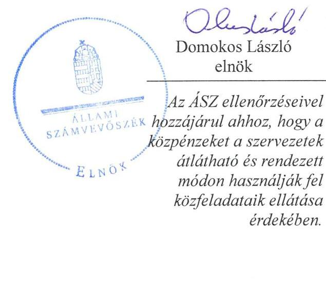
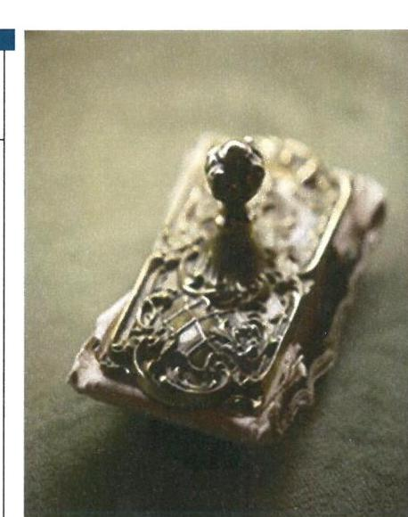
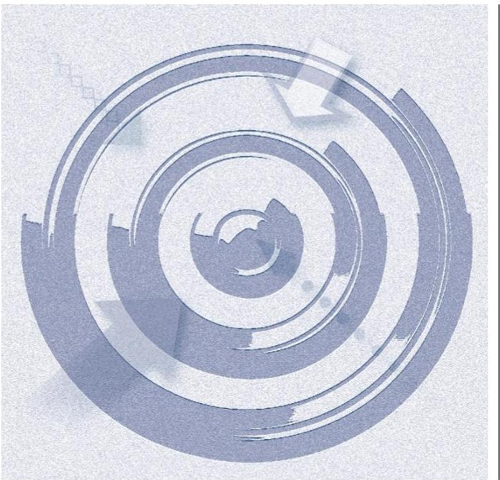
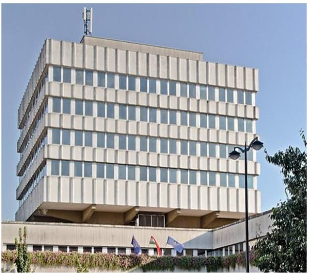
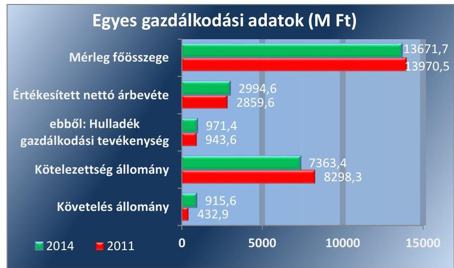
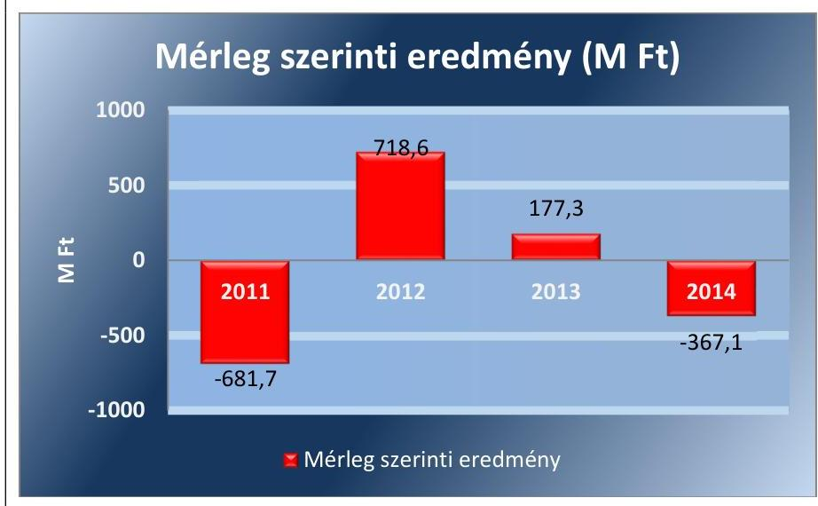
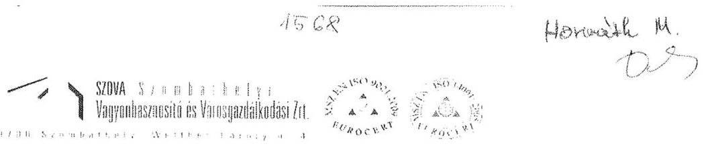
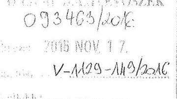
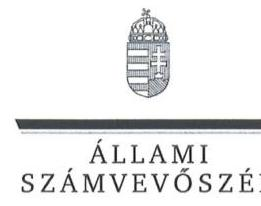
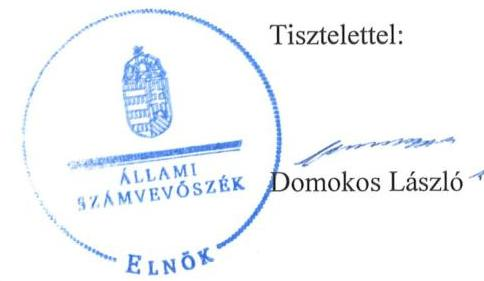

# Jelentés 

## Az önkormányzatok gazdasági társaságai

Az önkormányzatok többségi tulajdonában lévő gazdasági társaságok gazdálkodásának ellenőrzése - SZOVA Szombathelyi Vagyonhasznosító és Városgazdálkodási Zrt. 2017.

Az ÁSZ ellenőrzéseivel hozzájárul ahhoz, hogy a köppénzeket a szervezetek átlátható és rendezett módon használják fel közfeladataik ellátása érdekében.

---

# Jelentés 

## Az önkormányzatok gazdasági társaságai

Az önkormányzatok többségi tulajdonában lévő gazdasági társaságok gazdálkodásának ellenőrzése - SZOVA Szombathelyi Vagyonhasznosító és Városgazdálkodási Zrt. 2017. 2017. 2017. 2017. nap

17004
www.asz.hu

Domokos László elnök

Az ÁSZ ellenörzéseivel hozzájárul ahhoz, hogy a
közpénzeket a szervezetek átlátható és rendezett módon használják fel közfeladataik ellátása érdekében.

---

# AZ ELLENŐRZÉST FELÜGYELTE:

DR. HORVÁTH MARGIT felügyeleti vezető

## AZ ELLENŐRZÉST VEZETTE ÉS A VÉGREHAJTÁSÁÉRT FELELŐS:

PENCZ MÁRIA ellenőrzésvezető

## A PROGRAM ÖSSZEÁLLÍTÁSÁÉRT FELELŐS:

JANIK JÓZSEF LÁSZLÓ osztályvezető

IKTATÓSZÁM: V-1129-159/2016.

TÉMASZÁM: 2163

ELLENŐRZÉS-AZONOSÍTÓ SZÁM: V070794

Jelentéseink az Országgyűlés számítógépes hálózatán és az Interneta a www.asz.hu címen is olvashatóak.

---

# TARTALOMJEGYZÉK 

■ ÖSSZEGZÉS ..... 5
■ AZ ELLENŐRZÉS CÉLJA ..... 7
■ AZ ELLENŐRZÉS TERÜLETE ..... 8
■ AZ ELLENŐRZÉS HÁTTERE, INDOKOLTSÁGA ..... 10
■ A JELENTÉS LÉNYEGES KÉRDÉSKÖREI ..... 11
■ ELLENŐRZÉS HATÓKÖRE ÉS MÓDSZEREI ..... 12
■ MEGÁLLAPÍTÁSOK ..... 14
■ JAVASLATOK ..... 24
■ MELLÉKLETEK ..... 25
I. sz. melléklet: Értelmező szótár ..... 25
II. sz. melléklet: A SZOVA Zrt. vagyonának változása 2011-2014.között (E Ft, \%) ..... 27
III. sz. melléklet: A SZOVA Zrt. eredményének alakulása a 2011-2014. közötti években (E Ft, \% ) ..... 29
■ FÜGGELÉK: ÉSZREVÉTELEK ..... 31
■ RÖVIDÍTÉSEK JEGYZÉKE ..... 35

---

.

---

# ÖSSZEGZÉS 

A Szombathely Megyei Jogú Város Önkormányzata a közfeladat ellátását szabályszerűen szervezte meg. A tulajdonosi jogok gyakorlása összességében megfelelt az előírásoknak.
A SZOVA Szombathelyi Vagyonhasznosító és Városgazdálkodási Zrt. vagyongazdálkodás a jogszabályi rendelkezéseknek és a belső előírásoknak megfelelt. A kötelezettségállománya nem veszélyeztette a müködést és a közfeladat-ellátást. A SZOVA Szombathelyi Vagyonhasznosító és Városgazdálkodási Zrt. által ellátott közfeladat bevételeinek és ráfordításaink elszámolása megfelelt a jogszabályi előírásoknak. Az önköltségszámítás és az árképzés összhangban volt a törvényi előírásokkal.

## Az ellenőrzés társadalmi indokoltsága

Az Állami Számvevőszék stratégiájában megfogalmazta, hogy a helyi önkormányzatok gazdálkodásában rejlő pénzügyi kockázatok feltárásával, az államháztartáson kívülre nyújtott költségvetési támogatások és ingyenes vagyonjuttatások, valamint az államháztartáson kívül múködő közfeladat-ellátó rendszerek ellenőrzéseivel hozzájárul ahhoz, hogy a közpénzeket az államháztartáson kívül múködő szervezetek is átlátható, rendezett módon használják fel a közfeladatok szerződésben vállalt ellátása érdekében.

Magyarországon az intézmény-centrikus közfeladat-ellátás jellemző, de egyre jelentősebb a költségvetésen kívüli feladatellátás térnyerése. Ennek legfontosabb szereplői - a nonprofit szervezetek mellett - az önkormányzati tulajdonú gazdasági társaságok. Az önkormányzatok szervezetalakítási szabadságának következménye, hogy a korábban is vállalati formában múködő közszolgáltatások mellett, mind a kötelező, mind az önként vállalt feladatok ellátásában a gazdasági társaságok kiemelt fontosságú szerephez jutottak.

## Főbb megállapítások, következtetések, javaslatok

A közfeladat-ellátás megszervezésére vonatkozó önkormányzati döntés és annak előkészítése szabályszerű volt. Az Önkormányzat 2012. évre vonatkozó hulladékgazdálkodási tervkészítési kötelezettségének nem tett eleget. A tulajdonosi jogok gyakorlása a $\mathrm{Gt}, \mathrm{Ptk}_{2}$, valamint a vagyongazdálkodási rendeletekben foglaltaknak megfelelt, szabályszerű volt, tulajdonosi jogok átadására nem került sor.

A SZOVA Zrt. a Számv. tv.-ben előírt számviteli politikával és annak keretében elkészítendő szabályzatokkal rendelkezett, amelyek aktualizálása a jogszabályi változásokat követően - a Pénzkezelési szabályzat kivételével - nem történt meg. Az Önköltségszámítási szabályzat a SZOVA Zrt. vagyonának elkülönítését megalapozó számviteli szétválasztásra vonatkozóan előírást nem tartalmazott.

A vagyongazdálkodás a jogszabályi rendelkezéseknek és a belső előírásoknak megfelelt. A kötelezettség állomány nem jelentett veszélyt a közfeladat ellátására, illetve a SZOVA Zrt. múködésére. A SZOVA Zrt. hosszú és rövid lejáratú kötelezettségeit határidőben teljesítette.

A SZOVA Zrt. beszámolási, adatszolgáltatási kötelezettségének szabályszerűen eleget tett. A beszámoló kiegészítő melléklete a 2013. évben a $\mathrm{Hgt}_{2}$. előírásainak megfelelően tartalmazta a hulladékgazdálkodási tevékenység önálló mérlegét és eredménykimutatását, a 2014. évben a SZOVA Zrt.-nek ilyen jellegú kötelezettsége nem állt fenn. A könyvvizsgáló a beszámolókat hitelesítő záradékkal látta el és nem kifogásolta, hogy a szétválasztási szabályokat a $\mathrm{Hgt}_{2}$. előírásai ellenére nem dolgozták ki. Közzétételi kötelezettségét nem teljesítette, a közérdekú adatok megismerésére irányuló igények teljesítési rendjét rögzítő szabályzattal nem rendelkezett.

---

A SZOVA Zrt. a közfeladat ellátásával kapcsolatos bevételeinek és ráfordításainak elkülönített nyilvántartási kötelezettségét szabályosan végezte, elszámolásuk a Számv. tv. előírásainak megfelelt. A SZOVA Zrt.-nél működő önköltségszámítás és árképzés rendje megfelelően szabályozott volt, összhangban a törvényi előírásokkal.

---

# AZ ELLENŐRZÉS CÉLJA 

AZ ELLENŐRZÉS CÉLJA annak értékelése, hogy az önkormányzat vagyongazdálkodási tevékenysége során szabályszerűen gyakorolta-e tulajdonosi jogait; a gazdasági társaság szabályozottsága, gazdálkodása és vagyongazdálkodási tevékenysége, bevételeinek és ráfordításainak elszámolása megfelelte a jogszabályi és tulajdonosi előírásoknak; a gazdasági társaság kötelezettségállománya jelent-e kockázatot a múködésre, valamint a gazdálkodás átláthatósága és elszámoltathatósága érdekében biztosítva volt-e a szolgáltatás dijának megalapozottsága szabályszerű önköltségszámítással.

---

# **AZ ELLENŐRZÉS TERÜLETE**

## **Szombathely Megyei Jogú Város Önkormányzata és a kizárólagos tulajdonában lévő SZOVA Szombathelyi Vagyonhasznosító és Városgazdálkodási Zrt.**

### **Szombathely Megyei Jogú Város Önkormányzata**1 a SZOVA Szombathelyi Vagyonhasznosító és Városgazdálkodási Zrt.-t a Szombathelyi Önkormányzati Házkezelési Kft. és a Szombathelyi Városgazdálkodási Kft. jogutódjaként hozta létre 2007. június 21-én. Ezt követően, 2008. június 30-án a "CLAUDIUS" Ipari és Innovációs Park Kft. beolvadt a SZOVA Zrt. 2-be.

A SZOVA Zrt. - tevékenységének elsődleges célja, hogy közfeladatként végezze a hulladékgazdálkodási, település üzemeltetési és a lakás- és helyiséggazdálkodási feladatokat. A Társaság vagyonhasznosítással és városgazdálkodással kapcsolatos szolgáltatásokat végez a szombathelyi és a környező településeken lévő önkormányzatokkal, gazdasági szervezetekkel, társasházakkal, magánszemélyekkel kötött megállapodások alapján.

Az Önkormányzat 100%-os tulajdonába lévő SZOVA Zrt. tevékenysége rendkívül széleskörű: a hulladékgazdálkodás, a közterületek tisztítása, a téli hó – és síkosság-mentesítés, valamint útfenntartás, útjavítás, kommunális gépjárművek és munkagépek javítása, bérlemény- és épületkezelés, illetve üzemeltetés, társasházkezelés, ingatlanfejlesztés, ingatlanhasznosítás, és szerepet kap az ipari park funkció is. Ezek mellett a SZOVA Zrt. üzemelteti Szombathelyen a Műjégpályát, a Tófürdőt, a Kalandvárost és a fizető autóparkolókat.

A SZOVA Zrt. gazdálkodásának főbb adatait a 2011-2014 évek vonatkozásában az 1. ábra szemlélteti:

1. ábra

---

A SZOVA Zrt. mérlegfőösszege 2011-ben 13 970,5 M Ft, 2014-ben 13671,7 M Ft volt. Az értékesítés nettó árbevétele a 2011. és a 2014. év vége között 4,5\%-kal nőtt. A hulladék gazdálkodási tevékenység árbevétele 2011-ben 943,6 M Ft volt, 2014-ben 971,4 M Ft-ra emelkedett. A kötelezettség állomány minden évben meghaladta a saját tőke értékét, 2011. december 31-éről a 2014. év végére 11,3\%-kal csökkent. A követelésállomány a 2011. és a 2014. év vége között 52,7\%-kal, azaz 482,6 M Ft-tal nőtt.

A foglalkoztatottak átlagos statisztikai állományi létszáma a vizsgált időszakban nem változott jelentős mértékben: a 2011. évi 281 főről 2012. évre 283 főre csökkent, 2013. évben 283 fő maradt, 2014 évre lecsökkent 281 főre.

A SZOVA Zrt. múködésének főbb adatait a II. számú melléklet mutatja be.

Az Önkormányzat a SZOVA Zrt. részére múködési és fejlesztési célú támogatást nem nyújtott az ellenőrzött időszakban.

Az ellenőrzött időszak alatt 2011. január 1-jétől 2013. december 31-ig a Szombathely MJV ${ }^{3}$ közigazgatási területén a települési szilárd hulladékkal kapcsolatos helyi közszolgáltatás ellátására kizárólagosan feljogosított hulladékkezelő a SZOVA Zrt. volt. A SZOVA Zrt. a 79 ezer fő lakosság számú Szombathelyen kívül 2011-2012. évben 58, 2013. évben 53, 2014. évben 43 településen látott el hulladékgazdálkodási feladatokat. A hulladékszállításra kötött szerződések száma 2011. évben 47837 db, 2012. évben 47949 db, 2013. évben 46215 db volt. A SZOVA Zrt. 2014. január 1-jétől nem közszolgáltatóként, hanem az Önkormányzat által 2013. március 7-én alapított SZOMHULL Nonprofit Kft. ${ }^{4}$ alvállalkozójaként végezte a hulladékgazdálkodási feladatokat. A SZOVA Zrt. 2014. július 1.-je óta hulladékgazdálkodási közszolgáltatási tevékenységet nem végez.

A SZOVA Zrt. vagyonkezelési szerződés alapján nem vett át vagyont kezelésre. A hulladékgazdálkodási közfeladatot saját eszközzel, valamint az Önkormányzattól bérbe vett eszközökkel látta el.

Az ellenőrzött időszak alatt a SZOVA Zrt. három gazdasági társaságban részesedéssel és egy egyesülésben vagyoni betéttel rendelkezett. 2009. októberétől a Szombathelyi Távhőszolgáltató Kft.-ben 1815,7 M Ft részesedéssel, 75\%-os tulajdonjoggal rendelkezett. A Kőszegi TÁVHŐ Kft. -ben 21,3 M Ft-os részesedését, 25,37\%-os tulajdonjogát 2014. július 1-jén értékesítette. A SZOMHULL Nonprofit Kft.-ben 0,3 M Ft részesedésével 2013. október 16-ától 10\% tulajdoni hányaddal rendelkezett. A Köztisztasági Egyesülésben a részesedése 60 E Ft volt.

Az ellenőrzött időszakban a polgármester személye nem változott, a jegyző személye két alkalommal változott. A SZOVA Zrt. vezérigazgató személye az ellenőrzött időszakban két alkalommal változott.

SZOVA Zrt. nem minősül kormányzati szektorba sorolt egyéb szervezetnek.

---

# AZ ELLENŐRZÉS HÁTTERE, INDOKOLTSÁGA 

## AZ ÖNKORMÁNYZATI TULAJDONÚ GAZDASÁGI

TÁRSASÁGOK ellenőrzése kiemelten fontos a vagyon megőrzése, megóvása érdekében, valamint a kormányzati szektor elszámolásaiban megjelenő önkormányzati tulajdonú gazdálkodó szervezetek esetében, amelyekkel szemben alapvető követelmény, hogy gazdálkodásuk, működésük szabályszerű, az általuk szolgáltatott adatok minél megbízhatóbbak legyenek. A feladat/közfeladat-ellátás költségeinek, ráfordításainak alakulása, színvonala hatással van a lakosság elégedettségére.

A törvényalkotás számára - az észlelt problémák, szabálytalanságok, vagy egyéb nem kívánatos jelenségek felszínre kerülésével - az ellenőrzés megállapításai segítséget nyújthatnak az államháztartáson kívüli feladat/közfeladat-ellátás értékeléséhez, jogszabályi keretei pontosításához, átláthatóságot biztosító szabályozásához. Meghatározhatóvá válnak az önkormányzati feladatellátásban részt vevő államháztartáson kívüli szervezeteknek - az önkormányzat költségvetését, pénzügyi helyzetét is befolyásoló - kockázatai, lehetővé válik ezen kockázatok csökkentése. Ellenőrzéseink feltárhatják, hogy az önkormányzat feladat-ellátási kötelezettségének szabályszerűen tett-e eleget, a feladatellátáshoz rendelt vagyonkezelésbe vett és saját vagyon működtetését az elvárható gondossággal, szabályszerűen szervezte-e meg és a tulajdonosi felügyelete hozzájárult-e a feladatellátásához. Az ellenőrzés rávilágíthat arra, hogy a gazdasági társaság a feladat-ellátási, közszolgáltatási szerződésben foglaltak betartásával, a vagyon használatával biztosította-e a szolgáltatás folytatásának feltételeit, a feladat ellátását. Ezzel az ellenőrzöttek és a helyi döntéshozók számára visszajelzést ad feladatszervezési, feladat-ellátási kockázataikról, alapot ad a meglévő hibák megszüntetéséhez, a jobb feladatellátás biztosításához. Fokozza a fegyelmet, igazolja, hogy lejárt a következmények nélküli ellenőrzések idő-szaka. Az ÁSZ értékteremtő rend kialakításához és megőrzéséhez hozzájáruló tevékenysége pozitív hatással van a szervezetről kialakított összkép formálására.

---

# A JELENTÉS LÉNYEGES KÉRDÉSKÖREI 

1. Az önkormányzat közfeladat megszervezéséről szóló döntése, valamint tulajdonosi joggyakorlása szabályszerű volt-e?
2. A gazdasági társaság vagyongazdálkodása szabályszerű volt-e, kötelezettségállománya jelent-e kockázatot a müködésre, illetve a közfeladat ellátására?
3. A gazdasági társaságnál az ellátott közfeladat bevételei és ráfordításai elszámolása, valamint az önköltségszámítás és árképzés szabályszerű volt-e?

---

# ELLENŐRZÉS HATÓKÖRE ÉS MÓDSZEREI 

## Az ellenőrzés típusa

Megfelelőségi ellenőrzés

## Az ellenőrzött időszak

A 2011. január 1-jétől 2014. december 31-éig terjedő időszak.

## Az ellenőrzés tárgya

A gazdasági társaság feletti tulajdonosi joggyakorlás, valamint a gazdasági társaság gazdálkodásának szabályozottsága és szabályszerűsége.

Az ellenőrzés kiterjed minden olyan körülményre és adatra, amely az ÁSZ jogszabályban meghatározott feladatainak teljesítéséhez, valamint a program végrehajtása folyamán felmerült újabb összefüggések feltárásához szükséges.

## Az ellenőrzött szervezet

- SZOVA Szombathelyi Vagyonhasznosító és Városgazdálkodási Zrt.
- Szombathely Megyei Jogú Város Önkormányzata

## Az ellenőrzés jogalapja

Az ellenőrzés jogszabályi alapját az ÁSZ tv. 1. § (3) bekezdése és 5. § (3)-(4)-(5) bekezdései képezik.

## Az ellenőrzés módszerei

Az ellenőrzést a nemzetközi standardokat irányadónak tekintve az ellenőrzési program ellenőrzési kérdései, az ellenőrzött időszakban hatályos jogszabályok, az ellenőrzés szakmai szabályok és módszertanok figyelembe vételével végeztük.

Az ellenőrzés ideje alatt az ellenőrzött szervezettel történő kapcsolattartást az ÁSZ Szervezeti és Müködési Szabályzatának vonatkozó előírásai alapján biztosítottuk.

Az ellenőrzés a kiválasztott, tulajdonosi jogokat gyakorló önkormányzatra, illetve az ellenőrzésre kijelölt gazdasági társaság felett tulajdonosi

---

jogokat gyakorló szervezetre (holding szervezetre) és az ellenőrzött gazdasági társaságra terjedt ki.

Az ellenőrzést a kérdésekre adott válaszok kiértékelésével, valamint a megjelölt adatforrások, a csatolt tanúsítványok felhasználásával, továbbá az adott időszakban hatályos jogszabályok figyelembe vételével folytattuk le. Az ellenőrzési kérdések megválaszolásához szükséges bizonyítékok megszerzése a következő ellenőrzési eljárások alkalmazásával történt: megfigyelés, kérdésfeltevés (információkérés), összehasonlítás, valamint elemző eljárás.

A bevételek és ráfordítások elszámolása, valamint a vagyonnyilvántartás terén a szabályszerű múködést véletlen mintavétellel ellenőriztük. A mintavétellel ellenőrzött területek esetében minden egyes tétel vonatkozásában a szabályszerűségre vonatkozó kérdéseket tettünk fel, amelyek eredménye összesítésre került. A jogszabályoknak és a belső előírásoknak megfelelőnek tekintettük az adott területet, amennyiben a minta ellenőrzésének eredménye alapján 95\%-os bizonyossággal a teljes sokaságban a hibaarány kisebb volt, mint 10\%, nem megfelelőnek, ha a hibaarány a 10\%ot meghaladta. Részben megfelelő minősítést adtunk, amennyiben egy adott terület vonatkozásában a minta alapján a teljes sokaságban nem volt egyértelmúen biztosított a jogszabályoknak és a belső szabályzatoknak megfelelő működés. A ráfordítások elszámolására és a vagyonnyilvántartásra vonatkozó véletlen mintavételt kockázati alapú kiválasztással egészítettük ki, amelynek során évente a három legnagyobb összegű tételt választottuk ki.

---

# 1. Az önkormányzat közfeladat megszervezéséről szóló döntése, valamint tulajdonosi joggyakorlása szabályszerű volt-e? 

Összegző megállapítás

Az Önkormányzat közfeladat ellátását szabályszerűen szervezte meg. A tulajdonosi jogok gyakorlása összességében megfelelt az előírásoknak.

### 1.1. számú megállapítás

A közfeladat-ellátás megszervezésére vonatkozó önkormányzati döntés szabályszerű volt.

Az Önkormányzat az Ötv. ${ }^{5}$ és a Mötv. ${ }^{6}$ előírásainak megfelelően, a 20112015. évekre vonatkozóan gazdasági programot ${ }^{7}$ készített. A Közgyűlés által elfogadott gazdasági program a várospolitikai célok és intézkedési javaslatok között tartalmazta a SZOVA Zrt. által végzett hulladékgazdálkodási, közszolgáltatási feladatait.

Az önkormányzati közép és hosszú távú vagyongazdálkodási terv a 2013-2014. éves időszakra a Nvtv. ${ }^{8}$ előírásainak megfelelően elkészült. A középtávú terv a közfeladatok közül célként határozta meg a város ingatlanvagyonával történő gazdálkodást, és a felesleges vagyontárgyak értékesítését. A középtávú vagyongazdálkodási tervet a Közgyűlés 2013. év márciusában, a hosszú távú vagyongazdálkodási tervet 2013. év szeptember 26-án jóváhagyta.

Szombathely MJV helyi hulladékhasznosítási és fejlesztési célkitűzései a hulladékgazdálkodási terv ${ }_{1}{ }^{9}$ tartalmazta. A 2005-2011. évekre vonatkozó hulladékgazdálkodási terv ${ }_{1}$ az elérendő hulladékgazdálkodási célként határozta meg a lerakott hulladék mennyiségének csökkentését a szelektív hulladékgyűjtés bevezetése révén. Az Önkormányzat 2012. évre vonatkozóan nem rendelkezett a Hgt. ${ }^{10} 35$. § (1) bekezdése ellenére a helyi hulladékgazdálkodási tervvel. A SZOVA Zrt., mint közszolgáltató a Hgt. ${ }_{2}{ }^{11}$ előírásainak megfelelően 2013. február 25-én Közszolgáltatói hulladékgazdálkodási terv ${ }_{2}{ }^{12}$-et készített, amit a Közgyűlés elfogadott. A Hulladékgazdálkodási tervben 2020. év végéig meghatározásra kerültek a Hgt. ${ }_{2}$-ben foglaltaknak megfelelően a hulladékgazdálkodási célkitűzések és főbb irányelvek.

A SZOVA Zrt. által ellátandó feladatok körét az Önkormányzat az Alapító Okiratban, a hulladékkezelési közszolgáltatás ellátásának követelményeit helyi rendeletekben és üzemeltetési szerződésekben határozta meg az Ötv. előírásainak megfelelően. A Hgt. előírásaival összhangban az Önkormányzat a hulladékgazdálkodási közszolgáltatás ellátását a SZOVA Zrt., ezt követően 2014. évtől a SZOMHULL Nonprofit Kft közszolgáltatóval kötött hulladékgazdálkodási közszolgáltatási szerződések útján biztosította.

KÖZSZOLGÁLTATÁSI SZERZŐDÉST az Önkormányzat a SZOVA Zrt.-vel (illetve a jogelőd a Vgazd. Kft ${ }^{13}$ ) kötött a települési szilárd

---

# 1.2. számú megállapítás 

hulladékok gyűjtésére, szállítására és elhelyezésére vonatkozó közszolgáltatás ellátására. A szerződés tartalmazta a közszolgáltató és az önkormányzat kötelezettségeit, a közszolgáltatás díjtételeit, a közszolgáltatási szerződés módosításának, megszüntetésének feltételeit.

A SZOVA Zrt. Alapító Okirat VIII. fejezetén belül meghatározta az alapító kizárólagos hatáskörébe tartozó feladatokat. A köztisztasággal és településtisztasággal kapcsolatos önkormányzati feladatok ellátása érdekében a kötelező közszolgáltatásra vonatkozó átfogó és egységes szabályzat megteremtésére az Önkormányzat Közgyűlése az 5/1996. (II.29.) sz. rendeletet ${ }^{14}$ alkotta. Az 5/1996. (II.29.) sz. rendeletet többször módosítottak ${ }^{15}$, a módosítások a jogszabályi előírásoknak megfeleltek.

Az Önkormányzat szabályszerűen teljesítette tulajdonosi joggyakorlási és beszámoltatási kötelezettségét.

A TULAJ DONOSI JOGOKAT a SZOVA Zrt. felett az Önkormányzat az előírásoknak megfelelően, szabályszerűen gyakorolta a vagyongazdálkodási rendelet ${ }^{16}{ }_{2}{ }^{17}$.ben, az Alapító Okiratban és az SZMSZben foglaltaknak megfelelően.

Az Önkormányzat vagyonrendelet ${ }_{1,2}$-ben a Gt. ${ }^{18}$, az Ötv. és Mötv.elöírásainak betartásával szabályozta a gazdasági társaságok feletti tulajdonosi jogok gyakorlását, amelyet a szabályozásnak megfelelően végeztek. A vagyonrendeletben előírtak alapján a Közgyűlés kizárólagos hatáskörébe tartozott a Számv. tv. ${ }^{19}$ szerinti beszámolók és az adózott eredmény felhasználására vonatkozó döntések meghozatala. A Társaság vonatkozásában tulajdonosi jogosítvány átadására nem került sor.

Az Önkormányzat, mint a tulajdonosi joggyakorló a hulladékgazdálkodási közfeladat ellátásához - az ellenőrzött időszakot megelőzően SZOVA Zrt. 2007-ben történt alapításakor és a Szombathelyi Városgazdálkodási Kft-nek a SZOVA Zrt.-be történő beolvasztásakor tőkét biztosított, mint általános jogutódnak. A SZOVA Zrt. vagyona a beolvadó társaságok vagyonából tevődött össze, az Önkormányzat az ellenőrzött időszakot megelőzően két alkalommal tőkeemelést hajtott végre.

AZ FB ${ }^{20}$ a Gt, valamint a Ptk. ${ }^{21}$ előírásait figyelembe véve hat tagból állt. Az FB a Gt., illetve a Ptk. ${ }_{2}$ előírásainak megfelelően minden évben írásbeli jelentést készített a SZOVA Zrt. számviteli beszámolójáról. Az FB a Gt., illetve a Ptk. ${ }_{2}$ előírásainak megfelelően ügyrenddel rendelkezett. Az FB ügyrendjét a Gt.-ben foglaltak szerint az Önkormányzat a 16/2009. (I.30.) Kgy. határozattal jóváhagyta.

AZ ÁRKÉPZÉSI SZABÁLYOZÁS elveit a hulladékkezelési közszolgáltatási díjak esetében a 64/2008. Korm. rendelet ${ }^{22}$ tartalmazta. A SZOVA Zrt. árképzési szabályait az Önkormányzat Közgyűlése 5/1996. (II.29.) sz. rendelete és annak módosításai is tartalmazták.

2014-ben a SZOVA Zrt. vállalkozási szerződést kötött a hulladékszállítás és hulladékkezelési szolgáltatások elvégzésére egy Nonprofit Kft.-vel, ezért a SZOVA Zrt. hulladékszállítási és hulladékkezelési szolgáltatásának bevétele nem közszolgáltatásból származott. A tevékenység eredményének két cég közötti elosztását az elszámoló árak határozták meg.

---

Az Önkormányzat tulajdonosi joggyakorlása a FB, az igazgatóság és a könyvvizsgáló tevékenységéhez kapcsolódóan szabályszerű volt. Az Önkormányzat az általa meghatározott követelmények betartását számon kérte, a gazdálkodásról és a szerződések alapján elvégzett feladatellátásról beszámoltatta a gazdasági társaságot. A tulajdonosi joggyakorlás keretében az Önkormányzat az éves üzleti terveket, az éves és a féléves számviteli és pénzügyi beszámolókat megtárgyalta.

ÜZLETI TERV készítési kötelezettséget az Önkormányzat az Alapító Okiratban írt elő a SZOVA Zrt. részére. Üzleti tervet a SZOVA Zrt. minden évben készített, összhangban a Gazdasági Programban megfogalmazott feladatokkal és az alapítói közfeladat ellátására vonatkozó szakmai tervekkel és az Alapítói Okirat1:3ban előírtakkal. A SZOVA Zrt. üzleti terveit a Közgyűlés megtárgyalta, elfogadásáról az FB véleményének birtokában, Közgyűlési határozattal ${ }^{23}$ jóváhagyóan döntött. Beruházási terv a tervezett fejlesztésekről a fejlesztési források számbavételével minden évben készült.

A Taktv ${ }^{24}$-ben, valamint az Alapítói Okiratban foglaltaknak megfelelően a Közgyűlés javadalmazási szabályzat ${ }^{25}$ készítési kötelezettségének eleget tett, melyben meghatározták a vezetők és tisztségviselők javadalmazási elveit, a vezetők prémium fizetésének feltételeit. Az ellenőrzött időszakban az Önkormányzat nem élt a belső ellenőrzés lehetőségével és ez által nem támogatta a SZOVA Zrt. szabályszerű működését.

# 2. A gazdasági társaság vagyongazdálkodása szabályszerű volt-e, kötelezettségállománya jelent-e kockázatot a müködésre, illetve a közfeladat ellátására? 

Összegző megállapítás

A SZOVA Zrt. a szabályszerű vagyongazdálkodás feltételeit részben alakította ki, vagyongazdálkodása megfelelt a jogszabályi előírásoknak. A kötelezettségállománya a müködésre és a közfeladat-ellátásra nem jelentett veszélyt.
2.1. számú megállapítás

A SZOVA Zrt. a Számv. tv.-ben előírt számviteli politikával és annak keretében elkészítendő szabályzatokkal rendelkezett, amelyek aktualizálása a jogszabályi változásokat követően részben történt meg. A SZOVA Zrt. a hulladékszolgáltatási tevékenység elkülönítését megalapozó számviteli szétválasztásra vonatkozó szabályozással nem rendelkezett.

A SZOVA Zrt. az ellenőrzött időszakban vagyonkezelt eszközzel nem rendelkezett, így a vagyonkezelt vagyon elkülönítésére vonatkozó kötelezettsége nem keletkezett.

A SZOVA Zrt. rendelkezett a Számv. tv.-ben előírt Számviteli politika ${ }^{26}$ val és annak keretében elkészítendő szabályzatokkal, valamint a Számv. tv. -ben előírt Számlarend ${ }^{27}$-del. A Számv. tv. 14. § (11) bekezdésében foglaltak ellenére a jogszabályi változásokat követően a szabályzatok aktualizálása a Pénzkezelési szabályzat és a Leltározási szabályzat kivételével nem történt meg.

---

A SZÁMVITELI POLITIKA az ellenőrzött időszakban a hatályos számviteli előírásoknak teljes körűen nem felelt meg. A Számviteli politikából a Számv. tv. 14. § (11) bekezdése előírása ellenére a jogszabályi változást követő 90 napon belül nem törölték a megbízható és valós képet lényegesen befolyásoló hibák esetén a már közzétett éves beszámoló ismételt közzétételi kötelezettségének előírását, amely előírás a Számv. tv.-ből kikerült a Számv. tv. 154. § (5) bekezdésének 2013. január 1-i hatályon kívül helyezésével.

# AZ ÖNKÖLTSÉGSZÁMÍTÁS RENDJÉRE VONATKOZÓ ÖNKÖLTSÉGSZÁMÍTÁSI SZABÁLYZAT ${ }_{1}{ }^{28} \geq{ }^{29}$. 

-tal a SZOVA Zrt. az ellenőrzött időszakban rendelkezett. Az Önköltségszámítási szabályzat nem tartalmazta a 2011. július 1.-i módosításáig a 64/2008. (III.28.) Korm. rendelet 2. § (3) bekezdésében előírt hulladékkezelési közszolgáltatási díjkalkulációs sémát. A hulladékgazdálkodási közszolgáltatási tevékenységek, az önálló eredménykimutatás készítését megalapozó számviteli szétválasztás szabályait az Önköltségszámítási szabályzat ${ }_{1,2}$ tartalmazta.

A SZOVA Zrt. a Hgt 2 50. § (2) és (3) bekezdése előírásai ellenére nem alakított ki a hulladékgazdálkodási közszolgáltatás körébe nem tartozó tevékenységeire olyan elkülönült nyilvántartás vezetését, amely biztosította volna az egyes tevékenységek átláthatóságát, valamint kizárta volna a keresztfinanszírozást. Ezáltal nem teremtette meg annak feltételrendszerét, hogy a hulladékgazdálkodási közszolgáltatás nyújtása érdekében végzett tevékenységét éves beszámolója kiegészítő mellékletében oly módon mutathassa be, mintha azt önálló vállalkozás keretében végezte volna. A hulladékgazdálkodási közszolgáltatás nyújtása érdekében végzett tevékenységéről szóló önálló mérlege és eredménykimutatása hiányában nem érvényesült a tevékenység elkülönült bemutatásának jogszabályi előírása. A hulladékgazdálkodási közszolgáltatási tevékenységnek a más tevékenységektől történő számviteli szétválasztásának elmaradt szabályozása miatt sérültek a Számv. tv. 161/A. § (1)-(2) bekezdésében előírt követelmények, mivel a belső szabályzatok nem biztosították teljes körűen a kiegészítő melléklet adatainak alátámaszthatóságát.

A LELTÁROZÁSI SZABÁLYZAT ${ }^{30}$-át a SZOVA Zrt. elkészítette a Számv. tv. előírásainak megfelelően.

ÉRTÉKELÉSI SZABÁLYZATTAL ${ }^{31}$ a SZOVA Zrt. az ellenőrzött időszakban rendelkezett, a Számv. tv. 60. § (2) bekezdés szerinti, a valutapénztárban lévő valutakészlet, a devizaszámlán lévő deviza, továbbá a külföldi pénzértékre szóló követelés, értékpapír, illetve kötelezettség üzleti év mérlegfordulónapjára vonatkozó a 2011. január 1-jétől hatályos értékélési szabályokat nem az Értékelési szabályzat, hanem a Számviteli politika 5.4. fejezete tartalmazta.

PÉNZKEZELÉSI SZABÁLYZAT ${ }_{1}{ }^{32} \geq{ }^{33}$-tal a SZOVA Zrt. a Számv. tv. előírásainak megfelelően rendelkezett. A Pénzkezelési szabályzat ${ }_{1}$ megfelelt a Számv. tv.előírásainak. A Pénzkezelési szabályzat ${ }_{2}$ - a készpénzállomány ellenőrzésekor követendő eljárás és az ellenőrzés gyakoriság rendjének meghatározásának kivételével - tartalmazta a Számv. tv. 14. § (8) bekezdésében előírt tartalmakat.

---

### 2.2. számú megállapítás

A kötelezettség állomány nem jelentett veszélyt a közfeladat ellátására, illetve a SZOVA Zrt. múködésére. A SZOVA Zrt. hosszú és rövid lejáratú kötelezettségeit határidőben teljesítette.

AZ ELADÓSODÁS MÉRTÉKE, szerkezete 2011.-2014. években nem jelentett veszélyt a közfeladat ellátására, illetve a SZOVA Zrt. múködésére.

Az adósságfedezeti mutató I. értéke kedvezően alakult a SZOVA Zrt.-nél az ellenőrzött időszakban, mivel eszközállománya kötelezettségeinek (idegen forrásainak) közel kétszerese volt minden évben.

A SZOVA Zrt. eladósodottságának mértéke az ellenőrzött években jelentős nagyságrendú volt. A SZOVA Zrt. kötelezettség állománya a saját tőkéhez viszonyítva minden évben kedvezőtlenül alakult, a saját források nem fedezték a kötelezettségeket. A 2012-2013. években az eladósodottsági mutató ugyan kedvező változást mutatott, de 2014. évben a veszteséggel összefüggésben a mutató ismét romlott.

A nettó eladósodottsági mutató a 2012-2013. években csökkenő értéke miatt kedvezően alakult, 2014. évben kedvezőtlenül változott. Az eladósodottsági mutató értéke 2011-2014. években 0,52 és 0,59 között volt, ami azt mutatta, hogy a társaságnál a külső finanszírozottság megfelelő volt.

A HOSSZÚLEJÁRATÚ KÖTELEZETTSÉGEK esedékes törlesztő részleteit a SZOVA Zrt. az ellenőrzött időszakban határidőben teljesítette. A SZOVA Zrt.-nek 2007. évben kibocsátott svájci frank alapú devizakötvény kibocsátásból, valamint 2006. évben forgóeszköz finanszírozásra megkötött hosszú lejáratú kölcsönszerződésből eredően volt hosszú lejáratú kötelezettsége. A SZOVA Zrt. kötvénykibocsátásból származó, évente két alkalommal esedékes kötelezettségeit határidőben teljesítette. A SZOVA Zrt. a hosszú lejáratú kölcsönszerződésből fennálló kötelezettségét 2014. június 30-ig, tizennégy részletben, határidőben törlesztette. A rövid lejáratú kötelezettségeit a SZOVA Zrt. folyamatosan határidőben teljesítette.

### 2.3. számú megállapítás

A vagyongazdálkodás a jogszabályi rendelkezéseknek és a belső előírásoknak megfelelt.

A SZOVA Zrt. a hulladékgazdálkodási közfeladatát saját tulajdonát képező vagyonelemekkel, valamint az Önkormányzattól bérbe kapott eszközzel látta el, vagyonkezelésbe és üzemeltetésre átvett eszközökkel nem rendelkezett.

A saját vagyon tekintetében a vagyonelemekben bekövetkezett változások folyamatos nyilvántartásáról a Számv. tv. előírásainak megfelelően gondoskodtak. A SZOVA Zrt. a számviteli beszámoló ${ }^{34}$-ban és a számviteli nyilvántartásokban a vagyontárgyak állományát, valamint a mérlegtételeket leltárral támasztotta alá. A leltározást minden évben a főkönyvelő által készített, vezérigazgató által jóváhagyott leltározási utasítás alapján végezték. A Leltározási szabályzatban előírtaknak megfelelően, a leltár utasítás alapján a 2012. évi készletek, valamint a 2013. évi tárgyi eszközök, immateriális javak és készletek tényleges mennyiségi leltárfelvételét végezték el. A tényleges leltár felvétellel nem érintett mérleg adatok leltározása a Leltározási szabályzatban foglaltaknak megfelelve, egyeztetéssel történt.

---

1. táblázat

| A HULLADÉK ÁGAZATOT ÉRINTŐ |  |  |  |
| :--: | :--: | :--: | :--: |
| BERUHÁZÁSOK (M FT) |  |  |  |
| 2011. | 2012. | 2013. | 2014. |
| 22,4 | 93,6 | 84,0 | 19,8 |

A SZOVA Zrt. az ellenőrzött időszakban a vagyon értékének megőrzéséről, gyarapításáról a saját vagyona tekintetében gondoskodott, az eszközeinek és forrásainak értéke az ellenőrzött időszakban jelentősen nem változott. Az eszközökben bekövetkezett vagyonváltozást döntően az ingatlanértékesítések, a hosszú lejáratú kötelezettségekre teljesített törlesztések, valamint az immateriális javak és tárgyi eszközökön az elszámolt értékcsökkenésnél magasabb összegben megvalósított fejlesztések határozták meg. A megvalósított beruházások összege 2011-2014. években $1178,3 \mathrm{M} \mathrm{Ft}$, ugyanebben az időszakban elszámolt értékcsökkenés összege 986,8 M Ft volt. A hulladék ágazatban nagy értékű - kompaktor, hulladék-gyűjtő gépkocsi, kukásautó, hídmérleg, forgó-kotró gép - gépek beszerzésére került sor. A hulladékgazdálkodás területén az ellenőrzött időszakban megvalósított beruházásokat az 1. táblázat szemlélteti, a nagy értékű beruházások elsősorban a hulladékgazdálkodás gépparkjának fejlesztésére irányultak.

A SZOVA Zrt. mérleg szerinti eredményének alakulását a 2. ábra szemlélteti:
2. ábra

Fonrás: 2011-2014.éves beszámoló jelentések
Az ellenőrzött időszakban a SZOVA Zrt. mérleg szerinti eredményének alakulását a svájci frank alapú devizakötvény kibocsátásból származó árfolyam nyereség-veszteség különbözete jelentős mértékben befolyásolta. A mérleg szerinti eredmény 2011. év és 2014. év kivételével nyereség volt.

A veszteség rendezésére - a saját tőke/jegyzett tőkemutató szintjének a Gt., valamint a Ptk; előírásai alapján - a tulajdonos Önkormányzatnak intézkedési kötelezettsége nem keletkezett, mert a SZOVA Zrt. saját tőkéjének összege két egymást követő lezárt évben nem csökkent a jegyzett tőke meghatározott szintje alá.

A SZOVA Zrt. belső ellenőrzést működtetett. A belső ellenőr 2012. 2014. években összesen 13 db ellenőrzést végzett. A végrehajtott ellenőrzésekből 2 db ellenőrzés érintette a SZOVA Zrt. vagyongazdálkodását. A belső ellenőrzés javaslataira intézkedési tervet nem készítettek.

---

### 2.4. számú megállapítás

A SZOVA Zrt. beszámolási, adatszolgáltatási kötelezettségének szabályszerűen eleget tett. Közzétételi kötelezettségét nem teljesítette, a közérdekú adatok megismerésére irányuló igények teljesítési rendjét rögzítő szabályzattal nem rendelkezett.

A SZOVA Zrt.-nek a Számv. tv. szerinti éves beszámoló készítési kötelezettségének az ellenőrzött időszakban határidőben eleget tett. A beszámoló kiegészítő melléklete a 2013. évben a $\mathrm{Hgt}_{2}$. előírásainak megfelelően tartalmazta a hulladékgazdálkodási tevékenység önálló mérlegét és eredménykimutatását. A 2014. évben a SZOVA Zrt.-nek ilyen jellegú kötelezettsége nem állt fenn, mert a hulladékgazdálkodást nem közszolgáltatás keretében végezte.

Az Önkormányzat az Alapító Okirat ${ }_{1-7}$ ban és a Közszolgáltatási szerződés ${ }^{35}$-ben további beszámolási kötelezettséget írt elő a SZOVA Zrt.-nek. Az Alapító Okirat ${ }_{1-7}$ a SZOVA Zrt. vagyoni helyzetéről és üzletpolitikájáról évente kétszeri beszámolási kötelezettséget, a Közszolgáltatási szerződés a közszolgáltatás tapasztalatiról éves beszámolási kötelezettséget tartalmazott. A SZOVA Zrt. az ellenőrzött időszakban az Alapító felé egyéb beszámolási és tájékoztatási kötelezettségének határidőben eleget tett. A SZOVA Zrt. Közszolgáltatási szerződésben előírt, a közszolgáltatás tapasztalatiról szóló tájékoztatási kötelezettségét az éves beszámoló üzleti jelentésében teljesítette.

A SZOVA Zrt. a 2011-2014. években a Számv. tv.-ben előírtak alapján az éves beszámolóit elkészítette és a Közgyűlés elé terjesztette elfogadásra. A Közgyűlés az előterjesztett éves beszámolókat az FB határozatai, valamint a független könyvvizsgálói jelentések birtokában megtárgyalta, azok elfogadásáról és az adózott eredmény felhasználásáról határozatot hozott. Az elfogadott beszámolókat a Számv. tv.-ben előírt határidőben letétbe helyezték és közzé tették.

AZ FB a SZOVA Zrt. beszámolóira vonatkozóan a Gt., illetve a Ptk ${ }_{2}$ előírásai alapján írásbeli jelentéseit elkészítette.

A KÖNYVVIZSGÁLÓ elkészítette a SZOVA Zrt. 2011-2014. évek számviteli beszámolóira vonatkozó könyvvizsgálói véleményt, melyeket hitelesítő záradékkal látott el és nem kifogásolta, hogy a SZOVA Zrt. a $\mathrm{Hgt}_{2}$.50. § (3) bekezdésében előírt szétválasztási kötelezettségének a 2013. évben a vagyonelemeket illetően az ellenőrzött időszakban nem tett eleget.

## A KÖZÉRDEKÚ ADATOK MEGISMERÉSÉRE IRÁ-

NYULÓ IGÉNYEK teljesítésének rendjét rögzítő szabályzattal az Avtv. ${ }^{36}$ 20. § (8) és az Info. ${ }^{37}$ tv. 30. § (6) bekezdés előírásai ellenére a SZOVA Zrt. nem rendelkezett.

## ELEKTRONIKUS KÖZZÉTÉTELI KÖTELEZETTSÉ-

GÉT az ellenőrzött időszakban nem teljesítette, mert nem teljes körűen tette közzé az Info tv. 37. § (1) pontjában előírt a tevékenységükhöz kapcsolódóan az Info tv. 1. számú melléklete szerinti általános közzétételi listában meghatározott adatokat. Nem került közzétételre a SZOVA Zrt. szervezeti struktúrája, a közérdekú adatok igénylésének rendje, a számviteli

---

beszámolók, a foglalkoztatottakra vonatkozó adatok, a SZOVA Zrt. többségi tulajdonában álló, illetve részvételével működő gazdálkodó szervezet neve, székhelye elérhetőségei, tevékenységi köre, képviselőjének neve, részesedés mértéke, a SZOVA Zrt., mint közfeladatot ellátó felettes, illetve felügyeleti szervének adatai. Nem került elhelyezésre a közzétételi listákban az SZMSZ és az Adatvédelmi szabályzat hatályos és teljes szövege, valamint a tevékenység végzéséhez a SZOVA Zrt. engedélyei.

# 3. A gazdasági társaságnál az ellátott közfeladat bevételei és ráfordításai elszámolása, valamint az önköltségszámítás és árképzés szabályszerű volt-e? 

Összegző megállapítás

A SZOVA Zrt. által ellátott közfeladat bevételeinek és ráfordításaink elszámolása megfelelt a jogszabályi előírásoknak. Az önköltségszámítás és az árképzés összhangban volt a törvényi előírásokkal.
3.1. számú megállapítás

A SZOVA Zrt. a közfeladat ellátásával kapcsolatos bevételeinek és ráfordításainak elkülönített nyilvántartási kötelezettségét szabályosan végezte, elszámolásuk a Számv. tv. előírásainak megfelelt.

A SZOVA Zrt. meghatározta az ellátott feladatok bevételeinek és ráfordításainak egyértelmű elhatárolásához szükséges előírásokat. A SZOVA Zrt. a Számlarendnek megfelelően alkalmazta a könyvelési rendszerét, az önköltség számítási szabályozása összhangban a Számv. tv. előírásaival tartalmazta a bevételek, ráfordítások elkülönített vezetésének rendjét.

Az anyagjellegú ráfordítások elszámolása a Számv. tv. előírásainak megfelelt. Az elszámolást minden esetben a Számv. tv. -ben előírtaknak megfelelő, szabályszerűen kiállított számviteli bizonylat támasztotta alá. A bizonylatokhoz csatolták az előzetes kötelezettségvállalási dokumentumokat (megrendeléseket, szerződéseket).

Az értékesítés nettó árbevételének elszámolása során a SZOVA Zrt. szabályszerűen járt el. A bevételek előírása és elszámolása megfelelt a Számv. tv.-ben foglaltaknak. Az árbevételek kiszámlázása a hatályos szerződéseknek megfelelően, a belső szabályozás alapján történt.

Az értékcsökkenési leírás elszámolása megfelelt a Számv. tv.-ben és a Számviteli politikában meghatározott szabályoknak. A beruházások és felújítások elszámolása az ellenőrzött időszakban a Számv. tv. előírásainak megfelelt.

A HÁTRALÉKOS KÖVETELÉSÁLLOMÁNY csökkentése érdekében a SZOVA Zrt. intézkedett. Az SZMSZ a Jogi Osztály és a Pénzügyszámviteli szakterület részére fogalmazta meg a hátralékos állomány csökkentésére irányuló intézkedések meghozatalát. A vevő folyószámla nyilvántartásból megállapítható volt a hátralékos díjbevételek állománya.

A követelések minősítése során a társaság a Számv. tv. és a TAO. tv. ${ }^{38}$ előírásai szerint, szabályszerűen járt el. A behajthatatlanság bizonylati alátámasztottsága megfelelő volt.

---

2. táblázat

A SZOVA ZRT. KÖVETELÉSÁLLOMÁNYÁNAK FŐBB ADATAI (M FT)

| Megnevezés | 2011. év | 2012. év | 2013. év | 2014. év |
| :--: | :--: | :--: | :--: | :--: |
| Lakossági hulladékszállítás | 147,0 | 167,4 | 149,0 | 31,8 |
| ebből éven túli | 16,4 | 21,5 | 24,9 | 28,9 |
| Közületi hulladékszállítás, egyéb VG | 88,0 | 139,8 | 131,3 | 32,5 |
| SZMJV Önkormányzata | 67,2 | 102,0 | 318,6 | 410,2 |
| SZOMHULL Nonprofit Kft |  |  |  | 276,8 |
| SZOVA Zrt. tulajdonú ingatlanok bér-   lői, egyéb vevők | 47,4 | 42,4 | 22,8 | 25,0 |
| Követelésekre elszámolt értékvesztés | $-7,7$ | $-2,8$ |  |  |
| Egyéb követelések | 91,0 | 150,8 | 103,5 | 138,9 |
| Mindösszesen | 432,9 | 599,7 | 725,7 | 915,6 |
| ebből éven túli | 31,6 | 36,1 | 41,4 | 71,4 |
| AKTÍVÁK (ESZKÖZÖK) ÖSSZESEN | 13970,5 | 14043,0 | 13724,6 | 13671,7 |
| Tárgyévben leírt követelések | 8,2 | 16,8 | 7,1 | 6,3 |

Forrás: a Társaság éves beszámolói és azokat alátámasztó analitikák

Az ellenőrzött időszakban az Önkormányzattal szembeni követelés többszörösére nőtt. A SZOVA Zrt.-nek 2014. év végén a hulladékszállítási feladatok a $\mathrm{Hgt}_{2}$ alapján negyedéves elszámolási rendjéből eredő követelés állt fenn a SZOMHULL Nonprofit Kft.-vel szemben.
2012. év végéig a lakossági hulladékgyűjtésből keletkezett hátralékok behatása a települési jegyző feladata volt, aki a hátralék behajtásáról intézkedett.

ADÓK MÓDJÁRA BEHAJTANDÓ KÖZTARTOZÁS-
NAK 2013. január 1-jétől a Hgt. 2 értelmében a hulladékkezelési közszolgáltatás igénybevételéért az ingatlanhasználót terhelő díjhátralék és az azzal összefüggésben megállapított késedelmi kamat, valamint a behajtás egyéb költségei. A SZOVA Zrt. a 10 E Ft-ot meghaladó díjhátralékok esetében a NAV ${ }^{39}$-nál kezdeményezte az adók módjára történő behajtást.

Az egyéb vevőkövetelések esetében a SZOVA Zrt. Jogi Osztálya felszólítást küldött, ezt követően végrehajtás kezdeményeztek. A csődeljárás alatt álló tartozásoknál megtörtént a hitelezői igény bejelentése.

Az éves beszámoló zárlati feladatai során történt meg a szükséges értékvesztések elszámolása, a behajthatatlanság szerinti minősítés, a bizonylatok alapján a megfelelő besorolás szerint.
3.2. számú megállapítás

A SZOVA Zrt.-nél múködő önköltségszámítás és árképzés rendje megfelelően szabályozott volt, összhangban a törvényi előírásokkal.

AZ ÖNKÖLTSÉG SZÁMÍTÁSÁT a SZOVA Zrt. a hatályos önköltség számítási szabályzatban foglaltak szerint végezte. A kalkulációs egységek az önköltség számítási szabályzat szerint a főtevékenységek további alábontásával kerültek meghatározásra. A tevékenység megbontás min-

---

denkor követte a társaság múködésében bekövetkező változásokat. A közfeladatok ellátása során szükséges tevékenységenkénti elkülönítést a könyvelési rendszer biztosította. A számítások során elkülönítették a közvetlen és közvetett költségeket. Az elő- és utókalkulációkat tevékenységekre elkülönítve évente elkészítették. A díjmegállapítás a Hgt, a rezsicsökkentések végrehajtásáról szóló 2013. évi LIV. törvény, valamint a szolgáltatási szerződésekben rögzítettekkel összhangban történt.

---

# JAVASLATOK 

Az ÁSZ tv. 33. § (1) bekezdésében foglaltak értelmében az ellenőrzött szervezet vezetője köteles a jelentésben foglalt megállapításokhoz kapcsolódó intézkedési tervet összeállítani és azt a jelentés kézhezvételétől számított 30 napon belül az ÁSZ részére megküldeni. Amennyiben az ellenőrzött szervezet vezetője nem küldi meg határidőben az intézkedési tervet, vagy továbbra sem elfogadható intézkedési tervet küld, az Állami Számvevőszék elnöke az ÁSZ tv. 33. § (3) bekezdése a) és b) pontjaiban foglaltakat érvényesítheti.
Javaslataink célja a SZOVA Zrt. gazdálkodása szabályszerűségének és gyakorlatának javítása annak érdekében, hogy a szabályozási környezet és az alkalmazott gyakorlat megfelelően tudja támogatni az átlátható múködést.

## A SZOVA Zrt. vezérigazgatójának

1. Intézkedjen a számviteli politikának a Számv. tv előírásainak megfelelő aktualizálására.
(2.1. megállapítás 3. bekezdése alapján)

---

# MELLÉKLETEK 

## I. SZ. MELLÉKLET: ÉRTELMEZŐ SZÓTÁR

eladósodottságot jellemző mutatók
garanciaszerződés
gazdasági társaság
gazdálkodó szervezet
eladósodottsági mutató (tőkeáttétel): idegen tőke/összes forrás.
Egészségesnek mondható egy olyan mértékű áttétel, amelyet az üzleti tervek szerint és az elmúlt időszak tapasztalatai alapján a társaság megfelelő biztonsággal ki tud termelni. Nagy eszközberuházás-igényű iparágakban értéke magasabb, azaz magasabb eladósodottság is elfogadható, de 75-85\%-ot meghaladó értéknél már itt is erős, sőt túlzott külső finanszírozottságról beszélhetünk. Általánosságban véve kedvező, ha értéke kisebb, mint 0,6 .
eladósodottság mértéke: kötelezettségek / saját tőke.
Fontos szerepet játszik ez a mutató egy vállalat megítélésében. Azt mutatja, hogy a saját források a kötelezettségek hány százalékát fedezik. Törekedni kell, hogy a mutató tartósan (jelentősen) 1 alatti értéket érjen el.
nettó eladósodottság: (kötelezettségek-követelések) / saját tőke.
Azt mutatja, hogy a kintlévőségekkel csökkentett kötelezettségeket milyen mértékben fedezi a saját forrás. Ez feltételezi, hogy a követelések pénzügyileg előbb realizálódnak, mint ahogy a kötelezettségeket teljesíteni kell. A mutató minél kisebb, csökkenő értéke a kedvező.
adósságfedezeti mutató I.: (befektetett eszközök+forgó eszközök) / idegen forrás.
Azt mutatja, hogy 1 Ft adósságra hány Ft vagyon jut. Általánosságban véve kedvező, ha értéke 2 körül van, de nagy eszközberuházás-igényű iparágakban értéke kisebb is lehet.
adósságfedezeti mutató II.: működési cash flow / hosszú lejáratú kötelezettségek.
A mutató azt jelzi, hogy az adott gazdálkodási időszak múködési pénzáramainak eredményeként realizált cash flow révén a vállalkozás mennyiben lenne képes valamenynyi hosszú lejáratú kötelezettségének eleget tenni. Ennek vizsgálatára viszonylag ritkán kerül sor, az elsősorban a veszélyhelyzetbe került vállalkozások esetében lehet érdekes. Általánosságban véve kedvező, ha a müködési cash flow minél nagyobb arányban nyújt fedezetet a hosszú lejáratú kötelezettségre (értéke nagyobb, mint 1, nő az ellenőrzött időszakban).
árbevételre vetített eladósodottság: (kötelezettségek - forgóeszközök) / értékesítés nettó árbevétele.
Az árbevételre vetített eladósodottság azt mutatja, hogy az árbevétel mekkora fedezetet nyújt a kötelezettségeknek a forgóeszközökkel csökkentett részére. Általánosságban véve kedvező, ha az árbevétel minél nagyobb arányban nyújt fedezetet a forgóeszközökkel csökkentett kötelezettségekre (értéke kisebb, mint 1, csökken az ellenőrzött időszakban).
A garanciaszerződés, illetve a garanciavállaló nyilatkozat a garantőr olyan kötelezettségvállalása, amely alapján a nyilatkozatban meghatározott feltételek esetén köteles a jogosultnak fizetést teljesíteni. (Ptk. 2 6:431. § (1) bekezdése)
Ptk2. 3.88. § (1) bekezdése szerint „a gazdasági társaságok üzletszerű közös gazdasági tevékenység folytatására, a tagok vagyoni hozzájárulásával létrehozott, jogi személyiséggel rendelkező vállalkozások, amelyekben a tagok a nyereségből közösen részesednek, és a veszteséget közösen viselik".
A Ptk. 685. § c) pontja szerint gazdálkodó szervezet:
„az állami vállalat, az egyéb állami gazdálkodó szerv, a szövetkezet, a lakásszövetkezet, az európai szövetkezet, a gazdasági társaság, az európai részvénytársaság, az

---

kezesség
közszolgáltatás
meghatározó befolyás
minősített többséget biztosító részesedés
nemzeti vagyon
többségi befolyást biztosító részesedés
egyesülés, az európai gazdasági egyesülés, az európai területi együttműködési csoportosulás, az egyes jogi személyek vállalata, a leányvállalat, a vízgazdálkodási társulat, az erdő birtokossági társulat, a végrehajtói iroda, az egyéni cég, továbbá az egyéni vállalkozó." (2014. 03.15-ig hatályos)
A kezességre vonatkozó előírásokat a Ptk. 2 6:416-430. §-ai tartalmazzák. Kezességi szerződéssel a kezes kötelezettséget vállal a jogosulttal szemben, hogyha a kötelezett nem teljesít, maga fog helyette a jogosultnak teljesíteni. Kezesség egy vagy több, fennálló vagy jövőbeli, feltétlen vagy feltételes, meghatározott vagy meghatározható összegű pénzkövetelés vagy pénzben kifejezhető értékkel rendelkező egyéb kötelezettség biztosítására vállalható.
A Ptk. 3 szerint kezességet csak írásban lehet vállalni. A kezes kötelezettsége ahhoz a kötelezettséghez igazodik, amelyért kezességet vállalt. A kezes kötelezettsége nem válhat terhesebbé, mint amilyen elvállalásakor volt, kiterjed azonban a kötelezett szerződésszegésének jogkövetkezményeire és a kezesség elvállalása után esedékessé váló mellékkövetelésekre is.
Az Ebktv. 40 3. § d) pontja a következőképpen határozza meg a közszolgáltatást: „szerződéskötési kötelezettség alapján a lakosság alapvető szükségleteinek ellátására irányuló szolgáltatás, így különösen a villamos energia-, gáz-, hő-, víz-, szennyvízés hulladékkezelési, köztisztasági, postai és távközlési szolgáltatás, továbbá a menetrend alapján közlekedő járművekkel végzett közforgalmú személyszállítás".
A Ptk. 2 8:2. § (2) bekezdése szerint „A befolyással rendelkező akkor rendelkezik egy jogi személyben meghatározó befolyással, ha annak tagja vagy részvényese, és
a) jogosult e jogi személy vezető tisztségviselői vagy felügyelőbizottsága tagjai többségének megválasztására, illetve visszahívására; vagy
b) a jogi személy más tagjai, illetve részvényesei a befolyással rendelkezővel kötött megállapodás alapján a befolyással rendelkezővel azonos tartalommal szavaznak, vagy a befolyással rendelkezőn keresztül gyakorolják szavazati jogukat, feltéve, hogy együtt a szavazatok több mint felével rendelkeznek."
A minősített befolyásszerző az ellenőrzött társaságban a szavazatok legalább hetvenöt százalékával rendelkezik. (Ptk.2. 3:324. §)
Nvtv. 1. § (2) bekezdése szerint többek között:
„az állam vagy a helyi önkormányzat kizárólagos tulajdonában álló dolgok, az a) pont hatálya alá nem tartozó, állam vagy a helyi önkormányzat tulajdonában lévő dolog,
az állam vagy a helyi önkormányzat tulajdonában lévő pénzügyi eszközök, továbbá az államot vagy a helyi önkormányzatot megillető társasági részesedések, az államot vagy a helyi önkormányzatot megillető bármely vagyoni értékkel rendelkező jogosultság, amelyet jogszabály vagyoni értékű jogként nevesít."
Civil tv. 9/F. § (2) bekezdése szerint „az a gazdasági társaság minősül nonprofit gazdasági társaságnak és cégnevében az a gazdasági társaság tüntetheti fel a nonprofit jelleget, amelynek létesítő okirata tartalmazza, hogy a gazdasági társaság tevékenységéből származó nyereség a tagok között nem osztható fel, hanem az a gazdasági társaság vagyonát gyarapítja." (hatályos 2014. március 15-től)
A Ptk.2 8:2. § (1) bekezdése szerint „többségi befolyás az olyan kapcsolat, amelynek révén természetes személy vagy jogi személy (befolyással rendelkező) egy jogi személyben a szavazatok több mint felével vagy meghatározó befolyással rendelkezik."

---

II. SZ. MELLÉKLET: A SZOVA ZRT. VAGYONÁNAK VÁLTOZÁSA 2011-2014.KÖZÖTT (E FT, \%)

|  Megnevezés | 2011. | 2012. | 2013. | 2014. | Változás 2014/2011 (\%)  |
| --- | --- | --- | --- | --- | --- |
|  1. | 2. | 3. | 4. | 5. | 6.  |
|  A. Befektetett eszközök | 8890028 | 8896135 | 8459146 | 7595786 | $-14,6 \%$  |
|  I. IMMATERIÁLIS JAVAK | 19396 | 18240 | 15590 | 13996 | $-27,8 \%$  |
|  Alapítás-átszervezés aktivált értéke | 1887 | 627 | 0 | 0 | $-100,0 \%$  |
|  Vagyoni értékú jogok | 17375 | 17613 | 15590 | 13996 | $-19,4 \%$  |
|  Szellemi termékek | 134 | 0 | 0 | 0 | $-100,0 \%$  |
|  II. TÁRGYI ESZKÖZÖK | 7039652 | 7040835 | 6617457 | 5765730 | $-18,1 \%$  |
|  Ingatlanok és a kapcsolódó vagyoni értékú jogok | 6018758 | 6528700 | 6077093 | 5325431 | $-11,5 \%$  |
|  Műszaki berendezések, gépek, járművek | 403355 | 454322 | 491941 | 397422 | $-1,5 \%$  |
|  Egyéb berendezések, felszerelések, járművek | 33870 | 25832 | 18521 | 23530 | $-30,5 \%$  |
|  Beruházások, felújítások | 583669 | 31981 | 29777 | 19347 | $-96,7 \%$  |
|  Beruházásokra adott előlegek | 0 | 0 | 125 | 0 | -  |
|  III. BEFEKTETETT PÉNZÜGYI ESZKÖZÖK | 1830980 | 1837060 | 1826099 | 1816060 | $-0,8 \%$  |
|  Egyéb tartós részesedés | 1830980 | 1837060 | 1826099 | 1816060 | $-0,8 \%$  |
|  B. Forgóeszközök | 4979606 | 5031192 | 5220769 | 5954249 | 19,6\%  |
|  I. KÉSZLETEK | 1122480 | 1124164 | 1162257 | 1984492 | 76,8\%  |
|  Anyagok | 44769 | 39201 | 39692 | 38229 | $-14,6 \%$  |
|  Befejezetlen termelés és félkész termékek | 86 | 0 | 269 | 0 | $-100,0 \%$  |
|  Késztermékek | 570 | 297 | 20 | 16 | $-97,2 \%$  |
|  Áruk | 1073438 | 1084422 | 1122177 | 1946247 | 81,3\%  |
|  Készletekre adott előlegek | 3617 | 244 | 99 | 0 | $-100,0 \%$  |
|  II. KÖVETELÉSEK | 432915 | 599667 | 725173 | 915565 | 111,5\%  |
|  Követelések áruszállításból és szolgáltatásból (vevők) | 341877 | 448835 | 621719 | 776718 | 127,2\%  |
|  Egyéb követelések | 91038 | 150832 | 103454 | 138847 | 52,5\%  |
|  III. ÉRTÉKPAPÍROK | 0 | 0 | 0 | 0 | -  |
|  IV. PÉNZESZKÖZÖK | 3424211 | 3307361 | 3333339 | 3054192 | $-10,8 \%$  |
|  Pénztár, csekkek | 3159 | 4823 | 6067 | 3795 | 20,1\%  |
|  Bankbetétek | 3421052 | 3302538 | 3327272 | 3050397 | $-10,8 \%$  |
|  C. Aktív időbeli elhatárolások | 100873 | 115703 | 44731 | 121663 | 20,6\%  |
|  Bevételek aktív időbeli elhatárolása | 39721 | 51064 | 35005 | 115941 | 191,9\%  |
|  Költségek, ráfordítások aktív időbeli elhatárolása | 61152 | 64639 | 9726 | 5722 | $-90,6 \%$  |
|  ESZKÖZÖK (AKTÍVÁK) ÖSSZESEN | 13970507 | 14043030 | 13724646 | 13671698 | $-2,1 \%$  |
|  D. Saját tőke | 4060972 | 4779611 | 4956866 | 4589821 | 13,0\%  |
|  I. JEGYZETT TŐKE | 4577890 | 4577890 | 4577890 | 4577890 | 0,0\%  |
|  II. JEGYZETT, DE MÉG BE NEM FIZETETT TŐKE (-) | 0 | 0 | 0 | 0 | -  |
|  III. TŐKETARTALÉK | 307783 | 307783 | 307783 | 307783 | 0,0\%  |
|  IV. EREDMÉNYTARTALÉK | $-144924$ | $-825328$ | $-106062$ | 71193 | $-149,1 \%$  |
|  V. LEKÖTÖTT TARTALÉK | 1887 | 627 | 0 | 0 | $-100,0 \%$  |
|  VI. ÉRTÉKELÉSI TARTALÉK | 0 | 0 | 0 | 0 | -  |
|  VII. MÉRLEG SZERINTI EREDMÉNY | $-681664$ | 718639 | 177255 | $-367045$ | $-46,2 \%$  |
|  E. Céltartalékok | 232293 | 255859 | 279015 | 296703 | 27,7\%  |
|  Céltartalék a jövőbeni költségekre | 232293 | 255859 | 279015 | 296703 | 27,7\%  |

---

|  F. Kötelezettségek | 8298277 | 7584398 | 7197048 | 7363444 | $-11,3 \%$  |
| --- | --- | --- | --- | --- | --- |
|  I. HÁTRASOROLT KÖTELEZETTSÉGEK | 0 | 0 | 0 | 0 | -  |
|  II. HOSSZÚ LEJÁRATÚ KÖTELEZETTSÉGEK | 7946906 | 7105785 | 6756075 | 6921321 | $-12,9 \%$  |
|  Tartozások kötvénykibocsátásból | 7883858 | 7072737 | 6749205 | 6914451 | $-12,3 \%$  |
|  Egyéb hosszú lejáratú hitelek | 60000 | 30000 | 0 | 0 | $-100,0 \%$  |
|  Egyéb hosszú lejáratú kötelezettségek | 3048 | 3048 | 6870 | 6870 | $125,4 \%$  |
|  III. RÖVID LEJÁRATÚ KÖTELEZETTSÉGEK | 351371 | 478613 | 440973 | 442123 | $25,8 \%$  |
|  Rövid lejáratú hitelek | 50000 | 40000 | 20000 | 0 | $-100,0 \%$  |
|  Vevőktől kapott előlegek | 9636 | 7290 | 4290 | 5378 | $-44,2 \%$  |
|  Kötelez. áruszállításból és szolgáltatásból (szállítók) | 104615 | 252556 | 192859 | 162959 | $55,8 \%$  |
|  Egyéb rövid lejáratú kötelezettségek | 187120 | 178767 | 223824 | 273786 | $46,3 \%$  |
|  G. Passzív időbeli elhatárolások | 1378965 | 1423162 | 1291717 | 1421730 | 3,1\%  |
|  Bevételek passzív időbeli elhatárolása | 29 | 39 | 69 | 2818 | 9617,2\%  |
|  Költségek, ráfordítások passzív időbeli elhatárolása | 11298 | 29632 | 5266 | 1502 | $-86,7 \%$  |
|  Halasztott bevételek | 1367638 | 1393491 | 1286382 | 1417410 | 3,6\%  |
|  FORRÁSOK (PASSZÍVÁK) ÖSSZESEN | 13970507 | 14043030 | 13724646 | 13671698 | $-2,1 \%$  |

---

| Megnevezés | 2011.12 .31 | 2012.12 .31 | 2013.12 .31 | 2014.12 .31 | Változás 2014.12.31/ 2011.01.01. (\%) |
| :--: | :--: | :--: | :--: | :--: | :--: |
| 1. | 2. | 3. | 4. | 5. | 6. |
| Belföldi értékesítés nettó árbevétele | 2859571 | 2825890 | 2986881 | 2994592 | $4,7 \%$ |
| Exportértékesítés nettó árbevétele | - | - | - | - | - |
| I. Értékesítés nettó árbevétele | 2859571 | 2825890 | 2986881 | 2994592 | 4,7\% |
| Saját termelésű készletek állományváltozása | 1556 | $-360$ | 259 | $-338$ | $-121,7 \%$ |
| Saját előállítású eszközök aktivált értéke | 16306 | 30698 | 13644 | 3494 | $-78,6 \%$ |
| II. Aktivált saját teljesítmények értéke | 17862 | 30338 | 13903 | 3156 | $-82,3 \%$ |
| III. Egyéb bevételek | 187017 | 105353 | 619892 | 101906 | $-45,5 \%$ |
| Ebből: visszaírt értékvesztés | - | 4879 | 2792 | - | - |
| Anyagköltség | 299347 | 315775 | 352996 | 312315 | 4,3\% |
| Igénybe vett szolgáltatások értéke | 281532 | 230159 | 242648 | 183246 | $-34,9 \%$ |
| Egyéb szolgáltatások értéke | 51814 | 55687 | 123450 | 50240 | $-3,0 \%$ |
| Eladott áruk beszerzési értéke | 117015 | 17793 | 1099 | 1638 | $-98,6 \%$ |
| Eladott (közvetített) szolgáltatások értéke | 815157 | 789591 | 813376 | 883979 | 8,4\% |
| IV. Anyagjellegú ráfordítások | 1564865 | 1409005 | 1533569 | 1431418 | $-8,5 \%$ |
| Bérköltség | 609941 | 669271 | 704502 | 672736 | 10,3\% |
| Személyi jellegú egyéb kifizetések | 91297 | 88970 | 90377 | 76392 | $-16,3 \%$ |
| Bérjárulékok | 186689 | 195232 | 202808 | 189329 | 1,4\% |
| V. Személyi jellegú ráfordítások | 887927 | 953473 | 997687 | 938457 | 5,7\% |
| VI. Értékcsökkenési leírás | 228602 | 242297 | 266952 | 248914 | 8,9\% |
| VII. Egyéb ráfordítások | 130986 | 153397 | 594709 | 327331 | 149,9\% |
| Üzemi (üzleti) tevékenység eredménye | 252070 | 203409 | 227759 | 153534 | $-39,1 \%$ |
| Kapott (járó) osztalék és részesedés | 1066 | 279 | - | - | - |
| Ebből: kapcsolt vállalkozástól kapott | 1066 | 279 | - | - | - |
| Egyéb kapott (járó) kamatok és kamatjellegú bevételek | 249016 | 250138 | 159660 | 102185 | $-59,0 \%$ |
| Pénzügyi műveletek egyéb bevételei | 117 | 593308 | 621 | 1294 | 1006,0\% |
| VIII. Pénzügyi múveletek bevételei | 250199 | 843770 | 160281 | 103479 | $-58,6 \%$ |
| Fizetendő kamatok és kamatjellegú ráfordítások | 66421 | 59312 | 50462 | 48437 | $-27,1 \%$ |
| Részesedések, értékpapírok, bankbetétek értékesítése | - | $-6080$ | 11261 | - | - |
| Pénzügyi műveltek egyéb ráfordításai | 1046908 | 132580 | 31849 | 546793 | $-47,8 \%$ |
| IX. Pénzügyi műveletek ráfordításai | 1113329 | 185812 | 93571 | 595230 | $-46,5 \%$ |
| Pénzügyi műveletek eredménye | $-863130$ | 657958 | 66710 | $-491751$ | $-43,0 \%$ |
| Szokásos vállalkozási eredmény | $-611060$ | 861367 | 294469 | $-338217$ | $-44,7 \%$ |
| X. Rendkívüli bevételek | - | 1440 | 124 | 65 | - |
| XI. Rendkívüli ráfordítások | 69658 | 105498 | 85014 | 24264 | $-65,2 \%$ |
| Rendkívüli eredmény | $-69658$ | $-104058$ | $-84890$ | $-24199$ | $-65,3 \%$ |
| Adózás előtti eredmény | $-680718$ | 757309 | 209579 | $-362416$ | $-46,8 \%$ |
| XII. Adófizetési kötelezettség | 946 | 38670 | 32324 | 4629 | 389,3\% |
| Adózott eredmény | $-681664$ | 718639 | 177255 | $-367045$ | $-46,2 \%$ |
| Eredménytartalék igénybevétel osztalékra | - | - | - | - | - |
| Jóváhagyott osztalék, részesedés | - | - | - | - | - |
| Mérleg szerinti eredmény | $-681664$ | 718639 | 177255 | $-367045$ | $-46,2 \%$ |

---

.

---

# FÜGGELÉK: ÉSZREVÉTELEK 

A jelentéstervezetet a Számvevőszék 15 napos észrevételezésre megküldte az ellenőrzött szervezetek vezetőinek az ÁSZ tv. 29. §* (1) bekezdése előírásának megfelelően.

A SZOVA Szombathelyi Vagonhasznosító és Városgazdálkodási Zrt. vezérigazgatójától érkezett észrevételeket és azok kezeléséről szóló válaszlevelet a jelentés függeléke tartalmazza. A Szombathely Megyei Jogú Város Önkormányzatának polgármestere észrevételezési lehetőségével nem élt.
Az elfogadott észrevételek alapján a Számvevőszék módosította a jelentést.

[^0]
[^0]:    * 29. § (1) Az Állami Számvevőszék az ellenőrzési megállapításait megküldi az ellenőrzött szervezet vezetőjének vagy az általa megbízott személynek, és annak, akinek személyes felelősségét állapította meg.
    (2) Az ellenőrzött szervezet vezetője és a felelősként megjelölt személy az ellenőrzés megállapításaira tizenöt napon belül írásban észrevételt tehet.
    (3) Az Állami Számvevőszék az észrevételre a beérkezésétől számított harminc napon belül írásban válaszol. A figyelembe nem vett észrevételeket köteles a jelentésben feltüntetni, és megindokolni, hogy azokat miért nem fogadta el.

---

# SZOVA Szombathelyi Vagyonhasznosító és Városgazdálkodási ZRI. 

9700 Szombathely, Welsber K. u. 4.
Nyilvántartó szerv: Szombathelyi Törvényszék Cégbírósága
Cégjegyzékszám: Cg.18-10-100680
Telefon:(94) 314-040, Fax: (94) 314-743
E-mail: titkarszg@szova.hu
Internet: www.szova.hu
Hivatkozás: V-1129/142/2016
312-3129-19-11/2016
Tisztelt Elnök Úr!

## Domokos László

## Elnök

részére
Állami Számvevőszék
1052 Budapest
Apáczai Csere János utca 10.

Köszönettel vettük V-1129/142/2016 iktatószámú levelét, amelyben megküldte az Állami Számvevőszék által a SZOVA Szombathelyi Vagyonhasznosító és Városgazdálkodási Zrt-nél folytatott vizsgálat jelentéstervezetét.

A jelentéstervezetben megfogalmazott megállapításokat tudomásul vesszük. A megállapítások alapján megfogalmazott javaslatokkal kapcsolatosan az alábbi észrevételeket tesszük:

1. Társaságunk számviteli politikájának aktualizálására időközben sor került.
2. A SZOVA Zrt. 2014. július 1. óta hulladékgazdálkodási közszolgáltatási tevékenységet nem végez. Emiatt a közszolgáltatás önálló mérlegének és eredménykimutatásának elkészítését megalapozó számviteli szétválasztásra vonatkozó szabályzat kidolgozása jelenleg már nem indokolt.

A jelentéstervezetben szereplő megállapításokat további tevékenységünk során figyelembe vesszük, az Önök által jelzett hiányosságok megszüntetéséhez szükséges intézkedéseket megtesszük.

Szombathely, 2016. november 14.

Tisztelettel:
Dr. Németh Gábor
vezérigazgató
SZOVA Zrt.

---

ELNÖK

Ikt.szám: V-1129-150/2016

# Dr. Németh Gábor Tamás úr 

vezérigazgató
SZOVA Szombathelyi Vagyonhasznosító és Városgazdálkodási Zrt.

## Szombathely

## Tisztelt Vezérigazgató Úr!

Köszönettel vettem a SZOVA Szombathelyi Vagyonhasznosító és Városgazdálkodási Zrt. ellenőrzéséről készített számvevőszéki jelentéstervezetre tett észrevételeit.

Az Állami Számvevőszéknek (a továbbiakban: ÁSZ) az észrevételekre vonatkozó álláspontjáról a felügyeleti vezető által készített részletes tájékoztatásból kap választ, melyet levelemhez mellékeltem.

Jelzem Vezérigazgató úrnak, hogy az Állami Számvevőszékről szóló 2011. évi LXVI. tv. 29. § (3) bekezdése alapján az ÁSZ a figyelembe nem vett észrevételeket köteles a jelentésben feltüntetni, és megindokolni, hogy azokat miért nem fogadta el.

Budapest, 2016. 12 hó 21 nap

Melléklet: Tájékoztatás az észrevételekről

---

# Tájékoztatás az észrevételekről 

„Az önkormányzatok gazdasági társaságai - Az önkormányzatok többségi tulajdonában lévő gazdasági társaságok közfeladat ellátását érintő gazdálkodási tevékenysége szabályszerűségének ellenőrzése - SZOVA Szombathelyi Vagyonhasznositó és Városgazdálkodási Zrt." címmel készített jelentéstervezetre Vezérigazgató úr észrevételét megköszönöm. Az észrevétel kezeléséről az alábbi tájékoztatást adom.

1. A számviteli politika aktualizálásával kapcsolatos észrevételét köszönettel vettem azonban észrevételét - mely szerint a számviteli politika aktualizálására időközben sor került - nem áll módomban elfogadni, mivel az ellenőrzött időszak 2014. december 31-ig tartott, a hiányosság pedig az ellenőrzött időszakban fennállt.
2. A közszolgáltatás önálló mérlegének és eredmény-kimutatásának elkészítését megalapozó számviteli szétválasztásra vonatkozó szabályzat kidolgozásának elmaradásával kapcsolatos észrevételét nem áll módomban elfogadni, mivel az ellenőrzött időszakban a hiányosság fennállt. Tekintettel azonban arra, hogy az észrevételében leírtak alapján a társaság 2014. július 1. óta hulladékgazdálkodási közszolgáltatási tevékenységet nem végez, a vezérigazgatónak címzett javaslat okafogyottá vált, így a javaslat (i, Intézkedjen-a hulladékgazdálkodási közszolgáltatás-nyújtása érdekében végzett tevékenységről szóló önálló mérlege és eredmény-kimutatása elkészitését-megalapozó-számviteli-szétválasztás és nyilvántartás szabályozásának kidolgozásáról a Hgt elöirásainak megfelelően.") törlésre került. Továbbá észrevétele alapján a jelentéstervezet ellenőrzési terület része kiegészítésre került, az alábbiak szerint: „A SZOVA Zrt. 2014. július 1.-je óta hulladékgazdálkodási közszolgáltatási tevékenységet nem végez."

Budapest, 2016. december hó $A$. nap

Dr. Horváth Margit
felügyeleti vezető

---

# RÖVIDÍTÉSEK JEGYZÉKE 

${ }^{1}$ Önkormányzat
${ }^{2}$ SZOVA Zrt.
${ }^{3}$ Szombathely MJV
${ }^{4}$ SZOMHULL Nonprofit Kft.
${ }^{5}$ Ötv.
${ }^{6}$ Mótv.
${ }^{7}$ Gazdasági program
${ }^{8}$ Nvtv.
${ }^{9}$ Hulladékgazdálkodási terv:
${ }^{10} \mathrm{Hgt}_{1}$
${ }^{11} \mathrm{Hgt}_{2}$
${ }^{12}$ Hulladékgazdálkodási terv:
${ }^{13}$ Vgazd. Kft
${ }^{14}$ 5/1996. (II.29.) sz. rendelet
${ }^{15}$ 5/1996.(II.29.) sz. r. módosításai
${ }^{16}$ Vagyonrendelet:
${ }^{17}$ Vagyonrendelet:
${ }^{18} \mathrm{Gt}$.
${ }^{19}$ Számv. tv.
${ }^{20} \mathrm{FB}$
${ }^{21}$ Ptk.:
${ }^{22}$ 64/2008. (III. 28.) Korm. rendelet
${ }^{23}$ Kgy hat. üzleti terv jóváhagyása
${ }^{24}$ Taktv.
${ }^{25}$ Javadalmazási szabályzat
${ }^{26}$ Számviteli politika
${ }^{27}$ Számlarend
${ }^{28}$ Önköltség számítási szabályzat:
${ }^{29}$ Önköltség számítási szabályzat:

Szombathely Megyei Jogú Város Önkormányzata
SZOVA Szombathelyi Vagyonhasznosító és Városgazdálkodási Zrt.
Szombathely Megyei jogú Város
SZOMHULL Szombathelyi Hulladékgazdálkodási Közszolgáltató Nonprofit Kft.
A helyi önkormányzatról szóló 1990. évi LXV. törvény
Magyarország helyi önkormányzatairól szóló 2011. évi CLXXXIX. törvény
Szombathely Megyei Jogú Város Társadalmi- Gazdasági Programja
A nemzeti vagyonról szóló 2011. évi CXCVI. tv.
Szombathely MJV helyi hulladékgazdálkodási tervéről a 47/2004. (XI.25.) önkormányzati rendelet (hatályos:2005.01.01-től)
A hulladékgazdálkodásról szóló 2000. évi XLIII. tv. (hatályos:2012. XII. 31.-ig) 2012. évi CLXXXV. törvény a hulladékról

Szombathelyi Vagyonhasznosító és Városgazdálkodási Zrt. Közszolgáltatói Hulladékgazdálkodási terve 2013.II. 25
Szombathelyi Városgazdálkodási Kft.
Szombathely MJV Kgy. 5/1996. (II.29.) sz. rendelete a települési szilárd hulladék elszállításával kapcsolatos közszolgáltatásról.
32/2010. (XII.01.) ök. rendelete, a 26/2011.(XI.02.) ök. rendelete, a 12/2012.(IV.05.) ök. rendelete, 22/2012.(V.10.) ök. rendelete.
29/2004. (VI.30.) sz. rendelet a Szombathely MJV Önkormányzata vagyonáról, a vagyontárgyak feletti tulajdonosi jogok gyakorlásáról
Szombathely MJV Önkormányzata 40/2014. (XII. 23.) önkormányzati rendelete Szombathely MJV önkormányzatának vagyonáról
A gazdasági társaságokról szóló 2006. évi IV. törvény
A számvitelről szóló 2000. évi C. törvény
SZOVA Szombathelyi Vagyonhasznosító és Városgazdálkodási Zrt. Felügyelő Bizottsága
a Polgári Törvénykönyvről szóló 2013. évi V. törvény (hatályos: 2014. március 15étől)
A települési hulladékkezelési közszolgáltatási díj megállapításának részletes szakmai szabályai
70/2011. (II. 24.) sz. határozat, 69/2012.(II.23.) sz. határozat, 107/2013.(II.28.) sz. határozat, 101/2014. (II.27.) sz. határozattal fogadta el
A köztulajdonban álló gazdasági társaságok takarékosabb müködéséről szóló 2009. évi CXXII. törvény

A Szombathely Megyei Jogú Város javadalmazási szabályzata
SZOVA Szombathelyi Vagyonhasznosító és Városgazdálkodási Zrt. Számviteli politikája és módosítása (hatályos 2008. I. 01.-től)
SZOVA Szombathelyi Vagyonhasznosító és Városgazdálkodási Zrt. Számlarendje (hatályos 2008. XII. 21.-től)
Szabályzat az önköltségszámítás rendjéről 1. (hatályos: 2009. május 21-tól 2013. június 2 -áig)

Szabályzat az önköltségszámítás rendjéről 2.( hatályos 2013. június 3-tól)

---

${ }^{30}$ Leltározási szabályzat
${ }^{31}$ Értékelési Szabályzat
${ }^{32}$ Pénzkezelési Szabályzat1
${ }^{33}$ Pénzkezelési Szabályzat2
${ }^{34}$ Beszámoló
${ }^{35}$ Közszolgáltatási szerződés
${ }^{36}$ Avtv.
${ }^{37}$ Info. tv.
${ }^{38}$ TAO. tv.
${ }^{39}$ NAV
${ }^{40}$ Ebktv.

SZOVA Szombathelyi Vagyonhasznosító és Városgazdálkodási Zrt. Szabályzata az eszközök, források leltározásáról. (hatályos: 2010. X. 29-től)
SZOVA Szombathelyi Vagyonhasznosító és Városgazdálkodási Zrt. Szabályzata az eszközök és források értékeléséről (hatályos 2008. IV. 16-tól)
SZOVA Szombathelyi Vagyonhasznosító és Városgazdálkodási Zrt. Pénzkezelési szabályzata (hatályos 2009. IX. 17-től)
SZOVA Szombathelyi Vagyonhasznosító és Városgazdálkodási Zrt. Pénzkezelési szabályzata (hatályos 2014. V. 26-től)
SZOVA Szombathelyi Vagyonhasznosító és Városgazdálkodási Zrt. éves beszámolója
Szombathely Megyei Jogú Város Önkormányzata és Szombathelyi Városgazdálkodási Kft. és jogutódja SZOVA Szombathelyi Vagyonhasznosító és Városgazdálkodási Zrt. közötti közszolgáltatási szerződés és módosításai (hatályos: 2002. IV. 01-2013. XII. 31.)
a személyes adatok védelméről és a közérdekú adatok nyilvánosságáról szóló 1992. évi LXIII. törvény

Az információs önrendelkezési jogról és az információszabadságról szóló 2011. évi CXII. törvény
A társasági adóról és az osztalékról szóló 1996. évi LXXXI. törvény
Nemzeti Adó- és Vámhivatal
Egyenlő bánásmódról és az esélyegyenlőség előmozdításáról szóló 2003. évi CXXV. törvény

---

# ÁLLAMI SZÁMVEVŐSZÉK 

1052 Budapest, Apáczai Csere János utca 10.
Levélcím: 1364 Budapest 4. Pf. 54
Telefon: +36 14849100 Telefax: +36 14849200
www.asz.hu