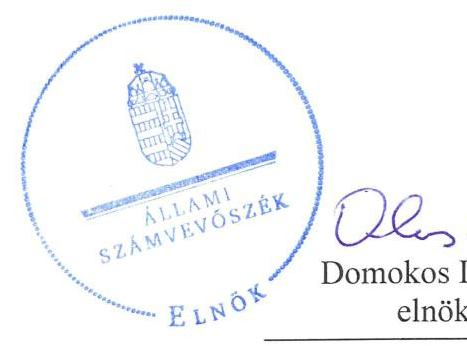
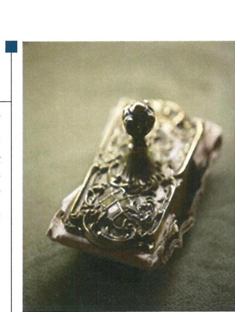
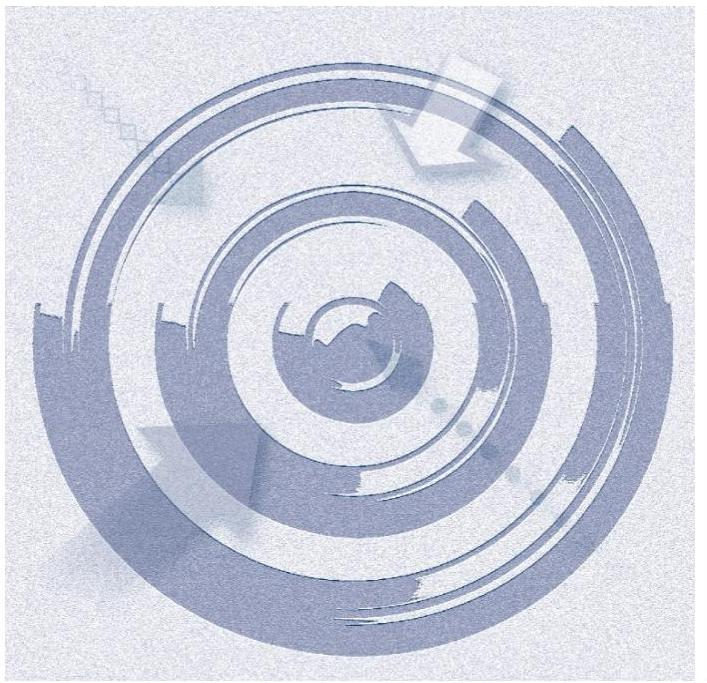
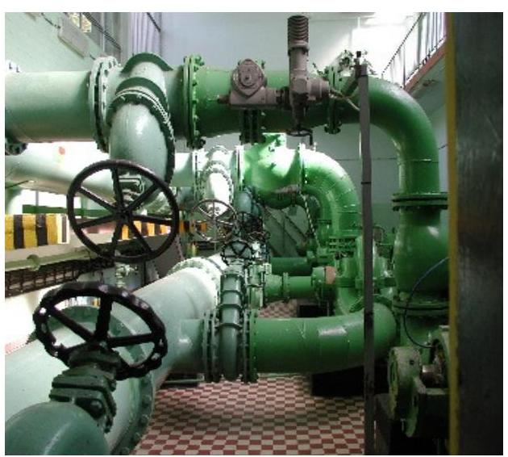
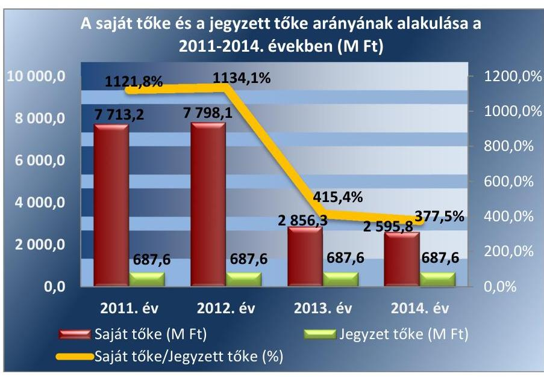
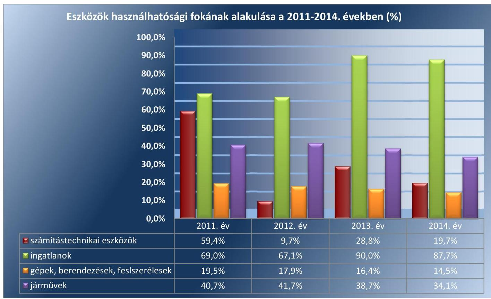
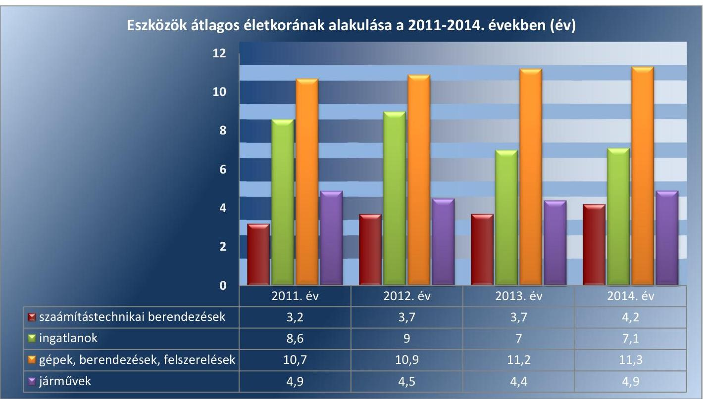

# Jelentés 

## Az önkormányzatok gazdasági társaságai

Az önkormányzatok többségi tulajdonában lévő gazdasági társaságok gazdálkodásának ellenőrzése - FEJÉRVÍZ Fejér Megyei Önkormányzatok Víz- és Csatornamú Zrt. 2017.

Az ÁSZ ellenőrzéseivel hozzájárul ahhoz, hogy a köppénzeket a szervezetek átlátható és rendezett módon használják fel közfeladataik ellátása érdekében.

---

# Jelenetés 

## Az önkormányzatok gazdasági társaságai

Az önkormányzatok többségi tulajdonában lévő gazdasági társaságok gazdálkodásának ellenőrzése - FEJÉRVÍZ Fejér Megyei Önkormányzatok Víz- és Csatornamú Zrt.
2017. gamar hó 10. nap

17005
www.asz.hu

---

# AZ ELLENŐRZÉST FELÜGYELTE:

DR. HORVÁTH MARGIT felügyeleti vezető

## AZ ELLENŐRZÉST VEZETTE ÉS A VÉGREHAJTÁSÁÉRT FELELŐS:

VIDA KATALIN ellenőrzésvezető

## A PROGRAM ÖSSZEÁLLÍTÁSÁÉRT FELELŐS:

JANIK JÓZSEF osztályvezető

IKTATÓSZÁM: V-1113-214/2016

TÉMASZÁM: 2147

ELLENŐRZÉS-AZONOSÍTÓ SZÁM: V070778

Jelentéseink az Országgyűlés számítógépes hálózatán és az Interneta a www.asz.hu címen is olvashatóak.

---

# TARTALOMJEGYZÉK 

■ ÖSSZEGZÉS ..... 5
■ AZ ELLENŐRZÉS CÉLJA ..... 6
■ AZ ELLENŐRZÉS TERÜLETE ..... 7
■ AZ ELLENŐRZÉS HÁTTERE, INDOKOLTSÁGA ..... 10
■ A JELENTÉS LÉNYEGES KÉRDÉSKÖREI ..... 11
■ ELLENŐRZÉS HATÓKÖRE ÉS MÓDSZEREI ..... 12
■ MEGÁLLAPÍTÁSOK ..... 14
■ JAVASLATOK ..... 23
■ MELLÉKLETEK ..... 25
I. sz. melléklet: Értelmező szótár ..... 25
II. sz. melléklet: Eszközök használhatósági fokának alakulása a 2011-2014. években (\%). ..... 27
III. sz. melléklet: Eszközök átlagos életkorának alakulása a 2011-2014. években ..... 28
IV. sz. melléklet: A FEJÉRVÍZ Zrt. szolgáltatási díjai a 2011-2014. években ..... 29
V. sz. melléklet: A FEJÉRVÍZ Zrt. kötelezettségei a 2011-2014. években ..... 30
VI. sz. melléklet: A FEJÉRVÍZ Zrt. követelés állománya lejárt fizetési határidő szerint a 2011- 2014. években ..... 31
■ FÜGGELÉK: ÉSZREVÉTELEK ..... 33
■ RÖVIDÍTÉSEK JEGYZÉKE ..... 35

---

.

---

# ÖSSZEGZÉS 

A Székesfehérvár Megyei Jogú Város Önkormányzata a FEJÉRVÍZ Fejér Megyei Önkormányzatok Víz- és Csatornamú Zrt. által ellátott ivóvíz-ellátási és szennyvíz-szolgáltatási közfeladat megszervezéséről szóló döntése, valamint tulajdonosi joggyakorlása szabályszerű volt. A Társaság vagyongazdálkodása összességében szabályosan történt, kötelezettségállománya nem jelentett veszélyt a müködésére, illetve a közfeladat ellátására. A FEJÉRVÍZ Zrt.-nél az ellátott közfeladat bevételeinek és ráfordításainak elszámolása, valamint az önköltségszámítás és árképzés szabályszerű volt.

## Az ellenőrzés társadalmi indokoltsága

Az Állami Számvevőszék stratégiájában megfogalmazta, hogy a helyi önkormányzatok gazdálkodásában rejlő pénzügyi kockázatok feltárásával, az államháztartáson kívülre nyújtott költségvetési támogatások és ingyenes vagyonjuttatások, valamint az államháztartáson kívül múködő közfeladat-ellátó rendszerek ellenőrzéseivel hozzájárul ahhoz, hogy a közpénzeket az államháztartáson kívül múködő szervezetek is átlátható, rendezett módon használják fel a közfeladatok szerződésben vállalt ellátása érdekében.

Magyarországon az intézmény-centrikus közfeladat-ellátás jellemző, de egyre jelentősebb a költségvetésen kívüli feladatellátás térnyerése. Ennek legfontosabb szereplői - a nonprofit szervezetek mellett - az önkormányzati tulajdonú gazdasági társaságok. Az önkormányzatok szervezetalakítási szabadságának következménye, hogy a korábban is vállalati formában múködő közszolgáltatások mellett, mind a kötelező, mind az önként vállalt feladatok ellátásában a gazdasági társaságok kiemelt fontosságú szerephez jutottak.

## Főbb megállapítások, következtetések, javaslatok

A FEJÉRVÍZ Zrt. által ellátott ivóvíz-ellátási közfeladat megszervezésére vonatkozó önkormányzati döntés és annak előkészítése szabályszerű volt. Az ellenőrzött időszakban az Önkormányzat az előírásoknak megfelelően kialakította a tulajdonosi jogok gyakorlásának rendjét, azt megfelelően múködtette.

A FEJÉRVÍZ Zrt. szabályozási rendszerét hiányosságokkal alakította ki, mivel a Számviteli politika keretében elkészített leltározási szabályzat nem rendelkezett az üzemeltetésre átvett eszközök leltározásáról, valamint a Számlarend nem tartalmazta teljes körűen a Számv. tv-ben előírtakat. A FEJÉRVÍZ Zrt. vagyongazdálkodása összességében a jogszabályi rendelkezéseknek és előírásoknak megfelelően történt. A FEJÉRVÍZ Zrt. az adatszolgáltatási- és beszámolási kötelezettségeit az előírt határidőben teljesítette.

Az ellátott közfeladat bevételeinek és ráfordításainak elszámolása a közfeladat ellátás vonatkozásában elkülönítetten történt. A bevételek kiszámlázása megfelelt a jogszabályi előírásoknak és a belső szabályozásnak, a megfelelő árat alkalmazták. A FEJÉRVÍZ Zrt. önköltség-számítási szabályzatát szabályszerűen alakította ki, a közszolgáltatások önköltségét és díjait a jogszabályoknak megfelelően állapította meg.

---

# AZ ELLENŐRZÉS CÉLJA 

Az ellenőrzés célja annak értékelése, hogy az önkormányzat vagyongazdálkodási tevékenysége során szabályszerűen gyakorolta-e tulajdonosi jogait; a gazdasági társaság szabályozottsága, gazdálkodása és vagyongazdálkodási tevékenysége, bevételeinek és ráfordításainak elszámolása megfelelt-e a jogszabályi és tulajdonosi előírásoknak; a gazdasági társaság kötelezettségállománya jelent-e kockázatot a múködésre, valamint a gazdálkodás átláthatósága és elszámoltathatósága érdekében biztosítva volt-e a szolgáltatás dijának megalapozottsága szabályszerű önköltségszámítással.

---

# AZ ELLENŐRZÉS TERÜLETE

## Székesfehérvár Megyei Jogú Város Önkormányzata és a többségi tulajdonában lévő FEJÉRVÍZ Fejér Megyei Önkormányzat Víz- és Csatornamű Zrt.

A FEJÉRVÍZ Zrt.1-t 1994. július 1-jén alapította 87 települési önkormányzat. Az alapításkor a FEJÉRVÍZ Zrt. saját vagyona 6 668,6 M Ft volt, amely 687,6 M Ft jegyzett tőkéből és 5 981,0 M Ft tőketartalékból állt.

A FEJÉRVÍZ Zrt. alaptevékenységével 2014-ben 118 településen, önálló városrészen az ivóvíz ellátást, 76 lakott településen a csatornaszolgáltatást és szennyvíztisztítást látott el. Hat üzemmérnökség közreműködésével összesen 300 ezer lakos vízellátását és 260 ezer fő szennyvízelvezetését biztosította.

A FEJÉRVÍZ Zrt. a Magyar Energetikai és Közmű-szabályozási Hivatal által kiadott működési engedély alapján végezte a tevékenységét. Víziközmű-szolgáltatásuk ISO minőségirányítású és környezetközpontú irányítási rendszeren alapult.

A Társaság2 2014. évben 75,7%-os, 520 620 ezer Ft névértékű fő részvényese az Önkormányzat3 volt, kisebb arányban a megye 86 települési önkormányzatai rendelkeztek részesedéssel. A részvényesek bemutatását az 1. táblázat szemlélteti.

1. táblázat

|  Önkormányzat | Részesedés (%) | Önkormányzat | Részesedés (%) | Önkormányzat | Részesedés (%) | Önkormányzat | Részesedés (%) | Önkormányzat | Részesedés (%)  |
| --- | --- | --- | --- | --- | --- | --- | --- | --- | --- |
|  Aba | 0,001 | Isztimér | 0,413 | Ráckeresztúr | 0,001 | Baracska | 0,001 | Kincsesbánya | 0,001  |
|  Alap | 0,001 | Bodmér | 0,144 | Sárbogárd | 0,465 | Bakonykút | 0,025 | Kisláng | 0,015  |
|  Alcsútdoboz | 0,188 | Jásd | 0,001 | Sáregres | 0,090 | Besnyő | 0,001 | Kőszárhegy | 0,125  |
|  Alsószentiván | 0,001 | Jenő | 0,326 | Sárkeresztes | 0,276 | Bicske | 2,861 | Lajoskomárom | 0,339  |
|  Bakonycsernye | 0,557 | Kajászó | 0,001 | Sárkeresztúr | 0,007 | Bodajk | 0,941 | Csapdi | 0,307  |
|  Balinka | 0,1 | Káloz | 0,001 | Sárkeszi | 0,131 | Cece | 0,102 | Lovasberény | 0,073  |
|  Csákberény | 0,326 | Magyarországonás | 0,364 | Enying | 0,029 | Moha | 0,113 | Gánt | 0,401  |
|  Csákvár | 0,007 | Mány | 0,332 | Ercsi | 0,001 | Mór | 4,513 | Gyúró | 0,112  |
|  Csőr | 0,003 | Martonvásár | 0,015 | Etyek | 0,477 | Nádasdladány | 0,477 | Hantos | 0,298  |
|  Csőkakő | 0,275 | Mátyásdomb | 0,001 | Fehérvárcsurgó | 0,412 | Nagykarácsony | 0,001 | Igar | 0,119  |
|  Csősz | 0,003 | Mezőkomárom | 0,345 | Felcsút | 0,301 | Nagylók | 0,310 | Iszkaszentgyörgy | 0,001  |
|  Dég | 0,313 | Mezőszilas | 0,301 | Fúle | 0,095 | Nagyveleg | 0,307 | Pákozd | 0,001  |
|  Sárosd | 0,806 | Sárszentágota | 0,004 | Sárszentmihály | 0,288 | Seregélyes | 0,057 | Soponya | 0,004  |
|  Söréd | 0,125 | Szabadbattyán | 0,464 | Szabadegyháza | 0,474 | Szabadhidvég | 0,201 | Szár | 0,446  |
|  Szárliget | 0,035 | Székesfehérvár M/V | 75,712 | Tabajd | 0,188 | Tác | 0,001 | Tordas | 0,167  |
|  Úrhida | 0,150 | Vajta | 0,092 | Pátka | 0,377 | Vértesacsa | 0,001 | Újbarok | 0,112  |
|  Vál | 0,001 | Pusztavám | 1,505 | Polgárdi | 0,006 | Óbarok | 0,262 | Zámoly | 0,001  |
|  Vértesboglár | 0,144 |  |  |  |  |  |  |  |   |

*Forrás: A Társaság által készített 2. számú tanúsítvány*

---

A 2011-2012. években a részvényesekkel bérleti szerződések voltak érvényben mindkét tevékenységi körre vonatkozóan (ivóvíz, szennyvíz). A 2013-2014. évekre az ivóvíz-szolgáltatásra vonatkozóan 34 települési önkormányzattal a bérleti szerződést vagyonkezelési szerződésre módosították.

A FEJÉRVÍZ Zrt. az ivóvíz- és szennyvíz szolgáltatási közfeladata mellett, az alapító okiratában rögzítettek szerint a „lakosság igényei alapján és anyagi lehetőségeitől függően" a csapadékvíz-elvezetési, csatornázási, valamint a tevékenységével összefüggő környezetvédelmi feladatok, mint vállalkozási feladatok ellátásában is közreműködött. A szennyvízelvezetés és - tisztítás mellett érzékeny vízbázisok közvetlen védelmét is szolgálják, a hidrogeológiai védőterületek kialakításával és folyamatos monitoringozásával. A Társaság vízvizsgáló laboratóriummal is rendelkezett, ahol az általuk szolgáltatott ivóvizet és tisztított szennyvizet akkreditált laboratóriumban folyamatosan ellenőrizték.

A kiegészítő tevékenységük közül lényegesebbek voltak a vízmérőjavítás és hitelesítés, szivattyúk javítása és szervizelése, vízellátási és csatornázási csövek, szerelvények forgalmazása, elektromos rendszerek kivitelezése, csatornarendszerek kamerás vizsgálata és vízvizsgálatok végzése.

Az ellenőrzött időszakban a kötelező önkormányzati feladat ellátására a vagyont a jegyzett tőkével bocsátotta a Társaság rendelkezésére az Önkormányzat, valamint az üzemeltetésbe adott vagyon működtetésére vonatkozóan Üzemeltetési megállapodást ${ }^{2}$ kötöttek.

Az ellenőrzött időszakban az Önkormányzatnál a polgármester és a jegyző személye, a Társaságnál az ügyvezető személye nem változott.

A FEJÉRVÍZ Zrt. gazdálkodásának egyes adatait a 2011-2014. évek vonatkozásában az 2. táblázat mutatja be.

# A FEJÉRVÍZ ZRT. GAZDÁLKODÁSÁNAK EGYES ADATAI (M FT) 

|  | 2011. év | 2012. év | 2013. év | 2014.év |
| :--: | :--: | :--: | :--: | :--: |
| Éves nettó árbevétel (M Ft) | 7388,7 | 7736,1 | 7984,8 | 7658,8 |
| -ebből: - ivóvíz termelés, szolgáltatás | 3814,7 | 3964,1 | 3965,2 | 3645,9 |
| szennyvízelvezetés | 3219,9 | 3345,2 | 3493,2 | 3404,6 |
| ellenőrzött közfeladat együtt | 7034,6 | 7309,3 | 7458,4 | 7050,5 |
| Üzemi tevékenység eredménye | 39,7 | 40,1 | 129,9 | $-257,1$ |
| Pénzügyi múveletek eredménye | $-20,6$ | $-22,4$ | $-4,7$ | $-1,4$ |
| Rendkívüli eredmény | 76,5 | 82,3 | $-5067,0$ | $-1,9$ |
| Mérleg szerinti eredmény (M Ft) | 82,6 | 84,9 | $-4941,8$ | $-260,5$ |
| Mérlegfőösszeg (M Ft) | 10750,9 | 10789,8 | 5556,8 | 10419,7 |
| Saját tőke (M Ft) | 7713,2 | 7798,1 | 2856,3 | 2598,8 |
| Kötelezettségek | 1212,6 | 1208,2 | 2599,9 | 2687,9 |
| Követelések (M Ft) | 1800,0 | 2132,2 | 1265,3 | 2595,8 |
| Foglalkoztatottak száma (fő) | 681 | 675 | 658 | 686 |

Forrás: a FEJÉRVÍZ Zrt. 2011-2014. évi beszámolói

Az ellenőrzött közfeladat nettó éves árbevétele az ellenőrzött időszakban az összes árbevétel 92-95 \%-át tette ki. A 2013. évben a Vksztv. ${ }^{5}$ módosítása alapján a közművagyon elemei ingyenesen átadásra kerültek az önkormányzatokhoz. A közművagyon a FEJÉRVÍZ Zrt. könyveiből történő

---

kivezetésével a rendkívüli ráfordítások növekedtek, a rendkívüli eredmény negatív lett, és ez az adózás előtti- és a mérleg szerinti eredményt is meghatározta. A pénzügyi műveletek ráfordításainak nagyarányú csökkenése a forgóeszköz hitel, és a finanszírozási költségek kedvező alakulásának eredménye volt. A 2014. évben az üzemi tevékenység eredménye negatív volt, melynek oka az árbevétel 5,47 \%-os csökkenése, és a költségek - elsősorban az anyagköltségek 6,13 \%-os - növekedése volt. Jelentős tétel volt az egyéb ráfordítások között a közművezeték adó, melynek összege 430 millió Ft volt. A pénzügyi műveletek ráfordításainak nagyarányú csökkenése a beruházási hitel megszűnésével függött össze. A követelések növekedését a határidőn belüli követelések emelkedése okozta. A saját tőke csökkenését és a hosszú lejáratú kötelezettségek növekedését döntően a 2013. évben önkormányzati tulajdonba került, ugyanakkor vagyonkezelésbe vett önkormányzati ivóvíz rendszer eszközei okozták.

A Társaság az ellenőrzött időszakban nem tartozott a kormányzati szektorba sorolt szervezetek közé.

---

# AZ ELLENŐRZÉS HÁTTERE, INDOKOLTSÁGA 

Székesfehérvár Megyei Jogú Város Önkormányzata és a FEJÉRVÍZ Fejér Megyei Önkormányzatok Víz- és Csatornamú Zrt.

Az önkormányzati tulajdonú gazdasági társaságok ellenőrzése kiemelten fontos a vagyon megőrzése, megóvása érdekében, valamint a kormányzati szektor elszámolásaiban megjelenő önkormányzati tulajdonú gazdálkodó szervezetek esetében, amelyekkel szemben alapvető követelmény, hogy gazdálkodásuk, múködésük szabályszerű, az általuk szolgáltatott adatok minél megbízhatóbbak legyenek. A feladat/közfeladat-ellátás költségeinek, ráfordításainak alakulása, színvonala hatással van a lakosság elégedettségére.

A törvényalkotás számára - az észlelt problémák, szabálytalanságok, vagy egyéb nem kívánatos jelenségek felszínre kerülésével - az ellenőrzés megállapításai segítséget nyújthatnak az államháztartáson kívüli feladat/közfeladat-ellátás értékeléséhez, jogszabályi keretei pontosításához, átláthatóságot biztosító szabályozásához. Meghatározhatóvá válnak az önkormányzati feladatellátásban részt vevő államháztartáson kívüli szervezeteknek - az önkormányzat költségvetését, pénzügyi helyzetét is befolyásoló - kockázatai, lehetővé válik ezen kockázatok csökkentése. Ellenőrzéseink feltárhatják, hogy az önkormányzat feladat-ellátási kötelezettségének szabályszerűen tett-e eleget, a feladatellátáshoz rendelt vagyonkezelésbe vett és saját vagyon múködtetését az elvárható gondossággal, szabályszerűen szervezte-e meg és a tulajdonosi felügyelete hozzájárult-e a feladatellátásához. Az ellenőrzés rávilágíthat arra, hogy a gazdasági társaság a feladat-ellátási, közszolgáltatási szerződésben foglaltak betartásával, a vagyon használatával biztosította-e a szolgáltatás folytatásának feltételeit, a feladat ellátását. Ezzel az ellenőrzöttek és a helyi döntéshozók számára visszajelzést ad feladatszervezési, feladat-ellátási kockázataikról, alapot ad a meglévő hibák megszüntetéséhez, a jobb feladatellátás biztosításához. Fokozza a fegyelmet, igazolja, hogy lejárt a következmények nélküli ellenőrzések időszaka. Az ÁSZ értékteremtő rend kialakításához és megőrzéséhez hozzájáruló tevékenysége pozitív hatással van a szervezetről kialakított összkép formálására.

---

# A JELENTÉS LÉNYEGES KÉRDÉSKÖREI 

1. Az Önkormányzat közfeladat megszervezéséről szóló döntése, valamint tulajdonosi joggyakorlása szabályszerű volt-e?
2. A FEJÉRVÍZ Zrt. vagyongazdálkodása szabályszerű volt-e, kötelezettségállománya jelent-e kockázatot a müködésre, illetve a közfeladat ellátására?
3. A FEJÉRVÍZ Zrt.-nél az ellátott közfeladat bevételei és ráfordításai elszámolása, valamint az önköltségszámítás és árképzés szabályszerű volt-e?

---

# ELLENŐRZÉS HATÓKÖRE ÉS MÓDSZEREI 

## Az ellenőrzés típusa

Megfelelőségi ellenőrzés

## Az ellenőrzött időszak

2011. január 1-jétől 2014. december 31-éig

## Az ellenőrzés tárgya

A gazdasági társaság feletti tulajdonosi joggyakorlás, valamint a gazdasági társaság gazdálkodásának szabályozottsága és szabályszerűsége.

Az ellenőrzés kiterjed minden olyan körülményre és adatra, amely az ÁSZ jogszabályban meghatározott feladatainak teljesítéséhez, valamint a program végrehajtása folyamán felmerült újabb összefüggések feltárásához szükséges.

## Az ellenőrzött szervezet

Székesfehérvár Megyei Jogú Város Önkormányzata és a FEJÉRVÍZ Zrt.

## Az ellenőrzés jogalapja

Az ellenőrzés jogszabályi alapját az ÁSZ tv. ${ }^{6}$ 1. § (3) bekezdése és 5. § (3)(4)-(5) bekezdései képezik.

## Az ellenőrzés módszerei

Az ellenőrzést a nemzetközi standardokat irányadónak tekintve az ellenőrzési program ellenőrzési kérdései, az ellenőrzött időszakban hatályos jogszabályok, az ellenőrzés szakmai szabályok és módszertanok figyelembe vételével végeztük.

Az ellenőrzés ideje alatt az ellenőrzött szervezettel történő kapcsolattartást az ÁSZ Szervezeti és Múködési Szabályzatának vonatkozó előírásai alapján biztosítottuk.

Az ellenőrzés a kiválasztott, tulajdonosi jogokat gyakorló önkormányzatra, illetve az ellenőrzésre kijelölt gazdasági társaság felett tulajdonosi jogokat gyakorló szervezetre és az ellenőrzött gazdasági társaságra terjedt ki.

---

Az ellenőrzést a kérdésekre adott válaszok kiértékelésével, valamint a megjelölt adatforrások, a csatolt tanúsítványok felhasználásával, továbbá az adott időszakban hatályos jogszabályok figyelembe vételével folytattuk le. Az ellenőrzési kérdések megválaszolásához szükséges bizonyítékok megszerzése a következő ellenőrzési eljárások alkalmazásával történt: megfigyelés, kérdésfeltevés (információkérés), összehasonlítás, valamint elemző eljárás. Az ellenőrzési bizonyítékként felhasználható adatforrások közé tartoztak egyrészt a szakmai programban felsorolt adatforrások, másrészt adatforrás lehet még minden - az ellenőrzés folyamán - feltárt, az ellenőrzés szempontjából információkat tartalmazó dokumentum.

A bevételek és ráfordítások elszámolása, valamint a vagyonnyilvántartás terén a szabályszerű működést véletlen mintavétellel ellenőriztük. A mintavétellel ellenőrzött területek esetében minden egyes tétel vonatkozásában a szabályszerűségre vonatkozó kérdéseket tettünk fel, amelyek eredménye összesítésre került. „Megfelelőnek" értékeltünk egy ellenőrzött területet, amennyiben 95\%-os bizonyossággal a teljes sokaságban a hibaarány legfeljebb 10\% volt, nem megfelelőnek, ha a hibaarány a 10\%ot meghaladta. A ráfordítások elszámolására és a vagyonnyilvántartásra vonatkozó véletlen mintavételt kockázati alapú kiválasztással egészítettük ki, amelynek során évente a három legnagyobb összegű tételt választottuk ki.

---

# 1. Az Önkormányzat közfeladat megszervezéséről szóló döntése, valamint tulajdonosi joggyakorlása szabályszerű volt-e? 

Összegző megállapítás

Az Önkormányzatnak a FEJÉRVÍZ Zrt. által ellátott ivóvíz- és szennyvíz szolgáltatási közfeladat megszervezéséről szóló döntése, valamint a tulajdonosi joggyakorlása szabályszerű volt.

### 1.1. számú megállapítás

A FEJÉRVÍZ Zrt. által ellátott ivóvíz- és szennyvíz szolgáltatási közfeladat megszervezésére vonatkozó önkormányzati döntés szabályszerű volt.

## AZ ÖNKORMÁNYZAT A KÖZFELADATOK ELLÁTÁ-

SÁRA VONATKOZÓ TERVÉT az Ötv. ${ }^{7}$ 91. § (6) bekezdése, 2013. január 1-jétől a Mötv. ${ }^{8}$ 116. § (3)-(4) bekezdései szerinti az SZMJV Közgyűlése ${ }^{9}$ által a 2011-2014. évekre jóváhagyott „Program az erős Székesfehérvárért"10 gazdasági programjában határozta meg. Az SZMJV Közgyűlése az Integrált városfejlesztési stratégiájában ${ }^{11}$ rögzítette a FEJÉRVÍZ Zrt. által ellátott ivóvíz szolgáltatási közfeladatra vonatkozó fejlesztési elképzeléseit, mely a környezeti problémák kezelésével, a megfelelő minőségű ivóvíz biztosításával határozott meg célokat.

Az Önkormányzat az Ötv.-ben foglaltaknak megfelelően - az ellenőrzött időszakot megelőzően - döntött a települési vízi-közmű vagyon működtetésének gazdasági társaság útján történő ellátásáról. A FEJÉRVÍZ Zrt. alapító okiratát az ellenőrzött időszakot megelőzően (a Társaság 2007. május 23-án megtartott közgyűlésén) Alapszabállyá módosították az alapító tagok. A FEJÉRVÍZ Zrt. alapszabálya ${ }^{12}$ megfelelt a Gt. ${ }^{13}$-ben, a Ptk. ${ }^{14}$-ben, illetve Ptk. ${ }^{15}$-ben előírt követelményeknek. A FEJÉRVÍZ Zrt. alapszabályát az ellenőrzött időszakban hat alkalommal módosították, a felügyelő bizottsági tagok, a könyvvizsgáló személyében bekövetkezett változások, az Önkormányzat 75,7\% mértékű közvetlen befolyása, továbbá az elsőbbségi részvények törzsrészvényekké történt átalakítása miatt. Az alapszabályban rögzítették az ellátandó közfeladat, valamint az egyéb feladatok körét, az üzleti terv, továbbá a beszámoló készítési kötelezettséget.

Az Önkormányzat az Ötv. és a Mötv. előírásainak megfelelően $\mathrm{SzMSz}_{1}{ }^{16}{ }_{2}{ }^{17}$ mellékletében rögzítette a FEJÉRVÍZ Zrt. útján ellátott ivóvízés szennyvíz szolgáltatási közfeladatot, az Ötv. és az Ártv. ${ }^{18}$ előírásának megfelelően a víz- és csatornadíj rendeletét ${ }^{19}$ elkészítette.

Az Önkormányzat a közfeladat ellátásához szükséges vagyont, a Társaság alapításával egy időben, az alapító okiratban részletezettek szerint a FEJÉRVÍZ Zrt. rendelkezésére bocsátotta, vagyonkezelésbe nem adott át vagyont. Az Önkormányzat a vízi-közmű vagyon üzemeltetésére határozatlan idejű Üzemeltetési megállapodást kötött a FEJÉRVÍZ Zrt.-vel, a közszolgáltatási feladat ellátása érdekében. Az Önkormányzat az Üzemeltetési

---

megállapodásban rögzített eszközöket használati díj megfizetése mellett bocsátotta a feladatellátást végző a FEJÉRVÍZ Zrt. rendelkezésére. A felek a szerződést az ellenőrzött időszakban nyolc alkalommal módosították, tartalma a Vksztv. előírásainak megfelelt.

A Vksztv. rendelkezéseinek végrehajtása során az Önkormányzat tulajdonába került vízi-közmű vagyont a 617/2014. (IX.19.) számú SZMJV Közgyűlési döntés alapján a feladatellátást végző a FEJÉRVÍZ Zrt. részére használati díj ellenében üzemeltetésre átadta az Üzemeltetési megállapodás 2014. október 17-ei módosításával. Az ellenőrzött időszakban az Önkormányzat az Üzemeltetési megállapodásban előírta a vagyon elkülönített nyilvántartására, leltározására, az értékcsökkenés összegének felhasználására vonatkozó előírásokat.

# 1.2. számú megállapítás 

Az ellenőrzött időszakban a tulajdonosi joggyakorlás szabályszerű volt.

A TULAJDONOSI JOGGYAKORLÁS RENDJÉT az Önkormányzat az SzMSz ${ }_{1,2}$-ben, a vagyongazdálkodási rendeletben ${ }^{20}$ és a FEJÉRVÍZ Zrt. alapszabályában szabályozta.

A TULAJDONOSI JOGOKAT A TÁRSASÁG KÖZGYŰLÉSE ${ }^{21}$ gyakorolta az ellenőrzött időszakban. FEJÉRVÍZ Zrt. által ellátott ivóvíz- és szennyvízelvezetés közszolgáltatás díjait, az Önkormányzat az Ötv. 7. § (1) bekezdése, továbbá a 11. § (1) bekezdéseiben rögzítettek alapján a Víz- és csatornadíj rendeletének 3. §-ában állapította meg. Az ellenőrzött időszakban az Önkormányzat a Víz- és csatornadíj rendeletét egy alkalommal módosította 2012. évben - a Vksztv 76.§ (1) bekezdés átmeneti rendelkezéseit figyelembe véve - kalkulációval alátámasztva határozták meg a közszolgáltatási díjat a 679/2012 (XI.30.) Ök. rendeletben.

AZ IGAZGATÓSÁG a Társaság ügyvezető szerve, intézi a FEJÉRVÍZ Zrt. ügyeit és ellátja a képviseletét.

A FELÜGYELŐ BIZOTTSÁGOT ${ }^{22}$ tulajdonosi joggyakorló a Gt. és a Ptk. ${ }_{2}$ előírásainak megfelelően öt taggal múködtette, a tagok személyében bekövetkezett változásokat az Alapszabályon átvezették. A Felügyelő Bizottság az ellenőrzött időszakban hatályos Ügyrendjét, ${ }^{23}$ a Gt.-ben és a Ptk. ${ }_{2}$-ben előírtak szerint a Társaság Közgyűlés jóváhagyta és az abban foglaltakat múködése során betartotta. Az ellenőrzött időszakban a könyvvizsgáló jelentését a beszámolók, az üzleti tervek jóváhagyása során a tulajdonos Önkormányzat figyelembe vette és hasznosította.

A törzs- és elsőbbségi részvények tulajdonosai részére az Alapszabály módosításnak megfelelően biztosították a részvényesi jogokat az ellenőrzött években.

A BESZÁMOLÁSI, a tájékoztatási, adatszolgáltatási kötelezettséget az Önkormányzat, a jogszabályi előírásoknak megfelelően az Alapszabályban előírta a Társaságnak. A FEJÉRVÍZ Zrt. éves beszámolóit az Alapszabály rendelkezései szerint az Igazgató elkészítette. A 2011-2014. évekre vonatkozóan az éves beszámolókról a Felügyelő Bizottság a Gt. és a Ptk. ${ }_{2}$ előírásainak megfelelően írásbeli jelentést készített, amit a beszámoló előter-

---

jesztéséhez a Társaság Közgyűlése rendelkezésére bocsátott. Az ellenőrzött időszakban a FEJÉRVÍZ Zrt. 2011-2014. évekre elkészített üzleti terveit, továbbá az éves beszámolóit a Társaság Közgyűlése határozattal jóváhagyta.

A FEJÉRVÍZ Zrt. a Taktv. 5. § (3) bekezdésében előírtak alapján Javadalmazási szabályzattal 2011. november 25 -étől rendelkezett.

Az Önkormányzat a 2011-2014. évek között két alkalommal végzett belső ellenőrzést a FEJÉRVÍZ Zrt.-nél. Az ellenőrzés célja a FEJÉRVÍZ Zrt. rendelkezésére álló erőforrásokkal való gazdálkodás hatékonyságának, az elszámolások megbízhatóságának ellenőrzése, továbbá a követelések behajtása érdekében a szükséges humán erőforrás rendelkezésre állásának vizsgálata volt. A belső ellenőrzés a FEJÉRVÍZ Zrt.-nél hiányosságot nem tárt fel, azonban javaslatot tett a követelés behajtásának eredményessége érdekében a vízkorlátozó intézkedések, valamint a fizetési meghagyásos- és végrehajtási eljárások növelésére. Az ellenőrzési jelentés javaslatainak hasznosítása hozzájárult a feladatellátás szabályszerű teljesítéséhez, a FEJÉRVÍZ Zrt. vagyonának megóvásához.

A FEJÉRVÍZ Zrt. az ellenőrzött időszak 2011-2012. gazdálkodási éveit mérleg szerinti nyereséggel zárta. A 2013. évi veszteséget a Vksztv. módosítása okozta, mivel a közmű vagyon önkormányzatokhoz történő ingyenes átadásával a Társaság rendkívüli ráfordítást számolt el. A 2014. évet szintén veszteséggel zárta a FEJÉRVÍZ Zrt. az árbevétel 5,5\%-os csökkenése, a 6,1\%os anyagköltség növekedése, valamint az egyéb ráfordítások között kimutatott 430 millió Ft összegű közművezeték adó miatt.

Az Alapszabály szerint az adózott eredmény felhasználásával kapcsolatos döntés a Társaság Közgyűlésének kizárólagos hatáskörébe tartozott. A Társaság Közgyűlése a FEJÉRVÍZ Zrt. 2011-2014. évi éves beszámolóinak jóváhagyását követően a mérleg szerinti eredményt eredménytartalékba helyezte.

Az ellenőrzött időszakban a FEJÉRVÍZ Zrt.-nek az Önkormányzat részéről garancia- és kezességvállalás nem történt.

# 2. A FEJÉRVÍZ Zrt. vagyongazdálkodása szabályszerű volt-e, kötelezettségállománya jelent-e kockázatot a múködésre, illetve a közfeladat ellátására? 

Összegző megállapítás

A FEJÉRVÍZ Zrt. vagyongazdálkodása kisebb hiányosságok ellenére összességében szabályosan történt, kötelezettségállománya nem jelentett veszélyt a múködésére, illetve a közfeladat ellátására.
2.1. számú megállapítás

A FEJÉRVÍZ Zrt. a szabályozási rendszerét kialakította, a Leltározási szabályzat és a Számlarend rendelkezései hiányosak voltak.

A FEJÉRVÍZ ZRT. AZ ÜZLETI TERVÉT az ellenőrzött időszak minden évében elkészítette, amelyet az SZMJV Közgyűlése elfogadott. A tervek tartalmazták az alapvető tulajdonosi követelményeket, valamint a

---

szolgáltatási tevékenység eredményességi követelményeit, a stabil múködést, víz-és csatornaszolgáltatás legalacsonyabb szolgáltatási díjakon történő biztosítását, valamint a Társaság közgyűlési döntéseinek megfelelő színvonal teljesítését. A FEJÉRVÍZ Zrt. üzleti tervei minden esetben a tulajdonos önkormányzatok által jóváhagyott üzleti elképzeléseinek megfelelően a fejlesztési, beruházási, karbantartási terveket is tartalmazták. A 2012. évtől az üzleti tervek kiegészültek a részvényesek által meghatározott biztonságos és közegészségügyi követelményeknek megfelelő víz- és csatornaszolgáltatás, valamint a lehető legalacsonyabb díjak követelményével. A 2013. üzleti évre az üzleti terv készítésénél figyelembe vették a rezsicsökkentés hatását, előtérbe helyezték az alaptevékenységen kívüli kiegészítő tevékenységeket a működés alapvető stabilitásának érdekében. A 2014. üzleti év célkitűzései között szerepelt a kontrolling rendszer módosítása, a költség-optimalizálás, a lakossági és intézményi felhasználók hátralékkezelése.

A FEJÉRVÍZ Zrt. rendelkezett SZMSZ ${ }_{1}{ }^{24} \cdot{ }^{25}$-vel, mely tartalmazta a FEJÉRVÍZ Zrt. általános és sajátos jellemzőit.

A SZÁMVITELI POLITIKA ${ }_{1}{ }^{26}{ }_{27}{ }^{27}{ }_{3}{ }^{28}{ }_{4}{ }^{29}$ megfelelt a Számv. tv. ${ }^{30}$ előírásainak. A Számviteli politika ${ }_{1,2,3,4}$ teljes körűen tartalmazta a jogszabályi változásokat. A Számviteli politika3 a 2013. évben kiegészült a vagyontárgyak, a bevételek és ráfordítások elkülönült nyilvántartásának vezetésére, valamint a tevékenység önálló bemutatására vonatkozó számviteli szabályozásokkal, a kiegészítő mellékletben kötelezően bemutatásra kerülő elemekkel.

A FEJÉRVÍZ Zrt. a Számviteli politika ${ }_{1,2,3,4}$ ben és az Önköltség-számítási szabályzat ${ }_{3}$-ban írta elő a közfeladat ellátására vonatkozó, a Vksztv. 49. §ában meghatározott, ágazati elkülönített nyilvántartási és elszámolási rendelkezéseket.

Az ellenőrzött időszakban hatályos Számlarend ${ }_{1}{ }^{31}{ }_{2}{ }^{32} \cdot{ }_{3}^{33} \cdot{ }_{4}^{34}$ a Számv. tv. 161. § (2)bekezdés b) és c) pontjaiban előírtak ellenére nem tartalmazta a számla értéke növekedési-, csökkenési jogcímeit, a számlát érintő gazdasági eseményeket, azok más számlákkal való kapcsolatát, valamint a főkönyvi számla és az analitikus nyilvántartás kapcsolatát. Az üzemeltetésre átvett vagyon használatából, működtetéséből származó bevételek, költségek, ráfordítások elkülönített nyilvántartásának rendjét a Számlarend ${ }_{1,2,3,4}$-ben nem rögzítették. A Számlatükör ${ }_{1}{ }^{35} \cdot{ }_{2}{ }^{36} \cdot{ }_{3}^{37}$ tartalmazta a vagyon elemek, illetve bevételeik és ráfordításaik elkülönített nyilvántartását biztosító főkönyvi számokat. Az ellenőrzött időszakban a Számlarend ${ }_{1,2,3,4}$ nem tartalmazta a vagyonkezelésbe vett vagyon használatából, működtetéséből származó bevételek, költségek, ráfordítások elkülönített nyilvántartásának rendjét a Számv. tv. 161/A.§ (2) bekezdése ellenére.

A Bizonylati szabályzat ${ }_{1}{ }^{38} \cdot{ }_{2}^{39}$, a Pénzkezelési szabályzat ${ }_{1}{ }^{40} \cdot{ }_{2}^{41}$, az Értékelési szabályzat ${ }_{1,2}$, valamint az Önköltség-számítási szabályzat ${ }_{1,23}$ a FEJÉRVÍZ Zrt. számviteli és egyéb belső szabályzataival összhangban, valamint a jogszabályi előírásoknak megfelelően készült.

A Leltározási szabályzat ${ }_{1}{ }^{42} \cdot{ }_{2}^{43}$ részletesen és a jogszabályi előírásoknak megfelelően tartalmazta az eszközökre és forrásokra vonatkozóan a leltározási szabályokat, de az Üzemeltetési megállapodás 2.6. pontjában előírtak ellenére nem rendelkezett az üzemeltetésre átvett eszközök leltározásáról.

---

A FEJÉRVÍZ Zrt. közgyűlése a Vksztv. 47.§ (1) bekezdésében, valamint a Vhr. ${ }^{44} 20 . \S$ (3) bekezdés a) pontjában előírt üzletszabályzatot a Társaság határidőre elkészítette, melyet a MEKH ${ }^{45}$ jóváhagyását követően 2013. november 7-én adtak ki.

# 2.2. számú megállapítás 

## A FEJÉRVÍZ Zrt. vagyongazdálkodása összességében a jogszabályi rendelkezéseknek és előírásoknak megfelelően történt.

Az ellenőrzött időszakban a FEJÉRVÍZ Zrt. és az Önkormányzat között Üzemeltetési megállapodás volt érvényben, mely szerint az Önkormányzat a közfeladat ellátáshoz szükséges eszközöket üzemeltetésre adta át a FEJÉRVÍZ Zrt.-nek.

A FEJÉRVÍZ Zrt.-nél a Számviteli politika ${ }_{3,4}$ biztosította a közfeladat ellátással kapcsolatos saját, a tulajdonosi joggyakorlótól üzemeltetésre átvett, illetve a települési önkormányzatok által átadott vagyonkezelt vagyon elkülönített nyilvántartását. Az Önkormányzattól üzemeltetésre átvett vagyon nyilvántartása, annak használatából, működtetéséből származó bevételek, illetve a felmerült közvetlen költségek és ráfordítások analitikus nyilvántartása megfelelően, elkülönítetten történt.

A FEJÉRVÍZ Zrt. saját, az üzemeltetésre átvett és a vagyonkezelt vagyonáról minden évben az éves mérleg valódiságát alátámasztó tételes (teljes) vagyonmegállapító leltárt készített. A leltározás folyamata a Számv. tv. 14. § (4)-(12) bekezdésben meghatározott alapelveknek megfelelő leltárkészítési és leltározási szabályzat előírásainak megfelelően történt, a mérlegbeszámoló leltárral történő alátámasztása a Számv. tv. előírásainak megfelelt.

A közfeladat ellátása során a vagyon megőrzése, gyarapítása a jogszabályok és belső szabályozók előírásainak megfelelően történt. A FEJÉRVÍZ Zrt. az ellenőrzött időszakban a vagyon fejlesztése (vízi-közmű eszközök beszerzése, hálózat építése) tekintetében rendelkezett tulajdonosi hozzájárulással.

Az ellenőrzött időszakban a FEJÉRVÍZ Zrt. rendelkezett a Gt.-ben kötelezően előírt jegyzett tőkének megfelelő összegű saját tőkével. A saját tőke/jegyzett tőke arányának alakulását a 1. ábra mutatja be.

## 1. ábra

---

# 2.3. számú megállapítás 

A sépár tőke értékét 2013. január 1-jével az önkormányzatok tulajdonába került eszközök értéke (6 668,7 M Ft) csökkentette.

## A kötelezettségek állománya nem jelentett veszélyt a közfeladat ellátására, illetve a FEJÉRVÍZ Zrt. múködésére.

Az ellenőrzött időszakban a FEJÉRVÍZ Zrt. eladósodásának mértéke, adósságának összetétele nem jelentett veszélyt a közfeladat ellátására, illetve a FEJÉRVÍZ Zrt. múködésére. A 3. táblázat a FEJÉRVÍZ Zrt. eladósodását leíró mutatószámokat tartalmazza.
3. táblázat

## A FEJÉRVÍZ ZRT. ELADÓSODOTTSÁGI MUTATÓSZÁMAI (\%)

| Megnevezés | 2011-12-31. | 2012-12-31. | 2013-12-31. | 2014-12-31. |
| :-- | --: | --: | --: | --: |
| Eladósodottsági mutató (\%) | 11,3 | 11,2 | 44,5 | 48,4 |
| Eladósodottság mértéke (\%) | 15,7 | 15,5 | 91,0 | 1,04 |
| Nettó eladósodottság (\%) | $-0,1$ | $-0,1$ | 46,7 | 38,2 |
| Adósságfedezeti mutató I. | 8,5 | 8,6 | 1,9 | 1,9 |
| Adósságfedezeti mutató II. | 8,8 | 12,5 | $-2,7$ | 0 |
| Árbevételre vetített eladósodottság | $-0,1$ | $-0,2$ | 0,1 | 0,1 |

Forrás: a FEJÉRVÍZ Zrt. 2011-2014. évi beszámolói

AZ ELADÓSODOTTSÁGI MUTATÓ az ellenőrzött időszak első két évében alacsony volt, a 2013. és 2014. évben a mutató értéke növekedett ( $44,5 \%$, valamint $48,4 \%$ ) az előző évi értékhez képest. Az adósságfedezeti mutató I. jelentős csökkenése ellenére elegendő fedezet állt rendelkezésre az eszközökben az adósság teljesítésére. Az adósságfedezeti mutató II. értéke nem érte el a kívánt 1 értéket 2014. évben. Az árbevételre vetített eladósodottság mutató szerint az ellenőrzött időszakban az árbevétel fedezetet nyújtott a forgóeszközökkel csökkentett kötelezettségek teljesítésére.

Az ellenőrzött időszakban biztosított volt a rövid lejáratú kötelezettségek határidőben történő teljesítése. A FEJÉRVÍZ Zrt. kötelezettségeit az V. sz. melléklet mutatja.

A 2011-2014. években a FEJÉRVÍZ Zrt. kötelezettségállománya 1212,6 M Ft-ról 2687,9 M Ft-ra emelkedett. A növekedést döntően a hosszú lejáratú kötelezettségek értéke (1 734,3 M Ft) jelentette, amely a 2013. évben vagyonkezelésbe vett önkormányzati ivóvíz rendszerek, eszközök értéke. A FEJÉRVÍZ Zrt. az időszak végére rövid lejáratú hitelekből származó kötelezettségének teljes mértékben eleget tett. A szállítók állománya 596,1 M Ft-ról 540,5 M Ft-ra, 9\%-kal csökkent az ellenőrzött időszak alatt. Az egyéb rövid lejáratú kötelezettségek változást mutattak, öszszességében 19\%-kal nőttek. A FEJÉRVÍZ Zrt. a vizsgált időszakban hátrasorolt kötelezettséggel nem rendelkezett.

## A FEJÉRVÍZ Zrt. az előírt beszámolási és adatszolgáltatási kötelezettségét teljesítette.

A BESZÁMOLÁSI valamint letétbe helyezési és adatszolgáltatási kötelezettségeit az ellenőrzött időszakban a FEJÉRVÍZ Zrt. az előírt határidőkben teljesítette. A Közgyűlés a FEJÉRVÍZ Zrt. éves beszámolóit a könyvvizsgálói és a Felügyelő Bizottsági jelentések alapján fogadta el.

---

A FEJÉRVÍZ Zrt. vezetője az ellenőrzött időszakot megelőzően nevezte ki az Infotv. ${ }^{46}$ előírásainak megfelelően a belső adatvédelmi felelőst, a FEJÉRVÍZ Zrt. Belső adatvédelmi és adatbiztonsági szabályzatát 2009. évben adták ki. Módosítására 2013 és 2014 években került sor, az elektronikus adatkezelés szabályozása miatt. A közérdekú adatok megismerésére irányuló igények teljesítésének rendjét a Kommunikációs szabály$z^{47}{ }_{, 2}{ }^{48}{ }_{, 3}{ }^{49}{ }_{, 4}{ }^{50}{ }_{, 5}{ }^{51}{ }_{, 6}{ }^{52}$-ban szabályozták az ellenőrzött években.

A FEJÉRVÍZ Zrt. közérdekú adatait a Taktv.-nek, a Vksztv.-nek, az Avtv. ${ }^{53}$.-nek és az Infotv.-nek, illetve a Kommunikációs szabályzat ${ }_{1,2,3,4,5,6}$ nak megfelelően a FEJÉRVÍZ Zrt. honlapján tette elérhetővé.

# 3. A FEJÉRVÍZ Zrt.-nél az ellátott közfeladat bevételei és ráfordításai elszámolása, valamint az önköltségszámítás és árképzés szabályszerű volt-e? 

Összegző megállapítás

### 3.1. számú megállapítás

A FEJÉRVÍZ Zrt.-nél az ellátott közfeladat bevételeinek és ráfordításainak elszámolása, valamint az önköltségszámítás és árképzés szabályszerű volt.

Az ellátott közfeladat bevételeinek és ráfordításainak elszámolása szabályszerű volt a FEJÉRVÍZ Zrt.-nél.

A közfeladat bevételeinek és ráfordításainak elkülönített nyilvántartási kötelezettségét - összhangban a Mötv. előírásaival - a FEJÉRVÍZ Zrt. a Számviteli politika ${ }_{3}$-ban meghatározta. A Számviteli politika ${ }_{3}$ előírta a FEJÉRVÍZ Zrt. egyes tevékenységeiből származó bevételek és költségek üzemi eredmény szintjén történő számviteli nyilvántartásának szétválasztását. Az Önköltség-számítási szabályzat ${ }_{3}$ rendelkezése lehetővé tette a közfeladat ellátás bevételének és ráfordításának elkülönített nyilvántartását.

A bevételek és ráfordítások elszámolása megfelelően történt. Az anyagjellegú ráfordítások és az értékesítés nettó árbevételének elszámolása a Számv. tv.-ben és a Vksztv.-ben előírtak szerint - a FEJÉRVÍZ Zrt. egyes tevékenységei szerint - elkülönítetten történt. A bevételek kiszámlázása a jogszabályi és a belső szabályozásnak megfelelően történt, a megfelelő főkönyvi számlán történt a bevétel elszámolása. A 2014. január 1-jétől kibocsátott számlák az egyes közszolgáltatói számlaképről szóló 2013. évi CLXXXVIII. törvény 9. számú melléklete alapján készültek.

A ráfordítások esetében az írásbeli kötelezettségvállalás rendelkezésre állt, elszámolásuk elkülönítetten történt, az elszámolást alátámasztó számviteli bizonylatok rendelkezésre álltak.

Az értékcsökkenési leírás elszámolása a jogszabályoknak és a belső szabályozásnak megfelelően történt. A befektetett eszközök besorolása, bekerülési értékének meghatározása, állományba vétele, értékcsökkenésének meghatározása, leltárba vétele szabályos volt. Az ellenőrzött időszakban az éves beszámolók kiegészítő mellékleteiben bemutatták az elszámolt értékcsökkenési leírást, a jelentősebb összegű terven felüli értékcsökkenést.

Az eszközök használhatósági fokát és az átlagos élettartam mértékét a fő eszközcsoportok (számítástechnikai berendezések, ingatlanok, műszaki

---

berendezések és egyéb gépek berendezések) vonatkozásában a II. és III. sz. mellékletek mutatják be. Az ellenőrzött időszak végén a számítástechnikai eszközök, járművek, gépek és berendezések használhatósági mutatója csökkent az ellenőrzött időszak elején kimutatott használhatósághoz képest, az ingatlanok használhatósága azonban javult. Az átlagos életkor mutatói az ingatlanok esetében javult, a többi eszközcsoport esetében jelentősen nem változott.

Az ellenőrzött időszakban a FEJÉRVÍZ Zrt. a lejárt fizetési határidejű követelések kezelésének szabályzata ${ }_{1}^{54}{ }_{2}^{55}{ }_{3},{ }^{56}{ }_{4}{ }^{57},{ }^{58}$-ben meghatározottak szerint intézkedéseket tett a követelésállomány csökkentése érdekében. A hátralékkal rendelkező dijfizetőket értesítették a fennálló hátralékról, részletfizetési megállapodásokat kötöttek, fizetési meghagyás kibocsátását és végrehajtási eljárást kezdeményeztek, behajtási tevékenység keretében korlátozták a vízfogyasztást, a 2013. évtől a behajtási tevékenységet ügyvédi közreműködéssel támogatták, illetve követeléskezelőt bíztak meg a hátralék beszedése érdekében. Az VI. sz. melléklet a lejárt fizetési határidő szerinti követelések állományát mutatja az ellenőrzött időszakban.

A lakossági tartozások beszedését a fogyasztók fizetésképtelensége, vagyoni helyzete, a közületi felhasználók tartozásainak beszedését sok esetben a felszámolási eljárások végrehajtása akadályozta. Összességében a követelésállomány értéke az ellenőrzött időszakban 3,1\%-os növekedést mutatott.

Az ellenőrzött időszakban a FEJÉRVÍZ Zrt. a követelések behajthatatlansága miatt értékvesztésként a Számviteli politika ${ }_{1,2,3,4}$-ben és az Értékelési szabályzat ${ }_{1}^{59}{ }_{2}{ }^{60}$-ben előírtaknak megfelelően összesen 59,0 M Ft-ot számolt el.

# 3.2. számú megállapítás 

A FEJÉRVÍZ Zrt. önköltség-számítási szabályzatának kialakítása megfelelő volt, a közszolgáltatások önköltségét és dijait a szabályozásnak megfelelően állapították meg.

## A FEJÉRVÍZ ZRT. AZ ÖNKÖLTSÉG-SZÁMÍTÁSI

SZABÁLYZAT ${ }_{1,2,2}$-at a jogszabályoknak megfelelően alakította ki. Az Önköltség-számítási szabályzat ${ }_{1,2,3}$ megjelenítette a költségek fajtáit, elszámolásának jellemzőit, a kalkulációs egységeket, a felosztandó költségek vetítési alapját, a kalkulációk és a könyvviteli adatok egyeztetésének módját és bizonylatait, előírta a közvetlen és közvetett költségek elkülönítését, tartalmazta a felosztandó általános költségek vetítési alapjait.

A FEJÉRVÍZ Zrt. a Számv. tv. és az Önköltség-számítási szabályzat ${ }_{1,2,3}$ előírásainak megfelelően határozta meg a közfeladatok önköltségét. A víz közszolgáltatási díjak meghatározása során az ellenőrzött időszakban a FEJÉRVÍZ Zrt. az önkormányzatok felé a költségelemzést, az elő-, majd az utókalkulációt elkészítette.

## A VÍZGAZDÁLKODÁSI KÖZSZOLGÁLTATÁSI DÍ-

JAK meghatározása, illetve módosítása során a FEJÉRVÍZ Zrt. a jogszabályi előírások szerint járt el. A IV. számú melléklet a közszolgáltatási díjak alakulását mutatja az ellenőrzött időszakban.

Az SZMJV Közgyűlés 41/2010. (XII.14.) számú rendeletében ${ }^{61}$ határozta meg a 2011. január 1-jétől érvényes szolgáltatási díakat. A Vksztv. 2011.

---

december 31-én történő hatályba lépésével a szolgáltatási díj megállapítási, az árhatósági jogkör módosult. A Vksztv. a helyi önkormányzati árhatósági jogkört hatályon kívül helyezte, az ármegállapítást miniszteri hatáskörbe helyezte. A 2012. évben a Vksztv. rendelkezéseit figyelembe véve, az SZMJV Közgyűlése a 679/2012 (XI.30.) határozata alapján a szükséges kalkulációkat elvégezte, módosították a szolgáltatási díjakat. A FEJÉRVÍZ Zrt. 2013. július 1-jétől a Rezsi tv. ${ }^{82}$-ben előírt 10\%-os díjcsökkentést végrehajtotta.

---

# JAVASLATOK 

Az ÁSZ tv. 33. § (1) bekezdésében foglaltak értelmében az ellenőrzött szervezet vezetője köteles a jelentésben foglalt megállapításokhoz kapcsolódó intézkedési tervet összeállítani és azt a jelentés kézhezvételétől számított 30 napon belül az ÁSZ részére megküldeni. Amennyiben az ellenőrzött szervezet vezetője nem küldi meg határidőben az intézkedési tervet, vagy továbbra sem elfogadható intézkedési tervet küld, az Állami Számvevőszék elnöke az ÁSZ tv. 33. § (3) bekezdése a) és b) pontjaiban foglaltakat érvényesítheti.

Javaslataink célja a FEJÉRVÍZ Fejér Megyei Önkormányzatok Víz- és Csatornamú Zrt. gazdálkodása szabályozottságának javítása annak érdekében, hogy a szabályozási környezet és a gazdálkodási gyakorlat megfelelően tudja támogatni az átlátható múködést.

## A FEJÉRVÍZ Fejér Megyei Önkormányzatok Víz- és Csatornamú Zrt. Vezérigazgatójának

1. Intézkedjen a Társaság Számlarendjének a Számv. tv.-nek megfelelő tartalommal történő kiegészítéséről.
(2.1. sz. megállapítás 5. bekezdése alapján)
2. Intézkedjen a Társaság Leltározási Szabályzatának az Üzemeltetési megállapodásnak megfelelő tartalommal történő kiegészítéséről.
(2.1. sz. megállapítás 7. bekezdése alapján)

---

.

---

# MELLÉKLETEK 

- I. SZ. MELLÉKLET: ÉRTELMEZŐ SZÓTÁR
eladósodottságot jellemző mutatók
garanciaszerződés
gazdasági társaság
gazdálkodó szervezet
eladósodottsági mutató (tőkeáttétel): idegen tőke/összes forrás.
Egészségesnek mondható egy olyan mértékű áttétel, amelyet az üzleti tervek szerint és az elmúlt időszak tapasztalatai alapján a társaság megfelelő biztonsággal ki tud termelni. Nagy eszközberuházás-igényű iparágakban értéke magasabb, azaz magasabb eladósodottság is elfogadható, de 75-85\%-ot meghaladó értéknél már itt is erős, sőt túlzott külső finanszírozottságról beszélhetünk. Általánosságban véve kedvező, ha értéke kisebb, mint 0,6.
eladósodottság mértéke: kötelezettségek / saját tőke.
Fontos szerepet játszik ez a mutató egy vállalat megítélésében. Azt mutatja, hogy a saját források a kötelezettségek hány százalékát fedezik. Törekedni kell, hogy a mutató tartósan (jelentősen) 1 alatti értéket érjen el.
nettó eladósodottság: (kötelezettségek-követelések) / saját tőke.
Azt mutatja, hogy a kintlévőségekkel csökkentett kötelezettségeket milyen mértékben fedezi a saját forrás. Ez feltételezi, hogy a követelések pénzügyileg előbb realizálódnak, mint ahogy a kötelezettségeket teljesíteni kell. A mutató minél kisebb, csökkenő értéke a kedvező.
adósságfedezeti mutató I.: (befektetett eszközök+forgó eszközök) / idegen forrás. Azt mutatja, hogy 1 Ft adósságra hány Ft vagyon jut. Általánosságban véve kedvező, ha értéke 2 körül van, de nagy eszközberuházás-igényű iparágakban értéke kisebb is lehet.
adósságfedezeti mutató II.: működési cash flow / hosszú lejáratú kötelezettségek. A mutató azt jelzi, hogy az adott gazdálkodási időszak működési pénzáramainak eredményeként realizált cash flow révén a vállalkozás mennyiben lenne képes valamennyi hosszú lejáratú kötelezettségének eleget tenni. Ennek vizsgálatára viszonylag ritkán kerül sor, az elsősorban a veszélyhelyzetbe került vállalkozások esetében lehet érdekes. Általánosságban véve kedvező, ha a működési cash flow minél nagyobb arányban nyújt fedezetet a hosszú lejáratú kötelezettségre (értéke nagyobb, mint 1, nő az ellenőrzött időszakban).
árbevételre vetített eladósodottság: (kötelezettségek - forgóeszközök) / értékesítés nettó árbevétele.
Az árbevételre vetített eladósodottság azt mutatja, hogy az árbevétel mekkora fedezetet nyújt a kötelezettségeknek a forgóeszközökkel csökkentett részére. Általánosságban véve kedvező, ha az árbevétel minél nagyobb arányban nyújt fedezetet a forgóeszközökkel csökkentett kötelezettségekre (értéke kisebb, mint 1, csökken az ellenőrzött időszakban).
A garanciaszerződés, illetve a garanciavállaló nyilatkozat a garantőr olyan kötelezettségvállalása, amely alapján a nyilatkozatban meghatározott feltételek esetén köteles a jogosultnak fizetést teljesíteni. (Ptk. 2 6:431. § (1) bekezdése)
Ptk2. 3.88. § (1) bekezdése szerint „a gazdasági társaságok üzletszerű közös gazdasági tevékenység folytatására, a tagok vagyoni hozzájárulásával létrehozott, jogi személyiséggel rendelkező vállalkozások, amelyekben a tagok a nyereségből közösen részesednek, és a veszteséget közösen viselik".
A Ptk. 685. § c) pontja szerint gazdálkodó szervezet: „az állami vállalat, az egyéb állami gazdálkodó szerv, a szövetkezet, a lakásszövetkezet, az európai szövetkezet, a gazdasági társaság, az európai részvénytársaság,

---

kezesség
az egyesülés, az európai gazdasági egyesülés, az európai területi együttműködési csoportosulás, az egyes jogi személyek vállalata, a leányvállalat, a vízgazdálkodási társulat, az erdő birtokossági társulat, a végrehajtói iroda, az egyéni cég, továbbá az egyéni vállalkozó." (2014. 03.15-ig hatályos)
A kezességre vonatkozó előírásokat a Ptk. 2 6:416-430. §-ai tartalmazzák. Kezességi szerződéssel a kezes kötelezettséget vállal a jogosulttal szemben, hogyha a kötelezett nem teljesít, maga fog helyette a jogosultnak teljesíteni. Kezesség egy vagy több, fennálló vagy jövőbeli, feltétlen vagy feltételes, meghatározott vagy meghatározható összegű pénzkövetelés vagy pénzben kifejezhető értékkel rendelkező egyéb kötelezettség biztosítására vállalható.
A Ptk. 2 szerint kezességet csak írásban lehet vállalni. A kezes kötelezettsége ahhoz a kötelezettséghez igazodik, amelyért kezességet vállalt. A kezes kötelezettsége nem válhat terhesebbé, mint amilyen elvállalásakor volt, kiterjed azonban a kötelezett szerződésszegésének jogkövetkezményeire és a kezesség elvállalása után esedékessé váló mellékkövetelésekre is.

---

II. SZ. MELLÉKLET: ESZKÖZÖK HASZNÁLHATÓSÁGI FOKÁNAK ALAKULÁSA A 2011-2014. ÉVEKBEN (\%)

*Forrás: a FEJÉRVÍZ Zrt.2011-2014. évi, beszámolói*

---

#### III. SZ. MELLÉKLET: ESZKÖZÖK ÁTLAGOS ÉLETKORÁNAK ALAKULÁSA A 2011-2014. ÉVEKBEN

*Forrás: a FEJÉRVÍZ Zrt. 2011-2014. évi, beszámolói*

---

# IV. SZ. MELLÉKLET: A FEJÉRVÍZ ZRT. SZOLGÁLTATÁSI DÍJAI A 2011-2014. ÉVEKBEN 

## A FEJÉRVÍZ ZRT. SZOLGÁLTATÁSI DÍJAI 2011-2014. ÉVEKBEN (FT/M³)

| Megnevezés | 2011. év |  | 2012. év |  | 2013. év |  | 2014. év |
| :--: | :--: | :--: | :--: | :--: | :--: | :--: | :--: |
|  | 01.01. | 12.31. | 01.01. | 12.31. | 01.01. | 07.01. | 01.01-12.31. |
| Lakossági vízlil | 303,0 | 314,0 | 314,0 | 322,0 | 322,04 | 289,8 | 289,8 |
| Közületi vízlil | 431,0 | 448,0 | 448,0 | 459,5 | 459,5 | 459,5 | 459,5 |
| Intézményi vízlil | 357,0 | 367,0 | 367,0 | 376,4 | 376,4 | 376,4 | 376,4 |
| Lakossági szennyvíz | 228,0 | 234,0 | 234,0 | 234,0 | 234,0 | 216,0 | 216,0 |
| Közületi szennyvíz | 326,0 | 335,0 | 335,0 | 343,6 | 343,6 | 343,6 | 343,6 |
| Intézményi szennyvíz | 262,0 | 270,0 | 270,0 | 276,9 | 276,9 | 276,9 | 276,9 |

---

# V. SZ. MELLÉKLET: A FEJÉRVÍZ ZRT. KÖTELEZETTSÉGEI A 2011-2014. ÉVEKBEN

|  KÖTELEZETTSÉGEK (M FT) |  |  |  |   |
| --- | --- | --- | --- | --- |
|  Megnevezés | 2011.12.31. | 2012.12.31. | 2013.12.31. | 2014.12.31.  |
|  Kötelezettségek | 1212,6 | 1208,2 | 2599,9 | 2687,9  |
|  Hosszú lejáratú kötelezettségek | 47,5 | 23,5 | 1734,3 | 1746,3  |
|  Rövid lejáratú hitelek | 224,6 | 228,3 | 23,5 | 0  |
|  Kötelezettségek áruszállításból és szolgáltatásból (szállítók) | 596,1 | 575,9 | 524,2 | 540,5  |
|  Egyéb rövid lejáratú kötelezettségek | 331,3 | 377,0 | 313,1 | 395,8  |
|   |  |  | Forrás: a FEJÉRVÍZ Zrt. 2011-2014. évi beszámolói |   |

---

VI. SZ. MELLÉKLET: A FEJÉRVÍZ ZRT. KÖVETELÉS ÁLLOMÁNYA LEJÁRT FIZETÉSI HATÁRIDŐ SZERINT A 2011-2014. ÉVEKBEN

|  KÖVETELÉSEK ÁLLOMÁNYA LEJÁRT FIZETÉSI HATÁRIDŐ SZERINT (M FT) |  |  |  |   |
| --- | --- | --- | --- | --- |
|  Kintévéség napjának száma | 2011. | 2012. | 2013. | 2014.  |
|  0-30 nap között | 819,3 | 957,6 | 436,8 | 825,2  |
|  31-90 nap között | 192,9 | 224,3 | 159,4 | 193,2  |
|  91-180 nap között | 202,8 | 180,5 | 133,9 | 131,1  |
|  181-360 nap között | 179,9 | 275,5 | 165,5 | 138,4  |
|  360 napon túli | 447,5 | 538,4 | 585,9 | 611,5  |
|  ÖSSZESEN | 1842,5 | 2176,2 | 1481,5 | 1899,4  |
|   |  |  | Forrás: a FEJÉRVÍZ Zrt. 2011-2014. évi beszámolói |   |

---

.

---

# FÜGGELÉK: ÉSZREVÉTELEK 

A jelentéstervezetet a Számvevőszék 15 napos észrevételezésre megküldte az ellenőrzött szervezetek vezetőinek az ÁSZ tv. 29. §* (1) bekezdése előírásának megfelelően.
Az ellenőrzött szervezetek észrevételt nem tettek.

[^0]
[^0]:    * 29. § (1) Az Állami Számvevőszék az ellenőrzési megállapításait megküldi az ellenőrzött szervezet vezetőjének vagy az általa megbízott személynek, és annak, akinek személyes felelősségét állapította meg.
    (2) Az ellenőrzött szervezet vezetője és a felelősként megjelölt személy az ellenőrzés megállapításaira tizenöt napon belül írásban észrevételt tehet.
    (3) Az Állami Számvevőszék az észrevételre a beérkezésétől számított harminc napon belül írásban válaszol. A figyelembe nem vett észrevételeket köteles a jelentésben feltüntetni, és megindokolni, hogy azokat miért nem fogadta el.

---

.

---

# RÖVIDÍTÉSEK JEGYZÉKE 

${ }^{1}$ FEJÉVÍZ Zrt.
${ }^{2}$ Társaság
${ }^{3}$ Önkormányzat
${ }^{4}$ Üzemeltetési megállapodás
${ }^{5}$ Vksztv.
${ }^{6}$ ÁSZ tv.
${ }^{7}$ Ötv.
${ }^{8}$ Mótv.
${ }^{9}$ SZMJV Közgyűlése
${ }^{10}$ Program az erős Székesfehérvárért
${ }^{11}$ Integrált városfejlesztési stratégia
${ }^{12}$ Alapszabály
${ }^{13} \mathrm{Gt}$.
${ }^{14} \mathrm{Ptk} .{ }_{1}$
${ }^{15} \mathrm{Ptk} .{ }_{2}$
${ }^{16} \mathrm{SzMSz}_{1}$
${ }^{17} \mathrm{SzMSz}_{2}$
${ }^{18}$ Ártv.
${ }^{19}$ Víz- és csatornadíj rendelet
${ }^{20}$ vagyongazdálkodási rendelet
${ }^{21}$ Társaság Közgyűlése
${ }^{22}$ Felügyelő Bizottság
${ }^{23}$ Felügyelő Bizottság Ügyrendje
${ }^{24} \mathrm{SZMSZ}_{1}$
${ }^{25} \mathrm{SZMSZ}_{2}$

FEJÉRVÍZ Fejér Megyei Önkormányzatok Víz- és Csatornamű Zrt.
FEJÉRVÍZ Fejér Megyei Önkormányzatok Víz- és Csatornamű Zrt.
Székesfehérvár Megyei Jogú Város Önkormányzata
Székesfehérvár Megyei Jogú Város és a FEJÉRVÍZ Zrt. között 1997. július 17-én létrejött Üzemeltetési megállapodás
a víziközmű szolgáltatásról szóló 2011. évi CCIX. törvény
az Állami Számvevőszékről szóló 2011. évi LXVI. törvény (hatályos 2011. július 1jétől)
a helyi önkormányzatokról szóló 1990. évi LXV. törvény
Magyarország Helyi Önkormányzatairól szóló 2011. évi CLXXXIX. törvény
Székesfehérvár Megyei Jogú Város Önkormányzat Közgyűlése
Székesfehérvár Megyei Jogú Város „Program az erős Székesfehérvárért" elnevezésű a 314/2011. (V. 31.) számú Képviselő-testületi határozattal jóváhagyott, a 226/2013. (V. 24.) számú Képviselő testületi határozattal módosított gazdasági programja.
Székesfehérvár Megyei Jogú Város Önkormányzat 645/2014. (IX.19.) számú határozatával jóváhagyott Integrált Városfejlesztési Stratégiája
a FEJÉRVÍZ Zrt. Alapszabálya
2006. évi IV. törvény a gazdasági társaságokról (hatálytalan 2014. január 1-jétől) 1959. évi IV. törvény A polgári törvénykönyvről (hatályos 2014. március 15-ig) 2013. évi V. törvény A polgári törvénykönyvről (hatályos 2014. március 15-től)

Székesfehérvár Megyei Jogú Város Önkormányzatának Közgyűlésének többször módosított 18/2011. (VI.3.) számú rendelete a Közgyűlés szervezeti és működési szabályairól
Székesfehérvár Megyei Jogú Város Önkormányzatának Közgyűlésének többször módosított 4/2013. (II.25.) számú rendelete a Közgyűlés szervezeti és működési szabályairól
Az árak megállapításáról szóló 1990. évi LXXXVII. törvény
Székesfehérvár Megyei Jogú Város Önkormányzatának 22/2003. (XII. 1.) számú rendelete az önkormányzati tulajdonú közüzemi vízműből szolgáltatott ivóvízért és a közüzemi csatornamű használatáért fizetendő díjakról szóló rendelete, valamint annak 28/2007. (XII. 10.) számú továbbá a 31/2014. (VIII. 29.) számú módosításai.
Székesfehérvár Megyei Jogú Város Közgyűlésének 32/2013. (VI 28) számú rendelete az önkormányzat vagyonáról és vagyona feletti tulajdonosi jog gyakorlásáról
FEJÉRVÍZ Fejér Megyei Önkormányzatok Víz- és Csatornamű Zrt. Közgyűlése
FEJÉRVÍZ Fejér Megyei víz- és Csatornamű Zrt. Felügyelő Bizottsága
FEJÉRVÍZ Fejér Megyei Önkormányzatok Víz- és Csatornamű Zrt. Felügyelő bizottságának Ügyrendje
FEJÉRVÍZ Fejér Megyei víz- és Csatornamű Zrt. Szervezeti Működési Szabályzata (hatályos 2008. február 29. - 2013. június 30.)
FEJÉRVÍZ Fejér Megyei víz- és Csatornamű Zrt. Szervezeti Működési Szabályzata (hatályos 2013. július 1. - 2015. november 1.)

---

${ }^{26}$ Számviteli politika $_{1}$
${ }^{27}$ Számviteli politika 2
${ }^{28}$ Számviteli politika 3
${ }^{29}$ Számviteli politika 4
${ }^{30}$ Számv. tv.
${ }^{31}$ Számlarend $_{1}$
${ }^{32}$ Számlarend $_{2}$
${ }^{33}$ Számlarend $_{3}$
${ }^{34}$ Számlarend $_{4}$
${ }^{35}$ Számlatükör $_{1}$
${ }^{36}$ Számlatükör 2
${ }^{37}$ Számlatükör 3
${ }^{38}$ Bizonylati szabályzat ${ }_{1}$
${ }^{39}$ Bizonylati szabályzat ${ }_{2}$
${ }^{40}$ Pénzkezelési szabályzat ${ }_{1}$
${ }^{41}$ Pénzkezelési szabályzat ${ }_{1}$
${ }^{42}$ Leltározási szabályzat ${ }_{1}$
${ }^{43}$ Leltározási szabályzat ${ }_{2}$
${ }^{44}$ Vksztv.vhr.
${ }^{45}$ MEKH
${ }^{46}$ Infotv.
${ }^{47}$ Kommunikációs szabályzat ${ }_{1}$
${ }^{48}$ Kommunikációs szabályzat ${ }_{2}$
${ }^{49}$ Kommunikációs szabályzat ${ }_{3}$
${ }^{50}$ Kommunikációs szabályzat ${ }_{4}$
${ }^{51}$ Kommunikációs szabályzat ${ }_{5}$

FEJÉRVÍZ Fejér Megyei víz- és Csatornamú Zrt. Számviteli politika (hatályos 2011. január 1.-2011. december 31.)
FEJÉRVÍZ Fejér Megyei víz- és Csatornamú Zrt. Számviteli politika (hatályos 2012. január 1.-2012. december 31.)
FEJÉRVÍZ Fejér Megyei víz- és Csatornamú Zrt.. Számviteli politika (hatályos 2013. január 1.-2013. december 31.)
FEJÉRVÍZ Fejér Megyei víz- és Csatornamú Zrt. Számviteli politika (hatályos 2014. január 1-től)
A számvitelről szóló 2000. évi C. törvény (Hatályba lépett 2001. január 1.)
FEJÉRVÍZ Fejér Megyei víz- és Csatornamú Zrt. Számlarend (hatályos 2011. január 1.-2011. december 31.)

FEJÉRVÍZ Fejér Megyei víz- és Csatornamú Zrt. Számlarend (hatályos 2012. január 1.-2012. december 31.)

FEJÉRVÍZ Fejér Megyei víz- és Csatornamú Zrt. Számlarend (hatályos 2013. január 1.-2013. december 31.)

FEJÉRVÍZ Fejér Megyei víz- és Csatornamú Zrt. Számlarend (hatályos 2014. január 1-től)
FEJÉRVÍZ Fejér Megyei víz- és Csatornamú Zrt. Számlatükör (hatályos 2011. január 1.-2012. december 31.)
FEJÉRVÍZ Fejér Megyei víz- és Csatornamú Zrt. Számlatükör (hatályos 2013. január 1.-2013. december 31.)
FEJÉRVÍZ Fejér Megyei víz- és Csatornamú Zrt. Számlatükör (hatályos 2014. január 1-től)
FEJÉRVÍZ Fejér Megyei víz- és Csatornamú Zrt. Bizonylati szabályzat hatályos (2010. január 15.-2014. február 9.)

FEJÉRVÍZ Fejér Megyei víz- és Csatornamú Zrt. Bizonylati szabályzat hatályos (2014. február 10-től)

FEJÉRVÍZ Fejér Megyei víz- és Csatornamú Zrt. Pénzkezelési szabályzat (hatályos: 2008. július 1-től, 2012. február 28-ig.)

FEJÉRVÍZ Fejér Megyei víz- és Csatornamú Zrt. Pénzkezelési szabályzat (hatályos: 2012. március 1-től)

FEJÉRVÍZ Fejér Megyei víz- és Csatornamú Zrt. Leltározási szabályzat hatályos (2009. január 5.-2012. december 31.)

FEJÉRVÍZ Fejér Megyei víz- és Csatornamú Zrt. Leltározási szabályzat hatályos (2013. január 1-től)
a víziközmű-szolgáltatásról szóló 2011. évi CCIX. törvény egyes rendelkezéseinek végrehajtásáról szóló 58/2013. (II.27.) számú Korm. rendelet
Magyar Energetikai és Közmú-szabályozási Hivatal
az információs önrendelkezési jogról és az információszabadságról szóló 2011. évi CXII. törvény
FEJÉRVÍZ Fejér Megyei víz- és Csatornamú Zrt. Kommunikációs szabályzat (2009. június 15-től 2011. június 14-ig)
FEJÉRVÍZ Fejér Megyei víz- és Csatornamú Zrt. Kommunikációs szabályzat (2011. június 15-től 2012. szeptember 30-ig)
FEJÉRVÍZ Fejér Megyei víz- és Csatornamú Zrt. Kommunikációs szabályzat (2012. október 1-jétől 2013 december 1-ig)
FEJÉRVÍZ Fejér Megyei víz- és Csatornamú Zrt. Kommunikációs szabályzat (2013. december 2-től 2014 február 13-ig)
FEJÉRVÍZ Fejér Megyei víz- és Csatornamú Zrt. Kommunikációs szabályzat (2014. február 14-től 2014 június 30-ig)

---

${ }^{52}$ Kommunikációs szabályzat ${ }_{6}$
${ }^{53}$ Avtv.
${ }^{54}$ Lejárt fizetési határidejű követelések kezelésének szabályzata ${ }_{1}$
${ }^{55}$ Lejárt fizetési határidejű követelések kezelésének szabályzata ${ }_{2}$
${ }^{56}$ Lejárt fizetési határidejű követelések kezelésének szabályzata ${ }_{3}$
${ }^{57}$ Lejárt fizetési határidejű követelések kezelésének szabályzata ${ }_{4}$
${ }^{58}$ Lejárt fizetési határidejű követelések kezelésének szabályzata ${ }_{4}$
${ }^{59}$ Értékelési szabályzat ${ }_{1}$
${ }^{60}$ Értékelési szabályzat ${ }_{2}$
${ }^{61}$ 41/2010. (XII.14.) számú rendelet
${ }^{62}$ Rezsi tv.

FEJÉRVÍZ Fejér Megyei víz- és Csatornamú Zrt. Kommunikációs szabályzat (2014. július 1-jétől 2015 június 7-ig
1992. évi LXIII. törvény a személyes adatok védelméről és a közérdekú adatok nyilvánosságáról, határlyos 2011. december 31-ig;

FEJÉRVÍZ Fejér Megyei víz- és Csatornamú Zrt. Lejárt fizetési határidejű követelések kezelésének szabályzata (hatályos 2010. június 7-től 2011. június 14ig)

FEJÉRVÍZ Fejér Megyei víz- és Csatornamú Zrt. Lejárt fizetési határidejű követelések kezelésének szabályzata (hatályos 2011. június 15-től 2012. szeptember 30-ig)

FEJÉRVÍZ Fejér Megyei víz- és Csatornamú Zrt. Lejárt fizetési határidejű követelések kezelésének szabályzata (hatályos 2012. október 1-ejétől 2013. június 30-ig)

FEJÉRVÍZ Fejér Megyei víz- és Csatornamú Zrt. Lejárt fizetési határidejű követelések kezelésének szabályzata (hatályos 2013. július 1-ejétől 2014. március 2-ig)

FEJÉRVÍZ Fejér Megyei víz- és Csatornamú Zrt. Lejárt fizetési határidejű követelések kezelésének szabályzata (hatályos 2014. március 3-tól 2015. február 9-ig)
FEJÉRVÍZ Fejér Megyei víz- és Csatornamú Zrt. Értékelési szabályzat (hatályos 2006. január 1-ejétől 2012. december 31-ig)

FEJÉRVÍZ Fejér Megyei víz- és Csatornamú Zrt. Értékelési szabályzat (hatályos 2013. január 1-ejétől)
a Közgyűlés az önkormányzati tulajdonú közüzemi vízműből szolgáltatott ivóvízért és a közüzemi csatornamú használatáért fizetendő díjról szóló 22/2003. (XII.1.) önkormányzati rendelet módosításáról szóló 41/2010. (XII.14.) számú rendelete
a rezsicsökkentések végrehajtásáról szóló 2013. évi LIV. törvény

---

# ÁLLAMI SZÁMVEVŐSZÉK 

1052 Budapest, Apáczai Csere János utca 10.
Levélcím: 1364 Budapest 4. Pf. 54
Telefon: +36 14849100 Telefax: +36 14849200
www.asz.hu