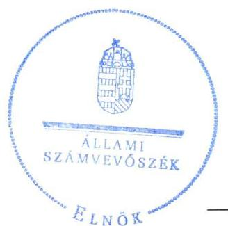
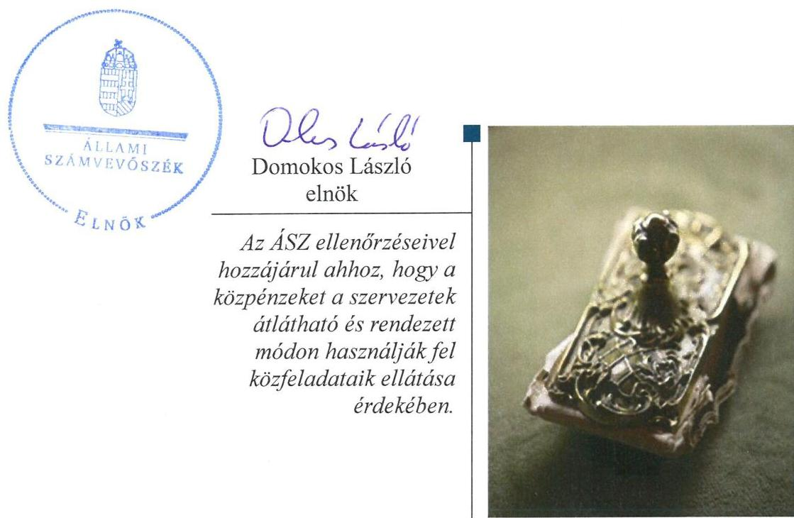
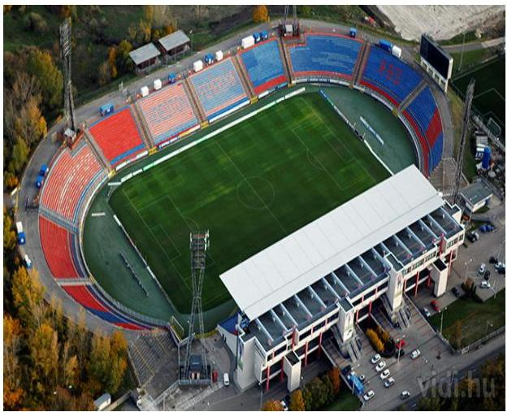

# Jelentés 

## Az önkormányzatok gazdasági társaságai

Az önkormányzatok többségi tulajdonában lévő gazdasági társaságok gazdálkodásának ellenőrzése - Székesfehérvári Közszolgáltató Nonprofit Kft. 2017.

Az ÁSZ ellenőrzéseivel hozzájárul ahhoz, hogy a köppénzeket a szervezetek átlátható és rendezett módon használják fel közfeladataik ellátása érdekében.

---

# Jelentés 

## Az önkormányzatok gazdasági társaságai

Az önkormányzatok többségi tulajdonában lévő gazdasági társaságok gazdálkodásának ellenőrzése - Székesfehérvári Közszolgáltató Nonprofit Kft.
2017. gunder hó 10 . nap

17006
www.asz.hu

---

# AZ ELLENŐRZÉST FELÜGYELTE:

DR. HORVÁTH MARGIT felügyeleti vezető

## AZ ELLENŐRZÉST VEZETTE ÉS A VÉGREHAJTÁSÁÉRT FELELŐS:

VIDA KATALIN ellenőrzésvezető

## A PROGRAM ÖSSZEÁLLÍTÁSÁÉRT FELELŐS:

JANIK JÓZSEF osztályvezető

IKTATÓSZÁM: V-1114-164/2016

TÉMASZÁM: 2148

ELLENŐRZÉS-AZONOSÍTÓ SZÁM: V070779

Jelentéseink az Országgyűlés számítógépes hálózatán és az Interneta a www.asz.hu címen is olvashatóak.

---

# TARTALOMJEGYZÉK 

■ ÖSSZEGZÉS ..... 5
■ AZ ELLENŐRZÉS CÉLJA ..... 7
■ AZ ELLENŐRZÉS TERÜLETE ..... 8
■ AZ ELLENŐRZÉS HÁTTERE, INDOKOLTSÁGA ..... 10
■ A JELENTÉS LÉNYEGES KÉRDÉSKÖREI ..... 11
■ ELLENŐRZÉS HATÓKÖRE ÉS MÓDSZEREI ..... 12
■ MEGÁLLAPÍTÁSOK ..... 14
■ MELLÉKLETEK ..... 21
I. sz. melléklet: Értelmező szótár ..... 21
II. sz. melléklet: A müködés főbb jellemzői ..... 24
III. sz. melléklet: A Közszolgáltató Kft. saját eszközei használhatósági foka, elhasználódási szintje és átlagos életkora ..... 25
IV. sz. melléklet: A Közszolgáltató Kft. kötelezettségeinek alakulásáról (M Ft) ..... 26
V. sz. melléklet: A Közszolgáltató Kft. eladósodottsági mutatói (\%) ..... 27
VI. sz. melléklet: A Közszolgáltató Kft. követelésállományának alakulásáról (e Ft) ..... 28
■ FÜGGELÉK: ÉSZREVÉTELEK ..... 29
■ RÖVIDÍTÉSEK JEGYZÉKE ..... 31

---

.

---

# ÖSSZEGZÉS 

Székesfehérvár Megyei Jogú Város Önkormányzata a kizárólagos tulajdonában lévő Székesfehérvári Közszolgáltató Nonprofit Kft. útján látta el a közfoglalkoztatási és a stadion épületének üzemeltetési közfeladatát. A tulajdonosi jogait szabályszerűen gyakorolta. A Társaság vagyongazdálkodása alapvetően megfelelt a jogszabályi előírásoknak. A Társaság kötelezettségállománya nem jelentett veszélyt a feladatok ellátására, a Társaság müködésére. A Társaság az ellenőrzött időszakban a beszámolási kötelezettségét teljesítette, viszont a közérdekü adatok közzétételi kötelezettségének nem tett eleget. A Társaságnál a bevételek és ráfordítások elszámolása megfelelően történt. A Társaság árképzése szabályszerű volt.

## Az ellenőrzés társadalmi indokoltsága

Az Állami Számvevőszék stratégiájában megfogalmazta, hogy a helyi önkormányzatok gazdálkodásában rejlő pénzügyi kockázatok feltárásával, az államháztartáson kívülre nyújtott költségvetési támogatások és ingyenes vagyonjuttatások, valamint az államháztartáson kívül múködő közfeladat-ellátó rendszerek ellenőrzéseivel hozzájárul ahhoz, hogy a közpénzeket az államháztartáson kívül múködő szervezetek is átlátható, rendezett módon használják fel a közfeladatok szerződésben vállalt ellátása érdekében.

A Magyarországon az intézmény-centrikus közfeladat-ellátás jellemző, de egyre jelentősebb a költségvetésen kívüli feladatellátás térnyerése. Ennek legfontosabb szereplői - a nonprofit szervezetek mellett - az önkormányzati tulajdonú gazdasági társaságok. Az önkormányzatok szervezetalakítási szabadságának következménye, hogy a korábban is vállalati formában múködő közszolgáltatások mellett, mind a kötelező, mind az önként vállalt feladatok ellátásában a gazdasági társaságok kiemelt fontosságú szerephez jutottak.

## Főbb megállapítások, következtetések, javaslatok

A Közszolgáltató Kft. által ellátott közfoglalkoztatási és a stadionépület üzemeltetési közfeladat megszervezésére vonatkozó önkormányzati döntés és annak előkészítése szabályszerű volt. A tulajdonosi jogok gyakorlása összességben a jogszabályi előírásoknak megfelelően történt, annak ellenére, hogy a Felügyelő Bizottság ügyrenddel nem rendelkezett, a Közszolgáltató Kft. Javadalmazási szabályzatát, a Taktv. előírása ellenére nem készítették el.

A Közszolgáltató Kft. az ellenőrzött időszakban, a Számv. tv. előírása ellenére az eszközök és források értékelési szabályzatával valamint leltározási szabályzattal nem rendelkezett.

A vagyongazdálkodás az ellenőrzött időszakban összességében a jogszabályi és a belső szabályozásoknak megfelelően történt. A Közszolgáltató Kft. mérlegbeszámolóinak adatait leltárral hiányosan támasztotta alá.

A Közszolgáltató Kft. az ellenőrzött időszak alatt a jogszabályban, illetve az alapító által előírt beszámolási és adatszolgáltatási kötelezettségét teljesítette, ugyanakkor a Taktv.-ben valamint az Avtv.-ben és Info tv.-ben előírt közérdekű adatok közzétételére vonatkozó kötelezettségét elmulasztotta, a közérdekú adatok megismerésére irányuló igények teljesítésének rendjére vonatkozó szabályzatot nem készített.

A Közszolgáltató Kft.-nél az anyagjellegú ráfordításokat, valamint az értékesítés nettó árbevételét megfelelően számolták el. A követelések behajtására vonatkozó jogszabályi előírásokat betartották.

A Közszolgáltató Kft. a Számv. tv. előírása szerint az Önköltség-számítási szabályzat készítése alól mentesült. 20122014. évekre vonatkozóan az üzleti tervek tartalmazták a tevékenység várható költségeinek előkalkulációját. Árképzése szabályszerű volt az ellenőrzött időszakban.

---

A 2013-2014. években a Közszolgáltató Kft. nem rendelkezett a társasági formájára kötelezően előírt jegyzett tőkének megfelelő saját tőkével, a Közgyűlés pótbefizetéssel biztosította a szükséges saját tőke összegét.

A Társaság az ellenőrzött időszakban nem tartozott a kormányzati szektorba sorolt szervezetek közé.

---

# AZ ELLENŐRZÉS CÉLJA 

Az ellenőrzés célja annak értékelése, hogy az önkormányzat vagyongazdálkodási tevékenysége során szabályszerűen gyakorolta-e a tulajdonosi jogait; a gazdasági társaság szabályozottsága, gazdálkodása és vagyongazdálkodási tevékenysége, bevételeinek és ráfordításainak elszámolása megfelelt-e a jogszabályi és tulajdonosi előírásoknak; a gazdasági társaság kötelezettségállománya jelent-e kockázatot a működésre, valamint a gazdálkodás átláthatósága és elszámoltathatósága érdekében biztosítva volte a szolgáltatás díjának megalapozottsága szabályszerű önköltségszámítással.

---

# **AZ ELLENŐRZÉS TERÜLETE**

## **Székesfehérvár Megyei Jogú Város Önkormányzata és a kizárólagos tulajdonában lévő Székesfehérvári Közszolgáltató Nonprofit Kft.**

### **1. táblázat**

### **KÖZMUNKAPROGRAM SZEMÉLYI JELLEGŰ RÁFORDÍTÁSAI 2011. ÉVBEN (M FT)**

|  Megnevezés | Közmunkaprogram | Egyéb foglalkoztatás  |
| --- | --- | --- |
|  Bérköltség | 32,7 | 6,4  |
|  Személyi jellegű egyéb kifizetés | 0,6 | 0,8  |
|  Bérjárulék | 9,4 | 1,8  |
|  Összesen | 42,7 | 9,0  |
|  Mindösszesen | 51,7 |   |

*Forrás: Közszolgáltató Kft. adatszolgáltatása*

### **A SZÉKESFEHÉRVÁR MEGYEI JOGÚ VÁROS ÖNKORMÁNYZATÁNAK** 100%-os tulajdonában lévő Székesfehérvári Közszolgáltató Nonprofit Kft.^{2} 2001. évben alakult "Sóstói Stadion Üzemeltető és Szolgáltató Kft." néven. A Közgyűlés 23/2011. (I. 27.) számú határozatával módosította a Közszolgáltató Kft. alapítói okiratát, mely szerint új néven Székesfehérvári Közszolgáltató Nonprofit Kft.-ként folytatta tevékenységét. A nonprofit társasággá történő átalakulás a városi közfoglalkoztatás 2011. évi működtetése érdekében történt.

A Társaságnál^{3} az ellenőrzött időszakban két közfeladat – sport, helyi közfoglalkoztatás – ellátását ellenőriztük.

Az Önkormányzat az Ötv. és az Mötv. szerinti sportfeladat ellátását, mint közfeladatot a Közszolgáltató Kft. útján látta el az ellenőrzött években, a helyi közfoglalkoztatás a 2011. évben volt a Társaság feladata.

Az alapító okirat szerint a Társaság főtevékenysége sportlétesítmény működtetése, valamint a 2002. évben induló Székesfehérvár - Sóstói Stadion rekonstrukciójának lebonyolítása volt az Önkormányzattal kötött megállapodás szerint. A Sóstói Stadion rekonstrukciójának befejezését követően a felújított stadion üzemeltetése tartozott a Társaság fő feladatkörébe az ellenőrzött időszakban. A Sóstói Stadion üzemeltetését a Társaság az Önkormányzattal kötött üzemeltetési szerződés alapján végezte.

Az Önkormányzat megbízásából a Közszolgáltató Kft. 2011. évben a közfoglalkoztatási tevékenység szervezése és végzése (közterületi takarítási tevékenység szervezése) érdekében, a tevékenység ellátásának finanszírozására benyújtott pályázataira a Munkaerő-piaci Alap "Közfoglalkoztatás kiadásai" előirányzat decentralizált kerete terhére közfoglalkoztatási célra 2011. évben összesen 30,3 M Ft támogatást kapott. A köztisztasággal kapcsolatos feladatok ellátására az Önkormányzat vállalkozói szerződést kötött a Közszolgáltató Kft.-vel az ellátási kötelezettségéhez tartozó területeken a köztisztasággal kapcsolatos feladatok ellátására. A Közszolgáltató Kft. a feladatok ellátásához a helyi közfoglalkoztatás keretében foglalkoztatott munkavállalókat alkalmazta. A közmunkaprogram keretében foglalkoztatottak átlagos statisztikai állományi létszáma 53 fő volt, ebből 45 fő fizikai, 3 fő szellemi és 5 fő egyéb foglalkoztatott munkavállaló. A közmunkaprogram 2011. évi személyi jellegű ráfordításait az 1. táblázat mutatja be. Erre a célra összesen 51,7 millió Ft-ot fordítottak 2011-ben.

Az ellenőrzött időszakban a polgármester, a jegyző és az ügyvezető személye nem változott. Az ügyvezető a Társaságnál megbízási jogviszony keretében látta el feladatát az ellenőrzött időszakban.

---

Az ellenőrzött években a Közszolgáltató Kft. számviteli feladatainak ellátását, szolgáltatási szerződés alapján a Városgondnokság Kft. ${ }^{3}$ végezte.

A Közszolgáltató Kft. vagyoni helyzetét jellemző, főbb mérlegadatait a 2. táblázat mutatja be.
2. táblázat

| A KÖZSZOLGÁLTATÓ KFT. FÖBB MÉRLEG ADATAI (MILLIÓ FORINT) |  |  |  |  |
| :--: | :--: | :--: | :--: | :--: |
|  | 2011. | 2012. | 2013. | 2014. |
| Megnevezés | 12.31.   (módosi-   tött) | 12.31.   (módosi-   tött) | 12.31. | 12.31. |
| I. Befektetett eszközök | 536,8 | 259,0 | 2,8 | 1,9 |
| II. Forgó eszközök | 23,1 | 3,6 | 10,9 | 3,3 |
| - ebböl: Követelések | 5,5 | 2,9 | 10,3 | 2,7 |
| III. Aktív időbeli elhatárolások | 6,5 | 4,6 | 0,0 | 0,0 |
| Eszközök összesen | 566,4 | 267,2 | 13,7 | 5,2 |
| IV. Saját tőke | 362,0 | 130,2 | $-101,9$ | $-69,2$ |
| V. Kötelezettségek | 156,4 | 127,5 | 113,5 | 73,5 |
| VI. Passzív időbeli elhatárolások | 48,0 | 9,6 | 2,2 | 0,9 |
| Források összesen | 566,4 | 267,2 | 13,7 | 5,2 |

Forrás: A Társaság 2011-2014. évi beszámolói, a Társaság fökönyvi kivonatai
Az Önkormányzat a tulajdonában lévő Sóstói Stadion üzemeltetésére 2002-ben a Társaság jogelődjével üzemeltetési szerződést kötött 10 éves időtartamra. A Társaság a „Sóstói Stadion" ingatlanon az Üzemeltetési szerződés 1. pontja szerint 1,4 Mrd Ft értékben stadion rekonstrukciós beruházást hajtott végre, amelyet 2006. évben fejezett be. A 10 éves időtartam lejártát követően 2013-ban a Közszolgáltató Kft. a „Sóstói Stadion beruházást" átadta az Önkormányzatnak. 2014-től az Önkormányzat egy másik társaságával üzemeltette tovább a Sóstói Stadiont.

A Társaságnál a stadion beruházás Önkormányzatnak történő átadása miatt 2013. december 31-ei befektetett eszköz állománya jelentősen csökkent. A saját tőke a térítésmentes vagyonátadás miatt elszámolt rendkívüli ráfordítás következtében, a veszteség hatására a jegyzett tőke értéke alá csökkent.

A Társaság megállapodás alapján a Székesfehérvár Városgondnoksága Kft.-től a 3. táblázat szerint az ellenőrzött időszakban összesen 244,1 millió Ft működési támogatásban részesült.

SZMJV Önkormányzata 2015. május 13-ai közgyűlésen határozatot hozott a Társaság végelszámolásának kezdeményezéséről. A Cégbíróság CG.07-09-008022/118 számú végzésével elrendelte a Közszolgáltató Kft. végelszámolását. Az eljárás 2016. július 1-jén indult, a végelszámolót kijelölte a Cégbíróság.

---

# AZ ELLENŐRZÉS HÁTTERE, INDOKOLTSÁGA 

AZ ÖNKORMÁNYZATI TULAJDONÚ GAZDASÁGI TÁRSASÁGOK ellenőrzése kiemelten fontos a vagyon megőrzése, megóvása érdekében, valamint a kormányzati szektor elszámolásaiban megjelenő önkormányzati tulajdonú gazdálkodó szervezetek esetében, amelyekkel szemben alapvető követelmény, hogy gazdálkodásuk, múködésük szabályszerű, az általuk szolgáltatott adatok minél megbízhatóbbak legyenek. A feladat/közfeladat- ellátás költségeinek, ráfordításainak alakulása, színvonala hatással van a lakosság elégedettségére. A törvényalkotás számára - az észlelt problémák, szabálytalanságok, vagy egyéb nem kívánatos jelenségek felszínre kerülésével - az ellenőrzés megállapításai segítséget nyújthatnak az államháztartáson kívüli feladat/közfeladat-ellátás értékeléséhez, jogszabályi keretei pontosításához, átláthatóságot biztosító szabályozásához. Meghatározhatóvá válnak az önkormányzati feladatellátásban részt vevő államháztartáson kívüli szervezeteknek - az önkormányzat költségvetését, pénzügyi helyzetét is befolyásoló - kockázatai, lehetővé válik ezen kockázatok csökkentése. Ellenőrzéseink feltárhatják, hogy az önkormányzat feladat-ellátási kötelezettségének szabályszerűen tett-e eleget, a feladatellátáshoz rendelt vagyonkezelésbe vett és saját vagyon múködtetését az elvárható gondossággal, szabályszerűen szervezte-e meg, és a tulajdonosi felügyelete hozzájárult-e a feladatellátásához. Az ellenőrzés rávilágíthat arra, hogy a gazdasági társaság a feladat-ellátási, közszolgáltatási szerződésben foglaltak betartásával, a vagyon használatával biztosította-e a szolgáltatás folyatatásának feltételeit, a feladat ellátását. Ezzel az ellenőrzöttek és a helyi döntéshozók számára visszajelzést ad feladatszervezési, feladat-ellátási kockázataikról, alapot ad a meglévő hibák megszüntetéséhez, a jobb feladatellátás biztosításához. Fokozza a fegyelmet, igazolja, hogy lejárt a következmények nélküli ellenőrzések időszaka. Az ÁSZ értékteremtő rend kialakításához és megőrzéséhez hozzájáruló tevékenysége pozitív hatással van a szervezetről kialakított összkép formálására.

---

# A JELENTÉS LÉNYEGES KÉRDÉSKÖREI 

1. Az Önkormányzat közfeladat megszervezéséről szóló döntése, valamint tulajdonosi joggyakorlása szabályszerű volt-e?
2. A gazdasági társaság vagyongazdálkodása szabályszerű volt-e, kötelezettségállománya jelentett-e kockázatot a müködésre, illetve a közfeladat ellátásra?
3. A gazdasági társaságnál az ellátott közfeladat bevételei és ráfordításai elszámolása, valamint az önköltségszámítás és árképzés szabályszerű volt-e?

---

# ELLENŐRZÉS HATÓKÖRE ÉS MÓDSZEREI 

## Az ellenőrzés típusa

Megfelelőségi ellenőrzés

## Az ellenőrzött időszak

2011. január 1-jétől 2014. december 31-ig tartó időszak

## Az ellenőrzés tárgya

A gazdasági társaság feletti tulajdonosi joggyakorlás, valamint a gazdasági társaság gazdálkodásának szabályozottsága és szabályszerűsége.

Az ellenőrzés kiterjed minden olyan körülményre és adatra, amely az ÁSZ jogszabályban meghatározott feladatainak teljesítéséhez, valamint a program végrehajtása folyamán felmerült újabb összefüggések feltárásához szükséges.

## Az ellenőrzött szervezet

- Székesfehérvár Megyei Jogú Város Önkormányzata és a
- Székesfehérvári Közszolgáltató Nonprofit Kft.

## Az ellenőrzés jogalapja

Az ellenőrzés jogszabályi alapját az Állami Számvevőszékről szóló 2011. évi LXVI. törvény 1. § (3) bekezdése, valamint az 5. § (3)-(4)-(5) bekezdése képezte.

## Az ellenőrzés módszerei

Az ellenőrzést a nemzetközi standardokat irányadónak tekintve az ellenőrzési program ellenőrzési kérdései, az ellenőrzött időszakban hatályos jogszabályok, az ellenőrzés szakmai szabályok és módszertanok figyelembe vételével végeztük.

Az ellenőrzés ideje alatt az ellenőrzött szervezettel történő kapcsolattartást az ÁSZ Szervezeti és Müködési Szabályzatának vonatkozó előírásai alapján biztosítottuk.

---

Az ellenőrzés a kiválasztott, tulajdonosi jogokat gyakorló önkormányzatra, illetve az ellenőrzésre kijelölt gazdasági társaság felett tulajdonosi jogokat gyakorló szervezetre és az ellenőrzött gazdasági társaságra terjedt ki.

Az ellenőrzést a kérdésekre adott válaszok kiértékelésével, valamint a megjelölt adatforrások, a csatolt tanúsítványok felhasználásával, továbbá az adott időszakban hatályos jogszabályok figyelembe vételével kellett lefolytatni. Az ellenőrzési kérdések megválaszolásához szükséges bizonyítékok megszerzése a következő ellenőrzési eljárások alkalmazásával történt: megfigyelés, kérdésfeltevés (információkérés), összehasonlítás, valamint elemző eljárás. Az ellenőrzési bizonyítékként felhasználható adatforrások közé tartoztak egyrészt a szakmai programban felsorolt adatforrások, másrészt adatforrás lehet még minden - az ellenőrzés folyamán - feltárt, az ellenőrzés szempontjából információkat tartalmazó dokumentum.

A bevételek és ráfordítások elszámolását, valamint a vagyonnyilvántartást tételes mintavétellel ellenőriztük. A mintavétellel ellenőrzött területek esetében minden egyes tétel vonatkozásában a szabályszerűségre vonatkozó kérdéseket tettünk fel, amelyek eredménye összesítésre került. „Megfelelőnek" értékeltünk egy ellenőrzött területet, amennyiben 95\%-os bizonyossággal a teljes sokaságban a hibaarány legfeljebb 10\% volt, nem megfelelőnek, ha a hibaarány a 10\%-ot meghaladta. A ráfordítások elszámolására és a vagyonnyilvántartásra vonatkozó véletlen mintavételt kockázati alapú kiválasztással egészítettük ki, amelynek során évente a három legnagyobb összegű tételt választottuk ki.

---

# 1. Az Önkormányzat közfeladat megszervezéséről szóló döntése, valamint tulajdonosi joggyakorlása szabályszerű volt-e? 

Összegző megállapítás

A Közszolgáltató Kft. által ellátott sportlétesítmény üzemeltetési és közfoglalkoztatási közfeladat megszervezéséről az Önkormányzati döntés, valamint a tulajdonosi joggyakorlás az ellenőrzött időszakban összességében szabályszerű volt.
1.1. számú megállapítás

A Közszolgáltató Kft. által ellátott közfeladatok megszervezésére vonatkozó önkormányzati döntés szabályszerű volt.

AZ ÖNKORMÁNYZAT A KÖZFELADATOK ELLÁTÁSÁRA VONATKOZÓ TERVÉT az Ötv. ${ }^{5}$ 91. § (6) bekezdése, 2013. január 1-jétől az Mötv. ${ }^{6}$ 116. § (3)-(4) bekezdései szerinti gazdasági programjában határozta meg. A Közgyűlés ${ }^{7}$ által a 2011-2014. évekre jóváhagyott „Program az erős Székesfehérvárért"8 gazdasági program vagyongazdálkodással kapcsolatos terveket is tartalmazott. Az Önkormányzat feladatainak ellátására vonatkozóan a fejlesztési elképzeléseit Integrált városfejlesztési stratégiájában ${ }^{9}$ rögzítette.

Az Önkormányzat az Ötv. és az Mötv. előírásainak megfelelő SzMSz ${ }_{1,2}{ }^{10}$ 11. § (3) bekezdésének és a mellékletének megfelelően rögzítette a Közszolgáltató Kft. által ellátott közfeladatot. A Közszolgáltató Kft. az ellenőrzött időszakban 2011. évben a közfoglalkoztatás feladatot látta el, a Közgyűlés a 406/2011. (VI. 16.) számú határozata szerint. A 2011-2014. évek vonatkozásában a Társaság feladatai közül a legjelentősebb sport közfeladatot, a stadion üzemeltetést ellenőriztük.

Az Önkormányzattal a feladatok ellátására kötött Üzemeltetési szerződésben ${ }^{11}$ és a vállalkozói szerződésben számon kérhető módon rögzítették a feladatellátással kapcsolatos jogokat és kötelezettségeket.

AZ ALAPÍTÓ OKIRATBAN rögzítették az ellátandó feladatok körét, továbbá az üzleti tervkészítési kötelezettséget. Az alapító okiratban rögzítettek ellenére, a Közszolgáltató Kft. a 2011. évre vonatkozóan üzleti tervet nem készített.

RENDELETALKOTÁSI KÖTELEZETTSÉGE az Önkormányzatnak az ellenőrzött időszakban az Ötv. és az Mötv. előírásai szerinti, a Közszolgáltató Kft. által ellátott közfeladattal kapcsolatban a nem lakás céljára szolgáló helyiségek bérleti díjainak meghatározása tekintetében volt, a 12/2009. (II. 12.) számú, az 563/2011. (IX. 7.) számú és a 800/2011. (XII. 15.) számú rendeleteket elkészítette.

A feladatellátáshoz szükséges vagyont a Közszolgáltató Kft. részére a 3,1 M Ft értékben az Önkormányzat, az alapító okiratban rögzítettek szerint, készpénzben az alapítással egy időben bocsátotta rendelkezésre. Az

---

### 1.2. számú megállapítás

Önkormányzat a Társaság feladatellátáshoz kapcsolódóan, a Sóstói stadion épületén a Társaság által végzett beruházás ellentételezéseként 2002. évben, 10 éves időtartamra átengedte az épület hasznosítási jogát a Közszolgáltató Kft.-nek, egyéb eszközt, ingatlant, az ellenőrzött időszakban üzemeltetésre, vagyonkezelésbe nem adott át.

A tulajdonosi jogok gyakorlása összességben a jogszabályi előírásoknak megfelelően történt. A Felügyelő Bizottság ügyrenddel, és a Közszolgáltató Kft. javadalmazási szabályzattal az ellenőrzött időszakban nem rendelkezett.

A TULAJDONOSI JOGGYAKORLÁS RENDJÉT az Önkormányzat az SzMSz ${ }_{1,2}$-ben, a vagyongazdálkodási rendelet ${ }^{12}$-ben és a Közszolgáltató Kft. alapító okirataiban szabályozta. A tulajdonosi jogok átruházására az ellenőrzött időszakban a Közszolgáltató Kft. vonatkozásában nem került sor, azt a Közgyűlés gyakorolta.

A Közszolgáltató Kft. alapító okirata megfelelt a Gt. ${ }^{13} 12 . \S$ (1) bekezdésében, valamint a Ptk. ${ }^{14} 54 . \S$ (2) bekezdésében, illetve 2014. március 15től a Ptk. ${ }^{15}$ 3:5 §-ában előírt tartalmi követelményeknek. Az alapító okiratot három alkalommal módosították, a Társaság múködésének nonprofit jellege, valamint a könyvvizsgáló és a Felügyelő Bizottsági ${ }^{16}$ tagok személyében bekövetkezett változások miatt.

A Közszolgáltató Kft. által ellátott sportlétesítmények múködtetése feladathoz kapcsolódóan az alkalmazott díjakat, a Közgyűlés önálló határozatokkal állapította meg, a szolgáltatási díjak meghatározása az Önkormányzat nem lakás céljára szolgáló helyiségek bérleti díjaira vonatkozó rendeletek figyelembevételével történt.

## A TULAJDONOSI JOGGYAKORLÓ A FELÜGYELŐ

BIZOTTSÁGOT a Gt. 34. § (1) bekezdésében, valamint a Ptk. 2 3:121. § (1) bekezdésében előírtak szerint három taggal múködtette. A Felügyelő Bizottság Ügyrendjét a Gt. 34. § (4) bekezdésében, illetve a Ptk 2 3:122. § (3) bekezdésében előírtak ellenére nem készítette el.

JAVADALMAZÁSI SZABÁLYZATOT a Taktv. ${ }^{17}$ 5. § (3) bekezdésében foglaltak ellenére a Társaság legfőbb szerve nem alkotta meg. Az ügyvezető javadalmazását, valamint a Felügyelő Bizottsági tagok tiszteletdíját a Közgyűlés határozattal hagyta jóvá.

## AZ ADATSZOLGÁLTATÁSI ÉS BESZÁMOLÁSI KÖ-

TELEZETTSÉGET az Önkormányzat, a Gt. és a Ptk.1,2 előírásainak megfelelően az alapító okiratban előírta. A Közszolgáltató Kft. éves beszámolóit az alapító okirat rendelkezései szerint az ügyvezető elkészítette. A Közszolgáltató Kft. év végi szöveges beszámolóiban, az Üzemeltetési szerződésben meghatározott feladatok ellátásáról, teljesítéséről az ellenőrzött időszak éveiben részletesen beszámolt.

Az Önkormányzat az Ötv. 92. § (11) bekezdésének b) pontjában biztosított lehetőséggel élve a 2012. évi ellenőrzési tervében feladatként tűzte ki a Közszolgáltató Kft. ellenőrzését. Az Ellenőrzési Iroda ${ }^{18}$ által elvégzett ellenőrzés hiányosságot nem állapított meg.

---

A Közszolgáltató Kft. az ellenőrzött időszak gazdálkodási éveit - a 2013. év kivételével - mérleg szerinti nyereséggel zárta. A Közgyűlés, az ellenőrzött időszakban az éves beszámolók jóváhagyása során, a Közszolgáltató Kft. mérleg szerinti eredményét eredménytartalékba helyezte.

Az ellenőrzött időszakban a Közszolgáltató Kft. hitelt nem vett fel, az Önkormányzat részéről garancia- és kezességvállalás a Társaság részére nem történt.

# 2. A gazdasági társaság vagyongazdálkodása szabályszerű volt-e, kötelezettségállománya jelentett-e kockázatot a múködésre, illetve a közfeladat ellátásra? 

Összegző megállapítás

A Közszolgáltató Kft. vagyongazdálkodása az ellenőrzött időszakban összességében megfelelt a jogszabályi rendelkezéseknek. A Társaság kötelezettségállománya az ellenőrzött időszakban jelentősen csökkent, a feladatainak ellátására és a múködésre nem jelentett veszélyt. A közérdekú adatok közzétételi kötelezettségét nem teljesítették.

### 2.1. számú megállapítás

A Közszolgáltató Kft. az ellenőrzött időszakban nem rendelkezett az eszközök és források értékelési, valamint leltározási szabályzattal.

A KÖZSZOLGÁLTATÓ KFT. ÜZLETI TERVEIT az alapító okirat előírásának megfelelően - a 2011. év kivételével - az ügyvezető elkészítette és jóváhagyásra a Közgyűlés elé terjesztette. Az Önkormányzattal a sportlétesítmények üzemeltetésére kötött Üzemeltetési szerződésben rögzítették az üzleti tervek tartalmára vonatkozó előírásokat, amelyeket betartottak.

A SZÁMVITELI POLITIKA ${ }_{1,2}$-vel ${ }^{19}$ a Közszolgáltató Kft. a Számv. tv. ${ }^{20}$ 14. § (4) bekezdésében előírtaknak megfelelően rendelkezett, azonban a Számviteli politika ${ }_{1}$ keretében a Számv. tv. 14. § (5) bekezdésének a) és b) pontjai ellenére nem készítették el az eszközök és források értékelési szabályzatát, valamint a 2011-2012. években a leltárkészítési és leltározási szabályzatot. A Számv. tv. 14. § (6) bekezdése szerint a Társaság az ellenőrzött időszakban mentesült az önköltség-számítási szabályzat készítése alól.

Az ügyvezető, a Felügyelő Bizottsági tagok és a könyvvizsgáló juttatásait a Közgyűlés határozattal fogadta el.

A Közszolgáltató Kft. a sportlétesítmények üzemeltetése feladatait saját tulajdonú eszközeivel látta el, az ellenőrzött időszakban vagyonkezelésbe vett eszköze nem volt.

A számviteli szolgáltatást végző Városgondnokság Kft.-nél a Közszolgáltató Kft. vagyonáról a főkönyvi és az analitikus nyilvántartást a Számv. tv. 25. §-ának és a Számviteli politika ${ }_{1,2}$ előírásának megfelelően vezették. Az ellenőrzött időszakban negyedéves gyakorisággal, a negyedéves zárás keretében küldte meg a Városgondnokság Kft. a Közszolgáltató Kft. részére a

---

# 2.2. számú megállapítás 

2.3. számú megállapítás
vagyon változásával kapcsolatos kimutatásokat, az eszközök bruttó értékére, értékcsökkenésére, nettó értékére, az eszközök értékének növekedésére és csökkenésére vonatkozóan.

## A 2011-2014. években a beszámoló adatait leltárral nem teljes körüen támasztották alá.

A 2011-2014. évek között a leltározási kötelezettségének a Közszolgáltató Kft. hiányosan tett eleget. Az ellenőrzött időszakban a követelések, az aktív időbeli elhatárolások, a saját tőke elemei, a kötelezettségek és a passzív időbeli elhatárolások mérlegtételeit a Közszolgáltató Kft. a Számv. tv. 69. § (2) bekezdésében és a leltárkészítési és leltározási szabályzatában előírtakkal ellentétben egyeztetéses leltárral nem támasztotta alá. A 2011-2013. években a Társaság év végi készletállományáról a Számv. tv. 69. § (4) bekezdésében és a leltározási szabályzatban előírtak ellenére, mennyiségben és értékben tételesen, ellenőrizhető módon leltár nem készült. A többi mérlegtétel leltározása szabályszerű volt az ellenőrzött években.

AZ ESZKÖZÉRTÉK az ellenőrzött időszakban összességében 561,2 M Ft-tal csökkent. Az eszközökön belül a befektetett eszközök könyv szerinti értékénél 534,9 M Ft-os csökkenés tapasztalható, főként az Önkormányzatnak a 2013. évben térítésmentesen átadott tárgyi eszközök mérlegből történt kivezetése miatt.

A SAJÁT TÖKE a 2011. évi 362,0 M Ft-ról, valamint a 2013. évi veszteséges gazdálkodás miatt, a 2014. év végére -69,2 M Ft-ra csökkent. A 2013-2014. években a Közszolgáltató Kft. nem rendelkezett a társasági formájára kötelezően előírt jegyzett tőkének megfelelő saját tőkével. A Gt. 51. § (1), valamint a Ptk. 3 :109. § (2) bekezdésének megfelelően, a 2014. évi beszámoló jóváhagyását követően, a Közgyűlés 492/2015. (VI. 26.) számú határozatának megfelelően, pótbefizetéssel biztosította a szükséges saját tőke összegét.

A Közszolgáltató Kft. kötelezettségállománya a 2011-2014. években jelentősen csökkent, nem jelentett veszélyt a feladatainak ellátására, illetve a múködésére.

A KÖTELEZETTSÉGEK állománya a 2011. évi értékhez képest 2014. év végére 53,0\%-kal, (82,9 M Ft-tal) csökkent. A kötelezettségek alakulását a IV. sz. melléklet részletezi.

Az ellenőrzött időszakban a Közszolgáltató Kft. kötelezettségállománya az ellenőrzött időszakot megelőzően (2006. évben) felvett hosszú lejáratú beruházási hitelekből, valamint rövid lejáratú kötelezettségekből állt. A rövid lejáratú kötelezettség állományból a szállítói kötelezettség mellett, a rövid lejáratú hitelek jelentették a legnagyobb részarányt, ami a beruházási hitelek tárgyévi törlesztő részletéből adódott. Az egyéb rövid lejáratú kötelezettségek között tartotta nyilván a Társaság az Adóhivatalnak a 20132014. években az Áfa ${ }^{21}$ és a Tao ${ }^{22}$ önrevíziók miatti fizetési kötelezettségét.

A Közszolgáltató Kft. eladósodottsággal kapcsolatos mutatóit az ellenőrzött időszakban az V. sz. melléklet mutatja be.

---

AZ ELADÓSODOTTSÁGI MUTATÓK a 2011-2012. években még kedvezően alakultak, azonban a 2013. évben a mérleg szerinti veszteség, a 2014. évi negatív eredménytartalék miatt a Közszolgáltató Kft. jelentős külső finanszírozásra szorult. Az eladósodottság mértéke és szerkezete a 2013-2014. években a Közszolgáltató Kft. feladatellátását, illetve múködését azért nem veszélyeztette.

# 2.4. számú megállapítás 

A Közszolgáltató Kft. az ellenőrzött időszak alatt az előírt beszámolási és adatszolgáltatási kötelezettségének eleget tett, a közérdekú adatok közzétételi kötelezettségét nem teljesítette.

AZ ÉVES BESZÁMOLÓK elkészítésével, beszámolási kötelezettségeinek a Társaság az ellenőrzött időszak alatt, a Számv. tv. 4. § (1) bekezdése alapján eleget tett. Az éves beszámolókat - a 2013. év kivételével - a Számv. tv. 96. § (1) bekezdésében előírt tartalommal elkészítette. A Gt. 40. § (1) bekezdésében és a Ptk. 3:129. § (1) bekezdésében előírtaknak megfelelően a választott könyvvizsgáló az ellenőrzött időszak minden évében hitelesítő záradékkal látta el.

A Közszolgáltató Kft. a 2013. évi beszámolójának elkészítése során számviteli korrekciót végzett, a korábbi 2006-2012. évi időszakra készített mérlegbeszámolóiban közzétett adatok vonatkozásában, ugyanakkor a beszámoló kiegészítő mellékletében tételesen nem mutatta be a Sóstói Stadion Önkormányzatnak történő átadásával kapcsolatos részletező adatokat. A Közgyűlés a Közszolgáltató Kft. 2011-2014. évekre vonatkozó éves beszámolóit határozatokkal ${ }^{23}$ elfogadta. A Közszolgáltató Kft.-nél az éves beszámolók letétbe helyezése és közzététele a Számv. tv. 154. § (7) és 154\B. § (2) bekezdéseiben előírtaknak megfelelően megtörtént.

## A KÖZÉRDEKŰ ADATOK VÉDELMÉRE, KÖZZÉTÉ-

TELÉRE vonatkozó feladatokat az ellenőrzött időszakban nem teljesítették. A Közszolgáltató Kft. a közérdekú adatok megismerésére irányuló kérelmek intézésének, igények teljesítésének rendjére szabályzatot az Avtv. ${ }^{24}$ 20. § (8) bekezdése, illetve 2011. július 27-től az Info tv. ${ }^{25}$ 30. § (6) bekezdése alapján a 2011-2014. években nem készített.

A Közszolgáltató Kft. a Taktv. 2. § (1)-(3) bekezdéseiben, továbbá az Info tv. 1. mellékletében rögzítettek ellenére az ellenőrzött időszakban nem tette közzé a Társasággal kapcsolatos személyi, pénzügyi, továbbá a közbeszerzésekkel és a vagyonnal kapcsolatos adatait.

---

# 3. A gazdasági társaságnál az ellátott közfeladat bevételei és ráfordításai elszámolása, valamint az önköltségszámítás és árképzés szabályszerű volt-e? 

Összegző megállapítás

### 3.1. számú megállapítás

4. táblázat

AZ ÉRTÉKCSÖKKENÉS ÉS AZ ESZKÖZÖK PÓTLÁSÁNAK ALAKULÁSA (M FT)

| Év | Érték-
csökkenés | Eszköz-
pótlás |
| :--: | :--: | :--: |
| 2011. | 56,7 | 0,5 |
| 2012. | 55,9 | 1,0 |
| 2013. | $7,4^{*}$ | 0,0 |
| 2014. | 0,9 | 0 |
| Összesen: | 120,9 | 1.5 |

*A 2013. évi korrekciós elszámolások hatását, mind az elszámolt értékcsökkenésnél, mind az eszközállomány növekedésénél figyelmen kívül hagytuk.
Forrás: 2011-2014. évi fökönyvi kivonatok, éves beszámolók

A Közszolgáltató Kft.-nél a bevételek és a ráfordítások elszámolása szabályszerűen történt, az árképzése szabályszerű volt.

Az ellenőrzött időszakban az értékesítés nettó árbevételét, valamint az anyagjellegú ráfordításokat megfelelően számolták el. A követelések behajtása során a jogszabályi előírásokat betartották.

Az ellenőrzött időszakban a Közszolgáltató Kft. feladatait saját eszközeivel, illetve az Önkormányzattal kötött Üzemeltetési szerződés keretében működtetett „Sóstói Stadion" ingatlannal végezte. A Társaság feladatainak ellátásához vagyonkezelésbe az Önkormányzattól vagyont nem vett át.

AZ ÉRTÉKESÍTÉS NETTÓ ÁRBEVÉTELÉNEK elszámolása megfelelő volt. A bevételeknél az önkormányzati rendeletben, illetve az üzleti terveknek megfelelően kalkulált, a Közgyűlés által jóváhagyott díjtételeket érvényesítették, a főkönyvi számlákra történő elszámolása megfelelő volt.

A BERUHÁZÁSOK, FELÚJÍTÁSOK elszámolása nem volt megfelelő, a 2011-2014. évi beruházások, felújítások elszámolásánál előfordult, hogy a Számv. tv. 165. § (1) bekezdésében, továbbá a 166. § (1)(2) bekezdéseiben rögzítettekkel ellentétben a gazdasági eseményekről annak számviteli elszámolását alátámasztó számviteli bizonylat, az állományba vételt alátámasztó dokumentum nem készült. A Közszolgáltató Kft.-nél beruházások, felújítások a 2011-2014. évek között 1,5 M Ft értékben történtek.

AZ ÉRTÉKCSÖKKENÉSI LEÍRÁS ELSZÁMOLÁSA a Közszolgáltató Kft. saját vagyonára vonatkozóan a Számv. tv . előírásainak megfelelt, azonban az egyösszegű leírás a számviteli politika aktualizálásnak hiányában a belső szabályozásnak nem felelt meg. Az ellenőrzött időszakban az éves beszámolók kiegészítő mellékleteiben bemutatták az elszámolt értékcsökkenési leírást, valamint egy összegben a terven felüli értékcsökkenést.

A Közszolgáltató Kft. a befektetett eszközeinek pótlására a 2011-2014. évek között az elszámolt értékcsökkenés (2. táblázat) mindössze 1,3\%-át fordította. Az alacsony beruházási összeg oka, hogy miután a „Sóstói Stadion" üzemeltetését 2013. december 1-jétől már nem a Közszolgáltató Kft. végezte, a Társaság fő tevékenysége megszűnt, a tulajdonos Önkormányzat 2016, május 13 -ai ülésen hozott határozatával a társaság végelszámolását tűzte ki célul. Az eszközök használhatósági fokát és az átlagos élettartam mértékét a három eszközfőcsoport (ingatlanok, műszaki berendezések és egyéb gépek, berendezések) vonatkozásában a III. számú melléklet mutatja be. Az ellenőrzött időszakban az eszközök használhatósági foka és

---

az átlagos életkor mutatói, az eszközpótlás elmaradása miatt, fokozatosan romlott.

AZ ANYAGJELLEGŰ RÁFORDÍTÁSOK elszámolása megfelelő volt. A Számviteli politika ${ }_{1,2}$ keretében jóváhagyott Számlarend szerint a megfelelő költségnemre és feladatra elkülönített főkönyvi számlára könyvelték a különböző tevékenységgel kapcsolatban felmerült anyagköltségeket. A költségelszámolást dokumentumokkal alátámasztottan hajtották végre.

A Közszolgáltató Kft. követelésállományának csökkentése érdekében az ellenőrzött időszakban a lejárt hátralékok beszedése érdekében a jogszabályi előírásoknak megfelelően intézkedett. A Közszolgáltató Kft. követelésállományának alakulását a VI. sz. melléklet szemlélteti, vevőkövetelések és a 90. napon túli vevői kintlévőségek szerinti bontásban. A Közszolgáltató Kft. követelésállománya az ellenőrzött időszak alatt, a 2011. évről a 2014. év végére 50,2\%-kal csökkent. A Közszolgáltató Kft. a Számv. tv., valamint a Számviteli politikája ${ }_{1,2}$ előírásának megfelelően a 2011. évben 1118 ezer Ft, a 2012. évben 1118 ezer Ft, a 2013. évben 846 ezer Ft, illetve a 2014. évben 740 ezer Ft behajthatatlan követelést vezetett ki a nyilvántartásából. A lejárt bérleti díj tartozás behajtása érdekében, a Közszolgáltató Kft. a jogszabályi lehetőségeknek megfelelően a szükséges intézkedéseket megtette.

# 3.2. számú megállapítás 

A Közszolgáltató Kft.-nek önköltség-számítási szabályzat készítésére jogszabályi kötelezettsége nem volt. A Társaságnál az árképzés a jogszabályoknak és az Önkormányzat rendeletének megfelelően történt.

A Közszolgáltató Kft. a Számv. tv. 14. § (6) bekezdése szerint az ellenőrzött időszakban mentesült az önköltség-számítási szabályzat készítési kötelezettség alól, szabályozást erre vonatkozóan nem készített. A Társaságnál az árképzés és a szolgáltatási díjak meghatározása az Önkormányzat nem lakás céljára szolgáló helyiségek bérleti díjaira vonatkozó 12/2009. (II. 12.) számú, az 563/2011. (IX. 7.) számú és a 800/2011. (XII. 15.) számú rendeleteinek figyelembevételével történt.

---

# MELLÉKLETEK 

- I. SZ. MELLÉKLET: ÉRTELMEZŐ SZÓTÁR
eladósodottságot jellemző mutatók
garancia
gazdasági társaság
gazdálkodó szervezet
keresztfinanszírozás tilalma
eladósodottsági mutató (tőkeáttétel): idegen tőke/összes forrás. Egészségesnek mondható egy olyan mértékű áttétel, amelyet az üzleti tervek szerint és az elmúlt időszak tapasztalatai alapján a társaság megfelelő biztonsággal ki tud termelni. Nagy eszközberuházás-igényű iparágakban értéke magasabb, azaz magasabb eladósodottság is elfogadható, de 75-85\%-ot meghaladó értéknél már itt is erős, sőt túlzott külső finanszírozottságról beszélhetünk. Általánosságban véve kedvező, ha értéke kisebb, mint 0,6 .
eladósodottság mértéke: kötelezettségek / saját tőke. Fontos szerepet játszik ez a mutató egy vállalat megítélésében. Azt mutatja, hogy a saját források a kötelezettségek hány százalékát fedezik. Törekedni kell, hogy a mutató tartósan (jelentősen) 1 alatti értéket érjen el.
nettó eladósodottság: (kötelezettségek-követelések) / saját tőke. Azt mutatja, hogy a kintlévőségekkel csökkentett kötelezettségeket milyen mértékben fedezi a saját forrás. Ez feltételezi, hogy a követelések pénzügyileg előbb realizálódnak, mint ahogy a kötelezettségeket teljesíteni kell. A mutató minél kisebb, csökkenő értéke a kedvező.
adósságfedezeti mutató I.: (befektetett eszközök+forgó eszközök) / idegen forrás. Azt mutatja, hogy 1 Ft adósságra hány Ft vagyon jut. Általánosságban véve kedvező, ha értéke 2 körül van, de nagy eszközberuházás-igényű iparágakban értéke kisebb is lehet.
árbevételre vetített eladósodottság: (kötelezettségek-forgóeszközök) / értékesítés nettó árbevétele. Az árbevételre vetített eladósodottság azt mutatja, hogy az árbevétel mekkora fedezetet nyújt a kötelezettségeknek a forgóeszközökkel csökkentett részére. Általánosságban véve kedvező, ha az árbevétel minél nagyobb arányban nyújt fedezetet a forgóeszközökkel csökkentett kötelezettségekre (értéke kisebb, mint 1, csökken az ellenőrzött időszakban).
A garancia olyan önálló, az önkormányzat nevében vállalt kötelezettség, amely alapján az önkormányzat az önkormányzati költségvetés terhére szerződésben meghatározott feltételek szerint, a kötelezett nem teljesítése esetén a jogosultnak fizetést teljesít az előzetesen rögzített összeghatárig.
Ptk. 3.88. § (1) bekezdése szerint „a gazdasági társaságok üzletszerű közös gazdasági tevékenység folytatására, a tagok vagyoni hozzájárulásával létrehozott, jogi személyiséggel rendelkező vállalkozások, amelyekben a tagok a nyereségből közösen részesednek, és a veszteséget közösen viselik".
A Ptk. 685. § c) pontja szerint gazdálkodó szervezet:
„az állami vállalat, az egyéb állami gazdálkodó szerv, a szövetkezet, a lakásszövetkezet, az európai szövetkezet, a gazdasági társaság, az európai részvénytársaság, az egyesülés, az európai gazdasági egyesülés, az európai területi együttmúködési csoportosulás, az egyes jogi személyek vállalata, a leányvállalat, a vízgazdálkodási társulat, az erdő birtokossági társulat, a végrehajtói iroda, az egyéni cég, továbbá az egyéni vállalkozó." (2014. 03.15-ig hatályos)
A közszolgáltatás diját úgy kell megállapítani, hogy az maradéktalanul fedezetet nyújtson a közszolgáltatás indokolt költségeire és ráfordításaira, valamint a közszolgáltató e tevékenységével kapcsolatos ésszerű nyereségére; az ésszerű nyereség nem tartalmazhatja a közszolgáltatáson kívül eső egyéb gazdasági tevékenységei költségeinek, ráfordításainak fedezetét.

---

kezesség

közszolgáltatás
közszolgáltató
lakossági felhasználó
nemzeti vagyon

A kezességre vonatkozó előírásokat a Ptk. 6:416-430. §-ai tartalmazzák. Kezességi szerződéssel a kezes kötelezettséget vállal a jogosulttal szemben, hogyha a kötelezett nem teljesít, maga fog helyette a jogosultnak teljesíteni. Kezesség egy vagy több, fennálló vagy jövőbeli, feltétlen vagy feltételes, meghatározott vagy meghatározható összegű pénzkövetelés vagy pénzben kifejezhető értékkel rendelkező egyéb kötelezettség biztosítására vállalható.
A Ptk. szerint kezességet csak írásban lehet vállalni. A kezes kötelezettsége ahhoz a kötelezettséghez igazodik, amelyért kezességet vállalt. A kezes kötelezettsége nem válhat terhesebbé, mint amilyen elvállalásakor volt, kiterjed azonban a kötelezett szerződésszegésének jogkövetkezményeire és a kezesség elvállalása után esedékessé váló mellékkövetelésekre is.
A közszolgáltatás: „közcélú, illetőleg közérdekű szolgáltatást jelent, amely egy nagyobb közösség (állam, település) minden tagjára nézve megközelítőleg azonos feltételek mellett vehető igénybe, ezért valamilyen mértékig közösségi megszervezést, illetve szabályozást, ellenőrzést igényel." Az Ebktv. 3. § d) pontja a következőképpen határozza meg a közszolgáltatást: „szerződéskötési kötelezettség alapján a lakosság alapvető szükségleteinek ellátására irányuló szolgáltatás, így különösen a villamos energia-, gáz-, hő-, víz-, szennyvíz- és hulladékkezelési, köztisztasági, postai és távközlési szolgáltatás, továbbá a menetrend alapján közlekedő járművekkel végzett közforgalmú személyszállítás".
A közszolgáltatás ellátására feljogosított hulladékkezelő (Forrás: a 2011-2012. években a Hgt. 21. § (3) bekezdés a) pontja)
Az a hulladékgazdálkodási közszolgáltatási engedéllyel rendelkező és a Ht. szerint minősített gazdálkodó szervezet, amely a települési önkormányzattal kötött hulladékgazdálkodási közszolgáltatási szerződés alapján hulladékgazdálkodási közszolgáltatást lát el. (Forrás: a 2013-2014. években a Ht. 2. § (1) bekezdés 37. pontja).
Az a természetes személy, aki az Önkormányzat közigazgatási, vagy ellátási területén ingatlannal rendelkezik, és aki a közszolgáltatóval a hulladékelszállítására szerződést kötött.
Nvt. 1. § (2) bekezdése szerint:
„az állam vagy a helyi önkormányzat kizárólagos tulajdonában álló dolgok, az a) pont hatálya alá nem tartozó, állam vagy a helyi önkormányzat tulajdonában lévő dolog,
az állam vagy a helyi önkormányzatot tulajdonában lévő pénzügyi eszközök, továbbá az államot vagy a helyi önkormányzatot megillető társasági részesedések,
az államot vagy a helyi önkormányzatot megillető bármely vagyoni értékkel rendelkező jogosultság, amelyet jogszabály vagyoni értékű jogként nevesít,
Magyarország határa által körbezárt terület feletti légtér,
az üvegházhatású gázok kibocsátási egységeinek kereskedelméről szóló törvény szerint kibocsátási egység és légiközlekedési kibocsátási egység, valamint az ENSZ Éghajlat változási Keretegyezménye és annak Kiotói Jegyzőkönyve végrehajtási keretrendszeréről szóló törvény szerinti kiotói egység,
állami vagy helyi önkormányzati fenntartású közgyűjtemény (muzeális intézmény, levéltár, közgyűjteményként működő kép- és hangarchívum, valamint könyvtár) saját gyűjteményében nyilvántartott kulturális javak körébe tartozó dolog,
a régészeti lelet,
a nemzeti adatvagyon körébe tartozó állami nyilvántartások fokozottabb védelméről szóló törvény szerinti nemzeti adatvagyon." (hatályos 2012. január 1-jétől, g) pont módosult 2012. június 30-tól)

---

nonprofit gazdasági társaság
többségi befolyást biztosító részesedés

Ctv. 9/F. § (2) bekezdése szerint „az a gazdasági társaság minősül nonprofit gazdasági társaságnak és cégnevében az a gazdasági társaság tüntetheti fel a nonprofit jelleget, amelynek létesítő okirata tartalmazza, hogy a gazdasági társaság tevékenységéből származó nyereség a tagok között nem osztható fel, hanem az a gazdasági társaság vagyonát gyarapítja." (hatályos 2014. március 15-től)
A Ptk. 8:2. § (1) bekezdése szerint „többségi befolyás az olyan kapcsolat, amelynek révén természetes személy vagy jogi személy (befolyással rendelkező) egy jogi személyben a szavazatok több mint felével vagy meghatározó befolyással rendelkezik."

---

II. SZ. MELLÉKLET: A MŰKÖDÉS FŐBB JELLEMZŐI

| A KÖZSZOLGÁLTATÓ KFT. MŰKÖDÉSÉNEK FŐBB JELLEMZŐI |  |  |  |  |  |  |
| :--: | :--: | :--: | :--: | :--: | :--: | :--: |
| Sorszám | Megnevezés |  | 2011. | 2012. | 2013. | 2014. |
|  | A gazdasági társaság tulajdonosi összetétele: |  |  |  |  |  |
| 1. | Tulajdonos Önkormányzat megnevezése: |  | Székesfehérvár Megyei Jogú Város Önkormányzata |  |  |  |
| 2. | Önkormányzat tulajdoni részesedésének aránya | $\%$ | 100,0 |  |  |  |
| 3. | Önkormányzat tulajdoni részesedésének összege | M Ft | 3,1 |  |  |  |
| 4. | A tárgyévben a gazdasági társaság vagyonkezelésben lévő önkormányzati vagyon után elszámolt értékcsökkenés összege | M Ft | Nem kezelt Önkormányzati vagyont |  |  |  |
| 5. | A tárgyévben a gazdasági társaság saját vagyona után elszámolt értékcsökkenés összege teljes tevékenység | M Ft | 56,6 | 55,9 | 7,4 | 0,9 |
| 6. | Értékesítés nettó árbevétele teljes tevékenység | M Ft | 64,0 | 69,5 | 46,2 | 13,5 |
| 7. | Mérleg szerinti eredmény teljes tevékenység | M Ft | 62,5 | 34,0 | $-232,0$ | 32,7 |

---

III. SZ. MELLÉKLET: A KÖZSZOLGÁLTATÓ KFT. SAJÁT ESZKÖZEI HASZNÁLHATÓSÁGI FOKA, ELHASZNÁLÓDÁSI SZINTJE ÉS ÁTLAGOS ÉLETKORA

| HASZNÁLHATÓSÁGI FOK (\%) |  |  |  |  |
| :--: | :--: | :--: | :--: | :--: |
| Megnevezés | 2011. ev | 2012. ev | 2013. ev | 2014. ev |
| 12 Ingatlanok és kapcsolódó vagyoni értékú jogok | 86,6 | 84,4 | - | - |
| 131,141 Termelö gépek, berendezések | 32,4 | 19,5 | 5,4 | 3,6 |
| 143 Úgyviteli (irodai) berendezések | 12,6 | 2,1 | 0 | 0 |
| ESZKÖZÖK ÖSSZESEN: | 85,3 | 82,7 | 0,1 | 3,4 |
| ELHASZNÁLÓDÁSI SZINT (\%) |  |  |  |  |
| Megnevezés | 2011. ev | 2012. ev | 2013. ev | 2014. ev |
| 12 Ingatlanok és kapcsolódó vagyoni értékú jogok | 13,4 | 15,6 | - | - |
| 131,141 Termelö gépek, berendezések | 67,6 | 80,5 | 94,6 | 96,4 |
| 143 Úgyviteli (irodai) berendezések | 87,4 | 96,4 | 100,0 | 100,0 |
| ESZKÖZÖK ÖSSZESEN: | 60,6 | 63,7 | 64,0 | 67,4 |
| ÁTLAGOS ÉLETKOR (EV) |  |  |  |  |
| Megnevezés | 2011. ev | 2012. ev | 2013. ev | 2014. ev |
| 12 Ingatlanok és kapcsolódó vagyoni értékú jogok | 6,7 | 7,8 | - | - |
| 131,141 Termelö gépek, berendezések | 4,7 | 5,5 | 6,5 | 6,6 |
| 143 Úgyviteli (irodai) berendezések | 2,6 | 2,9 | 3,0 | 3,0 |

Forrás: Beszámolókat alátámasztó fókönyvi kivonatok adatai

---

|  KÖTELEZETTSÉGEK ALAKULÁSA (MILLIÓ FT) |  |  |  |   |
| --- | --- | --- | --- | --- |
|  Megnevezés | $\begin{gathered} 2011 . \ 12.31 . \end{gathered}$ | $\begin{gathered} 2012 . \ 12.31 . \end{gathered}$ | $\begin{gathered} 2013 . \ 12.31 . \end{gathered}$ | $\begin{gathered} 2014 . \ 12.31 . \end{gathered}$  |
|  Kötelezettségek összesen, ebből | 156,4 | 127,5 | 113,5 | 73,5  |
|  - Hosszú lejáratú kötelezettségek | 124,2 | 99,4 | 70,0 | 38,6  |
|  - Rövid lejáratú kötelezettségek ebből | 32,2 | 28,1 | 43,4 | 34,9  |
|  - Szállítói kötelezettségek | 7,0 | 1,3 | 10,6 | 1,4  |
|  - Rövid lejáratú hitelek | 22,6 | 24,8 | 29,4 | 31,5  |
|  - Egyéb rövid lejáratú kötelezettségek | 2,5 | 1,9 | 3,4 | 2,1  |

Fonrás: Társaság. 2011-2014. évi adatszolgáltatósa

---

# V. SZ. MELLÉKLET: A KÖZSZOLGÁLTATÓ KFT. ELADÓSODOTTSÁGI MUTATÓI (\%)

|  AZ ELADÓSODOTTSÁG MUTATÓI (\%) |  |  |  |  |
| :--: | :--: | :--: | :--: | :--: |
| Mégnevezés | 2011. év | 2012. év | 2013. év | 2014. év |
| Eladósodottsági mutató (tőkeáttétel):   idegen tőke/összes forrás | 0,28 | 0,48 | 8,27 | 14,20 |
| Eladósodottság mértéke:   kötelezettségek / saját tőke | 0,43 | 0,98 | $-1,11$ | $-1,06$ |
| Nettó eladósodottság:   (kötelezettségek - követelések) / saját tőke | 0,42 | 0,96 | $-1,01$ | $-1,02$ |
| Adósságfedezeti mutató I.:   (befektetett eszközök + forgóeszközök) / idegen forrás | 3,58 | 2,06 | 0,12 | 0,07 |
| Árbevételre vetített eladósodottság:   (kötelezettségek - likvid forgóeszközök) / értékesítés nettó árbevétele | 2,08 | 1,78 | 2,22 | 5,21 |

Forrás: A Társaság adatszolgáltatása

---

VI. SZ. MELLÉKLET: A KÖZSZOLGÁLTATÓ KFT. KÖVETELÉSÁLLOMÁNYÁNAK ALAKULÁSÁRÓL (E FT)

KÖZSZOLGÁLTATÓ KFT. KÖVETELÉSÁLLOMÁNYÁNAK, VALAMINT A 90 NAPON TÚLI KINTLÉVŐSÉG ÁLLOMÁNYÁNAK ALAKULÁSA (EZER FT)

|  Megnevezés | 2011. ev | 2012. ev | 2013. ev | 2014. ev  |
| --- | --- | --- | --- | --- |
|  Követelések összesen ebből | 5467 | 2895 | 10303 | 2722  |
|  Vevő követelések | 2443 | 1856 | 8173 | 2722  |
|  Vevői kintlévőség értékvesztése és annak visszaírása | -1118 | -1118 | -846 | -740  |
|  90napon túli vevői kintlévőség összege | 1115 | 1856 | 1856 | 1750  |

Fonrás: A Társaság adatszolgáltatás

---

# FÜGGELÉK: ÉSZREVÉTELEK 

A jelentéstervezetet a Számvevőszék 15 napos észrevételezésre megküldte az ellenőrzött szervezetek vezetőinek az ÁSZ tv. 29. §* (1) bekezdése előírásának megfelelően.
Az ellenőrzött szervezetek észrevételt nem tettek.

[^0]
[^0]:    * 29. § (1) Az Állami Számvevőszék az ellenőrzési megállapításait megküldi az ellenőrzött szervezet vezetőjének vagy az általa megbízott személynek, és annak, akinek személyes felelősségét állapította meg.
    (2) Az ellenőrzött szervezet vezetője és a felelősként megjelölt személy az ellenőrzés megállapításaira tizenöt napon belül írásban észrevételt tehet.
    (3) Az Állami Számvevőszék az észrevételre a beérkezésétől számított harminc napon belül írásban válaszol. A figyelembe nem vett észrevételeket köteles a jelentésben feltüntetni, és megindokolni, hogy azokat miért nem fogadta el.

---

.

---

# RÖVIDÍTÉSEK JEGYZÉKE 

${ }^{1}$ Önkormányzat
${ }^{2}$ Közszolgáltató Kft.
${ }^{3}$ Társaság
${ }^{4}$ Városgondnokság Kft.
${ }^{5}$ Ötv.
${ }^{6}$ Mötv.
${ }^{7}$ Közgyűlés
${ }^{8}$ Program az erős Székesfehérvárért
${ }^{9}$ Integrált Városfejlesztési Stratégia
${ }^{10} \mathrm{SzMSz}_{1,2}$
${ }^{11}$ Üzemeltetési szerződés
${ }^{12}$ vagyongazdálkodási rendelet
${ }^{13} \mathrm{Gt}$.
${ }^{14} \mathrm{Ptk} .{ }_{1}$
${ }^{15} \mathrm{Ptk} .2$
${ }^{16}$ Felügyelő Bizottság
${ }^{17}$ Taktv.
${ }^{17}$ Ellenőrzési Iroda
${ }^{18}$ Számviteli politika ${ }_{1,2}$
${ }^{20}$ Számv. tv.
${ }^{21}$ Áfa
${ }^{22}$ Tao
${ }^{23}$ éves beszámolók elfogadó határozatai
${ }^{24}$ Avtv.
${ }^{25}$ Info tv.

Székesfehérvár Megyei Jogú Város Önkormányzata
Székesfehérvári Közszolgáltató Nonprofit Kft.
Székesfehérvári Közszolgáltató Nonprofit Kft.
Székesfehérvár Városgondnoksága Kft.
1990. évi LXV. törvény a helyi önkormányzatokról

Magyarország Helyi Önkormányzatairól szóló 2011. évi CLXXXIX. tv.
Székesfehérvár Megyei Jogú Város Önkormányzatának Közgyűlése
Székesfehérvár Megyei Jogú Város „Program az erős Székesfehérvárért" elnevezésű a 314/2011. (V. 31.) számú Képviselő-testületi határozattal jóváhagyott, a 226/2013. (V. 24.) számú Képviselő testületi határozattal módosított gazdasági programja.
Székesfehérvár Megyei Jogú Város Önkormányzat 645/2014. (IX.19.) számú határozatával jóváhagyott Integrált Városfejlesztési Stratégiája
Székesfehérvár Megyei Jogú Város Önkormányzatának Közgyűlésének többször módosított 18/2011. (VI.3.) számú és 4/2013. (II.25.) számú rendelete a Közgyűlés szervezeti és működési szabályairól
Székesfehérvár Megyei Jogú Város Önkormányzata és a Sóstói Stadion Üzemeltető és Szolgáltató Kft. között 2002. decemberben létrejött Üzemeltetési szerződés
Székesfehérvár Megyei Jogú Város Önkormányzatának 22/2001. (V. 28.) számú rendelete az önkormányzat vagyonáról és vagyona feletti tulajdonosi jog gyakorlásáról, valamint annak 28/2012. (IV. 27.) számú, 32/2013. (VI.28.) számú és 23/2014. (VI.27.) számú módosításai
2006. évi IV. törvény a gazdasági társaságokról (hatálytalan 2014. március 15-től) 1959. évi IV. törvény A polgári törvénykönyvről (hatályos 2014. március 15-ig) 2013. évi V. törvény A polgári törvénykönyvről (hatályos 2014. március 15-től) Székesfehérvári Közszolgáltató Nonprofit Kft. Felügyelő Bizottsága 2009. évi CXXII. törvény - a köztulajdonban álló gazdasági társaságok takarékosabb müködéséről
Székesfehérvár Megyei Jogú Város Polgármesteri hivatalának Ellenőrzési Irodája Székesfehérvári Közszolgáltató Nonprofit Kft. Számviteli politikája (Számviteli politika; hatályos 2001. - 2013. január 1-jéig; Számviteli politika; hatályos 2013. január 1-jétől.)
2000. évi C. törvény a számvitelről

Általános Forgalmi Adó
Társasági Adó
Székesfehérvár Megyei Jogú Város Közgyűlésének
300/2012. (V. 30.) számú; 252/2013. (V. 24.) számú; 369/2014. (V. 30.) számú; 407/2015. (V. 29.) számú határozatai a Székesfehérvári Közszolgáltató Nonprofit Kft. 2011,2012,2013,2014. évi beszámolóinak jóváhagyásáról
1992. évi LXIII. törvény a személyes adatok védelméről és a közérdekű adatok nyilvánosságáról (hatályos 2011. december 31-ig)
2011. évi CXII. törvény az információs önrendelkezési jogról (hatályos 2011. július 27-től)

---

# ÁLLAMI SZÁMVEVŐSZÉK 

1052 Budapest, Apáczai Csere János utca 10.
Levélcím: 1364 Budapest 4. Pf. 54
Telefon: +36 14849100 Telefax: +36 14849200
www.asz.hu