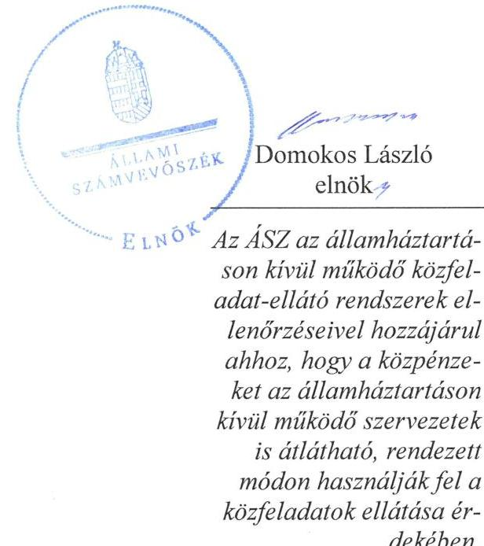
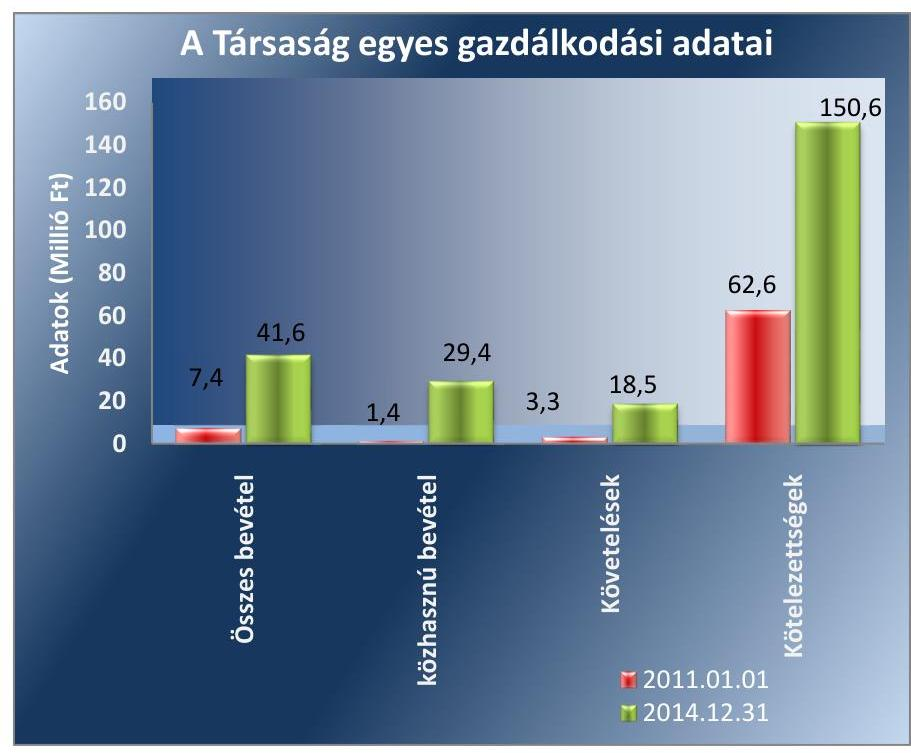

# Jelentés 

## Az önkormányzatok gazdasági társaságai

Az önkormányzatok többségi tulajdonában lévő gazdasági társaságok gazdálkodásának ellenőrzése - Szerdahelyi József Músorszolgáltató Nonprofit Kft. 2017.

Az ÁSZ az államháztartáson kívül müködő közfel-adat-ellátó rendszerek ellenőrzéseivel hozzájárul ahhoz, hogy a közpénzeket az államháztartáson kívül müködő szervezetek is átlátható, rendezett módon használják fel a közfeladatok ellátása érdekében.

---

# Jelentés 

## Az önkormányzatok gazdasági társaságai

Az önkormányzatok többségi tulajdonában lévő gazdasági társaságok gazdálkodásának ellenőrzése - Szerdahelyi József Músorszolgáltató Nonprofit Kft.
2017. juvivo hó 18. nap

---

# AZ ELLENŐRZÉST FELÜGYELTE:

DR. HORVÁTH MARGIT felügyeleti vezető

## AZ ELLENŐRZÉST VEZETTE ÉS A VÉGREHAJTÁSÁÉRT FELELŐS:

- KLINGA LÁSZLÓ ellenőrzésvezető
- A PROGRAM ÖSSZEÁLLÍTÁSÁÉRT FELELŐS:
- JANIK JÓZSEF osztályvezető

IKTATÓSZÁM: V-1089-109/2016.

TÉMASZÁM: 2123

ELLENŐRZÉS-AZONOSÍTÓ SZÁM: V-070753

Jelentéseink az Országgyűlés számítógépes hálózatán és az Interneta a www.asz.hu címen is olvashatóak.

---

# TARTALOMJEGYZÉK 

■ ÖSSZEGZÉS ..... 5
■ AZ ELLENŐRZÉS CÉLJA ..... 7
■ AZ ELLENŐRZÉS TERÜLETE ..... 8
■ AZ ELLENŐRZÉS HÁTTERE, INDOKOLTSÁGA ..... 11
■ A JELENTÉS LÉNYEGES KÉRDÉSKÖREI ..... 12
■ ELLENŐRZÉS HATÓKÖRE ÉS MÓDSZEREI ..... 13
■ MEGÁLLAPÍTÁSOK ..... 15
■ JAVASLATOK ..... 24
■ MELLÉKLETEK ..... 25
I. sz. melléklet: Értelmező szótár ..... 25
II. sz. melléklet: Múködési adatok ..... 28
III. sz. melléklet: Egyes músorszámok aránya a teljes músoridőhöz ..... 29
IV. sz. melléklet: Mintavételi eljárások ellenőrzési területenként ..... 30
■ FÜGGELÉK: ÉSZREVÉTELEK ..... 31
■ RÖVIDÍTÉSEK JEGYZÉKE ..... 33

---

.

---

# ÖSSZEGZÉS 

Hódmezővásárhely Megyei Jogú Város Önkormányzata a müsorszolgáltatás közfeladatának ellátását a jogszabályi előírásoknak megfelelően szervezte meg, és a tulajdonosi jogait összességében szabályszerűen gyakorolta. A tulajdonosi kontroll a belső ellenőrzéseken keresztül is érvényesült. A Szerdahelyi József Müsorszolgáltató Nonprofit Kft. 2011-2014. évi vagyongazdálkodása során nem érvényesültek teljes körüen a belső szabályozások előírásai. A Társaság kötelezettségállománya a müködésre és a közfeladat ellátásra veszélyt jelentett. A müsorszolgáltatás közfeladataihoz kapcsolódó elszámolások összességében megfelelőek voltak.

## Az ellenőrzés társadalmi indokoltsága

Az Állami Számvevőszék kiemelt célja, hogy a helyi önkormányzatok gazdálkodásában rejlő pénzügyi kockázatok feltárásával, az államháztartáson kívülre nyújtott költségvetési támogatások és ingyenes vagyonjuttatások, valamint az államháztartáson kívül múködő feladat-ellátó rendszerek ellenőrzéseivel hozzájárul ahhoz, hogy a közpénzeket az államháztartáson kívül múködő szervezetek is átlátható, rendezett módon használják fel.

Magyarországon az intézmény-centrikus közfeladat-ellátás jellemző, de egyre jelentősebb a költségvetésen kívüli feladatellátás térnyerése. Ennek legfontosabb szereplői - a nonprofit szervezetek mellett - az önkormányzati tulajdonú gazdasági társaságok. Az önkormányzatok szervezetalakítási szabadságának következménye, hogy a korábban is vállalati formában múködő közszolgáltatások mellett, mind a kötelező, mind az önként vállalt feladatok ellátásában a gazdasági társaságok kiemelt fontosságú szerephez jutottak.

## Főbb megállapítások, következtetések, javaslatok

Az Önkormányzat a műsorszolgáltatás közfeladatának megszervezéséről a jogszabályi előírásoknak megfelelően döntött, annak ellátásáról a kizárólagos tulajdonában lévő gazdasági társasága útján gondoskodott. Az Önkormányzat a közfeladat ellátására a Szerdahelyi József Nonprofit Kft.-vel Közhasznú megállapodást kötött. Az Önkormányzat rendeletben, szervezeti és múködési szabályzatban, valamint alapító okiratban meghatározta a tulajdonosi joggyakorlás szabályait, amit összességében szabályszerűen gyakorolt. Az Önkormányzat belső ellenőrzése a Társaságnál a 2011., illetve a 2013-2014. években végzett ellenőrzést, ezzel támogatta a szabályszerű múködés kontrollját.

A közfeladat-ellátását szolgáló vagyonnal való gazdálkodás nem volt teljes körűen szabályszerű. A Szerdahelyi József Nonprofit NKft. a belső szabályzataiban előírt szabályokat nem teljes körűen vette figyelembe a vagyongazdálkodás során. A Társaság rendelkezett a vonatkozó jogszabály előírásainak megfelelő számviteli szabályzatokkal. A Társaság közhasznú tevékenysége mellett egyéb tevékenységet is ellátott, ennek ellenére belső szabályait nem alakította ki oly módon, hogy azok a mérleg és eredménykimutatás alátámasztásán túl a kiegészítő melléklet adatainak alátámasztására is alkalmasak legyenek. Az Önkormányzat a 2011-2014. években tőkepótlásként összességében 179,1 millió Ft pótbefizetést teljesített, illetve a 2013. évben a jegyzett tőke összegét 0,5 millió Ft-ról 3,0 millió Ft-ra megemelte, ezzel eleget tett annak a követelménynek, hogy a Társaság rendelkezzen a formájára előírt jegyzett tőke összegével. Az ellenőrzött időszakban a kötelezettségek állománya a múködésre, a közfeladat ellátásra veszélyt jelentett.

A Szerdahelyi József Nonprofit Kft. az egyszerűsített éves beszámolókat elkészítette, azokat a Közgyűlés szabályszerűen - a könyvvizsgáló és az FB írásbeli jelentésének birtokában - határozattal elfogadta. A 2012. és 2013. évi közhasznúsági mellékletek nem feleltek meg a jogszabályban foglaltaknak, mivel azok tartalma nem volt teljes körű. A Társaság a vonatkozó jogszabályokban előírt közzétételi kötelezettségének a gazdálkodási adatok tekintetében

---

honlapján nem tett eleget, illetve adatvédelmi és adatbiztonsági szabályzatot nem készített, belső adatvédelmi felelőst nem nevezett ki. A Társaságnál a bevételek, valamint a beruházások, felújítások kiadásai és az értékcsökkenési leírás elszámolása megfelelő, az anyagjellegú ráfordítások elszámolása nem megfelelő volt. A közhasznú tevékenység ellátása keretében készített híranyagokra egységes díjszabás érvényesült.

---

# AZ ELLENŐRZÉS CÉLJA 

pozottsága szabályszerű önköltségszámítással.

Az ellenőrzés célja annak értékelése, hogy az Önkormányzat vagyongazdálkodási tevékenysége során szabályszerűen gyakorolta-e tulajdonosi jogait.

Ellenőriztük, hogy a gazdasági társaság szabályozottsága, gazdálkodása és vagyongazdálkodási tevékenysége, bevételeinek és ráfordításainak elszámolása megfelel-e a jogszabályi és tulajdonosi előírásoknak.

Értékeltük továbbá, hogy a gazdasági társaság kötelezettségállománya jelentett-e kockázatot a múködésre, valamint a gazdálkodás átláthatósága és elszámoltathatósága érdekében biztosítva volt-e a szolgáltatás dijának megala-

---

# **AZ ELLENŐRZÉS TERÜLETE**

## **Hódmezővásárhely Megyei Jogú Város Önkormányzata és a kizárólagos tulajdonában lévő Szerdahelyi József Műsorszolgáltató Nonprofit Kft.**

Hódmezővásárhely Városi Tanácsa 1986. január 22-én létrehozta a Városi Televíziót, mint intézményt. A Városi Televízió 1997. január 1-jétől közhasznú társasággá alakult, majd 1998-ban beolvadt a Szerdahelyi József Kulturális, Sport és Szolgáltató Közhasznú Társaságba.

### **HÓDMEZŐVÁSÁRHELY MEGYEI JOGÚ VÁROS ÖNKORMÁNYZATA**

A Szerdahelyi József Kulturális, Sport és Szolgáltató Közhasznú Társaságot 2007. november 8-án nonprofittá alakította, elnevezése Szerdahelyi József Műsorszolgáltató Nonprofit Korlátolt Felelősségű Társaság lett.

A Szerdahelyi József Műsorszolgáltató Nonprofit Korlátolt Felelősségű Társaság Hódmezővásárhely Megyei Jogú Város Önkormányzatának 100%-os tulajdonában állt az ellenőrzött időszakban, jegyzett tőkéje 2011. január 1-jén 0,5 millió Ft, 2014. december 31-én 3,0 millió Ft volt.

### **A SZERDAHELYI JÓZSEF MŰSORSZOLGÁLTATÓ NONPROFIT KORLÁTOLT FELELŐSSÉGŰ TÁRSASÁG**

Főtevékenysége a 2014. január 1-jén 45 207 fő lakosságszámú Hódmezővásárhely közigazgatási területén televízió műsor összeállítása, szolgáltatása volt, mely tevékenység egyben közhasznú (kulturális) tevékenység is. A Társaság egyéb közhasznú tevékenységei voltak továbbá a rádió-műsor-szolgáltatás, a film-, videó-, televízió műsor gyártása, valamint hangfelvétel készítése, kiadása. Az üzletszerű gazdasági tevékenység körébe a reklámügynöki tevékenység és a médiareklám tartozott. A Szerdahelyi József Műsorszolgáltató Nonprofit Korlátolt Felelősségű Társaság 2011-2013 között közel 10 000 lakásban, 2014-ben, a digitális átállást követően közel 23 000 lakásban biztosította a műsorszolgáltatást. Az analóg műsorterjesztésről a digitális műsorszórásra való áttérés jobb képminőséget eredményezett. A Társaság más gazdasági társaságban tulajdoni hányaddal nem rendelkezett, átlagos statisztikai állományi létszáma 2011-ben 17 fő, 2014-ben 15 fő volt.

A Szerdahelyi József Nonprofit Kft. jogelődje és az Országos Rádió és Televízió Testület 1999 márciusában 10 éves időtartamra műsorszolgáltatási szerződést kötött, melyet 2009 februárjában 2011. december 31. napjáig meghosszabbítottak. A Társaság 2011 márciusában a Média tv.1 65. § (10) bekezdése alapján kérelmezte a Médiatanácstól2 új médiaszolgáltatási szerződés megkötését, mivel műsorszolgáltatási jogosultságának lejárata 2011. december 31.-e volt. A Médiatanács 2011. december 28-án a 2012. január 1. és december 31. közötti időszakra, 2012. december 18-án a 2013.

---

január 1. és 2014. december 31. közötti időszakra megkötötte a médiaszolgáltatási szerződést a Szerdahelyi József Nonprofit Kft.-vel.

Az egyes műsorszámok arányát a 2011-2014. években a III. számú melléklet szemlélteti. A legmagasabb arányt ( $71,4 \%$-ot) a közszolgálati célokat szolgáló műsorszámok képviselték. A reklámok sugárzása és a műsorszolgáltatás kapcsán a Társaság által alkalmazott díjak nem változtak a 20112014. években. A képújságos hirdetés díja 9600 Ft + áfa/hó, a képújság sugárzási díja 8000 Ft + áfa/hó, a kampányfilmek sugárzásának díja 10000 Ft + áfa/perc, a képújságban megjelenő hirdetések díja 2000 Ft + áfa/oldal, a reklámfilmek készítési díja 2000 Ft + áfa/munkaóra volt.

A Szerdahelyi József Nonprofit Kft. az Önkormányzattól vagyonkezelésbe, üzemeltetésre nem vett át vagyont, tevékenységét saját eszközeivel látta el.

A Szerdahelyi József Műsorszolgáltató Nonprofit Korlátolt Felelősségű Társaság gazdálkodásának egyes adatait a 2011-2014. évek vonatkozásában az 1. ábra szemlélteti.

1. ábra

Forrás: A Társaság 2011.és 2014. évi beszámolói

A Társaság összes bevétele a 2011.év eleje és a 2014. év vége között közel hatszorosára, ebből a közhasznú tevékenység bevétele huszonegyszeresére emelkedett a Médiaszolgáltatás-támogató és Vagyonkezelő Alaptól a híranyagok szolgáltatásáért kapott bevétel nagyarányú növekedése következtében. A követelések közel hatszorosára, a kötelezettségek több mint kétszeresére nőttek. A Szerdahelyi József Mú́sorszolgáltató Nonprofit Korlátolt Felelősségű Társaság múködésének főbb jellemzőit a II. számú melléklet mutatja be.

Az ellenőrzött időszakban a polgármester személye egy alkalommal változott, a jegyző személye nem változott. A polgármester a 2012. évi időközi választás óta, a jegyző 2001. szeptember 7. napjától látja el feladatait. Az ügyvezető személye három alkalommal változott, a helyszíni ellenőrzés

---

időszakában tisztségét betöltő ügyvezető 2013. szeptember 6-ától végzi feladatát.

A Szerdahelyi József Nonprofit Kft. nem minősült kormányzati alszektorba besorolt társaságnak, illetve egyéb szervezetnek, így az Ávr. ${ }^{3} 7$. számú melléklete 29. pontjában előírt bejelentési és adatszolgáltatási kötelezettsége nem keletkezett.

---

# **AZ ELLENŐRZÉS HÁTTERE, INDOKOLTSÁGA**

*Az önkormányzatok közfeladat-ellátásában egyre jelentősebb a gazdasági társaságok útján történő feladatellátás térnyerése.*

#### **AZ ÖNKORMÁNYZATI TULAJDONÚ GAZDASÁGI TÁRSASÁGOK**

**TÁRSASÁGOK** teljes körű ellenőrzésének lehetőségét az Állami Számvevőszékről szóló 1989. évi XXXVIII. törvény 2011. január 1-jétől hatályos módosítása teremtette meg. Az önkormányzati tulajdonú gazdasági társaságok ellenőrzése kiemelten fontos a vagyon megőrzése, megóvása érdekében, amelyekkel szemben alapvető követelmény, hogy gazdálkodásuk, működésük szabályszerű, az általuk szolgáltatott adatok minél megbízhatóbbak legyenek. A feladat/közfeladat ellátás költségeinek, ráfordításainak alakulása, színvonala hatással van a lakosság elégedettségére.

#### **AZ ELLENŐRZÉS VÁRHATÓ HASZNOSULÁSA-KÉNT**

Az ÁSZ6 a megállapításaival segítséget nyújthat az államháztartáson kívüli közfeladat-ellátás értékeléséhez, jogszabályi keretei pontosításához, átláthatóságot biztosító szabályozásához. Meghatározhatóvá válnak az önkormányzati feladatellátásban részt vevő államháztartáson kívüli szervezeteknek – az önkormányzat költségvetését, pénzügyi helyzetét is befolyásoló – kockázatai, lehetővé válik ezen kockázatok csökkentése. Ellenőrzéseink feltárhatják, hogy az önkormányzat feladat-ellátási kötelezettségének szabályszerűen tett-e eleget, a feladatellátáshoz rendelt vagyonkezelésbe vett és saját vagyon működtetését az elvárható gondossággal, szabályszerűen szervezte-e meg és a tulajdonosi felügyelete hozzájárult-e a feladatellátásához. Értékelhetővé válik, hogy a gazdasági társaság a feladat-ellátási, közszolgáltatási szerződésben foglaltak betartásával, a vagyon használatával biztosította-e a szolgáltatás folytatásának feltételeit. Ezzel az ellenőrzöttek és a helyi döntéshozók számára az ÁSZ visszajelzést ad feladatszervezési, feladat-ellátási kockázataikról, alapot ad a meglévő hibák megszüntetéséhez, a jobb feladat-ellátás biztosításához. Mindezeken keresztül az ÁSZ hozzájárul Magyarország közpénzügyi helyzetének javításához, a közpénzek mérhető módon történő, a döntéshozók által meghatározott célok szerinti felhasználásához.

---

# A JELENTÉS LÉNYEGES KÉRDÉSKÖREI 

1.     - Az önkormányzat közfeladat megszervezéséről szóló döntése, valamint tulajdonosi joggyakorlása szabályszerű volt-e?
2.     - A gazdasági társaság vagyongazdálkodása szabályszerű volt-e, kötelezettségállománya jelentett-e kockázatot a múködésre, illetve a közfeladat ellátásra?
3.     - A gazdasági társaságnál az ellátott közfeladat bevételei és ráfordításai elszámolása, valamint az önköltségszámítás és árképzés szabályszerű volt-e?

---

# ELLENŐRZÉS HATÓKÖRE ÉS MÓDSZEREI 

## Az ellenőrzés típusa

Megfelelőségi ellenőrzés.

## Az ellenőrzött időszak

A 2011. január 1-jétől 2014. december 31-éig terjedő időszak.

## Az ellenőrzés tárgya

A gazdasági társaság feletti tulajdonosi joggyakorlás, valamint a gazdasági társaság gazdálkodásának szabályozottsága és szabályszerűsége.

Az ellenőrzés kiterjed minden olyan körülményre és adatra, amely az ÁSZ jogszabályban meghatározott feladatainak teljesítéséhez, valamint a program végrehajtása folyamán felmerült újabb összefüggések feltárásához szükséges.

## Az ellenőrzött szervezet

Hódmezővásárhely Megyei Jogú Város Önkormányzata és a Szerdahelyi József Músorszolgáltató Nonprofit Kft.

## Az ellenőrzés jogalapja

Az ellenőrzés végrehajtásának jogszabályi alapját az Állami Számvevőszékről szóló 2011. évi LXVI. törvény 1. § (3) bekezdése, valamint 5. § (3)-(4)-(5) bekezdései képezték.

## Az ellenőrzés módszerei

Az ellenőrzést a nemzetközi standardokat irányadónak tekintve az ellenőrzési program ellenőrzési kérdései, az ellenőrzött időszakban hatályos jogszabályok, az ellenőrzés szakmai szabályok és módszertanok figyelembe vételével végeztük.

Az ellenőrzés ideje alatt az ellenőrzött szervezettel történő kapcsolattartást az ÁSZ Szervezeti és Múködési Szabályzatának vonatkozó előírásai alapján biztosítottuk.

Az ellenőrzés a kiválasztott, tulajdonosi jogokat gyakorló önkormányzatra, illetve az ellenőrzésre kijelölt gazdasági társaságra terjedt ki.

---

Az ellenőrzési kérdések megválaszolásához szükséges bizonyítékok megszerzése a következő ellenőrzési eljárások alkalmazásával történt: megfigyelés, kérdésfeltevés (információkérés), összehasonlítás, valamint elemző eljárás. Az ellenőrzési bizonyítékként felhasználható adatforrások közé tartoztak egyrészt a szakmai programban felsorolt adatforrások, másrészt adatforrás lehetett még minden - az ellenőrzés folyamán - feltárt, az ellenőrzés szempontjából információkat tartalmazó dokumentum.

Az ellenőrzést a kérdésekre adott válaszok kiértékelésével, valamint a megjelölt adatforrások, a csatolt tanúsítványok felhasználásával, továbbá az adott időszakban hatályos jogszabályok figyelembe vételével folytattuk le.

A bevételek és ráfordítások elszámolását véletlen mintavétellel, a vagyonnyilvántartás terén a beruházások és felújítások elszámolását teljes körűen ellenőriztük. A mintavétellel ellenőrzött területek esetében minden egyes tétel vonatkozásában a szabályszerűségre vonatkozó kérdéseket tettünk fel, amelyek eredménye összesítésre került. Megfelelőnek értékeltünk egy ellenőrzött területet, amennyiben 95\%-os bizonyossággal a teljes sokaságban a hibaarány legfeljebb 10\%, nem megfelelőnek, amenynyiben 10\%-nál magasabb arányt képviselt. Abban az esetben, ha a teljes sokaság tekintetében a 10\%-os hibaarányhoz való viszony megítélésnek megbízhatósága nem érte el a 95\%-ot, annak elérése érdekében értékelésünket további szempontokkal egészítettük ki, és figyelembe vettük a feltárt hibák típusát és súlyát. A ráfordítások elszámolására vonatkozó véletlen mintavételt kockázati alapú kiválasztással egészítettük ki, amelynek során évente a három legnagyobb összegű tételt választottuk ki. A mintavételi eljárások ellenőrzési területenként történő bemutatását a IV. sz. melléklet tartalmazza.

---

# 1. Az önkormányzat közfeladat megszervezéséről szóló döntése, valamint tulajdonosi joggyakorlása szabályszerű volt-e? 

Összegző megállapítás

Az Önkormányzat a jogszabályok és a helyi szabályozás betartásával szervezte meg a helyi televízió műsorszolgáltatást, a tulajdonosi jogait összességében szabályszerűen gyakorolta.

### 1.1. számú megállapítás

A közfeladat-ellátást az Önkormányzat szabályszerűen szervezte meg, a helyi televízió műsorszolgáltatás biztosítására közhasznú megállapodást kötött.

Hódmezővásárhely hosszú távú gazdaságfejlesztési lehetőségeit és törekvéseit - az Ötv. ${ }^{5}$ 91. § (6) bekezdésében, 2013. január 1-jétől az Mótv. ${ }^{6}$ 116. § (3)-(4) bekezdéseiben foglaltaknak eleget téve - a Gazdaságfejlesztési Stratégiai program tartalmazta, amelyet a 2005-2013. évekre vonatkozóan készítettek el. A felülvizsgálatot követő módosítás megtörtént a 2011. évben, amely megfelelt az Ötv. 91. § (7) bekezdésében előírtaknak. A Gazdaságfejlesztési Stratégiai program a műsorszolgáltatás biztosítására, színvonalának javítására vonatkozó fejlesztési elképzeléseket nem tartalmazott.

## A KULTURÁLIS SZOLGÁLTATÁS BIZTOSÍTÁSA,

ezen belül a helyi közművelődési tevékenység támogatása az Ötv. 8. § (1) bekezdése* alapján az Önkormányzat ${ }^{7}$ törvényi kötelezettsége. A Közgyűlés ${ }^{8}$ az SZMSZ ${ }^{9}$-ben előírta a közszolgáltatások körének kötelező feladatait, így a közművelődési tevékenység ellátásának kötelezettségét, valamint meghatározta azok ellátási módját. Az Önkormányzat szabályszerűen szervezte meg a közművelődési tevékenység ellátásával összefüggő műsorszolgáltatási feladatát, arról közigazgatási területén a kizárólagos tulajdonában álló Szerdahelyi József Nonprofit Kft. ${ }^{10}$ útján gondoskodott. Az Önkormányzat a Társaság ${ }^{11}$ részére a műsorszolgáltatási feladat ellátásához vagyonkezelésbe nem adott át vagyont. A Szerdahelyi József Nonprofit Kft. feladatellátásának kereteit az Alapító Okirat ${ }^{12}$-ban határozták meg. Az Alapító Okirat tartalmazta - többek között - az ellátott közhasznú tevékenységet, azt, hogy a Társaság vállalkozási tevékenységet csak közhasznú céljainak megvalósítása érdekében, azokat nem veszélyeztetve végez.

Az Önkormányzat a 2013. évtől rendelkezett az Nvtv. ${ }^{13}$ 9. § (1) bekezdésében foglalt előírás szerint közép- és hosszú távú vagyongazdálkodási tervvel. A közép- és hosszú távú vagyongazdálkodási terv a műsorszolgáltatással kapcsolatosan terveket nem fogalmazott meg.

[^0]
[^0]:    * A helyi közügyek, valamint a helyben biztosítható közfeladatok körében ellátandó helyi önkormányzati feladatként a kulturális szolgáltatást 2013. január 1-jétől az Mótv. 13. § (1) bekezdés 7. pontja írja elő.

---

Az Önkormányzat a Társaság jogelődjével a 2004. évben - határozatlan időre - Közhasznú megállapodást ${ }^{14}$ kötött. A Közhasznú megállapodás a 2011-2014. években - változatlan tartalommal - érvényben volt.

A KÖZHASZNÚ MEGÁLLAPODÁS alapján a Szerdahelyi József Nonprofit Kft. feladata volt a rádió-televízió műsorszolgáltatás, időszaki kiadvány kiadása, valamint hirdetési tevékenység. A Közhasznú megállapodásban előírták - az éves beszámoló készítésével egyidejűleg - közhasznúsági jelentés készítésének kötelezettségét.

# 1.2. számú megállapítás 

A tulajdonosi jogok gyakorlása összességében szabályszerű volt. Az Önkormányzat belső ellenőrzéseivel elősegítette a Társaság feletti tulajdonosi kontroll érvényesülését.

A TULAJ DONOSI JOGOK gyakorlásának rendjét az Önkormányzat a Vagyonrendeletben, az SZMSZ-ben, valamint az Alapító Okiratban határozta meg. Az Önkormányzatot megillető tulajdonosi jogok gyakorlásával kapcsolatos feladatok és jogosultságok a Közgyűlést illették meg, amelyeket a Vagyonrendeletben meghatározott esetekben a polgármesterre ${ }^{15}$ ruházott át. A Közgyűlés a 2011-2014. évekre felhatalmazta a polgármestert a 10,0 millió Ft értékhatárig terjedő önkormányzati vagyon - az ingatlanvagyont kivéve - értékesítésére, megterhelésére vonatkozó tulajdonosi jogok gyakorlásával. A Szerdahelyi József Nonprofit Kft. vonatkozásában a tulajdonosi jogokat az arra jogosult a Vagyonrendelet, az SZMSZ, illetve az Alapító Okirat előírásai szerint gyakorolta. Szabálytalan hatáskör delegálás nem volt.

AZ ALAPÍTÓ OKIRATBAN - a Gt. ${ }^{16}$ 19. § (5) bekezdésének, illetve a Ptk. ${ }^{17}$ 3:109. §-ában foglaltaknak megfelelően - rögzítették a legfőbb szerv ${ }^{18}$ kizárólagos hatáskörébe tartozó ügyeket, így - többek között - a Számv. tv. ${ }^{19}$ szerinti beszámoló jóváhagyását, az $\mathrm{FB}^{20}$ tagjainak és a könyvvizsgálónak a megválasztását, visszahívását, díjazásának megállapítását, a közhasznú jelentés elfogadását, a törzstőke felemelésének és leszállításának elhatározását, pótbefizetés elrendelését. Az Alapító Okiratban az FB tagjait, a könyvvizsgálót nevesítették, a személyükben bekövetkezett változásokat átvezették.

AZ FB a Gt. 34. § (1) bekezdésében, valamint a Ptk. 3 : 121. § (1) bekezdésében előírtakat figyelembe véve három tagból állt. Az FB a 2011-2014. években rendelkezett a Gt. 34. § (4) bekezdésében, illetve a Ptk. 3 : 122. § (3) bekezdésében előírt ügyrenddel. Az FB az ügyrendben előírt, legalább háromhavonkénti ülés megtartására vonatkozó kötelezettségét teljesítette, továbbá a Gt. 35. § (3) bekezdésének, illetve a Ptk. 3 : 120. § (2) bekezdésének megfelelően minden évben írásbeli jelentést készített a Szerdahelyi József Nonprofit Kft. számviteli beszámolójáról.

A TÁRSASÁG BELSŐ ELLENŐRZÉSÉT az Önkormányzat Polgármesteri hivatalának Belső Ellenőrzési Irodája végezte, a Ber. ${ }^{21}$ 21. § (1)-(2) bekezdéseiben és a Bkr. ${ }^{22}$ 22. § (1) bekezdés b) pontjában előírt kockázatelemzésen alapuló éves ellenőrzési terv alapján. A 2011. évben egy alkalommal, a 2013. évben összesen négy alkalommal, majd a 2014. évben egy alkalommal folytattak le belső ellenőrzést a Társaság gazdálkodásával

---

összefüggésben. Az ellenőrzési jelentések több szabálytalanságot - többek között az ügyvezető személyes felelősségét közeli hozzátartozójával kötött szerződés miatt, a bizonylati fegyelem megsértését, ennek következtében pénztárhiányt, állományba vételi bizonylatok hiányát - tártak fel. A polgármester a Közgyűlés elé terjesztette a belső ellenőrzési tevékenységről szóló beszámolókat, amely azokat határozattal jóváhagyta. Az Önkormányzat belső ellenőrzése hozzájárult a Társaság által elvégzett feladatok szabályszerű teljesítéséhez, a vagyon megóvásához. A feltárt hiányosságok következményeként az ügyvezetőt leváltották.

A Társaság saját tőkéje az ellenőrzött időszakban a törzstőke törvényben meghatározott minimális összege alá csökkent, a vagyona a tartozásait nem fedezte, így a Gt. 143. § (3) bekezdése, illetve a Ptk. 2 3:189. § (2) bekezdése szerinti intézkedés megtétele vált szükségessé. A veszteség rendezésére a Közgyűlés pótbefizetésekről döntött. A 2011-2014. években az Önkormányzat összességében 179,1 millió Ft pótbefizetést teljesített. A 2013. évben az Önkormányzat a jegyzett tőke összegét 2,5 millió Ft-tal (3,0 millió Ft-ra) megemelte, ezzel eleget tett annak a követelménynek, hogy a Társaság rendelkezzen a formájára előírt jegyzett tőke összegével.

# 2. A gazdasági társaság vagyongazdálkodása szabályszerű volt-e, kötelezettségállománya jelentett-e kockázatot a múködésre, illetve a közfeladat ellátásra? 

Összegző megállapítás

A Társaság vagyongazdálkodása teljes körűen nem volt szabályszerű, mivel egyes belső előírásokat nem tartottak be. A kötelezettségállománya a múködésre veszélyt jelentett.
2.1. számú megállapítás

A Társaság az előírt számviteli szabályzatokkal rendelkezett. A javadalmazással összefüggő szabályokat 2013 szeptemberétől határozta meg a Közgyűlés.

AZ ÜZLETI TERV készítésének kötelezettségét az Önkormányzat éves munkaterveiben írta elő. A Társaság az éves üzleti terveket az ellenőrzött időszakban elkészítette, az FB és a Közgyűlés megtárgyalta és határozataiban elfogadta. Az üzleti tervek bevétel-, költség- és pénzforgalmi tervet tartalmaztak. Az üzleti tervekben önkormányzati kölcsönnel számoltak.

A Szerdahelyi József Nonprofit Kft. rendelkezett a Számv. tv. 14. § (3) bekezdésében előírt számviteli politika ${ }^{23}{ }^{24}{ }^{24}$-val, a Számv. tv. 14. § (5) bekezdés a)-d) pontjaiban foglaltaknak megfelelően eszközök és források leltárkészítési és leltározási szabályzat ${ }^{26}{ }_{2}{ }^{27}{ }^{28}$-tal, pénzkezelési szabály$z^{2}{ }_{2}{ }^{29}{ }_{2}{ }^{30}{ }_{3}{ }^{31}$-tal, 2011. szeptember 1-jétől eszközök és források értékelési szabályzat ${ }_{1}{ }^{32}{ }_{2}{ }^{33}$-tal, 2013. szeptember 20-ától önköltségszámítási szabályzattal ${ }^{34}$. Rendelkeztek továbbá a Számv. tv. 161. § (1) bekezdésében előírt számlarend ${ }_{1}{ }^{35}{ }_{2}{ }^{36}$-del, amely a Számv. tv. 161. § (2) bekezdésében előírt tartalmi követelményeknek megfelelt. A számlarendben foglaltakat alátámasztó bizonylati rend ${ }_{1}{ }^{37}{ }_{2}{ }^{38}{ }_{3}{ }^{39}$-ről külön szabályzatot alkottak.

---

A SZÁMVITELI POLITIKA ${ }_{1,2,3}$ a Számv. tv. 14. § (4) bekezdése előírásainak megfelelően tartalmazta - többek között - azokat a Társaságra jellemző szabályokat, előírásokat, módszereket, amelyekkel meghatározták, hogy mit tekintenek a számviteli elszámolás, értékelés szempontjából lényegesnek, jelentősnek, valamint azt, hogy a törvényben biztosított választási, minősítési lehetőségek közül melyeket alkalmazzák. A számviteli politika ${ }_{2,3}$-t a Számv. tv. 14. § (11) bekezdésében foglaltak ellenére 2013. január 1-jétől nem módosították a jelentős összegű hiba értékhatára tekintetében.

# AZ ESZKÖZÖK ÉS FORRÁSOK LELTÁRKÉSZÍTÉSI 

ÉS LELTÁROZÁSI SZABÁLYZAT ${ }_{1,2}$-a tartalmazta a leltározás előkészítésének feladatait, a leltározásért felelős személyeket, a leltározás módját, fordulónapját, azonban nem tartalmazta a Számv. tv. 69. §. (3) bekezdésének 2012. január 1-jétől hatályos változását, amely szerint a leltárba bekerülő adatok valódiságáról mennyiségi nyilvántartás vezetése esetén is legalább háromévente mennyiségi felvétellel, illetve egyeztetéssel kell meggyőződni. Az eszközök és források leltárkészítési és leltározási szabályzat ${ }_{3}$-a már megfelelt a Számv. tv. 69. § (3) bekezdése előírásának. A készletek esetében évenkénti, a tárgyi eszközök esetében kétévenkénti mennyiségi felvétellel történő leltározást írtak elő ${ }^{\dagger}$.

A PÉNZKEZELÉSI SZABÁLYZAT ${ }_{1,2,3}$ a Számv. tv. 14. § (8) bekezdésében előírt tartalmi követelményeknek megfelelt, rendelkezett - többek között - a pénzforgalom lebonyolításának rendjéről, a pénzkezelés személyi és tárgyi feltételeiről, felelősségi szabályairól, a készpénzállomány ellenőrzésekor követendő eljárásról, az ellenőrzés gyakoriságáról.

## AZ ESZKÖZÖK ÉS FORRÁSOK ÉRTÉKELÉSI SZA-

BÁLYZAT ${ }_{1,2}$-a a Számv. tv. 55. § (1)-(2) bekezdésének előírásaival összhangban szabályozta a követelések minősítésének, az értékvesztés elszámolásának szabályait, továbbá összhangban állt a Számv. tv. 57. § (1) bekezdésében foglalt elvekkel.

ÖNKÖLTSÉGSZÁMÍTÁSI SZABÁLYZAT készítésére a Társaság a Számv. tv. 14. § (6) bekezdése alapján nem volt kötelezett, mivel nem érte el a Számv. tv. 14. § (7) bekezdésében meghatározott értékhatárt, azonban - saját döntése alapján 2013. szeptember 20-ai hatállyal elkészítette azt. Az elszámolás módjaként rögzítették, hogy a felmerült költségek számviteli elszámolására az 5. számlaosztályt alkalmazzák.

JAVADALMAZÁSI SZABÁLYZATOT a Társaság legfőbb szerve 2011. január 1. és 2013. szeptember 5. között a Taktv. ${ }^{40}$ 5. § (3) bekezdésében foglaltak ellenére nem alkotott. A Közgyűlés 2013. szeptember 6. napjával megalkotta a Szerdahelyi József Nonprofit Kft. javadalmazási szabályzatát, amely megfelelt az előírásoknak.

[^0]
[^0]:    ${ }^{+}$A Társaság a tárgyi eszközökről és a készletekről folyamatos mennyiségi nyilvántartást vezetett.

---

A Szerdahelyi József Nonprofit Kft. közhasznú tevékenysége mellett vállalkozási tevékenységet is folytatott. A számlatükörben ${ }^{41}$ az egyes tevékenységek bevételeit elkülönítette, a költségek tevékenységenkénti elkülönítését azonban nem írta elő, az éves beszámolás során a költségek felosztása a tevékenységek bevételarányaiban történt.

A Társaság a Számv. tv. 161/A. § (1) és (2) bekezdése előírása ellenére belső szabályait nem alakította ki oly módon, hogy azok a mérleg és eredménykimutatás alátámasztásán túlmenően a kiegészítő melléklet adatainak közvetlen alátámasztására is alkalmasak legyenek, továbbá a közpénzek felhasználásának és a köztulajdon használatának nyilvánossága és ellenőrizhetősége érdekében nem alakított ki olyan részletezettségű nyilvántartási (könyvvezetési) rendszert, melyből a vonatkozó külön jogszabályban meghatározott adatok rendelkezésre álltak.

# 2.2. számú megállapítás 

## A Társaság vagyongazdálkodási tevékenysége teljes körűen nem felelt meg a belső szabályozás előírásainak.

## A SAJÁT VAGYONHOZ KAPCSOLÓDÓ NYILVÁNT

ARTÁSAIT a Társaság nem vezette teljes körűen szabályszerűen a 2011-2014. években. A számviteli politika ${ }_{1,2,3}$-ban foglaltak ellenére a tárgyi eszközök értékcsökkenését az előírt negyedéves gyakoriság helyett évente egy alkalommal számolták el, ez azonban nem volt kihatással az éves beszámolók valódiságára. A bizonylati rend ${ }_{1,2,3}$-ben előírtak ellenére a bizonylatokkal szemben támasztott követelményeket nem minden esetben tartották be, hiányzott a teljesítés igazolása, a kiadási pénztárbizonylatokon az összeg átvevőjének és az utalványozónak az aláírása. Az egyszerűsített éves beszámolók adatait leltárral támasztották alá, a főkönyvi könyvelés és analitikus nyilvántartások közötti egyeztetést a mérleg fordulónapjára vonatkozóan szabályszerűen elvégezték. A tárgyi eszközök esetében 2013-ban végeztek mennyiségi felvétellel történő leltározást, amely a Számv. tv. 2012. január 1-jétől hatályos 69. § (3) bekezdésében foglaltaknak megfelelt.

AZ ESZKÖZÉRTÉK 2011. január 1-jéről 2014. december 31.-ére tizenötszörösére (101,1 millió Ft-tal) emelkedett döntően a tárgyi eszközök állományának növekedése következtében. A Társaságnál a 2014. évben jelentős összegű beruházások történtek, melyek a stúdió kiépítéséhez és felszereléséhez kapcsolódtak. A forgóeszközök közel hatszorosára (18,9 millió Ft-tal) nőttek a követelések állományának növekedése következtében. A források növekedését - jellemzően - a kötelezettségek állományának növekedése eredményezte, mely közel két és félszeresére (88,0 millió Ft-tal) emelkedett a szállítói kötelezettségek, a NAV felé fennálló kötelezettségek, illetve az Önkormányzat felé fennálló kölcsöntartozás emelkedése miatt. A Társaság a 2011-2014. években rendelkezett a fejlesztéseihez kapcsolódóan tulajdonosi hozzájárulással. A 2014. évi üzleti tervben szerepelt a stúdió kialakításának fejlesztése, melyet a Közgyűlés elfogadott ${ }^{3}$ és a beruházáshoz 75,0 millió Ft összegű kölcsön nyújtásáról

[^0]
[^0]:    ${ }^{3}$ A Közgyűlés 519/2013. (XII. 6.) számú határozatával fogadta el a Társaság 2014. évi üzleti tervét.

---

határozott. A beruházáshoz kapcsolódóan közbeszerzés kiírására került sor, melyet az Önkormányzat folytatott le.

# 2.3. számú megállapítás 

A kötelezettségek állománya a közfeladat-ellátásra és a múködésre veszélyt jelentett, a Társaság rövid lejáratú kötelezettségeinek határidőben döntően nem tudott eleget tenni.

A Társaság kötelezettségeinek állománya 2011. január 1. és 2012. december 31. között 82,7\%-kal (51,8 millió Ft-tal) nőtt, majd - az előző évhez képest - a 2013. év végére 48,1\%-kal (55,0 millió Ft-tal) csökkent, a 2014. év végére pedig két és félszeresére ( 91,2 millió Ft-tal) emelkedett. Az Önkormányzat a Szerdahelyi József Nonprofit Kft. részére a 2011. évben 57,0 millió Ft, a 2012. évben 31,5 millió Ft, a 2013. évben 4,7 millió Ft múködési célú, a 2014. évben 54,8 millió Ft múködési célú és 75,0 millió Ft fejlesztési célú kölcsönt nyújtott. A kötelezettségek év végi állománya jelentősen meghaladta a forgóeszközök és a saját tőke összegét.

AZ ELADÓSODOTTSÁGI MUTATÓ értéke kedvezőtlenül alakult, a 2011. évben 11,1, a 2012. évben 4,2, a 2013. évben 1,8, a 2014. évben 1,4 volt, az idegen tőke összes forráson belüli aránya mindegyik évben meghaladta a kritikus 0,6-os értéket. Az eladósodottság mértéke hasonló képet mutatott, a mutató értéke az évek sorrendjében -1,07, -1,25, -1,66 és $-2,84$ volt a negatív összegű saját tőke miatt. Az adósságfedezeti mutató I. értéke szintén kedvezőtlen volt, 1,0 Ft adósságra a 2011. évben 0,06 Ft, a 2012. évben 0,22 Ft, a 2013. évben 0,54 és a 2014. évben 0,72 Ft vagyon jutott. Az árbevételre vetített eladósodottság mértéke a 20112014. években $9,1,3,0,1,4$ és 3,4 volt, tehát az $1,0 \mathrm{Ft}$ nettó árbevételre eső, forgóeszközökkel csökkentett kötelezettség valamennyi évben több volt, mint az árbevétel.

A RÖVID LEJÁRATÚ KÖTELEZETTSÉGEINEK a Társaság határidőben döntően nem tudott eleget tenni, a 2011-2014. években a fizetési határidőn túli, ezen belül a 90 napon túli szállítói kötelezettségek összege folyamatosan emelkedett, az évek sorrendjében 18,8 millió Ft, 21,4 millió Ft, 25,8 millió Ft, illetve 30,9 millió Ft volt. A vissza nem fizetett kölcsönök állománya emelte a kötelezettségek állományát. Az Önkormányzat felé fennálló, kölcsöntartozásból eredő kötelezettség összege a 2011. év végi 38,4 millió Ft-ról a 2014. év végére közel háromszorosára, 112,4 millió Ft-ra emelkedett. A 2011-2014. években hosszú lejáratú kötelezettség nem terhelte a Társaságot. A Szerdahelyi József Nonprofit Kft. kötelezettségállománya a múködésre, a feladatai ellátására veszélyt jelentett.
2.4. számú megállapítás

Az előírt beszámolási, adatszolgáltatási kötelezettséget teljesítették. Adatvédelmi és adatbiztonsági szabályzat készítési kötelezettségüknek nem tettek eleget, belső adatvédelmi felelőst nem neveztek ki. Jogszabályban előírt közzétételi kötelezettségüknek a gazdálkodási adatok tekintetében honlapjukon nem tettek eleget.

A BESZÁMOLÁSI, ADATSZOLGÁLTATÁSI ÉS EGYÉB TÁJÉKOZTATÁSI FELADATOKAT az Alapító

---

Okiratban és a Vagyonrendeletben rögzítették. Az egyszerűsített éves beszámolókat a Szerdahelyi József Nonprofit Kft. a Számv. tv. 19. § (1) bekezdésében előírt tartalommal elkészítette, azokat a Számv. tv. 153. § (1) bekezdésében, valamint 154. § (1) bekezdésében foglaltak szerint letétbe helyezte, illetve közzétette. A Khtv. ${ }^{42} 19 . \S$ (1) bekezdése értelmében a Társaság közhasznúsági jelentés, illetve a Civil tv. ${ }^{43}$ 46. § (1) bekezdése értelmében közhasznúsági melléklet készítésére is kötelezett volt, melyet 2012. január 1-jétől a 350/2011. (XII. 30.) Korm. rendelet ${ }^{44}$ mellékletének megfelelő, erre a célra rendszeresített formanyomtatványon kellett elkészítenie.

A Szerdahelyi József Nonprofit Kft. közhasznúsági jelentés, illetve közhasznúsági melléklet készítési kötelezettségének a 2011-2014. években eleget tett. A 2012. és a 2013. évi közhasznúsági mellékletek azonban nem feleltek meg a 350/2011. (XII. 30.) Korm. rendelet mellékletének, mivel azok nem tartalmazták - többek között - a Társaság azonosító adatait, a tárgyévben végzett alapcél szerinti és közhasznú tevékenységek bemutatását, a cél szerinti juttatásokat, a vezető tisztségviselőknek nyújtott juttatásokat, a vezető tisztségek felsorolását, a közhasznú jogállás megállapításához szükséges mutatókat. A 2014. évi egyszerűsített éves beszámolóhoz közzétett közhasznúsági melléklet a 350/2011. (XII. 30.) Korm. rendelet vonatkozó előírásainak megfelelt.

Az egyszerűsített éves beszámolók elfogadásáról a Közgyűlés a könyvvizsgáló és az FB írásbeli jelentésének birtokában határozott. A könyvvizsgáló az egyszerűsített éves beszámolókat hitelesítő záradékkal látta el, azonban a 2011-2013. évekre vonatkozóan figyelemfelhívással élt a Társaság saját tőkéjének jegyzett tőke alá esése tekintetében. Figyelemfelhívással élt továbbá a 2012. évben a Társaság bizonylati fegyelmével, a 2013. évben a szállítók és a NAV felé fennálló kötelezettségek emelkedésével kapcsolatosan.

A Társaság 2011-ben az Eisztv. ${ }^{45}$ 3. § (2) bekezdésében, illetve 6. § (1) bekezdésében előírt, melléklet szerinti tartalmú, 2012-2014-ben az Info tv. ${ }^{46}$ 33. § (3) bekezdésében, illetve 37. § (1) bekezdésében előírt, az 1. melléklet szerinti tartalmú közzétételi kötelezettségeinek a gazdálkodási adatok tekintetében honlapján ${ }^{5}$ nem tett eleget. A Szerdahelyi József Nonprofit Kft. 2011-ben az Avtv. ${ }^{47}$ 20. § (8) bekezdésében, 2012. január 1. és 2013. szeptember 19. között az Info tv. 30. § (6) bekezdésében előírtakkal ellentétben a közérdekú adatok megismerésére irányuló igények teljesítésének rendjét rögzítő szabályzattal nem rendelkezett. A közérdekű adatszolgáltatások rendjét rögzítő szabályzatot 2013. szeptember 20-án léptették hatályba.

Az Avtv. 31/A. § (2) bekezdés d) pontjában, illetve az Info tv. 24. § (3) bekezdésében előírt adatvédelmi és adatbiztonsági szabályzatkészítési kötelezettségének a Társaság a 2011-2014. évekre vonatkozóan nem tett eleget. Az Avtv. 31/A. § (1) bekezdés c) pontjában, valamint az Info tv. 24. § (1) bekezdés c) pontjában foglaltak ellenére a Társaságnál belső adatvédelmi felelőst nem neveztek ki.

[^0]
[^0]:    ${ }^{5}$ www.vasarhelyitv.hu

---

# 3. A gazdasági társaságnál az ellátott közfeladat bevételei és ráfordításai elszámolása, valamint az önköltségszámítás és árképzés szabályszerű volt-e? 

Összegző megállapítás

A bevételek, valamint a beruházások, felújítások kiadásai és az értékcsökkenés elszámolása megfelelő volt, az anyagjellegú ráfordítások elszámolása nem megfelelő volt.
3.1. számú megállapítás

A bevételek és a beruházások, felújítások kiadásai és az értékcsökkenés elszámolása megfelelő, az anyagjellegú ráfordítások elszámolása nem megfelelő volt.

A Szerdahelyi József Nonprofit Kft. a televízió műsorszolgáltatás közhasznú tevékenysége mellett egyéb tevékenységet is végzett. A számlatükörben előírtak szerint az egyes tevékenységek bevételeit elkülönítették, a költségek, ráfordítások tevékenységenkénti elkülönítése - előírás hiányában nem történt meg, azokat az éves beszámolás során bevételarányosan osztották szét. A Társaság összes bevétele a 2011. év végéről a 2014. év végére közel hatszorosával ( 34,5 millió Ft-tal) emelkedett. A közhasznú tevékenység bevétele a 2011. évben az összes bevétel 16,9\%-át, a 2014. évben $70,7 \%$-át tette ki.

AZ ÉRTÉKESÍTÉS NETTÓ ÁRBEVÉTELE ELSZÁMOLÁSÁNAK szabályszerűsége megfelelő volt. A bevételeket a számlatükörnek megfelelő számlacsoportba számolták el, azokat az egyes feladatokhoz kapcsolódóan elkülönítették.

AZ ANYAGJELLEGŰ RÁFORDÍTÁSOK ELSZÁMOLÁSÁNAK szabályszerűsége nem megfelelő volt. A Társaság nem tett eleget a bizonylati rend ${ }_{1,2,3}$-ben foglaltaknak, mivel a költségek elszámolása tekintetében nem teljesült a teljesítésigazolásra, az utalványozásra vonatkozó belső előírás. A költségeket - szabályszerűen - a Számv. tv. 78. §-ának megfelelő költségnemre számolták el.

A BERUHÁZÁSOK, FELÚJÍTÁSOK KIADÁSAI ÉS AZ ÉRTÉKCSÖKKENÉSI LEÍRÁS ELSZÁMOLÁSÁNAK szabályszerűsége megfelelő volt. A Számv. tv. 92. § (1) bekezdésében foglaltaknak megfelelően az immateriális javak, tárgyi eszközök, valamint a halmozott értékcsökkenés nyitó és záró bruttó értékét, a tárgyévi értékcsökkenési leírás összegét mérlegtételek szerinti bontásban az egyszerűsített éves beszámolók kiegészítő mellékleteiben bemutatták. Terven felüli értékcsökkenést nem számoltak el. A Szerdahelyi József Nonprofit Kft. a 2011-2014. években az évek sorrendjében 0,3 millió Ft, 0,4 millió Ft, 2,3 millió Ft és 14,8 millió Ft, összesen 17,8 millió Ft értékcsökkenést számolt el. A beruházásokra fordított összeg 1,3 millió Ft, 1,4 millió Ft, 0,3 millió Ft és 82,1 millió Ft, összesen 85,1 millió Ft volt. Az eszközpótlás az értékcsökkenésből képzett forrás közel hatszorosát meghaladó mértékben zajlott.

---

# Megállapítások 

A KÖVETELÉSEK ÁLLOMÁNYA a 2011. év eleji 3,3 millió Ft értékről a 2014. év végére közel hatszorosára (15,2 millió Ft-tal) emelkedett. A Társaság az ellenőrzött időszakban egy 1,6 millió Ft összegű éven túli vevőköveteléssel rendelkezett, melyet a vevő minden évben elismert, ezért értékvesztés elszámolás nem történt.

## 3.2. számú megállapítás

A Társaság önköltségszámítási szabályzat készítésére nem volt kötelezett, a közhasznú tevékenység ellátása keretében készített híranyagokra egységes díjszabás érvényesült.

ÖNKÖLTSÉGSZÁMÍTÁSI SZABÁLYZAT készítésére a Társaság nem volt kötelezett, azt saját döntése alapján készítette el 2013 szeptemberében. Az önköltségszámítási szabályzat általánosságban mutatta be az önköltségszámítás módszereit, az egyes tevékenységek önköltsége megállapításának szabályait nem tartalmazta, így az a mérleg és eredménykimutatás alátámasztásán túlmenően a kiegészítő melléklet adatainak közvetlen alátámasztására nem volt alkalmas.

Árképzéssel kapcsolatos tulajdonosi elvárás, ágazati előírás nem volt a 2011-2014. években a Szerdahelyi József Nonprofit Kft. felé. A Társaság a közhasznú tevékenységének ellátása keretében híranyagokat készített az MTVA ${ }^{48}$ részére, amely egységes, településmérettől függő díjszabást alkalmazott a Társaság felé, 2,0 millió Ft/hó átalánydíj összegben.

A Szerdahelyi József Nonprofit Kft. által alkalmazott díjak 2013 szeptemberétől önköltségszámítással nem voltak megalapozva.

---

# JAVASLATOK 

Az ÁSZ tv. 33. § (1) bekezdésében foglaltak értelmében az ellenőrzött szervezet vezetője köteles a jelentésben foglalt megállapításokhoz kapcsolódó intézkedési tervet összeállítani és azt a jelentés kézhezvételétől számított 30 napon belül az ÁSZ részére megküldeni. Amennyiben az ellenőrzött szervezet vezetője nem küldi meg határidőben az intézkedési tervet, vagy továbbra sem elfogadható intézkedési tervet küld, az Állami Számvevőszék elnöke az ÁSZ tv. 33. § (3) bekezdése a) és b) pontjaiban foglaltakat érvényesítheti.
Javaslataink célja a Szerdahelyi József Nonprofit Kft. gazdálkodása szabályszerűségének és gyakorlatának javítása annak érdekében, hogy a szabályozási környezet és az alkalmazott gyakorlat megfelelően tudja támogatni az átlátható múködést.

## Szerdahelyi József Nonprofit Kft. ügyvezetőjének

1. Intézkedjen a hatályban lévő számviteli politika módosításáról a jelentős összegű hiba értékhatára tekintetében.
(2.1. megállapítás 3. bekezdése alapján)
2. Intézkedjen a Társaság honlapján a gazdálkodási adatok közzétételéről.
(2.4. sz. megállapítás 4. bekezdése alapján)
3. Intézkedjen az adatvédelmi és adatbiztonsági szabályzat elkészítéséről, továbbá a belső adatvédelmi felelős kijelöléséről.
(2.4. sz. megállapítás 5. bekezdése alapján)
4. Intézkedjen a Társaság bizonylati rendjében foglaltak betartásáról a költségek elszámolásánál a teljesítés igazolása és az utalványozás tekintetében.
(3.1. sz. megállapítás 3. bekezdés első két mondata alapján)

---

# MELLÉKLETEK 

## I. SZ. MELLÉKLET: ÉRTELMEZŐ SZÓTÁR

eladósodottságot jellemző mutatók
eladósodottsági mutató (tőkeáttétel): idegen tőke/összes forrás.
Egészségesnek mondható egy olyan mértékű áttétel, amelyet az üzleti tervek szerint és az elmúlt időszak tapasztalatai alapján a társaság megfelelő biztonsággal ki tud termelni. Nagy eszközberuházás-igényű iparágakban értéke magasabb, azaz magasabb eladósodottság is elfogadható, de 75-85\%-ot meghaladó értéknél már itt is erős, sőt túlzott külső finanszírozottságról beszélhetünk. Általánosságban véve kedvező, ha értéke kisebb, mint 0,6 .
eladósodottság mértéke: kötelezettségek / saját tőke.
Fontos szerepet játszik ez a mutató egy vállalat megítélésében. Azt mutatja, hogy a saját források a kötelezettségek hány százalékát fedezik. Törekedni kell, hogy a mutató tartósan (jelentősen) 1 alatti értéket érjen el.
nettó eladósodottság: (kötelezettségek-követelések) / saját tőke.
Azt mutatja, hogy a kintlévőségekkel csökkentett kötelezettségeket milyen mértékben fedezi a saját forrás. Ez feltételezi, hogy a követelések pénzügyileg előbb realizálódnak, mint ahogy a kötelezettségeket teljesíteni kell. A mutató minél kisebb, csökkenő értéke a kedvező.
adósságfedezeti mutató I.: (befektetett eszközök+forgó eszközök) / idegen forrás.
Azt mutatja, hogy 1 Ft adósságra hány Ft vagyon jut. Általánosságban véve kedvező, ha értéke 2 körül van, de nagy eszközberuházás-igényű iparágakban értéke kisebb is lehet.
adósságfedezeti mutató II.: működési cash flow / hosszú lejáratú kötelezettségek.
A mutató azt jelzi, hogy az adott gazdálkodási időszak működési pénzáramainak eredményeként realizált cash flow révén a vállalkozás mennyiben lenne képes valamenynyi hosszú lejáratú kötelezettségének eleget tenni. Ennek vizsgálatára viszonylag ritkán kerül sor, az elsősorban a veszélyhelyzetbe került vállalkozások esetében lehet érdekes. Általánosságban véve kedvező, ha a működési cash flow minél nagyobb arányban nyújt fedezetet a hosszú lejáratú kötelezettségre (értéke nagyobb, mint 1, nő az ellenőrzött időszakban).
árbevételre vetített eladósodottság: (kötelezettségek - forgóeszközök) / értékesítés nettó árbevétele.
Az árbevételre vetített eladósodottság azt mutatja, hogy az árbevétel mekkora fedezetet nyújt a kötelezettségeknek a forgóeszközökkel csökkentett részére. Általánosságban véve kedvező, ha az árbevétel minél nagyobb arányban nyújt fedezetet a forgóeszközökkel csökkentett kötelezettségekre (értéke kisebb, mint 1, csökken az ellenőrzött időszakban).
garancia
gazdasági társaság

A garancia olyan önálló, az önkormányzat nevében vállalt kötelezettség, amely alapján az önkormányzat az önkormányzati költségvetés terhére szerződésben meghatározott feltételek szerint, a kötelezett nem teljesítése esetén a jogosultnak fizetést teljesít az előzetesen rögzített összeghatárig.
Ptk. 3.88. § (1) bekezdése szerint „a gazdasági társaságok üzletszerű közös gazdasági tevékenység folytatására, a tagok vagyoni hozzájárulásával létrehozott, jogi személyiséggel rendelkező vállalkozások, amelyekben a tagok a nyereségből közösen részesednek, és a veszteséget közösen viselik".

---

gazdálkodó szervezet
kezesség
közfeladat
közhasznú tevékenység
nemzeti vagyon

A Ptk. ${ }^{49}$ 685. § c) pontja szerint gazdálkodó szervezet:
„az állami vállalat, az egyéb állami gazdálkodó szerv, a szövetkezet, a lakásszövetkezet, az európai szövetkezet, a gazdasági társaság, az európai részvénytársaság, az egyesülés, az európai gazdasági egyesülés, az európai területi együttmúködési csoportosulás, az egyes jogi személyek vállalata, a leányvállalat, a vízgazdálkodási társulat, az erdő birtokossági társulat, a végrehajtói iroda, az egyéni cég, továbbá az egyéni vállalkozó." (hatályos: 2014. március 15-éig) A Hgt. 2 2. § (1) bekezdés 15. pontja szerint „a polgári perrendtartásról szóló törvényben meghatározott gazdálkodó szervezet, ide nem értve azt a költségvetési szervet, amelyet az államháztartásról szóló törvény szerint közfeladat ellátására hoztak létre." (hatályos: 2014. március 15-étől)
A kezességre vonatkozó előírásokat a Ptk. 2 6:416-430. §-ai tartalmazzák. Kezességi szerződéssel a kezes kötelezettséget vállal a jogosulttal szemben, hogyha a kötelezett nem teljesít, maga fog helyette a jogosultnak teljesíteni. Kezesség egy vagy több, fennálló vagy jövőbeli, feltétlen vagy feltételes, meghatározott vagy meghatározható összegű pénzkövetelés vagy pénzben kifejezhető értékkel rendelkező egyéb kötelezettség biztosítására vállalható.
A Ptk. 1 szerint kezességet csak írásban lehet vállalni. A kezes kötelezettsége ahhoz a kötelezettséghez igazodik, amelyért kezességet vállalt. A kezes kötelezettsége nem válhat terhesebbé, mint amilyen elvállalásakor volt, kiterjed azonban a kötelezett szerződésszegésének jogkövetkezményeire és a kezesség elvállalása után esedékessé váló mellékkövetelésekre is.
Jogszabályban meghatározott állami vagy önkormányzati feladat, amit az arra kötelezett közérdekből, jogszabályban meghatározott követelményeknek és feltételeknek megfelelve végez, ideértve a lakosság közszolgáltatásokkal való ellátását, továbbá az állam nemzetközi szerződésekben vállalt kötelezettségeiből adódó közérdekű feladatokat, valamint e feladatok ellátásához szükséges infrastruktúra biztosítását is (Nvtv. ${ }^{50}$ 3. § (1) bekezdés 7. pont).
A Civil tv. 2. § 20. pontja szerint „minden olyan tevékenység, amely a létesítő okiratban megjelölt közfeladat teljesítését közvetlenül vagy közvetve szolgálja, ezzel hozzájárulva a társadalom és az egyén közös szükségleteinek kielégítéséhez."
Az Nvtv. 1. § (2) bekezdése szerint:
„az állam vagy a helyi önkormányzat kizárólagos tulajdonában álló dolgok, az a) pont hatálya alá nem tartozó, állam vagy a helyi önkormányzat tulajdonában lévő dolog,
az állam vagy a helyi önkormányzatot tulajdonában lévő pénzügyi eszközök, továbbá az államot vagy a helyi önkormányzatot megillető társasági részesedések,
az államot vagy a helyi önkormányzatot megillető bármely vagyoni értékkel rendelkező jogosultság, amelyet jogszabály vagyoni értékű jogként nevesít,
Magyarország határa által körbezárt terület feletti légtér,
az üvegházhatású gázok kibocsátási egységeinek kereskedelméről szóló törvény szerint kibocsátási egység és légiközlekedési kibocsátási egység, valamint az ENSZ Éghajlat változási Keretegyezménye és annak Kiotói Jegyzőkönyve végrehajtási keretrendszeréről szóló törvény szerinti kiotói egység,
állami vagy helyi önkormányzati fenntartású közgyűjtemény (muzeális intézmény, levéltár, közgyűjteményként működő kép- és hangarchívum, valamint könyvtár) saját gyűjteményében nyilvántartott kulturális javak körébe tartozó dolog,
a régészeti lelet,
a nemzeti adatvagyon körébe tartozó állami nyilvántartások fokozottabb védelméről szóló törvény szerinti nemzeti adatvagyon." (hatályos 2012. január 1-jétől, g) pont módosult 2012. június 30-ától)

---

nonprofit gazdasági társaság A Ctv. ${ }^{51}$ 9/F. § (2) bekezdése szerint „az a gazdasági társaság minősül nonprofit gazdasági társaságnak és cégnevében az a gazdasági társaság tüntetheti fel a nonprofit jelleget, amelynek létesítő okirata tartalmazza, hogy a gazdasági társaság tevékenységéből származó nyereség a tagok között nem osztható fel, hanem az a gazdasági társaság vagyonát gyarapítja." (hatályos 2014. március 15-étől)
többségi befolyást biztosító A Ptk. 2 8:2. § (1) bekezdése szerint „többségi befolyás az olyan kapcsolat, amelynek részesedés révén természetes személy vagy jogi személy (befolyással rendelkező) egy jogi személyben a szavazatok több mint felével vagy meghatározó befolyással rendelkezik." tulajdonosi joggyakorló Aki a nemzeti vagyon felett az államot vagy a helyi önkormányzatot megillető tulajdonosi jogok és kötelezettségek összességének gyakorlására jogosult. (Nvtv. 3. § (1) bekezdés 17. pont).

---

II. SZ. MELLÉKLET: MŰKÖDÉSI ADATOK

| A SZERDAHELYI JÓZSEF NONPROFIT KFT. MŰKÖDÉSÉNEK FŐBB JELLEMZŐI (EZER FT / \%) |  |  |  |  |  |  |
| :--: | :--: | :--: | :--: | :--: | :--: | :--: |
| Sorszám | Megnevezés |  | 2011. | 2012. | 2013. | 2014. |
| 1. | A gazdasági társaság tulajdonosi összetétele: |  |  |  |  |  |
| 2. | Önkormányzat megnevezése: |  | Hódmezővásárhely Megyei Jogú Város Önkormányzata |  |  |  |
| 3. | Önkormányzat tulajdoni részesedésének aránya \% |  | 100,0 |  |  |  |
| 4. | Önkormányzat tulajdoni részesedésének összege ezer Ft |  | 500 | 500 | 3000 | 3000 |
| 5. | A gazdasági társaság müködése a vizsgált évek során meg-szűnt-e? (IGEN/NEM) |  | NEM |  |  |  |
| 6. | A tárgyévben a gazdasági társaság saját vagyona után elszámolt értékcsökkenés összege | ezer Ft | 273 | 435 | 2345 | 14828 |
| 7. | A tárgyévben a saját tulajdonú eszközök pótlására (karbantartás, felújítás, beruházás) elszámolt költség | eze | 1292 | 1417 | 328 | 82122 |
| 8. | Értékesítés nettó árbevétele | eze | 6870 | 31774 | 32855 | 37182 |

---

# III. SZ. MELLÉKLET: EGYES MŰSORSZÁMOK ARÁNYA A TELJES MŰSORIDŐHÖZ 

## Az egyes műsorszámok aránya a teljes műsoridőhöz (heti arány \%)   4,0   7,3   71,5

- Médiatv. 83. §-ában foglalt közszolgálati célokat szolgáló műsorszámok
- Helyi közélettel foglalkozó, a helyi mindennapi életet segítő műsorszámok
- Napi rendszeres híradásra szánt műsorszámok
- A nemzeti és etnikai vagy más kisebbségek igényeinek szolgálatára szánt műsorszámok

---

| Ssz. | Mintavétel-   lel ellenőr-   zendő terü-   letek | Főbb kérdés | Ellenőrzési kérdések | Adatforrások | Sokaság | Mintavételi eljárás |
| :--: | :--: | :--: | :--: | :--: | :--: | :--: |
|  | 1. | 2. | 3. | 4. | 5. | 6. |
| 1. | A gazdasági társaság ráfordításainak szabályszerű elszámolása területén |  |  |  |  |  |
| 2. | Anyagjellegú ráfordítások | Az anyagjellegú ráfordítások elszámolása szabályszerű volt-e? | - Amennyiben az írásbeli kötelezettségvállalás előírás volt, a költségelszámolást megalapozó szerződés, megrendelés rendelkezésre állt-e?   - Rendelkezésre áll a tulajdonosi jóváhagyás, amennyiben ezt belső szabályozás előírja?   - A vagyonkezelésbe vett vagyonhoz, illetve jogszabályban előírt feladatokhoz kapcsolódó ráfordításokat elkülönítetten számolták-e el?   - A ráfordítás elszámolását alátámasztotta-e megfelelő számviteli bizonylat?   - A megfelelő főkönyvi számlákra számolták el a ráfordítást? | Az anyagjellegú ráfordítások közül vett minta esetében - a költségelszámolást megalapozó dokumentumok (szerződések, megrendelések, stb.), költségelszámoláshoz benyújtott számlák, teljesítés megtörténtét alátámasztó egyéb dokumentumok, - analitikus nyilvántartások, anyagok nyilvántartásba vételét igazoló dokumentumok, ha a számviteli politika szerint nyilvántartásba kell venni azokat. | A gazdasági társaság-   nál a közfeladatai, ha   közfeladata nincs, ak-   kor az egyéb feladatai   (gyakorlatilag a teljes   feladatellátása) vonat-   kozásában, éves bon-   tásban a főkönyvi   adatbázisból az Anyag-   jellegú ráfordítások   számlacsoportba a tar-   tozó ráfordítások, ki-   véve az ELÁBÉ és az el-   adott (közvetített)   szolgáltatások értéke.   Kiszürendők a techno-   lógiai leírás 7 . pontjá-   ban jelzett tételek | A mintavételt megelőzően a sokaságból ki kell emelni - tételes ellenőrzésre - évente a 3-3 legnagyobb összegű tételt.   Véletlen mintavétel évenként elemszámmal arányos rétegzéssel. |
| 3. | Vagyonnyilvántartások és értékcsökkenési leírás | Az előírásoknak megfelelően vezet-   ték-e az üzemelte-   tett, kezelésbe vett és saját vagyonhoz kapcsolódó nyilvántartásokat?   A jogszabályok, belső szabályozás szerint történt-e az értékcsökkenési leírás elszámolása? | - A költségelszámolást megalapozó dokumentum (szerződés, megrendelés, stb.) megfelelte az elöírásoknak, továbbá be lett kérve a tulajdonosi jogok gyakorlójának előzetes, írásbeli engedélye - amennyiben elöírták - az önkormányzati tulajdonban lévő eszközön elszámolt beruházáshoz/felújításhoz?   - a beruházások, felújítások, egyéb vagyongyarapodás állományba vétele, besorolása, a bekerülési érték meghatározása, az üzembehelyezések dokumentálása megfelelt-e az Számv.tv., a számviteli politika, illetve az értékelési szabályzat elöírásainak?   - az ellenőrzésre kiválasztott immateriális javak és tárgyi eszközök szerepelnek a mérleget alátámasztó leltárban?   - az értékcsökkenés elszámolása a jogszabályban és a számviteli politikában meghatározott szabályozásnak megfelelt$e ?$ | A kiválasztott üzembehelyezett, aktivált beruházásra, felújításra, egyéb állománynövekedésre: szerződések, számlák, átadásátvételi jegyzőkönyvek, a befejezetlen beruházások, felújítások analitikus nyilvántartása, immateriális javak, tárgyi eszközök analitikus nyilvántartása, a beszerzett eszköz üzembehelyezési okmánya, állományba vételi bizonylata, egyedi eszköznyilvántartó kartonja - az értékcsökkenés elszámolása az egyedi eszköznyilvántartó kartonja, illetve analitikus nyilvántartása | A gazdasági társaságnál a közfeladatai, ha közfeladata nincs, akkor az egyéb feladatai (gyakorlatilag a teljes feladatellátása) vonatkozásában, éves bon- tásban az immateriális javak, a tárgyi eszközök állománynövekedési tételei, amelyek összegének meg kell egyeznie a kiegészítő mellékletben az immateriális javak, a tárgyi eszközök növekedéseként bemutatott értékkel | A mintavételt megelőzően a sokaságból ki kell emelni - tételes ellenőrzésre - évente a 3-3 legnagyobb összegű tételt.   Véletlen mintavétel évenkénti, elemszámmal arányos rétegzéssel. Kiválasztott tételek eszközkartonjának téte-   les ellenőrzése, különös figyelemmel az értékcsökkenés elszámolására |
| 4. | A gazdasági társaság bevételeinek szabályszerű elszámolása területén |  |  |  |  |  |
| 5. | Értékesítés nettó árbevétel | Az értékesítés nettó árbevétele elszámolása szabályszerű volt-e? | - a bevétel kiszámlázása a belső szabályozásnak megfelelően történt-e?   - a befolyt bevétel nyilvántartásba vétele (analitika, főkönyv) megtörtént-e, azokat a feladat-ellátással kapcsolatosan elkülönítették-e?   - a bevételek beszedése, elszámolása során betartották-e a szabályozásban foglaltakat és a megfelelő számlacsoportba számolták el a bevételt?   - a tulajdonosi követelményeknek, belső szabályozásnak megfelelő árat alkalmaz-ták-e? | A kiválasztott értékesítés nettó árbevétel jogcímen befolyt bevételre:   - az egyes bevételek díjmegálapítása,   - a kibocsátott számla, befolyt bevétel analitikus nyilvántartása, behajtásra tett intézkedések dokumentumai, - kapcsolódó főkönyvi számlá tételes forgalma, - bevétel beérkezését igazoló banki kivonat (rész). | A gazdasági társaságnál a közfeladatai, ha közfeladata nincs, akkor az egyéb feladatai (gyakorlatilag a teljes feladatellátása) vonatkozásában, éves bon- tásban a főkönyvi adatbázisból a nettó árbevétel számlacsoportok bevételei | Véletlen mintavétel évenkénti, elemszámmal arányos rétegzéssel. |

---

# FÜGGELÉK: ÉSZREVÉTELEK 

A jelentéstervezetet a Számvevőszék 15 napos észrevételezésre megküldte az ellenőrzött szervezetek vezetőinek az ÁSZ tv. 29. §** (1) bekezdése előírásának megfelelően.
Az ellenőrzöttek a rendelkezésükre álló határidőn belül észrevételt nem tettek.

** 29. § (1) Az Állami Számvevőszék az ellenőrzési megállapításait megküldi az ellenőrzött szervezet vezetőjének vagy az általa megbízott személynek, és annak, akinek személyes felelősségét állapította meg.
(2) Az ellenőrzött szervezet vezetője és a felelősként megjelölt személy az ellenőrzés megállapításaira tizenöt napon belül írásban észrevételt tehet.
(3) Az Állami Számvevőszék az észrevételre a beérkezésétől számított harminc napon belül írásban válaszol. A figyelembe nem vett észrevételeket köteles a jelentésben feltüntetni, és megindokolni, hogy azokat miért nem fogadta el.

---

.

---

# RÖVIDÍTÉSEK JEGYZÉKE 

${ }^{1}$ Média tv.
${ }^{2}$ Médiatanács
${ }^{3}$ Ávr.
${ }^{4}$ ÁSZ
${ }^{5}$ Ötv.
${ }^{6}$ Mótv.
${ }^{7}$ Önkormányzat
${ }^{8}$ Közgyűlés
${ }^{9}$ SZMSZ
${ }^{10}$ Szerdahelyi József Nonprofit Kft.
${ }^{11}$ Társaság
${ }^{12}$ Alapító Okirat
${ }^{13}$ Nvtv.
${ }^{14}$ Közhasznú megállapodás
${ }^{15}$ polgármester
${ }^{16} \mathrm{Gt}$.
${ }^{17}$ Ptk. 2
${ }^{18}$ legfőbb szerv
${ }^{19}$ Számv. tv.
${ }^{20} \mathrm{FB}$
${ }^{21}$ Ber.
${ }^{22}$ Bkr.
${ }^{23}$ számviteli politika $_{1}$
${ }^{24}$ számviteli politika $_{2}$
${ }^{25}$ számviteli politika $_{3}$
a médiaszolgáltatásokról és tömegkommunikációról szóló 2010. évi CLXXXV. törvény
Nemzeti Média- és Hírközlési Hatóság Médiatanácsa
az államháztartási törvény végrehajtásáról szóló 368/2011. (XII. 31.) Korm. rendelet (hatályos: 2012. január 1-jétől)
Állami Számvevőszék
a helyi önkormányzatokról szóló 1990. évi LXV. törvény (hatálytalan 2014. október 12-étől)
Magyarország helyi önkormányzatairól szóló 2011. évi CLXXXIX. törvény
Hódmezővásárhely Megyei Jogú Város Önkormányzata
Hódmezővásárhely Megyei Jogú Város Önkormányzatának Közgyűlése
a Közgyűlés 3/2011. (II. 8.) számú rendelete Hódmezővásárhely Megyei Jogú Város Önkormányzatának és Szerveinek Szervezeti és Működési Szabályzatáról
Szerdahelyi József Músorszolgáltató Nonprofit Korlátolt Felelősségű Társaság
Szerdahelyi József Nonprofit Kft.
a Szerdahelyi József Nonprofit Kft. Alapító Okirata és módosításai
a nemzeti vagyonról szóló 2011. évi CXCVI. törvény (hatályos: 2011. december 31-étől)
Hódmezővásárhely Megyei Jogú Város Önkormányzata és a Szerdahelyi József Kulturális, Sport és Szolgáltató Közhasznú Társaság között 2004. november 4-én létrejött Közhasznú megállapodás, melyet a Közgyűlés a 671/2004. XI. 4.) számú határozatával fogadott el
Hódmezővásárhely Megyei Jogú Város Önkormányzatának polgármestere
a gazdasági társaságokról szóló 2006. évi IV. törvény (hatálytalan: 2014. március 15-étől)
a Polgári Törvénykönyvről szóló 2013. évi V. törvény (hatályos: 2014. március 15-étől)
a Szerdahelyi József Nonprofit Kft. legfőbb szerve, a Közgyűlés
a számvitelről szóló 2000. évi C. törvény
a Szerdahelyi József Nonprofit Kft. felügyelő bizottsága
a költségvetési szervek belső ellenőrzéséről szóló 193/2003. (XI. 26.) Korm. rendelet
a költségvetési szervek belső kontrollrendszeréről és belső ellenőrzéséről szóló 370/2011. (XII. 31.) számú Korm. rendelet
a Szerdahelyi József Nonprofit Kft. számviteli politikája és módosításai (hatályos: 2008. május 8-ától)
a Szerdahelyi József Nonprofit Kft. számviteli politikája (hatályos: 2011. szeptember 1-jétől)
a Szerdahelyi József Nonprofit Kft. számviteli politikája (hatályos: 2013. augusztus 1-jétől)

---

${ }^{26}$ eszközök és források leltárkészítési és leltározási szabályzata ${ }_{1}$
${ }^{27}$ eszközök és források leltárkészítési és leltározási szabályzata ${ }_{2}$
${ }^{28}$ eszközök és források leltárkészítési és leltározási szabályzata ${ }_{3}$
${ }^{29}$ pénzkezelési szabályzat ${ }_{1}$
${ }^{30}$ pénzkezelési szabályzat ${ }_{2}$
${ }^{31}$ pénzkezelési szabályzat ${ }_{3}$
${ }^{32}$ eszközök és források értékelési szabályzata ${ }_{1}$
${ }^{33}$ eszközök és források értékelési szabályzata ${ }_{2}$
${ }^{34}$ önköltségszámítási szabályzat
${ }^{35}$ számlarend $_{1}$
${ }^{36}$ számlarend $_{2}$
${ }^{37}$ bizonylati rend $_{1}$
${ }^{38}$ bizonylati rend $_{2}$
${ }^{39}$ bizonylati rend $_{3}$
${ }^{40}$ Taktv.
${ }^{41}$ számlatükör
${ }^{42}$ Khtv.
${ }^{43}$ Civil tv.
${ }^{44}$ 350/2011. (XII. 30.) Korm. rendelet
${ }^{45}$ Eisztv.
${ }^{46}$ Info tv.
${ }^{47}$ Avtv.
${ }^{48}$ MTVA
a Szerdahelyi József Nonprofit Kft. eszközök és források leltárkészítési és leltározási szabályzata (hatályos: 2009. december 30-ától)
a Szerdahelyi József Nonprofit Kft. eszközök és források leltárkészítési és leltározási szabályzata (hatályos: 2011. szeptember 1-jétől)
a Szerdahelyi József Nonprofit Kft. eszközök és források leltárkészítési és leltározási szabályzata (hatályos: 2013. augusztus 1-jétől)
a Szerdahelyi József Nonprofit Kft. házipénztár kezelési szabályzata és módosításai (hatályos: 2004. július 1-jétől)
a Szerdahelyi József Nonprofit Kft. házipénztár kezelési szabályzata és módosításai (hatályos: 2011. szeptember 1-jétől)
a Szerdahelyi József Nonprofit Kft. házipénztár kezelési szabályzata és módosításai (hatályos: 2013. augusztus 1-jétől)
a Szerdahelyi József Nonprofit Kft. házipénztár kezelési szabályzata és módosításai (hatályos: 2011. szeptember 1-jétől)
a Szerdahelyi József Nonprofit Kft. eszközök és források értékelési szabályzata (hatályos: 2011. szeptember 1-jétől)
a Szerdahelyi József Nonprofit Kft. eszközök és források értékelési szabályzata (hatályos: 2013. augusztus 1-jétől)
a Szerdahelyi József Nonprofit Kft. önköltségszámítási szabályzata (hatályos: 2013. szeptember 20-ától)
a Szerdahelyi József Nonprofit Kft. számlarendje (hatályos: 2011. szeptember 1-jétől)
a Szerdahelyi József Nonprofit Kft. számlarendje (hatályos: 2013. augusztus 1-jétől)
a Szerdahelyi József Nonprofit Kft. bizonylati rendje (hatályos: 2008. május 8-ától)
a Szerdahelyi József Nonprofit Kft. bizonylati rendje (hatályos: 2011. szeptember 1-jétől)
a Szerdahelyi József Nonprofit Kft. bizonylati rendje (hatályos: 2013. augusztus 1-jétől)
a köztulajdonban álló gazdasági társaságok takarékosabb múködéséről szóló 2009. évi CXXII. törvény (hatályos: 2009. december 4-étől)
a Szerdahelyi József Nonprofit Kft. 2011-2014. években hatályban lévő számlatükre
a közhasznú szervezetekről szóló CLVI. törvény (hatálytalan: 2012. január 1-jétől)
az egyesülési jogról, a közhasznú jogállásról, valamint a civil szervezetek múködéséről és támogatásáról szóló 2011. évi CLXXV. törvény (hatályos: a (2)-(4) bekezdésben foglalt kivételekkel - 2011. december 22-étől)
a civil szervezetek gazdálkodása, az adománygyűjtés és a közhasznúság egyes kérdéseiről (hatályos: 2012. január 1-jétől)
az elektronikus információszabadságról szóló 2005. évi XC. törvény (hatálytalan: 2012. január 1-jétől)
az információs önrendelkezési jogról és az információszabadságról szóló 2011. évi CXII. törvény (hatályos: 2012. január 1-jétől)
a személyes adatok védelméről és a közérdekú adatok nyilvánosságáról szóló 1992. évi LXIII. törvény (hatályos: 2011. december 31-éig)
Médiaszolgáltatás-támogató és Vagyonkezelő Alap

---

${ }^{49}$ Ptk. 1
${ }^{50}$ Nvtv.
${ }^{51}$ Ctv.
a Polgári Törvénykönyvről szóló 1959. évi IV. törvény (hatálytalan: 2014. március 15-étől)
a nemzeti vagyonról szóló 2011. évi CXCVI. törvény (hatályos: 2011. december 31-étől)
a cégnyilvánosságról, a bírósági cégeljárásról és a végelszámolásról szóló 2006. évi V. törvény (hatályos: 2006. július 1-jétől)

---

# ÁLLAMI SZÁMVEVŐSZÉK 

1052 Budapest, Apáczai Csere János utca 10.
Levélcím: 1364 Budapest 4. Pf. 54
Telefon: +36 14849100 Telefax: +36 14849200
www.asz.hu