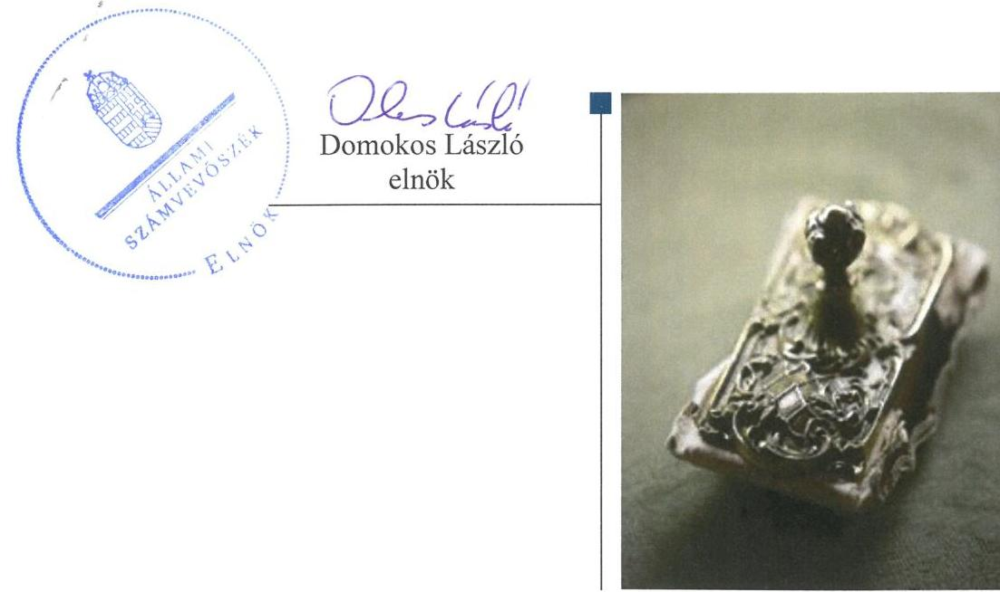
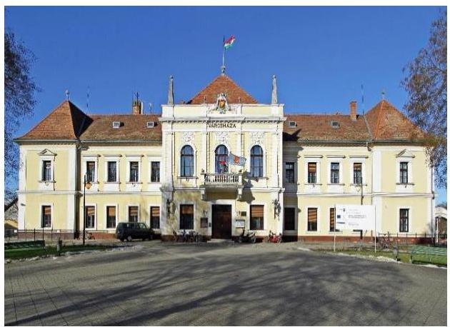
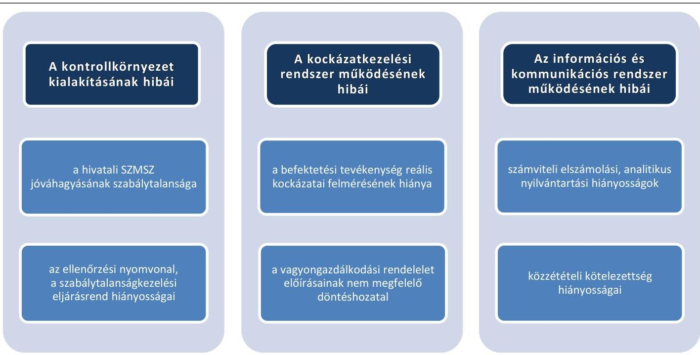
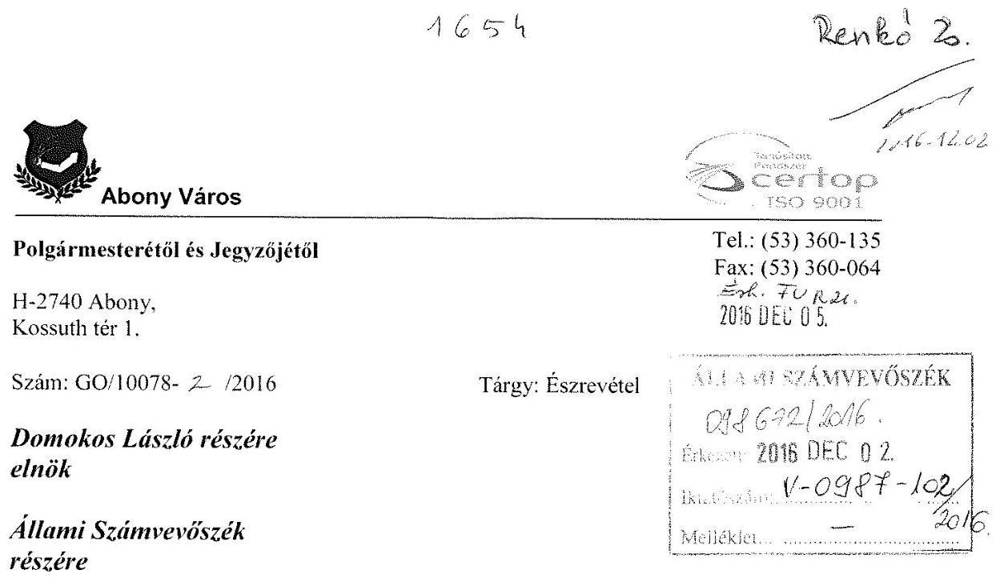
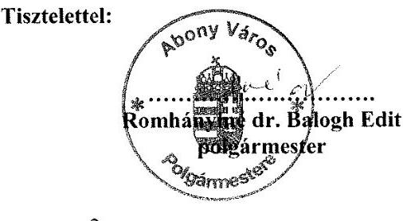
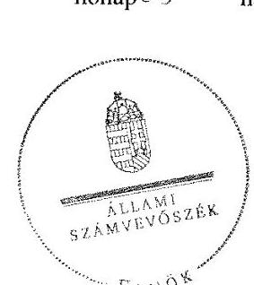
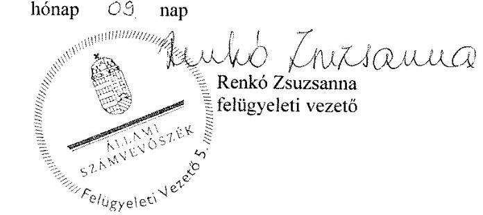

# Jelentés 

## Önkormányzatok belső kontrollrendszere

Az önkormányzatok belső kontrollrendszere kialakításának és működtetésének ellenőrzése - Abony 2017.

---

# Jelentés 

## Önkormányzatok belső kontrollrendszere

Az önkormányzatok belső
kontrollrendszere kialakításának és működtetésének ellenőrzése - Abony 2017. 01. hó 11. nap

---

# AZ ELLENŐRZÉST FELÜGYELTE:

- RENKŐ ZSUZSANNA felügyeleti vezető
- AZ ELLENŐRZÉST VEZETTE ÉS A VÉGREHAJTÁSÁÉRT FELELŐS:
  - DÉR LÍVIA ellenőrzésvezető
  - A PROGRAM ÖSSZEÁLLÍTÁSÁÉRT FELELŐS:
    - JANIK JÓZSEF osztályvezető

- IKTATÓSZÁM: V-0987-108/2016.
- TÉMASZÁM: 2021
- ELLENŐRZÉS-AZONOSÍTÓ SZÁM: V07186, V073810

Jelentéseink az Országgyűlés számítógépes hálózatán és az Interneten a www.asz.hu címen is olvashatóak.

---

# TARTALOMJEGYZÉK 

■ ÖSSZEGZÉS ..... 5
■ AZ ELLENŐRZÉS CÉLJA ..... 6
■ AZ ELLENŐRZÉS TERÜLETE ..... 7
■ AZ ELLENŐRZÉS HÁTTERE, INDOKOLTSÁGA ..... 8
■ A JELENTÉS LÉNYEGES KÉRDÉSKÖREI ..... 11
■ ELLENŐRZÉS HATÓKÖRE ÉS MÓDSZEREI ..... 12
■ MEGÁLLAPÍTÁSOK ..... 15
■ JAVASLATOK ..... 33
■ MELLÉKLETEK ..... 35
I. sz. melléklet: Értelmező szótár ..... 35
II. sz. melléklet: Az integritás szemlélet érvényesítése érdekében kialakított és működtetett kontrollrendszer ..... 39
■ FÜGGELÉK: ÉSZREVÉTELEK ..... 41
■ RÖVIDÍTÉSEK JEGYZÉKE ..... 47

---

.

---

# ÖSSZEGZÉS 

Abony Város Önkormányzata belső kontrollrendszere kialakításának és működtetésének hiányosságai a befektetési tevékenységek szabályszerű végzését, elszámoltathatóságát nem támogatta. A befektetésekkel kapcsolatos döntés-előkészítés nem biztosította a közvagyon körültekintő, biztonságos befektetését. A befektetett közvagyon kimutatása a számviteli nyilvántartásokban nem felelt meg az előírásoknak. Az Önkormányzatnak az integritás szemlélet érvényesülése érdekében még erőfeszítést kell tennie.

## Az ellenőrzés társadalmi indokoltsága

Magyarország Alaptörvénye az önkormányzatoktól is elvárja a kiegyensúlyozott, átlátható és fenntartható költségvetési gazdálkodás elvének érvényesítését. Az önkormányzatok által betöltött társadalmi szerep, az általuk kezelt közpénz nagysága, a nemzeti vagyon átruházására vagy hasznosítására vonatkozó döntéseik sokrétűsége indokolttá teszik a számvevőszéki ellenőrzéseket. A belső kontrollrendszer kialakítása és működtetése nélkül nem valósítható meg a közpénzek, a közvagyon szabályos, gazdaságos, hatékony és eredményes felhasználása.

Abony Város Önkormányzata 2015. április 30-án egy befektetési vállalkozással szemben 279,4 millió Ft pénzkövetelést tartott nyilván. A befektetési vállalkozás törvénytelen tevékenysége következtében fennállt a veszélye annak, hogy a befektetett közvagyon egy részét elveszítik. Felmerült, hogy a belső kontrollrendszer kialakítása és működtetése nem biztosította a közvagyon megóvását, körültekintő, biztonságos befektetését, a befektetési döntések, azok végrehajtása és számviteli elszámolása nem volt szabályszerű.

## Főbb megállapítások, következtetések, javaslatok

A belső kontrollrendszer kialakításában és működtetésében feltárt hiányosságok miatt az nem segítette elő a szabálykövető működést és gazdálkodást. A befektetésekkel kapcsolatos hatáskörök ellentmondásos szabályozása miatt nem volt biztosított a döntéshozó elszámoltathatósága. A kontrolltevékenységek nem megfelelő működtetése akadályozta a hibák megelőzését, feltárását. Az ellenjegyzési, a teljesítésigazolási, és az érvényesítési jogkörök szabálytalan gyakorlása növelte a jogosulatlan kifizetések veszélyét.

A befektetési döntések előkészítésekor a kockázatokat nem mérték fel, nem tervezték meg hogy hol és milyen beavatkozások szükségesek a káros következmények elkerülése érdekében, így nem tettek meg mindent a befektetett közvagyon biztonságos megőrzéséért.

Az egyes befektetések számviteli elszámolása, nyilvántartása és számbavételének nem volt szabályszerű.
Az integritás szemlélet erősítése érdekében - a belső kontrollrendszer kialakításában és működésében feltárt hiányosságok és hibák megszüntetésével - az Önkormányzatnak még erőfeszítéseket kell tennie.

---

# AZ ELLENŐRZÉS CÉLJA 

Az ellenőrzés célja annak megállapítása volt, hogy az önkormányzat belső kontrollrendszerének kialakítása, továbbá egyes elemeinek működtetése biztosította-e az önkormányzatnál a közpénzfelhasználás szabályosságát. Az erőforrásokkal való szabályszerű és hatékony gazdálkodáshoz szükséges követelmények érvényesítése, számonkérése, ellenőrzése megtörtént-e az önkormányzatnál. A belső kontrollrendszer kialakítása és működtetése támogatta-e az integritás szemlélet érvényesülését. Az ellenőrzés során értékeltük a belső kontrollrendszer kialakításának és működtetésének szabályszerűségét. Bemutatjuk azokat a lényeges szabályozási hiányosságokat, amelyek miatt az ellenőrzött kulcskontrollok nem nyújtottak elegendő védelmet a lehetséges hibákkal szemben. Rámutattunk arra, ha a kulcskontrollok valamely hibát nem előztek meg, nem tártak fel vagy nem javítottak ki, valamint minősítjük működésük megfelelőségét. Ellenőriztük, hogy az önkormányzat egyes befektetési döntései és azok végrehajtása, elszámolása megfelelt-e a vonatkozó jogszabályoknak és belső szabályozásoknak, a kialakított kontrollrendszer támogatta-e a befektetési tevékenység szabályszerűségét.

---

# **AZ ELLENŐRZÉS TERÜLETE**

## **Abony Város Önkormányzata**

Abony város (Pest megye) állandó lakosainak száma 2015. január 1-jén 15 171 fő volt. A 12 tagú képviselő-testület1 munkáját négy állandó bizottság segítette. Az Önkormányzat2 a Hivatalon3 kívül hat intézménnyel, valamint két 100%-os tulajdoni részesedésű gazdasági társasággal látta el a feladatait. A településen Roma Nemzetiségi Önkormányzat működött.

A polgármester4 2006 óta tölti be tisztségét. A jegyző5 2012 óta látja el feladatait. A Hivatal négy szervezeti egységre tagolódott (Titkárság, Gazdasági osztály, Hatósági és szociális ügyek osztálya, Településfejlesztési osztály). A gazdasági szervezet6 feladatait a Gazdasági osztály és a Településfejlesztési osztály látta el, a gazdasági szervezet vezetője a Gazdasági osztály vezetője volt. A Hivatalban foglalkoztatott köztisztviselők száma 2014. év végén 35 fő volt. A Hivatalnál 2014. január 1-je után szervezeti változás nem volt.

Az Önkormányzat7 a 2014. évi költségvetési beszámoló szerint 1996,4 millió Ft költségvetési bevételt ért el, valamint 2580,8 millió Ft költségvetési kiadást teljesített. A költségvetés 584,4 millió Ft-os hiányát a finanszírozási bevételek és a finanszírozási kiadások 818,1 millió Ft-os egyenlege fedezte.

A 2014. évben a forrásokon belül a költségvetési évben esedékes kötelezettségállomány 93,0 millió Ft, a költségvetési évet követően esedékes kötelezettségállomány 55,3 millió Ft volt, pénzintézettel szembeni kötelezettségük az év végén nem volt. Az Önkormányzat a 2013-2014. években összesen 3252,4 millió Ft összegű adósságkonszolidációban részesült.

---

# AZ ELLENŐRZÉS HÁTTERE, INDOKOLTSÁGA 

Az ÁSZ tv. ${ }^{8}$ szerint az ÁSZ feladata a jól irányított állam kiépítésének elősegítése. Az ÁSZ Stratégiájában ezért hangsúlyos szerepet szánt annak, hogy szilárd szakmai alapon álló, értékteremtő ellenőrzéseivel előmozdítsa a közpénzügyek átláthatóságát, rendezettségét. A számvevőszéki ellenőrzés nemzetközi alapelvei is rögzítik, hogy a megfelelő belső kontrollrendszer minimálisra csökkenti a hibák és szabálytalanságok kockázatát.

A belső kontrollrendszer azt a célt szolgálja, hogy a költségvetési szervek működésük és gazdálkodásuk során a tevékenységeket szabályszerűen, gazdaságosan, hatékonyan, eredményesen hajtsák végre, teljesítsék elszámolási kötelezettségeiket és megvédjék az erőforrásokat a veszteségektől, a károktól és a nem rendeltetésszerű használattól. A belső kontrollrendszer magában foglalja mindazon szabályokat, eljárásokat, gyakorlati módszereket és szervezeti struktúrákat, kockázatkezelési technikákat, kontrolltevékenységeket, amelyek segítséget nyújtanak a szervezetnek céljai eléréséhez. A belső kontrollrendszer szabályozása háromszintű: a törvényi előírásokat az Áht. ${ }^{9}$ és a Mötv. ${ }^{10}$, a rendeleti szintű szabályozást az Ávr. ${ }^{11}$ és a Bkr. ${ }^{12}$ tartalmazza, amelyeket útmutatói szinten az NGM ${ }^{13}$ által kiadott standardok és kézikönyvek támogatnak.

Az ellenőrzött időszak meghatározása lehetőséget teremt a 2014. október 12-i önkormányzati választásokat megelőző és követő ciklus belső kontrollrendszere működésének elkülönült értékelésére, valamint a változások nyomon követésére.

A BELSŐ KONTROLLRENDSZER kialakításának és működtetésének általános értékelése mellett a teljesítésigazolás és érvényesítés kontrollok kiemelt ellenőrzésének szükségességét alátámasztja, hogy 2012-től a pénzügyi folyamatokban kulcsszerepet betöltő belső kontrollok rendszere módosult és azok működtetésében az önkormányzatoknál hiányosságok mutatkoztak a 2012. óta elvégzett ÁSZ ellenőrzések alapján.

Az önkormányzatok belső kontrollrendszerének ellenőrzése az ÁSZ "jó kormányzással" kapcsolatos stratégiai céljainak megvalósítását is szolgálja. Az ÁSZ célja, hogy javuljon az ellenőrzött önkormányzatok belső kontrollrendszerének szabályozottsága, működésének megfelelősége, hozzájárulva ezzel az egyensúlyi helyzet fenntarthatóságának biztosításához, azaz az adósság újratermelődésének megakadályozásához. Az ÁSZ ellenőrzés tapasztalatai nem csupán a közvetlenül ellenőrzött önkormányzatokat segíthetik, hanem a "jó gyakorlat" elterjesztésével azok az önkormányzatok is átvehetik a pozitív példákat, ahol nem végez ellenőrzést az ÁSZ.

Az MNB${ }^{14}$ három befektetési szolgáltató tevékenységi engedélyét 2015. első felében visszavonta és kezdeményezte a vállalkozások felszámolását a működéssel kapcsolatos szabálytalanságok, hiányosságok miatt. A korábbi évek ellenőrzési tapasztalatai alapján fennáll a lehetősége annak, hogy az önkormányzatok befektetési döntései, továbbá a döntések végrehajtása és számviteli elszámolása nem voltak teljes mértékben szabályszerűek, és a kapcsolódó külső ellenőrzések és a belső kontrollrendszer sem működtek minden esetben megfelelően.

---

Magyarország Alaptörvénye ${ }^{15}$ az önkormányzatoktól, mint az államháztartás alanyaitól elvárja a kiegyensúlyozott, átlátható és fenntartható költségvetési gazdálkodás elvének érvényesítését. A nemzeti vagyonról szóló törvény szerint a nemzeti vagyonnal felelős módon, rendeltetésszerűen kell gazdálkodni. A nemzeti vagyongazdálkodás feladata a nemzeti vagyon rendeltetésének megfelelő, átlátható, hatékony és költségtakarékos működtetése, ugyanakkor értékének megőrzését, értéknövelő használatát, hasznosítását, gyarapítását is elvárja.

# AZ ÖNKORMÁNYZATOK ÁTMENETILEG SZABAD PÉNZESZKÖZEINEK BEFEKTETÉSÉT jogszabály nem tiltja, a pénzpiaci szolgáltatók közül az önkormányzatok a kínált szolgáltatás és annak költségei alapján, szabadon választhatnak, a veszteséges gazdálkodás kockázatai és következményei azonban az önkormányzatokat terhelik. A szabad pénzeszközök felelős hasznosítása összhangban áll az önkormányzati gazdálkodás alapelveivel. 

A közintézmények integritás alapú kultúrájának kialakítása, megerősítése és működése szorosan összefügg a belső kontrollrendszer működésével, ezért az ellenőrzés kiterjed annak értékelésére is, hogy a belső kontrollrendszer kialakítása és működtetése hogyan hatott az integritás szemlélet érvényesülésére.

Az államháztartás önkormányzati alrendszerében a 2014. év elején összesen 3177 települési önkormányzat működött: a 23 kerülettel rendelkező főváros, 345 város, 2691 község és 117 nagyközség volt. A belső kontrollrendszer kialakítása és működtetése ellenőrzését az ÁSZ által lefolytatott, kisebb településeket is érintő ellenőrzéseinek tapasztalatai, valamint a közérdekű bejelentések kockázati szempontú értékelése alapozták meg. Ezek a községek, nagyközségek gazdálkodásának, belső kontrollrendszere kialakításának és működésének hiányosságaira mutattak rá. Az ellenőrzések helyszíneinek kiválasztása során az ÁSZ célzott adatfeldolgozáson alapuló kockázatelemző rendszerére támaszkodik. Ez elősegíti, hogy azokon a területeken végezzen ellenőrzéseket, összpontosítva erőforrásait, ahol a valódi kockázatok, az aktuális problémák vannak.

## AZ ELLENŐRZÉS VÁRHATÓ HASZNOSULÁSA NÉGY SZINTEN valósul meg.

A törvényalkotás számára összegzett tapasztalatok állnak rendelkezésre a belső kontrollrendszer önkormányzati területen való kialakításáról, működtetéséről és hatásairól. Az ÁSZ az ellenőrzéseivel hozzájárul ahhoz, hogy az egyes önkormányzati befektetésekkel kapcsolatos kockázatok a szabályozási és kontroll mechanizmusok fejlesztésével mérsékelhetők legyenek.

Az ellenőrzés az ellenőrzött számára visszajelzést ad a belső kontrollrendszer kialakításában és működésében lévő hiányosságokról, javaslataival hozzájárul azok kiküszöböléséhez. Feltárja az önkormányzati befektetési tevékenységet meghatározó szabályozások összhangjának hiányosságait, a szabályozással nem érintett gazdálkodási területeket, valamint az egyes befektetési tevékenységek esetleges szabálytalanságait.

Az ellenőrzés megállapításait és javaslatait más szervezetek is hasznosíthatják a rendezett gazdálkodási keretek kialakításához.

---

A társadalom számára jelzi, hogy közpénz nem maradhat ellenőrizetlenül, az ÁSZ értékteremtő rend kialakításához és megőrzéséhez hozzájáruló tevékenysége így pozitív hatással lesz a szervezetről kialakított összkép formálásában.

---

# A JELENTÉS LÉNYEGES KÉRDÉSKÖREI 

1. Az önkormányzat belső kontrollrendszerének kialakítása és működtetése szabályszerű volt-e 2014. január 1. és 2015. április 30. között, valamint a belső kontrollrendszer egyes pillérei támogatták-e a befektetési tevékenység szabályszerű végzését 2011. január 1. és 2015. április 30. között?
2. Az egyes befektetésekkel kapcsolatos döntéshozatal és a döntések végrehajtása szabályszerű volt-e?
3. Az egyes befektetések számviteli elszámolása, nyilvántartása szabályszerű volt-e?
4. Az erőforrásokkal való szabályszerű és hatékony gazdálkodáshoz szükséges követelmények érvényesítése, számonkérése, ellenőrzése megtörtént-e az önkormányzatnál?
5. Az önkormányzat belső kontrollrendszerének kialakítása és működtetése támogatta-e az integritás szemlélet érvényesülését?

---

# ELLENŐRZÉS HATÓKÖRE ÉS MÓDSZEREI 

## Az ellenőrzés típusa

Megfelelőségi ellenőrzés,
 a befektetési tevékenység esetében szabályszerűségi ellenőrzés.

## Az ellenőrzött időszak

A belső kontrollrendszer kialakításának és működtetésének ellenőrzése a 2014. január 1. és 2015. április 30. közötti időszakra terjedt ki. Ezen belül a belső kontrollrendszer kialakításának és működtetésének megfelelőségét a 2014. január 1. és október 12., valamint a 2014. október 13. és 2015. április 30. közötti időszakra vonatkozóan külön-külön értékeltük. Az önkormányzatok egyes befektetési tevékenységeinek ellenőrzése tekintetében az ellenőrzött időszak a 2011. január 1. - 2015. április 30. közötti időszak. Ezen felül az önkormányzat befektetésekkel kapcsolatos döntés-előkészítésének és döntéshozatalának szabályszerűségét a 2011. január 1. előtti időszakra visszanyúlóan is ellenőriztük, amennyiben a 2014. június 30-án, illetve 2015. április 30-án meglévő befektetéseire 2011. január 1-je előtt került sor. Az integritás szemlélet érvényesülését a 2014. évre vonatkozó adatszolgáltatás alapján értékeltük.

## Az ellenőrzés tárgya

A helyi önkormányzatnak, mint éves költségvetési beszámoló készítésére kötelezett szervezetnek és polgármesteri hivatalának belső kontrollrendszere. Az önkormányzat 2014. június 30-án, illetve 2015. április 30-án meglévő értékpapírokban megtestesülő befektetései, lekötött betétei, valamint az önkormányzat üzleti vagyonába tartozó ingatlanok, kulturális javak (műtárgyak, műalkotások, stb.), illetve a feladatellátást nem szolgáló egyéb értéktárgyak (pl. ékszerek, befektetési nemesfém). Az erőforrásokkal való szabályszerű és hatékony gazdálkodáshoz szükséges követelmények érvényesítése, számonkérése, ellenőrzése. Az integritás szemlélet érvényesülése.

## Az ellenőrzött szervezet

Abony Város Önkormányzata és az önkormányzati működéshez kapcsolódó feladatokat ellátó Hivatal.

---

# Az ellenőrzés jogalapja 

Az ÁSZ tv. 1. § (3) bekezdésében foglaltak alapján az ÁSZ általános hatáskörrel végzi a közpénzekkel és az állami és önkormányzati vagyonnal való felelős gazdálkodás ellenőrzését. Az ÁSZ tv. 5. § (2) bekezdése alapján az államháztartás gazdálkodásának ellenőrzése keretében az ÁSZ ellenőrzi a helyi önkormányzatok gazdálkodását, valamint az ÁSZ tv. 5. § (6) bekezdése alapján ellenőrzése során értékeli az államháztartás számviteli rendjének betartását és a belső kontrollrendszer működését.

## Az ellenőrzés módszerei

Az ellenőrzést a nemzetközi standardokat irányadónak tekintve az ellenőrzési program ellenőrzési kérdései, az ellenőrzött időszakban hatályos jogszabályok, az ellenőrzés szakmai szabályok és módszertanok figyelembe vételével végeztük.

Az ellenőrzés lefolytatásához az Önkormányzat a tanúsítványok kitöltésével, valamint az ÁSZ által kért dokumentumok elektronikus megküldésével szolgáltatott adatokat. A rendelkezésre bocsátott adatok, információk kontrollja és a munkalapok kitöltése az ellenőrzés keretében történt. A jelentésben használt fogalmak magyarázatát az I. számú melléklet, az integritás érvényesítése érdekében kialakított és működtetett kontrollrendszer minősítését a II. számú melléklet tartalmazza.

A belső kontrollrendszer jogszabályi előírások szerinti kialakításának és működtetésének szabályszerűségét az erre irányuló ellenőrzési kérdésekre adott válaszok összesítése alapján külön-külön értékeltük a 2014. január 1. és október 12., valamint a 2014. október 13. és 2015. április 30. közötti időszakra. A belső kontrollrendszert egy-egy ellenőrzött időszakra pillérenként (kontrollkörnyezet, kockázatkezelési rendszer, kontrolltevékenységek, információs és kommunikációs rendszer, monitoring rendszer) és összesítetten is értékeltük.

## A BELSŐ KONTROLLRENDSZER EGYES PILLÉRE-

INEK KIALAKÍTÁSA ÉS MŰKÖDTETÉSE „szabályszerű" volt, amennyiben az értékelt területen az elért és elérhető pontok százalékban kifejezett, egész számra kerekített hányadosa meghaladta a 84%-ot, „részben szabályszerű" volt, ha 61-84% közé esett, „nem szabályszerű" volt, ha nem haladta meg a 60%-ot. A belső kontrollrendszer összesített értékelése megegyezett a pillérenként (kontrollterületenként) alkalmazott százalékos értékelésekkel, a következő eltérésekkel. A kontrollrendszer egésze esetében a „szabályszerű" értékelésnek a százalékos értéken felül további feltétele volt, hogy egyik kontrollterület sem kaphat „nem szabályszerű" értékelést, a „részben szabályszerű" értékelés további feltétele volt, hogy legfeljebb egy ellenőrzött kontrollterület lehet „nem szabályszerű" értékelésű. Az összesített értékelés a százalékos értéktől függetlenül „nem szabályszerű" volt, ha az ellenőrzött kontrollterületek közül több mint egynek „nem szabályszerű" volt az értékelése.

---

# A GAZDÁLKODÁS FOLYAMATÁBAN A KÉT 

KULCSKONTROLL - teljesítésigazolás, érvényesítés - működésének megfelelőségét a személyi juttatásokkal, a dologi kiadásokkal, a beruházási, felújítási kiadásokkal, az ellátottak pénzbeli juttatásaival és az egyéb működési, felhalmozási célú, valamint a finanszírozási kiadásokkal kapcsolatos kifizetések esetében mintavétellel ellenőriztük. A mintavétel során külön értékeltük a 2014. január 1. és 2014. október 12. közötti időszakban és a 2014. október 13. és 2015. április 30. közötti időszakban teljesített kifizetéseket. „Megfelelőnek" értékeltük a gazdálkodási jogkörök gyakorlását, amennyiben 95%-os bizonyossággal a teljes sokaságban a hibaarány legfeljebb 10%, „részben megfelelőnek" értékeltük, ha a hibaarány felső határa 10-30% között volt, „nem megfelelőnek" pedig akkor, ha a mintavételi eredmények alapján a sokaságbeli hibaarány felső határa meghaladta a 30%-ot.

Az integritás szemlélet érvényesülésének értékelése az önkormányzat által kitöltött tanúsítvány alapján történt.

---

# MEGÁLLAPÍTÁSOK

## 1. Az önkormányzat belső kontrollrendszerének kialakítása és működtetése szabályszerű volt-e 2014. január 1. és 2015. április 30. között, valamint a belső kontrollrendszer egyes pillérei támogatták-e a befektetési tevékenység szabályszerű végzését 2011. január 1. és 2015. április 30. között?

|  Összegző megállapítás | A belső kontrollrendszer kialakítása és működtetése az összesített értékelés alapján 2014. január 1. és 2015. április 30. között részben szabályszerű volt. A feltárt hiányosságok miatt a belső kontrollrendszer egyes pillérei a befektetési tevékenység szabályszerű végzését 2011. január 1. és 2015. április 30. között nem támogatták.  |
| --- | --- |
|   | A belső kontrollrendszer kialakításának és működtetésének összesített értékelését az 1. táblázat mutatja be:  |

1. táblázat

|  A BELSŐ KONTROLLRENDSZER KIALAKÍTÁSÁNAK ÉS MŰKÖDTETÉSÉNEK ÖSSZESÍTETT ÉRTÉKELÉSE |  |  |   |
| --- | --- | --- | --- |
|  Megnevezés | A gazdálkodás egészét érintően: 2014. január 1. tól 2014. október 13. tól 2015. április 30.ig. | A befektetési tevékenységet érintően: 2011. 2013. években 2014. január 1. tól 2015. április 30.ig. |   |
|  Kontrollkörnyezet | szabályszerű | nem támogatta |   |
|  Kockázatkezelési rendszer | szabályszerű | nem támogatta |   |
|  Kontrolltevékenységek | nem szabályszerű | n.a. | nem támogatta  |
|  Információs és kommunikációs rendszer | szabályszerű | nem támogatta |   |
|  Monitoring rendszer | szabályszerű | nem támogatta |   |
|  BELSŐ KONTROLLRENDSZER | RÉSZBEN SZABÁLYSZERŰ | NEM TÁMOGATTA |   |

1.1. számú megállapítás

A kontrollkörnyezet kialakítása 2014. január 1. és 2015. április 30. között a feltárt hiányosságok mellett szabályszerű volt. A kontrollkörnyezet a befektetési tevékenység szabályszerű végzését a 2011. január 1. és 2015. április 30. között nem támogatta, mert a befektetési tevékenységhez kapcsolódó döntési jogkör, a belső eljárási rend kialakítása nem volt maradéktalanul szabályszerű.

A SZERVEZETI ÉS A SZABÁLYOZÁSI KERETEKET a Képviselő-testület 2011. január 1. és 2015. április 30. között az alábbiak szerint alakította ki:

- jóváhagyta az önkormányzati SZMSZ1,2 $^{16}$-t, melyben meghatározta a Képviselő-testület és szervei működésének rendjét, a Képviselő-testület átruházott hatásköreit, az átruházott hatáskör gyakorlójának

---

beszámolási kötelezettségét, az értékpapír-vásárlással és -értékesítéssel kapcsolatos előterjesztésekre vonatkozó véleményezés rendjét. Az önkormányzati SZMSZ$_{1,2}$ 4. számú mellékletében rögzítették, hogy a pénzügyi bizottság az értékpapír vásárlással és értékesítéssel kapcsolatos előterjesztéseket véleményezi, továbbá dönt a Képviselő-testület által a vagyongazdálkodási rendeletben hatáskörébe utalt kérdésekben;
a vagyongazdálkodási rendeletben $^{17}$ meghatározta a vagyongazdálkodás részletes előírásait, ezek között rögzítette az értékpapírokkal és üzletrészekkel kapcsolatos gazdálkodás külön szabályait. A vagyongazdálkodási rendelet 16. § (1) bekezdésében előírta, hogy az értékpapírok, üzletrészek, részvények tulajdonjogának megszerzéséről és elidegenítéséről a pénzügyi bizottság $^{18}$ dönthet;
jóváhagyta a 2011-2015. évekre vonatkozóan a jogszabályi előírásoknak megfelelően részletezett költségvetési rendelet$_{1-5}$ $^{19}$-öt. A 2013-2015. évi költségvetési rendelet$_{3-5}$-ben értékhatár nélkül felhatalmazta a polgármestert az átmenetileg szabad pénzeszközök lekötésére;
a kötvény szabályzatban $^{20}$ meghatározta az önkormányzati kötvénykibocsátással szerzett források felhasználására vonatkozó szabályokat. Ezek közt rögzítette, hogy forrásokat alapvetően fejlesztési célokra, a Képviselő-testület döntése alapján lehet felhasználni; az átmenetileg szabad pénzeszközök lekötésére a polgármester jogosult;
elfogadta az Nvtv. $^{21}$-ben előírtaknak megfelelően az Önkormányzat közép- és hosszú távú vagyongazdálkodási tervét $^{22}$, valamint az Ötv. $^{23}$-ben, illetve az Mötv.-ben előírtaknak megfelelően a 2011-2014. és a 2015-2019. évekre vonatkozó gazdasági program$_{1,2}$ $^{24}$-ot;
jóváhagyta a Hivatal alaptevékenységeit rögzítő alapító okiratot $^{25}$.
A HIVATAL BELSŐ SZABÁLYOZÁSÁT 2011. január 1. és 2015. április 30. között az alábbiak szerint alakították ki:
a hivatali SZMSZ$_{1-5}$ $^{26}$-t a Képviselő-testület helyett a polgármester hagyta jóvá 2011. december 31-éig az Áht. $_{1}$ $^{27}$ 93. § (1) bekezdés a) pontjában, 2012. január 1. és 2012. december 31. között az Áht. $_{2}$ 9. § (1) bekezdés e) pontjában, 2013. január 1. és 2014. december 31. között az Áht. $_{2}$ 9. § (1) bekezdés a) pontjában előírtak ellenére. Az önkormányzati SZMSZ$_{1,2}$-ben hivatkozott rendelkezés, mely szerint a polgármester jóváhagyja az önkormányzat által fenntartott intézmények szervezeti és működési szabályzatát, nem volt kiterjeszthető a hivatali SZMSZ$_{1-5}$ polgármester által történő jóváhagyására, mivel azt az Áht. $_{1}$ 93. § (1) bekezdés a) pontja és az Áht. $_{2}$ 9. § (b) pontja a költségvetési szerv felett irányítói jogkört gyakorló szerv hatáskörébe utalta. A hivatali SZMSZ$_{1-5}$ jóváhagyására a polgármester a vonatkozó jogszabályok rendelkezései alapján nem volt jogosult;
a számviteli politika$_{1-3}$ $^{28}$-at és az ahhoz kapcsolódó számlarend$_{1-3}$ $^{29}$-at a jegyző elkészítette, melyet a 2014-2015. években aktualizáltak. A számlarend$_{1}$ a Számv. tv. $^{30}$ 161.§ (2) bekezdés a) pont előírása ellenére az Önkormányzatnál alkalmazásra kijelölt számlák számjelét és megnevezését (számlatükör) nem tartalmazta. A 2014. január 1.

---

és 2015. április 30. között hatályos számlarend$_{2,3}$ a befektetések (értékpapírok) vonatkozásában is tartalmazta az alkalmazásra kijelölt számlák számjelét és megnevezését, a főkönyvi számlák és az analitikus nyilvántartások kapcsolatát;
rendelkeztek pénzkezelési szabályzat$_{1-3}$ $^{31}$-mal, azonban a pénzkezelési szabályzat$_{1}$-et az Áhsz. $_{1}$ 8. § (12) bekezdés előírásai ellenére a polgármester és nem az arra jogosult jegyző hagyta jóvá. A 2014. január 1. és 2015. április 30. között hatályos pénzkezelési szabályzat$_{2-3}$-ban a jegyző meghatározta a pénzforgalom lebonyolításának szabályait, a bizonylatolás és a pénzforgalmi nyilvántartások rendjét és azokat kiterjesztette az átmenetileg szabad pénzeszközök lekötésére kijelölt, Quaestor Nyrt. $^{32}$-nél nyitott ügyfélszámlán lebonyolítandó pénzforgalomra is;
az eszközök és források leltározására, leltárkészítésére, valamint azok értékelésére vonatkozó szabályzatok tartalmazták a befektetett pénzügyi eszközök mellett a forgatási célú értékpapírok leltározására, illetve értékelésére vonatkozó előírásokat;
rendelkeztek gazdálkodási szabályzat$_{1-5}$ $^{33}$-tel, azonban a 2011. január 1. és 2012. április 1. között hatályos gazdálkodási szabályzat$_{1,2}$-t az Ámr. 20. § (3) bekezdés a) pontjának és az Ávr. 13. § (2) bekezdés a) pontjának előírásai ellenére nem a jegyző, hanem a polgármester adta
 ki. A 2012. április 2-ától hatályos gazdálkodási szabályzat ${ }_{3-5}$-ben a jegyző rögzítette a gazdálkodási jogkörök - a kötelezettségvállalás, a pénzügyi ellenjegyzés, a teljesítésigazolás, az érvényesítés és az utalványozás - gyakorlásának módjával, eljárási és dokumentációs részletszabályaival, valamint az ezeket végző személyek kijelölésének rendjével kapcsolatos belső előírásokat és feltételeket;
a gazdálkodási ügyrend ${ }_{1-6}{ }^{34}$ tartalmazta a Hivatal gazdasági szervezetének jogszabályban előírt feladatait;
az ellenőrzési nyomvonallal a 2011. évre a Ber. 17. § (2) bekezdésének előírásai ellenére nem rendelkeztek. A jegyző a 2013. évre a Bkr. 6. § (3) bekezdése ellenére nem készítette el a nyomvonalat. A 2014. január 1. és 2015. április 30. közötti időszakban a jegyző a belső kontrollok szabályozása keretében alakította ki az ellenőrzési nyomvonalat, mely kiterjedt az értékpapírokkal kapcsolatos műveletekre is (vásárlás, értékesítés);
a 2011. január 1. - 2013. december 31. közötti időszakra a jegyző az Ámr. 156. § (3) bekezdése, 2012. január 1-jétől a Bkr. 6. § (4) bekezdése ellenére nem szabályozta a szabálytalanságok kezelésének eljárásrendjét. A 2014. január 1. - 2015. április 30. közötti időszakban a jegyző a belső kontrollok szabályozása keretében rögzítette a szabálytalanságkezelés eljárásrendjét, mely tartalmazta a szabálytalanságok megelőzésére, észlelésére, jelzésére és a megfelelő intézkedésekre vonatkozó előírásokat, kötelezettségeket;
a közszolgálati szabályzatban ${ }^{35}$ a jegyző meghatározta az általános munkáltatói hatáskörbe tartozó kérdéseket, közöttük a köztisztviselők egyéni teljesítményértékelésére vonatkozó előírást. A teljesítményértékelés ajánlott elemeit jegyzői utasítás tartalmazta.
A költségvetési rendelet ${ }_{3-5}$ átmenetileg szabad pénzeszközök lekötésére vonatkozó rendelkezése nem volt egyértelműen értelmezhető és nem volt összhangban a vagyongazdálkodási rendelet értékpapír vásárlásra vonatkozó előírásaival. A vagyongazdálkodási rendelet az értékpapírok tulajdonjogának megszerzésében és elidegenítésében a pénzügyi bizottság döntési jogkörét rögzítette. A 2013-2015. évi költségvetési rendeletekben az átmenetileg szabad pénzeszközök lekötésével a polgármestert hatalmazták fel. A költségvetési rendelet ${ }_{3-5}$-ben rögzített rendelkezés nem biztosította a polgármester jogosultságának világos, egyértelmű körülhatárolását, mivel nem pontosította, hogy a „lekötés" mely pénzügyi termékek (bankbetét és/vagy állampapír, vállalati kötvény-befektetés) igénybevételét jelentheti. E szabályozással megsértették a Jat. ${ }^{36} 2$. § (1) bekezdésében foglaltakat, amely szerint a jogszabálynak a címzettek számára egyértelműen értelmezhető szabályozási tartalommal kell rendelkeznie.

A kontrollkörnyezet kialakítása az értékelés szempontjából 2014. január 1. és 2014. október 12., valamint 2014. október 13. és 2015. április 30. közötti időszakokban a 2. táblázatban részletezett hiányosságok mellett szabályszerű volt.

A kontrollkörnyezet kialakítása a 2011. január 1. és 2013. december 31., valamint 2014. január 1. és 2015. április 30. közötti időszakban a befektetési tevékenység szabályszerű végzését nem támogatta.
2. táblázat

# A KONTROLLKÖRNYEZET KIALAKÍTÁSÁNAK HIÁNYOSSÁGAI

## Sorszám

## Részmegállapítás

1. A vagyongazdálkodási rendelet előírásai szerint az értékpapírok adásvételéről a pénzügyi bizottság dönthet, ezzel párhuzamosan a költségvetési rendelet ${ }_{3-5}$ felhatalmazta a polgármestert az átmenetileg szabad pénzeszközök lekötésére. A költségvetési rendelet ${ }_{3-5}$-ben rögzített rendelkezés nem biztosította a polgármester jogosultságának világos, egyértelmű körülhatárolását, mivel abban nem szabályozták, hogy mely pénzügyi termékek igénybevételével történő befektetésekről dönthet. Ezzel megsértették a Jat. 2. § (1) bekezdésében foglaltakat, mely szerint a jogszabálynak a címzettek számára egyértelműen értelmezhető szabályozási tartalommal kell rendelkeznie.

Forrás: $A 52$
1.2. számú megállapítás

A kockázatkezelési rendszer kialakítása és működtetése 2014. január 1. és 2015. április 30. között a feltárt hiányosságok mellett szabályszerű volt. A befektetési gazdálkodással kapcsolatos kockázatokat nem mérték fel, emiatt a 2011. január 1. és 2015. április 30. közötti időszakban a kockázatkezelési rendszer a befektetési tevékenységek szabályszerű végzését nem támogatta.

A KOCKÁZATKEZELÉSI RENDSZERT a jegyző a belső kontroll szabályzat ${ }_{1-4}{ }^{37}$ keretében alakította ki. Ebben meghatározta a kockázatok azonosításával, elemzésével, csoportosításával, nyomon követésével, illetve a kockázati kitettség csökkentésével kapcsolatos előírásokat, szabályokat.

A jegyző a 2011-2013. évek között az Ámr. 157. § (2) bekezdés, a Bkr. 7. § (2) bekezdés előírásai ellenére nem mérte fel és nem azonosította a Hivatal tevékenységéhez kapcsolódó folyamatok kockázatait. A 2014-2015. évekre vonatkozóan a jegyző kockázatfelmérést végzett és kockázatokat azonosított az Önkormányzat és a Hivatal tevékenységében, gazdálkodásában, illetve meghatározta e kockázatok kezelése céljából szükséges intézkedéseket és azok teljesítésének nyomon követési módját. E kockázatfelmérés azonban a Bkr. 7. § (2) bekezdésében foglaltak ellenére nem terjedt ki az Önkormányzat befektetési tevékenységével kapcsolatos kockázatokra. A befektetéseket megelőzően - a befektetési szolgáltató nem szerződésszerű teljesítéséből, az értékpapír-kibocsátó esetleges csődjéből adódó önkormányzati vagyonvesztés lehetőségére vonatkozó - kockázatfelmérést nem végeztek.

# A VAGYONNYILATKOZAT-TÉTELI KÖTELEZETTSÉGET és annak eljárási szabályait a köztisztviselők esetében a jegyző által kiadott vagyonnyilatkozat-kezelési szabályzat ${ }_{1}{ }^{38}$-ben rögzítették. A vagyonnyilatkozat tételi kötelezettségüknek az érintett köztisztviselők - egy fő kivételével - eleget tettek. A Gazdasági osztály vezetőjeként 2014. július 8-áig dolgozó köztisztviselő a munkakörének megszűnését követően vagyonnyilatkozatot nem nyújtott be a Vnytv. ${ }^{39} 5 . \S$ (1) bekezdés b) pontjában előírtak ellenére. E köztisztviselőt a jegyző - mint a Hivatalnál közszolgálatban álló dolgozók vagyonnyilatkozatainak őrzésért felelős személy - a Vnytv. 10. § (1) bekezdésében előírtak ellenére nem szólította fel e kötelezettség teljesítésére. Az önkormányzati SZMSZ ${ }_{1,2}$-ben meghatározták az önkormányzati bizottságok nem képviselő tagjainak vagyonnyilatkozat-tételre vonatkozó kötelezettségét, valamint az ügyrendi bizottság ${ }^{40}$ kijelölését a képviselők vagyonnyilatkozatainak nyilvántartására, ellenőrzésére. A vagyonnyilatkozat-kezelési szabályzat ${ }_{2}{ }^{41}$ tartalmazta az Önkormányzatnál nem köztisztviselői jogviszonyban álló személyekre vonatkozó szabályokat. Az önkormányzati képviselők és nem képviselő bizottsági tagok vagyonnyilatkozat-tételi kötelezettségüknek a nyilvántartások alapján határidőben eleget tettek.

A kockázatkezelési rendszer kialakítása és működtetése a 2014. január 1. és 2014. október 12., valamint a 2014. október 13. és 2015. április 30. közötti időszakokban a 3. táblázatban részletezett hiányosságok mellett szabályszerű volt.

A kockázatkezelési rendszer 2011. január 1. és 2013. december 31., valamint 2014. január 1. és 2015. április 30. közötti időszakokban a befektetési kockázatok felmérésében tapasztalt hiányosság miatt a befektetési tevékenységek szabályszerű végzését nem támogatta.
3. táblázat

|  | A KOCKÁZATKEZELÉSI RENDSZER KIALAKÍTÁSÁNAK ÉS MŰKÖDTETÉSÉNEK HIÁNYOSSÁGAI |
| :-- | :-- |

1. A jegyző által működtetett kockázatkezelési rendszer keretében végzett kockázatelemzés - a Bkr. 7. § (2) bekezdésében előírtak ellenére - az Önkormányzat befektetési tevékenységével kapcsolatos kockázatokat nem mérte fel.
2. A jegyző a Vnytv. 10. § (1) bekezdésben előírtak ellenére nem szólította fel vagyonnyilatkozat megtételére a Gazdasági osztály vezetőjét, aki a Vnytv. 5. § (1) bekezdés b) pontjában előírt vagyonnyilatkozat tételi kötelezettségének a munkaköre megszűnését követő 15 napon belül nem tett eleget.

Forrás: ÁSZ
1.3. számú megállapítás

A pénzügyi folyamatokban kulcsszerepet betöltő teljesítésigazolás és érvényesítés kontrollok működése 2014. január 1. és 2015. április 30. között nem volt szabályszerű, nem biztosította a hibák megelőzését és feltárását, a közpénzfelhasználás szabályosságát.

A KONTROLLTEVÉKENYSÉGEK KIALAKÍTÁSA során a jegyző biztosította a folyamatba épített, előzetes, utólagos és vezetői ellenőrzés rendszerét. A pénzügyi döntések - köztük a költségvetés tervezése, a beszerzések lebonyolítása, a vagyonhasznosítási tevékenység - dokumentumainak előkészítését, ellenőrzési folyamatát a belső kontroll szabályzat ${ }_{3,4}$-ben, valamint a MIR kézikönyvben ${ }^{42}$ rögzítették. A felelősségi körök meghatározásával a belső kontroll szabályzat ${ }_{3,4}$-ben és az informatikai biztonsági szabályzatban ${ }^{43}$ meghatározták az engedélyezési, jóváhagyási és kontrolleljárásokat, a dokumentumokhoz, információkhoz való hozzáférést, valamint a beszámolási eljárásokat.

A gazdálkodási szabályzat ${ }_{5}$-ben rögzítették a gazdálkodási jogköröket, azok gyakorlásának módját, eljárási és dokumentációs szabályait, valamint az ezeket végző személyek kijelölésének rendjét. A gazdálkodási jogkörökkel kapcsolatos felhatalmazások, kijelölések írásban megtörténtek, azok megfeleltek az előírásoknak. A polgármester felhatalmazást adott kötelezettségvállalásra és utalványozásra, a gazdasági szervezet vezetője kijelölte a Hivatal állományába tartozó köztisztviselőket pénzügyi ellenjegyzési feladatra, illetve érvényesítésre. A jegyző és a polgármester a feladatkörükbe tartozó kiadási előirányzatok terhére vállalt kötelezettség esetére a teljesítésigazolásra jogosultakat kijelölte. Az Önkormányzat és a Hivatal az Ávr.-ben foglaltaknak megfelelően a kötelezettségvállalásra, pénzügyi ellenjegyzésre, teljesítés igazolására, érvényesítésre, utalványozásra jogosult személyek aláírás-mintájáról naprakész nyilvántartást vezetett.

# A GAZDÁLKODÁSSAL KAPCSOLATOS KULCS-KONTROLLOK MŰKÖDÉSE 2014. január 1. és 2014. október 12., illetve 2014. október 13. és 2015. április 30. közötti időszakokban nem felelt meg az Ávr.-ben és a gazdálkodási szabályzat ${ }_{5}$-ben foglalt előírásoknak. A teljesítésigazolás és az érvényesítés belső kontrollok működésének ellenőrzése során feltárt hiányosságok részletesen a következők voltak:

A teljesítésigazolás:
a kifizetéseket megelőzően - az Ávr. 57. § (1) bekezdésében, valamint a gazdálkodási szabályzatban előírtak ellenére - a teljesítésigazolást nem végezték el;
az Ávr. 57. § (3) bekezdésében, valamint a gazdálkodási szabályzatban előírtak ellenére nem rögzítették a teljesítésigazolás dátumát, emiatt nem igazolt, hogy az Áht. 238 § (1) bekezdésében előírtaknak megfelelően a kifizetéseket megelőzően ellenőrizték a kiadások jogosságát és összegszerűségét.
Az érvényesítés során:
az érvényesítési feladatokat az Ávr. 58. § (1) bekezdésben előírtak ellenére teljesítésigazolás nélkül végezték el;
az Ávr. 58. § (2) bekezdésében foglaltak ellenére nem jelezték, hogy több esetben az Ávr. 59. § (3) bekezdés e) pontjában előírtak ellenére a kiadás egységes rovatrend és kormányzati funkció szerinti számát nem tüntették fel;
a jogszabályok és belső szabályzatok betartásának ellenőrzését nem végezték el teljes körűen, mivel az utalvány nem tartalmazta a kötelezettségvállalás nyilvántartás sorszámát az Ávr. 59. § (3) bekezdés f) pontjában foglaltak ellenére, továbbá a kiadásokhoz a kapcsolódó kötelezettségvállalást nem vették nyilvántartásba az Ávr. 56. § (1) bekezdésében foglaltak ellenére;

A kulcskontrollok 2014. január 1. és 2015. április 30. közötti időszakban a finanszírozási célú kiadások esetében feltárt szabálytalanságok miatt nem támogatták a befektetési tevékenység szabályszerű végzését

A teljesítésigazolás és az érvényesítés működésének ellenőrzése során feltárt hiányosságokat a 4. táblázat összevontan tartalmazza.
4. táblázat

# A KONTROLLTEVÉKENYSÉG MŰKÖDTETÉSÉNEK HIÁNYOSSÁGAI

## Sorszám

## Részmegállapítás

1. A teljesítésigazolást a kifizetéseket megelőzően - az Ávr. 57. § (1) és (3) bekezdésében, valamint a gazdálkodási szabályzat ${ }_{5}$-ben foglaltak ellenére - nem végezték el, továbbá az Ávr. 57. § (3) bekezdésének előírása ellenére az elvégzett teljesítésigazolásnál nem rögzítették annak dátumát.
2. Az érvényesítést az Ávr. 58. § (1) bekezdésben előírtak ellenére teljesítésigazolás hiányában végezték. Az érvényesítés során nem jelezték az utalványozónak, -az Ávr. 58. § (2) bekezdésben foglaltak ellenére- hogy az utalványrendeleten a kötelezettségvállalás nyilvántartási számát nem tüntették fel, figyelmen kívül hagyva az Ávr. 59. § (3) bekezdés f) pontjának előírását; továbbá az utalványrendeleten nem tüntették fel az Ávr. 59. § (3) bekezdés e) pontjában előírtak ellenére a kiadás egységes rovatrend és kormányzati funkció szerinti számát.
Az érvényesítés során a jogszabályok és belső szabályzatok betartásának ellenőrzését nem végezték el teljes körűen, mivel nem kifogásolták, hogy a kötelezettségvállalást nem vették nyilvántartásba az Ávr. 56. § (1) bekezdésében foglaltak ellenére.

Forrás: ÁSZ

### 1.4. számú megállapítás

Az információs és kommunikációs rendszer kialakítása szabályszerű volt, de a közérdekű adatok hiányos közzététele miatt nem gondoskodtak a befektetési tevékenységekkel kapcsolatosan a nyilvánosság tájékoztatásáról.

## AZ INFORMÁCIÓÁRAMLÁS
 ÉS ÁTADÁS RENDJÉT

szervezeten belül és külső felek részére az információs rendszerek keretében kialakították. Az információátadással kapcsolatos szabályokat, valamint a beszámolási szinteket, határidőket és módokat az önkormányzati SZMSZ ${ }_{1,2}$-ben, a belső kontroll szabályzat ${ }_{1-4}$-ben, az iratkezelési szabályzat ${ }_{1,2}{ }^{44}$-ben, az informatikai biztonsági szabályzatban ${ }^{45}$, a pénzügyi bizottság ügyrendjében ${ }^{46}$, valamint a gazdálkodási ügyrend ${ }_{1-6}$-ban és a munkaköri leírásokban határozták meg.

A KÖTELEZŐEN KÖZZÉTEENDŐ ADATOK nyilvánosságra hozatalának és a közérdekű adatok megismerésére irányuló igények teljesítésének módját, illetve a kötelezően közzéteendő adatok nyilvánosságra hozatalának rendjét a jegyző a közzétételi szabályzatban ${ }^{47}$, illetve a honlap-üzemeltetési szabályzatban ${ }^{48}$ határozta meg. Az adatok biztonságának, védelmének érvényre juttatásához szükséges eljárási szabályokat az adatvédelmi szabályzat ${ }^{49}$ és az informatikai biztonsági szabályzat tartalmazta. Az Önkormányzat a közérdekű adatok elektronikus közzétételi kötelezettségének a honlapján (www.abony.hu) részben tett eleget, mivel a pénzügyi szolgáltatási szerződések - az értékpapír-vásárlások és -értékesítések - adatait az Eisztv. ${ }^{50}$. 6. § (1) bekezdés és Melléklet III/4. pontja, illetve az Info tv ${ }^{51}$. 33. § (1) bekezdés és az Info tv. 1. melléklet III./4. pontja előírásai ellenére nem tette közzé. A befektetési célú ingatlanvásárlással kapcsolatos szerződés közzététele megtörtént.

---

A Hivatal rendelkezett iratkezelési szabályzattal, amelyben előírtak biztosították az iratok iktatásának, a bejövő és a hivatalon belül keletkezett ügyiratok nyomon követhetőségének, az iratok fellelhetőségének folyamatát. Az iratkezelési szabályzat ${ }_{1,2}$-t az Ltv. ${ }^{52} 10. § (1) bekezdés c) pontjának előírása ellenére a Magyar Nemzeti Levéltár, illetve a Kormányhivatal egyetértése nélkül adták ki.

Az információs és kommunikációs rendszer kialakítása és működtetése 2014. január 1. és 2014. október 12. között, valamint 2014. október 13. és 2015. április 30. közötti időszakban az 5. táblázatban jelzett hiányosság mellett szabályszerű volt.

Az információs és kommunikációs rendszer 2011. január 1. és 2015. április 30. közötti időszakban a közérdekű adatok közzétételében feltárt hiányosságok, szabálytalanságok miatt nem támogatta a befektetési tevékenység szabályszerű végzését.
5. táblázat

# AZ INFORMÁCIÓS ÉS KOMMUNIKÁCIÓS RENDSZER KIALAKÍTÁSA ÉS MŰKÖDTETÉSE HIÁNYOSSÁGA 

## Sorszám

1. Az iratkezelési szabályzat ${ }_{1,2}$-t az Ltv. 10. § (1) bekezdés c) pontja ellenére a Magyar Nemzeti Levéltár, illetve a Kormányhivatal egyetértése nélkül adták ki.
2. Az Önkormányzatnál nem tették közzé az ellenőrzött időszakokban pénzügyi szolgáltatás megrendelése keretében az öt millió Ft-ot meghaladó értékpapír-vásárlásra, illetve ezek értékesítésére kötött szerződések megnevezését (típusát), tárgyát, a szerződést kötő felek nevét, a szerződés értékét, határozott időre kötött szerződései esetében annak időtartamát, valamint az említett adatok változásait az Eisztv. 6. § (1) bekezdésében és a Melléklet III/4. pontjában, illetve az Info tv. 33. § (1) bekezdésében és az Info tv. 1. melléklet III./4. pontjában előírtak ellenére.

Ferrás: ÁSZ
1.5. számú megállapítás

A monitoring rendszer kialakítása és működtetése néhány hiányosság mellett szabályszerű volt. A 2011. évtől 2015. április 30-ig végzett belső és külső ellenőrzések nem támogatták a szabályszerű befektetési tevékenység végzését.

A MONITORING RENDSZERT a szervezeti tevékenységek és célok elérésének folyamatos és eseti nyomon követésére a jegyző a belső kontroll szabályzat ${ }_{1-4}$ kiadásával alakította ki és működtette. Ennek keretében szabályozta a szervezeti célok megvalósításának nyomon követését biztosító monitoringot és annak alkalmazási rendjét. A Hivatal belső kontrollrendszerének minőségét a jegyző a 2013. és a 2014. évekre vonatkozóan a Bkr. 1. számú melléklete szerinti nyilatkozataiban - a jelen ellenőrzés során feltárt hiányosságok ellenére - megfelelőnek értékelte.

A BELSŐ ELLENŐRZÉSI FELADATOK ellátásáról a jegyző külső szervezet megbízásával gondoskodott. A belső ellenőrzési kézikönyv ${ }_{1,2}{ }^{33}$ tartalmazta a belső ellenőrzés eljárási szabályait, hatáskörét, céljait és feladatait, a kockázatelemzés módszertanát, a dokumentumok formai követelményeit, valamint az ellenőrzési megállapítások hasznosításának nyomon követését.

A jegyző jóváhagyta a 2011-2014., illetve a 2015-2019. évekre vonatkozó stratégiai ellenőrzési tervet, mely tartalmazta a belső kontrollrendszer és a kockázati tényezők értékelését, a belső ellenőrzéssel kapcsolatos

---

stratégiai célokat, prioritásokat, valamint az ennek megvalósításához szükséges erőforrást. A 2014. évi ellenőrzési terv ${ }^{54}$ megalapozásához a Bkr. 22. § (1) bekezdés b) pontja, a 29. § (1) bekezdése és a 31. § (2) bekezdése ellenére a belső ellenőrzési vezető kockázatelemzést nem készített. A 2015. évi ellenőrzési tervet ${ }^{55}$ kockázatelemzéssel alátámasztotta.

A belső ellenőrzési vezető által jóváhagyott ellenőrzési programok alapján készült jelentések tartalma - a Bkr. 39. § (3) bekezdés m) pontjában előírt közreműködő ellenőrök aláírása kivételével - a jogszabályi előírásoknak megfelelt. Az ellenőrzések javaslatainak végrehajtása érdekében az ellenőrzött szervezetek intézkedési terveket készítettek. A belső ellenőrzési vezető a 2014. évi ellenőrzésekről, valamint a belső ellenőrzési jelentésekben tett megállapításokról, javaslatokról, a vonatkozó intézkedési tervekről és végrehajtásuk nyomon követéséről nyilvántartást készített, továbbá az éves összefoglaló ellenőrzési jelentéseket a jogszabályban előírt határidőben a jegyzőnek megküldte.

A belső ellenőrzés a 2011. január 1. - 2015. április 30. közötti időszakban nem azonosította be kockázatos területként és ezért nem ellenőrizte az Önkormányzat értékpapír befektetésekkel és betétlekötésekkel kapcsolatos tevékenységét, ezért az ellenőrzött időszakban a belső ellenőrzés nem támogatta az egyes befektetési tevékenységek szabályszerűségét.

A KÜLSŐ ELLENŐRZÉSEKRŐL a Bkr.-ben előírt tartalmú nyilvántartást vezettek. A nyilvántartás és az Önkormányzat adatszolgáltatása szerint 2014. január 1. és 2015. április 30. között a Kincstár ${ }^{56}$, a Kormányhivatal, a Pest Megyei Katasztrófavédelmi Igazgatóság és a Pro Regio Közép-Magyarországi Regionális Fejlesztési és Szolgáltató Nonprofit Kft. végzett ellenőrzést. A külső szervezetek ellenőrzéseiről készített nyilvántartás szerint a feltárt hiányosságokkal kapcsolatosan az intézkedési tervek elkészültek, a hiányosságok megszüntetése érdekében intézkedtek. Az ellenőrzött időszakban a Kormányhivatal törvényességi felügyeleti eljárást az Önkormányzatnál nem kezdeményezett.

Könyvvizsgáló az Önkormányzat 2011. és 2013-2015. évek költségvetési rendelettervezetét, illetve a 2011-2014. évek zárszámadási rendelettervezetét felülvizsgálta és azokat rendeletalkotásra alkalmasnak minősítette. A 2011-2013. évi beszámolót a könyvvizsgáló korlátozás nélküli záradékkal fogadta el. A könyvvizsgálói jelentések pénzügyi befektetéseket érintő észrevételt, megállapítást nem tartalmaztak.

A monitoring rendszer kialakítása és működtetése a 2014. január 1. és a 2014. október 12. közötti, valamint a 2014. október 13. és a 2015. április 30. közötti időszakban a 6. táblázatban részletezett hiányosságok mellett szabályszerű volt.
6. táblázat

# A MONITORING RENDSZER KIALAKÍTÁSA ÉS MŰKÖDTETÉSE HIÁNYOSSÁGA 

## Sorszám

1. A belső ellenőrzési jelentések a Bkr. 39. § (3) bekezdés m) pontjában előírtak ellenére nem tartalmazták az ellenőrzésben közreműködött ellenőrök aláírását.

Forrás: ÁSZ

Az Önkormányzat befektetési tevékenységével kapcsolatos főbb szabálytalanságokat az 1. ábra foglalja össze.

---

A belső kontrollrendszer nem biztosította a szabályszerű, átlátható, elszámoltatható, a kockázatokat minimalizáló vagyongazdálkodást.

# 2. Az egyes befektetésekkel kapcsolatos döntéshozatal és a döntések végrehajtása szabályszerű volt-e? 

Összegző megállapítás

Az egyes befektetésekkel kapcsolatos döntéshozatal és a döntések végrehajtása nem volt szabályszerű. A belső kontrollok a feltárt szabályozási és működési hiányosságokat nem előzték meg, emiatt a befektetési tevékenységek szabályszerű végzését nem támogatták.

A forgatási célú értékpapírok adás-vételével kapcsolatos döntéselőkészítés és döntéshozatal nem felelt meg a vagyongazdálkodási rendeletben előírtaknak.

A 2014. június 30-án az Önkormányzat tulajdonában levő értékpapírokat, illetve a 2015. április 30-án lévő pénzkövetelés alapját képező értékpapírokat a 2014. évben szerezték be. Az Önkormányzatnak 2014. június 30-án 71,1 millió Ft értékű államkötvény- és 71,5 millió Ft értékű vállalatikötvény-

---

állománnyal rendelkezett, a 2015. április 30-ai vállalatikötvény-állományból származó pénzkövetelése 279,4 millió Ft volt.

Az Önkormányzatnak 2014. június 30-án és a 2015. április 30-án nem voltak betétlekötései, befektetési célú kulturális javai és egyéb értéktárgyai.

Befektetési célú ingatlanokat az Önkormányzat a 2015. évi költségvetésben jóváhagyott pénzeszközeiből 2015. február 13-án vásárolt 17 millió Ft+ÁFA értékben.

A befektetési szolgáltató kiválasztására pályáztatási kötelezettséget nem írtak elő. Az értékpapírokkal kapcsolatos befektetési döntések előkészítése során a Hivatal a pénzügyi szolgáltatóktól ajánlatokat kért be, de az értékpapírok adásvételéhez kapcsolódó valamennyi tranzakcióhoz nem történt ajánlatkérés. A kapott ajánlatok alapján a kiválasztás szempontja az elérhető hozam volt, ennek alapján döntött a polgármester az értékpapírok adásvételéről. A vagyongazdálkodási rendelet 16. § (1) bekezdése az értékpapírok adásvételével a pénzügyi bizottságot hatalmazta fel. A pénzügyi bizottság az értékpapírok adásvételéről - előterjesztés hiányában - nem döntött, továbbá az Ötv. 92. § (13) bekezdés b) pontjában, illetve az Mötv. 120. § (1) bekezdés b) pontjában foglaltak ellenére nem kísérte figyelemmel az értékpapírokban tartott vagyon változásának alakulását, nem értékelte a változást előidéző okokat.

A befektetési célú ingatlanok vásárlásáról a Képviselő-testület döntött.
A befektetésekkel kapcsolatos döntés-előkészítés és döntéshozatal során felmerült hiányosságokat a 7. táblázat tartalmazza.
7. táblázat

# BEFEKTETÉSEKKEL KAPCSOLATOS DÖNTÉSEK ELŐKÉSZÍTÉSÉNEK HIÁNYOSSÁGAI 

## Sorszám

## Részmegállapítás

1. A vagyongazdálkodási rendeletben és a költségvetési rendelet ${ }_{3-5}$-ben szereplő nem egyértelmű szabályozás következtében a befektetésekkel kapcsolatos döntéshozatal sem volt szabályszerű, mivel a forgatási célú értékpapírok-vásárlásról szóló döntéskor figyelmen kívül hagyták a vagyongazdálkodási rendelet 16. § (1) bekezdésében előírtakat, mely szerint az értékpapírok elidegenítéséről, értékpapírok tulajdonjogának megszerzéséről a pénzügyi bizottság dönt.
2. A jegyző az Ötv. 36. § (3) bekezdésében, illetve az Mötv. 81. § (3) bekezdés e) pontjában foglaltakat megsértve az értékpapírok-adásvételére vonatkozó döntésekkel kapcsolatban a táblázat előző pontjában megfogalmazott jogszerűtlenséget nem jelezte a polgármesternek.
3. A pénzügyi bizottság - az Ötv. 92. § (13) bekezdés b) pontjában, illetve az Mötv. 120. § (1) bekezdés b) pontjában foglaltak ellenére - az ellenőrzött időszakban nem kísérte figyelemmel az értékpapírokban tartott vagyon változásának alakulását, nem értékelte a változást előidéző okokat.

Forrás: ÁSZ
2.2. számú megállapítás

Az egyes befektetésekkel kapcsolatos döntések végrehajtása nem felelt meg a vagyongazdálkodási rendelet előírásainak. A belső kontrollok nem tárták fel az értékpapírokkal kapcsolatos döntéshozatal során történt szabálytalanságokat.

## ÜGYFÉLSZÁMLA-, ÉRTÉKPAPÍRSZÁMLA-SZERZŐ-

DÉST a 2008-2011. közötti időszakra a Raiffeisen bankkal ${ }^{57}$, a 2009-2011. évekre vonatkozóan a Volksbankkal ${ }^{58}$, majd 2013. február 11-én a Quaestor Nyrt.-vel kötött az Önkormányzat. A Quaestor Nyrt.-vel a szerződéskötés a vagyonrendelet előírásaival ellentétesen, a pénzügyi bizottság döntése nélkül történt.

---

A Quaestor Nyrt.-vel kötött számlaszerződésben rögzített számla feletti rendelkezési jogosultság biztosította, hogy az Önkormányzat befektetéseivel kapcsolatos tevékenységek esetében megfelelő döntési, illetve cselekvési jogkörrel rendelkezzen. A számlaszerződésben a tranzakciókkal kapcsolatos számlakivonatról az Önkormányzat lemondott, így a megbízás szerinti teljesülésről a havi gyakoriságú számlakivonat alapján győződött meg.

A számlaszerződés pénzügyi ellenjegyzése az Áht2 37. § (1) bekezdés előírásai ellenére a kötelezettségvállalás dokumentumán nem történt meg.

A Hivatal a befektetési szolgáltatóktól nem kért nyilatkozatot arra vonatkozóan, hogy átlátható szervezetnek minősülnek-e annak ellenére, hogy az Alaptörvény ${ }^{59} 38. cikk (4) bekezdése alapján nemzeti vagyon átruházására vagy hasznosítására vonatkozó szerződés csak olyan szervezettel köthető, amelynek tulajdonosi szerkezete, felépítése, valamint az átruházott vagy hasznosításra átengedett nemzeti vagyon kezelésére vonatkozó tevékenysége átlátható.

AZ ÉRTÉKPAPÍR-ADÁSVÉTELI SZERZŐDÉSEK formai és tartalmi szempontból megfelelőek voltak, tartalmazták a szerződő felek szándékai érvényesítéséhez szükséges elemeket, valamint a megvásárolt értékpapír megnevezését, névértékét, árfolyamát, felhalmozott kamatát, hozamát, a
 jogkörgyakorlás határidejét, és a jogkörgyakorlás módját. Annak érdekében, hogy a pénzügyi szolgáltató esetleges nem teljesítése esetén az Önkormányzat biztosítékként elhelyezett értékpapír-állomány feletti rendelkezése megnyíljon, rendelkeznie kellett volna a tulajdonában levő dematerializált értékpapírok nyilvántartása céljából KELER Zrt. ${ }^{60}$-nél lévő, a befektetési szolgáltató főszámlájához tartozó alszámla megnyitásáról, amelyet sem az ügyfélszámlához, sem az egyes adásvételi szerződésekhez kapcsolódóan az Önkormányzat nem igényelt.

A polgármester a Képviselőtestület döntésének megfelelően írta alá az ingatlanok adásvételi szerződését. A szerződésben rendelkeztek az Önkormányzat érdekeit védő garanciális elemekről (az ingatlanok per-, igény- és tehermentességéről, illetve arról, hogy az eladó ellen csőd vagy felszámolási eljárás nincsen folyamatban) a használatbavételről (birtokbavétel napja 2015. február 17.), a tulajdonba vétel feltételeiről és a vételár megfizetéséről 17 millió Ft+ÁFA összegben. A szerződést ügyvéd ellenjegyezte. A kötelezettségvállalás pénzügyi ellenjegyzése megfelelt az Ávr. előírásainak.

Az egyes befektetésekkel kapcsolatos döntések végrehajtásának hiányosságait a 8. táblázat mutatja be:
8. táblázat

# BEFEKTETÉSEKKEL KAPCSOLATOS DÖNTÉSEK VÉGREHAJTÁSÁNAK HIÁNYOSSÁGAI 

## Sorszám

2. A Hivatal a befektetési szolgáltatóktól nem kért nyilatkozatot arra vonatkozóan, hogy átlátható szervezetnek minősülnek-e annak ellenére, hogy az Alaptörvény 38. cikk (4) bekezdése alapján nemzeti vagyon átruházására vagy hasznosítására vonatkozó szerződés csak olyan szervezettel köthető, amelynek tulajdonosi szerkezete, felépítése, valamint az átruházott vagy hasznosításra átengedett nemzeti vagyon kezelésére vonatkozó tevékenysége átlátható.

---

# 3. Az egyes befektetések számviteli elszámolása, nyilvántartása szabályszerű volt-e? 

Összegző megállapítás

A forgatási célú értékpapírok számviteli nyilvántartása és elszámolása nem volt szabályszerű, az év végi értékelési, leltározási feladatokat szabályszerűen végrehajtották.
3.1. számú megállapítás

Az egyes befektetések számviteli besorolása megfelelt a jogszabályi előírásoknak, de az értékpapírok 2014. évi bekerülési értékének meghatározása, továbbá az analitikus nyilvántartások vezetése nem volt szabályszerű. A forgatási célú értékpapírok adásvétele esetében nem biztosították teljes körűen a jogszabályi előírásoknak megfelelő számviteli elszámolást és nyilvántartást.

A BEFEKTETÉSEK SZÁMVITELI BESOROLÁSA megfelelt a jogszabályi előírásoknak, valamint a számviteli politika ${ }_{1-3}$, illetve számlarend ${ }_{1-3}$ előírásainak.

A 2011. év végén a kötvénykibocsátásból származó szabad pénzeszközök befektetésével 1133,8 millió Ft diszkontkincstárjegy-állománnyal rendelkeztek, amit a 2012. évben értékesítettek. A 2015. április 30-án a vállalati kötvény-állományból származó pénzkövetelésük 279,4 millió Ft volt. Az Önkormányzat a számviteli nyilvántartásaiban szabályszerűen, 2013. december 31-ig forgóeszközként, 2014. január 1. - 2015. április 30. közötti időszakban nemzeti vagyonba tartozó forgóeszközként és azon belül a forgatási célú hitelviszonyt megtestesítő értékpapírok között tartotta nyilván az év végi diszkontkincstárjegy, államkötvény, vállalati kötvény állományát.

A 2011-2014. években az átmenetileg szabad pénzeszközök betétlekötéséhez az Erste Bank ${ }^{61}$ részére négy, a Raiffeisen Bank ${ }^{62}$ részére ötvenkettő alkalommal adott megbízást a polgármester. Ebben az időszakban 24,3 millió Ft - 603,5 millió Ft közötti összegre, 9 - 270 nap közötti futamidőre 1,64 - 7,80 % közötti éves kamatra szóltak a betétlekötési megbízások. Az éven belüli lekötési megbízások forint és svájci frank alapú betétekre vonatkoztak.

A BEKERÜLÉSI ÉRTÉK MEGHATÁROZÁSA a 2011-2013. években a jogszabályi előírásoknak megfelelő volt. A 2014. év végi állományt jelentő vállalati kötvények (hitelviszonyt megtestesítő kamatozó értékpapírok) bekerülési értékének meghatározása nem volt megfelelő, mert az a Számv. tv. 50. § (3) bekezdése, a Számv. tv. 61. § (1) bekezdése, az Áhsz. ${ }_{2}^{63}$ 1. § 7. pontja, valamint az Áhsz. ${ }_{2}$ 16. § (6) bekezdés előírásai ellenére tartalmazta a vételárban lévő felhalmozott kamat értékét is.

A lekötött betétek bekerülési értékének meghatározása az ellenőrzött időszakban a jogszabályi előírásoknak megfelelően történt. A 2011-2013. években a bekerülési érték meghatározására a fizetett összeg alapján került sor. 2014. évben a forint lekötött betétek bekerülési értéke-

---

ként a jóváírt forint összeget tartották nyilván. A deviza lekötött betét esetében a forintérték meghatározásakor az MNB által közzétett hivatalos devizaárfolyamot alkalmazták.

Az ingatlanok bekerülési értékét az Áhsz.2-ben foglaltak alapján szabályszerűen, a befektetési célú üzleti ingatlanok vételáraként állapították meg.

AZ ANALITIKUS NYILVÁNTARTÁSOK vezetésének szabályait - figyelemmel az Áhsz.1,2 előírásaira és a számlarend 1-3-ban foglaltakra - az egyes eszközökre és forrásokra, azon belül a forgatási célú hitelviszonyt megtestesítő értékpapírokra a jegyző meghatározta az ellenőrzött időszakokra. A forgatási célú hitelviszonyt megtestesítő értékpapírok analitikus nyilvántartása nem volt megfelelő, mert 2011-2013 között az Áhsz. ${ }^{64}$ 9. számú melléklet 2/d. pontjában foglaltak ellenére nem rögzítették az egyedi értékeléshez szükséges valamennyi adatot, az értékpapírok hozamait. A 2014. január 1. - 2015. április 30. időszakban az Áhsz. 2 14. melléklet VIII. 1. pontjában előírt részletezettségű analitikus nyilvántartást nem vezettek.

A forgatási célú hitelviszonyt megtestesítő értékpapírok analitikus nyilvántartásában - az Áhsz. 2 5. § (1) bekezdés előírásai ellenére - csak a 2014. év végi értékpapír-állományt szerepeltették.

A lekötött betétekről vezették az analitikus nyilvántartást. Az ingatlanok, telkek analitikus nyilvántartásának tartalma megfelelt a jogszabályban foglaltaknak, abból megállapíthatóak voltak az egyedi értékeléshez szükséges adatok.

# A BEFEKTETÉSEKHEZ KAPCSOLÓDÓ BEVÉTELEK, ILLETVE KIADÁSOK SZÁMVITELI ELSZÁMOLÁSA a 2011-2012. években megfelelő volt, a 2013. január 1. és 2015. április 30. között az alábbi hiányosságok voltak:
a 2013. évben az államkötvény és vállalati kötvény tranzakciókhoz kapcsolódó elszámolás során figyelmen kívül hagyták az Áhsz. 1 29. § (2) bekezdését, a 9. számú melléklet 2. d) pontját, mivel a vételár részét képező felhalmozott kamat összegét nem a kamatbevételek csökkenéseként, hanem árfolyamveszteségként számolták el.
a 2014. január 1. - 2015. április 30. közötti időszakban az Önkormányzat államkötvény és Quaestor Nyrt. által kibocsátott kötvény vásárlásához és értékesítéséhez kapcsolódó könyvelése során nem tartotta be az Áhsz. 2 27. § (1) bekezdésében, (3) bekezdés a) pontjában, (5) bekezdésében, (6) bekezdés a) pontjában és a 15-16. mellékleteiben foglaltakat, mivel a felhalmozott kamat összegét nem a kamatkiadások és kamatbevételek között szerepeltette. Továbbá nem tartotta be az Áhsz. 2 27. § (8) bekezdés c), d), e) pontjaiban és a 15-16. mellékleteiben foglaltakat, mivel az árfolyamveszteséget nem az egyéb pénzügyi műveletek kiadásai között, az árfolyamnyereséget Áhsz. 2 27. § (4) bekezdés d) pontja ellenére nem az egyéb pénzügyi műveletek egyéb eredményszemléletű bevételei között mutatta ki, hanem az értékpapír-vásárlás és -értékesítés forgalmaként számolta el.
A felhalmozott kamatoknál, kamatbevételeknél, és az árfolyam-különbözeteknél a 2013. évben 31,1 millió Ft, a 2014. évben 23,6 millió Ft volt a

---

feltárt hibahatások együttes előjeltől független összege, amely a 2013. évben az Áhsz. 1 5. § 8. pontjában foglaltak, a 2014. évben az Áhsz. 2 1. § 3. pontja szerint nem jelentős összegűnek minősült.

- A betétlekötések és azok visszaváltása esetében az Önkormányzat nem mutatta ki a finanszírozási bevételek és kiadások között - az Áhsz. 2 15. mellékletének előírása ellenére - a szabad pénzeszközök betétként való elhelyezését és visszavonását 2001,5 millió Ft összegben a 2014. évi költségvetési beszámoló 03. Finanszírozási kiadások, 04. Finanszírozási bevételek űrlapjain. Az Áhsz. 2 40. § (1) bekezdésében foglaltak ellenére a pénzeszközök lekötött bankbetétként történő elhelyezésének és visszavonásának rovatrend szerinti nyilvántartása (K916) 2014. évben elmaradt. Ez jelentős összegű hibának (2001,5 millió Ft) minősült - az Áhsz. 2 1. § (1) bekezdés 3. pontja alapján - de hatása a költségvetési kiadásokra, bevételekre, eredményre, vagyonra, a finanszírozási bevételek és kiadások különbözetére nem volt. A 2015. évben betétlekötésre és visszaváltásra nem került sor.
Az egyes befektetések számviteli elszámolásával kapcsolatban feltárt hibákat a 9. táblázat tartalmazza.
9. táblázat

# BEFEKTETÉSEKKEL SZÁMVITELI ELSZÁMOLÁSI HIÁNYOSSÁGAI 

## Sorszám

## Részmegállapítás

1. A 2014. év végi állományt jelentő Quaestor Nyrt. által kibocsátott kötvények bekerülési értékének megállapításakor adásvételi szerződésekben szereplő vételárat alkalmazták, figyelmen kívül hagyva a Számv. tv. 50. § (3) bekezdése, a Számv. tv. 61. § (1) bekezdése, az Áhsz. 2 1. § 7. pontja, valamint az Áhsz. 2 16. § (6) bekezdése előírásait.
2. A forgatási célú hitelviszonyt megtestesítő értékpapírok analitikus nyilvántartásában - az Áhsz. 2 5. § (1) bekezdés előírásai ellenére - csak az év végi értékpapír állományt szerepeltették.
3. A forgatási célú hitelviszonyt megtestesítő értékpapírok analitikus nyilvántartásában a 2011-2013. évek között az Áhsz. 1 9. számú melléklet 2/d. pontjában foglaltakkal szemben nem rögzítették az egyedi értékeléshez szükséges valamennyi adatot (vételár, lejárat, névérték), az értékpapírok hozamait, illetve a 2014. január 1. - 2015. április 30. időszakban nem tartalmazta az Áhsz. 2 14. melléklet VIII. 1. a-e), g-j) pontjaiban foglaltakat.
4. A 2013. évben az államkötvény és vállalati kötvény tranzakciókhoz kapcsolódó könyvelés során, figyelmen kívül hagyták az Áhsz. 2 29. § (2) bekezdését, a 9. számú melléklet 2. d) pontját, mivel a vételár részét képező felhalmozott kamat értékét nem a kamatbevételek csökkenéseként számolták el, a hozamot kamatbevételként nem mutatták ki, illetve a hozamban realizált árfolyam-különbözeteket a könyvelésben nem az előírt főkönyvi számlákon rögzítették.
5. A 2014. január 1. - 2015. április 30. közötti időszakban a forgatási célú értékpapír vásárlásához és értékesítéséhez kapcsolódó könyvelés során nem tartották be az Áhsz. 2 27. § (1) bekezdésében, (3) bekezdés a) pontjában, (5) bekezdésében, (6) bekezdés a) pontjában foglaltakat, mivel a felhalmozott kamat értékét nem a kamatkiadások és kamatbevételek között szerepeltette, továbbá nem tartotta be az Áhsz. 2 27. § (8) bekezdés c, d és e) pontjaiban foglaltakat, mivel az árfolyamveszteséget nem az egyéb pénzügyi műveletek kiadásai között, az árfolyamnyereséget Áhsz. 2 27. § (4) bekezdés d) pontja ellenére nem az egyéb pénzügyi műveletek egyéb eredményszemléletű bevételei között mutatta ki.
6. A szabad pénzeszközök lekötött betétként való elhelyezését és annak megszüntetését a 2014. évben nem mutatták ki a finanszírozási kiadások és bevételek között az Áhsz. 2 40. § (1) bekezdés és az Áhsz. 2 15. mellékletének a K916 és a B817. rovatokhoz tartozó előírásai ellenére.

---

# 3.2. számú megállapítás 

Az egyes befektetések év végi számviteli elszámolási feladatai keretében a leltározást szabályszerűen végrehajtották.

## LELTÁRAKKAL ALÁTÁMASZTOTTÁK a forgatási célú hitelviszonyt megtestesítő értékpapír, továbbá a forint és deviza betétek állományának költségvetési beszámolókban szereplő mérlegadatait. A befektetések leltározását évenként december 31. fordulónappal, a jogszabályi előírások és a leltározási szabályzat ${ }_{1,2}{ }^{65}$ alapján egyeztetéssel végezték el.

AZ ÉV VÉGI ÉRTÉKELÉS keretében a forgatási célú, hitelviszonyt megtestesítő értékpapírok, lekötött betétek jellegére, futamidejére tekintettel értékvesztés elszámolására nem került sor. Az Önkormányzat az értékelési szabályzat ${ }_{1-3}{ }^{66}$-ban és a számviteli politika ${ }_{1-3}$-ban foglaltak alapján - nem élt a piaci értékelés lehetőségével.

Az Önkormányzat az ellenőrzött időszakokban tartós hitelviszonyt megtestesítő értékpapír-állománnyal, üzleti célú tartós és forgatási célú (2014. január 1-től nem tartós) rövidtávú részesedéssel nem rendelkezett.

## 4. Az erőforrásokkal való szabályszerű és hatékony gazdálkodáshoz szükséges követelmények érvényesítése, számonkérése, ellenőrzése megtörtént-e az önkormányzatnál?

## Összegző megállapítás

Az erőforrásokkal való szabályszerű és hatékony gazdálkodáshoz szükséges követelmények érvényesítése, számonkérése és ellenőrzése megtörtént az Önkormányzatnál.
4.1. számú megállapítás

Az erőforrásokkal
 való szabályszerű gazdálkodás követelményeit meghatározták.

Az erőforrásokkal való szabályszerű gazdálkodás követelményeihez a Képviselő-testület a következőkről döntött:

- a gazdasági program ${ }_{1,2}$-ben meghatározta az egyes közszolgáltatások biztosítására, színvonalának javítására vonatkozó fejlesztési elképzeléseket, valamint a fejlesztési célok elérése érdekében javasolt konkrét intézkedéseket;
- a közép- és hosszú távú vagyongazdálkodási tervben általános vagyongazdálkodási alapelveket írt elő vagyonelemek szerinti bontásban, melyek összhangban voltak más koncepciókban rögzített elképzelésekkel (pl. környezetvédelmi program);
- jóváhagyta az intézmények alapító okiratát;
- az intézmények vezetőit kinevezte;
- a 2014. és a 2015. évi munkaterveiben előírta az intézmények beszámolási kötelezettségét, melynek az intézmények szakmai beszámolóik elkészítésével eleget tettek.
A jegyző az éves költségvetési rendeletek és azok módosításainak előterjesztésekor a Képviselő-testület részére bemutatta az Önkormányzat előirányzat-felhasználási tervét.

---

### 4.2. számú megállapítás

Az Önkormányzatnál az erőforrásokkal való hatékony gazdálkodáshoz írtak elő követelményeket, azok számonkérése és ellenőrzése megtörtént.

Az Önkormányzat fenntartásában lévő költségvetési szervek esetében az erőforrásokkal való hatékony gazdálkodás követelményeinek képviselőtestületi, illetve polgármesteri és jegyzői meghatározása, számonkérése és ellenőrzése a következőképpen valósult meg:
$\longrightarrow$ a Képviselő-testület határozattal előírta a Művelődési Ház ${ }^{67}$ részére a 2014. évben minimálisan elvárt saját bevétel összegét. Ennek teljesítését a Művelődési Ház szakmai munkájáról szóló 2014. évi beszámolója keretében ellenőrizték;
$\longrightarrow$ a Képviselő-testület a KEOP ${ }^{68}$ keretében elnyert projekt megvalósításáról döntött a közvilágítás energiafelhasználásának csökkentése érdekében. A projekt eredményességéről a teljesítmények változásának bejelentésével győződtek meg;
$\longrightarrow$ polgármesteri körlevéllel utasították 2015. március 27-én a költségvetési szervek vezetőit az Önkormányzat pénzügyi egyensúlyi helyzetének megtartása céljából bevezetett pénzügyi korlátozó intézkedésekre és az ezzel kapcsolatos feladatokra;
$\longrightarrow$ a jegyző által kiadott MIR kézikönyv rögzítette a Hivatalnál az ügyfélelégedettség folyamatos javítása érdekében kitűzött célokat, melyek elérését a minőségirányítási rendszer keretében elvégzett belső audit és annak eredményeként kiadott tanúsítvány bizonyította.

## A BELSŐ ELLENŐRZÉS KERETÉBEN

ellenőrizték a Hivatalnál a vagyonhasznosítás keretében a bérbeadási tevékenység megfelelőségét, a szociális rászorultságtól függő pénzbeli ellátásokkal kapcsolatos igazgatási folyamatok szabályosságát, illetve értékelték a pénzgazdálkodási jogkörök gyakorlásának megfelelőségét, az adóbehajtás hatékonyságát, eredményességét;
$\longrightarrow$ az önkormányzati fenntartású óvodáknál a létszám- és bérgazdálkodást;
ellenőrizték egy önkormányzati gazdasági társaság működtetői, takarítási, karbantartási feladatainak megfelelőségét és értékelték annak eredményességét.
A pénzügyi bizottság a jogszabályban előírtaknak megfelelően véleményezte a költségvetési javaslatokat és figyelemmel kísérte a költségvetés végrehajtásáról szóló féléves és éves beszámoló-tervezeteket.

---

# 5. Az önkormányzat belső kontrollrendszerének kialakítása és működtetése támogatta-e az integritás szemlélet érvényesülését? 

Összegző megállapítás Az Önkormányzat belső kontrollrendszerének kialakítása és működtetése támogatta az integritás szemlélet érvényesülését.

Az ellenőrzés részletes megállapításait a jelentéstervezet II. számú - „Az Integritás szemlélet érvényesítése érdekében kialakított és működtetett kontrollrendszer" című - melléklete tartalmazza.

---

# JAVASLATOK 

Az ÁSZ tv. 33. § (1) bekezdésében foglaltak értelmében az ellenőrzött szervezet vezetője köteles a jelentésben foglalt megállapításokhoz kapcsolódó intézkedési tervet összeállítani és azt a jelentés kézhezvételétől számított 30 napon belül az ÁSZ részére megküldeni. Amennyiben az ellenőrzött szervezet vezetője nem küldi meg határidőben az intézkedési tervet, vagy továbbra sem elfogadható intézkedési tervet küld, az Állami Számvevőszék elnöke az ÁSZ tv. 33. § (3) bekezdése a) és b) pontjaiban foglaltakat érvényesítheti.

## a polgármesternek:

1. Intézkedjen a befektetésekkel kapcsolatos döntések meghozatala során a Képviselő-testület által meghatározott jogszabály betartásáról.
(7. táblázat 1. sora alapján)
2. Intézkedjen az Állami Számvevőszék ellenőrzése során feltárt hiányosságok tekintetében a munkajogi felelősség tisztázására irányuló eljárás megindításáról, és ennek eredménye ismeretében tegye meg a szükséges intézkedéseket.
(3. táblázat 1-2. sorai, 5. táblázat 1. sorai, 7. táblázat 2. sora alapján)

## a jegyzőnek:

1. Intézkedjen a belső kontrollrendszer egyes elemei jogszabályi előírásoknak megfelelő kialakítására és működtetésére, valamint a befektetésekkel kapcsolatos döntések előkészítése és végrehajtása, illetve a gazdálkodási jogkörök gyakorlása során a jogszabályi előírások és a belső szabályozás betartására.
(3. táblázat 1-2. sorai, 4. táblázat 1-2. sorai, 5. táblázat 1-2. sorai, 2.2. számú megállapítás 3. bekezdése, 6. táblázat 1. sora alapján)
2. Intézkedjen a befektetések jogszabályi előírásoknak megfelelő nyilvántartásáról, kimutatásáról, elszámolásáról a számviteli nyilvántartásokban.
(9. táblázat 1-6. sorai alapján)

---

3. Intézkedjen az Állami Számvevőszék ellenőrzése során feltárt hiányosságok és/vagy szabálytalanságok tekintetében a munkajogi felelősség tisztázására irányuló eljárás megindításáról, és ennek eredménye ismeretében tegye meg a szükséges intézkedéseket.
(4. táblázat 1-2. sorai, 5. táblázat 2. sora, 9. táblázat 1-6. sorai alapján)

---

# MELLÉKLETEK 

- I. SZ. MELLÉKLET: ÉRTELMEZŐ SZÓTÁR
állampapír
ÁSZ Integritás Projekt
befektetés
befektetési szolgáltatási tevékenység
befektetési vállalkozás
belső ellenőrzés
belső kontrollrendszer
belső kontrollrendszer pillérei, kontrollterületei
a magyar vagy külföldi állam, az MNB, az Európai Központi Bank vagy az Európai Unió más tagállamának jegybankja által kibocsátott, hitelviszonyt megtestesítő értékpapír (Tpt. 5. § (1) bekezdés 6. pont).
Az Állami Számvevőszék 2009-ben indította el a „Korrupciós kockázatok feltérképezése - Integritás alapú közigazgatási kultúra terjesztése" című, európai uniós forrásból megvalósított kiemelt projektjét (Integritás Projekt). Az Integritás Projekt célja, hogy felmérje a közszféra intézményei korrupciós kockázatoknak való kitettségét, illetőleg az azok mérséklésére hivatott kontrollok szintjét. Az Állami Számvevőszék a projekt révén az integritás szemlélet minél szélesebb körrel történő megismertetését, gyakorlatba ültetését kívánja elérni. Az integritás követelményeinek megfelelő szervezeti működést előnyben részesítő közigazgatási kultúra elterjesztését és a korrupció elleni fellépést az ÁSZ önmagára nézve is stratégiai jelentőségű célként fogalmazta meg. A projekt a felmérésben résztvevő intézmények számára helyzetükről egyfajta „tükörképet" mutat be, ami alapot teremt a jövőbeni pozitív irányú elmozduláshoz.
(Forrás: a http://integritas.asz.hu honlapon közzétett, a 2013. évi Integritás felmérés eredményeiről készült összefoglaló tanulmány)
Olyan pénzügyi művelet, amelyeknek során a befektető a jelenbeli megtakarítását nagyobb jövedelem (hozam) reményében hasznosításra másnak átengedi. A befektető a befektetési alapkezelővel vagy más befektetővel kötött szerződés alapján saját vagy más pénzét, egyéb vagyontárgyát részben vagy egészben a tőkepiac, illetve a szabályozott piac, tőzsde hatásaitól teszi függővé, kockáztatja. (Tpt. 5. § 20. pontja)
rendszeres gazdasági tevékenység keretében, pénzügyi eszközre vonatkozóan végzett megbízás felvétele és továbbítása, megbízás végrehajtása az ügyfél javára, sajátszámlás kereskedés, portfólió-kezelés, befektetési tanácsadás, pénzügyi eszköz elhelyezése az eszköz (értékpapír vagy egyéb pénzügyi eszköz) vételére vonatkozó kötelezettségvállalással (jegyzési garanciavállalás), pénzügyi eszköz elhelyezése az eszköz (pénzügyi eszköz) vételére vonatkozó kötelezettségvállalás nélkül, és multilaterális kereskedési rendszer működtetés (Bszt. 5. § (1) bekezdés)
a Bszt. szerinti, tevékenység végzésére jogosító engedély alapján, harmadik személy részére, ellenérték fejében, rendszeres gazdasági tevékenysége keretében befektetési szolgáltatást nyújt vagy befektetési tevékenységet végez, ide nem értve a 3. §-ban meghatározottakat (Bszt. 4. § (2) bekezdés 10. pont)
Független, tárgyilagos bizonyosságot adó és tanácsadó tevékenység, amelynek célja, hogy az ellenőrzött szervezet működését fejlessze és eredményességét növelje, az ellenőrzött szervezet céljai elérése érdekében rendszerszemléletű megközelítéssel és módszeresen értékeli, illetve fejleszti az ellenőrzött szervezet irányítási és belső kontrollrendszerének hatékonyságát. (Bkr. 2. § b) pontja)
A belső kontrollrendszer a kockázatok kezelése és tárgyilagos bizonyosság megszerzése érdekében kialakított folyamatrendszer, amely azt a célt szolgálja, hogy a működés és gazdálkodás során a tevékenységeket szabályszerűen, gazdaságosan, hatékonyan, eredményesen hajtsák végre, az elszámolási kötelezettségeket teljesítsék, megvédjék az erőforrásokat a veszteségektől, károktól és nem rendeltetésszerű használattól. (Áht. 69. § (1) bekezdése)
A kontrollkörnyezet, a kockázatkezelési rendszer, a kontrolltevékenységek, az információs és kommunikációs rendszer, valamint a nyomon követési (monitoring) rendszer. (Bkr. 3. §-a)

---

betét
betétszerződés
dematerializált értékpapír
diszkont értékpapír
értékpapírszámla
finanszírozási kiadások és bevételek
fizetésiszámla-szerződés
forgatási célú értékpapír
hitelviszonyt megtestesítő értékpapír
információs és kommunikációs rendszer
integritás
a Ptk. szerinti betétszerződés vagy a takarékbetétről szóló 1989. évi 2. törvényerejű rendelet szerinti takarékbetét-szerződés alapján fennálló tartozás, ideértve a hitelintézetnél a fizetésiszámla-szerződés alapján fennálló pozitív számlaegyenleget is (Hpt. 6. § (1) bekezdés 8. pont).
betétszerződés alapján a betétes jogosult a bank számára meghatározott pénzösszeget fizetni, a bank köteles a betétes által felajánlott pénzösszeget elfogadni, ugyanakkora pénzösszeget későbbi időpontban visszafizetni, valamint kamatot fizetni (Ptk. 6:390. § (1) bekezdés);
a Tpt.-ben és külön jogszabályban meghatározott módon, elektronikus úton létrehozott, rögzített, továbbított és nyilvántartott, az értékpapír tartalmi kellékeit azonosítható módon tartalmazó adatösszesség (Tpt. 5. § (1) bekezdés 29. pont)
olyan hitelviszonyt megtestesítő, nem kamatozó értékpapír, amelyet névérték alatt bocsátottak ki, és a lejáratkor névértéken váltanak be (Számv. tv. 3. § (6) bekezdés 4. pont)
a dematerializált értékpapírról és a hozzá kapcsolódó jogokról az értékpapír-tulajdonos javára vezetett nyilvántartás (Tpt. 5. § (1) bekezdés 46. pont)
a Magyarország gazdasági stabilitásáról szóló 2011. évi CXCIV. törvény 3. § (1) bekezdés a)-e) pontja szerinti ügyletből származó bevételek és kiadások, továbbá a hitelviszonyt megtestesítő értékpapírok vásárlásából, értékesítéséből, beváltásából származó bevételek és kiadások, a szabad pénzeszközök betétként való elhelyezése és visszavonása, az államháztartás önkormányzati alrendszerében irányító szervi támogatásként folyósított támogatás kiutalása és fizetési számlán történő jóváírása, finanszírozási bevétel a költségvetési maradvány, vállalkozási maradvány. (Áht. 6. § (7) bekezdés a) pont)
olyan szerződés, amely alapján a számlavezető a számlatulajdonos számára, pénzforgalmának lebonyolítása érdekében folyószámla nyitására és vezetésére, a számlatulajdonos díj fizetésére köteles (Ptk. 6:394. § (1) bekezdés)
azok az értékpapírok, amelyeket forgatási célból, kamatbevétel, illetve árfolyamnyereség elérése érdekében szereztek be, továbbá azokat, amelyek a tárgyévet követő üzleti évben lejárnak (Számv. tv. 30. § (5) bekezdés)
minden olyan értékpapír, illetve törvény által értékpapírnak minősített, jogot megtestesítő okirat, amelyben a kibocsátó (adós) meghatározott pénzösszeg rendelkezésére bocsátását elismerve arra kötelezi magát, hogy a pénz (kölcsön) összegét, valamint annak meghatározott módon számított kamatát vagy egyéb hozamát, és az általa esetleg vállalt egyéb szolgáltatásokat az értékpapír birtokosának (a hitelezőnek) a megjelölt időben és módon megfizeti, illetve teljesíti. Ide tartozik különösen: a kötvény, a kincstárjegy, a letéti jegy, a pénztárjegy, a célrészjegy, a takaréklevél, a jelzáloglevél, a hajóraklevél, a közraktárjegy, az árujegy, a zálogjegy, a kárpótlási jegy, a határozott idejű befektetési alap által kibocsátott befektetési jegy (Számv. tv. 3. § (6) bekezdés 2. pont)

A költségvetési szerv vezetője által kialakított és működtetett olyan rendszer, mely biztosítja, hogy a megfelelő információk a megfelelő időben eljutnak az illetékes szervezethez, szervezeti egységhez, illetve személyhez. (Bkr. 9. § (1) bekezdés)
Az integritás elvek, értékek, cselekvések, módszerek, intézkedések konzisztenciáját jelenti: olyan magatartásmódot, amely meghatározott értékeknek felel meg. Az integritás a közszféra esetében a társadalom által elvárt nyilvánossági, átláthatósági, illetve jogi/etikai normáknak történő megfelelést jelenti.
(Forrás: a http://integritas.asz.hu honlapon közzétett „A 2012. évi integritás felmérés eredményeinek összefoglalója" című dokumentum 3. oldal 1. bekezdése)

---

irányító szerv és annak vezetője
kamat
kockázat
kockázatkezelési rendszer
kontrollkörnyezet
kontrolltevékenységek
korrupció
kötvény
megbízás végrehajtása az ügyfél javára
monitoring
pénzügyi eszköz

A közös önkormányzati hivatal kivételével a helyi önkormányzat által irányított költségvetési szerv esetén a képviselő-testület, közgyűlés és a polgármester, főpolgármester, megyei közgyűlés elnöke. A közös önkormányzati hivatal esetén a közös önkormányzati hivatal székhelye szerinti helyi önkormányzat képviselő-testülete és annak polgármestere. (Áht. 2. § (1) bekezdés i), ia) és ib) pontja)
az adós által a kölcsönnyújtónak (betételhelyezőnek) az elfogadott betét vagy az igénybe vett kölcsön használatáért, kockázatáért fizetendő, a betét- vagy kölcsönöszszeg százalékában meghatározott, időarányosan térítendő (elszámolandó) pénzösszeg vagy egyéb hozadék (Hpt. 6. § (1) bekezdés
 52. pont)
A kockázat annak a valószínűségét jelenti, hogy egy vagy több esemény vagy intézkedés nem kívánt módon befolyásolja a rendszer működését, céljainak megvalósulását. (Forrás: Javaslatok a korrupciós kockázatok kezelésére - Kockázatkezelési és ellenőrzési módszertan 35. oldal, ÁSZ)
Olyan irányítási eszközök és módszerek összessége, melynek elemei a szervezeti célok elérését veszélyeztető tényezők (kockázatok) azonosítása, elemzése, csoportosítása, nyomon követése, valamint szükség esetén a kockázati kitettség mérséklése. (Bkr. 2. § m) pontja)
A költségvetési szerv vezetője által kialakított olyan elvek, eljárások, belső szabályzatok összessége, amelyben világos a szervezeti struktúra, egyértelműek a felelősségi, hatásköri viszonyok és feladatok, meghatározottak az etikai elvárások a szervezet minden szintjén, átlátható a humánerőforrás-kezelés. (Bkr. 6. § (1) bekezdés)
A költségvetési szerv vezetője által a szervezeten belül kialakított (kontroll) tevékenységek, melyek biztosítják a kockázatok kezelését, hozzájárulnak a szervezet céljainak eléréséhez. (Bkr. 8. § (1) bekezdés)
Azok a cselekmények, amelyek során a köz érdekében való eljárással megbízott és döntéshozatali felelősséggel felruházott személy a köz érdeke helyett önös vagy részérdekeket követve, mástól jogtalan vagy etikátlan előnyt elfogadva és őt jogtalan vagy etikátlan előnyhöz juttatva jár el, illetve amikor valaki a köz érdekében való eljárással megbízott és döntéshozatali felelősséggel felruházott személynek jogtalan vagy etikátlan előnyt nyújtva vagy felajánlva jogtalan vagy etikátlan előnyt kér. (Forrás: A Kormány korrupció megelőzési programja 2012-2014.)
névre szóló, hitelviszonyt megtestesítő értékpapír, amely lejárat nélküli vagy - jogszabály által megszabott keretek között - lejárattal rendelkezik. A kötvényben a kibocsátó (az adós) arra kötelezi magát, hogy az ott megjelölt pénzösszegnek az előre meghatározott kamatát vagy egyéb jutalékait, valamint az általa vállalt esetleges egyéb szolgáltatásokat (a továbbiakban együtt: kamat), továbbá a pénzösszeget a kötvény mindenkori tulajdonosának, illetve jogosultjának (a hitelezőnek) a megjelölt időben és módon megfizeti és teljesíti (Tpt. 12/B. § (1) bekezdés)
pénzügyi eszköz vételére vagy eladására vonatkozó megállapodás megkötésére irányuló tevékenység végzése az ügyfél javára (Bszt. 4. § (2) bekezdés 46. pont)
A monitoring a különböző szintű szervezeti célok megvalósításának folyamatát kíséri figyelemmel, melynek során a releváns eseményekről és tevékenységekről (együtt: folyamatokról) rendszeres jelleggel, strukturált, döntéstámogató információkhoz jutnak a szervezet vezetői. (Forrás: NGM útmutató a költségvetési szervek monitoring rendszeréhez 3. oldal, 2011. november)
az átruházható értékpapír, a kollektív befektetési forma által kibocsátott értékpapír, az értékpapírhoz, devizához, kamatlábhoz vagy hozamhoz kapcsolódó opció, határidős ügylet, csereügylet, határidős kamatláb-megállapodás, valamint bármely más származtatott ügylet, eszköz, pénzügyi index vagy intézkedés, amely fizikai leszállítással teljesíthető vagy pénzben kiegyenlíthető; az áruhoz kapcsolódó opció, határidős

---

portfólió
részvény
tartós hitelviszonyt megtestesítő értékpapír
ügyfélszámla
vagyongazdálkodás
ügylet, csereügylet, határidős kamatláb-megállapodás, valamint bármely más származtatott ügylet, eszköz, amelyet pénzben kell kiegyenlíteni vagy az ügyletben résztvevő felek valamelyikének választása szerint pénzben kiegyenlíthető, ide nem értve a teljesítési határidő lejártát vagy más megszűnési okot stb. (Bszt. 6. §)
a portfólió-kezelési tevékenységet végző számára átadott eszközök, illetőleg ezen eszközökből a portfólió-kezelési tevékenységet végző által összeállított, többféle vagyonelemet tartalmazó eszközök összessége (Tpt. 5. § (1) bekezdés 105. pont)
a kibocsátó részvénytársaságban gyakorolható tagsági jogokat megtestesítő, névre szóló, névértékkel rendelkező, forgalomképes értékpapír (Ptk. 3:213. § (1) bekezdés)
tartós hitelviszonyt megtestesítő értékpapírként azokat a befektetési céllal beszerzett értékpapírokat kell kimutatni, amelyek lejárata, beváltása a tárgyévet követő üzleti évben még nem esedékes, és a vállalkozó azokat a tárgyévet követő üzleti évben nem szándékozik értékesíteni (Számv. tv. 27. § (7) bekezdés)
az ügyfél pénzeszközeinek nyilvántartására szolgáló, befektetési vállalkozás, hitelintézet, árutőzsdei szolgáltató, befektetési alapkezelő által vezetett számla (Tpt. 5. § (1) bekezdés 130. pont)
a nemzeti vagyongazdálkodás feladata a nemzeti vagyon rendeltetésének megfelelő, az állam, az önkormányzat mindenkori teherbíró képességéhez igazodó, elsődlegesen a közfeladatok ellátásához és a mindenkori társadalmi szükségletek kielégítéséhez szükséges, egységes elveken alapuló, átlátható, hatékony és költségtakarékos működtetése, értékének megőrzése, állagának védelme, értéknövelő használata, hasznosítása, gyarapítása, továbbá az állam vagy a helyi önkormányzat feladatának ellátása szempontjából feleslegessé váló vagyontárgyak elidegenítése (Nvtv. 7. § (2) bekezdése)

---

# - II. SZ. MELLÉKLET: AZ INTEGRITÁS SZEMLÉLET ÉRVÉNYESÍTÉSE ÉRDEKÉBEN KIALAKÍTOTT ÉS MŰKÖDTETETT KONTROLLRENDSZER 

Az Önkormányzat az ÁSZ integritás felmérésében a 2014. évben nem vett részt. Az integritás szemlélet érvényesülésének értékelése az Önkormányzat által kitöltött tanúsítvány alapján történt, amely alapján három indexérték meghatározására került sor. Ezek a következők:

Az Eredendő Veszélyeztetettségi Tényezők (EVT) index a szervezetek jogállásától és feladatköreitől függő - eredendő - veszélyeztetettség összetevőit teszi mérhetővé. Olyan tényezők határozzák meg, amelyek alakítása az alapítószerv jogalkotási hatáskörébe tartozik, így például a hatósági jogalkalmazás, a (jogi) szabályozás, vagy a különféle (oktatási, egészségügyi, szociális és kulturális) közszolgáltatások nyújtása.
A Korrupciós Veszélyeket Növelő Tényezők (KVNT) index az egyes intézmények napi működésétől függő - az eredendő veszélyeztetettséget növelő - összetevőket jeleníti meg. Leképezi a költségvetési szervek jogi/intézményi környezetének jellemzőit, működésük kiszámíthatóságát, stabilitását, továbbá az intézmények működtetése során jelentkező - alapvetően a mindenkori menedzsment döntéseitől befolyásolt - olyan változó tényezőket, mint a stratégiai célok meghatározása, a szervezeti struktúra és kultúra alakítása, valamint a személyi és költségvetési erőforrásokkal, illetve a közbeszerzésekkel való gazdálkodás.
A Kockázatokat Mérséklő Kontrollok Tényezője (KMKT) index azt tükrözi, hogy az adott szervezetnél léteznek-e intézményesült kontrollok, illetőleg, hogy ezek ténylegesen működnek-e, betöltik-e rendeltetésüket. Ehhez az indexhez olyan faktorok tartoznak, mint a szervezet belső szabályozása, a belső ellenőrzés, valamint az egyéb integritás kontrollok: etikai követelmények meghatározása, összeférhetetlenségi helyzetek kezelése, a bejelentések, panaszok kezelése, rendszeres kockázatelemzés.
Az egyes indexértékek szintjének (alacsony, közepes, magas) meghatározásához viszonyítási pontként a 2014. évi Integritás felmérésben válaszadó helyi önkormányzatokra számított indexértékek számtani átlaga szolgált.
A tanúsítványon szolgáltatott adatok alapján az ellenőrzött szervezetre kiszámolt indexértékek, illetve a 2014. évi Integritás felmérésben a helyi önkormányzatokra kalkulált átlagos mutatószámok összevetése alapján megállapítható, hogy az Abony Város Önkormányzatánál:

- az eredendő veszélyeztetettségi (EVT) szintje magas,
- a kockázatokat növelő tényező (KVNT) szintje magas, illetve
- a szervezetnél kiépült, kockázatok kezelésére hivatott kontrollok (KMKT) szintje magas.

Az ellenőrzött szervezet indexértékeit, illetve azok szintjét a 2014. évi Integritás felmérésben adatszolgáltató helyi önkormányzatokra számolt átlagos mutatószámainak tükrében az alábbi táblázat szemlélteti.

| Index neve | A 2014. évi Integritás   felmérésben válasz-   adó helyi önkor-   mányzatok átlagos   indexértékei | Abony Város Önkor-   mányzata által kitöltött   tanúsítvány alapján   számított indexértékek | Abony Város Ön-   kormányzata index-   értékeinek szintje   (alacsony, közepes,   magas) |
| :-- | :-- | :-- | :-- |
| Eredendő Veszélyeztetetts-   ségi Tényezők (EVT) | $53,76 \%$ | $75,71 \%$ | MAGAS |
| Korrupciós Veszélyeket Nö-   velő Tényezők (KVNT) | $25,62 \%$ | $41,89 \%$ | MAGAS |
| Kockázatokat Mérséklő   Kontrollok Tényező (KMKT) | $61,15 \%$ | $76,99 \%$ | MAGAS |

---

Az Önkormányzat indexértékei szintjének meghatározását követően külön-külön összevetettük az eredendő veszélyeztetettségi, illetve a korrupciós veszélyeztetettséget növelő tényezők szintjét a kockázatok mérséklő kontrollok szintjével. Megállapítottuk, hogy a szervezetnél jelenlévő korrupciós kockázatok, valamint az azok kezelésére kiépült kontrollok szintje között egyensúly van. Így a kiépült kontrollok elvileg képesek kezelni a kockázatokat, valamint hatékonyan támogatni a szervezet feladatellátását. A mutatószámok összevetésének eredményét az alábbi táblázat tartalmazza.

| Összevetett   mutatószámok | A kockázati tényezők és a kiépült kontrollok szintjének együttes értékelése   (fejlesztendő, megfelelő, kiváló) |
| :-- | :-- |
| EVT - KMKT | KIVÁLÓ |
| KVNT - KMKT | KIVÁLÓ |

A belső kontrollrendszer kialakításának és működtetetésének jelen ellenőrzése nem támasztotta alá az integritás kontrollok magas kiépítettségéről az Önkormányzat önbevalláson alapuló adatszolgáltatását.

---

# FÜGGELÉK: ÉSZREVÉTELEK 

A jelentéstervezetet a Számvevőszék 15 napos észrevételezésre megküldte az ellenőrzött szervezet vezetőjének az ÁSZ tv. 29. § (1) bekezdése előírásának megfelelően.
Az elfogadott észrevétel alapján a Számvevőszék módosította a jelentést.

[^0]
[^0]:    * 29. § (1) Az Állami Számvevőszék az ellenőrzési megállapításait megküldi az ellenőrzött szervezet vezetőjének vagy az általa megbízott személynek, és annak, akinek személyes felelősségét állapította meg.
    (2) Az ellenőrzött szervezet vezetője és a felelősként megjelölt személy az ellenőrzés megállapításaira tizenöt napon belül írásban észrevételt tehet.
    (3) Az Állami Számvevőszék az észrevételre a beérkezésétől számított harminc napon belül írásban válaszol. A figyelembe nem vett észrevételeket köteles a jelentésben feltüntetni, és megindokolni, hogy azokat miért nem fogadta el.

---

Budapest 4. Pf:54
1364

# Tisztelt Elnök Úr! 

A részemre eljuttatott V-0987-097/2016. számú, „Önkormányzatok helyi kontrollrendszere Az önkormányzatok helyi kontrollrendszere kialakításának és működtetésének ellenőrzése Abony" címû jelentéstervezetre vonatkozóan - jogszabályi határidőn belül - az alábbi

## észrevételt

teszem:
A jelentéstervezet 4.1. pontjához kapcsolódó 10. táblázatában az erőforrásokkal való szabályszerű gazdálkodás hiányosságaként nevesíti, hogy:
„Az Önkormányzat a szociális igazgatásról és szociális ellátásokról szóló 1993. évi III. tv. 92. § (3) bekezdésében előírtak ellenére szociális szolgáltatástervezési koncepcióval nem rendelkezett."

A jelentéstervezetben hivatkozott jogszabályhely az alábbiak szerint rendelkezik:
..Szoc.tv. 92. § (3) A legalább kétezer lakosú települési önkormányzat a településen, fővárosban élő szociálisan rászorult személyek részére biztosítandó szolgáltatási feladatok meghatározása érdekében szolgáltatástervezési koncepciót készít. Amennyiben a települések egyes szociális feladataikat társulás keretében látják el, e szolgáltatások tekintetében a szolgáltatástervezési koncepciót a társulás készíti el. A szolgáltatástervezési koncepció tartalmát az önkormányzat, illetve a társulás kétévente felülvizsgálja és aktualizálja."

A szociális szolgáltatástervezési koncepciónak - nevéből is fakadóan - a szociális szolgáltatások iránti igények számbavételét, azok biztosításának helyzetének áttekintését és e

---

szolgáltatások jövőbeni biztosításának ütemtervét szükséges magában foglalnia. Ezt támasztja alá a hivatkozott szakasz (4) bekezdése, amely a szociális szolgáltatástervezési koncepció kötelező tartalmi elemeit rögzíti.

A szociális szolgáltatások körét, az egyes szolgáltatások meghatározását a Szoc. tv. IV. fejezete tartalmazza.

Abony Város Önkormányzata, valamennyi szociális szolgáltatást - a kötelező és önként vállaltakat egyaránt - a Ceglédi Többcélú Kistérségi Társulás útján biztosítja.

A társulás általi feladatellátásról

- az ellenőrzési időszakban hatályos SZMSZ-ek függelékét képező társulási megállapodás,
- az ellenőrzési időszakban hatályos SZMSZ-ek 9. sz. melléklete,
- 2014. június 01. napjáig Abony Város Önkormányzatának a szociális igazgatásról és szociális ellátásokról szóló 5/2000. (II.29.) önkormányzati rendelete,
- 2014. június 02. napjától Cegléd Város Önkormányzatának a Ceglédi Többcélú Kistérségi Társulás által biztosított személyes gondoskodást nyújtó ellátásokról, azok igénybevételéről, valamint az ellátások térítési dijának megállapításáról szóló 11/2014. (VI. 30.) önkormányzati rendelete
rendelkezik.
Álláspontunk szerint a Szoc.tv. 92. § (3) bekezdésének második mondata speciális rendelkezést tartalmaz az első mondatban rögzített általános szabályhoz képest, amikor arról rendelkezik, hogy a társulás által ellátott szolgáltatásokra vonatkozó szolgáltatástervezési koncepciót a társulás készíti el.

A „lex specialis derogat legi generali" jogértelmezési elv szerint, esetünkben - tekintve, hogy az önkormányzatunk a szociális szolgáltatások teljes körét a többcélú társulás útján nyújtja - a bekezdés hivatkozott 2. mondata - Abony Város Önkormányzata esetében felülírja/negligálja a bekezdés első mondatában foglalt, a legalább kétezer lakosú települési
 önkormányzatokat szolgáltatástervezési koncepció készítésére kötelező rendelkezését.

Az ellenőrzéssel nem érintett Ceglédi Többcélú Kistérségi Társulás, tudomásunk szerint rendelkezik szociális szolgáltatástervezési koncepcióval.

Mindezek alapján kérem, hogy a jelentéstervezet a jelen észrevétellel érintett részében áttekinteni és módosítani szíveskedjék.

Abony, 2016. november 30.

---

ELNÖK

Ikt. szám: V-0987-103/2016.

# Romhányiné dr. Balogh Edit asszony   polgármester 

Abony Város Önkormányzata

## Abony

## Tisztelt Polgármester Asszony!

Köszönettel megkaptam „Önkormányzatok belső kontrollrendszere - Az önkormányzatok belső kontrollrendszere kialakításának és működtetésének ellenőrzése - Abony" című jelentéstervezet megállapításaira tett észrevételét.

Az ellenőrzési megállapításokra vonatkozó észrevételét az Állami Számvevőszékről szóló 2011. évi LXVI. törvény 29. § (2) bekezdésében meghatározott tizenöt napos határidőn belül küldte meg. Az Állami Számvevőszék észrevétellel kapcsolatos álláspontját a mellékletként csatolt, a felügyeleti vezető által készített indokolás tartalmazza.

Budapest, 2016.

Tisztelettel:

Melléklet: Észrevételre adott válasz

---

„Önkormányzatok belső kontrollrendszere - Az önkormányzatok belső kontrollrendszere kialakításának és működtetésének ellenőrzése - Abony" címü jelentéstervezetre tett észrevételekre adott válasz

|  | 10. számú táblázat 1. pont |
| :--: | :--: |
| Észrevétel: | Megállapítás: Az Önkormányzat a szociális igazgatásról és szociális ellátásokról szóló 1993. évi III. tv. 92. § (3) bekezdésében előírtak ellenére szociális szolgáltatástervezési koncepcióval nem rendelkezett.   Észrevétel: Abony Város önkormányzata, valamennyi szociális szolgáltatást - a kötelező és önként vállaltakat egyaránt - a Ceglédi Többcélú Kistérségi Társulás útján biztosítja.   A 1993. évi III. tv. 92. § (3) bekezdés szerint a legalább kétezer lakosú települési önkormányzat a településen, fővárosban élő szociálisan rászorult személyek részére biztosítandó szolgáltatási feladatok meghatározása érdekében szolgáltatástervezési koncepciót készít. A bekezdés második mondata speciális rendelkezést tartalmaz az önkormányzati társulásokra vonatkozóan, mely szerint amennyiben a települések egyes szociális feladataikat társulás keretében látják el, e szolgáltatások tekintetében a szolgáltatástervezési koncepciót a társulás készíti el. |
| :--: | :--: |
| Válasz: | Az Állami Számvevőszék az észrevételt elfogadja. |
| Indoklás: | Abony Város Önkormányzata az SZMSZ függelékét képező társulási megállapodás szerint a szociális szolgáltatásokat a Ceglédi Többcélú Kistérségi Társulás útján biztosítja, melyre azonban az ellenőrzés nem terjed ki. Ezért a részmegállapítást töröl-   tük. |

Budapest, 2016.

---

.

---

# RÖVIDÍTÉSEK JEGYZÉKE 

${ }^{1}$ Képviselő-testület
${ }^{2}$ Önkormányzat
${ }^{3}$ Hivatal
${ }^{4}$ polgármester
${ }^{5}$ jegyző
${ }^{6}$ gazdasági szervezet
${ }^{7}$ Önkormányzat
${ }^{8}$ ÁSZ tv.
${ }^{9}$ Áht. 2
${ }^{10}$ Mötv.
${ }^{11}$ Ávr.
${ }^{12}$ Bkr.
${ }^{13}$ NGM
${ }^{14}$ MNB
${ }^{15}$ Alaptörvény
${ }^{16}$ önkormányzati SZMSZ ${ }_{1,2}$
${ }^{17}$ vagyongazdálkodási rendelet
${ }^{18}$ pénzügyi bizottság
${ }^{19}$ költségvetési rendelet ${ }_{1-5}$

Abony Város Önkormányzat Képviselő-testülete
Abony Város Önkormányzata
Abonyi Polgármesteri Hivatal
Abony Város polgármestere
Abony Város jegyzője
Abony Polgármesteri Hivatalának gazdasági szervezetét alkotó Gazdasági osztály (2011-2013. évek között), illetve a Gazdasági osztály és a Településfejlesztési osztály (2014. január 1-jétől)
Abony Város Önkormányzata
2011. évi LXVI. törvény az Állami Számvevőszékről
2011. évi CXCV. törvény az államháztartásról (hatályos 2012. január 1-jétől)
2011. évi CLXXXIX. törvény Magyarország helyi önkormányzatairól (hatályos 2012. január 1-jétől)

368/2011. (XII. 31.) Korm. rendelet az államháztartásról szóló törvény végrehajtásáról (hatályos 2012. január 1-jétől)
370/2011. (XII. 31.) Korm. rendelet a költségvetési szervek belső kontrollrendszeréről és a belső ellenőrzéséről (hatályos: 2012. január 1-jétől)
Nemzetgazdasági Minisztérium
Magyar Nemzeti Bank
Magyarország Alaptörvénye (hatályos 2012. január 1-jétől)

1. Abony Város Önkormányzat Képviselő-testületének (többször módosított) 21/2007. (VI. 29.) számú önkormányzati rendelete Abony Város Önkormányzatának a képviselő-testület és szervei szervezeti és működési szabályzatáról, valamint
2. Abony Város Önkormányzat Képviselő-testületének (többször módosított) 41/2014. (XII. 16.) számú önkormányzati rendelete Abony Város Önkormányzatának szervezeti és működési szabályzatáról
Abony Város Önkormányzat Képviselő-testületnek többször módosított 13/2007. (IV.12.) számú önkormányzati rendelete Abony Város vagyonáról és a vagyonnal való gazdálkodás egyes szabályairól (utoljára módosítva és egységes szerkezetbe rendezve: 4/2014 (II. 04) számú önkormányzati rendelet)
Abony Város Képviselő-testülete Pénzügyi Bizottsága
3. 2/2011. (II. 18.) számú önkormányzati rendelet az Önkormányzat 2011. évi költségvetéséről;
4. 9/2012. (III. 12.) számú önkormányzati rendelet az Önkormányzat 2012. évi költségvetéséről;
5. 5/2013. (II. 28.) számú önkormányzati rendelet az Önkormányzat 2013. évi költségvetéséről;
6. 11/2014. (III. 07.) számú önkormányzati rendelet az Önkormányzat 2014. évi költségvetéséről;
7. 3/2015. (II. 16.) számú önkormányzati rendelet az Önkormányzat 2015. évi költségvetéséről

---

${ }^{20}$ kötvény szabályzat
${ }^{21}$ Nvtv.
${ }^{22}$ vagyongazdálkodási terv
${ }^{23}$ Ötv.
${ }^{24}$ gazdasági program ${ }_{1,2}$
${ }^{25}$ alapító okirat
${ }^{26}$ hivatali SZMSZ ${ }_{1-5}$
${ }^{27}$ Áht. 1
${ }^{28}$ számviteli politika $1-3$
${ }^{29}$ számlarend $1-3$
${ }^{30}$ Számv. tv.
${ }^{31}$ pénzkezelési szabályzat ${ }_{3-3}$
${ }^{32}$ Quaestor Nyrt.
${ }^{33}$ gazdálkodási szabályzat ${ }_{1-5}$

Szabályzat a "Két Torony" kötvénycsomag által biztosított forrás felhasználására (jóváhagyva a 281/2010. (XII. 30.) számú, módosítva a 171/2012 (V. 31.) számú és a módosítást hatályon kívül helyezve a 217/2012. (VI. 28.) számú képviselőtestületi határozattal; hatályon kívül: 2014. február 28-ától)
a nemzeti vagyonról szóló 2011. évi CXCVI. törvény (hatályos 2012. január 1-jétől)
Abony Város Önkormányzat Vagyongazdálkodási terve (jóváhagyva a 121/2013. (V. 30.) számú Képviselő-testületi határozattal)
a helyi önkormányzatokról szóló 1990. évi LXV. törvény (hatálytalan 2014. október 12-től)

1. Abony Város Önkormányzatának 2011-2014. évekre szóló gazdasági programja (jóváhagyva a 96/2011. (III. 31.) számú képviselő-testületi határozattal);
2. Abony Város Önkormányzatának 2015-2019. évekre szóló gazdasági programja (jóváhagyva a 74/2015. (III. 26.) számú képviselő-testületi határozattal)
Abony Város Önkormányzata Polgármesteri Hivatalának (többször módosított) alapító okirata (egységes szerkezetbe foglalva a 40/2011. (I. 27.) számú Képviselőtestületi határozattal, módosítva a 40/2013. (II. 28.), valamint 94/2013. (IV.25.) számú Képviselő-testületi határozatokkal)
Abonyi Polgármesteri Hivatal Szervezeti és működési szabályzata (polgármester által hatályba léptetve:
3. 2007. szeptember 30-ától; 2. 2013. január 1-jétől; 3. 2014. január 1-jétől; 4. 2014. július 15-étől, illetve 5. 2014. december 17-étől, módosításokkal egységes szerkezetbe foglalva)
az államháztartásról szóló 1992. évi XXXVIII. törvény (hatálytalan 2012. január 1-jétől)
Abony Város Önkormányzat Számviteli politikája (hatályos:
4. 2008. január 1-jétől; 2. 2014. január 1-jétől, illetve 3. 2015. január 1-jétől)
Abony Város Önkormányzat Számlarendje (hatályos:
5. 2008. január 1-jétől; 2. 2014. január 1-jétől, illetve 3. 2015. január 1-jétől)
a számvitelről szóló 2000. évi C. törvény
Abony Város Önkormányzat Pénzkezelési szabályzata (hatályos:
6. 2008. január 1-jétől; 2. 2014. január 1-jétől; 3. 2015. január 1-jétől)
Quaestor Értékpapírkereskedelmi és Befektetési Nyilvánosan Működő Részvénytársaság (2014. május 8-tól QUAESTOR Értékpapírkereskedelmi és Befektetési Zártkörűen Működő Részvénytársaság)
7. Abony Város Önkormányzat Kötelezettségvállalás, utalványozás, ellenjegyzés, érvényesítés rendjének szabályzata (hatályos 2007. május 10-étől)
8. Abony Város Önkormányzat Kötelezettségvállalás, utalványozás, ellenjegyzés, érvényesítés rendjének szabályzata (hatályos 2011. május 18-ától)
9. Abony Város Önkormányzat Polgármesteri Hivatal Szabályzat a pénzgazdálkodással kapcsolatos kötelezettségvállalás, utalványozás, érvényesítés és ellenjegyzés hatásköri rendjéről (hatályos 2012. április 2-ától)
10. Abonyi Polgármesteri Hivatal 1/2013. számú Gazdálkodási Szabályzat a kötelezettségvállalás, pénzügyi ellenjegyzés, teljesítés igazolás, érvényesítés, utalványozás rendjéről (hatályos 2013. január 1-jétől)
11. Abonyi Polgármesteri Hivatal 1/2014. számú Gazdálkodási Szabályzata a kötelezettségvállalás, pénzügyi ellenjegyzés, teljesítés igazolás, érvényesítés, utalványozás rendjéről (hatályos 2014. január 2-ától)

---

${ }^{34}$ gazdálkodási ügyrend1-6
${ }^{35}$ közszolgálati szabályzat
${ }^{36}$ Jat
${ }^{37}$ belső kontroll szabályzat ${ }_{1-4}$
${ }^{38}$ vagyonnyilatkozat-kezelési szabályzat ${ }_{1}$
${ }^{39}$ Vnytv.
${ }^{40}$ ügyrendi bizottság
${ }^{41}$ vagyonnyilatkozat-kezelési szabályzat ${ }_{2}$
${ }^{42}$ MIR kézikönyv
${ }^{43}$ informatikai biztonsági szabályzat
${ }^{44}$ iratkezelési szabályzat ${ }_{1,2}$
${ }^{45}$ informatikai biztonsági szabályzat
${ }^{46}$ pénzügyi bizottság ügyrendje
${ }^{47}$ közzétételi szabályzat
${ }^{48}$ honlap üzemeltetési szabályzat
${ }^{49}$ adatvédelmi szabályzat
${ }^{50}$ Eisztv.
${ }^{51}$ Info tv.
${ }^{52}$ Ltv.
${ }^{53}$ belső ellenőrzési kézikönyv ${ }_{1,2}$
${ }^{54}$ 2014. évi ellenőrzési terv

Abony Város Polgármesteri Hivatala Gazdasági Osztályának ügyrendje (hatályos:

1. 2011. május 18-ától; 2. 2012. január 2-ától; 3. 2012. április 1-jétől, illetve 4. 2013. január 2-ától)

Abonyi Polgármesteri Hivatal Gazdasági Osztályának, illetve Településfejlesztési Osztályának ügyrendje (hatályos:
5. 2014. július 15-étől, illetve 6. 2015. március 5-étől)

Abony Város Polgármesteri Hivatal Közszolgálati szabályzata (hatályos 2013. január 1-jétől)
a jogalkotásról szóló 2010. évi CXXX. törvény
Abony Város Önkormányzat Belső Kontroll szabályzata (hatályos:

1. 2012. június 1-jétől; 2. 2013. január 1-jétől; 3. 2014. január 1-jétől, illetve 4. 2015. január 1-jétől)

Abony Város Önkormányzata vagyonnyilatkozatok kezeléséről, őrzéséről szóló szabályzata (hatályos 2013. szeptember 2-ától)
az egyes vagyonnyilatkozat-tételi kötelezettségekről szóló 2007. évi CLII. törvény
Abony Város Önkormányzat Képviselő-testületének Ügyrendi és közbiztonsági bizottsága
Abony Város Önkormányzat Vagyonnyilatkozat-tételi szabályzata (jóváhagyva a 322/2008. (IX. 30.) számú Képviselő-testületi határozattal, hatályos 2008. október 1-jétől)
Abony Város Önkormányzat Minőségirányítási kézikönyve (hatályos 2014. február 3-ától)
Abony Város Önkormányzat Informatikai biztonsági szabályzata (hatályos 2007. december 1-jétől)

Abony Város Önkormányzata Polgármesteri Hivatalának Iratkezelési szabályzata; hatályos:

1. 2011. január 1-jétől; illetve 2. 2015. január 1-jétől

Abony Város Önkormányzat Informatikai biztonsági szabályzata (hatályos 2007. december 1-jétől)

Abony Város Képviselő-testülete Pénzügyi Bizottságának Ügyrendje (jóváhagyva a pénzügyi bizottság 195/2010. (XII. 14.) számú határozatával)
Abony Város Polgármesteri Hivatalának a közérdekű adatok igénylésének és közzétételének rendje (hatályos 2007. december 1-jétől (hatályos 2012. május 2-ától)
Abony Város Önkormányzat és az Abonyi Polgármesteri Hivatal Honlap üzemeltetési szabályzata (hatályos 2015. március 1-jétől)
Abony Város Önkormányzat Képviselő-testületének és Abony Város Polgármesteri Hivatalának szabályzata az adatvédelemről (jóváhagyva a 430/2007. (XI.29.) számú Képviselő-testületi határozattal, hatályos 2007. december 1-jétől)
2005. évi XC. törvény az elektronikus információszabadságról (hatályos 2006. január 1-jétől 2011. december 31-ig)
az információs önrendelkezési jogról és az információszabadságról szóló 2011. év CXII. törvény (hatályos 2012. január 1-jétől)
a köziratokról, a közlevéltárakról és a magánlevéltári anyag védelméről szóló 1995. évi LXVI. törvény

Abony Város Önkormányzata és intézményei Belső ellenőrzési kézikönyv (hatályos 1. 2013. január 1-jétől, 2. 2015. január 1-jétől)

Abony Város Önkormányzatának 2014. évi belső ellenőrzési terve (jóváhagyva a Képviselő-testület 312/2013. (XI.28.) számú határozatával)

---

${ }^{55}$ 2015. évi ellenőrzési terv
${ }^{56}$ Kincstár
${ }^{57}$ Raiffeisen Bank
${ }^{58}$ Volksbank
${ }^{59}$ Alaptörvény
${ }^{60}$ KELER Zrt.
${ }^{61}$ Erste Bank
${ }^{62}$ Raiffeisen Bank
${ }^{63}$ Áhsz. 2
${ }^{64}$ Áhsz. 1
${ }^{65}$ leltározási szabályzat ${ }_{1,2}$
${ }^{66}$ értékelési szabályzat ${ }_{1-3}$
${ }^{67}$ Művelődési Ház
${ }^{68}$ KEOP

Abony Város Önkormányzatának 2014. évi belső ellenőrzési terve (jóváhagyva a Képviselő-testület 280/2014.(XII.15.) számú határozatával)
Magyar Államkincstár Budapesti és Pest Megyei Igazgatósága
Raiffeisen Bank Zártkörűen Működő Részvénytársaság
Magyarországi Volksbank Zártkörűen Működő Részvénytársaság
Magyarország Alaptörvénye (Országgyűlés által elfogadva 2011. április 18-án, kihirdetve 2011. április 25-én, hatályos: 2012. január 1-jétől)
Központi Elszámolóház és Értéktár Zártkörűen Működő Részvénytársaság
Erste Bank Hungary Zrt.
Raiffeisen Bank Zrt.
4/2013. (I. 11.) Korm. rendelet az államháztartás számviteléről (hatályos 2014. január 1-jétől)

249/2000. (XII. 24.) Korm. rendelet az államháztartás szervezetei beszámolási és könyvvezetési kötelezettségének sajátosságairól (hatálytalan 2014. január 1-jétől)
Abony Város Önkormányzatának leltározási és leltárkészítési szabályzata (hatályos:

1. 2008. január 1-jétől, illetve 2. 2014. január 1-jétől)

Abony Város Önkormányzatának eszközök és források értékelési szabályzata (hatályos:

1. 2008. január 1-jétől; 2. 2014. január 1-jétől, illetve 3. 2015. január 1-jétől)

Abonyi Lajos Művelődési Ház, Könyvtár és Múzeumi Kiállítóhely
Környezet és Energia Operatív Program

---

# ÁLLAMI SZÁMVEVŐSZÉK 

1052 Budapest, Apáczai Csere János utca 10.
Levélcím: 1364 Budapest 4. Pf. 54
Telefon: +36 14849100 Telefax: +36 14849200
www.asz.hu
