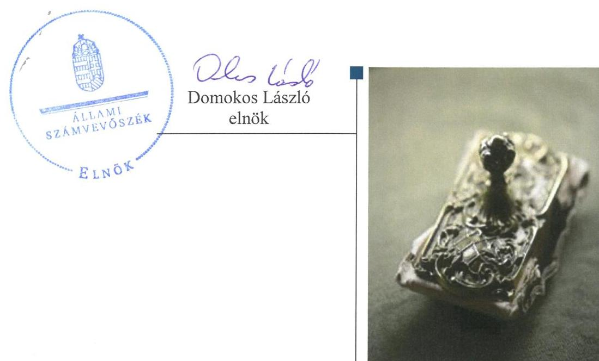
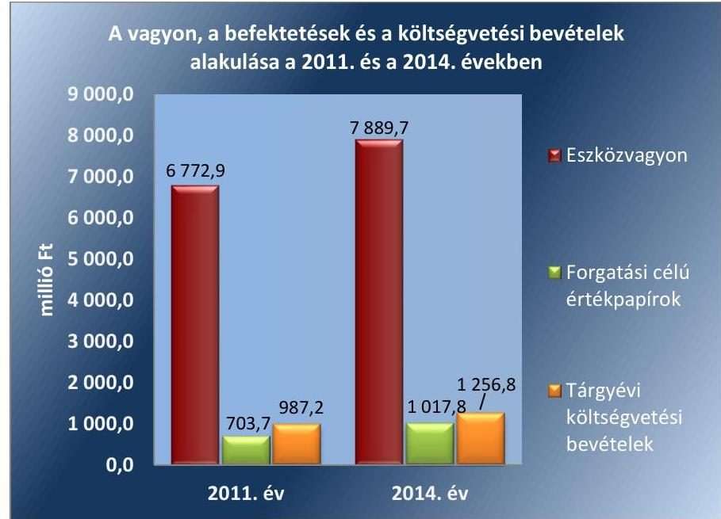
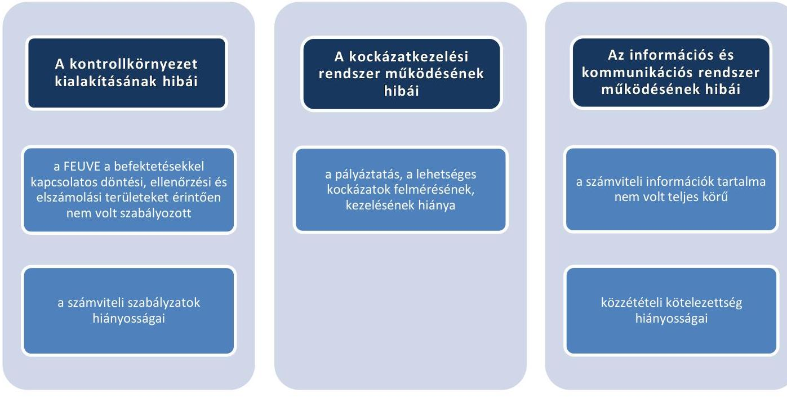
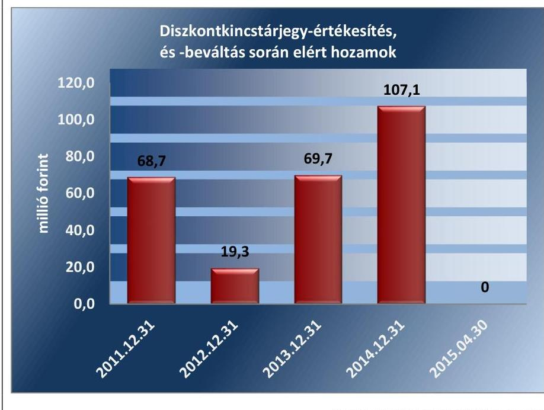
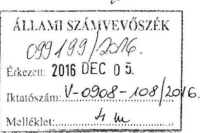
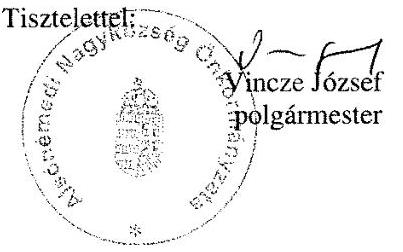
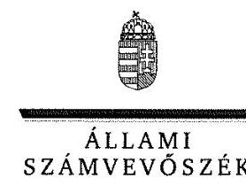
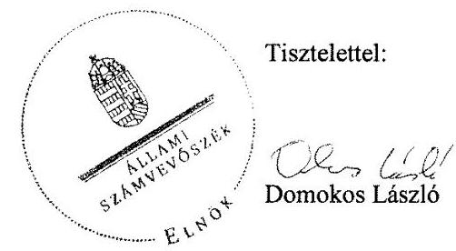

# Jelenetés 

## Önkormányzatok belsö kontrollrendszere

Az önkormányzatok belső kontrollrendszere kialakításának és múködtetésének ellenőrzése - Alsónémedi
2017.

---

# Jelentés 

## Önkormányzatok belső kontrollrendszere

Az önkormányzatok belső kontrollrendszere kialakításának és múködtetésének ellenőrzése - Alsónémedi
2017. O.A. hó 11. nap

---

# AZ ELLENŐRZÉST FELÜGYELTE: 

RENKÓ ZSUZSANNA felügyeleti vezető

## AZ ELLENŐRZÉST VEZETTE ÉS A VÉGREHAJTÁSÁÉRT FELELŐS:

DÉR LÍVIA ellenőrzésvezető

## A PROGRAM ÖSSZEÁLLÍTÁSÁÉRT FELELŐS:

JANIK JÓZSEF osztályvezető

IKTATÓSZÁM: V-0908-115/2016.
TÉMASZÁM: 1942

## ELLENŐRZÉS-AZONOSÍTÓ SZÁM: V-07185

Jelentéseink az Országgyúlés számítógépes hálózatán és az Interneten a www.asz.hu címen is olvashatóak.

---

# TARTALOMJEGYZÉK 

■ ÖSSZEGZÉS ..... 5
■ AZ ELLENŐRZÉS CÉLJA ..... 6
■ AZ ELLENŐRZÉS TERÜLETE ..... 7
■ AZ ELLENŐRZÉS HÁTTERE, INDOKOLTSÁGA ..... 8
■ A JELENTÉS LÉNYEGES KÉRDÉSKÖREI ..... 11
■ ELLENŐRZÉS HATÓKÖRE ÉS MÓDSZEREI ..... 12
■ MEGÁLLAPÍTÁSOK ..... 15
■ JAVASLATOK ..... 36
■ MELLÉKLETEK ..... 39
I. Sz. melléklet: Értelmező szótár ..... 39
II. Sz. melléklet: Az integritás szemlélet érvényesítése érdekében kialakított és múködtetett kontrollrendszer ..... 43
■ FÜGGELÉK: ÉSZREVÉTELEK ..... 45
■ RÖVIDÍTÉSEK JEGYZÉKE ..... 59

---

.

---

# ÖSSZEGZÉS 

Alsónémedi Nagyközség Önkormányzata belső kontrollrendszere kialakításának és müködtetésének hiányosságai miatt a befektetési tevékenységek szabályszerű végzését, elszámoltathatóságát nem támogatta. Az Önkormányzat beszámolója nem a valóságnak megfelelően mutatta be a befektetett közvagyon nagyságát. Az Önkormányzat az integritás szemlélet érvényesülése érdekében nem tett erőfeszítést.

## Az ellenőrzés társadalmi indokoltsága

Magyarország Alaptörvénye az önkormányzatoktól is elvárja a kiegyensúlyozott, átlátható és fenntartható költségvetési gazdálkodás elvének érvényesítését. Az önkormányzatok által betöltött társadalmi szerep, az általuk kezelt közpénz nagysága, a nemzeti vagyon átruházására vagy hasznosítására vonatkozó döntéseik sokrétűsége indokolttá teszik a számvevőszéki ellenőrzéseket. A belső kontrollrendszer kialakítása és müködtetése nélkül nem valósítható meg a közpénzek, a közvagyon szabályos, gazdaságos, hatékony és eredményes felhasználása.

Alsónémedi Önkormányzata számviteli nyilvántartásaiban 2015. április 30-án 1 017,8 millió Ft névértékű diszkontkötvényt, és 199,0 millió Ft lekötött betétállományt mutatott ki. Az Önkormányzat befektetési szolgáltatójának törvénytelen tevékenysége következtében fennállt a veszélye annak, hogy a befektetett közvagyon egy részét elveszítik. Felmerült, hogy a belső kontrollrendszer kialakítása és müködtetése nem biztosította a közvagyon megóvását, körültekintő, biztonságos befektetését, a befektetési döntések, azok végrehajtása és számviteli elszámolása nem volt szabályszerű.

## Főbb megállapítások, következtetések, javaslatok

A belső kontrollrendszer kialakítása és müködtetése részben szabályszerű volt, így nem segítette elő a közpénzfelhasználás szabályosságát. A befektetésekkel kapcsolatos kontrolltevékenységek nem megfelelő működtetése akadályozta a hibák megelőzését, feltárását. A kötelezettségvállalási, az ellenjegyzési, a teljesítésigazolási, és az érvényesítési jogkörök szabálytalan gyakorlása növelte a jogosulatlan kifizetések veszélyét. A befektetési döntések előkészítésekor a kockázatokat nem mérték fel, így nem tettek meg mindent a befektetett közvagyon biztonságos megőrzéséért.

Az egyes befektetések számviteli nyilvántartási értékének, azaz az 1017,8 millió Ft helytelen megállapítása, továbbá a részletező nyilvántartás nem megfelelő vezetése következtében az önkormányzat beszámolója vagyonáról nem a valós összképet mutatta. Az Önkormányzat értékpapírral kapcsolatos tulajdonosi joggyakorlása nem biztosította az Önkormányzatnál megtestesülő nemzeti vagyon megőrzésének, védelmének és a nemzeti vagyonnal való átlátható és felelős gazdálkodásának a követelményét.

Az integritás szemlélet erősítése érdekében - a belső kontrollrendszer kialakításában és müködésében feltárt hiányosságok és hibák megszüntetésével - az Önkormányzatnak még erőfeszítéseket kell tennie.

---

# AZ ELLENŐRZÉS CÉLJA 

Az ellenőrzés célja annak megállapítása volt, hogy az önkormányzat belső kontrollrendszerének kialakítása, továbbá egyes elemeinek működtetése biztosította-e az önkormányzatnál a közpénzfelhasználás szabályosságát. Az erőforrásokkal való szabályszerű és hatékony gazdálkodáshoz szükséges követelmények érvényesítése, számonkérése, ellenőrzése megtörtént-e az önkormányzatnál. A belső kontrollrendszer kialakítása és működtetése támogatta-e az integritás szemlélet érvényesülését. Az ellenőrzés során értékeltük a belső kontrollrendszer kialakításának és működtetésének szabályszerűségét. Bemutatjuk azokat a lényeges szabályozási hiányosságokat, amelyek miatt az ellenőrzött kulcskontrollok nem nyújtottak elegendő védelmet a lehetséges hibákkal szemben. Rámutattunk arra, ha a kulcskontrollok valamely hibát nem előztek meg, nem tártak fel vagy nem javítottak ki, valamint minősítjük működésük megfelelőségét. Ellenőriztük, hogy az önkormányzat egyes befektetési döntései és azok végrehajtása, elszámolása megfelelt-e a vonatkozó jogszabályoknak és belső szabályozásoknak, a kialakított kontrollrendszer támogatta-e a befektetési tevékenység szabályszerűségét.

---

# **Az Elkenőrzés Területe**

### **Alsónémedi Nagyközség Önkormányzata**

A Pest megyében elhelyezkedő Alsónémedi nagyközség állandó lakosainak száma 2015. január 1-jén 5211 fő volt. Az Önkormányzat1 kilenctagú Képviselő-testületének2 munkáját három állandó bizottság segítette. Az Önkormányzat a Hivatalon3 kívül kettő intézménnyel, valamint egy 100%-os tulajdoni részesedésű gazdasági társasággal látta el a feladatait. A településen 2014. október 12-éig működött az Alsónémedi Örmény Nemzetiségi Önkormányzat, amelynek megszűnését követően nem alakult új nemzetiségi önkormányzat.

A polgármester4 a 2010. évi önkormányzati választások óta tölti be tisztségét. A jegyző5 2011-től látja el feladatait. A Hivatal négy szervezeti egységre (Pénzügyi Csoport, Hatósági Csoport, Műszaki Csoport, Titkárság) tagolódott, elkülönített gazdasági szervezettel rendelkezett. Az önálló gazdasági szervezet feladatait a Pénzügyi Csoport látta el. A Hivatalban foglalkoztatott köztisztviselők száma 2014. év végén 18 fő volt. A Hivatalnál 2014. január 1-je után szervezeti változás nem történt.

Az Önkormányzat a 2014. évi költségvetési beszámoló szerint 1256,8 millió Ft költségvetési bevételt ért el, valamint 1094,6 millió Ft költségvetési kiadást teljesített. Adósságkonszolidációs támogatásban nem részesültek.

Az Önkormányzat vagyonának, befektetéseinek és a költségvetési bevételeinek alakulását a 2011. és a 2014. évben a 1. ábra mutatja be:

1. ábra

*Forrás: Alsónémedi Nagyközség Önkormányzatának 2011. és 2014. évi éves költségvetési beszámolói*

---

# AZ ELLENŐRZÉS HÁTTERE, INDOKOLTSÁGA 

Az ÁSZ tv. ${ }^{6}$ szerint az ÁSZ ${ }^{7}$ feladata a jól irányított állam kiépítésének elősegítése. Az ÁSZ Stratégiájában ezért hangsúlyos szerepet szánt annak, hogy szilárd szakmai alapon álló, értékteremtő ellenőrzéseivel előmozdítsa a közpénzügyek átláthatóságát, rendezettségét. A számvevőszéki ellenőrzés nemzetközi alapelvei is rögzítik, hogy a megfelelő belső kontrollrendszer minimálisra csökkenti a hibák és szabálytalanságok kockázatát.

A belső kontrollrendszer azt a célt szolgálja, hogy a költségvetési szervek működésük és gazdálkodásuk során a tevékenységeket szabályszerűen, gazdaságosan, hatékonyan, eredményesen hajtsák végre, teljesítsék elszámolási kötelezettségeiket és megvédjék az erőforrásokat a veszteségektől, a károktól és a nem rendeltetésszerű használattól. A belső kontrollrendszer magában foglalja mindazon szabályokat, eljárásokat, gyakorlati módszereket és szervezeti struktúrákat, kockázatkezelési technikákat, kontrolltevékenységeket, amelyek segítséget nyújtanak a szervezetnek céljai eléréséhez. A belső kontrollrendszer szabályozása háromszintű: a törvényi előírásokat az Áht. ${ }^{8}$ és a Mötv. ${ }^{9}$, a rendeleti szintű szabályozást az Ávr. ${ }^{10}$ és a Bkr. ${ }^{11}$ tartalmazza, amelyeket útmutatói szinten az NGM ${ }^{12}$ által kiadott standardok és kézikönyvek támogatnak.

Az ellenőrzött időszak meghatározása lehetőséget teremt a 2014. október 12-i önkormányzati választásokat megelőző és követő ciklus belső kontrollrendszere működésének elkülönült értékelésére, valamint a változások nyomon követésére.

A BELSŐ KONTROLLRENDSZER kialakításának és működtetésének általános értékelése mellett a teljesítésigazolás és érvényesítés kontrollok kiemelt ellenőrzésének szükségességét alátámasztja, hogy 2012-től a pénzügyi folyamatokban kulcsszerepet betöltő belső kontrollok rendszere módosult és azok működtetésében az önkormányzatoknál hiányosságok mutatkoztak a 2012. óta elvégzett ÁSZ ellenőrzések alapján.

Az önkormányzatok belső kontrollrendszerének ellenőrzése az ÁSZ „jó kormányzással" kapcsolatos stratégiai céljainak megvalósítását is szolgálja. Az ÁSZ célja, hogy javuljon az ellenőrzött önkormányzatok belső kontrollrendszerének szabályozottsága, működésének megfelelősége, hozzájárulva ezzel az egyensúlyi helyzet fenntarthatóságának biztosításához, azaz az adósság újratermelődésének megakadályozásához. Az ÁSZ ellenőrzés tapasztalatai nem csupán a közvetlenül ellenőrzött önkormányzatokat segíthetik, hanem a „jó gyakorlat" elterjesztésével azok az önkormányzatok is átvehetik a pozitív példákat, ahol nem végez ellenőrzést az ÁSZ.

Az MNB három befektetési szolgáltató tevékenységi engedélyét 2015. első felében visszavonta és kezdeményezte a vállalkozások felszámolását a működéssel kapcsolatos szabálytalanságok, hiányosságok miatt. A korábbi évek ellenőrzési tapasztalatai alapján fennáll a lehetősége annak, hogy az önkormányzatok befektetési döntései, továbbá a döntések végrehajtása és számviteli elszámolása nem voltak teljes mértékben szabályszerűek, és a kapcsolódó külső ellenőrzések és a belső kontrollrendszer sem működtek minden esetben megfelelően.

---

Magyarország Alaptörvénye ${ }^{13}$ az önkormányzatoktól, mint az államháztartás alanyaitól elvárja a kiegyensúlyozott, átlátható és fenntartható költségvetési gazdálkodás elvének érvényesítését. A nemzeti vagyonról szóló törvény szerint a nemzeti vagyonnal felelős módon, rendeltetésszerűen kell gazdálkodni. A nemzeti vagyongazdálkodás feladata a nemzeti vagyon rendeltetésének megfelelő, átlátható, hatékony és költségtakarékos működtetése, ugyanakkor értékének megőrzését, értéknövelő használatát, hasznosítását, gyarapítását is elvárja.

# AZ ÖNKORMÁNYZATOK ÁTMENETILEG SZABAD PÉNZESZKÖZEINEK BEFEKTETÉSÉT jogszabály nem tiltja, a pénzpiaci szolgáltatók közül az önkormányzatok a kínált szolgáltatás és annak költségei alapján, szabadon választhatnak, a veszteséges gazdálkodás kockázatai és következményei azonban az önkormányzatokat terhelik. A szabad pénzeszközök felelős hasznosítása összhangban áll az önkormányzati gazdálkodás alapelveivel. 

A közintézmények integritás alapú kultúrájának kialakítása, megerősítése és múködése szorosan összefügg a belső kontrollrendszer múködésével, ezért az ellenőrzés kiterjed annak értékelésére is, hogy a belső kontrollrendszer kialakítása és múködtetése hogyan hatott az integritás szemlélet érvényesülésére.

Az államháztartás önkormányzati alrendszerében a 2014. év elején öszszesen 3177 települési önkormányzat múködött: a 23 kerülettel rendelkező főváros, 345 város, 2691 község és 117 nagyközség volt. A belső kontrollrendszer kialakítása és múködtetése ellenőrzését az ÁSZ által lefolytatott, kisebb településeket is érintő ellenőrzéseinek tapasztalatai, valamint a közérdekú bejelentések kockázati szempontú értékelése alapozták meg. Ezek a községek, nagyközségek gazdálkodásának, belső kontrollrendszere kialakításának és múködésének hiányosságaira mutattak rá. Az ellenőrzések helyszíneinek kiválasztása során az ÁSZ célzott adatfeldolgozáson alapuló kockázatelemző rendszerére támaszkodik. Ez elősegíti, hogy azokon a területeken végezzen ellenőrzéseket, összpontosítva erőforrásait, ahol a valódi kockázatok, az aktuális problémák vannak.

## AZ ELLENŐRZÉS VÁRHATÓ HASZNOSULÁSA NÉGY SZINTEN valósul meg.

A törvényalkotás számára összegzett tapasztalatok állnak rendelkezésre a belső kontrollrendszer önkormányzati területen való kialakításáról, múködtetéséről és hatásairól. Az ÁSZ az ellenőrzéseivel hozzájárul ahhoz, hogy az egyes önkormányzati befektetésekkel kapcsolatos kockázatok a szabályozási és kontroll mechanizmusok fejlesztésével mérsékelhetők legyenek.

Az ellenőrzés az ellenőrzött számára visszajelzést ad a belső kontrollrendszer kialakításában és múködésében lévő hiányosságokról, javaslataival hozzájárul azok kiküszöböléséhez. Feltárja az önkormányzati befektetési tevékenységet meghatározó szabályozások összhangjának hiányosságait, a szabályozással nem érintett gazdálkodási területeket, valamint az egyes befektetési tevékenységek esetleges szabálytalanságait.

Az ellenőrzés megállapításait és javaslatait más szervezetek is hasznosíthatják a rendezett gazdálkodási keretek kialakításához.

---

A társadalom számára jelzi, hogy közpénz nem maradhat ellenőrizetlenül, az ÁSZ értékteremtő rend kialakításához és megőrzéséhez hozzájáruló tevékenysége így pozitív hatással lesz a szervezetről kialakított összkép formálásában.

---

# A JELENTÉS LÉNYEGES KÉRDÉSKÖREI 

1. Az önkormányzat belső kontrollrendszerének kialakítása és müködtetése szabályszerű volt-e 2014. január 1. és 2015. április 30. között, valamint a belső kontrollrendszer egyes pillérei támogat-ták-e a befektetési tevékenység szabályszerű végzését 2011. január 1. és 2015. április 30. között?
2. Az egyes befektetésekkel kapcsolatos döntéshozatal és a döntések végrehajtása szabályszerű volt-e?
3. Az egyes befektetések számviteli elszámolása, nyilvántartása szabályszerű volt-e?
4. Az erőforrásokkal való szabályszerű és hatékony gazdálkodáshoz szükséges követelmények érvényesítése, számonkérése, ellenőrzése megtörtént-e az önkormányzatnál?
5. Az önkormányzat belső kontrollrendszerének kialakítása és müködtetése támogatta-e az integritás szemlélet érvényesülését?

---

# ELLENŐRZÉS HATÓKÖRE ÉS MÓDSZEREI 

## Az ellenőrzés típusa

Megfelelőségi ellenőrzés, a befektetési tevékenység esetében szabályszerűségi ellenőrzés.

## Az ellenőrzött időszak

A belső kontrollrendszer kialakításának és működtetésének ellenőrzése a 2014. január 1. és 2015. április 30. közötti időszakra terjedt ki. Ezen belül a belső kontrollrendszer kialakításának és működtetésének megfelelőségét a 2014. január 1. és október 12., valamint a 2014. október 13. és 2015. április 30. közötti időszakra vonatkozóan külön-külön értékeltük. Az önkormányzatok egyes befektetési tevékenységeinek ellenőrzése tekintetében az ellenőrzött időszak a 2011. január 1. - 2015. április 30. közötti időszak. Ezen felül az önkormányzat befektetésekkel kapcsolatos döntés-előkészítésének és döntéshozatalának szabályszerűségét a 2011. január 1. előtti időszakra visszanyúlóan is ellenőriztük, amennyiben a 2014. június 30-án, illetve 2015. április 30-án meglévő befektetéseire 2011. január 1-je előtt került sor. Az integritás szemlélet érvényesülését a 2014. évre vonatkozó adatszolgáltatás alapján értékeltük.

## Az ellenőrzés tárgya

A helyi önkormányzatnak, mint éves költségvetési beszámoló készítésére kötelezett szervezetnek és polgármesteri hivatalának belső kontrollrendszere. Az önkormányzat 2014. június 30-án, illetve 2015. április 30-án meglévő értékpapírokban megtestesülő befektetései, lekötött betétei, valamint az önkormányzat üzleti vagyonába tartozó ingatlanok, kulturális javak (műtárgyak, műalkotások, stb.), illetve a feladatellátást nem szolgáló egyéb értéktárgyak (pl. ékszerek, befektetési nemesfém). Az erőforrásokkal való szabályszerű és hatékony gazdálkodáshoz szükséges követelmények érvényesítése, számonkérése, ellenőrzése. Az integritás szemlélet érvényesülése.

## Az ellenőrzött szervezet

Alsónémedi Nagyközség Önkormányzata és az önkormányzati működéshez kapcsolódó feladatokat ellátó Hivatal.

---

# Az ellenőrzés jogalapja 

Az ÁSZ tv. 1. § (3) bekezdésében foglaltak alapján az ÁSZ általános hatáskörrel végzi a közpénzekkel és az állami és önkormányzati vagyonnal való felelős gazdálkodás ellenőrzését. Az ÁSZ tv. 5. § (2) bekezdése alapján az államháztartás gazdálkodásának ellenőrzése keretében az ÁSZ ellenőrzi a helyi önkormányzatok gazdálkodását, valamint az ÁSZ tv. 5. § (6) bekezdése alapján ellenőrzése során értékeli az államháztartás számviteli rendjének betartását és a belső kontrollrendszer múködését.

## Az ellenőrzés módszerei

Az ellenőrzést a nemzetközi standardokat irányadónak tekintve az ellenőrzési program ellenőrzési kérdései, az ellenőrzött időszakban hatályos jogszabályok, az ellenőrzés szakmai szabályok és módszertanok figyelembe vételével végeztük.

Az ellenőrzés lefolytatásához az Önkormányzat a tanúsítványok kitöltésével, valamint az ÁSZ által kért dokumentumok elektronikus megküldésével szolgáltatott adatokat. A rendelkezésre bocsátott adatok, információk kontrollja és a munkalapok kitöltése az ellenőrzés keretében történt. A jelentésben használt fogalmak magyarázatát az I. számú melléklet, az integritás érvényesítése érdekében kialakított és múködtetett kontrollrendszer minősítését a II. számú melléklet tartalmazza.

A belső kontrollrendszer jogszabályi előírások szerinti kialakításának és múködtetésének szabályszerűségét az erre irányuló ellenőrzési kérdésekre adott válaszok összesítése alapján külön-külön értékeltük a 2014. január 1. és október 12., valamint a 2014. október 13. és 2015. április 30. közötti időszakra. A belső kontrollrendszert egy-egy ellenőrzött időszakra pillérenként (kontrollkörnyezet, kockázatkezelési rendszer, kontrolltevékenységek, információs és kommunikációs rendszer, monitoring rendszer) és öszszesítetten is értékeltük.

## A BELSŐ KONTROLLRENDSZER EGYES PILLÉRE-

INEK KIALAKÍTÁSA ÉS MŰKÖDTETÉSE „szabályszerű volt", amennyiben az értékelt területen az elért és elérhető pontok százalékban kifejezett, egész számra kerekített hányadosa meghaladta a 84\%ot, „részben szabályszerű volt", ha 61-84\% közé esett, „nem szabályszerű volt", ha nem haladta meg a 60\%-ot. A belső kontrollrendszer összesített értékelése megegyezett a pillérenként (kontrollterületenként) alkalmazott százalékos értékelésekkel, a következő eltérésekkel. A kontrollrendszer egésze esetében a „szabályszerű" értékelésnek a százalékos értéken felül további feltétele volt, hogy egyik kontrollterület sem kaphat „nem szabályszerű" értékelést, a „részben szabályszerű" értékelés további feltétele volt, hogy legfeljebb egy ellenőrzött kontrollterület lehet „nem szabályszerű" értékelésú. Az összesített értékelés a százalékos értéktől függetlenül „nem szabályszerű volt", ha az ellenőrzött kontrollterületek közül több mint egynek „nem szabályszerű volt" az értékelése.

---

# A GAZDÁLKODÁS FOLYAMATÁBAN A KÉT 

KULCSKONTROLL - teljesítésigazolás, érvényesítés - működésének megfelelőségét a személyi juttatásokkal, a dologi kiadásokkal, a beruházási, felújítási kiadásokkal, az ellátottak pénzbeli juttatásaival és az egyéb múködési, felhalmozási célú, valamint a finanszírozási kiadásokkal kapcsolatos kifizetések esetében mintavétellel ellenőriztük. A mintavétel során külön értékeltük a 2014. január 1. és 2014. október 12. közötti időszakban és a 2014. október 13. és 2015. április 30. közötti időszakban teljesített kifizetéseket. „Megfelelőnek" értékeltük a gazdálkodási jogkörök gyakorlását, amennyiben 95\%-os bizonyossággal a teljes sokaságban a hibaarány legfeljebb 10\%, „részben megfelelőnek" értékeltük, ha a hibaarány felső határa 10-30\% között volt, „nem megfelelőnek" pedig akkor, ha a mintavételi eredmények alapján a sokaságbeli hibaarány felső határa meghaladta a 30\%-ot.

Az integritás szemlélet érvényesülésének értékelése az önkormányzat által kitöltött tanúsítvány alapján történt.

---

# MEGÁLLAPÍTÁSOK

1. Az önkormányzat belső kontrollrendszerének kialakítása és müködtetése szabályszerű volt-e 2014. január 1. és 2015. április 30. között, valamint a belső kontrollrendszer egyes pillérei támogatták-e a befektetési tevékenység szabályszerű végzését 2011. január 1. és 2015. április 30. között?

|  Összegző megállapítás | A belső kontrollrendszer kialakítása és müködtetése 2014. január 1. és 2015. április 30. között az összesített értékelés alapján - a feltárt hiányosságok miatt - részben szabályszerű volt. A belső kontrollrendszer kialakítása és müködtetése a kockázatkezelési rendszer, a kontrolltevékenységek és a monitoring rendszer hibái miatt 2011. január 1. és 2015. április 30 között nem támogatta a befektetési tevékenység szabályszerű, kockázatokat minimalizáló, elszámoltató végzését.  |
| --- | --- |
|   | A belső kontrollrendszer kialakításának és müködtetésének összesített értékelését az 1. táblázat mutatja be:  |

1. táblázat

|  A BELSŐ KONTROLLRENDSZER KIALAKÍTÁSÁNAK ÉS MŰKÖDTETÉSÉNEK ÖSSZESÍTETT ÉRTÉKELÉSE |  |  |   |
| --- | --- | --- | --- |
|  Megnevezés | A gazdálkodás egészét érintően: 2014. január 1-tól 2014. október 12-ig | A befektetési tevékenységet érintően: 2014. október 13-tól 2015. április 30-ig | A befektetési tevékenységet érintően: 2014. január 1-tól 2015. április 30-ig  |
|  Kontrollkörnyezet | szabályszerű |  | nem támogatta  |
|  Kockázatkezelési rendszer | nem szabályszerű |  | nem támogatta  |
|  Kontrolltevékenységek | részben szabályszerű | n.a. | nem támogatta  |
|  Információs és kommunikációs rendszer | szabályszerű |  | nem támogatta  |
|  Monitoring | részben szabályszerű |  | nem támogatta  |
|  BELSŐ KONTROLLRENDSZER | RÉSZBEN SZABÁLYSZERŰ |  | NEM TÁMOGATTA  |

1.1. számú megállapítás

A kontrollkörnyezet kialakítása 2014. január 1. és 2015. április 30. között a feltárt hiányosságok mellett szabályszerű volt. A belső szabályzatok tartalma nem felelt meg teljes körűen a jogszabályi előírásoknak, emiatt 2011. január 1. és 2015. április 30. között a befektetési tevékenységek szabályszerű végzését a kontrollkörnyezet nem támogatta.

A SZERVEZETI ÉS SZABÁLYOZÁSI KERETEKET, a feladat- és hatáskörök rendszerét a Képviselő-testület az alábbiak szerint alakította ki:

- az önkormányzati SZMSZ ${ }_{1,2}{ }^{14,15}$-ben a szervezeti kereteket, a feladatés hatáskörök rendszerét meghatározta.

---

- rendeletben rögzítette a vagyonnal történő gazdálkodás szabályait. A vagyongazdálkodási rendelet ${ }^{16}$ nem rendelkezett a hatáskörök átadásáról, a Képviselő-testület az erre vonatkozó jogosítványokat fenntartotta magának. A vagyongazdálkodási rendelet ${ }_{1}$ az ingatlan vagyonra vonatkozó szabályokat határozott meg, az egyéb vagyont, ideértve a pénzvagyont nem érintette. A vagyongazdálkodási rende$l e t_{2}{ }^{17}$ fogalmi szinten már tartalmazta a mérlegben szereplő vagyont - amibe bele tartozik az értékpapír-állomány is - de a rendelet kizárólag az ingatlan vagyon kezelésével kapcsolatos részletszabályokra tért ki. Meghatározta továbbá a követelésekről való lemondás módját és eseteit, azzal, hogy a követelésről való lemondás jogát a rendelet 100 ezer Ft-ig a polgármester részére biztosította.
- a 2011. évben elfogadott gazdasági program tartalmazta a tervezett beruházásokat, azonban nem teremtett közvetlen kapcsolatot a jelentős pénz-, illetve állampapír-vagyon és a beruházások megvalósítása között, a befektetések ütemezését, felhasználását nem érintette.
az éves költségvetést az előírt határidőre rendeletben határozta meg. Az éves költségvetési rendeletek minden évre külön-külön adtak felhatalmazást a polgármesternek, hogy az átmenetileg szabad pénzeszközöket a Képviselő-testület tájékoztatásával betétként elhelyezze, vagy államilag garantált értékpapírt vásároljon. Az Mötv. 115. § (1) bekezdésében foglaltak szerint a helyi önkormányzat gazdálkodásának biztonságáért a képviselő-testület a felelős, ugyanakkor a költségvetési rendeletekben megfogalmazott felhatalmazás által a polgármester általános és széles körű felhatalmazást kapott a költségvetés nagyságrendjéhez képest jelentős összegű befektetések megvalósítására, utólagos tájékoztatási kötelezettség mellett. Ezáltal a Képviselő-testületnek nem volt módja a döntések költségvetésre gyakorolt hatásának előzetes mérlegelésére.

A HIVATAL BELSŐ SZABÁLYOZÁSA keretében rendelkeztek
a Képviselő-testület által elfogadott alapító okirattal ${ }^{18}$, valamint szervezeti és működési szabályzattal. A hivatali SZMSZ ${ }_{1,2}{ }^{19,20}$ tartalma - a 2. táblázatban részletezett hiányosság miatt - részben felelt meg a jogszabályi előírásoknak a befektetésekre vonatkozó speciális szabályokat pedig nem tartalmazott.
a gazdasági szervezet munkafolyamatait, a gazdálkodási feladatokat végzők feladatait tartalmazó gazdasági ügyrend ${ }_{1,2}{ }^{21,22}$-del, amely nem tartalmazott a befektetési tevékenységgel kapcsolatos feladatellátásra vonatkozó részletszabályokat.
a pénzügyi-számviteli területen dolgozó köztisztviselők munkaköri leírásaival, melyekben rögzítették az ellátandó feladatokat és részben a munkakör betöltésével kapcsolatos követelményeket. A gazdasági szervezet vezetője rendelkezett az előírt végzettséggel, szakképesítéssel és a könyvviteli szolgáltatás körébe tartozó tevékenység ellátására jogosító engedéllyel.
pénzgazdálkodás rendje ${ }_{1,2,3}{ }^{23,24,25}$-vel, amely meghatározta a Hivatal és az önkormányzati feladatok vonatkozásában a kötelezettségvállalás, a pénzügyi ellenjegyzés, a teljesítésigazolás, az érvényesítés és

---

az utalványozás módjával, eljárási szabályaival, az ezeket végző személyek kijelölésével kapcsolatos előírásokat;
számviteli politika ${ }_{1,2}{ }^{26,27}$-val és számlarend ${ }_{1,2,3}{ }^{28,29,30}$-del, amelyek - a 2. táblázatban részletezett hiányosságok miatt - nem támogatták a befektetésekkel kapcsolatos számviteli előírások szabályszerű betartását.
$\qquad$ leltározási szabályzat ${ }_{1,2,3}{ }^{31,32,33}$-tal és értékelési szabályzat ${ }_{1,2}{ }^{34,35}$-tal, amelyek támogatták a befektetési tevékenység szabályszerűségét, tartalmaztak az értékpapírok leltározására, értékelésére vonatkozó előírásokat. Rendelkezésre állt továbbá a pénzkezelési szabály$z^{2}{ }_{1,2,3}{ }^{36,37,38}$, amely a szabad pénzeszközök lekötésével kapcsolatos előírásokat tartalmazott.
az átlátható humánerőforrás-gazdálkodás kereteit meghatározó dokumentumokkal. A Képviselő-testület költségvetési rendeletében meghatározta a Hivatal engedélyezett létszámát, a jegyző elkészítette a közszolgálati szabályzatot ${ }^{39}$, meghatározta a köztisztviselők teljesítményértékelésének ajánlott elemeit és elkészítette a köztisztviselők teljesítményértékeléseit.
a jogszabályi előírásoknak megfelelően az egészséget nem veszélyeztető és biztonságos munkavégzés követelményei megvalósításának módját tartalmazó szabályzattal, valamint tűzvédelmi szabály$z^{2}{ }_{1,2}{ }^{40,41}$-tal.
$\qquad$ táblázatos formában - 2011. év kivételével - elkészített ellenőrzési nyomvonal ${ }_{1,2}{ }^{42,43}$-lal, amely részben támogatta a befektetési tevékenység szabályszerű végzését. Az ellenőrzési nyomvonal ${ }_{1 .}$ az értékpapír vásárlásra nem, de az értékesítésre meghatározta a feladatellátásban résztvevő, előkészítésre koordinálásra végrehajtásra és ellenőrzésre kötelezett személyeket, munkaköröket. A 2011. évben nem tettek eleget az Ámr. ${ }^{44}$ 156. § (2) bekezdésében foglaltaknak, mivel nem készítették el a Hivatal ellenőrzési nyomvonalát.
szabálytalanságok kezelésének eljárásrendje ${ }_{1,2,3}{ }^{45,46,47}$-vel amely a befektetésekre vonatkozóan nem tartalmazott külön előírásokat.
A kontrollkörnyezet kialakítása 2011. január 1. és 2015. április 30. közötti időszakban a felsorolt szabályozási hiányosságok miatt nem támogatta a befektetési tevékenység szabályszerű végzését.

A kontrollkörnyezet kialakítása és múködtetése az értékelés szempontjából a 2014. január 1. és a 2014. október 12., valamint a 2014. október 13. és 2015. április 30. közötti időszakokban szabályszerű volt. A 2. táblázat részletezi az ellenőrzési időszak végén is fennálló hiányosságokat.
2. táblázat

# A KONTROLLKÖRNYEZET KIALAKÍTÁSÁNAK HIÁNYOSSÁGAI 

## Sorszám

## Részmegállapítás

1. A hivatali SZMSZ ${ }_{2}$ az Ávr. 13. § (1) bekezdés c) pontjában előírtak ellenére nem tartalmazta a kormányzati funkció szerint besorolt alaptevékenységek megjelölését.
A Kttv. ${ }^{48} 75$. § (1) bekezdés d) pontjában foglaltak ellenére a munkaköri leírásokban hiányosan rögzítették a munkakör betöltésével kapcsolatos követelményeket, mivel nem határozták meg az elvárt tapasztalatot és képességeket.
A Képviselő-testület a Kttv. 231. § (1) bekezdés előírása ellenére - az ellenőrzött időszakban - nem állapította meg a Kttv. 83. §-ában előírt, a köztisztviselőkre vonatkozó hivatásetikai alapelvek részletes tartalmát, valamint az etikai eljárás szabályait.

---

# Sorszám 

## Részmegállapítás

A számlarend ${ }_{1,2}$ a Számv. tv. ${ }^{49} 161 . \S$ (2) bekezdés c) pontjában és az Áhsz. ${ }^{50} 49 . \S$ (3) bekezdésében, a 9. melléklet 2.d pontjában előírtak, illetve a számlarend ${ }_{3}$ a Számv. tv. 161. § (2) bekezdés c) pontjában és az Áhsz. ${ }^{51} 51 . \S$ (3) bekezdésében előírtak ellenére hiányosan tartalmazta a főkönyvi számla és az analitikus nyilvántartások kapcsolatát, a részletező nyilvántartások vezetésének módját, az analitikus és
4. főkönyvi nyilvántartások egyeztetési feladatait, annak dokumentálását. A számlarend ${ }_{3}$ az Áhsz. ${ }_{2} 51 . \S$ (3) bekezdésben foglaltak ellenére nem tartalmazta a részletező nyilvántartások és az egységes rovatrend rovataihoz kapcsolódóan vezetett nyilvántartási számlák adataiból a pénzügyi könyvvezetéshez készült összesítő bizonylatok (feladások) elkészítésének rendjét és az összesítő bizonylat tartalmi és formai követelményeit.

Forrás: Ász
1.2. számú megállapítás

A kockázatkezelési rendszer kialakítása és múködtetése 2014. január 1. és 2015. április 30. között nem volt szabályszerű. A kockázatkezelési rendszer múködtetése során a gazdálkodásban rejlő köztük az értékpapír-vásárlási és betétlekötési - kockázatok felmérése és értékelése nem történt meg, emiatt a 2011. január 1. és 2015. április 30 között nem támogatta az egyes befektetési tevékenységek szabályszerű végzését.

A KOCKÁZATKEZELÉSI RENDSZER kereteit a Hivatal vonatkozásában - a 2012. évtől - kialakították, a kockázatkezelési szabály-zat ${ }_{1,2}{ }^{52,53}$-ban meghatározták a kockázatok azonosításával, elemzésével, csoportosításával, nyomon követésével kapcsolatos általános előírásokat. A tevékenységben, gazdálkodásban rejlő kockázatok - ideértve a befektetési tevékenység lehetséges kockázatait is - tényleges felmérése, a szükséges intézkedések előírása, illetve azok nyomon követési módjának meghatározása nem történt meg.

## A VAGYONNYILATKOZAT-TÉTELRE KÖTELEZET-

TEK körének meghatározása a Hivatal köztisztviselői esetében a 2014. január 1. - 2015. április 30. közötti időszakban, az önkormányzati bizottságok nem képviselő tagjai esetében a 2014. január 1. - 2014. október 12. közötti időszakban az előírásoknak megfelelő volt.

A vagyonnyilatkozatokat a köztisztviselők határidőben benyújtották, a képviselők közül hat fő a 2014. január 1. - 2014. október 12. közötti időszakban késve nyújtotta be vagyonnyilatkozatát. A nem képviselő bizottsági tagok vagyonnyilatkozatai az ellenőrzött időszakban nem álltak rendelkezésre.

A kockázatkezelési rendszer 2011. január 1. és 2013. december 31., valamint 2014. január 1. és 2015. április 30. közötti időszakokban a befektetési kockázatok felmérésében tapasztalt hiányosság miatt a befektetési tevékenységek szabályszerű végzését nem támogatta.

A kockázatkezelési rendszer kialakítása és múködtetése a 2012-től tapasztalt hiányosságokat figyelembe véve a 2014. január 1. és a 2014. október 12., valamint a 2014. október 13. és 2015. április 30. közötti időszakokban nem volt szabályszerű. A hiányosságokat a 3. táblázat részletezi.

---

# A KOCKÁZATKEZELÉSI RENDSZER KIALAKÍTÁSÁNAK ÉS MŰKÖDTETÉSÉNEK HIÁNYOSSÁGAI 

## Sorszám

1. 

2. 

A Bkr. 7. § (2) bekezdésében előírtak ellenére a 2012. évtől nem mérték fel és nem állapították meg a Hivatalra vonatkozóan az azok tevékenységében, gazdálkodásában rejlő kockázatokat.
A befektetésekkel kapcsolatos kockázatok kezelésére vonatkozóan a Bkr. 7. § (2) bekezdésében foglaltakat elmulasztva a 2012. évtől nem dolgoztak ki intézkedéseket.
A 2015. április 1-jétől hatályos önkormányzati SZMSZ ${ }_{2}$ a Vnytv. ${ }^{54}$ 4. § d) pontja ellenére nem tartalmazta az önkormányzati bizottságok nem képviselő tagjainak vagyonnyilatkozat-tételre vonatkozó kötelezettségét.
A 2014. október 13. - 2015. április 30. közötti időszakban az Mötv. 39. § (3) bekezdés és az 57. § (2) bekezdés előírásai ellenére hiányosan történt meg a vagyonnyilatkozatok nyilvántartásba vétele.
A 2014. január 1. - 2014. október 12. közötti időszakban a képviselők vagyonnyilatkozatukat határidőn túl nyújtották be, ezáltal nem tartották be a 2000. évi XCVI. törvény 10/A. § (1) bekezdésében foglaltakat.
A Vnytv. 11. § (6) bekezdése előírása ellenére a vagyonnyilatkozat őrzéséért felelős a nem képviselő bizottsági tagok esetében 2015. április 1-jétől nem állapította meg szabályzatban a vagyonnyilatkozatban foglalt személyes adatok védelmére vonatkozó további szabályokat.
Az őrzésért felelős személy a Vnytv. 8. § (4) bekezdésében foglaltak ellenére nem tájékoztatta megfelelő időben a nem képviselő bizottsági tagokat a vagyonnyilatkozat-tételi kötelezettség fennállásáról és esedékességéről.

Forrás: Ász

## 1.3. számú megállapítás

A pénzügyi folyamatokban kulcsszerepet betöltő teljesítésigazolás és érvényesítés kontrollok múködtetése részben volt megfelelő. A kulcskontrollok nem biztosították teljes körűen a hibák megelőzését és feltárását, a közpénzfelhasználás szabályosságát.

Az Önkormányzatnál biztosították a folyamatba épített, előzetes, utólagos és vezetői ellenőrzés rendszerének kialakítását és múködtetését a költségvetés tervezése, a beszerzések lebonyolítása, a vagyonhasznosítási tevékenység és a támogatások elszámolása tekintetében. A felelősségi körök meghatározásával szabályozták az engedélyezési, jóváhagyási és kontrolleljárásokat, a dokumentumokhoz való hozzáférést és a hozzáférés szintjeit, valamint a beszámolási eljárásokat. A jegyző utasításban szabályozta a munkakör átadás-átvétel rendjét.

## A GAZDÁLKODÁSI JOGKÖRÖKKEL KAPCSOLATOS FELHATALMAZÁSOK, KIJELÖLÉSEK nem feleltek meg teljes körűen az előírásoknak.

Az Ávr. 55. § (2) bekezdésében foglaltak ellenére a gazdasági vezető - helyettesítése esetére - írásban nem jelölte ki a pénzügyi ellenjegyzési feladatot végző köztisztviselőt, az Ávr. 57. § (4) bekezdésének előírása ellenére a kötelezettségvállaló nem jelölte ki a teljesítésigazolásra jogosultakat.

A gazdasági vezető által kijelölt érvényesítési feladatokat ellátó köztisztviselők rendelkeztek az előírt képesítéssel.

A pénzügyi folyamatokban kulcsszerepet betöltő teljesítésigazolás és érvényesítés belső kontrollok múködésének ellenőrzése során feltárt hiányosságok összességében a következők voltak:

---

# A TELJESÍTÉSIGAZOLÁS SORÁN 

a személyi juttatások, a dologi kiadások, a beruházási, felújítási kiadások és az ellátottak pénzbeli juttatásai, az egyéb múködési, felhalmozási célú kiadások esetében az Ávr. 57. § (3) bekezdésben foglaltak ellenére nem szabályszerűen jártak el, mivel az igazolás dátumának feltüntetése nélkül igazolták a kifizetéseket.
a dologi kiadások kifizetéseinél a 2014. október 13-ától 2015. április 30 -áig terjedő időszakban az Ávr. 57. § (1) bekezdése alapján nem ellenőrizték a kiadások teljesítésének jogosságát, összegszerűségét, mivel nem észrevételezték, hogy a megrendelöben/kötelezettségvállalásban szereplő, szerződő fél és a kifizetés alapját képező számla kiállítója nem egyezett meg.
az ellátottak pénzbeli juttatásai, az egyéb múködési, felhalmozási célú kiadások esetében a 2014. január 1-jétől 2014. október 12-éig terjedő időszakban az Ávr. 57. § (3) bekezdésben foglaltak ellenére nem történt meg a kiadások jogosságának és összegszerűségének ellenőrzése.
a finanszírozási kiadásoknál az Ávr. 57. § (1) bekezdésben foglaltak ellenére nem ellenőrizték a kiadások teljesítésének jogosságát, öszszegszerűségét, mert a diszkont kincstárjegyvásárlásnál a tényleges kifizetés összege eltért a kötelezettségvállalás dokumentumában feltűntetett összegtől.

## AZ ÉRVÉNYESÍTÉS SORÁN

a személyi juttatások, a dologi kiadások, a beruházási, felújítási kiadások, az ellátottak pénzbeli juttatásai, az egyéb múködési, felhalmozási célú kiadások, valamint a finanszírozási kiadások (diszkont-kincstárjegy-vásárlás) esetében a kifizetéseket megelőzően az Ávr. 58. § (2) bekezdésében foglaltak ellenére nem jelezték az utalványozónak, hogy a megelőző ügymenetben a teljesítésigazolás nem szabályszerűen történt meg.
a beruházási és felújítási kiadások, az ellátottak pénzbeli juttatásai, az egyéb múködési, felhalmozási célú kiadások, valamint a finanszírozási kiadások (diszkontkincstárjegy-vásárlás) esetében az Ávr. 58. § (2) bekezdésében foglaltakat megsértve nem jelezték, hogy az Ávr. 55. § (1) bekezdés ellenére a kötelezettségvállalás dokumentumán a pénzügyi ellenjegyzés nem történt meg.
a személyi juttatások kifizetéseinél az Ávr. 58. § (1) bekezdésében előírtak ellenére nem ellenőrizték, hogy a megelőző ügymenetben az Ávr. 56. § (1) bekezdésben előírt, kötelezettségvállalás nyilvántartásba vételére vonatkozó kötelezettséget teljesítették-e, az utalványon nem, illetve nem pontosan tüntették fel az Ávr. 59. § (3) f) pontja ellenére a kötelezettségvállalás nyilvántartási számát.
a dologi kiadások és a finanszírozási kiadások (diszkontkincstárjegyvásárlás) esetében - az Ávr. 58. § (3) bekezdésben foglaltak ellenére - nem tüntették fel az érvényesítés dátumát.

A kulcskontrollok 2014. január 1. és 2015. április 30. közötti időszakban a finanszírozási célú kiadások esetében feltárt szabálytalanságok miatt nem támogatták a befektetési tevékenység szabályszerű végzését.

---

A kontrolltevékenységek kialakítása és múködtetése a 2014. január 1. és a 2014. október 12., valamint a 2014. október 13. és 2015. április 30. közötti időszakokban részben volt szabályszerű.

A kulcskontrollok múködésének ellenőrzése során feltárt fő hiányosságokat a 2014. január 1. és 2015. április 30. között a 4. táblázat tartalmazza.
4. táblázat

# A KONTROLLTEVÉKENYSÉG KIALAKÍTÁSÁNAK ÉS MŰKÖDTETÉSÉNEK HIÁNYOSSÁGAI 

## Sorszám

## Részmegállapítás

A teljesítésigazolás során az Ávr. 57. § (1) bekezdésben foglaltak ellenére nem ellenőrizték a kiadások teljesítésének jogosságát, összegszerűségét, mivel nem észrevételezték, hogy a megrendelőben/kötelezettségvállalásban szereplő, szerződő fél és a kifizetés alapját képező számla kiállítója nem egyezett meg, továbbá az Ávr. 57. § (3) bekezdésben foglaltak ellenére nem tüntették fel az igazolás dátumát. A kifizetéseket megelőzően az érvényesítés során az Ávr. 58. § (2) bekezdésében foglaltak ellenére nem jelezték az utalványozónak, hogy a megelőző ügymenetben a pénzügyi ellenjegyzést nem végezték el az Ávr. 55. § (1) bekezdése ellenére, továbbá nem jelezték, hogy a megelőző ügymenetben a teljesítésigazolás nem szabályszerűen történt meg.

Az Ávr. 58. § (3) bekezdésben foglaltak ellenére az utalványon nem tüntették fel az érvényesítés dátumát.

Az Ávr. 58. § (1) bekezdésében előírtak ellenére az érvényesítés során nem ellenőrizték, hogy a megelőző ügymenetben az Ávr. 56. § (1) bekezdésben előírt, kötelezettségvállalás nyilvántartásba vételére vonatkozó kötelezettséget teljesítették-e, az utalványon nem, illetve nem pontosan tüntették fel az Ávr. 59. § (3) f) pontja ellenére a kötelezettségvállalás nyilvántartási számát.

Forrás: ÁSZ
1.4. számú megállapítás

Az információs és kommunikációs rendszer kialakítása és múködtetése 2014. január 1. és 2015. április 30. között szabályszerű volt. A 2011. január 1. és 2015. április 30 között a közérdekú adatok közzétételének hiányossága miatt nem gondoskodtak a befektetési tevékenység átláthatóságáról és a nyilvánosság tájékoztatásáról.

A SZERVEZETEN BELÜLI INFORMÁCIÓÁRAMLÁS ÉS A KÜLSŐ FELEKNEK TÖRTÉNŐ INFORMÁCIÓÁTADÁS RENDSZERÉT, beleértve a beszámolási szinteket, határidőket és módokat is, kialakították. A költségvetési rendeletekben a Képviselő-testületet részére a befektetési tevékenységről szóló tájékoztatási kötelezettséget írtak elő. Ezen kívül az önkormányzati SZMSZ ${ }_{1,2}$ beszámolási kötelezettséget határoztak meg a két ülés között tett fontosabb intézkedésekre vonatkozóan. A polgármester a befektetési tevékenységgel kapcsolatos beszámolási kötelezettségének eleget tett.

A KÖZÉRDEKÚ ADATOK KÖZZÉTÉTELÉRE VONATKOZÓ KÖTELEZETTSÉG teljesítésének részletes szabályairól - a 2011-2012. évekre vonatkozóan - az Eisztv. ${ }^{55}$ 4. § (3) bekezdésében, valamint az Info. tv. ${ }^{56}$ 37. § (1) bekezdésében és 1. mellékletében foglaltak ellenére az Önkormányzatnál belső szabályzatban nem rendelkeztek. 2013. január 1-jét követően eleget tettek a közérdekú adatokkal kapcsolatos szabályozási kötelezettségnek, elkészítették a közérdekú adatok nyilvánosságra hozatalának eljárásrendjét, valamint a közérdekú adatok megismerésére irányuló igények teljesítésének rendjét meghatározó

---

szabályzatokat. A közérdekű adat közzétételi szabályzat ${ }^{57}$ az Önkormányzat feladatellátása során kötött szerződések, vagyongazdálkodással kapcsolatos szerződések nyilvánosságra hozatalára is kiterjedt.

Kialakították az adatok biztonságát, védelmét megalapozó eljárási szabályokat, valamint az iratkezelés szabályait. A Hivatal rendelkezett adatvédelmi szabályzattal ${ }^{58}$, informatikai biztonsági szabályzattal ${ }^{59}$, valamint iratkezelési szabályzattal ${ }^{60}$, amelynek hatálya kiterjedt az Önkormányzat önálló beszámolóval érintett feladataival kapcsolatos iratkezelésre is.

Az Önkormányzat az információs és kommunikációs rendszer múködését támogató kommunikációs stratégiával nem rendelkezett.

Az információs és kommunikációs rendszer kialakítása és múködtetése az értékelés szempontjából a 2014. január 1. és 2014. október 12., valamint a 2014. október 13. és 2015. április 30. közötti időszakokban - az 5. táblázatban részletezett hiányosságok mellett - szabályszerű volt, azonban 2011. január 1. és 2015. április 30. között a közérdekú adatok közzétételében feltárt szabálytalanság miatt nem támogatta a befektetési tevékenység szabályszerű végzését.
5. táblázat

# AZ INFORMÁCIÓS ÉS KOMMUNIKÁCIÓS RENDSZER KIALAKÍTÁSA ÉS MŰKÖDTETÉSE HIÁNYOSSÁGA 

Sorszám Részmegállapítás
1. Az Önkormányzatnál az Eisztv. 6. § (1) bekezdésében és a melléklet III/4. pontjában, az Info tv. 37. § (1) bekezdésében és az. 1. melléklet III/4. pontjában előírtak ellenére 2011. január 1. és 2015. április 30. közötti időszakban nem tették közzé az öt millió Ft-ot, vagy azt meghaladó értékű beszerzéseik között az Önkormányzat értékpapír vásárlásra vonatkozó szerződéseit.
2. A 2014. és 2015. évekre vonatkozóan az éves költségvetés és az előző évi költségvetési beszámoló tekintetében nem tettek eleget az Info. tv. 37. § (1) bekezdésében és az 1. melléklet III/1. pontjában foglalt elektronikus közzétételi kötelezettségnek.
3. Az lkr. ${ }^{61}$ 17. § (1) bekezdésében előírtak ellenére nem határozták meg az iratkezelés minden fázisára azokat az előírásokat, amelyek biztosítják a papír alapú és az elektronikus iratot egyaránt tartalmazó ügyiratok egységének megőrzését, kezelhetőségét, használhatóságát.
4. Az lkr. 38. §-ában foglaltak ellenére nem gondoskodtak a személyes adatok kezeléséhez való hozzájárulást tartalmazó kérelmek kezelésére vonatkozó előírások meghatározásáról.

Forrás: Ász
1.5. számú megállapítás

A monitoring kialakítása és múködtetése részben szabályszerű volt. A 2011. január 1. és 2015. április 30. között végzett belső és külső ellenőrzések nem irányultak a befektetési tevékenység ellenőrzésére, amely miatt nem tárták fel a befektetési döntések végrehajtásának és számviteli elszámolásának szabálytalanságait.

A szervezeti tevékenységek és célok elérésének folyamatos és eseti nyomon követését biztosító (operatív) monitoringot nem teljes körűen alakították ki, ezáltal nem rögzítették, hogy mely operatív tevékenységekre terjed ki a monitoring-tevékenység, nem határozták meg a monitoring-feladatokat ellátó személyeket, az elvégzendő feladatok tartalmát, az értékelés, beszámolás formáját. A stratégiai dokumentumokban foglaltakhoz kapcsolódóan nem határoztak meg indikátorokat, nem alakították ki azok alkalmazásának, nyomon követésének, értékelésének rendjét, felelőseit.

A BELSŐ ELLENŐRZÉSI FELADATOK ellátásáról gondoskodtak. A belső ellenőrzést megbízási szerződés útján, külső szolgáltatóval

---

látták el. A belső ellenőrzési vezető rendelkezett az előírt engedéllyel és szakmai gyakorlattal.

Az Önkormányzat rendelkezett a belső ellenőrzési vezető által készített és a jegyző által jóváhagyott stratégiai ellenőrzési tervvel, valamint a 2014. és 2015. évekre vonatkozó, Képviselő-testület által jóváhagyott éves ellenőrzési tervekkel.

Az éves ellenőrzési tervekben szereplő ellenőrzéseket az ellenőrzött időszakban végrehajtották. A belső ellenőrzéseket a belső ellenőrzési vezető által jóváhagyott ellenőrzési programok alapján végezték, az elvégzett ellenőrzésekről jelentések készültek.

A 2014. évben a kötött felhasználású normatívák elszámolását, a szociális előirányzatokat, a 2014. évi költségvetés és a 2013. évi zárszámadás elkészítését, az Óvoda ${ }^{62}$ és a konyha kihasználtságát és az intézmények gazdálkodását ellenőrizték. Megállapítást, illetve javaslatot fogalmazott meg az ellenőrzés többek között az analitikus nyilvántartások vezetésével, a személyi anyagok nem megfelelő kezelésével, a leltározással, selejtezéssel, kontirlapok használatával kapcsolatban. A belső kontrollrendszer kialakítását, múködtetését önálló ellenőrzés keretében a belső ellenőrzés nem vizsgálta, azonban a végrehajtott ellenőrzések érintették a kontrollrendszer egyes elemeit. A belső ellenőrzés az éves (összefoglaló) jelentésben a belső kontrollrendszer elemeinek múködését megfelelőnek értékelte.
2015. április 30-ig a kötött felhasználású normatívák és a 2015. évi költségvetés ellenőrzésére került sor, intézkedést igénylő megállapítás nem fogalmazódott meg.

A belső ellenőrzések nyilvántartását, illetve az ellenőrzési megállapításokra tett intézkedések nyomon követését tartalmazó nyilvántartást vezették. A belső ellenőrzési vezető a 2014. évi ellenőrzésekről az éves (összefoglaló) belső ellenőrzési jelentést elkészítette, azonban határidőben nem küldte meg a jegyzőnek.

KÜLSŐ ELLENŐRZÉST az ellenőrzött időszakban a központi költségvetésből származó hozzájárulások, támogatások elszámolása tárgyában a MÁK ${ }^{63}$, a helyi önkormányzati képviselők és polgármester választás normatíváinak felhasználása tárgyában a Pest Megyei Önkormányzati Hivatal végzett. A Munkaügyi Kirendeltség ${ }^{64}$ hatósági ellenőrzés keretében ellenőrizte a közfoglalkoztatási támogatásokhoz kapcsolódó kötelezettségek teljesítését.

Az Önkormányzatnál az ellenőrzött időszakban végzett külső és hatósági ellenőrzések intézkedést igénylő hiányosságokat nem tártak fel. A jegyző a külső ellenőrzésekről az előírt tartalommal nyilvántartást vezetett.

Az ellenőrzött időszakban végzett belső és külső ellenőrzések nem járultak hozzá a befektetési tevékenység szabályszerű végzéséhez. A belső ellenőrzés nem azonosította kockázatként az önkormányzati vagyon jelentős nagyságrendjét képező befektetés egy befektetési szolgáltatónál való elhelyezését. A belső ellenőrzés nem ellenőrizte a befektetési tevékenységet, nem tárta fel a befektetési döntések előkészítésében és végrehajtásában, számviteli elszámolásában elkövetett szabálytalanságokat, hiányosságokat.

---

A befektetési tevékenységre vonatkozóan nem került sor külső ellenőrzésre. A Kormányhivatal ${ }^{65}$ törvényességi felügyeleti eljárása nem irányult az Önkormányzat befektetési tevékenységére.

A monitoring rendszer 2011. január 1. és 2015. április 30. között az ellenőrzés során feltárt szabálytalanságokat nem észlelte, ezért nem támogatta a befektetési tevékenység szabályszerű végzését.

A monitoring kialakítása és múködtetése az értékelés szempontjából a 2014. január 1. és 2014. október 12., valamint a 2014. október 13. és 2015. április 30. közötti időszakokban az 6. táblázatban felsorolt hiányosságok mellett részben szabályszerű volt
6. táblázat

# A MONITORING RENDSZER KIALAKÍTÁSÁNAK ÉS MŰKÖDTETÉSÉNEK HIÁNYOSSÁGAI 

## Sorszám

## Részmegállapítás

A Bkr. 10. §-ában foglaltak ellenére 2014. január 1. - 2015. április 30. között nem alakították ki a szervezet tevékenységének, a célok megvalósításának nyomon követését biztosító rendszer keretében a monitoring rendszert.
A 2014. január 1. - 2015. április 30. közötti időszakban végrehajtott belső ellenőrzésekhez készült ellenőrzési programok tartalma nem volt teljes körű. Nem tartalmazták esetenként a Bkr. 33. § (2) bekezdés c) pontja ellenére az ellenőrzés típusát, g) pontja ellenére az ellenőrzést végző személy nevét, h) pontja ellenére az ellenőrzés módszerét.

Az elvégzett belső ellenőrzésekről készült jelentések a Bkr. 39. § (3) bekezdés d) pontjában foglaltak ellenére nem tartalmazták az ellenőrzés típusát, valamint i) pontja ellenére az alkalmazott ellenőrzési eljárásokat és módszereket.
A belső ellenőrzés javaslatainak végrehajtása érdekében az ellenőrzött szervek, szervezeti egységek vezetői a Bkr. 28. § c) pontjában foglaltak ellenére a 2014. január 1. - 2014. október 12. közötti időszakban nem készítettek intézkedési tervet.
5. Az éves (összefoglaló) ellenőrzési jelentést a Bkr. 49. § (3) bekezdésében előírtak ellenére határidőn túl küldték meg a jegyzőnek.

---

Az Önkormányzat befektetési tevékenységével kapcsolatos főbb szabálytalanságokat a 2. ábra foglalja össze.
2. ábra

A BEFEKTETÉSI TEVÉKENYSÉG KONTROLLRENDSZERÉVEL KAPCSOLATBAN FELTÁRT HIBÁK

A kulcskontrollok múködéstése, valamint a monitoring rendszer (helső ellenőrzés)
nem tárta fel a kockázatokat és a szabálytalanságokat.

A belső kontrollrendszer nem biztosította a szabályszerű, átlátható, elszámoltatható,
a kockázatokat minimalizáló vagyongazdálkodást.

---

# 2. Az egyes befektetésekkel kapcsolatos döntéshozatal és a döntések végrehajtása szabályszerű volt-e? 

Összegző megállapítás

Az értékpapír vásárlási döntések meghozatala szabályszerű volt, a 2015. április 27-ei betétlekötési döntések nem feleltek meg a jogszabályi előírásoknak. A diszkontkincstárjegyek adásvételére vonatkozó megbízások teljesítéséről hitelt érdemlő módon - értékpapír számlakivonat alapján - nem győződtek meg.
2.1. számú megállapítás

A betétlekötésekhez nem rendelkeztek pénzügyileg ellenjegyzett írásos kötelezettségvállalással, a 2015. április 27-ei betétlekötéshez nem kérték meg a Pénzügyi Bizottság véleményét, és nem múködtek a belső kontrollok.

AZ ÁTMENETILEG SZABAD PÉNZESZKÖZEIT az Önkormányzat a 2011. január 1. és 2015. április 30. közötti időszakban forgatási célú értékpapírokban és lekötött betétekben helyezte el.

Az Önkormányzat 2014. június 30-án 985,6 millió Ft, 2015. április 30-án 1017,8 millió Ft vételáron a Hungária Értékpapír Zrt.-től vásárolt diszkontkincstárjeggyel rendelkezett.

Az Önkormányzatnak 2014. június 30-án nem volt betétlekötése. A 2015. április 30-án a fizetési számlát vezető banknál meglévő, összesen 199,0 millió Ft összeget kitevő betétlekötései, a 2015. április 27-én 7 napra lekötött 150,0 millió Ft összegű, a 2015. április 27-én 30 napra lekötött 37,5 millió Ft összegű és a 2015. április 27-én 30 napra lekötött 11,5 millió Ft összegű betétekből tevődtek össze.

Az ellenőrzött időszakban befektetési céllal ingatlant, kulturális javakat, feladatellátást nem szolgáló egyéb értéktárgyakat nem szereztek be, azzal nem rendelkeztek.

A Képviselő-testület a költségvetési rendeletekben adott felhatalmazást a polgármester részére, hogy az átmenetileg szabad pénzeszközöket a Képviselő-testület tájékoztatásával betétként elhelyezze, vagy államilag garantált értékpapírt vásároljon. Az önkormányzati SZMSZ2 2015. március 25-étől hatályos előírása a Pénzügyi Bizottság ${ }^{66}$ feladataként határozta meg átmenetileg szabad pénzeszközök betétként történő elhelyezésére és az államilag garantált értékpapírok vásárlására vonatkozó javaslat véleményezését. A korábbi időszakban a Pénzügyi Bizottságnak ez irányú véleményezési kötelezettségét nem írták elő.

A KÖLTSÉGVETÉSI RENDELETEK SZERINTI FELHATALMAZÁSOK jogi szempontból megfelelőek voltak, a döntés nem volt ellentétes az Önkormányzat vagyongazdálkodási rendeletével, gazdasági programjával, fejlesztési koncepciójával, nem veszélyeztette az Önkormányzat kötelező feladatainak ellátását. A befektetett eszközök forrása a kiadásokat meghaladó bevételek voltak, amelyeket a folyó és tervezett beruházások fedezeteként tartalékoltak.

---

AZ ÉRTÉKPAPÍR-VÁSÁRLÁSSAL ÉS BETÉTLEKÖTÉSSEL KAPCSOLATOS DÖNTÉSHOZATAL során a polgármester a Képviselő-testület felhatalmazása alapján jogszerűen járt el. Pályáztatási kötelezettséget a befektetési szolgáltatások igénybe vételére vonatkozóan belső szabályzatban nem írtak elő.

A betétlekötések a polgármester szóbeli rendelkezései alapján, az Áht. 37. § (1) bekezdésében foglaltak ellenére írásos kötelezettségvállalások nélkül történtek. A 2015. április 27-ei betétlekötéseket a Pénzügyi Bizottság - előterjesztés hiányában - az SZMSZ 75. § (3) bekezdésének és a 12. számú melléklet 1.1. pontjának előírásai ellenére nem véleményezte.

DISZKONTKINCSTÁRJEGY-VÁSÁRLÁSRA az Önkormányzat a 2011-2014. években több alkalommal adott megbízást a Hungária Értékpapír Zrt. részére. A 2015. évben értékpapír-vásárlásra megbízást nem adtak, a 2015. április 30-án meglévő értékpapír-állomány kizárólag a 2014. évi megbízásokon alapult. A megbízások megfeleltek a költségvetési rendeletekben adott felhatalmazásoknak.

Az értékpapírban lévő befektetési állomány tételeit adásvételi szerződések támasztották alá. Az ellenőrzött értékpapír-adásvételi szerződések kötelezettségvállalási dokumentumain a pénzügyi ellenjegyzés - az Áht. 37. § (1) bekezdésében és az Ávr. 55. § (1) bekezdésében előírtak ellenére - elmaradt, így a kötelezettségvállalás nem volt szabályszerű, nem volt alkalmas a számviteli nyilvántartásokban való szerepeltetésre.

A BELSŐ KONTROLL HIÁNYOSAN MŰKÖDÖTT az ellenőrzött tételek esetében, mivel az érvényesítés során a pénzügyi teljesítést megelőzően - az Ávr. 58. § (1) bekezdésében foglaltak ellenére nem ellenőrizték, hogy a megelőző ügymenetben az Áht., az Áhsz. ${ }_{2}$, valamint az Ávr. előírásait, továbbá a belső szabályzatokban foglaltakat betar-tották-e, nem észrevételezték, hogy a kötelezettségvállalás pénzügyi ellenjegyzés nélkül történt.

A polgármester a befektetett eszközök alakulásáról utólagosan, a zárszámadás keretében, továbbá a Képviselő-testület két ülése között hozott intézkedésekről szóló beszámolók során dokumentáltan rendszeresen beszámolt. A Pénzügyi Bizottság a befektetésekről a zárszámadás keretében kapott tájékoztatást.

Az egyes befektetésekkel kapcsolatos döntés-előkészítés hiányosságát a 7. táblázat tartalmazza.
7. táblázat

# EGYES BEFEKTETÉSEKKEL KAPCSOLATOS DÖNTÉS-ELŐKÉSZÍTÉS ÉS DÖNTÉSHOZATAL HIÁNYOSSÁGAI 

## Sorszám

## Részmegállapítás

A 2015. április 30-án fennálló betétlekötések az Áht. 37. § (1) bekezdésében foglalt előírásoktól eltérően, a pénzügyi teljesítés esedékességét megelőző, pénzügyileg ellenjegyzett írásos kötelezettségvállalás nélkül történtek. Az ellenőrzött értékpapír adásvételi szerződések kötelezettségvállalási dokumentumain a pénzügyi ellenjegyzés az Áht. 37. § (1) bekezdésében és az Ávr. 55. § (1) bekezdésében előírtak ellenére elmaradt.
2. A 2015. április 27-én történt betétlekötéseket az SZMSZ 75. § (3) bekezdése és a 12. számú melléklete 1.1. pontjának előírásai ellenére, előterjesztés hiányában a Pénzügyi bizottság nem véleményezte.

---

### 2.2. számú megállapítás

Az egyes befektetésekkel kapcsolatos döntések végrehajtása - az értékpapír forgalom bizonylatolásának elmaradt érvényesítése miatt - nem volt szabályszerű.

## BEFEKTETÉSI SZOLGÁLTATÁSRA VONATKOZÓ

SZERZŐDÉST a Hungária Értékpapír Zrt.-vel, illetve jogelődjével, a Biztonság Invest Zrt.-vel kötöttek. A befektetési szolgáltatásokkal összefüggően az Önkormányzat a Hungária Értékpapír Zrt.-vel 2012. április 24-én ügyfélszámla, valamint értékpapírszámla-vezetésre, továbbá napon belüli /day-trade/ tőzsdei ügyletek lebonyolítására vonatkozó szerződést kötött (napon belüli tőzsdei ügyleteket az ellenőrzött időszakban nem végeztek).

Az ügyfélszámla-vezetési szerződés 6.1 pontja rendelkezett arról, hogy a Hungária Értékpapír Zrt. a számlatulajdonost az ügyfélszámlán történt terhelésről, illetőleg jóváírásról írásban, illetve megállapodás alapján, más módon számlakivonattal értesíti. Rögzítették, hogy a Hungária Értékpapír Zrt. számlakivonatot készít minden olyan munkanapon, amikor az ügyfélszámlán terhelés vagy jóváírás történt, és azokat összesítve - a számlatulajdonos kérésére továbbítja vagy személyesen átadja.

Az értékpapírszámla szerződés 7. pontja szerint az értékpapír számlán végrehajtott műveletekről a Hungária Értékpapír Zrt. a művelet napján visszaigazolást állít ki és az üzletszabályzatban meghatározott módon megküldi a megbízónak. A felek megállapodtak abban, hogy a Hungária Értékpapír Zrt. a megbízó írásbeli kérelmére haladéktalanul, de legkésőbb kettő munkanapon belül számlakivonatot állít ki. Rögzítették, hogy a számlakivonat az értékpapír tulajdonjogát harmadik személy felé a kiállítás időpontjára vonatkozóan igazolja.

Az Önkormányzat nem élt a szerződésben kikötött jogával, és nem kérte a számlakivonatok megküldését sem tranzakciónként, sem rendszeres jelleggel. Ennek következtében az Önkormányzat nem rendelkezett a számlán történő jóváírást, terhelést és a számla egyenlegét alátámasztó olyan bizonylattal, amely a Tpt. ${ }^{67}$ 142. § (2) bekezdése alapján az általa megvásárolt vagy átruházott értékpapír tulajdonjogát igazolja. Így nem rendelkezett a könyvviteli nyilvántartás jogszabályi előírásnak megfelelő vezetéséhez szükséges bizonylatokkal, mivel az értékpapírok folyamatos évközi könyveléséhez szükséges bizonylatok nem álltak rendelkezésére, ezáltal az annak alapján készített mérleg sem volt megfelelően alátámasztott. Az Önkormányzat értékpapírral kapcsolatos tulajdonosi joggyakorlása nem biztosította a nemzeti vagyon megőrzésének, védelmének és a nemzeti vagyonnal való átlátható és felelős gazdálkodásának a követelményét.

Annak ellenére, hogy a lehetőség biztosított volt, nem kezdeményezték, hogy a Hungária Értékpapír Zrt. az Önkormányzat értékpapírjainak nyilvántartása céljából a Keler Zrt. ${ }^{68}$-nél alszámlát nyisson.

Az átmenetileg szabad pénzeszközök betétként való lekötésére a számlavezető pénzintézettel, a K\&H Bank Zrt.-vel a bankszámlavezetésre vonatkozó szerződés alapján került sor. A K\&H Bank Zrt. az egyes betétlekötésekről külön betétszerződést nem kötött, a lekötés tényét és annak kondícióit a bankszámlakivonatban igazolta vissza az Önkormányzat részére.

---

A befektetésekkel kapcsolatos döntések végrehajtásának hiányosságát a 8. táblázat tartalmazza.
8. táblázat

# BEFEKTETÉSEKKEL KAPCSOLATOS DÖNTÉSEK VÉGREHAJTÁSÁNAK HIÁNYOSSÁGAI 

## Sorszám

## Részmegállapítás

A forgatási célú értékpapírok esetében a Hungária Értékpapír Zrt.-től nem követelték meg a visszaigazolási kötelezettség teljesítését, az ügyfélszámla szerződés 6. 1. pontjában, illetve az értékpapírszámla szerződés 7. pontjában rögzítettek ellenére számlakivonatot nem kaptak, ezáltal az Önkormányzat nem rendelkezett a számlán történő jóváírást, terhelést és a számla egyenlegét alátámasztó olyan bizonylattal, amely a Tpt. 142. § (2) bekezdése alapján az általa vásárolt vagy átruházott értékpapír tulajdonjogát igazolja. Így nem rendelkezett a könyvviteli nyilvántartás megfelelő vezetéséhez szükséges, a Számv. tv. 166. § (1)-(2) bekezdései szerinti bizonylatokkal.

Forrás: $A S Z$

## 3. Az egyes befektetések számviteli elszámolása, nyilvántartása szabályszerű volt-e?

Összegző megállapítás

Az egyes befektetések számviteli elszámolásában, nyilvántartásában elkövetett szabálytalanságok következtében az éves költségvetési beszámolókban a vagyont és a pénzügyi helyzetet nem a valóságnak és a teljesség követelményének megfelelően mutatták be.
3.1. számú megállapítás

Az egyes befektetések számviteli besorolása, a bekerülési érték meghatározása megfelelt a jogszabályoknak és a belső szabályozásnak. A befektetésekkel kapcsolatos gazdasági események elszámolásának, a bizonylati fegyelem és az analitikus nyilvántartás vezetésének hiányosságai miatt nem biztosították a valódiság elvét és az átláthatóságot.

Az Önkormányzat kizárólag forgatási célú, hitelviszonyt megtestesítő (nem kamatozó), dematerializált értékpapírral rendelkezett diszkontkincstárjegy formájában, továbbá lekötött betétei voltak.

A diszkontkincstárjegyek ellenőrzött évekre vonatkozó nyitó, záró állományát, az állományváltozásokat jogcím szerint összesítve, könyv szerinti (beszerzési) értéken a 9. táblázat mutatja.
9. táblázat

DISZKONTKINCSTÁRJEGYEK ÁLLOMÁNYA (MILLIÓ FORINT)

|  | 2011. év | 2012. év | 2013. év | 2014. év | 2015.04.30 |
| :--: | :--: | :--: | :--: | :--: | :--: |
| Nyitó állomány | 635,0 | 703,7 | 822,9 | 951,6 | 1017,8 |
| Vásárlás | 1376,2 | 822,9 | 1000,1 | 2 143,4 | 0 |
| Eladás | 419,7 | 703,7 | 48,5 | 423,6 | 0 |
| Beváltás | 887,8 | 0 | 822,9 | 1653,6 | 0 |
| Záró állomány | 703,7 | 822,9 | 951,6 | 1017,8 | 1017, 8 |

A BEFEKTETÉSEK BESOROLÁSA megfelelt a jogszabályi előírásoknak és a számviteli politika ${ }_{1,2}$ előírásainak. Az Önkormányzat a

---

számviteli nyilvántartásaiban forgóeszközként (2014. január 1. - 2015. április 30. közötti időszakban nemzeti vagyonba tartozó) és azon belül a forgatási célú hitelviszonyt megtestesítő értékpapírok között tartotta nyilván a diszkontkincstárjegy állományát. A lekötött betéteket a pénzeszközök között bekerülési értéken tartotta nyilván.

Az értékpapír- és lekötöttbetét-állomány bekerülési értékét a jogszabályi előírásoknak és az értékelési szabályzat ${ }_{1,2}$ előírásainak megfelelően határozták meg.

# A 2011-2013. ÉV KÖZÖTT AZ ÉRTÉKPAPÍROKRÓL 

VEZETETT ANALITIKUS NYILVÁNTARTÁS adattartalma teljes körűen nem felelt meg az Áhsz. 1 9. melléklet szöveges kiegészítésének 2. d) pontjában foglaltaknak. Az analitikus nyilvántartás tartalmazta az egyedi értékeléshez szükséges adatokat (vételár, lejárat, névérték), azonban nem volt megállapítható belőle az értékpapírok beváltásánál és értékesítésénél az egyes ügyletek hozama. Az analitikus nyilvántartás a hozamokat évenként összevontan tartalmazta. Az Önkormányzat megsértette a Számv. tv. 161. § (3) bekezdésében foglaltakat, mert az analitikus nyilvántartás nem biztosított lehetőséget a főkönyvi könyvelés értékadataival való számszerű egyeztetésre.

## A 2014. JANUÁR 1. - 2015. ÁPRILIS 30. KÖZÖTTI

IDŐSZAKBAN AZ ÉRTÉKPAPÍROK ANALITIKUS

## NYILVÁNTARTÁSA nem tartalmazta az előírt tartalmi elemek közül az alábbiakat:

az értékpapír beszerzésének módját, idejét, a forgalmazó adatait, az értékpapírszámla számát, megnevezését, a számlavezető nevét, az értékpapír beszerzésének célját, számviteli besorolását, az értékpapír bekerülési értékének változásait, a változás okait, jellegét, az azokat alátámasztó bizonylatok azonosításához szükséges adatokat, a követelések és a kötelezettségvállalások, más fizetési kötelezettségek nyilvántartásával való kapcsolatok leírását, az értékpapír nemzeti vagyonról szóló törvény szerinti besorolását.

## A BETÉTLEKÖTÉSEKHEZ KAPCSOLÓDÓ RÉSZLETEZŐ NYILVÁNTARTÁSOK formáját, tartalmát, vezetésének

módját, azoknak a kapcsolódó könyvviteli és nyilvántartási számlákkal való egyeztetését, dokumentálását, valamint a részletező nyilvántartások és az egységes rovatrendhez kapcsolódóan vezetett nyilvántartási számlák adataiból a pénzügyi könyvvezetéshez készült összesítő bizonylatok (feladások) elkészítésének rendjét, azok tartalmi és formai követelményeit - az Áhsz. ${ }_{1-2}$ előírásának megfelelően - saját hatáskörben a számlarend ${ }_{1,2,3}$-ban és a számviteli politika ${ }_{1,2}{ }^{\text {XX }}$-ben szabályozták.

A betétlekötések részletező nyilvántartása tartalmazta a betétlekötések adatait (összeg, lekötés időpontja, lekötés lejárata, kamat összege) és a Számv. tv.-ben foglaltaknak megfelelően lehetőséget biztosított a főkönyvi adatok és analitikus nyilvántartás közötti számszerű egyeztetésre.

---

ÉRTÉKPAPÍR- ÉS ÜGYFÉLSZÁMLA KIVONAT hiányában a főkönyvi elszámolásnak és az egyedi értékpapír nyilvántartó lapok vezetésének (analitikus nyilvántartásának) számviteli bizonylatát az adásvételt alátámasztó szerződés és a szolgáltató által az értékpapír vásárlása napjára szóló, az értékpapír névértékét tartalmazó un. „letéti igazolás" jelentette. A könyvvezetés során nem tartották be a Számv. tv. 165. § (1)-(2) bekezdésében és a Számv. tv. 166. § (1)-(2) bekezdésében előírtakat, mert a számviteli nyilvántartásokba az értékpapír vásárlásokat és értékesítéseket, valamint a kamatbevételeket nem a gazdasági események megtörténtét hitelt érdemlően igazoló bizonylat (értékpapír- és ügyfélszámla kivonat) alapján jegyezték be. A Számv. tv. 165. § (4) bekezdésében előírtak ellenére a főkönyvi könyvelés, az analitikus nyilvántartások és a bizonylatok adatai közötti egyeztetés és ellenőrzés lehetőségét értékpapír- és ügyfélszámla kivonat hiányában nem biztosították.

Az ügyfélszámlán történt gazdasági eseményeket - beleértve a Hungária Értékpapír Zrt. által a szolgáltatás ellenértékeként felszámított díjakat és annak évközi és év végi egyenlegét a számviteli nyilvántartásokban nem mutatták ki.

# AZ EGYES BEFEKTETÉSEK SZÁMVITELI ELSZÁ- 

MOLÁSA SORÁN a 2011. január 1. és 2015. április 30. között alábbi hiányosságok fordultak elő:
2011. évben a forgatási célú értékpapírok értékesítését (beváltását), vásárlását a finanszírozási múveletek bevételei és kiadásai között nem mutatták ki, amely nem felelt meg az Áhsz. 1 9. melléklet 5. pontjában foglaltaknak.
a 2013. évben a forgatási célú értékpapírok értékesítését (beváltását), vásárlását a finanszírozási múveletek bevételei és kiadásai között számolták el, azonban a forgatási célú finanszírozási bevételeket és kiadásokat a beszámolóban nem az Áhsz. 1 12. §-a és a számlarend 2 szerint mutatták ki.
Értékpapír-vásárlásként a 2014. évben kizárólag a költségvetési pénzforgalmi számlájukról az ügyfélszámlájukra - értékpapír-vásárlás céljából - utalt pótlólagos pénzeszközöket és a visszaforgatott hozamot könyvelték összesen 206,3 millió Ft összegben és nem az egyes értékpapír-adásvételek összegét, amely 2143,4 millió Ft volt.
Értékpapír eladásaként, illetve beváltásaként a 2014. évben kizárólag az ügyfélszámláról a költségvetési pénzforgalmi számlájukra utalt, az értékpapírok lejárat előtti értékesítéséből befolyt összeget könyvelték 140,0 millió Ft összegben. Nem tartották nyilván azon értékpapírok lejáratkori beváltását és értékesítését, amely ügyletekből az ügyfélszámlára befolyt összegeket visszaforgatták értékpapír vásárlásába, amely 2077,1 millió Ft volt.
A betétlekötésekhez kapcsolódó kiadások és bevételek számvitelben való elszámolása 2014. január 1. - 2015. április 30. között nem felelt meg az Áhsz. 2 13. § (4) bekezdés, a 15. melléklet és a számlarend ${ }_{2}$ előírásainak, mivel az Önkormányzat a betétek elhelyezéseit és megszüntetéseit elmulasztotta nyilvántartani a finanszírozási kiadások és bevételek között. A hibák abszolút értékben 2014-ben 1320 millió Ft-ot, 2015-ben 1577 millió Ft-ot tettek ki.

---

Ezen összegek az Áhsz. 2 1. § (1) bekezdés 3. pontja alapján jelentős öszszegű hibának minősültek.

Az Önkormányzatnak az ellenőrzött időszakban nem volt könyvvizsgálója.

A diszkontkincstárjegyek értékesítése, beváltása során elért hozamokat a 3. ábra mutatja.
3. ábra

Forrás: egyedi értékpapír szerződések adatai

Az Önkormányzatnak 2011. január 1. és 2015. április 30. közötti időszakban a betétlekötései után összesen 14,5 millió Ft kamatbevétele keletkezett.

A befektetések számviteli elszámolásának ellenőrzése során feltárt hiányosságokat a 10. táblázat tartalmazza.
10. táblázat

# BEFEKTETÉSEK SZÁMVITELI ELSZÁMOLÁSI HIÁNYOSSÁGAI 

## Sorszám

## Részmegállapítás

Az értékpapírokról vezetett részletező nyilvántartás az Áhsz. 2 39. § (3) bekezdésében és 14. melléklet VIII. 1. pontjában foglaltaknak nem felelt meg. Nem tartalmazta az értékpapír beszerzésének módját, idejét, a forgalmazó adatait, az értékpapírszámla számát, megnevezését, a számlavezető nevét, az értékpapír beszerzésének célját, számviteli besorolását, az értékpapír bekerülési értékének változásait, a változás okait, jellegét, az azokat alátámasztó bizonylatok azonosításához szükséges adatokat, a követelések és a kötelezettségvállalások, más fizetési kötelezettségek nyilvántartásával való kapcsolatok leírását, az értékpapír nemzeti vagyonról szóló törvény szerinti besorolását.
2. Az Önkormányzatnál a könyvvezetés során nem tartották be a Számv. tv. 165. § (2) bekezdésében előírtakat, mert a számviteli nyilvántartásokba nem szabályszerűen kiállított, a gazdasági események megtörténtét hitelt érdemlően igazoló bizonylat (értékpapír- és ügyfélszámla kivonat) alapján jegyezték be a diszkontkincstárjegyek vásárlását és értékesítését, valamint a kamatbevételek összegeit.
3. A diszkontkincstárjegyek főkönyvi könyvelése, analitikus nyilvántartása és a bizonylatok (az értékpapírés ügyfélszámla kivonatok) adatai közötti egyeztetés és ellenőrzés lehetőségét logikailag zárt rendszer-

---

| Sorszám | Részmegállapítás |
| :--: | :--: |
| 4. | rel - a Számv. tv. 165. § (4) bekezdésében előírtak ellenére - nem biztosították. A logikailag zárt rendszer megléte az értékpapír- és ügyfélszámla egyenlege és forgalma nyilvántartásának hiánya miatt nem volt biztosított. |
|  | A hozamszámítás során az egyes ügyletek esetében nem a lejárt, illetve lejárat előtt értékesített diszkontkincstárjegyek könyvszerinti (vásárláskori vételár) értékhez hasonlították a lejáratkor kapott névértéket. A 2011-2014 közötti időszakban az értékpapír-értékesítés, beváltás során elért hozamokat a főkönyvi és a kapcsolódó analitikus nyilvántartás összegszerűen pontatlanul, nem az Áhsz. 1 5. § 6. pont, Áhsz. 15 . melléklet B408, B409 rovatainak megfelelően tartalmazta. |
| 5. | A számviteli nyilvántartásokban a 2014. évben egyedileg nem rögzítették az értékpapír-vásárlásokat és -eladásokat, illetve a lejáratkori beváltásokat, az értékpapír-műveletek kiadásait és bevételeit nettó módon számolták el és mutatták be a beszámolóban. Ezzel megsértették a Számv. tv. 15. § (9) bekezdésében foglalt bruttó elszámolás számviteli alapelvét. |
| 6. | A szabad pénzeszközök lekötött betétként való elhelyezését és annak megszüntetését 2014. január 1. - 2015. április 30. között nem mutatták ki a finanszírozási kiadások és bevételek között az Áhsz. 15. mellékletének a K916 és a B817. rovathoz tartozó előírásai és a számlarend ${ }_{2}$-ben foglaltak ellenére. |

Forrás: ÁSZ

# 3.2. számú megállapítás 

Az egyes befektetések év végi számviteli elszámolási feladatai (leltározás, értékelés) megfeleltek a jogszabályoknak és a belső szabályozásnak.

A diszkontkincstárjegyeket és a lekötött betéteket beszerzési értéken tartották nyilván a jogszabályokkal és az értékelési szabályzat ${ }_{1,2}$ elöírásaival összhangban.

## A BEFEKTETÉSEK ÉV VÉGI SZÁMVITELI FELADA-

TAIT (leltározás, értékelés) a jogszabályoknak, illetve a belső szabályozásnak megfelelően elvégezték.

A diszkontkincstárjegyek és a lekötött betétek beszámolóban kimutatott állományát, minden év december 31-i fordulónapra vonatkozóan egyeztetéssel leltározták, amely megfelelt a hatályos jogszabályok és a leltározási szabályzat ${ }_{1,2,3}$ előírásainak. Az egyeztetést alátámasztó értékpapírokról szóló egyenlegközlő lapok, a lekötöttbetét bankszámlakivonatának adatai és a beszámolóban kimutatott diszkontkincstárjegy- és lekötöttbetét-állomány a 2011-2014. év közötti időszakban megegyeztek.

Az állampapír-befektetések rövid távú jellege a 2014. év végén értékvesztés elszámolását nem tette szükségessé.

---

# 4. Az erőforrásokkal való szabályszerű és hatékony gazdálkodáshoz szükséges követelmények érvényesítése, számonkérése, ellenőrzése megtörtént-e az önkormányzatnál? 

Összegző megállapítás

Az erőforrásokkal való szabályszerű gazdálkodáshoz szükséges követelményeket a szociális szolgáltatástervezési koncepció kivételével meghatározták, a hatékony gazdálkodás számonkérése, ellenőrzése megtörtént.
4.1. számú megállapítás

Az erőforrásokkal való szabályszerű gazdálkodás követelményeit meghatározták.

A költségvetési szervek rendelkeztek a Képviselő-testület által jóváhagyott alapító okirattal, szervezeti és múködési szabályzattal, a fenntartó által kinevezett vezetővel. A hivatali SZMSZ ${ }_{2}$ rendelkezése alapján a Hivatal gazdasági szervezete a Pénzügyi Csoport volt, amelynek vezetője megfelelő végzettség mellett ellátta a gazdasági vezetői feladatokat.

A gazdasági programban a költségvetési lehetőségekkel összhangban meghatározták az egyes közszolgáltatások biztosítására, színvonalának javítására vonatkozó fejlesztési elképzeléseket, mint a település ivóvízellátása és szennyvíztisztítása, az egészségügyi alapellátás, a könyvtár, Múvelődési ház ${ }^{10}$ múködtetése, fejlesztése.

A 2013-2017. évre vonatkozóan rendelkeztek középtávú, a 2013-2022. évekre vonatkozóan pedig hosszú távú vagyongazdálkodási tervvel, amelyekben meghatározták a vagyongazdálkodás fő célkitűzéseit, feladatait, a vagyonfejlesztés és vagyonhasznosítás kereteit, általános szabályait.

A település adottságaival, sajátosságaival és gazdasági lehetőségeivel összhangban kidolgozták a 2011-2016. évekre vonatkozó környezetvédelmi programot. A program tartalmazta a település környezeti állapotfelmérését, az elérni kívánt célokat, feladatokat, meghatározták a környezetvédelmi program eszközrendszerét, a felhasználható forrásokat.

A 2014. és 2015. évre vonatkozóan elkészítették és a költségvetés előterjesztésekor a Képviselő-testületnek bemutatták az Önkormányzat elő-irányzat-felhasználási tervét.

A Képviselő-testület a munkatervében előírta a költségvetési szervei beszámolási kötelezettségét azok tevékenységéről.

Az erőforrásokkal való szabályszerű gazdálkodás követelményeinek hiányát a 2014. január 1. és 2015. április 30. közötti időszakban a 11. táblázat tartalmazza.
11. táblázat

AZ ERŐFORRÁSOKKAL VALÓ SZABÁLYSZERŰ GAZDÁLKODÁS HIÁNYOSSÁGAI

## Sorszám

1. 

Részmegállapítás
Az 1993. évi III. tv. 92. § (3) bekezdésében foglaltakkal ellentétben nem készítettek szociális szolgáltatástervezési koncepciót.

---

# 4.2. számú megállapítás 

Az erőforrásokkal való hatékony gazdálkodáshoz írtak elő követelményeket, azok számonkérése és ellenőrzése megtörtént.

A Képviselő-testület irányító szervi hatáskörében határozattal állapított meg hatékonysági követelményeket a költségvetési szervek részére. Az erőforrásokkal való szabályszerű és hatékony gazdálkodáshoz előírt követelmények számonkérése és ellenőrzése megtörtént.

A Pénzügyi Bizottság véleményezte a költségvetési javaslatot, és a végrehajtásáról szóló féléves és éves beszámolótervezetet, melynek keretében figyelemmel kísérte a bevételek alakulását, a vagyonváltozás alakulását.

## 5. Az önkormányzat belső kontrollrendszerének kialakítása és múködtetése támogatta-e az integritás szemlélet érvényesülését?

Összegző megállapítás Az Önkormányzat belső kontrollrendszerének kialakítása és múködtetése nem támogatta az integritás szemlélet érvényesülését.

Az ellenőrzés részletes megállapításait a jelentéstervezet II. számú - „Az Integritás szemlélet érvényesítése érdekében kialakított és múködtetett kontrollrendszer" című - melléklete tartalmazza.

---

# JAVASLATOK 

Az ÁSZ tv. 33. § (1) bekezdésében foglaltak értelmében az ellenőrzött szervezet vezetője köteles a jelentésben foglalt megállapításokhoz kapcsolódó intézkedési tervet összeállítani és azt a jelentés kézhezvételétől számított 30 napon belül az ÁSZ részére megküldeni. Amennyiben az ellenőrzött szervezet vezetője nem küldi meg határidőben az intézkedési tervet, vagy továbbra sem elfogadható intézkedési tervet küld, az Állami Számvevőszék elnöke az ÁSZ tv. 33. § (3) bekezdése a) és b) pontjaiban foglaltakat érvényesítheti.

## a polgármesternek:

1. Kezdeményezze a Képviselő-testületnél a Hivatal kormányzati funkció szerint besorolt alaptevékenységét is tartalmazó szervezeti és müködési szabályzata jóváhagyását.
(2. táblázat 1. sora alapján)
2. Intézkedjen a köztisztviselökre vonatkozó hivatásetikai alapelvek részletes tartalmát, valamint az etikai eljárás szabályait megállapító előterjesztés Képviselő-testület elé terjesztéséről.
(2. táblázat 3. sora alapján)
3. Intézkedjen a nem önkormányzati képviselő bizottsági tagok vagyonnyilatkozat-tételi kötelezettségét is tartalmazó képviselő-testületi szervezeti és müködési szabályzat-tervezet Képviselő-testület elé terjesztéséről.
(3. táblázat 3. sora alapján)
4. Intézkedjen a szociális szolgáltatástervezési koncepció-tervezet Képvi-selő-testület elé terjesztéséről.
(11. táblázat 1. sora alapján)
5. Intézkedjen az Állami Számvevőszék ellenőrzése során feltárt hiányosságok és/vagy szabálytalanságok tekintetében a munkajogi felelősség tisztázására irányuló eljárás megindításáról, és ennek eredménye ismeretében tegye meg a szükséges intézkedéseket.
(2. táblázat 2., 4. sorai, 3. táblázat 1-2., 4-7. sorai, 5. táblázat 1-4. sorai, 6. táblázat 1. sora, 8. táblázat 1. sora, 10. táblázat 2-3. sorai alapján)

---

# a jegyzőnek: 

1. Intézkedjen a belső kontrollrendszer egyes elemei jogszabályi előírásoknak megfelelő kialakítására és müködtetésére, valamint a befektetésekkel kapcsolatos döntések előkészítése és végrehajtása, illetve a gazdálkodási jogkörök gyakorlása során a jogszabályi előírások betartásáról.
(2. táblázat 2., 4. sorai, 3. táblázat 1-2., 4-7. sorai, 4. táblázat 1-2. sorai, 5. táblázat 1-4. sorai, 6. táblázat 1-5. sorai, 7. táblázat 1. sora alapján)
2. Intézkedjen a Hivatal kormányzati funkció szerint besorolt alaptevékenységét is tartalmazó hivatali szervezeti és müködési szabályzat tervezet elkészitéséről.
(2. táblázat 1. sora alapján)
3. Intézkedjen a köztisztviselőkre vonatkozó hivatásetikai alapelvek részletes tartalmát, valamint az etikai eljárás szabályait tartalmazó előterjesztés elkészitéséről.
(2. táblázat 3. sora alapján)
4. Intézkedjen a nem önkormányzati képviselő bizottsági tagok vagyon-nyilatkozat-tételi kötelezettségét is tartalmazó képviselő-testületi szervezeti és müködési szabályzat-tervezet elkészitéséről.
(3. táblázat 3. sora alapján)
5. Intézkedjen a szociális szolgáltatástervezési koncepció-tervezet elkészitéséről.
(11. táblázat 1. sora alapján)
6. Intézkedjen a befektetésekkel kapcsolatos gazdasági események bizonylatokkal történő alátámasztásáról, a jogszabályi előírásoknak megfelelő rögzítéséről és elszámolásáról a számviteli (főkönyvi és részletező) nyilvántartásokban.
(8. táblázat 1. sora, 10. táblázat 1-6. sorai alapján)
7. Intézkedjen az Állami Számvevőszék ellenőrzése során feltárt hiányosságok és/vagy szabálytalanságok tekintetében a munkajogi felelősség tisztázására irányuló eljárás megindításáról, és ennek eredménye ismeretében tegye meg a szükséges intézkedéseket.
(4. táblázat 1-2. sorai, 7. táblázat 1. sora, 10. táblázat 1., 4-6. sorai alapján)

---

.

---

# MELLÉKLETEK 

- I. SZ. MELLÉKLET: ÉRTELMEZŐ SZÓTÁR
állampapír
ÁSZ Integritás Projekt
befektetés
befektetési szolgáltatási tevékenység
befektetési vállalkozás
belső ellenőrzés
belső kontrollrendszer
belső kontrollrendszer pillérei, kontrollterületei
a magyar vagy külföldi állam, az MNB, az Európai Központi Bank vagy az Európai Unió más tagállamának jegybankja által kibocsátott, hitelviszonyt megtestesítő értékpapír (Tpt. 5. § (1) bekezdés 6. pont).
Az Állami Számvevőszék 2009-ben indította el a „Korrupciós kockázatok feltérképezése - Integritás alapú közigazgatási kultúra terjesztése" című, európai uniós forrásból megvalósított kiemelt projektjét (Integritás Projekt). Az Integritás Projekt célja, hogy felmérje a közszféra intézményei korrupciós kockázatoknak való kitettségét, illetőleg az azok mérséklésére hivatott kontrollok szintjét. Az Állami Számvevőszék a projekt révén az integritás szemlélet minél szélesebb körrel történő megismertetését, gyakorlatba ültetését kívánja elérni. Az integritás követelményeinek megfelelő szervezeti működést előnyben részesítő közigazgatási kultúra elterjesztését és a korrupció elleni fellépést az ÁSZ önmagára nézve is stratégiai jelentőségű célként fogalmazta meg. A projekt a felmérésben résztvevő intézmények számára helyzetükről egyfajta „tükörképet" mutat be, ami alapot teremt a jövőbeni pozitív irányú elmozduláshoz.
(Forrás: a http://integritas.asz.hu honlapon közzétett, a 2013. évi Integritás felmérés eredményeiről készült összefoglaló tanulmány)
Olyan pénzügyi múvelet, amelyeknek során a befektető a jelenbeli megtakarítását nagyobb jövedelem (hozam) reményében hasznosításra másnak átengedi. A befektető a befektetési alapkezelővel vagy más befektetővel kötött szerződés alapján saját vagy más pénzét, egyéb vagyontárgyát részben vagy egészben a tőkepiac, illetve a szabályozott piac, tőzsde hatásaitól teszi függővé, kockáztatja. (Tpt. 5. § 20. pontja)
rendszeres gazdasági tevékenység keretében, pénzügyi eszközre vonatkozóan végzett megbízás felvétele és továbbítása, megbízás végrehajtása az ügyfél javára, sajátszámlás kereskedés, portfólió-kezelés, befektetési tanácsadás, pénzügyi eszköz elhelyezése az eszköz (értékpapír vagy egyéb pénzügyi eszköz) vételére vonatkozó kötelezettségvállalással (jegyzési garanciavállalás), pénzügyi eszköz elhelyezése az eszköz (pénzügyi eszköz) vételére vonatkozó kötelezettségvállalás nélkül, és multilaterális kereskedési rendszer működtetése (Bszt. 5. § (1) bekezdés)
a Bszt. szerinti, tevékenység végzésére jogosító engedély alapján, harmadik személy részére, ellenérték fejében, rendszeres gazdasági tevékenysége keretében befektetési szolgáltatást nyújt vagy befektetési tevékenységet végez, ide nem értve a 3. §-ban meghatározottakat (Bszt. 4. § (2) bekezdés 10. pont)
Független, tárgyilagos bizonyosságot adó és tanácsadó tevékenység, amelynek célja, hogy az ellenőrzött szervezet működését fejlessze és eredményességét növelje, az ellenőrzött szervezet céljai elérése érdekében rendszerszemléletű megközelítéssel és módszeresen értékeli, illetve fejleszti az ellenőrzött szervezet irányítási és belső kontrollrendszerének hatékonyságát. (Bkr. 2. § b) pontja)
A belső kontrollrendszer a kockázatok kezelése és tárgyilagos bizonyosság megszerzése érdekében kialakított folyamatrendszer, amely azt a célt szolgálja, hogy a múködés és gazdálkodás során a tevékenységeket szabályszerűen, gazdaságosan, hatékonyan, eredményesen hajtsák végre, az elszámolási kötelezettségeket teljesítsék, megvédjék az erőforrásokat a veszteségektől, károktól és nem rendeltetésszerű használattól. (Áht. 69. § (1) bekezdése)
A kontrollkörnyezet, a kockázatkezelési rendszer, a kontrolltevékenységek, az információs és kommunikációs rendszer, valamint a nyomon követési (monitoring) rendszer. (Bkr. 3. §-a)

---

betét
betétszerződés
dematerializált értékpapír
diszkont értékpapír
értékpapírszámla
finanszírozási kiadások és bevételek
fizetésiszámla-szerződés
forgatási célú értékpapír
hitelviszonyt megtestesítő értékpapír
információs és kommunikációs rendszer
integritás
a Ptk. szerinti betétszerződés vagy a takarékbetétről szóló 1989. évi 2. törvényerejű rendelet szerinti takarékbetét-szerződés alapján fennálló tartozás, ideértve a hitelintézetnél a fizetésiszámla-szerződés alapján fennálló pozitív számlaegyenleget is (Hpt. 6. § (1) bekezdés 8. pont).
betétszerződés alapján a betétes jogosult a bank számára meghatározott pénzösszeget fizetni, a bank köteles a betétes által felajánlott pénzösszeget elfogadni, ugyanakkora pénzösszeget későbbi időpontban visszafizetni, valamint kamatot fizetni (Ptk. 6:390. § (1) bekezdés);
a Tpt.-ben és külön jogszabályban meghatározott módon, elektronikus úton létrehozott, rögzített, továbbított és nyilvántartott, az értékpapír tartalmi kellékeit azonosítható módon tartalmazó adatösszesség (Tpt. 5. § (1) bekezdés 29. pont)
olyan hitelviszonyt megtestesítő, nem kamatozó értékpapír, amelyet névérték alatt bocsátottak ki, és a lejáratkor névértéken váltanak be (Számv. tv. 3. § (6) bekezdés 4. pont)
a dematerializált értékpapírról és a hozzá kapcsolódó jogokról az értékpapír-tulajdonos javára vezetett nyilvántartás (Tpt. 5. § (1) bekezdés 46. pont)
a Magyarország gazdasági stabilitásáról szóló 2011. évi CXCIV. törvény 3. § (1) bekezdés a)-e) pontja szerinti ügyletből származó bevételek és kiadások, továbbá a hitelviszonyt megtestesítő értékpapírok vásárlásából, értékesítéséből, beváltásából származó bevételek és kiadások, a szabad pénzeszközök betétként való elhelyezése és visszavonása, az államháztartás önkormányzati alrendszerében irányító szervi támogatásként folyósított támogatás kiutalása és fizetési számlán történő jóváírása, finanszírozási bevétel a költségvetési maradvány, vállalkozási maradvány. (Áht. 6. § (7) bekezdés a) pont)
olyan szerződés, amely alapján a számlavezető a számlatulajdonos számára, pénzforgalmának lebonyolítása érdekében folyószámla nyitására és vezetésére, a számlatulajdonos díj fizetésére köteles (Ptk. 6:394. § (1) bekezdés)
azok az értékpapírok, amelyeket forgatási célból, kamatbevétel, illetve árfolyamnyereség elérése érdekében szereztek be, továbbá azokat, amelyek a tárgyévet követő üzleti évben lejárnak (Számv. tv. 30. § (5) bekezdés)
minden olyan értékpapír, illetve törvény által értékpapírnak minősített, jogot megtestesítő okirat, amelyben a kibocsátó (adós) meghatározott pénzösszeg rendelkezésére bocsátását elismerve arra kötelezi magát, hogy a pénz (kölcsön) összegét, valamint annak meghatározott módon számított kamatát vagy egyéb hozamát, és az általa esetleg vállalt egyéb szolgáltatásokat az értékpapír birtokosának (a hitelezőnek) a megjelölt időben és módon megfizeti, illetve teljesíti. Ide tartozik különösen: a kötvény, a kincstárjegy, a letéti jegy, a pénztárjegy, a célrészjegy, a takaréklevél, a jelzáloglevél, a hajóraklevél, a közraktárjegy, az árujegy, a zálogjegy, a kárpótlási jegy, a határozott idejű befektetési alap által kibocsátott befektetési jegy (Számv. tv. 3. § (6) bekezdés 2. pont)
A költségvetési szerv vezetője által kialakított és működtetett olyan rendszer, mely biztosítja, hogy a megfelelő információk a megfelelő időben eljutnak az illetékes szervezethez, szervezeti egységhez, illetve személyhez. (Bkr. 9. § (1) bekezdés)
Az integritás elvek, értékek, cselekvések, módszerek, intézkedések konzisztenciáját jelenti: olyan magatartásmódot, amely meghatározott értékeknek felel meg. Az integritás a közszféra esetében a társadalom által elvárt nyilvánossági, átláthatósági, illetve jogi/etikai normáknak történő megfelelést jelenti.
(Forrás: a http://integritas.asz.hu honlapon közzétett „A 2012. évi integritás felmérés eredményeinek összefoglalója" című dokumentum 3. oldal 1. bekezdése)

---

irányító szerv és annak vezetője
kamat
kockázat
kockázatkezelési rendszer
kontrollkörnyezet
kontrolltevékenységek
korrupció
kötvény
megbízás végrehajtása az ügyfél javára monitoring
pénzügyi eszköz

A közös önkormányzati hivatal kivételével a helyi önkormányzat által irányított költségvetési szerv esetén a képviselő-testület, közgyűlés és a polgármester, főpolgármester, megyei közgyűlés elnöke. A közös önkormányzati hivatal esetén a közös önkormányzati hivatal székhelye szerinti helyi önkormányzat képviselő-testülete és annak polgármestere. (Áht. 2. § (1) bekezdés i), ia) és ib) pontja)
az adós által a kölcsönnyújtónak (betételhelyezőnek) az elfogadott betét vagy az igénybe vett kölcsön használatáért, kockázatáért fizetendő, a betét- vagy kölcsönöszszeg százalékában meghatározott, időarányosan térítendő (elszámolandó) pénzösszeg vagy egyéb hozadék (Hpt. 6. § (1) bekezdés 52. pont)
A kockázat annak a valószínűségét jelenti, hogy egy vagy több esemény vagy intézkedés nem kívánt módon befolyásolja a rendszer müködését, céljainak megvalósulását. (Forrás: Javaslatok a korrupciós kockázatok kezelésére - Kockázatkezelési és ellenőrzési módszertan 35. oldal, ÁSZ)
Olyan irányítási eszközök és módszerek összessége, melynek elemei a szervezeti célok elérését veszélyeztető tényezők (kockázatok) azonosítása, elemzése, csoportosítása, nyomon követése, valamint szükség esetén a kockázati kitettség mérséklése. (Bkr. 2. § m) pontja)
A költségvetési szerv vezetője által kialakított olyan elvek, eljárások, belső szabályzatok összessége, amelyben világos a szervezeti struktúra, egyértelműek a felelősségi, hatásköri viszonyok és feladatok, meghatározottak az etikai elvárások a szervezet minden szintjén, átlátható a humánerőforrás-kezelés. (Bkr. 6. § (1) bekezdés)
A költségvetési szerv vezetője által a szervezeten belül kialakított (kontroll) tevékenységek, melyek biztosítják a kockázatok kezelését, hozzájárulnak a szervezet céljainak eléréséhez. (Bkr. 8. § (1) bekezdés)
Azok a cselekmények, amelyek során a köz érdekében való eljárással megbízott és döntéshozatali felelősséggel felruházott személy a köz érdeke helyett önös vagy részérdekeket követve, mástól jogtalan vagy etikátlan előnyt elfogadva és őt jogtalan vagy etikátlan előnyhöz juttatva jár el, illetve amikor valaki a köz érdekében való eljárással megbízott és döntéshozatali felelősséggel felruházott személynek jogtalan vagy etikátlan előnyt nyújtva vagy felajánlva jogtalan vagy etikátlan előnyt kér. (Forrás: A Kormány korrupció megelőzési programja 2012-2014.)
névre szóló, hitelviszonyt megtestesítő értékpapír, amely lejárat nélküli vagy - jogszabály által megszabott keretek között - lejárattal rendelkezik. A kötvényben a kibocsátó (az adós) arra kötelezi magát, hogy az ott megjelölt pénzösszegnek az előre meghatározott kamatát vagy egyéb jutalékait, valamint az általa vállalt esetleges egyéb szolgáltatásokat (a továbbiakban együtt: kamat), továbbá a pénzösszeget a kötvény mindenkori tulajdonosának, illetve jogosultjának (a hitelezőnek) a megjelölt időben és módon megfizeti és teljesíti (Tpt. 12/B. § (1) bekezdés)
pénzügyi eszköz vételére vagy eladására vonatkozó megállapodás megkötésére irányuló tevékenység végzése az ügyfél javára (Bszt. 4. § (2) bekezdés 46. pont)
A monitoring a különböző szintű szervezeti célok megvalósításának folyamatát kíséri figyelemmel, melynek során a releváns eseményekről és tevékenységekről (együtt: folyamatokról) rendszeres jelleggel, strukturált, döntéstámogató információkhoz jutnak a szervezet vezetői. (Forrás: NGM útmutató a költségvetési szervek monitoring rendszeréhez 3. oldal, 2011. november)
az átruházható értékpapír, a kollektív befektetési forma által kibocsátott értékpapír, az értékpapírhoz, devizához, kamatlábhoz vagy hozamhoz kapcsolódó opció, határidős ügylet, csereügylet, határidős kamatláb-megállapodás, valamint bármely más származtatott ügylet, eszköz, pénzügyi index vagy intézkedés, amely fizikai leszállítással teljesíthető vagy pénzben kiegyenlíthető; az áruhoz kapcsolódó opció, határidős

---

portfólió
részvény
tartós hitelviszonyt megtestesítő értékpapír
ügyfélszámla
vagyongazdálkodás
ügylet, csereügylet, határidős kamatláb-megállapodás, valamint bármely más származtatott ügylet, eszköz, amelyet pénzben kell kiegyenlíteni vagy az ügyletben résztvevő felek valamelyikének választása szerint pénzben kiegyenlíthető, ide nem értve a teljesítési határidő lejártát vagy más megszűnési okot stb. (Bszt. 6. §)
a portfólió-kezelési tevékenységet végző számára átadott eszközök, illetőleg ezen eszközökből a portfólió-kezelési tevékenységet végző által összeállított, többféle vagyonelemet tartalmazó eszközök összessége (Tpt. 5. § (1) bekezdés 105. pont)
a kibocsátó részvénytársaságban gyakorolható tagsági jogokat megtestesítő, névre szóló, névértékkel rendelkező, forgalomképes értékpapír (Ptk. 3:213. § (1) bekezdés) tartós hitelviszonyt megtestesítő értékpapírként azokat a befektetési céllal beszerzett értékpapírokat kell kimutatni, amelyek lejárata, beváltása a tárgyévet követő üzleti évben még nem esedékes, és a vállalkozó azokat a tárgyévet követő üzleti évben nem szándékozik értékesíteni (Számv. tv. 27. § (7) bekezdés)
az ügyfél pénzeszközeinek nyilvántartására szolgáló, befektetési vállalkozás, hitelintézet, árutőzsdei szolgáltató, befektetési alapkezelő által vezetett számla (Tpt. 5. § (1) bekezdés 130. pont)
a nemzeti vagyongazdálkodás feladata a nemzeti vagyon rendeltetésének megfelelő, az állam, az önkormányzat mindenkori teherbíró képességéhez igazodó, elsődlegesen a közfeladatok ellátásához és a mindenkori társadalmi szükségletek kielégítéséhez szükséges, egységes elveken alapuló, átlátható, hatékony és költségtakarékos múködtetése, értékének megőrzése, állagának védelme, értéknövelő használata, hasznosítása, gyarapítása, továbbá az állam vagy a helyi önkormányzat feladatának ellátása szempontjából feleslegessé váló vagyontárgyak elidegenítése (Nvtv. 7. § (2) bekezdése)

---

# II. SZ. MELLÉKLET: AZ INTEGRITÁS SZEMLÉLET ÉRVÉNYESÍTÉSE ÉRDEKÉBEN KIALAKÍTOTT ÉS MŰKÖDTETETT KONTROLLRENDSZER 

Az Önkormányzat az ÁSZ integritás felmérésében a 2014. évben nem vett részt. Az integritás szemlélet érvényesülésének értékelése az Önkormányzat által kitöltött tanúsítvány alapján történt, amely alapján három indexérték meghatározására került sor. Ezek a következők:

Az Eredendő Veszélyeztetettségi Tényezők (EVT) index a szervezetek jogállásától és feladatköreitől függő - eredendő - veszélyeztetettség összetevőit teszi mérhetővé. Olyan tényezők határozzák meg, amelyek alakítása az alapító szerv jogalkotási hatáskörébe tartozik, így például a hatósági jogalkalmazás, a (jogi) szabályozás, vagy a különféle (oktatási, egészségügyi, szociális és kulturális) közszolgáltatások nyújtása.

A Korrupciós Veszélyeket Növelő Tényezők (KVNT) index az egyes intézmények napi működésétől függő - az eredendő veszélyeztetettséget növelő - összetevőket jeleníti meg. Leképezi a költségvetési szervek jogi/intézményi környezetének jellemzőit, működésük kiszámíthatóságát, stabilitását, továbbá az intézmények működtetése során jelentkező - alapvetően a mindenkori menedzsment döntéseitől befolyásolt - olyan változó tényezőket, mint a stratégiai célok meghatározása, a szervezeti struktúra és kultúra alakítása, valamint a személyi és költségvetési erőforrásokkal, illetve a közbeszerzésekkel való gazdálkodás.

A Kockázatokat Mérséklő Kontrollok Tényezője (KMKT) index azt tükrözi, hogy az adott szervezetnél léteznek-e intézményesült kontrollok, illetőleg, hogy ezek ténylegesen működnek-e, betöltik-e rendeltetésüket. Ehhez az indexhez olyan faktorok tartoznak, mint a szervezet belső szabályozása, a belső ellenőrzés, valamint az egyéb integritás kontrollok: etikai követelmények meghatározása, összeférhetetlenségi helyzetek kezelése, a bejelentések, panaszok kezelése, rendszeres kockázatelemzés.

Az egyes indexértékek szintjének (alacsony, közepes, magas) meghatározásához viszonyítási pontként a 2014. évi Integritás felmérésben válaszadó helyi önkormányzatokra számított indexértékek számtani átlaga szolgált.

A tanúsítványon szolgáltatott adatok alapján az ellenőrzött szervezetre kiszámolt indexértékek, illetve a 2014. évi Integritás felmérésben a helyi önkormányzatokra kalkulált átlagos mutatószámok összevetése alapján megállapítható, hogy az Alsónémedi Nagyközség Önkormányzatnál:

- az eredendő veszélyeztetettségi (EVT) szintje magas,
- a kockázatokat növelő tényező (KVNT) szintje közepes, illetve
- a szervezetnél kiépült, kockázatok kezelésére hivatott kontrollok (KMKT) szintje magas.

Az ellenőrzött szervezet indexértékeit, illetve azok szintjét a 2014. évi Integritás felmérésben adatszolgáltató helyi önkormányzatokra számolt átlagos mutatószámainak tükrében az alábbi táblázat tartalmazza:

| Index neve | A 2014. évi Integritás   felmérésben válaszadó   helyi önkormányzatok   átlagos indexértékei | Alsónémedi Nagyközség   Önkormányzata által ki-   töltött tanúsítvány alap-   ján számított indexérté-   kek | Alsónémedi Nagyköz-   ség Önkormányzata   indexértékeinek   szintje (alacsony, kö-   zepes, magas) |
| :-- | :--: | :--: | :--: |
| Eredendő Veszélyeztetettségi   Tényezők (EVT) | $53,76 \%$ | $68,57 \%$ | MAGAS |
| Korrupciós Veszélyeket Növelő   Tényezők (KVNT) | $25,62 \%$ | $28,04 \%$ | KÖZEPES |
| Kockázatokat Mérséklő Kont-   rollok Tényező (KMKT) | $61,15 \%$ | $61,16 \%$ | KÖZEPES |

---

Az ellenőrzött szervezet indexértékei szintjének meghatározását követően külön-külön összevetettük az eredendő veszélyeztetettségi, illetve a korrupciós veszélyeztetettséget növelő tényezők szintjét a kockázatok mérséklő kontrollok szintjével. Megállapítottuk, hogy a szervezetnél jelenlévő korrupciós kockázatok, valamint az azok kezelésére kiépült kontrollok szintje között nincs egyensúly. Így a kontrollok nem képesek kezelni a kockázatokat, valamint hatékonyan támogatni a szervezet feladatellátását. A mutatószámok összevetésének eredményét az alábbi táblázat szemlélteti.

| Összevetett   mutatószámok | A kockázati tényezők és a kiépült kontrollok szintjének együttes értékelése   (fejlesztendő, megfelelő, kiváló) |
| :-- | :--: |
| EVT - KMKT | FEJLESZTENDŐ |
| KVNT - KMKT | MEGFELELŐ |

---

# FÜGGELÉK: ÉSZREVÉTELEK 

A jelentéstervezetet a Számvevőszék 15 napos észrevételezésre megküldte az ellenőrzött szervezet vezetőjének az ÁSZ tv. 29. §* (1) bekezdése előírásának megfelelően.
Az elfogadott észrevételek alapján a Számvevőszék módosította a jelentést.
A függelék tartalmazza az ellenőrzött észrevételeit, illetve az el nem fogadott észrevételek elutasításának indoklását.

* 29. § (1) Az Állami Számvevőszék az ellenőrzési megállapításait megküldi az ellenőrzött szervezet vezetőjének vagy az általa megbízott személynek, és annak, akinek személyes felelősségét állapította meg.
(2) Az ellenőrzött szervezet vezetője és a felelősként megjelölt személy az ellenőrzés megállapításaira tizenöt napon belül írásban észrevételt tehet.
(3) Az Állami Számvevőszék az észrevételre a beérkezésétől számított harminc napon belül írásban válaszol. A figyelembe nem vett észrevételeket köteles a jelentésben feltüntetni, és megindokolni, hogy azokat miért nem fogadta el.

---

# Alsónémedi Nagyközség Önkormányzata 2351 Alsónémedi, Fö út 58. 

Tel: 29/337-101, fax: 29/337-250
jegyzo@alsonemedi.hu, www.alsonemedi.hu

Szám: 441- 8/2016.
Tárgy: Alsónémedi ÁSZ vizsgálata
Hiv.szám: V-0908-103/2016.
Mell: 4 db

## Állami Számvevőszék Elnökének   Domonkos László részére   Budapest   Apáczai Csere János utca 10.   1052

Levelezési cím: 1364 Budapest 4. Pf: 54

## 

Tisztelt Elnök Úr!
Fenti hivatkozási számon az „Önkormányzatok belső kontrollrendszere - Az önkormányzatok belső kontrollrendszere kialakításának és müködtetésének ellenőrzése - Alsónémedi" tárgyban önkormányzatunknál 2015. május 11 -én indult vizsgálat tárgyában 2016. november 16-án megküldött jelentéstervezet kapcsán az ÁSZ tv. 29. § (2) bekezdése szerint az alábbi észrevételt teszem:

Köszönettel vettük önkormányzatunk szabályszerű gazdálkodása érdekében valamennyi megállapításukat, mely rámutat és feltár olyan hiányosságokat, melyek javítandóak.
A vizsgálati jegyzőkönyvben rögzített, feltárt hibák egy részét már időközben javítottuk, természetesen a végleges jegyzőkönyv megállapításaira készült intézkedési tervben foglaltak alapján intézkedünk a továbbiak korrigálására.

Az elmúlt 4 esztendőben meggyőződésünk szerint soha nem látott mértékben érintették a költségvetési szervek gazdálkodását a pénzügyi, számviteli területen bekövetkezett jogszabályi változások. Ezen jogszabályok kihirdetése és hatálybalépése között a legtöbb esetben nincs elegendő idő a felkészülésre, annak gyakorlati bevezetésére, a jogszabályi dilemmák értelmezésére, de sok esetben illetékes személyt sem találunk a kérdések megválaszolására.
Eddig is és a jövőben is mindent megtettünk és teszünk azért, hogy a ránk bízott közpénzzel, vagyonnal a „jógazda" gondosságával, előírások szerint sáfárkodjunk a közfeladatok ellátása érdekében településünk javára és hasznára.
A településnek adósságállománya nincs és nem is volt, nem részesültünk adósságkonszolidációban, magánszemélyekre kivetett adóztatással nem éltünk, adóerőképességünk miatt az állami támogatások mértéke évről évre csökken, megtakarításainkat a vállalkozók, vállalkozások adóztatása és a takarékos gazdálkodás eredményezte.

---

A Hungária Zrt-nél, mint államilag engedélyezett, felügyelt és befektetésre ajánlott pénzintézetnél a kizárólagosan állampapír vásárlásában kockázatot nem láttunk, az „önkormányzat befektetési szolgáltatójának törvénytelen tevékenysége" lehetőségével nem számoltunk.

# 1.1.számú megállapítás - Kontrollkörnyezet kialakításának hiányosságai 

## 2. táblázat 3. sorszámú megállapítás

A képviselő-testület a vizsgált időszakon túl, de már a vizsgálat időtartama alatt elfogadta a Köztisztviselők Etikai Kódex-ét 134/2015.(VIII.26.) számú határozatával. A jkv. kivonatot és elfogadott Etikai kódexet jelen levelemhez csatoltan megküldjük. (I. számú melléklet.)
Ennek megfelelően a javasolt intézkedéseknél ennek tényét kérjük figyelembe venni.
Az adatbekérés során az erre vonatkozó előterjesztés 2015.05.08-án az 5.12.13. számon feltöltésre került a dokumentumtárba.

## 1.2 számú megállapítás - Kockázatkezelési rendszer kialakításának és müködtetésének hiányosságai

Figyelmet fordítottunk arra, hogy az Önkormányzat pénzét, ill. megtakarításait kizárólag a számláján betétként lekötve vagy állampapírban tartsa. Semminemú kockázatos befektetésben nem gondolkodott és nem tartotta a pénzét az önkormányzat. Arra is ügyeltünk, hogy a kiválasztott pénzintézetek tőkeerős, nagy múltú pénzintézetek legyenek. Számlakezelőnk a K\&H Bank Zrt., befektetésünk több, mint 15 éve a szintén nagy múltú, a Pénzügyi Szervezetek Állami Felügyelete által befektetésre ajánlott Hungária Zrt-nél került elhelyezésre. Semmilyen kockázati tényező nem mutatkozott az elmúlt években a partner kiválasztását illetően. Az értékpapír fajtájánál (állampapír) a kockázati tényező megint csak nem kimutatható, hiszen a magyar állam feltétlen fizetési kötelezettségét testesíti meg, ma ez a legbiztosabb befektetési kategória.
A Hungária Zrt-nél, mint államilag engedélyezett, felügyelt és befektetésre ajánlott pénzintézetnél a kizárólagosan állampapír vásárlásában kockázatot nem láttunk, az állampapír-befektetések hitelkockázati szempontból kockázatmentesnek voltak tekinthetőek.

## 3. táblázat 3. sorszámú megállapítás

A képviselő-testület a vizsgált időszakon túl, de a vizsgálat időtartama alatt fogadta el 4/2016.(IV.28.) önkormányzati rendeletét a Képviselő-testület Szervezeti és Müködési Szabályzatáról szóló 6/2015.(III.25.) önkormányzati rendelet módosításáról, melynek 2.§-a előírja a bizottságok nem képviselő tagjainak vagyon-nyilatkozattételi kötelezettségét. A rendelet-módosítás 2016. május 1-én hatályba lépett. (2. számú melléklet)
Miután a 2015. március 30 -ig hatályban lévő SZMSZ-ből ez az előírás nem hiányzott, ennek alapján a bizottságok nem képviselö tagjai tettek vagyonnyilatkozatot, az illetékes bizottság ezt 2015. február 17-i ülésén nyilvántartásba is vette, így az új SZMSZ szabályozásbeli hiányossága - mely időközben pótlásra is került - a gyakorlatban nem jelentette a nem képviselő bizottsági tagok vagyon-nyilatkozattételének elmaradását, így nem befolyásolta az érintett kulcskontroll müködését.

---

# 3. táblázat 6. sorszámú megállapítás 

A képviselő-testület a vizsgált időszakon túl, de a vizsgálat időtartama alatt elfogadta 4/2016.(IV.28.) önkormányzati rendeletét a Képviselő-testület Szervezeti és Működési Szabályzatáról szóló 6/2015.(III.25.) önkormányzati rendelet módosításáról, melynek 2.§-a előírja a bizottsági tagok nem képviselő tagjainak vagyon-nyilatkozattételi kötelezettségét. 2016. május 1-én hatályba. Ez a pont értelemszerűen következik a 3. számú megállapításból, a duplán történő értékelését méltánytalannak érezzük.
A terület véleményünk szerint a központi jogalkotás területén sem egyértelmủ. Érthetetlen, hogy az önkormányzat szerveként működő, ugyanazon önkormányzati bizottságok képviselő tagjainak vagyon-nyilatkozattételi kötelezettsége az Mötv.ből, míg a velük jogilag teljesen egyenértékủ nem képviselő tagok esetében egy külön jogszabályból vezetendő le.

A 2014-es választások kapcsán és után a választási eredmények megtámadása, a másodfokú döntés, alakuló ülés, új bizottsági struktúra, a köztartozás mentességek igazolása és a mindezek miatti jogalkalmazási dillemák stb. munkaterhei miatt valóban volt pár napos csúszás a vagyonnyilatkozatok kapcsán, de 2015. február 17-i ülésén az illetékes bizottság teljes körűen nyilvántartásba vette a képviselők választás időpontjára, valamint a 2014-es évre vonatkozó vagyonnyilatkozatát csakúgy, mint a bizottságok nem képviselő tagjainak vagyonnyilatkozatát is, megállapította, hogy a köztartozás mentességek rendben vannak.

Fenti körülmények és tények alapján kérem, hogy a kockázatkezelési rendszer kialakítása és működtetése nem szabályszerű minősítését újraértékelni szíveskedjenek.

### 1.3. A kontrolltevékenység kialakításának és múködtetésének hiányosságai

Összességében az észrevételezést nehezítette számunkra az a tény, hogy a jegyzőkönyv sok esetben általánosít, - kiemelten a mintavételezés esetét és értékelését - nem tartalmazza a konkrét munkalapokat, az esetszámokat, így a megvizsgált 100 mintavétel és a további 30 pótmintavétel (összesen: 130 mintavétel) nem jelölték meg, hogy az ÁSZ megállapítását melyik mintavételnél állapította meg.
Dologi kiadásoknál egy esetben fordult elő, hogy a számla kiállítója nem egyezett az elektronikus megrendelőben feltüntetett adatokkal, a jelentés viszont általános megállapításként rögzíti.

### 1.4. számú megállapítás - Az információs és kommunikációs rendszer kialakítása és müködtetése hiányossága

Közérdekủ adatok közzétételére vonatkozó kötelezettség
Az önkormányzat 2010. november 10 -től rendelkezett belső szabályzattal" A közérdekủ adatok megismerésére irányuló igények teljesítésének rendjéről". Ennek feltöltése B5.6.1. pontban - közérdekủ adatok megismerése 2010. pdf. nevủ fájlban, a befektetések ellenőrzéséhez a dokumentum tárban feltöltésre került. (lásd. 3. számú melléklet)
A jelentés azt állapítja meg, hogy 2011-2012. évekre vonatkozóan nem rendelkeztünk szabályozással.
A gyakorlatban az önkormányzat a 2010-es, 2011-es és 2012-es években több ezer oldalnyi közérdekủ adatkérésnek tett eleget a szabályozás alapján és annak megfelelően. Az adatigények $90 \%$-a a gazdálkodás területét érintette: kötelezettségvállalások, számlák stb.

---

2013. január 1-től kezdődően két külön szabályzat került megalkotásra, ezt helyesen tartalmazza jelentésük.
Kérjük a megállapítás korrigálását.

# 5. táblázat 2. pont megállapítása 

Önkormányzatunk nagy súlyt fektet az INFO törvény előírásainak betartására.
2010 óta valamennyi éves költségvetés, annak összes módosítása, a költségvetés hatályos jogszabályok szerinti beszámolói, a zárszámadási rendeletek az összes kapcsolódó melléklettel a www.alsonemedi.hu oldalon megtalálhatóak.
Ennek megfelelően az önkormányzat gazdálkodási adatai folyamatosan figyelemmel kísérhetőek, megismerhetőek a nyilvánosság számára.
2011. óta valamennyi testületi, bizottsági ülés előterjesztése, a hozott határozatok, a jegyzőkönyvek, másfél éve a képviselő-testületi ülések videó felvételei is megtalálhatóak a település honlapján. A zárt ülések anonimizált határozatai is, mint közérdekủ adat. A meghívó és az előterjesztések a testületi tagok részére történő kiküldéssel egyidejűleg nyilvánosságra kerülnek, a határozatok és jegyzőkönyvek a kormányhivatal részére történő megküldéssel egyidejűleg.
Az elmúlt években nem találkoztunk olyan állásfoglalással, mely az önkormányzat gazdálkodásáról készült beszámoló közzététele esetében a MÁK-nak küldendő űrlapokat érti és nem tartja egyenértékűnek ezzel a zárszámadási rendeletet, melynek tartalmi elvárásairól szintén jogszabály rendelkezik.

### 1.4. számú megállapítás - Monitoring rendszer kialakításának és müködtetésének hiányosságai

A belső ellenőrzéssel kapcsolatos hiányosságok kiküszöbölésére 2016. január 1-től változottunk a belső ellenőr személyén, más céggel kötöttünk megbízási szerződést a feladat ellátására. A 2017. évi belső ellenőrzési munkatervet, ütemtervet a képviselő-testület 2016. november 30 -án tárgyalja, mely tervezet már az Önök megállapításaira és a szükségszerű Intézkedési Tervben foglaltakat is figyelembe veszi.

## 2. Egyes befektetésekkel kapcsolatos döntéshozatal, végrehajtás

A Hungária befektetésekkel kapcsolatos történésekből következően az önkormányzat a 2015. április 1-én hatályba lépett teljesen új SZMSZ-ben a szabályozás kivette a betétlekötéseket a polgármesterre átruházott hatáskörök listájából. A szabályozás nem pontos, hiszen elfogadásakor a képviselő-testület és a pénzügyi bizottság szándéka egyértelműen a nem a számlavezetőnél, a befektetési célú lekötések esetében való szigorítás volt, nem a számlavezetőnél, folyószámlán történő pár napos lekötések esete. A rendelet elfogadásakor a pontatlan megfogalmazás elkerülte figyelmünket, hiszen az átmenetileg szabad pénzeszközök mértéke és „szabad" státusza a napi számlaegyenlegtől, esedékes számlák összegétől függ, alapvetően nem tervezhetőek, ebben az esetben a pénzügyi bizottsági véleményezés, ill. a testületi döntés a gyakorlatban kivitelezhetetlen.
Ennek következtében fordult az elő, hogy a 2015. április 27 -én, a számlavezetőnél, a költségvetési folyószámlán lévő szabad pénzeszköz 7-30 napra lekötött betéteknél nem követtük az SZMSZ előírásait.

---

A szabályozás pontositását a jövőre nézve természetesen elvégezzük, de megállapításuk kizárólag a vizsgált időszak 1 hónapjára és a 2015. április 27-i betétlekötésre igaz, hiszen a 2015. április 1-ét megelőző időszakban ez az ellentmondás nem állt fenn, ennek ellenére az 2. pont összegző megállapítását erre alapozva tették meg.

# 2.2. számú megállapítás 

„Annak ellenére, hogy a lehetőség biztositott volt, nem kezdeményezték, hogy a Hungária Értékpapír Zrt. az önkormányzat értékpapírjainak nyilvántartása céljából a Keler Zrt.-nél alszámlát nyisson."
Az idézet megállapítással az alábbiak miatt nem tudunk egyetérteni:
A tőkepiacról szóló 2011. évi CIII. törvény (Tpt.), a befektetési vállalkozásokról és az árutózsdei szolgáltatásokról, valamint az általuk végezhető tevékenységek szabályairól szóló 2007. évi CXXXVIII. törvény (Bszt.) és a végrehajtására szolgáló 284/2001. kormányrendelet a dematerializált értékpapír előállításának és továbbításának módjáról és biztonságos szabályairól, valamint az értékpapírszámla, központi értékpapírszámla és az ügyfélszáma megnyitásának és vezetésének szabályairól tartalmazta az értékpapírszámla és az ügyfélszámla vezetésének részletes szabályait.
Az értékpapírszámla a hivatkozott jogszabályok értelmében a dematerializált értékpapírról és a hozzá kapcsolódó jogokról az értékpapír tulajdonos javára vezetett nyilvántartás, az ügyfélszámla pedig az ügyfél pénzeszközeinek nyilvántartására szolgáló befektetési vállalkozás által vezetett számla. A Tpt. 140 §-a szerint az értékpapír tulajdonos részére értékpapírszámlát a befektetési vállalkozás, a Tpt. 147.§-a szerint pedig ügyfélszámlát a befektetési vállalkozás vezet. A befektetési vállalkozás mindkét számlán az ügyfél tulajdonát képező eszközöket tartja nyilván. Ennek alapján a számlavezető vállal arra kötelezettséget, hogy a számlatulajdonos tulajdonában álló értékpapírt, ill. pénzt a számlavezetőnél megnyitott értékpapír, ill. ügyfélszámlán nyilvántartja és kezeli, a számlatulajdonos szabályszerű rendelkezését teljesíti, valamint a számlán történt jóváírásról, terhelésről és a számla egyenlegéről a számlatulajdonos értesíti.

Fentiekből következően az értékpapír- és ügyfélszámlát a számlatulajdonos a számlavezetőnél nyitja, a számla vezetője pedig az a befektetési vállalkozás, mely a Bszt. 5. § (2) bekezdése a, és b, pontja, valamint 7,8 §-a alapján erre a tevékenységre a felügyeleti hatóságoktól, így Pénzügyi Szervezetek Állami Felügyeletétől, ill. a Magyar Nemzeti Banktól engedéllyel rendelkezik. A Hungária Zrt. a tevékenység végzésére engedéllyel rendelkezett, jogosult volt az értékpapír- és ügyfélszámla vezetésére. Az Önkormányzat jogosult volt, mint befektetési vállalkozásnál értékpapír- és ügyfélszámlát nyitni.

Az ügyfélszintủ nyilvántartásnak a befektetési vállalkozás által vezetett értékpapír- és ügyfélszámlának kell lennie, az erről a számláról a Hungária Értékpapír Zrt. által kiállított kivonat igazolja az önkormányzat értékpapír, ill. pénz feletti tulajdonjogát harmadik személyek felé, tehát az a tény, hogy a befektetési vállalkozás javára a központi értéktár vezet számlát nem bír jelentőséggel önkormányzatunk és a Hungária Értékpapír Zrt. viszonyában.
A számlatulajdonos rendelkezni is csak a befektetési vállalkozás által a javára vezetett számla felett tud. A befektetési vállalkozás által jelen esetben, a jelentés elején Önök által is megállapított törvénytelen tevékenységét semmilyen módon nem tudja megakadályozni az, ha az ügyfél - jogszabályban nem nevesített, nem szabályozott és különösen nem előírt plusz igényként - kéri a központi értéktárnál a befektetési vállalkozás főszámlájához tartozó külön alszámla nyitását és az értékpapírjainak azon történő nyilvántartását. E tevékenység a befektetési vállalkozás érdekkörébe tartozik.

---

# 3. Befektetések számviteli elszámolása, nyilvántartása 

Az analitikus nyilvántartások jogos és javitandó hibáinak, hiányosságainak felsorolásán túl az összegző megállapítást, miszerint „az éves költségvetési beszámolókban a vagyon és a pénzügyi helyzetet nem a valóságnak és a teljesség követelményének megfelelöen mutatták be" ellentmond a 32. oldal első bekezdésében írtakkal: „A hiba nem volt hatással az önkormányzat eszközeire, azok forrásaira és eredményére, nem befolyásolta a költségvetési bevételek és kiadások alakulását, nem járt vagyoni kihatással, kizárólag a beszámoló 03. finanszírozási kiadások és a 04. finanszírozási bevételek ürlapjait érintette."

Kérjük az ellentmondás korrigálását.

## 3.2. számú megállapítás - Befektetések év végi számviteli elszámolási feladatai

„Az állampapírbefektetések kockázatmentes és rövid távú jellege a 2014. év végén értékvesztés elszámolását nem tette szükségessé."

Ebben a mondatban az ÁSZ jelentés is azt a tényt erősíti meg, melyet az 1.2. pont esetében mi magunk is állítunk: a felügyeleti szervek által biztosított törvényesen müködő befektetési vállalkozásoknál állampapír vásárlása kockázatmentes, legalábbis joggal várhattuk el.

## 4. Eröforrásokkal valós gazdálkodás

## 11.táblázat 1. sorszámú megállapítása

Alsónémedi Nagyközség Önkormányzata elkészítette és 55/2005. (II.25.) számú határozatával elfogadta a Szociális Szolgáltatástervezési Koncepcióját, a Pest Megyei Önkormányzat elnöke 675/2005. számú átiratában igazolta a Pest megyei koncepcióval való összhangban lévőségét.
A nagymértékủ adatbekérés és adatfeltöltés miatt kerülte el a figyelmünket, e tekintetben nem volt pontos és teljes körủ tájékoztatásunk és adatszolgáltatásunk. (lásd 4. számú melléklet)
Kérem, hogy ezzel kapcsolatos megállapításukat, ill. a javasolt, pótlandó feladatokat ezzel korrigálni szíveskedjenek.

## Összességében:

Az ÁSZ vizsgálat ill. annak módszere (dokumentumok feltöltése, dokumentumjegyzék stb.) óriási munkaterhet jelentett a hivatali apparátusnak. Ennek ellenére mindvégig igyekeztünk teljes körűen, a megadott határidőben eleget tenni kötelezettségeinknek. A vizsgálat a jövőre nézve önkormányzatunk gazdálkodásának szabályosságára pozitív hatással van és lesz, eddig és a jövőben is fontosnak tartjuk úgy a belső, mint valamennyi külső ellenőrzésnek az értékteremtő megállapításait, azok mindennapi gyakorlatban való hasznosítását, hasznosulását.

---

A vizsgált időszakon túl, de a vizsgálat befejezéséig több olyan változás bekövetkezett, melynekt, a pénzügyi vezető személye, ill. a jegyző a belső ellenőrzési feladatokra másik céggel kötött szerződést.

Meggyőződésünk, hogy a hivatal, mint az önkormányzat munkaszervezete, az előkészítésért és végrehajtásért felelős szervezete felé a hatályos jogszabályokból, a helyi döntésekből napjainkban olyan mérvű elvárás, munkamennyiség fogalmazódik meg, annyi jogszabályi előírásnak kell megfelelni - egységes jogértelmezési segítség nélkül -, hogy szinte lehetetlen minden területen, határidőben, kifogástalanul, hiba nélkül eleget tenni s ez a megállapítás egyenesen arányos a hivatalok nagyságrendjével, a hivatali dolgozók létszámával.

Önkormányzatunk az elmúlt másfél évben erőn felül megtett mindent a kialakult helyzet rendezése érdekében: válságköltségvetés, szigorítások, adóbehajtási tevékenység fokozása, pályázatok benyújtása és még sorolhatnám.
A befektetési szolgáltató ellen a büntetőfeljelentést megtettük, sértetti minőségünket, kártérítési igényünket bejelentettük, a felszámolási eljárásban és azon túl is minden lehetséges jogi eszközt igénybe vettünk és kívánunk venni.

Mindezeknek köszönhetően önkormányzatunk gazdálkodása újra szilárd alapokon nyugszik, folynak a fejlesztések, kötelező önkormányzati feladatainkat és a közszolgáltatásokat jó színvonalon, maradéktalanul biztosítjuk a lakosság részére, jelenleg sem rendelkezünk adósságállománnyal, megtakarításainkat állampapírban, a Magyar Államkincstárnál helyeztük el.

Eddig és a jövőben is mindent megtettünk és teszünk annak érdekében, hogy a jogszabályoknak és a lakossági elvárásoknak egyaránt megfeleljünk.

Köszönjük értékteremtő megállapításaikat, kérjük, hogy észrevételünkben foglaltak alapján a jelentéstervezet megállapításait áttekinteni és korrigálni szíveskedjenek.

Alsónémedi, 2016. november 30.

---

ELNÖK

Ikt. szám: V-0908-109/2016.

# Vincze József úr 

polgármester

Alsónémedi Nagyközség Önkormányzata

## Alsónémedi

## Tisztelt Polgármester Úr!

Köszönettel megkaptam „Önkormányzatok belső kontrollrendszere - Az önkormányzatok belső kontrollrendszere kialakításának és müködtetésének ellenörzése - Alsónémedi" címủ jelentéstervezet megállapításaira tett észrevételét.

Az ellenőrzési megállapításokra vonatkozó észrevételét az Állami Számvevőszékről szóló 2011. évi LXVI. törvény 29. § (2) bekezdésében meghatározott tizenöt napos határidőn belül küldte meg. Az Állami Számvevőszék észrevétellel kapcsolatos álláspontját a mellékletként csatolt, a felügyeleti vezető által készített indokolás tartalmazza.

Budapest, 2016. 12. hónap 15. nap

Melléklet: Észrevételre adott válasz

---

„Önkormányzatok belsö kontrollrendszere - Az önkormányzatok belsö kontrollrendszere kialakításának és müködtetésének ellenörzése - Alsónémedi" címú jelentéstervezetre tett észrevételekre adott válasz

| Észrevétel: | 2. táblázat 3. sora   Megállapítás: A Képviselő-testület - az ellenőrzött időszakban - nem állapította meg a köztisztviselőkre vonatkozó hivatáserikai alapelvek részletes tartalmát, valamint az etikai eljárás szabályait.   Észrevétel: A vizsgált időszakon túl a Képviselő-testület elfogadta a Köztisztviselők Etikai Kódexét. A javasolt intézkedéseknél kérik ennek tényét figyelembe venni. |
| :--: | :--: |
| Válasz: | Az Állami Számvevőszék az észrevételt nem fogadja el. |
| Indoklás: | A hiányosság ellenőrzött időszakban történő fennállását nem vitatták. Az észrevételhez mellékelt, 2015. augusztus 26 -án készült jegyzőkönyvi kivonat az elfogadott etikai kódexről ellenőrzési időszakon túli, amelynek felülvizsgálatára az utóellenőrzés keretében van lehetőség. |
| Észrevétel: | 1.2 számú megállapítás   Megállapítás: A kockázatkezelési rendszer kialakítása és müködtetése 2014. január 1. és 2015. április 30. között nem volt szabályszerű. A kockázatkezelési rendszer müködtetése során a gazdálkodásban rejlő - köztük az értékpapír-vásárlási és betétlekötési - kockázatok felmérése és értékelése nem történt meg, emiatt a 2011. január 1. és 2015. április 30 között nem támogatta az egyes befektetési tevékenységek szabályszerű végzését.   Észrevétel: Az önkormányzat megtakarításait kizárólag a számláján betétként lekötve vagy állampapírban tartotta, semminemủ kockázatos befektetésben nem gondolkodott. Az állampapír vásárlásában kockázatot nem láttak, a befektetési szolgáltató államilag engedélyezett, felügyelt és befektetésre ajánlott pénzintézet volt. |
| Válasz: | Az Állami Számvevőszék az észrevételt nem fogadja el. |
| Indoklás: | A Bkr. általánosan, nem taxatíve, felsorolás szerüen határozza meg azt, hogy költségvetési szerv tevékenységében, gazdálkodásában rejlő kockázatokat a kockázatkezelési tevékenység keretében fel kell mérni és meg kell állapítani, valamint meg kell határozni az egyes kockázatokkal kapcsolatban szükséges intézkedéseket, valamint azok teljesítésének folyamatos nyomon követésének módját. Az állampapír vásárlás sem jelent teljes kockázatmentességet, ha a befektetési szolgáltató kiválasztásánál a kockázatok azonosítása, értékelése nem, vagy nem objektíven történik. |
| Észrevétel: | 3. táblázat 3. sor   Megállapítás: A 2015. április 1-jétől hatályos önkormányzati SZMSZ2 nem tartalmazta az önkormányzati bizottságok nem képviselő tagjainak vagyonnyilatkozat-tételre vonatkozó kötelezettségét. |

---

|  | Észrevétel: A vizsgált időszakon túl a Képviselő-testület elfogadta az SZMSZ2 módosítását, amely előírja a bizottságok nem képviselő tagjainak vagyon-nyilatkozattételi kötelezettségét. A 2015. március 30 -ig hatályban lévő SZMSZ-ből ez az előírás nem hiányzott, ennek alapján 2015. február 17-én a bizottságok nem képviselő tagjainak vagyonnyilatkozatát nyilvántartásba vették. A szabályozásbeli hiányosság nem befolyásolta a kötelezettség teljesítését. |
| :--: | :--: |
| Válasz: | Az Állami Számvevőszék az észrevételt nem fogadja el. |
| Indoklás: | A hiányosság ellenőrzött időszakban történő fennállását nem vitatták. Az észrevételhez mellékelt, 2016. április 28 -án készült jegyzőkönyvi kivonat az elfogadott SZMSZ módosításról ellenőrzési időszakon túli, amelynek felülvizsgálatára az utóellenőrzés keretében van lehetőség. |
| Észrevétel: | 3. táblázat 6. sora   Megállapítás: A vagyonnyilatkozat őrzéséért felelős a nem képviselő bizottsági tagok esetében 2015. április 1-jétől nem állapította meg szabályzatban a vagyonnyilatkozatban foglalt személyes adatok védelmére vonatkozó további szabályokat.   Észrevétel: A vizsgált időszakon túl a Képviselő-testület elfogadta az SZMSZ2 módosítását, amely előírja a bizottságok nem képviselő tagjainak vagyon-nyilatkozattételi kötelezettségét. A 3. táblázat 3. sorszámú megállapításából értelemszerüen következik a 6. sorszámú megállapítás, amelynek duplán történő értékelését méltánytalannak érzik. Valóban volt pár napos csúszás a vagyonnyilatkozatok kapcsán, de az illetékes bizottság teljes körüen (képviselők, bizottságok nem képviselő tagjai) nyilvántartásba vette azokat. |
| Válasz: | Az Állami Számvevőszék az észrevételt nem fogadja el. |
| Indoklás: | A 3. táblázat 3. sorának megállapítása a Vnytv. 4. § d) pontjában meghatározott, SZMSZ-t érintő szabályozási hiányosságra vonatkozik, míg a 3. táblázat 6. sora a Vnytv. 11. § (6) bekezdésének előírására. Ez utóbbi alapján kellett volna a vagyonnyilatkozat őrzéséért felelősnek 2015. április 1-jétől szabályzatban megállapítania a nem képviselő bizottsági tagok esetében a vagyonnyilatkozatban foglalt személyes adatok védelmére vonatkozó további szabályokat. A vagyonnyilatkozatok nyilvántartásba vételével kapcsolatos határidőcsúszást elismerik, a nem képviselő bizottsági tagok vagyonnyilatkozatai az ellenőrzött időszakban nem álltak rendelkezésre, ilyen dokumentumot nem adtak át az ellenőrzés részére. |
| Észrevétel: | 1.3 számú megállapítás   Megállapítás: A pénzügyi folyamatokban kulcsszerepet betöltő teljesítésigazolás és érvényesités kontrollok müködtetése részben volt megfelelő. A kulcskontrollok nem biztosították teljes körüen a hibák megelőzését és feltárását, a közpénzfelhasználás szabályosságát.   Észrevétel: A megállapítás általánosít, nem tartalmazza, hogy az ÁSZ megállapítását melyik mintavételnél állapította meg. A dologi kiadásoknál egy esetben fordult elő, hogy a számla kiállítója nem egyezett az elektronikus megrendelöben feltüntetett adatokkal. |
| Válasz: | Az Állami Számvevőszék az észrevételt nem fogadja el. |

---

| Indoklás: | Az ellenőrzési módszertan alapján az ellenőrzött területekre vonatkozóan elvégzett tesztek eredményeinek értékelése, kivetítése $95 \%$-os bizonyossággal biztosította a teljes sokaságra, egy-egy ellenőrzött időszak összes ellenőrzött területére az összevont értékelést. A kulcskontrollok müködése megfelelőségének értékelése tekintetében lényeges minden olyan hiba, amely gátolja, hogy a kontrolltevékenység eredményesen müködjön. A mintatételek kiértékelése alapján a teljesítésigazolás és az érvényesítés során a sokaság számított hibaaránya 2014. január 1. és 2014. október 12., illetve 2014. október 13. és 2015. április 30. között 10-30\% között volt, ezért a kulcskontrollok müködtetése részben volt megfelelő. |
| :--: | :--: |
| Észrevétel: | 1.4 számú megállapítás 2. bekezdés   Megállapítás: A közérdekú adatok közzétételére vonatkozó kötelezettség teljesitésének részletes szabályairól - a 2011-2012. évekre vonatkozóan - az Önkormányzatnál belső szabályzatban nem rendelkeztek.   Észrevétel: Megküldték a közérdekú adatok megismerésére irányuló igények teljesitésének rendjéről szóló, 2011. január 1-jétől hatályos szabályzatot, amelyet az ellenőrzés során is feltöltöttek. |
| Válasz: | Az Állami Számvevőszék az észrevételt nem fogadja el. |
| Indoklás: | A közérdekú adatok megismerésére irányuló igények teljesitésének rendjéről szóló, 2011. január 1-jétől hatályos szabályzat nem tartalmazta a közérdekú adatok közzétételére vonatkozó kötelezettség teljesitésének részletes szabályait az Eisztv. 4. § (3) bekezdésében, valamint az Info. tv. 37. § (1) bekezdésében és 1. mellékletében foglaltak ellenére. |
| Észrevétel: | 5. táblázat 2. sora   Megállapítás: A 2014. és 2015. évekre vonatkozóan az éves költségvetés és az előző évi költségvetési beszámoló tekintetében nem tettek eleget az elektronikus közzétételi kötelezettségnek.   Észrevétel: 2010 óta valamennyi éves költségvetés, annak összes módosítása, a költségvetés hatályos jogszabályok szerinti beszámolói, a zárszámadási rendeletek megtalálhatóak az önkormányzat honlapján. Nem találkoztak olyan állásfoglalással, mely az önkormányzat gazdálkodásáról készült beszámoló közzététele esetében a MÁK-nak küldendő úrlapokat érti, és nem tartja egyenértékünek ezzel a zárszámadási rendeletet. |
| Válasz: | Az Állami Számvevőszék az észrevételt nem fogadja el. |
| Indoklás: | Az Info. tv. 37. § (1) bekezdésében és az 1. melléklet III/1. pontjában foglaltak alapján a közfeladatot ellátó szerv éves költségvetése, számviteli törvény szerinti beszámolója, vagy éves költségvetés beszámolója adatait köteles közzétenni. Az önkormányzat honlapján (http://regi.alsonemedi.hu/kozerdeku_adatok/) nem található meg a 2014. és 2015. évekre vonatkozóan az éves költségvetés és az előző évi költségvetési beszámoló, amely miatt erre vonatkozóan nem tettek eleget a jogszabályban előírt elektronikus közzétételi kötelezettségnek. A testületi szerv döntéseiről (igy az önkormányzat költségvetési és zárszámadási rendeletéről) az 1. melléklet II/8. pontjában foglaltak alapján kell a közzétételi kötelezettségnek eleget tenni. |

---

| Észrevétel: | Monitoring rendszer kialakításának és müködtetésének hiányosságai   Megállapítás: A belső ellenőrzési programok és jelentések tartalmi hiányosságaira, illetve az intézkedési tervek hiányára vonatkozó megállapítások.   Észrevétel: A belső ellenőrzéssel kapcsolatos hiányosságok kiküszöbölésére vonatkozó feladatokat az intézkedési tervben figyelembe veszik. |
| :--: | :--: |
| Válasz: | Az Állami Számvevőszék az észrevételt nem fogadja el. |
| Indoklás: | A belső ellenőrzéssel kapcsolatos hiányosságokra vonatkozó megállapítást nem vitatták. Az ezzel kapcsolatos intézkedések felülvizsgálata az utóellenőrzés keretében fog megtörténni. |
| Észrevétel: | Egyes befektetésekkel kapcsolatos döntéshozatal, végrehajtás 2. pont összegző   Megállapítás: Az értékpapír vásárlási döntések meghozatala szabályszerű volt, a betétlekötési döntések nem feleltek meg a jogszabályi előírásoknak.   Észrevétel: A szabályozás pontosítását elvégzik, de a megállapítás kizárólag az ellenőrzési időszak 1 hónapjára és a 2015. április 27-i betétlekötésre igaz. |
| Válasz: | Az Állami Számvevőszék az észrevételt elfogadja. |
| Indoklás: | Az ellenőrzési program alapján a 2014. június 30 -án és a 2015. április 30 -án meglévő betétlekötésekre vonatkozott a tételes ellenőrzés. Az önkormányzatnak 2014. június 30 -án nem volt betétlekötése, míg 2015. április 30 -án lekötött betétállománnyal rendelkezett, amelyek a 2015. április 27 -én 7 napra lekötött 150,0 millió Ft összegủ, 30 napra lekötött 37,5 millió Ft és 11,5 millió Ft összegủ betétekből tevődtek össze. A betétlekötések a polgármester szóbeli rendelkezései alapján, az Áht. 37. § (1) bekezdésében foglaltak ellenére írásos kötelezettségvállalások nélkül történtek. A 2015. április 27 -ei betétlekötéseket a Pénzügyi Bizottság - előterjesztés hiányában - az SZMSZ2 75. § (3) bekezdésének és a 12. számú melléklet 1.1. pontjának előírásai ellenére nem véleményezte. A 2. számú összegző megállapítást kiegészítettük a betétlekötések időpontjával. |
| Észrevétel: | 2.2 számú megállapítás   Megállapítás: Annak ellenére, hogy a lehetőség biztosított volt, nem kezdeményezték, hogy a Hungária Értékpapír Zrt. az Önkormányzat értékpapírjainak nyilvántartása céljából a Keler Zrt.-nél alszámlát nyisson.   Észrevétel: Az a tény, hogy a befektetési vállalkozás javára a központi értéktár vezet számlát nem bír jelentőséggel az önkormányzat és a befektetési szolgáltató viszonyában. A befektetési szolgáltató törvénytelen tevékenységét nem tudja megakadályozni az, ha a központi értéktárnál kérték volna az alszámla nyitását. |
| Válasz: | Az Állami Számvevőszék az észrevételt nem fogadja el. |
| Indoklás: | A Hungária Zrt. KELER-nél vezetett föszámlájához tartozó külön alszámla nyitásával az önkormányzat tulajdonát képező értékpapírok elkülöníthetőek lettek volna, és kivédhető lett volna, hogy a befektetési szolgáltató az ügyfél rendelkezése nélkül, azzal a sajátjaként rendelkezzen. Az Önkormányzat nem élt a szerződésben kikötött jogával, és nem kérte a számlakivonatok megküldését sem tranzakciónként, sem |

---

|  | rendszeres jelleggel. A szerződésekben rögzített bizonylatolási követelmény érvényesítésének elmaradása azt jelentette, hogy nem bizonyosodtak meg az értékpapírok önkormányzat részére történő átadásáról, és ezáltal a befektetési döntések szabályszerű végrehajtásáról. |
| :--: | :--: |
| Észrevétel: | 3. Befektetések számviteli elszámolása, nyilvántartása   Megállapítás: az éves költségvetési beszámolókban a vagyont és a pénzügyi helyzetet nem a valóságnak és a teljesség követelményének megfelelően mutatták be.   A hiba nem volt hatással az Önkormányzat eszközeire, azok forrásaira és eredményére, nem befolyásolta a költségvetési bevételek és kiadások alakulását, nem járt vagyoni kihatással, kizárólag a költségvetési beszámoló 03. Finanszírozási kiadások és 04. Finanszírozási bevételek ürlapjait érintette.   Észrevétel: A két megállapítás között ellentmondás van. |
| Válasz: | Az Állami Számvevőszék az észrevételt elfogadja. |
| Indoklás: | Az észrevétel alapján törőltük a 32. oldal első bekezdés második mondatát. |
| Észrevétel: | 3.2 számú megállapítás   Megállapítás: Az állampapír-befektetések kockázatmentes és rövid távú jellege a 2014. év végén értékvesztés elszámolását nem tette szükségessé.   Észrevétel: Ez a megállapítás azt a tényt erősíti - amelyet az 1.2 számú megállapítás észrevételében megfogalmaztak - hogy az állampapír vásárlása kockázatmentes. |
| Válasz: | Az Állami Számvevőszék az észrevételt elfogadja. |
| Indoklás: | A megállapításból töröltük a „kockázatmentes" kifejezést, mert az értékvesztés elszámolásának kötelezettsége nem a kockázat minősitésén múlik. |
| Észrevétel: | 11. táblázat 1. sora   Megállapítás: Nem készítettek szociális szolgáltatástervezési koncepciót.   Észrevétel: Mellékelték a 2005. február 25-én elfogadott Szociális Szolgáltatástervezési Koncepciót, amelynek feltöltése az adatbekérés időszakában elmaradt. |
| Válasz: | Az Állami Számvevőszék az észrevételt nem fogadja el. |
| Indoklás: | Az ellenőrzés adatbekérésének időszakában a hivatkozott dokumentumot nem bocsátották az ÁSZ rendelkezésére, ezért azt nem lehet jelen ellenőrzés keretében figyelembe venni. |

Tájékoztatom Polgármester Urat, hogy az Állami Számvevőszékről szóló 2011. évi LXVI. törvény 29. § (3) bekezdése alapján az Állami Számvevőszék a figyelembe nem vett észrevételeket köteles a jelentésben feltüntetni, és megindokolni, hogy azokat miért nem fogadta el.
Budapest, 2016. 12. hónap 15. nap Renkúszszzanna fadgyéleti vezető

---

# RÖVIDÍTÉSEK JEGYZÉKE 

${ }^{1}$ Önkormányzat
${ }^{2}$ Képviselő-testület
${ }^{3}$ Hivatal
${ }^{4}$ polgármester
${ }^{5}$ jegyző
${ }^{6}$ ÁSZ tv.
${ }^{7}$ ÁSZ
${ }^{8}$ Áht.
${ }^{9}$ Mötv.
${ }^{10}$ Ávr.
${ }^{11}$ Bkr.
${ }^{12}$ NGM
${ }^{13}$ Alaptörvény
${ }^{14}$ önkormányzati SZMSZ ${ }_{1}$
${ }^{15}$ önkormányzati SZMSZ ${ }_{2}$
${ }^{16}$ vagyongazdálkodási rendelet ${ }_{1}$
${ }^{17}$ vagyongazdálkodási rendelet ${ }_{2}$
${ }^{18}$ Alapító okirat
${ }^{19}$ hivatali SZMSZ ${ }_{1}$
${ }^{20}$ hivatali SZMSZ ${ }_{2}$
${ }^{21}$ gazdasági ügyrend ${ }_{1}$
${ }^{22}$ gazdasági ügyrend ${ }_{2}$
${ }^{23}$ pénzgazdálkodás rendje ${ }_{1}$
${ }^{24}$ pénzgazdálkodás rendje ${ }_{2}$

Alsónémedi Nagyközség Önkormányzata
Alsónémedi Nagyközség Önkormányzatának Képviselő-testülete
Alsónémedi Polgármesteri Hivatal
Alsónémedi Nagyközség polgármestere
Alsónémedi Nagyközség jegyzője
2011. évi LXVI. törvény az Állami Számvevőszékről

Állami Számvevőszék
2011. évi CXCV. törvény az államháztartásról (hatályos 2012. január 1-jétől)
2011. évi CLXXXIX. törvény Magyarország helyi önkormányzatairól (hatályos 2012. január 1-jétől)
368/2011. (XII. 31.) Korm. rendelet az államháztartásról szóló törvény végrehajtásáról (hatályos 2012. január 1-jétől)
370/2011. (XII. 31.) Korm. rendelet a költségvetési szervek belső kontrollrendszeréről és a belső ellenőrzéséről (hatályos: 2012. január 1-jétől)
Nemzetgazdasági Minisztérium
Magyarország Alaptörvénye (hatályos 2012. január 1-jétől)
Alsónémedi Nagyközség Önkormányzatának 7/1999. (05.12.) rendelete a Szervezeti és múködési szabályzatról
Alsónémedi Nagyközség Önkormányzatának 6/2015. (III. 25.) rendelete a Képviselő-testület Szervezeti és Múködési Szabályzatáról (hatályos: 2015. április 1-jétől)
Többször módosított 7/2005. (07.08.) rendelet Alsónémedi Nagyközség Önkormányzatának Vagyongazdálkodási rendelete (hatályos 2005. július 01-től 2013. február 26-ig)
3/2013. (II. 26.) önk. rendelet Alsónémedi Nagyközségi Önkormányzat vagyonáról (hatályos 2015. február 27-től)
Alsónémedi Polgármesteri Hivatal Alapító Okirata (elfogadva a 94/2009. (04. 24.) számú képviselő-testületi határozattal)
Alsónémedi Polgármesteri Hivatal Szervezeti és Múködési szabályzata (hatályos 2009. november 01-től 2013. július 01-ig)

Alsónémedi Polgármesteri Hivatal Szervezeti és Múködési szabályzata (elfogadva a 113/2013. (04. 27.) önkormányzati határozattal, majd beépítve a 6/2015. (03. 25.) önkormányzati rendelet 15. mellékletébe)

Alsónémedi Nagyközség Önkormányzatának Gazdasági ügyrendje (hatályos 2010. január 01-től 2013. december 31-ig)
Alsónémedi Nagyközség Önkormányzata Gazdasági ügyrend (hatályos 2014. január 1-jétől)
Alsónémedi Nagyközség Önkormányzatának Pénzgazdálkodással kapcsolatos kötelezettségvállalás, utalványozás, érvényesítés és ellenjegyzés hatásköri rendjéről (hatályos 2010. október 04-től 2011. december 31-ig)
Alsónémedi Nagyközség Önkormányzatának Pénzgazdálkodással kapcsolatos kötelezettségvállalás, utalványozás, érvényesítés és ellenjegyzés hatásköri rendjéről (hatályos 2012. január 01-től 2013. december 31-ig)

---

${ }^{25}$ pénzgazdálkodás rendje ${ }_{3}$
${ }^{26}$ számviteli politika ${ }_{1}$
${ }^{27}$ számviteli politika ${ }_{2}$
${ }^{28}$ számlarend $_{1}$
${ }^{29}$ számlarend $_{2}$
${ }^{30}$ számlarend $_{3}$
${ }^{31}$ leltározási szabályzat $_{1}$
${ }^{32}$ leltározási szabályzat $_{2}$
${ }^{33}$ leltározási szabályzat $_{3}$
${ }^{34}$ értékelési szabályzat $_{1}$
${ }^{35}$ értékelési szabályzat $_{2}$
${ }^{36}$ pénzkezelési szabályzat $_{1}$
${ }^{37}$ pénzkezelési szabályzat $_{2}$
${ }^{38}$ pénzkezelési szabályzat $_{3}$
${ }^{39}$ közszolgálati szabályzat
${ }^{40}$ tűzvédelmi szabályzat ${ }_{1}$
${ }^{41}$ tűzvédelmi szabályzat $_{2}$
${ }^{42}$ ellenőrzési nyomvonal $_{1}$
${ }^{43}$ ellenőrzési nyomvonal $_{2}$
${ }^{44}$ Ámr.
${ }^{45}$ szabálytalanságok kezelésének eljárásrendje $_{1}$
${ }^{46}$ szabálytalanságok kezelésének eljárásrendje $_{2}$
${ }^{47}$ szabálytalanságok kezelésének eljárásrendje $_{3}$

Alsónémedi Nagyközség Önkormányzata Pénzgazdálkodással kapcsolatos kötelezettségvállalás, utalványozás, érvényesítés, teljesítésigazolás, és ellenjegyzés hatásköri rendje (hatályos 2014. január 1-jétől)
Alsónémedi Nagyközség Önkormányzatának számviteli politikája a pénzügyigazdálkodási szabályzatokkal (hatályos 2010. január 1-jétől 2013. december 31-ig)
Alsónémedi Nagyközség Önkormányzatának számviteli politikája (hatályos 2014. január 1-jétől)
Alsónémedi Nagyközség Önkormányzatának számlarendje (hatályos 2010. január 1-jétől 2011. december 31-ig)
Alsónémedi Nagyközség Önkormányzatának számlarendje (hatályos 2012. január 1-jétől 2013. december 31-ig)
Alsónémedi Nagyközség Önkormányzatának számlarendje (hatályos 2014. január 1-jétől)
Alsónémedi Nagyközség Önkormányzatának leltárkészítési és leltározási szabályzata (hatályos 2010. január 1-jétől 2011. december 31-ig)
Alsónémedi Nagyközség Önkormányzatának leltárkészítési és leltározási szabályzata (hatályos 2012. január 1-jétől 2013. december 31-ig)
Alsónémedi Nagyközség Önkormányzatának leltárkészítési és leltározási szabályzata (hatályos 2014. január 1-jétől)
Alsónémedi Nagyközség Polgármesteri Hivatalának eszközök és források értékelési szabályzata (hatályos 2010. január 1-jétől 2013. december 31-ig)
Alsónémedi Polgármesteri Hivatalának eszközök és források értékelési szabályzata (hatályos 2014. január 1-jétől)
Alsónémedi Nagyközség Önkormányzatának Házipénztári és pénzkezelési Szabályzata (hatályos 2010. október 04-től 2011. december 31-ig)
Alsónémedi Nagyközség Önkormányzatának Házipénztári és pénzkezelési Szabályzata (hatályos 2012. január 01-től 2013. december 31-ig)
Alsónémedi Nagyközség Önkormányzata Házipénztár- és pénzkezelési Szabályzat (hatályos 2014. január 1-jétől)
Alsónémedi Polgármesteri Hivatal Közszolgálati Szabályzata (hatályos 2013. július 1-jétől)
1/2011. számú jegyzői utasítás Alsónémedi Önkormányzat Polgármesteri Hivatal Tűzvédelmi szabályzat (hatályos 2011. november 8-tól)
1/2015. számú jegyzői utasítás Alsónémedi Polgármesteri Hivatal Tűzvédelmi szabályzat (hatályos 2015. március 5-től)
Alsónémedi Nagyközség Önkormányzatának Ellenőrzési nyomvonala (hatályos 2012. január 1-jétől 2014. április 30-ig)

Alsónémedi Polgármesteri Hivatal Belső kontrollrendszer szabályzat Ellenőrzési nyomvonal melléklet (hatályos 2014. május 1-jétől)
292/2009. (XII. 19.) Korm. rendelet az államháztartás működési rendjéről (hatálytalan: 2012. január 1-jétől)

Alsónémedi Nagyközség Önkormányzatának Szabálytalanságok kezelésének Szabályzata (hatályos 2007. január 01-től 2012. január 31-ig)

Alsónémedi Nagyközség Önkormányzatának Szabálytalanságok kezelésének Szabályzata (hatályos 2012. február 01-től 2014. április 30-ig)

Alsónémedi Polgármesteri Hivatal Belső kontrollrendszer szabályzat I/2. pontja (hatályos 2014. május 1-jétől)

---

${ }^{48} \mathrm{Kttv}$.
${ }^{49}$ Számv. tv.
${ }^{50}$ Áhsz. 1
${ }^{51}$ Áhsz. 2
${ }^{52}$ kockázatkezelési szabályzat ${ }_{1}$
${ }^{53}$ kockázatkezelési szabályzat ${ }_{2}$
${ }^{54}$ Vnytv.
${ }^{55}$ Eisztv.
${ }^{56}$ Info. tv.
${ }^{57}$ közérdekú adat közzétételi szabályzat
${ }^{58}$ adatvédelmi szabályzat
${ }^{59}$ informatikai biztonsági szabályzat
${ }^{60}$ iratkezelési szabályzat
${ }^{61}$ lkr.
${ }^{62}$ Óvoda
${ }^{63}$ MÁK
${ }^{64}$ Munkaügyi Kirendeltség
${ }^{65}$ Kormányhivatal
${ }^{66}$ Pénzügyi bizottság
${ }^{67}$ Tpt.
${ }^{68}$ KELER Zrt.
${ }^{69}$ számviteli politika ${ }_{1}$
${ }^{70}$ Múvelődési ház
2011. évi CXCIX. törvény a közszolgálati tisztviselőkről (hatályos 2012. március 1jétől)
2000. évi C. törvény a számvitelről (hatályos 2001. január 1-jétől)

249/2000. (XII. 24.) Korm. rendelet az államháztartás szervezetei beszámolási és könyvvezetési kötelezettségének sajátosságairól (hatálytalan 2014. január 1-jétől) 4/2013. (I. 11.) Korm. rendelet az államháztartás számviteléről (hatályos 2014. január 1-jétől)
Alsónémedi Nagyközség Önkormányzatának Kockázatkezelési Szabályzata (hatályos 2012. január 1-jétől 2014. április 30-ig)
Alsónémedi Polgármesteri Hivatal Belső kontrollrendszer szabályzat II. fejezete (hatályos 2014. május 1-jétől)
2007. évi CLII. törvény az egyes vagyonnyilatkozat-tételi kötelezettségekről
2005. évi XC. törvény az elektronikus információszabadságról
2011. év CXII. törvény az információs önrendelkezési jogról és az információszabadságról (hatályos: 2012. január 1-jétől)
Alsónémedi Nagyközség Önkormányzatának Közzétételi szabályzata (hatályos 2013. január 1-jétől)

Alsónémedi Polgármesteri Hivatal Közszolgálati adatvédelmi szabályzat (hatályos: 2014. március 1-jétől)

Alsónémedi Polgármesteri Hivatal Biztonsági szabályzat (hatályos: 2012. január 1jétől)
Alsónémedi Önkormányzatának Egyedi iratkezelési szabályzata (hatályos: 2007. január 1-jétől)
335/2005. (XII. 29.) Korm. rendelet a közfeladatot ellátó szervek iratkezelésének általános követelményeiről
Szivárvány Napközi-otthonos Óvoda Alsónémedi
Magyar Államkincstár
Dabasi Járási Hivatal Járási Munkaügyi Kirendeltsége
Pest Megyei Kormányhivatal
Alsónémedi Nagyközség Önkormányzata Pénzügyi és Településfejlesztési Bizottsága, 2014 novemberétől Pénzügyi, Jogi, Úgyrendi és Tájékoztató Bizottság 2001. évi CXX. törvény a tőkepiacról

Központi Elszámolóház és Értéktár Zártkörűen Működő Részvénytársaság (KELER Zrt.)
Alsónémedi Nagyközség Önkormányzatának számviteli politikája a pénzügyigazdálkodási szabályzatokkal (hatályos 2010. január 1-jétől 2013. december 31-ig) Halászy Károly Múvelődési Ház, Teleház és Könyvtár Alsónémedi

---

# ÁLLAMI SZÁMVEVŐSZÉK 

1052 Budapest, Apáczai Csere János utca 10.
Levélcím: 1364 Budapest 4. Pf. 54
Telefon: +36 14849100 Telefax: +36 14849200
www.asz.hu