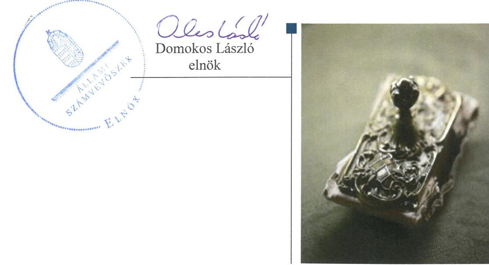
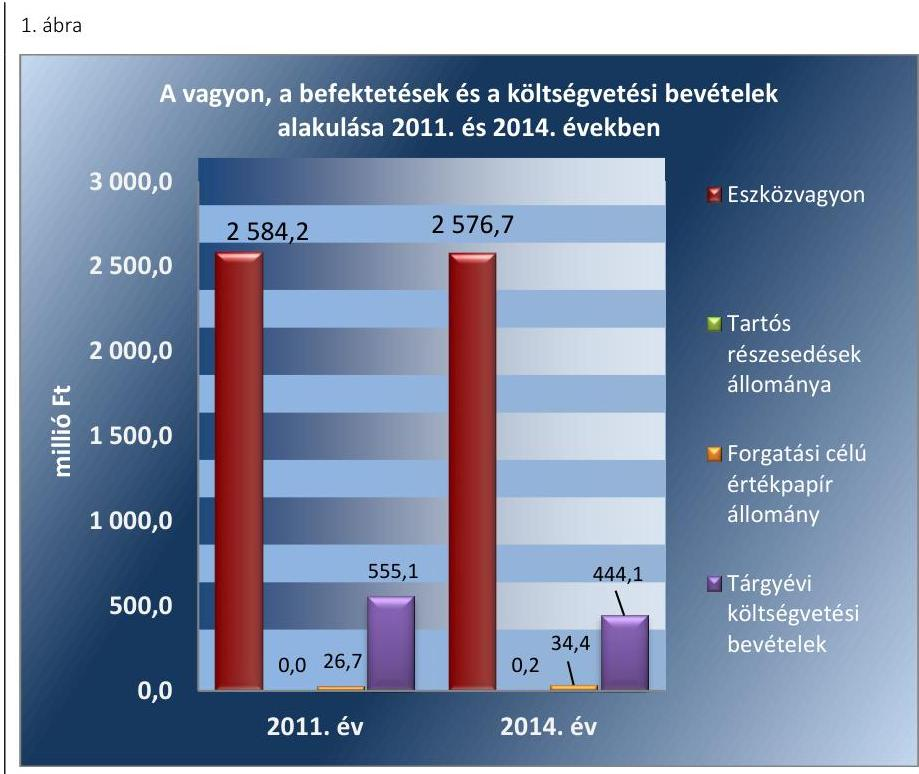
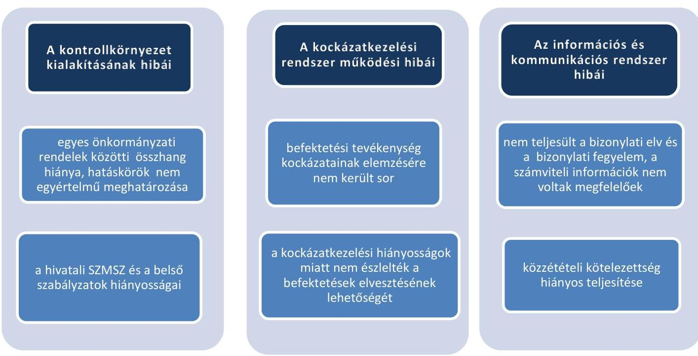
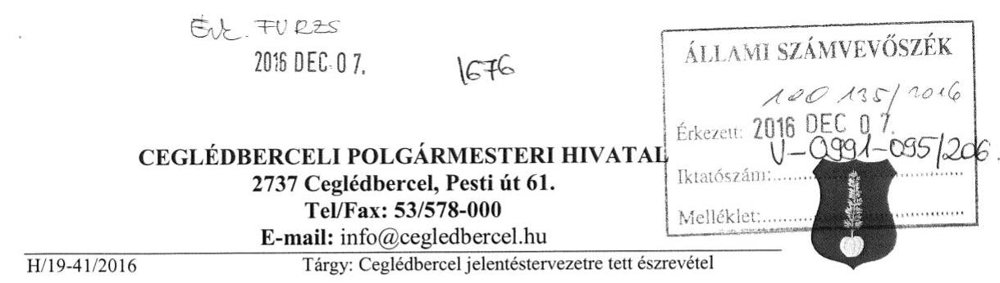
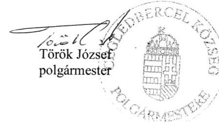
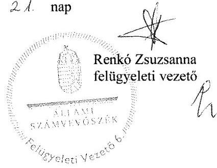

# Jelenetés 

## Önkormányzatok belső kontrollrendszere

Az önkormányzatok belső kontrollrendszere kialakításának és működtetésének ellenőrzése - Ceglédbercel 2017.

---

# Jelenetés 

## Önkormányzatok belső kontrollrendszere

Az önkormányzatok belső kontrollrendszere kialakításának és működtetésének ellenőrzése - Ceglédbercel
2017. o.A. hó A.A. nap

---

# AZ ELLENŐRZÉST FELÜGYELTE:

- RENKŐ ZSUZSANNA felügyeleti vezető
- AZ ELLENŐRZÉST VEZETTE ÉS A VÉGREHAJTÁSÁÉRT FELELŐS:
  - PÁNCSICS JUDIT ellenőrzésvezető
  - A PROGRAM ÖSSZEÁLLÍTÁSÁÉRT FELELŐS:
    - JANIK JÓZSEF osztályvezető

- IKTATÓSZÁM: V-0991-102/2016.
- TÉMASZÁM: 2025
- ELLENŐRZÉS-AZONOSÍTÓ SZÁM: V07189, V07389

Jelentéseink az Országgyűlés számítógépes hálózatán és az Interneten a www.asz.hu címen is olvashatóak.

---

# TARTALOMJEGYZÉK 

■ ÖSSZEGZÉS ..... 5
■ AZ ELLENŐRZÉS CÉLJA ..... 6
■ AZ ELLENŐRZÉS TERÜLETE ..... 7
■ AZ ELLENŐRZÉS HÁTTERE, INDOKOLTSÁGA ..... 9
■ A JELENTÉS LÉNYEGES KÉRDÉSKÖREI ..... 12
■ ELLENŐRZÉS HATÓKÖRE ÉS MÓDSZEREI ..... 13
■ MEGÁLLAPÍTÁSOK ..... 16
■ JAVASLATOK ..... 36
■ MELLÉKLETEK ..... 39
I. sz. melléklet: Értelmező szótár ..... 39
II. sz. melléklet: Az integritás szemlélet érvényesítése érdekében kialakított és működtetett kontrollrendszer ..... 43
■ FÜGGELÉK: ÉSZREVÉTELEK ..... 45
■ RÖVIDÍTÉSEK JEGYZÉKE ..... 75

---

.

---

# ÖSSZEGZÉS 

Ceglédbercel Község Önkormányzata belső kontrollrendszere kialakításának és működtetésének hiányosságai következtében a közpénzfelhasználás szabályossága nem volt biztosított. A döntéshozó személy szabálytalan jogkörgyakorlása, a döntés-előkészítés és a döntéshozatal dokumentálásának elmaradása nem tette lehetővé a közvagyon szabályos és biztonságos befektetését. Az egyes befektetések számviteli elszámolását alátámasztó dokumentumok hiányában a vagyon számbavétele nem volt szabályszerű. Ceglédbercel Község Önkormányzatának az integritás szemlélet érvényesülése érdekében még erőfeszítéseket kell tennie.

## Az ellenőrzés társadalmi indokoltsága

Magyarország Alaptörvénye az önkormányzatoktól is elvárja a kiegyensúlyozott, átlátható és fenntartható költségvetési gazdálkodás elvének érvényesítését. Az önkormányzatok által betöltött társadalmi szerep, az általuk kezelt közpénz nagysága, a nemzeti vagyon átruházására vagy hasznosítására vonatkozó döntéseik sokrétűsége indokolttá teszik a számvevőszéki ellenőrzéseket. A belső kontrollrendszer kialakítása és működtetése nélkül nem valósítható meg a közpénzek, a közvagyon szabályos, gazdaságos, hatékony és eredményes felhasználása.

Ceglédbercel Község Önkormányzata 2015. április 30-án a számviteli nyilvántartásokban 34,4 millió Ft összegben mutatott ki diszkontkincstárjegyet. Ceglédbercel Község Önkormányzatának minden megtakarítása egy pénzügyi szolgáltatónál volt, akinek a törvénytelen tevékenysége következtében fennáll a veszélye annak, hogy az összes befektetett közvagyont elveszítik. Felmerült, hogy a belső kontrollrendszer kialakítása és működtetése nem biztosította a közvagyon megóvását, körültekintő, biztonságos befektetését, a befektetési döntések, azok végrehajtása és számviteli elszámolása nem volt szabályszerű.

## Főbb megállapítások, következtetések, javaslatok

A belső kontrollrendszer kialakítása és működtetése részben szabályszerű volt, így nem segítette elő a közpénzfelhasználás szabályosságát. Az ellenjegyzési és érvényesítési jogkörök szabálytalan gyakorlása következtében a kialakított kontrolltevékenységek a hibák megelőzését, feltárását nem segítették.

A befektetési döntések dokumentálásának, a kockázatok felmérésének elmaradása, a hatáskör átruházásban meghatározott értékhatár jelentős túllépése miatt a befektetési tevékenység nemcsak szabálytalan volt, de a közvagyon körültekintő befektetését sem biztosította.

Az egyes befektetések számviteli elszámolása során értékpapírszámla kivonatokkal nem rendelkeztek, így a befektetett pénzeszközök egyeztetésének, ellenőrzésének és leltározásának nem álltak fent a feltételei.

Az integritás szemlélet erősítése érdekében Ceglédbercel Község Önkormányzata 2014-ben önként vett részt az Állami Számvevőszék integritás felmérésében, azonban a belső kontrollrendszer kialakításában és működésében feltárt hiányosságok és hibák arra utalnak, hogy még erőfeszítéseket kell tenniük az integritás szemlélet érvényesülésében.

---

# AZ ELLENŐRZÉS CÉLJA 

Az ellenőrzés célja annak megállapítása volt, hogy az önkormányzat belső kontrollrendszerének kialakítása, továbbá egyes elemeinek működtetése biztosította-e az önkormányzatnál a közpénzfelhasználás szabályosságát. Az erőforrásokkal való szabályszerű és hatékony gazdálkodáshoz szükséges követelmények érvényesítése, számonkérés, ellenőrzése megtörtént-e az önkormányzatnál. A belső kontrollrendszer kialakítása és működtetése támogatta-e az integritás szemlélet érvényesülését. Az ellenőrzés során értékeltük a belső kontrollrendszer kialakításának és működtetésének szabályszerűségét. Bemutatjuk azokat a lényeges szabályozási hiányosságokat, amelyek miatt az ellenőrzött kulcskontrollok nem nyújtottak elegendő védelmet a lehetséges hibákkal szemben. Rámutattunk arra, ha a kulcskontrollok valamely hibát nem előztek meg, nem tártak fel vagy nem javítottak ki, valamint minősítjük működésük megfelelőségét.

Ellenőriztük, hogy az önkormányzat egyes befektetési döntései és azok végrehajtása, elszámolása megfelelt-e a vonatkozó jogszabályoknak és belső szabályozásoknak, a kialakított kontrollrendszer támogatta-e a befektetési tevékenység szabályszerűségét.

---

# AZ ELLENŐRZÉS TERÜLETE 

## Ceglédbercel Község Önkormányzata

A Pest megyében fekvő Ceglédbercel község állandó lakosainak száma 2015. január 1-jén 4322 fő volt.

A helyi önkormányzati képviselők és polgármesterek 2014. évi általános választásáig, és azt követően is az Önkormányzat héttagú Képviselő-testületének munkáját két állandó bizottság segítette.

A településen a helyi nemzetiségi önkormányzati képviselők 2014. évi választásáig, illetve azt követően is német nemzetiségi önkormányzat működött.

Az Önkormányzat a Hivatalon kívül egy intézménnyel (általános művelődési központtal) látta el a feladatait. Az Önkormányzat többségi tulajdoni részesedésű gazdasági társaságban nem volt érdekelt. A víz- és csatornaszolgáltatási feladatokat két kisebbségi tulajdonában álló gazdasági társaság útján látta el.

A polgármester a 2002. évi önkormányzati választások óta tölti be tisztségét. A jegyző a 2008. év óta látja el feladatait. A Hivatal két szervezeti egységre (Pénzügyi- és adó csoport, Igazgatási csoport) tagolódott, elkülönített gazdasági szervezettel 2015. február 9-től rendelkezett. A gazdasági szervezet feladatait a Pénzügyi- és adó csoport látta el, a gazdasági szervezetnek nem volt kinevezett vezetője. A Hivatalban foglalkoztatott köztisztviselők száma 2014. év végén 13 fő volt. A Hivatalban szervezeti változás 2014. január 1-jétől nem volt.

Az Önkormányzat a 2014. évi éves költségvetési beszámoló szerint 444,1 millió Ft költségvetési bevételt ért el, valamint 464,0 millió Ft költségvetési kiadást teljesített. A költségvetési hiányt az előző évi költségvetési maradvány igénybevételével finanszírozták. A pénzeszközök év végi állományi értéke 13,1 millió Ft, az üzleti vagyonba tartozó ingatlanok értéke 53,2 millió Ft volt.

A 2014. évben a forrásokon belül a költségvetési évben esedékes kötelezettségállomány 0,6 millió Ft volt, a költségvetési évet követően esedékes kötelezettségállomány 7,7 millió Ft-ot tett ki, pénzintézettel szembeni kötelezettségük nem volt.

Adósságkonszolidációs támogatásban az ellenőrzött időszakban nem részesültek.

Az Önkormányzat vagyonának, befektetéseinek és a költségvetési bevételeinek alakulását a 2011. évben és a 2014. évben az 1. ábra mutatja be:

---

Forrás: Ceglédbercel Község Önkormányzata 2011. és 2014. évi éves költségvetési beszámolói

---

# AZ ELLENŐRZÉS HÁTTERE, INDOKOLTSÁGA 

Az ÁSZ tv. szerint az ÁSZ feladata a jól irányított állam kiépítésének elősegítése. Az ÁSZ Stratégiájában ezért hangsúlyos szerepet szánt annak, hogy szilárd szakmai alapon álló, értékteremtő ellenőrzéseivel előmozdítsa a közpénzügyek átláthatóságát, rendezettségét. A számvevőszéki ellenőrzés nemzetközi alapelvei is rögzítik, hogy a megfelelő belső kontrollrendszer minimálisra csökkenti a hibák és szabálytalanságok kockázatát.

A belső kontrollrendszer azt a célt szolgálja, hogy a költségvetési szervek működésük és gazdálkodásuk során a tevékenységeket szabályszerűen, gazdaságosan, hatékonyan, eredményesen hajtsák végre, teljesítsék elszámolási kötelezettségeiket és megvédjék az erőforrásokat a veszteségektől, a károktól és a nem rendeltetésszerű használattól. A belső kontrollrendszer magában foglalja mindazon szabályokat, eljárásokat, gyakorlati módszereket és szervezeti struktúrákat, kockázatkezelési technikákat, kontrolltevékenységeket, amelyek segítséget nyújtanak a szervezetnek céljai eléréséhez. A belső kontrollrendszer szabályozása háromszintű, a törvényi előírásokat az Áht. és az Mötv., a rendeleti szintű szabályozást az Ávr. és a Bkr. tartalmazza, amelyeket útmutatói szinten az NGM által kiadott standardok és kézikönyvek támogatnak.

Az ellenőrzött időszak meghatározása lehetőséget teremt a 2014. október 12-i önkormányzati választásokat megelőző és követő ciklus belső kontrollrendszere működésének elkülönült értékelésére, valamint a változások nyomon követésére.

A BELSŐ KONTROLLRENDSZER kialakításának és működtetésének általános értékelése mellett a teljesítésigazolás és érvényesítés kontrollok kiemelt ellenőrzésének szükségességét alátámasztja, hogy 2012-től a pénzügyi folyamatokban kulcsszerepet betöltő belső kontrollok rendszere módosult és azok működtetésében az önkormányzatoknál hiányosságok mutatkoztak a 2012. óta elvégzett ÁSZ ellenőrzések alapján.

Az önkormányzatok belső kontrollrendszerének ellenőrzése az ÁSZ "jó kormányzással" kapcsolatos stratégiai céljainak megvalósítását is szolgálja. Az ÁSZ célja, hogy javuljon az ellenőrzött önkormányzatok belső kontrollrendszerének szabályozottsága, működésének megfelelősége, hozzájárulva ezzel az egyensúlyi helyzet fenntarthatóságának biztosításához, azaz az adósság újratermelődésének megakadályozásához. Az ÁSZ ellenőrzés tapasztalatai nem csupán a közvetlenül ellenőrzött önkormányzatokat segíthetik, hanem a „jó gyakorlat" elterjesztésével azok az önkormányzatok is átvehetik a pozitív példákat, ahol nem végez ellenőrzést az ÁSZ.

Az MNB három befektetési szolgáltató tevékenységi engedélyét 2015. első felében visszavonta és kezdeményezte a vállalkozások felszámolását a működéssel kapcsolatos szabálytalanságok, hiányosságok miatt. A korábbi évek ellenőrzési tapasztalatai alapján fennáll a lehetősége annak, hogy az önkormányzatok befektetési döntései, továbbá a döntések végrehajtása és számviteli elszámolása nem voltak teljes mértékben szabályszerűek, és a kapcsolódó külső ellenőrzések és a belső kontrollrendszer sem működtek minden esetben megfelelően.

---

Magyarország Alaptörvénye az önkormányzatoktól, mint az államháztartás alanyaitól elvárja a kiegyensúlyozott, átlátható és fenntartható költségvetési gazdálkodás elvének érvényesítését. A nemzeti vagyonról szóló törvény szerint a nemzeti vagyonnal felelős módon, rendeltetésszerűen kell gazdálkodni. A nemzeti vagyongazdálkodás feladata a nemzeti vagyon rendeltetésének megfelelő, átlátható, hatékony és költségtakarékos működtetése, ugyanakkor értékének megőrzését, értéknövelő használatát, hasznosítását, gyarapítását is elvárja.

# AZ ÖNKORMÁNYZATOK ÁTMENETILEG SZABAD PÉNZESZKÖZEINEK BEFEKTETÉSÉT jogszabály nem 

tiltja, a pénzpiaci szolgáltatók közül az önkormányzatok a kínált szolgáltatás és annak költségei alapján, szabadon választhatnak, a veszteséges gazdálkodás kockázatai és következményei azonban az önkormányzatokat terhelik. A szabad pénzeszközök felelős hasznosítása összhangban áll az önkormányzati gazdálkodás alapelveivel.

A közintézmények integritás alapú kultúrájának kialakítása, megerősítése és működése szorosan összefügg a belső kontrollrendszer működésével, ezért az ellenőrzés kiterjed annak értékelésére is, hogy a belső kontrollrendszer kialakítása és működtetése hogyan hatott az integritás szemlélet érvényesülésére.

Az államháztartás önkormányzati alrendszerében a 2014. év elején összesen 3177 települési önkormányzat működött: a 23 kerülettel rendelkező főváros, 345 város, 2691 község és 117 nagyközség volt. A belső kontrollrendszer kialakítása és működtetése ellenőrzését az ÁSZ által lefolytatott, kisebb településeket is érintő ellenőrzéseinek tapasztalatai, valamint a közérdekű bejelentések kockázati szempontú értékelése alapozták meg. Ezek a községek, nagyközségek gazdálkodásának, belső kontrollrendszere kialakításának és működésének hiányosságaira mutattak rá. Az ellenőrzések helyszíneinek kiválasztása során az ÁSZ célzott adatfeldolgozáson alapuló kockázatelemző rendszerére támaszkodik. Ez elősegíti, hogy azokon a területeken végezzen ellenőrzéseket, összpontosítva erőforrásait, ahol a valódi kockázatok, az aktuális problémák vannak.

## AZ ELLENŐRZÉS VÁRHATÓ HASZNOSULÁSA NÉGY SZINTEN valósul meg.

A törvényalkotás számára összegzett tapasztalatok állnak rendelkezésre a belső kontrollrendszer önkormányzati területen való kialakításáról, működtetéséről és hatásairól. Az ÁSZ az ellenőrzéseivel hozzájárul ahhoz, hogy az egyes önkormányzati befektetésekkel kapcsolatos kockázatok a szabályozási és kontroll mechanizmusok fejlesztésével mérsékelhetők legyenek.

Az ellenőrzés az ellenőrzött számára visszajelzést ad a belső kontrollrendszer kialakításában és működésében lévő hiányosságokról, javaslataival hozzájárul azok kiküszöböléséhez. Feltárja az önkormányzati befektetési tevékenységet meghatározó szabályozások összhangjának hiányosságait, a szabályozással nem érintett gazdálkodási területeket, valamint az egyes befektetési tevékenységek esetleges szabálytalanságait.

Az ellenőrzés megállapításait és javaslatait más szervezetek is hasznosíthatják a rendezett gazdálkodási keretek kialakításához.

---

A társadalom számára jelzi, hogy közpénz nem maradhat ellenőrizetlenül, az ÁSZ értékteremtő rend kialakításához és megőrzéséhez hozzájáruló tevékenysége pozitív hatással lesz
 a szervezetről kialakított összkép formálásában.

---

# A JELENTÉS LÉNYEGES KÉRDÉSKÖREI 

1.     - Az önkormányzat belső kontrollrendszerének kialakítása és működtetése szabályszerű volt-e 2014. január 1. és 2015. április 30. között, valamint a belső kontrollrendszer egyes pillérei támogatták-e a befektetési tevékenység szabályszerű végzését 2011. január 1. és 2015. április 30. között?
2.     - Az egyes befektetésekkel kapcsolatos döntéshozatal és a döntések végrehajtása szabályszerű volt-e?
3.     - Az egyes befektetések számviteli elszámolása, nyilvántartása szabályszerű volt-e?
4.     - Az erőforrásokkal való szabályszerű és hatékony gazdálkodáshoz szükséges követelmények érvényesítése, számonkérés, ellenőrzése megtörtént-e az önkormányzatnál?
5.     - Az önkormányzat belső kontrollrendszerének kialakítása és működtetése támogatta-e az integritás szemlélet érvényesülését?

---

# ELLENŐRZÉS HATÓKÖRE ÉS MÓDSZEREI 

## Az ellenőrzés típusa

Megfelelőségi ellenőrzés, a befektetési tevékenység esetében szabályszerűségi ellenőrzés.

## Az ellenőrzött időszak

A belső kontrollrendszer kialakításának és működtetésének ellenőrzése a 2014. január 1. és 2015. április 30. közötti időszakra terjedt ki. Ezen belül a belső kontrollrendszer kialakításának és működtetésének megfelelőségét a 2014. január 1. és október 12., valamint a 2014. október 13. és 2015. április 30. közötti időszakra vonatkozóan külön-külön értékeltük. Az önkormányzatok egyes befektetési tevékenységeinek ellenőrzése tekintetében az ellenőrzött időszak a 2011. január 1. - 2015. április 30. közötti időszak. Ezen felül az önkormányzat befektetésekkel kapcsolatos döntés-előkészítésének és döntéshozatalának szabályszerűségét a 2011. január 1. előtti időszakra visszanyúlóan is ellenőriztük, amennyiben a 2014. június 30-án, illetve 2015. április 30-án meglévő értékpapír-befektetéseire 2011. január 1-je előtt került sor. Az integritás szemlélet érvényesülését a 2014. évre vonatkozó adatszolgáltatás alapján értékeltük.

## Az ellenőrzés tárgya

A helyi önkormányzatnak, mint éves költségvetési beszámoló készítésére kötelezett szervezetnek és polgármesteri hivatalának belső kontrollrendszere. Az önkormányzat 2014. június 30-án, illetve 2015. április 30-án meglévő értékpapírokban megtestesülő befektetései, lekötött betétei, valamint az önkormányzat üzleti vagyonába tartozó ingatlanok, kulturális javak (műtárgyak, műalkotások, stb.), illetve a feladatellátást nem szolgáló egyéb értéktárgyak (pl. ékszerek, befektetési nemesfém). Az erőforrásokkal való szabályszerű és hatékony gazdálkodáshoz szükséges követelmények érvényesítése, számonkérés, ellenőrzése. Az integritás szemlélet érvényesülése.

## Az ellenőrzött szervezet

Ceglédbercel Község Önkormányzata és az önkormányzati működéshez kapcsolódó feladatokat ellátó Hivatal.

---

# Az ellenőrzés jogalapja 

Az ÁSZ tv. 1. § (3) bekezdésében foglaltak alapján az ÁSZ általános hatáskörrel végzi a közpénzekkel és az állami és önkormányzati vagyonnal való felelős gazdálkodás ellenőrzését. Az ÁSZ tv. 5. § (2) bekezdése alapján az államháztartás gazdálkodásának ellenőrzése keretében az ÁSZ ellenőrzi a helyi önkormányzatok gazdálkodását, valamint az ÁSZ tv. 5. § (6) bekezdése alapján ellenőrzése során értékeli az államháztartás számviteli rendjének betartását és a belső kontrollrendszer működését.

## Az ellenőrzés módszerei

Az ellenőrzést a nemzetközi standardokat irányadónak tekintve az ellenőrzési program ellenőrzési kérdései, az ellenőrzött időszakban hatályos jogszabályok, az ellenőrzés szakmai szabályok és módszertanok figyelembe vételével végeztük.

Az ellenőrzés lefolytatásához az Önkormányzat a tanúsítványok kitöltésével, valamint az ÁSZ által kért dokumentumok elektronikus megküldésével szolgáltatott adatokat. A rendelkezésre bocsátott adatok, információk kontrollja és a munkalapok kitöltése az ellenőrzés keretében történt. A jelentésben használt fogalmak magyarázatát az I. számú melléklet, az integritás érvényesítése érdekében kialakított és működtetett kontrollrendszer minősítését a II. számú melléklet tartalmazza.

A belső kontrollrendszer jogszabályi előírások szerinti kialakításának és működtetésének szabályszerűségét az erre irányuló ellenőrzési kérdésekre adott válaszok összesítése alapján külön-külön értékeltük a 2014. január 1. és október 12., valamint a 2014. október 13. és 2015. április 30. közötti időszakra. A belső kontrollrendszert egy-egy ellenőrzött időszakra pillérenként (kontrollkörnyezet, kockázatkezelési rendszer, kontrolltevékenységek, információs és kommunikációs rendszer, monitoring rendszer) és összesítetten is értékeltük.

## A BELSŐ KONTROLLRENDSZER EGYES PILLÉRE-

INEK KIALAKÍTÁSA ÉS MŰKÖDTETÉSE „szabályszerű volt", amennyiben az értékelt területen az elért és elérhető pontok százalékban kifejezett, egész számra kerekített hányadosa meghaladta a 84%-ot, „részben szabályszerű volt", ha 61-84% közé esett, „nem szabályszerű volt", ha nem haladta meg a 60%-ot. A belső kontrollrendszer összesített értékelése megegyezett a pillérenként (kontrollterületenként) alkalmazott százalékos értékelésekkel, a következő eltérésekkel. A kontrollrendszer egésze esetében a „szabályszerű" értékelésnek a százalékos értéken felül további feltétele volt, hogy egyik kontrollterület sem kaphat „nem szabályszerű" értékelést, a „részben szabályszerű" értékelés további feltétele volt, hogy legfeljebb egy ellenőrzött kontrollterület lehet „nem szabályszerű" értékelésű. Az összesített értékelés a százalékos értéktől függetlenül „nem szabályszerű volt", ha az ellenőrzött kontrollterületek közül több mint egynek „nem szabályszerű volt" az értékelése.

---

# A GAZDÁLKODÁS FOLYAMATÁBAN A KÉT 

KULCSKONTROLL - teljesítésigazolás, érvényesítés - működésének megfelelőségét a személyi juttatásokkal, a dologi kiadásokkal, a beruházási, felújítási kiadásokkal, az ellátottak pénzbeli juttatásaival és az egyéb működési, felhalmozási célú, valamint a finanszírozási kiadásokkal kapcsolatos kifizetések esetében mintavétellel ellenőriztük. A mintavétel során külön értékeltük a 2014. január 1. és 2014. október 12. közötti időszakban és a 2014. október 13. és 2015. április 30. közötti időszakban teljesített kifizetéseket. „Megfelelőnek" értékeltük a gazdálkodási jogkörök gyakorlását, amennyiben 95%-os bizonyossággal a teljes sokaságban a hibaarány legfeljebb 10%, ,,részben megfelelőnek" értékeltük, ha a hibaarány felső határa 10-30% között volt, ,,nem megfelelőnek" pedig akkor, ha a mintavételi eredmények alapján a sokaságbeli hibaarány felső határa meghaladta a 30%-ot.

Az integritás szemlélet érvényesülésének értékelése az önkormányzat által kitöltött tanúsítvány alapján történt.

---

# MEGÁLLAPÍTÁSOK

1. Az önkormányzat belső kontrollrendszerének kialakítása és működtetése szabályszerű volt-e 2014. január 1. és 2015. április 30. között, valamint a belső kontrollrendszer egyes pillérei támogatták-e a befektetési tevékenység szabályszerű végzését 2011. január 1. és 2015. április 30. között?

|  Összegző megállapítás | A belső kontrollrendszer kialakítása és működtetése 2014. január 1. és 2015. április 30. között az összesített értékelés szerint - a feltárt hiányosságok miatt - részben szabályszerű volt. A belső kontrollrendszer egyes pilléreinek kialakítása és működtetése 2011. január 1. és 2015. április 30. között nem támogatta a befektetési tevékenységek szabályszerű, átlátható, elszámoltatható végzését.  |
| --- | --- |
|   | A belső kontrollrendszer kialakításának és működtetésének összesített értékelését az 1. táblázat mutatja be:  |

1. táblázat

|  A BELSŐ KONTROLLRENDSZER KIALAKÍTÁSÁNAK ÉS MŰKÖDTETÉSÉNEK ÖSSZESÍTETT ÉRTÉKELÉSE |  |  |   |
| --- | --- | --- | --- |
|  Megnevezés | A gazdálkodás egészét érintően: |  | A befektetési tevékenységet érintően:  |
|   | 2014. január 1-tól | 2014. október 13-tól | 2014. január 1-tól  |
|   | 2014. október 13-ig | 2015. április 30-ig | 2015. április 30-ig  |
|  Kontrollkörnyezet | részben szabályszerű |  |   |
|  Kockázatkezelési rendszer | szabályszerű |  |   |
|  Kontrolltevékenységek | részben szabályszerű | nem szabályszerű | nem támogatta  |
|  Információs és kommunikációs rendszer | szabályszerű |  |   |
|  Monitoring rendszer | szabályszerű |  |   |
|  BELSŐ KONTROLLRENDSZER | RÉSZBEN SZABÁLYSZERŰ |  | NEM TÁMOGATTA  |

1.1. számú megállapítás

A kontrollkörnyezet kialakítása 2014. január 1. és 2015. április 30. között részben szabályszerű volt. Az egyes önkormányzati rendeletek előírásai között nem volt összhang, a belső szabályozások tartalma nem felelt meg teljes körűen a jogszabályi előírásoknak, emiatt a kontrollkörnyezet 2011. január 1. és 2015. április 30. között nem támogatta a befektetési tevékenység szabályszerű végzését.

A szervezeti és a szabályozási kereteket a Képviselő-testület 2011. január 1. és 2015. április 30. között az alábbiak szerint alakította ki:

- az önkormányzati SZMSZ$_{1,2}$$^8$ tartalmazta a Képviselő-testület és szervei működésének rendjét, valamint a feladat- és hatásköreit, meg-

---

határozta az önkormányzati bizottságok és a polgármester feladatkörét, valamint a bizottságokra és a polgármesterre átruházott hatásköröket. 2011 májusától hatályos önkormányzati SZMSZ2 4. számú mellékletében a polgármesterre átruházott jogkörök között rögzítették, hogy a polgármester dönt a célhoz nem kötött források betétként történő elhelyezéséről, valamint egyéb banki szolgáltatások igénybevételéről. Az önkormányzati SZMSZ2-ben előírták, hogy a forgalomképes vagyonnal 3,0 M Ft értékhatárig a polgármester, az ezt meghaladó értékben a Képviselő-testület rendelkezik, de a polgármester folyamatos tájékoztatást ad a tranzakciók előkészítéséről, illetve az esetleges megállapodásról;
a vagyongazdálkodás részletes szabályait a vagyongazdálkodási rendeletben$^9$ határozta meg, rögzítette a törzsvagyonba és az üzleti vagyonba tartozó vagyonelemek körét. Előírta az ingatlan- és ingóvagyon tulajdonosi jog gyakorlásával, kezelésével, hasznosításával kapcsolatos részletszabályozásokat. A vagyongazdálkodási rendelet 4. § (7) bekezdésében a pénzvagyont és az értékpapírvagyont a forgalomképes üzleti vagyonba sorolták. A vagyongazdálkodási rendelet 23. §-a szerint minden forgalomképes üzleti vagyonnal kapcsolatos valamennyi tulajdonosi jogosultságot 3,0 millió Ft-ig a polgármester, a 3,0 millió Ft-ot meghaladó érték esetében a Képviselő-testület gyakorolja;
a 2013. évben az Nvtv.-ben$^{10}$ előírtaknak megfelelően a 17/2013. (II.28.) számú határozattal elfogadta az Önkormányzat közép- és hosszú távú vagyongazdálkodási tervét;
a 2011-2015. évi költségvetési rendeleteket$^{11}$ az Áht.1,2-ben$^{12}$ előírt részletezettségben hagyta jóvá, melyekben a humánerőforrás gazdálkodás érdekében a Hivatal engedélyezett létszámát meghatározta. A 2012. évi költségvetési rendelet 3. § (10) bekezdésében, valamint a 2013., a 2014. és a 2015. évi költségvetési rendeletek 4. § (8) bekezdésében értékhatár nélkül írta elő, hogy a finanszírozási bevételekkel, kiadásokkal kapcsolatos hatásköröket a Képviselő-testület gyakorolja, szemben a vagyongazdálkodási rendeletben és az önkormányzati SZMSZ2-ben foglaltakkal;
jóváhagyta a Hivatal alapító okiratát$^{13}$. A Hivatal működési rendjét, a szervezeti egységeit 2015. február 8-ig az önkormányzati SZMSZ2 5. számú függelékét képező hivatali ügyrendben$^{14}$ szabályozta. A hivatali SZMSZ-ben$^{15}$ 2015. február 9-től gazdasági szervezetként a Pénzügyi- és adócsoportot nevezte meg.

A HIVATAL BELSŐ SZABÁLYOZÁSÁT 2011. január 1. és 2015. április 30. között a jegyző a következők szerint alakította ki:
a számviteli politika$_{1-3}$$^{16}$, valamint az annak keretében elkészített pénzkezelési szabályzat$_{1-3}$$^{17}$, a leltározási szabályzat$_{1-3}$$^{18}$, valamint az eszközök és források értékelési szabályzata$_{1-3}$$^{19}$ és az önköltség-számítási szabályzat$^{20}$, továbbá a számlarend$_{2,3}$$^{21}$ és a bizonylati rend hatálya kiterjedt a Hivatalra, 2012-től az önkormányzati feladatokra;
a számlarend$_1$$^{22}$, valamint a számlarend$_{2,3}$-ban az analitikus nyilvántartások tartalmát, azok vezetésének módját, a kapcsolódó főkönyvi nyilvántartásokkal való egyeztetést és annak dokumentálási módját szabályozta;

---

$\longrightarrow$ a gazdálkodási szabályzat$_{1,2}$$^{23}$ rögzítette a Hivatalban és az önkormányzati feladatokra vonatkozóan a gazdálkodási jogkörök gyakorlásának módjával, eljárási és dokumentációs részletszabályaival, valamint az ezeket végző személyek kijelölésének rendjével kapcsolatos belső előírásokat és feltételeket. A gazdálkodási szabály-zat$_{1,2}$-ben az önkormányzati feladatok, a Hivatal és a Hivatalhoz rendelt költségvetési szervek esetében a kiadási előirányzat
 terhére vállalt kötelezettségek pénzügyi ellenjegyzésére és a kiadásaik érvényesítésére jogosultakat az Ávr.-ben ${ }^{24}$ előírtaknak megfelelően a jegyző jelölte ki;
a jegyző a belső kontrollrendszer szabályzat ${ }_{1,2}$-ben ${ }^{25}$ meghatározta az ellenőrzési nyomvonalat, mely a Bkr. ${ }^{26}$ 6. § (3) bekezdésében előírtak szerint - a befektetési tevékenységek kivételével - biztosította a működési folyamatok nyomon követését és utólagos ellenőrzését;
a szabálytalanságkezelési eljárásrend ${ }_{1,2}{ }^{27}$ megfelelt a jogszabályi előírásoknak, hatálya kiterjedt a Hivatalra és az önkormányzati feladatokra;
jegyző kialakította a humánerőforrás-gazdálkodás kereteit, kiadta a közszolgálati szabályzatot ${ }^{28}$, meghatározta a köztisztviselők teljesítményértékelésének ajánlott elemeit és elkészítette a köztisztviselők teljesítményértékeléseit.

# A KONTROLLRENDSZER KIALAKÍTÁSÁNAK HIÁNYOSSÁGAI 2011. január 1. és 2013. december 31. között az alábbiak voltak:
a Képviselő-testület a 2012-2013. évi költségvetési rendeletekben az egyes befektetésekre vonatkozó szabályozás kialakításakor a finanszírozási bevételekkel és kiadásokkal kapcsolatos hatáskörök gyakorolását fenntartotta magának, az önkormányzati SZMSZ2-ben és a vagyongazdálkodási rendeletben ettől eltérő szabályozást alakított ki, mivel az utóbbiakban úgy rendelkezett, hogy a tulajdonosi jogosultságot 3,0 millió Ft alatti érték esetében a polgármester gyakorolja. E szabályozással megsértette a Jat. ${ }^{29}$ 2. § (1) bekezdésében előírtakat, mely szerint a jogszabálynak a címzettek számára egyértelműen értelmezhető szabályozási tartalommal kell rendelkeznie, továbbá a Jat. 3. §-ának rendelkezését, mivel azonos vagy hasonló viszonyokat nem azonos vagy hasonló módon, nem ugyanabban a jogszabályban szabályozta. A Képviselő-testület indokolatlanul párhuzamos szabályozást alakított ki;
A Hivatal feladatai ellátásának részletes belső rendjét és módját 2011-ben az Áht. 1 91. § (2) bekezdésében előírtak ellenére, 2012-től 2015. február 9-ig az Áht. 2 10. § (5) bekezdésében előírtak ellenére nem szervezeti és működési szabályzatban állapították meg. A hivatali ügyrend tartalmában nem felelt meg a szervezeti és működési szabályzatra vonatkozó előírásoknak, mivel nem tartalmazta az Ámr. ${ }^{30}$ 20. § (2) bekezdés b), c), i) és h) pontjában, illetve az Ávr. 13. § (1) bekezdés b) pontjában előírtak ellenére a hivatali alapító okirat keltét, számát, az alapítás időpontját, a c) pontjában előírtak ellenére az alaptevékenységeket szakfeladatrend szerint, 2014-től a kormányzati funkció szerint besorolásban, az e) pontban előírtak ellenére a Hivatal szervezeti ábráját, a g) pontban előírtak ellenére a nevesített munkakörökhöz tartozó feladat- és hatásköröket, a hatáskörök gyakorlásának módját.
A kontrollkörnyezet kialakítása 2011. január 1. és 2013. december 31., valamint 2014. január 1. és 2015. április 30. között a befektetési tevékenységek szabályszerű végzését nem támogatta.

A kontrollkörnyezet kialakítása az értékelés szempontjából 2014. január 1. és 2014. október 12., valamint 2014. október 13. és 2015. április 30. közötti időszakokban a 2. táblázatban részletezett hiányosságok miatt részben volt szabályszerű.
2. táblázat

# A KONTROLLKÖRNYEZET KIALAKÍTÁSÁNAK SZABÁLYTALANSÁGAI 

## Sorszám

## Részmegállapítás

1. A Képviselő-testület a 2014-2015. évi költségvetési rendeletek 4. § (8) bekezdésében az egyes befektetésekre vonatkozó szabályozás kialakításakor a finanszírozási bevételekkel és kiadásokkal kapcsolatos hatáskörök gyakorolását fenntartotta magának. Ugyanakkor az önkormányzati SZMSZ2-ben és a vagyongazdálkodási rendeletben ezzel ellentétben álló szabályozást alakított ki, mivel az utóbbiakban úgy rendelkezett, hogy minden forgalomképes üzleti vagyonnal kapcsolatos tulajdonosi jogosultságot - ideértve a pénz- és értékpapírvagyont is - 3,0 millió Ft-ot meg nem haladó érték esetében a polgármester gyakorolja, a 3,0 millió Ft feletti ügyletek esetében a Képviselő-testület jogosult eljárni. Ezzel megsértette a Jat. 2. § (1) bekezdésében előírtakat, mely szerint a jogszabálynak a címzettek számára egyértelműen értelmezhető szabályozási tartalommal kell rendelkeznie, továbbá a Jat. 3. §-ának rendelkezését, mivel azonos vagy hasonló viszonyokat nem azonos vagy hasonló módon, nem ugyanabban a jogszabályban szabályozta. A Képviselő-testület indokolatlanul párhuzamos szabályozást alakított ki.
2. A Képviselő-testület a hivatali alapító okirat 9. pontjában 2012. február 28-tól a Hivatal gazdálkodási besorolását önállóan működő és gazdálkodó költségvetési szervként határozta meg, a rendelkezés 2015. április 30-án is hatályos volt annak ellenére, hogy az Áht. 2 10. § (3) bekezdésének és az Ávr. 5. § (1) bekezdés f) pontjának gazdálkodási formával kapcsolatos előírása 2014. január 1-jétől hatályát vesztette. A hivatali alapító okirat 9. pontját a 2014. évben az irányító szerv - tekintettel az Áht. 2 9. § (1) bekezdés a) pontjában és a 9. § (6) bekezdésében foglaltakra -, 2015. január 1. és április 30. között az irányító szerv vezetője - tekintettel az Áht. 2 9. § b) pontjában és a 9/A. § (1) bekezdésében foglaltakra - nem helyezte hatályon kívül. A hivatali alapító okirat hibája nem befolyásolta a Hivatal feladatellátását.
3. A gazdasági szervezet 2015. februári hivatali SZMSZ-ben történt meghatározását követően az irányító szerv vezetője - tekintettel az Áht. 2 9. § d) pontjában és a 9/A. § (1) bekezdésében foglaltakra - nem nevezte ki, illetve nem bízta meg a gazdasági szervezet vezetőjét, mivel 2015. április 30-ig az Ávr. 11. § (8) bekezdésében előírtak ellenére nem gondoskodtak a gazdasági vezetői álláshely betöltéséről, illetve a gazdasági vezetői munkakör betöltéséig tartó átmeneti időszakban az irányító szerv vezetőjének egyetértésével írásban nem jelölték ki az Ávr. 55. § (3) bekezdésében előírtaknak megfelelő végzettséggel rendelkező alkalmazottat a gazdasági vezetői feladatok ellátására.
4. A Képviselő-testület a köztisztviselőkre vonatkozó hivatásetikai alapelvek részletes tartalmát, valamint az etikai eljárás szabályait a Kttv. 231. § (1) bekezdésében előírtak ellenére - a jegyző előterjesztése hiányában - nem fogadta el.

---

### 1.2. számú megállapítás

A kockázatkezelési rendszer kialakítása és működtetése 2014. január 1. és 2015. április 30. között a feltárt hiányosságok mellett szabályszerű volt. A kockázatkezelési rendszer - a befektetési tevékenységek kockázatainak felmérése, értékelése hiányában 2011. január 1. és 2015. április 30. között nem támogatta a befektetési tevékenységek szabályszerű, pénzügyi kockázatokat minimalizáló végzését és a közvagyon védelmét.

A KOCKÁZATKEZELÉSI RENDSZER kereteit a jegyző a Hivatalban kialakította, a belső kontrollrendszer szabályzat ${ }_{1,2}$-n belül meghatározta a kockázatkezelés rendjét, beazonosították a tevékenységekben rejlő belső és külső kockázatokat, meghatározták a kockázatok azonosításával, elemzésével, csoportosításával kapcsolatos feladatokat, valamint kockázatokkal kapcsolatos szükséges intézkedéseket és azok teljesítésének folyamatos nyomon követési módját.

A befektetési tevékenységek esetében 2011. január 1. és 2015. április 30. között az Ámr. 157. § (1) bekezdésében, illetve a Bkr. 7. § (1)-(2) bekezdésében előírtak ellenére dokumentáltan nem végeztek kockázatelemzést és nem működtettek kockázatkezelési rendszert. A befektetési lehetőségek minősítése, értékelése elmaradt.

## A VAGYONNYILATKOZAT-TÉTELI KÖTELEZETTSÉGET és annak eljárási szabályait a köztisztviselők esetében a hivatali ügyrendben, a hivatali SZMSZ-ben és a közszolgálati szabályzatban rögzítették. A vagyonnyilatkozat-tételre kötelezett köztisztviselők a kötelezettségüknek eleget tettek az ellenőrzött időszakban.

Az önkormányzati SZMSZ2-ben az önkormányzati bizottságok nem képviselő tagjainak vagyonnyilatkozat-tételére vonatkozó kötelezettségét a Vnytv. ${ }^{31} 4 . \S$ d) pontjában foglaltak ellenére nem írták elő, így 2014. január 1. és október 12. között a bizottságok nem képviselő tagjai nem nyújtottak be vagyonnyilatkozatot. 2014. október 13. és 2015. április 30. között a bizottságok nem képviselő tagjai a vagyonnyilatkozatokat annak ellenére benyújtották, hogy e kötelezettséget az önkormányzati SZMSZ2-ben továbbra sem szabályozták.

A Képviselő-testület az önkormányzati SZMSZ2 54. § (2) bekezdésében a Pénzügyi Bizottságot ${ }^{32}$ jelölte ki a polgármester és a képviselők vagyonnyilatkozatainak nyilvántartására és vizsgálatára. A Pénzügyi Bizottság, mint az Mötv. ${ }^{33}$ 57. § (2) bekezdése szerint az önkormányzati képviselők vagyonnyilatkozatai őrzéséért felelős - a Vnytv. 11. § (6) bekezdésében foglaltak ellenére - a vagyonnyilatkozatok átadására, nyilvántartására, a vagyonnyilatkozatba foglalt személyes adatok védelmére vonatkozóan külön szabályokat nem állapított meg.

A kockázatkezelési rendszer 2011. január 1. és 2013. december 31., valamint 2014. január 1. és 2015. április 30. közötti időszakokban a befektetési kockázatok felmérésében tapasztalt hiányosság miatt a befektetési tevékenységek szabályszerű végzését nem támogatta.

A kockázatkezelési rendszer kialakítása és működtetése 2014. január 1. és 2014. október 12. között, valamint 2014. október 13. és 2015. április 30. között a 3. táblázatban részletezett hiányosságok ellenére szabályszerű volt.

---

# A KOCKÁZATKEZELÉSI RENDSZER KIALAKÍTÁSA ÉS MŰKÖDTETÉSE HIÁNYOSSÁGAI 

## Sorszám

## Részmegállapítások

1. A Hivatalban működtetett kockázatkezelési rendszer keretében végzett kockázatelemzés során - a Bkr. 7. § (1)-(2) bekezdésében előírtak ellenére - a befektetési tevékenységben rejlő kockázatokat nem mérték fel, valamint a befektetési kockázatokkal kapcsolatos intézkedéseket és azok teljesítésének folyamatos nyomon követési módját nem határozták meg.
2. Az önkormányzati SZMSZ-ben - megsértve a Vnytv. 4. § d) pontjának előírását - az önkormányzati bizottságok nem képviselő tagjainak vagyonnyilatkozat-tételi kötelezettségét nem rögzítették.
3. A Pénzügyi Bizottság, mint az Mötv. 57. § (2) bekezdésében előírtak szerint az önkormányzati képviselői vagyonnyilatkozatok őrzéséért felelős, - a Vnytv. 11. § (6) bekezdésében foglaltak ellenére - a vagyonnyilatkozatok átadására, nyilvántartására, a vagyonnyilatkozatba foglalt személyes adatok védelmére vonatkozóan külön szabályokat nem állapított meg.
Az önkormányzati bizottságok nem képviselő tagjai vagyonnyilatkozatainak őrzéséért felelős a Vnytv. 7. § a) pontjában, valamint a Vnytv. 11. § (6) bekezdésében foglaltak ellenére - a vagyonnyilatkozatok átadására, nyilvántartására, a vagyonnyilatkozatba foglalt személyes adatok védelmére vonatkozóan külön szabályokat nem állapított meg.

Forrás: ÁSZ

### 1.3. számú megállapítás

A pénzügyi folyamatokban kulcsszerepet betöltő teljesítésigazolás és érvényesítés kontrollok működtetése 2014. január 1. és 2014. október 12. között részben megfelelő volt, 2014. október 13. és 2015. április 30. között nem felelt meg a jogszabályoknak és a belső szabályozásnak, a kulcskontrollok nem biztosították a kiadásokkal kapcsolatban a hibák megelőzését és feltárását, a közpénzfelhasználás szabályosságát.

A KONTROLLTEVÉKENYSÉGEK KIALAKÍTÁSA során a jegyző az Áht.. 1 121/A. § (4) bekezdésében, illetve a Bkr. 8. § (2) bekezdésében előírtaknak megfelelően - az egyes befektetési tevékenységeket kivéve - biztosította a folyamatba épített, előzetes, utólagos és vezetői ellenőrzést. A jegyző a pénzügyi döntések - köztük a költségvetés tervezése, a beszerzések lebonyolítása, a támogatásokkal való elszámolás és a vagyonhasznosítási tevékenység végrehajtása - dokumentumainak folyamatba épített előzetes, utólagos és vezetői ellenőrzés rendszerét a belső kontrollrendszer szabályzat ${ }_{1,2}$-ben, azon belül az ellenőrzési nyomvonalban, valamint a gazdálkodási szabályzat ${ }_{1,2}$-ben biztosította. A hivatali és az önkormányzati feladatok esetében a gazdálkodási jogkörök gyakorlásával kapcsolatos felhatalmazásokat és kijelöléseket a gazdálkodási szabályzat ${ }_{1,2}$ tartalmazta.

A kötelezettségvállalók a teljesítés igazolására jogosult személyeket írásban kijelölték. A jegyző a Hivatal köztisztviselői közül jelölte ki a hivatali feladatok, valamint az önkormányzati feladatok kiadási előirányzata terhére vállalt kötelezettségek pénzügyi ellenjegyzőit és a kiadások érvényesítőit.

A kontrolltevékenységek kialakítása és működtetése 2014. január 1. és 2014. október 12. között részben szabályszerű volt, 2014. október 13. és 2015. április 30. közötti időszakban nem volt szabályszerű.

A gazdálkodással kapcsolatos kulcskontrollok működtetése (a teljesítésigazolás és az érvényesítés) 2014. január 1. és 2014. október 12. között részben megfelelő volt, 2014. október 13. és 2015. április 30. közötti időszakban nem volt megfelelő. A kulcskontrollok működtetésében a következő
 szabálytalanságok fordultak elő:

A teljesítésigazolás során:
$\longrightarrow$ az Ávr. 60. § (2) bekezdésében foglalt összeférhetetlenségi szabályokat a kifizetést megelőzően 2014. január 1. és 2014. október 12. között nem tartották be;
— 2014. október 13. és 2015. április 30. között az Ávr. 57. § (1) bekezdésében előírtak ellenére nem végezték el, nem ellenőrizték és nem igazolták a kiadások teljesítésének jogosságát, összegszerűségét, valamint az ellenszolgáltatást magába foglaló kötelezettségvállalás esetén annak teljesítését;
$\longrightarrow$ a dokumentumokon az aláírás nem egyezett meg az Ávr. 60. § (3) bekezdésében előírt nyilvántartásban rögzített aláírás-mintával, így nem igazolt, hogy a teljesítésigazolást az Ávr. 57. § (3) bekezdésében foglaltak ellenére az arra jogosult személy végezte el.
Az érvényesítés:
$\longrightarrow$ az Ávr. 58. § (3) bekezdésében előírtak ellenére nem történt meg, mivel az utalvány nem tartalmazta az érvényesítésre utaló megjelölést és az érvényesítő keltezéssel ellátott aláírását. Ennek következtében az utalványozást megelőzően nem ellenőrizték az Ávr. 58. § (1) bekezdésében előírtak ellenére a kiadások összegszerűségét, a fedezet meglétét és azt, hogy a megelőző ügymenetben az Áht. 2-ben, az Áhsz. 2-ben, az Ávr.-ben, valamint a gazdálkodási szabályzat 2-ben foglaltakat megtartották-e;
$\longrightarrow$ során az Ávr. 60. § (2) bekezdésében előírt összeférhetetlenségi követelményeket a kifizetést megelőzően nem tartották be;
$\longrightarrow$ során - 2014. október 13. és 2015. április 30. között - az Ávr. 58. § (2) bekezdésében előírtak szerint nem jelezték az utalványozónak, hogy a megelőző ügymenetben a diszkontkincstárjegyek vásárláskor a polgármester nem tartotta be a 2014. évi költségvetési rendeletben, az önkormányzati SZMSZ 2-ben és a vagyongazdálkodási rendeletben foglalt előírásokat, mivel a Képviselő-testület felhatalmazása nélkül vállalt kötelezettséget.
A kulcskontrollok 2014. január 1. és 2015. április 30. közötti időszakban a finanszírozási célú kiadások esetében feltárt szabálytalanságok miatt nem támogatták a befektetési tevékenység szabályszerű végzését.

A kulcskontrollok működtetésében feltárt hibákat a 4. táblázat tartalmazza:
4. táblázat

# A TELJESÍTÉSIGAZOLÁS ÉS AZ ÉRVÉNYESÍTÉS MŰKÖDTETÉSI HIBÁI 

## Sorszám

## Részmegállapítás

1. A teljesítésigazolást az Ávr. 57. § (1) bekezdésében előírtak ellenére nem végezték el. A teljesítésigazoláson az aláírás nem egyezett meg az Ávr. 60. § (3) bekezdésében előírt nyilvántartásban rögzített aláírás-mintával, így nem igazolt, hogy a teljesítésigazolást - az Ávr. 57. § (3) bekezdésében foglaltak ellenére - az arra jogosult személy végezte el.
2. A teljesítésigazolás, illetve az érvényesítés során az Ávr. 60. § (2) bekezdésében foglalt összeférhetetlenségi szabályokat nem tartották be.

---

# Sorszám 

## 1.4. számú megállapítás

Az érvényesítést az Ávr. 58. § (3) bekezdésében előírtak ellenére nem végezték el. Az érvényesítés során az Ávr. 58. § (2) bekezdésében foglaltak ellenére nem jelezték az utalványozónak a megelőző ügymenet szabálytalanságait.

Forrás: ÁSZ

Az információs és kommunikációs rendszer kialakítása és működtetése 2014. január 1. és 2015. április 30. között szabályszerű volt. 2011. január 1. és 2015. április 30. között a jegyző a közérdekű adatok közzétételének hiányossága miatt nem gondoskodott a befektetési tevékenységek átláthatóságáról és a nyilvánosság tájékoztatásáról.

AZ INFORMÁCIÓÁRAMLÁS RENDSZERÉT szervezeten belülre és a külső felek részére részben alakították ki. A beszámolási szinteket, határidőket és módokat a hivatali SZMSZ, a gazdasági szervezet ügyrendje, valamint a dolgozók munkaköri leírásai szabályozták. 2011. január 1. és 2015. április 30. között - az Ámr. 159. § (1) bekezdésében, illetve a Bkr. 9. § (1) bekezdésében előírtak ellenére - nem biztosították a szervezeten belül az egyes befektetési tevékenységekkel kapcsolatos információk átadását, hogy azok a megfelelő időben eljussanak az illetékes szervezethez, szervezeti egységhez, illetve személyhez.

A jegyző a polgármesterrel együttesen 2011. január 1. és 2012. december 31-e között az Avtv.-ben ${ }^{34}$, illetve az Info tv.-ben ${ }^{35}$ előírtaknak megfelelően az adatvédelmi szabályzat ${ }_{1}$-ben ${ }^{36}$ szabályozta az adatvédelemmel és adatbiztonsággal, valamint a közérdekű adatok megismerésével és közzétételével kapcsolatos kérdéseket. 2013. január 1-jétől az Info. tv.-ben előírtaknak megfelelően az adatvédelmi szabályzat ${ }_{2}$-ben az adatvédelemmel és adatbiztonsággal kapcsolatos előírásokat újra szabályozta.

A KÖTELEZŐEN KÖZZÉTEENDŐ ADATOK nyilvánosságra hozatalának és a közérdekű adatok megismerésére irányuló igények teljesítésének módját és felelősét a jegyző az ellenőrzött időszakban az adatvédelmi szabályzat ${ }_{1}$-ben, majd a közérdekű adatok szabályzata ${ }_{1,2}$-ben $^{37}$ szabályozta. A közérdekű adatok elektronikus közzétételi kötelezettségéről nem gondoskodtak az Eisztv. ${ }^{38}$ 6. § (1) bekezdésében és a Mellékletének III./4 pontjában, illetve az Info tv. 37. § (1) bekezdésében és az 1. melléklete III./4. pontjában előírtak ellenére, mivel nem tették közzé a honlapjukon (http://www.cegledbercel.hu) az államháztartás pénzeszközei felhasználásával, az államháztartáshoz tartozó vagyonnal történő gazdálkodással összefüggő, ötmillió forintot elérő vagy azt meghaladó értékű pénzügyi szolgáltatásra vonatkozó szerződések megnevezését (típusát), tárgyát, a szerződést kötő felek nevét, a szerződés értékét, határozott időre kötött szerződés esetében annak időtartamát, valamint az említett adatok változásait.

A Hivatal rendelkezett iratkezelési szabályzattal, amelyben az előírtak biztosították az iratok iktatásának, a bejövő és a hivatalon belül keletkezett ügyiratok nyomon követhetőségének, az iratok fellelhetőségének folyamatát.

Az információs és kommunikációs rendszer 2011. január 1. és 2015. április 30. között a közérdekű adatok közzétételében feltárt szabálytalanság miatt nem támogatta a befektetési tevékenység szabályszerű végzését.

---

Az információs és kommunikációs rendszer kialakítása és működtetése 2014. január 1. és 2014. október 12. között, valamint 2014. október 13. és 2015. április 30. közötti időszakban az 5. táblázatban jelzett hiányosság mellett szabályszerű volt.
5. táblázat

# AZ INFORMÁCIÓS ÉS KOMMUNIKÁCIÓS RENDSZER KIALAKÍTÁSA ÉS MŰKÖDTETÉSE HIÁNYOSSÁGA 

## Sorszám

1. 

Az Info tv. 37. § (1) bekezdésében és az 1. melléklet III./4. pontjában előírtak ellenére az Önkormányzat honlapján nem tették közzé az államháztartáshoz tartozó vagyonnal történő gazdálkodással összefüggő, ötmillió forintot elérő vagy azt meghaladó értékű pénzügyi szolgáltatásra vonatkozó egyes befektetési szerződések lényeges tartalmi elemeit, azaz a szerződések megnevezését (típusát), tárgyát, a szerződést kötő felek nevét, a szerződés értékét, határozott időre kötött szerződés esetében annak időtartamát, valamint az említett adatok változásait.
2. A Hivatalban a Bkr. 9. § (1) bekezdésében előírtak ellenére nem biztosították az információs- és kommunikációs rendszer működtetése során, hogy az egyes befektetési tevékenységekkel kapcsolatos információk a megfelelő időben eljussanak az illetékes szervezethez, szervezeti egységhez, illetve személyhez.

Forrás: ÁSZ

### 1.5. számú megállapítás

A monitoring rendszer kialakítása és működtetése hiányosságok mellett szabályszerű volt. A 2011. évtől 2015. április 30-ig belső és külső ellenőrzések nem érintették az egyes befektetési tevékenységeket, emiatt az ellenőrzések nem támogatták a szabályszerű, átlátható, elszámoltatható befektetési tevékenység végzését.

A szervezeti tevékenységek és célok elérésének folyamatos és eseti nyomon követését biztosító (operatív) monitoring rendszert az Ámr. 160. § (1) bekezdésében, illetve a Bkr. 10. §-ában előírtak ellenére - a konkrét felelősök és feladatok (figyelemmel kísérések és értékelések) meghatározásával - nem alakították ki. A jegyző a belső kontrollrendszer szabályzat; VI. fejezetében, valamint a belső kontrollrendszer szabályzat ${ }_{2}$ V. fejezetében csak a monitoring rendszer működtetésének jogszabályban előírt elvi követelményét és célját, a vezetők általános feladatát rögzítette.

A Hivatal belső kontrollrendszerének minőségét a jegyző a 2013. és a 2014. évekre vonatkozóan a Bkr. 1. számú melléklete szerinti nyilatkozataiban - a jelen ellenőrzés során feltárt hiányosságok ellenére - megfelelőnek értékelte.

A BELSŐ ELLENŐRZÉSI FELADATOK ellátásáról a jegyző a Képviselő-testület döntése alapján megbízási szerződéssel, külső szolgáltatóval gondoskodott. A belső ellenőrzés szervezeti és funkcionális függetlenségét a jegyző által jóváhagyott belső ellenőrzési kézikönyvben és a belső ellenőrzést végző vállalkozással kötött megbízási szerződésben foglaltak szerint biztosították. A jegyző jóváhagyta a belső ellenőrzési vezető által készített a 2011-2014. évekre, valamint a 2015-2019. évekre szóló stratégiai ellenőrzési terveket, amelyek tartalmazták a belső kontrollrendszer és a kockázati tényezők értékelését, a belső ellenőrzéssel kapcsolatos stratégiai célokat, prioritásokat, valamint az ennek megvalósításához szükséges erőforrás felmérését.

Az éves ellenőrzési tervekben szereplő ellenőrzéseket a belső ellenőrzési vezető által jóváhagyott ellenőrzési programok alapján hajtották

---

végre. A belső ellenőrzésekről készült jelentések tartalma 2014. január 1. és 2015. április 30. között megfelelt a Bkr. előírásainak. A belső ellenőrzésekről, illetve az ellenőrzési megállapításokra tett intézkedések nyomon követéséről a Bkr.-ben előírt nyilvántartást vezették. A belső ellenőrzési vezető elkészítette a Bkr. 49. §-ában előírtak szerint a belső kontrollrendszert is értékelő 2014. évi éves jelentését.

A belső ellenőrzés a 2011-2013. években, valamint 2014. január 1. és 2015. április 30. között nem ellenőrizte az értékpapír befektetésekkel kapcsolatos tevékenységet, így a belső ellenőrzés nem támogatta az egyes befektetési tevékenységek szabályszerű végzését.

A KÜLSŐ ELLENŐRZÉSEK esetében a jegyző 2011. január 1. és 2015. április 30. között kialakította és megfelelően működtette az intézkedési terv készítésére, annak végrehajtására, az ellenőrzések nyilvántartására, illetve a megtett intézkedésekről történő beszámolásra vonatkozó eljárásrendet.

Az Önkormányzat adatszolgáltatása szerint 2011. január 1. és 2015. április 30. között csak a Kincstár ${ }^{39}$ végzett ellenőrzést, mely a támogatások elszámolására irányult. A külső szerv ellenőrzéséről vezetett nyilvántartás szerint a feltárt hiányosságokkal kapcsolatban intézkedési terv készült, a hiányosságok felszámolása minden esetben megtörtént. A Kormányhivatal ${ }^{40}$ 2011. január 1. és 2015. április 30. között az Önkormányzatnál nem végzett ellenőrzést. Az értékpapír befektetési tevékenység döntéshozatali eljárásának jogszerűségére, valamint a döntések végrehajtásának szabályszerűségére vonatkozóan külső ellenőrzés nem történt.

Az Önkormányzat megbízása alapján a 2011-2012. évek éves költségvetési beszámolóit, a 2013. évi zárszámadást és az éves költségvetési beszámolót könyvvizsgáló felülvizsgálta. A könyvvizsgáló a jelen ellenőrzés során feltárt hibákat nem észrevételezte, a 2011-2013. évi éves költségvetési beszámolókat korlátozás nélküli záradékkal fogadta el. A Képviselő-testület jogszabályi előírás hiányában - 2014-től nem bízott meg könyvvizsgálót.

A monitoring rendszer 2011. január 1. és 2015. április 30. között az ellenőrzés során feltárt szabálytalanságokat nem észlelte, ezért nem támogatta a befektetési tevékenység szabályszerű végzését.

A monitoring rendszer kialakítása és működtetése 2014. január 1. és 2014. október 12., valamint 2014. október 13. és 2015. április 30. között a 6. táblázatban jelzett hiányosság mellett szabályszerű volt.
6. táblázat

# A MONITORING RENDSZER MŰKÖDTETÉSI HIÁNYOSSÁGA 

## Sorszám

## Részmegállapítások

1. A Hivatalban a szervezet tevékenységének, a célok megvalósításának nyomon követését biztosító rendszer keretében a folyamatos és eseti nyomon követést a Bkr. 10. §-ában előírtak ellenére nem alakították ki.

---

Az Önkormányzat befektetési tevékenységével kapcsolatos főbb szabálytalanságokat a 2. ábra foglalja össze.
2. ábra

A BEFEKTETÉSI TEVÉKENYSÉG KONTROLLRENDSZERÉVEL KAPCSOLATBAN FELTÁRT HIBÁK

A kulcskontrollok működtetése nem szabályszerű, a monitoring rendszer (belső ellenőrzés) nem tárta fel a kockázatokat és a szabálytalanságokat.

A belső kontrollrendszer nem biztosította a szabályszerű, átlátható, elszámoltatható, a kockázatokat minimalizáló vagyongazdálkodást.

---

# 2. Az egyes befektetésekkel kapcsolatos döntéshozatal és a döntések végrehajtása szabályszerű volt-e? 

Összegző megállapítás

Az egyes befektetésekkel kapcsolatos döntéshozatal és a döntések végrehajtása nem volt szabályszerű, mert a költségvetési rendeletekben előírtakat megsértve nem a Képviselő-testület döntött a diszkontkincstárjegyek vásárlásáról, a belső kontrollok működtetése a szabálytalanságot nem tárta fel. Az Önkormányzatnál a tulajdonosi joggyakorlás során a diszkontkincstárjegyben elhelyezett

 vagyon megőrzésének, védelmének és a vagyonnal való átlátható és felelős gazdálkodás követelményeit nem biztosították.
2.1. számú megállapítás

A diszkontkincstárjegy adásvételével kapcsolatos döntés-előkészítés és döntéshozatal nem volt szabályszerű, mivel a költségvetési rendeletekben előírtak ellenére a döntéseket nem a Képviselő-testület hozta meg. A szabálytalan kötelezettségvállalást a belső kontrollok nem tárták fel.

A 2011-2014. évi és a 2015-2019. évi gazdasági programok fő célkitűzése az volt, hogy az Önkormányzat - a lehetőségeihez mérten - törekedjen arra, hogy a településen élők életminősége, életkilátásai és a község élhetősége javuljon. E cél megvalósítása érdekében a fizetőképesség folyamatos biztosítására és a stabil vagyoni helyzet megteremtésére törekedtek, az átmenetileg szabad pénzeszközöket a magasabb kamatbevétel realizálása érdekében forgatási célú értékpapírban helyezték el, lekötött betéttel nem rendelkeztek. Az üzleti célú ingatlanok között befektetési céllal vásárolt ingatlan nem fordult elő, befektetési célból kulturális javakat és egyéb értéktárgyakat sem szereztek be.

Az Önkormányzat forgatási célú értékpapír állománya 2014. június 30-án 48,2 millió Ft volt, míg 2015. április 30-án 34,4 millió Ft bekerülési értékű diszkontkincstárjegyet tartottak nyilván, melyet a kijelölt felügyeleti biztos a Hungária Értékpapír Zrt. ${ }^{41}$ nyilvántartása alapján nem igazolt vissza.

## A DISZKONTKINCSTÁRJEGYEK ADÁSVÉTELÉNEK

előkészítését az Önkormányzatnál 2011. január 1. és 2015. április 30. között a nyilatkozatuk szerint a hozam megítéléséhez összehasonlítási alapként a jegybanki alapkamatot és a fizetésiszámlát vezető pénzintézet (OTP Bank Nyrt.) által közzétett kamatokat vették figyelembe, de azt írásban nem dokumentálták. A befektetési lehetőségek értékeléséről, így a diszkontkincstárjegy vásárlásokról a Képviselő-testület és a Pénzügyi Bizottság részére sem készült előterjesztés. A jegyző a fentiekre tekintettel nem tartotta be a Bkr. 8. § (2) bekezdés a) - c) pontjaiban előírtakat, mert a kontrolltevékenységek részeként 2012-től nem biztosította a pénzügyi döntések dokumentumainak elkészítését, a pénzügyi kihatású döntések célszerűségi, gazdaságossági, hatékonysági és eredményességi szempontú megalapozottsága, a pénzügyi döntések szabályszerűségi szempontból

---

történő jóváhagyása, illetve ellenjegyzése folyamatba épített, előzetes, utólagos és vezetői ellenőrzését.

A diszkontkincstárjegy adásvételével kapcsolatos döntések a 2011-2014. években mintegy 30 esetben szabálytalanok voltak. Az Önkormányzatnál megsértették a vagyongazdálkodási rendelet 23. §-ában, az önkormányzati SZMSZ1 56. § (2) bekezdés f) pontjában, és az önkormányzati SZMSZ2 4. mellékletében foglaltakat, mert az ott előírt értékhatár figyelembe vétele nélkül vásároltak értékpapírt.

Az értékpapír adásvételi szerződések ellenjegyzésekor az Ámr. 74. § (3) bekezdés c) pontjában, illetve az Áht. 2 37. § (1) bekezdésében előírtak ellenére nem győződtek meg arról, hogy a kötelezettségvállalás nem sérti a gazdálkodására vonatkozó, egyes önkormányzati rendeletekben előírtakat.

A jegyző az Ötv. ${ }^{42}$ 36. § (3) bekezdésében, illetve az Mötv. 81. § (3) bekezdés e) pontjában foglaltak ellenére nem jelezte a Képviselő-testületnek és a polgármesternek, hogy működésük ellentétes a vagyongazdálkodási rendelet, az önkormányzati SZMSZ ${ }_{1,2}$, továbbá a 2012.-2015. évi költségvetési rendeletek előírásaival.

A Pénzügyi Bizottság az Ötv.-ben, illetve az Mötv.-ben előírtaknak megfelelően rendszeresen - a féléves és az éves beszámolókon keresztül - figyelemmel kísérte a költségvetési bevételek alakulását, tájékoztatást kapott a vagyon, azon belül a diszkontkincstárjegy állományának változásáról, annak okairól, a Bizottság a beszámolókat elfogadta.

Az egyes befektetési tevékenységek döntés előkészítési és döntéshozatali szabálytalanságait a 7. táblázat tartalmazza:
7. táblázat

# AZ EGYES BEFEKTETÉSEKKEL KAPCSOLATOS DÖNTÉS ELŐKÉSZÍTÉS ÉS DÖNTÉSHOZATAL SZABÁLYTALANSÁGA

## Sorszám

## Részmegállapítás

1. Az Önkormányzatnál a 2011-2014. években a diszkontkincstárjegyek vásárlása szabálytalan volt, mivel a vagyongazdálkodási rendelet 23. §-ban, az önkormányzati SZMSZ ${ }_{1}$ 56. § (2) bekezdés f) pontjában, és az önkormányzati SZMSZ ${ }_{2}$ 4. mellékletében előírt értékhatár figyelembe vétele nélkül vásároltak értékpapírt.
2. A jegyző az Ötv. 36. § (3) bekezdésében, illetve az Mötv. 81. § (3) bekezdésének e) pontjában, valamint az önkormányzati SZMSZ ${ }_{1}$ 61. § (1) bekezdésének g) pontjában, illetve az önkormányzati SZMSZ ${ }_{2}$ 68. § (1) bekezdésének e) pontjában foglaltak ellenére nem jelezte, hogy a finanszírozási kiadások döntései során nem tartották be a vagyongazdálkodási rendeletben, az önkormányzati SZMSZ ${ }_{1,2}$-ben, továbbá a 2012.-2015. évi költségvetési rendeletekben előírtakat.
3. A diszkontkincstárjegyek adásvételi szerződéseinek ellenjegyzésekor nem győződtek meg az Ámr. 74. § (3) bekezdés c) pontjában, illetve az Áht. 2 37. § (1) bekezdésében előírtak ellenére arról, hogy a kötelezettségvállalás nem sérti-e a gazdálkodásra vonatkozó, egyes önkormányzati rendeletekben előírtakat.

---

### 2.2. számú megállapítás

A diszkontkincstárjegyek adásvételével kapcsolatos döntések végrehajtása nem szabályszerűen, nem ellenőrizhető módon történt. A diszkontkincstárjegyek adásvételére vonatkozó megbízások teljesítéséről hitelt érdemlő módon - értékpapír számlakivonat alapján - nem győződtek meg. A diszkontkincstárjegyben elhelyezett vagyon megőrzésének, védelmének és a vagyonnal való átlátható és felelős gazdálkodás követelményeit nem biztosították.

Az Önkormányzatnál az átmenetileg szabad pénzeszközöket diszkontkincstárjegy vásárlással hasznosították.

A DISZKONTKINCSTÁRJEGYEK vásárlására vonatkozó megbízásokat az Önkormányzat telefonon adta, a befektetési megbízásokról írásbeli dokumentáció, rendelkező levél nem készült. Az egyedi adásvételi szerződések megfelelősége nem ellenőrizhető abból a szempontból, hogy azok tartalma a szóbeli megbízásokkal megegyező volt-e.

Az Önkormányzat a Hungária Értékpapír Zrt.-től az ellenőrzött időszakot megelőzően kötött értékpapír- és ügyfélszámla vezetési szerződések 5. pontjaiban foglaltak ellenére a diszkontkincstárjegyek vásárlásáról és visszaváltásáról értékpapír- és ügyfélszámla kivonatot nem kapott. Az Önkormányzat nem élt a szerződésekben kikötött jogával, és a Hungária Értékpapír Zrt.-től nem kérte a számlakivonatok megküldését sem tranzakciónként, sem rendszeres jelleggel. Ennek következtében - értékpapírszámla kivonat hiányában - nem rendelkeztek olyan bizonylattal, amely az általuk megvásárolt vagy átruházott értékpapír tulajdonjogát harmadik személyek felé a kiállítás időpontjára vonatkozóan - a Tpt. ${ }^{43}$ 142. § (2) bekezdésében előírtak szerint - igazolja. Az Önkormányzatnál az értékpapírral kapcsolatos tulajdonosi joggyakorlása során a vagyon megőrzésének, védelmének, és a vagyonnal való átlátható és felelős gazdálkodás követelményeit nem biztosították.

Az értékpapír vásárlások több esetben a fizetésiszámla és az ügyfélszámla közötti pénzmozgás nélkül valósultak meg, mivel a befektetési szolgáltatónál a lejáró diszkontkincstárjegyek ellenértékéből új diszkontkincstárjegyek vásárlása iránt intézkedtek. Ezeket a gazdasági eseményeket értékpapír- és ügyfélszámla kivonat hiányában csak az értékpapírok vételére és eladására kötött szerződések, illetve a vétel értéknapjára szóló „letéti igazolás" dokumentálta. Ez utóbbi dokumentum nem tekinthető a Bszt. ${ }^{44}$ 59. § (1) bekezdésében foglaltak szerinti letéti őrzés bizonylatának, mivel az Önkormányzat értékpapír letéti számlával nem rendelkezett. A fizetésiszámla és az ügyfélszámla közötti pénzmozgással, pénzforgalommal járó adásvételekből eredő kiadások és bevételek tranzakciói - értékpapír- és ügyfélszámla kivonat hiányában - csak az Önkormányzat fizetésiszámláját vezető bank által kiadott bankkivonatokon voltak nyomon követhetőek.

A diszkontkincstárjegyek vásárlása esetében 2011. január 1. és 2015. április 30. között az érvényesítés során az Ámr. 77. § (2) bekezdésében, illetve az Ávr. 58. § (2) bekezdésében előírtak ellenére nem jelezték az utalványozónak, hogy a megelőző ügymenetben nem tartották be a vagyongazdálkodási rendelet 23. §-ban, az önkormányzati SZMSZ ${ }_{1}$ 56. § (2) bekezdés f) pontjában, és az önkormányzati SZMSZ ${ }_{2}$ 4. mellékletében

---

előírtakat, mely szerint 3,0 millió Ft értékhatár felett minden forgalomképes üzleti vagyonnal (ideértve a pénzvagyont és az értékpapír vagyont) kapcsolatos tulajdonosi jogosultságot a Képviselő-testület gyakorolhatta, továbbá azt a rendelkezést, hogy a finanszírozási kiadásokkal kapcsolatos döntési jogkör a 2012. évi költségvetési rendelet 3. § (10) bekezdésében, és a 2013-2014. évi költségvetési rendeletek 4. § (8) bekezdésében előírtak szerint a Képviselő-testület hatáskörébe tartozott.

Az Önkormányzat a tulajdonában levő dematerializált értékpapírok KELER Zrt.-nél ${ }^{45}$ történő nyilvántartása céljából nem igényelte a befektetési vállalkozó főszámlájához tartozó külön alszámla megnyitását.

Az egyes befektetési döntések végrehajtása során feltárt szabálytalanságot a 8. táblázat tartalmazza.
8. táblázat

# AZ EGYES BEFEKTETÉSI DÖNTÉSEK VÉGREHAJTÁSI HIÁNYOSSÁGAI

## Sorszám

1. Az Önkormányzatnál - értékpapírszámla kivonat hiányában - nem rendelkeztek olyan bizonylattal, amely az általuk megvásárolt vagy átruházott értékpapír tulajdonjogát harmadik személyek felé a kiállítás időpontjára vonatkozóan - a Tpt. 142. § (2) bekezdésében előírtak szerint - igazolja.
Az Önkormányzat a diszkontkincstárjegyek vásárlásáról és visszaváltásáról a Hungária Értékpapír Zrt.-től az ellenőrzött időszakot megelőzően kötött értékpapír- és ügyfélszámla vezetési szerződések 5. pontjaiban foglaltak ellenére értékpapír- és ügyfélszámla kivonatot nem kapott. Az Önkormányzat nem élt a szerződésekben kikötött jogával, és a Hungária Értékpapír Zrt.-től nem kérte a számlakivonatok megküldését sem tranzakciónként, sem rendszeres jelleggel.
A bizonylat hiányában nem biztosították a Bkr. 8. § (2) bekezdés d) pontjában előírtak ellenére a folyamatba épített, előzetes, utólagos és vezetői ellenőrzést a gazdasági események elszámolása (a hatályos jogszabályoknak megfelelő könyvvezetés és beszámolás) kontrollja vonatkozásában.

Forrás: ÁsZ

## 3. Az egyes befektetések számviteli elszámolása, nyilvántartása szabályszerű volt-e?

Összegző megállapítás

Az egyes befektetések számviteli elszámolása, nyilvántartása nem volt szabályszerű, mert az Önkormányzat nem tartotta be a Számv. tv. bizonylati fegyelemre vonatkozó előírásait. Az éves költségvetési beszámolókban a vagyont és a pénzügyi helyzetet nem a valóságnak és a teljesség követelményének megfelelően mutatták be.

A diszkontkincstárjegyek besorolása, a bekerülési értékük meghatározása szabályszerű volt. A diszkontkincstárjegyekkel kapcsolatos gazdasági események főkönyvi és analitikus nyilvántartásba vétele nem felelt meg a jogszabályoknak, mert azokat nem hitelt érdemlő bizonylat, értékpapír- és ügyfélszámla kivonat alapján könyvelték, nem biztosították a könyvvezetés során a valódiság elvét és az átláthatóságot.

A DISZKONTKINCSTÁRJEGYEK SZÁMVITELI BESOROLÁSA, valamint a bekerülési érték meghatározása megfelelt a

---

jogszabályoknak és a belső szabályozásnak. A diszkontkincstárjegyek bekerülési értékét az Önkormányzat a Számv. tv.-ben ${ }^{46}$, valamint az Áhsz.1,2-ben foglaltaknak megfelelően a forgatási célú értékpapírok között, beszerzési értéken (fizetett ellenértéken) mutatta ki.

A könyvviteli nyilvántartások jogszabályi előírásnak megfelelő vezetéséhez szükséges bizonylatokkal nem rendelkeztek, mivel a diszkontkincstárjegyekkel kapcsolatos gazdasági események elszámolásához szükséges bizonylatok nem álltak a rendelkezésükre, ezáltal az éves költségvetési beszámolók és a mérlegek adatai sem voltak megfelelően alátámasztottak. A főkönyvi elszámolás és az analitikus nyilvántartás (az egyedi értékpapír nyilvántartó lapok) vezetésének számviteli bizonylatát - értékpapír- és ügyfélszámla kivonat hiányában - az adásvételt alátámasztó szerződés és a szolgáltató által az értékpapír vásárlása napjára kiállított, az értékpapír névértékét tartalmazó un. „letéti igazolás" jelentette.

A könyvvezetés során nem tartották be a Számv. tv. 15. § (3) bekezdésében előírt valódiság elvét, mivel a Számv. tv. 165. § (2) bekezdésében előírtak ellenére a számviteli nyilvántartásokba az értékpapír vásárlásokat és értékesítéseket, valamint a kamatbevételeket nem szabályszerűen kiállított, a gazdasági események megtörténtét hitelt érdemlően igazoló - a Tpt. 142. § (1) bekezdése, valamint a 284/2001. (XII. 26.) Korm. rendelet ${ }^{47}$ 15. § (7) bekezdése szerinti - az adatokat a valóságnak megfelelően, hiánytalanul tartalmazó bizonylat (értékpapír- és ügyfélszámla kivonat) alapján jegyezték be. Az Önkormányzatnál figyelmen kívül hagyták a Számv. tv. 166. § (1)-(2) bekezdéseiben a számviteli bizonylatra vonatkozó előírásokat is, mivel a gazdasági esemény számviteli elszámolása (nyilvántartása) nem alakilag és tartalmilag hitelesen, megbízhatóan és helytállóan alátámasztó okmány, bizonylat alapján történt.

A Számv. tv. 165. § (4) bekezdésében előírtak ellenére a főkönyvi könyvelés, az analitikus
 nyilvántartások és a bizonylatok adatai közötti egyeztetés és ellenőrzés lehetőségét értékpapír számlakivonat hiányában nem biztosították.

Az értékpapírok vételi és eladási értéke között lévő különbözet összegét (hozamot) ügyfélszámla hiányában, a Számv. tv. 15. § (9) bekezdésében foglalt bruttó elszámolás elve ellenére nem a teljes összegben, hanem az értékpapír- és ügyfélszámla vezetéshez kapcsolódó költségekkel összevontan, nettó módon könyvelték.

Az Önkormányzat a 2014. január 8-án vásárolt 6160 ezer Ft névértékű diszkontkincstárjegyet - lejárat előtt - 2014. február 21-én értékesítette, amelynek a tényleges hozama 16,8 ezer Ft volt. Az Önkormányzat a hozamot azonban az értékpapír- és ügyfélszámla kivonat hiányában az adásvételi szerződés alapján tévesen, 151,6 ezer Ft összegben mutatta ki a könyveiben, az eltérés 134,8 ezer Ft volt. 2014. október 15-én egy másik diszkontkincstárjegy lejáratakor ténylegesen 540,0 ezer Ft hozamot realizáltak. Az Önkormányzatnál a valós gazdasági esemény, az 540,0 ezer Ft hozam helyett a korábban hibásan könyvelt hozam többlettel csökkentett összeget, azaz 405,2 ezer Ft-ot számoltak el. A hozam könyvelésének javítása során megsértették a Számv. tv. 15. § (9) bekezdésében foglalt bruttó elszámolás elvét, továbbá a Számv. tv. 15. § (2)-(3) bekezdésében foglalt teljesség és valódiság alapelveit. A hiba nem volt jelentős összegű.

Az Önkormányzat a 2011-2014. években a forgatási célú értékpapír tranzakciókból 9026,0 ezer Ft hozamot ért el.

---

A befektetések számviteli elszámolási hiányosságait a 9. táblázat tartalmazza:
9. táblázat

# AZ EGYES BEFEKTETÉSEK SZÁMVITELI ELSZÁMOLÁSI HIÁNYOSSÁGAI 

## Sorszám

1. Az Önkormányzatnál a könyvvezetés során - a diszkontkincstárjegyek vásárlása és értékesítése, valamint a kamatbevételek elszámolásakor - nem tartották be a Számv. tv. 15. § (3) bekezdésében előírt valódiság elvét, mivel a Számv. tv. 165. § (2) bekezdésében és a Számv. tv. 166. § (1)-(2) bekezdéseiben előírtak ellenére a számviteli nyilvántartásokba nem szabályszerűen kiállított, hitelt érdemlő - a Tpt. 142. § (1) bekezdése, valamint a 284/2001. (XII. 26.) Korm. rendelet 15. § (7) bekezdése szerinti - az adatokat a valóságnak megfelelően, hiánytalanul tartalmazó bizonylat (értékpapír- és ügyfélszámla kivonat) alapján jegyezték be.
2. A diszkontkincstárjegyek főkönyvi könyvelése, analitikus nyilvántartása és a bizonylatok (az értékpapír és ügyfélszámla kivonatok) adatai közötti egyeztetés és ellenőrzés lehetőségét logikailag zárt rendszerrel - a Számv. tv. 165. § (4) bekezdésében előírtak ellenére - értékpapír- és ügyfélszámla kivonatok hiányában nem biztosították.
3. Az Önkormányzatnál a téves összegben könyvelt hozam javítása nettó módon, szabálytalanul történt, ezáltal megsértették a Számv. tv. 15. § (9) bekezdésében foglalt bruttó elszámolás elvét, továbbá a Számv. tv. 15. § (2)-(3) bekezdésében foglalt teljesség és valódiság alapelveit.

Forrás: ÁSZ
3.2. számú megállapítás

A diszkontkincstárjegyek év végi leltározása nem felelt meg a jogszabályokban és a belső szabályozásban előírt valódiság elvének, mivel a leltározást értékpapírszámla kivonat hiányában az adásvételi szerződések és az egyenleglapok alapján végezték el.

## AZ ÉRTÉKPAPÍROK LELTÁROZÁSÁT ÉS ÉRTÉKELÉSÉT a 2011. január 1. és 2014. december 31. között az év végével, december 31-i fordulónapra elvégezték.

A diszkontkincstárjegyek leltározását a leltározási szabályzat 5.3 pontja alapján egyeztetéssel végezték el. A leltározási szabályzat nem tartalmazta részletesen, hogy a dematerializált értékpapírok egyeztetését milyen dokumentumok alapján kell elvégezni. Az Önkormányzatnál a mérlegfordulónapjára vonatkozóan a diszkontkincstárjegyek főkönyvi és analitikus nyilvántartása adatainak a Számv. tv. 69. § (2)-(3) bekezdéseiben előírtak szerinti egyeztetését - értékpapír- és ügyfélszámla kivonat hiányában - nem szabályszerűen végezték el, az egyeztetéshez az adásvételi szerződéseket és az egyenleglapokat használták. A 2011-2014. évi éves költségvetési beszámolók mérlegében a forgatási célú hitelviszonyt megtestesítő értékpapírok (diszkontkincstárjegyek) értékét nem szabályszerűen készített leltárral támasztották alá. A 2011-2014. évek fordulónapjára kiállított egyenleglapok tartalmazták az értékpapírok azonosító számát, darabszámát, (vásárlás) dátumát és értékpapír kategóriát, azonban az érték adatokat nem. A diszkontkincstárjegyek egyenleglapjai értékadatok hiányában nem voltak alkalmasak az Áhsz.: 37. § (2) bekezdésében és az Áhsz.: 22. § (1) bekezdésében előírtak ellenére a forgatási célú értékpapírok mérlegben kimutatott értékének tételesen, ellenőrizhető módon való alátámasztására, az értékadatokat az adásvételi szerződésekkel, azaz a megbízásokkal igazolták.

---

A diszkontkincstárjegyek év végi értékelését az adásvételi szerződések alapján végezték el. 2014. december 31-ig értékvesztést nem számoltak el, mivel annak számviteli feltételei nem álltak fenn.

A befektetések számviteli elszámolási hiányosságait a 10. táblázat tartalmazza:
10. táblázat

# AZ EGYES BEFEKTETÉSEK ÉV VÉGI LELTÁROZÁSI HIÁNYOSSÁGAI 

## Sorszám

1. Az Önkormányzatnál a diszkontkincstárjegyek esetében a mérlegfordulónapjára vonatkozóan a főkönyvi és az analitikus nyilvántartás adatainak - a Számv. tv. 69. § (2)-(3) bekezdéseiben előírtak szerinti egyeztetését - értékpapír- és ügyfélszámla kivonat hiányában - a Hungária Értékpapír Zrt.-vel kötött adásvételi szerződések (megbízások) és az egyenleglapok alapján végezték el. A diszkontkincstárjegyek egyenleglapjai értékadatok hiányában nem voltak alkalmasak az Áhsz. ${ }_{1}$ 37. § (2) bekezdésében és az Áhsz. ${ }_{2}$ 22. § (1) bekezdésében előírtak ellenére a diszkontkincstárjegyek mérlegben kimutatott értékének tételesen, ellenőrizhető módon való alátámasztására.

Forrás: ÁSZ

## 4. Az erőforrásokkal való szabályszerű és hatékony gazdálkodáshoz szükséges követelmények érvényesítése, számonkérése, ellenőrzése megtörtént-e az önkormányzatnál?

Összegző megállapítás

## 4.1. számú megállapítás

Az Önkormányzatnál az erőforrásokkal való szabályszerű gazdálkodáshoz szükséges követelményeket a környezetvédelmi program kivételével meghatározták, a hatékony gazdálkodás számonkérése, ellenőrzése megtörtént.

Az Önkormányzatnál az erőforrásokkal való szabályszerű gazdálkodás követelményeit a környezetvédelmi program kivételével meghatározták.

Az erőforrásokkal való szabályszerű gazdálkodás követelményeihez a Képviselő-testület a következőkről döntött:
$\longrightarrow$ a 2011-2014. évi és a 2015-2019. évi gazdasági programokban meghatározta az egyes közszolgáltatások biztosítására, színvonalának javítására vonatkozó fejlesztési elképzeléseket, fejlesztési lehetőségeket. A 2011-2014. évi és a 2015-2019. évi gazdasági programok Környezetvédelem című fejezete tartalmilag nem felelt meg a környezetvédelmi tv. 48/E. §-ában előírtaknak megfelelő környezetvédelmi programnak;
$\longrightarrow$ elfogadta a szociális tervezési koncepciót, meghatározta a szociális szolgáltatások működtetési, finanszírozási és fejlesztési feladatait;
$\longrightarrow$ a 2013-tól érvényes közép- és hosszú távú vagyongazdálkodási tervben általános vagyongazdálkodási alapelveket írtak elő vagyonelemek szerinti bontásban, melyek összhangban voltak a különböző koncepciókban és programokban rögzített elképzelésekkel;
$\longrightarrow$ jóváhagyta az általános művelődési központ és tagintézményei alapító okiratát, a központ vezetőjét 2013-ban nevezte ki.

---

Az intézmények önálló munkaterveiket elkészítették, szakmai beszámolóikat összeállították. Az éves költségvetési rendeletek és azok módosításainak előterjesztésekor a Képviselő-testület részére tájékoztatásul bemutatta az előirányzat-felhasználási tervet.

Az erőforrásokkal való szabályszerű gazdálkodás követelményeinek ellenőrzése során a 11. táblázatban jelzett hiányosságok kerültek megállapításra:
11. táblázat

# AZ ERŐFORRÁSOKKAL VALÓ SZABÁLYSZERŰ GAZDÁLKODÁS KÖVETELMÉNYEINEK HIÁNYOSSÁGAI 

## Sorszám

Részmegállapítás

1. Az Önkormányzat a környezetvédelmi tv. ${ }^{48}$ 48/E. §-ában előírtaknak megfelelő, a település adottságaival, sajátosságaival és gazdasági lehetőségeivel összhangban lévő környezetvédelmi programmal nem rendelkezett.

Forrás: ÁSZ

### 4.2. számú megállapítás

Az erőforrásokkal való hatékony gazdálkodáshoz szükséges követelmények érvényesítése, számonkérése, ellenőrzése megtörtént az Önkormányzatnál.

A Képviselő-testület az Önkormányzat fenntartásában lévő általános művelődési központ tagintézményei (óvoda, bölcsőde, művelődési ház és könyvtár) feladatellátásában az erőforrásokkal való hatékony gazdálkodás követelményeit a költségvetési koncepciókban határozta meg, a követelmények számonkérése, ellenőrzése a következőképpen valósult meg:
$\longrightarrow$ A Képviselő-testület a 2014. és 2015. évi munkaterveiben előírta intézmények részére a beszámolási kötelezettséget, a beszámolásra kötelezett intézmények a szakmai beszámolóját a tervezettnek megfelelő határidőben teljesítették.
$\longrightarrow$ Az oktatási intézmény 2014. és a 2015. évekre vonatkozó teljesítmény-követelményeinek megvalósulását a Képviselő-testület értékelte.
Az Önkormányzat által fenntartott költségvetési szervek pénzügyi-gazdasági ellenőrzéséről külső szolgáltatóval gondoskodtak.

Az erőforrások szabályszerű és hatékony felhasználását a belső ellenőrzés a következő területeken ellenőrizte:
$\longrightarrow$ az önkormányzati intézményeknél a személyi juttatások kifizetésének megalapozottsága és megfelelősége érdekében vizsgálta a közalkalmazottak besorolását fizetési osztályba és fizetési fokozatba;
$\longrightarrow$ ellenőrizte a civil szervezeteknek adott támogatásokkal történt elszámolásokat;
$\longrightarrow$ ellenőrizte az iparűzési adóbevallások megfelelőségét esetleges adóhiány feltárása, megállapítása érdekében.
A belső ellenőrzés az éves összefoglaló ellenőrzési jelentésben elemezte, vizsgálta és értékelte a belső kontrollrendszer kiépítésének, működésének a jogszabályoknak és szabályzatoknak való megfelelését.

A Pénzügyi Bizottság az Áht. 2-ben előírtaknak megfelelően véleményezte a költségvetési javaslatokat és figyelemmel kísérte a költségvetés végrehajtásáról szóló féléves és éves beszámoló-tervezeteket.

---

# 5. Az önkormányzat belső kontrollrendszerének kialakítása és működtetése támogatta-e az integritás szemlélet érvényesülését? 

Összegző megállapítás

Az Önkormányzat önértékelése szerint a belső kontrollrendszer kialakítása és működtetése az integritás szemlélet érvényesülését támogatta. Az ellenőrzés során feltárt hiányosságok miatt azonban az Önkormányzatnál az integritás kontrollrendszere fejlesztendő.

Az ÁSZ Integritás Projektjében az Önkormányzat a 2014. évben önként vett részt. Jelen ellenőrzés során az integritás szemlélet érvényesülésének értékeléséhez a II. számú - „Az Integritás érvényesítése érdekében kialakított és működtetett kontrollrendszer" címú - mellékletben bemutatott szempontoknak megfelelően szolgáltattak adatokat. Az értékelés eredményét a jelentéstervezet II. számú melléklete tartalmazza.

---

# JAVASLATOK 

Az ÁSZ tv. 33. § (1) bekezdésében foglaltak értelmében az ellenőrzött szervezet vezetője köteles a jelentésben foglalt megállapításokhoz kapcsolódó intézkedési tervet összeállítani és azt a jelentés kézhezvételétől számított 30 napon belül az ÁSZ részére megküldeni. Amennyiben az ellenőrzött szervezet vezetője nem küldi meg határidőben az intézkedési tervet, vagy továbbra sem elfogadható intézkedési tervet küld, az Állami Számvevőszék elnöke az ÁSZ tv. 33. § (3) bekezdése a) és b) pontjaiban foglaltakat érvényesítheti.

## a polgármesternek:

1. Intézkedjen az egyes befektetésekre vonatkozó szabályozások közötti összhangot biztosító előterjesztés Képviselő-testület elé terjesztéséről.
(2. táblázat 1. sora alapján)
2. Intézkedjen a Hivatal jogszabályi előírásoknak megfelelő, aktualizált alapító okiratának kiadásáról.
(2. táblázat 2. sora alapján)
3. Intézkedjen a Hivatal gazdasági vezetőjének kinevezéséről.
(2. táblázat 3. sora alapján)
4. Intézkedjen a köztisztviselőkre vonatkozó hivatásetikai alapelvek részletes tartalmáról, valamint az etikai eljárás szabályairól szóló előterjesztés Képviselő-testület elé terjesztéséről.
(2. táblázat 4. sora alapján)
5. Intézkedjen olyan képviselő-testületi szervezeti és működési szabályzat-tervezet Képviselő-testület elé terjesztéséről, amely tartalmazza az önkormányzati bizottságok nem képviselő tagok vagyonnyilatkozat-tételi kötelezettségét.
(3. táblázat 2. sora alapján)
6. Intézkedjen a jogszabályi előírásoknak megfelelő környezetvédelmi program-tervezet Képviselő-testület elé terjesztéséről.
(11. táblázat 1. sora alapján)

---

7. Intézkedjen az Állami Számvevőszék ellenőrzése során feltárt hiányosságok tekintetében a munkajogi felelősség tisztázására irányuló eljárás megindításáról, és ennek eredménye ismeretében tegye meg a szükséges intézkedéseket.
(3. táblázat 1. sora, 5. táblázat 2. sora, 6. táblázat 1. sora, 7. táblázat 2. sora alapján)

# a jegyzőnek: 

1. Intézkedjen a belső kontrollrendszer egyes elemei jogszabályi előírásoknak megfelelő kialakítására és működtetésére, valamint a befektetésekkel kapcsolatos döntések előkészítése és végrehajtása, illetve a gazdálkodási jogkörök gyakorlása során a jogszabályi előírások és a belső szabályozás betartására.
(3. táblázat 1. sora, 4. táblázat 1-3. sorai, 5. táblázat 1-2. sorai, 6. táblázat 1. sora, 7. táblázat 3. sora, 2.2. számú megállapítás 5. bekezdése, 8. táblázat 1. sor utolsó mondata alapján)
2. Intézkedjen az egyes befektetésekre vonatkozó szabályozások közötti összhangot biztosító előterjesztés elkészítéséről.
(2. táblázat 1. sora alapján)
3. Intézkedjen a Hivatalnál a gazdasági vezetői álláshely betöltéséről.
(2. táblázat 3. sora alapján)
4. Intézkedjen a köztisztviselőkre vonatkozó hivatásetikai alapelvek részletes tartalmát, valamint az etikai eljárás szabályait tartalmazó előterjesztés előkészítéséről.
(2. táblázat 4. sora alapján)
5. Intézkedjen olyan képviselő-testületi szervezeti és működési szabályzat-tervezet elkészítéséről, amely tartalmazza az önkormányzati bizottságok nem képviselő tagok vagyonnyilatkozat-tételi kötelezettségét.
(3. táblázat 2. sora alapján)
6. Intézkedjen a befektetésekkel
 kapcsolatos gazdasági események jogszabályi előírásoknak megfelelő bizonylatokkal történő alátámasztásáról, valamint rögzítéséről és elszámolásáról a számviteli nyilvántartásokban.
(9. táblázat 1-3. sorai alapján)

---

7. Intézkedjen az éves költségvetési beszámoló mérlegében kimutatott értékpapírok jogszabályi előírásoknak megfelelő leltározásáról.
(10. táblázat 1. sora alapján)
8. Intézkedjen a jogszabályi előírásoknak megfelelő környezetvédelmi program tervezet elkészítéséről.
(11. táblázat 1. sora alapján)
9. Intézkedjen az Állami Számvevőszék ellenőrzése során feltárt hiányosságok és/vagy szabálytalanságok tekintetében a munkajogi felelősség tisztázására irányuló eljárás megindításáról, és ennek eredménye ismeretében tegye meg a szükséges intézkedéseket.
(4. táblázat 1-3. sorai, 5. táblázat 1. sora, 7. táblázat 3. sora, 2.2. számú megállapítás 5. bekezdése, 9. táblázat 1-3. sorai, 10. táblázat 1. sora alapján)

---

# MELLÉKLETEK 

- I. SZ. MELLÉKLET: ÉRTELMEZŐ SZÓTÁR
állampapír
ÁSZ Integritás Projekt
befektetési szolgáltatási tevékenység
befektetési vállalkozás
belső ellenőrzés
belső kontrollrendszer
belső kontrollrendszer pillérei, kontrollterületei
betét
betétszerződés
a magyar vagy külföldi állam, az MNB, az Európai Központi Bank vagy az Európai Unió más tagállamának jegybankja által kibocsátott, hitelviszonyt megtestesítő értékpapír (Tpt. 5. § (1) bekezdés 6. pont).
Az Állami Számvevőszék 2009-ben indította el a „Korrupciós kockázatok feltérképezése - Integritás alapú közigazgatási kultúra terjesztése" című, európai uniós forrásból megvalósított kiemelt projektjét (Integritás Projekt). Az Integritás Projekt célja, hogy felmérje a közszféra intézményei korrupciós kockázatoknak való kitettségét, illetőleg az azok mérséklésére hivatott kontrollok szintjét. Az Állami Számvevőszék a projekt révén az integritás szemlélet minél szélesebb körrel történő megismertetését, gyakorlatba ültetését kívánja elérni. Az integritás követelményeinek megfelelő szervezeti működést előnyben részesítő közigazgatási kultúra elterjesztését és a korrupció elleni fellépést az ÁSZ önmagára nézve is stratégiai jelentőségű célként fogalmazta meg. A projekt a felmérésben résztvevő intézmények számára helyzetükről egyfajta „tükörképet" mutat be, ami alapot teremt a jövőbeni pozitív irányú elmozduláshoz.
(Forrás: a http://integritas.asz.hu honlapon közzétett, a 2013. évi Integritás felmérés eredményeiről készült összefoglaló tanulmány)
rendszeres gazdasági tevékenység keretében, pénzügyi eszközre vonatkozóan végzett megbízás felvétele és továbbítása, megbízás végrehajtása az ügyfél javára, sajátszámlás kereskedés, portfólió-kezelés, befektetési tanácsadás, pénzügyi eszköz elhelyezése az eszköz (értékpapír vagy egyéb pénzügyi eszköz) vételére vonatkozó kötelezettségvállalással (jegyzési garanciavállalás), pénzügyi eszköz elhelyezése az eszköz (pénzügyi eszköz) vételére vonatkozó kötelezettségvállalás nélkül, és multilaterális kereskedési rendszer működtetése (Bszt. 5. § (1) bekezdés)
a Bszt. szerinti, tevékenység végzésére jogosító engedély alapján, harmadik személy részére, ellenérték fejében, rendszeres gazdasági tevékenysége keretében befektetési szolgáltatást nyújt vagy befektetési tevékenységet végez, ide nem értve a 3. §-ban meghatározottakat (Bszt. 4. § (2) bekezdés 10. pont)
Független, tárgyilagos bizonyosságot adó és tanácsadó tevékenység, amelynek célja, hogy az ellenőrzött szervezet működését fejlessze és eredményességét növelje, az ellenőrzött szervezet céljai elérése érdekében rendszerszemléletű megközelítéssel és módszeresen értékeli, illetve fejleszti az ellenőrzött szervezet irányítási és belső kontrollrendszerének hatékonyságát. (Bkr. 2. § b) pontja)
A belső kontrollrendszer a kockázatok kezelése és tárgyilagos bizonyosság megszerzése érdekében kialakított folyamatrendszer, amely azt a célt szolgálja, hogy a működés és gazdálkodás során a tevékenységeket szabályszerűen, gazdaságosan, hatékonyan, eredményesen hajtsák végre, az elszámolási kötelezettségeket teljesítsék, megvédjék az erőforrásokat a veszteségektől, károktól és nem rendeltetésszerű használattól. (Áht. 69. § (1) bekezdése)
A kontrollkörnyezet, a kockázatkezelési rendszer, a kontrolltevékenységek, az információs és kommunikációs rendszer, valamint a nyomon követési (monitoring) rendszer. (Bkr. 3. §-a)
a Ptk. szerinti betétszerződés vagy a takarékbetétről szóló 1989. évi 2. törvényerejű rendelet szerinti takarékbetét-szerződés alapján fennálló tartozás, ideértve a hitelintézetnél a fizetésiszámla-szerződés alapján fennálló pozitív számlaegyenleget is (Hpt. 6. § (1) bekezdés 8. pont).
betétszerződés alapján a betétes jogosult a bank számára meghatározott pénzösszeget fizetni, a bank köteles a betétes által felajánlott pénzösszeget elfogadni, ugyanakkor

---

dematerializált értékpapír
diszkont értékpapír
értékpapírszámla
finanszírozási kiadások és bevételek
fizetésiszámla-szerződés
forgatási célú értékpapír
hitelviszonyt megtestesítő értékpapír
információs és kommunikációs rendszer
integritás
irányító szerv és annak vezetője
kamat
pénzösszeget későbbi időpontban visszafizetni, valamint kamatot fizetni (Ptk. 6:390. § (1) bekezdés);
a Tpt.-ben és külön jogszabályban meghatározott módon, elektronikus úton létrehozott, rögzített, továbbított és nyilvántartott, az értékpapír tartalmi kellékeit azonosítható módon tartalmazó adatösszesség (Tpt. 5. § (1) bekezdés 29. pont)
olyan hitelviszonyt megtestesítő, nem kamatozó értékpapír, amelyet névérték alatt bocsátottak ki, és a lejáratkor névértéken váltanak be (Számv. tv. 3. § (6) bekezdés 4. pont) a dematerializált értékpapírról és a hozzá kapcsolódó jogokról az értékpapír-tulajdonos javára vezetett nyilvántartás (Tpt. 5. § (1) bekezdés 46. pont)
a Magyarország gazdasági stabilitásáról szóló 2011. évi CXCIV. törvény 3. § (1) bekezdés a)-e) pontja szerinti ügyletből származó bevételek és kiadások, továbbá a hitelviszonyt megtestesítő értékpapírok vásárlásából, értékesítéséből, beváltásából származó bevételek és kiadások, a szabad pénzeszközök betétként való elhelyezése és visszavonása, az államháztartás önkormányzati alrendszerében irányító szervi támogatásként folyósított támogatás kiutalása és fizetésiszámlán történő jóváírása, finanszírozási bevétel a költségvetési maradvány, vállalkozási maradvány. (Áht. 6. § (7) bekezdés a) pont)
olyan szerződés, amely alapján a számlavezető a számlatulajdonos számára, pénzforgalmának lebonyolítása érdekében folyószámla nyitására és vezetésére, a számlatulajdonos díj fizetésére köteles (Ptk. 6:394. § (1) bekezdés)
azok az értékpapírok, amelyeket forgatási célból, kamatbevétel, illetve árfolyamnyereség elérése érdekében szereztek be, továbbá azokat, amelyek a tárgyévet követő üzleti évben lejárnak (Számv. tv. 30. § (5) bekezdés)
minden olyan értékpapír, illetve törvény által értékpapírnak minősített, jogot megtestesítő okirat, amelyben a kibocsátó (adós) meghatározott pénzösszeg rendelkezésére bocsátását elismerve arra kötelezi magát, hogy a pénz (kölcsön) összegét, valamint annak meghatározott módon számított kamatát vagy egyéb hozamát, és az általa esetleg vállalt egyéb szolgáltatásokat az értékpapír birtokosának (a hitelezőnek) a megjelölt időben és módon megfizeti, illetve teljesíti. Ide tartozik különösen: a kötvény, a kincstárjegy, a letéti jegy, a pénztárjegy, a célrészjegy, a takaréklevél, a jelzáloglevél, a hajóraklevél, a közraktárjegy, az árujegy, a zálogjegy, a kárpótlási jegy, a határozott idejű befektetési alap által kibocsátott befektetési jegy (Számv. tv. 3. § (6) bekezdés 2. pont)
A költségvetési szerv vezetője által kialakított és működtetett olyan rendszer, mely biztosítja, hogy a megfelelő információk a megfelelő időben eljutnak az illetékes szervezethez, szervezeti egységhez, illetve személyhez. (Bkr. 9. § (1) bekezdés)
Az integritás elvek, értékek, cselekvések, módszerek, intézkedések konzisztenciáját jelenti: olyan magatartásmódot, amely meghatározott értékeknek felel meg. Az integritás a közszféra esetében a társadalom által elvárt nyilvánossági, átláthatósági, illetve jogi/etikai normáknak történő megfelelést jelenti.
(Forrás: a http://integritas.asz.hu honlapon közzétett „A 2012. évi integritás felmérés eredményeinek összefoglalója" című dokumentum 3. oldal 1. bekezdése)
A közös önkormányzati hivatal kivételével a helyi önkormányzat által irányított költségvetési szerv esetén a képviselő-testület, közgyűlés és a polgármester, főpolgármester, megyei közgyűlés elnöke. A közös önkormányzati hivatal esetén a közös önkormányzati hivatal székhelye szerinti helyi önkormányzat képviselő-testülete és annak polgármestere. (Áht. 2. § (1) bekezdés i), ia) és ib) pontja)
az adós által a kölcsönnyújtónak (betételhelyezőnek) az elfogadott betét vagy az igénybe vett kölcsön használatáért, kockázatáért fizetendő, a betét- vagy kölcsönösszeg százalékában meghatározott, időarányosan térítendő (elszámolandó) pénzösszeg vagy egyéb hozadék (Hpt. 6. § (1) bekezdés 52. pont)

---

kockázat

kockázatkezelési rendszer
kontrollkörnyezet
kontrolltevékenységek
korrupció
kötvény
kulturális javak
megbízás végrehajtása az ügyfél javára
monitoring
pénzügyi eszköz

A kockázat annak a valószínűségét jelenti, hogy egy vagy több esemény vagy intézkedés nem kívánt módon befolyásolja a rendszer működését, céljainak megvalósulását. (Forrás: Javaslatok a korrupciós kockázatok kezelésére - Kockázatkezelési és ellenőrzési módszertan 35. oldal, ÁSZ)
Olyan irányítási eszközök és módszerek összessége, melynek elemei a szervezeti célok elérését veszélyeztető tényezők (kockázatok) azonosítása, elemzése, csoportosítása, nyomon követése, valamint szükség esetén a kockázati kitettség mérséklése. (Bkr. 2. § m) pontja)

A költségvetési szerv vezetője által kialakított olyan elvek, eljárások, belső szabályzatok összessége, amelyben világos a szervezeti struktúra, egyértelműek a felelősségi, hatásköri viszonyok és feladatok, meghatározottak az etikai elvárások a szervezet minden szintjén, átlátható a humánerőforrás-kezelés. (Bkr. 6. § (1) bekezdés)
A költségvetési szerv vezetője által a szervezeten belül kialakított (kontroll) tevékenységek, melyek biztosítják a kockázatok kezelését, hozzájárulnak a szervezet céljainak eléréséhez. (Bkr. 8. § (1) bekezdés)
Azok a cselekmények, amelyek során a köz érdekében való eljárással megbízott és döntéshozatali felelősséggel felruházott személy a köz érdeke helyett önös vagy részérdekeket követve, mástól jogtalan vagy etikátlan előnyt elfogadva és őt jogtalan vagy etikátlan előnyhöz juttatva jár el, illetve amikor valaki a köz érdekében való eljárással megbízott és döntéshozatali felelősséggel felruházott személynek jogtalan vagy etikátlan előnyt nyújtva vagy felajánlva jogtalan vagy etikátlan előnyt kér. (Forrás: A Kormány korrupció megelőzési programja 2012-2014.)
névre szóló, hitelviszonyt megtestesítő értékpapír, amely lejárat nélküli vagy - jogszabály által megszabott keretek között - lejárattal rendelkezik. A kötvényben a kibocsátó (az adós) arra kötelezi magát, hogy az ott megjelölt pénzösszegnek az előre meghatározott kamatát vagy egyéb jutalékait, valamint az általa vállalt esetleges egyéb szolgáltatásokat (a továbbiakban együtt: kamat), továbbá a pénzösszeget a kötvény mindenkori tulajdonosának, illetve jogosultjának (a hitelezőnek) a megjelölt időben és módon megfizeti és teljesíti (Tpt. 12/B. § (1) bekezdés)
az élettelen és élő természet keletkezésének, fejlődésének, az emberiség, a magyar nemzet, Magyarország történelmének kiemelkedő és jellemző tárgyi, képi, hangrögzített, írásos emlékei és egyéb bizonyítékai - az ingatlanok kivételével -, valamint a művészeti alkotások (a kulturális örökség védelméről szóló 2001. évi LXIV. törvény)
pénzügyi eszköz vételére vagy eladására vonatkozó megállapodás megkötésére irányuló tevékenység végzése az ügyfél javára (Bszt. 4. § (2) bekezdés 46. pont)
A monitoring a különböző szintű szervezeti célok megvalósításának folyamatát kíséri figyelemmel, melynek során a releváns eseményekről és tevékenységekről (együtt: folyamatokról) rendszeres jelleggel, strukturált, döntéstámogató információkhoz jutnak a szervezet vezetői. (Forrás: NGM útmutató a költségvetési szervek monitoring rendszeréhez 3. oldal, 2011. november)
az átruházható értékpapír, a kollektív befektetési forma által kibocsátott értékpapír, az értékpapírhoz, devizához, kamatlábhoz vagy hozamhoz kapcsolódó opció, határidős ügylet, csereügylet, határidős kamatláb-megállapodás, valamint bármely más származtatott ügylet, eszköz, pénzügyi index vagy intézkedés, amely fizikai leszállítással teljesíthető vagy pénzben kiegyenlíthető; az áruhoz kapcsolódó opció, határidős ügylet, csereügylet, határidős kamatláb-megállapodás, valamint bármely más származtatott ügylet, eszköz, amelyet pénzben kell kiegyenlíteni vagy az ügyletben résztvevő felek valamelyikének választása szerint pénzben kiegyenlíthető, ide nem értve a teljesítési határidő lejártát vagy más megszűnési okot stb. (Bszt. 6. §)

---

portfólió
részvény
tartós hitelviszonyt megtestesítő értékpapír
ügyfélszámla
üzleti vagyon
vagyongazdálkodás
a portfólió-kezelési tevékenységet végző számára átadott eszközök, illetőleg ezen eszközökből a portfólió-kezelési tevékenységet végző által összeállított, többféle vagyonelemet tartalmazó eszközök összessége (Tpt. 5. § (1) bekezdés 105. pont)
a kibocsátó részvénytársaságban gyakorolható tagsági jogokat megtestesítő, névre szóló, névértékkel rendelkező, forgalomképes értékpapír (Ptk. 3:213. § (1) bekezdés)
tartós hitelviszonyt megtestesítő értékpapírként azokat a befektetési céllal beszerzett értékpapírokat kell kimutatni, amelyek lejárata, beváltása a tárgyévet követő üzleti évben még nem esedékes, és a vállalkozó azokat a tárgyévet követő üzleti évben nem szándékozik értékesíteni (Számv. tv. 27. § (7) bekezdés)
az ügyfél pénzeszközeinek nyilvántartására szolgáló, befektetési vállalkozás, hitelintézet, árutőzsdei szolgáltató, befektetési alapkezelő által vezetett számla (Tpt. 5. § (1) bekezdés 130. pont)
a nemzeti vagyon azon része, amely nem tartozik az önkormányzati vagyon
 esetén a törzsvagyonba (Nvtv. 3. § (1) bekezdés 18. pontja)
a nemzeti vagyongazdálkodás feladata a nemzeti vagyon rendeltetésének megfelelő, az állam, az önkormányzat mindenkori teherbíró képességéhez igazodó, elsődlegesen a közfeladatok ellátásához és a mindenkori társadalmi szükségletek kielégítéséhez szükséges, egységes elveken alapuló, átlátható, hatékony és költségtakarékos működtetése, értékének megőrzése, állagának védelme, értéknövelő használata, hasznosítása, gyarapítása, továbbá az állam vagy a helyi önkormányzat feladatának ellátása szempontjából feleslegessé váló vagyontárgyak elidegenítése (Nvtv. 7. § (2) bekezdése)

---

# II. SZ. MELLÉKLET: AZ INTEGRITÁS SZEMLÉLET ÉRVÉNYESÍTÉSE ÉRDEKÉBEN KIALAKÍTOTT ÉS MŰKÖDTETETT KONTROLLRENDSZER 

Az önkormányzatok korrupciós kockázatoknak való kitettségét, valamint az azzal szembeni ellenálló képességüket az ÁSZ az integritás projekt keretében feltérképezi és értékeli. Az Önkormányzat az ÁSZ integritás projektjéhez a 2014. évben csatlakozott, az ellenőrzés során kitöltötte a rövidített integritás tanúsítványt. Az integritás szemlélet érvényesülésének értékelése az Önkormányzat által szolgáltatott adatok alapján történt, az értékelést az alábbi táblázat tartalmazza.

| AZ INTEGRITÁS KONTROLLRENDSZERÉNEK ÉRTÉKELÉSE |  |  |  |  |
| :--: | :--: | :--: | :--: | :--: |
| Sorszám | Megnevezés | Maximum elérhető pontszámok | Elért   pontszámok | Értékelés: fejlesztendő, megfelelő, kiváló |
| 1. | Összeférhetetlenség és etikai elvárások | 3 | 3 | kiváló |
| 2. | Humánerőforrás-gazdálkodás | 3 | 2 | megfelelő |
| 3. | Szervezet vagyonának megvédésére tett intézkedések | 3 | 3 | kiváló |
| 4. | A nemkívánatos dolgozói magatartással szembeni intézkedések és azok érvényesülése | 3 | 1 | fejlesztendő |
| 5. | Az integritás erősítése, annak tudatosítása, valamint a kockázatelemzések alkalmazása | 3 | 2 | megfelelő |
|  | Összesítő értékelés | 15 | 11 | megfelelő |

Az összeférhetetlenség és az etikai elvárások, valamint a szervezet vagyonának megvédésére tett intézkedések kiválóak voltak, a humánerőforrás-gazdálkodás integritás kontrolljai és az integritás erősítése, tudatosítása és a kockázatelemzés alkalmazása megfeleltek a követelményeknek. A nemkívánatos dolgozói magatartással szembeni intézkedések és azok érvényesülése rendszerében lévő, továbbá az ellenőrzés során tapasztalt hiányosságok miatt az Önkormányzat integritás kontrollrendszere fejlesztendő.

---

.

---

# FÜGGELÉK: ÉSZREVÉTELEK 

A jelentéstervezetet a Számvevőszék 15 napos észrevételezésre megküldte az ellenőrzött szervezet vezetőjének az ÁSZ tv. 29. § (1) bekezdése előírásának megfelelően.
Az elfogadott észrevételek alapján a Számvevőszék módosította a jelentést.

A függelék tartalmazza az ellenőrzött észrevételeit, illetve az el nem fogadott észrevételek elutasításának indoklását.

[^0]
[^0]:    * 29. § (1) Az Állami Számvevőszék az ellenőrzési megállapításait megküldi az ellenőrzött szervezet vezetőjének vagy az általa megbízott személynek, és annak, akinek személyes felelősségét állapította meg.
    (2) Az ellenőrzött szervezet vezetője és a felelősként megjelölt személy az ellenőrzés megállapításaira tizenöt napon belül írásban észrevételt tehet.
    (3) Az Állami Számvevőszék az észrevételre a beérkezésétől számított harminc napon belül írásban válaszol. A figyelembe nem vett észrevételeket köteles a jelentésben feltüntetni, és megindokolni, hogy azokat miért nem fogadta el.

---

Állami Számvevőszék Elnökének
Domokos László részére
1364 Budapest 4
Pf: 54

# Tisztelt Elnök Úr! 

Az Állami Számvevőszék „Önkormányzatok belső kontrollrendszere - Az önkormányzatok belső kontrollrendszere kialakításának és működtetésének ellenőrzése - Ceglédbercel" című jelentéstervezetét megkaptam, melyre az Állami Számvevőszékről szóló 2011. évi LXVI. törvény 29.§ (2) bekezdésében biztosított jogkörömben eljárva észrevételt teszek.

A szabályszerű gazdálkodás biztosítása érdekében fontosnak értékelem a külső ellenőrzés megállapításait, mely a hiányosságok feltárásával elősegíti a szabályozottabb működést. A jelentéstervezetben rögzített hiányosságok egy részét időközben korrigáltuk. A jelentés elfogadását követően intézkedési terv alapján rendelkezek minden hiányosság megszüntetéséről.

A jelentés elkészítése során kérem figyelembe venni, hogy a vizsgálat időszakában olyan mértékű jogszabályváltozás történt a költségvetési szervek gazdálkodását, számvitelét érintően, melyek szinkronizálása önmagában is nehéz feladat elé állított valamennyi önkormányzatot. A gyors változások sok esetben alig biztosítottak időt a felkészülésre, ezért a gyakorlatba való átültetés nehézsége hiányosságokat, bizonytalan helyzeteket teremthetett.

Az ellenőrzés társadalmi indokoltságával egyetértek, ezért észrevételem bevezető részében hangsúlyozni kívánom, hogy Ceglédbercel Község Önkormányzata a múltban és a jelenben is kiegyensúlyozott, átlátható és fenntartható költségvetési gazdálkodást folytatott és folytat. Folyamatosan óvta és növelte az önkormányzat vagyonát, a nemzeti vagyont. A közpénzek, a közvagyon körültekintő és a szabályokat követő felhasználásával gazdaságos, hatékony és eredményes gazdálkodást folytatott, melynek anyagi javakban és társadalmi elégedettségben megjelenő eredményei mellett soha sem szorult hitelfelvételre, nem vállalt kamatterheket, nem terhelte hitelkonszolidációs kiadással a központi költségvetést.

Az önkormányzat értékpapír befektetésekre, indokolatlan kockázattal járó haszonszerzésre öncélúan sohasem törekedett. Gazdasági programjában és egyéb célkitűzéseiben megfogalmazottak megvalósításához szükséges átmenetileg szabad pénzeszközeit, megtakarításait államilag garantált, a legalacsonyabb kockázati besorolású állampapírba fektette, ezzel is támogatva az ország gazdasági érdekeit is. Az első állampapírba való befektetést megalapozó döntését 2003-ban hozta meg a képviselő-testület.

---

Az állampapírok körébe tartozó diszkontkincstárjegy vásárlásakor az alábbi előnyöket és kockázatokat mérlegelte

- A diszkont-kincstárjegy rövid lejáratú állampapír (maximum egy éves), így rugalmasan használható az átmenetileg szabad pénzeszköz kamatoztatására.
- Lejáratkor előre ismert összeget fizet, a diszkontár és a lejáratkori összeg közötti különbség a befektető hozama. Előre ismert a hozam mértéke.
- A lejárat előtt bármikor megvásárolhatók és eladhatók a mindenkor érvényes piaci árfolyamon az addig elért hozam elvesztése nélkül.
- A banki kamatoknál magasabb és előre kalkulálható a tőkenövekmény.
- Alacsony kockázatú. Ha lejáratig megtartja az önkormányzat, akkor csak az államcsőd kockázatával számol, ha lejárat előtt beváltja, akkor alacsony kockázattal kell számolnia.
- Az állampapírt forgalmazó szolgáltatók jogosultsága és működése az állampapírba vetett közbizalom okán államilag felügyelt és ismereteink szerint ellenőrzött.

A fentiek figyelembevételével a képviselő-testület 2003-ban úgy határozott, hogy a ceglédi székhelyű Hungária Értékpapír Zrt. forgalmazó szolgáltatónál illetve annak jogelődjénél (Biztonság Invest Értékpapír Rt-nél) nyit értékpapírszámlát és vásárol diszkontkincstárjegyet. A 2014-ig tartó időszakban az állampapír vásárlási előnyök és kockázatok mérlegelési szempontjai nem változtak. A képviselő-testület más forgalmazónál nem nyitott értékpapírszámlát, ezért a vásárlások minden esetben a forgalmazási jogosultsággal rendelkező Hungária Értékpapír Zrt-nél illetve annak jogelődjénél realizálódtak.

A fentiek hangsúlyozása mellett nem értek egyet az ÁSZ összegzéssel, miszerint „Ceglédbercel Község Önkormányzatának minden megtakarítása egy pénzügyi szolgáltatónál volt, akinek törvénytelen tevékenysége következtében fennáll a veszélye annak, hogy az összes befektetett közvagyont elveszítik".
Indokom

- Nem valós az a megállapítás, hogy az önkormányzat minden megtakarítása egy pénzügyi szolgáltatónál volt, ugyanis a szabad pénzeszköz csak egy része került állampapírba, más része az önkormányzat költségvetési számláján kamatozott.
- Az állampapír forgalmazásban résztvevő szolgáltatók állami felügyelete mellett nem értékelhető magas kockázatú, reális veszélynek a szolgáltató törvénytelen működése és az abból következő állampapír formájú közvagyonvesztés.

Nem értek egyet az összegzés azon megállapításával, hogy az értékpapírok egyeztetésének, ellenőrzésének és leltározásának nem álltak fenn a feltételei. Az értékpapírok év végi leltározása egyeztetéssel történt, továbbá az egyes tranzakciók esetén is minden esetben az egyenlegünknek megfelelően rendelkeztünk a pénzeszközeink felett. Az államháztartás működési rendjéről szóló 249/2009.(XII.19.) kormányrendelet 37.§ (3) pontja alapján a dematerializált értékpapírok leltározását egyeztetéssel kell végrehajtani. Ceglédbercel Község Önkormányzatának Leltározási szabályzata készítésénél figyelemmel voltunk a fenti jogszabályhelyre.

Önkormányzatunk rendelkezett a diszkontkincstárjegyek év végi állományának megállapításához, egyeztetéséhez szükséges okmányokkal, bizonylatokkal, nyilvántartásokkal. A költségvetési beszámoló mérlegtételeként a mérleg fordulónapján (december 31-én) meglévő diszkontkincstárjegy állomány könyv szerinti vételi értéke szerepel. Az adásvételi szerződésekből tranzakciónként megállapítható a vételi érték. Az adásvételi szerződések és a hozzájuk tartozó letéti igazolás (Értékpapírszámla igazolás)

---

alapján készültek az egyedi nyilvántartó lapok. A főkönyvi könyvelés az analitikus nyilvántartással egyeztetett.

Önkormányzatunk az egyeztetéssel megvalósított leltározásához az önkormányzat főkönyvi és analitikus nyilvántartásán, valamint az azt alátámasztó dokumentumok egyeztetésén túl a kimutatott adatokat összehasonlította a Hungária Értékpapír Zrt által december 31. napra vonatkozó egyenlegközlő igazolásával is. Az adatok egyezőek voltak.

Önkormányzatunk az integritás szemlélet erősítése érdekében eddig is és az ezt követő időszakban is erőfeszítéseket tesz.

A belső kontrollrendszer kialakítására és működésére vonatkozó további észrevételeimet a jelentéstervezet tagolását követve kívánom megtenni.

# Kontrollkörnyezet kialakítása 

### 1.1. számú megállapításhoz

## Részmegállapítások

1. 

A Ceglédbercel Község Önkormányzata Képviselő-testületének szervezeti és működési szabályzatáról szóló 7/2011.(V.3.) önkormányzati rendelete (SZMSZ) a vizsgált időszakban a vizsgált tárggyal kapcsolatban az alábbi hatásköröket szabályozta

- 4. számú melléklet: A polgármester feladat- és hatásköre
- A forgalomképes vagyonnal kapcsolatos valamennyi tulajdonosi jogosultságot 3.000.000.-Ft értékhatárig a polgármester, ezt meghaladó érték esetében a Képviselő-testület gyakorolja azzal, hogy folyamatos tájékoztatást ad a tranzakció előkészítéséről, illetve az esetleges megállapodásokról.
- Dönt a célhoz nem kötött forrásai betétként történő elhelyezéséről (az állami hozzájárulás kivételével), valamint egyéb banki szolgáltatások igénybevételéről.
Az önkormányzat vagyonáról és a vagyonnal történő gazdálkodás továbbá a vagyonhasznosítás szabályairól szóló 11/2004.(VIII.11.) önkormányzati rendelet (vagyonrendelet) 23. §-a értelmében a forgalomképes üzleti vagyonnal kapcsolatos valamennyi tulajdonosi jogosultságot 3.000.000.-Ft értékhatárig a polgármester, azt meghaladó érték esetében a Képviselő-testület gyakorolja azzal, hogy folyamatos tájékoztatást ad a tranzakció előkészítéséről, illetve az esetleges megállapodásokról. Az SZMSZ 4. számú melléklete párhuzamosan rögzíti a vagyonrendelet szabályozását.

A vizsgált időszak költségvetési rendeletei értelmében a finanszírozás bevételekkel, kiadásokkal kapcsolatos hatásköröket a Képviselő-testület gyakorolja.

A különböző önkormányzati rendeletekben párhuzamos szabályozás alakult ki, ami így az egyértelmű értelmezhetőség akadálya. Az értelmezésben és így a joggyakorlásban további anomáliát jelent a nemzeti vagyonról szóló 2011. évi CXCVI. törvény 2.§ a) pontja, mely szerint a vagyontörvény hatálya nem terjed ki a nemzeti vagyonkörbe tartozó elemek közül az államháztartás körébe tartozó szervek és személyek pénzvagyonára. Erre figyelemmel a vagyon törvény előírásait nem lehet alkalmazni az önkormányzatok pénzeszközeire, így az önkormányzati vagyon rendeletben meghatározott forgalomképes vagyonnal kapcsolatos tulajdonosi jogosultságok a pénzeszközre, így az azzal történő állampapír vásárlásra.

---

Mindezek mellett Ceglédbercel Község Önkormányzata a diszkontkincstárjegy vásárlására vonatkozóan az SZMSZ 4. mellékletében meghatározott polgármester feladat- és hatáskört fogadta el és alkalmazta, miszerint a polgármester dönt a célhoz nem kötött forrásai betétként történő elhelyezéséről (az állami hozzájárulás kivételével), valamint egyéb banki szolgáltatások igénybevételéről.
A hatáskör gyakorlás fenti értelmezése 2003-tól végigkövethető. Ezt támasztja alá a hatályos SZMSZ-t megelőzően hatályban lévő 4/2004.(IV.2.) ÖK. számú rendelet a képviselő-testület szervezeti és működési szabályzatáról, melynek 4. számú mellékletében ugyanazzal a tartalommal rögzítette: a polgármester dönt a célhoz nem kötött forrásai betétként történő elhelyezéséről (az állami hozzájárulás kivételével), valamint egyéb banki szolgáltatások igénybevételéről. Az SZMSZ hatásköri értelmezése a képviselő-testület és a szakbizottságok részéről azonos volt. A bizottságok és a képviselő-testület 2003-tól végigkövethetően a polgármester előterjesztése alapján jóváhagyták, elfogadták a diszkontkincstárjegyekkel kapcsolatos beszámolókat, polgármesteri döntéseket. A diszkontkincstárjegyek vásárlását és értékesítését a mindenkori képviselő-testület egyértelműen a polgármester hatáskörének tekintette, a polgármester döntéseit valamennyi minden beszámoló elfogadásával megerősítette. E gyakorlatot támasztja alá a képviselő-testület 2015. június 24-én meghozott határozata is, melyet a polgármester által előterjesztett tájékoztató alapján hozott meg

# Ceglédbercel Község Önkormányzatának 83/2015. (06. 24.) ÖK. sz.
 határozata

(Tájékoztatás a Hungária Értékpapír Zrt.-vel kapcsolatos eljárásról)
A Ceglédbercel Község Önkormányzat Képviselő-testülete Magyarország helyi önkormányzatairól szóló 2011. évi CLXXXIX. törvényben biztosított jogkörében eljárva, a Hungária Értékpapír Zrt.-vel kapcsolatos eljárásról szóló tájékoztatót megismerte és azt elfogadja.
A képviselő-testület, a korábbi döntéseit megerősítve kijelenti, hogy az Önkormányzat, a célhoz nem kötött pénzeszközeit, 2003. évtől kezdődően kizárólag a Hungária Értékpapír Zrt.-nél (korábban Biztonság Invest Zrt.-nél) vásárolt és kizárólagosan a Magyar Állam által kibocsátott állampapírba, diszkontkincstárjegybe fektette be, a képviselő-testület hozzájárulásával. A képviselő-testület egyúttal határozatba foglalja azt is, hogy az Önkormányzat állampapírba fektetett pénzeszközeiről minden esetben és folyamatos tájékoztatást kapott a költségvetési beszámolókban és az annak részét képező pénzügyi kimutatásokban és könyvvizsgálói jelentésekben.

Az ezt alátámasztó előterjesztések az ellenőrzés során elektronikusan feltöltésre kerültek.
A fentiek mellett az Állami Számvevőszék ellenőrzése rámutatott az egyértelműen értelmezhető szabályozás szükségességére. A követelménynek való megfelelés érdekében a későbbi intézkedési tervben rendelkezek.
3. A gazdasági vezető feladatait álláspontom szerint az Ámr. 55.§ (3) bekezdésében meghatározott végzettséggel rendelkező jelenlegi Pénzügyi és Adócsoport vezető látta el.
4. A Ceglédberceli Polgármesteri Hivatal Etikai Szabályzatát 75/2015.(06.01.) ÖK. számú határozatával fogadta el a képviselő-testület. A szabályzatban az évek során kialakult szervezeti kultúrában hagyományosan jelenlévő magatartási szabályok és hivatásetikai elvárások vannak rögzítve.

---

# Kockázatkezelési rendszer

1.2. számú megállapításhoz

1. Az Ámr. 157. § (1), valamint a Bkr. 7.§ (1)-(2) bekezdése értelmében a költségvetési szerv vezetője köteles a kockázati tényezők figyelembevételével integrált kockázatkezelési rendszert működtetni. A tevékenység során fel kell mérni és meg kell állapítani a költségvetési szerv tevékenységében rejlő és szervezeti célokkal összefüggő kockázatokat, valamint meg kell határozni a kockázatokkal kapcsolatos intézkedéseket a nyomon követés módját.

Ceglédbercel Község Önkormányzatánál kialakításra került a kockázatkezelési rendszer kerete. A belső kontrollrendszer szabályzaton belül meghatározásra került a kockázatkezelés rendje, beazonosításra kerültek a tevékenységekben rejlő belső és külső kockázatok, meghatározásra kerültek a kockázatok azonosításával, elemzésével, csoportosításával kapcsolatos feladatok, valamint a kockázatokkal kapcsolatos szükséges intézkedések és azok teljesítésének folyamatos nyomon követési módja. Az önkormányzat működtette kockázatkezelési rendszerét. Az önkormányzat részére történő állampapír vásárlással kapcsolatos elemzések elvégzéséről az ellenőrzés során a jegyző nyilatkozatot tett.

Az önkormányzat 2003-tól kezdődően kizárólag a Pénzügyi Szervezetek Állami Felügyelete által befektetésre ajánlott szolgáltatónál, a Hungária Értékpapír Zrt.-nél vásárolta, helyezte el állampapírjait. Sem a szolgáltató kiválasztásánál, sem a szolgáltatások igénybevétele során semmilyen kockázati tényező nem mutatkozott. Ennek megfelelően a Hungária Értékpapír Zrt.-nél, mint államilag engedélyezett, felügyelt és befektetésre ajánlott pénzintézetnél, a kizárólagosan állampapír vásárlásában fizetési, vagy felszámolási kockázatot nem azonosítottunk, melyre figyelemmel az állampapír-befektetéseket egyértelműen kockázatmentesnek tekintettük.

Önkormányzatunk az átmenetileg szabad pénzeszközeinek elhelyezéséről a nyilvánosan elérhető információk megvizsgálását követően döntött.

- Figyelembe vette, hogy mennyire biztonságosnak ítélte a forma (az állampapír a legbiztonságosabb), mekkora hozamot tud realizálni, lejárati idő előtti igénybevétel esetén hogyan alakul a hozam, milyen gyorsan mobilizálható.
- Nyilvánosan elérhetők a közzétett beszámolók a kiegészítő mellékletekkel együtt.
- A Hungária Zrt. könyvvizsgálóval ellenjegyzett e-beszámolója és kiegészítő mellékletei alapján nem merült fel a felszámolás, vagy fizetésképtelenség kockázata.
- A Hungária Zrt., mint államilag engedélyezett, felügyelt és befektetésre ajánlott pénzintézet pozitív megítélését erősítette, hogy rövid időn belül kétszer is „az év vállalkozója" díjjal ismerték el vezetőik tevékenységét.

2. Ceglédbercel Község Önkormányzata Képviselő-testületének szervezeti és működési szabályzatáról szóló 7/2011.(V.3.) önkormányzati rendelete (54.§ (1) bek. f) pontja) az egyes vagyonnyilatkozat-tételi kötelezettségekről szóló 2007. évi CLII. törvény alapján csak a képviselő-testületi tagokra tartalmaz szabályozást. Az önkormányzati bizottságok nem képviselő tagjai azonban a 2007. évi CLII. törvény 3.§ (3) e) pontja alapján 2014. október 13-át követően eleget tettek vagyonnyilatkozat-tételi kötelezettségüknek. Az önkormányzati SZMSZ-ben történő szabályozás a rendelet teljeskörű felülvizsgálata keretében folyamatban van, a későbbiekben elkészítésre kerülő intézkedési tervben erre vonatkozóan pontos megjelölést teszek.

---

3. A vagyonnyilatkozatok átadására, nyilvántartására, a vagyonnyilatkozatba foglalt személyes adatok védelmére vonatkozóan minden esetben az Önkormányzat vagyonnyilatkozat kezelési szabályzatát alkalmaztuk, melynek hatálya kiterjed azokra, akikre az SZMSZ vagyonnyilatkozat-tételi kötelezettséget határoz meg. A bizottságok nem képviselő-testületi tagjainak vonatkozásában szabályozás nem történt, a vonatkozó előírásokat analóg módon alkalmaztuk. Természetesen a 2. pontban leírt SZMSZ felülvizsgálattal összhangban a vagyonnyilatkozatok átadására, nyilvántartására, a vagyonnyilatkozatba foglalt személyes adatok védelmére vonatkozó szabályozást is elvégezzük, melyet az intézkedési tervben rögzítünk.
A szabályozás hiányossága valós és annak pótlása szükséges, azonban álláspontom szerint - a kialakított eljárási gyakorlatra is figyelemmel - az nem befolyásolta az érintett kulcskontroll működését.

# Kontrolltevékenységek

### 1.3. számú megállapításhoz

Nem értek egyet azzal a megállapítással, mely szerint a teljesítésigazolás során

1. az összeférhetetlenségi szabályokat a kifizetést megelőzően 2014. január 1. és október 12. között nem tartották be.

A megállapítás általánosít. A gazdálkodási szabályzat alapján az önkormányzat vonatkozásában teljesítésigazolásra a polgármester, vagy a jegyző jogosult. A könyvelő program által előállított utalványrendeleteken szerepel a teljesítésigazolás.
Nem vitatjuk, hogy előfordulhatott olyan konkrét eset, amikor a polgármester vagy a jegyző részére történt teljesítéskor nem egymás részére alkalmazták a teljesítésigazolást, de általánosságban nem helytálló a megállapítás.
2. 2014. október 13. és 2015. április 30. között nem végezték el, nem ellenőrizték és nem igazolták a kiadások teljesítésének jogosságát, összegszerűségét, valamint az ellenszolgáltatást magába foglaló kötelezettségvállalás esetén annak teljességét.
A megállapítás általánosít. A gazdálkodási szabályzat alapján az önkormányzat vonatkozásában teljesítésigazolásra a polgármester, vagy a jegyző jogosult. A könyvelő program által előállított utalványrendeleteken szerepel a teljesítésigazolás.
3. A dokumentumokon az aláírás nem egyezett meg az az nyilvántartásban rögzített aláírás-mintával, így nem igazolt, hogy a teljesítésigazolást az arra jogosult személy végezte el.
A megállapítás általánosít. A gazdálkodási szabályzat alapján az önkormányzat vonatkozásában teljesítésigazolásra a polgármester, vagy a jegyző jogosult. Aláírásmintájukat a szabályzat tartalmazza. A könyvelő program által előállított utalványrendeleteken szerepel a teljesítésigazolás.
Nem értek egyet a megállapítással, mely szerint az érvényesítés

1. nem történt meg, mivel az utalvány nem tartalmazza az érvényesítésre utaló megjelölést, és az érvényesítő keltezéssel ellátott aláírást.
A megállapítás általánosít. A könyvelő program által előállított utalványrendeleteken szerepel az érvényesítő. Ellenőrizhető volt a kiadás összegszerűsége, a fedezet megléte.
2. az összeférhetetlenségi követelményeket a kifizetést megelőzően nem tartották be. A megállapítás általánosít. Konkrét megjelölés nélkül általánosságban nem helytálló a megállapítás.

---

# Információs és kommunikációs rendszer

### 1.4. számú megállapításhoz

1. Ceglédbercel Önkormányzata az információs önrendelkezési jogról és az információszabadságról szóló 2011. évi CXII. törvény közzétételi listájában meghatározott adatokat közzéteszi. A közzététel minőségét és megfelelőségét korlátozta a www.cegledbercel.hu honlap szerkezeti, kezelő felületi megoldása, ezért az önkormányzat mintaprojekt keretében csatlakozott az ASP központhoz, azon belül - a közzétételi feladatok teljeskörű biztosítását is szem előtt tartva - vállalta a Magyar Államkincstár által kialakított önkormányzati portál használatát, működtetését. A csatlakozás 2014-ben kezdődött és 2016. június 30-án fejeződött be. A tartalomfeltöltés folyamatosan történik.
2. Az Ámr. 159.§ (1) bekezdése és a Bkr 9.§ (1) bekezdése szerint a költségvetési szerv vezetője köteles olyan rendszereket kialakítani és működtetni, melyek biztosítják, hogy a megfelelő információk a megfelelő időben eljutnak az illetékes szervezethez, szervezeti egységhez, illetve személyhez. A részmegállapítások 2. pontjában leírtak - miszerint nem volt biztosított az egyes befektetési tevékenységekkel kapcsolatos információk eljutása - általános megállapítást tesz. Erre vonatkozóan álláspontomat szeretném ismertetni, mely szerint a hivatalon belüli, a hivatal és önkormányzati szervek közötti, valamint az intézmények irányába is biztosított volt az információs, kommunikációs rendszer működése. Az állampapír vásárlással kapcsolatos döntés előkészítésről, döntésről, beszámolásról szóló előterjesztéseket és nyilatkozatok az ellenőrzés során csatolásra kerültek.

## Monitoring rendszer

### 1.5. számú megállapításhoz

Az önkormányzat, 2003-tól kezdődően, kizárólag a Pénzügyi Szervezetek Állami Felügyelete által befektetésre ajánlott szolgáltatónál a Hungária Értékpapír Zrt.-nél vásárolta és helyezte el diszkont kincstárjegyeit. Sem a szolgáltató kiválasztásánál, sem a szolgáltatások igénybevétele során semmilyen kockázati tényező nem mutatkozott. Ennek megfelelően a Hungária Értékpapír Zrt.-nél, mint államilag engedélyezett, felügyelt és befektetésre ajánlott pénzintézetnél, a kizárólagosan állampapír vásárlásban fizetési, vagy felszámolási kockázatot nem láttunk, továbbá a rendelkezésre álló gazdasági adatok tükrében az állampapírbefektetéseket teljes mértékben kockázatmentesnek tekintettük. Az alacsony, szinte nem létező kockázati megítélésből adódóan a belsőellenőrzési programban nem szerepelt az állampapírok ellenőrzése.

Önkormányzatunk állampapír befektetési tevékenységével, döntéshozatali eljárásának jogszerűségével, valamint a döntések végrehajtásának szabályszerűségével kapcsolatos külső ellenőrzés 2003-tól (az első vásárlástól) kezdődően nem történt.

A vizsgált időszakon belül 2011-2013. között, valamint a 2011. évet megelőző időszakban az éves zárszámadásokat és költségvetési beszámolókat független könyvvizsgáló vizsgálta felül. A könyvvizsgálat minden alkalommal részletesen jelentést adott az állampapírokkal kapcsolatos tételes megállapításokról. A könyvvizsgáló a költségvetési beszámolókat minden évben korlátozás nélküli záradékkal fogadta el.

A fentiek szerint külső ellenőrzés tekintetében önkormányzatunk az állampapír befektetésekkel kapcsolatban kizárólag szabályszerűséget alátámasztó visszajelzést kapott.

---

A belső ellenőrzési tevékenység kiterjesztése érdekében a képviselő-testület 2016. november 28-i ülésén határozatot hozott a belső kontrollok szabályszerű kialakításának részletes ellenőrzésére, illetve annak 2017. évi belső ellenőrzési munkatervbe való beépítésére.

# 2. fejezet

### 2.1. számú megállapításhoz

A Bkr. 8.§ (2) bekezdése a)-c) pontja szerint a kontrolltevékenység részeként minden tevékenységre vonatkozóan biztosítani kell a szervezeti célok elérését veszélyeztető kockázatok csökkentésére irányuló kontrollok kiépítését, különösen
a) a döntések dokumentumainak elkészítése (ideértve a költségvetési tervezés, a kötelezettségvállalások, a szerződések, a kifizetések, a támogatásokkal való elszámolás, a szabálytalanság miatti visszafizettetések dokumentumait is),
b) a döntések célszerűségi, gazdaságossági, hatékonysági és eredményességi szempontú megalapozottsága,
c) a döntések szabályszerűségi szempontból történő jóváhagyása, illetve ellenjegyzése, vonatkozásában.

A Bkr-ben előírtak alapján a diszkontkincstárjegyek vásárlást megelőzően történt döntés előkészítés, mely során a jegybanki alapkamat és az OTP Bank Nyrt., mint az önkormányzat számlavezető pénzintézete által közzétett betéti kamatok mértéke került elemzésre. További szempontként került figyelembevételre, hogy az önkormányzat kizárólag állampapír vásárlás gyakorlatát alakította ki és a diszkontkincstárjegy vásárláshoz csak egy szolgáltatónál, a Hungária Értékpapír Zrt.-nél rendelkezett szerződéssel. Az előkészítés dokumentálása az aktuális jegybanki alapkamatra és a számlavezető aktuális hirdetményeinek papíralapú kigyűjtésével és azok összehasonlításával valósult meg. A dokumentáció az ellenőrzés során az elektronikus felületre feltöltésre került.
Az egyes befektetések hatásainak, eredményeinek előzetes értékelése az adásvételi szerződés alapján a diszkont kincstárjegy összérték, címlet, darabszám, hozam, teljes vételár, kamatadó, teljesítés helye és napja figyelembevételével került elvégzésre. Erről szóló nyilatkozat csatolásra került.
Az adás-vételi szerződések ellenjegyzése minden esetben megtörtént, mint ahogyan az arról szóló igazolások is kiállításra és lefűzésre kerültek.

Nem értek egyet a jelentéstervezet azon megállapításával, mely szerint 2011-2014 között a diszkontkincstárjegyek adásvételével kapcsolatos döntések mintegy 30 esetben szabálytalanok voltak. A döntéshozatallal kapcsolatos álláspontomat az észrevétel 1.1. pontjában leírtak ismétlésével erősítem meg.
Ceglédbercel Község Önkormányzata Képviselő-testületének szervezeti és működési szabályzatáról szóló 7/2011.(V.3.) önkormányzati rendelete (SZMSZ) a vizsgált időszakban a vizsgált tárggyal kapcsolatban az alábbi hatásköröket szabályozta

- 4. számú melléklet: A polgármester feladat- és hatásköre
- A forgalomképes vagyonnal kapcsolatos valamennyi tulajdonosi jogosultságot 3.000.000.-Ft értékhatárig a polgármester, ezt
 meghaladó érték esetében a Képviselő-testület gyakorolja azzal, hogy folyamatos tájékoztatást ad a tranzakció előkészítéséről, illetve az esetleges megállapodásokról.
- Dönt a célhoz nem kötött forrásai betétként történő elhelyezéséről (az állami hozzájárulás kivételével), valamint egyéb banki szolgáltatások igénybevételéről.

---

Az önkormányzat vagyonáról és a vagyonnal történő gazdálkodás továbbá a vagyonhasznosítás szabályairól szóló 11/2004.(VIII.11.) önkormányzati rendelet (vagyonrendelet) 23. §-a értelmében a forgalomképes üzleti vagyonnal kapcsolatos valamennyi tulajdonosi jogosultságot 3.000.000.- Ft értékhatárig a polgármester, azt meghaladó érték esetében a Képviselő-testület gyakorolja azzal, hogy folyamatos tájékoztatást ad a tranzakció előkészítéséről, illetve az esetleges megállapodásokról. Az SZMSZ 4. számú melléklete párhuzamosan rögzíti a vagyonrendelet szabályozását.

A vizsgált időszak költségvetési rendeletei értelmében a finanszírozás bevételekkel, kiadásokkal kapcsolatos hatásköreit a Képviselő-testület gyakorolja.

A különböző önkormányzati rendeletekben párhuzamos szabályozás alakult ki, ami így az egyértelmű értelmezhetőség akadálya.

A nemzeti vagyonról szóló 2011. évi CXCVI. törvény szabályozza a helyi önkormányzatok tulajdonában álló vagyon megőrzésének, védelmének és a nemzeti vagyonnal való felelős gazdálkodásnak a követelményeit. Az értelmezésben és így a joggyakorlásban további anomáliát jelent a vagyontörvény 2.§. a) pontja, mely szerint a törvény hatálya nem terjed ki a nemzeti vagyonkörbe tartozó elemek közül az államháztartás körébe tartozó szervek és személyek pénzvagyonára. Erre figyelemmel a vagyon törvény előírásait nem lehet alkalmazni az önkormányzatok pénzeszközeire, így az önkormányzati vagyon rendeletben meghatározott forgalomképes vagyonnal kapcsolatos tulajdonosi jogosultságok a pénzeszközre, így az azzal történő állampapír vásárlásra.

Mindezek mellett Ceglédbercel Község Önkormányzata a diszkontkincstárjegy vásárlására vonatkozóan az SZMSZ 4. mellékletében meghatározott polgármester feladat- és hatáskört fogadta el és alkalmazta, miszerint a polgármester dönt a célhoz nem kötött forrásai betétként történő elhelyezéséről (az állami hozzájárulás kivételével), valamint egyéb banki szolgáltatások igénybevételéről.

A hatáskör gyakorlás fenti értelmezése 2003-tól végigkövethető. Ezt támasztja alá a hatályos SZMSZ-t megelőzően hatályban lévő 4/2004.(IV.2.) ÖK. számú rendelet a képviselő-testület szervezeti és működési szabályzatáról, melynek 4. számú mellékletében ugyanazzal a tartalommal rögzítette: a polgármester dönt a célhoz nem kötött forrásai betétként történő elhelyezéséről (az állami hozzájárulás kivételével), valamint egyéb banki szolgáltatások igénybevételéről. Az SZMSZ hatásköri értelmezése a képviselő-testület és a szakbizottságok részéről azonos volt. A bizottságok és a képviselő-testület 2003-tól végigkövethetően a polgármester előterjesztése alapján jóváhagyták, elfogadták a diszkontkincstárjegyekkel kapcsolatos beszámolókat, polgármesteri döntéseket. A diszkontkincstárjegyek vásárlását és értékesítését a mindenkori képviselő-testület egyértelműen a polgármester hatáskörének tekintette, a polgármester döntéseit pedig minden beszámoló elfogadásával megerősítette. Ezt alátámasztó előterjesztések az ellenőrzés során elektronikusan feltöltésre kerültek.

A fentiek mellett az Állami Számvevőszék ellenőrzése rámutatott az egyértelműen értelmezhető szabályozás szükségességére. A követelménynek való megfelelés érdekében a későbbi intézkedési tervben rendelkezek.

---

# 2.2 számú megállapításhoz 

Nem értek egyet a megállapítással, mely szerint

- Az önkormányzat nem rendelkezett olyan bizonylattal, amely a megvásárolt értékpapír tulajdonjogát igazolja.
- Az önkormányzatnál az értékpapírral kapcsolatos tulajdonosi joggyakorlás során a vagyon megőrzésének, védelmének, és a vagyonnal való átlátható és felelős gazdálkodás követelményeit nem biztosították.

Önkormányzatunk minden diszkontkincstárjegy vételéről és eladásáról, minden esetben személyesen aláírt adásvételi szerződéssel, hozzá kapcsolódóan letéti igazolással (Értékpapírszámla igazolás), valamint egyenleglappal rendelkezett.

Az adásvételi szerződés a tulajdon átruházási szerződések altípusa, az adásvétel a tulajdon átruházás leggyakoribb jogcíme. Az adásvételi szerződés alapján az eladó köteles valamely dolog tulajdonjogát a vevőre átruházni és a dolgot a vevő birtokába adni, míg a vevő köteles a dolgot átvenni és a vételárat megfizetni.

A fentieken túl, a forgalmazó által cégszerűen kiállított a letéti igazolás (értékpapírszámla igazolás) tartalmazza a következő, a tulajdon igazolására szolgáló információkat:
„A Hungária Értékpapír Zrt igazolja, hogy a kiállítás időpontjában a fenti Ügyfél javára a mai napon az alábbi értékpapírokat őrzi:"
„A letéti igazolást a KELER Zrt. számlakivonata és a Hungária Értékpapír Zrt Értékpapír nyilvántartása alapján állítottuk ki."

A tranzakciónkénti Egyenleglap tájékoztatást nyújtott a számlatulajdonos kódjáról, megnevezéséről, címéről a tranzakció értéknapjáról, a nyilvántartott pénzeszközről és diszkont kincstárjegyek megnevezéséről, mennyiségéről és a tranzakció dátumáról, vagyis arról, hogy adott időpontban milyen instrumentumok vannak tulajdonában a szerződőnek.

Az önkormányzatnál a vagyon megőrzése, gyarapítása mindig kiemelt cél volt. Gazdálkodását a bevételek növelésére törekvés, a költségek ésszerű csökkentése, a takarékos gazdálkodás jellemezte.

Minderre tekintettel nem értek egyet a megállapítással, mely szerint nem rendelkeztünk bizonylattal. A számvitelről szóló 2000. évi C. törvény 166.§ által meghatározott, számviteli bizonylat fogalmába tartozó okmánnyal (pl. adásvételi szerződés, kimutatás, bankszámlakivonataink) rendelkeztünk. Ezeket a gazdasági események számviteli nyilvántartása céljára készítették, a megfelelő alakú, formai, tartalmi elemekkel rendelkeztek.

### 3.1. számú megállapításhoz

Nem értek egyet a megállapítással, mely szerint a számviteli nyilvántartásokba nem szabályszerűen kiállított, hitelt érdemlő, az adatokat valóságnak megfelelően, hiánytalanul tartalmazó bizonylat alapján jegyezték be egyes tételeket. A számviteli törvény szerint a bizonylat fogalma tágabb, minthogy egyetlen és kizárólagosan elfogadott fajtára, az

---

értékpapír- és ügyfélszámla kivonatra szorítkozna. Önkormányzatunk adásvételi szerződéssel, letéti igazolással és egyenlegközlő lappal rendelkezett.

A könyvvezetés során betartottuk a valódiság elvét, mivel szabályosan kiállított, hitelt érdemlő (alaki, formai, tartalmi szempontból alkalmas, aláírással és bélyegzővel hitelesített), a valós gazdasági eseményeket tartalmazó, alátámasztó okmányok, számviteli bizonylatok alapján történt a gazdasági események rögzítése.

Az alapbizonylatok (adásvételi szerződés és letéti igazolás) adatai kerültek a főkönyvi könyvelésben rögzítésre, és az alapbizonylatok adatai kerültek az analitikus nyilvántartásba (értékpapírok egyedi nyilvántartó lapja) egyeztethető és ellenőrizhető módon és ezt ellenőrizte a független könyvvizsgálat is.

A téves összegben könyvelt hozam esetében éven belül hibásan kimutatott tétel korrigálása történt. A 134,8 e Ft javítás a 2014. évben elért hozam összegét nem változtatta. Elismerjük, hogy a tévesen könyvelt összeg javítása nem volt összhangban a számviteli elvekkel, azonban a hiba nem volt jelentős összegű és hátrányt nem okozott.

# 3.2. számú megállapításhoz 

Nem értek egyet a megállapítással, mely szerint a leltározás nem felelt meg a valódiság elvének, nem szabályszerűen végezték, az egyenleglapok értékadatok hiányában nem voltak alkalmasak a mérlegadatok alátámasztására.

Az egyeztetéssel megvalósított diszkont kincstárjegy leltározása többféle, egymással egyező, egymásra épülő, egymáshoz kapcsolódó bizonylat alapján készült, és egyezőséget mutatott.
A leltározás során a diszkont kincstárjegyek egyenleglapjai értékadatot valóban nem tartalmaznak, de az instrumentumok felsorolásából egyértelműen megállapítható, beazonosítható, hogy melyik adásvételi szerződéshez kapcsolódik. Az adásvételi szerződések és a hozzájuk tartozó letéti igazolások (a felek azonosító adatain felül az értéknapon, az értékpapír megnevezésén, darabszámán, vételárán, névértékén kívül tartalmazzák, hogy a diszkont kincstárjegy alapcímlete 10.000 Ft, valamint egyéb információkat) alapján a nyilvántartásokból a mérlegérték egyértelműen megállapítható.
Az egyenleglapokat a Hungária Értékpapír Zrt a tranzakciókhoz kapcsolódóan és december 31. napi állapotra vonatkozóan is megküldte. A mérleg leltárértékének megállapítása a rendelkezésünkre álló összes bizonylat és kimutatás, nyilvántartás egyezőségén alapult.

### 4.1. számú megállapításhoz

A környezetvédelmi program előkészítése megtörtént, elfogadásáról a munkaterv szerinti ülésén dönthet a képviselő-testület.

---

# 5. Összegző megállapításhoz 

Ceglédbercel Község Önkormányzata nem csak 2014-ben, hanem 2011-től folyamatosan minden évben, így 2016-ban is (2012-től az Önkormányzat mellett a Polgármesteri Hivatal is) önként vesz részt az Állami Számvevőszék Integritás Projektjében. A részvétellel kinyilvánította elkötelezettségét az összeférhetetlenség és az etikai elvárások, valamint a szervezet vagyonának megvédése, a nemkívánatos dolgozói magatartásokkal szembeni intézkedés, az integritás erősítése, tudatosítása és a kockázatelemzés alkalmazása tekintetében.

## Észrevétel kiegészítése, az önkormányzati intézkedések bemutatása

Ceglédbercel Község Önkormányzatának képviselő-testülete 2003. évben 98/2003. (06.02.) sz. Önk. határozatával döntött arról, hogy diszkontkincstárjegyet vásárol a Biztonság Invest Zrt.-nél, mint a Hungária Értékpapír Zrt.  ügynökénél.
Önkormányzatunk, a kapcsolat kezdő időpontjától kezdve kizárólag olyan megtakarítási formák iránt érdeklődött, amely teljes egészében biztonságos, államilag garantált és szükség esetén azonnal hozzáférhető kamatveszteség realizálása nélkül. Ezen feltételeknek kiválóan megfelelt a diszkontkincstárjegy, amelyből az évek során több alkalommal vásárolt Önkormányzatunk, az egyes projektekhez kapcsolódó és aktuálisan leköthető pénzeszközeinek a terhére. Ugyanakkor fontos kihangsúlyoznunk azt is, hogy ha bármikor az évek során Önkormányzatunknak szüksége volt az általa tulajdonolt diszkontkincstárjegyekből pénzeszközökre, akkor az, minden esetben az előírt rendben és módon rendelkezésére állt, azt a szolgáltató maradéktalanul biztosította.

A mindenkori diszkontkincstárjegy állományról a költségvetési beszámolók adtak számot, továbbá 2014-ig a beszámoló egyezőségét vizsgáló könyvvizsgálói jelentések is részletesen kitértek az állomány év végi vételi- és névértékére.

Az önkormányzat 2015. márciusig semmilyen kockázatot nem észlelt a szolgáltató tevékenységével kapcsolatban. A Hungária Értékpapír Zrt. részére adott megbízásokat a Zrt. teljesítette, vagyis amennyiben értékesítésre adtunk megbízást és ezt követően a diszkontkincstárjegyek OTP Banknál vezetett számlánkra való átutalását kértük, a Zrt. haladéktalanul teljesített. Több esetben előfordult az is, hogy a lejáratkor nem kértük a lejárati névérték kifizetését, hanem a jóváírt hozamokkal együtt, újabb vásárlásra adtunk megbízást. A Hungária Értékpapír Zrt. diszkontkincstárjegy készletünk változása alkalmával minden esetben letéti igazolást, valamint minden év december 31-i fordulónapra vonatkozóan egyenlegközlő lapot adott.
2014. december 31-i fordulónapra az alábbi diszkontkincstárjegy állománnyal rendelkezett önkormányzatunk, melyről egyenlegközlőt is adott a Hungária Értékpapír Zrt.

Értéknap: 2014. április 30.
Értékpapír megnevezése: D150401
Alapcímlet (Ft):  10.000
Mennyiség (db): 918
Össznévérték (Ft):  9.180.000

---

| Értéknap: | 2014. október 15. |
| :-- | :--: |
| Értékpapír megnevezése: | D150527 |
| Alapcímlet (Ft): | 10.000 |
| Mennyiség (db): | 1581 |
| Össznévérték (Ft): | 15.810.000 |
| Értéknap: | 2014. december 9. |
| Értékpapír megnevezése: | D150916 |
| Alapcímlet (Ft): | 10.000 |
| Mennyiség (db): | 1020 |
| Össznévérték (Ft): | 10.200.000 |

A fentiek alapján a lejárati névérték összesen: 35.190.000.- Ft.
Önkormányzatunk a befektetéssel kapcsolatos pénzügyi helyzetét folyamatosan nyomon követte. Valamennyi ügylet, vétel, vagy eladás során írásbeli adásvételi szerződés készült és egyben értékpapírszámla igazolás-letéti igazolás kiállítására került sor a Zrt. részéről. Ezen felül minden év elején értékpapír egyenlegközlőt küldött ki a Zrt. a részünkre, a legutolsót 2015. február 3-án vettük át, mely 2014. december 31. értéknap szerint a fent megjelölt sorszámú és darabszámú diszkontkincstárjegy meglétét igazolta.

Önkormányzatunk március elején a sajtóból értesült a Hungária Értékpapír Zrt.-vel kapcsolatos felügyeleti eljárásról, melynek nyomán haladéktalanul tájékoztatásért fordultunk a Zrt.-hez kinevezett Szabó Tamás felügyeleti biztoshoz.

A Képviselő-testület 2015. március 12-i rendkívüli ülésén tárgyalta a Hungária Értékpapír Zrt. tevékenységének Magyar Nemzeti Bank általi felfüggesztésével és ezzel összefüggésben az önkormányzat részéről a Hungária Értékpapír Zrt.-n keresztül megvásárolt diszkontkincstárjegy állomány helyzetéről szóló előterjesztést. A képviselő-testület az alábbi döntést hozta

# Ceglédbercel Község Önkormányzatának 30/2015. (03. 12.) ÖK, számú határozata (Tájékoztatás a Hungária Értékpapír Zrt.-nél Diszkont Kincstárjegyben elhelyezett önkormányzati vagyonról) 

A Hungária Értékpapír Zrt.-nél Diszkont Kincstárjegyben elhelyezett önkormányzati vagyonról szóló tájékoztatást a Képviselő-testület elfogadja. Felhatalmazza a polgármestert, hogy a felügyeleti biztos tájékoztatását követően a szükséges intézkedéseket megtegye, melyről a Képviselő-testületet tájékoztatja.

Az MNB felügyeleti biztosa március 20-án (emailben) egyenlegközlő lapot küldött az önkormányzat részére, mely szerint a Hungária Értékpapír Zrt.-nél vezetett számlán 6.127.- Ft-ot tartanak nyilván. A számlán az önkormányzat tulajdonát képező 35.190.000.- Ft értékű diszkontkincstárjegy
 nem szerepelt. Telefonon tett észrevételünket követően március 24-én személyes egyeztetésen vettünk rész a Hungária Értékpapír Zrt. Budapest Zsigmond téri székházában. Az egyeztetést folytató ügyintéző arról adott tájékoztatást, hogy a Hungária Értékpapír Zrt. számítógépes nyilvántartásában az önkormányzat számláján a nevezett diszkontkincstárjegy állomány nem szerepel. Az eltérésről jegyzőkönyv került felvételre.

A megbeszélést követően a Nemzeti Nyomozó Irodában (Budapest, Aradi utca 21.) tanúmeghallgatáson vettünk részt, ahol a fentiekben részletezettek rögzítését kértük. A

---

rendőrségtől tájékoztatást kaptunk arról, hogy a Hungária Értékpapír Zrt. tevékenységével kapcsolatban nagy értékre elkövetett sikkasztás bűntettének alapos gyanúja miatt nyomozati eljárás folyik.

A képviselő-testület 2015. március 25-én tájékoztattam a fejleményekről, melyet követően a testület az alábbi határozatot hozta

# Ceglédbercel Község Önkormányzatának 35/2015. (03. 25.) ÖK, sz. határozata 

(Büntető feljelentés és kártérítési igény érvényesítése
a Hungária Értékpapír Zrt.-vel szemben)
Ceglédbercel Község Önkormányzat Képviselő-testülete Magyarország helyi önkormányzatairól szóló 2011. évi CLXXXIX. sz. törvényben biztosított jogkörében eljárva 1. A Hungária Értékpapír Zrt-nél vásárolt 35.190.000.-Ft névértékű diszkont kincstárjegy állományra elkövetett sikkasztás alapos gyanúja miatt ismeretlen tettes ellen büntető feljelentést tesz.
2. A 35.190.000.-Ft névértékű diszkont kincstárjegy vagyon megtérítése érdekében kártérítési pert indít a Hungária Értékpapír Zrt. és annak felelős vezetőivel szemben.

A testületi határozatnak megfelelően ismeretlen tettes ellen feljelentést tettünk a Nemzeti Nyomozóirodán.

A Fővárosi Törvényszék április 22-i közzététellel elrendelte a Hungária Értékpapír Befektetési és Értékpapír Kereskedelmi Zrt. felszámolását, és felszámolóként a Pénzügyi Stabilitási és Felszámoló Nonprofit Kft.-t jelölte ki. A hitelezői igénybejelentés határideje 2015. június 1.

A felszámolási eljárásra tekintettel a képviselő-testület határozatának megfelelően május 22-én hitelezői igénybejelentést tettünk a Hungária Értékpapír Zrt. „f.a."-val szemben.

A képviselő-testület 2015. április 8-i ülésén tárgyalta ismét a Hungária Értékpapír Zrt.-vel kapcsolatos polgármesteri tájékoztatót és a polgármesteri előterjesztésre úgy határozott, hogy a Ceglédberceli Hiradó áprilisi számában közleményben tájékoztatja a lakosságot.
2015. május 8-án az Állami Számvevőszék adatszolgáltatási megkereséssel fordult önkormányzatunkhoz, melyben értesítést adott a pénzügyi befektetések témájú ellenőrzésről.

A képviselő-testület 2015. június 24-én részletes polgármesteri tájékoztatást kapott a felszámolási eljárásról és a befektetésekkel kapcsolatos vizsgálatról. A képviselő-testület az alábbi határozatot hozta

## Ceglédbercel Község Önkormányzatának 83/2015. (06. 24.) ÖK, sz. határozata

(Tájékoztatás a Hungária Értékpapír Zrt.-vel kapcsolatos eljárásról)
A Ceglédbercel Község Önkormányzat Képviselő-testülete Magyarország helyi önkormányzatairól szóló 2011. évi CLXXXIX. törvényben biztosított jogkörében eljárva, a Hungária Értékpapír Zrt.-vel kapcsolatos eljárásról szóló tájékoztatót megismerte és azt elfogadja.
A képviselő-testület, a korábbi döntéseit megerősítve kijelenti, hogy az Önkormányzat, a célhoz nem kötött pénzeszközeit, 2003. évtől kezdődően kizárólag a Hungária Értékpapír Zrt.-

---

nél (korábban Biztonság Invest Zrt.-nél) vásárolt és kizárólagosan a Magyar Állam által kibocsátott állampapírba, diszkontkincstárjegybe fektette be, a képviselő-testület hozzájárulásával. A képviselő-testület egyúttal határozatba foglalja azt is, hogy az Önkormányzat állampapírba fektetett pénzeszközeiről minden esetben és folyamatos tájékoztatást kapott a költségvetési beszámolókban és az annak részét képező pénzügyi kimutatásokban és könyvvizsgálói jelentésekben.

A felszámolási eljárás megindítását követően önkormányzatunk benyújtotta hitelezői igényét, azonban a felszámoló részéről az eljárás várható lefolytatásáról, az ügyfélvagyon kiadásáról semmilyen információt nem kaptunk. Egyedüli tájékoztató anyag a felszámoló honlapján közzétett „hiánnyal érintett eszköz” kimutatás jelentett.
2016. január 7-én, majd válasz hiányában február 16-án levélben fordultunk a felszámolóhoz, azonban választ egyik megkeresésre sem kaptunk.

Következő lépésben megkereséssel fordultunk a Magyar Nemzeti Bankhoz, mint a felszámoló tulajdonosához és felette felügyeleti jogot gyakorló szervezethez. Vélhetően ennek hatására március 23-ára személyes egyeztetést kezdeményezett Pataki Péter felszámoló biztos. Az egyeztetés során tájékoztatást kaptunk arról, hogy

- A Hungária Értékpapír Zrt. az önkormányzat által vásárolt diszkontkincstárjegyeket nem, vagy nem az adás-vételi szerződés szerinti értékben, illetve értéknapon vásárolta meg. Az önkormányzat ügyfélszámláján olyan tranzakciókat bonyolítottak, amelyre megbízással nem rendelkeztek, sikkasztást követtek el, melynek következményeként 6.127.-Ft számlaegyenleget hagytak hátra.
- A felszámoló álláspontja szerint első körben (egyetértés esetén akár egy hónapon belül) az önkormányzat ügyfélvagyonának kiadására a cégnél elvégzett ügyfélvagyon leltárban kimutatott eszközök arányában kerülhet sor.

A felszámoló biztos az egyeztetést követően levélben fordult önkormányzatunkhoz, melyben kérte a Hungária Értékpapír Zrt „f.a.” rendszeréből kinyomtatott számlakivonatok egyeztetését az önkormányzat könyvelésében nyilvántartott adatokkal. Az adatszolgáltatást határidőre teljesítettük.

A képviselő-testület 2016. április 4-i ülésén tárgyalta a felszámolásról szóló tájékoztatót és felhatalmazta a polgármestert, hogy a vagyonkiadás tárgyában folytasson további egyeztetést a Hungária Értékpapír Zrt. „f.a.” felszámoló biztosával és a vagyonkiadásról szóló megállapodás tervezetét jóváhagyásra terjessze a képviselő-testület elé.

Ceglédbercel Község Önkormányzatának 37/2016. (04. 04.) ÖK, sz. határozata
(Tájékoztató a Hungária Értékpapír „f.a.” felszámoló biztosával történt egyeztetésről)
A Ceglédbercel Község Önkormányzat Képviselő-testülete Magyarország helyi önkormányzatairól szóló 2011. évi CLXXXIX. törvényben biztosított jogkörében eljárva az alábbi határozatot hozza

1. A Hungária Értékpapír Zrt „f.a.” kapcsolatos eljárásról szóló tájékoztatót megismerte és tudomásul vette.
2. Felhatalmazza Török József polgármestert, hogy a vagyonkiadás tárgyában folytasson további egyeztetést a Hungária Értékpapír Zrt. „f.a.” felszámoló biztosával és a vagyonkiadásról szóló megállapodás tervezetét jóváhagyásra terjessze a képviselő-testület elé.

---

Az egyeztetést követően a felszámoló biztos 2016. november 28-ra hívott össze megbeszélést, ahol tájékoztatást adott a felszámoló részéről elfogadott hitelezői igényről. A felszámoló az eljárása során megállapította, hogy a Hungária Értékpapír Zrt „f.a.” 2010. augusztusától kezdődően nem vásárolta meg a megbízás szerinti diszkontkincstárjegyeket. Ennek okán a felszámolási eljárásban hitelezői igény csak az önkormányzat által ténylegesen befizetett összegre nyújtható be, az elmaradt kamat pedig kártérítési igényként terjeszthető elő. Az önkormányzat igénye a diszkontkincstárjegyek lejárati névértékével megegyezően továbbra is 35.190.000.-Ft. A kiadási arányszám alapján a hitelezői igény kielégítése még ebben az évben megkezdődik és több lépcsőben folytatódik.

# Összegzés 

Meggyőződésünk, hogy Ceglédbercel Község Önkormányzata az állampapír vásárlással a lehető legnagyobb gondosság mellett, a jogszabályok és az eredményességi szempontok messzemenő figyelembevételével járt el. Ennek köszönhetően, az önkormányzatunk által megkötött állampapír adásvételek útján, 2003-tól 56.000.000.-Ft kamatbevételt értünk el, amely számos és számtalan önkormányzati projekt eredményes megvalósításának volt az alapja és amely természetesen a prudens működésünkön túl hozzájárult ahhoz is, hogy azon kevés önkormányzat közé tartozunk ma Magyarországon, akik az elmúlt hosszú-hosszú évek során sem hitelt, sem tartozást nem halmoztak fel, hanem a legmesszebbmenőkig értéket teremtettek.

Továbbá hangsúlyozni kívánjuk azt is, hogy a körültekintésünk abban is mindenképpen tetten érhető, hogy az általunk elszenvedett - ugyanakkor az általunk folytatott folyamatos egyeztetések és megindított peres eljárás miatt pontosan még meg nem határozható - hiány mértéke messze elmarad az egyéb, sajtóból megismert más önkormányzatokat, szervezeteket és egyes magánszemélyeket ért vagyoni hátránytól. Ez pedig annak köszönhető, hogy a meglévő forrásainkat nem pusztán és kizárólag a több, mint tíz éve kiemelkedően sikeresnek mutatkozó Hungária Zrt.-nél helyeztük el, hanem azt más pénzügyi szolgáltatónál (OTP Bank. Nyrt.) vezetett bankszámlánkon tartottuk elhelyezve.

Az pedig mára már egyértelműen látható és tisztázott, hogy sem az önkormányzatunk, sem pedig más, akár államhatalmi szervek, vagy akár állami tulajdonú, az érintett cégnél befektetést eszközlő intézmények sem voltak képesek azt kiküszöbölni és ezáltal azzal számolni, hogy egy pénzügyi szolgáltató működési körén belül olyan szintű visszaélések valósulnak meg, melyek a bűncselekmény gyanúját felvetik, és mely bűncselekmény akár a szolgáltató csődjéhez vezet.

Nem lehet kétséges az - a legnagyobb körültekintés ellenére sem -, hogy egy 4.300 lelkes település önkormányzata és annak hivatala képtelen felismerni egy állampapír szolgáltatással foglalkozó gazdasági társaság kockázatos, avagy csalárd működését, különösen ha figyelembe vesszük azt is, hogy azt a speciális szakértelemmel rendelkező és munkájukat lelkiismeretesen végző állami felügyeleti szervek sem tudták időben feltárni és megakadályozni.

Minderre figyelemmel okkal állíthatjuk azt, hogy egy utópisztikus, mindenben és mindennek megfelelő, egyúttal maradéktalanul működő belső kontroll rendszer megléte mellett sem lehet kockázatmentes egy befektetés, hiszen az a legnagyobb körültekintés és odafigyelés mellett sem lehet alkalmas arra, hogy egy a rendszertől függetlenül működő és esetlegesen bűncselekmény útján hasznot szerezni kívánó szolgáltatótól megvédje a tisztességes befektetőt.

---

Az Állami Számvevőszék vizsgálata és azzal kapcsolatos eljárás nagy munkaterhet jelentett, azonban fontosnak tartom, hogy az ellenőrzés megállapításai az önkormányzat gazdálkodásának szabályosságára pozitív hatást gyakoroljanak, a mindennapi gyakorlatban hasznosuljanak.

A jelentéstervezetben rögzített hiányosságok egy részét időközben korrigáltuk. A jelentés elfogadását követően intézkedési terv alapján rendelkezem minden hiányosság megszüntetéséről.

Mindez mellett meg kívánom említeni, hogy a belső kontrollrendszer és a pénzügyi számviteli feladatokat érintő összetett jogszabályi változások követése, harmonizálása és gyakorlatba történő átültetése sok esetben nehézzé teszi a szabályszerű, pontos, határidőre történő munkavégzést. Ennek részbeni megoldása érdekében önkormányzatunk 2014-ben első körben csatlakozott a Magyar Államkincstár ASP központjához, azon belül a gazdálkodási és vagyonkezelési szakrendszerhez, ezzel is kifejezve az egységes, átlátható gazdálkodás iránti elkötelezettségét.

Köszönöm az Állami Számvevőszék értékteremtés érdekében végzett vizsgálati munkáját, kérem az észrevételemben foglaltak áttekintését, elfogadását és azzal a jelentés módosítását.

Ceglédbercel, 2016. december 2.
Tisztelettel:

---

ELNÖK

Ikt. szám: V-0991-096/2016.

# Török József úr 

polgármester

Ceglédbercel Község Önkormányzata

## Ceglédbercel

## Tisztelt Polgármester Úr!

Köszönettel megkaptam az ,,Önkormányzatok belső kontrollrendszere - Az önkormányzatok belső kontrollrendszere kialakításának és működtetésének ellenőrzése - Ceglédbercel" című jelentéstervezet megállapításaira tett észrevételét.

Az ellenőrzési megállapításokra vonatkozó észrevételét az Állami Számvevőszékről szóló 2011. évi LXVI. törvény 29. § (2) bekezdésében meghatározott tizenöt napos határidőn belül küldte meg. Az Állami Számvevőszék észrevétellel kapcsolatos álláspontját a mellékletként csatolt, a felügyeleti vezető által készített indokolás tartalmazza.

Budapest, 2016. 12. hónap 21. nap

Tisztelettel:

## Domokos László

Melléklet: Észrevételre adott válasz

---

„Önkormányzatok belső kontrollrendszere - Az önkormányzatok belső kontrollrendszere kialakításának és működtetésének ellenőrzése - Ceglédbercel" című jelentéstervezetre tett észrevételekre adott válasz

|  | Az ellenőrzés társadalmi indokoltsága 2. bekezdés 2. mondata   Megállapítás: Ceglédbercel Község Önkormányzatának minden megtakarítása egy pénzügyi szolgáltatónál volt, akinek a törvénytelen tevékenysége következtében fennáll a veszélye annak, hogy az összes befektetett közvagyont elveszítik.   Észrevétel: Az önkormányzat szabad pénzeszközeinek csak egy része került állampapírba, más része az önkormányzat költségvetési számláján kamatozott. Az állampapír forgalmazásban részt vevő szolgáltatók állami felügyelete mellett nem értékelhető magas kockázatú, reális veszélynek a szolgáltató törvénytelen működése és az abból következő állampapír formájú közvagyonvesztés. |
| :--: | :--: |
| Válasz: | Az Állami Számvevőszék az észrevételt nem fogadja el. |
| Indoklás: | Az ellenőrzés részére nem adtak át olyan dokumentumot, amely alátámasztaná, hogy az önkormányzat szabad pénzeszközeinek egy részét költségvetési számláján kamatoztatta. |
| Észrevétel: | Főbb megállapítások, következtetések 3. bekezdés   Megállapítás: Az egyes befektetések számviteli elszámolása során értékpapírszámla kivonatokkal nem rendelkeztek, így a befektetett pénzeszközök egyeztetésének, ellenőrzésének és leltározásának nem álltak fent a feltételei.   Észrevétel: A költségvetési beszámoló mérlegtételeként a mérleg fordulónapján meglévő diszkont kincstárjegy könyv szerinti vételi értéke szerepel. Az adásvételi szerződésekből tranzakciónként megállapítható a vételi érték. Az adásvételi szerződések és a hozzájuk tartozó letéti igazolás (Értékpapírszámla igazolás) alapján készültek az egyedi nyilvántartó lapok. A főkönyvi könyvelés az analitikus nyilvántartással egyeztetett. Az önkormányzat
 a kimutatott adatokat összehasonlította a Hungária Értékpapír Zrt. által december 31. napjára vonatkozó egyenlegközlő igazolásával is. |
| Válasz: | Az Állami Számvevőszék az észrevételt nem fogadja el. |
| Indoklás: | A letéti igazolások nem feleltek meg a jogszabályi előírásoknak, mivel nem tartalmazták a valóságnak megfelelően és hiánytalanul az előírt adatokat. Mivel a főkönyvi és analitikus nyilvántartásokba az értékpapír vásárlásokat és értékesítéseket nem szabályszerűen kiállított, a gazdasági események megtörténtét hitelt érdemlően igazoló bizonylat alapján jegyezték be, ezért azok egyeztetése nem tekinthető leltárnak, az egyeztetés a diszkont kincstárjegyek valódiságát hitelt érdemlően nem támasztotta alá. |

---

|  | 1.1. számú megállapítás 2. táblázat 1. sora   Megállapítás: A Képviselő-testület a 2014-2015. évi költségvetési rendeletek 4. §   (8) bekezdésében az egyes befektetésekre vonatkozó szabályozás kialakításakor a   finanszírozási bevételekkel és kiadásokkal kapcsolatos hatáskörök gyakorolását   fenntartotta magának. Ugyanakkor az önkormányzati $\mathrm{SZMSZ}_{2}$-ben és a vagyongaz-   dálkodási rendeletben ezzel ellentétben álló szabályozást alakított ki, mivel az utóbbi   ban úgy rendelkezett, hogy minden forgalomképes üzleti vagyonnal kapcsolatos   tulajdonosi jogosultságot - ideértve a pénz- és értékpapírvagyont is - 3,0 millió Ft-   ot meg nem haladó érték esetében a polgármester gyakorolja, a 3,0 millió Ft feletti   ügyletek esetében a Képviselő-testület jogosult eljárni.   Észrevétel: Az észrevétel a befektetésekkel kapcsolatos jogkörök vonatkozásában   megerősítette az önkormányzati $\mathrm{SZMSZ}_{1,2}$, a vagyongazdálkodási rendelet és a költség   vetési rendeletek jelentésben hivatkozott rendelkezéseit. Az észrevétel szerint az   egyértelműen értelmezhető szabályozásnak való megfelelés érdekében a későbbi intéz-   kedési tervben fognak rendelkezni. |
| :--: | :--: |
| Válasz: | Az Állami Számvevőszék az észrevételt nem fogadja el. |
| Indoklás: | Az észrevétel a megállapításban foglaltakat nem vitatta, a költségvetési rendeletek   és az önkormányzati $\mathrm{SZMSZ}_{2}$, illetve a vagyongazdálkodási rendelet között fennálló   ellentmondásos szabályozást megerősítette. |
|  | 1.1. számú megállapítás 2. táblázat 3. sora   Megállapítás: A gazdasági szervezet 2015. februári hivatali SZMSZ-ben történt   meghatározását követően az irányító szerv vezetője nem nevezte ki, illetve nem bízta   meg a gazdasági szervezet vezetőjét, mivel 2015. április 30-ig nem gondoskodtak a   gazdasági vezetői álláshely betöltéséről, illetve a gazdasági vezetői munkakör betölt-   téséig tartó átmeneti időszakban az irányító szerv vezetőjének egyetértésével írásban   nem jelölték ki a megfelelő végzettséggel rendelkező alkalmazottat a gazdasági ve-   zetői feladatok ellátására.   Észrevétel: A gazdasági vezető feladatait a polgármester szerint a jelenlegi Pénzügyi   és Adócsoport vezető látta el. |
| Válasz: | Az Állami Számvevőszék az észrevételt nem fogadja el. |
| Indoklás: | Az ellenőrzés részére nem adtak át olyan dokumentumot, amely alátámasztaná, hogy   a „jelenlegi Pénzügyi és Adócsoport vezető”, mint gazdasági vezetőt az irányító   szerv vezetője, azaz a polgármester az ellenőrzött időszakban kinevezte volna. |
|  | 1.1. számú megállapítás 2. táblázat 4. sora   Megállapítás: A Képviselő-testület a köztisztviselőkre vonatkozó hivatásetikai alap-   elvek részletes tartalmát, valamint az etikai eljárás szabályait nem fogadta el.   Észrevétel: A Ceglédberceli Polgármesteri Hivatal Etikai Szabályzatát   75/2015.(06.01.) ÖK. számú határozatával fogadta el a képviselő-testület. |
| Válasz: | Az Állami Számvevőszék az észrevételt nem fogadja el. |

---

| Indoklás: | Az észrevétel nem vitatta, hogy az ellenőrzött időszakban a képviselő-testület a köztisztviselőkre vonatkozó hivatásetikai alapelvek részletes tartalmát, valamint az etikai eljárás szabályait nem fogadta el. Az észrevételben hivatkozott szabályozás képviselő-testületi jóváhagyására az ellenőrzött időszakon túl került sor. |
| :--: | :--: |
| Észrevétel: | 1.2. számú megállapítás 3. táblázat 1. sora   Megállapítás: A Hivatalban működtetett kockázatkezelési rendszer keretében végzett kockázatelemzés során a befektetési tevékenységben rejlő, valamint a befektetési szolgáltatókkal kapcsolatos kockázatokat nem mérték fel, valamint a befektetési kockázatokkal kapcsolatos intézkedéseket és azok teljesítésének folyamatos nyomon követési módját nem határozták meg.   Észrevétel: Az önkormányzat részére történő állampapír vásárlással kapcsolatos elemzések elvégzéséről az ellenőrzés során a jegyző nyilatkozatot tett. Az önkormányzat 2003-tól kezdődően kizárólag a Pénzügyi Szervezetek Állami Felügyelete által befektetésre ajánlott szolgáltatónál a Hungária Értékpapír Zrt.-nél vásárolta, helyezte el állampapírjait. Sem a szolgáltató kiválasztásánál, sem a szolgáltatások igénybevétele során semmilyen kockázati tényező nem mutatkozott. Ennek megfelelően a Hungária Értékpapír Zrt.-nél, mint államilag engedélyezett, felügyelt és befektetésre ajánlott pénzintézetnél, a kizárólagosan állampapír vásárlásában fizetési, vagy felszámolási kockázatot nem azonosítottunk, melyre figyelemmel az állampapír-befektetéseket egyértelműen kockázatmentesnek tekintettük.   Önkormányzatunk az átmenetileg szabad pénzeszközeinek elhelyezéséről a nyilvánosan elérhető információk megvizsgálását követően döntött.   - Figyelembe vette, hogy mennyire biztonságosnak ítélte a forma (az állampapír a legbiztonságosabb), mekkora hozamot tud realizálni, lejárati idő előtti igénybevétel esetén hogyan alakul a hozam, milyen gyorsan mobilizálható.   - Nyilvánosan elérhetők a közzétett beszámolók a kiegészítő mellékletekkel együtt.   - A Hungária Zrt könyvvizsgálóval ellenjegyzett e-beszámolója és kiegészítő mellékletei alapján nem merült fel a felszámolás, vagy fizetésképtelenség kockázata.   - A Hungária Zrt, mint államilag engedélyezett, felügyelt és befektetésre ajánlott pénzintézet pozitív megítélését erősítette, hogy rövid időn belül kétszer is „az év vállalkozója” díjjal ismerték el vezetőik tevékenységét. |
| Válasz: | Az Állami Számvevőszék az észrevételt részben elfogadja. |
| Indoklás: | A befektetési szolgáltatókkal kapcsolatos kockázatok felmérésére vonatkozó részt a jelentésből töröltük. Az ellenőrzés részére átadott nyilatkozat nem nevez meg olyan dokumentumot, amely alátámasztaná, hogy a befektetésekkel kapcsolatos kockázatelemzést dokumentáltan elvégezték volna. |
| Észrevétel: | 1.2. számú megállapítás 3. táblázat 2. sora   Megállapítás: Az önkormányzati $\mathrm{SZMSZ}_{2}$-ben az önkormányzati bizottságok nem képviselő tagjainak vagyonnyilatkozat-tételi kötelezettségét nem rögzítették.   Észrevétel: Az önkormányzati $\mathrm{SZMSZ}_{2}$ 54. § (1) bek. f) pontja az egyes vagyonnyilatkozat-tételi kötelezettségekről szóló 2007. évi CLII. törvény alapján csak a képviselő-testületi tagokra tartalmaz szabályozást. Az önkormányzati bizottságok nem képviselő tagjai azonban a 2007. évi CLII. törvény 3.§ (3) e) pontja alapján 2014. október 13-át követően eleget tettek vagyonnyilatkozat-tételi kötelezettségüknek. |

---

|  | Az észrevétel szerint az önkormányzati SZMSZ-ben történő szabályozás a rendelet   teljeskörű felülvizsgálata keretében folyamatban van. |
| :-- | :-- |
| Válasz: | Az Állami Számvevőszék az észrevételt nem fogadja el. |
| Indoklás: | Az észrevétel a megállapítást nem vitatta, az abban foglaltakat elismerte. |
|  | 1.2. számú megállapítás 3. táblázat 3. sora   Megállapítás: Az önkormányzati képviselői vagyonnyilatkozatok őrzésért felelős a   vagyonnyilatkozatok átadására, nyilvántartására, a vagyonnyilatkozatba foglalt személyes   adatok védelmére vonatkozóan külön szabályokat nem állapított meg. |
| Észrevétel: | Észrevétel: Az észrevétel szerint a vagyonnyilatkozatok átadására, nyilvántartására,   a vagyonnyilatkozatba foglalt személyes adatok védelmére vonatkozóan minden   esetben az önkormányzat vagyonnyilatkozat kezelési szabályzatát alkalmazták,   melynek hatálya kiterjed azokra, akikre az SZMSZ vagyonnyilatkozat-tételi kötele-   zettséget határoz meg. A bizottságok nem képviselő-testületi tagjainak vonatkozásá-   ban szabályozás nem történt, a vonatkozó előírásokat analóg módon alkalmazták. |
| Válasz: | Az Állami Számvevőszék az észrevételt nem fogadja el. |
| Indoklás: | Az észrevétel a megállapítást nem vitatta, az abban foglaltakat elismerte. |
|  | 1.3. számú megállapítás 4. táblázat 1-3. sorai   Megállapítás: A teljesítésigazolást nem végezték el. A teljesítésigazoláson az aláírás   nem egyezett meg az előírt nyilvántartásban rögzített aláírás-mintával, így nem iga-   zolt, hogy a teljesítésigazolást az arra jogosult személy végezte el. |
| Észrevétel: | A teljesítésigazolás, illetve az érvényesítés során az összeférhetetlenségi szabályokat   nem tartották be.   Az érvényesítést nem végezték el. Az érvényesítés során nem jelezték az utalványo-   zónak a megelőző ügymenet szabálytalanságait.   Észrevétel: Az észrevétel alapján a megállapítások általánosítanak. Nem vitatják,   hogy előfordulhatott olyan eset, ahol nem tartották be az összeférhetetlenségi szabályo-   kat, de általánosságban az észrevétel szerint nem helytálló a megállapítás. Az   utalványrendeleteken szerepel a teljesítésigazolás és az érvényesítő. |
| Válasz: | Az Állami Számvevőszék az észrevételt nem fogadja el. |
|  | Az ellenőrzési módszertan alapján az ellenőrzött területekre vonatkozóan elvégzett   tesztek eredményeinek értékelése, kivetítése 95%-os bizonyossággal biztosította a   teljes sokaságra, egy-egy ellenőrzött időszak összes ellenőrzött területére az össze-   vont értékelést. A kulcskontrollok működésének megfelelőségének értékelése tekinteté-   ben lényeges minden olyan hiba, amely gátolja, hogy a kontrolltevékenység ered-   ményesen működjön. |
|  | 1.4. számú megállapítás 5. táblázat 1. sora   Megállapítás: Az Önkormányzat honlapján nem tették közzé az államháztartáshoz   tartozó vagyonnal történő gazdálkodással összefüggő, ötmillió forintot elérő vagy   azt meghaladó értékű pénzügyi szolgáltatásra vonatkozó egyes befektetési szerződé-   sek lényeges tartalmi elemeit, azaz a szerződések megnevezését (típusa), tárgyát, a |

---

|  | szerződést kötő felek nevét, a szerződés értékét, határozott időre kötött szerződés esetében annak időtartamát, valamint az említett adatok változásait.   Észrevétel: A közzététel minőségét és megfelelőségét korlátozta a www.cegledbercel.hu honlap szerkezeti, kezelő felületi megoldása, ezért az önkormányzat mintaprojekt keretében csatlakozott az ASP központhoz, azon belül - a közzétételi feladatok teljeskörű biztosítását is szem előtt tartva - vállalta a Magyar Államkincstár által kialakított önkormányzati portál használatát, működtetését. A csatlakozás 2014-ben kezdődött és 2016. június 30-án fejeződött be. A tartalomfeltöltés folyamatosan történik. |
| :--: | :--: |
| Válasz: | Az Állami Számvevőszék az észrevételt nem fogadja el. |
| Indoklás: | Az észrevétel nem vitatta, hogy az ellenőrzött időszakban a közzétételi kötelezettségének az önkormányzat nem tett eleget. |
| Észrevétel: | 1.4. számú megállapítás 5. táblázat 2. sora   Megállapítás: A Hivatalban nem biztosították az információs- és kommunikációs rendszer működtetése során, hogy az egyes befektetési tevékenységekkel kapcsolatos információk a megfelelő időben eljussanak az illetékes szervezethez, szervezeti egységhez, illetve személyhez.   Észrevétel: A részmegállapítások 2. pontjában leírtak - miszerint nem volt biztosított az egyes befektetési tevékenységekkel kapcsolatos információk eljutása - általános megállapítást tesz. A hivatalon belüli, a hivatal és önkormányzati szervek közötti, valamint az intézmények irányába is biztosított volt az információs, kommunikációs rendszer működése. Az állampapír vásárlással kapcsolatos döntés előkészítésről, döntésről, beszámolásról szóló előterjesztéseket és nyilatkozatok az ellenőrzés során csatolásra kerültek. |
| Válasz: | Az Állami Számvevőszék az észrevételt nem fogadja el. |
| Indoklás: | A befektetési lehetőségek értékeléséről, így a diszkont kincstárjegy vásárlásokról a Képviselő-testület és a Pénzügyi Bizottság részére sem készült írásbeli előterjesztés, így nem dokumentált, hogy az egyes befektetési tevékenységekkel kapcsolatos információk a megfelelő időben eljutottak az illetékes szervezethez, szervezeti egységhez, illetve személyhez. |
| Észrevétel: | 1.5. számú megállapítás   Megállapítás: A 2011. évtől 2015. április 30-ig belső és
 külső ellenőrzések nem érintették az egyes befektetési tevékenységeket, emiatt az ellenőrzések nem támogatták a szabályszerű, átlátható, elszámoltatható befektetési tevékenység végzését   Észrevétel: Az állampapír befektetési tevékenységével, döntéshozatali eljárásának jogszerűségével, valamint a döntések végrehajtásának szabályszerűségével kapcsolatos külső ellenőrzés 2003-tól (az első vásárlástól) kezdődően nem történt. A vizsgált időszakon belül 2011-2013. között, valamint a 2011. évet megelőző időszakban az éves zárszámadásokat és költségvetési beszámolókat független könyvvizsgáló vizsgálta felül. A könyvvizsgálat minden alkalommal részletesen jelentést adott az állampapírokkal kapcsolatos tételes megállapításokról. A könyvvizsgáló a költségvetési beszámolókat minden évben korlátozás nélküli záradékkal fogadta el. A belső ellenőrzés az alacsony kockázati megítélésre tekintettel nem vizsgálta az állampapírokba való befektetést. A belső ellenőrzési tevékenység kiterjesztése érdekében a |

---

|  | képviselő-testület 2016. november 28-i ülésén határozatot hozott a belső kontrollok szabályszerű kialakításának részletes ellenőrzésére, illetve annak 2017. évi belső ellenőrzési munkatervbe való beépítésére. |
| :--: | :--: |
| Válasz: | Az Állami Számvevőszék az észrevételt nem fogadja el. |
| Indoklás: | Az észrevétel a megállapítást nem vitatta, az abban foglaltakat megerősítette. |
| Észrevétel: | 2.1. számú megállapítás 3. bekezdés 2-3. sorai   Megállapítás: A befektetési lehetőségek értékeléséről, így a diszkont kincstárjegy vásárlásokról a Képviselő-testület és a Pénzügyi Bizottság részére sem készült előterjesztés. A jegyző a fentiekre tekintettel 2012-tól nem biztosította a pénzügyi döntések dokumentumainak elkészítését, a pénzügyi kihatású döntések célszerűségi, gazdaságossági, hatékonysági és eredményességi szempontú megalapozottsága, a pénzügyi döntések szabályszerűségi szempontból történő jóváhagyása, illetve ellenjegyzése folyamatba épített, előzetes, utólagos és vezetői ellenőrzését.   Észrevétel: A Bkr-ben előírtak alapján a diszkont kincstárjegyek vásárlását megelőzően történt döntés előkészítés, mely során a jegybanki alapkamat és az OTP Bank Nyrt, mint az önkormányzat számlavezető pénzintézete által közzétett betéti kamatok mértéke került elemzésre. További szempontként került figyelembevételre, hogy az önkormányzat kizárólag állampapír vásárlás gyakorlatát alakította ki és a diszkont kincstárjegy vásárláshoz csak egy szolgáltatónál a Hungária Értékpapír Zrt.-nél rendelkezett szerződéssel. Az előkészítés dokumentálása az aktuális jegybanki alapkamatra és a számlavezető aktuális hirdetményeinek papíralapú kigyűjtésével és azok összehasonlításával valósult meg. A dokumentáció az ellenőrzés során az elektronikus felületre feltöltésre került. Az egyes befektetések hatásainak, eredményeinek előzetes értékelése az adásvételi szerződés alapján a diszkont kincstárjegy összérték, címlet, darabszám, hozam, teljes vételár, kamatadó, teljesítés helye és napja figyelembevételével került elvégzésre. Erről szóló nyilatkozat csatolásra került. |
| Válasz: | Az Állami Számvevőszék az észrevételt nem fogadja el. |
| Indoklás: | Az ellenőrzés részére nem adtak át olyan dokumentumot, amely alátámasztaná, hogy a befektetésekkel kapcsolatosan a pénzügyi döntések dokumentumainak elkészítését, a pénzügyi kihatású döntések célszerűségi, gazdaságossági, hatékonysági és eredményességi szempontú megalapozottsága, a pénzügyi döntések szabályszerűségi szempontból történő jóváhagyása, illetve ellenjegyzése folyamatba épített, előzetes, utólagos és vezetői ellenőrzését dokumentáltan elvégezték volna. |
| Észrevétel: | 2.1. számú megállapítás 5. bekezdése   Megállapítás: Az értékpapír adásvételi szerződések ellenjegyzésekor nem győződtek meg arról, hogy a kötelezettségvállalás nem sérti-e a gazdálkodására vonatkozó, egyes önkormányzati rendeletekben előírtakat.   Észrevétel: Az adás-vételi szerződések ellenjegyzése minden esetben megtörtént, mint ahogyan az arról szóló igazolások is kiállításra és lefűzésre kerültek. |
| Válasz: | Az Állami Számvevőszék az észrevételt nem fogadja el. |

---

| Indoklás: | Az észrevétel nem vitatta, hogy nem győződtek meg arról, hogy a kötelezettségvállalás nem sérti-e a gazdálkodására vonatkozó, egyes önkormányzati rendeletekben előírtakat. |
| :--: | :--: |
| Észrevétel: | 2.1. számú megállapítás 4. bekezdése   Megállapítás: A diszkont kincstárjegy adásvételével kapcsolatos döntések a 2011-2014. években mintegy 30 esetben szabálytalanok voltak. Az Önkormányzatnál megsértették a vagyongazdálkodási rendelet 23. §-ában, az önkormányzati SZMSZ1 56. § (2) bekezdés f) pontjában, és az önkormányzati SZMSZ2 4. mellékletében foglaltakat, mert az ott előírt értékhatár figyelembe vétele nélkül vásároltak értékpapírt.   Észrevétel: Az észrevétel szerint nem értenek egyet a jelentéstervezet azon megállapításával, mely szerint 2011-2014 között a diszkont kincstárjegyek adásvételével kapcsolatos döntések mintegy 30 esetben szabálytalanok voltak. A döntéshozatallal kapcsolatos álláspontjukat az észrevétel 1.1. pontjában leírtak ismétlésével erősítették meg. |
| Válasz: | Az Állami Számvevőszék az észrevételt nem fogadja el. |
| Indoklás: | Az észrevétel a megállapításban foglaltakat nem vitatta, a költségvetési rendeletek és az önkormányzati $\mathrm{SZMSZ}_{2}$, illetve a vagyongazdálkodási rendelet között fennálló ellentmondásos szabályozást megerősítette. |
| Észrevétel: | 2.2. számú megállapítás 2-3. bekezdései   Megállapítás: A diszkont kincstárjegyek vásárlására vonatkozó megbízásokat az Önkormányzat telefonon adta, a befektetési megbízásokról írásbeli dokumentáció, rendelkező levél nem készült. Az egyedi adásvételi szerződések megfelelősége nem ellenőrizhető abból a szempontból, hogy azok tartalma a szóbeli megbízásokkal megegyező volt-e. Az Önkormányzat a Hungária Értékpapír Zrt.-től az ellenőrzött időszakot megelőzően kötött értékpapír- és ügyfélszámla vezetési szerződések 5. pontjaiban foglaltak ellenére a diszkont kincstárjegyek vásárlásáról és visszaváltásáról értékpapír- és ügyfélszámla kivonatot nem kapott. Az Önkormányzat nem élt a szerződésekben kikötött jogával, és a Hungária Értékpapír Zrt.-től nem kérte a számlakivonatok megküldését sem tranzakciónként, sem rendszeres jelleggel. Ennek következtében - értékpapírszámla kivonat hiányában - nem rendelkeztek olyan bizonylattal, amely az általuk megvásárolt vagy átruházott értékpapír tulajdonjogát harmadik személyek felé a kiállítás időpontjára vonatkozóan igazolja. Az Önkormányzatnál az értékpapírral kapcsolatos tulajdonosi joggyakorlása során a vagyon megőrzésének, védelmének, és a vagyonnal való átlátható és felelős gazdálkodás követelményeit nem biztosították.   Észrevétel: Az önkormányzat minden diszkont kincstárjegy vételéről és eladásáról minden esetben személyesen aláirt adásvételi szerződéssel hozzá kapcsolódóan letéti igazolással (Értékpapírszámla igazolás), valamint egyenleglappal rendelkezett. A fentieken túl a forgalmazó által cégszerűen kiállított a letéti igazolás (értékpapírszámla igazolás) tartalmazta a tulajdon igazolására szolgáló információkat. A tranzakciónkénti egyenleglap tájékoztatást nyújtott a számlatulajdonos kódjáról, megnevezéséről, címéről a tranzakció értéknapjáról, a nyilvántartott pénzeszközről és diszkont kincstárjegyek megnevezéséről, mennyiségéről és a tranzakció dátumáról, |

---

|  | vagyis arról, hogy adott időpontban milyen instrumentumok vannak tulajdonában a szerződőnek. |
| :--: | :--: |
| Válasz: | Az Állami Számvevőszék az észrevételt nem fogadja el. |
| Indoklás: | Az adás-vételi szerződések az Önkormányzat részéről kötelezettségvállalási dokumentumok, melyek alapján a számviteli nyilvántartásokban rögzíteni lehet a pénzmozgásokat. Azonban nem igazolja, hogy a kifizetés eredményeként az értékpapírok valóban az Önkormányzat birtokába kerültek, így nem alkalmas azok nyilvántartásba vételére. Az egyenlegközlő lapok és az értékadatokat nem tartalmazó letéti igazolások nem alkalmasak a tulajdonjog igazolására, mivel a Tpt. 142. § (2) bekezdése szerint az értékpapír tulajdonjogát harmadik személyek felé a kiállítás időpontjára vonatkozóan a számlakivonat igazolja. Az észrevétel nem vitatta, hogy számlakivonattal nem rendelkeztek. |
| Észrevétel: | 3.1. számú megállapítás 9. táblázat 1. sora   Megállapítás: Az Önkormányzatnál a könyvvezetés során - a diszkont kincstárjegyek vásárlása és értékesítése, valamint a kamatbevételek elszámolásakor - nem tartották be a valódiság elvét, mivel a számviteli nyilvántartásokba nem szabályszerűen kiállított, hitelt érdemlő, az adatokat a valóságnak megfelelően, hiánytalanul tartalmazó bizonylat (értékpapír- és ügyfélszámla kivonat) alapján jegyezték be.   Észrevétel: Az önkormányzat adásvételi szerződéssel, letéti igazolással és egyenlegközlő lappal rendelkezett. A könyvvezetés során betartottuk a valódiság elvét, mivel szabályosan kiállított, hitelt érdemlő (alaki, formai, tartalmi szempontból alkalmas, aláirással és bélyegzővel hitelesített), a valós gazdasági eseményeket tartalmazó, alátámasztó okmányok, számviteli bizonylatok alapján történt a gazdasági események rögzítése. Az alapbizonylatok (adásvételi szerződés és letéti igazolás) adatai kerültek a főkönyvi könyvelésben rögzítésre, és az alapbizonylatok adatai kerültek az analitikus nyilvántartásba (értékpapírok egyedi nyilvántartó lapja) egyeztethető és ellenőrizhető módon és ezt ellenőrizte a független könyvvizsgálat is. |
| Válasz: | Az Állami Számvevőszék az észrevételt nem fogadja el. |
| Indoklás: | A könyvvezetés során nem tartották be a Számv. tv. 165. § (1)-(2) bekezdésében és a Számv. tv. 166. § (1)-(2) bekezdésében előírtakat, mert a számviteli nyilvántartásokba az értékpapír vásárlásokat és értékesítéseket nem a gazdasági események megtörténtét hitelt érdemlően igazoló - a Bszt. 67.§ (1) bekezdésében előírt, a 67. § (6) bekezdésében meghatározott tartalmú tájékoztatási kötelezettséget tartalmazó - bizonylat (értékpapír- és ügyfélszámla kivonat) alapján jegyezték be. A letéti igazolás, illetve más dokumentum sem tartalmazta a Bszt. 67.§ (6) bekezdés c)-e), h) és j)-m) pontjaiban előírt kereskedési napot, a megbízás végrehajtásának időpontját, a megbízás típusát, az eladás/vétel megjelölését, a pénzügyi eszköz mennyiségét, a pénzügyi eszköz kereskedési egységének árát, megjelölve a kereskedési egységet is, a teljes költséget, a befektetési vállalkozás által az ügyfél felé felszámított jutalékának, dijának és egyéb költségeinek teljes összegét. |
| Észrevétel: | 3.2. számú megállapítás 10. táblázat 1. sora   Megállapítás: Az Önkormányzatnál a diszkont kincstárjegyek esetében a mérlegfordulónapjára vonatkozóan a főkönyvi és az analitikus nyilvántartás adatai- |

---

|  | nak egyeztetését - értékpapír- és ügyfélszámla kivonat hiányában - a Hungária Értékpapír Zrt.-vel kötött adásvételi szerződések (megbízások) és az egyenleglapok alapján végezték el. A diszkont kincstárjegyek egyenleglapjai értékadatok hiányában nem voltak alkalmasak a diszkont kincstárjegyek mérlegben kimutatott értékének tételesen, ellenőrizhető módon való alátámasztására.   Észrevétel: Az egyeztetéssel megvalósított diszkont kincstárjegy leltározása többféle, egymással egyező, egymásra épülő, egymáshoz kapcsolódó bizonylat alapján készült, és egyezőséget mutatott.   A leltározás során a diszkont kincstárjegyek egyenleglapjai értékadatot valóban nem tartalmaznak, de az instrumentumok felsorolásából egyértelműen megállapítható, beazonosítható, hogy melyik adásvételi szerződéshez kapcsolódik. Az adásvételi szerződések és a hozzájuk tartozó letéti igazolások (a felek azonosító adatain felül az értéknapon, az értékpapír megnevezésén, darabszámán, vételárán, névértékén kívül tartalmazzák, hogy a diszkont kincstárjegy alapcímlete 10.000 Ft, valamint egyéb információkat) alapján a nyilvántartásokból a mérlegérték egyértelműen megállapítható.   Az egyenleglapokat a Hungária Értékpapír Zrt. a tranzakciókhoz kapcsolódóan és december 31. napi állapotra vonatkozóan is megküldte. A mérleg leltárértékének megállapítása a rendelkezésünkre álló összes bizonylat és kimutatás, nyilvántartás egyezőségén alapult. |
| :--: | :--: |
| Válasz: | Az Állami Számvevőszék az észrevételt nem fogadja el. |
| Indoklás: | A letéti igazolások nem feleltek meg a jogszabályi előírásoknak, mivel nem tartalmazták a valóságnak megfelelően és hiánytalanul az előírt adatokat, az egyenleglapok értékadatokat nem tartalmaztak. Mivel a főkönyvi és analitikus nyilvántartásokba az értékpapír vásárlásokat és értékesítéseket nem szabályszerűen kiállított, a gazdasági események megtörténtét hitelt érdemlően igazoló bizonylat alapján jegyezték be, ezért azok egyeztetése nem tekinthető leltárnak, az egyeztetés a diszkont kincstárjegyek mérlegben kimutatott értékét hitelt érdemlően nem támasztotta alá. |
| Észrevétel: | 4.1. számú megállapítás 11. táblázat 1. sora   Megállapítás: Az Önkormányzat a környezetvédelmi tv. 48/E. §-ában előírtaknak megfelelő, a település adottságaival, sajátosságaival és gazdasági lehetőségeivel összhangban lévő környezetvédelmi programmal nem rendelkezett.   Észrevétel: A környezetvédelmi program előkészítése megtörtént, elfogadásáról a munkaterv szerinti ülésén dönthet a képviselő-testület. |
| Válasz:

 | Az Állami Számvevőszék az észrevételt nem fogadja el. |
| Indoklás: | Az észrevétel nem vitatta, hogy az ellenőrzött időszakban az önkormányzat nem rendelkezett környezetvédelmi programmal. |
| Észrevétel: | 5. számú megállapítás   Megállapítás: Az Önkormányzat önértékelése szerint a belső kontrollrendszer kialakítása és működése az integritás szemlélet érvényesülését támogatta. Az ellenőrzés során feltárt hiányosságok miatt azonban az Önkormányzatnál az integritás kontrollrendszere fejlesztendő. |

---

|  | Észrevétel: Az önkormányzat nem csak 2014-ben, hanem 2011-től folyamatosan minden évben, így 2016-ban is (2012-től az Önkormányzat mellett a Polgármesteri Hivatal is) önként vesz részt az Állami Számvevőszék Integritás Projektjében. A részvétellel kinyilvánította elkötelezettségét az összeférhetetlenség és az etikai elvárások, valamint a szervezet vagyonának megvédése, a nemkívánatos dolgozói magatartásokkal szembeni intézkedés, az integritás erősítése, tudatosítása és a kockázatelemzés alkalmazása tekintetében. |
| :--: | :--: |
| Válasz: | Az Állami Számvevőszék az észrevételt nem fogadja el. |
| Indoklás: | Az ellenőrzési programban leírtak szerint az integritás szemlélet érvényesülését a 2014. évre vonatkozó adatszolgáltatás alapján értékeltük. Ennek megfelelően a jelentésben csak a 2014. évre vonatkozó megállapítás szerepel. Az észrevétel nem vitatta, hogy az ellenőrzés során feltárt hiányosságok miatt az Önkormányzatnál az integritás kontrollrendszere fejlesztendő. |

Tájékoztatom Polgármester Urat, hogy az Állami Számvevőszékről szóló 2011. évi LXVI. törvény 29. § (3) bekezdése alapján az Állami Számvevőszék a figyelembe nem vett észrevételeket köteles a jelentésben feltüntetni, és megindokolni, hogy azokat miért nem fogadta el.

Budapest, 2016. 02. 24. nap

---

.

---

# RÖVIDÍTÉSEK JEGYZÉKE 

${ }^{1}$ Önkormányzat
${ }^{2}$ Képviselő-testület
${ }^{3}$ Hivatal
${ }^{4}$ polgármester
${ }^{5}$ jegyző
${ }^{6}$ ÁSZ tv.
${ }^{7}$ ÁSZ
${ }^{8}$ önkormányzati SZMSZ ${ }_{1,2}$
${ }^{9}$ vagyongazdálkodási rendelet
${ }^{10}$ Nvtv.
${ }^{11}$ 2011-2015. évi költségvetési rendeletek
2011. évi költségvetési rendelet

2012. évi költségvetési rendelet

2013. évi költségvetési rendelet

2014. évi költségvetési rendelet

2015. évi költségvetési rendelet
${ }^{12}$ Áht. ${ }_{1,2}$
${ }^{13}$ alapító okirat
${ }^{14}$ hivatali ügyrend
${ }^{15}$ hivatali SZMSZ
${ }^{16}$ számviteli politika $_{1-3}$
${ }^{17}$ pénzkezelési szabályzat ${ }_{1-3}$

Ceglédbercel Község Önkormányzata
Ceglédbercel Község Önkormányzatának Képviselő-testülete
Ceglédbercel Község Önkormányzatának Polgármesteri Hivatala
Ceglédbercel Község Önkormányzatának Polgármestere
Ceglédbercel Község Önkormányzatának Jegyzője
az Állami Számvevőszékről szóló 2011. évi LXVI. törvény
Állami Számvevőszék
Ceglédbercel Község Önkormányzat Képviselő-testületének 4/2004. (IV.2.) számú rendelete az Önkormányzat Szervezeti és Működési Szabályzatáról
Ceglédbercel Község Önkormányzat Képviselő-testületének 7/2011. (V. 3.) számú rendelete az Önkormányzat Szervezeti és Működési Szabályzatáról
Ceglédbercel Község Önkormányzat vagyonáról és az önkormányzati vagyonnal történő gazdálkodás, továbbá a vagyonhasznosítás szabályairól szóló 11/2004. (VIII. 11.) számú rendelet
a nemzeti vagyonról szóló 2011. évi CXCVI. törvény
Ceglédbercel Község Önkormányzat Képviselő-testületének 3/2011. (II. 15) számú rendelete az önkormányzat 2011. évi költségvetéséről
Ceglédbercel Község Önkormányzat Képviselő-testületének 1/2012. (II. 10) számú rendelete az önkormányzat 2012. évi költségvetéséről
Ceglédbercel Község Önkormányzat Képviselő-testületének 4/2013. (III. 1.) számú rendelete az önkormányzat 2013. évi költségvetéséről
Ceglédbercel Község Önkormányzat Képviselő-testületének 1/2014. (II. 5.) számú rendelete az önkormányzat 2014. évi költségvetéséről
Ceglédbercel Község Önkormányzat Képviselő-testületének 1/2015. (II. 10.) számú rendelete az önkormányzat 2015. évi költségvetéséről
az államháztartásról szóló 1992. évi XXXVIII. törvény (hatálytalan 2012. január 1-jétől)
az államháztartásról szóló 2011. évi CXCV. törvény (hatályos 2012. január 1-jétől)
Ceglédbercel Község Polgármesteri Hivatalának alapító okirata (hatályos 2013. január 28-tól)

Ceglédbercel Község Polgármesteri Hivatalának ügyrendje (hatályos 2014. április 10-től 2015. február 9-ig)
Ceglédbercel Község Önkormányzata Polgármesteri Hivatalának Szervezeti és Működési Szabályzata, melyet a Képviselő-testület a 17/2015. (II. 9.) számú határozatával hagyott jóvá
Ceglédbercel Község Önkormányzata és intézményei, Polgármesteri Hivatala Számvitel politikája (hatályos 2008. május 1-jétől 2012. március 31-ig)
Ceglédbercel Község Önkormányzata és intézményei, Polgármesteri Hivatala Számvitel politikája (hatályos 2012. április 1-jétől 2013. december 31-ig)
Ceglédbercel Község Önkormányzat Polgármestere és Jegyzője által kiadott Számvitel politika (hatályos 2014. január 1-jétől)
Ceglédbercel Község Önkormányzata pénzkezelési szabályzata (hatályos 2008. május 1-jétől 2012. március 31-ig)

---

| 18 leltározási szabályzat ${ }_{1-3}$ | Ceglédbercel Község Önkormányzata és intézményei, Polgármesteri Hivatala pénzkezelési szabályzata (hatályos 2012. április 1-jétől 2013. december 31-ig) |
| :--: | :--: |
|  | Ceglédbercel Község Önkormányzat Polgármestere és Jegyzője által kiadott pénzkezelési szabályzat (hatályos 2014. január 1-jétől) |
| ${ }^{19}$ értékelési szabályzat ${ }_{1-3}$ | Ceglédbercel Község Önkormányzata és intézményei, Polgármesteri Hivatala leltározási és leltárkészítési szabályzat (hatályos 2012. április 1-jétől 2013. december 31-ig) |
|  | Ceglédbercel Község Önkormányzat Polgármestere és Jegyzője által kiadott leltározási és leltárkészítési szabályzat (hatályos 2014. január 1-jétől) |
| ${ }^{20}$ önköltség-számítási szabályzat | Ceglédbercel Község Önkormányzata eszközök és források értékelési szabályzata (hatályos 2008. május 1-jétől 2012. március 31-ig) |
|  | Ceglédbercel Község Önkormányzata és intézményei, Polgármesteri Hivatala eszközök és források értékelési szabályzata (hatályos 2012. április 1-jétől) |
|  | Ceglédbercel Község Önkormányzat Polgármestere és Jegyzője által kiadott eszközök és források értékelési szabályzat (hatályos 2014. január 1-jétől) |
| ${ }^{21}$ számlarend ${ }_{3,3}$ | Ceglédbercel Község Önkormányzat Polgármestere és Jegyzője által kiadott önkormányzati számlarend (hatályos 2012. április 1-jétől 2014. január 1-jéig) |
|  | Ceglédbercel Község Önkormányzat Polgármestere és Jegyzője által kiadott önkormányzati számlarend (hatályos 2014. január 1-jétől) |
| ${ }^{22}$ számlarend $_{1}$ | A főkönyvi könyvelés feltételei, gazdasági események könyvelése, főkönyvanalitika kapcsolata (hatályos 2008. május 1-jétől 2012. március 31-ig) |
| ${ }^{24}$ Ávr. | Ceglédbercel Község Önkormányzat gazdálkodási szabályzata (hatályos 2012. április 1-jétől 2014. január 1-jéig) |
| ${ }^{25}$ belső kontroll szabályzat ${ }_{1,2}$ | Ceglédbercel Község Önkormányzat gazdálkodási szabályzata (hatályos 2012. április 1-jétől 2014. január 1-jéig) |
| ${ }^{26} \mathrm{Bkr}$. | Ceglédbercel Község Önkormányzat gazdálkodási szabályzata (hatályos 2012. április 1-jétől 2014. január 1-jéig) |
| ${ }^{27}$ szabálytalanság-kezelési eljárás rend ${ }_{1,2}$ | Ceglédbercel Község Önkormányzat Polgármestere és Jegyzője által kiadott Belső Kontrollrendszer Szabályzat II. fejezete (hatályos 2011. január 1-jétől 2013. december 31-ig) |
|  | Ceglédbercel Község Önkormányzat Polgármestere és Jegyzője által kiadott Belső Kontrollrendszer Szabályzat 2 pontja a szabálytalanság-kezelési eljárásrendről (hatályos 2014. január 1-jétől) |
| ${ }^{28}$ közszolgálati szabályzat | Egységes közszolgálati szabályzat (hatályos 2015. január 1-jétől) |
| ${ }^{29}$ Jat. | a jogalkotásról szóló 2010. évi CXXX. törvény |
| ${ }^{30}$ Ámr. | az államháztartás működési rendjéről szóló 292/2009. (XII. 19.) Korm. rendelet (hatálytalan: 2012. január 1-jétől) |
| ${ }^{31}$ Vnytv. | egyes vagyonnyilatkozat-tételi kötelezettségekről szóló 2007. évi CLII. törvény |
| ${ }^{32}$ Pénzügyi Bizottság | Ceglédbercel Község Önkormányzat Képviselő-testületének Pénzügyi és Ügyrendi Bizottsága |

---

${ }^{33}$ Mötv.
${ }^{34}$ Avtv.
${ }^{35}$ Info. tv.
${ }^{36}$ adatvédelmi szabályzat ${ }_{1}$
${ }^{37}$ közérdekű adatok szabályzata ${ }_{1,2}$

[^0]Magyarország helyi önkormányzatairól szóló 2011. évi CLXXXIX. törvény a személyes adatok védelméről és a közérdekű adatok nyilvánosságáról szóló 1992. évi LXIII. törvény (hatálytalan 2012. január 1-jétől)
az információs önrendelkezési jogról és az információszabadságról szóló 2011. év CXII. törvény (hatályos 2012. január 1-jétől)
Ceglédbercel Község Önkormányzata képviselő-testületének és Ceglédbercel Község Polgármesteri Hivatalának szabályzata az adatvédelemről (hatályos 2010. július 7-től 2013. január 1-jéig)

Ceglédbercel Község Polgármesteri Hivatalának a közérdekű adatok megismerésére irányuló kérelmek intézésének, továbbá a kötelezően közzéteendő adatok nyilvánosságra hozatala rendjéről szóló szabályzata (hatályos 2014. január 1-jétől 2015. január 1-jéig)

Ceglédbercel Község Önkormányzatának és költségvetési szerveinek a közérdekű adatok megismerésére irányuló kérelmek intézésének, továbbá a kötelezően közzéteendő adatok nyilvánosságra hozatala rendjéről szóló szabályzata (hatályos 2015. január 1-jétől)
2005. évi XC. törvény az elektronikus információszabadságról (hatályos 2006. január 1-jétől 2011. december 31-ig)

Magyar Államkincstár
Pest Megyei Kormányhivatal
Hungária Befektetési és Értékpapír-kereskedelmi Zrt.
a helyi önkormányzatokról szóló 1990. évi LXV. törvény (hatálytalan 2014. október 12-től)
2001. évi CXX. törvény a tőkepiacról
a befektetési vállalkozásokról és az árutőzsdei szolgáltatókról, valamint az általuk végezhető tevékenységek szabályairól szóló 2007. évi CXXXVIII. törvény
Központi Elszámolóház és Értéktár Zártkörűen Működő Részvénytársaság
a számvitelről szóló 2000. évi C. törvény
az értékpapírszámla, központi értékpapírszámla és az ügyfélszámla megnyitásának és vezetésének szabályairól szóló 284/2001. (XII. 26.) Korm. rendelet
a környezet védelmének általános szabályairól szóló 1995. évi LIII. törvény

[^0]:    ${ }^{38}$ Eisztv.
    ${ }^{39}$ Kincstár
    ${ }^{40}$ Kormányhivatal
    ${ }^{41}$ Hungária Értékpapír Zrt.
    ${ }^{42}$ Ötv.
    ${ }^{43}$ Tpt.
    ${ }^{44}$ Bszt.
    ${ }^{45}$ KELER Zrt.
    ${ }^{46}$ Számv. tv.
    ${ }^{47}$ 284/2001. (XII. 26.) Korm. rendelet
    ${ }^{48}$ környezetvédelmi tv.

---

# ÁLLAMI SZÁMVEVŐSZÉK 

1052 Budapest, Apáczai Csere János utca 10.
Levélcím: 1364 Budapest 4. Pf. 54
Telefon: +36 14849100 Telefax: +36 14849200
www.asz.hu

