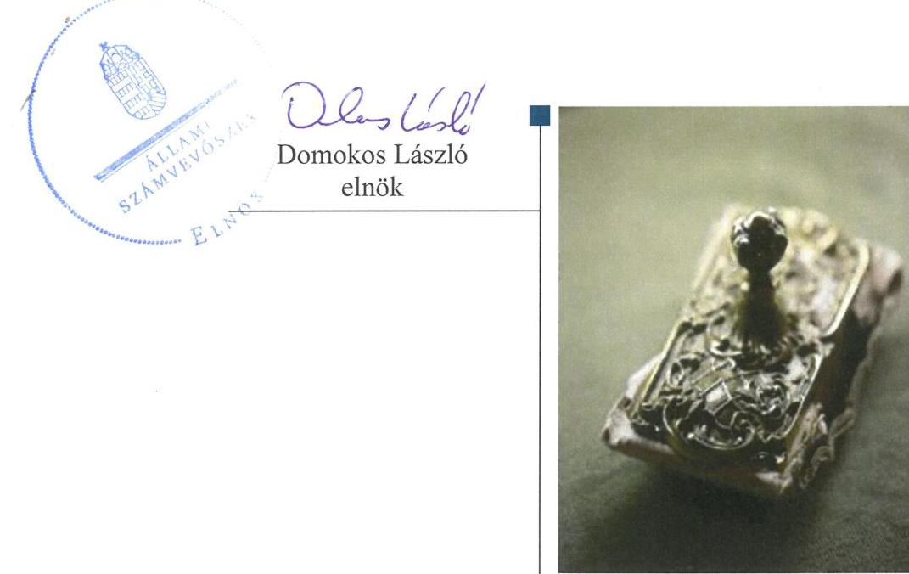
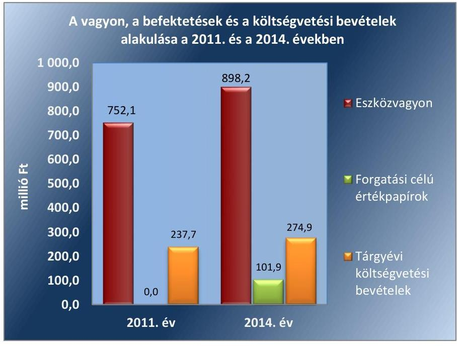
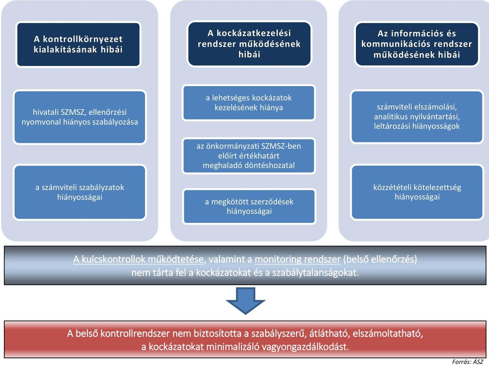
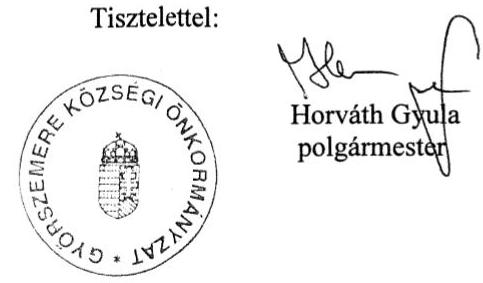
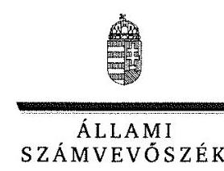
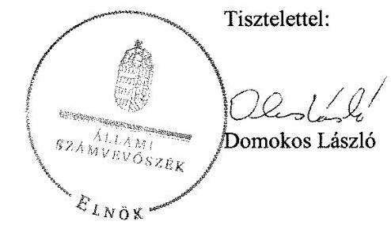
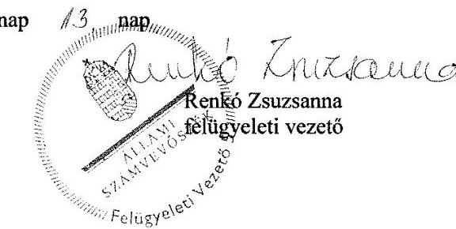

# Jelenetés 

## Önkormányzatok belső kontrollrendszere

Az önkormányzatok belső kontrollrendszere kialakításának és működtetésének ellenőrzése - Győrszemere 2017.

---

# Jelenetés 

## Önkormányzatok belső kontrollrendszere

Az önkormányzatok belső kontrollrendszere kialakításának és működtetésének ellenőrzése - Győrszemere
2017. 01. hó 11. nap

---

# AZ ELLENŐRZÉST FELÜGYELTE: 

RENKÓ ZSUZSANNA felügyeleti vezető

## AZ ELLENŐRZÉST VEZETTE ÉS A VÉGREHAJTÁSÁÉRT FELELŐS:

DÉR LÍVIA ellenőrzésvezető

## A PROGRAM ÖSSZEÁLLÍTÁSÁÉRT FELELŐS:

JANIK JÓZSEF osztályvezető

IKTATÓSZÁM: V-0909-118/2016.
TÉMASZÁM: 1943

## ELLENŐRZÉS-AZONOSÍTÓ SZÁM: V-07184

Jelentéseink az Országgyűlés számítógépes hálózatán és az Interneten a www.asz.hu címen is olvashatóak.

---

# TARTALOMJEGYZÉK 

■ ÖSSZEGZÉS ..... 5
■ AZ ELLENŐRZÉS CÉLJA ..... 6
■ AZ ELLENŐRZÉS TERÜLETE ..... 7
■ AZ ELLENŐRZÉS HÁTTERE, INDOKOLTSÁGA ..... 8
■ A JELENTÉS LÉNYEGES KÉRDÉSKÖREI ..... 11
■ ELLENŐRZÉS HATÓKÖRE ÉS MÓDSZEREI ..... 12
■ MEGÁLLAPÍTÁSOK ..... 15
■ JAVASLATOK ..... 31
■ MELLÉKLETEK ..... 33
I. Sz. melléklet: Értelmező szótár ..... 33
II. Sz. melléklet: az integritás szemlélet érvényesítése érdekében kialakított és működtetett kontrollrendszer ..... 37
■ FÜGGELÉK: ÉSZREVÉTELEK ..... 39
■ RÖVIDÍTÉSEK JEGYZÉKE ..... 45

---

.

---

# ÖSSZEGZÉS 

Győrszemere Község Önkormányzatánál a belső kontrollrendszer kialakítása és működtetése szabályszerű volt, azonban a befektetési tevékenységek szabályszerű végzését, elszámoltathatóságát nem támogatta. A döntéshozó személy szabálytalan jogkörgyakorlása, a döntés-előkészítés dokumentálásának elmaradása nem tette lehetővé a közvagyon szabályos és biztonságos befektetését. Az Önkormányzatnak az integritás szemlélet érvényesülése érdekében még erőfeszítéseket kell tennie.

## Az ellenőrzés társadalmi indokoltsága

Magyarország Alaptörvénye az önkormányzatoktól is elvárja a kiegyensúlyozott, átlátható és fenntartható költségvetési gazdálkodás elvének érvényesítését. Az önkormányzatok által betöltött társadalmi szerep, az általuk kezelt közpénz nagysága, a nemzeti vagyon átruházására vagy hasznosítására vonatkozó döntéseik sokrétűsége indokolttá teszik a számvevőszéki ellenőrzéseket. A belső kontrollrendszer kialakítása és működtetése nélkül nem valósítható meg a közpénzek, a közvagyon szabályos, gazdaságos, hatékony és eredményes felhasználása.

Győrszemere Önkormányzata számviteli nyilvántartása 2015. április 30-án 110,5 millió Ft névértékű vállalati kötvényt mutatott, lekötött betétállománya nem volt. Az Önkormányzat befektetési szolgáltatójának törvénytelen tevékenysége következtében fennállt a veszélye annak, hogy a befektetett közvagyon egy részét elveszítik. Felmerült, hogy a belső kontrollrendszer kialakítása és működtetése nem biztosította a közvagyon megóvását, körültekintő, biztonságos befektetését, a befektetési döntések, azok végrehajtása és számviteli elszámolása nem volt szabályszerű.

## Főbb megállapítások, következtetések, javaslatok

A belső kontrollrendszer kialakítása és működtetése összességében szabályszerű volt. A kontrolltevékenységek nem megfelelő működtetése akadályozta a hibák megelőzését, feltárását. Az ellenjegyzési, a teljesítésigazolási, és az érvényesítési jogkörök szabálytalan gyakorlása növelte a jogosulatlan kifizetések veszélyét.

Az egyes befektetések számviteli nyilvántartási hiányosságai, a kockázatok felmérésének elmaradása, a hatáskör elvonása miatt a befektetési tevékenység nemcsak szabálytalan volt, de a közvagyon körültekintő befektetését sem biztosította. A beszámoló az Önkormányzat vagyonáról nem a valós összképet mutatta 110,5 millió Ft nyilvántartási értékben. Az Önkormányzat értékpapírokkal kapcsolatos tulajdonosi joggyakorlása nem biztosította az önkormányzatnál megtestesülő nemzeti vagyon megőrzésének, védelmének és a nemzeti vagyonnal való átlátható és felelős gazdálkodásának a követelményét.

Az integritás szemlélet erősítése érdekében - a belső kontrollrendszer kialakításában és működésében feltárt hiányosságok és hibák megszüntetésével - az Önkormányzatnak még erőfeszítéseket kell tennie.

---

# AZ ELLENŐRZÉS CÉLJA 

Az ellenőrzés célja annak megállapítása volt, hogy az önkormányzat belső kontrollrendszerének kialakítása, továbbá egyes elemeinek működtetése biztosította-e az önkormányzatnál a közpénzfelhasználás szabályosságát. Az erőforrásokkal való szabályszerű és hatékony gazdálkodáshoz szükséges követelmények érvényesítése, számonkérése, ellenőrzése megtörtént-e az önkormányzatnál. A belső kontrollrendszer kialakítása és működtetése támogatta-e az integritás szemlélet érvényesülését. Az ellenőrzés során értékeltük a belső kontrollrendszer kialakításának és működtetésének szabályszerűségét. Bemutatjuk azokat a lényeges szabályozási hiányosságokat, amelyek miatt az ellenőrzött kulcskontrollok nem nyújtottak elegendő védelmet a lehetséges hibákkal szemben. Rámutattunk arra, ha a kulcskontrollok valamely hibát nem előztek meg, nem tártak fel vagy nem javítottak ki, valamint minősítjük működésük megfelelőségét. Ellenőriztük, hogy az önkormányzat egyes befektetési döntései és azok végrehajtása, elszámolása megfelelt-e a vonatkozó jogszabályoknak és belső szabályozásoknak, a kialakított kontrollrendszer támogatta-e a befektetési tevékenység szabályszerűségét.

---

# **AZ ELLENŐRZÉS TERÜLETE**

## **Győrszemere Község Önkormányzata**

Győrszemere község (Győr-Moson-Sopron megye) állandó lakosainak száma 2015. január 1-jén 3279 fő volt. Az Önkormányzat1 hat tagú Képviselő-testületének2 munkáját három állandó bizottság segítette. Az Önkormányzat a Hivatalon kívül nem rendelkezett intézménnyel, továbbá nem rendelkezett többségi tulajdoni részesedésű gazdasági társasággal. A településen Cigány Nemzetiségi Önkormányzat működik.

A polgármester3 a 2006. évi önkormányzati választások óta tölti be tisztségét. A jegyző4 2000. április 1-jétől látja el feladatait. A Hivatal nem tagolódott szervezeti egységre, elkülönített gazdasági szervezettel nem rendelkezett. A Hivatalban foglalkoztatott köztisztviselők száma 2014. év végén 7 fő volt. A Hivatalnál 2014. január 1-jétől szervezeti változás nem történt.

Az Önkormányzat a 2014. évi költségvetési beszámolója szerint 274,9 millió Ft költségvetési bevételt ért el, valamint 292,8 millió Ft költségvetési kiadást teljesített. Adósságkonszolidációs támogatásban nem részesültek.

Az Önkormányzat vagyonának, befektetéseinek és a költségvetési bevételeinek alakulását a 2011. évben és a 2014. évben a 2. ábra mutatja be:

1. ábra

*Forrás: Győrszemere Község Önkormányzatának 2011. és 2014. évi éves költségvetési beszámolói*

---

# AZ ELLENŐRZÉS HÁTTERE, INDOKOLTSÁGA 

Az ÁSZ tv. ${ }^{5}$ szerint az ÁSZ ${ }^{6}$ feladata a jól irányított állam kiépítésének elősegítése. Az ÁSZ Stratégiájában ezért hangsúlyos szerepet szánt annak, hogy szilárd szakmai alapon álló, értékteremtő ellenőrzéseivel előmozdítsa a közpénzügyek átláthatóságát, rendezettségét. A számvevőszéki ellenőrzés nemzetközi alapelvei is rögzítik, hogy a megfelelő belső kontrollrendszer minimálisra csökkenti a hibák és szabálytalanságok kockázatát.

A belső kontrollrendszer azt a célt szolgálja, hogy a költségvetési szervek működésük és gazdálkodásuk során a tevékenységeket szabályszerűen, gazdaságosan, hatékonyan, eredményesen hajtsák végre, teljesítsék elszámolási kötelezettségeiket és megvédjék az erőforrásokat a veszteségektől, a károktól és a nem rendeltetésszerű használattól. A belső kontrollrendszer magában foglalja mindazon szabályokat, eljárásokat, gyakorlati módszereket és szervezeti struktúrákat, kockázatkezelési technikákat, kontrolltevékenységeket, amelyek segítséget nyújtanak a szervezetnek céljai eléréséhez. A belső kontrollrendszer szabályozása háromszintű: a törvényi előírásokat az Áht. ${ }^{7}$ és a Mötv. ${ }^{8}$, a rendeleti szintű szabályozást az Ávr. ${ }^{9}$ és a Bkr. ${ }^{10}$ tartalmazza, amelyeket útmutatói szinten az NGM ${ }^{11}$ által kiadott standardok és kézikönyvek támogatnak.

Az ellenőrzött időszak meghatározása lehetőséget teremt a 2014. október 12-i önkormányzati választásokat megelőző és követő ciklus belső kontrollrendszere működésének elkülönült értékelésére, valamint a változások nyomon követésére.

A BELSŐ KONTROLLRENDSZER kialakításának és működtetésének általános értékelése mellett a teljesítésigazolás és érvényesítés kontrollok kiemelt ellenőrzésének szükségességét alátámasztja, hogy 2012-től a pénzügyi folyamatokban kulcsszerepet betöltő belső kontrollok rendszere módosult és azok működtetésében az önkormányzatoknál hiányosságok mutatkoztak a 2012 óta elvégzett ÁSZ ellenőrzések alapján.

Az önkormányzatok belső kontrollrendszerének ellenőrzése az ÁSZ „jó kormányzással" kapcsolatos stratégiai céljainak megvalósítását is szolgálja. Az ÁSZ célja, hogy javuljon az ellenőrzött önkormányzatok belső kontrollrendszerének szabályozottsága, működésének megfelelősége, hozzájárulva ezzel az egyensúlyi helyzet fenntarthatóságának biztosításához, azaz az adósság újratermelődésének megakadályozásához. Az ÁSZ ellenőrzés tapasztalatai nem csupán a közvetlenül ellenőrzött önkormányzatokat segíthetik, hanem a „jó gyakorlat" elterjesztésével azok az önkormányzatok is átvehetik a pozitív példákat, ahol nem végez ellenőrzést az ÁSZ.

Az MNB ${ }^{12}$ három befektetési szolgáltató tevékenységi engedélyét 2015. első felében visszavonta és kezdeményezte a vállalkozások felszámolását a működéssel kapcsolatos szabálytalanságok, hiányosságok miatt. A korábbi évek ellenőrzési tapasztalatai alapján fennáll a lehetősége annak, hogy az önkormányzatok befektetési döntései, továbbá a döntések végrehajtása és számviteli elszámolása nem voltak teljes mértékben szabályszerűek, és a kapcsolódó külső ellenőrzések és a belső kontrollrendszer sem működtek minden esetben megfelelően.

---

Magyarország Alaptörvénye ${ }^{13}$ az önkormányzatoktól, mint az államháztartás alanyaitól elvárja a kiegyensúlyozott, átlátható és fenntartható költségvetési gazdálkodás elvének érvényesítését. A nemzeti vagyonról szóló törvény szerint a nemzeti vagyonnal felelős módon, rendeltetésszerűen kell gazdálkodni. A nemzeti vagyongazdálkodás feladata a nemzeti vagyon rendeltetésének megfelelő, átlátható, hatékony és költségtakarékos működtetése, ugyanakkor értékének megőrzését, értéknövelő használatát, hasznosítását, gyarapítását is elvárja.

# AZ ÖNKORMÁNYZATOK ÁTMENETILEG SZABAD PÉNZESZKÖZEINEK BEFEKTETÉSÉT jogszabály nem tiltja, a pénzpiaci szolgáltatók közül az önkormányzatok a kínált szolgáltatás és annak költségei alapján, szabadon választhatnak, a veszteséges gazdálkodás kockázatai és következményei azonban az önkormányzatokat terhelik. A szabad pénzeszközök felelős hasznosítása összhangban áll az önkormányzati gazdálkodás alapelveivel. 

A közintézmények integritás alapú kultúrájának kialakítása, megerősítése és működése szorosan összefügg a belső kontrollrendszer működésével, ezért az ellenőrzés kiterjed annak értékelésére is, hogy a belső kontrollrendszer kialakítása és működtetése hogyan hatott az integritás szemlélet érvényesülésére.

Az államháztartás önkormányzati alrendszerében a 2014. év elején összesen 3177 települési önkormányzat működött: a 23 kerülettel rendelkező főváros, 345 város, 2691 község és 117 nagyközség volt. A belső kontrollrendszer kialakítása és működtetése ellenőrzését az ÁSZ által lefolytatott, kisebb településeket is érintő ellenőrzéseinek tapasztalatai, valamint a közérdekű bejelentések kockázati szempontú értékelése alapozták meg. Ezek a községek, nagyközségek gazdálkodásának, belső kontrollrendszere kialakításának és működésének hiányosságaira mutattak rá. Az ellenőrzések helyszíneinek kiválasztása során az ÁSZ célzott adatfeldolgozáson alapuló kockázatelemző rendszerére támaszkodik. Ez elősegíti, hogy azokon a területeken végezzen ellenőrzéseket, összpontosítva erőforrásait, ahol a valódi kockázatok, az aktuális problémák vannak.

## AZ ELLENŐRZÉS VÁRHATÓ HASZNOSULÁSA NÉGY SZINTEN valósul meg.

A törvényalkotás számára összegzett tapasztalatok állnak rendelkezésre a belső kontrollrendszer önkormányzati területen való kialakításáról, működtetéséről és hatásairól. Az ÁSZ az ellenőrzéseivel hozzájárul ahhoz, hogy az egyes önkormányzati befektetésekkel kapcsolatos kockázatok a szabályozási és kontroll mechanizmusok fejlesztésével mérsékelhetők legyenek.

Az ellenőrzés az ellenőrzött számára visszajelzést ad a belső kontrollrendszer kialakításában és működésében lévő hiányosságokról, javaslataival hozzájárul azok kiküszöböléséhez. Feltárja az önkormányzati befektetési tevékenységet meghatározó szabályozások összhangjának hiányosságait, a szabályozással nem érintett gazdálkodási területeket, valamint az egyes befektetési tevékenységek esetleges szabálytalanságait.

Az ellenőrzés megállapításait és javaslatait más szervezetek is hasznosíthatják a rendezett gazdálkodási keretek kialakításához.

---

A társadalom számára jelzi, hogy közpénz nem maradhat ellenőrizetlenül, az ÁSZ értékteremtő rend kialakításához és megőrzéséhez hozzájáruló tevékenysége így pozitív hatással lesz a szervezetről kialakított összkép formálásában.

---

# A JELENTÉS LÉNYEGES KÉRDÉSKÖREI 

1. Az önkormányzat belső kontrollrendszerének kialakítása és működtetése szabályszerű volt-e 2014. január 1. és 2015. április 30. között, valamint a belső kontrollrendszer egyes pillérei támogatták-e a befektetési tevékenység szabályszerű végzését 2011. január 1. és 2015. április 30. között?
2. Az egyes befektetésekkel kapcsolatos döntéshozatal és a döntések végrehajtása szabályszerű volt-e?
3. Az egyes befektetések számviteli elszámolása, nyilvántartása szabályszerű volt-e?
4. Az erőforrásokkal való szabályszerű és hatékony gazdálkodáshoz szükséges követelmények érvényesítése, számonkérése, ellenőrzése megtörtént-e az önkormányzatnál?
5. Az önkormányzat belső kontrollrendszerének kialakítása és működtetése támogatta-e az integritás szemlélet érvényesülését?

---

# ELLENŐRZÉS HATÓKÖRE ÉS MÓDSZEREI 

## Az ellenőrzés típusa

Megfelelőségi ellenőrzés, a befektetési tevékenység esetében szabályszerűségi ellenőrzés.

## Az ellenőrzött időszak

A belső kontrollrendszer kialakításának és működtetésének ellenőrzése a 2014. január 1. és 2015. április 30. közötti időszakra terjedt ki. Ezen belül a belső kontrollrendszer kialakításának és működtetésének megfelelőségét a 2014. január 1. és október 12., valamint a 2014. október 13. és 2015. április 30. közötti időszakra vonatkozóan külön-külön

 értékeltük. Az önkormányzatok egyes befektetési tevékenységeinek ellenőrzése tekintetében az ellenőrzött időszak a 2011. január 1. - 2015. április 30. közötti időszak. Ezen felül az önkormányzat befektetésekkel kapcsolatos döntés-előkészítésének és döntéshozatalának szabályszerűségét a 2011. január 1. előtti időszakra visszanyúlóan is ellenőriztük, amennyiben a 2014. június 30-án, illetve 2015. április 30-án meglévő befektetéseire 2011. január 1-je előtt került sor. Az integritás szemlélet érvényesülését a 2014. évre vonatkozó adatszolgáltatás alapján értékeltük.

## Az ellenőrzés tárgya

A helyi önkormányzatnak, mint éves költségvetési beszámoló készítésére kötelezett szervezetnek és polgármesteri hivatalának belső kontrollrendszere. Az önkormányzat 2014. június 30-án, illetve 2015. április 30-án meglévő értékpapír-befektetései, lekötött betétei, valamint az önkormányzat üzleti vagyonába tartozó ingatlanok, kulturális javak (műtárgyak, műalkotások, stb.), illetve a feladatellátást nem szolgáló egyéb értéktárgyak (pl. ékszerek, befektetési nemesfém). Az erőforrásokkal való szabályszerű és hatékony gazdálkodáshoz szükséges követelmények érvényesítése, számonkérése, ellenőrzése. Az integritás szemlélet érvényesülése.

## Az ellenőrzött szervezet

Győrszemere Község Önkormányzata és az önkormányzati működéshez kapcsolódó feladatokat ellátó Hivatal.

---

# Az ellenőrzés jogalapja 

Az ÁSZ tv. 1. § (3) bekezdésében foglaltak alapján az ÁSZ általános hatáskörrel végzi a közpénzekkel és az állami és önkormányzati vagyonnal való felelős gazdálkodás ellenőrzését. Az ÁSZ tv. 5. § (2) bekezdése alapján az államháztartás gazdálkodásának ellenőrzése keretében az ÁSZ ellenőrzi a helyi önkormányzatok gazdálkodását, valamint az ÁSZ tv. 5. § (6) bekezdése alapján ellenőrzése során értékeli az államháztartás számviteli rendjének betartását és a belső kontrollrendszer működését.

## Az ellenőrzés módszerei

Az ellenőrzést a nemzetközi standardokat irányadónak tekintve az ellenőrzési program ellenőrzési kérdései, az ellenőrzött időszakban hatályos jogszabályok, az ellenőrzés szakmai szabályok és módszertanok figyelembe vételével végeztük.

Az ellenőrzés lefolytatásához az Önkormányzat a tanúsítványok kitöltésével, valamint az ÁSZ által kért dokumentumok elektronikus megküldésével szolgáltatott adatokat. A rendelkezésre bocsátott adatok, információk kontrollja és a munkalapok kitöltése az ellenőrzés keretében történt. A jelentésben használt fogalmak magyarázatát az I. számú melléklet, az integritás érvényesítése érdekében kialakított és működtetett kontrollrendszer minősítését a II. számú melléklet tartalmazza.

A belső kontrollrendszer jogszabályi előírások szerinti kialakításának és működtetésének szabályszerűségét az erre irányuló ellenőrzési kérdésekre adott válaszok összesítése alapján külön-külön értékeltük a 2014. január 1. és október 12., valamint a 2014. október 13. és 2015. április 30. közötti időszakra. A belső kontrollrendszert egy-egy ellenőrzött időszakra pillérenként (kontrollkörnyezet, kockázatkezelési rendszer, kontrolltevékenységek, információs és kommunikációs rendszer, monitoring rendszer) és összesítetten is értékeltük.

## A BELSŐ KONTROLLRENDSZER EGYES PILLÉRE-

INEK KIALAKÍTÁSA ÉS MŰKÖDTETÉSE „szabályszerű volt", amennyiben az értékelt területen az elért és elérhető pontok százalékban kifejezett, egész számra kerekített hányadosa meghaladta a 84%-ot, „részben szabályszerű volt", ha 61-84% közé esett, „nem szabályszerű volt", ha nem haladta meg a 60%-ot. A belső kontrollrendszer összesített értékelése megegyezett a pillérenként (kontrollterületenként) alkalmazott százalékos értékelésekkel, a következő eltérésekkel. A kontrollrendszer egésze esetében a „szabályszerű" értékelésnek a százalékos értéken felül további feltétele volt, hogy egyik kontrollterület sem kaphat „nem szabályszerű" értékelést, a „részben szabályszerű" értékelés további feltétele volt, hogy legfeljebb egy ellenőrzött kontrollterület lehet „nem szabályszerű" értékelésű. Az összesített értékelés a százalékos értéktől függetlenül „nem szabályszerű volt", ha az ellenőrzött kontrollterületek közül több mint egynek „nem szabályszerű volt" az értékelése.

---

# A GAZDÁLKODÁS FOLYAMATÁBAN A KÉT 

KULCSKONTROLL - teljesítésigazolás, érvényesítés - működésének megfelelőségét a személyi juttatásokkal, a dologi kiadásokkal, a beruházási, felújítási kiadásokkal, az ellátottak pénzbeli juttatásaival és az egyéb működési, felhalmozási célú, valamint a finanszírozási kiadásokkal kapcsolatos kifizetések esetében mintavétellel ellenőriztük. A mintavétel során külön értékeltük a 2014. január 1. és 2014. október 12. közötti időszakban és a 2014. október 13. és 2015. április 30. közötti időszakban teljesített kifizetéseket. „Megfelelőnek" értékeltük a gazdálkodási jogkörök gyakorlását, amennyiben 95%-os bizonyossággal a teljes sokaságban a hibaarány legfeljebb 10%, „részben megfelelőnek" értékeltük, ha a hibaarány felső határa 10-30% között volt, „nem megfelelőnek" pedig akkor, ha a mintavételi eredmények alapján a sokaságbeli hibaarány felső határa meghaladta a 30%-ot.

Az integritás szemlélet érvényesülésének értékelése az önkormányzat által kitöltött tanúsítvány alapján történt.

---

# MEGÁLLAPÍTÁSOK 

## 1. Az önkormányzat belső kontrollrendszerének kialakítása és működtetése szabályszerű volt-e 2014. január 1. és 2015. április 30. között, valamint a belső kontrollrendszer egyes pillérei támogatták-e a befektetési tevékenység szabályszerű végzését 2011. január 1. és 2015. április 30. között?

Összegző megállapítás

A belső kontrollrendszer kialakítása és működtetése az összesített értékelés alapján - a feltárt hiányosságok mellett - szabályszerű volt. A kialakított belső kontrollrendszer a működésének hiányosságai miatt nem támogatta a befektetési tevékenység szabályszerű végzését.

A belső kontrollrendszer kialakításának és működtetésének összesített értékelését az 1. táblázat mutatja be:

1. táblázat

A BELSŐ KONTROLLRENDSZER KIALAKÍTÁSÁNAK ÉS MŰKÖDTETÉSÉNEK ÖSSZESÍTETT ÉRTÉKELÉSE

| Megnevezés | A gazdálkodás egészét érintően: |  | A befektetési tevékenységet érintően: |  |
| :--: | :--: | :--: | :--: | :--: |
|  | 2014. január 1-tól | 2014. október 13-tól | 2011-2013. években | 2014. január 1-tól |
|  | 2014. október 12-ig | 2015. április 30-ig |  | 2015. április 30-ig |
| Kontrollkörnyezet | szabályszerű |  | nem támogatta |  |
| Kockázatkezelési rendszer | szabályszerű |  | nem támogatta |  |
| Kontrolltevékenységek | részben szabályszerű | szabályszerű | n.a. | nem támogatta |
| Információs és kommunikációs rendszer | szabályszerű |  | nem támogatta |  |
| Monitoring | szabályszerű |  | nem támogatta |  |
| BELSŐ KONTROLLRENDSZER | SZABÁLYSZERŰ |  | NEM TÁMOGATTA |  |

1.1. számú megállapítás

A kontrollkörnyezet a feltárt hiányosságok mellett szabályszerű volt. A kontrollkörnyezet a befektetési tevékenység szabályszerű végzését nem támogatta, mert a közvagyonnal való szabályszerű, elszámoltatható gazdálkodási feltételeket nem alakították ki teljes körűen.

A SZERVEZETI ÉS SZABÁLYOZÁSI KERETEKET a 2011. január 1. és 2015. április 30. között a Képviselő-testület az alábbiak szerint alakította ki:
az önkormányzati SZMSZ-ben ${ }^{14}$ meghatározta a szervezeti kereteit, a feladat- és hatáskörök rendszerét. Rendelkezéseket tartalmazott az átmenetileg szabad pénzeszközök lekötésének, illetve befektetésének szabályairól, melyek felhatalmazták a polgármestert, hogy az

---

Önkormányzat vagyonára - közte az átmenetileg szabad pénzeszközökre - vonatkozóan 5 millió Ft értékhatárig szerződéseket kössön, kötelezettséget vállaljon.
a vagyongazdálkodási rendeletben ${ }_{1,2}{ }^{15}$ rögzítette az önkormányzati vagyonnal történő gazdálkodás részletes szabályait. A vagyongazdálkodási rendelet ${ }_{1}$ a 2011. január 1. - 2013. április 30. közötti időszakra vonatkozóan nem tartalmazott a befektetési tevékenységre vonatkozó konkrét szabályokat. A 2013. május 1-jétől hatályos vagyongazdálkodási rendelet ${ }_{2}$ a szabad pénzeszközök befektetésével kapcsolatos joggyakorlás szabályozását a költségvetési és más rendeletek hatáskörébe utalta.
gazdasági program ${ }_{1,2}$-ot hagyott jóvá, melyek tartalmazták azokat a célkitűzéseket és elképzeléseket, amelyek az Önkormányzat által nyújtandó feladatok biztosítását és színvonalának javítását szolgálták. A gazdasági program ${ }_{1,2}{ }^{16}$ az ellenőrzött időszakokban a fejlesztési célok megvalósításához szükséges források biztosítására vonatkozó elképzelésekkel támogatta a befektetési tevékenységek végzését.
az ellenőrzött időszakban - a 2013. év kivételével - a jogszabályi előírásoknak megfelelő rendelettel állapította meg költségvetését. A 2013. évi költségvetési rendelet - az Áht. 23. § (2) bekezdésének a) pontjában leírtak ellenére - nem tartalmazta a költségvetési bevételeket és kiadásokat kötelező és önként vállalt feladatok szerinti bontásban.

A HIVATAL BELSŐ SZABÁLYOZÁSA keretében rendelkeztek:
a Képviselő-testület által elfogadott alapító okirattal ${ }^{17}$, hivatali SZMSZ-szel ${ }_{1,2}{ }^{18}$, valamint ügyrenddel ${ }^{19}$. A hivatali SZMSZ ${ }_{1}$ az Ámr. ${ }^{20}$ 20. § (2) bekezdés h) pontjában, illetve az Ávr. 13. § (1) bekezdés g) pontjában leírtak ellenére - 2014. december 31-éig - nem tartalmazta a nevesített munkakörökhöz tartozó feladat- és hatásköröket, azok gyakorlásának módját, valamint a 2011. január 1. és 2013. december 31. közötti időszakban a Hivatal szervezeti ábráját.
a Hivatalban dolgozó köztisztviselők munkaköri leírással, melyben rögzítették a köztisztviselők feladatait és a munkakör betöltésével kapcsolatos követelményeket. A költségvetési beszámoló elkészítésével megbízott köztisztviselő a feladat ellátásához szükséges végzettséggel, előírt szakképesítéssel és a könyvviteli szolgáltatás körébe tartozó tevékenység ellátására jogosító engedéllyel rendelkezett.
kötelezettségvállalási szabályzattal ${ }_{1,2}{ }^{21}$, amely a gazdálkodási jogkörök gyakorlásának módját, eljárási és dokumentációs részletszabályait, valamint az ezeket végző személyek kijelölésének rendjével kapcsolatos előírásokat a jogszabályokban előírtaknak megfelelően tartalmazta. Szabályozták a 100 ezer Ft alatti előzetes írásbeli kötelezettségvállalás nélküli teljesítés rendjét -, és a bizonylati rendet ${ }^{22}$.
számviteli politikával ${ }_{1,2}{ }^{23}$, valamint számlarenddel ${ }_{1,2,3}{ }^{24}$. A számviteli politika ${ }_{2}$ és a számlarend ${ }_{1,2,3}$ - a 2. táblázatban részletezett hiányosságok miatt - nem támogatta a befektetési tevékenységek szabályszerű végzését.

---

$\longrightarrow$ leltározási és leltárkészítési szabályzattal ${ }_{1,2}{ }^{25}$, értékelési szabályzattal ${ }^{26}{ }_{1,2}$, valamint pénzkezelési szabályzattal ${ }_{1,2}{ }^{27}$, amelyek megfeleltek a jogszabályi előírásoknak és támogatták az Önkormányzat befektetési tevékenységének szabályszerűségét, mivel tartalmazták a forgatási célú értékpapírok értékelésére és leltározására, továbbá az értékpapírok kezelésére vonatkozó előírásokat.
a köztisztviselőkre vonatkozó hivatásetikai alapelveket tartalmazó etikai szabályzattal ${ }^{28}$. Kialakították az átlátható humánerőforrás-gazdálkodás kereteit. A Képviselő-testület költségvetési rendeletben meghatározta a Hivatal engedélyezett létszámát. A jegyző kiadta a közszolgálati szabályzatot ${ }^{29}$, munkáltatói intézkedésben meghatározta a köztisztviselők teljesítményértékelésének ajánlott elemeit, elkészítette a Hivatalban dolgozó köztisztviselők teljesítményértékelését.
munkavédelmi szabályzattal ${ }^{30}$, valamint tűzvédelmi szabályzattal ${ }_{1,2}{ }^{31}$.
a táblázatos formában elkészített ellenőrzési nyomvonallal ${ }_{1,2,3}{ }^{32}$, amely - a befektetési tevékenységre vonatkozó előírások kivételével - tartalmazta az információs és felelősségi szinteket és kapcsolatokat, továbbá az ellenőrzési és irányítási folyamatokat.
a 2011. év kivételével a szabálytalanságok kezelésének eljárásrendjével, melyet a Belső kontroll kézikönyv ${ }_{1,2}{ }^{33}$ tartalmazott.
A kontrollkörnyezet kialakítása a szabályozási hiányosságok miatt 2011. január 1. és 2015. április 30. közötti időszakban a befektetési tevékenység szabályszerű végzését nem támogatta.

A kontrollkörnyezet kialakítása és működtetése az értékelés szempontjából 2014. január 1. és 2014. október 12., valamint 2014. október 13. és 2015. április 30. közötti időszakokban szabályszerű volt. Az ellenőrzési időszak végén a 2. táblázatban részletezett hiányosság fennállt.
2. táblázat

# A KONTROLLKÖRNYEZET KIALAKÍTÁSÁNAK HIÁNYOSSÁGAI 

## Sorszám

## Részmegállapítás

1. A számviteli politika $_{2}$ - a Számv. tv. ${ }^{34} 14 . \S$ (4) bekezdésében foglaltak ellenére - nem tartalmazta, hogy a számviteli elszámolás és az értékelés szempontjából az Önkormányzat mit tekint lényegesnek.
2. A számlarend ${ }_{1,2,3}$ - az Áhsz ${ }_{3}{ }^{35} 49 . \S$ (3) bekezdésében, valamint az Áhsz ${ }_{2}{ }^{36} 51 . \S$ (3) bekezdésében foglaltak ellenére - nem tartalmazta a forgatási célú értékpapírok részletező nyilvántartása vezetésének módját, azoknak a kapcsolódó főkönyvi nyilvántartásokkal való egyeztetésének és dokumentálásának szabályait.
3. A pénzkezelési szabályzat ${ }_{2}{ }^{37}$ - a Számv. tv. 14. § (8) bekezdésében foglaltak ellenére - nem tartalmazta a napi készpénz záró állomány maximális mértékét.
4. Az ellenőrzési
 nyomvonal ${ }_{1,2,3}$-at a Bkr. 6. § (3) bekezdését figyelmen kívül hagyva a 2013. évtől végzett befektetési tevékenységre vonatkozó előírásokkal nem aktualizálták.

---

### 1.2. számú megállapítás

A kockázatkezelési rendszert kialakították, de működése nem támogatta a befektetési tevékenység szabályszerű és a kockázatokat minimalizáló végzését, a pénzügyi kockázatok kezelése érdekében nem határoztak meg intézkedéseket.

A kockázatkezelési rendszert - az Ámr. 157. §-ában foglaltak ellenére - a 2011. évben nem alakították ki. A kockázatkezelési rendszert a 2012. évtől kialakították, de - a Bkr. 7. § (2) bekezdés előírásai ellenére - nem működtették, nem mérték fel a kockázatelemzés során a gazdálkodásban rejlő kockázatokat, nem határozták meg az egyes kockázatokkal kapcsolatban a szükséges intézkedéseket. A 2014. január 1. - 2015. április 30. közötti időszakra kialakított kockázatkezelési rendszer tartalmazta a jogszabályi előírásoknak megfelelő elemeket. A lehetséges kockázatok között az előre nem látható pénzügyi krízisek bekövetkezésének lehetőségét szerepeltették, de nem határozták meg a kockázat kezelése érdekében szükséges intézkedéseket, valamint azok teljesítése folyamatos nyomon követésének módját.

## A VAGYONNYILATKOZAT-TÉTELI KÖTELEZETTSÉGGEL járó munkaköröket a köztisztviselők esetében a hivatali SZMSZ ${ }_{1,2}$-ben meghatározták. A vagyonnyilatkozat-tételre kötelezett köztisztviselők és önkormányzati képviselők kötelezettségüknek eleget tettek.

A kockázatkezelési rendszer a befektetési tevékenységek szabályszerű végzését nem támogatta 2011. január 1. és 2013. december 31., valamint 2014. január 1. és 2015. április 30. közötti időszakokban, mivel nem gondoskodtak a kockázatok kezeléséről.

A kockázatkezelési rendszer kialakítása és működtetése a 2014. január 1. és 2015. április 30. közötti időszakban a 3. táblázatban részletezett hiányosságok mellett szabályszerű volt.
3. táblázat

# A KOCKÁZATKEZELÉSI RENDSZER KIALAKÍTÁSÁNAK ÉS MŰKÖDTETÉSÉNEK HIÁNYOSSÁGAI 

## Sorszám

## Részmegállapítás

1. A Bkr. 7. § (2) bekezdésében foglaltak ellenére nem határozták meg az egyes befektetési kockázatokkal kapcsolatos intézkedéseket valamint azok teljesítésének folyamatos nyomon követésének módját.
2. Az önkormányzati SZMSZ a Vnytv. ${ }^{38}$ 4. § d) pontjában foglaltak ellenére a bizottságok nem önkormányzati képviselő tagjai vagyonnyilatkozat-tételi kötelezettségét nem tartalmazta.
3. A vagyonnyilatkozat őrzéséért felelős a nem képviselő bizottsági tagok esetében - a Vnytv. 11. § (6) bekezdésében foglaltak ellenére - nem állapította meg szabályzatban a vagyonnyilatkozat átadására, nyilvántartására, a vagyonnyilatkozatban foglalt személyes adatok védelmére vonatkozó további szabályokat.
4. A vagyonnyilatkozat őrzéséért felelős személy - a Vnytv. 8. § (4) bekezdésében foglaltak ellenére - nem tájékoztatta a nem képviselő bizottsági tagokat a vagyonnyilatkozat-tételi kötelezettség fennállásáról és esedékességéről.
5. A Pénzügyi és Úgyrendi Bizottság ${ }^{39}$ nem képviselő tagjai a Vnytv. 3. § (3) bekezdés e) pontjában foglaltak ellenére nem nyújtottak be vagyonnyilatkozatot.

---

### 1.3. számú megállapítás

A pénzügyi folyamatokban kulcsszerepet betöltő teljesítésigazolás és érvényesítés kontrollok működése a 2014. január 1. és 2014. október 12. közötti időszakban nem biztosította teljes körűen a hibák megelőzését és feltárását a közpénzfelhasználás szabályosságát, 2014. október 13. és 2015. április 30. között szabályszerű volt.

A PÉNZÜGYI DÖNTÉSEK - köztük a költségvetés tervezése, a beszerzések lebonyolítása, a vagyonhasznosítási tevékenység, a támogatások elszámolása - dokumentumainak előkészítése tekintetében belső szabályzatban biztosították a folyamatba épített, előzetes, utólagos és vezetői ellenőrzés működtetésének rendszerét. A felelősségi körök meghatározásával szabályozták az engedélyezési, jóváhagyási és kontroll eljárásokat, a dokumentumokhoz és az informatikai rendszerhez való hozzáférést, annak szintjeit, a beszámolási eljárásokat. Az ügyrend tartalmazta a beszámolási feladatok teljesítésével kapcsolatos belső előírásokat, feltételeket.

## A GAZDÁLKODÁSI JOGKÖRÖKKEL KAPCSOLATOS FELHATALMAZÁSOK és kijelölések a jogszabályi előírásoknak megfeleltek. A pénzügyi ellenjegyző és az érvényesítő rendelkezett a jogszabályban előírt végzettséggel, illetve pénzügyi-számviteli képesítéssel.

A Hivatalban a közszolgálati jogviszony megszűnése, valamint a munkakör változása esetén szabályozták a munkakör átadásának rendjét.

Az ellenőrzött időszakban, a pénzügyi folyamatokban kulcsszerepet betöltő teljesítésigazolás és érvényesítés belső kontrollok működésének ellenőrzése során feltárt hiányosságok összességében a következők voltak:

## A TELJESÍTÉSIGAZOLÁS:

- során a személyi juttatások és a dologi kiadások esetében nem ellenőrizték az Ávr. 57. § (1) bekezdésében előírtak ellenére a kiadások teljesítésének jogosságát, összegszerűségét, illetve az Ávr. 57. § (3) bekezdésben foglaltak ellenére az igazolás dátumát nem tüntették fel.
- a személyi juttatásokkal és a dologi kiadásokkal kapcsolatos kifizetések esetében az Ávr. 57. § (4) bekezdésben előírt írásbeli kijelölés hiányában végezték el a teljesítésigazolást;
A finanszírozási kiadások teljesítésigazolása megtörtént.

## AZ ÉRVÉNYESÍTÉS:

- az Ávr. 58. § (3) bekezdésében előírtak ellenére a személyi juttatások kifizetéseinél nem végezték el az érvényesítést. Emiatt a kifizetést megelőzően az Ávr. 58. §(1) bekezdésében előírtak ellenére elmaradt a kiadások összegszerűségének, a fedezet meglétének, továbbá annak ellenőrzése, hogy a megelőző ügymenetben az Áht., az Áhsz. 2 az Ávr. előírásait és a belső szabályzatokban foglaltakat betartották-e.
- a személyi juttatások és a dologi kiadások kifizetésénél az Ávr. 58. § (3) bekezdésben foglaltak ellenére nem tüntették fel az érvényesítés keltezését, továbbá az Ávr. 58. § (2) bekezdésében foglaltak

---

ellenére nem jelezték az utalványozónak, hogy a megelőző ügymenetben a teljesítésigazolást nem az arra jogosult személy végezte, az Ávr. 60. § (2) bekezdésében foglaltak ellenére a képzési költség átvállalásának pénzügyi ellenjegyzését maga javára látta el.
a beruházások és felújítások kiadásainál az Ávr. 55. § (1) bekezdésben foglaltak ellenére a kötelezettségvállalás pénzügyi ellenjegyzése nem történt meg, és az Ávr. 58. § (2) bekezdésében előírtak ellenére nem jelezte az utalványozónak;
a finanszírozási kiadásokkal (vállalati kötvény-vásárlással) kapcsolatban az Ávr. 58. § (1) bekezdésében előírtak ellenére nem ellenőrizték, hogy a megelőző ügymenetben a kötelezettségvállalásra vonatkozó belső szabályozásban foglaltakat betartották-e. Az érvényesítés során nem ellenőrizték, illetve nem jelezték, hogy a polgármester az önkormányzati SZMSZ 29. § (5) bekezdésében foglaltak ellenére az előírt értékhatárt meghaladó összegben vásárolt értékpapírt Képviselő-testületi döntés nélkül. Nem jelezték, hogy az értékpapír adásvételi szerződések ellenjegyzése az Ávr. 55. § (1) bekezdésében, és az Áht. 37. § (1) bekezdésében foglaltakkal ellentétesen a kötelezettségvállalás dokumentumán nem történt meg.
A kontrolltevékenység kialakítása és működtetése 2014. január 1. és 2015. április 30. között a befektetési tevékenység végzését nem támogatta.

A kontrolltevékenységek kialakítása és működtetése az értékelés szempontjából a 2014. január 1. és 2014. október 12. közötti időszakban részben szabályszerű, a 2014. október 13. és 2015. április 30. közötti időszakban szabályszerű volt, annak ellenére, hogy az érvényesítés ellenőrzése során feltárt 4. táblázatban részletezett hiányosság fennállt.
4. táblázat

# A KONTROLLTEVÉKENYSÉG KIALAKÍTÁSÁNAK ÉS MŰKÖDTETÉSÉNEK HIÁNYOSSÁGAI 

## Sorszám

## Részmegállapítás

1. Az érvényesítés során nem ellenőrizték az Ávr. 58. § (1) bekezdésében előírtak ellenére, hogy a megelőző ügymenetben, az Áht.-ban, az államháztartási számviteli kormányrendeletben, az Ávr.-ben és a belső szabályzatokban foglaltakat maradéktalanul betartották-e, nem ellenőrizték, illetve nem jelezték, hogy a polgármester az önkormányzati SZMSZ 29. § (5) bekezdésében foglaltak ellenére az előírt értékhatárt meghaladó összegben vásárolt értékpapírt Képviselő-testületi döntés nélkül. Nem jelezték, hogy az értékpapír adásvételi szerződések ellenjegyzése az Ávr. 55. § (1) bekezdésében és az Áht. 37. § (1) bekezdésében foglaltakkal ellentétesen, a kötelezettségvállalás dokumentumán nem történt meg.

Forrás: ÁSZ
1.4. számú megállapítás

Az információs és kommunikációs rendszer kialakítása és működtetése a 2014. január 1. - 2015. április 30. közötti időszakban szabályszerű volt. A közérdekű adatok közzétételét hiányosan teljesítették, emiatt a befektetési tevékenység átláthatóságát, szabályszerű végzését az információs és kommunikációs rendszer nem támogatta.

AZ INFORMÁCIÓÁRAMLÁS RENDJÉT a szervezeten belülre a 2011. évre vonatkozóan - az Ámr. 159. § (1)-(2) bekezdéseiben előírtak ellenére - a szervezeten kívülre a 2011. január 1. - 2013. december 31. közötti időszakra vonatkozóan - az Ámr. 159. § (1)-(2) bekezdésében, valamint a Bkr. 9. (1)-(2) bekezdéseiben foglaltakat figyelmen kívül hagyva

---

- nem alakították ki, továbbá nem határozták meg a beszámolási szinteket, határidőket, módokat.

A 2014. január 1. - 2015. április 30. közötti időszakban a jogszabályi előírásokkal összhangban kialakították - a belső kontrollrendszer részeként - az információs- és kommunikációs rendszert.

A KÖTELEZŐEN KÖZZÉTEENDŐ ADATOK jogszabályi előírásoknak megfelelő nyilvánosságra hozatalának rendjét a közzétételi szabályzatban ${ }_{1,2}{ }^{40}$ határozták meg.

A Hivatal rendelkezett adatvédelmi szabályzattal ${ }^{41}$, valamint iratkezelési szabályzattal ${ }^{42}$, melynek hatálya kiterjedt az Önkormányzat önálló beszámolóval érintett feladataival kapcsolatos iratkezelésre is.

Az Önkormányzat nem rendelkezett kommunikációs stratégiával, amely támogatta, erősítette volna az információs és kommunikációs rendszer működését.

Az információs és kommunikációs rendszer a közzétételi kötelezettség hiányos teljesítése miatt az egyes befektetési tevékenységek szabályszerű végzését 2011. január 1. és 2015. április 30. között nem támogatta.

Az információs és kommunikációs rendszer kialakítása és működtetése a 2014. január 1. és 2015. április 30. közötti időszakban szabályszerű volt. Az ellenőrzési időszak végén az 5. táblázatban szereplő hiányosság fennállt.
5. táblázat

# AZ INFORMÁCIÓS ÉS KOMMUNIKÁCIÓS RENDSZER KIALAKÍTÁSA ÉS MŰKÖDTETÉSE HIÁNYOSSÁGA 

## Sorszám

1. Az éves költségvetés és az előző évi költségvetési beszámoló tekintetében nem tettek eleget az elektronikus közzétételi kötelezettségnek az Eisztv. ${ }^{43}$ 6. § (1) bekezdésében és a Melléklet III/1. pontjában, továbbá az Info. tv. ${ }^{44}$ 37. § (1) bekezdésében és az 1. melléklet III. fejezet 1. pontjában foglaltak ellenére.

Forrás: Ász
1.5. számú megállapítás

A monitoring rendszer kialakítása és működtetése szabályszerű volt. A belső és külső ellenőrzések a 2011. január 1. és 2015. április 30. közötti időszakban nem járultak hozzá az egyes befektetési tevékenységek szabályszerű végzéséhez, mivel sem a belső ellenőrzés, sem a külső ellenőrzés nem érintette a befektetési tevékenységet.

A MONITORING RENDSZERT a szervezeti tevékenységek és célok elérésének folyamatos és eseti nyomon követésére a jegyző kialakította és működtette. Nyilatkozatban értékelte az Önkormányzat belső kontrollrendszerének működését a 2013. és a 2014. évre vonatkozóan.

A BELSŐ ELLENŐRZÉS kialakításáról és működtetéséről a 2014. január 1. és 2015. április 30. közötti időszakban a jogszabályokban előírt módon gondoskodtak. A belső ellenőrzést társuláshoz ${ }^{45}$ csatlakozva látták el. A belső ellenőrök szervezeti és funkcionális függetlensége biztosított volt, rendelkeztek a tevékenység folytatásához a jogszabályban meghatározott engedéllyel és szakmai gyakorlattal.

Az Önkormányzat rendelkezett a belső ellenőrzési vezető által készített és a Képviselő-testület által jóváhagyott stratégiai ellenőrzési tervvel. A

---

belső ellenőrzési vezető a jegyző írásos véleményének figyelembe vételével készítette el a 2014. és 2015. évi belső ellenőrzési terveket. A tervek kockázatelemzést is tartalmaztak, amelyek alapul szolgáltak az elvégzendő ellenőrzések meghatározásához.

A végrehajtott ellenőrzésekhez megfelelő tartalmú program készült. A 2014. évben az átadott pénzeszközök ellenőrzésére került sor. Az ellenőrzés során a cél annak megállapítása volt, hogy a pénzeszközök átadása a jogszabályi előírásokban, a belső szabályozásban, továbbá a megállapodásokban, szerződésekben foglaltaknak megfelelően történt-e. Az ellenőrzés a feladatellátás szabályszerűségének javítására - többek között a támogatási igények írásban történő benyújtására, minden megítélt támogatással kapcsolatban támogatási szerződés megkötésére, a támogatás felhasználásáról írásos beszámoló készítésére - tett javaslatokat.
2015. április 30-ig a helyi adóztatási tevékenységet vizsgálták felül. Ellenőrizték az adóztatással kapcsolatos eljárás jogszerűségét, az önkormányzatot megillető bevételek maradéktalan realizálását, a befolyt bevételek kezelését, elszámolásának jogszabályi megfelelőségét. Az ellenőrzés a feladatellátás szabályszerűségének javítására
 - például az adóhátralékok behajtása érdekében teendő intézkedésekre - és gazdaságosabb, hatékonyabb végrehajtására tett javaslatokat. A jelentések javaslatainak végrehajtására a jegyző intézkedési tervet készített.

A belső ellenőrzési vezető a 2014. évi ellenőrzésről az Önkormányzat belső kontrollrendszerének működését is értékelő, éves (összefoglaló) ellenőrzési jelentést határidőben megküldte a jegyzőnek.

A belső kontrollrendszer működését a belső ellenőrzés az egyes témacsoportok keretén belül ellenőrizte, az öt pillér értékelésére önálló ellenőrzés formájában - ideértve a belső kontrollrendszer szabályszerűségének, gazdaságosságának, hatékonyságának és eredményességének növelése, javítása érdekében tett fontosabb javaslatok megtételét is - nem került sor.

A belső ellenőrzés 2011. január 1. és 2015. április 30. között az Önkormányzat befektetési tevékenységét nem ellenőrizte.

KÜLSŐ ELLENŐRZÉST a Bkr. 13. § (1) bekezdése szerinti szervezetek 2014. január 1. és 2015. április 30. között az Önkormányzatnál nem végeztek. Hatósági ellenőrzésre öt alkalommal került sor a következő témákat illetően: üzletműködési ügyintézési, gyámhatósági tevékenység, szociális étkeztetési szolgáltatás működésének ellenőrzése, szociális hatóság komplex ellenőrzése, temető fenntartás. Törvényességi felhívással két esetben - vagyonrendelet módosítása, bizottsági elnök megválasztása - élt a Győr-Moson-Sopron Megyei Kormányhivatal.

A hatósági ellenőrzésekre vonatkozóan intézkedési tervet készítettek, és megtették a szükséges intézkedéseket a feltárt hiányosságok megszüntetésére. A törvényességi felhívásokkal kapcsolatban a Képviselő-testület rendeletet alkotott az önkormányzati vagyon vagyonkezelésbe adásáról, valamint megválasztotta az önkormányzati bizottságok elnökeit.

A belső és külső ellenőrzések 2011. január 1. és 2015. április 30. között nem járultak hozzá az egyes befektetési tevékenységek szabályszerűségéhez, mert az ellenőrzött időszakban végzett belső, illetve külső ellenőrzések az Önkormányzat befektetési tevékenységét nem érintették.

---

A monitoring rendszer kialakítása és működtetése az értékelés szempontjából a 6. táblázatban részletezett hiányosságok mellett szabályszerű volt.
6. táblázat

# A MONITORING RENDSZER KIALAKÍTÁSÁNAK ÉS MŰKÖDTETÉSÉNEK HIÁNYOSSÁGA 

## Sorszám

1. A 2014. évi ellenőrzési terv módosítása - a Bkr. 56. § (5) bekezdésében foglaltak ellenére - nem történt meg.

## Megjegyzés

2. Az Önkormányzatnál - a Bkr. 47. § (1) bekezdésben foglaltak ellenére - éves bontásban nem vezettek a belső ellenőrzési jelentésekben tett megállapítások, javaslatok, a vonatkozó intézkedési tervek és azok végrehajtása nyomon követését biztosító nyilvántartást.

2014. évben nem hajtották végre a tárgyévi ellenőrzési tervben foglalt ellenőrzést, hanem a 2013. évre tervezett belső ellenőrzést folytatták le, a 2014. évre tervezett belső ellenőrzést 2015. április 30-ig végezték el.

Az Önkormányzat befektetési tevékenységével kapcsolatos főbb szabálytalanságokat a 2. ábra foglalja össze.
2. ábra

A BEFEKTETÉSI TEVÉKENYSÉG KONTROLLRENDSZERÉVEL KAPCSOLATBAN FELTÁRT HIBÁK

---

# 2. Az egyes befektetésekkel kapcsolatos döntéshozatal és a döntések végrehajtása szabályszerű volt-e? 

Összegző megállapítás

Az egyes befektetésekkel kapcsolatos döntéshozatal és a döntések végrehajtása - az önkormányzati SZMSZ-ben meghatározott értékhatárt meghaladó összegű szerződéskötés miatt - nem volt szabályszerű.
2.1. számú megállapítás

Az egyes befektetésekkel kapcsolatos döntés-előkészítés és döntéshozatal nem felelt meg a jogszabályokban és belső szabályzatban foglaltaknak. A belső kontrollok a feltárt hiányosságokat nem előzték meg, ezáltal a befektetési tevékenység szabályszerű végzését nem támogatták.

Az Önkormányzat a 2011-2012. években lekötött betétben helyezte el az átmenetileg szabad pénzeszközeit, majd ezt követően forgatási célú, hitelviszonyt megtestesítő értékpapírokba fektette a gazdasági programban meghatározott fejlesztések finanszírozására tartalékolt pénzeszközeit.

A QUAESTOR Nyrt.-nél 2014. június 30-án 150,0 millió Ft, 2015. április 30-án 110,5 millió Ft vételáron vásárolt vállalati kötvénnyel rendelkeztek.

Az Önkormányzatnak 2014. június 30-án és 2015. április 30-án lekötött betétállománya nem volt. Az ellenőrzött időszakban befektetési céllal ingatlant, kulturális javakat, feladatellátást nem szolgáló egyéb értéktárgyakat nem szerzett be, azzal nem rendelkezett.

A befektetési szolgáltatók kiválasztására pályáztatási kötelezettséget nem írtak elő.

SZÁMLASZERZŐDÉST KÖTÖTTEK a QUAESTOR Nyrt.-vel 2013. február 22-én a befektetési szolgáltatásokkal összefüggően, amely keretében megnyitott számlák az Önkormányzat által vásárolt, dematerializált értékpapírokkal kapcsolatos pénz-, és pénzügyi-eszköz forgalom bonyolítására, az értékpapírok nyilvántartására, az értékpapírügyletekkel kapcsolatban átutalt pénzösszegek, az egyes értékpapírügyletek kapcsán felmerülő díjak nyilvántartására szolgáltak. Az egyes értékpapír-vásárlásokhoz adásvételi szerződéseket kötöttek. Az önkormányzati SZMSZ-el ellentétesen történt a szerződéskötés.

A számlaszerződés és az értékpapír adásvételi szerződések pénzügyi ellenjegyzése az Ávr. 55. § (1) bekezdésének előírásai ellenére a kötelezettségvállalás dokumentumán nem történt meg.

Az érvényesítés során - az Ávr. 58. § (1) bekezdésében előírtak ellenére - nem ellenőrizték, hogy a megelőző ügymenetben az Áht.-ban, az államháztartási számviteli kormányrendeletben, az Ávr.-ben, a kötelezettségvállalásra vonatkozó belső szabályozásban foglaltakat maradéktalanul betartották-e. Nem kifogásolták, hogy nem az önkormányzati SZMSZ-nek megfelelően történt a szerződéskötés. Továbbá a számlaszerződés és az értékpapírok vételéről szóló szerződések ellenjegyzése az Ávr. 55. § (1) bekezdésében és az Áht. 37. § (1) bekezdésében foglaltakkal ellentétesen a kötelezettségvállalás dokumentumán nem történt meg.

---

A befektetett eszközök forrása a kiadásokat meghaladó bevételek voltak, amelyeket a tervezett beruházások fedezeteként tartalékoltak.

A befektetésekkel kapcsolatos döntéshozatal hiányosságát a 7. táblázat mutatja be.
7. táblázat

# BEFEKTETÉSEKKEL KAPCSOLATOS DÖNTÉSEK ELŐKÉSZÍTÉSÉNEK HIÁNYOSSÁGAI 

## Sorszám

1. Az Önkormányzatnál az önkormányzati SZMSZ 29. § (5) bekezdését megsértve az előírt értékhatárt meghaladó összegben vásároltak vállalati kötvényeket.
2. A számlaszerződés és az értékpapír adásvételi szerződések pénzügyi ellenjegyzése az Ávr. 55. § (1) bekezdésének és az Áht. 37. § (1) bekezdésének előírásai ellenére a kötelezettségvállalás dokumentumán nem történt meg.
3. Az érvényesítés során - az Ávr. 58. § (1) bekezdésében előírtak ellenére - nem ellenőrizték, hogy a megelőző ügymenetben az Áht.-ban, az államháztartási számviteli kormányrendeletben, az Ávr.-ben, a kötelezettségvállalásra vonatkozó belső szabályozásban foglaltakat maradéktalanul betartották-e. Nem ellenőrizték, hogy nem az önkormányzati SZMSZ-nek megfelelően történt a szerződéskötés. Továbbá a számlaszerződés és az értékpapírok vételéről szóló szerződések ellenjegyzése az Ávr. 55. § (1) bekezdésében és az Áht. 37. § (1) bekezdésében foglaltakkal ellentétesen a kötelezettségvállalás dokumentumán nem történt meg.

Forrás: ÁSZ

### 2.2. számú megállapítás

Az egyes befektetésekkel kapcsolatos döntések végrehajtása nem szabályszerűen, ellenőrizhető módon történt. A vállalati kötvények adásvételére vonatkozó megbízások teljesítéséről hitelt érdemlő módon - számlakivonat hiányában - nem győződtek meg.

A SZÁMLASZERZŐDÉSBEN rögzítették a megbízás tárgyát, az ügyfélszámlán fennálló számlakövetelések visszafizetéséért történő helytállást, a szerződés megszűnésének módját és feltételeit. A számlaszerződés 9.10.1 pontja szerint a számlán végrehajtott terhelésekről és jóváírásokról a QUAESTOR Nyrt. a mindenkor hatályos Üzletszabályzat szerint tájékoztatja az ügyfelet.

Az Önkormányzat lemondott a tranzakciókról szóló számlakivonatok befektetési szolgáltató általi megküldéséről, és nem érvényesítette azt a szerződésben kikötött előírást, hogy őt a QUAESTOR Nyrt. a számlán végrehajtott terhelésekről és jóváírásokról a mindenkor hatályos Üzletszabályzat szerint tájékoztassa. Ennek következtében az Önkormányzat nem rendelkezett a számlán történő jóváírást, terhelést és a számla egyenlegét alátámasztó olyan bizonylattal, amely a Tpt. 142. § (2) bekezdése alapján az általa megvásárolt vagy átruházott értékpapír tulajdonjogát igazolja. Így nem rendelkezett a könyvviteli nyilvántartás jogszabályi előírásnak megfelelő vezetéséhez szükséges bizonylatokkal, mivel az értékpapírok folyamatos évközi könyveléséhez szükséges bizonylatok nem álltak rendelkezésére, ezáltal az annak alapján készített mérleg sem volt megfelelően alátámasztott. Az Önkormányzat értékpapírral kapcsolatos tulajdonosi joggyakorlása nem biztosította az önkormányzatnál megtestesülő nemzeti vagyon megőrzésének, védelmének és a nemzeti vagyonnal való átlátható és felelős gazdálkodásának a követelményét.

Az Önkormányzatnál nem vizsgálták, hogy a QUAESTOR Nyrt. átlátható szervezet-e, annak ellenére, hogy az Alaptörvény 38. cikk (4) bekezdése alapján a nemzeti vagyon átruházására vagy hasznosítására vonatkozó

---

szerződés csak olyan szervezettel köthető, amelyek tulajdonosi szerkezete, felépítése, valamint az átruházott vagy hasznosításra átengedett nemzeti vagyon kezelésére vonatkozó tevékenysége átlátható.

AZ ÖNKORMÁNYZAT NEM IGÉNYELTE a tulajdonában levő dematerializált értékpapírok KELER Zrt.-nél történő nyilvántartása céljából a QUAESTOR Nyrt. főszámlájához tartozó külön alszámla megnyitását.

A Képviselő-testület a befektetések helyzetének értékeléséről beszámolási kötelezettséget nem írt elő. A Képviselő-testület továbbá a Pénzügyi és Ügyrendi Bizottság a befektetésekről szóló rövid tájékoztatást a zárszámadás során kapott.

Az egyes befektetésekkel kapcsolatos döntések végrehajtása során a 8. táblázatban jelzett hiányosságot állapítottuk meg.
8. táblázat

# BEFEKTETÉSEKKEL KAPCSOLATOS DÖNTÉSEK VÉGREHAJTÁSÁNAK HIÁNYOSSÁGAI 

## Sorszám

## 1. A forgatási célú értékpapírok esetében a QUAESTOR Nyrt.-től nem követelték meg a visszaigazolási kötelezettség teljesítését, a számlaszerződés 9.10.1 pontjában rögzítettek ellenére számlakivonatot nem kaptak, ezáltal az Önkormányzat nem rendelkezett a számlán történő jóváírást, terhelést és a számla egyenlegét alátámasztó olyan bizonylattal, amely a Tpt. 142. § (2) bekezdése alapján az általa vásárolt vagy átruházott értékpapír tulajdonjogát igazolja. Így nem rendelkezett a könyvviteli nyilvántartás megfelelő vezetéséhez szükséges, a Számv. tv. 166. § (1)-(2) bekezdései szerinti bizonylatokkal.
2. Az Önkormányzat nem tett eleget az Alaptörvény 38. cikk (4) bekezdésében foglaltaknak, mert nem vizsgálta, hogy átlátható szervezettel kötött-e szerződést.

Fonrás: ÁSZ

## 3. Az egyes befektetések számviteli elszámolása, nyilvántartása szabályszerű volt-e?

Összegző megállapítás

Az egyes befektetések számviteli elszámolása, nyilvántartása és év végi leltározása - a számviteli elszámolásban feltárt hibák, hiányosságok miatt - nem a jogszabályi előírásoknak megfelelően történt.

Az egyes befektetések számviteli besorolása megfelelt a jogszabályi előírásoknak, de az értékpapírok bekerülési értékének meghatározása a 2014. évben a hozambevételek helytelen elszámolása következtében nem volt megfelelő. Az értékpapírokról vezetett főkönyvi számlákhoz részletező nyilvántartás nem kapcsolódott. A vállalati kötvényekkel kapcsolatos gazdasági események főkönyvi nyilvántartásba vétele nem felelt meg a jogszabályoknak, mert azokat hitelt érdemlő bizonylat, számlakivonat nélkül könyvelték.

A BEFEKTETÉSEK SZÁMVITELI BESOROLÁSA megfelelt a jogszabályi előírásoknak. A számviteli nyilvántartásokban forgóeszközként (2014. január 1. és 2015. április 30. között nemzeti vagyonba tartozó) és azon belül forgatási célú hitelviszonyt megtestesítő értékpapírok között mutatták ki a vállalati kötvények állományát.

# AZ ÉRTÉKPAPÍR-ÁLLOMÁNY BEKERÜLÉSI ÉRTÉ-

KÉT a 2013. évben és a 2015. április 30-áig a jogszabályi előírások és a belső szabályzatok előírásainak megfelelően határozták meg, a 2014. évben a hozambevételek helytelen elszámolása miatt nem megfelelően mutatták ki.

A vállalati kötvények ellenőrzött évekre vonatkozó nyitó, záró állományát, az állományváltozásokat jogcím szerint összesítve, könyv szerinti (beszerzési) értéken a 9. táblázat mutatja.
9. táblázat

VÁLLALATI KÖTVÉNYEK ÁLLOMÁNYA (MILLIÓ FORINT)

|  | 2013. év | 2014. év | 2015.04.30. |
| :-- | --: | --: | --: |
| Nyitó állomány | 0 | 120,0 | 101,9 |
| Vásárlás | 120,0 | 150,0 | 110,5 |
| Eladás | 0 | 48,1 | 0 |
| Beváltás | 0 | 120,0 | 101,9 |
| Záró állomány | 120,0 | 101,9 | 110,5 |

A forgatási célú hitelviszonyt megtestesítő értékpapírok után a 2014. évben 13,0 millió Ft, a 2015. április 30-áig 8,6 millió Ft kamatot realizáltak.

A forgatási célú értékpapírok gazdasági eseményeit - értékpapír- és ügyfélszámla-kivonat hiányában - az adásvételi szerződések alapján rögzítették. A könyvvezetés során nem tartották be a Számv. tv. 165. § (2) bekezdésében előírtakat, mert a számviteli nyilvántartásokba az értékpapír vásárlásokat és értékesítéseket, valamint a kamatbevételeket nem a gazdasági események megtörténtét igazoló bizonylat alapján jegyezték be. A Számv. tv. 165. § (4) bekezdésében előírtak ellenére a főkönyvi könyvelés, az analitikus nyilvántartások és a bizonylatok adatai közötti egyeztetés és ellenőrzés lehetőségét értékpapír számlakivonat hiányában nem biztosították.

Az értékpapírok vételi és
 eladási értéke között lévő különbözet összegét (hozamot) ügyfélszámla hiányában, a Számv. tv. 15. § (9) bekezdésében foglalt bruttó elszámolás elve ellenére nem a teljes összegben, hanem az értékpapír- és ügyfélszámla vezetéshez kapcsolódó költségekkel összevontan, nettó módon könyvelték.

Az értékpapírokról vezetett főkönyvi számlákhoz részletező nyilvántartás a Számv. tv. 161. § (3) bekezdésében, Áhsz. 1 9. számú melléklet 2. d) pontjában, illetve az Áhsz. 2 39. § (3), 45. § (3) bekezdésében foglaltak ellenére nem kapcsolódott.

Az egyes befektetésekkel kapcsolatos számviteli elszámolások során felmerült hiányosságokat a 10. táblázat tartalmazza.

---

# AZ EGYES BEFEKTETÉSEK SZÁMVITELI ELSZÁMOLÁSÁVAL KAPCSOLATOS HIÁNYOSSÁGOK 

## Sorszám

## Részmegállapítás

1. Az értékpapírok bekerülési értékét a hozambevételek téves elszámolása következtében a számviteli nyilvántartásban a 2014. évben nem megfelelően mutatták ki, ezáltal nem tartották be az Áhsz. 2 21. § (4) bekezdés előírásait. Az eltérés összege 97 ezer Ft, ami nem minősült jelentős összegű hibának.
2. Az értékpapírokról vezetett főkönyvi számlákhoz részletező nyilvántartás a Számv. tv. 161. § (3) bekezdésében, Áhsz. 1 9. számú melléklet 2. d) pontjában, illetve az Áhsz. 2 39. § (3), 45. § (3) bekezdésében foglaltak ellenére nem kapcsolódott.
3. Az Önkormányzatnál a könyvvezetés során nem tartották be a Számv. tv. 165. § (2) bekezdésében előírtakat, mert a számviteli nyilvántartásokba nem szabályszerűen kiállított bizonylat alapján jegyezték be a vállalati kötvény vásárlását és értékesítését, valamint a kamatbevételek összegeit.
4. A vállalati kötvények főkönyvi könyvelése, analitikus nyilvántartása és a bizonylatok (az értékpapír- és ügyfélszámla kivonatok) adatai közötti egyeztetés és ellenőrzés lehetőségét logikailag zárt rendszerrel - a Számv. tv. 165. § (4) bekezdésében előírtak ellenére - értékpapír- és ügyfélszámla kivonatok, továbbá az analitikus nyilvántartás vezetésének hiányában nem biztosították.
5. A QUAESTOR Nyrt.-nél vezetett ügyfélszámlákon lebonyolított forgalomhoz kapcsolódó szolgáltatási díjakkal az elért hozambevételeket a 2014. évben csökkentették, ezáltal megsértették a Számv.tv. 15. § (9) bekezdésében foglalt bruttó elszámolás számviteli alapelvet. Az eltérés összege 23 ezer Ft, ami nem minősült jelentős összegű hibának.

Forrás: ÁSZ
3.2. számú megállapítás

Az egyes befektetések év végi számviteli elszámolási feladatai, a leltárral történő alátámasztás hiányában nem felelt meg a jogszabályoknak és a belső szabályozásnak.

BESZERZÉSI ÉRTÉKEN tartották nyilván a vállalati kötvényeket. 2014. december 31-éig értékvesztést nem számoltak el, mivel annak számviteli feltételei nem álltak fenn.

A mérlegben szereplő hitelviszonyt megtestesítő értékpapírokat a 2013-2014. években a Számv. tv. 69. § (1) bekezdésében, az Áhsz. 1 37. § (1)-(3) bekezdésében, az Áhsz. 2 5. § (1) bekezdésében, a 22. § (1) bekezdésében, továbbá a leltározási szabályzat $_{1,2}$-ben meghatározottak ellenére egyeztetéssel készített leltárral nem támasztották alá.

Az egyes befektetések év végi számviteli elszámolása során felmerült hiányosságokat a 11. táblázat tartalmazza.
11. táblázat

## EGYES BEFEKTETÉSEK ÉV VÉGI SZÁMVITELI ELSZÁMOLÁSÁVAL KAPCSOLATOS HIÁNYOSSÁGOK

## Sorszám

## Részmegállapítás

1. A mérlegben szereplő hitelviszonyt megtestesítő értékpapírokat a 2013-2014. években a Számv. tv. 69. § (1) bekezdésében, az Áhsz. 1 37. § (1)-(3) bekezdésében, az Áhsz. 2 5. § (1) bekezdésében, a 22. § (1) bekezdésében, továbbá a leltározási szabályzat $_{1,2}$-ben meghatározottak ellenére egyeztetéssel készített leltárral nem támasztották alá.
2. Az értékpapírokról vezetett részletező nyilvántartás hiányában a Hivatal 2013. február 25. és 2015. április 30. között a Számv. tv. 69. § (2) bekezdésében foglaltak ellenére nem tett eleget a főkönyvi és analitikus nyilvántartások közötti egyeztetési kötelezettségének.

---

# 4. Az erőforrásokkal való szabályszerű és hatékony gazdálkodáshoz szükséges követelmények érvényesítése, számonkérése, ellenőrzése megtörtént-e az önkormányzatnál? 

Összegző megállapítás

Az erőforrásokkal való szabályszerű gazdálkodás követelményeit részben határozták meg. A hatékony gazdálkodás érvényesítésének és számonkérésének lehetősége nem volt biztosított.
4.1. számú megállapítás

Az erőforrásokkal való szabályszerű gazdálkodás követelményeit részben határozták meg.

Az Önkormányzat költségvetési intézményt nem tartott fenn. A Hivatal a Képviselő-testület által jóváhagyott Alapító okirattal rendelkezett, a hivatali SZMSZ $_{1,2}$-t a Képviselő-testület hagyta jóvá.

A Képviselő-testület az ellenőrzött időszakra vonatkozó munkatervvel $_{1,2}^{49}$ rendelkezett, soron kívüli jelentéstételre vagy beszámolóra nem kötelezte a Hivatalt.

A 2011-2014. évekre és a 2015-2019. évekre vonatkozóan gazdasági program $_{1,2}$-ban meghatározták az egyes közszolgáltatások biztosítására, színvonalának javítására vonatkozó fejlesztési elképzeléseket.

A közép- és hosszú távú vagyongazdálkodási terv $^{50}$-ben rögzítették az önkormányzati vagyon hasznosításának céljait, alapelveit.

A szociális szolgáltatástervezési koncepcióban $^{51}$ meghatározták a szolgáltatások működtetési és fejlesztési feladatait.

Az erőforrásokkal való gazdálkodás szabályai közül a 12. táblázatban jelzetteket nem határozták meg.
12. táblázat

## AZ ERŐFORRÁSOKKAL VALÓ SZABÁLYSZERŰ GAZDÁLKODÁS KÖVETELMÉNYEI HIÁNYOSSÁGA

## Sorszám

1. Az Önkormányzat környezetvédelmi programmal a Környezetvédelmi tv. $^{52}$ 46. § (1) bekezdés b) pontjában előírtak ellenére nem rendelkezett.
2. A 2014. és a 2015. évi költségvetési rendelettervezetek előterjesztésekor az Áht. 24. § (4) bekezdés a) pontjában foglaltak ellenére nem készítették el és a Képviselő-testület részére nem mutatták be az előirányzat felhasználási tervet.

Forrás: ÁSZ
4.2. számú megállapítás

Az erőforrásokkal való hatékony gazdálkodáshoz szükséges követelményeket - a jogszabályi előírások ellenére- nem határozták meg.

A Képviselő-testület a Hivatal részére a 2014. évben az Áht. 9. § (1) bekezdés f) pontjában, 2015. január 1-jétől április 30-áig az Áht. 9. § eb) pontjában előírtak ellenére hatékonysági követelményeket nem határozott meg. Az erőforrásokkal való hatékony gazdálkodáshoz előírt követelmények meghatározásának hiányában a számonkérés és ellenőrzés sem valósult meg.

---

A Pénzügyi bizottság véleményezte a költségvetési javaslatot, és a végrehajtásáról szóló féléves és éves beszámoló tervezetet, melynek keretében figyelemmel kísérte a bevételek, továbbá a vagyonváltozás alakulását.

# 5. Az önkormányzat belső kontrollrendszerének kialakítása és működtetése támogatta-e az integritás szemlélet érvényesülését? 

Összegző megállapítás Az Önkormányzat belső kontrollrendszerének kialakítása és működtetése az integritás szemlélet érvényesülését nem támogatta.

Az ellenőrzés részletes megállapításait a jelentéstervezet II. számú - „Az Integritás szemlélet érvényesítése érdekében kialakított és működtetett kontrollrendszer" című - melléklete tartalmazza.

---

# JAVASLATOK 

Az ÁSZ tv. 33. § (1) bekezdésében foglaltak értelmében az ellenőrzött szervezet vezetője köteles a jelentésben foglalt megállapításokhoz kapcsolódó intézkedési tervet összeállítani és azt a jelentés kézhezvételétől számított 30 napon belül az ÁSZ részére megküldeni. Amennyiben az ellenőrzött szervezet vezetője nem küldi meg határidőben az intézkedési tervet, vagy továbbra sem elfogadható intézkedési tervet küld, az Állami Számvevőszék elnöke az ÁSZ tv. 33. § (3) bekezdése a) és b) pontjaiban foglaltakat érvényesítheti.

## a polgármesternek:

1. Intézkedjen a nem önkormányzati képviselő bizottsági tagok vagyonnyilatkozat-tételi kötelezettségét is tartalmazó önkormányzati SZMSZ-tervezet Képviselő-testület elé terjesztéséről.
(3. táblázat 2. sora alapján)
2. Intézkedjen a jogszabályi előírásoknak megfelelő környezetvédelmi program-tervezet Képviselő-testület elé terjesztéséről.
(12. táblázat 1. sora alapján)
3. Intézkedjen a költségvetési rendelettervezet előterjesztésekor a jogszabályi előírásban meghatározott előirányzat felhasználási terv Képviselő-testület részére történő bemutatásáról.
(12. táblázat 2. sora alapján)
4. Intézkedjen az Állami Számvevőszék ellenőrzése során feltárt hiányosságok és/vagy szabálytalanságok tekintetében a munkajogi felelősség tisztázására irányuló eljárás megindításáról, és ennek eredménye ismeretében tegye meg a szükséges intézkedéseket.
(2. táblázat 1-4. sorai, 3. táblázat 1., 3-4. sorai, 8. táblázat 1. sora, 10. táblázat 3-4 sorai alapján)

---

# a jegyzőnek: 

1. Intézkedjen az ellenőrzés során a belső kontrollrendszer egyes elemei jogszabályi előírásnak megfelelő kialakításáról és működtetéséről, valamint a befektetésekkel kapcsolatos döntések előkészítése és végrehajtása, valamint a gazdálkodási jogkörök gyakorlása során a jogszabályi előírások betartásáról.
(2. táblázat 1-4. sorai, 3. táblázat 1. 3-4. sorai, 4. táblázat 1. sora, 5. táblázat 1. sora, 6. táblázat 1-2. sorai, 7. táblázat 2-3. sorai alapján)
2. Intézkedjen a nem önkormányzati képviselő bizottsági tagok vagyonnyilatkozat-tételi kötelezettségét tartalmazó önkormányzati SZMSZ-tervezet elkészítéséről.
(3. táblázat 2. sora alapján)
3. Intézkedjen a befektetésekkel kapcsolatos gazdasági események jogszabályi előírásoknak megfelelő bizonylatokkal történő alátámasztásáról, valamint rögzítéséről és elszámolásáról a számviteli (főkönyvi és részletező) nyilvántartásokban.
(8. táblázat 1. sora, 10. táblázat 1-5. sorai alapján)
4. Intézkedjen az éves költségvetési beszámoló mérlegében kimutatott eszközök (értékpapírok) jogszabályi előírásoknak és a belső szabályozásnak megfelelő leltárral történő alátámasztásáról.
(11. táblázat 1-2. sorai alapján)
5. Intézkedjen a jogszabályi előírásoknak megfelelő környezetvédelmi program-tervezet elkészítéséről.
(12. táblázat 1. sora alapján)
6. Intézkedjen a költségvetési rendelet-tervezet előterjesztésekor bemutatásra kerülő előirányzat felhasználási terv jogszabályi előírásoknak megfelelő elkészítéséről.
(12. táblázat 2. sora alapján)
7. Intézkedjen az Állami Számvevőszék ellenőrzése során feltárt hiányosságok és/vagy szabálytalanságok tekintetében a munkajogi felelősség tisztázására irányuló eljárás megindításáról, és ennek eredménye ismeretében tegye meg a szükséges intézkedéseket.
(4. táblázat 1. sora, 5. táblázat 1. sora, 7. táblázat 2-3. sor, 10. táblázat 1-2, 5. sorai, 11. táblázat 1-2. sorai alapján)

---

# MELLÉKLETEK 

- I. SZ. MELLÉKLET: ÉRTELMEZŐ SZÓTÁR
állampapír
ÁSZ Integritás Projekt
befektetési szolgáltatási tevékenység
befektetési vállalkozás
belső ellenőrzés
belső kontrollrendszer
belső kontrollrendszer pillérei, kontrollterületei
betét
a magyar vagy külföldi állam, az MNB, az Európai Központi Bank vagy az Európai Unió más tagállamának jegybankja által kibocsátott, hitelviszonyt megtestesítő értékpapír (Tpt. 5. § (1) bekezdés 6. pont).
Az Állami Számvevőszék 2009-ben indította el a „Korrupciós kockázatok feltérképezése - Integritás alapú közigazgatási kultúra terjesztése" című, európai uniós forrásból megvalósított kiemelt projektjét (Integritás Projekt). Az Integritás Projekt célja, hogy felmérje a közszféra intézményei korrupciós kockázatoknak való kitettségét, illetőleg az azok mérséklésére hivatott kontrollok szintjét. Az Állami Számvevőszék a projekt révén az integritás szemlélet minél szélesebb körrel történő megismertetését, gyakorlatba ültetését kívánja elérni. Az integritás követelményeinek megfelelő szervezeti működést előnyben részesítő közigazgatási kultúra elterjesztését és a korrupció elleni fellépést az ÁSZ önmagára nézve is stratégiai jelentőségű célként fogalmazta meg. A projekt a felmérésben résztvevő intézmények számára helyzetükről egyfajta „tükörképet" mutat be, ami alapot teremt a jövőbeni pozitív irányú elmozduláshoz.
(Forrás: a http://integritas.asz.hu honlapon közzétett, a 2013. évi Integritás felmérés eredményeiről készült összefoglaló tanulmány)
rendszeres gazdasági tevékenység keretében, pénzügyi eszközre vonatkozóan végzett megbízás felvétele és továbbítása, megbízás végrehajtása az ügyfél javára, sajátszámlás kereskedés, portfólió-kezelés, befektetési tanácsadás, pénzügyi eszköz elhelyezése az eszköz (értékpapír vagy egyéb pénzügyi eszköz) vételére vonatkozó kötelezettségvállalással (jegyzési garanciavállalás), pénzügyi eszköz elhelyezése az eszköz (pénzügyi eszköz) vételére vonatkozó kötelezettségvállalás nélkül, és multilaterális kereskedési rendszer működtetése (Bszt. 5. § (1) bekezdés)
a Bszt. szerinti, tevékenység végzésére jogosító engedély alapján, harmadik személy részére, ellenérték fejében, rendszeres gazdasági tevékenysége keretében befektetési szolgáltatást nyújt vagy befektetési tevékenységet végez, ide nem értve a 3. §-ban meghatározottakat (Bszt. 4. § (2) bekezdés 10. pont)
Független, tárgyilagos bizonyosságot adó és tanácsadó tevékenység, amelynek célja, hogy az ellenőrzött szervezet működését fejlessze és eredményességét növelje, az ellenőrzött szervezet céljai elérése érdekében rendszerszemléletű megközelítéssel és módszeresen értékeli, illetve fejleszti az ellenőrzött szervezet irányítási és belső kontrollrendszerének hatékonyságát. (Bkr. 2. § b) pontja)
A belső kontrollrendszer a kockázatok kezelése és tárgyilagos bizonyosság megszerzése érdekében kialakított folyamatrendszer, amely azt a célt szolgálja, hogy a működés és gazdálkodás során a tevékenységeket szabályszerűen, gazdaságosan, hatékonyan, eredményesen hajtsák végre, az elszámolási kötelezettségeket teljesítsék, megvédjék az erőforrásokat a veszteségektől, károktól és nem rendeltetésszerű használattól. (Áht. 69. § (1) bekezdése)
A kontrollkörnyezet, a kockázatkezelési rendszer, a kontrolltevékenységek, az információs és kommunikációs rendszer, valamint a nyomon követési (monitoring) rendszer. (Bkr. 3. §-a)
a Ptk. szerinti
 betétszerződés vagy a takarékbetétről szóló 1989. évi 2. törvényerejű rendelet szerinti takarékbetét-szerződés alapján fennálló tartozás, ideértve a hitelintézetnél a fizetési számla-szerződés alapján fennálló pozitív számlaegyenleget is (Hpt. 6. § (1) bekezdés 8. pont).

---

betétszerződés
dematerializált értékpapír
diszkont értékpapír
értékpapírszámla
finanszírozási kiadások és bevételek
fizetési számla-szerződés
forgatási célú értékpapír
hitelviszonyt megtestesítő értékpapír
információs és kommunikációs rendszer
integritás
irányító szerv és annak vezetője
betétszerződés alapján a betétes jogosult a bank számára meghatározott pénzösszeget fizetni, a bank köteles a betétes által felajánlott pénzösszeget elfogadni, ugyanakkora pénzösszeget későbbi időpontban visszafizetni, valamint kamatot fizetni (Ptk. 6:390. § (1) bekezdés);
a Tpt.-ben és külön jogszabályban meghatározott módon, elektronikus úton létrehozott, rögzített, továbbított és nyilvántartott, az értékpapír tartalmi kellékeit azonosítható módon tartalmazó adatösszesség (Tpt. 5. § (1) bekezdés 29. pont)
olyan hitelviszonyt megtestesítő, nem kamatozó értékpapír, amelyet névérték alatt bocsátottak ki, és a lejáratkor névértéken váltanak be (Számv. tv. 3. § (6) bekezdés 4. pont)
a dematerializált értékpapírról és a hozzá kapcsolódó jogokról az értékpapír-tulajdonos javára vezetett nyilvántartás (Tpt. 5. § (1) bekezdés 46. pont)
a Magyarország gazdasági stabilitásáról szóló 2011. évi CXCIV. törvény 3. § (1) bekezdés a)-e) pontja szerinti ügyletből származó bevételek és kiadások, továbbá a hitelviszonyt megtestesítő értékpapírok vásárlásából, értékesítéséből, beváltásából származó bevételek és kiadások, a szabad pénzeszközök betétként való elhelyezése és visszavonása, az államháztartás önkormányzati alrendszerében irányító szervi támogatásként folyósított támogatás kiutalása és fizetési számlán történő jóváírása, finanszírozási bevétel a költségvetési maradvány, vállalkozási maradvány. (Áht. 6. § (7) bekezdés a) pont)
olyan szerződés, amely alapján a számlavezető a számlatulajdonos számára, pénzforgalmának lebonyolítása érdekében folyószámla nyitására és vezetésére, a számlatulajdonos díj fizetésére köteles (Ptk. 6:394. § (1) bekezdés)
azok az értékpapírok, amelyeket forgatási célból, kamatbevétel, illetve árfolyamnyereség elérése érdekében szereztek be, továbbá azokat, amelyek a tárgyévet követő üzleti évben lejárnak (Számv. tv. 30. § (5) bekezdés)
minden olyan értékpapír, illetve törvény által értékpapírnak minősített, jogot megtestesítő okirat, amelyben a kibocsátó (adós) meghatározott pénzösszeg rendelkezésére bocsátását elismerve arra kötelezi magát, hogy a pénz (kölcsön) összegét, valamint annak meghatározott módon számított kamatát vagy egyéb hozamát, és az általa esetleg vállalt egyéb szolgáltatásokat az értékpapír birtokosának (a hitelezőnek) a megjelölt időben és módon megfizeti, illetve teljesíti. Ide tartozik különösen: a kötvény, a kincstárjegy, a letéti jegy, a pénztárjegy, a célrészjegy, a takaréklevél, a jelzáloglevél, a hajóraklevél, a közraktárjegy, az árujegy, a zálogjegy, a kárpótlási jegy, a határozott idejű befektetési alap által kibocsátott befektetési jegy (Számv. tv. 3. § (6) bekezdés 2. pont)
A költségvetési szerv vezetője által kialakított és működtetett olyan rendszer, mely biztosítja, hogy a megfelelő információk a megfelelő időben eljutnak az illetékes szervezethez, szervezeti egységhez, illetve személyhez. (Bkr. 9. § (1) bekezdés)
Az integritás elvek, értékek, cselekvések, módszerek, intézkedések konzisztenciáját jelenti: olyan magatartásmódot, amely meghatározott értékeknek felel meg. Az integritás a közszféra esetében a társadalom által elvárt nyilvánossági, átláthatósági, illetve jogi/etikai normáknak történő megfelelést jelenti.
(Forrás: a http://integritas.asz.hu honlapon közzétett „A 2012. évi integritás felmérés eredményeinek összefoglalója" című dokumentum 3. oldal 1. bekezdése)
A közös önkormányzati hivatal kivételével a helyi önkormányzat által irányított költségvetési szerv esetén a képviselő-testület, közgyűlés és a polgármester, főpolgármester, megyei közgyűlés elnöke. A közös önkormányzati hivatal esetén a közös önkormányzati hivatal székhelye szerinti helyi önkormányzat képviselő-testülete és annak polgármestere. (Áht. 2. § (1) bekezdés i), ia) és ib) pontja)

---

kamat az adós által a kölcsönnyújtónak (betételhelyezőnek) az elfogadott betét vagy az igénybe vett kölcsön használatáért, kockázatáért fizetendő, a betét- vagy kölcsönösszeg százalékában meghatározott, időarányosan térítendő (elszámolandó) pénzösszeg vagy egyéb hozadék (Hpt. 6. § (1) bekezdés 52. pont)
kockázat A kockázat annak a valószínűségét jelenti, hogy egy vagy több esemény vagy intézkedés nem kívánt módon befolyásolja a rendszer működését, céljainak megvalósulását. (Forrás: Javaslatok a korrupciós kockázatok kezelésére - Kockázatkezelési és ellenőrzési módszertan 35. oldal, ÁSZ)
kockázatkezelési rendszer Olyan irányítási eszközök és módszerek összessége, melynek elemei a szervezeti célok elérését veszélyeztető tényezők (kockázatok) azonosítása, elemzése, csoportosítása, nyomon követése, valamint szükség esetén a kockázati kitettség mérséklése. (Bkr. 2. § m) pontja)
kontrollkörnyezet A költségvetési szerv vezetője által kialakított olyan elvek, eljárások, belső szabályzatok összessége, amelyben világos a szervezeti struktúra, egyértelműek a felelősségi, hatásköri viszonyok és feladatok, meghatározottak az etikai elvárások a szervezet minden szintjén, átlátható a humánerőforrás-kezelés. (Bkr. 6. § (1) bekezdés)
kontrolltevékenységek A költségvetési szerv vezetője által a szervezeten belül kialakított (kontroll) tevékenységek, melyek biztosítják a kockázatok kezelését, hozzájárulnak a szervezet céljainak eléréséhez. (Bkr. 8. § (1) bekezdés)
korrupció Azok a cselekmények, amelyek során a köz érdekében való eljárással megbízott és döntéshozatali felelősséggel felruházott személy a köz érdeke helyett önös vagy részérdekeket követve, mástól jogtalan vagy etikátlan előnyt elfogadva és őt jogtalan vagy etikátlan előnyhöz juttatva jár el, illetve amikor valaki a köz érdekében való eljárással megbízott és döntéshozatali felelősséggel felruházott személynek jogtalan vagy etikátlan előnyt nyújtva vagy felajánlva jogtalan vagy etikátlan előnyt kér. (Forrás: A Kormány korrupció megelőzési programja 2012-2014.)
kötvény névre szóló, hitelviszonyt megtestesítő értékpapír, amely lejárat nélküli vagy - jogszabály által megszabott keretek között - lejárattal rendelkezik. A kötvényben a kibocsátó (az adós) arra kötelezi magát, hogy az ott megjelölt pénzösszegnek az előre meghatározott kamatát vagy egyéb jutalékait, valamint az általa vállalt esetleges egyéb szolgáltatásokat (a továbbiakban együtt: kamat), továbbá a pénzösszeget a kötvény mindenkori tulajdonosának, illetve jogosultjának (a hitelezőnek) a megjelölt időben és módon megfizeti és teljesíti (Tpt. 12/B. § (1) bekezdés)
megbízás végrehajtása az
pénzügyi eszköz vételére vagy eladására vonatkozó megállapodás megkötésére irányuló tevékenység végzése az ügyfél javára (Bszt. 4. § (2) bekezdés 46. pont)
ing
pénzügyi eszköz
A monitoring a különböző szintű szervezeti célok megvalósításának folyamatát kíséri figyelemmel, melynek során a releváns eseményekről és tevékenységekről (együtt: folyamatokról) rendszeres jelleggel, strukturált, döntéstámogató információkhoz jutnak a szervezet vezetői. (Forrás: NGM útmutató a költségvetési szervek monitoring rendszeréhez 3. oldal, 2011. november)
az átruházható értékpapír, a kollektív befektetési forma által kibocsátott értékpapír, az értékpapírhoz, devizához, kamatlábhoz vagy hozamhoz kapcsolódó opció, határidős ügylet, csereügylet, határidős kamatláb-megállapodás, valamint bármely más származtatott ügylet, eszköz, pénzügyi index vagy intézkedés, amely fizikai leszállítással teljesíthető vagy pénzben kiegyenlíthető; az áruhoz kapcsolódó opció, határidős ügylet, csereügylet, határidős kamatláb-megállapodás, valamint bármely más származtatott ügylet, eszköz, amelyet pénzben kell kiegyenlíteni vagy az ügyletben résztvevő felek valamelyikének választása szerint pénzben kiegyenlíthető, ide nem értve a teljesítési határidő lejártát vagy más megszúnési okot stb. (Bszt. 6. §)

---

portfólió
részvény
tartós hitelviszonyt megtestesítő értékpapír
ügyfélszámla
vagyongazdálkodás
vállalati kötvény
a portfólió-kezelési tevékenységet végző számára átadott eszközök, illetőleg ezen eszközökből a portfólió-kezelési tevékenységet végző által összeállított, többféle vagyonelemet tartalmazó eszközök összessége (Tpt. 5. § (1) bekezdés 105. pont)
a kibocsátó részvénytársaságban gyakorolható tagsági jogokat megtestesítő, névre szóló, névértékkel rendelkező, forgalomképes értékpapír (Ptk. 3:213. § (1) bekezdés) tartós hitelviszonyt megtestesítő értékpapírként azokat a befektetési céllal beszerzett értékpapírokat kell kimutatni, amelyek lejárata, beváltása a tárgyévet követő üzleti évben még nem esedékes, és a vállalkozó azokat a tárgyévet követő üzleti évben nem szándékozik értékesíteni (Számv. tv. 27. § (7) bekezdés)
az ügyfél pénzeszközeinek nyilvántartására szolgáló, befektetési vállalkozás, hitelintézet, árutőzsdei szolgáltató, befektetési alapkezelő által vezetett számla (Tpt. 5. § (1) bekezdés 130. pont)
a nemzeti vagyongazdálkodás feladata a nemzeti vagyon rendeltetésének megfelelő, az állam, az önkormányzat mindenkori teherbíró képességéhez igazodó, elsődlegesen a közfeladatok ellátásához és a mindenkori társadalmi szükségletek kielégítéséhez szükséges, egységes elveken alapuló, átlátható, hatékony és költségtakarékos működtetése, értékének megőrzése, állagának védelme, értéknövelő használata, hasznosítása, gyarapítása, továbbá az állam vagy a helyi önkormányzat feladatának ellátása szempontjából feleslegessé váló vagyontárgyak elidegenítése (Nvtv. 7. § (2) bekezdése)
egy vállalat által kibocsátott hitelviszonyt megtestesítő értékpapír

---

# II. SZ. MELLÉKLET: AZ INTEGRITÁS SZEMLÉLET ÉRVÉNYESÍTÉSE ÉRDEKÉBEN KIALAKÍTOTT ÉS MŰKÖDTETETT KONTROLLRENDSZER 

Az önkormányzatok korrupciós kockázatoknak való kitettségét, valamint az azzal szembeni ellenálló képességüket az ÁSZ az integritás projekt keretében feltérképezi és értékeli. Az Önkormányzat az ÁSZ integritás projektjéhez a 2014. évben csatlakozott, az ellenőrzés során kitöltötte a rövidített integritás tanúsítványt. Az integritás szemlélet érvényesülésének értékelése az Önkormányzat által szolgáltatott adatok alapján történt, az értékelést az alábbi táblázat tartalmazza.

| AZ INTEGRITÁS KONTROLLRENDSZERÉNEK ÉRTÉKELÉSE |  |  |  |  |
| :--: | :--: | :--: | :--: | :--: |
| Sorszám | Megnevezés | Maximum elérhető pontszámok | Elért pontszámok | Értékelés fejlesztendő, megfelelő, kiváló |
| 1. | Összeférhetetlenség és etikai elvárások | 3 | 1 | fejlesztendő |
| 2. | Humánerőforrás-gazdálkodás | 3 | 1 | fejlesztendő |
| 3. | Szervezet vagyonának megvédésére tett intézkedések | 3 | 2 | megfelelő |
| 4. | A nemkívánatos dolgozói magatartással szembeni intézkedések és azok érvényesülése | 3 | 1 | fejlesztendő |
| 5. | Az integritás erősítése, annak tudatosítása, valamint a kockázatelemzések alkalmazása | 3 | 1 | fejlesztendő |
|  | Összesítő értékelés | 15 | 6 | fejlesztendő |

A szervezet vagyonának megvédésére tett intézkedések megfelelőek voltak, az összeférhetetlenség és etikai elvárások, a humánerőforrás-gazdálkodás, a nemkívánatos dolgozói magatartással szembeni intézkedések, az integritás erősítése, tudatosítása és a kockázatelemzés alkalmazása, továbbá az ellenőrzés során tapasztalt hiányosságok miatt az Önkormányzat integritás kontrollrendszere fejlesztendő.

---

.

---

# FÜGGELÉK: ÉSZREVÉTELEK 

A jelentéstervezetet a Számvevőszék 15 napos észrevételezésre megküldte az ellenőrzött szervezet vezetőjének az ÁSZ tv. 29. § (1) bekezdése előírásának megfelelően.
A részben elfogadott észrevétel alapján a Számvevőszék módosította a jelentést.
A függelék tartalmazza az ellenőrzött észrevételeit, illetve a részben elfogadott észrevétel indoklását.

[^0]
[^0]:    * 29. § (1) Az Állami Számvevőszék az ellenőrzési megállapításait megküldi az ellenőrzött szervezet vezetőjének vagy az általa megbízott személynek, és annak, akinek személyes felelősségét állapította meg.
    (2) Az ellenőrzött szervezet vezetője és a felelősként megjelölt személy az ellenőrzés megállapításaira tizenöt napon belül írásban észrevételt tehet.
    (3) Az Állami Számvevőszék az észrevételre a beérkezésétől számított harminc napon belül írásban válaszol. A figyelembe nem vett észrevételeket köteles a jelentésben feltüntetni, és megindokolni, hogy azokat miért nem fogadta el.

---

Győrszemere Községi Önkormányzat
Polgármestere
9121 Győrszemere, Fő u. 20.
Tel/fax: 96-551-056. 96-551-057.
E-mail: titkarsag@gyorszemere.hu
Ügyiratszám: 2157-2/2016.
Ügyintéző: Horváth Gyula

Tárgy: Észrevétel jelentéstervezettel kapcsolatban. Hiv. szám: V-0909-106/2016.

Tisztelt Állami Számvevőszék!

A fenti hivatkozási számú ( iktató szám: V-0909-106/2016. ) Számvevőszéki jelentéstervezettel kapcsolatban az alábbi észrevételt kívánom tenni:

1. A vállalati kötvény beszerzésre az önkormányzati SZMSZ 20.§ (5) c) pontjában kapott felhatalmazás alapján került sor, ahol a polgármester értékhatár nélkül dönthetett a szabad pénzeszközök lekötéséről, a testület utólagos tájékoztatása mellett.
2. Az önkormányzati SZMSZ 20.§ (5) bekezdésében foglaltak - az önkormányzat értelmezése és gyakorlata szerint - a
 polgármesternek az önkormányzat ingatlan vagyonával kapcsolatban állapít meg hatáskört, értékhatár meghatározása mellett.

Győrszemere, 2016. 11. 28.

---

ELNÖK

Ikt. szám: V-0909-111/2016.

# Horváth Gyula úr 

polgármester

Győrszemere Községi Önkormányzat

## Győrszemere

## Tisztelt Polgármester Úr!

Köszönettel megkaptam „Önkormányzatok belső kontrollrendszere - Az önkormányzatok belső kontrollrendszere kialakításának és működtetésének ellenőrzése - Győrszemere" című jelentéstervezet megállapításaira tett észrevételét.

Az ellenőrzési megállapításokra vonatkozó észrevételét az Állami Számvevőszékről szóló 2011. évi LXVI. törvény 29. § (2) bekezdésében meghatározott tizenöt napos határidőn belül küldte meg. Az Állami Számvevőszék észrevétellel kapcsolatos álláspontját a mellékletként csatolt, a felügyeleti vezető által készített indokolás tartalmazza.

Budapest, 2016. 12. hónap 13. nap

Melléklet: Észrevételre adott válasz

---

„Önkormányzatok belső kontrollrendszere - Az önkormányzatok belső kontrollrendszere kialakításának és működtetésének ellenőrzése - Győrszemere" című jelentéstervezetre tett észrevételekre adott válasz

|  | 7. táblázat 1. sor   Megállapítás: Az Önkormányzat az önkormányzati SZMSZ 29. § (5) bekezdését és   a 20. § (5) bekezdésének c) pontját megsértve az előírt értékhatárt meghaladó összegben vásárolt vállalati kötvényeket.   4. táblázat 1. sor   Megállapítás: Az érvényesítés során nem jelezték, hogy a polgármester az önkormányzati SZMSZ 29. § (5) bekezdésében és a 20. § (5) bekezdésének c) pontjában   foglaltak ellenére az előírt értékhatárt meghaladó összegben vásárolt értékpapírt   Képviselő-testületi döntés nélkül.   1.3 megállapítás 6. bekezdés 4. francia bekezdés   Észrevétel: Megállapítás: Az érvényesítés során nem ellenőrizték, illetve nem jelezték, hogy a   polgármester az önkormányzati SZMSZ 29. § (5) bekezdésében és a 20. § (5) bekezdésének c) pontjában foglaltak ellenére az előírt értékhatárt meghaladó összegben   vásárolt értékpapírt Képviselő-testületi döntés nélkül.   Észrevétel (1): A vállalati kötvény beszerzésre az önkormányzati SZMSZ 20. § (5)   bekezdés c) pontjában kapott felhatalmazás alapján került sor, ahol a polgármester   értékhatár nélkül dönthetett a szabad pénzeszközök lekötéséről, a testület utólagos   tájékoztatása mellett.   Észrevétel (2): Az önkormányzati SZMSZ 20. § (5) bekezdésében foglaltak - az   önkormányzat értelmezése és gyakorlata szerint - a polgármesternek az önkormányzat ingatlan vagyonával kapcsolatban állapít meg hatáskört, értékhatár meghatározása mellett. |
| :--: | :--: |
| Válasz: | Az Állami Számvevőszék az észrevételt részben fogadja el. |
| Indoklás: | Az önkormányzati SZMSZ 20. § (5) bekezdés c) pontja szerint - amely értékhatárra   vonatkozó előírást nem tartalmazott - a polgármester a szabad pénzeszközök lekötéséről dönthetett, utólagos tájékoztatási kötelezettség mellett. Az értékhatárra vonatkozó előírás az önkormányzati SZMSZ 29. § (5) bekezdésében található, ahol a polgármester saját hatáskörében az önkormányzat vagyonát vagy tulajdonát érintő   ügyekben 5 millió Ft értékhatárig köthetett szerződéseket, vállalhatott kötelezettségeket, írhatott alá megállapodásokat, amelyről utólagos tájékoztatást kellett adnia a   Képviselő-testületnek. A szabályozás nem szűkít az ingatlan vagyonra, hanem teljes   körűen szabályozta az önkormányzat vagyonába tartozó, így a vállalati kötvény beszerzésére is alkalmazandó szabályokat. (Az észrevétel (2)-ben jelzett önkormányzati SZMSZ-re történő hivatkozás nem állapít meg a polgármesternek az önkormányzat ingatlan vagyonával kapcsolatban hatáskört, az észrevételben vélhetően elírás történt.) Az ÁSZ megállapításokból töröltük az önkormányzati SZMSZ 20. § (5) bekezdésének c) pontjának megsértésére vonatkozó részeket, mert a polgármes- |

---

ter dönthetett a szabad pénzeszközei lekötéséről, azonban a vállalati kötvények vásárlása meghaladta az értékhatárra vonatkozó előírásokat, amely miatt a megállapítás ezen része helytálló.

Tájékoztatom Polgármester Urat, hogy az Állami Számvevőszékről szóló 2011. évi LXVI. törvény 29. § (3) bekezdése alapján az Állami Számvevőszék a figyelembe nem vett észrevételeket köteles a jelentésben feltüntetni, és megindokolni, hogy azokat miért nem fogadta el.

Budapest, 2016.

---

.

---

# RÖVIDÍTÉSEK JEGYZÉKE 

${ }^{1}$ Önkormányzat
${ }^{2}$ Képviselő-testület
${ }^{3}$ polgármester
${ }^{4}$ jegyző
${ }^{5}$ ÁSZ tv.
${ }^{6}$ ÁSZ
${ }^{7}$ Áht.
${ }^{8}$ Mötv.
${ }^{9}$ Ávr.
${ }^{10}$ Bkr.
${ }^{11}$ NGM
${ }^{12}$ MNB
${ }^{13}$ Alaptörvény
${ }^{14}$ önkormányzati SZMSZ
${ }^{15}$ vagyongazdálkodási rendelet ${ }_{1,2}$ vagyongazdálkodási rendelet ${ }_{1}$
vagyongazdálkodási rendelet ${ }_{2}$
${ }^{16}$ gazdasági program ${ }_{1,2}$ gazdasági program ${ }_{1}$ gazdasági program ${ }_{2}$
${ }^{17}$ Alapító okirat
${ }^{18}$ hivatali SZMSZ ${ }_{1,2}$ hivatali SZMSZ ${ }_{1}$
hivatali SZMSZ ${ }_{2}$
${ }^{19}$ ügyrend
${ }^{20}$ Ámr.
${ }^{21}$ kötelezettségvállalási szabályzat ${ }_{1,2}$ kötelezettségvállalási szabályzat ${ }_{1}$

Győrszemere Község Önkormányzata
Győrszemere Községi Önkormányzat Képviselő-testülete
Győrszemere Községi Önkormányzat polgármestere
Győrszemere Községi Önkormányzat jegyzője
2011. évi LXVI. törvény az Állami Számvevőszékről

Állami Számvevőszék
2011. évi CXCV. törvény az államháztartásról (hatályos 2012. január 1-jétől)
2011. évi CLXXXIX. törvény Magyarország helyi önkormányzatairól (hatályos 2012. január 1-jétől)
368/2011. (XII. 31.) Korm. rendelet az államháztartásról szóló törvény végrehajtásáról (hatályos 2012. január 1-jétől)
370/2011. (XII. 31.) Korm. rendelet a költségvetési szervek belső kontrollrendszeréről és a belső ellenőrzéséről (hatályos: 2012. január 1-jétől)
Nemzetgazdasági Minisztérium
Magyar Nemzeti Bank
Magyarország Alaptörvénye (hatályos 2012. január 1-jétől)
Győrszemere Községi Önkormányzat Képviselő-testületének 8/2011. (IV. 27.) számú rendelete a Képviselő-testület Szervezeti és Működési Szabályzatáról

Győrszemere Községi Önkormányzat 13/1996. (XI. 26.) ÖR az önkormányzat tulajdonáról és a vagyonnal való gazdálkodás egyes szabályairól (hatályos: 1996. november 26-tól 2013. április 30-ig)
Győrszemere Községi Önkormányzat 5/2013. (V. 01.) ÖR az önkormányzat vagyonáról, a vagyongazdálkodás és vagyonhasznosítás szabályairól (hatályos: 2013. május 1-jétől)

Győrszemere Községi Önkormányzat: Gazdasági program 2011-2014. évekre
Gazdasági program, Győrszemere Községi Önkormányzat 2015-2019.
Győrszemerei Polgármesteri Hivatal Alapító Okirata (hatályos: 2013. október 18-tól)

Győrszemere Község Polgármesteri Hivatalának szervezeti és működési szabályzata (hatályos: 2005. január 2-tól 2014. december 31-ig)
Győrszemere Község Polgármesteri Hivatalának szervezeti és működési szabályzata (hatályos: 2015. január 1-jétől)
Ügyrend Győrszemere Községi Önkormányzat gazdasági szervezetének gazdálkodással összefüggő feladataira (hatályos 2014. január 1-jétől)
292/2009. (XII. 19.) Korm. rendelet az államháztartás működési rendjéről (hatálytalan: 2012. január 1-jétől)

Győrszemere Községi Önkormányzat: Kötelezettségvállalás, utalványozás, ellenjegyzés, érvényesítés, szakmai teljesítés igazolás rendjének szabályzata (hatályos: 2010. szeptember 1-jétől 2013. december 31-éig)

---

kötelezettségvállalási szabályzat ${ }_{2}$

Győrszemere Községi Önkormányzat: Kötelezettségvállalás, utalványozás, ellenjegyzés, érvényesítés, szakmai teljesítés igazolás rendjének szabályzata (érvényes: 2014. január 1-jétől)
${ }^{22}$ bizonylati rend
Győrszemere Községi Önkormányzat: Bizonylati Szabályzat (hatályos: 2014. január 1-jétől)

23 számviteli politika $1,2 \quad$ Győrszemere Községi Önkormányzat: Számviteli politika 1
számviteli politika $2 \quad$ jétől 2013. december 31-éig)
${ }^{24}$ számlarend $1,2,3 \quad$ Győrszemere Községi Önkormányzat: Számviteli politika (hatályos: 2014. január 1-jétől)

24 számlarend $1,2,3$ számlarend $1 \quad$ Győrszemere Községi Önkormányzat: Számlarend (hatályos: 2010. január 1-jétől 2013. december 31-éig)
számlarend $_{3} \quad$ Győrszemere Községi Önkormányzat: Számlarend (hatályos: 2014. január 1-jétől 2014. december 31-éig)
25 leltározási és leltárkészítési szabályzat ${ }_{1,2}$ leltározási és leltárkészítési szabályzat ${ }_{1}$ Győrszemere Községi Önkormányzat: Leltárkészítési és leltározási szabályzat (hatályos: 2010. szeptember 1-étől 2013. december 31-éig)
leltározási és leltárkészítési szabályzat ${ }_{2}$ Győrszemere Községi Önkormányzat: Leltározási és leltárkészítési szabályzat (hatályos: 2014. január 1-jétől)
26 értékelési szabályzat Győrszemere Községi Önkormányzat: Eszközök és források értékelési szabályzata (hatályos: 2014. január 1-jétől)
27 pénzkezelési szabályzat Győrszemere Községi Önkormányzat: Pénzkezelési Szabályzat (hatályos: 2014. január 1-jétől)
28 etikai szabályzat A Győrszemerei Polgármesteri Hivatal Köztisztviselői Etikai Szabályzata (hatályos: 2014. június 23-ától)
29 közszolgálati szabályzat Győrszemere Községi Önkormányzat: Közszolgálati szabályzat (hatályos: 2011. április 1-jétől)
30 munkavédelmi szabályzat Győrszemere Községi Önkormányzat: Munkavédelmi Szabályzat (hatályos: 2014. január 1-jétől)

31 tűzvédelmi szabályzat ${ }_{1,2}$ tűzvédelmi szabályzat ${ }_{1}$
tűzvédelmi szabályzat ${ }_{2}$
32 ellenőrzési nyomvonal ${ }_{1,2,3}$ ellenőrzési nyomvonal ${ }_{1}$ ellenőrzési nyomvonal ${ }_{2}$ ellenőrzési nyomvonal ${ }_{3}$
${ }^{33}$ belső kontroll kézikönyv ${ }_{1,2}$ belső kontroll kézikönyv ${ }_{1}$
belső kontroll kézikönyv ${ }_{2}$
${ }^{34}$ Számv. tv.
${ }^{35}$ Áhsz. ${ }_{1}$

Győrszemere Önkormányzata Intézményei: Tűzvédelmi Szabályzat (hatályos: 2014. január 1-jétől)
Győrszemere Önkormányzata Intézményei: Tűzvédelmi Szabályzat (hatályos: 2015. március 6-ától)

Győrszemere Községi Önkormányzat: Ellenőrzési nyomvonal a 2012-2013. évre Győrszemere Községi Önkormányzat: Ellenőrzési nyomvonal a 2014. évre Győrszemere Községi Önkormányzat: Ellenőrzési nyomvonal a 2015. évre

Győrszemere Községi Önkormányzat: Belső kontroll kézikönyv (hatályos: 2012. január 1-jétől)
Győrszemere Községi Önkormányzat: Belső kontroll kézikönyv (hatályos: 2014. január 1-jétől)
2000. évi C. törvény a számvitelről
az államháztartás szervezetei beszámolási és könyvvezetési kötelezettségének sajátosságairól szóló 249/2000. (XII. 24.) Korm. rendelet (hatálytalan 2014. január 1-jétől)

---

${ }^{36}$ Áhsz. 2
${ }^{37}$ pénzkezelési szabályzat ${ }_{1,2}$ pénzkezelési szabályzat ${ }_{1}$
pénzkezelési szabályzat ${ }_{2}$
${ }^{38}$ Vnytv.
${ }^{39}$ Pénzügyi és Ügyrendi Bizottság
${ }^{40}$ közzétételi szabályzat ${ }_{1,2}$
közzétételi szabályzat ${ }_{1}$
közzétételi szabályzat ${ }_{2}$
${ }^{41}$ adatvédelmi szabályzat
${ }^{42}$ iratkezelési szabályzat
${ }^{43}$ Eisztv.
${ }^{44}$ Info. tv.
${ }^{45}$ társulás
${ }^{46}$ QUAESTOR Nyrt.
${ }^{47}$ Tpt.
${ }^{48}$ KELER Zrt.
${ }^{49}$ munkaterv ${ }_{1,2}$
munkaterv $_{1}$
munkaterv $_{2}$
${ }^{50}$ vagyongazdálkodási terv
${ }^{51}$ szolgáltatástervezési koncepció
${ }^{52}$ Környezetvédelmi tv.
az államháztartás számviteléről szóló 4/2013. (I. 11.) Korm. rendelet (hatályos 2014. január 1-jétől)

Győrszemere Községi Önkormányzat: Pénzkezelési szabályzat (hatályos: 2010. szeptember 1-jétől)
Győrszemere Községi Önkormányzat: Pénzkezelési szabályzat (hatályos: 2014. január 1-jétől)
2007. évi CLII. törvény az egyes vagyonnyilatkozat-tételi kötelezettségekről

Győrszemere Községi Önkormányzat Képviselő-testületének Pénzügyi és Ügyrendi Bizottsága

Győrszemere Községi Önkormányzat: Közzétételi szabályzat (hatályos: 2010. január 1-jétől)
Győrszemere Községi Önkormányzat: Közérdekű adatok közzétételének és az adatigénylések teljesítésének rendje (hatályos: 2014. január 1-jétől)
Győrszemere Községi Önkormányzat: Adatvédelmi és Számítástechnikai Védelmi Szabályzat (hatályos: 2014. január 1-jétől)
Iratkezelési Szabályzat (hatályos: 2007. március 28-tól)
2005. évi XC. törvény az elektronikus információszabadságról
2011. évi CXII. törvény az információs önrendelkezési jogról és az információszabadságról (hatályos: 2012. január 1-jétől)
Téti Kistérség Sokoróaljai Önkormányzatainak Többcélú Társulása
QUAESTOR Értékpapírkereskedelmi és Befektetési Nyrt.
2001. évi CXX. tv. a tőkepiacról

Központi Elszámolóház és Értéktár Zártkörűen Működő Részvénytársaság (KELER Zrt.)

Győrszemere Községi Önkormányzat Képviselő-testületének 2014. évi munka- és ellenőrzési ütemterve (hatályos: 2014. február 4-étől)
Győrszemere Községi Önkormányzat Képviselő-testületének 2015. évi munka- és ellenőrzési ütemterve (hatályos: 2015. február 12-étől)
Győrszemere Községi Önkormányzat: Közép- és hosszú távú vagyongazdálkodási terv (hatályos: 2013. március 27-étől)
Győrszemere Községi Önkormányzat: Szolgáltatástervezési koncepció (hatályos: 2005. március 28-ától)
1995. évi LIII. törvény a környezet védelmének általános szabályairól

---

# ÁLLAMI SZÁMVEVŐSZÉK 

1052 Budapest, Apáczai Csere János utca 10.
Levélcím: 1364 Budapest 4. Pf. 54
Telefon: +36 14849100 Telefax: +36 14849200
www.asz.hu
