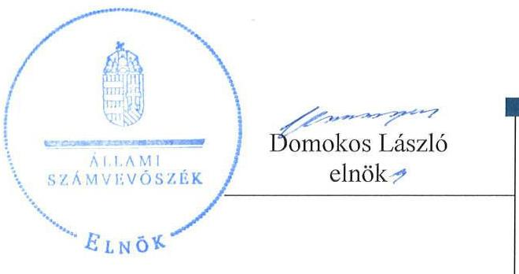
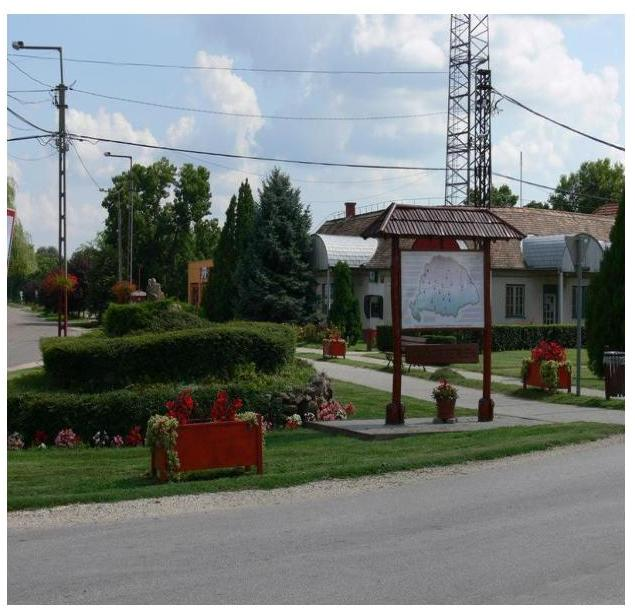
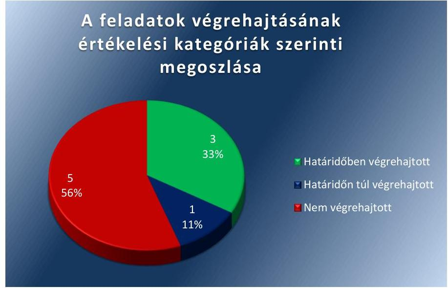
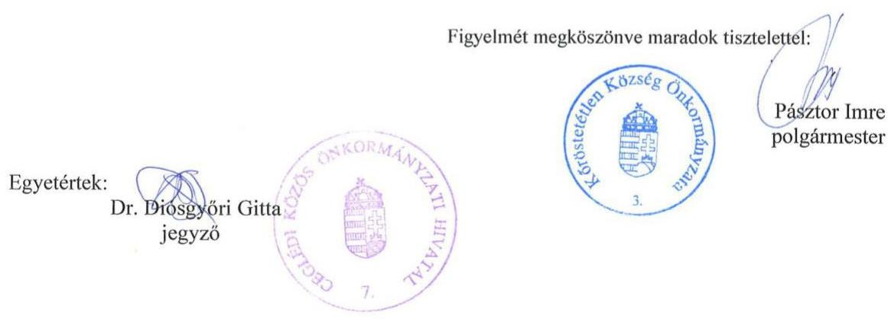
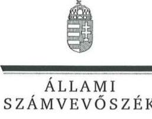
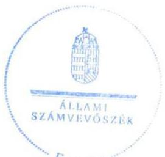
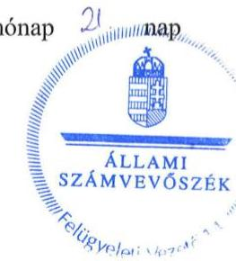

# Jelenetés 

## Utóellenőrzések

Kőröstetétlen Község Önkormányzat vagyongazdálkodása szabályszerűségének utóellenőrzése
2017.

---

# Jelentés 

## Utóellenőrzések

Kőröstetétlen Község Önkormányzat vagyongazdálkodása szabályszerűségének utóellenőrzése
2017. jannár hó 6. nap

---

# AZ ELLENŐRZÉST FELÜGYELTE:

DR. NÉMETH ERZSÉBET felügyeleti vezető

## AZ ELLENŐRZÉST VEZETTE ÉS A VÉGREHAJTÁSÁÉRT FELELŐS:

SZALAYNÉ OSTORHÁZI MÁRIA ellenőrzésvezető

## A PROGRAM ÖSSZEÁLLÍTÁSÁÉRT FELELŐS:

JANIK JÓZSEF LÁSZLÓ osztályvezető

## A TÉMÁHOZ KAPCSOLÓDÓ KORÁBBI SZÁMVEVŐSZÉKI JELENTÉSEK:

- címe: Jelentés az önkormányzatok vagyongazdálkodása szabályszerűségének ellenőrzéséről-Köröstetétlen
- sorszáma: 14062

Jelentéseink az Országgyűlés számítógépes hálózatán és az Interneten a www.asz.hu címen is olvashatóak.

|  IKTATÓSZÁM: V-1216-046/2016. | |
| --- | --- |
|  TÉMASZÁM: 2250 | |
|  ELLENŐRZÉS-AZONOSÍTÓ SZÁM: V075553 | |

---

# TARTALOMJEGYZÉK 

■ ÖSSZEGZÉS ..... 5
■ AZ ELLENŐRZÉS CÉLJA ..... 6
■ AZ ELLENŐRZÉS TERÜLETE ..... 7
■ AZ ELLENŐRZÉS HÁTTERE, INDOKOLTSÁGA ..... 8
■ FÓKUSZKÉRDÉS ..... 9
■ ELLENŐRZÉS HATÓKÖRE ÉS MÓDSZEREI ..... 10
■ MEGÁLLAPÍTÁSOK ..... 12
■ MELLÉKLETEK ..... 15
I. sz. melléklet: Az ÁSZ 14062 számú jelentéséhez kapcsolódó intézkedési terv végrehajtása ..... 15
■ FÜGGELÉK: ÉSZREVÉTELEK ..... 19
■ RÖVIDÍTÉSEK JEGYZÉKE ..... 29

---

.

---

# ÖSSZEGZÉS 

Az utóellenőrzés megállapította, hogy az intézkedési tervben foglalt feladatokat Köröstetétlen Község Önkormányzata jelentős részben nem hajtotta végre. A vagyongazdálkodás szabályozottsága javult, ugyanakkor az Önkormányzat több feladat tekintetében nem tett megfelelő lépéseket az Állami Számvevőszék által korábban feltárt vagyongazdálkodás müködésének szabályszerűségét érintő hiányosságok megszüntetésére. Mindez veszélyezteti az Önkormányzat szabályozott müködését és a felelős vagyongazdálkodását.

## Az ellenőrzés társadalmi indokoltsága

Az Állami Számvevőszék stratégiájában célul tűzte ki a számvevőszéki munka hasznosulásának javítását. Ezzel összhangban ellenőrzi, hogy az ellenőrzött szervezetek megvalósították-e a korábbi ellenőrzései által feltárt hibák, hiányosságok és szabálytalanságok megszüntetése céljából kialakított intézkedési terveikben foglaltakat. A rendszeres utóellenőrzések hozzájárulnak a szükséges intézkedések tényleges végrehajtásához, ezáltal a közpénzügyek rendezettségének javulásához.

## Főbb megállapítások, következtetések

A polgármester az Állami Számvevőszék jelentésében rögzített intézkedést igénylő megállapításokhoz és javaslatokhoz kapcsolódóan összeállított intézkedési tervet az előírt határidőn belül megküldte az Állami Számvevőszék részére. A jegyző az intézkedési terv feladatainak végrehajtásáról a jogszabály előírásainak megfelelő nyilvántartást nem vezetett.

Az Önkormányzat az intézkedési terv kilenc feladata közül hármat határidőben, egyet határidőn túl, és ötöt nem hajtott végre.

A jegyző kiadta a beszerzések lebonyolításának szabályzatát és biztosította, hogy a leltározási szabályzat tartalmazza az üzemeltetésre átadott eszközök sajátos szabályait.

A polgármester az Állami Számvevőszék ellenőrzés során feltárt képviselő-testületi döntések elmaradásának körülményeit kivizsgálta, de a felelősségre vonható személy jogviszonyának megszűnése miatt nem állapította meg a felelősséget.

A jegyző az etikai elvárásokat megfogalmazta, amelyeket az Etikai Kódexben rögzített. Az Etikai Kódex az intézkedési tervben vállalt határidőn túl lépett hatályba.

A jegyző az intézkedési tervben vállalt határidőtől nem biztosítja a közérdekű adatok és a gazdálkodási adatok nyilvánosságát.

A jegyző nem biztosította, hogy az üzemeltetésre átadott eszközök 2013. évi leltára a jogszabályban előírtak szerint készüljön el.

A jegyző nem intézkedett a Számlarend elkészítéséről, és arról, hogy a vagyonkimutatás a hatályos államháztartási számviteli szabályok szerint készüljön el. A jegyző nem gondoskodott arról, hogy ingatlanvagyon-kataszter és a földhivatali nyilvántartás, valamint a számviteli nyilvántartás adatai között az egyezőség megvalósuljon.

Az utóellenőrzés megállapította, hogy a jegyző a szabályozásban tett intézkedéseket, de továbbra sem biztosítja a vagyongazdálkodás szabályszerűségét és a felelős vagyongazdálkodást.

---

# AZ ELLENŐRZÉS CÉLJA

Az ellenőrzés célja annak értékelése volt, hogy az ÁSZ1 jelentésben foglalt intézkedést igénylő megállapításokkal és javaslatokkal összhangban készített intézkedési tervben meghatározott feladatokat az ellenőrzött szervezet végrehajtotta-e.

---

# AZ ELLENŐRZÉS TERÜLETE 

## Kőröstetétlen Község Önkormányzat²

Kőröstetétlen Dél-Pest megyei község, Ceglédtől 18 km-re fekszik, állandó lakosainak száma a KSH által közzétett népességi adatok* szerint 2015. január 1-jén 875 fő volt.

Kőröstetétlen Község Önkormányzat Cegléd Város Önkormányzattal 2013. január 1-jétől közös önkormányzati hivatalt ${ }^{3}$ hozott létre. Az Önkormányzat 2015. évi költségvetési beszámolója* szerint 591,2 millió Ft költségvetési bevételt ért el és 514,6 millió Ft költségvetési kiadást teljesített, amelyek magukba foglalják a finanszírozási bevételeket és kiadásokat is.

A könyvviteli mérlege szerint 2015. december 31-én 823,4 millió Ft értékű vagyonnal rendelkezett, a követelések állománya 10,2 millió Ft, a kötelezettségek állománya 6,0 millió Ft volt.

Az Önkormányzat vagyongazdálkodása szabályszerűségének ellenőrzését az ÁSZ a 2009. január 1. - 2012. december 31. közötti időszakra végezte el, erről szóló 14062. számú jelentését 2014. április 11-én tette közzé.

Az ÁSZ korábbi ellenőrzésében megállapította, hogy Kőröstetétlen Község Önkormányzatnál a vagyongazdálkodás szabályozottsága nem volt megfelelő, a vagyonkimutatása, a vagyontárgyak leltározása nem a jogszabályoknak megfelelően történt.

A beruházásai ugyan a gazdasági programban foglaltak szerint valósultak meg, de hét esetben a döntésről testületi határozat nem állt rendelkezésre. A vagyongazdálkodás szabályozottságában és a vagyongazdálkodás múködésének szabályszerűségében megállapított hiányosságok indokolták az utóellenőrzés lefolytatását.

A polgármester a 2010. évi önkormányzati választások óta tölti be tisztségét. A jegyző személye a 2009-2012. közötti ellenőrzési időszakot követően változott.

Az utóellenőrzés - a 2014. április 11-től 2016. július 18-ig végrehajtott intézkedéseket figyelembe véve - az ÁSZ jelentésben ${ }^{4}$ a polgármester ${ }^{5}$ és a jegyző ${ }^{6}$ részére tett intézkedést igénylő megállapításokra és javaslatokra készített, az Ász részére megküldött intézkedési terv végrehajtásának értékelésére irányult.

[^0]
[^0]:    * Forrás: Központi Statisztikai Hivatal, Magyarország Közigazgatási Helységnév könyve, Kőröstetétlen község 2015. január 1-jei adatai
    ${ }^{\dagger}$ Forrás: Kőröstetétlen község 2015.évi zárszámadása, Képviselőtestület által elfogadott beszámoló

---

# AZ ELLENŐRZÉS HÁTTERE, INDOKOLTSÁGA 

Az ÁSZ tv. ${ }^{7}$ 33. § (1) bekezdése értelmében a számvevőszéki jelentések intézkedést igénylő megállapításaihoz és javaslataihoz kapcsolódóan az ellenőrzött szervezet vezetője intézkedési tervet köteles összeállítani, és az ÁSZ részére megküldeni. Az intézkedési tervben foglaltak megvalósítását az ÁSZ tv. 33. § (7) bekezdésében foglaltak alapján - az ÁSZ utóellenőrzés keretében ellenőrizheti. Az intézkedések megvalósulásának értékelése során az ÁSZ figyelembe veszi az ellenőrzött szervezet működési feltételeiben, valamint a jogszabályi előírásokban bekövetkezett változásokat. Az intézkedési tervekben foglalt feladatok hiányos, illetve késedelmes végrehajtása, valamint megvalósításának elmaradása azt mutatja, hogy az ellenőrzések során feltárt hibák, hiányosságok és szabálytalanságok megszüntetése nem kapott kellő hangsúlyt. Ez a szabályszerű működés és a felelős vezetői magatartás vonatkozásában kockázatot hordoz. E kockázatok feltárásával az ÁSZ utóellenőrzési rendszere fokozza a fegyelmet, és igazolja, hogy a közpénzzel való szabályos gazdálkodás felelőssége elől nem lehet kitérni.

Az utóellenőrzés négy szinten hasznosulhat:

- A társadalom szintjén az utóellenőrzés jelzi, hogy a számvevőszéki ellenőrzés megállapításainak van következménye: a hiányosságok megszüntetésére az ellenőrzött szervezet által meghatározott intézkedések végrehajtását is számon kéri az ÁSZ.
- Az ellenőrzött terület szintjén az utóellenőrzés tájékoztatást nyújt a terület döntéshozóinak a hiányosságok kiküszöbölésének jó gyakorlatairól, ezzel lehetőséget biztosítva arra, hogy az ÁSZ ellenőrzési megállapításai, javaslatai a terület nem ellenőrzött szervezeteinek a működése során is hasznosuljanak.
- Az ellenőrzött szervezet szintjén az utóellenőrzés feltárja, hogy a szervezet az intézkedések végrehajtásával hasznosította-e a korábbi ellenőrzési jelentésben a hiányosságok megszüntetése, illetve a kockázatok kezelése érdekében megfogalmazott javaslatokat.
- Az ÁSZ szintjén az utóellenőrzés visszacsatolást ad az ellenőrzési jelentések hasznosulásáról, az intézkedések elmaradása vagy részleges megvalósulása a további ellenőrzésekhez kockázati jelzésként szolgál.

---

# FÓKUSZKÉRDÉS 

Az Önkormányzat az intézkedési tervben foglaltakat az elöirt határidőben végrehajtotta-e?

---

# ELLENŐRZÉS HATÓKÖRE ÉS MÓDSZEREI 

## Az ellenőrzés típusa

Megfelelőségi ellenőrzés

## Az ellenőrzött időszak

Az utóellenőrzés alapját képező ÁSZ jelentés közzétételének napjától (2014.április 11.) az utóellenőrzés megkezdésének napjáig (2016. július 18.) tartó időszak.

## Az ellenőrzés tárgya

A számvevőszéki jelentésben foglalt intézkedést igénylő megállapításokkal és javaslatokkal összhangban - az Önkormányzat által - készített intézkedési tervben foglaltak végrehajtásának ellenőrzése.

Az ellenőrzés kiterjed minden olyan körülményre és adatra, amely az ÁSZ jogszabályban meghatározott feladatainak teljesítéséhez, valamint a program végrehajtása folyamán felmerült újabb összefüggések feltárásához szükséges.

## Az ellenőrzött szervezet

Köröstetétlen Község Önkormányzat

## Az ellenőrzés jogalapja

Az ÁSZ az Országgyűlés pénzügyi és gazdasági ellenőrző szerve. Az ÁSZ törvényben meghatározott feladatkörében ellenőrzi a központi költségvetés végrehajtását, az államháztartás gazdálkodását, az államháztartásból származó források felhasználását és a nemzeti vagyon kezelését. Az ÁSZ tv. 1. § (3) bekezdése szerint az ÁSZ általános hatáskörrel végzi a közpénzekkel és az állami és önkormányzati vagyonnal való felelős gazdálkodás ellenőrzését. Az ÁSZ tv. 33. § (7) bekezdése alapján az ÁSZ tv. 33. § (1)-(2) bekezdése szerinti intézkedési tervben foglaltak megvalósítását az ÁSZ utóellenőrzés keretében ellenőrizheti.

---

# Az ellenőrzés módszerei 

Az ÁSZ az utóellenőrzést a nemzetközi standardokat irányadónak tekintve az ellenőrzési program ellenőrzési kérdései, az ellenőrzött időszakban hatályos jogszabályok, az ellenőrzés szakmai szabályok és módszertanok figyelembevételével, önálló ellenőrzés keretében végezte.

Az ÁSZ az ellenőrzés ideje alatt az Önkormányzattal történő kapcsolattartást az ÁSZ SZMSZ ${ }^{8}$-ének vonatkozó előírásai alapján biztosította.

Az utóellenőrzés megállapításait elsősorban az ÁSZ rendelkezésére álló, valamint az ellenőrzött szervezetektől elektronikusan bekért dokumentumok alapozták meg.

Az ellenőrzési bizonyítékként felhasználható adatforrások közé tartoznak egyrészt a szakmai programban felsorolt adatforrások, másrészt minden - az ellenőrzés folyamán feltárt, az ellenőrzés szempontjából információt tartalmazó - dokumentum.

Az ellenőrzés lefolytatásához az ellenőrzött szervezet a tanúsítványok elektronikus kitöltésével, valamint az ÁSZ által kért dokumentumok elektronikus megküldésével szolgáltatott adatokat, amelyek valódiságát és teljes körűségét az ellenőrzött szervezet vezetője által tett teljességi és hitelességi nyilatkozat igazolta. Az így rendelkezésre bocsátott adatok, információk kontrollja az ellenőrzés keretében történt.

Az intézkedési tervben előírt feladatok végrehajtásának ellenőrzését értékelési kritériumok alapján végeztük. Az intézkedési tervekben foglalat feladatokat azok végrehajtása szempontjából az alábbiak szerint értékeltük:
"határidőben végrehajtott" a feladat, ha a teljesítés dokumentáltan, az intézkedési tervben előírt határidőben és tartalommal megtörtént;
"határidőn túl végrehajtott" a feladat, ha annak teljesítése az intézkedési tervben meghatározott módon, de az előírt határidőn túl történt meg;
"részben végrehajtott" a feladat, ha végrehajtása teljes körűen az intézkedési tervben előírt módon nem történt meg;
"nem végrehajtott" ha a végrehajtás nem történt meg, vagy amenynyiben a teljesítést nem dokumentálták;
"okafogyottá vált" a feladat, ha végrehajtására - meghatározott esemény bekövetkezése, továbbá külső körülmény, a múködést érintő feltétel változása miatt - már nincs szükség, illetve lehetőség, és egyértelmúen megállapítható, hogy az intézkedést szükségessé tevő körülmény a jövőben nem fordulhat elő;
"nem időszerű" az a feladat, amelynek ellenőrzési időszakon belüli végrehajtására azért nem került (kerülhetett) sor, mert az intézkedés alapjául szolgáló esemény nem következett be, de annak jövőbeni előfordulása lehetséges, a végrehajtása nem volt esedékes, vagy a végrehajtás határideje még nem járt le.

---

# MEGÁLLAPÍTÁSOK 

## Az Önkormányzat az intézkedési tervben foglaltakat az előírt határidőben végrehajtotta-e?

Összegző megállapítás

Az Önkormányzat az intézkedési tervben meghatározott kilenc feladatból hármat határidőben, egyet határidőn túl hajtott végre és ötöt nem hajtott végre. Az intézkedési terv végrehajtásáról a Bkr. előírásainak megfelelő nyilvántartást nem vezettek.

Az ÁSZ a jelentésében a polgármester részére egyet, a jegyző részére pedig nyolc javaslatot fogalmazott meg, melyek hasznosítására az Önkormányzat Képviselő-testülete kilenc feladatot határozott meg. A feladatok elvégzésének felelőseként egy esetben a polgármestert, négy esetben a Ceglédi Közös Önkormányzati Hivatal Pénzügyi Iroda vezetőjét, két esetben a Ceglédi Közös Önkormányzati Hivatal Szervezési Iroda vezetőjét jelölték meg és kettő esetben felelős nem volt megjelölve. A jegyző - a Bkr ${ }^{9} .14 . \S(1)$ bekezdésének megfelelő - nyilvántartást nem vezetett az ÁSZ jelentés javaslatai alapján készült intézkedési terv végrehajtásáról.

Az intézkedési tervben meghatározott feladatokat, határidőket, a feladatok elvégzésének felelősét és a feladatok végrehajtását az I. számú melléklet mutatja be.

Az intézkedési tervben tervezett feladatok végrehajtásának értékelési kategóriák szerinti megoszlását az 1. ábra szemlélteti.

1. ábra

Forrás: ÁSZ

---

# HATÁRIDŐBEN VÉGREHAJTOTT FELADATOK: 

$\qquad$1. A polgármester megvizsgálta a képviselő-testületi döntések elmaradásának körülményeit, de a felelősségre vonható személy jogviszonyának megszűnése miatt nem állapította meg a felelősséget.
$\qquad$ 2. A jegyző biztosította, hogy a Leltározási szabályzat ${ }^{10}$ az üzemeltetésre átadott eszközök leltározásának sajátos szabályait tartalmazza.
$\qquad$ 3. Az Önkormányzat elkészítette a beszerzéseinek lebonyolításáról szóló szabályzatot.

## HATÁRIDŐN TÚL VÉGREHAJTOTT FELADAT:

$\qquad$4. A Ceglédi Közös Önkormányzati Hivatal 2015. július 1-jei hatállyal kiadta a Ceglédi Közös Önkormányzati Hivatal Etikai Kódexéről szóló szabályzatát. A szabályzatban az etikai elvárások megfogalmazásra kerültek, de az intézkedési tervben vállalt határidőnél tíz hónappal később.

## NEM VÉGREHAJTOTT FELADATOK:

$\qquad$5. A jegyző nem biztosította a közérdekú adatok és a gazdálkodási adatok nyilvánosságát, az Info tv ${ }^{11}$. 1. mellékletében foglaltak ellenére.
$\qquad$6. A jegyző nem intézkedett a Számv. tv. ${ }^{12}$-ben és az Áhsz. ${ }_{2}{ }^{13}$-ben előírt Számlarend elkészítéséről.
$\qquad$7. A jegyző nem gondoskodott a 2013-2015. évi zárszámadáshoz kapcsolódó vagyonkimutatás Áhsz. ${ }^{14}$ és az Áhsz. ${ }_{2}$-ben előírtak szerinti elkészítéséről.
$\qquad$8. A jegyző nem biztosította az önkormányzat tulajdonában lévő ingatlanvagyon nyilvántartási és adatszolgáltatási rendjéről szóló Korm. rendeletben előírt egyezőséget az ingatlanvagyon-kataszter és földhivatali nyilvántartás, valamint a számviteli nyilvántartás adatai között.
$\qquad$9. A jegyző nem intézkedett a 2013. évi leltározás végrehajtásakor az Áhsz. ${ }_{1}$-ben előírtak teljesítéséről és az üzemeltetésre átadott eszközök mennyiségi számbavételéről.

---

.

---

# MELLÉKLETEK

I. SZ. MELLÉKLET: AZ ÁSZ 14062 SZÁMÚ JELENTÉSÉHEZ KAPCSOLÓDÓ INTÉZKEDÉSI TERV VÉGREHAJTÁSA

|  1. | Intézkedési terv alapján elvégzendő feladat | Az intézkedési tervben meghatározott határidő | Az intézkedési tervben rögzített feladatok elvégzésének felelése | A feladat végrehajtása  |
| --- | --- | --- | --- | --- |
|   | 1. | 2. | 3. | 4.  |
|  Határidőben végrehajtott feladat |  |  |  |   |
|  1. „A polgármester megvizsgálja az Önkormányzat beruházásainál nevezett hét esetben a képviselőtestületi döntések elmaradásának körülményeit. A jegyzővel szemben kötelezettségszegés miatt történő eljárás megindítását a közszolgálati tisztviselőkről szóló 2011. évi CXCIX. törvény 158. § (1) bekezdés a) pontjába ütköző okból, a jegyző közszolgálati jogviszonyának 2012. december 31ei megszűnése miatt mellőzi." | 2014. június 30. |  | polgármester | Az ellenőrzött által megküldött dokumentum szerint a polgármester a vizsgálatot lefolytatta, a hiányosságokat feltárta, a felelőst megjelölte. A polgármester a jegyző közszolgálati jogviszonyának 2012. december 31-ei megszűnése miatt a felelősségre vonást a közszolgálati tisztviselőkről szóló 2011. évi CXCIX. törvény 158. § (1) bekezdés a) pontja alapján mellőzte.  |
|  2. „Az Önkormányzat leltározási szabályzata kiegészítésre kerül az Áhsz 37. § (4) bekezdésének megfelelően az üzemeltetésre, kezelésre átadott eszközök leltározásának sajátos szabályaival." | 2014. június 30. |  | Ceglédi Közös Önkormányzati Hivatal Pénzügyi Iroda vezetője | A jegyző 2013.január 1-én kiadta az eszközök és források leltározásának szabályzatát. A Leltározási szabályzat tartalmazza az üzemeltetésre, kezelésre átadott eszközök leltározásának szabályait, az Áhsz; 37. § (4) bekezdésében rögzítetteknek megfelelően.  |
|  3. „A Ceglédi Közös Önkormányzati Hivatal elkészíti az Ávr. ${ }^{15}$ 13. § (2) bekezdés b) pontjában előírtaknak megfelelően a beszerzések lebonyolításával kapcsolatos eljárásrendet." | 2014. június 30. |  | Ceglédi Közös Önkormányzati Hivatal Pénzügyi Iroda vezetője | Az Önkormányzat az Ávr.13. § (2) bekezdés b) pontjába rögzített előírás alapján elkészítette a beszerzések lebonyolításával kapcsolatos szabályzatot. A szabályzatot 2014. június 30-án kiadmányozták és 2014. július 1-vel léptették hatályba.  |
|  Határidőn túl végrehajtott feladat |  |  |  |   |
|  4. „A jegyző intézkedik az Önkormányzatnál az etikai elvárások meghatározásáról." | 2014. augusztus 30. |  | Cegléd Közös Önkormányzati Hivatal | Cegléd Város Önkormányzatának Képviselő-testülete 152/2015. (V.21.) Ök. határozatával2015. június 1-jei hatállyal - bocsátotta ki a Ceglédi Közös Önkormányzati Hivatal Etikai Ködexéről szóló szabályzatát. Az Önkormányzat a szabályzatában megfogalmazta az etikai elvárásokat,  |

---

|  4 | Intézkedési terv alapján elvégzendő feladat | Az intézkedési tervben meghatározott határidő | Az intézkedési tervben rögzített feladatok elvégzésének felelőse | A feladat végrehajtása  |
| --- | --- | --- | --- | --- |
|   |  |  | Szervezési Iroda vezetője | összhangban a Bkr. 6.§(1) bekezdés c) pontjával. A jegyző az intézkedési tervben vállalt határidőn túl, tíz hónappal később teljesítette a feladatot.  |
|   |  |  | Nem végrehajtott feladat |   |
|  5. | „A Ceglédi Közös Önkormányzati Hivatal Jegyzője intézkedéseket tesz a közérdekű adatok közzétételéről, a gazdálkodási adatok - az elemi költségvetés, zárszámadás, a vagyongazdálkodással öszszefüggő, nettó 5 M Ft-ot elérő vagy azt meghaladó értékű szerződések-nyilvánosságáról." | 2014. július 30. | Cegléd Közös Önkormányzati Hivatal Szervezési Iroda vezetője | A jegyző nem intézkedett, nem tette közzé a közérdekű adatokat és a gazdálkodási adatokat az Info.tv. 1. mellékletében foglaltak szerint, az intézkedési tervben vállalt határidőre.  |
|  6. | „Elkészül a Számv. tv. 161. § (1) bekezdésében, valamint az Áhsz. 49. § (1) bekezdésében előírt számlarend." | 2014. június 30. | Ceglédi Közös Önkormányzati Hivatal Pénzügyi Iroda vezetője | A jegyző nem intézkedett a Számv. tv. 161. § (1) bekezdésében, az Áhsz.;49. § (1) bekezdésében, Áhsz; 51. § (2) bekezdésben előírt Számlarend elkészítéséről. Nem határozták meg az Önkormányzatnál alkalmazott főkönyvi számlákat, azok tartalmát, értékük növekedésének, csökkenésének jogcímét, a számlákat érintő gazdasági eseményeket, azok más számlákkal való kapcsolatát, a főkönyvi számla és az analitikus nyilvántartás kapcsolatát, a számlarendben foglaltakat alátámasztó bizonylati rendet. Nem határozták meg továbbá az analitikus nyilvántartások és a főkönyvi könyvelés értékadatainak számszerű egyeztetési módját.  |
|  7. | „2013. évtől az Önkormányzat zárszámadásának részét képező vagyon kimutatás az Áhsz.-ben előírt tartalmi elemekkel készül el". | nincs határidő | nincs felelős | A jegyző nem gondoskodott a 2013-2015. évi zárszámadáshoz kapcsolódó vagyonkimutatás Áhsz.;1,2-ben előírtak szerinti elkészítéséről. 2013. évben az Áhsz; 44/A. § (3) bekezdés rendelkezése ellenére a vagyonkimutatás nem tartalmazta a „0"-ra leírt eszközöket használatban lévő, illetve használaton kívüli eszközök állománya szerint, valamint nem tartalmazta az önkormányzat tulajdonában lévő, jogszabály alapján érték nélkül nyilvántartott eszközök-, és a mérlegben értékkel nem szereplő kötelezettségek állományát. Az Áhsz; 30. § (2) bekezdése ellenére a 2014-2015. évben a vagyonkimutatás nem mutatta be a törzsvagyont a többi vagyontárgytól elkülönítve, továbbá a törzsvagyont forgalomképtelen törzsvagyon, és nemzetgazdasági szempontból kiemelt jelentőségű törzsvagyon bontásban. Az Áhsz; 30. § (3) bekezdés a) pontja ellenére 2014. évben a vagyonkimutatás nem tartalmazta a „0"-ra leírt ingatlanok-, a használatban lévő kis értékű immateriális javak-, tárgyi eszközök-, készletek állományát. 2014., 2015. években  |

---

|  8. | Intézkedési terv alapján elvégzendő feladat | Az intézkedési tervben meghatározott határidő | Az intézkedési tervben rögzített feladatok elvégzésének felelőse | A feladat végrehajtása  |
| --- | --- | --- | --- | --- |
|  9. |  |  |  | nem volt a vagyonkimutatás része a függő követelés és kötelezettség-, valamint a biztos jövőbeni követelések állománya, az Áhsz; 30. § (3) bekezdés b) pontjában rögzítettek ellenére.  |
|  8. | „A 2013. évi ingatlanvagyon-kataszter adatai megegyezzenek a földhivatal ingatlan- nyilvántartásának azonos tartalmú adataival, valamint az 1. § (3) bekezdésében foglaltaknak megfelelően biztosítottuk az egyezőséget az ingatlanva-gyon-kataszter és a számviteli nyilvántartás adatai között." | nincs határidő | nincs felelős | A jegyző a bemutatott dokumentumok alapján az ellenőrzött időszakban nem intézkedett az önkormányzati ingatlanvagyon-kataszter, a földhivatali nyilvántartás és a számviteli nyilvántartás adatainak 147/1992. (XI.6) Korm. rendelet ${ }^{18}$ 1. § (2)-(3) bekezdésében előírt egyezőségéről.  |
|  9. | „Ceglédi Közös Önkormányzati Hivatala 2013. évi leltározást az Áhsz. 37. §-ban foglaltaknak megfelelően végezte el, az üzemeltetésre átadott eszközök mennyiségi számbavételére 2014. évben kerül sor." | 2014. augusztus 30. | Ceglédi Közös Önkormányzati Hivatal Pénzügyi Iroda vezetője | A jegyző nem intézkedett az Áhsz; 37. §-ban előírtak teljesítéséről. Az Önkormányzat részére a 2013. évi leltározás során az üzemeltetésre átadott eszközök hitelesített leltárát az üzemeltető szervezet nem küldte meg. A 2013. évi beszámoló az üzemeltetésre átadott eszközök értékét az önkormányzat nyilvántartása szerinti összegben mutatta ki. A jegyző az intézkedési tervben vállalt határidőig az üzemeltetésre átadott eszközök mennyiségi számbavételéről nem gondoskodott.  |

Fonráz: ÁSZ által készített táblázat

---

.

---

# FÜGGELÉK: ÉSZREVÉTELEK 

A jelentéstervezetet a Számvevőszék 15 napos észrevételezésre megküldte az ellenőrzött szervezet vezetőjének az ÁSZ tv. 29. §1 (1) bekezdése előírásának megfelelően.

A polgármester, mint az ellenőrzött szervezet vezetője az ÁSZ tv. 29. § (2) bekezdésében foglalt észrevételezési jogával élt, az ellenőrzés megállapításaira észrevételt tett.
A függelék tartalmazza az Önkormányzat észrevételeit és az ÁSZ tv. 29. § (3) bekezdésében előírtaknak megfelelően a figyelembe nem vett észrevételeket és azok indokairól szóló tájékoztatást.

[^0]
[^0]:    ${ }^{1}$ 29. § (1) Az Állami Számvevőszék az ellenőrzési megállapításait megküldi az ellenőrzött szervezet vezetőjének vagy az általa megbízott személynek, és annak, akinek személyes felelősségét állapította meg.
    (2) Az ellenőrzött szervezet vezetője és a felelősként megjelölt személy az ellenőrzés megállapításaira tizenöt napon belül írásban észrevételt tehet.
    (3) Az Állami Számvevőszék az észrevételre a beérkezésétől számított harminc napon belül írásban válaszol. A figyelembe nem vett észrevételeket köteles a jelentésben feltüntetni, és megindokolni, hogy azokat miért nem fogadta el.

---

# 1685 

Köröstetétlen Község Önkormányzatának Polgármesterétől 2745 KÖRÖSTETÉTLEN Kocséri út 4. Tel.: 53/368-005 Fax: 53/568-501

Ügyiratszám: 12/6611/5/2016
Tárgy: Köröstetétlen Község Önkormányzat vagyongazdálkodása szabályszerűségének utóellenőrzése
Hivatkozási szám: V-1216-043/2016.

## Domokos László Úrnak elnök

Állami Számvevőszék

## Budapest,   Apáczai Csere János u. 10.

1052

## Tisztelt Elnök Úr!

Köröstetétlen Község Önkormányzata nevében eljárva, a fenti tárgyban keletkezett Számvevőszéki Jelentéstervezettel kapcsolatban - a Ceglédi Közös Önkormányzati Hivatal jegyzője egyetértésével - a következő észrevételeket teszem:

Nem értek egyet a feltárt hiányosságok általánosításával, nagymérvű kiterjesztésével, amelynek következtében az 5. oldalon rögzített „összegzés" indokolatlanul súlyos megállapításai születtek.

## 1. Általános észrevételek:

1.1. A jegyző és a polgármester az utóellenőrzés időszakában biztosította Köröstetétlen Önkormányzat működésének és a vagyongazdálkodásának szabályszerűségét. A kötelezően előírt szabályzatok elkészültek, a belső kontrollrendszer müködtetésével azok betartása folyamatosan megvalósult, az önkormányzati feladatok ellátása biztosított.
1.2. Az önkormányzat vagyona 2013-2015. években jelentősen növekedett, nagy értékủ beruházások valósultak meg, amelyek az önkormányzat kötelező feladatainak ellátását szolgálják (pl. egészséges ivóvízzel való ellátás, önkormányzati alapellátást szolgáló épületek fütéskorszerüsítése, járdák felújítása) különböző pályázati keretekből.
1.3. A korábbi években befejeződött beruházások (járdaépítés, csatornázás, iskola felújítás) utóellenőrzése is folyamatosan zajlik. Minden pályázat esetében szigorúan ellenőrizték a meglévő vagyon-, és a vagyonnövekedés nyilvántartását, az értékcsökkenés elszámolásának módját, értékét, nyilvántartását, a főkönyvvel való illetve a földkönyvi nyilvántartással való egyezőségét. Az ellenőrzési jegyzőkönyvek minden egyes esetben megállapították az adatok és az elvégzett feladatok megfelelőségét.
1.4. Az üzemeltetésre átadott vagyon (ivó- és szennyvíz közművek) esetében - a törvényi előírásoknak megfelelően - teljes körű vagyonértékelés készült 2016. évben.

---

# 2. A megállapításokhoz tett észrevételek: 

2.1. A „határidőben végrehajtott feladatok" - 13. oldal 1.,2.,3., pontja - vonatkozásában nem kívánunk észrevételt tenni;
2.2. A „határidőn túl végrehajtott feladat" - 13. oldal 4. pontja - tekintetében meg kívánom jegyezni, hogy a Ceglédi Közös Önkormányzati Hivatal hivatásetikai alapelveinek és az etikai eljárás szabályainak megállapítása - a szabályzat bevezetőjében hivatkozott felhatalmazó jogszabályhelyek értelmében - nem a jegyző és nem Kőröstetétlen, hanem Cegléd Város Önkormányzata Képviselő-testületének, mint a költségvetési szervet irányító szervnek a hatáskörébe tartozik. Az irányító szerv eljárásrendje - különös tekintettel az önkormányzati választásokat követő feladatokra - nem tette lehetővé, hogy az ÁSZ Kőröstetétlen Község Önkormányzatát érintő megállapításaira tett intézkedési javaslatban foglalt határidőkre tekintettel legyen.
2.3. Észrevétel 13. oldal 5-9. pontjaiban felsorolt „nem végrehajtott feladatok"-ra:
2.3.1. A jegyző biztosította, és folyamatosan biztosítja a közérdekủ adatok és a gazdálkodási adatok nyilvánosságát. Az Infotv. 1. mellékletében előírt tagolás és tartalom megtalálható az önkormányzat hivatalos, www.korostetetlen.hu honlapján.
Elismerjük, hogy a közbeszerzési adatok nem a Közérdekü Adatok menüpont Közbeszerzések tematikus alpontja alatt kigyújtve érhetők el, hanem a képviselő-testület müködésének adatai (évenként az ülések meghívói, elöterjesztései, döntései és jegyzőkönyvei) között, és ez időigényesebb kereséssel érhető el. Az adatok nyilvánossága tehát biztosított, és a feltárt technikai problémát is megoldjuk az üzemeltető közremüködésével. Üres rovat esetében pedig nincs oda rendelhető adat.
2.3.2. „A jegyző nem intézkedett a Számv. tv.-ben és az Áhsz.-ben elöírt Számlarend elkészitéséröl." Ez a megállapítás indokolatlant. A számviteli politika keretében a kötelezö szabályzatokat elkészítettük, az utóellenőrzés során azonban csak azokat a szabályzatokat küldtük meg, amelyekre Önök igényt tartottak. A számlatükröt a Forrás SQL pénzügyiszámviteli rendszerből évente kinyomtattuk és lefúztük. Az Áhsz. 51. § (3) bekezdése szerinti előírásokat biztosítottuk a zárt rendszerủ informatikai programmal, valamint a Bizonylati Szabályzat előírásainak betartásával.
2.3.3. A jegyző gondoskodott a 2013-2015. évi zárszámadáshoz kapcsolódó vagyonkimutatás elkészitéséről, és azokat a beszámolók mellékleteként benyújtottuk a Képviselő-testületnek, amely rendeletalkotással jóváhagyta. A vagyonkimutatásról szóló táblázatok a régi és az új Áhsz. előírásainak figyelembe vételével készültek, egyszerűsített, a közvélemény számára is érthető formában, az önkormányzati képviselők részére. Ennél részletesebb és tagoltabb, a hivatkozott jogszabályoknak pontosan megfelelő kimutatás a vagyonkataszter programból készült, és kinyomtatásra került minden évben. Az utóellenőrzés során a „hiánypótlásként kért dokumentumok" között a 2014. és a 2015. évi zárszámadást kérték, melynek része a vagyonkimutatás, ezért nem a vagyonkataszteri részletes kimutatás került megküldésre, hanem a zárszámadási rendeletek (Áht 23-24.§.) a mellékleteikkel együtt.
2.3.4. Az ingatlanvagyon kataszter és a számviteli nyilvántartások adataival az egyezőség biztosított. Az egyeztetés év közben negyedévente, év végén a beszámoló valamint a vagyonstatisztika elkészítésekor történik. Mindkét adatszolgáltatás összefut a Magyar Államkincstár rendszerében. A földkönyvet 2014. évben a Ceglédi Járási Földhivataltól beszereztük és megkaptuk, a kataszteri nyilvántartással egyeztettük. A 2016.08.11-én kelt Nyilatkozatunkban szereplő eltérést tártuk fel, és az abban leírtak szerint kívánunk eljárni. Ezen túlmenően az ingatlanvagyonban az eltelt időszakban változás nem történt. A község honlapján valamennyi tulajdonosi döntés elérhető, állításunkat a közzétett határozatokkal igazoljuk.
2.3.5. Az üzemeltetésre átadott eszközök 2013. évi leltározás tekintetében a 2016.08.10-én kelt Nyilatkozatunknak megfelelő állásponthoz tartjuk magunkat. A leltározás megtörtént -

---

miután nem történt változás az átadott vagyonban - nem tételes, helyszíni ellenőrzéssel, csak egyeztettünk a közszolgáltatóval.

Tekintettel arra, hogy a bekért és megküldött dokumentumok a müködés megfelelőségét igazolják, a jelentéstervezet nem a valós tényeken alapul, nem fogadhatom el a benne foglalt megállapításokat.

Tisztelettel kérem észrevételeim elfogadását, és az utóellenőrzés jelentéstervezetének felülírását!

Cegléd, 2016. december 5.

---

# Pásztor Imre 

polgármester
Kőröstetétlen Község Önkormányzat

## Kőröstetétlen

## Tisztelt Polgármester Úr!

"Köröstetétlen Község Önkormányzat vagyongazdálkodása szabályszerüségének utóellenörzése" címủ jelentéstervezetre tett észrevételeit köszönettel megkaptam.

Az ellenőrzési megállapításokra vonatkozó észrevételét az Állami Számvevőszékről szóló 2011. évi LXVI. törvény 29. § (2) bekezdésében meghatározott tizenöt napos határidőn belül küldte meg. Az Állami Számvevőszék észrevétellel kapcsolatos álláspontját a mellékletként csatolt, a felügyeleti vezető által készített indokolás tartalmazza.

Budapest, 2016. 41 hó 71 nap

Tisztelettel:

Dömokos László $\cdot$

Melléklet: Észrevételre adott válasz

---

"Köröstetétlen Község Önkormányzat vagyongazdálkodása szabályszerűségének utóellenőrzése" című jelentéstervezetre tett észrevételekre adott válaszok

| Észrevétel: | 4. számú megállapításhoz (Etikai Kódex):   „2.2. A „határidőn túl végrehajtott feladat" - 13. oldal 4. pontja -tekintetében meg kivánom jegyezni, hogy a Ceglédi Közös Önkormányzati Hivatal hivatásetikai alapelveinek és az etikai eljárás szabályainak megállapítása - a szabályzat bevezetójében hivatkozott felhatalmazó jogszabályhelyek értelmében - nem a jegyző és nem Köröstetétlen, hanem Cegléd Város Önkormányzata Képviselő-testületének, mint a költségvetési szervet irányitó szervnek a hatáskörébe tartozik. Az irányitó szerv eljárásrendje - különös tekintettel az önkormányzati választásokat követő feladatokra - nem tett lehetővé, hogy az ÁSZ Köröstetétlen Község Önkormányzatát érintő megállapításaira tett intézkedési javaslatban foglalt határidőkre tekintettel legyen." |
| :--: | :--: |
| Válasz: | Az Állami Számvevőszék az észrevételt nem fogadja el. |
| Indoklás: | A "Köröstetétlen Község Önkormányzat vagyongazdálkodása szabályszerűségének utóellenőrzése" című ÁSZ ellenőrzés célja az volt, hogy Köröstetétlen Község Önkormányzat Képviselő-testület által elfogadott 22/2014. (IV.29.) Ök. határozat mellékletében meghatározott feladatok (,Intézkedési Terv Köröstetétlen Község Önkormányzatának a „Jelentés az önkormányzatok vagyongazdálkodása szabályszerűségének ellenőrzéséről - Köröstetétlen" címmel készített Számvevőszék jelentése alapján az összegző megállapítások, következtetések, javaslatokra") végrehajtását ellenőrizze.   Köröstetétlen Község Önkormányzat Képviselő-testülete döntött úgy, hogy a jegyző 2014. augusztus 30-ig intézkedik az Önkormányzatnál az etikai elvárások meghatározásáról.   A feladat végrehajtásának alátámasztására azonban az Önkormányzat a 2015. június 1-i hatállyal kiadott Ceglédi Közös Önkormányzati Hivatal Etikai Kódexéről szóló szabályzatot csatolta be, melyet Cegléd Város Önkormányzatának Képviselő-testülete a 152/2015 (V.21) Ök. határozatával fogadott el, így a feladat teljesítése határidőn túl történt. |
|  | 5. számú megállapításhoz (közzétételi kötelezettség):   „2.3. Észrevétel 13. oldal 5-9. pontjaiban felsorolt „nem végrehajtott feladatok"-ra: 2.3.1. A jegyző biztositotta, és folyamatosan biztositja a közérdekü adatok és a gazdálkodási adatok nyilvánosságát. Az Infotv. 1. mellékletében elöirt tagolás és tartalom megtalálható az önkormányzat hivatalos, www.korostetetlen.hu honlapján.   Elismerjük, hogy a közbeszerzési adatok nem a Közérdekü Adatok menüpont Közbeszerzések tematikus alpontja alatt kigyüjtve érhetők el, hanem a képviselő-testület müködésének adatai (évenként az ülések meghivói, elöterjesztései, döntései és jegyzőkönyvei) között, és ezt idöigényesebb kereséssel érhető el. Az adatok nyilvánossága tehát biztositott, és a feltárt technikai problémáat is megoldjuk az üzemeltetö közremüködésével. Üres rovat esetében pedig nincs oda rendelhető adat." |
| Válasz: | Az Állami Számvevőszék az észrevételt nem fogadja el. |

---

| Indoklás: | Az Önkormányzat az Intézkedési Tervében a közérdekủ adatok közzétételére vonatkozó tervezett intézkedésének végrehajtási határideje 2014. július 30. volt.   Az Önkormányzat a feladat teljesitését nem igazolta, a polgármester a 2016.szeptember 26-án kelt nyilatkozatában jelezte, hogy: „Köröstetétlen község hivatalos honlapja vonatkozásában (www.korostetetlen.hu) a 2014.07.30-i állapotának mentett verzióját technikai okokból nem tudjuk a Köröstetétlen Község Önkormányzat vagyongazdálkodása szabályszerűségének utóellenőrzése címén végzett vizsgálathoz benyújtani."   Fentiek miatt nem volt megállapítható, hogy a közérdekủ adatok közzététele a vállalt határidőre, 2014. július 30-ra megtörtént-e, továbbá a polgármester a 2016. december 5-i keltezésű észrevételében a közérdekủ adatok közzétételével kapcsolatban a hiányosságok egy részét elismeri és vállalja azok helyesbítését és a technikai problémák megoldását. |
| :--: | :--: |
| Észrevétel: | 6. számú megállapításhoz (számlarend elkészítése):   „2.3.2. A jegyző nem intézkedett a Számv. tv.-ben és az Áhsz.-ben elöirt Számlarend elkészitéséröl. Ez a megállapítás indokolatlan. A számviteli politika keretében a kötelező szabályzatokat elkészítettük, az utóellenörzés során azonban csak azokat a szabályzatokat küldtük meg, amelyekre Önök igényt tartottak. A számlatükröt a Forrás SQL pénzügyi-számviteli rendszerböl évente kinyomtattuk és lefüztük. Az Áhsz. 51. § (3) bekezdése szerinti elöirásokat biztositottuk a zárt rendszerü informatikai programmal, valamint a Bizonylati Szabályzat elöirásainak betartásával. " |
| Válasz: | Az Állami Számvevőszék az észrevételt nem fogadja el. |
| Indoklás: | Az Önkormányzat által elkészített és az ÁSZ részére megküldött 1. sz. Tanúsítvány szerint Számlarendnek a 2013. 01.02-től hatályos Számviteli politikában foglaltakat tekintették.   Köröstetétlen Község Önkormányzat Számviteli Politikája IX. fejezet 9.4 pontja szerint „az Önkormányzatnál számlarendet az elemi költségvetés elkészítése után a FORRÁS SQL könyvelési program törzsadattárból lehívott fökönyvi számlarend, valamint a SALDO Rt. A helyi önkormányzatok és intézmények számlarendje kiadványa együtt alkotják". A polgármester 2016. augusztus 10-i nyilatkozata szerint az Önkormányzat számlarendje a számla-tükörre épül.   Nyilatkozatához mellékelte a "Köröstetétlen Község Önkormányzat 734752 Forrás SQL Fökönyvi modul törzsadatok Egységes Számlatükör Érvényes 2013.01.012013.12.31." számlatükröt, azonban Nyilatkozatát Számlarenddel nem támasztotta alá.   Az Önkormányzat Számviteli Politikája szerinti dokumentum nem felel meg a Számv. tv. 161. § (1) bekezdésében meghatározott számlarendre vonatkozó követelményének, mivel egy általános szakmai kiadványt neveztek meg az Önkormányzat számlarendjének, amelyet azonban az Önkormányzat gazdálkodására nem aktualizáltak, így nem készült az Önkormányzatra vonatkozó, az egységes számlakeret előírásait figyelembevevő számlarend.   A Számv. tv. 161. § (2) bekezdés előírása ellenére - számlarend hiányában - nem határozták meg az Önkormányzatnál alkalmazott számlák számlajelét, megnevezését, tartalmát, értéke növekedésének, csökkenésének jogcímét, a számlát érintő gazdasági eseményeket, azok más számlákkal való kapcsolatát, a fökönyvi számla és az |

---

|  | analitikus nyilvántartás kapcsolatát, a számlarendben foglaltakat alátámasztó bizonylati rendet. Nem határozták meg továbbá az analitikus nyilvántartások és a fökönyvi könyvelés értékadatai számszerü egyeztetésének módját. |
| :--: | :--: |
| Észrevétel: | 7. számú megállapításhoz (vagyonkimutatás):   „2.3.3. A jegyzö gondoskodott a 2013-2015. évi zárszámadáshoz kapcsolódó vagyonkimutatás elkészitéséröl, és azokat a beszámolók mellékleteként benyújtottuk a Képviselö-testületnek, amely rendeletalkotással jóváhagyta. A vagyonkimutatásról szóló táblázatok a régi és az új Áhsz. elöirásainak figyelembe vételével készültek, egyszerüsitett, a közvélemény számára is érthető formában, az önkormányzati képviselők részére. Ennél részletesebb és tagoltabb, a hivatkozott jogszabályoknak pontosan megfelelő kimutatás a vagyonkataszter programból készült, és kinyomtatásra került minden évben. Az utóellenörzés során a hiánypótlásként kért dokumentumok között a 2014. és a 2015. évi zárszámadást kérték, melynek része a vagyonkimutatás, ezért nem a vagyonkataszteri részletes kimutatás került megküldésre, hanem a zárszámadási rendeletek (Áht 23-24. §.) a mellékleteikkel együtt." |
| Válasz: | Az Állami Számvevőszék az észrevételt nem fogadja el. |
| Indoklás: | Az 1. sz. Tanúsítvány szerint a feladat végrehajtását a 2013. évi zárszámadás vagyonkimutatása igazolta.   A 2013. évben a zárszámadáshoz kapcsolódó, a beszámoló mellékleteként bemutatott vagyonkimutatásában - az Áhsz ${ }_{1} 44 /$ A. § (3) bekezdés rendelkezése ellenére nem került elkülönítésre a 0 -ra leírt, de a használatban lévő, illetve használaton kívüli eszközök állománya, továbbá az önkormányzat tulajdonában lévő, jogszabály alapján érték nélkül nyilvántartott eszközök, valamint a mérlegben értékkel nem szereplő kötelezettségek állománya.   A 2014-2015. években a zárszámadáshoz kapcsolódó, a beszámoló mellékleteként bemutatott vagyonkimutatás - az Áhsz 230 . § (2) bekezdés rendelkezése ellenére nem az előírt tagolásban készült, nem mutatták ki az eszközöket forgalomképtelen törzsvagyon, nemzetgazdasági szempontból kiemelt jelentőségủ törzsvagyon, korlátozottan forgalomképes vagyon és üzleti vagyon bontásban. Az Áhsz 230 . § (3) bekezdés a) pontja ellenére a 2014. évi vagyonkimutatásban nem került elkülönítésre a 0 -ra leírt ingatlanok-, a 2014., 2015. években a használatban lévő kisértékủ immateriális javak, tárgyi eszközök, készletek állománya. Az Áhsz 230 . § (3) bekezdés b) pontja ellenére a 2014., 2015. években nem tartalmazta a vagyonkimutatás a függő követeléseket és kötelezettségeket, a biztos jövőbeni követeléseket. |
| Észrevétel: | 8. számú megállapításhoz (ingatlanvagyon kataszter)   „2.3.4. Az ingatlanvagyon kataszter és a számviteli nyilvántartások adataival az egyezöség biztositott. Az egyeztetés év közben negyedévente, év végén a beszámoló valamint a vagyonstatisztika elkészitésekor történik. Mindkét adatszolgáltatás öszszefut a Magyar Államkincstár rendszerében. A földkönyvet 2014. évben a Ceglédi Járási Földhivataltól beszereztük és megkaptuk, a kataszteri nyilvántartással egyeztettük. A 2016. 08.11-én kelt Nyilatkozatunkban szereplő eltérést tártuk fel, és az abban leirtak szerint kivánunk eljárni. Ezen túlmenően az ingatlanvagyonban az eltelt időszakban változás nem történt. A község honlapján valamennyi tulajdonosi döntés elérhető, állitásunkat a közzétett határozatokkal igazoljuk." |

---

| Válasz: | Az Állami Számvevőszék az észrevételt nem fogadja el. |
| :--: | :--: |
| Indoklás: | A polgármester 2016. augusztus 11-én nyilatkozott arról, hogy: „A földkönyv és a kataszter egyeztetése megtörtént. Az egyeztetés során megállapításra került, hogy a kataszter és a földkönyv ingatlan adatai között több esetben eltérés tapasztalható. Az eltérés indoka, hogy az önkormányzati tulajdonú területek megosztásra kerültek, amelyek új helyrajzi számot kaptak." Nyilatkozata szerint a kataszteri nyilvántartást nem helyesbítették, arra a hiteles tulajdoni lapok és a földhivatallal történt további egyeztetések illetve újabb földkönyv kérése után kerül sor.   Az ingatlanvagyon-kataszter földhivatali nyilvántartással való egyezősége érdekében megtett intézkedéseket az Önkormányzat dokumentumokkal nem igazolta.   A 2013-2015 évekre az ingatlanvagyon-kataszter és a számviteli nyilvántartás adatai közötti egyezőségről, egyeztetésről dokumentum nem áll az ÁSZ rendelkezésére.   Az Önkormányzat által megküldött „2013. évi Leltár Kataszter (LB nélkül)" elnevezésű kimutatás a Köröstetétlen Ingatlanvagyon-kataszter nyilvántartó rendszeréből kinyomtatott lista, a „Köröstetétlen Befektetett eszközök számlái 2013. év vége" megnevezésű kimutatás pedig számviteli nyilvántartásból készült lista.   A két kimutatás nem azonos szerkezetű, azokból az azonos tartalmú adatok és azok egyezősége nem megállapítható. A 2013. évi Köröstetétlen Ingatlanvagyon-kataszter nyilvántartó rendszeréből kinyomtatott lista fökönyvi számlánként mutatja az ingatlan állományát bruttó értékben és mennyiségben. A „Köröstetétlen Befektetett eszközök számlái 2013. év vége" megnevezésű kimutatás számlaszám megbontása nélkül, összesítve, forgalomképesség szerint különíti el az ingatlanokat értékben (bruttó érték, értékcsökkenés, 0 -ig leírt, üzemeltetésre átadott. nettó érték), mennyiségi adatok nélkül.   A két kimutatásban az eszközök bruttó összesen értéke eltérő összegű, a „2013. évi Leltár Kataszter" szerint $605,4 \mathrm{M} \mathrm{Ft}$, míg a „Köröstetétlen Befektetett eszközök számlái 2013. év vége" kimutatásban pedig $602,7 \mathrm{M} \mathrm{Ft}$. |
|  | 9. számú megállapításhoz (üzemeltetésre átadott eszközök leltározása)   „2.3.5. Az üzemeltetésre átadott eszközök 2013. évi leltározás tekintetében a 2016.08.10-én kelt Nyilatkozatunknak megfelelő állásponthoz tartjuk magunkat. A leltározás megtörtént - miután nem történt változás az átadott vagyonban - nem tételes, helyszini ellenörzéssel, csak egyeztettünk a közszolgáltatóval." |
| Válasz: | Az Állami Számvevőszék az észrevételt nem fogadja el. |
| Indoklás: | Az Intézkedési Tervben vállalt 2014. augusztus 30.-ai határidőig az üzemeltetésre átadott eszközök mennyiségi számbavételét az Önkormányzat nem végezte el, a bemutatott dokumentumok alapján a jegyző nem intézkedett a 2013. évi leltározás Áhsz1 37. §-ában előírtak szerinti teljesítéséről, mivel az Áhsz1 37. § (4) bekezdés ellenére az üzemeltetésre átadott eszközöket, az üzemeltető által december 31-ei fordulónapra készített leltárral nem támasztotta alá.   Az Önkormányzat az ÁSZ részére az üzemeltetésre átadott eszközökről egy 2013. december 31-i záró állapotot mutató „Eszköz analitika-kataszter" elnevezésű listát adott át, amely nem minősül leltárnak, az a kataszteri nyilvántartásból került kinyomtatásra. |

---

A polgármester 2016. augusztus 10-ei nyilatkozata szerint az üzemeltetésre átadott eszközök 2013. 12. 31-i állományában nem volt változás, mivel az üzemeltető az önkormányzatnak nem küldött tájékoztatást arról, hogy az üzemeltetett eszközökön felújítási beavatkozást végzett. Az üzemeltető leltárt, általa készített leltárt nem küldött meg az Önkormányzat részére.

Tájékoztatom Polgármester Urat, hogy az Állami Számvevőszékről szóló 2011. évi LXVI. törvény 29. § (3) bekezdése alapján az Állami Számvevőszék a figyelembe nem vett észrevételeket köteles a jelentésben feltüntetni, és megindokolni, hogy azokat miért nem fogadta el.

Budapest, 2016.

Dr. Németh Érzsébet felügyeleti vezető

---

# RÖVIDÍTÉSEK JEGYZÉKE 

${ }^{1}$ ÁSZ
${ }^{2}$ Önkormányzat
${ }^{3}$ közös önkormányzati hivatal
${ }^{4}$ ÁSZ jelentés
${ }^{5}$ polgármester
${ }^{6}$ jegyző
${ }^{7}$ ÁSZ tv.
${ }^{8}$ SZMSZ
${ }^{9}$ Bkr.
${ }^{10}$ Leltározási szabályzat
${ }^{11}$ Info tv.
${ }^{12}$ Számv. tv.
${ }^{13}$ Áhsz. 2
${ }^{14}$ Áhsz. 1
${ }^{15}$ Ávr.
${ }^{16}$ 147/1992. (XI.6) Korm. rendelet

Állami Számvevőszék
Kőröstetétlen Község Önkormányzat
Ceglédi Közös Önkormányzati Hivatal
Az ÁSZ 14062. számú jelentése - JELENTÉS az önkormányzatok vagyongazdálkodása szabályszerűségének ellenőrzéséről Kőröstetétlen Kőröstetétlen Község polgármestere
Kőröstetétlen Község jegyzője
2011. évi LXVI. törvény az Állami Számvevőszékről, hatályos 2011. július 1-jétől Az Állami Számvevőszék elnökének 3/2015. (XII.30.) ÁSZ utasítása az Állami Számvevőszék Szervezeti és Működési Szabályzatáról (hatályos: 2016. január 1jétől)
370/2011. (XII. 31.) Korm. rendelet a költségvetési szervek belső kontrollrendszeréről és belső ellenőrzéséről
Szabályzat Kőröstetétlen Község Önkormányzat Eszközeinek és Forrásainak leltározásáról
2011. évi CXII. törvény az információs önrendelkezési jogról és az információszabadságról
2000. évi C. törvény a számvitelről
4/2013. (I.11) Korm. rendelet az államháztartás számviteléről. Hatályos 2014. január 1-től
249/2000. (XII. 24.) Korm. rendelet az államháztartás szervezetei beszámolási és könyvvezetési kötelezettségének sajátosságairól. Hatályos: 2013. december 31-ig. az államháztartásról szóló törvény végrehajtásáról szóló 368/2011. (XII. 31.) Korm. rendelet
147/1992. (XI. 6) Korm. rendelet az önkormányzat tulajdonában lévé ingatlanvagyon nyilvántartási és adatszolgáltatási rendjéről

---

# ÁLLAMI SZÁMVEVŐSZÉK 

1052 Budapest, Apáczai Csere János utca 10.
Levélcím: 1364 Budapest 4. Pf. 54
Telefon: +36 14849100 Telefax: +36 14849200
www.asz.hu