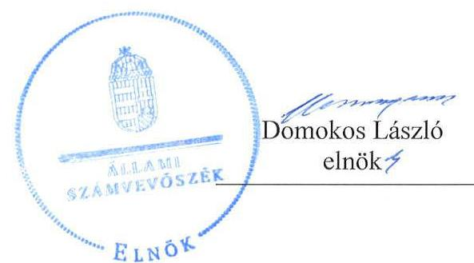
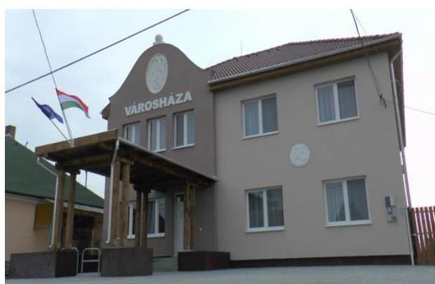
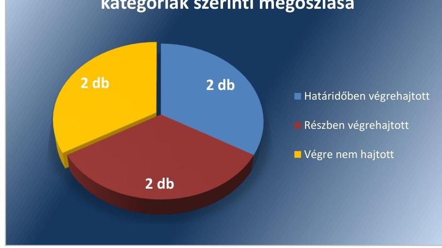
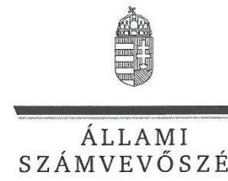
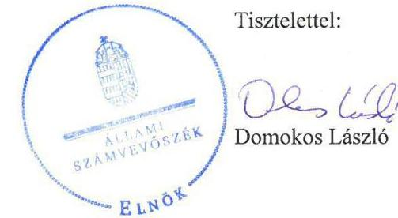
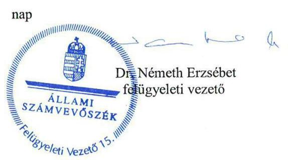

# Jelenetés 

## Utóellenőrzések

Nyékládháza Város Önkormányzata vagyongazdálkodása szabályszerűségének utóellenőrzése
2017.

---

# Jelențtés 

## Utóellenőrzések

Nyékládháza Város Önkormányzata vagyongazdálkodása szabályszerűségének utóellenőrzése
2017. jenués hó $b$. nap

---

# AZ ELLENŐRZÉST FELÜGYELTE:

DR. NÉMETH ERZSÉBET felügyeleti vezető

# AZ ELLENŐRZÉST VEZETTE ÉS A VÉGREHAJTÁSÁÉRT FELELŐS:

SZALAYNÉ OSTORHÁZI MÁRIA ellenőrzésvezető

# A PROGRAM ÖSSZEÁLLÍTÁSÁÉRT FELELŐS:

JANIK JÓZSEF LÁSZLÓ osztályvezető

# A TÉMÁHOZ KAPCSOLÓDÓ KORÁBBI SZÁMVEVŐSZÉKI JELENTÉSEK:

|  • címe: | Jelentés az önkormányzati vagyongazdálkodás szabályszerűségi ellenőrzéséről – Nyékládháza  |
| --- | --- |
|  • sorszáma: | 13160  |

Jelentéseink az Országgyűlés számítógépes hálózatán és az Interneten a www.asz.hu címen is olvashatóak.

IKTATÓSZÁM: V-1160-055/2016

TÉMASZÁM: 2194

ELLENŐRZÉS-AZONOSÍTÓ SZÁM: V075516

---

# TARTALOMJEGYZÉK 

■ ÖSSZEGZÉS ..... 5
■ AZ ELLENŐRZÉS CÉLJA ..... 7
■ AZ ELLENŐRZÉS TERÜLETE ..... 8
■ AZ ELLENŐRZÉS HÁTTERE, INDOKOLTSÁGA ..... 9
■ FÓKUSZKÉRDÉS ..... 10
■ ELLENŐRZÉS HATÓKÖRE ÉS MÓDSZEREI ..... 11
■ MEGÁLLAPÍTÁSOK ..... 14
■ MELLÉKLETEK ..... 17
I. Sz. melléklet: Az ÁSZ 13160 számú jelentéséhez kapcsolódó intézkedési terv végrehajtása ..... 17
■ FÜGGELÉK: ÉSZREVÉTELEK ..... 23
■ RÖVIDÍTÉSEK JEGYZÉKE ..... 29

---

.

---

# ÖSSZEGZÉS 

Az utóellenőrzés megállapította, hogy Nyékládháza Város Önkormányzata az intézkedési tervben foglalt feladatok többségét nem vagy részben hajtotta végre. A vagyongazdálkodás szabályozottsága javult, ugyanakkor több feladat tekintetében nem tett megfelelő lépéseket az Állami Számvevőszék által korábban feltárt vagyongazdálkodás müködésének szabályszerűségét érintő hiányosságok megszüntetésére. Nem valósult meg a felelős vagyongazdálkodás.

## Az ellenőrzés társadalmi indokoltsága

Az ÁSZ stratégiájában célul tűzte ki a számvevőszéki munka hasznosulásának javítását. Ezzel összhangban ellenőrzi, hogy az ellenőrzött szervezetek megvalósították-e a korábbi ellenőrzései által feltárt hibák, hiányosságok és szabálytalanságok megszüntetése céljából kialakított intézkedési terveikben foglaltakat. A rendszeres utóellenőrzések hozzájárulnak a szükséges intézkedések tényleges végrehajtásához, ezáltal a közpénzügyek rendezettségének javulásához.

Az ÁSZ korábbi ellenőrzése megállapította, hogy a Képviselő-testület az önkormányzati vagyonnal való gazdálkodás szabályozása során a törvényi előírásoknak - a vagyonkezelői jog szabályozása kivételével - eleget tett. Az Önkormányzat ${ }^{1}$ a vagyongazdálkodás müködésének szabályszerűségét hiányosan biztosította. A gazdálkodási jogkör gyakorlásánál és a leltárak szabályszerűségénél több hiányosság került megállapításra, így indokolttá vált, hogy utóellenőrzés keretében ellenőrizzük az intézkedési tervben vállalat feladatok végrehajtását.

## Főbb megállapítások, következtetések

A polgármester az ÁSZ jelentésben rögzített intézkedést igénylő megállapításokhoz és javaslatokhoz kapcsolódóan összeállított intézkedési tervet az előírt határidőn belül megküldte az ÁSZ részére. Az Önkormányzat az intézkedési terv feladatainak végrehajtásáról a jogszabály előírásainak megfelelő nyilvántartást vezetett.

Az Önkormányzat az intézkedési terv 6 feladata közül kettőt végrehajtott, kettőt részben hajtott végre, és két feladatot nem hajtott végre.

A határidőben végrehajtott feladatok révén kialakításra került az átlátható, egyeztetett ingatlanvagyon-kataszter nyilvántartás. Megállapítottuk, hogy biztosított az ingatlanvagyon-kataszteri és a földhivatali ingatlan-nyilvántartás, valamint a számviteli nyilvántartás közötti egyezőség. Az ingatlanvagyon analitikus nyilvántartásában meglévő eltéréseket átvezették.

Az Önkormányzat szabályzat kiadásával, átszervezéssel intézkedett, hogy a pénzügyi folyamatokban az ellenőrzési feladatokat ellátók (pénzügyi ellenjegyző, teljesítés igazoló, érvényesítő) a jogszabályi előírásnak megfelelően végezzék el feladataikat. A jogszabályok, szabályzatok alkalmazását, az ellenőrzések megfelelőségét értékeltük és megállapítottuk, hogy az ellenőrzések hiányosak.

Az utóellenőrzés megállapította, hogy a jegyző kialakította az információs önrendelkezési jogról és az információszabadságról szóló törvénynek megfelelő belső szabályozást, de a szabályozás végrehajtása során nem gondoskodott teljes körűen az előírt adatok közzétételéről.

A végre nem hajtott egyik feladatnál a polgármester nem tett dokumentumokkal alátámasztott intézkedést az ÁSZ jelentésben feltárt hiányosságok, szabálytalanságok körülményeinek kivizsgálására, így a vizsgálat eredményétől függő munkajogi intézkedésekre nem került sor. A csatolt dokumentumok a feltárt hiányosságok, szabálytalanságok megszüntetéséhez kapcsolódtak. Egy másik feladatnál a jegyző nem intézkedett, hogy az üzemeltetésre átadott eszközökről az üzemeltető által készített és hitelesített leltárak rendelkezésre álljanak, így az Önkormányzat leltára nem felel meg a jogszabályi előírásoknak.

---

Az utóellenőrzés megállapította, hogy az Önkormányzatnál az ellenőrzés során feltárt hibák, hiányosságok és szabálytalanságok megszűntetése nem kapott kellő hangsúlyt, mivel több feladatot teljes egészében nem hajtottak végre.

---

# AZ ELLENŐRZÉS CÉLJA 

Az ellenőrzés célja annak értékelése volt, hogy az ÁSZ ${ }^{2}$ jelentésben foglalt intézkedést igénylő megállapításokkal és javaslatokkal összhangban készített intézkedési tervben meghatározott feladatokat az ellenőrzött szervezet vég-rehajtotta-e.

---

# AZ ELLENŐRZÉS TERÜLETE

## Az Önkormányzat

Nyékládháza város Borsod-Abaúj-Zemplén megyében, a Miskolci járásban fekszik, a lakónépességének száma 2015. január 1-jén 4 876 fő* volt. Az Önkormányzat a költségvetési beszámolója* szerint a 2015. évben 989,2 millió Ft költségvetési bevételt ért el, és 840,6 millió Ft költségvetési kiadást teljesített. 2015. december 31-én a könyvviteli mérlege szerint 3 009,3 millió Ft értékű vagyonnal rendelkezett.

Az Önkormányzat vagyongazdálkodásának szabályszerűségét az ÁSZ 2013-ban ellenőrizte. Az ellenőrzésről készült ÁSZ jelentés3 megállapította, hogy az Önkormányzat a vagyonnal való gazdálkodás szabályozása során a törvényi előírásoknak alapvetően eleget tett, a vagyongazdálkodás működésének a szabályszerűségét hiányosan biztosította.

Az ÁSZ jelentés a polgármesternek4 egy, a jegyzőnek5 öt javaslatot tartalmazott. A Képviselő-testület6 a polgármester és a jegyző által készített intézkedési tervet 2014. február 25-én elfogadta, melyben 6 feladatot terveztek végrehajtani.

A polgármester a 2010. évi önkormányzati választások óta tölti be tisztségét. A jegyző személye a 2007-2011. közötti ellenőrzési időszakot követően kétszer változott.

Az utóellenőrzés7 az ÁSZ jelentés hasznosulása érdekében a Képviselő-testület által elfogadott intézkedési terv végrehajtására irányul. Az utóellenőrzés során ellenőrzött időszak a számvevőszéki jelentés közzétételének napjától (2013. december 5.) az utóellenőrzés megkezdésének napjáig (2016. június 23.) tartó időszak.

* Forrás: Központi Statisztikai Hivatal, Magyarország Közigazgatási Helységnév könyve, Nyékládháza város 2015. január 1-jei adatai

3 Forrás: Nyékládháza Város 2015. évi zárszámadás, Képviselő-testület által elfogadott beszámoló

---

# AZ ELLENŐRZÉS HÁTTERE, INDOKOLTSÁGA 

Az ÁSZ tv. ${ }^{8}$ 33. § (1) bekezdése értelmében a számvevőszéki jelentések intézkedést igénylő megállapításaihoz és javaslataihoz kapcsolódóan az ellenőrzött szervezet vezetője intézkedési tervet köteles összeállítani, és az ÁSZ részére megküldeni. Az intézkedési tervben foglaltak megvalósítását az ÁSZ tv. 33. § (7) bekezdésében foglaltak alapján - az ÁSZ utóellenőrzés keretében ellenőrizheti. Az intézkedések megvalósulásának értékelése során az ÁSZ figyelembe veszi az ellenőrzött szervezetek működési feltételeiben, valamint a jogszabályi előírásokban bekövetkezett változásokat.

Az intézkedési tervekben foglalt feladatok hiányos, illetve késedelmes végrehajtása, valamint megvalósításának elmaradása azt mutatja, hogy az ellenőrzések során feltárt hibák, hiányosságok és szabálytalanságok megszüntetése nem kapott kellő hangsúlyt. Ez a szabályszerű működés és a felelős vezetői magatartás vonatkozásában kockázatot hordoz. E kockázatok feltárásával az ÁSZ utóellenőrzési rendszere fokozza a fegyelmet, és igazolja, hogy a közpénzzel való szabályos gazdálkodás felelőssége elől nem lehet kitérni.

Az utóellenőrzés négy szinten hasznosulhat:

1. A társadalom szintjén az utóellenőrzés jelzi, hogy a számvevőszéki ellenőrzés megállapításainak van következménye: a hiányosságok megszüntetésére az ellenőrzött szervezet által meghatározott intézkedések végrehajtását is számon kéri az ÁSZ.
2. Az ellenőrzött terület szintjén az utóellenőrzés tájékoztatást nyújt a terület döntéshozóinak a hiányosságok kiküszöbölésének jó gyakorlatairól, ezzel lehetőséget biztosítva arra, hogy az ÁSZ ellenőrzési megállapításai, javaslatai a terület nem ellenőrzött szervezeteinek a működése során is hasznosuljanak.
3. Az ellenőrzött szervezet szintjén az utóellenőrzés feltárja, hogy a szervezet az intézkedések végrehajtásával hasznosította-e a korábbi ellenőrzési jelentésben a hiányosságok megszüntetése, illetve a kockázatok kezelése érdekében megfogalmazott javaslatokat.
4. Az ÁSZ szintjén az utóellenőrzés visszacsatolást ad az ellenőrzési jelentések hasznosulásáról, az intézkedések elmaradása vagy részleges megvalósulása a további ellenőrzésekhez kockázati jelzésként szolgál.

---

# FÓKUSZKÉRDÉS 

Az Önkormányzat az intézkedési tervben foglaltakat az elöirt határidőben végrehajtotta-e?

---

# ELLENŐRZÉS HATÓKÖRE ÉS MÓDSZEREI 

## Az ellenőrzés típusa

Megfelelőségi ellenőrzés

## Az ellenőrzött időszak

Az utóellenőrzés alapját képező ÁSZ jelentés közzétételének napjától (2013. december 05.) az utóellenőrzés megkezdésének napjáig (2016. június 23.) tartó időszak.

## Az ellenőrzés tárgya

A számvevőszéki jelentésben foglalt intézkedést igénylő megállapításokkal és javaslatokkal összhangban - az Önkormányzat által - készített intézkedési tervben foglaltak végrehajtásának ellenőrzése.

Az ellenőrzés kiterjed minden olyan körülményre és adatra, amely az ÁSZ jogszabályban meghatározott feladatainak teljesítéséhez, valamint a program végrehajtása folyamán felmerült újabb összefüggések feltárásához szükséges.

## Az ellenőrzött szervezet

Nyékládháza Város Önkormányzata

## Az ellenőrzés jogalapja

Az ÁSZ az Országgyűlés pénzügyi és gazdasági ellenőrző szerve. Az ÁSZ törvényben meghatározott feladatkörében ellenőrzi a központi költségvetés végrehajtását, az államháztartás gazdálkodását, az államháztartásból származó források felhasználását és a nemzeti vagyon kezelését.

Az ÁSZ tv. 1. § (3) bekezdése szerint az ÁSZ általános hatáskörrel végzi a közpénzekkel és az állami és önkormányzati vagyonnal való felelős gazdálkodás ellenőrzését.

Az ÁSZ tv. 33. § (7) bekezdése alapján az ÁSZ tv. 33. § (1)-(2) bekezdése szerinti intézkedési tervben foglaltak megvalósítását az ÁSZ utóellenőrzés keretében ellenőrizheti.

---

# Az ellenőrzés módszerei 

Az ÁSZ az utóellenőrzést a nemzetközi standardokat irányadónak tekintve az ellenőrzési program ellenőrzési kérdései, az ellenőrzött időszakban hatályos jogszabályok, az ellenőrzés szakmai szabályok és módszertanok figyelembevételével, önálló ellenőrzés keretében végezte.

Az ÁSZ az ellenőrzés ideje alatt az Önkormányzattal történő kapcsolattartást az ÁSZ SZMSZ ${ }^{\circledR}$-ének vonatkozó előírásai alapján biztosította.

Az utóellenőrzés megállapításait elsősorban az ÁSZ rendelkezésére álló, valamint az ellenőrzött szervezetektől elektronikusan bekért dokumentumok alapozták meg.

Az ellenőrzési bizonyítékként felhasználható adatforrások közé tartoznak egyrészt a szakmai programban felsorolt adatforrások, másrészt minden - az ellenőrzés folyamán feltárt, az ellenőrzés szempontjából információt tartalmazó - dokumentum.

Az ÁSZ 10 elemú, véletlen mintavétellel kiválasztott tételek alapján értékelte az intézkedési tervben foglalt feladatok végrehajtását
$\longrightarrow$ a pénzügyi folyamatokban kulcsszerepet betöltő kontrollokra vonatkozóan a beruházási, fejlesztési kiadások, valamint
$\longrightarrow$ az ingatlanvagyon-kataszterre vonatkozóan a kiválasztott ingatlanok nyilvántartása esetében.
Az utóellenőrzés jellegéből adódóan az ÁSZ a mintatételek ellenőrzésével nem az adott terület szabályszerűségéről mond véleményt, hanem arról, hogy az Önkormányzat az intézkedési tervben tervezett feladatokat végrehajtotta-e az ellenőrzött tételek esetében.

Az ellenőrzés lefolytatásához az ellenőrzött szervezet a tanúsítványok elektronikus kitöltésével, valamint az ÁSZ által kért dokumentumok elektronikus megküldésével szolgáltatott adatokat, amelyek valódiságát és teljes körűségét az ellenőrzött szervezet vezetője által tett teljességi és hitelességi nyilatkozat igazolta. Az így rendelkezésre bocsátott adatok, információk kontrollja az ellenőrzés keretében történt.

Az intézkedési tervben előírt feladatok végrehajtásának ellenőrzését értékelési kritériumok alapján végeztük. Az intézkedési tervekben foglalt feladatokat azok végrehajtása szempontjából az alábbiak szerint értékeltük:
$\longrightarrow$ „határidőben végrehajtott" a feladat, ha a teljesítés dokumentáltan, az intézkedési tervben előírt határidőben és tartalommal megtörtént;
$\longrightarrow$ „határidőn túl végrehajtott" a feladat, ha annak teljesítése az intézkedési tervben meghatározott módon, de az előírt határidőn túl történt meg;
$\longrightarrow$ „részben végrehajtott" a feladat, ha végrehajtása teljes körűen az intézkedési tervben előírt módon nem történt meg;
$\longrightarrow$ „nem végrehajtott" ha a végrehajtás nem történt meg, vagy amenynyiben a teljesítést nem dokumentálták;
$\longrightarrow$ „okafogyottá vált" a feladat, ha végrehajtására - meghatározott esemény bekövetkezése, továbbá külső körülmény, a müködést érintő

---

feltétel változása miatt - már nincs szükség, illetve lehetőség, és egyértelmúen megállapítható, hogy az intézkedést szükségessé tevő körülmény a jövőben nem fordulhat elő;
"nem időszerű" az a feladat, amelynek ellenőrzési időszakon belüli végrehajtására azért nem került (kerülhetett) sor, mert az intézkedés alapjául szolgáló esemény nem következett be, de annak jövőbeni előfordulása lehetséges, a végrehajtása nem volt esedékes, vagy a végrehajtás határideje még nem járt le.

---

# MEGÁLLAPÍTÁSOK 

## Az Önkormányzat az intézkedési tervben foglaltakat az előírt határidőben végrehajtotta-e?

Összegző megállapítás

Az Önkormányzat az intézkedési tervben meghatározott hat feladatból kettőt végrehajtott, kettőt részben és kettőt nem hajtott végre. Az intézkedési terv végrehajtásáról a Bkr. előírásainak megfelelő nyilvántartást vezettek.

Az ÁSZ a jelentésében a polgármester részére egy, a jegyző részére pedig 5 javaslatot fogalmazott meg, melyek hasznosítására az Önkormányzat Képviselő-testülete 6 feladatot határozott meg. A feladatok elvégzésének felelőseként egy esetben a polgármestert, 5 esetben pedig a jegyzőt jelölték meg.

A jegyző - a Bkr. ${ }^{10}$ 14. § (1) bekezdésének megfelelően - nyilvántartást vezetett az ÁSZ jelentés javaslatai alapján készült intézkedési terv végrehajtásáról. A nyilvántartás - a Bkr. 47. § (2) bekezdésének megfelelően tartalmazta az ÁSZ jelentésben szereplő javaslatokat, az elfogadott intézkedési tervet, az intézkedési terv alapján végrehajtott intézkedések rövid leírását. A nyilvántartás szerint végre nem hajtott intézkedés nem volt, de ez nincs összhangban az ÁSZ által tett megállapításokkal.

Az intézkedési tervben meghatározott feladatokat, határidőket, a feladatok elvégzésének felelősét és a feladatok végrehajtását az I. számú melléklet mutatja be.

Az intézkedési tervben tervezett feladatok végrehajtásának értékelési kategóriák szerinti megoszlását az 1. ábra szemlélteti.

1. ábra

A feladatok végrehajtásának értékelési kategóriák szerinti megoszlása

Forrás: ÁSZ

---

# HATÁRIDŐBEN VÉGREHAJTOTT feladatok: 

1. A jegyző intézkedett - a 147/1992. (XI. 6.) Korm. rendelet ${ }^{11}$ előírásának megfelelő - ingatlanvagyon-kataszteri nyilvántartás elkészítéséről és folyamatos vezetéséről. Megállapítottuk, hogy biztosított az ingatlanvagyon-kataszteri és a fölhivatali ingatlan-nyilvántartás, valamint az ingatlanvagyon-kataszteri és a számviteli nyilvántartás közötti egyezőség.
2. A jegyző intézkedett az ingatlanvagyon analitikus nyilvántartásának korrekciójáról az Áhsz. ${ }^{12}$ előírásával összhangban.

## RÉSZBEN VÉGREHAJTOTT feladatok:

3. A jegyző személyi, szervezeti, szabályozási intézkedéseket tett, hogy a pénzügyi ellenjegyző, a teljesítés igazoló és az érvényesítő - az Áht. ${ }^{13}$ és az Ávr. ${ }^{14}$ előírásainak megfelelően - végezze el az ellenőrzési feladatait. A beruházási, felújítási kiadásoknál a pénzügyi ellenjegyző,és a teljesítés igazoló nem minden esetben az Áht. és Ávr. szerint látta el ellenőrzési feladatait.
4. A jegyző belső szabályzatot (Közzétételi szabályzat ${ }^{15}$ ) adott ki az Info tv. ${ }^{16}$-ben meghatározott adatok közzétételére, ugyanakkor az adatok közzétételéről az I. számú mellékletben részletezettek szerint, részben gondoskodott.

## NEM VÉGREHAJTOTT feladatok:

5. A polgármester az ÁSZ jelentésben az ingatlanvagyon-kataszterrel és a gazdálkodási jogkörök gyakorlásával összefüggésben feltárt hiányosságok, szabálytalanságok körülményeinek kivizsgálására dokumentumokkal alátámasztott intézkedést nem tett, így a vizsgálat eredményétől függő munkajogi intézkedésekre nem került sor.
6. A jegyző nem intézkedett, hogy az üzemeltetésre átadott eszközökről a 2013., a 2014. és a 2015. december 31-i könyvviteli mérlegek alátámasztásához az üzemeltető által készített és hitelesített leltárak rendelkezésre álljanak az Áhsz. ${ }_{1}$ és az Áhsz. ${ }_{2}{ }^{17}$ elöírásai szerint.

---

.

---

# MELLÉKLETEK

- I. SZ. MELLÉKLET: AZ ÁSZ 13160 SZÁMÚ JELENTÉSÉHEZ KAPCSOLÓDÓ INTÉZKEDÉSI TERV VÉGREHAJTÁSA

|  Sorszám | Intézkedési tervben rögzített feladatok
1. | Az intézkedési tervben meghatározott határidő
2. | Az intézkedési tervben rögzített feladatok elvégzésének felelőse
3. | A feladat végrehajtása
4.  |
| --- | --- | --- | --- | --- |
|  Határidőben végrehajtott feladat |  |  |  |   |
|  1. | „Elkészíteni a 147/1992. (XI. 6.) Korm. rendelet 1. § (1) bekezdése előírásai alapján az 1-5. számú mellékleteknek megfelelő nyilvántartást az önkormányzat tulajdonában levő ingatlanvagyonról, melyet a mellékleteknek megfelelő tartalommal folyamatosan vezetnek. Biztosítani a rendelet 1. § (2) bekezdésben foglalt előírásnak megfelelően a kataszter és a földhivatal ingat-lan-nyilvántartásának azonos tartalmú adatai közötti, valamint az 1. § (3) bekezdésében rögzítetteknek megfelelően a számviteli nyilvántartás és az ingatlanvagyon-kataszter adatai közötti egyezőséget." | 2014. december 31. és azt követően folyamatos | Jegyző | A jegyző - a polgármester 2013. október 28. napján kelt felszólító levele alapján informatikai program beszerzésével, majd az önkormányzat tulajdonában lévő ingatlanoknak az informatikai nyilvántartásba vételével - intézkedett a 147/1992. (XI. 6.) Korm. rendelet 1. § (1) bekezdése előírásai alapján az 1-5. számú mellékleteknek megfelelő nyilvántartás, az ingatlan-vagyon-kataszter elkészítéséről.
A Kataszteri Napló szerint az ingatlanadatok 2014. december 31. napjáig rögzítésre kerültek a nyilvántartásban, így az határidőben elkészült. Ezt követően folyamatos volt az ingatlanva-gyon-kataszter vezetése, a változások bejegyzésre kerültek.
Megállapítottuk, hogy - a 147/1992. (XI. 6.) Korm. rendelet 1. § (2) bekezdésében foglalt előírásnak megfelelően - az ingatlanvagyon-kataszter és a járási hivatal ingatlan-nyilvántartás azonos tartalmú adatai, valamint az 1. § (3) bekezdésben rögzítetteknek megfelelően az ingatlanvagyon-kataszter és a számviteli nyilvántartás értékadatai közötti egyezőség biztosított volt.  |
|  2. | „Intézkedni az ingatlanvagyon analitikus nyilvántartásának korrekciójáról annak érdekében, hogy az értékesített földterület és az ingatlan kivezetése az Áhsz. 34. § (2) bekezdésében foglalt előírásoknak megfelelően nyilvántartási ár szerint szerepelien." | 2014. január 31. | Jegyző | Az ingatlanvagyon analitikus nyilvántartásának korrekciója határidőben, a könyvelési adatok szerint 2013. december 31-i időponttal végrehajtásra került. A korrekció elvégzésével az értékesített földterületek és az ingatlan kivezetése - az Áhsz.; 21. § (1) bekezdésében foglalt előírásnak megfelelő - nyilvántartási ár szerint történt az Önkormányzat által megküldött adatok, dokumentumok szerint.  |
|  Részben végrehajtott feladat |  |  |  |   |
|  3. | „Intézkedni, hogy a pénzügyi ellenjegyző, a teljesítés igazoló és az érvényesítő - az Áht. 37. § | Azonnal, és azt követően folyamatos | Jegyző | A jegyző az ÁSZ jelentéstervezet intézkedést igénylő megállapításának megismerésekor azonnal, majd a szervezeti, személyi, jogszabályi változások kezelésére folyamatosan intézkedéseket tett, hogy a pénzügyi ellenjegyző, a teljesítést igazoló és az érvényesítő - az Áht. 37. § (1)  |

---

|  4. | „Intézkedni az Infotv. 37.§ (1) bekezdése alapján az 1. számú mellékletében meghatározott adatok közzétételéről." | 2014. május 31. és azt követően folyamatos | Jegyző  |
| --- | --- | --- | --- |
|  |   |   |   |

|  Az intézkedési tervben rögzített feladatok | Az intézkedési tervben meghatározott határidő | Az intézkedési tervben rögzített feladatok elvégzésének felelőse | A feladat végrehajtása  |
| --- | --- | --- | --- |
|  4. | bekezdése, az Ávr. 57. § (1) bekezdése, valamint az Ávr. 58. § (1) bekezdése előírásainak megfelelően – végezze el ellenőrzési feladatait." |  |   |

bekezdése, az Ávr. 57. § (1) bekezdése, valamint az Ávr. 58. § (1) bekezdése előírásainak megfelelően – végezze el az ellenőrzési feladatait.

- Hatályba léptette a Kötelezettségvállalás, utalványozás, ellenjegyzés, érvényesítés rendjének szabályzatát, mely a hatályos jogszabályi előírásoknak (Áht., Ávr., Áhsz.,1,2) és a Polgármesteri Hivatal 2014. április 1-jétől hatályos szervezeti és működési rendjének megfelelően tartalmazta a pénzügyi ellenjegyző, a tejesítés igazoló és az érvényesítő ellenőrzési feladatait.
- Folyamatosan aktualizálta a gazdálkodási jogkörgyakorlásra jogosultakról vezetett nyilvántartást, rögzítette a gazdálkodási jogköröket a munkaköri leírásokban, valamint kiadta a felhatalmazásokat a pénzügyi ellenjegyzési és érvényesítési jogkörgyakorlásra.

A beruházási, felújítási kiadásoknál, a teljesítés igazoló és az érvényesítő alapvetően a jogszabályi előírásoknak megfelelően látta el az ellenőrzési feladatait. Hiányosságok főként a pénzügyi ellenjegyző ellenőrzési feladatának ellátásában fordultak elő. Több esetben, készpénzes és nem készpénzes vásárlásoknál – az Áht. 37. § (1) bekezdésében foglalt előírás ellenére – elmaradt a pénzügyi ellenjegyző ellenőrzési feladatának dokumentált ellátása, azaz a szabad előirányzat rendelkezésre állásának és a gazdálkodásra vonatkozó szabályok betartásának a dokumentált ellenőrzése. Hiányzott továbbá a vásárlásokat megelőző kötelezettségvállalás dokumentuma (megbízás a beszerzésre), bár a vásárlások összege gazdasági eseményenként a százezer forintot meghaladta.

A jegyző 2014. május 31. napjáig és azt követően folyamatosan intézkedett az Info tv.-ben meghatározott adatok közzétételéről belső szabályzat (Közzétételi szabályzat) kiadásával és módosításával.

Az Info tv. 1. számú mellékletében meghatározott adatok közzétételét az alábbiak szerint teljesítette.

### Határidőben közzétett adatok

Info tv. 1. melléklet I. rész 1-4., 6. 9. és 10. pontjaiban, a II. rész 1-2., 8. és 10-11. pontjaiban, valamint a III. rész 1. és 3-4., 7. és 8. pontjaiban foglalt közérdekű adatok.

### Hiányosságokkal közzétett adatok

Az Info tv. 1. melléklet I. rész 9. pontban, II. rész 1., 5. és 8. pontokban, III. rész 4., 7. és 8. pontokban előírt adatok.

---

|  Sorszám | Intézkedési tervben rögzített feladatok | Az intézkedési tervben meghatározott határidő | Az intézkedési tervben rögzített feladatok elvégzésének felelőse | A feladat végrehajtása  |
| --- | --- | --- | --- | --- |
|   | 4. | 4. | 4. | 4.  |
|   |  |  |  | Nem folyamatosan közzétett adatok  |
|   |  |  |  | Az Info tv. 1. melléklet III. rész 4. pontban előírt adat.  |
|   |  |  |  | Nem végrehajtott feladat  |
|   |  |  |  | A jegyző a tervezett intézkedésben, valamint a Közzétételi szabályzatban megjelölt felelősként nem gondoskodott az alábbi adatatok közzétételéről:  |
|   |  |  |  | - a hatósági döntései tekintetében a fellebbezés elbírálására jogosult szervnek, ennek hiányában a közfeladatot ellátó szerv felett törvényességi ellenőrzést gyakorló szervnek az 1. pontban meghatározott adatai (I. rész 11. pont),  |
|   |  |  |  | - az önként vállalt feladatok (II. rész 3. pont),  |
|   |  |  |  | - a hatósági ügyekben ügyfajtánként és eljárás típusonként közzéteendő adatok (II. rész 4. pont),  |
|   |  |  |  | - a fenntartott adatbázisok, illetve nyilvántartásokhoz kapcsolódó adatok (II. rész 6. pont),  |
|   |  |  |  | - a törvény alapján közzéteendő jogszabálytervezetek és a kapcsolódó dokumentumok (II. rész 9. pont),  |
|   |  |  |  | - az Önkormányzatnál végzett ellenőrzések nyilvános megállapításai (II. rész 12. pont),  |
|   |  |  |  | - a közérdekű adatok megismerésére irányuló igények intézésének rendje, illetve az ehhez kapcsolódó adatok (II. rész 13. pont),  |
|   |  |  |  | - a tevékenységére vonatkozó, jogszabályon alapuló statisztikai adatgyűjtés eredményei, időbeli változásuk (II. rész 14. pont),  |
|   |  |  |  | - a közérdekű adatokkal kapcsolatos kötelező statisztikai adatszolgáltatás adott szervre vonatkozó adatai (II. rész 15. pont),  |
|   |  |  |  | - a közérdekű adatok felhasználására, hasznosítására vonatkozó általános szerződési feltételek (II. rész 17. pont),  |
|   |  |  |  | - a közadatok és a kulturális közadatok újrahasznosításával kapcsolatos információk, az újrahasznosításra vonatkozó szerződési feltételek, fizetendő díjak, jogorvoslati lehetőségek (II. rész 19-22. pont),  |
|   |  |  |  | - a foglalkoztatottak létszámára és személyi juttatásaira vonatkozó adatok (III. rész 2. pont).  |

---

|  Sorszám | Intézkedési tervben rögzített feladatok | Az intézkedési tervben meghatározott határidő | Az intézkedési tervben rögzített feladatok elvégzésének felelőse | A feladat végrehajtása  |
| --- | --- | --- | --- | --- |
|   |  | 1. | 2. | 3.  |
|   |  |  |  | Az Önkormányzatnak nem volt közzétételi kötelezettsége az Info tv. 1. melléklet I. rész 5., 7. és 8. pontjaiban, valamint a II. rész 7., 16. és 18. pontjaiban, valamint a III. rész 5. és 6. pontjaiban előírt adatokra vonatkozóan.
Az Önkormányzat I. számú Tanúsítványa szerint a tervezett intézkedés határidőben végrehajtásra került. Az Önkormányzat által beküldött, a végrehajtást alátámasztó dokumentumok (9 db képernyő fotó) azonban nem támasztják alá a feladat végrehajtását teljes körűen.  |
|   |  |  | Nem végre hajtott feladat |   |
|  5. | „Intézkedni a számvevőszéki jelentés megállapításai alapján az ingatlanvagyon-kataszterrel és a gazdálkodási jogkörök gyakorlásával összefüggésben feltárt hiányosságok, szabálytalanságok körülményeinek a kivizsgálásáról, és a vizsgálat eredményének függvényében megtenni a szükséges munkajogi intézkedéseket." | 2014. június 30. | Polgármester | A polgármester, az ÁSZ jelentésben az ingatlanvagyon-kataszterrel és a gazdálkodási jogkörök gyakorlásával összefüggésben feltárt hiányosságok, szabálytalanságok körülményeinek kivizsgálására dokumentumokkal alátámasztott intézkedést nem tett, így a vizsgálat eredményétől függő munkajogi intézkedésekre nem került sor.
Az Önkormányzat az I. számú Tanúsítványa szerint a tervezett feladatot határidőben végrehajtotta. A végrehajtást alátámasztó dokumentumok azonban nem a hiányosságok, szabálytalanságok körülményeinek a kivizsgálására vonatkoztak, hanem azok megszüntetéséhez kapcsolódtak (például felhívás a jegyzőnek a vagyonkataszter vezetésére). Más esetben a hiányosság és az intézkedés közötti összefüggés nem volt megállapítható (például pénzügyi ügyintéző áthelyezése, pénzügyi feladatok átszervezése esetében).  |
|  6. | „Intézkedni arról, hogy az üzemeltetésre átadott eszközökről a könyvviteli mérleg alátámasztásához az Áhsz. 37. § (4) bekezdés előírásainak megfelelően az üzemeltetők által évente elvégzett és hitelesített leltárak teljes körűen álljanak rendelkezésre." | 2014. február 15., és azt követően folyamatos | Jegyző | A 2013. december 31-i könyvviteli mérleg alátámasztásához - az Áhsz. ${ }_{1}$ 37. § (4) bekezdés előírásai ellenére - nem állt rendelkezésre az üzemeltető által készített és hitelesített leltár. A 2014. és a 2015. december 31-i könyvviteli mérlegek alátámasztásához a megváltozott szabályozási környezetben - többek között új Leltározási és leltárkészítési szabályzatok ${ }^{18}$ hatályba léptetése, vízi-közmű vagyonra bérleti-üzemeltetési szerződések kötése mellett - az üzemeltető által készített és hitelesített leltárak szintén nem álltak rendelkezésre.
Az újonnan hatályba léptetett Leltározási és leltárkészítési szabályzatok továbbra sem szabályozták az üzemeltetésre átadott eszközök leltározását. Az Önkormányzat és a Borsodvíz Zrt. által - az ÁSZ jelentés közzétételét követően - kötött bérleti-üzemeltetési szerződésekben nem tértek ki a leltározás irányadó szabályaira.
Az Önkormányzat a 2016. január 29. napján kelt felhívásában kérte az üzemeltetőt a 2015. december 31-i vízi-közmű vagyonról szóló hitelesített leltár megküldésére, de az nem tett eleget a felhívásnak. A jegyző a későbbiekben nem intézkedett a hiányzó, hitelesített leltárak pótlásáról.  |

---

|  |   |   |   |   |
| --- | --- | --- | --- | --- |
|  1. | Intézkedési tervben
rögzített feladatok | Az intézkedési tervben
meghatározott
határidő | Az intézkedési
tervben rögzített feladatok
elvégzésének
felelőse | A feladat végrehajtása  |
|   |  | 2. | 3. | 4.  |
|   |  |  |  | Az Önkormányzat az I. számú Tanúsítványa szerint a tervezett feladatot határidőn túl – 2014. február 15. helyett 2015. február 15-ig – végrehajtotta, azonban a hivatkozott dokumentumok nem támasztották alá a végrehajtást. A hivatkozott dokumentumok között nincs az üzemeltető által készített és hitelesített leltár.  |

---

.

---

# FÜGGELÉK: ÉSZREVÉTELEK 

A jelentéstervezetet a Számvevőszék 15 napos észrevételezésre megküldte az ellenőrzött szervezet vezetőjének az ÁSZ tv. 29. §̊ (1) bekezdése előírásának megfelelően.
A polgármester, mint az ellenőrzött szervezet vezetője az ÁSZ tv. 29. § (2) bekezdésében foglalt észrevételezési jogával élt, az ellenőrzés megállapításaira észrevételt tett.
A függelék tartalmazza az Önkormányzat észrevételeit és az ÁSZ tv. 29. § (3) bekezdésében előírtaknak megfelelően a figyelembe nem vett észrevételeket és azok indokairól szóló tájékoztatást.

[^0]
[^0]:    ${ }^{5}$ 29. § (1) Az Állami Számvevőszék az ellenőrzési megállapításait megküldi az ellenőrzött szervezet vezetőjének vagy az általa megbízott személynek, és annak, akinek személyes felelősségét állapította meg.
    (2) Az ellenőrzött szervezet vezetője és a felelősként megjelölt személy az ellenőrzés megállapításaira tizenöt napon belül írásban észrevételt tehet.
    (3) Az Állami Számvevőszék az észrevételre a beérkezésétől számított harminc napon belül írásban válaszol. A figyelembe nem vett észrevételeket köteles a jelentésben feltüntetni, és megindokolni, hogy azokat miért nem fogadta el.

---

NYÉKLÁDHÁZA VÁROS ÖNKORMÁNYZATÁTÓL
Cím: 3433 Nyékládháza, Vasút u. 16.
Telefon: 46/391-450
Telefax: 46/591-286
e-mail: nyekladhaza.polgarmh@t-online.hu

Ügyiratszám: 229-9/2016.
Ügyintéző: Péchy Orsolya

Tárgy: Észrevétel
Hiv.szám: V-1160-051/2016.

Állami Számvevőszék
Domokos László Úr
Elnök

Budapest
Apáczai Csere János u. 10.
1052

Tisztelt Elnök Úr!

A Nyékládháza Város Önkormányzata vagyongazdálkodási szabályszerűségének utóellenőrzése tárgyú jelentéstervezetének „Nem végrehajtott feladatok” 5. pontjában foglaltakra – hivatkozva az Ász t v. 29. § (2) bekezdésének előírásaira – az alábbi észrevételt teszem:

A vizsgálattal érintett időszakban (2007-2011. évek) feladatot ellátó jegyző jogviszonya 2012. januárjában szűnt meg. Az ellenőrzés 2013. évben zajlott, a jelentés 2013. decemberében készült el, így az ezen időponttól köztisztviselői jogviszonyban álló jegyzőt hívtam fel két ízben: 2013. október 28. és 2013. december 20. napján az ingatlanvagyon-
kataszterrel és a gazdálkodási jogkörök gyakorlásával összefüggésben feltárt hiányosság, szabálytalanságok körülményeinek kivizsgálására, melynek határidejeként 2014. június 30. napját jelöltem meg.

Jegyző Asszony szóban arról tájékoztatott, hogy a feladatok megszervezésének és végrehajtásának felelőse a pénzügyi vezető volt. A munkajogi felelősség megállapítására felhívott jegyző jogviszonya 2014. januárjában szűnt meg.

A hiányosságok fennállásának időpontjában feladatot ellátó pénzügyi vezető köztisztviselő jogviszonya 2013. júliusában, nyugdíjazás miatt megszűnt.

A fent leírt jogviszony megszűnésekre való tekintettel munkajogi intézkedések megtételére nem volt lehetőség.

Kérem, hogy észrevételemet a jelentéstervezet véglegezése során figyelembe venni szíveskedjen!

Nyékládháza, 2016. december 05.

Tisztelettel:

_______________________________
Urbán Sándorné
polgármester

---

# Urbán Sándorné 

polgármester

Nyékládháza Város Önkormányzata

## Nyékládháza

## Tisztelt Polgármester Asszony!

"Nyékládháza Város Önkormányzata vagyongazdálkodása szabályszerüségének utóellenörzése" címủ jelentéstervezetre tett észrevételeit köszönettel megkaptam.

Az ellenőrzési megállapításokra vonatkozó észrevételét az Állami Számvevőszékről szóló 2011. évi LXVI. törvény 29. § (2) bekezdésében meghatározott tizenöt napos határidőn belül küldte meg. Az Állami Számvevőszék észrevétellel kapcsolatos álláspontját a mellékletként csatolt, a felügyeleti vezető által készített indokolás tartalmazza.

Budapest, 2016. 12. hó 23. nap

Melléklet: Észrevételre adott válasz

---

# „Nýékládháza Város Önkormányzata vagyongazdálkodása szabályszzerüségének utóellenörzése" című jelentéstervezetre tett észrevételekre adott válaszok 

|  | 5. számú megállapításhoz (feltárt hiányosságok, szabálytalanságok körülményeinek kivizsgálása)   „A vizsgálattal érintett időszakban (2007-2011. évek) feladatot ellátó jegyző jogviszonya 2012. januárjában szünt meg. Az ellenőrzés 2013. évben zajlott, a jelentés 2013. decemberében készült el, igy az ezen időponttól köztisztviselői jogviszonyban álló jegyzőt hívtam fel két izben: 2013. október 28. és 2013. december 20. napján az ingatlanvagyonkataszterrel és a gazdálkodási jogkörök gyakorlásával összefüggésben feltárt hiányosság, szabálytalanságok körülményeinek kivizsgálására, melynek határidejeként 2014. június 30. napját jelöltem meg.   Jegyző Asszony szóban arról tájékoztatott, hogy a feladatok megszervezésének és végrehajtásának felelőse a pénzügyi vezető volt. A munkajogi felelősség megállapítására felhívott jegyző jogviszonya 2014. januárjában szünt meg.   A hiányosságok fennállásának időpontjában feladatot ellátó pénzügyi vezető köztisztviselő jogviszonya 2013. júliusában, nyugdíjazás miatt megszünt.   A fent leirt jogviszony megszünésekre való tekintettel munkajogi intézkedések megtételére nem volt lehetőség." |
| :--: | :--: |
| Válasz: | Az Állami Számvevőszék az észrevételt nem fogadja el. |
| Indoklás: | Az ingatlanvagyon kataszterrel kapcsolatosan a feladat végrehajtásaként a polgármesternek a jegyző részére 2013. október 28. napján írt, a vagyonkataszter vezetéséhez szükséges informatikai program megvásárlására, majd a 2013. december 20. napján kelt, a nyilvántartás jogszabályi előírásoknak megfelelő vezetésére - felszólító leveleket jelölték meg. A megjelölt két dokumentum nem az Intézkedési Terv 1. pontjában meghatározott feladat teljesítéséhez, hanem az Intézkedési Terv 2. pontja szerinti vagyonkataszter vezetési kötelezettség végrehajtásához kapcsolódik. Továbbá az Önkormányzat által kitöltött 1. számú Tanúsítványon az ingatlanvagyon kataszterrel és a gazdálkodási jogkörök gyakorlásával összefüggésben feltárt hiányosságok, szabálytalanságok körülményeinek kivizsgálását tanúsító dokumentum nincs feltüntetve.   A gazdálkodási jogkörök gyakorlásával összefüggésben történt szabálytalanságok körülményeinek a kivizsgálásával kapcsolatos intézkedésekről sem a „Külső ellenörzésekhez kapcsolódó intézkedések nyilvántartása" nem tesz említést és az 1. számú Tanúsítványon sem jelöltek meg a vizsgálat lefolytatását igazoló egyéb dokumentumot. Az 1. számú Tanúsítványban „a feladat végrehajtását igazoló dokumentumok" között szerepel két fö pénzügyi ügyintéző kinevezése, azonban a gazdálkodási jogkörök gyakorlásával kapcsolatos szabálytalanságok körülményeinek kivizsgálása hiányában a kinevezések nem tekinthetők a vizsgálat eredménye alapján hozott intézkedéseknek.   Mivel a vagyonkataszter vezetéséhez szükséges informatikai program megvásárlására és a vagyonkataszter vezetésével kapcsolatosan írt felszólító levelek, valamint |

---

a pénzügyi ügyintézők kinevezése nem a szabálytalanságok körülményeinek kivizsgálása eredményeként meghozott intézkedések, ezért a polgármester észrevételei a jelentéstervezet megállapításait nem befolyásolják.

Tájékoztatom Polgármester Asszonyt, hogy az Állami Számvevőszékről szóló 2011. évi LXVI. törvény 29. § (3) bekezdése alapján az Állami Számvevőszék a figyelembe nem vett észrevételeket köteles a jelentésben feltüntetni, és megindokolni, hogy azokat miért nem fogadta el.

Budapest, 2016.

---

.

---

# RÖVIDÍTÉSEK JEGYZÉKE 

${ }^{1}$ Önkormányzat
${ }^{2}$ ÁsZ
${ }^{3}$ ÁsZ jelentés
${ }^{4}$ polgármester
${ }^{5}$ jegyző
${ }^{6}$ Képviselő-testület
${ }^{7}$ utóellenőrzés
${ }^{8}$ ÁsZ tv.
${ }^{9}$ SZMSZ
${ }^{10}$ Bkr.
${ }^{11}$ 147/1992. (XI. 6.) Korm. rendelet
${ }^{12}$ Ahsz. 1
${ }^{13}$ Áht.
${ }^{14}$ Ávr.
${ }^{15}$ Közzétételi szabályzat

## ${ }^{16}$ Info tv.

${ }^{17}$ Ahsz. 2
${ }^{18}$ Leltározási és leltárkészítési szabályzat

Nyékládháza Város Önkormányzata
Állami Számvevőszék
Az ÁSZ 13160 számú jelentése
Nyékládháza Város Önkormányzatának polgármestere 2010. október 3-tól
Nyékládháza Város Önkormányzatának jegyzője (a jegyző személye 2007-2011. közötti ellenőrzési időszakot követően 2012. május 1-jétől és 2015. február 16tól változott)
Nyékládháza Város Önkormányzatának Képviselő-testülete
Az ÁSZ jelentésekben foglalt megállapításokhoz kapcsolódóan összeállított intézkedési tervekben foglaltak megvalósításának ellenőrzése
2011. évi LXVI. törvény az Állami Számvevőszékről, hatályos 2011. július 1-jétől

Az Állami Számvevőszék elnökének 3/2015. (XII.30.) ÁSZ utasítása az Állami Számvevőszék Szervezeti és Működési Szabályzatáról (hatályos: 2016. január 1jétől)
370/2011. (XII. 31.) Korm. rendelet a költségvetési szervek belső kontrollrendszeréről és belső ellenőrzéséről
147/1992. (XI. 6.) Korm. rendelet az önkormányzatok tulajdonában lévő ingatlanvagyon nyilvántartási és adatszolgáltatási rendjéről
249/2000. (XII. 24.) Korm. rendelet az államháztartás szervezetei beszámolási és könyvvezetési kötelezettségének sajátosságairól. Hatályos: 2013. december 31-ig 2011. évi CXCV. törvény az államháztartásról (hatályos 2011. december 31-től, kivéve a 110. § (2) bekezdésében meghatározott paragrafusokat) 368/2011. (XII. 31.) Korm. rendelet az államháztartásról szóló törvény végrehajtásáról (hatályos 2012. január 1-jétől)
A közérdekú adatok megismerésére irányuló kérelmek intézésének, továbbá a kötelezően közzéteendő adatok nyilvánosságra hozatalának rendjéről szóló szabályzat ${ }_{1}$ (hatályos: 2013. december 31-ig)
A közérdekú adatok megismerésére irányuló kérelmek intézésének, továbbá a kötelezően közzéteendő adatok nyilvánosságra hozatalának rendjéről szóló szabályzat ${ }_{2}$ (hatályos: 2014. január 1-jétől 2015. január 31-ig)
A közérdekú adatok megismerésére irányuló kérelmek intézésének, továbbá a kötelezően közzéteendő adatok nyilvánosságra hozatalának rendjéről szóló szabályzat ${ }_{3}$ (hatályos: 2015. február 1-jétől)
2011. évi CXII. törvény az információs önrendelkezési jogról és az információszabadságról
4/2013. (I. 11.) Korm. rendelet az államháztartás számviteléről
Leltározási és leltárkészítési szabályzat ${ }_{1}$ (hatályos: 2014. március 31-ig)
Leltározási és leltárkészítési szabályzat ${ }_{2}$ (hatályos: 2014. április 1-jétől 2015. január 31-ig)
Leltározási és leltárkészítési szabályzat ${ }_{3}$ (hatályos 2015. február 1-jétől)

---

# ÁLLAMI SZÁMVEVŐSZÉK 

1052 Budapest, Apáczai Csere János utca 10.
Levélcím: 1364 Budapest 4. Pf. 54
Telefon: +36 14849100 Telefax: +36 14849200
www.asz.hu