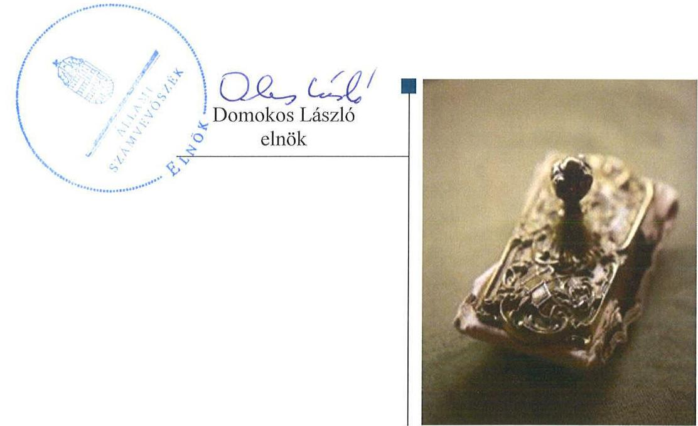
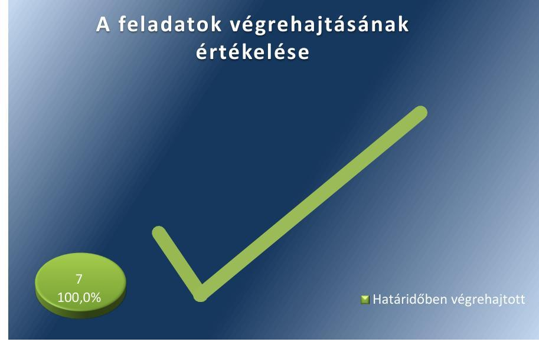
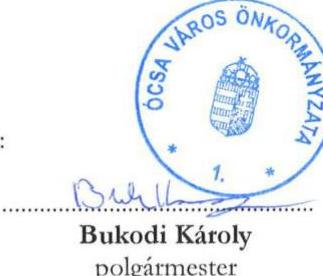

# Jelentés 

## Utóellenőrzések

Ócsa Város Önkormányzat vagyongazdálkodása
szabályszerűségének utóellenőrzése 2017. január hó 6. nap

---

# AZ ELLENŐRZÉST FELÜGYELTE: 

DR. NÉMETH ERZSÉBET felügyeleti vezető

## AZ ELLENŐRZÉST VEZETTE ÉS A VÉGREHAJTÁSÁÉRT FELELŐS:

DR. NAGY JUDIT ellenőrzésvezető

## A PROGRAM ÖSSZEÁLLÍTÁSÁÉRT FELELŐS:

JANIK JÓZSEF LÁSZLÓ osztályvezető

## A TÉMÁHOZ KAPCSOLÓDÓ KORÁBBI SZÁMVEVŐSZÉKI JELENTÉSEK:

- címe: Jelentés az önkormányzati vagyongazdálkodás szabályszerűségi ellenőrzéséről - Ócsa
- sorszáma: 13068

Jelentéseink az Országgyűlés számítógépes hálózatán és az Interneten a www.asz.hu címen is olvashatóak.

IKTATÓSZÁM: V-1215-044/2016.
TÉMASZÁM: 2249
ELLENŐRZÉS-AZONOSÍTÓ SZÁM: V075552

---

# TARTALOMJEGYZÉK 

■ ÖSSZEGZÉS ..... 5
■ AZ ELLENŐRZÉS CÉLJA ..... 6
■ AZ ELLENŐRZÉS TERÜLETE ..... 7
■ AZ ELLENŐRZÉS HÁTTERE, INDOKOLTSÁGA ..... 8
■ FÓKUSZKÉRDÉS ..... 9
■ ELLENŐRZÉS HATÓKÖRE ÉS MÓDSZEREI ..... 10
■ MEGÁLLAPÍTÁSOK ..... 12
■ MELLÉKLETEK ..... 15
I. sz. melléklet: Ócsa Város Önkormányzat intézkedési tervének végrehajtása ..... 15
■ FÜGGELÉK: ÉSZREVÉTELEK ..... 17
■ RÖVIDÍTÉSEK JEGYZÉKE ..... 19

---

.

---

# ÖSSZEGZÉS 

Az utóellenőrzés keretében az Állami Számvevőszék az intézkedési terv végrehajtását értékelte és megállapította, hogy az intézkedési tervben foglaltakat Ócsa Város Önkormányzat maradéktalanul és határidőben megvalósította. Ócsa Város Önkormányzat hasznosította az Állami Számvevőszék jelentésében a szabálytalanságok megszüntetése, illetve a kockázatok kezelése érdekében megfogalmazott javaslatokat, a vagyongazdálkodás szabályszerűsége Ócsa Város Önkormányzatnál javult.

## Az ellenőrzés társadalmi indokoltsága

Az Állami Számvevőszék stratégiájában célul tűzte ki a számvevőszéki munka hasznosulásának javítását. Ezzel összhangban ellenőrzi, hogy az ellenőrzött szervezet megvalósította-e a korábbi ellenőrzései által feltárt hibák, hiányosságok és szabálytalanságok megszüntetése céljából elkészített intézkedési tervekben foglaltakat.

A rendszeres utóellenőrzések hozzájárulnak a szükséges intézkedések tényleges végrehajtásához, ezáltal a közpénzügyek rendezettségének javulásához.

## Főbb megállapítások, következtetések

Az Állami Számvevőszék jelentésében foglalt javaslatok végrehajtása érdekében Ócsa Város Önkormányzat Képviselő-testülete intézkedési tervet fogadott el, amelyet a polgármester ${ }^{1}$ határidőben megküldött az Állami Számvevőszék részére.

Az Állami Számvevőszék jelentésében a jegyző ${ }^{2}$ részére öt javaslatot fogalmazott meg, amelynek alapján az intézkedési terv a jegyzőnek összesen hét feladatot tartalmazott. Ócsa Város Önkormányzat az intézkedési terv minden pontját határidőben végrehajtotta.

Az intézkedési tervben foglalt feladatok végrehajtásáról a jegyző beszámolt Ócsa Város Képviselő-testületének, azonban a feladatok végrehajtásáról a jogszabály szerinti nyilvántartást nem vezették.

---

# AZ ELLENŐRZÉS CÉLJA 

Az ellenőrzés célja annak értékelése, hogy a számvevőszéki jelentésben foglalt intézkedést igénylő megállapításokkal és javaslatokkal összhangban készített intézkedési tervben meghatározott feladatokat az ellenőrzött szervezet végrehajtotta-e.

---

# AZ ELLENŐRZÉS TERÜLETE 

## Az Önkormányzat ${ }^{3}$

Ócsa Város Pest megyében, a Gyáli járásban, 8162 hektár területen, a fővárostól déli irányban 30 kilométerre helyezkedik el. Lakónépességének száma a KSH által közzétett népességi adatok ${ }^{4}$ szerint 2015. január 1-jén 9256 fő volt.

Az Önkormányzat a 2015. évi költségvetési beszámolója szerint 1581,3 millió Ft kiadást teljesített és 1615,3 millió Ft bevételt ért el. 2015. december 31-én a könyvviteli mérleg szerinti követelések állományi értéke 63,0 millió Ft, a kötelezettségek állományi értéke 66,2 millió Ft volt. Az Önkormányzat nemzeti vagyonba tartozó befektetett eszközeinek állománya 3916,1 millió Ft, az összes eszközeinek illetve forrásainak összege 4071,4 millió Ft-ot tett ki a 2015. december 31.-i fordulónapon.

A polgármester 2010. évtől látja el feladatait. A jegyző személye az ellenőrzött időszakban egy alkalommal változott, a jegyző 2015. február 1-től látja el a jegyzői feladatokat.

Az Állami Számvevőszék 2013. évben ellenőrizte Ócsa Városnál az önkormányzati vagyongazdálkodás szabályszerűségét a 2007. január 1. és 2011. december 31. közötti időszak vonatkozásában.

Az erről szóló, 13068 sz. jelentését az ÁSZ ${ }^{5}$ 2013. augusztus 27-én tette közzé.

Az ÁSZ jelentésben foglalt javaslatok végrehajtása érdekében az Önkormányzat Képviselő-testülete a 183/2013. (IX.11.) sz. határozattal intézkedési tervet fogadott el.

Az ÁSZ a jelentésében a jegyző részére öt javaslatot fogalmazott meg, amelynek alapján az intézkedési terv a jegyzőnek hét feladatot tartalmazott.

Az utóellenőrzés az ÁSZ jelentésben a jegyző részére megfogalmazott intézkedést igénylő megállapításokra és javaslatokra készített intézkedési tervben foglalt feladatok végrehajtásának ellenőrzésére, illetve értékelésére terjedt ki.

---

# AZ ELLENŐRZÉS HÁTTERE, INDOKOLTSÁGA 

Az ÁSZ tv. 33. § (1) bekezdése értelmében a számvevőszéki jelentések intézkedést igénylő megállapításaihoz és javaslataihoz kapcsolódóan az ellenőrzött szervezet vezetője intézkedési tervet köteles összeállítani, és az Állami Számvevőszék részére megküldeni. Az intézkedési tervben foglaltak megvalósítását - az ÁSZ tv. 33. § (7) bekezdésében foglaltak alapján - az Állami Számvevőszék utóellenőrzés keretében ellenőrizheti. Az intézkedések megvalósulásának értékelése során az Állami Számvevőszék figyelembe veszi az ellenőrzött szervezet működési feltételeiben, valamint a jogszabályi előírásokban bekövetkezett változásokat.

Az intézkedési tervekben foglalt feladatok hiányos, illetve késedelmes végrehajtása, valamint megvalósításának elmaradása azt mutatja, hogy az ellenőrzés során feltárt hibák, hiányosságok és szabálytalanságok megszüntetése nem kapott kellő hangsúlyt. Ez a szabályszerű működés és a felelős vezetői magatartás vonatkozásában kockázatot jelent. E kockázatok feltárásával az Állami Számvevőszék utóellenőrzési rendszere fokozza a fegyelmet, és igazolja, hogy a közpénzzel való szabályos gazdálkodás felelőssége elől nem lehet kitérni.

Az utóellenőrzés négy szinten hasznosulhat:
$\longrightarrow$ A társadalom szintjén az utóellenőrzés jelzi, hogy a számvevőszéki ellenőrzés megállapításainak van következménye: a hiányosságok megszüntetésére az ellenőrzött szervezet által meghatározott intézkedések végrehajtását is számon kéri az ÁSZ.
$\longrightarrow$ Az ellenőrzött terület szintjén az utóellenőrzés tájékoztatást nyújt a terület döntéshozóinak a hiányosságok kiküszöbölésének jó gyakorlatairól, ezzel lehetőséget biztosítva arra, hogy az ÁSZ ellenőrzési megállapításai, javaslatai a terület nem ellenőrzött szervezeteinek a működése során is hasznosuljanak.
$\longrightarrow$ Az ellenőrzött szervezet szintjén az utóellenőrzés feltárja, hogy a szervezet az intézkedések végrehajtásával hasznosította-e a korábbi ellenőrzési jelentésben a hiányosságok megszüntetése, illetve a kockázatok kezelése érdekében megfogalmazott javaslatokat.
$\longrightarrow$ Az ÁSZ szintjén az utóellenőrzés visszacsatolást ad az ellenőrzési jelentések hasznosulásáról, az intézkedések elmaradása vagy részleges megvalósulása a további ellenőrzésekhez kockázati jelzésként szolgál.

---

# FÓKUSZKÉRDÉS 

Az Önkormányzat az intézkedési tervben foglaltakat az előírt határidőben végrehajtotta-e?

---

# ELLENŐRZÉS HATÓKÖRE ÉS MÓDSZEREI 

## Az ellenőrzés típusa

Megfelelőségi ellenőrzés

## Az ellenőrzött időszak

Az utóellenőrzés alapját képező ÁSZ jelentés közzétételének napjától (2013. augusztus 27.) az ellenőrzésről szóló kiértesítő levél keltének napjáig (2016. július 18.) tartó időszak.

## Az ellenőrzés tárgya

Az ÁSZ tv. 2011. július 1-jei hatálybalépését követően a számvevőszéki jelentésben foglalt intézkedést igénylő megállapításokkal és javaslatokkal összhangban - az Önkormányzat által - készített intézkedési tervben foglaltak végrehajtásának ellenőrzése.

Az ellenőrzés kiterjed minden olyan körülményre és adatra, amely az ÁSZ jogszabályban meghatározott feladatainak teljesítéséhez, valamint a program végrehajtása során felmerült újabb összefüggések feltárásához szükséges.

## Az ellenőrzött szervezet

Ócsa Város Önkormányzat

## Az ellenőrzés jogalapja

Az Állami Számvevőszék törvényben ${ }^{6}$ meghatározott feladatkörében ellenőrzi a központi költségvetés végrehajtását, az államháztartás gazdálkodását, az államháztartásból származó források felhasználását és a nemzeti vagyon kezelését.

Az ÁSZ tv. 1. § (3) bekezdése szerint az ÁSZ általános hatáskörrel végzi a közpénzekkel és az állami és önkormányzati vagyonnal való felelős gazdálkodás ellenőrzését.

Az ÁSZ tv. 33. § (7) bekezdése alapján az ÁSZ tv. 33. § (1)-(2) bekezdése szerinti intézkedési tervben foglaltak megvalósítását az ÁSZ utóellenőrzés keretében ellenőrizheti.

---

# Az ellenőrzés módszerei 

Az utóellenőrzést a nemzetközi standardokat irányadónak tekintve az ellenőrzési program ellenőrzési kérdései, az ellenőrzött időszakban hatályos jogszabályok, az ellenőrzés szakmai szabályok és módszertanok figyelembevételével, önálló ellenőrzés keretében végeztük.

Az ÁSZ az ellenőrzés ideje alatt az Önkormányzattal történő kapcsolattartást az ÁSZ SZMSZ-ének vonatkozó előírásai alapján biztosította.

Az utóellenőrzés megállapításait az ÁSZ rendelkezésére álló, valamint az ellenőrzött szervezettől elektronikusan bekért dokumentumok alapozták meg.

Az ellenőrzési bizonyítékként felhasználható adatforrások közé tartoztak egyrészt a szakmai programban felsorolt adatforrások, másrészt minden - az ellenőrzés folyamán feltárt, az ellenőrzés szempontjából információt tartalmazó - dokumentum.

Az intézkedési tervekben előírt feladatokat azok végrehajthatósága, illetve végrehajtása szempontjából az alábbiak szerint értékeltük:
"határidőben végrehajtott" a feladat, ha a teljesítés dokumentáltan, az intézkedési tervben előírt határidőben és tartalommal megtörtént;
"határidőn túl végrehajtott" a feladat, ha annak teljesítése az intézkedési tervben meghatározott módon, de az előírt határidőn túl történt meg;
"részben végrehajtott" a feladat, ha végrehajtása teljes körűen az intézkedési tervben előírt módon nem történt meg;
"nem végrehajtott" ha a végrehajtás nem történt meg, vagy amenynyiben a teljesítést nem dokumentálták;
"okafogyottá vált" a feladat, ha végrehajtására - meghatározott esemény bekövetkezése, továbbá külső körülmény, a működést érintő feltétel változása miatt - már nincs szükség, illetve lehetőség, és egyértelműen megállapítható, hogy az intézkedést szükségessé tevő körülmény a jövőben nem fordulhat elő;
"nem időszerű" az a feladat, amelynek ellenőrzési időszakon belüli végrehajtására azért nem került (kerülhetett) sor, mert az intézkedés alapjául szolgáló esemény nem következett be, de annak jövőbeni előfordulása lehetséges, a végrehajtása nem volt esedékes, vagy a végrehajtás határideje még nem járt le.
Az ellenőrzés lefolytatásához az ellenőrzött szervezet a tanúsítványok elektronikus kitöltésével, valamint az ÁSZ által kért dokumentumok elektronikus megküldésével szolgáltatott adatokat, amelyek valódiságát és teljes körűségét az ellenőrzött szervezet vezetője által tett teljességi és hitelességi nyilatkozat igazolja. Az így rendelkezésre bocsátott adatok, információk kontrollja az ellenőrzés keretében megtörtént.

---

# MEGÁLLAPÍTÁSOK 

## Az Önkormányzat az intézkedési tervben foglaltakat az előírt határidőben végrehajtotta-e?

Összegző megállapítás

Az Önkormányzat az intézkedési tervben meghatározott feladatait maradéktalanul - 100 %-ban és a vállalt határidőben megvalósította. Az intézkedési tervben rögzített feladatok végrehajtásáról a jegyző beszámolt, de a jogszabályban előírt nyilvántartást nem vezették.

Az intézkedési tervben meghatározott feladatokat, határidőket, megjelölt felelősöket és a feladatok végrehajtását az 1. sz. melléklet mutatja be.

Az ÁSZ a jelentésében a jegyző részére öt javaslatot fogalmazott meg, amelynek alapján a Képviselő-testület ${ }^{8}$ a jegyzőnek hét feladatot határozott meg.

Az ÁSZ javaslatai alapján készült intézkedési tervben előírt hét feladatot maradéktalanul és határidőben végrehajtották.

A jegyző az intézkedési tervben foglalt feladatok végrehajtásáról beszámolt, amelyet a Képviselő-testület 199/2013. (X. 2.) számú határozatával elfogadott. A jegyző azonban - a Bkr. ${ }^{9}$ 14. § (1) bekezdésében foglaltak ellenére - nem gondoskodott az intézkedési tervben meghatározott feladatok végrehajtásáról szóló nyilvántartás vezetéséről.

Az Önkormányzat intézkedési tervében vállalt feladatok végrehajtásának értékelését az 1. ábra szemlélteti.

1. ábra

## A feladatok végrehajtásának értékelése

Forrás: ÁSZ

---

# HATÁRIDŐBEN VÉGREHAJTOTT FELADATOK: 

$\qquad$1. A Pénzügyi Iroda intézkedett az üzemeltetésre átadott törzsvagyon körébe tartozó vízi-közmű vagyontárgyak korlátozottan forgalomképes vagyonként való számviteli nyilvántartásáról.
$\qquad$2. A jegyző intézkedett a tárgyi eszközök és az üzemeltetésre átadott eszközök mennyiségi felvétellel történő leltározásáról.
$\qquad$3. A jegyző gondoskodott arról, hogy az üzemeltetésre átadott eszközökről a könyvviteli mérleg alátámasztásához, az üzemeltetők által évente elvégzett és hitelesített leltárak álljanak rendelkezésre.
$\qquad$4. A jegyző intézkedett, hogy leltározáskor végezzék el a tárgyi eszközökről felvett leltárak kiértékelését és a leltárak tartalmazzák az értékadatokat.
$\qquad$5. A jegyző gondoskodott az Önkormányzat hivatalos honlapján az Info tv. ${ }^{10}$-ben meghatározott adatok közzétételéről. Az Önkormányzatnál nem releváns adatok esetében a hivatalos honlapon külön megjelölésre került, hogy az Önkormányzatnak nincs közzétételi kötelezettsége.
$\qquad$6. A jegyző a belső ellenőrzés által feltárt, a vagyongazdálkodás területét is érintő hiányosságok megszüntetése érdekében az intézkedési tervet határidőben elkészítette.
$\qquad$7.
 A jegyző a Bkr. alapján folyamatosan minden évben értékelte a belső kontrollrendszer minőségét.

---

.

---

# MELLÉKLETEK

I. SZ. MELLÉKLET: ÓCSA VÁROS ÖNKORMÁNYZAT INTÉZKEDÉSI TERVÉNEK VÉGREHAJTÁSA

|  Sorszám | Intézkedési terv alapján elvégzendő feladat | Az intézkedési tervben meghatározott határidő | Az intézkedési terv szerinti felelős | A feladat végrehajtása  |
| --- | --- | --- | --- | --- |
|   | 1. | 2. | 3. | 4.  |
|  Határidőben végrehajtott feladat |  |  |  |   |
|  1. | „A Pénzügyi Iroda intézkedjen az üzemeltetésre átadott vízi-közmű vagyonnak a nemzeti vagyonról szóló 2011. évi CXCVI. tv. 5. §. (5) bek. a./ pontjában előírtaknak megfelelően korlátozottan forgalomképes vagyonként való számviteli nyilvántartásáról." | 2013. szeptember 30. | jegyző | A Pénzügyi Iroda - az Nvtv. ${ }^{11}$ 5. §. (5) bekezdés a) pontjában foglaltaknak megfelelően - intézkedett az üzemeltetésre átadott vízi-közmű vagyonnak korlátozottan forgalomképes vagyonként való számviteli nyilvántartásáról.  |
|  2. | „A Polgármesteri Hivatalban a tárgyi eszközöket és az üzemeltetésre átadott eszközöket az államháztartás szervezeti beszámolási és könyvvezetési kötelezettségének sajátosságairól szóló 249/2000.(XII.24.) Kormányrendelet (továbbiakban: Áhsz ${ }_{1}$ ) 37. § (3) bek. előírása alapján mennyiségi felvétellel leltározzák." | 2013. évi leltárak készítése és folyamatos | jegyző | A 2013. évi leltárak a jogszabályi előírásnak megfelelően határidőre elkészültek. Az Önkormányzat 2014. január 1-jétől új leltárkészítési és leltározási szabályzatot léptetett hatályba. Az Önkormányzat a tárgyi eszközökről folyamatos mennyiségi nyilvántartást vezetett, így a Számv. ${ }^{12}$ 69. § (3) bekezdése, valamint az Áhsz ${ }_{1}{ }^{13}$ 22. § (2) bekezdés előírásai alapján a tárgyi eszközöknél legalább háromévente esedékes tételes mennyiségi leltározást elkészítették. Az üzemeltetésre átadott eszközökről a hitelesített leltárt a 2013., 2014. és 2015. években elkészítették.  |
|  3. | Az üzemeltetésre átadott eszközökről a könyvviteli mérleg alátámasztásához az Áhsz ${ }_{1}$ 37. §. (4) bekezdés előírásának megfelelően, az üzemeltetők által évente elvégzett és hitelesített leltárak álljanak rendelkezésre." | 2013. évi leltárak készítése és folyamatos | jegyző | A jegyző intézkedésének eredményeként a könyvviteli mérleg alátámasztásához az üzemeltetésre átadott eszközökről - a 2013. évben az Áhsz ${ }_{1}{ }^{14}$ 37.§ (4) bekezdése, 2014. évtől az Áhsz ${ }_{2}$ 22. § (2) bekezdés a.) pontja előírásainak megfelelően - az üzemeltetők által évente elvégzett és hitelesített leltárak rendelkezésre állnak.  |
|  4. | „A leltározáskor végezzék el a tárgyi eszközökről felvett leltárak kiértékelését és a leltárak tartalmazzák - az Áhsz ${ }_{1}$ 37. §. (2) bekezdésben foglalt előírásoknak megfelelően - az értékadatokat." | 2013. évi leltárak készítése és folyamatos | jegyző | A jegyző intézkedett, hogy leltározáskor végezzék el a tárgyi eszközökről felvett leltárak kiértékelését és a leltárak tartalmazzák az értékadatokat. A mérlegsorokhoz tartozó leltárak egyeztetése intézményenként megtörtént, az értékadatok egyeztetése és kiértékelése 2013., 2014. és 2015. évben határidőre elkészült.  |

---

|  5. | "Intézkedjenek az információs önrendelkezési jogról és az információs szabadságról szóló 2011. évi CXII. tv. 1. számú mellékletében meghatározott adatok közzétételéről." | 2013. szeptember 30. | jegyző | Az Önkormányzat hivatalos honlapján az Info. tv. 37. § (1) bekezdésében és az 1. számú mellékletében foglalt közzétételi listában szereplő szervezeti, személyzeti, a tevékenységre, működésre vonatkozó, valamint a gazdálkodási adatokat közzétették. Azon adatok, melyek az Önkormányzatnál nem relevánsak, a honlapon külön jelölésre kerültek. Az éves költségvetések, a beszámolók, az önkormányzati vagyon kimutatása, a támogatások, a szerződések közzététele esetében a honlapon a folyamatos frissítés dátumát feltüntették.  |
| --- | --- | --- | --- | --- |
|  6. | "Intézkedjenek A költségvetési szervek belső kontroll rendszeréről és belső ellenőrzésről szóló 370/2011./XII.31./ Kormányrendelet (továbbiakban: Bkr.) 28. §. c./ pontjában előírtaknak megfelelően intézkedési terv készítéséről a belső ellenőrzés által feltárt, a vagyongazdálkodás területét is érintő hiányosságok megszüntetésére." | 2013. szeptember 30. és folyamatos | jegyző | A jegyző 2013. július 12-én - az ellenőrzött időszak kezdete előtt - elkészítette azt az intézkedési tervet, amelynek célja a belső ellenőrzés által 2012-ben feltárt, a vagyongazdálkodás területét is érintő hiányosságok megszüntetése volt. 2013. évben a megbízott belső ellenőr az elvégzett ellenőrzések közül egy ellenőrzés keretében tett az Önkormányzatra, illetve a Polgármesteri Hivatalra vonatkozó intézkedést igénylő megállapítást, amelyre a jegyző az intézkedési tervet határidőben elkészítette. A belső ellenőr az intézkedési terv végrehajtását utóellenőrzés keretében értékelte és megállapította, hogy az intézkedési terv határidőben teljesült. A megbízott belső ellenőr 2014. és 2015. évben intézkedést igénylő megállapítást nem tett. 2016. évben a megbízott belső ellenőr által tett megállapításokra intézkedési terv készítési kötelezettség - az ellenőrzött időszak végéig - nem keletkezett.  |
|  7. | "Értékelje nyilatkozatban a Bkr. 11.§ (1) bekezdésének előírása alapján a belső kontrollrendszer minőségét." | 2013. szeptember 30. | jegyző | A jegyző 2013. április 10-én értékelte 2012. évre vonatkozóan a belső kontrollrendszer minőségét. Ezt követően a jegyző folyamatosan minden évben (2013., 2014. és 2015. évre vonatkozóan) a jogszabályban előírt nyilatkozatban értékelte a belső kontrollrendszer minőségét.  |

---

# FÜGGELÉK: ÉSZREVÉTELEK 

A jelentéstervezetet a Számvevőszék 15 napos észrevételezésre megküldte az ellenőrzött szervezet vezetőjének az ÁSZ tv. 29. § (1) bekezdése előírásának megfelelően.

Az ellenőrzött szervezet vezetője az ÁSZ tv. 29. § (2) bekezdésében foglalt észrevételezési jogával nem élt, a jelentéstervezetre észrevételt nem tett.

[^0]
[^0]:    * 29. § (1) Az Állami Számvevőszék az ellenőrzési megállapításait megküldi az ellenőrzött szervezet vezetőjének vagy az általa megbízott személynek, és annak, akinek személyes felelősségét állapította meg.
    (2) Az ellenőrzött szervezet vezetője és a felelősként megjelölt személy az ellenőrzés megállapításaira tizenöt napon belül írásban észrevételt tehet.
    (3) Az Állami Számvevőszék az észrevételre a beérkezésétől számított harminc napon belül írásban válaszol. A figyelembe nem vett észrevételeket köteles a jelentésben feltüntetni, és megindokolni, hogy azokat miért nem fogadta el.

---

# Ócsa Város Polgármesterétől 

2364 Ócsa, Bajcsy-Zsilinszky u. 2.
Tel.: 29/378-125, Fax: 29/378-067, E-mail: polghiv@ocsanet.hu

Ikt.szám: 6682 / 2016.
Úgyintéző: Parkas Marietta pénzügyi irodavezető

## T.

ÁLLAMI SZÁMVEVŐSZÉK Elnöke
Domokos László Úr
részére
1364 Budapest
Budapest 4. Pf. 54 .

Hiv.szám: V-1215-042/2016

## ÁLLAMI SZÁMVEVŐSZÉK 09867712016

Érkezési időpont: 2016. DEC 02
Iktatószám: V-1215-051/2016
Melléklet: $\qquad$
Tisztelt Elnök Úr!

Hivatkozva fenti számú levelében, illetve annak mellékletében foglaltakra, tájékoztatom Önt, hogy Ócsa Város Önkormányzat vagyongazdálkodásának szabályszerűségi utóellenőrzéséről szóló jelentéstervezet tartalmával kapcsolatban észrevételt tenni nem kívánok.

Ócsa, 2016. november 28.
Tisztelettel:

Bukodi Károly
polgármester

---

# RÖVIDÍTÉSEK JEGYZÉKE 

${ }^{1}$ polgármester
${ }^{2}$ jegyző
${ }^{3}$ Önkormányzat
${ }^{4}$ KSH által közzétett népességi adatok
${ }^{5}$ ÁSZ
${ }^{6}$ ÁSZ törvény
${ }^{7}$ ÁSZ SZMSZ
${ }^{8}$ Képviselő-testület
${ }^{9}$ Bkr.
${ }^{10}$ Info. tv.
${ }^{11}$ Nvtv.
${ }^{12}$ Számv. tv.
${ }^{13}$ Áhsz. 2
${ }^{14}$ Áhsz. 1

Ócsa Város Önkormányzat polgármestere
Ócsa Város Önkormányzatának jegyzője
Ócsa Város Önkormányzat
Központi Statisztikai Hivatal Magyarország Közigazgatási Helységnévkönyvének 2015. január 1-jei adatai
Állami Számvevőszék
2011. évi LXVI. törvény az Állami Számvevőszékről

Az Állami Számvevőszék elnökének 3/2015. (XII.30.) ÁSZ utasítása az Állami Számvevőszék Szervezeti és Működési Szabályzatáról (hatályos 2016. január 1-jétől)
Ócsa Város Önkormányzatának Képviselő-testülete
A költségvetési szervek belső kontrollrendszeréről és belső ellenőrzésről szóló 370/2011. (XII. 31.) Korm. rendelet
2011. évi CXII. törvény az információs önrendelkezési jogról és az információs szabadságról
A nemzeti vagyonról szóló 2011. évi CXCVI. törvény (az 5.§ (5) bekezdés a) pontja hatályos:2012. VI.30.-tól)
A számvitelről szóló 2000. évi C. törvény
Az államháztartás számviteléről szóló 4/2013. (I.11.) Korm. rendelet (hatályos:2014. január 1-jétől)
Az államháztartás szervezetei beszámolási és könyvvezetési kötelezettségének sajátosságairól szóló 249/2000. (XII. 24.) Korm. rendelet (hatálytalan 2014. január 1-től)

---

# ÁLLAMI SZÁMVEVŐSZÉK 

1052 Budapest, Apáczai Csere János utca 10.
Levélcím: 1364 Budapest 4. Pf. 54
Telefon: +36 14849100 Telefax: +36 14849200
www.asz.hu

