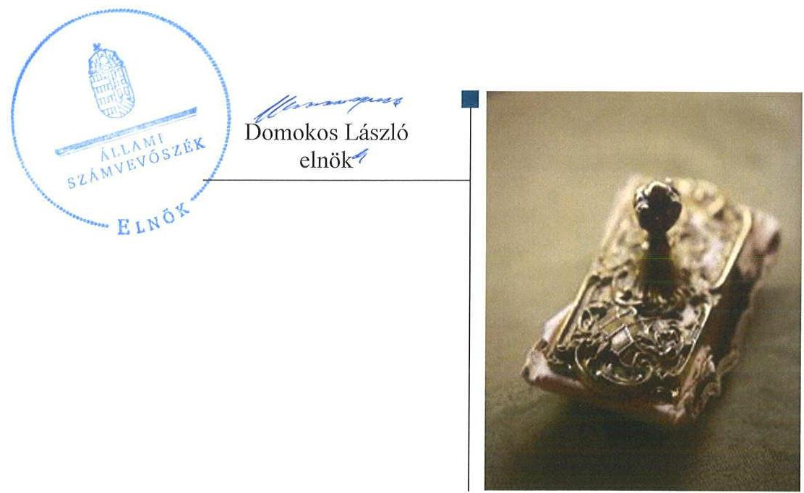
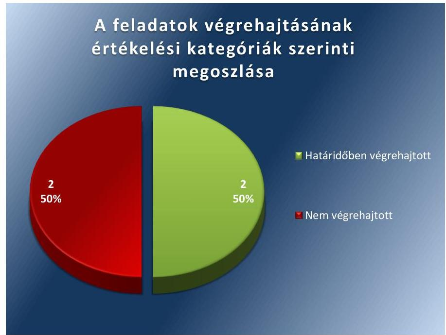
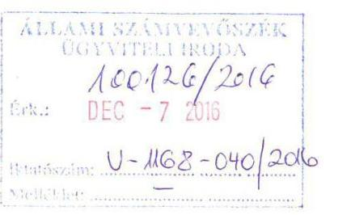
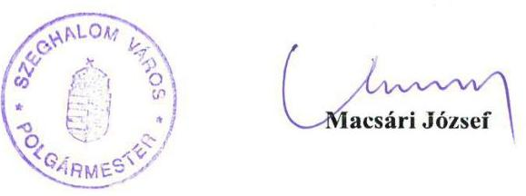
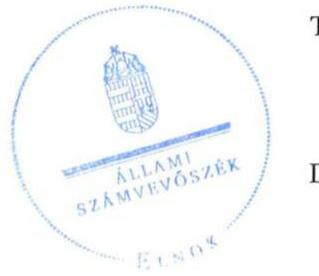
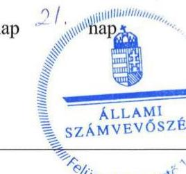

# Jelentés 

## Utóellenőrzések

Szeghalom Város Önkormányzata vagyongazdálkodása
szabályszerúségének utóellenőrzése 2017.

---

# Jelențtés 

## Utóellenőrzések

Szeghalom Város Önkormányzata vagyongazdálkodása
szabályszerúségének utóellenőrzése
2017. jannin hó $b$. nap

---

# AZ ELLENŐRZÉST FELÜGYELTE: 

DR. NÉMETH ERZSÉBET felügyeleti vezető

## AZ ELLENŐRZÉST VEZETTE ÉS A VÉGREHAJTÁSÁÉRT FELELŐS:

DR. PELLEI TAMÁS ellenőrzésvezető

## A PROGRAM ÖSSZEÁLLÍTÁSÁÉRT FELELŐS:

JANIK JÓZSEF LÁSZLÓ osztályvezető

## A TÉMÁHOZ KAPCSOLÓDÓ KORÁBBI SZÁMVEVŐSZÉKI JELENTÉSEK:

- címe: Jelentés az önkormányzati vagyongazdálkodás szabályszerűségi ellenőrzéséről - Szeghalom
- sorszáma: 13107

Jelentéseink az Országgyúlés számítógépes hálózatán és az Interneten a www.asz.hu címen is olvashatóak.

IKTATÓSZÁM: V-1168-042/2016.
TÉMASZÁM: 2202
ELLENŐRZÉS-AZONOSÍTÓ SZÁM: V075517

---

# TARTALOMJEGYZÉK 

■ ÖSSZEGZÉS ..... 5
■ AZ ELLENŐRZÉS CÉLJA ..... 6
■ AZ ELLENŐRZÉS TERÜLETE ..... 7
■ AZ ELLENŐRZÉS HÁTTERE, INDOKOLTSÁGA ..... 8
■ FÓKUSZKÉRDÉS ..... 9
■ ELLENŐRZÉS HATÓKÖRE ÉS MÓDSZEREI ..... 10
■ MEGÁLLAPÍTÁSOK ..... 12
■ MELLÉKLETEK ..... 15
I. Sz. melléklet: Az ÁSZ 13107. számú jelentéséhez kapcsolódó intézkedési terv végrehajtása ..... 15
■ FÜGGELÉK: ÉSZREVÉTELEK ..... 17
■ RÖVIDÍTÉSEK JEGYZÉKE ..... 23

---

.

---

# ÖSSZEGZÉS 

Az utóellenőrzés megállapította, hogy az intézkedési tervben foglalt feladatok jelentős részét Szeghalom Város Önkormányzata nem hajtotta végre, így nem tett megfelelő lépéseket a vagyongazdálkodás szabályszerűségét érintő hiányosságok megszüntetése és az elszámoltathatóság biztositása érdekében.

## Az ellenőrzés társadalmi indokoltsága

Az Állami Számvevőszék stratégiájában célul tűzte ki a számvevőszéki munka hasznosulásának javítását. Ezzel összhangban ellenőrzi, hogy az ellenőrzött szervezetek megvalósították-e a korábbi ellenőrzései által feltárt hibák, hiányosságok és szabálytalanságok megszüntetése céljából elkészített intézkedési terveikben foglaltakat. A rendszeres utóellenőrzések hozzájárulnak a szükséges intézkedések tényleges végrehajtáshoz, ezáltal a közpénzügyek rendezettségének javulásához.

## Főbb megállapítások, következtetések

Szeghalom Város Önkormányzatának polgármestere az intézkedési tervet az előírt határidőt követően küldte meg az Állami Számvevőszék részére. Az intézkedési tervben rögzített feladatok végrehajtásáról nem vezették a jogszabályi előírásnak megfelelő nyilvántartást.

Az intézkedési tervben meghatározott négy feladatból két feladatot határidőben végrehajtottak, két feladat végrehajtása nem történt meg. A vagyongazdálkodási tervet elkészítették, azonban a vagyon nyilvántartásának keretében nem biztosították az ingatlanvagyon-kataszter adatainak egyezőségét a földhivatali ingatlan-nyilvántartás azonos tartalmú adataival. Továbbá nem gondoskodtak arról, hogy az üzemeltetésre átadott eszközökről az üzemeltetők által évente elvégzett és hitelesített leltárak álljanak rendelkezésre, valamint a leltározási szabályzatot ennek megfelelően nem módosították.

Megállapítható, hogy a nem végrehajtott feladatok a vagyongazdálkodás területén olyan jelentős hiányosságokat jelentenek, amelyek miatt a vagyongazdálkodás szabályszerűsége és az elszámoltathatóság nem biztosítható.

---

# AZ ELLENŐRZÉS CÉLJA 

Az ellenőrzés célja annak értékelése volt, hogy a számvevőszéki jelentésben ${ }^{1}$ foglalt intézkedést igénylő megállapításokkal és javaslatokkal összhangban készített intézkedési tervben meghatározott feladatokat az ellenőrzött szervezet végrehajtotta-e.

---

# AZ ELLENŐRZÉS TERÜLETE 

## Szeghalom Város Önkormányzata

Szeghalom város Békés megye északi részén, a Sárrét tájegységi körzetben található. Lakónépességének száma a KSH által közzétett népességi adatok ${ }^{2}$ szerint 2015. január 1-jén 9078 fő volt. A polgármester ${ }^{3}$ a 2002. évi önkormányzati képviselő és polgármester választás óta tölti be tisztségét, a jegyző ${ }^{4} 2012$. április 1-jétől látja el feladatait.

Az ÁSZ ${ }^{5}$ 2013-ban ellenőrizte az Önkormányzat ${ }^{6}$ vagyongazdálkodásának szabályszerűségét. Az ellenőrzés a 2007. január 1. és 2011. december 31. közötti időszakra terjedt ki, kitekintéssel a helyszíni ellenőrzés befejezéséig tartó időszak releváns folyamataira. Az egyes közbeszerzési eljárások lefolytatásának ellenőrzése a 2011. évet és a 2012. év I. negyedévét érintette. Az ellenőrzés célja annak értékelése volt, hogy az Önkormányzatnál a vagyongazdálkodási tevékenységet, annak szervezeti kereteit szabályozták-e, az önkormányzati vagyongazdálkodás törvényességét, szabályszerűségét biztosították-e a döntések előkészítése és végrehajtása során, jogszerű döntéseken alapult-e a vagyon értékének és összetételének változása, a belső ellenőrzés elősegí-tette-e a vagyongazdálkodás szabályszerű működését, valamint hasznosul-tak-e a korábbi külső ellenőrzések által tett javaslatok.

Az Önkormányzat - intézmények adatai nélkül - a 2015. éves költségvetésének végrehajtásról szóló beszámoló szerint 1955,8 millió Ft költségvetési bevételt ért el, valamint 1089,6 millió Ft költségvetési kiadást teljesített, mérlegfőösszege 7074,0 millió Ft, ezen belül a nemzeti vagyonba tartozó befektetett eszközeinek értéke 6174,3 millió Ft volt. A 2015. évi mérlege szerint a követelések állománya 27,0 millió Ft, míg a kötelezettségek állománya 131,0 millió Ft volt.

Az utóellenőrzés az ÁSZ jelentésben a polgármester és a jegyző részére megfogalmazott, intézkedést igénylő megállapításokra és javaslatokra készített, az ÁSZ részére megküldött intézkedési terv végrehajtására fókuszált.

---

# AZ ELLENŐRZÉS HÁTTERE, INDOKOLTSÁGA 

Az ÁSZ tv. ${ }^{7}$ 33. § (1) bekezdése értelmében a számvevőszéki jelentések intézkedést igénylő megállapításaihoz és javaslataihoz kapcsolódóan az ellenőrzött szervezet vezetője intézkedési tervet köteles összeállítani, és az ÁSZ részére megküldeni. Az intézkedési tervben foglaltak megvalósítását az ÁSZ tv. 33. § (7) bekezdésében foglaltak alapján - az ÁSZ utóellenőrzés keretében ellenőrizheti. Az intézkedések megvalósulásának értékelése során az ÁSZ figyelembe veszi az ellenőrzött szervezetek működési feltételeiben, valamint a jogszabályi előírásokban bekövetkezett változásokat.

Az intézkedési tervekben foglalt feladatok hiányos, illetve késedelmes végrehajtása, valamint megvalósításának elmaradása azt mutatja, hogy az ellenőrzések során feltárt hibák, hiányosságok és szabálytalanságok megszüntetése nem kapott kellő hangsúlyt. Ez a szabályszerű működés és a felelős vezetői magatartás vonatkozásában kockázatot hordoz. E kockázatok feltárásával az ÁSZ utóellenőrzési rendszere fokozza a fegyelmet, és igazolja, hogy a közpénzzel való szabályos gazdálkodás felelőssége elől nem lehet kitérni.

## AZ UTÓELLENŐRZÉS VÁRHATÓ HASZNOSULÁSA

Az utóellenőrzés négy szinten hasznosulhat:
$\longrightarrow$ A társadalom szintjén az utóellenőrzés jelzi, hogy a számvevőszéki ellenőrzés megállapításainak van következménye: a hiányosságok megszüntetésére az ellenőrzött szervezet által meghatározott intézkedések végrehajtását is számon kéri az ÁSZ.
$\longrightarrow$ Az ellenőrzött terület szintjén az utóellenőrzés tájékoztatást nyújt a terület döntéshozóinak a hiányosságok kiküszöbölésének jó gyakorlatairól, ezzel lehetőséget biztosítva arra, hogy az ÁSZ ellenőrzési megállapításai, javaslatai a terület nem ellenőrzött szervezeteinek a működése során is hasznosuljanak.
$\longrightarrow$ Az ellenőrzött szervezet szintjén az utóellenőrzés feltárja, hogy a szervezet az intézkedések végrehajtásával hasznosította-e a korábbi ellenőrzési jelentésben a hiányosságok megszüntetése, illetve a kockázatok kezelése érdekében megfogalmazott javaslatokat.
$\longrightarrow$ Az ÁSZ szintjén az utóellenőrzés visszacsatolást ad az ellenőrzési jelentések hasznosulásáról, az intézkedések elmaradása vagy részleges megvalósulása a további ellenőrzésekhez kockázati jelzésként szolgál.

---

# FÓKUSZKÉRDÉS 

Az Önkormányzat az intézkedési tervben foglaltakat az elöirt határidőben végrehajtotta-e?

---

# ELLENŐRZÉS HATÓKÖRE ÉS MÓDSZEREI 

## Az ellenőrzés típusa

Megfelelőségi ellenőrzés

## Az ellenőrzött időszak

Az utóellenőrzés alapját képező ÁSZ jelentés közzétételének napjától (2013. október 15.) az ellenőrzésről szóló kiértesítő levél keltének napjáig (2016. június 23.) tartó időszak.

## Az ellenőrzés tárgya

A számvevőszéki jelentésben foglalt intézkedést igénylő megállapításokkal és javaslatokkal összhangban - az Önkormányzat által - készített intézkedési tervben foglaltak végrehajtásának ellenőrzése.

Az ellenőrzés kiterjed minden olyan körülményre és adatra, amely az ÁSZ jogszabályban meghatározott feladatainak teljesítéséhez, valamint a program végrehajtása folyamán felmerült újabb összefüggések feltárásához szükséges.

## Az ellenőrzött szervezet

Szeghalom Város Önkormányzata

## Az ellenőrzés jogalapja

Az ÁSZ az Országgyűlés pénzügyi és gazdasági ellenőrző szerve. Az ÁSZ törvényben meghatározott feladatkörében ellenőrzi a központi költségvetés végrehajtását, az államháztartás gazdálkodását, az államháztartásból származó források felhasználását és a nemzeti vagyon kezelését.

Az ÁSZ tv. 1. § (3) bekezdése szerint az ÁSZ általános hatáskörrel végzi a közpénzekkel és az állami és önkormányzati vagyonnal való felelős gazdálkodás ellenőrzését.

Az ÁSZ tv. 33. § (7) bekezdése alapján az ÁSZ tv. 33. § (1)-(2) bekezdése szerinti intézkedési tervben foglaltak megvalósítását az ÁSZ utóellenőrzés keretében ellenőrizheti.

---

# Az ellenőrzés módszerei 

Az ÁSZ az utóellenőrzést a nemzetközi standardokat irányadónak tekintve az ellenőrzési program ellenőrzési kérdései, az ellenőrzött időszakban hatályos jogszabályok, az ellenőrzés szakmai szabályok és módszertanok figyelembevételével, önálló ellenőrzés keretében végezte.

Az ÁSZ az ellenőrzés ideje alatt az Önkormányzattal történő kapcsolattartást az ÁSZ SZMSZ ${ }^{\circledR}$-ének vonatkozó előírásai alapján biztosította.

Az utóellenőrzés megállapításait elsősorban az ÁSZ rendelkezésére álló, valamint az ellenőrzött szervezetektől elektronikusan bekért dokumentumok alapozták meg.

Az ellenőrzési bizonyítékként felhasználható adatforrások közé tartoznak egyrészt az ellenőrzési szakmai programban felsorolt adatforrások, másrészt minden - az ellenőrzés folyamán feltárt, az ellenőrzés szempontjából információt tartalmazó - dokumentum.

Az intézkedési tervekben előírt feladatokat, azok végrehajthatósága, illetve végrehajtása szempontjából az alábbiak szerint értékelte az ÁSZ:
"határidőben végrehajtott" a feladat, ha a teljesítés dokumentáltan, az intézkedési tervben előírt határidőben és tartalommal megtörtént;
"határidőn túl végrehajtott" a feladat, ha annak teljesítése az intézkedési tervben meghatározott módon, de az előírt határidőn túl történt meg;
"részben végrehajtott" a feladat, ha végrehajtása teljes körűen az intézkedési tervben előírt módon nem történt meg;
"nem végrehajtott" a feladat, ha a végrehajtás nem történt meg, vagy amennyiben a teljesítést nem dokumentálták;
"okafogyottá vált" a feladat, ha végrehajtására - meghatározott esemény bekövetkezése, továbbá külső körülmény, a múködést érintő feltétel változása miatt - már nincs szükség, illetve lehetőség, és egyértelműen megállapítható, hogy az intézkedést szükségessé tevő körülmény a jövőben nem fordulhat elő;
"nem időszerü" az a feladat, amelynek ellenőrzési időszakon belüli végrehajtására azért nem került (kerülhetett) sor, mert az intézkedés alapjául szolgáló esemény nem következett be, de annak jövőbeni előfordulása lehetséges, a végrehajtása nem volt esedékes, vagy a végrehajtás határideje még nem járt le.
Az ellenőrzés lefolytatásához az ellenőrzött szervezet a tanúsítványok elektronikus kitöltésével, valamint az ÁSZ által kért dokumentumok elektronikus megküldésével szolgáltatott adatokat, amelyek valódiságát és teljes körűségét az ellenőrzött szervezet vezetője által tett teljességi és hitelességi nyilatkozat igazolta. Az így rendelkezésre bocsátott adatok, információk kontrollja az ellenőrzés keretében történt.

---

# MEGÁLLAPÍTÁSOK 

## Az Önkormányzat az intézkedési tervben foglaltakat az előírt határidőben végrehajtotta-e?

Összegző megállapítás

Az Önkormányzat az intézkedési tervben meghatározott négy feladatból két feladatot határidőben végrehajtott, két feladat végrehajtása nem történt meg. Az intézkedési tervben rögzített feladatok végrehajtásáról nem vezettek a jogszabályi előírásoknak megfelelő nyilvántartást.

Az ÁSZ a jelentésében a polgármester részére egy, a jegyző részére három javaslatot fogalmazott meg. A polgármester és a jegyző által összeállított és az ÁSZ részére megküldött intézkedési tervben a hiányosságok, szabálytalanságok megszüntetésére négy feladatot határoztak meg, a feladatok elvégzésének felelőseként egy esetben a polgármestert három esetben pedig a jegyzőt jelölték meg.

Az ÁSZ javaslatai alapján készített intézkedési tervben rögzített feladatok végrehajtásáról a jegyző nem vezette a Bkr. ${ }^{9}$ előírásainak megfelelő nyilvántartást.

Az intézkedési tervben meghatározott feladatokat, határidőket, a feladatok elvégzésének felelősét és a feladatok végrehajtását az I. számú melléklet mutatja be.

Az intézkedési tervben tervezett feladatok végrehajtásának értékelési kategóriák szerinti megoszlását az 1. ábra szemlélteti.

1. ábra

---

# HATÁRIDŐBEN VÉGREHAJTOTT feladatok: 

1. A jegyző az Nvtv. ${ }^{10}$ előírásának érvényesülése érdekében intézkedett az Önkormányzat közép- és hosszú távú vagyongazdálkodási tervének elkészítéséről.
2. A polgármester az Önkormányzat közép- és hosszú távú vagyongazdálkodási tervét 2013. november 4- én a Képviselő-testület elé terjesztette, amelyet a Képviselő-testület a 135/2013. (XI.25.) számú határozatával hagyott jóvá.

## NEM VÉGREHAJTOTT feladatok:

3. A jegyző az intézkedési tervben meghatározott feladat ellenére nem gondoskodott arról, hogy az üzemeltetésre átadott eszközökről az üzemeltetők által évente elvégzett és hitelesített leltárak álljanak az Önkormányzat rendelkezésre. A leltározási szabályzat Áhsz. ${ }^{11}$ előírásának megfelelő módosításáról nem gondoskodott.
4. A jegyző az Inyr. ${ }^{12}$ előírása ellenére nem biztosította az ingatlanva-gyon-kataszter adatai egyezőségét a földhivatali ingatlan-nyilvántartás azonos tartalmú adataival.

---

.

---

# MELLÉKLETEK

I. SZ. MELLÉKLET: AZ ÁSZ 13107. SZÁMÚ JELENTÉSÉHEZ KAPCSOLÓDÓ INTÉZKEDÉSI TERV VÉGREHAJTÁSA

|  Az intézkedési terv alapján elvégzendő feladat | Az intézkedési tervben meghatározott határidő | Az intézkedési tervben rögzített feladatok elvégzésének felelőse | A feladat végrehajtása  |
| --- | --- | --- | --- |
|  Határidőben végrehajtott feladatok |  |  |   |
|  1. „A jegyző intézkedjen a közép- és hosszú távú terv elkészítéséről." | 2013. november 30. | jegyző | A jegyző az Nvtv. 9. § (1) bekezdésében foglalt előírás érvényesülése érdekében intézkedett az Önkormányzat közép- és hosszú távú vagyongazdálkodási tervének elkészítéséről.  |
|  2. „A polgármester terjessze a Képviselő-testület elé a jegyző által elkészített közép- és hosszú távú vagyongazdálkodási tervet jóváhagyásra." | 2013. november 30. | polgármester | A polgármester 2013. november 4-én a jegyző által elkészített közép- és hosszú távú vagyongazdálkodási tervet a Képviselő-testület 2013. november 25-ei ülésére jóváhagyásra előterjesztette. A Képviselő-testület a közép- és hosszú távú vagyongazdálkodási tervet a 2013. november 25-én kelt, 136/2013. (XI. 25.) számú határozatával jóváhagyta.  |
|  Nem végrehajtott feladatok |  |  |   |
|  3. „A jegyző intézkedjen, hogy az üzemeltetésre átadott eszközökről az üzemeltetők által évente elvégzett és hitelesített leltár álljon rendelkezésre, valamint a leltározási szabályzatot is ennek megfelelően módosítsa." | 2014. szeptember 30. | jegyző | A jegyző az intézkedési tervben meghatározott feladat ellenére - a 2012. december 31-ei fordulónappal elvégzett leltározás kivételével - nem gondoskodott arról, hogy az üzemeltetésre átadott eszközökről az üzemeltetők által évente elvégzett és hitelesített leltárak álljanak rendelkezésre. A 2013. december 31-ei könyvviteli mérleg alátámasztásához - az Áhsz. 37. § (4) bekezdés előírásai ellenére - nem álltak rendelkezésre az üzemeltetők által elkészített és hitelesített leltárak. A jegyző a leltározási szabályzat - Áhsz. 37. § (4) bekezdésének megfelelő - módosításáról nem gondoskodott.  |
|  4. „A jegyző biztosítsa az ingatlanvagyon kataszter adatainak egyezőségét a földhivatali ingatlan-nyilvántartás azonos tartalmú adataival." | 2013. december 31. | jegyző | A jegyző az Inyr. 1. § (2) bekezdése előírása ellenére az ingatlanvagyon-kataszter adatai és a földhivatali ingatlan-nyilvántartás azonos tartalmú adatai közötti egyezőséget nem biztosította. A bemutatott dokumentumok alapján az ingatlanvagyon-kataszterből törölt 29 vagyonelemből 25 esetben az ingatlanvagyon-kataszter adatai és a földhivatali ingatlan-nyilvántartás azonos tartalmú adatai közötti egyezőséget biztosították, azonban négy vagyonelem adatainak ingatlanvagyon-kataszterből történő törlését földhivatali tulajdoni lappal nem támasztották alá. Az ingatlanvagyon-kataszteri felvitel céljából kimutatott 49 vagyonelem és a földhivatali ingatlan-nyilvántartás adatai alapján azonosított további hét vagyonelem adatainak ingatlanvagyon-kataszterbe történő feltöltését ingatlanvagyon-kataszteri nyilvántartó lappal nem igazolták.  |

Forrás: ÁSZ által készített táblázat

---

.

---

# FÜGGELÉK: ÉSZREVÉTELEK 

A jelentéstervezetet a Számvevőszék 15 napos észrevételezésre megküldte az ellenőrzött szervezet vezetőjének az ÁSZ tv. 29. §* (1) bekezdése előírásának megfelelően.
A polgármester, mint az ellenőrzött szervezet vezetője az ÁSZ tv. 29. § (2) bekezdésében foglalt észrevételezési jogával élt, az ellenőrzés megállapításaira észrevételt tett.
A függelék tartalmazza az Önkormányzat észrevételeit és az ÁSZ tv. 29. § (3) bekezdésében előírtaknak megfelelően a figyelembe nem vett észrevételeket és azok indokairól szóló tájékoztatást.

[^0]
[^0]:    * 29. § (1) Az Állami Számvevőszék az ellenőrzési megállapításait megküldi az ellenőrzött szervezet vezetőjének vagy az általa megbízott személynek, és annak, akinek személyes felelősségét állapította meg.
    (2) Az ellenőrzött szervezet vezetője és a felelősként megjelölt személy az ellenőrzés megállapításaira tizenöt napon belül írásban észrevételt tehet.
    (3) Az Állami Számvevőszék az észrevételre a beérkezésétől számított harminc napon belül írásban válaszol. A figyelembe nem vett észrevételeket köteles a jelentésben feltüntetni, és megindokolni, hogy azokat miért nem fogadta el.

---

# 1671 

## Szeghalom Város Polgármesterétől

5520 Szeghalom, Szabadság tér 4-8.
Tel.: 66/371-611., Fax: 66/371-623.

## 5370/2016.

## Domokos László   elnök   Állami Számvevőszék

## Tisztelt Elnök Úr!

A V-1168-038/2016. iktatószámra hivatkozva „Szeghalom Város Önkormányzata vagyongazdálkodása szabályszerűségének utóellenőrzése" című jelentéstervezetre az alábbi észrevételt teszem.

Észrevételünk természetesen a tervezet azon részére terjed ki, miszerint két feladat végrehajtása nem történt meg.

1. „A vagyonnyilvántartás keretében nem biztosították az ingatlanvagyon-kataszter adatainak egyezőségét a földhivatali ingatlan-nyilvántartás azonos tartalmú adataival."
A munkafolyamat során a Földhivataltól kikért földkönyvet összevetettük a vagyonkataszterünkkel minden egyes tétel vonatkozásában. A törölt 4 vagyonelem esetében a földhivatali törlő határozatot nem sikerült fellelni, de az ezek esetében is beküldött tulajdoni lapokon szereplő „bejegyző határozatból" (2. pont) minden esetben kiderül, hogy telealakítás történt, ez pedig a korábbi helyrajzi számok megszünését jelenti.
A további 7 ingatlan esetében is beküldésre került a tulajdoni lap. Kétségtelen tény, hogy a csak az olykor több 10 oldalas tulajdoni lapból - a vizsgálat egyszerűbb lebonyolításának segítése céljából - csak az az 1 oldal került beküldésre, ahol az önkormányzat tulajdoni hányada fel van tüntetve.
2. „Nem gondoskodtak arról, hogy az üzemeltetésre átadott eszközökről az üzemeltetők által évente elvégzett és hitelesített leltárak álljanak rendelkezésre, valamint a leltározási szabályzatot ennek megfelelően nem módosították."
A 2012. évi leltározással kapcsolatos 17 körzetre kiterjedő dokumentumok benyújtásra kerültek. A leltározás természetesen a 2013. december 31-i könyvviteli mérleg alátámasztásához jogszabály szerint elkészült, de - valóban - nem került az ÁSZ részére megküldésre. Ennek oka, hogy mivel a 2012. évi vizsgálat a 2007-2011. évekről szólt, így nem volt egyértelmủ számunkra, hogy az utóellenőrzés kiterjed a 2013. évre. Ismételjük, a szükséges leltárak elkészültek, rendelkezésre állnak, bármikor bemutathatóak, de sajnálatosan módon becsatolásra nem kerültek.
Az intézkedési tervben a leltározási szabályzat elkészítésére 2014. szeptember 30. volt határidő, ezért a 2014. január 1-től hatályos, 2014. március 12-én készített új szabályzat már az új, 4/2013.(I.11.) Korm. r. alapján került átdolgozásra a vállalt határidőre. Az ÁSZ által is elfogadott Intézkedési terv 3. pontja a 2012. évi leltározásról szól, így figyelmünk nem terjedt ki a 2013- évre.

| Ügyintézés helye: Városi Polgármesteri Hivatal | Ügyfélfogadási idö: | Hétfö | $8^{00}-16^{00}$ | $13^{00}-16^{00}$ |
| :--: | :--: | :--: | :--: | :--: |
| Cime: 5520 Szeghalom, Szabadság tér 4-8. |  | Kedd | $8^{00}-12^{00}$ | nincs |
| Tel.: 66/371-611/27. mellék, Fax: 66/371-623. |  | Szerda | nincs | $13^{00}-16^{00}$ |
| E-mail: polgarmester@szeghalom.hu |  | Csütörtök | $8^{00}-12^{00}$ | $13^{00}-16^{00}$ |
|  |  | Péntek | $8^{00}-12^{00}$ | nincs |

---

Sajnálatos módon az adatszolgáltatásnak nem az ÁSZ elvárása szerint tettünk eleget, mentségünkre szolgáljon, hogy egyáltalán nem volt gyakorlatunk az elektronikus adatszolgáltatásban, hanem a személyes ellenőrzéshez voltunk szokva, ami lényegesen egyértelműbbnek bizonyult számunkra.
Fontosnak tartjuk rögzíteni, hogy álláspontunk szerint ezen két feladat legalábbis részben végrehajtásra került. Gyakorlatban teljes körűen, de hibáztunk abban, hogy nem minden dokumentumot küldtünk meg a tények alátámasztására.

A nem teljes körű adatszolgáltatás elismerése mellett határozottan nyilatkozom, hogy a hiányosságok - már csak arányuk miatt is - nem alapozzák meg azt a súlyos kijelentést, miszerint a vagyongazdálkodás szabályszerűsége és elszámoltathatósága nem biztosítható.

Tisztelettel kérjük ezen megállapítás mellőzését!

Tisztelettel:

Szeghalom, 2016. december 1.

---

ELNÖK

# Macsári József 

polgármester

Szeghalom Város Önkormányzata

## Szeghalom

## Tisztelt Polgármester Úr!

„Szeghalom Város Önkormányzata vagyongazdálkodása szabályszerűségének utóellenőrzése" című jelentéstervezetre tett észrevételeit köszönettel megkaptam.

Az ellenőrzési megállapításokra vonatkozó észrevételét az Állami Számvevőszékről szóló 2011. évi LXVI. törvény 29. § (2) bekezdésében meghatározott tizenöt napos határidőn belül küldte meg. Az Állami Számvevőszék észrevétellel kapcsolatos álláspontját a mellékletként csatolt, a felügyeleti vezető által készített indokolás tartalmazza.

Budapest, 2016. 12 hó 27 nap

Melléklet: Észrevételre adott válasz

Tisztelettel:

Dömokos László

---

„Szeghalom Város Önkormányzata vagyongazdálkodása szabályszerüségének utóellenörzése" című jelentéstervezetre tett észrevételekre adott válaszok

|  | 4. számú megállapításhoz (ingatlanvagyon kataszter)   „A vagyonnyilvántartás keretében nem biztositották az ingatlanvagyon-kataszter adatainak egyezőségét a földhivatali ingatlan-nyilvántartás azonos tartalmú adataival."   A munkafolyamat során a Földhivataltól kikért földkönyvet összevetettük a vagyonkataszterünkkel minden egyes tétel vonatkozásában. A törölt 4 vagyonelem esetében a földhivatali törlő határozatot nem sikerült fellelni, de az ezek esetében is beküldött tulajdoni lapokon szereplő „,bejegyzö határozatból" (2. pont) minden esetben kiderül, hogy telekalakítás történt, ez pedig a korábbi helyrajzi számok megszünését jelenti.   A további 7 ingatlan esetében is beküldésre került a tulajdoni lap. Kétségtelen tény, hogy a csak az olykor több 10 oldalas tulajdoni lapból - a vizsgálat egyszerübb lebonyolításának segítése céljából - csak az az 1 oldal került beküldésre, ahol az önkormányzat tulajdoni hányada fel van tüntetve." |
| :--: | :--: |
| Válasz: | Az Állami Számvevőszék az észrevételt nem fogadja el. |
| Indoklás: | Az Önkormányzat 8839/2013. iktatószámú „Intézkedési Terv Szeghalom az Állami Számvevőszék által Szeghalom Város Önkormányzata vagyongazdálkodása 2012. évi ellenőrzéséről készitett jelentésben megfoglalt megállapításokkal és javaslatokkal kapcsolatban" 2. számú tervezett intézkedése volt, hogy a jegyző 2013. december 31-ig biztosítja az ingatlanvagyon kataszter adatainak egyezőségét a földhivatali ingatlan-nyilvántartás azonos tartalmú adataival.   Az ellenőrzés megállapította, hogy az Önkormányzat részéről az ellenőrzéshez bemutatott „Nem hiteles tulajdoni lap - Szemle másolat" alapján 49 vagyonelem esetében ingatlanvagyon-kataszterbe való feltöltését az Inyr. 1. § (2) bekezdése előírása ellenére nem támasztották alá ingatlanvagyon-kataszteri nyilvántartó lappal. Továbbá az Inyr. 1. § (2) bekezdése előírása ellenére ingatlanvagyon-kataszteri nyilvántartó lappal nem igazolták annak a hét vagyonelemnek az ingatlanvagyon-kataszterbe történő feltöltését, amelyekről a bemutatott dokumentumok adatai alapján megállapítható volt az Önkormányzat tulajdonjoga.   A Szeghalmi Polgármesteri Hivatalban 2013. december 18-án készült jegyzőkönyv szerint a földhivatali egyeztetést követően az Önkormányzat ingatlanvagyon-kataszterében az ingatlan vagyonban bekövetkezett változások módosításra kerültek.   Az ellenőrzés során bemutatott ingatlanvagyon-kataszteri adatlapok és a földhivatali nyilvántartás kapcsolódó adatai alapján az ingatlanvagyon-kataszterből törőlt 25 tételt földhivatali nyilvántartást igazoló dokumentummal alátámasztottak, négy vagyonelem esetében azonban az Inyr. 1. § (2) bekezdése előírása ellenére az ingatlanvagyon kataszter adatainak egyezőségét a földhivatali ingatlan-nyilvántartás azonos tartalmú adataival nem igazolták.   Fentiek miatt a polgármester észrevétele a jelentéstervezet megállapítását nem befolyásolja. |

---

| Észrevétel: | 3. számú megállapításhoz (leltár, leltározási szabályzat):   „Nem gondoskodtak arról, hogy az üzemeltetésre átadott eszközökröl az üzemeltetők által évente elvégzett és hitelesitett leltárak álljanak rendelkezésre, valamint a leltározási szabályzatot ennek megfelelöen nem módosították. "   A 2012. évi leltározással kapcsolatos 17 körzetre kiterjedő dokumentumok benyújtásra kerültek. A leltározás természetesen a 2013. december 31-i könyvviteli mérleg alátámasztásához jogszabály szerint elkészült, de - valóban - nem került az ÁSZ részére megküldésre. Ennek oka, hogy mivel a 2012. évi vizsgálat a 2007-2011. évekről szólt, igy nem volt egyértelmü számunkra, hogy az utóellenörzés kiterjed a 2013. évre. Ismételjük, a szükséges leltárak elkészültek, rendelkezésre állnak, bármikor bemutathatóak, de sajnálatos módon becsatolásra nem kerültek.   Az intézkedési tervben a leltározási szabályzat elkészitésére 2014. szeptember 30. volt határidő, ezért a 2014. január 1-től hatályos, 2014. március 12-én készített új szabályzat már az új, 4/2013. (I.11.) Korm. r. alapján került átdolgozásra a vállalt határidőre. Az ÁSZ által is elfogadott Intézkedési terv 3. pontja a 2012. évi leltározásról szól, igy figyelmünk nem terjedt ki a 2013- évre." |
| :--: | :--: |
| Válasz: | Az Állami Számvevőszék az észrevételt nem fogadja el. |
| Indoklás: | Az Önkormányzat az Intézkedési Terv 3. számú tervezett intézkedéséhez kapcsolódóan az Intézkedési Terv elkészítéséig megtett intézkedésként mutatta be, hogy a 2012. évi leltárak az Intézkedési Tervben meghatározott feladatnak megfelelően lettek felvéve, valamint a Leltározási Szabályzat módosítása folyamatban van.   Az Önkormányzat az üzemeltetésre átadott eszközök 2013. évi leltározását az Áhsz. ${ }_{1}$ 37. § (4) bekezdésében előírtak ellenére dokumentált módon nem igazolta a 2013. december 31-ei könyvviteli mérleg alátámasztásához. A 2013. évben hatályos leltározási szabályzat A./II./Üzemeltetésre, kezelésre átadott eszközök pontja az Áhsz. ${ }_{1}$ 37. § (4) bekezdése ellenére nem a december 31-i fordulónapra vonatkozó, az üzemeltetést végző évenkénti leltározása alapján elkészített és hitelesített leltárra írt elő kötelezettséget, hanem az éves mérlegkészítés fordulónapját megelőzően szeptember 30-i adatok alapján egyeztetésre.   Az ÁSZ elnökének V-1168-005/2016. iktatószámú kiértesítő leveléhez csatolt V-1062-003/2016. számú ellenőrzési programban tájékoztattuk a polgármestert arról, hogy az utóellenőrzés időszaka az utóellenőrzés alapját képező ÁSZ jelentés közzétételének (2013. október 15.) napjától az ellenőrzésről szóló kiértesítő levél keltének (2016. június 23.) napjáig tartó időszakra terjed ki, tehát a 2013. évi leltározás és leltározási szabályzat ellenőrzésére is.   Az előzőekben leírtak alapján a polgármester észrevétele a jelentéstervezet megállapítását nem befolyásolja. |

Tájékoztatom Polgármester Urat, hogy az Állami Számvevőszékről szóló 2011. évi LXVI. törvény 29. § (3) bekezdése alapján az Állami Számvevőszék a figyelembe nem vett észrevételeket köteles a jelentésben feltüntetni, és megindokolni, hogy azokat miért nem fogadta el.

Budapest, 2016. cloccatel hónap

Dr. Németh Erzsébet felügyeleti vezető

---

# RÖVIDÍTÉSEK JEGYZÉKE 

${ }^{1}$ számvevőszéki jelentés
${ }^{2}$ KSH által közzétett népességi adatok
${ }^{3}$ polgármester
${ }^{4}$ jegyző
${ }^{5}$ ÁSZ
${ }^{6}$ Önkormányzat
${ }^{7}$ ÁSZ tv.
${ }^{8}$ SZMSZ
${ }^{9}$ Bkr.
${ }^{10}$ Nvtv.
${ }^{11}$ Áhsz.
${ }^{12}$ Inyr.

Az ÁSZ 13107. számú jelentése - Jelentés az önkormányzati vagyongazdálkodás szabályszerűségi ellenőrzéséről - Szeghalom (elérhető a www.asz.hu honlapon) Központi Statisztikai Hivatal, Magyarország Közigazgatási Helységnévkönyvének 2015. január 1-jei adatai

Szeghalom Város Önkormányzatának polgármestere
Szeghalom Város Önkormányzat Polgármesteri Hivatalának jegyzője
Állami Számvevőszék
Szeghalom Város Önkormányzata
2011. évi LXVI. törvény az Állami Számvevőszékről (hatályos: 2011. július 1-jétől)

Az Állami Számvevőszék elnökének 3/2015. (XII.30.) ÁSZ utasítása az Állami Számvevőszék Szervezeti és Működési Szabályzatáról (hatályos: 2016. január 1jétől)
370/2011. (XII.31.) Korm. rendelet a költségvetési szervek belső kontrollrendszeréről és belső ellenőrzéséről (hatályos: 2012. január 1-jétől) 2011. évi CXCVI. törvény a nemzeti vagyonról (hatályos: 2011. december 31-étől) 249/2000. (XII.24.) Korm. rendelet az államháztartás szervezeti beszámolási és könyvvezetési kötelezettségeinek sajátosságairól (hatálytalan: 2014. január 1jétől)
147/1992. (XI.6.) Korm. rendelet az önkormányzatok tulajdonában lévő ingatlanvagyon nyilvántartási és adatszolgáltatási rendjéről (hatályos: 1993. január 1-jétől)

---

# ÁLLAMI SZÁMVEVŐSZÉK 

1052 Budapest, Apáczai Csere János utca 10.
Levélcím: 1364 Budapest 4. Pf. 54
Telefon: +36 14849100 Telefax: +36 14849200
www.asz.hu