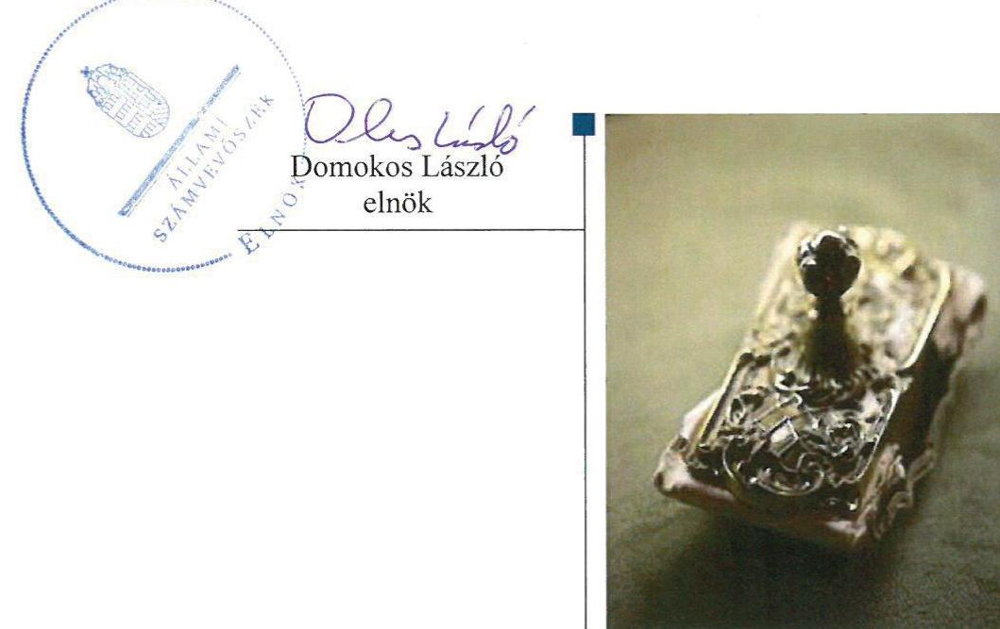
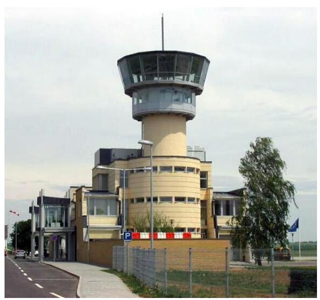
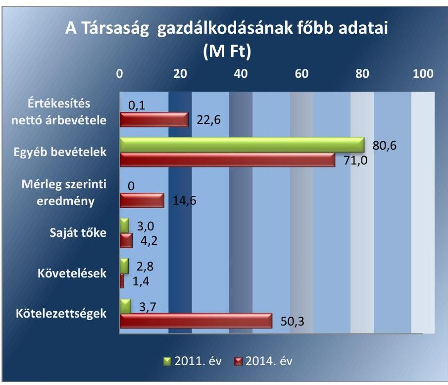

# Jelenetés 

## Az önkormányzatok gazdasági társaságai

Az önkormányzatok többségi tulajdonában lévő gazdasági társaságok gazdálkodásának ellenőrzése - AIR-HORIZONT PÉCS-POGÁNYI REPÜLŐTÉR FEJLESZTÉSÉÉRT Nonprofit Kft. 2017.

---

# Jelentés 

## Az önkormányzatok gazdasági társaságai

Az önkormányzatok többségi tulajdonában lévő gazdasági társaságok gazdálkodásának ellenőrzése - AIR-HORIZONT PÉCS-POGÁNYI REPÜLŐTÉR FEJLESZTÉSÉÉRT Nonprofit Kft.
2017. 2018. 2019. 2020. 2021. 2022. nap

---

Jelentéseink az Országgyülés számítógépes hálózatán és az Interneten a www.asz.hu címen is olvashatóak.

## AZ ELLENŐRZÉST FELÜGYELTE:

MAKKAI MÁRIA felügyeleti vezető

## AZ ELLENŐRZÉST VEZETTE ÉS A VÉGREHAJTÁSÁÉRT FELELŐS:

VALASTYÁNNÉ DR. VÍZHÁNYÓ JÚLIA ellenőrzésvezető

## A PROGRAM ÖSSZEÁLLÍTÁSÁÉRT FELELŐS:

JANIK JÓZSEF osztályvezető

## A TÉMÁHOZ KAPCSOLÓDÓ KORÁBBI SZÁMVEVŐSZÉKI JELENTÉSEK:

- címe:

Jelentés Az önkormányzatok gazdasági társaságai Az önkormányzatok többségi tulajdonában lévő gazdasági társaságok közfeladat ellátását érintő gazdálkodási tevékenysége szabályszerűségének ellenőrzése - PÉTÁV Pécsi Távfütő Korlátolt Felelősségű Társaság

- sorszáma: $\quad 15058$
- címe: $\quad$ Jelentés Az önkormányzatok gazdasági társaságai Az önkormányzatok többségi tulajdonában lévő gazdasági társaságok közfeladat ellátását érintő gazdálkodási tevékenysége szabályszerűségének ellenőrzése - BIOKOM Pécsi Városüzemeltetési és Környezetgazdálkodási Kft.
- sorszáma: $\quad 15020$

IKTATÓSZÁM: V-1092-129/2016.
TÉMASZÁM: 2126
ELLENŐRZÉS-AZONOSÍTÓ SZÁM: V070756

---

# TARTALOMJEGYZÉK 

■ ÖSSZEGZÉS ..... 5
■ AZ ELLENŐRZÉS CÉLJA ..... 6
■ AZ ELLENŐRZÉS TERÜLETE ..... 7
■ AZ ELLENŐRZÉS HÁTTERE, INDOKOLTSÁGA ..... 9
■ FÓKUSZKÉRDÉSEK ..... 10
■ ELLENŐRZÉS HATÓKÖRE ÉS MÓDSZEREI ..... 11
■ MEGÁLLAPÍTÁSOK ..... 13
■ MELLÉKLETEK ..... 21
I. Sz. melléklet: Értelmező szótár. ..... 21
II. Sz. melléklet: Eredménykimutatás. ..... 24
■ FÜGGELÉK: ÉSZREVÉTELEK ..... 25
■ RÖVIDÍTÉSEK JEGYZÉKE ..... 27

---

.

---

# ÖSSZEGZÉS 

Az Állami Számvevőszék az AIR-Horizont Pécs-Pogányi Repülőtér Fejlesztéséért Nonprofit Kft. gazdálkodásának ellenőrzése során megállapította, hogy a Pécs Holding Zrt. a tulajdonosi jogait szabályszerűen gyakorolta. A Társaság kötelezettségeinek mértéke nem veszélyeztette a feladatellátást és a működést. A Társaság vagyongazdálkodása a 2012. év kivételével szabályszerű volt. A 2012. évi beszámolót szabályszerű leltárral nem támasztotta alá. Bevételeinek és a ráfordításainak elszámolása megfelelő volt.

## Az ellenőrzés társadalmi indokoltsága

Az Állami Számvevőszék kiemelt célja, hogy a helyi önkormányzatok gazdálkodásában rejlő pénzügyi kockázatok feltárásával, az államháztartáson kívülre nyújtott költségvetési támogatások és ingyenes vagyonjuttatások, valamint az államháztartáson kívül működő feladat-ellátó rendszerek ellenőrzéseivel hozzájáruljon ahhoz, hogy a közpénzeket az államháztartáson kívül működő szervezetek is átlátható, rendezett módon használják fel.

Magyarországon az intézmény-centrikus közfeladat-ellátás jellemző, de egyre jelentősebb a költségvetésen kívüli feladatellátás térnyerése. Ennek legfontosabb szereplői - a nonprofit szervezetek mellett - az önkormányzati tulajdonú gazdasági társaságok. Az önkormányzatok szervezetalakítási szabadságának következménye, hogy a korábban is vállalati formában működő közszolgáltatások mellett, mind a kötelező, mind az önként vállalt feladatok ellátásában a gazdasági társaságok kiemelt fontosságú szerephez jutottak.

## Főbb megállapítások, következtetések, javaslatok

A Társaság részére a feladat ellátás feltételrendszere biztosított volt. A Társaság feletti tulajdonosi jogokat a taggyűlés szabályszerűen gyakorolta. A Társaság működéséhez szükséges szabályzatok megfeleltek a jogszabályi előírásoknak. A Társaság vagyongazdálkodása a 2012. év kivételével szabályszerű volt. A 2012. évi beszámolót szabályszerű leltárral nem támasztotta alá. A Társaság kötelezettségeinek mértéke nem veszélyeztette a feladatellátást és a működést. A saját tőke a 2012. és a 2013. évben is negatív volt, a Társaság saját tőkéje két egymást követő évben a jegyzett tőke szintje alá csökkent. A törvényes működés helyreállításának érdekében a Pécs Holding Zrt. 10,2 M Ft végleges pénzeszköz átadást teljesített a Társaság részére. Ennek következtében a Társaság saját tőkéjének rendezése megtörtént.

A Társaság az éves beszámolóit, közhasznúsági jelentéseit és mellékleteit a jogszabályoknak megfelelően minden évben elkészítette, valamint azokat határidőben közzétette. A Társaság a tulajdonos által előírt beszámolási és adatszolgáltatási kötelezettségeit az ellenőrzött időszakban teljesítette. Az ellátott feladathoz kapcsolódó bevételek és ráfordítások elszámolása megfelelő volt.

---

# AZ ELLENŐRZÉS CÉLJA 

## Az önkormányzatok gazdasági társaságai - Az önkormányzati tulajdonban lévő gazdasági társaságok gazdálkodásának ellenőrzése - AIR-Horizont Pécs-Pogányi Repülőtér Fejlesztéséért Nonprofit Kft.

Az ellenőrzés célja annak értékelése volt, hogy az önkormányzat vagyongazdálkodási tevékenysége során szabályszerűen gyakorolta-e tulajdonosi jogait; a gazdasági társaság szabályozottsága, gazdálkodása és vagyongazdálkodási tevékenysége, bevételeinek és ráfordításainak elszámolása megfelelt-e a jogszabályi és tulajdonosi előírásoknak; a gazdasági társaság kötelezettségállománya jelent-e kockázatot a működésre, valamint a gazdálkodás átláthatósága és elszámoltathatósága érdekében biztosítva volt-e a szolgáltatás dijának megalapozottsága szabályszerű önköltségszámítással.

---

# AZ ELLENŐRZÉS TERÜLETE 

## Pécs Holding Zrt. többségi tulajdonában álló AIR-Horizont Pécs-Pogányi Repülőtér Fejlesztéséért Nonprofit Kft.

## PÉCS MEGYEI JOGÚ VÁROS ÖNKORMÁNYZATA az AIR-HORIZONT Pécs-Pogányi Repülőtér

Fejlesztéséért Közhasznú Társaságot az ellenőrzött időszakot megelőzően 2001. augusztus 30. napján, határozatlan időre hozta létre, jogelődje nem volt. Az Önkormányzat ${ }^{1}$ a Társaságban² lévő üzletrészét 2008. március 6-án a Pécs Holding Városi Vagyonkezelő Zrt.-be apportálta, ezáltal a Társaság többségi tulajdonosa a Pécs Holding Zrt. lett.

A Társaság jegyzett tőkéje az ellenőrzött időszakban 3,0 M Ft volt, amely teljes egészében pénzbetétből állt. Az ellenőrzött időszakban a Társaság a Pécs Holding Zrt. 74,67%-os, valamint Pogány Község Önkormányzata 25,33%-os tulajdonában volt. Az ellenőrzött időszakban a Társaság a Pécs Holding Zrt. konszolidálásba bevont társaságai közé tartozott.

## AZ AIR-HORIZONT PÉCS-POGÁNYI REPÜ-

## LŐTÉR FEJLESZTÉSÉÉRT KÖZHASZNÚ TÁRSASÁG az ellenőrzött időszakot megelőzően 2009. május 20. napjával alakult át AIR-HORIZONT Pécs-Pogányi Repülőtér Fejlesztéséért Közhasznú Nonprofit Kft.-vé. A Társaság közhasznú és egyben fő tevékenysége út, autópálya építés volt. A Társaság közhasznú státusza 2013. június 17-én megszűnt, és egyidejűleg a Társaság fő tevékenysége a saját tulajdonú ingatlan bérbeadására, üzemeltetésére változott. A Társaság Pogány Község Önkormányzatától földterületet bérelt, amely használatáért bérleti díjat fizetett.
2014. december 31-én a Társaságnak főfoglalkozású dolgozója nem volt.

## A TÁRSASÁG KÖZFELADATOT NEM LÁTOTT EL,

közöszolgáltatási szerződéssel nem rendelkezett. Vagyonkezelésbe vagy üzemeltetésre vagyont nem kapott a Társaság. A Társaság Társasági szerződés ${ }_{1,2,3,4}{ }^{3}$ alapján látta el a feladatát, egyéb, a feladatellátására vonatkozó szerződéssel nem rendelkezett.

A 2011 - 2012. években ingyenesen, a 2013-2014. években bérleti díj ellenében hasznosította ingatlanait és ingó eszközeit. A Társaság az ingatlanai és egyes eszközei hasznosítására ingyenes Haszonkölcsön Szerződést kötött a Pécs-Pogányi Repülőteret Működtető Kft. ${ }^{4}$ - vel 2004. július 1-jétől 2016. december 31-ig határozott időtartamra. 2006. január 1-jétől határozatlan időtartamú Együttműködési Megállapodás keretében a Társaság a megállapodásban szereplő eszközeit ingyenes használatba adta a Pécs-Pogányi Repülőteret Működtető Kft. -nek. A Társaság és a Pécs-Pogányi Repülőteret Működtető Kft. 2013. október 14-én a Haszonkölcsön Szerződést, valamint az Együttműködési Megállapodást közös megegyezéssel

---

megszüntették, és helyettük határozatlan időtartamú bérleti szerződést kötöttek.

A Pécs-Pogányi Repülőteret Működtető Kft. a Magyar Állam és a Pécs Holding Zrt. tulajdonában volt az ellenőrzött időszakban.

A Társaság 2011. és 2014. évi gazdálkodásának főbb adatait az 1. ábra mutatja be.

1. ábra

Forrás: A Társaság 2011. és 2014. évi beszámolói
A Társaság értékesítés nettó árbevétele a 2011. évi 0,1 M Ft-ról a 2014. évre 22,6 M Ft-ra emelkedett. 2014. december 31-én a mérleg szerinti eredmény $14,6 \mathrm{M} \mathrm{Ft}$ volt.

A polgármester ${ }^{5}$ a 2010. évi önkormányzati választások óta tölti be tisztségét, a helyszíni ellenőrzés időszakában a munkakört betöltő jegyző 2011. május 1-jétől látja el feladatait. Az ellenőrzött időszakban az ügyvezető személye nem változott, 2009. augusztus 31-től tölti be tisztségét.

A Társaság az ellenőrzött időszakban nem minősült a 479/2009/EK rendelet ${ }^{6}$, valamint az Áht. ${ }^{7}$ 2. § (1) bekezdése I) pontja szerint nevesített kormányzati szektorba sorolt egyéb szervezetnek, ezért adatszolgáltatási kötelezettség az ellenőrzött időszakban nem terhelte.

---

# AZ ELLENŐRZÉS HÁTTERE, INDOKOLTSÁGA 

Objektív vélemény kialakítása a Pécs Holding Zrt. tulajdonosi joggyakorlásáról, valamint a többségi tulajdonában lévő AIR-Horizont Pécs-Pogányi Repülőtér Fejlesztéséért Nonprofit Kft. feladat ellátását érintő gazdálkodásáról.

AZ ÖNKORMÁNYZATI TULAJDONÚ GAZDASÁGI TÁRSASÁGOK ellenőrzése kiemelten fontos a vagyon megőrzése, megóvása érdekében, amelyekkel szemben alapvető követelmény, hogy gazdálkodásuk, működésük szabályszerű, az általuk szolgáltatott adatok minél megbízhatóbbak legyenek. A feladat-ellátás költségeinek, ráfordításainak alakulása, színvonala hatással van a lakosság elégedettségére.

A TÖRVÉNYALKOTÁS SZÁMÁRA - az észlelt problémák, szabálytalanságok, vagy egyéb nem kívánatos jelenségek felszínre kerülésével - az ellenőrzés megállapításai segítséget nyújthatnak az államháztartáson kívüli feladat-ellátás értékeléséhez, jogszabályi keretei pontosításához, átláthatóságot biztosító szabályozásához. Ellenőrzéseink feltárhatják, hogy a tulajdonosi felügyelet hozzájárult-e a feladat ellátásához. Az ÁSZ értékteremtő rend kialakításához és megőrzéséhez hozzájáruló tevékenysége pozitív hatással van a szervezetről kialakított összkép formálására.

---

# FÓKUSZKÉRDÉSEK 

1.     - A gazdasági társaság feladat ellátásának feltételrendszerét biztosították-e, valamint a tulajdonosi joggyakorlás szabályszerű volt-e?
2.     - A gazdasági társaság vagyongazdálkodása szabályszerű volt-e, kötelezettségállománya veszélyeztette-e a működést, illetve a feladatellátást?
3.     - A gazdasági társaságnál az ellátott feladat bevételei és ráfordításai elszámolása, valamint az önköltségszámítás és árképzés szabályszerű volt-e?

---

# ELLENŐRZÉS HATÓKÖRE ÉS MÓDSZEREI 

## Az ellenőrzés típusa

Megfelelőségi ellenőrzés

## Az ellenőrzött időszak

Az ellenőrzött időszak 2011. január 1-jétől 2014. december 31-ig.

## Az ellenőrzés tárgya

A gazdasági társaság feletti tulajdonosi joggyakorlás, valamint a gazdasági társaság gazdálkodásának szabályozottsága és szabályszerűsége.

Az ellenőrzés kiterjed minden olyan körülményre és adatra, amely az ÁSZ jogszabályban meghatározott feladatainak teljesítéséhez, valamint a program végrehajtása folyamán felmerült újabb összefüggések feltárásához szükséges.

## Az ellenőrzött szervezet

Pécs Megyei Jogú Város Önkormányzata
Pécs Holding Zrt.
AIR-HORIZONT Pécs-Pogányi Repülőtér Fejlesztéséért Nonprofit Kft.

## Az ellenőrzés jogalapja

Az ellenőrzés jogszabályi alapját az ÁSZ tv. ${ }^{8}$ 1. § (3) bekezdése és 5. § (3)-(4)-(5) bekezdései képezik.

## Az ellenőrzés módszerei

Az ellenőrzést a nemzetközi standardokat irányadónak tekintve az ellenőrzési program ellenőrzési kérdései, az ellenőrzött időszakban hatályos jogszabályok, az ellenőrzés szakmai szabályok és módszertanok figyelembevételével végeztük.

Az ellenőrzés ideje alatt az ellenőrzött szervezettel történő kapcsolattartást az ÁSZ Szervezeti és Működési Szabályzatának vonatkozó előírásai alapján biztosítottuk.

---

Az ellenőrzés a Pécs Megyei Jogú Város Önkormányzatára, a tulajdonosi jogokat gyakorló kizárólagos önkormányzati tulajdonú Pécs Holding Városi Vagyonkezelő Zrt. - re, illetve az ellenőrzött feladatot ellátó Air-Horizont Pécs-Pogányi Repülőtér Fejlesztéséért Nonprofit Kft. - re terjedt ki.

Az ellenőrzési kérdések megválaszolásához szükséges bizonyítékok megszerzése a következő ellenőrzési eljárások alkalmazásával történt: megfigyelés, kérdésfeltevés (információkérés), összehasonlítás, valamint elemző eljárás. Az ellenőrzési bizonyítékként felhasználható adatforrások közé tartoztak egyrészt a szakmai programban felsorolt adatforrások, másrészt adatforrás lehet még minden - az ellenőrzés folyamán - feltárt, az ellenőrzés szempontjából információkat tartalmazó dokumentum.

Az ellenőrzést a kérdésekre adott válaszok kiértékelésével, valamint a megjelölt adatforrások, a csatolt tanúsítványok felhasználásával, továbbá az adott időszakban hatályos jogszabályok figyelembe vételével került lefolytatásra.

A bevételek és ráfordítások elszámolása, valamint a vagyonnyilvántartás terén a szabályszerű működést véletlen mintavétellel ellenőriztük. A mintavétellel ellenőrzött területek esetében minden egyes tétel vonatkozásában a szabályszerűségre vonatkozó kérdéseket tettünk fel, amelyek eredménye összesítésre került. „Megfelelőnek" értékeltünk egy ellenőrzött területet, amennyiben 95%-os bizonyossággal a teljes sokaságban a hibaarány legfeljebb $10 \%$ volt.

A ráfordítások elszámolására és a vagyonnyilvántartásra vonatkozó véletlen mintavételt kockázati alapú kiválasztással egészítettük ki, amelynek során évente a három legnagyobb összegű tételt választottuk ki.

---

# 1. A gazdasági társaság feladat ellátásának feltételrendszerét biztosították-e, valamint a tulajdonosi joggyakorlás szabályszerű volt-e? 

Összegző megállapítás

Az
 ellenőrzött időszakban a feladat ellátás feltételrendszerét biztosították, valamint a tulajdonosi joggyakorlás szabályszerű volt.

### 1.1. számú megállapítás

A jogszabályokban foglalt előírásoknak megfelelően biztosították a feladat ellátás feltételrendszerét.

GAZDASÁGI PROGRAMMAL ${ }^{9}$ az Önkormányzat az Ötv. ${ }^{10}$ 91. § (6) és a Mötv. ${ }^{11}$ 116. § (3)-(4) bekezdéseinek megfelelően rendelkezett az ellenőrzött időszakban. A gazdasági program a Társaság feladatellátására vonatkozó konkrét terveket, elképzeléseket nem tartalmazott.

HOSSZÚ- ÉS KÖZÉPTÁVÚ FEJLESZTÉSI STRATÉGIÁJÁBAN ${ }^{12}$ az Önkormányzat rögzítette a közép- és hosszú távú fejlesztési elképzeléseit. A stratégia a Pécs-Pogányi repülőtér nemzetközi légi forgalomba történő bekapcsolásáról határidőket nem határozott meg.

A TELEPÜLÉSFEJLESZTÉSI KONCEPCIÓT ${ }^{13}$ a Közgyűlés ${ }^{14}$ az ellenőrzött időszakot megelőzően fogadta el. A koncepcióban fejlesztési céljai között szerepel a Pécs-Pogányi repülőtér folyamatos gazdaságos működési feltételeinek a biztosítása.

VAGYONGAZDÁLKODÁSI TERVET ${ }^{15}$ az Önkormányzat 2012. január 1. és 2013. február 7. között nem készített, amivel megsértette az Nvtv. ${ }^{16}$ 9. § (1) bekezdésben előírtakat. Az Önkormányzat az Nvtv. 9. § (1) bekezdésének megfelelően a 2013–2016. évekre vonatkozóan elkészítette a közép- és hosszú távú vagyongazdálkodási tervét.

A TÁRSASÁGI SZERZŐDÉS ${ }_{1,2,3,4}$ a Gt. ${ }^{17}$ és a Ptk. ${ }^{18}$ előírásainak megfelelő tartalommal készült.
1.2. számú megállapítás

A Társaság feletti tulajdonosi jogokat a taggyűlés szabályszerűen gyakorolta.

A TULAJDONOSI JOGOKAT a taggyűlés gyakorolta a Gt. és a Ptk. ${ }_{2}$ előírásainak megfelelően. A taggyűlés tagjai a Holding ${ }^{19}$ és a Pogány Község Önkormányzata voltak a Társasági szerződés ${ }_{1,2,3,4}$-ben foglaltak szerint. A Társaság taggyűlésében ${ }^{20}$ a Holdingot 224, Pogány Község Önkormányzatát 76 szavazat illette meg a vagyoni hozzájárulásuk alapján.

---

AZ FB ${ }^{21}$ a Gt.-nek megfelelően a társasági szerződés ${ }_{1,2,3,4}$-ben foglaltak szerint három tagból állt. Az FB megtárgyalta a Társaság éves beszámolóit, melyekről írásbeli jelentéseket készített a Gt.-ben és a Ptk. 2-ban foglaltaknak megfelelően. Az FB elkészítette az ügyrendjét, amelyet a taggyűlés elfogadott.

ADATSZOLGÁLTATÁST a Holding a Társaság részére negyedéves és éves rendszerességgel, valamint eseti jelleggel írt elő. Éves és negyedéves adatszolgáltatás történt a mérleg és eredménykimutatás adatairól, pénzforgalmi tervről, a hitelállományról, beruházási tervről, valamint létszám és személyi jellegű ráfordításokról. A Holding által kért adatokat a Társaság az előírt határidőben teljesítette.

JAVADALMAZÁSI, ILLETVE JUTTATÁSI szabályzat ${ }_{1,2}{ }^{22}$ ot a Taktv. ${ }^{23}$-nek megfelelően a taggyűlés elfogadta.

ELLENŐRZÉS a 2011–2014. években a Társaságnál egy alkalommal történt – egyes adókötelezettségek teljesítése tárgyában – a NAV ${ }^{24}$ részéről.

# 2. A gazdasági társaság vagyongazdálkodása szabályszerű volt-e, kötelezettségállománya veszélyeztette-e a működést, illetve a feladatellátást? 

Összegző megállapítás

A Társaság vagyongazdálkodása a 2012. év kivételével szabályszerű volt. A 2012. évi beszámolót szabályszerű leltárral nem támasztotta alá. A Társaság kötelezettségállománya nem veszélyeztette a feladatellátást és a működést.
2.1. számú megállapítás

A Társaság a működéséhez szükséges szabályzatokkal rendelkezett, a szabályzatok előírásai megfeleltek a jogszabályi előírásoknak.

ÜZLETI TERV ${ }_{1,2,3,4}{ }^{25}$ készítését a taggyűlés nem írta elő a Társaság részére, ennek ellenére azt az ellenőrzött időszak minden évében elkészítette.

SZÁMVITELI POLITIKÁVAL ${ }_{1,2,3,4}{ }^{26}$ a Társaság a Számv. tv. 14. § (3) és (11) bekezdéseinek megfelelően rendelkezett az ellenőrzött időszakban, azt a hatályos jogszabályoknak megfelelően aktualizálta. A Társaság a számviteli politika ${ }_{1,2,3,4}$ keretében a Számv. tv. 14. § (5) bekezdésének megfelelően elkészítette leltározási szabályzatát ${ }_{1,2}{ }^{27}$, az eszközök és források értékelési szabályzatát ${ }_{1,2}{ }^{28}$, és a pénzkezelési szabályzatát ${ }_{1,2}{ }^{29}$. A Társaság az ellenőrzött időszakban rendelkezett selejtezési szabályzat ${ }^{30}$-tal is.

LELTÁROZÁSI SZABÁLYZATÁT ${ }_{1,2}$ a Társaság a Számv. tv.-nek megfelelően elkészítette. A leltározási szabályzat ${ }_{1,2}$-ben a Számv. tv. előírásainak megfelelően meghatározták a mennyiségi leltározás gyakoriságát.

---

# AZ ESZKÖZÖK ÉS FORRÁSOK ÉRTÉKELÉSI SZABÁLYZAT ${ }_{1,2}$ a Számv. tv. előírásainak megfelelően tartalmazta az eszközök és források bekerülési értékének, valamint értékelésének szabályait. 

A PÉNZKEZELÉSI SZABÁLYZAT ${ }_{1,2}$ a Számv. tv. előírásainak megfelelően készült el.

SZÁMLARENDJÉT ${ }^{31}$ a Társaság a Számv. tv.-nek megfelelően elkészítette. A számlarend összhangban volt a Számv. tv.-el, és a számviteli politikával ${ }_{1,2,3,4}$. A főkönyvi számlák részletezését a számlatükör tartalmazta.
2.2. számú megállapítás

A Társaság vagyongazdálkodása a 2012. év kivételével szabályszerű volt. A 2012. évi beszámolót szabályszerű leltárral nem támasztotta alá.

A TÁRSASÁG VAGYONNYILVÁNTARTÁSA az ellenőrzött időszakban átlátható, naprakész volt, az megfelelt belső szabályzatainak. A költségelszámolást megalapozó dokumentumok, a szerződés, a megrendelés és a számlák rendelkezésre álltak, a pénzügyi teljesítés a szerződés szerinti összegben történt. A bekerülési érték meghatározása a Társaság számviteli politikája ${ }_{1,2,3,4}$ szerint szabályszerű volt, az üzembe helyezést megfelelően dokumentálták.

A Társaság a beszámolóiban és a számviteli nyilvántartásokban szereplő vagyonelemek állományát a 2011., 2013. és 2014. években a Számv. tv. 46. § előírásainak, valamint leltározási szabályzat ${ }_{1,2}$-nek megfelelően elkészített leltárral támasztotta alá. A Társaság a 2012. évi beszámolót szabályszerű leltárral nem támasztotta alá.

A Társaság a saját ingatlanait és ingó eszközeit bérbeadás útján hasznosította a 2013. október 14-én megkötött határozatlan időtartamú bérleti szerződés alapján. A bérleti szerződés alapján a Társaság, mint bérbeadó, az ingatlanok és felépítmények után bruttó 23,6 M Ft, az ingó vagyontárgyak tekintetében bruttó 1,7 M Ft éves bérleti díjra volt jogosult. A bérleti szerződést a taggyűlés jóváhagyta.

A Társaság éves beszámolóinak főbb mérlegadatait az 1. táblázat szemlélteti.

---

| A TÁRSASÁG MÉRLEGÉNEK KIEMELT ADATAI (M FT) |  |  |  |  |  |
| :--: | :--: | :--: | :--: | :--: | :--: |
| Megnevezés | 2011.01.01. | 2011.12.31. | 2012.12.31. | 2013.12.31. | 2014.12.31. |
| I. Befektetett eszközök | 3157,2 | 3097,4 | 3077,2 | 3003,0 | 2938,3 |
| - ebből: Tárgyi eszközök | 3157,1 | 3097,4 | 3077,2 | 3003,1 | 2938,3 |
| II. Forgó eszközök | 12,7 | 2,9 | 0,6 | 6,1 | 11,7 |
| - ebből: Követelések | 0,2 | 2,8 | 0,3 | 0,2 | 1,4 |
| III. Aktív időbeli elhatárolások | 0,0 | 4,0 | 0,0 | 0,0 | 0,0 |
| Eszközök összesen | 3169,9 | 3104,3 | 3077,8 | 3009,1 | 2950,0 |
| IV. Saját tőke | 3,0 | 3,0 | -47,8 | -10,4 | 4,2 |
| - ebből: Jegyzett tőke | 3,0 | 3,0 | 3,0 | 3,0 | 3,0 |
| - ebből Mérleg szerinti eredmény | 0,0 | 0,0 | -50,8 | 37,3 | 14,7 |
| V. Céltartalékok | 0,0 | 0,0 | 0,0 | 0,0 | 0,0 |
| VI. Kötelezettségek | 0,0 | 3,7 | 91,3 | 59,4 | 50,3 |
| - ebből Hosszú lejáratú kötelezettség | 0,0 | 0,0 | 56,3 | 45,0 | 29,3 |
| VII. Passzív időbeli elhatárolások | 3166,9 | 3097,6 | 3034,3 | 2960,2 | 2895,5 |
| Források összesen | 3169,9 | 3104,3 | 3077,8 | 3009,1 | 2950,0 |

Forrás: Társaság adatszolgáltatása/Társaság 2011-2014. évi beszámolói

AZ ESZKÖZÖK állományváltozása a 2011. évtől a 2014. év végéig -219,9 M Ft volt, amely 6,9%-os csökkenést jelentett, melyet alapvetően a tárgyi eszközök állományának csökkenése okozott. Az ellenőrzött időszakban az elszámolt értékcsökkenés összege meghaladta a beruházások értékét, ezért az eszközök értékmegőrzése nem történt meg.

A FORRÁSOK értékének csökkenését elsődlegesen a passzív időbeli elhatárolások 271,4 M Ft-os csökkenése, valamint a kötelezettségek állományának 50,3 M Ft összegű növekedése okozta. A bevételek passzív időbeli elhatárolásai között a támogatásként kapott fejlesztési célú pénzeszközök értékcsökkenésként el nem számolt részét tartották nyilván. A Társaság jegyzett tőkéje az ellenőrzött időszakban nem változott. A kötelezettségállomány nagyobb részét 2014-ben a NAV felé fennálló adótartozás és bírság, valamint késedelmi kamat tette ki 42,8 M Ft összegben. A követelések állománya a 2014. év végén 1,4 M Ft volt.

A TÁRSASÁG SAJÁT TÖKÉJE a veszteséges gazdálkodás következtében a 2012. évben -47,8 M Ft volt, így a saját tőke értéke a gazdasági társaság formájára kötelezően előírt jegyzett tőke összege alá csökkent. Az ügyvezető eleget tett a Gt., valamint a Társasági szerződés ${ }_{1,2,3,4}$-ben foglaltaknak, amikor a beszámoló elfogadásakor felhívta a taggyűlés figyelmét a vagyonvesztésre. A saját tőke a 2013. évben továbbra is negatív, -10,4 M Ft összegű volt. A Társaság saját tőkéje két egymást követő évben nem érte el a gazdasági társaságra a Gt. 114. § (1) bekezdésében meghatározott jegyzett tőke 0,5 M Ft-os összegét. A szükséges saját tőke biztosításáról a Gt. 51. § és 143. § (3) és a Ptk. 2 3:133. § (2) és 3:189. § (2) bekezdései ellenére a taggyűlés nem gondoskodott, azonban a Holding saját elhatározása alapján végleges pénzeszköz átadási megállapodást kötött a Társasággal, melynek során 10,2 M Ft „végleges pénzeszköz átadást” teljesített a Társaság részére. Ennek következtében a Társaság saját tőkéjének rendezése megtörtént. A 2014. évi beszámolóban a saját tőke már meghaladta a kötelezően előírt törzstőke összegét.

---

# 2.3. számú megállapítás 

## A Társaság kötelezettségeinek állománya nem veszélyeztette a feladatellátást és működést.

A TÁRSASÁG rövid és hosszú lejáratú kötelezettségeinek összértéke a 2014. év végén 50,3 M Ft volt. A Társaságnak hosszú lejáratú kötelezettsége 2012. évtől keletkezett, miután a NAV jogerős határozatában 56,4 M Ft Áfa ${ }^{32}$ hiányt, ahhoz kapcsolódó 5,4 M Ft késedelmi pótlékot, valamint 5,6 M Ft mulasztási bírságot állapított meg. Az adóhiány oka a beruházásokhoz kapcsolódó jogosulatlan Áfa visszaigénylés volt. A fenti kötelezettség teljesítésére a NAV 60 hónapos részletfizetést engedélyezett. A szállítói tartozások állománya a 2011–2014. években nem volt jelentős. A 2014. december 31-ei 7,4 M Ft-os szállítói tartozás a Pogány Községi Önkormányzat felé fennálló 30 napon belüli lejárt határidejű tartozást jelentette. Az ellenőrzött időszakban a kötelezettségek állománya nem veszélyeztette a feladatellátást és a működést.

A Társaság a 2011. évben 11,0 M Ft, a 2012. évben 3,0 M Ft, a 2013. évben 39,8 M Ft, a 2014. évben 6,3 M Ft, összesen 60,1 M Ft összegű működési célú támogatás kapott a működési költségei fedezetére az Önkormányzattól az éves költségvetési rendeletekben meghatározottak szerint.

A kötelezettségállomány alakulását a 2. táblázat mutatja be:
2. táblázat

## A KÖTELEZETTSÉG ÁLLOMÁNY ALAKULÁSA (M FT)

| Megnevezés | 2011.   12.31 | 2012.   12.31 | 2013.   12.31 | 2014.   12.31 |
| :--: | :--: | :--: | :--: | :--: |
| Rövid lejáratú kötelezettségek | 3,7 | 35,0 | 14,4 | 21,0 |
| -Rövid lejáratú kölcsönök | 1,6 | 23,7 | 0,0 | 0,0 |
| - Szállítók | 2,1 | 0,1 | 0,0 | 7,4 |
| -

 Egyéb rövid lejáratú kötelezettségek | 0,0 | 11,2 | 14,3 | 13,6 |
| Hosszú lejáratú kötelezettségek | 0,0 | 56,3 | 45,0 | 29,3 |
| ebből: NAV adó, bírság és késedelmi pótlék fizetési kötelezettség | 0,0 | 56,3 | 45,0 | 29,3 |
| Kötelezettség összesen | 3,7 | 91,3 | 59,4 | 50,3 |

Forrás: A Társaság 2011-2014. évi beszámolója/a Társaság adatszolgáltatásai
2.4. számú megállapítás

A Társaság az éves beszámolóit minden évben a jogszabályoknak megfelelően elkészítette és határidőben közzétette. A 2011. évben közhasznúsági jelentését, illetve a 2012. évben a közhasznúsági mellékletét szabályszerűen elkészítette és közzétette. A Társaság a tulajdonos által előírt beszámolási és adatszolgáltatási kötelezettséget teljesítette.

Közhasznúsági jelentését a Társaság a 2011. évben a Közhasznú tv. ${ }^{33}$, a közhasznúsági mellékletét a 2012. évben a Civil tv. ${ }^{34}$-ben foglaltaknak megfelelően az éves beszámoló jóváhagyásával egyidejűleg elkészítette, illetve közzétette. A Társaság közhasznú státusza a 2013. évben megszűnt.

Az éves beszámolókat a Társaság a Számv. tv.-ben előírt tartalommal határidőben elkészítette, és a taggyűlés elé terjesztette. A taggyűlés a Gt. és a Ptk. ${ }_{2}$ előírásainak megfelelően határozattal jóvá-

---

hagyta a Társaság beszámolóit. A Társaság 2011-2014. évi éves beszámolóit a taggyűlés az FB írásos jelentései, és a könyvvizsgálói jelentések alapján hagyta jóvá.

A Társaság a kifutópálya meghosszabbítási és a repülőtér megvalósítási terveit 2011. évben 106,5 M Ft, a 2012-2014. években 115,9 M Ft befejezetlen beruházásként tartotta nyilván.

A 2013. évi beszámoló elfogadásakor a FB határozatában ${ }^{35}$ külön felhívta a taggyűlés figyelmét a saját tőke rendezésére, valamint a befejezetlen beruházásként nyilvántartott tervekkel és tanulmányokkal kapcsolatos intézkedések meghozatalára. A 2014. évi beszámoló elfogadásakor a FB határozatában ${ }^{36}$ ismételten felhívta a figyelmet a befejezetlen beruházásokkal kapcsolatos döntéshozatal fontosságára, azok selejtezésére tett javaslatot.

A könyvvizsgáló a jelentéseit a 2011-2014. évekre vonatkozóan korlátozó záradékkal látta el. A korlátozó vélemény mind a négy évben a Társaság befejezetlen beruházásával volt kapcsolatos. A beruházás könyv szerinti értéke az ellenőrzött időszak végén 116 M Ft volt. A könyvvizsgáló terven felüli értékcsökkenés elszámolását javasolta. A könyvvizsgáló eleget tett a Számv. tv. 157. § (2) bekezdésnek, az éves beszámolót tárgyaló taggyűléseken szóban is felhívta a figyelmet a könyvvizsgálói jelentésében szereplő, vagyongazdálkodásra vonatkozó figyelemfelhívására.

A könyvvizsgáló a korlátozó záradékok mellett a 2012. és a 2013. évben figyelemfelhívással is élt, mivel a Társaság saját tőkéje mindkét év végén negatív összegű volt. A taggyűlés a könyvvizsgálói záradék ismeretében döntött az éves beszámolók elfogadásáról.

A Társaság a kötelezően közzéteendő közérdekű adatait az Eisztv. ${ }^{37}$ és az Info tv. ${ }^{38}$-ben meghatározott tartalommal az ellenőrzött időszak minden évében közzétette.

# 3. A gazdasági társaságnál az ellátott feladat bevételei és ráfordításai elszámolása, valamint az önköltségszámítás és árképzés szabályszerű volt-e? 

Összegző megállapítás

A Társaság által ellátott feladat bevételeinek és ráfordításainak elszámolása megfelelő volt. Önköltségszámítási szabályzat készítésére a Társaság a Számv. tv. előírása alapján nem volt kötelezett.
3.1. számú megállapítás

A bevételek, az anyagjellegű ráfordítások, a beruházások, felújítások és az értékcsökkenés elszámolása megfelelő volt.

Az értékesítés nettó árbevételeinek elszámolása megfelelő volt. A bérbeadásból származó bevételeit a számlarendben meghatározott főkönyvi számlákon könyvelték le, számolták el, amely megfelelt a Számv. tv. előírásainak.

---

Az anyagjellegű ráfordítások elszámolása megfelelő volt. Az ellenőrzött időszakban a tevékenységével kapcsolatos költségeket és ráfordításokat a számlarendnek megfelelően és a számlatükörben szereplő főkönyvi számlákon könyvelték le, számolták el.

A beruházások, felújítások az ellenőrzött időszakon belüli változásának az elszámolása megfelelő volt, elszámolása megfelelt a Számv. tv.-ben foglaltaknak.

Az értékcsökkenési leírás elszámolása megfelelő volt, az elszámolás a Számv. tv. 52. - 53. §-aiban és a számviteli politika 1, 2, 3, 4-ben előírtaknak megfelelően történt.

---

.

---

# MELLÉKLETEK 

## I. SZ. MELLÉKLET: ÉRTELMEZŐ SZÓTÁR

adósságfedezeti mutató I.
adósságfedezeti mutató II.

Adósságot keletkeztető ügylet
árbevételre vetített eladósodottság
eladósodottság mértéke
(befektetett eszközök + forgó eszközök) / idegen forrás
Azt mutatja, hogy 1 Ft adósságra hány Ft vagyon jut. Általánosságban véve kedvező, ha értéke 2 körül van, de nagy eszközberuházás-igényű iparágakban értéke kisebb is lehet.
működési cash flow / hosszú lejáratú kötelezettségek
A mutató azt jelzi, hogy az adott gazdálkodási időszak működési pénzáramainak eredményeként realizált cash flow révén a vállalkozás mennyiben lenne képes valamennyi hosszú lejáratú kötelezettségének eleget tenni. Ennek vizsgálatára viszonylag ritkán kerül sor, az elsősorban a veszélyhelyzetbe került vállalkozások esetében lehet érdekes. Általánosságban véve kedvező, ha a működési cash flow minél nagyobb arányban nyújt fedezetet a hosszú lejáratú kötelezettségre (értéke nagyobb, mint 1, nő az ellenőrzött időszakban).
Adósságot keletkeztető ügylet és annak értéke:
a) hitel, kölcsön felvétele, átvállalása a folyósítás, átvállalás napjától a végtörlesztés napjáig, és annak aktuális tőketartozása,
b) a Számv. tv. szerinti hitelviszonyt megtestesítő értékpapír forgalomba hozatala a forgalomba hozatal napjától a beváltás napjáig, kamatozó értékpapír esetén annak névértéke, egyéb értékpapír esetén annak vételára,
c) váltó kibocsátása a kibocsátás napjától a beváltás napjáig, és annak a váltóval kiváltott kötelezettséggel megegyező, kamatot nem tartalmazó értéke,
d) a Számv. tv. szerint pénzügyi lízing lízingbevevői félként történő megkötése a lízing futamideje alatt, és a lízingszerződésben kikötött tőkerész hátralévő összege,
e) a visszavásárlási kötelezettség kikötésével megkötött adásvételi szerződés eladói félként történő megkötése - ideértve a Számv. tv. szerinti valódi penziós és óvadéki repóügyleteket is - a visszavásárlásig, és a kikötött visszavásárlási ár,
f) a szerződésben kapott, legalább háromszázhatvanöt nap időtartamú halasztott fizetés, részletfizetés, és a még ki nem fizetett ellenérték,
g) hitelintézetek által, származékos műveletek különbözeteként az Államadósság Kezelő Központ Zrt.-nél elhelyezett fedezeti betétek, és azok összege.
Forrás: Stabilitási tv. ${ }^{39}$ 3. § (1) bekezdése
(kötelezettségek - forgóeszközök) / értékesítés nettó árbevétele
Az árbevételre vetített eladósodottság azt mutatja, hogy az árbevétel mekkora fedezet nyújt a kötelezettségeknek a forgóeszközökkel csökkentett részére. Általánosságban véve kedvező, ha az árbevétel minél nagyobb arányban nyújt fedezetet a forgóeszközökkel csökkentett kötelezettségekre (értéke kisebb, mint 1, csökken az ellenőrzött időszakban).
Kötelezettségek / saját tőke
Fontos szerepet játszik ez a mutató egy vállalat megítélésében. Azt mutatja, hogy a saját források a kötelezettségek hány százalékát fedezik. Törekedni kell, hogy a mutató tartósan (jelentősen) 1 alatti értéket érjen el.

---

eladósodottsági mutató (tőkeáttétel)
garancia
gazdasági társaság
gazdálkodó szervezet
kezesség

Kormányzati szektorba sorolt egyéb szervezet
közfeladat
idegen tőke / összes forrás
Egészségesnek mondható egy olyan mértékű áttétel, amelyet az üzleti tervek szerint és az elmúlt időszak tapasztalatai alapján a társaság megfelelő biztonsággal ki tud termelni. Nagy eszközberuházás-igényű iparágakban értéke magasabb, azaz magasabb eladósodottság is elfogadható, de 75-85%-ot meghaladó értéknél már itt is erős, sőt túlzott külső finanszírozottságról beszélhetünk. Általánosságban véve kedvező, ha értéke kisebb, mint 0.
A garancia olyan önálló, az önkormányzat nevében vállalt kötelezettség, amely alapján az önkormányzat az önkormányzati költségvetés terhére szerződésben meghatározott feltételek szerint, a kötelezett nem teljesítése esetén a jogosultnak fizetést teljesít az előzetesen rögzített összeghatárig.
Ptk. 2:3:88. § (1) A gazdasági társaságok üzletszerű közös gazdasági tevékenység folytatására, a tagok vagyoni hozzájárulásával létrehozott, jogi személyiséggel rendelkező vállalkozások, amelyekben a tagok a nyereségből közösen részesednek, és a veszteséget közösen viselik.
A Ptk. 685. § c) pontja szerint gazdálkodó szervezet:„az állami vállalat, az egyéb állami gazdálkodó szerv, a szövetkezet, a lakásszövetkezet, az európai szövetkezet, a gazdasági társaság, az európai részvénytársaság, az egyesülés, az európai gazdasági egyesülés, az európai területi együttműködési csoportosulás, az egyes jogi személyek vállalata, a leányvállalat, a vízgazdálkodási társulat, az erdő birtokossági társulat, a végrehajtói iroda, az egyéni cég, továbbá az egyéni vállalkozó."
A kezességre vonatkozó előírásokat a Ptk. 6:416-430. §-ai tartalmazzák. Kezességi szerződéssel a kezes kötelezettséget vállal a jogosulttal szemben, hogyha a kötelezett nem teljesít, maga fog helyette a jogosultnak teljesíteni. Kezesség egy vagy több, fennálló vagy jövőbeli, feltétlen vagy feltételes, meghatározott vagy meghatározható összegű pénzkövetelés vagy pénzben kifejezhető értékkel rendelkező egyéb kötelezettség biztosítására vállalható. A Ptk. szerint kezességet csak írásban lehet vállalni. A kezes kötelezettsége ahhoz a kötelezettséghez igazodik, amelyért kezességet vállalt. A kezes kötelezettsége nem válhat terhesebbé, mint amilyen elvállalásakor volt, kiterjed azonban a kötelezett szerződésszegésének jogkövetkezményeire és a kezesség elvállalása után esedékessé váló mellékkövetelésekre is.
Az a szervezet, amely az Áht. 2 alapján nem része az államháztartásnak, azonban az Európai Közösséget létrehozó szerződéshez csatolt, a túlzott hiány esetén követendő eljárásról szóló jegyzőkönyv alkalmazásáról szóló 2009. május 25-i 479/2009/EK rendelet szerint a kormányzati szektorba tartozik. A nemzetgazdasági miniszter 2013. június 26-án megjelent Közleményben tette közé ezen szervezetek listáját.
Jogszabályban meghatározott állami vagy önkormányzati feladat, amit az arra kötelezett közérdekből, jogszabályban meghatározott követelményeknek és feltételeknek megfelelve végez, ideértve a lakosság közszolgáltatásokkal való ellátását, továbbá az állam nemzetközi szerződésekben vállalt kötelezettségeiből adódó közérdekű feladatokat, valamint e feladatok ellátásához szükséges infrastruktúra biztosítását is (Nvtv. 3. § (1) bekezdés 7. pont).

---

közszolgáltatás

Közvetett tulajdon, illetve közvetett befolyás
nemzeti vagyon
nettó eladósodottság

Nonprofit gazdasági társaság

Tulajdonosi joggyakorló

A közszolgáltatás: „közcélú, illetőleg közérdekű szolgáltatást jelent, amely egy nagyobb közösség (állam, település) minden tagjára nézve megközelítőleg azonos feltételek mellett vehető igénybe, ezért valamilyen mértékig közösségi megszervezést, illetve szabályozást, ellenőrzést igényel." Az Ebktv. 3. § d) pontja a következőképpen határozza meg a közszolgáltatást: „szerződéskötési kötelezettség alapján a lakosság alapvető szükségleteinek ellátására irányuló szolgáltatás, így különösen a villamos energia-, gáz-, hő-, víz-, szennyvíz- és hulladékkezelési, köztisztasági, postai és távközlési szolgáltatás, továbbá a menetrend alapján közlekedő járművekkel végzett közforgalmú személyszállítás"
Egy vállalkozás tulajdoni hányadának, illetőleg szavazati jogának a vállalkozásban tulajdoni részesedéssel, illetőleg szavazati joggal rendelkező más vállalkozás (köztes vállalkozás) tulajdoni hányadán, szavazati jogán keresztül történő gyakorlása. A közvetett tulajdon, a közvetett befolyás arányának megállapításához a közvetett tulajdonnal, közvetett befolyással rendelkezőnek a köztes vállalkozásban fennálló szavazati jogát vagy tulajdoni hányadát meg kell szorozni a köztes vállalkozásnak a vállalkozásban fennálló szavazati vagy tulajdoni hányada közül azzal, amelyik a nagyobb. Ha a köztes vállalkozásban fennálló szavazati vagy tulajdoni hányad az ötven százalékot meghaladja, akkor azt egy egészként kell figyelembe venni (a tőkepiacról szóló 2001. évi CXX. törvény 5. § (1) bekezdés 84. pont).
Az Nvtv. 1. § (2) bekezdés c) pontja szerint „az állam vagy a helyi önkormányzat tulajdonában lévő pénzügyi eszközök, továbbá az államot vagy a helyi önkormányzatot megillető társasági részesedések"
(kötelezettségek - követelések) / saját tőke
Azt mutatja, hogy a kintlévőségekkel csökkentett kötelezettségeket milyen mértékben fedezi saját forrás. Ez feltételezi, hogy a követelések pénzügyileg előbb realizálódnak, mint ahogy a kötelezettségeket teljesíteni kell. A mutató minél kisebb, csökkenő értéke kedvező.
Gt. 4. § (1) bekezdése szerint „gazdasági társaság nem jövedelemszerzésre irányuló közös gazdasági tevékenység folytatására is alapítható (nonprofit gazdasági társaság). Nonprofit gazdasági társaság bármely társasági formában alapítható és működtethető. A gazdasági társaság nonprofit jellegét a gazdasági társaság cégnevében a társasági forma megjelölésénél fel

 kell tüntetni."
Aki a nemzeti vagyon felett az államot vagy a helyi önkormányzatot megillető tulajdonosi jogok és kötelezettségek összességének gyakorlására jogosult (Ntvt. 3. § (1) bekezdés 17. pont).

---

# II. 5. MELLÉKLET: EREDMÉNYKIMUTATÁS

|  AZ AIR-HORIZONT PÉCS-POGÁNYI REPÜLŐTÉR FEJLESZTÉSÉÉRT NONPROFIT KFT. EREDMÉNYKIMUTATÁSAI (M FT) |  |  |  |   |
| --- | --- | --- | --- | --- |
|  Tétel megnevezése | 2011. | 2012. | 2013. | 2014.  |
|  I. Értékesítés nettó árbevétele | 0,1 | 0,2 | 22,9 | 22,5  |
|  II. Aktivált saját teljesítmények értéke | 0,0 | 0,0 | 0,0 | 0,0  |
|  III. Egyéb bevételek | 80,6 | 68,4 | 113,9 | 71,0  |
|  ebből visszaírt értékvesztés | 0,0 | 0,0 | 0,0 | 0,0  |
|  IV. Anyagjellegű ráfordítások | 24,1 | 40,2 | 21,6 | 21,4  |
|  V. Személyi jellegű ráfordítások | 0,8 | 0,8 | 0,9 | 1,8  |
|  VI. Értékcsökkenési leírás | 59,7 | 63,0 | 74,1 | 64,7  |
|  VII. Egyéb ráfordítások | 0,2 | 14,9 | 0,5 | 0,7  |
|  ebből értékvesztés | 0,0 | 0,0 | 0,0 | 0,0  |
|  A. Üzemi (üzleti) tevékenység eredménye | $-4,1$ | $-50,3$ | 39,7 | 4,9  |
|  VIII. Pénzügyi műveletek bevételei | 4,1 | 0,0 | 0,0 | 0,0  |
|  IX. Pénzügyi műveletek ráfordításai | 0,0 | 0,5 | 0,8 | 0,0  |
|  B. Pénzügyi műveletek eredménye | 4,1 | $-0,5$ | $-0,8$ | 0,0  |
|  C. Szokásos Vállalkozási eredmény | 0,0 | $-50,8$ | 38,9 | 4,9  |
|  X. Rendkívüli bevételek | 0,0 | 0,0 | 0,0 | 10,2  |
|  XI. Rendkívüli ráfordítások | 0,0 | 0,0 | 0,0 | 0,0  |
|  D. Rendkívüli eredmény | 0,0 | 0,0 | 0,0 | 10,2  |
|  E. Adózás előtti eredmény | 0,0 | $-50,8$ | 38,9 | 15,1  |
|  XII. Adófizetési kötelezettség | 0,0 | 0,0 | 1,5 | 0,4  |
|  F. Adózott eredmény | 0,0 | $-50,8$ | 37,3 | 14,7  |
|  G. Mérleg szerinti eredmény | 0,0 | $-50,8$ | 37,3 | 14,7  |

Forrás: A Társaság 2011-2014. évi beszámolói

---

# FÜGGELÉK: ÉSZREVÉTELEK 

A jelentéstervezetet a Számvevőszék 15 napos észrevételezésre megküldte az ellenőrzött szervezetek vezetőinek az ÁSZ tv. 29. § (1) bekezdése előírásának megfelelően.

Az ÁSZ a jelentéstervezetet észrevételezésre megküldte Pécs Megyei Jogú Város polgármesterének, a Pécsi Vagyonhasznosító Zrt. elnök-vezérigazgatójának és az AIR HORIZONT PÉCS-POGÁNYI REPÜLŐTÉR Fejlesztéséért Nonprofit Kft. ügyvezetőjének.

Pécs Megyei Jogú Város polgármestere és az AIR HORIZONT PÉCS-POGÁNYI REPÜLŐTÉR Fejlesztéséért Nonprofit Kft. ügyvezetője az ÁSZ tv. 29. § (2) bekezdésében foglalt észrevételezési jogával nem élt, a törvényes határidőn belül észrevételt nem tett. A Pécsi Vagyonhasznosító Zrt. elnök-vezérigazgatója nemleges észrevételét a függelék alább tartalmazza.

[^0]
[^0]:    * 29. § (1) Az Állami Számvevőszék az ellenőrzési megállapításait megküldi az ellenőrzött szervezet vezetőjének vagy az általa megbízott személynek, és annak, akinek személyes felelősségét állapította meg.
    (2) Az ellenőrzött szervezet vezetője és a felelősként megjelölt személy az ellenőrzés megállapításaira tizenöt napon belül írásban észrevételt tehet.
    (3) Az Állami Számvevőszék az észrevételre a beérkezésétől számított harminc napon belül írásban válaszol. A figyelembe nem vett észrevételeket köteles a jelentésben feltüntetni, és megindokolni, hogy azokat miért nem fogadta el.

---

Mallai M.

Dátum: 2016. november 25.
Iktatószám/hivatkozási szám: $\overline{\text { Fh/ } 407-543 / 2016}$
Úgyintéző nálunk: Gávayné Ruzsics Erzsébet
Elérhetősége: 72/801-724
Tárgy: Számvevőszéki jelentéstervezet
Melléklet:-

# Állami Számvevőszék 

## Domokos László Elnök részére

1052 Budapest, Apáczai Csere János u. 10.

## Tisztelt Elnök Úr!

Az Állami Számvevőszék által „Az önkormányzatok gazdasági társaságai - Az önkormányzatok többségi tulajdonában lévő gazdasági társaságok gazdálkodásának ellenőrzése - AIR HORIZONT PÉCS-POGÁNYI REPÜLŐTÉR Fejlesztéséért Nonprofit Kft." címmel készített számvevőszéki jelentéstervezettel kapcsolatban nem kívánok észrevételt tenni, az abban leírtakat tudomásul veszem.

Pécs, 2016. november 25.

Tisztelettel,

Pécsi Vagyonhasznosító Zrt.
7626 Pécs, Búza tér 8/B
Levélcím: 7603 Pécs 3, Pf.: 156.

Sándor Zsolt
vezérigazgató

---

# RÖVIDÍTÉSEK JEGYZÉKE 

${ }^{1}$ Önkormányzat
${ }^{2}$ Társaság
${ }^{3}$ Társasági szerződés $1,2,3,4$

Pécs Megyei Jogú Város Önkormányzata
Air-Horizont Pécs-Pogányi Repülőtér Fejlesztéséért Nonprofit Kft.
Air-Horizont Nonprofit Kft. társasági szerződése 2010. december 21-től 2012. február 22-ig
Air-Horizont Nonprofit Kft. társasági szerződése 2012. február 22-től 2012. december 19-ig
Air-Horizont Nonprofit Kft. társasági szerződése 2012. december 19-től 2013. június 17-ig
Air-Horizont Nonprofit Kft. társasági szerződése 2013. június 17-től jelenleg is
Magyar Állam és a Pécs Holding Zrt. tulajdonában álló gazdasági társaság
Pécs Megyei Jogú Város Önkormányzatának polgármestere
az Európai Közösséget létrehozó szerződéshez csatolt, a túlzott hiány esetén követendő eljárásról szóló jegyzőkönyv alkalmazásáról szóló 479/2009/EK rendelet
Az államháztartásról szóló 2011. évi CXCV. törvény (hatályos: 2011. december 31-től)
2011. évi LXVI. törvény az Állami Számvevőszékről, hatályos 2011. július 1-jétől Pécs Megyei Jogú Város Önkormányzatának gazdasági programja (159/2011. (04.21.) határozat, hatályos 2011-2014. évekre)
a helyi önkormányzatokról szóló 1990. évi LXV. törvény (hatályos 2011. december 31-ig)
Magyarország helyi önkormányzatairól szóló 2011. évi CLXXXIX. törvény
A Közgyűlés 466/2007. (10.31.) sz. határozatával elfogadott Pécs Megyei Jogú Város Hosszú és Középtávú Fejlesztési Stratégiája
546/2009. (11.26.) számú határozattal elfogadott Pécs Megyei Jogú Város Önkormányzatának településfejlesztési koncepciója
Pécs Megyei Jogú Város Önkormányzatának Közgyűlése
Pécs Megyei Jogú Város Önkormányzatának Közép- és hosszú távú vagyongazdálkodási terve
a nemzeti vagyonról szóló 2011. évi CXCVI. törvény (hatályos 2012. január 1-től)
a gazdasági társaságokról szóló 2006. évi IV. törvény (hatálytalan: 2014. március 15-étől)
a Polgári Törvénykönyvről szóló 2013. évi V. törvény (hatályos: 2014. március 15-étől)
Pécs Holding Városi Vagyonkezelő Zrt. (A cég elnevezése 2016. június 1-től Pécsi Vagyonhasznosító Zrt.-re változott.)
Air-Horizont Nonprofit Kft. taggyűlése
a Pécsi Nemzeti Színház Nonprofit Kft. felügyelő bizottsága
Air-Horizont Nonprofit Kft. javadalmazási szabályzata (hatályos 2010. május 11-től 2012. május 7-ig)
Air-Horizont Nonprofit Kft. javadalmazási szabályzata (hatályos 2012. május 8-tól jelenleg is)

---

${ }^{23}$ Taktv.
${ }^{24}$ NAV
${ }^{25}$ üzleti terv $_{1,2,3,4}$
${ }^{26}$ számviteli politika $_{1,2,3,4}$
${ }^{27}$ leltározási szabályzat ${ }_{1,2}$
${ }^{28}$ eszközök és források értékelési szabályzata ${ }_{1,2}$
${ }^{29}$ pénzkezelési szabályzat ${ }_{1,2}$
${ }^{30}$ selejtezési szabályzat
${ }^{31}$ számlarend
${ }^{32}$ Áfa
${ }^{33}$ Közhasznú tv.
${ }^{34}$ Civil tv.
${ }^{35}$ FB határozat
${ }^{36}$ FB határozat
${ }^{37}$ Eisztv.
${ }^{38}$ Info tv.
${ }^{39}$ Stabilitási tv.

A köztulajdonban álló gazdasági társaságok takarékosabb működéséről szóló 2009. évi CXXII. törvény

Nemzeti Adó és Vámhivatal
Air-Horizont Nonprofit Kft. 2011-2014. évi üzleti tervei
Air-Horizont Nonprofit Kft. számviteli politikája (hatályos 2009. november 20-tól 2011. február 10-ig)

Air-Horizont Nonprofit Kft. számviteli politikája (hatályos 2011. február 11-től 2012. december 31-ig)

Air-Horizont Nonprofit Kft. számviteli politikája (hatályos 2013. január 1-től 2013. június 16-ig)

Air-Horizont Nonprofit Kft. számviteli politikája (hatályos 2013. június 17-től jelenleg is)
Air-Horizont Nonprofit Kft. leltározási szabályzata (hatályos 2009. október 1-től 2011. szeptember 29-ig)

Air-Horizont Nonprofit Kft. leltározási szabályzata (hatályos 2011. szeptember 30-tól jelenleg is)

Air-Horizont Nonprofit Kft. eszközök és források értékelési szabályzata (hatályos 2009. október 1-től 2011. szeptember 29-ig)

Air-Horizont Nonprofit Kft. eszközök és források értékelési szabályzata (hatályos 2011. szeptember 30-tól jelenleg is)

Air-Horizont Nonprofit Kft. pénzkezelési szabályzata (hatályos 2009. szeptember 1-től 2011. szeptember 29-ig)

Air-Horizont Nonprofit Kft. pénzkezelési szabályzata (hatályos 2011. szeptember 30-tól jelenleg is)

Air-Horizont Nonprofit Kft. selejtezési szabályzata (hatályos: 2011. szeptember 30.)

Air-Horizont Nonprofit Kft. számlarendje (hatályos 2009. október 1-től jelenleg is) Általános forgalmi adó
A közhasznú szervezetekről szóló 1997. évi CLVI. törvény
Az egyesülési jogról, a közhasznú jogállásról, valamint a civil szervezetek működéséről és támogatásáról szóló 2011. évi CLXXV. törvény
2/2014. (03.19.) számú FB határozat a taggyűlés részére a saját tőke rendezésére, valamint a befejezetlen beruházásként nyilvántartott tervekkel és tanulmányokkal kapcsolatos intézkedések meghozatalára
2/2015. (03.25.) számú FB határozat a taggyűlés részére a befejezetlen beruházásokkal kapcsolatos döntéshozatal fontosságára, azok selejtezésére tett javaslatot
az elektronikus információszabadságról szóló 2005. évi XC. törvény
az információs önrendelkezési jogról és az információszabadságról szóló 2011. évi CXII. törvény
Magyarország gazdasági stabilitásáról szóló 2011. évi CXCIV. törvény

---

# ÁLLAMI SZÁMVEVŐSZÉK 

1052 Budapest, Apáczai Csere János utca 10.
Levélcím: 1364 Budapest 4. Pf. 54
Telefon: +36 14849100 Telefax: +36 14849200
www.asz.hu
