# Jelenetés 

## Az államháztartás információs rendszere, valamint a hivatalos statisztikai szolgálat múködésének ellenőrzése

2017

---

# J elentés 

## Az államháztartás információs rendszere, valamint a hivatalos statisztikai szolgálat múködésének ellenőrzése

2017. 01. hó 05. nap
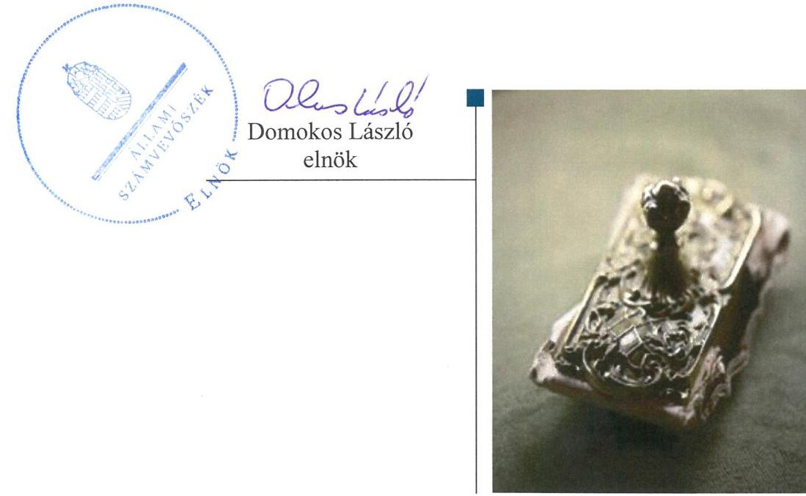

---

# AZ ELLENŐRZÉST FELÜGYELTE: 

HOLMAN MAGDOLNA JULIANNA felügyeleti vezető

## AZ ELLENŐRZÉST VEZETTE ÉS A VÉGREHAJTÁSÁÉRT FELELŐS:

GÖRGÉNYI GÁBOR ellenőrzésvezető

## A PROGRAM ÖSSZEÁLLÍTÁSÁÉRT FELELŐS:

JANIK JÓZSEF LÁSZLÓ osztályvezető

IKTATÓSZÁM: V-1047-474/2016.
TÉMASZÁM: 2081
ELLENŐRZÉS-AZONOSÍTÓ SZÁM: V0748

Jelentéseink az Országgyúlés számítógépes hálózatán és az Interneten a www.asz.hu címen is olvashatóak.

---

# TARTALOMJEGYZÉK 

■ ÖSSZEGZÉS ..... 5
■ AZ ELLENŐRZÉS CÉLJA ..... 7
■ AZ ELLENŐRZÉS TERÜLETE ..... 8
■ AZ ELLENŐRZÉS HÁTTERE, INDOKOLTSÁGA ..... 10
■ A JELENTÉS LÉNYEGES KÉRDÉSKÖREI ..... 12
■ ELLENŐRZÉS HATÓKÖRE ÉS MÓDSZEREI ..... 13
■ MEGÁLLAPÍTÁSOK ..... 15
■ JAVASLATOK ..... 27
■ MELLÉKLETEK ..... 29
I. Sz. melléklet: Értelmező szótár ..... 29
II. Sz. melléklet: A 2014. évi zárszámadás alapját képező éves beszámolóval kapcsolatos adatszolgáltatás folyamata ..... 32
■ FÜGGELÉK: ÉSZREVÉTELEK ..... 33
■ RÖVIDÍTÉSEK JEGYZÉKE ..... 53

---

.

---

# ÖSSZEGZÉS 

Az államháztartás információs rendszere müködtetését a Nemzetgazdasági Minisztérium és a Magyar Államkincstár 2014. és 2015. években a jogszabályi előírásoknak megfelelően látta el. A müködés belső szabályozottsága ugyanakkor nem biztositotta az elszámoltatható feladatellátást. Az államháztartás információs rendszere és a hivatalos statisztikai szolgálat között az adatok átvétele, a statisztikai adatok előállítása a jogszabályi előírásoknak megfelelően történt, támogatta az államháztartás pénzügyi folyamatainak tervezését, az előirányzatok kialakítását, a költségvetés végrehajtását és ellenőrzését, az adatok megfelelő előállítását.

## Az ellenőrzés társadalmi indokoltsága

Az államháztartás információs rendszere és a statisztikai szolgálat megbízható, jó múködésének alapvető szerepe van abban, hogy a kormányzat és szélesebb körben a gazdasági, társadalmi szereplők valós és hiteles információk alapján hozhassák meg döntéseiket, segíti a gazdasági-társadalmi folyamatok elemzését, az összefüggések feltárását, tájékoztatást ad a nemzetközi, magyar gazdaságra visszaható intézmények számára. Mindez egyrészt a "jó kormányzás" feltétele, másrészt előmozdítja a gazdasági hatékonyságot, a javak gazdaságilag és társadalmilag minél optimálisabb felhasználását.

Az információs, statisztikai rendszerekben esetlegesen előforduló adatszolgáltatási, adatkezelési anomáliák, adatmegbízhatósági problémák lehetséges hatása számottevő a közpénzekkel való megfelelő gazdálkodást, az államháztartási és a magyar gazdaságról bemutatott adatok hitelességét tekintve. Az államháztartás információs rendszere és a statisztikai szolgálat ellenőrzésével az Állami Számvevőszék elősegíti a „jó kormányzás" érvényesülését, támogatja az átláthatóság megteremtésére irányuló fokozott társadalmi elvárásnak való megfelelést.

## Főbb megállapítások, következtetések, javaslatok

Az államháztartás információs rendszerének kialakítása és múködése biztosította az adatok megfelelő előállítását. Az adatszolgáltatások támogatták az államháztartás pénzügyi folyamatainak tervezését, az előirányzatok kialakítását, a költségvetés végrehajtását és ellenőrzését. A 2014. évi zárszámadás alapját képező éves beszámolóval kapcsolatos adatszolgáltatás esetében a Nemzetgazdasági Minisztérium és a Magyar Államkincstár által ellátott feladatok, a kialakított kontrollok révén hozzájárultak az államháztartás információs rendszere megfelelő múködéséhez, biztosították a beszámoló adatok törvényjavaslatban szereplő adatokkal való egyezőségét.

A múködési folyamatok részletes belső szabályozottságának hiánya ugyanakkor kockázatnövelő tényezőként jelentkezett a rendszer megbízható múködtetésében, mert a Nemzetgazdasági Minisztérium és a Magyar Államkincstár belső szabályzatai nem biztosították a hatásköri és felelősségi viszonyok egyértelmú lehatárolását, nem tartalmazták az ellátandó feladatok részletes bemutatását. Így az nem garantálta a feladatellátásban résztevő szervezeti egységek számára a jogszabályok szerinti feladatellátás feltételeinek kialakítását. Mindez hátráltatta a számon kérhető, elszámoltatható, a felelősségi viszonyok érvényesítésére maradéktalanul alkalmas feladatellátást.

A statisztikai rendszerrel történő összhang biztosítása érdekében a Nemzetgazdasági Minisztérium kialakította a költségvetési tervezést megalapozó adatbázisokat, tájékoztatási eszközöket, fejlesztette a költségvetési tervezési módszerekhez illeszkedő adatbázisokat, múködtette az államháztartási statisztikai célú adatbázist.

A Központi Statisztikai Hivatal az Országos Statisztikai Tanács bevonásával megfelelően ellátta a hivatalos statisztikai szolgálat szakmai irányításával kapcsolatos feladatait. A hivatalos statisztikai szolgálat kialakítása és múködése,

---

az adatgyűjtések és adatátvételek végrehajtása biztosította az adatok megfelelő előállítását. A szolgálat egyes szerveinél feltárt belső szabályozási hiányosságok ellenére a feladatellátás során érvényesült a statisztikai tevékenység önállósága és a tájékoztatás függetlensége.

---

# AZ ELLENŐRZÉS CÉLJA 

## Az államháztartás információs rendszere, valamint a hivatalos statisztikai szolgálat múködésének ellenőrzése

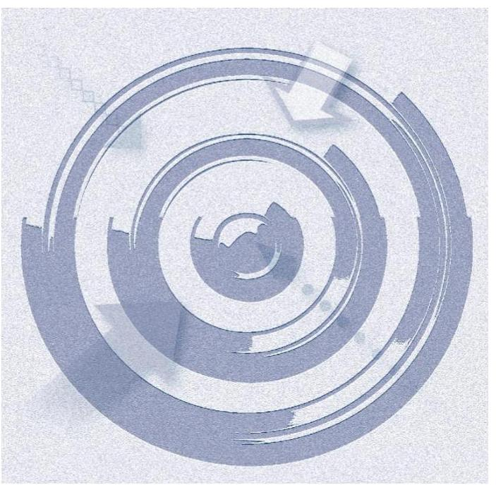

AZ ELLENŐRZÉS CÉLJA annak megállapítása volt, hogy az államháztartás információs rendszere és a hivatalos statisztikai szolgálat kialakítása, múködése mege-leelt-e a jogszabályi és egyéb (uniós) követelményeknek, valamint az adatok megfelelő előállítását biztosította-e.

---

# AZ ELLENŐRZÉS TERÜLETE 

## Az államháztartás információs rendszerének múködtetéséért és fejlesztéséért felelős intézmények, valamint a hivatalos statisztikai szolgálat múködésének ellenőrzésére kiválasztott intézmények

Az államháztartás információs rendszere az Áht. ${ }^{1}$ 103. § (2) bekezdése alapján az államháztartás egészére, a kormányzati szektorba sorolt egyéb szervezetekre és az államháztartással kapcsolatba kerülő természetes személyek, jogi személyek és jogi személyiséggel nem rendelkező egyéb szervezetek e kapcsolatára kiterjedő azonosító adatokat, költségvetési, pénzügyi, számviteli adatokat, és a költségvetési adatokhoz és információkhoz kapcsolódó naturális mutatószámokat gyűjtő, nyilvántartó, feldolgozó és szolgáltató információs rendszer.

Az államháztartás információs rendszere múködtetéséért és fejlesztéséért az államháztartásért felelős miniszter felelős, aki ezek ellátásáról a Kincstár útján gondoskodik. Az államháztartás információs rendszere tekintetében jelen ellenőrzés keretében ellenőrzött szervezet az NGM² és a Kincstár³. Az ellenőrzést az államháztartás információs rendszere keretében 6 kiválasztott adatszolgáltatás esetében végeztük el:
—2014. évi elemi költségvetés;
—2014. évi éves költségvetési beszámoló;
—Az Ávr. ${ }^{4}$ 169. § szerinti szervezetek 2014. évi Időközi költségvetési jelentése;
— Központi költségvetési szervek 2014. évi tartozásállománya;
— Helyi önkormányzatok, nemzetiségi önkormányzatok, társulások, térségi fejlesztési tanácsok 2014. évi adósságot keletkeztető ügyletei állománya;
— Kormányzati szektorba sorolt egyéb szervezetek 2014. évi adósságot keletkeztető ügyletei állománya;
Az államháztartás információs rendszerével kapcsolatos múködési feltételek kialakítását a kiválasztott adatszolgáltatások alapján értékeltük. Ezen belül értékeltük az adatszolgáltatások részletes szabályozottságát, az adatszolgáltatásokhoz kapcsolódó ellenőrzési rend kialakítását, az adatszolgáltatási és feldolgozási rend módosítását a 2014-ben bevezetett új számviteli szabályozásokkal összefüggésben, valamint az adatszolgáltatások felhasználási célját. A kiválasztott adatszolgáltatások a kötelező adatszolgáltatások közé tartoztak.

Az Stt. ${ }^{5}$ 3. § (1) bekezdése alapján a törvényben meghatározott statisztikai tevékenység ellátása a hivatalos statisztikai szolgálat feladata. A statisztikai rendszer kétféle módon kapcsolódik az államháztartás információs rendszeréhez. Egyrészt a statisztikai rendszer az államháztartás információs rendszerében gyüjtött és felhasznált adatokat átveszi (ennek jellemző

---

példája a beszámolók felhasználása a nemzeti számlák és az EDP jelentés összeállításához). Másrészt a statisztikai adatokat a költségvetés tervezésében, az előirányzatok kialakításában, a kitűzött célok év közbeni monitoringjában és éves értékelésében lehet hasznosítani.

A hivatalos statisztikai szolgálat $\mathrm{OSAP}^{6}$-ban résztvevő szervei közül jelen ellenőrzés keretében ellenőrzött szervezet a $\mathrm{KSH}^{7}$, az $\mathrm{ME}^{8}$, a $\mathrm{BM}^{9}$, az $\mathrm{FM}^{10}$, az $\mathrm{AKI}^{11}$ és az NGM. Ellenőrzött szervezet továbbá a FM-nek címzett OSAP adatgyűjtés végrehajtása tekintetében a NÉBIH ${ }^{12}$.

A hivatalos statisztikai szolgálat ellenőrzött szervezeteinél a statisztikai tevékenység megszervezését, kialakítását, továbbá az adatkezelésre, a statisztikai adat előállításra vonatkozó belső szabályozásokat a szervezetek által végrehajtott adatgyűjtések és adatátvételek vonatkozásában ellenőriztük. Ezek közül 9 kiválasztott adatgyűjtés (OSAP 1659, 1845, 2120, 2240, 1228, 1257, 2118, 1668, 2335) esetében mintavételes úton, 12 adatátvétel (OSAP 1919, 1921, 2037, 2038, 2039, 2040, 2041, 2042, 2043, 2046, 2125, 2198) esetében elemzéssel ellenőriztük az adatkezelés minőségét. Ennek keretében ellenőriztük, hogy az adatkezelés megfelelt-e a követelményeknek, biztosította-e az adatok megfelelő előállítását.

Az adatátvételek ellenőrzése kapcsán kiemelt figyelmet fordítottunk azokra az adatátvételekre (OSAP 2038, 2040, 2041, 2042, 2198), amelyeket a Kincstár ad át a KSH-nak az államháztartás információs rendszere keretében bekért és ellenőrzésre kiválasztott adatszolgáltatások alapján.

Az államháztartás információs rendszere és a hivatalos statisztikai szolgálat kijelölt adatszolgáltatásai, adatgyűjtései, adatátvételei esetében az adatkezelési folyamat főbb elemeit, azon belül a kockázatos területek múködését ellenőriztük.

---

# AZ ELLENŐRZÉS HÁTTERE, INDOKOLTSÁGA 

## Az államháztartás információs rendszere, valamint a hivatalos statisztikai szolgálat múködésének ellenőrzése

Magyarországon a statisztikai tevékenység feladatai végrehajtásában a KSH áll a középpontban. A KSH-nak nincs külön jogszabályi statútuma a múködésére, mint ahogy a statisztikai szolgálat többi szervére vonatkozó előírásokat is az Stt. határozza meg.

Magyarország uniós tagsága több vonatkozásban befolyásolja a statisztikai szolgálat múködését. Az Unió ${ }^{13}$ közvetlenül alkalmazandó rendeletben határoz meg követelményeket az európai statisztikai rendszer múködésére, amely így vonatkozik a hazai statisztikai szolgálatra is. A 223/2009/EK rendelet ${ }^{14}$ (11) cikkely (1) bekezdése szerint a Gyakorlati Kódex ${ }^{15}$ célja az európai statisztikák iránti általános bizalom biztosítása azáltal, hogy megállapítja az európai statisztikák fejlesztésének, előállításának, terjesztésének módját a statisztikai elvekkel és a statisztika legjobb nemzetközi gyakorlataival összhangban. Az ellenőrzés kiterjed a Gyakorlati Kódex alkalmazására.

A statisztikai szolgálat adatszolgáltatási kötelezettséggel járó statisztikai adatgyűjtési programjának tervezetét az Stt. 11. § (4) bekezdése alapján az $\mathrm{OST}^{16}$ véleményét megismerve - a KSH elnöke véglegesíti, majd ezt követően kerül kiadásra. A jogszabály mellékletei az illetékes statisztikai szolgálat szerint tételesen sorolják fel az adatgyűjtéseket. Az Unió statisztikai rendelete szerint a KSH látja el a kapcsolattartó szerepét az Európai Bizottság, illetve az Eurostat felé a statisztikával kapcsolatos ügyekben. Ez azt jelenti, hogy az OSAP több mint kétszáz különféle gyakoriságú (éves, negyedéves, havi vagy eseményhez kötődő) adatgyűjtése közül a KSH nemcsak a saját adatgyűjtéseit (az összes adatgyűjtés mintegy 60\%), hanem a statisztikai szolgálat más szerveitől átvett adatokat is továbbítja az Eurostat felé. A statisztikákat nemcsak az Eurostat, hanem a KSH is publikálja.

A statisztika és az információs rendszer összekapcsolásának követelménye az uniós jogalkotásban is megjelent. A statisztika megnövekedett jelentőségét, illetve a kiváló minőségű statisztikai adatok előállítása előfeltételéül szolgáló teljes körű és megbízható államszámvitelnek a kormányzati szektor valamennyi alszektorára kiterjedő alkalmazása terén a független szervezetek - így a számvevőszékek - szerepét hangsúlyozta a Tanács 2011/85/EU irányelve ${ }^{17}$ (2011. november 8.) a tagállamok költségvetési keretrendszerére vonatkozó követelményekről (költségvetési keretirányelv).

Az információs, statisztikai rendszerekben esetlegesen előforduló adatszolgáltatási, adatkezelési anomáliák, adat-megbízhatósági problémák lehetséges hatása számottevő a közpénzekkel való megfelelő gazdálkodást, az államháztartási és a magyar gazdaságról bemutatott adatok hitelességét tekintve.

Ugyanakkor a statisztikák szerepének felértékelődését a kormányzati-, gazdasági- és a civil szféra döntései megalapozásában, a végrehajtás ellenőrzésében - minden fontossága ellenére - sem lehet leszűkíteni a költség-

---

vetési-pénzügyi területre. A társadalmi-gazdasági élet fejlődésére vonatkozó információkkal kapcsolatos statisztikai tevékenység legalább ilyen mértékben fontos. Már csak azért is, mert a költségvetési-pénzügyi tervezés és végrehajtás sem nélkülözheti ezeket az adatokat.

Az európai uniós és nemzeti kormányzati döntéshozatalban és végrehajtásban a statisztikai adatoknak a közvetlenebb és szélesebb körű hasznosítási igénye egyre erősebb. Az utóbbi években az Unióban a statisztikai adatszolgáltatás fokozott figyelmet kapott. Ez abba a törekvésbe illeszkedett, amelynek célja, hogy az Európai Bizottságnak a tagállami költségvetésekre jobb rálátása legyen.

A statisztikai rendszerrel együtt jár az államháztartás információs rendszere minőségének kérdése is, mert az állam költségvetési-gazdálkodási szerepével kapcsolatos statisztikai adatok alapvetően az államháztartás információs rendszeréből származnak. A statisztikai rendszer és az államháztartás információs rendszere megbízható, jó működésének alapvető szerepe van abban, hogy a kormányzat és szélesebb körben a gazdasági, társadalmi szereplők valós és hiteles információk alapján hozhassák meg döntéseiket, mindez pedig a "jó kormányzás" feltétele.

Az ellenőrzés megállapításaival hozzájárulhat az említett rendszerek adatszolgáltatásainak megbízhatóbbá tételéhez, végső soron növelheti az államháztartási és statisztikai információk megbízhatóságát, így a gazda-sági-társadalmi döntések helyességét. Az ellenőrzés indokoltságát az is alátámasztja, hogy az ÁSZ ${ }^{18}$ még nem ellenőrizte átfogóan e rendszereket.

---

# A JELENTÉS LÉNYEGES KÉRDÉSKÖREI 

1. Az államháztartás információs rendszerének kialakítása és müködése megfelelt-e a követelményeknek, biztositotta-e az adatok megfelelő elóállitását?
2. A hivatalos statisztikai szolgálat kialakítása és müködése meg-felelt-e a követelményeknek, biztositotta-e az adatok megfelelő elóállitását?

---

# ELLENŐRZÉS HATÓKÖRE ÉS MÓDSZEREI 

## Az ellenőrzés típusa

Megfelelőségi ellenőrzés.

## Az ellenőrzött időszak

Az ellenőrzött időszak a 2014. évre vonatkozóan szolgáltatott adatok tekintetében a 2014-2015. évek. Szükség szerint - az ellenőrzés idején fennálló helyzet előzményeinek bemutatása érdekében - visszatekintve az adatgyűjtés tervezésének kezdő időpontjáig.

## Az ellenőrzés tárgya

Az ellenőrzés tárgyát képezték az államháztartás információs rendszerét működtető szervezeteknél és a statisztikai szolgálat OSAP-ban résztvevő, ellenőrzött szervezeteinél a statisztikai tevékenység ellátása során kialakított és alkalmazott szabályozási, szervezeti feltételek, módszertani megoldások, amelyek biztosítják az adatkezelés megfelelő minőségét, az adatok megbízhatóságát, nyilvánosságát. Továbbá az államháztartás információs rendszerének és a statisztikai információs rendszer összehangolása, harmonizációja érdekében ellátott koordináló, szakmai irányító tevékenység, amely biztosítja az adatgyűjtések/adatátvételek szakmai-módszertani megalapozottságát.

Az ellenőrzés kiterjedt minden olyan körülményre és adatra, amely az ÁSZ jogszabályban meghatározott feladatainak teljesítéséhez, valamint a program végrehajtása folyamán felmerült újabb összefüggések feltárásához szükséges.

## Az ellenőrzött szervezet

Az államháztartás információs rendszere tekintetében az NGM, a Kincstár, a Kincsinfo Nkft. ${ }^{19}$; a statisztikai szolgálat OSAP-ban résztvevő szervei közül a KSH, az ME, a BM, az FM, az AKI és az NGM. Ellenőrzött szervezet továbbá a FM-nek címzett OSAP adatgyűjtés végrehajtása tekintetében a NÉBIH.

## Az ellenőrzés jogalapja

Az ellenőrzés jogalapját az ÁSZ tv ${ }^{20}$. 5. § (2) és (6) bekezdésében foglaltak képezik.

---

# Az ellenőrzés módszerei 

Az ellenőrzést az ellenőrzési program szempontjai, az ellenőrzött időszakban hatályos jogszabályok, az ellenőrzés szakmai szabályai, a hatályos ÁSZ módszertan és a nemzetközi standardok figyelembevételével végeztük.

Az ellenőrzési kérdések megválaszolásához szükséges bizonyítékok megszerzése az ellenőrzött által rendelkezésre bocsátott dokumentumokra, adatokra alapozva tételes dokumentumellenőrzés, mintavételezés, megerősítés, kérdésfeltevés (információkérés, interjú), valamint összehasonlító elemzés útján történt.

Az ellenőrzési bizonyítékként felhasználható adatforrások közé tartoztak egyrészt a szakmai program részletes szempontjainál felsorolt adatforrások, másrészt minden egyéb - az ellenőrzés folyamán feltárt, az ellenőrzés szempontjából információt tartalmazó - dokumentum.

Az adatok megfelelő előállításának ellenőrzését mind az államháztartás információs rendszere, mind a hivatalos statisztikai szolgálat tekintetében egyes (kiválasztott) elemeknél, adatszolgáltatásoknál végeztük el.

Az ellenőrzés lefolytatásához az ellenőrzött szervezetek a tanúsítványok kitöltésével, valamint az ÁSZ által kért dokumentumok megküldésével szolgáltattak adatokat.

Mintavétellel ellenőriztük a Kincstárnál és az NGM-nél az államháztartás információs rendszere keretében teljesített adatszolgáltatások, valamint az adatszolgáltatásokkal kapcsolatos Kincstár által tett intézkedések szabályszerűségét. Mintavétellel ellenőriztük továbbá a KSH-nál, az MEnél, a BM-nél, az NGM-nél, a NÉBIH-nél, valamint az AKI-nál a hivatalos statisztikai szolgálat szervezetei által végzett adatgyűjtések keretében teljesített adatszolgáltatások szabályszerűségét. A minta alapján a sokaságban előforduló hibaarányt becsültük. Az értékelés eredményeként kétféle, "Megfelelő" és "Nem megfelelő" minősítést alkalmaztunk. „Megfelelőnek" értékeltünk egy ellenőrzött területet, amennyiben a hibaarány a teljes sokaságban 95\%-os bizonyossággal legfeljebb 10\% arányt képviselt. Abban az esetben, ha adott sokaság tekintetében a 10\%-os hibaarány küszöbérték átlépése megítélésének megbízhatósága nem érte el a 95\%-ot, akkor minősítettük "Megfelelő"-nek a területet, ha a minta alapján a teljes sokaság vonatkozásában a hibaarány nagyobb valószínűséggel volt 10\% alatti, mint $10 \%$ feletti.

---

# 1. Az államháztartás információs rendszerének kialakítása és müködése megfelelt-e a követelményeknek, biztosította-e az adatok megfelelő előállítását? 

Összegző megállapítás

Az államháztartás információs rendszerének kialakítása és müködése biztosította az adatok megfelelő előállítását, de a müködési folyamatok részletes belső szabályozottságának hiánya a jogszabályok szerinti feladatellátás feltételeinek kialakítását nem biztosította.
1.1. számú megállapítás

Az NGM és a Kincstár kialakította az államháztartás információs rendszerével kapcsolatos szervezeti és müködési feltételeket, de a vonatkozó belső szabályzatok nem biztosították a hatásköri és felelősségi viszonyok egyértelmú lehatárolását, nem tartalmazták az ellátandó feladatok bemutatását.

## AZ ÁLLAMHÁZTARTÁS INFORMÁCIÓS RENDSZERE KIALAKÍTÁSÁNAK ÉS MÚKÖDTETÉSÉNEK

Áht. 102-103. §-aiban foglalt feladatát az NGM és a Kincstár SZMSZ-ei, valamint a feladatellátásban érintett szervezeti egységek ügyrendjei tartalmazták, de az Ávr. 13. § (5) bekezdésben foglaltak ellenére a müködtetéssel kapcsolatban ellátandó feladatok részletszabályait, így a munkafolyamatok leírását, az érintett szervezeti egységek vezetőinek és alkalmazottainak feladat- és hatáskörét, a helyettesítés rendjét, továbbá a szervezeti egység költségvetési szerven belüli és azon kívüli kapcsolattartásának módját, szabályait az NGM és a Kincstár ügyrendjei, vagy más szabályzatai nem tartalmazták teljes körűen. A SZMSZ-ek szerinti feladatváltozások során elmaradt az ügyrendek aktualizálása.

Az NGM és a Kincstár ügyrendjeiben szereplő, az államháztartás információs rendszere müködtetésével összefüggésben kidolgozott ellenőrzési nyomvonalakat a Bkr. ${ }^{21}$ 6. § (3) bekezdésében foglaltak ellenére a szervezeti változásokból eredően nem aktualizálták rendszeresen, azok nem tartalmazták minden érintett szervezeti egység vonatkozásában a feladatellátásra vonatkozó felelősségi és információs szinteket és kapcsolatokat, az irányítási és ellenőrzési folyamatokat, ezáltal nem tették lehetővé azok nyomon követését és utólagos ellenőrzését. A nyomvonalak nem tükrözték az SZMSZ-ek változásával kapcsolatos szervezeti átalakulásokat, megváltozott feladatokat, felelősségi és, hatásköri viszonyokat.

Mindezek alapján az NGM-nél és a Kincstárnál az államháztartás információs rendszere müködtetésének belső szabályozottsága nem garantálta, hogy a feladatellátásban résztevő szervezeti egységek és munkatársak aktualizált, a folyamatokat, a felelősségi és hatásköri viszonyokat megfelelően lehatároló belső szabályrendszer alapján láthassák el feladataikat.

---

Az államháztartás információs rendszerének működtetése során az NGM a főbb adatszolgáltatások (lásd 1. táblázat) esetében szabályozta a Kincstárral történő együttműködés területeit és feladatait. A költségvetés tervezésével, a zárszámadás összeállításával kapcsolatban kiadott körirat és munkaprogram követelményeket fogalmazott meg az egyes szervezetekkel történt együttműködésre, az egyeztetésekre vonatkozóan.

1. táblázat

| AZ ELLENŐRZÉSRE KIVÁLASZTOTT ADATSZOLGÁLTATÁSOK |  |  |
| :--: | :--: | :--: |
| Adatszolgáltatás megnevezése | Adatszol-   gáltatás   címzettje | Alkalmazott informatikai   rendszer megnevezése |
| 2014. évi elemi költségvetések | Kincstár | KGR-K11 |
| 2014. évi éves költségvetési beszámolók | Kincstár | KGR-K11 |
| 2014. évi időközi költségvetési jelentések | Kincstár | KGR-K11 |
| 2014. évi tartozásállományok adatai | Kincstár | eAdat |
| 2014. évi adósságot keletkeztető ügyletek (ön-   kormányzati alrendszer / kormányzati szek-   torba sorolt egyéb szervezetek) | Kincstár/   NGM | KGR-K11 / email-ben |

Fonrás: saját szerkesztés
AZ ADATSZOLGÁLTATÁSI KÖTELEZETTSÉGEK teljesítésének módját, az adatfeldolgozás és az adatok ellenőrzésének részletes rendjét az NGM és a Kincstár - az eAdat rendszerben továbbított adatok kivételével - belső szabályzatban nem határozta meg, így nem volt biztosított a jogszabályok szerinti feladatellátás feltételeinek kialakítása:
$\longrightarrow$ Az NGM a kormányzati szektorba tartozó egyéb szervezetek adósságot keletkeztető ügyleteinek állományáról szóló adatszolgáltatás esetében az Ávr. 13. § (5) bekezdésében foglaltak ellenére nem határozta meg a feladatellátásban érintett szervezeti egységek ügyrendjében, vagy más szabályzatban az adatszolgáltatással kapcsolatos munkafolyamatok leírását, a kapcsolódó feladat- és hatásköröket, a feladat ellátással kapcsolatos szervezeten belüli és kívüli kapcsolattartás módját, szabályait.
$\longrightarrow$ A Kincstár az Ávr. 13. § (5) bekezdésében foglaltak ellenére az érintett szervezeti egységek ügyrendjeiben, vagy más szabályzatban - az eAdat rendszerben továbbított adatok kivételével - nem határozta meg az adatfeldolgozás és adatátadás, valamint azok ellenőrzési rendjét, a kapcsolódó munkafolyamatokat és a feladatellátással kapcsolatos hatásköri és kapcsolattartási szabályokat.
Az IBDR ${ }_{1-2}{ }^{22}$ előírásai, valamint a KGR-K11 informatikai rendszer adminisztrátori és felhasználói kézikönyvében kidolgozott, a felmerülő hibajelzések kezelésére, a logikai egyeztetésekre, az űrlapok teljes körűségére vonatkozó szabályrendszer, valamint a feltöltött adatok KGR-K11 rendszer által végrehajtott automatikus ellenőrzése biztosította az információs rendszerben továbbított adatok megbízhatóságát. A rendszer naplózási funkciója a gyakorlatban támogatta a jogosult és az illetéktelen felhasználói tevékenység figyelemmel kísérését, valamint a hibafelderítéseket is.
Az eAdat rendszerben továbbított, a központi költségvetési szervek tartozásállománya adatszolgáltatásából származó adatok gyűjtését,

---

ellenőrzését, feldolgozását, nyilvántartását a $\mathrm{KFF}^{23}$ ügyrendje, illetve a 28/2014. sz. Elnöki Utasítás megfelelően szabályozta.
Az adatszolgáltatások tartalmát, a mintául szolgáló űrlapokat az NGM állította össze, amelyet a Kincstár beépített a KGR-K11 rendszerbe, valamint az Áht. 107. § (2) bekezdésének megfelelően tájékozatót tett közzé a honlapján. A Kincstár elnöke a Kincstár SZMSZ ${ }_{1-2}{ }^{24}$ 4. §-a alapján gondoskodott az NGM által kért adatok, tájékoztatások rendelkezésre bocsátásáról.

# AZ INFORMÁCIÓS RENDSZER ÁLTAL KEZELT KÖZÉRDEKŰ ADATOK KÖZZÉTÉTELI RENDJÉT az 

NGM és a Kincstár kialakította, azonban az NGM közzétételi szabályzata nem felelt meg az NGM SZMSZ ${ }_{1,2,3}{ }^{25}$ 2. § (1) bekezdés előírásinak, mert nem aktualizálták. A szabályzat nem tartalmazott előírásokat az Ávr. 18/A. § (1) és (4) bekezdéseiben, valamint a 6. melléklet 22. pontjában 2014. január 1-jétől előírt, kötelezően közzéteendő adatokra vonatkozóan.

A Kincstár az SZMSZ-ben és belső szabályzatban (KASZ ${ }^{26}$ ) meghatározta a közérdekú adatok közzétételével kapcsolatos szervezeti feladatokat és felelősségeket.

## A 2014. ÉVBEN BEVEZETETT ÚJ ÁLLAMHÁZTARTÁSI SZÁMVITELI SZABÁLYOZÁSSAL összhangban az

NGM és a Kincstár módosította az adatszolgáltatások, adatfeldolgozások rendjét. Az NGM a jogszabályi változással összhangban módosította az adatszolgáltatással kapcsolatos űrlapokat, kitöltési útmutatókat és azok mellékleteit, majd a Kincstár rendelkezésére bocsátotta azokat. A Kincstár ennek megfelelően végrehajtotta a szükséges módosításokat az informatikai rendszerében és közzétette honlapján a rendelkezésére bocsátott útmutatót és a kapcsolódó dokumentumokat.

## AZ INFORMÁCIÓS RENDSZERT TÁMOGATÓ INFORMATIKAI RENDSZEREK ÜZEMELTETÉSI FEL-

ADATAIT, valamint a kapcsolódó hatáskörök és felelősség rendjét az NGM és a Kincstár meghatározta, amelyet az NGM IBSZ ${ }^{27}$, illetve a Kincstár SZMSZ ${ }_{1-4}$ és az IBDR $_{1-2}$ tartalmazott.
1.2. számú megállapítás

Az államháztartás információs rendszerének múködése támogatta az államháztartás pénzügyi folyamatainak tervezését, az előirányzatok kialakítását, a költségvetés végrehajtását és ellenőrzését.

## AZ EGYES ADATSZOLGÁLTATÁSBÓL SZÁRMAZÓ ADATOK GYÜJTÉSE, ELLENŐRZÉSE, FELDOLGO-

ZÁSA, NYILVÁNTARTÁSA a 2014. évi elemi költségvetés, a 2014. évi éves beszámolók és az önkormányzati alrendszer adósságot keletkeztető ügyletei esetében megfelelő volt; az időközi költségvetési jelentés, a tartozásállományok és kormányzati szektorba sorolt egyéb szervezetek adósságot keletkezető ügyletei esetében azonban nem felelt meg az Áht. és az Ávr., illetve a tartozásállományok esetében a belső szabályzat előírásainak:
A 2014. évi elemi költségvetéssel, a 2014. évi éves költségvetési beszámolóval, az időközi költségvetési jelentésekkel, a központi költ-

---

ségvetési szervek tartozásállományával és az önkormányzati alrendszer adósságot keletkeztető ügyleteivel kapcsolatos adatszolgáltatások esetében a Kincstár az Áht. 107. § (2) bekezdés előírásának megfelelően az Ávr. 169.-170. §-ai előírásaival összhangban nyomtatványt, elektronikus űrlapot alkalmazott, amelyek formájáról, tartalmáról, használatának, kitöltésének, benyújtásának módjáról információt nyújtott honlapján. Ezen kívül a KGR-K11 rendszerüzeneteiben is tájékoztatást adott az adatszolgáltatóknak
A KGR-K11 rendszerben elektronikusan kapott adatok ellenőrzését, a nyilvántartásba vétel szabályszerűségét, a rendszer a számviteli és egyéb szabályok, tiltások, valamint matematikai összefüggésekre vonatkozó, a programba épített szoftveres kontrollokkal (pl. az azonos tartalmú adatok kötelező egyezősége), illetve a teljes körű naplózási tevékenységével biztosította.
Az önkormányzati alrendszer költségvetési és költségvetési beszámoló információs űrlapjait, valamint az időközi költségvetési és mérlegjelentéseit a Kincstár SZMSZ1-4 előírása alapján az ÁHI ${ }^{28}$-khoz tartozó megyei irodák tartalmi és számszaki szempontból megvizsgálták, majd az esetleges hibajavítást követően lezárták.
$\longrightarrow$ Az időközi költségvetési jelentések adatszolgáltatása - a Kincstár ez irányú intézkedései ellenére - az adatszolgáltatók részéről több esetben az Ávr. 169. § (2) bekezdésében előírt határidőn túl történt meg.
$\longrightarrow$ A központi költségvetési szervek tartozásállományával kapcsolatos adatszolgáltatások esetében a Kincstár az adatfeldolgozást a KFF ügyrend ${ }^{29}$ 2. számú függelékében meghatározott határidőben (tárgyhót követő hónap 5. napja) nem teljes körűen végezte el. A hiányzó adatszolgáltatások teljesítése érdekében felvette a kapcsolatot az intézményekkel, így az adatszolgáltatás és feldolgozás a tárgyhót követő hónap 10-éig minden esetben megtörtént. Az alkalmazott eAdat rendszer alkalmas volt a betöltött adatállomány teljes körűségének ellenőrzésére és a technikai hibák kiszűrésére.
$\longrightarrow$ A kormányzati szektorba sorolt egyéb szervezetek adósságot keletkezető ügyleteinek állományáról szóló, az NGM részére elektronikus levelezési rendszerben teljesítendő adatszolgáltatás nem felelt meg az Áht. 107. § (1) bekezdésében foglaltaknak. Az NGM az Ávr. 7. melléklete 2. pontjában szereplő adatszolgáltatók tekintetében összesítette az adatokat, de azokat nem az ott felsorolt teljes kötelezetti körtől, hanem csak a 2014. évi tervezési köriratban szereplő 25 gazdasági társaságtól kérte be. A számításoknál az adatszolgáltatásba be nem vont szervezetek esetében, azok előző évi tényadataiból számított, becsült adatokat vették figyelembe.
Az NGM az adatszolgáltatást a kötelezettek Ávr. 7. melléklete alapján teljesítendő további adatszolgáltatásai (eredmény kimutatás, mérleg, cash-flow kimutatás) összevetésével manuálisan ellenőrizte a teljes körűség és megfelelőség szempontjából.
Az Ávr. 2016. január 1-jétől hatályos módosítása alapján a Gst. szerinti adósságállománnyal, vagy adósságot keletkeztető ügylet megkötésére vonatkozó engedéllyel rendelkező kormányzati szektorba

---

sorolt egyéb szervezet már csak akkor válik adatszolgáltatásra kötelezetté, ha a tulajdonosi joggyakorlója útján vagy közvetlenül kapott kiértesítést a rendszeres adatszolgáltatásról.
Az adatszolgáltatások - a bemutatott hiányosságok ellenére - a gyakorlatban támogatták az államháztartás pénzügyi folyamatainak tervezését, az előirányzatok kialakítását, a költségvetés végrehajtását és ellenőrzését.

# A PÉNZÜGYI FOLYAMATOK ÉS A KÖLTSÉGVETÉS TERVEZÉSÉHEZ, ILLETVE ANNAK VÉGREHAJTÁ- 

SÁHOZ SZÜKSÉGES ADATOKAT az államháztartás információs rendszerében az NGM és a Kincstár által végrehajtott egyes adatszolgáltatások biztosították.

Az adatszolgáltatások az Áht. 102. § (1) bekezdés előírásának megfelelően támogatták az államháztartás pénzügyi folyamatainak tervezését, az előirányzatok kialakítását, a költségvetés végrehajtását és ellenőrzését.

## A LÉNYEGESNEK MINŐSÜLŐ INFORMÁCIÓK HIÁ-

NYA VAGY TÉVES BEMUTATÁSA esetében a Kincstár intézkedett az Áht. 108. § (3) bekezdésében és az Ávr. 171. § (1) bekezdésében szabályozott bírság megfizetése érdekében. A téves vagy hiányos adatszolgáltatás esetén határozatot hoztak, melyek tartalmazták az előírt bírság mértékét. Az adatszolgáltatásra kötelezettek ismételt mulasztása esetén az Ávr. 171. § (3) bekezdésének előírásának megfelelően intézkedtek az újabb bírság kiszabása érdekében.

## A ZÁRSZÁMADÁS ALAPJÁT KÉPEZŐ ÉVES BESZÁMOLÓVAL KAPCSOLATOS ADATSZOLGÁLTATÁS esetében az NGM és a Kincstár által ellátott feladatok, a kialakított kontrollok révén hozzájárultak az államháztartás információs rendszere megfelelő működéséhez, biztosították a beszámoló adatok törvényjavaslatban szereplő adatokkal való egyezőségét.

Az NGM a 2014. évi költségvetés végrehajtásáról szóló törvényjavaslat előkészítéséhez munkaprogramot, valamint útmutatót adott ki, amelyben meghatározta a törvényjavaslat összeállításának menetrendjét.

A törvényjavaslat adatainak tárolása az $\mathrm{AHAB}^{30}$ rendszerben, a törvényjavaslat összeállításához szükséges adategyeztetések és adatszolgáltatási feladatok végrehajtása pedig a $\mathrm{KAR}^{31}$-ban történt. A Kincstár által a KGRK11 rendszerből szolgáltatott adatokat az NGM átvette és a KAR-ban publikálta. A Kincstár az NGM által előírt javításokat mind a KGR-K11 rendszer beszámolói, mind pedig a főkönyvi nyilvántartások esetében elvégezte. Az AHAB és a KAR adatainak szinkronizálása automatikusan biztosított volt.

Az NGM a KAR zártságát biztosító kontrollok kialakításaként 2014-ben kidolgozta a KAR Jogosultságkezelési Szabályzatát, amely részletesen szabályozta a felhasználók jogait, valamint az új felhasználók regisztrálására és a meglévő jogosultságok módosítására vonatkozó előírásokat. A KAR-t alkalmassá tették naplóbejegyzések előállításra, ami biztosította a beszámolási időszak részletes és teljes körű naplózósát, továbbá az adatszolgáltatással kapcsolatos elektronikus levélforgalom is archiválásra került. Az adatszolgáltatás folyamatának részletes leírását a 2. melléklet tartalmazza.

---

# AZ ÁLLAMHÁZTARTÁS INFORMÁCIÓS RENDSZERÉBŐL SZÁRMAZÓ ADATOK a költségvetés tervezése, az előirányzatok kialakítása, a költségvetési célok év közbeni monitoringja és az éves értékelés során hasznosultak. 

Az NGM és a Kincstár az államháztartás információs rendszeréből származó adatok alapján gyorsjelentésekben, tájékoztatókban és mérleg prognózisokban havonta jelezte a költségvetési pénzforgalomból kirajzolódó folyamatokat, bemutatta a központi alrendszer költségvetésének finanszírozását, a központi költségvetési szervek és fejezeti kezelésű előirányzatok adott havi gazdálkodását és a gazdálkodásukkal összefüggő adatokat.

## A STATISZTIKAI RENDSZERREL TÖRTÉNŐ ÖSSZ-

HANG biztosítása érdekében az NGM intézkedéseket tett. Kialakította a költségvetési tervezést megalapozó adatbázisokat, tájékoztatási eszközöket, igény esetén fejlesztette a költségvetési tervezési módszerekhez illeszkedő adatbázisokat, múködtette az államháztartási statisztikai célú adatbázist és tájékoztatási eszközöket. Meghatározásra került, hogy a költségvetési tervezésbe, középtávú előrejelzésbe mely állami gazdasági társaságok kerülnek bevonásra annak érdekében, hogy az ESA 2010 szerinti hiány és adósságállomány alakulásáról középtávú előrejelzés készülhessen.

A kormányzati szektor statisztikáinak meghatározó adatforrása az államháztartás információs rendszere volt, ennek részeként az államháztartás szervezeteinek éves és évközi beszámolói, amit kiegészített a kormányzati szektorba sorolandó vállalatok és non-profit szervezetekről történő statisztikai adatgyűjtés, továbbá a kormányzati szektor egészére vonatkozó bank- és értékpapír-statisztikai adatgyűjtés.

AZ INFORMÁCIÓS RENDSZER ÁLTAL KEZELT KÖZÉRDEKŰ ADATOK KÖZZÉTÉTELI RENDJÉT az NGM és a Kincstár múködtette. Az NGM a kezelt közérdekú adatokat a honlapján az előírt határidőben közzétette. A Kincstár a 2011/85 Tanácsi irányelv, illetve az Ávr. 8. mellékletének megfelelően a rá vonatkozó kötelezően közzéteendő 2014. évi adatokat a honlapján szintén közzétette.
1.3. számú megállapítás

Az államháztartás információs rendszerének múködése összhangban volt a hazai és nemzetközi statisztikai adatszolgáltatási kötelezettségekkel, a nemzeti számlák rendszerével.

AZ ÁLLAMHÁZTARTÁS INFORMÁCIÓS RENDSZERÉHEZ KAPCSOLÓDÓ STATISZTIKAI FELADATOK az Áht. 102. § (2) bekezdésével összhangban összehangolásra kerültek az OSAP programmal. A KSH az államháztartás funkcionális kiadásainak osztályozásához kidolgozta az államháztartási pénzügyi adatok statisztikai célokra történő felhasználásának módszertanát, melyhez az NGM javaslatot tett a statisztikai adatigények beépítésére az államháztartás könyvvezetési és beszámolási rendszerébe.

A kormányzati pénzügyi statisztikai területén egyablakos adatszolgáltatás érvényesült. A KSH által az Eurostat-nak jelentett adatok elérhetőek voltak az IMF ${ }^{32}$, az $\mathrm{OECD}^{33}$ és más nemzetközi szervezetek részére is.

---

AZ EDP JELENTÉSHEZ kapcsolódó adatszolgáltatási kötelezettségét az NGM teljesítette. A Bizottság részére a tervezett és tényleges kormányzati hiányról és az államadósság szintjéről évente a 479/2009/EK Rendelet ${ }^{34} 3$. cikk (1) bekezdése alapján kétszer történt adatszolgáltatás.

# 2. A hivatalos statisztikai szolgálat kialakítása és múködése meg-felelt-e a követelményeknek, biztosította-e az adatok megfelelő előállítását? 

Összegző megállapítás

## 2.1. számú megállapítás

A hivatalos statisztikai szolgálat kialakítása és múködése biztosította az adatok megfelelő előállítását.

A hivatalos statisztikai szolgálat szerveinél a statisztikai tevékenység megszervezése és kialakítása biztosította az adatok megfelelő előállítását.

Az ME és az AKI az OSAP rendelet ${ }^{35}$ szerinti adatgyűjtéseket saját szervezete útján valósította meg. A BM, az FM és az NGM egyes adatgyűjtéseihez az irányítása alá tartozó, vagy más költségvetési fejezethez tartozó költségvetési szerveket, illetve a KSH egy gazdasági társaságot vont be. A feladatok delegálása az intézményi SZMSZ-ek kiadásával, illetve együttműködési megállapodások megkötésével szabályszerűen megtörtént.

Az NGM két adatgyűjtését (OSAP 1485 és 1572 számú) a minisztérium által irányított, 2014. december 31-i hatállyal jogutód nélkül megszűnt $\mathrm{NMH}^{36}$ Munkahigiénés és Foglalkoztatás-egészségügyi Főosztálya végezte. A főosztály feladatait a 320/2014. (XII. 13.) Korm. rendelet ${ }^{37}$ alapján 2014. december 15 -től az $\mathrm{OTH}^{38}$ látta el.
2.2. számú megállapítás

A hivatalos statisztikai szolgálat szerveinél az adatkezelésre, a statisztikai adat előállítására és továbbításra vonatkozó belső szabályozások összességében nem feleltek meg a jogszabályi előírásoknak, nem tartalmazták az ellátandó feladatok bemutatását.

Az ME, az FM, a NÉBIH, az AKI és az NGM esetében a statisztikai tevékenység belső szabályozása nem felelt meg a követelményeknek:
$\longrightarrow$ A statisztikai adatgyűjtési tevékenységet az SZMSZ-ben (ME és NGM), az ügyrendekben (ME, FM, NÉBIH, AKI, NGM), vagy más belső szabályozásban nem szabályozták. Ebből eredően azok az Áht. 10. § (5) bekezdése és az Ávr. 13. § (5) bekezdésében előírtak ellenére nem tartalmazták a statisztikai adatgyűjtési feladatok tekintetében a munkafolyamatok leírását, a szervezeti egységek vezetőinek és alkalmazottainak feladat- és hatáskörét, a helyettesítés rendjét, továbbá a szervezeti egység költségvetési szerven belüli belső és azon kívüli külső kapcsolattartásának módját, szabályait.
$\longrightarrow$ Az adatok felülvizsgálatához, ellenőrzéséhez nem határoztak meg kontrollpontokat. Az ellenőrzési nyomvonalak a Bkr. 6. § (3) bekezdésében foglaltak ellenére a statisztikai tevékenység vonatkozásá-

---

ban nem tartalmazták a felelősségi és információs szinteket és kapcsolatokat, irányítási és ellenőrzési folyamatokat, ezáltal nem tették lehetővé azok nyomon követését és utólagos ellenőrzését.
A statisztikai adatgyűjtés az ME esetében eseti, írásban kiadott utasítások alapján került végrehajtásra, a NÉBIH esetében pedig a munkaköri leírások tartalmazták az adatgyűjtési feladatokat. Mindezek biztosították az adatgyűjtési feladat végrehajtását, de szervezeti szinten nem volt biztosított a felelősségi és hatásköri viszonyok egyértelmű lehatárolása.

Az ME és az NGM esetében a statisztikai adatgyűjtéssel és továbbítással kapcsolatos feladatok a munkaköri leírásokban a Kttv. ${ }^{39}$ 75. § (1) d) bekezdése ellenére nem szerepeltek. Az FM esetében az adatgyűjtések koordinálásának feladata szerepelt munkaköri leírásokban.

A KSH és a BM az Áht. 10. § (5), valamint az Ávr. 13. § (5) bekezdéseivel összhangban, az SZMSZ-ben, illetve a szervezeti egységek ügyrendjeiben részletesen meghatározta a statisztikai tevékenység ellátásának rendjét. Az AKI esetében az SZMSZ-ben rögzített általános szabályozás mellett részletesen az éves munkatervek tartalmazták a statisztikai adat előállításának folyamatához a felelős személyeket, azok feladatait, a betartandó határidőket és a felelősségi rendet.

A feladatellátás során az intézményeknél érvényesült az Stt. 3/A. §-ában foglalt statisztikai tevékenység működésének önállósága és a tájékoztatás függetlensége.

# A STATISZTIKAI SZOLGÁLATON BELÚLI ADAT- 

TOVÁBBÍTÁS módját és a nyilvánosságra hozható adatokhoz való külső hozzáférés biztosításának rendjét az Áht. 10. § (5) és az Ávr. 13. § (5), valamint a Bkr. 6. § (2) bekezdésével összhangban, tekintettel az Stt. 17. és 20-24. §-aiban meghatározott statisztikai adatnyilvánosságra, adattovábbításra és tájékoztatásra vonatkozó előírásokra, a KSH, a BM és az AKI belső szabályzatokban (SZMSZ, ügyrend, ügyrendi leírás, miniszteri rendelet, elnöki utasítás stb.) megfelelően szabályozta.

Az ME az OSAP rendelet szerint gyűjtött adatok továbbítási rendjét esetileg kialakított eljárási szabályokban rendezte, amely a gyakorlatban az adatszolgáltatók részére írásban kiküldött, az egyes adatgyűjtésekhez tartozó adattáblákat és a hozzájuk tartozó kitöltési útmutatókat jelentette. A nyilvánosságra hozatalt a közigazgatásért felelős államtitkár eseti jóváhagyással engedélyezte. Az ME által alkalmazott gyakorlat biztosította az Stt. 17. és 20-24. §-ai előírásainak betartását.

A KSH, az ME, a BM és az AKI adattovábbításra vonatkozó szabályozásai eleget tettek az Info. tv. ${ }^{40}$ 7. § (2) bekezdésében meghatározottaknak, biztosították az Info tv.-ben foglaltak, valamint az egyéb adat- és titokvédelmi szabályok érvényre juttatását.

Az FM, a NÉBIH és az NGM adattovábbításra vonatkozó belső szabályozásainak hiánya sérti az Info. tv. 7. § (2) bekezdésében foglaltakat, mert szabályozási szinten nem volt biztosított az Info tv.-ben foglaltak, valamint az egyéb adat- és titokvédelmi szabályok érvényre juttatása. Az adatgyűjtések nem tartalmaztak különleges, vagy minősített adatot. Az egyedi adatok védelme a gyakorlatban biztosított volt, az Stt. 17. § (1) bekezdése alapján nyilvánosságra hozott adatokban egyedi adat nem szerepelt.

---

# A NEMZETKÖZI SZERVEZETEK RÉSZÉRE TÖRTÉNŐ ADATÁTADÁST a BM és az FM az Stt 22. § (2) bekezdésében foglalt előírásokkal összhangban szabályozta. A KSH szintén rendelkezett hatályos belső szabályozással a statisztikai adatok Stt. 6. § (1) bekezdés i) pontjában előírt, a nemzetközi szervezetek részére történő szolgáltatására vonatkozóan.

A NÉBIH az ENSZ ${ }^{41}$ és az Eurostat felé történő erdészeti témájú adatszolgáltatásokat az irányító szerv által jóváhagyott NÉBIH SZMSZ ${ }^{42}$-ben szereplő feladatkijelölés alapján teljesítette. A feladat szerepelt az érintett dolgozók munkaköri leírásaiban, ugyanakkor az Stt. 22. § (2) bekezdésében foglaltak ellenére a kért adatokat megállapodás és a KSH előzetes tájékoztatása nélkül adták át.
2.3. számú megállapítás

## A KSH intézkedett az Európai statisztika Gyakorlati Kódexében foglaltak alkalmazására, értékelte a Gyakorlati Kódex alkalmazásának helyzetét.

A 223/2009/EK rendelet 1. cikkelye előírásának megfelelően a KSH az európai statisztikák fejlesztését, előállítását és közzétételét összességében a Gyakorlati Kódex követelményeivel összhangban valósította meg, statisztikai feladatellátása során megfelelő intézkedéseket tett a Gyakorlati Kódex alkalmazására és önértékelést készített annak alkalmazásáról.

Az önértékelések keretében a KSH bemutatta a Gyakorlati Kódex mindegyik elvére a saját értékelése szerinti erősségeit, gyengeségeit, innovatív gyakorlatait, megoldásait.
2.4. számú megállapítás

## A hivatalos statisztikai szolgálat keretében végzett adatgyűjtések és adatátvételek végrehajtása biztosította az adatok megfelelő előállítását.

AZ ADATGYÚJTÉSEK TERVEZÉSE az intézményeknél megfelelt az Stt., az Str. ${ }^{43}$ és az OSAP rendelet előírásainak.

A NÉBIH esetében a tervezéssel összefüggésben hiányosság volt, hogy az Str. 7. § (3) bekezdésében foglaltak ellenére nem gondoskodott arról, hogy az OSAP 1257 számú adatgyűjtés esetében az adatszolgáltató az adatszolgáltatási kötelezettségét a tárgyévet megelőző év december 15-ig megismerje, de az OSAP rendelet 3. § (3) bekezdésében előírtaknak megfelelően 30 nappal az adatszolgáltatási kötelezettség határidejét megelőzően értesítette az adatszolgáltatókat adatszolgáltatási kötelezettségükről.

Az ellenőrzésre kiválasztott adatgyűjtéseket és adatátvételeket a 2. és 3. táblázat tartalmazza:

---

| AZ ELLENŐRZÉSRE KIVÁLASZTOTT 2014. ÉVI OSAP ADATGYŰJTÉSEK |  |  |
| :--: | :--: | :--: |
| Ellenőrzött   szervezet | Nyilvántartási   szám | Megnevezés |
| KSH | 1659 | Alapinformációk a települési önkormányzatok illetékességi területén müködő, infrastrukturális szolgáltatást nyújtó gazdasági szervezetekről |
| KSH | 1845 | Éves gazdaságstatisztikai jelentés |
| KSH | 2120 | Egészségügyi kiadás és bevétel adatok |
| KSH | 2240 | Éves beruházás-statisztikai jelentés |
| ME | 2118 | Külföldiek magyarországi ingatlanszerzésének engedélyezéséről szóló statisztika |
| BM | 1228 | Egységes nyomozó hatósági és ügyészségi bűnügyi statisztika |
| FM-NÉBIH | 1257 | Nettó fakitermelés |
| AKI | 2335 | Az élelmiszeripari beruházások és pénzügyi mutatók alakulása |
| NGM-NMH | 1668 | Adatszolgáltatás az egyéni illetményekről és keresetekről |

3. táblázat

AZ ELLENŐRZÉSRE KIVÁLASZTOTT 2014. ÉVI OSAP ADATÁTVÉTELEK

| Ellenőrzött   szervezet | Nyilvántartási   szám | Megnevezés |
| :--: | :--: | :-- |
| KSH | 1919 | Családtámogatási ellátások éves és területi adatai |
| KSH | 1921 | Családtámogatási ellátások havi adatai |
| KSH | 2037 | Központi költségvetési szervek mérlegjelentése |
| KSH | 2038 | Önkormányzati költségvetési szervek mérleg- jelentése és költségvetési jelentése |
| KSH | 2039 | Központi költségvetési szervek, önkormányzatok és önkormányzati költségvetési szervek törzsadattára |
| KSH | 2040 | Központi költségvetési szervek éves költségvetési beszámolója |
| KSH | 2041 | Helyi önkormányzatok éves költségvetési beszámolója |
| KSH | 2042 | Központi költségvetési szervek és helyi önkormányzatok költségvetése |
| KSH | 2043 | A kormányzati szektorba sorolt vállalkozások negyedéves adatai |
| KSH | 2046 | Költségvetési zárszámadás közgazdasági/funkcionális adatai |
| KSH | 2125 | Az Európai Uniótól kapott illetve az Európai Uniónak fizetett transzferek |
| KSH | 2198 | Havi jelentés a központi költségvetés kiadásainak és bevételeinek alakulásáról |

Forrás: OSAP rendelet alapján saját szerkesztés

# AZ ADATGYŰJTÉSEK, ADATÁTVÉTELEK VÉGRE- 

HAJTÁSA - a KSH és az NGM egyes adatgyűjtései, adatátvételei kivételével - az Stt., az Str. és az OSAP rendelet előírásainak megfelelően történt.

A KSH-nál az Stt. 6. § (1) bekezdés a) pontja, és az OSAP rendelet 2. § (1), (4) bekezdése ellenére nem történt meg az OSAP 2120 számú adatgyűjtés végrehajtása az OSAP rendelet 1. mellékletében meghatározott határidőig. A KSH az Stt. 9/B. § (1) bekezdése b) pontja alapján nem kezdeményezte a kormányhivatalnál a közigazgatási bírság megállapítását. A KSH az adatok kigyűjtését a 2014. évi zárszámadási adatokból valósította meg.

A KSH nem hajtotta végre továbbá az OSAP 2042, 2046, 2125 számú adatátvételeket sem az OSAP rendelet 1. mellékletében meghatározott határidőig. A Kincstár, mint az OSAP 2042 számú adatátadás kizárólagos és az OSAP 2125 számú adatátadás részbeni kötelezettje, valamint az NGM mint az OSAP 2046 adatátadás kötelezettje az adatátadási kötelezettségének az Stt. 21. §. (1) bekezdése és az OSAP rendelet 2. § (1) bekezdése, illetve 1. melléklete ellenére nem tett eleget. A KSH az Stt. 9/B. § (1) bekezdése b)

---

pontja alapján ezekben az esetekben sem kezdeményezte a kormányhivatalnál a közigazgatási bírság megállapítását. A szükséges adatokat a végrehajtott hasonló témájú adatátvételek felhasználásával állította elő a KSH.

A NGM-nél az OSAP rendelet 2. § (1) bekezdése ellenére nem történt meg teljes körűen az NMH részére delegált OSAP 1668 számú adatgyűjtés végrehajtása az OSAP rendelet 8. mellékletében meghatározott határidőig. Az adatszolgáltatás 2014. július 11-ei határideje ellenére az adatok teljes körű beérkezése 2014. július 29-én történt meg.

A beérkezett adatok teljes körűsége és megbízhatósága érdekében a KSH, az ME, a BM, a NÉBIH, az AKI és az NGM az alkalmazott elektronikus rendszerek beépített kontrolljai révén, vagy manuális úton ellenőrzéseket végzett. Az intézmények az Stt. 9. § (3) bekezdésben biztosított - az adatszolgáltatóknál végrehajtható - ellenőrzési joggal az ellenőrzött adatgyűjtések, adatátvételek esetében nem éltek.

Az adatok feldolgozása és összesítése alapján a statisztikák előállítása megtörtént. A statisztikai adatok hasznosítása megfelelt az Stt. 6. § 1. bekezdés i) pontja, a 17. § (1) bekezdése és 22-24. §-ai, valamint az Str. 1921. §-ai előírásainak. Az előállított statisztikai adatokat a KSH, az ME, a BM, a NÉBIH, az AKI és az NGM a honlapján elérhetővé tette.

A KÖLTSÉGHATÉKONYSÁG szempontjainak érvényesülése érdekében a KSH, a BM és az AKI érvényesítette a statisztikáról szóló 223/2009/EK rendelet 2. cikk (1) bekezdésének f) pontjában megfogalmazottakat, amely szerint a statisztika előállítási költségeinek arányban kell állniuk az eredmények fontosságával és a várt előnyökkel, az erőforrásokat optimálisan kell felhasználni és mérsékelni kell a válaszadói terhet:

- A KSH-nál elsősorban az informatikai fejlesztési projektek célrendszerében jelent meg az adatszolgáltatók adminisztratív terheinek csökkentése, az adat ellenőrzés automatizálása az adatfeldolgozás során, valamint a speciális szakértelem igényének csökkenése az adatfeldolgozónál.
- A BM az OSAP 1228 számú adatgyűjtése során az erőforrások optimális kihasználása érdekében az alapadatait, a rendőrségeken, az ügyészségen és a NAV ${ }^{44}$-nál használt Robotzsaru integrált ügyviteli, ügyfeldolgozó, és elektronikus iratkezelő rendszerből vette át, mérsékelve a válaszadói terhet.
- Az AKI költséghatékonyságra vonatkozóan elemzéseket végzett. Az elemzések eredményeit felhasználva készítette el a statisztikai adatgyűjtésekre vonatkozón éves költségtervet.
Az ME és a NÉBIH esetében az adatgyűjtés folyamatának egyszerűségéből eredően minimális erőforrás igénybevételével végezték el az adatok feldolgozását, ami már nem volt tovább egyszerűsíthető.
2.5. számú megállapítás

A KSH az előírásoknak megfelelően ellátta a hivatalos statisztikai szolgálat tevékenységének összehangolásával, szakmai irányításával, a statisztikát érintő jogszabályok véleményezésével kapcsolatos feladatait

AZ OSAP ÖSSZEÁLLÍTÁSÁVAL, KOORDINÁLÁSÁ-
VAL és a végrehajtás figyelemmel kísérésével kapcsolatos feladatokat a

---

KSH megfelelően ellátta. Az Stt. 6. § (1) e), és a 11. § (2) előírásainak megfelelően összeállította az OSAP tervezetét, amelyet az Stt. 11. § (3) pontja alapján véleményezés céljából az OST elé terjesztett. Az OSAP rendelet 4. § alapján az adatgyűjtések nyilvántartási rendszerét kialakította és vezette, a program végrehajtást figyelemmel kísérte. A tervezés előkészítéseként egyeztetést kezdeményezett a hivatalos statisztikai szolgálat szerveivel. Az adatgyűjtésekről, adatátvételekről részletes beszámolót készített.

# A HIVATALOS STATISZTIKAI SZOLGÁLAT ÉS 

MÁS INFORMÁCIÓS RENDSZEREK statisztikai tevékenységének egységesítésére, a statisztikai tevékenységek összehangolására irányuló, valamint a szakmai irányítói feladatait a KSH az Stt. 6. § (1) b) bekezdésének megfelelően ellátta. Az Stt. 6. § (1) f-g) pontjában meghatározottak szerint közreműködött statisztikai osztályozások, számjelek kialakításában, más információrendszerek, a nyilvános, a közhitelű és egyéb nyilvántartások, valamint az adatgyűjtések fogalmi és osztályozási rendszerének kialakításában.

## A TÁJÉKOZTATÁSI RENDSZER KIALAKÍTÁSA SO-

RÁN érvényesült a KSH Stt. 22. § (2) bekezdésében foglalt összehangoló szerepe az eDAMIS rendszer működtetése révén. A rendszer a $\mathrm{HSSz}^{45}$ szerveinek biztosított egységes adatszolgáltatási felületet a hazai és nemzetközi szervezetek felé teljesítendő adatszolgáltatásokhoz.

## A STATISZTIKÁVAL ÖSSZEFÜGGŐ JOGSZABÁ-

LYOK ELŐKÉSZÍTÉSÉBEN a KSH az Stt. 6. § (1) bekezdés m) pont előírásainak megfelelően részt vett. A KSH előkészítette és koordinálta az OSAP rendelet módosító indítványát. A KSH részt vett továbbá a Stt. módosítását kezdeményező előterjesztés elkészítésében is.
2.6. számú megállapítás

Az OST ellátta a statisztikai tevékenységekkel összefüggő véleményezési feladatát.

## A KSH FELADATELLÁTÁSÁVAL KAPCSOLATOS KÖZREMŰKÖDÉSI ÉS VÉLEMÉNYEZÉSI KÖTELE-

ZETTSÉGÉNEK az OST eleget tett. Az Stt. 11. § (3) bekezdése alapján véleményezte az OSAP tervezetét. A KSH bevonta az OST-t az Stt. 6. § (1) f) pontjában meghatározott feladatokba, véleményezésre terjesztette az Stt. 19. § (3) pontjában meghatározott statisztikai adatbázisokra vonatkozó összekapcsolási szabályokat. Az Str. 3. § (2) bekezdés a) pontjában foglalt közreműködési kötelezettségének ugyanakkor az OST nem tudott eleget tenni, amely az Stt. 6. §-ának g) pontjában meghatározott más információrendszerek fogalmi, osztályozási rendszerének kialakítására és annak a statisztikai információs rendszerrel történő összehangolására vonatkozott.

---

# JAVASLATOK 

Az ÁSZ tv. 33. § (1) bekezdésében foglaltak értelmében az ellenőrzött szervezet vezetője köteles a jelentésben foglalt megállapításokhoz kapcsolódó intézkedési tervet összeállítani és azt a jelentés kézhezvételétől számított 30 napon belül az ÁSZ részére megküldeni. Amennyiben az ellenőrzött szervezet vezetője nem küldi meg határidőben az intézkedési tervet, vagy továbbra sem elfogadható intézkedési tervet küld, az Állami Számvevőszék elnöke az ÁSZ tv. 33. § (3) bekezdése a) és b) pontjaiban foglaltakat érvényesítheti.

## A nemzetgazdasági miniszternek

1. Intézkedjen, hogy az államháztartás információs rendszerének kialakítása biztosítsa az elszámoltatható feladatellátást.
(1.1. számú megállapítás 1., 2. és 5. bekezdése alapján)

## A Magyar Államkincstár elnökének

1. Intézkedjen az Áht. által elöirt, az államháztartás információs rendszerével kapcsolatos feladatok ellátása tekintetében a jogszabályok által elöirt szabályozási környezet kialakítására.
(1.1. számú megállapítás 1., 2. és 5. bekezdése alapján)

## A Nemzeti Élelmiszerlánc-biztonsági Hivatal elnökének

1. Intézkedjen a nemzetközi szervezetek részére történő adatadás folyamatában a jogszabályi elöirások betartására.
(2.2. számú megállapítás 9. és 11. bekezdése alapján)

## A Központi Statisztikai Hivatal elnökének

1. Intézkedjen az Stt. által elöirt feladatellátás során az OSAP rendelet által elöirt határidők betartására, valamint az adatgyüjtés végrehajtása során tapasztalt szabálytalanságok esetén az Stt.-ben foglaltak szerinti közigazgatási bírság kiszabásának kezdeményezésére a megyei, fövárosi kormányhivatalnál.
(2.4. számú megállapítás 5. és 6. bekezdése alapján)

---

.

---

# MELLÉKLETEK 

- I. SZ. MELLÉKLET: ÉRTELMEZŐ SZÓTÁR

Adat

Adatállomány
Adatátadás

Adatbázisok

Adatfeldolgozás

Adatfeldolgozó

Adatforrások
Adatgyűjtések
Adatkezelés

Adatkezelés

Adatszolgáltatás

Az információ formalizált módon való megjelenítése, amely alkalmas feldolgozásra, továbbításra, közlésre, értelmezésre. (Forrás: KSH honlapja)
Az ellenőrzés az államháztartás információs rendszerében továbbított költségvetési, pénzügyi és vagyoni, illetve a statisztikai adatgyűjtések során a statisztikai adatok körére terjedt ki.
Az egy nyilvántartásban kezelt adatok összessége. (Forrás: Info tv. 3. §)
A rendelkezésre álló statisztikai adatokat változatlan formában kell átadni valamely intézmény részére.
Olyan adatállományok, amelyek szervezettségük révén lehetővé teszik az adatokhoz való hatékony hozzáférést és az adatok hatékony felhasználását. A kizárólag saját használatra létrehozott adatbázisok esetében az értéket a költségek alapján kell meghatározni; e költségek nem tartalmazzák az adatbázis-kezelő rendszer és az adatok beszerzésének költségeit. (Forrás: KSH honlapja, ESA 2010)
Az adatbázissal kapcsolatos tevékenység; igény szerinti, adott rendezettségű adatok rendelkezésre bocsátása mindenki vagy bizonyos felhasználók számára online visszakeresés vagy (számítógépes) hozzáférhetőséggel; feldolgozó vagy a megrendelő tulajdonában lévő programmal végzett bármely adatfeldolgozás (teljes adatfeldolgozás, adatrögzítési szolgáltatás, dokumentum szkennelés); más tulajdonában lévő adatfeldolgozó berendezés folyamatos kezelése, üzemeltetése; weboldal-szolgáltatás (webhosting). (Forrás: KSH honlap)
Az adatkezelési múveletekhez kapcsolódó technikai feladatok elvégzése, függetlenül a műveletek végrehajtásához alkalmazott módszertől és eszköztől, valamint az alkalmazás helyétől, feltéve hogy a technikai feladatot az adaton végzik. (Forrás: Info tv. 3. §)

Az a természetes vagy jogi személy, illetve jogi személyiséggel nem rendelkező szervezet, aki vagy amely szerződés alapján - beleértve a jogszabály rendelkezése alapján kötött szerződést is - adatok feldolgozását végzi. (Forrás: Info tv. 3. §)
A szakstatisztika előállítás alapjául szolgáló nyilvántartások, adatfelvételek, adatátvételek. (Forrás: KSH honlapja)
Adatgyűjtések a statisztikai célra, közvetlenül a megfigyelési egységektől gyűjtött adatok. (Forrás: KSH honlapja)
Az alkalmazott eljárástól függetlenül az adaton végzett bármely múvelet vagy a műveletek összessége, így különösen gyűjtése, felvétele, rögzítése, rendszerezése, tárolása, megváltoztatása, felhasználása, lekérdezése, továbbítása, nyilvánosságra hozatala, összehangolása vagy összekapcsolása, zárolása, törlése és megsemmisítése, valamint az adat további felhasználásának megakadályozása, fénykép-, hang- vagy képfelvétel készítése, valamint a személy azonosítására alkalmas fizikai jellemzők (pl. ujjvagy tenyérnyomat, DNS-minta, íriszkép) rögzítése. (Forrás Info tv. 3. § 9. pontja)
Az a természetes vagy jogi személy, illetve jogi személyiséggel nem rendelkező szervezet, aki vagy amely önállóan vagy másokkal együtt az adat kezelésének célját meghatározza, az adatkezelésre (beleértve a felhasznált eszközt) vonatkozó döntéseket meghozza és végrehajtja, vagy az adatfeldolgozóval végrehajtatja. (Forrás: Info tv. 3. § 8. pontja)
A rendelkezésre álló statisztikai adatok alapján valamilyen eltérő formában/tartalommal kell adatot szolgáltatni.

---

Adatszolgáltató

Adattovábbítás

Államháztartás információs rendszere
eAdat rendszer

Egyedi adat

ESA 2010

Eurostat

Éves költségvetési beszámoló

A statisztikai felvétel vonatkozási körének adatszolgáltatásra kijelölt egysége, amelytől a vizsgált statisztikai, beszámolási és megfigyelési egységekre vonatkozó, a felvételi sokaságot jellemző adat nyerhető. A statisztikai felvétel végrehajtója az adatszolgáltatóval áll jogviszonyban. Az adatszolgáltatót kéri fel/kötelezi adatszolgáltatásra, tőle várja az adatszolgáltatás teljesítését.
Az adat meghatározott harmadik személy számára történő hozzáférhetővé tétele. (Forrás: Info tv. 3. § 11. pontja)
Az államháztartás információs rendszere az államháztartás egészére, a kormányzati szektorba sorolt egyéb szervezetekre, és az államháztartással kapcsolatba kerülő természetes személyek, jogi személyek és jogi személyiséggel nem rendelkező egyéb szervezetek e kapcsolatára kiterjedő
a) azonosító adatokat,
b) költségvetési, pénzügyi, számviteli adatokat, és
c) a költségvetési adatokhoz és információkhoz kapcsolódó naturális mutatószámokat
gyűjtő, nyilvántartó, feldolgozó és szolgáltató információs rendszer. (Forrás: Áht. 103. § (2) bekezdése)

A Kincstár területi igazgatóságainak internet alapú ügyfél tájékoztató portálja, valamint a Kincstár, illetve területi szervei és a velük kapcsolatban álló intézmények, szervezetek közötti rendszeres kétirányú, (fájlmásolás alapon működő) elektronikus adatforgalmazás eszköze.
A statisztikai célt szolgáló, a természetes és a jogi személy, valamint a jogi személyiséggel nem rendelkező adatszolgáltatóval kapcsolatba hozható adat. (Forrás: Stt. 17. § (2) bekezdés)
Az Európai Unióbeli nemzeti és regionális számlák európai rendszere (a továbbiakban: az ESA 2010), amely módszertanból és egy olyan továbbítási programból áll, amely meghatározza a tagállamok által adott határidőre benyújtandó számlákat és táblázatokat. A Bizottságnak, különös tekintettel a gazdasági konvergencia figyelemmel kísérésére és a tagállamok gazdaságpolitikái közötti szoros koordináció megteremtésére, meg-határozott időpontokban - adott esetben előzetesen bejelentett adatszolgáltatási nap-tár alapján - kell ezeket a számlákat és táblákat a fel-használók rendelkezésére bocsátania. A tagállami számlák uniós céloknak megfelelő elkészítésére vonatkozó közös előírások, fogalom meghatározások, osztályozások és számviteli szabályok referenciakerete, mely a tagállamok között összehasonlítható eredményeket szolgáltat, és mint ilyen, minden más rendszernek fokozatosan a helyébe lép (forrás: Az Európai Parlament és a Tanács 549/2013/EU rendelete (12) és (14) bekezdései).
Az Eurostat az Európai Bizottság (EB) egyik főigazgatósága, aminek szék-helye Luxembourgban van. Fő célja, megfelelő statisztikai információk biztosítása az Európai Unió (EU) intézményeinek, valamint a statisztikai módszerek harmonizációja a tagállamok, az EFTA országok és a tagjelöltek között. A különböző országokban működő szervezetek, amelyek együttműködnek az Eurostattal, összegezhetők az Európai Statisztikai Rendszer fogalma alatt.
A vagyonról és a költségvetés végrehajtásáról a számviteli jog-szabályok szerint teljesített adatszolgáltatási kötelezettség. Az éves költségvetési beszámolók képezik az alapját az elfogadott költségvetéssel összehasonlítható módon, az év utolsó napján érvényes szervezeti, besorolási rendnek megfelelő záró éves zárszámadásnak.

---

Hivatalos statisztikai szolgálat, statisztikai szolgálat, szolgálat

KGR K11 modul

Költséghatékonyság

Közérdekú adat

Közzététel

Nyilvánosságra hozatal
Személyes adat

A statisztikáról szóló 1993. XLVI. törvényben meghatározott statisztikai tevékenységet ellátó szervezet. A hivatalos statisztikai szolgálathoz tartozó szervek: a Központi Statisztikai Hivatal, a minisztériumok, az Országos Bírósági Hivatal elnöke, a Leg-föbb Ügyészség, a Magyar Nemzeti Bank, a Gazdasági Versenyhivatal, a Nemzeti Kutatási, Fejlesztési és Innovációs Hivatal, a Magyar Energetikai és Közmú-szabályozási Hivatal, az agrárpolitikáért felelős miniszter irányítása alatt álló, gazdasági elemzésekkel foglalkozó intézet. (Forrás: Stt. 3. § (1)-(2) be-kezdései)
Adatgyűjtő informatikai rendszer, amely - a központi és ön-kormányzati alrendszer, az országos kisebbségi önkormányzati intézmények, területfejlesztési tanácsok tekintetében - támogatja a jogszabályokban előírt éves és időközi adatszolgáltatásokkal és beszámolási kötelezettségekkel kapcsolatos országos szintű adatgyűjtési, ellenőrzési és adatszolgáltatási feladatok ellátását.
A statisztika előállítási költségeinek arányban kell állniuk az eredmények fontosságával és a vár előnyökkel, az erőforrásokat optimálisan kell felhasználni és mérsékelni kell a válaszadói terhet. A kért információ lehetőség szerint kivonható a rendelkezésre álló nyilvántartásokból vagy forrásokból. (Forrás: 223/2009. EK rendelet 2. cikk f) pontja)

Az állami vagy helyi önkormányzati feladatot, valamint jogszabályban meghatározott egyéb közfeladatot ellátó szerv vagy személy kezelésében lévő és tevékenységére vonatkozó vagy közfeladatának ellátásával összefüggésben keletkezett, a személyes adat fogalma alá nem eső, bármilyen módon vagy formában rögzített információ vagy ismeret, függetlenül kezelésének módjától, önálló vagy gyűjteményes jellegétől, így különösen a hatáskörre, illetékességre, szervezeti felépítésre, szakmai tevékenységre, annak eredményességére is kiterjedő értékelésére, a birtokolt adatfajtákra és a müködést szabályozó jogszabályokra, valamint a gazdálkodásra, a megkötött szerződésekre vonatkozó adat. (Forrás: Info tv. 3. § 5. pontja)
A statisztikák és statisztikai elemzések hozzáférhetővé tétele a felhasználók számára. (Forrás: 223/2009. EK rendelet 3. cikk 4. pontja)
Az adat bárki számára történő hozzáférhetővé tétele. (Forrás: Info tv. 3. § 12. pontja) Az érintettel kapcsolatba hozható adat - különösen az érintett neve, azonosító jele, valamint egy vagy több fizikai, fiziológiai, mentális, gazdasági, kulturális vagy szociális azonosságára jellemző ismeret -, valamint az adatból levonható, az érintettre vonatkozó következtetés. (Forrás: Info tv. 3. § 2. pontja)

---

II. SZ. MELLÉKLET: A 2014. ÉVI ZÁRSZÁMADÁS ALAPIÁT KÉPEZŐ ÉVES BESZÁMOLÓVAL KAPCSOLATOS ADATSZOLGÁLTATÁS FOLYAMATA

A törvényjavaslat adatainak tárolása az AHAB rendszerben, a törvényjavaslat összeállításához szükséges adategyeztetések és adatszolgáltatási feladatok végrehajtása a KAR-ban történt.

Az NGM a Kincstártól a KGR-K11 rendszerben lévő 2014. évi beszámoló adatállományt átvette, majd az adatokat betöltötte az AHAB rendszerbe. Az adatokat felülvizsgálat után a KAR-ban publikálták, amelyek megegyeztek az éves beszámolók összegzését követően a Kincstár KGR-K11 rendszeréből származó adatokkal. Ezt követően az adatszolgáltatásra kötelezetteknek a KAR-ban publikált adataikat ellenőrizniük és szükség szerint módosítaniuk kellett. A módosított adatok KGR-K11 rendszerben tárolt adatokkal való egyeztetését követően az NGM a módosításból eredő eltéréseket kivizsgálta, a Kincstárral egyeztette, valamint javaslatot tett az eltérések rendezésére.

A Kincstár által javítandó eltérések rendezése érdekében az NGM 2015. augusztus 19-én, írásban rendelte el a Kincstár által már pénzügyileg lezárt státuszú beszámolók újranyitását és javítását. A kimutatott eltérések egyrészt a fejezetek alcímei közötti átcsoportosításokkal voltak rendezhetőek, másrészt az NGM az eltérések rendezése érdekében a kiadások összességében 202,3 M Ft-tal, a bevételek összességében 1,1 M Ft-tal történő csökkentését írta elő. A Kincstár az előírt javításokat mind a KGR-K11 rendszer beszámolói, mind pedig a főkönyvi nyilvántartások esetében elvégezte. Az eltérések az állami vagyonnal kapcsolatos kiadások és bevételek esetén jelentkeztek.

A KAR lezárását követően az AHAB-ba átmentett adatok - nem lényegi kerekítési eltérésekkel - megegyeztek a 2014. évi zárszámadási törvényben szereplő bevételi és kiadási számadatokkal, továbbá összességében megegyeztek a Kincstár által a KGR-K11-ben nyilvántartott adatokkal.

---

# FÜGGELÉK: ÉSZREVÉTELEK 

A jelentéstervezetet a Számvevőszék 15 napos észrevételezésre megküldte az ellenőrzött szervezetek vezetőinek az ÁSZ tv. 29. §* (1) bekezdése előírásának megfelelően.
Az elfogadott észrevételek alapján a Számvevőszék módosította a jelentést.

A függelék tartalmazza az ellenőrzött szervezetek vezetőinek észrevételeit, illetve az el nem fogadott észrevételek elutasításának indoklását.

- Az Agrárgazdasági Kutató Intézet főigazgatójának 474/2//2016. iktatószámú levele
- A Belügyminisztérium miniszterének BM/617-44/2016. iktatószámú levele
- A Kincsinfo Nonprofit Kft. ügyvezetőjének KINCS-64/87-26/2016. iktatószámú levele
- A Központi Statisztikai Hivatal elnökének KSH/32-29/2016. iktatószámú levele és észrevétele
- Tájékoztatás az elfogadott és az el nem fogadott észrevételekről (V-1047-464/2016.)
- A Magyar Államkincstár elnökének ELL/3-191/2016. iktatószámú levele és észrevétele
- Tájékoztatás az el nem fogadott észrevételekről (V-1047-466/2016.)
- A Nemzeti Élelmiszerlánc-biztonsági Hivatal elnökének levele és észrevétele (V-1047-461/2016.)
- Tájékoztatás az el nem fogadott észrevételekről (V-1047-462/2016.)
- A Nemzetgazdasági Minisztérium miniszterének NGM/37218-2/2016. iktatószámú levele és észrevétele
- Tájékoztatás az elfogadott és az el nem fogadott észrevételekről (V-1047-471/2016.)

[^0]
[^0]:    * 29. § (1) Az Állami Számvevőszék az ellenőrzési megállapításait megküldi az ellenőrzött szervezet vezetőjének vagy az általa megbízott személynek, és annak, akinek személyes felelősségét állapította meg.
    (2) Az ellenőrzött szervezet vezetője és a felelősként megjelölt személy az ellenőrzés megállapításaira tizenöt napon belül írásban észrevételt tehet.
    (3) Az Állami Számvevőszék az észrevételre a beérkezésétől számított harminc napon belül írásban válaszol. A figyelembe nem vett észrevételeket köteles a jelentésben feltüntetni, és megindokolni, hogy azokat miért nem fogadta el.

---

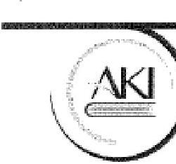

Agrárgazdasági Kutató Intézet
Research Institute of Agricultural Economics
H-1093 Budapest, Zsil utca 3-5.
www.aki.gov.hu

Demokos László
Elnök
Állami Számvevőszék

Budapest 4.
Pf. 54.
1364

Tárgy: AKI észrevétel ÁSZ jelentéshez

Hélman 14

Iktatószám: 4341-213045
Dátum: 2016.11.04

ÁLLAMI SZÁMVEVŐSZÉK
094586/2016
Érkezés: 2016-NOV 11
Iktatószám: V-1047-165/2016
Meltéklet:

Tisztelt Elnök Úr!

„Az államháztartás információs rendszere, valamint a hivatalos statisztikai szolgálat működésének ellenőrzése” című számvevőszéki jelentéstervezetet és az abban foglalt AKI-ra vonatkozó megállapításokat elfogadjuk.

A Hivatalos Statisztikai Szolgálat tagjaként számunkra fontos statisztikai tevékenységünk folyamatos fejlesztése, az Eurostat elvárások teljesítése és a vonatkozó jogszabályok maradéktalan betartása. Mindemellett célunk, hogy tevékenységünkkel hozzájáruljunk a gyakorlati kormányzati munkához és az agrárpolitika tudományos megalapozásához, emellett eredményességük növelése érdekében megalapozott és objektív információt tegyünk elérhetővé az agrárgazdaság szereplői számára.

Az ÁSZ ellenőrzés kihívások elé állított bennünket, mivel ilyen jellegű vizsgálat a statisztikai tevékenységünkre vonatkozóan még nem történt, ugyanakkor az ellenőrzés céljaival teljes mértékben egyetréttünk és úgy érezzük, köszönet illeti a munkatársait együttműködő hozzáállásukért és a vizsgálat korrekt lebonyolításáért.

Örülünk, hogy statisztikai tevékenységünket ilyen magas szinten ellenőrizték és az általunk is ismert hiányosságoktól eltekintve tevékenységünket megfelelőnek találták. A szabályozási hiányosságainkat tisztában vagyunk, a 2016. évi munkatervünk szerint megtörténik az AKI statisztikai rendszerének és belső szabályozási környezetének felkészítése a KSH által tervezett HSSZ auditra, melynek során az Európai Statisztikáktól elvárt minőség biztosított lesz az Európai Statisztika Gyakorlati Kódexe és a 2014-15 évi Eurostat Peer Review által támasztott követelményrendszer alapján.

A jelentés véglegesítése után megküldjük a feltárt hiányosságok pótlására vonatkozó intézkedési tervünket.

Budapest, 2016. november 4.

Poztautas: H-1463 Budapest, Pf.: 944. | Telefon: (+36 1) 217-1011 | Fax: (+36 1) 217-7937 | E-mail: aki@aki.gov.hu

1/1

34

---

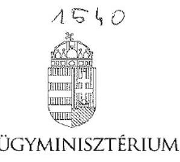

# DR. PINTÉR SÁNDOR 

## Domokos László úr részére Állami Számvevöszék elnöke

Állami Számvevőszék

## Budapest

Tisztelt Elnök Úr!
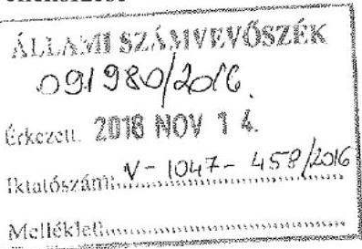
„Az államháztartás információs rendszere, valamint a hivatalos statisztikai
működésének ellenőrzése" című ellenőrzés kapcsán az Állami Számvevőszék által készített jelentés-tervezettel egyetértek, észrevételt nem teszek.

Budapest, 2016. november „ $\bigcirc$ ".
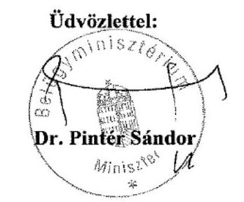

---

# KINCSINFO Nonprofit Kft. 

Kincstári Informatikai

Iktatószám: KINCS-64/87-26/2016.
Úgyintéző: Richter Bernadett
Telefonszám: $1 / 4528611$

## Domokos László

elnök úr részére

## Állami Számvevőszék

1051 Budapest, Apáczal Csere János utca 10.

Tárgy: Jelentéstervezet észrevételezése

## Tisztelt Elnök Úr!

Hivatkozással a 2016. október 27-én kelt, V-1057-446/2016. iktatószámon megküldött levelére, amelyben megküldte „Az Államháztartás információs rendszere, valamint a hivatalos statisztikai szolgálat müködésének ellenőrzése" e. számvevőszéki jelentéstervezetet, tájékoztatom, hogy a megküldött jelentéstervezettel kapcsolatban észrevételt nem teszek.

Budapest, 2016, november „07"

Tisztelettel:
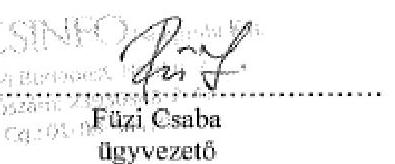

---

# 4534 

## Hocimen M

## AlJAMISZíHVEVÓSZÉK 095625/2016

## Előadó: Dr. Kárpáti József

E-mail: statkoord@ksh.hu
Tel.: (+36-1) 345-6912

## Domokos László úr

## Elnök

Állami Számvevőszék

## Budapest

## Tisztelt Elnök Úr!

Köszönöm az Állami Számvevőszék V-1047-448/2016. számú levelének mellékleteként megküldött jelentéstervezetet, amelyet 2016. november 2. napján érkeztettünk. Kifejezetten hasznosnak ítélem, hogy az ÁSZ áttekintette az államháztartás információs rendszerének és a hivatalos statisztikai szolgálatnak a müködését. Úgy vélem, hogy a KSH-nak a hivatalos statisztikai szolgálat koordinációjával kapcsolatos tevékenysége során is hasznosítani tudjuk a Jelentés megállapításait.

A jelentéstervezettel kapcsolatban az alábbi észrevételeket teszem.

1. Javaslom, hogy a jelentéstervezetben a „gyakorlati kódex", illetve „Gyakorlati Kódex" megnevezések helyett annak pontos megjelölése szerepeljen (Európai Statisztika Gyakorlati Kódexe).
2. Javaslom, hogy a jelentésnek „Az ellenőrzés háttere, indokoltsága" fejezete kerüljön kiegészítésre egy további bekezdéssel arról, hogy az Európai Parlament és a Tanács (EU) 2015/759 rendelete 2015 tavaszán megerősítette a nemzeti statisztikai hivatalok szerepét, egyúttal koordinációs jogkörét és kötelezettségeit a tagállamok hivatalos statisztikai szolgálatain belül. Ezzel párhuzamosan sor került az Európai Statisztika Gyakorlati Kódexe alapelveinek megvalósulását vizsgáló szakértői auditra is Magyarországon, amelynek javaslatai alapján a KSH már 2015 folyamán lépéseket tett, többek közt a Hivatalos Statisztikai Szolgálat koordinációjának erősitésére, és lezajlott a statisztikai igazgatás számos témájában fejlesztéseket tartalmazó új statisztikai törvény tervezetének közigazgatási egyeztetése (a Kormány a törvényjavaslatot 2016. november 15 -én benyújtotta az Országgyülésnek).
3. A jelentéstervezet 20. oldalán az alábbi megállapítás szerepel:
„Az NGM az államháztartás funkcionális kiadásainak osztályozásához kidolgozta az államháztartási pénzügyi adatok statisztikai célokra történő felhasználásának módszertanát (...)"
Fenti megállapítást javasoljuk pontosítani, tekintettel arra, hogy a statisztikai módszertan kidolgozása a KSH feladata.

---

4. A jelentéstervezet 21. oldalán az alábbi megállapítás szerepel:
,,AZ EDP ELJÁRÁSHOZ kapcsolódó adatszolgáltatási kötelezettségét az NGM teljesítette. A Bizottság részére a tervezett és tényleges kormányzati hiányról és az államadósság szintjéről évente a 479/2009/EK Rendelet ${ }^{33}$ 3. cikk (1) bekezdése alapján kétszer történt adatszolgáltatás."
Fenti megállapítást javasoljuk pontosítani, tekintettel arra, hogy a 479/2009/EK rendelet szerint az EDP jelentést a KSH küldi meg a Bizottság statisztikai hivatalának (az Eurostatnak) (az NGM adatokkal, információkkal járul hozzá a jelentés elkészitéséhez, amelynek az NGM eleget tett).
5. A 2.2. megállapítás több intézmény tekintetében belső szabályozási hiányosságokat állapít meg, amelyek szorosan kapcsolódnak az Európai Statisztika Gyakorlati Kódexének intézményi környezettel, szakmai függetlenséggel foglalkozó alapelveihez is, azonban erre a témára nézve nem került javaslat megfogalmazásra a jelentés végén. Fentiek alapján fontosnak tartanánk, ha a jelentésben javaslat kerülne megfogalmazásra a Hivatalos Statisztikai Szolgálat tagjai számára arra vonatkozóan, hogy müködjenek együtt a KSH által irányított auditálási folyamatban, amelynek eredményeként biztosítható lesz, hogy az Európai Statisztika Gyakorlati Kódexében foglaltak nemcsak a KSH-ban, hanem a Hivatalos Statisztikai Szolgálat többi szervezeténél is érvényesüljenek.
6. A 2.6. megállapítás kapcsán jelzem, hogy bizonyos kérdések valóban nem kerültek az OST napirendjére, azonban azok (így egyes információrendszerek fogalmi, osztályozási rendszerének kialakítása) olyan kérdések voltak, melyek a Hivatalos Statisztikai Szolgálaton belül egyéb hivatali úton, például közigazgatási államtitkári ülések anyagainak előkészítése, tárcakörözések vagy EU jogharmonizációs javaslatok hivatalos köröztetése révén egyeztetésre kerültek.
7. A KSH elnökének tett javaslattal kapcsolatban szeretném jelezni, hogy a statisztikáról szóló 1993. évi XLVI. törvény lehetőséget biztosít az adatgyüjtést végrehajtó szervnek közigazgatási bírság kiszabására irányuló eljárás kezdeményezésére, azonban azt nem teszi kötelezővé. Ugyanakkor a bírságolás nem minden esetben a legcélszerűbb eszköz. Az adatgyüjtést végrehajtó szerveknek, így a KSH-nak is a hiteles statisztikák előállításához az adatszolgáltatók által szolgáltatott statisztikai adatokra van szüksége, ezért a bírságolás helyett elsősorban egyéb eszközöket alkalmazunk annak érdekében, hogy az adatszolgáltatót adatszolgáltatásra bírjuk. A közigazgatási bírság kiszabása önmagában nem eredményezi azt, hogy az adatszolgáltató pótolja a nem teljesített adatszolgáltatását. A hatósági eljárás megindítása esetén a KSH mérlegeli azt is, hogy az adatszolgáltatás elmulasztása, az adatok teljes vagy részleges hiánya milyen károkat okoz a statisztikában.

Budapest, 2016. november 16.
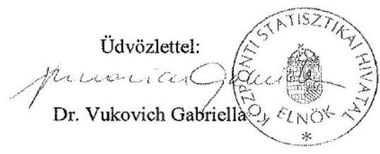

---

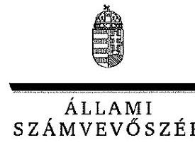

ELNÖK

Ikt.szám: V-1047-464/2016.

# dr. Vukovich Gabriella úrhölgy 

elnök

Központi Statisztikai Hivatal

## Budapest

## Tisztelt Elnök Úrhölgy!

Az államháztartás információs rendszere, valamint a hivatalos statisztikai szolgálat müködésének ellenörzése címủ számvevőszéki jelentéstervezetre tett észrevételeit köszönettel megkaptam.

Az Állami Számvevőszék észrevételekre vonatkozó álláspontjáról a felügyeleti vezető által készített részletes tájékoztatást csatoltan megküldőm.

Tájékoztatom Elnök úrhölgyet, hogy a jelentésben - az Állami Számvevőszékről szóló 2011. évi LXVI. törvény 29. § (3) bekezdése alapján - a figyelembe nem vett észrevételeket szerepeltetjük az elutasítás indokának feltüntetésével együtt.

Budapest, 2016.
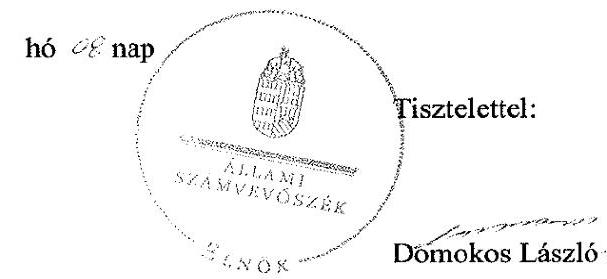

Melléklet: Tájékoztatás az elfogadott és az el nem fogadott észrevételekről

---

# Tájékoztatás az elfogadott és az el nem fogadott észrevételekról 

Az államháztartás információs rendszere, valamint a hivatalos statisztikai szolgálat müködésének ellenörzése címủ számvevőszéki jelentéstervezetre $\mathrm{KSH} / 32-29 / 2016$. iktatószámú levelében tett észrevételeit áttekintettük, annak kezeléséről az alábbi tájékoztatást adom.

1. A jelentéstervezetben a „gyakorlati kódex", illetve „Gyakorlati Kódex" megnevezésekre tett észrevételét elfogadtuk, a számvevőszéki jelentés készitésénél figyelembe vesszük.
2. A jelentéstervezetre tett 2. számú észrevételét nem fogadtuk el. Tekintettel arra, hogy az észrevételében foglaltak a 2015., illetve a 2016. éveket érintő, a KSH nemzetközi szintéren jelentkező létjogosultságát és jogkörcit megerősítő rendelkezésekről szólnak, nem indokolt ezen rendelkezéseket Az ellenörzés háttere, indokoltsága címủ fejezetbe szerepeltetni. Ugyanakkor az észrevételben foglaltak is megerősítik a fejezetben foglaltakat, a számvevőszéki ellenőrzés időszerűségét és indokoltságát.
3. A jelentéstervezet 20. oldalán szereplő megállapításra tett észrevételét elfogadtuk, a kifogásolt megállapítást az alábbiak szerint szerepeltetjük a számvevőszéki jelentésben: „A KSH az államháztartás funkcionális kiadásainak osztályozásához kidolgozta az államháztartási pénzügyi adatok statisztikai célokra történő felhasználásának módszertanát, melyhez az NGM javaslatot tett a statisztikai adattgények beépitésére az államháztartás könyvvezetési és beszámolási rendszerébe."
4. A jelentéstervezet 21. oldalán szereplő megállapításra tett észrevételét elfogadtuk, a kifogásolt megállapítást az alábbiak szerint szerepeltetjük a számvevőszéki jelentésben: „Az EDP jelentéshez kapcsolódó adatszolgáltatási kötelezettségét az NGM teljesítette."
5. A jelentéstervezetre tett 5. számú észrevételét nem fogadtuk el. Az ellenőrzés során a KSH tekintetében ellenőriztük, és a 2.3. számú megállapításban rögzítettük az Európai Statisztika Gyakorlati Kódexében foglaltak alkalmazását. Egyebekben az ellenőrzés nem terjedt ki a Hivatalos Statisztikai Szolgálat minden szervezetére, csak annak OSAP-ban résztvevő szervei közül a KSH , az ME, a BM, az FM, az AKI és az NGM. Mindezek alapján a Hivatalos Statisztikai Szolgálat valamennyi tagja számára címzett, egységes javaslat megfogalmazása nem lehetséges.
6. A jelentéstervezet 2.6. pontjára tett észrevételét nem fogadtuk el. A jelentéstervezet megállapításait az ÁSZ az ellenőrzött szervezetek által rendelkezésre bocsátott dokumentumok alapján tette meg. Az észrevételében jelzett - a Hivatalos Statisztikai Szolgálaton belül egyéb hivatali úton, például közigazgatási államtitkári ülések anyagainak elökészitése, tárcakörözések vagy EU jogharmonizációs javaslatok hivatalos köröztetése révén történő - egyeztetésck nem azonos tartalmúak a jogszabályban foglaltakkal,

---

ezért nem helyettesítik az OST 170/1993. (XII.3.) Korm. rendelet (Str.) 3. § (2) bekezdés a) pontjában foglalt közremüködési kötelezettségét, mely szerint az OST közremüködik az Stt. 6. §-ának g) pontjában meghatározott más információ-rendszerek fogalmi, osztályozási rendszerének kialakításában és annak a statisztikai információs rendszerrel történő összehangolásában.
7. A jelentéstervezet KSH elnökének címzett javaslatára tett észrevételét nem fogadtuk el. A javaslat kifogásolt részének alátámasztását szolgáló, a jelentéstervezet 2.4. számú megállapítás 6 . bekezdésének megállapítása szerint „A KSH az Sit. 9/B. § (1) bekezdése b) pontja alapján ezekben az esetekben sem kezdeményezte a kormányhivatalnál a közigazgatási birság megállapitását.". A statisztikáról szóló 1993. évi XLVI. törvény (Stt.) 9/B. § (1) bekezdése szerint a KSH, mint az adatgyűjtést végrehajtó szerv kezdeményezésére a kormányhivatal jogköre a bírság kiszabása és a közigazgatási hatósági eljárás és szolgáltatás általános szabályairól szóló 2004. évi CXL. törvény 94/A. §-a alapján a kormányhivatal, mint hatóság számára biztosít lehetőséget a mérlegelésre.

Sit. 9/B. § (1) ,,A megyei, fövárosi kormányhivatal az adatgyüjtést végrehajtó szerv kezdeményezésére a közigazgatási hatósági eljárás és szolgáltatás általános szabályairól szóló 2004. évi CXL. törvény 94/A. §-a alapján közigazgatási birsággal sújtja azt, aki vagy amely...."

Az észrevételében foglaltak szerint a KSH, mint az adatgyűjtést végrehajtó szerv mérlegeli a bírság kiszabásának kezdeményezését megelőzően és a hatósági eljárás megindítását követően fennálló körülményeket, erre azonban a jogszabály nem nyújt lehetőséget. Mindezek alapján a jelentéstervezet észrevételében kifogásolt javaslata és az azt alátámasztó megállapítás helytálló.

Budapest, 2016. 12. hó ơ nap

Holman Magdolna felügyeleti vezető

---

# Magyar   Államkincstár 

1583
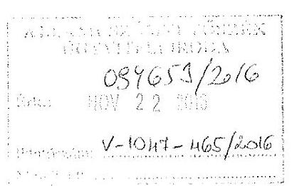

Iktatószám: ELL/3-191/2016.
Hiv. szám: V-1047-447/2016.

## Domokos László úr részére

elnök

## Állami Számvevőszék

Budapest

Tárgy: „Az állomháztartás információs rendszere, valamint a hivatalos statisztikai szolgálat müködésének ellenörzése" tárgyú jelentéstervezethez észrevételek megküldése

## Tisztelt Elnök Úr!

„Az államháztartás információs rendszere, valamint a hivatalos statisztikai szolgálat müködésének ellenőrzése" tárgyú V-1047-447/2016. hivatkozási számú jelentéstervezetet köszönettel megkaptuk és áttekintettük. A megállapításokkal kapcsolatban észrevételt fogalmaztunk meg, melyet kérünk, hogy egyetértésük esetén vegyenek figyelembe a jelentés véglegezésénél. Támogató együttmüködésüket köszönjük.

A jelentéstervezettel kapcsolatban tett szakterületi észrevételt a levél 1. számú melléklete tartalmazza.

Kérem tájékoztatásom szíves elfogadását.
Budapest, 2016. november 16.

Tisztelettel:
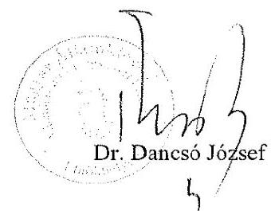

Mellékletek:

1. számú melléklet: „Az államháztartás információs rendszere, valamint a hivatalos statisztikai szolgálat müködésének ellenőrzése" címủ vizsgálatról készített számvevőszéki jelentéstervezet észrevételczése

---

# „Az államháztartás információs rendszere, valamint a hivatalos statisztikai szolgálat müködésének ellenörzése" címú vizsgálatról készített számvevöszéki jelentéstervezet észrevételezése 

Oldalszám: 17. oldal 1.2. számú megállapítás és a hozzá kapcsolódó 3. felsorolási pont
„....a tartozásállományok és kormányzati szektorba sorolt egyéb szervezetek adósságot keletkeztető ügyletei esetében azonban nem felelt meg az Áht. és az Ávr., illetve a tartozásállományok esetében a belső szabályzat előírásainak:" (1.2. megállapítás részlet-17.o.)
„A központi költségvetési szervek tartozásállományával kapcsolatos adatszolgáltatások esetében a Kincstár az adatfeldolgozást a KFF ügyrend ${ }^{28}$ 2. számú függelékében meghatározott határidőben (tárgyhót követő hónap 5. napja) nem teljes körűen végezte el." (1.2. megállapítás 3. bekezdési pont részlet - 18.o.)

## Kincstár által megfogalmazott észrevétel:

Ehhez kapcsolódóan megjegyezzük, hogy a 2014. évben hatályos Ávr. 7. mellékletében meghatározott határidő (a tárgyhót követő hónap 5. napja) az intézmények által történő adatszolgáltatás teljesítésére vonatkozik és nem a kincstári feldolgozásra. A Kincstár részére az Ávr. 8. melléklete az adatok honlapon történő közzétételére vonatkozóan határoz meg határidőt, amely a tárgyhót követő hónap 20. napja.

## Módosítási javaslat:

Ennek értelmében kérjük az 1.2 megállapításból a jelzett részeket törölni, vagy pontosan meghatározni, hogy az Áht. és az Ávr. mely előírásainak nem felel meg a tartozásállományok nyilvántartása, feldolgozása.

---

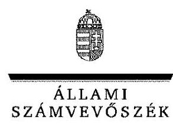

ELNÖK

Ikt.szám: V-1047-466/2016.

Dr. Dancsó József úr
elnök

Magyar Államkincstár

Budapest

# Tisztelt Elnök Úr! 

Az államháztartás információs rendszere, valamint a hivatalos statisztikai szolgálat müködésének ellenörzése címủ számvevőszéki jelentéstervezetre tett észrevételeit köszönettel megkaptam.

Az Állami Számvevőszék észrevételekre vonatkozó álláspontjáról a felügyeleti vezető által készített részletes tájékoztatást csatoltan megküldöm.

Tájékoztatom Elnök urat, hogy a jelentésben - az Állami Számvevőszékről szóló 2011. évi LXVI. törvény 29. § (3) bekezdése alapján - a figyelembe nem vett észrevételeket szerepeltetjük az elutasítás indokának feltüntetésével együtt.

Budapest, 2016. 1/ hó $C 2$ nap
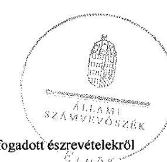

Tisztelettel:

Domokos László

---

# Tájékoztatás az el nem fogadott észrevételekröl 

Az államháztartás információs rendszere, valamint a hivatalos statisztikai szolgálat müködésének ellenörzése címủ számvevőszéki jelentéstervezetre ELL/3-191/2016. iktatószámú levelében tett észrevételeit áttekintettük, annak kezeléséről az alábbi tájékoztatást adom.

A jelentéstervezet 17. oldal 1.2. számú megállapítás és a hozzá kapcsolódó 3. felsorolási pontra tett észrevételét nem fogadtuk el. Az észrevételében kifogásolt megállapítás a központi költségvetési szervek tartozásállományával kapcsolatos adatszolgáltatások Kincstár általi adatfeldolgozása belső szabályzat előírásainak való megfclelésre irányult. A Kincstár a 2013. április 17-től hatályos, A Magyar Államkincstár Fejezeti Föosztályának Úgyrendje 2. számú függelékének 7.5. pontja értelmében az adatállományok fogadása, feldolgozása feladat végrehajtási határidejét ,jogszabály szerin (tárgyhót követő hónap 5. napjáig)" határozta meg. A jelentéstervezet megállapítása szerint a Kincstár ennek az előírásnak nem tett eleget, az Áht. és az Ávr. szerinti előírások betartására a Kincstár tekintetében nem tettünk megállapítást.

Budapest, 2016. 12. hó 08. nap

Holman Magdolna
felügyeleti vezető

---

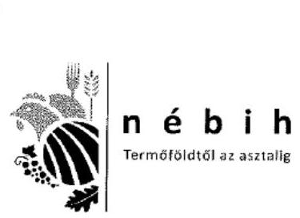

Nemzeti Élelmiszerlánc-biztonsági Hivatal

1570
Hobnan, M. C. 2024 Budapest, Keleti Károly u. 24
Tel: 06/1/336-9300 Fax: 06/1/336-9890
E-mail: ehs@kititontsagihivatal.gov.hu
www.nablh.gov.hu

Ikt.sz.:
Tárgy: ÁSz OSAP 1257-es számú adatgyűjtés
vizsgálata - ÁSZ jelentéstervezet
Ügyintéző: Kottek Péter
Elérhetőség: kottekp@nebih.gov.hu
Melléklet(ek): -
Hiv. szám: V-1047-450/2016

Domokos László
elnök

Állami Számvevőszék
1364 Budapest, 4. Pf. 54.

Tisztelt Elnök Úr!

ÁSZ SZÁMVEVŐSZÉK
093340/2016
2016 NÖV 17.
1257-4612006
Melléklet:

Hivatkozva V-1047-450/2016 számú levelére elsősorban szeretném megköszöni a lelkiismeretes és
aprólékos munkát, amit a Számvevőszék munkatársai a feladattal kapcsolatban elvégeztek. Szemléletük
és megállapításaik iránymutatást adnak a további munkavégzésükben, segíteni fognak adatgyűjtéseink
hitelességének és átláthatóságának javításában.

„Az államháztartás információs rendszere, valamint a hivatalos statisztikai szolgálat működésének
ellenőrzése" című témában a Számvevőszék vizsgálta a NÉBIH által kezelt OSAP 1257-es számú, az
Országos Statisztikai Adatgyűjtési Program keretein belül működő adatgyűjtést. A tárgyban kézhez
kapott jelentéstervezet a NÉBIH Elnökének az alábbi javaslatot teszi:

Javaslat a NÉBIH Elnökének: "Intézkedjen a nemzetközi szervezetek részére történő adatátadás
folyamatában a jogszabályi előírások betartására." (2.2 számú megállapítás 9. és 11. bekezdése
alapján)

A javaslattal kapcsolatban az alábbi megjegyzéseket teszem:

1. A NÉBIH egyeztetést kíván kezdeményezni a KSH-val a nemzetközi erdészeti adatszolgáltatások
szerinti kötelezettségek ellátásának témájában az intézmények közt korábban létező megállapodás
megújítására, hogy a Statisztikai törvényben (1993. évi XLVL) foglaltaknak megfeleljünk. A
megállapodást korábban a Földművelésügyi Minisztérium (FM) kezelte és az FM
háttérintézményeit összefogva gondozta. Törekedni fogunk a mindkét fél számára előnyös és
elfogadható együttműködés kereteinek írásbeli rögzítésére.

2. Kezdeményezni fogom a NÉBIH OSAP alá rendelt adatgyűjtéseinek tekintetében a belső
szabályozások megújítását, különös tekintettel az Információs önrendelkezési jogról és az
információszabadságról szóló törvényben (2011. évi CXII.) foglaltakra, az adat- és titokvédelmi
szabályok érvényre juttatására.

Budapest, 2016. november 14.

Ödvözlettel:

Mihace Marton
dr. Oravecz Márton
elnök

---

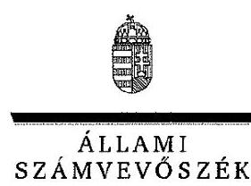

ELNÖK

Ikt.szám: V-1047-462/2016.

# Dr. Oravecz Márton úr 

elnők

Nemzeti Élelmiszerlánc-biztonsági Hivatal

## Budapest

## Tisztelt Elnök Úr!

Az államháztartás információs rendszere, valamint a hivatalos statisztikai szolgálat müködésének ellenörzése címủ számvevőszéki jelentéstervezetre tett észrevételeit köszönettel megkaptam.

Az Állami Számvevőszék észrevételekre vonatkozó álláspontjáról a felügyeleti vezető által készített részletes tájékoztatást csatoltan megküldöm.

Tájékoztatom Elnök urat, hogy a jelentésben - az Állami Számvevőszékről szóló 2011. évi LXVI. törvény 29. § (3) bekezdése alapján - a figyelembe nem vett észrevételeket szerepeltetjük az elutasítás indokának feltüntetésével együtt.

Budapest, 2016.
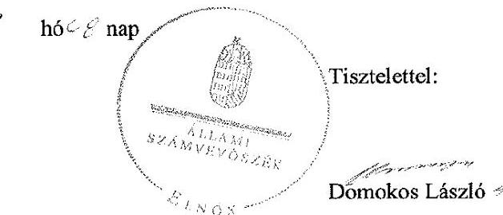

Melléklet: Tájékoztatás az el nem fogadott észrevételekről

---

# Tájékoztatás az el nem fogadott észrevételekröl 

Az államháztartás információs rendszere, valamint a hivatalos statisztikai szolgálat müködésének ellenörzése címủ számvevőszéki jelentéstervezetre 2016. november 14-én kelt levelében tett észrevételeit áttekintettük, annak kezeléséről az alábbi tájékoztatást adom.

Örömmel vettük tájékoztatását, mely szerint az Állami Számvevőszék ellenőrzése megállapításainak hasznosítására intézkedéseket tesznek a nemzetközi erdészeti adatszolgáltatások szerinti kötelezettség és a belső szabályozottság tekintetében a jogszabályokban elóírtak teljesítése érdekében.

Egyben tájékoztatom, hogy az észrevételében foglaltak a számvevőszéki jelentés megállapításait nem módosítják.

Budapest, 2016. 4. hó 0. nap

Holman Magdolna
felügyeleti vezető

---

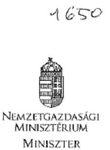

# Domokos László úr részére 

elnök

## Állami Számvevőszék

Budapest

Iktatószám: NGM/37218-2/2016. Hiv. szám: V-1047-451/2016. Ügyintéző: Kocsis Boglárka Dóra Telefonszám: +36 (1) 7952415
Tárgy: „Az államháztartás információs rendszere, valamint a hivatalos statisztikai szolgálat müködésének ellenőrzése" címü jelentés-tervezet

## Tisztelt Elnök Úr!

Az államháztartás információs rendszere, valamint a hivatalos statisztikai szolgálat müködésének ellenőrzése címủ számvevőszéki jelentés-tervezetet köszönettel megkaptam, arra az alábbi észrevételeket teszem.

Az államháztartásról szóló 2011. évi CXCV. törvény 103. § (1) bekezdése alapján az államháztartás információs rendszerének müködtetésével és fejlesztésével kapcsolatos feladatok ellátásáról az államháztartásért felelős miniszter a Magyar Államkincstár (a továbbiakban: Kincstár) útján gondoskodik. Az információs rendszer kialakításában és fejlesztésében mint irányító szerv a Nemzetgazdasági Minisztérium (a továbbiakban: NGM) szorosan együttműködik a Kincstárral annak érdekében, hogy a beérkező adatok feldolgozása, ellenőrzése és nyilvántartása minden esetben megfeleljen a hatályos jogszabályoknak.

Általánosságban megjegyzem, hogy a jelentés-tervezet nem megfelelően kezeli azonosként az államháztartási információs rendszer és a hivatalos statisztikai szolgálat müködését, holott az NGM OSAP adatgyűjtési tevékenység nem az államháztartás pénzügyeivel, az államháztartás információs rendszerével kapcsolatos.

A jelentés-tervezet 1.1. számú megállapításához kapcsolódó első szakasz negyedik francia bekezdésével összefüggésben jelzem, hogy a Központi Statisztikai Hivatal non-profit szervezeti és vállalati adatgyűjtései biztosítják a kormányzati szektorba sorolt, de a költségvetési tervezésbe és rendszeres adatszolgáltatásba be nem vont szervezetek adósságának adatait, amelyeket az előrejelzéshez, tervezéshez használ az NGM bázisadatokként. Így a teljes szervezethalmazra vonatkozóan a zárszámadásban már tényadatok szerepelnek. Ezt az NGM az ellenőrzés során jelezte az Állami Számvevőszéknek (a továbbiakban: ÁSZ), illetve ez a módszertan a költségvetési és a zárszámadási törvényjavaslathoz kapcsolódó ellenőrzéseknél rendszeresen bemutatásra kerül. Az ÁSZ korábban nem kifogásolta ezt a megoldást.

A jelentés-tervezet 1.2. számú megállapításával kapcsolatban felhívom a figyelmet arra, hogy 2014 szeptemberétől kezdődően az ESA2010 módszertan felváltotta az ESA95 módszertant.

A jelentés-tervezetben szereplő 1. javaslatban szükségesnek tartom a hivatkozások pontosítását, továbbá a javaslat további kifejtését, tekintettel arra, hogy a jelentés-tervezetben

---

a kormányzati szektorba sorolt egyéb szervezetek adósságára vonatkozó megállapításon túl konkrétum nem szerepel, így nem világos, milyen tárgykörben kell kiegészítéseket, intézkedéseket tenni.

Az NGM szervezeti egységeinek ügyrendjei tartalmazzák a szervezeti egység ellenőrzési nyomvonalát is. Az ügyrendek elkészitésének kötelezettségét a Nemzetgazdasági Minisztérium Szervezeti és Müködési Szabályzatáról szóló 1/2015. (I. 21.) NGM utasítás (a továbbiakban: SzMSz) írja elő, a vonatkozó rendelkezéseknek a szervezeti egységek megfeleltek. Álláspontom szerint a belső szabályzatok, valamint az SzMSz megfelelően biztosította a hatásköri és felelősségi viszonyok elhatárolását.

Kérem észrevételeim szíves figyelembevételét a jelentés véglegesítése során.
Budapest, 2016. november „29."
Üdvözlettel:
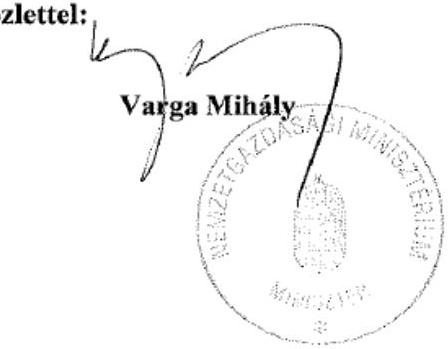

---

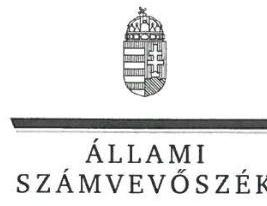

ELNÖK

Ikt.szám: V-1047-471/2016.

# Varga Mihály úr 

miniszter

Nemzetgazdasági Minisztérium

## Budapest

## Tisztelt Miniszter Úr!

Az államháztartás információs rendszere, valamint a hivatalos statisztikai szolgálat müködésének ellenőrzése címủ számvevőszéki jelentéstervezetre tett észrevételeit köszönettel megkaptam.

Az Állami Számvevőszék észrevételekre vonatkozó álláspontjáról a felügyeleti vezető által készített részletes tájékoztatást csatoltan megküldöm.

Tájékoztatom Miniszter urat, hogy a jelentésben - az Állami Számvevőszékről szóló 2011. évi LXVI. törvény 29. § (3) bekezdése alapján - a figyelembe nem vett észrevételeket szerepeltetjük az elutasítás indokának feltüntetésével együtt.

Budapest, 2016.
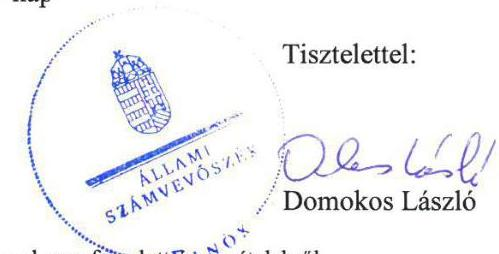

Melléklet: Tájékoztatás az elfogadott és az el nem fogadott észrevételekről

---

# Tájékoztatás az elfogadott és az el nem fogadott észrevételekról 

Az államháztartás információs rendszere, valamint a hivatalos statisztikai szolgálat müködésének ellenörzése címủ számvevőszéki jelentéstervezetre NGM/37218-2/2016. iktatószámú levelében tett észrevételeit áttekintettük, annak kezeléséről az alábbi tájékoztatást adom.

1. A jelentéstervezet az államháztartás információs rendszere és a hivatalos statisztikai szolgálat müködése azonosként történő kezelésére tett észrevételét nem fogadtuk el. A jelentéstervezet jól elkülönülten kezeli a két ellenőrzött területet, ennek megfelelően $A$ jelentés lényeges kérdéskörei fö kérdések és az ezekre választ adó, számozott megállapítások külön fejezetben kezelik az államháztartás információs rendszere és a hivatalos statisztikai szolgálat müködése vonatkozásában tett megállapításokat. Az NGM ellenőrzött szervezetként egyrészt az államháztartás információs rendszere tekintetében, másrészt, mint a statisztikai szolgálat OSAP-ban résztvevő szerve szerepel az ellenőrzésben.
2. A jelentéstervezet 1.2. számú megállapításhoz (észrevételben tévesen 1.1. számú megállapítás szerepel) tartozó első bekezdés negyedik francia bekezdésére tett észrevételét nem fogadtuk el. A jelentéstervezet tényként állapítja meg mindazt, melyet az észrevételében is megerősít, ezért az a jelentéstervezet megállapításait nem módosítja.
3. A jelentéstervezet 1.2. számú megállapításhoz tett észrevételét elfogadtuk, a számvevőszéki jelentés készítésénél figyelembe vesszük, és az ESA2010 módszertant a megállapításban szerepeltetjük.
4. A jelentéstervezet nemzetgazdasági miniszternek címzett 1. számú javaslatára tett észrevételét nem fogadtuk el. A javaslathoz feltüntetett hivatkozások, így a jelentéstervezet 1.1. számozott megállapításához kapcsolódó 1., 2. és 5. bekezdés részletesen tartalmazza, hogy az NGM tekintetében milyen hiányosságokat tárt fel az ellenőrzés az államháztartás információs rendszerének kialakítása tekintetében. Az ellenőrzési nyomvonalakra tett megállapítás szerint nem annak hiányát tárta fel az ellenőrzés, hanem a tartalmát és a változások követésének hiányát kifogásolta:
„.... a Bkr. 6. § (3) bekezdésében foglaltak ellenére a szervezeti változásokból eredően nem aktualizálták rendszeresen, azok nem tartalmazták minden érintett szervezeti egység vonatkozásában a feladatellátásra vonatkozó felelősségi és információs szinteket és kapcsolatokat, az irányitási és ellenörzési folyamatokat,... nem tükrözték az SZMSZ-ek változásával kapcsolatos szervezeti átalakulásokat, megváltozott feladatokat, felelösségi és, hatásköri viszonyokat."

Budapest, 2016. 12. hó 15 . nap
Holman Mágdolna
felügyeleti vezető

---

# RÖVIDÍTÉSEK JEGYZÉKE 

${ }^{1}$ Áht.
${ }^{2}$ NGM
${ }^{3}$ Kincstár
${ }^{4}$ Ávr.
${ }^{5}$ Stt.
${ }^{6}$ OSAP
${ }^{7}$ KSH
${ }^{8}$ ME
${ }^{9}$ BM
${ }^{10}$ FM
${ }^{11}$ AKI
${ }^{12}$ NÉBIH
${ }^{13}$ Unió
${ }^{14} 223 / 2009 /$ EK rendelet
${ }^{15}$ Gyakorlati Kódex
${ }^{16}$ OST
${ }^{17} 2011 / 85 /$ EU irányelv
${ }^{18}$ ÁSZ
${ }^{19}$ Kincsinfo Nkft.
${ }^{20}$ ÁSZ tv.
${ }^{21}$ Bkr.
${ }^{22} \mathrm{IBDR}_{1-2}$
${ }^{23} \mathrm{KFF}$
${ }^{24}$ Kincstár SZMSZ ${ }_{1-4}$
${ }^{25}$ NGM SZMSZ ${ }_{1,2,3}$
2011. évi CXCV. törvény az államháztartásról, hatályos 2011. december 31-től

Nemzetgazdasági Minisztérium
Magyar Államkincstár
368/2011. (XII. 31.) Korm. rendelet az államháztartásról szóló törvény végrehajtásáról, hatályos 2012. január 1-jétől
1993. évi XLVI. törvény a statisztikáról, hatályos 1993. május 15-től

Országos Statisztikai Adatgyűjtési Program
Központi Statisztikai Hivatal
Miniszterelnökség
Belügyminisztérium
Földművelésügyi Minisztérium
Agrárgazdasági Kutató Intézet
Nemzeti Élelmiszerlánc-biztonsági Hivatal
Európai Unió
2009. március 11-i 223/2009/EK európai parlamenti és tanácsi rendelet az európai statisztikákról és a titoktartási kötelezettség hatálya alá tartozó statisztikai adatoknak az Európai Közösségek Statisztikai Hivatala részére történő továbbításáról szóló 1101/2008/EK, Euratom, európai parlamenti és tanácsi rendelet, a közösségi statisztikákról szóló 322/97/EK tanácsi rendelet és az Európai Közösségek statisztikai programbizottságának létrehozásáról szóló 89/382/EGK, Euratom, tanácsi határozat hatályon kívül helyezéséről
Európai Statisztika Gyakorlati Kódexe
Országos Statisztikai Tanács
A TANÁCS 2011/85/EU IRÁNYELVE (2011. november 8.) a tagállamok költségvetési keretrendszerére vonatkozó követelményekről
Állami Számvevőszék
Kincsinfo Nonprofit Korlátolt Felelősségű Társaság
2011. évi LXVI. törvény az Állami Számvevőszékről, hatályos 2011. július 1-jétől 370/2011. (XII. 31.) Korm. rendelet a költségvetési szervek belső kontrollrendszeréről és belső ellenőrzéséről, hatályos 2012. január 1-jétől
Informatikai Biztonsági Dokumentumrendszer, hatályos 2013. január 21-től
Informatikai Biztonsági Dokumentumrendszer, hatályos 2014. február 28-tól
Költségvetési Fejezetek Főosztálya
2/2011. (I. 14.) NGM utasítás a Magyar Államkincstár Szervezeti és Működési Szabályzatáról (hatálytalan:2014. szeptember 10-től)
24/2014. (IX. 10.) NGM utasítás a Magyar Államkincstár Szervezeti és Működési Szabályzatáról (hatálytalan:2015. március 17-től)
27/2014. (XII. 12.) NGM utasítás a Magyar Államkincstár Szervezeti és Működési Szabályzatáról (hatálytalan:2015. március 17-től)
8/2015. (III. 26.) NGM utasítás a Magyar Államkincstár Szervezeti és Működési Szabályzatáról (hatályos:2015. március 17-től)
11/2013. (VI. 3.) NGM utasítás a Nemzetgazdasági Minisztérium Szervezeti és
Működési Szabályzatáról

---

22/2014. (VIII. 29.) NGM utasítás a Nemzetgazdasági Minisztérium Szervezeti és Müködési Szabályzatáról
1/2015. (I. 29.) NGM utasítás a Nemzetgazdasági Minisztérium Szervezeti és Müködési Szabályzatáról
A Magyar Államkincstár által kezelt közérdekú és közérdekből nyilvános adatok igényre történő szolgáltatásának eljárásrendje
27/2013. (XII. 31.) NGM utasítás a Nemzetgazdasági Minisztérium Informatikai Biztonsági Szabályzatáról
Államháztartási Iroda
A Magyar Államkincstár Fejezeti Főosztályának Ügyrendje (hatályos 2013. április 17-től)
Államháztartási Adatbázis
Költségvetési Adatcserélő Rendszer
International Monetary Fund (Nemzetközi Valutaalap)
Organisation for Economic Cooperation and Development (Gazdasági
Együttmüködési és Fejlesztési Szervezet)
A Tanács 479/2009/EK rendelete (2009. május 25.) az Európai Közösséget létrehozó szerződéshez csatolt, a túlzott hiány esetén követendő eljárásról szóló jegyzőkönyv alkalmazásáról
288/2009. (XII. 15.) Korm. rendelet az Országos Statisztikai Adatgyűjtési Program adatgyűjtéseiről és adatátvételeiről
Nemzeti Munkaügyi Hivatal
320/2014. (XII. 13.) Korm. rendelet az állami foglalkoztatási szerv, a munkavédelmi és munkaügyi hatóság kijelöléséről, valamint e szervek hatósági és más feladatainak ellátásáról, hatályos 2014. december 15-től
Országos Tisztifőorvosi Hivatal
2011. évi CXCIX. törvény a közszolgálati tisztviselőkről, hatályos 2012. március 1jétől
2011. évi CXII. törvény az információs önrendelkezési jogról és az információszabadságról, hatályos 2011. július 27-től
Egyesült Nemzetek Szervezete
A NÉBIH Szervezeti és Müködési Szabályzata az 1/2013. (I.8) számú Vidékfejlesztési Minisztérium utasítása, hatályos 2013. január 9.-től 170/1993. (XII. 3.) Korm. rendelet a statisztikáról szóló 1993. évi XLVI. törvény végrehajtásáról, hatályos 1994. január 1-jétől
Nemzeti Adó- és Vámhivatal
Hivatalos statisztikai szolgálat

---

# ÁLLAMI SZÁMVEVŐSZÉK 

1052 Budapest, Apáczai Csere János utca 10.
Levélcím: 1364 Budapest 4. Pf. 54
Telefon: +36 14849100 Telefax: +36 14849200
www.asz.hu