# Jelentés 

## Az önkormányzatok gazdasági társaságai

Az önkormányzatok többségi tulajdonában lévő gazdasági társaságok gazdálkodásának ellenőrzése - Pécsi Sport Nonprofit Zrt.
2017.

---

# Jelentés 

## Az önkormányzatok gazdasági társaságai

Az önkormányzatok többségi tulajdonában lévő gazdasági társaságok gazdálkodásának ellenőrzése - Pécsi Sport Nonprofit Zrt.
2017. január 12. nap
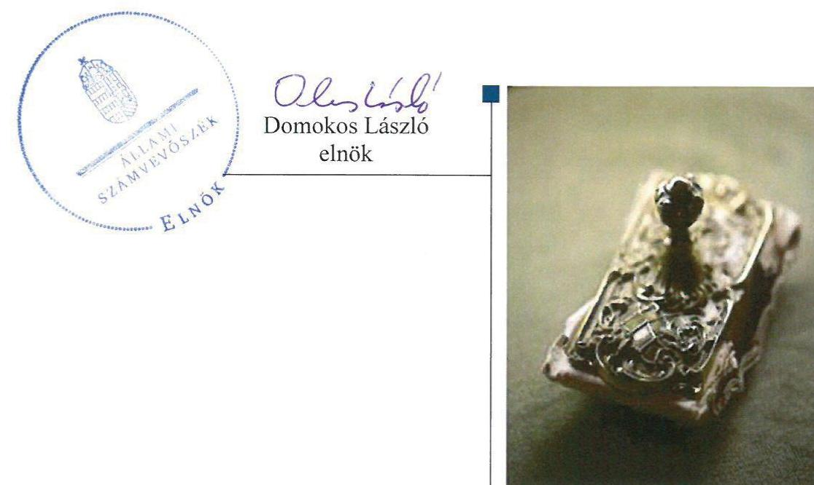

---

Jelentéseink az Országgyűlés számítógépes hálózatán és az Interneten a www.asz.hu címen is olvashatóak.

## AZ ELLENŐRZÉST FELÜGYELTE:

MAKKAI MÁRIA felügyeleti vezető

## AZ ELLENŐRZÉST VEZETTE ÉS A VÉGREHAJTÁSÁÉRT FELELŐS:

VALASTYÁNNÉ DR. VÍZHÁNYÓ JÚLIA ellenőrzésvezető

## A PROGRAM ÖSSZEÁLLÍTÁSÁÉRT FELELŐS:

JANIK JÓZSEF osztályvezető

## A TÉMÁHOZ KAPCSOLÓDÓ KORÁBBI SZÁMVEVŐSZÉKI JELENTÉSEK:

- címe:

Jelentés Az önkormányzatok gazdasági társaságai Az önkormányzatok többségi tulajdonában lévő gazdasági társaságok közfeladat ellátását érintő gazdálkodási tevékenysége szabályszerűségének ellenőrzése - PÉTÁV Pécsi Távfütő Korlátolt Felelősségű Társaság

- sorszáma: $\quad 15058$
- címe: $\quad$ Jelentés Az önkormányzatok gazdasági társaságai Az önkormányzatok többségi tulajdonában lévő gazdasági társaságok közfeladat ellátását érintő gazdálkodási tevékenysége szabályszerűségének ellenőrzése - BIOKOM Pécsi Városüzemeltetési és Környezetgazdálkodási Kft.
- sorszáma: $\quad 15020$

IKTATÓSZÁM: V-1095-150/2016.
TÉMASZÁM: 2129
ELLENŐRZÉS-AZONOSÍTÓ SZÁM: V070759

---

# TARTALOMJEGYZÉK 

■ ÖSSZEGZÉS ..... 5
■ AZ ELLENŐRZÉS CÉLJA ..... 6
■ AZ ELLENŐRZÉS TERÜLETE ..... 7
■ AZ ELLENŐRZÉS HÁTTERE, INDOKOLTSÁGA ..... 9
■ FÓKUSZKÉRDÉSEK ..... 10
■ ELLENŐRZÉS HATÓKÖRE ÉS MÓDSZEREI ..... 11
■ MEGÁLLAPÍTÁSOK ..... 13
■ JAVASLATOK ..... 22
■ MELLÉKLETEK ..... 23
I. Sz. melléklet: Értelmező szótár ..... 23
■ FÜGGELÉK: ÉSZREVÉTELEK ..... 27
■ RÖVIDÍTÉSEK JEGYZÉKE ..... 35

---

.

---

# ÖSSZEGZÉS 

Az Állami Számvevőszék a Pécsi Sport Nonprofit Zrt. sport és ifjúsági ügyek közfeladat ellenőrzése során megállapította, hogy Pécs Megyei Jogú Város Önkormányzata a közfeladat ellátását szabályszerűen szervezte meg, tulajdonosi jogait összességében szabályszerűen gyakorolta. A Pécsi Sport Nonprofit Zrt. vagyongazdálkodása nem volt szabályszerű. A 2011. és 2012. évi beszámolók nem a valós képet tükrözték. A Társaság által ellátott közfeladat bevételeinek és ráfordításainak elszámolása nem volt megfelelő.

## Az ellenőrzés társadalmi indokoltsága

Az Állami Számvevőszék kiemelt célja, hogy a helyi önkormányzatok gazdálkodásában rejlő pénzügyi kockázatok feltárásával, az államháztartáson kívülre nyújtott költségvetési támogatások és ingyenes vagyonjuttatások, valamint az államháztartáson kívül működő feladat-ellátó rendszerek ellenőrzéseivel hozzájáruljon ahhoz, hogy a közpénzeket az államháztartáson kívül működő szervezetek is átlátható, rendezett módon használják fel.

Magyarországon az intézmény-centrikus közfeladat-ellátás jellemző, de egyre jelentősebb a költségvetésen kívüli feladatellátás térnyerése. Ennek legfontosabb szereplői - a nonprofit szervezetek mellett - az önkormányzati tulajdonú gazdasági társaságok. Az önkormányzatok szervezetalakítási szabadságának következménye, hogy a korábban is vállalati formában működő közszolgáltatások mellett, mind a kötelező, mind az önként vállalt feladatok ellátásában a gazdasági társaságok kiemelt fontosságú szerephez jutottak.

Minden közpénzt, közvagyont használó szervezettel szemben társadalmi igény, hogy a tevékenységükről elszámoljanak. Ezt figyelembe véve az Állami Számvevőszék Stratégiájával összhangban került sor a Pécsi Sport Nonprofit Zrt. 2011-2014. évekre kiterjedő ellenőrzésére.

## Főbb megállapítások, következtetések, javaslatok

Az Önkormányzat a közfeladat ellátását szabályszerűen szervezte meg, a tulajdonosi jogait összességében szabályszerűen gyakorolta, valamint a rendeletalkotási kötelezettségének eleget tett.

A Társaság rendelkezett a kötelezően előírt számviteli szabályzatokkal, de azok tartalma nem felelt meg a jogszabályi előírásoknak. A Társaság vagyongazdálkodása nem volt szabályszerű. A Társaság a 2011. és 2012. évi számviteli éves beszámolói a Számv. tv.-t megsértve nem tartalmazták a vagyonkezelésbe kapott vagyon értékét. A 2011. és 2012. évi beszámolók nem a valós képet tükrözték. A 2011. évben közhasznúsági jelentését és a 2012-2014. években közhasznúsági mellékleteit elkészítette. A Társaság a közzétételi kötelezettségének nem teljes körűen tett eleget. A Társaság az Önkormányzat által a közszolgáltatási és vagyonkezelési szerződésekben előírt beszámolási és adatszolgáltatási kötelezettségeit nem teljesítette.

A Társaság az ellátott közfeladat bevételeit nem megfelelően mutatta ki a könyvviteli nyilvántartásaiban. A ráfordításainak elszámolása során nem tartotta be a számviteli elkülönítésre vonatkozó jogszabályi előírásokat. A Társaság nem készítette el az önköltségszámítási szabályzatát, annak ellenére, hogy arra a 2013. évtől kötelezett volt.

A kormányzati szektor hiányára befolyást gyakorló bevételek és ráfordítások elszámolása nem volt megfelelő.

---

# AZ ELLENŐRZÉS CÉLJA 

## Az önkormányzatok gazdasági társaságai - Az önkormányzatok tulajdonában lévő gazdasági társaságok gazdálkodásának ellenőrzése - Pécsi Sport Nonprofit Zrt.

Az ellenőrzés célja annak értékelése volt, hogy az Önkormányzat vagyongazdálkodási tevékenysége során szabályszerűen gyakorolta-e tulajdonosi jogait; a gazdasági társaság szabályozottsága, gazdálkodása és vagyongazdálkodási tevékenysége, bevételeinek és ráfordításainak elszámolása megfelelt-e a jogszabályi és tulajdonosi előírásoknak; a gazdasági társaság kötelezettségállománya jelentett-e kockázatot a működésre, valamint a gazdálkodás átláthatósága és elszámoltathatósága érdekében biztosítva volt-e a szolgáltatás díjának megalapozottsága szabályszerű önköltségszámítással. Továbbá az ellenőrzés célja az volt, hogy a gazdasági társaság gazdálkodásának a kormányzati szektor hiányára és az államadósságra befolyással bíró elemei a jogszabályi előírásoknak megfeleltek-e.

---

# AZ ELLENŐRZÉS TERÜLETE 

## Pécs Megyei Jogú Város Önkormányzata és a kizárólagos tulajdonában álló Pécsi Sport Nonprofit Zrt.

PÉCSI SPORT NONPROFIT ZRT.

PÉCS MEGYEI JOGÚ VÁROS ÖNKORMÁNYZATA a Pécsi Sport Nonprofit Zártkörűen Működő Részvénytársaságot 2010. június 10-én hozta létre, jogelődje nem volt. A Társaság ${ }^{1}$ az Önkormányzat ${ }^{2}$ kizárólagos tulajdonában álló egyszemélyes gazdasági társaság. A Társaság alapításkori alaptőkéje 5,0 M Ft pénzbeli hozzájárulás volt.

A TÁRSASÁG főtevékenysége sport, szabadidős képzés, szabadidősport tevékenység és támogatása volt. A Társaság Alapszabályában ${ }^{3}$ meghatározott feladata az Önkormányzat megszűnő Sportlétesítmények Igazgatóságának valamennyi köz- és egyéb feladatának ellátása. A Társaság közhasznú tevékenysége keretében egészségmegőrző, rehabilitációs, oktatás, nevelési, képességfejlesztési feladatokat látott el.

A Társaság az ellenőrzött időszakban 51%-os tulajdoni hányaddal rendelkezett a Kosárlabda Akadémia Sport Kft.-ben.

A Társaság az ellenőrzött időszakban a versenysportban 14 sportágban működtetett szakosztályt. A különféle szabadidősport eseményeken évente mintegy 10000 aktív résztvevő volt.

A Társaság 2011-2014. évi gazdálkodásának egyes adatait az 1. ábra mutatja be.
1. ábra

A Társaság gazdálkodásának főbb adatai
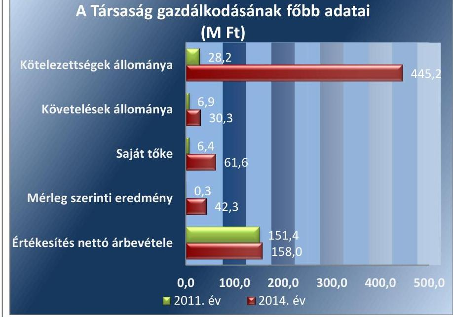

Forrás: A Társaság 2011-2014. évi beszámolói

---

A Társaság feladatellátásához szükséges vagyontárgyakat az Önkormányzat a Vagyonkezelési Szerződés ${ }^{4}$ keretén belül adta át. A Társaság mérleg szerinti vagyona 2014. december 31-én 629,6 M Ft-ot tett ki. Az értékesítés nettó árbevétele a 2014. év végén 158,0 M Ft, az adózott eredmény 42,3 M Ft volt.

Az ellenőrzött időszakban a polgármester ${ }^{5}$ személye nem, a jegyző ${ }^{6}$ személye egy alkalommal változott. A polgármester az 2010. évi önkormányzati választások óta tölti be tisztségét, a jegyző 2011. május 1-től látja el feladatait.

A Társaság a 2011. évben a 479/2009/EK rendelet ${ }^{7}$ a 2012-2014. években pedig az Áht. ${ }^{8}$ 2. § (1) bekezdés I) pontja alapján kormányzati szektorba sorolt egyéb szervezetnek minősült.

---

# AZ ELLENŐRZÉS HÁTTERE, INDOKOLTSÁGA 

## Az önkormányzatok közfeladat-ellátásában egyre jelentősebb a gazdasági társaságok útján történő feladatellátás térnyerése

AZ ÖNKORMÁNYZATI TULAJDONÚ gazdasági társaságok ellenőrzése kiemelten fontos a vagyon megőrzése, megóvása érdekében, valamint a kormányzati szektor elszámolásaiban megjelenő önkormányzati tulajdonú gazdálkodó szervezetek esetében, amelyekkel szemben alapvető követelmény, hogy gazdálkodásuk, működésük szabályszerű, az általuk szolgáltatott adatok minél megbízhatóbbak legyenek. A közfeladat-ellátás költségeinek, ráfordításainak alakulása, színvonala hatással van a lakosság elégedettségére.

A törvényalkotás számára - az észlelt problémák, szabálytalanságok, vagy egyéb nem kívánatos jelenségek felszínre kerülésével - az ellenőrzés megállapításai segítséget nyújthatnak az államháztartáson kívüli feladat/közfeladat-ellátás értékeléséhez, jogszabályi keretei pontosításához, átláthatóságot biztosító szabályozásához. Meghatározhatóvá válnak az önkormányzati feladatellátásban részt vevő államháztartáson kívüli szervezeteknek - az önkormányzat költségvetését, pénzügyi helyzetét is befolyásoló - kockázatai, lehetővé válik ezen kockázatok csökkentése. Ellenőrzéseink feltárhatják, hogy az önkormányzat feladat-ellátási kötelezettségének szabályszerűen tett-e eleget, a feladatellátáshoz rendelt vagyonkezelésbe vett és saját vagyon működtetését az elvárható gondossággal, szabályszerűen szervezte-e meg és a tulajdonosi felügyelete hozzájárult-e a feladatellátásához. Az ellenőrzés rávilágíthat arra, hogy a gazdasági társaság a feladat-ellátási, közszolgáltatási szerződésben foglaltak betartásával, a vagyon használatával biztosította-e a szolgáltatás folytatásának feltételeit, a feladat ellátását. Ezzel az ellenőrzöttek és a helyi döntéshozók számára visszajelzést ad feladatszervezési, feladat-ellátási kockázataikról, alapot ad a meglévő hibák megszüntetéséhez, a jobb feladatellátás biztosításához. Fokozza a fegyelmet, igazolja, hogy lejárt a következmények nélküli ellenőrzések időszaka. Az ÁSZ értékteremtő rend kialakításához és megőrzéséhez hozzájáruló tevékenysége pozitív hatással van a szervezetről kialakított összkép formálására.

---

# FÓKUSZKÉRDÉSEK 

1.     - Az Önkormányzat közfeladat megszervezéséről szóló döntése, valamint tulajdonosi joggyakorlása szabályszerű volt-e?
2.     - A gazdasági társaság vagyongazdálkodása szabályszerű volt-e, kötelezettségállománya jelentett-e kockázatot a működésre, illetve a közfeladat ellátására?
3.     - A gazdasági társaságnál az ellátott közfeladat bevételei és ráfordításai elszámolása, valamint az önköltségszámítás és árképzés szabályszerű volt-e?
4.     - A gazdasági társaság gazdálkodásának a kormányzati szektor hiányára és az államadósságra befolyással bíró elemei megfeleltek-e a jogszabályi előírásoknak?

---

# ELLENŐRZÉS HATÓKÖRE ÉS MÓDSZEREI 

## Az ellenőrzés típusa

Megfelelőségi ellenőrzés

## Az ellenőrzött időszak

Az ellenőrzött időszak 2011. január 1-jétől 2014. december 31-ig.

## Az ellenőrzés tárgya

A gazdasági társaság feletti tulajdonosi joggyakorlás, valamint a gazdasági társaság gazdálkodásának szabályozottsága és szabályszerűsége.

Az ellenőrzés kiterjed minden olyan körülményre és adatra, amely az ÁSZ jogszabályban meghatározott feladatainak teljesítéséhez, valamint a program végrehajtása folyamán felmerült újabb összefüggések feltárásához szükséges.

## Az ellenőrzött szervezet

Pécs Megyei Jogú Város Önkormányzata
Pécsi Sport Nonprofit Zrt.

## Az ellenőrzés jogalapja

Az ellenőrzés jogszabályi alapját az ÁSZ tv. 1. § (3) bekezdése és 5. § (3)-(4)-(5) bekezdései képezik.

## Az ellenőrzés módszerei

Az ellenőrzést a nemzetközi standardokat irányadónak tekintve az ellenőrzési program ellenőrzési kérdései, az ellenőrzött időszakban hatályos jogszabályok, az ellenőrzés szakmai szabályok és módszertanok figyelembevételével végeztük.

Az ellenőrzés ideje alatt az ellenőrzött szervezettel történő kapcsolattartást az ÁSZ Szervezeti és Működési Szabályzatának vonatkozó előírásai alapján biztosítottuk.

Az ellenőrzés a kiválasztott, tulajdonosi jogokat gyakorló Pécs Megyei Jogú Város Önkormányzatára és a Pécsi Sport Nonprofit Zrt.-re terjedt ki.

---

Az ellenőrzött szervezet kormányzati szektorba sorolt gazdasági társaság, így a V0708 ESA kiegészítő modul szerinti ellenőrzési feladatokat is el kellett végezni jelen program végrehajtásával egyidejűleg.

Az ellenőrzési kérdések megválaszolásához szükséges bizonyítékok megszerzése a következő ellenőrzési eljárások alkalmazásával történt: megfigyelés, kérdésfeltevés (információkérés), összehasonlítás, valamint elemző eljárás. Az ellenőrzési bizonyítékként felhasználható adatforrások közé tartoztak egyrészt a szakmai programban felsorolt adatforrások, másrészt adatforrás lehet még minden - az ellenőrzés folyamán - feltárt, az ellenőrzés szempontjából információkat tartalmazó dokumentum.

Az ellenőrzést a kérdésekre adott válaszok kiértékelésével, valamint a megjelölt adatforrások, a csatolt tanúsítványok felhasználásával, továbbá az adott időszakban hatályos jogszabályok figyelembe vételével került lefolytatásra.

A bevételek és ráfordítások elszámolása, valamint a vagyonnyilvántartás terén a szabályszerű működést véletlen mintavétellel ellenőriztük. A kormányzati szektorba sorolt gazdálkodó szervezetek esetében a személyi jellegű ráfordítások elszámolása mellett az egyéb ráfordítások, pénzügyi műveletek ráfordításai, rendkívüli ráfordítások, illetve az egyéb bevételek, pénzügyi műveletek bevételei, rendkívüli bevételek elszámolásának szabályszerűségét szintén mintatételeken keresztül ellenőriztük. A mintavétellel ellenőrzött területek esetében minden egyes tétel vonatkozásában a szabályszerűségre vonatkozó kérdéseket tettünk fel, amelyek eredménye összesítésre került. A jogszabályoknak és a belső előírásoknak megfelelőnek tekintettük az adott területet, amennyiben a minta ellenőrzésének eredménye alapján 95%-os

 bizonyossággal a teljes sokaságban a hibaarány kisebb volt, mint 10%, nem megfelelőnek, ha a hibaarány a 10%-ot meghaladta. A ráfordítások elszámolására és a vagyonnyilvántartásra vonatkozó véletlen mintavételt kockázati alapú kiválasztással egészítettük ki, amelynek során évente a három legnagyobb összegű tételt választottuk ki.

---

# 1. Az Önkormányzat közfeladat megszervezéséről szóló döntése, valamint tulajdonosi joggyakorlása szabályszerű volt-e? 

Összegző megállapítás

Az Önkormányzat a közfeladat ellátását szabályszerűen szervezte meg. A tulajdonosi jogait összességében szabályszerűen gyakorolta.
1.1. számú megállapítás

Az Önkormányzat a közfeladat ellátását szabályszerűen szervezte meg, rendeletalkotási kötelezettségének eleget tett.

A Gazdasági programot az ellenőrzött időszakban az Önkormányzat elkészítette az Ötv. ${ }^{9}$, Mötv. ${ }^{10}$ szerint. A Közgyűlés ${ }^{11}$ által elfogadott 2011-2014. évekre vonatkozó gazdasági program ${ }^{12}$ a közszolgáltatások rendszerének ésszerűsítését és bevételek realizálását helyezte a középpontba.

A Közép és hosszú távú fejlesztési stratégiát a Közgyűlés az ellenőrzött időszakra vonatkozóan elkészítette és jóváhagyta, amelyben elemezték a helyi sport jelenlegi helyzetét, valamint felvázolták a fejlesztésre vonatkozó elképzeléseket.

## A Közép- és hosszú távú vagyongazdálkodási tervet ${ }^{13}$ az Önkormányzat 2012. január 1. és 2013. február 7. között nem készített az Nvtv. ${ }^{14}$ 9. § (1) bekezdésben előírtak ellenére. Az Nvtv.-nek megfelelően a 2013-2016. évekre vonatkozóan elkészítette a közép- és hosszú távú vagyongazdálkodási tervét, amelyet a Közgyűlés szabályszerűen elfogadott.

A Településfejlesztési koncepció ${ }^{15}$ fejlesztési célként határozta meg a sportolási lehetőségek fejlesztését Pécs város közigazgatási területén, azon belül is az utánpótlás-nevelés, a szabadidő- és diáksport lehetőségeinek bővítését és feltételeinek javítását.

A Sportkoncepció1,2-t ${ }^{16}$ a Közgyűlés a Sport tv. ${ }^{17}$-nek megfelelően határozta meg. A Sportkoncepció ${ }_{1,2}$-ban meghatározták a sportpolitikai, sport-szakmai és a sportfinanszírozás fejlesztésére vonatkozó elképzeléseket.

A Sportrendelet ${ }^{18}$ megalkotásával az Önkormányzat eleget tett a Sport tv.-ben előírt rendeletalkotási kötelezettségének. A Sportrendeletben meghatározták a sportkoncepció megvalósításához szükséges feltételrendszereket, valamint az önkormányzati támogatások évenkénti elosztásának és felhasználásának egységes szabályait.

---

Közszolgáltatási szerződést ${ }^{19}$ az Önkormányzat és a Társaság az ellenőrzött időszakot megelőzően 2010. július 1-jén határozatlan időre kötött az Ötv. előírásainak megfelelően. A közszolgáltatási szerződésben meghatározták a közszolgáltatás kompenzációjának mértékét, módját, kifizetésének feltételeit, az adatszolgáltatások, tájékoztatások módjait, gyakoriságát. A közszolgáltatási szerződést az ellenőrzött időszakban nem módosították.

Vagyonkezelési szerződést az ellenőrzött időszakot megelőzően kötött az Önkormányzat és a Társaság 2010. július 1-jén határozatlan időre az Ötv. és az Áht. ${ }_{1}{ }^{20}$ előírásainak megfelelően. Az Önkormányzat a vagyonkezelési szerződés mellékletében meghatározott ingatlan és ingó eszközök átadásával biztosította a Társaság közfeladat ellátását. A vagyonkezelési szerződést az ellenőrzött időszakban két alkalommal módosították.

A vagyonkezelési szerződés nem felelt meg 2011. december 31-ig az Áht. ${ }_{1}$ 105/B. § (1) bekezdés h)-j) pontjainak, 2012. január 1-jétől Nvtv. 17. § (1) bekezdés előírásainak, mert nem tartalmazta a szerződés teljesítésének biztosítására vonatkozó rendelkezéseket, a teljesítés biztosítására szolgáló mellékötelezettségeket és egyéb biztosítékokat, a vagyonkezelésbe adott vagyonnal való mérhető és eredményes gazdálkodásra vonatkozó előírásokat.

Haszonbérleti szerződést ${ }_{1}$ a Holding ${ }^{21}$ és a Társaság 2011. június 1-jén kötött a Ptk. ${ }_{1}^{22}$-nek megfelelően. A haszonbérleti szerződés tárgya a „Hullámfürdő” ingatlan üzemeltetése. A haszonbérleti szerződést határozatlan időre kötötték. A haszonbérbe adott ingatlant és eszközöket a haszonbérleti szerződés 1. számú melléklete tartalmazta.

Haszonbérleti szerződést ${ }_{2}$ az Önkormányzat és a Társaság 2012. június 29-én határozatlan időtartamra kötött a Ptk. ${ }_{1}$-nek megfelelően, az Önkormányzat tulajdonát képező „extrém sportpálya” haszonbérbe adása tárgyában. A haszonbérleti szerződésben meghatározták az ingatlan hasznosításával kapcsolatos jogok és kötelezettségeken túl a felújítási, beruházási feltételeket is.

# 1.2. számú megállapítás 

Az Önkormányzat a tulajdonosi jogait összességében szabályszerűen gyakorolta.

A Tulajdonosi jogok gyakorlásának rendjét a Közgyűlés az Ötv. és az Mötv. felhatalmazása alapján a vagyonrendelet ${ }_{1,2}{ }^{23}$-ben szabályozta. A tulajdonosi jogokat összességében szabályszerűen gyakorolta. A tulajdonosi joggyakorlás rendjét a Gt. ${ }^{24}$-nek és a Ptk. ${ }_{2}{ }^{25}$-nek megfelelő Alapszabály is szabályozta.

Az FB ${ }^{26}$ az Alapszabály, a Gt. és a Ptk. ${ }_{2}$ előírásainak megfelelően alakította ki ügyrendjét, szabályszerűen működött. Az FB az ellenőrzött időszak végéig 3 tagból állt.

---

Ellenőrzést az Önkormányzat az önkormányzati tulajdonú gazdasági társaságok részére nyújtott 2012. évi kompenzáció, támogatás felhasználása tárgyában hajtott végre. Az ellenőrzés nem tárt fel hiányosságot.

Beszámolási kötelezettséget a közszolgáltatási illetve a vagyonkezelési szerződés írt elő a Társaság részére. A Társaság a közszolgáltatási feladatok teljesítéséről, és az értékcsökkenésről negyedévente; a kompenzáció elszámolásáról Éves Működési Jelentésben, a vagyon működtetéséről Vagyonkezelési Éves Beszámolóban évente volt köteles az Önkormányzatot tájékoztatnia.

Javadalmazási illetve juttatási szabályzattal a Társaság a Taktv. ${ }^{27}$-nek megfelelően rendelkezett, melyet a tulajdonosi joggyakorló jóváhagyott az ellenőrzött időszakot megelőzően.

# 2. A gazdasági társaság vagyongazdálkodása szabályszerű volt-e, kötelezettségállománya jelentett-e kockázatot a működésre, illetve a közfeladat ellátására? 

Összegző megállapítás

A Társaság a 2011. és 2012. évi számviteli éves beszámolói a Számv. tv.-t megsértve nem tartalmazták a vagyonkezelésbe kapott vagyon értékét. A Társaság vagyongazdálkodása nem volt szabályszerű. A kötelezettségek állománya a működést és a közfeladat ellátást nem veszélyeztette.

A Társaság rendelkezett a kötelező számviteli szabályzatokkal, de azok tartalma nem felelt meg a jogszabályi előírásoknak. A Leltározási szabályzat nem felelt meg a Számv. tv. rendelkezéseinek.

Az Üzleti terveket a Társaság a 2011-2014. években az éves beszámolóval egyidejűleg elkészítette. A 2011-2012. évi üzleti terveket a tulajdonosi joggyakorló nem hagyta jóvá. A 2013-2014. évi üzleti terveket a tulajdonosi joggyakorló határozatában jóváhagyta.

Számviteli szabályzatokkal a Társaság a 2011-2014. években rendelkezett a Számv. tv. ${ }^{28}$-nek megfelelően.

A Számv. tv.-nek megfelelően rendelkezett hatályos Számviteli politika ${ }_{1,2,3}{ }^{29}$-al és leltározási ${ }^{30}$, értékelési ${ }^{31}$, illetve pénzkezelési szabályzat ${ }_{1,2}{ }^{32}$-vel, valamint számlarend ${ }_{1,2,3}{ }^{33}$-al. A Társaság a Számv. tv. 14. § (5) bekezdés c) pontja, valamint a (6)-(7) bekezdései alapján a 2013. évtől önköltségszámítási szabályzat készítésére kötelezett volt, azonban azzal nem rendelkezett.

Számviteli politika ${ }_{1,2,3}$ nem felelt meg az Áht. ${ }_{1}$ 105/A. § (13), valamint a Számv. tv. 161/A. § (2) bekezdéseinek, mert nem írták elő az ellenőrzött időszakban a saját és a vagyonkezelésbe kapott vagyon elkülönített nyilvántartását. Az Áht. ${ }_{1}$ 105/A. § (11), és a Mötv. 109. § (6) bekezdései előírása ellenére nem szabályozták a vagyonkezelésbe vett vagyon után elszámolt értékcsökkenés összegének felhasználására vonatkozó éves elszámolási kötelezettséget.

A Számlarend ${ }_{1,2,3}$ nem felelt meg a Számv. tv. 161. § (1) bekezdésének, mert az ellenőrzött időszakban nem tartalmazta az Áht. ${ }_{1}$ 105/A. § (12) bekezdése, majd 2012. január 1-jétől a Mötv. 109. § (7) bekezdése ellenére a saját és a vagyonkezelésbe kapott vagyon működtetéséből származó bevételek és ráfordítások elkülönítését.
A Számlarend ${ }_{1,2,3}$ az ellenőrzött időszakban a Közszolgáltatási szerződés 8.3. pontjában, 2011. december 31-ig a Közhasznúsági tv. ${ }^{34}$ 18. § (1) bekezdésében előírtak ellenére, nem biztosította a közhasznú tevékenység ráfordításainak elkülönített nyilvántartását.

A Leltározási szabályzat nem felelt meg a Számv. tv. 69. § (3) bekezdésének, mivel abban 2012. január 1-jétől nem határozták meg a mennyiségi leltárfelvétel gyakoriságát.

Adatvédelmi és adatbiztonsági szabályzattal ${ }^{35}$ a Társaság az Avtv. ${ }^{36}$ előírásainak megfelelően 2010. augusztus 1-jétől rendelkezett, amelyet az Info tv. ${ }^{37}$ hatályba lépésével, annak szabályozásának megfelelően nem aktualizáltak az ellenőrzött időszakban.

# 2.2. számú megállapítás 

A Társaság vagyongazdálkodása nem volt szabályszerű.

A Vagyonkezelésbe vett eszközökről a Társaság a vagyonkezelési szerződésben, valamint a 2011. évben az Áht. ${ }_{1}$ 105/A. § (13), a 2012. évben a Mötv. 109. § (7) bekezdései foglaltak ellenére elkülönített nyilvántartást nem vezetett. A Társaság a 2013. és 2014. években a vagyonkezelésbe vett eszközeit a Számv. tv.-nek és a Mötv.-nek megfelelően, elkülönítetten tartotta nyilván.

Az ellenőrzött időszakban minden évben elvégezték a saját tulajdonú és a vagyonkezelésbe kapott eszközök leltárazását. A 2011. és 2012. években készített leltárak a vagyonkezelésbe kapott eszközöket értékben a Számv. tv. 69. § (1) bekezdés ellenére nem tartalmazták, csak mennyiségben szerepeltették. A 2011. és 2012. évi beszámolók nem tartalmazták a vagyonkezelésbe kapott eszközök értékét. Értékcsökkenést az Áht. ${ }_{1}$ 105/A. § (14) és a Mötv. 109. § (6) bekezdései ellenére nem számoltak el, pótlásra tartalékot nem képeztek.

A 2013-2014. évi beszámolók azonban már a Számv. tv.-nek megfelelően készültek el. A 2013-2014. években a tartalékképzés az elszámolt értékcsökkenésnek és a Mötv.-nek megfelelően történt.

A saját vagyon nyilvántartása az ellenőrzött időszakban a Számv. tv.-nek megfelelő volt. A 2011-2014. éves beszámolókban szereplő saját vagyonértékeit leltárral megfelelően alátámasztották.

A Társaság mérlegei kiemelt adatait alakulását az 1. táblázat mutatja be.

---

| PÉCSI SPORT NONPROFIT ZRT. MÉRLEGÉNEK KIEMELT ADATAI (M FT) |  |  |  |  |  |
| :--: | :--: | :--: | :--: | :--: | :--: |
| Megnevezés | 2011-01-01 | 2011-12-31 | 2012-12-31 | 2013-12-31 | 2014-12-31 |
| I. Befektetett eszközök | 4,6 | 26,7 | 35,4 | 424,2 | 469,4 |
| - ebből: Tárgyi eszközök | 3,6 | 25,6 | 33,8 | 423,0 | 466,7 |
| II. Forgó eszközök | 45,4 | 112,9 | 126,8 | 195,8 | 157,3 |
| - ebből: Követelések | 6,9 | 8,0 | 10,4 | 38,4 | 30,3 |
| III. Aktív időbeli elhatárolások | 0,4 | 17,5 | 37,2 | 2,7 | 2,9 |
| Eszközök összesen | 50,4 | 157,1 | 199,3 | 622,7 | 629,6 |
| IV. Saját tőke | 6,4 | 7,0 | 7,6 | 19,3 | 61,6 |
| - ebből: Jegyzett tőke | 5,0 | 5,4 | 5,4 | 5,4 | 5,4 |
| - ebből Mérleg szerinti eredmény | 1,4 | 0,3 | 0,6 | 11,7 | 42,3 |
| V. Céltartalékok | 0,0 | 0,0 | 0,0 | 0,0 | 0,0 |
| VI. Kötelezettségek | 28,2 | 70,2 | 99,5 | 463,0 | 445,2 |
| - ebből Hosszú lejáratú | 0,0 | 5,4 | 9,4 | 408,7 | 405,0 |
| VII. Passzív időbeli elhatárolások | 15,8 | 79,9 | 92,2 | 140,4 | 122,8 |
| Források összesen | 50,4 | 157,1 | 199,3 | 622,7 | 629,6 |

Forrás: Társaság adatszolgáltatása/Társaság 2011-2014. évi beszámolói
2.3. számú megállapítás

Az eszközök értékének állománya a 2011. évről a 2014. évre 579,2 M Ft-tal növekedett, mivel a vagyonkezelt tárgyi eszközök állományba vétele a 2013. évben történt meg 398,0 M Ft értékben.

A források értékének 579,2 M Ft-os emelkedése elsődlegesen a kötelezettségek összegének 417,0 M Ft-tal történő emelkedéséhez kapcsolódott.
 A kötelezettség állomány növekedését elsődlegesen a hosszú lejáratú kötelezettségek $405,0^{\circ} \mathrm{M}^{\circ} \mathrm{Ft}$-os összegű emelkedése idézte elő, amelyből 398,0 M Ft-ot a vagyonkezelésbe vett eszközök értékének hosszú lejáratú kötelezettségekkel szembeni nyilvántartásba vétele jelentett.

A SAJÁT TÖKE a 2011. évi nyitó 6,4 M Ft-ról a 2014. év végére 61,6 M Ft-ra emelkedett, amelyet a Társaság nyereséges gazdálkodása eredményezett. A növekedést a legnagyobb mértékben a 2014. év eredménye befolyásolta a 42,3 M Ft-os növelő hatásával. A saját tőke az ellenőrzött időszakban lényegesen meghaladta a jegyzett tőke 5,4 M Ft-os összegét.

## A kötelezettségek állománya a működést és a közfeladat ellátását nem veszélyeztette.

AZ ELADÓSODOTTSÁG MÉRTÉKE és szerkezete az ellenőrzött időszakban nem jelentett kockázatot a Társaság közfeladat ellátására, illetve nem veszélyeztette a működést.

A HOSSZÚ LEJÁRATÚ KÖTELEZETTSÉGEK két tételből származtak, kisebb részben a lízingelt gépjárművek miatti lízingdíjakból, amelyek nagysága 5,4-10,7 M Ft között mozgott, illetve az Önkormányzattal szembeni, a vagyonkezelt eszközökhöz kapcsolódó 398,0 M Ft-os kötelezettségből.

A Társaság kötelezettség állományának alakulását a 2. táblázat mutatja be.

---

2. táblázat

| A KÖTELEZETTSÉG ÁLLOMÁNY ALAKULÁSA (M FT) |  |  |  |  |
| :-- | --: | --: | --: | --: |
| Megnevezés | 2011. | 2012. | 2013. | 2014. |
| Rövid lejáratú kötelezettségek | 64,8 | 90,1 | 54,3 | 40,3 |
| ebből Szállítók | 43,8 | 54,2 | 21,2 | 18,2 |
| ebből: Egyéb rövid lejáratú | 21,0 | 35,9 | 33,1 | 22,1 |
| Hosszú lejáratú kötelezettségek | 5,4 | 9,4 | 408,7 | 405,0 |
| ebből Vagyonkezelési szerződésből eredő | 0,0 | 0,0 | 398,0 | 398,0 |
| ebből Egyéb hosszú lejáratú hitelek | 5,4 | 9,4 | 10,7 | 7,0 |
| Kötelezettségek összesen | 70,2 | 99,5 | 463,0 | 445,3 |

A RÖVID LEJÁRATÚ KÖTELEZETTSÉGEK állománya, a szállítói tartozások értéke az ellenőrzött időszakban folyamatosan csökkent, de a Társaság fizetési késedelme jelentős volt az ellenőrzött időszak tekintetében. A szállítók év végi állományából az ellenőrzött időszakban a határidőn túli tartozások aránya emelkedő tendenciát mutatott. 2011. évben 12,6%, 2012. évben 31,0%, 2013. évben 92,5%, 2014. évben 64,3% volt.
2.4. számú megállapítás

A Társaság 2011. és 2012. évi számviteli éves beszámolói a Számv. tv. előírásait megsértve nem tartalmazták a vagyonkezelésbe kapott vagyon értékét. A Társaság a beszámolási közzétételi kötelezettségének nem teljes körűen tett eleget.

# A SZÁMVITELI BESZÁMOLÁSI KÖTELEZETTSÉ-

GÉNEK a Társaság eleget tett, a Számv. tv.-nek megfelelően elkészítette a 2013-2014. évekre vonatkozó éves beszámolóit. A 2011. és 2012. évi beszámolók nem a valós képet tükrözték, mivel a Számv. tv. 23. § (2) és 42. § (1) bekezdései ellenére nem tartalmazták a vagyonkezelésbe kapott vagyon értékét és az azzal kapcsolatos kötelezettségeket. Ezzel megsértette a Számv. tv. 4. § (2) és 15. § (3) bekezdéseit. A 2013-2014. évi beszámolók már tartalmazták a vagyonkezelésbe kapott vagyon értékét és az azzal kapcsolatos kötelezettségeket.

A Társaság a 2011. és 2012. évi beszámolóit a Számv. tv. 153. § (1) bekezdés előírása ellenére határidőn túl helyezte letétbe, valamint a Számv. tv. 154. § (1) bekezdése ellenére tette közzé. A 2013. és 2014. évi beszámolók letétbe helyezése és közzététele a Számv. tv. szerinti határidőben megtörtént.

A 2011-2014. évi éves beszámolókat a tulajdonosi joggyakorló elfogadta.

A könyvvizsgáló ${ }_{2}{ }^{38}$ a Társaság 2011. és 2012. évi számviteli beszámolóit hitelesítő záradékkal látta el. A könyvvizsgáló ${ }_{1}$ nem kifogásolta a vagyonkezelt eszközök nyilvántartásba vételének és ezzel kapcsolatban az eszközök beszámolóban történő megjelenésének a hiányát.

A 2013. évben megválasztott könyvvizsgáló ${ }_{2}{ }^{39}$ a 2013. évi beszámoló könyvvizsgálatakor tájékoztatta a Közgyűlést a vagyonkezelt vagyon elszámolási és nyilvántartási hiányosságairól. A könyvvizsgáló ${ }_{2}$ a 2013. és a 2014. évi beszámolókat az előző évek hibáinak áthúzódó hatása miatt korlátozó záradékkal látta el.

---

Az FB a 2011. és 2012. évi beszámolókat a könyvvizsgálói jelentések birtokában tárgyalta, és annak alapján készítette el írásbeli jelentéseit. Az FB a 2013. és 2014. évi beszámolókról készített írásos jelentéseiben a könyvvizsgálói jelentések figyelembe vételéről döntött és javaslatokat fogalmazott meg a Társaság könyvvezetésére vonatkozóan.

A BESZÁMOLÁSI ÉS ADATSZOLGÁLTATÁSI kötelezettséget a Társaság részére az ellenőrzött időszakban a vagyonkezelési szerződés és a közszolgáltatási szerződés írta elő.

A vagyonkezelési szerződésben meghatározták a vagyonkezelésbe adott vagyonban bekövetkező változásokról szóló kimutatás készítési kötelezettséget. Ennek a Társaság az elvégzett éves leltározás során készített eszközlista Önkormányzat részére történő megküldésével tett eleget az ellenőrzött időszakban. A Társaság a közszolgáltatási szerződésben előírt kompenzáció éves elszámolásához szükséges adatszolgáltatási kötelezettségének eleget tett.

A Társaság nem tett eleget a vagyonkezelési szerződés 20. és 21. pontjaiban előírt, a vagyonkezelt eszközök után elszámolt értékcsökkenés összegéről szóló negyedéves, valamint a beruházásokról szóló tájékoztatási kötelezettségeinek.

A Társaság az ellenőrzött időszakban a közszolgáltatási szerződésben előírt Éves Működési Jelentéseit, valamint vagyonkezelési szerződésben előírt a vagyon működtetéséről szóló Vagyonkezelési Éves Beszámolóit nem készítette el.

# A KÖZÉRDEKŰ ADATOK NYILVÁNOSSÁGRA HO-

ZATALÁVAL ${ }^{40}$ kapcsolatos kötelezettségének a Társaság a Taktv. 2. §-ban foglaltaknak megfelelően eleget tett. A Társaság az Info tv. 1. számú melléklet III. pontja szerinti gazdálkodási adatait a honlapján közzétette.

A Társaság a 2011. évben elkészítette a Közhasznúsági tv. szerinti közhasznúsági jelentését, és a 2012-2014. években a Civil tv. ${ }^{41}$ előírásai szerinti közhasznúsági mellékleteit. A Társaság a 2011. évben a Közhasznúsági tv. 19. § (5) bekezdése ellenére közhasznúsági jelentését, a 2012. évben a Civil tv. 46. § (1) bekezdések előírása ellenére a közhasznúsági mellékletét nem tette közzé. A 2013. és 2014. években a Társaság intézkedett a közhasznúsági mellékletek közzétételéről.

---

# 3. A gazdasági társaságnál az ellátott közfeladat bevételei és ráfordításai elszámolása, valamint az önköltségszámítás és árképzés szabályszerű volt-e? 

Összegző megállapítás

### 3.1. számú megállapítás

A Társaság által ellátott közfeladat bevételeinek és ráfordításainak elszámolása nem volt megfelelő. A Társaság nem készítette el az önköltségszámítási szabályzatát, annak ellenére, hogy arra a 2013. évtől kötelezett volt.

A Társaság az ellátott közfeladat bevételeit nem megfelelően mutatta ki a könyvviteli nyilvántartásaiban, a ráfordításainak elszámolása során nem tartotta be a számviteli elkülönítésre vonatkozó jogszabályi előírásokat.

AZ ÉRTÉKESÍTÉS NETTÓ ÁRBEVÉTELÉNEK ELSZÁMOLÁSA nem volt megfelelő, mivel az Áht. 1 105/A. § (12) és a Mötv. 109. § (7) bekezdések előírásai ellenére - a számlarend hiányossága miatt - a vagyonkezelésbe vett vagyon használatából származó bevételeket nem különítették el. A közszolgáltatási tevékenység és az egyéb vállalkozási jellegű tevékenység bevételei elkülönítése megfelelő volt, a bevételeket a számlatükör szerinti megfelelő főkönyvi számlára könyvelték.

AZ ANYAGJELLEGŰ RÁFORDÍTÁSOK elszámolása - a számlarend hiányosságai miatt - nem volt megfelelő, mert az Áht. 1 105/A. § (12) és a Mötv. 109. § (7) bekezdések előírásai ellenére a vagyonkezelt eszközökkel kapcsolatos ráfordítások elkülönítését nem végezték el. Továbbá a Közszolgáltatási szerződés 8.3. pontja és 2011. december 31-ig a Közhasznúsági tv. 18. § (1) bekezdése ellenére nem különítették el a közhasznú tevékenységek ráfordításait. A Társaság a költségek, ráfordítások elszámolását megfelelő számviteli bizonylatokkal támasztotta alá, azokat a megfelelő költségnemekre könyvelték le.

A BERUHÁZÁSOK, FELÚJÍTÁSOK elszámolása megfelelő volt, a dokumentumok rendelkezésre álltak, a pénzügyi teljesítés a szerződés szerinti összegben történt. A bekerülési érték meghatározása a Számviteli politika ${ }_{1,2,3}$ szerint szabályszerű volt, az üzembe helyezést megfelelően dokumentálták.

AZ ÉRTÉKCSÖKKENÉS elszámolása nem volt megfelelő, mivel a Társaság a Számv. tv. 52-53. §-ai és a Számviteli politika ${ }_{1,2,3}$ előírásai ellenére, a vagyonkezelésbe átvett eszközök után a 2011. és 2012. években értékcsökkenést nem számolt el.

A KÖVETELÉSÁLLOMÁNY jelentősen, 6,9 M Ft-ról 30,3 M Ft-ra emelkedett a 2011-2014. időszakban. A vevői kintlévőségek behajtására a Társaság csak a 2013. évtől kezdve alakított ki gyakorlatot. A fizetési felszólítások kiküldésén kívül egyéb intézkedés nem történt. A Társaság a Számv. tv. 55. § (1) bekezdése és a Számviteli politika ${ }_{2,3}$ alapján értékvesztést számolt el a követelésállomány után.

---

# 3.2. számú megállapítás 

A Társaság nem készítette el önköltségszámítási szabályzatát, annak ellenére, hogy arra a 2013. évtől kötelezett volt.

ÖNKÖLTSÉGSZÁMÍTÁSI SZABÁLYZAT készítési kötelezettsége a Társaságnak a 2011-2012. években nem volt. A Számv. tv. 14. § (7) bekezdése ellenére a 2013-2014. évekre vonatkozóan nem készítette el önköltségszámítási szabályzatát.

ÁRKÉPZÉSI SZABÁLYOKAT az Önkormányzat nem írt elő a Társaság részére, erre az ellenőrzött időszakban jogszabályi kötelezettsége nem volt. A Társaság nem tartozott az Ártv. ${ }^{42}$ hatálya alá.

Az Önkormányzat a Társaság által ellátott közfeladat vonatkozásában nem rendelkezett díjkoncepcióval, díjmegállapításra vonatkozóan rendeletalkotási kötelezettsége nem volt.

## 4. A gazdasági társaság gazdálkodásának a kormányzati szektor hiányára és az államadósságra befolyással bíró elemei megfeleltek-e a jogszabályi előírásoknak?

Összegző megállapítás

### 4.1. számú megállapítás

4.2. számú megállapítás

A kormányzati szektor hiányára befolyást gyakorló bevételek és ráfordítások elszámolása nem volt megfelelő. A 2012. évben egy államadósságot keletkeztető ügyletet miniszteri engedély nélkül kötöttek. Osztalékfizetés nem történt.

A Társaság a 2012. évben egy államadósságot keletkeztető ügyletet miniszteri engedély nélkül kötött.

A TÁRSASÁG a nemzetgazdasági miniszter közleménye szerint a kormányzati szektorba sorolt egyéb szervezetnek minősült 2012. február 16-tól.

A Társaság a 2012. évben egy 60 hónapos lejáratú lízingszerződést kötött gépjármű megvásárlására 3,9 M Ft összegben, amelyhez a Stabilitási tv. 9. § (1) bekezdésében előírtak ellenére nem rendelkezett az államháztartásért felelős miniszter előzetes hozzájárulásával.

A kormányzati szektor hiányára befolyást gyakorló elszámolások nem voltak megfelelőek. Osztalékfizetésre nem került sor.

A kormányzati szektor hiányára befolyást gyakorló bevételek és ráfordítások elszámolása a Társaságnál nem volt megfelelő. A személyi jellegű ráfordítások elszámolása során a közfoglalkoztatási szerződésben szereplő munkabér és munkaidő, a munkaidő-nyilvántartás illetve a bérkarton adatai nem voltak összhangban.

A Társaságnál a 2012-2014. évek közötti időszakban a tulajdonosi jogok gyakorlója osztalék kifizetéséről nem döntött.

---

# JAVASLATOK 

Az ÁSZ tv. 33. § (1) bekezdésében foglaltak értelmében az ellenőrzött szervezet vezetője köteles a jelentésben foglalt megállapításokhoz kapcsolódó intézkedési tervet összeállítani és azt a jelentés kézhezvételétől számított 30 napon belül az ÁSZ részére megküldeni. Amennyiben az ellenőrzött szervezet vezetője nem küldi meg határidőben az intézkedési tervet, vagy továbbra sem elfogadható intézkedési tervet küld, az Állami Számvevőszék elnöke az ÁSZ tv. 33. § (3) bekezdés a) és b) pontjaiban foglaltakat érvényesítheti.

## Pécsi Sport Nonprofit Zrt. vezérigazgatójának

1. Intézkedjen az önköltségszámítási szabályzat elkészítéséről a Számv. tv.-ben előírtak szerint.
(2.1. sz. megállapítás 3. bekezdése alapján)
2. Intézkedjen a Számlarend módosításáról annak érdekében, hogy a saját és a vagyonkezelésbe vett vagyon működtetéséből származó bevételek és ráfordítások egyértelműen elhatárolhatók legyenek és ezáltal az elkülönített nyilvántartás biztosított legyen. Továbbá intézkedjen a közhasznú tevékenység ráfordításainak elkülönített nyilvántartásáról annak érdekében, hogy a cél szerinti, illetve
 a vállalkozási tevékenységből származó ráfordítások elkülönített nyilvántartása megvalósuljon.
(2.1. sz. megállapítás 5-6. bekezdései és a 3.1. sz. megállapítás 1-2. bekezdései alapján)

---

# MELLÉKLETEK 

## I. SZ. MELLÉKLET: ÉRTELMEZŐ SZÓTÁR

adósságfedezeti mutató I.
adósságfedezeti mutató II.

Adósságot keletkeztető ügylet
árbevételre vetített eladósodottság
eladósodottság mértéke
(befektetett eszközök + forgó eszközök) / idegen forrás
Azt mutatja, hogy 1 Ft adósságra hány Ft vagyon jut. Általánosságban véve kedvező, ha értéke 2 körül van, de nagy eszközberuházás-igényű iparágakban értéke kisebb is lehet.
működési cash flow / hosszú lejáratú kötelezettségek
A mutató azt jelzi, hogy az adott gazdálkodási időszak működési pénzáramainak eredményeként realizált cash flow révén a vállalkozás mennyiben lenne képes valamennyi hosszú lejáratú kötelezettségének eleget tenni. Ennek vizsgálatára viszonylag ritkán kerül sor, az elsősorban a veszélyhelyzetbe került vállalkozások esetében lehet érdekes. Általánosságban véve kedvező, ha a működési cash flow minél nagyobb arányban nyújt fedezetet a hosszú lejáratú kötelezettségre (értéke nagyobb, mint 1, nő az ellenőrzött időszakban).
Adósságot keletkeztető ügylet és annak értéke:
a) hitel, kölcsön felvétele, átvállalása a folyósítás, átvállalás napjától a végtörlesztés napjáig, és annak aktuális tőketartozása,
b) a Számv. tv. szerinti hitelviszonyt megtestesítő értékpapír forgalomba hozatala a forgalomba hozatal napjától a beváltás napjáig, kamatozó értékpapír esetén annak névértéke, egyéb értékpapír esetén annak vételára,
c) váltó kibocsátása a kibocsátás napjától a beváltás napjáig, és annak a váltóval kiváltott kötelezettséggel megegyező, kamatot nem tartalmazó értéke,
d) a Számv. tv. szerint pénzügyi lízing lízingbevevői félként történő megkötése a lízing futamideje alatt, és a lízingszerződésben kikötött tőkerész hátralévő összege,
e) a visszavásárlási kötelezettség kikötésével megkötött adásvételi szerződés eladói félként történő megkötése - ideértve a Számv. tv. szerinti valódi penziós és óvadéki repóügyleteket is - a visszavásárlásig, és a kikötött visszavásárlási ár,
f) a szerződésben kapott, legalább háromszázhatvanöt nap időtartamú halasztott fizetés, részletfizetés, és a még ki nem fizetett ellenérték,
g) hitelintézetek által, származékos műveletek különbözeteként az Államadósság Kezelő Központ Zrt.-nél elhelyezett fedezeti betétek, és azok összege.
Forrás: Stabilitási tv. ${ }^{43}$ 3. § (1) bekezdése
(kötelezettségek - forgóeszközök) / értékesítés nettó árbevétele
Az árbevételre vetített eladósodottság azt mutatja, hogy az árbevétel mekkora fedezet nyújt a kötelezettségeknek a forgóeszközökkel csökkentett részére. Általánosságban véve kedvező, ha az árbevétel minél nagyobb arányban nyújt fedezetet a forgóeszközökkel csökkentett kötelezettségekre (értéke kisebb, mint 1, csökken az ellenőrzött időszakban).
Kötelezettségek / saját tőke
Fontos szerepet játszik ez a mutató egy vállalat megítélésében. Azt mutatja, hogy a saját források a kötelezettségek hány százalékát fedezik. Törekedni kell, hogy a mutató tartósan (jelentősen) 1 alatti értéket érjen el.

---

eladósodottságot jellemző mutatók
eladósodottsági mutató (tőkeáttétel): idegen tőke/összes forrás.
Egészségesnek mondható egy olyan mértékű áttétel, amelyet az üzleti tervek szerint és az elmúlt időszak tapasztalatai alapján a társaság megfelelő biztonsággal ki tud termelni. Nagy eszközberuházás-igényű iparágakban értéke magasabb, azaz magasabb eladósodottság is elfogadható, de 75-85%-ot meghaladó értéknél már itt is erős, sőt túlzott külső finanszírozottságról beszélhetünk. Általánosságban véve kedvező, ha értéke kisebb, mint 0,6.
eladósodottság mértéke: kötelezettségek / saját tőke.
Fontos szerepet játszik ez a mutató egy vállalat megítélésében. Azt mutatja, hogy a saját források a kötelezettségek hány százalékát fedezik. Törekedni kell, hogy a mutató tartósan (jelentősen) 1 alatti értéket érjen el.
nettó eladósodottság: (kötelezettségek-követelések) / saját tőke.
Azt mutatja, hogy a kintlévőségekkel csökkentett kötelezettségeket milyen mértékben fedezi a saját forrás. Ez feltételezi, hogy a követelések pénzügyileg előbb realizálódnak, mint ahogy a kötelezettségeket teljesíteni kell. A mutató minél kisebb, csökkenő értéke a kedvező.
adósságfedezeti mutató I.: (befektetett eszközök+forgó eszközök) / idegen forrás.
Azt mutatja, hogy 1 Ft adósságra hány Ft vagyon jut. Általánosságban véve kedvező, ha értéke 2 körül van, de nagy eszközberuházás-igényű iparágakban értéke kisebb is lehet.
adósságfedezeti mutató II.: működési cash flow / hosszú lejáratú kötelezettségek.
A mutató azt jelzi, hogy az adott gazdálkodási időszak működési pénzáramainak eredményeként realizált cash flow révén a vállalkozás mennyiben lenne képes valamennyi hosszú lejáratú kötelezettségének eleget tenni. Ennek vizsgálatára viszonylag ritkán kerül sor, az elsősorban a veszélyhelyzetbe került vállalkozások esetében lehet érdekes. Általánosságban véve kedvező, ha a működési cash flow minél nagyobb arányban nyújt fedezetet a hosszú lejáratú kötelezettségre (értéke nagyobb, mint 1, nő az ellenőrzött időszakban).
árbevételre vetített eladósodottság: (kötelezettségek - forgóeszközök) / értékesítés nettó árbevétele.
Az árbevételre vetített eladósodottság azt mutatja, hogy az árbevétel mekkora fedezetet nyújt a kötelezettségeknek a forgóeszközökkel csökkentett részére. Általánosságban véve kedvező, ha az árbevétel minél nagyobb arányban nyújt fedezetet a forgóeszközökkel csökkentett kötelezettségekre (értéke kisebb, mint 1, csökken az ellenőrzött időszakban).
garancia
gazdasági társaság

A garancia olyan önálló, az önkormányzat nevében vállalt kötelezettség, amely alapján az önkormányzat az önkormányzati költségvetés terhére szerződésben meghatározott feltételek szerint, a kötelezett nem teljesítése esetén a jogosultnak fizetést teljesít az előzetesen rögzített összeghatárig.
Ptk. 2 3.88. § (1) bekezdése szerint „a gazdasági társaságok üzletszerű közös gazdasági tevékenység folytatására, a tagok vagyoni hozzájárulásával létrehozott, jogi személyiséggel rendelkező vállalkozások, amelyekben a tagok a nyereségből közösen részesednek, és a veszteséget közösen viselik”.

---

gazdálkodó szervezet
kezesség
közfeladat
közszolgáltatás

A Ptk. 1 685. § c) pontja szerint gazdálkodó szervezet: „az állami vállalat, az egyéb állami gazdálkodó szerv, a szövetkezet, a lakásszövetkezet, az európai szövetkezet, a gazdasági társaság, az európai részvénytársaság, az egyesülés, az európai gazdasági egyesülés, az európai területi együttműködési csoportosulás, az egyes jogi személyek vállalata, a leányvállalat, a vízgazdálkodási társulat, az erdő birtokossági társulat, a végrehajtói iroda, az egyéni cég, továbbá az egyéni vállalkozó.” (Hatályos: 2014. március 15-éig) A Hgt. ${ }^{44}$ 2. § (1) bekezdés 15. pontja szerint „a polgári perrendtartásról szóló törvényben meghatározott gazdálkodó szervezet, ide nem értve azt a költségvetési szervet, amelyet az államháztartásról szóló törvény szerint közfeladat ellátására hoztak létre.” (hatályos: 2014. március 15-től)
A kezességre vonatkozó előírásokat a Ptk. 2 6:416-430. §-ai tartalmazzák. Kezességi szerződéssel a kezes kötelezettséget vállal a jogosulttal szemben, hogyha a kötelezett nem teljesít, maga fog helyette a jogosultnak teljesíteni. Kezesség egy vagy több, fennálló vagy jövőbeli, feltétlen vagy feltételes, meghatározott vagy meghatározható összegű pénzkövetelés vagy pénzben kifejezhető értékkel rendelkező egyéb kötelezettség biztosítására vállalható.
A Ptk. 1 szerint kezességet csak írásban lehet vállalni. A kezes kötelezettsége ahhoz a kötelezettséghez igazodik, amelyért kezességet vállalt. A kezes kötelezettsége nem válhat terhesebbé, mint amilyen elvállalásakor volt, kiterjed azonban a kötelezett szerződésszegésének jogkövetkezményeire és a kezesség elvállalása után esedékessé váló mellékkövetelésekre is.
Jogszabályban meghatározott állami vagy önkormányzati feladat, amit az arra kötelezett közérdekből, jogszabályban meghatározott követelményeknek és feltételeknek megfelelve végez, ideértve a lakosság közszolgáltatásokkal való ellátását, továbbá az állam nemzetközi szerződésekben vállalt kötelezettségeiből adódó közérdekű feladatokat, valamint e feladatok ellátásához szükséges infrastruktúra biztosítását is (Nvtv. 3. § (1) bekezdés 7. pont).
A közszolgáltatás: „közcélú, illetőleg közérdekű szolgáltatást jelent, amely egy nagyobb közösség (állam, település) minden tagjára nézve megközelítőleg azonos feltételek mellett vehető igénybe, ezért valamilyen mértékig közösségi megszervezést, illetve szabályozást, ellenőrzést igényel.” Az Ebktv. ${ }^{45}$ 3. § d) pontja a következőképpen határozza meg a közszolgáltatást: „szerződéskötési kötelezettség alapján a lakosság alapvető szükségleteinek ellátására irányuló szolgáltatás, így különösen a villamos energia-, gáz-, hő-, víz-, szennyvíz- és hulladékkezelési, köztisztasági, postai és távközlési szolgáltatás, továbbá a menetrend alapján közlekedő járművekkel végzett közforgalmú személyszállítás”.

---

nemzeti vagyon

Többségi befolyást biztosító részesedés
tulajdonosi joggyakorló

Nvtv. 1. § (2) bekezdése szerint:
„az állam vagy a helyi önkormányzat kizárólagos tulajdonában álló dolgok, az a) pont hatálya alá nem tartozó, állam vagy a helyi önkormányzat tulajdonában lévő dolog,
az állam vagy a helyi önkormányzat tulajdonában lévő pénzügyi eszközök, továbbá az államot vagy a helyi önkormányzatot megillető társasági részesedések,
az államot vagy a helyi önkormányzatot megillető bármely vagyoni értékkel rendelkező jogosultság, amelyet jogszabály vagyoni értékű jogként nevesít, Magyarország határa által körbezárt terület feletti légtér,
az üvegházhatású gázok kibocsátási egységeinek kereskedelméről szóló törvény szerint kibocsátási egység és légiközlekedési kibocsátási egység, valamint az ENSZ Éghajlatváltozási Keretegyezménye és annak Kiotói Jegyzőkönyve végrehajtási keretrendszeréről szóló törvény szerinti kiotói egység,
állami vagy helyi önkormányzati fenntartású közgyűjtemény (muzeális intézmény, levéltár, közgyűjteményként működő kép- és hangarchívum, valamint könyvtár) saját gyűjteményében nyilvántartott kulturális javak körébe tartozó dolog,
a régészeti lelet,
a nemzeti adatvagyon körébe tartozó állami nyilvántartások fokozottabb védelméről szóló törvény szerinti nemzeti adatvagyon.” (hatályos 2012. január 1-jétől, g) pont módosult 2012. június 30-ától)
A Ptk. 2 8:2. § (1) bekezdése szerint „többségi befolyás az olyan kapcsolat, amelynek révén természetes személy vagy jogi személy (befolyással rendelkező) egy jogi személyben a szavazatok több mint felével vagy meghatározó befolyással rendelkezik.”
Aki a nemzeti vagyon felett az államot vagy a helyi önkormányzatot megillető tulajdonosi jogok és kötelezettségek összességének gyakorlására jogosult. (Nvtv. 3. § (1) bekezdés 17. pont).

---

# FÜGGELÉK: ÉSZREVÉTELEK 

A jelentéstervezetet a Számvevőszék 15 napos észrevételezésre megküldte az ellenőrzött szervezetek vezetőinek az ÁSZ tv. 29. § (1) bekezdése előírásának megfelelően.

Az ÁSZ a jelentéstervezetet észrevételezésre megküldte Pécs Megyei Jogú Város Önkormányzata polgármesterének és a Pécsi Sport Nonprofit Zrt. vezérigazgatójának.

Pécs Megyei Jogú Város Önkormányzata polgármesterének és a Pécsi Sport Nonprofit Zrt. vezérigazgatójának észrevételét és az arra adott választ a függelék alább tartalmazza.

[^0]
[^0]:    * 29. § (1) Az Állami Számvevőszék az ellenőrzési megállapításait megküldi az ellenőrzött szervezet vezetőjének vagy az általa megbízott személynek, és annak, akinek személyes felelősségét állapította meg.
    (2) Az ellenőrzött szervezet vezetője és a felelősként megjelölt személy az ellenőrzés megállapításaira tizenöt napon belül írásban észrevételt tehet.
    (3) Az Állami Számvevőszék az észrevételre a beérkezésétől számított harminc napon belül írásban válaszol. A figyelembe nem vett észrevételeket köteles a jelentésben feltüntetni, és megindokolni, hogy azokat miért nem fogadta el.

---

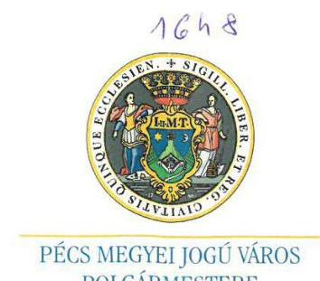

Pécs MEGYEI JOGÚ VÁROS POLGÁRMESTERE

Állami Számvevőszék
Domokos László Elnök részére

Budapest
Apáczai Csere János utca 10. 1364
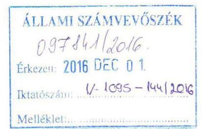

Pécs, 2016. november 23. dr. Szilovicsné dr. Hollósy Andrea
$05-5 / 553-18 / 2016$.
V-1095-141/2016.

Tárgy: Észrevétel

# Tisztelt Elnök Úr! 

Hivatkozva V-1095-141/2016. számú jelentéstervezet megküldéséről szóló tájékoztató levelében foglaltakra, - amely a Pécsi Sport Nonprofit Zrt. gazdálkodásának ellenőrzése tárgyában készült, az alábbi észrevételemet juttattom el Önhöz, további szíves felhasználása céljából. A jelentéstervezetben foglalt megállapításokat, javaslatokat, kollégái segítő együttműködését ez úton is szeretném megköszönni. A tervezetben foglaltakat az illetékes munkatársaim részére eljuttattam annak érdekében, hogy az abban foglaltak maradéktalanul a közfeladat ellátásának jobb megszervezésére, végrehajtására kerüljenek alkalmazásra, a rögzített vizsgálati célok megvalósulása érdekében.
A tervezetben foglaltakkal egyetértek, megállapításait, köztük a többségben lévő pozitív visszajelzését megköszönöm.

A vizsgálati jelentéstervezetben feltárt hiányosságok mielőbbi pótlása érdekében minden szükséges intézkedést haladéktalanul megtesznek illetékes kollégáim.

A jelentéstervezet 15. oldala / a 2.1. számú megállapításával/ megállapította, hogy a Társaság által 2011-2012. években készített üzleti terveket a tulajdonosi joggyakorló nem hagyta jóvá. Az üzleti terv készítését a Társaság részére jogszabály és
 tulajdonosi döntés ezen években nem – csak a vizsgálati időszakot követően 2015. évtől – tette kötelezővé, ezért azok megtárgyalására és jóváhagyására sem volt szükség. Kérem, hogy a jelentésben annak tényét rögzíteni szíveskedjenek, hogy e tárgyban nem történt szabálytalanság.

A 2.2. számú megállapításban az szerepel, hogy „A Társaság vagyongazdálkodása nem volt szabályszerű.” Megállapításra került, hogy a 2011–2012. évek beszámolói még nem tartalmazták a vagyonkezelésbe kapott eszközök értékét, azonban a 2013–2014. évet már rendben találták, melyet több esetben részletesen le is írnak. Kérem, hogy ennek megfelelően az összefoglaló megállapítás tartalmazza azt, hogy a vagyongazdálkodás 2011–2012 években nem volt szabályszerű, 2013–2014. években már az előírásoknak megfelelő volt.

---

A 4.2. megállapítás szerint „a közfoglalkoztatási szerződésben szereplő munkabér és munkaidő, a munkaidő-nyilvántartás illetve a bérkarton adatai nem voltak összhangban.” Az ellenőrzött közfoglalkoztatottak a pécsi műjégpályán dolgoztak. Idénymunka jellegéből adódóan (november–március közötti nyitva tartás) egyenlőtlen munkaidő beosztásban dolgoztak, tehát egy hónapban a kötelezően ledolgozandó óraszám több és kevesebb is lehetett, azonban a többlet és hiány a munkaidőkeretben kiegyenlítődött. A közfoglalkoztatottak a szerződésben szereplő havi bérüket minden esetben megkapták, az elszámolással kapcsolatban pedig havi rendszerességgel minden dokumentum benyújtásra került a Munkaügyi Központba, amelynek ügyintézője azt minden esetben ellenőrizte és rendben találta. Fentiekre tekintettel kérem, szíveskedjenek megállapítani azt is, hogy e tárgyban szabálytalanság nem történt.

A vezérigazgató részére címzett javaslatok – intézkedjen az önköltségszámítási szabályzat, a Számlarend módosításáról, valamint a közhasznú tevékenység ráfordításainak elkülönített nyilvántartásáról – tárgyában tett megkeresésemre a Társaságtól azt a tájékoztatást kaptam, hogy ezen intézkedések és végrehajtásuk már folyamatban van.

Az ellenőrzés során tanúsított mindvégig segítő hozzáállásukat, hasznos megállapításaikat ismételten megköszönöm.

Tisztelelettel:
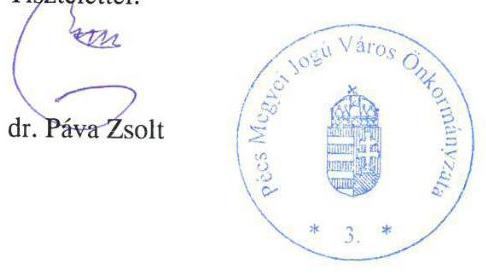

[^0]
[^0]:    H-7621 PÉCS Széchenyi tér 1. Postacím: H-7621 PF. 58
    Telefon: +36 (72) 533-800 Fax: +36 (72) 224-172
    Internet: httplwww.pecs.hu E-mail: citydev@ph.pecs.hu

---

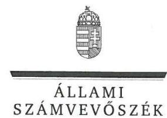

ELNÖK

Ikt.szám: V-1095-146/2016.

# dr. Páva Zsolt úr 

polgármester
Pécs Megyei Jogú Város Önkormányzata

## Pécs

## Tisztelt Polgármester Úr!

„Az önkormányzatok gazdasági társaságai - Az önkormányzatok többségi tulajdonában lévő gazdasági társaságok gazdálkodásának ellenőrzése - Pécsi Sport Nonprofit Zrt.” címmel készített számvevőszéki jelentéstervezetre tett észrevételét köszönettel megkaptam.

Az Állami Számvevőszék észrevételre vonatkozó álláspontjáról a felügyeleti vezető által készített tájékoztatást csatoltan megküldöm.

Tájékoztatom Polgármester Urat, hogy a számvevőszéki jelentésben – az Állami Számvevőszékről szóló 2011. évi LXVI. törvény 29. § (3) bekezdése alapján – a figyelembe nem vett észrevételt szerepeltetjük az elutasítás indokának feltüntetésével.

Budapest, 2016. 12. hó 16. nap
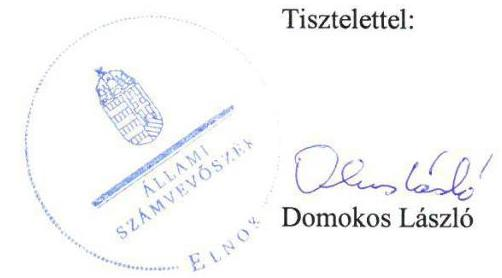

Melléklet: Tájékoztatás az el nem fogadott észrevételekről

---

# Tájékoztatás   az el nem fogadott észrevételekről 

„Az önkormányzatok gazdasági társaságai - Az önkormányzatok többségi tulajdonában lévő gazdasági társaságok gazdálkodásának ellenőrzése - Pécsi Sport Nonprofit Zrt.” címû jelentéstervezetre 2016. december 01-én érkezett észrevételét áttekintettük, annak kezelésével kapcsolatban a következő tájékoztatást adom.

1. A jelentéstervezet 2.1. számú megállapítás első bekezdésében az üzleti tervek tulajdonosi joggyakorló általi jóváhagyására vonatkozó megállapítás
A 2011–2012. évek üzleti terveinek elfogadásával kapcsolatosan a tényeket rögzítettük és a tényhelyzetet nem minősítettük. Ezért a módosítás nem indokolt.
2. A jelentéstervezet 2.2. számú megállapításban és az összegzés részben a vagyongazdálkodás szabályszerűségére vonatkozó megállapítás
Az összegzés rész kiegészítésére tett észrevételt nem tudjuk figyelembe venni, mert az a megállapítás helytállóságát nem kérdőjelezi meg. Az összegzés rész – a beszámoló hiányosságán túl – magában foglalja a 2.1. számú megállapítás 2. és 3. bekezdéseiben részletezett, a vagyongazdálkodás szabályozottságára vonatkozó értékelést is. E szerint az ellenőrzött időszakban, a Számviteli Politikában a jogszabályban foglaltak ellenére nem írták elő a saját és a vagyonkezelésbe kapott vagyon elkülönített nyilvántartását és nem szabályozták a vagyonkezelésbe vett vagyon után elszámolt értékcsökkenés összegének felhasználására vonatkozó éves elszámolási kötelezettséget. Továbbá a Számlarend nem tartalmazta a saját és a vagyonkezelésbe kapott vagyon működtetéséből származó bevételek és ráfordítások elkülönítését. Ezért a megállapítás helytálló, annak módosítása nem indokolt.
3. A jelentéstervezet 4.2. számú megállapítás első bekezdésében a közfoglalkoztatottak munkabérének elszámolására vonatkozó megállapítás
Az észrevételükben leírtak megerősítik a megállapításunkat, mely szerint az „adott hónapban ledolgozott óraszám több és kevesebb is lehetett, de a többlet és hiány a szerződés lejártáig kiegyenlítődött (munkaidőkeret).” A dokumentumokat ismételten áttekintettük, amelyek egyértelműen alátámasztják a megállapításunkat. A Közfoglalkoztatási Szerződés az Önök által használt „munkaidőkeret” lehetőségét nem tartalmazza, ebből következően a megállapításunk helytálló és annak módosítása nem indokolt.

A vezérigazgató részére címzett javaslatok végrehajtására vonatkozó tájékoztatását köszönjük.
Budapest, 2016. 12. hó 16. nap

Makkai Mária
felügyeleti vezető

---

Domokos László Elnök részére

Állami Számvevőszék
1052 Budapest, Apáczai Csere János u. 10.

Tisztelt Elnök Úr!

A V-1095-140/2016. iktatószámon részünkre megküldött számvevőszéki jelentéstervezetben megfogalmazott megállapításokra vonatkozóan az alábbi írásbeli észrevételeket tesszük:
2.2. megállapítás: A megállapításban az szerepel, hogy „A Társaság vagyongazdálkodása nem volt szabályszerű.” A megállapítás részletezéséből nyilvánvaló, hogy a 2011–2012. év nem volt megfelelő, hiszen ezen évek beszámolói még nem tartalmazták a vagyonkezelésbe kapott eszközök értékét, viszont a 2013–2014. évet már rendben találták, melyet több esetben részletesen le is írnak. Kérjük ennek megfelelően tartalmazza az összefoglaló megállapítás, hogy a vagyongazdálkodás 2011–2012 években nem volt szabályszerű, 2013–2014-ben viszont már az előírásoknak megfelelő volt.
4.2. megállapítás: Eszerint „a közfoglalkoztatási szerződésben szereplő munkabér és munkaidő, a munkaidő-nyilvántartás illetve a bérkarton adatai nem voltak összhangban.” Az Önök által ellenőrzött közfoglalkoztatottak a pécsi műjégpályán dolgoztak. Idénymunka jellegéből adódóan (november–március közötti nyitva tartás) egyenlőtlen munkaidő beosztásban dolgoztak, tehát a hónapban a kötelezően ledolgozandó óraszám több és kevesebb is lehetett, de a többlet és hiány a szerződés lejártáig kiegyenlítődött (munkaidőkeret). A közfoglalkoztatottak a szerződésben szereplő havi bérüket minden esetben megkapták, az elszámolással kapcsolatban pedig havi rendszerességgel minden anyagot beadtunk a Munkaügyi Központba, amelynek ügyintézője az anyagainkat minden esetben ellenőrizte és rendben találta. Ezért szeretnénk kérni annak részletezését, hogy hol találtak hibát az elszámolásainkban, és lehetőség szerint egyeztetni, hogy a talált ellentmondásokat tisztázhassuk.

Köszönjük munkájukat, az Önök által feltárt hiányosságokat mielőbb pótolni fogjuk!
Pécs, 2016. november 23.
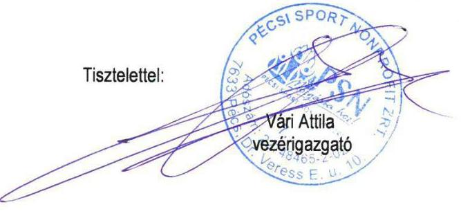

PÉCSI SPORT NONPROFIT ZRT.
7633 Pécs, Dr. Veress Endre u. 10.
Telefon: (72) 312111 - Fax: (72) 315285 - E-mail: irodk@psnzrt.hu - www.psnzrt.hu
Hullámfürdő: (72) 512936 - Látéri: (30) 9528596 - Műjégpálya: (72) 254923
Sportcsarnok (72) 312446 - PSN Zrt. Sportiskola: (72) 312111 - Várköl-stadion: (72) 212246.

---

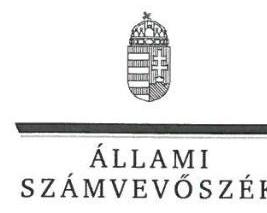

ELNÖK

Ikt.szám: V-1095-147/2016.

# Vári Attila úr 

vezérigazgató
Pécsi Sport Nonprofit Zrt.

## Pécs

## Tisztelt Vezérigazgató Úr!

„Az önkormányzatok gazdasági társaságai - Az önkormányzatok többségi tulajdonában lévő gazdasági társaságok gazdálkodásának ellenőrzése - Pécsi Sport Nonprofit Zrt.” címmel készített számvevőszéki jelentéstervezetre tett észrevételét köszönettel megkaptam.

Az Állami Számvevőszék észrevételre vonatkozó álláspontjáról a felügyeleti vezető által készített tájékoztatást csatoltan megküldöm.

Tájékoztatom Vezérigazgató Urat, hogy a számvevőszéki jelentésben – az Állami Számvevőszékről szóló 2011. évi LXVI. törvény 29. § (3) bekezdése alapján – a figyelembe nem vett észrevételt szerepeltetjük az elutasítás indokának feltüntetésével.

Budapest, 2016. 12. hó 16. nap
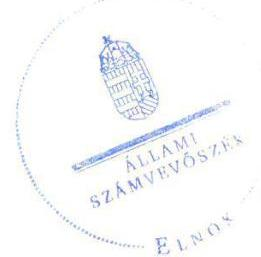

Tisztelettel:

Domokos László

Melléklet: Tájékoztatás az el nem fogadott észrevételekről

---

# Tájékoztatás   az el nem fogadott észrevételekról 

„Az önkormányzatok gazdasági társaságai - Az önkormányzatok többségi tulajdonában lévő gazdasági társaságok gazdálkodásának ellenőrzése - Pécsi Sport Nonprofit Zrt.” címû jelentéstervezetre 2016. december 01-én érkezett észrevételét áttekintettük, annak kezelésével kapcsolatban a következő tájékoztatást adom.

## 1. A jelentéstervezet összegzés részében a vagyongazdálkodás szabályszerűségére vonatkozó megállapítás

Az összegzés rész kiegészítésére tett észrevételt nem tudjuk figyelembe venni, mert az a megállapítás helytállóságát nem kérdőjelezi meg. Az összegzés rész magában foglalja – a beszámoló hiányosságán túl – a 2.1. számú megállapítás 2. és 3. bekezdéseiben részletezett, a vagyongazdálkodás szabályozottságára vonatkozó értékelést is. E szerint az ellenőrzött időszakban, a Számviteli Politikában a jogszabályban foglaltak ellenére nem írták elő a saját és a vagyonkezelésbe kapott vagyon elkülönített nyilvántartását és nem szabályozták a vagyonkezelésbe vett vagyon után elszámolt értékcsökkenés összegének felhasználására vonatkozó éves elszámolási kötelezettséget. Továbbá a Számlarend nem tartalmazta a saját és a vagyonkezelésbe kapott vagyon működtetéséből származó bevételek és ráfordítások elkülönítését. Ezért a megállapítás helytálló, annak módosítása nem indokolt.

## 2. A jelentéstervezet 4.2. számú megállapítás első bekezdésében a közfoglalkoztatottak munkabérének elszámolására vonatkozó megállapítás

Az észrevételükben leírtak megerősítik a megállapításunkat, mely szerint az „adott hónapban ledolgozott óraszám több és kevesebb is lehetett, de a többlet és hiány a szerződés lejártáig kiegyenlítődött (munkaidőkeret).” A dokumentumokat ismételten áttekintettük, amelyek egyértelműen alátámasztják a megállapításunkat. A Közfoglalkoztatási Szerződés az Önök által használt „munkaidőkeret” lehetőségét nem tartalmazza, ebből következően a megállapításunk helytálló és annak módosítása nem indokolt.

Budapest, 2016. 12. hó 16. nap
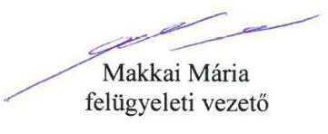

---

# RÖVIDÍTÉSEK JEGYZÉKE 

${ }^{1}$ Társaság
${ }^{2}$ Önkormányzat
${ }^{3}$ Alapszabály
${ }^{4}$ vagyonkezelési szerződés
${ }^{5}$ polgármester
${ }^{6}$ jegyző
${ }^{7} 479 / 2009 /$ EK rendelet
${ }^{8}$ Áht. 2
${ }^{9}$ Ötv.
${ }^{10}$ Mötv.
${ }^{11}$ Közgyűlés
${ }^{12}$ gazdasági program
${ }^{13}$ vagyongazdálkodási terv
${ }^{14}$ Nvtv.
${ }^{15}$ Településfejlesztési Koncepció
${ }^{16}$ Sportkoncepció ${ }_{1,2}$
${ }^{17}$ Sport tv.
${ }^{18}$ Sportrendelet
${ }^{19}$ Közszolgáltatási szerződés
${ }^{20}$ Áht. 1
${ }^{21}$ Holding
${ }^{22}$ Ptk. 1

Pécsi Sport Nonprofit Zrt.
Pécs Megyei Jogú Város Önkormányzata
Pécsi Sport Nonprofit Zrt. 2010. június 10-től érvényes és az ellenőrzési időszak alatt hatszor módosított (505/2011. (12.15.) KGY határozat alapján 2011. december 15-én., 497/2011. (12.15.) KGY határozat alapján 2012. január 1-én, 289/2012. (09.20.) KGY határozat alapján 2012. október 1-én, 377/2012. (11.15.) KGY határozat alapján 2012. november 15-én, 139/2011. (05.16.) KGY határozat alapján 2013. június 1-én és a 395/2013. (12.12.) KGY határozat alapján 2014. január 1-én) módosított Alapszabálya
a Közgyűlés 290/2010. (06.24.) számú határozatával jóváhagyott, az Önkormányzat és a Társaság között 2010. július 1-én létrejött és az ellenőrzési időszakban kétszer (2011. december 15-én és 2014. július 8-án) módosított vagyonkezelési szerződés
Pécs Megyei Jogú Város Polgármestere
Pécs Megyei Jogú Város jegyzője
az Európai Közösséget létrehozó szerződéshez csatolt, a túlzott hiány esetén követendő eljárásról szóló jegyzőkönyv alkalmazásáról szóló 479/2009/EK rendelet
az államháztartásról szóló 2011. évi CXCV. törvény (hatályos 2011. december 31-től)
a helyi önkormányzatokról szóló 1990. évi LXV. törvény
Magyarország helyi önkormányzatairól szóló 2011. évi CLXXXIX. törvény
Pécs Megyei Jogú Város Önkormányzatának Közgyűlése
Pécs Megyei Jogú Város Önkormányzatának gazdasági programja (159/2011. (04.21.) határozat, hatályos 2011–2014. évekre)

Pécs Megyei Jogú Város Önkormányzatának Közép- és hosszú távú vagyongazdálkodási terve
a nemzeti vagyonról szóló 2011. évi CXCVI. törvény
Pécs Megyei Jogú Város Önkormányzat Közgyűlésének 546/2009. (11.26.) számú határozatával elfogadott Pécs város településfejlesztési koncepciója
Közgyűlés 531/2004. (12.09.) számú határozatával elfogadott Pécs Város IV. Sportkoncepciója
Közgyűlés 293/2013. (09.19.) számú határozatával elfogadott Pécs Város V. Sportkoncepciója
a sportról szóló 2004. évi I. törvény
Pécs Megyei Jogú Város Önkormányzata Közgyűlésének 2/2006. (02. 01.) számú rendelete az önkormányzat sporttal kapcsolatos feladatiról és a sport feladatok támogatásáról
a PSN Zrt. és a Pécs Megyei Jogú Város Önkormányzata között létrejött közszolgáltatási szerződés. (hatályos 2010. 07. 01-től)
az államháztartásról szóló 1992. évi XXXVIII. törvény
Pécs Holding Vagyonkezelő Zrt.
a Polgári Törvénykönyvről szóló 1959. évi IV. törvény (hatályos: 2014. március 14-ig)

---

${
 $^{23}$ vagyonrendelet $_{1,2}$

24 Gt.
$^{25}$ Ptk. 2
$^{26}$ FB
$^{27}$ Taktv.
$^{28}$ Számv. tv.
$^{29}$ Számviteli politika 1
Számviteli politika 2
Számviteli politika $^{3}$
$^{30}$ leltározási szabályzat
$^{31}$ értékelési szabályzat
$^{32}$ pénzkezelési szabályzat $_{1}$
pénzkezelési szabályzat $_{2}$
$^{33}$ számlarend $_{1}$
számlarend $_{2}$
számlarend $_{3}$
$^{34}$ Közhasznúsági tv.
$^{35}$ Adatvédelmi és adatbiztonsági szabályzat
$^{36}$ Avtv.
$^{37}$ Info tv.
$^{38}$ könyvvizsgáló $_{1}$
$^{39}$ könyvvizsgáló 2
$^{40}$ Közérdekű adatok szabályzata
$^{41}$ Civil tv.
$^{42}$ Ártv.

Pécs Megyei Jogú Város Önkormányzata Közgyűlésének a többször módosított 40/2008. (XI. 26.) önkormányzati rendelete az Önkormányzat vagyonával kapcsolatos tulajdonosi jogok gyakorlásának szabályairól (hatályos: 2012. február 24-ig)
Pécs Megyei Jogú Város Önkormányzata Közgyűlésének többször módosított 11/2012. (II.24.) önkormányzati rendelete az Önkormányzat vagyonával kapcsolatos tulajdonosi jogok gyakorlásának szabályairól (hatályos: 2012. február 24-től)
a gazdasági társaságokról szóló 2006. évi IV. törvény (hatálytalan: 2014. március 15-jétől)
a Polgári Törvénykönyvről szóló 2013. évi V. törvény (hatályos: 2014. március 15-jétől)
a PSN Zrt. Felügyelőbizottsága.
a köztulajdonban álló gazdasági társaságok takarékosabb működéséről szóló 2009. évi CXXII. törvény (hatályos: 2009. december 4-től)
a számvitelről szóló 2000. évi C. törvény
Pécsi Sport Nonprofit Zrt. Számviteli politika (Hatályos 2010. július 12-től 2012. január 1-ig)
Pécsi Sport Nonprofit Zrt. Számviteli politika (Hatályos 2012. január 1-től 2014. január 1-ig)
Pécsi Sport Nonprofit Zrt. Számviteli politika (Hatályos 2014. január 1-től)
Pécsi Sport Nonprofit Zrt. Leltározási és selejtezési szabályzat (Hatályos 2010. augusztus 1-től)
Pécsi Sport Nonprofit Zrt. Értékelési szabályzat (Hatályos 2010. augusztus 1-től)
Pécsi Sport Nonprofit Zrt. Pénzkezelési szabályzat 2010
Pécsi Sport Nonprofit Zrt. Pénzkezelési szabályzat (Hatályos 2014. január 1-től)
Pécsi Sport Nonprofit Zrt. Számviteli politika (Hatályos 2010. július 12-től 2012. január 1-ig) keretében lévő Számlarend
Pécsi Sport Nonprofit Zrt. Számviteli politika (Hatályos 2012. január 1-től 2014. január 1-ig) keretében lévő Számlarend
Pécsi Sport Nonprofit Zrt. Számviteli politika (Hatályos 2014. január 1-től) keretében lévő Számlarend
A közhasznú szervezetekről szóló 1997. évi CLVI. törvény
Pécsi Sport Nonprofit Zrt. Iratkezelési, Adatvédelmi és adatbiztonsági szabályzat (Hatályos 2010. augusztus 1-től)
a személyes adatok védelméről és a közérdekű adatok nyilvánosságáról szóló 1992. évi LXIII. törvény (hatályos 2011. december 31-éig)
az információs önrendelkezési jogról és az információszabadságról szóló 2011. évi CXII. törvény (hatályos 2012. január 1-től)
Pécsi Sport Nonprofit Zrt. 2010. június 1. és 2013. május 31. között tevékenykedő könyvvizsgálója
Pécsi Sport Nonprofit Zrt. 2013. június 1. és 2015. május 31. között megválasztott könyvvizsgáló
a PSN Zrt.-nél a közérdekű adatok megismerésére irányuló igények teljesítésének rendjéről szóló 9/2010. (2010.12.20.) Vezérigazgatói utasítás szabályzata az egyesülési jogról, a közhasznú jogállásról, valamint a civil szervezetek működéséről és támogatásáról szóló 2011. évi CLXXV. tv. (hatályos: 2012. január 1-jétől)
az árak megállapításáról szóló 1990. évi LXXXVII. törvény

---

$^{43}$ Stabilitási tv.
$^{44}$ Hgt. 2
$^{45}$ Ebktv.

Magyarország gazdasági stabilitásáról szóló 2011. évi CXCIV. törvény
A hulladékról szóló 2012. évi CLXXXV. törvény (hatályos 2013. január 1-től)
az egyenlő bánásmódról és az esélyegyenlőség előmozdításáról szóló 2003. évi CXXV. törvény

---

ÁLLAMI SZÁMVEVŐSZÉK
1052 Budapest, Apáczai Csere János utca 10.
Levélcím: 1364 Budapest 4. Pf. 54
Telefon: +36 1 4849100 Telefax: +36 1 4849200
www.asz.hu
