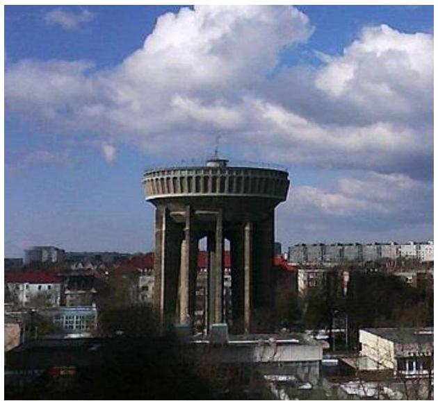
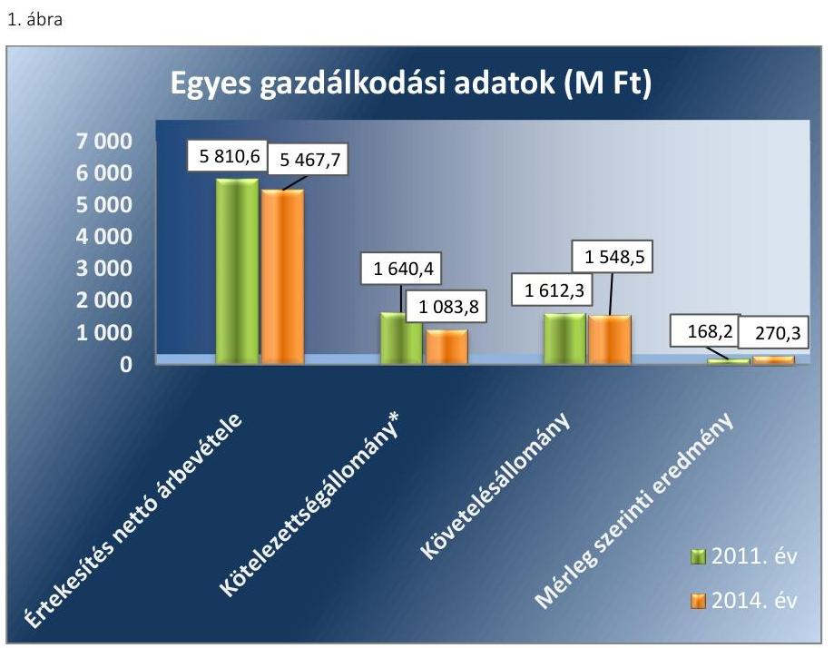
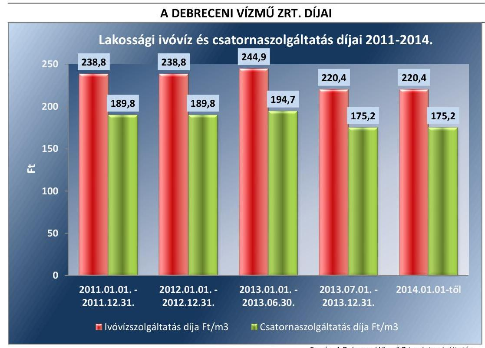
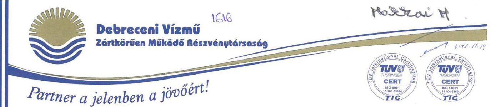
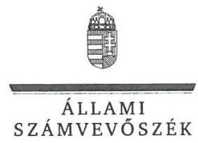
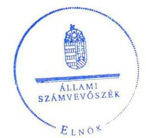

# Jelentés 

## Az önkormányzatok gazdasági társaságai

Az önkormányzatok többségi tulajdonában lévő gazdasági társaságok gazdálkodásának ellenőrzése - Debreceni Vízmú Zrt.
2017.

---

# Jelentés 

## Az önkormányzatok gazdasági társaságai

Az önkormányzatok többségi tulajdonában lévő gazdasági társaságok gazdálkodásának ellenőrzése - Debreceni Vízmú Zrt.
2017. 2018. 2019. 2020. 2021. 2022. 2023. 2024. 2025. 2026. 2027. 2028. 2029. 2030. 2031. 2032. 2033. 2034. 2035. 2036. 2037. 2038. 2039. 2040. 2041. 2042. 2043. 2044. 2045. 2046. 2047. 2048. 2049. 2050. 2051. 2052. 2053. 2054. 2055. 2056. 2057. 2058. 2059. 2060. 2061. 2062. 2063. 2064. 2065. 2066. 2067. 2068. 2069. 2070. 2071. 2072. 2073. 2074. 2075. 2076. 2077. 2078. 2079. 2080. 2081. 2082. 2083. 2084. 2085. 2086. 2087. 2088. 2089. 2090. 2091. 2092. 2093. 2094. 2095. 2096. 2097. 2098. 2099. 2010. 2011. 2012. 2013. 2014. 2015. 2016. 2017. 2018. 2019. 2020. 2021. 2022. 2023. 2024. 2025. 2026. 2027. 2028. 2029. 2030. 2031. 2032. 2033. 2034. 2035. 2036. 2037. 2038. 2039. 2040. 2041. 2042. 2043. 2044. 2045. 2046. 2047. 2048. 2049. 2050. 2051. 2052. 2053. 2054. 2055. 2056. 2057. 2058. 2059. 2060. 2061. 2062. 2063. 2064. 2065. 2066. 2067. 2068. 2069. 2070. 2071. 2072. 2073. 2074. 2075. 2076. 2077. 2078. 2079. 2080. 2081. 2082. 2083. 2084. 2085. 2086. 2087. 2088. 2089. 2090. 2091. 2092. 2093. 2094. 2095. 2096. 2097. 2098. 2099. 2010. 2011. 2012. 2013. 2014. 2015. 2016. 2017. 2018. 2019. 2020. 2021. 2022. 2023. 2024. 2025. 2026. 2027. 2028. 2029. 2030. 2031. 2032. 2033. 2034. 2035. 2036. 2037. 2038. 2039. 2040. 2041. 2042. 2043. 2044. 2045. 2046. 2047. 2048. 2049. 2050. 2051. 2052. 2053. 2054. 2055. 2056. 2057. 2058. 2059. 2060. 2061. 2062. 2063. 2064. 2065. 2066. 2067. 2068. 2069. 2070. 2071. 2072. 2073. 2074. 2075. 2076. 2077. 2078. 2079. 2080. 2081. 2082. 2083. 2084. 2085. 2086. 2087. 2088. 2089. 2090. 2091. 2092. 2093. 2094. 2095. 2096. 2097. 2098. 2099. 2010. 2011. 2012. 2013. 2014. 2015. 2016. 2017. 2018. 2019. 2020. 2021. 2022. 2023. 2024. 2025. 2026. 2027. 2028. 2029. 2030. 2031. 2032. 2033. 2034. 2035. 2036. 2037. 2038. 2039. 2040. 2041. 2042. 2043. 2044. 2045. 2046. 2047. 2048. 2049. 2050. 2051. 2052. 2053. 2054. 2055. 2056. 2057. 2058. 2059. 2060. 2061. 2062. 2063. 2064. 2065. 2066. 2067. 2068. 2069. 2070. 2071. 2072. 2073. 2074. 2075. 2076. 2077. 2078. 2079. 2080. 2081. 2082. 2083. 2084. 2085. 2086. 2087. 2088. 2089. 2090. 2091. 2092. 2093. 2094. 2095. 2096. 2097. 2098. 2099. 2010. 2011. 2012. 2013. 2014. 2015. 2016. 2017. 2018. 2019. 2020. 2021. 2022. 2023. 2024. 2025. 2026. 2027. 2028. 2029. 2030. 2031. 2032. 2033. 2034. 2035. 2036. 2037. 2038. 2039. 2040. 2041. 2042. 2043. 2044. 2045. 2046. 2047. 2048. 2049. 2050. 2051. 2052. 2053. 2054. 2055. 2056. 2057. 2058. 2059. 2060. 2061. 2062. 2063. 2064. 2065. 2066. 2067. 2068. 2069. 2070. 2071. 2072. 2073. 2074. 2075. 2076. 2077. 2078. 2079. 2080. 2081. 2082. 2083. 2084. 2085. 2086. 2087. 2088. 2089. 2090. 2091. 2092. 2093. 2094. 2095. 2096. 2097. 2098. 2099. 2010. 2011. 2012. 2013. 2014. 2015. 2016. 2017. 2018. 2019. 2020. 2021. 2022. 2023. 2024. 2025. 2026. 2027. 2028. 2029. 2030. 2031. 2032. 2033. 2034. 2035. 2036. 2037. 2038. 2039. 2040. 2041. 2042. 2043. 2044. 2045. 2046. 2047. 2048. 2049. 2050. 2051. 2052. 2053. 2054. 2055. 2056. 2057. 2058. 2059. 2060. 2061. 2062. 2063. 2064. 2065. 2066. 2067. 2068. 2069. 2070. 2071. 2072. 2073. 2074. 2075. 2076. 2077. 2078. 2079. 2080. 2081. 2082. 2083. 2084. 2085. 2086. 2087. 2088. 2089. 2090. 2091. 2092. 2093. 2094. 2095. 2096. 2097. 2098. 2099. 2010. 2011. 2012. 2013. 2014. 2015. 2016. 2017. 2018. 2019. 2020. 2021. 2022. 2023. 2024. 2025. 2026. 2027. 2028. 2029. 2030. 2031. 2032. 2033. 2034. 2035. 2036. 2037. 2038. 2039. 2040. 2041. 2042. 2043. 2044. 2045. 2046. 2047. 2048. 2049. 2050. 2051. 2052. 2053. 2054. 2055. 2056. 2057. 2058. 2059. 2060. 2061. 2062. 2063. 2064. 2065. 2066. 2067. 2068. 2069. 2070. 2071. 2072. 2073. 2074. 2075. 2076. 2077. 2078. 2079. 2080. 2081. 2082. 2083. 2084. 2085. 2086. 2087. 2088. 2089. 2090. 2091. 2092. 2093. 2094. 2095. 2096. 2097. 2098. 2099. 2010. 2011. 2012. 2013. 2014. 2015. 2016. 2017. 2018. 2019. 2020. 2021. 2022. 2023. 2024. 2025. 2026. 2027. 2028. 2029. 2030. 2031. 2032. 2033. 2034. 2035. 2036. 2037. 2038. 2039. 2040. 2041. 2042. 2043. 2044. 2045. 2046. 2047. 2048. 2049. 2050. 2051. 2052. 2053. 2054. 2055. 2056. 2057. 2058. 2059. 2060. 2061. 2062. 2063. 2064. 2065. 2066. 2067. 2068. 2069. 2070. 2071. 2072. 2073. 2074. 2075. 2076. 2077. 2078. 2079. 2080. 2081. 2082. 2083. 2084. 2085. 2086. 2087. 2088. 2089. 2090. 2091. 2092. 2093. 2094. 2095. 2096. 2097. 2098. 2099. 2010. 2011. 2012. 2013. 2014. 2015. 2016. 2017. 2018. 2019. 2020. 2021. 2022. 2023. 2024. 2025. 2026. 2027. 2028. 2029. 2030. 2031. 2032. 2033. 2034. 2035. 2036. 2037. 2038. 2039. 2040. 2041. 2042. 2043. 2044. 2045. 2046. 2047. 2048. 2049. 2050. 2051. 2052. 2053. 2054. 2055. 2056. 2057. 2058. 2059. 2060. 2061. 2062. 2063. 2064. 2065. 2066. 2067. 2068. 2069. 2070. 2071. 2072. 2073. 2074. 2075. 2076. 2077. 2078. 2079. 2080. 2081. 2082. 2083. 2084. 2085. 2086. 2087. 2088. 2089. 2090. 2091. 2092. 2093. 2094. 2095. 2096. 2097. 2098. 2099. 2010. 2011. 2012. 2013. 2014. 2015. 2016. 2017. 2018. 2019. 2020. 2021. 2022. 2023. 2024. 2025. 2026. 2027. 2028. 2029. 2030. 2031. 2032. 2033. 2034. 2035. 2036. 2037. 2038. 2039. 2040. 2041. 2042. 2043. 2044. 2045. 2046. 2047. 2048. 2049. 2050. 2051. 2052. 2053. 2054. 2055. 2056. 2057. 2058. 2059. 2060. 2061. 2062. 2063. 2064. 2065. 2066. 2067. 2068. 2069. 2070. 2071. 2072. 2073. 2074. 2075. 2076. 2077. 2078. 2079. 2080. 2081. 2082. 2083. 2084. 2085. 2086. 2087. 2088. 2089. 2090. 2091. 2092. 2093. 2094. 2095. 2096. 2097. 2098. 2099. 2010. 2011. 2012. 2013. 2014. 2015. 2016. 2017. 2018. 2019. 2020. 2021. 2022. 2023. 2024. 2025. 2026. 2027. 2028. 2029. 2030. 2031. 2032. 2033. 2034. 2035. 2036. 2037. 2038. 2039. 2040. 2041. 2042. 2043. 2044. 2045. 2046. 2047. 2048. 2049. 2050. 2051. 2052. 2053. 2054. 2055. 2056. 2057. 2058. 2059. 2060. 2061. 2062. 2063. 2064. 2065. 2066. 2067. 2068. 2069. 2070. 2071. 2072. 2073. 2074. 2075. 2076. 2077. 2078. 2079. 2080. 2081. 2082. 2083. 2084. 2085. 2086. 2087. 2088. 2089. 2090. 2091. 2092. 2093. 2094. 2095. 2096. 2097. 2098. 2099. 2010. 2011. 2012. 2013. 2014. 2015. 2016. 2017. 2018. 2019. 2020. 2021. 2022. 2023. 2024. 2025. 2026. 2027. 2028. 2029. 2030. 2031. 2032. 2033. 2034. 2035. 2036. 2037. 2038. 2039. 2040. 2041. 2042. 2043. 2044. 2045. 2046. 2047. 2048. 2049. 2050. 2051. 2052. 2053. 2054. 2055. 2056. 2057. 2058. 2059. 2060. 2061. 2062. 2063. 2064. 2065. 2066. 2067. 2068. 2069. 2070. 2071. 2072. 2073. 2074. 2075. 2076. 2077. 2078. 2079. 2080. 2081. 2082. 2083. 2084. 2085. 2086. 2087. 2088. 2089. 2090. 2091. 2092. 2093. 2094. 2095. 2096. 2097. 2098. 2099. 2010. 2011. 2012. 2013. 2014. 2015. 2016. 2017. 2018. 2019. 2020. 2021. 2022. 2023. 2024. 2025. 2026. 2027. 2028. 2029. 2030. 2031. 2032. 2033. 2034. 2035. 2036. 2037. 2038. 2039. 2040. 2041. 2042. 2043. 2044. 2045. 2046. 2047. 2048. 2049. 2050. 2051. 2052. 2053. 2054. 2055. 2056. 2057. 2058. 2059. 2060. 2061. 2062. 2063. 2064. 2065. 2066. 2067. 2068. 2069. 2070. 2071. 2072. 2073. 2074. 2075. 2076. 2077. 2078. 2079. 2080. 2081. 2082. 2083. 2084. 2085. 2086. 2087. 2088. 2089. 2090. 2091. 2092. 2093. 2094. 2095. 2096. 2097. 2098. 2099. 2010. 2011. 2012. 2013. 2014. 2015. 2016. 2017. 2018. 2019. 2020. 2021. 2022. 2023. 2024. 2025. 2026. 2027. 2028. 2029. 2030. 2031. 2032. 2033. 2034. 2035. 2036. 2037. 2038. 2039. 2040. 2041. 2042. 2043. 2044. 2045. 2046. 2047. 2048. 2049. 2050. 2051. 2052. 2053. 2054. 2055. 2056. 2057. 2058. 2059. 2060. 2062. 2063. 2064. 2065. 2066. 2067. 2068. 2069. 2070. 2071. 2072. 2073. 2074. 2075. 2076. 2077. 2078. 2079. 2080. 2081. 2082. 2083. 2084. 2085. 2086. 2087. 2088. 2089. 2090. 2091. 2092. 2093. 2094. 2095. 2096. 2097. 2098. 2099. 2010. 2011. 2012. 2013. 2014. 2015. 2016. 2017. 2018. 2019. 2010. 2011. 2012. 2013. 2014. 2015. 2016. 2017. 2018. 2019. 2010. 2011. 2012. 2013. 2014. 2015. 2016. 2017. 2018. 2019. 2010. 2011. 2012. 2013. 2014. 2015. 2016. 2017. 2018. 2019. 2010. 2011. 2012. 2013. 2014. 2015. 2016. 2017. 2018. 2019. 2010. 2011. 2012. 2013. 2014. 2015. 2016. 2017. 2018. 2019. 2010. 2011. 2012. 2013. 2014. 2015. 2016. 2017. 2018. 2019. 2010. 2011. 2012. 2013. 2014. 2015. 2016. 2017. 2018. 2019. 2010. 2011. 2012. 2013. 2014. 2015. 2016. 2017. 2018. 2019. 2010. 2011. 2012. 2013. 2014. 2015. 2016. 2017. 2018. 2019. 2010. 2011. 2012. 2013. 2014. 2015. 2016. 2017. 2018. 2019. 2010. 2011. 2012. 2013. 2014. 2015. 2016. 2017. 2018. 2019. 2010. 2011. 2012. 2013. 2014. 2015. 2016. 2017. 2018. 2019. 2010. 2011. 2012. 2013. 2014. 2015. 2016. 2017. 2018. 2019. 2010. 2011. 2012. 2013. 2014. 2015. 2016. 2017. 2018. 2019. 2010. 2011. 2012. 2013. 2014. 2015. 2016. 2017. 2018. 2019. 2010. 2011. 2012. 2013. 2014. 2015. 2016. 2017. 2018. 2019. 2010. 2011. 2012. 2013. 2014. 2015. 2016. 2017. 2018. 2019. 2010. 2011. 2012. 2013. 2014. 2015. 2016. 2017. 2018. 2019. 2010. 2011. 2012. 2013. 2014. 2015. 2016. 2017. 2018. 2019. 2018. 2019. 2010. 2011. 2012. 2013. 2014. 2015. 2016. 2017. 2018. 2019. 2018. 2019. 2010. 2011. 2012. 2013. 2014. 2015. 2016. 2017. 2018. 2019. 2018. 2019. 2018. 2019. 2010. 2011. 2012. 2013. 2014. 2015. 2016. 2017. 2018. 2019. 2018. 2019. 2018. 2019. 2018. 2019. 2018. 2017. 2018. 2019. 2018. 2017. 2018. 2019. 2018. 2017. 2018. 2019. 2018. 2017. 2018. 2019. 2018. 2017. 2018. 2017. 2018. 2019. 2018. 2017. 2018. 2019. 2018. 2017. 2018. 2019. 2018. 2017. 2018. 2019. 2018. 2017. 2018. 2019. 2018. 2018. 2017. 2018. 2017. 2018. 2017. 2018. 2017. 2018. 2017. 2018. 2017. 2018. 2017. 2018. 2017. 2017. 2017. 2017. 2017. 2017. 2017. 2018. 2017. 2018. 2017. 2018. 2017. 2017. 2017. 2017. 2017. 2017. 2017. 2017. 2017. 2017. 2017. 2017. 2017. 2017. 2017. 2017. 2017. 2017. 2017. 2017. 2017. 2017. 2017. 2017. 2017. 2017. 2017. 2017. 2017. 2017. 2017. 2017. 2017. 2017. 2017. 2017. 2017. 2017. 2017. 2017. 2017. 2017. 2017. 2017. 2017. 2017. 2017. 2017. 2017. 2017. 2017. 2017. 2017. 2017. 2017. 2017. 2017. 2017. 2017. 2017. 2017. 2017. 2017. 2017. 2017. 2017. 2017. 2017. 2017. 2017. 2017. 2017. 2017. 2017. 2017. 2017. 2017. 2017. 2017. 2017. 2017. 2017. 2017. 2017. 2017. 2017. 2017. 2017. 2017. 2017. 2017. 2017. 2017. 2017. 2017. 2017. 2017. 2017. 2017. 2017. 2017. 2017. 2017. 2017. 2017. 2017. 2017. 2017. 2017. 2017. 2017. 2017. 2017. 2017. 2017. 2017. 2017. 2017. 2017. 2017. 2017. 2017. 2017. 2017. 2017. 2017. 2017. 2017. 2017. 2017. 2017. 2017. 2017. 2017. 2017. 2017. 2017. 2017. 2017. 2017. 2017. 2017. 2017. 2017. 2017. 2017. 2017. 2017. 2017. 2017. 2017. 2017. 2017. 2017. 2017. 2017. 2017. 2017. 2017. 2017. 2017. 2017. 2017. 2017. 2017. 2017. 2017. 2017. 2017. 2017. 2017. 2017. 2017. 2017. 2017. 2017. 2017. 2017. 2017. 2017. 2017. 2017. 2017. 2017. 2017. 2017. 2017. 2017. 2017. 2017. 2017. 2017. 2017. 2017. 2017. 2017. 2017. 2017. 2017. 2017. 2017. 2017. 2017. 2017. 2017. 2017. 2017. 2017. 2017. 2017. 2017. 2017. 2017. 2017. 2017. 2017. 2017. 2017. 2017. 2017. 2017. 2017. 2017. 2017. 2017. 2017. 2017. 2017. 2017. 2017. 2017. 2017. 2017. 2017. 2017. 2017. 2017. 2017. 2017. 2017. 2017. 2017. 2017. 2017. 2017. 2017. 2017. 2017. 2017. 2017. 2017. 2017. 2017. 2017. 2017. 2017. 2017. 2017. 2017. 2017. 2017. 2017. 2017. 2017. 2017. 2017. 2017. 2017. 2017. 2017. 2017. 2017. 2017. 2017. 2017. 2017. 2017. 2017. 2017. 2017. 2017. 2017. 2017. 2017. 2017. 2017. 2017. 2017. 2017. 2017. 2017. 2017. 2017. 2017. 2017. 2017. 2017. 2017. 2017. 2017. 2017. 2017. 2017. 2017. 2017. 2017. 2017. 2017. 2017. 2017. 2017. 2017. 2017. 2017. 2017. 2017. 2017. 2017. 2017. 2017. 2017. 2017. 2017. 2017. 2017. 2017. 2017. 2017. 2017. 2017. 2017. 2017. 2017. 2017. 2017. 2017. 2017. 2017. 2017. 2017. 2017. 2017. 2017. 2017. 2017. 2017. 2017. 2017. 2017. 2017. 2017. 2017. 2017. 2017. 2017. 2017. 2017. 2017. 2017. 2017. 2017. 2017. 2017. 2017. 2017. 2017. 2017. 2017. 2017. 2017. 2017. 2017. 2017. 2017. 2017. 2017. 2017. 2017. 2017. 2017. 2017. 2017. 2017. 2017. 2017. 2017. 2017. 2017. 2017. 2017. 2017. 2017. 2017. 2017. 2017. 2017. 2017. 2017. 2017. 2017. 2017. 2017. 2017. 2017. 2017. 2017. 2017. 2017. 2017. 2017. 2017. 2017. 2017. 2017. 2017. 2017. 2017. 2017. 2017. 2017. 2017. 2017. 2017. 2017. 2017. 2017. 2017. 2017. 2017. 2017. 2017. 2017. 2017. 2017. 2017. 2017. 2017. 2017. 2017. 2017. 2017. 2017. 2017. 2017. 2017. 2017. 2017. 2017. 2017. 2017. 2017. 2017. 2017. 2017. 2017. 2017. 2017. 2017. 2017. 2017. 2017. 2017. 2017. 2017. 2017. 2017. 2017. 2017. 2017. 2017. 2017. 2017. 2017. 2017. 2017. 2017. 2017. 2017. 2017. 2017. 2017. 2017. 2017. 2017. 2017. 2017. 2017. 2017. 2017. 2017. 2017. 2017. 2017. 2017. 2017. 2017. 2017. 2017. 2017. 2017. 2017. 2017. 2017. 2017. 2017. 2017. 2017. 2017. 2017. 2017. 2017. 2017. 2017. 2017. 2017. 2017. 2017. 2017. 2017. 2017. 2017. 2017. 2017. 2017. 2017. 2017. 2017. 2017. 2017. 2017. 2017. 2017. 2017. 2017. 2017. 2017. 2017. 2017. 2017. 2017. 2017. 2017. 2017. 2017. 2017. 2017. 2017. 2017. 2017. 2017. 2017. 2017. 2017. 2017. 2017. 2017. 2017. 2017. 2017. 2017. 2017. 2017. 2017. 2017. 2017. 2017. 2017. 2017. 2017. 2017. 2017. 2017. 2017. 2017. 2017. 2017. 2017. 2017. 2017. 2017. 2017. 2017. 2017. 2017. 2017. 2017. 2017. 2017. 2017. 2017. 2017. 2017. 2017. 2017. 2017. 2017. 2017. 2017. 2017. 2017. 2017. 2017. 2017. 2017. 2017. 2017. 2017. 2017. 2017. 2017. 2017. 2017. 2017. 2017. 2017. 2017. 2017. 2017. 2017. 2017. 2017. 2017. 2017. 2017. 2017. 2017. 2017. 2017. 2017. 2017. 2017. 2017. 2017. 2017. 2017. 2017. 2017. 2017. 2017. 2017. 2017. 2017. 2017. 2017. 2017. 2017. 2017. 2017. 2017. 2017. 2017. 2017. 2017. 2017. 2017. 2017. 2017. 2017

---

# AZ ELLENŐRZÉST FELÜGYELTE:

## MAKKAI MÁRIA felügyeleti vezető

## AZ ELLENŐRZÉST VEZETTE ÉS A VÉGREHAJTÁSÁÉRT FELELŐS:

### SALAMIN VIKTOR ellenőrzésvezető

## A PROGRAM ÖSSZEÁLLÍTÁSÁÉRT FELELŐS:

### JANIK JÓZSEF osztályvezető

---

**IKTATÓSZÁM:** V-1119-101/2016.

**TÉMASZÁM:** 2153

**ELLENŐRZÉS-AZONOSÍTÓ SZÁM:** V070784

---

Jelentéseink az Országgyűlés számítógépes hálózatán és az Interneta a www.asz.hu címen is olvashatóak.

---

# TARTALOMJEGYZÉK 

■ ÖSSZEGZÉS ..... 5
■ AZ ELLENŐRZÉS CÉLJA ..... 6
■ AZ ELLENŐRZÉS TERÜLETE ..... 7
■ AZ ELLENŐRZÉS HÁTTERE, INDOKOLTSÁGA ..... 9
■ A JELENTÉS LÉNYEGES KÉRDÉSKÖREI ..... 10
■ ELLENŐRZÉS HATÓKÖRE ÉS MÓDSZEREI ..... 11
■ MEGÁLLAPÍTÁSOK ..... 13
■ JAVASLATOK ..... 21
■ MELLÉKLETEK ..... 23
I. sz. melléklet: Értelmező szótár ..... 23
II. sz. melléklet: Múködési adatok ..... 25
III. sz. melléklet: Dijak alakulása ..... 26
■ FÜGGELÉK: ÉSZREVÉTELEK ..... 27
■ RÖVIDÍTÉSEK JEGYZÉKE ..... 31

---

.

---

# ÖSSZEGZÉS 

A 2011-2014 közötti időszakban a víziközmú-szolgáltatás közfeladat ellátását Debrecen Megyei Jogú Város Önkormányzata szabályszerüen szervezte meg, a Debreceni Vagyonkezelő Zrt. általi tulajdonosi joggyakorlás megfelelt a jogszabályi előirásoknak. A Debreceni Vízmú Zrt. vagyongazdálkodása szabályszerü volt, beszámolási és adatszolgáltatási kötelezettségét összességében teljesitette. Az ellátott feladat bevételeinek, ráfordításainak elszámolása, valamint az önköltségszámitás szabályszerü volt.

## Az ellenőrzés társadalmi indokoltsága

Az Állami Számvevőszék kiemelt célja, hogy a helyi önkormányzatok gazdálkodásában rejlő pénzügyi kockázatok feltárásával, az államháztartáson kívülre nyújtott költségvetési támogatások és ingyenes vagyonjuttatások, valamint az államháztartáson kívül múködő feladat-ellátó rendszerek ellenőrzéseivel hozzájáruljon ahhoz, hogy a közpénzeket az államháztartáson kívül múködő szervezetek is átlátható, rendezett módon használják fel.

Magyarországon az intézmény-centrikus közfeladat-ellátás jellemző, de egyre jelentősebb a költségvetésen kívüli feladatellátás térnyerése. Ennek legfontosabb szereplői - a nonprofit szervezetek mellett - az önkormányzati tulajdonú gazdasági társaságok. Az önkormányzatok szervezetalakítási szabadságának következménye, hogy a korábban is vállalati formában múködő közszolgáltatások mellett, mind a kötelező, mind az önként vállalt feladatok ellátásában a gazdasági társaságok kiemelt fontosságú szerephez jutottak.

## Főbb megállapítások, következtetések, javaslatok

Az Önkormányzat a víziközmű-szolgáltatás közfeladatának megszervezéséről a jogszabályi előírásoknak megfelelően gondoskodott. A Debreceni Vízmú Zrt. tulajdonosa a kizárólagos önkormányzati tulajdonú Debreceni Vagyonkezelő Zrt. volt, a tulajdonosi jogok gyakorlása szabályos volt. A feladatellátáshoz biztosított, vagyonkezelt és üzemeltetett eszközökkel való rendeltetésszerű gazdálkodás érdekében kötött szerződések megfeleltek a jogszabályi előírásoknak.

A Társaság vagyongazdálkodása szabályszerű volt. Az alkalmazott számviteli szabályzatok megfeleltek a vonatkozó jogszabály előírásainak. A saját, valamint vagyonkezelésbe és üzemeltetésbe vett vagyonnal való gazdálkodás, annak nyilvántartása szabályszerű volt.

A Társaság kötelezettségállománya nem jelentett veszélyt a közfeladat ellátására, a múködésre. A Társaság az előírt beszámolási és adatszolgáltatási kötelezettségét összességében a jogszabályi előírásoknak megfelelően teljesítette, a jogszabályban előírt közzétételi kötelezettségének azonban nem tett teljes körűen eleget.

A közfeladat bevételeinek, ráfordításainak, valamint az értékcsökkenés elszámolása szabályos volt. A Társaság rendelkezett a jogszabály előírásainak megfelelő önköltségszámítási szabályzattal, melyet megfelelően alkalmazott. A közszolgáltatás díjainak megállapítása szabályos volt.

---

# AZ ELLENŐRZÉS CÉLJA 

pozottsága szabályszerű önköltségszámítással.

Az ellenőrzés célja annak értékelése volt, hogy az Önkormányzat vagyongazdálkodási tevékenysége során szabályszerűen gyakorolta-e tulajdonosi jogait.

Ellenőriztük, hogy a gazdasági társaság szabályozottsága, gazdálkodása és vagyongazdálkodási tevékenysége, bevételeinek és ráfordításainak elszámolása megfelelt-e a jogszabályi és tulajdonosi előírásoknak.

Értékeltük továbbá, hogy a gazdasági társaság kötelezettségállománya jelentett-e kockázatot a múködésre, valamint a gazdálkodás átláthatósága és elszámoltathatósága érdekében biztosítva volt-e a szolgáltatás dijának megala-

---

# **A2 ELLENŐRZÉS TERÜLETE**

## **Debrecen Megyei Jogú Város Önkormányzata, a Debreceni Vagyonkezelő Zrt. és a Debreceni Vízmű Zrt.**

**A Debreceni Vízmű Zrt.** a 2011-2014. években a Debreceni Vagyonkezelő Zrt. kizárólagos tulajdonában állt. Jegyzett tőkéje az ellenőrzött időszakban 3,0 M Ft-tal nőtt, 2014. december 31-én 6435,0 M Ft volt.

A víziközmű-szolgáltatás feladatának gazdasági társaság útján történő ellátásáról DMJV Önkormányzata¹ az ellenőrzött időszakot megelőzően határozott. A Társaság a víziközmű közszolgáltatási tevékenységet saját eszközeivel, az ISPA projekt keretében létrehozott eszközök üzemeltetésével, valamint 2013. szeptember 14-től – a közművagyon DMJV Önkormányzata részére történő átadását követően – vagyonkezelt eszközökkel végezte.

DMJV Önkormányzata az ellenőrzött időszakot megelőzően döntött a gazdasági társaságai által ellátott szerteágazó tevékenységek holdingba szervezéséről. A DV Zrt.² létrehozásának célja a gazdasági társaságok egységes tervezési, beszámolási és pénzügyi irányítási rendszerének kialakítása volt. A DV Zrt. a Közgyűlés³ által az ellenőrzött időszakot megelőzően (2000-ben) hozott döntése alapján kizárólagos tulajdonosává vált a Debreceni Vízmű Zrt.-nek.

A Debreceni Vízmű Zrt. fő tevékenysége a víztermelés-, kezelés-, ellátás, emellett szennyvízgyűjtési és szennyvízkezelési tevékenységet is ellát Debrecen Megyei Jogú Város területén, illetve további nyolc településen. A Debreceni Vízmű Zrt. 2011. szeptember 30-án összeolvadt a Debrecen Önkormányzat Lapkiadó Kft.-vel, a jogfolytonossággal létrejött jogutód társaság neve nem változott.

A Társaság⁴-nál foglalkoztatottak állományi létszáma az ellenőrzött időszakban 357 főről 345 főre csökkent. Az alapító okirat szerint a Társaság vezetésére igazgatóságot nem választottak, irányítását vezérigazgató látta el, személye az ellenőrzött időszakban nem változott.

A Társaság gazdálkodásának főbb adatait a 2011-2014. évek vonatkozásában az 1. ábra szemlélteti.

---

*A kötelezettségállomány 2014. évi értéke nem tartalmazza a vagyonkezeléshez kapcsolódó hosszú lejáratú kötelezettséget.
Forrás: A Debrecen Vizmü Zrt. 2011, 2014. évi beszámolói
Az ellenőrzött időszakban a jegyző személye nem, a polgármester személye egy alkalommal változott. A polgármester a 2014. évi önkormányzati választások óta tölti be tisztségét, a jegyző 2007. január 1-jétől látja el a feladatát.

---

# AZ ELLENŐRZÉS HÁTTERE, INDOKOLTSÁGA 

Az önkormányzatok közfeladat-ellátásában egyre jelentősebb a gazdasági társaságok útján történő feladatellátás térnyerése.

AZ ÖNKORMÁNYZATI TULAJDONÚ GAZDASÁGI TÁRSASÁGOK teljes körű ellenőrzésének lehetőségét az Állami Számvevőszékről szóló 1989. évi XXXVIII. törvény 2011. január 1-jétől hatályos módosítása teremtette meg. Az önkormányzati tulajdonú gazdasági társaságok ellenőrzése kiemelten fontos a vagyon megőrzése, megóvása érdekében, amelyekkel szemben alapvető követelmény, hogy gazdálkodásuk, múködésük szabályszerű, az általuk szolgáltatott adatok minél megbízhatóbbak legyenek. A közfeladat ellátás költségeinek, ráfordításainak alakulása, színvonala hatással van a lakosság elégedettségére.

## AZ ELLENŐRZÉS VÁRHATÓ HASZNOSULÁSA-

KÉNT az ÁSZ ${ }^{5}$ a megállapításaival segítséget nyújthat az államháztartáson kívüli közfeladat-ellátás értékeléséhez, jogszabályi keretei pontosításához, átláthatóságot biztosító szabályozásához. Meghatározhatóvá válnak az önkormányzati feladatellátásban részt vevő államháztartáson kívüli szervezeteknek - az önkormányzat költségvetését, pénzügyi helyzetét is befolyásoló - kockázatai, lehetővé válik ezen kockázatok csökkentése. Ellenőrzéseink feltárhatják, hogy az önkormányzat feladat-ellátási kötelezettségének szabályszerűen tett-e eleget, a feladatellátáshoz rendelt vagyonkezelésbe vett és saját vagyon múködtetését az elvárható gondossággal, szabályszerűen szervezte-e meg és a tulajdonosi felügyelete hozzájárult-e a feladatellátásához. Értékelhetővé válik, hogy a gazdasági társaság a feladat-ellátási, közszolgáltatási szerződésben foglaltak betartásával, a vagyon használatával biztosította-e a szolgáltatás folytatásának feltételeit. Ezzel az ellenőrzöttek és a helyi döntéshozók számára az ÁSZ visszajelzést ad feladatszervezési, feladat-ellátási kockázataikról, alapot ad a meglévő hibák megszüntetéséhez, a jobb feladat-ellátás biztosításához. Mindezeken keresztül az ÁSZ hozzájárul Magyarország közpénzügyi helyzetének javításához, a közpénzek mérhető módon történő, a döntéshozók által meghatározott célok szerinti felhasználásához.

---

# A JELENTÉS LÉNYEGES KÉRDÉSKÖREI 

1.     - Az önkormányzat közfeladat megszervezéséről szóló döntése, valamint tulajdonosi joggyakorlása szabályszerű volt-e?
2.     - A gazdasági társaság vagyongazdálkodása szabályszerű volt-e, kötelezettségállománya jelentett-e kockázatot a müködésre, illetve a feladat/közfeladat ellátásra?
3.     - A gazdasági társaságnál az ellátott közfeladat bevételei és ráfordításai elszámolása, valamint az önköltségszámitás és árképzés szabályszerű volt-e?

---

# ELLENŐRZÉS HATÓKÖRE ÉS MÓDSZEREI 

## Az ellenőrzés típusa

Megfelelőségi ellenőrzés.

## Az ellenőrzött időszak

Az ellenőrzött időszak 2011. január 1-jétől 2014. december 31-ig tart.

## Az ellenőrzés tárgya

A gazdasági társaság feletti tulajdonosi joggyakorlás, valamint a gazdasági társaság gazdálkodásának szabályozottsága és szabályszerűsége.

Az ellenőrzés kiterjed minden olyan körülményre és adatra, amely az ÁSZ jogszabályban meghatározott feladatainak teljesítéséhez, valamint a program végrehajtása folyamán felmerült újabb összefüggések feltárásához szükséges.

## Az ellenőrzött szervezet

Debrecen Megyei Jogú Város Önkormányzata, Debreceni Vagyonkezelő Zrt., Debreceni Vízmú Zrt.

## Az ellenőrzés jogalapja

Az ellenőrzés jogszabályi alapját az ÁSZ tv. 1. § (3) bekezdése és 5. § (3)-(4)-(5) bekezdései képezik.

## Az ellenőrzés módszerei

Az ellenőrzést a nemzetközi standardokat irányadónak tekintve az ellenőrzési program ellenőrzési kérdései, az ellenőrzött időszakban hatályos jogszabályok, az ellenőrzés szakmai szabályok és módszertanok figyelembe vételével végeztük.

Az ellenőrzés ideje alatt az ellenőrzött szervezettel történő kapcsolattartást az ÁSZ Szervezeti és Múködési Szabályzatának vonatkozó előírásai alapján biztosítottuk.

Az ellenőrzési kérdések megválaszolásához szükséges bizonyítékok megszerzése a következő ellenőrzési eljárások alkalmazásával történt: megfigyelés, kérdésfeltevés (információkérés), összehasonlítás, valamint elemző eljárás. Az ellenőrzési bizonyítékként felhasználható adatforrások

---

közé tartoztak egyrészt a szakmai programban felsorolt adatforrások, másrészt adatforrás lehetett még minden - az ellenőrzés folyamán - feltárt, az ellenőrzés szempontjából információkat tartalmazó dokumentum.

Az ellenőrzést a kérdésekre adott válaszok kiértékelésével, valamint a megjelölt adatforrások, a csatolt tanúsítványok felhasználásával, továbbá az adott időszakban hatályos jogszabályok figyelembe vételével folytattuk le.

A bevételek és ráfordítások elszámolása, valamint a vagyonnyilvántartás terén a szabályszerű múködést véletlen mintavétellel ellenőriztük. A mintavétellel ellenőrzött területek esetében minden egyes tétel vonatkozásában a szabályszerűségre vonatkozó kérdéseket tettünk fel, amelyek eredménye összesítésre került. Megfelelőnek értékeltünk egy ellenőrzött területet, amennyiben 95\%-os bizonyossággal a teljes sokaságban a hibaarány legfeljebb 10\%, nem megfelelőnek, amennyiben 10\%-nál magasabb arányt képviselt. Abban az esetben, ha a teljes sokaság tekintetében a 10\%os hibaarányhoz való viszony megítélésnek megbízhatósága nem érte el a 95\%-ot, annak elérése érdekében értékelésünket további szempontokkal egészítettük ki, és figyelembe vettük a feltárt hibák típusát és súlyát. A ráfordítások elszámolására és a vagyonnyilvántartásra vonatkozó véletlen mintavételt kockázati alapú kiválasztással egészítettük ki, amelynek során évente a három legnagyobb összegű tételt választottuk ki.

---

# 1. Az önkormányzat közfeladat megszervezéséről szóló döntése, valamint tulajdonosi joggyakorlása szabályszerű volt-e? 

Összegző megállapítás

1.1. számú megállapítás

A közfeladat ellátásának megszervezése, valamint a tulajdonosi joggyakorlás szabályszerű volt.

A víziközmű-szolgáltatás közfeladata ellátásának megszervezése szabályszerű volt.

A Közgyűlés középtávú fejlesztési elképzeléseit az Ötv. ${ }^{6}$ 91. § (1) bekezdésében és a Mötv. ${ }^{7}$ 116. § (1) bekezdésében előírt követelményeknek megfelelő integrált város és integrált településfejlesztési stratégiában rögzítette. A dokumentumok 2007-2013 és 2014-2020 közötti évekre határozták meg a fejlesztési elképzeléseket. Az integrált városfejlesztési stratégiák a közfeladat-ellátásra vonatkozóan a Debreceni Vízmú Zrt. tevékenységi körébe tartozó feladatokat és a folyamatban lévő fejlesztések (ISPA) bemutatását is tartalmazta.

A víziközmű-szolgáltatás az Ötv. 8. § (1) és (4) bekezdései, valamint az Mötv. 13. § (1) bekezdés 21. pontja alapján DMJV Önkormányzatának törvényi kötelezettsége volt, melyet a Debreceni Vízmú Zrt. működtetésével teljesített. A közszolgáltatás megszervezése megfelelt az Ötv. 9. § (4) bekezdés, illetve az Mótv. 41. § (6) bekezdés előírásainak.

DMJV Önkormányzata a tulajdonában lévő, ISPA projekt keretében megvalósult víziközmű vagyont üzemeltetésre átadta a Társaságnak. Az üzemeltetés kereteit közüzemi közszolgáltatási szerződésben ${ }^{8}$ határozták meg a felek. A szerződés tartalma megfelelt a Vgtv. ${ }^{9} 10 . \S$ (2) bekezdésben meghatározott előírásoknak.

A közüzemi közszolgáltatási szerződés értelmében DMJV Önkormányzata köteles volt a tulajdonában lévő víziközművek felújítására és pótlására, valamint a szolgáltatás bővítéséhez szükséges fejlesztések folyamatos elvégzésére, összességében legalább a víziközművek közszolgáltatás díjában elismert értékcsökkenéséből, valamint a beszedett víziközmű-fejlesztési hozzájárulásokból képződő fejlesztési források erejéig.

A Közgyűlés a DMJV Önkormányzata vagyongazdálkodásával kapcsolatos szabályokat vagyonrendelet ${ }_{1}{ }^{10}{ }_{2}{ }^{11}$-ben rögzítette. A 2013. június 1-jétől hatályos vagyonrendelet ${ }_{2}$ az Mótv. 109. § (6) bekezdésében foglalt rendelkezéseknek megfelelően tartalmazta a vagyonkezelésbe adott eszközök megújítására vonatkozó követelményeket. A vagyonrendelet ${ }_{2}$ a vagyonkezelő részére kötelezettségként írta elő a vagyonnal szemben elszámolt értékcsökkenés mértékével megegyező eszközpótlási, a nyilvántartás vezetési és az adatszolgáltatási kötelezettséget.

A Társaság a víziközmű vagyont a Vksztv. ${ }^{12}$ 6. § (1) bekezdésében előírtaknak megfelelően DMJV Önkormányzata tulajdonába adta. DMJV Önkor-

---

mányzata a tulajdonába került vagyont vagyonkezelési szerződés keretében a Debreceni Vízmú Zrt. rendelkezésére bocsátotta. Az Nvtv. ${ }^{13}$ hatályba lépését követően, 2013. szeptember 4-én kötött szerződésben a vagyon-rendelet ${ }_{2}$-ben meghatározott követelményeknek megfelelően, azzal összhangban rendelkeztek a vagyonkezelésbe adott eszközök megújításáról, nyilvántartásáról és az adatszolgáltatás kötelezettségéről. A vagyonkezelő részére kötelezettségként írták elő a vagyonnal szemben elszámolt értékcsökkenés mértékével megegyező eszközpótlási, a részletes adatszolgáltatási, az Mötv. 109. § (7) bekezdésében meghatározott nyilvántartási kötelezettséget és a káresemények bekövetkezésére vonatkozó garanciális elemeket.

Az Önkormányzat az ivóvíz és csatornaszolgáltatás díját az Ártv. ${ }^{14}$ 7. § (1) bekezdésének megfelelően 2011. december 31-ig Díjrendelet ${ }^{15}$-ben határozta meg.

# 1.2. számú megállapítás 

A tulajdonosi jogok gyakorlása megfelelt a jogszabályi előírásoknak.

A TULAJDONOSI JOGOKAT a DV Zrt. igazgatótanácsa ügyrendje szerint, a Gt. tv. ${ }^{16}$ 19. § (5) bekezdés és a Ptk. ${ }^{17}$ 3:109. § (4) bekezdés előírásaival összhangban gyakorolta.

A Debreceni Vízmú Zrt. alapító okiratát az ellenőrzött időszakban öt alkalommal módosították az ellátott tevékenységi kör bővítése miatt. A változások a közfeladat ellátását nem érintették. A vezérigazgató számára előírt feladatok között az éves beszámoló és az osztalék felosztására vonatkozó javaslat elkészítése mellett, az alapító felé félévenként, a felügyelőbizottság felé negyedévenként a Társaság ügyvezetéséről, vagyoni helyzetéről és üzletpolitikájáról szóló beszámolási kötelezettség szerepelt.

A FELÜGYELŐBIZOTTSÁG tagjainak száma megfelelt a Taktv. 4. § (2) bekezdésében meghatározott létszámnak. A Társaság múködését az ellenőrzött időszakban hattagú felügyelőbizottság ellenőrizte. Az alapító okirat a felügyelőbizottság rendszeres beszámolási kötelezettségeként a Gt. tv. 35. § (3) bekezdése és a Ptk. 3:120. § (2) bekezdése alapján az éves beszámolóról szóló írásbeli vélemény elkészítését írta elő. A felügyelőbizottság a Gt. tv. 34. § (4) bekezdésében és a Ptk. 3:122. § (3) bekezdésében előírtaknak megfelelően megállapította ügyrendjét.

A BESZÁMOLÁSI RENDSZERT az alapító okirat előírásaival összhangban - a Társaságra kiterjesztett - DV Zrt. szabályzatrendszere tartalmazta, mely megfelelt a jogszabályi előírásoknak. A tervezési és beszámolási rendszer szabályait az minőségirányított szabályozás részeként kidolgozott operatív tervezés, valamint a negyedéves és havi kontrolling beszámolás folyamata tartalmazta. A Debreceni Vízmú Zrt. vezérigazgatója a beszámolási kötelezettségeinek eleget tett. A DV Zrt. igazgatósága az eljárási szabályok betartásával a negyedéves kontrolling beszámolók és az éves számviteli beszámolók határozatban történő elfogadásával tájékoztatta a vezérigazgatót beszámolási kötelezettségének teljesítéséről.

AZ ANYAGI ÖSZTÖNZÉSI RENDSZER szabályzatát a DV Zrt. terjesztette ki a tagvállalataira. A szabályzat megfelelt a Taktv. ${ }^{18} 5$. § (3) bekezdésében meghatározott követelményeknek.

---

# 2. A gazdasági társaság vagyongazdálkodása szabályszerű volt-e, kötelezettségállománya jelentett-e kockázatot a múködésre, illetve a feladat/közfeladat ellátásra? 

Összegző megállapítás

2.1. számú megállapítás

A Társaság vagyongazdálkodása szabályszerű volt, a kötelezettségek állománya nem jelentett veszélyt a múködésre, közfeladat ellátásra. A Társaság beszámolási kötelezettségének összességében eleget tett.

A Debreceni Vízmú Zrt. rendelkezett a jogszabály által előírt számviteli szabályzatokkal.

ÜZLETI TERVEIT a tulajdonos által meghatározott - minőségirányított szabályozás részét képező -eljárásrendben előírtak szerint készítette el a Társaság. Az üzleti tervek a negyedéves kontrolling beszámolókkal és az éves beszámolókkal összehasonlítható formában tartalmazták a tervezett eredmény és vagyonadatokat, valamint a beruházási tervet. A követelményrendszernek megfelelően elkészített üzleti terveket a DV Zrt. igazgatótanácsa határozattal hagyta jóvá.

A Társaság a Számv. tv. ${ }^{19}$ 14. § (5) bekezdésében előírtaknak megfelelően a számviteli politika keretében elkészítette, és a jogszabályi változásoknak megfelelően aktualizálta az eszközök és források leltárkészítési és leltározási szabályzatát, az eszközök és források értékelési szabályzatát, a pénzkezelési szabályzatot és az önköltségszámítási szabályzatot.

A Debreceni Vízmú Zrt. ellenőrzött időszakban hatályos számlarendjének tartalma megfelelt a Számv. tv. 161. § (2) bekezdés előírásainak. Rendelkeztek továbbá a Vksztv. 47. § (2) bekezdésben előírt, MEKH ${ }^{20}$ által jóváhagyott üzletszabályzattal.

A Társaság - a Számv. tv. 161/A. § (1) bekezdésében előírtak szerint számviteli politikáját, belső szabályait úgy alakította ki, hogy az a mérleg és az eredménykimutatás alátámasztásán túl a kiegészítő melléklet közvetlen alátámasztására is alkalmas volt a Vksztv. 49. § (3) bekezdése előírásainak megfelelően.

A számlarendben a főkönyvi számlaszámok bontásával biztosították a saját, az üzemeltetésre átvett és a vagyonkezelt vagyon elkülönített, szabályszerű nyilvántartását, valamint a tevékenységek kiegészítő mellékletben valóelkülönült bemutatását.
2.2. számú megállapítás

A Debreceni Vízmú Zrt. a saját, valamint a vagyonkezelésbe vett vagyonnal szabályszerűen gazdálkodott.

AZ ANALITIKUS ÉS FŐKÖNYVI NYILVÁNTARTÁSI
RENDSZER biztosította a Társaság vagyonának jogszabályi és belső szabályozás szerinti nyilvántartását, a változások folyamatos nyomon követését. Az ellenőrzött évek beszámolóinak mérlegét a Számv. tv. 69. § (1) bekezdése szerinti leltárakkal alátámasztották.

---

A VAGYONKEZELT ESZKÖZÖK elkülönített nyilvántartási és kiegészítő mellékletben történő bemutatási kötelezettségének a Társaság az Mötv. 109. § (7) bekezdésében, valamint a Számv. tv. 23. § (2) bekezdésében foglaltak szerint eleget tett.

AZ ÜZEMELTETÉSRE ÁTVETT víziközmű vagyont - a közüzemi közszolgáltatási szerződésben előírtaknak megfelelően - a „0"-ás számlaosztályban tartották nyilván.

A tárgyi eszközök Számv. tv. 69. § (3) bekezdése szerinti, mennyiségi felvétellel történő leltározását az eszközök és források leltározási és leltárkészítési szabályzatában előírtaknak megfelelően - 3 évente - elvégezték. Az üzemeltetésre és vagyonkezelésbe vett víziközmű vagyon leltározását a Társaság a DMVJ Önkormányzatának vonatkozó szabályzata alapján végezte. A leltározás ütemezéséről a tulajdonost értesítették, a leltározás folyamatában való részvételt biztosították. A Társaság főbb mérleg adatait a 1. táblázat szemlélteti.

1. táblázat

A DEBRECENI VÍZMÚ ZRT. MÉRLEGÉNEK FŐBB ADATAI (MILLIÓ FORINT)

| Megnevezés | $\begin{gathered} 2011- \ 01.01 . \end{gathered}$ | $\begin{gathered} 2011- \ 12.31 . \end{gathered}$ | $\begin{gathered} 2012- \ 12.31 . \end{gathered}$ | $\begin{gathered} 2013- \ 12.31 . \end{gathered}$ | $\begin{gathered} 2014- \ 12.31 . \end{gathered}$ |
| :--: | :--: | :--: | :--: | :--: | :--: |
| I. Befektetett eszközök | 14051,9 | 30161,0 | 29433,0 | 29165,2 | 29676,6 |
| ebből Tárgyi eszközök | 11604,9 | 29133,9 | 28261,0 | 27360,3 | 26737,0 |
| II. Forgóeszközök | 1757,0 | 1742,2 | 1843,5 | 1844,9 | 1586,6 |
| ebből Követelések | 1585,8 | 1612,3 | 1812,6 | 1791,7 | 1548,5 |
| III. Aktív időbeli elhatárolások | 865,9 | 367,1 | 370,1 | 329,5 | 345,4 |
| Eszközök összesen | 16674,8 | 32270,3 | 31646,6 | 31339,6 | 31608,6 |
| IV. Saját tőke | 9393,0 | 27648,3 | 27096,4 | 6144,9 | 6415,2 |
| ebből Jegyzett tőke | 6432,0 | 6435,0 | 6435,0 | 6435,0 | 6435,0 |
| ebből Mérleg szerinti eredmény | 0,0 | 168,2 | 0,0 | $-20951,6$ | 270,3 |
| V. Céltartalékok | 48,7 | 24,7 | 16,9 | 32,5 | 106,8 |
| VI. Kötelezettségek | 4010,3 | 1640,4 | 1601,8 | 23667,7 | 23711,1 |
| VII. Passzív időbeli elhatárolások | 3222,8 | 2956,9 | 2931,5 | 1494,5 | 1375,5 |
| Források összesen | 16674,8 | 32270,3 | 31646,6 | 31339,6 | 31608,6 |

A DEBRECENI VÍZMÚ ZRT. VAGYONÁNAK értéke 2011-ben közel duplájára nőtt. A változást alapvetően a Lapkiadó Kft. és Társaság 2011. szeptember 30-ával történt összeolvadása eredményezte. Az eszközérték 2011. december 31. és 2014. december 31. között jelentősen nem változott. A befektetett eszközök állománya 484,4 M Ft-tal (1,6\%kal), a forgóeszközök állománya 155,6 M Ft-tal (8,9\%-kal) csökkent. A forgóeszközök állományán belül a követelések értéke 63,8 M Ft-tal (4,0\%-kal) csökkent.

A saját tőke alakulására alapvetően a 2011. évi összeolvadás, valamint a víziközmű vagyon DMJV Önkormányzata számára történő 2013. évi térítés mentes átadása volt hatással. A kötelezettségek mérlegértéke 2013ban a vagyonkezelésbe vett eszközök értékének hosszú lejáratú kötelezettségekkel szembeni nyilvántartásba vétele miatt jelentősen emelkedett.

---

# 2.3. számú megállapítás 

## A Debreceni Vízmú Zrt. kötelezettségállománya nem veszélyeztette a közfeladat ellátását, a Társaság múködését.

A KÖTELEZETTSÉGEK állományának emelkedését eredményezte 2013-ban a vagyonkezelésbe vett eszközök értékének - Számv. tv. 42. § (5) bekezdésében foglaltak szerinti - hosszú lejáratú kötelezettségként történő nyilvántartásba vétele.

A kötelezettségek mérlegértéke - kiszúrve a vagyonkezelésbe vétel miatt kimutatott hosszú lejáratú kötelezettséget - 2011. december 31. és 2014. december 31-e között - 556,6 M Ft-tal csökkent. A változást főként a szállítókkal szembeni és a kapcsolt vállalkozásokkal szemben kimutatott rövid lejáratú kötelezettségek csökkenése eredményezte.

A Debreceni Vízmú Zrt. kötetezettségeinek változását a 2. táblázat mutatja be.
2. táblázat

A DEBRECENI VÍZMÚ ZRT. KÖTELEZETTSÉGÁLLOMÁNYÁNAK ALAKULÁSA (MILLIÓ FORINT)

|  | 2011-   12.31. | 2012-   12.31. | 2013-   12.31. | 2014-   12.31. |
| :--: | :--: | :--: | :--: | :--: |
| Hosszú lejáratú kötelezettségek | 95,0 | 89,0 | 22765,2 | 22739,5 |
| ebből Egyéb hosszú lejáratú hitelek | 95,0 | 89,0 | 90,7 | 96,2 |
| ebből vagyonkezeléshez kapcsolódó   egyéb hosszú lejáratú kötelezettség | 0,0 | 0,0 | 22658,4 | 22627,3 |
| Rövid lejáratú kötelezettségek | 1545,4 | 1512,8 | 902,5 | 971,6 |
| ebből Kötelezettségek áruszállításból   (szállítók) | 290,8 | 283,9 | 413,2 | 234,9 |
| ebből Rövid lejáratú kötelezettségek   kapcsolt vállalkozással szemben | 797,8 | 791,4 | 73,7 | 284,0 |
| ebből Egyéb rövid lejáratú kötelezetts-   ségek | 431,3 | 437,3 | 415,6 | 452,6 |
| Kötelezettségek összesen | 1640,4 | 1601,8 | 23667,7 | 23711,1 |

A kötelezettségek mérlegértéke (a vagyonkezelt eszközértékhez kapcsolódó kötelezettségek értéke nélkül) 2013-ban 1009,3 M Ft, 2014-ben 1083,8 M Ft volt. Az eladósodottsági mutató értéke kedvezően alakult, mivel a 2011-2012. évi 0,05-ről 2013-ra 0,03-ra csökkent és 2014-ben nem változott. Az idegen forrásokra a követelések a 2011. év kivételével fedezetet nyújtottak, kiegyenlítésük saját forrás bevonását nem igényelte.

Az eredményes gazdálkodás biztosította a Társaság folyamatos fizetőképességet, az ellenőrzött időszak beszámolóiban lejárt határidejú tartozást nem mutattak ki.
2.4. számú megállapítás

A Debreceni Vízmú Zrt. az előírt beszámolási és adatszolgáltatási kötelezettségét összességében teljesítette.

AZ ÉVES BESZÁMOLÓKAT a Számv. tv. 19. § (1) bekezdésében előírt tartalommal készítették el és terjesztették a DV Zrt. igazgatótanácsa elé. Az éves beszámoló letétbe helyezését a Számv. tv. 153. § (1) bekezdésében előírt határidőben teljesítették.

---

A 2013. és 2014. évi beszámolók kiegészítő mellékleteiben a vagyont, a bevételeket és ráfordításokat üzletáganként szétválasztva bemutatták, ezzel eleget tettek a számviteli szétválasztásra vonatkozó Vksztv. 49. § (3) bekezdésben foglaltaknak.

A DV Zrt. igazgatótanácsa a független könyvvizsgáló jelentésének és a felügyelőbizottság írásbeli véleményének ismeretében hozta meg a beszámoló elfogadására és az eredmény felosztására vonatkozó döntését a 2011-2014. évek éves beszámolóinak vonatkozásában.

A Debreceni Vízmú Zrt. könyvvizsgálója a 2013. és a 2014. évi könyvvizsgálói jelentésben a Vksztv. 49. § (4) bekezdésében előírtaknak megfelelően nyilatkozott arról, hogy a Debreceni Vízmú Zrt. által kidolgozott és alkalmazott számviteli szétválasztási szabályok biztosították az üzletágak közötti keresztfinanszírozás-mentességet.

A Debreceni Vízmú Zrt. az Avtv. ${ }^{21}$ 31/A. § (3) bekezdésében, valamint az Info tv. ${ }^{22}$ 24. § (3) bekezdésében előírt adatvédelmi és adatbiztonsági szabályzattal nem rendelkezett. A Társaság honlapján - az Info. tv. 37. § (1) bekezdés előírása ellenére - nem szerepeltek teljeskörűen az Info. tv. 1. mellékletében részletezett közzétételi listán szereplő, tevékenységre, múködésre vonatkozó adatok.

Nem tette közzé a Társaság a saját, illetve a DV. Zrt. honlapján az Info tv. 1. mellékletében szereplő,
$\longrightarrow$ II. 1. pont szerinti adatvédelmi és adatbiztonsági szabályzatot;
$\longrightarrow$ II. 13. pont szerinti közérdekú adatok megismerésére irányuló igények intézésének rendjét.

# 3. A gazdasági társaságnál az ellátott közfeladat bevételei és ráfordításai elszámolása, valamint az önköltségszámítás és árképzés szabályszerű volt-e? 

Összegző megállapítás

A bevételek és a ráfordítások, valamint az értékcsökkenés elszámolása szabályszerű volt. Az önköltségszámítás kialakított rendje és gyakorlata, valamint az árképzés megfelelt a jogszabályok előírásainak.
3.1. számú megállapítás

A közfeladat bevételeinek, ráfordításainak, valamint az értékcsökkenésnek az elszámolása szabályos volt.

A Társaság a Vksztv. 49. § (1) bekezdésével összhangban határozta meg a szétválasztási szabályokat. Az az ivóvíz szolgáltatási, a szennyvíz szolgáltatási, valamint az egyéb tevékenységek bevételeinek szétválasztását a főkönyvi számlaszámok bontásával, a ráfordítások elkülönítését a költséghelyre, költségviselőkre történő elszámolással biztosították.

## AZ ÉRTÉKESÍTÉS NETTÓ ÁRBEVÉTELEINEK ELSZÁMOLÁSA megfelelő volt. A bevételek előírása és kiszámlázása a belső szabályozásnak megfelelően történt, a bevételeket a megfelelő számlacsoportban, tevékenységenként elkülönítve számolták el. Az elszámolásokat alapbizonylatokkal támasztották alá.

---

# AZ ANYAGJELLEGŰ RÁFORDÍTÁSOK ELSZÁMOLÁSA 

megfelelő volt. A közfeladattal kapcsolatban elszámolt költségeket és ráfordításokat a megfelelő tevékenységre és költségnemre számolták el. A számviteli elszámolás bizonylatai a Számv. tv. 165-167. §-aiban rögzített alaki és tartalmi követelményeknek megfeleltek.

## AZ ÉRTÉKCSÖKKENÉSI LEÍRÁS ELSZÁMOLÁSA

megfelelő volt, a számviteli politikában és az eszközök és források értékelési szabályzatában meghatározott leírási kulcsokat alkalmazták. Az elszámolás alapját képező bekerülési értékeket a Számv. tv. 47-51. §-aiban és a számviteli politikában előírtak alapján állapították meg.

Az ellenőrzött időszaki beruházások, felújítások és a karbantartásra fordított kiadások nem érték el az elszámolt értékcsökkenés összegét, a pótlólagos megújítás forrásáról a lekötött tartalék képzésével gondoskodott a Társaság.

A vagyonkezelésbe vett eszközökkel szemben 2013 novemberét követően 746,3 M Ft terv szerinti értékcsökkenést számolt el. Felújításra, beruházásra és karbantartásra 641,0 M Ft összeget fordított, emellett a 2013. évben 91,2 M Ft és a 2014. évben 530,7 M Ft lekötött tartalékot különített el, ezzel a vagyonkezelt eszközökre elkülönített tartalék összege 621,9 M Ft-ra nőtt.

A KÖVETELÉSÁLLOMÁNY, valamint a közfeladat ellátáshoz kapcsolódó vevői követelések értéke az ellenőrzött időszak végén 4, illetve 2,7\%-kal volt alacsonyabb a 2011. évi mérlegértéknél.

A követelésállomány alakulását az 3. táblázat tartalmazza.
3. táblázat

## A DEBRECENI VÍZMŰ ZRT. KÖVETELÉSEINEK ALAKULÁSA (MILLIÓ FORINT)

|  | 2011. | 2012. | 2013. | 2014. |
| :--: | :--: | :--: | :--: | :--: |
|  | 12. 31. | 12. 31. | 12. 31. | 12. 31. |
| Követelések mérlegértéke | 1612,3 | 1812,6 | 1791,7 | 1548,5 |
| ebből vevői követelések | 880,5 | 1027,0 | 885,8 | 857,1 |
| ebből követelések kapcsolt vállalkozásokkal   szemben | 557,5 | 608,3 | 582,2 | 603,7 |
| ebből egyéb követelések | 174,3 | 177,3 | 323,7 | 87,7 |

Az év végén fennálló, a mérlegkészítés időpontjáig ki nem egyenlített követelések-, kétes követelések-, továbbá a kölcsönként-, valamint előlegként adott összegek miatt várható veszteségek fedezetére a számviteli politikában meghatározott elvek alapján értékvesztést számoltak el.

Az ellenőrzött időszakban a Debreceni Vízmú Zrt. a behajthatatlan követeléseit bruttó 34,7 M Ft és nettó 19,1 M Ft (mérleg szerinti) értékben írta le és vezette ki a könyveiből. A 20 557,3 M Ft árbevétellel szemben leírt veszteség a teljes árbevétel mindössze 0,17\%-át tette ki.

A lejárt követelések kezelésére a Társaság szervezeti múködési szabályzata, valamint a 2013. február 11-én hatályba lépett behajtási szabályzat tartalmazott előírásokat. A határidőn túli kintlévőségek behajtása érdekében előírt intézkedések között szerepelt a fizetési felszólítások küldése, a

---

# 3.2. számú megállapítás 

felszólításra sem fizetők peresítése, valamint eredménytelen behajtás esetében a végrehajtás kezdeményezése. A Társaság a lejárt követelések kezelése érdekében a szabályzatokban rögzített intézkedéseket megtette.

## Az önköltségszámítás kialakított rendje és gyakorlata, valamint az árképzés megfelelt a jogszabályi előírásoknak.

Az Önkormányzat a közfeladat-ellátás díjait 2012-ig rendeletben szabályozta. A rendeletben megállapított díjak vonatkozásában a Debreceni Vízmú Zrt. részére díjkoncepcióra vonatkozó előterjesztés kötelezettségét írtak elő. Az ellátott közfeladat díjainak megállapítása a vizsgált időszakban a hatályos jogszabályoknak megfelelően történt. A 2011. évben a Közgyűlés elé terjesztett díjkalkuláció alapján elfogadott díjak megfeleltek a jogszabályi előírásoknak. A díj megállapítását önköltségszámítással, illetve költségkalkulációval támasztották alá. A Debreceni Vízmú Zrt. a Számv. tv. 14. § (5) c) pontjának megfelelően önköltségszámítási szabályzattal rendelkezett, önköltségszámítását ennek alapján megfelelően végezte.

2012-től a Vksztv. 65. § (1) bekezdése értelmében a közműves ivóvízellátás, valamint a közműves szennyvízelvezetés és -tisztítás díját a MEKH javaslatára a víziközmú-szolgáltatásért felelős miniszter rendeletben állapította meg, ezzel az önkormányzatok díj-megállapítási jogköre megszűnt. Átmeneti rendelkezésként a Vksztv. 76. § (1) bekezdés b) pontja a díjmegállapítást akként szabályozta, hogy a törvény 74. § (2) bekezdésében foglalt miniszteri rendelet hatálybalépéséig (2012. július 15), a 2011. december 31-én érvényes bruttó díjak maximálisan 4,2\%-al lettek emelhetők.

A Debreceni Vízmú Zrt. a 2012. január 1-jével hatályba lépett Díjjegyzékében megállapított ivóvíz- és szennyvízszolgáltatási díjak esetében nem alkalmazott díjemelést. A lakossági ivóvíz és csatornaszolgáltatás díjainak alakulását a III. sz. melléklet mutatja be. A 2013. évtől a díjak megállapításánál a Rezsi tv. ${ }^{23}$ előírásait alkalmazták.

---

# JAVASLATOK 

Az ÁSZ tv. 33. § (1) bekezdésében foglaltak értelmében az ellenőrzött szervezet vezetője köteles a jelentésben foglalt megállapításokhoz kapcsolódó intézkedési tervet összeállítani és azt a jelentés kézhezvételétől számított 30 napon belül az ÁSZ részére megküldeni. Amennyiben az ellenőrzött szervezet vezetője nem küldi meg határidőben az intézkedési tervet, vagy továbbra sem elfogadható intézkedési tervet küld, az Állami Számvevőszék elnöke az ÁSZ tv. 33. § (3) bekezdése a) és b) pontjaiban foglaltakat érvényesítheti.

## A Debreceni Vízmú Zrt. vezérigazgatójának

1. Intézkedjen az adatvédelmi és adatbiztonsági szabályzat elkészitéséről, valamint a kötelezően közzéteendő adatok teljes körü közzétételéről.
(2.4. sz. megállapítás 5-6. bekezdései alapján)

---

.

---

# MELLÉKLETEK 

## I. SZ. MELLÉKLET: ÉRTELMEZŐ SZÓTÁR

Cash-pool
eladósodottságot jellemző mutatók
garancia
gazdasági társaság
kezesség
közfeladat

Egy vállalatcsoport bankszámláinak összevont kezelése annak érdekében, hogy optimalizálják a cégek pénzügyi pozícióját, jobb befektetési pozíciót érjenek el, vagy belső finanszírozással csökkentsék a külső hitelállományt.
eladósodottsági mutató (tőkeáttétel): idegen tőke/összes forrás.
Egészségesnek mondható egy olyan mértékű áttétel, amelyet az üzleti tervek szerint és az elmúlt időszak tapasztalatai alapján a Társaság megfelelő biztonsággal ki tud termelni. Nagy eszközberuházás-igényű iparágakban értéke magasabb, azaz magasabb eladósodottság is elfogadható, de 75-85\%-ot meghaladó értéknél már itt is erős, sőt túlzott külső finanszírozottságról beszélhetünk. Általánosságban véve kedvező, ha értéke kisebb, mint 0,6.
eladósodottság mértéke: kötelezettségek / saját tőke.
Fontos szerepet játszik ez a mutató egy vállalat megítélésében. Azt mutatja, hogy a saját források a kötelezettségek hány százalékát fedezik. Törekedni kell, hogy a mutató tartósan (jelentősen) 1 alatti értéket érjen el.
nettó eladósodottság: (kötelezettségek-követelések) / saját tőke.
Azt mutatja, hogy a kintlévőségekkel csökkentett kötelezettségeket milyen mértékben fedezi a saját forrás. Ez feltételezi, hogy a követelések pénzügyileg előbb realizálódnak, mint ahogy a kötelezettségeket teljesíteni kell. A mutató minél kisebb, csökkenő értéke a kedvező.
A garancia olyan önálló, az önkormányzat nevében vállalt kötelezettség, amely alapján az önkormányzat az önkormányzati költségvetés terhére szerződésben meghatározott feltételek szerint, a kötelezett nem teljesítése esetén a jogosultnak fizetést teljesít az előzetesen rögzített összeghatárig.
Ptk. 3.88. § (1) bekezdése szerint „a gazdasági társaságok üzletszerű közös gazdasági tevékenység folytatására, a tagok vagyoni hozzájárulásával létrehozott, jogi személyiséggel rendelkező vállalkozások, amelyekben a tagok a nyereségből közösen részesednek, és a veszteséget közösen viselik".
A kezességre vonatkozó előírásokat a Ptk. 6:416-430. §-ai tartalmazzák. Kezességi szerződéssel a kezes kötelezettséget vállal a jogosulttal szemben, hogy ha a kötelezett nem teljesít, maga fog helyette a jogosultnak teljesíteni. Kezesség egy vagy több, fennálló vagy jövőbeli, feltétlen vagy feltételes, meghatározott vagy meghatározható összegű pénzkövetelés vagy pénzben kifejezhető értékkel rendelkező egyéb kötelezettség biztosítására vállalható.
Jogszabályban meghatározott állami vagy önkormányzati feladat, amit az arra kötelezett közérdekből, jogszabályban meghatározott követelményeknek és feltételeknek megfelelve végez, ideértve a lakosság közszolgáltatásokkal való ellátását, továbbá az állam nemzetközi szerződésekben vállalt kötelezettségeiből adódó közérdekű feladatokat, valamint e feladatok ellátásához szükséges infrastruktúra biztosítását is (Nvtv. ${ }^{24} 3 . \S$ (1) bekezdés 7. pont).

---

közszolgáltatás

| nemzeti vagyon | A közszolgáltatás: „közcélú, illetőleg közérdekű szolgáltatást jelent, amely egy nagyobb közösség (állam, település) minden tagjára nézve megközelítőleg azonos feltételek mellett vehető igénybe, ezért valamilyen mértékig közösségi megszervezést, illetve szabályozást, ellenőrzést igényel." Az Ebktv. ${ }^{25}$ 3. § d) pontja a következőképpen határozza meg a közszolgáltatást: „szerződéskötési kötelezettség alapján a lakosság alapvető szükségleteinek ellátására irányuló szolgáltatás, így különösen a villamos energia-, gáz-, hő-, víz-, szennyvíz- és hulladékkezelési, köztisztasági, postai és távközlési szolgáltatás, továbbá a menetrend alapján közlekedő járművekkel végzett közforgalmú személyszállítás". |
| :--: | :--: |
| nemzeti vagyon | Az Nvtv. 1. § (2) bekezdése c) pontja szerint „az állam vagy a helyi önkormányzat tulajdonában lévő pénzügyi eszközök, továbbá az államot vagy a helyi önkormányzatot megillető társasági részesedések." |
| többségi befolyást biztosító részesedés | A Ptk. 8:2. § (1) bekezdése szerint „többségi befolyás az olyan kapcsolat, amelynek révén természetes személy vagy jogi személy (befolyással rendelkező) egy jogi személyben a szavazatok több mint felével vagy meghatározó befolyással rendelkezik." |
| tulajdonosi joggyakorló | Aki a nemzeti vagyon felett az államot vagy a helyi önkormányzatot megillető tulajdonosi jogok és kötelezettségek összességének gyakorlására jogosult. (Nvtv. 3. § (1) bekezdés 17. pont). |

---

# A DEBRECENI VÍZMŰ ZRT. MŰKÖDÉSÉNEK FŐBB JELLEMZŐI 

| Sorszám | Megnevezés |  | 2011. év | 2012. év | 2013. év | 2014. év |
| :--: | :--: | :--: | :--: | :--: | :--: | :--: |
| 1. | A gazdasági társaság tulajdonosi összetétele: |  |  |  |  |  |
| 2. | Önkormányzat megnevezése: |  | Debrecen Megyei Jogú Város Önkormányzata |  |  |  |
| 3. | Önkormányzat tulajdoni részesedésének aránya | $\%$ | 0,0 | 0,0 | 0,0 | 0,0 |
| 4. | Önkormányzat tulajdoni részesedésének összege | ezer Ft | 0,0 | 0,0 | 0,0 | 0,0 |
| 5. | Gazdasági társaság megnevezése |  | Debreceni Vagyonkezelő Zrt. |  |  |  |
| 3. | Gazdasági társaság tulajdoni részesedés aránya | \% | 100,0 | 100,0 | 100,0 | 100,0 |
| 4. | Gazdasági társaság tulajdoni részesedés összege | ezer Ft | 6435000 | 6435000 | 6435000 | 6435000 |
| 8. | A gazdasági társaság múködése a vizsgált évek során megszűnt-e? (IGEN/NEM) |  | NEM |  |  |  |
| 9. | A tárgyévben a gazdasági társaság vagyonkeze-lésben lévő önkormányzati vagyon után elszámolt értékcsökkenés összege | ezer Ft | 0 | 0 | 105569 | 640697 |
| 10. | A tárgyévben az önkormányzati tulajdonú, gazdasági társaság által kezelt eszközök pótlására (karbantartás, felújítás, beruházás) elszámolt költség | ezer Ft | 0 | 0 | 124774 | 516218 |
| 11. | A tárgyévben a gazdasági társaság saját vagyona után elszámolt értékcsökkenés összege | ezer Ft | 782008 | 1153473 | 1050069 | 447887 |
| 12. | A tárgyévben a saját tulajdonú eszközök pótlására (karbantartására) elszámolt költség | ezer Ft | 837808 | 656572 | 778985 | 433408 |
| 13. | Értékesítés nettó árbevétele | ezer Ft | 5810549 | 5952954 | 5624337 | 5467675 |
| 14. | Múködési cash flow | $\begin{aligned} & \text { ezer Ft } \\ & \text { e } \end{aligned}$ | 270589 | 1162798 | 766429 | 1444141 |

---

II. SZ. MELLÉKLET: DÍJAK ALAKULÁSA

---

# FÜGGELÉK: ÉSZREVÉTELEK 

A jelentéstervezetet a Számvevőszék 15 napos észrevételezésre megküldte az ellenőrzött szervezetek vezetőinek az ÁSZ tv. 29. §* (1) bekezdése előírásának megfelelően.

Az ÁSZ a jelentéstervezetet észrevételezésre megküldte Debrecen Megyei Jogú Város Önkormányzata polgármesterének, a Debreceni Vagyonkezelő Zrt. Igazgatósága elnökének és a Debreceni Vízmú Zrt. vezérigazgatójának.

A Debreceni Vízmú Zrt. vezérigazgatójának észrevételét és az arra adott választ a függelék alább tartalmazza. Debrecen Megyei Jogú Város Önkormányzata polgármestere és a Debreceni Vagyonkezelő Zrt. Igazgatóságának elnöke az ÁSZ tv. 29. § (2) bekezdésében foglalt észrevételezési jogával nem élt, a törvényes határidőn belül észrevételt nem tett.

[^0]
[^0]:    * 29. § (1) Az Állami Számvevőszék az ellenőrzési megállapításait megküldi az ellenőrzött szervezet vezetőjének vagy az általa megbízott személynek, és annak, akinek személyes felelősségét állapította meg.
    (2) Az ellenőrzött szervezet vezetője és a felelősként megjelölt személy az ellenőrzés megállapításaira tizenöt napon belül írásban észrevételt tehet.
    (3) Az Állami Számvevőszék az észrevételre a beérkezésétől számított harminc napon belül írásban válaszol. A figyelembe nem vett észrevételeket köteles a jelentésben feltüntetni, és megindokolni, hogy azokat miért nem fogadta el.

---

Iktató szám: viz-1825-15/2016.
Kapcsolattartó: Tronka Levente
Telefonszám: 06 (52) 513-559
Fax: 06 (52) 513-599
Melléklet: 4 db szabályzás
Iktatószámuk: V-1119-094/2016.

Tisztelt Domokos László Úr!

Állami Számvevőszék
1052 Budapest
Ápáczai Csere J. u. 10.

ÁLLAMI SZÁMVEVŐSZÉK
0964/16/2016.
Érkeze: 2016 NÖV 28.
Iktatószám: U-1119-094/2016.
Melléklet:

Hivatkozva 2016. november 15-én kelt V-1119-094/2016 iktatószámú levelükre, a Számvevőszéki jelentéstervezetre az alábbi észrevételt tesszük:

Jelentéstervezetük 2.4 számú megállapításában hivatkozást találtunk arra vonatkozóan, hogy Társaságunk a saját honlapján nem jeleníti meg az adatvédelmi és biztonsági szabályzatát, illetve a közérdekű adatok megismerésére irányuló igények intézésének rendjét. Továbbá a tervezet Javaslatában kérik az intézkedések megtételét, a szabályzat elkészítését.

Tájékoztatjuk Önöket, hogy a jelenleg is érvényben lévő Adatvédelmi és biztonsági szabályzatunk 2.0 verziója 2015. december 21-én került fel honlapunkra. A Szabályzat a honlapunkon minden oldalon elérhető, a lap alján található Adatvédelem feliratra kattintva. Az előző 1.0 verzió, már nem hatályos Szabályzatunk 2012. január 1-től lépett hatályba. Sajnálatos módon az ellenőrzéskor nem került átadásra sem az érvényes, sem a korábban hatályos változat, így levelünkhöz a másolati példányokat csatoljuk.

A 2012. január 1-től hatályos szabályzatunk azonban valóban nem volt elérhető archív állományban 2016.04.14-ig. Azonban a jogszabály szerinti 1 évig archívumban történő megjelentetés ideje már letelt, így annak felhelyezéséről már nem intézkedünk.

Véleményünk szerint mind a hatályos, mind a már hatályban nem lévő Szabályzatunk megfelel, illetve megfelel az érvényben lévő jogszabályi előírásoknak.

A Szabályzat 11. fejezete tartalmazza a közérdekű adatokkal kapcsolatos szabályzást is. Megjegyezni kívánjuk továbbá, hogy az átadott iratok között szerepel továbbá a Debreceni Vízmű Zrt. által kötött szerződések és a közérdekű adatok közzétételéről szóló folyamatszabályozás, melyet szintén mellékelünk.

Kérjük a jelentés elkészítésénél, véglegesítésénél a fenti tájékoztatásunk figyelembevételét!

Debrecen, 2016-11-22

Tisztelettel:

Ányos József
vezérigazgató

Vóloszlevelében kérjük iktatószáminkra hivatkozni!

TV!
Debreceni Vagyonkezelő Zrt. tagvállalata - Működési engedély száma: 1832/2013

Rólószám: 23458208-2-09 • OTP Bonk Nyrt. 11738008-20238 173-00000000 • H.-B. M-i Bíróság Cg09-10-000479
4025 Debrecen, Hozvan u. 12-14. • 4001 Pf.: 88. • Tel.: 52/513-513 • Fax: 52/413-609
e-mail: titkorsog@debreceni-vizmu.hu • www.debreceni-vizmu.hu

---

# ÉLKÖK 

Ikt.szám: V-1119-098/2016.

## Ányos József úr

vezérigazgató
Debreceni Vízmú Zrt.

## Debrecen

## Tisztelt Vezérigazgató Úr!

„Az önkormányzatok gazdasági társaságai - Az önkormányzatok többségi tulajdonában lévő gazdasági társaságok gazdálkodásának ellenörzése - Debreceni Vizmü Zrt. " cimmel készített számvevőszéki jelentéstervezetre tett észrevételét köszönettel megkaptam.

Az Állami Számvevőszék észrevételre vonatkozó álláspontjáról a felügyeleti vezető által készített részletes tájékoztatást csatoltan megküldöm.

Tájékoztatom Vezérigazgató urat, hogy a számvevőszéki jelentésben - az Állami Számvevőszékről szóló 2011. évi LXVI. törvény 29. § (3) bekezdése alapján - a figyelembe nem vett észrevételeket szerepeltetjük az elutasítás indokának feltüntetésével.

Budapest, 2016. 42 hó 9 nap

Tisztelettel:

## Domokos László +

Melléklet: Tájékoztatás az el nem fogadott észrevételekről

---

# Tájékoztatás   az el nem fogadott észrevételekról 

„Az önkormányzatok gazdasági társaságai - Az önkormányzatok többségi tulajdonában lévő gazdasági társaságok gazdálkodásának ellenörzése - Debreceni Vizmü Zrt. "címủ jelentéstervezetre 2016. november 28 -án érkezett észrevételét áttekintettük, annak kezelésével kapcsolatban a következő tájékoztatást adom.

A jelentéstervezet 2.4. számú megállapítása 5-6. bekezdéseire, valamint a Debreceni Vizmü Zrt. vezérigazgatójának szóló 1. számú javaslatra vonatkozó észrevétel
Az adatvédelmi és adatbiztonsági szabályzatra, valamint a szabályzatok honlapon történő közzétételére vonatkozó tájékoztatásukat köszönjük. Az észrevételben leírtak szerint az ellenőrzött időszakban hatályos adatvédelmi és adatbiztonsági szabályzat nem került átadásra az ellenőrzés számára. Ezért az észrevétel mellékleteként megküldött szabályzat valódiságáról az ellenőrzés nem tudott meggyőződni.
Az észrevétel szerint az ellenőrzött időszakot követően a honlapon a szabályzatok közzététele megtörtént. Az ellenőrzött időszakot követően megtett intézkedéseket az intézkedési terv összeállítása során indokolt figyelembe venni. A fentiek alapján a jelentéstervezet módosítása nem indokolt.

Budapest, 2016. 12. hó 5. nap

Makkai Mária
felügyeleti vezető

---

# RÖVIDÍTÉSEK JEGYZÉKE 

${ }^{1}$ DMJV Önkormányzata
${ }^{2}$ DV Zrt.
${ }^{3}$ Közgyűlés
${ }^{4}$ Társaság
${ }^{5}$ ÁSZ
${ }^{6}$ Ötv.
${ }^{7}$ Mótv.
${ }^{8}$ közüzemi közszolgáltatási szerződés
${ }^{9}$ Vgtv.
${ }^{10}$ vagyonrendelet:
${ }^{11}$ vagyonrendelet:
${ }^{12}$ Vksztv.
${ }^{13} \mathrm{Nvtv}$.
${ }^{14}$ Ártv.
${ }^{15}$ Díjrendelet
${ }^{16} \mathrm{Gt} \mathrm{tv}$.
${ }^{17}$ Ptk.
${ }^{18}$ Taktv.
${ }^{19}$ Számv. tv.
${ }^{20}$ MEKH
${ }^{21}$ Avtv.
${ }^{22}$ Info tv.
${ }^{23}$ Rezsi tv.
${ }^{24} \mathrm{Nvtv}$.
${ }^{25}$ Ebktv.

Debrecen Megyei Jogú Város Önkormányzata
Debreceni Vagyonkezelő Zrt.
Debrecen Megyei Jogú Város Önkormányzatának Közgyűlése
Debreceni Vízmú Zrt.
Állami Számvevőszék
a helyi önkormányzatokról szóló 1990. évi LXV. törvény (hatálytalan: 2014. október 12-től)
Magyarország helyi önkormányzatairól szóló 2011. évi CLXXXIX. törvény (hatályos: 2012. január 1-jétől)
Debrecen Megyei Jogú Város Önkormányzata és a Debreceni Vízmú Zrt. között 2011. december 29-én létrejött közüzemi közszolgáltatási szerződés
a vízgazdálkodásról szóló 1995. évi LVII. törvény
Debrecen Megyei Jogú Város Önkormányzatának 25/1997 (VI. 20.) számú rendelete az önkormányzat vagyonáról
Debrecen Megyei Jogú Város Önkormányzatának 24/2013 (V. 30.) számú rendelete az önkormányzat vagyonáról
a víziközmű-szolgáltatásról szóló 2011. évi CCIX törvény
a nemzeti vagyonról szóló 2011. évi CXCVI. törvény (hatályos: 2011. december 31-étől)
az árak megállapításáról szóló 1990. évi LXXXVII. törvény
Debrecen Megyei Jogú Város Önkormányzatának többször módosított 7/1996. (II. 19.) számú rendelete a víz- és csatornaszolgáltatási díjak megállapításáról a gazdasági társaságokról szóló 2006. évi IV. törvény (hatálytalan: 2014. március 15-től)
a Polgári Törvénykönyvről szóló 2013. évi V. törvény (hatályos: 2014. március 15től)
a köztulajdonban álló gazdasági társaságok takarékosabb múködéséről szóló 2009. évi CXXII. törvény
a számvitelről szóló 2000. évi C. törvény
Magyar Energetikai és Közmű-szabályozási Hivatal
a személyes adatok védelméről és a közérdekú adatok nyilvánosságáról szóló 1992. évi LXIII. törvény (hatályos 2011. december 31-ig)
az információs önrendelkezési jogról és az információ-szabadságról szóló 2011. évi CXII. törvény (hatályos: 2011. július 27-től)
a rezsicsökkentések végrehajtásáról szóló 2013. évi LIV. törvény
a nemzeti vagyonról szóló 2011. évi CXCVI. törvény (hatályos: 2011. december 31-étől)
az egyenlő bánásmódról és az esélyegyenlőség előmozdításáról szóló 2003. évi CXXV. törvény

---

ÁLLAMI SZÁMVEVŐSZÉK
1052 Budapest, Apáczai Csere János utca 10.
Levélcím: 1364 Budapest 4. Pf. 54
Telefon: +36 14849100 Telefax: +36 14849200
www.asz.hu