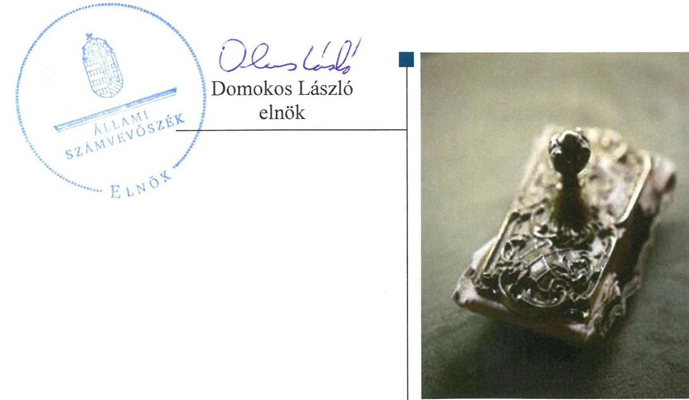
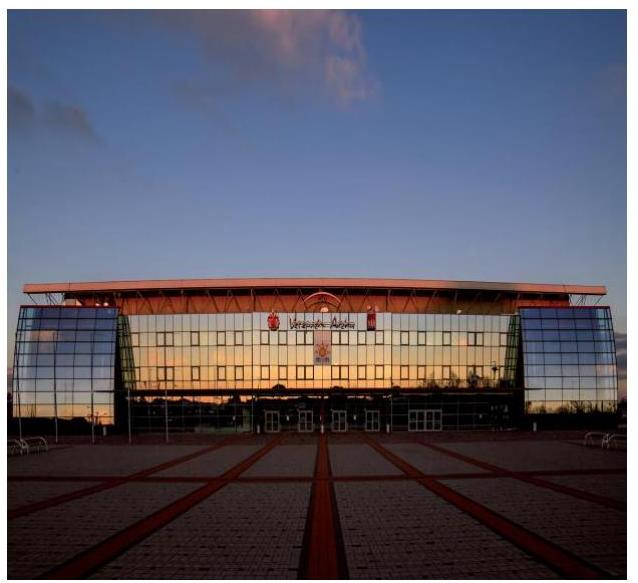
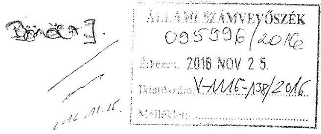
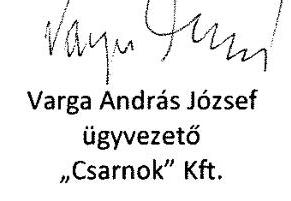
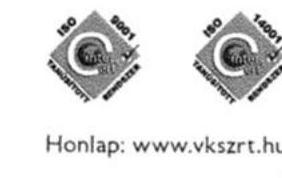
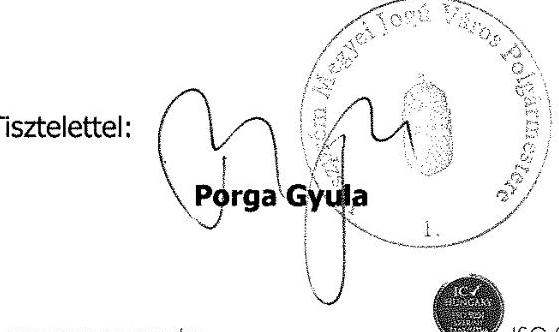
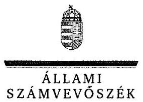
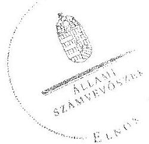
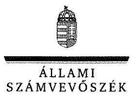

# Jelentés 

## Az önkormányzatok gazdasági társaságai

Az önkormányzatok többségi tulajdonában lévő gazdasági társaságok gazdálkodásának ellenőrzése - „Csarnok" Veszprémi Csarnoküzemeltető, Rendezvényszervező és Kommunikációs Kft.

2017

---

# Jelenetés 

## Az önkormányzatok gazdasági társaságai

Az önkormányzatok többségi tulajdonában lévő gazdasági társaságok gazdálkodásának ellenőrzése - „Csarnok" Veszprémi
Csarnoküzemeltető, Rendezvényszervező és Kommunikációs Kft.
2017. jannal hó 10. nap

---

# AZ ELLENŐRZÉST FELÜGYELTE: 

BÖRÖCZ IMRE felügyeleti vezető

## AZ ELLENŐRZÉST VEZETTE ÉS A VÉGREHAJTÁSÁÉRT FELELŐS:

KORSÓSNÉ VIGH ANDREA ellenőrzésvezető

## A PROGRAM ÖSSZEÁLLÍTÁSÁÉRT FELELŐS:

JANIK JÓZSEF LÁSZLÓ osztályvezető

IKTATÓSZÁM: V-1116-145/2016.
TÉMASZÁM: 2150

## ELLENŐRZÉS-AZONOSÍTÓ SZÁM: V070781

Jelentéseink az Országgyúlés számítógépes hálózatán és az Interneten a www.asz.hu címen is olvashatóak.

---

# TARTALOMJEGYZÉK 

■ ÖSSZEGZÉS ..... 5
■ AZ ELLENŐRZÉS CÉLJA ..... 7
■ AZ ELLENŐRZÉS TERÜLETE ..... 8
■ AZ ELLENŐRZÉS HÁTTERE, INDOKOLTSÁGA ..... 10
■ A JELENTÉS LÉNYEGES KÉRDÉSKÖREI ..... 11
■ ELLENŐRZÉS HATÓKÖRE ÉS MÓDSZEREI ..... 12
■ MEGÁLLAPÍTÁSOK ..... 14
■ JAVASLATOK ..... 24
■ MELLÉKLETEK ..... 25
I. sz. melléklet: Értelmező szótár ..... 25
■ FÜGGELÉK: ÉSZREVÉTELEK ..... 27
■ RÖVIDÍTÉSEK JEGYZÉKE ..... 35

---

.

---

# ÖSSZEGZÉS 

A „VKSZ" Veszprémi Közüzemi Szolgáltató Zrt. 2012. I. félévig szabályszerűen, 2012. II. félévtől a Veszprém Megyei Jogú Város Önkormányzata összességében szabályszerűen alakította ki és gyakorolta a tulajdonosi jogokat. A „Csarnok" Veszprémi Csarnoküzemeltető, Rendezvényszervező és Kommunikációs Kft. vagyongazdálkodása szabályszerű volt. A kötelezettségállomány nem veszélyeztette a feladatellátást és a müködést. A bevételek és ráfordítások elszámolása megfelelő volt.

## Az ellenőrzés társadalmi indokoltsága

Az Állami Számvevőszék kiemelt célja, hogy a helyi önkormányzatok gazdálkodásában rejlő pénzügyi kockázatok feltárásával, az államháztartáson kívülre nyújtott költségvetési támogatások és ingyenes vagyonjuttatások, valamint az államháztartáson kívül működő feladatellátó rendszerek ellenőrzéseivel hozzájáruljon ahhoz, hogy a közpénzeket az államháztartáson kívül működő szervezetek is átlátható, rendezett módon használják fel.

Magyarországon az intézménycentrikus közfeladat-ellátás jellemző, de egyre jelentősebb a költségvetésen kívüli feladatellátás térnyerése. Ennek legfontosabb szereplői - a nonprofit szervezetek mellett - az önkormányzati tulajdonú gazdasági társaságok. Az önkormányzatok szervezetalakítási szabadságának következménye, hogy a korábban is vállalati formában működő közszolgáltatások mellett, mind a kötelező, mind az önként vállalt feladatok ellátásában a gazdasági társaságok kiemelt fontosságú szerephez jutottak.

## Főbb megállapítások, következtetések, javaslatok

A feladatellátás megszervezése szabályszerű volt, a helyi sporttevékenység támogatása az Önkormányzat önként vállalt feladatai körébe tartozott és a Társaság által működtetett Veszprém Arénában üzemidő vásárlással valósult meg. A Társaság 2012. június 30-ig az Önkormányzat többségi tulajdonában lévő VKSZ Zrt., majd 2012. július 1-jétől az Önkormányzat egyszemélyes gazdasági társasága volt. A tulajdonosi joggyakorlás rendjének a kialakítása, a tulajdonosi jogok gyakorlása a VKSZ Zrt. tekintetében megfelelt, az Önkormányzat tekintetében összességében megfelelt a jogszabályi előírásoknak. Az ellátandó feladatok körét az alapító okiratban megfelelően rögzítették, e mellett az Önkormányzat a Társasággal kötött szolgáltatási szerződésben határozta meg a feladatellátás részletes szabályait. A Társaság beszámoltatása az éves üzleti tervekről, éves beszámolókról és üzleti jelentésekről való tulajdonosi döntéshozatal keretében megtörtént. Az Önkormányzatnak 2012-ben a Társaság saját tőkéje törvényben előírt mértékű biztosítására intézkedési kötelezettsége keletkezett, amelynek eleget tett. A tulajdonosi ellenőrzés keretében az Önkormányzat 2014-ben a Társaságnál kockázatelemzésen alapuló, a vagyongazdálkodás szabályszerűségére irányuló belső ellenőrzést végzett, amely a szabályozásban tárt fel hiányosságokat és a veszteség minimalizálására hívta fel a figyelmet.

A Társaság a jogszabályban előírt szabályzatokkal összességében rendelkezett, azonban a számlarendre, a leltározás és a bizonylati rend szabályozására vonatkozó törvényi követelményeket maradéktalanul nem érvényesítette. A Társaság vagyonkezelt eszközökkel nem rendelkezett, a saját vagyonával történő vagyongazdálkodás, ennek részeként a vagyon nyilvántartása, leltározása, a jogszabályi és a belső előírásoknak megfelelő volt.

A Társaság vagyona alapvetően a Veszprém Aréna 2012. évi tulajdonába kerülése miatt növekedett. A kötelezettségek a Veszprém Aréna építési beruházásával összefüggő svájci frank alapú tőke és kamattartozás átvállalásával összefüggésben emelkedtek, amely az eladósodottság fokozódását eredményezte. A kötelezettségek állományának növekedése nem veszélyeztette a Társaság múködését, mert az Önkormányzat 2012-ben határozatban rögzítette az éves adósságszolgálati kötelezettség teljesítése érdekében a Társaságnak biztosítandó tőkejuttatás éves mértékét a hitel teljes futamidejére, amelyet 2012-2014-ben teljesített. Az ellenőrzött időszakban biztosított volt a szerződésen és jogszabályon alapuló kötelezettségek határidőben történő teljesítése.

---

Éves beszámolási és a beszámolókhoz kapcsolódó letétbe helyezési és közzétételi kötelezettségének a Társaság szabályszerűen eleget tett. Gazdálkodása a 2011-2014. években növekvő mértékben veszteséges volt. A könyvvizsgáló a 2011-2014. évi beszámolókat hitelesítő záradékkal látta el, e mellett a 2011. évi beszámolóhoz a saját tőke hiányara és a tulajdonosi intézkedés szükségességére irányuló, a 2014. évi beszámolóhoz a likviditással összefüggő figyelemfelhívást tett.

A bevételek és a ráfordítások elszámolása a jogszabályi előírásoknak és a belső szabályozásnak megfelelő volt.
Az ÁSZ a Társaság ügyvezetőjének fogalmazott meg javaslatokat, amelyek alapján köteles intézkedési tervet öszszeállítani és azt a jelentés kézhezvételétől számított 30 napon belül az ÁSZ részére megküldeni.

---

# AZ ELLENŐRZÉS CÉLJA 

AZ ELLENŐRZÉS CÉLJA annak értékelése volt, hogy az önkormányzat vagyongazdálkodási tevékenysége során szabályszerűen gyakorolta-e tulajdonosi jogait; a gazdasági társaság szabályozottsága, gazdálkodása és vagyongazdálkodási tevékenysége, bevételeinek és ráfordításainak elszámolása megfelelt-e a jogszabályi és tulajdonosi előírásoknak; a gazdasági társaság kötelezettségállománya jelentett-e kockázatot a múködésre, valamint a gazdálkodás átláthatósága és elszámoltathatósága érdekében biztosítva volt-e a szolgáltatás dijának megalapozottsága szabályszerű önköltségszámítással.

---

# **AZ ELLENŐRZÉS TERÜLETE**

# **"Csarnok" Veszprémi Csarnoküzemeltető, Rendezvényszervező és Kommunikációs Kft. és a tulajdonos VKSZ Zrt. (2012. június 30-ig), valamint a Veszprém Megyei Jogú Város Önkormányzata (2012. július 1-jétől)**

**A CSARNOK KFT.-**t^{1} az Önkormányzat^{2} többségi (98,7%-os) tulajdonában álló VKSZ Zrt^{3}, alapította 2007. július 27-én 100%-os részesedéssel. Fő tevékenysége a Veszprém Aréna üzemeltetése volt. A Veszprém Aréna Magyarország második legnagyobb vidéki sport- és rendezvénycsarnoka. Küzdőtere 2000 m^{2}, e mellett a 650 m^{2}-es előcsarnoka önállóan is alkalmas kisebb rendezvények helyszínének, korszerű, százfős sajtóblokkja pedig nemzetközi sportversenyek alkalmával vagy konferenciák helyszíneként használható. A multifunkcionális csarnok teljes területe akadálymentesített. Az ellenőrzött időszakban a férfi kézilabda Bajnokok Ligája mérkőzések és a nemzetközi konferenciák voltak a leglátogatottabb rendezvények.

A Veszprém Aréna épületét a Multifunkcionális Szolgáltató Kft. építette és vett fel hozzá CHF^{4} alapú hitelt, majd az ellenőrzött időszakot megelőzően beolvadt a VKSZ Zrt.-be. Így a Veszprém Aréna tulajdonosa az ellenőrzött időszak kezdetén, 2011-ben és 2012. i. félévben a VKSZ Zrt. volt. A Csarnok Kft. mint a létesítmény üzemeltetője bérleti díjat fizetett a VKSZ Zrt-nek. A VKSZ Zrt. mint tulajdonos, valamint az Önkormányzat, mint a VKSZ Zrt. részvényese 2012-ben a Csarnok Kft. átalakításáról döntött. A kedvezményezett (adó- és illetékmentes) átalakulás 2012. július 1-jén valósult meg, amelyet követően az Önkormányzat lett a Csarnok Kft. kizárólagos tulajdonosa. Az átalakulás során a Csarnok Kft. tulajdonába került a Veszprém Aréna épülete, a hozzá tartozó földterülettel, immateriális javakkal, tárgyi eszközökkel és az attól el nem választható CHF alapú hitellel.

A Csarnok Kft. az ellenőrzött időszakban közfeladatot nem látott el. Gazdálkodásának 2011-2014. évi főbb adatait az 1. táblázat szemlélteti.

^{1} táblázat

|   | 2011. | 2012. | 2013. | 2014.  |
| --- | --- | --- | --- | --- |
|  Mérlegfőösszeg | 151,8 | 7049,0 | 6922,7 | 7613,0  |
|  Értékesítés nettó árbevétele | 450,4 | 304,4 | 360,5 | 367,7  |
|  Mérleg szerinti eredmény | -112,7 | -290,3 | -275,3 | -468,9  |
|  Saját tőke | -67,0 | 919,5 | 1224,0 | 1835,1  |
|  Követelések | 74,9 | 39,6 | 25,7 | 518,9  |
|  Kötelezettségek | 122,3 | 6056,1 | 5612,9 | 5534,1  |
|  Átlagos statisztikai alkalmazotti létszám (fő) | 4,0 | 4,0 | 4,2 | 6,0  |

*Forrás: Csarnok Kft. 2011-2014. évi Éves beszámolói*

---

A 2011-2014. években az ügyvezető személyében változás nem történt. A gazdálkodással kapcsolatos feladatokat megállapodás alapján a VKSZ Zrt. látta el. A Csarnok Kft. a Veszprémi Turisztikai Nonprofit Kft.-ben 0,1 M Ft részesedéssel rendelkezik.

AZ ÖNKORMÁNYZAT a Csarnok Kft.-vel együtt 2014. december 31-én kilenc gazdasági társaságban rendelkezett többségi tulajdonnal. Ezekből a VKSZ Zrt. a közüzemi feladatokkal kapcsolatos tevékenységeket látta el, a Veszprémi Városi Televízió Kft. a nevében megjelölt tevékenységet, a Kittenberger Kálmán Növény- és Vadaspark Szolgáltató Közhasznú Nonprofit Kft. múködteti az állatkertet. A Pro Veszprém Városfejlesztési és Befektetés Ösztönző Kft. fő tevékenységi köre épületépítési projekt szervezés. A Veszprémi Turisztikai Közhasznú Nonprofit Kft. turisztikával kapcsolatos tevékenységet látott el. A Pannon TISZK Veszprém Nonprofit Kft. fő feladata szakmai középfokú oktatás. A Kolostorok és Kertek Kft. zöldterület kezelésért felelős. A Veszprémi Programiroda Rendezvényszervező Kulturális és Szolgáltató Kft. előadó-művészeti rendezvények szervezését végzi fő tevékenységeként. Az Önkormányzatnál a polgármester és a jegyző személye az ellenőrzött időszak alatt nem változott.

---

# AZ ELLENŐRZÉS HÁTTERE, INDOKOLTSÁGA 

## „Csarnok" Veszprémi Csarnoküzemeltető, Rendezvényszervező és Kommunikációs Kft.

Az önkormányzati tulajdonú gazdasági társaságok ellenőrzése kiemelten fontos a vagyon megőrzése, megóvása érdekében. Alapvető követelmény, hogy gazdálkodásuk, múködésük szabályszerű, az általuk szolgáltatott adatok minél megbízhatóbbak legyenek. A feladatellátás költségeinek, ráfordításainak alakulása, színvonala hatással van a lakosság elégedettségére.

A törvényalkotás számára - az észlelt problémák, szabálytalanságok, vagy egyéb nem kívánatos jelenségek felszínre kerülésével - az ellenőrzés megállapításai segítséget nyújthatnak az államháztartáson kívüli feladatellátás értékeléséhez, jogszabályi keretei pontosításához, átláthatóságot biztosító szabályozásához. Meghatározhatóvá válnak az önkormányzati feladatellátásban részt vevő államháztartáson kívüli szervezeteknek - az önkormányzat költségvetését, pénzügyi helyzetét is befolyásoló - kockázatai, lehetővé válik ezen kockázatok csökkentése. Ellenőrzéseink feltárhatják, hogy az önkormányzat feladat-ellátási kötelezettségének szabályszerűen tett-e eleget, a feladatellátáshoz rendelt vagyon múködtetését az elvárható gondossággal, szabályszerűen szervezte-e meg és a tulajdonosi felügyelete hozzájárult-e a feladatellátásához. Az ellenőrzés rávilágíthat arra, hogy a gazdasági társaság a feladat-ellátási, közszolgáltatási szerződésben foglaltak betartásával, a vagyon használatával biztosította-e a szolgáltatás folytatásának feltételeit, a feladat ellátását. Ezzel az ellenőrzöttek és a helyi döntéshozók számára visszajelzést ad feladatszervezési, feladat-ellátási kockázataikról, alapot ad a meglévő hibák megszüntetéséhez, a jobb feladatellátás biztosításához. Fokozza a fegyelmet, igazolja, hogy lejárt a következmények nélküli ellenőrzések időszaka. Az ÁSZ értékteremtő rend kialakításához és megőrzéséhez hozzájáruló tevékenysége pozitív hatással van a szervezetről kialakított összkép formálására.

---

# A JELENTÉS LÉNYEGES KÉRDÉSKÖREI 

1. Az önkormányzat feladat megszervezéséről szóló döntése, valamint a tulajdonosi joggyakorlás szabályszerű volt-e?
2. A gazdasági társaság vagyongazdálkodása szabályszerű volt-e, kötelezettségállománya jelentett-e kockázatot a müködésre, illetve a feladat ellátására?
3. A gazdasági társaságnál az ellátott feladat bevételei és ráfordításai elszámolása, valamint az önköltségszámítás és árképzés szabályszerű volt-e?

---

# ELLENŐRZÉS HATÓKÖRE ÉS MÓDSZEREI 

## Az ellenőrzés típusa

Megfelelőségi ellenőrzés

## Az ellenőrzött időszak

Az ellenőrzött időszak 2011. január 1-jétől 2014. december 31-ig terjedő időszak volt.

## Az ellenőrzés tárgya

A gazdasági társaság feletti tulajdonosi joggyakorlás, valamint a gazdasági társaság gazdálkodásának szabályozottsága és szabályszerűsége.

Az ellenőrzés kiterjedt minden olyan körülményre és adatra, amely az ÁSZ jogszabályban meghatározott feladatainak teljesítéséhez, valamint a program végrehajtása folyamán felmerült újabb összefüggések feltárásához volt szükséges.

## Az ellenőrzött szervezet

"Csarnok" Veszprémi Csarnoküzemeltető, Rendezvényszervező és Kommunikációs Kft.
"VKSZ" Veszprémi Közüzemi Szolgáltató Zrt. (2012. június 30-ig)
Veszprém Megyei Jogú Város Önkormányzata (2012. július 1-jétől)

## Az ellenőrzés jogalapja

Az ellenőrzés jogszabályi alapját az ÁSZ tv. ${ }^{5}$ 1. § (3) bekezdése és 5. § (3)(4)-(5) bekezdései képezték.

## Az ellenőrzés módszerei

Az ellenőrzést a nemzetközi standardokat irányadónak tekintve az ellenőrzési program ellenőrzési kérdései, az ellenőrzött időszakban hatályos jogszabályok, az ellenőrzés szakmai szabályok és módszertanok figyelembe vételével végeztük.

---

Az ellenőrzés ideje alatt az ellenőrzött szervezettel történő kapcsolattartást az ÁSZ Szervezeti és Múködési Szabályzatának vonatkozó előírásai alapján biztosítottuk.

Az ellenőrzés a kiválasztott, tulajdonosi jogokat gyakorló önkormányzatra, illetve az ellenőrzésre kijelölt gazdasági társaság felett tulajdonosi jogokat gyakorló szervezetre (holding szervezetre) és az ellenőrzött közfeladatot ellátó gazdasági társaságra terjedt ki.

Az ellenőrzési kérdések megválaszolásához szükséges bizonyítékok megszerzése a következő ellenőrzési eljárások alkalmazásával történt: megfigyelés, kérdésfeltevés (információkérés), összehasonlítás, valamint elemző eljárás.

Az ellenőrzést a kérdésekre adott válaszok kiértékelésével, valamint a megjelölt adatforrások, a csatolt tanúsítványok felhasználásával, továbbá az adott időszakban hatályos jogszabályok figyelembe vételével folytattuk le.

A bevételek és ráfordítások elszámolása, valamint a vagyonnyilvántartás terén a szabályszerű működést véletlen mintavétellel ellenőriztük. A mintavétellel ellenőrzött területek esetében minden egyes tétel vonatkozásában a szabályszerűségre vonatkozó kérdéseket tettünk fel, amelyek eredménye összesítésre került. A jogszabályoknak és a belső előírásoknak megfelelőnek tekintettük az adott területet, amennyiben a minta ellenőrzésének eredménye alapján 95\%-os bizonyossággal a teljes sokaságban a hibaarány kisebb volt, mint 10\%, nem megfelelőnek, ha a hibaarány a 10\%ot meghaladta. Részben megfelelő minősítést adtunk, amennyiben egy adott terület vonatkozásában a minta alapján a teljes sokaságban nem volt egyértelműen biztosított a jogszabályoknak és a belső szabályzatoknak megfelelő működés. A ráfordítások elszámolására és a vagyonnyilvántartásra vonatkozó véletlen mintavételt kockázati alapú kiválasztással egészítettük ki, amelynek során a három legnagyobb összegű tételt választottuk ki.

---

# 1. Az önkormányzat feladat megszervezéséről szóló döntése, valamint a tulajdonosi joggyakorlás szabályszerű volt-e? 

Összegző megállapítás

Az Önkormányzat szabályszerűen szervezte meg a feladatellátást. A VKSZ Zrt. 2011-ben és 2012. I. félévében szabályszerűen, az Önkormányzat 2012. II. félévben és 2013-2014-ben összességében szabályszerűen alakította ki a tulajdonosi joggyakorlás rendjét és gyakorolta a tulajdonosi jogokat.
1.1. számú megállapítás

A feladatellátás megszervezése, az ellátandó feladatok körének meghatározása szabályszerű volt.

GAZDASÁGI PROGRAMMAL ${ }^{6}$ az Önkormányzat rendelkezett az Ötv. ${ }^{7}$ 91. § (6) bekezdésében előírtaknak megfelelően a 2011-2014. évekre vonatkozóan, amelyet az Önkormányzat Közgyűlése ${ }^{8}$ jóváhagyott. Ebben a Veszprém Aréna és környéke fejlesztésével kapcsolatos célkitűzésként fogalmazták meg a területen gazdasági, kereskedelmi, szolgáltatási övezet kialakítását, ehhez a terület közlekedési helyzetének, megközelítésének javítását.

KÖZÉP- ÉS HOSSZÚ TÁVÚ VAGYONGAZDÁLKODÁSI TERVÉT ${ }^{9}$ az Önkormányzat az Nvtv. ${ }^{10}$ 9. § (1) bekezdése alapján elkészítette. Ebben - a Csarnok Kft.-t is érintően - az adott funkció alacsonyabb költséggel, azonos vagy magasabb színvonalon ellátását lehetővé tevő fejlesztési célkitűzések szerepeltek. A célkitűzések megvalósítását a 2013. és a 2014. évben, a következő évi vagyongazdálkodási irányelvek Közgyűlés elé terjesztése keretében értékelték, amely a Csarnok Kft.-t érintő módosítást nem tartalmazott.

A FELADATELLÁTÁS megszervezése szabályszerű volt, a helyi sporttevékenység támogatása az Önkormányzat önként vállalt feladatai körébe tartozott és a Csarnok Kft. által működtetett Veszprém Arénában üzemidő vásárlásával valósult meg.

Az ellátandó feladatok körét a tulajdonosok ${ }^{11}$ az alapító okiratban a Gt. ${ }^{12}$ és a Ptk. ${ }^{13}$ előírásai szerint szabályszerűen, számon kérhető módon meghatározták. E mellett az Önkormányzat a feladatellátására vonatkozóan az ellenőrzött időszakot megelőzően szolgáltatási szerződést ${ }^{14}$ kötött, amelyben a Veszprém Aréna üzemidejének önkormányzati célú igénybevételét rögzítették 15 éves időtartamra. A szolgáltatási szerződést az Önkormányzat az ellenőrzött időszakban két alkalommal felülvizsgálta és azt módosították: a Veszprém Aréna üzemidejének eredetileg meghatározott 70\%-ban maximált önkormányzati igénybevételét 2011. december 21-től 14\%-ra, majd 2012. június 12-től 7\%-ra csökkentették az átalánydíjban

---

meghatározott szolgáltatási díj arányos csökkentésével együtt. A szolgáltatási szerződés meghatározta a szolgáltatás biztosításával kapcsolatos kötelezettségeket, jogokat, garanciális elemeket a két félre vonatkozóan.

VAGYONKEZELT VAGYONNAL a Csarnok Kft. az ellenőrzött időszakban nem rendelkezett. A feladat ellátását szolgáló ingatlan (a Veszprém Aréna):
—2012. június 30-ig a VKSZ Zrt. tulajdonában volt, amelyet a Csarnok Kft. bérleti szerződés alapján üzemeltetett;
—2012. július 1-jétől a Csarnok Kft. tulajdonát képezte.
Rendeletalkotási kötelezettséget az Önkormányzat részére a Csarnok Kft. feladatellátásával kapcsolatosan jogszabály nem írt elő.

# 1.2. számú megállapítás 

A VKSZ Zrt. 2012. I. félévéig a jogszabályi előírásokkal összhangban, ezt követően az Önkormányzat összességében szabályszerűen alakította ki a tulajdonosi joggyakorlás rendjét és gyakorolta a tulajdonosi jogokat.

## A TULAJDONOSI JOGOK GYAKORLÁSÁNAK

RENDJÉT a tulajdonosok a 100\%-os tulajdonukban lévő Csarnok Kft. alapító okiratában a Gt. és a Ptk. előírásaival összhangban határozták meg. Az ellenőrzött időszakban hatályos alapító okiratok szerint az alapító kizárólagos hatáskörébe tartoztak mindazok a kérdések, amelyeket a törvényi rendelkezések a taggyűlés kizárólagos hatáskörébe utaltak, amely kérdésekben „az alapító határozattal dönt, és erről a vezető tisztségviselőt írásban értesíti." E mellett vagyonrendeletben ${ }^{15}$ rögzítette az Önkormányzat a gazdasági társaságokkal összefüggő tulajdonosi joggyakorlás részletes szabályait, továbbá a vagyongazdálkodási döntések megalapozására vonatkozó előírásokat és hatásköri rendet.

A VKSZ ZRT. TULAJDONOSI JOGGYAKORLÁSA a Csarnok Kft., mint kizárólagos tulajdonú leányvállalata tekintetében 2011. január 1. - 2012. június 30. között szabályszerű volt. A Gt. előírásaival és az alapító okirattal összhangban döntött alapítói határozatokban a törzstőke megemeléséről, az alapító okirat módosításáról. Az alapító okirat tartalma, az FB és a könyvvizsgáló működése a Gt. előírásainak megfelelő volt.

A VKSZ Zrt. a Csarnok Kft. 2011. évi éves beszámolója elfogadásáról a Gt. előírása szerint az FB, továbbá a könyvvizsgáló írásos véleménye birtokában döntött. Üzleti terv készítésére vonatkozó tulajdonosi rendelkezés nem volt, a Csarnok Kft. azonban a 2011-2012. években készített üzleti terveket, amelyeket a VKSZ Zrt. elfogadott.

A VKSZ Zrt. Közgyűlése a 4/2012. (I. 12.) számú határozatában, valamint az Önkormányzat - mint a VKSZ Zrt. részvényese - a 23/2012. (I. 27.) számú határozatában döntött a VKSZ Zrt. Csarnok Kft-t is érintő szervezeti átalakításáról. Az átalakítás célja a Veszprém Aréna vagyontömegének VKSZ Zrt.-ből történő kiválása, a Csarnok Kft.-be történő beolvadása, a Csarnok Kft.-nek az Önkormányzat kizárólagos tulajdonába kerülése volt. A Csarnok Kft. a szervezeti átalakítás folyamatában az 1/2012. (I. 12.) számú alapítói határozatnak megfelelően, a Gt. 86. § (2) bekezdés szerint, mint átvevő gazdasági társaság vett részt.

---

# AZ ÖNKORMÁNYZAT TULAJDONOSI JOGGYAKORLÁSA 2012. július 1-jét követően az ellenőrzött időszakban öszszességében szabályszerű volt. Az Önkormányzat Közgyűlése döntött az alapító okirat jóváhagyásáról, módosításáról, a törzstőke emelésekről. Az FB és a könyvvizsgáló a Gt. és a Ptk. előírásainak megfelelően múködött. Az éves beszámolókról szóló döntésekhez az FB és a könyvvizsgáló írásos véleménye rendelkezésre állt.

A vagyonrendeletben kapott hatáskörében a Tulajdonosi Bizottság ${ }^{16}$ határozattal döntött az éves üzleti tervek, valamint az éves beszámolók és üzleti jelentések jóváhagyásáról.

A Társaság ${ }^{17}$ saját tőkéje 2011-ben, és az azt megelőző üzleti évben is negatív összegű volt, nem rendelkezett a társasági formájára kötelezően előírt jegyzett tőkének megfelelő összegű saját tőkével. Az Önkormányzat 2012-ben a Gt. 51. § (1) bekezdésben előírt intézkedési kötelezettségének - amelyre a Társaság könyvvizsgálója felhívta a figyelmet - a Társaság jegyzett tőkéjének (törzstőkéjének) a megemelésével eleget tett.

Az Önkormányzat 2012-ben határozatban döntött a Társaság által a Veszprém Arénához átvállalt CHF alapú hitel törlesztéséhez szükséges tőkejuttatás (törzstőkeemelés) évenkénti összegéről a hitel 2023-ig tartó futamidejére. A 2012-2014. évi tőkeemelésekhez az Önkormányzat a tárgyévi költségvetési rendeletekben biztosította a fedezetet. A tulajdonosi intézkedések hatására a 2012-2014. években a Társaság saját tőkéjének az összege meghaladta a társasági formára előírt jegyzett tőke összegét, további beavatkozásra nem volt szükség.

Az Önkormányzat a 2014. évi költségvetési rendeletében és annak módosításaiban „Csarnok Kft. törzstőkeemelés és tőketartalékba helyezés" jogcímen 1080 M Ft előirányzatot biztosított. A törzstőkeemelés összegének pontos meghatározása hiányában nem volt biztosított a Közgyűlés általi döntés végrehajtásának átláthatósága és elszámoltathatósága.

BELSŐ ELLENŐRZÉS a 2014. évben történt az Áht.; ${ }^{18}$ 70. § (1) bekezdés d) pont alapján. A Polgármesteri Hivatal ${ }^{19}$ Belső Ellenőrzési Irodája kockázatelemzés alapján a Társaság tevékenységét magas kockázatúnak minősítette, ezért a 2012. július 1. - 2014. június 30. közötti időszakra vonatkozóan végzett ellenőrzést. Az ellenőrzés célja annak megállapítása volt, hogy a Társaság vagyonával a jogszabályi előírásoknak megfelelően szabályszerűen, gazdaságosan, hatékonyan és eredményesen gazdálko-dott-e. Az ellenőrzés az egyes szabályzatok aktualizálása és a veszteség minimalizálása szükségességére hívta fel a figyelmet és tett javaslatot.

KEZESSÉG, GARANCIA VÁLLALÁS az Önkormányzat részéről nem történt. A VKSZ Zrt. a Veszprém Aréna építéshez felvett CHF hitelre a tulajdonosváltáshoz kapcsolódóan a Csarnok Kft.-vel kötött kezességi szerződésben készfizető kezességet vállalt. A szerződés értelmében az aláírás napján fennálló tartozás 26293 758,72 CHF volt, a hitel végső lejárata 2023. évben lesz. A kezességgel kapcsolatosan a VKSZ Zrt.-nek az ellenőrzött időszak végéig fizetési kötelezettsége nem keletkezett.

---

# 2. A gazdasági társaság vagyongazdálkodása szabályszerű volt-e, kötelezettségállománya jelentett-e kockázatot a múködésre, illetve a feladat ellátására? 

Összegző megállapítás

A Csarnok Kft. vagyongazdálkodása összességében megfelelt a jogszabályi rendelkezéseknek. A kötelezettségállomány a 2012-ben tulajdonba kapott Veszprém Aréna ingatlanhoz kapcsolódó építési hitel miatt növekedett, amely az ehhez történt, tőkejuttatás formában megvalósult önkormányzati támogatások miatt nem veszélyeztette a múködést.
2.1. számú megállapítás

A Csarnok Kft. a jogszabályokban előírt szabályzatokkal összességében rendelkezett.

A Csarnok Kft. rendelkezett a Számv. tv ${ }^{20}$. 14. § (3)-(4) bekezdésében előírt számviteli politikával ${ }^{21}$, amelynek mellékletét képezte a Leltározási és a leltárkészítési szabályzat ${ }^{22}$, az Értékelési szabályzat, a Bizonylati rend, a Selejtezési szabályzat és a Pénzkezelési szabályzat.

A Leltározási és leltárkészítési szabályzatban az ügyvezető a Társaság vonatkozásában nem határozta meg a mennyiségi leltárfelvétel gyakoriságát a Számv. tv. 2012-től hatályos 69. § (3) bekezdés előírása ellenére, amely szerint a folyamatosan mennyiségben nyilvántartott eszközök leltározását „az eszközök és források leltárkészítési és leltározási szabályzatában meghatározott időszakonként, de legalább háromévente mennyiségi felvétellel" kell elvégezni.

Az ügyvezető a Számv. tv. 161. § (4) bekezdés előírása ellenére nem állított össze számlarend elnevezésű belső szabályozó dokumentumot. A bizonylati rend nem volt a Számv. tv. 161. § (2) bekezdés d) pont előírásának megfelelő, mert számlarend hiányában az abban foglaltakat nem támaszthatta alá.

A más szabályozó dokumentumokban megjelenő előírások a számlarendre vonatkozó szabályozási követelmények egyes részelemeire tértek ki:
— az évente kiadott számlatükör tartalmazta minden alkalmazásra kijelölt számla számjelét és megnevezését a Számv. tv. 161. § (2) bekezdés a) pont előírása szerint;
— a számviteli politikában elrendelt integrált ügyviteli- és könyvviteli rendszer alkalmazása biztosította a főkönyvi és az analitikus nyilvántartás szoros kapcsolatát, a kettő között az értékadatok számszerű egyeztetésének lehetőségét a Számv. tv. 161. § (2) bekezdés c) pont és a (3) bekezdés előírásának megfelelően.
A bizonylati rend tartalmazta a számviteli bizonylatokat, a bizonylati fegyelemre vonatkozó előírásokat, a szigorú számadású nyomtatványokat, a bizonylatok megőrzésére vonatkozó előírásokat.

Javadalmazási szabályzattal ${ }^{23}$ a Társaság a Tak. tv. 5. § (3) bekezdés előírása szerint rendelkezett.

---

# 2.2. számú megállapítás 

A Csarnok Kft. vagyongazdálkodása megfelelt a jogszabályi rendelkezéseknek és a belső előírásoknak.

A Csarnok Kft. a feladatát saját eszközeivel látta el, vagyonkezelésbe vett eszköze nem volt. A saját vagyon nyilvántartása megfelelt a jogszabályi előírásoknak és a belső szabályoknak. Az éves beszámolókban kimutatott vagyontárgyak állományát a 2011-2014. években leltárral alátámasztották, amely a jogszabályi előírásoknak megfelelő és teljes körű volt.

A Csarnok Kft. eszközállományában 2012. július 1-jétől a Veszprém Aréna saját tulajdonba kerülése miatt következett be jelentős növekedés. Az eszközök állományának és összetételének 2011-2014. évi alakulását mutatja be a 2. táblázat.
2. táblázat

CSARNOK KFT. ESZKÖZÁLLOMÁNYA (M FORINT)

|  | 2011. | 2012. | 2013. | 2014. |
| :--: | :--: | :--: | :--: | :--: |
| Befektetett eszközök | 9,6 | 6520,3 | 6369,2 | 6217,5 |
| Immateriális javak | 0,2 | 1,2 | 1,0 | 1,5 |
| Tárgyi eszközök | 7,2 | 6519,0 | 6368,1 | 6215,9 |
| Ingatlanok | 0,2 | 6112,2 | 5990,9 | 5869,9 |
| Befektetett pủ. eszközök | 2,2 | 0,1 | 0,1 | 0,1 |
| Forgóeszközök | 78,2 | 454,8 | 481,6 | 961,9 |
| Készletek | 0,2 | 0,1 | 0,1 | 0,1 |
| Követelések | 74,9 | 39,6 | 25,6 | 518,9 |
| Pénzeszközök | 3,1 | 415,1 | 455,9 | 442,9 |
| Aktív időbeli elhatárolások | 64,0 | 73,9 | 71,9 | 433,6 |
| ESZKÖZÖK ÖSSZESEN | 151,8 | 7049,0 | 6922,7 | 7613,0 |

Az eszközökön belül a tárgyi eszközök aránya a 2011. évi 8 \%-ról a 2014. évre $82 \%$-ra növekedett. A 2012. évi átalakulást követően az összes eszközállományon belül az ingatlanok aránya meghatározó.

A forgóeszközök növekedése 2012-ben a pénzeszközök, 2014-ben a követelések növekedésével volt összefüggésben.
$\longrightarrow$ A pénzeszközök növekedését eredményezte 2012-től, hogy a Csarnok Kft.-nek a devizahitel törlesztés biztosítékaként a pénzintézet előírása alapján két egymást követő negyedéves adósságszolgálat összegét az Adósságszolgálati Fedezeti Számlán kell tartania.
$\longrightarrow$ A követelések 2014. évi növekedése a Csarnok Kft. által az MKB Veszprém Kézilabda Zrt.-nek négy kölcsönszerződés alapján folyósított összesen 450,0 M Ft, valamint a Bakony és Balaton Térségi Turisztikai Nonprofit Kft.-nek egy kölcsönszerződés alapján folyósított 27 M Ft kölcsön összegéből keletkezett. A kölcsönszerződéseket, amelyek a visszafizetésre biztosítékokat és garanciális elemeket tartalmaztak, a 2014. decemberi lejáratot megelőzően meghosszabbították. Az egyedi szerződések a vagyonrendelet szerint nem érték el a tulajdonosi jóváhagyást igénylő értékhatárt.
Saját vagyon elidegenítésére, megterhelésére az ellenőrzött időszak alatt nem került sor, továbbá a Csarnok Kft. nem hajtott végre olyan fejlesztést, melyhez tulajdonosi jóváhagyásra lett volna szükség.

---

A Csarnok Kft. az ellenőrzött időszakban a 2011. év kivételével rendelkezett az egymást követő két teljes üzleti évben a társasági formájára kötelezően előírt jegyzett tőkének megfelelő összegű saját tőkével. A Társaság saját tőkéje 2012-től a Veszprém Aréna épületéhez kapcsolódó adósságszolgálat fedezete céljából biztosított tulajdonosi tőkejuttatások hatására emelkedett. A saját tőke és összetevőinek változását mutatja be a 3. táblázat.
3. táblázat

SAJÁT TŐKE ADATAI (M FT)

|  | 2011. | 2012. | 2013. | 2014. |
| :-- | --: | --: | --: | --: |
| Saját tőke | -67,0 | 919,5 | 1224,0 | 1835,1 |
| Jegyzett tőke | 33,2 | 438,6 | 1018,4 | 1018,5 |
| Tóketartalék | 298,1 | 619,2 | 619,2 | 1699.1 |
| Eredménytartalék | -285,6 | 140,9 | -151,2 | -627,2 |
| Lekötött tartalék | 0 | 11,1 | 12,9 | 213,6 |
| Mérleg szerinti eredmény | -112,7 | -290,3 | -275,3 | -468,9 |

A számviteli nyilvántartások alapján az ellenőrzött időszak alatt a törzstőkét összesen 985,4 M Ft összegben a tőketartalékot 1343,1 M Ft összegben emelték meg, amelyet a 4. táblázat szemléltet.
4. táblázat

TÖKERENDEZÉSEK A SZÁMVITELI NYILVÁNTARTÁSOK ALAPJÁN (M FT)

| Év | Törzstőke | Tóketartalék |
| :--: | :--: | :--: |
| 2011. | 0,1 | 263,2 |
| 2012. | 405,4 | - |
| 2013. | 579,8 | - |
| 2014. | 0,1 | 1079,9 |
| Összesen | 985,4 | 1343,1 |

A 2011. évi tőkerendezés a VKSZ Zrt. 1/2011. (XII. 28.) számú alapítói határozata alapján történt. Az Önkormányzat a Veszprém Arénához kapcsolódó fejlesztési hitel tőke- és kamattartozás fedezetének biztosítása céljából a 89/2012. (III. 30.) számú, illetve az azt módosító 19/2013. (I. 31.) számú közgyűlési határozatában 2012-2023. évekre rögzített összegű -2012-ben 405,4 M Ft, 2013-2022. években 579,8 M Ft, 2023-ban 555,8 M Ft - kötelezettséget vállalt az adott évi törzstőke emelés fedezetének költségvetési rendeletben történő biztosítására.

A Kormány az 1056/2014. (II. 11.) sz. határozatával ${ }^{24} 605,8$ M Ft egyszeri támogatást biztosított az Önkormányzatnak, a Veszprém Aréna építési beruházásával összefüggő tőke- és kamattartozás támogatására, amelyből 580,0 M Ft tőkeemelés, a különbözet üzemidő vásárlás jogcímen került átutalásra a Csarnok Kft. részére a támogatási megállapodásnak megfelelően. A 2014. évben további 500,0 M Ft tőkeemelést hajtott végre a Társaság a 4/2014. (II. 27.) számú önkormányzati rendeletben biztosított előirányzatból.

A Társaság az ellenőrzött időszakban a tőkeemeléseket az alapítói tájékoztatásban (alapítói határozat, önkormányzati átutalás) feltüntetett módon - törzstőke emeléssel, illetve tőketartalékba helyezéssel - hajtotta végre.

---

### 2.3. számú megállapítás

Az eladósodottság növekedését a Veszprém Aréna ingatlanhoz kapcsolódó hosszú lejáratú kötelezettség átvállalása eredményezte, mértéke az ehhez történt, tőkejuttatás formában megvalósult önkormányzati támogatások miatt nem veszélyeztette a múködést.

A KÖTELEZETTSÉGEK állománya a 2011. évi 122,3 M Ft-ról 2014. év végére 5534,1 M Ft-ra változott. A drasztikus növekedés 2012ben következett be a Veszprém Aréna építési beruházásával összefüggő tőke és kamattartozás átvétele miatt. Hosszú lejáratú kötelezettsége kizárólag ezzel összefüggésben keletkezett, továbbá a rövid lejáratú kötelezettségek állományának növekedését is e kötelezettségek következő évi törlesztő részletének összege okozta. A kötelezettségek évenkénti változását és összetételének alakulását szemlélteti az 5. táblázat.
5. táblázat

KÖTELEZETTSÉGEK (M FT)

|  | 2011. | 2012. | 2013. | 2014. |
| :--: | :--: | :--: | :--: | :--: |
| Hosszú lejáratú kötelezettségek | 0 | 5540,0 | 5085,2 | 4960,8 |
| ebből: Beruházási fejlesztési hitelek | 0 | 5540,0 | 5085,2 | 4960,8 |
| Rövid lejáratú kötelezettségek | 122,3 | 516,1 | 527,7 | 573,3 |
| Rövid lejáratú hitelek | 0 | 469,0 | 490,8 | 545,0 |
| Szállító állomány | 6,5 | 42,5 | 32,7 | 23,5 |
| ebből: Határidőn belüli | 3,7 | 32,3 | 32,2 | 19,5 |
| 0-30 napon belüli | 2,8 | 8,8 | 0,5 | 4,0 |
| 31-90 napon belüli | 0 | 1,4 | 0 | 0 |
| Kapcsolt vállalkozással szemben | 113,6 |  |  |  |
| Kötelezettségek összesen | 122,3 | 6056,1 | 5612,9 | 5534,1 |

Forrás: Csarnok Kft. 2011-2014. évi Éves beszámolói
Az ellenőrzött időszakban biztosított volt a szerződésen és jogszabályon alapuló rövid lejáratú kötelezettségek határidőben történő teljesítése. A 2012-től átvállalt CHF alapú devizahitel következő évi törlesztő részletének fedezete az Önkormányzat kötelezettségvállalása, illetve az ez alapján tőkeemelés címen átutalt pénzeszköz volt. A szállítói állomány - ezen belül a határidőn túli szállítói állomány is - 2012-től folyamatosan csökkent.

AZ ELADÓSODOTTSÁG a 2012. évi átalakulást követően, a Veszprém Aréna ingatlannal együtt átvett kötelezettségek hatására kedvezőtlenül változott, amelyet az eladósodottsági mutatók alakulásán keresztül a 6. táblázat szemléltet.
6. táblázat

ELADÓSODOTTSÁGI MUTATÓK ALAKULÁSA

| Mutató | Referencia | 2011. | 2012. | 2013. | 2014. |
| :-- | :--: | :--: | :--: | :--: | :--: |
| Eladósodottsági mutató | $<0,6$ | 0,8 | 0,9 | 0,8 | 0,7 |
| Eladósodottság mértéke | $<1$ | $-1,8$ | 6,6 | 4,6 | 3,0 |
| Nettó eladósodottság | minél kisebb | $-0,7$ | 6,6 | 4,6 | 2,7 |
| Adósságfedezeti mutató I. | 2,0 | 0,7 | 1,1 | 1,2 | 1,3 |
| Árbevételre vetített eladósodottság | $<1$ | 0,1 | 18,4 | 14,2 | 12,4 |

Forrás: Csarnok Kft. 2011-2014. évi Éves beszámolói
Az eladósodottság 2011-2014. évi mértéke nem veszélyeztette a Társaság múködését, mert az eladósodottságot eredményező hosszú lejáratú

---

# 2.4. számú megállapítás 

hitel tőke- és kamattartozásra, a teljes futamidőre vonatkozó támogatására hozott önkormányzati döntés, illetve ez alapján az ellenőrzött időszakban teljesített tőkejuttatások formájában biztosítva volt a fedezet.

A Csarnok Kft. az éves beszámolóit elkészítette, a könyvvizsgálói záradékkal ellátott dokumentumok letétbehelyezése határidőben megtörtént.

A CSARNOK KFT. BESZÁMOLÁSI KÖTELEZETTSÉGÉT az alapító okiratban és a számviteli politikában, továbbá 2014től a Társaság SZMSZ-ében szabályozták. A számviteli politikában meghatározták a mérlegkészítés időpontját, az éves beszámoló, az üzleti terv és üzleti jelentés készítési kötelezettséget.

A Csarnok Kft. a 2011-2014. évi éves beszámolókat a jogszabályi előírás szerinti határidőben elkészítette, azokat a tulajdonosok az FB és a könyvvizsgáló írásos véleménye birtokában a jogszabályi előírások és a belső szabályok szerint jóváhagyták.

A könyvvizsgáló az ellenőrzött időszak alatt minősítés nélküli, hitelesítő záradékkal látta el a Csarnok Kft. éves beszámolóit, a 2011. évi beszámolóhoz a saját tőke hiányara és a tulajdonosi intézkedés szükségességére irányuló, a 2014. évi beszámolóhoz a Társaság jövőbeni likviditásával összefüggő (korlátozást nem jelentő) figyelemfelhívó megjegyzést tett.

KÖZZÉTÉTELI KÖTELEZETTSÉGE a Társaságnak a Számv. tv. és a Tak.tv. alapján keletkezett. A Csarnok Kft. a 2011-2014. években a Számv. tv. 153 § (1) bekezdése szerint az éves beszámolók letétbe helyezését, valamint a 154. § (1) bekezdés szerint azok közzétételét teljesítette. A Csarnok Kft. a Tak.tv. ${ }^{25}$ 1. § a) pontja alapján köztulajdonban álló gazdasági társaság, így vonatkozik rá a Tak.tv. 2. § (1) bekezdésében a vezető állású munkavállalók adataira és pénzbeli juttatásaira, valamint az FB tagok pénzbeli juttatásaira előírt közzétételi kötelezettség, amelynek eleget tett.

## 3. A gazdasági társaságnál az ellátott feladat bevételei és ráfordításai elszámolása, valamint az önköltségszámítás és árképzés szabályszerű volt-e?

Összegző megállapítás

Az ellenőrzés a bevételek és a költségek, ráfordítások elszámolását megfelelőnek minősítette. A Társaság törvényi előírás alapján mentesült az önköltségszámítás rendjére vonatkozó szabályzat elkészítésének kötelezettsége alól.
3.1. számú megállapítás

A bevételek és a költségek, ráfordítások elszámolása megfelelő volt.

A Csarnok Kft. közfeladatot nem látott el, vagyonkezelt eszközzel nem rendelkezett, így sem az Áht. ${ }^{26}$ 105/A. § (12) bekezdése illetve Mötv. ${ }^{27}$ 109. § (7) bekezdés szerint nem volt elkülönítési kötelezettsége.

---

# AZ ÉRTÉKESÍTÉS NETTÓ ÁRBEVÉTELE ELSZÁ- 

MOLÁSA megfelelő volt, a bevételek előírása és kiszámlázása a Számv. tv. 72-74. §.-ok előírásai betartásával történt. Az értékesítés nettó árbevételének változását mutatja be a 7. táblázat.
7. táblázat

| ÉRTÉKESÍTÉS NETTÓ ÁRBEVÉTELÉNEK ALAKULÁSA (M FT) |  |  |  |  |
| :--: | :--: | :--: | :--: | :--: |
|  | 2011. | 2012. | 2013. | 2014. |
| Rendezvények árbevétele | 1,8 | 12,8 | 13,5 | 19,6 |
| Értékesítési jutalék árbevétele | 0,0 | 0,7 | 0,3 | 0,2 |
| Reklámfelület bérbeadás | 2,2 | 14,2 | 27,2 | 27,2 |
| Reklámberendezés bérleti jog értékesítése | 0 | 0 | 0,4 | 1,3 |
| Eszköz bérbeadás | 0,2 | 1,8 | 1,4 | 0,8 |
| Üzemidő igénybevételi dí árbevétele | 247,7 | 52,0 | 57,9 | 59,3 |
| ebből: önkormányzat üzemidő vásárlása | 247,7 | 37,0 | 26,3 | 26,9 |
| Helyiségek bérbeadása | 68,6 | 62,6 | 72,0 | 67,0 |
| Marketing tevékenység | 1,9 | 5,0 | 3,9 | 2,0 |
| Közvetített szolgáltatás árbevétele | 128,0 | 155,3 | 183,8 | 190,3 |
| Összesen | 450,4 | 304,4 | 360,5 | 367,7 |

Forrás: Csarnok Kft. 2011-2014. évi Éves beszámolói

## AZ ANYAGJELLEGŰ RÁFORDÍTÁSOK ELSZÁMOLÁSA a számviteli előírásoknak megfelelő volt. A költségeket a megfelelő költségnemre számolták el, a költségelszámolást megalapozó dokumentumok rendelkezésre álltak.

## A BERUHÁZÁSOK, FELÚJÍTÁSOK ELSZÁMOLÁSA

megfelelő volt. A kötelezettségvállalás, a pénzügyi elszámolás, a főkönyvi számlák kijelölése a számviteli politika előírása szerint történt. Az állománybavétel, a besorolás, a bekerülési érték meghatározása során a Számv. tv. és a belső szabályzatok előírásait megfelelően alkalmazták. Az üzembehelyezést a Számv. tv. 52. § (2) bekezdés szerint hitelt érdemlően dokumentálták. A beszerzett eszközözök a tárgyévi leltárban megtalálhatóak voltak.

Az értékcsökkenést a Csarnok Kft. a 2011-2014. években a Számv. tv.ben és a számviteli politikában meghatározottak szerint számolta el, a kiegészítő mellékletekben bemutatta az amortizációs politikáját és az elszámolt értékcsökkenést.

Az eszközök pótlása a 2012-2014. években alatta maradt az elszámolt értékcsökkenési leírásnak, saját finanszírozási források hiányában csak a legszükségesebb pótlásokat végezték el. Az eszközpótlást mutatja be a 8. táblázat.
8. táblázat

| ESZKÖZPÓTLÁs (M FT) |  |  |  |  |
| :--: | :--: | :--: | :--: | :--: |
|  | 2011. | 2012. | 2013. | 2014. |
| Terv szerinti értékcsökkenés | 1,8 | 78,4 | 154,4 | 154,8 |
| Beruházás, felújítás, karbantartás | 25,4 | 24,1 | 18,4 | 13,0 |
| ebből: beruházás | 0,8 | 6,6 | 5,0 | 6,9 |
|  | Forrás: Csarnok Kft. 2011-2014. évi Éves beszámolót |  |  |  |

---

A 2012. évben történt átalakulást követően az értékcsökkenés összege megemelkedett, mert a Veszprém Aréna a Csarnok Kft. saját vagyona lett.

A KÖVETELÉSEK csökkentésére a Társaság a hátralékos állomány folyamatos értékelésével, felszólítással, a behajtásra tett jogi lépésekkel intézkedett, a behajthatatlan követelések leírása szabályszerűen megtörtént.

# 3.2. számú megállapítás 

Mentesült az önköltségszámítás rendjére vonatkozó szabályzat elkészítésének kötelezettsége alól.

Önköltségszámítás rendjére vonatkozó belső szabályzat készítése alól a Csarnok Kft. - mivel az ellenőrzött időszakban a Számv. tv. 14. § (7) bekezdésében meghatározott értékhatárt el nem érő gazdálkodó volt - mentesült, szabályzatot nem készített.

A szolgáltatások árának meghatározására jogszabályi vagy tulajdonosi előírás nem volt, az egyes szolgáltatások díjait piaci alapon egyedileg határozták meg.

---

# JAVASLATOK 

Az ÁSZ tv. 33. § (1) bekezdésében foglaltak értelmében az ellenőrzött szervezet vezetője köteles a jelentésben foglalt megállapításokhoz kapcsolódó intézkedési tervet összeállítani és azt a jelentés kézhezvételétől számított 30 napon belül az ÁSZ részére megküldeni. Amennyiben az ellenőrzött szervezet vezetője nem küldi meg határidőben az intézkedési tervet, vagy továbbra sem elfogadható intézkedési tervet küld, az Állami Számvevőszék elnöke az ÁSZ tv. 33. § (3) bekezdése a) és b) pontjaiban foglaltakat érvényesítheti.

## A „CSARNOK" Veszprémi Csarnoküzemeltető, Rendezvényszervező és Kommunikációs Kft. ügyvezetőjének

1. Intézkedjen arról, hogy a jogszabályi előirásnak megfelelően a leltározási szabályzat tartalmazza a leltározás gyakoriságát.
(2.1. sz. megállapítás 2. bekezdése alapján)
2. Intézkedjen számlarend elkészítéséről a jogszabályi előirásnak megfelelően.
(2.1. sz. megállapítás 3. bekezdése alapján)

---

# MELLÉKLETEK 

I. SZ. MELLÉKLET: ÉRTELMEZŐ SZÓTÁR
eladósodottságot jellemző mutatók
eladósodottsági mutató (tőkeáttétel): idegen tőke/összes forrás.
Egészségesnek mondható egy olyan mértékű áttétel, amelyet az üzleti tervek szerint és az elmúlt időszak tapasztalatai alapján a társaság megfelelő biztonsággal ki tud termelni. Nagy eszközberuházás-igényű iparágakban értéke magasabb, azaz magasabb eladósodottság is elfogadható, de 75-85\%-ot meghaladó értéknél már itt is erős, sőt túlzott külső finanszírozottságról beszélhetünk. Általánosságban véve kedvező, ha értéke kisebb, mint 0,6 .
eladósodottság mértéke: kötelezettségek / saját tőke.
Fontos szerepet játszik ez a mutató egy vállalat megítélésében. Azt mutatja, hogy a saját források a kötelezettségek hány százalékát fedezik. Törekedni kell, hogy a mutató tartósan (jelentősen) 1 alatti értéket érjen el.
nettó eladósodottság: (kötelezettségek-követelések) / saját tőke.
Azt mutatja, hogy a kintlévőségekkel csökkentett kötelezettségeket milyen mértékben fedezi a saját forrás. Ez feltételezi, hogy a követelések pénzügyileg előbb realizálódnak, mint ahogy a kötelezettségeket teljesíteni kell. A mutató minél kisebb, csökkenő értéke a kedvező.
adósságfedezeti mutató I.: (befektetett eszközök+forgó eszközök) / idegen forrás.
Azt mutatja, hogy 1 Ft adósságra hány Ft vagyon jut. Általánosságban véve kedvező, ha értéke 2 körül van, de nagy eszközberuházás-igényű iparágakban értéke kisebb is lehet.
adósságfedezeti mutató II.: működési cash flow / hosszú lejáratú kötelezettségek.
A mutató azt jelzi, hogy az adott gazdálkodási időszak múködési pénzáramainak eredményeként realizált cash flow révén a vállalkozás mennyiben lenne képes valamenynyi hosszú lejáratú kötelezettségének eleget tenni. Ennek vizsgálatára viszonylag ritkán kerül sor, az elsősorban a veszélyhelyzetbe került vállalkozások esetében lehet érdekes. Általánosságban véve kedvező, ha a múködési cash flow minél nagyobb arányban nyújt fedezetet a hosszú lejáratú kötelezettségre (értéke nagyobb, mint 1, nő az ellenőrzött időszakban).
árbevételre vetített eladósodottság: (kötelezettségek - forgóeszközök) / értékesítés nettó árbevétele.
Az árbevételre vetített eladósodottság azt mutatja, hogy az árbevétel mekkora fedezetet nyújt a kötelezettségeknek a forgóeszközökkel csökkentett részére. Általánosságban véve kedvező, ha az árbevétel minél nagyobb arányban nyújt fedezetet a forgóeszközökkel csökkentett kötelezettségekre (értéke kisebb, mint 1, csökken az ellenőrzött időszakban).
garanciaszerződés A garanciaszerződés, illetve a garanciavállaló nyilatkozat a garantőr olyan kötelezettségvállalása, amely alapján a nyilatkozatban meghatározott feltételek esetén köteles a jogosultnak fizetést teljesíteni. (Ptk. 2 6:431. § (1) bekezdése)
gazdasági társaság $\quad$ Ptk $_{2}$. 3.88. § (1) bekezdése szerint „a gazdasági társaságok üzletszerű közös gazdasági tevékenység folytatására, a tagok vagyoni hozzájárulásával létrehozott, jogi személyiséggel rendelkező vállalkozások, amelyekben a tagok a nyereségből közösen részesednek, és a veszteséget közösen viselik".
gazdálkodó szervezet A Ptk. 685. § c) pontja szerint gazdálkodó szervezet:
„az állami vállalat, az egyéb állami gazdálkodó szerv, a szövetkezet, a lakásszövetkezet, az európai szövetkezet, a gazdasági társaság, az európai részvénytársaság, az

---

|  | egyesülés, az európai gazdasági egyesülés, az európai területi együttműködési csoportosulás, az egyes jogi személyek vállalata, a leányvállalat, a vízgazdálkodási társulat, az erdő birtokossági társulat, a végrehajtói iroda, az egyéni cég, továbbá az egyéni vállalkozó." (2014. 03.15-ig hatályos) |
| :--: | :--: |
| kezesség | A kezességre vonatkozó előírásokat a Ptk. 2 6:416-430. §-ai tartalmazzák. Kezességi szerződéssel a kezes kötelezettséget vállal a jogosulttal szemben, hogyha a kötelezett nem teljesít, maga fog helyette a jogosultnak teljesíteni. Kezesség egy vagy több, fennálló vagy jövőbeli, feltétlen vagy feltételes, meghatározott vagy meghatározható összegű pénzkövetelés vagy pénzben kifejezhető értékkel rendelkező egyéb kötelezettség biztosítására vállalható.   A Ptk. 3 szerint kezességet csak írásban lehet vállalni. A kezes kötelezettsége ahhoz a kötelezettséghez igazodik, amelyért kezességet vállalt. A kezes kötelezettsége nem válhat terhesebbé, mint amilyen elvállalásakor volt, kiterjed azonban a kötelezett szerződésszegésének jogkövetkezményeire és a kezesség elvállalása után esedékessé váló mellékkövetelésekre is. |
| közszolgáltatás | Az Ebktv. ${ }^{28}$ 3. § d) pontja a következőképpen határozza meg a közszolgáltatást: „szerződéskötési kötelezettség alapján a lakosság alapvető szükségleteinek ellátására irányuló szolgáltatás, így különösen a villamos energia-, gáz-, hő-, víz-, szennyvíz- és hulladékkezelési, köztisztasági, postai és távközlési szolgáltatás, továbbá a menetrend alapján közlekedő járművekkel végzett közforgalmú személyszállítás". |
| meghatározó befolyás | A Ptk.2 8:2. § (2) bekezdése szerint „A befolyással rendelkező akkor rendelkezik egy jogi személyben meghatározó befolyással, ha annak tagja vagy részvényese, és   a) jogosult e jogi személy vezető tisztségviselői vagy felügyelőbizottsága tagjai többségének megválasztására, illetve visszahívására; vagy   b) a jogi személy más tagjai, illetve részvényesei a befolyással rendelkezővel kötött megállapodás alapján a befolyással rendelkezővel azonos tartalommal szavaznak, vagy a befolyással rendelkezőn keresztül gyakorolják szavazati jogukat, feltéve, hogy együtt a szavazatok több mint felével rendelkeznek." |
| minősített többséget biztositó részesedés | A minősített befolyásszerző az ellenőrzött társaságban a szavazatok legalább hetvenöt százalékával rendelkezik. (Ptk.2. 3:324. §) |
| nemzeti vagyon | Nvtv. 1. § (2) bekezdése szerint többek között:   „az állam vagy a helyi önkormányzat kizárólagos tulajdonában álló dolgok,   az a) pont hatálya alá nem tartozó, állam vagy a helyi önkormányzat tulajdonában lévő dolog,   az állam vagy a helyi önkormányzat tulajdonában lévő pénzügyi eszközök, továbbá az államot vagy a helyi önkormányzatot megillető társasági részesedések,   az államot vagy a helyi önkormányzatot megillető bármely vagyoni értékkel rendelkező jogosultság, amelyet jogszabály vagyoni értékű jogként nevesít." |
| nonprofit gazdasági társaság | Civil tv. 9/F. § (2) bekezdése szerint „az a gazdasági társaság minősül nonprofit gazdasági társaságnak és cégnevében az a gazdasági társaság tüntetheti fel a nonprofit jelleget, amelynek létesítő okirata tartalmazza, hogy a gazdasági társaság tevékenységéből származó nyereség a tagok között nem osztható fel, hanem az a gazdasági társaság vagyonát gyarapítja." (hatályos 2014. március 15-től) |
| többségi befolyást biztosító részesedés | A Ptk.2 8:2. § (1) bekezdése szerint „többségi befolyás az olyan kapcsolat, amelynek révén természetes személy vagy jogi személy (befolyással rendelkező) egy jogi személyben a szavazatok több mint felével vagy meghatározó befolyással rendelkezik." |

---

# FÜGGELÉK: ÉSZREVÉTELEK 

A jelentéstervezetet a Számvevőszék 15 napos észrevételezésre megküldte az ellenőrzött szervezetek vezetőinek az ÁSZ tv. 29. §* (1) bekezdése előírásának megfelelően.
Az észrevételek alapján a jelentés módosítása nem volt indokolt.

A függelék tartalmazza az ellenőrzöttek ÁSZ Elnökének megküldött leveleinek, illetve Veszprém Megyei Jogú Város Önkormányzata polgármesterének az észrevételeire adott válaszlevél másolatait.
$\longrightarrow$ „Csarnok" Veszprémi Csarnoküzemeltető, Rendezvényszervező és Kommunikációs Kft. ügyvezetőjének levele (írásban tett nemleges észrevétele)
$\longrightarrow$ „VKSZ" Veszprémi Közüzemi Szolgáltató Zrt. vezérigazgatójának levele (írásban tett nemleges észrevétele)
$\longrightarrow$ Veszprém Megyei Jogú Város Önkormányzata polgármesterének írásban tett észrevétele
$\longrightarrow$ Tájékoztatás az észrevételek kezeléséről a polgármesternek

[^0]
[^0]:    * 29. § (1) Az Állami Számvevőszék az ellenőrzési megállapításait megküldi az ellenőrzött szervezet vezetőjének vagy az általa megbízott személynek, és annak, akinek személyes felelősségét állapította meg.
    (2) Az ellenőrzött szervezet vezetője és a felelősként megjelölt személy az ellenőrzés megállapításaira tizenöt napon belül írásban észrevételt tehet.
    (3) Az Állami Számvevőszék az észrevételre a beérkezésétől számított harminc napon belül írásban válaszol. A figyelembe nem vett észrevételeket köteles a jelentésben feltüntetni, és megindokolni, hogy azokat miért nem fogadta el.

---

# VÉSZPRÉM ARÉNA 

"CSARNOK" VESZPRÉMI CSARNOKÜZEMELTETŐ, RENDEZVÉNYSZERVEZŐ ÉS KOMMUNIKÁCIÓS KFT.

## Állami Számvevőszék   Domokos László Elnök úr részére

1052 Budapest
Apáczai Csere János u. 10.

Tárgy: „Csarnok Kft" észrevétel megküldése „Az önkormányzatok gazdasági társaságai - Az önkormányzatok többségi tulajdonában lévő gazdasági társaságok gazdálkodásának ellenőrzése - „CSARNOK" Veszprémi Csarnoküzemeltető, Rendezvényszervező és Kommunikációs Kft" címmel készített jelentéstervezettel kapcsolatosan

## Tisztelt Elnök Úr!

Alulírott Varga András József, mint a "Csarnok" Veszprémi Csarnoküzemeltető, Rendezvényszervező és Kommunikációs Korlátolt Felelősségű Társaság (Cg.19-09-509629; székhely: 8200 Veszprém, Házgyári út 1.) (továbbiakban: „Csarnok" Kft. vagy Társaság) ügyvezetője, hivatkozással a T. Állami Számvevőszék által a Társaság tekintetében folyamatban lévő ellenőrzésre, kérem engedje meg, hogy az alábbiak tárgyában forduljak Önhöz:

Köszönettel kézhez vettem az Ön által megküldött, az Állami Számvevőszék V-1116130/2016. számú levelét, valamint ennek mellékleteként megküldött, Számvevőszéki jelentéstervezetet.

A jelentés tervezetben foglalt megállapításokkal Társaságunk maradéktalanul egyetért, az abban foglaltakat nem vitatja.

Társaságunk haladéktalanul gondoskodni fog a leltározási szabályzat kiegészítéséről, valamint a „Csarnok" Kft.-nél - az ellenőrzési időszakot követően - 2015. június 1-i hatállyal alkalmazni rendelt számlarend fenntartásáról és alkalmazásáról.

Társaságunk intézkedik a jogszabályi előírásoknak megfelelő működés biztosítása iránt.
Veszprém, 2016. november 22.

Tisztelettel:

---

# VESZPRÉM „VKSZ" VESZPRÉMI KÖZÜZEMI SZOLGÁLTATÓ ZRT. 

## Domokos László elnök részére

Állami Számvevőszék

## Budapest

Apáczai Cs. J. u. 10.
1052

## Ikt.szám: V-1116-134/2016

## Tisztelt Elnök Úr!

Alulírott dr. Temesvári Balázs, mint a „VKSZ" Veszprémi Közüzemi Szolgáltató Zrt. vezérigazgatója, az Állami Számvevőszék által 2016.11.09. napján kelt „Az önkormányzat gazdasági társaságai - Az önkormányzatok többségi tulajdonában lévő gazdasági társaságok gazdálkodásának ellenőrzése - „CSARNOK" Veszprémi Csamoküzemeltető, Rendezvényszervező és Kommunikációs Kft." címmel készített jelentéstervezetre az alábbi észrevételt teszem:

A „CSARNOK" Kft. részére megfogalmazott intézkedési javaslatokkal egyetértek, a jelentéstervezetet elfogadom.

Segítő együttműködésüket ezúton is köszönjük.

Veszprém, 2016. november 25.

KÖZPONTI IRODAHÁZ:
8200 Veszprém, Házgyári út I.; Levéloim: 8210 Veszprém, Pf.: 1155
Telefon: 88/545-100; Fax: 88/545-166; e-mail: vkszrt@vkszrt.hu
ÜGYFÉLSZOLGÁLAT:
8200 Veszprém, Haszkovó út II/A.
Telefonszám: 88/949-849; e-mail: ugyfelszolgalat@vkszrt.hu

---

# 1538 

## VESZPRÉM MEGYEI JOGÚ VÁROS POLGÁRMESTERE

Ügyiratszám:KOZP/11138/2016
Ügyintéző: Józsa Tamás
Telefon: 88/549-224

## Domokos László elnök Állami Számvevőszék

Budapest
Apáczai Csere János utca 10.
1052

## Tisztelt Elnök Úr!

A „Csarnok" Veszprémi Csarnoküzemeltető Rendezvényszervező és Kommunikációs Kft-vel (továbbiakban: Társaság) kapcsolatos ÁSZ vizsgálat tárgyú, V-1116-131/2016 iktatószámú levelükben foglaltalt tájékoztatását és a megküldött jelentés tervezetet köszönettel megkaptam.
Veszprém Megyei Jogú Város Önkormányzata nevében az abban foglaltakra nézve az alábbi észrevételt kívánom megfogalmazni élve az Állami Számvevőszékről szóló 2011. LXVI törvény 29.§ (2) bekezdésében foglalt lehetőséggel.

Az önkormányzat közgyűlése a tulajdonosi joggyakorlás körében a Társaság hiteltörlesztésének biztosítása érdekében, tőkeemelésről döntött. A tőkeemelés adott évi mértékéről a közgyűlés a költségvetési rendelet keretében dönt. A közgyűlési döntés végrehajtásáról alapítói döntéssel a polgármester gondoskodik, mivel a tőkeemeléskor szükséges a jegyzett tőkébe, illetve a tőketartalékba kerülő értékek meghatározása. Az Önkormányzat rendeletében meghatározta a tőkeemelés összegét.
A tulajdonosi jogokat gyakorló polgármester alapítói döntésében a jegyzett tőke és a tőketartalék arányát határozta meg az Önkormányzat vagyonáról, a vagyongazdálkodás és vagyonhasznosítás szabályairól szóló 6/2012. (II.24.) önkormányzati rendelet (a továbbiakban: Vagyonrendelet) 67.§ /A Polgármester hatásköre:/ 25. pontja /a kizárólagos önkormányzati tulajdonú gazdasági társaság, vagy non-profit gazdasági társaság esetében - a törvény szerint át nem ruházható, a Közgyűlést megillető hatáskörök és a rendelet alapján a Tulajdonosi Bizottság és a Közgyülés hatáskörébe tartozó jogosítványok kivételével - gyakorolja a tulajdonosi jogokat,/ alapján
és a Vagyonrendelet 69.§ (2) bekezdése /A gazdasági társaságokkal, non-profit gazdasági társaságokkal kapcsolatos tulajdonosi jogok gyakorlása körében a polgármester gyakorolja azokat a hatásköröket, amelyet a rendelet nevesítetten nem utal a Tulajdonosi Bizottság vagy a Közgyűlés hatáskörébe- kivéve, ha a tulajdonosi jogok gyakorlása törvény alapján a Közgyűlés át nem ruházható hatáskörébe tartozik/ alapján.

---

A Vagyonrendelet 69.§ (1) bekezdés 10. pontja értelmében a Közgyűlés hatáskörébe tartozik a döntés a kizárólagosan önkormányzati tulajdonú gazdasági társaság vonatkozásában az alapító okirat módosításáról, továbbá a törzstöke felemeléséről, leszállításáról, valamint a társaság átalakulásának, megszűnésének és más társasági formában történő müködésének elhatározásáról.
A tőketartalékba történő helyezés a polgármester által gyakorolható tulajdonosi jogkör a Vagyonrendelet fent hivatkozott szakaszai értelmében.
A tőketartalékba helyezés pénzügyi fedezetét a Közgyűlés által elfogadott költségvetésről szóló döntés alapozta meg és ez egyúttal a felhatalmazást is adott a tulajdonosi döntés meghozatalára.
A Társaság 100\%-os tulajdonosa az Önkormányzat, így a tulajdonos szempontjából irreleváns, hogy a Táraság tőkeemelése során mekkora összeg kerül a jegyzett tőkébe, illetve a tőketartalékba, mivel annak megosztása nem veszélyezteti az Önkormányzat, mint egyedüli tulajdonos vagyonát, jogait.
A számvitelről szóló 2000. évi C. törvény 49.§-a alapján a tőkeemelés során mind a jegyzett tőkébe, mind a tőketartalékba helyezett összeget a befektetett eszközök között kell kimutatni, ezáltal az Önkormányzat beszámolójában való szakszerű szerepeltetésre alkalmasak a rendelkezésre álló dokumentumok.
Véleményünk szerinti, a közgyűlés döntései az alapítói döntéssel együtt határozzák meg, hogy az egyes tőkeemelések során mekkora összeget kell a jegyzett tőkébe, illetve a tőketartalékba helyezni, a tőkeemelésekkel kapcsolatban hozott közgyűlési határozatok és rendeletek alkalmasak a Közgyűlés döntésének végrehajtására.
Leírtakkal együtt annak érdekében, hogy a közgyűlési döntésnek a végrehajtása egyértelmű legyen a jövőre nézve javasolni fogom a közgyűlésnek, hogy a beterjesztett költségvetési rendeletében külön rendelkezzen mind a jegyzett tőke emelés, mind a tőketartalékba helyezés összegéről.
A jelentés tervezet „Javaslatok" pontjában kifogásolják a leltározási szabályzat tartalmát. A leltározási utasítás ugyan nem tartalmazza a leltározás gyakoriságát azonban az elmúlt években minden év végével a tárgyi eszközök leltározásra kerültek. A javaslatban foglaltakat figyelembe véve intézkedek a leltározási szabályzat tartalmának módosításáról, a leltározás gyakoriságának rögzítéséről.
A „Javaslatok" 2. pontjában jelzik, hogy a számlarend elnevezésű belső szabályozó dokumentum nem a jogszabályi előírásoknak megfelelően készült el. Ehhez kapcsolódóan jelzem, hogy 2015.06.01-i hatállyal a Társaság akkori ügyvezetője hatályba helyezte a jelenleg is aktuális Számlarendet.
Fentiek tekintetben köszönjük a figyelemfelhívást és az ellenőrzés elvégzését!
Veszprém, 2016. november 18.
Tisztelettel:

---

ELKÖK

Ikt.szám: V-1116-141/2016.

# Porga Gyula úr 

polgármester

Veszprém Megyei Jogú Város Önkormányzata

## Veszprém

## Tisztelt Polgármester Úr!

„Az önkormányzatok gazdasági társaságai - Az önkormányzatok többségi tulajdonában lévő gazdasági társaságok gazdálkodásának ellenörzése - „Csarnok" Veszprémi Csarnoküzemeltető, Rendezvényszervező és Kommunikációs Kft. " címmel készített számvevőszéki jelentéstervezetre tett észrevételeit köszönettel megkaptam.
Az Állami Számvevőszék észrevételekre vonatkozó álláspontjáról a felügyeleti vezető által készített részletes tájékoztatást csatoltan megküldöm.
Tájékoztatom Polgármester Urat, hogy a számvevőszéki jelentésben - az Állami Számvevőszékről szóló 2011. évi LXVI. törvény 29. § (3) bekezdése alapján - a figyelembe nem vett észrevételeket szerepeltetjük az elutasítás indokának feltüntetésével.

Budapest, 2016. hó nap

Tisztelettel:

## Domokos László

Melléklet: Tájékoztatás az észrevételek kezeléséről

---

FELÜGYELETI VEZETŐ

Melléklet
Ikt.szám: V-1116-141/2016.

# Tájékoztatás   az észrevételek kezeléséről 

„Az önkormányzatok gazdasági társaságai - Az önkormányzatok többségi tulajdonában lévő gazdasági társaságok gazdálkodásának ellenőrzése - „Csarnok" Veszprémi Csarnoküzemeltető Rendezvényszervező és Kommunikációs Kft." című jelentéstervezetre 2016. november 18-án kelt, 2016. november 21-én postára adott (az Állami Számvevőszékhez 2016. november 24-én érkezett) észrevételeit áttekintettük, azok kezelésével kapcsolatban a következő tájékoztatást adom.
A tőkeemeléssel kapcsolatos észrevételben nem szerepelt hivatkozás a jelentéstervezet érintett részére. Az észrevétel szerint a közgyülés döntései az alapítói döntéssel együtt határozzák meg, hogy az egyes tőkeemelések során mekkora összeget kell a jegyzett tőkébe, illetve a tőketartalékba helyezni, valamint a kizárólagos tulajdonos önkormányzat szempontjából egyébként irreleváns, hogy tőkeemelés esetén mekkora összeg kerül a társaság jegyzett tőkéjébe és tőketartalékába.
A jelentéstervezet 1.2. számú megállapítását alátámasztó 9. bekezdése tartalmazta, hogy: „Az Önkormányzat a 2014. évi költségvetési rendeletében és annak módosításaiban „Csarnok Kft. törzstökeemelés és töketartalékba helyezés" jogcímen 1080 M Ft előirányzatot biztosított. A törzstőkeemelés összegének pontos meghatározása hiányában nem volt biztosított a Közgyűlés általi döntés végrehajtásának átláthatósága és elszámoltathatósága."
Az észrevétel nem vitatta, hogy a költségvetési rendelet nem rendelkezett külön a jegyzett tőke emelés és a tőketartalékba helyezés összegéről, és jelezte az erre vonatkozóan a közgyűlésnek tenni kívánt polgármesteri javaslatot a közgyűlési döntések egyértelmủ végrehajtása érdekében. Fentiek miatt a jelentéstervezet módosítása nem indokolt.
A jelentéstervezet Javaslatok pontjához tett, a leltározási szabályzattal kapcsolatos észrevétel megerősítette a szabályozás hiányosságát - valamint jelezte a szükséges intézkedés megtételének szándékát -, ezért a jelentéstervezet módosítása nem indokolt.
A Javaslatok 2. pontjához tett észrevétel nem vitatta, hogy a jogszabályi előírásoknak megfelelően számlarend nem állt rendelkezésre az ellenőrzött időszakban - csak 2015. június elsejei hatállyal -, ezért a jelentéstervezet módosítása nem indokolt.
Köszönjük tájékoztatását az ellenőrzött időszakon túl megtett, valamint tervezett intézkedéseiről.
Tájékoztatom, hogy a számvevőszéki jelentés függelékeként szerepeltetjük a jelentéstervezethez tett észrevételeit, valamint az azokra adott válaszunkat.

Budapest, 2016. hó nap
Böröcz Imre felügyeleti vezető

---

.

---

# RÖVIDÍTÉSEK JEGYZÉKE 

${ }^{1}$ Csarnok Kft.
${ }^{2}$ Önkormányzat
${ }^{3}$ VKSZ Zrt.
${ }^{4}$ CHF
${ }^{5}$ ÁSZ tv.
${ }^{6}$ gazdasági program
${ }^{7}$ Ötv
${ }^{8}$ Önkormányzat Közgyűlése
${ }^{9}$ vagyongazdálkodási terv
${ }^{10}$ Nvtv.
${ }^{11}$ tulajdonosok
${ }^{12}$ Gt.
${ }^{13}$ Ptk.
${ }^{14}$ szolgáltatási szerződés
${ }^{15}$ vagyonrendelet ${ }_{1,2}$
${ }^{16}$ Tulajdonosi Bizottság
${ }^{17}$ Társaság
${ }^{18}$ Áht. 2
${ }^{19}$ Polgármesteri Hivatal
${ }^{20}$ Számv. tv
${ }^{21}$ számviteli politika
${ }^{22}$ Leltározási és leltárkészítési szabályzat
${ }^{23}$ Javadalmazási szabályzat
${ }^{24}$ 1056/2014. (II. 11.) sz. Korm. határozat
${ }^{25}$ Tak.tv.
${ }^{26}$ Áht. 1
„Csarnok" Veszprémi Csarnoküzemeltető, Rendezvényszervező és Kommunikációs Kft.
Veszprém Megyei Jogú Város Önkormányzata
"VKSZ" Veszprémi Közüzemi Szolgáltató Zrt.
svájci frank
2011. évi LXVI. törvény az Állami Számvevőszékről (hatályos 2011. július 1-jétől)

Veszprém Megyei Jogú Város Önkormányzatának 2011-2014. évekre szóló gazdasági programja (elfogadva 66/2011. (IV. 1.) számú határozattal 1990. évi LXV. törvény a helyi önkormányzatokról

Veszprém Megyei Jogú Város Önkormányzatának Közgyűlése
Veszprém Megyei Jogú Város Önkormányzata közép- és hosszú távú vagyongazdálkodási terve (elfogadva: 321/2012. (X. 26.) számú határozattal) 2011. évi CXCVI. törvény a nemzeti vagyonról (hatályos: 2011. december 31-től) 2012. június 30-ig a VKSZ Zrt., 2012. július 1-jétől az Önkormányzat 2006. évi IV. törvény a gazdasági társaságokról (hatályos: 2014. március 15-ig) 2013. évi V. törvény a Polgári Törvénykönyvről (hatályos: 2014. március 15-től) 2007. november 13-án megkötött szolgáltatási szerződés vagyonrendelet: Veszprém Megyei Jogú Város Önkormányzatának 22/2010 (VI. 28.) számú rendelete az Önkormányzat vagyonáról, a vagyongazdálkodás és vagyonhasznosítás szabályairól (hatályos 2012. február 23-ig) vagyonrendelet: Veszprém Megyei Jogú Város Önkormányzatának 6/2012. (II. 24.) számú rendelete az Önkormányzat vagyonáról, a vagyongazdálkodás és vagyonhasznosítás szabályairól (hatályos 2012. február 24-től)
Veszprém Megyei Jogú Város Önkormányzatának Tulajdonosi Bizottsága
„Csarnok" Veszprémi Csarnoküzemeltető, Rendezvényszervező és Kommunikációs Kft.
2011. évi CXCV. törvény az államháztartásról (hatályos: 2012. január 1-jétől)

Veszprém Megyei Jogú Város Önkormányzatának Polgármesteri Hivatala 2000. évi C. törvény a számvitelről
számviteli politika ${ }_{1}$ és mellékletei (hatályos: 2007. július 31-től 2012. június 30-ig) számviteli politika ${ }_{2}$ és mellékletei (hatályos: 2012. július 1-jétől) mellékletek: Leltározási és a leltárkészítési szabályzat, Értékelési szabályzat, Bizonylati rend, Selejtezési szabályzat, Pénzkezelési szabályzat
A számviteli politika ${ }_{1}$ melléklete (hatályos: 2007. július 31-től 2012. június 30-ig) és a számviteli politika ${ }_{2}$ melléklete (hatályos: 2012. július 1-jétől)
Csarnok Kft. Javadalmazási szabályzata (hatályos: 2010. február 1-jétől)
1056/2014. (II. 11.) számú Kormányhatározat a Veszprém Aréna multifunkcionális sport- és rendezvénycsarnok építési beruházásával összefüggő tőke és kamattartozás átvállalásáról
2009. évi CXXII. törvény a köztulajdonban álló gazdasági társaságok takarékosabb müködéséről
1992. évi XXXVIII. törvény az államháztartásról szóló (hatályos: 2011. december 31-ig)

---

${ }^{27}$ Mötv.
${ }^{28}$ Ebktv.
2011. évi CLXXXIX. törvény Magyarország helyi önkormányzatairól (hatályos:2012. január 1-től)
2003. évi CXXV. törvény az egyenlő bánásmódról és az esélyegyenlőség előmozdításáról

---

# ÁLLAMI SZÁMVEVŐSZÉK 

1052 Budapest, Apáczai Csere János utca 10.
Levélcím: 1364 Budapest 4. Pf. 54
Telefon: +36 14849100 Telefax: +36 14849200
www.asz.hu