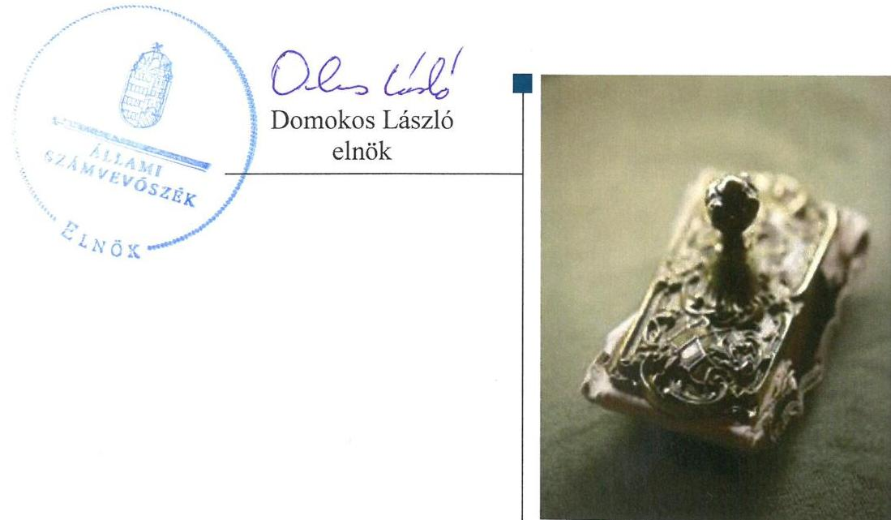
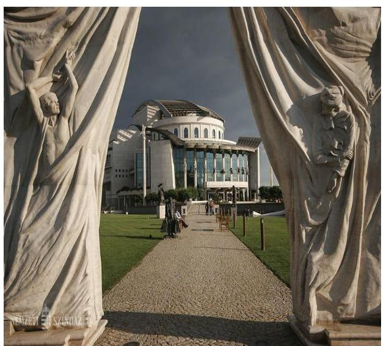
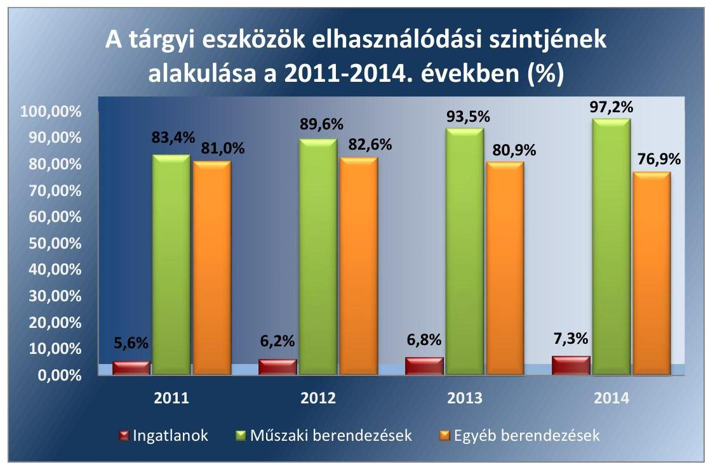
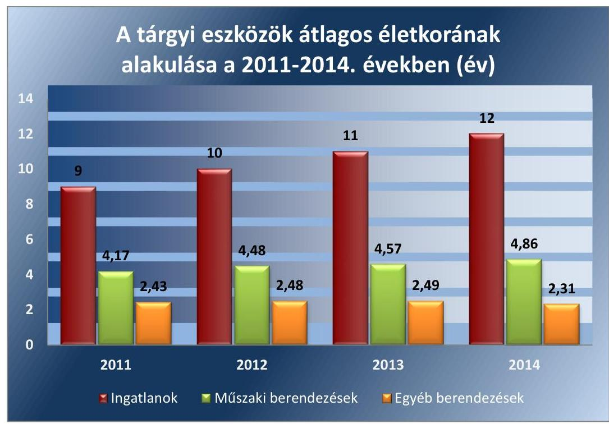
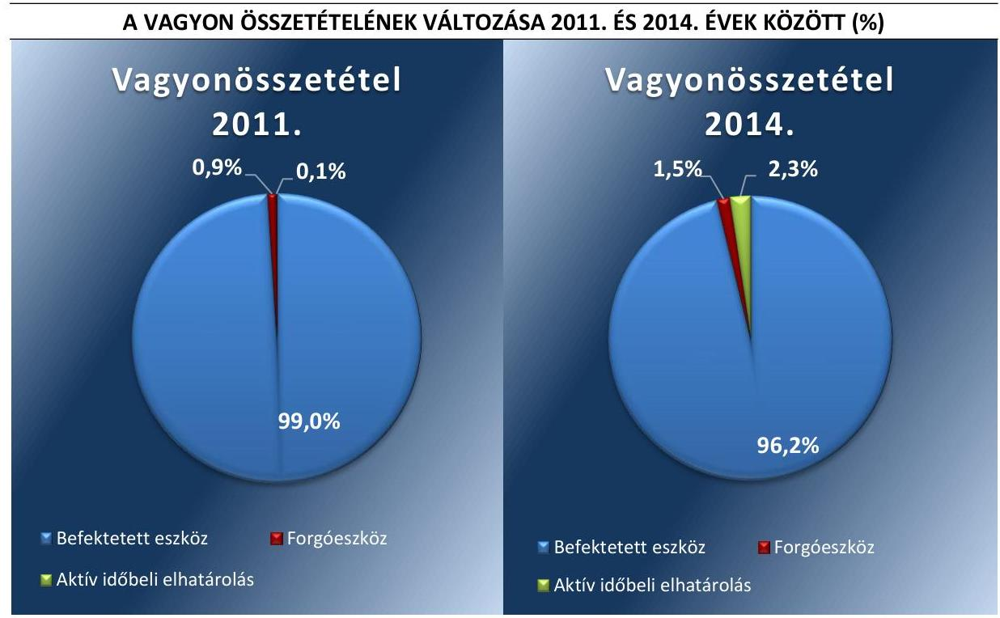
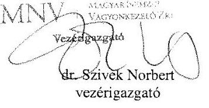
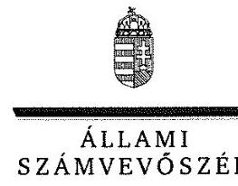
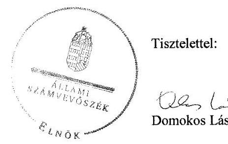
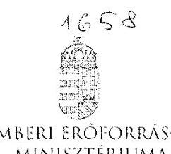
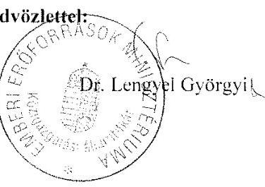

# Jelentés 

## Nemzeti Színház Kiemelkedően Közhasznú Nonprofit Zrt.

Az állami tulajdonban (résztulajdonban) lévő gazdálkodó szervezetek vagyonmegőrzési és gazdálkodási tevékenységének ellenőrzése 2017.

---

# Jelentés 

## Nemzeti Színház Kiemelkedően Közhasznú Nonprofit Zrt.

Az állami tulajdonban (résztulajdonban) lévő gazdálkodó szervezetek vagyonmegőrzési és gazdálkodási tevékenységének ellenőrzése
2017. január 13. nap

---

# AZ ELLENŐRZÉST FELÜGYELTE:

- BÖRÖCZ IMRE felügyeleti vezető

- AZ ELLENŐRZÉST VEZETTE ÉS A VÉGREHAJTÁSÁÉRT FELELŐS:
  - VIDA KATALIN ellenőrzésvezető
  - A PROGRAM ÖSSZEÁLLÍTÁSÁÉRT FELELŐS:
    - JANIK JÓZSEF LÁSZLÓ osztályvezető

- IKTATÓSZÁM: V-1034-330/2016
- TÉMASZÁM: 2068
- ELLENŐRZÉS-AZONOSÍTÓ SZÁM: V070927

Jelentéseink az Országgyűlés számítógépes hálózatán és az Interneten a www.asz.hu címen is olvashatóak.

---

# TARTALOMJEGYZÉK 

■ ÖSSZEGZÉS ..... 5
■ AZ ELLENŐRZÉS CÉLJA ..... 7
■ AZ ELLENŐRZÉS TERÜLETE ..... 8
■ AZ ELLENŐRZÉS HÁTTERE, INDOKOLTSÁGA ..... 9
■ A JELENTÉS LÉNYEGES KÉRDÉSKÖREI ..... 10
■ ELLENŐRZÉS HATÓKÖRE ÉS MÓDSZEREI ..... 11
■ MEGÁLLAPÍTÁSOK ..... 13
■ JAVASLATOK ..... 23
■ MELLÉKLETEK ..... 25
I. Sz. melléklet: Értelmező szótár. ..... 25
II. Sz. melléklet: Az eszközök elhasználódási szintjének alakulása 2011-2014. években ..... 32
III. Sz. melléklet: Az eszközök átlagos életkorának alakulása (év) ..... 33
IV. Sz. melléklet: Az eszközök és források állományának alakulásáról (M Ft) ..... 34
V. Sz. melléklet: A vagyon összetételének változása 2011. és 2014. évek között ..... 35
VI. Sz. melléklet: Az eredmény alakulása a 2011-2014. években (E Ft) ..... 36
■ FÜGGELÉK: ÉSZREVÉTELEK ..... 37
■ RÖVIDÍTÉSEK JEGYZÉKE ..... 43

---

.

---

# ÖSSZEGZÉS 

A tulajdonosi joggyakorlók a vagyonmegőrzési és gazdálkodási tevékenység feltételeit összességében szabályszerűen alakították ki. A Nemzeti Színház Kiemelkedően Közhasznú Nonprofit Zrt. vagyongazdálkodási tevékenységének szabályozása és működtetése összességében megfelelő volt. A saját és a vagyonkezelt eszközök nyilvántartását megfelelően végezte. Az ellátott közhasznú tevékenység bevételeinek és ráfordításainak elszámolása szabályszerű volt. A Nemzeti Színház Kiemelkedően Közhasznú Nonprofit Zrt. beszámolási kötelezettségét hiányosan teljesítette. A közérdekű adatok közzétételi kötelezettségének nem teljes körűen tett eleget, ezzel nem biztosította az átláthatóságot. A független belső ellenőrzés kialakítását, működtetését nem biztosította.

## Az ellenőrzés társadalmi indokoltsága

Magyarországon az intézmény-centrikus közfeladat-ellátás, közvagyon-gazdálkodás jellemző a költségvetésen kívüli feladatellátás térnyerése mellett. Ennek szereplői a nonprofit szervezetek, az önkormányzati tulajdonú gazdasági társaságok és az állami tulajdonú gazdálkodó szervezetek is.

Az állami tulajdonú gazdálkodó szervezetek a nemzeti vagyon részét képezik. Az állami vagyonnal való gazdálkodást illetően a tulajdonosi joggyakorlás és vagyongazdálkodás feladata az állami vagyon átlátható, rendeltetésszerű és felelős felhasználásának biztosítása. Az állam meghatározza az ellátandó közszolgáltatással kapcsolatos feladatokat, amelyhez a vagyonnal kapcsolatos döntéseknek igazodniuk kell. A nemzetgazdasági szempontból kiemelt jelentőségű nemzeti vagyonban tartandó állami tulajdonban álló társaság részesedését a nemzeti vagyonról szóló törvény határozza meg.

Minden közpénzt, közvagyont használó szervezettel szemben társadalmi igény, hogy a tevékenységükről elszámoljanak. Ezt figyelembe véve az Állami Számvevőszék Stratégiájával összhangban került sor Nemzeti Színház Kiemelkedően Közhasznú Nonprofit Zrt. ellenőrzésére.

## Főbb megállapítások, következtetések, javaslatok

A Magyar Nemzeti Vagyonkezelő Zrt. és a Tulajdonosi joggyakorlók összességében szabályszerűen alakították ki a Nemzeti Színház Kiemelkedően Közhasznú Nonprofit Zrt. tulajdonában, illetve kezelésében lévő vagyonnal való gazdálkodás feltételeit. A Társaság feladatait alapvetően saját vagyonával látta el.

A Nemzeti Színház Kiemelkedően Közhasznú Nonprofit Zrt.-nél a saját vagyon értékének megőrzését és gyarapítását biztosító vagyongazdálkodási tevékenységek szabályozása a közbeszerzési szabályzat késedelmes aktualizálása mellett megfelelt a jogszabályi előírásoknak. Az egyéb belső szabályzatok összhangban voltak a Tulajdonosi joggyakorlók által előírt követelményekkel, megfeleltek a jogszabályi előírásoknak.

A vagyon nyilvántartása szabályszerű, a vagyonkezelésbe vett eszközök értékcsökkenésének a belső szabályozástól eltérő elszámolása nem volt szabályszerű.

A Nemzeti Színház Kiemelkedően Közhasznú Nonprofit Zrt. a közhasznú tevékenységek ráfordításainak és bevételeinek szabályszerű elkülönítését biztosította, az elszámolás összességében megfelelő volt. Önköltség-számítási szabályzatát megfelelően elkészítette, utókalkulációt alkalmazott, a követelésállományát megfelelően kezelte.

A Nemzeti Színház Kiemelkedően Közhasznú Nonprofit Zrt. vagyongazdálkodási tevékenységét - a vagyonkezelésbe vett eszközökkel kapcsolatos visszapótlási kötelezettség teljesítésének kivételével - a jogszabályi rendelkezések és a belső szabályzatok előírásainak megfelelően végezte. Az eszközeinek 99,9%-át a saját tulajdonában álló vagyon,

---

0,1%-át vagyonkezelt vagyon tette ki az ellenőrzött időszakban. Az eszközök pótlására fordított forrásokat meghaladó mértékű amortizáció következtében a tárgyi eszközök elhasználódási szintje az ellenőrzött időszakban növekedett.

Tevékenysége a 2013. év kivételével veszteséges volt, amely a saját tőke csökkenését okozta.
A vagyonváltozást eredményező döntések előkészítése összességében megfelelt a jogszabályoknak és a belső előírásoknak.

A Magyar Nemzeti Vagyonkezelő Zrt. a jogszabályoknak megfelelően alkotta meg a vagyon-nyilvántartási szabályzatát.

A Nemzeti Színház Kiemelkedően Közhasznú Nonprofit Zrt. a beszámolási kötelezettségét hiányosan teljesítette. A könyvvizsgáló az éves beszámolókat korlátozás nélküli záradékkal látta el.

A Nemzeti Színház Kiemelkedően Közhasznú Nonprofit Zrt. a közérdekű adatok közzétételi kötelezettségének nem teljes körűen tett eleget, ezzel nem biztosította az átláthatóságot. A Nemzeti Színház Kiemelkedően Közhasznú Nonprofit Zrt. információs rendszerének kialakítása hiányos volt.

A Nemzeti Színház Kiemelkedően Közhasznú Nonprofit Zrt. a belső szabályzatban foglaltak ellenére a belső ellenőrzés kialakítását, működtetését nem biztosította, annak ellenére, hogy 2014. évtől ezt számára jogszabály előírta.

A Nemzeti Színház Kiemelkedően Közhasznú Nonprofit Zrt.-nek, mint kormányzati szektorba sorolt egyéb szervezetnek adósságot keletkeztető ügylete nem volt, a kormányzati szektor hiányára befolyást gyakorló bevételeket és ráfordításokat szabályszerűen számolta el.

Az ÁSZ a Társaság vezérigazgatójának fogalmazott meg javaslatokat, amelyek alapján köteles intézkedési tervet összeállítani és azt a jelentés kézhezvételétől számított 30 napon belül az ÁSZ részére megküldeni.

---

# AZ ELLENŐRZÉS CÉLJA 

Az ellenőrzés célja annak értékelése volt, hogy a tulajdonosi jogok gyakorlása szabályszerű volt-e; a gazdálkodó szervezet által ellátott feladatok bevételei, ráfordításai elszámolásának és vagyongazdálkodási tevékenységének szabályozása megfelelt-e a jogszabályi és a tulajdonosi előírásoknak, és azok végrehajtása szabályszerű volt-e; biztosítva volt-e a közfeladatok átláthatósága és elszámoltathatósága érdekében a közszolgáltatás díjának megalapozottsága szabályszerű önköltség-számítással; a vagyonváltozást eredményező döntések esetében a tulajdonosi jogok gyakorlója és a gazdálkodó szervezet szabályszerűen jártak-e el; a gazdálkodó szervezet épített-e ki és működtetett-e információs rendszert a szabályszerű vagyongazdálkodás érdekében.

Az ellenőrzés célja annak értékelése is volt, hogy a kormányzati szektorba sorolt egyéb szervezetek gazdálkodásának a kormányzati szektor hiányára és az államadósságra befolyással bíró elemei a jogszabályi előírásoknak megfeleltek-e.

---

### AZ ELLENŐRZÉS TERÜLETE

### Nemzeti Színház Kiemelkedően Közhasznú Nonprofit Zrt., Emberi Erőforrások Minisztériuma és a Magyar Nemzeti Vagyonkezelő Zrt.

A Nemzeti Színház Kiemelkedően Közhasznú Nonprofit Zrt. kormányzati szektorba sorolt, egyéb szervezetnek minősülő, 100%-ban állami tulajdonban lévő egyszemélyes társaság, melynek elnevezése 2014. június 10-től Nemzeti Színház Közhasznú Nonprofit Zrt.-re változott. Tevékenységének célja, az országos és nemzetközi színházművészet egészét, és annak minden ágát felölelő színházi tevékenység folytatása, az ország művészeti értékeinek kezdeményező képviselete, propagálása és menedzselése bel- és külföldön egyaránt. Tevékenységei közé tartozik az előadó-művészet, mint fő tevékenység, a nevelés és oktatás, képességfejlesztés, ismeretterjesztés, kulturális tevékenység, továbbá a kulturális örökség megóvása.

A Nemzeti Színház NZrt. alapításakor a Társaság 13,2 Mrd Ft alaptőkéjét az alapító készpénzben (12,1 Mrd Ft), valamint apportként (1,05 Mrd Ft) biztosította. Az állami tulajdont 100%-ban a jegyzett tőkében megtestesülő részesedés képezte.

A Nemzeti Színház NZrt., mint egyéb vagyonkezelő és a KVI – az MNV Zrt. jogelődje – 2003. február 24-én határozatlan idejű vagyonkezelési szerződést kötött a magyar állam tulajdonában lévő – bruttó 13,9 M Ft – értékben kimutatott jelmeztár, kelléktár, fegyvertár, bútortár, könyv- és archívumtár kezelésére. A 13,9 M Ft értékű vagyonkezelői szerződésre vonatkozó vagyonkezelői jog megszerzésének és gyakorlásának ellenértéke egyszeri 5,4 M Ft volt, amit a Társaság a vagyoni értékű jogok között mutatott ki. A vagyonkezelésbe vett eszközöket az 1. táblázat szemlélteti.

A vezérigazgató és a gazdasági igazgató személye egyszer változott az ellenőrzött időszakban.

A saját tőke a 2011. év végi 10 220,4 M Ft-ról 9 788,2 M Ft-ra csökkent 2014. év végére.

1. táblázat

|  VAGYONKEZELT ESZKÖZÖK (E FT) |   |
| --- | --- |
|  Eszközök | E Ft  |
|  Könyv- és archívumtár | 830  |
|  Jelmeztár | 2 200  |
|  Bútortár | 500  |
|  Fegyvertár | 1 845  |
|  Átadott összes vagyonkezelő eszközértéke | 5 375  |
|  Vagyonkezelő eszközökre elszámolt beruházás | 8 538  |
|  Nyilvántartott vagyonkezelő eszközérték | 13 913  |
|  Vagyoni értékű jog | 5 375  |
|  Együtt vagyonkezelő eszközérték és vagyoni értékű jog | 19 288  |

*Forrás: Nemzeti Színház NZrt. beszámolói*

---

# AZ ELLENŐRZÉS HÁTTERE, INDOKOLTSÁGA 

Az ÁSZ⁴ alapvető célkitűzése, hogy az államháztartáson kívülre nyújtott költségvetési támogatások és ingyenes vagyonjuttatások ellenőrzésével járuljon hozzá ahhoz, hogy a közpénzeket az államháztartáson kívül működő szervezetek is átlátható módon használják fel a közfeladatok szerződésben vállalt ellátása érdekében. Az államháztartásról szóló törvény értelmében a közfeladatok ellátása elsősorban költségvetési szervek alapításával és működtetésével történik. Az államháztartáson kívüli szervezetek a közfeladatok ellátásában - jogszabályban meghatározott feltételekkel - közreműködhetnek.

Az ellenőrzés feladata a közvagyonnal biztosított közfeladat-ellátással kapcsolatban a közpénzek átláthatósága, nyilvánossága érdekében a jogszabályokban, belső szabályzatokban megfogalmazott előírások érvényesülésének az állami tulajdonban (résztulajdonban) lévő gazdálkodó szervezetek vagyonérték-megőrzési és gazdálkodási tevékenységének értékelése. A Vtv.⁵ 3. § (1) bekezdése alapján, a 2013. június 27-éig hatályos szabályozása értelmében a tulajdonosi jogok és kötelezettségek összességét az állami vagyon tekintetében az állami vagyon felügyeletéért felelős miniszter gyakorolta, aki a feladatát az MNV Zrt.⁶, illetve egyéb jogszabályban rögzített egyéb tulajdonosi joggyakorló₁₋₂⁷ útján látta el. 2014. július 15-éig tulajdonosi joggyakorlóként, ha törvény vagy miniszteri rendelet eltérően nem rendelkezett, az MNV Zrt., illetve a törvényben vagy a miniszteri rendeletben kijelölt személy járt el. A 2014. július 15-ét követően a rábízott vagyon felett az államot megillető tulajdonosi jogok és kötelezettségek összességét tulajdonosi joggyakorlóként - ha törvény vagy miniszteri rendelet eltérően nem rendelkezett - az MNV Zrt. gyakorolta. Az MNV Zrt.-vel kötött szerződés alapján a tulajdonosi joggyakorlói feladatokat a NEFMI⁸, majd 2012. május 14-étől az EMMI⁹ látta el.

Az ellenőrzés várható hasznosulásaként az ellenőrzés megállapításai a jogalkotás számára segítséget nyújthatnak az államháztartáson kívüli köz-feladat-ellátás, közvagyonnal való gazdálkodás értékeléséhez, jogszabályi keretei pontosításához, az átláthatóságot biztosító szabályozáshoz. Az ellenőrzöttek számára visszajelzést ad a gazdálkodási tevékenységgel, az állami vagyon felhasználásával, a közszolgáltatási árképzés megalapozottságával és az éves elszámolással kapcsolatos szabálytalanságokról és kockázatokról. Az ellenőrzés tapasztalatai segítik és erősítik az Állami Számvevőszék hozzáadott értéket teremtő elemző tevékenységét és tanácsadó szerepét. A kormányzati szektorba sorolt, költségvetési tervezésbe is bevont gazdálkodó szervezetek ellenőrzése fokozza a legfőbb ellenőrző szerv iránti figyelmet és közbizalmat.

---

# A JELENTÉS LÉNYEGES KÉRDÉSKÖREI 

1.     - A tulajdonosi joggyakorló a Nemzeti Színház NZrt. vagyonnal való gazdálkodásának feltételeit szabályszerűen alakította-e ki?
2.     - A Nemzeti
 Színház NZrt. vagyongazdálkodási tevékenységének kialakítása, szabályozása, illetve a vagyon nyilvántartása megfelelt-e az előírásoknak?
3.     - Az ellátott közhasznú tevékenység bevételeinek és ráfordításainak elszámolása és szabályozása, valamint az önköltség-számítás szabályszerű volt-e?
4. A vagyonnal való gazdálkodás, valamint a vagyonváltozást eredményező döntések megfeleltek-e a jogszabályi és a belső előírásoknak?
5.     - A szabályszerű vagyongazdálkodás érdekében az adatszolgáltatási és beszámolási kötelezettséget a Nemzeti Színház NZrt. teljesítette-e, kiépítette-e és működtette-e információs rendszert?
6.     - A kormányzati szektor hiányára és az államadósságra befolyást gyakorló elemek a jogszabályi előírásoknak megfeleltek-e?

---

# ELLENŐRZÉS HATÓKÖRE ÉS MÓDSZEREI 

## Az ellenőrzés típusa

Szabályszerűségi ellenőrzés

## Az ellenőrzött időszak

2011. január 1-jétől 2014. december 31-ig

## Az ellenőrzés tárgya

A Nemzeti Színház Kiemelkedően Közhasznú Nonprofit Zártkörűen Működő Részvénytársaság vagyonmegőrzési és gazdálkodási tevékenysége és a kormányzati szektor hiányára, adósságállományára hatást gyakorló elemek ellenőrzése.

## Az ellenőrzött szervezet

A Nemzeti Színház Kiemelkedően Közhasznú Nonprofit Zártkörűen Működő Részvénytársaság, az Emberi Erőforrások Minisztériuma és a Magyar Nemzeti Vagyonkezelő Zártkörűen Működő Részvénytársaság.

## Az ellenőrzés jogalapja

Az Állami Számvevőszékről szóló 2011. évi LXVI. törvény 5. § (3)-(5) bekezdése, valamint az állami vagyonról szóló 2007. évi CVI. törvény 3. § (4) bekezdése.

## Az ellenőrzés módszerei

A számvevőszéki ellenőrzés szakmai szabályai szerint, a szabályszerűségi ellenőrzés módszerével és a vonatkozó nemzetközi standardok figyelembevételével végeztük el az ellenőrzést.

Tanúsítványok kitöltésével és az ÁSZ által kért dokumentumok megküldésével szolgáltatott adatokat az ellenőrzés lefolytatásához a Nemzeti Színház NZrt. A rendelkezésre bocsátott adatok, információk kontrollja és a munkalapok kitöltése a helyszíni ellenőrzés keretében történt.

A bevételek és a ráfordítások elszámolását és a vagyonnyilvántartás terén a szabályszerű működést véletlenszerű mintavétellel ellenőriztük. Az

---

ellenőrzöttnél, mint a kormányzati szektorba sorolt gazdálkodó szervezetnél a személyi jellegű ráfordítások elszámolása mellett, az egyéb ráfordítások, a pénzügyi műveletek ráfordításai, a rendkívüli ráfordítások, illetve az egyéb bevételek, a pénzügyi műveletek bevételei, a rendkívüli bevételek elszámolásának szabályszerűségét szintén mintatételek alapján ellenőriztük. A mintavétellel ellenőrzött területek esetében minden egyes tétel vonatkozásában a szabályszerűségre vonatkozó kérdéseket tettük fel, amelyek eredménye összesítésre került.

A jogszabályoknak és a belső előírásoknak megfelelőnek tekintettük az adott területet, amennyiben a minta ellenőrzése alapján 95%-os bizonyossággal a teljes sokaságban a hibaarány kisebb volt, mint 10%, nem megfelelőnek értékeltük, ha a hibaarány a 10%-ot meghaladta. Kockázatot, illetve magas kockázatot jeleztünk, amennyiben egy adott terület vonatkozásában a minta alapján a teljes sokaságban nem volt egyértelműen biztosított a jogszabályoknak és a belső szabályzatoknak megfelelő működés. A ráfordítások elszámolására és a vagyonnyilvántartásra vonatkozó véletlen mintavételt kockázati alapú kiválasztással egészítettük ki, amelynek során évente a három legnagyobb összegű tételt választottuk ki.

---

# 1. A tulajdonosi joggyakorló a Nemzeti Színház NZrt. vagyonnal való gazdálkodásának feltételeit szabályszerűen alakította-e ki? 

Összegző megállapítás

Az MNV Zrt. és a Tulajdonosi joggyakorló1-2 összességében szabályszerűen alakította ki a Nemzeti Színház NZrt. kezelésében, valamint a tulajdonában lévő vagyonnal való gazdálkodás feltételeit.
1.1. számú megállapítás

A Tulajdonosi joggyakorló $_{1-2}$ a jogszabályokban, az alapítói okiratokban és az Alapszabályban szabályszerűen határozta meg a Társaság saját vagyona tekintetében a tulajdonos vagyongazdálkodásra vonatkozó feladatait.

A tulajdonosi jogokat a társasági részesedés tekintetében az MNV Zrt.-vel kötött megállapodás alapján 2011. január 1-jétől 2012. május 13-ig a NEFMI, majd ezt követően az EMMI gyakorolta.

Az Nvtv. $^{10}$ 8. § (7) bekezdésének 2012. június 30-tól hatályos módosítása miatt az MNV Zrt. és a Tulajdonosi joggyakorló $_{1}$ az állami tulajdonú tagsági részesedésre vonatkozó korábbi megállapodást megszüntette és a társasági részesedéshez kapcsolódó tulajdonosi jogok gyakorlására - az Nvtv. 18. § (7) bekezdésben előírt 2012. december 31-ei határidőn túl 2013. január 27-én megbízási szerződést kötött.

A Tulajdonosi joggyakorló $_{1-2}$ az Alapító okirat $_{1-5}$ $^{11}$-ban és az Alapszabályban $^{12}$ a jogszabályi előírásoknak megfelelően határozta meg a vagyongazdálkodás feltételeit. A Tulajdonosi joggyakorló $_{1-2}$ kizárólagos hatáskörébe tartozott az SZMSZ $^{13}$, a javadalmazási szabályzat $^{14}$, az éves üzleti tervek és éves beszámolók jóváhagyása, a közhasznúsági jelentés elfogadása, a közhasznú szerződés megkötésével és módosításával kapcsolatos döntések meghozatala, az FB Ügyrend $_{1-2}$ $^{15}$ jóváhagyása.

A Tulajdonosi joggyakorló $_{1-2}$ a döntéseit részvényesi határozatok formájában rögzítette, feladatait
$\longrightarrow$ a jogszabályokban,
$\longrightarrow$ az Alapító okirat $_{1-5}$-ban és
$\longrightarrow$ az Alapszabályban meghatározottak szerint látta el.
1.2. számú megállapítás

A Társaság a feladatait saját és vagyonkezelt vagyonnal látta el. Az MNV Zrt. az előírásoknak megfelelő vagyon-nyilvántartási szabályzattal rendelkezett.

A Nemzeti Színház NZrt. a 2011-2014. években tevékenységét túlnyomórészt saját tulajdonú eszközökkel látta el. Az MNV Zrt. jogelődje az ellenőr-

---

zött időszakot megelőzően 13,9 M Ft értékű eszközt adott át vagyonkezelési szerződéssel $^{16}$ a Társaság részére. A Vagyonkezelési szerződést nem módosították az ellenőrzött időszakban.

A vagyonkezelési szerződés az ellenőrzött években nem rendelkezett az elszámolt értékcsökkenés visszapótlásáról. Az MNV Zrt. az ellenőrzött időszak alatt hatályban lévő Vagyon-nyilvántartási szabályzat $_{1-2}$ $^{17}$-t a Vtv. és a Vhr. előírásainak megfelelően készítette el. Hatályuk a Vtv.-ben meghatározott állami vagyon kezelőire, így a Nemzeti Színház NZrt.-re is kiterjedt. A szabályzatokban a Vhr. $^{18}$-nek megfelelően meghatározták a vagyonnyilvántartás feladatait, a vagyonkezelt eszközökre vonatkozó adatszolgáltatás részletes tartalmát, formáját, határidejét.

# 2. A Nemzeti Színház NZrt. vagyongazdálkodási tevékenységének kialakítása, szabályozása, illetve a vagyon nyilvántartása megfelelt-e az előírásoknak? 

Összegző megállapítás

A Nemzeti Színház NZrt. állami vagyongazdálkodási tevékenységének szabályozása összességében megfelelt a jogszabályi előírásoknak. A vagyonkezelésbe vett eszközök értékcsökkenésének elszámolása nem volt szabályszerű.
2.1. számú megállapítás

A Társaság a vagyongazdálkodás feltételeit szabályszerűen alakította ki.

A Tulajdonosi joggyakorló1-2 a vagyongazdálkodási terv elkészítésére vonatkozó követelményeket önálló dokumentumban - Útk $_{1-4}$ $^{19}$-ben - határozta meg, amely követelményeknek megfelelően a Nemzeti Színház NZrt. az üzleti tervei keretében készítette el vagyongazdálkodási terveit. Az üzleti terveket - egyúttal a vagyongazdálkodási terveket is - a Tulajdonosi joggyakorló $_{1-2}$ az ellenőrzött időszakban jóváhagyta.

A Nemzeti Színház NZrt. vagyongazdálkodással összefüggő részletszabályait a Számviteli politika $_{1,2}$ $^{20}$, az Értékelési szabályzat $_{1-2}$ $^{21}$, a Számlarend $_{1,2}$ $^{22}$, a Leltározási szabályzat $_{1-2}$ $^{23}$, a Pénzkezelési szabályzat $_{1-2}$ $^{24}$, Önköltség-számítási szabályzat $_{1-2}$ $^{25}$, valamint a Közbeszerzési szabályzat $_{1-2}$ $^{26}$, a Kötelezettségvállalási szabályzat $_{1-2}$ $^{27}$ és az SZMSZ $^{28}$ keretein belül alakította ki.

A szabályzatok összhangban voltak a Tulajdonosi joggyakorló $_{1-2}$ által előírt követelményekkel, megfeleltek a jogszabályi előírásoknak, a Közbeszerzési szabályzat $_{1}$ aktualizálására azonban nem került sor. A Nemzeti Színház NZrt. a Kbt. $_{1}$ $^{29}$ alapján készítette el Közbeszerzési szabályzat $_{1}$-t, amelyen a Kbt. $^{30}$ hatályba lépését - 2011. augusztus 21. - követően a Kbt. $_{2}$ 22. § (1)-(2) bekezdéseiben előírtak ellenére nem módosítottak. A Kbt. $_{2}$ előírásainak megfelelő Közbeszerzési szabályzat $_{2}$ 2013. július 2-án lépett hatályba.

A vagyongazdálkodással kapcsolatos feladat- és hatásköröket az SZMSZ tartalmazta.

---

### 2.2. számú megállapítás

2. táblázat

## HELYTELENÜL ELSZÁMOLT

ÉRTÉKCSÖKKENÉS BEMUTATÁSA A 2011-2014. ÉVEKBEN (E FT)

| Megnevezés | Vagyoni   értékű   jogok | Egyéb   gépek, berendezések |
| :-- | :--: | :--: |
| Elszámolt érték-   csökkenés   (E Ft/év) | 107,5 | 264,5 |
| Elszámol-   ható/Elszámo-   landó érték-   csökkenés   (E Ft/év) | 913,8 | 1917,6 |
| Különbözet (E   Ft/év) | -806,3 | -1653,1 |
| Különbözet   együtt évente (E   Ft/év) | -2459,4 |  |

A vagyon nyilvántartása szabályszerű volt, a vagyonkezelésbe vett eszközök értékcsökkenésének elszámolása nem volt szabályszerű.

A Nemzeti Színház NZrt. saját vagyonát és a vagyonkezelésében lévő állami vagyont a vonatkozó jogszabályi előírásoknak megfelelően tartotta nyilván. A Számviteli politika1-2-ben az értékcsökkenés mértékét a hatályos jogszabályok alapján állapította meg.

A Nemzeti Színház NZrt. saját tulajdonában lévő eszközeinek az értékcsökkenését a Számviteli politika1-2-ben meghatározott leírási kulcsok alkalmazásával, szabályszerűen számolta el.

A vagyonkezelt eszközök és a vagyoni értékű jog értékcsökkenési leírásának elszámolása nem volt szabályszerű, mert a Nemzeti Színház NZrt. egységesen 2%-os értékcsökkenési leírási kulcs alkalmazásával számolta el. Az elszámolás nem felelt meg a Számviteli politika1,2-ben a vagyoni értékű jogokra megállapított 17%-os, és az egyéb gépek, berendezések vonatkozásában előírt 14,5%-os mértéknek. A 2. táblázatban évente kimutatott értékcsökkenés közötti különbözet -2 459,4 E Ft, melyet az ellenőrzött években a megbízható és valós képet lényegesen befolyásoló, valamint jelentős hibának nem kell tekinteni a Számv. tv. és a Számviteli politika rendelkezései alapján.

A Nemzeti Színház NZrt. az éves beszámolókban kimutatott vagyontárgyait, a Számv. tv $^{31}$ előírásait figyelembe véve a Leltározási szabályzat $_{1-2}$ alapján leltározta, eszközeinek és forrásainak állományi adatait, szabályszerűen, leltárral támasztotta alá, az elkészült leltározást lezáró jegyzőkönyvek tartalmazták a vagyon analitikus nyilvántartás és főkönyvi kivonat szerinti értékének összegét, a leltározás kiértékelését.

A Nemzeti Színház NZrt. a vagyonkezelésében lévő állami vagyont a Vagyonkezelési szerződés megkötésének időpontjában, szabályszerűen vette nyilvántartásba. A Vagyonkezelési szerződés tárgyát a magyar állam tulajdonában lévő jelmeztár, kelléktár, fegyvertár, bútortár, könyv- és archívumtár eszközei és az azokhoz kapcsolódó vagyonkezelési jog képezte. A vagyonkezelt eszközök Vhr.-ben előírt elkülönített nyilvántartási kötelezettsége teljesült.

A vagyonkezelt eszközökre vonatkozó adatok megegyeztek az MNV Zrt. nyilvántartásaival.

---

# 3. Az ellátott közhasznú tevékenység bevételeinek és ráfordításainak elszámolása és szabályozása, valamint az önköltség-számítás szabályszerű volt-e? 

## Összegző megállapítás

3.1. számú megállapítás

A Nemzeti Színház NZrt. a közhasznú tevékenysége ráfordításainak és bevételeinek szabályszerű elkülönítését biztosította. Önköltség-számítás feltételeit és gyakorlatát megfelelően alakította ki.

A Nemzeti Színház NZrt. az ellátott közhasznú tevékenységének bevételeit és ráfordításait elkülönítetten - a feltárt kisebb hiányosságok mellett - szabályszerűen számolta el, követelésállományát megfelelően kezelte.

A Nemzeti Színház NZrt. alapvetően a Számviteli politika $_{1,2}$ és a Számlarend $_{1,2}$ szabályzataiban határozta meg a közhasznú tevékenység ráfordításainak és bevételeinek egyértelmű elhatárolásához szükséges előírásokat. A közhasznú, illetve a vállalkozási tevékenységek bevételei és ráfordításai elkülönített nyilvántartását ún. „Szervezeti egységkódok” támogatták. A Társaság 2011. évi közhasznúsági jelentésében, valamint a 2012-2014. években a beszámoló közhasznúsági mellékleteiben elkülönítetten mutatta be a közhasznú és a vállalkozási tevékenység bevételeit, ráfordításait, eredményét.

A bevételek elszámolása szabályszerű volt, azokat Számv. tv. előírásainak megfelelően számolták el, a közfeladat-ellátással kapcsolatosan elkülönítették.

Az értékesítés nettó árbevételének elszámolása szabályszerűen történt. Az értékesítés nettó árbevétele a 2011. évben befolyt 300,0 M Ft-tal szemben 219,8 M Ft-ra (26,7%-kal) mérséklődött a 2014. évre. Az ellenőrzött időszakban az értékesítés nettó árbevételének 70,8%-a (775,3 M Ft) jegybevételből származott. Bevételeiket képezte még a pályázati díjak, a fejlesztési projektek ajánlati dokumentációjának értékesítéséből származó bevétel és a Tao. $^{32}$ támogatás. A Tulajdonosi joggyakorló $_{1-2}$ által biztosított támogatást szabályszerűen, az egyéb bevételek között számolták el. A támogatások és a jegybevétel alakulását a 3. táblázat mutatja
 be.
3. táblázat

MŰKÖDÉSI TÁMOGATÁS, TAO. ÉS JEGYBEVÉTEL (M FT)

| És | EMMI | Nemzeti Kulturális   Alap | Tao. | Jegybevétel |
| :-- | :--: | :--: | :--: | :--: |
|  |  |  |  |  |
| 2011. | 1244,7 | 0,8 | 164,0 | 216,5 |
| 2012. | 1137,6 | 2,5 | 163,3 | 208,2 |
| 2013. | 1782,2 | 1,5 | 166,9 | 230,2 |
| 2014. | 1982,2 | 5,9 | 116,5 | 120,5 |

A működési támogatás éves összege a 2012. évet követően folyamatosan növekedett. A működési támogatás növekedésében közrejátszott a 2013-2014. években nyújtott évenkénti 650,0 M Ft kiegészítő támogatás.

---

4. táblázat

| VEVŐ TARTOZÁSOK (M FT) |  |  |
| :-- | :--: | :--: |
| Év. | Vevő tartozás | Lejárt vevő   tartozás |
| 2011. | 21,0 | 4,0 |
| 2012. | 36,0 | 5,0 |
| 2013. | 20,0 | 1,0 |
| 2014. | 16,0 | 1,0 |

A Társaság forrásait a Tao. támogatás évente 164,0-116,5 M Ft-tal egészítette ki.

A 2011. évben az éves működési támogatás feltétele a Tulajdonosi joggyakorló; és a Társaság között létrejött keret-megállapodás szerint - a tárgyévet megelőző évről elszámolás és annak, valamint a Társaság adott évre szóló üzleti tervének elfogadása volt. A 2012-2014. években hatályos - 2012. május 25-én a Tulajdonosi joggyakorló; és a Társaság között megkötött - közhasznú keretszerződés szerint a tárgyévi támogatás mértékét, ütemezését a Társaság által benyújtott és a Tulajdonosi joggyakorló; által elfogadott üzleti terv alapján állapítják meg.

A költségek, ráfordítások elszámolása, a személyi jellegű ráfordítások, a munkavállalókat terhelő járulékok, adólevonások és béren kívüli juttatások elszámolása megfelelt a Számv. tv. előírásainak.

Az anyagi jellegű ráfordítások összege a 2011. évben elszámolt 676,1 M Ft-hoz képest a 2014. évben 918,6 M Ft-ra, 35,9%-kal nőtt. A személyi jellegű ráfordítások összege - amely a ráfordítások 43,2-44,4%-át tette ki - a 2011. évi 913,9 M Ft-ról a 2014. évre 27,2%-kal növekedett. Előfordult, hogy kis értékű, nem készpénzes beszerzés esetében nem készült írásbeli megrendelés, annak ellenére, hogy azt a Kötelezettségvállalási szabályzat $_{1-2}$ előírta. Néhány tételt a Számv. tv. 48. § (1)-(2) bekezdéseiben előírtakkal szemben a karbantartás helyett a felújítások között számoltak el, illetve nem készült minden esetben írásban megrendelés, vagy szerződés a Kötelezettségvállalási szabályzat $_{2}$ „Szerződések, megrendelések" részében rögzített bruttó 5000 Ft-ot meghaladó kifizetések esetében.

Az egyéb bevételek, pénzügyi műveletek bevételei, rendkívüli bevételek elszámolása - a közbeszerzési pályázati díjak bevételeinek elszámolása kivételével - megfelelő volt. A közbeszerzési pályázatok keretében kiírt fejlesztési pályázatok ajánlati dokumentációjának értékesítéséből származó díjakat a Számv. tv. 72. § (1) bekezdése ellenére nem az értékesítés nettó árbevételeként, hanem az egyéb bevételek között számolták el. A Társaság gazdálkodási adatait a VI. sz. melléklet, a vagyon változásának alakulását az V. sz. melléklet mutatja be.

Közbeszerzések kiírásával kapcsolatos kötelezettségének - jellemzően földgáz-szolgáltatással, takarítási szolgáltatással, műszaki berendezések beszerzésével, valamint díszletépítéssel kapcsolatos feladatok körében - a Nemzeti Színház NZrt. eleget tett.

Az ellenőrzött időszakban az eszközök pótlására fordított pénzügyi források közel háromszoros mértékű elszámolt amortizációja következtében a tárgyi eszközök elhasználódási szintje az ellenőrzött időszakban 4,5 százalékkal növekedett. A tárgyi eszközök elhasználódásának és az átlagos élettartamának mértékét a II. és a III. sz. melléklet mutatja be.

A Nemzeti Színház NZrt. a visszapótlási kötelezettség alól a Vtv. 27. § (8) bekezdése értelmében - mint főtevékenységként közfeladatot ellátó vagyonkezelő - 2013. június 28-i hatállyal mentesült, ezért az értékcsökkenéssel arányos visszapótlási kötelezettség az ellenőrzött időszakban 2011. január 1-jétől 2013. június 27-éig állt fenn. A visszapótlási kötelezettség időszakában a vagyonkezelt eszközökre elszámolt értékcsökkenésnek megfelelő összegű visszapótlási kötelezettségéről részben gondoskodott.

A követelések összegét a Számv. tv. 29. § (1)-(2) bekezdései és a Számviteli politika $_{1,2}$-ben rögzített elvek és módszerek alapján vették nyilvántar-

---

tásba, behajthatatlan követelés leírására nem került sor, követelés állományát megfelelően kezelte. A le nem járt, határidőn belüli vevőállomány mértéke, a 2012. év kivételével csökkenő tendenciát mutatott. A lejárt év végi követelés a 2011. év végén fennállóval szemben a 2014. év végére annak egynegyedére mérséklődött. Éven túli, valamint behajtás alatt álló vevőkövetelés nem volt. A vevő tartozások állományának alakulását a 4. táblázat mutatja be.

# 3.2. számú megállapítás 

A Nemzeti Színház NZrt. az előírásoknak megfelelően alakította ki az önköltség-számítás feltételeit.

Az Önköltség-számítási szabályzat $_{1-2}$ a Számv. tv. 14. § (5) bekezdés c) pontja, a 14. § (7) bekezdése, és az 51. § előírásaival összhangban készült. Az Önköltség-számítási szabályzat elkülönítetten kezelte a közhasznú és a vállalkozási tevékenységeket.

A Nemzeti Színház NZrt. a közszolgáltatás díjtételek megállapítása érdekében az önköltség-számítást a jogszabályokban és a belső szabályzatban előírtaknak megfelelően végrehajtotta. A Társaság a bemutatott előadások önköltségét az Önköltség-számítási szabályzat $_{1-2}$-ben foglaltak figyelembevételével utókalkuláció módszerével állapította meg a Számv. tv.ben foglaltaknak megfelelően. Az ellátott közszolgáltatás díjtételei megállapítása során a piaci viszonyokat vették figyelembe. A Tulajdonosi joggyakorló $_{1-2}$ az üzleti tervek elfogadásával egyúttal elfogadta a tervezett díjbevételeket is.

## 4. A vagyonnal való gazdálkodás, valamint a vagyonváltozást eredményező döntések megfeleltek-e a jogszabályi és a belső előírásoknak?

Összegző megállapítás

## 4.1. számú megállapítás

A Nemzeti Színház NZrt. vagyonnal való gazdálkodása, valamint a vagyonváltozást eredményező döntései összességében megfeleltek a jogszabályi és tulajdonosi előírásoknak.

A Nemzeti Színház NZrt. vagyongazdálkodási tevékenységét a jogszabályi rendelkezések és a belső szabályzatok előírásainak megfelelően végezte.

A Nemzeti Színház NZrt. eszközeinek 99,9%-át a saját tulajdonában álló vagyon, 0,1%-át vagyonkezelt vagyon tette ki az ellenőrzött időszakban.

A Társaság vagyona a 2011. január 1-jei 12 527,0 M Ft-ról, a 2014. év végére 11 841,4 M Ft-ra, összesen 685,6 M Ft-tal (5,5%-kal) csökkent. A vagyonon belül a legnagyobb részarányt képviselő befektetett eszközök állománya 8,3%-kal (1036,8 M Ft-tal) csökkent. A Nemzeti Színház NZrt. vagyonának 2011-2014. évek közötti alakulását a IV. számú melléklet mutatja be.

A Társaság 13 200,0 M Ft összegű jegyzett tőkéje mellett a saját tőkéjének összege a 2011. január 1-jei 10 383,6 M Ft-ról a 2014. év végére 9788,2 M Ft-ra csökkent. A saját tőke 595,4 M Ft-os (5,7%-os) csökkenését

---

| 5. táblázat |  |  |
| :--: | :--: | :--: |
| MÉRLEG SZERINTI EREDMÉNY (M FT) |  |  |
| Évek | Üzleti tervekben elfogadott | Tényleges |
| 2011. | $-145,8$ | $-163,2$ |
| 2012. | $-137,7$ | $-93,3$ |
| 2013. | 0,0 | 38,5 |
| 2014. | $-196,5$ | $-377,3$ |
| Forrás: Részvényesi határozatok, Társaság éves beszámoló |  |  |

### 4.2. számú megállapítás

az okozta, hogy az ellenőrzött időszakban - a 2013. év kivételével - a Társaság mérleg szerinti eredménye negatív volt. A Társaság 2013. évi üzleti tervét 172,7 M Ft veszteséggel hagyta jóvá a Tulajdonosi joggyakorló2, amelyet a későbbiekben, az üzleti terv módosítása során nulla forintban határozott meg. A Társaság 2014. évi üzleti tervét nulla forint eredménnyel fogadta el a Tulajdonosi joggyakorló2. Az üzleti terv 2014. decemberi módosításában a tervezett veszteség 196,5 M Ft volt, melyet a Tulajdonosi joggyakorló $_{2}$ tudomásul vett. A mérleg szerinti eredmény alakulását az 5. táblázat mutatja be.

A Tulajdonosi joggyakorló1-2 a Társaság 2011-2014. évi beszámolóit a tényleges eredmény jóváhagyásával fogadta el. A részvényesi határozatait az FB határozatainak és a könyvvizsgáló jelentésének figyelembevételével hozta meg.

A Társaság 2013. évi nyereségének keletkezésében közrejátszott az előző évhez viszonyítva (65,3%-kal) magasabb működési támogatás, amely ellensúlyozni tudta az anyagjellegű, valamint személyi jellegű ráfordítások növekményét.

A 2014. évi veszteség kialakulásában meghatározó volt az értékesítés nettó árbevételének előző évhez képest jelentős, 25,2%-os csökkenése, továbbá a működési támogatás előző évhez viszonyított 8,3%-os növekménye, amely azonban nem volt elégséges a személyi jellegű ráfordítások 21,6%-os, valamint az anyagjellegű ráfordítások 16,6%-os növekményének ellensúlyozására.

A Társaságnál az államháztartás körébe tartozó vagyon elidegenítésére és megterhelésére az ellenőrzött időszakban nem került sor.

## A Nemzeti Színház NZrt.-nél a vagyonváltozást eredményező döntések előkészítése összességében megfelelt a jogszabályoknak.

A Tulajdonosi joggyakorló1-2 a vagyongazdálkodási döntések előterjesztésével kapcsolatban az éves üzleti tervek vonatkozásában határozott meg előírásokat.

Olyan értéknövelő beruházás, felújítás, eszközbeszerzés nem volt, amely szükségessé tette volna a Tulajdonosi joggyakorló1-2 előzetes hozzájárulását.

A Kbt $_{1-2}$ által előírt esetekben a közbeszerzési eljárásokat lefolytatták.
A vagyonkezelésre átvett vagyon megőrzése, hasznosítása, illetve a jogosultsági szabályok alkalmazása - a kezelt vagyon gyarapítására vonatkozó előírás teljesítésének kivételével - megfelelt a Vagyonkezelési szerződésben rögzített kötelezettségeknek.

## A Tulajdonosi joggyakorló1-2 végzett, az MNV Zrt. nem végzett tulajdonosi ellenőrzést a Nemzeti Színház NZrt.-nél.

A Társaság vagyona az ellenőrzött időszakban csökkent. A 2011-2014. években nem volt olyan vagyonváltozással - vagyonátruházással, értékesítéssel, apportálással - járó esemény, amely a Tulajdonosi joggyakorló1-2 döntéshozatalát indokolta volna.

Az MNV Zrt. - mint szerződés alapján ellenőrzésre jogosult - az ellenőrzött években nem, a Tulajdonosi joggyakorló1-2 azonban évente végzett

---

tulajdonosi ellenőrzést a Társaságnál. Az ellenőrzések az egyedi szerződéses kötelezettségek teljesítésének ellenőrzésére vonatkoztak, hiányosságot nem állapítottak meg.

# 5. A szabályszerű vagyongazdálkodás érdekében az adatszolgáltatási és beszámolási kötelezettséget a Nemzeti Színház NZrt. tel- 

jesítette-e, építette-e ki és működtetett-e információs rendszert?

Összegző megállapítás

A Nemzeti Színház NZrt. beszámolási kötelezettségét hiányosan teljesítette. Az FB nem az előírásnak megfelelő számban tartotta üléseit. A Társaság információs rendszerét hiányosan alakította ki, adatszolgáltatási, közzétételi kötelezettségének hiányosan tett eleget.

### 5.1. számú megállapítás

A Nemzeti Színház NZrt. a beszámolási kötelezettségét hiányosan teljesítette.

A Nemzeti Színház NZrt. eleget tett a Számv. tv. szerint előírt beszámoló készítési kötelezettségének, azokat a Tulajdonosi joggyakorló1-2 részvényesi határozatokkal $^{33}$ hagyta jóvá. A Nemzeti Színház NZrt. a 2013. évi adózott eredmény felhasználására vonatkozó határozat letétbe helyezését és közzétételét a Számv. tv. 153. § (1) bekezdés és a 154. § (1) bekezdés előírásai ellenére elmulasztotta.

A Társaság Alapító okirata $_{1-5}$ és az Alapszabálya szerint a saját tőke nem csökkenhet a jegyzett tőke kétharmada alá. A saját tőke összege - az összesen 633,8 M Ft mértékű veszteség, és 2013. évben 38,5 M Ft nyereség következtében - a jegyzett tőke összegének 77,4%-át, 76,7%-át, 77,0%-át, 74,2%-át tette ki, mely nem sértette az Alapító okirat $_{1-5}$ és az Alapszabály előírásait. A Társaság az ellenőrzött években rendelkezett a Gt. és a Ptk. 2 előírásainak megfelelően a társasági formára kötelezően előírt jegyzett tőkének megfelelő saját tőkével.

A 2011-2014. évi beszámolók, valamint a 2011. évi közhasznúsági jelentés, a 2012-2014. évi közhasznúsági mellékletek jóváhagyásakor a Gt., illetve a Ptk. 2 előírásainak megfelelően az FB határozatok és a korlátozás nélküli könyvvizsgálói jelentések álltak a Tulajdonosi joggyakorló1-2 rendelkezésére. A könyvvizsgáló hitelesítő
 záradékkal látta el az ellenőrzött évek beszámolóit.

Az FB feladatait az Alapítói okirat ${ }_{1-6}$-ban meghatározottak szerint, ügyrendben határozta meg. Az Alapító okirat ${ }_{1-5}$-ben és az Alapszabályban, az FB Ügyrend ${ }_{1,2}$-ben előírt legalább negyedévenkénti ülés megtartását 2012. év III. és 2014. év III. negyedévében nem teljesítette.

A Nemzeti Színház NZrt.-re, mint közfeladatot ellátó gazdálkodó szervezetre bízott közvagyon védelme érdekében a 2011-2014. években a Tulajdonosi joggyakorló ${ }_{1-2}$ döntést nem hozott.

---

# 5.2. számú megállapítás 

## A Társaság információs rendszerének kialakítása hiányos volt, közzétételi kötelezettségének nem teljes körűen tett eleget.

A Társaság információs rendszerét és az adatszolgáltatási kötelezettségeit hiányosan alakította ki és teljesítette, az információs rendszer belső szabályzatok alapján működött, alapvetően az Alapító okirat ${ }_{1-5}$, az Alapszabály, az SZMSZ és az FB Ügyrendje ${ }_{1-2}$ támogatásával.

A Nemzeti Színház NZrt. az MNV Zrt. felé teljesítendő kontrolling adatszolgáltatási kötelezettségét - amelyet a Monitoring szabályzat ${ }^{34}$ II. 3. pontja írt elő - nem teljesítette. Az MNV. Zrt. a Monitoring szabályzatban meghatározott felszólítási jogával nem élt.

Az MNV Zrt. Vagyon-nyilvántartási szabályzata ${ }_{1-2}$ alapján teljesítette a Társaság a kezelt állami vagyon állományára vonatkozóan az éves adatszolgáltatásokat. Ugyanakkor a Vagyon-nyilvántartási szabályzat ${ }_{2}$ D. pontjának előírása szerint a vagyonkezelőnek az éves adatszolgáltatáson túl a vagyonkezelt állományról negyedévente, a tárgynegyedévet követő hónap 15. napjáig is adatot kellett volna szolgáltatni, melyet a Társaság elmulasztott. Ezzel sérült a Vhr. 9. § (3) bekezdésének, valamint a Vagyonkezelési szerződés 26.6 pontjának előírása.

Az iratkezelési szabályzatot és az irattári tervet a Társaság elkészítette.
A Nemzeti Színház NZrt. önálló dokumentum formájában nem rendelkezett adatvédelmi szabályzattal, az adatvédelmi feladatokról az SZMSZ tartalmazott előírásokat.

A 2011. évben az Avtv. ${ }^{35}$ 20. § (8) bekezdésében, míg 2012-2014. években az Info tv. ${ }^{36}$ 30. § (6) bekezdésében előírtakkal ellentétben a közérdekű adatok megismerésére irányuló igények teljesítésének rendjét rögzítő szabályzatot nem készítették el.

Az Avtv. 19. § (2), valamint az Info. tv. 37. § (1) bekezdésében, valamint az 1. mellékletben előírtak ellenére nem történt meg a közfeladatot ellátó szerv szervezeti felépítése, a szervezeti egységek megjelölésével, az egyes szervezeti egységek feladatai, valamint a Társaság működésére vonatkozó alapvető jogszabályok, adatok közzététele.

A Takarékossági tv. ${ }^{37}$ 2. § (1) bekezdésében előírtakkal ellentétben a közzétett adatok között nem szerepeltek az önálló cégjegyzésre, vagy a bankszámla feletti rendelkezésre jogosult munkavállalók, és a vezető állású munkavállalók adatai.

A Bkr. ${ }^{38}$ 3. § e) pontjában és a 10. §-ában, valamint az SZMSZ II.3.2.1.2. pontjában előírtak ellenére a Társaság belső ellenőrzést nem alakított ki és nem működtetett az ellenőrzött időszakban.

---

# 6. A kormányzati szektor hiányára és az államadósságra befolyást gyakorló elemek a jogszabályi előírásoknak megfeleltek-e? 

## Összegző megállapítás

A kormányzati szektor hiányára befolyást gyakorló bevételek és ráfordítások elszámolása összességében megfelelő volt. A Társaság adatszolgáltatási kötelezettségét - a 2012. év kivételével - teljesítette.

A Társaság az ellenőrzött időszakban nem kötött adósságot keletkeztető ügyletet.

A Társaságnál a kormányzati szektor hiányára befolyást gyakorló bevételek és ráfordítások elszámolása a jogszabályi előírásoknak megfelelően történt. A személyi jellegű ráfordítások elszámolásai megfeleltek a jogszabályi előírásoknak. Az egyéb bevételek és ráfordítások, a pénzügyi műveletek bevételei és ráfordításai, valamint a rendkívüli bevételek és ráfordítások elszámolása összességében megfelelő volt.

A Tulajdonosi joggyakorló a Nemzeti Színház NZrt. számviteli beszámolóját minden ellenőrzött évben elfogadta, a mérleg szerinti eredmény (a 2013. évi nyereség, a többi évben veszteség) eredménytartalékba helyezéséről döntött.

A Nemzeti Színház NZrt. az Áht. ${ }^{39}$ 109. § (8) bekezdése alapján kiadott közleményben megjelölt kormányzati szektorba sorolt egyéb szervezet, ezért az Áht. 2 2012. január 1-től hatályos 13. § (5) bekezdésében előírt - a központi költségvetésről szóló törvény elkészítéséhez az államháztartásért felelős miniszternek teljesítendő adatszolgáltatási kötelezettségét teljesítette. A Nemzeti Színház NZrt. az Áht. 2 107. § (1) bekezdésében foglaltak ellenére a 2012. évben nem teljesítette a számviteli beszámoló egyes részeivel összefüggő, az Ávr. ${ }^{40}$ 7. számú melléklet 29. pontjában előírt adatszolgáltatást.

A Társaságnak a Stabilitási tv ${ }^{41}$ szerinti adósságot keletkeztető ügylete nem volt az ellenőrzött időszakban, így adatszolgáltatási kötelezettsége sem keletkezett.

---

# JAVASLATOK 

Az ÁSZ tv. ${ }^{42}$ 33. § (1) bekezdésében foglaltak értelmében az ellenőrzött szervezet vezetője köteles a jelentésben foglalt megállapításokhoz kapcsolódó intézkedési tervet összeállítani és azt a jelentés kézhezvételétől számított 30 napon belül az ÁSZ részére megküldeni. Amennyiben az ellenőrzött szervezet vezetője nem küldi meg határidőben az intézkedési tervet, vagy továbbra sem elfogadható intézkedési tervet küld, az Állami Számvevőszék elnöke az ÁSZ tv. 33. § (3) bekezdése a) és b) pontjaiban foglaltakat érvényesítheti.

## a Nemzeti Színház NZrt. vezérigazgatójának

1. Intézkedjen a vagyonkezelésbe vett eszközök és a vagyoni értékű jog értékcsökkenési leírásának a Számviteli politikában foglaltaknak megfelelő elszámolásáról.
(2.2. sz. megállapítás 3. bekezdése alapján)
2. Intézkedjen a jövőben az adózott eredmény felhasználására vonatkozó határozatnak a jogszabályi előírások szerinti letétbe helyezéséről és közzétételéről.
(5.1. sz. megállapítás 1. bekezdés 2. mondata alapján)
3. Intézkedjen a vagyon-nyilvántartási szabályzatnak, a vagyonkezelési szerződésnek, a Monitoring szabályzatnak és a jogszabályi előírásnak megfelelően a vagyonkezelt állami vagyonnal kapcsolatos adatszolgáltatási kötelezettség teljesítéséről.
(5.2. sz. megállapítás 2-3. bekezdései alapján)
4. Intézkedjen a jogszabályi előírásnak megfelelően a közérdekű adatok megismerésére irányuló igények teljesítésének rendjét rögzítő szabályzat elkészítéséről.
(5.2. sz. megállapítás 6. bekezdése alapján)
5. Intézkedjen az elektronikus közzétételi kötelezettség jogszabályi előírásoknak megfelelő, teljes körű teljesítéséről.
(5.2. sz. megállapítás 7-8. bekezdései alapján)
6. Intézkedjen az SZMSZ és a jogszabály előírásainak megfelelően belső ellenőrzés kialakításáról és működtetéséről.
(5.2. sz. megállapítás 9. bekezdése alapján)

---

.

---

# MELLÉKLETEK 

## I. SZ. MELLÉKLET: ÉRTELMEZŐ SZÓTÁR

Állami vagyon

Állami vagyon hasznosítása

Állami vagyon hasznosítása

## 2010. június 17-től

a) Az állam tulajdonában lévő dolog, valamint a dolog módjára hasznosítható természeti erő,
b) az a) pont hatálya alá nem tartozó mindazon vagyon, amely vonatkozásában törvény az állam kizárólagos tulajdonjogát nevesíti,
c) az állam tulajdonában lévő tagsági jogviszonyt megtestesítő értékpapír, illetve az államot megillető egyéb társasági részesedés,
d) az államot megillető olyan immateriális, vagyoni értékkel rendelkező jogosultság, amelyet jogszabály vagyoni értékű jogként nevesít.
Forrás: Vtv. 1. § (2) bekezdése
2012. november 10-től az állami vagyon fogalma kiegészül a következő ponttal:
e) az állam tulajdonában lévő pénzügyi eszközök

Forrás: Vtv. 1. § (2) bekezdése
2011. december 31-ig:

Az állami vagyont az MNV Zrt. maga kezeli, vagy szerződés - így különösen bérlet, haszonbérlet, szerződésen alapuló haszonélvezet, vagyonkezelés, megbízás alapján központi költségvetési szervnek, természetes vagy jogi személynek, vagy jogi személyiséggel nem rendelkező gazdálkodó szervezetnek hasznosításra átengedi.
Forrás: Vtv. 23. § (1) bekezdése

## 2012. január 1-jétől:

Az állami vagyont az MNV Zrt. maga kezeli, vagy szerződés - így különösen bérlet, haszonbérlet, megbízás - alapján központi költségvetési szervnek, természetes vagy jogi személynek, vagy jogi személyiséggel nem rendelkező gazdálkodó szervezetnek hasznosításra átengedi.
Forrás: Vtv. 23. § (1) bekezdése

## 2013. június 28-ától:

Az állami vagyonnal az MNV Zrt. maga gazdálkodik, vagy szerződés - így különösen bérlet, haszonbérlet, megbízás - alapján központi költségvetési szervnek, természetes vagy jogi személynek, vagy jogi személyiséggel nem rendelkező gazdálkodó szervezetnek hasznosításra átengedi, illetőleg vagyonkezelésbe, haszonélvezetbe adja.
Forrás: Vtv. 23. § (1) bekezdése
Az állami vagyon hasznosítására kötött szerződések elsődleges célja az állami vagyon hatékony működtetése, állagának védelme, értékének megőrzése, illetve gyarapítása, az állami és közfeladatok ellátásának elősegítése.
Forrás: Vtv. 23. § (2) bekezdése
2011. január 1 - 2011. december 31-ig:

Az a természetes személy, jogi személy, illetve jogi személyiséggel nem rendelkező szervezet, amely, illetve aki törvény vagy szerződés alapján, bármely jogcímen (pl. bérlet, haszonbérlet, vagyonkezelési szerződés, használat stb.) állami vagyont birtokol, használ, szedi annak hasznait, hasznosít, ide nem értve a tulajdonosi jogok gyakorlóját.

---

Forrás: Vhr. 1. § (7) a. pontja

## 2012. január 1-jétől:

Az a természetes vagy jogi személy, jogi személyiséggel nem rendelkező szervezet, aki, vagy amely törvény vagy szerződés alapján, bármely jogcímen (bérlet, haszonbérlet, használat stb.) állami vagyont birtokol, használ, szedi annak hasznait, hasznosít,
ide nem értve a haszonélvezőt, a vagyonkezelőt és a tulajdonosi jogok gyakorlóját.
Forrás: Vhr. 1. § (7) a. pontja
2010. január 01 - 2011. december 31. között:

Az állami vagyont az MNV Zrt. maga kezeli, vagy szerződés - így különösen bérlet, haszonbérlet, szerződésen alapuló haszonélvezet, vagyonkezelés, megbízás alapján központi költségvetési szervnek, természetes vagy jogi személynek, illetőleg jogi személyiséggel nem rendelkező gazdasági társaságnak hasznosításra átengedi.
Vtv. 23. § (1) bekezdése

## 2012. január 1-jétől:

Az állami vagyont az MNV Zrt. maga kezeli, vagy szerződés - így különösen bérlet, haszonbérlet, megbízás - alapján központi költségvetési szervnek, természetes vagy jogi személynek, vagy jogi személyiséggel nem rendelkező gazdálkodó szervezetnek hasznosításra átengedi.
Az állami vagyonra vonatkozóan az MNV Zrt. kizárólag az Nvtv-ben meghatározott személyekkel köthet vagyonkezelési szerződést.
Forrás: Vtv. 23. § (1), 27. § (1)

## 2013. június 28-ától:

Az állami vagyonnal az MNV Zrt. maga gazdálkodik, vagy szerződés - így különösen bérlet, haszonbérlet, megbízás - alapján központi költségvetési szervnek, természetes vagy jogi személynek, vagy jogi személyiséggel nem rendelkező gazdálkodó szervezetnek hasznosításra átengedi, illetőleg vagyonkezelésbe, haszonélvezetbe adja.
Az állami vagyonra vonatkozóan az MNV Zrt. kizárólag az Nvtv-ben meghatározott személyekkel köthet vagyonkezelési szerződést.
Forrás: Vtv. 23. § (1), 27. § (1)
Állami vagyon tulajdonjogának bármely jogcímen történő, visszterhes átruházása.
Forrás: Vhr. 1. § (7) d) pont)
2013. június 30-ig gazdálkodó szervezet:

Az állami vállalat, az egyéb állami gazdálkodó szerv, a szövetkezet, a lakásszövetkezet, az európai szövetkezet, a gazdasági társaság, az európai részvény-társaság, az egyesülés, az európai gazdasági egyesülés, az európai területi együttműködési csoportosulás, az egyes jogi személyek vállalata, a leányvállalat, a vízgazdálkodási társulat, az erdőbirtokossági társulat, a végrehajtói iroda, az egyéni cég, továbbá az egyéni vállalkozó.
Forrás: $\mathrm{Ptk}^{43}$ 1. 685. § c) pontja
2013. július 1-jétől gazdálkodó szervezet:

Az állami vállalat, az egyéb állami gazdálkodó szerv, a szövetkezet, a lakásszövetkezet, az európai szövetkezet, a gazdasági társaság, az európai részvénytársaság, az egyesülés, az európai gazdasági egyesülés, az európai területi együttműködési csoportosulás, az egyes jogi személyek vállalata, a leányvállalat, a vízgazdálkodási

---

Kormányzati szektorba sorolt egyéb szervezet

Közszolgáltatás

Meghatározó befolyás
társulat, az erdőbirtokossági társulat, a végrehajtói iroda, az egyéni cég, továbbá az egyéni vállalkozó. Az állam, a helyi önkormányzat, a költségvetési szerv, az egyesület, a köztestület, valamint az alapítvány gazdálkodó tevékenységével összefüggő polgári jogi kapcsolataira is a gazdálkodó szervezetre vonatkozó rendelkezéseket kell alkalmazni, kivéve, ha a törvény e jogi személyekre eltérő rendelkezést tartalmaz; a 292/A-292/B. §, 301/A-301/B. §, 405. § (1) bekezdés, valamint a 407/A. § (1) bekezdés tekintetében nem minősül gazdálkodó szervezetnek az, aki a közbeszerzésekről szóló törvény értelmében ajánlatkérő (szerződő hatóság).
Forrás: Ptk1. 685. § c) pontja
2014. március 15-től gazdálkodó szervezet:

A gazdasági társaság, az európai részvénytársaság, az egyesülés, az európai gazdasági egyesülés, az európai területi együttműködési csoportosulás, a szövetkezet,
 a lakásszövetkezet, az európai szövetkezet, a vízgazdálkodási társulat, az erdőbirtokossági társulat, az állami vállalat, az egyéb állami gazdálkodó szerv, az egyes jogi személyek vállalata, a közös vállalat, a végrehajtói iroda, a közjegyzői iroda, az ügyvédi iroda, a szabadalmi ügyvivői iroda, az önkéntes kölcsönös biztosító pénztár, a magánnyugdíjpénztár, az egyéni cég, továbbá az egyéni vállalkozó. Az állam, a helyi önkormányzat, a költségvetési szerv, az egyesület, a köztestület, valamint az alapítvány gazdálkodó tevékenységével összefüggő polgári jogi kapcsolataira is a gazdálkodó szervezetre vonatkozó rendelkezéseket kell alkalmazni.
Forrás: Ppt ${ }^{44} .396 . \S$
Az a szervezet, amely az Áht. alapján nem része az államháztartásnak, azonban az Európai Közösséget létrehozó szerződéshez csatolt, a túlzott hiány esetén követendő eljárásról szóló jegyzőkönyv alkalmazásáról szóló 2009. május 25-i 479/2009/EK rendelet szerint a kormányzati szektorba tartozik. A nemzetgazdasági miniszter 2013. június 26-án megjelent Közleményben tette közé ezen szervezetek listáját.

1. Közcélú, illetőleg közérdekű szolgáltatást jelent, amely egy nagyobb közösség (állam, település) minden tagjára nézve megközelítőleg azonos feltételek mellett vehető igénybe, ezért valamilyen mértékig közösségi megszervezést, illetve szabályozást, ellenőrzést igényel.
Forrás: Közszolgáltatások szervezése és igazgatása címú tankönyv 158. oldal. Kiadó: Kormányzati Személyügyi Szolgáltató és Közigazgatási Képzési Központ, Budapest, 2007.
2. Szerződéskötési kötelezettség alapján a lakosság alapvető szükségleteinek ellátására irányuló szolgáltatás, így különösen a villamos energia-, gáz-, hő-, víz-, szennyvíz- és hulladékkezelési, köztisztasági, postai és távközlési szolgáltatás, továbbá a menetrend alapján közlekedő járművekkel végzett közforgalmú személyszállítás.
Forrás: Ebtv ${ }^{45}$. 3. § d) pontja
2014. március 14-ig: A befolyással rendelkező akkor rendelkezik egy jogi személyben meghatározó befolyással, ha annak tagja, illetve részvényese és
a) jogosult e jogi személy vezető tisztségviselői vagy felügyelőbizottsága tagjainak többségének megválasztására, illetve visszahívására, vagy
b) a jogi személy más tagjaival, illetve részvényeseivel kötött megállapodás alapján egyedül rendelkezik a szavazatok több mint ötven százalékával.

---

MFB Zrt.

Minősített többséget biztosító részesedés

MNV Zrt.

Nemzetgazdasági szempontból kiemelt jelentőségű nemzeti vagyon körébe tartozó társaságok
Nemzeti vagyon

A meghatározó befolyás akkor is fennáll, ha a befolyással rendelkező számára az előzőek szerinti jogosultságok közvetett módon biztosítottak. A befolyással rendelkezőnek egy jogi személyben a szavazatok több mint ötven százalékával közvetett módon való rendelkezése vagy egy jogi személyben közvetetten fennálló meghatározó befolyása megállapítása során a jogi személyben szavazati joggal rendelkező más jogi személyt (köztes vállalkozást) megillető szavazatokat meg kell szorozni a befolyással rendelkezőnek a köztes vállalkozásban, illetve vállalkozásokban fennálló szavazatával. Ha a köztes vállalkozásban fennálló szavazatok mértéke az ötven százalékot meghaladja, akkor azt egy egészként kell figyelembe venni.
Forrás: Ptk1. 685/B. § (2)-(3) bekezdések

## 2014. március 15-től:

A befolyással rendelkező akkor rendelkezik egy jogi személyben meghatározó befolyással, ha annak tagja vagy részvényese, és
a) jogosult e jogi személy vezető tisztségviselői vagy felügyelőbizottsága tagjainak többségének megválasztására, illetve visszahívására; vagy
b) a jogi személy más tagjai, illetve részvényesei a befolyással rendelkezővel kötött megállapodás alapján a befolyással rendelkezővel azonos tartalommal szavaznak, vagy a befolyással rendelkezőn keresztül gyakorolják szavazati jogukat, feltéve, hogy együtt a szavazatok több mint felével rendelkeznek.
Forrás: Ptk ${ }^{46}{ }_{2}$. 8:2. § (2) bekezdés
Az MNV Zrt. melletti másik tulajdonosi joggyakorló szervezet az állami vagyon vonatkozásában, amely 2010. június 17-től gyakorol ilyen jogokat a rábízott állami tulajdonú társasági részesedések tekintetében.
A minősített befolyásszerző az ellenőrzött társaságban a szavazatok legalább háromnegyedével rendelkezik.
Forrás: 2014. március 14-ig: Gt. ${ }^{47}$ 52. § (2)
2014. március 15-től: Ptk $_{2}$. 3:324. § (1) bekezdés

Az állami vagyon felett, a Magyar Államot megillető tulajdonosi jogok és kötelezettségek összességét - a hatályos szabályozás szerint - az állami vagyon felügyeletéért felelős miniszter (jelenleg a nemzeti fejlesztési miniszter) gyakorolja. A miniszter feladatát nagy részben az MNV Zrt., mint tulajdonosi joggyakorló szervezet útján látja el.
Az ÁSZ ellenőrzés szempontjából az Nvtv. 2. sz. mellékletében felsorolt társasági részesedések.
2012. január 1-jétől, g. pont módosult 2012. június 30-tól nemzeti vagyon:
a) az állam vagy a helyi önkormányzat kizárólagos tulajdonában álló dolgok,
b) az a) pont hatálya alá nem tartozó, állam vagy a helyi önkormányzat tulajdonában lévő dolog,
c) az állam vagy a helyi önkormányzat tulajdonában lévő pénzügyi eszközök, továbbá az államot vagy a helyi önkormányzatot megillető társasági részesedések,
d) az államot vagy a helyi önkormányzatot megillető bármely vagyoni értékkel rendelkező jogosultság, amelyet jogszabály vagyoni értékű jogként nevesít,
e) Magyarország határa által körbezárt terület feletti légtér,

---

Rábízott vagyon

Társasági portfólió
Többségi befolyást biztosító részesedés

Tulajdonosi ellenőrzés
f) az üvegházhatású gázok kibocsátási egységeinek kereskedelméről szóló törvény szerint kibocsátási egység és légiközlekedési kibocsátási egység, valamint az ENSZ Éghajlatváltozási Keretegyezménye és annak Kiotói Jegyzőkönyve végrehajtási keretrendszeréről szóló törvény szerinti kiotói egység,
g) állami vagy helyi önkormányzati fenntartású közgyűjtemény (muzeális intézmény, levéltár, közgyűjteményként működő kép- és hangarchívum, valamint könyvtár) saját gyűjteményében nyilvántartott kulturális javak körébe tartozó dolog,
h) a régészeti lelet,
i) a nemzeti adatvagyon körébe tartozó állami nyilvántartások fokozottabb védelméről szóló törvény szerinti nemzeti adatvagyon.
Forrás: Nvtv. 1. § (2)
2010. június 17-től

Egyrészt minden a Vtv. alkalmazásában állami vagyonnak minősülő vagyon, amit az MNV Zrt. kezel és nyilvántart.
Másrészt az a vagyon, amely felett az MFB tv. erejénél fogva a Magyar Állam nevében az MFB Zrt. gyakorolja a tulajdonosi jogokat.
Forrás: MFB tv ${ }^{48}$. 3. § (9)
A rábízott vagyon a tulajdonosi jogokat gyakorló szervezetek saját vagyonától elkülönítendő.
Forrás: Vtv. 22. § (6)
A tulajdonosi joggyakorló rábízott vagyonába tartozó állami tulajdonú társasági részesedések.
2014. március 14-ig: Többségi befolyás: az olyan kapcsolat, amelynek révén természetes személy, jogi személy vagy jogi személyiség nélküli gazdasági társaság (a továbbiakban együtt: befolyással rendelkező) egy jogi személyben a szavazatok több mint ötven százalékával vagy meghatározó befolyással rendelkezik.
Forrás: Ptk ${ }_{1} 685 /$ B. § (1)
2014. március 15-től: Többségi befolyás az olyan kapcsolat, amelynek révén természetes személy vagy jogi személy (befolyással rendelkező) egy jogi személyben a szavazatok több mint felével vagy meghatározó befolyással rendelkezik.
Forrás: Ptk ${ }_{2}$ 8:2. § (1)
2010. június 17-től:

Az MNV Zrt. „rendszeresen ellenőrzi a vele szerződéses jogviszonyban lévő személyek, szervezetek vagy más használók állami vagyonnal való gazdálkodását, megállapításairól az MNV Zrt. Felügyelő Bizottságát, az ellenőrzött szervet, szükség esetén a minisztert és az Állami Számvevőszéket tájékoztatja".
Forrás: Vtv. 17. § d.
A Vhr. alapján „a tulajdonosi ellenőrzés célja az állami vagyonnal való gazdálkodás vizsgálata, ennek keretében a rendeltetésellenes, jogszerűtlen, szerződésellenes, vagy a tulajdonos érdekeit sértő, illetve a központi költségvetést hátrányosan érintő vagyongazdálkodási intézkedések feltárása és a jogszerű állapot helyreállítása, továbbá a vagyonnyilvántartás hitelességének, teljességének és helyességének biztosítása". Forrás: Vhr. 20. § (2)

## 2011. december 31-ig

Az állami vagyon kezelőjét, használóját megillető jogok gyakorlását, annak szabályszerűségét, célszerűségét az MNV Zrt. - szükség szerint területi szervei útján - ellenőrzi.

---

Forrás: Vhr. 20. § (1)
2012. január 1-jétől:

Az állami vagyon kezelőjét, haszonélvezőjét, használóját megillető jogok gyakor-
lását, annak szabályszerűségét, célszerűségét az MNV Zrt. - szükség szerint területi szervei útján - ellenőrzi.
Forrás: Vhr. 20. § (1)
2010. június 17-től:

Az állami vagyon felett a Magyar Államot megillető tulajdonosi jogok és kötelezettségek összességét - ha törvény eltérően nem rendelkezik - az állami vagyon felügyeletéért felelős miniszter (a továbbiakban: miniszter) gyakorolja, aki e feladatát a Magyar Nemzeti Vagyonkezelő Zártkörűen Működő Részvénytársaság (a továbbiakban: MNV Zrt.), a Magyar Fejlesztési Bank, illetve a tulajdonosi joggyakorló szervezet útján látja el. A miniszter miniszteri rendeletben, a törvényben meghatározott állami vagyoni kör tekintetében, meghatározott időtartamra, a joggyakorlás egyes szabályainak meghatározásával - az őt megillető tulajdonosi jogok és kötelezettségek összességének, illetve azok meghatározott részének gyakorlóját az Áht. szerinti központi költségvetési szervek, ezek intézménye, továbbá a 100%-ban állami tulajdonban álló gazdasági társaságok közül kijelölheti.
Forrás: Vtv. 3. § (1) és (2)
2013. június 28-ától:

A rábízott állami vagyon felett az államot megillető tulajdonosi jogok és kötelezettségek összességét tulajdonosi joggyakorlóként:
a) ha törvény vagy miniszteri rendelet eltérően nem rendelkezik, a Magyar Nemzeti Vagyonkezelő Zártkörűen Működő Részvénytársaság (a továbbiakban: MNV Zrt.),
b) törvényben kijelölt személy vagy
c) az állami vagyon felügyeletéért felelős miniszter (a továbbiakban: miniszter) által rendeletben kijelölt személy gyakorolja.
[...] A miniszter e törvény felhatalmazása alapján - a meghatározott célok hatékonyabb elérése érdekében, miniszteri rendeletben, az ott meghatározott állami vagyoni kör tekintetében, meghatározott időtartamra - e törvény keretei között, a joggyakorlás egyes szabályainak meghatározásával - az államot megillető tulajdonosi jogok és kötelezettségek összességének, illetve azok meghatározott részének gyakorlóját az Áht. szerinti központi költségvetési szervek, ezek intézménye, továbbá a 100%-ban állami tulajdonban álló gazdasági társaságok közül kijelölheti.
Forrás: Vtv. 3. § (1) és (2)
2010. június 17-től:

Az állami vagyon rendeltetésének megfelelő - az állami feladatok ellátásához, a társadalmi szükségletek kielégítéséhez, valamint a Kormány gazdaságpolitikája megvalósításának elősegítéséhez szükséges, egységes elveken alapuló, önálló ágazatként megjelenő - hatékony, költségtakarékos, értékmegőrző értéknövelő felhasználásának biztosítása (közvetlen felhasználás), illetve közvetett hasznosítása (beleértve a vagyoni kör változását eredményező értékesítést), valamint az állami vagyon gyarapítása (ideértve a vagyoni kör bővítését is).
Forrás: Vtv. 2. § (1)
2011. december 31-ig:

A vagyonkezelési szerződés alapján a vagyonkezelő jogosult meghatározott állami tulajdonba tartozó dolog birtoklására, használatára és hasznai szedésére. A vagyonkezelő köteles a vagyontárgy értékét megőrizni, állagának megóvásáról,

---

jó karban tartásáról, működtetéséről gondoskodni, továbbá - a központi költségvetési szervek kivételével - díjat fizetni vagy a szerződésben előírt más kötelezettséget teljesíteni. A vagyonkezelői jog az erre irányuló szerződéssel - kivételesen törvény alapján - jön létre.
Forrás: Vtv. 27. § (2) és (4)
2012. január 1-jétől:

A vagyonkezelő köteles a vagyontárgy értékét megőrizni, állagának megóvásáról, jó karban tartásáról, működtetéséről gondoskodni, továbbá - a központi költségvetési szervek kivételével - díjat fizetni vagy a szerződésben előírt más kötelezettséget teljesíteni.
Forrás: Vtv. 27. § (2)
2013. június 28-ától:

A vagyonkezelő köteles a vagyontárgy állagának megóvásáról, jó karbantartásáról, működtetéséről gondoskodni, továbbá - a központi költségvetési szervek kivételével - díjat fizetni, jogszabályban és szerződésben előírt más kötelezettségét teljesíteni, valamint a vagyontárgyat jogszabályban vagy szerződésben meghatározott célnak megfelelően használni. Amennyiben a vagyonkezelő ezen kötelezettségének nem tesz eleget, a tulajdonosi joggyakorló jogosult a szerződést azonnali hatállyal felmondani.
Forrás: Vtv. 27. § (2)

---

*Forrás: A Nemzeti Színház NZrt.2011-2014. évi beszámolói*

---

*Forrás: A Nemzeti Színház NZrt. 2011-2014. évi beszámolói*

---

| ESZKÖZÖK ÉS FORRÁSOK ÁLLOMÁNYÁNAK ALAKULÁSA (M FT) |  |  |  |  |  |
| :--: | :--: | :--: | :--: | :--: | :--: |
| Megnevezés | 2011.01.01 | 2011.12.31 | 2012.12.31 | 2013.12.31 | 2014.12.31 |
| Befektetett eszközök | 12431,1 | 11997,2 | 11635,7 | 11532,3 | 11394,3 |
| ebből: Tárgyi eszköz | 12422,8 | 11990,3 | 11629,7 | 11526,9 | 11389,8 |
| ebből: Ingatlan | 10958,4 | 10892,8 | 10829,8 | 10789,8 | 10793,5 |
| Forgóeszközök | 89,7 | 113,5 | 179,1 | 177,4 |

 176,8 |
| Aktív időbeli elhatárolás | 6,2 | 6,9 | 3,5 | 303,0 | 270,3 |
| ESZKÖZÖK ÖSSZESEN | 12527,0 | 12117,6 | 11818,3 | 12012,7 | 11841,4 |
| Saját tőke | 10383,6 | 10220,4 | 10127,1 | 10165,6 | 9788,2 |
| Céltartalék | 0 | 0,0 | 0,0 | 0,0 | 105,5 |
| Kötelezettségek | 172,8 | 122,8 | 95,0 | 221,2 | 362,6 |
| Passzív időbeli elhatárolások | 1970,6 | 1774,4 | 1596,2 | 1625,9 | 1585,1 |
| FORRÁSOK ÖSSZESEN | 12527,0 | 12117,6 | 11818,3 | 12012,7 | 11841,4 |

---

- V. SZ. MELLÉKLET: A VAGYON ÖSSZETÉTELÉNEK VÁLTOZÁSA 2011. ÉS 2014. ÉVEK KÖZÖTT

*Formás: A Nemzeti Színház NZrt. 2011-2014. éves beszámolói*

---

# VI. SZ. MELLÉKLET: AZ EREDMÉNY ALAKULÁSA A 2011-2014. ÉVEKBEN (E FT)

## AZ EREDMÉNY ALAKULÁSA A 2011-2014. ÉVEKBEN (E FT)

|  Szám | Megnevezés | 2011.12 .31 | 2012.12 .31 | 2013.12 .31 | 2014.12 .31  |
| --- | --- | --- | --- | --- | --- |
|  1. | Értékesítés nettó árbevétele | 299963 | 282083 | 294007 | 219818  |
|  2. | Aktivált saját teljesítmények értéke | 16 | 1769 | 1054 | 3123  |
|  3. | Egyéb bevételek | 1458353 | 1349640 | 1784803 | 1963443  |
|  4. | Anyagjellegű ráfordítások | 676078 | 610769 | 788101 | 918612  |
|  5. | Személyi jellegű ráfordítások | 913918 | 838443 | 956296 | 1162610  |
|  6. | Értékcsökkenési leírás | 478603 | 403121 | 404948 | 397359  |
|  7. | Egyéb ráfordítások | 45062 | 33341 | 41640 | 193741  |
|  8. | Üzemi (üzleti) tevékenység eredménye | $-355329$ | $-55720$ | 111121 | $-485938$  |
|  9. | Pénzügyi műveletek bevételei | 2941 | 1607 | 675 | 2119  |
|  10. | Pénzügyi műveletek ráfordításai | 530 | 1283 | 488 | 2734  |
|  11. | Pénzügyi műveletek eredménye | 2411 | 324 | 187 | 615  |
|  12. | Szokásos vállalkozási eredmény | $-352918$ | $-55396$ | 110934 | $-486553$  |
|  13. | Rendkívüli bevételek | 189751 | 162091 | 149624 | 112188  |
|  14. | Rendkívüli ráfordítások | 25 |  | 71 | 2961  |
|  15. | Rendkívüli eredmény | 189726 | 162091 | 149553 | 109227  |
|  16. | Adózás előtti eredmény | $-163192$ | $-93305$ | 28619 | $-377326$  |
|  17. | Adófizetési kötelezettség |  | 7 | 117 |   |
|  18. | Adózott eredmény | $-163192$ | $-93312$ | 38502 | $-377326$  |
|  19. | Eredménytartalék igénybevétel osztalékra |  |  |  |   |
|  20. | Jóváhagyott osztalék, részesedés | - | - | - | -  |
|  21. | Mérleg szerinti eredmény | $-163192$ | $-93312$ | 38502 | $-377326$  |

---

# FÜGGELÉK: ÉSZREVÉTELEK 

A jelentéstervezetet a Számvevőszék 15 napos észrevételezésre megküldte az ellenőrzött szervezetek vezetőinek az ÁSZ tv. 29. § (1) bekezdése előírásának megfelelően.
Az elfogadott észrevételek alapján a Számvevőszék módosította a jelentést.

A függelék tartalmazza az ellenőrzött észrevételeit, illetve az el nem fogadott észrevételek elutasításának indoklását.

- Magyar Nemzeti Vagyonkezelő Zrt. vezérigazgatójának írásban tett észrevétele
- Tájékoztatás az észrevételek kezeléséről a vezérigazgatónak
- Emberi Erőforrások Minisztériuma Közigazgatási Államtitkárának levele (írásban tett nemleges észrevétele)

[^0]
[^0]:    * 29. § (1) Az Állami Számvevőszék az ellenőrzési megállapításait megküldi az ellenőrzött szervezet vezetőjének vagy az általa megbízott személynek, és annak, akinek személyes felelősségét állapította meg.
    (2) Az ellenőrzött szervezet vezetője és a felelősként megjelölt személy az ellenőrzés megállapításaira tizenöt napon belül írásban észrevételt tehet.
    (3) Az Állami Számvevőszék az észrevételre a beérkezésétől számított harminc napon belül írásban válaszol. A figyelembe nem vett észrevételeket köteles a jelentésben feltüntetni, és megindokolni, hogy azokat miért nem fogadta el.

---

# 1643 

## 1643

## Állami Számvevőszék

## Domokos László

elnök

1052 Budapest
Apáczai Cs. J. u. 10.

Ikt. sz.: MNV/01/63374/ 4 /2016.
Hiv. sz.: V-1034-316/2016.

## Tisztelt Elnök Úr!

A 2016. november 18. napján „Nemzeti Színház Kiemelkedően Közhasznú Nonprofit Zrt. - Az állami tulajdonban (résztulajdonban) lévő gazdálkodó szervezetek vagyonmegőrzési és gazdálkodási tevékenységének ellenőrzése" tárgyában kézhez vett, V-1034-316/2016. ikt. sz. Jelentés-tervezetre az alábbi észrevételeket tesszük:

Összegzés / 6. old. Főbb megállapítások, következtetések, javaslatok kilencedik bekezdés; Megállapítások / 20. old. első bekezdés, továbbá Javaslatok / 23. oldal 2. Javaslat:

Az 5.1. számú megállapítás 1. bekezdésének 2. mondata szerint „A Nemzeti Színház NZrt. az ellenőrzött időszakban az éves beszámolók letétbe helyezését és közzétételét a Számv. tv. 153. § (1) bekezdés és 154. § (1) bekezdés előírásai ellenére elmulasztotta."

Az Igazságügyi Minisztérium Elektronikus Beszámoló Portálján a Társaság éves beszámolói a 2011-2014 évek vonatkozásában is - megfelelve a Számv. tv. 154/B. § rendelkezésének - letétbe helyezésre, közzétételre kerültek, megtekinthetőek.

Ennek megfelelően kérjük a Jelentés-tervezet hivatkozott bekezdéseiből az éves beszámolók letétbe helyezési és közzétételi kötelezettségének elmulasztásához kapcsolódó megállapítások, továbbá a Jelentés-tervezet 2. Javaslatának törlését.

Kérem Elnök Urat, hogy a Jelentés véglegesítése során jelen észrevételeinket szíveskedjenek figyelembe venni.

Budapest, 2016. november „三."
Üdvözlettel:

---

ELNÖK

Ikt.szám: V-1034-324/2016.

# Dr. Szivek Norbert úr 

vezérigazgató
Magyar Nemzeti Vagyonkezelő Zrt.

## Budapest

## Tisztelt Vezérigazgató Úr!

A „Nemzeti Színház Kiemelkedően Közhasznú Nonprofit Zrt. - Az állami tulajdonban (résztulajdonban) lévő gazdálkodó szervezetek vagyonmegőrzési és gazdálkodási tevékenységének ellenőrzése" címmel készített számvevőszéki jelentéstervezetre tett észrevételét köszönettel megkaptam.
Az Állami Számvevőszék észrevételre vonatkozó álláspontjáról a felügyeleti vezető által készített részletes tájékoztatást mellékelten megküldöm.
Tájékoztatom Vezérigazgató urat, hogy a számvevőszéki jelentésben - az Állami Számvevőszékről szóló 2011. évi LXVI. törvény 29. § (3) bekezdése alapján - a figyelembe nem vett észrevételeket szerepeltetjük az elutasítás indokának feltüntetésével.

Budapest, 2016. 12. hó 20 .nap

Tisztelettel:

## Domokos László

Melléklet: Tájékoztatás az észrevétel kezeléséről

---

# Tájékoztatás   az észrevétel kezeléséről 

A „Nemzeti Színház Kiemelkedően Közhasznú Nonprofit Zrt. - Az állami tulajdonban (résztulajdonban) lévő gazdálkodó szervezetek vagyonmegőrzési és gazdálkodási tevékenységének ellenőrzése" címû jelentéstervezetre érkezett észrevételét áttekintettük, annak kezelésével kapcsolatban a következő tájékoztatást adom.
Az észrevétel kéri a jelentéstervezetből az éves beszámolók letétbe helyezési és közzétételi kötelezettségének elmulasztásához kapcsolódó megállapítások és javaslat törlését tekintettel arra, hogy az Igazságügyi Minisztérium Elektronikus Beszámoló Portálján a társaság éves beszámolói a 2011-2014. évek vonatkozásában - megfelelve a Számv. tv. 154/B. § rendelkezésének - letétbe helyezésre, közzétételre kerültek, megtekinthetőek.
A dokumentumok ismételt áttekintését követően a jelentéstervezet szövegezését módosítjuk, azonban a 2013. évi adózott eredmény felhasználására vonatkozó határozat letétbe helyezésének és közzétételének elmulasztására vonatkozóan a megállapításainkat fenntartjuk. A társaság vezérigazgatójának címzett 2. számú javaslatot pontosítjuk.
Tájékoztatom, hogy a számvevőszéki jelentés függelékeként szerepeltetjük a jelentéstervezethez tett észrevételeit, valamint az azokra adott válaszunkat.

Budapest, 2016.12. hó 20 nap

Böröcz Imre
felügyeleti vezető

---

EMBERI ERŐFORRÁSOK MINISZTÉRIUMA KÖZIGAZGATÁSI ÁLLAMTITKÁR

Iktatószám: 562-8/2016/ELL

Hiv. szám: V-1034-315/2015
Ügyintéző: Bánkné Simon Judit
Tel. szám: +36 (1) 7954430
Melléklet: -

# Domokos László részére 

elnök

Állami Számvevőszék

## Budapest

Apáczai Csere János u. 10.
1052

ÁLLAMI SZÁMVEVŐSZÉK
C\&P 2016/2016
Erkcan: 2016 DEC 02
Iktatószén: V-1034-325/2016
Melléklet:

Tárgy: Észrevétel jelentéstervezethez

Tisztelt Elnök Úr!

Tájékoztatom, hogy a „Nemzeti Színház Kiemelkedően Közhasznú Nonprofit Zrt. - Az állami tulajdonban (résztulajdonban) lévő gazdálkodó szervezetek vagyonmegőrzési és gazdálkodási tevékenységének ellenőrzése" című számvevőszéki jelentéstervezethez - a Szervezeti és Működési Szabályzat 146. § (1) bekezdés (b) pontjában meghatározott jogkörömben eljárva - nem teszek észrevételt.

Budapest, 2016. november 29.

---

.

---

# RÖVIDÍTÉSEK JEGYZÉKE 

${ }^{1}$ Nemzeti Színház NZrt.
${ }^{2}$ Társaság
${ }^{3}$ KVI
${ }^{4}$ ÁSZ
${ }^{5}$ Vtv.
${ }^{6}$ MNV Zrt.
${ }^{7}$ Tulajdonosi joggyakorló1-2
${ }^{8}$ NEFMI
${ }^{9}$ EMMI
${ }^{10}$ Nvtv.
${ }^{11}$ Alapító okirat1
Alapító okirat2
Alapító okirat3
Alapító okirat4
Alapító okirat5
${ }^{12}$ Alapszabály
${ }^{13}$ SZMSZ
${ }^{14}$ javadalmazási szabályzat
${ }^{15}$ FB Ügyrend1
FB Ügyrend2
${ }^{16}$ Vagyonkezelési szerződés
${ }^{17}$ Vagyon nyilvántartási szabályzat1
Vagyon nyilvántartási szabályzat2
${ }^{18} \mathrm{Vhr}$.

Nemzeti Színház Kiemelkedően Közhasznú Nonprofit Zártkörűen Működő Részvénytársaság (2014. június 10-étől Nemzeti Színház Közhasznú Nonprofit Zrt.) Nemzeti Színház Közhasznú Nonprofit Zártkörűen Működő Részvénytársaság (2014. június 10-étől Nemzeti Színház Közhasznú Nonprofit Zrt.)
Kincstári Vagyoni Igazgatóság
Állami Számvevőszék
Az állami vagyonról szóló 2007. évi CVI. törvény (Hatályba lépett: 2008. január 1-jén)
Magyar Nemzeti Vagyonkezelő Zártkörűen Működő Részvénytársaság
Tulajdonosi joggyakorló1: a Nemzeti Erőforrás Minisztérium
Tulajdonosi joggyakorló2: az Emberi Erőforrások Minisztériuma
Nemzeti Erőforrás Minisztérium
Emberi Erőforrások Minisztériuma
A nemzeti vagyonról szóló 2011. évi CXCVI. törvény (Hatályba lépett: 2011. december 31-én)
A Nemzeti Színház NZrt. Alapító Okirata a IX/2010. számú részvényesi határozattal elfogadva, (Hatályos: 2010. december 20. - 2011. június 1. között)
A Nemzeti Színház NZrt. Alapító Okirata a II/2011. számú részvényesi határozattal elfogadva, (Hatályos: 2011. június 1. - 2012. február 24. között)
A Nemzeti Színház NZrt. Alapító Okirata a I-II/2012. számú részvényesi határozattal elfogadva, (Hatályos: 2012. február 24. - 2013. május 9. között)
A Nemzeti Színház NZrt. Alapító Okirata a XI/2013. számú részvényesi határozattal elfogadva, (Hatályos: 2013. május 9. - 2014. január 15. között)
A Nemzeti Színház NZrt. Alapító Okirata a IV/2014. számú részvényesi határozattal elfogadva, (Hatályos: 2014. január 15. - 2014. május 16. között)
A Nemzeti Színház NZrt. Alapszabálya a VII/2014. számú részvényesi határozattal elfogadva, (Hatályba lépett: 2014. május 16-án)
A Nemzeti Színház NZrt. Szervezeti és Működési Szabályzata a III/2010. részvényesi határozattal elfogadva, (Hatályba lépett: 2010. március 5-én)
A Nemzeti Színház NZrt. javadalmazási szabályzata a V/2010. sz. részvényesi határozat alapján, (Hatályba lépett: 2010. május 3-án)
A Nemzeti Színház NZrt. FB ügyrendje a VIII/2009. számú részvényesi határozattal elfogadva, (Hatályos: 2010. január 1. - 2013. november 28. között)
A Nemzeti Színház NZrt. FB ügyrendje a XIX/2013. számú Részvényesi határozattal elfogadva, (Hatályba lépett: 2013. november 29-én.)
A KVI és a Nemzeti Színház NZrt. által 2003. február 24-én kelt 620442/2003/0100 szerződésszámon kötött vagyonkezelési szerződés
Az MNV Zrt. 46/2008. (06. 11.) számú vezérigazgatói utasítással kiadott vagyonnyilvántartási szabályzata (Hatályba lépett: 2008. június 11-én)
Az MNV Zrt. 12/2014. (03. 24.) számú vezérigazgatói utasítással kiadott állami vagyon vagyonkezelőire, az állami vagyont használókra és a társasági részesedések esetében az MNV Zrt. tulajdonosi joggyakorlását megbízottként ellátókra vonatkozó Vagyon nyilvántartási Szabályzata (Hatályba lépett: 2014. május 31-én)
Az állami vagyonnal való gazdálkodásról szóló 254/2007. (X.4.) Korm. rendelet

---

${ }^{19}$ Ütk $_{1}$

Ütk $_{2}$

Ütk $_{3}$

Ütk $_{4}$
${ }^{20}$ Számviteli politika $_{1}$

Számviteli politika $_{2}$
${ }^{21}$ Értékelési szabályzat ${ }_{1}$
Értékelési szabályzat ${ }_{2}$
${ }^{22}$ Számlarend $_{1}$
Számlarend $_{2}$
${ }^{23}$ Leltározási szabályzat ${ }_{1}$
Leltározási szabályzat ${ }_{2}$
${ }^{24}$ Pénzkezelési szabályzat ${ }_{1}$
Pénzkezelési szabályzat ${ }_{2}$
${ }^{25}$ Önköltség számítási szabályzat ${ }_{1}$
Önköltség számítási szabályzat ${ }_{2}$
${ }^{26}$ Közbeszerzési szabályzat ${ }_{1}$
Közbeszerzési szabályzat ${ }_{2}$
${ }^{27}$ Kötelezettségvállalási szabályzat ${ }_{1}$
Kötelezettségvállalási szabályzat ${ }_{2}$

 }_{2}$
${ }^{28}$ SZMSZ
${ }^{29} \mathrm{Kbt} .1$
${ }^{30} \mathrm{Kbt} .2$
${ }^{31}$ Számv. tv.
${ }^{32}$ Tao.

Üzleti terv készítés követelményei 2011-re. A tulajdonosi joggyakorló: 10067316/2011 Iktatószámú irata, kelt. 2011. március 16.
Üzleti terv készítés követelményei 2012-re. A tulajdonosi joggyakorló: 96636/2012/VAGYON Iktatószámú irata, kelt. 2012. február 20.
Üzleti terv készítés követelményei 2013-re. A tulajdonosi joggyakorló 51031/2013/KUAT Iktatószámú irata, kelt. 2013. január 22.
Üzleti terv készítés követelményei 2014-re. A tulajdonosi joggyakorló 589811/2013/KUKAB Iktatószámú irata, kelt. 2013. december 17.
A Nemzeti Színház Nonprofit Zrt. számviteli politikája (Hatályba lépett: 2008. július 1., módosult: 2008. augusztus 5., 2009. január 1., 2009. május 1., 2010. január 1., 2010. december 1.)

A Nemzeti Színház Nonprofit Zrt. számviteli politikája (Hatályba lépett: 2011. március 11., módosult 2012. március 6., 2013. január 1., 2013. január 14. Hatályában fenntartva: 2013. július 1.)
A Nemzeti Színház Nonprofit Zrt. Eszközök és források értékelési szabályzata (Hatályos 2008. július 1. - 2013. július 1. között)
A Nemzeti Színház Nonprofit Zrt. Eszközök és források értékelési szabályzata (Hatályba lépett 2013. július 1-jén)
A Nemzeti Színház Nonprofit Zrt. Számlarendje (Hatályos: 2008. július 1. - 2013. július 1. között)
A Nemzeti Színház Nonprofit Zrt. Számlarendje (Hatályba lépett 2013. július 1-jén)
A Nemzeti Színház Nonprofit Zrt. Leltározási szabályzata (Hatályos 2008. július 1. - 2013. július 1. között)

A Nemzeti Színház Nonprofit Zrt. Leltározási szabályzata (Hatályba lépett 2013. július 1-jén)
A Nemzeti Színház Nonprofit Zrt. Pénzkezelési szabályzata (Hatályos 2008. július 1. - 2013. július 1. között)

A Nemzeti Színház Nonprofit Zrt. Önköltség számítási szabályzata (Hatályos 2008. július 1. - 2013. július 1. között)
A Nemzeti Színház Nonprofit Zrt. Pénzkezelési szabályzata (Hatályba lépett 2013. július 1-jén)
A Nemzeti Színház Nonprofit Zrt. Közbeszerzési szabályzata (Hatályos 2010. december 1. - 2013. július 1. között)
A Nemzeti Színház Nonprofit Zrt. Közbeszerzési szabályzata (Hatályba lépett: 2013. július 2-án)
A Nemzeti Színház NZrt. Kötelezettségvállalási és utalványozási rendje (Hatályos 2008. július 1. - 2013. július 1. között)

A Nemzeti Színház NZrt. Kötelezettségvállalási és utalványozási rendje (Hatályba lépett: 2013. szeptember 3-án)
A Nemzeti Színház NZrt. Szervezeti és Működési Szabályzata a III/2010. részvényesi határozattal elfogadva (Hatályba lépett: 2010. március 5-én)
A közbeszerzésekről szóló 2003. évi CXXIX. törvény (Hatálytalan 2012. január 1-től)
A közbeszerzésekről szóló 2011. évi CVIII. törvény (Hatályos 2011. augusztus 21-től)
A számvitelről szóló 2000. évi C. törvény (Hatályba lépett 2001. január 1-jén)
Társasági adóról és az osztalékadóról szóló 1996. évi LXXXI. törvény szerinti támogatás

---

${ }^{33}$ Részvényesi határozatok
${ }^{34}$ Monitoring szabályzat
${ }^{35}$ Avtv.
${ }^{36}$ Info tv.
${ }^{37}$ Takarékossági tv.
${ }^{38} \mathrm{Bkr}$.
${ }^{39}$ Áht. 2
${ }^{40}$ Ávr.
${ }^{41}$ Stabilitási tv.
${ }^{42}$ ÁSZ tv.
${ }^{43}$ Ptk $_{1}$
${ }^{44}$ Ppt.
${ }^{45}$ Ebtv.
${ }^{46} \mathrm{Ptk}_{2}$
${ }^{47} \mathrm{Gt}$.
${ }^{48} \mathrm{MFB} \mathrm{tv}$.

A VII/2012., a XII/2013., a VIII/2014., és az V/2015. számú részvényesi határozatok. Az MNV Zrt. 51/2013. számú vezérigazgatói utasítással kiadott Társasági Monitoring szabályzata (Hatályba lépett: 2013. december 19-én)
A személyes adatok védelméről és a közérdekű adatok nyilvánosságáról szóló 1992. évi LXIII. törvény (Hatálytalan: 2012. január 1-étől)

Az információs önrendelkezési jogról és az információszabadságról szóló 2011. évi CXII. törvény (Hatályba lépett 2011. július 27-én)

A köztulajdonban álló gazdasági társaságok takarékosabb működéséről szóló 2009. évi CXXII. törvény (Hatályba lépett: 2009. december 4-én)

A költségvetési szervek belső kontrollrendszeréről és belső ellenőrzéséről szóló 370/2011. (XII. 31.) Korm. rendelet (Hatályba lépett: 2012. január 1-jén)
Az államháztartásról szóló 2011. évi CXCV. törvény (Hatályba lépett: 2012. január 1-jén)
Az államháztartásról szóló törvény végrehajtásáról szóló 368/2011. (XII. 31.) Korm. rendelet (Hatályba lépett: 2012. január 1-jén)
Magyarország gazdasági stabilitásáról szóló 2011. évi CXCIV. törvény (Hatályba lépett: 2011. december 31-től)
Az Állami Számvevőszékről szóló 2011. évi LXVI. törvény
A Polgári Törvénykönyvről szóló 1959. évi IV. törvény (Hatálytalan 2014. március 14-től)
A polgári perrendtartásról szóló 1952. évi III. törvény
Az egyenlő bánásmódról és az esélyegyenlőség előmozdításáról szóló 2003. évi CXXV. törvény
A Polgári Törvénykönyvről szóló 2013. évi V. törvény (hatályba lépett: 2014. március 15-én)
2006. évi IV. törvény a Gazdasági Társaságokról szóló törvény (Hatályos 2006. július 1. - 2014. március 14. között)

A Magyar Fejlesztési Bank Részvénytársaságról szóló 2001. évi XX. törvény

---

ÁLLAMI SZÁMVEVŐSZÉK
1052 Budapest, Apáczai Csere János utca 10.
Levélcím: 1364 Budapest 4. Pf. 54
Telefon: +36 14849100 Telefax: +36 14849200
www.asz.hu
