# Jelenetés 

## Az önkormányzatok gazdasági társaságai

Az önkormányzatok többségi tulajdonában lévő gazdasági társaságok gazdálkodásának ellenőrzése - Debrecen Városi Televízió Kft. 2017.

---

# Jelentés 

## Az önkormányzatok gazdasági társaságai

Az önkormányzatok többségi tulajdonában lévő gazdasági társaságok gazdálkodásának ellenőrzése - Debrecen Városi Televízió Kft.
2017. 9 ane- hó 12 - nap
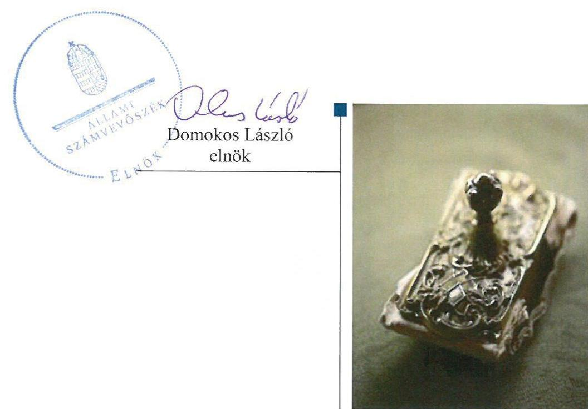

---

# AZ ELLENŐRZÉST FELÜGYELTE:

## MAKKAI MÁRIA felügyeleti vezető

## AZ ELLENŐRZÉST VEZETTE ÉS A VÉGREHAJTÁSÁÉRT FELELŐS:

### SALAMIN VIKTOR ellenőrzésvezető

## A PROGRAM ÖSSZEÁLLÍTÁSÁÉRT FELELŐS:

### JANIK JÓZSEF osztályvezető

---

**IKTATÓSZÁM:** V-1120-120/2016.

**TÉMASZÁM:** 2154

**ELLENŐRZÉS-AZONOSÍTÓ SZÁM:** V070785

---

Jelentéseink az Országgyűlés számítógépes hálózatán és az Interneta a www.asz.hu címen is olvashatóak.

---

# TARTALOMJEGYZÉK 

■ ÖSSZEGZÉS ..... 5
■ AZ ELLENŐRZÉS CÉLJA ..... 6
■ AZ ELLENŐRZÉS TERÜLETE ..... 7
■ AZ ELLENŐRZÉS HÁTTERE, INDOKOLTSÁGA ..... 9
■ A JELENTÉS LÉNYEGES KÉRDÉSKÖREI ..... 10
■ ELLENŐRZÉS HATÓKÖRE ÉS MÓDSZEREI ..... 11
■ MEGÁLLAPÍTÁSOK ..... 13
■ KÖVETKEZTETÉSEK ..... 20
■ MELLÉKLETEK ..... 21
I. sz. melléklet: Értelmező szótár ..... 21
II. sz. melléklet: Múködési adatok ..... 23
■ FÜGGELÉK: ÉSZREVÉTELEK ..... 25
■ RÖVIDÍTÉSEK JEGYZÉKE ..... 33

---

.

---

# ÖSSZEGZÉS 

A 2011-2014 közötti időszakban Debrecen Megyei Jogú Város Önkormányzata - a kulturális szolgáltatás feladatának ellátása keretében - a Debrecen Városi Televízió Kft. feladatellátását szabályszerűen szervezte meg. A Debreceni Vagyonkezelő Zrt. általi tulajdonosi joggyakorlás megfelelt a jogszabályi előírásoknak. A Debrecen Városi Televízió Kft. vagyongazdálkodása szabályszerű volt. Az ellátott feladat bevételeinek, ráfordításainak elszámolása, valamint az önköltségszámitás szabályszerű volt.

## Az ellenőrzés társadalmi indokoltsága

Az Állami Számvevőszék kiemelt célja, hogy a helyi önkormányzatok gazdálkodásában rejlő pénzügyi kockázatok feltárásával, az államháztartáson kívülre nyújtott költségvetési támogatások és ingyenes vagyonjuttatások, valamint az államháztartáson kívül múködő feladat-ellátó rendszerek ellenőrzéseivel hozzájáruljon ahhoz, hogy a közpénzeket az államháztartáson kívül múködő szervezetek is átlátható, rendezett módon használják fel.

Magyarországon az intézmény-centrikus közfeladat-ellátás jellemző, de egyre jelentősebb a költségvetésen kívüli feladatellátás térnyerése. Ennek legfontosabb szereplői - a nonprofit szervezetek mellett - az önkormányzati tulajdonú gazdasági társaságok. Az önkormányzatok szervezetalakítási szabadságának következménye, hogy a korábban is vállalati formában múködő közszolgáltatások mellett, mind a kötelező, mind az önként vállalt feladatok ellátásában a gazdasági társaságok kiemelt fontosságú szerephez jutottak.

## Főbb megállapítások, következtetések, javaslatok

Az Önkormányzat a kulturális szolgáltatás feladatának ellátása keretében, a jogszabályi előírásoknak megfelelően döntött a Debrecen Városi Televízió Kft. feladatellátásának megszervezéséről. A Debreceni Vagyonkezelő Zrt. tulajdonosi joggyakorlása szabályos volt.

A Társaság vagyongazdálkodása, a vagyon nyilvántartása szabályszerű volt. A Társaság által alkalmazott számviteli szabályzatok megfeleltek a vonatkozó jogszabály előírásainak.

A Társaság kötelezettségei - a tulajdonos által rendelkezésére bocsátott forrásoknak köszönhetően - nem veszélyeztették a Társaság múködését, fizetési kötelezettségeinek határidőben eleget tett. A Társaság az előírt beszámolási és adatszolgáltatási kötelezettségét a jogszabályi előírásoknak megfelelően teljesítette.

A Társaság bevételeinek, ráfordításainak, valamint az értékcsökkenésnek az elszámolása szabályos volt. A Társaság rendelkezett a jogszabály előírásainak megfelelő önköltségszámítási szabályzattal, melyet megfelelően alkalmazott.

---

# AZ ELLENŐRZÉS CÉLJA 

pozottsága szabályszerű önköltségszámítással.

Az ellenőrzés célja annak értékelése volt, hogy az Önkormányzat vagyongazdálkodási tevékenysége során szabályszerűen gyakorolta-e tulajdonosi jogait.

Ellenőriztük, hogy a gazdasági társaság szabályozottsága, gazdálkodása és vagyongazdálkodási tevékenysége, bevételeinek és ráfordításainak elszámolása megfelelt-e a jogszabályi és tulajdonosi előírásoknak.

Értékeltük továbbá, hogy a gazdasági társaság kötelezettségállománya jelentett-e kockázatot a múködésre, valamint a gazdálkodás átláthatósága és elszámoltathatósága érdekében biztosítva volt-e a szolgáltatás dijának megala-

---

# **AZ ELLENŐRZÉS TERÜLETE**

## **Debrecen Megyei Jogú Város Önkormányzata, a Debreceni Vagyonkezelő Zrt. és a Debrecen Városi Televízió Kft.**

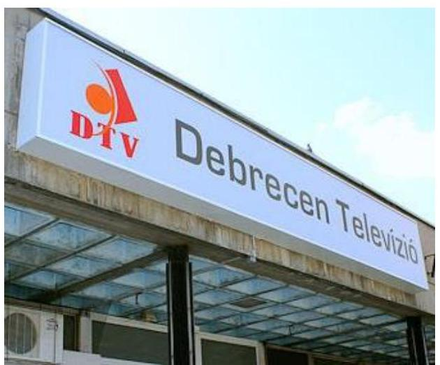

**A Debrecen Városi Televízió Kft.** a 2011-2014. években a Debreceni Vagyonkezelő Zrt. kizárólagos tulajdonában állt. Jegyzett tőkéje az ellenőrzött időszakban nem változott, 106,9 M Ft volt.

A kulturális szolgáltatás, ezen belül a televízió műsor összeállítás és szolgáltatás feladatának gazdasági társaság útján történő ellátásáról DMJV Önkormányzata az ellenőrzött időszakot megelőzően határozott, a Társaság feladatait saját eszközeivel látta el.

DMJV Önkormányzata az ellenőrzött időszakot megelőzően döntött a gazdasági társaságai által ellátott szerteágazó tevékenységek holdingba szervezéséről. A DV Zrt. létrehozásának célja a gazdasági társaságok egységes tervezési, beszámolási és pénzügyi irányítási rendszerének kialakítása volt. A DV Zrt. a Közgyűlés1 által az ellenőrzött időszakot megelőzően (2000-ben) hozott döntése alapján kizárólagos tulajdonosává vált a Debrecen Televíziónak.

A Társaság2 főtevékenysége televízió műsor összeállítása és szerkesztése. Vételkörzete Debrecen 20-40 km-es körzete, műsorai a környező városok kábelhálózataiban is elérhetők. A Társaság egyéb tevékenységei – elektronikus és nyomtatott sajtó kiadása, rádió működtetése – révén Hajdú-Bihar megye médiapiacának fontos szereplője. A Debrecen Televízió piaci szereplőként szerzi bevételeit, amelyek jelentős részét a műsorkészítés, a saját tulajdonú eszközök bérbeadása és reklámszolgáltatási tevékenység adja.

A Társaságnál foglalkoztatott átlagos statisztikai állományi létszám az ellenőrzött időszakban 31 és 33 fő között változott. A Debrecen Televízió munkaszervezetét az ügyvezető irányította, személye az ellenőrzött időszakban nem változott.

A Társaság gazdálkodásának főbb adatait a 2011-2014. évek vonatkozásában az 1. ábra szemlélteti.

---

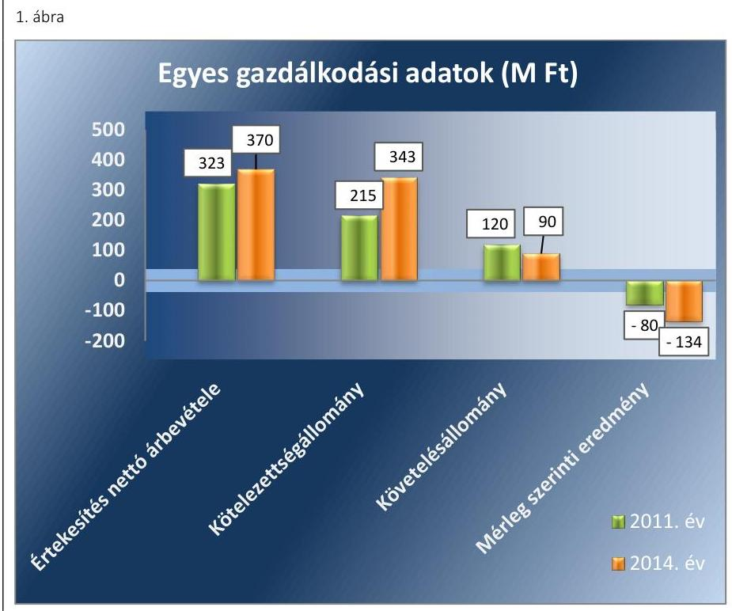

Fornás: A Debrecen Televiziö 2011-2014. éves beszámolóí
A 2014. évi értékesítés nettó árbevétele 14,5\%-kal haladta meg a 2011. évit. A követelések állománya csökkent, a követelések mintegy 90\%-a a vevőkkel szemben fennálló követelés volt. A kötelezettségek mérlegértékének emelkedése alapvetően a digitális átálláshoz kapcsolódó eszközbeszerzést finanszírozó hitelek felvétele miatt következett be.

Az ellenőrzött időszakban a jegyző személye nem, a polgármester személye egy alkalommal változott. A polgármester a 2014. évi önkormányzati választások óta tölti be tisztségét.

---

# **AZ ELLENŐRZÉS HÁTTERE, INDOKOLTSÁGA**

*Az önkormányzatok feladatellátásában egyre jelentősebb a gazdasági társaságok útján történő feladatellátás térnyerése.*

**AZ ÖNKORMÁNYZATI TULAJDONÚ GAZDASÁGI TÁRSASÁGOK** teljes körű ellenőrzésének lehetőségét az Állami Számvevőszékről szóló 1989. évi XXXVIII. törvény 2011. január 1-jétől hatályos módosítása teremtette meg. Az önkormányzati tulajdonú gazdasági társaságok ellenőrzése kiemelten fontos a vagyon megőrzése, megóvása érdekében megjelenő önkormányzati tulajdonú gazdálkodó szervezetek esetében, amelyekkel szemben alapvető követelmény, hogy gazdálkodásuk, működésük szabályszerű, az általuk szolgáltatott adatok minél megbízhatóbbak legyenek. A feladat ellátás költségeinek, ráfordításainak alakulása, színvonala hatással van a lakosság elégedettségére.

### **AZ ELLENŐRZÉS VÁRHATÓ HASZNOSULÁSA-KÉNT** az ÁSZ3 a megállapításaival segítséget nyújthat az államháztartáson kívüli feladatellátás értékeléséhez, jogszabályi keretei pontosításához, átláthatóságot biztosító szabályozásához. Meghatározhatóvá válnak az önkormányzati feladatellátásban részt vevő államháztartáson kívüli szervezeteknek – az önkormányzat költségvetését, pénzügyi helyzetét is befolyásoló – kockázatai, lehetővé válik ezen kockázatok csökkentése. Ellenőrzéseink feltárhatják, hogy az önkormányzat feladat-ellátási kötelezettségének szabályszerűen tett-e eleget, a saját vagyon működtetését az elvárható gondossággal, szabályszerűen szervezte-e meg és a tulajdonosi felügyelete hozzájárult-e a feladatellátásához. Értékelhetővé válik, hogy a gazdasági társaság a feladat-ellátási, közszolgáltatási szerződésben foglaltak betartásával, a vagyon használatával biztosította-e a szolgáltatás folytatásának feltételeit. Ezzel az ellenőrzöttek és a helyi döntéshozók számára az ÁSZ viszszajelzést ad feladatszervezési, feladat-ellátási kockázataikról, alapot ad a meglévő hibák megszüntetéséhez, a jobb feladat-ellátás biztosításához. Mindezeken keresztül az ÁSZ hozzájárul Magyarország közpénzügyi helyzetének javításához, a közpénzek mérhető módon történő, a döntéshozók által meghatározott célok szerinti felhasználásához.

---

# A JELENTÉS LÉNYEGES KÉRDÉSKÖREI 

1.     - Az önkormányzat feladat megszervezéséről szóló döntése, valamint tulajdonosi joggyakorlása szabályszerű volt-e?
2.     - A gazdasági társaság vagyongazdálkodása szabályszerű volt-e, kötelezettségállománya jelentett-e kockázatot a müködésre, illetve a feladat ellátásra?
3.     - A gazdasági társaságnál az ellátott feladat bevételei és ráfordításai elszámolása, valamint az önköltségszámitás és árképzés szabályszerű volt-e?

---

# ELLENŐRZÉS HATÓKÖRE ÉS MÓDSZEREI 

## Az ellenőrzés típusa

Megfelelőségi ellenőrzés.

## Az ellenőrzött időszak

Az ellenőrzött időszak 2011. január 1-jétől 2014. december 31-ig tart.

## Az ellenőrzés tárgya

A gazdasági társaság feletti tulajdonosi joggyakorlás, valamint a gazdasági társaság gazdálkodásának szabályozottsága és szabályszerűsége.

Az ellenőrzés kiterjed minden olyan körülményre és adatra, amely az ÁSZ jogszabályban meghatározott feladatainak teljesítéséhez, valamint a program végrehajtása folyamán felmerült újabb összefüggések feltárásához szükséges.

## Az ellenőrzött szervezet

Debrecen Megyei Jogú Város Önkormányzata, Debreceni Vagyonkezelő Zrt., Debrecen Városi Televízió Kft.

## Az ellenőrzés jogalapja

Az ellenőrzés jogszabályi alapját az ÁSZ tv. 1. § (3) bekezdése és 5. § (3)-(4)-(5) bekezdései képezik.

## Az ellenőrzés módszerei

Az ellenőrzést a nemzetközi standardokat irányadónak tekintve az ellenőrzési program ellenőrzési kérdései, az ellenőrzött időszakban hatályos jogszabályok, az ellenőrzés szakmai szabályok és módszertanok figyelembe vételével végeztük.

Az ellenőrzés ideje alatt az ellenőrzött szervezettel történő kapcsolattartást az ÁSZ Szervezeti és Múködési Szabályzatának vonatkozó előírásai alapján biztosítottuk.

Az ellenőrzés a kiválasztott önkormányzatra, illetve az ellenőrzésre kijelölt gazdasági társaságokra terjedt ki.

Az ellenőrzési kérdések megválaszolásához szükséges bizonyítékok megszerzése a következő ellenőrzési eljárások alkalmazásával történt: megfigyelés, kérdésfeltevés (információkérés), összehasonlítás, valamint

---

elemző eljárás. Az ellenőrzési bizonyítékként felhasználható adatforrások közé tartoztak egyrészt a szakmai programban felsorolt adatforrások, másrészt adatforrás lehetett még minden - az ellenőrzés folyamán - feltárt, az ellenőrzés szempontjából információkat tartalmazó dokumentum.

Az ellenőrzést a kérdésekre adott válaszok kiértékelésével, valamint a megjelölt adatforrások, a csatolt tanúsítványok felhasználásával, továbbá az adott időszakban hatályos jogszabályok figyelembevételével folytattuk le.

A bevételek és ráfordítások elszámolásait, valamint a vagyonnyilvántartás terén a szabályszerű működést véletlen mintavétellel ellenőriztük. A mintavétellel ellenőrzött területek esetében minden egyes tétel vonatkozásában a szabályszerűségre vonatkozó kérdéseket tettünk fel, amelyek eredménye összesítésre került. Megfelelőnek értékeltünk egy ellenőrzött területet, amennyiben 95\%-os bizonyossággal a teljes sokaságban a hibaarány legfeljebb 10\%, nem megfelelőnek, amennyiben 10\%-nál magasabb arányt képviselt. Abban az esetben, ha a teljes sokaság tekintetében a 10\%os hibaarányhoz való viszony megítélésnek megbízhatósága nem érte el a 95\%-ot, annak elérése érdekében értékelésünket további szempontokkal egészítettük ki, és figyelembe vettük a feltárt hibák típusát és súlyát. A ráfordítások elszámolására és a vagyonnyilvántartásra vonatkozó véletlen mintavételt kockázati alapú kiválasztással egészítettük ki, amelynek során évente a három legnagyobb összegű tételt választottuk ki.

---

# 1. Az önkormányzat feladat megszervezéséről szóló döntése, valamint tulajdonosi joggyakorlása szabályszerű volt-e? 

Összegző megállapítás

### 1.1. számú megállapítás

DMJV Önkormányzata a jogszabályi előírások betartásával szervezte meg a Debrecen Városi Televízió Kft. feladatellátását. A DV Zrt. ${ }^{4}$ a Társaság feletti tulajdonosi jogokat szabályszerűen gyakorolta.

A Társaság feladatellátását DMJV Önkormányzata a jogszabályi előírások figyelembevételével szervezte meg.

DMJV Önkormányzata a középtávú fejlesztési elképzeléseit az Ötv. ${ }^{5}$ 91. § (1) bekezdésében és a Mótv. ${ }^{6}$ 116. § (1) bekezdésében előírt követelményeknek megfelelő integrált város és integrált településfejlesztési stratégiában rögzítette. A Közgyűlés megbízatásánál hosszabb időszakra, 20072013 és 2014-2020 közötti évekre határozta meg a fejlesztési elképzeléseket. Az integrált városfejlesztési stratégiák a DV Zrt. feladatellátására vonatkozó fejlesztési terveket tartalmaztak. A DV. Zrt. stratégiájában a Debreceni Televízióval kapcsolatos célok között szerepelt a regionális elektronikus médiában piacvezető pozíció megszerzése, erősítése; a nézői és hirdetői elégedettség növelése; hirdetési piacból való bevételek és részesedések növelése.

DMJV Önkormányzata a Társaság müködését - eseti jelleggel - 2011ben 2,4 M Ft-tal, 2012-ben 2,6 M Ft-tal, 2013-ban 1,4 M Ft-tal támogatta. A digitális műsorszolgáltatáshoz kapcsolódó beruházásokhoz 2013-ban 7,5 M Ft, 2014-ben 41,0 M Ft központi támogatást kapott. A folyósított támogatások felhasználását, illetve a támogatási megállapodásban foglaltak betartását DMJV Önkormányzatának belső ellenőrzése ellenőrizte.

## 1.2. számú megállapítás

A DV Zrt. a tulajdonosi jogokat a jogszabályi előírások és a belső szabályzatok előírásainak megfelelően gyakorolta.

A TULAJDONOSI JOGOKAT a DV Zrt. igazgatóság ügyrendje szerint, a Gt. tv. ${ }^{7}$ 19. § (5) bekezdés és a Ptk. ${ }^{8}$ 3:109. § (4) bekezdés előírásaival összhangban gyakorolta.

AZ ALAPÍTÓ OKIRAT ${ }^{9}$ a beszámolási kötelezettség mellett feladatként írta elő az üzleti terv elkészítését és a tulajdonosi joggyakorló elé terjesztését. Meghatározta a vagyongazdálkodási döntéshozatal előírásait, felsorolta azokat a vagyonváltozást érintő gazdasági eseményeket, melyekhez alapítói határozat szükséges. A tulajdonos a Gt. tv. és a Ptk. rendelkezéseinek megfelelően megválasztotta a felügyelőbizottság tagjait és a könyvvizsgálót.

---

A FELÜGYELŐBIZOTTSÁG tagjainak száma megfelelt a Taktv. ${ }^{10} 4$. § (2) bekezdésében meghatározott létszámnak. Az Alapító Okirat a felügyelőbizottság rendszeres beszámolási kötelezettségeként a Gt. tv. 35. § (3) bekezdés és a Ptk. 3:120. § (2) bekezdése alapján az éves beszámolóról szóló írásbeli vélemény elkészítését írta elő. A Debrecen Televízió felügyelőbizottsága a Gt. tv. 34. § (4) bekezdésének és a Ptk. 3:122. § (3) bekezdésének megfelelően megállapította ügyrendjét. A felügyelőbizottság feladatait az ügyrendben foglaltak szerint ellátta.

A BESZÁMOLÁSI rendszert az Alapító Okirat előírásaival összhangban - a Társaságra kiterjesztett - DV Zrt. szabályzatrendszere tartalmazta, mely megfelelt a jogszabályi előírásoknak. A tervezési és beszámolási rendszer szabályait a minőségirányított szabályozás részeként kidolgozott operatív tervezés, illetve a negyedéves és havi kontrolling beszámolás folyamata tartalmazta. A Debrecen Televízió ügyvezetője a beszámolási kötelezettségeinek eleget tett.

AZ ANYAGI ÖSZTÖNZÉSI RENDSZER szabályzatát a DV Zrt. terjesztette ki a tagvállalataira. A szabályzat megfelelt a Taktv. 5. § (3) bekezdésében meghatározott követelményeknek.

# 2. A gazdasági társaság vagyongazdálkodása szabályszerű volt-e, kötelezettségállománya jelentett-e kockázatot a müködésre, illetve a feladat ellátásra? 

Összegző megállapítás

A Társaság vagyongazdálkodása szabályszerű volt, a kötelezettségek állománya nem jelentett veszélyt a müködésre, beszámolási kötelezettségének a jogszabályi előírásoknak megfelelően eleget tett.
2.1. számú megállapítás

A Társaság az ellenőrzött időszakban a jogszabályokban előírt számviteli szabályzatokkal rendelkezett.

A Társaság éves feladatellátásának kereteit üzleti tervekben határozta meg. A tervek tartalmi követelményeit a DV Zrt. eljárásrendben szabályozta. Az üzleti tervek a negyedéves kontrolling beszámolókkal és az éves beszámolókkal összehasonlítható formában tartalmazták a tervezett eredmény és vagyonadatokat, valamint a beruházási tervet. A DV Zrt. igazgatósága a Debrecen Televízió 2011-2014. évi üzleti terveit határozattal hagyta jóvá.

A DV Zrt. a számviteli konszolidáció feladatainak elősegítésére az ellenőrzött időszakban kötelezően alkalmazandó összevont, egységes számviteli politikát és annak keretében, az eszközök és források értékelésére vonatkozó szabályzatot adott ki a tagvállalatai részére, amelyet a Debrecen Televízió is alkalmazott. A számviteli politika a jogszabály előírásainak megfelel.

A Társaság a Számv. tv. ${ }^{11} 14$. § (5) bekezdésében előírtaknak megfelelően a számviteli politika keretében elkészítette az eszközök és források lel-

---

tárkészítési és leltározási szabályzatát, a pénzkezelési- és az önköltség-számítási szabályzatot. Szabályzataikat a jogszabályi változásoknak megfelelően rendszeresen aktualizálták.

A Debrecen Televízió a számviteli politikájában a Számv. tv. 14. § (4) bekezdésének megfelelően rögzítette az elszámolások szabályait, a lényegesség kritériumait, az amortizációs politikát, valamint az értékelés szempontjait.

A leltározási és leltárkészítési szabályzat a Számv. tv. 69. § (3) bekezdésben előírt rendelkezésekkel összhangban meghatározta a mennyiségi felvétellel történő leltározás - az ingatlanok, a berendezések, gépek, járművek és a vásárolt készletek vonatkozásában évenkénti - végrehajtásának kötelezettségét.

A pénzkezelési szabályzat a Számv. tv. 14. § (8) bekezdésének előírásaival és a számviteli politikával összhangban szabályozta a készpénz- és számlaforgalom lebonyolításának rendjét.

A Debrecen Televízió az ellenőrzött időszakra vonatkozóan a Számv. tv. 161. §-ának megfelelő számlarenddel rendelkezett.

# 2.2. számú megállapítás 

A Társaság vagyonával szabályszerűen gazdálkodott.
A Társaság eszközeinek nyilvántartása szabályszerű volt. A mennyiségben nyilvántartott tárgyi eszközök és készletek mennyiségi felvétellel, illetve egyeztetéssel történő leltározását a leltárkészítési és leltározási szabályzat rendelkezéseinek megfelelően évente a Számv. tv. 69. § (3) bekezdésének megfelelően végezték el. Az ellenőrzött évek számviteli beszámolóinak mérlegeit a Számv. tv. 46. § (3) bekezdésében és a Számv. tv. 69. § (1) bekezdésben foglaltak alapján leltárral támasztották alá.

A Debrecen Televízió mérlegének főbb adatait az 1. táblázat mutatja be.

1. táblázat

A DEBRECEN TELEVÍZIÓ MÉRLEGÉNEK FŐBB ADATAI (MILLIÓ FORINT)

| Megnevezés | $\begin{aligned} & 2011- \\ & 01.01 . \end{aligned}$ | $\begin{aligned} & 2011- \\ & 12.31 . \end{aligned}$ | $\begin{aligned} & 2012, \\ & 12.31 . \end{aligned}$ | $\begin{aligned} & 2013, \\ & 12.31 . \end{aligned}$ | $\begin{aligned} & 2014- \\ & 12.31 . \end{aligned}$ |
| :--: | :--: | :--: | :--: | :--: | :--: |
| I. Befektetett eszközök | 146,5 | 161,0 | 141,2 | 248,4 | 207,2 |
| ebből Tárgyi eszközök | 141,5 | 119,0 | 133,4 | 244,8 | 205,0 |
| ebből Tartósan adott kölcsön kapcsolt vállalkozásban | 0,0 | 37,4 | 4,2 | 0,0 | 0,0 |
| II. Forgóeszközök | 124,7 | 141,2 | 130,6 | 168,8 | 110,0 |
| ebből Követelések | 118,6 | 120,4 | 107,9 | 139,1 | 89,8 |
| III. Aktív időbeli elhatárolások | 16,4 | 3,3 | 8,6 | 12,8 | 13,9 |
| Eszközök összesen | 287,6 | 305,5 | 280,4 | 430,0 | 331,1 |
| IV. Saját tőke | $-2,1$ | 73,8 | 56,1 | $-85,4$ | $-80,9$ |
| ebből Jegyzett tőke | 106,9 | 106,9 | 106,9 | 106,9 | 106,9 |
| ebből Tóketartalék | 0 | 0 | 0 | 0 | 0 |
| ebből Mérleg szerinti eredmény | $-71,1$ | $-79,6$ | $-87,7$ | $-141,5$ | $-134,4$ |
| V. Céltartalékok | 0,0 | 0,9 | 0,0 | 0,0 | 0,0 |
| VI. Kötelezettségek | 252,3 | 215,3 | 211,3 | 478,2 | 343,1 |
| VII. Passzív időbeli elhatárolások | 37,4 | 15,5 | 13,0 | 37,3 | 68,9 |
| Források összesen | 287,6 | 305,5 | 280,4 | 430,0 | 331,1 |

Forrás: A Debrecen Televizió éves beszámolói

---

A DEBRECEN TELEVÍZIÓ VAGYONA 2011. január 1. és 2014. december 31. között 43,5 M Ft-tal (15,1\%-kal) gyarapodott. A változást a befektetett eszközök mérlegértékének növekedése és a forgóeszközök, valamint aktív időbeli elhatárolások záró értékének csökkenése együttesen eredményezte. A befektetett eszközök mérlegértékének - 2011 kivételével - 94,5-98,9\%-át a tárgyi eszközök záró értéke képviselte, amely 63,5 M Ft-tal nőtt az ellenőrzött időszakban végrehajtott fejlesztések, beruházások hatására. A forgóeszközök állományán belül a követelések értéke 28,8 M Ft-tal (24,3\%-kal) csökkent, a vevők állománya az ellenőrzött időszakban jelentősen nem változott ( 88,0 M Ft-ról 80,8 M Ft-ra csökkent).

A Debrecen Televízió saját tőkéjének értéke 78,8 M Ft-tal csökkent az ellenőrzött időszakban, mivel a folyamatosan veszteséges gazdálkodást a tulajdonos általi tőkepótlás nem ellensúlyozta.
2.3. számú megállapítás

A Társaság kötelezettségeinek állománya a tulajdonos folyamatos támogatása miatt a feladat ellátását, a Társaság múködését nem veszélyeztette.

# A TÁRSASÁG KÖTELEZETTSÉGEINEK ÁLLOMÁ- 

NYA az ellenőrzött időszakban 90,8 M Ft-tal (36,0\%-kal) emelkedett. A változást a hosszú lejáratú kötelezettségek állományának 91,6 M Ft-os növekedése és a rövidlejáratú kötelezettségek 0,8 M Ft-os csökkenése együttesen eredményezte.

A Debrecen Televízió kötelezettségeinek változását a 2. táblázat mutatja be.
2. táblázat

## A DEBRECEN TELEVÍZIÓ KÖTELEZETTSÉGÁLLOMÁNYÁNAK ALAKULÁSA (MILLIÓ FORINT)

|  | 2011. | 2011. | 2012. | 2013. | 2014. |
| :--: | :--: | :--: | :--: | :--: | :--: |
|  | 01.01. | 12.31. | 12.31. | 12.31. | 12.31. |
| Hosszú lejáratú kötelezettségek | 160,3 | 178,9 | 167,4 | 284,9 | 251,9 |
| ebből Egyéb hosszú lejáratú hitelek | 159,9 | 178,9 | 167,4 | 170,2 | 205,2 |
| Rövid lejáratú kötelezettségek | 92,0 | 36,4 | 43,8 | 193,2 | 91,2 |
| ebből Kötelezettségek áru-   szállításból (szállítók) | 5,9 | 18,2 | 32,2 | 51,9 | 30,6 |
| ebből Rövid lejáratú kötele-   zettségek kapcsolt vállalkozás-   sal szemben | 61,1 | 1,1 | 2,2 | 123,9 | 43,1 |
| ebből Egyéb rövid lejáratú kötelezettségek | 8,9 | 17,0 | 9,5 | 17,4 | 17,5 |
| Kötelezettségek összesen | 252,3 | 215,3 | 211,3 | 478,2 | 343,1 |

A 2011. és 2012. év mérlegében hosszú lejáratú kötelezettségként a pénzintézetekkel szemben fennálló hiteltartozást mutatták ki. A 2013. évben a 284,9 M Ft hosszú lejáratú kötelezettségből 170,2 M Ft összeg pénzintézeti hitel, 114,7 M Ft kapcsolt vállalkozással szemben fennálló tartós kötelezettség - nem tagi kölcsön - volt. A 2013. évi jelentős kötelezettség növekedés legfőbb oka volt, hogy a Társaságnál nagy volumenű - a digitális

---

# Megállapítások 

átálláshoz kapcsolódó - eszközbeszerzések és szolgáltatásfejlesztések történtek, melyek forrását a Cash-pool rendszeren keresztül tagvállalatoktól felvett hitelek és pénzintézeti hitelek képezték. A 2014. év végére a hosszú lejáratú kötelezettségek 33,0 M Ft-tal csökkentek, azonban a pénzintézeti hitelek állománya 205,2 M Ft-ra nőtt, a kapcsolt vállalkozással szemben fennálló kötelezettségek 46,7 M Ft-ra történő mérséklődése mellett.

Az ellenőrzött időszak végén a rövid lejáratú kötelezettségek közel felét (47,3\%-át) a kapcsolt vállalkozásokkal szembeni kötelezettségek tették ki.

A Debrecen Televízió eladósodottsági mutatója alapján megállapítható, hogy 2011-2012-ben eszközeinek finanszírozásához 70-75\%-ban vett igénybe idegen forrásokat. Az adósságfedezeti mutató l. értéke nem érte el a kedvezőnek ítélt 2 értéket, a 2013-as és 2014-es 1 alatti érték azt mutatja, hogy ezekben az években a Társaság adósságát már nem fedezte a vagyona, mert a kötelezettségei a veszteséget finanszírozták.

A Debrecen Televízió múködése az ellenőrzött időszakban csak a tulajdonos által rendelkezésre bocsátott forrásokkal volt fenntartható, kizárólag a saját forrásaiból a kötelezettségeit nem tudta teljesíteni.

A DV Zrt. és a tulajdonában álló gazdasági társaságok likviditásának kezelésére Cash-pool rendszert múködtetett. A Debrecen Televízió részére a tulajdonosi többletforrásokkal kiegészített bevétel mellett a Cash-pool rendszer biztosította a folyamatos fizetőképességet. A Debrecen Televízió a fizetési kötelezettségeinek határidőben eleget tett.

## 2.4. számú megállapítás

A Társaság az előírt beszámolási és adatszolgáltatási kötelezettségét a jogszabályi előírásoknak megfelelően teljesítette.

AZ ÉVES BESZÁMOLÓKAT a Számv. tv. 19. § (1) bekezdésében előírt tartalommal készítették el és terjesztették a DV Zrt. igazgatósága elé. Az éves beszámoló letétbe helyezését a Számv. tv. 153. § (1) bekezdésében előírt határidőben teljesítették.

A Debrecen Televízió felügyelőbizottsága kötelező feladatának eleget téve az éves beszámolókról alkotott írásbeli véleményét a tulajdonosi jogokat gyakorló DV Zrt. igazgatósága részére megküldte.

A DV Zrt. igazgatósága a könyvvizsgálói jelentés és a felügyelőbizottság írásbeli véleményének birtokában döntött az éves beszámolók elfogadásáról. A könyvvizsgáló a társasági vagyon csökkenésének veszélyére minden évben felhívta a figyelmet. A 2011-2012. évi könyvvizsgálói jelentés záradékában figyelemfelhívással élt, mivel a saját tőke a folyamatos veszteséges gazdálkodás miatt a jegyzett tőke értéke alá csökkent. A DV Zrt. a tőkeveszteség ellensúlyozására 2011-ben 155,6 M Ft, 2012-ben 70 M Ft pótbefizetést teljesített. A 2013. évben a saját tőke negatívvá vált és a 2014. év végén - a 139,0 M Ft pótbefizetés ellenére - is negatív volt. A 2013. és 2014. években a saját tőke értéke nem érte el a társasági formára kötelezően előírt jegyzett tőkét (3,0 M Ft), ezért a könyvvizsgáló a záradékában a tulajdonos figyelmét felhívta az azonnali beavatkozásra a Ptk. 3:133. § (2) bekezdésben előírt kötelezettség teljesítése érdekében.

A Média tv. ${ }^{12}$ 66. § (3) bekezdése éves beszámolási kötelezettséget írt elő a közösségi médiaszolgáltatásra vonatkozó törvényi rendelkezéseknek való megfelelésről és médiaszolgáltatási szabályzat betartásáról. Ezeket a beszámolókat a Társaság elkészítette és megküldte a Médiatanácsnak. A beszámolók - az alapadatokon, múszaki és egyéb paramétereken kívül -

---

összevont adatokat tartalmaztak a Debrecen Televízió gazdasági tevékenységéről, működéséről, reklámbevételeiről, beruházásairól, létszámadatairól. Ezen adatok az éves beszámoló adataira épültek, azokkal összhangban voltak.

A Társaság 2011-ben az Eisztv ${ }^{13}$. 6. § (1) bekezdésében, 2012-2014. években az Info tv ${ }^{14}$. 37. § (1) bekezdésben előírt kötelezettségének eleget téve szervezeti, személyi adatait, a tevékenységére, működésére vonatkozó, és gazdálkodási adatait honlapján közzétette.

A Debrecen Televízió az Info tv. 24. § (3) bekezdésében előírt adatvédelmi és adatbiztonsági szabályzattal rendelkezett, amelyet honlapján közzé is tett. Az Info tv. 24. § (1) bekezdés c) pontjában előírtaknak megfelelően a belső adatvédelmi felelős kijelölési kötelezettségüknek eleget tettek.

A 2011-ben az Avtv. ${ }^{15}$ 20. § (8) bekezdésében, a 2012-2014. években az Info tv. 30. § (6) bekezdésében előírt, a közérdekű adatok megismerésére irányuló igények teljesítésének rendjét az adatvédelmi és adatbiztonsági szabályzat tartalmazta.

# 3. A gazdasági társaságnál az ellátott feladat bevételei és ráfordításai elszámolása, valamint az önköltségszámítás és árképzés szabályszerű volt-e? 

Összegző megállapítás

## 3.1. számú megállapítás

A bevételek, ráfordítások és az értékcsökkenés elszámolása, valamint az önköltségszámítás szabályos volt.

A bevételek, ráfordítások, valamint az értékcsökkenés elszámolása szabályos volt.

AZ ÉRTÉKESÍTÉS NETTÓ ÁRBEVÉTELEINEK ELSZÁMOLÁSA megfelelő volt. A bevételek előírása és kiszámlázása a belső szabályozásnak megfelelően történt, a bevételeket a megfelelő számlacsoportban, tevékenységenként elkülönítve számolták el. Az elszámolásokat alapbizonylatokkal támasztották alá.

AZ ANYAGJELLEGŰ RÁFORDÍTÁSOK ELSZÁMOLÁSA megfelelő volt. A kulturális szolgáltatás feladattal kapcsolatban felmerült költségeket és ráfordításokat a megfelelő feladatra és költségnemre számolták el.

AZ ÉRTÉKCSÖKKENÉSI LEÍRÁS ELSZÁMOLÁSA megfelelő volt. Az elszámolás alapját képező bekerülési értékeket a Számv. tv. 47-51. §-aiban és a számviteli politikában előírtak alapján állapították meg. A terv szerinti értékcsökkenési leírás elszámolásánál a számviteli politikában és az eszközök és források értékelési szabályzatában meghatározott elveket és szabályokat vették figyelembe.

A Debrecen Televízió a saját tulajdonú eszközeinek megújításáról az ellenőrzött időszakban gondoskodott. A 2011 és 2014 közötti időszakban

---

eszközei után 136,9 M Ft terv szerinti értékcsökkenést számolt el, az eszközök megújítására fordított összeg 219,5 M Ft volt. A Debrecen Televízió a tulajdonosi joggyakorló jóváhagyását kérte az Alapító Okiratban meghatározott, vagyont érintő fejlesztések esetében, melyekről a tulajdonosi joggyakorló alapítói határozatban döntött.

A KÖVETELÉSÁLLOMÁNY az ellenőrzött időszakban 118,6 M Ft-ról 89,8 M Ft-ra csökkent, a vevői követelések állománya 88,0 M Ft-ról 80,8 M Ft-ra mérséklődött.

A követelésállomány változását a 3. táblázat tartalmazza.
3. táblázat

A DEBRECEN TELEVÍZIÓ KÖVETELÉSEINEK ALAKULÁSA (MILLIÓ FORINT)

|  | 2010. | 2011. | 2012. | 2013. | 2014. |
| :-- | --: | --: | --: | --: | --: |
| Követelések mérlegértéke | 118,6 | 120,4 | 107,9 | 139,1 | 89,8 |
| ebből vevői követelések | 88,0 | 101,6 | 92,3 | 109,0 | 80,8 |
| ebből követelések kapcsolt vállalko-   zásokkal szemben | 0,1 | 12,4 | 4,2 | 16,8 | 0,4 |
| ebből egyéb követelések | 1,3 | 6,4 | 11,3 | 13,3 | 8,6 |

Az év végén fennálló, a mérlegkészítés időpontjáig ki nem egyenlített követelések miatt várható veszteségek fedezetére a számviteli politikában meghatározott elvek alapján értékvesztést számoltak el.

Az ellenőrzött időszakban a Debrecen Televízió behajthatatlanság címén követelést nem írt le.

A hátralékos vevő állomány behajtására a Debrecen Televízió intézkedett. A vevők részére fizetési felszólító leveleket küldtek, emellett ügyvédi fizetési felszólításokat, bírósági eljárások kezdeményeztek, valamint minden vevő részére évente három alkalommal egyenlegközlő levelet küldtek. A DV Zrt. részére a negyedéves kontrolling beszámolók keretében bemutatták a kintlévőségek állományát és kezelését.
3.2. számú megállapítás

Az önköltségszámítás kialakított rendje és gyakorlata megfelelt a jogszabályi előírásoknak, a díjak megállapítása a piaci viszonyok figyelembevételével történt.

A Társaság a Számv. tv. 14. § (5) bekezdés c) pontjában előírtaknak megfelelően rendelkezett önköltségszámítási szabályzattal. A szabályzatban rögzített kalkulációs egységeket a végzett tevékenységek, szolgáltatások képezték, előírták az alkalmazandó kalkulációs sémát, valamint az egyes költségtényezők tartalmát. A szabályozás a tervezést alátámasztó előkalkuláció, a negyedéves jelentéseket megalapozó közbenső kalkuláció, valamint a beszámolót alátámasztó utókalkuláció készítésének kötelezettségét írta elő. A Társaság az előírt kalkulációkészítési, önköltségszámítási kötelezettségét teljesítette.

A Debrecen Televízió által végzett szolgáltatások árait piaci alapon képezte, a televízió-, rádió-, újság reklámok esetében jellemzően évente, az egyéb megrendelések (egyedi reklám megrendelés, televíziós és rádiós műsorkészítés, filmkészítés) vonatkozásában egyedileg.

---

# KÖVETKEZTETÉSEK 

A Debrecen Megyei Jogú Város Önkormányzata - a kulturális szolgáltatás feladatának ellátása keretében - a Debrecen Városi Televízió Kft. feladatellátását szabályszerűen szervezte meg. A Debreceni Vagyonkezelő Zrt. általi tulajdonosi joggyakorlás megfelelt a jogszabályi előírásoknak.
A 2011 - 2014 közötti időszakban a Debrecen Városi Televízió Kft. vagyongazdálkodása, az ellátott feladat bevételeinek, ráfordításainak elszámolása, valamint az önköltségszámitás szabályszerű volt.

---

# MELLÉKLETEK 

- I. SZ. MELLÉKLET: ÉRTELMEZŐ SZÓTÁR
cash-pool
eladósodottságot jellemző mutatók
garancia
gazdasági társaság
kezesség
közszolgáltatás
nemzeti vagyon

Egy vállalatcsoport bankszámláinak napi összevont kezelése annak érdekében, hogy optimalizálják a cégek pénzügyi pozícióját, jobb befektetési pozíciót érjenek el, vagy belső finanszírozással csökkentsék a külső hitelállományt.
eladósodottsági mutató (tőkeáttétel): idegen tőke/összes forrás.
Egészségesnek mondható egy olyan mértékű áttétel, amelyet az üzleti tervek szerint és az elmúlt időszak tapasztalatai alapján a Társaság megfelelő biztonsággal ki tud termelni. Nagy eszközberuházás-igényű iparágakban értéke magasabb, azaz magasabb eladósodottság is elfogadható, de 75-85\%-ot meghaladó értéknél már itt is erős, sőt túlzott külső finanszírozottságról beszélhetünk. Általánosságban véve kedvező, ha értéke kisebb, mint 0,6 .
nettó eladósodottság: (kötelezettségek-követelések) / saját tőke.
Azt mutatja, hogy a kintlévőségekkel csökkentett kötelezettségeket milyen mértékben fedezi a saját forrás. Ez feltételezi, hogy a követelések pénzügyileg előbb realizálódnak, mint ahogy a kötelezettségeket teljesíteni kell. A mutató minél kisebb, csökkenő értéke a kedvező.
adósságfedezeti mutató I.: (befektetett eszközök+forgó eszközök) / idegen forrás.
Azt mutatja, hogy 1 Ft adósságra hány Ft vagyon jut. Általánosságban véve kedvező, ha értéke 2 körül van, de nagy eszközberuházás-igényű iparágakban értéke kisebb is lehet.
A garancia olyan önálló, az önkormányzat nevében vállalt kötelezettség, amely alapján az önkormányzat az önkormányzati költségvetés terhére szerződésben meghatározott feltételek szerint, a kötelezett nem teljesítése esetén a jogosultnak fizetést teljesít az előzetesen rögzített összeghatárig.
Ptk. 3.88. § (1) bekezdése szerint „a gazdasági társaságok üzletszerü közös gazdasági tevékenység folytatására, a tagok vagyoni hozzájárulásával létrehozott, jogi személyiséggel rendelkező vállalkozások, amelyekben a tagok a nyereségből közösen részesednek, és a veszteséget közösen viselik".
A kezességre vonatkozó előírásokat a Ptk. 6:416-430. §-ai tartalmazzák. Kezességi szerződéssel a kezes kötelezettséget vállal a jogosulttal szemben, hogyha a kötelezett nem teljesít, maga fog helyette a jogosultnak teljesíteni. Kezesség egy vagy több, fennálló vagy jövőbeli, feltétlen vagy feltételes, meghatározott vagy meghatározható összegű pénzkövetelés vagy pénzben kifejezhető értékkel rendelkező egyéb kötelezettség biztosítására vállalható.
A közszolgáltatás: „közcélú, illetőleg közérdekü szolgáltatást jelent, amely egy nagyobb közösség (állam, település) minden tagjára nézve megközelítőleg azonos feltételek mellett vehető igénybe, ezért valamilyen mértékig közösségi megszervezést, illetve szabályozást, ellenőrzést igényel." Az Ebktv. ${ }^{16}$ 3. § d) pontja a következőképpen határozza meg a közszolgáltatást: „szerződéskötési kötelezettség alapján a lakosság alapvető szükségleteinek ellátására irányuló szolgáltatás, így különösen a villamos energia-, gáz-, hő-, víz-, szennyvíz- és hulladékkezelési, köztisztasági, postai és távközlési szolgáltatás, továbbá a menetrend alapján közlekedő járművekkel végzett közforgalmú személyszállítás".
Az Nvtv. 1. § (2) bekezdése c) pontja szerint „az állam vagy a helyi önkormányzat tulajdonában lévő pénzügyi eszközök, továbbá az államot vagy a helyi önkormányzatot megillető társasági részesedések."

---

többségi befolyás

Tulajdonosi joggyakorló

A Ptk. 8:2. § (1) bekezdése szerint „többségi befolyás az olyan kapcsolat, amelynek révén természetes személy vagy jogi személy (befolyással rendelkező) egy jogi személyben a szavazatok több mint felével vagy meghatározó befolyással rendelkezik." Aki a nemzeti vagyon felett az államot vagy a helyi önkormányzatot megillető tulajdonosi jogok és kötelezettségek összességének gyakorlására jogosult. (Nvtv. 3. § (1) bekezdés 17. pont).

---

# A DEBRECEN TELEVÍZIÓ MŰKÖDÉSÍNEK FŐBB JELLEMZŐI 

| Sorszám | Megnevezés |  | 2011. év | 2012. év | 2013. év | 2014. év |
| :--: | :--: | :--: | :--: | :--: | :--: | :--: |
| 1. | A gazdasági társaság tulajdonosi összetétele: |  |  |  |  |  |
| 2. | Önkormányzat megnevezése: |  | Debrecen Megyei Jogú Város Önkormányzata |  |  |  |
| 3. | Önkormányzat tulajdoni részesedésének aránya | $\%$ | 0,0 | 0,0 | 0,0 | 0,0 |
| 4. | Önkormányzat tulajdoni részesedésének öszszege | ezer Ft | 0,0 | 0,0 | 0,0 | 0,0 |
| 5. | Gazdasági társaság megnevezése |  | Debreceni Vagyonkezelő Zrt. |  |  |  |
| 3. | Gazdasági társaság tulajdoni részesedés aránya | $\%$ | 100,0 | 100,0 | 100,0 | 100,0 |
| 4. | Gazdasági társaság tulajdoni részesedés öszszege | ezer Ft | 106900 | 106900 | 106900 | 106900 |
| 8. | A gazdasági társaság müködése a vizsgált évek során megszünt-e? (IGEN/NEM) |  | NEM |  |  |  |
| 9. | A tárgyévben a gazdasági társaság vagyon-keze-lésben lévő önkormányzati vagyon után elszámolt értékcsökkenés összege | ezer Ft | 0 | 0 | 0 | 0 |
| 10. | A tárgyévben az önkormányzati tulajdonú, gazdasági társaság által kezelt eszközök pótlására (karbantartás, felújítás, beruházás) elszámolt költség | ezer Ft | 0 | 0 | 0 | 0 |
| 9. | A tárgyévben a gazdasági társaság saját vagyona után elszámolt értékcsökkenés összege | ezer Ft | 29116 | 27108 | 34508 | 46165 |
| 10. | A tárgyévben a saját tulajdonú eszközök pótlására (karbantartására) elszámolt költség | ezer Ft | 8918 | 47095 | 150596 | 12852 |
| 11. | Értékesítés nettó árbevétele | ezer Ft | 322751 | 284672 | 334279 | 369613 |
| 12. | Müködési cash flow | $\begin{aligned} & \text { ezer Ft } \\ & \hline \end{aligned}$ | $\begin{array}{r} \hline-39495 \\ \hline \end{array}$ | $\begin{array}{r} \hline-48424 \\ \hline \end{array}$ | $\begin{array}{r} \hline-107629 \\ \hline \end{array}$ | $\begin{array}{r} \hline-61435 \\ \hline \end{array}$ |

---

.

---

# FÜGGELÉK: ÉSZREVÉTELEK 

A jelentéstervezetet a Számvevőszék 15 napos észrevételezésre megküldte az ellenőrzött szervezetek vezetőinek az ÁSZ tv. 29. §* (1) bekezdése előírásának megfelelően.

Az ÁSZ a jelentéstervezetet észrevételezésre megküldte a Debrecen Megyei Jogú Város Önkormányzata polgármesterének, a Debreceni Vagyonkezelő Zrt. Igazgatósága elnökének, valamint a Debrecen Városi Televízió Kft. ügyvezetőjének.

A Debrecen Megyei Jogú Város Önkormányzat polgármestere az ÁSZ tv. 29. § (2) bekezdésében foglalt észrevételezési jogával nem élt, a törvényes határidőn belül észrevételt nem tett. A Debreceni Vagyonkezelő Zrt. Igazgatóság elnökének és a Médiacentrum Debrecen Kft. ügyvezetőjének észrevételeit és az arra adott válaszokat a függelék alább tartalmazza.

[^0]
[^0]:    * 29. § (1) Az Állami Számvevőszék az ellenőrzési megállapításait megküldi az ellenőrzött szervezet vezetőjének vagy az általa megbízott személynek, és annak, akinek személyes felelősségét állapította meg.
    (2) Az ellenőrzött szervezet vezetője és a felelősként megjelölt személy az ellenőrzés megállapításaira tizenöt napon belül írásban észrevételt tehet.
    (3) Az Állami Számvevőszék az észrevételre a beérkezésétől számított harminc napon belül írásban válaszol. A figyelembe nem vett észrevételeket köteles a jelentésben feltüntetni, és megindokolni, hogy azokat miért nem fogadta el.

---

# DY 

## Debreceni Vagyonkezelő Zrt.

ÁLLAMI SZÁMVEVŐSZÉK

## Domokos László Úr

## Elnök

Budapest
Apáczai Csere János utca 10. 1052

Tárgy: Észrevételek közlése

Tisztelt Elnök Úr!

JW-1160-2/2016

## ÁLLAMI SZÁMVEVŐSZÉK

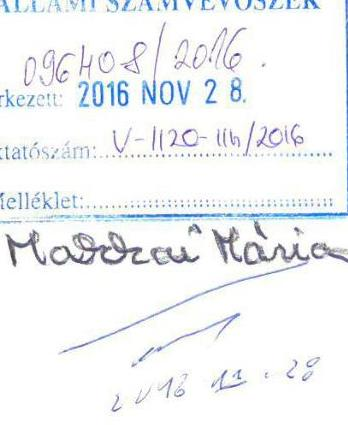

Hivatkozással a 2016. november 14-én kelt, 2016. november 16-án kézhez vett V-1120110/2016. számú levelére és annak mellékleteként megküldött „Az önkormányzatok gazdasági társaságai - Az önkormányzatok többségi tulajdonában lévő gazdasági társaságok gazdálkodásának ellenőrzése - Debrecen Városi Televízió Kft." címmel készített számvevőszéki jelentéstervezetre, a tervezettel kapcsolatos észrevételeinket az alábbiak szerint közlöm.

## Tisztelt Elnök Úr!

Engedje meg, hogy mindenekelőtt köszönetemet fejezzem ki Önnek, valamint a vizsgálatban résztvevő és közreműködő valamennyi munkatársának, továbbá az Önök által felkért szakértő kollegáknak a felelősségteljes, magas szakmai színvonalú munkavégzését és nem utolsó sorban a vizsgálat teljes időszaka alatt tanúsított korrekt hozzáállást.

---

A már hivatkozott jelentéstervezet 15-16. oldalán szereplő 2.2. számú megállapításban (,A Társaság vagyonával szabályszerűen gazdálkodott."), valamint a jelentéstervezet 17. oldalán szereplő 2.4. számú megállapításban (,A Társaság az előírt beszámolási és adatszolgáltatási kötelezettségét a jogszabályi előírásoknak megfelelően teljesítette.") a saját tőkevesztésre vonatkozóan leírtakkal összefüggésben jelezni kívánom, hogy a könyvvizsgálói figyelemfelhívással összhangban, a Debreceni Vagyonkezelő Zrt., mint a Társaság egyszemélyes tulajdonosa, 2015. évben is eleget tett a tőkerendezéssel kapcsolatos kötelezettségének.
A Debreceni Vagyonkezelő Zrt. Igazgatósága a Társaság 2014. évi Éves beszámolója elfogadásával egy időben határozott a tulajdonos által teljesítendő pótbefizetés összegéről, és pénzügyi rendezésének határidejéről. Az Igazgatóság döntését tartalmazó dokumentum 1. sz. mellékletként csatolva.
A Debreceni Vagyonkezelő Zrt. a 2015. május 29-én átutalta a Társaság részére az Igazgatóság által meghatározott pótbefizetés összegét. Az átutalás tényét dokumentáló banki igazolás 2. sz. mellékletként csatolva.

Megjegyezni kívánom, hogy 2015. év nem tartozik a vizsgált időszakba, ez kétségtelen, de ezen, 2015. évi gazdasági esemény (pótbefizetés teljesítése) még is a vizsgált időszak alá eső, 2014. év következményeként a 2014. évi beszámolóban megjelenő saját tőke, illetve kötelezettség állomány jogszabályszerủ rendezését jelentette, ezért fontosnak tartottam erről tájékoztatással élni a Tisztelt Elnök Úr felé.

A Számvevőszéki jelentéstervezetben foglaltakkal összefüggésben további észrevételt nem kívánok tenni.

Munkájukat még egyszer megköszöm.

Debrecen, 2016. november 18.

Tisztelettel,
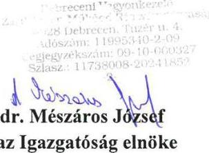

---

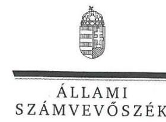

# dr. Mészáros József úr 

Igazgatóság Elnöke
Debreceni Vagyonkezelő Zrt.

## Debrecen

## Tisztelt Elnök Úr!

„Az önkormányzatok gazdasági társaságai - Az önkormányzatok többségi tulajdonában lévö gazdasági társaságok gazdálkodásának ellenörzése - Debrecen Városi Televizió Kft." címmel készített számvevőszéki jelentéstervezetre tett észrevételét köszönettel megkaptam.

Az Állami Számvevőszék észrevételre vonatkozó álláspontjáról a felügyeleti vezetö által készített tájékoztatást csatoltan megküldöm.

Tájékoztatom Elnök Urat, hogy a számvevőszéki jelentésben - az Állami Számvevőszék röl szóló 2011. évi LXVI. törvény 29. § (3) bekezdése alapján - a figyelembe nem vett észrevételt szerepeltetjük az elutasítás indokának feltüntetésével.

Budapest, 2016. 12. hó 16 nap
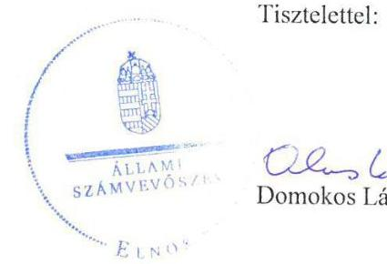

Tisztelettel:

## 12.12

Melléklet: Tájékoztatás az el nem fogadott észrevételről

---

# Tájékoztatás   az el nem fogadott észrevételről 

„Az önkormányzatok gazdasági társaságai - Az önkormányzatok többségi tulajdonában lévô gazdasági társaságok gazdálkodásának ellenörzése - Debrecen Városi Televizió Kft." címú jelentéstervezetre 2016. november 28 -án érkezett észrevételét áttekintettük, annak kezelésével kapcsolatban a következő tájékoztatást adom.

1. A jelentéstervezet 2.4. számú megállapítás 3. bekezdésében a 2014. évi negatív saját tőkére vonatkozó megállapítás
Az észrevételükben leírt a 2014. évi tőkepótlásra vonatkozó - tulajdonosi döntés, valamint a pótbefizetés pénzügyi teljesítése - intézkedések az ellenőrzött időszakon túl nyúlnak, ezért azok figyelembevétele és a jelentéstervezet módosítása nem indokolt.

Budapest, 2016. 12. hó 16. nap

Makkai Mária
felügyeleti vezetö

---

# Állami Számvevőszék 

Budapest 4.
Pf.: 54.
1364

Tárgy: Észrevétel az önkormányzatok gazdasági társaságainak ellenőrzése - Debrecen Városi Televízió kft. 2016 jelentéstervezethez

## Tisztelt Állami Számvevőszék!

Ezúton is szeretnénk megköszönni az Állami Számvevőszék munkatársainak korrekt és szakszerű vizsgálatát. Az alábbiakban tennénk kiegészítést, illetve észrevételt:
A jelentés tervezet 13. oldalán az Önkormányzati támogatásokat jelzik. A digitális átállásra 2013-2014-ben kapott 7,5 M Ft és 41 M Ft fejlesztési támogatás központi támogatás volt. Ennek anyagait mellékeljük.
A Debreceni Vagyonkezelő ZRT-ben Igazgatóság működik a jelzett igazgatótanács helyett. Ezt a jelentésben célszerűnek látnánk pontosítani.
A jelentés tervezet a 16-17. oldalon jelzi a saját tőkevesztést, illetve annak a hitelből történő finanszírozását. A vizsgált 2011-2014. időszakban a pótbefizetések megtörténtek, a Kft. saját tőke helyzetét rendezte a tulajdonos, és kitisztázta a Cash-pool kötelezettség állományát. Ezúton jelezzük, hogy a pótbefizetési kötelezettséget (a leírt könyvvizsgálói figyelemfelhívással is összhangban) a Debreceni Vagyonkezelő Zrt., 2015-ben is teljesítette, 2015. május 29-én 135 M Ft összegủ pótbefizetést utalt át a Debrecen Városi Televízió Kft.nek az Igazgatóság döntése alapján.

Munkájukat megköszönve,

Debrecen, 2016. november 28.
üdvözlettel:
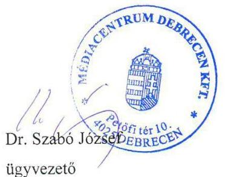

Ügyvezető

---

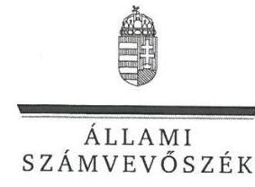

ELNÖK

Ikt.szám: V-1120-117/2016.

# Dr. Szabó József úr 

ügyvezető
Médiacentrum Debrecen Kft.

## Debrecen

## Tisztelt Ügyvezető Úr!

„Az önkormányzatok gazdasági társaságai - Az önkormányzatok többségi tulajdonábon lévö gazdasági társaságok gazdálkodásának ellenörzése - Debrecen Városi Televiziô Kft." címmel készített számvevőszéki jelentéstervezetre tett észrevételét köszönettel megkaptam.

Az Állami Számvevőszék észrevételre vonatkozó álláspontjáról a felügyeleti vezető által készített tájékoztatást csatoltan megküldöm.

Tájékoztatom Ügyvezető Urat, hogy a számvevőszéki jelentésben - az Állami Számvevőszékről szóló 2011. évi LXVI. törvény 29. § (3) bekezdése alapján - a figyelembe nem vett észrevételt szerepeltetjük az elutasítás indokának feltüntetésével.

Budapest, 2016. 12. hó 16 . nap
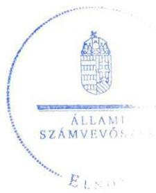

Tisztelettel:

Domokos László

Melléklet: Tájékoztatás az észrevételek kezeléséről

---

# Tájékoztatás   az észrevételek kezeléséről 

„Az önkormányzatok gazdasági társaságai - Az önkormányzatok többségi tulajdonálıan lévô gazdasági társaságok gazdálkodásának ellenörzése - Debrecen Városi Televiziô Kfi." cimú jelentéstervezetre 2016. december 05-én érkezett észrevételét áttekintettük, annak kezelésével kapcsolatban a következö tájékoztatást adom.

1. A jelentéstervezet 13. oldalán a digitális músorszolgáltatáshoz kapcsolódó fejlesztési támogatásra vonatkozó megállapítás
A jelentéstervezet 1.1. számú megállapítás 2. bekezdésében a digitális músorszolgáltatáshoz kezdetü mondatot pontositottuk és kiegészítettük ,, a központi támogatás" kifejezéssel.
2. A jelentéstervezet 16-17. oldalain a saját tőkevesztéssel kapcsolatos megállapítás

A jelentéstervezet 16. oldalán a saját tőkevesztéssel, illetve annak hitelböl történő finanszírozásával kapcsolatosan megállapítás nem szerepel. A saját tőkére vonatkozó megállapítás a 17. oldalon, a 2.4. számú megállapítás 3. bekezdése tartalmazza. Az észrevételükben leírt a 2014. évi tőkepótlásra vonatkozó - a tulajdonos döntése a 135 M Ft összegủ pótbefizetésről, valamint annak pénzügyi teljesítése - intézkedések az ellenörzött időszakon túl nyúlnak, ezért azok figyelembevétele és a jelentéstervezet módosítása nem indokolt.

A Debreceni Vagyonkezelő Zrt-vel kapcsolatosan jelzett pontosítást - amely az igazgatótanács helyett az igazgatóság kifejezés alkalmazására vonatkozott - elvégeztük. A pontosítás az 1.2. megállapítás első bekezdését, a 2.1. megállapítás első bekezdését és a 2.4. megállapítás 1-3. bekezdéseit érintette.

Budapest, 2016. i2. hó /6. nap
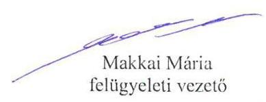

---

# RÖVIDÍTÉSEK JEGYZÉKE 

${ }^{1}$ Közgyűlés
${ }^{2}$ Társaság
${ }^{3}$ ÁSZ
${ }^{4}$ DV Zrt.
${ }^{5}$ Ötv.
${ }^{6}$ Mótv.
${ }^{7}$ Gt tv.
${ }^{8}$ Ptk.
${ }^{9}$ Alapító Okirat
${ }^{10}$ Taktv.
${ }^{11}$ Számv. tv.
${ }^{12}$ Média tv.
${ }^{13}$ Eisztv.
${ }^{14}$ Info tv.
${ }^{15}$ Avtv.
${ }^{16}$ Ebktv.

Debrecen Megyei Jogú Város Önkormányzatának Közgyűlése
Debrecen Városi Televízió Kft.
Állami Számvevőszék
Debreceni Vagyonkezelő Zrt.
a helyi önkormányzatokról szóló 1990. évi LXV. törvény (hatálytalan: 2014. október 12-től)
Magyarország helyi önkormányzatairól szóló 2011. évi CLXXXIX. törvény (hatályos: 2012. január 1-jétől)
a gazdasági társaságokról szóló 2006. évi IV. törvény (hatálytalan: 2014. március 15-től)
a Polgári Törvénykönyvről szóló 2013. évi V. törvény (hatályos: 2014. március 15-től)
a Debrecen Városi Televízió Kft. 1993. április 22-én kelt, többször módosított alapító okirata
a köztulajdonban álló gazdasági társaságok takarékosabb müködéséről szóló 2009. évi CXXII. törvény
a számvitelről szóló 2000. évi C. törvény
a médiaszolgáltatásokról és a tömegkommunikációról szóló 2010. évi CLXXXV. törvény
az elektronikus információszabadságról szóló 2005. évi XC. törvény (hatályos: 2011. december 31-ig)
az információs önrendelkezési jogról és az információszabadságról szóló 2011. évi CXII. törvény (hatályos: 2011. július 27-től)
a személyes adatok védelméről és a közérdekú adatok nyilvánosságáról szóló 1992. évi LXIII. törvény (hatályos 2011. december 31-éig)
az egyenlő bánásmódról és az esélyegyenlőség előmozdításáról szóló 2003. évi CXXV. törvény

---

ÁLLAMI SZÁMVEVŐSZÉK
1052 Budapest, Apáczai Csere János utca 10.
Levélcím: 1364 Budapest 4. Pf. 54
Telefon: +36 14849100 Telefax: +36 14849200
www.asz.hu