# Jelentés 

## Megyei hatókörú városi múzeumok ellenőrzése

Herman Ottó Múzeum, Miskolc 2017.

---

# Jelențtés 

## Megyei hatókörü városi múzeumok ellenőrzése

Herman Ottó Múzeum, Miskolc
2017. fobmar hó ol nap
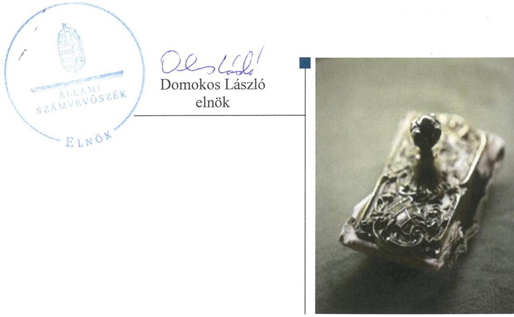

---

# AZ ELLENŐRZÉST FELÜGYELTE: 

PETŐ KRISZTINA felügyeleti vezető

## AZ ELLENŐRZÉST VEZETTE ÉS A VÉGREHAJTÁSÁÉRT FELELŐS:

BREBÁN ANDREA ellenőrzésvezető
KAKAS SÁNDOR ellenőrzésvezető

A PROGRAM ÖSSZEÁLLÍTÁSÁÉRT FELELŐS:
JANIK JÓZSEF LÁSZLÓ osztályvezető

IKTATÓSZÁM: V-0951-191/2016.
TÉMASZÁM: 1985
ELLENŐRZÉS-AZONOSÍTÓ SZÁM: V073706

---

# TARTALOMJEGYZÉK 

■ ÖSSZEGZÉS ..... 5
■ AZ ELLENŐRZÉS CÉLJA ..... 7
■ AZ ELLENŐRZÉS TERÜLETE ..... 8
■ AZ ELLENŐRZÉS HÁTTERE, INDOKOLTSÁGA ..... 10
■ A JELENTÉS LÉNYEGES KÉRDÉSKÖREI ..... 12
■ ELLENŐRZÉS HATÓKÖRE ÉS MÓDSZEREI ..... 13
■ MEGÁLLAPÍTÁSOK ..... 16
■ JAVASLATOK ..... 34
■ MELLÉKLETEK ..... 39
I. sz. melléklet: Értelmező szótár ..... 39
II. sz. melléklet: Az integritás érvényesítése érdekében kialakított és múködtetett kontrollrendszer ..... 42
■ FÜGGELÉK: ÉSZREVÉTELEK ..... 43
■ RÖVIDÍTÉSEK JEGYZÉKE ..... 83

---

.

---

# ÖSSZEGZÉS 

A miskolci székhelyű Herman Ottó Múzeumra vonatkozó irányító szervi feladatellátás öszszességében szabályszerű volt. A Múzeumnál kialakított irányítási rendszer nem biztosította az átlátható, elszámoltatható és ellenőrizhető közpénzfelhasználást. A 2011. évi pénzügyiés vagyongazdálkodás ellenőrzése a szükséges dokumentumok hiánya miatt nem volt végrehajtható. A Múzeum 2012-2014. években pénzügyi- és vagyongazdálkodása nem volt szabályszerű. A Múzeum közfeladatának részét képező kulturális javak nyilvántartásáról nem gondoskodtak, a kulturális javak állományvédelme a kölcsönzéseknél nem volt biztosított.

## Az ellenőrzés társadalmi indokoltsága

Az Állami Számvevőszék Stratégiájának alapértéke, hogy ellenőrzései segítik az integritás alapú, átlátható és elszámoltatható közpénzfelhasználás megteremtését. Az ellenőrzés jogszabályban, vagy alapító okiratban meghatározott közfeladat ellátására létrejött, a megyei hatókörű városi muzeális intézmények gazdálkodási tevékenységére terjed ki. E szervezetek pénzügyi és vagyongazdálkodásának alapvető rendeltetése a közfeladatok (a kulturális örökséghez tartozó javak védelme, őrzése és a nyilvánosság számára történő hozzáférhetővé tétele) ellátásának biztosítása.

A megyei hatókörű városi múzeumként működő szervezetek 2011. évtől több alkalommal jelentős szervezeti és gazdálkodási átalakuláson mentek keresztül. A tulajdonosi, a vagyonkezelői és a fenntartói szerepekben, szerkezetben történt változások előkészítése, végrehajtása, illetve a múzeumi rendszer által kezelt közvagyonnal való gazdálkodás szabályszerűségének bemutatásával az ellenőrzés hozzájárul a múzeumok fenntartási és működtetési feladatainak ellátására vonatkozó megfelelő jogszabályi környezet kialakításához, a gazdálkodási gyakorlatuk javításához.

## Főbb megállapítások, következtetések

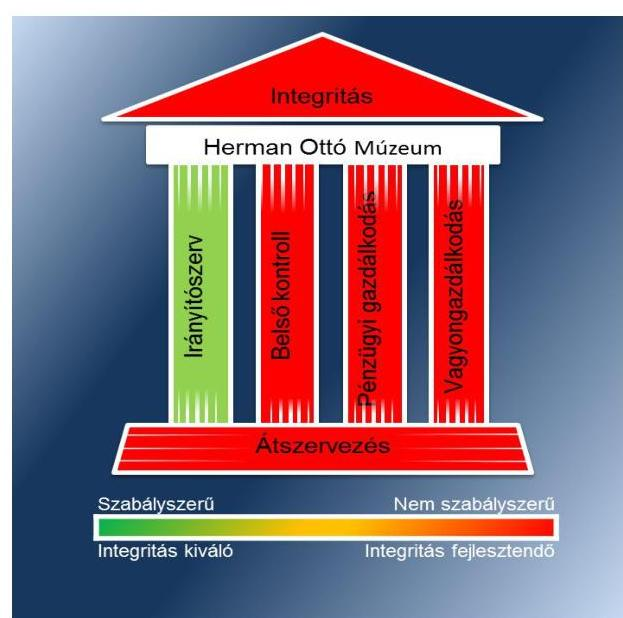

Az irányító szervek a Múzeumra vonatkozóan az ellenőrzött időszakban összességében szabályszerűen gyakorolták jogosultságaikat.

A Múzeumnál kialakított irányítási rendszer összességében nem biztosította az átlátható, elszámoltatható és ellenőrizhető közpénzfelhasználást. A Múzeum belső kontrollrendszerének kialakítása és működtetése nem felelt meg a jogszabályi előírásoknak. A kontrollkörnyezet kialakítása részben volt szabályszerű a 2012-2014. években, mert nem határozták meg az etikai elvárásokat a szervezet minden szintjén. A 2013-2014. években hatályos számviteli politikák nem tartalmazták, hogy mit kell a számviteli elszámolás, az értékelés szempontjából nem lényegesnek tekinteni. A 2011. évben az egyes kockázatokkal kapcsolatos intézkedések és megtételük módját, a 2012. évben pedig az egyes kockázatokkal kapcsolatban a szükséges intézkedéseket, valamint a kockázatok kezelése érdekében szükséges intézkedések teljesítésének folyamatos nyomon követési módját nem határozták meg. A 2011. években a kockázati tényezők figyelembe vételével kockázatelemzést nem végeztek, továbbá a 2012-2014. években a Múzeumnál kockázatkezelési rendszert nem működtettek. Az információs és kommunikációs folyamatok kialakítása során a 2011-2014. közötti időszakban a jogszabályban előírt közzétételi kötelezettségnek nem tettek eleget. A monitoring rendszer részeként a Múzeumnál 2011-2012. években belső ellenőrzést nem végeztek.

---

A Múzeum 2011. évi pénzügyi- és vagyongazdálkodási tevékenységének ellenőrzése során a számvevőszéki ellenőrzés ellenőrzési program szerinti lefolytatásához szükséges 2011. II-IV. negyedévi dokumentumokat a Szociális és Gyermekvédelmi Főigazgatóság nem bocsátotta az Állami Számvevőszék rendelkezésére. Az ellenőrzési program 2011. évi pénzügyi- és vagyongazdálkodási tevékenység ellenőrzésére vonatkozó része nem volt végrehajtható, az ellenőrzés céljaként meghatározottak a dokumentumok hiánya miatt ezen lényeges kérdéskörök vonatkozásában nem voltak ellenőrizhetők, megválaszolhatók. E mulasztással a Szociális és Gyermekvédelmi Főigazgatóság a 20112014. évekre kiterjedő számvevőszéki ellenőrzés lefolytatását akadályozta. A Múzeum pénzügyi és vagyongazdálkodása a 2012-2014. években nem volt szabályszerű. A 2012-2014. évi beszámolók könyvviteli mérleg tételeket leltárral nem támasztották alá. A 2012. évben jogalap nélkül az állami tulajdonú vagyontárgyak hasznosítására vagyonhasznosításra feljogosító szerződés, a 2013-2014. években vagyonkezelési szerződés nélkül került sor. A régészeti feltárási tevékenység bevételeinek elszámolását, jogszerűségét a jogszabályban előírt tartalmú szerződés nem minden esetben támasztotta alá. A nemzeti vagyonba tartozó kulturális javak nyilvántartása nem felelt meg a jogszabályi előírásoknak. A pénzügyi gazdálkodás szabályossága sérült a 2012. évi költségvetés tervezésekor, a szabálytalanul aláírt költségvetés összeállításával. A kölcsönzési tevékenységre az esetek jelentős hányadában a jogszabályi előírások ellenére nem írásbeli szerződés, illetve kölcsönzési szerződés, hanem a múzeumigazgató írásos kölcsönzési engedélye, vagy átadás-átvételi elismervény alapján került sor. A jogszabályi előírás ellenére a 2014. május 10. napját követően kötött kölcsönzési szerződésekhez a kölcsönkérő a kulturális javak elhelyezésére vonatkozó elhelyezési dokumentációt nem készített. A kölcsönzési szerződésekben, engedélyekben nem rögzítették minden esetben a kölcsönzött kulturális javaknak biztosítandó állományvédelmi követelményeket. A nem muzeális intézmények részére történő kölcsönzéshez több esetben a Múzeum nem rendelkezett a miniszter hozzájárulásával.

A Múzeumot érintő szervezeti, szerkezeti átszervezések végrehajtása nem volt szabályszerű, nem volt biztosított az átláthatóság. A 2011/2012. évi átszervezés során nem kerültek teljes körűen átadásra az eszköz és vagyonleltárról szóló dokumentumok, a vagyonleltár az ingatlanvagyon, az ingó vagyon, a szellemi termékek tekintetében. Az átszervezéshez kapcsolódó számviteli feladatokat hiányosan hajtották végre, a mérlegtételek alátámasztásához leltárt nem készítettek. A 2012/2013. évi központi alrendszerből önkormányzati alrendszerbe történő átszervezés során a beszámoló mérlegét leltárral nem támasztották alá.

A Múzeum intézkedett az integritás szemlélet érvényesítése érdekében, azonban további erőfeszítések szükségesek az integritás kontrollrendszer fejlesztése érdekében.

---

# AZ ELLENŐRZÉS CÉLJA 

vényesülését a gazdálkodási folyamatokban.

Az ellenőrzés célja annak megállapítása volt, hogy a megyei múzeumi rendszer átalakítása, az intézményfenntartói rendszerben végbement változások előkészítése és végrehajtása megalapozottan, szabályszerűen történt-e; a megyei hatókörű városi múzeumok és jogelődjeik pénz-ügyi- és vagyongazdálkodása, a belső kontrollrendszer kialakítása és működtetése, valamint az intézményfenntartói feladatok ellátása szabályszerűen történt-e.

A Múzeum ${ }^{1}$ korrupcióval szembeni veszélyeztetettségének csökkentése érdekében kért tanúsítványi adatszolgáltatás alapján az ÁSZ² értékelte az integritási szemlélet ér-

---

# **AZ ELLENŐRZÉS TERÜLETE**

### **Herman Ottó Múzeum**

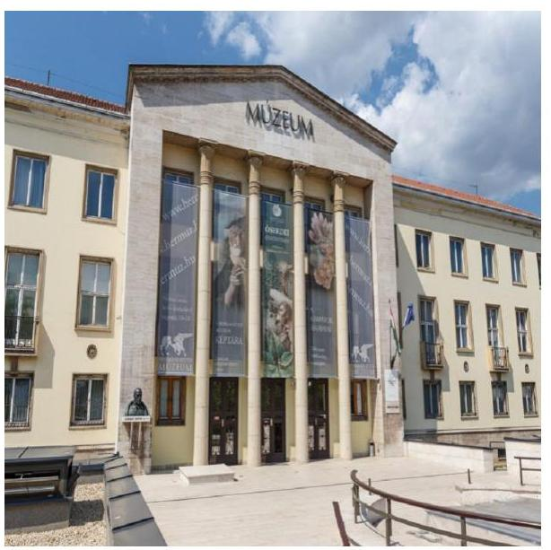

A Múzeum Miskolcon található, feladatkörében az Mtv.^{3} alapján gondoskodik a kulturális javak meghatározott anyagának folyamatos gyűjtéséről, nyilvántartásáról, megőrzéséről és restaurálásáról; tudományos feldolgozásáról, publikálásáról; valamint kiállításokon és más módon történő bemutatásáról; a közművelődési és közgyűjteményi feladatok ellátásáról. A Kötv.^{4} 20. § (2) bekezdése alapján területileg illetékes múzeumként régészeti feltárást végzett az ellenőrzött időszakban.

A Múzeum csak a működési engedélyében meghatározott gyűjtőkörben és gyűjtőterületen folytathatja tevékenységét. A szakmai besorolást, a rendszert megalapozó szaktörvényi kereteket az Mtv. biztosítja. Az Mtv. hatálya kiterjed a Múzeum fenntartóira, a Múzeumban foglalkoztatottakra, a kulturális örökség Múzeumban őrzött elemeire, a szolgáltatások igénybe vevőire és a kulturális örökséggel foglalkozó egyéb szervezetekre.

A Múzeum 2011. évi költségvetési engedélyezett létszáma 165 fő volt, ami 2012. évre 121 főre csökkent, majd a 2013. évi 89 főről a 2014. évre 105 főre nőtt. A Múzeum alkalmazottainak foglalkoztatására a Kjt.^{5} alapján került sor. Az ellenőrzött időszakban a múzeumigazgató^{6} és a gazdasági vezető személye is változott.

A Möktv.^{7} és annak végrehajtásáról szóló 258/2011. (XII. 7.) Korm. rendelet^{8} alapján 2012. január 1-jétől a megyei múzeumok központi költségvetési szervekké váltak. 2013. január 1-jétől a 2012. évi CLII. törvény^{9}, valamint az 1311/2012. (VIII. 23.) Korm. határozat^{10} alapján az állami tulajdonba és fenntartásba került megyei múzeumi szervezetek a megyeszékhely megyei jogú városok fenntartásába működnek tovább.

A 2011–2014. évek között a fenntartói, irányítói, középirányítói jogkörgyakorlók változását, valamint a Múzeum gazdálkodási feladatát ellátó szervezetét az 1. táblázat mutatja be:

^{1} táblázat

|  Időszak | Fenntartó | Irányító szerv | Középirányító szerv | Gazdasági szervezet  |
| --- | --- | --- | --- | --- |
|  2011. | BAZMÓ^{11} | BAZMÓ Közgyűlése | - | Múzeum, BAZM Ellátó Szervezet^{12}  |
|  2012. | BAZMIK^{13} | KIM^{14} | BAZMIK | BAZMIK  |
|  2013–2014. | Miskolc MIVÓ^{15} | Miskolc MIVÓ Közgyűlése | - | Múzeum  |

*Forrás: A Múzeum alapító okiratai*

---

A Múzeum jogelődjének, a Borsod-Abaúj-Zemplén Megyei Múzeumok Igazgatóságának jogállása 2011. I. negyedévben önállóan működő és gazdálkodó, önálló jogi személyiséggel rendelkező költségvetési intézmény volt, 2011. április 1-jétől 2012. december 31-ig a Múzeum jogállása önállóan működő, önálló jogi személyiséggel rendelkező költségvetési intézmény volt. 2013. január 1-jétől a Múzeum önállóan működő és gazdálkodó költségvetési szerv volt, 2014. január 1-jétől önálló jogi személyiséggel rendelkező költségvetési intézmény, saját gazdasági szervezettel működő megyei hatókörű városi múzeum, vállalkozási tevékenységet nem végzett. A Múzeum teljesített költségvetési bevételeinek és kiadásainak alakulását az 1. ábra mutatja be.
1. ábra
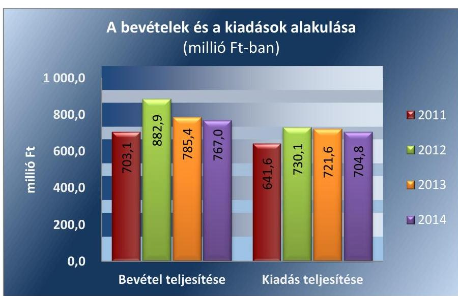

Forrás: 2011. év a Kincstár KGR rendszerének beszámoló adatai és a 2012-2014. évi beszámolók

A 2015. évi LXXV. tv. ${ }^{16}$ 1. § (1) bekezdése alapján az Nvtv. ${ }^{17}$ 13. § (3) bekezdésében és 14. § (1) bekezdésében foglaltak alapján és az abban meghatározott feltételekkel a 2012. évi CLII. törvény 30. § (1) és (2) bekezdésében meghatározott, a megyei hatókörű városi múzeumok feladatának ellátását szolgáló egyes állami tulajdonban lévő ingatlanok a törvény hatálybalépésének napjával, a törvény erejénél fogva a kötelező közfeladatként a megyei hatókörű városi múzeumot fenntartó önkormányzatok tulajdonába kerültek. A 2015. évi LXXV. tv. 4. § (1) bekezdése alapján a kulturális örökség helyi védelme érdekében a megyei hatókörű városi múzeumok alapleltárában és jogszabály szerinti külön nyilvántartásában szereplő állami tulajdonú kulturális javak ingyenesen a megyei hatókörű városi múzeumok vagyonkezelésébe kerültek. A vagyonkezelők vagyonkezelői joga tekintetében vagyonkezelési szerződés megkötése nem szükséges. A 2015. évi LXXV. tv. 4. § (2) bekezdése szerint továbbá a kulturális örökség helyi védelme érdekében a megyei hatókörű városi múzeumok feladatának ellátását szolgáló állami tulajdonban álló ingatlanok - a törvény mellékletében meghatározott ingatlanok kivételével - ingyenesen a fenntartó önkormányzatok vagyonkezelésébe kerültek.

---

# AZ ELLENŐRZÉS HÁTTERE, INDOKOLTSÁGA 

Az Alaptörvény ${ }^{18}$ rendelkezése szerint a nemzeti vagyon megőrzésének, védelmének és a nemzeti vagyonnal való felelős gazdálkodásnak a követelményeit sarkalatos törvény, az Nvtv. rögzíti. A tulajdonosi joggyakorlás és vagyonkezelés általános és speciális szabályait, az állami vagyon nyilvántartására és elszámolására vonatkozó eljárásokat, a vagyonkezelési szerződés feltételrendszerét, valamint az éves beszámoló készítési és könyvvezetési kötelezettségeket kormányrendelet írja elő.

A megyei hatókörű városi múzeumok közfeladat-ellátásának változásait, (beleértve az állami tulajdonosi joggyakorló, intézményi vagyonkezelő és önkormányzati fenntartó szervezeteket is) a közfeladatok átadásából és átvételéből adódó módosításait, előirányzat gazdálkodására ható tényezőit az Áht. ${ }^{19}$, az Ávr. ${ }^{20}$, a Möktv., valamint az Mtv. írja elő. A múzeumi intézményrendszer átalakulásából megszűnéséből, intézmény átszervezéséből, belső szerkezeti korszerűsítéséből, vagy más hasonló okból adódó módosításai miatt szerepeltetendő szerkezeti változásokat, valamint a szerkezeti változásként beépült közfeladatok szintre hozásként történő számításba vételét az Ávr. határozza meg.

Az ellenőrzés - tekintettel a megyei hatókörű városi múzeumokat (és jogelődjeit) rövid időn belül, gyors ütemben ért környezeti (tulajdonosi, fenntartói-szerkezetet érintő) változásokra - javaslatok megfogalmazásával hozzájárul a fenntartás és működtetés feladatainak ellátására vonatkozó megfelelő jogszabályi környezet - jogalkotók által történő - kialakításához.

A megyei hatókörű városi múzeumok kulturális szempontból meghatározó jelentőségűek mind földrajzi elhelyezkedésüket, mind az ellátott feladatokat, valamint a látogatottságukat tekintve. Tevékenységüket törvényi szinten (Mtv.) szabályozták a jogalkotók. A megyei hatókörű városi múzeumok jelenlegi körének kialakításában, tulajdonosi és fenntartói szerkezetében rövid idő alatt több jelentős változás történt, amelyeket jogszabályi változások indukáltak. Ezen intézmények szakmai besorolásukat tekintve a 2011. évben megyei múzeumként, a 2012. évben megyei múzeumi központi költségvetési szervezetként, a 2013. évtől kezdődően megyei hatókörű városi múzeumként működtek. A szakmai besorolások változásait párhuzamosan követték a tulajdonosi, vagyonkezelői, fenntartói szerepekben történt változások.

A 2011-2014. évek között bekövetkezett fenntartói változás a vagyontárgyak és a kulturális javak tulajdonosi, vagyonkezelői és használói körében is változást indukáltak, amelyet a 2. táblázat szemléltet.

---

| A VAGYON TULAJDONOSI, VAGYONKEZELŐI ÉS HASZNÁLÓI KÖRÉNEK VÁLTOZÁSA 2011-2014. ÉVEKBEN |  |  |  |  |  |  |  |  |  |
| :--: | :--: | :--: | :--: | :--: | :--: | :--: | :--: | :--: | :--: |
| Vagyon-   tárgy | tulajdonos | 2011. év   vagyon-   kezelő | használó | tulajdonos | 2012. év   vagyon-   kezelők | használó | tulajdonos | 2013-2014. évek   vagyon-   kezelő | használó |
| Ingatlan | BAZMÖ | - | Múzeum | Állam | BAZMIK | Múzeum | Állam | Múzeum | Múzeum |
| Egyéb   tárgyi   eszköszök | BAZMÖ | - | Múzeum | Állam | BAZMIK | Múzeum | Állam | Múzeum | Múzeum |
| Kulturális   javak | BAZMÖ | - | Múzeum | Állam | BAZMIK | Múzeum | Állam | Múzeum | Múzeum |

Forrás: a Múzeum alapító okiratai, a 2012. évi CLII. tv, a 258/2011. (XII. 7) Korm. rendelet, az 1311/2012. (VIII. 23.) Korm. határozat

AZ ELLENŐRZÉS EREDMÉNYEKÉPPEN javul az ellenőrzött intézmények gazdálkodása, átfogó képet kapunk a múzeumok gazdálkodásának hiányosságairól, de a jó gyakorlatokról is. Ellenőrzéseivel, javaslataival és megállapításaival az ÁSZ elősegíti a költségvetési szervek pénzügyi és vagyongazdálkodása szabályozásának javítását és hozzájárul a jó kormányzáshoz.

---

# A JELENTÉS LÉNYEGES KÉRDÉSKÖREI 

1.     - Az irányító szerv Múzeumra vonatkozó feladatellátása szabályszerű volt-e?
2.     - Szabályszerüen hajtották-e végre a Múzeumot érintő szervezeti, szerkezeti átszervezéseket?
3.     - A belső kontrollrendszer kialakítása és müködtetése megfelelt-e a jogszabályi előírásoknak?
4.     - A Múzeum pénzügyi gazdálkodása szabályszerű volt-e?
5.     - A Múzeum vagyongazdálkodása szabályszerű volt-e?
6.     - A Múzeum intézkedett-e az integritás szemlélet érvényesitése érdekében?

---

# ELLENŐRZÉS HATÓKÖRE ÉS MÓDSZEREI 

## Az ellenőrzés típusa

Megfelelőségi ellenőrzés.

## Az ellenőrzött időszak

Az ellenőrzött időszak 2011. január 1-jétől 2014. december 31-ig tart.

## Az ellenőrzés tárgya

A megyei hatókörű városi múzeumok átszervezése, átalakítása előkészítése és lebonyolítása megalapozottsága, szabályszerűsége, a pénzügyi és vagyongazdálkodási tevékenység, a belső kontroll rendszer kialakítása, működtetése szabályszerűsége, valamint az irányító szervi feladatok ellátása szabályszerűsége. E tevékenységek és a kapcsolódó adatok és információk összessége, amelyeket a vonatkozó kritériumok alapján kell értékelni.

Az ellenőrzés kiterjed minden olyan körülményre és adatra, amely az ÁSZ jogszabályban meghatározott feladatainak teljesítéséhez, valamint a program végrehajtása folyamán felmerült újabb összefüggések feltárásához szükséges.

## Az ellenőrzött szervezet

A Herman Ottó Múzeum (és jogelődje a Borsod-Abaúj-Zemplén Megyei Múzeumi Igazgatóság), a fenntartói feladatokban érintett Borsod-AbaújZemplén Megyei Önkormányzat, valamint Miskolc Megyei Jogú Város Önkormányzata, a Borsod-Abaúj-Zemplén Megyei Intézményfenntartói Központ jogutódja a Szociális és Gyermekvédelmi Főigazgatóság.

Az ellenőrzésre a költségvetési szerv ellenőrzött intézményének és irányító/felügyeleti szervének, illetve középirányító szervének székhelyén, a gazdálkodási feladatait ellátó szervezetének székhelyén került sor.

## Az ellenőrzés jogalapja

Az ÁSZ tv. ${ }^{21}$ 1. § (3) bekezdés, 5. § (2)-(6) bekezdései, valamint az Áht. ${ }_{2}$ 61. § (2) bekezdése.

---

# Az ellenőrzés módszerei 

Az ellenőrzést az ellenőrzési program szempontjai, az ellenőrzött időszakban hatályos jogszabályok, az ellenőrzés szakmai szabályai, az egyes ellenőrzési típusokhoz kapcsolódó ÁSZ módszertanok és nemzetközi standardok figyelembe vételével végezzük. A gazdálkodás hibáinak kijavítására, a közpénzekkel való felelős gazdálkodás segítésére irányuló javaslatok kidolgozásakor a hatályos jogszabályok az irányadóak.

Az ellenőrzési kérdések megválaszolásához szükséges bizonyítékok megszerzése a következő ellenőrzési eljárások alkalmazásával történik: mint az összehasonlítás, a kérdésfeltevés (információkérés), a mintavételezés, valamint az elemző eljárás. A minták kiválasztása során véletlen mintavételi eljárást alkalmazunk.

Az ellenőrzési bizonyítékként felhasználható adatforrások közé tartoznak egyrészt a szakmai program részletes szempontjainál felsorolt adatforrások, másrészt adatforrás lehet minden egyéb - az ellenőrzés folyamán feltárt, az ellenőrzés szempontjából releváns információt tartalmazó - dokumentum.

Az ellenőrzés lefolytatásához az intézmény a tanúsítványok elektronikus kitöltésével, valamint az ÁSZ által kért dokumentumok elektronikus megküldésével szolgáltat adatokat. A rendelkezésre bocsátott adatok, információk kontrollja az ellenőrzés keretében történik.

Az ellenőrzési kérdésekre adott válaszok alapján értékeljük, hogy az ellenőrzött időszakban az irányító szerv az ellenőrzött intézményre vonatkozó feladatainak szabályszerűen eleget tett-e, az intézmény pénzügyi és vagyongazdálkodása megfelelt-e az előírásoknak, az intézmény átalakításának vagy átszervezésének végrehajtása szabályszerű volt-e.

Az intézmény belső kontrollrendszere jogszabályi előírások szerinti kialakításának és működtetésének szabályszerűségét az erre irányuló ellenőrzési kérdésekre adott válaszok összesítése alapján, évente pillérenként (kontrollkörnyezet, kockázatkezelési rendszer, kontrolltevékenységek, információs és kommunikációs rendszer, monitoring rendszer) és összesítetten is minősítjük. Az intézmény belső kontrollrendszere egyes pilléreinek kialakítása és működtetése „szabályszerü", amennyiben az értékelt területen az elért és elérhető pontok százalékban kifejezett, egész számra kerekített hányadosa meghaladja a 84\%-ot, „részben szabályszerű", ha a 84\%ot nem haladja meg, de 60\%-nál nagyobb, „nem szabályszerű", ha nem haladja meg a 60\%-ot. Az intézmény belső kontrollrendszerének összesített értékelése megegyezik a pillérenként (kontrollterületenként) alkalmazott \%-os értékelésekkel, a következő eltérésekkel. A kontrollrendszer egésze esetében a „szabályszerű" értékelésnek a \%-os értéken felül további feltétele, hogy egyik kontrollterület sem kaphat „nem szabályszerű" értékelést, a „részben szabályszerű" értékelés további feltétele, hogy legfeljebb egy ellenőrzött kontrollterület lehet „nem szabályszerű" értékelésű. Az összesített értékelés a \%-os értéktől függetlenül „nem szabályszerű", ha az ellenőrzött kontrollterületek közül több mint egynek „nem szabályszerű" az értékelése.

Mintavétellel ellenőriztük a bevételek, a személyi juttatások, dologi és felhalmozási és régészeti feltáráshoz kapcsolódó kiadások, valamint a kul-

---

turális javak kölcsönzésének szabályszerűségét. A minta alapján a sokaságban előforduló hibaarányt becsültük. „Megfelelőnek" értékeltük az ellenőrzött területet, amennyiben 95\%-os bizonyossággal a teljes sokaságban a hibaarány legfeljebb 10\%, „részben megfelelőnek" értékeltük, ha a hibaarány felső határa 10-30\% között volt, „nem megfelelőnek" pedig akkor, ha a mintavételi eredmények alapján a sokaságbeli hibaarány felső határa meghaladta a 30\%-ot.

Az integritás szemlélet érvényesülésének értékelése a tanúsítványi adatszolgáltatás alapján történt.

---

# 1. Az irányító szerv Múzeumra vonatkozó feladatellátása szabályszerű volt-e? 

Összegző megállapítás

Az irányító szerv ${ }_{1-3}{ }^{22}$ Múzeumra vonatkozó feladatellátása összességében szabályszerű volt.

A Múzeum 2011-2014. években hatályos alapító okirat ${ }_{1-8}{ }^{23}$ tartalma megfelelt az Áht. ${ }_{1}{ }^{24}$-ben, valamint az Ávr.-ben előírt tartalmi követelményeknek. Az alapító okiratot, annak módosításakor az Ámr. ${ }^{25}$ és az Ávr. előírásainak megfelelően minden esetben egységes szerkezetbe foglalták. A múzeumigazgatót a 2012. évben a jogszabályi előírásoknak megfelelően nevezték ki, a szükséges miniszteri írásbeli egyetértés beszerzése mellett. A kinevezés során betartották az Mtv.-ben meghatározott szakmai képesítési követelményeket. A gazdasági vezető megbízására 2012. évben a Múzeum pénzügyi-gazdálkodási feladatait ellátó BAZMIK-nél, 2013-ban az önállóan működő és gazdálkodási jogkörrel rendelkező Múzeumnál került sor az irányító szerv vezetője által az Áht. ${ }_{1,2}$ előírásainak figyelembevételével, a gazdasági vezető rendelkezett a jogszabályban előírt végzettséggel és jogosító engedéllyel.

Az egyéb irányítási, felügyeleti és ellenőrzési jogosultságok gyakorlása nem volt szabályszerű, mivel
$\longrightarrow$ a működési engedélyek módosításához a 2012. évben a 2/2010. (I. 14.) OKM rendelet ${ }^{26}$ 11. § (2) bekezdés g)-j) pontok előírása ellenére nem csatolták az előírt nyilatkozatokat;
$\longrightarrow$ az irányító szerv ${ }_{1,2}$ a Múzeum közfeladat ellátására, az erőforrásokkal való szabályszerű és hatékony gazdálkodáshoz szükséges követelményeket a 2011-2012. években az Áht. ${ }_{1} 49 . \S$ (5) bekezdés f) pontjában, illetve az Áht. ${ }_{2}$ 9. § (1) bekezdés f) pontjában foglaltak ellenére nem érvényesítette, szabályozás hiányában;
$\longrightarrow$ a Múzeum kezelésében lévő közérdekű adatokat és közérdekből nyilvános adatokat, valamint az Áht. ${ }_{2}$-ben az irányítási jogkörök gyakorlásához szükséges, törvényben nevesített személyes adatokat a 2012. évben az Áht. ${ }_{2}$ 9. § (1) bekezdés j) pontjában előírtak ellenére nem kezelte az irányító szerv ${ }_{2}$;
$\longrightarrow$ a közérdekű és közérdekből nyilvános adatok kötelező, illetve igényre történő szolgáltatásának végrehajtását nem ellenőrizte az iránytó szerv ${ }_{1}$ a 2011. évben Áht. ${ }_{1} 49 . \S$ (5) bekezdés e) pontjában, a középirányító szerv a 2012. évben a 258/2011. (XII. 7.) Korm. rendelet 11. § (2) bekezdés c) pontjában foglaltak ellenére.

---

# 2. Szabályszerűen hajtották-e végre a Múzeumot érintő szervezeti, szerkezeti átszervezéseket? 

Összegző megállapítás

2.1. számú megállapítás

A Múzeumot és tagintézményeit érintő szervezeti, szerkezeti átszervezések végrehajtása nem volt szabályszerű, nem volt biztosított az átláthatóság.

A Múzeumot érintő önkormányzati alrendszerből a központi alrendszerbe történő 2012. január 1-jétől hatályos irányító szervi (fenntartói) váltás végrehajtása nem volt szabályszerű, az átláthatóság nem volt biztosított.

Az átadás-átvétel előkészítésére a Möktv. 6. § (1)-(2) bekezdései alapján megjelölt átadás-átvételi bizottság működése eredményeként az átadásátvételi megállapodást megkötötték a Möktv. 2. § (4) bekezdésében meghatározott személyek. A megállapodás megkötésére az átadó és átvevő között a Möktv. 6. § (3) bekezdésének előírása szerinti határidőig sor került.

Az átadás-átvételi megállapodás ${ }_{1}-t^{27}$ a jogutódláshoz kapcsolódó feladat és vagyon átadás-átvételéhez a 258/2011. (XII. 7.) Korm. rendelet 12. § (1) bekezdés szerint, de a Korm. rendelet 1. melléklet III. és IV. rész előírásaitól eltérően, hiányosan készítette el a fenntartó ${ }_{1}{ }^{28}$, a fenntartó ${ }_{2}$ megállapodás hiányosságait nem kifogásolva írta azt alá. A 258/2011. (XII. 7.) Korm. rendelet 1. mellékletének előírása ellenére nem kerültek átadásra
$\longrightarrow$ vagyoni értékű jogokról szóló dokumentumok a III. rész e) pontja;
$\longrightarrow$ az intézmény költségvetési helyzetéről és a 2011. évi költségvetés végrehajtásáról szóló dokumentumok a III. rész f) pontja;
$\longrightarrow$ az eszköz és vagyonleltárról szóló dokumentumok az ingatlanok és járművek kivételével a III. rész e) pontjában foglaltak;
$\longrightarrow$ a 2011. évi normatív támogatás igénylésére, módosítására, lemondására vonatkozó adatok, összegszerűen részletezve a IV. rész 1/3 pontja;
$\longrightarrow$ a IV. rész 1/4. pontjában meghatározott intézményi éves szerződésállományt bemutató, a megállapodás mellékletét képező 6. számú melléklet;
$\longrightarrow$ az átadott ingatlanok műszaki állapotát bemutató műszaki katasztert a IV. rész 1/10. pontja;
$\longrightarrow$ intézmény vagyonleltára ingatlanvagyon tekintetében az ingatlanok könyv szerinti értékének és az utolsó vagyonértékelésének bemutatása az eszközkarton csatolásával a IV. rész 1/11/a) pontban meghatározottak;
$\longrightarrow$ az intézmény vagyonleltára az ingó vagyon tekintetében az eszközkarton csatolásával a IV. rész 1/11/b) pontja;
$\longrightarrow$ a vagyoni értékű jogok (mérleg szerinti érték) a IV. rész 1/11/d) pontja;
$\longrightarrow$ az intézmény vagyonleltára a szellemi termékek tekintetében a IV. rész $1 / 11 /$ e) pontja;

---

$\longrightarrow$ az intézményi költségvetés várható teljesüléséről szóló, 2011. december 31-i fordulónappal készített adatszolgáltatást a IV. rész 1/14. pontja ellenére.
A BAZMÖ a Múzeum működőképessége fenntartása érdekében szükséges azonnali teendők megtételéről nem tájékoztatta írásban a BAZMIK-et az átadás-átvételi megállapodás ${ }_{1}$ aláírását követő 3 munkanapon belül a 258/2011. (XII. 7.) Korm. rendelet 1. melléklet IV. rész 1/15. pontjában rögzítettek ellenére. Az átadás-átvétel során a Számv. tv. 169. § (4) bekezdésében foglaltak ellenére nem rendelkeztek a 2011. évi beszámoló, beszámolót alátámasztó leltár, főkönyvi kivonat, könyvviteli elszámolást közvetlenül és közvetetten alátámasztó számviteli bizonylatok átadásáról és megőrzéséről. Jegyzőkönyv a vagyon tényleges átadásáról a 258/2011. (XII. 7.) Korm. rendelet 12. § (3) bekezdésében foglaltak ellenére a megállapodás aláírását - 2012. június 21. - követő egy héten túl, 2012. november 28-án készült.

Az átszervezéshez kapcsolódó számviteli feladatokat hiányosan hajtották végre. A vagyonátadási jelentés ${ }_{1}-\mathrm{el}^{29}$ és aláírt, hiteles éves beszámolóval az Áhsz. ${ }^{30}$ 13/A. § (1) bekezdésében és a 10. § (1) bekezdésében foglaltak ellenére a Múzeum nem rendelkezett. A beszámoló alátámasztása érdekében az Áhsz. ${ }_{1}$ 50. § (1) bekezdése előírása ellenére nem történt meg a 17. számú mellékletben előírt főkönyvi kivonat összeállítása. A Számv. tv. 69. § (1) bekezdése és az Áhsz. ${ }_{1}$ 37. § (2) bekezdése ellenére a mérlegtételek alátámasztásához leltárt nem készítettek. A szabálytalanságok következtében a 2012. évi nyitó adatok valódisága a 2011. évi beszámoló és záró főkönyvi adatok dokumentumaival - azok hiánya miatt - nem igazolt, így nem volt biztosított a könyvvezetésben és a 2012. évi nyitás során a Számv. tv. 15. § (6) bekezdésében előírt folytonosság elvének érvényesülése.

Vagyonkezelési szerződést a középirányító szerv 2012. október 18-án írta alá, túllépve a 258/2011. (XII. 7.) Korm. rendelet 1. melléklet V. részében meghatározott, a megállapodás aláírásától, de legkorábban 2012. január 1-jétől számított 30 napos határidőt. A vagyonkezelési szerződés a Vtvr. ${ }^{31}$ előírásainak megfelelő tartalommal készült.

# 2.2. számú megállapítás 

A 2013. január 1-jével végrehajtott a központi alrendszerből önkormányzati alrendszerbe történő irányító szervi (fenntartói) váltás lebonyolítását, a szervezetrendszer átalakítását hiányosságokkal és az átláthatóság sérülése mellett hajtották végre.

Az átadás-átvételi megállapodás ${ }_{2}{ }^{32}$ előkészítésének eredményeként a 2012. évi CLII. törvény 30. § (5) bekezdésében megjelölt határidőre 2012. december 14-én a megyei hatókörű városi múzeum átadásáról a megállapodást megkötötték. A megállapodást a 1311/2012. (VIII. 23.) Korm. határozatban foglaltaknak megfelelően a polgármester ${ }^{33}$ és a középirányító szerv vezetője írta alá. A megállapodásban nem rendelkeztek a 2012. évi és a 2012. évet megelőző évekkel kapcsolatos pénzügyi és számviteli dokumentumok megőrzéséről a Számv. tv. 169. § (4) bekezdésben megjelölt megőrzési kötelezettség biztosítása érdekében.

A nem megyeszékhely szerinti tagintézmények 2013. január 1-jei hatállyal a feladat ellátásához rendelkezésre álló személyi, tárgyi és pénzügyi feltételek egyidejű átadásával a működési engedélyükben meghatározott székhely szerint illetékes települési önkormányzatok fenntartásába kerül-

---

tek a 1311/2012. (VIII. 23.) Korm. határozat alapján. Az átszervezés lebonyolításához a középirányító szerv rendelkezett a muzeális intézmények létszámának, valamint a leltárban szereplő kulturális javaknak és egyéb vagyonelemeknek az emberi erőforrások miniszterének egyetértésével történő tagintézményenkénti meghatározásával. Az átadás-átvételi megállapodásokat a középirányító szerv 2012. decemberében az érintett települési önkormányzatokkal megkötötte.

Az átszervezéshez kapcsolódó számviteli feladatokat kisebb szabálytalanságok mellett hajtották végre. A vagyonátadási jelentés ${ }_{2}$ - ${ }^{34}$ az Áhsz. ${ }_{1}$ 13/A (1) bekezdésében foglalt előírást figyelmen kívül hagyva 2012. december 31-i fordulónapra nem készítették el. Az átadás során a 2012. évi beszámoló mérlegében szereplő eszköz adatok leltári alátámasztása nem felelt meg az Áhsz. ${ }_{1}$ 13/A. (5) bekezdésében foglaltaknak (részletezetten az 5.2. pontban). A Számv. tv. 69. § (1) bekezdés szerinti előírásszerű leltár nem készült, a leltár hiányában a mérlegben szereplő befektetett eszköz adatokat analitikus nyilvántartások és főkönyvi kivonatból készített kimutatás adataival, a készletek adatait az analitikus nyilvántartásokból készített kimutatással, a szállító, vevő, aktív és passzív elszámolások állományi adatait leltár-listákkal támasztották alá.

# 3. A belső kontrollrendszer kialakítása és müködtetése megfelel-te a jogszabályi elöírásoknak? 

## Összegző megállapítás

A belső kontrollrendszer kialakítása és müködtetése a 20112014. években nem volt szabályszerű.

A belső kontrollrendszer kialakítása és müködtetése részletes értékelését a 2011-2014. évekre vonatkozóan a 3. táblázat mutatja be.
3. táblázat

A BELSŐ KONTROLLRENSZER KIALAKÍTÁSÁNAK ÉS MŰKÖDTETÉSÉNEK ÉRTÉKELÉSE A 2011-2014. ÉVEKBEN

| Megnevezés | Kontrollkörnyezet | Kockázatkezelési rendszer | Kontrolltevékenységek | Információ és kommunikáció | Monitoring rendszer | Összesen |
| :--: | :--: | :--: | :--: | :--: | :--: | :--: |
| 2011. | nem szabályszerű | nem szabályszerű | nem szabályszerű | nem szabályszerű | nem szabályszerű | nem szabályszerű |
| 2012. | részben szabályszerű | nem szabályszerű | nem szabályszerű | nem szabályszerű | nem szabályszerű | nem szabályszerű |
| 2013. | részben szabályszerű | részben szabályszerű | szabályszerű | nem szabályszerű | nem szabályszerű | nem szabályszerű |
| 2014. | részben szabályszerű | részben szabályszerű | szabályszerű | nem szabályszerű | nem szabályszerű | nem szabályszerű |

Forrás: ÁSZ ellenőrzés megállapításai

---

# 3.1. számú megállapítás 

A kontrollkörnyezet kialakítása a 2011. évben nem volt szabályszerű, a 2012-2014. években részben volt szabályszerű.

A kontrollkörnyezet kialakításának évenkénti értékelését a 2. ábra mutatja be.
2. ábra

| Kontrollkörnyezet | 2011. év önkormányzati alrendszer | 2012. év   központi   alrendszer | 2013. év   önkormányzati alrendszer | 2014. év   öníkormányzati alrendszer |
| :--: | :--: | :--: | :--: | :--: |
| szabályszerű |  |  |  |  |
| részben szabályszerű nem szabályszerű |  |  |  |  |

Forrás: ÁSZ ellenőrzés megállapításai
AZ SZMSZ ${ }_{1,2}{ }^{35}$ a 2011-2012. években nem tartalmazta az Ámr. 20. § (2) bekezdés h) pontjának, valamint az Ávr. 13. § (1) bekezdés g) pontjának előírása ellenére a nevesített munkakörökhöz tartozó hatáskörök gyakorlásának módját helyettesítés rendjét, az ezekhez kapcsolódó felelősségi szabályokat. Az SZMSZ ${ }_{1-3}$ a teljes ellenőrzött időszakban nem rögzítette az Ámr. 20. § (2) bekezdés e) pontjai, valamint az Ávr. 13. § (1) bekezdés e) pontja előírása ellenére a szervezeti egységek, ezen belül a gazdasági szervezet engedélyezett létszámát.

ETIKAI ELVÁRÁSOKAT a szervezet minden szintjén a múzeumigazgató az Ámr. 156. § (1) bekezdés c) pontjában, illetve a Bkr. ${ }^{36}$ 6. § (1) bekezdés c) pontjában foglaltak ellenére nem határozott meg a 20112014. években.

SZÁMVITELI POLITIKÁVAL ${ }^{37}$ a Múzeum a 2011. I. negyedévében rendelkezett. A 2011. II-IV. negyedévekben a múzeumigazgató a Számv. tv. ${ }^{38}$ 14. § (3) bekezdés és az Áhsz. ${ }_{1} 8 . \S$ (13) bekezdés szerinti számviteli politikát nem készítette el. A 2012. évben hatályos számviteli poli-tika ${ }_{2}$-t a munkamegosztási megállapodás ${ }^{39}$-ban rögzítettek alapján a Számv. tv. 14. § (11) bekezdés előírása ellenére 90 napon túl - 2012. július 18-án - a gazdasági szervezet ${ }^{40}$ készítette el és terjesztette ki hatályát a Múzeumra. A 2012-2013. években hatályos számviteli politika ${ }_{2,3}$ nem tartalmazta, a beszerzett, illetve előállított immateriális javak, tárgyi eszközök üzembe helyezése dokumentálási szabályait az Áhsz. ${ }_{1} 8 . \S$ (7) bekezdés előírása ellenére. A Számv. tv. 14. § (4) bekezdésének előírása ellenére 2012ben a számviteli politika ${ }_{2}$ nem tartalmazta, hogy mit kell a számviteli elszámolás, az értékelés szempontjából lényegesnek, nem lényegesnek tekinteni, továbbá a 2013-2014. években hatályos számviteli politika ${ }_{3-4}$ nem tartalmazta, hogy mit kell a számviteli elszámolás, az értékelés szempontjából nem lényegesnek tekinteni. A múzeumigazgató a 2014. évben nem rögzítette a Számv. tv. 14. § (11) bekezdésben foglaltak ellenére, a kulturális javak mérlegben való kimutatásával kapcsolatos szabályokat az Áhsz. ${ }^{41} 10 . \S$ (1) bekezdés szerinti előírás bevezetésére tekintettel a számviteli politika ${ }_{4}$-ben.

SZÁMLARENDDEL a 2011. évben a Számv. tv. 161. § (1) bekezdés ellenére nem rendelkezett a Múzeum. A számlarend ${ }_{1,2}{ }^{42}$ nem tartalmazta a 2012-2013. években az Áhsz. ${ }_{1} 49$. § (3) bekezdésében foglaltak ellenére

---

az analitikus nyilvántartások vezetésének módját, a kapcsolódó főkönyvi nyilvántartásokkal való egyeztetést, a 2014. évben a számlarend; ${ }^{43}$ tartalmazta az Áhsz. ${ }_{2}$ 51. § (3) bekezdés előírásainak megfelelően a részletező nyilvántartások vezetésének módját, azoknak a kapcsolódó könyvviteli és nyilvántartási számlákkal való egyeztetését.

# AZ ESZKÖZÖK ÉS FORRÁSOK ÉRTÉKELÉSI SZABÁLYZATÁT a 2011. II. negyedévtől a 2012. év végéig nem készítették el a Számv. tv. 14. § (5) bekezdés b) pontjában foglaltak ellenére. Szabályzattal ${ }^{44}$ a 2011. I. negyedévben és a 2013-2014. években rendelkezett a Múzeum. A 2013-2014. években a hatályos eszközök és források értékelési szabályzat ${ }_{2-3}$ nem tartalmazta az Áhsz. ${ }_{1}$ 8. § (18) bekezdés és az Áhsz. ${ }_{2}$ 50. § (2) bekezdés c) pont előírása ellenére az egyszerűsített értékelési eljárás alá vont követelések besorolásának elveit, dokumentálásának szabályait.

A LELTÁROZÁSI SZABÁLYZAT ${ }_{1-4}{ }^{45}$ az Áhsz. ${ }_{1,2}$ előírásai alapján elkészült, azonban nem felelt meg a jogszabályi előírásoknak. A 2013. márciusáig hatályos leltározási szabályzat ${ }_{1,2}$ nem tartalmazta a Múzeum által használt, de a mérlegben értékkel nem szereplő immateriális javak, tárgyi eszközök, készletek leltározásának módját az Áhsz. ${ }_{1}$ 37. § (6) és az Áhsz. ${ }_{2}$ 22. § (2) bekezdés b) pontjának előírása ellenére.

A PÉNZKEZELÉSI SZABÁLYZAT ${ }_{1-4}{ }^{46}$ a 2011. I. negyedévre és a 2012-2014. évekre vonatkozóan a Számv. tv előírása alapján elkészült, a jogszabályi előírásoknak megfelelő tartalommal. A Múzeum a 2011. II-IV. negyedévekben pénzkezelési szabályzattal a Számv. tv. 14. § (5) bekezdés d) pontjának előírása ellenére nem rendelkezett.

## AZ ÖNKÖLTSÉGSZÁMÍTÁS RENDJÉRE VONAT-

KOZÓ belső szabályzattal a 2011-2012. években a Számv. tv. 14. § (5) bekezdés előírása ellenére nem rendelkezett a Múzeum. Önköltség-számítási szabályzattal ${ }^{47}$ csak a 2013-2014. években rendelkezett.

A KÖZBESZERZÉSI SZABÁLYZAT ${ }_{1-3}$-AT ${ }^{48}$ a 2011-2014. évekre vonatkozóan elkészítették. A közbeszerzési szabályzat ${ }_{1}$ a Kbt. ${ }_{1}^{49} 6 . \S$ (1) bekezdés előírása ellenére nem tartalmazta a döntéshozatallal kapcsolatos szabályokat. A közbeszerzési szabályzat ${ }_{2,3}$ tartalma megfelelt a Kbt. ${ }_{2}{ }^{50}$-ben előírtaknak.

ELLENŐRZÉSI NYOMVONALAT ${ }^{51}$ és szabálytalanságkezelési eljárásrendet a múzeumigazgató a 2011-2012. évekre vonatkozóan az Ámr. 156. § (2) bekezdés, illetve a Bkr. 6. § (3) bekezdés előírása ellenére nem készített. A nyomvonalat és a szabálytalanságkezelési eljárásrendet a 2013-2014. évekre elkészítették. Az ellenőrzési nyomvonalban a működés folyamatai között az előirányzat módosításokkal kapcsolatosan a felelősségi és információs szinteket és kapcsolatokat, irányítási és ellenőrzési folyamatokat a múzeumigazgató nem szabályozta a Bkr. 6. § (3) bekezdésében foglaltak ellenére.

Egyebekben a gazdasági szervezet ügyrendjét ${ }_{1,2}{ }^{52}$ a 2013. évben létrehozott gazdasági szervezetre vonatkozóan a jogszabályi előírások szerinti tartalommal elkészítették. A gazdálkodás részletes rendjét a 2011. évben

---

a gazdálkodási szabályzat ${ }^{53}$-ban, 2012. évben munkamegosztási megállapodásban, 2013-2014. években az ügyrend ${ }_{1,2}$-ben határozták meg.

# 3.2. számú megállapítás 

A kockázatkezelési rendszer kialakítása és múködtetése a 20112012. években nem volt szabályszerű, a 2013-2014. években részben szabályszerű volt.

A kockázatkezelés rendszer évenkénti értékelését a 3. ábra mutatja be.
3. ábra

| Kockázatkezelési rendszer | 2011. év önkormányzati alrendszer | 2012. év központi alrendszer | 2013. év önkormányzati alrendszer |
| :--: | :--: | :--: | :--: |
| szabályszerű |  |  |  |
| részben szabályszerű nem szabályszerű |  |  |  |

A kialakított kockázatkezelési rendszer keretében a 2011. és 2012. években a FEUVE ${ }^{54}$ szabályzat, a 2013. és 2014. években a belső kontroll szabályzat ${ }_{1,2}{ }^{55}$ és a kockázatkezelési szabályzat ${ }^{56}$ rögzítette a kockázatok fogalmát, a kockázatok azonosításával, elemzésével, csoportosításával, besorolásával, kezelésével, nyomon követésével, a kockázati kitettség csökkentésével kapcsolatos szabályokat az Ámr. és a Bkr. előírása alapján. A 2011. évben az egyes kockázatokkal kapcsolatos intézkedések és megtételük módját az Ámr. 157. § (3) bekezdés előírása ellenére, a 2012. évben pedig az egyes kockázatokkal kapcsolatban a szükséges intézkedéseket, valamint a kockázatok kezelése érdekében szükséges intézkedések teljesítésének folyamatos nyomon követési módját a Bkr. 7. § (2) bekezdés előírása ellenére nem határozták meg. A múzeumigazgató a vagyonnyilatkozat-tételi kötelezettséget a Vnytv. ${ }^{57}$ 4. § a) pontjában előírása ellenére a 2011. és 2012. években az SZMSZ ${ }_{1,2}$-ben nem rögzítette, a 2013. és 2014. években az SZMSZ ${ }_{3}$-ban a jogszabályi előírásnak megfelelően rögzítette.

A múzeumigazgató a 2011. évben a kockázati tényezők figyelembe vételével kockázatelemzést nem végzett az Ámr. 157. § (1) bekezdésben foglaltak ellenére, a 2012-2014. években a kockázatkezelési rendszert nem múködtette a Bkr. 7. § (1) bekezdés ellenére.

## 3.3. számú megállapítás

A kontrolltevékenység kialakítáása és múködtetése a 2011-2012. években nem volt szabályszerű, a 2013-2014. években szabályszerű volt.

A kontrolltevékenység évenkénti értékelését a 4. ábra mutatja be.
4. ábra

| Kontrolltevékenységek | 2011. év   önkormányzati   alrendszer | 2012. év   központi   alrendszer | 2013. év   önkormányzati   alrendszer | 2014. év   alrendszer |
| :--: | :--: | :--: | :--: | :--: |
| szabályszerű |  |  |  |  |
| részben szabályszerű nem szabályszerű |  |  |  |  |

Forrás: ÁSZ ellenőrzés megállapításai

---

Belső szabályozásban csak a 2013-2014. években határozták meg a Bkr. alapján az engedélyezési, jóváhagyási és kontrolleljárásokat, a dokumentumokhoz és az információkhoz való hozzáférés szabályait és a beszámolási eljárásokat. A gazdálkodási jogkör gyakorlók felhatalmazása és kijelölése nem a jogszabályi előírások és a belső szabályozások szerint történt, a gazdálkodási jogkörök gyakorlásán keresztül végzett kontroll tevékenység nem volt megfelelő (részletesen a 4.4. fejezetben) az ellenőrzött időszakban.

A pénzügyi kihatású döntések célszerűségi, gazdaságossági, hatékonysági és eredményességi szempontú megalapozottsága vonatkozásában a múzeumigazgató nem biztosította a folyamatba épített, előzetes, utólagos és vezetői ellenőrzést a 2011. évben az Áht.; 121/A. § (4) bekezdés b) pontjának, a 2012-2014. években a Bkr. 8. § (2) bekezdés b) pontjának előírásai ellenére. A pénzügyi döntések dokumentumainak elkészítése során a 2011-2012. években a múzeumigazgató nem biztosította a folyamatba épített, előzetes, utólagos és vezetői ellenőrzést az Áht.; 121/A. § (4) bekezdés a) pontjának és a Bkr. 8. § (2) bekezdés a) pontjának előírásai ellenére.

A 2011-2012. évben nem készítettek az adatbiztonságot szolgáló szabályozást az lkr. ${ }^{58} 8$. § (2) bekezdés előírása ellenére, amelyben az adatok biztonságát szolgáló feladatokat, hatásköröket rögzítették, továbbá nem gondoskodtak az iratkezelési szoftver által kezelt adatok biztonságáról az lkr. 8. § (1) bekezdés előírása ellenére.

# 3.4. számú megállapítás 

Az információs és kommunikációs folyamatok kialakítása nem volt szabályszerű a 2011-2014. években.

Az információs és kommunikációs rendszer évenkénti értékelését az 5. ábra mutatja be.
5. ábra

| Információ és kommunikáció | 2011. év önkormányzati alrendszer | 2012. év központi alrendszer | 2013. év   önkormányzati alrendszer |
| :--: | :--: | :--: | :--: |
| szabályszerű |  |  |  |
| részben szabályszerű nem szabályszerű |  |  |  |

A múzeumigazgató nem alakított ki olyan rendszereket, amelyek biztosították, hogy a megfelelő információk a megfelelő időben eljussanak az illetékes szervezethez, szervezeti egységhez, illetve személyhez a 20112012. években az Ámr. 159. § (1) bekezdés, illetve a Bkr. 9. § (1) bekezdés előírása ellenére. A kialakítás a szabályok megalkotásával csak a 20132014. években történt meg a jogszabályi előírásnak megfelelően. A teljes ellenőrzött időszakban
$\longrightarrow$ nem voltak szabályozva a beszámolási módok, valamint 2011-2012ben a beszámolási szintek és határidők az Ámr. 159. § (2) bekezdés, illetve a Bkr. 9. § (2) bekezdés előírása ellenére;
$\longrightarrow$ a közérdekű adatok megismerésére irányuló igények teljesítésének rendjét az Avtv. ${ }^{59}$ 20. § (8) bekezdés, az Info tv. ${ }^{60}$ 30. § (6) bekezdés előírása ellenére nem szabályozták;

---

- a múzeumigazgató az elektronikus közzétételi kötelezettségének a 2011-2014. évi költségvetések tekintetében nem tett eleget az Eitv. ${ }^{61}$ 6. § (1) bekezdése és a mellékletének III. Gazdálkodási adatok 1., illetve az Info tv. 37. § (1) bekezdés és az 1. melléklet III. Gazdálkodási adatok 1. pontjában előírtak ellenére, továbbá a 2012-2014. években az ötmillió forintot elérő vagy azt meghaladó szerződések közzététele tekintetében az Info tv. 1. melléklet III. Gazdálkodási adatok 4. pontjában előírtak ellenére.
A 2011-2013. években nem készítették el az adatvédelmi szabályzatot az Avtv. 31/A. § (3) bekezdés, illetve az Info tv. 24. § (3) bekezdés előírása ellenére. A szabályzatot a 2014. évben elkészítették.

# 3.5. számú megállapítás 

## A monitoring rendszer kialakítása és múködtetése a 2011-2014. években nem volt szabályszerű.

A monitoring rendszer évenkénti értékelését a 6. ábra mutatja be:
6. ábra

| Monitoring rendszer | 2011. év önkormányzati alrendszer | 2012. év központi alrendszer | 2013. év önkormányzati alrendszer |
| :--: | :--: | :--: | :--: |
| szabályszerű   részben szabályszerű   nem szabályszerű |  |  |  |

A Múzeum tevékenységének, a célok megvalósításának nyomon követését biztosító rendszert az Ámr. 160. § (1) bekezdés előírása ellenére a 2011. évben nem működtették, a 2012. évben a Bkr. 10. § előírásai ellenére nem alakították ki. A 2013. évtől a belső kontroll szabályzat ${ }_{1,2}$-ben a Bkr. előírása szerint meghatározták és kialakították a nyomon követését biztosító rendszert. A múzeumigazgató a 2011. évben az Áht. ${ }_{1} 121 /$ A. § (1) bekezdése, a 2012-2014. években a Bkr. 6. § (2) bekezdés előírása ellenére nem adott ki olyan szabályzatokat, nem alakított ki és működtetett olyan folyamatokat a szervezeten belül, amelyek biztosították a rendelkezésre álló források gazdaságos, hatékony és az eredményes felhasználását.

A belső ellenőrzés kialakítása és működtetése nem volt maradéktalanul szabályszerű. A múzeumigazgató, mint a költségvetési szerv vezetője gondoskodott a belső ellenőrzés szervezeti kialakításáról és működéséhez szükséges források biztosításáról. A Múzeum rendelkezett belső ellenőrzési kézikönyvvel. A belső ellenőrök szervezeti és funkcionális függetlenségét biztosították a Ber. ${ }^{62}$ és a Bkr. előírásainak megfelelően. A 2011. évi éves ellenőrzési tervet a múzeumigazgató a Ber. előírásának megfelelően jóváhagyta. A 2012. évi éves ellenőrzési tervet a Bkr. 22. § (1) bekezdés b) pontjának előírása ellenére nem készítette el a belső ellenőrzési vezető.

A Múzeumnál a 2011-2012. években belső ellenőrzést nem végeztek, a múzeumigazgató a belső ellenőrzést nem működtette a 2011. évben az Áht. ${ }_{1}$ 94. § (1) bekezdés e) pontjában, a 2012. évben az Áht. ${ }_{2}$ 70. § (1) bekezdésben foglaltak ellenére. A belső ellenőr a 2013. évben egy ellenőrzést végzett, az erről készített belső ellenőrzési jelentésben megfogalmazott megállapításokra, javaslatokra a Bkr. előírásai figyelembevételével intézkedési tervet, illetve az intézkedési terv végrehajtásáról beszámolót készítettek a jogszabályi előírásnak megfelelően.

---

Az irányító szerv ${ }_{3}$ a Múzeum ellenőrzéséről a 2013-2014. években gondoskodott az Mötv. ${ }^{63}$ előírásának megfelelően.

A belső és külső ellenőrzések által tett megállapításokra és javaslatokra készítettek intézkedési terveket. A belső ellenőrzési vezető a 2013. évtől a Bkr. előírásai figyelembevételével éves bontásban nyilvántartást vezetett a belső ellenőrzésről, amellyel nyomon követte a belső ellenőrzési jelentés alapján megtett intézkedéseket. A külső szervek által végzett ellenőrzésekről a Ber.-ben, valamint a Bkr.-ben előírtak alapján éves bontásban nyilvántartást vezettek.

# 4. A Múzeum pénzügyi gazdálkodása szabályszerű volt-e? 

Összegző megállapítás

## 4.1. számú megállapítás

## 4.2. számú megállapítás

A 2011. évben a Múzeum pénzügyi helyzetének ellenőrzése nem volt végrehajtható. A Múzeum 2012-2014. évi pénzügyi gazdálkodása nem volt szabályszerű.

A Múzeum 2011. évi pénzügyi gazdálkodás ellenőrzése a szükséges dokumentumok hiánya miatt nem volt végrehajtható.

Az ellenőrzéshez szükséges dokumentumok hiánya miatt az ellenőrzési program alapján a Múzeumnál a pénzügyi gazdálkodás ellenőrzése a 2011. évre vonatkozóan nem volt végrehajtható. E mulasztással a Szociális és Gyermekvédelmi Főigazgatóság a 2011-2014. évekre kiterjedő számvevőszéki ellenőrzés lefolytatását akadályozta.

A költségvetés tervezését szabályozási hiányosságok mellett végezték el, a bevételi és kiadási előirányzatok megállapítása, módosítása megfelelt, a maradvány megállapítása és számviteli nyilvántartása nem felelt meg a jogszabályi előírásoknak.

A tervezés feladatait a gazdasági szervezet ügyrend ${ }_{1,2}$-je, valamint a feladattal megbízottak munkaköri leírásai határozták meg.

A költségvetés tervezése, az előirányzatok meghatározása során a Múzeum a 2011. és 2013-2014. években a fenntartó ${ }_{1,3}$ által kiadott utasításokat figyelembe vette. A 2012. évben a gazdasági szervezet a 2013. évi költségvetési előirányzatát a Múzeum által szolgáltatott adatok alapján tervezte. A Múzeum a költségvetési javaslat elkészítése során az előirányzatok megállapításakor a szervezeti átalakításból, átszervezésből adódó szerkezeti változások és szintre hozások hatásait figyelembe vette. A költségvetésben rögzített előirányzatokat a 2011. évben az Ámr. 46. § (2) bekezdésében előírtaknak megfelelően részletes számításokkal, a 2012-2014. években az Ávr. 15. § (3) bekezdésében előírtak alapján a szintrehozást részletes számításokkal támasztották alá. A Múzeum 2012. évi költségvetésének tervezése során az „előzetes" költségvetést 2011. december 19én a gazdasági szervezet - 2012. február 15-én kinevezett - gazdasági vezetője, mint a „szerv gazdasági vezetője" írta alá, amelyre nem volt jogosult, de ezzel kár okozása nem valósult meg. Az aláírása mellett a 2012. január 1-jétől múködő gazdasági szervezet bélyegzőlenyomata található. A 2012. évi végleges költségvetést a 258/2011. (XII. 7) Korm. rendelet 12. § (2) bekezdés e) pontjában foglaltaknak megfelelően a gazdasági szervezet állapította meg és hagyta jóvá. Az ellenőrzött időszakban az éves elemi

---

# 4.3. számú megállapítás 

## 4.4. számú megállapítás

## 4.3. számú megállapítás

## 4.4. számú megállapítás

| 4. táblázat |  |
| :--: | :--: |
| A BEVÉTELEK ÉS KIADÁSOK ÉRTÉKELÉSE |  |
| Mintasokaság | Minősítés |
| Bevételek 20122014. évek | nem megfelelő |
| Kiadások 2012. év | nem megfelelő |
| Kiadások 2013. év | részben megfelelő |
| Kiadások 2014. év | részben megfelelő |

költségvetéseket a vonatkozó jogszabályok szerinti tartalommal és szerkezetben készítették el.

A 2012-2014. években előirányzat-módosítások a Múzeum előirányzatait illetően kormány, irányító szervi és saját hatáskörben történtek. Az előirányzat módosításokat szabályszerűen végezték el. Az előirányzatok nyilvántartásba vétele és elszámolása megfelelt a jogszabályi előírásoknak.

A maradvány megállapítása a 2012. évben nem volt alátámasztott, ezzel sérült a Számv. tv. 15. § (3) bekezdés szerinti valódiság elve. A 2012. évi kötelezettségvállalással terhelt maradványértékét alátámasztó részletező nyilvántartás hiányában nem volt megállapítható, hogy a maradvány megállapításakor az Ávr. 150. §-ában előírtak szerinti - a központi költségvetési szerv kötelezettségvállalással terhelt előirányzat-maradványának tekinthető - tételeket vették figyelembe. A maradvány megállapítása a 2013. és a 2014. évben a megfelelt a jogszabályi előírásoknak.

A költségvetési beszámolót a jogszabályban meghatározott szerkezetben készítették el, tartalmának alátámasztása nem felelt meg a jogszabályi követelményeknek, a beszámolót az irányító szerv3 részére határidőn túl küldték meg.

A 2012-2014. évi költségvetési beszámolókat az előírásoknak megfelelő szerkezetben és bontásban állította össze a Múzeum. A beszámolók adatait főkönyvi kivonatok, továbbá a könyvviteli számlákhoz kapcsolódó folyamatosan vezetett részletező nyilvántartások alátámasztották. A beszámoló könyvviteli mérlegének leltárral való alátámasztása nem felelt meg az Áhsz. 1 37. § (1) és (3) bekezdésében, az Áhsz. 2 22. § (1) bekezdésében, illetve a Számv. tv. 69. § (1) bekezdésében foglaltaknak (részletezést a 5.2. fejezet tartalmazza). A beszámolók az elemi költségvetések, pénzforgalmi, illetve a költségvetési jelentések és a pénzforgalmi kimutatások közti öszszehasonlíthatóságát biztosították.

A Múzeum a 2012. évben az Áhsz. 1 13. § (1) bekezdésében foglaltak ellenére nem rendelkezett aláírt beszámolóval.

A Múzeum beszámolóját az Áhsz. 1 10. § (1) bekezdés, illetve az Áhsz. 2 32. § (1) bekezdésében foglalt - tárgyévet követő február 28-át követően - határidőn túl küldte meg az irányító szerv3 felé, mivel a 2013. évi költségvetési beszámolót 2014. április 8-án, a 2014. évi beszámolót 2015. március 10-én készítették el.

A pénzgazdálkodás, a bevételi előirányzatok teljesítése és a kiadási előirányzatok felhasználása során a jogszabályi és belső szabályozási előírásokat nem tartották be.

A MÚZEUM BEVÉTELEI intézményi múködési bevételekből, felhalmozási bevételekből, irányító szervi támogatásból, múködési és felhalmozási célú támogatásokból, államháztartáson belülről, illetve államháztartáson kívülről átvett pénzeszközökből álltak. A múködési bevételek jellemzően belépőjegyek, kiadványok értékesítéséből, régészeti megfigyelés, ásatási szolgáltatási díj bevételekből és bérbeadási bevételekből származtak. A 2013-2014. években a bevételek teljesítésének igazolására az Ávr. 57. § (2) bekezdése szerinti lehetőség alapján az ügyrend ${ }_{1}$ 8.1.3. pontjában, valamint az ügyrend 7.1.3. pontjában előírták a bevételek teljesítésigazolását, ennek ellenére a kötelezettségvállaló múzeumigazgató a bevételek

---

teljesítésigazolóit írásban nem jelölte ki. Az intézményi múködési bevételek az Áfa. tv. ${ }^{64}$ 159. § (1) bekezdésében és a 166. § (1) bekezdésében foglaltak szerint kibocsátott számla, vagy nyugta alapján, az abban meghatározott értékben teljesültek és kerültek elszámolásra.

Vagyontárgyak hasznosítására ingatlan bérbeadásával került sor. A 2012. évben vagyonkezelési szerződéssel a fenntartó; rendelkezett, a Múzeumnál a 2012. évben jogalap nélkül az állami tulajdonú vagyontárgyak hasznosítására a Vtv. ${ }^{65}$ 25. § (4) bekezdés szerinti vagyonhasznosításra feljogosító, a 2013-2014. években az Nvtv. 11. § (7) bekezdés szerinti vagyonkezelési szerződés nélkül került sor.

A KÖLTSÉGVETÉSI KIADÁSOKON BELÜL a felhalmozási kiadások elszámolásánál a 2012. évben beszerzett beruházások aktiválására, használatba vételére a Számv. tv. 52. § (2) bekezdésében foglaltak ellenére üzembe helyezési okmány nélkül került sor.

Szabályozási hiányosság volt, hogy
$\longrightarrow$ a gazdasági vezető helyett a múzeumigazgatót jelölte meg az ügy-rend $_{1-2}$ az érvényesítő kijelölésére az Ávr. 55. § (2) bekezdés a) pont és az 58. § (4) bekezdés előírásai ellenére a 2013-2014. években;
$\longrightarrow$ a teljesítés igazolás és az érvényesítés gyakorlásának módját és a kijelölés rendjével kapcsolatos szabályokat az Ávr. 13. § (2) bekezdés a) pontjának előírása ellenére nem rögzítették a 2012. évben.

A KIADÁSI ELŐIRÁNYZATOK felhasználása során a következő hiányosságok, szabálytalanságok fordultak elő:
a 2012. évben a kötelezettségvállalásokról nem vezették az Ávr. 56. § (1) bekezdésében előírt tartalmú nyilvántartást;
a 2012. évben az Ávr. 52. § (1) bekezdés a) pontjában és az 55. § (1) bekezdésében foglaltak ellenére kifizetést a kötelezettségvállalás és a pénzügyi ellenjegyzés nélkül teljesítettek;
a 2012. évben kiadások teljesítés igazolására jogosult személyeket az Ávr. 57. § (4) bekezdésében foglaltak ellenére a kötelezettségvállaló írásban nem jelölt ki, a kijelölés hiánya miatt a kiadásoknál az Ávr. 57. § (1) bekezdés szerint teljesítés igazolás nem történt meg;
a 2012. évben az érvényesítést végző nem rendelkezett írásbeli kijelöléssel az Ávr. 58. § (4) bekezdése ellenére;
a 2013-2014. években az érvényesítőt a gazdasági vezető helyett a múzeumigazgatója jelölte ki az Ávr. 58. § (4) bekezdésében foglaltak ellenére;
a kiadások utalványozását a 2012-2014. években nem az Ávr. 59. § (1) bekezdésében foglaltaknak megfelelően végezték, mert az utalványozásra nem szabályszerűen érvényesített okmányok alapján került sor.

---

### 4.5. számú megállapítás

## A régészeti feltárás szerződései, a bevételek felhasználása során teljesített kiadások elszámolása a jogszabályi előírásoknak megfelel.

A régészeti feltárási tevékenység bevételeinek elszámolását, jogszerűségét a jogszabályban előírt tartalmú szerződés nem minden esetben támasztotta alá, mivel a 2012. évben a Kötv. 22. § (3) bekezdésében foglalt előírás ellenére több esetben szerződés nem készült. A 2012. évben rendelkezésre álló szerződések megfeleltek a jogszabályi előírásnak.

A 2013-2014. években a Kötv. 22. § (4) bekezdése, valamint a 393/2012. (XII. 20.) Korm. rendelet ${ }^{66}$ 32. § (3) bekezdése rendelkezéseinek megfelelő tartalmú szerződéseket kötöttek meg. A régészeti feltárási engedélyek rendelkezésre álltak. A régészeti feltárás engedélyezése iránti kérelemhez a Múzeum elkészítette a régészeti feltárás keretében tervezett tevékenységek költségkalkulációit, amelyek a 2011-2012. években az 5/2010. (VIII. 18.) NEFMI rendelet ${ }^{67}$ 3. § (2)-(3) bekezdéseiben, a 20132014. években a 393/2012. (XII. 20.) Korm. rendelet 31. § (1) bekezdésében részletezett tartalommal készültek.

A Múzeum az ellenőrzés teljes időszakában rendelkezett régészeti céleissámolási forint számlával, melyen a régészeti célú pénzeszközöket elkülönített kezelte, erről a pénzkezelés szabályzat ${ }_{1,2}$-ben rendelkezett. A régészeti céleissámolási forint számla vezetése a 2011-2012. években megfelelt az 5/2010. (VIII. 18.) NEFMI rendelet 20. § (3) bekezdés előírásainak.

A Múzeum a 2011-2012. években a régészeti feltárások bevételeinek felhasználásáról elszámolt a fenntartó ${ }_{1,2}$ felé megküldött éves beszámolóiban a Kötv. 23. § (1) bekezdése alapján. A Múzeum és a beruházók közötti elszámolás teljesítésigazolások és záró jegyzőkönyvek kiállításával, és a felek által történő elfogadásával történt a 2012-2014. években.

A RÉGÉSZETI TEVÉKENYSÉG érdekében teljesített kiadások elszámolása megfelelt a jogszabályi előírásoknak. Az elszámolást megalapozó, a régészeti feltárás teljesítése érdekében harmadik személyekkel kötött szerződések megfeleltek a jogszabályi előírásnak. A 2013-2014. években a megelőző régészeti szolgáltatásokra kötött szerződések alapján teljesített kifizetések megfeleltek a 393/2012. (XII. 20.) Korm. rendelet 31. § (1) bekezdésében meghatározott tevékenységeknek.

A Múzeum 2012. évben az 5/2010. (VIII. 18.) NEFMI rendelet 20. § (3) bekezdésében foglaltak ellenére a régészeti célú átvett pénzeszközök felhasználásáról analitikus nyilvántartást nem vezetett. Ennek hatására sérült az átláthatóság a Múzeum legnagyobb saját bevételét képező régészeti feltáráshoz kapcsolódó források felhasználása során.

A kiadásokat alátámasztó számviteli bizonylatok a Számv. tv. előírásainak megfeleltek, a kiadások számviteli elszámolása a megfelelő költségnemre, rovatazonosítóra történt. A kiadási előirányzatok felhasználása során a 4.3. fejezetben ismertetett hibák fordultak elő.
5. táblázat

## A RÉGÉSZETI KIADÁSOK ÉRTÉKELÉSE

| Mintaszkasár | Minősítés |
| :-- | :-- |
| Kiadások 2012. év | részben megfelelő |
| Kiadások 2013. év | megfelelő |
| Kiadások 2014. év | megfelelő |

A régészeti feltárás szerződései, a bevételek felhasználása során teljesített kiadások elszámolása a jogszabályi előírásoknak megfelel.
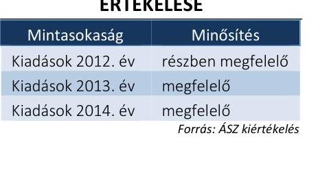

---

# 4.6. számú megállapítás 

A pénzügyi egyensúly a 2012. évben nem volt biztosított, a zavartalan feladatellátás biztosítása érdekében intézkedéseket tettek, a fizetőképesség folyamatos fenntartása, a likviditás javítása érdekében.

A folyamatos fizetőképességének biztosítása érdekében a 2012. évben a Múzeum gazdálkodási feladatait ellátó BAZMIK nem tett eleget az Áht. 2 78. § (2) bekezdésében, illetve az Ávr. 122. § (1) bekezdésében előírt likviditási terv készítési kötelezettségének. A Múzeum a 2013-2014. évekre likviditási tervet elkészítette, annak teljesülését havonta figyelemmel kísérte.

A pénzügyi egyensúly 2012-ben nem volt biztosított, a Múzeum kötelezettségeit nem tudta határidőben teljesíteni, mert egyes, a feladatellátáshoz szükséges szolgáltatások fedezete a 2012. évi költségvetésben nem állt rendelkezésre. A likviditás biztosítása érdekében keretelőrehozást kértek, illetve a kötelezettségek átütemezését kezdeményezték. A likviditási helyzet megoldása érdekében az irányító szervet tájékoztatták, aki pótelőirányzat nyújtásával segítette a pénzügyi egyensúly helyreállítását.

A 2013-2014. évben a pénzügyi egyensúly biztosított volt, a kötelezettségek teljesítése határidőben megtörtént. A múzeumigazgató utasítás formájában, 2013-2014. években takarékossági intézkedéseket hozott a kötelezettségek csökkentése érdekében, a követelések behajtására intézkedéseket tett. A követelések behajtása érdekében fizetési felszólításokat küldött, amennyiben az ismételt felszólítások sem jártak eredménnyel, a Múzeum a követelés jogi úton történő behajtásáról intézkedett. Ennek eredményeképpen a határidőn túli vevőkövetelések a 2013. évről 2014. december 31-re jelentősen csökkentek.

## 5. A Múzeum vagyongazdálkodása szabályszerű volt-e?

Összegző megállapítás

### 5.1. számú megállapítás

A 2011. évben a Múzeum vagyoni helyzetének ellenőrzése nem volt végrehajtható. A Múzeum vagyongazdálkodása a 2012-2014. években nem volt szabályszerű.

A 2011. évi vagyongazdálkodás ellenőrzése a szükséges dokumentumok hiánya miatt a Múzeumnál nem volt végrehajtható.

Az ellenőrzéshez szükséges dokumentumok hiánya miatt az ellenőrzési program alapján a Múzeumnál a vagyongazdálkodás ellenőrzése a 2011. évre vonatkozóan nem volt végrehajtható. E mulasztással a Szociális és Gyermekvédelmi Főigazgatóság a 2011-2014. évekre kiterjedő számvevőszéki ellenőrzés lefolytatását akadályozta.

Az eszközök és források nyilvántartása nem a jogszabályokban és belső szabályzatokban foglaltaknak megfelelően történt.

A Múzeum által használt vagyon használati jogát a 2011. évben az irányítószerv ${ }_{1}$ vagyongazdálkodási rendeletben ${ }^{68}$ rögzítette.

A 2012. január 1-jei önkormányzati konszolidációt követően a tulajdonosi jogokat az állami tulajdon felett az MNV Zrt. gyakorolta, míg a fenntartói jogok és kötelezettségek a BAZMIK-hez kerültek. A Múzeum a feladat ellátását szolgáló vagyont továbbra is használta, azonban erre vonatkozó

---

szerződéssel a Vtv. 25. § (4) bekezdésében foglaltak ellenére nem rendelkezett. A Számv. tv. 23. § (2) bekezdésében, az Nvtv. 11. § (8) bekezdésében, valamint az Áhsz. 15. § (1) bekezdésében foglaltak ellenére a kezelt vagyon kimutatására szabálytalanul a Múzeumnál került sor. A Múzeum 2012. évi beszámolójának mérlegében kimutatott állami vagyon értéke teljes egészében az Áhsz. 15 . § 10. pontja szerinti jelentős összegű hibát eredményezett, és a beszámoló mérlege a vagyon és annak összetétele vonatkozásában a megbízható és valós összképet nem mutatta be.

Az Mtv. 2013. január 1-jétől hatályos 45/A. § (2) bekezdés a) pontja szerint a Múzeum lett a vagyonkezelője a tevékenységéhez szükséges állami vagyonnak. A 2013-2014. években a Múzeum nem rendelkezett vagyonkezelési szerződéssel, ezzel az Nvtv. 11. § (1) és (7) bekezdésének és a Vtvr. 8. § (6) bekezdésének előírása nem érvényesült.

A kezelt vagyon köre és nagysága a 2013-2014. években vagyonkezelési szerződés hiányában nem volt megállapítható. Kiegészítő mellékletben a Múzeum a 2013-2014. években a Számv. tv. 23. § (2) bekezdésében előírtak ellenére nem mutatta be mérlegtételek szerinti megbontásban a kezelésbe vett állami eszközöket, és a 2014. évben az Áhsz. 2 29. § (2) bekezdés c) pontjában előírtak ellenére nem jelezte a vagyonkezelési szerződés hiányát, emiatt nem érvényesült a Számv. tv. 16. § (4) bekezdésében meghatározott „lényegesség elve".

A Múzeum a 20/2002. (X. 4.) NKÖM rendelet ${ }^{69}$ szerinti nyilvántartásokat a kulturális javakra vonatkozóan hagyományos módon vezette. A kulturális javak nyilvántartásaiban szereplő vagyont a 2012-2013. években az Áhsz. 1 9. számú melléklet „A számlaosztályok tartalmára vonatkozó előírások" 15. pontjában foglaltak ellenére nem mutatta ki a 0 -s számlaosztályban. A Múzeum a 2014. évben az Áhsz. 2 10. § (1) bekezdés előírása ellenére a gyarapodási naplóban kimutatott azon kulturális javakat, amelyek bekerülési értéke megállapítható volt, nem mutatta ki főkönyvi nyilvántartásaiban és mérlegében. A gyarapodási napló alapján a 2014. évben a Múzeumnál a kulturális javak állománya 1,2 millió Ft-tal gyarapodott, ezek kimutatásának hiánya miatt a könyvvezetés során és a beszámolóban sérült a Számv. tv. 15. § (2) bekezdésében foglalt teljesség elve.

A kulturális javak nyilvántartása nem felelt meg a 20/2002. (X. 4.) NKÖM rendeletben foglaltaknak, mivel a Múzeum az ellenőrzött időszakban
$\longrightarrow$ duplum naplóval nem rendelkezett a 7. § (1) bekezdés előírása ellenére;
$\longrightarrow$ a gyarapodási napló év végi záradéka nem tartalmazta az éves gyarapodás tételszámát és a vásárlások összértékét a 4. § (2) bekezdés és az 1. számú melléklet 2. pontjának előírása ellenére;
$\longrightarrow$ a gyűjteményenként vezetett szakleltárak év végi záradéka nem tartalmazta valamennyi gyűjtemény esetében az éves leltározás darabszámát az 1. számú melléklet 9. pontjában foglaltak ellenére;
$\longrightarrow$ régészeti szakleltár nem tartalmazta a régészeti lelet anyagát és készítési technikáját 2. számú melléklet III/A. alfejezet 10. és 11. pontjában foglaltak ellenére;
$\longrightarrow$ a szekrénykataszter nem tartalmazta a gyűjtemény nyilvántartásáért felelős muzeológus nevét és a tárolás pontos helyét az 1. melléklet 12. c) és d) pontjaiban foglaltak ellenére;

---

- a kölcsönvett kulturális javakról nem vezette a kölcsönvett tárgyak naplóját a 19. § (1) bekezdés ab) pontja ellenére;
- a kulturális javak intézményen belüli mozgatásáról nem minden gyűjtemény esetében vezetett külön mozgatási naplót a 19. § (1) bekezdés b) pontja ellenére.

# 5.3. számú megállapítás 

## A költségvetési beszámoló mérlegének leltárral történő alátámasztása, a mérlegtételek értékelése nem felelt meg a jogszabályi előírásoknak.

Előírásszerű leltárral a mérleg tételeket a 2012-2014. években nem támasztották alá a Számv. tv. 69. § (1) bekezdésben foglaltak ellenére, ezáltal a Számv. tv. 15. § (3) bekezdésben foglalt valódiság elve nem érvényesült. Hiányosság volt, hogy
$\longrightarrow$ a 2012. évben a leltár nem tartalmazta a készleteket és a befektetett eszközöket mennyiségben és értékben a Számv. tv. 69. § (1) bekezdése, az Áhsz. 1 37. § (2) bekezdése ellenére;
— 2013. évben a leltár nem tartalmazta az ingatlanokat és a készleteket mennyiségben és értékben a Számv. tv. 69. § (1) bekezdése, az Áhsz. 1 37. § (2) bekezdése előírása ellenére;
— a 2014. évben a leltár nem tartalmazta a Számv. tv. 69. § (1) bekezdésében és az Áhsz. 2 22. § (1) bekezdésében foglaltak ellenére a beruházásokat, ingatlanokat és készleteket.
A mérleget alátámasztó leltár a 2012. évben nem felelt meg az Áhsz. 1 37. § (2) bekezdésében foglaltaknak, mert a Múzeum az általa használt és felleltározott vagyonnak nem volt vagyonkezelője.

A mérleget alátámasztó leltár a 2013-2014. években nem felelt meg az Áhsz. 1 37. § (2) bekezdésében és a Számv. tv. 69. § (1) bekezdésében foglaltaknak, mert az Áhsz. 1 29/A. § (1) bekezdésében foglaltak értelmében, a vagyonkezelésbe vett eszköz bekerülési értékének, a vagyonkezelési szerződésben szereplő érték minősül, mely információ a szerződés hiányában nem állt rendelkezésre, az Áhsz. 2 15. § (2) bekezdésében foglaltak alapján a bekerülési érték az átadónál kimutatott bruttó érték, melyről szintén nem volt információ. A hiányosság miatt a leltárak értékadatai dokumentummal nem voltak megfelelően alátámasztva.

A 2012. évi szabálytalanul elszámolt selejtezési tevékenység miatt a 2013. évben 3,4 millió Ft leltárhiányt került megállapításra a leltár kiértékelése során. A hiba oka, hogy a 2012. évi selejtezés során és a 2013. évben a leltárhiány feltárását követően megsértették a nyilvántartások naprakész vezetésének szabályát, ezáltal az Áhsz. 1 51. § (1) bekezdés b) pontjában előírt bizonylati elv, bizonylati fegyelem sérült. A könyvekből való kivezetésre a 2014. évi zárási teendőkkel került csak sor. A 2014. évben az eszközök selejtezése során a a jogszabályi előírásokat és a selejtezési szabályzat utasításait betartották.

Az eszközök és források év végi értékelését nem végezték el maradéktalanul a jogszabályi előírások szerint. Az értékcsökkenést a 2013. évben nem az üzembe helyezés időpontjától számítva számolták el valamennyi eszköz esetében az Áhsz. 1 30. § (1) bekezdés előírása ellenére, a hiba mértéke nem volt jelentős összegű. Az adósok minősítése alapján a pénzügyi-

---

leg nem rendezett követeléseknél az értékvesztést nem számolták el az ellenőrzött időszakban a Számv. tv. 55. § (1), az Áhsz.1 31. § (2) és az Áhsz. 2 18. § (1) bekezdésében foglalt előírások ellenére.

Az eredményszemléletű számvitel bevezetésével kapcsolatos 2013. év végi feladatok keretében a rendezőmérleget a jogszabályban előírt formátumban és szerkezetben, az előírt átrendezéseknek megfelelően készítették el. Az eredményszemléletű számvitel bevezetésével kapcsolatos feladatokat hiányosságokkal hajtották végre, mivel
$\longrightarrow$ a rendezőmérleg elkészítéséhez készített leltár nem tartalmazta az ingatlanok és készletek adatait;
$\longrightarrow$ a rendezőmérleget 2014. március 31. helyett 2014. április 20-án készítették el a 36/2013. (IX. 13.) NGM rendelet 8. § (2) bekezdésének előírása ellenére;
$\longrightarrow$ a követelések, kötelezettségvállalások és más fizetési kötelezettségek teljesítésének nyilvántartási számláit 2014. január 31-ig nem nyitották meg csak 2014. április 15-én a 36/2013. (IX. 13.) NGM rendelet 9. § (1) bekezdés előírása ellenére.

# 5.4. számú megállapítás 

A kulturális javak hasznosítása és kölcsönzése a jogszabályi előírásoknak nem felelt meg, a kulturális javak vagyonbiztonságára és állományvédelmére vonatkozó előírásokat nem tartották be.

KÖLCSÖNZÉSI TEVÉKENYSÉGET a Múzeum rendszeresen, az összes ellenőrzött évben végzett, amelynek során hazai állami és nem állami muzeális intézménynek, önkormányzatoknak adott át kiállításra műtárgyakat. A kölcsönzési tevékenység a 2011-2014. évek között nem megfelelő minősítésű.

KÖLCSÖNZÉSI TEVÉKENYSÉGRE az esetek jelentős hányadában 2013. október 24-éig az Mtv. 38. § (6), 2013. október 25-től az Mtv. 38/A. § (1) bekezdés előírása ellenére nem írásbeli szerződés, illetve kölcsönzési szerződés, hanem a múzeumigazgató írásos kölcsönzési engedélye, vagy átadás-átvételi elismervény alapján került sor. A 29/2014. (IV. 10.) EMMI rendelet ${ }^{70}$ 3. § (1) bekezdése előírása ellenére - a rendelet 2014. május 10. hatályba lépését követően - kötött kölcsönzési szerződésekhez a kölcsönkérő a kulturális javak elhelyezésére vonatkozó elhelyezési dokumentációt nem készített. A kölcsönzési szerződésekben, engedélyekben az Mtv. 38. § (8) bekezdés, illetve az Mtv. 38/A. § (2) bekezdés előírásai ellenére nem rögzítették minden esetben a kölcsönzött kulturális javaknak biztosítandó állományvédelmi követelményeket, a csomagolás és szállítás feltételeit, sérülésük esetén követendő eljárást, kölcsönvevő által nyújtandó vagyonbiztonsági-őrzési feltételeket. Az Mtv. 2013. október 24-i módosítását követően a 38/A. § (3) bekezdésében foglaltak ellenére nem történt meg maradéktalanul a kölcsönzött kulturális javak kölcsönadás időpontjában fennálló fizikai állapotát dokumentáló szakleírás és képi ábrázolás csatolása a szerződéshez. Az állományvédelmi követelmények, a vagyonvédelem a jogszabályi előírásoknak nem megfelelő kölcsönzési tevékenység következtében nem volt biztosított.

A nem muzeális intézmények részére történő kölcsönzéshez több esetben nem rendelkeztek a miniszter hozzájárulásával az Mtv. 38. § (9), illetve

---

az Mtv. 38/A. § (5) bekezdéseiben foglaltak ellenére. A kulturális javak külföldre történő kölcsönzéséhez a Múzeum a miniszter engedélyével rendelkezett.

A KULTURÁLIS JAVAK FIZIKAI ŐRZÉSE biztosított volt. A 2/2010. (I.14.) OKM rendelet 8. § b) pontjában meghatározott követelményeknek megfelelően a Múzeum biztosította az állandó és időszakos kiállítás bemutatására alkalmas kiállító helyiségekben, gyűjteményi raktárakban az épületek elektronikus és mechanikus, továbbá élőerős védelmét.

# 6. A Múzeum intézkedett-e az integritás szemlélet érvényesítése érdekében? 

## Összegző megállapítás

A Múzeum az integritás szemlélet érvényesítése érdekében intézkedett.

Az ellenőrzés részletes megállapításait a jelentéstervezet II. számú - „Az Integritás érvényesítése érdekében kialakított és müködtetett kontrollrendszer" című - melléklete tartalmazza.

---

# JAVASLATOK 

Az ÁSZ tv. 33. § (1) bekezdésében foglaltak értelmében az ellenőrzött szervezet vezetője köteles a jelentésben foglalt megállapításokhoz kapcsolódó intézkedési tervet összeállítani és azt a jelentés kézhezvételétől számított 30 napon belül az ÁSZ részére megküldeni. Amennyiben az ellenőrzött szervezet vezetője nem küldi meg határidőben az intézkedési tervet, vagy továbbra sem elfogadható intézkedési tervet küld, az Állami Számvevőszék elnöke az ÁSZ tv. 33. § (3) bekezdése a) és b) pontjaiban foglaltakat érvényesítheti.

## Miskolc Megyei Jogú Város Önkormányzata polgármesterének

1. Tegyen intézkedéseket a feltárt szabálytalanságok tekintetében a felelősség tisztázása érdekében, és szükség szerint intézkedjen a felelősség érvényesítéséről.
(4.4. sz. megállapítás 2. bekezdése, 5.2. sz. megállapítás 4. bekezdésének 2. mondata, 5.2. sz. megállapítás 5. bekezdésének 4. mondata, 5.4. sz. megállapítás 2. bekezdése, 5.4. sz. megállapítás 3. bekezdésének 1. mondata alapján)

## a Herman Ottó Múzeum igazgatójának

1. A belső kontrollrendszer szabályszerű kialakítása és müködtetése érdekében intézkedjen:
a) az etikai elvárások jogszabályi előírásnak megfelelő meghatározására;
(3.1. sz. megállapítás 3. bekezdése alapján)
b) a számviteli politikában annak rögzítésére, hogy mit kell a számviteli elszámolás, az értékelés szempontjából nem lényegesnek tekinteni, valamint a számviteli politika kiegészítésére a kulturális javak mérlegben való kimutatásával kapcsolatos szabályaival;
(3.1. sz. megállapítás 4. bekezdésének 5., 6. mondata alapján)
c) az egyszerüsített értékelési eljárás alá vont követelések besorolásának elvei, dokumentálásának szabályai rögzítésére az eszközök és források értékelési szabályzatában;
(3.1. sz. megállapítás 6. bekezdésének 3. mondata alapján)

---

d) az ellenőrzési nyomvonal kiegészitésére, hogy az tartalmazza a müködés folyamatai között az előirányzat módosításokkal kapcsolatosan a felelősségi és információs szinteket és kapcsolatokat, irányítási és ellenőrzési folyamatokat;
(3.1. sz. megállapítás 11. bekezdésének 3. mondata alapján)
e) a jogszabályban elöirt integrált kockázatkezelési rendszer müködtetésére;
(3.2. sz. megállapítás 3. bekezdése alapján)
f) a döntések célszerüségi, gazdaságossági, hatékonysági és eredményességi szempontú megalapozottsága vonatkozásában a szervezeti célok elérését veszélyeztető kockázatok csökkentésére irányuló kontrollok kiépítése biztosítására;
(3.3. sz. megállapítás 3. bekezdésének 1. mondata alapján)
g) a beszámolási módok világos meghatározására;
(3.4. sz. megállapítás 2. bekezdésének 1. francia bekezdése alapján)
h) a közérdekü adatok megismerésére irányuló igények teljesitésének rendjét rögzitő szabályzat elkészitésére;
(3.4. sz. megállapítás 2. bekezdésének 2. francia bekezdése alapján)
i) az elektronikus közzétételi kötelezettség jogszabályi előírásoknak megfelelő teljesitésére;
(3.4. sz. megállapítás 2. bekezdésének 3. francia bekezdése alapján)
j) olyan szabályzatok kiadására, folyamatok kialakítására és müködtetetésére a szervezeten belül, amelyek biztositják a rendelkezésre álló források gazdaságos, hatékony és eredményes felhasználását.
(3.5. sz. megállapítás 2. bekezdésének 3. mondata alapján)
2. A szabályszerü pénzügyi gazdálkodás érdekében intézkedjen:
a) a mérleg alátámasztásához a jogszabályi előírásoknak megfelelő leltár összeállítására;
(4.3. sz. megállapítás 1. bekezdésének 3. mondata, 5.3. sz. megállapítás 1. bekezdésének 1. mondata, 5.3. sz. megállapítás 1. bekezdésének 3. francia bekezdése, 5.3. sz. megállapítás 3. bekezdése alapján)

---

b) a Múzeum éves költségvetési beszámolója adatainak a költségvetési évet követő év február 28-áig az irányító szervi jóváhagyás céljából történő feltöltésére a Kincstár által müködtetett elektronikus adatszolgáltató rendszerbe;
(4.3. sz. megállapítás 3. bekezdése alapján)
c) a teljesítés igazolására jogosult személy kijelölésére a bevételeknél;
(4.4. sz. megállapítás 1. bekezdésének 3. mondata alapján)
d) a szabályszerű vagyonhasznosításra;
(4.4. sz. megállapítás 2. bekezdése alapján)
e) az érvényesitő kijelölése jogszabályi előirásoknak megfelelő szabályozására;
(4.4. sz. megállapítás 4. bekezdésének 1. francia bekezdése alapján)
f) az érvényesitő kijelölésénél a jogszabályi elöírások betartására;
(4.4. sz. megállapítás 5. bekezdésének 5. francia bekezdése alapján)
g) az utalványozás és érvényesités gazdálkodási jogkörök jogszabályi előírásnak megfelelő gyakorlására.
(4.4. sz. megállapítás 5. bekezdésének 6. francia bekezdése alapján)
3. A szabályszerű vagyongazdálkodás érdekében intézkedjen:
a) a jogszabályi előírásoknak megfelelő éves költségvetési beszámoló elkészitésére;
(5.2. sz. megállapítás 4. bekezdésének 2. mondata, 5.2. sz. megállapítás 5. bekezdésének 4. mondata alapján)
b) a kulturális javak nyilvántartására, és kölcsönzése esetén a jogszabályban elöirtak betartására;
(5.2. sz. megállapítás 6. bekezdésének 1-7. francia bekezdése, 5.4. sz. megállapítás 2. bekezdése, 5.4. sz. megállapítás 3. bekezdésének 1. mondata alapján)

---

c) az értékvesztés jogszabályi előírások szerinti elszámolására a pénzügyileg nem rendezett követelések esetében.
(5.3. sz. megállapítás 5. bekezdésének 3. mondata alapján)
4. Tegyen intézkedéseket a feltárt szabálytalanságok tekintetében a felelősség tisztázása érdekében, és szükség szerint intézkedjen a felelősség érvényesítéséről.
(4.3. sz. megállapítás 1. bekezdésének 3. mondata, 5.2. sz. megállapítás 4. bekezdésének 2. mondata, 5.2. sz. megállapítás 5. bekezdésének 4. mondata, 5.3. sz. megállapítás 1. bekezdésének 1. mondata, 5.3. sz. megállapítás 1. bekezdésének 3. francia bekezdése, 5.3. sz. megállapítás 3. bekezdése, 5.3. sz. megállapítás 5. bekezdésének 3. mondata alapján)

---

.

---

# MELLÉKLETEK 

- I. SZ. MELLÉKLET: ÉRTELMEZŐ SZÓTÁR

ÁSZ Integritás Projekt

Atalakítás
belső ellenőrzés
belső kontrollrendszer
belső kontrollrendszer területei
fenntartó
felújítás
hasznosítás
információs és kommunikációs rendszer

Az ÁSZ 2009-ben indította el a „Korrupciós kockázatok feltérképezése - Integritás alapú közigazgatási kultúra terjesztése" című, európai uniós forrásból megvalósított kiemelt projektjét (Integritás Projekt). Az Integritás Projekt célja, hogy felmérje a közszféra intézményei korrupciós kockázatoknak való kitettségét, illetőleg az azok mérséklésére hivatott kontrollok szintjét. Az Állami Számvevőszék a projekt révén az integritás szemlélet minél szélesebb körrel történő megismertetését, gyakorlatba ültetését kívánja elérni. Az integritás követelményeinek megfelelő szervezeti működést előnyben részesítő közigazgatási kultúra elterjesztését és a korrupció elleni fellépést az ÁSZ önmagára nézve is stratégiai jelentőségű célként fogalmazta meg. A projekt a felmérésben résztvevő intézmények számára helyzetükről egyfajta „tükörképet" mutat be, ami alapot teremt a jövőbeni pozitív irányú elmozduláshoz. (Forrás: a http://integritas.asz.hu honlapon közzétett, a 2013. évi Integritás felmérés eredményeiről készült összefoglaló tanulmány)
Az általános jogutódlással történő megszüntetés átalakítással történhet. Az átalakítás lehet egyesítés vagy különválás. Az egyesítés lehet beolvadás vagy összeolvadás.
(Forrás: Áht. 1 95. §-a, Áht. 2 11. §-a)
Független, tárgyilagos bizonyosságot adó és tanácsadó tevékenység, amelynek célja, hogy az ellenőrzött szervezet múködését fejlessze és eredményességét növelje, az ellenőrzött szervezet céljai elérése érdekében rendszerszemléletű megközelítéssel és módszeresen értékeli, illetve fejleszti az ellenőrzött szervezet irányítási és belső kontrollrendszerének hatékonyságát. (Forrás: Bkr. 2. § b) pontja)
A belső kontrollrendszer a kockázatok kezelése és tárgyilagos bizonyosság megszerzése érdekében kialakított folyamatrendszer, amely azt a célt szolgálja, hogy a múködés és gazdálkodás során a tevékenységeket szabályszerűen, gazdaságosan, hatékonyan, eredményesen hajtsák végre, az elszámolási kötelezettségeket teljesítsék, megvédjék az erőforrásokat a veszteségektől, károktól és nem rendeltetésszerű használattól. (Forrás: Áht. 2 69. § (1) bekezdése)
A kontrollkörnyezet, a kockázatkezelési rendszer, a kontrolltevékenységek, az információs és kommunikációs rendszer, valamint a nyomon követési (monitoring) rendszer. (Forrás: Bkr. 3. §-a)
A muzeális intézmény fenntartója az a természetes személy, jogi személy, jogi személyiség nélküli gazdasági társaság, amely biztosítja a muzeális intézmény folyamatos és rendeltetésszerű működéséhez szükséges feltételeket (Mtv. 50. § (1) bekezdése)
Az elhasználódott tárgyi eszköz eredeti állaga (kapacitása, pontossága) helyreállítását szolgáló időszakonként visszatérő olyan tevékenység, amelynek során az eszköz élettartama megnövekszik, minősége, használata jelentősen javul, így a pótlólagos ráfordításból a jövőben gazdasági előnyök származnak. (Forrás: Számv. tv. 3. § (4) bekezdés 8. pontja)
A nemzeti vagyon birtoklásának, használatának, hasznok szedése jogának bármely a tulajdonjog átruházását nem eredményező - jogcímen történő átengedése, ide nem értve a vagyonkezelésbe adást, valamint a haszonélvezeti jog alapítását. (Forrás: Nvtv. 3. § (1) bekezdés 4. pontja)
A költségvetési szerv vezetője által kialakított és működtetett olyan rendszer, amely biztosítja, hogy a megfelelő információk a megfelelő időben eljutnak az illetékes szervezethez, szervezeti egységhez, illetve személyhez. (Forrás: Bkr. 9. § (1) bekezdés)

---

integritás
irányító szerv/felügyeleti szerv
kincstári költségvetés
kockázat
kockázatkezelési rendszer
kontrollkörnyezet
kontrolltevékenységek
kommunikáció
középirányító szerv
közfeladat
likviditási mutató, pénzeszköz likviditási mutató

Az integritás az elvek, értékek, cselekvések, módszerek, intézkedések konzisztenciáját jelenti, vagyis olyan magatartásmódot, amely meghatározott értékeknek megfelel.
(Forrás: Nemzetgazdasági Minisztérium: Magyarországi államháztartási belső kontroll standardok Útmutató 1.6.1. pontja, 2012. december)
A költségvetési szerv tekintetében az e törvényben meghatározott irányítási hatáskört gyakorló szerv. (Forrás: Áht. 1. § 9. pontja)
A központi költségvetésről szóló törvény elfogadását követően a fejezetet irányító szerv az államháztartás központi alrendszerébe tartozó költségvetési szerv és a fejezeti kezelésű előirányzat kiemelt előirányzatait, valamint az elkülönített állami pénzalapok és a társadalombiztosítás pénzügyi alapjai jogszabályi előírás szerinti bevételeit és kiadásait kincstári költségvetés kiadásával állapítja meg. (Forrás: Áht. 1 24. § (3) bekezdés, Áht. 2 28. § (2) bekezdés)
A kockázat annak a valószínűségét jelenti, hogy egy vagy több esemény vagy intézkedés nem kívánt módon befolyásolja a rendszer múködését, céljainak megvalósulását. (Forrás: Javaslatok a korrupciós kockázatok kezelésére - Kockázatkezelési és ellenőrzési módszertan 35. oldal, ÁSZ)
Olyan irányítási eszközök és módszerek összessége, amelynek elemei a szervezeti célok elérését veszélyeztető tényezők (kockázatok) azonosítása, elemzése, csoportosítása, nyomon követése, valamint szükség esetén a kockázati kitettség mérséklése. (Forrás: Bkr. 2. § m) pontja)
A költségvetési szerv vezetője által kialakított olyan elvek, eljárások, belső szabályzatok összessége, amelyben világos a szervezeti struktúra, egyértelműek a felelősségi, hatásköri viszonyok és feladatok, meghatározottak az etikai elvárások a szervezet minden szintjén, átlátható a humánerőforrás-kezelés. (Forrás: Bkr. 6. § (1) bekezdés)
A költségvetési szerv vezetője által a szervezeten belül kialakított (kontroll) tevékenységek, amelyek biztosítják a kockázatok kezelését, hozzájárulnak a szervezet céljainak eléréséhez. (Forrás: Bkr. 8. § (1) bekezdés)
Az a tevékenység, amelynek során információ továbbítása valósul meg. A kommunikációs folyamat résztvevői között tájékoztatás történik, amely során tényeket, ezek magyarázatát közlik.
A költségvetési szerv tekintetében törvény vagy kormányrendelet alapján meghatározott, átruházott irányítási hatásköröket gyakorló szerv.(Forrás: Áht. 2 9. § (4) bekezdés)
Jogszabályban meghatározott állami vagy önkormányzati feladat, amit az arra kötelezett közérdekből, a jogszabályban meghatározott követelményeknek és feltételeknek megfelelve végez, ideértve a lakosság közszolgáltatásokkal való ellátását, továbbá az állam nemzetközi szerződésekben vállalt kötelezettségeiből adódó közérdekű feladatokat, valamint e feladatok ellátásakor szükséges infrastruktúra biztosítását is.
(Forrás: Nvtv. 3. § (1) bekezdés 7. pontja)
A pénzügyi helyzet elemzésének mutatói,
likviditási mutató = Forgóeszközök összesen/Rövid lejáratú kötelezettségek összesen;
pénzeszköz likviditási mutató = Pénzeszközök összesen/Rövid lejáratú kötelezettségek összesen,
A mutatók azt fejezik ki, hogy a Múzeum forgóeszközei, illetve pénzeszközei milyen mértékben képesek fedezni a rövid távú kötelezettségeket.
A mutatók értéke akkor jó, ha 1-nél nagyobb értékűek, és akkor fejeznek ki pozitív tendenciát, ha az értékük évről-évre növekszik.

---

megyei hatókörű városi múzeum

Megyei Intézmény
fenntartó Központ
monitoring-rendszer
tagintézmény
vagyongazdálkodás

A megyei hatókörű városi múzeum feladata a kulturális javak helyi védelmének települési szintet meghaladó, egy megye közigazgatási területére kiterjedő biztosítása. (Mtv. 45. § (1) bekezdés)
A megyei intézményfenntartó központ önállóan működő és gazdálkodó központi költségvetési szerv. Székhelye a megyeszékhely városban, a Pest Megyei Intézményfenntartó Központ székhelye Budapesten van. A Kormány az átvett intézmények tekintetében - a közoktatási intézmények kivételével - a megyei intézményfenntartó központot jelöli ki a Möktv. 3. § (1) bekezdése és a 9. § (1) bekezdése szerinti feladat ellátására. (258/2011. (XII.7.) Korm. rendelet 2. § (1), (2) bekezdés, 4. §)
A költségvetési szerv vezetője köteles olyan monitoring rendszert működtetni, amely lehetővé teszi a szervezet tevékenységének, a célok megvalósításának nyomon követését. A költségvetési szerv monitoring rendszere az operatív tevékenységek keretében megvalósuló folyamatos és eseti nyomon követésből, valamint az operatív tevékenységektől függetlenül működő belső ellenőrzésből áll. (Forrás: Ámr. 160. §, Bkr. 10. §)
A muzeális intézmény szervezeti egységeként működő, önálló működési engedéllyel rendelkező muzeális intézmény. (Forrás: Mtv. 1. számú melléklet y) pontja. Hatályos 2013. január 1-től.)
A nemzeti vagyongazdálkodás feladata a nemzeti vagyon rendeltetésének megfelelő, az állam, az önkormányzat mindenkori teherbíró képességéhez igazodó, elsődlegesen a közfeladatok ellátásához és a mindenkori társadalmi szükségletek kielégítéséhez szükséges, egységes elveken alapuló, átlátható, hatékony és költségtakarékos működtetése, értékének megőrzése, állagának védelme, értéknövelő használata, hasznosítása, gyarapítása, továbbá az állam vagy a helyi önkormányzat feladatának ellátása szempontjából feleslegessé váló vagyontárgyak elidegenítése. (Forrás: Nvtv. 7. § (2) bekezdése)

---

# II. SZ. MELLÉKLET: AZ INTEGRITÁS ÉRVÉNYESÍTÉSE ÉRDEKÉBEN KIALAKÍTOTT ÉS MŰKÖDTETETT KONTROLLRENDSZER 

A közintézmények korrupciós kockázatoknak való kitettségét, valamint az azzal szembeni ellenálló képességüket az ÁSZ az integritás projekt keretében feltérképezi és értékeli. A Múzeum az ÁSZ integritás projektjéhez a 2014. évben csatlakozott. Jelen ellenőrzéshez kapcsolódóan a 2014. évről tanúsítvány formájában közölt adatokat, amelynek értékelése alapján integritás kontrollrendszere fejlesztendő volt. Az eredmény azt mutatja, hogy a Múzeum ugyan tett intézkedéseket az integritás szemlélet érvényesítése érdekében, azonban további intézkedések szükségesek az integritás kontrollrendszere fejlesztése érdekében. A Múzeum által kitöltött integritás kérdőív adatai alapján az integritás kontrollrendszer értékelését a következő táblázat tartalmazza:

| A MÚZEUM INTEGRITÁS KONTROLLRENDSZERÉNEK ÉRTÉKELÉSE |  |  |
| :--: | :--: | :--: |
| Sorszám | Megnevezés | Értékelés   fejlesztendő, megfelelő, kiváló |
| 1. | Összeférhetetlenség és etikai elvárások | fejlesztendő |
| 2. | Humánerőforrás-gazdálkodás | fejlesztendő |
| 3. | Szervezet vagyonának megvédésére tett intézkedések | kiváló |
| 4. | A nemkívánatos dolgozói magatartással szembeni intézkedések és azok érvényesülése | fejlesztendő |
| 5. | Az integritás erősítése, annak tudatosítása, valamint a kockázatelemzések alkalmazása | fejlesztendő |
| ÖSSZESÍTŐ ÉRTÉKELÉS |  | FEJLESZTENDŐ   Forrás: ÁSZ értékelés |

Az etikai elvárások szabályozatlansága, a nemkívánatos dolgozói magatartással szembeni intézkedések hiánya, valamint az ellenőrzés során tapasztalt hiányosságok miatt a Múzeum integritás kontrollrendszere fejlesztendő.

---

# FÜGGELÉK: ÉSZREVÉTELEK 

A jelentéstervezetet az Állami Számvevőszék 15 napos észrevételezésre megküldte az ellenőrzött szervezetek vezetőinek az ÁSZ tv. 29. §* (1) bekezdése előírásának megfelelően.

A Herman Ottó Múzeum igazgatója és a Miskolc Megyei Jogú Város Önkormányzatának polgármestere az ellenőrzés megállapításaira írásban észrevételt tett. A Borsod-AbaújZemplén Megyei Önkormányzat elnöke és a Szociális és Gyermekvédelmi Föigazgatóság föigazgatója az ÁSZ. tv. 29. § (2) bekezdésében foglalt észrevételezési jogával nem élt, a törvényes határidőn belül észrevételt nem tett.
Az elfogadott észrevétel alapján az Állami Számvevőszék módosította a jelentést.
A függelék tartalmazza az ellenőrzött Herman Ottó Múzeum igazgatójának és a Miskolc Megyei Jogú Város Önkormányzata polgármesterének az észrevételeit és az el nem fogadott észrevételek indoklását.

[^0]
[^0]:    * 29. § (1) Az Állami Számvevőszék az ellenőrzési megállapításait megküldi az ellenőrzött szervezet vezetőjének vagy az általa megbízott személynek, és annak, akinek személyes felelősségét állapította meg.
    (2) Az ellenőrzött szervezet vezetője és a felelősként megjelölt személy az ellenőrzés megállapításaira tizenöt napon belül írásban észrevételt tehet.
    (3) Az Állami Számvevőszék az észrevételre a beérkezésétől számított harminc napon belül írásban válaszol. A figyelembe nem vett észrevételeket köteles a jelentésben feltüntetni, és megindokolni, hogy azokat miért nem fogadta el.

---

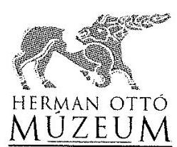

# ÁLLAMI SZÁMVEVŐSZÉK 

Domokos László elnök

Budapest
Apáczai Csere János u. 10.
1052
Ikt. sz: 3234/2016.A.02.
Hiv.sz.: V-0951-163/2016.

Tárgy: Válasz, a 2016. november 29. napján kelt, V-0951-174/2016. számú, a „Megyei hatókörü városi múzeumok ellenőrzése - Herman Ottó Múzeum" című ellenőrzésről készült számvevőszéki jelentéstervezetre

## Tisztelt Elnök úr!

Alulírott Dr. Pusztai Tamás múzeumigazgató, a Herman Ottó Múzeum (3529 Miskolc, Görgey Artúr u. 28.) képviseletében, a 2016. november 29. napján kelt „Megyei hatókörü városi múzeumok ellenőrzése - Herman Ottó Múzeum" címủ ellenőrzésről készült számvevőszéki jelentéstervezette az alábbi észrevételeket teszem:

## I.   Általános észrevételek

1. 

A jelentéstervezet Főbb megállapítások, következtetések-fejezet 3. bekezdése az alábbiakat rögzíti: „A Múzeum 2011. évi pénzügyi és vagyongazdálkodási tevékenységének ellenőrzése során a számvevőszéki ellenőrzési program lefolytatásához szükséges dokumentumokat nem bocsátották az Állami Számvevőszék rendelkezésére."

Ezen megfogalmazás arra enged következtetni, hogy a Herman Ottó Múzeum az érintett dokumentumok birtokában volt, azonban azt nem adta át az Állami Számvevőszék ellenőreinek. A Herman Ottó Múzeum nem volt a hivatkozott dokumentumok birtokában. A Múzeum a 2011. évi pénzügyi és vagyongazdálkodási tevékenységének dokumentumait sem 2012ben sem és később sem kapta meg az akkori fenntartó által működtetett Gazdasági Hivataltól, aki az adott időszakban a pénzügyi és vagyongazdálkodási tevékenységet végzete, így ezen dokumentumokat készítette.

---

Mint azt a jelentéstervezet 2.1. sz. megállapítás 3. bekezdése helyesen rögzíti:,,Az átadás-átvétel során a Számv.tv. 169. § (4) bekezdésében foglaltak, ellenére nem rendelkezitek a 2011. évi beszámoló, beszámolót tartalmazó leltár, fókönyvi kivonat, könyvviteli elszámolást közzetlenül és közvetetten alátámasztó számviteli bizonylatok átadásáról és megörzéséröl."

Az átadás-átvételben azonban a Múzeum nem volt érintett, az a Borsod-Abaúj-Zemplén Megyei Önkormányzat és a Borsod-Abaúj-Zemplén Megyei Intézményfenntartó Központ között történt.

Kérjük, szíveskedjenek a Múzeumot negatív színben feltüntető Főbb megállapítások, következtetések-fejezet 3. bekezdése első mondát törölni. Helyette az alábbi mondat beillesztését javasoljuk:

A 2011. I. negyedévre vonatkozó anyagot elektronikus formában az Állami Számvevőszéknek a vizsgálat számára a Múzeum átadta. A 2011. első negyedévi anyagból az Állami Számvevőszék mintavételezés megtörtént.

A 2011. évi 2-3-4. negyedév pénzügyi és vagyongazdálkodási tevékenységének ellenőrzése során a számvevőszéki ellenőrzési program lefolytatásához szükséges dokumentumokat a Múzeumnak nem állt módjában az Állami Számvevőszék rendelkezésére bocsátani, mivel azokat a Múzeum akkori fenntartója nem a Múzeumban őrizte meg.

# Fentiek alátámasztására összefoglaljuk a Borsod-Abaúj-Zemplén Megyei Múzeumigazgatóságot érintő változásokat a 2011-2012. években: 

A Borsod-Abaúj-Zemplén Megyei Önkormányzat Közgyűlésének 13/2011. (II. 17.) számú határozata a Borsod-Abaúj-Zemplén Megyei Önkormányzat irányítása alá tartozó közoktatási, közművelődési és közgyűjteményi intézményeinek átszervezéséről döntött, mely 28 más intézmény mellett a Borsod-Abaúj-Zemplén Megyei Múzeumi Igazgatóság háttérszolgáltatásait (műszaki feladatok) és pénzügyi-gazdálkodási feladatait, továbbá az ezekhez kapcsolódó személyzetet is érintette. Ennek alapján a pénzügyi-gazdálkodási feladatok és munkavállalók a Borsod-Abaúj-Zemplén Megyei Önkormányzat Ellátó Szervezetéhez, ill. állományába kerültek 2011. április 1. napjával.

Borsod-Abaúj-Zemplén Megyei Önkormányzat Közgyűlési határozattal 2011. április 1-jétől megszüntette a Múzeumigazgatóság önállóan gazdálkodó költségvetési intézményi státuszát.

Az alapító okiratában a Múzeum státusát 2011. április 1-jei hatállyal az alábbiakban módosította: "Önállóan müködö költségvetési szerv. A pénzügyi és gazdálkodási feladatait a Borsod-AbaújZemplén megyei Önkormányzat Ellátó Szervezzete látja el"

Az Ellátó Szervezet feladata a 292/2009. (XII.19.) Korm rendeletben foglaltak alapján az intézményi szintű és összesített időközi költségvetési jelentések, a féléves, éves költségvetési elemi beszámolók, az éves elemi költségvetés, valamint a szöveges beszámolót elkésztése volt.
2011. augusztus 1-jétől pedig a számviteli törvény és a 249/2000 (XII.24.) Korm. rendeletben meghatározott könyvvezetési kötelezettségnek a Múzeum tekintetében a Borsod-AbaújZemplén Megyei Önkormányzat Gazdasági Központja tett eleget (a Borsod-Abaúj-Zemplén Megyei Önkormányzat Gazdasági Központja jogutódlással, a Borsod-Abaúj-Zemplén Megyei Intézményfenntartó Központba (B-A-Z MIK) beolvadással szűnt meg 2012. december

---

31. napján; jelenlegi jogutód: Szociális- és Gyermekvédelmi Főigazgatóság Borsod-AbaújZemplén Megyei Kirendeltsége). A Borsod-Abaúj-Zemplén Megyei Önkormányzat Gazdasági Központja feladata volt a 292/2009.(XII.19.) Korm. rendeletben foglaltak alapján az intézményi szintű és összesített időközi költségvetési jelentések, a féléves, éves költségvetési elemi beszámolók, az éves elemi költségvetés, valamint a szöveges beszámolót elkészítése.

Mivel csonka ( $3 / 4$ év adataira alapozott) éves beszámolót nem lehet készíteni, a fentiek alapján a 292/2009. (XII.19.) Korm. rendeletben foglaltak szerint, az intézményi szintű és összesített időközi költségvetési jelentések, a féléves, éves költségvetési elemi beszámolók, az éves elemi költségvetés, valamint a szöveges beszámolót a 2011. évre vonatkozóan a Borsod-Abaúj-Zemplén Megyei Önkormányzat Gazdasági Központja jogutódjánál kell őrizni.
2011. április 1-jétől az I. negyedév zárására a Múzeumigazgatóság már nem volt kompetens, az említett döntések alapján az már a Borsod-Abaúj-Zemplén Megyei Önkormányzat Ellátó Hivatala feladatkörébe tartozott.

Átalakulás esetén a jogelödnél - a jogutód cégjegyzékbe való bejegyzése napiától - keletkerett bizonylatok, illetve a jogelöd nevére kiállitott bizonylatok alapján a gazdasági eseményeket a jogutód (több jogutód esetén az, amelyiknél a gazdasági esemény hatása megjelenik) rögzíti a könyvviteli nyilvántartásokban, amennyiben a jogelöd éves beszámolója, egyszerüsitett éves beszámolója elkészitése során azokat figyelembe venni nem lehetett, illetve, ha a jogelöd nem tudta azokat figyelembe venni. (a 2011.01.01-2011.07.14 között hatályos 2000. évi C. törvény a számvitelröl; 166. § (5) bekezdés)

A 2011. április 1-jétől nem önállóan gazdálkodó Múzeumigazgatóság számára tehát egy gazdasági szervezet látta el a könyvelési feladatokat a 292/2009. (XII. 19.) Korm. rendelet az államháztartás működési rendjéről alapján:
15. $\int$ (2) A gazdasági szervezet ellátja
a) a költségvetési szerv költségvetésének elöirányzatai tekintetében a gazdálkodással, könyvvezetéssel és az adatszolgáltatással kapcsolatos feladatokat

Az Ellátó Szervezet és a Borsod-Abaúj-Zemplén Megyei Önkormányzat Gazdasági Központ feladata volt a 292/2009.(XII.19.) Korm. rendeletben foglaltak alapján az intézményi szintű és összesített időközi költségvetési jelentések, a féléves, éves költségvetési elemi beszámolók, az éves elemi költségvetés, valamint a szöveges beszámolót elkészítése.

A 2011. április 1-jétől kezdődően a beszámolóhoz szükséges pénzügyi adatok, bizonylatok az Ellátó Szervezetnél és a Gazdasági Központnál voltak, ott maradéktalanul rendelkezésre álltak. Ezek alapján a 2011. évi beszámoló el is készült, az a KGR-rendszerben megfelelő jogosultsággal ma is hozzáférhető. Borsod-Abaúj-Zemplén Megyei Önkormányzat Gazdasági Központja beolvadt a Borsod-Abaúj-Zemplén Megyei Intézményfenntartó Központba, amelynek jelenlegi jogutódja a Szociális- és Gyermekvédelmi Főigazgatóság Borsod-AbaújZemplén Megyei Kirendeltsége.

---

2. 

A Jelentéstervezet 4.5 számú megállapítás első mondata szerint „A régészeti feltárási tevékenység bevételeinek elszámolását, jogszerűségét a jogszabályban előírt tartalmú szerződés nem minden esetben támasztotta alá, mivel a 2012. évben a Kötv. 22. § (3) bekezdésében foglalt előírás ellenére több esetben szerződés nem készült."

A 4.5 számú megállapítás nem a Borsod-Abaúj-Zemplén Megyei Múzeumi Igazgatóságra vonatkozik. A Múzeum szerződés nélkül nem végzett megelőző régészeti feltárási tevékenységet. Ezen nem helytálló megállapítást kérjük, szíveskedjenek törölni és az alábbi módon javítani: A régészeti feltárási tevékenység bevételeinek elszámolását, jogszerűségét minden esetben a jogszabályban előírt tartalmú szerződés támasztotta alá.

Az Ellenőrzés háttere, indokoltsága fejezetben az alábbi megállapítást teszi a jelentéstervezet: „Ellenörzés eredményeképpen ...átfogó képet kapunk a jó gyakorlatokról is."

A 4.5. számú megállapítás a régészeti feladatellátásról nem hivatkozik arra a Herman Ottó Múzeumban alkalmazott jó gyakorlatra, ami 2012 óta lehetővé teszi minden régészeti projekt projektkódok szerinti nyilvántartását, mely nyilvántartás segítségével a projekt minden résztvevője birtokába kerül a régészeti tevékenységet meghatározó ismereteknek, ami nem csak az ellenőrizhetőséget alapozza meg, de a résztvevők egyéni felelősségérzetét is növeli. Kérjük, ezt, mint jó gyakorlatot szerepeltetni!

Rögzítjük továbbá, hogy a vizsgált időszak alatt, 2013. január 1-jéig az intézmény Borsod-Abaúj-Zemplén Megyei Múzeumi Igazgatóság, 2013. január 1-jét követően Herman Ottó Múzeum.

# 3. 

A Jelentéstervezet 4.2 számú megállapítása az alábbiakat írja: „A Múzeum 2012. évi költségvetésének tervezése során az előzetes költségvetést 2011. december 19-én a gazdasági szervezet - 2012. február 15.-én kinevezett - gazdasági vezetője, „mint a szerv gazdasági vezetője" írta alá, amelyre nem volt jogosult, de ezzel kár okozása nem valósult meg"

A jelentéstervezet koherens voltának megőrzése érdekében, ennek analógiájára kérjük, hogy a jelentés többi megállapítását is szíveskedjenek ezen észrevétellel zárni. A Múzeum 20112014. közötti tevékenysége (az állami vagyon kezelése, a Pannon-tenger Múzeum felépítése, az Év Kiállítása díjas tárlat elkészítése, a Szemere Szalon működtetése, a Múzeumi Évkönyv kiadása, a hátrányos helyzetű gyermekekkel való foglalkozások, a nívódíjas múzeumpedagógiai foglalkozások) során előfordult adminisztratív hiányosságok ellenére a múzeum tevékenysége során kár okozása nem valósult meg.

## 4.

A „Javaslatok a Herman Ottó Múzeum igazgatójának" 1-3. pontja tekintetében megjegyezzük, hogy a Herman Ottó Múzeum igazgatója intézkedést csak abban az esetben tud tenni, ha az a Múzeum jelenleg hatályos szabályzataiban, egyéb dokumentumaiban nem szerepel. Az Állami Számvevőszék vizsgálata a 2011-2014. évekre vonatkozott. Intézkedések az 1-3 pontok esetében visszamenőlegesen nem tehetőek a vizsgált időszakra, kizárólag a jelenre és jövőre nézve. A Herman Ottó Múzeum 2016 decemberében hatályos szabályzatai, szerződései, dokumentumai, müködése nem azonos a vizsgált időszakéval. Kérjük azon intézkedési javaslatok törlését, amelyek a jelentési időszak eltelte óta szabályozásra, adott esetben megkötésre, működtetésre

---

kerültek, hiszen azok tekintetében a múzeumigazgató intézkedést már nem tud tenni, az lehetetlen kötelezésre irányulna. A jelentéstervezet ezen pontjait jelen észrevételünk II. pontjában tételesen kifejtjük.

# II.   Észrevételek a jelentéstervezet   „Javaslatok a Herman Ottó Múzeum igazgatójának" részéhez 

1. 

Jelentéstervezet: Javaslatok a Herman Ottó Múzeum igazgatójának 1. pont
A belső kontrollrendszer szabályszerű kialakítása és müködtetése érdekében intézkedjen: a) az etikai elvárások jogszabályi előírásainak megfelelő meghatározására ( 3.1 sz. megállapítás 3. bekezdése alapján)

Köszönjük a javaslatot. Álláspontunk az alábbi:
Az Ámr. 156. § (1) bekezdése c) pontja szerint a költségvetési szerv vezetője köteles olyan kontrollkörnyezetet kialakítani, amelyben meghatározottak az etikai elvárások a szervezet minden szintjén. A Bkr. 6. $\$$ (1) bekezdés c) pontja szerint a költségvetési szerv vezetője köteles olyan kontrollkörnyezetet kialakítani, amelyben meghatározottak, ismertek és elfogadottak az etikai elvárások a szervezet minden szintjén.

Ezen etikai elvárások pontos tartalmát - mi is az, hogy etikai elvárás - a jogalkotó nem definiálta, azokhoz magyarázatot nem adott.

A Herman Ottó Múzeum SZMSZ-e 2013. évben rendelkezik az etikai elvárásokról, az az SZMSZ Küldetésnyilatkozatában került kialakításra. A Küldetésnyilatkozat rendelkezik arról, hogy mik azok az alapértékek, melyeket a Múzeum fontosnak tart.

A hivatkozott jogszabályok nem rögzítik továbbá, hogy az etikai elvárásokat irásban kell rögzíteni, szemben pl. a számvitelről szóló 2000 . évi C. törvény 14. $\$$-ában szabályozott számviteli politika kialakításáról rendelkező szabályokban, amely esetben a jogszabály egyértelműen előírja, hogy írásba kell foglalni a számviteli politikát.

Fentiekre figyelemmel, az ellenőrzés 3.1 sz. megállapításának etikai elvárásokra vonatkozó megállapítását, miszerint etikai elvárásokat a múzeumigazgató a 2011-2014. években nem határozott meg, kérjük, szíveskedjenek törölni. A szervezet minden szintjére vonatkozó általános etikai elvárásokat a 2013. évi SZMSZ küldetési nyilatkozata már írásban is tartalmazza, így az etikai elvárások a 2013-2014. évekre írásban is meghatározásra kerültek. Az etikai előírások jogszabályi előírásainak megfelelő meghatározása megtörtént, amely a jelenleg hatályos SZMSZ-ben is megtalálható. Ezen túlmenően a Herman Ottó Múzeum már 2015. június 1jétől deklaráltan és külön e tárgyban megfogalmazva kinyilvánította magára nézve kötelező érvényűnek az ICOM 2004-ben elfogadott Etikai kódexét. További intézkedés megtétele tehát nem lehetséges, figyelemmel arra, hogy intézkedés megtétele csak a hatályos SZMSZben lehetséges, amely tartalmaz etikai elvárásokat. A hatályos SZMSZ-t egyebekben Miskolc Megyei Jogú Város Önkormányzata Közgyűlésének Köznevelési, Kulturális, Turisztikai, Ifjúsági és Sport Bizottsága is jóváhagyta 2015. szeptember 3. napján.

---

Kérjük, a Javaslatok a Herman Ottó Múzeum igazgatójának 1. a) pontját szíveskedjenek törölni.

Megjegyezzük, az SZMSZ továbbá utal az intézményi szabályzatokra, az azokkal kapcsolatos elvárásokra, így a munkaköri leírásokra. A munkaköri leírások valamennyi foglalkoztatott estében személyre szólóan fogalmaznak meg etikai elvárásokat.

# Észrevétel továbbá a jelentés 3.1 sz. megállapítás 2. bekezdésére 

A 2011-2012. évi SZMSZ azért nem tartalmaz szervezeti egységekre engedélyezett létszámot, mert a Borsod-Abaúj-Zemplén Megyei Múzeumi Igazgatóságnak nem volt önálló gazdálkodása, így lényegében saját létszámkeret kialakítására sem volt teljeskörű jogosultsága. A Bor-sod-Abaúj-Zemplén Megyei Múzeumi Igazgatóság műszaki feladatai és pénzügyigazdálkodási feladatai, továbbá az ezekhez kapcsolódó munkavállalók a Borsod-AbaújZemplén Megyei Önkormányzat Ellátó Szervezetéhez, ill. állományába kerültek 2011. április 1. napjával. Bár fizikailag a Múzeumi Igazgatóságnak dolgoztak, „papíron", a releváns dokumentumokban mégsem jelentek meg létszámban, létszámuk meghatározása nem volt lehetséges. A jelentéstervezet azon észrevétele miszerint az SZMSZ nem rögzítette a gazdasági szervezet engedélyezett létszámát nem lehet felróható a Múzeum részére, ez munkavállalói csoport nem a múzeum vezetője munkáltatói körébe tartozott.

Ezen túlmenően az SZMSZ-eket az irányító szerv minden esetben elfogadta.
A jelentéstervezet 35. lábjegyzete a 2013. január 3. napjától hatályos SZMSZ szabályzatot a Borsod-Abaúj-Zemplén Megyei Múzeumi Igazgatósághoz rendeli. 2013. január 1-jétől a Bor-sod-Abaúj-Zemplén Megyei Múzeumi Igazgatóság fenntartóváltás és szervezeti átalakítás után Herman Ottó Múzeum, ill. számos más megyei székhelyű városi múzeumként (pl. Zempléni Múzeum Bányászattörténeti Múzeum) múködött tovább.

## 2.

Jelentéstervezet: Javaslatok a Herman Ottó Múzeum igazgatójának 1. pont
A belső kontrollrendszer szabályszerű kialakítása és működtetése érdekében intézkedjen: b) a számviteli politikában annak rögzítésére, hogy mit kell a számviteli elszámolás, az értékelés szempontjából lényegesnek, nem lényegesnek tekinteni, valamint a számviteli politika kiegészítésére a kulturális javak mérlegben való kimutatásával kapcsolatban. ( 3.1 sz. megállapítás 4. bekezdésének 5-6. mondata alapján)

Köszönjük a javaslatot. Álláspontunk az alábbi:
A számvitelről szóló 2000 . évi C. törvény 14. § (4) bekezdése szerint a számviteli politika keretében írásban rögzíteni kell - többek között - azokat a gazdálkodóra jellemző szabályokat, előírásokat, módszereket, amelyekkel meghatározza, hogy mit tekint a számviteli elszámolás, az értékelés szempontjából lényegesnek, jelentősnek, nem lényegesnek, nem jelentősnek, továbbá meghatározza azt, hogy a törvényben biztosított választási, minősitési lehetőségek közül melyeket, milyen feltételek fennállása esetén alkalmaz, az alkalmazott gyakorlatot milyen okok miatt kell megváltoztatni.

A Herman Ottó Múzeum Számviteli Politikájának3 (2013) 14. oldala tartalmazza, hogy mit kell a számviteli elszámolás, az értékelés szempontjából lényegesnek, nem lényegesnek tekinteni.

---

„Megbízható és valós képet lényegesen befolyásoló hiba
A megbízható és valós képet lényegesen befolyásoló a hiba, ha a jelentős összegű hibák és hibahatások összevont értéke a saját tőke és a tartalékok együttes értékét lényegesen, $10 \%$ kal megváltoztatatja (növeli, vagy csökkenti), és emiatt a már a közzétett - vagyoni, pénzügyi és jövedelmi helyzetre vonatkozó - adatok megtévesztőek."

A Herman Ottó Múzeum Számviteli Politikájának4 (2014) 5. oldala tartalmazza, hogy mit kell a számviteli elszámolás, az értékelés szempontjából lényegesnek, nem lényegesnek tekinteni.

Számviteli Politika4 dokumentum 5. oldalán ez áll:
„1.1.1 Megbízható és valós képet lényegesen befolyásoló hiba
A megbízható és valós képet lényegesen befolyásoló a hiba, ha a jelentős összegű hibák és hibahatások összevont értéke a saját tőke és a tartalékok együttes értékét lényegesen, $10 \%$ kal megváltoztatatja (növeli, vagy csökkenti), és emiatt a már a közzétett - vagyoni, pénzügyi és jövedelmi helyzetre vonatkozó - adatok megtévesztőek."

# Észrevétel továbbá a jelentés 3.1 sz. megállapítás 4. bekezdésére 

A számvitelről szóló 2000 . évi C. törvény 14. § (3) bekezdése szerint a törvényben rögzített alapelvek, értékelési előírások alapján ki kell alakítani és írásba kell foglalni a gazdálkodó adottságainak, körülményeinek leginkább megfelelő - a törvény végrehajtásának módszereit, eszközeit meghatározó - számviteli politikát.

A hivatkozott rendelkezés azt azonban nem rögzíti, hogy azt a számviteli politikát ki alakítja ki, szemben más jogszabályok azon rendelkezéseivel, amely szerint pl. a költségvetési szerv vezetője köteles egyes szabályzat elkészítésére. Jogszerű tehát a 2012. július 5. napján kelt munkamegosztási megállapodás. A jelentéstervezet felrója a Múzeumnak, hogy a Borsod-Abaúj-Zemplén Megyei Intézményfenntartó Központ a számvitelről szóló 2000 . évi C. törvény 14. $\$ (11) bekezdése előírása ellenére 90 napon túl készítette el a szabályzatot. Nem tér ki azonban arra a jelentéstervezet, milyen jogszabály módosítás tette szükségessé a számviteli politika módosítását, hiszen számviteli politikát csak a gazdálkodó szervezet megalakulásakor kell alkotni, amellyel már a jelentéstervezet megállapításai szerint is 2011. I. negyedévében is rendelkezett a Múzeum.

A számvitelről szóló 2000 . évi C. törvény 14. § (11) bekezdése szerint az újonnan alakuló gazdálkodó a 14. $\$ (3)-(4) bekezdés szerinti számviteli politikát, a 14. $\$ (5) bekezdés szerint elkészítendő szabályzatokat a megalakulás időpontjától számított 90 napon belül köteles elkészíteni. Törvénymódosítás esetén a változásokat annak hatálybalépését követő 90 napon belül kell a számviteli politikán keresztülvezetni.

A 2012. évben a Múzeum már egyértelműen nem újonnan alakult gazdálkodó volt.
Kérjük, az ellenőrzés 3.1 sz. megállapításának 4. bekezdéseinek ellentmondásait szíveskedjenek feloldani, a számvitelről szóló 2000 . évi C. törvény 14. § (4) bekezdése és (11) bekezdése ( 90 napon túli megállapítás) tekintetében tett észrevételt szíveskedjenek törölni.

A Herman Ottó Múzeum hatályos Számviteli Politikája rögzíti, hogy mit kell a számviteli elszámolás, az értékelés szempontjából lényegesnek, nem lényegesnek tekinteni, valamint szabályozza a kulturális javak mérlegben való kimutatását. A kulturális javak mérlegben való

---

kimutatásával kapcsolatban a szabályozás már megtörtént 2015. évben a Számviteli Politikában, melyet a könyvelési gyakorlat is követett illetve követ mai napig. További intézkedés megtétele tehát nem lehetséges, figyelemmel arra, hogy intézkedés megtétele megtörtént.

Kérjük, a Javaslatok a Herman Ottó Múzeum igazgatójának 1. b) pontját szíveskedjenek törölni.

# 3. 

Jelentéstervezet: Javaslatok a Herman Ottó Múzeum igazgatójának 1. pont
A belső kontrollrendszer szabályszerű kialakítása és müködtetése érdekében intézkedjen: c) a számlarendben a részletező nyilvántartások vezetésének módja, azoknak a kapcsolódó könyvviteli és nyilvántartási számlákkal való egyeztetés szabályozására. ( 3.1 sz. megállapítás 5 . bekezdésének 2 . mondata alapján)

Köszönjük a javaslatot. Álláspontunk az alábbi:
A Számlarend1 a Borsod-Abaúj-Zemplén Megyei Intézményfenntartó Központ által készített számlarend, ahhoz észrevételt füzni nem áll módunkban. A Számlarend3 (2014) tartalmazta a részletező nyilvántartások vezetésének módját, azoknak a kapcsolódó könyvviteli és nyilvántartási számlákkal való egyeztetését.

A 249/200. Korm. rendelt (XII.24) 49. § (3) bekezdése szerint az analitikus nyilvántartások ideértve az egyéb kiegészítő és részletező számviteli nyilvántartásokat is - formáját, tartalmát, azok vezetésének módját, a kapcsolódó főkönyvi nyilvántartásokkal való egyeztetést és annak dokumentálását az államháztartás szervezete saját hatáskörben szabályozza.

A Herman Ottó Múzeum hatályos Számlarendje tartalmazza a részletező nyilvántartások vezetésének módját, azoknak a kapcsolódó könyvviteli és nyilvántartási számlákkal való egyeztetés szabályozását. További intézkedés megtétele tehát nem lehetséges, figyelemmel arra, hogy intézkedés megtétele csak a hatályos Számlarendben lehetséges.

Kérjük, a Javaslatok a Herman Ottó Múzeum igazgatójának 1. c) pontját szíveskedjenek törölni.

## 4.

Jelentéstervezet: Javaslatok a Herman Ottó Múzeum igazgatójának 1. pont
A belső kontrollrendszer szabályszerű kialakítása és müködtetése érdekében intézkedjen: d) az egyszerúsített értékelési eljárás alá vont követelések besorolásának elvei, dokumentálásának szabályai rögzítésére az eszközök és források értékelési szabályzatában. ( 3.1 sz. megállapítás 6 . bekezdésének 3 . mondata alapján)

Köszönjük a javaslatot. Álláspontunk az alábbi:
A 2013. évre tett megállapítások helytállóak.
A 2014. év tekintetében az Eszközök és Források Értékelési Szabályzata3 (2014) 2.7 pontja tartalmazza az egyszerúsített értékelési eljárás alá vont követelések besorolásának elveit.

Kérjük, az intézkedési javaslat ezen megállapítását szíveskedjenek felülvizsgálni és korrigálni.

---

A Herman Ottó Múzeum hatályos Eszközök és Források Értékelési Szabályzata tartalmazza az egyszerűsített értékelési eljárás alá vont követelések besorolásának elvei, dokumentálásának szabályait. További intézkedés megtétele tehát nem lehetséges, figyelemmel arra, hogy intézkedés megtétele csak a hatályos Eszközök és Források Értékelési Szabályzata lehetséges, amelyben már az intézkedési javaslat szerint vannak a releváns tételek.

Kérjük, a Javaslatok a Herman Ottó Múzeum igazgatójának 1. d) pontját szíveskedjenek törölni.

# 5. 

Jelentéstervezet: Javaslatok a Herman Ottó Múzeum igazgatójának 1. pont
A belső kontrollrendszer szabályszerű kialakítása és müködtetése érdekében intézkedjen: e) az ellenőrzési nyomvonal kiegészítésére, hogy az tartalmazza a müködés folyamatai között az előirányzat módosításokkal kapcsolatosan a felelősségi és információs szinteket és kapcsolatokat, irányítási és ellenőrzési folyamatokat. ( 3.1 sz. megállapítás 11. bekezdésének 3. mondata alapján)

Köszönjük a javaslatot. Álláspontunk az alábbi:
A Herman Ottó Múzeum Belső Kontroll Szabályzatának (2014) 51. oldala tartalmazza az előirányzat módosításokkal kapcsolatosan a felelősségi és információs szinteket és kapcsolatokat, irányítási és ellenőrzési folyamatokat.

Kérjük, az intézkedési javaslat ezen megállapítását szíveskedjenek felülvizsgálni és korrigálni.
A Herman Ottó Múzeum hatályos Belső Kontroll Szabályzatának tartalmazza a működés folyamatai között az előirányzat módosításokkal kapcsolatosan a felelősségi és információs szinteket és kapcsolatokat, irányítási és ellenőrzési folyamatokat. További intézkedés megtétele tehát nem lehetséges, figyelemmel arra, hogy intézkedés megtétele csak a hatályos Belső Kontroll Szabályzatának lehetséges.

Kérjük, a Javaslatok a Herman Ottó Múzeum igazgatójának 1. e) pontját szíveskedjenek törölni.

## 6.

Jelentéstervezet: Javaslatok a Herman Ottó Múzeum igazgatójának 1. pont
A belső kontrollrendszer szabályszerű kialakítása és müködtetése érdekében intézkedjen: f) a jogszabályban előírt integrált kockázatkezelési rendszer müködtetésére.

Köszönjük a javaslatot.

## 7.

Jelentéstervezet: Javaslatok a Herman Ottó Múzeum igazgatójának 1. pont
A belső kontrollrendszer szabályszerű kialakítása és müködtetése érdekében intézkedjen: g) a döntések célszerűségi, gazdaságossági, hatékonysági és eredményességi szempontú megalapozottsága vonatkozásában a szervezeti célok elérését veszélyeztető kockázatok csökkentésére irányuló kontrollok kiépítése biztosítására.

Köszönjük a javaslatot.

---

8 .
Jelentéstervezet: Javaslatok a Herman Ottó Múzeum igazgatójának 1. pont A belső kontrollrendszer szabályszerű kialakítása és múködtetése érdekében intézkedjen: h) a beszámolási szintek, határidők és módok világos meghatározására (3.4 sz. megállapítás 2. bekezdésének 1. francia bekezdése alapján)

Köszönjük a javaslatot. Álláspontunk az alábbi:
A jelentéstervezet 3.4 pont 2. bekezdése 1. francia bekezdése szerint a teljes ellenőrzési időszakban szabályozatlanok voltak a beszámolási szintek, határidők és beszámolások módja az Ámr. 159. § (2) bekezdés, illetve a Bkr. 9. § (2) bekezdés előirása ellenére. Ennek ellentmond a jelentéstervezet 3.4 pont 2. bekezdése 2. mondata, amely szerint a hivatkozott rendszerek kialakítása a 2013-2014. években jogszabályszerűen megtörtént.

A Múzeum 2013. évi SZMSZ IV. fejezete (Az Intézmény működése) rögzíti a Bkr. 9 § (1)-(2) bekezdéseiben leírt rendszereket, melyek színterei az Igazgatótanács, a vezetői Értekezlet, az Osztályértekezlet és a Munkaértekezlet. E rendszert a 2015-ben elfogadott, jelenleg hatályban lévő SZMSZ is továbbvitte.

Kérjük, a Javaslatok a Herman Ottó Múzeum igazgatójának 1. h) pontját szíveskedjenek törölni, hiszen a hivatkozott intézkedés kialakítása megtörtént.
9.

Jelentéstervezet: Javaslatok a Herman Ottó Múzeum igazgatójának 1. pont A belső kontrollrendszer szabályszerű kialakítása és múködtetése érdekében intézkedjen: i) a közérdekú adatok megismerésére irányuló igények teljesítésének rendjét rögzítő szabályzat elkészítésére ( 3.4 sz. megállapítás 2. bekezdésének 2. francia bekezdése alapján)

Köszönjük a javaslatot. Álláspontunk az alábbi:
A Herman Ottó Múzeum hatályos Adatvédelmi és Adatbiztonsági Szabályzata tartalmazza a közérdekú adatok megismerésére irányuló igények teljesítésének rendjét. További intézkedés során önálló szabályzatban kerül majd meghatározásra a közérdekú adatok megismerésére irányuló igények teljesítésének rendje.

Kérjük, a Javaslatok a Herman Ottó Múzeum igazgatójának 1.i) pontját szíveskedjenek törölni.
10.

Jelentéstervezet: Javaslatok a Herman Ottó Múzeum igazgatójának 1. pont A belső kontrollrendszer szabályszerű kialakítása és múködtetése érdekében intézkedjen: j) az elektronikus közzétételi kötelezettség jogszabályi előírásoknak megfelelő teljesítésére

Köszönjük a javaslatot.

---

11. 

Jelentéstervezet: Javaslatok a Herman Ottó Múzeum igazgatójának 1. pont
A belső kontrollrendszer szabályszerű kialakítása és müködtetése érdekében intézkedjen: k) olyan szabályzatok kiadására, folyamatok kialakítására és müködtetésére a szervezeten belül, amelyek biztosítják a rendelkezésre álló források gazdaságos, hatékony és eredményes felhasználását ( 3.5 sz. megállapítás 2. bekezdésének 3. mondata alapján)

Köszönjük a javaslatot. Álláspontunk az alábbi:
Kérjük, szíveskedjenek pontosítani, milyen további szabályzatokra, folyamatok kialakítására és müködtetésére utalnak, a Herman Ottó Múzeum jelenleg meglévő 40 db hatályos szabályzatán és meglévő és müködtetett folyamatain felül.

Amennyiben a hatályos szabályzatokon, hatályos folyamatok kialakításán és müködtetésén túl nem nevesítenek más szabályzatot, úgy további intézkedés megtétele nem lehetséges, figyelemmel arra, hogy intézkedés megtétele csak új szabályzat, új folyamat kiadására vonatkozhat.

Utóbbi esetben, kérjük, a Javaslatok a Herman Ottó Múzeum igazgatójának 1. k) pontját szíveskedjenek törölni.
12.

Jelentéstervezet: Javaslatok a Herman Ottó Múzeum igazgatójának 1. pont
A belső kontrollrendszer szabályszerű kialakítása és müködtetése érdekében intézkedjen: l) a belső ellenőrzési kézikönyv belső ellenőrzési vezető általi felülvizsgálatára ( 3.5 sz. megállapítás 3. bekezdésének 3. mondata alapján)

Köszönjük a javaslatot. Álláspontunk az alábbi:
A Herman Ottó Múzeumnál a belső ellenőrzési tevékenységet Miskolc Megyei Jogú Város Önkormányzatának Ellenőrzési Osztálya látja el Miskolc Megyei Jogú Város Közgyűlésének X-223/96.181/2006. sz. határozata alapján. Ebből következően a belső ellenőrzési vezető az Önkormányzat Belső Ellenőrzési Osztályának vezetője. A Belső Ellenőrzési Kézikönyvet az Önkormányzat Belső Ellenőrzési Osztály Vezetőjének hatásköre felülvizsgálni.

A belső ellenőrzési kézikönyv felülvizsgálata fenntartói hatáskörben lehetséges.
Kérjük, a javaslat címzettjét szíveskedjenek Miskolc Megyei Jogú Város Önkormányzatára módosítani.
13.

Jelentéstervezet: Javaslatok a Herman Ottó Múzeum igazgatójának 1. pont
A belső kontrollrendszer szabályszerű kialakítása és működtetése érdekében intézkedjen: m) a belső ellenőrzés működtetésére ( 3.5 sz. megállapítás 3. bekezdésének 1. mondata alapján)

Köszönjük a javaslatot. Álláspontunk az alábbi:

---

A Herman Ottó Múzeum belső ellenőrzési feladatait Miskolc Megyei Jogú Város Önkormányzatának Belső Ellenőrzési Osztálya látja el. Ebből következően a belső ellenőrzési vezető az Önkormányzat Ellenőrzési Osztályának vezetője.

A 370/2011. (XII.31.) Korm. rend. 15. § (7) bekezdés szerint a helyi önkormányzat, az önkormányzatok társulása, és az irányításuk alá tartozó költségvetési szervek belső ellenőrzési feladatait a képviselő-testület, illetve a társulási tanács döntése alapján elláthatja.

X-223/96.181/2006. sz. Közgyűlési határozat 2./ pontja szerint: A Közgyűlés a helyi önkormányzatokról szóló 1990. évi LXV. törvény 92. § (11) bekezdésében biztosított felhatalmazás alapján egyetért azzal, hogy az általa fenntartott költségvetési szervek esetében az ellenőrzés helyének, szerepének megítélésében történt jogszabályi változások alapján az eddigi ún. "felügyeleti jellegü" ellenőrzést önkormányzati szinten végzett belső ellenőrzésnek kell tekinteni.

Kérjük, a javaslat címzettjét szíveskedjenek Miskolc Megyei Jogú Város Önkormányzatára módosítani.
14.

Jelentéstervezet: Javaslatok a Herman Ottó Múzeum igazgatójának 2. pont A szabályszerű pénzügyi gazdálkodás érdekében intézkedjen: a) a mérleg alátámasztásához a jogszabályi előírásoknak megfelelő leltár összeállítására.

Köszönjük a javaslatot. Álláspontunk az alábbi:
A jelentéstervezet által tett megállapítások a 2011. évben a Borsod-Abaúj-Zemplén Megyei Önkormányzat Ellátó Szervezetét, ill. a Borsod-Abaúj-Zemplén Megyei Önkormányzat Gazdasági Központját, a 2012. év tekintetében a Borsod-Abaúj-Zemplén Megyei Intézményfenntartó Központot érintik, figyelemmel arra a Múzeum pénzügyi gazdálkodását ezen szerveztek végezték az adott időszakban.

Kérjük, a javaslat címzettjét a 2011-2012. évek tekintetében szíveskedjenek a Szociális- és Gyermekvédelmi Főigazgatóság Borsod-Abaúj-Zemplén Megyei Kirendeltségére módosítani, mint a fent említett szervezetek jogutódjára.

A 2013. évben a Herman Ottó Múzeum készített leltár, ezért a jelentéstervezet fentebbi pontja kizárólag a 2014. év tekintetében lehet releváns, azzal, hogy a 2015. évben ismét megtörtént a leltár készítése, így az adott intézkedés is, úgy további intézkedés megtétele nem lehetséges, figyelemmel arra, hogy intézkedés megtétele csak új leltár készítésére vonatkozhat. Kérjük, a Javaslatok a Herman Ottó Múzeum igazgatójának 2. a) pontját szíveskedjenek törölni.
15.

Jelentéstervezet: Javaslatok a Herman Ottó Múzeum igazgatójának 2. pont A szabályszerű pénzügyi gazdálkodás érdekében intézkedjen: b) a Múzeum éves költségvetési beszámolója adatainak a költségvetési évet követő év február 28-áig az irányító szervi jóváhagyás céljából történő feltöltésére, a Kincstár által müködtetett elektronikus adatszolgáltató rendszerbe

Köszönjük a javaslatot. Álláspontunk az alábbi:

---

A 2013. évi beszámolót 2014. március 4. napján 10:00:53 másodperckor a Herman Ottó Múzeum feladta elektronikusan a Magyar Államkincstár KGR rendszerébe. Miskolc Megyei Jogú Város Önkormányzata a Herman Ottó Múzeum részére hivatalosan, írásban közölte a beszámoló feladási határidőt, amely 2014. március 5. napja volt. Az Önkormányzat a Magyar Államkincstárral történt egyeztetésére alapozva tájékoztatta a Múzeumot az időpontról. A jelentésben közölt 2014. április 8 -ai dátummal nem történt belépés a KGR rendszerbe.

A 2014. évi beszámolót 2015. március 5. napján 08:28:54 másodperckor a Herman Ottó Múzeum feladta elektronikusan. Az Önkormányzat 2015. március 5. napját adta meg határidőnek. A jelentésben leírt 2015. március 10-ei időpontban nem történt belépés a KGR rendszerébe.

A Magyar Államkincstár KGR rendszerében történt verzióváltásokra és egyéb módosításokra a Herman Ottó Múzeum nincs ráhatása.

Kérjük, a javaslat címzettjét és az adatokat a közölt tények alapján javítani szíveskedjen.
Kérjük továbbá, a Javaslatok a Herman Ottó Múzeum igazgatójának 2.b) pontját szíveskedjenek törölni, a javaslat címzettjét szíveskedjenek Miskolc Megyei Jogú Város Önkormányzatára módosítani.

# 16. 

Jelentéstervezet: Javaslatok a Herman Ottó Múzeum igazgatójának 2. pont
A szabályszerű pénzügyi gazdálkodás érdekében intézkedjen: c) a teljesítés igazolására jogosult személy kijelölésére a bevételeknél;

A múzeumigazgató a bevételek teljesítésigazolóit írásban kijelölte a 2015. évi Ügyrendben, amely kijelölés jelenleg is hatályos.

További intézkedés megtétele tehát nem lehetséges, figyelemmel arra, hogy intézkedés megtétele megtörtént.

Kérjük, a Javaslatok a Herman Ottó Múzeum igazgatójának 2. c) pontját szíveskedjenek törölni.
17.

Jelentéstervezet: Javaslatok a Herman Ottó Múzeum igazgatójának 2. pont A szabályszerű pénzügyi gazdálkodás érdekében intézkedjen: d) a szabályszerű vagyonhasznosításra:
„A 2012. évben vagyonkezelési szerződéssel a fenntartó2 rendelkezett, a Múzeumnál a 2012. évben jogalap nélkül az állami tulajdonú vagyontárgyak hasznosítására a Vtv. 25. $\$ 4$ bekezdés szerinti vagyonhasznosításra feljogosító, a 2013-2014. években a Nvtv. 11. $\$ \mathbf{( 7 )}$ bekezdés szerinti vagyonkezelési szerződés nélkül került sor."

Borsod-Abaúj-Zemplén Megyei Múzeumi Igazgatóság 2011. február 17. napján hatályos alapító okirata 10. pontja szerint a Borsod-Abaúj-Zemplén Megyei Múzeumi Igazgatóság gazdálkodási jogkör szerinti besorolása: Pénzügyi és gazdálkodási feladatait, köny̌vezetését a Borsod-Abaúj-Zemplén Megyei Önkormányzat Ellátó szervezet látja el.

---

Borsod-Abaúj-Zemplén Megyei Múzeum Igazgatóság 2011. június 30. napján hatályos alapító okirata 10. pontja szerint a Borsod-Abaúj-Zemplén Megyei Múzeumi Igazgatóság gazdálkodási jogkör szerinti besorolása: Pénzügyi és gazdálkodási feladatait, könyvvezetését a Bor-sod-Abaúj-Zemplén Megyei Önkormányzat Gazdasági Központja szervezet látja el.

Borsod-Abaúj-Zemplén Megyei Múzeumi Igazgatóság 2012. évben hatályos alapító okirata 7. pontja szerint a Borsod-Abaúj-Zemplén Megyei Múzeumi Igazgatóság pénzügyi, gazdálkodási egységgel nem rendelkezik, pénzügyi, gazdálkodási, számviteli feladatait a Borsod-AbaújZemplén Megyei Intézményfenntartó Központ látja el.

Vagyon hasznosítására irányuló szerződés gazdálkodási feladat, pénzügyi kötelezettség vállalással jár. A 2012. évben vagyonkezelési szerződéssel a fenntartó2 rendelkezett, amely jogszabályszerü, nem jogalap nélküli vagyonkezelés, hiszen Borsod-Abaúj-Zemplén Megyei Múzeumi Igazgatóság ilyen tárgyú szerződést nem köthetett. A Borsod-Abaúj-Zemplén Megyei Intézményfenntartó Központ fenntartásban lévő intézmények átadásáról szóló megállapodásokat 2012. december 15. napjáig kellett megkötni, amelyek értelmében 2013. január 1jétől az új fenntartók lettek a MIK jogutódjai.

A 2012. évre tehát nem áll fenn a jelentéstervezet azon észrevétele, hogy jogalap nélküli az állami tulajdonú vagyontárgyak hasznosítása, hiszen a fenntartó érvényes vagyonkezelési szerződéssel rendelkezett, amelyet megkötni kizárólag neki volt joga, a Borsod-AbaújZemplén Megyei Múzeumi Igazgatóságnak nem.

A szerződés megfelel továbbá az állami vagyonról szóló 2007. évi CVL törvény 25. § (4) bekezdésének miszerint az állami vagyon hasznosítására irányuló szerződést írásba kell foglalni. A 2012. évre a vagyonkezelési szerződés írásba volt foglalva. Az állami vagyonról szóló 2007. évi CVL törvény 25. § (4) bekezdése azt nem mondja, hogy azt a vagyon tényleges kezelőjének kell megkötnie. Nem is rendelkezhet így! Számos más jogszabály, rendelkezés specializálhatja ezen generális rendelkezést. Ez így történt a 2012. évben. Törvény erejénél fogva a Megyei Intézményfenntartó Központ látta el a múzeumi igazgatóság pénzügyi, gazdálkodási, számviteli feladatait, amely az egész országban hasonlóan múködött.

Kérjük, a jelentéstervezet Vtv-re vonatkozó észrevételét szíveskedjenek törölni.
A muzeális intézményekről, a nyilvános könyvtári ellátásról és a közművelődésről szóló 1997. évi CXL. törvényt módosító 2012. évi CLII. törvény 30. § (2) bekezdése értelmében a 2012. január 1. napján állami tulajdonba került megyeszékhely megyei jogú városok területén lévő megyei múzeumok, valamint azok megyeszékhely megyei jogú város területén lévő tagintézményei 2013. január 1. napjától a feladat ellátásához rendelkezésre álló személyi, tárgyi és pénzügyi feltételek egyidejú átadásával a megyeszékhely megyei jogú városok fenntartásába kerültek. A (4) bekezdés értelmében a B-A-Z MIK helyébe az átvett vagyonnal, illetőleg intézményekkel kapcsolatos jogviszonyok tekintetében 2013. január 1-jét követően általános és egyetemleges jogutódként az új fenntartók léptek. A Múzeumi Igazgatóság Miskolc Megyei Jogú Város Önkormányzata fenntartásába került, és 2013. január 1-jétől Herman Ottó Múzeum néven, önállóan gazdálkodó költségvetési szervként múködött.

A Múzeum a 2013-2014. években mindent megtett annak érdekében, hogy vagyonkezelési szerződést köthessen az által egyebekben is jó gazda módjára kezelt vagyon tekintetében. Magas szinten együttműködött mind a Magyar Nemzeti Vagyonkezelő Zrt.-vel, mind Miskolc Megyei Jogú Város Önkormányzatával.

---

A 2013. november 29. napján, majd 2014. január 14. napján kelt MNV Zrt. megkeresésekre, a vagyonkezelői szerződéstervezeteket véleményezte, továbbá adatszolgáltatást nyújtott, amelyeket mindem esetben elküldött az MNV Zrt.-nek vagy Miskolc Megyei Jogú Város Önkormányzatának: 2014. február 6., 2014. május 8., 2014. május 15., 2014. június 23. napján kelt válaszlevelek.

A nemzeti vagyonról szóló 2011. évi CXCVI törvény 11. § (1) és (5) bekezdése szerint a vagyonkezelői jog vagy törvény kijelölése folytán vagy vagyonkezelési szerződéssel jön létre. A jelentéstervezetben hivatkozott, a nemzeti vagyonról szóló 2011. évi CXCVI. törvény (Vtv.) 11. $\S(7)$ bekezdése az alábbiakról rendelkezik:
„Törvény alapján kijelöléssel létrejött vagyonkezelöi jog - ba a törvény másként nem rendelkezzik - az adott törvényben meghatározott feltételek teljesülésének, ennek hiányában a törvény batálybaltpésének napján keletkezik. A kijelölés során rendelkezni kell arról, bogy a vagyonkezelöi jog létesitése ingyenesen vagy visszterbesen történik. A vagyonkezelésre vonatkozó részletes szabályokat a tulajdonosi joggyakorlóval megkötött vagyonkezelési szerzödés tartalmazza. A Polgári Törvénykönyeröl szóló 1959. évi IV. törvény (a továbbiakban: Ptk.) 206. §-ának rendelkezése a szerzödés létrehozása tekintetében nem alkalmażható. A vagyonkezelési szerzödés megkötésének idöpontjáig a vagyonkezelöi jog az ingatlan-nyilvántartásban nem jegyeztető be, és a vagyonkezelöi jogot a kijelölt személy nem gyakorolhatja."

A 2013. január 1-jétől hatályos muzeális intézményekről, a nyilvános könyvtári ellátásról és a közművelődésről szóló 1997. évi CXL. törvény 45/A. § (2) a) pontja szerint a megyei hatókörű városi múzeum - a 37/A. $\$$-ban és a 42. $\$ (2) bekezdésében foglalt feladatokon túlmenően - állami feladatai keretében vagyonkezelője a tevékenység ellátásához szükséges állami vagyonnak. A hivatkozott jogszabályi rendelkezés (a kijelölés) azonban nem rendelkezett arról, hogy a vagyonkezelői jog létesítése ingyenesen vagy visszterhesen történik. Jogszabályi rendelkezés hiányában, egyebekben sem lehetett volna jogszerűen megkötni a vagyonkezelési szerződést.

A Vtv. és az állami vagyonnal való gazdálkodásról szóló 254/2007 (X.4.) Korm. rend. 2013. november 30-án hatályba lépett módosítása szabályozta először, hogy a vagyonkezelő ingyenesen jogosult a vagyon használatára, azaz a vagyonkezelői jog létesítése ingyenes. 2014. január 14. napján kelt MNV Zrt. levél e tekintetben jelezte a korábbi szerződéstervezet ez alapján történő módosítását. A 2014. év folyamán tovább folytatódtak az egyeztetések, időközben az Emberi Erőforrások Minisztériuma is bevonásra került.

Egy szerződés létrejötte nem egyoldalú tevékenység. A Múzeum mindent megtett annak érdekében, hogy a három oldalú (MNV Zrt, Miskolc Megyei Jogú Város Önkormányzata, Herman Ottó Múzeum) vagyonkezelési szerződés létrejöhessen, de kötelezni az MNV Zrt-t arra, hogy vele szerződést kössön nem állt módjában.
2015. július 1. napján lépett hatályba a megyei könyvtárak és a megyei hatókörű városi múzeumok feladatának ellátását szolgáló egyes állami tulajdonú vagyontárgyak ingyenes önkormányzati tulajdonba adásáról szóló 2015. évi LXXV. törvény, mely alapján a megyei könyvtárak és a megyei hatókörű városi múzeumok feladatának ellátását szolgáló egyes állami tulajdonban lévő ingatlanok 2015. július 1. napjával, a törvény erejénél fogva a kötelező közfeladatként megyei hatókörű városi múzeumot és megyei könyvtárat fenntartó önkormányzatok tulajdonába kerültek.

---

2015. december 17 napjától a Herman Ottó Múzeum hatályos vagyonkezelési szerződéssel rendelkezik. További intézkedés megtétele tehát nem lehetséges, figyelemmel arra, hogy van hatályos vagyonkezelési szerződés.

Kérjük, a Javaslatok a Herman Ottó Múzeum igazgatójának 2. d) pontját szíveskedjenek törölni.
18.

Jelentéstervezet: Javaslatok a Herman Ottó Múzeum igazgatójának 2. pont
A szabályszerű pénzügyi gazdálkodás érdekében intézkedjen: e) az érvényesítő kijelölése jogszabályi előírásoknak megfelelő szabályozására

A 2015. évtől hatályos Ügyrend a gazdasági vezetőt jelöli ki az érvényesítő kijelölésére.
További intézkedés megtétele tehát nem lehetséges, figyelemmel arra, hogy az érvényesítő jogszabályi előírásoknak megfelelő kijelölése már 2015-ben megtörtént.

Kérjük, a Javaslatok a Herman Ottó Múzeum igazgatójának 2. e) pontját szíveskedjenek törölni.
19.

Jelentéstervezet: Javaslatok a Herman Ottó Múzeum igazgatójának 2. pont
A szabályszerű pénzügyi gazdálkodás érdekében intézkedjen: f) az érvényesítő kijelölésénél a jogszabályi előírások betartására

A 2015. évtől hatályos Ügyrend a gazdasági vezetőt jelöli ki az érvényesítő kijelölésére.
További intézkedés megtétele tehát nem lehetséges, figyelemmel arra, hogy az érvényesítő jogszabályi előírásoknak megfelelő kijelölése már 2015-ben megtörtént.

Kérjük, a Javaslatok a Herman Ottó Múzeum igazgatójának 2. f) pontját szíveskedjenek törölni.
20.

Jelentéstervezet: Javaslatok a Herman Ottó Múzeum igazgatójának 2. pont
A szabályszerű pénzügyi gazdálkodás érdekében intézkedjen: g) az utalványozás és érvényesítés gazdálkodási jogkörök jogszabályi előírásainak megfelelő gyakorlására

A 2015. évtől hatályos Ügyrend a gazdasági vezetőt jelöli ki az érvényesítő kijelölésére. Ebből következően 2015-től az utalványozás szabályszerűen érvényesített okmányok alapján történik.

További intézkedés megtétele tehát nem lehetséges, figyelemmel arra, hogy az intézkedés már a 2015. évben megtörtént.

Kérjük a Javaslatok a Herman Ottó Múzeum igazgatójának 2. g) pontját szíveskedjenek törölni.

---

21. 

Jelentéstervezet: Javaslatok a Herman Ottó Múzeum igazgatójának 3. pont
A szabályszerű vagyongazdálkodás érdekében intézkedjen: a) a jogszabályi előírásoknak megfelelő éves költségvetési beszámoló elkészítésére

Nem tudunk egyet érteni azzal a sommás megállapítással, miszerint: „A kezelt vagyon köre és nagysága a 2013-2014. években vagyonkezelési szerződés hiányában nem volt megállapítható." (5.2. pont 4. bekezdés első mondat.) A fenntartóváltások kapcsán úgy az ingó és ingatlan vagyon, mint a múzeumi mútárgyállomány kapcsán adatokat szolgáltattunk a mindenkori fenntartónak és ezen túlmenően az Emberi Erőforrások Minisztériumának is.

A kulturális javak mérlegben való kimutatásával kapcsolatban a szabályozás már megtörtént 2015. évi Számviteli Politikában, melyet a könyvelési gyakorlat is követett illetve követ mai napig. A mindenkor hatályos Számviteli Politika tartalmazza.

További intézkedés megtétele tehát nem lehetséges, figyelemmel arra, hogy az intézkedés már a 2015. évben megtörtént.

Kérjük, a Javaslatok a Herman Ottó Múzeum igazgatójának 3. a) pontját szíveskedjenek törölni.
22.

Jelentéstervezet: Javaslatok a Herman Ottó Múzeum igazgatójának 3. pont A szabályszerű vagyongazdálkodás érdekében intézkedjen: b) a kulturális javak nyilvántartására, és kölcsönzése esetén a jogszabályban előírtak betartására

Az 5.4. számú megállapítás: „A kulturális javak hasznosítása és kölcsönzése a jogszabályi előírásoknak nem felelt meg, a kulturális javak vagyonbiztonságára és állományvédelmére vonatkozó előírásokat nem tartották be."

A 2013-2014. év folyamán bekövetkezett jogszabályi változások (az Mtv. 2013. október 24-i módosítása, és a 29/2014. (IV. 10.) EMMI rendelet hatályba lépése) megsokszorozták a gyűjteményekben nyilvántartott kulturális javak kölcsönzésével kapcsolatos adminisztrációs terheket. Ez a változás azonban nem párosult a múzeumokban dolgozó munkatársak létszámának növelésével, ugyanakkor az elvárások, a nagy nemzeti és nemzetközi kiállítások, az állami és önkormányzati szervek reprezentációs igényei nem csökkentek.

A kölcsönzésekkel kapcsolatban megállapított hiányosságok alapvetően formai jellegüek. Ezek kijavításra az intézkedéseket részben már megtettük:

- egységesítettük a jogszabálynak megfelelően a különböző gyűjteményekben használt szerződésmintát, az EMMI rendelet mellékletében foglalt javaslat szerint.
- készítettünk egy kölcsönzési szerződés mellékleteként használható egységes mútárgyvédelmi adatlapot, amelyet a 2016. évi kölcsönzéseknél bevezettünk.

A kölcsönzések lebonyolítása során minden kölcsönzést nyilvántartottunk, ellenőriztünk, károkozás nem történt.

Második bekezdés utolsó mondata: „Az állományvédelmi követelmények, a vagyonvédelem a jogszabályi előírásoknak nem megfelelő kölcsönzési tevékenység következtében nem volt biztosított."

---

Az állomány- és vagyonvédelem a gyűjteményekben a vizsgált időszakban nem sérült, mert a jelentős számú kölcsönzés ellenére is minden mütárgy hiánytalanul, sérülésmentesen, határidőre visszakerült a gyűjteményekbe. Az állomány- és vagyonvédelemhez szükséges szakmai és anyagi ráfordítást a Múzeum minden esetben megtette, a mütárgyak csomagolását, szállítását, a kölcsönvevőnél történő installálását, a kiállított kulturális javak ellenőrzését elvégezte.

A kölcsönzési tevékenység javítása érdekében a 2015. évi SZMSZ-ben önálló feladatkörrel megbízott állományvédelmi felelőst nevezett ki az intézmény vezetője. A kölcsönzésekkel kapcsolatos iratanyag, mellékletek, ügyintézés tartalmi és formai egységesítése az ellenőrzést követően megkezdődött, véglegesítése folyamatban van.

Javaslat az utolsó mondat kicserélésére: Az állományvédelmi követelmények, a vagyonvédelem a jogszabályi előírásoknak nem megfelelő kölcsönzési tevékenység következtében részlegesen volt biztosított. Károkozás nem történt.
Harmadik bekezdés első mondata: „A nem muzeális intézmények részére történő kölcsönzéshez több esetben nem rendelkeztek a miniszter hozzájárulásával az Mtv. 38. § (9), illetve az Mtv. 38/A. $\$ (5)$ bekezdéseiben foglaltak ellenére."

Az említett esetek nagy részében a mindenkori Fenn tartó, és annak közvetlen érdekkörébe tartozó állami, önkormányzati szervek a Kölcsönvevők. Az egyik oldalról elvárt határidők és együttmúködési kötelezettségek nincsenek összhangban a másik oldalról elvárt jogszabályi kötelezettségekkel.
23.

Jelentéstervezet: Javaslatok a Herman Ottó Múzeum igazgatójának 3. pont
A szabályszerű vagyongazdálkodás érdekében intézkedjen: c) az értékvesztés jogszabályi előírások szerinti elszámolására a pénzügyileg nem rendezett követelések esetében

Köszönjük a javaslatot.

A „Megyei hatókörü városi múzeumok ellenőrzése - Herman Ottó Múzeum" című ellenőrzésről készült számvevőszéki jelentéstervezetre tett, indokolásokkal ellátott észrevételeink alapján, kérjük, szíveskedjenek a jelentéstervezetet módosítani.

Kelt Miskolcon, 2016. december 16. napján

Tisztelettel,
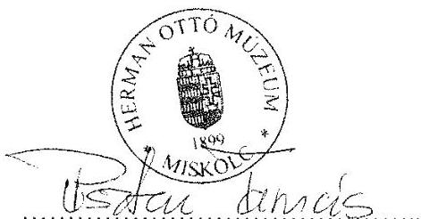

Dr. Pusztai Tamás
Múzeumigazgató

---

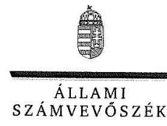

ELNÖK

Ikt.szám: V-0951-183/2016.

# Dr. Pusztai Tamás úr 

igazgató
Herman Ottó Múzeum

## Miskolc

## Tisztelt Igazgató Úr!

A ,,Megyei hatókörü városi múzeumok ellenörzése - Herman Ottó Múzeum, Miskolc" címmel készített számvevőszéki jelentéstervezetre tett észrevételét köszönettel megkaptam.
Az Állami Számvevőszék észrevételre vonatkozó álláspontjáról a felügyeleti vezető által készített részletes tájékoztatást csatoltan megküldöm.
Tájékoztatom Igazgató urat, hogy a számvevőszéki jelentésben - az Állami Számvevőszékről szóló 2011. évi LXVI. törvény 29. § (3) bekezdése alapján - a figyelembe nem vett észrevételeket szerepeltetjük az elutasítás indokának feltüntetésével.

Budapest, 2016. év 12. hó 29. nap
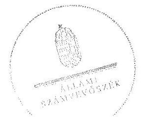

Tisztelettel:

## 06000

Domokos László

Melléklet: Tájékoztatás az elfogadott és az el nem fogadott észrevételekről

---

# Tájékoztatás az elfogadott és az el nem fogadott észrevételekről 

A „Megyei hatókörü városi múzeumok ellenörzése - Herman Ottó Múzeum, Miskolc"címủ jelentéstervezetre a 3234/2016.A.02. iktatószámú levelével megküldött észrevételeit áttekintettük, annak kezeléséről az alábbi tájékoztatást adom.

## I. A jelentéstervezetre tett általános észrevételei kapcsán

## I./1. A jelentéstervezet 5. oldal „Föbb megállapítások, következtetések" fejezet 3. bekezdésének 1. megállapítására tett észrevétele kapcsán

Köszönettel vettem tájékoztatását a Herman Ottó Múzeum (továbbiakban: Múzeum) jogelődjét, a Borsod-Abaúj-Zemplén Megyei Múzeumi Igazgatóságot érintő 2011. és 2012. évi változásokról. Észrevéltelében jelezte, hogy a jelentéstervezet 5. oldal „Föbb megállapítások, következtetések" fejezet 3. bekezdésének 1. megállapítása arra enged következtetni, hogy a Múzeum az érintett dokumentumok birtokában volt, azonban azt nem adta át az Állami Számvevőszéknek (továbbiakban: ÁSZ). A 2011. évi pénzügyi és vagyongazdálkodási tevékenységének dokumentumait sem 2012-ben sem később nem kapta meg az akkori fenntartó által működtetett Gazdasági Hivataltól, aki az adott időszakban a pénzügyi és vagyongazdálkodási tevékenységet végzete, és ezen dokumentumokat készítette. Észrevételében a hivatkozott megállapítás helyett szövegjavaslattal új megállapítás megtételét javasolta.

Észrevételét a dokumentumok ismételt felülvizsgálatát követően elfogadtuk és azt a számvevőszéki jelentés összeállításánál figyelembe vesszük. Megjegyzem továbbá, hogy a 2011. első negyedévi átadott dokumentumok nem voltak elegendőek a hivatkozott ellenőrzési program és a jelentéstervezet „Az ellenörzés módszerei" című fejezetben bemutatott módszertan alapján a Múzeum pénzügyi- és vagyongazdálkodásának 2011. évi ellenőrzésére és értékelésére.

## I./2. A jelentéstervezet 28. oldal 4.5. számú megállapítás 1. bekezdésének 1. megállapítására tett észrevétele kapcsán

Észrevételében arról tájékoztatott, hogy az ellenőrzött időszak alatt 2013. január 1-jéig a Múzeum jogelődje a Borsod- Abaúj-Zemplén Megyei Múzeumi Igazgatóság volt, így a hivatkozott megállapítás a Borsod-Abaúj-Zemplén Megyei Múzeumi Igazgatóságra vonatkozik. Észrevételében kérte annak a jó gyakorlatnak a bemutatását, hogy 2012 óta bevezetésre került a régészeti projektek kódok szerinti nyilvántartása, amely nyilvántartás segítségével a projekt minden résztvevője birtokába kerül a régészeti tevékenységet meghatározó ismereteknek, ami nem csak az

---

ellenőrizhetőséget alapozza meg, de a résztvevők egyéni felelősségérzetét is növeli. Észrevételében jelezte továbbá, hogy Múzeum szerződés nélkül nem végzett megelőző régészeti feltárási tevékenységet.

Észrevételét, hogy a Múzeum szerződés nélkül nem végzett megelőző régészeti feltárási tevékenységet nem fogadtuk el. A számvevőszéki ellenőrzés rendelkezésére bocsátott dokumentumok ismételt felülvizsgálatát követen a jelentéstervezet 28. oldal 4.5. számú megállapítás 1. bekezdésének 1. megállapítása - „A régészeti feltárási tevékenység bevételeinek elszámolását, jogszerüségét a jogszabályban elöirt tartalmú szerzödés nem minden esetben támasztotta alá, mivel a 2012. évben a Kötv. 22. § (3) bekezdésében foglalt elöirás ellenére több esetben szerzödés nem készült." - megalapozott, észrevétele a megállapítást nem módosítja.

# L/3. A jelentéstervezet 25. oldal 4.2. számú megállapítás 2. bekezdésének 5. megállapítására tett észrevétele kapcsán 

Észrevételében kérte, hogy a hivatkozott megállapítás utolsó tagmondatának analógiájára a jelentéstervezet többi megállapítása is egészüljön ki azzal, hogy a Múzeum tevékenysége során kár okozása nem valósult meg. Észrevételét nem fogadtuk el, mert az ellenőrzést az ellenőrzési program szempontjai, az ellenőrzött időszakban hatályos jogszabályok, az ellenőrzés szakmai szabályai, a jelen ellenőrzésre irányadó ÁSZ módszertan és a nemzetközi standardok figyelembevételével végeztük. Észrevétele nem cáfolta a jelentéstervezet 25 . oldal 4.2 . számú megállapítás 2. bekezdésének 5. megállapítását - „A Múzeum 2012. évi költségvetésének tervezése során az „előzetes" költségvetést 2011. december 19-én a gazdasági szervezet - 2012. február 15-én kinevezett - gazdasági vezetöje, mint a „,szerv gazdasági vezetöje" írta alá, amelyre nem volt jogosult, de ezzel kár okozása nem valósult meg." - ezért nem módosítja.

## L/4. A jelentéstervezet 34-37. oldal a Múzeum igazgatójának címzett 1-3. számú javaslatokra tett észrevétele kapcsán

Észrevételében arról tájékozatott, hogy a Múzeum igazgatójának címzett 1-3. számú javaslatok tekintetében intézkedést csak abban az esetben tud tenni, ha az érintett hiányosság a Múzeum jelenleg hatályos szabályzataiban, egyéb dokumentumaiban még fennáll. Jelezte, hogy intézkedések az 1-3. számú javaslatok esetében visszamenőlegesen az ellenőrzött időszakra nem tehetőek. A Múzeum 2016 decemberében hatályos szabályzatai, szerződései, dokumentumai, működése már nem azonos az ellenőrzött időszakéval. Kérte továbbá azon intézkedési javaslatok törlését, amelyek az ellenőrzött időszakot követően már teljesültek, hiszen azok tekintetében a múzeumigazgató intézkedést már nem tud tenni.
Észrevételét nem fogadtuk el, mert a javaslatok nem visszamenőleges intézkedési kötelezettségről szólnak, hanem a hivatkozott intézkedést igénylő megállapítások alapján javasolják a vonatkozó intézkedés megtételét a megállapításokban feltárt hibák, hiányosságok megszüntetésére, pótlására. Kérését, amelyben kérte azon javaslatok törlését, amelyekkel kapcsolatban már intézkedések történtek, szintén nem fogadtuk el, mert azok az ellenőrzött időszakon túlmutatnak. Tá-

---

jékoztatom Igazgató urat, hogy a végleges számvevőszéki jelentés Múzeum részére történő megküldését követően készítendő és az ÁSZ részére megküldendő intézkedési tervben jelezheti a már megvalósult intézkedéseket, amelyek megvalósítását az Állami Számvevőszékről szóló 2011. évi LXVI. törvény 33. § (7) bekezdése alapján az ÁSZ utóellenőrzés keretében ellenőrizheti.

Észrevétele a jelentéstervezet megállapításait nem vitatja, ezért azokat nem módosítja.

# II. A Múzeum igazgatójának címezett javaslatokra tett észrevételei kapcsán 

II./1. A Múzeum igazgatójának címzett 1.a) javaslatra és az azt megalapozó, jelentéstervezet 20. oldal 3.1. számú megállapítás 3. bekezdésének megállapítására tett észrevétele kapcsán
Észrevételében arról tájékoztatott, hogy az etikai elvárások pontos tartalmát a jogalkotó nem definiálta, valamint a vonatkozó jogszabályok nem rögzítik, hogy az etikai elvárásokat írásban kell rögzíteni, továbbá a szervezet minden szintjére vonatkozó általános etikai elvárásokat a 2013. évi szervezeti és működési szabályzat küldetésnyilatkozata már írásban is tartalmazza, így az etikai elvárások a 2013-2014. évekre írásban is meghatározásra kerültek. Jelezte továbbá, hogy a munkaköri leírások valamennyi foglalkoztatott esetében személyre szólóan fogalmaznak meg etikai elvárásokat.
Észrevételét nem fogadtuk el, mert a dokumentumok, ezen belül a hivatkozott szervezeti és müködési szabályzatban foglalt küldetésnyilatkozat, valamint a munkaköri leírások ismételt felülvizsgálatát követően a jelentéstervezet 20. oldal 3.1. számú megállapítás 3. bekezdésének megállapítása - „ETIKAI ELVÁRÁSOKAT a szervezet minden szintjén a múzeumigazgató az Ámr. 156. § (1) bekezdés c) pontjában, illetve a Bkr. 6. § (1) bekezdés c) pontjában foglaltak ellenére nem határozott meg a 2011-2014. években." - megalapozott. A számvevőszéki ellenőrzés rendelkezésére bocsátott dokumentumok, a küldetés nyilatkozat, valamint a munkaköri leírások nem tartalmazzák az etikai elvárásokat, észrevétele a megállapítást nem módosítja.
Észrevételében jelzi továbbá, hogy a Múzeum már 2015. június 1-jétől deklaráltan és külön e tárgyban megfogalmazva kinyilvánította magára nézve kötelező érvényűnek az ICOM 2004-ben elfogadott Etikai kódexét és a hatályos szervezeti és müködési szabályzat is tartalmaz etikai elvárásokat. A szervezeti és müködési szabályzatot Miskolc Megyei Jogú Város Önkormányzata Közgyülésének Köznevelési, Kulturális, Turisztikai, Ifjúsági és Sport Bizottsága 2015. szeptember 3-án hagyta jóvá. Észrevétele az ellenőrzött időszakon túlmutat, ezért a jelentéstervezet 20. oldal 3.1. számú megállapítás 3. bekezdésének megállapítását nem módosítja.

## II./2. A jelentéstervezet 20. oldal 3.1. számú megállapítás 2. bekezdésének 2. megállapítására tett észrevétele kapcsán

Köszönettel vettem tájékoztatását, hogy az ellenőrzött időszakban a Múzeum hatályos szervezeti és müködési szabályzatai mely okok miatt nem tartalmazták a szervezeti egységek, ezen belül a gazdasági szervezet engedélyezett létszámát. Észrevétele a jelentéstervezet 20. oldal 3.1. számú megállapítás 2. bekezdésének 2. megállapítását - „Az SZMSZ ${ }_{1-3}$ a teljes ellenőrzött idöszakban

---

nem rögzítette az Ámr. 20. § (2) bekezdés e) pontjai, valamint az Ávr. 13. § (1) bekezdés e) pontja elöirása ellenére a szervezeti egységek, ezen belül a gazdasági szervezet engedélyezett létszámát." - nem cáfolja, ezért a megállapítást nem módosítja.
Észrevételében jelezte továbbá, hogy a jelentéstervezet 35 . számú végjegyzete a 2013. január 3ától hatályos szervezeti és müködési szabályzatot a Borsod-Abaúj-Zemplén Megyei Múzeumi Igazgatósághoz rendeli, pedig 2013. január 1-jétől a Borsod-Abaúj-Zemplén Megyei Múzeumi Igazgatóság fenntartóváltás és szervezeti átalakítás után Hermán Ottó Múzeumként müködött tovább. Észrevételét elfogadtuk és a számvevőszéki jelentés összeállításánál figyelembe veszszük.
II./3. A Múzeum igazgatójának címzett 1.b) javaslatra és az azt megalapozó, jelentéstervezet 20. oldal 3.1. számú megállapítás 4. bekezdésének 5., 6. megállapításaira tett észrevétele kapcsán
Észrevételében jelezte, hogy a Múzeum számviteli politik ${ }_{3,4}$-ben meghatározásra került, hogy a Múzeum mit tekint a számviteli elszámolás, az értékelés szempontjából lényegesnek, nem lényegesnek. A számviteli politik ${ }_{3,4}$ ismételt felülvizsgálatát követően azt elfogadtuk, hogy a Múzeum mit tekint a számviteli elszámolás, az értékelés szempontjából lényegesnek és ezt a számvevőszéki jelentés összeállításánál figyelembe vesszük. Nem fogadtuk el észrevételéből, hogy a számviteli politik ${ }_{3,4}$ tartalmazza, hogy a Múzeum mit tekint a számviteli elszámolás, az értékelés szempontjából nem lényegesnek, mert ezt a dokumentumok felülvizsgálata nem támasztotta alá.

# II./4. A jelentéstervezet 20. oldal 3.1. számú megállapítás 4. bekezdésének megállapításaira tett észrevétele kapcsán 

Észrevételében arról tájékoztatott, hogy számvitelről szóló 2000. évi C. törvény (továbbiakban: Számv. tv.) nem rögzíti, hogy a számviteli politikát ki alakítja ki, továbbá a jelentéstervezet felrója a Múzeumnak, hogy a Borsod-Abaúj-Zemplén Megyei Intézményfenntartó Központ (továbbiakban: BMIK) a Számv. tv. 14. § (11) bekezdése előírása ellenére 90 napon túl készítette el a számviteli politikát és nem tér ki arra, hogy milyen jogszabály módosítás tette szükségessé a számviteli politika módosítását, hiszen számviteli politikát csak a gazdálkodó szervezet megalakulásakor kell alkotni, amellyel már a jelentéstervezet megállapításai szerint is 2011. I. negyedévében rendelkezett a Múzeum.
Észrevételét a számviteli politika elkészítésére tekintettel nem fogadtuk el, mert a számviteli politika elkészítésének felelőseiről 2011-2013. években az államháztartás szervezetei beszámolási és könyvvezetési kötelezettségének sajátosságairól szóló 249/2000. (XII. 24.) Korm. rendelet (továbbiakban: Áhsz.) 8. § (12), (13) bekezdése, valamint a 2014. évben az államháztartás számviteléről szóló 4/2013. (I. 11.) Korm. rendelet (továbbiakban: Áhsz.2) 50. § (1) bekezdése rendelkezik.
A számviteli politika BMIK általi elkészítésére vonatkozó észrevétele a jelentéstervezet 20. oldal 3.1. számú megállapítás 4. bekezdésének 3. megállapítását - „4 2012. évben hatályos számviteli politika2-t a munkamegosztási megállapodás ${ }^{39}$-ban rögzítettek alapján a Számv. tv. 14. § (11) bekezdés elöirása ellenére 90 napon túl - 2012. július 18 -án - a gazdasági szervezet ${ }^{40}$ készítette el és terjesztette ki hatályát a Múzeumra." - nem cáfolja, ezért azt nem módosítja.

---

Köszönettel vettem tájékoztatását, hogy 2015. évben a számviteli politikában a kulturális javak mérlegben való kimutatásával kapcsolatos szabályokat rögzítették. Észrevétele a jelentéstervezet 20. oldal 3.1. számú megállapítás 4. bekezdésének 6. megállapítását - „A múzeumigazgató a 2014. évben nem rögzitette a Számv. tv. 14. § (11) bekezdésben foglaltak ellenére, a kulturális javak mérlegben való kimutatásával kapcsolatos szabályokat az Ahsz. ${ }^{41}$ 10. § (1) bekezdés szerinti előirás bevezetésére tekintettel a számviteli politika ${ }_{4}$-ben." - nem vitatja, az ellenőrzött időszakon túlmutat, ezért a megállapítást nem módosítja.
II./5. A Múzeum igazgatójának címzett 1.c) javaslatra és az azt megalapozó, jelentéstervezet 20. oldal 3.1. számú megállapítás 5. bekezdésének 2. megállapítására tett észrevétele kapcsán
Észrevételében jelezte, hogy a szálarend, tartalmazta a részletező nyilvántartások vezetésének módját, azoknak a kapcsolódó könyvviteli és nyilvántartási számlákkal való egyeztetését. A dokumentumok ismételt felülvizsgálatát követően észrevételét elfogadtuk és azt a számvevőszéki jelentés összeállításánál figyelembe vesszük.
II./6. A Múzeum igazgatójának címzett 1.d) javaslatra és az azt megalapozó, jelentéstervezet 20. oldal 3.1. számú megállapítás 6. bekezdésének 3. megállapítására tett észrevétele kapcsán
Észrevételében arról tájékoztatott, hogy a 2013. évre tett megállapítások helytállóak, azonban 2014. év tekintetében az Eszközök és Források Értékelési Szabályzata3 2.7 pontja tartalmazza az egyszerüsített értékelési eljárás alá vont követelések besorolásának elveit. Észrevételét nem fogadtuk el, mert az Eszközök és Források Értékelési Szabályzata3 ismételt felülvizsgálatát követően a jelentéstervezet 20. oldal 3.1. számú megállapítás 6 . bekezdésének 3. megállapítása - „A 2013-2014. években a hatályos eszközök és források értékelési szabályzat ${ }_{23}$ nem tartalmazta az Ahsz. 18. § (18) bekezdés és az Ahsz. 2 50. § (2) bekezdés c) pont előirása ellenére az egyszerüsített értékelési eljárás alá vont követelések besorolásának elveit, dokumentálásának szabályait." megalapozott, észrevétele a megállapítást nem módosítja.
II./7. A Múzeum igazgatójának címzett 1.e) javaslatra és az azt megalapozó, jelentéstervezet 20. oldal 3.1. számú megállapítás 11. bekezdésének 3. megállapítására tett észrevétele kapcsán
Észrevételében foglaltak alapján a Múzeum Belső Kontroll Szabályzatának (2014) 51. oldala tartalmazza az előirányzat módosításokkal kapcsolatosan a felelősségi és információs szinteket és kapcsolatokat, irányítási és ellenőrzési folyamatokat. Észrevételét nem fogadtuk el, mert a dokumentumok ismételt felülvizsgálatát követően a jelentéstervezet 20. oldal 3.1. számú megállapítás 11. bekezdésének 3. megállapítása - „Az ellenőrzési nyomvonalban a müködés folyamatai között az elöirányzat módosításokkal kapcsolatosan a felelösségi és információs szinteket és kapcsolatokat, irányitási és ellenörzési folyamatokat a múzeumigazgató nem szabályozta a Bkr. 6. § (3) bekezdésében foglaltak ellenére." - megalapozott, észrevétele a megállapítást nem módosítja. Megjegyzem továbbá, hogy az észrevételében hivatkozott dokumentum 51. oldala a féléves zárlati feladatok ellenőrzési nyomvonalát tartalmazza, ezen belül például az előirányzatok egyezte-

---

tésének ellenőrzési nyomvonalát és nem a ,,az elöirányzat módosításokkal kapcsolatosan a felelösségi és információs szinteket és kapcsolatokat, irányitási és ellenörzési folyamatokat" határozza meg.
II./8. A Múzeum igazgatójának címzett 1.f) javaslatra és az azt megalapozó, jelentéstervezet 22. oldal 3.2. számú megállapítás 3. bekezdésének megállapítására tett észrevétele kapcsán
Észrevételében megköszönte a javaslatot, észrevétele a jelentéstervezet 22. oldal 3.2. számú megállapítás 3 . bekezdésének megállapítását nem cáfolta, ezért nem módosítja.
II./9. A Múzeum igazgatójának címzett 1.g) javaslatra és az azt megalapozó, jelentéstervezet 22. oldal 3.3. számú megállapítás 3. bekezdésének 1. megállapítására tett észrevétele kapcsán
Észrevételében megköszönte a javaslatot, észrevétele a jelentéstervezet 22. oldal 3.3. számú megállapítás 3 . bekezdésének 1 . megállapítását nem cáfolta, ezért nem módosítja.
II./10. A Múzeum igazgatójának címzett 1.h) javaslatra és az azt megalapozó, jelentéstervezet 23. oldal 3.4. számú megállapítás 2. bekezdés 1. francia bekezdésének megállapítására tett észrevétele kapcsán
Észrevételében arról tájékoztatott, hogy a Múzeum 2013. évi szervezeti és működési szabályzatának IV. fejezete (Az Intézmény működése) rögzíti a költségvetési szervek belső kontrollrendszeréről és belső ellenőrzéséről szóló 370/2011. (XII. 31.) Korm. rendelet 9. § (1)-(2) bekezdéseiben leírt rendszereket, melyek színterei az igazgatótanács, a vezetői értekezlet, az osztályértekezlet és a munkaértekezlet. E rendszert a 2015-ben elfogadott, jelenleg hatályban lévő szervezeti és müködési szabályzat is tartalmazza.
A dokumentumok ismételt felülvizsgálatát követően észrevételét a 2013-2014. évekre és a beszámolási szintekre, határidőkre vonatkozóan elfogadtuk és azt a számvevőszéki jelentés összeállításánál figyelembe vesszük. Észrevételét a beszámolási módok tekintetében nem fogadtuk el, mert azt a szervezeti és müködési szabályzat hivatkozott fejezete nem tartalmazza.
II./11. A Múzeum igazgatójának címzett 1.i) javaslatra és az azt megalapozó, jelentéstervezet 23. oldal 3.4. számú megállapítás 2. bekezdés 2. francia bekezdésének megállapítására tett észrevétele kapcsán
Észrevételében foglaltak alapján a Múzeum hatályos Adatvédelmi és Adatbiztonsági Szabályzata tartalmazza a közérdekủ adatok megismerésére irányuló igények teljesítésének rendjét. Észrevételét a dokumentumok, ezen belül az Adatvédelmi és Adatbiztonsági Szabályzat ismételt felülvizsgálatát követően nem fogadtuk el, mert azok nem tartalmazzák a közérdekủ adatok megismerésére irányuló igények teljesítésének rendjét. Észrevétele a jelentéstervezet 23. oldal 3.4. számú megállapítás 2. bekezdés 2. francia bekezdésének megállapítását - „a közérdekü adatok megismerésére irányuló igények teljesitésének rendjét az Avtv. 20. § (8) bekezdés, az Info tv. 30. § (6) bekezdés elöirása ellenére nem szabályozták" - nem módosítja.

---

II./12. A Múzeum igazgatójának címzett 1.j) javaslatra és az azt megalapozó, jelentéstervezet 23. oldal 3.4. számú megállapítás 2. bekezdés 3. francia bekezdésének megállapítására tett észrevétele kapcsán
Észrevételében megköszönte a javaslatot, észrevétele a jelentéstervezet 23. oldal 3.4. számú megállapítás 2. bekezdésének 3. francia bekezdése megállapítását nem cáfolta, ezért nem módosítja.
II./13. A Múzeum igazgatójának címzett 1.k) javaslatra és az azt megalapozó, jelentéstervezet 24. oldal 3.5. számú megállapítás 2. bekezdésének 3. megállapítására tett észrevétele kapcsán
Észrevételében jelezte, hogy pontosítást igényel, milyen további szabályzatokra, folyamatok kialakítására és müködtetésére történik az utalás, a Múzeum jelenleg meglévő 40 db hatályos szabályzatán és meglévő és müködtetett folyamatain felül, továbbá amennyiben a hatályos szabályzatokon, hatályos folyamatok kialakításán és müködtetésén túl nem kerül nevesítésre más szabályzat, úgy további intézkedés megtétele nem lehetséges, figyelemmel arra, hogy intézkedés megtétele csak új szabályzat, új folyamat kiadására vonatkozhat.
Észrevételét nem fogadtuk el, mert a számvevőszéki ellenőrzés rendelkezésére bocsátott dokumentumok ismételt felülvizsgálata alapján a jelentéstervezet 24 . oldal 3.5 . számú megállapítás 2. bekezdésének 3. megállapítása - „A múzeumigazgató a 2011. évben az Áht. 1 121/A. § (1) bekezdése, a 2012-2014. években a Bkr. 6. § (2) bekezdés elöírása ellenére nem adott ki olyan szabályzatokat, nem alakított ki és müködtetett olyan folyamatokat a szervezeten belül, amelyek biztositották a rendelkezésre álló források gazdaságos, hatékony és az eredményes felhasználását." - megalapozott. A felülvizsgált dokumentumok nem biztosítják „a rendelkezésre álló források gazdaságos, hatékony és az eredményes felhasználását". Észrevétele a megállapítást nem módosítja.
II./14. A Múzeum igazgatójának címzett 1.l) javaslatra és az azt megalapozó, jelentéstervezet 24. oldal 3.5. számú megállapítás 3. bekezdésének 3. megállapítására tett észrevétele kapcsán
Észrevételében arról tájékoztatott, hogy Múzeumnál a belső ellenőrzési tevékenységet Miskolc Megyei Jogú Város Önkormányzatának Ellenőrzési Osztálya látja el Miskolc Megyei Jogú Város Közgyűlésének X-223/96.181/2006. sz. határozata alapján. Ebből következően a belső ellenőrzési vezető az Önkormányzat Belső Ellenőrzési Osztályának vezetője. A Belső Ellenőrzési Kézikönyvet az Önkormányzat Belső Ellenőrzési Osztály Vezetőjének hatásköre felülvizsgálni, így a belső ellenőrzési kézikönyv felülvizsgálata fenntartói hatáskörben lehetséges.
A dokumentumok ismételt felülvizsgálatát követően a jelentéstervezet 24. oldal 3.5. számú megállapítás 3. bekezdésének 3. megállapítását a számvevőszéki jelentés összeállításánál a következőkre módosítjuk: „A Múzeum rendelkezett belső ellenőrzési kézikönyvvel."

---

II./15. A Múzeum igazgatójának címzett 1.m) javaslatra és az azt megalapozó, jelentéstervezet 24. oldal 3.5. számú megállapítás 4. bekezdésének 1. megállapítására tett észrevétele kapcsán
Észrevételében jelezte, hogy Miskolc Megyei jogú Város Önkormányzat Közgyűlésének X-223/96.181/2006. számú határozatának 2. pontja szerint: „A Közgyülés a helyi önkormányzatokról szóló 1990. évi LXV. törvény 92. § (11) bekezdésében biztositott felhatalmazás alapján egyetért azzal, hogy az általa fenntartott költségvetési szervek esetében az ellenörzés helyének, szerepének megítélésében történt jogszabályi változások alapján az eddigi ún. "felügyeleti jellegü" ellenörzést önkormányzati szinten végzett belső ellenörzésnek kell tekinteni." A Múzeum belső ellenőrzési feladatait Miskolc Megyei jogú Város Önkormányzatának Belső Ellenőrzési Osztálya látja el.
A dokumentumok ismételt felülvizsgálatát követően észrevételében hivatkozott javaslatot a számvevőszéki jelentés összeállításánál töröljük.
II./16. A Múzeum igazgatójának címzett 2.a) javaslatra és az azt megalapozó, jelentéstervezet 4.3. sz. megállapítás 1. bekezdésének 3 megállapítására, 5.3. sz. megállapítás 1. bekezdésének 1. megállapítására, 5.3. sz. megállapítás 1. bekezdésének 3. francia bekezdésére, 5.3. sz. megállapítás 3. bekezdése megállapításaira tett észrevétele kapcsán
Észrevételében arról tájékoztatott kiemelten, hogy 2013. évben a Múzeum készített leltár, ezért a jelentéstervezet vonatkozó megállapításai kizárólag a 2014. év tekintetében lehetnek relevánsak. A Múzeumnál 2015. évben ismét készítettek leltárt, így teljesült az intézkedés is.
Észrevétele nem cáfolta a Múzeum igazgatójának címzett 2. a) számú javaslatot megalapozó intézkedést igénylő megállapításokban feltárt, az elkészített leltárakkal kapcsolatos hiányosságokat, ezért észrevétele a jelentéstervezet 4.3. sz. megállapítás 1. bekezdésének 3 megállapítását, az 5.3. sz. megállapítás 1. bekezdésének 1. megállapítását, az 5.3. sz. megállapítás 1. bekezdésének 3. francia bekezdését, valamint az 5.3. sz. megállapítás 3. bekezdése megállapításait nem módosítja.
II./17. A Múzeum igazgatójának címzett 2.b) javaslatra és az azt megalapozó, jelentéstervezet 28. oldal 4.3. sz. megállapítás 3. bekezdésének megállapítására tett észrevétele kapcsán
Észrevételében foglaltak alapján a 2013. évi beszámolót 2014. március 4. napján 10:00:53 másodperckor a Múzeum feladta elektronikusan a Magyar Államkincstár (továbbiakban: Kincstár) KGR rendszerébe. Miskolc Megyei Jogú Város Önkormányzata (továbbiakban: Önkormányzat) a Múzeum részére hivatalosan, írásban közölte a beszámoló feladási határidejét, amely 2014. március 5-e volt. A 2014. évi beszámolót 2015. március 5. napján 08:28:54 másodperckor adta fel a Múzeum elektronikusan, továbbá az Önkormányzat által meghatározott határidő 2015. március 5 -e volt.
Észrevételét nem fogadtuk el, mert a 2013. évi beszámoló 2014. március 4-i feladása és a 2014. évi beszámoló 2015. március 5-i feladása a Kincstár által üzemeltett KGR elektronikus rend-

---

szerbe önmagában nem felel meg Áhsz. 10. § (1) bekezdésében és az Áhsz. 2 32. § (1) bekezdésében foglalt előírásoknak. Észrevétele megerősíti a jelentéstervezet 28. oldal 4.3. sz. megállapítás 3. bekezdésének megállapítását - „A Múzeum beszámolóját az Áhsz. 10. § (1) bekezdés, illetve az Áhsz. 2 32. § (1) bekezdésében foglalt - tárgyévet követő február 28-át követően - határidőn túl küldte meg az irányító szerv, felé, mivel a 2013. évi költségvetési beszámolót 2014. április 8-án, a 2014. évi beszámolót 2015. március 10-én készítették el." - észrevétele a megállapítást nem módosítja. Megjegyzem, hogy a hivatkozott megállapításban szereplő 2014. április 8 -i és 2015 március 10 -i dátum a beszámolók Múzeum általi aláírásának dátuma.
II./18. A Múzeum igazgatójának címzett 2.c) javaslatra és az azt megalapozó, jelentéstervezet 26. oldal 4.4. sz. megállapítás 1. bekezdésének 3. megállapítására tett észrevétele kapcsán
Köszönettel vettem tájékoztatását, hogy a bevételek teljesítésigazolóit írásban kijelölte, amely kijelölés jelenleg is hatályos. Észrevétele az ellenőrzési időszakon túlmutat, ezért a jelentéstervezet 26. oldal 4.4. sz. megállapítás 1. bekezdésének 3. megállapítását - „A 2013-2014. években a bevételek teljesitésének igazolására az Avr. 57. § (2) bekezdése szerinti lehetőség alapján az ügyrend, 8.1.3. pontjában, valamint az ügyrend, 7.1.3. pontjában elöirták a bevételek teljesitésigazolását, ennek ellenére a kötelezettségvállaló múzeumigazgató a bevételek teljesitésigazolóit írásban nem jelölte ki." - nem módosítja.
II./19. A Múzeum igazgatójának címzett 2.d) javaslatra és az azt megalapozó, jelentéstervezet 26. oldal 4.4. sz. megállapítás 2. bekezdésének megállapításaira tett észrevétele kapcsán
Köszönettel vettem tájékoztatását a Múzeum gazdasági feladatait ellátó szervezetek, és a fenntartók változásairól, a vagyonkezelési szerződés megkötésére vonatkozó jogosultságokról, továbbá az állami vagyonra vonatkozó jogszabályok rendelkezéseiről, valamint a Magyar Nemzeti Vagyonkezelő Zrt.-vel folyatatott együttmüködésről a vagyonkezelési szerződés megkötése érdekében.
Észrevételét, hogy a 2012. évre nem áll fenn a jelentéstervezet azon megállapítása, hogy jogalap nélküli az állami tulajdonú vagyontárgyak hasznosítása nem fogadtuk el, mert, ahogy észrevételében jelezte a fenntartó rendelkezett vagyonkezelési szerződéssel, így 2012-ben a Múzeumnak nem volt jogalapja az állami tulajdonú vagyontárgyak hasznosítására.
Jelezte továbbá, hogy a Múzeum 2015. december 17-étől rendelkezik hatályos vagyonkezelési szerződéssel, amely észrevételt szintén nem fogadtuk el, mert észrevétele az ellenőrzési időszakon túlmutat.
Fenti válaszaim alapján észrevételei a jelentéstervezet 26. oldal 4.4. sz. megállapítás 2. bekezdésének megállapításait - „Vagyontárgyak hasznosítására ingatlan bérbeadásával került sor. A 2012. évben vagyonkezelési szerzödéssel a fenntartó, rendelkezett, a Múzeumnál a 2012. évben jogalap nélkül az állami tulajdonú vagyontárgyak hasznosítására a Vtv. 25. § (4) bekezdés szerinti vagyonhasznosításra feljogositó, a 2013-2014. években az Nvtv. 11. § (7) bekezdés szerinti vagyonkezelési szerződés nélkül került sor." - nem módosítják.

---

II./20. A Múzeum igazgatójának címzett 2.e) javaslatra és az azt megalapozó, jelentéstervezet 26. oldal 4.4. sz. megállapítás 4. bekezdés 1. francia bekezdésének megállapítására tett észrevétele kapcsán
Köszönettel vettem tájékoztatását, hogy a 2015. évtől hatályos Ügyrend a gazdasági vezetőt határozta meg az érvényesítő kijelölésére. Észrevétele a jelentéstervezet 26. oldal 4.4. sz. megállapítás 4. bekezdés 1. francia bekezdésének megállapítását - „a gazdasági vezető helyett a múzeumigazgatót jelölte meg az ügyrend ${ }_{1,2}$ az érvényesitỏ kijelölésére az Av̉r. 55. § (2) bekezdés a) pont és az 58. § (4) bekezdés elöírásai ellenére a 2013-2014. években;" - nem cáfolta, az az ellenőrzési időszakon túlmutat, ezért a megállapítást nem módosítja.
II./21. A Múzeum igazgatójának címzett 2.f) javaslatra és az azt megalapozó, jelentéstervezet 26. oldal 4.4. sz. megállapítás 5. bekezdés 5. francia bekezdésének megállapítására tett észrevétele kapcsán
Köszönettel vettem tájékoztatását, hogy az érvényesítő jogszabályi előírásoknak megfelelő kijelölése már 2015-ben megtörtént. Észrevétele a jelentéstervezet 26. oldal 4.4. sz. megállapítás 5. bekezdés 5. francia bekezdésének megállapítását - „a 2013-2014. években az érvényesitőt a gazdasági vezetö helyett a múzeumigazgatója jelölte ki az Av̉r. 58. § (4) bekezdésében foglaltak ellenére;" - nem vitatta, az az ellenőrzési időszakon túlmutat, ezért a megállapítást nem módosítja.
II./22. A Múzeum igazgatójának címzett 2.g) javaslatra és az azt megalapozó, jelentéstervezet 26. oldal 4.4. sz. megállapítás 5. bekezdés 6. francia bekezdésének megállapítására tett észrevétele kapcsán
Köszönettel vettem tájékoztatását, hogy 2015-től az utalványozás szabályszerűen érvényesített okmányok alapján történik. Észrevétele a jelentéstervezet 26. oldal 4.4. sz. megállapítás 5. bekezdés 6. francia bekezdésének megállapítását - „a kiadások utalványozását a 2012-2014. években nem az Av̉r. 59. § (1) bekezdésében foglaltaknak megfelelően végezték, mert az utalványozásra nem szabályszerűen érvényesitett okmányok alapján került sor." - nem cáfolta, az az ellenőrzési időszakon túlmutat, ezért a megállapítást nem módosítja.
II./23. A Múzeum igazgatójának címzett 3.a) javaslatra és az azt megalapozó, jelentéstervezet 29. oldal 5.2. sz. megállapítás 4. bekezdésének 2. megállapítása és az 5.2. számú megállapítás 5. bekezdésének 4. megállapítására tett észrevétele kapcsán
Észrevételében jelezte, hogy nem tudnak egyetérteni a jelentéstervezet 29. oldal 5.2. sz. megállapítás 4. bekezdésének 1. megállapításával, mert a fenntartóváltások kapcsán úgy az ingó és ingatlan vagyon, mint a múzeumi műtárgyállomány kapcsán adatokat szolgáltattak a mindenkori fenntartónak és ezen túlmenően az Emberi Erőforrások Minisztériumának is. Észrevételét nem fogadtuk el, mert a szolgáltatott adatokból - vagyonkezelési szerződés hiányában - nem állapítható meg a kezelt vagyon köre és nagysága. Észrevétele a jelentéstervezet 29. oldal 5.2. sz. megállapítás 4. bekezdésének 1. megállapítását - „A kezelt vagyon köre és nagysága a 2013-2014. években vagyonkezelési szerzödés hiányában nem volt megállapítható." - nem módosítja.

---

Köszönettel vettem tájékoztatását, hogy a kulturális javak mérlegben való kimutatásával kapcsolatban a szabályozás már megtörtént a 2015. évi Számviteli Politikában, amelyet a könyvelési gyakorlat is követett illetve követ mai napig. Észrevétele a jelentéstervezet 29. oldal 5.2. sz. megállapítás 4. bekezdésének 2. megállapítását - „Kiegészitő mellékletben a Múzeum a 20132014. években a Számv. tv. 23. § (2) bekezdésében elöirtak ellenére nem mutatta be mérlegtételek szerinti megbontásban a kezelésbe vett állami eszközöket, és a 2014. évben az Ábsz.; 29. § (2) bekezdés c) pontjában elöirtak ellenére nem jelezte a vagyonkezelési szerződés hiányát, emiatt nem érvényesült a Számv. tv. 16. § (4) bekezdésében meghatározott „lényegesség elve".", valamint az 5.2. számú megállapítás 5. bekezdésének 4. megállapítását - „A gyarapodási napló alapján a 2014. évben a Múzeumnál a kulturális javak állománya 1,2 millió Ft-tal gyarapodott, ezek kimutatásának hiánya miatt a könyvvezetés során és a beszámolóban sérült a Számv. tv. 15. § (2) bekezdésében foglalt teljesség elve." - nem cáfolta, ezért azokat nem módosítja.
II./24. A Múzeum igazgatójának címzett 3.b) javaslatra és az azt megalapozó, jelentéstervezet 29. oldal 5.2. sz. megállapítás 6. bekezdés 1-7. francia bekezdéseinek megállapításaira és a jelentéstervezet 32. oldal 5.4. sz. megállapítás 2. bekezdésének megállapításaira, az 5.4. sz. megállapítás 3. bekezdésének 1. megállapítására tett észrevétele kapcsán
Köszönettel vettem a jelentéstervezet 32. oldal 5.4. számú megállapításával kapcsolatos tájékoztatását, amelyben bemutatta, hogy a 2013-2014 folyamán bekövetkezett jogszabályi változások megsokszorozták a múzeumi gyűjteményekben nyilvántartott kulturális javak kölcsönzésével kapcsolatos adminisztrációs terheket, amely nem párosult a múzeumokban dolgozó munkatársak létszámának növelésével, valamint a kölcsönzésekkel kapcsolatban megállapított hiányosságok pótlására a Múzeum már részben megtette a szükséges intézkedéseket. Jelezte továbbá, hogy a kölcsönzések lebonyolítása során minden kölcsönzést nyilvántartottak, ellenőriztek, károkozás nem történt. Észrevétele a jelentéstervezet 32. oldal 5.4. számú megállapítását - „A kulturális javak hasznosítása és kölcsönzése a jogszabályi elöírásoknak nem felelt meg, a kulturális javak vagyonbiztonságára és állományvédelmére vonatkozó elöírásokat nem tartották be." - nem vitatta, ezért nem módosítja.
Észrevételében szövegszerü javaslatot tett a jelentéstervezet 32. oldal 5.4. számú megállapítás 2. bekezdésének utolsó megállapítására, tekintettel arra, hogy az állomány- és vagyonvédelem a gyüjteményekben a vizsgált időszakban nem sérült, mert a jelentős számú kölcsönzés ellenére is minden mütárgy hiánytalanul, sérülésmentesen, határidőre visszakerült a gyüjteményekbe. Kiemelte továbbá, hogy az állomány- és vagyonvédelemhez szükséges szakmai és anyagi ráfordítást a Múzeum minden esetben megtette, a mütárgyak csomagolását, szállítását, a kölcsönvevönél történő installálását, a kiállított kulturális javak ellenőrzését elvégezte. Észrevételét nem fogadtuk el, mert az ÁSZ a kulturális javak hasznosítása és kölcsönzése során a jogszabályi előírások betartását, ezen belül is kiemelten a megkötött szerződések jogszabályi előírásoknak való megfelelőségét és nem a Múzeumnak az állomány- és vagyonvédelemhez szükséges szakmai és anyagi ráfordítását ellenőrizte. A jelentéstervezet 32. oldal 5.4. számú megállapítás 2. bekezdésének utolsó megállapítása - „Az állományvédelmi követelmények, a vagyonvédelem a jogszabályi elöírásoknak nem megfelelő kölcsönzési tevékenység következtében nem volt biztositott." megalapozott, észrevétele a megállapítást nem módosítja.

---

Az 5.4. számú megállapítás 3. bekezdésének 1. megállapításával kapcsolatban észrevételében jelezte, hogy a nem muzeális intézmények részére történő kölcsönzések nagy részében a korábbi Fenntartó, és annak közvetlen érdekkörébe tartozó állami, önkormányzati szervek a kölcsönvevők, továbbá az egyik oldalról elvárt határidők és együttmüködési kötelezettségek nincsenek összhangban a másik oldalról elvárt jogszabályi kötelezettségekkel. Észrevétele a jelentéstervezet 5.4. számú megállapítás 3. bekezdésének 1. megállapítását - „A nem muzeális intézmények részére történő kölcsönzéshez több esetben nem rendelkeztek a miniszter hozzájárulásával az Mtv. 38. § (9), illetve az Mtv. 38/A. § (5) bekezdéseiben foglaltak ellenére." - nem cáfolta, ezért nem módosítja.
II./25. A Múzeum igazgatójának címzett 3.c) javaslatra és az azt megalapozó, jelentéstervezet 31. oldal 5.3. sz. megállapítás 5. bekezdésének 3. megállapítására tett észrevétele kapcsán
Észrevételében megköszönte a javaslatot, észrevétele a jelentéstervezet 31. oldal 5.3. sz. megállapítás 5. bekezdésének 3. megállapítását nem cáfolta, ezért nem módosítja.

Budapest, 2016. év 12 .
hó 29. nap
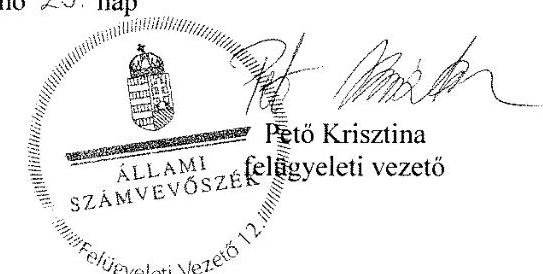

---

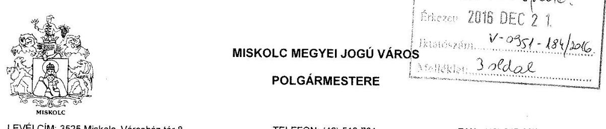

LEVÉLCIM: 3525 Miskolc, Városház tér 8.
Kuo.: 310954-3/2016.
Ea.: Nébliné Babik Katalin

Tárgy: számvevőszéki jelentéstervezettel kapcsolatos észrevételek megküldése
Melléklet: „Megyei hatókörü városi múzeumok ellenörzése - Herman Ottó Múzeum" számvevőszéki jelentéstervezettel kapcsolatos észrevételek

Állami Számvevőszék Domokos László elnök úr részére

# Budapest 

PI. 54
1364

## Tisztelt Elnök Úr!

Miskolc Megyei Jogú Város Önkormányzatának képviselőjeként mellékelten megküldöm a „Megyei hatókörü városi múzeumok ellenörzése - Herman Ottó Múzeum" címủ számvevőszéki jelentéstervezettel kapcsolatos észrevételeinket.

Észrevételeink figyelembevételében bízva, tisztelettel:

Miskolc, 2016. december 14.
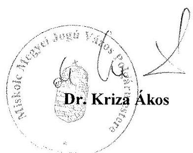

---

# Melléklet 

„Megyei hatókörü városi múzeumok ellenőrzése - Herman Ottó Múzeum" számvevőszéki jelentéstervezettel kapcsolatos észrevételek

A Herman Ottó Múzeum 2015. évi Állami Számvevőszék ellenőrzése során keletkezett Számvevőszéki Jelentéstervezetben foglalt - Javaslatok Miskole Megyei Jogú Város Önkormányzata Polgármesterének címủ pontban megfogalmazott felvetésekre az alábbi észrevételeket teszem

## 1. sz. megállapítás 2. bekezdésének 3. francia bekezdése:

A múzeum kezelésében lévő közérdekú adatokat és közérdekből nyilvános adatokat, valamint az Áht-ben az irányítási jogkörök gyakorlásához szükséges, törvényben nevesített személyes adatokat a 2012-2014. években az Áht. 9. § (1) bekezdés j) pontjában előírtak ellenére nem kezelte az irányító szerv

A Herman Ottó Múzeum 2013. január 1. napjától került Miskolc Megyei Jogú Város Önkormányzatához, mint fenntartóhoz. Erre tekintettel a jelentéstervezetben megfogalmazott észrevételekre 2013. január 1. napjától kezdődő időszakra vonatkoztatva áll módomban észrevételt tenni.

A Múzeum kezelésében található közérdekủ és közérdekből nyilvános adatok kezelése tekintetében jelzem, hogy az információs önrendelkezési jogról és információszabadságról szóló 2011. évi CXII. törvény (továbbiakban: Infotv.) 3. § 5. pontja szerint közérdekü adat:
,,az állami vagy helyi önkormányzati feladatot, valamint jogszabályban meghatározott egyéb közfeladatot ellátó szerv vagy személy kezelésében lévő és tevékenységére vonatkozó vagy közfeladatának ellátásával összefüggésben keletkezett, a személyes adat fogalma alá nem esö, bármilyen módon vagy formában rögzitett információ vagy ismeret, függetlenül kezelésének módjától, önálló vagy gyüjteményes jellegétől......."

Az adatkezelő fogalmát az Infotv. 3. § 9. pontja meghatározza a következők szerint: „az a természetes vagy jogi személy, illetve jogi személyiséggel nem rendelkező szervezet, aki vagy amely önállóan vagy másokkal együtt az adat kezelésének célját meghatározza, az adatkezelésre (beleértve a felhasznált eszközt) vonatkozó döntéseket meghozza és végrehajtja, vagy az adatfeldolgozóval végrehajtatja".

Az Infőtörvény értelmében a közfeladatot ellátó szerv gondoskodik a közfeladata ellátásával kapcsolatosan keletkezett közérdekủ adatok kezeléséről és az ezzel kapcsolatos döntések meghozataláról. Ezen jogszabály a közérdekủ adatok és közérdekből nyilvános adatok kezelésére vonatkozó speciális szabályokat tartalmazza, amely kifejezetten a közfeladatot ellátó szervet nevezi meg adatkezelőként a közérdekủ adatok és a közérdekből nyilvános adatok kezelőjeként.

Fentiekre tekintettel Miskolc Megyei Jogú Város Önkormányzata, mint a Herman Ottó Múzeum irányítószerve álláspontom szerint nem mulasztott a Múzeum kezelésben lévő közérdekủ adatok és közérdekből nyilvános adatok kezelésével összefüggésben, mivel a Múzeum önálló jogi személy és önálló adatkezelő szerv.

---

Az Áht.-ban az irányítási jogkörök gyakorlásához szükséges, törvényben nevesített személyes adatok_2012-2014. években - az Áht. 9. § (1) bekezdés j) pontja alapján - történő kezelése tekintetében észrevételezem a következőket:

Az Áht. 9. § c)-i) pontokban megnevezett személyes adatok kezelése tekintetében - a fenntartóváltást követően - 2013. január 1. napjától Miskolc Megyei Jogú Város Önkormányzatának Polgármesteri Hivatala a törvényben meghatározott személyes adatok kezelését naprakészen ellátja a feladatkörrel rendelkező szervezeti egységeinél (Humánerőforrás Osztály, Belső Ellenőrzési Osztály, Humán Stratégiai Osztály).

Miskolc Megyei Jogú Város honlapján található általános közzétételi lista megjeleníti a Herman Ottó Múzeumot, mint az irányítás alá tartozó szervet és a szervvel kapcsolatosan fenntartó részére az Infotv. által előírt adatokat a törvény melléklete alapján.

A Múzeum a saját honlapján „Közérdekủ információk" címszó alatt tételesen megjeleníti a közérdekủ információkat. Az Infotv. 1. melléklete szerinti szerkezeti felépítésű közérdekủ adatokat tartalmazó közzétételi lista honlapon történő megjelenítésével kapcsolatosan az Önkormányzat, mint a Múzeum fenntartója megteszi a szükséges lépéseket.

# 4.4. sz. megállapítás 2. bekezdése: 

Vagyontárgyak hasznosítására ingatlan bérbeadásával került sor. A 2012. évben vagyonkezelési szerződéssel a fenntartó rendelkezett, a Múzeumnál a 2012. évben jogalap nélkül az állami tulajdonú vagyontárgyak hasznosítására a Vtvr. 25. § (4) bekezdés szerinti vagyonhasznosításra feljogosító, a 2013-2014. években az Nvtv. 11. § (7) bekezdés szerinti vagyonkezelési szerződés nélkül került sor.

## 5.2 sz. megállapítás 4. bekezdésének 2. mondata:

A 2013-2014. években a Múzeum nem rendelkezett vagyonkezelési szerződéssel, ezzel az Nvtv. 11. § (1) és (7) bekezdésének Vtvr. 8. § (6) bekezdésének előírása nem érvényesült.

Összegző észrevétel
Miskolc Megyei Jogú Város Önkormányzata a Herman Ottó Múzeum fenntartói jogát 2013. január 01. napjával a 2012. dec. 14. napján kötött átadás-átvételi megállapodás alapján vette át. Erre tekintettel a jelentéstervezetben megfogalmazott észrevételekre 2013. január 1. napjától kezdődő időszakra vonatkoztatva áll módomban észrevételt tenni.

A 2013. január 01-jével a BAZ MIK-kel kötött megállapodás alapján a fenntartói kötelezettség átkerült az Önkormányzathoz, azonban a Magyar Állam képviseletében eljáró MNV Zrt. a tulajdonosi, használói, kezelői viszonyokat a 2015. évi LXXII. tv meghozataláig nem rendezte. Ebből következik, hogy az Önkormányzat 2015-ig nem tudott rendelkezni a hivatkozott vagyonelemekkel, azokra vonatkozóan semmilyen jogcímen nem tudott vagyonkezelői jogot létesíteni.

A Herman Ottó Múzeum ugyancsak nem tudott vagyonkezelői szerződést kötni, mivel a Magyar Állam képviseletében eljáró MNV Zrt. szerződéskötést nem kezdeményezett vele.

---

# 5.4. sz. megállapítás 2 bekezdés, 3 bekezdés 1 mondata: 

A kulturális javak hasznosítása és kölcsönzése a jogszabályi előírásoknak nem felelt meg, a kulturális javak vagyonbiztonságára és állományvédelmére vonatkozó előírásokat nem tartották be.

A 2013-2014 folyamán bekövetkezett jogszabályi változások (az Mtv. 2013. október 24-i módosítása, és a 29/2014. (IV. 10.) EMMI rendelet) megsokszorozták a múzeumi gyűjteményekben nyilvántartott kulturális javak kölcsönzésével kapcsolatos adminisztrációs terheket. Ez a változás azonban nem párosult a múzeumokban dolgozó munkatársak létszámának növelésével, ugyanakkor az elvárások, a nagy nemzeti és nemzetközi kiállítások, az állami és önkormányzati szervek reprezentációs igényei nem csökkentek.

A kölcsönzésekkel kapcsolatban megállapított hiányosságok egy része formai jellegü, egyszerű belső intézményi intézkedésekkel (egységes szerződésminták és mellékletek) kijavítható. Ezen intézkedéseket részben már megtette az intézmény. A kölcsönzésekkel kapcsolatos szabályozás tartalmi anomáliáira és a szabályozás okán felmerülő nehézségekre az ÁSZ ellenőrzés lezárását követően levélben hívta fel az intézmény a kultúráért felelős helyettes államtitkár figyelmét, jelezve, hogy a szabályoktól való eltérés oka a legtöbb esetben az intézményen kívül keresendő.

Szövegszerủ észrevételek
Második bekezdés utolsó mondata: „Az állományvédelmi követelmények, a vagyonvédelem a jogszabályi elöírásoknak nem megfelelő kölcsönzési tevékenység következtében nem volt biztositott."

Észrevétel: Az állomány- és vagyonvédelem a gyűjteményekben a vizsgált időszakban nem sérült, mert a jelentős számú kölcsönzés ellenére is minden mútárgy hiánytalanul, sérülésmentesen, határidőre visszakerült a gyűjteményekbe. Károkozás nem történt. Az állomány- és vagyonvédelemhez szükséges szakmai és anyagi ráfordítást az intézmény minden esetben megtette, a mútárgyak csomagolását, szállítását, a kölcsönvevőnél történő installálását, a kiállított kulturális javak ellenőrzését elvégezte. A kölcsönzési tevékenység javítása érdekében a 2015. évi SZMSZ-ben önálló feladatkörrel megbízott állományvédelmi felelőst nevezett ki az intézmény vezetője. A kölcsönzésekkel kapcsolatos iratanyag, mellékletek, ügyintézés tartalmi és formai egységesítése az ÁSZ ellenőrzést követően megkezdődött, véglegesítése folyamatban van.

Javaslat az utolsó mondat kicserélésére: Az állományvédelmi követelmények, a vagyonvédelem a jogszabályi elöírásoknak nem megfelelő kölcsönzési tevékenység következtében részlegesen volt biztositott.

Harmadik bekezdés első mondata: „A nem muzeális intézmények részére történő kölcsönzéshez több esetben nem rendelkeztek a miniszter hozzájárulásával az Mtv. 38. § (9), illetve az Mtv. 38/A. § (5) bekezdéseiben foglaltak ellenére."

Az említett esetek nagy részében a korábbi Fenntartó, és annak közvetlen érdekkörébe tartozó állami, önkormányzati szervek a Kölcsönvevők. A helyi intézményekkel való jó kapcsolat megőrzése viszont nem írhatja felül a jogszabályi előírásokat. Károkozás nem történt, a múzeum a kölcsönzési megállapodásait az előírásoknak megfelelően kijavítja.

---

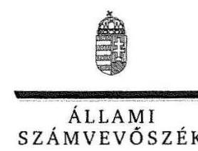

ELNÖK

Ikt.szám: V-0951-178/2016.

# Dr. Kriza Ákos úr 

polgármester
Miskolc Megyei Jogú Város Önkormányzata

## Miskolc

## Tisztelt Polgármester Úr!

A „Megyei hatókörü városi múzeumok ellenörzése - Herman Ottó Múzeum, Miskolc" címmel készített számvevőszéki jelentéstervezetre tett észrevételét köszönettel megkaptam.
Az Állami Számvevőszék észrevételre vonatkozó álláspontjáról a felügyeleti vezető által készített részletes tájékoztatást csatoltan megküldöm.
Tájékoztatom Polgármester urat, hogy a számvevőszéki jelentésben - az Állami Számvevőszékről szóló 2011. évi LXVI. törvény 29. § (3) bekezdése alapján - a figyelembe nem vett észrevételeket szerepeltetjük az elutasítás indokának feltüntetésével.
Budapest, 2016. év 12. hó 29. nap
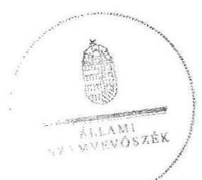

Tisztelettel:

Domokos László

Melléklet: Tájékoztatás az elfogadott és az el nem fogadott észrevételekről

---

# Tájékoztatás az elfogadott és az el nem fogadott észrevételekról 

A „Megyei hatókörü városi múzeumok ellenörzése - Herman Ottó Múzeum, Miskolc"címủ jelentéstervezetre a 310954-3/2016. iktatószámú levelével megküldött észrevételeit áttekintettük, annak kezeléséről az alábbi tájékoztatást adom.

## 1. A jelentéstervezet 16. oldal 1. számú megállapítás 2. bekezdés 3. francia bekezdésének megállapítására tett észrevétele kapcsán

Köszönettel vettem tájékoztatását az információs önrendelkezési jogról és az információszabadságról szóló 2011. évi CXII. törvény (továbbiakban: Info. tv) rendelkezéseiről. Észrevételében arról tájékoztatott, hogy Miskolc Megyei Jogú Város Önkormányzata (továbbiakban: Önkormányzat), mint a Hermán Ottó Múzeum (továbbiakban: Múzeum) irányító szerve nem mulasztott a Múzeum kezelésben lévő közérdekủ adatok és közérdekből nyilvános adatok kezelésével összefüggésben, mivel a Múzeum önálló jogi személy és önálló adatkezelő szerv. Észrevételében jelezte, hogy az Önkormányzat Polgármesteri Hivatala a törvényben meghatározott személyes adatok kezelését naprakészen ellátja a feladatkörrel rendelkező szervezeti egységeinél (Humánerőforrás Osztály, Belső Ellenőrzési Osztály, Humán Stratégiai Osztály), valamint Miskolc Megyei Jogú Város honlapján található általános közzétételi lista megjeleníti a Múzeumot, mint az irányítás alá tartozó szervet és a szervvel kapcsolatosan fenntartó részére az Info tv. által előirt adatokat a törvény melléklete alapján.

Észrevételét a jelentéstervezet 16. oldal 1. számú megállapítás 2. bekezdés 3. francia bekezdésének megállapítására - „a Múzeum kezelésében lévő közérdekü adatokat és közérdekből nyilvános adatokat, valamint az Áht. 2-ben az irányitási jogkörök gyakorlásához szükséges, törvényben nevesitett személyes adatokat a 2012-2014. években az Áht. 29. § (1) bekezdés j) pontjában elöirtak ellenére nem kezelte az irányitó szerv23;" - a dokumentumok ismételt áttekintését követően a 2013-2014 évek tekintetében elfogadtuk és azt a számvevőszéki jelentés összeállításánál figyelembe vesszük.

## 2. A jelentéstervezet 26. oldal 4.4. számú megállapítás 2. bekezdésének megállapításaira, valamint a 29. oldal 5.2. számú megállapítás 3. bekezdésének 2. megállapítására tett észrevétele kapcsán

Köszönettel vettem tájékoztatását, hogy 2013. január 1-jével a Borsod-Abaúj-Zemplén Megyei Intézményfenntartó Központtal kötött megállapodás alapján a fenntartói kötelezettség átkerült az Önkormányzathoz, azonban a Magyar Állam képviseletében eljáró Magyar Nemzeti Vagyonkezelő Zrt. (továbbiakban: MNV Zrt.) a tulajdonosi, használói, kezelői viszonyokat a megyei könyvtárak és a megyei hatókörü városi múzeumok feladatának ellátását szolgáló egyes állami tulajdonú vagyontárgyak ingyenes önkormányzati tulajdonba adásáról szóló 2015. évi LXXV.

---

törvény meghozataláig nem rendezte. Az Önkormányzat 2015-ig nem tudott rendelkezni a hivatkozott vagyonelemekkel, azokra vonatkozóan semmilyen jogcímen nem tudott vagyonkezelői jogot létesíteni, továbbá a Múzeum ugyancsak nem tudott vagyonkezelői szerződést kötni, mivel a Magyar Állam képviseletében eljáró MNV Zrt. szerződéskötést nem kezdeményezett vele.

Észrevétele a jelentéstervezet 26. oldal 4.4. számú megállapítás 2. bekezdésének megállapításait -„Vagyontárgyak hasznosítására ingatlan bérbeadásával került sor. A 2012. évben vagyonkezelési szerzödéssel a fenntartój rendelkezett, a Múzeumnál a 2012. évben jogalap nélkül az állami tulajdonú vagyontárgyak hasznosítására a Vtv. 25. § (4) bekezdés szerinti vagyonhasznosításra feljogositó, a 2013-2014. években az Nvtv. 11. § (7) bekezdés szerinti vagyonkezelési szerződés nélkül került sor." -, valamint a 29. oldal 5.2. számú megállapítás 3. bekezdésének (megjegyzem nem negyedik bekezdésének) 2. megállapítását - „A 2013-2014. években a Múzeum nem rendelkezett vagyonkezelési szerződéssel, ezzel az Nvtv. 11. § (1) és (7) bekezdésének és a Vtvr. 8. § (6) bekezdésének elöírása nem érvényesült." - nem vitatja, ezért azokat nem módosítja.

# 3. A jelentéstervezet 32. oldal 5.4. számú megállapítás 2. bekezdésének megállapításaira, valamint az 5.4. számú megállapítás 3. bekezdésének 1. megállapításra tett észrevétele kapcsán 

Köszönettel vettem tájékoztatását a 2013-2014 folyamán bekövetkezett jogszabályi változások megsokszorozták a múzeumi gyűjteményekben nyilvántartott kulturális javak kölcsönzésével kapcsolatos adminisztrációs terheket, amely nem párosult a múzeumokban dolgozó munkatársak létszámának növelésével, valamint a kölcsönzésekkel kapcsolatban megállapított hiányosságok pótlására a Múzeum már részben megtette a szükséges intézkedéseket. Jelezte továbbá, hogy a kölcsönzésekkel kapcsolatos szabályozás tartalmi anomáliáira és a szabályozás okán felmerülő nehézségekre a számvevőszéki ellenőrzés lezárását követően levélben hívta fel a Múzeum a kultúráért felelős helyettes államtitkár figyelmét.

Észrevételében szövegszerủ javaslatot tett a jelentéstervezet 32. oldal 5.4. számú megállapítás 2. bekezdésének utolsó megállapítására, tekintettel arra, hogy az állomány- és vagyonvédelem a gyűjteményekben a vizsgált időszakban nem sérült, mert a jelentős számú kölcsönzés ellenére is minden mütárgy hiánytalanul, sérülésmentesen, határidőre visszakerült a gyűjteményekbe, károkozás nem történt. Kiemelte továbbá, hogy az állomány- és vagyonvédelemhez szükséges szakmai és anyagi ráfordítást az intézmény minden esetben megtette, a mütárgyak csomagolását, szállítását, a kölcsönvevőnél történő installálását, a kiállított kulturális javak ellenőrzését elvégezte. Észrevételét nem fogadtuk el, mert az Állami Számvevőszék a kulturális javak hasznosítása és kölcsönzése során a jogszabályi előírások betartását, ezen belül is kiemelten a megkötött szerződések jogszabályi előírásoknak való megfelelőségét és nem a Múzeumnak az állományés vagyonvédelemhez szükséges szakmai és anyagi ráfordítását ellenőrizte. A jelentéstervezet 32. oldal 5.4. számú megállapítás 2. bekezdésének utolsó megállapítása - „Az állományvédelmi követelmények, a vagyonvédelem a jogszabályi elöírásoknak nem megfelelö kölcsönzési tevékenység következtében nem volt biztositott." - megalapozott, észrevétele a megállapítást nem módosítja.

---

Az 5.4. számú megállapítás 3. bekezdésének 1. megállapításával kapcsolatban észrevételében jelezte, hogy a nem muzeális intézmények részére történő kölcsönzések nagy részében a korábbi Fenntartó, és annak közvetlen érdekkörébe tartozó állami, önkormányzati szervek a kölcsönvevők, továbbá a helyi intézményekkel való jó kapcsolat megőrzése viszont nem írhatja felül a jogszabályi előírásokat. Károkozás nem történt, a múzeum a kölcsönzési megállapodásait az előírásoknak megfelelően kijavítja. Észrevétele a jelentéstervezet 5.4. számú megállapítás 3. bekezdésének 1. megállapítását - „A nem muzeális intézmények részére történő kölcsönzéshez több esetben nem rendelkeztek a miniszter hozzájárulásával az Mtv. 38. § (9), illetve az Mtv. 38/A. § (5) bekezdéseiben foglaltak ellenére." - nem cáfolja, ezért nem módosítja.

Budapest, 2016. év 12 hó 29 nap
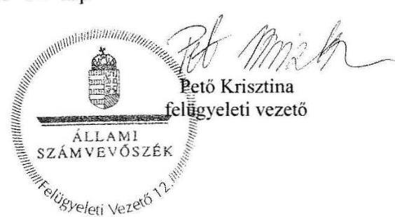

---

# RÖVIDÍTÉSEK JEGYZÉKE 

${ }^{1}$ Múzeum
${ }^{2}$ ÁSZ
${ }^{3}$ Mtv.
${ }^{4}$ Kötv.
${ }^{5}$ Kjt.
${ }^{6}$ múzeumigazgató
${ }^{7}$ Möktv.
${ }^{8}$ 258/2011. (XII. 7.) Korm. rendelet
${ }^{9}$ 2012. évi CLII. tv.
${ }^{10}$ 1311/2012. (VIII.23.) Korm. határozat
${ }^{11}$ BAZMÖ
${ }^{12}$ BAZMESZ
${ }^{13}$ BAZMIK
${ }^{14}$ KIM
${ }^{15}$ Miskolc MJVÖ
${ }^{16}$ 2015. évi LXXV. tv.
${ }^{17}$ Nvtv.
${ }^{18}$ Alaptörvény
${ }^{19}$ Áht. 2
${ }^{20}$ Ávr.
${ }^{21}$ ÁSZ tv.
${ }^{22}$ irányító szerv 1
irányító szerv 2
irányító szerv 3

Herman Ottó Múzeum
Állami Számvevőszék
1997. évi CXL. törvény a muzeális intézményekről, a nyilvános könyvtári ellátásról és a közművelődésről (hatályos: 1998. január 1-jétől)
2001. évi LXIV. törvény a kulturális örökség védelméről (hatályos: 2001. július 10-től)
1992. évi XXXIII. törvény a közalkalmazottak jogállásáról (hatályos: 1992. július 1-jétől)
Herman Ottó Múzeum és jogelődje a Borsod-Abaúj-Zemplén Megyei Múzeumi Igazgatóság igazgatója
2011. évi CLIV. törvény a megyei önkormányzatok konszolidációjáról, a megyei önkormányzati intézmények és a Fővárosi Önkormányzat egyes egészségügyi intézményeinek átvételéről (hatályos: 2012. január 1-jétől)
258/2011. (XII. 7.) Korm. rendelet a megyei intézményfenntartó központokról, valamint a megyei önkormányzatok konszolidációjával, a megyei önkormányzati intézmények és a Fővárosi Önkormányzat egészségügyi intézményeinek átvételével összefüggő egyes kormányrendeletek módosításáról (hatályos: 2011. december 8-tól)
2012. évi CLII. törvény a muzeális intézményekről, a nyilvános könyvtári ellátásról és a közművelődésről szóló 1997. évi CXL. törvény módosításáról (hatályos: 2012. november 3-tól)
1311/2012. (VIII. 23.) Korm. határozat a megyei múzeumok, könyvtárak és közművelődési intézmények fenntartásáról
Borsod-Abaúj-Zemplén Megyei Önkormányzat
Borsod-Abaúj-Zemplén Megyei Ellátó Szervezet
Borsod-Abaúj-Zemplén Megyei Intézményfenntartó Központ
Közigazgatási és Igazságügyi Minisztérium
Miskolc Megyei Jogú Város Önkormányzata
a megyei könyvtárak és a megyei hatókörű városi múzeumok feladatának ellátását szolgáló egyes állami tulajdonú vagyontárgyak ingyenes önkormányzati tulajdonba adásáról szóló 2015. évi LXXV. törvény (hatályos 2015. július 18-tól)
2011. évi CXCVI. törvény a nemzeti vagyonról (hatályos 2011. december 31étől)
Magyarország Alaptörvénye (hatályos: 2012. január 1-jétől)
2011. évi CXCV. törvény az államháztartásról (hatályos: 2012. január 1-jétől) 368/2011. (XII. 31.) Korm. rendelet az államháztartásról szóló törvény végrehajtásáról (hatályos: 2012. január 1-jétől)
2011. évi LXVI. törvény az Állami Számvevőszékről (hatályos: 2011. július 1jétől)
Borsod-Abaúj-Zemplén Megyei Önkormányzat Közgyűlése
Közigazgatási és Igazságügyi Minisztérium (2012. január 1-jétől 2012. december 31-ig)
Miskolc Megyei Jogú Város Önkormányzat Közgyűlése (2013. január 1-jétől)

---

${ }^{23}$ alapító okirat ${ }_{1}$
alapító okirat ${ }_{2}$
alapító okirat ${ }_{3}$
alapító okirat ${ }_{4}$
alapító okirat ${ }_{5}$
alapító okirat ${ }_{6}$
alapító okirat ${ }_{7}$
alapító okirat ${ }_{8}$
${ }^{24}$ Áht. $1_{1}$
${ }^{25}$ Ámr.
${ }^{26}$ 2/2010. (I. 14.) OKM rendelet
${ }^{27}$ átadás-átvételi megállapodás ${ }_{1}$
${ }^{28}$ fenntartó ${ }_{1}$
fenntartó $_{2}$
fenntartó $_{3}$
${ }^{29}$ vagyonátadási jelentés $_{1}$

[^0]Borsod-Abaúj-Zemplén Megyei Múzeumi Igazgatóság alapító okirata (hatályos: 2011. március 31-ig)

Borsod-Abaúj-Zemplén Megyei Múzeumi Igazgatóság alapító okirata (hatályos: 2011. április 1-jétől 2011. július 31-ig)

Borsod-Abaúj-Zemplén Megyei Múzeumi Igazgatóság alapító okirata (hatályos: 2011. augusztus 1-jétől 2011. december 31-ig)

Borsod-Abaúj-Zemplén Megyei Múzeumi Igazgatóság alapító okirata (hatályos: 2012. január 1-jétől 2012. december 29-ig)

Borsod-Abaúj-Zemplén Megyei Múzeumi Igazgatóság alapító okirata (hatályos: 2012. december 30-tól)

Herman Ottó Múzeum alapító okirata (hatályos: 2013. január 1-jétől 2013. június 30-ig)
Herman Ottó Múzeum alapító okirata (hatályos: 2013. július 1-jétől 2013. október 7-ig)
Herman Ottó Múzeum alapító okirata (hatályos: 2013. október 8-tól)
1992. évi XXXVIII. törvény az államháztartásról (hatályos: 2011. december 31ig)
292/2009. (XII. 19.) Kormányrendelet az államháztartás működési rendjéről (hatályos: 2011. december 31-ig)
2/2010. (I. 14.) OKM rendelet a muzeális intézmények működési engedélyéről (hatályos: 2010. január 22-től)
2012. január 1-jétől hatályos átszervezéshez megkötött megállapodás

Borsod-Abaúj-Zemplén Megyei Önkormányzat
Borsod-Abaúj-Zemplén Megyei Intézményfenntartó Központ (2012. január 1-jétől 2012. december 31-ig)
Miskolc Megyei Jogú Város Önkormányzata
Az átszervezéssel, illetve jogutód nélkül véglegesen megszűnő államháztartási szervezet által - a megszüntető szervezet által meghatározott fordulónapra vonatkozóan - elkészített az éves elemi költségvetési beszámolónak megfelelő adattartalmú - leltárral és záró főkönyvi kivonattal alátámasztott - beszámoló (Áhsz. 1 13/A. § (1). bekezdés), a 2012. január 1-jétől hatályos átszervezéshez készített
249/2000. (XII. 24.) Korm. rendelet az államháztartás szervezetei beszámolási és könyvvezetési kötelezettségének sajátosságairól (hatályos: 2013. december 31-ig)
254/2007. (X. 4.) Korm. rendelet az állami vagyonnal való gazdálkodásról
2013. január 1-jétől hatályos átszervezéshez megkötött megállapodás

Miskolc Megyei Jogú Város Polgármestere
Az átszervezéssel, illetve jogutód nélkül véglegesen megszűnő államháztartási szervezet által - a megszüntető szervezet által meghatározott fordulónapra vonatkozóan - elkészített az éves elemi költségvetési beszámolónak megfelelő adattartalmú - leltárral és záró főkönyvi kivonattal alátámasztott - beszámoló (Áhsz. 1 13/A. § (1). bekezdés), a 2013. január 1-jétől hatályos átszervezéshez készített

Borsod-Abaúj-Zemplén Megyei Múzeumi Igazgatóság Szervezeti és Működési Szabályzata (hatályos: 2011. október 9-ig)
Borsod-Abaúj-Zemplén Megyei Múzeumi Igazgatóság Szervezeti és Müködési Szabályzata (hatályos: 2011. október 10-től 2013. január 1-jéig)
Herman Ottó Múzeum Szervezeti és Müködési Szabályzata (hatályos: 2013. január 2-tól)

[^0]:    ${ }^{33}$ SZMSZ $_{1}$

    SZMSZ $_{2}$
    SZMSZ $_{3}$

---

${ }^{36}$ Bkr.
${ }^{37}$ számviteli politika ${ }_{1}$
számviteli politika ${ }_{2}$
számviteli politika ${ }_{3}$
számviteli politika ${ }_{4}$
${ }^{38}$ Számv. tv.
${ }^{39}$ munkamegosztási megállapodás
${ }^{40}$ gazdasági szervezet
${ }^{41}$ Áhsz. 2
${ }^{42}$ számlarend ${ }_{1}$
számlarend ${ }_{2}$
${ }^{43}$ számlarend ${ }_{3}$
${ }^{44}$ eszközök és források értékelési szabályzata ${ }_{1}$
eszközök és források értékelési szabályzata ${ }_{2}$
eszközök és források értékelési szabályzata ${ }_{3}$
${ }^{45}$ leltározási szabályzat ${ }_{1}$
leltározási szabályzat ${ }_{2}$
leltározási szabályzat ${ }_{3}$
leltározási szabályzat ${ }_{4}$
${ }^{47}$ önköltség-számítási szabályzat
${ }^{48}$ közbeszerzési szabályzat ${ }_{1}$
közbeszerzési szabályzat ${ }_{2}$
közbeszerzési szabályzat ${ }_{3}$
${ }^{49} \mathrm{Kbt} .1$

370/2011. (XII.31.) Korm. rendelet a költségvetési szervek belső kontrollrendszeréről és belső ellenőrzéséről (hatályos: 2012. január 1-jétől) Borsod-Abaúj-Zemplén Megyei Múzeumi Igazgatóság Számviteli Politika (hatályos: 2011. március 31-ig)
Borsod-Abaúj-Zemplén Megyei Intézményfenntartó Központ Számviteli Politika (hatályos: 2012. április 1-jétől 2013. január 1-ig)
Herman Ottó Múzeum Számviteli Politika (hatályos: 2013. január 2-tól 2014. február 2-ig)
Herman Ottó Múzeum Számviteli Politika (hatályos: 2014. február 3-tól)
2000. évi C. törvény a számvitelről (hatályos: 2001. január 1-jétől)
2012. július 5-én kelt munkamegosztási megállapodás

Borsod-Abaúj-Zemplén Megyei Intézményfenntartó Központ
4/2013. (I. 11.) Korm. rendelet az államháztartás számviteléről (hatályos 2014. január 1-jétől)
Borsod-Abaúj-Zemplén Megyei Intézményfenntartó Központ Számlarendje (hatályos: 2012. július 18-tól 2013. január 4-ig)
Herman Ottó Múzeum Számlarendje Számlarendje (hatályos: 2013. január 5-től 2014. január 1-ig)

Herman Ottó Múzeum Számlarendje (hatályos: 2014. január 2-től)
Borsod-Abaúj-Zemplén Megyei Múzeumi Igazgatóság Eszközök és források értékelési szabályzat (hatályos: 2011. március 31-ig)
Herman Ottó Múzeum Eszközök és források értékelési szabályzata (hatályos: 2013. január 2-től 2014. március 31-ig)
Herman Ottó Múzeum Eszközök és források értékelési szabályzata (hatályos: 2014. április 1-jétől)

Borsod-Abaúj-Zemplén Megyei Múzeumi Igazgatóság Leltárkészítési és leltározási szabályzata (hatályos: 2011. december 31-ig)
Borsod-Abaúj-Zemplén Megyei Intézményfenntartó Központ Leltárkészítési és leltározási szabályzata (hatályos: 2012. január 1-jétől 2012. december 31-ig)
Herman Ottó Múzeum Leltárkészítési és leltározási szabályzata (hatályos: 2013. március 1-jétől 2014. április 30-ig)
Herman Ottó Múzeum Leltárkészítési és leltározási szabályzata (hatályos: 2014. május 1-jétől)
Borsod-Abaúj-Zemplén Megyei Múzeumi Igazgatóság Pénzkezelési szabályzata (hatályos: 2011. március 31-ig)
Borsod-Abaúj-Zemplén Megyei Intézményfenntartó Központ Pénzkezelési szabályzata (hatályos: 2012. január 1-jétől 2013. január 1-ig)
Herman Ottó Múzeum Pénzkezelési szabályzata (hatályos: 2013. január 2-től 2014. január 1-ig)

Herman Ottó Múzeum Pénzkezelési szabályzata (hatályos: 2014. január 2-től)
Herman Ottó Múzeum Önköltség-számítási szabályzata (hatályos: 2013. március 1-jétől)
Borsod-Abaúj-Zemplén Megyei Múzeumi Igazgatóság közbeszerzési szabályzata (hatályos: 2012. március 31-ig)
Herman Ottó Múzeum közbeszerzési szabályzata (hatályos: 2012. április 1-jétől 2013. február 24-ig)

Herman Ottó Múzeum közbeszerzési szabályzata (hatályos: 2013. február 25től)
2003. évi CXXIX. törvény a közbeszerzésekről (hatályos: 2011. december 31-ig)

---

${ }^{50}$ Kbt. 2
${ }^{51}$ ellenőrzési nyomvonal
${ }^{52}$ ügyrend ${ }_{1}$
ügyrend $_{2}$
${ }^{53}$ gazdálkodási szabályzat
${ }^{54}$ FEUVE
${ }^{55}$ belső kontroll szabályzat ${ }_{1}$
belső kontroll szabályzat ${ }_{2}$
${ }^{56}$ kockázatkezelési szabályzat
${ }^{57}$ Vnytv.
${ }^{58}$ lkr.
${ }^{59}$ Avtv.
${ }^{60}$ Info.tv.
${ }^{61}$ Eitv.
${ }^{62}$ Ber.
${ }^{63}$ Mötv.
${ }^{64}$ Áfa tv.
${ }^{65}$ Vtv.
${ }^{66}$ 393/2012. (XII. 20.) Korm. rendelet
${ }^{67}$ 5/2010. (VIII. 18.) NEFMI rendelet
${ }^{68}$ vagyongazdálkodási rendelet
${ }^{69}$ 20/2002. (X. 4.) NKÖM rendelet
${ }^{70}$ 29/2014. (IV. 10.) EMMI rendelet
2011. évi CVIII. törvény a közbeszerzésekről (hatályos: 2011. augusztus 21-től) Herman Ottó Múzeum Ellenőrzési nyomvonala (hatályos: 2013. január 2-tól) Herman Ottó Múzeum gazdasági szervezet ügyrendje (hatályos: 2013 január 2-től 2014. február 2-ig)
Herman Ottó Múzeum gazdasági szervezet ügyrendje (hatályos: 2014. február 3-tól)
Borsod-Abaúj-Zemplén Megyei Múzeumi Igazgatóság Gazdálkodási Szabályzata (hatályos: 2010. augusztus 1-jétől)
Folyamatba épített előzetes, utólagos és vezetői ellenőrzés
Herman Ottó Múzeum belső kontroll szabályzata (hatályos: 2013. január 2-tól)
Herman Ottó Múzeum belső kontroll szabályzata (hatályos: 2014. január 2-tól)
Herman Ottó Múzeum kockázatkezelési szabályzata (hatályos: 2013. április 5től)
2007. évi CLII. törvény az egyes vagyonnyilatkozat-tételi kötelezettségekről (hatályos: 2008. január 1-jétől)
335/2005. (XII. 29.) Korm. rendelet a közfeladatot ellátó szervek iratkezelésének általános követelményeiről (hatályos: 2006. január 1-jétől)
1992. évi LXIII. törvény a személyes védelemről és a közérdekú adatok nyilvánosságáról (hatályos: 2011. december 31-ig)
2011. évi CXII. törvény az információs önrendelkezési jogról és az információszabadságról (hatályos: 2012. január 1-jétől)
2005. évi XC törvény az elektronikus információszabadságról (hatályos: 2011. december 31-ig)
1993/2003. (XI. 26.) Korm. rendelet a költségvetési szervek belső elelnőrzéséről (hatályos: 2011. december 31-ig)
2011. évi CLXXXIX. törvény Magyarország helyi önkormányzatai (hatályos: 2012. január 1-jétől)
2007. évi CXXVII. törvény az általános forgalmi adóról (hatályos 2008. január 1-jétől)
2007. évi CVI. törvény az állami vagyonról (hatályos: 2007. szeptember 25-től) 393/2012. (XII. 20.) Korm. rendelet a régészeti örökség és a múemléki érték védelmével kapcsolatos szabályokról (hatályos: 2013. január 1-jétől)
5/2010. (VIII. 18.) NEFMI rendelet a régészeti lelőhelyek feltárásának, illetve a régészeti lelőhely lelet megtalálója anyagi elismerésének részletes szabályairól (hatályos: 2012. december 31-ig)
20/2010. (XII. 17.) Közgyűlési rendelet a Borsod-Abaúj-Zemplén Megyei Önkormányzat vagyonáról, a vagyongazdálkodás szabályairól és eljárási rendjéről
20/2002. (X. 4.) NKÖM rendelet a muzeális intézmények nyilvántartási szabályzatáról (hatályos: 2003. január 1-jétől)
29/2014. (IV. 10.) EMMI rendelet a muzeális intézményekben őrzött kulturális javak kölcsönzéséről, valamint a kijelölési eljárásról (hatályos: 2014. május 10től)

---

# ÁLLAMI SZÁMVEVŐSZÉK 

1052 Budapest, Apáczai Csere János utca 10.
Levélcím: 1364 Budapest 4. Pf. 54
Telefon: +36 14849100 Telefax: +36 14849200
www.asz.hu