# Jelentés 

## Megyei hatókörű városi múzeumok ellenőrzése

Kecskeméti Katona József Múzeum, Kecskemét
2017.
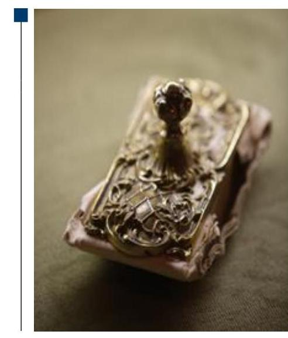

---

# Jelentés 

## Megyei hatókörű városi múzeumok ellenőrzése

Kecskeméti Katona József Múzeum, Kecskemét
2017.
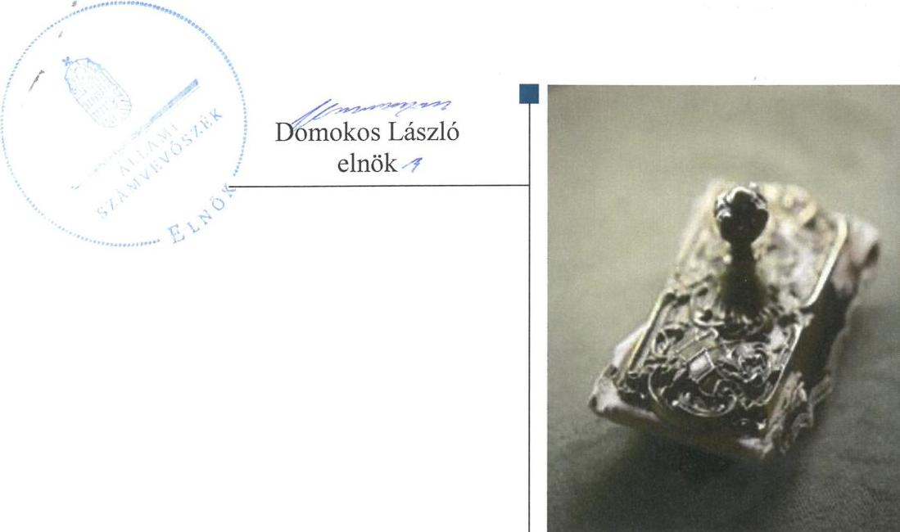

---

# AZ ELLENŐRZÉST FELÜGYELTE: 

PETŐ KRISZTINA felügyeleti vezető

## AZ ELLENŐRZÉST VEZETTE ÉS A VÉGREHAJTÁSÁÉRT FELELŐS:

DR. GYŐRI GABRIELLA ellenőrzésvezető

## A PROGRAM ÖSSZEÁLLÍTÁSÁÉRT FELELŐS:

JANIK JÓZSEF LÁSZLÓ osztályvezető

IKTATÓSZÁM: V-0954-161/2016
TÉMASZÁM: 1988
ELLENŐRZÉS-AZONOSÍTÓ SZÁM: V073709

Jelentéseink az Országgyűlés számítógépes hálózatán és az Interneten a www.asz.hu címen is olvashatóak.

---

# TARTALOMJEGYZÉK 

■ ÖSSZEGZÉS ..... 5
■ AZ ELLENŐRZÉS CÉLJA ..... 7
■ AZ ELLENŐRZÉS TERÜLETE ..... 8
■ AZ ELLENŐRZÉS HÁTTERE, INDOKOLTSÁGA ..... 11
■ A JELENTÉS LÉNYEGES KÉRDÉSKÖREI ..... 13
■ ELLENŐRZÉS HATÓKÖRE ÉS MÓDSZEREI ..... 14
■ MEGÁLLAPÍTÁSOK ..... 17
■ JAVASLATOK ..... 30
■ MELLÉKLETEK ..... 35
I. sz. melléklet: Értelmező szótár ..... 35
II. sz. melléklet: Az Integritás érvényesítése érdekében kialakított és működtetett kontrollrendszer ..... 38
■ FÜGGELÉK: ÉSZREVÉTELEK ..... 41
■ RÖVIDÍTÉSEK JEGYZÉKE ..... 53

---

.

---

# ÖSSZEGZÉS 

A Kecskeméti Katona József Múzeumra vonatkozó irányító szervi feladat ellátás összességében szabályszerű volt. A Múzeumnál kialakított irányítási rendszer nem támogatta az átlátható, elszámoltatható és ellenőrizhető közpénzfelhasználást. A Múzeum pénzügyi- és vagyongazdálkodása nem volt szabályszerű. A Múzeum alaptevékenységének részét képező kulturális javak szabályszerű nyilvántartásáról nem gondoskodtak, emiatt a kulturális javak állományvédelme és vagyonbiztonsága a kölcsönzéseknél nem volt biztosított.

## Az ellenőrzés társadalmi indokoltsága

Az Állami Számvevőszék Stratégiájának alapértéke, hogy ellenőrzései segítik az integritás alapú, átlátható és elszámoltatható közpénzfelhasználás megteremtését. Az ellenőrzés jogszabályban, vagy alapító okiratban meghatározott közfeladat ellátására létrejött, a megyei hatókörű városi muzeális intézmények gazdálkodási tevékenységére terjedt ki. E szervezetek pénzügyi és vagyongazdálkodásának alapvető rendeltetése a közfeladatok (a kulturális örökséghez tartozó javak védelme, őrzése és a nyilvánosság számára történő hozzáférhetővé tétele) ellátásának biztosítása.

A megyei hatókörű városi múzeumként működő szervezetek 2011. évtől több alkalommal jelentős szervezeti és gazdálkodási átalakuláson mentek keresztül. A tulajdonosi, a vagyonkezelői és a fenntartói szerepekben, szerkezetben történt változások előkészítése, végrehajtása, illetve a múzeumi rendszer által kezelt közvagyonnal való gazdálkodás szabályszerűségének bemutatásával az ellenőrzés hozzájárul a múzeumok fenntartási és működtetési feladatainak ellátására vonatkozó megfelelő jogszabályi környezet kialakításához, a gazdálkodási gyakorlatuk javításához.

## Főbb megállapítások, következtetések

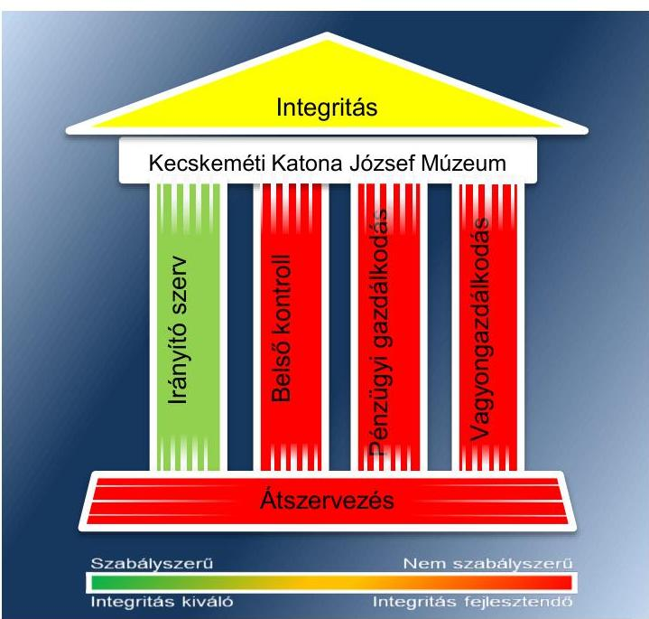

Az irányító szervek ellenőrzött Múzeumra vonatkozó feladatellátása a 2011-2014. években összességében szabályszerű volt.

A Múzeumnál kialakított irányítási rendszer nem biztosította az átlátható, elszámoltatható és ellenőrizhető közpénzfelhasználást. A kontrollkörnyezet kialakítása a 2011. évben nem volt szabályszerű, mert a Múzeum nem rendelkezett a gazdálkodását meghatározó szabályzatokkal. A pénzügyi, számviteli tárgyú szabályzatok elkészítése 2011. évben munkamegosztási megállapodás alapján a gazdasági szervezet feladata volt, azonban ezen kötelezettségének nem tett eleget. 2012-ben a gazdálkodási feladatot munkamegosztási megállapodás alapján ellátó szervezet késedelmesen teljesítette szabályzatalkotási kötelezettségét. Emiatt a gazdálkodási tárgyú szabályzatok közül a számviteli politika, a leltározási és leltárkészítési szabályzat csak az év második felében készültek el. A Múzeum az ellenőrzött időszakban nem rendelkezett ellenőrzési nyomvonallal és szabálytalanság kezelési eljárásrenddel, továbbá a 2013-2014. években bizonylati renddel és önköltség-számítási szabályzattal, ezáltal nem biztosították a gazdálkodás jogszabályi előírásoknak megfelelő szabályozási környezetét. A 2011-2014. éveket jellemző hiányosság volt, hogy a Múzeum nem gondoskodott a gyűjteményekből ideiglenesen kikerült

---

kulturális javak nyilvántartásának vezetéséről. A kockázatkezelési rendszert a 2011-2014. években kialakítás hiányában nem működtették. A kontrolltevékenység kialakítása és működtetése a 2011-2014. években nem volt szabályszerű. A Múzeum a 2011-2014. években belső szabályzatban nem szabályozta az engedélyezési, jóváhagyási és kontroll eljárásokat. A 2013. január 1-je és 2014. október 2-a között a gazdasági vezető helyett szabálytalanul a múzeumigazgató jelölt ki érvényesítőt. Az információs és kommunikációs folyamatok kialakítása az ellenőrzött időszakban nem volt szabályszerű. 2011-2014-ben nem szabályozták a beszámolási határidőket, módokat. A 2011-2014. közötti időszakban nem szabályozták a kötelezően közzéteendő adatok nyilvánosságra hozatalának rendjét. A jogszabályban előírt közzétételi kötelezettségnek a 2011-2014. közötti időszakban nem teljes körűen tettek eleget, továbbá nem gondoskodtak az iratkezelési szabályzat kiadásáról. A közzétételi kötelezettség hiányos teljesítésével nem biztosították a Múzeum gazdálkodásának, működésének átláthatóságát. A monitoring rendszer kialakítása és működtetése a 2011-2012. években nem volt szabályszerű, mert nem gondoskodtak a belső ellenőrzés kialakításáról, ezáltal nem biztosították a gazdálkodás szabályszerűségének, a közpénzek felhasználásának elszámoltathatóságát, átláthatóságát. Az irányító szervek gondoskodtak a Múzeum, mint felügyelt költségvetési szerv belső ellenőrzéséről.

A Múzeum pénzügyi- és vagyongazdálkodása nem volt szabályszerű. A bevételek elszámolása nem volt jogszabályszerű, mert az ingatlan vagyonelemek hasznosítása az erre felhatalmazást adó szerződés hiányában történt. A kiadási előirányzatok felhasználása a 2011-2012. években nem felelt meg a jogszabályi előírásoknak, a 2013-2014. években részben volt megfelelő. Az érvényesítést 2013. január 1-je és 2014. október 2-a közötti időszakban szabályszerű kijelölés hiányában gyakorolták. Az ellenőrzött időszakban előfordult, hogy kötelezettségvállalásra pénzügyi ellenjegyzés hiányában szabálytalanul került sor. A Múzeum a 2012. évi beszámolójában a feladat ellátását szolgáló vagyont szabálytalanul mutatta ki, mert nem volt vagyonkezelője a kimutatott vagyonnak. A 2013-2014. évi beszámolóban a feladat ellátását szolgáló vagyont szabályszerű bizonylat hiányában vezette ki nyilvántartásaiból, azonban továbbra is használta és hasznosította azt. A kulturális javak kölcsönzésére 2011-2014. között kötött szerződések nem tartalmazták a jogszabályban rögzített kötelező tartalmi elemeket, emiatt a kölcsönzött kulturális javak állományvédelme nem volt megfelelően biztosított.

A Múzeumot érintő szervezeti, szerkezeti átszervezések nem voltak szabályszerűek. A 2012. január 1-jétől hatályos irányító szervi váltás során a vagyon tényleges átadására szolgáló jegyzőkönyv felvételére nem került sor. Az átadás-átvétel alapjául szolgáló dokumentáció nem tartalmazta az ingóvagyon tekintetében az alapleltárakban és a külön nyilvántartásokban nyilvántartott kulturális javak felsorolását. A 2012/2013. évi központi alrendszerből önkormányzati alrendszerbe történő átszervezés során az átláthatóság sérült, mert nem készült vagyonátadási jelentés.

A Múzeum az integritás szemlélet érvényesítése érdekében nem intézkedett, a teljesített adatszolgáltatás eredményét az ellenőrzés megállapításai nem támasztották alá, ezért további erőfeszítések szükségesek.

---

# AZ ELLENŐRZÉS CÉLJA 

vényesülését a gazdálkodási folyamatokban.

Az ellenőrzés célja annak megállapítása volt, hogy a megyei múzeumi rendszer átalakítása, az intézményfenntartói rendszerben végbement változások előkészítése és végrehajtása megalapozottan, szabályszerűen történt-e; a megyei hatókörű városi múzeumok és jogelődjeik pénzügyi- és vagyongazdálkodása, a belső kontrollrendszer kialakítása és működtetése, valamint az intézményfenntartói feladatok ellátása szabályszerűen történt-e.

A Múzeum ${ }^{1}$ korrupcióval szembeni veszélyeztetettségének csökkentése érdekében kért tanúsítványi adatszolgáltatás alapján az ÁSZ² értékelte az integritási szemlélet ér-

---

# AZ ELLENŐRZÉS TERÜLETE 

## Kecskeméti Katona József Múzeum

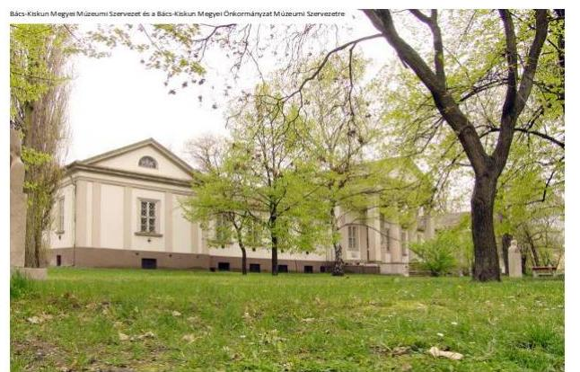

A Múzeum Kecskeméten található, feladatkörében az Mtv. ${ }^{3}$ alapján gondoskodik a kulturális javak meghatározott anyagának folyamatos gyűjtéséről, nyilvántartásáról, megőrzéséről és restaurálásáról; tudományos feldolgozásáról, publikálásáról; valamint kiállításokon és más módon történő bemutatásáról; a közművelődési és közgyűjteményi feladatok ellátásáról. A Múzeum az ellenőrzött időszakban a Kötv. ${ }^{4}$ 20. § (2) bekezdése alapján területileg illetékes múzeumként régészeti feltárást végzett.

A Múzeum csak a működési engedélyében meghatározott gyűjtőkörben és gyűjtőterületen folytathatja tevékenységét. A szakmai besorolást, a rendszert megalapozó szaktörvényi kereteket az Mtv. biztosítja. Az Mtv. hatálya kiterjed a Múzeum fenntartóira, a Múzeumban foglalkoztatottakra, a kulturális örökség Múzeumban őrzött elemeire, a szolgáltatások igénybe vevőire és a kulturális örökséggel foglalkozó egyéb szervezetekre.

A Múzeum 2011. és 2012. évi költségvetési engedélyezett létszáma 84 fő volt, ami a 2013. évre 42 főre csökkent, a 2014. évben 47 főre emelkedett. A Múzeum alkalmazottainak foglalkoztatására a Kjt. ${ }^{5}$ alapján került sor. Az ellenőrzött időszakban a múzeumigazgató ${ }^{6}$ személye nem változott, a gazdasági vezető személye változott.

A Möktv. ${ }^{7}$ és annak végrehajtásáról szóló 258/2011. (XII. 7.) Korm. rendelet ${ }^{8}$ alapján 2012. január 1-jétől a megyei múzeumok központi költségvetési szervekké váltak. 2013. január 1-jétől a 2012. évi CLII. törvény ${ }^{9}$ és az 1311/2012. (VIII. 23.) Korm. határozat ${ }^{10}$ alapján az állami tulajdonba és fenntartásba került megyei múzeumi szervezetek a megyeszékhely megyei jogú városok fenntartásában működtek tovább. A 2011-2014. évek között a fenntartói, irányítói, középirányítói jogkörgyakorlók változását, valamint a Múzeum gazdálkodási feladatát ellátó szervezetét az 1. táblázat mutatja be.

---

1. táblázat

FENNTARTÓI, IRÁNYÍTÓI JOGKÖRGYAKORLÓK ÉS GAZDASÁGI SZERVEZET A 2011-2014. ÉVEKBEN

| Időszak | Fenntartó | Irányító szerv | Középrányító szerv | Gazdasági szervezet |
| :--: | :--: | :--: | :--: | :--: |
| 2011. | Bács-Kiskun Megyei Önkormányzat | Bács-Kiskun   Megyei Önkormányzat Közgyűlése |  | Bács-Kiskun Megyei Önkormányzat Gazdasági Ellátó Szervezete |
| 2012. | Bács-Kiskun   Megyei Intézményfenntartó Központ | Közigazgatási és Igazságügyi Minisztérium | Bács-Kiskun   Megyei Intézményfenntartó Központ | Bács-Kiskun Megyei Intézményfenntartó Központ |
| $\begin{aligned} & 2013- \\ & 2014 . \end{aligned}$ | Kecskemét Megyei Jogú Város Önkormányzata | Kecskemét Megyei Jogú Város Közgyűlése |  | Múzeum |

Forrás: A Múzeum alapító okiratai
A Múzeum jogelődje, a Bács-Kiskun Megyei Múzeumi Szervezet jogállása szerint a 2011-2012. években önállóan működő költségvetési szerv volt. 2013. január 1-jétől a Kecskeméti Katona József Múzeum önállóan működő és gazdálkodó költségvetési szerv lett. 2014. évben a Múzeum önálló jogi személyiségű, saját gazdasági szervezettel rendelkező megyei hatókörű városi múzeum. 2011-2012. években vállalkozási tevékenységet nem végzett, a 2013-2014. években vállalkozási tevékenységet végzett.

A Múzeum teljesített költségvetési bevételeinek és kiadásainak alakulását az 1. ábra mutatja be. Az ábra a 2011-2012. években a Múzeum és tagintézményeinek együttes adatai, a 2013-2014. években a tagintézmények átadását követően a múzeumi adatok alapján készült.

1. ábra
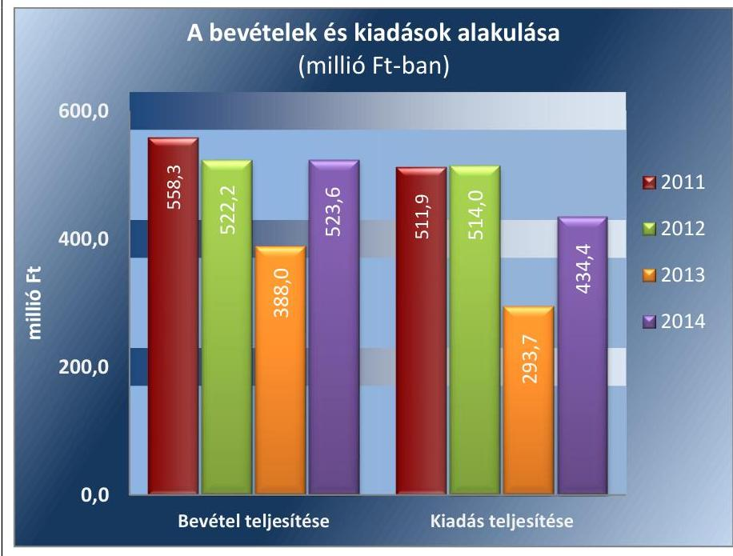

Forrás: Múzeumi beszámolók a 2011-2014. évekre
A 2015. évi LXXV. tv. ${ }^{11}$ 1. § (1) bekezdése alapján az Nvtv. ${ }^{12}$ 13. § (3) bekezdésében és 14. § (1) bekezdésében foglaltak alapján és az abban

---

meghatározott feltételekkel a 2012. évi CLII. törvény 30. § (1) és (2) bekezdésében meghatározott, a megyei hatókörű városi múzeumok feladatának ellátását szolgáló egyes állami tulajdonban lévő ingatlanok a törvény hatálybalépésének napjával, a törvény erejénél fogva a kötelező közfeladatként a megyei hatókörű városi múzeumot fenntartó önkormányzatok tulajdonába kerültek. A 2015. évi LXXV. tv. 4. § (1) bekezdése alapján a kulturális örökség helyi védelme érdekében a megyei hatókörű városi múzeumok alapleltárában és jogszabály szerinti külön nyilvántartásában szereplő állami tulajdonú kulturális javak ingyenesen a megyei hatókörű városi múzeumok vagyonkezelésébe kerültek. A vagyonkezelők vagyonkezelői joga tekintetében vagyonkezelési szerződés megkötése nem szükséges. A 2015. évi LXXV. tv. 4. § (2) bekezdése szerint továbbá a kulturális örökség helyi védelme érdekében a megyei hatókörű városi múzeumok feladatának ellátását szolgáló állami tulajdonban álló ingatlanok - a törvény mellékletében meghatározott ingatlanok kivételével - ingyenesen a fenntartó önkormányzatok vagyonkezelésébe kerültek.

---

# AZ ELLENŐRZÉS HÁTTERE, INDOKOLTSÁGA

Az Alaptörvény^{13} rendelkezése szerint a nemzeti vagyon megőrzésének, védelmének és a nemzeti vagyonnal való felelős gazdálkodásnak a követelményeit sarkalatos törvény, az Nvtv. rögzíti. A tulajdonosi joggyakorlás és vagyonkezelés általános és speciális szabályait, az állami vagyon nyilvántartására és elszámolására vonatkozó eljárásokat, a vagyonkezelési szerződés feltételrendszerét, valamint az éves

 beszámoló készítési és könyvvezetési kötelezettségeket kormányrendelet írja elő.

A megyei hatókörű városi múzeumok közfeladat-ellátásának változásait, (beleértve az állami tulajdonosi joggyakorló, intézményi vagyonkezelő és önkormányzati fenntartó szervezeteket is) a közfeladatok átadásából és átvételéből adódó módosításait, előirányzat-gazdálkodására ható tényezőit az Áht-^{14}, az Ávr.^{15}, a Möktv., valamint az Mtv. írja elő. A múzeumi intézményrendszer rendszerátalakulásából, megszűnéséből, intézmény-átszervezéséből, belső szerkezeti korszerűsítéséből, vagy más hasonló okból adódó módosításai miatt szerepeltetendő szerkezeti változásokat, valamint a szerkezeti változásként beépült közfeladatok szint-hozóként történő számításba vételét az Ávr. határozza meg.

A megyei hatókörű városi múzeumok kulturális szempontból meghatározó jelentőségűek mind földrajzi elhelyezkedésüket, mind az ellátott feladatokat, valamint a látogatottságukat tekintve. Tevékenységüket törvényi szinten (Mtv.) szabályozták a jogalkotók. A megyei hatókörű városi múzeumok jelenlegi körének kialakításában, tulajdonosi és fenntartói szerkezetében rövid idő alatt több jelentős változás történt, amelyeket jogszabályi változások indukáltak. Ezen intézmények szakmai besorolásukat tekintve a 2011. évben megyei múzeumként, a 2012. évben megyei múzeumi központi költségvetési szervezetként, a 2013. évtől kezdődően megyei hatókörű városi múzeumként működtek. A szakmai besorolások változásait párhuzamosan követték a tulajdonosi, vagyonkezelői, fenntartói szerepekben történt változások.

A 2011–2014. évek között bekövetkezett fenntartói változások a vagyontárgyak és a kulturális javak tulajdonosi, vagyonkezelői és használói körében is változást indukáltak, amelyet a 2. táblázat szemléltet.

1. táblázat

|  A VAGYON TULAJDONOSI, VAGYONKEZELŐI ÉS HASZNÁLÓI KÖRÉNEK VÁLTOZÁSA 2011–2014. ÉVEKBEN |  |  |  |  |  |  |  |  |  |  |  |  |  |  |  |  |  |  |  |  |   |
| --- | --- | --- | --- | --- | --- | --- | --- | --- | --- | --- | --- | --- | --- | --- | --- | --- | --- | --- | --- | --- |
|   |  |  |  |  |  |  |  |  |  |  |  |  |  |  |  |  |  |  |  | 2011. év  |
|  Vagyon-
tárgy |  |  |  |  |  |  |  |  |  |  |  |  |  |  |  |  |  |  |  |   |
|   |  |  |  |  |  |  |  |  |  |  |  |  |  |  |  |  |  |  |  |   |
|  Ingatlan | Bács–Kiskun Me-
gyei Önkormányzat | - | Múzeum | Állam | BKMIK^{16} | Múzeum | Állam | Múzeum | Múzeum |  |  |  |  |  |  |  |  |  |  |   |
|  Egyéb
tárgyi
eszközök | Bács–Kiskun Me-
gyei Önkormányzat | - | Múzeum | Állam | BKMIK | Múzeum | Állam | Múzeum | Múzeum |  |  |  |  |  |  |  |  |  |  |   |
|  Kulturális
javak | Bács–Kiskun Me-
gyei Önkormányzat | - | Múzeum | Állam | BKMIK | Múzeum | Állam | Múzeum | Múzeum |  |  |  |  |  |  |  |  |  |  |   |

*Forrás: A Múzeum alapító okiratai, a 2012. évi CLII. tv, a 258/2011. (XII. 7) Korm. rendelet, az 1311/2012. (VIII. 23.) Korm. határozat*

---

Az ellenőrzés - tekintettel a megyei hatókörű városi múzeumokat (és jogelődjeit) rövid időn belül, gyors ütemben ért környezeti (tulajdonosi, fenntartói-szerkezetet érintő) változásokra - javaslatok megfogalmazásával hozzájárul a fenntartás és működtetés feladatainak ellátására vonatkozó megfelelő jogszabályi környezet - jogalkotók által történő - kialakításához. Az ÁSZ ellenőrzés a gazdálkodási gyakorlat javítását eredményezheti, több intézmény bevonásával átfogó képet ad a megyei hatókörű városi múzeumokat (és jogelődjeiket) jellemző sajátosságokról, jó gyakorlatokról.

AZ ELLENŐRZÉS EREDMÉNYEKÉPPEN nemcsak az ellenőrzött intézmények gazdálkodása javul, hanem átfogó képet kapunk a múzeumok gazdálkodásának hiányosságairól, de a jó gyakorlatokról is. Ellenőrzéseivel, javaslataival és megállapításaival az ÁSZ elősegíti a költségvetési szervek pénzügyi és vagyongazdálkodása szabályozásának javítását és hozzájárulhat a jó kormányzáshoz.

---

# A JELENTÉS LÉNYEGES KÉRDÉSKÖREI 

1. Az irányító szerv ellenőrzött Múzeumra vonatkozó feladatellátása szabályszerű volt-e?
2. Szabályszerűen hajtották-e végre a Múzeumot érintő szervezeti, szerkezeti átszervezéseket?
3. A belső kontrollrendszer kialakítása és működtetése megfelelt-e a jogszabályi előírásoknak?
4. A Múzeum pénzügyi gazdálkodása szabályszerű volt-e?
5. A Múzeum vagyongazdálkodása szabályszerű volt-e?
6. A Múzeum intézkedett-e az integritás-szemlélet érvényesítése érdekében?

---

# ELLENŐRZÉS HATÓKÖRE ÉS MÓDSZEREI 

## Az ellenőrzés típusa

Megfelelőségi ellenőrzés.

## Az ellenőrzött időszak

Az ellenőrzött időszak 2011. január 1-jétől 2014. december 31-ig tart.

## Az ellenőrzés tárgya

A megyei hatókörű városi múzeumok átszervezése, átalakítása előkészítése és lebonyolítása megalapozottsága, szabályszerűsége, a pénzügyi és vagyongazdálkodási tevékenység, a belső kontrollrendszer kialakítása, működtetése szabályszerűsége, valamint az irányító szervi feladatok ellátása szabályszerűsége. E tevékenységek és a kapcsolódó adatok és információk összessége, amelyeket a vonatkozó kritériumok alapján kell értékelni.

Az ellenőrzés kiterjed minden olyan körülményre és adatra, amely az ÁSZ jogszabályban meghatározott feladatainak teljesítéséhez, valamint a program végrehajtása folyamán felmerült újabb összefüggések feltárásához szükséges.

## Az ellenőrzött szervezet

Kecskeméti Katona József Múzeum, a fenntartói feladatokban érintett Bács-Kiskun Megyei Önkormányzat, valamint Kecskemét Megyei Jogú Város Önkormányzata, a Bács-Kiskun Megyei Intézményfenntartó Központ jogutódja a Szociális és Gyermekvédelmi Főigazgatóság.

Az ellenőrzésre a költségvetési szerv ellenőrzött intézményének és irányító szervének, illetve középirányító szervének székhelyén és a gazdálkodási feladatait ellátó szervezetének székhelyén került sor.

## Az ellenőrzés jogalapja

Az ellenőrzés jogszabályi alapját az ÁSZ tv. ${ }^{17}$ 1. § (3) bekezdés, 5. § (2)-(6) bekezdései, valamint az Áht. 2 61. § (2) bekezdésének előírásai képezik.

---

# Az ellenőrzés módszerei 

Az ellenőrzést az ellenőrzési program szempontjai, az ellenőrzött időszakban hatályos jogszabályok, az ellenőrzés szakmai szabályai, az egyes ellenőrzési típusokhoz kapcsolódó ÁSZ módszertanok és nemzetközi standardok figyelembe vételével végeztük. A gazdálkodás hibáinak kijavítására, a közpénzekkel való felelős gazdálkodás segítésére irányuló javaslatok kidolgozásakor a hatályos jogszabályok az irányadóak.

Az ellenőrzési kérdések megválaszolásához szükséges bizonyítékok megszerzése a következő ellenőrzési eljárások alkalmazásával történt: kérdésfeltevés (információkérés), mintavételezés, valamint elemző eljárás. A minták kiválasztása során véletlen mintavételi eljárást alkalmaztunk.

Mintavétellel ellenőriztük a bevételek, a személyi juttatások, a dologi és felhalmozási kiadások, a régészeti bevételek és kiadások elszámolása szabályszerűségét. Tételesen ellenőriztük a kulturális javak kölcsönzésének szabályszerűségét. A minta alapján a sokaságban előforduló hibaarányt becsültük. „Megfelelőnek" értékeltük az ellenőrzött területet, amennyiben 95\%-os bizonyossággal a teljes sokaságban a hibaarány legfeljebb 10\%, „részben megfelelőnek" értékeltük, ha a hibaarány felső határa 10-30\% között volt, „nem megfelelőnek" pedig akkor, ha a mintavételi eredmények alapján a sokaságbeli hibaarány felső határa meghaladta a 30\%-ot.

Az ellenőrzési bizonyítékként felhasználható adatforrások közé tartoznak egyrészt a szakmai program részletes szempontjainál felsorolt adatforrások, másrészt adatforrás lehet minden egyéb - az ellenőrzés folyamán feltárt, az ellenőrzés szempontjából releváns információt tartalmazó - dokumentum. Az ellenőrzés lefolytatásához a Múzeum a tanúsítványok elektronikus kitöltésével, valamint az ÁSZ által kért dokumentumok elektronikus megküldésével szolgáltatott adatokat. A rendelkezésre bocsátott adatok, információk kontrollja az ellenőrzés keretében történt. Az ellenőrzési kérdésekre adott válaszok alapján értékeltük, hogy az ellenőrzött időszakban az irányító szerv az ellenőrzött Múzeumra vonatkozó feladatainak szabályszerűen eleget tett-e, a Múzeum pénzügyi- és vagyongazdálkodása megfelel-e az előírásoknak, a Múzeum átalakításának vagy átszervezésének végrehajtása szabályszerű volt-e.

A Múzeum belső kontrollrendszere jogszabályi előírások szerinti kialakításának és működtetésének szabályszerűségét az erre irányuló ellenőrzési kérdésekre adott válaszok összesítése alapján, évente pillérenként (kontrollkörnyezet, kockázatkezelési rendszer, kontrolltevékenységek, információs és kommunikációs rendszer, monitoring rendszer) és összesítetten is minősítjük. A Múzeum belső kontrollrendszere egyes pilléreinek kialakítása és működtetése „szabályszerű", amennyiben az értékelt területen az elért és elérhető pontok százalékban kifejezett, egész számra kerekített hányadosa meghaladja a 84%-ot, „részben szabályszerű", ha a 84%-ot nem haladja meg, de 60%-nál nagyobb, „nem szabályszerű", ha nem haladja meg a 60%-ot. A Múzeum belső kontrollrendszerének összesített értékelése megegyezik a pillérenként (kontrollterületenként) alkalmazott %-os értékelésekkel, a következő eltérésekkel. A kontrollrendszer egésze esetében a „szabályszerű" értékelésnek a %-os értéken felül további feltétele, hogy egyik kontrollterület sem kaphat „nem szabályszerű" értékelést, a „részben szabályszerű" értékelés további feltétele, hogy legfeljebb egy ellenőrzött kontrollterület lehet „nem szabályszerű" értékelésű. Az összesített értékelés a %-os értéktől függetlenül „nem szabályszerű", ha az ellenőrzött kontrollterületek közül több mint egynek „nem szabályszerű" az értékelése.

Az integritás-szemlélet érvényesülésének értékelése a Múzeum által szolgáltatott adatok alapján történt.

---

# 1. Az irányító szerv ellenőrzött Múzeumra vonatkozó feladatellátása szabályszerű volt-e? 

Összegző megállapítás

Az irányító szervek ellenőrzött Múzeumra vonatkozó feladatellátása a 2011-2014. években összességében szabályszerű volt.

AZ ALAPÍTÓI JOGOSULTSÁGOK GYAKORLÁSA az ellenőrzött időszakban részben felelt meg a jogszabályi előírásoknak. A 2012-ben hatályos alapítói okirat kiadására és Kincstári^{18} nyilvántartásba vételére a 258/2011. (XII. 7.) Korm. rendelet 21. § (6) bekezdése szerinti 2012. január 30-ai határidőn túl, 2012. július 12-én került sor.

A MUNKÁLTATÓI JOGOSULTSÁGOT az irányító szerv_{1-3}^{19} a 2011-2014. években szabályszerűen gyakorolta.

AZ EGYÉB IRÁNYÍTÁSI, FELÜGYELETI ÉS ELLENŐRZÉSI jogosultságok gyakorlása az ellenőrzött időszakban összességében szabályszerű volt.

Az irányító szerv_{1} az egyéb irányítási, felügyeleti és ellenőrzési jogosultságait 2011-ben szabályszerűen gyakorolta.

A középirányító szerv^{20} 2012. évben a 258/2011. (XII. 7.) Korm. rendelet 11. § (1) bekezdés c) pontjaiban előírtakat figyelmen kívül hagyva nem határozta meg az előirányzat felhasználására vonatkozó irányelveket. Továbbá a 258/2011. (XII. 7.) Korm. rendelet 11. § (2) bekezdés c) pontjának előírása ellenére a középirányító szerv részéről nem került sor az államháztartással összefüggő közérdekű és közérdekből nyilvános adatok kötelező közzétételének, illetve igényre történő szolgáltatása végrehajtásának ellenőrzésére.

Az irányító szerv_{1,3} jóváhagyta a Múzeum ellenőrzött időszakban hatályos SZMSZ_{1-2}^{21} módosítását. A 2013-2014. években a Múzeum az irányító szerv_{3}, mint fenntartó által jóváhagyott küldetésnyilatkozattal rendelkezett.

---

# 2. Szabályszerűen hajtották-e végre a Múzeumot érintő szervezeti, szerkezeti átszervezéseket? 

Összegző megállapítás

2.1. számú megállapítás

A Múzeumot érintő szervezeti, szerkezeti átszervezések nem voltak szabályszerűek.

A Múzeumot érintő - az önkormányzati alrendszerből a központi alrendszerbe történő 2012. január 1-jétől hatályos - irányító szervi váltás lebonyolítása nem volt szabályszerű.

Az átadás-átvételi megállapodás_{1}^{22} -et az irányító szerv_{
 }_{1}$ és a középirányító szerv 2011. decemberében megkötötte. A Mőktv. 2. § (4) bekezdésében előírt további kettő szervezet, mint szerződő fél képviselője az átadás-átvételi megállapodás ${ }_{1}$-et a Mőktv. 6. § (3) bekezdésében foglalt 2011. december 31-ei határidőt követően 2012. októberében látta el aláírásával, ezért az átadás-átvételi megállapodás ${ }_{1}$ megkötése nem volt szabályszerű.

A VAGYON TÉNYLEGES ÁTADÁSA során - a 258/2011. (XII. 7.) Korm. rendelet 12. § (3)-(4) bekezdésében foglaltak ellenére - az irányító szerv ${ }_{1}$ és a középirányító szerv által aláírt jegyzőkönyv felvételére nem került sor.

Az átadás-átvételi megállapodás ${ }_{1}$-et a 258/2011. (XII. 7.) Korm. rendelet 1. számú melléklete szerinti megállapodás-minta alapján kötötték meg, azonban - a jogszabályi előírás ellenére - a mellékletek teljes körűségét nem biztosították, mert nem rögzítették:
$\longrightarrow$ a Múzeum 2011. évi normatív támogatásának igénylésére, módosítására, lemondására vonatkozó adatokat összegszerűen részletezve;
$\longrightarrow$ a Múzeum rövid és hosszú lejáratú kötelezettségállományának kimutatását;
$\longrightarrow$ a Múzeum költségvetési helyzetéről szóló dokumentumokat, az intézményi költségvetés 2011. évi várható teljesüléséről szóló adatszolgáltatást;
$\longrightarrow$ ingó vagyon tekintetében, az alapleltárakban és külön nyilvántartásokban nyilvántartott kulturális javak felsorolását.
Az Áhsz. ${ }^{23}$ rendelkezései alapján leltárt készítettek és a mérleg sorait záró főkönyvi kivonattal és analitikával alátámasztották, a pénzforgalmi számlákat év végével lezárták. A 2011. évi NGM módszertani útmutató ${ }^{24}$ 43. oldal 2/ba. pontjában előírtakat figyelmen kívül hagyva az átadáshoz kapcsolódó vagyonátadási jelentést és vagyonátadás-átvételi jegyzőkönyvet az irányító szerv ${ }_{1}$ és a középirányító szerv nem készítettek. Az eszközök és források 2012. évi nyitását szabályszerűen nem tudták végrehajtani, mivel a nyitás alapját képező vagyonátadási jelentést nem készítettek. Az állami tulajdonba került vagyonelemek számviteli nyilvántartásokból történő kivezetését az NGM módszertani útmutató 2/ba. pontjában rögzítettek ellenére nem végezték el.

---

# 2.2. számú megállapítás 

A 2013. január 1-jével végrehajtott - központi alrendszerből önkormányzati alrendszerbe történő - irányító szervi (fenntartói) váltás lebonyolítása és a szervezetrendszer átalakítása vagyonátadási jelentés hiányában nem volt szabályszerű.

Az átadás-átvételi megállapodás ${ }_{2}{ }^{25}$-t az Mtv.-ben és az 1311/2012. (VIII. 23.) Korm. határozatban foglalt határidőben kötötte meg a középirányító szerv és az irányító szerv3.

Az átadás-átvételi megállapodás ${ }_{2}$ 1.2.2. pontjában foglaltak ellenére a 2012. évi költségvetésre vonatkozó adatokat, valamint az 1.2.14. pontban előírt - a költségvetés várható teljesítéséről szóló - adatszolgáltatást tartalmazó mellékletek nem készültek el. Az átadás-átvételi megállapodás ${ }_{2}$ 1.2.11.2.1. pontjában foglaltaknak megfelelően a Múzeum alapleltárában és a külön nyilvántartásában nyilvántartott kulturális javak felsorolását tartalmazó melléklet elkészült.

A középirányító szerv a 2012. évi NGM módszertani útmutató 44. oldal 2/ba. pontjában előírtakat figyelmen kívül hagyva az átadáshoz kapcsolódó vagyonátadási jelentést nem készített. Az eszközök és források 2013. évi nyitását vagyonátadási jelentés hiányában szabályszerűen nem tudták végrehajtani.

A tagintézmények 2013. évi átadását rögzítő megállapodás ${ }^{26}$-at a 2012. évi CLII. törvényben foglaltaknak megfelelően a középirányító szerv és az átvevő települési önkormányzatok határidőben megkötötték.

Az 1311/2012. (VIII. 23.) Korm. határozat 1.8. pontjában illetve a megállapodások IV/1.2.11.2.1. pontjában foglaltaknak megfelelően a Múzeum nyilvántartásaiban szereplő kulturális javak tagintézményenkénti felsorolását elkészítették.

## 3. A belső kontrollrendszer kialakítása és működtetése megfelel-e a jogszabályi előírásoknak?

Összegző megállapítás A belső kontrollrendszer kialakítása és működtetése a 2011-2014. években nem volt szabályszerű.

A belső kontrollrendszer kialakítása és működtetése részletes értékelését a 2011-2014. évekre vonatkozóan a 3. táblázat mutatja be.

---

# A BELSŐ KONTROLLRENDSZER KIALAKÍTÁSÁNAK ÉS MŰKÖDTETÉSÉNEK ÉRTÉKELÉSE A 2011-2014. ÉVEKBEN 

| Megnevezés | Kontroll-   környezet | Kockázatkezelés | Kontroll-   tevékenységek | Információ és   kommunikáció | Monitoring | Összesen |
| :--: | :--: | :--: | :--: | :--: | :--: | :--: |
| 2011. | nem szabályszerű | nem szabályszerű | nem szabályszerű | nem szabályszerű | nem szabályszerű | nem szabályszerű |
| 2012. | részben szabály-   szerű | nem szabályszerű | nem szabályszerű | nem szabályszerű | nem szabályszerű | nem szabályszerű |
| 2013. | részben szabály-   szerű | nem szabályszerű | nem szabályszerű | nem szabályszerű | nem szabályszerű | nem szabályszerű |
| 2014. | részben szabály-   szerű | nem szabályszerű | nem szabályszerű | nem szabályszerű | nem szabályszerű | nem szabályszerű |

Forrás: Az ÁSZ által készített értékelés

## 3.1. számú megállapítás

A Múzeumnál a kontrollkörnyezet kialakítása 2011-ben nem volt szabályszerű, 2012-2014. években részben volt szabályszerű.
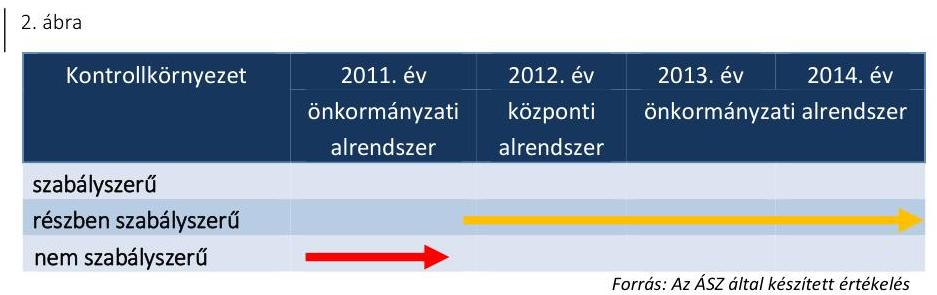

A Múzeum pénzügyi, számviteli feladatait 2011. évben munkamegosztási megállapodás ${ }_{1}^{27}$ alapján a gazdasági szervezet ${ }_{1}{ }^{28}$ látta el. A pénzügyi, számviteli tárgyú szabályozások elkészítése a gazdasági szervezet feladata volt. A 2011. évben a Múzeum kontrollkörnyezetének kialakításában az alábbi hiányosságok álltak fenn:
$\longrightarrow$ az SZMSZ ${ }_{1}$ az Ámr. ${ }^{29}$ 20. § (2) bekezdése i) pontjában foglaltak ellenére nem tartalmazta a Múzeum szervezeti ábráját teljes körűen, csak a tagintézmények ábráját;
$\longrightarrow$ a Múzeum a Számv. tv. ${ }^{30}$ 14. § (3)-(4) bekezdései, az Áhsz. ${ }_{1}$ 8. § (3) bekezdése előírásától eltérően nem rendelkezett számviteli politikával;
$\longrightarrow$ a Múzeum a Számv. tv. 161. § (1) bekezdésének, a Számv. tv. 161. § (2) bekezdés d) pontjának és az Áhsz. ${ }_{1}$ 49. § (1) bekezdésének előírásától eltérően számlarenddel és az abban foglaltakat alátámasztó bizonylati renddel nem rendelkezett;
$\longrightarrow$ a Múzeum a Számv. tv. 14. § (5) bekezdés a)-b) és d) pontjában, az Áhsz. ${ }_{1}$ 8. § (4) bekezdés a)-b) és d) pontjában foglaltak ellenére nem rendelkezett leltározási és leltárkészítési szabályzattal, eszközök és források értékelési szabályzatával valamint pénzkezelési szabályzattal;
$\longrightarrow$ a Múzeum nem rendelkezett az Áht. ${ }^{31}$ 91. § (2) bekezdésében és az Ámr. 20. § (3) bekezdés a) pontjában foglaltak ellenére a gazdálkodás részletes rendjét meghatározó szabályzattal.

---

A Múzeum pénzügyi, számviteli feladatait a 2012. évben munkamegosztási megállapodás ${ }^{32}$ alapján a gazdasági szervezet ${ }^{33}$ látta el. A gazdasági szervezet ${ }_{2}$ a Számv. tv. 14. § (11) bekezdésében foglalt 90 napon belüli szabályozási kötelezettségének a számviteli politika ${ }^{34}$, a leltározási és leltárkészítési szabályzat ${ }^{35}$ esetében késedelmesen tett eleget. 2012. évben a Múzeum kontrollkörnyezetének kialakításában az alábbi hiányosság állt fenn:
$\longrightarrow$ az eszközök és források értékelési szabályzata ${ }^{36}$ nem tartalmazta az Áhsz. ${ }_{1}$ 18. § (2) bekezdés előírásától eltérően az egyszerűsített értékelési eljárás alá vont követelések besorolásának elveit, dokumentálásának szabályait.
A 2013-2014. években a Múzeum kontrollkörnyezetének kialakításában az alábbi hiányosságok álltak fenn:
$\longrightarrow$ az Ávr. 13. § (1) bekezdés e) pontjának előírásától eltérően az SZMSZ 2013-2014-ben nem tartalmazta a gazdasági szervezet létszámát;
$\longrightarrow$ 2013-ban a számviteli politika ${ }^{37}$ nem tartalmazta a Számv. tv. 14. § (4) bekezdése és az Áhsz. ${ }_{1}$ 8. § (5) bekezdése előírásától eltérően, hogy mit tekint a számviteli elszámolás, az értékelés szempontjából lényegesnek, nem lényegesnek;
$\longrightarrow$ az eszközök és források értékelési szabályzata ${ }^{38}$ 2013-ban az Áhsz. ${ }_{1}$ 8. § (17) bekezdés d) pontja, 8. § (18) bekezdése illetve 2014-ben az Áhsz. ${ }_{2}$ 50. § (2) bekezdés b)-c) pontja előírásától eltérően nem tartalmazta követeléstípusonként a kis összegű követelések év végi meghatározásának elveit, az egyszerűsített értékelési eljárás alá vont követelések besorolásának elveit és azok dokumentálásának szabályait;
$\longrightarrow$ 2013-2014-ben a Múzeum nem rendelkezett bizonylati renddel a Számv. tv. 161. § (2) bekezdés d) pontjának előírása ellenére;
$\longrightarrow$ a 2013-2014. években a Múzeum nem rendelkezett a Számv. tv. 14. § (5) bekezdés c) pontja, az Áhsz. ${ }_{1}$ 8. § (4) bekezdés c) pontja, illetve az Áhsz. ${ }_{2}$ 50. § (1) bekezdése előírása ellenére önköltségszámítás rendjére vonatkozó belső szabályzattal.
A Múzeum a 2011. évben az Ámr. 156. § (2)-(3) bekezdéseinek, a 2012-2014. években a Bkr. ${ }^{39}$ 6. § (3)-(4) bekezdéseinek előírásától eltérően nem rendelkezett ellenőrzési nyomvonallal és szabálytalanságok kezelésének eljárásrendjével. Az etikai elvárásokat nem határozták meg a Múzeum minden szintjén 2011-ben az Ámr. 156. § (1) bekezdés c) pontjának, 2012-2014-ben a Bkr. 6. § (1) bekezdés c) pontjának előírásától eltérően.
3.2. számú megállapítás

A 2011-2014. években a Múzeumnál a kockázatkezelési rendszer kialakítása és működtetése nem volt szabályszerű.
3. ábra

| Kockázatkezelési rendszer | 2011. év önkormányzati alrendszer | 2012. év központi alrendszer | 2013. év önkormányzati alrendszer |
| :--: | :--: | :--: | :--: |
| szabályszerű |  |  |  |
| részben szabályszerű nem szabályszerű |  |  |  |

---

A Múzeumnál 2011-2014-ben nem alakították ki és ennek hiányában nem működtették a kockázatkezelési rendszert 2011-ben az Ámr. 157. § (1)-(3) bekezdéseinek, 2012-2014-ben a Bkr. 3. § b) pontjának és 7. § (2) bekezdésének rendelkezése ellenére.

A 2011-2014. években az SZMSZ ${ }_{1,2}$-ben meghatározták a vagyonnyilat-kozat-tételi kötelezettséget.

# 3.3. számú megállapítás 

A 2011-2014. években a Múzeumnál a kontrolltevékenység kialakítása és működtetése nem volt szabályszerű.
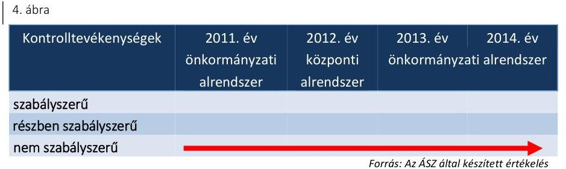

A 2011. évben az Ámr. 158. § (2) bekezdése, a 2012-2014. években a Bkr. 8. § (4) bekezdése előírásától eltérően a felelősségi körök meghatározásával belső szabályzatban nem szabályozták az engedélyezési, jóváhagyási és kontrolleljárásokat, a dokumentumokhoz és információkhoz való hozzáférést (valamint 2011-ben a hozzáférést az eszközökhöz) és a beszámolási eljárásokat.
2013. január 1-jétől 2014. október 2-áig az Ávr. 58. § (4) bekezdésének előírása ellenére a gazdasági vezető helyett szabálytalanul a múzeumigazgató jelölte ki az érvényesítőt.

A 2011-2014. években az lkr. ${ }^{40}$ 8. § (1)-(2) bekezdéseinek és az Info. tv. ${ }^{41}$ 7. § (2)-(3) bekezdéseinek előírása ellenére nem szabályozták a kezelt adatok biztonságának, védelmének érvényre juttatásához szükséges eljárási szabályokat.

A kontrolltevékenység 2011-2014. évi működtetése során feltárt hiányosságokat részletesen a 4.3. pont tartalmazza.

## 3.4. számú megállapítás

A 2011-2014. években a Múzeumnál az információs és kommunikációs folyamatok kialakítása nem volt szabályszerű.
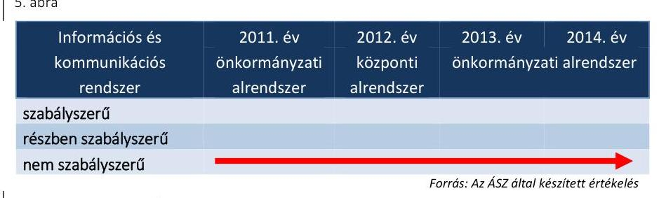

2011-ben az Ámr. 159. § (2) bekezdése, a 2012-2014-ben a Bkr. 9. § (2) bekezdése előírásától eltérően nem szabályozták a beszámolási határidőket, módokat.

A 2011-2014. években az Avtv. ${ }^{42}$ 31/A. § (3) bekezdésének illetve az Info. tv. 24. § (3) bekezdésének előírásától eltérően nem készítettek adatvédelmi és adatbiztonsági szabályzatot.

---

2011-ben az Ámr. 20. § (3) bekezdés i) pontjának, a 2012-2014. években az Ávr. 13. § (2) bekezdés h) pontjának előírásától eltérően a közérdekű adatok megismerésére irányuló kérelmek intézésének, továbbá a kötelezően közzéteendő adatok nyilvánosságra hozatalának rendjét belső szabályzatban nem rendezték.

Az elektronikus közzétételi kötelezettség teljesítése 2011-2014. között nem volt szabályszerű, mert 2011-ben az Eitv. ${ }^{43}$ 3. § (2) bekezdése alapján az Eitv. mellékletének III. pontjában, a 2012-2014. években az Info tv. 33. § (1) és (3) bekezdése alapján az Info tv. 1. melléklet III. pontjában foglalt gazdálkodásra vonatkozó adatokat
 a Múzeum a saját, illetve a felügyeletet ellátó szerv által fenntartott honlapon nem teljes körűen tette közzé. Nem kerültek közzétételre a Múzeum gazdálkodásával kapcsolatos adatok közül a személyi juttatásra vonatkozó összesített adatok (Eitv. melléklet III/2. pont, Info tv. 1. melléklet III/2. pont), a költségvetési beszámoló (Eitv. melléklet III/1. pont, Info tv. 1. melléklet III/1. pont), továbbá az 5 millió forintot elérő szerződések adatai (Eitv. melléklet III/4. pont, Info tv. 1. melléklet III/4. pont) és a közbeszerzési információk (Info tv. 1. melléklet III/8. pont).

Az Ltv. ${ }^{44}$ 9. § (4) bekezdése előírása ellenére a 2011-2014. években nem gondoskodtak az iratkezelési szabályzat kiadásáról.

# 3.5. számú megállapítás 

A 2011-2014. években a monitoring rendszer kialakítása és működtetése nem volt szabályszerű.
6. ábra

| Monitoring rendszer | 2011. év   önkormányzati   alrendszer | 2012. év   központi   alrendszer | 2013. év   önkormányzati alrendszer |
| :-- | :-- | :-- | :-- |

szabályszerű
részben szabályszerű
nem szabályszerű
Forrás: Az ÁSZ által készített értékelés
A költségvetési szerv vezetője a 2011. évben az Áht. 1 121/A. § (1) bekezdésében foglaltak ellenére nem adott ki olyan szabályzatot, mely biztosította a rendelkezésre álló források gazdaságos, hatékony és eredményes felhasználását. A 2012-2014. években a múzeumigazgató a Bkr. 6. § (2) bekezdésében foglaltak ellenére nem alakított ki olyan folyamatokat, amelyek biztosították a rendelkezésre álló források szabályszerű, szabályozott, gazdaságos, hatékony és eredményes felhasználását.

A Múzeumnál a monitoring rendszer részeként az operatív tevékenységek folyamatos és eseti nyomon követése a 2011. évben nem felelt meg az Ámr. 160. § (1)-(2) bekezdésében, 2012-ben a Bkr. 10. §-ában foglaltaknak.

A múzeumigazgató a 2011-2012. években az Áht. 1 121/B. § (4) bekezdésében és az Áht. 2 70. § (1) bekezdésében foglaltak ellenére nem gondoskodott a belső ellenőrzés kialakításáról és működtetéséről. A Múzeumnál a 2011-2014. években az Ötv. ${ }^{45}$, a 258/2011. (XII. 7.) Korm. rendelet illetve a Mötv. ${ }^{46}$ rendelkezései alapján a fenntartók gondoskodtak a Múzeum, mint felügyelt költségvetési szerv belső ellenőrzéséről.

---

# 4. A Múzeum pénzügyi gazdálkodása szabályszerű volt-e? 

## Összegző megállapítás

### 4.1. számú megállapítás

## A Múzeum pénzügyi gazdálkodása az ellenőrzött időszakban nem volt szabályszerű.

Az ellenőrzött években a költségvetési tervezés, a bevételi és kiadási előirányzatok megállapítása megfelelt a jogszabályi előírásoknak. A bevételi és kiadási előirányzatok módosítása összességében szabályszerű volt, a maradvány megállapítása a jogszabályi előírásoknak nem felelt meg.

A költségvetés tervezéséhez kapcsolódó feladatokat az ellenőrzött időszakban SZMSZ1,2-ben, munkamegosztási megállapodás1,2-ben, illetve ügyrendben ${ }^{47}$ szabályozták. A Múzeum az éves költségvetéseit a költségvetési évre engedélyezett létszám, személyi, dologi és felhalmozási kiadások, valamint bevételek alapján tervezte meg.

A Múzeum előirányzat módosításait a 2011-2014. években összességében szabályszerűen hajtották végre. Országgyűlési hatáskörben előirányzat-módosítás nem történt. Kormány hatáskörben előirányzat módosítás egy alkalommal (2012-ben) 0,9 M Ft összegben volt. Irányító szervi és saját hatáskörű előirányzat módosításra minden évben sor került, összesen 806,8 M Ft nagyságrendben. A 2011. évben a gazdasági szervezet ${ }_{1}$ az Áht. ${ }_{1}$ 103. § (1) bekezdésében foglaltak ellenére az előirányzatok folyamatos nyilvántartását nem vezette.

A maradvány megállapítása a 2011-2014. években az irányító szerv ${ }_{1-3}$ felé teljesített adatszolgáltatás késedelme miatt nem felelt meg a jogszabályi előírásoknak. A Múzeum költségvetési maradványáról az adatszolgáltatási kötelezettséget az irányító szerv ${ }_{1-3}$ felé az éves beszámoló megküldésével egyidejűleg teljesítette. A 2011-2013. évi beszámolási időszakra a gazdasági szervezet ${ }_{1,2}$ illetve a Múzeum az Áhsz. ${ }_{1}$ 10. § (1) bekezdésében, a 2014. évi beszámolási időszakra vonatkozóan a Múzeum az Áhsz. ${ }_{2}$ 32.§ (1) bekezdésében előírt - a költségvetési évet követő február 28-ai - határidőn túl teljesítette adatszolgáltatási kötelezettségét.
2011. évben az Áhsz. ${ }_{1}$ 49. § (1) bekezdésének előírása ellenére a kötelezettségvállalással terhelt maradvány analitikus, részletező kimutatását a gazdasági szervezet ${ }_{1}$ nem vezette. A maradvány összege 2011-ben 47 M Ft, 2012-ben 52,8 M Ft, 2013-ban 52,6 M Ft és 2014-ben 89,2 M Ft volt.

Az éves költségvetési beszámolók elkészítése nem volt szabályszerű.

Az éves költségvetési beszámolókat a gazdasági szervezet ${ }_{1,2}$ illetve a Múzeum a 2011-2013. években az Áhsz. ${ }_{1}$ 10. § (1) bekezdésében rögzített határidőn túl, a 2014. évi beszámolót a Múzeum az Áhsz. ${ }_{2}$ 32. § (1) bekezdésében rögzített határidőn túl küldte meg az irányító szerv ${ }_{1-3}$ részére. Az adatszolgáltatást legkésőbb a költségvetési

---

# 4.3. számú megállapítás 

évet követő február 28-áig kellett az irányító szervnek megküldeni. A jogszabályi rendelkezés ellenére a 2011. évről 2012. március hónapban (nap megjelölés nélkül), 2012. évről 2013. március 22-én, a 2013. évről 2014. április 4-én, a 2014. évről 2015. június hónapban (nap megjelölés nélkül) teljesítették az adatszolgáltatást.

A bevételek elszámolása során a 2011-2014. években nem tartották be a jogszabályi előírásokat. A kiadási előirányzatok felhasználása a 2011-2012. években nem volt szabályszerű, a 2013-2014. években részben szabályszerű volt.

A bevételi előirányzatot a Múzeum az ellenőrzött években a költségvetési beszámolói szerint az alábbi összegekkel tervezte: 2011-ben 394,9 M Ft, 2012-ben 395,6 M Ft, 2013-ban 235,8 M Ft, 2014-ben 207,7 M Ft. A bevételi előirányzatok a négy év vonatkozásában a tervezett értékek felett teljesültek: 2011-ben 558,3 M Ft, 2012-ben 522,2 M Ft, 2013-ban 388,0 M Ft, 2014-ben 523,6 M Ft.

A bevételek elszámolása a 2011-2014. években összességében nem volt szabályszerű.

A bevételek összegének meghatározását az ellenőrzött időszakban - a 3.1. pontban jelzett önköltség-számítási szabályzat hiányában - kalkulációval nem támasztották alá. A 2012-2013. évi helyiség bérbeadási (vagyonhasznosítási) tevékenység a Vtv. ${ }^{48}$ 25. § (4) bekezdésében foglaltak ellenére a vagyon hasznosítására felhatalmazást adó szerződés hiányában, szabálytalanul történt.

A kiadási előirányzatok teljesítésével összefüggő kifizetések során a gazdálkodási jogköröket 2011-2012-ben nem szabályszerűen, a 2013-2014. években részben szabályszerűen gyakorolták.

Az alábbi hibák, szabálytalanságok fordultak elő:
a 2011. január 1-je és 2012. október 31. közötti időszakban a gazdasági szervezet ${ }_{1}$ 2011-ben az Ámr. 80. § (3) bekezdésében, 2012-ben a gazdasági szervezet ${ }_{2}$ az Ávr. 60. § (3) bekezdésében előírt nyilvántartás vezetési kötelezettség teljesítéséről nem gondoskodott, emiatt a kiadások teljesítésével összefüggésben a kötelezettségvállalást, (pénzügyi) ellenjegyzést, (szakmai) teljesítésigazolást, érvényesítést és az utalványozást ellátó személyek aláírása nem volt beazonosítható;
2013. január 1-je és 2014. október 2-a között az Ávr. 58. § (4) bekezdésében foglaltak ellenére az érvényesítőt a gazdasági vezető helyett szabálytalanul a múzeumigazgató jelölte ki;
$\longrightarrow$ kötelezettségvállalásra - 2011-ben az Ámr. 74. § (1) bekezdésében előírt ellenjegyzés, a 2012-2014. években az Áht. 2 37. § (1) bekezdésében foglaltak ellenére pénzügyi ellenjegyzés hiányában - szabálytalanul került sor;
a 100 ezer Ft alatti kifizetéseket 2011-2012-ben szabálytalanul, előzetes írásbeli kötelezettségvállalás nélkül teljesítették, mert ennek rendjét - 2011-ben az Ámr. 72. § (13) bekezdés a) pontjában, 2012. évben az Ávr. 53. § (1) bekezdés a) pontjában foglalt előírások ellenére - a Múzeum belső szabályzataiban nem rögzítették;

---

- utalványozásra 2011-ben az Áht. 1 100/C. § (6) bekezdésében, 2012. és 2014-ben az Áht. 2 38. § (1) bekezdésében foglaltak ellenére nem került sor;
- a 2011-2012. években a kiadások teljesítését alátámasztó dokumentumok megőrzéséről a gazdasági szervezet ${ }_{1,2}$, illetve a Múzeum a Számv. tv. 169. § (2) bekezdésében foglaltak ellenére több esetben nem gondoskodott;
- 2013-2014-ben a teljesítésigazolást az Ávr. 57. § (1) és (3) bekezdésében foglaltak ellenére nem végezték el vagy nem szabályszerűen végezték el, mert az nem tartalmazta a teljesítésigazolás dátumát;
- 2012. évben az üzembe helyezést a Számv. tv. 26. § (1)-(7) bekezdésében, a Számv. tv. 47. § (1) bekezdésében és a Számv. tv. 52. § (2) bekezdésében foglaltak ellenére nem dokumentálták.

A 2011-2014. években a Kbt. ${ }_{1,2}{ }^{49}$ hatálya alá tartozó beszerzéseknél a közbeszerzés tárgyának becsült értékét meghatározták, a lefolytatott eljárásokat dokumentálták, a szerződéseket a nyertes ajánlattevőkkel kötötték meg.
4.4. számú megállapítás

A régészeti feltárási tevékenység bevételeinek elszámolását az ellenőrzött időszakban a jogszabályban előírt tartalmú szerződések támasztották alá. A régészeti tevékenységgel összefüggésben teljesített kiadások elszámolása megfelelt a jogszabályi előírásoknak.

A régészeti tevékenység bevételeit a régészeti felügyelet ellátására vonatkozó megrendelésekkel, valamint régészeti feltárásra vonatkozó szerződésekkel támasztották alá a 2011-2014. években. A szerződések megfeleltek a Kötv., illetve a 393/2012. (XII. 20.) Korm. rendelet ${ }^{50}$ rendelkezéseinek.

A költségelszámolást megalapozó dokumentumok, szerződések rendelkezésre álltak, de a felmerült kiadások nem minden esetben voltak konkrét bevételi szerződésekhez köthetők. Az ellenőrzött időszakban a régészeti feltárásokat az 5/2010. (VII. 18) NEFMI rendelet ${ }^{51}$ és a 80/2012. (XII. 28.) BM rendelet ${ }^{52}$ előírásainak megfelelő végzettségű régészek közreműködésével végezték el.

A gazdálkodási jogkörök gyakorlására vonatkozóan a 4.3 pontban feltárt hiányosságok a régészeti kiadások értékelésénél is megjelentek.

A Múzeum a régészeti célú pénzeszközök elkülönített kezelésére pénzforgalmi számlájához alszámlát vezetett az 5/2010. (VIII. 18.) NEFMI rendelet által megkövetelt - 2011. szeptember 2-2012. szeptember 14. közötti - időtartamban. A Múzeum az analitikus nyilvántartás vezetési kötelezettségét az 5/2010. (VIII. 18.) NEFMI rendelet 20. § (3) bekezdésében foglalt - 2011. szeptember 2-2012. december 31. között hatályos előírása ellenére - nem teljesítette.
4.5. számú megállapítás

Az ellenőrzött időszakban a Múzeum pénzügyi egyensúlya biztosított volt.

A Múzeum pénzügyi egyensúlya annak ellenére biztosított volt, hogy a folyamatos fizetőképesség biztosítása érdekében az Áht. 2 78. § (2) bekezdésének előírásával ellentétben a gazdasági szervezet ${ }_{2}$ nem készített a 2012. évben likviditási tervet.

---

A 2011-2014. évek között a Múzeumnak pénzügyi nehézségei nem voltak, gazdálkodása kiegyensúlyozott volt, finanszírozási keret előrehozást nem kért. A fizetőképesség fenntartása intézkedést nem igényelt.

A Múzeumnál a szállítói számlák és egyéb kötelezettségek határidőben történő kiegyenlítése - a 2011. év kivételével - biztosított volt, 2012-2014. években nem volt lejárt szállítói tartozás, a 2011. év végén 58,2 M Ft lejárt tartozása volt a Múzeumnak.

A 2012. évben 25 M Ft, a 2014. évben 3 M Ft volt a határidőn túli vevőkövetelés, melyek teljesültek. Behajthatatlan, leírt követelései egyik évben sem voltak a Múzeumnak, értékvesztés elszámolására nem került sor.

# 5. A Múzeum vagyongazdálkodása szabályszerű volt-e? 

## Összegző megállapítás

### 5.1. számú megállapítás

A Múzeum vagyongazdálkodása a 2011-2014. években nem volt szabályszerű.

Az eszközök és források nyilvántartása 2011-ben megfelelt, 2012-2014. közötti időszakban nem felelt meg a jogszabályi előírásoknak.

A 2011. évben a közfeladat ellátását szolgáló vagyon az irányító szerv ${ }_{1}$ tulajdonában és a Múzeum használatában volt. A használat szabályait vagyongazdálkodási rendelet ${ }^{53}$ határozta meg.

A 2012. január 1-jei önkormányzati konszolidációt követően a tulajdonosi jogokat az állami tulajdon felett az MNV Zrt. gyakorolta, míg a fenntartói jogok és kötelezettségek a középirányító szervhez kerültek. A Múzeum a feladat ellátását szolgáló vagyont továbbra is használta,
 azonban erre vonatkozó szerződéssel a Vtv. 25. § (4) bekezdésében foglaltak ellenére nem rendelkezett. A Számv. tv. 23. § (2) bekezdésében, az Nvtv. 11. § (8) bekezdésében, valamint az Áhsz. ${ }_{1} 15 . \S$ (1) bekezdésében foglaltak ellenére a kezelt vagyon kimutatására szabálytalanul a Múzeumnál került sor. A Múzeum 2012. évi beszámolójának mérlegében kimutatott állami vagyon értéke teljes egészében az Áhsz. ${ }_{1} 5 . \S 8$. pontja szerinti jelentős összegű hibát eredményezett és az, az Áhsz. ${ }_{1} 5 . \S 10$. pontjában meghatározott megbízható és valós képet lényegesen befolyásoló hiba volt.

Az Mtv. 2013. január 1-jétől hatályos 45/A. § (2) bekezdés a) pontja szerint a megyei hatókörű városi múzeum lett a vagyonkezelője a tevékenységéhez szükséges állami vagyonnak. A 2013-2014. években a Múzeum az Nvtv. 11. § (1) és (7) bekezdésének és a Vtvr. ${ }^{54}$ 8. § (6) bekezdésének előírása ellenére nem rendelkezett vagyonkezelési szerződéssel. Az ingatlan vagyon kimutatására a Múzeumnál a 2013-2014. években nem került sor. Az ingatlan vagyonelemeket - a Számv. tv. 165. § (1)-(2) bekezdésében foglaltak ellenére - a Múzeum nyilvántartásaiból szabályszerű bizonylat hiányában 2013-ban kivezette, ennek okát nem dokumentálta, azonban a vagyont továbbra is használta és hasznosította.

A vagyonkezelésbe tartozó vagyon köre és nagysága a 2013-2014. években vagyonkezelési szerződés hiányában nem volt megállapítható. Kiegészítő mellékletben a Múzeum a Számv. tv. 23. § (2) bekezdésében előírtak ellenére nem mutatta be mérlegtételek szerinti bontásban az Mtv. alapján vagyonkezelésébe tartozó állami eszközöket, és az Áhsz. ${ }_{2}$ 29. § (2) bekezdés c) pontjában előírtak ellenére nem jelezte a vagyonkezelési szerződés hiányát, emiatt nem érvényesült a Számv. tv. 16. § (4) bekezdésében meghatározott „lényegesség elve".

A BEKERÜLÉSI ÉRTÉK MEGHATÁROZÁSA a 2011., 2013-2014. években szabályszerű volt.

# A NEMZETI VAGYONBA TARTOZÓ KULTURÁLIS JAVAK NYILVÁNTARTÁSA az ellenőrzött időszakban nem volt szabályszerű.

A szak- és egyéb leltárkönyveket a naptári év végén záradékkal kell ellátni, amelynek szövegében fel kell tüntetni az éves leltározás tétel- és darabszámát, továbbá az intézményvezető aláírását is, melyre a 2011-2014. években a 20/2002. (X. 4.) NKÖM rendelet ${ }^{55}$ 1. melléklet 9. pontjában foglaltak ellenére nem minden esetben került sor.

A 2011-2014. években, a 20/2002. (X. 4.) NKÖM rendelet 19. § (1) bekezdés ab) pontjában foglaltaktól eltérően nem gondoskodtak a kölcsönvett tárgyak naplójának vezetéséről, továbbá a 20/2002. (X. 4.) NKÖM rendelet 19. § (1) bekezdés b) pontjában foglalt előírás ellenére nem gondoskodtak a kölcsönadott tárgyak naplójának vezetéséről a gyűjteményekből ideiglenesen kikerült kulturális javak tekintetében sem.

A használaton kívül helyezett szakmai nyilvántartásokról a 2011-2014. években nem készült - a 20/2002. (X. 4.) NKÖM rendelet 20. § (3) bekezdésében foglaltak ellenére - a múzeumigazgató aláírásával és a Múzeum körbélyegzőjével hitelesített kimutatás.

Az ellenőrzött időszakban törlés a kulturális javak közül nem történt. A Múzeum a kulturális javakat hagyományos módon (papír alapon) tartotta nyilván.
5.2. számú megállapítás

A költségvetési beszámoló mérlegének leltárral való alátámasztottsága, a mérlegtételek értékelése a 2011-2014. közötti időszakban összességében nem felelt meg a jogszabályi előírásoknak.

A MÉRLEGET ALÁTÁMASZTÓ LELTÁR a 2011-2013. években nem felelt meg az Áhsz. 1 37. § (1)-(2) bekezdésében foglaltaknak. A követelések mérlegben történő 2011-2013. évi kimutatása során nem készült a követelések vevő általi elismeréséről dokumentum, ezzel nem érvényesült a Számv. tv. 65. § (1) bekezdésének előírása, mely alapján a követelést a mérlegben az elismert összegben kell kimutatni, emiatt a mérleget alátámasztó leltár a 2011-2013. években nem felelt meg az Áhsz. 37. § (2) bekezdésében foglaltaknak.

A 2014. évi leltározást a Múzeum az Áhsz. 2 előírásai alapján a teljes vagyoni körre kiterjedően elvégezte. Az ingatlanok értékelésére vonatkozó információkat azonban a beszámolóban - az Áhsz. 2 6. § (2) bekezdés bd) pontjában és az Áhsz. 2 29. § (2) bekezdés a) pontjában foglaltak ellenére vagyonkezelési szerződés hiányában nem jelenítette meg.

A Múzeum az eredményszemléletű számvitelre történő áttérés feladatait a 36/2013. (IX. 13.) NGM rendelet ${ }^{56}$ előírásai alapján végrehajtotta, azonban a rendező mérleg - a leltározás előzőekben kifejtett hiányosságai miatt - nem volt szabályszerű. A rendező mérleget a 36/2013. (IX. 13.) NGM rendelet 8. § (2) bekezdés a) pontjában foglalt határidőn túl készítették el.
5.3. számú megállapítás

A kulturális javak hasznosítása és kölcsönzése az ellenőrzött időszakban nem felelt meg a jogszabályi előírásoknak. A kulturális javak vagyonbiztonságára és állományvédelmére vonatkozó előírásokat nem tartották be maradéktalanul.

A KULTURÁLIS JAVAK KÖLCSÖNZÉSÉRE kötött szerződések a 2011-2014. közötti időszakban nem tartalmazták az Mtv. 38. § (8) bekezdésében illetve a 2013. október 25-től hatályos 38/A. § (2) bekezdésében rögzített kötelező tartalmi elemeket. Így a kulturális javak kölcsönzéséről szóló szerződések nem tartalmazták - az Mtv. 38. § (8) bekezdés a) pontjában illetve a 2013. október 25-től hatályos 38/A. § (2) bekezdés a) pontjában foglaltak ellenére - a kölcsönvevő által a kölcsönzött kulturális javaknak biztosítandó állományvédelmi követelményeket, beleértve a klimatikus viszonyokat. A kölcsönzési szerződések többsége nem tartalmazta a kölcsönvevő által nyújtandó vagyonbiztonsági feltételeket - beleértve az esetlegesen szükséges muzeológusi, rendőrségi vagy egyéb fegyveres kíséretet is - az Mtv. 38. § (8) bekezdés c) pontjában illetve a 2013. október 25-től hatályos 38/A. § (2) bekezdés c) pontjában foglaltak ellenére. Az ellenőrzött időszakban nem írták elő a szerződésekben az Mtv. 38. § (8) bekezdés b) pontjában és a 2013. október 25-től hatályos 38/A. § (2) bekezdés b) pontjában foglaltak ellenére a kölcsönadott kulturális javak sérülése esetén követendő eljárás rendet.

A kulturális javak nem muzeális intézmény számára történő kölcsönadásához a 2012. évben az Mtv. 38. § (9) bekezdésében foglaltak ellenére nem rendelkeztek a miniszter hozzájárulásával.

A KULTURÁLIS JAVAK ÖRZÉSE ÉS ÁLLOMÁNYVÉDELME a kölcsönzési szerződések állományvédelemmel kapcsolatos - előzőekben felsorolt - hiányosságai miatt nem volt megfelelő. A Múzeum a 2/2010. (I. 14.) OKM rendelet ${ }^{57}$-ben foglaltaknak megfelelően a használatában álló épületben állandó és időszakos kiállítás bemutatására alkalmas kiállító helyiségeket, gyűjteményi raktárakat, előkészítő raktárt, felszerelt restaurátor műhelyeket, vegyszerraktárt, szakkönyvtárat, múzeumpedagógiai foglalkoztató teret és a közönség fogadását szolgáló helyiségeket alakított ki, melyet elektronikus és mechanikus, továbbá élőerős védelemmel látott el.

# 6. A Múzeum intézkedett-e az integritás szemlélet érvényesítése érdekében? 

Összegző megállapítás

A Múzeum nem intézkedett az integritás szemlélet érvényesítése érdekében.

Az ellenőrzés részletes megállapításait a jelentéstervezet II. számú - „Az Integritás érvényesítése érdekében kialakított és működtetett kontrollrendszer" című - melléklete tartalmazza.

# JAVASLATOK 

Az ÁSZ tv. 33. § (1) bekezdésében foglaltak értelmében az ellenőrzött szervezet vezetője köteles a jelentésben foglalt megállapításokhoz kapcsolódó intézkedési tervet összeállítani és azt a jelentés kézhezvételétől számított 30 napon belül az ÁSZ részére megküldeni. Amennyiben az ellenőrzött szervezet vezetője nem küldi meg határidőben az intézkedési tervet, vagy továbbra sem elfogadható intézkedési tervet küld, az Állami Számvevőszék elnöke az ÁSZ tv. 33. § (3) bekezdése a) és b) pontjaiban foglaltakat érvényesítheti.

## Kecskemét Megyei Jogú Város Önkormányzata polgármesterének

1. Intézkedjen a Múzeum gazdálkodási feladatait ellátó költségvetési szerv felé:
a) az eszközök és források értékelési szabályzata módosítására a jogszabályi előírás betartása érdekében;
(3.1. sz. megállapítás 3. bekezdésének 3. francia bekezdése alapján)
b) bizonylati rend készítésére;
(3.1. sz. megállapítás 3. bekezdésének 4. francia bekezdése alapján)
c) az önköltségszámítás rendjére vonatkozó belső szabályzat készítésére;
(3.1. sz. megállapítás 3. bekezdésének 5. francia bekezdése alapján)
d) a Múzeum éves költségvetési beszámolója adatainak a költségvetési évet követő év február 28-áig történő feltöltésére a Kincstár által működtetett elektronikus adatszolgáltató rendszerbe az irányító szervi felülvizsgálat és jóváhagyás érdekében;
(4.1. sz. megállapítás 3. bekezdése, 4.2. sz. megállapítás 1. bekezdése alapján)
e) a jogszabályi előírásoknak megfelelő éves költségvetési beszámoló készítésére.
(5.1. sz. megállapítás 4. bekezdésének 2. mondata, 5.2. sz megállapítás 2. bekezdése alapján)

2. Tegyen intézkedéseket a feltárt szabálytalanságok tekintetében a felelősség tisztázása érdekében, és szükség szerint intézkedjen a felelősség érvényesítéséről.
(4.3. sz. megállapítás 3. bekezdése, 4.3. sz. megállapítás 4. bekezdésének 3., 5., 7. francia bekezdése, 5.1. sz. megállapítás 4. bekezdésének 2. mondata, 5.1. sz. megállapítás 7., 8., 9. bekezdése, 5.2. sz. megállapítás 2. bekezdése, 5.3. sz. megállapítás 1. bekezdése alapján)

# a Kecskeméti Katona József Múzeum igazgatójának 

1. A belső kontrollrendszer szabályszerű kialakítása és működtetése érdekében intézkedjen:
a) az ellenőrzési nyomvonal elkészítésére;
(3.1. sz. megállapítás 4. bekezdésének 1. mondata alapján)
b) a szervezeti integritást sértő események kezelésének eljárásrendje szabályozására;
(3.1. sz. megállapítás 4. bekezdésének 1. mondata alapján)
c) az etikai elvárások jogszabályi előírásnak megfelelő meghatározására, ismertetésére, elfogadására;
(3.1. sz. megállapítás 4. bekezdésének 2. mondata alapján)
d) az integrált kockázatkezelési rendszer működtetésére;
(3.2. sz. megállapítás 1. bekezdése alapján)
e) a felelősségi körök meghatározásával az engedélyezési, jóváhagyási és kontrolleljárások, a dokumentumokhoz és információkhoz való hozzáférés, valamint a beszámolási eljárások szabályozására;
(3.3. sz. megállapítás 1. bekezdése alapján)
f) a kezelt adatok biztonságának, védelmének érvényre juttatásához szükséges eljárási szabályok kialakítására;
(3.3. sz. megállapítás 3. bekezdése alapján)
g) a beszámolási határidők és módok meghatározására;
(3.4. sz. megállapítás 1. bekezdése alapján)
h) adatvédelmi és adatbiztonsági szabályzat készítésére;
(3.4. sz. megállapítás 2. bekezdése alapján)
i) a közérdekű adatok megismerésére irányuló kérelmek intézésének, továbbá a kötelezően közzéteendő adatok nyilvánosságra hozatalának rendje szabályozására;
(3.4. sz. megállapítás 3. bekezdése alapján)
j) az elektronikus közzétételi kötelezettség jogszabályi előírásnak megfelelő teljesítésére;
(3.4. sz. megállapítás 4. bekezdése alapján)
k) az iratkezelési szabályzat készítésére;
(3.4. sz. megállapítás 5. bekezdése alapján)
l) olyan folyamatok kialakítására, amelyek biztosítják a rendelkezésre álló források szabályszerű, szabályozott, gazdaságos, hatékony és eredményes felhasználását;
(3.5. sz. megállapítás 1. bekezdése alapján)
2. A szabályszerű pénzügyi gazdálkodás érdekében intézkedjen:
a) a szabályszerű vagyonhasznosításra
(4.3. sz. megállapítás 3. bekezdése alapján)
b) a kötelezettségvállalás, az utalványozás és a teljesítésigazolás jogszabályi előírásoknak megfelelő gyakorlására.
(4.3. sz. megállapítás 4. bekezdésének 3., 5., 7. francia bekezdése alapján)
3. A szabályszerű vagyongazdálkodás érdekében intézkedjen:
a) a szak- és egyéb leltárkönyvek jogszabályi előírásnak megfelelő záradékolására és aláírására, valamint a kulturális javak jogszabályi előírásnak megfelelő nyilvántartására;
(5.1. sz. megállapítás 7., 8. bekezdése alapján)
b) a jogszabályi előírásoknak megfelelő kimutatás vezetésére;
(5.1. sz. megállapítás 9. bekezdése alapján)
c) a kulturális javak hasznosítása és kölcsönzése esetén a jogszabályban előírtak betartására.
(5.3. sz. megállapítás 1. bekezdése alapján)

# MELLÉKLETEK 

- I. SZ. MELLÉKLET: ÉRTELMEZŐ SZÓTÁR
állami vagyon kezelője /vagyonkezelő

ÁSZ Integritás Projekt
belső ellenőrzés
belső kontrollrendszer
belső kontrollrendszer területei
fenntartó

Az állami vagyont az MNV Zrt. maga kezeli, vagy szerződés - így különösen bérlet, haszonbérlet, szerződésen alapuló haszonélvezet, vagyonkezelés, megbízás - alapján központi költségvetési szervnek, természetes vagy jogi személynek, illetőleg jogi személyiséggel nem rendelkező gazdasági társaságnak hasznosításra átengedi (Forrás: Vtv. 23. § (1) bekezdése, hatályos 2010. január 01 - 2011. december 31-ig).
Az állami vagyont az MNV Zrt. maga kezeli, vagy szerződés - így különösen bérlet, haszonbérlet, megbízás - alapján központi költségvetési szervnek, természetes vagy jogi személynek, vagy jogi személyiséggel
 nem rendelkező gazdálkodó szervezetnek hasznosításra átengedi." Az állami vagyonra vonatkozóan az MNV Zrt. kizárólag az Nvtv-ben meghatározott személyekkel köthet vagyonkezelési szerződést.
(Forrás: Vtv. 27. § (1) bekezdése, hatályos 2012. január 1-jétől)
Az Állami Számvevőszék 2009-ben indította el a „Korrupciós kockázatok feltérképezése - Integritás alapú közigazgatási kultúra terjesztése" című, európai uniós forrásból megvalósított kiemelt projektjét (Integritás Projekt). Az Integritás Projekt célja, hogy felmérje a közszféra intézményei korrupciós kockázatoknak való kitettségét, illetőleg az azok mérséklésére hivatott kontrollok szintjét. Az Állami Számvevőszék a projekt révén az integritás szemlélet minél szélesebb körrel történő megismertetését, gyakorlatba ültetését kívánja elérni. Az integritás követelményeinek megfelelő szervezeti működést előnyben részesítő közigazgatási kultúra elterjesztését és a korrupció elleni fellépést az ÁSZ önmagára nézve is stratégiai jelentőségű célként fogalmazta meg. A projekt a felmérésben résztvevő intézmények számára helyzetükről egyfajta „tükörképet" mutat be, ami alapot teremt a jövőbeni pozitív irányú elmozduláshoz. (Forrás: a http://integritas.asz.hu honlapon közzétett, a 2013. évi Integritás felmérés eredményeiről készült összefoglaló tanulmány)
Független, tárgyilagos bizonyosságot adó és tanácsadó tevékenység, amelynek célja, hogy az ellenőrzött szervezet működését fejlessze és eredményességét növelje, az ellenőrzött szervezet céljai elérése érdekében rendszerszemléletű megközelítéssel és módszeresen értékeli, illetve fejleszti az ellenőrzött szervezet irányítási és belső kontrollrendszerének hatékonyságát. (Forrás: Bkr. 2. § b) pontja)
A belső kontrollrendszer a kockázatok kezelése és tárgyilagos bizonyosság megszerzése érdekében kialakított folyamatrendszer, amely azt a célt szolgálja, hogy a működés és gazdálkodás során a tevékenységeket szabályszerűen, gazdaságosan, hatékonyan, eredményesen hajtsák végre, az elszámolási kötelezettségeket teljesítsék, megvédjék az erőforrásokat a veszteségektől, károktól és nem rendeltetésszerű használattól. (Forrás: Áht. 2 69. § (1) bekezdése)
A kontrollkörnyezet, a kockázatkezelési rendszer, a kontrolltevékenységek, az információs és kommunikációs rendszer, valamint a nyomon követési (monitoring) rendszer. (Forrás: Bkr. 3. §-a)
A muzeális intézmény fenntartója az a természetes személy, jogi személy, jogi személyiség nélküli gazdasági társaság, amely biztosítja a muzeális intézmény folyamatos és rendeltetésszerű működéséhez szükséges feltételeket (1997. évi CXL. tv. 50. § (1) bek.)

---

FEUVE

Információs és kommunikációs rendszer
integritás
irányító szerv/felügyeleti szerv
kockázat
kockázatkezelési rendszer
kontrollkörnyezet
kontrolltevékenységek
kötelezettségvállalás
középirányító szerv

A kontrolltevékenység részeként minden tevékenységre vonatkozóan biztosítani kell a folyamatba épített, előzetes, utólagos és vezetői ellenőrzést (FEUVE), különösen az alábbiak vonatkozásában:
a) a pénzügyi döntések dokumentumainak elkészítése (ideértve a költségvetési tervezés, a kötelezettségvállalások, a szerződések, a kifizetések, a támogatásokkal való elszámolás, a szabálytalanság miatti visszafizettetések dokumentumait is),
b) a pénzügyi kihatású döntések célszerűségi, gazdaságossági, hatékonysági és eredményességi szempontú megalapozottsága,
c) a költségvetési gazdálkodás során az előzetes és utólagos pénzügyi ellenőrzés, a pénzügyi döntések szabályszerűségi szempontból történő jóváhagyása, illetve ellenjegyzése,
d) a gazdasági események elszámolása (a hatályos jogszabályoknak megfelelő könyvvezetés és beszámolás) kontrollja. (Forrás: Bkr. 8. § (2) bekezdése)
A költségvetési szerv vezetője által kialakított és működtetett olyan rendszer, mely biztosítja, hogy a megfelelő információk a megfelelő időben eljutnak az illetékes szervezethez, szervezeti egységhez, illetve személyhez. (Forrás: Bkr. 9. § (1) bekezdés)
Az integritás az elvek, értékek, cselekvések, módszerek, intézkedések konzisztenciáját jelenti, vagyis olyan magatartásmódot, amely meghatározott értékeknek megfelel.
(Forrás: Nemzetgazdasági Minisztérium: Magyarországi államháztartási belső kontroll standardok Útmutató 1.6.1. pontja, 2012. december)
A költségvetési szerv tekintetében az e törvényben meghatározott irányítási hatáskört gyakorló szerv. (Forrás: Áht. 1 1. § 9. pontja)
A kockázat annak a valószínűségét jelenti, hogy egy vagy több esemény vagy intézkedés nem kívánt módon befolyásolja a rendszer működését, céljainak megvalósulását. (Forrás: Javaslatok a korrupciós kockázatok kezelésére - Kockázatkezelési és ellenőrzési módszertan 35. oldal, ÁSZ)
Olyan irányítási eszközök és módszerek összessége, melynek elemei a szervezeti célok elérését veszélyeztető tényezők (kockázatok) azonosítása, elemzése, csoportosítása, nyomon követése, valamint szükség esetén a kockázati kitettség mérséklése. (Forrás: Bkr. 2. § m) pontja)
A költségvetési szerv vezetője által kialakított olyan elvek, eljárások, belső szabályzatok összessége, amelyben világos a szervezeti struktúra, egyértelműek a felelősségi, hatásköri viszonyok és feladatok, meghatározottak az etikai elvárások a szervezet minden szintjén, átlátható a humánerőforrás-kezelés. (Forrás: Bkr. 6. § (1) bekezdés)
A költségvetési szerv vezetője által a szervezeten belül kialakított (kontroll) tevékenységek, melyek biztosítják a kockázatok kezelését, hozzájárulnak a szervezet céljainak eléréséhez. (Forrás: Bkr. 8. § (1) bekezdés)
A kiadási előirányzatok terhére fizetési kötelezettség vállalásáról szóló - így különösen a foglalkoztatásra irányuló jogviszony létesítésére, szerződés megkötésére, költségvetési támogatás biztosítására irányuló - szabályszerűen megtett jognyilatkozat. (Forrás: Áht. 2. § o) pont)
A költségvetési szerv tekintetében törvény vagy kormányrendelet alapján meghatározott, átruházott irányítási hatásköröket gyakorló szerv. (Forrás: Áht. 9. § (4) bekezdés)

---

megyei hatókörű városi múzeum
megyei Intézményfenntartó Központ
monitoring rendszer
tagintézmény
vagyongazdálkodás
zárolás

A megyei hatókörű városi múzeum feladata a kulturális javak helyi védelmének települési szintet meghaladó, egy megye közigazgatási területére kiterjedő biztosítása. (1997. évi CXL. tv. 45. § (1) bek.)
A megyei intézményfenntartó központ önállóan működő és gazdálkodó központi költségvetési szerv. Székhelye a megyeszékhely városban, a Pest Megyei Intézményfenntartó Központ székhelye Budapesten van. A Kormány az átvett intézmények tekintetében - a közoktatási intézmények kivételével - a megyei intézményfenntartó központot jelöli ki a 2011. évi CLIV. tv. 3. § (1) bek. és a 9. § (1) bek. szerinti feladat ellátására. (258/2011. (XII.7.) Korm. rendelet 2. § (1), (2) bek., 4. §)
A költségvetési szerv vezetője köteles olyan monitoring rendszert működtetni, mely lehetővé teszi a szervezet tevékenységének, a célok megvalósításának nyomon követését. A költségvetési szerv monitoring rendszere az operatív tevékenységek keretében megvalósuló folyamatos és eseti nyomon követésből, valamint az operatív tevékenységektől függetlenül működő belső ellenőrzésből áll. (Forrás: Ámr. 160. §, Bkr. 10. §)
A muzeális intézmény szervezeti egységeként működő, önálló működési engedéllyel rendelkező muzeális intézmény (Forrás: Mtv. 1. számú melléklet y) pontja)
A nemzeti vagyongazdálkodás feladata a nemzeti vagyon rendeltetésének megfelelő, az állam, az önkormányzat mindenkori teherbíró képességéhez igazodó, elsődlegesen a közfeladatok ellátásához és a mindenkori társadalmi szükségletek kielégítéséhez szükséges, egységes elveken alapuló, átlátható, hatékony és költségtakarékos működtetése, értékének megőrzése, állagának védelme, értéknövelő használata, hasznosítása, gyarapítása, továbbá az állam vagy a helyi önkormányzat feladatának ellátása szempontjából feleslegessé váló vagyontárgyak elidegenítése. (Forrás: Nvtv. 7. § (2) bekezdése)
A költségvetési kiadási előirányzatok felhasználásának időlegesen, feltételhez kötötten történő korlátozása, felfüggesztése. (Forrás: Áht. 2 2. § s) pont)

---

# II. SZ. MELLÉKLET: AZ INTEGRITÁS ÉRVÉNYESÍTÉSE ÉRDEKÉBEN KIALAKÍTOTT ÉS MŰKÖDTETETT KONTROLLRENDSZER 

A közintézmények korrupciós kockázatoknak való kitettségét, valamint az azzal szembeni ellenálló képességüket az ÁSZ az integritás projekt keretében feltérképezi és értékeli. A Múzeum az ÁSZ integritás projektjéhez a 2011-2014. években nem csatlakozott, kérdőívet nem töltött ki. A Múzeum az ellenőrzés során töltött ki integritás tanúsítványt. Az integritás szemlélet érvényesülésének értékelése a Múzeum által szolgáltatott adatok alapján történt.
A Múzeum által kitöltött tanúsítvány alapján három indexérték meghatározására került sor. Ezek a következők:
Az Eredendő Veszélyeztetettségi Tényezők (EVT) index a szervezetek jogállásától és feladatköreitől függő - eredendő - veszélyeztetettség összetevőit teszi mérhetővé. Olyan tényezők határozzák meg, amelyek alakítása az alapítószerv jogalkotási hatáskörébe tartozik, így például a hatósági jogalkalmazás, a (jogi) szabályozás, vagy a különféle (oktatási, egészségügyi, szociális és kulturális) közszolgáltatások nyújtása.

A Korrupciós Veszélyeket Növelő Tényezők (KVNT) index az egyes intézmények napi működésétől függő - az eredendő veszélyeztetettséget növelő - összetevőket jeleníti meg. Leképezi a költségvetési szervek jogi/intézményi környezetének jellemzőit, működésük kiszámíthatóságát, stabilitását, továbbá az intézmények működtetése során jelentkező - alapvetően a mindenkori menedzsment döntéseitől befolyásolt - olyan változó tényezőket, mint a stratégiai célok meghatározása, a szervezeti struktúra és kultúra alakítása, valamint a személyi és költségvetési erőforrásokkal, illetve a közbeszerzésekkel való gazdálkodás.

A Kockázatokat Mérséklő Kontrollok Tényezője (KMKT) index azt tükrözi, hogy az adott szervezetnél léteznek-e intézményesült kontrollok, illetőleg, hogy ezek ténylegesen működnek-e, betöltik-e rendeltetésüket. Ehhez az indexhez olyan faktorok tartoznak, mint a szervezet belső szabályozása, a belső ellenőrzés, valamint az egyéb integritás kontrollok: etikai követelmények meghatározása, összeférhetetlenségi helyzetek kezelése, a bejelentések, panaszok kezelése, rendszeres kockázatelemzés.

Az egyes indexértékek szintjének (alacsony, közepes, magas) meghatározásához viszonyítási pontként a 2014. évi Integritás felmérésben válaszadó Kulturális intézményekre számított indexértékek számtani átlaga szolgált.
A szolgáltatott adatok alapján az ellenőrzött szervezetre kiszámolt indexértékek, illetve a 2014. évi Integritás felmérésben a Kulturális intézményekre kalkulált átlagos mutatószámok összevetése alapján megállapítható, hogy a Múzeum:

- eredendő veszélyeztetettségi (EVT) szintje alacsony, amelyet többek között az eredményezett, hogy a Múzeum egyedi hatósági jogkörrel nem rendelkezett;
- kockázatokat növelő tényező (KVNT) szintje alacsony, amely a külső szabályozási környezet, a szervezeti struktúra és felső vezetést érintő szervezeti változásokból adódott, illetve
- a szervezetnél kiépült, kockázatok kezelésére hivatott kontrollok (KMKT) szintje alacsony, amely főként a belső szabályozás és a korrupció ellenes rendszerek és eljárások hiányosságaival függött össze.

Az ellenőrzött szervezet indexértékeit, illetve azok szintjét a 2014. évi Integritás felmérésben adatot szolgáltató Kulturális intézmények átlagos mutatószámainak tükrében az alábbi táblázat szemlélteti.

| Index neve | A 2014. évi Integritás   felmérésben válaszadó   Kulturális Intézmények   átlagos indexértékei | Múzeum által kitöltött   tanúsítvány alapján   számított indexérté-   kek | Múzeum indexértéke-   inek szintje (alacsony,   közepes, magas) |
| :-- | :--: | :--: | :--: |
| Eredendő Veszélyeztetettségi Té-   nyezők (EVT) | $16,01 \%$ | $10,71 \%$ | Alacsony |
| Korrupciós Veszélyeket Növelő Té-   nyezők (KVNT) | $21,43 \%$ | $9,57 \%$ | Alacsony |
| Kockázatokat Mérséklő Kontrollok   Tényező (KMKT) | $59,54 \%$ | $48,65 \%$ | Alacsony |

---

A Múzeum intézkedései megfelelők voltak az integritás szemlélet szervezeten belüli érvényesítése érdekében, mivel:

- a Múzeum jogállásához és feladatköreihez kapcsolódó eredendő kockázatok alacsony szintje, valamint az azok kezelésére kiépített kontrollok alacsony szintje összességében „megfelelő",
- a Múzeum működésében rejlő korrupciós veszélyeztetettséget növelő tényezők alacsony szintje és a kontrollok alacsony kiépítettségének együttes értékelése „megfelelő" minősítést kapott a tanúsítványban szolgáltatott adatok alapján. A mutatószámok összevetésének eredményét az alábbi ábra szemlélteti.

| Összevetett   mutatószámok | A kockázati tényezők és a kiépült kontrollok szintjének együttes értékelése   (fejlesztendő, megfelelő, kiváló) |
| :-- | :--: |
| EVT - KMKT | Megfelelő |
| KVNT - KMKT | Megfelelő |

Az összesített értékelés megfelelő lett, melyet az ellenőrzés megállapításai nem támasztottak alá.

---

.

---

# FÜGGELÉK: ÉSZREVÉTELEK 

A jelentéstervezetet a Számvevőszék 15 napos észrevételezésre megküldte az ellenőrzött szervezetek vezetőinek az ÁSZ tv. 29. § (1) bekezdése előírásának megfelelően.
A Kecskeméti Katona József Múzeum igazgatója és a Kecskemét Megyei Jogú Város Önkormányzatának

polgármestere az ellenőrzés megállapításaira írásban észrevételt tett.
A Bács-Kiskun Megyei Önkormányzat elnöke és a Szociális és Gyermekvédelmi Főigazgatóság főigazgatója az ÁSZ. tv. 29. § (2) bekezdésében foglalt észrevételezési jogával nem élt, a törvényes határidőn belül észrevételt nem tett.
Az elfogadott észrevétel alapján az Állami Számvevőszék módosította a jelentést.
A függelék tartalmazza mellékletek nélkül az ellenőrzött Kecskeméti Katona József Múzeum igazgatójának és a Kecskemét Megyei Jogú Város
 Önkormányzata polgármesterének az észrevételeit és az el nem fogadott észrevételek indoklását.

[^0]
[^0]:    * 29. § (1) Az Állami Számvevőszék az ellenőrzési megállapításait megküldi az ellenőrzött szervezet vezetőjének vagy az általa megbízott személynek, és annak, akinek személyes felelősségét állapította meg.
    (2) Az ellenőrzött szervezet vezetője és a felelősként megjelölt személy az ellenőrzés megállapításaira tizenöt napon belül írásban észrevételt tehet.
    (3) Az Állami Számvevőszék az észrevételre a beérkezésétől számított harminc napon belül írásban válaszol. A figyelembe nem vett észrevételeket köteles a jelentésben feltüntetni, és megindokolni, hogy azokat miért nem fogadta el.

---

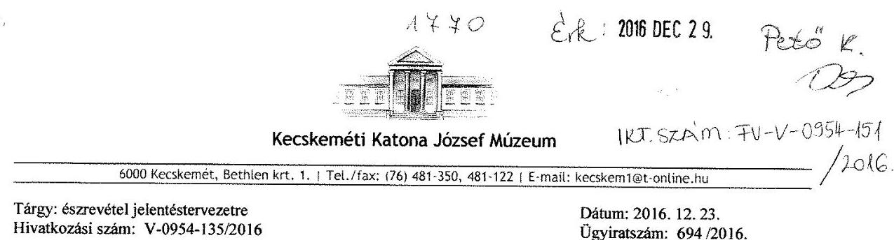

Tárgy: észrevétel jelentéstervezetre
Hivatkozási szám: V-0954-135/2016

Dátum: 2016. 12. 23.
Ügyiratszám: 694/2016.

# Domokos László 

## elnök úr

## Állami Számvevőszék Budapest

Tisztelt Elnök Úr!

A 2016. december 12-én érkezett, V-0954-135/2016-os iktatószámú, a „Megyei hatókörű városi múzeumok ellenőrzése - Kecskeméti Katona József Múzeum, Kecskemét" című ellenőrzésről készült jelentéstervezetük megállapításaira és javaslataikra az alábbi észrevételt teszem.

1. A vizsgált időszakban, 2011-2014 között a Bács-Kiskun Megyei Múzeumi Szervezet, mai nevén a Kecskeméti Katona József Múzeum szervezete és gazdálkodása több alkalommal jelentős változáson ment keresztül, míg 2013. január 01-től Kecskemét Megyei Jogú Város Önkormányzatának fenntartásába került. A muzeális intézményekről, a nyilvános könyvtári ellátásról és a közművelődésről szóló 1997. évi CXL. törvény módosításáról szóló 2012. évi CLII. törvény (a továbbiakban Kult. mód.) 30.§ (1) és (4) bekezdései alapján: „(1) A 2012. január 1-jén állami tulajdonba és fenntartásba került megyei könyvtárak 2013. január 1-jétől a feladat ellátásához rendelkezésre álló személyi, tárgyi és pénzügyi feltételek egyidejű átadásával a megyeszékhely megyei jogú városok - Pest megyében Szentendre Város Önkormányzata - fenntartásába és a feladat ellátását közvetlenül szolgáló ahhoz szükséges ingó vagyontárgyak - beleértve az állomány nyilvántartásában szereplő könyvtári dokumentumokat is - térítésmentesen a fenntartó önkormányzat tulajdonába kerülnek.
(4) A megyei intézményfenntartó központok helyébe az átvett vagyonnal, illetőleg intézményekkel kapcsolatos jogviszonyok tekintetében 2013. január 1-jét követően általános és egyetemleges jogutódként az új fenntartók lépnek".

A nemzeti vagyonról szóló 2011. évi CXCVI. törvény (a továbbiakban Nvtv.) 11. § (7) bekezdése és az állami vagyonnal való gazdálkodásról szóló 254/2007. (X.4.) Korm. rendelet 8.§ (6) bekezdése értelmében a vagyonkezelői jog részletes szabályait vagyonkezelési szerződésben kell rögzíteni.

---

2013-2014-ben a fenntartó önkormányzat tájékoztatása szerint a vizsgált időszakban vagyonkezelési szerződés megkötésére nem került sor. Figyelemmel a fentiekben leírtakra nem a múzeum volt a vagyonkezelő. Vagyonkezeléssel összefüggő kötelezettsége nem volt.
2011-2012-ben a múzeumot érintő átszervezés, mint fenntartott intézmény az átadás-átvétel során adatszolgáltatási kötelezettségét teljesítette az aktuális fenntartó, középirányító szerv felé, gazdasági adatait a 2011-ben a GESZ, 2012-ben a MIK szolgáltatta az átadás-átvételi megállapodásokhoz.

A pénzügyi gazdálkodás szabályszerű működtetése, valamint a belső kontrollrendszer szabályszerű kialakítása és működtetésére tett javaslatokat részben már teljesítettük. 2014-ben az elkészült 9 gazdasági szabályzat, amelyek 2015. január 01-től hatályosak. A szabályzatokat a fenntartó önkormányzat az 5.454-11/2016-os ügyiratszámú levelének mellékleteként már megküldte, ezért ezeket újra nem mellékelem, csak listájukat sorolom fel levelem végén.

Fontosnak tartom még, hogy tájékoztassam Tisztelt Elnök Urat, hogy az Államháztartásról szóló 2011. évi CXCV. tv. 10. § (4a) bekezdése hatálybalépése, az ellenőrzési időszakot követően a gazdasági szervezetünket érintő ismételt átszervezést eredményezett. Kecskemét Megyei Jogú Város Önkormányzata a törvényi előírás betartása érdekében - gazdasági feladataink ellátására az irányítása alá tartozó, gazdasági szervezettel rendelkező más költségvetési szervet jelölt ki 2015. július 01-től. Gazdasági feladatainkat 2015. július 01-től az Intézmény- és Piacfenntartó Szervezet látja el.

Emellett tisztelettel köszönjük az Állami Számvevőszék megállapításait a működésre vonatkozóan, munkatársaik lelkiismeretes és konstruktív munkáját.
Mint az a 2011-2014. évekre vonatkozó vizsgálatok megállapításaiból ugyan nem derülhet ki, a szférát érintő folyamatos átszervezések után, a 2015 és a 2016. években számos, a korábbi időszakra vonatkozóan még hiányosságként felmerülő észrevétel már pótlásra került. A múzeum vezetése, a fenntartó Kecskemét Megyei Jogú Város Önkormányzatával együttműködve, annak segítségével a továbbiakban is arra törekszik, hogy a Kecskeméti Katona József Múzeum működése minden szabályszerűségnek megfeleljen. Ehhez nagy segítséget jelent számunkra az Állami Számvevőszék átfogó vizsgálata és megállapításai.

Tisztelettel,
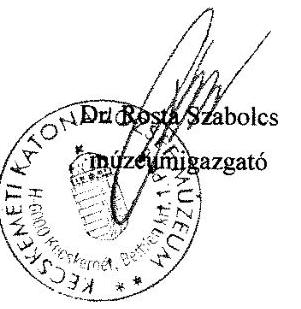

---

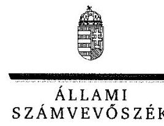

ELNÖK

Ikt.szám: V-0954-149/2016.

# Rosta Szabolcs úr 

igazgató
Kecskeméti Katona József Múzeum

## Kecskemét

## Tisztelt Igazgató Úr!

A ,,Megyei hatókörű városi múzeumok ellenőrzése - Kecskeméti Katona József Múzeum, Kecskemét" címmel készített számvevőszéki jelentéstervezetre tett észrevételét köszönettel megkaptam.
Az Állami Számvevőszék észrevételre vonatkozó álláspontjáról a felügyeleti vezető által készített részletes tájékoztatást csatoltan megküldöm.
Tájékoztatom Igazgató urat, hogy a számvevőszéki jelentésben - az Állami Számvevőszékről szóló 2011. évi LXVI. törvény 29. § (3) bekezdése alapján - a figyelembe nem vett észrevételeket szerepeltetjük az elutasítás indokának feltüntetésével.

Budapest, 2017. 01. 16.
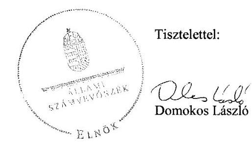

Melléklet: Tájékoztatás az el nem fogadott észrevételekről

---

# Tájékoztatás az el nem fogadott észrevételekről 

A „Megyei hatókörű városi múzeumok ellenőrzése - Kecskeméti Katona József Múzeum, Kecskemét" című jelentéstervezetre a 694/2016. iktatószámú levelével megküldött észrevételeit áttekintettük, annak kezeléséről az alábbi tájékoztatást adom.

## A jelentéstervezetre tett általános észrevételei kapcsán

Köszönettel vettem tájékoztatását a Kecskeméti Katona József Múzeum (továbbiakban: Múzeum) szervezetét és gazdálkodását érintő egyes jogszabályok rendelkezéseinek ismertetéséről.
Észrevételében jelezte, hogy a fenntartó önkormányzat tájékoztatása szerint 2013-2014-ben vagyonkezelési szerződés megkötésére nem került sor, ebből következően nem a múzeum volt a vagyonkezelő, vagyonkezeléssel összefüggő kötelezettsége nem volt.
Fenti észrevételét, hogy 2013-2014-ben nem a Múzeum volt a vagyonkezelő, nem fogadtuk el. Ehhez kapcsolódóan tájékoztatom Igazgató urat, hogy a muzeális intézményekről, a nyilvános könyvtári ellátásról és a közművelődésről szóló 1997. évi CXL. törvény 2013. január 1-jétől hatályos 45/A. § (2) bekezdésének a) pontja rendelkezése alapján a Múzeum „vagyonkezelője a tevékenység ellátásához szükséges állami vagyonnak". 2013. január 1-jétől a megyei könyvtárak és a megyei hatókörű városi múzeumok feladatának ellátását szolgáló egyes állami tulajdonú vagyontárgyak ingyenes önkormányzati tulajdonba adásáról szóló 2015. évi LXXV. törvény hatályba lépéséig (2015. június 30-ig) vagyonkezelési szerződéssel kellett volna a Múzeumnak rendelkezni.
Észrevételében továbbá arról tájékoztatott, hogy a pénzügyi gazdálkodás szabályszerű működtetése, valamint a belső kontrollrendszer szabályszerű kialakítása és működtetésére tett javaslatokat részben már teljesítették, továbbá a Múzeum vezetése, a fenntartó Kecskemét Megyei Jogú Város Önkormányzatával együttműködve, annak segítségével a továbbiakban is arra törekszik, hogy a Kecskeméti Katona József Múzeum működése minden szabályszerűségnek megfeleljen.
Észrevételei a jelentéstervezet megállapításait nem cáfolták, azokat nem módosítják.

Budapest, 2017.
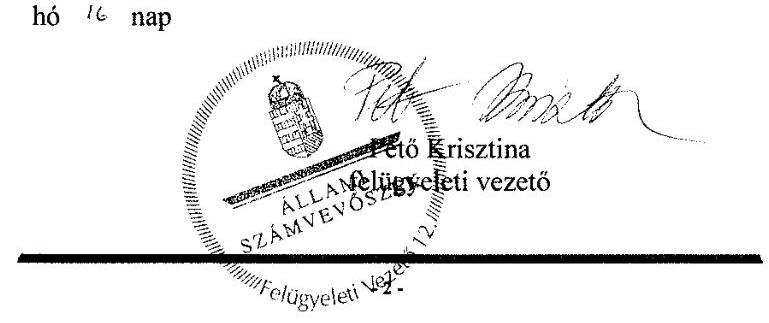

---

# KECSKEMÉT MEGYEI JOGÚ VÁROS POLGÁRMESTERE 

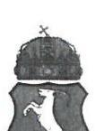

Ügyiratszám : 5.454-11/2016.
Ügyintéző : Somodiné Triesz Orsolya

Tárgy : Kecskeméti Katona József Múzeum észrevételek jelentéstervezetre
Melléklet : 7 db

Állami Számvevőszék
Domokos László
elnök
részére
1364 Budapest
Pf. 54
Tisztelt Elnök Úr!

ÁLLAMI SZÁMVEVŐSZÉK
105068 koté
Érkezési időpont: 2016. december 27.
Iktatószám: V-0954-147/2016
Melléklet: 7 db

A 2016. december 12. napján érkezett, V-0954-136/2016. iktatószámú, a „Megyei hatókörű városi múzeumok ellenőrzése - Kecskeméti Katona József Múzeum, Kecskemét" című ellenőrzésről készült jelentéstervezetük 30. oldalán tett javaslatokra vonatkozóan az alábbi érdemi észrevételeket teszem.

Mint ismeretes, a vizsgált időszakban, 2011-2014 között a múzeumok szervezete és gazdálkodása több alkalommal lényeges változásokon ment keresztül. Kecskemét Megyei Jogú Város Önkormányzata 2013. január 1-jétől vette át a Kecskeméti Katona József Múzeum (a továbbiakban: intézmény) fenntartását. Az alábbi észrevételeink és a csatolt dokumentumok igazolják, hogy a fenntartó és az intézmény a feltárt szabálytalanságok tekintetében még a számvevőszéki vizsgálat előtt intézkedett.

## 1. észrevétel a 4.3. sz. megállapítás 3. bekezdéséhez vagyonhasznosítási szerződés hiányáról:

Az intézmény 2013. január 1. napjával került az önkormányzat fenntartásába. A muzeális intézményekről, a nyilvános könyvtári ellátásról és a közművelődésről szóló 1997. évi CXL. törvény módosításáról szóló 2012. évi CLII. törvény (a továbbiakban: Kult.mód.) 30.§ (1) és (4) bekezdései alapján: „(1) A 2012. január 1-jén állami tulajdonba és fenntartásba került megyei könyvtárak 2013. január 1-jétől a feladat ellátásához rendelkezésre álló személyi, tárgyi és pénzügyi feltételek egyidejű átadásával a megyeszékhely megyei jogú városok - Pest megyében Szentendre Város Önkormányzata - fenntartásába és a feladat ellátását közvetlenül szolgáló, ahhoz szükséges ingó vagyontárgyak - beleértve az állomány nyilvántartásban szereplő könyvtári dokumentumokat is - térítésmentesen a fenntartó önkormányzat tulajdonába kerülnek.
(4) A megyei intézményfenntartó központok helyébe az átvett vagyonnal, illetőleg intézményekkel kapcsolatos jogviszonyok tekintetében 2013. január 1-jét követően általános és egyetemleges jogutódként az új fenntartók lépnek."

A nemzeti vagyonról szóló 2011. évi CXCVI. törvény (a továbbiakban: Nvtv.) 11. § (7) bekezdése és az állami vagyonnal való gazdálkodásról szóló 254/2007. (X. 4.) Korm. rendelet 8. §

---

(6) bekezdése értelmében a vagyonkezelői jog részletes szabályait vagyonkezelési szerződésben kell rögzíteni.

Az önkormányzat írásbeli kezdeményezése (1. melléklet) ellenére azonban a vagyonkezelési szerződés megkötésére nem került sor.

A fentiekre figyelemmel az intézményt nem terhelte a vagyonkezeléssel összefüggő kötelezettség, mivel az önkormányzat minősült vagyonkezelőnek.

# 2. észrevétel 4.3. sz. megállapítás 4. bekezdés 3., 5. és 7. francia bekezdéseihez a kötelezettségvállalással, utalványozással és teljesítésigazolással kapcsolatban: 

Kecskemét Megyei Jogú Város Polgármesteri Hivatal Belső Ellenőrzési Csoportja 12.4387/2014. számon elkészítette az intézmény 2013-2014. évi gazdálkodására vonatkozó ellenőrzési jelentését, melyre vonatkozóan az intézmény intézkedési tervet és annak végrehajtására vonatkozóan beszámolóját megküldte. (2. melléklet)

A Kecskeméti Katona József Múzeum elkészítette 2015. január 1-jétől hatályos Gazdálkodási Szabályzatát (3. melléklet) a kötelezettségvállalás, pénzügyi ellenjegyzés, teljesítésigazolás, érvényesítés és utalványozás rendjéről, melyet minden munkatárs megismert.

Tájékoztatom Tisztelt Elnök Urat, hogy az intézmény gazdálkodására vonatkozó számvevőszéki megállapítások tekintetében, azok kijavítása, és betartatása érdekében Kecskemét Megyei Jogú Város Jegyzője 2017. évben felügyeleti ellenőrzést rendel el.

## 3. észrevétel az 5.1. sz. megállapítás 7. és 8. bekezdéséhez leltárkönyvek záradékolásával és a kulturális javak jogszerű nyilvántartásával kapcsolatban:

Az intézmény „Eszközök és a források leltárkészítési és leltározási szabályzata" (4. melléklet) 2014. november 1. napján lépett hatályba, melyet minden munkatárs megismert. A 2017. évi felügyeleti ellenőrzés erre a területre is ki fog terjedni.

Az ellenőrzött időszak alatt a kulturális javak közül egyes tételek nyilvántartásból való törlésre nem került sor, azonban az intézmény az alábbiakra tekintettel azóta rendezte a hiányzó műtárgyakkal kapcsolatos nyilvántartását:

A korábbi fenntartó (Bács-Kiskun Megyei Intézményfenntartó Központ) vezetője ismeretlen tettes ellen feljelentést tett 103 műtárgy - feltehetőleg az 1980-as években elkövetett szabálytalanságok miatti - eltűnése miatt. A Bács-Kiskun Megyei Rendőr-főkapitányság a nyomozati eljárást megszüntette, tekintettel arra, hogy az eljárás adatai alapján nem volt megállapítható bűncselekmény elkövetése. A nyomozati eljárás ideje alatt és utána is több műalkotás előkerült az intézmény által közétett nyilvános hirdetménynek köszönhetően. Összesen 94 műtárgy esetében nem vezettek a fentiek eredményre, melyre tekintettel az intézmény kezdeményezésére az Emberi Erőforrások Minisztériuma Kultúráért Felelős Helyettes Államtitkára 2016 szeptemberében engedélyezte azok kulturális javak nyilvántartásából való törlését. (5. melléklet)

---

# 4. észrevétel az 5.2. sz. megállapítás 2. bekezdéséhez, miszerint az ingatlanok értékelésére vonatkozó adatok az intézmény 2014. évi beszámolójában nem szerepeltek, vagyonkezelési megállapodás hiánya miatt: 

A Kult.mód. 30. § (4) bekezdése alapján az intézményi célt szolgáló állami tulajdonú ingatlanvagyon 2013.
 január 1. napján az önkormányzat vagyonkezelésébe került. A vagyonkezelési szerződés nem került aláírásra, így a Kecskeméti Katona József Múzeum 2014. évi beszámolójában – a fenntartó írásbeli tájékoztatására (6. melléklet) tekintettel – az ingatlanokra vonatkozó adatot nem szerepeltethette.

## 5. észrevétel az 5.3. sz. megállapítás 1. bekezdéséhez kulturális javak kölcsönzésével kapcsolatban:

Az intézmény 2013. december 13. napjától rendelkezik Gyűjteménykezelési Szabályzattal. (7. melléklet) E szabályzatot az intézmény vezetői (igazgató, igazgatóhelyettes) és az osztályvezetők állították össze, melyet a közalkalmazotti tanács véleményezett. Hatályba lépése után minden közalkalmazott írásban nyilatkozott a szabályzatban foglaltak megismeréséről. A 2014. évben múzeumi értekezlet keretében a szabályzat előadás formájában is bemutatásra, megbeszélésre került.

A szabályzat 1.11. pontja egyértelműen tartalmazza a műtárgykölcsönadás szabályait, többek között:

## "1.11. Tárgyak kölcsönadása

1.11.7. A Múzeum az illetékes minisztérium által javasolt haszonkölcsön szerződés mintát tekinti irányadónak, melyet a mindenkori kölcsönzésnek, adott körülményeknek megfelelően aktualizál.
1.11.8. A haszonkölcsön szerződésben a kölcsönzési idő feltüntetése kötelező, időtartama legfeljebb öt év. A szerződés része a kölcsönadott műtárgyak jegyzéke (amely tartalmazza: adott esetben alkotó, cím illetve tárgy megnevezése, technika, keletkezési ideje, leltári szám), a műtárgy állapotleírása a muzeológus és a restaurátor aláírásával és a fotója. A szerződés tartalmazza az állományvédelmi követelményeket, beleértve a klimatikus viszonyokat, a csomagolás és a szállítás feltételeit, a kölcsönadott kulturális javak sérülése esetén követendő eljárást, a kölcsönvevő által nyújtandó vagyonbiztonsági feltételeket, beleértve az esetlegesen szükséges muzeológusi, rendőrségi vagy egyéb fegyveres kíséretet is."

Fentiekre tekintettel, a minden munkatárs által ismert szabályzat a minisztérium által javasolt haszonkölcsön szerződés mintát adja meg irányadónak, melynek tartalmaznia kell a vagyonbiztonsági feltételeket és a kulturális javak sérülése esetén követendő eljárást.

## 6. észrevétel a 3.5. sz. megállapítás 3. bekezdéséhez (nem szerepel a jelentéstervezetben az intézkedési javaslatok között):

A jelentéstervezet 3.5. sz. megállapítás 3. bekezdése alapján: „A múzeumigazgató a 2011–2014. években az Áht. 121/B.§ (4) bekezdésében és az Áht. 70. § (1) bekezdésében foglaltak ellenére nem gondoskodott a belső ellenőrzés kialakításáról és működtetéséről."

Az önkormányzati fenntartásba vételt (2013. január 1. napja) követően a következő intézkedések történtek:

---

# 2013. év: 

Kecskemét Megyei Jogú Város Közgyűlése 359/2012. (XII. 13.) számú határozatában döntött a köznevelési feladatot ellátó egyes önkormányzati fenntartású intézmények állami fenntartásba adásáról, mely határozat 7. pontja szerint a közgyűlés 2013. január 1. napjától az intézmény belső ellenőrzési feladatainak ellátására a Művészeti Óvodát jelölte ki.

Az intézmény belső ellenőre a 2013-ban elvégzett ellenőrzésekről beszámolt.
Kecskemét Megyei Jogú Város Önkormányzata Közgyűlése 90/2014. (IV. 24.) határozatában a 2013. évi éves ellenőrzési jelentés és éves összefoglaló ellenőrzési jelentés elfogadásáról döntött, mely tartalmazta az intézmény beszámolóját is az elvégzett ellenőrzésekről.

## 2014. év:

Kecskemét Megyei Jogú Város Önkormányzata Közgyűlése 18/2014. (II. 12.) határozatában döntött az intézményi belső ellenőrzés átszervezéséről, mely szerint a közgyűlés 2014. március 1. napjától az intézmény belső ellenőrzési feladatait a Belvárosi Óvoda látja el.

Az intézmény belső ellenőre 2015. február 11-én elkészítette a 2014. évről szóló éves ellenőrzési jelentést, beszámolt az elvégzett 2014. évi belső ellenőrzési feladatokról.

Kecskemét Megyei Jogú Város Önkormányzata Közgyűlése 94/2015. (IV. 30.) határozatával a 2014. évi éves ellenőrzési jelentés és éves összefoglaló ellenőrzési jelentés elfogadásáról döntött, melynek 1. sz. mellékletének részét képezte az intézmény beszámolója is.

Kérjük, szíveskedjenek a jelentéstervezet 23. oldal 3.5. sz. megállapítás 3. bekezdését a fentieknek megfelelően módosítani.

Kérem a fenti érdemi észrevételek szíves figyelembevételét.
Kecskemét, 2016. december 20.

Tisztelettel:
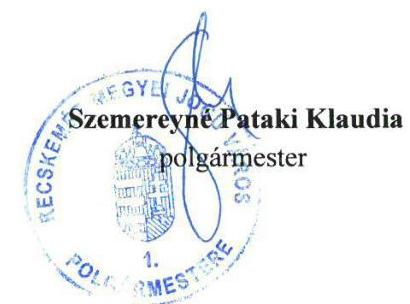

## Ügyintézés helye:

Kecskemét Megyei Jogú Város Polgármesteri Hivatala
Humánszolgáltatási Iroda
Közösségi Kapcsolatok Osztálya
$\square 6000$ Kecskemét, Kossuth tér 1.
36/76/512-295 Fax: 36/76/513-551 e-mail: international@kecskemet.hu

---

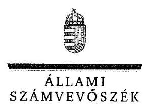

ELNÖK

# Szemereyné Pataki Klaudia 

polgármester
Kecskemét Megyei Jogú Város Önkormányzata

## Kecskemét

## Tisztelt Polgármester Asszony!

A „Megyei hatókörű városi múzeumok ellenőrzése - Kecskeméti Katona József Múzeum, Kecskemét" címmel készített számvevőszéki jelentéstervezetre tett észrevételét köszönettel megkaptam.
Az Állami Számvevőszék észrevételre vonatkozó álláspontjáról a felügyeleti vezető által készített részletes tájékoztatást csatoltan megküldöm.
Tájékoztatom Polgármester asszonyt, hogy a számvevőszéki jelentésben – az Állami Számvevőszékről szóló 2011. évi LXVI. törvény 29. § (3) bekezdése alapján – a figyelembe nem vett észrevételeket indoklással szerepeltetjük.

Budapest, 2017. év 01. hó 06. nap
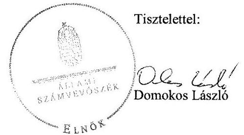

Melléklet: Tájékoztatás az elfogadott és az el nem fogadott észrevételekről

---

# Tájékoztatás az elfogadott és az el nem fogadott észrevételekről 

A „Megyei hatókörű városi múzeumok ellenőrzése - Kecskeméti Katona József Múzeum, Kecskemét" című jelentéstervezetre tett 5.454-11/2016. iktatószámú levelével megküldött észrevételeit áttekintettük, annak kezeléséről az alábbi tájékoztatást adom.

## 1. észrevétel az 4.3. számú megállapítás 3. bekezdéséhez kapcsolódóan:

Köszönettel vettük észrevétele 1. pontjában adott tájékoztatását és a hozzá kapcsolódó 1. számú mellékletet arra vonatkozóan, hogy Kecskemét Megyei Jogú Város Önkormányzata (továbbiakban: Önkormányzat) 2013. július 4-én kezdeményezte a Magyar Állam képviseletében eljáró Magyar Nemzeti Vagyonkezelő Zrt.-vel (továbbiakban: MNV Zrt.) a vagyonkezelési szerződés megkötését. Tájékoztatom, hogy az Önkormányzat a megyei könyvtárak és a megyei hatókörű városi múzeumok feladatának ellátását szolgáló egyes állami tulajdonú vagyontárgyak ingyenes önkormányzati tulajdonba adásáról szóló 2015. évi LXXV. törvény meghozataláig nem tudott rendelkezni a hivatkozott vagyonelemekkel, azokra vonatkozóan semmilyen jogcímen nem tudott vagyonkezelői jogot létesíteni, a vagyonkezelési szerződés megkötésére az MNV. Zrt. és a Múzeum között kellett volna megtörténnie. Vagyonkezelési szerződés hiányában a vagyonkezelői jog részletes szabályait sem határozták meg. Észrevétele a jelentéstervezet megállapítását nem cáfolja, azokat nem módosítja.

## 2. észrevétel az 4.3. számú megállapítás 4. bekezdésének 3., 5. és 7. francia bekezdéséhez kapcsolódóan:

Köszönettel vettük észrevétele 2. pontjában adott tájékoztatását és a hozzá kapcsolódó 2-3. számú mellékleteket arra vonatkozóan, hogy az Önkormányzatnál milyen intézkedéseket tettek és tesznek a gazdálkodási jogkörök gyakorlásának ellenőrzésére, és elkészítették a 2015. január 1-jétől hatályos Gazdálkodási Szabályzatot. Tájékoztatása a megállapításokat nem cáfolja, az az ellenőrzött időszakon túlmutat, ezért azokat nem módosítja.

## 3. észrevétel az 5.1. számú megállapítás 7-8. bekezdéséhez kapcsolódóan:

Köszönettel vettük észrevétele 3. pontjában adott tájékoztatását és a hozzá kapcsolódó 4-5. számú mellékleteket arra vonatkozóan, hogy a Múzeumnál milyen intézkedéseket tettek a nemzeti vagyonba tartozó kulturális javak szabályszerű nyilvántartására vonatkozóan, valamint az Emberi Erőforrások Minisztériuma Kultúráért Felelős Helyettes Államtitkára engedélyét egyes kulturális javak nyilvántartásából való törlésével kapcsolatban. Tájékoztatása a megállapítást nem cáfolja, az az ellenőrzött időszakon túlmutat, ezért azt nem módosítja.

---

# 4. észrevétel az 5.2. számú megállapítás 2. bekezdéséhez kapcsolódóan: 

Köszönettel vettük észrevétele 4. pontjában adott tájékoztatását és a hozzá kapcsolódó 6. számú mellékletet arra vonatkozóan, hogy a Múzeum 2013. évi beszámolójában – a fenntartó által 2014. április 3-án aláírt írásbeli tájékoztatására az ingatlanokra vonatkozó adatot nem szerepeltethette. A jelentéstervezet 5.2. számú megállapítás 2. bekezdés szerint „Az ingatlanok értékelésére vonatkozó információkat azonban a beszámolóban – az Ahsz.; 6. § (2) bekezdés bd) pontjában és az Ahsz.; 29. § (2) bekezdés a) pontjában foglaltak ellenére – vagyonkezelési szerződés hiányában nem jelenítette meg. " A fenntartó tájékoztatásának eleget téve a Múzeum az ingatlanok értékelésére vonatkozó információkat nem szerepeltette, így észrevétele a megállapítást nem cáfolja, ezért azt nem módosítja.

## 5. észrevétel az 5.3. számú megállapítás 1. bekezdéshez kapcsolódóan:

Köszönettel vettük az észrevétele 5. pontjához küldött 7. számú mellékletet, a Múzeum 2013. december 13. napjától hatályos Gyűjteménykezelési Szabályzatát. A jelentéstervezet megállapításai – „A kulturális javak kölcsönzésére kötött szerződések a 2011–2014. közötti időszakban nem tartalmazták az Mtv. 38. § (8) bekezdésében illetve a 2013. október 25-től hatályos 38/A. § (2) bekezdésében rögzített kötelező tartalmi elemeket. Így a kulturális javak kölcsönzéséről szóló szerződések nem tartalmazták – az Mtv. 38. § (8) bekezdés a) pontjában illetve a 2013. október 25-től hatályos 38/A. § (2) bekezdés a) pontjában foglaltak ellenére – a kölcsönvevő által a kölcsönzött kulturális javaknak biztosítandó állományvédelmi követelményeket, beleértve a klimatikus viszonyokat. A kölcsönzési szerződések többsége nem tartalmazta a kölcsönvevő által nyújtandó vagyonbiztonsági feltételeket – beleértve az esetlegesen szükséges muzeológusi, rendőrségi vagy egyéb fegyveres kíséretet is – az Mtv. 38. § (8) bekezdés c) pontjában illetve a 2013. október 25-től hatályos 38/A. § (2) bekezdés c) pontjában foglaltak ellenére. Az ellenőrzött időszakban nem írták elő a szerződésekben az Mtv. 38. § (8) bekezdés b) pontjában és a 2013. október 25-től hatályos 38/A. § (2) bekezdés b) pontjában foglaltak ellenére a kölcsönadott kulturális javak sérülése esetén követendő eljárás rendjét.” – a kulturális javak kölcsönzésére kötött szerződések jogszabályi – a muzeális intézményekről, a nyilvános könyvtári ellátásról és a közművelődésről szóló 1997. évi CXL. törvény – előírás szerinti hiányosságokat tartalmazzák, nem pedig a belső szabályozás hiányát. Így a tájékoztatása a megállapítást nem vitatja, ezért azt nem módosítja.

## 6. észrevétel a 3.5. számú megállapítás 3. bekezdéshez kapcsolódóan:

A 3.5. számú megállapítás 3. bekezdéséhez kapcsolódóan tett észrevételét a dokumentumok ismételt áttekintését és az érintett közgyűlési határozatok felülvizsgálatát követően a 2013–2014. évek tekintetében elfogadtuk és azt a számvevőszéki jelentés összeállításánál figyelembe vesszük.

Budapest, 2014. év 01.
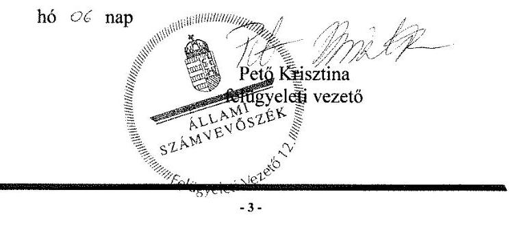

---

# RÖVIDÍTÉSEK JEGYZÉKE 

${ }^{1}$ Múzeum

${ }^{2}$ ÁSZ
${ }^{3}$ Mtv.
${ }^{4}$ Kötv.
${ }^{5} \mathrm{Kjt}$.
${ }^{6}$ múzeumigazgató
${ }^{7}$ Möktv.
${ }^{8}$ 258/2011. (XII. 7.) Korm. rendelet
${ }^{9}$ 2012. évi CLII. törvény
${ }^{10}$ 1311/2012. (VIII.23.) Korm. határozat
${ }^{11}$ 2015. évi LXXV. tv.
${ }^{12}$ Nvtv.
${ }^{13}$ Alaptörvény
${ }^{14}$ Áht. 
${ }^{15}$ Ávr.
${ }^{16}$ BKMIK
${ }^{17}$ ÁSZ tv.
${ }^{18}$ Kincstár
${ }^{19}$ irányító szerv 1
irányító szerv 2
irányító szerv 3
${ }^{20}$ középirányító szerv

Bács-Kiskun Megyei Múzeumi Szervezet (2011. január 1-jétől 2012. december 31-ig)
Kecskeméti Katona József Múzeum (2013. január 1-jétől)
Állami Számvevőszék
1997. évi CXL. törvény a muzeális intézményekről, a nyilvános könyvtári ellátásról és a közművelődésről (hatályos: 1998. január 1-jétől)
2001. évi LXIV. törvény a kulturális örökség védelméről (hatályos: 2001. július 10-től)
1992. évi XXXIII. törvény a közalkalmazottak jogállásáról (hatályos: 1992. július 1-jétől)
Kecskeméti Katona József Múzeum (valamint a jogelőd Bács-Kiskun Megyei Múzeumi Szervezet) igazgatója
2011. évi CLIV. törvény a megyei önkormányzatok konszolidációjáról, a megyei önkormányzati intézmények és a Fővárosi Önkormányzat egyes egészségügyi intézményeinek átvételéről (hatályos: 2012. január 1-jétől)
258/2011. (XII. 7.) Korm. rendelet a megyei intézményfenntartó központokról, valamint a megyei önkormányzatok konszolidációjával, a megyei önkormányzati intézmények és a Fővárosi Önkormányzat egészségügyi intézményeinek átvételével összefüggő egyes kormányrendeletek módosításáról (hatályos: 2011. december 8-tól)
2012. évi CLII. törvény a muzeális intézményekről, a nyilvános könyvtári ellátásról és a közművelődésről szóló 1997. évi CXL. törvény módosításáról (hatályos: 2012. november 2-től)
1311/2012. (VIII. 23.) Korm. határozat a megyei múzeumok, könyvtárak és közművelődési intézmények fenntartásáról
2015. évi LXXV. tv. a megyei könyvtárak és a megyei hatókörű városi múzeumok feladatának ellátását szolgáló egyes állami tulajdonú vagyontárgyak ingyenes önkormányzati tulajdonba adásáról (hatályos: 2015. július 1-jétől)
2011. évi CXCVI. törvény a nemzeti vagyonról (hatályos: 2011. december 31-től)
Magyarország Alaptörvénye
2011. évi CXCV. törvény az államháztartásról (hatályos: 2012. január 1-jétől) az államháztartásról szóló törvény végrehajtásáról szóló 368/2011. (XII. 31.) Korm. rendelet (hatályos: 2012. január 1-jétől)
Bács-Kiskun Megyei
 Intézményfenntartó Központ
Az Állami Számvevőszékről szóló 2011. évi LVI. törvény (hatályos: 2011. július 1-jétől)
Magyar Államkincstár
Bács-Kiskun Megyei Önkormányzat Közgyűlése (2011. január 1-jétől 2011. december 31-ig)
Közigazgatási és Igazságügyi Minisztérium az illetékes kormányhivatal útján (2012. január 1-jétől 2012. december 31-ig)

Kecskemét Megyei Jogú Város Önkormányzatának Közgyűlése (2013. január 1-jétől)
Bács-Kiskun Megyei Intézményfenntartó Központ

---

${ }^{21}$ SZMSZ1

SZMSZ2
${ }^{22}$ átadás-átvételi megállapodás ${ }_{1}$
${ }^{23}$ Áhsz. 1
${ }^{24}$ NGM módszertani útmutató
${ }^{25}$ átadás-átvételi megállapodás ${ }_{2}$
${ }^{26}$ átadás-átvételi megállapodás ${ }_{3}$
${ }^{27}$ munkamegosztási megállapodás ${ }_{1}$
${ }^{28}$ gazdasági szervezet ${ }_{1}$
${ }^{29}$ Ámr.
${ }^{30}$ Számv. tv.
${ }^{31}$ Áht. 1
${ }^{32}$ munkamegosztási megállapodás ${ }_{2}$
${ }^{33}$ gazdasági szervezet ${ }_{2}$
${ }^{34}$ számviteli politika ${ }_{1}$
${ }^{35}$ leltározási és leltárkészítési szabályzat ${ }_{1}$
${ }^{36}$ eszközök és források értékelési szabályzata ${ }_{1}$
${ }^{37}$ számviteli politika ${ }_{2}$
${ }^{38}$ eszközök és források értékelési szabályzata ${ }_{2}$
${ }^{39} \mathrm{Bkr}$.

Bács-Kiskun Megyei Önkormányzat Múzeumi Szervezete Szervezeti és Működési Szabályzata, jóváhagyta a Bács-Kiskun Megyei Önkormányzat Kulturális és Sport Bizottsága 80/2011. (VI. 28.) számú határozatával (hatályos: 2013. április 21-ig)

Kecskeméti Katona József Múzeum Szervezeti és Működési Szabályzata, jóváhagyta Kecskemét Megyei Jogú Város Közgyűlésének Oktatási, Kulturális és Egyházügyi Bizottsága 41/2013. (IV. 22.) OKEB számú határozatával (hatályos: 2013. április 22-től)

Bács-Kiskun Megyei Önkormányzat nem egészségügyi intézményeinek átadás-átvétele tárgyában 2011. decemberében készült és 2012. október 11-én teljes körűen aláírt átadás-átvételi megállapodás
249/2000. (XII. 24.) Korm. rendelet az államháztartás szervezetei beszámolási és könyvvezetési kötelezettségének sajátosságairól (hatályos: 2001. január 1-jétől 2013. december 31-ig)

Nemzetgazdasági Minisztérium módszertani útmutató beszámoló garnitúrák összeállításához
A Bács-Kiskun Megyei Intézményfenntartó Központ és Kecskemét Megyei Jogú Város Önkormányzata között létrejött, 2012. december 14-én aláírt átadás-átvételi megállapodás
A Bács-Kiskun Megyei Intézményfenntartó Központ és a települési önkormányzatok (Baja, Dunavecse, Hajós, Kiskunfélegyháza, Kiskunhalas, Szalkszentmárton) között létrejött, 2012. december 14-én aláírt átadás-átvételi megállapodások
Bács-Kiskun Megyei Önkormányzat Gazdasági Ellátó Szervezete és a Bács-Kiskun Megyei Múzeumi Szervezet között 2010. május 20-án kelt munkamegosztási megállapodás
Bács-Kiskun Megyei Önkormányzat Gazdasági Ellátó Szervezete (2011. január 1-jétől 2011. december 31-ig)
az államháztartás működési rendjéről szóló 292/2009. (XI.19.) Korm. rendelet (hatályos: 2011. december 31-ig)
2000. évi C. törvény a számvitelről (hatályos: 2001. január 1-jétől)
az államháztartásról szóló 1992. évi XXXVIII. törvény (hatályos: 2011. december 31-ig)
Bács-Kiskun Megyei Intézményfenntartó Központ és a Bács-Kiskun Megyei Múzeumi Szervezet között létrejött, 2012. január 1-jétől hatályos munkamegosztási megállapodás
Bács-Kiskun Megyei Intézményfenntartó Központ (2012. január 1-jétől 2012. december 31-ig)
Bács-Kiskun Megyei Intézményfenntartó Központ Számviteli Politikája (hatályos: 2012. október 31-től 2012. december 31-ig)
Bács-Kiskun Megyei Intézményfenntartó Központ Leltározási szabályzat (hatályos: 2012. szeptember 4-től 2012. december 31-ig)
Bács-Kiskun Megyei Intézményfenntartó Központ Eszközök és Források Értékelési Szabályzata (hatályos: 2012. március 1-jétől 2012. december 31-ig)
Kecskeméti Katona József Múzeum Számviteli Politikája (hatályos: 2013. március 1-jétől 2013. december 31-ig)
Kecskeméti Katona József Múzeum Eszközök és Források Értékelési Szabályzata (hatályos: 2013. április 1-jétől)
370/2011. (XII. 31.) Korm. rendelet a költségvetési szervek belső kontrollrendszeréről és a belső ellenőrzésről (hatályos: 2012. január 1-jétől)

---

${ }^{40}$ Ikr.
${ }^{41}$ Info tv.
${ }^{42}$ Avtv.
${ }^{43}$ Eitv.
${ }^{44}$ Ltv.
${ }^{45}$ Ötv.
${ }^{46}$ Mötv.
${ }^{47}$ ügyrend
${ }^{48} \mathrm{Vtv}$.
${ }^{49} \mathrm{Kbt} . ;$
Kbt. 2
${ }^{50}$ 393/2012. (XII. 20.) Korm. rendelet
${ }^{51}$ 5/2010. (VIII. 18.) NEFMI rendelet
${ }^{52}$ 80/2012. (XII.28.) BM rendelet
${ }^{53}$ vagyongazdálkodási rendelet
${ }^{54} \mathrm{Vtvr}$.
${ }^{55}$ 20/2002. (X. 4.) NKÖM rendelet
${ }^{56}$ 36/2013. (IX. 13.) NGM rendelet
${ }^{57}$ 2/2010. (I. 14.) OKM rendelet

335/2005. (XII. 29.) Korm. rendelet a közfeladatot ellátó szervek iratkezelésének általános követelményeiről (hatályos: 2006. január 1-jétől)
2011. évi CXII. törvény az információs önrendelkezési jogról és az információszabadságról (hatályos: 2011. július 27-től)
1992. évi LXIII. törvény a személyes adatok védelméről és a közérdekű adatok nyilvánosságáról (hatályos: 2011. december 31-ig)
2005. évi XC. törvény az elektronikus információszabadságról (hatályos: 2011. december 31-ig)
1995. évi LXVI. törvény a közokiratokról, a közlevéltárakról és a magánlevéltári anyag védelméről (hatályos: 1996. január 1-jétől)
1990. évi LXV. tv. a helyi önkormányzatokról (hatályos: a 2014. évi általános önkormányzati választások napjáig)
2011. évi CLXXXIX. törvény Magyarország helyi önkormányzatairól (hatályos: 2012. január 1-jétől)

Kecskeméti Katona József Múzeum Gazdasági Szervezetének Ügyrendje (hatályos: 2013. május 1-jétől)
2007. évi CVI. törvény az állami vagyonról (hatályos: 2007. szeptember 25-től) 2003. évi CXXIX. törvény a közbeszerzésekről (hatályos: 2011. december 31-ig) 2011. évi CVIII. törvény a közbeszerzésekről (hatályos: 2012. január 1-jétől) a régészeti örökség és a műemléki érték védelmével kapcsolatos szabályokról szóló 393/2012. (XII. 20.) Korm. rendelet (hatályos: 2013. január 1-től 2015. március 11-ig)
5/2010. (VIII. 18.) NEFMI rendelet a régészeti lelőhelyek feltárásának, illetve a régészeti lelőhely, lelet megtalálója anyagi elismerésének részletes szabályairól (hatályos: 2010. augusztus 18-tól 2012. december 31-ig)
80/2012.(XII.28.) BM rendelet a régészeti lelőhely és a műemléki érték védetté nyilvánításáról, nyilvántartásáról és a régészeti feltárás részletes szabályairól (hatályos: 2013. január 1-jétől 2015. március 12-ig)
Bács-Kiskun Megye Közgyűlésének 15/2009. (IX. 28.) Kgy. rendelete a Bács-Kiskun Megyei önkormányzat vagyonáról és a vagyongazdálkodás szabályairól (hatályos: 2009. november 28-tól)
254/2007. (X. 4.) Korm. rendelet az állami vagyonnal való gazdálkodásról (hatályos: 2007. október 4-től)
20/2002. (X. 4.) NKÖM rendelet a muzeális intézmények nyilvántartási szabályzatáról (hatályos: 2003. január 1-jétől)
36/2013. (IX. 13.) NGM rendelet az államháztartás számvitelének 2014. évi megváltozásával kapcsolatos feladatokról (hatályos: 2013. szeptember 14-től 2014. december 31-ig)

2/2010. (I. 14.) OKM rendelet a muzeális intézmények működési engedélyéről (hatályos: 2010. január 22-től)

---

# ÁLLAMI SZÁMVEVŐSZÉK 

1052 Budapest, Apáczai Csere János utca 10.
Levélcím: 1364 Budapest 4. Pf. 54
Telefon: +36 14849100 Telefax: +36 14849200
www.asz.hu
