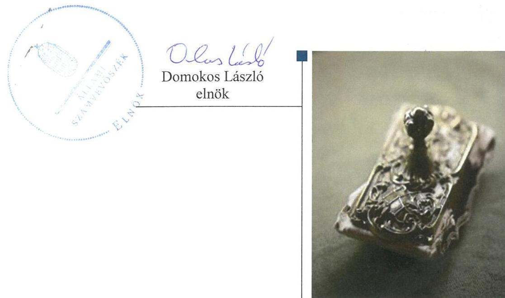
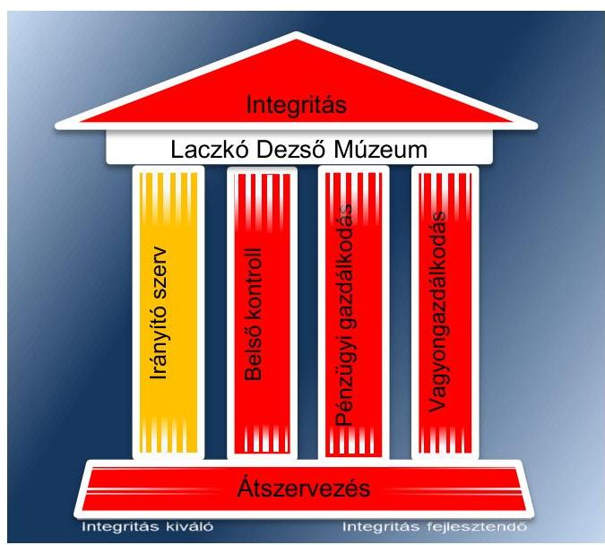
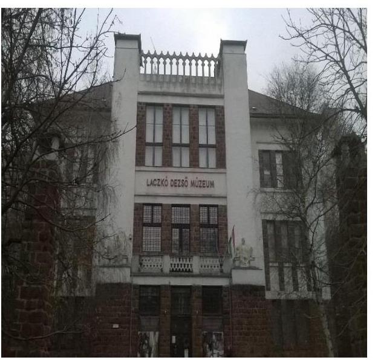
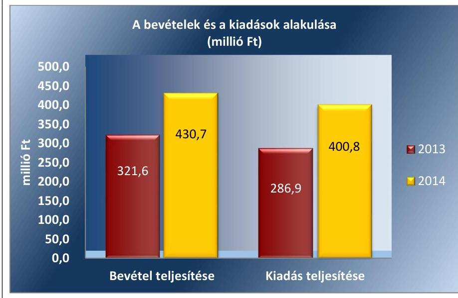
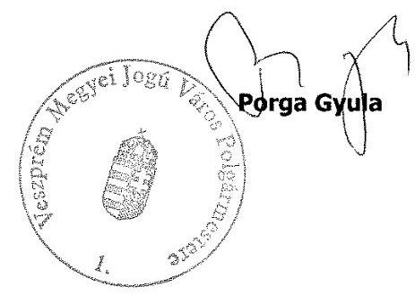
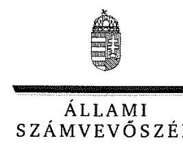
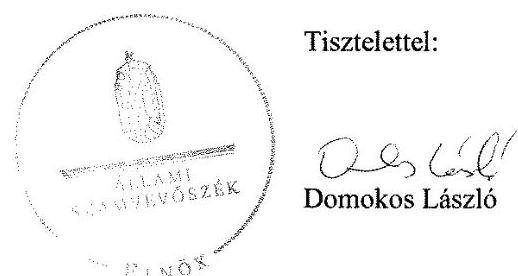
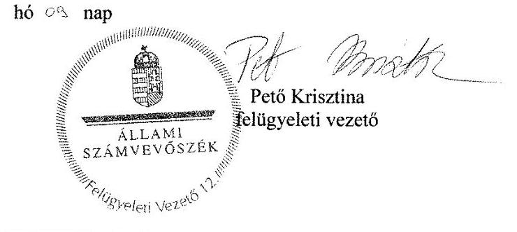

# Jelentés 

## Megyei hatókörű városi múzeumok ellenőrzése

Laczkó Dezső Múzeum, Veszprém 2017.

---

# Jelentés 

## Megyei hatókörű városi múzeumok ellenőrzése

Laczkó Dezső Múzeum, Veszprém
2017.  hó ol. nap

---

# AZ ELLENŐRZÉST FELÜGYELTE: 

PETŐ KRISZTINA felügyeleti vezető

## AZ ELLENŐRZÉST VEZETTE ÉS A VÉGREHAJTÁSÁÉRT FELELŐS:

2016.08.09-ig BREBÁN ANDREA ellenőrzésvezető
2016.08.10-től GÁL MAGDOLNA ellenőrzésvezető

A PROGRAM ÖSSZEÁLLÍTÁSÁÉRT FELELŐS:
JANIK JÓZSEF LÁSZLÓ osztályvezető

IKTATÓSZÁM: V-0956-205/2016.
TÉMASZÁM: 1990
ELLENŐRZÉS-AZONOSÍTÓ SZÁM: V073711

---

# TARTALOMJEGYZÉK 

■ ÖSSZEGZÉS ..... 5
■ AZ ELLENŐRZÉS CÉLJA ..... 7
■ AZ ELLENŐRZÉS TERÜLETE ..... 8
■ AZ ELLENŐRZÉS HÁTTERE, INDOKOLTSÁGA ..... 11
■ A JELENTÉS LÉNYEGES KÉRDÉSKÖREI ..... 13
■ ELLENŐRZÉS HATÓKÖRE ÉS MÓDSZEREI ..... 14
■ MEGÁLLAPÍTÁSOK ..... 17
■ JAVASLATOK ..... 31
■ MELLÉKLETEK ..... 35
I. Sz. melléklet: Értelmező szótár ..... 35
II. Sz. melléklet: az integritás érvényesítése érdekében kialakított és működtetett kontrollrendszer ..... 38
■ FÜGGELÉK: ÉSZREVÉTELEK ..... 39
■ RÖVIDÍTÉSEK JEGYZÉKE ..... 51

---

.

---

# ÖSSZEGZÉS 

A veszprémi székhelyű Laczkó Dezső Múzeumnál kialakított irányítási rendszer nem biztosította az átlátható, elszámoltatható és ellenőrizhető közpénzfelhasználást. A Múzeum 2011. évi pénzügyi- és vagyongazdálkodásának ellenőrzése nem volt végrehajtható, mivel a Múzeum az Állami Számvevőszékről szóló 2011. évi LXVI. törvényben meghatározott határidőben nem bocsájtotta az ellenőrzés lefolytatása érdekében szükséges adatokat és dokumentumokat rendelkezésre. A 2012. évre hiányosan álltak rendelkezésre a dokumentumok, ezáltal a Múzeum pénzügyi- és vagyoni helyzetének áttekintése nem volt biztosított. A Múzeum 2013-2014. évi pénzügyi és vagyongazdálkodása szabálytalan volt. A Múzeum a közfeladatának részét képező kulturális javak szabályszerű nyilvántartásáról nem gondoskodott, valamint a kulturális javak vagyonbiztonsága és állományvédelme a kölcsönzéseknél nem volt biztosított.

## Az ellenőrzés társadalmi indokoltsága

Az Állami Számvevőszék Stratégiájának alapértéke, hogy ellenőrzései segítik az integritás alapú, átlátható és elszámoltatható közpénzfelhasználás megteremtését. Az ellenőrzés jogszabályban, vagy alapító okiratban meghatározott közfeladat ellátására létrejött, a megyei hatókörű városi muzeális intézmények gazdálkodási tevékenységére terjedt ki. E szervezetek pénzügyi- és vagyongazdálkodásának alapvető rendeltetése a közfeladatok (a kulturális örökséghez tartozó javak védelme, őrzése és a nyilvánosság számára történő hozzáférhetővé tétele) ellátásának biztosítása.

A megyei hatókörű városi múzeumként működő szervezetek 2011. évtől több alkalommal jelentős szervezeti és gazdálkodási átalakuláson mentek keresztül. A tulajdonosi, a vagyonkezelői és a fenntartói szerepekben, szerkezetben történt változások előkészítése, végrehajtása, illetve a múzeumi rendszer által kezelt közvagyonnal való gazdálkodás szabályszerűségének bemutatásával az ellenőrzés hozzájárul a múzeumok fenntartási és működtetési feladatainak ellátására vonatkozó megfelelő jogszabályi környezet kialakításához, a gazdálkodási gyakorlatuk javításához.

## Főbb megállapítások, következtetések

A Múzeumra vonatkozó irányító szervi feladatellátás összességében részben volt szabályszerű, mert az ellenőrzött időszakban az irányító szervek a Múzeum kezelésében lévő közérdekű adatokat és közérdekből nyilvános adatokat nem kezelték, valamint 2012. évben nem ellenőrizték az államháztartással összefüggő közérdekű és közérdekből nyilvános adatok kötelező közzétételének, illetve igényre történő szolgáltatásának végrehajtását.

A Múzeumnál kialakított irányítási rendszer nem biztosította az átlátható, elszámoltatható és ellenőrizhető közpénzfelhasználást. A Múzeum a 2011-2012. években számviteli politikával, leltározási szabályzattal, eszközök és források értékelési szabályzatával, közbeszerzési szabályzattal nem rendelkezett. A Múzeum a hiányzó szabályzatait 2014. évben kisebb hiányosságokkal elkészítette, ezáltal szabályozottsága jelentősen javult. A kockázatkezelési

---

rendszert a Múzeumnál az ellenőrzött időszak utolsó évében alakították ki, amely a kialakítása ellenére nem működött megfelelően, mivel nem mérték fel és nem állapították meg a Múzeum tevékenységében, gazdálkodásában rejlő kockázatokat. A 2013-2014. években a szervezeti és működési szabályzatban - a múzeumigazgatón kívül - nem tüntették fel a vagyonnyilatkozat-tételre kötelezett személyeket, ezáltal nem intézkedtek a közélet tisztaságának biztosítása és a korrupció megelőzése érdekében. A kontrolltevékenységek részeként a 2011-2013. években nem biztosították a folyamatba épített, előzetes, utólagos és vezetői ellenőrzést. A Múzeum a 2011-2014. években az elektronikus közzétételi kötelezettségének a gazdálkodási adatok vonatkozásában nem tett eleget. A monitoring rendszer részeként a Múzeum tevékenységének, a célok megvalósításának nyomon követését biztosító rendszert a 2011. évben nem működtették, a 2012-2014. években nem alakították ki. A Múzeumnál a közpénzekkel való átlátható és ellenőrizhető gazdálkodás garanciáit nem teremtették meg.

A Múzeum 2011. évi pénzügyi- és vagyongazdálkodásának ellenőrzése nem volt végrehajtható, mivel a Múzeum az Állami Számvevőszékről szóló 2011. évi LXVI. törvényben meghatározott határidőben nem bocsájtotta az ellenőrzés lefolytatása érdekében szükséges adatokat és dokumentumokat rendelkezésre. A Múzeum a 2012. évben aláírt éves elemi költségvetési beszámolóval, valamint mérleget alátámasztó leltárral nem rendelkezett. A Múzeum könyvviteli elszámolását közvetlenül és közvetetten alátámasztó számviteli bizonylatok a 2012. évről hiányosan álltak rendelkezésre, ezáltal nem érvényesültek a számviteli törvényben rögzített alapelvek. A 2012. évben rendelkezésre álló dokumentumok a Múzeum pénzügyi- és vagyoni helyzetének áttekintését nem biztosították.

A Múzeum 2013-2014. évi pénzügyi és vagyongazdálkodása nem volt szabályszerű. A 2013. évben a Múzeum vagyonkezelési szerződés hiányában gyakorolta vagyonkezelői jogát. Múzeumnál a 2012-2014. években a kulturális javak hasznosítása és kölcsönzése során a kölcsönzésről szóló szerződésekben nem rögzítették minden esetben a kölcsönadott kulturális javaknak biztosítandó állományvédelmi klimatikus követelményeket, illetve nem volt mellékelve a kölcsönadás időpontjában fennálló fizikai állapotot rögzítő dokumentáció, ezáltal nem tartották be a kulturális javak vagyonbiztonságára és állományvédelmére vonatkozó jogszabályi előírásokat. A belföldi nem muzeális intézmények számára történő kölcsönadáshoz a 2012-2014. években a Múzeum több esetben nem rendelkezett a miniszter hozzájárulásával. A Múzeum közfeladatának részét képező kulturális javak nyilvántartásáról - gyarapodási napló hiányában - nem megfelelően gondoskodtak, így a kulturális javak számbavétele, vagyon- és tulajdonvédelme nem volt biztosított.

A Múzeumot érintő önkormányzati alrendszerből a központi alrendszerbe történő 2012. január 1-jétől hatályos irányítószervi (fenntartói) váltás végrehajtása, majd a 2013. január 1-jével végrehajtott, a központi alrendszerből önkormányzati alrendszerbe történő irányító szervi (fenntartói) váltás lebonyolítása és a szervezetrendszer átalakítása nem volt szabályszerű, az átláthatóság nem volt biztosított, mivel a 2011. évi átadás során nem rögzítették a Múzeum teljes vagyonleltárát, továbbá a Múzeum két, nem megyeszékhely szerinti tagintézményének 2012. évi fenntartóváltása során az átadást nem rögzítették megállapodásban.

A Múzeum nem intézkedett az integritás szemlélet érvényesítése érdekében.

---

# AZ ELLENŐRZÉS CÉLJA 

vényesülését a gazdálkodási folyamatokban.

Az ellenőrzés célja annak megállapítása volt, hogy a megyei múzeumi rendszer átalakítása, az intézményfenntartói rendszerben végbement változások előkészítése és végrehajtása megalapozottan, szabályszerűen történt-e; a megyei hatókörű városi múzeumok és jogelődjeik pénzügyi- és vagyongazdálkodása, a belső kontrollrendszer kialakítása és működtetése, valamint az intézményfenntartói feladatok ellátása szabályszerűen történt-e.

A Múzeum ${ }^{1}$ korrupcióval szembeni veszélyeztetettségének csökkentése érdekében kért tanúsítványi adatszolgáltatás alapján az ÁSZ² értékelte az integritási szemlélet ér-

---

# **AZ ELLENŐRZÉS TERÜLETE**

## **Laczkó Dezső Múzeum**

A Múzeum Veszprémben található, feladatkörében az Mtv.3 alapján gondoskodik a kulturális javak meghatározott anyagának folyamatos gyűjtéséről, nyilvántartásáról, megőrzéséről és restaurálásáról; tudományos feldolgozásáról, publikálásáról; valamint kiállításokon és más módon történő bemutatásáról; a közművelődési és közgyűjteményi feladatok ellátásáról. A Kötv.4 20. § (2) bekezdése alapján területileg illetékes múzeumként régészeti feltárást végzett az ellenőrzött időszakban.

A Múzeum csak a működési engedélyében meghatározott gyűjtőkörben és gyűjtőterületen folytathatja tevékenységét. A szakmai besorolást, a rendszert megalapozó szaktörvényi kereteket az Mtv. biztosítja. Az Mtv. hatálya kiterjed a Múzeum fenntartóira5, a Múzeumban foglalkoztatottakra, a kulturális örökség Múzeumban őrzött elemeire, a szolgáltatások igénybe vevőire és a kulturális örökséggel foglalkozó egyéb szervezetekre.

A Múzeum 2011. évi költségvetési engedélyezett létszáma 54 fő volt, ami 2012. évben 52 főre csökkent, majd a 2013. évi 66 főről 2014. évre 51 főre csökkent. A Múzeum alkalmazottainak foglalkoztatására a Kjt.6 alapján került sor. Az ellenőrzött időszakban a múzeumigazgató7 személye 2014. július 1-jétől változott.

A Möktv.8 és annak végrehajtásáról szóló 258/2011. (XII.7.) Korm. rendelet9 alapján 2012. január 1-jétől a megyei múzeumok központi költségvetési szervekké váltak. 2013. január 1-jétől a 2012. évi CLII. törvény10 és az 1311/2012. (VIII. 23.) Korm. határozat11 alapján az állami tulajdonba és fenntartásba került megyei múzeumi szervezetek a megyeszékhely megyei jogú városok fenntartásában működtek tovább. A 2011–2014. évek között a fenntartói, irányítói, középirányítói jogkörgyakorlók változását, valamint a Múzeum gazdálkodási feladatát ellátó szervezetét az 1. táblázat mutatja be.

---

1. táblázat

FENNTARTÓI, IRÁNYÍTÓI JOGKÖRGYAKORLÓK ÉS GAZDASÁGI SZERVEZET A 2011-2014. ÉVEKBEN

| Időszak | Fennartó | Irányító szerv | Középirányító szerv | Gazdasági szervezet |
| :--: | :--: | :--: | :--: | :--: |
| 2011. | Veszprém Me-   gyei Önkor-   mányzat | Veszprém Me-   gyei Önkor-   mányzat Köz-   gyűlése | - | Veszprém Megyei Önkormányzati Hivatal |
| 2012. | Veszprém Me-   gyei Intézmény-   fenntartó Köz-   pont | KIM $^{12}$ | Veszprém Me-   gyei Intézmény-   fenntartó Köz-   pont | Veszprém Megyei Intézményfenntartó Központ |
| $\begin{aligned} & 2013- \\ & 2014 . \end{aligned}$ | Veszprém Me-   gyei Jogú Város   Önkormányzata | Veszprém Me-   gyei Jogú Város   Önkormányzatá-   nak Közgyűlése | - | Veszprémi Intézményi Szolgáltató   Szervezet |

A Múzeum jogállása 2011-2012. években pénzügyi, gazdálkodási egységgel nem rendelkező önállóan működő költségvetési szerv volt. A Múzeum 2013. január 1-jétől önálló jogi személyiséggel rendelkező megyei hatókörű, önállóan működő és gazdálkodó költségvetési intézmény, majd 2014. január 1-jétől gazdasági szervezettel nem rendelkező, vállalkozási tevékenységet nem végző költségvetési szerv.

A Múzeum teljesített költségvetési bevételeinek és kiadásainak alakulását az 1. ábra mutatja be. Az ábra a 2013-2014. években a tagintézmények átadását követően a múzeumi adatok alapján készült.

1. ábra

Forrás: Múzeum 2013-2014. évi beszámolói
A 2015. évi LXXV. tv. ${ }^{13}$ 1. § (1) bekezdése alapján az Nvtv. ${ }^{14}$ 13. § (3) bekezdésében és 14. § (1) bekezdésében foglaltak alapján és az abban meghatározott feltételekkel a 2012. évi CLII. törvény 30. § (1) és (2) bekezdésében meghatározott, a megyei hatókörű városi múzeumok feladatának

---

ellátását szolgáló egyes állami tulajdonban lévő ingatlanok a törvény hatálybalépésének napjával, a törvény erejénél fogva a kötelező közfeladatként a megyei hatókörű városi múzeumot fenntartó önkormányzatok tulajdonába kerültek. A 2015. évi LXXV. tv. 4. § (1) bekezdése alapján a kulturális örökség helyi védelme érdekében a megyei hatókörű városi múzeumok alapleltárában és jogszabály szerinti külön nyilvántartásában szereplő állami tulajdonú kulturális javak ingyenesen a megyei hatókörű városi múzeumok vagyonkezelésébe kerültek. A vagyonkezelők vagyonkezelői joga tekintetében vagyonkezelési szerződés megkötése nem szükséges. A 2015. évi LXXV. tv. 4. § (2) bekezdése szerint továbbá a kulturális örökség helyi védelme érdekében a megyei hatókörű városi múzeumok feladatának ellátását szolgáló állami tulajdonban álló ingatlanok - a törvény mellékletében meghatározott ingatlanok kivételével - ingyenesen a fenntartó önkormányzatok vagyonkezelésébe kerültek.

---

# AZ ELLENŐRZÉS HÁTTERE, INDOKOLTSÁGA

Az Alaptörvény^{15} rendelkezése szerint a nemzeti vagyon megőrzésének, védelmének és a nemzeti vagyonnal való felelős gazdálkodásnak a követelményeit sarkalatos törvény, az Nvtv. rögzíti. A tulajdonosi joggyakorlás és vagyonkezelés általános és speciális szabályait, az állami vagyon nyilvántartására és elszámolására vonatkozó eljárásokat, a vagyonkezelési szerződés feltételrendszerét, valamint az éves beszámoló készítési és könyvvezetési kötelezettségeket kormányrendelet írja
 elő.

A megyei hatókörű városi múzeumok közfeladat-ellátásának változásait, (beleértve az állami tulajdonosi joggyakorló, intézményi vagyonkezelő és önkormányzati fenntartó szervezeteket is) a közfeladatok átadásából és átvételéből adódó módosításait, előirányzat-gazdálkodására ható tényezőit az Áht.2^{16}, az Ávr.^{17}, a Möktv., valamint az Mtv. írja elő. A múzeumi intézményrendszer rendszerátalakulásából, megszűnéséből, intézmény-átszervezéséből, belső szerkezeti korszerűsítéséből, vagy más hasonló okból adódó módosításai miatt szerepeltetendő szerkezeti változásokat, valamint a szerkezeti változásként beépült közfeladatok szint-hozóként történő számításba vételét az Ávr. határozta meg.

A megyei hatókörű városi múzeumok kulturális szempontból meghatározó jelentőségűek mind földrajzi elhelyezkedésüket, mind az ellátott feladatokat, valamint a látogatottságukat tekintve. Tevékenységüket törvényi szinten (Mtv.) szabályozták a jogalkotók. A megyei hatókörű városi múzeumok jelenlegi körének kialakításában, tulajdonosi és fenntartói szerkezetében rövid idő alatt több jelentős változás történt, amelyeket jogszabályi változások indukáltak. Ezen intézmények szakmai besorolásukat tekintve a 2011. évben megyei múzeumként, a 2012. évben megyei múzeumi központi költségvetési szervezetként, a 2013. évtől kezdődően megyei hatókörű városi múzeumként működtek. A szakmai besorolások változásait párhuzamosan követték a tulajdonosi, vagyonkezelői, fenntartói szerepekben történt változások.

A 2011–2014. évek között bekövetkezett fenntartói változások a vagyontárgyak és a kulturális javak tulajdonosi, vagyonkezelői és használói körében is változást indukáltak, amelyet a 2. táblázat szemléltet.

1. táblázat

|  A VAGYON TULAJDONOSI, VAGYONKEZELŐI ÉS HASZNÁLÓI KÖRÉNEK VÁLTOZÁSA 2011–2014. ÉVEKBEN |  |  |  |  |  |  |  |  |  |  |  |  |  |  |  |  |  |   |
| --- | --- | --- | --- | --- | --- | --- | --- | --- | --- | --- | --- | --- | --- | --- | --- | --- | --- | --- |
|   |  |  |  |  |  |  |  |  |  |  |  |  |  |  |  |  |  | 2011. év  |
|  Vagyontárgy |  |  |  |  |  |  |  |  |  |  |  |  |  |  |  |  |  | 2012. év  |
|   |  |  |  |  |  |  |  |  |  |  |  |  |  |  |  |  |  | vagyon-  |
|   |  |  |  |  |  |  |  |  |  |  |  |  |  |  |  |  |  | kezelő  |
|  Ingatlan |  |  |  |  |  |  |  |  |  |  |  |  |  |  |  |  |  | Veszprém Megyei  |
|   |  |  |  |  |  |  |  |  |  |  |  |  |  |  |  |  |  | Önkormányzat  |
|  Egyéb |  |  |  |  |  |  |  |  |  |  |  |  |  |  |  |  |  | Veszprém Megyei  |
|   |  |  |  |  |  |  |  |  |  |  |  |  |  |  |  |  |  | Önkormányzat  |
|  Kulturális |  |  |  |  |  |  |  |  |  |  |  |  |  |  |  |  |  |   |
|   |  |  |  |  |  |  |  |  |  |  |  |  |  |  |  |  |  |   |
|   |  |  |  |  |  |  |  |  |  |  |  |  |  |  |  |  |  | Veszprém Megyei  |
|   |  |  |  |  |  |  |  |  |  |  |  |  |  |  |  |  |  | Önkormányzat  |
|  |   |   |   |   |   |   |   |   |   |   |   |   |   |   |   |   |   |   |
|   |  |  |  |  |  |  |  |  |  |  |  |  |  |  |  |  |  | Forrás: A Múzeum alapító okiratai, a 2012. évi CLII. tv, a 258/2011. (XII.7.) Korm. rendelet, az 1311/2012. (VIII. 23.) Korm. határozat  |   |   |

---

Az ellenőrzés - tekintettel a megyei hatókörű városi múzeumokat (és jogelődjeit) rövid időn belül, gyors ütemben ért környezeti (tulajdonosi, fenntartói-szerkezetet érintő) változásokra - javaslatok megfogalmazásával hozzájárul a fenntartás és működtetés feladatainak ellátására vonatkozó megfelelő jogszabályi környezet - jogalkotók által történő - kialakításához. Az ÁSZ ellenőrzés a gazdálkodási gyakorlat javítását eredményezheti, több intézmény bevonásával átfogó képet ad a megyei hatókörű városi múzeumokat (és jogelődjeiket) jellemző sajátosságokról, jó gyakorlatokról.

AZ ELLENŐRZÉS EREDMÉNYEKÉPPEN nemcsak az ellenőrzött intézmények gazdálkodása javul, hanem átfogó képet kapunk a múzeumok gazdálkodásának hiányosságairól, de a jó gyakorlatokról is. Ellenőrzéseivel, javaslataival és megállapításaival az ÁSZ elősegíti a költségvetési szervek pénzügyi és vagyongazdálkodása szabályozásának javítását és hozzájárulhat a jó kormányzáshoz.

---

# A JELENTÉS LÉNYEGES KÉRDÉSKÖREI 

1. Az irányító szerv Múzeumra vonatkozó feladatellátása szabályszerű volt-e?
2. Szabályszerűen hajtották-e végre a Múzeumot érintő szervezeti, szerkezeti átszervezéseket?
3. A belső kontrollrendszer kialakítása és működtetése megfelelt-e a jogszabályi előírásoknak?
4. A Múzeum pénzügyi gazdálkodása szabályszerű volt-e?
5. A Múzeum vagyongazdálkodása szabályszerű volt-e?
6. A Múzeum intézkedett-e az integritás szemlélet érvényesítése érdekében?

---

# ELLENŐRZÉS HATÓKÖRE ÉS MÓDSZEREI 

## Az ellenőrzés típusa

Megfelelőségi ellenőrzés.

## Az ellenőrzött időszak

Az ellenőrzött időszak 2011. január 1-jétől 2014. december 31-ig tart.

## Az ellenőrzés tárgya

A megyei hatókörű városi múzeumok átszervezése, átalakítása előkészítése és lebonyolítása megalapozottsága, szabályszerűsége, a pénzügyi és vagyongazdálkodási tevékenység, a belső kontrollrendszer kialakítása, működtetése szabályszerűsége, valamint az irányító szervi feladatok ellátása szabályszerűsége. E tevékenységek és a kapcsolódó adatok és információk összessége, amelyeket a vonatkozó kritériumok alapján kell értékelni.

Az ellenőrzés kiterjed minden olyan körülményre és adatra, amely az ÁSZ jogszabályban meghatározott feladatainak teljesítéséhez, valamint a program végrehajtása folyamán felmerült újabb összefüggések feltárásához szükséges.

## Az ellenőrzött szervezet

A Laczkó Dezső Múzeum (és jogelődje a Veszprém Megyei Múzeumi Igazgatóság), a fenntartói feladatokban érintett Veszprém Megyei Önkormányzat, valamint Veszprém Megyei Jogú Város Önkormányzata, a Veszprém Megyei Intézményfenntartó Központ jogutódja a Szociális és Gyermekvédelmi Főigazgatóság, továbbá a Múzeum gazdálkodási feladatainak ellátását végző Veszprémi Intézményi Szolgáltató Szervezet.

Az ellenőrzésre a költségvetési szerv ellenőrzött intézményének és irányító/felügyeleti szervének, illetve középirányító szervének székhelyén és a gazdálkodási feladatait ellátó szervezetének székhelyén került sor.

## Az ellenőrzés jogalapja

Az ellenőrzés jogszabályi alapját az ÁSZ tv. ${ }^{19}$ 1. § (3) bekezdés, 5. § (2)-(6) bekezdései, valamint az Áht. 2 61. § (2) bekezdésének előírásai képezik.

---

# Az ellenőrzés módszerei 

Az ellenőrzést az ellenőrzési program szempontjai, az ellenőrzött időszakban hatályos jogszabályok, az ellenőrzés szakmai szabályai, az egyes ellenőrzési típusokhoz kapcsolódó ÁSZ módszertanok és nemzetközi standardok figyelembe vételével végeztük. A gazdálkodás hibáinak kijavítására, a közpénzekkel való felelős gazdálkodás segítésére irányuló javaslatok kidolgozásakor a hatályos jogszabályok az irányadóak.

Az ellenőrzési kérdések megválaszolásához szükséges bizonyítékok megszerzése a következő ellenőrzési eljárások alkalmazásával történt: összehasonlítás, kérdésfeltevés (információkérés), mintavételezés, valamint elemző eljárás. A minták kiválasztása során véletlen mintavételi eljárást alkalmaztunk.

Mintavétellel ellenőriztük a bevételek, a személyi juttatások, a dologi és felhalmozási kiadások, a régészeti bevételek és kiadások elszámolását, valamint a kulturális javak kölcsönzésének szabályszerűségét. A minta alapján a sokaságban előforduló hibaarányt becsültük. „Megfelelőnek" értékeltük az ellenőrzött területet, amennyiben 95\%-os bizonyossággal a teljes sokaságban a hibaarány legfeljebb 10\%, „részben megfelelőnek" értékeltük, ha a hibaarány felső határa 10-30\% között volt, „nem megfelelőnek" pedig akkor, ha a mintavételi eredmények alapján a sokaságbeli hibaarány felső határa meghaladta a 30\%-ot.

Az ellenőrzési bizonyítékként felhasználható adatforrások közé tartoznak egyrészt a szakmai program részletes szempontjainál felsorolt adatforrások, másrészt adatforrás lehet minden egyéb - az ellenőrzés folyamán feltárt, az ellenőrzés szempontjából releváns információt tartalmazó - dokumentum. Az ellenőrzés lefolytatásához a Múzeum a tanúsítványok elektronikus kitöltésével, valamint az ÁSZ által kért dokumentumok elektronikus megküldésével szolgáltatott adatokat. A rendelkezésre bocsátott adatok, információk kontrollja az ellenőrzés keretében történt. Az ellenőrzési kérdésekre adott válaszok alapján értékeltük, hogy az ellenőrzött időszakban az irányító szerv az ellenőrzött Múzeumra vonatkozó feladatainak szabályszerűen eleget tett-e, a Múzeum pénzügyi- és vagyongazdálkodása megfelelt-e az előírásoknak, a Múzeum átalakításának vagy átszervezésének végrehajtása szabályszerű volt-e.

A Múzeum belső kontrollrendszere jogszabályi előírások szerinti kialakításának és működtetésének szabályszerűségét az erre irányuló ellenőrzési kérdésekre adott válaszok összesítése alapján, évente pillérenként (kontrollkörnyezet, kockázatkezelési rendszer, kontrolltevékenységek, információs és kommunikációs rendszer, monitoring rendszer) és összesítetten is minősítjük. A Múzeum belső kontrollrendszere egyes pilléreinek kialakítása és működtetése „szabályszerű", amennyiben az értékelt területen az elért és elérhető pontok százalékban kifejezett, egész számra kerekített hányadosa meghaladja a 84\%-ot, „részben szabályszerű", ha a 84\%-ot nem haladja meg, de 60\%-nál nagyobb, „nem szabályszerű", ha nem haladja meg a 60\%-ot. A Múzeum belső kontrollrendszerének összesített értékelése megegyezik a pillérenként (kontrollterületenként) alkalmazott %-os értékelésekkel, a következő eltérésekkel. A kontrollrendszer egésze esetében a „szabályszerű" értékelésnek a %-os értéken felül további feltétele, hogy egyik
 kontrollterület sem kaphat „nem szabályszerű" értékelést, a

---

„részben szabályszerű" értékelés további feltétele, hogy legfeljebb egy ellenőrzött kontrollterület lehet „nem szabályszerű" értékelésű. Az összesített értékelés a %-os értéktől függetlenül „nem szabályszerű", ha az ellenőrzött kontrollterületek közül több mint egynek „nem szabályszerű" az értékelése.

Az integritás szemlélet érvényesülésének értékelése a Múzeum tanúsítványi adatszolgáltatása alapján történt.

---

# 1. Az irányító szerv Múzeumra vonatkozó feladatellátása szabályszerű volt-e? 

Összegző megállapítás

A Múzeumra vonatkozó irányító szervi ${ }_{1-3}{ }^{20}$ feladatellátás a 2011-2014. években részben volt szabályszerű.

AZ ALAPÍTÓI JOGOSULTSÁGOK GYAKORLÁSA az ellenőrzött időszakban szabályszerű volt. A Múzeum az ellenőrzött időszakban rendelkezett az irányítószerv ${ }_{1-3}$ által jóváhagyott alapító okirat ${ }_{1-4}{ }^{21}$ tal. Az alapító okirat módosításai során az egységes szerkezetet elkészítették, a kultúráért felelős miniszter előzetes véleményét beszerezték. A 2014. évben az alapító okiratot ${ }_{3}$-at az Ávr.-nek megfelelően az alaptevékenységek kormányzati funkciók szerinti besorolásával kiegészítették.

A MUNKÁLTATÓI JOGOSULTSÁGOK gyakorlása során a múzeumigazgató 2014. évi kinevezésénél betartották az Áht. ${ }_{2}$ és az Mtv. előírásait.

Az irányító szerv ${ }_{1-3}$ a 2011-2014. években a múzeumigazgatót az éves szakmai feladatellátásról az Áht. ${ }_{1}{ }^{22}{ }_{2}$ előírásainak megfelelően beszámoltatta.

## AZ EGYÉB IRÁNYÍTÁSI, FELÚGYELETI ÉS EL-

LENŐRZÉSI jogosultságok gyakorlása során hiányosság volt, hogy: A 2012. évben a Múzeum irányítása során az Áht. ${ }_{2}$ 9. § (1) bekezdés f) pontjában foglaltak ellenére az irányító szerv ${ }_{2}$ a Múzeum által ellátandó közfeladatok ellátására vonatkozó, és az erőforrásokkal való szabályszerű és hatékony gazdálkodásához szükséges követelményeket nem érvényesítette. A 2012. évben a középirányító szerv ${ }^{23}$ a 258/2011. (XII. 7.) Korm. rendelet 11. § (2) bekezdés c) pontja ellenére nem ellenőrizte az államháztartással összefüggő közérdekű és közérdekből nyilvános adatok kötelező közzétételének, illetve igényre történő szolgáltatásának végrehajtását. A 2012-2014. években az irányító szerv ${ }_{2-3}$ a Múzeum kezelésében lévő közérdekű adatokat és közérdekből nyilvános adatokat, valamint az Áht. ${ }_{2}$ 9. § (1) bekezdés b), c) és f)-i) pont szerinti az irányítási jogkörök gyakorlásához szükséges, törvényben meghatározott személyes adatokat az Áht. ${ }_{2}$ 9.§ (1) bekezdés j) pontjában előírtak ellenére nem kezelte.
—_Az irányító szerv ${ }_{3}$, mint fenntartó ${ }_{3}$ az Mtv. 50. § (2) bekezdés a) pontjának előírása ellenére a 2013-2014. években nem határozta meg és nem hagyta jóvá a Múzeum stratégiai tervét.

---

# 2. Szabályszerűen hajtották-e végre a Múzeumot érintő szervezeti, szerkezeti átszervezéseket? 

Összegző megállapítás

2.1. számú megállapítás

### 2.2. számú megállapítás

## A Múzeumot érintő szervezeti, szerkezeti átszervezések végrehajtása nem volt szabályszerű.

A Múzeumot érintő önkormányzati alrendszerből a központi alrendszerbe történő 2012. január 1-jétől hatályos irányítószervi (fenntartói) váltás végrehajtása nem volt szabályszerű, az átláthatóság nem volt biztosított.

Az átadás-átvételi megállapodás ${ }^{24}$ megkötése a 258/2011. (XII. 7.) Korm. rendeletben meghatározott határidőben, 2011. december 13-án történt meg.

A vagyon tényleges átadására az átadás-átvételi megállapodás ${ }_{1}$ jegyzőkönyve alapján került sor, amely a 258/2011. (XII. 7.) Korm. rendelet 12. § (3) bekezdésben meghatározott 2012. január 1-jei határidő ellenére 2012. szeptember 27-én készült el. Az átadás-átvétel lebonyolítása nem volt szabályszerű, mert a 258/2011. (XII. 7.) Korm. rendelet 1. melléklet IV. rész 1/11. pontjában foglalt előírás ellenére nem rögzítették a Múzeum teljes vagyonleltárát, mivel a vagyonleltár nem tartalmazta az 1/11. b) pont szerinti ingó vagyont és a ba) pontban foglalt, az alapleltárakban és külön nyilvántartásokban nyilvántartott kulturális javakat.

Az átadó - mint fenntartó ${ }_{1}$ - a 258/2011. (XII. 7.) Korm. rendelet 1. melléklet IV. rész 1/15. pontjában foglaltak ellenére az átadás-átvételi megállapodás ${ }_{1}$ aláírását követő három munkanapon belül nem tájékoztatta az átvevő középirányító szervet a működőképesség fenntartása érdekében szükséges azonnali teendők megtételéről és határidejéről.

A szabálytalanságok következtében a 2012. évi nyitó adatok egyezősége a 2011. évi beszámoló és záró főkönyvi adatok dokumentumaival azok hiánya miatt - nem volt igazolható, így nem volt biztosított a könyvvezetésben és a 2012. évi nyitás során a Számv. tv. ${ }^{25}$ 15. § (6) bekezdésében előírt „folytonosság elvének" érvényesülése.

A 2013. január 1-jével végrehajtott, a központi alrendszerből önkormányzati alrendszerbe történő irányító szervi (fenntartói) váltás lebonyolítása és a szervezetrendszer átalakítása nem volt szabályszerű.

A Múzeum az átadás-átvételi megállapodás ${ }^{26}$-t a 2012. évi CLII. törvény előírásainak megfelelően határidőben megkötötte, melyet az irányító szerv $_{3}$ képviseletében a polgármester ${ }^{27}$, mint átvevő, a kormánymegbízott ${ }^{28}$ és az EMMI ${ }^{29}$ képviselője, mint egyetértő írt alá. Az átadási-átvételi megállapodás IV/2 pontjában és az egyéb rendelkezések részben meghatározottak ellenére az átvevő nem rendezte az MNV Zrt. ${ }^{30}$-vel a feladatellátáshoz szükséges vagyonelemek tulajdonára és vagyonkezelésére vonatkozó szabályokat.

A fenntartó ${ }_{3}$-nak kockázatot jelentett, hogy a működtetésre átvett Múzeum vagyona aláírt beszámolóval és a beszámolót alátámasztó leltárral nem volt dokumentált.

---

Az átadás-átvételi megállapodás ${ }_{2}$ mellékletében feltüntetett vagyonelemek megbízhatósága aláírt beszámoló hiányában nem volt ellenőrizhető.

# A NEM MEGYESZÉKHELY SZERINTI NÉGY TAGINTÉZMÉNY közül kettő, a Bajcsy-Zsilinszky Endre Emlékház és a Gróf Esterházy Károly Múzeum 2012. december 30-tól a középirányító szerv fenntartásából a települési önkormányzatok fenntartásába kerültek, azonban a 2012. évi CLII. törvény 30. § (5) bekezdésében foglaltak ellenére a fenntartásba történő átadást nem rögzítették megállapodásban.

Az 1543/2012. (XII. 4) Korm. határozat ${ }^{31}$ értelmében 2012. december 30-tól a Bakonyi Természettudományi Múzeum a Magyar Természettudományi Múzeum szervezetében; a Villa Romana Baláca - Római kori villagazdaság és romkert a Magyar Nemzeti Múzeum szervezetében működött tovább. A Bakonyi Természettudományi Múzeum átadása során a középirányító szerv a 1311/2012. (VIII. 23.) Korm. határozat 1.10. pontjának iránymutatása ellenére nem készített átadás-átvételi megállapodást, a vagyonátadás nem volt dokumentált.

A Villa Romana Baláca átadás-átvételi megállapodás ${ }_{2}{ }^{32}$-ban az átadott dokumentumok között a 258/2011. (XII. 7.) Korm.rendelet 1. melléklet III. rész a) pontjában foglaltak ellenére nem szerepeltek a fenntartó által jóváhagyott szabályzatok.

Az átszervezés lebonyolítása során a 1311/2012. (VIII. 23.) Korm. határozat 1.8. pontjában foglalt előírás ellenére nem rendelkeztek a nem önálló költségvetési szervként működő tagintézményekhez rendelt létszámról, és annak átadásáról, valamint a muzeális intézmények leltárában szereplő kulturális javak és az egyéb vagyonelemek tagintézményenkénti meghatározásáról.

# 3. A belső kontrollrendszer kialakítása és működtetése megfelel-te a jogszabályi előírásoknak? 

Összegző megállapítás

A belső kontrollrendszer kialakítása és működtetése az összesített értékelés alapján a 2011-2014. években nem volt szabályszerű.

A belső kontrollrendszer egyes területei kialakításának és működtetésének minősítését a 2011-2014. évekre vonatkozóan a 3. táblázat mutatja be.

---

# A BELSŐ KONTROLLRENDSZER KIALAKÍTÁSÁNAK ÉS MŰKÖDTETÉSÉNEK ÉRTÉKELÉSE A 2011-2014. ÉVEKBEN 

| Évek | Kontroll-   környezet | Kiallázat-   kezelés | Kontroll-   tevékenységek | Információ és   kommunikáció | Monitoring | Összestió   minősítés |
| :--: | :--: | :--: | :--: | :--: | :--: | :--: |
| 2011. | nem | nem | nem | nem | nem |  |
|  | szabályszerű | szabályszerű | szabályszerű | szabályszerű | szabályszerű | szabályszerű |
| 2012. | nem | nem | nem | nem | nem | nem |
|  | szabályszerű | szabályszerű | szabályszerű | szabályszerű | szabályszerű | szabályszerű |
| 2013. | nem | nem | nem | nem | nem | nem |
|  | szabályszerű | szabályszerű | szabályszerű | szabályszerű | szabályszerű | szabályszerű |
| 2014. | részben | nem | részben | részben | nem | nem |
|  | szabályszerű | szabályszerű | szabályszerű | szabályszerű | szabályszerű | szabályszerű |

A kontrollkörnyezet kialakítása a 2011-2013. években nem volt szabályszerű, 2014. évben - a szabályozottság jelentős javulása eredményeként - részben szabályszerű volt.

A kontrollkörnyezet kialakításának évenkénti értékelését a 2. ábra mutatja:
2. ábra

|  | 2011. év | 2012. év | 2013. év | 2014. év |
| :--: | :--: | :--: | :--: | :--: |
| Kontrollkörnyezet | önkormányzati   alrendszer | központi   alrendszer | önkormányzati alrendszer |  |
| szabályszerű |  |  |  |  |
| részben szabályszerű   nem szabályszerű |  |  |  |  |

A Z SZMSZ ${ }_{1}{ }^{33}$ a 2011. évben nem tartalmazta az Ámr. ${ }^{34}$ 20. § (2) bekezdés e) és i) pontjainak előírása ellenére a szervezeti egységek engedélyezett létszámát, valamint a költségvetési szerv szervezeti ábráját. A Múzeum 2012. évben nem rendelkezett az Áht. 2 9. § (1) bekezdés e) pontjában előírt, irányító szerv ${ }_{2}$ által jóváhagyott hatályos szervezeti és működési szabályzattal. Az SZMSZ ${ }_{2}{ }^{35}$ a 2013-2014. években az Ávr. 13. § (1) bekezdés e) és g) pontjainak előírása ellenére nem tartalmazta a szervezeti egységek engedélyezett létszámát, illetve a szervezeti és működési szabályzatban nevesített munkakörökhöz tartozó hatáskörök gyakorlásának módját, a helyettesítés rendjét, az ezekhez kapcsolódó felelősségi szabályokat. Továbbá 2014. évben az SZMSZ ${ }_{2}$ nem tartalmazta az Ávr. 13. § (1) bekezdés c) pontjában előírt ellátandó, és a kormányzati funkció szerint besorolt alaptevékenységek megjelölését.

Az ellenőrzött időszakban a Múzeum gazdálkodási feladatait együttműködési megállapodás ${ }_{1-2}{ }^{36}$ alapján a gazdasági szervezet ${ }^{37}{ }_{1-3}$ látta el. A Múzeum gazdálkodással összefüggő szabályzatainak elkészítése a 2011-2012. években az együttműködési megállapodás ${ }_{1,2}$-nek megfelelően a gazdasági szervezet ${ }_{1,2}$ feladata volt, a 2013-2014. években az SZMSZ ${ }_{2}$-ben foglaltak alapján a belső szabályzatok elkészítése a Múzeum felelősségi körébe tartozott.

---

A MÚZEUM SZÁMVITELI POLITIKÁJÁT a gazdasági szervezet ${ }_{1,2}$ a 2011-2012. években a Számv. tv. 14. § (3) bekezdésében foglaltak ellenére nem alakította ki. A Múzeum a 2013-2014. években a Számv. tv-ben foglaltak szerint rendelkezett számviteli politika ${ }_{1,2}{ }^{38}$-vel.

SZÁMLARENDDEL a Múzeum a 2011-2013. években a Számv. tv. 161. § (1) és az Áhsz. ${ }^{39} 49$. § (1) bekezdésekben foglaltak ellenére nem rendelkezett. A Múzeum 2014. évben elkészítette a Számv. tv. és az Áhsz. ${ }^{40}$ előírása alapján a számlarendjét ${ }^{41}$, amely a Számv. tv. 161. § (2) bekezdés c) pontjában foglaltak ellenére nem tartalmazta a főkönyvi számla és az analitikus nyilvántartás kapcsolatát, továbbá az Áhsz. ${ }_{2} 51 . \S$ (3) bekezdésében foglaltak ellenére nem szabályozta a részletező nyilvántartások vezetésének módját, azoknak a kapcsolódó könyvviteli és nyilvántartási számlákkal való egyeztetését, annak dokumentálását.

A MÚZEUM LELTÁROZÁSI SZABÁLYZATÁT a 2011-2012. években a gazdasági szervezet ${ }_{1,2}$ a Számv. tv. 14. § (5) bekezdés a) pontjában foglaltak ellenére nem készítette el. A 2013-2014. években a Múzeum a leltár készítési és leltározási szabályzatát ${ }_{1,2}{ }^{42}$ elkészítette, azonban nem került meghatározásra az Áhsz. ${ }_{1} 37$. § (6) bekezdésében,
 valamint az Áhsz. ${ }_{2} 22$. § (2) bekezdés b) pontjában foglaltak ellenére a használt, de a könyviteli mérlegben értékkel nem szereplő immateriális javak, tárgyi eszközök, készletek leltározásának módja.

# A MÚZEUM ESZKÖZÖK ÉS FORRÁSOK ÉRTÉKELÉSI SZABÁLYZATÁT a 2011–2012. években a Számv. tv. 14. § 

(5) bekezdés b) pontjában foglaltak ellenére a gazdasági szervezet ${ }_{1,2}$ nem készítette el. A Múzeum 2013–2014. években rendelkezett az Áhsz. ${ }_{1,2}$ előírásainak megfelelő eszközök és források értékelési szabályzat${ }_{1-2}{ }^{44}$-vel.

## A MÚZEUM PÉNZKEZELÉSI SZABÁLYZATÁT ÉS AZ ÖNKÖLTSÉGSZÁMÍTÁS RENDJÉRE VONAT-

KOZÓ belső szabályzatot a 2011–2012. években a gazdasági szervezet ${ }_{1,2}$, a 2013. évben a Múzeum a Számv. tv. 14. § (5) bekezdés c)–d) pontjainak előírása ellenére nem készítette el. A 2014. évben a Számv. tv. és az Áhsz. ${ }_{2}$ előírásainak megfelelően rendelkeztek pénzkezelési szabályzat${ }^{44}$-tal és önköltségszámítási szabályzat${ }^{45}$-tal.

KÖZBESZERZÉSI SZABÁLYZATTAL a Múzeum a 2011–2012. évekre vonatkozóan a Kbt. ${ }^{46}$ 6. § (1) és (3), illetve Kbt. ${ }^{47}$ 22. § (1)(2) bekezdéseiben foglaltak ellenére nem rendelkezett. A 2013–2014. években a Múzeum közbeszerzési szabályzat${ }_{1-3}{ }^{48}$-ai a Kbt. ${ }_{2}$ előírásainak megfelelő tartalommal készültek.

AZ ELLENŐRZÉSI NYOMVONALAT és a szabálytalanságok kezelésének eljárásrendjét a múzeumigazgató a 2011–2013. évekre vonatkozóan az Ámr. 156. § (2)–(3) bekezdés, illetve a Bkr. ${ }^{49}$ 6. § (3)–(4) bekezdés előírásai ellenére nem készítette el, illetve nem szabályozta. Az ellenőrzési nyomvonalat${ }^{50}$ és a szabálytalanságok kezelésének eljárásrendjét${ }^{51}$ a Bkr. előírásainak megfelelően a 2014. évre elkészítették.

---

A múzeumigazgató a 2011–2014. években a szervezet minden szintjére vonatkozó etikai elvárásokat az Ámr. 156. § (1) bekezdés c) pontjában, illetve a Bkr. 6. § (1) bekezdés c) pontjában foglaltak ellenére nem határozott meg.

# 3.2. számú megállapítás 

## A kockázatkezelési rendszer kialakítása és működtetése a 2011–2014. években nem volt szabályszerű.

A kockázatkezelési rendszer évenkénti értékelését a 3. ábra mutatja be:
3. ábra

| Kockázatkezelés | 2011. év   önkormányzati   alrendszer | 2012. év   központi   alrendszer | 2013. év   önkormányzati   alrendszer |
| :--: | :--: | :--: | :--: |
| szabályszerű |  |  |  |
| részben szabályszerű   nem szabályszerű |  |  |  |

Forrás: ÁSZ által készített értékelés
A múzeumigazgató a 2011. évben a kockázatkezelési rendszer működtetéséről az Ámr. 157. §-ában, illetve 2012–2013. években a kockázatkezelési rendszer kialakításáról és működtetéséről a Bkr. 3. § b) pontjában foglalt előírásai ellenére nem gondoskodott. A Múzeum kockázatkezelési rendszere a 2014. évi kialakítása ellenére nem működött megfelelően, mivel a múzeumigazgató a Bkr. 7. § (2) bekezdése ellenére – nem mérte fel és nem állapította meg a Múzeum tevékenységében, gazdálkodásában rejlő kockázatokat, nem határozta meg az egyes kockázatokkal kapcsolatban szükséges intézkedéseket, valamint azok teljesítésének folyamatos nyomon követésének módját.

Az SZMSZ ${ }_{1}$ a jogszabályi előírásoknak megfelelően tartalmazta a vagyonnyilatkozat tételre kötelezettek körét. A 2013–2014. években az SZMSZ ${ }_{2}$-ben a Vnytv. ${ }^{52}$ 4. § a) pontjában foglaltak ellenére – a múzeumigazgatón kívül – nem tüntették fel a javaslattételre, döntésre vagy ellenőrzésre jogosult vagyonnyilatkozat tételre kötelezett személyeket.

## 3.3. számú megállapítás

A kontrolltevékenység kialakítása és működtetése a 2011–2013. években nem volt szabályszerű, a 2014. évben részben szabályszerű volt.

A kontrolltevékenység évenkénti értékelését a 4. ábra mutatja be:
4. ábra

|  | 2011. év | 2012. év | 2013. év | 2014. év |
| :--: | :--: | :--: | :--: | :--: |
| Kontrolltevékenység | önkormányzati alrendszer | központi alrendszer | önkormányzati alrendszer |  |
| szabályszerű |  |  |  |  |
| részben szabályszerű   nem szabályszerű |  |  |  |  |

Forrás: Az ÁSZ által készített értékelés
A Múzeum kontrolltevékenysége a 2011. évben nem volt szabályszerű, mivel a pénzügyi-számviteli dokumentumok a Számv. tv. 165. § (4) és a 169. § (2) bekezdések előírásai ellenére nem álltak rendelkezésre, ezáltal sérült a bizonylati elv és a bizonylati fegyelem, továbbá nem érvényesült a Számv. tv. 15. § (3) bekezdésében foglalt „valódiság alapelve”.

---

A Múzeum a 2011. évben az Ámr. 158. § (2) bekezdés a)–b) pontjainak, 2012. évben a Bkr. 8. § (4) bekezdés a)–b) pontjainak előírásai ellenére szabályzataiban nem határozta meg az engedélyezési, jóváhagyási és kontroll eljárásokat, valamint az információkhoz való hozzáférés szabályait. A Múzeum a 2013–2014. évben a Bkr. 8. § (4) bekezdés b) pontjában foglaltak ellenére belső szabályzataiban nem szabályozta a felelősségi körök meghatározásával a dokumentumokhoz és az információkhoz való hozzáférést.

A múzeumigazgató a 2011. évben az Áht. 1 121/A. § (4) bekezdés a)–b) pontjainak, a 2012–2013. években a Bkr. 8. § (2) bekezdés a)–b) pontjainak előírásai ellenére nem biztosította a kontrolltevékenységek részeként a folyamatba épített, előzetes, utólagos és vezetői ellenőrzést a pénzügyi döntések dokumentumainak elkészítése, valamint a pénzügyi kihatású döntések célszerűségi, gazdaságossági, hatékonysági és eredményességi szempontú megalapozottsága vonatkozásában.

A múzeumigazgató a 2014. évben a Bkr.-nek megfelelően biztosította a folyamatba épített, előzetes, utólagos és vezetői ellenőrzést. A 2014. évben az Áht. 2-ben, illetve az Ávr.-ben foglaltaknak megfelelően kerültek kijelölésre a gazdálkodási jogkör gyakorlók, a kijelölt személyekről és aláírás mintájukról naprakész nyilvántartást vezettek.

A kontrolltevékenység működtetése során feltárt főbb hiányosságokat részletesen a 4.4. pont tartalmazza.

# 3.4. számú megállapítás 

Az információs és kommunikációs folyamatok kialakítása nem volt szabályszerű a 2011–2013. években, részben szabályszerű volt a 2014. évben.

Az információs és kommunikációs rendszer évenkénti értékelését az 5. ábra mutatja be:
5. ábra

| Információ és   kommunikáció | 2011. év   önkormányzati   alrendszer | 2012. év   központi   alrendszer | 2013. év   önkormányzati alrendszer |
| :-- | :--: | :--: | :--: |

szabályszerű
részben szabályszerű
nem szabályszerű

Forrás: ÁSZ által készített értékelés
A Múzeum információs és kommunikációs rendszerének szabályozása a 2011–2013. években nem felelt meg a jogszabályi előírásoknak, mivel a múzeumigazgató az Ámr. 159. § (2) bekezdés, illetve a Bkr. 9. § (2) bekezdésben foglaltak ellenére nem határozta meg a beszámolási szinteket, határidőket, módokat. Továbbá nem szabályozta az Ámr. 20. § (3) bekezdés i) pontjában, illetve az Ávr. 13. § (2) bekezdés h) pontjában foglaltak ellenére a közérdekű adatok megismerésére irányuló kérelmek intézésének, valamint a kötelezően közzéteendő adatok nyilvánosságra hozatalának rendjét. A 2014. évben a jogszabályoknak megfelelően került kialakításra a Múzeum információs és kommunikációs rendszere.

A Múzeum a 2011. évben az Eitv. ${ }^{53}$ 6. § (1) bekezdése ellenére a törvény mellékletének III. Gazdálkodási adatok, illetve a 2012–2014. években az Info tv. ${ }^{54}$ 37. § (1) bekezdésben foglaltakat megsértve az 1. melléklet III. Gazdálkodási adatok vonatkozásában az elektronikus közzétételi kötelezettségének nem tett eleget.

---

A Múzeum az ellenőrzött időszakban rendelkezett az Avtv. ${ }^{55}$, illetve az Info tv. előírásainak megfelelő adatvédelmi és adatbiztonsági szabályzattal, valamint az Ltv. ${ }^{56}$ előírásainak megfelelően iratkezelési szabályzat${ }_{1,2,3}{ }^{57}$-tel.

# 3.5. számú megállapítás 

A 2011–2014. években a monitoring rendszer kialakítása és működtetése nem volt szabályszerű.

A monitoring rendszer évenkénti értékelését a 6. ábra mutatja be:
6. ábra

| Monitoring | 2011. év   önkormányzati   alrendszer | 2012. év   központi   alrendszer | 2013. év   önkormányzati alrendszer |
| :--: | :--: | :--: | :--: |
| szabályszerű |  |  |  |
| részben szabályszerű   nem szabályszerű |  |  |  |

Forrás: ÁSZ által készített értékelés

A Múzeum tevékenységének, a célok megvalósításának nyomon követését biztosító rendszert a múzeumigazgató a 2011. évben az Ámr. 160. § (1) bekezdés előírása ellenére nem működtette, valamint a 2012–2014. években a Bkr. 10. §-ában foglaltak ellenére nem alakította ki.

A múzeumigazgató 2011. évben a költségvetési szerv működésében és gazdálkodásában nem érvényesítette az Áht. ${ }_{1}$ 94. § (1) bekezdés b) pontjában foglaltak ellenére a gazdaságosság, a hatékonyság és az eredményesség követelményeit. A múzeumigazgató a 2012–2014. években a Bkr. 6. § (2) bekezdésben előírtak ellenére nem adott ki olyan szabályzatokat, valamint nem alakított ki és nem működtetett olyan folyamatokat a szervezeten belül, amelyek biztosítják a rendelkezésre álló források szabályszerű, szabályozott, gazdaságos, hatékony és eredményes felhasználását.

A belső ellenőrzést végző személy vagy szervezet, vagy szervezeti egység jogállását, feladatait a 2011. évben a Ber. ${ }^{58}$ 4. § (2) bekezdésében, illetve 2012–2014. években a Bkr. 15. § (2) bekezdésében foglaltak ellenére a Múzeum az SZMSZ ${ }_{1,2}$-ben nem írta elő. A múzeumigazgató a 2011. évben az Áht. ${ }_{1}$ 121/B. § (4) bekezdésében, a 2012–2014. években az Áht. ${ }_{2} 70$. § (1) bekezdésében foglaltak ellenére nem gondoskodott a belső ellenőrzés kialakításáról.

A Múzeum a 2011. évben a Ber. 5. § (1) bekezdése, a 2012–2014. években Bkr. 17. § (1) bekezdése ellenére nem rendelkezett a múzeumigazgató által jóváhagyott belső ellenőrzési kézikönyvvel.

Az Ötv. ${ }^{59}$, az Mötv. ${ }^{60}$, valamint a 258/2011. Korm. rendeletnek megfelelően az irányító szerv ${ }_{1,3}$ illetve a középirányító szerv az ellenőrzött időszakban ellátta a Múzeum, mint felügyelt költségvetési szerv belső ellenőrzését.

---

# 4. A Múzeum pénzügyi gazdálkodása szabályszerű volt-e? 

Összegző megállapítás

A Múzeum pénzügyi gazdálkodásának 2011. évi ellenőrzése nem volt végrehajtható, mivel a Múzeum az ÁSZ tv.-ben meghatározott határidőben nem bocsájtotta az ellenőrzés lefolytatása érdekében szükséges adatokat és dokumentumokat rendelkezésre. A 2012. évben pénzügyi gazdálkodásának áttekintése nem volt biztosított, a 2013–2014. években pénzügyi gazdálkodása nem volt szabályszerű.
4.1. számú megállapítás

A 2011. év vonatkozásában a dokumentumok hiánya miatt a Múzeum pénzügyi gazdálkodásának ellenőrzése nem volt végrehajtható, a 2012. évben rendelkezésre álló dokumentumok a Múzeum pénzügyi helyzetének áttekintését nem biztosították.

A Múzeum az ellenőrzés során az ellenőrzési program pénzügyi- és vagyongazdálkodási programrészének ellenőrzéséhez szükséges, 2011. évre vonatkozó szükséges adatokat és dokumentumokat az ÁSZ tv.-ben meghatározott határidőben nem bocsájtotta az ÁSZ rendelkezésére, ezáltal a 2011. év pénzügyi- és vagyongazdálkodásának ellenőrzése nem volt végrehajtható, az ellenőrzés céljaként meghatározottak a dokumentumok hiánya miatt ezen lényeges kérdéskörök vonatkozásában nem voltak ellenőrizhetők, megválaszolhatók.

A Múzeum a 2012. évben az Áhsz. 7. § (1) bekezdésében előírt és a 13. § (1) bekezdésében foglaltaknak megfelelően aláírt éves elemi költségvetési beszámolóval, valamint a Számv. tv. 69. § (1) és az Áhsz. 37. § (1) és (2) bekezdéseiben előírt azokat alátámasztó leltárral nem rendelkezett. A Múzeum könyvviteli elszámolását közvetlenül és közvetetten alátámasztó számviteli bizonylatok a 2012. évről hiányosan álltak rendelkezésre, megsértve ezzel a Számv. tv. 165. § (4) és a 169. § (1)–(2) bekezdéseinek bizonylati elvre
 és bizonylati fegyelemre, illetve megőrzésére vonatkozó előírásait. Mindezek alapján a Múzeum a 2012. évben megsértette a Számv. tv. 15. § (2)-(4) bekezdéseiben foglalt teljesség, valódiság, világosság számviteli alapelveket.

A 2012. évben rendelkezésre álló dokumentumok a Múzeum pénzügyi helyzetének áttekintését nem biztosították.

A 2013. évben a költségvetés tervezése, a bevételi és kiadási előirányzatok megállapítása nem felelt meg, a 2014. évben megfelelt a jogszabályi előírásoknak, a bevételi és a kiadási előirányzatok módosítása, a maradvány megállapítása és azok számviteli nyilvántartása megfelelt a jogszabályi előírásoknak.

A KÖLTSÉGVETÉSI TERVEZÉSSEL kapcsolatos belső előírásokat, feltételeket a múzeumigazgató a 2013. évben az Ávr. 13. § (2) bekezdés a) pontjában foglaltak ellenére belső szabályzatban nem rendezte. A költségvetés tervezési feladatait, a határidőket, a felelősöket 2014-ben az ellenőrzési nyomvonalban rögzítették.

---

A 2013. évi költségvetés tervezése során az Ávr. 15. § (2) bekezdés b) pontjában foglalt előírás ellenére a kiadási előirányzatoknak a Múzeum átszervezéséből adódó módosításait (szervezeti átalakítás, múzeumok kiválása) szerkezeti változásként nem szerepeltették. A Múzeum 2014. évi költségvetésének tervezése a jogszabályi előírásoknak megfelelt.

# A 2013-2014. ÉVEKBEN AZ ELŐIRÁNYZAT-MÓDOSÍTÁSOK az Ávr. előírásának megfelelően irányító szervi, illetve saját hatáskörben történtek. Az előirányzat-módosítások, illetve azok nyilvántartásba vétele és elszámolása megfelelt a jogszabályi előírásoknak. 

A 2013. ÉS 2014. ÉVI MARADVÁNYT a Múzeum irányító szervének az Ávr.-ben foglaltaknak megfelelően állapította meg.

## 4.3. számú megállapítás

A 2013-2014. évi költségvetési beszámolók elkészítése részben volt szabályszerű, mivel azokat az irányító szerv részére határidőn túl küldték meg.

AZ ÉVES KÖLTSÉGVETÉSI BESZÁMOLÓT a 2013-2014. évekre vonatkozóan a jogszabályi előírás alapján elkészítették, azt az irányító szerv elfogadta.

A 2012. évi aláírt beszámoló hiányában a 2013. évi nyitó adatok dokumentumokkal nem voltak alátámasztottak, a 2013. évet a 2012. évi beszámoló hiányában nyitották meg, ennek következtében nem érvényesült a Számv. tv. 15. § (6) bekezdése szerinti „folytonosság elve”.

A 2013-2014. évi beszámolókat az Áhsz. 1 10. § (1) bekezdésében, illetve az Áhsz. 2 32. § (1) bekezdésében foglalt előírások ellenére a Múzeum a költségvetési évet követő év február 28-i határidőn túl, 2014. március 7-én, illetve 2015. március 13-án küldte meg az irányító szervének.

## 4.4. számú megállapítás

A 2012-2014. évi bevételi előirányzatok teljesítése során összességében nem tartották be a jogszabályi előírásokat. A kiadási előirányzatok felhasználása a 2012-2013. években nem, a 2014. évben részben felelt meg a jogszabályi előírásoknak.

A MÚZEUM BEVÉTELEI intézményi működési bevételekből, felhalmozási bevételekből, irányító szervi támogatásból, működési célú támogatásokból, államháztartáson belülről átvett pénzeszközökből álltak. A Múzeum működési bevételei jegyértékesítésből, helyiségbérleti díjból, műtárgy-kölcsönzésből, régészeti tevékenységből és rendezvények szervezéséből származtak. A Múzeum felhalmozási célú bevételt 2014-ben realizált tárgyi eszköz értékesítésből.

A 2013. évben a Múzeum az Nvtv. 11. § (7) bekezdésében foglaltak ellenére vagyonkezelési szerződés hiányában gyakorolta vagyonkezelői jogát, mivel bérleti szerződés útján hasznosított állami vagyont. A 2013. évben a Múzeum egy eset kivételével a Vtv. 61 25. § (4) bekezdésben foglaltak ellenére az állami vagyon hasznosítására irányuló szerződést nem foglalta írásba.

A bevételek számviteli nyilvántartása a 2013-2014. években megfelelt az Áhsz. 1, 2 előírásainak.

---

# A KÖLTSÉGVETÉSI KIADÁSAIT a 2013-2014. években a 

Múzeum a jóváhagyott módosított előirányzaton belül teljesítette.

A 2012-2014. években a gazdálkodási jogkörök gyakorlása során a következő főbb hiányosságok, szabálytalanságok fordultak elő:

- A kötelezettségvállalásra a 2012-2014. években több esetben az Áht. 2 37. § (1) bekezdésben foglaltak ellenére pénzügyi ellenjegyzés nélkül került sor;
- a kötelezettségvállalásokról a nyilvántartást a gazdasági szervezet az Ávr. 56. § (1) bekezdésében foglaltak ellenére a 2012. évben nem, a 2013-2014. években nem az előírt tartalommal vezette, mivel az nem tartalmazta a kötelezettségvállalás nyilvántartási számát és a kötelezettségvállaló nevét;
- a gazdasági szervezet a pénzügyi ellenjegyzés során a 2012-2014. években az Ávr. 55. § (1) bekezdésben foglaltak ellenére a kötelezettségvállalás dokumentumán a pénzügyi ellenjegyzés dátumát, a pénzügyi ellenjegyzés tényére történő utalást nem tüntette fel;
- a 2012-2013. években a kifizetéseket megelőzően a Múzeumnál teljesítésigazolást több esetben kijelölés hiányában az Ávr. 57. § (3) bekezdésében foglaltak ellenére nem az arra jogosult személy végezte;
- a 2012-2014. években a gazdasági szervezet az érvényesítést több esetben az Ávr. 58. § (1) bekezdésében foglaltak ellenére nem végezte el. A 2012-2014. években az érvényesítő az Ávr. 58. § (2) bekezdésében előírtak ellenére nem jelezte az utalványozónak, hogy a megelőző ügymenetben a jogszabályokban - Áht., Ávr. - foglaltakat nem tartották be;
- a 2012-2013. években a kötelezettségvállalásra, teljesítés igazolására, utalványozásra jogosult személyekről és aláírás mintájukról a gazdasági szervezet az Ávr. 60. § (3) bekezdése által előírt naprakész nyilvántartást nem vezetett.

### 4.5. számú megállapítás

A 2012-2014. években a régészeti feltárási tevékenység bevételeinek felhasználása során teljesített kiadások elszámolása nem felelt meg a jogszabályi előírásoknak.

A régészeti feltárási tevékenység bevételeinek elszámolásához a Múzeum 2011. szeptember 2. - 2012. április 30. között az 5/2010. (VIII. 18.) NEFMI rendelet 62 20. § (3) bekezdésében foglaltak ellenére a területileg illetékes múzeumi feladatkörében átvett régészeti célú pénzeszközök elkülönített kezelésére pénzforgalmi számlájához alszámlát nem nyitott, a pénzeszközök felhasználásáról analitikus nyilvántartást nem vezetett. A Múzeum 2012. májúsától rendelkezett az 5/2010. (VIII. 18.) NEFMI rendeletben foglaltaknak megfelelő régészeti célú pénzforgalmi számlával, melyen elkülönítetten kezelte a régészeti célú pénzeszközöket.

A Múzeum régészeti bevételeit alátámasztó régészeti felügyelet ellátására, illetve régészeti feltárásra vonatkozó szerződések tartalma a 2013-2014. években megfelelt a Kötv.-ben, valamint a 393/2012. (XII. 20.) Korm. rendelet 63-ben foglaltaknak.

A 2013-2014. években a Múzeum és a beruházók közötti elszámolások teljesítésigazolásokkal, a jegyzőkönyvek kiállításával, valamint a felek által elfogadottan történtek.

---

4.6. számú megállapítás

A régészeti tevékenység kiadásainak felhasználása során a 4.4. fejezetben már ismertetett hibák, szabálytalanságok fordultak elő.

A 2013-2014. években a pénzügyi egyensúly biztosított volt, a zavartalan feladatellátás biztosítása érdekében a Múzeum intézkedéseket tett a fizetőképesség folyamatos fenntartása, a likviditás javítása érdekében.

A Múzeum a 2013-2014. évben az Áht. 2-ben előírtak szerinti likviditási tervet készített.

A 2013-2014. években a Múzeum a kötelezettségek alakulását, határidejét figyelemmel kísérte, ennek hatására a lejárt szállítói kötelezettségek aránya 2013. évről 2014. évre 12,53 %-ról 0,5 %-ra csökkent. Az egyensúly fenntartása érdekében a Múzeum a 2013-2014. években a ki nem fizetett követelések beszedése érdekében az elszámolási időszak végén az adósok részére egyenleg közlő levelet küldött és írásban felszólította az adósságuk rendezésére.

# 5. A Múzeum vagyongazdálkodása szabályszerű volt-e? 

Összegző megállapítás

A 2011. évben a Múzeum vagyoni helyzetének ellenőrzése nem volt végrehajtható, mivel a Múzeum az ÁSZ tv.-ben meghatározott határidőben nem bocsájtotta az ellenőrzés lefolytatása érdekében szükséges adatokat és dokumentumokat rendelkezésre. A 2012. évben a vagyoni helyzetének áttekintése nem volt biztosított. A Múzeum vagyongazdálkodása a 2013-2014. években nem volt szabályszerű.
5.1. számú megállapítás

A 2013-2014. években az eszközök és források nyilvántartása, valamint az ellenőrzött időszakban a kulturális javak nyilvántartása nem volt szabályszerű.

Az Mtv. 2013. január 1-jétől hatályos 45/A. § (2) bekezdés a) pontja szerint a megyei hatókörű városi múzeum lett a vagyonkezelője a tevékenységéhez szükséges állami vagyonnak. A 2013-2014. években a Múzeum az Nvtv. 11. § (1) és (7) bekezdésének és a Vtvr. 64 8. § (6) bekezdésének előírása ellenére nem rendelkezett vagyonkezelési szerződéssel. A 2013-2014. években a Múzeum beszámolójában kimutatott vagyon értékét vagyonkezelési szerződés nem támasztotta alá.

A kezelt vagyon köre és nagysága a 2013-2014. években vagyonkezelési szerződés hiányában nem volt megállapítható. Kiegészítő mellékletben a Múzeum a Számv. tv. 23. § (2) bekezdésében előírtak ellenére nem mutatta be mérlegtételek szerinti megbontásban a kezelésbe vett állami eszközöket, továbbá 2014. évben az Áhsz. 2 29. § (2) bekezdés c) pontjában előírtak ellenére nem jelezte a vagyonkezelési szerződés hiányát, emiatt nem érvényesült a Számv. tv. 16. § (4) bekezdésében meghatározott „lényegesség elve”.

A KULTURÁLIS JAVAK NYILVÁNTARTÁSÁT - amely nem része a Múzeum költségvetési beszámolójának - a Múzeum a

---

20/2002. (X. 4.) NKÖM rendelet 65 3. §-ban foglaltak alapján a hagyományos nyilvántartási formát választva papír alapon vezette. A nemzeti vagyonba tartozó kulturális javak nyilvántartása nem volt megfelelő, mivel a Múzeum a 2011-2014. évekre vonatkozóan a 20/2002. (X. 4.) NKÖM rendelet 3. § (2) bekezdés szerinti alapleltárak közül gyarapodási naplót nem vezetett, így a Múzeum nem látta el maradéktalanul a 2011-2012. években az Mtv. 42. § (2) bekezdésének, a 2013-2014. években az Mtv. 42. § (2) bekezdés ab) pontja előírásának megfelelően a kulturális javak nyilvántartásának feladatát.

# 5.2. számú megállapítás 

A 2013-2014. években a költségvetési beszámolók mérlegeinek leltárral történő alátámasztása, a mérlegtételek értékelése nem felelt meg a jogszabályi előírásoknak.

A MÉRLEGET ALÁTÁMASZTÓ LELTÁR a 2013-2014. években nem felelt meg az Áhsz. 1 37. § (2) bekezdésében, az Áhsz. 2 22. § (2) bekezdés a) pontjában és a Számv. tv. 69. § (1) bekezdésében foglaltaknak. Az Áhsz. 1 29/A. § (1) bekezdésében foglaltak értelmében, a vagyonkezelésbe vett eszköz bekerülési értékének a vagyonkezelési szerződésben szereplő érték minősül, mely információ a szerződés hiányában nem állt rendelkezésre, az Áhsz. 2 15. § (2) bekezdésében foglaltak alapján a bekerülési érték az átadónál kimutatott bruttó érték, melyről vagyonkezelési szerződés hiányában nem volt információ. A hiányosság miatt a leltárak értékadatai dokumentummal nem voltak megfelelően alátámasztva.

A leltározást a Múzeum a 2013-2014. években elvégezte. A 2013-2014. években a gazdasági szervezet a Számv. tv. 69. § (2) bekezdése ellenére a főkönyvi könyvelés és az analitikus nyilvántartások adatainak egyeztetését dokumentáltan nem végezte el.

A 2014. évben a Múzeum a selejtezést az együttműködési megállapodás alapján a gazdasági szervezettel együttműködve hajtotta végre. A 2014. évben elvégzett nyomdai vágógép selejtezésénél a selejtezési szabályzat 66 III. fejezet 3. pontjában foglaltak ellenére nem szakcég készítette a selejtezés alapjául szolgáló szakértői véleményt.

AZ EREDMÉNYSZEMLÉLETŰ SZÁMVITEL bevezetésével kapcsolatos 2013. év végi feladatok keretében a rendezőmérleget a jogszabályban előírt formátumban és szerkezetben készítették el. Az eredményszemléletű számvitel bevezetésével kapcsolatos feladatokat a gazdasági szervezet hiányosságokkal hajtotta végre, mivel
$\longrightarrow$ a függő-, átfutó kiadásokat és bevételeket a 36/2013. (IX. 13.) NGM rendelet 67 2. § (3) bekezdés a) pontjában foglaltak ellenére dokumentáltan nem azonosították be;
$\longrightarrow$ a rendezőmérleget 2014. március 31. helyett 2014. május 15-én készítették el a 36/2013. (IX. 13.) NGM rendelet 8. § (2) bekezdésének előírása ellenére.

---

5.3. számú megállapítás

A 2012-2014. években a kulturális javak hasznosítása és kölcsönzése nem felelt meg a jogszabályi előírásoknak. A Múzeum a kulturális javak vagyonbiztonságára és állományvédelmére vonatkozó előírásokat nem tartotta be.

A KULTURÁLIS JAVAK KÖLCSÖNZÉSE során a Múzeum a 2012-2014. években az Mtv. előírásának megfelelően kölcsönzési szerződést kötött.

A 2014.
 május 10-ét követően kötött kölcsönzési szerződéseknél nem állt rendelkezésre a 29/2014. (IV. 10.) EMMI rendelet ${ }^{68}$ 3. § (1) bekezdésében előírt, a kölcsönkérő által elkészített – kölcsönözni szándékozott kulturális javakra vonatkozó – elhelyezési dokumentáció, ezáltal a Múzeum az abban foglalt feltételek fennállásának 3. § (2) bekezdése szerinti ellenőrizhetőségét nem biztosította.

A kulturális javak kölcsönzéséről szóló szerződések az Mtv. 38. § (8) bekezdés a) és c) pontjai, illetve 2013. október 25-től az Mtv. 38/A. § (2) bekezdés a) és c) pontjai előírásai ellenére nem rögzítették minden esetben a kölcsönvevő által a kölcsönadott kulturális javaknak biztosítandó állományvédelmi klimatikus követelményeket, kölcsönvevő által nyújtandó vagyonbiztonsági feltételeket. Az Mtv. 2013. október 24-i módosítását követően a 38/A. § (3) bekezdésében foglaltak ellenére nem történt meg maradéktalanul a kölcsönzött kulturális javak kölcsönadás időpontjában fennálló fizikai állapotát dokumentáló szakleírás és képi ábrázolás mellékelése a szerződéshez.

A Múzeum nyilvántartásában szereplő kulturális javak belföldi, nem muzeális intézmények részére történt kölcsönzése során a Múzeum a 2012-2014. években 2013. október 24-ig az Mtv. 38. § (9) bekezdése, illetve 2013. október 25-től a 38/A § (5) bekezdése ellenére nem rendelkezett miniszteri hozzájárulással. A kulturális javak külföldre történő kölcsönadása során rendelkeztek az Mtv.-ben előírt miniszteri hozzájárulással.

A 2012-2014. években a kulturális javak őrzése és állományvédelme a kölcsönzési szerződések állományvédelemmel kapcsolatos – előzőekben felsorolt – hiányosságai miatt nem volt megfelelően biztosított. A Múzeum a használatában álló épületeket, az állandó és időszakos kiállítások bemutatására alkalmas helyiségeket, gyűjteményi raktárakat elektronikus és mechanikus, továbbá élőerős védelemmel látta el a 2/2010. (I.14.) OKM rendelet ${ }^{69}$-ben foglaltaknak megfelelően.

# 6. A Múzeum intézkedett-e az integritás szemlélet érvényesítése érdekében? 

## Összegző megállapítás

A Múzeum nem intézkedett az integritás szemlélet érvényesítése érdekében.

Az ellenőrzés részletes megállapításait, az értékelést a jelentéstervezet II. számú – az integritás érvényesítése érdekében kialakított és működtetett kontrollrendszer című – melléklete tartalmazza.

---

# JAVASLATOK 

Az ÁSZ tv. 33. § (1) bekezdésében foglaltak értelmében az ellenőrzött szervezet vezetője köteles a jelentésben foglalt megállapításokhoz kapcsolódó intézkedési tervet összeállítani és azt a jelentés kézhezvételétől számított 30 napon belül az ÁSZ részére megküldeni. Amennyiben az ellenőrzött szervezet vezetője nem küldi meg határidőben az intézkedési tervet, vagy továbbra sem elfogadható intézkedési tervet küld, az Állami Számvevőszék elnöke az ÁSZ tv. 33. § (3) bekezdés a) és b) pontjaiban foglaltakat érvényesítheti.

## Veszprém Megyei Jogú Város Önkormányzata polgármesterének

1. Intézkedjen a Múzeum kezelésében lévő közérdekű adatok és közérdekből nyilvános adatok, valamint a jogszabályban előírtak szerinti irányítási hatáskörök gyakorlásához szükséges, törvényben meghatározott személyes adatok kezelése érdekében.
(1. sz. megállapítás 4. bekezdésének 3. francia bekezdése alapján)
2. Intézkedjen a Múzeum stratégiai terve meghatározása és jóváhagyása érdekében.
(1. sz. megállapítás 4. bekezdésének 4. francia bekezdése alapján)
3. Intézkedjen a Múzeum szervezeti és működési szabályzata módosításának jóváhagyása érdekében.
(3.1. sz. megállapítás 2. bekezdésének 3., 4. mondata, 3.2. sz. megállapítás 3. bekezdésének 2. mondata, 3.5. sz. megállapítás 4. bekezdésének 1. mondata alapján)
4. Tegyen intézkedéseket a feltárt szabálytalanságok tekintetében a felelősség tisztázása érdekében, és szükség szerint intézkedjen a felelősség érvényesítéséről.
(4.4. sz. megállapítás 2. bekezdésének 2. mondata, 4.4. sz. megállapítás 5. bekezdésének 1. francia bekezdése, 4.4. sz. megállapítás 5. bekezdésének 3., 5. francia bekezdése, 5.1. sz. megállapítás 3. bekezdésének 2. mondata, 5.3. sz. megállapítás 2., 3. bekezdése, 5.3. sz. megállapítás 4. bekezdésének 1. mondata alapján)

---

# a Veszprémi Intézményi Szolgáltató Szervezet vezetőjének 

1. A szabályszerű pénzügyi gazdálkodás érdekében intézkedjen:
a) a Múzeum éves költségvetési beszámolója adatainak a költségvetési évet követő év február 28-áig történő feltöltésére a Kincstár által működtetett elektronikus adatszolgáltató rendszerbe az irányító szervi jóváhagyás érdekében;
(4.3. sz. megállapítás 3. bekezdése alapján)
b) a pénzügyi ellenjegyzés és az érvényesítés jogszabályi előírásoknak megfelelő gyakorlására.
(4.4. sz. megállapítás 5. bekezdésének 3., 5. francia bekezdése alapján)
2. A szabályszerű vagyongazdálkodás érdekében intézkedjen:
a) a jogszabályi előírásoknak megfelelő éves költségvetési beszámoló készítésére;
(5.1. sz. megállapítás 2. bekezdésének 2. mondata alapján)
b) a jogszabályi előírásoknak megfelelő leltár összeállítására;
(5.2. sz. megállapítás 1. bekezdése alapján)
c) a selejtezés során a belső szabályzatban foglaltak betartására.
(5.2. sz. megállapítás 3. bekezdése alapján)
3. Tegyen intézkedéseket a feltárt szabálytalanságok tekintetében a felelősség tisztázása érdekében, és szükség szerint intézkedjen a felelősség érvényesítéséről.
(4.3. sz. megállapítás 3. bekezdése, 5.2. sz. megállapítás 1. bekezdése, 5.2. sz. megállapítás 3. bekezdése, alapján)

---

# a Laczkó Dezső Múzeum igazgatójának 

1. A belső kontrollrendszer szabályszerű kialakítása és működtetése érdekében intézkedjen:
a) a szervezeti és működési szabályzat jogszabályi előírásoknak megfelelő tartalmú módosítására és kezdeményezze annak jóváhagyását;
(3.1. sz. megállapítás 2. bekezdésének 3., 4. mondata, 3.2. sz. megállapítás 3. bekezdésének 2. mondata, 3.5. sz. megállapítás 4. bekezdésének 1. mondata alapján)
b) a számlarend, a leltározási és a leltárkészítési szabályzat aktualizálására a jogszabályi előírásoknak való megfelelés érdekében;
(3.1. sz. megállapítás 5. bekezdésének 2. mondata, 3.1. sz. megállapítás 6. bekezdésének 2. mondata alapján)
c) az etikai elvárások jogszabályi előírásnak megfelelő meghatározására, ismertetésére, elfogadására;
(3.1. sz. megállapítás 11. bekezdése alapján)
d) az integrált kockázatkezelési rendszer jogszabályban előírt működtetésére;
(3.2. sz. megállapítás 2. bekezdésének 2. mondata alapján)
e) a felelőségi körök meghatározásával a dokumentumokhoz és információkhoz való hozzáférés szabályozására;
(3.3. sz. megállapítás 3. bekezdésének 2. mondata alapján)
f) az elektronikus közzétételi kötelezettség jogszabályi előírásnak megfelelő teljesítésére;
(3.4. sz. megállapítás 3. bekezdése alapján)
g) a szervezet tevékenységének, a célok megvalósításának nyomon követését biztosító rendszer kialakítására;
(3.5. sz. megállapítás 2. bekezdése alapján)
h) olyan szabályzatok kiadására, folyamatok kialakítására és működtetésére a szervezeten belül, amelyek biztosítják a rendelkezésre álló források szabályszerű, szabályozott, gazdaságos, hatékony és eredményes felhasználását;
(3.5. sz. megállapítás 3. bekezdésének 2. mondata alapján)

---

i) a belső ellenőrzés kialakítására;
(3.5. sz. megállapítás 4. bekezdésének 2. mondata alapján)
j) a belső ellenőrzési kézikönyv jóváhagyására.
(3.5. sz. megállapítás 5. bekezdése alapján)
2. A szabályszerű pénzügyi gazdálkodás érdekében intézkedjen:
a) a szabályszerű vagyonhasznosításra;
(4.4. sz. megállapítás 2. bekezdésének 2. mondata alapján)
b) a kötelezettségvállalás jogszabályi előírásnak megfelelő gyakorlására.
(4.4. sz. megállapítás 5. bekezdésének 1. francia bekezdése alapján)
3. A szabályszerű vagyongazdálkodás érdekében intézkedjen:
a) gyarapodási napló vezetésére a jogszabályi előírás betartása érdekében;
(5.1. sz. megállapítás 3. bekezdésének 2. mondata alapján)
b) a jogszabályi előírásoknak megfelelő leltár összeállítására;
(5.2. sz. megállapítás 1. bekezdése alapján)
c) a selejtezés során a belső szabályzatban foglaltak betartására;
(5.2. sz. megállapítás 3. bekezdése alapján)
d) a kulturális javak kölcsönzése esetén a jogszabályban előírtak betartására.
(5.3. sz. megállapítás 2., 3. bekezdése, 5.3. sz. megállapítás 4. bekezdésének 1. mondata alapján)
4. Tegyen intézkedéseket a feltárt szabálytalanságok tekintetében a felelősség tisztázása érdekében, és szükség szerint intézkedjen a felelősség érvényesítéséről.
(5.1. sz. megállapítás 3. bekezdésének 2. mondata, 5.2. sz. megállapítás 1. bekezdése, 5.2. sz. megállapítás 3. bekezdése, 5.3. sz. megállapítás 2., 3. bekezdése, 5.3. sz. megállapítás 4. bekezdésének 1. mondata alapján)

---

# MELLÉKLETEK 

- I. SZ. MELLÉKLET: ÉRTELMEZŐ SZÓTÁR

ÁSZ Integritás Projekt

Átalakítás
belső ellenőrzés
belső kontrollrendszer
belső kontrollrendszer területei
fenntartó
felújítás
hasznosítás
információs és kommunikációs rendszer

Az ÁSZ 2009-ben indította el a „Korrupciós kockázatok feltérképezése – Integritás alapú közigazgatási kultúra terjesztése" című, európai uniós forrásból megvalósított kiemelt projektjét (Integritás Projekt). Az Integritás Projekt célja, hogy felmérje a közszféra intézményei korrupciós kockázatoknak való kitettségét, illetőleg az azok mérséklésére hivatott kontrollok szintjét. Az Állami Számvevőszék a projekt révén az integritás szemlélet minél szélesebb körrel történő megismertetését, gyakorlatba ültetését kívánja elérni. Az integritás követelményeinek megfelelő szervezeti működést előnyben részesítő közigazgatási kultúra elterjesztését és a korrupció elleni fellépést az ÁSZ önmagára nézve is stratégiai jelentőségű célként fogalmazta meg. A projekt a felmérésben résztvevő intézmények számára helyzetükről egyfajta „tükörképet" mutat be, ami alapot teremt a jövőbeni pozitív irányú elmozduláshoz. (Forrás: a http://integritas.asz.hu honlapon közzétett, a 2013. évi Integritás felmérés eredményeiről készült összefoglaló tanulmány)
Az általános jogutódlással történő megszüntetés átalakítással történhet. Az átalakítás lehet egyesítés vagy különválás. Az egyesítés lehet beolvadás vagy összeolvadás. (Forrás: Áht. 1 95. §-a, Áht. 2 11. §-a)
Független, tárgyilagos bizonyosságot adó és tanácsadó tevékenység, amelynek célja, hogy az ellenőrzött szervezet működését fejlessze és eredményességét növelje, az ellenőrzött szervezet céljai elérése érdekében rendszerszemléletű megközelítéssel és módszeresen értékeli, illetve fejleszti az ellenőrzött szervezet irányítási és belső kontrollrendszerének hatékonyságát. (Forrás: Bkr. 2. § b) pontja)
A belső kontrollrendszer a kockázatok kezelése és tárgyilagos bizonyosság megszerzése érdekében kialakított folyamatrendszer, amely azt a célt szolgálja, hogy a működés és gazdálkodás során a tevékenységeket szabályszerűen, gazdaságosan, hatékonyan, eredményesen hajtsák végre, az elszámolási kötelezettségeket teljesítsék, megvédjék az erőforrásokat a veszteségektől, károktól és nem rendeltetésszerű használattól. (Forrás: Áht. 2 69. § (1) bekezdése)
A kontrollkörnyezet, a kockázatkezelési rendszer, a kontrolltevékenységek, az információs és kommunikációs rendszer, valamint a nyomon követési (monitoring) rendszer. (Forrás: Bkr. 3. §-a)
A muzeális intézmény fenntartója az a természetes személy, jogi személy, jogi személyiség nélküli gazdasági társaság, amely biztosítja a muzeális intézmény folyamatos és rendeltetésszerű működéséhez szükséges feltételeket. (Mtv. 50. § (1) bekezdése)
Az elhasználódott tárgyi eszköz eredeti állaga (kapacitása, pontossága) helyreállítását szolgáló időszakonként visszatérő olyan tevékenység, amelynek során az eszköz élettartama megnövekszik, minősége, használata jelentősen javul, így a pótlólagos ráfordításból a jövőben gazdasági előnyök származnak. (Forrás: Számv. tv. 3. § (4) bekezdés 8. pontja)
A nemzeti vagyon birtoklásának, használatának, hasznok szedése jogának bármely a tulajdonjog átruházását nem eredményező jogcímen történő átengedése, ide nem értve a vagyonkezelésbe adást, valamint a haszonélvezeti jog alapítását. (Forrás: Nvtv. 3. § (1) bekezdés 4. pontja)
A költségvetési szerv vezetője által kialakított és működtetett olyan rendszer, amely biztosítja, hogy a megfelelő információk a megfelelő időben eljutnak az illetékes szervezethez, szervezeti egységhez, illetve személyhez. (Forrás: Bkr. 9. § (1) bekezdés)

---

Integritás
irányító szerv/felügyeleti szerv
kincstári költségvetés
kockázat
kockázatkezelési rendszer
kontrollkörnyezet
kontrolltevékenységek
kommunikáció
középirányító szerv
közfeladat
likviditási mutató, pénzeszköz likviditási mutató
megyei hatókörű városi múzeum

Az integritás az elvek, értékek, cselekvések, módszerek, intézkedések konzisztenciáját jelenti, vagyis olyan magatartásmódot, amely meghatározott értékeknek megfelel. (Forrás: Nemzetgazdasági Minisztérium: Magyarországi államháztartási belső kontroll standardok Útmutató 1.6.1. pontja, 2012. december)
A költségvetési szerv tekintetében az e törvényben meghatározott irányítási hatáskört gyakorló szerv. (Forrás: Áht. 1. § 9. pontja)
A központi költségvetésről szóló törvény elfogadását követően a fejezetet irányító szerv az államháztartás központi alrendszerébe tartozó költségvetési szerv és a fejezeti kezelésű előirányzat kiemelt előirányzatait, valamint az elkülönített állami pénzalapok és a társadalombiztosítás pénzügyi alapjai jogszabályi előírás szerinti bevételeit és kiadásait kincstári költségvetés kiadásával állapítja meg. (Forrás: Áht. 1 24. § (3) bekezdés, Áht. 2 28. § (2) bekezdés)
A kockázat annak a valószínűségét jelenti, hogy egy vagy több esemény vagy intézkedés nem kívánt módon befolyásolja a rendszer működését, céljainak megvalósulását. (Forrás: Javaslatok a korrupciós kockázatok kezelésére – Kockázatkezelési és ellenőrzési módszertan 35. oldal, ÁSZ)
Olyan irányítási eszközök és módszerek összessége, amelynek elemei a szervezeti célok elérését veszélyeztető tényezők (kockázatok) azonosítása, elemzése, csoportosítása, nyomon követése, valamint szükség esetén a kockázati kitettség mérséklése. (Forrás: Bkr. 2.
 § m) pontja)
A költségvetési szerv vezetője által kialakított olyan elvek, eljárások, belső szabályzatok összessége, amelyben világos a szervezeti struktúra, egyértelműek a felelősségi, hatásköri viszonyok és feladatok, meghatározottak az etikai elvárások a szervezet minden szintjén, átlátható a humánerőforrás-kezelés. (Forrás: Bkr. 6. § (1) bekezdés)
A költségvetési szerv vezetője által a szervezeten belül kialakított (kontroll) tevékenységek, amelyek biztosítják a kockázatok kezelését, hozzájárulnak a szervezet céljainak eléréséhez. (Forrás: Bkr. 8. § (1) bekezdés)
Az a tevékenység, amelynek során információtovábbítás valósul meg. A kommunikációs folyamat résztvevői között tájékoztatás történik, amely során tényeket, ezek magyarázatát közlik.
A költségvetési szerv tekintetében törvény vagy kormányrendelet alapján meghatározott, átruházott irányítási hatásköröket gyakorló szerv. (Forrás: Áht. 29. § (4) bekezdés)
Jogszabályban meghatározott állami vagy önkormányzati feladat, amit az arra kötelezett közérdekből, a jogszabályban meghatározott követelményeknek és feltételeknek megfelelve végez, ideértve a lakosság közszolgáltatásokkal való ellátását, továbbá az állam nemzetközi szerződésekben vállalt kötelezettségeiből adódó közérdekű feladatokat, valamint e feladatok ellátásakor szükséges infrastruktúra biztosítását is. (Forrás: Nvtv. 3. § (1) bekezdés 7. pontja)
A pénzügyi helyzet elemzésének mutatói,
likviditási mutató = Forgóeszközök összesen/Rövid lejáratú kötelezettségek összesen;
pénzeszköz likviditási mutató = Pénzeszközök összesen/Rövid lejáratú kötelezettségek összesen.
A mutatók azt fejezik ki, hogy a Múzeum forgóeszközei, illetve pénzeszközei milyen mértékben képesek fedezni a rövid távú kötelezettségeket.
A mutatók értéke akkor jó, ha 1-nél nagyobb értékűek, és akkor fejeznek ki pozitív tendenciát, ha az értékük évről-évre növekszik.
A megyei hatókörű városi múzeum feladata a kulturális javak helyi védelmének települési szintet meghaladó, egy megye közigazgatási területére kiterjedő biztosítása. (Forrás: Mtv. 45. § (1) bekezdés)

---

Megyei Intézményfenntartó Központ
monitoring rendszer
tagintézmény
vagyongazdálkodás

A megyei intézményfenntartó központ önállóan működő és gazdálkodó központi költségvetési szerv. Székhelye a megyeszékhely városban, a Veszprém Megyei Intézményfenntartó Központ székhelye Veszprémben van. A Kormány az átvett intézmények tekintetében - a közoktatási intézmények kivételével - a megyei intézményfenntartó központot jelöli ki a Möktv. 3. § (1) bekezdése és a 9. § (1) bekezdése szerinti feladat ellátására. (Forrás: 258/2011. (XII.7.) Korm. rendelet 2. § (1), (2) bekezdés, 4. §)
A költségvetési szerv vezetője köteles olyan monitoring rendszert működtetni, amely lehetővé teszi a szervezet tevékenységének, a célok megvalósításának nyomon követését. A költségvetési szerv monitoring rendszere az operatív tevékenységek keretében megvalósuló folyamatos és eseti nyomon követésből, valamint az operatív tevékenységektől függetlenül működő belső ellenőrzésből áll. (Forrás: Ámr. 160. §, Bkr. 10. §)

A muzeális intézmény szervezeti egységeként működő, önálló működési engedéllyel rendelkező muzeális intézmény. (Forrás: Mtv. 1. számú melléklet y) pontja)
A nemzeti vagyongazdálkodás feladata a nemzeti vagyon rendeltetésének megfelelő, az állam, az önkormányzat mindenkori teherbíró képességéhez igazodó, elsődlegesen a közfeladatok ellátásához és a mindenkori társadalmi szükségletek kielégítéséhez szükséges, egységes elveken alapuló, átlátható, hatékony és költségtakarékos működtetése, értékének megőrzése, állagának védelme, értéknövelő használata, hasznosítása, gyarapítása, továbbá az állam vagy a helyi önkormányzat feladatának ellátása szempontjából feleslegessé váló vagyontárgyak elidegenítése. (Forrás: Nvtv. 7. § (2) bekezdése)

---

# II. SZ. MELLÉKLET: AZ INTEGRITÁS ÉRVÉNYESÍTÉSE ÉRDEKÉBEN KIALAKÍTOTT ÉS MŰKÖDTETETT KONTROLLRENDSZER 

A közintézmények korrupciós kockázatoknak való kitettségét, valamint az azzal szembeni ellenálló képességüket az ÁSZ az integritás projekt keretében feltérképezi és értékeli. A Múzeum az ÁSZ integritás projektjéhez a 2011-2014. években nem csatlakozott, kérdőívet nem töltött ki. A Múzeum az ellenőrzés során töltött ki integritás tanúsítványt. Az integritás szemlélet érvényesülésének értékelése a Múzeum által szolgáltatott adatok alapján történt.
A Múzeum által kitöltött tanúsítvány alapján - amelynek összesített értékelése fejlesztendő volt - a következő három indexérték meghatározására került sor:

Az Eredendő Veszélyeztetettségi Tényezők (EVT) index a szervezetek jogállásától és feladatköreitől függő - eredendő - veszélyeztetettség összetevőit teszi mérhetővé. Olyan tényezők határozzák meg, amelyek alakítása az alapítószerv jogalkotási hatáskörébe tartozik, így például a hatósági jogalkalmazás, a (jogi) szabályozás, vagy a különféle (oktatási, egészségügyi, szociális és kulturális) közszolgáltatások nyújtása.

A Korrupciós Veszélyeket Növelő Tényezők (KVNT) index az egyes intézmények napi működésétől függő - az eredendő veszélyeztetettséget növelő - összetevőket jeleníti meg. Leképezi a költségvetési szervek jogi/intézményi környezetének jellemzőit, működésük kiszámíthatóságát, stabilitását, továbbá az intézmények működtetése során jelentkező - alapvetően a mindenkori menedzsment döntéseitől befolyásolt - olyan változó tényezőket, mint a stratégiai célok meghatározása, a szervezeti struktúra és kultúra alakítása, valamint a személyi és költségvetési erőforrásokkal, illetve a közbeszerzésekkel való gazdálkodás.

A Kockázatokat Mérséklő Kontrollok Tényezője (KMKT) index azt tükrözi, hogy az adott szervezetnél léteznek-e intézményesült kontrollok, illetőleg, hogy ezek ténylegesen működnek-e, betöltik-e rendeltetésüket. Ehhez az indexhez olyan faktorok tartoznak, mint a szervezet belső szabályozása, a belső ellenőrzés, valamint az egyéb integritás kontrollok: etikai követelmények meghatározása, összeférhetetlenségi helyzetek kezelése, a bejelentések, panaszok kezelése, rendszeres kockázatelemzés.
Az egyes indexértékek szintjének (alacsony, közepes, magas) meghatározásához viszonyítási pontként a 2014. évi Integritás felmérésben válaszadó kulturális intézmények számított indexértékeinek számtani átlaga szolgált. Az ellenőrzött szervezet indexértékeit, illetve azok szintjét a 2014. évi Integritás felmérésben adatszolgáltató kulturális intézményekre számolt átlagos mutatószámainak tükrében az alábbi táblázat szemlélteti:

| Index neve | A 2014. évi Integritás felmérésben válaszadó Kulturális intézmények átlagos indexértékei | A Laczkó Dezső Múzeum által kitöltött tanúsítvány alapján számított indexértékek | A Laczkó Dezső Múzeum indexértékeinek szintje (alacsony, közepes, magas) |
| :--: | :--: | :--: | :--: |
| Eredendő Veszélyeztetettségi Tényezők (EVT) | $16,01 \%$ | $9,29 \%$ | Alacsony |
| Korrupciós Veszélyeket Növelő Tényezők (KVNT) | $21,43 \%$ | $18,75 \%$ | Közepes |
| Kockázatokat Mérséklő Kontrollok Tényező (KMKT) | $59,54 \%$ | $44,69 \%$ | Alacsony |

Az ellenőrzött szervezet indexértékei szintjének meghatározását követően külön-külön összevetésre került az eredendő veszélyeztetettségi, illetve a korrupciós veszélyeztetettséget növelő tényezők szintje a kockázatokat mérséklő kontrollok szintjével. Megállapítottuk, hogy a szervezetnél jelenlévő veszélyeztetettségi tényezők, valamint az azok kezelésére kiépült kontrollok szintje között nincs egyensúly. A kiépült kontrollok nem képesek megfelelően kezelni a kockázatokat, valamint hatékonyan támogatni a szervezet feladatellátását.

A mutatószámok összevetésének eredményét az alábbi ábra szemlélteti:

| Összevetett   mutatószámok | A kockázati tényezők és a kiépült kontrollok szintjének együttes értékelése   (fejlesztendő, megfelelő, kiváló) |
| :-- | :--: |
| EVT - KMKT | MEGFELELŐ |
| KVNT - KMKT | FEJLESZTENDŐ |

---

# FÜGGELÉK: ÉSZREVÉTELEK 

A jelentéstervezetet a Számvevőszék 15 napos észrevételezésre megküldte az ellenőrzött szervezetek vezetőinek az ÁSZ tv. 29. § (1) bekezdése előírásának megfelelően.
A Veszprém Megyei Jogú Város Önkormányzatának polgármestere az ellenőrzés megállapításaira írásban

észrevételt tett.
A Laczkó Dezső Múzeum igazgatója, a Veszprémi Intézményi Szolgáltató Szervezet igazgatója, a Veszprém Megyei Önkormányzat elnöke és a Szociális és Gyermekvédelmi Főigazgatóság főigazgatója az ÁSZ. tv. 29. § (2) bekezdésében foglalt észrevételezési jogával nem élt, a törvényes határidőn belül észrevételt nem tett.
Az elfogadott észrevétel alapján az Állami Számvevőszék módosította a jelentést.
A függelék tartalmazza mellékletek nélkül az ellenőrzött Veszprém Megyei Jogú Város Önkormányzata polgármesterének az észrevételeit és az el nem fogadott észrevételek indoklását.

[^0]
[^0]:    * 29. § (1) Az Állami Számvevőszék az ellenőrzési megállapításait megküldi az ellenőrzött szervezet vezetőjének vagy az általa megbízott személynek, és annak, akinek személyes felelősségét állapította meg.
    (2) Az ellenőrzött szervezet vezetője és a felelősként megjelölt személy az ellenőrzés megállapításaira tizenöt napon belül írásban észrevételt tehet.
    (3) Az Állami Számvevőszék az észrevételre a beérkezésétől számított harminc napon belül írásban válaszol. A figyelembe nem vett észrevételeket köteles a jelentésben feltüntetni, és megindokolni, hogy azokat miért nem fogadta el.

---

# VESZPRÉM MEGYEI JOGÚ VÁROS POLGÁRMESTERE 

Iktatószám: 12.083/2016.

## Állami Számvevőszék   Domonkos László elnök úr

Budapest
Apáczai Csere János u. 10.
1052

## Tisztelt Elnök Úr!

Tárgy: Laczkó Dezső Múzeum Megyei Hatókörű Városi Múzeum jelentés

## Tisztelt Elnök Úr!

A Veszprémi Megyei Jogú Város Önkormányzatának Közgyűlése irányítói jogkörébe tartozó Laczkó Dezső Megyei Hatókörű Városi Múzeum számvevőszéki ellenőrzéséről készített V-0956-182/2016. számú jelentés tervezetüket köszönettel megkaptuk, melynek megállapításaihoz az alábbi véleményezéssel élünk:

A számvevői jelentés 2011. január 1-től -2014. december 31-ig terjedő időszakra tesz megállapításokat, amely időszakban az intézménynek három fenntartója (2011. évben Veszprém Megyei Önkormányzat, 2012. évben Veszprém Megyei Intézményfenntartó Központ, 2013-2014. években Veszprém Megyei Jogú Város Önkormányzata) és kettő igazgatója volt. Az első igazgató kinevezése az az intézmény önkormányzati fenntartásba adása előtt történt, vezetői megbízásának lejártakor 2014. július 1-vel az VMJV. Önkormányzatának Közgyűlése új igazgatót nevezett ki. Véleményünk szerint árnyaltabb képet adna a jelentés tervezet, ha megállapítások fenntartónként elkülönülnének.
Észrevételeinket 2013-2014. évekre vonatkozóan tesszük, meg kívánjuk jegyezni, hogy a hibák, hiányosságok egy része abból adódik, hogy az 2012. évben az önkormányzati fenntartásba vételről a jogszabályok későn jelentek meg és kevés időt biztosítottak az átadás-átvételre, a VMJV. Önkormányzata rajta kívül álló okok miatt nem tudta megkötni a vagyonkezelői szerződést.

Állami Számvevőszék vizsgálatának kezdetén 2011-2012. évekre vonatkozóan az a Laczkó Dezső Múzeum vezetése többször kérte a korábbi fenntartókat, hogy a vizsgálathoz kért eredeti dokumentumokat biztosítsák a vizsgálathoz. Az intézmény a 2011.-2012. évek vonatkozásában nem rendelkezett önálló gazdasági szervezettel, a könyvelési feladatokat a fenntartók által felhatalmazott szolgáltató szerv látta el. A Laczkó Dezső Múzeum pénzügyi és gazdálkodási dokumentumainak eredeti példányait a fenntartó által kijelölt szolgáltatók és ezek jogutódai kötelesek őrizni. Az intézmény többszöri megkeresés ellenére a megkért dokumentumokhoz nem fért hozzá. Mindezek ellenére a múzeum az ellenőrzési időszakra kért dokumentumok nagy részét igyekezett átadni, amelyeket 1011 fájlban bocsátotta az ÁSZ rendelkezésére.

Így többek közt a múzeum a 2011. évre vonatkozóan, - bár eredeti dokumentumokkal nem rendelkezett - az ÁSZ által kért összes mintatételt és a kért anyagok nagy részét feltöltötte. (Megbízási díjak: 416. sorszám; Személyi kiadások: 477-483 sorszámok; Bevételek: 514-527. sorszámok; Felhalmozási kiadások: 588-595. sorszámok; Kölcsönzések: 606-614. sorszámok; Működési kiadások: 677-708. sorszámok; Személyi kiadások: 756-758. sorszámok, valamint

---
 alkalommal tárgyalta. PI: VMJV. Önkormányzata Kulturális koncepciója, Integrált Településfejlesztési és Városfejlesztési Stratégia.
Kulturális Koncepcióban a Kulturális negyed program vázlata. A Kulturális negyed programnak fontos része a múzeum és környezete is. (4.11.1-3. fejezetekben, 39-41.oldal) Közgyűlési határozat száma: 149/2014. (V.29.)
Integrált Településfejlesztési Stratégia, ezen belül Kulturális, rekreációs és sporttevékenység fejlesztéséről szóló dokumentumban: 5-70. oldalig a Kulturális negyed program részletes koncepciója olvasható. Ebbe a múzeum is beletartozik a következő konkrét tartalmakkal: az Erzsébet-liget, az Erzsébet-sétány, a Szent Miklós-szeg és Kálvária-domb, a Bakonyi ház és Laczkó Dezső Múzeum épülete.
A teljes koncepcióból a múzeumot nevesítetten érintő részek találhatók, kiemelhető pl: 36. oldal és 51-57. oldal.

Közgyűlési határozat száma: 184/2014. (VI.26.)
Integrált Területi Programban:
A Laczkó Dezső Múzeumra vonatkozóan (26. oldal). Vár u. 10. Kiállítótér kialakítása, VMJV Fejlesztési Csomagok tartalmában szerepel a Kulturális negyed I. és II. ütem Vár u. 10. és Laczkó Dezső Múzeum energetikai megújítása
Közgyűlési határozat száma: 288/2014. (XI.27.) és felülvizsgálata: 177/2016. (V.29.)
A Laczkó Dezső Múzeumot érintő fejlesztések az alábbiak:
A Kubinyi Ágoston Program keretében a Bakonyi Ház fejlesztése 2014-15-ben,
A Hősök Kapuja Látogatóközpont uniós pályázati keretből 2013-14-ben megvalósult fejlesztése, a Tűztorony múzeumi kezelésbe helyezése és muzeális szempontú hasznosítása,
A Magyar Építőipari Gyűjtemény városi fenntartásba vételének elindítása és ezzel összefüggésben a múzeumi gyűjtemények körének egy országos gyűjtőkörű gyűjteménnyel történő gyarapítása.
A beépített stratégiai fejlesztések költségvetési évekre vonatkozó konzekvenciái a költségvetési rendeletekben jelennek meg. A Laczkó Dezső Múzeum vizsgált időszakra vonatkozó költségvetéseit és fejlesztési-beruházási előirányzatait a VMJV. Önkormányzatának Közgyűlése az alábbi rendeletekkel fogadta el: 2013. évre a módosított 5/2013.(II.28.) rendelet, 2014. évre a módosított 5/2014.(II.27.) sz. rendelet.

---

Szervezeti és működési szabályzat: 1. sorszám; Átadás-átvételi megállapodás: 29. sorszám; Szakmai beszámoló: 32. sorszám; Leltár ütemezés: 53. sorszám; Állományba levő dolgozók: 79. sorszám; Számfejtett megbízási díj, megbízási díjkifizetések: 97. sorszám; Alapító okirat: 118., 120. sorszám; Kockázatkezelés: 123. sorszám; Törzskönyv: 135. sorszám; Munkaköri leírások: 139., 143. sorszám; Ellenőrzésekkel kapcsolatos dokumentumok: 196-198. sorszám, 204-208. sorszám; Munkaterv: 290. sorszám; Leltárkönyv nyilvántartás: 641. sorszám; Régészeti tevékenység: 811. sorszám.)
2012. év vonatkozásában az ÁSZ által kért minta tételteleket eredeti példányban, valamint egyéb dokumentumokat feltöltötte. (Megállapodás VEMIK-VMJV: 30. sorszám; Szakmai beszámoló: 33. sorszám; Költségvetési beszámoló: 37. sorszám; Elemi költségvetés: 42. sorszám; Szállítói tartozás: 73. sorszám; Vevőkövetelés: 74. sorszám; Állományban levő dolgozók: 80. sorszám; Számfejtett megbízási díjak: 98. sorszám; MÁK határozat: 133. sorszám; Törzskönyv: 136. sorszám; VEMIKMNM Baláca szakmai feladatátadás: 209. sorszám; Vagyonátadás 3.: 222. sorszám; Kötelezettségvállalás: 270. sorszám; Működési engedély: 285. sorszám; Munkaterv: 291. sorszám; Külső ellenőrzések dokumentumai: 321. sorszám; Megbízási díjak: 417. sorszám; Személyi kiadások: 484-491. sorszámok; Bevételek: 528-542. sorszámok; Felhalmozási kiadás: 596-603. sorszámok; Kölcsönzés: 615-621. sorszámok; Leltárkönyv nyilvántartás: 642. sorszám; Működési kiadások jav.: 709-741. sorszámok; Személyi kiadások: 759-760. sorszámok; Kulturális javak kölcsönzése: 800-801. sorszámok; Régészeti tevékenység: 812. sorszám; Kiadások régészeti tevékenység: 817. sorszám; Régészeti bevétel: 820-849. sorszámok; Régészeti kiadás: 885-912. sorszámok; Határozatok: 953-976. sorszámok.)

Álláspontunk szerint a 2011. évi és 2012. évi hiányosságok jelentős részének oka az állam és önkormányzat közötti átadás-átvételt megelőző szerv működési-bizonylat megőrzési gyakorlatának hiányosságaiból következik, továbbá a számvevői ellenőrzést megelőzően az intézmény irattárának költöztetése is történt.

A 2013-2014. évi adatszolgáltatás teljes körű volt.
Az intézmény 2013. évtől, de különösen az új igazgató kinevezése óta folyamatosan törekszik a hiányosságok felszámolására és a jogszabályoknak megfelelő, átlátható, elszámoltatható és ellenőrizhető közpénzfelhasználás megvalósítására. A jelentés tervezet 2013-2014. évekre előrelépéseket állapít meg. Számos pontban rögzíti pozitív elmozdulást, a hiányosságok pótlását. A vizsgált időszakban még fennállt hiányosságok felszámolását már az ellenőrzés megkezdése előtt megkezdtük, folyamatosan végezzük, illetve a jelentés tervezetben rögzítettek értelmében intézkedési tervben rögzítjük és az intézkedési tervben rögzített feladatokat végrehajtjuk.

# Tételes észrevételek: 

- A számvevői jelentés tervezet főbb megállapítások között és a 3.2.sz. megállapításban rögzíti, hogy „2013-2014. években a szervezeti és működési szabályzatban - a múzeumgazgatón kívül - nem tüntették fel a vagyonnyilatkozat tételére kötelezett személyeket, ezáltal nem intézkedtek a közélet tisztaságának biztosítása és a korrupció megelőzése érdekében." Az intézményben 2014. július 1-t követően a Vnytv. 4.§ a) pontja szerint a kötelezettek - igazgatói utasítás szerint - elkészítették vagyonnyilatkozatukat és azt átadás-átvétellel, hitelesített aláírással átadták az intézmény vezetőjének. (Az igazgatói utasítást csatoltan megküldjük.)

---

# VESZPRÉM MEGYEI JOGÚ VÁROS POLGÁRMESTERE 

(VMJV. Önkormányzata rendeleteit és határozatait csatoltan megküldjük.)

- A Laczkó Dezső Múzeum 2014. évi munkatervét átruházott hatáskörben eljárva VMJV Önkormányzata Közjóléti Bizottsága megtárgyalta és 69/2014.(V.19.) határozatával elfogadta. VMJV. Önkormányzata 9/2011.(III.31.) rendeletével fogadta el az Önkormányzat Szervezeti és Működési Szabályzatát.
A 9/2011.(III.31.) rendelet 7§. (7) bekezdése szerint: A Közgyűlés hatáskörei közül a következőket Közjóléti Bizottságra ruházza át:
„Jóváhagyja az Önkormányzat által fenntartott közművelődési és művészeti intézmények szervezeti és működési szabályzatát és munkatervét."
A VMJV. Közjóléti Bizottsága a Laczkó Dezső Múzeum 2013. évi beszámolóját és 2014. évi munkatervét az Mtv. alapján előírt előzetes miniszteri vélemény kikérésével, a vélemény javaslatai alapján korrigált formában és tartalommal a 2014. május 19-i ülésén jóváhagyta. (EMMI-levelet és a 69/2014.(V.19.) VMJV. KJB határozatát csatoljuk, Önkormányzat SZMSZ-t korábban feltöltöttük.)
- 3.1. számú megállapítás 2. bekezdés 1. mondatára: A 2011. évi SZMSZ szervezeti ábrája az ellenőrzés során nem került feltöltésre, annak ellenére, hogy ez megtalálható az anyagban. (A 2011. évi SZMSZ szervezeti ábráját csatoljuk.)
3.5. számú megállapítás 3. bekezdés 1. mondatára: A múzeum a 2011. évi SZMSZ-ben (17. oldal) rögzíti a belső ellenőrzéssel kapcsolatos feladatokat. (A 2011. évi SZMSZ szervezeti 17. oldalát csatoljuk.)
3.5. számú megállapítás 3. bekezdés 3. mondatára: ..."2012-2013. évekre az Aht. 2. Ne. 70§. (1) bekezdésében foglaltak ellenére nem gondoskodott a belső ellenőrzés kialakításáról."
A 370/2011.(XII.31.) Korm. rendelet 15§. (7) bekezdésének értelmében az önkormányzati költségvetési szerveknél a belső ellenőrzést elláthatja az irányító szerv által foglalkoztatásra irányuló jogviszonyban alkalmazott, vagy polgárjogi szerződés keretében foglalkoztatott belső ellenőr. A LD Múzeumnál a belső ellenőrzési tevékenységet a Polgármesteri Hivatal végzi.
A belső ellenőrzési feladatellátás a LD Múzeum 2017. január 1-től hatályos SZMSZ-ben szerepel. VMJV. Önkormányzata 262/2016.(XII.15.) határozatában megerősítette, hogy az Önkormányzat fenntartásában működő költségvetési szervek belső ellenőrzési tevékenységének végzésére Polgármesteri Hivatalát jelöli ki. A belső ellenőrzés humán erőforrás kapacitásának 50%-át fordítja irányító szervi ellenőrzésekre, 50%-át pedig költségvetési szervek intézményi belső ellenőrzésre. LD Múzeum igazgatója 2017-2020. évre vonatkozó stratégiai ellenőrzési tervet és a 2017. évi ellenőrzési tervét jóváhagyta.
Az intézményre 2013-2014. években kiterjesztésre került a Polgármesteri Hivatal belső ellenőrzési kézikönyve.
(VMJV. Önkormányzata határozatát és belső ellenőrzési kézikönyv kivonatát csatoltan megküldjük.)
4.3. számú megállapítás 3. bekezdésére: A Múzeum a 2013-2014. évi költségvetési beszámolókat a költségvetési évet követő év február 28-i határidőn túl, 2014. március 7-én, illetve 2015. március 13-án küldte meg az irányító szervnek. Az intézmény a MÁK által üzemeltetett KGR rendszerben rögzítette a Laczkó Dezső Múzeum adatszolgáltatását.
A MÁK az adatszolgáltatásra az Önkormányzatoknak március 10-ig történő teljesítési határidőt adott meg. (MÁK adatszolgáltatásról szóló leveleket csatoljuk.)

---

# VESZPRÉM MEGYEI JOGÚ VÁROS POLGÁRMESTERE 

5.1. számú megállapítás 3. bekezdés 2. mondatára:

Az intézmény 2014. évben, és azóta is, vezetett/vezet gyarapodási naplót.
5.3. számú megállapítás 1., 2., 3., 4., 5. bekezdés (Tájékoztatás céljából)

Az intézmény a kulturális javak kölcsönzésével kapcsolatosan 2015-től kezdődően, azaz már a vizsgált időszak után, - visszamenőleg a 2014. évtől hosszabb időre, valamint a jogszabályok hatálybalépése előtt már jóval korábban kikölcsönzött műtárgyak esetében pótolta, folyamatosan pótolja, javítja a jogszabályok előírása szerint a műtárgykölcsönzéseit. Az egyszerűsített, de a klimatikus követelményeket, vagyonvédelmet részben korábban is tartalmazó szerződéseket újakkal cserélte le. A fényképpel ellátott műtárgyjegyzéket minden gyűjteményre vonatkoztatva előírta, illetve egységesítette. A kiállítóhelyek többségében elkészültek az elhelyezési dokumentációk és beszerezték a miniszter engedélyét. A hiányosságok pótlása, a külső kiállítóhelyek fenntartóival való együttműködés ütemében, folyamatban van.

Tisztelettel kérem a fenti észrevételeim, javaslataim megfontolását és a végleges jelentésük anyagában való átvezetését.

Veszprém, 2016. december 20.
Tisztelettel:

---

ELNÖK

Ikt.szám: V-0956-190/2016.

# Porga Gyula úr 

polgármester
Veszprém Megyei Jogú Város Önkormányzata

## Veszprém

## Tisztelt Polgármester Úr!

A „Megyei hatókörű városi múzeumok ellenőrzése - Laczkó Dezső Múzeum, Veszprém" címmel készített számvevőszéki jelentéstervezetre tett észrevételét köszönettel megkaptam.
Az Állami Számvevőszék észrevételre vonatkozó álláspontjáról a felügyeleti vezető által készített részletes tájékoztatást csatoltan megküldöm.
Tájékoztatom Polgármester urat, hogy a számvevőszéki jelentésben - az Állami Számvevőszékről szóló 2011. évi LXVI. törvény 29. § (3) bekezdése alapján - a figyelembe nem vett észrevételeket szerepeltetjük az elutasítás indokának feltüntetésével.

Budapest, 2017. 01. 03.

Melléklet: Tájékoztatás az elfogadott és az el nem fogadott észrevételekről

---

# Tájékoztatás az elfogadott és az el nem fogadott észrevételekről 

A „Megyei hatókörű városi múzeumok ellenőrzése - Laczkó Dezső Múzeum, Veszprém" című jelentéstervezetre a 12.083/2016. iktatószámú levelével megküldött észrevételeit áttekintettük, annak kezeléséről az alábbi tájékoztatást adom.

## I. A jelentéstervezetre tett általános észrevételei kapcsán

## I./1. Polgármesteri levél 1. oldal 2. bekezdésében tett észrevétele kapcsán

Köszönettel vettem tájékoztatását az ellenőrzött időszak fenntartóinak és múzeumigazgatóinak változásáról. Észrevételében jelezte, hogy árnyaltabb képet adna a jelentéstervezet, ha a megállapítások fenntartónként elkülönülnének.
Észrevételét nem fogadtuk el, mert a számvevőszéki ellenőrzést az ellenőrzési program szempontjai, az ellenőrzött időszakban hatályos jogszabályok, az ellenőrzés szakmai szabályai, a jelen ellenőrzésre irányadó Állami Számvevőszék (továbbiakban: ÁSZ) módszertan és a nemzetközi standardok figyelembevételével végeztük. Ezen túlmenően a jelentéstervezet „Az ellenőrzés területe" fejezet 1. táblázata, valamint a Rövidítések jegyzéke című melléklete nevesíti az ellenőrzött évekhez hozzárendelve és indexelve a fenntartókat. Észrevétele a megállapításokat nem cáfolta, ezért azokat nem módosítja.

## I./2. Polgármesteri levél 1. oldal 3-5. bekezdéseiben és a polgármesteri levél 2. oldal 1-4. bekezdéseiben tett észrevételei kapcsán

Köszönettel vettem tájékoztatását, hogy a Laczkó Dezső Múzeum (továbbiakban: Múzeum) 2011-2012. évekre vonatkozóan többször kérte a korábbi fenntartókat, hogy a vizsgálathoz kért eredeti dokumentumokat bocsássák a számvevőszéki ellenőrzés rendelkezésére. Észrevételében jelezte továbbá, hogy a Múzeum a 2011. évre vonatkozóan a kért dokumentumok nagy részét az ÁSZ-nak átadta, de ezek nem voltak eredeti dokumentumok. Észrevételében felsorolta azokat a dokumentumokat, amelyeket a 2012. év tekintetében a számvevőszéki ellenőrzés rendelkezésére bocsátottak. Észrevételében tájékoztatott arról, hogy álláspontjuk szerint a 2011. évi és 2012. évi dokumentációs hiányosságok jelentős részének oka elsősorban az állam és önkormányzat közötti átadás-átvételt megelőző működési, bizonylat megőrzési gyakorlat hiányosságaiból következik. Észrevételében kiemelte, hogy a 2013-2014. évi adatszolgáltatás teljes körű volt, a Múzeum 2013. évtől folyamatosan törekszik a hiányosságok felszámolására és a jogszabályoknak megfelelő, átlátható, elszámoltatható és ellenőrizhető közpénzfelhasználás megvalósítására, továbbá az ellenőrzött időszakban még fennállt hiányosságok felszámolását megkezdték és folyamatosan végzik.
Észrevétele a megállapításokat nem cáfolta, ezért azokat nem módosítja.

---

# II. A jelentéstervezetre tett tételes észrevételei kapcsán 

II./1. A jelentéstervezet 5. oldal „Főbb megállapítások, következtetések" fejezet 2. bekezdésének 5. megállapítására és a jelentéstervezet 22. oldal 3.2. számú megállapítás 3. bekezdésének 2. megállapítására tett észrevétele kapcsán
Köszönettel
 vettem tájékoztatását, hogy a Múzeumban 2014. július 1-jét követően az egyes vagyonnyilatkozat-tételi kötelezettségekről szóló 2007. évi CLII. törvény 4. § a) pontja szerint a kötelezettek - igazgatói utasítás szerint - elkészítették vagyonnyilatkozatukat és azt átadás-átvétellel, hitelesített aláírással átadták a Múzeum vezetőjének.
Észrevétele a jelentéstervezet 5. oldal „Főbb megállapítások, következtetések" fejezet 2. bekezdésének 5. megállapítását - „A 2013-2014. években a szervezeti és működési szabályzatban - a múzeumigazgatón kívül - nem tüntették fel a vagyonnyilatkozat-tételre kötelezett személyeket, ezáltal nem intézkedtek a közélet tisztaságának biztosítása és a korrupció megelőzése érdekében." - és a jelentéstervezet 22. oldal 3.2. számú megállapítás 3. bekezdésének 2. megállapítását - „A 2013-2014. években az SZMSZ2-ben a Vnytv. 4. § a) pontjában foglaltak ellenére - a múzeumigazgatón kívül - nem tüntették fel a javaslattételre, döntésre vagy ellenőrzésre jogosult vagyonnyilatkozat-tételre kötelezett személyeket." - nem cáfolta, ezért azokat nem módosítja.
II./2. A jelentéstervezet 5. oldal „Főbb megállapítások, következtetések" fejezet 4. bekezdésének 2. megállapítására és a jelentéstervezet 26. oldal 4.4. számú megállapítás 2. bekezdésének 1. megállapítására tett észrevétele kapcsán
Köszönettel vettem tájékoztatását, hogy a 2013-2014. években a Magyar Nemzeti Vagyonkezelő Zrt.-vel folytattak levelezést a vagyonkezelési szerződés rendezése tárgyában, továbbá az országosan fennálló probléma generális kezelésére a megyei könyvtárak és a megyei hatókörű városi múzeumok feladatának ellátását szolgáló egyes állami tulajdonú vagyontárgyak ingyenes önkormányzati tulajdonba adásáról szóló 2015. évi LXXV. törvény jelentette a megoldást.
Észrevétele a jelentéstervezet 5. oldal „Főbb megállapítások, következtetések" fejezet 4. bekezdésének 2. megállapítását - „A 2013. évben a Múzeum vagyonkezelési szerződés hiányában gyakorolta vagyonkezelői jogát." - és a jelentéstervezet 26. oldal 4.4. számú megállapítás 2. bekezdésének 1. megállapítását - „A 2013. évben a Múzeum az Nvtv. 11. § (7) bekezdésében foglaltak ellenére vagyonkezelési szerződés hiányában gyakorolta vagyonkezelői jogát, mivel bérleti szerződés útján hasznosított állami vagyont." - nem cáfolta, ezért nem módosítja.
II./3.-4. A jelentéstervezet 17. oldal 1. számú megállapítás 4. bekezdés 4. francia bekezdésének megállapítására tett észrevételei kapcsán
Észrevételében arról tájékoztatott, hogy formálisan nincs a Laczkó Dezső Múzeumnak a Veszprém Megyei Jogú Város Közgyűlése (továbbiakban: Közgyűlés) által elfogadott stratégiai terve, azonban a Múzeumra vonatkozóan 2014-2020 közötti időszakra fejlesztési javaslatokat, koncepciókat több alkalommal tárgyaltak, majd ismertette a Múzeumot érintő megvalósult és tervezett fejlesztéseket. Észrevételében kiemelte, hogy Múzeum 2014. évi munkatervét átruházott hatáskörben eljárva a Veszprém Megyei Jogú Város Önkormányzata (továbbiakban: Önkormányzat) Közjóléti Bizottsága megtárgyalta és a 69/2014.(V. 19.) határozatával elfogadta.
Észrevétele megerősítette, hogy a Közgyűlés nem határozta meg és nem hagyta jóvá a 2013-2014. években a Múzeum stratégiai tervét.

---

A dokumentumok ismételt felülvizsgálatát követően észrevételét a 2013-2014. évek tekintetében a Múzeum beruházási és fejlesztési feladatainak, a 2014. évi munkatervének meghatározására, jóváhagyására elfogadtuk és azt a számvevőszéki jelentés összeállításánál figyelembe vesszük.

# II./5. A jelentéstervezet 20. oldal 3.1. számú megállapítás 2. bekezdésének 1. megállapítására tett észrevétele kapcsán 

Észrevételében arról tájékoztatott, hogy a 2011. évi szervezeti és működési szabályzat szervezeti ábráját nem bocsátották a számvevőszéki ellenőrzés rendelkezésére, ezért azt levele mellékleteként csatolta. Ezúton tájékoztatom, hogy az ÁSZ-hoz 2016. december 27-én beérkezett észrevételéhez csatolt szervezeti ábrát a számvevőszéki jelentés készítésekor nem tudjuk figyelembe venni, tekintettel arra, hogy az adatszolgáltatás lezárult, továbbá a beküldött dokumentum hitelességéről nem áll módunkban meggyőződni. Észrevételét nem fogadtuk el, ezért az a jelentéstervezet 20. oldal 3.1. számú megállapítás 2. bekezdésének 1. megállapítását - „Az SZMSZ: a 2011. évben nem tartalmazta az Ámr. 20. § (2) bekezdés e) és i) pontjainak előírása ellenére a szervezeti egységek engedélyezett létszámát, valamint a költségvetési szerv szervezeti ábráját." - nem módosítja.
II./6. A jelentéstervezet 24. oldal 3.5. számú megállapítás 4. bekezdésének 1. megállapítására és a jelentéstervezet 3.5. számú megállapítás 4. bekezdésének 2. megállapítására, valamint a jelentéstervezet 3.5. számú megállapítás 5. bekezdésének megállapítására tett észrevétele kapcsán
Észrevételében jelezte, hogy a Múzeum 2011. évi szervezeti és működési szabályzata rögzíti a belső ellenőrzéssel kapcsolatos feladatokat, valamint a Múzeumnál a belső ellenőrzési tevékenységet a Polgármesteri Hivatal végzi, továbbá 2013-2014. években a Múzeumra kiterjesztésre került a Polgármesteri Hivatal belső ellenőrzési kézikönyve.
Észrevételét, hogy a 2011. évi szervezeti és működési szabályzata rögzíti a belső ellenőrzéssel kapcsolatos feladatokat nem fogadtuk el, mert a hivatkozott dokumentum ismételt felülvizsgálata az észrevételt nem támasztja alá. Észrevétele a jelentéstervezet 24. oldal 3.5. számú megállapítás 4. bekezdésének (megjegyzem nem a 3. bekezdésnek) 1. megállapítását - „A belső ellenőrzést végző személy vagy szervezet, vagy szervezeti egység jogállását, feladatait a 2011. évben a Ber. 4. § (2) bekezdésében, illetve 2012-2014. években a Bkr. 15. § (2) bekezdésében foglaltak ellenére a Múzeum az SZMSZ1,2-ben nem írta elő." - nem módosítja.
Észrevételét, hogy a Múzeumnál a belső ellenőrzési tevékenységet a Veszprém Megyei Jogú Város Polgármesteri Hivatala (továbbiakban: Polgármesteri Hivatal) végzi, a számvevőszéki ellenőrzés rendelkezésére bocsátott dokumentumok ismételt felülvizsgálata alapján nem fogadtuk el. A Múzeumnál a 2013. évben a Polgármesteri Hivatal ellenőrzést nem végzett, a 2014. évben a Polgármesteri Hivatal Belső Ellenőrzési Irodája által végzett egy ellenőrzésről készített és a múzeumigazgatónak megküldött Közp. 224/5/2014. iktatószámú - vezetői összefoglalót tartalmazó -, az irodavezető által aláirt levél az elvégzett felügyeleti ellenőrzés megállapításairól adott tájékoztatást. Észrevétele a jelentéstervezet 3.5. számú megállapítás 4. bekezdésének 2. megállapítását (megjegyzem nem a 3. bekezdés 3. megállapítását) - „A múzeumigazgató a 2011. évben az Áht.: 121/B. § (4) bekezdésében, a 2012-2014. években az Áht.: 70. § (1) bekezdésében foglaltak ellenére nem gondoskodott a belső ellenőrzés kialakításáról." - nem módosítja.

---

Észrevételét, hogy 2013-2014. években a Múzeumra kiterjesztésre került a Polgármesteri Hivatal belső ellenőrzési kézikönyve, nem fogadtuk el. A Polgármesteri Hivatal 2013. július 1-jétől hatályos belső ellenőrzési kézikönyvét a költségvetési szervek belső kontrollrendszeréről és belső ellenőrzéséről szóló 370/2011. (XII. 31.) Korm. rendelet 17. § (1) bekezdésében előírtak alapján a Múzeum igazgatója, mint a költségvetési szerv vezetője nem hagyta jóvá. Észrevétele a jelentéstervezet 3.5. számú megállapítás 5. bekezdésének megállapítását - „A Múzeum a 2011. évben a Ber. 5. § (1) bekezdés, a 2012-2014. években Bkr. 17. § (1) bekezdése ellenére nem rendelkezett a múzeumigazgató által jóváhagyott belső ellenőrzési kézikönyvvel." - nem módosítja.
Köszönettel vettem tájékoztatását, hogy a belső ellenőrzési feladatellátás a Múzeum 2017. január 1-jétől hatályos szervezeti és működési szabályzatában szerepel és a Közgyűlés a 262/2016.(XII. 15.) határozatában megerősítette, hogy az Önkormányzat fenntartásában működő költségvetési szervek belső ellenőrzési tevékenységének végzésére a Polgármesteri Hivatalt jelöli ki. A belső ellenőrzés humán erőforrás kapacitásának 50%-át fordítja irányító szervi ellenőrzésekre, 50%-át pedig költségvetési szervek intézményi belső ellenőrzésére. Észrevétele az ellenőrzési időszakon túlmutat, a jelentéstervezet megállapításait nem módosítja.

# II./7. A jelentéstervezet 26. oldal 4.3. számú megállapítás 3. bekezdésének megállapítására tett észrevétele kapcsán 

Észrevételében jelezte, hogy a Múzeum adatszolgáltatását a Magyar Államkincstár (továbbiakban: Kincstár) által üzemeltetett KGR rendszerben rögzítették. A Kincstár az Önkormányzatoknak március 10-ig történő teljesítési határidőt adott meg, amely leveleket a polgármesteri levél mellékleteként csatoltak.
Észrevételét nem fogadtuk el, mert a Kincstár által üzemeltetett KGR elektronikus rendszerbe történő adatszolgáltatás önmagában nem felel meg 2013. évben az államháztartás szervezetei beszámolási és könyvvezetési kötelezettségének sajátosságairól szóló 249/2000. (XII. 24.) Korm. rendelet 10. § (1) bekezdésében és 2014. évben az államháztartás számviteléről szóló 4/2013. (I. 11.) Korm. rendelet 32. § (1) bekezdésében foglalt előírásoknak. Észrevétele a jelentéstervezet 26. oldal 4.3. számú megállapítás 3. bekezdésének megállapítását - „A 2013-2014. évi beszámolókat az Áhsz.; 10. § (1) bekezdésében, illetve az Ahsz.; 32. § (1) bekezdésében foglalt előírások ellenére a Múzeum a költségvetési évet követő év február 28-i határidőn túl, 2014. március 7-én, illetve 2015. március 13-án küldte meg az irányító szerv3-nak." - nem módosítja. Megjegyzem, hogy a hivatkozott megállapításban szereplő 2014. március 7-i és 2015. március 13-i dátum a beszámolók Múzeum általi aláírásának dátuma.

---

# II./8. A jelentéstervezet 28. oldal 5.1. számú megállapítás 3. bekezdésének 2. megállapítására tett észrevétele kapcsán 

Észrevételében foglaltak alapján a Múzeum 2014. évben, és azóta is, vezetett/vezet gyarapodási naplót.
Észrevételét nem fogadtuk el, mert a számvevőszéki ellenőrzés rendelkezésére bocsátott dokumentumok ismételt felülvizsgálata alapján a Múzeum gyarapodási naplót nem vezetett. A múzeumigazgató által 2016. március 9-én aláirt teljességi és hitelességi nyilatkozat nem tartalmazza a gyarapodási napló átadását, továbbá a múzeumigazgató által aláirt 2103/3-1/2015. és 20881/1/2015. iktatószámú nyilatkozatok sem említik a gyarapodási napló vezetését, amelyet például annak terjedelmére tekintettel nem tudtak az elektronikus adatszolgáltató felületre felcsatolni. A múzeumigazgató által 2015. november 13-án aláirt nyilatkozat 4. oldal 10. pontja alapján „.... gyarapodási napló a felhalmozásí kiadásokkal összefüggésben a vizsgált időszak vonatkozásában a múzeum számára nem állnak rendelkezésre.".
Észrevétele a jelentéstervezet 28. oldal 5.1. számú megállapítás 3. bekezdésének 2. megállapítását - „A nemzeti vagyonba tartozó kulturális javak nyilvántartása nem volt megfelelő, mivel a Múzeum a 2011-2014. évekre vonatkozóan a 20/2002. (X. 4.) NKÖM rendelet 3. § (2) bekezdés szerinti alapleltárak közül gyarapodási naplót nem vezetett, így a Múzeum nem látta el maradéktalanul a 2011-2012. években az Mtv. 42. § (2) bekezdésének, a 2013-2014. években az Mtv. 42. § (2) bekezdés ab) pontja előírásának megfelelően a kulturális javak nyilvántartásának feladatát." - nem módosítja.
II./9. A jelentéstervezet 29. oldal 5.3. számú megállapítás 1-5. bekezdéseinek megállapításaira tett észrevétele kapcsán
Köszönettel vettem tájékoztatását, hogy a Múzeum a kulturális javak kölcsönzésével kapcsolatosan 2015-től kezdődően, azaz már a vizsgált időszak után, visszamenőleg a 2014. évtől hosszabb időre, valamint a jogszabályok hatálybalépése előtt már jóval korábban kikölcsönzött műtárgyak esetében pótolta, folyamatosan pótolja, javítja a jogszabályok előírása szerint a műtárgykölcsönzéseit. Az egyszerűsített, de a klimatikus követelményeket, vagyonvédelmet részben korábban is tartalmazó szerződéseket újakkal cserélte le. A fényképpel ellátott műtárgyjegyzéket minden gyűjteményre vonatkoztatva előírta, illetve egységesítette. A kiállítóhelyek többségében elkészültek az elhelyezési dokumentációk és beszerezték a miniszter engedélyét. A hiányosságok pótlása folyamatban van. Észrevétele a jelentéstervezet 29. oldal 5.3. számú megállapítás 1-5. bekezdéseinek megállapításait nem cáfolja, ezért azokat nem módosítja.

Budapest, 2017.

---

# RÖVIDÍTÉSEK JEGYZÉKE 

${ }^{1}$ Múzeum
${ }^{2}$ ÁSZ
${ }^{3}$ Mtv.
${ }^{4}$ Kötv.
${ }^{5}$ fenntartó:
fenntartó:
${ }^{6}$ Kjt.
${ }^{7}$ múzeumigazgató
${ }^{8}$ Möktv.
${ }^{9}$ 258/2011. Korm. rendelet
${ }^{10}$ 2012. évi CLII. törvény
${ }^{11}$ 1311/2012. (VIII.23.) Korm. határozat
${ }^{12}$ KIM
${ }^{13}$ 2015. évi LXXV. tv.
${ }^{14}$ Nvtv.
${ }^{15}$ Alaptörvény
${ }^{16}$ Áht.:
${ }^{17}$ Ávr.
${ }^{18}$ VEMIK
${ }^{19}$ ÁSZ tv.
${ }^{20}$ irányító szerv:
irányító szerv:
irányító szerv:
${ }^{21}$ Alapító okirat:

Veszprém Megyei Múzeumi Igazgatóság 2011. január 1. - 2013. április 14. között, Laczkó Dezső Múzeum 2013. április 15-től
Állami Számvevőszék
1997. évi CXL. törvény a

 muzeális intézményekről, a nyilvános könyvtári ellátásról és a közművelődésről
2001. évi LXIV. törvény a kulturális örökség védelméről
2011. évben a Veszprém Megyei Önkormányzat
fenntartó; 2012. évben Veszprém Megyei Intézményfenntartó Központ
2013-2014. években Veszprém Megyei Jogú Város Önkormányzata
1992. évi XXXIII. törvény a közalkalmazottak jogállásáról

Laczkó Dezső Múzeum (valamint jogelődje a Veszprém Megyei Múzeumi Igazgatóság) igazgatója
2011. évi CLIV. törvény a megyei önkormányzatok konszolidációjáról, a megyei önkormányzati intézmények és a Fővárosi Önkormányzat egyes egészségügyi intézményeinek átvételéről (hatályos: 2011. november 26-tól) 258/2011. (XII. 7.) Korm. rendelet a megyei intézményfenntartó központokról, valamint a megyei önkormányzatok konszolidációjával, a megyei önkormányzati intézmények és a Fővárosi Önkormányzat egészségügyi intézményeinek átvételével összefüggő egyes kormányrendeletek módosításáról (hatályos: 2011. december 8-tól)
2012. évi CLII. törvény a muzeális intézményekről, a nyilvános könyvtári ellátásról és a közművelődésről szóló 1997. évi CXL. törvény módosításáról (hatályos: 2012. november 2-től)
1311/2012. (VIII. 23.) Korm. határozat a megyei múzeumok, könyvtárak és közművelődési intézmények fenntartásáról (hatályos: 2012. augusztus 24-től) Közigazgatási és Igazságügyi Minisztérium
a megyei könyvtárak és a megyei hatókörű városi múzeumok feladatának ellátását szolgáló egyes állami tulajdonú vagyontárgyak ingyenes önkormányzati tulajdonba adásáról szóló 2015. évi LXXV. törvény (hatályos 2015. július 18-tól)
2011. évi CXCVI. törvény a nemzeti vagyonról (hatályos 2011. december 31-étől)
Magyarország Alaptörvénye (hatályos: 2012. január 1-jétől)
2011. évi CXCV. törvény az államháztartásról (hatályos: 2012. január 1-jétől) 368/2011. (XII. 31.) Korm. rendelet az államháztartásról szóló törvény végrehajtásáról (hatályos: 2012. január 1-jétől)
Veszprém Megyei Intézményfenntartó Központ (2012. január 1. - 2012. december 31. között)
2011. évi LXVI. törvény az Állami Számvevőszékről (hatályos: 2011. július 1-jétől)
2011. évben a Veszprém Megyei Önkormányzat Közgyűlése
2012. évben a Közigazgatási és Igazságügyi Minisztérium
2013-2014. években a Veszprém Megyei Jogú Város Közgyűlése
Veszprém Megyei Múzeumi Igazgatóság Alapító okirata (hatályos: 2010. május 1. - 2011. június 30. között)

---

| Alapító okirat ${ }_{2}$ | Veszprém Megyei Múzeumi Igazgatóság Alapító okirata (hatályos: 2012. december 29-ig) |
| :--: | :--: |
| Alapító okirat3 | Veszprém Megyei Múzeumi Igazgatóság Alapító okirata (hatályos: 2012. december 30. - 2013. április 14. között) |
| Alapító okirat4 | Laczkó Dezső Múzeum Alapító okirata (hatályos: 2013. április 15-től) |
| ${ }^{23}$ Áht. 1 | 1992. évi XXXVIII. törvény az államháztartásról (hatályos: 2011. december 31-ig) |
| ${ }^{23}$ középirányító szerv | Veszprém Megyei Intézményfenntartó Központ (2012. január 1. - 2012. december 31. között) |
| ${ }^{24}$ átadás-átvételi megállapodás ${ }_{1}$ | A Veszprém Megyei Önkormányzat és a Veszprém Megyei Kormányhivatal kormánymegbízottja közötti átadás-átvételi megállapodása a megyei önkormányzatok nem egészségügyi intézményeinek, valamint a Veszprém Megyei Önkormányzat vagyonának átadás-átvételéről szóló 2011. december 13-án kelt megállapodása |
| ${ }^{25}$ Számv. tv. | 2000. évi C. törvény a számvitelről |
| ${ }^{26}$ átadás-átvételi megállapodás ${ }_{2}$ | Veszprém Megyei Jogú Város Önkormányzata, és a Veszprém Megyei Intézményfenntartó Központ által 2012. december 12-én aláírt megállapodás a fenntartói jog, illetve kötelezettség átadás-átvételéről |
| ${ }^{27}$ polgármester | Veszprém Megyei Jogú Város polgármestere |
| ${ }^{28}$ kormánymegbízott | Veszprém megyei kormánymegbízott |
| ${ }^{29}$ EMMI | Emberi Erőforrások Minisztériuma |
| ${ }^{30}$ MNV Zrt. | Magyar Nemzeti Vagyonkezelő Zártkörűen Működő Részvénytársaság |
| ${ }^{31}$ 1543/2012. (XII. 4) Korm. határozat | 1543/2012. (XII. 4) Korm. határozat a megyei múzeumi szervezetek állami fenntartásban maradó tagintézményeiről (hatályos: 2012. december 5-től) |
| ${ }^{32}$ átadás-átvételi megállapodás ${ }_{3}$ | Veszprém Megyei Intézményfenntartó Központ és a Magyar Nemzeti Múzeum között 2012. december 19-én kelt megállapodás a fenntartói jog, illetve kötelezettség átadás-átvételéről |
| ${ }^{33}$ SZMSZ ${ }_{1}$ | Veszprém Megyei Múzeumi Igazgatóság Szervezeti és Működési Szabályzata (hatályos: 2013. szeptember 1-jéig) |
| ${ }^{34}$ Ámr. | 292/2009. (XII. 19) Kormányrendelet az államháztartás működési rendjéről (hatályos: 2011. december 31-ig) |
| ${ }^{35}$ SZMSZ ${ }_{2}$ | Laczkó Dezső Múzeum Szervezeti és Működési Szabályzata (2013. szeptember 2-án az irányító szerv3 bizottsága által jóváhagyott) |
| ${ }^{36}$ együttműködési megállapodás ${ }_{1}$ | A Veszprém Megyei Önkormányzat Hivatala és a Veszprém Megyei Múzeumi Igazgatóság közötti megállapodás a munkamegosztás és felelősségvállalás rendjéről (hatályos: 2011. december 31-ig) |
| együttműködési megállapodás ${ }_{2}$ | A Veszprém Megyei Intézményfenntartó Központ és a Veszprém Megyei Múzeumi Igazgatóság közötti megállapodás a munkamegosztás és felelősségvállalás rendjéről (hatályos: 2012. január 1. - 2012. december 31. között) |
| együttműködési megállapodás ${ }_{3}$ | A Laczkó Dezső Múzeum és az Intézményi Szolgáltató Szervezet közötti együttműködési megállapodás (hatályos: 2013. május 22-től) |
| ${ }^{37}$ gazdasági szervezet ${ }_{1}$ | Veszprém Megyei Önkormányzati Hivatal gazdálkodási feladatait ellátó szervezete (2011. december 31-ig), |
| gazdasági szervezet ${ }_{2}$ | Veszprém Megyei Intézményfenntartó Központ (gazdálkodási feladatait ellátó szervezete 2012. január 1. - 2012. december 31. között), |
| gazdasági szervezet ${ }_{3}$ | Veszprémi Intézményi Szolgáltató Szervezet gazdálkodási feladatait ellátó szervezete (2013. január 1-jétől) |
| ${ }^{38}$ számviteli politika ${ }_{1}$ | Veszprém Megyei Intézményfenntartó Központ számviteli politika (hatályos: 2012. december 1. - 2014. február 28. között) |

---

számviteli politika
Laczkó Dezső Múzeum számviteli politika (hatályos: 2014. március 1-től)
249/2000. (XII. 24.) Korm. rendelet az államháztartás szervezetei beszámolási és könyvvezetési kötelezettségének sajátosságairól (hatályos: 2013. december 31-ig)
4/2013. (I. 11.) Korm. rendelet az államháztartás számviteléről (hatályos: 2014. január 1-jétől)

1. számlarend
Laczkó Dezső Múzeum számviteli politika, XII. számlarend és számlatükör (hatályos: 2014. március 1-től)
2. leltárkészítési és leltározási szabályzat ${ }_{1}$
Laczkó Dezső Múzeum leltározási és leltárkészítési szabályzata (hatályos: 2013. október - 2014. július 31. között)
3. leltárkészítési és leltározási szabályzat ${ }_{2}$
Laczkó Dezső Múzeum leltározási és leltárkészítési szabályzata (hatályos: 2014. augusztus 1-jétől)
4. eszközök és források értékelési szabályzata ${ }_{1}$
Laczkó Dezső Múzeum eszközök és források értékelési szabályzata (hatályos: 2013. december 1. - 2014. július 31. között)
eszközök és források értékelési szabályzata ${ }_{2}$
Laczkó Dezső Múzeum eszközök és források értékelési szabályzata (hatályos: 2014. augusztus 1-jétől)
5. pénzkezelési szabályzat
Laczkó Dezső Múzeum pénzkezelési szabályzata (hatályos: 2014. augusztus 1-jétől)
6. önköltségszámítási szabályzat
Laczkó Dezső Múzeum önköltségszámítási szabályzata (hatályos: 2014. augusztus 1-jétől)
7. Kbt. 1
8. évi CXXIX. törvény a közbeszerzésekről (hatályos: 2011. december 31-ig)
8. Kbt. ${ }_{1}$
9. évi CVIII. törvény a közbeszerzésekről (hatályos: 2011. augusztus 21-től)
10. Kbt. 2
11. 2011. évi CVIII. törvény a közbeszerzésekről (hatályos: 2011. augusztus 21-től)
12. közbeszerzési szabályzat ${ }_{1}$
Laczkó Dezső Múzeum közbeszerzési szabályzata (hatályos: 2013. január 30. - 2013. november 28. között)

közbeszerzési szabályzat ${ }_{2}$
Laczkó Dezső Múzeum közbeszerzési szabályzata a beszerzési és közbeszerzési folyamatok részletes szabályozásáról (hatályos: 2013. november 29. - 2014. július 31. között)
Laczkó Dezső Múzeum közbeszerzési szabályzata (hatályos: 2014. augusztus 1-től)
370/2011. (XII. 31) Korm. rendelet a költségvetési szervek belső kontrollrendszeréről és belső ellenőrzéséről (hatályos: 2012. január 1-jétől) Laczkó Dezső Múzeum Belső kontroll szabályzat I. fejezet és 1. számú melléklet (hatályos: 2014. január 1-jétől)
Laczkó Dezső Múzeum Belső kontroll szabályzat VI. fejezet (hatályos: 2014. január 1-jétől)
2007. évi CLII. törvény az egyes vagyonnyilatkozat-tételi kötelezettségekről 2005. évi XC. törvény az elektronikus információszabadságról (hatályos: 2012. január 1-jéig)
2011. évi CXII. törvény az információs önrendelkezési jogról és az információszabadságról (hatályos: 2011. augusztus 27-től)
1992. évi LXIII. törvény a személyes adatok védelméről és a közérdekű adatok nyilvánosságáról (hatályos: 2011. december 31-ig)
1995. évi LXVI. törvény a köziratokról, a közlevéltárakról és a magánlevéltári anyag védelméről
Veszprém Megyei Múzeumi Igazgatóság Iratkezelési szabályzata (hatályos: 2013. november 16-ig)

Laczkó Dezső Múzeum Iratkezelési szabályzata (hatályos: 2013. november 17. - 2014. július 31. között)

---

iratkezelési szabályzat ${ }_{3}$
${ }^{58}$ Ber.
${ }^{59}$ Ötv.
${ }^{60}$ Mötv.
${ }^{61}$ Vtv.
${ }^{62}$ 5/2010. (VIII. 18.) NEFMI rendelet
${ }^{63}$ 393/2012. (XII. 20.) Korm. rendelet
${ }^{64}$ Vtvr.
${ }^{65}$ 20/2002. (X. 4.) NKÖM rendelet
${ }^{66}$ selejtezési szabályzat
${ }^{67}$ 36/2013. (IX. 13.) NGM rendelet
${ }^{68}$ 29/2014. (IV. 10.) EMMI rendelet
${ }^{69}$ 2/2010. (I. 14.) OKM rendelet

Laczkó Dezső Múzeum Iratkezelési szabályzata (hatályos: 2014. augusztus 1-jétől)
193/2003. (XI. 26.) Korm. rendelet a költségvetési szervek belső ellenőrzéséről (hatályos: 2011. december 31-ig)
1990. évi LXV. törvény a helyi önkormányzatokról (hatályos: 2014. október 12-ig)
2011. évi CLXXXIX. törvény Magyarország helyi önkormányzatairól (hatályos: 2012. január 1-jétől)
2007. évi CVI. törvény az állami vagyonról

5/2010. (VIII. 18.) NEFMI rendelet a régészeti lelőhelyek feltárásának, illetve a régészeti lelőhely, lelet megtalálója anyagi elismerésének részletes szabályairól (hatályos: 2012. december 31-ig)
393/2012. (XII. 20.) Korm. rendelet a régészeti örökség és a műemléki érték védelmével kapcsolatos szabályokról (hatályos: 2013. január 1-jétől)
254/2007. (X. 4.) Korm. rendelet az állami vagyonnal való gazdálkodásról
20/2002. (X. 4.) NKÖM rendelet a muzeális intézmények nyilvántartási szabályzatáról (hatályos: 2013. március 23-ig)
Laczkó Dezső Múzeum felesleges vagyontárgyak hasznosításának és selejtezésének szabályzata (hatályos: 2014. augusztus 1-jétől)
36/2013. (IX. 13.) NGM rendelet az államháztartás számvitelének 2014. évi megváltozásával kapcsolatos feladatairól (hatályos: 2013. szeptember 14. - 2014. december 31. között)

29/2014. (IV. 10.) EMMI rendelet a muzeális intézményekben őrzött kulturális javak kölcsönzéséről, valamint a kijelölési eljárásról (hatályos: 2014. május 10-től)
2/2010. (I. 14.) OKM rendelet a muzeális intézmények működési engedélyéről

---

# ÁLLAMI SZÁMVEVŐSZÉK 

1052 Budapest, Apáczai Csere János utca 10.
Levélcím: 1364 Budapest 4. Pf. 54
Telefon: +36 14849100 Telefax: +36 14849200
www.asz.hu
