# Jelentés 

## Megyei hatókörű városi múzeumok ellenőrzése

Savaria Megyei Hatókörű Városi
Múzeum, Szombathely
2017.

---

# Jelentés 

## Megyei hatókörű városi múzeumok ellenőrzése

Savaria Megyei Hatókörű Városi
Múzeum, Szombathely
2017.  fomar hónap nap
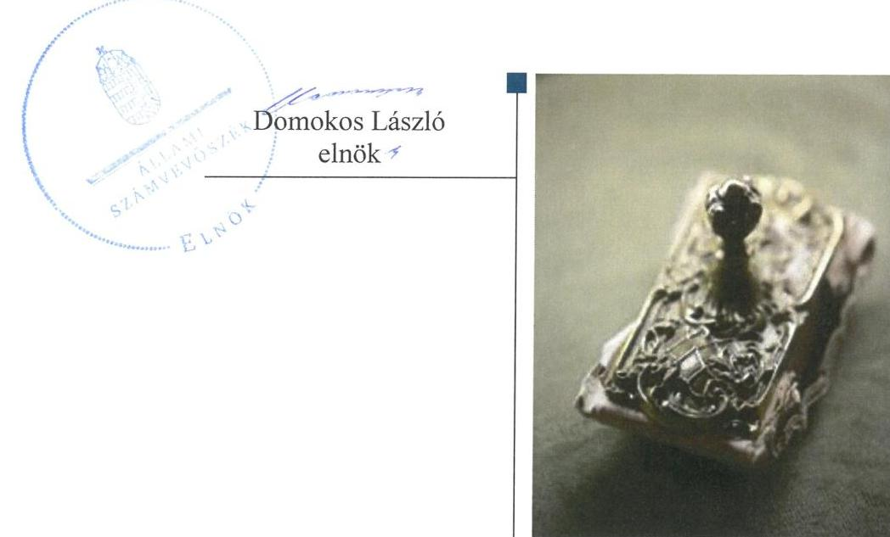

---

# AZ ELLENŐRZÉST FELÜGYELTE: 

PETŐ KRISZTINA felügyeleti vezető

## AZ ELLENŐRZÉST VEZETTE ÉS A VÉGREHAJTÁSÁÉRT FELELŐS:

DR. GYŐRI GABRIELLA ellenőrzésvezető

## A PROGRAM ÖSSZEÁLLÍTÁSÁÉRT FELELŐS:

JANIK JÓZSEF LÁSZLÓ osztályvezető

IKTATÓSZÁM: V-1063-167/2016
TÉMASZÁM: 2097
ELLENŐRZÉS-AZONOSÍTÓ SZÁM: V073716

Jelentéseink az Országgyűlés számítógépes hálózatán és az Interneten a www.asz.hu címen is olvashatóak.

---

# TARTALOMJEGYZÉK 

■ ÖSSZEGZÉS ..... 5
■ AZ ELLENŐRZÉS CÉLJA ..... 7
■ AZ ELLENŐRZÉS TERÜLETE ..... 8
■ AZ ELLENŐRZÉS HÁTTERE, INDOKOLTSÁGA ..... 11
■ A JELENTÉS LÉNYEGES KÉRDÉSKÖREI ..... 13
■ ELLENŐRZÉS HATÓKÖRE ÉS MÓDSZEREI ..... 14
■ MEGÁLLAPÍTÁSOK ..... 17
■ JAVASLATOK ..... 33
■ MELLÉKLETEK ..... 39
I. sz. melléklet: Értelmező szótár ..... 39
II. sz. melléklet: Az Integritás érvényesítése érdekében kialakított és működtetett kontrollrendszer ..... 42
■ FÜGGELÉK: ÉSZREVÉTELEK ..... 45
■ RÖVIDÍTÉSEK JEGYZÉKE ..... 79

---

.

---

# ÖSSZEGZÉS 

A szombathelyi székhelyű Savaria Megyei Hatókörű Városi Múzeumnál kialakított irányítási rendszer összességében nem támogatta az átlátható, elszámoltatható és ellenőrizhető közpénzfelhasználást. A Múzeum pénzügyi- és vagyongazdálkodása nem volt szabályszerű. A Múzeum alaptevékenységének részét képező kulturális javak teljes körű nyilvántartásáról nem gondoskodtak, emiatt a kulturális javak állományvédelme és vagyonbiztonsága a kölcsönzéseknél nem volt biztosított.

## Az ellenőrzés társadalmi indokoltsága

Az Állami Számvevőszék Stratégiájának alapértéke, hogy ellenőrzései segítik az integritás alapú, átlátható és elszámoltatható közpénzfelhasználás megteremtését. Az ellenőrzés jogszabályban, vagy alapító okiratban meghatározott közfeladat ellátására létrejött, a megyei hatókörű városi muzeális intézmények gazdálkodási tevékenységére terjedt ki. E szervezetek pénzügyi és vagyongazdálkodásának alapvető rendeltetése a közfeladatok (a kulturális örökséghez tartozó javak védelme, őrzése és a nyilvánosság számára történő hozzáférhetővé tétele) ellátásának biztosítása.

A megyei hatókörű városi múzeumként működő szervezetek 2011. évtől több alkalommal jelentős szervezeti és gazdálkodási átalakuláson mentek keresztül. A tulajdonosi, a vagyonkezelői és a fenntartói szerepekben, szerkezetben történt változások előkészítése, végrehajtása, illetve a múzeumi rendszer által kezelt közvagyonnal való gazdálkodás szabályszerűségének bemutatásával az ellenőrzés hozzájárul a múzeumok fenntartási és működtetési feladatainak ellátására vonatkozó megfelelő jogszabályi környezet kialakításához, a gazdálkodási gyakorlatuk javításához.

## Főbb megállapítások, következtetések

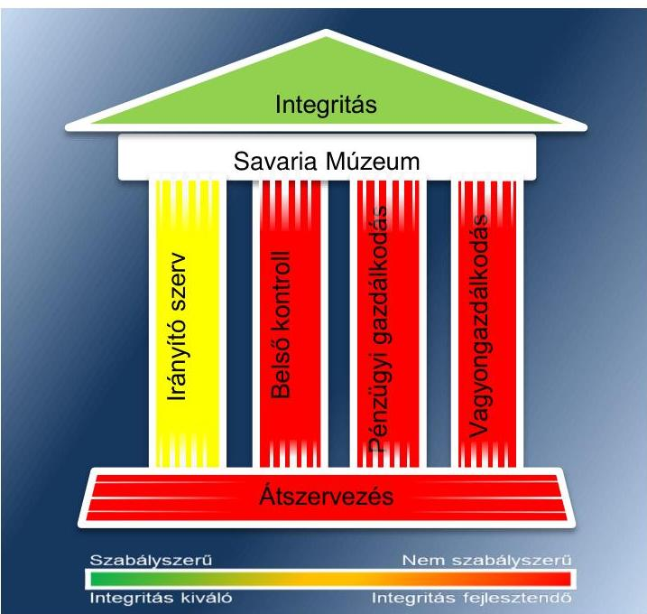

Az irányító szervek az ellenőrzött időszakban részben szabályszerűen látták el az irányító szervi feladatokat. A munkáltatói jogosultságok gyakorlása során érvényesültek a jogszabályi előírások. Az egyéb irányítási, felügyeleti és ellenőrzési jogosultságok gyakorlása során a 2012. évben a középirányító szerv az ellenőrzési feladatait hiányosan teljesítette.

A Múzeumnál kialakított irányítási rendszer összességében nem támogatta az átlátható, elszámoltatható és ellenőrizhető közpénzfelhasználást. A kontrollkörnyezet kialakítása részben szabályszerű volt. A Múzeum rendelkezett a gazdálkodását és működését meghatározó belső szabályzatokkal, azonban azok tartalmilag nem feleltek meg a jogszabályi előírásoknak. A kockázatkezelési rendszert a 2011-2014. években nem szabályszerűen alakították ki és működtették, mert nem mérték fel a Múzeum tevékenységében, gazdálkodásában rejlő kockázatokat, az azok ellensúlyozására szolgáló válaszintézkedéseket, illetőleg azok nyomon követési módját. A 2011-2014. években nem határozták meg a vagyonnyilatkozat-tételi kötelezettséget, ezáltal nem intézkedtek a közélet tisztaságának biztosítása és a korrupció megelőzése érdekében. A kontrolltevékenység kialakítása és működtetése a 2011. évben nem volt szabályszerű, a 2012-2014. években részben szabályszerű volt. A gazdálkodási jogkörök gyakorlására jogosult személyekről és aláírás mintájukról a 2011. és a 2013-2014. években nem vezettek naprakész nyilvántartást, továbbá az érvényesítőt és a

---

(pénzügyi) ellenjegyzőt jogosulatlan személy jelölte ki. Az információs és kommunikációs folyamatok kialakítása során 2011-2014-ben nem szabályozták a kötelezően közzéteendő adatok nyilvánosságra hozatalának és a közérdekű adatok teljes körű megismerésének rendjét. Az ellenőrzött időszakban a Múzeum illetve az irányító szervek honlapján nem tették közzé a gazdálkodáshoz kapcsolódó adatokat, ezáltal nem biztosították a Múzeum gazdálkodásának átláthatóságát. A monitoring rendszer részeként a belső ellenőrzés kialakítása és működtetése 2013. októberéig nem volt szabályszerű, mert nem gondoskodtak annak kialakításáról és működtetéséről, ezáltal nem biztosították a gazdálkodás szabályszerűségének, a közpénzek felhasználásának elszámoltathatóságát, átláthatóságát. Az irányító szervek és a középirányító szerv fenntartói jogkörükben gondoskodtak a Múzeum, mint felügyelt költségvetési szerv ellenőrzéséről, az intézkedési tervekben foglalt feladatok hasznosulását nyomon követték.

A Múzeum pénzügyi- és vagyongazdálkodása nem volt szabályszerű. A Múzeum az éves költségvetési beszámolóját a jogszabályban meghatározott határidőn túl készítette el. A 2012. évi költségvetési beszámoló középirányító szervi jóváhagyására nem került sor. A bevételek elszámolása nem volt szabályszerű, mert a helyiségek bérbeadása során nem rendelkeztek a vagyon hasznosítására felhatalmazást adó vagyonkezelési szerződéssel. A kiadási előirányzatok felhasználása az ellenőrzött időszakban részben volt szabályszerű. A költségvetési beszámoló mérlegét a 2011-2012. években hiteles leltárral nem támasztották alá. A Múzeum a 2012. évi beszámolójában a vagyont vagyonkezelési szerződés hiányában jogalap nélkül mutatta ki. A 2013-2014. évi beszámolóban a vagyon kimutatására vagyonkezelési szerződés hiányában került sor. A kulturális javak kölcsönzése során a kölcsönzési szerződések nem tartalmazták a jogszabályban rögzített állományvédelemre és vagyonbiztonságra vonatkozó kötelező tartalmi elemeket. Emiatt a kölcsönzött kulturális javak vagyonbiztonsága nem volt megfelelően biztosított.

A Múzeumot érintő szervezeti, szerkezeti átszervezések nem voltak szabályszerűek. A 2012. január 1-jétől hatályos irányító szervi váltás során a vagyon tényleges átadására szolgáló jegyzőkönyv felvételére nem került sor. A 2012/2013. évi központi alrendszerből önkormányzati alrendszerbe történő átszervezés során az átláthatóság sérült, mert a kulturális javak tételes, dokumentált módon történő átadására nem került sor, a tagintézmények átadásának szabályszerűsége dokumentum hiányában nem volt értékelhető.

A Múzeum integritás szemlélet érvényesítése érdekében teljesített adatszolgáltatásának eredményét az ellenőrzés megállapításai nem támasztották alá.

---

# AZ ELLENŐRZÉS CÉLJA 

vényesülését a gazdálkodási folyamatokban.

Az ellenőrzés célja annak megállapítása volt, hogy a megyei múzeumi rendszer átalakítása, az intézményfenntartói rendszerben végbement változások előkészítése és végrehajtása megalapozottan, szabályszerűen történt-e; a megyei hatókörű városi múzeumok és jogelődjeik pénzügyi- és vagyongazdálkodása, a belső kontrollrendszer kialakítása és működtetése, valamint az intézményfenntartói feladatok ellátása szabályszerűen történt-e.

A Múzeum ${ }^{1}$ korrupcióval szembeni veszélyeztetettségének csökkentése érdekében kért tanúsítványi adatszolgáltatás alapján az ÁSZ² értékelte az integritási szemlélet ér-

---

# **AZ ELLENŐRZÉS TERÜLETE**

## **Savaria Megyei Hatókörű Városi Múzeum**

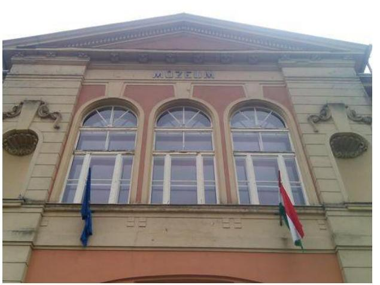

A Múzeum Szombathelyen található, feladatkörében az Mtv.3 alapján gondoskodik a kulturális javak meghatározott anyagának folyamatos gyűjtéséről, nyilvántartásáról, megőrzéséről és restaurálásáról; tudományos feldolgozásáról, publikálásáról; valamint kiállításokon és más módon történő bemutatásáról; a közművelődési és közgyűjteményi feladatok ellátásáról. A Múzeum a Kötv.4 20. § (2) bekezdése alapján területileg illetékes múzeumként régészeti feltárást végzett az ellenőrzött időszakban.

A Múzeum csak a működési engedélyében meghatározott gyűjtőkörben és gyűjtőterületen folytathatja tevékenységét. A szakmai besorolást, a rendszert megalapozó szaktörvényi kereteket az Mtv. biztosítja. Az Mtv. hatálya kiterjed a Múzeum fenntartóira, a Múzeumban foglalkoztatottakra, a kulturális örökség Múzeumban őrzött elemeire, a szolgáltatások igénybe vevőire és a kulturális örökséggel foglalkozó egyéb szervezetekre.

A Múzeum költségvetési engedélyezett létszáma 2011-ben 94 fő volt, 2012-ben 108 fő, mely a 2013. évben 93 főre változott és a 2014. évben 91 főre csökkent. A Múzeum alkalmazottainak foglalkoztatására a Kjt.5 alapján került sor. Az ellenőrzött időszakban a múzeumi igazgató6 és a gazdasági vezető személye változott.

A Möktv.7 és annak végrehajtásáról szóló 258/2011. (XII. 7.) Korm. rendelet8 alapján 2012. január 1-jétől a megyei múzeumok központi költségvetési szervekké váltak. 2013. január 1-jétől a 2012. évi CLII. törvény9 és az 1311/2012. (VIII. 23.) Korm. határozat10 alapján az állami tulajdonba és fenntartásba került megyei múzeumi szervezetek a megyeszékhely megyei jogú városok fenntartásában működnek tovább. A 2011–2014. évek között a fenntartói, irányítói, középirányítói jogkörgyakorlók változását, valamint a Múzeum gazdálkodási feladatát ellátó szervezetét az 1. táblázat mutatja be.

---

1. táblázat

FENNTARTÓI, IRÁNYÍTÓI JOGKÖRGYAKORLÓK ÉS GAZDASÁGI SZERVEZET A 2011-2014. ÉVEKBEN

| Időszak | Fenntartó | Irányító szerv | Középirányító szerv | Gazdasági szervezet |
| :--: | :--: | :--: | :--: | :--: |
| 2011. | Vas Megyei Önkormányzat | Vas Megyei Önkormányzat Közgyűlése | - | Múzeum |
| 2012. | Vas Megyei Intézményfenntartó Központ | KIM $^{11}$ | Vas Megyei Intézményfenntartó Központ | Múzeum |
| $\begin{aligned} & \text { 2013- } \\ & 2014 . \end{aligned}$ | Szombathely   Megyei Jogú Vá-   ros Önkormány-   zata | Szombathely   Megyei Jogú Vá-   ros Közgyűlése | - | Múzeum és Gazdasági szervezet ${ }^{12}$ |

A Múzeum jogelődjének, a Vas Megyei Múzeumok Igazgatóságának (a 2011-2012. években), illetve a Savaria Megyei Hatókörű Városi Múzeumnak a jogállása a 2013. évben önállóan működő és gazdálkodó költségvetési intézmény volt. 2014. január 1-jétől a Múzeum önálló jogi személyiséggel rendelkező, megyei hatókörű városi múzeum, vállalkozási tevékenységet végzett. A Múzeum egyes gazdálkodási feladatait 2013. október 1-jétől megállapodás alapján a Gazdasági szervezet látta el.

A Múzeum teljesített költségvetési bevételeinek és kiadásainak alakulását az 1. ábra mutatja be. Az ábra a 2011-2012. években a Múzeum és tagintézményeinek együttes adatai, a 2013-2014. években a tagintézmények átadását követően a múzeumi adatok alapján készült:

1. ábra
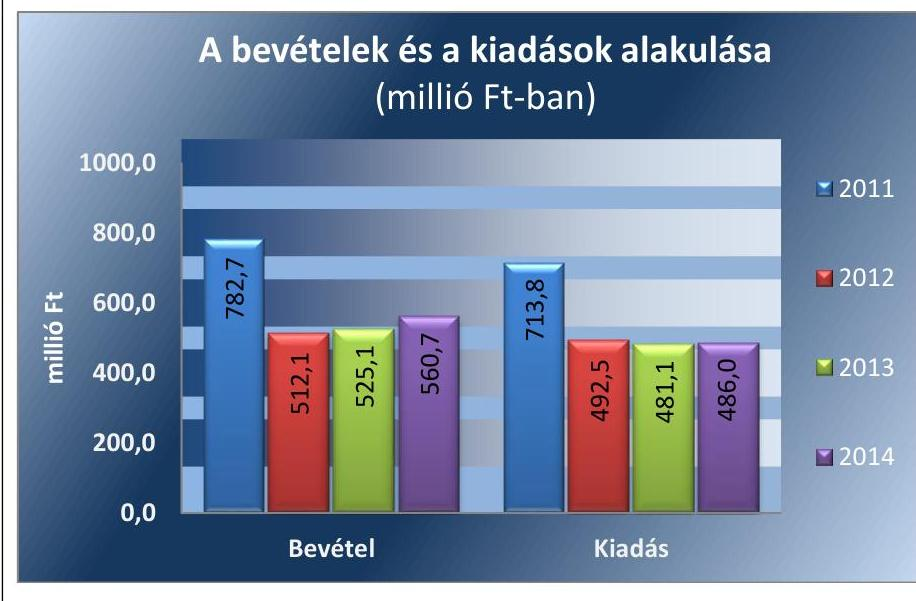

Forrás: Múzeumi beszámolók a 2011-2014. évekre
A 2015. évi LXXV. tv. ${ }^{13}$ 1. § (1) bekezdése alapján az Nvtv. ${ }^{14}$ 13. § (3) bekezdésében és 14. § (1) bekezdésében foglaltak alapján és az abban meghatározott feltételekkel a 2012. évi CLII. törvény 30. § (1) és (2) bekezdésében meghatározott, a megyei hatókörű városi múzeumok feladatának ellátását szolgáló egyes állami tulajdonban lévő ingatlanok a törvény hatálybalépésének napjával, a törvény erejénél fogva a kötelező közfeladatként a megyei hatókörű városi múzeumot fenntartó önkormányzatok tulajdonába kerültek. A 2015. évi LXXV. tv. 4. § (1) bekezdése alapján a kulturális örökség helyi védelme érdekében a megyei hatókörű városi múzeumok alapleltárában és jogszabály szerinti külön nyilvántartásában szereplő állami tulajdonú kulturális javak ingyenesen a megyei hatókörű városi múzeumok vagyonkezelésébe kerültek. A vagyonkezelők vagyonkezelői joga tekintetében vagyonkezelési szerződés megkötése nem szükséges. A 2015. évi LXXV. tv. 4. § (2) bekezdése szerint továbbá a kulturális örökség helyi védelme érdekében a megyei hatókörű városi múzeumok feladatának ellátását szolgáló állami tulajdonban álló ingatlanok - a törvény mellékletében meghatározott ingatlanok kivételével - ingyenesen a fenntartó önkormányzatok vagyonkezelésébe kerültek.

---

# AZ ELLENŐRZÉS HÁTTERE, INDOKOLTSÁGA

Az Alaptörvény^{15} rendelkezése szerint a nemzeti vagyon megőrzésének, védelmének és a nemzeti vagyonnal való felelős gazdálkodásnak a követelményeit sarkalatos törvény, az Nvtv. rögzíti. A tulajdonosi joggyakorlás és vagyonkezelés általános és speciális szabályait, az állami vagyon nyilvántartására és elszámolására vonatkozó eljárásokat, a vagyonkezelési szerződés feltételrendszerét, valamint az éves beszámoló készítési és könyvvezetési kötelezettségeket kormányrendelet írja elő.

A megyei hatókörű városi múzeumok közfeladat–ellátásának változásait, (beleértve az állami tulajdonosi joggyakorló, intézményi vagyonkezelő és önkormányzati fenntartó szervezeteket is) a közfeladatok átadásából és átvételéből adódó módosításait, előirányzat gazdálkodására ható tényezőit az Áht.^{16}, az Ávr.^{17}, a Möktv., valamint az Mtv. írja elő. A múzeumi intézményrendszer rendszerátalakulásából, megszűnéséből, intézmény átszervezéséből, belső szerkezeti korszerűsítéséből, vagy más hasonló okból adódó módosításai miatt szerepeltetendő
 szerkezeti változásokat, valamint a szerkezeti változásként beépült közfeladatok szintre hozásként történő számításba vételét az Ávr. határozza meg.

A megyei hatókörű városi múzeumok kulturális szempontból meghatározó jelentőségűek mind földrajzi elhelyezkedésüket, mind az ellátott feladatokat, valamint a látogatottságukat tekintve. Tevékenységüket törvényi szinten (Mtv.) szabályozták a jogalkotók. A megyei hatókörű városi múzeumok jelenlegi körének kialakításában, tulajdonosi és fenntartói szerkezetében rövid idő alatt több jelentős változás történt, amelyeket jogszabályi változások indukáltak. Ezen intézmények szakmai besorolásukat tekintve a 2011. évben megyei múzeumként, a 2012. évben megyei múzeumi központi költségvetési szervezetként, a 2013. évtől kezdődően megyei hatókörű városi múzeumként működtek. A szakmai besorolások változásait párhuzamosan követték a tulajdonosi, vagyonkezelői, fenntartói szerepekben történt változások.

A 2011–2014. évek között bekövetkezett fenntartói változások a vagyontárgyak és a kulturális javak tulajdonosi, vagyonkezelői és használói körében is változást indukáltak, amelyet a 2. táblázat szemléltet.

1. táblázat

## A VAGYON TULAJDONOSI, VAGYONKEZELŐI ÉS HASZNÁLÓI KÖRÉNEK VÁLTOZÁSA 2011–2014. ÉVEKBEN

|  Vagyon-
tárgy | 2011. év |  |  | 2012. év |  |  | 2013–2014. évek |  |   |
| --- | --- | --- | --- | --- | --- | --- | --- | --- | --- |
|   | tulajdonos | vagyon-
kezelő | használó | tulajdonos | vagyon-
kezelők | használó | tulajdonos | vagyon-
kezelő | használó  |
|  Ingatlan | Vas Megyei Önkormányzat | - | Múzeum | Állam | VMIK¹⁸ | Múzeum | Állam | Múzeum | Múzeum  |
|  Egyéb tárgyi eszközök | Vas Megyei Önkormányzat | - | Múzeum | Állam | VMIK | Múzeum | Állam | Múzeum | Múzeum  |
|  Kulturális javak | Vas Megyei Önkormányzat | - | Múzeum | Állam | VMIK | Múzeum | Állam | Múzeum | Múzeum  |

*Forrás: A Múzeum alapító okiratai, a 2012. évi CLII. tv, a 258/2011. (XII. 7) Korm. rendelet, az 1311/2012. (VIII. 23.) Korm. határozat*

---

Az ellenőrzés - tekintettel a megyei hatókörű városi múzeumokat (és jogelődjeit) rövid időn belül, gyors ütemben ért környezeti (tulajdonosi, fenntartói-szerkezetet érintő) változásokra - javaslatok megfogalmazásával hozzájárul a fenntartás és működtetés feladatainak ellátására vonatkozó megfelelő jogszabályi környezet - jogalkotók által történő - kialakításához. Az ÁSZ ellenőrzés a gazdálkodási gyakorlat javítását eredményezheti, több intézmény bevonásával átfogó képet ad a megyei hatókörű városi múzeumokat (és jogelődjeiket) jellemző sajátosságokról, jó gyakorlatokról.

AZ ELLENŐRZÉS EREDMÉNYEKÉPPEN nemcsak az ellenőrzött intézmények gazdálkodása javul, hanem átfogó képet kapunk a múzeumok gazdálkodásának hiányosságairól, de a jó gyakorlatokról is. Ellenőrzéseivel, javaslataival és megállapításaival az ÁSZ elősegíti a költségvetési szervek pénzügyi és vagyongazdálkodása szabályozásának javítását és hozzájárulhat a jó kormányzáshoz.

---

# A JELENTÉS LÉNYEGES KÉRDÉSKÖREI 

1. Az irányító szerv ellenőrzött Múzeumra vonatkozó feladatellátása szabályszerű volt-e?
2. Szabályszerűen hajtották-e végre a Múzeumot érintő szervezeti, szerkezeti átszervezéseket?
3. A belső kontrollrendszer kialakítása és működtetése megfelelt-e a jogszabályi előírásoknak?
4. A Múzeum pénzügyi gazdálkodása szabályszerű volt-e?
5. A Múzeum vagyongazdálkodása szabályszerű volt-e?
6. A Múzeum intézkedett-e az integritás szemlélet érvényesítése érdekében?

---

# ELLENŐRZÉS HATÓKÖRE ÉS MÓDSZEREI 

## Az ellenőrzés típusa

Megfelelőségi ellenőrzés.

## Az ellenőrzött időszak

Az ellenőrzött időszak 2011. január 1-jétől 2014. december 31-ig tart.

## Az ellenőrzés tárgya

A megyei hatókörű városi múzeumok átszervezése, átalakítása előkészítése és lebonyolítása megalapozottsága, szabályszerűsége, a pénzügyi és vagyongazdálkodási tevékenység, a belső kontrollrendszer kialakítása, működtetése szabályszerűsége, valamint az irányító szervi feladatok ellátása szabályszerűsége. E tevékenységek és a kapcsolódó adatok és információk összessége, amelyeket a vonatkozó kritériumok alapján kell értékelni.

Az ellenőrzés kiterjed minden olyan körülményre és adatra, amely az ÁSZ jogszabályban meghatározott feladatainak teljesítéséhez, valamint a program végrehajtása folyamán felmerült újabb összefüggések feltárásához szükséges.

## Az ellenőrzött szervezet

Savaria Megyei Hatókörű Városi Múzeum, a fenntartói feladatokban érintett Vas Megyei Önkormányzat valamint Szombathely Megyei Jogú Város Önkormányzata, a Vas Megyei Intézményfenntartó Központ jogutódja a Szociális és Gyermekvédelmi Főigazgatóság, továbbá az egyes gazdálkodási feladatokat (jelenleg is) ellátó Szombathelyi Köznevelési Intézmények Gazdasági, Műszaki Ellátó és Szolgáltató Szervezete.

Az ellenőrzésre a költségvetési szerv ellenőrzött intézményének és irányító szervének, illetve középirányító szervének székhelyén és a gazdálkodási feladatait ellátó szervezetének székhelyén került sor.

## Az ellenőrzés jogalapja

Az ellenőrzés jogszabályi alapját az ÁSZ tv. ¹⁹ 1. § (3) bekezdés, 5. § (2)-(6) bekezdései, valamint az Áht. 2 61. § (2) bekezdésének előírásai képezik.

---

# Az ellenőrzés módszerei 

Az ellenőrzést az ellenőrzési program szempontjai, az ellenőrzött időszakban hatályos jogszabályok, az ellenőrzés szakmai szabályai, az egyes ellenőrzési típusokhoz kapcsolódó ÁSZ módszertanok és nemzetközi standardok figyelembe vételével végeztük. A gazdálkodás hibáinak kijavítására, a közpénzekkel való felelős gazdálkodás segítésére irányuló javaslatok kidolgozásakor a hatályos jogszabályok az irányadóak.

Az ellenőrzési kérdések megválaszolásához szükséges bizonyítékok megszerzése a következő ellenőrzési eljárások alkalmazásával történt: kérdésfeltevés (információkérés), mintavételezés, valamint elemző eljárás. A minták kiválasztása során véletlen mintavételi eljárást alkalmaztunk.

Mintavétellel ellenőriztük a bevételek, a személyi juttatások, a dologi és felhalmozási kiadások, a régészeti bevételek és kiadások elszámolását, valamint a kulturális javak kölcsönzésének szabályszerűségét. A minta alapján a sokaságban előforduló hibaarányt becsültük. „Megfelelőnek" értékeltük az ellenőrzött területet, amennyiben 95%-os bizonyossággal a teljes sokaságban a hibaarány legfeljebb 10%, „részben megfelelőnek" értékeltük, ha a hibaarány felső határa 10-30% között volt, „nem megfelelőnek" pedig akkor, ha a mintavételi eredmények alapján a sokaságbeli hibaarány felső határa meghaladta a 30%-ot.

Az ellenőrzési bizonyítékként felhasználható adatforrások közé tartoznak egyrészt a szakmai program részletes szempontjainál felsorolt adatforrások, másrészt adatforrás lehet minden egyéb - az ellenőrzés folyamán feltárt, az ellenőrzés szempontjából releváns információt tartalmazó - dokumentum. Az ellenőrzés lefolytatásához a Múzeum a tanúsítványok elektronikus kitöltésével, valamint az ÁSZ által kért dokumentumok elektronikus megküldésével szolgáltatott adatokat. A rendelkezésre bocsátott adatok, információk kontrollja az ellenőrzés keretében történt. Az ellenőrzési kérdésekre adott válaszok alapján értékeltük, hogy az ellenőrzött időszakban az irányító szerv az ellenőrzött Múzeumra vonatkozó feladatainak szabályszerűen eleget tett-e, a Múzeum pénzügyi- és vagyongazdálkodása megfelelt-e az előírásoknak, a Múzeum átalakításának vagy átszervezésének végrehajtása szabályszerű volt-e.

A Múzeum belső kontrollrendszere jogszabályi előírások szerinti kialakításának és működtetésének szabályszerűségét az erre irányuló ellenőrzési kérdésekre adott válaszok összesítése alapján, évente pillérenként (kontrollkörnyezet, kockázatkezelési rendszer, kontrolltevékenységek, információs és kommunikációs rendszer, monitoring rendszer) és összesítetten is minősítjük. A Múzeum belső kontrollrendszere egyes pilléreinek kialakítása és működtetése „szabályszerű", amennyiben az értékelt területen az elért és elérhető pontok százalékban kifejezett, egész számra kerekített hányadosa meghaladja a 84%-ot, „részben szabályszerű", ha a 84%-ot nem haladja meg, de 60%-nál nagyobb, „nem szabályszerű", ha nem haladja meg a 60%-ot. A Múzeum belső kontrollrendszerének összesített értékelése megegyezik a pillérenként (kontrollterületenként) alkalmazott %-os értékelésekkel, a következő eltérésekkel. A kontrollrendszer egésze esetében a „szabályszerű" értékelésnek a %-os értéken felül további feltétele, hogy egyik kontrollterület sem kaphat „nem szabályszerű" értékelést, a „részben szabályszerű" értékelés további feltétele, hogy legfeljebb egy el-

---

lenőrzött kontrollterület lehet „nem szabályszerű" értékelésű. Az összesített értékelés a %-os értéktől függetlenül „nem szabályszerű", ha az ellenőrzött kontrollterületek közül több mint egynek „nem szabályszerű" az értékelése.

Az integritás szemlélet érvényesülésének értékelése a Múzeum által szolgáltatott adatok alapján történt.

---

# 1. Az irányító szerv ellenőrzött Múzeumra vonatkozó feladatellátása szabályszerű volt-e? 

Összegző megállapítás

Az irányító szervek ellenőrzött Múzeumra vonatkozó feladatellátása a 2011-2014. években részben volt szabályszerű.

AZ ALAPÍTÓI JOGOSULTSÁGOK GYAKORLÁSA az ellenőrzött időszakban részben felelt meg a jogszabályi előírásoknak. A Múzeum az ellenőrzött időszakban rendelkezett az irányítószerv ¹⁻³ által jóváhagyott alapító okirattal ³⁻⁸. A módosítás során az egységes szerkezetet elkészítették, azonban a középirányító szerv ²² az alapító okirat ²⁻³-hoz, az irányítószerv ³ az alapító okirat ⁵⁷-hez a kultúráért felelős miniszter előzetes egyetértését 2012. évben az Mtv. 45/B. § (3) bekezdésében, 2013. évben az Mtv. 45. § (5) bekezdés a) pontjában foglaltak ellenére nem kérte meg.

A középirányító szerv a 258/2011. (XII. 7.) Korm. rendelet 21. § (6) bekezdésében rögzítetteket figyelmen kívül hagyva az alapító okirat ² módosítását 2012. január 30-ig nem nyújtotta be a Kincstár ²³ által vezetett törzskönyvi nyilvántartáshoz, mivel az alapító okirat ² irányító szerv ² általi kiadására 2012. július 12-én került sor.

A MUNKÁLTATÓI JOGOSULTSÁGOT az irányító szerv ¹⁻³ a 2011-2014. években szabályszerűen gyakorolta.

AZ EGYÉB IRÁNYÍTÁSI, FELÜGYELETI ÉS ELLENŐRZÉSI jogosultságok gyakorlása során a jogszabályi előírások nem érvényesültek maradéktalanul.
2012. évben a középirányító szerv a 258/2011. (XII. 7.) Korm. rendelet 11. § (2) bekezdés c) pontjában foglaltak ellenére nem ellenőrizte, hogy a Múzeum eleget tett-e a közérdekű és közérdekből nyilvános adatok közzétételi kötelezettségének. A középirányító szerv 2012. évben a 258/2011. (XII. 7.) Korm. rendelet 11. § (1) bekezdés a)-c) pontjaiban előírtakat figyelmen kívül hagyva nem tette meg a javaslatát az irányítása alá tartozó Múzeum éves költségvetésére, nem határozta meg a gazdálkodás részletes rendjét és az előirányzat felhasználására vonatkozó irányelveket. Továbbá 2012.évben - annak elkészülte hiányában - nem nyújtotta be előzetesen véleményezésre a miniszter ²⁴ felé a Múzeum stratégiai tervét, feladatalapú költségvetését az Mtv. 45/B. § (5) bekezdés a) és c)-d) pontjában foglaltak ellenére.

Az irányító szerv ¹,³ jóváhagyta a Múzeum ellenőrzött időszakban hatályos SZMSZ ¹⁻³ módosítását. A Múzeum 2013-ban elkészített stratégiai tervét, azt az irányítószerv ³ jóváhagyta és a Múzeum 2013. évtől rendelkezett az Mtv.-nek megfelelően a fenntartó által jóváhagyott múzeumi küldetésnyilatkozattal, mely alapján szakmai tevékenységét folytatta.

---

# 2. Szabályszerűen hajtották-e végre a Múzeumot érintő szervezeti, szerkezeti átszervezéseket? 

Összegző megállapítás

2.1. számú megállapítás
2.2. számú megállapítás

A Múzeumot érintő szervezeti, szerkezeti átszervezés nem volt szabályszerű.

A Múzeumot érintő - önkormányzati alrendszerből a központi alrendszerbe történő - 2012. január 1-jétől hatályos irányító szervi (fenntartói) váltás lebonyolítása nem volt szabályszerű.

Az átadás-átvételi megállapodás ² megkötése nem volt szabályszerű, mert azt csak az átadó irányító szerv ¹ és a középirányító szerv képviselője írta alá, a Möktv. 2. § (4) bekezdésében előírt további kettő szervezet, mint szerződő fél képviselője aláírását az átadás-átvételi megállapodás ¹ nem tartalmazta. A 258/2011. (XII. 7.) Korm. rendelet 12. § (1) bekezdésében előírt, az átadás-átvétel alapját képező hitelesített vagyonleltár nem készült.

A VAGYON TÉNYLEGES ÁTADÁSA során - a 258/2011. (XII. 7.) Korm. rendelet 12. § (3) bekezdésében foglaltak ellenére - jegyzőkönyv felvételére nem került sor.

A 2011. évi NGM módszertani útmutató ²⁷ 43. oldal 2/ba. pontjában előírtakat és az Áhsz. ¹ ²⁸ 13/A. § (1) és (5)-(6) bekezdéseiben foglaltakat figyelmen kívül hagyva az átadáshoz kapcsolódó vagyonátadási jelentés és vagyonátadás-átvételi jegyzőkönyv nem készült. Az eszközök
 és források 2012. évi nyitása nem volt szabályszerű, mivel a nyitás alapját képező vagyonátadási jelentést nem készítettek. Az állami tulajdonba került vagyonelemek számviteli nyilvántartásokból történő kivezetését az NGM módszertani útmutató 2/b. pontjában rögzítettek ellenére a Múzeumnál nem végezték el.

A 2013. január 1-jével végrehajtott - központi alrendszerből önkormányzati alrendszerbe történő - irányító szervi (fenntartói) váltás lebonyolítása és a szervezetrendszer átalakítása nem volt szabályszerű.

Az 1311/2012. (VIII. 23.) Korm. határozatban rögzített előírással összhangban a Múzeum átadás-átvételének lebonyolításához szükséges egyeztetéseket határidőben lefolytatták.

Az átadás-átvételi megállapodás ${ }_{2}{ }^{29}$ megkötésére a 1311/2012. (VIII. 23.) Korm. határozatban és a 2012. évi CLII. törvény 30. § (5) bekezdésében foglalt 2012. december 15-ei határidőt követően, 2012. december 21-én került sor. Az átadás-átvételi megállapodás ${ }_{2}$ 1/1.2.11. pontjában foglaltak ellenére a vagyonleltár nem képezte az átadás-átvételi megállapodás ${ }_{2}$ mellékletét. Az átadás-átvételi megállapodás ${ }_{2}$ 1/1.2.11.2.1. pontját figyelmen kívül hagyva a kulturális javak tételes, dokumentált módon történő átadására nem került sor. Az átadás-átvételi megállapodás ${ }_{2}$ 1/1.2.2. pontjában a 2012. évi költségvetés várható teljesüléséről szóló adatszolgáltatási kötelezettséget előírták, azonban ilyen tartalmú dokumentumot nem készítettek.

---

Az Áhsz. 13/A. § (1) bekezdésében rögzített előírások ellenére a Múzeum a 2012. évi beszámolóját teljes körű, hiteles leltárral nem támasztotta alá. A 2012. évi NGM módszertani útmutató 44. oldal 2/b. pontjában előírtakat figyelmen kívül hagyva az átadáshoz kapcsolódó vagyonátadási jelentést nem készítettek. Az eszközök és források 2013. évi nyitását vagyonátadási jelentés hiányában szabályszerűen nem tudták végrehajtani.

A tagintézmények 2013. évi átadásának előkészítése érdekében a középirányító szerv és az átvevő települési önkormányzatok az egyeztető tárgyalásokat lefolytatták. A tagintézmények átadásának szabályszerűsége a 2012. évi CLII. törvény 30. § (5) bekezdésében előírt megállapodás megkötésének hiányában nem volt értékelhető.

# 3. A belső kontrollrendszer kialakítása és működtetése megfelelt-e a jogszabályi előírásoknak? 

## Összegző megállapítás

A belső kontrollrendszer kialakítása és működtetése a 2011-2014. években nem volt szabályszerű.

A belső kontrollrendszer kialakítása és működtetése részletes értékelését a 2011-2014. évekre vonatkozóan a 3. táblázat mutatja be.
3. táblázat

## A BELSŐ KONTROLLRENDSZER KIALAKÍTÁSÁNAK ÉS MŰKÖDTETÉSÉNEK ÉRTÉKELÉSE A 2011-2014. ÉVEKBEN

| Megnevezés | Kontroll-   környezet | Kockázatkezelés | Kontroll-   tevékenységek | Információ és   kommunikáció | Monitoring | Összesen |
| :--: | :--: | :--: | :--: | :--: | :--: | :--: |
| 2011. | részben szabály-   szerű | nem szabályszerű | nem szabályszerű | nem szabályszerű | nem szabályszerű | nem szabályszerű |
| 2012. | részben szabály-   szerű | nem szabályszerű | részben szabály-   szerű | nem szabályszerű | nem szabályszerű | nem szabályszerű |
| 2013. | részben szabály-   szerű | nem szabályszerű | részben szabály-   szerű | nem szabályszerű | szabályszerű | nem szabályszerű |
| 2014. | részben szabály-   szerű | nem szabályszerű | részben szabály-   szerű | nem szabályszerű | részben szabály-   szerű | nem szabályszerű |

3.1. számú megállapítás

A kontrollkörnyezet kialakítása a 2011-2014. években részben volt szabályszerű.
2. ábra

| Kontrollkörnyezet | 2011. év | 2012. év | 2013. év | 2014. év |
| :--: | :--: | :--: | :--: | :--: |
|  | önkormányzati   alrendszer | központi   alrendszer | önkormányzati | alrendszer |
| szabályszerű |  |  |  |  |
| részben szabályszerű   nem szabályszerű |  |  |  |  |

---

A 2011-2014. években az Ámr. ${ }^{30}$ 156. § (1) bekezdés c) pontjában illetve a Bkr. ${ }^{31}$ 6. § (1) bekezdés c) pontjában foglaltak ellenére nem határozták meg az etikai elvárásokat a Múzeum minden szintjén.

A 2011. évben a Múzeum kontrollkörnyezetének kialakítása részben szabályszerű volt:
— nem gondoskodtak a Számv. tv. ${ }^{32}$ 14. § (3)-(4) bekezdésében és (5) bekezdés b)-c) pontjában, valamint az Áhsz. 3 8. § (3) bekezdésében és (4) bekezdés b)-c) pontjában foglaltak ellenére a számviteli politika és az annak keretében elkészítendő szabályozások elkészítéséről, így a Múzeum nem rendelkezett a Számv. tv. 14. § (5) bekezdés b)-c) pontjában foglaltak ellenére az eszközök és források értékelési szabályzatával, önköltségszámítás rendjére vonatkozó szabályzattal;
— az Ámr. 20. § (3) bekezdés b) pontjában foglaltak ellenére nem szabályozták a beszerzések lebonyolításának rendjét;
— az Áht. 3 91. § (2) bekezdése és az Ámr. 20. § (3) bekezdés a) pontjában foglaltak ellenére SZMSZ-ben, ügyrendben vagy más belső szabályozásban nem határozták meg a gazdálkodás részletes rendjét;
— az SZMSZ ${ }_{1}$ nem tartalmazta az Ámr. 20. § (2) bekezdés e) pontjában foglaltak ellenére a szervezeti egységek engedélyezett létszámát, az Ámr. 20. § (2) bekezdés c) pontjának előírása ellenére az ellátandó, és a szakfeladat-rend szerint (szakfeladat számmal és megnevezéssel) besorolt alaptevékenységek valamint az alaptevékenységet meghatározó jogszabályok megjelölését, továbbá az Ámr. 20. § (2) bekezdés h) pontjában foglaltak ellenére a helyettesítés rendjét és a kapcsolódó felelősségi szabályokat kizárólag a múzeumigazgató helyettesítése tekintetében határozta meg.
A 2012. évben a gazdálkodási tárgyú szabályzatok elkészítése a Múzeum feladata volt. A 2013. október 1-jétől hatályos munkamegosztási megállapodás ${ }^{33}$ értelmében a Gazdasági szervezet feladata volt a gazdálkodással összefüggő szabályzatok elkészítése és karbantartása. A munkamegosztási megállapodásban rögzítették az Ávr.-nek megfelelően a munkamegosztás és felelősségvállalás rendjét. 2013. október 1-jétől a gazdasági szervezet ügyrend ${ }_{1}{ }^{34}$ hatályát kiterjesztették a Múzeumra, amely megfelelt az Ávr.-ben foglalt tartalmi követelményeknek. A kontrollkörnyezet 2012-2013. évi kialakításában az alábbi hiányosságok fordultak elő:
— az SZMSZ ${ }_{2-3}$ nem tartalmazta az Ávr. 13. § (1) bekezdés c), e) és g) pontjában foglaltak ellenére az alaptevékenységek szakfeladat-rend szerint besorolását és az alaptevékenységet szabályozó jogszabályok megjelölését, a szervezeti egységek engedélyezett létszámát, valamint a helyettesítés rendjét kizárólag a múzeumigazgató helyettesítése tekintetében határozta meg;
— a számviteli politika ${ }_{1-3}{ }^{35}$ a Számv. tv. 14. § (4) bekezdésének és az Áhsz. 3 8. § (5) bekezdésének előírása ellenére nem tartalmazta, hogy mit tekint a számviteli elszámolás, az értékelés szempontjából lényegesnek, nem lényegesnek, nem jelentősnek;
— az értékelési szabályzat ${ }_{1,3}{ }^{36}$ nem tartalmazta az Áhsz. 3 8. § (17) bekezdés d) pontjában foglaltak ellenére követeléstípusonként a kis összegű követelések év végi meghatározásának elveit és dokumentálásának szabályait;

---

- a számlarend ${ }^{37}$ a Számv. tv. 161. § (2) bekezdés c) pontjában foglaltak ellenére nem teljes körűen, hanem csak egyes számlaosztályok esetében határozta meg a főkönyvi számla és az analitikus nyilvántartások kapcsolatát, valamint nem tartalmazta az Áhsz. ${ }_{1}$ 49. § (3) bekezdésében foglaltak ellenére az analitikus nyilvántartások kapcsolódó főkönyvi nyilvántartásokkal való egyeztetésének módját;
az Ávr. 53. § (2) bekezdésétől eltérően annak ellenére nem határozták meg a 100 ezer Ft alatti kifizetések előzetes írásbeli kötelezettségvállalás nélküli teljesítésének rendjét, hogy annak alkalmazását belső szabályozásban lehetővé tették.
A kontrollkörnyezet 2014. évi kialakításában az alábbi hiányosságok fordultak elő:
nem gondoskodtak az SZMSZ aktualizálásáról, ezért az SZMSZ ${ }_{3}$ továbbra sem tartalmazta az Ávr. 13. § (1) bekezdés c), e) és g) pontjaiban foglaltak ellenére az ellátandó, és a kormányzati funkció szerint besorolt alaptevékenységek és az alaptevékenységet szabályozó jogszabályok megjelölését, a szervezeti egységek engedélyezett létszámát, valamint a helyettesítés rendjét kizárólag a múzeumigazgató helyettesítése tekintetében határozta meg;
a Gazdasági szervezet az Ávr. 53. § (2) bekezdésétől eltérően annak ellenére nem határozta meg a 100 ezer Ft alatti kifizetések előzetes írásbeli kötelezettségvállalás nélküli teljesítésének rendjét, hogy annak alkalmazását belső szabályozásban lehetővé tették;
a Gazdasági szervezet a számviteli politika ${ }_{4}$ elkészítése során nem volt figyelemmel a Számv. tv. 14. § (4) bekezdésének rendelkezéseire, ezért a számviteli politika ${ }_{4}$ nem tartalmazta, hogy mit tekint a számviteli elszámolás, az értékelés szempontjából nem lényegesnek, jelentősnek, nem jelentősnek, valamint az Áhsz. ${ }^{38}$ 50. § (7) bekezdésében foglaltak ellenére nem rögzítették az általános költségek szakfeladatokra és az általános kiadások tevékenységekre történő felosztásának módját, a felosztáshoz alkalmazott mutatókat, vetítési alapokat;
az értékelési szabályzat ${ }_{4}$ nem tartalmazta követeléstípusonként a kis összegű követelések év végi meghatározásának elveit, dokumentálásának szabályait az Áhsz. ${ }_{2}$ 50. § (2) bekezdés b) pontjában foglaltak ellenére.
3.2. számú megállapítás

# A kockázatkezelési rendszer kialakítása és működtetése nem volt szabályszerű a 2011-2014. években. 

| 3. ábra |  |  |  |  |
| :--: | :--: | :--: | :--: | :--: |
| Kockázatkezelési | 2011. év | 2012. év | 2013. év | 2014. év |
| rendszer | önkormányzati alrendszer | központi alrendszer | önkormányzati alrendszer |  |
| szabályszerű |  |  |  |  |
| részben szabályszerű |  |  |  |  |
| nem szabályszerű |  |  |  |  |

A kockázatkezelési szabályzat ${ }^{39}$-ben a Múzeum kialakította a kockázatkezelési rendszerét, de 2011. évben az Ámr. 157. § (3) bekezdésének elő-

---

írása ellenére nem határozta meg az egyes kockázatokkal kapcsolatos intézkedéseket és megtételük módját, a 2012. évben a szabályzat a Bkr. 7. § (2) bekezdésében foglaltak ellenére nem tartalmazta a szükséges intézkedések teljesítésének folyamatos nyomon követési módját.

A 2013-2014. években a kockázatkezelési rendszer kialakítása nem felelt meg a Bkr. 3. § b) pontjában előírtaknak. A Bkr. 7. § (2) bekezdésében foglaltak ellenére a Gazdasági szervezet nem határozta meg az egyes kockázatokkal kapcsolatban szükséges intézkedéseket, valamint azok teljesítésének folyamatos nyomon követésének módját.

A 2011. évben az Ámr. 157. § (1) bekezdésében foglaltak ellenére a Múzeum, illetve a 2012-2014. években a Bkr. 7. § (1) bekezdésében foglaltak ellenére a Múzeum illetve a Gazdasági szervezet a kockázatkezelési rendszert nem működtette.

A 2011-2014. években a Vnytv. ${ }^{40}$ 4. § a) pontjának előírásától eltérően a Múzeum SZMSZ1-3-ban nem határozták meg a vagyonnyilatkozat-tételi kötelezettséget.

# 3.3. számú megállapítás 

A kontrolltevékenység kialakítása és működtetése a 2011. évben nem volt szabályszerű, a 2012-2014. években részben szabályszerű volt.
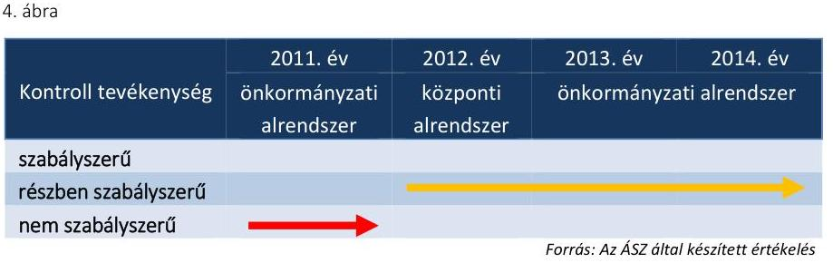

Az Ámr. és a Bkr. rendelkezéseinek megfelelően az ellenőrzött időszakban szabályozták a felelősségi körök meghatározásával az engedélyezési, jóváhagyási és kontrolleljárásokat, továbbá a beszámolási eljárásokat.

A Múzeum nem szabályozta az információkhoz illetve az eszközökhöz való hozzáférést 2011-ben az Ámr. 158. § (2) bekezdés b)-c) pontjaiban, valamint 2012-ben a dokumentumokhoz és információkhoz való hozzáférést a Bkr. 8. § (4) bekezdés b) pontjában foglaltak ellenére.

A 2011-2012. években a Múzeum nem határozta meg az üzemeltetés és adatbiztonság kapcsán a feladatokat és hatásköröket az lkr. ${ }^{41}$ 8. § (2) bekezdésében foglaltak ellenére, továbbá nem alakította ki
 az adatok biztonságának, védelmének érvényre juttatásához szükséges eljárási szabályokat 2012. évben az Info. tv. ${ }^{42}$ 7. § (2)-(3) bekezdésében foglaltak ellenére. A fenti hiányosságot a 2013. május 3-ától hatályos informatikai biztonsági szabályzat ${ }^{43}$-ban pótolták.
2011. évben nem gondoskodtak az Ámr. 80. § (3) bekezdésében foglaltak ellenére az egyes pénzügyi jogkörök gyakorlására jogosult személyekről és aláírás-mintájukról naprakész nyilvántartás vezetéséről. Az érvényesítési feladatokat ellátó személy nem rendelkezett a gazdasági vezető írásbeli kijelölésével az Ámr. 74. § (2) bekezdés a) pontjában foglaltak ellenére.
2012. évben a pénzügyi ellenjegyző és az érvényesítő kijelölése nem volt szabályszerű, mert az Ávr. 55. § (2) bekezdés a) pontjában, illetve az

---

Ávr. 58. § (4) bekezdésében foglaltak ellenére az nem az arra jogosult gazdasági vezető által történt.

2013-2014. évben a Gazdasági szervezet az Ávr. 60. § (3) bekezdésében foglaltak ellenére a gazdálkodási jogkörök gyakorlására jogosult személyekről és aláírás-mintájukról nem vezetett teljes körű nyilvántartást, mert csak a kötelezettségvállaló és a teljesítésigazolók aláírás-mintájáról vezetett nyilvántartást. 2013. október 1-jétől a pénzügyi ellenjegyző és az érvényesítő továbbra sem rendelkezett az Ávr. 55. § (2) bekezdés c) pontjában, illetve az Ávr. 58. § (4) bekezdésében foglaltak ellenére szabályszerű kijelöléssel. A munkamegosztási megállapodás utalványozásra vonatkozó 3.5. pontjának 2013-2014. évi szabálya ellentétes volt az Ávr. 59. § (1) bekezdésében foglalt előírással, mert utalványozásra jogosultként a múzeumigazgató helyett a Gazdasági szervezet vezetőjét határozta meg.

A kontrolltevékenység működtetése során feltárt hiányosságokat részletesen a 4.3. pont tartalmazza.
3.4. számú megállapítás

Az információs és kommunikációs folyamatok kialakítása és működtetése nem volt szabályszerű a 2011-2014. években.
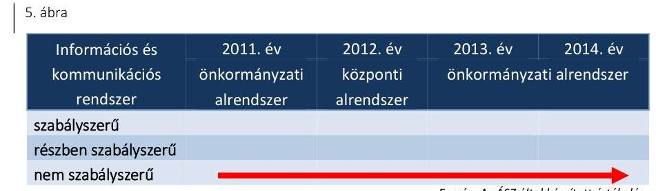

A 2011. évben nem gondoskodtak az Avtv. ${ }^{44}$ 31/A. § (3) bekezdésében meghatározott adatvédelmi és adatbiztonsági szabályzat elkészítéséről. A 2012-2014. években az Info tv. 24. § (3) bekezdésében foglaltak ellenére a Múzeum nem készítette el az adatvédelmi és adatbiztonsági szabályzatot.

A Múzeum nem szabályozta a közérdekű adatok megismerésére irányuló kérelmek intézésének, továbbá a kötelezően közzéteendő adatok nyilvánosságra hozatalának rendjét 2011-ben az Ámr. 20. § (3) bekezdés i) pontjában, 2012-2014. években az Ávr. 13. § (2) bekezdés h) pontjában foglaltak ellenére.

Az elektronikus közzétételi kötelezettség teljesítése 2011-2014. között nem volt szabályszerű, mert 2011-ben az Eitv. ${ }^{45}$ 3. § (2) bekezdése alapján az Eitv. mellékletének III. pontjában, a 2012-2014. években az Info tv. 33. § (3) bekezdése alapján az Info tv. 1. melléklet III. pontjában foglalt gazdálkodásra vonatkozó adatokat a Múzeum a saját, illetve a felügyeletet ellátó szerv által fenntartott honlapon nem tette közzé.

---

# 3.5. számú megállapítás 

A monitoring rendszer kialakítása és működtetése 2011-2012. évben nem volt szabályszerű. A belső ellenőrzési rendszer kialakításának és működtetésének eredményeként 2013. év végén szabályszerű volt, míg a 2014. évben részben szabályszerű volt.
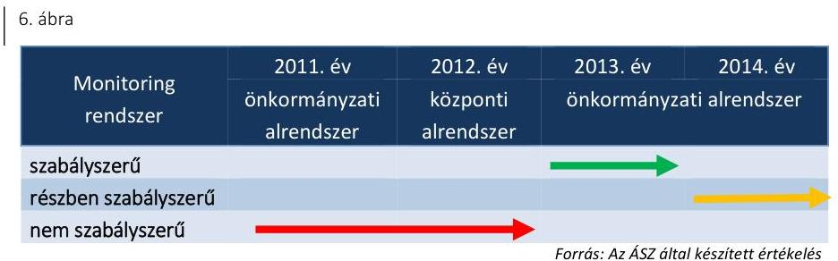

Az Áht. 1, 2 és a Bkr. előírásaival összhangban kialakították a rendelkezésre álló források szabályozott, gazdaságos, hatékony és eredményes felhasználását biztosító, a szervezeti célok elérését szolgáló feladatok, folyamatok megvalósulását mérő követelményeket.

A belső ellenőrzési rendszer kialakítása és működtetése a 2013. október 1-jét megelőző időszakban nem volt szabályszerű, mert a múzeumigazgató nem gondoskodott a belső ellenőrzés szabályszerű kialakításáról és működtetéséről az Áht. ${ }_{1}$ 121/B. § (4) bekezdésében, az Áht. ${ }_{2}$ 70. § (1) bekezdésében és a Bkr. 15. § (1) bekezdésében foglalt előírások ellenére. 2013. október 1-jétől a munkamegosztási megállapodás 11. pontja alapján a Múzeum belső ellenőrzését a Gazdasági szervezet látta el.

A Múzeum az SZMSZ 1-3-ban nem határozta meg 2011. évben a Ber. ${ }^{46} 4$. § (2) bekezdésében foglaltak ellenére a belső ellenőrzést végző személy, egység vagy szervezet, 2012-2014. években a Bkr. 15. § (2) bekezdésében foglaltak ellenére a belső ellenőrzést végző személy vagy szervezet, vagy szervezeti egység jogállását, feladatait.

A 2014. évre vonatkozó belső ellenőrzési tervet a Bkr. 32. § (1) bekezdésének előírása ellenére a belső ellenőrzési vezető a Gazdasági szervezet vezetőjének küldte meg jóváhagyásra a múzeumigazgató helyett. A belső ellenőrzés a Bkr. előírásaival összhangban végrehajtotta a tárgyévi ellenőrzési tervben foglaltakat.

Az irányító szerv 3, illetve a középirányító szerv a 2011-2014. években az Ötv. ${ }^{47}$, a 78/2011. (XII. 30.) KIM utasítás ${ }^{48}$ és a Mötv. ${ }^{49}$ előírásainak megfelelően gondoskodott a Múzeum, mint felügyelt költségvetési szerv belső ellenőrzéséről.

Az ellenőrzési javaslatok végrehajtása érdekében a Múzeum a Ber. és a Bkr. előírásainak megfelelő tartalmú intézkedési tervet készített. A Bkr. szerinti nyilvántartás vezetésével 2013. október 1-jétől a belső ellenőrzési jelentésekben tett megállapításokat, javaslatokat, intézkedési terveket és azok végrehajtását nyomon követték.

---

# 4. A Múzeum pénzügyi gazdálkodása szabályszerű volt-e? 

## Összegző megállapítás

### 4.1. számú megállapítás

## A Múzeum pénzügyi gazdálkodása az ellenőrzött időszakban nem volt szabályszerű.

Az ellenőrzött időszakban a költségvetési tervezés, a bevételi és kiadási előirányzatok megállapítása a 2014. év kivételével nem volt szabályszerű, a bevételi és kiadási előirányzatok módosításának végrehajtása összességében szabályszerű volt, a maradvány megállapítása nem volt szabályszerű.

A költségvetési tervezés ellenőrzési nyomvonala 2011. november 1-jén lépett hatályba. A Múzeum a 2012. január 1-jei és 2013. január 1-jei szervezeti változások ellenére az ellenőrzési nyomvonalat a Bkr. 6. § (3) bekezdésében foglaltak ellenére nem aktualizálta. Az előirányzatok könyvelésével kapcsolatos feladatokat a gazdasági feladatot ellátók munkaköri leírásában rögzítették.

A költségvetési javaslatokat az Áht. ${ }_{1,2}$-ben foglalt előírások szerint állították össze, az előirányzatok összegének megállapítását mellékszámításokkal alátámasztották. A költségvetési javaslatot az irányító szerv ${ }_{1}$ pénzügyi bizottsága nem véleményezte 2011-ben az Ötv. 92. § (13) bekezdés a) pontjában foglaltak ellenére.

A 2012. évi költségvetés szintre hozása a Képtár ${ }^{50}$ és a Vasi Szemle ${ }^{51}$ év közbeni integrációjához kapcsolódóan az Ávr. 16. § (1) bekezdés b)-c) pontjaiban foglaltak ellenére nem történt meg. A 2014. évi költségvetési javaslat elkészítése során az előirányzatok megállapításakor a Múzeumot érintő korábbi szervezeti átalakításból, átszervezésből adódó szerkezeti változások hatásait figyelembe vették.

Az előirányzat módosításokat az irányító szerv ${ }_{1,3}$ rendeletével módosított költségvetési rendeletek tartalmazták. A 2012. évben a középirányító szerv a 258/2011. (XII. 7.) Korm. rendelet 11. § (2) bekezdés f) pontjában foglaltak ellenére a hatáskörébe utalt előirányzat-módosítási és átcsoportosítási jogköröket nem látta el teljes körűen, mert az előirányzat módosítási javaslatokat több alkalommal nem hagyta jóvá. Az ellenőrzött időszakban az előirányzat módosítások főkönyvi könyvelése az Áht. ${ }_{1,2}$ előírásainak megfelelően történt.

A 2012. évben a 1122/2012. (IV. 25.) Korm. határozat 1. pontja alapján 22,5 M Ft került zárolásra, a módosított előirányzatot szabályszerűen átvezették a zárolt bevételi és kiadási előirányzatok közé.

Országgyűlési hatáskörben elrendelt előirányzat módosítás az ellenőrzött időszakban nem történt. Kormányzati hatáskörű előirányzat módosításra 2012-ben került sor 53,2 M Ft összegben, amely a 2012. évi bérkompenzációhoz, prémiumévek programhoz kapcsolódott.

Irányító szervi hatáskörű előirányzat módosítás valamennyi ellenőrzött évben történt összesen 466,5 M Ft nagyságrendben. Az irányító szervi előirányzat változtatások a Múzeumnál foglalkoztatottak bérkompenzációjához, a tagintézmények integrációjához (Szombathelyi Képtár, Vasi Szemle, Iseum Savariense), a múzeumi alaptevékenység szakmai támogatásához, a 2014. évben a Múzeum épületének felújításához kapcsolódtak.

---

Intézményi (saját hatáskörű) előirányzat módosításra a múzeumi saját bevétel növekedése (régészet, bérbeadás), az NKA ${ }^{52}$ és egyéb pályázati támogatások, valamint a közfoglalkoztatottak támogatása miatt került sor, összesen 234,7 M Ft összegben.

A maradvány megállapítása az irányító szerv 1-3 felé teljesített adatszolgáltatás késedelme miatt a 2011-2013. években nem felelt meg a Áhsz. 1 10. § (1) bekezdésében és 2014. évben az Áhsz. 2 32. § (1) bekezdésében előírtaknak. A Múzeum költségvetési maradványáról az adatszolgáltatási kötelezettséget az irányító szerv 1-3 felé az éves beszámoló megküldésével egyidejűleg teljesítette. A 2012. évben az előirányzat-maradvány kimutatást a könyvviteli zárlati dokumentumok között található összesítések és mellékszámítások nem támasztották alá az Áhsz. 1 51. § (2) bekezdésében foglaltak ellenére. A 2012. évi előzetes főkönyvi kivonat, amely a bevételek és a kiadások egyenlegét tartalmazta, a maradvány elszámolást nem támasztotta alá, a zárás utáni végleges főkönyvi kivonatból a maradvány összege nem volt egyértelműen megállapítható. A 2012. évben a kötelezettséggel terhelt maradvány megállapítása és középirányító szerv általi jóváhagyása a 258/2011. (XII. 7.) Korm. rendelet 11. § (2) bekezdés i) pontjának előírása ellenére nem történt meg.
4.2. számú megállapítás

A Múzeum az éves költségvetési beszámolókat nem a jogszabályban meghatározott határidőre készítette el. A beszámolók tartalma a 2012. évi beszámoló kivételével a jogszabályi előírásoknak megfelelt.

Az éves költségvetési beszámolókat a 2011., 2013. és 2014. években a Múzeum az Áht. 1, 2 előírásainak megfelelő tartalommal állította össze. A beszámolókat - a 2012. év kivételével - alátámasztották folyamatosan vezetett részletezett nyilvántartásokkal és könyvviteli zárlat során készített főkönyvi kivonattal. Az egyes költségvetési évek beszámolóinak összehasonlíthatósága mellett, az azonos időszakok elemi költségvetésének és pénzforgalmi jelentéseinek, illetve pénzforgalmi kimutatásainak összehasonlíthatósága biztosított volt.

A Múzeum 2011-2014. éves költségvetési beszámolóit az Áhsz. 1 10. § (1) bekezdésében, valamint az Áhsz. 2 32. § (1) bekezdésében rögzített határidőn túl (2012. március 19-én, 2013. március 13-án, 2014. március 26-án, 2015. május 8-án) nyújtották be az irányító szerv 1-3 részére. A beszámoló elkészítése és az adatok továbbítása a Kincstár felé a munkamegosztási megállapodás 7. pontja alapján a 2013-2014. években a Gazdasági szervezet feladata volt. Az éves költségvetési beszámoló aláírása a múzeumigazgató és a gazdasági vezető által szabályszerűen történt.

A 2012. évi beszámoló középirányító szervi felülvizsgálata és elfogadása a 258/2011. (XII. 7.) Korm. rendelet 11. § (2) bekezdés h) pontjának rendelkezése ellenére nem történt meg.

---

### 4.3. számú megállapítás

A bevételi előirányzatok teljesítése a 2011-2014. években nem felelt meg a jogszabályokban foglaltaknak. A kiadási előirányzatok felhasználása a 2011-2014. években részben felelt meg a jogszabályi előírásoknak.

A Múzeum költségvetési beszámolói szerint bevételi előirányzatot 2011-ben 547,4 M Ft, 2012-ben 325,3 M Ft, 2013-ban 317,6 M Ft, 2014-ben 541,4 M Ft összegben terveztek. A bevétel 2011-ben 782,7 M Ft, 2012-ben 512,1 M Ft, 2013-ban 525,1 M Ft, 2014-ben 560,7 M Ft volt, az eredeti előirányzatot minden évben meghaladta. A módosított bevételi előirányzatok 2011-ben 108,1%-ra, 2012-ben 88,1%-ra, 2013-ban 97,4%-ra, 2014-ben 87,6%-ra teljesültek.

Az ellenőrzött időszakban a Múzeum összesen 235,4 M Ft uniós támogatásban részesült, amelyek múzeumpedagógiai-, kiállítási és oktatási terek kialakítására, valamint energetikai korszerűsítésére irányuló fejlesztésekre nyert KEOP ${ }^{53}$, TÁMOP ${ }^{54}$ és TIOP ${ }^{55}$ pályázati támogatásból származtak.

A bevételek elszámolása nem felelt meg a jogszabályok előírásainak.

A bevételi előirányzatok felhasználása, a vagyonelemek hasznosítása során a következő hiányosságok és szabálytalanságok fordultak elő:

- 2011-ben nem állt rendelkezésre a készpénz befizetésekről kiállított bevételi pénztárbizonylat, ami nem felelt meg a Számv. tv. 166. § (1)-(3) bekezdésében és az Áht. 1 8/C. § (1) bekezdés b) pontjában (számviteli megalapozottság elve) foglaltaknak;
 2012-ben az Áht. 2 38. § (1) bekezdésében foglalt előírások ellenére utalványozásra nem került sor;
- 2013-ban az utalványrendelet az Ávr. 59. § (3) bekezdés g) pontjának rendelkezése ellenére nem tartalmazta az utalványozó aláírását; a Számv. tv. 169. § (2) bekezdésében foglaltak ellenére nem gondoskodtak a bevétel beszedését alátámasztó szerződés megőrzéséről;
- 2012. évben vagyonkezelési szerződéssel a VMIK rendelkezett, az állami tulajdonú helységek bérbeadása 2012. évben a Vtv. 25. § (4) bekezdésében előírt a vagyon hasznosítására felhatalmazó szerződés, továbbá a 2013-2014. években - az Nvtv. 11.§ (7) bekezdésében foglaltak ellenére vagyonkezelői szerződés hiányában szabálytalan volt.
2014-ben az értékesítésből származó bevétel elszámolása nem felelt meg a Számv. tv. 15. § (9) bekezdésében, a Számv. tv. 165. § (1)-(2) bekezdésében, az Áhsz. 2 4. § (1) bekezdésében és az Áhsz. 2 52.§-ában foglalt előírásoknak, mert a gazdasági esemény bizonylatai a fizetési mód vonatkozásában ellentmondásokat tartalmaztak. Az értékesített eszközt a Múzeum számviteli nyilvántartásából - a Számv. tv. 165. § (1) bekezdésében foglaltak ellenére - nem vezették ki. Az értékesített eszközre 2014. december 31. napján értékcsökkenést számoltak el, amely ellentétes volt a Számv. tv. 52. § (7) bekezdésében foglaltakkal. Egy további értékesítés esetén az Áfa tv. ${ }^{56}$ 159. § (1) bekezdésének előírásai ellenére nem bocsátottak ki számlát, továbbá a Számv. tv. 165. § (3) bekezdés a) pontjának rendelkezései nem érvényesültek, mert a készpénzforgalom gazdasági eseménye nem a pénzmozgással egyidejűleg került rögzítésre a főkönyvi nyilvántartásban.

---

A KIADÁSI ELŐIRÁNYZATOK felhasználása az ellenőrzött időszakban részben volt szabályszerű, a következő hiányosságok, szabálytalanságok fordultak elő:
a 100 ezer Ft alatti kifizetéseket, szabálytalanul előzetes írásbeli kötelezettségvállalás nélkül teljesítették, mert az előzetes írásbeli kötelezettségvállalást nem igénylő kifizetések rendjét - 2011-ben az Ámr. 72. § (14) bekezdésében, 2012-2014. évek között az Ávr. 53. § (2) bekezdésében foglalt előírások ellenére - belső szabályzatban a Múzeum, illetve a Gazdasági szervezet nem rögzítette;
—2011-2014. években - az Ámr. 74. § (1) bekezdésében, az Áht. 3 37. § (1) bekezdésében foglaltak ellenére - kötelezettségvállalásra (pénzügyi) ellenjegyzés hiányában került sor;
a szakmai teljesítésigazolás a 2011. évben az Ámr. 76. § (3) bekezdésében, a teljesítésigazolás a 2012-2014. években Ávr. 57. § (3) bekezdésében foglaltak ellenére nem történt meg;
—-érvényesítésre a 2012-2014. években az Ávr. 58. § (3) bekezdésében foglaltak ellenére nem került sor, illetve 2012-ben az Ávr. 58. § (4) bekezdésében foglaltak ellenére az előírt végzettséggel nem rendelkező személy végezte;
— pénzügyi ellenjegyzésre a 2012-2014. években az Ávr. 55. § (2) bekezdés a) illetve c) pontjának rendelkezése ellenére kijelölés hiányában, jogosulatlanul került sor;
—2011. évben az Ámr. 80. § (3) bekezdésében foglaltak ellenére a gazdálkodási jogkör gyakorlók aláírás mintájának hiánya miatt a beazonosíthatóság nem volt biztosított;
— a 2013. január 1. és 2013. szeptember 30. közötti időszakban a gazdálkodási jogkörök gyakorlására jogosult személyekről a gazdasági szervezet nem vezetett nyilvántartást az Ávr. 60. § (3) bekezdésének előírásai ellenére, emiatt a jogkör gyakorlók több esetben nem voltak beazonosíthatók;
—2013-2014-ben erre felhatalmazással nem rendelkező személy, jogosulatlanul utalványozott, ami az Ávr. 59. § (1) bekezdésében foglaltaknak nem felelt meg;
— a 2013. évben a számviteli elszámolás - az Áhsz. 1 9. számú melléklet előírásai ellenére - nem a megfelelő költségnemre történt;
A személyi juttatások kifizetésével összefüggésben a 2011-2014. években a Számv. tv. 169. § (2) bekezdésében foglalt bizonylat megőrzési kötelezettség teljesítéséről nem gondoskodtak.

Az ellenőrzött időszakban a beruházások és a felújítások a Múzeum feladatellátásával összhangban voltak, kiállítóterek, interaktív látványtárak és oktatási terek létrehozásához, valamint gépjármű beszerzéséhez kapcsolódtak.

A 2011-2014. években a Kbt. ${ }_{12}{ }^{57}$ hatálya alá tartozó beszerzéseknél a közbeszerzés tárgyának becsült értékét meghatározták, a lefolytatott eljárásokat dokumentálták, a szerződéseket a nyertes ajánlattevőkkel kötötték meg.

---

### 4.4. számú megállapítás

### 4.5. számú megállapítás

## A régészeti feltárási tevékenység bevételeinek elszámolását a jogszabályban előírt tartalmú szerződések támasztották alá, a régészeti tevékenység teljesített kiadásainak elszámolása az ellenőrzött időszakban a jogszabályi előírásoknak részben felelt meg.

A régészeti tevékenység bevételeit a régészeti felügyelet ellátására vonatkozó megrendelésekkel, valamint régészeti feltárásra vonatkozó szerződésekkel támasztották alá a 2011-2014. években. A szerződések megfeleltek a Kötv., illetve a 393/2012. (XII. 20.) Korm. rendelet ${ }^{58}$ rendelkezéseinek.

A kiadásokhoz kapcsolódó, szabályszerű kötelezettségvállalások rendelkezésre álltak, a közbeszerzési értékhatárt elérő részfeladatokra a közbeszerzési eljárásokat lefolytatták, a nyertessel a pályázat eredményhirdetésében szereplő egységáron kötötték meg a szerződéseket. A kifizetéseket alátámasztó számviteli bizonylatok alakilag és tartalmilag is megfeleltek a számviteli előírásoknak.

A kiadások felhasználásával összefüggésben a gazdálkodási jogkörök gyakorlására vonatkozóan a 4.3 pontban feltárt hiányosságok a régészeti kiadások értékelésénél is megjelentek.

A Múzeum a régészeti célú pénzeszközök elkülönített kezelésére pénzforgalmi számlájához alszámlát vezetett az 5/2010. (VIII. 18.) NEFMI rendelet ${ }^{59}$ által megkövetelt - 2011. szeptember 2-2012. szeptember 14. közötti - időtartamban. A Múzeum az analitikus nyilvántartás vezetési kötelezettségét az 5/2010. (VIII. 18.) NEFMI rendelet 20. § (3) bekezdésében foglalt - 2011. szeptember 2-2012. december 31. között hatályos előírása ellenére - nem teljesítette.

Az ellenőrzött időszakban a pénzügyi egyensúly biztosított volt. A Múzeum zavartalan feladatellátása, a fizetőképesség folyamatos fenntartása érdekében keret előrehozás történt.

A Múzeum pénzügyi egyensúlya az ellenőrzött időszakban biztosított volt. A 2013-2014. években a bevételek beérkezésének és a kiadások teljesítésének ütemezést bemutató, a fizetőképesség fenntartásának nyomon követésére alkalmas likviditási tervet az Áht. 2 78. § (2) bekezdésének előírása, valamint a kötelezettségvállalási szabályzat ${ }_{2,3}{ }^{60}$ 1.3. pontjában foglaltak ellenére a Múzeum nem készítette el.

A Múzeum költségvetési kiadási és bevételi előirányzatai terhére a 2012. évben kormányhatározattal történt zárolás 22,5 M Ft összegben, azonban a likviditási tervet az Ávr. 122. § (3) bekezdésében foglaltak ellenére nem módosították, a havonta történő felülvizsgálatot a Múzeum nem végezte el.

A Múzeum a 2012. évben három alkalommal kezdeményezett a középirányító szervnél keret előrehozást, amelyek indoka - a nettó bérek teljesítése, a Múzeum pályázatai kapcsán felmerülő és a működéshez szükséges számlák és egyéb kötelezettségek kiegyenlítése, valamint a Szombathelyi Képtár tagintézményként való beolvadása kapcsán - a tartozások rendezése volt.

A Múzeumnak 90 napot meghaladó lejárt szállítói tartozása a 2011. és a 2012. évben volt 1-1 M Ft összegben.

A 2013. évben a vevői tartozásokról a fizetési felszólításokat 2013. december 31-i állapot szerint a Múzeum dokumentáltan nem készítette el, a

---

vevők és adósok minősítésére az Áhsz. ${ }_{1} 31 . \S$ (2)-(3) bekezdésében foglaltak ellenére nem került sor.

# 5. A Múzeum vagyongazdálkodása szabályszerű volt-e? 

## Összegző megállapítás

5.1. számú megállapítás

A Múzeum vagyongazdálkodása a 2011-2014. években nem volt szabályszerű.

Az eszközök és források nyilvántartása a 2011. évben megfelelt, a 2012-2014. közötti időszakban nem felelt meg a jogszabályi előírásoknak.

A 2011. évben a közfeladat ellátását szolgáló vagyon az irányító szerv ${ }_{1}$ tulajdonában és a Múzeum ingyenes használatában volt. Az eszközöket a Múzeum az Áhsz. ${ }_{1}$ előírásának megfelelően a befektetett eszközök között mutatta ki számviteli nyilvántartásaiban.

A 2012. január 1-jei önkormányzati konszolidációt követően a tulajdonosi jogokat az állami tulajdon felett az MNV Zrt. ${ }^{61}$ gyakorolta, míg a fenntartói jogok és kötelezettségek a középirányító szervhez kerültek. A Múzeum a feladat ellátását szolgáló vagyont továbbra is használta, azonban erre vonatkozó szerződéssel a Vtv. 25. § (4) bekezdésében foglaltak ellenére nem rendelkezett. A Számv. tv. 23. § (2) bekezdésében, az Nvtv. 11. § (8) bekezdésében, valamint az Áhsz. ${ }_{1} 15 . \S$ (1) bekezdésében foglaltak ellenére a kezelt vagyon kimutatására szabálytalanul a Múzeumnál került sor. A Múzeum 2012. évi beszámolójának mérlegében kimutatott állami vagyon értéke teljes egészében az Áhsz. ${ }_{1} 5 . \S 8$. pontja szerinti jelentős összegű hibát eredményezett és az, az Áhsz. ${ }_{1} 5 . \S 10$. pontjában meghatározott megbízható és valós képet lényegesen befolyásoló hiba volt.

Az Mtv. 2013. január 1-jétől hatályos 45/A. § (2) bekezdés a) pontja szerint a megyei hatókörű városi múzeum lett a vagyonkezelője a tevékenységéhez szükséges állami vagyonnak. A 2013-2014. években a Múzeum az Nvtv. 11. § (1) és (7) bekezdésének és a Vtvr. ${ }^{62}$ 8. § (6) bekezdésének előírása ellenére nem rendelkezett vagyonkezelési szerződéssel. A 2013-2014. években a Múzeum beszámolójában kimutatott vagyon értékét vagyonkezelési szerződés nem támasztotta alá.

A kezelt vagyon köre és nagysága a 2013-2014. években vagyonkezelési szerződés hiányában nem volt megállapítható. Kiegészítő mellékletben 2013-2014. évben a Számv. tv. 23. § (2) bekezdésében előírtak ellenére nem mutatták be mérlegtételek szerinti megbontásban a Múzeum kezelésbe vett állami eszközeit, és a 2014. évben az Áhsz. ${ }_{2}$ 29. § (2) bekezdés c) pontjában előírtak ellenére nem jelezték a vagyonkezelési szerződés hiányát, emiatt nem érvényesült a Számv. tv. 16. § (4) bekezdésében meghatározott „lényegesség elve".

## A NEMZETI VAGYONBA TARTOZÓ KULTURÁLIS

JAVAK NYILVÁNTARTÁSA nem felelt meg a jogszabályok előírásainak.

A Múzeum a 20/2002. (X. 4.) NKÖM rendelet ${ }^{63}$ 19. § (1) bekezdése szerinti nyilvántartások - letéti napló, kölcsönvett tárgyak naplója, bírálati

---

napló, restaurálásra átvett anyagok naplója, mozgatási napló, illetve kölcsönadott tárgyak naplója - vezetéséről nem gondoskodott. Az 1996. március 1-jétől hatályos ügyrendi szabályzat ${ }^{64}$ aktualizálás hiányában nem felelt meg a 20/2002. (X. 4.) NKÖM rendelet előírásainak, mert egy 1963-ban kiadott jogszabályon alapult.

A Múzeum a kulturális javakat hagyományos módon (papír alapon) tartotta nyilván.

# 5.2. számú megállapítás 

## A költségvetési beszámoló mérlegének leltárral való alátámasztottsága, a mérlegtételek értékelése a 2011-2014. közötti időszakban nem felelt meg a jogszabályi előírásoknak.

A Múzeumot a 2011. és 2012. években az átszervezések miatt, a 2013. évben az eredményszemléletű számvitel bevezetéséhez kapcsolódóan teljes körű leltározási kötelezettség terhelte. Ezen kötelezettségének azonban nem teljes körűen tett eleget.

A Múzeum a 2011-2012. évi beszámolóját elkészítette, azonban az intézményi éves költségvetési beszámoló mérlegét a Számv. tv. 69. § (1)-(2) bekezdéseiben, valamint az Áhsz. ${ }_{1}$ 13/A. § (1) bekezdésében és az Áhsz. ${ }_{1}$ 37. § (1)-(3) bekezdésében foglaltak ellenére hiteles leltárral nem támasztotta alá.

A MÉRLEGET ALÁTÁMASZTÓ LELTÁR a 2013-2014. években nem felelt meg az Áhsz. ${ }_{1}$ 37. § (2) bekezdésében, az Áhsz. ${ }_{2}$ 22. § (2) bekezdés a) pontjában és a Számv. tv. 69. § (1) bekezdésében foglaltaknak. Az Áhsz. ${ }_{1}$ 29/A. § (1) bekezdésében foglaltak értelmében, a vagyonkezelésbe vett eszköz bekerülési értékének, a vagyonkezelési szerződésben szereplő érték minősül, mely információ a szerződés hiányában nem állt rendelkezésre, az Áhsz. ${ }_{2}$ 15. § (2) bekezdésében foglaltak alapján a bekerülési érték az átadónál kimutatott bruttó érték, melyről szintén nem volt információ. A hiányosság miatt a leltárak értékadatai dokumentummal nem voltak megfelelően alátámasztva.

2013-ban a
 leltár kiértékelését elvégezték, azonban a megállapított leltárhiányt és leltártöbbletet az Áhsz. ${ }_{1}$ 37. § (2) bekezdésében foglaltak ellenére nem rendezték.

## A mérlegben kimutatott eszközök bekerülési értékének megállapítása, állományba vétele, év végi értékelése nem az előírásoknak megfelelően történt.

A 2011-2013. években a bekerülési érték meghatározása nem volt szabályszerű, mert az Áhsz. ${ }_{1}$ 30. § (1) bekezdésében, a Számv. tv. 52. § (2) bekezdésében foglaltak ellenére az üzembehelyezési okmányt nem készítették el.

A Múzeum a 2011. és 2012. években az Áhsz. ${ }_{1}$ 27. § (1)-(2) bekezdéseiben, valamint 32. § (1) bekezdésében, 33. § (1) bekezdésében, 34. § (1)(2) bekezdésében és a 36. § (1)-(2) bekezdésében foglaltak ellenére a mérlegtételek év végi értékelését dokumentált módon nem végezte el.

A Múzeum az eredményszemléletű számvitelre történő áttérés feladatait a 36/2013. (IX. 13.) NGM rendelet ${ }^{65}$ alapján végrehajtotta, azonban a rendező mérleg - a leltározás előzőekben kifejtett hiányosságai miatt -

---

nem volt szabályszerű. A rendező mérleget a 36/2013. (IX. 13.) NGM rendelet 8. § (2) bekezdés a) pontjában foglalt határidőt követően, 2014. június 10-én készítették el.

# 5.3. számú megállapítás 

A kulturális javak hasznosítása és kölcsönzése az ellenőrzött időszakban nem felelt meg a jogszabályi előírásoknak. A kulturális javak vagyonbiztonságára és állományvédelmére vonatkozó előírásokat nem tartották be maradéktalanul.

A Múzeum a 2011-2014. években a kulturális javak kölcsönadása során nem minden esetben rendelkezett az Mtv. 38. § (6) bekezdésében, illetve a 2013. október 25-től hatályos 38/A. § (1) bekezdésében előírt határozott idejű írásbeli kölcsönzési szerződéssel.

A kulturális javak kölcsönadására kötött szerződések nem tartalmazták az Mtv. - 2013. október 24-ig hatályos 38. § (8) bekezdés a) és c) pontjában és a 2013. október 25-től hatályos 38/A. § (2) bekezdés a) és c) pontjában rögzített kötelező tartalmi elemeket. Így a kulturális javak kölcsönadására kötött szerződések nem tartalmazták a kölcsönvevő által a kölcsönzött kulturális javaknak biztosítandó állományvédelmi követelményeket, beleértve a klimatikus viszonyokat. A szerződésekben nem rögzítették a csomagolás feltételeit, valamint a kölcsönvevő által nyújtandó vagyonbiztonsági feltételeket - beleértve az esetlegesen szükséges muzeológusi, rendőrségi vagy egyéb fegyveres kíséretet is - nem írták elő.

A kulturális javak nem muzeális intézmény számára, továbbá külföldre történő kölcsönadásához az Mtv. 38. § (9) bekezdésében, illetve a 2013. október 25-től hatályos 38/A. § (5) bekezdésében foglaltak ellenére nem rendelkeztek a miniszter hozzájárulásával.

Az Mtv. 38/A. § (3) bekezdésének 2013. október 25-i hatályba lépése után kötött kölcsönadási szerződésekhez a 2013-2014. években nem kapcsolódott dokumentáló szakleírás és képi ábrázolás.

A kulturális javak őrzése és állományvédelme a kölcsönzési szerződések állományvédelemmel kapcsolatos - előzőekben felsorolt - hiányosságai miatt nem volt maradéktalanul biztosított. A Múzeum épületét elektronikus és mechanikus, továbbá élőerős védelemmel látták el.

## 6. A Múzeum intézkedett-e az integritás szemlélet érvényesítése érdekében?

Összegző megállapítás
A Múzeum nem intézkedett az integritás szemlélet érvényesítése érdekében.

Az ellenőrzés részletes megállapításait a jelentéstervezet II. számú - „Az Integritás érvényesítése érdekében kialakított és működtetett kontrollrendszer" című - melléklete tartalmazza.

---

# JAVASLATOK 

Az ÁSZ tv. 33. § (1) bekezdésében foglaltak értelmében az ellenőrzött szervezet vezetője köteles a jelentésben foglalt megállapításokhoz kapcsolódó intézkedési tervet összeállítani és azt a jelentés kézhezvételétől számított 30 napon belül az ÁSZ részére megküldeni. Amennyiben az ellenőrzött szervezet vezetője nem küldi meg határidőben az intézkedési tervet, vagy továbbra sem elfogadható intézkedési tervet küld, az Állami Számvevőszék elnöke az ÁSZ tv. 33. § (3) bekezdése a) és b) pontjaiban foglaltakat érvényesítheti.

## Szombathely Megyei Jogú Város Önkormányzatának polgármesterének

1. Intézkedjen a Múzeum jogszabályi előírásnak megfelelő tartalmú módosított szervezeti és működési szabályzata jóváhagyása érdekében.
(3.1. sz. megállapítás 4. bekezdésének 1. francia bekezdése, 3.2. sz. megállapítás 4. bekezdése, 3.5. sz. megállapítás 3. bekezdése alapján)
2. Intézkedjen a Múzeum gazdálkodási feladatait ellátó költségvetési szerv felé:
a) az előzetes írásbeli kötelezettségvállalást nem igénylő kifizetések rendje belső szabályzatban való rögzítésére;
(3.1. sz. megállapítás 4. bekezdésének 2. francia bekezdése, 4.3. sz. megállapítás 6. bekezdésének 1. francia bekezdése alapján)
b) a számviteli politika, valamint az eszközök és források értékelési szabályzata kiegészítésére a jogszabályi előírás betartása érdekében;
(3.1. sz. megállapítás 4. bekezdésének 3., 4. francia bekezdése alapján)
c) az egyes kockázatokkal kapcsolatban szükséges intézkedések, valamint azok teljesítésének folyamatos nyomon követésének módja meghatározására;
(3.2. sz. megállapítás 2. bekezdés 2. mondata alapján)
d) az integrált kockázatkezelési rendszer működtetésére;
(3.2. sz. megállapítás 3. bekezdés alapján)

---

e) a pénzügyi ellenjegyzésre, érvényesítésre, utalványozásra jogosult személyekről és aláírás mintájukról a belső szabályzatban foglaltak szerinti naprakész nyilvántartás vezetésére;
(3.3. sz. megállapítás 6. bekezdésének 1. mondata alapján)
f) a pénzügyi ellenjegyzésre és érvényesítésre jogosult személyek jogszabályi előírásnak megfelelő kijelölésére;
(3.3. sz. megállapítás 6. bekezdésének 2. mondata alapján)
g) az utalványozásra jogosult személy jogszabályi előírásnak megfelelő meghatározására a munkamegosztási megállapodásban;
(3.3. sz. megállapítás 6. bekezdésének 3. mondata alapján)
h) a Múzeum éves költségvetési beszámolója adatainak a Kincstár által működtetett elektronikus adatszolgáltató rendszerbe történő feltöltésére a jogszabályban előírt határidőben;
(4.1. sz. megállapítás 9. bekezdésének 1. mondata, 4.2. sz. megállapítás 2. bekezdésének 1., 2. mondata alapján)
i) az értékesített eszköz számviteli nyilvántartásból való - a jogszabályi előírásnak megfelelő - kivezetésére, az értékcsökkenés jogszabályi előírások szerinti elszámolása végrehajtására;
(4.3. sz. megállapítás 5. bekezdésének 2., 3. mondata alapján)
j) a készpénzforgalom gazdasági eseményei jogszabályi előírásnak megfelelő rögzítésére a könyvekben;
(4.3. sz. megállapítás 5. bekezdésének 4. mondata alapján)
k) a pénzügyi ellenjegyzés és érvényesítés jogszabályi előírásnak megfelelő gyakorlására;
(4.3. sz. megállapítás 6. bekezdésének 2., 4., 5. francia bekezdése alapján)
l) a jogszabályi előírásoknak megfelelő leltár összeállítására.;
(5.2. sz. megállapítás 3. bekezdés alapján)

---

3. Tegyen intézkedéseket a feltárt szabálytalanságok tekintetében a felelősség tisztázása érdekében, és szükség szerint intézkedjen a felelősség érvényesítéséről.
(3.3. sz. megállapítás 6. bekezdésének 2. mondata, 4.3. sz. megállapítás 6. bekezdésének 3. francia bekezdése, 5.3. sz. megállapítás 14. bekezdései alapján)

# a Szombathelyi Köznevelési Intézmények Gazdasági, Műszaki Ellátó és Szolgáltató Szervezete igazgatójának 

1. Tegyen intézkedéseket a feltárt szabálytalanságok tekintetében a felelősség tisztázása érdekében, és szükség szerint intézkedjen a felelősség érvényesítéséről.
(4.3. sz. megállapítás 6. bekezdésének 2., 4., 5. francia bekezdése, 5.2. sz. megállapítás 3. bekezdés alapján)

## a Savaria Múzeum igazgatójának

1. A belső kontrollrendszer szabályszerű kialakítása és működtetése érdekében intézkedjen:
a) a szervezeti és működési szabályzat jogszabályi előírásnak megfelelő tartalmú módosítására és kezdeményezze annak jóváhagyását;
(3.1. sz. megállapítás 4. bekezdésének 1. francia bekezdése, 3.2. sz. megállapítás 4. bekezdése, 3.5. sz. megállapítás 3. bekezdés alapján)
b) az adatvédelmi és adatbiztonsági szabályzat elkészítésére;
(3.4. sz. megállapítás 1. bekezdésének 2. mondata alapján)
c) a közérdekű adatok megismerésére irányuló kérelmek intézésének rendje és a kötelezően közzéteendő adatok nyilvánosságra hozatalának rendje belső szabályzatban való meghatározására;
(3.4. sz. megállapítás 2. bekezdés alapján)
d) az elektronikus közzétételi kötelezettség jogszabályi előírásnak megfelelő teljesítésére;
(3.4. sz. megállapítás 3. bekezdés alapján)

---

e) az éves ellenőrzési terv jogszabályi előírásnak megfelelő - a belső ellenőrzési vezető általi - megküldésére.
(3.5. sz. megállapítás 4. bekezdésének 1. mondata alapján)
2. A szabályszerű pénzügyi gazdálkodás érdekében intézkedjen:
a) az ellenőrzési nyomvonal aktualizálására;
(4.1. sz. megállapítás 1. bekezdésének 2. mondata alapján)
b) a számlák jogszabályi előírásnak megfelelő jövőbeni kibocsátása érdekében;
(4.3. sz. megállapítás 5. bekezdésének 4. mondata alapján)
c) a szabályszerű vagyonhasznosításra;
(4.3. sz. megállapítás 4. bekezdésének 3. francia bekezdése alapján)
d) a teljesítésigazolás és utalványozás jogszabályi előírásnak megfelelő gyakorlására;
(4.3. sz. megállapítás 6. bekezdésének 3., 8. francia bekezdése alapján)
e) a személyi juttatások kifizetésével összefüggésben a jogszabályi előírásnak megfelelően a bizonylat megőrzési kötelezettség teljesítéséről;
(4.3. sz. megállapítás 7. bekezdés alapján)
f) likviditási terv készítésére.
(4.5. sz. megállapítás 1. bekezdésének 2. mondata alapján)
3. A szabályszerű vagyongazdálkodás érdekében intézkedjen:
a) a jogszabályi előírásnak megfelelő éves költségvetési beszámoló készítésére;
(5.1. sz. megállapítás 4. bekezdésének 2. mondata alapján)

---

b) a letéti napló, kölcsönvett tárgyak naplója, bírálati napló, restaurálásra átvett anyagok naplója, mozgatási napló, valamint kölcsönadott tárgyak naplója vezetésére a jogszabályi előírás betartása érdekében;
(5.1. sz. megállapítás 6. bekezdés alapján)
c) a kulturális javak kölcsönzése esetén a jogszabályban előírtak betartására.
(5.3. sz. megállapítás 1-4. bekezdései alapján)
4. Tegyen intézkedéseket a feltárt szabálytalanságok tekintetében a felelősség tisztázása érdekében, és szükség szerint intézkedjen a felelősség érvényesítéséről.
(5.1. sz. megállapítás 6. bekezdés, 5.3. sz. megállapítás

1-4. bekezdései alapján)

---

.

---

# MELLÉKLETEK 

- I. SZ. MELLÉKLET: ÉRTELMEZŐ SZÓTÁR
állami vagyon kezelője /vagyonkezelő

ÁSZ Integritás Projekt
belső ellenőrzés
belső kontrollrendszer
belső kontrollrendszer területei
fenntartó

Az állami vagyont az MNV Zrt. maga kezeli, vagy szerződés - így különösen bérlet, haszonbérlet, szerződésen alapuló haszonélvezet, vagyonkezelés, megbízás - alapján központi költségvetési szervnek, természetes vagy jogi személynek, illetőleg jogi személyiséggel nem rendelkező gazdasági társaságnak hasznosításra átengedi (Forrás: Vtv. 23. § (1) bekezdése, hatályos 2010. január 01 - 2011. december 31-ig).
Az állami vagyont az MNV Zrt. maga kezeli, vagy szerződés - így különösen bérlet, haszonbérlet, megbízás - alapján központi költségvetési szervnek, természetes vagy jogi személynek, vagy jogi személyiséggel nem rendelkező gazdálkodó szervezetnek hasznosításra átengedi." Az állami vagyonra vonatkozóan az MNV Zrt. kizárólag az Nvtv-ben meghatározott személyekkel köthet vagyonkezelési szerződést.
(Forrás: Vtv. 27. § (1) bekezdése, hatályos 2012. január 1-jétől)
Az Állami Számvevőszék 2009-ben indította el a „Korrupciós kockázatok feltérképezése - Integritás alapú közigazgatási kultúra terjesztése" című, európai uniós forrásból megvalósított kiemelt projektjét (Integritás Projekt). Az Integritás Projekt célja, hogy felmérje a közszféra intézményei korrupciós kockázatoknak való kitettségét, illetőleg az azok mérséklésére hivatott kontrollok szintjét. Az Állami Számvevőszék a projekt révén az integritás szemlélet minél szélesebb körrel történő megismertetését, gyakorlatba ültetését kívánja elérni. Az integritás követelményeinek megfelelő szervezeti működést előnyben részesítő közigazgatási kultúra elterjesztését és a korrupció elleni fellépést az ÁSZ önmagára nézve is stratégiai jelentőségű célként fogalmazta meg. A projekt a felmérésben résztvevő intézmények számára helyzetükről egyfajta „tükörképet" mutat be, ami alapot teremt a jövőbeni pozitív irányú elmozduláshoz. (Forrás: a http://integritas.asz.hu honlapon közzétett, a 2013. évi Integritás felmérés eredményeiről készült összefoglaló tanulmány)
Független, tárgyilagos bizonyosságot adó és tanácsadó tevékenység, amelynek célja, hogy az ellenőrzött szervezet működését fejlessze és eredményességét növelje, az ellenőrzött szervezet céljai elérése érdekében rendszerszemléletű megközelítéssel és módszeresen értékeli, illetve fejleszti az ellenőrzött szervezet irányítási és belső kontrollrendszerének hatékonyságát. (Forrás: Bkr. 2. § b) pontja)
A belső kontrollrendszer a kockázatok kezelése és tárgyilagos bizonyosság megszerzése érdekében kialakított folyamatrendszer, amely azt a célt szolgálja, hogy a működés és gazdálkodás során a tevékenységeket szabályszerűen, gazdaságosan, hatékonyan, eredményesen hajtsák végre, az elszámolási kötelezettségeket teljesítsék, megvédjék az erőforrásokat a veszteségektől, károktól és nem rendeltetésszerű használattól. (Forrás: Áht. 2 69. § (1) bekezdése)
A kontrollkörnyezet, a kockázatkezelési rendszer, a kontrolltevékenységek, az információs és kommunikációs rendszer, valamint a nyomon követési (monitoring) rendszer. (Forrás: Bkr. 3. §-a)
A muzeális intézmény fenntartója az a természetes személy, jogi személy, jogi személyiséggel nem rendelkező gazdasági társaság, amely biztosítja a muzeális intézmény folyamatos és rendeltetésszerű működéséhez szükséges feltételeket (1997. évi CXL. tv. 50. § (1)
 bek.)

---

FEUVE

Információs és kommunikációs rendszer
integritás
irányító szerv/felügyeleti szerv
kockázat
kockázatkezelési rendszer
kontrollkörnyezet
kontrolltevékenységek
kötelezettségvállalás
középirányító szerv

A kontrolltevékenység részeként minden tevékenységre vonatkozóan biztosítani kell a folyamatba épített, előzetes, utólagos és vezetői ellenőrzést (FEUVE), különösen az alábbiak vonatkozásában:
a) a pénzügyi döntések dokumentumainak elkészítése (ideértve a költségvetési tervezés, a kötelezettségvállalások, a szerződések, a kifizetések, a támogatásokkal való elszámolás, a szabálytalanság miatti visszafizettetések dokumentumait is),
b) a pénzügyi kihatású döntések célszerűségi, gazdaságossági, hatékonysági és eredményességi szempontú megalapozottsága,
c) a költségvetési gazdálkodás során az előzetes és utólagos pénzügyi ellenőrzés, a pénzügyi döntések szabályszerűségi szempontból történő jóváhagyása, illetve ellenjegyzése,
d) a gazdasági események elszámolása (a hatályos jogszabályoknak megfelelő könyvvezetés és beszámolás) kontrollja. (Forrás: Bkr. 8. § (2) bekezdése)
A költségvetési szerv vezetője által kialakított és működtetett olyan rendszer, mely biztosítja, hogy a megfelelő információk a megfelelő időben eljutnak az illetékes szervezethez, szervezeti egységhez, illetve személyhez. (Forrás: Bkr. 9. § (1) bekezdés)
Az integritás az elvek, értékek, cselekvések, módszerek, intézkedések konzisztenciáját jelenti, vagyis olyan magatartásmódot, amely meghatározott értékeknek megfelel.
(Forrás: Nemzetgazdasági Minisztérium: Magyarországi államháztartási belső kontroll standardok Útmutató 1.6.1. pontja, 2012. december)
A költségvetési szerv tekintetében az e törvényben meghatározott irányítási hatáskört gyakorló szerv. (Forrás: Áht. 1. § 9. pontja)
A kockázat annak a valószínűségét jelenti, hogy egy vagy több esemény vagy intézkedés nem kívánt módon befolyásolja a rendszer működését, céljainak megvalósulását. (Forrás: Javaslatok a korrupciós kockázatok kezelésére - Kockázatkezelési és ellenőrzési módszertan 35. oldal, ÁSZ)
Olyan irányítási eszközök és módszerek összessége, melynek elemei a szervezeti célok elérését veszélyeztető tényezők (kockázatok) azonosítása, elemzése, csoportosítása, nyomon követése, valamint szükség esetén a kockázati kitettség mérséklése. (Forrás: Bkr. 2. § m) pontja)
A költségvetési szerv vezetője által kialakított olyan elvek, eljárások, belső szabályzatok összessége, amelyben világos a szervezeti struktúra, egyértelműek a felelősségi, hatásköri viszonyok és feladatok, meghatározottak az etikai elvárások a szervezet minden szintjén, átlátható a humánerőforrás-kezelés. (Forrás: Bkr. 6. § (1) bekezdés)
A költségvetési szerv vezetője által a szervezeten belül kialakított (kontroll) tevékenységek, melyek biztosítják a kockázatok kezelését, hozzájárulnak a szervezet céljainak eléréséhez. (Forrás: Bkr. 8. § (1) bekezdés)
A kiadási előirányzatok terhére fizetési kötelezettség vállalásáról szóló - így különösen a foglalkoztatásra irányuló jogviszony létesítésére, szerződés megkötésére, költségvetési támogatás biztosítására irányuló - szabályszerűen megtett jognyilatkozat. (Forrás: Áht. 2. § o) pont)
A költségvetési szerv tekintetében törvény vagy kormányrendelet alapján meghatározott, átruházott irányítási hatásköröket gyakorló szerv. (Forrás: Áht. 2. § 9. (4) bekezdés)

---

megyei hatókörű városi múzeum
megyei Intézményfenntartó Központ
monitoring rendszer
tagintézmény
vagyongazdálkodás
zárolás

A megyei hatókörű városi múzeum feladata a kulturális javak helyi védelmének települési szintet meghaladó, egy megye közigazgatási területére kiterjedő biztosítása. (1997. évi CXL. tv. 45. § (1) bek.)
A megyei intézményfenntartó központ önállóan működő és gazdálkodó központi költségvetési szerv. Székhelye a megyeszékhely városban, a Pest Megyei Intézményfenntartó Központ székhelye Budapesten van. A Kormány az átvett intézmények tekintetében - a közoktatási intézmények kivételével - a megyei intézményfenntartó központot jelöli ki a 2011. évi CLIV. tv. 3. § (1) bek. és a 9. § (1) bek. szerinti feladat ellátására. (258/2011. (XII.7.) Korm. rendelet 2. § (1), (2) bek., 4. §)
A költségvetési szerv vezetője köteles olyan monitoring rendszert működtetni, mely lehetővé teszi a szervezet tevékenységének, a célok megvalósításának nyomon követését. A költségvetési szerv monitoring rendszere az operatív tevékenységek keretében megvalósuló folyamatos és eseti nyomon követésből, valamint az operatív tevékenységektől függetlenül működő belső ellenőrzésből áll. (Forrás: Ámr. 160. §, Bkr. 10. §)
A muzeális intézmény szervezeti egységeként működő, önálló működési engedéllyel rendelkező muzeális intézmény (Forrás: Mtv. 1. számú melléklet y) pontja)
A nemzeti vagyongazdálkodás feladata a nemzeti vagyon rendeltetésének megfelelő, az állam, az önkormányzat mindenkori teherbíró képességéhez igazodó, elsődlegesen a közfeladatok ellátásához és a mindenkori társadalmi szükségletek kielégítéséhez szükséges, egységes elveken alapuló, átlátható, hatékony és költségtakarékos működtetése, értékének megőrzése, állagának védelme, értéknövelő használata, hasznosítása, gyarapítása, továbbá az állam vagy a helyi önkormányzat feladatának ellátása szempontjából feleslegessé váló vagyontárgyak elidegenítése. (Forrás: Nvtv. 7. § (2) bekezdése)
A költségvetési kiadási előirányzatok felhasználásának időlegesen, feltételhez kötötten történő korlátozása, felfüggesztése. (Forrás: Áht. 2. § s) pont)

---

# II. SZ. MELLÉKLET: AZ INTEGRITÁS ÉRVÉNYESÍTÉSE ÉRDEKÉBEN KIALAKÍTOTT ÉS MŰKÖDTETETT KONTROLLRENDSZER 

A közintézmények korrupciós kockázatoknak való kitettségét, valamint az azzal szembeni ellenálló képességüket az ÁSZ az integritás projekt keretében feltérképezi és értékeli. A Múzeum az ÁSZ integritás projektjéhez a 2011-2014. években nem csatlakozott, kérdőívet nem töltött ki. A Múzeum az ellenőrzés során töltött ki integritás tanúsítványt. Az integritás szemlélet érvényesülésének értékelése a Múzeum által szolgáltatott adatok alapján történt.
A Múzeum által kitöltött tanúsítvány alapján három indexérték meghatározására került sor. Ezek a következők:
Az Eredendő Veszélyeztetettségi Tényezők (EVT) index a szervezetek jogállásától és feladatköreitől függő - eredendő - veszélyeztetettség összetevőit teszi mérhetővé. Olyan tényezők határozzák meg, amelyek alakítása az alapítószerv jogalkotási hatáskörébe tartozik, így például a hatósági jogalkalmazás, a (jogi) szabályozás, vagy a különféle (oktatási, egészségügyi, szociális és kulturális) közszolgáltatások nyújtása.

A Korrupciós Veszélyeket Növelő Tényezők (KVNT) index az egyes intézmények napi működésétől függő - az eredendő veszélyeztetettséget növelő - összetevőket jeleníti meg. Leképezi a költségvetési szervek jogi/intézményi környezetének jellemzőit, működésük kiszámíthatóságát, stabilitását, továbbá az intézmények működtetése során jelentkező - alapvetően a mindenkori menedzsment döntéseitől befolyásolt - olyan változó tényezőket, mint a stratégiai célok meghatározása, a szervezeti struktúra és kultúra alakítása, valamint a személyi és költségvetési erőforrásokkal, illetve a közbeszerzésekkel való gazdálkodás.

A Kockázatokat Mérséklő Kontrollok Tényezője (KMKT) index azt tükrözi, hogy az adott szervezetnél léteznek-e intézményesült kontrollok, illetőleg, hogy ezek ténylegesen működnek-e, betöltik-e rendeltetésüket. Ehhez az indexhez olyan faktorok tartoznak, mint a szervezet belső szabályozása, a belső ellenőrzés, valamint az egyéb integritás kontrollok: etikai követelmények meghatározása, összeférhetetlenségi helyzetek kezelése, a bejelentések, panaszok kezelése, rendszeres kockázatelemzés.

Az egyes indexértékek szintjének (alacsony, közepes, magas) meghatározásához viszonyítási pontként a 2014. évi Integritás felmérésben válaszadó Kulturális intézményekre számított indexértékek számtani átlaga szolgált.
A szolgáltatott adatok alapján az ellenőrzött szervezetre kiszámolt indexértékek, illetve a 2014. évi Integritás felmérésben a Kulturális intézményekre kalkulált átlagos mutatószámok összevetése alapján megállapítható, hogy a Múzeum:

- eredendő veszélyeztetettségi (EVT) szintje alacsony, mivel a Múzeum kulturális intézmény, jogalkotási hatáskörrel és egyedi hatósági jogkörrel nem rendelkezik;
- kockázatokat növelő tényező (KVNT) szintje alacsony, amely a külső szabályozási környezet, a szervezeti struktúra és felső vezetést érintő szervezeti változásokból adódott, illetve
- a szervezetnél kiépült, kockázatok kezelésére hivatott kontrollok (KMKT) szintje közepes, amely főként a belső szabályozás és a korrupció ellenes rendszerek és eljárások hiányosságaival függött össze.

Az ellenőrzött szervezet indexértékeit, illetve azok szintjét a 2014. évi Integritás felmérésben adatot szolgáltató Kulturális intézmények átlagos mutatószámainak tükrében az alábbi táblázat szemlélteti.

| Index neve | A 2014. évi Integritás   felmérésben válaszadó   Kulturális Intézmények   átlagos indexértékei | Múzeum által kitöltött   tanúsítvány alapján   számított indexérté-   kek | Múzeum indexértéke-   inek szintje (alacsony,   közepes, magas) |
| :-- | :--: | :--: | :--: |
| Eredendő Veszélyeztetettségi Té-   nyezők (EVT) | $16,01 \%$ | $6,43 \%$ | alacsony |
| Korrupciós Veszélyeket Növelő Té-   nyezők (KVNT) | $21,43 \%$ | $14,53 \%$ | alacsony |
| Kockázatokat Mérséklő Kontrollok   Tényező (KMKT) | $59,54 \%$ | $58,41 \%$ | közepes |

---

A Múzeum intézkedései kiválóak voltak az integritás szemlélet szervezeten belüli érvényesítése érdekében, mivel:

- a Múzeum jogállásához és feladatköreihez kapcsolódó eredendő kockázatok alacsony szintje, valamint az azok kezelésére kiépített kontrollok közepes szintje összességében „kiváló",
- a Múzeum működésében rejlő korrupciós veszélyeztetettséget növelő tényezők alacsony szintje és a kontrollok közepes kiépítettségének együttes értékelése „kiváló" minősítést kapott a tanúsítványban szolgáltatott adatok alapján. A mutatószámok összevetésének eredményét az alábbi ábra szemlélteti.

| Összevetett   mutatószámok | A kockázati tényezők és a kiépült kontrollok szintjének együttes értékelése   (fejlesztendő, megfelelő, kiváló) |
| :-- | :--: |
| EVT - KMKT | Kiváló |
| KVNT - KMKT | Kiváló |

Az összesített értékelés kiváló lett, melyet az ellenőrzés megállapításai nem támasztottak alá.

---

.

---

# FÜGGELÉK: ÉSZREVÉTELEK 

A jelentéstervezetet a Számvevőszék 15 napos észrevételezésre megküldte az ellenőrzött szervezetek vezetőinek az ÁSZ tv. 29. § (1) bekezdése előírásának megfelelően.

A Savaria Megyei Hatókörű Városi Múzeum igazgatója, Szombathely Megyei Jogú Város polgármestere, a Szombathelyi Köznevelési Intézmények Gazdasági, Műszaki Ellátó és Szolgáltató Szervezetének igazgatója, valamint a Szociális és Gyermekvédelmi Főigazgatóság főigazgatója az ellenőrzés megállapításaira írásban észrevételt tett. A Vas Megyei Önkormányzat elnöke az ÁSZ. tv. 29. § (2) bekezdésében foglalt észrevételezési jogával nem élt, a törvényes határidőn belül észrevételt nem tett.
Az elfogadott észrevételek alapján az Állami Számvevőszék módosította a jelentést.
A függelék tartalmazza mellékletek nélkül a Savaria Megyei Hatókörű Városi Múzeum igazgatója, Szombathely Megyei Jogú Város polgármestere, a Szombathelyi Köznevelési Intézmények Gazdasági, Műszaki Ellátó és Szolgáltató Szervezetének igazgatója, valamint a Szociális és Gyermekvédelmi Főigazgatóság főigazgatója észrevételeit, illetve az el nem fogadott észrevételek indoklását.

[^0]
[^0]:    * 29. § (1) Az Állami Számvevőszék az ellenőrzési megállapításait megküldi az ellenőrzött szervezet vezetőjének vagy az általa megbízott személynek, és annak, akinek személyes felelősségét állapította meg.
    (2) Az ellenőrzött szervezet vezetője és a felelősként megjelölt személy az ellenőrzés megállapításaira tizenöt napon belül írásban észrevételt tehet.
    (3) Az Állami Számvevőszék az észrevételre a beérkezésétől számított harminc napon belül írásban válaszol. A figyelembe nem vett észrevételeket köteles a jelentésben feltüntetni, és megindokolni, hogy azokat miért nem fogadta el.

---

# Savaria Megyei Hatókörű Városi Múzeum 9700 Szombathely, Kisfaludy Sándor utca 9. 

Tel. (+36) 94500720,313736
Fax: (+36) 94509682
E-mail: igazgatosag@savariamuseum.hu

Domokos László Úr
Elnök

Állami Számvevőszék

## Budapest

Apáczai Csere János u. 10.
1052

Tisztelt Elnök Úr!

Hivatkozással a V-1063-143/2016. iktatószámú, a „Megyei hatókörű városi múzeumok ellenőrzése - Savaria Megyei Hatókörű Városi Múzeum" című ellenőrzés során készült jelentéstervezet megállapításai alapján tett javaslatokra a Savaria Megyei Hatókörű Városi Múzeum (továbbiakban: Múzeum) az alábbi észrevételeket teszi:

## 1/a:

2017.01.01-től a Múzeum gazdálkodását érintő változások lesznek, a Szombathelyi Egészségügyi és Kulturális GESZ (továbbiakban: GESZ) fogja ellátni a Múzeum gazdálkodási feladatait. A Közgyűlés 355/2016. (X.27.) számú határozata alapján a Múzeumnak az SZMSZ-ét át kell alakítani, így az Önök által jelzett hiányosságok pótlására is sor kerül.

## 1/b:

A Múzeum rendelkezik a Közérdekű adatok nyilvánosságának rendje című szabályzattal, amely feltöltésre került az elektronikus rendszerbe, amely véleményünk szerint tartalmazza a hiányolt részt.

---

1/c:
A Múzeum rendelkezik a Közérdekű adatok nyilvánosságának rendje című szabályzattal, amely feltöltésre került az elektronikus rendszerbe.

1/d:
Az ÁSZ megállapítása jogos. A Múzeum honlapján a tárolási és megjelentetési kapacitás rendkívül korlátozott. A Múzeum 2014. óta pályázati forrásokat keres a honlap bővítésére, amely eddig nem járt
 sikerrel. A közzétételi kötelezettségünknek tudatában vagyunk és egyeztetések folynak a fenntartóval a probléma megoldására.

1/e:
A Múzeum belső ellenőrzését Együttműködési Megállapodás alapján a gazdasági feladatokat ellátó GAMESZ belső ellenőre végzi. Az éves ellenőrzési terv tartalmazza a GAMESZ és a hozzá rendelt, pénzügyi, gazdasági feladatkörébe tartozó, gazdasági szervezettel nem rendelkező költségvetési szervek, így a Múzeum ellenőri feladatait is. A GAMESZ belső ellenőrének vezetője a GAMESZ igazgató, az ő aláírásával ellátott terv kerül jóváhagyásra és elfogadásra a Közgyűlés által.

2/a:
2013.05.01-től a Múzeum rendelkezett önállóan Kockázatkezelési szabályzattal, ellenőrzési nyomvonallal, belső ellenőrzési szabályzattal, amely feltöltésre is került.

2015.10.01-től a GAMESZ Belső Ellenőrzési és Belső Kontrollrendszer szabályzata a Múzeumra is kiterjesztésre került, mely tartalmazza a működési folyamatok nyomvonalát, a folyamatok kockázatát, ellenőrzési pontjait, szabálytalanságok esetén a szükséges intézkedéseket, a nyomon követés módját.

2014.01.01-től a GAMESZ szintén aktualizálta a szabályzatokat, amelyek szintén vonatkoznak a Múzeumra is.

2/b:
A Múzeumnál 2014.06.18-án egy Fiat Ducato gépkocsi került értékesítésre pénztáron keresztül. A gazdasági esemény bizonylatolása az adásvételi szerződésen és a pénztárbevételi bizonylaton kívül a készpénzfizetési számlát nem tartalmazta, sajnálatos módon nem készült számla. A későbbiekben nagyobb figyelmet fordítunk az esetleges értékesítés során a számla elkészítésére.

2/c:
A Múzeum rajta kívülálló okok miatt, a felelős gazdálkodás érdekében többszöri kapcsolatfelvétellel az MNV Zrt-vel, és annak ellenére, hogy mindig időben reagált a megküldött szerződéstervezetekre nem tudta megkötni a vagyonkezelési szerződést.

---

2/d:
A Gazdasági Szervezet SZMSZ-e és annak mellékletét képező Együttműködési Megállapodás a Múzeummal 2015.11.01-től módosításra került, melyben az utalványozásra jogosult személy, a Múzeum igazgatója a törvényi előírásoknak megfelelően kijelölésre került. A módosításokat Szombathely Megyei Jogú Város Oktatási és Szociális Bizottság 424/2015. (X.20.) OSzB. számú, valamint a Gazdasági és Városstratégiai Bizottság 294/2015. (X.19.) GVB számú határozata alapján Polgármester Úr 2015. október 28. napján jóváhagyta.

2/e:
A későbbiekben a Számv. tv. 169. § (2) bekezdésében foglaltak alapján a bizonylatok megőrzési kötelezettség teljesítéséről gondoskodni fogunk.

2/f:
A költségvetési intézményként fenntartója fele köteles havonta mérlegjelentést, pénzforgalmi jelentést készíteni, amely által a fenntartó nyomon tudja követni a Közgyűlés által elfogadott költségvetés havonkénti teljesülését. Természetesen, a fenntartóval egyeztetve a jövőben a Múzeum elkészíti a költségvetés havonkénti felosztását az új gazdasági szervezetével, a GESZ-szel.

3/a:
A jogszabályi előírásnak megfelelő éves költségvetési beszámolóhoz, a pontos értékadatokhoz a vagyonkezelésbe vett eszköz bekerülési értékét tartalmazó vagyonkezelési szerződés kell. A vizsgált időszakban vagyonkezelői szerződés nem állt rendelkezésünkre.

3/b:
Az ÁSZ megállapítása jogos. A Múzeum a fenti nyilvántartásokat egyedi szerződések, egyedi dokumentációk, illetve nem szabványos dokumentumok formájában tartja nyilván.

Tény, hogy a rendelet hatályba lépésekor, és az elkövetkezendő hosszabb időszakban a rendeletben megjelölt naplók nem voltak beszerezhetők. Napjainkra a helyzet megváltozott, a hivatkozott dokumentumok beszerezhetők, igaz ezek beszerzési összköltsége intézményi szinten több százezer forint, amely a 2017. évi költségvetésben elkülönítésre kerül. A Múzeum a hivatkozott dokumentumoknak a rendeletben foglaltak szerinti vezetését 2017-től bevezeti.

Az Ügyrend aktualizálása és jogharmonizációja 2017-ben meg fog történni. A hivatkozott rendelet nem zárja ki a hagyományos nyilvántartást. A megállapítás pusztán a tényt rögzíti, nem elmarasztaló.

---

3/c:
Az ÁSZ megállapítása jogos, és tükrözi a törvényalkotó szándékát a hazai műtárgyvagyon védelme és biztonsága érdekében. A Múzeum eljárása egyes esetekben - szombathelyi intézményekkel (pl. Szombathelyi Törvényszék) rendezett közös programokról (pl. múzeumok éjszakája) van szó, ahol minden esetben muzeológus kollégánk kísérte a műtárgyat, mozgatási dokumentációval (pl. 1 herbáriumi lap, preparált kisállat) - valóban nem felelt meg a jogalkotó előírásainak. A jövőben ennek a szándéknak maradéktalanul meg fog felelni az intézmény.

A rendelkezés ugyanakkor jócskán megnehezíti, esetenként ellehetetleníti a kulturális kormányzat azon szándékát, hogy a múzeumok minél hatékonyabban és gyakrabban vegyenek részt a múzeum falain kívüli, nem muzeális intézmény által szervezett kulturális rendezvényeken és az iskolai oktatásban. A külső megkeresések gyakorta nem veszik figyelembe (vagy nem is tudják) a miniszteri engedélykiadás során megállapított határidőket, így a múzeumnak de jure el kell utasítania az ilyen megkereséseket. Egy gazdag kulturális kínálatot felvonultató városban, amilyen Szombathely is, ez a Múzeum kiszorulását fogja eredményezni a kulturális térből. Nehezíti a helyzetet, hogy a műtárgykölcsönzés esetében a törvény nem tesz különbséget egy egynapos rendezvényre történt kölcsönzés és egy többhónapos kölcsönzés között.

# Általános észrevétel: 

Az ellenőrzés lefolytatásához az idő szűkösre szabottan állt rendelkezésünkre az intézménytől kért nagy mennyiségű dokumentum szkennelésére és azok elektronikus úton történő megküldésére. A kért vizsgálati anyag papíralapon történő eljuttatására nem adtak lehetőséget, az elektronikus rendszer újbóli megnyitása, arra való feltöltése nehézségekbe ütközött.

A vizsgálat során tett megállapítások több esetben nem konkrétan határozzák meg, hogy melyik gazdasági esemény kapcsán találtak hiányosságot, hanem általánosítva, a vizsgált időszak egészére fogalmaz.

PI.: „Az értékesített eszközt a Múzeum......." (4.3. sz. megállapítás 5. bekezdés 1. mondata)
„Egy további értékesítés esetén ......." (4.3.sz. megállapítás 5. bekezdés 3. mondata)
„A személyi juttatások kifizetésével összefüggésben a 2011-2014. években ......" (4.3. sz. megállapítás 7. bekezdés)

A szóbeli megbeszélésen elhangzott, amelyet most írásban is szeretnék megerősíteni, hogy a vizsgált időszak 2013. évében (2013. május 1.) történt a Múzeumnál vezetőváltás. A múzeumigazgató 2013. május 1-től tájékozódott a Múzeum gazdasági és szakmai helyzetéről, egyben minden lehetőségével támogatta a belsőellenőrzést, amely pontosan feltárta a hiányosságokat. Az ellenőrzés után készülhettek el az ugyancsak 2013 októberétől új gazdasági szervezettel együtt azok a dokumentumok, amelyek hiányoztak, vagy hiányosak, elavultak voltak. A folyamat, mint fent már

---

részleteiben említésre került, 2014-ben és 2015-ben zárultak le, illetve folyamatban állnak ma is. Ön előtt is ismerten a szabályzatok elkészítése a jogszabályok és a személyi változások lekövetésével, ellenőriztetése, jóváhagyatása időigényes, tehát nem történhetett meg azonnal. A vizsgálatban feltárt szabálytalanságok többsége a vizsgálati időszak 2011., 2012. évét érinti, amellyel kapcsolatban nem kívánok észrevételt tenni, valamint a felelősség megállapításában sem érzem magam feljogosítva.

A Savaria Megyei Hatókörű Városi Múzeumnál a 2011-2013. években gazdasági vezetői feladatokat ellátó dolgozó 2014. évtől nem munkavállalója a Múzeumnak.
2017. január 01-től újabb változás következik be, a Múzeum gazdasági feladatellátását nem a Szombathelyi Köznevelési GAMESZ fogja ellátni.

Kérem, hogy a fenti észrevételeket figyelembe venni szíveskedjenek a végleges jelentés elkészítésekor.

Szombathely, 2016. december 23.
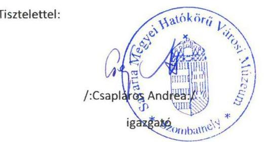

---

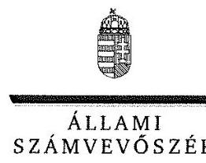

ELNÖK

# Csapláros Andrea úrhölgy 

igazgató
Savaria Megyei Hatókörű Városi Múzeum

## Szombathely

## Tisztelt Igazgató Úrhölgy!

A ,,Megyei hatókörű városi múzeumok ellenőrzése - Savaria Megyei Hatókörű Városi Múzeum, Szombathely" címmel készített számvevőszéki jelentéstervezetre tett észrevételét köszönettel megkaptam.
Az Állami Számvevőszék észrevételre vonatkozó álláspontjáról a felügyeleti vezető által készített részletes tájékoztatást csatoltan megküldöm.
Tájékoztatom Igazgató úrhölgyet, hogy a számvevőszéki jelentésben - az Állami Számvevőszékről szóló 2011. évi LXVI. törvény 29. § (3) bekezdése alapján - a figyelembe nem vett észrevételeket szerepeltetjük az elutasítás indokának feltüntetésével.

Budapest, 2017. C. 4 hó 4 nap
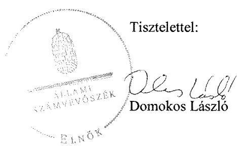

Melléklet: Tájékoztatás az el nem fogadott észrevételekről

---

# Tájékoztatás az el nem fogadott észrevételekről 

A ,,Megyei hatókörű városi múzeumok ellenőrzése - Savaria Megyei Hatókörű Városi Múzeum, Szombathely" címû jelentéstervezetre a 2016. december 23-án kelt levelével megküldött észrevételeit áttekintettük, annak kezeléséről az alábbi tájékoztatást adom.

1. a) A jelentéstervezet 19. oldal 3.1. számú megállapítás 4. bekezdés 1. francia bekezdésének megállapítására, jelentéstervezet 21. oldal 3.2. számú megállapítás 4. bekezdésének megállapítására és a jelentéstervezet 24. oldal 3.5. számú megállapítás 3. bekezdésének megállapításaira tett észrevétele kapcsán

Köszönettel vettem tájékoztatását, hogy a Szombathelyi Egészségügyi és Kulturális GESZ (továbbiakban: GESZ) fogja ellátni a Savaria Megyei Hatókörű Városi Múzeum (továbbiakban: Múzeum) gazdálkodási feladatait, így a Múzeum szervezeti és működési szabályzata aktualizálásra kerül, amelynek keretében a számvevőszéki jelentéstervezetben jelzett hiányosságok is pótlásra kerülnek. Észrevétele a jelentéstervezet megállapításait nem cáfolta, ezért azokat nem módosítja.
1.b)-1.c) A jelentéstervezet 23. oldal 3.4. számú megállapítás 1. bekezdésének 2. megállapítására és a jelentéstervezet 3.4. számú megállapítás 2. bekezdésének megállapítására tett észrevételei kapcsán

Észrevételében arról tájékoztatott, hogy a Múzeum rendelkezik a Közérdekű adatok nyilvánosságának rendje címû szabályzattal, amelyet a számvevőszéki ellenőrzés rendelkezésére bocsátották, továbbá véleménye szerint a hivatkozott szabályzat tartalmazza az adatvédelmi és adatbiztonsági szabályozást, amelyet a számvevőszéki ellenőrzés hiányosságként megállapított.

Észrevételét nem fogadtuk el, mert a 2016. június 16-án aláirt nyilatkozata 25. pontjában foglaltak szerint a Múzeum nem rendelkezett 2011-2014. években a közérdekű adatok közzétételének (kötelezően közzéteendő adatok nyilvánosságra hozatalának rendje) szabályozásával. A 2016. augusztus 9-én Igazgató úrhölgy által aláirt Teljességi és hitelességi nyilatkozat dokumentum listája sem tartalmazza a hivatkozott szabályozás átadását, továbbá a szabályzatok jegyzékében sem szerepel. Az adatszolgáltatásra kialakított elektronikus felületre a hivatkozott szabályzat nem került felcsatolásra. Levele mellékleteként megküldött dokumentumot nem áll módunkban elfogadni, tekintettel arra, hogy az adatszolgáltatás lezárult, továbbá a beküldött dokumentumok hitelességéről nem áll módunkban meggyőződni.

Észrevételei fenti válaszaim alapján a jelentéstervezet 23. oldal 3.4. számú megállapítás 1. bekezdésének 2. megállapítását - „A 2012-2014. években az Info tv. 24. § (3) bekezdésében foglaltak ellenére a Múzeum nem készítette el az adatvédelmi és adatbiztonsági szabályzatot." -,

---

valamint a jelentéstervezet 3.4. számú megállapítás 2. bekezdésének megállapítását - „A Múzeum nem szabályozta a közérdekű adatok megismerésére irányuló kérelmek intézésének, továbbá a kötelezően közzéteendő adatok nyilvánosságra hozatalának rendjét 2011-ben az Ámr. 20. § (3) bekezdés i) pontjában, 2012-2014. években az Ávr. 13. § (2) bekezdés h) pontjában foglaltak ellenére." - nem módosítja.

# 1.d) A jelentéstervezet 23. oldal 3.4. számú megállapítás 3. bekezdésének megállapítására tett észrevétele kapcsán 

Észrevételében jelezte, hogy egyetért a számvevőszéki ellenőrzés vonatkozó megállapításával. Észrevételében továbbá arról tájékoztatott, hogy a Múzeum honlapján a tárolási és megjelentetési kapacitás rendkívül korlátozott és egyeztetések folynak a fenntartóval a probléma megoldására. Észrevétele a jelentéstervezet 23. oldal 3.4. számú megállapítás 3. bekezdésének megállapítását - „Az elektronikus közzétételi kötelezettség teljesítése 2011-2014. között nem volt szabályszerű, mert 2011-ben az Eitv. 3. § (2) bekezdése alapján az Eitv. mellékletének III. pontjában, a 2012-2014. években az Info tv. 33. § (3) bekezdése alapján az Info tv. 1. melléklet III. pontjában foglalt gazdálkodásra vonatkozó adatokat a Múzeum a saját, illetve a felügyeletet ellátó szerv által fenntartott honlapon nem tette közzé." - nem vitatta, ezért azt nem módosítja.

## 1.e) A jelentéstervezet 24. oldal 3.5. számú megállapítás 4. bekezdésének 1. megállapítására tett észrevétele kapcsán

Észrevételében foglaltak alapján a Múzeum belső ellenőrzését Együttműködési Megállapodás alapján a gazdasági feladatokat ellátó Szombathelyi Köznevelési Intézmények Gazdasági, Műszaki Ellátó és Szolgáltató Szervezete (továbbiakban: GAMESZ) belső ellenőre végzi. Az éves ellenőrzési terv tartalmazza a GAMESZ és a hozzá rendelt, pénzügyi, gazdasági feladatkörébe tartozó, gazdasági szervezettel nem rendelkező költségvetési szervek, így a Múzeum ellenőri feladatait is. A GAMESZ belső ellenőrének vezetője a GAMESZ igazgató, az ő aláírásával ellátott terv kerül jóváhagyásra és elfogadásra Szombathely Megyei Jogú Város Önkormányzatának Közgyűlése (továbbiakban: Közgyűlés) által.

Észrevételét nem fogadtuk el, mert a költségvetési szervek belső kontrollrendszeréről és belső ellenőrzésről
 szóló 370/2011. (XII. 31.) Korm. rendelet 32. § (1) bekezdésében előírtak alapján a belső ellenőrzési vezető az éves ellenőrzési tervet jóváhagyásra a költségvetési szerv vezetőjének küldi meg. Észrevétele a jelentéstervezet 24. oldal 3.5. számú megállapítás 4. bekezdésének 1. megállapítását - „A 2014. évre vonatkozó belső ellenőrzési tervet a Bkr. 32. § (1) bekezdésének előírása ellenére a belső ellenőrzési vezető a Gazdasági szervezet vezetőjének küldte meg jóváhagyásra a múzeumigazgató helyett." - nem módosítja. Tájékoztatom, hogy a 2014. évi ellenőrzési tervet a GAMESZ igazgatója, mint jóváhagyó írta alá és ezt követően került sor a hivatkozott terv Közgyűlés általi ismételt jóváhagyására.

---

# 2.a) A jelentéstervezet 25. oldal 4.1. számú megállapítás 1. bekezdésének 2. megállapítására tett észrevétele kapcsán 

Észrevételében arról tájékoztatott, hogy 2013. május 1-jétől a Múzeum rendelkezett kockázatkezelési szabályzattal, ellenőrzési nyomvonallal, belső ellenőrzési szabályzattal, amelyeket a számvevőszéki ellenőrzés rendelkezésére bocsátottak, valamint 2014. január 1-jétől a GAMESZ aktualizálta a szabályzatait, amelyek vonatkoznak a Múzeumra is.

Észrevételét nem fogadtuk el, mert a 2013. október 1-jén a GAMESZ-szel aláirt együttműködési megállapodás 11. pontjában foglaltak alapján „A Savaria Múzeumra vonatkozó ellenőrzési nyomvonal kialakítása, valamint e rendszerek működtetése a Savaria Múzeum igazgatójának a feladata.". A Múzeum ellenőrzési nyomvonala, kockázatkezelési szabályzata és belső ellenőrzési szabályzata ismételt felülvizsgálatát követően a jelentéstervezet 25. oldal 4.1. számú megállapítás 1. bekezdésének 1. megállapítása - „A Múzeum a 2012. január 1-jei és 2013. január 1-jei szervezeti változások ellenére az ellenőrzési nyomvonalat a Bkr. 6. § (3) bekezdésében foglaltak ellenére nem aktualizálta." - megalapozott, ezért észrevétele a megállapítást nem módosítja.

Észrevételében jelezte továbbá, hogy 2015. október 1-jétől a GAMESZ Belső Ellenőrzési és Belső Kontrollrendszer szabályzata a Múzeumra is kiterjesztésre került, amely tartalmazza a működési folyamatok nyomvonalát, a folyamatok kockázatát, ellenőrzési pontjait, szabálytalanságok esetén a szükséges intézkedéseket, a nyomon követés módját. Észrevétele az ellenőrzési időszakon túlmutat, ezért a jelentéstervezet megállapítását nem módosítja.

## 2.b) A jelentéstervezet 27. oldal 4.3. számú megállapítás 5. bekezdésének 4. megállapítására tett észrevétele kapcsán

Észrevételében foglaltak alapján egy gazdasági esemény bizonylatolása az adásvételi szerződésen és a pénztárbevételi bizonylaton kívül a készpénzfizetési számlát nem tartalmazta, sajnálatos módon nem készült számla. A későbbiekben nagyobb figyelmet fordítanak az esetleges értékesítés során a számla elkészítésére. Észrevétele a jelentéstervezet 27. oldal 4.3. számú megállapítás 5. bekezdésének 4. megállapítását - „Egy további értékesítés esetén az Áfa tv. 159. § (1) bekezdésének előírásai ellenére nem bocsátottak ki számlát, továbbá a Számv. tv. 165. § (3) bekezdés a) pontjának rendelkezései nem érvényesültek, mert a készpénzforgalom gazdasági eseménye nem a pénzmozgással egyidejűleg került rögzítésre a főkönyvi nyilvántartásban." - nem cáfolta, ezért azt nem módosítja.

## 2.c) A jelentéstervezet 27. oldal 4.3. számú megállapítás 4. bekezdés 3. francia bekezdésének megállapítására tett észrevétele kapcsán

Köszönettel vettem tájékoztatását, hogy Múzeum a felelős gazdálkodás érdekében több alkalommal egyeztette a szerződéstervezeteket a Magyar Nemzeti Vagyonkezelő Zrt.-vel, azonban vagyonkezelési szerződés megkötésére nem került sor. Észrevétele a jelentéstervezet 27. oldal

---

4.3. számú megállapítás 4. bekezdés 3. francia bekezdésének megállapítását - „2012. évben vagyonkezelési szerződéssel a VMIK rendelkezett, az állami tulajdonú helységek bérbeadása 2012. évben a Vtv. 25. § (4) bekezdésében előírt a vagyon hasznosítására felhatalmazó szerződés, továbbá a 2013-2014. években - az Nvtv. 11.§ (7) bekezdésében foglaltak ellenére vagyonkezelői szerződés hiányában szabálytalan volt." - nem vitatta, ezért azt nem módosítja.
2.d) A jelentéstervezet 27. oldal 4.3. számú megállapítás 6. bekezdés 3., 8. francia bekezdésének megállapításaira tett észrevétele kapcsán

Köszönettel vettem tájékoztatását, hogy a GAMESZ szervezeti és működési szabályzata és annak mellékletét képező Együttműködési Megállapodás a Múzeummal 2015. november 1-jétől módosításra került, amelyben az utalványozásra jogosult személy, a Múzeum igazgatója a törvényi előírásoknak megfelelően kijelölésre került. Észrevétele az ellenőrzési időszakon túlmutat ezért a jelentéstervezet 27. oldal 4.3. számú megállapítás 6. bekezdés 3. francia bekezdésének megállapítását -, a szakmai teljesítményigazolás a 2011. évben az Ámr. 76. § (3) bekezdésében, a teljesítményigazolás a 2012-2014. években Ávr. 57. § (3) bekezdésében foglaltak ellenére nem történt meg;" -, valamint a 6. bekezdés 8. francia bekezdésének megállapítását - „2013-2014-ben erre felhatalmazással nem rendelkező személy, jogosulatlanul utalványozott, ami az Ávr. 59. § (1) bekezdésében foglaltaknak nem felelt meg;" - nem módosítja.

# 2.e) A jelentéstervezet 27. oldal 4.3. számú megállapítás 7. bekezdésének megállapítására tett észrevétele kapcsán 

Köszönettel vettem tájékoztatását, hogy a számvitelről szóló 2000. évi C. törvény 169. § (2) bekezdésében foglaltak alapján a bizonylatok megőrzési kötelezettsége teljesítéséről gondoskodni fognak. Észrevétele a jelentéstervezet 27. oldal 4.3. számú megállapítás 7. bekezdésének megállapítását - „A személyi juttatások kifizetésével összefüggésben a 2011-2014. években a Számv. tv. 169. § (2) bekezdésében foglalt bizonylat megőrzési kötelezettség teljesítéséről nem gondoskodtak." - nem vitatta, ezért azt nem módosítja.

## 2.f) A jelentéstervezet 29. oldal 4.5. számú megállapítás 1. bekezdésének 2. megállapítására tett észrevétele kapcsán

Köszönettel vettem tájékoztatását, hogy a Múzeum a fenntartó felé köteles havonta mérlegjelentést, pénzforgalmi jelentést készíteni, továbbá a Múzeum a fenntartóval egyeztetve a jövőben elkészíti a költségvetés havonkénti felosztását az új gazdasági szervezetével, a GESZ-szel. Észrevétele a jelentéstervezet 29. oldal 4.5. számú megállapítás 1. bekezdésének 2. megállapítását „A 2013-2014. években a bevételek beérkezésének és a kiadások teljesítésének ütemezést bemutató, a fizetőképesség fenntartásának nyomon követésére alkalmas likviditási tervet az Áht. 278. § (2) bekezdésének előírása, valamint a kötelezettségvállalási szabályzat $_{23}$ 1.3. pontjában foglaltak ellenére a Múzeum nem készítette el." - nem cáfolta, ezért azt nem módosítja.

---

# 3.a) A jelentéstervezet 30. oldal 5.1. számú megállapítás 4. bekezdésének 2. megállapítására tett észrevétele kapcsán 

Észrevételében arról tájékoztatott, hogy a jogszabályi előírásnak megfelelő éves költségvetési beszámolóhoz, a pontos értékadatokhoz a vagyonkezelésbe vett eszköz bekerülési értékét tartalmazó vagyonkezelési szerződés kell és az ellenőrzött időszakban vagyonkezelői szerződés nem állt rendelkezésükre. Észrevétele a jelentéstervezet 30. oldal 5.1. számú megállapítás 4. bekezdésének 2. megállapítását - „Kiegészítő mellékletben 2013-2014. évben a Számv. tv. 23. § (2) bekezdésében előírtak ellenére nem mutatták be mérlegtételek szerinti megbontásban a Múzeum kezelésbe vett állami eszközeit, és a 2014. évben az Áhsz. 229. § (2) bekezdés c) pontjában előírtak ellenére nem jelezték a vagyonkezelési szerződés hiányát, emiatt nem érvényesült a Számv. tv. 16. § (4) bekezdésében meghatározott „lényegesség elve"." - nem cáfolta, ezért azt nem módosítja.

## 3.b) A jelentéstervezet 30. oldal 5.1. számú megállapítás 6. bekezdésének megállapításaira tett észrevétele kapcsán

Köszönettel vettem tájékoztatását, hogy a számvevőszéki megállapítással egyetért, mert a Múzeum a hiányolt nyilvántartásokat egyedi szerződések, egyedi dokumentációk, illetve nem szabványos dokumentumok formájában tartja nyilván, továbbá a Múzeum a hivatkozott dokumentumoknak a rendeletben foglaltak szerinti vezetését 2017-tól bevezeti. Észrevétele megerősítette a jelentéstervezet 30. oldal 5.1. számú megállapítás 6. bekezdésének megállapításait - „A Múzeum a 20/2002. (X. 4.) NKÖM rendelet 19. § (1) bekezdése szerinti nyilvántartások - letéti napló, kölcsönvett tárgyak naplója, birálati napló, restaurálásra átvett anyagok naplója, mozgatási napló, illetve kölcsönadott tárgyak naplója - vezetéséről nem gondoskodott. Az 1996. március 1-jétől hatályos ügyrendi szabályzat aktualizálás hiányában nem felelt meg a 20/2002. (X. 4.) NKÖM rendelet előírásainak, mert egy 1963-ban kiadott jogszabályon alapult." - ezért azokat nem módosítja.

Köszönettel vettem tájékoztatását, hogy az Ügyrend aktualizálása és jogharmonizációja 2017-ben meg fog történni, továbbá a hivatkozott rendelet nem zárja ki a hagyományos nyilvántartást.

## 3.c) A jelentéstervezet 32. oldal 5.3. számú megállapítás 1-4. bekezdéseinek megállapításaira tett észrevétele kapcsán

Köszönettel vettem tájékoztatását, hogy a számvevőszéki megállapítással egyetért, mert az tükrözi a törvényalkotó szándékát a hazai műtárgyvagyon védelme és biztonsága érdekében. Jelezte, hogy a jövőben ennek a szándéknak maradéktalanul meg fog felelni a Múzeum. Észrevétele a jelentéstervezet 32. oldal 5.3. számú megállapítás 1-4. bekezdéseinek megállapításait nem cáfolta, ezért azokat nem módosítja.

---

# A jelentéstervezetre tett általános észrevételei kapcsán 

Észrevételében arról tájékoztatott, hogy az ellenőrzés lefolytatásához az idő szűkösre szabottan állt rendelkezésükre a Múzeumtól kért nagy mennyiségű dokumentum szkennelésére és azok elektronikus úton történő megküldésére. A kért vizsgálati anyag papír alapon történő eljuttatására nem volt lehetőségük, az elektronikus rendszer újbóli megnyitása, arra való feltöltése nehézségekbe ütközött. Észrevételét nem fogadtuk el, mert az adatszolgáltatásra az Állami Számvevőszékről szóló 2011. évi LXVI. törvény 28. § (2) bekezdés alapján öt munkanapot biztosítottunk.

Észrevételében jelezte példákkal feltüntetve, hogy a jelentéstervezet megállapításai nem konkrétan határozzák meg, hogy melyik gazdasági esemény kapcsán találtunk hiányosságot, hanem általánosítva, a vizsgált időszak egészére vonatkoznak. Észrevételét nem fogadtuk el, mert a számvevőszéki ellenőrzést a „Megyei hatókörű városi múzeumok ellenőrzése" című ellenőrzési program alapján végeztük és az ellenőrzött témaköröket az ellenőrzési kérdésekre adott válaszok, valamint az ellenőrzött szervezetek által rendelkezésre bocsátott dokumentumok alapján értékeltük, amelyet a jelentéstervezetben „Az ellenőrzés módszerei" című fejezet részletesen tartalmaz. Észrevétele a megállapításokat nem cáfolta, ezért azokat nem módosítja.

Köszönettel vettem tájékoztatását, hogy 2013. május 1-jével a Múzeumnál vezetőváltás történt és a múzeumigazgató ezen időponttól kezdődően tájékozódott a Múzeum gazdasági és szakmai helyzetéről. Jelezte, hogy a vizsgálatban feltárt szabálytalanságok többsége a vizsgálati időszak 2011., 2012. évét érinti, amellyel kapcsolatban nem kíván észrevételt tenni, valamint a felelősség megállapításában sem érzi magát feljogosítva, továbbá a 2011-2013. években gazdasági vezetői feladatokat ellátó dolgozó 2014. évtől nem munkavállalója a Múzeumnak. Ez utóbbi észrevételei kapcsán tájékoztatom Igazgató urat, hogy az Önnek címzett 4. számú javaslat nem a 2011-2012. években feltárt hiányosságok tekintetében, hanem a javaslatot megalapozó hivatkozott megállapítások és az azokkal érintett, a Múzeum által foglalkoztatott személyek kapcsán fogalmaz meg intézkedést.

További tájékoztatását, hogy 2017. január 1-jétől a Múzeum gazdasági feladatellátását nem a GAMESZ fogja ellátni, köszönettel vettem.

Budapest, 2017.
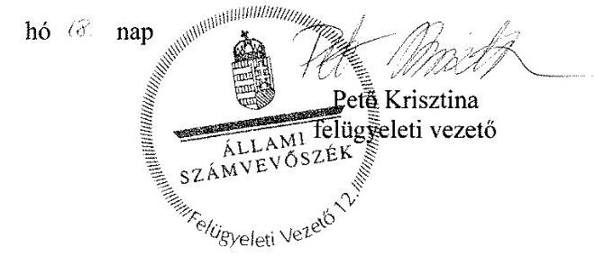

---

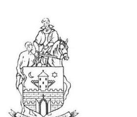

# Szombathely Megyei Jogú Város Polgármestere 

Úgyiratszám.:61136-2/2016
Úi.:dr. Bencsics Enikő

## Domokos László

## Elnök

Állami Számvevőszék
1052 Budapest
Apáczai Csere János u. 10

## Tisztelt Elnök Úr!

A „Megyei hatókörű városi múzeumok ellenőrzése - Savaria Megyei Hatókörű Városi Múzeum, Szombathely" című ellenőrzésről készült számvevőszéki jelentéstervezetüket megkaptam, köszönöm.
Szombathely Megyei Jogú Város Önkormányzata vonatkozásában megtett javaslataikra az alábbiakat válaszolom.

1. 

Szombathely Megyei Jogú Város Közgyűlése a 2016. október 27-i ülésén, a 355/2016. (X.27.) kgy. sz. határozatában döntött arról, hogy a Savaria Megyei Hatókörű Városi Múzeum gazdasági feladatait a 2017. évtől a Szombathelyi Egészségügyi és Kulturális GESZ lássa el. Ennek megfelelően a Közgyűlés felkérte a Savaria Megyei Hatókörű Városi Múzeum igazgatóját, hogy a Szervezeti és Működési Szabályzatukat aktualizálják, s küldjék meg önkormányzatunknak jóváhagyásra 2017. február 28. napjáig.

---

2. 

Magyarország helyi önkormányzatairól szóló 2011. évi CLXXXIX. törvény rendelkezése szerint a pénzügyi bizottság a helyi önkormányzatoknál és intézményeinél véleményezi az éves költségvetési
 javaslatot és a végrehajtásról szóló féléves, éves beszámoló tervezeteit. Önkormányzatunk az intézmények költségvetési javaslatát is figyelembe véve 2013. évre a 64/2013. (II.26.) PGJB határozat, 2014. évre a 46/2014. (II.25.) PGJB határozat alapján eleget tett a jogszabályi előírásoknak.
3.

A szükség szerinti intézkedésekről rendelkezem.

Szombathely, 2016. december „21"
Tisztelettel:
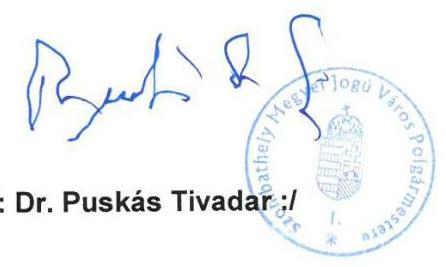

---

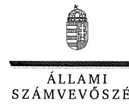

ELNÖK

Ikt.szám: V-1063-153/2016.

# Dr. Puskás Tivadar úr 

polgármester
Szombathely Megyei Jogú Város Önkormányzata

## Szombathely

## Tisztelt Polgármester Úr!

A „Megyei hatókörű városi múzeumok ellenőrzése - Savaria Megyei Hatókörű Városi Múzeum, Szombathely" címmel készített számvevőszéki jelentéstervezetre tett észrevételét köszönettel megkaptam.
Az Állami Számvevőszék észrevételre vonatkozó álláspontjáról a felügyeleti vezető által készített részletes tájékoztatást csatoltan megküldöm.

Budapest, 2017. 01 hó $M$ nap
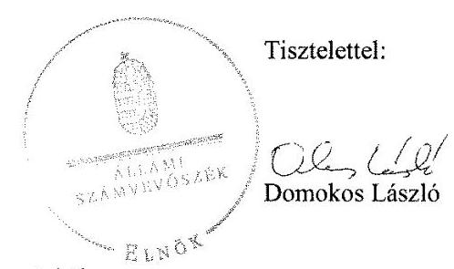

Melléklet: Tájékoztatás az elfogadott észrevételről

---

# Tájékoztatás az elfogadott észrevételről 

A „Megyei hatókörű városi múzeumok ellenőrzése - Savaria Megyei Hatókörű Városi Múzeum, Szombathely"című jelentéstervezetre a 61136-2/2016. iktatószámú levelével megküldött észrevételeit áttekintettük, annak kezeléséről az alábbi tájékoztatást adom.

## 1. Általános észrevétele kapcsán

Köszönettel vettem tájékoztatását, hogy Szombathely Megyei Jogú Város Közgyűlése (továbbiakban: Közgyűlés) a 2016. október 27-i ülésén a 355/2016. (X. 27.) számú határozatában döntött arról, hogy a Savaria Megyei Hatókörű Városi Múzeum (továbbiakban: Múzeum) gazdasági feladatait a 2017. évtől a Szombathelyi Egészségügyi és Kulturális GESZ lássa el. Ennek megfelelően a Közgyűlés felkérte a Múzeum igazgatóját, hogy a Múzeum szervezeti és működési szabályzatát aktualizálja és küldje meg Szombathely Megyei Jogú Város Önkormányzatának (továbbiakban: Önkormányzat) jóváhagyásra 2017. február 28-ig.

## 2. A jelentéstervezet 25. oldal 4.1. számú megállapítás 2. bekezdésének 2. megállapítására tett észrevétele kapcsán

Észrevételében arról tájékoztatott, hogy az Önkormányzat az intézmények költségvetési javaslatát is figyelembe véve 2013. évre a 64/2013. (II. 26.) PGJB határozat, 2014. évre a 46/2014. (II. 25.) PGJB határozat alapján eleget tett a jogszabályi előírásoknak. Észrevételét a jelentéstervezet 25. oldal 4.1. számú megállapítás 2. bekezdésének 2. megállapítására - „A költségvetési javaslatot az irányító szerv 1.3, pénzügyi bizottsága nem véleményezte 2011-ben az Ötv. 92. § (13) bekezdés a) pontjában és 2013-2014-ben a Mötv. 120. § (1) bekezdés a) pontjában foglaltak ellenére." - a 2013-2014. évekre vonatkozóan elfogadtuk és azt a számvevőszéki jelentés összeállításánál figyelembe vesszük, Szombathely Megyei Jogú Város Önkormányzata polgármesterének címzett 2. számú javaslat törlésre kerül.

## 3. Általános észrevétele kapcsán

Köszönettel vettem tájékoztatását, hogy a szükség szerinti intézkedésekről rendelkezik.

Budapest, 2017.
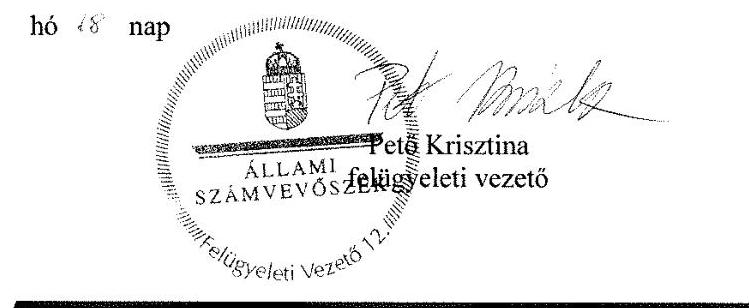

---

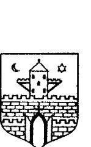

|  |   |
| --- | --- |
|  Iktatószám: 54312016 | Tárgy: Észrevétel a „Megyei hatókörű városi múzeumok ellenőrzése Savaria Megyei Hatókörű Városi Múzeum, Szombathely" című ellenőrzésről készült számvevőszéki jelentéstervezetre.  |

Domokos László Úr Elnök Állami Számvevőszék Budapest Apáczai Csere János u. 10. 1052

Tisztelt Elnök Úr! Hivatkozással a V-1063-143/2016. iktatószámú, a „Megyei hatókörű városi múzeumok ellenőrzése - Savaria Megyei Hatókörű Városi Múzeum" című ellenőrzés során készült jelentéstervezet megállapításai alapján tett javaslatokra a Szombathelyi Köznevelési GAMESZ (továbbiakban: Gazdasági szervezet) az alábbi észrevételeket teszi. 3.1.sz. megállapítás 4. bekezdésének 2. francia bekezdése, 4.3.sz. megállapítás 6. bekezdésének 1. francia bekezdése alapján tett 1. sz. javaslat: „Tegyen intézkedéseket az előzetes írásbeli kötelezettségvállalást nem igénylő kifizetések rendje belső szabályzatban való rögzítésére."

A Gazdasági szervezet a gyakorlatban az Ávr. 53. §(1) bekezdésében foglaltak alapján járt el, viszont a számviteli politikában nem került rögzítésre a 100 eFt alatti kifizetések teljesítésének rendje. Az előzetes írásbeli kötelezettségvállalást nem igénylő kifizetések rendjének meghatározása a szabályzatban rögzítésre kerül. 3.1. sz. megállapítás 4. bekezdésének 3., 4. francia bekezdése alapján tett 2. sz. javaslat: „Tegyen intézkedéseket a számviteli politika, valamint az eszközök és források értékelési szabályzata kiegészítésére a jogszabályi előírás betartása érdekében."

A Gazdasági szervezet számviteli politikájában meghatározásra kerül, hogy a számviteli elszámolás mit tekint az értékelés szempontjából nem lényegesnek, jelentősnek, nem

---

jelentősnek, rögzítésre kerül az általános költségek szakfeladatokra és az általános kiadások tevékenységekre történő felosztásának módja, valamint a felosztáshoz alkalmazott mutatók, vetítési alapok.

Az Értékelési szabályzat kiegészítésre kerül a kis összegű követelések év végi meghatározásának elveivel, dokumentálásának szabályaival.
3.2. sz. megállapítás 2. bekezdésének 2. mondata alapján tett 3. javaslat: „Tegyen intézkedéseket az egyes kockázatokkal kapcsolatban szükséges intézkedések, valamint azok teljesítésének folyamatos nyomon követésének módja meghatározására."

A Gazdasági szervezet rendelkezett a vizsgált időszakban hatályos Belső Ellenőrzési Szabályzattal és Belső Kontrollrendszer szabályzattal, Kockázatkezelési szabályzattal. Meghatározásra kerültek a működési folyamatok nyomvonalai, a folyamatok kockázatai, ellenőrzési pontjai, a szabálytalanságok fajtái, a szükséges intézkedések, a nyomon követés módjai. Az említett szabályzatok a Savaria Megyei Hatókörű Városi Múzeumra is kiterjesztésre kerültek. A dokumentumok 2016. 05. 26.-án elektronikus rendszerbe feltöltésre kerültek.
3.2.sz. megállapítás 3. bekezdés alapján tett 4. sz. javaslat: „Tegyen intézkedéseket az integrált kockázatkezelési rendszer működtetésére."

A kockázatkezelési rendszer a már említett szabályzatokban foglaltak alapján működött és működik. A kockázatkezelési rendszer működtetéséről a 2013-2014. években az év végi beszámoló mellékleteként a Gazdasági Szervezet és a Savaria Megyei Hatókörű Városi Múzeum részéről vezetői nyilatkozat került leadásra. Az éves belső ellenőrzési tervben meghatározott ellenőrzések az előzetesen elvégzett kockázatelemzés alapján kerülnek meghatározásra. A 370/2011. (XII.31.) Korm. rendeletet a 187/2016. (VII.13.) Korm. rendelet módosította az integrált kockázatkezelési rendszer fogalmával, annak eljárásrendjével, mely 2016. 10. 01.-től lépett hatályba. A módosításokat természetesen a belső szabályzatokban is elvégeztük, a szervezeti egységek folyamataiért általános felelősséget viselő folyamatgazdák meghatározásra kerültek, a kockázatkezelési rendszer koordinálásáért a GAMESZ vezetője szervezeti felelőst jelölt ki.
3.3. sz. megállapítás 6. bekezdésének 1. mondata alapján tett 5. sz. javaslat: „Tegyen intézkedéseket a pénzügyi ellenjegyzésre, érvényesítésre, utalványozásra jogosult személyekről és aláírás mintájukról a belső szabályzatban foglaltak szerinti naprakész nyilvántartás vezetésére."

Az Ávr. 60. §(3) bekezdésében foglaltak alapján - a jelenlegi kötelezettségvállaló és a teljesítésigazolók aláírás-mintáján túl - a további gazdálkodási jogkörök gyakorlására jogosult személyek, úgy mint ellenjegyző, érvényesítő, utalványozó aláírás mintájával kiegészítésre kerül a nyilvántartásunk.
Megemlíteném, hogy a munkaköri leírásokban benne foglaltatott az adott személy gazdálkodási jogköre - többek között a vizsgált időszakra vonatkozóan is - , melynek a dolgozó általi aláírásával azonosíthatóak az ellenjegyző, érvényesítő személyek. A számviteli politikánkban a kijelölt személyek szintén rögzítésre kerültek.

---

3.3.sz. megállapítás 6. bekezdésének 2. mondata alapján tett 6. sz. javaslat, és a 3.3. sz. megállapítás 6. bekezdésének 3. mondata alapján tett 7. sz. javaslat: „Tegyen intézkedéseket a pénzügyi ellenjegyzésre és érvényesítésre.......utalványozásra jogosult személy jogszabályi előírásnak megfelelő meghatározására a munkamegosztási megállapodásban."

A Gazdasági Szervezet SZMSZ-e, és annak mellékletét képező Együttműködési Megállapodás a Múzeummal 2015. 11. 01-től módosításra került, melyben az utalványozásra jogosult személy, a Múzeum igazgatója a törvényi előírásoknak megfelelően kijelölésre került. A módosításokat Szombathely Megyei Jogú Város Oktatási és Szociális Bizottság 424/2015. (X.20.) OSzB. számú, valamint a Gazdasági és Városstratégiai Bizottság 294/2015. (X.19.) GVB számú határozata alapján Polgármester Úr 2015. október 28. napján jóváhagyta.
4.1.sz. megállapítás 9. bekezdésének 1. mondata, 4.2. sz. megállapítás 2. bekezdésének 1., 2. mondata alapján tett 8. sz. javaslat : „Tegyen intézkedéseket a Múzeum éves költségvetési beszámolója adatainak a Kincstár által működtetett elektronikus adatszolgáltató rendszerbe történő feltöltésére a jogszabályban előírt határidőben."

A vizsgált időszakban a Múzeum 2013-2014. évi költségvetési beszámolójának benyújtása határidőre megtörtént az irányító szerv felé. A beszámoló papír alapú nyomtatására csak a jóváhagyás után kerül sor, így annak dátuma nem egyezhet meg a tényleges leadás dátumával.
A 2013. évi és 2014. évi költségvetési beszámoló feladása a SZMJV Polgármesteri Hivatala Közgazdasági és Adó Osztálytól kapott tájékoztató levelekben meghatározott határidőre megtörténtek a feladások a KGR rendszerbe. A KGR rendszerből kinyomtatott eseménytörténet alapján látható, hogy mindkét évben a beszámoló első alkalommal történő feladása a meghatározott határidőre történt, de a KGR program módosítása miatti verzióváltások eredményeképpen 2013. évben a 3. feladás, 2014. évben a 7. feladás vált véglegessé.
4.3.sz. megállapítás 5. bekezdésének 2., 3. mondata alapján tett 9. sz. javaslat: „Tegyen intézkedéseket az értékesített eszköz számviteli nyilvántartásából való - a jogszabályi előírásnak megfelelő - kivezetésére, az értékcsökkenés jogszabályi előírások szerinti elszámolása végrehajtására."

A Múzeumnál a vizsgált időszak Gazdasági Szervezet általi gazdasági feladatellátással érintett éveiben (2013-2014.) összesen négy értékesítés történt 2014. évben, 2 darab személygépkocsi és 2 db konténer. A számviteli nyilvántartásból az eszközök az értékesítéssel egy időben kivezetésre kerültek, értékcsökkenés nem lett elszámolva utánuk 2014. 12.31-ig. A Fiat Ducato gépjármű 2014. 06. 18.-án, a Mitsubishi L200 LUR-939 gépjármű 2014.11.14.-én kivezetésre kerültek, értékcsökkenés is csak a kivezetésig került elszámolásra. A 2 db konténer 2014. 12.15.-én az eladás napjával a nyilvántartásból szintén kivezetésre került. A gazdasági események a mellékelt Hessyn tárgyi eszköznyilvántartásból nyomtatott Egyedi nyilvántartó lapokon és a főkönyvi kartonokon láthatóak.

---

4.3.sz. megállapítás 5. bekezdésének 4. mondata alapján tett 10. sz. javaslat: „Tegyen intézkedéseket a készpénzforgalom gazdasági eseményei jogszabályi előírásnak megfelelő rögzítésére a könyvekben."

A Múzeumnál 2014. 06. 18.-án egy Fiat Ducato gépkocsi került értékesítésre pénztáron keresztül. A gazdasági esemény bizonylatolása az adásvételi szerződésen és a pénztárbevételi bizonylaton kívül a készpénzfizetési számlát nem tartalmazta, sajnálatos módon nem készült számla. A későbbiekben figyelmet fordítunk az esetleges értékesítés során a számla elkészítésére.
4.3.sz. megállapítás 6. bekezdésének 2., 4., 5., francia bekezdése alapján tett 11. sz. javaslat: „Tegyen intézkedéseket a pénzügyi ellenjegyzés és érvényesítés jogszabályi előírásnak megfelelő gyakorlására."

A pénzügyi ellenjegyzés és érvényesítés jelenleg a jogszabályi előírásnak megfelelően történik, a 6.-7. javaslatra tett észrevételben leírtak szerint.

Az Ávr. 58. § (4) bekezdése tartalmazza, hogy az 55. § (3) bekezdésében meghatározott képesítéssel kell rendelkeznie a kötelezettségvállalásra, pénzügyi ellenjegyzésre feljogosított személynek. Ez a végzettség a felsőoktatásban szerzett gazdasági szakképzettséget, vagy legalább középfokú iskolai végzettséget és emellett pénzügyi-, számviteli képesítést jelent. A Gazdasági Szervezetnél az előírt végzettséggel rendelkező személy végezte minden esetben az érvényesítést.
5.2.sz. megállapítás 3. bekezdés alapján tett 12. sz. javaslat: „Intézkedjen a jogszabályi előírásoknak megfelelő leltár összeállítására."

A mérleget hitelesen alátámasztó leltár elkészítéséhez, a pontos értékadatokhoz a vagyonkezelésbe vett eszköz bekerülési értékét a vagyonkezelési szerződés kell, hogy tartalmazza. A vizsgált időszakban vagyonkezelői szerződés nem állt rendelkezésünkre, az átadónál kimutatott bruttó értékről nem kaptunk hiteles információt.

A jelentéstervezet 5.2. sz. megállapítás 4. bekezdésére, mi szerint a „2013-ban a leltár kiértékelését elvégezték, azonban a ......", az alábbi tájékoztatást adom:
A Gazdasági Szervezet a 2013. évi Múzeum leltározás során talált nagy értékű leltárhiányok és többletek az Áhsz. 37. §(2) bekezdésében foglaltak alapján rendezve lettek. Kivezetésük illetve bevételezésük a tárgyi eszköznyilvántartásba megtörtént. Mellékletként csatolom a változtatással érintett egyedi nyilvántartó kartonokat.

# Általános észrevétel: 

Az ellenőrzés lefolytatásához az idő szűkösre szabottan állt rendelkezésünkre az intézménytől kért nagy mennyiségű dokumentum szkennelésére és azok elektronikus úton történő megküldésére. A kért vizsgálati anyag papíralapon történő eljuttatására nem adtak lehetőséget, az elektronikus rendszer újbóli megnyitása nehézségekbe ütközött.

---

A vizsgálat során tett megállapítások több esetben nem konkrétan határozzák meg, hogy melyik gazdasági esemény
 kapcsán találtak hiányosságot, hanem általánosítva, a vizsgált időszak egészére fogalmaz.
Pl.: „Az értékesített eszközt a Múzeum......." (4.3. sz. megállapítás 5. bekezdés 1.mondata)
„Egy további értékesítés esetén ......." (4.3.sz. megállapítás 5. bekezdés 3. mondata)
„A személyi juttatások kifizetésével összefüggésben a 2011-2014. években $\qquad$ ."
(4.3. sz. megállapítás 7. bekezdés)

További szíves tájékoztatásként közlöm, hogy a vizsgálati eljárás lefolytatása alatti időszakban a Gazdasági Szervezetnél személyi változás történt, a vizsgálattal érintett időszak gazdasági vezetői feladatait ellátó személy 2016. ápriljától már nem áll a Gazdasági Szervezet alkalmazásában.
A Savaria Megyei Hatókörű Városi Múzeumnál hasonlóképpen, a 2011-2013. években gazdasági vezetői feladatokat ellátó dolgozó 2014. évtől nem munkavállalója a Múzeumnak.
2017. január 1-től újabb változás következik be, a Múzeum gazdasági feladatellátását nem a Szombathelyi Köznevelési GAMESZ fogja ellátni.

Kérem, hogy a fenti észrevételeket figyelembe venni szíveskedjenek a végleges jelentés elkészítésekor.

Szombathely, 2016. december 22.

Tisztelettel:
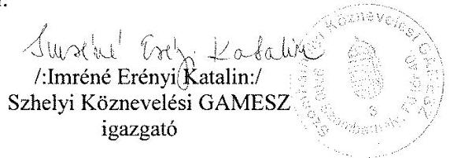

Mellékletek az észrevételekhez:
5.sz. javaslat észrevételéhez - 9 db munkaköri leírás
7.sz. javaslat észrevételéhez - 1 db Tájékoztató levél SZMJV Polg.Hiv.Eü.-i és

Közszol.Osztályáról a GAMESZ SZMSZ módosítás
Bizottsági határozatairól
1 db Záradék a GAMESZ SZMSZ-ének jóváhagyásáról
8.sz. javaslat észrevételéhez - 2 db KGR eseménytörténet
2 db fenntartói levél a beszámolók
leadási határidejéről
9.sz. javaslat észrevételéhez - 1 db Feljegyzés

1 db Kivezetések dokumentum
3 db Egyedi nyilvántartó lap
7 db Főkönyvi karton
12.sz. javaslat észrevételéhez - 1 db Feljegyzés
50 db Eszközről egyedi nyilvántartó lap

---

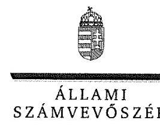

ELNÖK

Ikt.szám: V-1063-156/2016.

# Imréné Erényi Katalin asszony 

igazgató
Szombathelyi Köznevelési Intézmények Gazdasági,
Műszaki Ellátó és Szolgáltató Szervezete

## Szombathely

## Tisztelt Igazgató Asszony!

A ,,Megyei hatókörű városi múzeumok ellenőrzése - Savaria Megyei Hatókörű Városi Múzeum, Szombathely" címmel készített számvevőszéki jelentéstervezetre tett észrevételét köszönettel megkaptam.
Az Állami Számvevőszék észrevételre vonatkozó álláspontjáról a felügyeleti vezető által készített részletes tájékoztatást csatoltan megküldöm.
Tájékoztatom Igazgató asszonyt, hogy a számvevőszéki jelentésben - az Állami Számvevőszékről szóló 2011. évi LXVI. törvény 29. § (3) bekezdése alapján - a figyelembe nem vett észrevételeket szerepeltetjük az elutasítás indokának feltüntetésével.

Budapest, 2017. 04. hó 18. nap
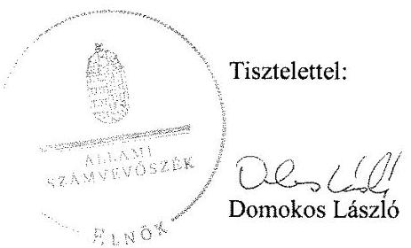

Melléklet: Tájékoztatás az elfogadott és az el nem fogadott észrevételekről

---

# Tájékoztatás az elfogadott és az el nem fogadott észrevételekről 

A „Megyei hatókörű városi múzeumok ellenőrzése - Savaria Megyei Hatókörű Városi Múzeum, Szombathely" című jelentéstervezetre az 543/2016. iktatószámú levelével megküldött észrevételeit áttekintettük, annak kezeléséről az alábbi tájékoztatást adom.

1. Az 1. számú javaslatra tett észrevétele kapcsán (a jelentéstervezet 19. oldal 3.1. számú megállapítás 4. bekezdés 2. francia bekezdésének megállapítása és a jelentéstervezet 27. oldal 4.3. számú megállapítás 6. bekezdés 1. francia bekezdésének megállapítása alapján tett javaslat)

Köszönettel vettem tájékoztatását, hogy az előzetes írásbeli kötelezettségvállalást nem igénylő kifizetések rendjének meghatározása szabályzatban rögzítésre kerül. Észrevétele a jelentéstervezet megállapításait nem cáfolta, ezért azokat nem módosítja.
2. A 2. számú javaslatra tett észrevétele kapcsán (a jelentéstervezet 19. oldal 3.1. számú megállapítás 4. bekezdés 3., 4. francia bekezdéseinek megállapításai alapján tett javaslat)

Köszönettel vettem tájékoztatását, hogy a Szombathelyi Köznevelési Intézmények Gazdasági, Műszaki Ellátó és Szolgáltató Szervezete (továbbiakban: GAMESZ) számviteli politikájában meghatározásra kerül, hogy a számviteli elszámolás mit tekint az értékelés szempontjából nem lényegesnek, jelentősnek, nem jelentősnek, rögzítésre kerül az általános költségek szakfeladatokra és az általános kiadások tevékenységekre történő felosztásának módja, valamint a felosztáshoz alkalmazott mutatók, vetítési alapok. Az értékelési szabályzat kiegészítésre kerül a kis összegű követelések év végi meghatározásának elveivel, dokumentálásának szabályaival. Észrevétele a jelentéstervezet megállapításait nem cáfolta, ezért azokat nem módosítja.

## 3. A 3. számú javaslatra tett észrevétele kapcsán (a jelentéstervezet 21. oldal 3.2. számú megállapítás 2. bekezdésének 2. megállapítása alapján tett javaslat)

Észrevételében arról tájékoztatott, hogy rendelkeztek a vizsgált időszakban hatályos Belső Ellenőrzési Szabályzattal és Belső Kontrollrendszer szabályzattal, Kockázatkezelési szabályzattal. Meghatározásra kerültek a működési folyamatok nyomvonalai, a folyamatok kockázatai, ellenőrzési pontjai, a szabálytalanságok fajtái, a szükséges intézkedések, a nyomon követés módjai. Az említett szabályzatok a Savaria Megyei Hatókörű Városi Múzeumra (továbbiakban: Múzeum) is kiterjesztésre, valamint a dokumentumok 2016. május 26-án az ellenőrzés elektronikus rendszerébe feltöltésre kerültek.

---

Észrevételét nem fogadtuk el, mert a számvevőszéki ellenőrzés rendelkezésére bocsátott dokumentumok, ezen belül az észrevételében hivatkozott dokumentumok ismételt felülvizsgálatát követően a jelentéstervezet 21. oldal 3.2. számú megállapítás 2. bekezdésének 2. megállapítása „A Bkr. 7. § (2) bekezdésében foglaltak ellenére a Gazdasági szervezet nem határozta meg az egyes kockázatokkal kapcsolatban szükséges intézkedéseket, valamint azok teljesítésének folyamatos nyomon követésének módját." - megalapozott. Észrevétele a megállapítást nem módosítja.

# 4. A 4. számú javaslatra tett észrevétele kapcsán (a jelentéstervezet 21. oldal 3.2. számú megállapítás 3. bekezdésének megállapítása alapján tett javaslat) 

Észrevételében foglaltak alapján a kockázatkezelési rendszer működtetéséről a 2013-2014. években az év végi beszámoló mellékleteként a GAMESZ és a Múzeum részéről vezetői nyilatkozat került leadásra. Az éves belső ellenőrzési tervben meghatározott ellenőrzések az előzetesen elvégzett kockázatelemzés alapján kerülnek meghatározásra. Az integrált kockázatkezelési rendszer fogalmával, annak eljárásrendjével kapcsolatos jogszabályi előírásokkal összefüggésben a kapcsolódó módosításokat a belső szabályzatokban elvégezték, a szervezeti egységek folyamataiért általános felelősséget viselő folyamatgazdák meghatározásra kerültek, a kockázatkezelési rendszer koordinálásáért szervezeti felelőst jelöltek ki.

Észrevételét nem fogadtuk el, mert a számvevőszéki ellenőrzés rendelkezésére bocsátott dokumentumok ismételt felülvizsgálatát követően a hivatkozott megállapítás megalapozott. Észrevétele ezért a jelentéstervezet 21. oldal 3.2. számú megállapítás 3. bekezdésének megállapítását „A 2011. évben az Ámr. 157. § (1) bekezdésében foglaltak ellenére a Múzeum, illetve a 2012-2014. években a Bkr. 7. § (1) bekezdésében foglaltak ellenére a Múzeum illetve a Gazdasági szervezet a kockázatkezelési rendszert nem működtette." - nem módosítja. Megjegyzem, hogy a 2013-2014. években hatályos belső kontrollrendszer szabályzatok II. fejezetének rendelkezései szerint „A kockázatkezelés során fel kell mérni és meg kell állapítani a költségvetési szerv tevékenységében, gazdálkodásában rejlő kockázatokat.", „A kockázatkezelést a Szombathelyi Köznevelési GAMESZ igazgatója végzi.", amely rendelkezésekben nevesített felelős és feladatok nem azonosak a belső ellenőrök által elvégzett, az éves ellenőrzési tervet megalapozó kockázatelemzéssel.

További észrevétele, amelyben jelzi, hogy a költségvetési szervek belső kontrollrendszeréről és belső ellenőrzésről szóló 370/2011. (XII. 31.) Korm. rendelet 2016. október 1-jétől hatályos rendelkezéseit figyelembe véve az integrált kockázatkezelési rendszer fogalmával, eljárásrendjével a belső szabályzatokat módosították az ellenőrzési időszakon túlmutat, a jelentéstervezet megállapításait nem módosítja.

## 5. Az 5. számú javaslatra tett észrevétele kapcsán (a jelentéstervezet 22. oldal 3.3. számú megállapítás 6. bekezdésének 1. megállapítása alapján tett javaslat)

Köszönettel vettem tájékoztatását, hogy a jelenlegi kötelezettségvállaló és a teljesítésigazolók aláírás-mintáján túl a további gazdálkodási jogkörök gyakorlására jogosult személyek, úgy, mint ellenjegyző, érvényesítő, utalványozó aláírás mintájával kiegészítésre kerül a nyilvántartásuk.

---

Észrevételében jelezte, hogy a számviteli politikában a kijelölt személyek rögzítésre kerültek, továbbá a munkaköri leírásokban rögzítésre került az adott személy gazdálkodási jogköre, így a munkaköri leírás dolgozó általi aláírásával azonosíthatóak a gazdálkodási jogkörök gyakorlói. Észrevételét nem fogadtuk el, mert a munkaköri leírásokon szereplő aláírás nem felel meg az államháztartásról szóló törvény végrehajtásáról szóló 368/2011. (XII. 31.) Korm. rendelet 60. § (3) bekezdésében előírt nyilvántartás vezetésének a gazdálkodási jogkör gyakorló személyekről és aláírás-mintájukról.

Észrevétele a jelentéstervezet hivatkozott megállapítását nem vitatja, ezért azt nem módosítja.
6. A 6. számú javaslatra tett észrevétele (a jelentéstervezet 22. oldal 3.3. számú megállapítás 6. bekezdésének 2. megállapítása alapján tett javaslat) és 7. számú javaslatra tett észrevétele kapcsán (a jelentéstervezet 22. oldal 3.3. számú megállapítás 6. bekezdésének 3. megállapítása alapján tett javaslat)

Köszönettel vettem tájékoztatását, hogy a GAMESZ szervezeti és működési szabályzata és annak mellékletét képező Együttműködési Megállapodás 2015. november 1-jétől módosításra került, amelyben az utalványozásra jogosult személy, a Múzeum igazgatója a törvényi előírásoknak megfelelően kijelölésre került, továbbá a módosításokat Szombathely Megyei Jogú Város polgármestere 2015. október 28-án jóváhagyta. Észrevétele a jelentéstervezet megállapításait nem cáfolta, az ellenőrzési időszakon túlmutat, ezért a megállapításokat nem módosítja.
7. A 8. számú javaslatra tett észrevétele kapcsán (a jelentéstervezet 25. oldal 4.1. számú megállapítás 9. bekezdésének 1. megállapítása és a jelentéstervezet 26. oldal 4.2. számú megállapítás 2. bekezdésének 1., 2. megállapításai alapján tett javaslat)

Észrevételében arról tájékoztatott, hogy az ellenőrzött időszakban a Múzeum 2013-2014. évi költségvetési beszámolójának benyújtása határidőre megtörtént az irányító szerv felé, valamint a beszámoló papír alapú nyomtatására csak a jóváhagyás után kerül sor, így annak dátuma nem egyezhet meg a tényleges leadás dátumával. Észrevételében jelezte továbbá, hogy a 2013. évi és 2014. évi költségvetési beszámoló feladása Szombathely Megyei Jogú Város Polgármesteri Hivatala Közgazdasági és Adó Osztálytól kapott tájékoztató levelekben meghatározott határidőre megtörtént a Magyar Államkincstár (továbbiakban: Kincstár) által üzemeltetett KGR elektronikus rendszerbe. A KGR rendszerből kinyomtatott eseménytörténet alapján látható, hogy mindkét évben a beszámoló első alkalommal történő feladása a meghatározott határidőre történt, de a KGR program módosítása miatti verzióváltások eredményeképpen 2013. évben a 3. feladás, 2014. évben a 7. feladás vált véglegessé.

Észrevételét nem fogadtuk el, mert a 2013. évi beszámoló és a 2014. évi beszámoló feladása a Kincstár által üzemeltetett KGR elektronikus rendszerbe és az abban történő jóváhagyás önmagában nem felel meg a 2013. évben az államháztartás szervezetei beszámolási és könyvvezetési kötelezettségének sajátosságairól szóló 249/2000. (XII. 24.) Korm. rendelet 10. § (1) bekezdésében és a 2014. évben az államháztartás számviteléről szóló 4/2013. (I. 11.) Korm. rendelet 32. § (1) bekezdésében foglalt előírásoknak. Észrevétele a jelentéstervezet 25. oldal 4.1. számú

---

megállapítás 9. bekezdésének 1. megállapítását - „A MARADVÁNY MEGÁLLAPÍTÁSA az irányító szerv1-3 felé teljesített adatszolgáltatás késedelme miatt a 2011-2013. években nem felelt meg a Áhsz.; 10. § (1) bekezdésében és 2014. évben az Áhsz.; 32. § (1) bekezdésében előírtaknak.", valamint a jelentéstervezet 26. oldal 4.2. számú megállapítás 2. bekezdésének 1., 2. megállapításait - „A Múzeum 2011-2014. éves költségvetési beszámolóit az Áhsz.; 10. § (1) bekezdésében, valamint az Áhsz.; 32. § (1) bekezdésében rögzített határidőn túl (2012. március 19-én, 2013. március 13-án, 2014. március 26-án, 2015. május 8-án) nyújtották be az irányító szerv1.3 részére. A beszámoló elkészítése és az adatok továbbítása a Kincstár felé a munkamegosztási megállapodás 7. pontja alapján a 2013-2014. években a Gazdasági szervezet feladata volt." - nem módosítja.

# 8. A 9. számú javaslatra tett észrevétele kapcsán (a jelentéstervezet 27. oldal 4.3. számú megállapítás 5. bekezdésének 2., 3. megállapításai alapján tett javaslat) 

Észrevételében arról tájékoztatott, hogy a 2013-2014. években összesen négy értékesítés történt, 2014. évben 2 darab személygépkocsi és 2 db konténer. A számviteli nyilvántartásból az eszközök az értékesítéssel egy időben kivezetésre kerültek, ezt követően értékcsökkenés nem lett elszámolva utánuk. A gazdasági események a leveléhez mellékelt tárgyi eszköznyilvántartásból nyomtatott Egyedi nyilvántartó lapokon és a főkönyvi kartonokon láthatóak.

Észrevételét nem fogadtuk el, mert a számvevőszéki ellenőrzés rendelkezésére bocsátott dokumentumok ismételt felülvizsgálatát követően
 a jelentéstervezet 27. oldal 4.3. számú megállapítás 5. bekezdésének 2., 3. megállapításai - „Az értékesített eszközt a Múzeum számviteli nyilvántartásából - a Számv. tv. 165. § (1) bekezdésében foglaltak ellenére - nem vezették ki. Az értékesített eszközre 2014. december 31. napján értékcsökkenést számoltak el, amely ellentétes volt a Számv. tv. 52. § (7) bekezdésében foglaltakkal." - megalapozottak, észrevétele a megállapításokat nem módosítja.

## 9. A 10. számú javaslatra tett észrevétele kapcsán (a jelentéstervezet 27. oldal 4.3. számú megállapítás 5. bekezdésének 4. megállapítása alapján tett javaslat)

Köszönettel vettem tájékoztatását, hogy a Múzeumnál 2014. június 18-án egy gépkocsi került értékesítésre pénztáron keresztül és a gazdasági esemény bizonylatolása az adásvételi szerződésen és a pénztárbevételi bizonylaton kívül a készpénzfizetési számlát nem tartalmazta, mivel sajnálatos módon nem készült számla. A későbbiekben figyelmet fordítanak az esetleges értékesítés során a számla elkészítésére. Észrevétele a jelentéstervezet 27. oldal 4.3. számú megállapítás 5. bekezdésének 4. megállapítását nem cáfolta, ezért azt nem módosítja.
10. A 11. számú javaslatra tett észrevétele kapcsán (a jelentéstervezet 27. oldal 4.3. számú megállapítás 6. bekezdés 2., 4., 5. francia bekezdéseinek megállapításai alapján tett javaslat)

Köszönettel vettem tájékoztatását, hogy pénzügyi ellenjegyzés és érvényesítés jelenleg a jogszabályi előírásnak megfelelően történik. Észrevételében jelezte, hogy a GAMESZ-nél az előírt

---

végzettséggel rendelkező személy végezte minden esetben az érvényesítést. Ez utóbbi észrevételét az érvényesítők előírt végzettsége tekintetében a számvevőszéki ellenőrzés rendelkezésére bocsátott dokumentumok ismételt felülvizsgálata alapján elfogadtuk és a számvevőszéki jelentés összeállításánál figyelembe vesszük. Észrevételében a jelentéstervezet 27. oldal 4.3. számú megállapítás 6. bekezdés 2., 5. bekezdéseinek megállapításait nem vitatta, ezért azokat nem módosítja.
11. A 12. számú javaslatra tett észrevétele (a jelentéstervezet 31. oldal 5.2. számú megállapítás 3. bekezdésének megállapításai alapján tett javaslat), továbbá a jelentéstervezet 5.2. számú megállapítás 4. bekezdésének megállapítására tett észrevétele kapcsán

Észrevételében arról tájékoztatott, hogy az ellenőrzött időszakban vagyonkezelői szerződés nem állt rendelkezésünkre, az átadónál kimutatott bruttó értékről nem kaptak hiteles információt. Észrevétele megerősíti a jelentéstervezet 31. oldal 5.2. számú megállapítás 3. bekezdésének megállapításait, ezért azokat nem módosítja. Köszönettel vettem tájékoztatását a jelentéstervezet 5.2. számú megállapítás 4. bekezdésének megállapításával kapcsolatban, hogy a GAMESZ rendezte a jogszabályi előírás alapján a Múzeumnál a 2013. évi leltározás során talált nagy értékű leltárhiányt és többletet. Kivezetésük, illetve bevételezésük a tárgyi eszköznyilvántartásban megtörtént. Észrevétele a jelentéstervezet hivatkozott megállapítását nem cáfolta, ezért azt nem módosítja.

# A jelentéstervezetre tett általános észrevételei kapcsán 

Észrevételében arról tájékoztatott, hogy az ellenőrzés lefolytatásához az idő szűkösre szabottan állt rendelkezésükre a Múzeumtól kért nagy mennyiségű dokumentum szkennelésére és azok elektronikus úton történő megküldésére. A kért vizsgálati anyag papíralapon történő eljuttatására nem volt lehetőségük, az elektronikus rendszer újbóli megnyitása, arra való feltöltése nehézségekbe ütközött. Észrevételét nem fogadtuk el, mert az adatszolgáltatásra az Állami Számvevőszékről szóló 2011. évi LXVI. törvény 28. § (2) bekezdése alapján öt munkanapot biztosítottunk. Észrevételében jelezte példákkal feltüntetve, hogy a jelentéstervezet megállapításai nem konkrétan határozzák meg, hogy melyik gazdasági esemény kapcsán találtak hiányosságot, hanem általánosítva, a vizsgált időszak egészére vonatkoznak. Észrevételét nem fogadtuk el, mert a számvevőszéki ellenőrzést a „Megyei hatókörű városi múzeumok ellenőrzése" című ellenőrzési program alapján végeztük és az ellenőrzött témaköröket az ellenőrzési kérdésekre adott válaszok, valamint az ellenőrzött szervezetek által rendelkezésre bocsátott dokumentumok alapján értékeltük, amelyet a jelentéstervezetben „Az ellenőrzés módszerei" című fejezet részletesen tartalmaz. Észrevétele a megállapításokat nem cáfolta, ezért azokat nem módosítja.

Köszönettel vettem tájékoztatását, hogy hogy a vizsgálati eljárás lefolytatása alatti időszakban a GAMESZ-nél személyi változás történt, a vizsgálattal érintett időszak gazdasági vezetői feladatait ellátó személy 2016. áprilisától már nem áll a GAMESZ alkalmazásában.

---

A Múzeumnál hasonlóképpen, a 2011-2013. években gazdasági vezetői feladatokat ellátó dolgozó 2014. évtől nem munkavállalója a Múzeumnak. 2017. január 1-jétől újabb változás következik be, a Múzeum gazdasági feladatellátását nem a GAMESZ fogja ellátni.

Budapest, 2017. 04. hó 15. nap
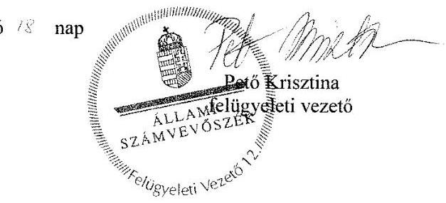

---

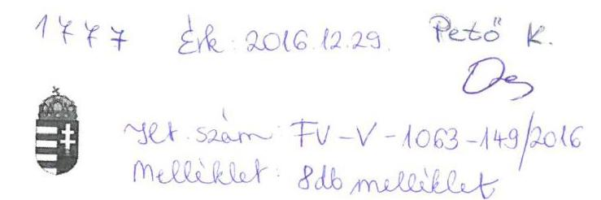

# SzOCIÁLIS ÉS GYERMEKVÉDELMI FŐIGAZGATÓSÁG   VAS MEGYEI KIRENDELTSÉGE   9700 Szombathely, Berzsenyi tér 1.   94/515-766, huszar.lilla@szgyf.gov.hu 

iktatószám: VAMK-304-17/2016
ügyintéző: Dr. Huszár Lilla
telefon: 94/515-766
tárgy: Észrevételezés jelentéstervezetre
hivatkozási szám:
melléklet:

## Domokos László

## Elnök úr

## Állami Számvevőszék

Budapest
Apáczai Csere János utca 10.
1052

## Tisztelt Elnök Úr!

Hivatkozva 2016. december 08-án kelt, V-1063-140/2016 iktatószámú levelére, melyben a 2011. évi LXVI. törvény alapján küldi a „Megyei hatókörű városi múzeumok ellenőrzése Savaria Megyei Hatókörű Városi Múzeum, Szombathely" című ellenőrzésről készült számvevőszéki jelentéstervezetet, alábbi észrevételeket teszem.

A számvevőszéki jelentéstervezet 2. pontjának 2.2 megállapításánál nem értünk egyet azzal, hogy a Múzeum telephelyeinek települések részére történő átadásának megállapodásai nem kerültek megkötésre.

Tájékoztatom, hogy minden érintett településsel (Szentgotthárd, Vasvár, Cák, Kőszeg, Körmend) megkötött megállapodásokkal rendelkezünk, melyek másolatát levelem mellékleteként, csatoltan megküldöm.

Az ellenőrzés során illetve a hiánypótlás-kérésekben sem kérte az Állami Számvevőszék ezen megállapodásokat. Az ellenőrzési program a Szombathely Megyei Hatókörű Városi Múzeum ellenőrzésére irányult, nem tartalmazta az említett városok múzeumainak ellenőrzését, így fel sem merült, hogy az azokhoz kapcsolódó dokumentumokat is megküldjük.

---

A számvevőszéki jelentéstervezet 3. pontjának 3.4 megállapításánál nem értünk egyet azzal, hogy a felügyeletet ellátó szerv által fenntartott honlapon nem tettük közzé a Múzeum gazdálkodására vonatkozó adatokat.

Tájékoztatom, hogy a jogelőd, Vas Megyei Intézményfenntartó Központ nem rendelkezett saját honlappal, így a KIM Területi Közigazgatási Irányítási Főosztályáról érkezett levél alapján a Vas Megyei Kormányhivatal honlapján tettük közzé azon adatokat, mely a Vas Megyei Múzeumok Igazgatóságának gazdálkodási adatait is tartalmazta. A Minisztériumi levelet és a Kormánymegbízottnak küldött közzétételi listánkat jelen levelemhez mellékeltem.

A Kormányhivatal arról tájékoztatott, hogy a 2012-es honlapját 2013-ban megszüntette és új, egységes kormányzati honlap került kialakításra, mely a 2013. január 1. előtti, előző honlapon szereplő adatokat nem vette át, ily módon a 2012-ben közzétett nyilvános gazdálkodási adatok jelenleg már nem láthatóak.

Kérem, észrevételeim szíves elfogadását.

Szombathely, 2016. december 23.

Tisztelettel:
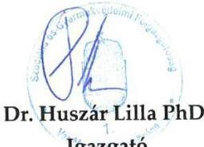

---

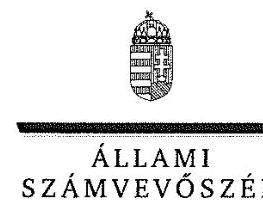

# Bátori Zsolt úr 

főigazgató
Szociális és Gyermekvédelmi Főigazgatóság

## Budapest

## Tisztelt Főigazgató Úr!

A ,,Megyei hatókörű városi múzeumok ellenőrzése - Savaria Megyei Hatókörű Városi Múzeum, Szombathely" címmel készített számvevőszéki jelentéstervezetre tett észrevételét köszönettel megkaptam.
Az Állami Számvevőszék észrevételre vonatkozó álláspontjáról a felügyeleti vezető által készített részletes tájékoztatást csatoltan megküldöm.
Tájékoztatom Főigazgató urat, hogy a számvevőszéki jelentésben - az Állami Számvevőszékről szóló 2011. évi LXVI. törvény 29. § (3) bekezdése alapján - a figyelembe nem vett észrevételeket szerepeltetjük az elutasítás indokának feltüntetésével.

Budapest, 2017. 04. hó 4. nap
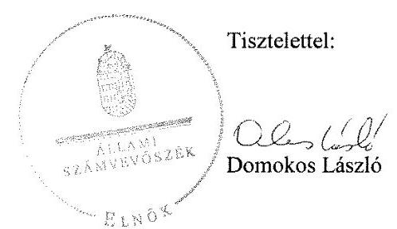

Melléklet: Tájékoztatás az el nem fogadott észrevételekről

---

# Tájékoztatás az el nem fogadott észrevételekről 

A „Megyei hatókörű városi múzeumok ellenőrzése - Savaria Megyei Hatókörű Városi Múzeum, Szombathely" című jelentéstervezetre a VAMK-304-17/2016 iktatószámú levelével megküldött észrevételeit áttekintettük, annak kezeléséről az alábbi tájékoztatást adom.

## 1. Jelentéstervezet 18. oldal 2.2. számú megállapítás 4. bekezdésének utolsó megállapítására tett észrevétele kapcsán

Észrevételében arról tájékoztatott, hogy minden érintett településsel (Szentgotthárd, Vasvár, Cák, Kőszeg, Körmend) megkötött megállapodásokkal rendelkeznek, amelyek másolatát levele mellékleteként megküldött. Észrevételében jelezte továbbá, hogy az ellenőrzés során és a hiánypótlás-kérésekben sem kérte az Állami Számvevőszék (továbbiakban: ÁSZ) ezen megállapodásokat. A „Megyei hatókörű városi múzeumok ellenőrzése" című ellenőrzési program a Szombathely Megyei Hatókörű Városi Múzeum ellenőrzésére irányult, nem tartalmazta az említett városok múzeumainak ellenőrzését, így fel sem merült, hogy az azokhoz kapcsolódó dokumentumokat is megküldjék.

Észrevételét nem fogadtuk el, mert a V-1063-004/2016. iktatószámú levelünk 3. számú melléklet 3. pontjában kértük „az átszervezésekhez/átalakításokhoz kapcsolódó dokumentumok: átadás-átvételi megállapodások, átadás-átvételi jegyzőkönyvek, vagyonátadási jelentés", továbbá a „tagintézmények települési önkormányzatba történő átadásának dokumentációja az ezzel kapcsolatos bejelentési, számviteli és vagyonátadással kapcsolatos dokumentumok" számvevőszéki ellenőrzés rendelkezésére bocsátását. Az MGO-VAMK-304-8/2016. iktatószámú levelükhöz csatolt nyilatkozatban foglaltak alapján felsorolásra kerültek azok a dokumentumok, amelyekkel nem rendelkeznek. A nyilatkozat tartalmazta továbbá, hogy a Vas Megyei Múzeumok Igazgatósága 2012. év végén 7 felé vált, mivel 7 településen voltak megtalálhatóak a múzeumi telephelyek. Szombathely Megyei Jogú Városhoz a szombathelyi telephelyű múzeumi egységek kerültek át, míg a Szombathelyen kívüli települések átvették saját telephelyüket (Vasvár, Körmend, Sárvár, Szentgotthárd, Cák, Kőszeg). A hivatkozott nyilatkozat 3. pontjában hiányzó dokumentumként került feltüntetésre „a tagintézmények települési önkormányzatba történő átadásának dokumentációja az ezzel kapcsolatos bejelentési, számviteli és vagyongazdálkodással kapcsolatos dokumentumok".

Ezúton tájékoztatom, hogy levele mellékleteként megküldött megállapodásokat a számvevőszéki jelentés készítésekor már nem tudjuk figyelembe venni, tekintettel arra, hogy az adatszolgáltatás lezárult, és a dokumentumok hitelességéről nem áll módunkban meggyőződni.

Válaszaim alapján észrevétele a jelentéstervezet 18. oldal 2.2. számú megállapítás 4. bekezdésének utolsó megállapítását - „A tagintézmények átadásának szabályszerűsége a

---

2012. évi CLII. törvény 30. § (5) bekezdésében előírt megállapodás megkötésének hiányában nem volt értékelhető." - nem módosítja.

# 2. Jelentéstervezet 23. oldal 3.4. számú megállapítás 3. bekezdésének megállapítására tett észrevétele kapcsán 

Észrevételébe foglaltak alapján „a jogelőd, Vas Megyei Intézményfenntartó Központ nem rendelkezett saját honlappal, így a KIM Területi Közigazgatási Irányítási Főosztályáról érkezett levél alapján a Vas Megyei Kormányhivatal honlapján tettük közzé azon adatokat, mely a Vas Megyei Múzeumok Igazgatóságának gazdálkodási adatait is tartalmazta.", továbbá jelezte, hogy a kapcsolódó dokumentumokat levele mellékleteként megküldte.

Észrevételét nem fogadtuk el, mert a jelentéstervezet hivatkozott megállapítása a Savaria Megyei Hatókörű Városi Múzeum közzétételi kötelezettségét és nem a Szociális és Gyermekvédelmi Főigazgatóság Vas Megyei Kirendeltségének (továbbiakban: Kirendeltség) közzétételi kötelezettségének teljesítését minősítette. Az MGO-VAMK-304-11/2016. iktatószámú, 2016. június 9-én kelt levelükkel megküldött nyilatkozatban már tájékoztatták az ÁSZ-t, hogy „az államháztartással összefüggő közérdekű adatok közzétételét a Múzeum a saját honlapján teljesítette, a MIK-nek nem volt honlapja, a saját adatait a Vas megyei Kormányhivatal a honlapján tette közzé.". A levelével megküldött dokumentumok is a Kirendeltség közérdekű adatainak közzétételéről rendelkeznek.

Fenti válaszaim alapján észrevétele a jelentéstervezet 23. oldal 3.4. számú megállapítás 3. bekezdésének megállapítását - „Az elektronikus közzétételi kötelezettség teljesítése 2011-2014. között nem volt szabályszerű, mert 2011-ben az Eitv. 3. § (2) bekezdése alapján az Eitv. mellékletének III. pontjában, a 2012-2014. években az Info tv. 33. § (3) bekezdése alapján az Info tv. 1. melléklet III. pontjában foglalt gazdálkodásra vonatkozó adatokat a Múzeum a saját, illetve a felügyeletet ellátó szerv által fenntartott honlapon nem tette közzé." - nem módosítja.

Budapest, 2017.
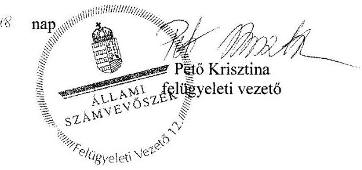

---

# RÖVIDÍTÉSEK JEGYZÉKE 

${ }^{1}$ Múzeum
${ }^{2}$ ÁSZ
${ }^{3}$ Mtv.
${ }^{4}$ Kötv.
${ }^{5}$ Kjt.
${ }^{6}$ múzeumigazgató
${ }^{7}$ Möktv.
${ }^{8}$ 258/2011. (XII. 7.) Korm. rendelet
${ }^{9}$ 2012. évi CLII. törvény
${ }^{10}$ 1311/2012. (VIII.23.) Korm. határozat
${ }^{11}$ KIM
${ }^{12}$ Gazdasági szervezet
${ }^{13}$ 2015. évi LXXV. tv.
${ }^{14}$ Nvtv.
${ }^{15}$ Alaptörvény
${ }^{16}$ Áht. 2
${ }^{17}$ Ávr.
${ }^{18}$ VMIK
${ }^{19}$ ÁSZ tv.
${ }^{20}$ irányító szerv:/ irányításért felelős szervek irányító szerv2

Vas Megyei Múzeumok Igazgatósága (2011. január 1-jétől 2012. december 31-ig) Savaria Megyei Hatókörű Város Múzeum (2013. január 1-jétől)
Állami Számvevőszék
1997. évi CXL. törvény

 a muzeális intézményekről, a nyilvános könyvtári ellátásról és a közművelődésről (hatályos: 1998. január 1-jétől)
2001. évi LXIV. törvény a kulturális örökség védelméről (hatályos: 2001. július 10-től)
1992. évi XXXIII. törvény a közalkalmazottak jogállásáról (hatályos: 1992. július 1-jétől)
Savaria Megyei Hatókörű Városi Múzeum (valamint a jogelőd Vas Megyei Múzeumok Igazgatósága) igazgatója
2011. évi CLIV. törvény a megyei önkormányzatok konszolidációjáról, a megyei önkormányzati intézmények és a Fővárosi Önkormányzat egyes egészségügyi intézményeinek átvételéről (hatályos: 2012. január 1-jétől)
258/2011. (XII. 7.) Korm. rendelet a megyei intézményfenntartó központokról, valamint a megyei önkormányzatok konszolidációjával, a megyei önkormányzati intézmények és a Fővárosi Önkormányzat egészségügyi intézményeinek átvételével összefüggő egyes kormányrendeletek módosításáról (hatályos: 2011. december 8-tól)
2012. évi CLII. törvény a muzeális intézményekről, a nyilvános könyvtári ellátásról és a közművelődésről szóló 1997. évi CXL. törvény módosításáról (hatályos: 2012. november 2-től)

1311/2012. (VIII. 23.) Korm. határozat a megyei múzeumok, könyvtárak és közművelődési intézmények fenntartásáról
Közigazgatási és Igazságügyi Minisztérium
Művelődési Intézmény Gazdasági, Műszaki Ellátó és Szolgáltató Szervezete (2013. december 3-ig)
Szombathelyi Köznevelési Intézmények Gazdasági, Műszaki Ellátó és Szolgáltató Szervezete (2013. december 4-től)
a megyei könyvtárak és a megyei hatókörű városi múzeumok feladatának ellátását szolgáló egyes állami tulajdonú vagyontárgyak ingyenes önkormányzati tulajdonba adásáról szóló 2015. évi LXXV. törvény (hatályos 2015. július 18-tól) 2011. évi CXCVI. törvény a nemzeti vagyonról (hatályos 2011. december 31-étől) Magyarország Alaptörvénye
2011. évi CXCV. törvény az államháztartásról (hatályos: 2012. január 1-jétől) az államháztartásról szóló törvény végrehajtásáról szóló 368/2011. (XII. 31.) Korm. rendelet (hatályos: 2012. január 1-jétől) Vas Megyei Intézményfenntartó Központ
Állami Számvevőszékről szóló 2011. évi LXVI. törvény (hatályos: 2011. július 1-jétől)
Vas Megyei Önkormányzat Közgyűlése (2011. január 1-jétől
2011. december 31-ig)

Közigazgatási és Igazságügyi Minisztérium az illetékes kormányhivatal útján (2012. január 1-jétől 2012. december 31-ig)

---

| irányító szerv3 | Szombathely Megyei Jogú Város Önkormányzatának Közgyűlése (2013. január 1-jétől 2014. december 31-ig) |
| :--: | :--: |
| ${ }^{21}$ alapító okirat3 | Vas Megyei Múzeumok Igazgatósága alapító okirata (hatályos: 2010. december 15-től 2011. december 31-ig) |
| alapító okirat3 | Vas Megyei Múzeumok Igazgatósága alapító okirata (hatályos: 2012. január 1-jétől 2012. szeptember 30-ig) |
| alapító okirat3 | Vas Megyei Múzeumok Igazgatósága alapító okirata (hatályos: 2012. október 1-jétől 2012. december 16-ig) |
| alapító okirat3 | Vas Megyei Múzeumok Igazgatósága alapító okirata (hatályos: 2012. december 17-től 2012. december 31-ig) |
| alapító okirat3 | Savaria Megyei Hatókörű Városi Múzeum alapító okirata (hatályos: 2013. január 1-jétől 2013. január 1-jéig) |
| alapító okirat3 | Savaria Megyei Hatókörű Városi Múzeum alapító okirata (hatályos: 2013. január 1-jétől 2013. április 30-ig) |
| alapító okirat3 | Savaria Megyei Hatókörű Városi Múzeum alapító okirata (hatályos: 2013. május 1-jétől 2014. május 7-ig) |
| alapító okirat3 | Savaria Megyei Hatókörű Városi Múzeum alapító okirata (hatályos: 2014. május 8-tól ) |
| ${ }^{22}$ középirányító szerv | Vas Megyei Intézményfenntartó Központ (2012. január 1-jétől 2012. december 31-ig) |
| ${ }^{23}$ Kincstár | Magyar Államkincstár |
| ${ }^{24}$ miniszter | Emberi Erőforrások Minisztere |
| ${ }^{25}$ SZMSZ1 | Vas Megyei Múzeumok Igazgatósága Szervezeti és Működési Szabályzata (hatályos: 2008. június 1-jétől 2013. március 27-ig) |
| SZMSZ2 | Savaria Megyei Hatókörű Városi Múzeum Szervezeti és Működési Szabályzata (hatályos: 2013. március 28-ától 2013. szeptember 30-ig) |
| SZMSZ3 | Savaria Megyei Hatókörű Városi Múzeum Szervezeti és Működési Szabályzata (hatályos: 2013. október 1-jétől) |
| ${ }^{26}$ átadás-átvételi megállapodás ${ }_{1}$ | A Vas Megyei Önkormányzat és a Vas Megyei Intézményfenntartó Központ között létrejött átadás-átvételi megállapodás a nem egészségügyi intézmények átadásáról |
| ${ }^{27}$ NGM módszertani útmutató | Nemzetgazdasági Minisztérium módszertani útmutató beszámoló garnitúrák összeállításához |
| ${ }^{28}$ Áhsz. 1 | 249/2000. (XII. 24.) Korm. rendelet az államháztartás szervezetei beszámolási és könyvvezetési kötelezettségének sajátosságairól (hatályos: 2001. január 1-jétől 2013. december 31-ig) |
| ${ }^{29}$ átadás-átvételi megállapodás ${ }_{2}$ | Vas Megyei Intézményfenntartó Központ és Szombathely Megyei Jogú Város Önkormányzata között 2012. december 21-én kelt átadás-átvételi megállapodás |
| ${ }^{30}$ Ámr. | 292/2009. (XII. 19.) Korm. rendelet az államháztartás működési rendjéről (hatályos 2011. december 31-ig) |
| ${ }^{31}$ Bkr. | 370/2011. (XII. 31.) Korm. rendelet a költségvetési szervek belső kontrollrendszeréről és belső ellenőrzésről (hatályos: 2012. január 1-jétől) |
| ${ }^{32}$ Számv. tv. | 2000. évi C. törvény a számvitelről (hatályos: 2001. január 1-jétől) |
| ${ }^{33}$ munkamegosztási megállapodás | Savaria Megyei Hatókörű Városi Múzeum és a Művelődési Intézmény Gazdasági, Műszaki Ellátó és Szolgáltató Szervezete között 2013. október 1-jén létrejött együttműködési megállapodás |
| ${ }^{34}$ gazdasági szervezet ügyrend | Ügyrend a Művelődési GAMESZ gazdasági szervezetének gazdálkodással összefüggő feladataira (hatályos a Múzeum tekintetében: 2013. október 1-jétől 2013. december 31-ig) |

---

gazdasági szervezet ügyrend ${ }_{2}$
${ }^{35}$ számviteli politika ${ }_{1}$
számviteli politika ${ }_{2}$
számviteli politika ${ }_{3}$
számviteli politika ${ }_{4}$
${ }^{36}$ értékelési szabályzat ${ }_{1}$
értékelési szabályzat ${ }_{2}$
értékelési szabályzat ${ }_{3}$
értékelési szabályzat ${ }_{4}$
${ }^{37}$ számlarend $_{1}$
számlarend $_{2}$
számlarend $_{3}$
${ }^{38}$ Áhsz. 2
${ }^{39}$ kockázatkezelési szabályzat ${ }_{1}$
${ }^{40}$ Vnytv.
${ }^{41}$ lkr.
${ }^{42}$ Info tv.
${ }^{43}$ informatikai biztonsági szabályzat
${ }^{44}$ Avtv.
${ }^{45}$ Eitv.
${ }^{46}$ Ber.
${ }^{47}$ Ötv.
${ }^{48} 78 / 2011$. (XII. 30.) KIM utasítás

Ügyrend a Művelődési GAMESZ gazdasági szervezetének gazdálkodással összefüggő feladataira (hatályos a Múzeum tekintetében: 2014. január 1-jétől)
Vas Megyei Múzeumok Igazgatósága számviteli politikája (hatályos: 2012. január 1-jétől 2012. december 31-ig)
Savaria Megyei Hatókörű Városi Múzeum számviteli politikája (hatályos: 2013. január 1-jétől 2013. szeptember 30-ig)
Művelődési Intézmények Gazdasági, Műszaki Ellátó és Szolgáltató Szervezete számviteli politikája (hatályos a Múzeum tekintetében: 2013. október 1-jétől 2013. december 31-ig)

Művelődési Intézmények Gazdasági, Műszaki Ellátó és Szolgáltató Szervezete számviteli politikája (hatályos a Múzeum tekintetében: 2014. január 1-jétől)
Vas Megyei Múzeumok Igazgatósága eszközök és források értékelési szabályzata (hatályos: 2012. január 1-jétől 2012. december 31-ig)
Savaria Megyei Hatókörű Városi Múzeum eszközök és források értékelési szabályzata (2013. január 1-jétől 2013. szeptember 30-ig)
Művelődési Intézmények Gazdasági, Műszaki Ellátó és Szolgáltató Szervezete eszközök és források értékelési szabályzata (hatályos a Múzeum tekintetében: 2013. október 1-jétől 2013. december 31-ig)

Szombathelyi Köznevelési Intézmények Gazdasági, Műszaki Ellátó és Szolgáltató Szervezete eszközök és források értékelési szabályzata (hatályos a Múzeum tekintetében: 2014. január 1-jétől)
Vas Megyei Múzeumok Igazgatósága számlarendje (hatályos: 2011. január 1-jétől 2013. november 30-ig)

Művelődési Intézmények Gazdasági, Műszaki Ellátó és Szolgáltató Szervezete számlarendje (hatályos a Múzeum tekintetében: 2013. október 1-jétől 2013. december 31-ig)
Művelődési Intézmények Gazdasági, Műszaki Ellátó és Szolgáltató Szervezete számlarendje (hatályos a Múzeum tekintetében: 2014. január 1-jétől)
4/2013. (I. 11.) Korm. rendelet az államháztartás számviteléről (hatályos 2014. január 1-jétől)
Vas Megyei Múzeumok Igazgatósága kockázatkezelési szabályzata (hatályos: 2011. november 1-jétől 2012. december 31-ig)
2007. évi CLII. törvény az egyes vagyonnyilatkozat-tételi kötelezettségekről (hatályos: 2007. december 7-től)
335/2005. (XII. 29.) Korm. rendelet a közfeladatot ellátó szervek iratkezelésének általános követelményeiről (hatályos: 2006. január 1-jétől)
2011. évi CXII. törvény az információs önrendelkezési jogról és az információszabadságról (hatályos: 2011. július 27-től)
Savaria Megyei Hatókörű Városi Múzeum informatikai biztonsági szabályzata (hatályos: 2013. május 2-től)
1992. évi LXIII. törvény a személyes adatok védelméről és a közérdekű adatok nyilvánosságáról (hatályos: 2012. január 1-jéig)
2005. évi XC. törvény az elektronikus információszabadságról (hatályos: 2011. december 31-ig)
193/2003. (XI. 26.) Korm. rendelet a költségvetési szervek belső ellenőrzéséről (hatályos: 2011. december 31-ig)
1990. évi LXV. törvény a helyi önkormányzatokról (hatályos: a 2014. évi általános önkormányzati választások napjáig)
78/2011. (XII. 30.) KIM utasítás a Megyei Intézményfenntartó Központok ideiglenes Szervezeti és Működési Szabályzatáról (hatályos: 2012. január 1-jétől)

---

${ }^{49}$ Mötv.
${ }^{50}$ Képtár
${ }^{51}$ Vasi Szemle
${ }^{52}$ NKA
${ }^{53}$ KEOP
${ }^{54}$ TÁMOP
${ }^{55}$ TIOP
${ }^{56}$ Áfa tv.
${ }^{57}$ Kbt. 1
Kbt. 2
${ }^{58}$ 393/2012. (XII. 20.) Korm. rendelet
${ }^{59}$ 5/2010. (VIII. 18.) NEFMI rendelet
${ }^{60}$ kötelezettségvállalási szabályzat ${ }_{1}$
kötelezettségvállalási szabályzat ${ }_{2}$
kötelezettségvállalási szabályzat ${ }_{3}$
kötelezettségvállalási szabályzat ${ }_{4}$
${ }^{61}$ MNV Zrt.
${ }^{62}$ Vtvr.
${ }^{63}$ 20/2002 (X. 4.) NKÖM rendelet
${ }^{64}$ ügyrendi szabályzat
${ }^{65}$ 36/2013. (IX. 13.) NGM rendelet
2011. évi CLXXXIX. törvény Magyarország helyi önkormányzatairól (hatályos: 2012. január 1-jétől)

Szombathelyi Képtár (Szántó Piroska Emlékház)
VASI SZEMLE tudományos és kulturális folyóirat
Nemzeti Kulturális Alap
Környezet és Energia Operatív Program
Társadalmi Megújulás Operatív Program
Társadalmi Infrastruktúra Operatív Program
2007. évi CXXVII. törvény az általános forgalmi adóról (hatályos: 2008. január 1-jétől)
2003. évi CXXIX. törvény a közbeszerzésekről (hatályos: 2011. december 31-ig)
2011. évi CVIII. törvény a közbeszerzésekről (hatályos: 2012. január 1-jétől)

A régészeti örökség és a műemléki érték védelmével kapcsolatos szabályokról szóló 393/2012. (XII. 20.) Korm. rendelet (hatályos: 2013. január 1-jétől 2015. március 11-ig)
5/2010. (VIII. 18.) NEFMI rendelet a régészeti lelőhelyek feltárásának, illetve a régészeti lelőhely, lelet megtalálója anyagi elismerésének részletes szabályairól (hatályos: 2012. december 31-ig)
Vas Megyei Múzeumok Igazgatósága kötelezettségvállalási szabályzata (hatályos: 2012. január 1-jétől 2012. december 31-ig)

Savaria Megyei Hatókörű Városi Múzeum kötelezettségvállalási szabályzata (hatályos: 2013. január 1-jétől 2013. április 30-ig)
Savaria Megyei Hatókörű Városi Múzeum kötelezettségvállalási szabályzata (hatályos: 2013. május 1-jétől 2013. szeptember 30-ig)
Művelődési Intézmények Gazdasági, Műszaki Ellátó és Szolgáltató Szervezete gazdálkodási szabályzata (hatályos a Múzeum tekintetében: 2013. október 1-jétől)
Magyar Nemzeti Vagyonkezelő Zártkörűen működő részvénytársaság
254/2007. (X. 4.) Korm. rendelet az állami vagyonnal való gazdálkodásról (hatályos: 2007. október 4-től)
20/2002. (X. 4.) NKÖM rendelet a muzeális intézmények nyilvántartási szabályzatáról (hatályos: 2003. január 1-jétől)
Vas Megyei Múzeumok Igazgatósága ügyrendi szabályzata (hatályos: 1996. március 1-jétől)
36/2013. (IX. 13.) NGM rendelet az államháztartás számvitelének 2014. évi megváltozásával kapcsolatos feladatokról (hatályos: 2013. szeptember 14-től)

---

# ÁLLAMI SZÁMVEVŐSZÉK 

1052 Budapest, Apáczai Csere János utca 10.
Levélcím: 1364 Budapest 4. Pf. 54
Telefon: +36 14849100 Telefax: +36 14849200
www.asz.hu
