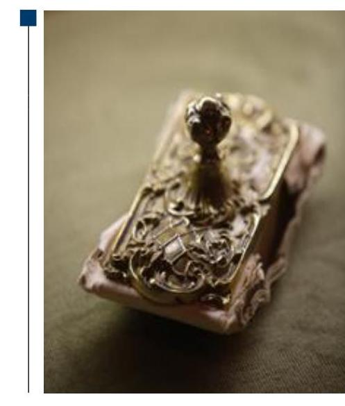
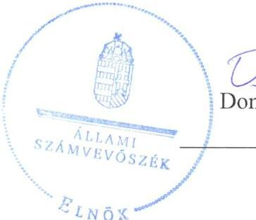
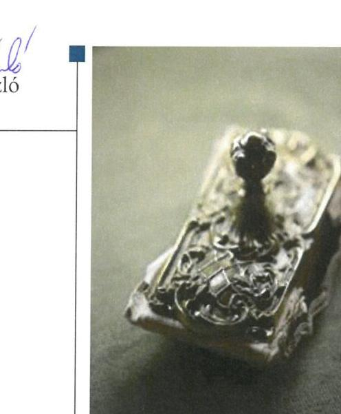
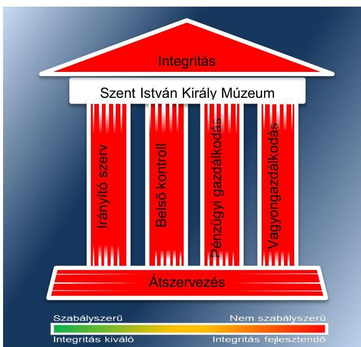
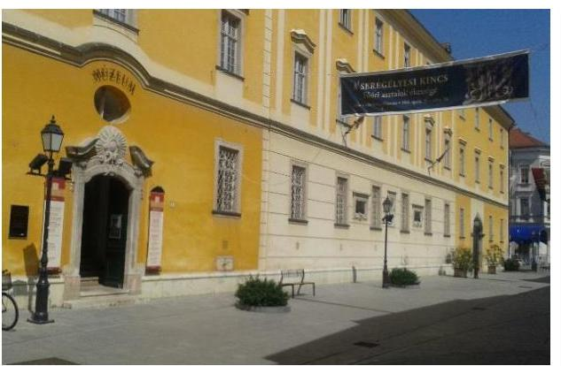
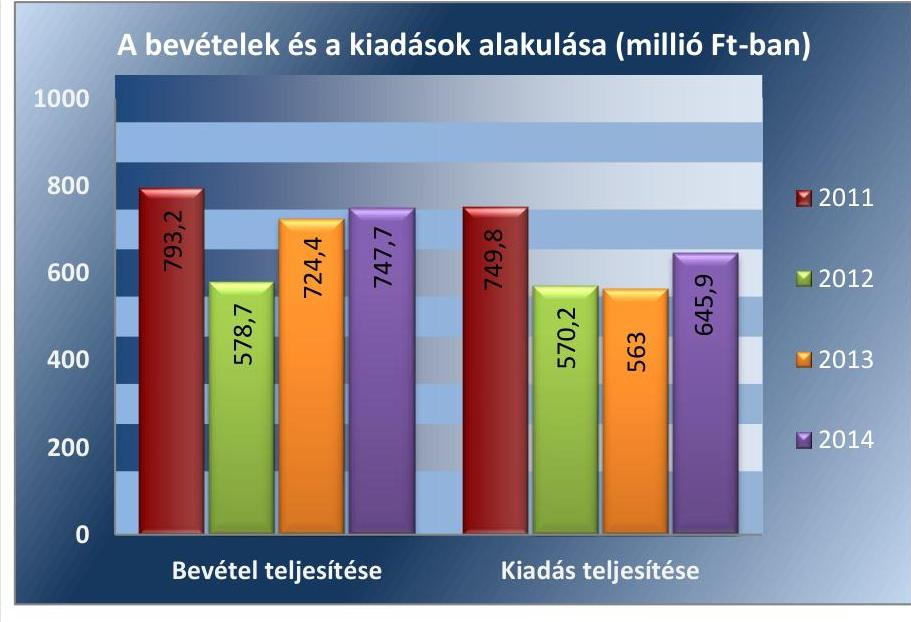
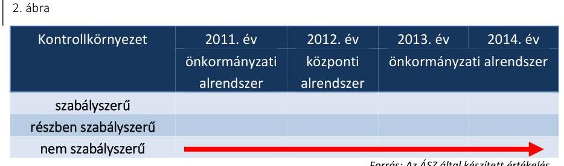
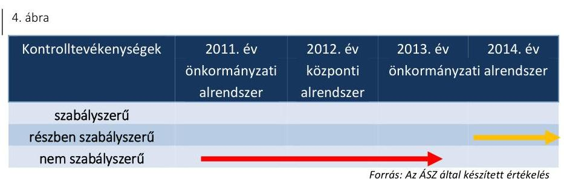
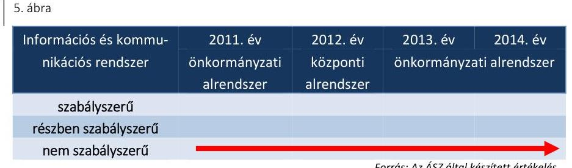
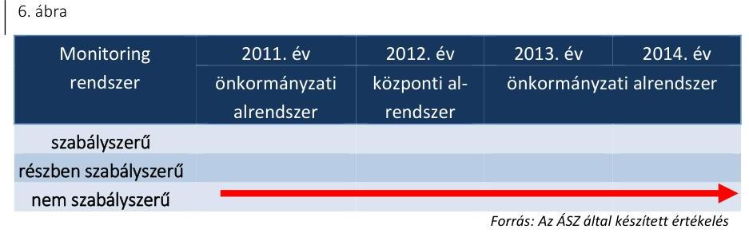

# Jelentés 

## Megyei hatókörű városi múzeumok ellenőrzése

Szent István Király Múzeum, Székesfehérvár
2017.

---

# Jelentés 

## Megyei hatókörű városi múzeumok ellenőrzése

Szent István Király Múzeum, Székesfehérvár
2017. fórum hó ol. nap

---

# AZ ELLENŐRZÉST FELÜGYELTE: 

PETŐ KRISZTINA felügyeleti vezető

## AZ ELLENŐRZÉST VEZETTE ÉS A VÉGREHAJTÁSÁÉRT FELELŐS:

DR. GYŐRI GABRIELLA ellenőrzésvezető

## A PROGRAM ÖSSZEÁLLÍTÁSÁÉRT FELELŐS:

JANIK JÓZSEF LÁSZLÓ osztályvezető

IKTATÓSZÁM: V-1064-215/2016
TÉMASZÁM: 2098
ELLENŐRZÉS-AZONOSÍTÓ SZÁM: V073719

Jelentéseink az Országgyűlés számítógépes hálózatán és az Interneten a www.asz.hu címen is olvashatóak.

---

# TARTALOMJEGYZÉK 

■ ÖSSZEGZÉS ..... 5
■ AZ ELLENŐRZÉS CÉLJA ..... 7
■ AZ ELLENŐRZÉS TERÜLETE ..... 8
■ AZ ELLENŐRZÉS HÁTTERE, INDOKOLTSÁGA ..... 11
■ A JELENTÉS LÉNYEGES KÉRDÉSKÖREI ..... 13
■ ELLENŐRZÉS HATÓKÖRE ÉS MÓDSZEREI ..... 14
■ MEGÁLLAPÍTÁSOK ..... 17
■ JAVASLATOK ..... 32
■ MELLÉKLETEK ..... 37
I. sz. melléklet: Értelmező szótár ..... 37
II. sz. melléklet: Az Integritás érvényesítése érdekében kialakított és működtetett kontrollrendszer ..... 40
■ FÜGGELÉK: ÉSZREVÉTELEK ..... 41
■ RÖVIDÍTÉSEK JEGYZÉKE ..... 43

---

.

---

# ÖSSZEGZÉS 

A székesfehérvári székhelyű Szent István Király Múzeumra vonatkozó irányító szervi feladatellátás összességében nem volt szabályszerű. A 2011-2014. években a Múzeum nem rendelkezett a szervezet felépítését és működésének rendjét meghatározó szervezeti és működési szabályzattal, ezáltal a Múzeumnál nem volt biztosított a szabályszerű és átlátható működés, valamint gazdálkodás alapvető feltételei. A Múzeumnál kialakított irányítási rendszer nem támogatta az átlátható, elszámoltatható és ellenőrizhető közpénzfelhasználást. A Múzeum pénzügyi- és vagyongazdálkodása nem volt szabályszerű. A Múzeum alaptevékenységének részét képező kulturális javak szabályszerű nyilvántartásáról nem gondoskodtak, emiatt a kulturális javak állományvédelme és vagyonbiztonsága a kölcsönzéseknél nem volt biztosított.

## Az ellenőrzés társadalmi indokoltsága

Az Állami Számvevőszék Stratégiájának alapértéke, hogy ellenőrzései segítik az integritás alapú, átlátható és elszámoltatható közpénzfelhasználás megteremtését. Az ellenőrzés jogszabályban, vagy alapító okiratban meghatározott közfeladat ellátására létrejött, a megyei hatókörű városi muzeális intézmények gazdálkodási tevékenységére terjedt ki. E szervezetek pénzügyi és vagyongazdálkodásának alapvető rendeltetése a közfeladatok (a kulturális örökséghez tartozó javak védelme, őrzése és a nyilvánosság számára történő hozzáférhetővé tétele) ellátásának biztosítása.

A megyei hatókörű városi múzeumként működő szervezetek 2011. évtől több alkalommal jelentős szervezeti és gazdálkodási átalakuláson mentek keresztül. A tulajdonosi, a vagyonkezelői és a fenntartói szerepekben, szerkezetben történt változások előkészítése, végrehajtása, illetve a múzeumi rendszer által kezelt közvagyonnal való gazdálkodás szabályszerűségének bemutatásával az ellenőrzés hozzájárul a múzeumok fenntartási és működtetési feladatainak ellátására vonatkozó megfelelő jogszabályi környezet kialakításához, a gazdálkodási gyakorlatuk javításához.

## Főbb megállapítások, következtetések

Az irányító szervek az ellenőrzött időszakban összességében nem szabályszerűen gyakorolták a feladataikat. A Múzeum nem rendelkezett az ellenőrzött időszakban az irányító szervek által jóváhagyott szervezeti és működési szabályzattal. A 2013-2014. években a fenntartó Székesfehérvár Megyei Jogú Város Önkormányzat Közgyűlése nem határozta meg és nem hagyta jóvá a Múzeum stratégiai tervét, fejlesztési és beruházási feladatait.

A Múzeumnál kialakított irányítási rendszer nem biztosította az átlátható, elszámoltatható és ellenőrizhető közpénzfelhasználást. A szervezeti és működési szabályzat hiányán túl a kontrollkörnyezet kialakításának további hiányossága volt, hogy nem határozták meg az adatszolgáltatással, adatgazdálkodással, vagyongazdálkodással kapcsolatos feladatok munkafolyamatainak leírását, továbbá 2013-2014-ben nem intézkedtek az önköltség-számítási szabályzat kiadása érdekében. A

---

2011-2014. éveket jellemző hiányosság volt, hogy a gyűjteményekből ideiglenesen kikerült kulturális javak nyilvántartását nem vezették. A kockázatkezelési rendszer kialakítása és működtetése nem volt szabályszerű, nem mérték fel a Múzeum tevékenységében, gazdálkodásában rejlő kockázatokat. A vagyonnyilatkozat-tételi kötelezettség feltüntetésének elmulasztásával nem intézkedtek a közélet tisztaságának biztosítása és a korrupció megelőzése érdekében. A kontrolltevékenységek kialakítása nem volt szabályszerű, mert a belső szabályozás nem biztosította a folyamatba épített előzetes és utólagos vezetői ellenőrzés érvényesülését a pénzügyi kihatású döntések célszerűségi és eredményességi szempontú megalapozottsága vonatkozásában. Az információs és kommunikációs folyamatok kialakítása a 2011-2014. években nem volt szabályszerű. Hiányosság volt, hogy a 2011-2014. években a Múzeum tevékenységére, működésére vonatkozó adatok közzétételét nem teljesítették, ezáltal nem biztosították a Múzeum működésének átláthatóságát. A monitoring rendszer kialakítása és működtetése a 2011-2014. években nem volt szabályszerű, mert a költségvetési szerv vezetője nem gondoskodott a belső ellenőrzés kialakításáról, ezáltal nem biztosította a gazdálkodás szabályszerűségének, a közpénzek felhasználásának elszámoltathatóságát, átláthatóságát.

A Múzeum pénzügyi- és vagyongazdálkodása nem volt szabályszerű. A bevételek elszámolása a 2011-2012. években a bizonylatok megőrzésének hiányában nem volt értékelhető, a 2013-2014. években nem felelt meg a jogszabályoknak, mert a vagyon 2013. évi hasznosítása vagyonkezelési szerződés hiányában történt valamint nem gondoskodtak a bizonylatok jogszabályban előírt megőrzéséről. Továbbá a bevételek összegének meghatározását - szabályozás hiányában - önköltségszámítással a 2013-2014. években nem támasztották alá. A kiadási előirányzatok felhasználása a 2011-2012. években a bizonylatok megőrzésének hiányában nem volt értékelhető, míg a 2013-2014. években részben volt szabályszerű. A 2013-2014. években kötelezettségvállalásra pénzügyi ellenjegyzés hiányában került sor, továbbá nem került sor a teljesítés igazolására, vagy azt nem szabályszerűen végezték, illetve az érvényesítést nem vagy nem szabályszerűen látták el. A Múzeum a 2012. évben jogalap nélkül, a 2013-2014. években vagyonkezelési szerződés hiányában tartotta nyilván könyveiben a vagyontárgyakat. A kulturális javak kölcsönzése során a Múzeum a 2011-2014. években nem minden esetben rendelkezett határozott idejű, írásbeli kölcsönzési szerződéssel. A kölcsönzési szerződések nem tartalmazták a jogszabályban rögzített kötelező tartalmi elemeket, emiatt a kölcsönadott kulturális javak állományvédelme nem volt megfelelően biztosított.

A Múzeumot érintő szervezeti, szerkezeti átszervezések nem voltak szabályszerűek. A 2012. január 1-jétől hatályos irányító szervi váltás során a vagyon tényleges átadására szolgáló jegyzőkönyv felvételére nem került sor. A 2012/2013. évi központi alrendszerből önkormányzati alrendszerbe történő átszervezés során egyes mérlegtételek értékelésére nem került sor, továbbá a kulturális javak tagintézményenkénti meghatározása nem készült el.

Az integritás szemlélet érvényesítése érdekében tett intézkedések fejlesztést igényelnek.

---

# AZ ELLENŐRZÉS CÉLJA 

sülését a gazdálkodási folyamatokban.

Az ellenőrzés célja annak megállapítása volt, hogy a megyei múzeumi rendszer átalakítása, az intézményfenntartói rendszerben végbement változások előkészítése és végrehajtása megalapozottan, szabályszerűen történt-e; a megyei hatókörű városi múzeumok és jogelődjeik pénzügyi- és vagyongazdálkodása, a belső kontrollrendszer kialakítása és működtetése, valamint az intézményfenntartói feladatok ellátása szabályszerűen történt-e. A Múzeum ${ }^{1}$ korrupcióval szembeni veszélyeztetettségének csökkentése érdekében kért tanúsítványi adatszolgáltatás alapján az ÁSZ² értékelte az integritási szemlélet érvénye-

---

# **AZ ELLENŐRZÉS TERÜLETE**

## **Szent István Király Múzeum**

A Múzeum Székesfehérváron található, feladatkörében az Mtv.3 alapján gondoskodik a kulturális javak meghatározott anyagának folyamatos gyűjtéséről, nyilvántartásáról, megőrzéséről és restaurálásáról; tudományos feldolgozásáról, publikálásáról; valamint kiállításokon és más módon történő bemutatásáról; a közművelődési és közgyűjteményi feladatok ellátásáról. A Kötv.4 20. § (2) bekezdése alapján területileg illetékes múzeumként régészeti feltárást végzett az ellenőrzött időszakban.

A Múzeum csak a működési engedélyében meghatározott gyűjtőkörben és gyűjtőterületen folytathatja tevékenységét. A szakmai besorolást, a rendszert megalapozó szaktörvényi kereteket az Mtv. biztosítja. Az Mtv. hatálya kiterjed a Múzeum fenntartóira, a Múzeumban foglalkoztatottakra, a kulturális örökség Múzeumban őrzött elemeire, a szolgáltatások igénybe vevőire és a kulturális örökséggel foglalkozó egyéb szervezetekre.

A Múzeum 2011. és 2012. évi költségvetési engedélyezett létszáma 103 fő volt, ami a 2013. évre 90 főre csökkent, a 2014. évben 87 főre változott. A Múzeum alkalmazottainak foglalkoztatására a Kjt.5 alapján került sor. Az ellenőrzött időszakban a múzeumi igazgató6 személye nem változott, a gazdasági vezető személye változott.

A Möktv.7 és annak végrehajtásáról szóló 258/2011. (XII. 7.) Korm. rendelet8 alapján 2012. január 1-jétől a megyei múzeumok központi költségvetési szervekké váltak. 2013. január 1-jétől a 2012. évi CLII. törvény9 és az 1311/2012. (VIII. 23.) Korm. határozat10 alapján az állami tulajdonba és fenntartásba került megyei múzeumi szervezetek a megyeszékhely megyei jogú városok fenntartásában működtek tovább. A 2011–2014. évek között a fenntartói, irányítói, középirányítói jogkörgyakorlók változását, valamint a Múzeum gazdálkodási feladatát ellátó szervezetét az 1. táblázat mutatja be.

---

1. táblázat

FENNTARTÓI, IRÁNYÍTÓI JOGKÖRGYAKORLÓK ÉS GAZDASÁGI SZERVEZET A 2011-2014. ÉVEKBEN

|  Időszak | Fennitartó | Irányító szerv | Közepirányító szerv | Gazdasági szervezet  |
| --- | --- | --- | --- | --- |
|  2011. | Fejér Megyei Önkormányzat | Fejér Megyei Önkormányzat Közgyűlése | - | Fejér Megyei Önkormányzat Intézményei Integrált Gazdálkodó Szervezete  |
|  2012. | Fejér Megyei Intézményfenn-tartó Központ | KIM $^{11}$ | Fejér Megyei Intézményfenn-tartó Központ | Fejér Megyei Intézményfenn-tartó Központ  |
|  $\begin{aligned} & 2013- \ & 2014 . \end{aligned}$ | Székesfehérvár Megyei Jogú Város Önkormányzata | Székesfehérvár Megyei Jogú Város Önkormányzat Közgyűlése | - | Székesfehérvári Intézményi Központ  |

Forrás: A Múzeum alapító okiratai A Múzeum jogelődje, a Fejér Megyei Múzeumok Igazgatósága jogállása a 2011-2012. években önállóan működő és gazdálkodó költségvetési szerv volt. 2013. január 1-jétől a Múzeum továbbra is önállóan működő és gazdálkodó költségvetési szerv volt. 2014. évben a Múzeum önálló jogi személyiségű, saját gazdasági szervezettel nem rendelkező megyei hatókörű városi múzeum. Az ellenőrzött időszakban vállalkozási tevékenységet végzett.

A Múzeum teljesített költségvetési bevételeinek és kiadásainak alakulását az 1. ábra mutatja be. Az ábra a 2011-2012. években a Múzeum és tagintézményeinek együttes adatai, a 2013-2014. években a tagintézmények átadását követően a múzeumi adatok alapján készült.

1. ábra

Forrás: Múzeumi beszámolók a 2011-2014. évekre A 2015. évi LXXV. tv. ${ }^{12}$ 1. § (1) bekezdése alapján az Nvtv. ${ }^{13}$ 13. § (3) bekezdésében és 14. § (1) bekezdésében foglaltak alapján és az abban

---

meghatározott feltételekkel a 2012. évi CLII. törvény 30. § (1) és (2) bekezdésében meghatározott, a megyei hatókörű városi múzeumok feladatának ellátását szolgáló egyes állami tulajdonban lévő ingatlanok a törvény hatálybalépésének napjával, a törvény erejénél fogva a kötelező közfeladatként a megyei hatókörű városi múzeumot fenntartó önkormányzatok tulajdonába kerültek. A 2015. évi LXXV. tv. 4. § (1) bekezdése alapján a kulturális örökség helyi védelme érdekében a megyei hatókörű városi múzeumok alapleltárában és jogszabály szerinti külön nyilvántartásában szereplő állami tulajdonú kulturális javak ingyenesen a megyei hatókörű városi múzeumok vagyonkezelésébe kerültek. A vagyonkezelők vagyonkezelői joga tekintetében vagyonkezelési szerződés megkötése nem szükséges. A 2015. évi LXXV. tv. 4. § (2) bekezdése szerint továbbá a kulturális örökség helyi védelme érdekében a megyei hatókörű városi múzeumok feladatának ellátását szolgáló állami tulajdonban álló ingatlanok - a törvény mellékletében meghatározott ingatlanok kivételével - ingyenesen a fenntartó önkormányzatok vagyonkezelésébe kerültek.

---

# AZ ELLENŐRZÉS HÁTTERE, INDOKOLTSÁGA

Az Alaptörvény^{14} rendelkezése szerint a nemzeti vagyon megőrzésének, védelmének és a nemzeti vagyonnal való felelős gazdálkodásnak a követelményeit sarkalatos törvény, az Nvtv.^{15} rögzíti. A tulajdonosi joggyakorlás és vagyonkezelés általános és speciális szabályait, az állami vagyon nyilvántartására és elszámolására vonatkozó eljárásokat, a vagyonkezelési szerződés feltételrendszerét, valamint az éves beszámoló készítési és könyvvezetési kötelezettségeket kormányrendelet írja elő.

A megyei hatókörű városi múzeumok közfeladat-ellátásának változásait, (beleértve az állami tulajdonosi joggyakorló, intézményi vagyonkezelő és önkormányzati fenntartó szervezeteket is) a közfeladatok átadásából és átvételéből adódó módosításait, előirányzat gazdálkodására ható tényezőit az
 Áht.16, az Ávr.17, a Műktv., valamint az Mtv. írja elő. A múzeumi intézményrendszer rendszerátalakulásából, megszűnéséből, intézmény átszervezéséből, belső szerkezeti korszerűsítéséből, vagy más hasonló okból adódó módosításai miatt szerepeltetendő szerkezeti változásokat, valamint a szerkezeti változásként beépült közfeladatok szintre hozásként történő számításba vételét az Ávr. határozza meg.

A megyei hatókörű városi múzeumok kulturális szempontból meghatározó jelentőségűek mind földrajzi elhelyezkedésüket, mind az ellátott feladatokat, valamint a látogatottságukat tekintve. Tevékenységüket törvényi szinten (Mtv.) szabályozták a jogalkotók. A megyei hatókörű városi múzeumok jelenlegi körének kialakításában, tulajdonosi és fenntartói szerkezetében rövid idő alatt több jelentős változás történt, amelyeket jogszabályi változások indukáltak. Ezen intézmények szakmai besorolásukat tekintve a 2011. évben megyei múzeumként, a 2012. évben megyei múzeumi központi költségvetési szervezetként, a 2013. évtől kezdődően megyei hatókörű városi múzeumként működtek. A szakmai besorolások változásait párhuzamosan követték a tulajdonosi, vagyonkezelői, fenntartói szerepekben történt változások.

A 2011–2014. évek között bekövetkezett fenntartói változások a vagyontárgyak és a kulturális javak tulajdonosi, vagyonkezelői és használói körében is változást indukáltak, amelyet a 2. táblázat szemléltet.

1. táblázat

|  A VAGYON TULAJDONOSI, VAGYONKEZELŐI ÉS HASZNÁLÓI KÖRÉNEK VÁLTOZÁSA 2011–2014. ÉVEKBEN |  |  |  |  |  |  |  |  |  |  |  |  |  |  |   |
| --- | --- | --- | --- | --- | --- | --- | --- | --- | --- | --- | --- | --- | --- | --- | --- |
|   |  |  |  |  |  |  |  |  |  |  |  |  |  |  | 2011–2014. ÉVEKBEN  |
|  Vagyon-
tárgy |  |  |  |  |  |  |  |  |  |  |  |  |  |  |   |
|   |  |  |  |  |  |  |  |  |  |  |  |  |  |  | Vagyon-
kezelő  |
|  Ingatlan | Fejér Megyei
Önkormányzat |  |  |  |  |  |  |  |  |  |  |  |  |  |   |
|  Egyéb
tárgyi esz-
közök | Fejér Megyei
Önkormányzat |  |  |  |  |  |  |  |  |  |  |  |  |  |   |
|  Kulturális
javak | Fejér Megyei
Önkormányzat |  |  |  |  |  |  |  |  |  |  |  |  |  |   |
|   |  |  |  |  |  |  |  |  |  |  |  |  |  |  |   |

*Forrás: A Múzeum alapító okiratai, a 2012. évi CLII. tv, a 258/2011. (XII. 7) Korm. rendelet, az 1311/2012. (VIII. 23.) Korm. határozat*

---

Az ellenőrzés - tekintettel a megyei hatókörű városi múzeumokat (és jogelődjeit) rövid időn belül, gyors ütemben ért környezeti (tulajdonosi, fenntartói-szerkezetet érintő) változásokra - javaslatok megfogalmazásával hozzájárul a fenntartás és működtetés feladatainak ellátására vonatkozó megfelelő jogszabályi környezet - jogalkotók által történő - kialakításához. Az ÁSZ ellenőrzés a gazdálkodási gyakorlat javítását eredményezheti, több intézmény bevonásával átfogó képet ad a megyei hatókörű városi múzeumokat (és jogelődjeiket) jellemző sajátosságokról, jó gyakorlatokról.

AZ ELLENŐRZÉS EREDMÉNYEKÉPPEN nemcsak az ellenőrzött intézmények gazdálkodása javul, hanem átfogó képet kapunk a múzeumok gazdálkodásának hiányosságairól, de a jó gyakorlatokról is. Ellenőrzéseivel, javaslataival és megállapításaival az ÁSZ elősegíti a költségvetési szervek pénzügyi és vagyongazdálkodása szabályozásának javítását és hozzájárulhat a jó kormányzáshoz.

---

# A JELENTÉS LÉNYEGES KÉRDÉSKÖREI 

1. Az irányító szerv ellenőrzött Múzeumra vonatkozó feladatellátása szabályszerű volt-e?
2. Szabályszerűen hajtották-e végre a Múzeumot érintő szervezeti, szerkezeti átszervezéseket?
3. A belső kontrollrendszer kialakítása és működtetése megfelelt-e a jogszabályi előírásoknak?
4. A Múzeum pénzügyi gazdálkodása szabályszerű volt-e?
5. A Múzeum vagyongazdálkodása szabályszerű volt-e?
6. A Múzeum intézkedett-e az integritás szemlélet érvényesítése érdekében?

---

# ELLENŐRZÉS HATÓKÖRE ÉS MÓDSZEREI 

## Az ellenőrzés típusa

Megfelelőségi ellenőrzés.

## Az ellenőrzött időszak

Az ellenőrzött időszak 2011. január 1-jétől 2014. december 31-ig tart.

## Az ellenőrzés tárgya

A megyei hatókörű városi múzeumok átszervezése, átalakítása előkészítése és lebonyolítása megalapozottsága, szabályszerűsége, a pénzügyi és vagyongazdálkodási tevékenység, a belső kontrollrendszer kialakítása, működtetése szabályszerűsége, valamint az irányító szervi feladatok ellátása szabályszerűsége. E tevékenységek és a kapcsolódó adatok és információk összessége, amelyeket a vonatkozó kritériumok alapján kell értékelni.

Az ellenőrzés kiterjed minden olyan körülményre és adatra, amely az ÁSZ jogszabályban meghatározott feladatainak teljesítéséhez, valamint a program végrehajtása folyamán felmerült újabb összefüggések feltárásához szükséges.

## Az ellenőrzött szervezet

Szent István Király Múzeum, a fenntartói feladatokban érintett Fejér Megyei Önkormányzat valamint Székesfehérvár Megyei Jogú Város Önkormányzata, a Fejér Megyei Intézményfenntartó Központ jogutódja a Szociális és Gyermekvédelmi Főigazgatóság, továbbá a Múzeum gazdasági feladatait 2013-2014-ben (és jelenleg is) ellátó Székesfehérvári Intézményi Központ (a 2011. évi gazdálkodási feladatokat ellátó Fejér Megyei Önkormányzat Intézményei Integrált Gazdasági Szervezete 2012. évben beolvadt a Fejér Megyei Intézményfenntartó Központba).

Az ellenőrzésre a költségvetési szerv ellenőrzött intézményének és irányító szervének, illetve középirányító szervének székhelyén és a gazdálkodási feladatait ellátó szervezetének székhelyén került sor.

## Az ellenőrzés jogalapja

Az ellenőrzés jogszabályi alapját az ÁSZ tv.19 1. § (3) bekezdés, 5. § (2)-(6) bekezdései, valamint az Áht. 2 61. § (2) bekezdésének előírásai képezik.

---

# Az ellenőrzés módszerei 

Az ellenőrzést az ellenőrzési program szempontjai, az ellenőrzött időszakban hatályos jogszabályok, az ellenőrzés szakmai szabályai, az egyes ellenőrzési típusokhoz kapcsolódó ÁSZ módszertanok és nemzetközi standardok figyelembe vételével végeztük. A gazdálkodás hibáinak kijavítására, a közpénzekkel való felelős gazdálkodás segítésére irányuló javaslatok kidolgozásakor a hatályos jogszabályok az irányadóak.

Az ellenőrzési kérdések megválaszolásához szükséges bizonyítékok megszerzése a következő ellenőrzési eljárások alkalmazásával történt: kérdésfeltevés (információkérés), mintavételezés, valamint elemző eljárás. A minták kiválasztása során véletlen mintavételi eljárást alkalmaztunk.

Mintavétellel ellenőriztük a bevételek, a személyi juttatások, a dologi és felhalmozási kiadások, a régészeti bevételek és kiadások elszámolása-, valamint a kulturális javak kölcsönzésének szabályszerűségét. A minta alapján a sokaságban előforduló hibaarányt becsültük. „Megfelelőnek" értékeltük az ellenőrzött területet, amennyiben 95%-os bizonyossággal a teljes sokaságban a hibaarány legfeljebb 10%, „részben megfelelőnek" értékeltük, ha a hibaarány felső határa 10-30% között volt, „nem megfelelőnek" pedig akkor, ha a mintavételi eredmények alapján a sokaságbeli hibaarány felső határa meghaladta a 30%-ot.

Az ellenőrzési bizonyítékként felhasználható adatforrások közé tartoznak egyrészt a szakmai program részletes szempontjainál felsorolt adatforrások, másrészt adatforrás lehet minden egyéb - az ellenőrzés folyamán feltárt, az ellenőrzés szempontjából releváns információt tartalmazó - dokumentum. Az ellenőrzés lefolytatásához a Múzeum a tanúsítványok elektronikus kitöltésével, valamint az ÁSZ által kért dokumentumok elektronikus megküldésével szolgáltatott adatokat. A rendelkezésre bocsátott adatok, információk kontrollja az ellenőrzés keretében történt. Az ellenőrzési kérdésekre adott válaszok alapján értékeltük, hogy az ellenőrzött időszakban az irányító szerv az ellenőrzött Múzeumra vonatkozó feladatainak szabályszerűen eleget tett-e, a Múzeum pénzügyi- és vagyongazdálkodása megfelelt-e az előírásoknak, a Múzeum átalakításának vagy átszervezésének végrehajtása szabályszerű volt-e.

A Múzeum belső kontrollrendszere jogszabályi előírások szerinti kialakításának és működtetésének szabályszerűségét az erre irányuló ellenőrzési kérdésekre adott válaszok összesítése alapján, évente pillérenként (kontrollkörnyezet, kockázatkezelési rendszer, kontrolltevékenységek, információs és kommunikációs rendszer, monitoring rendszer) és összesítetten is minősítjük. A Múzeum belső kontrollrendszere egyes pilléreinek kialakítása és működtetése „szabályszerű", amennyiben az értékelt területen az elért és elérhető pontok százalékban kifejezett, egész számra kerekített hányadosa meghaladja a 84%-ot, „részben szabályszerű", ha a 84%-ot nem haladja meg, de 60%-nál nagyobb, „nem szabályszerű", ha nem haladja meg a 60%-ot. A Múzeum belső kontrollrendszerének összesített értékelése megegyezik a pillérenként (kontrollterületenként) alkalmazott %-os értékelésekkel, a következő eltérésekkel. A kontrollrendszer egésze esetében a „szabályszerű" értékelésnek a %-os értéken felül további feltétele, hogy egyik kontrollterület sem kaphat „nem szabályszerű" értékelést, a „részben szabályszerű" értékelés további feltétele, hogy legfeljebb egy el-

---

lenőrzött kontrollterület lehet „nem szabályszerű" értékelésű. Az összesített értékelés a %-os értéktől függetlenül „nem szabályszerű", ha az ellenőrzött kontrollterületek közül több mint egynek „nem szabályszerű" az értékelése.

Az integritás szemlélet érvényesülésének értékelése a Múzeum által szolgáltatott adatok alapján történt.

---

# 1. Az irányító szerv ellenőrzött Múzeumra vonatkozó feladatellátása szabályszerű volt-e? 

Összegző megállapítás

Az irányító szervek ellenőrzött Múzeumra vonatkozó feladatellátása a 2011-2014. években összességében nem volt szabályszerű.

AZ ALAPÍTÓI JOGOSULTSÁGOK GYAKORLÁSA az ellenőrzött időszakban részben felelt meg a jogszabályi előírásoknak. A 2012-ben hatályos alapítói okirat kiadására és Kincstári20 nyilvántartásba vételére a 258/2011. (XII. 7.) Korm. rendelet 21. § (6) bekezdése szerinti 2012. január 30-ai határidőn túl, 2012. július 12-én került sor.

A MUNKÁLTATÓI JOGOSULTSÁGOT az irányító szerv 1-221 a 2011-2014. években szabályszerűen gyakorolta.

AZ EGYÉB IRÁNYÍTÁSI, FELÜGYELETI ÉS ELLENŐRZÉSI jogosultságok gyakorlása az ellenőrzött időszakban nem volt szabályszerű.

Az irányító szerv1 az egyéb irányítási, felügyeleti és ellenőrzési jogosultságait 2011-ben nem szabályszerűen gyakorolta. Hiányosság volt, hogy a szervezeti és működési szabályzat jóváhagyásáról az Áht.122 93. § (1) bekezdés a) pontjában foglaltak ellenére nem gondoskodott.

A 2012. évben - a 258/2011. (XII. 7.) Korm. rendelet 11. § (2) bekezdés c) pontjának előírása ellenére - a középirányító szerv23 részéről nem került sor az államháztartással összefüggő közérdekű és közérdekből nyilvános adatok kötelező közzétételének, illetve igényre történő szolgáltatása végrehajtásának ellenőrzésére.

Az irányító szerv3 az egyéb irányítási, felügyeleti és ellenőrzési jogosultságait a 2013-2014. években nem szabályszerűen gyakorolta. A költségvetési szerv vezetője által 2013-ban előterjesztett szervezeti és működési szabályzat tervezetének jóváhagyására - az Áht. 2 9. § (1) bekezdés a) pontjában, az Mtv. 50. § (1) bekezdésében és (2) bekezdés b) pontjában foglaltak ellenére - sem 2013-ban, sem 2014-ben nem került sor. A 2013-2014. években az Mtv. 50. § (2) bekezdés a) pontja előírásától eltérően az irányító szerv3, mint fenntartó nem határozta meg és nem hagyta jóvá a Múzeum stratégiai tervét, valamint fejlesztési és beruházási feladatait.

---

# 2. Szabályszerűen hajtották-e végre a Múzeumot érintő szervezeti, szerkezeti átszervezéseket? 

Összegző megállapítás

2.1. számú megállapítás

A Múzeumot érintő szervezeti, szerkezeti átszervezések nem voltak szabályszerűek.

A Múzeumot érintő - az önkormányzati alrendszerből a központi alrendszerbe történő 2012. január 1-jétől hatályos - irányító szervi váltás lebonyolítása nem volt szabályszerű.

Az átadás-átvételi megállapodás {
 }_{1}^{24}-et et az irányító szerv ${ }_{1}$ és a középirányító szerv a Műktv.-vel összhangban, határidőben megkötötte.

A VAGYON TÉNYLEGES ÁTADÁSA során - a 258/2011. (XII. 7.) Korm. rendelet 12. § (3) bekezdésében foglaltak ellenére - jegyzőkönyv felvételére nem került sor.

Az átadás-átvételi megállapodás ${ }_{1}$-et a 258/2011. (XII. 7.) Korm. rendelet 1. számú melléklete szerinti megállapodás-minta alapján kötötték meg, azonban - a jogszabályi előírás ellenére - a mellékletek teljes körűségét nem biztosították, mert nem rögzítették:
$\longrightarrow$ a Múzeum 2011. évi normatív támogatásának igénylésére, módosítására, lemondására vonatkozó adatokat összegszerűen részletezve;
$\longrightarrow$ a Múzeum rövid és hosszú lejáratú kötelezettségállományának kimutatását;
$\longrightarrow$ az átadott ingatlanok műszaki állapotát bemutató műszaki katasztert, külön kitérve az aktuális állapotfelmérésre és problémafeltárásra;
$\longrightarrow$ a külön nyilvántartásokban nyilvántartott kulturális javak felsorolását.
A Múzeum vagyonátadásának alapjául szolgáló leltár elkészítéséről a Számv. tv. ${ }^{25}$ 69. § (1) bekezdésében és az Áhsz. ${ }^{26}$ 37. § (1) bekezdésében foglalt előírások ellenére nem gondoskodtak.

A 2012. évi nyitási feladatokat nem az NGM módszertani útmutató ${ }^{27}$ II. 2/BA részének 3. pontjában foglaltaknak megfelelően végezték el, mivel nem nyitottak alszámlákat az áthozott és a tényleges tárgyévi kötelezettségvállalás elkülönítésére. Az állami tulajdonba került vagyonelemek számviteli nyilvántartásokból történő kivezetését az NGM módszertani útmutató 2/BA. pontjában rögzítettek ellenére nem végezték el.
A 2013. január 1-jével végrehajtott - központi alrendszerből önkormányzati alrendszerbe történő - irányító szervi (fenntartói) váltás lebonyolítása és a szervezetrendszer átalakítása nem volt szabályszerű.

Az átadás-átvételi megállapodás ${ }_{2}^{28}$-t az Mtv.-ben és az 1311/2012. (VIII. 23.) Korm. határozatban foglalt határidőben kötötte meg a középirányító szerv és az irányító szerv ${ }_{3}$.

---

A VAGYON ÁTADÁSÁRA jegyzőkönyv felvételével került sor, mely tartalmazta az alapleltárban és külön nyilvántartásban nyilvántartott kulturális javak felsorolását is. A vagyonátadás azonban nem valósult meg szabályszerűen, mert a könyvviteli mérlegben kimutatott készletek és követelések értékelését az Áhsz. 1 32. § (1) bekezdésében és az Áhsz. 1 34. § (9)-(10) bekezdésében foglaltak ellenére nem végezték el.

# A TAGINTÉZMÉNYEK 2013. ÉVI ÁTADÁSÁT RÖGZÍTŐ MEGÁLLAPODÁS ${ }^{29}$-at a 2012. évi CLII. törvényben foglaltaknak megfelelően a középirányító szerv és az átvevő települési önkormányzatok határidőben megkötötték. 

Az 1311/2012. (VIII. 23.) Korm. határozat 1.8. pontjában illetve a megállapodások IV/1.2.11.2.1. pontjában foglaltak ellenére a Múzeum nyilvántartásaiban szereplő kulturális javak tagintézményenkénti meghatározását nem készítették el.

Az 1543/2012. (XII. 4.) Korm. határozat ${ }^{30}$ alapján a Pákozd-Sukorói Csata Emlékkiállítás (Pákozd) a Honvédelmi Minisztérium Hadtörténeti Intézet és Múzeum szervezetében működött tovább, melyre vonatkozó megállapodást határidőben megkötötték.

## 3. A belső kontrollrendszer kialakítása és működtetése megfelel-e a jogszabályi előírásoknak?

Összegző megállapítás
A belső kontrollrendszer kialakítása és működtetése a 2011-2014. években nem volt szabályszerű.

A belső kontrollrendszer kialakítása és működtetése részletes értékelését a 2011-2014. évekre vonatkozóan a 3. táblázat mutatja be.
3. táblázat

A BELSŐ KONTROLLRENDSZER KIALAKÍTÁSÁNAK ÉS MŰKÖDTETÉSÉNEK ÉRTÉKELÉSE A 2011-2014. ÉVEKBEN

| Megnevezés | Kontroll-   környezet | Kockázatkezelés | Kontroll-   tevékenységek | Információ és   kommunikáció | Monitoring | Összesen |
| :--: | :--: | :--: | :--: | :--: | :--: | :--: |
| 2011. | nem   szabályszerű | nem szabályszerű | nem   szabályszerű | nem szabályszerű | nem szabályszerű | nem szabályszerű |
| 2012. | nem   szabályszerű | nem szabályszerű | nem   szabályszerű | nem szabályszerű | nem szabályszerű | nem szabályszerű |
| 2013. | nem   szabályszerű | nem szabályszerű | nem   szabályszerű | nem szabályszerű | nem szabályszerű | nem szabályszerű |
| 2014. | nem   szabályszerű | nem szabályszerű | részben   szabályszerű | nem szabályszerű | nem szabályszerű | nem szabályszerű |

Forrás: Az ÁSZ által készített értékelés

---

# 3.1. számú megállapítás 

A kontrollkörnyezet kialakítása a 2011-2014. években nem volt szabályszerű.

A kontrollkörnyezet kialakításának alapvető hiányossága volt, hogy a Múzeum a 2011. évben az Áht. 1 91. § (2) bekezdésének, a 2012-2014. években az Áht. 2 10. § (5) bekezdésének előírásai ellenére nem rendelkezett az irányító szerv $_{1-3}$ által jóváhagyott, a működését megalapozó, világos szervezeti struktúra kialakítását biztosító szervezeti és működési szabályzattal. A költségvetési szerv vezetője a szervezeti és működési szabályzat elkészítése érdekében két alkalommal kezdeményezett intézkedést. 2011-ben felterjesztette az irányító szerv $_{1}$, 2013-ban pedig az irányító szerv $_{3}$ részére jóváhagyás céljából a szervezeti és működési szabályzat tervezetét, de azok szabályszerű jóváhagyására nem került sor.

A múzeumigazgató a 2011-2014. években nem határozta meg - az Ámr. ${ }^{31}$ 156. § (1) bekezdés c) pontjában, illetve a Bkr. ${ }^{32}$ 6. § (1) bekezdés c) pontjában foglaltak ellenére - az etikai elvárásokat a Múzeum minden szintjén.

A Múzeum pénzügyi-számviteli feladatainak ellátására vonatkozó munkamegosztási megállapodást 2011-ben a Múzeum és a gazdasági szervezet ${ }^{33}$ nem kötötte meg. A munkamegosztási megállapodás hiányában a feladat- és felelősségi körök az Ámr. 16. § (4) bekezdésében foglaltak ellenére nem voltak tisztázottak.

A 2011. évben a kontrollkörnyezet kialakításának további hiányossága volt, hogy:
$\longrightarrow$ a múzeumigazgató nem gondoskodott az Ámr. 156. § (2) bekezdésének követelményeitől eltérően a Múzeum ellenőrzési nyomvonalának kialakításáról;
$\longrightarrow$ a gazdasági szervezet ${ }_{1}$ illetve a költségvetési szerv vezetője nem gondoskodott az Áhsz. 1 8. § (4) bekezdés d) pontjában előírt pénzkezelési szabályzat elkészítéséről;
$\longrightarrow$ a múzeumigazgató nem gondoskodott az Ámr. 156. § (3) bekezdésének előírása ellenére a szabálytalanságkezelési eljárásrend elkészítéséről.
A pénzügyi-gazdálkodási feladatok ellátására a Múzeum és a gazdasági szervezet 2 2012. évben munkamegosztási megállapodás ${ }^{34}$-et kötött. A 2012. évben a kontrollkörnyezet kialakításának hiányossága volt, hogy a Múzeum nem rendelkezett:
$\longrightarrow$ a Bkr. 6. § (3) bekezdése követelményeitől eltérően ellenőrzési nyomvonallal, mert annak elkészítéséről a múzeumigazgató nem gondoskodott;
$\longrightarrow$ bizonylati renddel a Számv. tv. 161. § (2) bekezdés d) pontjában foglaltak ellenére, mert azt a gazdasági szervezet 2 nem készítette el;

---

- jogszabályi előírásoknak megfelelő tartalmú leltározási szabályzat${ }^{35}$-vel, mert az Áhsz. 3 37. § (5)-(6) bekezdése előírásától eltérően az nem tartalmazta a mennyiségi felvétellel történő leltárazás gyakoriságának szabályozását;
- a Bkr. 6. § (4) bekezdésének előírása ellenére szabálytalanságkezelési eljárásrenddel, mert a múzeumigazgató nem gondoskodott annak elkészítéséről.
A Múzeum pénzügyi-gazdálkodási feladatait a 2013-2014. években munkamegosztási megállapodás ${ }_{2}$ alapján a gazdasági szervezet ${ }_{3}$ látta el. A kontrollkörnyezet 2013-2014. évi kialakításában az alábbi hiányosságok fordultak elő:
- a gazdasági szervezet ${ }_{3}$ által elkészített ellenőrzési nyomvonal ${ }^{36}$ nem tartalmazta a Múzeum működési folyamatainak részeként az irányítási folyamatokat, valamint a felelősségi és információs szinteket, kapcsolatokat, ami a Bkr. 6. § (3) bekezdése előírásainak nem felelt meg;
- ügyrendben, SZMSZ-ben vagy más belső szabályzatban a költségvetési szerv vezetője nem határozta meg az Ávr. 13. § (5) bekezdésének előírásától eltérően az adatszolgáltatással, adatgazdálkodással, vagyongazdálkodással kapcsolatos feladatok munkafolyamatainak leírását;
- 2013-ban a leltározási szabályzat ${ }_{3}$-ban meghatározott kétévenkénti leltárfelvételhez - az Áhsz. 2 2. § (2) bekezdésének és 37. § (7) bekezdésének előírása ellenére - az irányító szerv ${ }_{3}$ egyetértő döntése nem állt rendelkezésre;
- a költségvetési szerv vezetője nem intézkedett a Számv. tv. 14. § (5) bekezdés c) pontja, továbbá 2013-ban az Áhsz. 8. § (4) bekezdés c) pontja, 2014-ben az Áhsz. ${ }^{37}$ 50. § (3) bekezdése szerinti önköltségszámítási szabályzat kiadása érdekében.
2014-ben a kontrollkörnyezet kialakításának további hiányossága volt, hogy:
- a számlarend ${ }^{38}$ aktualizálását 2014-ben az Áhsz. 2 hatálybalépést követően - a Számv. tv. 161. § (4) bekezdésében foglaltak ellenére - a gazdasági szervezet ${ }_{3}$ vezetője nem végezte el.

# 3.2. számú megállapítás 

A kockázatkezelési rendszer kialakítása és működtetése a 2011-2014. években nem volt szabályszerű.

| 3. ábra |  |  |  |  |
| :--: | :--: | :--: | :--: | :--: |
| Kockázatkezelési rendszer | 2011. év önkormányzati alrendszer | 2012. év központi alrendszer | 2013. év önkormányzati alrendszer | 2014. év   alrendszer |
| szabályszerű   részben szabályszerű   nem szabályszerű |  |  |  |  |
|  |  |  |  |  |

A múzeumigazgató 2011-ben az Ámr. 157. § (1) bekezdésének, illetve 2012-ben a Bkr. 3. § (b) pontjának előírásaitól eltérően a kockázatkezelési rendszert nem alakította ki és ennek hiányában nem működtette. A 2013-2014. években a kockázatkezelési rendszert kialakította, azonban a Bkr.

---

7. § (1)-(2) bekezdésének előírásaitól eltérően azt nem működtette. A múzeumigazgató nem mérte fel a Múzeum tevékenységében, gazdálkodásában rejlő kockázatokat, nem határozta meg az egyes kockázatokkal kapcsolatban szükséges intézkedéseket, valamint azok teljesítésének folyamatos nyomon követésének módját.

A 2011-2014. években a Vnytv. ${ }^{39}$ 4. § a) pontjának előírásától eltérően szervezeti és működési szabályzatban nem határozták meg a vagyonnyilatkozat-tételi kötelezettséget.

# 3.3. számú megállapítás 

A kontrolltevékenység kialakítása és működtetése a 2011-2013. években nem volt szabályszerű, 2014-ben részben szabályszerű volt.

A 2011. évben a költségvetési szerv vezetője az Áht.: 121/A. § (1) bekezdése előírásától eltérően nem alakított ki és nem működtetett olyan folyamatokat a Múzeumon belül, amelyek biztosították a rendelkezésre álló források szabályszerű, gazdaságos, hatékony és eredményes felhasználását.

A 2012-2014. években a múzeumigazgató nem biztosította a folyamatba épített, előzetes, utólagos és vezetői ellenőrzést a pénzügyi kihatású döntések célszerűségi, eredményességi szempontú megalapozottsága vonatkozásában, ami a Bkr. 8. § (2) bekezdés b) pontja előírásainak nem felelt meg.

Az Ikr. ${ }^{40}$ 3. § (3) bekezdésében foglaltak ellenére a 2011-2014. években a Múzeum vezetése SZMSZ-ben nem határozta meg az iratkezelés szervezeti rendjét, az iratkezelésre, valamint az azzal összefüggő tevékenységekre vonatkozó feladat- és hatásköröket. A Múzeum vezetése a 2013. évben az Info. tv. ${ }^{41}$ 7. § (2) bekezdésétől eltérően nem alakította ki azokat az eljárási szabályokat, melyek az adatvédelmi szabályok érvényre juttatásához szükségesek.

Az engedélyezési, jóváhagyási és kontroll eljárásokat az ellenőrzött időszakban az Ámr. illetve a Bkr. előírásainak megfelelően belső szabályzatban meghatározták. A gazdálkodási jogköröket ellátó dolgozók kijelölése és megbízása a 2013-2014. években az Ávr. előírásának megfelelő volt.

A kontrolltevékenység működtetése a 2011-2012. években bizonylatok hiányában nem volt értékelhető. A kontrolltevékenység 2013-2014. évi működtetése során feltárt hiányosságokat részletesen a 4.3. pont tartalmazza.

---

# 3.4. számú megállapítás 

Az információs és kommunikációs folyamatok kialakítása a 2011-2014. években nem volt szabályszerű.

Az információs és kommunikációs folyamatok kialakítása a 2011-2014. években nem volt szabályszerű. A Múzeum vezetése az Ltv. ${ }^{42}$ 9. § (4) bekezdése előírásai ellenére 2011-2014. években nem gondoskodott iratkezelési szabályzat kiadásáról. Az elektronikus közzétételi kötelezettséget 2011. évben az Eitv. ${ }^{43}$ 3. § (2) bekezdésének, valamint 2012-2014. között az Info. ${ }^{44}$ tv. 33. § (1) és (3) bekezdéseinek rendelkezései ellenére - a saját, illetve
 a felügyeletet ellátó szerv által fenntartott honlapon - nem teljesítették. 2011-ben az Ámr. 159. § (1) bekezdésében foglaltak ellenére, 2012-2014-ben a Bkr. 9. § (1) bekezdésében előírtak ellenére a múzeumigazgató nem alakított ki és nem működtetett olyan rendszereket, melyek biztosították, hogy a megfelelő információk a megfelelő időben eljussanak az illetékes szervezethez, szervezeti egységhez, illetve személyhez.

A Múzeum a 2011. évben az Ámr. 20. § (3) bekezdés i) pontjában, a 2012-2013. években az Ávr. 13. § (2) bekezdés h) pontjában előírt - kötelezően közzéteendő adatok nyilvánosságra hozatalának rendjéről szóló szabályozással nem rendelkezett.

## 3.5. számú megállapítás

A monitoring rendszer kialakítása és működtetése a 2011-2014. években nem volt szabályszerű.

A költségvetési szerv vezetője a 2011. évben az Áht. 121/A. § (1) bekezdésében foglaltak ellenére nem adott ki olyan szabályzatot, mely biztosította a rendelkezésre álló források gazdaságos, hatékony és eredményes felhasználását. A 2012-2014. években a múzeumigazgató a Bkr. 6. § (2) bekezdésében foglaltak ellenére a szervezeten belül nem alakított ki olyan folyamatokat, amelyek biztosították a rendelkezésre álló források szabályszerű, szabályozott, gazdaságos, hatékony és eredményes felhasználását.

A Múzeumnál a monitoring rendszer részeként az operatív tevékenységek folyamatos és eseti nyomon követése a 2011. évben nem felelt meg az Ámr. 160. § (1)-(2) bekezdésében, 2012-ben a Bkr. 10. §-ában foglaltaknak.

---

A Múzeum az ellenőrzött időszakban nem rendelkezett az irányító szerv $_{1-3}$ által jóváhagyott, hatályos SZMSZ $^{45}$-szel, ezért 2011-ben a Ber. $^{46}$ 4. § (2) bekezdésének, a 2012-2014. években a Bkr. 15. § (2) bekezdésének előírásától eltérően SZMSZ-ben a múzeumigazgató nem határozta meg a belső ellenőrzést végző szervezet jogállását, feladatait.

A költségvetési szerv vezetője a 2011-2014. években az Áht. $_{1}$ 121/B. § (4) bekezdésében és az Áht. 2 70. § (1) bekezdésében foglaltak ellenére nem gondoskodott a belső ellenőrzés kialakításáról és működtetéséről. A Múzeumnál a 2011. és a 2013-2014. években az Ötv. $^{47}$ és a Mötv. $^{48}$ rendelkezései alapján a fenntartók gondoskodtak a Múzeum, mint felügyelt költségvetési szerv belső ellenőrzéséről.

# 4. A Múzeum pénzügyi gazdálkodása szabályszerű volt-e? 

## Összegző megállapítás

### 4.1. számú megállapítás

A Múzeum pénzügyi gazdálkodása az ellenőrzött időszakban nem volt szabályszerű.

Az ellenőrzött években a költségvetési tervezés, a bevételi és kiadási előirányzatok megállapítása megfelelt a jogszabályi előírásoknak. A bevételi és kiadási előirányzatok módosítása és a maradvány számviteli nyilvántartása a jogszabályi előírásoknak nem felelt meg.

A KÖLTSÉGVETÉSI TERVEZÉS eljárásrendjét a költségvetési szerv vezetője 2011-ben az Ámr. 24. § (1) bekezdésében, a 2012. évben a gazdasági szervezet 2 az Ávr. 13. § (2) bekezdés a) pontjában foglaltak ellenére belső szabályzatban nem határozta meg. A költségvetési tervezés ellenőrzési nyomvonalát a gazdasági szervezet 3 2013-ban készítette el. A tervezési feladat ellátása a 2011-2014. években kijelölés, illetve a munkamegosztási megállapodás $_{1,2}$ alapján a gazdasági szervezet $_{1-3}$ feladata volt. A Múzeum ellenőrzött időszaki éves költségvetéseit a költségvetési évre engedélyezett létszám, személyi, dologi és felhalmozási kiadások, valamint bevételek alapján tervezték meg.

A bevételi és kiadási előirányzatok módosítására az ellenőrzött időszak minden évében sor került. Országgyűlési hatáskörben előirányzat módosítás nem történt. Kormány hatáskörben előirányzat módosítás egy alkalommal (2012-ben) -2,0 M Ft összegben volt. Irányító szervi előirányzat módosításra minden évben sor került, összesen 1015,8 M Ft nagyságrendben. Saját hatáskörű előirányzat módosítás 276,4 M Ft összegben valósult meg.

A költségvetési szerv vezetője, illetve a gazdasági szervezet 1 2011-ben az Áht. 1 103. § (1)-(2) bekezdésében, a gazdasági szervezet $_{2-3}$ a 2012-2014. években az Ávr. 165. § (2) bekezdésében rögzített előírás ellenére az előirányzat-módosításokról nem vezetett folyamatosan és teljes körűen nyilvántartást.

A MARADVÁNY MEGÁLLAPÍTÁSA a 2011-2014. években az irányító szerv $_{1-3}$ felé teljesített adatszolgáltatás késedelme miatt nem felelt meg a jogszabályi előírásoknak. A Múzeum költségvetési maradványáról az adatszolgáltatási kötelezettséget az irányító szerv $_{1-3}$ felé az éves

---

beszámoló megküldésével egyidejűleg teljesítette. A 2011-2013. évi beszámolási időszakra a gazdasági szervezet $_{1-3}$ az Áhsz. 1 10. § (1) bekezdésében, a 2014. évi beszámolási időszakra vonatkozóan a gazdasági szervezet 3 az Áhsz. 2 32.§ (1) bekezdésében előírt - a költségvetési évet követő február 28-ai - határidőn túl teljesítette adatszolgáltatási kötelezettségét.

# 4.2. számú megállapítás 

## Az éves költségvetési beszámolók elkészítése nem felelt meg a jogszabályok előírásainak.

AZ ÉVES KÖLTSÉGVETÉSI BESZÁMOLÓKAT a gazdasági szervezet $_{1-3}$ a 2011-2013. években az Áhsz. 1 10. § (1) bekezdésében rögzített határidőn túl, a 2014. évi beszámolót a gazdasági szervezet 3 az Áhsz. 2 32. § (1) bekezdésében rögzített határidőn túl küldte meg jóváhagyásra az irányító szerv $_{1-3}$ részére. Az adatszolgáltatást legkésőbb a költségvetési évet követő február 28-áig kellett az irányító szervnek megküldeni. A jogszabályi rendelkezés ellenére a 2011. évről 2012. március 28-án, a 2012. évről 2013. március 12-én, a 2013. évről 2014. április 4-én, a 2014. évről 2015. június 1-jén teljesítették az adatszolgáltatást.

2011-2012-ben az éves beszámoló nem felelt meg a Számv. tv. 12. § (1) bekezdésében, a Számv. tv. 15. § (3) bekezdésében és 18. §-ában található előírásoknak, mert a beszámolóban foglaltakat alátámasztó számviteli alapbizonylatok megőrzéséről - a Számv. tv. 169. § (2) és (4) bekezdésének előírása ellenére - nem gondoskodtak, továbbá a beszámolót az Áhsz. 1 37. § (1)-(2) bekezdésében foglaltak ellenére leltárral nem támasztották alá.
4.3. számú megállapítás

A bevételi előirányzatok elszámolása és a kiadási előirányzatok felhasználása a 2011-2012. években nem volt értékelhető. A bevételek elszámolása 2013-2014-ben nem felelt meg a jogszabályokban foglaltaknak. A kiadási előirányzatok felhasználása 2013-2014-ben részben felelt meg a jogszabályokban és a belső szabályzatokban foglaltaknak.

## A BEVÉTELEK ELSZÁMOLÁSA ÉS A KIADÁSI ELŐ-

IRÁNYZATOK felhasználásának szabályszerűsége a 2011-2012. években nem volt értékelhető. A 2011-2012. évre vonatkozó, a könyvviteli elszámolást közvetlenül alátámasztó számviteli bizonylatokkal a Múzeum nem rendelkezett, ami nem felelt meg a Számv. tv. 169. § (2) és (4) bekezdéseiben foglaltaknak.

A kiemelt bevételi előirányzat a 2011-2013. években döntő mértékben teljesült, a 2014. évben a bevétel 18%-kal maradt el a tervezettől. A módosított bevételi előirányzatnak a 2011. évben 99,5%-a, 2012-ben 96,3%-a, 2013-ban 94,6%-a teljesült. A 2014. évben a Múzeum bevételi előirányzatának 82,0%-a teljesült, ami nem felelt meg az Áht. 2 30. § (3) bekezdése előírásainak, mert a költségvetési szerv vezetője nem kezdeményezte az előirányzat összegének csökkentését.

A 2013-2014. években a bevételek összegének meghatározását - belső szabályozás hiányában - önköltségszámítással nem támasztották alá. A 2013. évi helyiség bérbeadási (vagyonhasznosítási) tevékenység a Vtv. $^{49}$ 23. § (1)-(2) bekezdésében és 25. § (4) bekezdésében foglaltak ellenére a vagyon hasznosítására felhatalmazást adó szerződés hiányában, szabálytalanul történt.

---

A KIADÁSI ELŐIRÁNYZATOK 2013-2014. évi felhasználása részben volt megfelelő. Az ellenőrzés a következő hiányosságokat, szabálytalanságokat tárta fel:
a 2013-2014. években az előzetes írásbeli kötelezettségvállalás dokumentuma nem készült el annak ellenére, hogy a kötelezettségvállalás összege a munkamegosztási megállapodás $_{2}$ III/2. pontjában, illetve az Ávr. 53. § (1) bekezdés a) pontjában megjelölt értékhatárt meghaladta;
a 2013-2014. években a teljesítésigazolást az Ávr. 57. § (1) bekezdésében foglaltak ellenére nem végezték el, vagy az Ávr. 57. § (3) bekezdésében foglaltak ellenére azt nem szabályszerűen végezték, mert nem tartalmazta az igazolás dátumát;
a 2013-2014. években az érvényesítést az Ávr. 58. § (1) bekezdésében foglaltak ellenére nem végezték el, illetve nem az Ávr. 58. § (3) bekezdésében foglaltaknak megfelelően végezték el, mert nem tartalmazta az érvényesítő keltezéssel ellátott aláírását;
— utalványozásra a 2013-2014. években az Áht. 2 38. § (1) bekezdésében foglaltak ellenére több esetben nem került sor;
— 2013-ban a Kjt. 69. §-ában meghatározott címpótlék, illetve egyéb pótlék kifizetését alátámasztó bizonylat megőrzéséről a Számv. tv. 169. § (2) bekezdésében foglaltak ellenére nem gondoskodtak;
a 2013-2014. években a Múzeum állományába tartozó személlyel kötöttek megbízási szerződést munkakörébe tartozó feladat elvégzésére, ami az Ávr. 51. § (2) bekezdésében foglaltaknak nem felelt meg;
a 2013-2014. években kötelezettségvállalásra az Áht. 2 37. § (1) bekezdésében foglaltak ellenére pénzügyi ellenjegyzés hiányában szabálytalanul került sor, továbbá az Ávr. 50. § (1) bekezdés a) pontjában előírt szakmai, műszaki teljesítés mennyiségi és minőségi jellemzőinek meghatározását, valamint az Ávr. 50. § (1) bekezdés c) pontjában foglaltak ellenére a kifizetés határidejét nem tartalmazta a szerződés;
— 2013-ban a kiadás könyvviteli elszámolása nem az Áhsz. 9. számú mellékletében meghatározott költségnemre történt.
A 2014. évben az ötmillió forintot meghaladó beszerzés esetében az Info tv. 1. melléklet III/4. pontjában meghatározott közzétételi kötelezettségének a Múzeum vezetése nem tett eleget.

A BEKERÜLÉSI ÉRTÉK MEGHATÁROZÁSA szabályszerűen történt, az eszközök besorolása és az értékcsökkenés elszámolása összességében megfelelt a jogszabályoknak, azok a tárgyi eszköz-nyilvántartásokban megtalálhatóak voltak.

---

### 4.4. számú megállapítás

A régészeti feltárási tevékenység bevételeinek elszámolását a 2011-2012. években a jogszabályban előírt tartalmú szerződések támasztották alá, a 2013-2014. években nem a jogszabályban előírt tartalmú szerződéseket kötöttek. A régészeti tevékenység teljesített kiadásainak elszámolása az ellenőrzött időszakban nem volt értékelhető.

A RÉGÉSZETI TEVÉKENYSÉG BEVÉTELEIT a Múzeum a 2011-2012. években a Kötv.-nek megfelelő tartalmú írásbeli szerződésekkel támasztotta alá, melyek tartalmazták a feltárás időtartamát és annak várható költségeit. A 2013-2014. években kötött szerződésekhez nem készült a régészeti szaktevékenységek költségtételeit tartalmazó ajánlattétel, a 393/2012. (XII. 20.) Korm. rendelet $^{50}$ 32. § (1) bekezdésének előírása és a 80/2012. (XII. 28.) BM rendelet $^{51}$ 11. § rendelkezése ellenére. Néhány szerződés nem tartalmazta a 393/2012. (XII. 20.) Korm. rendelet 32. § (3) bekezdés a), b) és c) pontjaiban előírtakat (a feltárás térképi megjelölését, a feltárás módszerét és a feltárás vezetőjének munkahelyére vonatkozó információt).

A RÉGÉSZETI TEVÉKENYSÉG KIADÁSAIT alátámasztó 2011-2012. évre vonatkozó, a könyvviteli elszámolást közvetlenül alátámasztó számviteli bizonylatokkal a Múzeum nem rendelkezett, ami nem felelt meg a Számv. tv. 169. § (2) és (4) bekezdéseiben foglaltaknak. A 2013-2014. évre vonatkozó kiadásokat alátámasztó dokumentáció nem volt elégséges a kiadások szabályszerűségének értékeléséhez.

A Múzeum az 5/2010. (VIII. 18.) NEFMI rendelet $^{52}$ 20. § (3) bekezdésének - 2011. szeptember 2-a és 2012. december 31. között hatályos előírása ellenére - a pénzeszközök felhasználásáról analitikus nyilvántartást nem vezetett. A Múzeum a régészeti célú pénzeszközök elkülönített kezelésére pénzforgalmi számlájához alszámlát vezetett az 5/2010. (VIII. 18.) NEFMI rendelet által megkövetelt - 2011. szeptember 2-2012. szeptember 14. közötti - időtartamban.

## 4.5. számú megállapítás

Az ellenőrzött időszakban a Múzeum pénzügyi egyensúlya biztosított volt.

A költségvetési szerv vezetője 2012-ben az Áht. 2 78. § (2) bekezdésének előírása ellenére likviditási tervet nem készített. A 2013-2014. években a fizetőképesség folyamatos biztosítása érdekében az Áht. 2 előírásainak megfelelően a Múzeum rendelkezett likviditási tervvel.

Az ellenőrzött időszakban a feladatellátás
 zavartalan volt, a fizetőképesség folyamatos fennállása, a likviditás javítása érdekében nem volt szükség intézkedésekre.

Múzeum követelésállománya 2011-ben 8,0 M Ft, 2012-ben 208,5 M Ft, 2013-ban 0,8 M Ft, 2014-ben 2,7 M Ft volt. A 2012. év végi követelésállomány kiugró nagyságrendjének oka az volt, hogy egy folyamatban lévő régészeti feltárás bevételeinek realizálódása a 2013. évre áthúzódott.

Az ellenőrzött időszakban követelések behajtása érdekében intézkedések nem voltak szükségesek.

---

# 5. A Múzeum vagyongazdálkodása szabályszerű volt-e? 

## Összegző megállapítás

### 5.1. számú megállapítás

## A Múzeum vagyongazdálkodása a 2011-2014. években nem volt szabályszerű.

Az eszközök és források nyilvántartása 2011-ben megfelelt, 2012-2014. közötti időszakban nem felelt meg a jogszabályi előírásoknak.

2011. évben a közfeladat ellátását szolgáló vagyon az irányító szerv ${ }_{1}$ tulajdonában és a Múzeum használatában volt, a vagyon kimutatása szabályszerűen történt.

A 2012. január 1-jei önkormányzati konszolidációt követően a tulajdonosi jogokat az állami tulajdon felett az MNV Zrt. ${ }^{53}$ gyakorolta, míg a fenntartói jogok és kötelezettségek a középirányító szervhez kerültek. A Múzeum 2012. évi beszámolójának mérlegében az állami vagyon értékének kimutatása az Áhsz. 1 5. § 8. pontja szerinti jelentős összegű hibát eredményezett.

Az Mtv. 2013. január 1-jétől hatályos 45/A. § (2) bekezdés a) pontja szerint a megyei hatókörű városi múzeum lett a vagyonkezelője a tevékenységéhez szükséges állami vagyonnak. A 2013-2014. években a Múzeum az Nvtv. 11. § (1) és (7) bekezdésének és a Vtvr. ${ }^{54}$ 8. § (6) bekezdésének előírása ellenére nem rendelkezett vagyonkezelési szerződéssel. A 2013-2014. években a Múzeum beszámolójában kimutatott vagyon értékéét vagyonkezelési szerződés nem támasztotta alá.

A kezelt vagyon köre és nagysága a 2013-2014. években vagyonkezelési szerződés hiányában nem volt megállapítható. Kiegészítő mellékletben a Múzeum a 2013-2014. években a Számv. tv. 23. § (2) bekezdésében előírtak ellenére nem mutatta be mérlegtételek szerinti megbontásban a kezelésbe vett állami eszközöket, és az Áhsz. 2 29. § (2) bekezdés c) pontjában előírtak ellenére a 2014. évben nem jelezte a vagyonkezelési szerződés hiányát, emiatt nem érvényesült a Számv. tv. 16. § (4) bekezdésében meghatározott „lényegesség elve".

A kulturális javak nyilvántartása az ellenőrzött időszakban nem volt szabályszerű.

A Múzeum vezetése - a 20/2002. (X. 4.) NKÖM rendelet ${ }^{55}$ 6. § (1) bekezdésének előírása ellenére - a 2011-2014. években nem vezetett szekrénykataszteri nyilvántartást a saját gyűjteményeiben őrzött, muzeológiai szempontból egyedileg nem kezelhető illetve egyedi értéket külön-külön nem képviselő kulturális javakról. A Múzeum vezetése a 2011-2014. években a segéd- és technikai eszközökről leltárkönyvet a 20/2002. (X. 4.) NKÖM rendelet 5. § (2) bekezdés c) pontja, letéti naplót és kölcsönadott tárgyak naplóját a 20/2002. (X. 4.) NKÖM rendelet 19. § (1) bekezdés aa) és b) pontja ellenére nem vezetett.

A 2011-2014. években a gyarapodási napló és a szakleltárkönyvek vezetése nem felelt meg a 20/2002. (X. 4.) NKÖM rendelet 1. sz. melléklet 2. pontjának, illetve az 5. § (3) bekezdésének. A szakleltárkönyvek (néprajzi, képzőművészeti, helytörténeti leltárkönyv) záradékolása nem minden év végén történt meg, illetve a gyarapodási napló és a szakleltárkönyvek éves

---

# Megállapítások 

záradéka nem tartalmazta a 1. sz. melléklet 9. pontjában előírt adatok teljes körét. Az ellenőrzött években a 20/2002. (X. 4.) NKÖM rendelet 20. § (3) bekezdése szerinti kimutatás hitelesítéséről a Múzeum vezetése nem gondoskodott. A 20/2002. (X. 4.) NKÖM rendelet 20. § (3) bekezdésében foglalt - rögzítendő - adatok közül a kimutatás nem tartalmazta a nyilvántartás formáját, a gyűjtemény megnevezését, a megnyitás és a lezárás pontos dátumát, a kezelő muzeológus nevét és aláírását.

A mozgatási naplók vezetése nem felelt meg 2014. évben a nyilvántartási szabályzat ${ }^{56} 5.1$. pontjában foglaltaknak, mert a bejegyzéseket nem írták alá, és azt a múzeumigazgató év végén nem hitelesítette.

A Múzeum vezetése a 20/2002. (X. 4.) NKÖM rendelet 19. § (2) bekezdésének előírásától eltérően 2011-2014. februárja között belső szabályzatban nem rögzítette a külön nyilvántartások kezelésére, adataira vonatkozó szabályokat. A nyilvántartási szabályok rögzítésére 2014. március 1-jétől került sor.

## A költségvetési beszámoló mérlegének leltárral való alátámasztottsága, a mérlegtételek értékelése a 2011-2014. közötti időszakban nem felelt meg a jogszabályi előírásoknak és a belső szabályozásnak.

A Múzeum a könyvviteli mérlegben kimutatott eszközök és források valódiságát a Számv. tv. 69. § (1) bekezdésében és az Áhsz. 1 37. § (1) bekezdésében foglalt előírások ellenére a 2011-2012. években leltárral nem támasztotta alá.

A mérleget alátámasztó leltár a 2013-2014. években nem felelt meg a Számv. tv. 65. § (1) bekezdésében, az Áhsz. 1 22. § (1) bekezdés a)-b) pontjában illetve az Áhsz. 2 13. § (5) bekezdésében foglaltaknak, mert a követeléseket a mérlegben - elismerés hiányában - mutatták ki. A készletek értékelésére a 2013-2014. években a Számv. tv. 57. § (1) bekezdésében előírtak ellenére nem került sor. Vagyonkezelési szerződés és az abban foglalt, az átadónál kimutatott bruttó érték hiányában a mérleget alátámasztó leltár a 2013-2014. években nem felelt meg az Áhsz. 1 37. § (2) bekezdésében, az Áhsz. 2 22. § (2) bekezdés a) pontjában és a Számv. tv. 69. § (1) bekezdésében foglaltaknak, mert - a Múzeum által használt, de állami tulajdonban lévő vagyontárgyak tekintetében - dokumentummal nem volt megfelelően alátámasztva. Ezen túlmenően az Nvtv. 11. § (7) bekezdésében, az Áhsz. 1 15. § (1)-(2) bekezdésében, valamint az Áhsz. 2 10. § (2) bekezdésében foglaltak ellenére a Múzeum a 2013-2014. évi mérlegeiben vagyonkezelési szerződés nélkül szerepeltette az állami tulajdonban lévő vagyonelemeket. A leltározás 2014. évi befejezését alátámasztó hiteles leltárzáró jegyzőkönyv elkészítéséről - a leltározási szabályzat ${ }_{3}$ VIII. pontjában foglaltak ellenére - a költségvetési szerv vezetője illetve a gazdasági szervezet nem gondoskodott.

A selejtezés 2011-2012. évi végrehajtását alátámasztó dokumentum megőrzéséről a Múzeum nem gondoskodott, ami nem felelt meg a Számv. tv. 15. § (3) bekezdésében foglalt „valódiság elvének", valamint a Számv. tv. 169. § (1) bekezdésében foglaltaknak.

A Múzeum az eredményszemléletű számvitelre történő áttérés feladatait a 36/2013. (IX. 13.) NGM rendelet ${ }^{57}$ előírásai alapján végrehajtotta, azonban a rendező mérleg - a leltározás előzőekben kifejtett hiányosságai

---

miatt - nem volt szabályszerű. A rendező mérleg tartalmában további hiányosság volt, hogy a közvetített szolgáltatások - 36/2013. (IX. 13.) NGM rendelet 5. § (1) bekezdés d) és e) pontjában foglaltak szerinti - rendezése elmaradt, valamint nem hajtották végre az aktív pénzügyi elszámolásokról az előlegek közé átvezetett összegek kivezetését és elszámolását a 2014. évi folyó könyvelésben.

A rendező mérleget a 36/2013. (IX. 13.) NGM rendelet 8. § (2) bekezdés a) pontjában foglalt határidőn túl készítették el.

# 5.3. számú megállapítás 

A kulturális javak hasznosítása és kölcsönzése az ellenőrzött időszakban nem felelt meg a jogszabályi előírásoknak. A kulturális javak vagyonbiztonságára és állományvédelmére vonatkozó előírásokat nem tartották be maradéktalanul.

A Múzeum a 2011-2014. években a kulturális javak kölcsönzése egyes eseteiben nem rendelkezett az Mtv. 38. § (6) bekezdésében, illetve a 2013. október 25-től hatályos 38/A. § (1) bekezdésében előírt határozott idejű írásbeli kölcsönzési szerződéssel.

A kulturális javak kölcsönzésére kötött szerződések 2011-2014. között nem tartalmazták az Mtv. 38. § (8) bekezdés a)-c) pontjában, illetve a 2013. október 25-től hatályos 38./A § (2) bekezdés a)-c) pontjában előírt kötelező tartalmi elemek közül az állományvédelmi követelményeket, beleértve a klimatikus viszonyokat, a csomagolás és a szállítás feltételeit, a kölcsönzött kulturális javak sérülése esetén követendő eljárást, a kölcsönvevő által nyújtandó vagyonbiztonsági feltételeket.

A kulturális javak nem muzeális intézmény számára történő kölcsönadásához a 2011-2014. években az Mtv. 38. § (9) bekezdésében, a 2013. október 25-től hatályos 38/A. § (5) bekezdésében foglaltak ellenére nem rendelkeztek a miniszter hozzájárulásával. A külföldre történt kölcsönzések esetében rendelkeztek miniszteri engedéllyel.

## A kulturális javak őrzése és állomány-

védelme a kölcsönzési szerződések állományvédelemmel kapcsolatos - előzőekben felsorolt - hiányosságai miatt nem volt megfelelő. A Múzeum a 2/2010. (I. 14.) OKM rendelet ${ }^{58}$-ben foglaltaknak megfelelően a használatában álló épületben állandó és időszakos kiállítás bemutatására alkalmas kiállító helyiségeket, gyűjteményi raktárakat, restaurátor műhelyt és a közönség fogadását szolgáló helyiségeket alakított ki. Az épületet elektronikus és mechanikus, továbbá élőerős védelemmel látta el.

---

# 6. A Múzeum intézkedett-e az integritás szemlélet érvényesítése érdekében? 

## Összegző megállapítás

Az integritás szemlélet érvényesítése érdekében tett intézkedések fejlesztést igényelnek.

Az ellenőrzés részletes megállapításait a jelentéstervezet II. számú - „Az Integritás érvényesítése érdekében kialakított és működtetett kontrollrendszer" című - melléklete tartalmazza.

---

# JAVASLATOK 

Az ÁSZ tv. 33. § (1) bekezdésében foglaltak értelmében az ellenőrzött szervezet vezetője köteles a jelentésben foglalt megállapításokhoz kapcsolódó intézkedési tervet összeállítani és azt a jelentés kézhezvételétől számított 30 napon belül az ÁSZ részére megküldeni. Amennyiben az ellenőrzött szervezet vezetője nem küldi meg határidőben az intézkedési tervet, vagy továbbra sem elfogadható intézkedési tervet küld, az Állami Számvevőszék elnöke az ÁSZ tv. 33. § (3) bekezdés a) és b) pontjaiban foglaltakat érvényesítheti.

## Székesfehérvár Megyei Jogú Város Önkormányzata polgármesterének

1. Intézkedjen a Múzeum szervezeti és működési szabályzata jóváhagyása érdekében.
(1. sz. megállapítás 6. bekezdésének 2. mondata, 3.1. sz. megállapítás 1. bekezdése, 3.2. sz. megállapítás 2. bekezdése, 3.3. sz. megállapítás 3. bekezdésének 1. mondata, 3.5. sz. megállapítás 3. bekezdése alapján)
2. Intézkedjen a Múzeum stratégiai terve, valamint fejlesztési és beruházási feladatai meghatározása és jóváhagyása érdekében.
(1. sz. megállapítás 6. bekezdésének 3. mondata alapján)

## a Székesfehérvári Intézményi Központ főigazgatójának

1. Intézkedjen az ellenőrzési nyomvonal aktualizálására a jogszabályi előírás betartása érdekében.
(3.1. sz. megállapítás 6. bekezdésének 1. francia bekezdése alapján)
2. Intézkedjen leltározási és leltárkészítési szabályzat, továbbá a számlarend aktualizálására a jogszabályi előírásnak való megfelelés érdekében.
(3.1. sz. megállapítás 6. bekezdésének 3. francia bekezdése, 3.1. számú megállapítás 7. bekezdésének 1. francia bekezdése alapján)

---

3. Intézkedjen az előirányzatok jogszabályi előírásoknak megfelelő nyilvántartása vezetésére.
(4.1. sz. megállapítás 3. bekezdése alapján)
4. Intézkedjen a Múzeum éves költségvetési beszámolója adatainak a költségvetési évet követő év február 28-áig történő feltöltésére a Kincstár által működtetett elektronikus adatszolgáltató rendszerbe az irányító szervi felülvizsgálat és jóváhagyás érdekében.
(4.1. sz. megállapítás 4. bekezdése, 4.2. sz. megállapítás 1. bekezdése alapján)
5. Intézkedjen az érvényesítés jogszabályi előírásoknak megfelelő gyakorlására.
(4.3. sz. megállapítás 4. bekezdésének 3. francia bekezdése alapján)
6. Intézkedjen a jogszabályi előírásoknak megfelelő éves költségvetési beszámoló készítésére.
(5.1. sz. megállapítás 4. bekezdésének 2. mondata alapján)
7. Intézkedjen a jogszabályi előírásoknak megfelelő leltár összeállítására és a leltározási szabályzatban előírt hiteles leltárzáró jegyzőkönyv elkészítésére.
(5.2. sz. megállapítás 2. bekezdése alapján)
8. Tegyen intézkedéseket a feltárt szabálytalanságok tekintetében a felelősség tisztázása érdekében, és szükség szerint intézkedjen a felelősség érvényesítéséről.
(4.3. sz. megállapítás 4. bekezdésének 3. francia bekezdése, 5.2. sz. megállapítás 2. bekezdése alapján)

# a
 Szent István Király Múzeum igazgatójának 

1. A belső kontrollrendszer szabályszerű kialakítása és működtetése érdekében intézkedjen:
a) az etikai elvárások jogszabályi előírásnak megfelelő meghatározására, ismertetésére, elfogadására;
(3.1. sz. megállapítás 2. bekezdése alapján)

---

b) az adatszolgáltatással és az adatgazdálkodással, valamint a vagyongazdálkodással kapcsolatos feladatok munkafolyamatainak leírására;
(3.1. sz. megállapítás 6. bekezdésének 2. francia bekezdése alapján)
c) az önköltségszámítás rendjére vonatkozó belső szabályzat készítésére;
(3.1. sz. megállapítás 6. bekezdésének 4. francia bekezdése alapján)
d) az integrált kockázatkezelési rendszer jogszabályban előírt működtetésére;
(3.2. sz. megállapítás 1. bekezdésének 2. mondata alapján)
e) a szervezeti és működési szabályzat jogszabályi előírásoknak megfelelő tartalmú elkészítésére és kezdeményezze annak jóváhagyását;
(3.2. sz. megállapítás 2. bekezdése, 3.3. sz. megállapítás 3. bekezdésének 1. mondata, 3.5. sz. megállapítás 3. bekezdése alapján)
f) a döntések célszerűségi, és eredményességi szempontú megalapozottsága vonatkozásában a szervezeti célok elérését veszélyeztető kockázatok csökkentésére irányuló kontrollok kiépítése biztosítására;
(3.3. sz. megállapítás 2. bekezdése alapján)
g) iratkezelési szabályzat készítésére;
(3.4. sz. megállapítás 1. bekezdésének 2. mondata alapján)
h) az elektronikus közzétételi kötelezettség jogszabályi előírásoknak megfelelő teljesítésére;
(3.4. sz. megállapítás 1. bekezdésének 3. mondata, 4.3. sz. megállapítás 5. bekezdése alapján)
i) olyan rendszerek kialakítására és működtetésére, melyek biztosítják, hogy a megfelelő információk a megfelelő időben eljutnak az illetékes szervezethez, szervezeti egységhez, illetve személyhez;
(3.4. sz. megállapítás 1. bekezdésének 4. mondata alapján)

---

j) olyan folyamatok kialakítására a szervezeten belül, amelyek biztosítják a rendelkezésre álló források szabályszerű, szabályozott, gazdaságos, hatékony és eredményes felhasználását;
(3.5. sz. megállapítás 1. bekezdésének 2. mondata alapján)
k) a belső ellenőrzés kialakítására és működtetésére.
(3.5. sz. megállapítás 4. bekezdésének 1. mondata alapján)
2. A szabályszerű pénzügyi gazdálkodás érdekében intézkedjen:
a) a költségvetési bevételi előirányzatok csökkentésére a jogszabályban előírt esetekben;
(4.3. sz. megállapítás 2. bekezdésének 3. mondata alapján)
b) a szabályszerű vagyonhasznosításra;
(4.3. sz. megállapítás 3. bekezdésének 2. mondata alapján)
c) a százezer forintot elérő, vagy azt meghaladó értékű kötelezettségvállalások írásba foglalására;
(4.3. sz. megállapítás 4. bekezdésének 1. francia bekezdése alapján)
d) a teljesítésigazolás, az utalványozás, a kötelezettségvállalás jogszabályi előírásoknak megfelelő gyakorlására;
(4.3. sz. megállapítás 4. bekezdésének 2., 4., 7. francia bekezdése alapján)
e) a jogszabályi előírásnak megfelelő megbizási szerződések megkötésére;
(4.3. sz. megállapítás 4. bekezdésének 6. francia bekezdése alapján)
f) a jogszabályi előírásnak megfelelő tartalmú szerződés kötésére.
(4.3. sz. megállapítás 4. bekezdésének 7. francia bekezdése alapján)

---

3. A szabályszerű vagyongazdálkodás érdekében intézkedjen:
a) a kulturális javak jogszabályi előírásnak megfelelő nyilvántartására;
(5.1. sz. megállapítás 6. bekezdése, 5.1. sz. megállapítás 7. bekezdésének 1., 2. mondata, 5.1. sz. megállapítás 8. bekezdése alapján)
b) a jogszabályi előírásoknak megfelelő kimutatás vezetésére;
(5.1. sz. megállapítás 7. bekezdésének 3., 4. mondata alapján)
c) a jogszabályi előírásoknak megfelelő leltár összeállítására és a leltározási szabályzatban előírt hiteles leltárzáró jegyzőkönyv elkészítésére;
(5.2. sz. megállapítás 2. bekezdése alapján)
d) a kulturális javak kölcsönzése esetén a jogszabályban előírtak betartására.
(5.3. sz. megállapítás 1. bekezdése, 5.3. sz. megállapítás 2. bekezdése, 5.3. sz. megállapítás 3. bekezdésének 1. mondata alapján)
4. Tegyen intézkedéseket a feltárt szabálytalanságok tekintetében a felelősség tisztázása érdekében, és szükség szerint intézkedjen a felelősség érvényesítéséről.
(5.1. sz. megállapítás 6. bekezdése, 5.1. sz. megállapítás 7. bekezdésének 1., 2. mondata, 5.1. sz. megállapítás 8. bekezdése, 5.3. sz. megállapítás 1. bekezdése, 5.3. sz. megállapítás 2. bekezdése, 5.3. sz. megállapítás 3. bekezdésének 1. mondata alapján)

---

# MELLÉKLETEK 

- I. SZ. MELLÉKLET: ÉRTELMEZŐ SZÓTÁR
állami vagyon kezelője /vagyonkezelő

ÁSZ Integritás Projekt
belső ellenőrzés
belső kontrollrendszer
belső kontrollrendszer területei
fenntartó

Az állami vagyont az MNV Zrt. maga kezeli, vagy szerződés - így különösen bérlet, haszonbérlet, szerződésen alapuló haszonélvezet, vagyonkezelés, megbízás - alapján központi költségvetési szervnek, természetes vagy jogi személynek, illetőleg jogi személyiséggel nem rendelkező gazdasági társaságnak hasznosításra átengedi (Forrás: Vtv. 23. § (1) bekezdése, hatályos 2010. január 01 - 2011. december 31-ig).
Az állami vagyont az MNV Zrt. maga kezeli, vagy szerződés - így különösen bérlet, haszonbérlet, megbízás - alapján központi költségvetési szervnek, természetes vagy jogi személynek, vagy jogi személyiséggel nem rendelkező gazdálkodó szervezetnek hasznosításra átengedi." Az állami vagyonra vonatkozóan az MNV Zrt. kizárólag az Nvtv-ben meghatározott személyekkel köthet vagyonkezelési szerződést.
(Forrás: Vtv. 27. § (1) bekezdése, hatályos 2012. január 1-jétől)
Az Állami Számvevőszék 2009-ben indította el a „Korrupciós kockázatok feltérképezése - Integritás alapú közigazgatási kultúra terjesztése" című, európai uniós forrásból megvalósított kiemelt projektjét (Integritás Projekt). Az Integritás Projekt célja, hogy felmérje a közszféra intézményei korrupciós kockázatoknak való kitettségét, illetőleg az azok mérséklésére hivatott kontrollok szintjét. Az Állami Számvevőszék a projekt révén az integritás szemlélet minél szélesebb körrel történő megismertetését, gyakorlatba ültetését kívánja elérni. Az integritás követelményeinek megfelelő szervezeti működést előnyben részesítő közigazgatási kultúra elterjesztését és a korrupció elleni fellépést az ÁSZ önmagára nézve is stratégiai jelentőségű célként fogalmazta meg. A projekt a felmérésben résztvevő intézmények számára helyzetükről egyfajta „tükörképet" mutat be, ami alapot teremt a jövőbeni pozitív irányú elmozduláshoz. (Forrás: a http://integritas.asz.hu honlapon közzétett, a 2013. évi Integritás felmérés eredményeiről készült összefoglaló tanulmány)
Független, tárgyilagos bizonyosságot adó és tanácsadó tevékenység, amelynek célja, hogy az ellenőrzött szervezet működését fejlessze és eredményességét növelje, az ellenőrzött szervezet céljai elérése érdekében rendszerszemléletű megközelítéssel és módszeresen értékeli, illetve fejleszti az ellenőrzött szervezet irányítási és belső kontrollrendszerének hatékonyságát. (Forrás: Bkr. 2. § b) pontja)
A belső kontrollrendszer a kockázatok kezelése és tárgyilagos bizonyosság megszerzése érdekében kialakított folyamatrendszer, amely azt a célt szolgálja, hogy a működés és gazdálkodás során a tevékenységeket szabályszerűen, gazdaságosan, hatékonyan, eredményesen hajtsák végre, az elszámolási kötelezettségeket teljesítsék, megvédjék az erőforrásokat a veszteségektől, károktól és nem rendeltetésszerű használattól. (Forrás: Áht. 2 69. § (1) bekezdése)
A kontrollkörnyezet, a kockázatkezelési rendszer, a kontrolltevékenységek, az információs és kommunikációs rendszer, valamint a nyomon követési (monitoring) rendszer. (Forrás: Bkr. 3. §-a)
A muzeális intézmény fenntartója az a természetes személy, jogi személy, jogi személyiség nélküli gazdasági társaság, amely biztosítja a muzeális intézmény folyamatos és rendeltetésszerű működéséhez szükséges feltételeket (1997. évi CXL. tv. 50. § (1) bek.)

---

FEUVE

Információs és kommunikációs rendszer
integritás
irányító szerv/felügyeleti szerv
kockázat
kockázatkezelési rendszer
kontrollkörnyezet
kontrolltevékenységek
kötelezettségvállalás
középirányító szerv

A kontrolltevékenység részeként minden tevékenységre vonatkozóan biztosítani kell a folyamatba épített, előzetes, utólagos és vezetői ellenőrzést (FEUVE), különösen az alábbiak vonatkozásában:
a) a pénzügyi döntések dokumentumainak elkészítése (ideértve a költségvetési tervezés, a kötelezettségvállalások, a szerződések, a kifizetések, a támogatásokkal való elszámolás, a szabálytalanság miatti visszafizettetések dokumentumait is),
b) a pénzügyi kihatású döntések célszerűségi, gazdaságossági, hatékonysági és eredményességi szempontú megalapozottsága,
c) a költségvetési gazdálkodás során az előzetes és utólagos pénzügyi ellenőrzés, a pénzügyi döntések szabályszerűségi szempontból történő jóváhagyása, illetve ellenjegyzése,
d) a gazdasági események elszámolása (a hatályos jogszabályoknak megfelelő könyvvezetés és beszámolás) kontrollja. (Forrás: Bkr. 8. § (2) bekezdése)
A költségvetési szerv vezetője által kialakított és működtetett olyan rendszer, mely biztosítja, hogy a megfelelő információk a megfelelő időben eljutnak az illetékes szervezethez, szervezeti egységhez, illetve személyhez. (Forrás: Bkr. 9. § (1) bekezdés)
Az integritás az elvek, értékek, cselekvések, módszerek, intézkedések konzisztenciáját jelenti, vagyis olyan magatartásmódot, amely meghatározott értékeknek megfelel.
(Forrás: Nemzetgazdasági Minisztérium: Magyarországi államháztartási belső kontroll standardok Útmutató 1.6.1. pontja, 2012. december)
A költségvetési szerv tekintetében az e törvényben meghatározott irányítási hatáskört gyakorló szerv. (Forrás: Áht. 1 1. § 9. pontja)
A kockázat annak a valószínűségét jelenti, hogy egy vagy több esemény vagy intézkedés nem kívánt módon befolyásolja a rendszer működését, céljainak megvalósulását. (Forrás: Javaslatok a korrupciós kockázatok kezelésére - Kockázatkezelési és ellenőrzési módszertan 35. oldal, ÁSZ)
Olyan irányítási eszközök és módszerek összessége, melynek elemei a szervezeti célok elérését veszélyeztető tényezők (kockázatok) azonosítása, elemzése, csoportosítása, nyomon követése, valamint szükség esetén a kockázati kitettség mérséklése. (Forrás: Bkr. 2. § m) pontja)
A költségvetési szerv vezetője által kialakított olyan elvek, eljárások, belső szabályzatok összessége, amelyben világos a szervezeti struktúra, egyértelműek a felelősségi, hatásköri viszonyok és feladatok, meghatározottak az etikai elvárások a szervezet minden szintjén, átlátható a humánerőforrás-kezelés. (Forrás: Bkr. 6. § (1) bekezdés)
A költségvetési szerv vezetője által a szervezeten belül kialakított (kontroll) tevékenységek, melyek biztosítják a kockázatok kezelését, hozzájárulnak a szervezet céljainak eléréséhez. (Forrás: Bkr. 8. § (1) bekezdés)
A kiadási előirányzatok terhére fizetési kötelezettség vállalásáról szóló - így különösen a foglalkoztatásra irányuló jogviszony létesítésére, szerződés megkötésére, költségvetési támogatás biztosítására irányuló - szabályszerűen megtett jognyilatkozat. (Forrás: Áht. 2. § o) pont)
A költségvetési szerv tekintetében törvény vagy kormányrendelet alapján meghatározott, átruházott irányítási hatásköröket gyakorló szerv. (Forrás: Áht. 9. § (4) bekezdés)

---

megyei hatókörű városi múzeum
megyei Intézményfenntartó Központ
monitoring rendszer
tagintézmény
vagyongazdálkodás
zárolás

A megyei hatókörű városi múzeum feladata a kulturális javak helyi védelmének települési szintet meghaladó, egy megye közigazgatási területére kiterjedő biztosítása. (1997. évi CXL. tv. 45. § (1) bek.)
A megyei intézményfenntartó központ önállóan működő és gazdálkodó központi költségvetési szerv. Székhelye a megyeszékhely városban, a Pest Megyei Intézményfenntartó Központ székhelye Budapesten van. A Kormány az átvett intézmények tekintetében - a közoktatási intézmények kivételével - a megyei intézményfenntartó központot jelöli ki a 2011. évi CLIV. tv. 3. § (1) bek. és a 9. § (1) bek. szerinti feladat ellátására. (258/2011. (XII.7.) Korm. rendelet 2. § (1), (2) bek., 4. §)
A költségvetési szerv vezetője köteles olyan monitoring rendszert működtetni, mely lehetővé teszi a szervezet tevékenységének, a célok megvalósításának nyomon követését. A költségvetési szerv monitoring rendszere az operatív tevékenységek keretében megvalósuló folyamatos és eseti nyomon követésből, valamint az operatív tevékenységektől függetlenül működő belső ellenőrzésből áll. (Forrás: Ámr. 160. §, Bkr. 10. §)
A muzeális intézmény szervezeti egységeként működő, önálló működési engedéllyel rendelkező muzeális intézmény (Forrás: Mtv. 1. számú melléklet y) pontja)
A nemzeti vagyongazdálkodás feladata a nemzeti vagyon rendeltetésének megfelelő, az állam, az önkormányzat mindenkori teherbíró képességéhez igazodó, elsődlegesen a közfeladatok ellátásához és a mindenkori társadalmi szükségletek kielégítéséhez szükséges, egységes elveken alapuló, átlátható, hatékony és költségtakarékos működtetése, értékének megőrzése, állagának védelme, értéknövelő használata, hasznosítása, gyarapítása, továbbá az állam vagy a helyi önkormányzat feladatának ellátása szempontjából feleslegessé váló vagyontárgyak elidegenítése. (Forrás: Nvtv. 7. § (2) bekezdése)
A költségvetési kiadási előirányzatok felhasználásának időlegesen, feltételhez kötötten történő korlátozása, felfüggesztése. (Forrás: Áht. 2 2. § s) pont)

---

A közintézmények korrupciós kockázatoknak való kitettségét, valamint az azzal szembeni ellenálló képességüket az ÁSZ az integritás projekt keretében feltérképezi és értékeli. A Múzeum a 2014. évi felméréshez csatlakozott, az ellenőrzés során kitöltötte a rövidített integritás tanúsítványt. Az integritás szemlélet érvényesülésének értékelése a Múzeum által szolgáltatott adatok alapján történt, az értékelést az alábbi táblázat tartalmazza:

# AZ INTEGRITÁS KONTROLLRENDSZERÉNEK ÉRTÉKELÉSE

|  Sor-
szám | Megnevezés | Értékelés
fejlesztendő, megfelelő, kiváló  |
| --- | --- | --- |
|  1. | Összeférhetetlenség és etikai elvárások | fejlesztendő  |
|  2. | Humánerőforrás-gazdálkodás | fejlesztendő  |
|  3. | Szervezet vagyonának megvédésére tett intézkedések | kiváló  |
|  4. | A nemkívánatos dolgozói magatartással szembeni intézkedések és azok érvényesülése | fejlesztendő  |

 |
|  5. | Az integritás erősítése, annak tudatosítása, valamint a kockázatelemzések alkalmazása | fejlesztendő  |
|   | Összesítő értékelés | fejlesztendő |
|   | Forrás: ÁSZ által készített értékelés  |

A Múzeum 2014. évi működésével kapcsolatban szolgáltatott adatok kiértékelése alapján az integritása fejlesztést igényel.

Az összeférhetetlenség kezelése és az etikai elvárások kialakítása a Múzeumnál fejlesztendő. A Múzeum nem szabályozta a dolgozói összeférhetetlenség kérdését, az etikai elvárásokat, dolgozóinak nem volt nyilatkozattételi kötelezettsége a gazdasági érdekeltségeikről, vagy egyéb, a szervezet tevékenysége szempontjából releváns összeférhetetlenségről, továbbá az ajándékok elfogadására vonatkozó szabályokat sem rögzítették.

A humánerőforrás-gazdálkodás fejlesztendő volt. Hiányosság volt, hogy nem szabályozták a humánpolitikai tevékenységet, nem minden alkalmazott rendelkezett munkaköri leírással, új munkatársak kiválasztására szolgáló eljárást nem minden esetben alkalmaztak és nem írtak ki minden esetben pályázatot az új álláshelyek betöltésére.

A Múzeum vagyonának megvédése érdekében tett intézkedések kiváló minősítést kaptak, azonban az ellenőrzés megállapításai nem támasztották alá a Múzeum adatszolgáltatását.

Fejlesztendők a nemkívánatos dolgozói magatartással szembeni intézkedések, mert nem szabályozták a belülről érkező közérdekű bejelentések rendjét, illetve a bejelentést tevők megfelelő védelmének biztosítását, továbbá nem működtettek kívülről érkező panaszokat és közérdekű bejelentéseket kezelő rendszert.

Az integritás erősítése, tudatosítása, a kockázatelemzések alkalmazása fejlesztendő, mert az elmúlt egy évben nem tettek integritással kapcsolatos intézkedést. Nem hangsúlyozták, nem tudatosították az alkalmazottakban az integritás fontosságát a mindennapi intézményi tevékenységben. Nem szabályozták, illetve nem hívták fel a korrupciós szempontból veszélyeztetett beosztásokban dolgozó alkalmazottak figyelmét a jellemző kockázatokra és a kockázatot megelőző intézkedésekre. Rendszeres korrupciós kockázatelemzést nem végeztek.

---

# FÜGGELÉK: ÉSZREVÉTELEK 

A jelentéstervezetet az Állami Számvevőszék 15 napos észrevételezésre megküldte az ellenőrzött szervezetek vezetőinek az ÁSZ tv. 29. § (1) bekezdése előírásának megfelelően.

A Szent István Király Múzeum igazgatója, a Székesfehérvár Megyei Jogú Város Önkormányzata polgármestere és a Székesfehérvári Intézményi Központ főigazgatója nemleges észrevételt tett, a Szociális és Gyermekvédelmi Főigazgatóság főigazgatója és a Fejér Megyei Önkormányzat elnöke az ÁSZ. tv. 29. § (2) bekezdésében foglalt észrevételezési jogával nem élt, a törvényes határidőn belül észrevételt nem tett.

[^0]
[^0]:    * 29. § (1) Az Állami Számvevőszék az ellenőrzési megállapításait megküldi az ellenőrzött szervezet vezetőjének vagy az általa megbízott személynek, és annak, akinek személyes felelősségét állapította meg.
    (2) Az ellenőrzött szervezet vezetője és a felelősként megjelölt személy az ellenőrzés megállapításaira tizenöt napon belül írásban észrevételt tehet.
    (3) Az Állami Számvevőszék az észrevételre a beérkezésétől számított harminc napon belül írásban válaszol. A figyelembe nem vett észrevételeket köteles a jelentésben feltüntetni, és megindokolni, hogy azokat miért nem fogadta el.

---

.

---

# RÖVIDÍTÉSEK JEGYZÉKE 

${ }^{1}$ Múzeum

${ }^{2}$ ÁSZ
${ }^{3} \mathrm{Mtv}$.
${ }^{4}$ Kötv.
${ }^{5} \mathrm{Kjt}$.
${ }^{6}$ múzeumigazgató
${ }^{7}$ Möktv.
${ }^{8}$ 258/2011. (XII. 7.) Korm. rendelet
${ }^{9}$ 2012. évi CLII. törvény
${ }^{10}$ 1311/2012. (VIII.23.) Korm. határozat
${ }^{11}$ KIM
${ }^{12}$ 2015. évi LXXV. tv.
${ }^{13}$ Nvtv.
${ }^{14}$ Alaptörvény
${ }^{15}$ Nvtv.
${ }^{16}$ Áht. 2
${ }^{17}$ Ávr.
${ }^{18}$ FMIK
${ }^{19}$ ÁSZ tv.
${ }^{20}$ Kincstár
${ }^{21}$ irányító szerv ${ }_{1}$
irányító szerv ${ }_{2}$
irányító szerv ${ }_{3}$

Fejér Megyei Múzeumok Igazgatósága (2011. január 1-jétől 2012. december 31-ig)
Szent István Király Múzeum (2013. január 1-jétől)
Állami Számvevőszék
1997. évi CXL. törvény a muzeális intézményekről, a nyilvános könyvtári ellátásról és a közművelődésről (hatályos: 1998. január 1-jétől)
2001. évi LXIV. törvény a kulturális örökség védelméről (hatályos: 2001. július 10-től)
1992. évi XXXIII. törvény a közalkalmazottak jogállásáról (hatályos: 1992. július 1-jétől)
Szent István Király Múzeum (valamint a jogelőd Fejér Megyei Múzeumok Igazgatósága) igazgatója
2011. évi CLIV. törvény a megyei önkormányzatok konszolidációjáról, a megyei önkormányzati intézmények és a Fővárosi Önkormányzat egyes egészségügyi intézményeinek átvételéről (hatályos: 2012. január 1-jétől)
258/2011. (XII. 7.) Korm. rendelet a megyei intézményfenntartó központokról, valamint a megyei önkormányzatok konszolidációjával, a megyei önkormányzati intézmények és a Fővárosi Önkormányzat egészségügyi intézményeinek átvételével összefüggő egyes kormányrendeletek módosításáról (hatályos: 2011. december 8-tól)
2012. évi CLII. törvény a muzeális intézményekről, a nyilvános könyvtári ellátásról és a közművelődésről szóló 1997. évi CXL. törvény módosításáról (hatályos: 2012. november 2-től)

1311/2012. (VIII. 23.) Korm. határozat a megyei múzeumok, könyvtárak és közművelődési intézmények fenntartásáról
Közigazgatási és Igazságügyi Minisztérium
a megyei könyvtárak és a megyei hatókörű városi múzeumok feladatának ellátását szolgáló egyes állami tulajdonú vagyontárgyak ingyenes önkormányzati tulajdonba adásáról szóló 2015. évi LXXV. törvény (hatályos 2015. július 18-tól) 2011. évi CXCVI. törvény a nemzeti vagyonról (hatályos 2011. december 31-étől) Magyarország Alaptörvénye
2011. évi CXCVI. törvény a nemzeti vagyonról (hatályos: 2011. december 31-től) 2011. évi CXCV. törvény az államháztartásról (hatályos: 2012. január 1-jétől) az államháztartásról szóló törvény végrehajtásáról szóló 368/2011. (XII. 31.) Korm. rendelet (hatályos: 2012. január 1-jétől)
Fejér Megyei Intézményfenntartó Központ
az Állami Számvevőszékről szóló 2011. évi LVI. törvény (hatályos: 2011. július 1-jétől)
Magyar Államkincstár
Fejér Megyei Önkormányzat Közgyűlése (2011. január 1-jétől 2011. december 31-ig)
Közigazgatási és Igazságügyi Minisztérium az illetékes kormányhivatal útján (2012. január 1-jétől 2012. december 31-ig)

Székesfehérvár Megyei Jogú Város Önkormányzatának Közgyűlése (2013. január 1-jétől)

---

${ }^{22}$ Áht. 1
${ }^{23}$ középirányító szerv
${ }^{24}$ átadás-átvételi megállapodás ${ }_{1}$
${ }^{25}$ Számv. tv.
${ }^{26}$ Áhsz. 1
${ }^{27}$ NGM módszertani útmutató
${ }^{28}$ átadás-átvételi megállapodás ${ }_{2}$
${ }^{29}$ átadás-átvételi megállapodás ${ }_{3}$
${ }^{30}$ 1543/2012. (XII. 4.) Korm. határozat
${ }^{31}$ Ámr.
${ }^{32}$ Bkr.
${ }^{33}$ gazdasági szervezet ${ }_{1}$
gazdasági szervezet ${ }_{2}$
gazdasági szervezet ${ }_{3}$
${ }^{34}$ munkamegosztási megállapodás ${ }_{1}$
munkamegosztási megállapodás ${ }_{2}$
${ }^{35}$ leltározási szabályzat ${ }_{1}$
leltározási szabályzat ${ }_{2}$
leltározási szabályzat ${ }_{3}$
${ }^{36}$ ellenőrzési nyomvonal
${ }^{37}$ Áhsz. 2
${ }^{38}$ számlarend $_{1}$
számlarend $_{2}$
1992. évi XXXVIII. törvény az államháztartásról (hatályos: 2011. december 31-ig) Fejér Megyei Intézményfenntartó Központ
Fejér Megyei Önkormányzat nem egészségügyi intézményeinek átadás-átvétele tárgyában 2011. december 9-én kelt átadás-átvételi megállapodás
2000. évi C. törvény a számvitelről (hatályos: 2001. január 1-jétől)

249/2000. (XII. 24.) Korm. rendelet az államháztartás szervezetei beszámolási és könyvvezetési kötelezettségének sajátosságairól (hatályos: 2013. december 31-ig)
Nemzetgazdasági Minisztérium módszertani útmutató beszámoló garnitúrák összeállításához
A Fejér Megyei Intézményfenntartó Központ és Székesfehérvár Megyei Jogú Város Önkormányzata között létrejött, 2012. december 15-én aláírt átadás-átvételi megállapodás
A Fejér Megyei Intézményfenntartó Központ és a települési önkormányzatok (Cece, Dunaújváros, Füle, Kápolnásnyék, Pákozd, Sukoró, Tác) között létrejött, 2012. december 15-én aláírt átadás-átvételi megállapodások

1543/2012. (XII. 4.) Korm. határozat a megyei múzeumi szervezetek állami fenntartásban maradó tagintézményeiről
az államháztartás működési rendjéről szóló 292/2009. (XI.19.) Korm. rendelet (hatályos: 2011. december 31-ig)
370/2011. (XII. 31.) Korm. rendelet a költségvetési szervek belső kontrollrendszeréről és a belső ellenőrzésről (hatályos: 2012. január 1-jétől)
Fejér Megyei Önkormányzat Intézményei Integrált Gazdasági Szervezete (IGSZ) (2011. január 1-jétől 2011. december 31-ig)

Fejér Megyei Intézményfenntartó Központ (2012. január 1-jétől 2012. december 31-ig)
Székesfehérvári Intézményi Központ (SZIK) (2013. január 1-jétől)
Munkamegosztási megállapodás, mely létrejött a Fejér Megyei Intézményfenntartó Központ és a Fejér Megyei Múzeumok Igazgatósága között a munkamegosztás és felelősségvállalás rendjének szabályozásáról (hatályos: 2012. január 1-jétől 2012. december 31-ig)
Munkamegosztási megállapodás mely létrejött a Székesfehérvári Intézményi Központ és a Szent István Király Múzeum között az együttműködés szabályozásáról (hatályos: 2013. március 1-jétől)
Fejér Megyei Önkormányzat Intézményei Integrált Gazdasági Szervezete leltárkészítési és Leltározási Szabályzat (hatályos a Múzeumra: 2009. október 1-jétől 2011. december 31-ig)
A Fejér Megyei Intézményfenntartó Központ Leltárkészítési Szabályzata (hatályos a Múzeumra: 2012. január 1-jétől 2012. december 31-ig)
Székesfehérvári Intézményi Központ Eszközök és Források Leltározási és Leltárkészítési Szabályzata (hatályos a Múzeumra: 2013. január 1-jétől)
Székesfehérvári Intézményi Központ Ellenőrzési Nyomvonal (hatályos a Múzeumra: 2013. január 1-jétől)
4/2013. (I. 11.) Korm. rendelet az államháztartás számviteléről (hatályos: 2014. január 1-jétől)
Fejér Megyei Önkormányzat Intézményei Integrált Gazdasági Szervezete Számlarend (hatályos a Múzeumra: 2009. október 1-jétől 2011. december 31-ig)
A Fejér Megyei Intézményfenntartó Központ Számlarendje (hatályos a Múzeumra: 2012. január 1-jétől 2012. december 31-ig)

---

számlarend
${ }^{39}$ Vnytv.
${ }^{40}$ Ikr.
${ }^{41}$ Info tv.
${ }^{42}$ Ltv.
${ }^{43}$ Eitv.
${ }^{44}$ Info tv.
${ }^{45}$ SZMSZ
${ }^{46}$ Ber.
${ }^{47}$ Ötv.
${ }^{48}$ Mötv.
${ }^{49} \mathrm{Vtv}$.
${ }^{50}$ 393/2012. (XII. 20.) Korm. rend.
${ }^{51}$ 80/2012. (XII. 28.) BM rendelet
${ }^{52}$ 5/2010. (VIII. 18.) NEFMI rendelet
${ }^{53}$ MNV Zrt.
${ }^{54} \mathrm{Vtvr}$.
${ }^{55}$ 20/2002. (X. 4.) NKÖM rendelet
${ }^{56}$ nyilvántartási szabályzat
${ }^{57}$ 36/2013. (IX. 13.) NGM rendelet
${ }^{58}$ 2/2010. (I. 14.) OKM rendelet

Székesfehérvári Intézményi Központ Számlarend (hatályos a Múzeumra: 2013. január 1-jétől)
2007. évi CLII. törvény az egyes vagyonnyilatkozat-tételi kötelezettségekről (hatályos: 2007. december 7-től)
335/2005. (XII. 29.) Korm. rendelet a közfeladatot ellátó szervek iratkezelésének általános követelményeiről (hatályos: 2006. január 1-jétől)
2011. évi CXII. törvény az információs önrendelkezési jogról és az információszabadságról (hatályos: 2011. július 27-től)
1995. évi LXVI. törvény a közokiratokról, a közlevéltárakról és a magánlevéltári anyag védelméről (hatályos: 1996. január 1-jétől)
2005. évi XC. törvény az elektronikus információszabadságról (hatályos: 2011. december 31-ig)
az információs önrendelkezési jogról és az információszabadságról szóló 2011. évi CXII. törvény (hatályos: 2012. január 1-jétől)
Szervezeti és Működési Szabályzat
193/2003. (XI. 26.) Korm. rendelet a költségvetési szervek belső ellenőrzéséről (hatályos: 2011. december 31-ig)
1990. évi LXV. tv. a helyi önkormányzatokról (hatályos: a 2014. évi általános önkormányzati választások napjáig)
2011. évi CLXXXIX. törvény Magyarország helyi önkormányzatairól (hatályos: 2012. január 1-jétől)
2007. évi CVI. törvény az állami vagyonról (hatályos: 2007. szeptember 25-től) a régészeti örökség és a műemléki érték védelmével kapcsolatos szabályokról szóló 393/2012. (XII. 20.) Korm. rendelet (hatályos: 2013. január 1-jétől 2015. március 11-ig)
80/2012. (XII. 28.) BM rendelet a régészeti lelőhely és a műemléki érték védetté nyilvánításáról, nyilvántartásáról és a régészeti feltárás részletes szabályairól (hatályos: 2013. január 1-jétől 2015. március 12-ig)
5/2010. (VIII. 18.) NEFMI rendelet a régészeti lelőhelyek feltárásának, illetve a régészeti lelőhely, lelet megtalálója anyagi elismerésének részletes szabályairól (hatályos: 2012. december 31-ig)
Magyar Nemzeti Vagyonkezelő Zártkörűen működő részvénytársaság 254/2007. (X. 4.) Korm. rendelet az állami vagyonnal való gazdálkodásról (hatályos: 2007. október 4-től)
20/2002. (X. 4.) NKÖM rendelet a muzeális intézmények nyilvántartási szabályzatáról (hatályos: 2003. január 1-jétől)
Szent István Király Múzeum belső szabályzat a 20/2002. (X. 4.) NKÖM rendelet alapján muzeális intézmények nyilvántartási szabályzata szerint (hatályos: 2014. március 1-jétől)
36/2013. (IX. 13.) NGM rendelet az államháztartás számvitelének 2014. évi megváltozásával kapcsolatos feladatokról (hatályos: 2013. szeptember 14-től 2014. december 31-ig)
2/2010. (I. 14.) OKM rendelet a muzeális intézmények működési engedélyéről (hatályos: 2010. január 22-től)

---

# ÁLLAMI SZÁMVEVŐSZÉK 

1052 Budapest, Apáczai Csere János utca 10.
Levélcím: 1364 Budapest 4. Pf. 54
Telefon: +36 14849100 Telefax: +36 14849200
www.asz.hu

