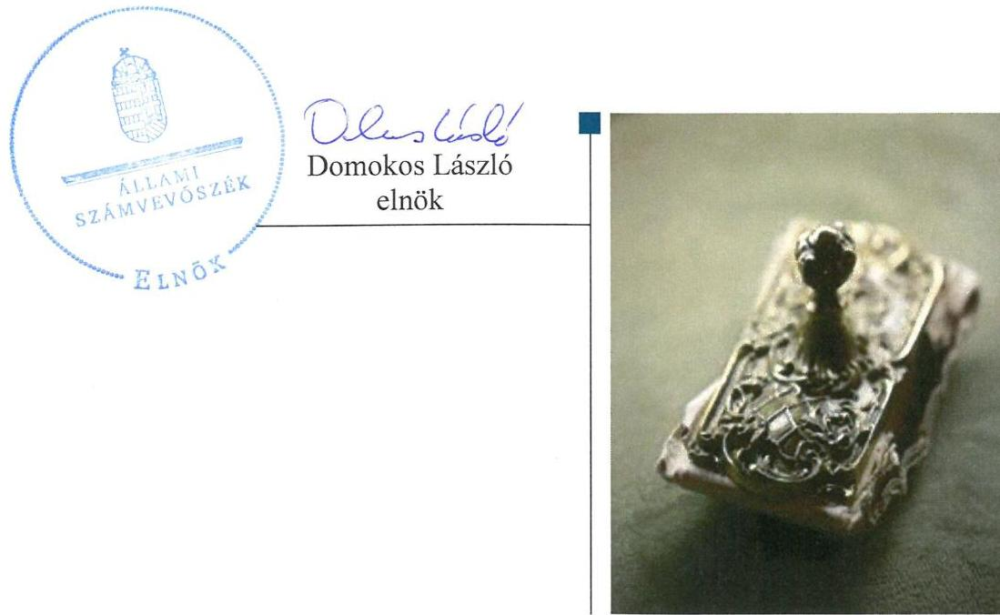
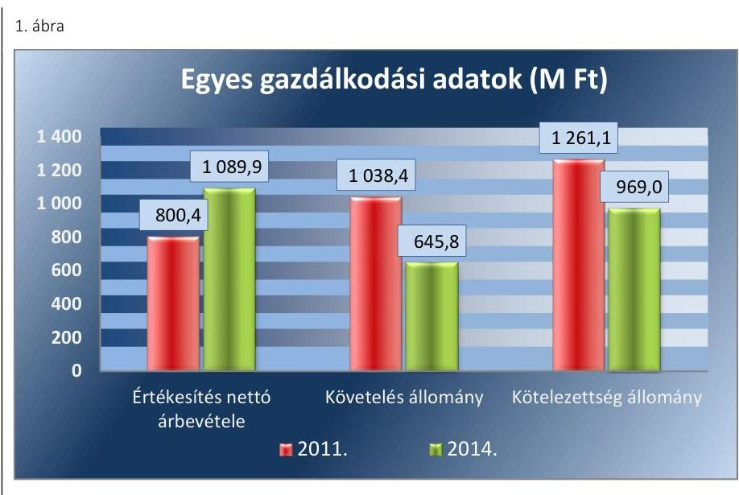
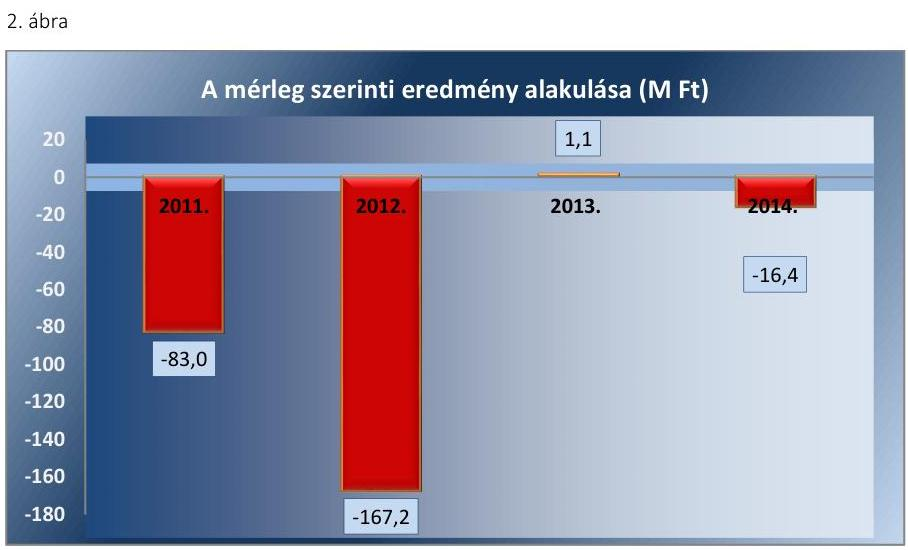
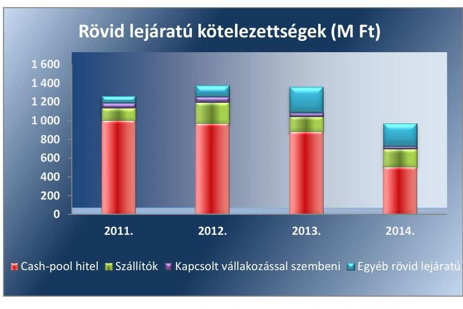
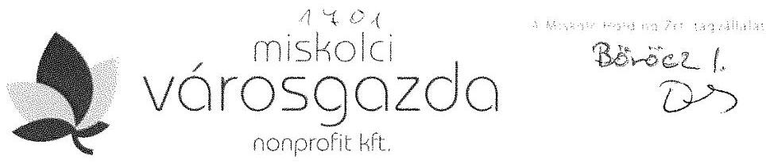
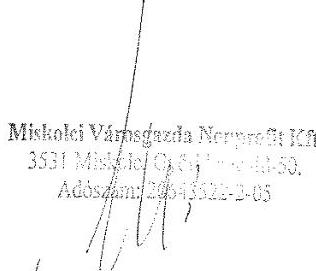
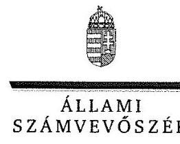
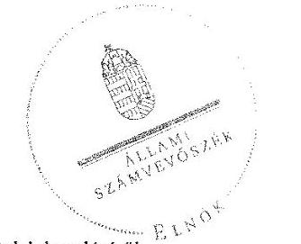
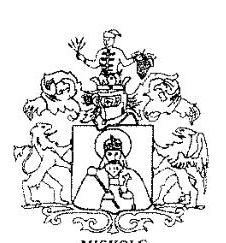
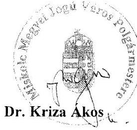

# Jelentés 

## Az önkormányzatok gazdasági társaságai

Az önkormányzatok többségi tulajdonában lévő gazdasági társaságok gazdálkodásának ellenőrzése - Miskolci Városgazda Nonprofit Kft. 2017.

---

# Jelenetés 

## Az önkormányzatok gazdasági társaságai

Az önkormányzatok többségi tulajdonában lévő gazdasági társaságok gazdálkodásának ellenőrzése - Miskolci Városgazda Nonprofit Kft. 2017. janned hó 18. nap

---

# AZ ELLENŐRZÉST FELÜGYELTE:

- BÖRÖCZ IMRE felügyeleti vezető

- AZ ELLENŐRZÉST VEZETTE ÉS A VÉGREHAJTÁSÁÉRT FELELŐS:
  - FÉSÜS NÓRA ellenőrzésvezető
  - GÁCSER JÓZSEF ellenőrzésvezető

- A PROGRAM ÖSSZEÁLLÍTÁSÁÉRT FELELŐS:
  - JANIK JÓZSEF LÁSZLÓ osztályvezető

- IKTATÓSZÁM: V-1082-115/2016.
  - TÉMASZÁM: 2116.
  - ELLENŐRZÉS-AZONOSÍTÓ SZÁM: V070746

Jelentéseink az Országgyűlés számítógépes hálózatán és az Interneta a www.asz.hu címen is olvashatóak.

---

# TARTALOMJEGYZÉK 

■ ÖSSZEGZÉS ..... 5
■ AZ ELLENŐRZÉS CÉLJA ..... 7
■ AZ ELLENŐRZÉS TERÜLETE ..... 8
■ AZ ELLENŐRZÉS HÁTTERE, INDOKOLTSÁGA ..... 10
■ A JELENTÉS LÉNYEGES KÉRDÉSKÖREI ..... 12
■ ELLENŐRZÉS HATÓKÖRE ÉS MÓDSZEREI ..... 13
■ MEGÁLLAPÍTÁSOK ..... 15
■ JAVASLATOK ..... 27
■ MELLÉKLETEK ..... 29
I. Sz. melléklet: Értelmező szótár. ..... 29
II. Sz. melléklet: Alapító okirat szerinti tevékenységek. ..... 32
III. Sz. melléklet: A Társaság főbb mérleg adatai (M FT) ..... 33
■ FÜGGELÉK: ÉSZREVÉTELEK ..... 35
■ RÖVIDÍTÉSEK JEGYZÉKE ..... 43

---

.

---

# ÖSSZEGZÉS 

Miskolc Megyei Jogú Város Önkormányzata a közfeladat ellátását összességében szabályszerűen szervezte meg 2011-2014. között. A Miskolc Holding Önkormányzati Vagyonkezelő Zrt. a Miskolci Városgazda Városgazdálkodási Közhasznú NKft. feletti tulajdonosi jogait szabályszerűen gyakorolta. A Miskolci Városgazda Városgazdálkodási Közhasznú NKft. vagyongazdálkodása összességében szabályszerű volt. A beszámolási kötelezettségeket teljesítette, a 2011-2013. években az adatok védelmét, és a közhasznúsági adatok saját honlapon való átláthatóságát nem biztosította. A kötelezettségállomány alakulása a gazdálkodás stabilitását, a likviditási problémák a közfeladat ellátását veszélyeztették. Az ellátott közfeladat bevételei és ráfordításai elszámolása szabályszerű volt, az önköltségszámítás és árképzés azonban nem felelt meg az előírásoknak. A kormányzati szektor hiányára befolyással bíró elemek elszámolása összességében megfelelt a jogszabályi előírásoknak, amellett, hogy a veszteséges gazdálkodás a hiányt növelte.

## Az ellenőrzés társadalmi indokoltsága

Az Állami Számvevőszék kiemelt célja, hogy a helyi önkormányzatok gazdálkodásában rejlő pénzügyi kockázatok feltárásával, az államháztartáson kívülre nyújtott költségvetési támogatások és ingyenes vagyonjuttatások, valamint az államháztartáson kívül múködő feladat-ellátó rendszerek ellenőrzéseivel hozzájáruljon ahhoz, hogy a közpénzeket az államháztartáson kívül múködő szervezetek is átlátható, rendezett módon használják fel.

A Magyarországon az intézmény-centrikus közfeladat-ellátás jellemző, de egyre jelentősebb a költségvetésen kívüli feladatellátás térnyerése. Ennek legfontosabb szereplői - a nonprofit szervezetek mellett - az önkormányzati tulajdonú gazdasági társaságok. Az önkormányzatok szervezetalakítási szabadságának következménye, hogy a korábban is vállalati formában múködő közszolgáltatások mellett, mind a kötelező, mind az önként vállalt feladatok ellátásában a gazdasági társaságok kiemelt fontosságú szerephez jutottak.

## Főbb megállapítások, következtetések, javaslatok

Miskolc Megyei Jogú Város Önkormányzata a közfeladat-ellátás megszervezése során rendeletalkotási kötelezettségének eleget tett, közszolgáltatási szerződéseket és támogatási megállapodásokat kötött, ugyanakkor a temetkezési feladatok ellátásával kapcsolatban szabályszerű kegyeleti közszolgáltatási szerződéssel nem rendelkezett. A Miskolci Városgazda Városgazdálkodási Közhasznú NKft. feletti tulajdonosi jogait a Miskolc Holding Önkormányzati Vagyonkezelő Zrt. szabályszerűen gyakorolta, ennek keretében eleget tett a beszámoltatási- és felügyeleti rendszer múködtetési kötelezettségeinek.

A Miskolci Városgazda Városgazdálkodási Közhasznú NKft. rendelkezett a múködéshez szükséges szabályzatokkal, ugyanakkor a számlarendet nem a jogszabályi előírásoknak megfelelően készítette el. A mérlegadatokat leltárral alátámasztotta, valamint a közhasznú tevékenységekhez kapcsolódó vagyon analitikus elkülönítéséről gondoskodott. Az előírt beszámolási kötelezettségét az előírásoknak és a tulajdonosi elvárásoknak megfelelően teljesítette. A 20112013. években az adatok védelmét, és a közhasznúsági adatok saját honlapon való átláthatóságát nem biztosította. A kötelezettségállomány alakulása a gazdálkodás stabilitását, a 2011-2013. között fennálló likviditási problémák a közfeladat ellátását veszélyeztették.

A közfeladat-ellátás ráfordításainak és bevételeinek elszámolása szabályszerű volt, ugyanakkor a beruházások, felújítások és az értékcsökkenés elszámolása nem volt megfelelő. Az alkalmazott díjakkal kapcsolatban elő- és utókalkulációkkal nem rendelkeztek, ezért az önköltségszámítás és árképzés nem felelt meg az előírásoknak. A Miskolci Városgazda Városgazdálkodási Közhasznú NKft. likvid hitelei nem tartoztak a Stabilitási tv. hatálya alá.

---

A kormányzati szektor hiányára befolyást gyakorló bevételek elszámolása részben megfelelő, a személyi és az egyéb ráfordítások elszámolása megfelelő volt. Ugyanakkor a 2011-2014. évi eredmény összességében 265,5 millió Ft összeggel növelte a kormányzati szektor hiányát.

Az ÁSZ a Társaság ügyvezetőjének, valamint Miskolc Megyei Jogú Város Önkormányzata polgármesterének fogalmazott meg javaslatokat, amelyek alapján kötelesek intézkedési tervet összeállítani és azt a jelentés kézhezvételétől számított 30 napon belül az ÁSZ részére megküldeni.

---

# AZ ELLENŐRZÉS CÉLJA 

Az ellenőrzés célja annak értékelése volt, hogy az önkormányzat vagyongazdálkodási tevékenysége során szabályszerűen gyakorolta-e tulajdonosi jogait; a gazdasági társaság szabályozottsága, gazdálkodása és vagyongazdálkodási tevékenysége, bevételeinek és ráfordításainak elszámolása megfelelt-e a jogszabályi és tulajdonosi előírásoknak; a gazdasági társaság kötelezettségállománya jelent-e kockázatot a múködésre, a gazdálkodás átláthatósága és elszámoltathatósága érdekében biztosítva volte a szolgáltatás dijának megalapozottsága szabályszerű önköltségszámítással, valamint, hogy a kormányzati szek-
tor hiányára és az államadósságra befolyással bíró elemek elszámolása megfelelt-e a jogszabályi előírásoknak.

---

# AZ ELLENŐRZÉS TERÜLETE 

## Miskolc Megyei Jogú Város Önkormányzata, Miskolc Holding Önkormányzati Vagyonkezelö Zrt. és a Városgazda Nonprofit Kft.

A MISKOLCI VÁROSGAZDA Városgazdálkodási Közhasznú Társaságot a Miskolc Megyei Jogú Város Önkormányzata 2000. február 3-án kelt társasági szerződéssel hozta létre átalakítással, a társadalom közös szükségletek kielégítését - nyereség és vagyonszerzési cél nélkül - szolgáló tevékenység folytatására. Társaság ${ }^{1}$ a Gt. ${ }^{2}$ törvényi kötelezettségnek megfeleltetve, az alapító okiratot módosításával 2009. április 15-étől Miskolci Városgazda Városgazdálkodási Közhasznú Nonprofit Korlátolt Felelősségű Társaságként müködik. A Társaság jegyzett tőkéje 4,0 M Ft volt a 2011-2014-es években.

A Társaság az ellenőrzött időszakban az Önkormányzat által támogatott közhasznú tevékenységeket (pl.: állatkert müködtetése), Civil ${ }^{3}$ tv. szerinti közhasznú tevékenységeket (pl.: hátrányos helyzetűek foglalkoztatásának elősegítése), közszolgáltatásokat (pl.: helyi közutak és közterületek fenntartása) és vállalkozási tevékenységeket (pl.: alapfeladaton túli karbantartás) látott el.

A Társaság alapító okiratában az ellenőrzött időszak végén meghatározott tevékenységeit az II. számú melléklet mutatja be. A Társaság szervezeti keretein belül müködik a Temetőgondnokság, a Miskolci Állatkert és Kultúrpark, a Piacfelügyelőség és az Állategészségügyi telep.

A Társaság a 2012. február 16. keltű NGM közlemény ${ }^{4}$ alapján a kormányzati szektorba sorolt egyéb szervezetnek minősült.

## A MISKOLC HOLDING ÖNKORMÁNYZATI VAGYONKEZELŐ ZRT.-t az Önkormányzat ${ }^{5}$ 2006. július 6-án létrehozta, majd apportként átruházta rá az egyszemélyes tulajdonában álló Társaságra vonatkozó üzletrész tulajdonjogát. A Társaság feletti tulajdonosi jogokat a Holding ${ }^{6}$ az ellenőrzött időszakban kizárólagosan gyakorolta, 2006. szeptember 1-jétől.

A Társaság ügyvezetése háromszor, a gazdasági vezetője személye pedig kétszer változott a 2011. január 01-jétől 2014. december 31-éig tartó időszakban. A foglalkoztatottak átlagos statisztika létszáma a 2011. évben 821 fő, a 2014. évben 906 fő volt, amelynek oka a főállású fizikai alkalmazottak létszámának növekedése volt. A Holding ügyvezető személye, valamint az igazgatósági tagok az ellenőrzött időszakban változtak.

A Társaság gazdálkodásának egyes adatait a 2011., 2014. évek vonatkozásában az 1. ábra szemlélteti, a további mérlegadatokat az III. számú melléklet tartalmazza.

---

Forrás: A Társaság 2011. és 2014. évi beszámolói
A Társaság nettó árbevétele növekedett, a követelések állománya csökkent, amelyet befolyásolt a szolgáltatásból származó követelések - elsősorban az Önkormányzattal szembeni - realizálódása. A kötelezettségállományát a rövid lejáratú hitelek csökkenése befolyásolta.

Az ellenőrzött időszakban a polgármester ${ }^{7}$ személye nem változott, a 2010. évi önkormányzati választások óta tölti be tisztségét, a jegyző ${ }^{8}$ 2011. május 1-jétől látja el feladatait.

---

# AZ ELLENŐRZÉS HÁTTERE, INDOKOLTSÁGA 

AZ ÖNKORMÁNYZATI TULAJDONÚ GAZDASÁGI TÁRSASÁGOK ellenőrzése kiemelten fontos a vagyon megőrzése, megóvása érdekében, valamint a kormányzati szektor elszámolásaiban megjelenő önkormányzati tulajdonú gazdálkodó szervezetek esetében, amelyekkel szemben alapvető követelmény, hogy gazdálkodásuk, működésük szabályszerű, az általuk szolgáltatott adatok minél megbízhatóbbak legyenek. A feladat/közfeladat-ellátás költségeinek, ráfordításainak alakulása, színvonala hatással van a lakosság elégedettségére.

A törvényalkotás számára - az észlelt problémák, szabálytalanságok, vagy egyéb nem kívánatos jelenségek felszínre kerülésével - az ellenőrzés megállapításai segítséget nyújthatnak az államháztartáson kívüli feladat/közfeladat-ellátás értékeléséhez, jogszabályi keretei pontosításához, átláthatóságot biztosító szabályozásához. Meghatározhatóvá válnak az önkormányzati feladatellátásban részt vevő államháztartáson kívüli szervezeteknek - az önkormányzat költségvetését, pénzügyi helyzetét is befolyásoló - kockázatai, lehetővé válik ezen kockázatok csökkentése. Ellenőrzéseink feltárhatják, hogy az önkormányzat feladat-ellátási kötelezettségének szabályszerűen tett-e eleget, a feladatellátáshoz rendelt vagyonkezelésbe vett és saját vagyon működtetését az elvárható gondossággal, szabályszerűen szervezte-e meg és a tulajdonosi felügyelete hozzájárult-e a feladatellátásához. Az ellenőrzés rávilágíthat arra, hogy a gazdasági társaság a feladat-ellátási, közszolgáltatási szerződésben foglaltak betartásával, a vagyon használatával biztosította-e a szolgáltatás folytatásának feltételeit, a feladat ellátását. Ezzel az ellenőrzöttek és a helyi döntéshozók számára visszajelzést ad feladatszervezési, feladat-ellátási kockázataikról, alapot ad a meglévő hibák megszüntetéséhez, a jobb feladatellátás biztosításához. Fokozza a fegyelmet, igazolja, hogy lejárt a következmények nélküli ellenőrzések időszaka. Az ÁSZ ${ }^{9}$ értékteremtő rend kialakításához és megőrzéséhez hozzájáruló tevékenysége pozitív hatással van a szervezetről kialakított összkép formálására.

## A KORMÁNYZATI SZEKTORBA SOROLT EGYÉB

SZERVEZETEK közé tartoznak a 479/2009/EK rendelet ${ }^{10}$ szerint, illetve az ESA 95 statisztikai módszertana alapján a "helyi kormányzat alszektorba besorolt társaságok és egyéb szervezetek" is, amelyekkel szemben alapvető követelmény, hogy gazdálkodásuk, működésük szabályszerű, az általuk szolgáltatott adatok megbízhatóak legyenek.

A nemzeti számlák összeállításának módszertana 2014. október 1-jétől megváltozott, amely értelmében az ESA 2010 felváltotta az ESA 95 módszertant. A nemzeti számlák rendszerének legfontosabb jellemzői, alapvető vonásai változatlanok maradtak, ugyanakkor az ESA 2010 követi a gazdasági környezetben lezajlott változásokat, figyelembe veszi az új kutatási eredményeket és a felhasználók új igényeit.

Az ellenőrzés során feltárjuk, hogy a kormányzati szektor önkormányzati alszektorába sorolt egyéb szervezetek (továbbiakban kormányzati szektorba sorolt gazdasági társaságok) gazdálkodása milyen mértékben

---

befolyásolja a költségvetési hiányt és az államadósságot. Az ellenőrzés rámutathat a többségi önkormányzati tulajdonú gazdasági társaságok gazdálkodási tevékenységével, valamint az államháztartásból származó források felhasználásával kapcsolatos jó gyakorlatokra és szabálytalanságokra. Felhívhatja a figyelmet a jogszabályi követelmények teljesítéséhez szükséges feltételek hiányosságaira, hozzájárulhat az államháztartáson kívüli, de (közvetlenül vagy közvetve) önkormányzati vagyont használó gazdasági társaságok tevékenységének átláthatóságához. Hozzájárulhat a feladat/közfeladat-ellátás minőségének javulásához. Az ÁSZ értékteremtő rend kialakításához és megőrzéséhez hozzájáruló tevékenysége pozitív hatással van a szervezetről kialakított összkép formálására is.

---

# A JELENTÉS LÉNYEGES KÉRDÉSKÖREI 

1.     - Az Önkormányzat közfeladat megszervezéséről szóló döntése, valamint a Holding tulajdonosi joggyakorlása szabályszerű volt-e?
2.     - A gazdasági társaság vagyongazdálkodása szabályszerű volt-e, kötelezettségállománya jelent-e kockázatot a müködésre, illetve a közfeladat ellátására?
3.     - A gazdasági társaságnál az ellátott közfeladat bevételei és ráfordításai elszámolása, valamint az önköltségszámítás és árképzés szabályszerű volt-e?
4.     - A többségi önkormányzati tulajdonban lévő gazdasági társaságok gazdálkodásának a kormányzati szektor hiányára és az államadósságra befolyással bíró elemei megfeleltek-e a jogszabályi előírásoknak?

---

# ELLENŐRZÉS HATÓKÖRE ÉS MÓDSZEREI 

## Az ellenőrzés típusa

Megfelelőségi ellenőrzés

## Az ellenőrzött időszak

Az ellenőrzött időszak 2011. január 1-jétől 2014. december 31-ig tart.

## Az ellenőrzés tárgya

A Miskolci Városgazda Városgazdálkodási Közhasznú Nonprofit Kft. feletti tulajdonosi joggyakorlás, valamint a gazdasági társaság gazdálkodásának szabályozottsága és szabályszerűsége.

A kormányzati szektorba sorolt, többségi önkormányzati tulajdonban lévő gazdasági társaságok gazdálkodásának a kormányzati szektor hiányára és az államadósságra befolyással bíró elemei szabályszerűsége

Az ellenőrzés kiterjed minden olyan körülményre és adatra, amely az ÁSZ jogszabályban meghatározott feladatainak teljesítéséhez, valamint a program végrehajtása folyamán felmerült újabb összefüggések feltárásához szükséges.

## Az ellenőrzött szervezet

Miskolc Megyei Jogú Város Önkormányzata, Miskolc Holding Önkormányzati Vagyonkezelő Zrt. és a Miskolci Városgazda Városgazdálkodási Közhasznú Nonprofit Kft.

## Az ellenőrzés jogalapja

Az ellenőrzés jogszabályi alapját az ÁSZ tv. ${ }^{11}$ 1. § (3) bekezdése és 5. § (3)-(4)-(5) bekezdései képezik.

## Az ellenőrzés módszerei

Az ellenőrzés a kiválasztott kormányzati szektorba sorolt gazdasági társaságra, illetve a tulajdonosi jogokat gyakorló önkormányzatra, valamint az ellenőrzésre kijelölt kormányzati szektorba sorolt gazdasági társaság felett tulajdonosi jogokat gyakorló szervezetre (holding szervezetre) terjed ki.

---

A programmodul a V0758 ellenőrzés-azonosító számú, „Az önkormányzatok gazdasági társaságai - Az önkormányzatok többségi tulajdonában lévő gazdasági társaságok gazdálkodásának ellenőrzése" című programra (alapprogram) épül, az egyes programpontok megválaszolásához az alapprogramban található tanúsítványokat is szükséges igénybe venni. A programmodulban megfogalmazott ellenőrzési célok megválaszolásához az alapprogram 2. és 3. pontjaiban foglalt megállapításokat is figyelembe kell venni.

Az ellenőrzést a nemzetközi standardokat irányadónak tekintve az ellenőrzési program ellenőrzési kérdései, az ellenőrzött időszakban hatályos jogszabályok, az ellenőrzés szakmai szabályok és módszertanok figyelembe vételével végeztük.

Az ellenőrzés ideje alatt az ellenőrzött szervezettel történő kapcsolattartást az ÁSZ Szervezeti és Működési Szabályzatának vonatkozó előírásai alapján biztosítottuk.

Az ellenőrzési kérdések megválaszolásához szükséges bizonyítékok megszerzése a következő ellenőrzési eljárások alkalmazásával történt: megfigyelés, kérdésfeltevés (információkérés), összehasonlítás, valamint elemző eljárás. Az ellenőrzési bizonyítékként felhasználható adatforrások közé tartoztak egyrészt az ellenőrzési programban felsorolt adatforrások, másrészt adatforrás még minden - az ellenőrzés folyamán - feltárt, az ellenőrzés szempontjából információkat tartalmazó dokumentum.

Az ellenőrzést a kérdésekre adott válaszok kiértékelésével, valamint a megjelölt adatforrások, a csatolt tanúsítványok felhasználásával, továbbá az adott időszakban hatályos jogszabályok figyelembe vételével folytattuk le.

A bevételek és ráfordítások elszámolása, valamint a vagyonnyilvántartás terén a szabályszerű működést véletlen mintavétellel ellenőriztük. A kormányzati szektorba sorolt gazdálkodó szervezetek esetében a személyi jellegű ráfordítások elszámolása mellett az egyéb ráfordítások, pénzügyi műveletek ráfordításai, rendkívüli ráfordítások, illetve az egyéb bevételek, pénzügyi műveletek bevételei, rendkívüli bevételek elszámolásának szabályszerűségét szintén mintatételeken keresztül ellenőriztük. A mintavétellel ellenőrzött területek esetében minden egyes tétel vonatkozásában a szabályszerűségre vonatkozó kérdéseket tettünk fel, amelyek eredménye összesítésre került. A jogszabályoknak és a belső előírásoknak megfelelőnek tekintettük az adott területet, amennyiben a minta ellenőrzésének eredménye alapján 95\%-os bizonyossággal a teljes sokaságban a hibaarány kisebb volt, mint 10\%, nem megfelelőnek, ha a hibaarány a 10\%-ot meghaladta. Részben megfelelő minősítést adtunk, amennyiben egy adott terület vonatkozásában a minta alapján a teljes sokaságban nem volt egyértelműen biztosított a jogszabályoknak és a belső szabályzatoknak megfelelő működés.

A ráfordítások elszámolására és a vagyonnyilvántartásra vonatkozó véletlen mintavételt kockázati alapú kiválasztással egészítettük ki, amelynek során évente a három legnagyobb összegű tételt választottuk ki.

---

# 1. Az Önkormányzat közfeladat megszervezéséről szóló döntése, valamint a Holding tulajdonosi joggyakorlása szabályszerű volt-e? 

Összegző megállapítás

Az Önkormányzat a közfeladat-ellátás megszervezéséről öszszességében szabályszerűen gondoskodott. A Holding a Társaság feletti tulajdonosi jogait szabályszerűen gyakorolta.
1.1. számú megállapítás

Az Önkormányzat a közfeladat-ellátás megszervezése során rendeletalkotási kötelezettségének eleget tett, közszolgáltatási szerződéseket és támogatási megállapodásokat kötött, ugyanakkor szabályszerű kegyeleti közszolgáltatási szerződéssel nem rendelkezett.

AZ ÖNKORMÁNYZAT GAZDASÁGI PROGRAMJÁT ${ }^{12}$ a Közgyűlés ${ }^{13}$ - az Ötv. ${ }^{14}$ 91. § (7) bekezdésében meghatározott határidőn belül - 2010. március 10-én elfogadta. A 2011-2014. időszakra vonatkozó gazdasági program - az Ötv. 91. § (6) bekezdésével összhangban - tartalmazta a Társaság által ellátott tevékenységekhez kapcsolódó feladatokat.

Az Önkormányzat az Nvtv. ${ }^{15}$ 9. § (1) bekezdésben foglaltak szerint, 2012. június 21-én jóváhagyta vagyongazdálkodási tervét ${ }^{16}$. Ebben rögzítették az Ötv. 8. \$(1) bekezdése, valamint az Mötv. ${ }^{17}$ 13. § (1) bekezdése alapján az Önkormányzat által ellátandó feladatok közül a Társaság közszolgáltatási szerződés alapján végzett tevékenységeit.

A Közgyűlés 2014. szeptember 18-án elfogadta a 2014-2020 közötti időszak integrált településfejlesztési stratégiáját. A stratégiai célkitűzések között - a 314/2012. (XI. 8.) Korm. rendelet ${ }^{18}$ 5. és 6. §-aival összhangban - rögzítették a városgazdálkodási feladatok fejlesztési elképzeléseit.

A KÖZFELADATOK MEGSZERVEZÉSÉRŐL az Önkormányzat az alapító okirat elfogadásával, az ellenőrzött időszak előtt döntött. Az alapító okiratot indokolt esetekben módosították, az ellátandó feladatok körét a Gt. 12. § (1) bekezdésének, valamint a Ptk. ${ }^{19}$ 3:5 §-ának megfelelően rögzítették.

További jogokat és kötelezettségeket az Önkormányzat a Társasággal kötött közszolgáltatási szerződés ${ }^{20}$-ben rögzített. A közszolgáltatási szerződések 2011-2014. évek között kerültek megkötésre.

A KÖZSZOLGÁLTATÁSOK DÍJAIRÓL az Önkormányzat évente döntött. A közszolgáltatási szerződésben határozta meg a közszolgáltatási díjmegállapítására vonatkozó szabályokat, a közszolgáltatási díjakat és a közszolgáltatások folytatása érdekében az üzemeltetési költségekhez rendelt működési támogatásokat. Az Önkormányzat közszolgáltatás

---

1. táblázat

ÖNKORMÁNYZATI TÁMOGATÁSOK ALKULÁSA (M FT)

| 2011. év | 414,0 |
| :-- | :--: |
| 2012. év | 258,0 |
| 2013. év | 447,0 |
| 2014. év | 512,0 |
| Összesen | 1.631,0 |

Fonrás: Társaság 2011-2014. évi beszámolói
1.2. számú megállapítás
kapcsán kötelezte a Társaságot írásbeli javaslattételre, amelynek tartalmaznia kellett a szolgáltatási ellenértékre vonatkozó gazdasági adatokat, számításokat és a beruházási, fejlesztési javaslatokat.

RENDELETALKOTÁSI KÖTELEZETTSÉGÉT az Önkormányzat a tulajdonában lévő temetők fenntartásához kapcsolódóan teljesítette. A Temetkezési tv. ${ }^{21}$ 41. § (3) bekezdésében kapott felhatalmazás alapján a Közgyűlés elfogadta a temetkezési rendeletét ${ }^{22}$, valamint a Temetkezési tv. 40. § (2) bekezdése alapján a temetői díjrendeletében ${ }^{23}$ meghatározta a díjak mértékét.

A temetkezési rendeletében döntött arról, hogy az Önkormányzat tulajdonában lévő köztemetők üzemeltetését a Társaság Temetőgondnoksága látja el.

A Temetkezési tv. 39. § (2) bekezdésének megfelelő tartalmú kegyeleti közszolgáltatási szerződést, e törvény 16. §-ában foglaltak ellenére azonban nem kötöttek.

A Társaság a köztemetők üzemeltetését egy - az általa ellátott közszolgáltatásokra egységesen vonatkozó - keretjellegú közszolgáltatási szerződésben foglalt felhatalmazás alapján látta el.

## A KÖZHASZNÚ TEVÉKENYSÉGEK ÖNKORMÁNY-

ZATI TÁMOGATÁSAIRÓL (pl.: állategészségügyi telep üzemeltetése, állatkert működési támogatása, közmunkaprogram önrésze, választókerületi feladatok ellátása) az Önkormányzat és a Társaság külön megállapodásokban rendelkezett, melyek az Önkormányzat éves költségvetési rendeletében jóváhagyott támogatási kereteket tartalmazták. Az önkormányzati támogatások alakulását a 1. táblázat részletezi.

Keretmódosítás, vagy feladatbővülés esetén a megállapodásokat módosították. A célhoz kötött támogatásokkal év végén kellett elszámolnia a Társaságnak Önkormányzat felé.

Az Önkormányzatnak a Társaság kötelezettségvállalásához kapcsolódó garancia- és kezességvállalása nem keletkezett. Vagyonkezelési, üzemeltetési, illetve bérleti szerződéssel átadott önkormányzati vagyonnal a Társaság nem rendelkezett.

## A Társaság feletti tulajdonosi jogait a Holding szabályszerűen gyakorolta, ennek keretében a beszámoltatási- és felügyeleti rendszerhez kötődő törvényi kötelezettségeinek eleget tett.

TULAJ DONOSI JOGOK gyakorlásának rendjét az alapító okirat, a menedzsment-szerződés ${ }^{24}$ és a Holding szabályzatai rögzítették.

Az alapító okirat előírásai szerint, a Gt. 19. § (5) bekezdésében, valamint a Ptk. 3:109. § (4) bekezdésében előírtakkal összhangban a Társaság egyszemélyes társaságként jött létre, így a legfőbb szerv hatáskörében az egyedüli tagként a Holding határozott.

A Holding előírta, hogy a vagyongazdálkodási döntések megalapozására előterjesztést a Holding Igazgatósága részére kell készíteni, amelynek formai és tartalmi követelményeit, valamint a felelőseit is rögzítette.

---

Az ügyvezető számára, az alapító okiratban meghatározottakon túl a Holding menedzsment szerződés alapján előírta üzleti terv készítését, az azzal kapcsolatos monitoring tevékenység elvégzésének kötelezettségét.

A Holding Igazgatósága a jogszabályi előírásokkal összhangban döntött az üzleti tervek jóváhagyásáról, a számviteli beszámoló elfogadásáról, és a mérleg szerinti eredményről, a könyvvizsgáló és az FB tagok megválasztásáról. A Holding konszolidált beszámolói elfogadásáról a Közgyűlés határozattal döntött.

A Holding menedzsment szerződésben írta elő az éves üzleti tervek készítését, amelyek összeállítására 2012-től évenként írásos tervezési irányelveket bocsátott a tagvállalatai rendelkezésére. Az üzleti tervek jóváhagyása a Gt. 19. § (3) bekezdése, valamint a Ptk. 3:109. § (2) bekezdése alapján a Holding kizárólagos hatáskörébe tartozott, amelyet az üzleti terveket elfogadó igazgatósági határozatok kiadásával teljesített.

A TÁRSASÁG FELÜGYELŐBIZOTTSÁGA az Alapító okiratban előírtak alapján - a Gt. 34. § (1) bekezdésével, valamint a Ptk. 3:121. § (1) bekezdésével összhangban - három tagból állt. Az FB ${ }^{25}$ egyharmada a munkavállalók képviselőiből állt a Gt. 38. § (1) bekezdésben, valamint a Ptk. 3:124. § (1) bekezdésben előírtak szerint.

Az FB elkészítette ügyrendjét, melyet a Holding a Gt. 34. § (4) bekezdésével összhangban határozatával jóváhagyott. Az FB hatáskörébe tartozott az ügyvezetés ellenőrzése, az éves beszámoló véleményezése, üzletpolitikai döntésekhez kapcsolódóan javaslatok készítése.

AZ ANYAGI ÉRDEKELTSÉGI RENDSZER elemeit a Taktv². 5. § (3) bekezdésében foglaltaknak megfelelően a Holding Igazgatósága által elfogadott javadalmazási szabályzatban rögzítették. A javadalmazási szabályzat kiterjedt az ügyvezető és a tisztségviselők vonatkozó javadalmazási elveire és szabályaira, a prémium fizetés feltételeire és mértékére, a költségtérítés szabályozására.

A Holding Igazgatósága évente határozatban döntött az éves beszámolók alapján a prémiumfeladatok teljesítéséről és annak kifizethetőségéről.

A BESZÁMOLTATÁSI RENDSZERT a Holding múködtette, az ügyvezetőt a Társaság vagyoni helyzetéről és üzletpolitikájáról negyedévente beszámoltatta. A Holding az éves beszámolók elkészítéséhez minden évben zárlati ütemtervet adott ki, amelyben részletesen meghatározta a határidőket, a feladatokat és a felelősöket. A Társaság a 2011-2014. üzleti éveiről készített éves beszámolóit a Holding Igazgatósága megtárgyalta és elfogadta. Az éves beszámolók elfogadásáról a Gt. 35. § (3) bekezdésének és a Ptk. 3:120. § (2) bekezdésének előírásait betartva az FB és a könyvvizsgáló írásos jelentésének birtokában döntöttek.

A Társaság jövedelmezőségét, a mérleg szerinti eredményének ellenőrzött időszakon belüli alakulását a 2. ábra mutatja be.

---

Fornós: A Társaság 2011-2014. évi beszámolói
PÓTBEFIZETÉST 2012. évben a Holding 162,3 M Ft összegben teljesített a Gt. 120. §-a alapján. A pótbefizetéssel előre biztosították, hogy a Gt. 51. §-nak megfelelően a Társaság saját tőkéje egymást követő két teljes üzleti évben ne csökkenjen a jegyzett tőke szintje alá. A pótbefizetést a lekötött tartalékba helyezték, amely eljárás megfelelt a Számv. tv. 38. § (1) bekezdésének.

A saját tőke és a jegyzett tőke alakulását a 2. táblázat mutatja be.
2. táblázat

| A SAJÁT TŐKE, JEGYZETT TŐKE ALAKULÁSA (M FT) |  |  |  |  |
| :--: | :--: | :--: | :--: | :--: |
| Megnevezés / Évek | 2011. | 2012. | 2013 | 2014 |
| Saját tőke | 8,9 | $-158,3$ | 5,1 | $-11,3$ |
| Jegyzett tőke | 4 | 4 | 4 | 4 |

A Holding kezességet a Társaság nagy értékű seprűgépének bérleti szerződéshez kapcsolódóan a 2013. évben, 10,4 M Ft értékben vállalt, az alapító okiratban leírtak alapján.

A Holding belső ellenőrzési rendszert működtetett, melynek keretében a Társaságnál ellenőrzéseket végzett. Ezen ellenőrzések során az ellenőrzési jelentésekben megfogalmazott javaslatok ellenére intézkedési terv készítését a Holding nem írta elő. A javaslatok végrehajtásának nyomon követése hiányában a Holding belső ellenőrzési rendszere nem támogatta megfelelően a Társaság múködését.

---

# 2. A gazdasági társaság vagyongazdálkodása szabályszerű volt-e, kötelezettségállománya jelent-e kockázatot a múködésre, illetve a közfeladat ellátására? 

Összegző megállapítás

2.1. számú megállapítás

A Társaság vagyongazdálkodása összességében szabályszerű volt. A kötelezettségállomány alakulása a gazdálkodás stabilitását, a likviditási problémák a közfeladat ellátását veszélyeztette.

A Társaság rendelkezett a múködéshez szükséges szabályzatokkal, ugyanakkor a számlarendet nem a jogszabályi előírásoknak megfelelően készítette el.

A Társaság a Holding előírásainak megfelelően elkészítette az üzleti terveit, melyek összhangban voltak az önkormányzati célkitűzésekkel.

A SZÁMVITELI POLITIKÁT és annak részeként a Számv. tv. ${ }^{27}$ 14. § (5) bekezdésében előírt szabályzatokat a Számv. tv. 14. § (12) bekezdésében foglaltaknak megfelelően az ügyvezető készítette el.

A számviteli politika a Számv. tv. 14. § (3) bekezdésével összhangban, a Társaság adottságaihoz igazodóan tartalmazta az értékesítés árbevétele tevékenységenkénti elkülönítésének, valamint a költségek vállalkozási és közhasznú tevékenységekre való felosztásának szabályait.

A Társaságnál a szabályozás szintjén a 2011-2014. évben a Közhasznúsági tv. ${ }^{28}$ 18. § (1) bekezdésének, valamint a Civil. tv. 46. § (1) bekezdése és a 350/2011. (XII. 30.) Korm. rendelet ${ }^{29}$ 12. § (1) bekezdésének megfelelően biztosított volt a közhasznú tevékenységek bevételeinek és ráfordításainak átláthatósága. A közhasznú tevékenység ráfordításainak és bevételeinek egyértelmú elhatárolásához szükséges előírásokat, a közhasznúsági jelentés és - melléklet adattartalmához igazodóan meghatározták.

A számviteli politika keretén belül a Számv. tv. 14. § (3) bekezdésben foglaltakkal ellentétesen a Számv. tv. végrehajtásának módszereit teljes körűen nem határozták meg, mivel Társaság a tárgyi eszközök értékcsökkenése - Számv. tv. 52. § (1) bekezdés előírása szerinti - elszámolásának rendjét nem szabályozta.

Az eszközök és források leltárkészítési és leltározási szabályzat előírásai megfeleltek a Számv. tv. 69. § előírásainak. A pénzkezelési szabályzat megfelelt a Számv. tv. 14. § (8) bekezdésében előírtaknak. Az eszközök és források értékelési szabályzatát a Számv. tv. 14. § (5) bekezdés b) pontja alapján elkészítette. Az önköltségszámítási szabályzat készítésére a Számv. tv. 14. § (5) bekezdés c) pontja alapján a Társaság az ellenőrzött időszakban kötelezett volt, mely kötelezettségének eleget tett.

SZÁMLARENDDEL a Társaság 2012. január 1-jétől a Számv. tv.-nek megfelelően rendelkezett, amely azonban - a Számv. tv. 161. § (2) bekezdése b) és c) pontjaiban foglaltak ellenére - nem tartalmazta a főkönyvi számlák tartalmát, azok értéke növekedésének, csökkenésének jogcímeit, továbbá a főkönyvi számlák és az analitikus nyilvántartások kapcsolatát.

---

### 2.2. számú megállapítás

A Társaság a mérlegadatokat leltárral alátámasztotta, valamint a közhasznú tevékenységekhez kapcsolódó vagyon analitikus elkülönítéséről gondoskodott. Saját belső ellenőrzési rendszert a jogszabályi előírások ellenére nem múködtetett.

## LELTÁRRAL ALÁTÁMASZTOTTA a Társaság a beszámoló-

ban és a számviteli nyilvántartásokban szereplő vagyonelemek állományát, a leltározási szabályzatban foglaltaknak megfelelő módon.

A Társaság leltározási feladatainak végrehajtása megfelelt a Számv. tv. 69. § (3) bekezdésében foglalt mennyiségi felvételre és értékegyeztetésre vonatkozó előírásoknak.

A Társaság az alapítói okirat szerinti feladatait saját eszközeivel látta el. A vagyon elkülönítésére vonatkozó jogszabályi kötelezettsége nem volt a Társaságnak, ennek ellenére a közhasznú tevékenységekhez használt eszközök elkülönítéséhez analitikus nyilvántartást vezettek.

SAJÁT BELSŐ ELLENŐRZÉST az ügyvezető 2014. január 1jétől a Bkr. ${ }^{30}$ 10. §-ában foglaltak ellenére a Társaságnál nem alakított ki.

A Bkr. 1. § (2) bekezdés e) pontja alapján a Bkr. hatálya 2014. január 1-jétől kiterjedt a kormányzati szektorba sorolt egyéb szervezetekre is, így az ügyvezető köteles volt a Társaság operatív tevékenységeitől függetlenül múködő belső ellenőrzést kialakítani.
2.3. számú megállapítás

A kötelezettségállomány mértéke és szerkezete a gazdálkodás stabilitását, a 2011-2013. között fennálló likviditási problémák a közfeladatok ellátását veszélyeztették. Az önkormányzattal szembeni követelésállomány volumene meghatározó volt a hitelállomány alakulása szempontjából.

RÖVID LEJÁRATÚ KÖTELEZETTSÉGEK közül a szállítói tartozásokat jellemzően határidőn túl fizették ki. A 2012. évben volt a legmagasabb a szállítói tartozások határidőn túli pénzügyi teljesítésének az aránya, amely mintegy $59 \%$-a volt az összes szállítói tartozásnak. Ebből 36,7\% volt a 91-180 nap közötti késedelmes fizetések aránya. 2011-2013. között fennálló likviditási problémák a közfeladatok ellátását veszélyeztették. 2014-re a lejárt határidejű szállítói állomány 44,4\%-ra csökkent és 90 napon túli késedelem nem volt, amely a likviditási helyzet és a fizetési fegyelem javulását mutatta.

A Társaság Cash-pool hiteltartozása annak folyószámlahitel jellege miatt számvitelileg a rövid lejáratú kötelezettségek között szerepelt, de állandó jellege miatt a hosszú lejáratú hitel felvételét váltotta ki a Társaság gazdálkodásában. A Cash-pool hiteltartozás aránya és az abszolút értéke is folyamatosan csökkent az ellenőrzött időszakban.

A Cash-pool rendszerben keletkezett rövid lejáratú kötelezettség számviteli elszámolása és a mérlegben való szerepeltetése azonban nem felelt meg a számviteli szabályoknak.

A kapott kölcsön a 2011-2014. évi záró főkönyvi kivonatok tanúsága szerint technikai számlán maradt, és nem került elszámolásra a rövid lejáratú kötelezettségek számlára, amely a Számv. tv. 42. § (3) bekezdésébe ütközött.

---

Ezt a hibát a beszámoló készítése során úgy rendezték, hogy a kölcsön egyenleg az F/III./2. rövid lejáratú hitelek mérlegsoron került kimutatásra. Mivel kapcsolt vállalkozással (Holdinggal) szembeni kötelezettségről volt szó, ezért azt a F/III/6. rövid lejáratú kötelezettségek kapcsolt vállalkozással szemben mérlegsoron kellett volna kimutatni. Ezért a Cash-pool hitellel kapcsolatos főkönyvi elszámolások és mérlegkimutatások az ellenőrzött időszak alatt helytelenek voltak. A hibák és hibahatások azonban nem voltak hatással a saját tőkére és eredményre ezért a beszámoló valódiságát nem veszélyeztették, a pénzügyi helyzet áttekintését nem akadályozták.

Az egyéb rövid lejáratú kötelezettségek 2013-2014. évi állománynövekedését a közfoglalkoztatáshoz kapcsolódó munkaügyi elszámolásból eredt. A 2011. évben a Társaság rendelkezett még 0,5 M Ft pénzügyi lízingből eredő rövid lejáratú hitellel is.

A kötelezettségállomány mértéke és szerkezete a gazdálkodás stabilitását veszélyeztette, ugyanakkor az ellenőrzött időszakban pozitív tendenciát is azonosítottunk. Ez a hitelállomány fokozatosan csökkenésében nyilvánult meg, melyhez az önkormányzattal szembeni követelésállomány csökkenése is hozzájárult.

Az egyes rövid lejáratú kötelezettségek alakulását a 3. ábra mutatja be. 3. ábra

Forrás: A Társaság 2011-2014. évi beszámolói és fökönyvi kivonatai

HOSSZÚ LEJÁRATÚ KÖTELEZETTSÉGE a Társaságnak az ellenőrzött időszakban nem keletkezett.

# 2.4. számú megállapítás 

A Társaság az előírt beszámolási és adatszolgáltatási kötelezettségét az előírásoknak és a tulajdonosi elvárásoknak megfelelően teljesítette. A Társaságnál a 2011-2013. években az adatok védelmét, és a közhasznúsági adatok saját honlapon való átláthatóságát nem biztosították.

ÉVES BESZÁMOLÓJÁT a Társaság Számv. tv. 19. § (1) bekezdésében előírt tartalommal elkészítette, azokat az ügyvezető a Holding Igazgatósága elé terjesztette. Az éves beszámolók letétbe helyezése és közzététele a Számv. tv. 153. § (1) bekezdésnek és a 154. § (1) bekezdésének megfelelően megtörtént.

---

A közszolgáltatási szerződés alapján nyújtott szolgáltatásokkal kapcsolatos elszámolási kötelezettségét a közszolgáltatási szerződés mellékletében meghatározott díjak és teljesítések alapján kiállított számlákkal igazolta Társaság. Az Önkormányzat a számlák teljesítésigazolásakor ellenőrizte azok tartalmát és a szolgáltatási szerződésnek való megfelelőségét.

Az éves beszámolók elfogadásáról, az éves eredményfelosztásáról a Holding minden évben az FB határozatának és a könyvvizsgáló írásos jelentésének birtokában döntött. Az FB az éves beszámolókról a Gt. 35. § (3) bekezdése, valamint a Ptk. 3:120. § (2) bekezdése előírásának megfelelően elkészítette írásos jelentését. A könyvvizsgáló hitelesítő záradékkal látta el az éves beszámolókat. A könyvvizsgáló a 2012. és a 2014. évi beszámolókra vonatkozóan a veszteség miatt, a saját tőke jegyzett tőke alá csökkenése okán élt a véleménye korlátozása nélküli figyelemfelhívás lehetőségével.

A Társaság a Közhasznúsági tv. 18. § (1) bekezdésének, valamint a Civil. tv. 46. § (1) bekezdése és a 350/2011. (XII. 30.) Korm. rendelet 12. § (1) bekezdésének megfelelően a 2011. évi közhasznúsági jelentést és a 20122014. évi közhasznúsági mellékleteket a jogszabályi követelményeknek megfelelő formában és tartalommal elkészítette.

AZ ADATOK VÉDELMÉRE, KÖZZÉTÉTELÉRE vonatkozó kötelezettségének a Társaság nem a jogszabályi előírásoknak megfelelően tett eleget.
2013. szeptember 30-ig belső adatvédelmi és adatbiztonsági szabályzatot nem készítettek, belső adatvédelmi nyilvántartást nem vezettek, ezzel megsértették az Avtv. ${ }^{31}$ 31/A. § (2) bekezdés d)-e) pontjában és a (3) bekezdésben előírtakat, valamint az Info tv. ${ }^{32}$ 24. § (2) bekezdés d)-e) pontjában és a (3) bekezdésében előírtakat. Továbbá - ezen időszakra - az Avtv. 31/A. § (1) bekezdése, valamint az Info tv. 24. § (1) bekezdése előírása ellenére belső adatvédelmi felelőst nem neveztek ki.

A Társaság adatvédelmi- és adatbiztonsági szabályzata 2013. október 1-jétől volt hatályban, az adatvédelmi felelős kinevezése is megtörtént, aki az adatvédelmi nyilvántartást vezette.

A Társaság a 2011. január 1. - 2013. szeptember 30. közötti időszakra vonatkozóan nem készítette el az Avtv. 20. § (8) bekezdése, valamint az Info tv. 30. § (6) bekezdésében előírtak ellenére a közérdekű adatok megismerésére irányuló igények teljesítésének rendjét rögzítő szabályzatot.

Az Avtv. 19.§ (2) bekezdésében, az Eisztv. ${ }^{33}$ 6. § (1) bekezdésében, valamint az Info tv. 37. § (1) bekezdésben előírt közérdekű adatok közzétételére vonatkozó feladatának a Társaság eleget tett.

A Társaság a Közhasznúsági tv. 19. § (5) bekezdésében, továbbá a Civil tv. 30. § (4) bekezdésében előírtak ellenére nem gondoskodott a közhasznúsági jelentés, illetve 2012-től a közhasznúsági melléklet saját honlapon történő közzétételéről.

---

# 3. A gazdasági társaságnál az ellátott közfeladat bevételei és ráfordításai elszámolása, valamint az önköltségszámítás és árképzés szabályszerű volt-e? 

Összegző megállapítás

A Társaságnál az ellátott közfeladat bevételei és ráfordításai elszámolása szabályszerű volt. A Társaság önköltségszámítása és árképzése nem felelt meg az előírásoknak.
3.1. számú megállapítás

A közfeladat-ellátás ráfordításainak és bevételeinek elszámolása szabályszerű volt. A beruházások, felújítások és az értékcsökkenés elszámolása ugyanakkor nem volt megfelelő.

A Társaság az ellenőrzött időszakban közhasznú tevékenységeket, közszolgáltatásokat és vállalkozási tevékenységeket is ellátott.

Az egyes tevékenységek ráfordításait és bevételeit elkülönítetten mutatta ki, összhangban a számviteli politika és az önköltségszámítási szabályzat előírásaival. A számlarendben meghatározott munkaszám alkalmazásával a közhasznú és vállalkozási tevékenysége ráfordításait elkülönítette.

A KÖLTSÉGEK ÉS A RÁFORDÍTÁSOK elszámolása megfelelő volt, azokat a közfeladat, és nem közfeladat-ellátással kapcsolatosan elkülönítették, a bizonylatok megfeleltek a Számv. tv. 166. §-ában és 167. §-ában foglaltaknak.

A BEVÉTELEK ELSZÁMOLÁSA megfelelő volt, mert az értékesítés nettó árbevétele elszámolása a Számv. tv. 72-74. §-aiban előírtak szerint történt. A közszolgáltatás részét képező, kiszámlázott díjtételek elszámolása szabályszerű volt.

AZ ÉRTÉKCSÖKKENÉSI LEÍRÁS elszámolása nem volt megfelelő, mert a tárgyi eszközökre vonatkozó egyedi leírási kulcsok meghatározásának hiánya miatt az értékcsökkenési leírás elszámolás belső szabályozásnak való megfelelősége nem volt egyeztethető.

A Társaságnál terven felüli értékcsökkenés elszámolására nem került sor. A Társaság az éves beszámoló kiegészítő mellékletében a Számv. tv. 92. § (1)-(2) bekezdései szerint az ellenőrzött időszakban részletesen bemutatta az elszámolt értékcsökkenési leírást.

A BERUHÁZÁSOK ÉS FELÚJÍTÁSOK elszámolása nem volt megfelelő, mert az állománybavételt megalapozó üzembehelyezést a Számv. tv. 52. § (2) bekezdésében előírtak ellenére nem dokumentálták, így a Számv. tv. 26. § (1) bekezdésében foglaltak alapján az állománybavétel a tárgyi eszközök között nem volt szabályszerű.

A vagyongazdálkodás területén három eszközcsoportnál minősítettük a használhatóság fok alakulását. Az eszközök használhatósági foka minden vizsgált csoportban csökkent az ellenőrzött időszakban, ennek oka volt, hogy az eszközök pótlására, felújítására az elszámolt értékcsökkenésnél kevesebbet fordítottak.

---

A KÖVETELÉSEK ÁLLOMÁNYA az ellenőrzött időszakban csökkent. A kinnlevőségének meghatározó részét az Önkormányzattal szembeni vevőkövetelések és egyéb (támogatáshoz kötődő) követelések tették ki. A követeléskezelési szabályzat a követelések behajtására vonatkozóan csak általános megfogalmazást nyújtott, nem adott részletes ütemezést az egyes behajtási tevékenységek tekintetében, ennek ellenére az operatív tevékenység során a Társaság kinnlevőségeinek behajtása eredményes volt. A vevőkövetelések forgási sebessége az ellenőrzött időszakban jelentősen, a 2011-es 313,2 napról 2014. évre 101,5 napra csökkent.

A követelésállomány alakulását a 3. táblázat részletezi.
3. táblázat

KÖVETELÉSEK ALAKULÁSA (EFT)

| Megnevezés | 2011. | 2012. | 2013. | 2014. |
| :-- | --: | --: | --: | --: |
| Vevő követelések | 696,3 | 524,4 | 439,4 | 310,6 |
| ebből: Önkormányzat | 637,3 | 424,4 | 411,9 | 304,1 |
| ebből: Kapcsolt vállalkozás | 23,5 | 67,2 | 5,0 | 3,3 |
| Egyéb követelés | 342,1 | 492,9 | 545,0 | 335,2 |
| ebből: Önkormányzat | 298,8 | 448,6 | 458,5 | 242,6 |
| ÖSSZES KÖVETELÉS | 1.038,4 | 1.017,3 | 984,4 | 645,8 |

Az értékvesztések elszámolása megfelelt a Számv. tv. 15. § (8) bekezdése és e törvény 55. § (1) bekezdésében foglaltaknak, mely szerint a követelés könyv szerinti értéke és a követelés várhatóan megtérülő összege közötti - veszteségjellegű - különböz et összegében kell értékvesztést elszámolni. Az értékvesztések elszámolását egyedi minősítéssel határozták meg, azonban a 2012. évtől már alkalmazták a Számv. tv. 55. § (2) bekezdésében foglalt, a vevőnként, adósonként együttesen kisösszegű kategóriákra, csoportosan elszámolt értékvesztést.

# 3.2. számú megállapítás 

A Társaság elő- és utókalkulációkkal nem rendelkezett, ezért önköltségszámítása és árképzése nem felelt meg az előírásoknak.

A költségek tevékenységekre való felosztásának részletes szabályait a Társaság önköltségszámítási szabályzata tartalmazta. Az önköltség-számítási szabályzat rögzítette - többek között - az előkalkuláció és utókalkuláció készítésének határidejét, a könyvviteli rendszerrel való egyeztetés módját, valamint az önköltség-számítási adatok szolgáltatásáért, a kalkuláció ellenőrzéséért felelős személyek kijelölését, a kalkulációs módszerek leírását.

AZ ÖNKÖLTSÉG MEGHATÁROZÁSA nem felelt meg a Számv. tv. 14. § (7) bekezdésében foglalt előírásoknak, mert a Társaság nem határozta meg az egyes közfeladatok utókalkulált önköltségét az önköltségszámítási szabályzatban meghatározott utókalkuláció módszerével. Ennek hiányában a közszolgáltatási szerződésben meghatározott normák, előirányzatok felülvizsgálata nem volt megalapozott.

Az önköltségszámítási szabályzat pótlékoló kalkuláció alkalmazását írta elő, ugyanakkor a Társaság az egyes tevékenységek díjainak, jövedelmének a meghatározásához szükséges elő és utókalkulációval nem rendelkezett. Ezzel megsértették az önköltségszámítási szabályzat 1.8. pontja elő- és utókalkulációra vonatkozó előírását.

---

A TÁRSASÁG ÁRKÉPZÉSE nem felelt meg a közszolgáltatási szerződésben foglaltaknak sem.

A Társaság a közszolgáltatási szerződésben meghatározott normákat, elszámoló árakat minden évben felülvizsgálta, az árak változtatására vonatkozó jelzését az Önkormányzat felé megtette.

Ugyanakkor az árak kalkulációjára vonatkozó dokumentáció a Társaságnál az ellenőrzött időszakra vonatkozóan nem készült. A közszolgáltatási szerződésben foglaltak ellenére a Társaság a szolgáltatási ellenértékekre vonatkozó gazdasági adatait, számításait nem dokumentálta.

# 4. A többségi önkormányzati tulajdonban lévő gazdasági társaságok gazdálkodásának a kormányzati szektor hiányára és az államadósságra befolyással bíró elemei megfeleltek-e a jogszabályi előírásoknak? 

Összegző megállapítás

A.1. számú megállapítás

A Társaság gazdálkodásának a kormányzati szektor hiányára befolyással bíró elemeinek elszámolása összességében megfelelt a jogszabályi előírásoknak.

A kormányzati szektor hiányára befolyást gyakorló bevételek elszámolása részben megfelelő volt, a személyi jellegú és az egyéb ráfordítások elszámolása megfelelő volt, amellett, hogy a veszteséges gazdálkodás a kormányzati szektor hiányát növelte.

AZ EGYÉB BEVÉTELEK, pénzügyi műveletek bevételei és a rendkívüli bevételek számviteli elszámolásai részben feleltek meg Társaság belső előírásainak. A feleslegessé vált vagyontárgyak értékesítése során a bizonylatokhoz nem csatolták a dolgozók, vagy külső szervezet részére történő meghirdetésre beérkezett igények, ajánlatok és azok elbírálásának dokumentumait, amellyel a Társaság nem tartotta be a felesleges vagyontárgyak hasznosításának és selejtezésének szabályzata V. fejezet 2. pontjában foglalt rendelkezéseket.

A SZEMÉLYI JELLEGÚ RÁFORDÍTÁSOK és egyéb kifizetések elszámolás megfelelő volt. A bizonylatokat valamennyi esetben alátámasztották munkaidő elszámolással, valamint a juttatás elszámolása, számfejtése a Munka tv. ${ }^{34}$ és a Munka tv. ${ }^{35}$ vonatkozó előírásainak megfelelően történt.

A Társaságnál Cafeteria juttatási rendszert 2012-től vezettek be. 2011ben havonta kiadott Igazgatói utasítás alapján történt az Szja tv. ${ }^{36}$ 71. § (1) b) pontjainak megfelelő étkezési utalvány juttatása. A Cafeteria nyilatkozatok szabályszerűek voltak.

AZ EGYÉB RÁFORDÍTÁSOK, pénzügyi műveletek elszámolása megfelelő volt, a bizonylatok megfeleltek a Számv. tv. 166. §-ban és 167. §-ban foglaltaknak.

---

ADÓSSÁGOT KELETKEZTETŐ lízingügylete a Társaságnak 2012. január 1-je előtt keletkezett, ezért nem tartozott a Stabilitási tv. ${ }^{37}$ és a 353/2011. (XII. 30.) Korm. rendelet ${ }^{38}$ hatálya alá.

A Cash-pool szerződés alapján felvett hitel a 2012. január 1-jétől hatályos Stabilitási tv. 1. § c) pontja alapján likvid hitelnek minősült, ezért nem kellett alkalmazni rá a Stabilitási tv. 9. §-a előírásait az államháztartásért felelős miniszter hozzájárulására vonatkozóan.

A Társaság 2011-2014. évi mérleg szerinti eredménye összességében 265,5 millió Ft összeggel növelte a kormányzati szektor hiányát.

---

# JAVASLATOK 

Az ÁSZ tv. 33. § (1) bekezdésében foglaltak értelmében az ellenőrzött szervezet vezetője köteles a jelentésben foglalt megállapításokhoz kapcsolódó intézkedési tervet összeállítani és azt a jelentés kézhezvételétől számított 30 napon belül az ÁSZ részére megküldeni. Amennyiben az ellenőrzött szervezet vezetője nem küldi meg határidőben az intézkedési tervet, vagy továbbra sem elfogadható intézkedési tervet küld, az Állami Számvevőszék elnöke az ÁSZ tv. 33. § (3) bekezdése a) és b) pontjaiban foglaltakat érvényesítheti.

## A MISKOLCI VÁROSGAZDA Városgazdálkodási Közhasznú Nonprofit Kft. ügyvezetőjének

1. Intézkedjen köztemető fenntartására, üzemeltetésére vonatkozó kegyeleti közszolgáltatási szerződés megkötéséről a jogszabályi előírásnak megfelelően.
(1.1. sz. megállapítás 9. bekezdése alapján)
2. Intézkedjen, hogy a számviteli politika a jogszabályi előírásnak megfelelően határozza meg a Szám. tv. végrehajtásának módszereit az értékcsökkenés elszámolására vonatkozóan.
(2.1. sz. megállapítás 5. bekezdése alapján)
3. Intézkedjen, hogy a számlarend tartalmazza a jogszabályi rendelkezésekben meghatározott tartalmi elemeket.
(2.1. sz. megállapítás 7. bekezdése alapján)
4. Intézkedjen a jogszabályi előírásoknak megfelelően belső ellenőrzés kialakításáról.
(2.2. sz. megállapítás 4. bekezdése alapján)
5. Intézkedjen a jogszabályi előírásnak megfelelően a közhasznúsági melléklet saját honlapon történő közzétételéről.
(2.4. sz. megállapítás 10. bekezdése alapján)
6. Intézkedjen az üzembe helyezés hitelt érdemlő módon történő dokumentálásáról a jogszabályi előírásnak megfelelően.
(3.1. sz. megállapítás 7. bekezdése alapján)
7. Intézkedjen a közfeladatok önköltsége - jogszabályi előírásnak és önköltségszámitási szabályzatnak megfelelő - megállapításáról.
(3.2. sz. megállapítás 2-3. bekezdései alapján)

---

# Miskolc Megyei Jogú Város Önkormányzata polgármesterének 

1. Intézkedjen köztemető fenntartására, üzemeltetésére vonatkozó kegyeleti közszolgáltatási szerződés megkötéséről a jogszabályi előírásnak megfelelően.
(1.1. sz. megállapítás 9. bekezdése alapján)

---

# MELLÉKLETEK 

- I. SZ. MELLÉKLET: ÉRTELMEZŐ SZÓTÁR
gazdasági társaság
kezesség
közfeladat
közszolgáltatás
meghatározó befolyás
nemzeti vagyon
többségi befolyás

A gazdasági társaságok üzletszerű közös gazdasági tevékenység folytatására, a tagok vagyoni hozzájárulásával létrehozott, jogi személyiséggel rendelkező vállalkozások, amelyekben a tagok a nyereségből közösen részesednek, és a veszteséget közösen viselik (Ptk. 3:88. § (1) bekezdése).
A kezességre vonatkozó előírásokat a Ptk. 6:416-430. §-ai tartalmazzák. Kezességi szerződéssel a kezes kötelezettséget vállal a jogosulttal szemben, hogyha a kötelezett nem teljesít, maga fog helyette a jogosultnak teljesíteni. Kezesség egy vagy több, fennálló vagy jövőbeli, feltétlen vagy feltételes, meghatározott vagy meghatározható összegű pénzkövetelés vagy pénzben kifejezhető értékkel rendelkező egyéb kötelezettség biztosítására vállalható. A Ptk. szerint kezességet csak írásban lehet vállalni. A kezes kötelezettsége ahhoz a kötelezettséghez igazodik, amelyért kezességet vállalt. A kezes kötelezettsége nem válhat terhesebbé, mint amilyen elvállalásakor volt, kiterjed azonban a kötelezett szerződésszegésének jogkövetkezményeire és a kezesség elvállalása után esedékessé váló mellékkövetelésekre is.
Jogszabályban meghatározott állami vagy önkormányzati feladat, amit az arra kötelezett közérdekből, jogszabályban meghatározott követelményeknek és feltételeknek megfelelve végez, ideértve a lakosság közszolgáltatásokkal való ellátását, továbbá az állam nemzetközi szerződésekben vállalt kötelezettségeiből adódó közérdekű feladatokat, valamint e feladatok ellátásához szükséges infrastruktúra biztosítását is (Nvtv. 3. § (1) bekezdés 7. pont).
A közszolgáltatás: „közcélú, illetőleg közérdekú szolgáltatást jelent, amely egy nagyobb közösség (állam, település) minden tagjára nézve megközelítőleg azonos feltételek mellett vehető igénybe, ezért valamilyen mértékig közösségi megszervezést, illetve szabályozást, ellenőrzést igényel." Az Ebktv. 3. § d) pontja a következőképpen határozza meg a közszolgáltatást: „szerződéskötési kötelezettség alapján a lakosság alapvető szükségleteinek ellátására irányuló szolgáltatás, így különösen a villamos energia-, gáz-, hő-, víz-, szennyvíz- és hulladékkezelési, köztisztasági, postai és távközlési szolgáltatás, továbbá a menetrend alapján közlekedő járművekkel végzett közforgalmú személyszállitás"
A Ptk. 8:2. § (2) bekezdése szerint „A befolyással rendelkező akkor rendelkezik egy jogi személyben meghatározó befolyással, ha annak tagja vagy részvényese, és
a) jogosult e jogi személy vezető tisztségviselői vagy felügyelőbizottsága tagjai többségének megválasztására, illetve visszahívásra; vagy
b) a jogi személy más tagjai, illetve részvényesei a befolyással rendelkezővel kötött megállapodás alapján a befolyással rendelkezővel azonos tartalommal szavaznak, vagy a befolyással rendelkezőn keresztül gyakorolják szavazati jogukat, feltéve, hogy együtt a szavazatok több mint felével rendelkeznek."
Az Nvtv. 1. § (2) bekezdés c) pontja szerint „az állam vagy a helyi önkormányzatot tulajdonában lévő pénzügyi eszközök, továbbá az államot vagy a helyi önkormányzatot megillető társasági részesedések"
A Ptk. 8:2. § (1) bekezdése szerint „többségi befolyás az olyan kapcsolat, amelynek révén természetes személy vagy jogi személy (befolyással rendelkező) egy jogi személyben a szavazatok több mint felével vagy meghatározó befolyással rendelkezik."

---

tulajdonosi joggyakorló

Aki a nemzeti vagyon felett az államot vagy a helyi önkormányzatot megillető tulajdonosi jogok és kötelezettségek összességének gyakorlására jogosult (Nvtv. 3. § (1) bekezdés 17. pont).
A Holdingba tartozó különböző vállalatok számláinak csoportosítása, úgy, hogy az egyéni számlák záró egyenlegét egy technikai számlára utalják, ahol kiszámolják a kamatlábat, majd szükség szerint azt elosztják a tagvállalatok között. Ezáltal optimalizálják a készpénz kezelését. Célja a felesleges pénzmozgások kiszűrése, és a valós finanszírozási igény kimutatása.
ESA 95
Nemzeti és regionális számlák európai rendszere (a továbbiakban: ESA 95), statisztikai definíciók összessége, amely biztosítja a tagállamok gazdasági adatainak egységes és összehasonlítható nyilvántartását.
Forrás: Magyar Nemzeti Bank
ESA 2010
Az Európai Unióbeli nemzeti és regionális számlák európai rendszere (a továbbiakban: az ESA 2010), amely módszertanból és egy olyan továbbítási programból áll, amely meghatározza a tagállamok által adott határidőre benyújtandó számlákat és táblázatokat. A Bizottságnak, különös tekintettel a gazdasági konvergencia figyelemmel kísérésére és a tagállamok gazdaságpolitikái közötti szoros koordináció megteremtésére, meghatározott időpontokban adott esetben előzetesen bejelentett adatszolgáltatási naptár alapján - kell ezeket a számlákat és táblákat a felhasználók rendelkezésére bocsátania. A tagállami számlák uniós céloknak megfelelő elkészítésére vonatkozó közös előírások, fogalom meghatározások, osztályozások és számviteli szabályok referenciakerete, mely a tagállamok között összehasonlítható eredményeket szolgáltat, és mint ilyen, minden más rendszernek fokozatosan a helyébe lép (forrás: Az Európai Parlament és a Tanács 549/2013/EU rendelete (12) és (14) bekezdései).
Adósságot keletkeztető ügylet
Adósságot keletkeztető ügylet és annak értéke:
a) hitel, kölcsön felvétele, átvállalása a folyósítás, átvállalás napjától a végtörlesztés napjáig, és annak aktuális tőketartozása,
b) a Számv. tv. szerinti hitelviszonyt megtestesítő értékpapír forgalomba hozatala a forgalomba hozatal napjától a beváltás napjáig, kamatozó értékpapír esetén annak névértéke, egyéb értékpapír esetén annak vételára,
c) váltó kibocsátása a kibocsátás napjától a beváltás napjáig, és annak a váltóval kiváltott kötelezettséggel megegyező, kamatot nem tartalmazó értéke,
d) a Számv. tv. szerint pénzügyi lízing lízingbevevői félként történő megkötése a lízing futamideje alatt, és a lízingszerződésben kikötött tőkerész hátralévő összege,
e) a visszavásárlási kötelezettség kikötésével megkötött adásvételi szerződés eladói félként történő megkötése - ideértve a Számv. tv. szerinti valódi penziós és óvadéki repóügyleteket is - a visszavásárlásig, és a kikötött visszavásárlási ár,
f) a szerződésben kapott, legalább háromszázhatvanöt nap időtartamú halasztott fizetés, részletfizetés, és a még ki nem fizetett ellenérték,
g) hitelintézetek által, származékos műveletek különbözeteként az Államadósság Kezelő Központ Zrt.-nél elhelyezett fedezeti betétek, és azok összege.
Forrás: Stabilitási tv. 3. § (1) bekezdése

---

Kormányzati szektorba sorolt egyéb szervezet

Az a szervezet, amely az Áht., ${ }^{39}$ alapján nem része az államháztartásnak, azonban az Európai Közösséget létrehozó szerződéshez csatolt, a túlzott hiány esetén követendő eljárásról szóló jegyzőkönyv alkalmazásáról szóló 2009. május 25-i 479/2009/EK rendelet szerint a kormányzati szektorba tartozik. A nemzetgazdasági miniszter 2013. június 26-án megjelent Közleményben tette közé ezen szervezetek listáját.

---

# II. 5Z. MELLÉKLET: ALAPÍTÓ OKIRAT SZERINTI TEVÉKENYSÉGEK 

| Önkormányzattól vállalt közhasznú tevékenységek | Civil törvény szerinti közhasznú tevékenységek | Közszolgáltatásként végzett tevékenységek |
| :--: | :--: | :--: |
| Növénytermesztési szolgáltatás | természetvédelem, állatvédelem | A helyi közutak és közterületek fenntartása |
| Raktározás, tárolás | ár- és belvízvédelem ellátáshoz kapcsolódó tevékenység | A köztisztaság és településtisztaság biztosítása |
| Munkaerő kölcsönzés | katasztrófa-elhárítás | Az épített és természeti környezet védelme |
| Munkaerő közvetítés | környezetvédelem | A közösségi tér biztosítása |
| Állat-egészségügyi ellátás | munkaerőpiacon hátrányos helyzetú rétegek képzésének, foglalkoztatásának elősegítése ideértve a munkaerő-kölcsönzést is - és a kapcsolódó szolgáltatások | Az egészséges életmód közösségi feltételei-   nek elősegítése |
| Nem veszélyes hulladék gyüjtése | közrend és közbiztonság védelme, önkéntes tűzoltás, mentés, katasztrófa elháritás | Az önkormányzati tulajdonban lévő temetők fenntartása |
| Egyéb takarítás | a közforgalom számára megnyitott út, híd, alagút fejlesztéséhez, fenntartásához és üzemeltetéséhez kapcsolódó tevékenység |  |
| Növény-, állatkert, természetvédelmi terület múködtetése |  |  |
| Temetkezés, temetkezést kiegészítő szolgáltatás (lezárt temetők karbantartása) |  |  |
| Zöldterület-kezelés |  |  |

---

| Megnevezés | 2011.01 .01 | 2011.12 .31 | 2012.12 .31 | 2013.12 .31 | 2014.12 .31 |
| :--: | :--: | :--: | :--: | :--: | :--: |
| I. Befektetett eszközök | 340,1 | 307,1 | 285,4 | 288,6 | 311,3 |
| - ebből: Tárgyi eszközök | 340,1 | 307,1 | 285,4 | 285,8 | 308,7 |
| II. Forgóeszközök | 545,8 | 1062,7 | 1035,4 | 1202,0 | 839,6 |
| - ebből: Követelések | 496,3 | 1038,4 | 1017,3 | 984,4 | 645,8 |
| III. Aktív időbeli elhatárolások | 1,4 | 4,0 | 1,9 | 7,7 | 17,0 |
| Eszközök összesen | 887,3 | 1373,8 | 1322,7 | 1498,3 | 1167,9 |
| IV. Saját tőke | 91,9 | 8,9 | $-158,3$ | 5,1 | $-11,3$ |
| - ebből: Jegyzett tőke | 4,0 | 4,0 | 4,0 | 4,0 | 4,0 |
| - ebből Mérleg szerinti eredmény | 89,9 | $-83,0$ | $-167,2$ | 1,1 | $-16,4$ |
| V. Céltartalékok | 0,0 | 2,1 | 7,9 | 5,4 | 42,7 |
| VI. Kötelezettségek | 694,5 | 1261,1 | 1371,3 | 1356,8 | 969,0 |
| VII. Passzív időbeli elhatárolások | 100,9 | 101,7 | 101,8 | 131,0 | 167,5 |
| Források összesen | 887,3 | 1373,8 | 1322,7 | 1498,3 | 1167,9 |
|  |  |  |  | Forrás: a Társaság adatszolgáltatása |  |

---

.

---

# FÜGGELÉK: ÉSZREVÉTELEK 

A jelentéstervezetet a Számvevőszék 15 napos észrevételezésre megküldte az ellenőrzött szervezetek vezetőinek az ÁSZ tv. 29. §* (1) bekezdése előírásának megfelelően.
Az elfogadott észrevételek alapján a Számvevőszék módosította a jelentést.

A függelék tartalmazza az ellenőrzöttek észrevételeit, illetve az el nem fogadott észrevételek elutasításának indoklását.
$\longrightarrow$ Miskolci Városgazda Nonprofit Kft. ügyvezetőjének írásban tett észrevétele
$\longrightarrow$ Tájékoztatás az észrevételek kezeléséről az ügyvezetőnek
$\longrightarrow$ Miskolc Megyei Jogú Város Polgármesterének levele (írásban tett nemleges észrevétele)

[^0]
[^0]:    * 29. § (1) Az Állami Számvevőszék az ellenőrzési megállapításait megküldi az ellenőrzött szervezet vezetőjének vagy az általa megbízott személynek, és annak, akinek személyes felelősségét állapította meg.
    (2) Az ellenőrzött szervezet vezetője és a felelősként megjelölt személy az ellenőrzés megállapításaira tizenöt napon belül írásban észrevételt tehet.
    (3) Az Állami Számvevőszék az észrevételre a beérkezésétől számított harminc napon belül írásban válaszol. A figyelembe nem vett észrevételeket köteles a jelentésben feltüntetni, és megindokolni, hogy azokat miért nem fogadta el.

---

Állami Számvevőszék
DOMOKOS LÁSZLÓ
Elnök Úr részére

BUDAPEST
APACZAI CSERE JÁNOS utca 10. 1052.

Tárgy: Észrevétel a V-1082-107/2016. sz. jelentéstervezethez

Tisztelt Elnök Úr!

Ezúton is megköszönöm az ellenőrzést végző, és Társaságunkkal kapcsolatot tartó kollégáinak a lelkiismeretes, mindenre kiterjedő munkáját, és az eközben nyújtott segitő észrevételeiket, amikkel hozzájárultak ahhoz, hogy a Miskolci Városgazda Nonprofit Kft. a közfeladat ellátását a jövőben még hatékonyabban, a tulajdonosi és a jogszabályi előírásoknak, elvárásoknak megfelelően folytassa.

Társaságunk, a megküldött „Az önkormányzatok gazdasági társaságai - Az önkormányzatok többségi tulajdonában lévő gazdasági társaságok gazdálkodásának ellenőrzése - Miskolci Városgazda Nonprofit Kft. „címmel készített számvevőszéki jelentéstervezetének megállapításaira az alábbi észrevételeket teszi:

1. Intézkedjen, hogy a számviteli politika a jogszabályi elöírásnak megfelelően határozza meg a Számviteli tv. végrehajtásának módszereit az értékcsökkenés elszámolására vonatkozóan.

# Észrevétel: 

A 2.1. sz. megállapítás 5. bekezdésében leírtakat elfogadjuk, Társaságunknál a Számviteli politikájában a terv szerinti értékcsökkenési leírásának meghatározása valóban nem teljes körű. Fontosnak tartom azonban jelezni, hogy a Számviteli Politikában a leírási módszerek mellett a tárgyi eszközök, csoportok hasznos élettartama lett meghatározva, az egyedi kulcsok nem, ezért Társaságunk az éves beszámoló kiegészítő mellékletben részletesen bemutatja azokat.
2. Intézkedjen, hogy a számlarend tartalmazza a jogszabályi rendelkezésekben meghatározott tartalmi elemeket

Észrevételek:
A 2.1. sz. megállapítás 7. bekezdésében leírtakkal csak részben értünk egyet, mivel Társaságunk jelenlegi Számlarendje tartalmazza a főkönyvi számlák tartalmát, a főkönyvi számlák és az analitikus nyilvántartás kapcsolatát, valamint mellékletként a Számlatükröt, ami minden alkalmazásra kijelölt számla számjelét és megnevezését részletezi, s mely szerinti könyvvezetés a Számviteli tv. szerinti beszámoló készítését maradéktalanul biztosítja. A Számlarendhez kapcsolódik Bizonylati szabályzat is.
Társaságunknál 2012. szeptember 1-től ügyvitele rendszer váltásra került sor, amihez kapcsolódóan, a rendszer archiválása, és a személyi változások következtében a számlarendet bemutatni nem tudtuk. A megállapítást erre az időszakra elfogadjuk.

---

3. Intézkedjen a jogszabályi elöírásoknak megfelelöen a közérdekü adatok megismerésére irányuló igények teljesitésének rendjét rögzitő szabályzat elkészitéséről

# Észrevételek: 

A 2.4. sz. megállapítás 8. bekezdésében leírtakkal csak részben értünk egyet, mivel a megállapítás a 2011-2012.évekre vonatkozik.
2013. január 1-i hatállyal rendelkezik a Társaság Adatvédelmi és adatbiztonsági szabályzattal, (az adatszolgáltatás során a szabályzat feltöltésre került) valamint ettől az időponttól történt meg az adatvédelmi felelős kinevezése is, aki az előírásoknak megfelelő az adatvédelmi nyilvántartásokat vezeti.
Bár a Társaság nem rendelkezik külön Közérdekủ adatok megismerésére irányuló igények teljesítésének rendjét rögzítő szabályzattal, az érvényben lévő Adatvédelmi és adatbiztonsági szabályzat „A közérdekủ adatok megismerésére irányuló igények teljesítéséről" fejezete (11. oldaltól 18. oldalig) IX. fejezetben részletesen kifejti azt.
Ezen szabályzat a vizsgálat során átadásra került a vizsgálatot végző kollégák részére.
4. Intézkedjen a jogszabályi elöírásnak megfelelően Közhasznúsági melléklet közzétételéről

## Észrevételek:

A 2.4. sz. megállapítás 10. bekezdésében leírtakkal nem értünk egyet, mivel Társaságunk a Civil tv. 46. § (1) bekezdés: "A közhasznú szervezet, valamint közhasznú szervezet jogi személyiséggel rendelkező szervezeti egysége köteles a beszámoló jóváhagyásával egyidejűleg közhasznúsági mellékletet készíteni, amelyet a beszámolóval azonos módon köteles jóváhagyni, letétbe helyezni és közzétenni." alapján a jogszabályi követelményeknek eleget tett, mivel a közhasznúsági mellékleteket az ellenőrzött évek mindegyikében elkészítette, és a beszámolóval együtt azt jóváhagyatta, letétbe helyezte és közzétette.
A Közhasznúsági tv. 19. § (1): "A közhasznú szervezet köteles az éves beszámoló jóváhagyásával egyidejűleg közhasznúsági jelentést készíteni" szerinti kötelezettsége alapján a Társaság kiegészítő melléklete az ellenőrzött években részletes, mindenre kiterjedő tartalommal a közhasznúsági jelentést tartalmazza.
5. Intézkedjen az üzembe helyezés hitelt érdemlő módon történő dokumentálásáról a jogszabályi elöírásnak megfelelően

## Észrevételek:

A 3.2. sz. megállapítás 7. bekezdése alapján tett megállapítással részben értünk csak egyet.
Társaságunk 2012. szeptember 1-től új ügyviteli szoftvert alkalmaz, (Forrás SQL), ami biztosítja a jogszabályi előírásoknak megfelelően az üzembe helyezések dokumentálását. Az új szoftver alkalmazásával az ellenőrzött 2011-2012. években felmerült hiányosságok kiküszöbölése megtörtént.

---

6. Intézkedjen a közfeladat önköltségének- jogszabályi elöirásnak és önköltségi szabályzatnak megfelelö- megállapításáról

Észrevételek:
A 3.2. sz. megállapítás 2-3. bekezdésének megállapításaival részben tudunk egyet érteni. Bár a személycserék miatt ezeket bemutatni nem tudtuk, minden szolgáltatásra (közfeladat) várható, majd tényleges bekerülésére kalkuláció/árképzés készült, amiket a Társaság a Közszolgáltatási szerződés mellékleteként minden évben felülvizsgált, az árak változtatására vonatkozó jelzéseit az Önkormányzat felé megtette.

Miskolc, 2016. december 6.

Dr. Schweickhardt Gyula
ügyvezető

---

ELNÖK

Ikt.szám: V-1082-112/2016.

# Dr. Schweickhardt Gyula úr 

ügyvezető
Miskolci Városgazda Nonprofit Kft.

## Miskolc

## Tisztelt Ügyvezető Úr!

„Az önkormányzatok gazdasági társaságai - Az önkormányzatok többségi tulajdonában lévő gazdasági társaságok gazdálkodásának ellenőrzése - Miskolci Városgazda Nonprofit Kft." címmel készített számvevőszéki jelentéstervezetre tett észrevételeit köszönettel megkaptam.
Az Állami Számvevőszék észrevételekre vonatkozó álláspontjáról a felügyeleti vezető által készített részletes tájékoztatást csatoltan megküldöm.
Tájékoztatom Ügyvezető Urat, hogy a számvevőszéki jelentésben - az Állami Számvevőszékről szóló 2011. évi LXVI. törvény 29. § (3) bekezdése alapján - a figyelembe nem vett észrevételeket a számvevőszéki álláspont indoklásával együtt szerepeltetjük.

Budapest, 2016. 12. hó 27 nap

Tisztelettel:

D0, 12
Domokos László

Melléklet: Tájékoztatás az észrevételek kezeléséről

---

# Tájékoztatás   az észrevételek kezeléséről 

„Az önkormányzatok gazdasági társaságai - Az önkormányzatok többségi tulajdonában lévő gazdasági társaságok gazdálkodásának ellenőrzése - Miskolci Városgazda Nonprofit Kft." című jelentéstervezetre tett észrevételeit áttekintettük, azok kezelésével kapcsolatban a következő tájékoztatást adom.

1. észrevétel - az ügyvezetőnek címzett 2. számú javaslathoz és a 2.1. számú megállapítás 5. bekezdéséhez

Az észrevétel a 2.1. számú megállapítás 5. bekezdésében foglaltakat (a számviteli politika hiányosságát az értékcsökkenés vonatkozásában) elfogadta, megerősítette, ezért nem indokolt a jelentéstervezet (sem a megállapítás, sem a javaslat) módosítása.
2. észrevétel - az ügyvezetőnek címzett 3. számú javaslathoz és a 2.1. számú megállapítás 7. bekezdéséhez

Az észrevétel nem vitatta az ellenőrzött időszakra vonatkozóan a számlarendről szóló megállapításokat, ezért a kapcsolódó megállapítás és javaslat módosítása nem indokolt.
Köszönjük tájékoztatását a jelenlegi számlarendjéről, azonban az Állami Számvevőszék a jelentésében csak az ellenőrzött időszakra vonatkozóan tesz megállapítást.
3. észrevétel - az ügyvezetőnek címzett 5. számú javaslathoz és a 2.4. számú megállapítás 8. bekezdéséhez

Az észrevétel megerősítette a 2.4. számú megállapítás 8. bekezdésében foglalt hiányosságot (a közérdekủ adatok megismerésére irányuló igények teljesítésének rendjét rögzítő szabályzat hiányát) a 2011-2012. évekre vonatkozóan. Az észrevétel jelezte, hogy 2013. január 1-jétől az Adatvédelmi és adatbiztonsági szabályzat IX. fejezete tartalmazta a közérdekủ adatok megismerésére irányuló igények teljesítésének rendjét. A dokumentumokat ismételten áttekintettük. Az ellenőrzés rendelkezésére bocsátott Adatvédelmi és adatbiztonsági szabályzat 2013. október 1-jétől hatályos, melynek I. fejezete tartalmazta a közérdekủ adatok megismerésére irányuló igények teljesítésének rendjét, ezért a jelentéstervezet kapcsolódó megállapításait (a 2.4. számú megállapítást és az alátámasztó 6-8. bekezdéseit, az Összegzés 1. bekezdését, valamint a Főbb megállapítások, következtetések 2. bekezdését) az időszak tekintetében módosítottuk, az érintett javaslat pedig törlésre került.

---

# 4. észrevétel - az ügyvezetőnek címzett 6. számú javaslathoz és a 2.4. számú megállapítás 10. bekezdéséhez 

Az észrevétel szerint a közhasznúsági jelentést, illetve mellékletet minden ellenőrzött évben elkészítették, jóváhagyatták, letétbe helyezték és közzétették. A 2.4. számú megállapítás 10. bekezdése a közhasznúsági jelentés, 2012-től a közhasznúsági melléklet közzétételének elmaradására vonatkozott. A dokumentumok ismételt áttekintését követően a jelentéstervezet megállapítását (a 2.4. számú megállapítást és az alátámasztó 10. bekezdését, az Összegzés 1. bekezdését, valamint a Főbb megállapítások, következtetések 2. bekezdését) és a kapcsolódó javaslatot pontosítottuk a saját honlapon történő közzététel elmaradására vonatkozóan.

## 5. észrevétel-az ügyvezetőnek címzett 7. számú javaslathoz és a 3.1. számú megállapítás 7. bekezdéséhez

Az észrevétel a 3.1. számú megállapítás 7. bekezdésében rögzítetteket (miszerint a beruházások, felújítások elszámolása nem volt megfelelő, mert az állománybavételt megalapozó üzembehelyezést nem dokumentálták) a 2011-2012. évekre vonatkozóan nem vitatta és jelezte, hogy a 2012. szeptember 1-jétől alkalmazott ügyviteli szoftver a jogszabályi előírásoknak megfelelően biztosítja az üzembehelyezések dokumentálását. A mintavétellel ellenőrzött területek esetében minden egyes tétel vonatkozásában a szabályszerűségre vonatkozó kérdéseket tettünk fel, amelyek eredménye összesítésre került. Nem megfelelőnek tekintettük az adott területet, mert a minta ellenőrzésének eredménye alapján $95 \%$-os bizonyossággal a teljes sokaságban a hibaarány a $10 \%$-ot meghaladta. A minősítés az ellenőrzött időszak egészére vonatkozik. Fentiek alapján a jelentéstervezet (sem a megállapítás, sem a javaslat) módosítása nem indokolt.

## 6. észrevétel-az ügyvezetőnek címzett 8. számú javaslathoz és a 3.2. számú megállapítás 2-3. bekezdéseihez

Az észrevétel megerősítette, hogy a 3.2. számú megállapítás 2-3 bekezdéseiben foglalt, az önköltségszámítással kapcsolatos elő- és utókalkulációkat az ellenőrzés részére bemutatni nem tudták, ezért a jelentéstervezet (sem a megállapítás, sem a javaslat) módosítása nem indokolt.

Tájékoztatom, hogy a számvevőszéki jelentés függelékeként szerepeltetjük a jelentéstervezethez tett észrevételeit, valamint az azokra adott válaszunkat.

Budapest, 2016. 12. hó2.4. nap

Böröcz Imre
felügyeleti vezető

---

MISKOLC MEGYEI JOGÚ VÁROS POLGÁRMESTERE

VA: 320545 - 14/2016
Üi: Bertáné

Állami Számvevőszék

## Domokos László

## Elnök

Budapest
Pf. 54.
1364

## Tisztelt Elnök Úr!

Köszönettel megkaptuk „Az önkormányzatok gazdasági társaságai - Az önkormányzatok többségi tulajdonában lévő gazdasági társaságok gazdálkodásának ellenőrzése - Miskolci Városgazda Nonprofit Kft." címmel készített számvevőszéki jelentéstervezetüket.
A jelentéstervezettel kapcsolatosan észrevételt tenni nem kívánok.
Kérem a fentiek szíves tudomásulvételét.

Miskolc, 2016. november 29.

---

# RÖVIDÍTÉSEK JEGYZÉKE 

${ }^{1}$ Társaság
${ }^{2}$ Gt.
${ }^{3}$ Civil tv.
${ }^{4}$ NGM közlemény
${ }^{5}$ Önkormányzat
${ }^{6}$ Holding
${ }^{7}$ polgármester
${ }^{8}$ jegyző
${ }^{9}$ ÁSZ
${ }^{10}$ 479/2009/EK rendelet
${ }^{11}$ ÁSZ tv.
${ }^{12}$ gazdasági program
${ }^{13}$ Közgyűlés
${ }^{14}$ Ötv.
${ }^{15}$ Nvtv.
${ }^{16}$ vagyongazdálkodási terv
${ }^{17}$ Mötv.
${ }^{18} 314 / 2012$. (XI. 8.) Korm. rendelet
${ }^{19}$ Ptk.
${ }^{20}$ közszolgáltatási szerződés
${ }^{21}$ Temetkezési tv.
${ }^{22}$ temetkezési rendelet

Miskolci Városgazda Városgazdálkodási Közhasznú Nonprofit Korlátolt Felelősségű Társaság
a gazdasági társaságokról szóló 2006. évi IV. törvény (hatályos: 2014. március 14ig)
az egyesülési jogról, a közhasznú jogállásról, valamint a civil szervezetek müködéséről és támogatásáról szóló 2011. évi CLXXV. törvény
Nemzetgazdasági Minisztérium (Magyar Közlöny Hivatalos Értesítő 2013. évi 60. szám) - a nemzetgazdasági miniszter közleménye a kormányzati szektorba sorolt egyéb szervezetekről (I. rész B) fejezet 50. pont)
Miskolc Megyei Jogú Város Önkormányzata
Miskolc Holding Önkormányzati Vagyonkezelő Zártkörűen működő Részvénytársaság
Miskolc Megyei Jogú Város Önkormányzatának polgármestere
Miskolc Megyei Jogú Város jegyzője
Állami Számvevőszék
Az Európai Közösséget létrehozó szerződéshez csatolt, a túlzott hiány esetén követendő eljárásról szóló jegyzőkönyv alkalmazásáról szóló 2009. május 25-i 479/2009/EK rendelet
az Állami Számvevőszékről szóló LXVI. törvény
A Közgyűlés II-24/22.308/2011. számú határozatával elfogadott Miskolc Megyei Jogú Város Önkormányzatának 2011-2014. közötti gazdasági programja
Miskolc Megyei Jogú Város Önkormányzatának Közgyűlése
a helyi önkormányzatokról szóló 1990. évi LXV. törvény (hatálytalan: 2014. október 12-től)
a nemzeti vagyonról szóló 2011. évi CXCVI. törvény (hatályos: 2011. december 31-től)
A Közgyűlés VI-156/3019/2012. számú határozatával jóváhagyott Miskolc Megyei Jogú Város Önkormányzata vagyongazdálkodási koncepciója, közép- és hosszú távú terve, 2012-2022.
Magyarország helyi önkormányzatairól szóló 2011. évi CLXXXIX. törvény (hatályos: 2012. január 1-jétől)
a településfejlesztési koncepcióról, az integrált településfejlesztési stratégiáról és a településrendezési eszközökről, valamint egyes településrendezési sajátos jogintézményekről szóló 314/2012. (XI. 8.) Korm. rendelet (hatályos: 2012. november 9-étől)
a Polgári Törvénykönyvről szóló 2013. évi V. törvény (hatályos: 2014. március 15től)
A Miskolc Megyei Jogú Város Önkormányzata és a Miskolci Városgazda Nonprofit Kft. között kötött közszolgáltatási szerződés, amelyet 2009. áprilisában jött létre, az ellenőrzött időszakban módosították négy alkalommal (évente) módosították.
a temetőkről és a temetkezésről szóló 1999. évi XLIII. törvény (hatályos: 1999. október 1-jétől)
Miskolc Megyei Jogú Város Önkormányzata 62/2000. (XII. 13.) számú rendelete a temetőkről és a temetkezési tevékenységről

---

${ }^{23}$ temetői díjrendelet
${ }^{24}$ menedzsment szerződés
${ }^{25} \mathrm{FB}$
${ }^{26}$ Taktv.
${ }^{27}$ Számv. tv.
${ }^{28}$ Közhasznúsági tv.
${ }^{29}$ 350/2011. (XII. 30.) Korm. rendelet
${ }^{30}$ Bkr.
${ }^{31}$ Avtv.
${ }^{32}$ Info tv.
${ }^{33}$ Eisztv.
${ }^{34}$ Munka tv. 1
${ }^{35}$ Munka tv. 2
${ }^{36}$ Szja tv.
${ }^{37}$ Stabilitási tv.
${ }^{38}$ 353/2011. (XII. 30.) Korm. rendelet
${ }^{39}$ Áht. 2

Miskolc Megyei Jogú Város Önkormányzata 36/1997.(VII. 1.) számú rendelete a Miskolc Megyei Jogú Város Önkormányzata tulajdonában lévő temetők sírhelydijairól és egyéb temetői szolgáltatások díjairól
2007. március 1.-jén kelt menedzsment szerződés, amelyet az alapító okiratokban foglaltak alapján kötött a Holding és a Társaság. Az ellenőrzött időszakban a szerződés 3. és 4. számú módosítása volt érvényben.
a Miskolci Városgazda Városgazdálkodási Közhasznú Nonprofit Kft. felügyelő bizottsága
a köztulajdonban álló gazdasági társaságok takarékosabb múködéséről szóló 2009. évi CXXII. törvény (hatályos: 2009. december 4-étől)
a számvitelről szóló 2000. évi C. törvény (hatályos: 2001. január 1-jétől)
a közhasznú szervezetekről szóló 1997.évi CLVI. törvény
350/2011. (XII. 30.) Korm. rendelet - a civil szervezetek gazdálkodása, az adománygyűjtés és a közhasznúság egyes kérdéseiről
370/2011. (XII. 31.) Korm. rendelet - a költségvetési szervek belső kontrollrendszeréről és belső ellenőrzéséről
a személyes adatok védelméről és a közérdekú adatok nyilvánosságáról szóló 1992. évi LXIII. törvény (hatálytalan 2012. január 1-jétől)
az információs önrendelkezési jogról és az információszabadságról szóló 2011. évi CXII. törvény (hatályos: 2011. július 27-től)
az elektronikus információszabadságról szóló 2005. évi XC. törvény (hatálytalan: 2012. január 1-jétől)
a Munka Törvénykönyvéről szóló 1992. évi XXII. törvény
a munka törvénykönyvéről szóló 2012. évi I. törvény
a személyi jövedelemadóról szóló 1995. évi CXVII. törvény
Magyarország gazdasági stabilitásáról szóló 2011. évi CXCIV. törvény
353/2011. (XII. 30.) Korm. rendelet az adósságot keletkeztető ügyletekhez történő hozzájárulás részletes szabályairól
az államháztartásról szóló 2011. évi CXCV. törvény

---

# ÁLLAMI SZÁMVEVŐSZÉK 

1052 Budapest, Apáczai Csere János utca 10.
Levélcím: 1364 Budapest 4. Pf. 54
Telefon: +36 14849100 Telefax: +36 14849200
www.asz.hu