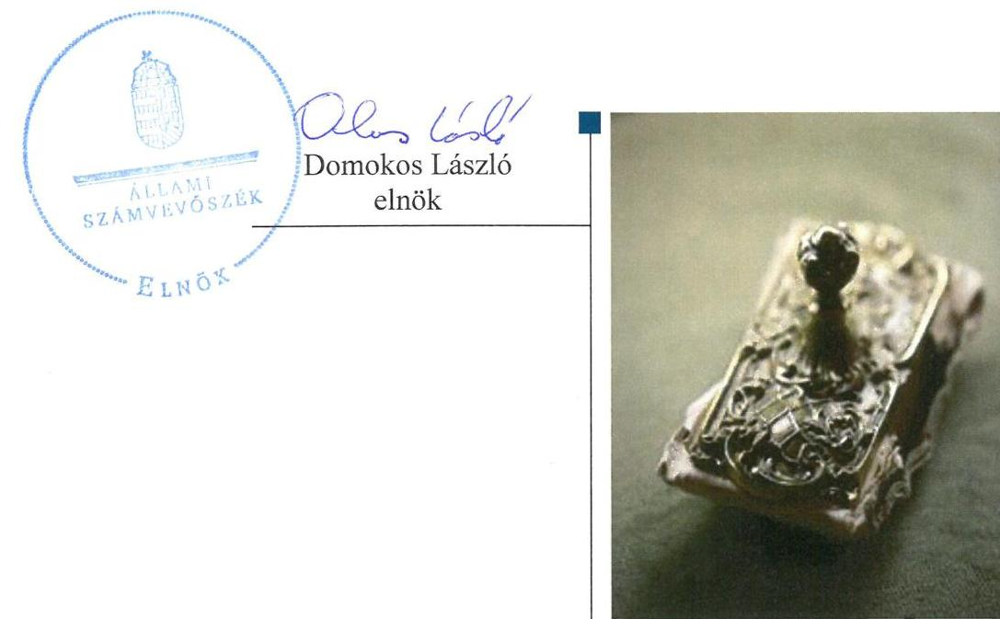
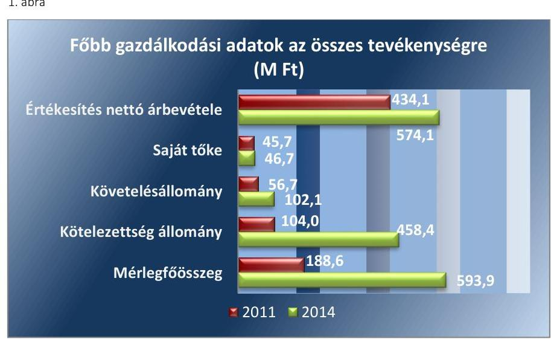
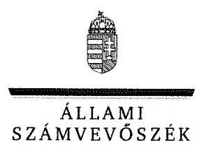
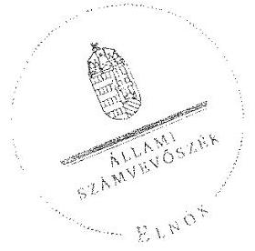
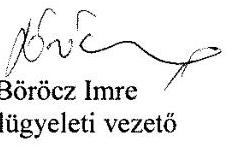
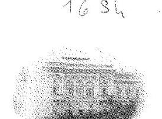
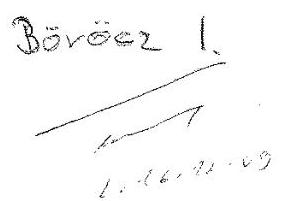
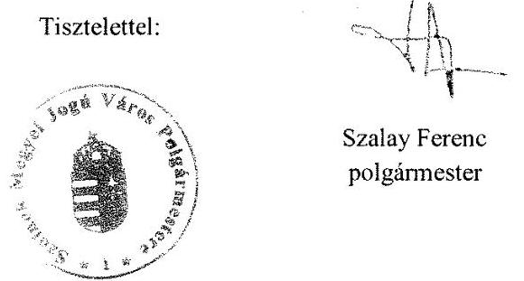

# Jelentés 

## Az önkormányzatok gazdasági társaságai

Az önkormányzatok többségi tulajdonában lévő gazdasági társaságok gazdálkodásának ellenőrzése - SZOLLAK Vagyonkezelő Kft. 2017.

---

# Jelentés 

## Az önkormányzatok gazdasági társaságai

Az önkormányzatok többségi tulajdonában lévő gazdasági társaságok gazdálkodásának ellenőrzése - SZOLLAK Vagyonkezelő Kft.
2017. január 18.

---

# AZ ELLENŐRZÉST FELÜGYELTE:

- BÖRÖCZ IMRE felügyeleti vezető

- AZ ELLENŐRZÉST VEZETTE ÉS A VÉGREHAJTÁSÁÉRT FELELŐS:
  - NIKLAI HELÉNA ellenőrzésvezető
  - A PROGRAM ÖSSZEÁLLÍTÁSÁÉRT FELELŐS:
    - JANIK JÓZSEF LÁSZLÓ osztályvezető

- IKTATÓSZÁM: V-1127-227/2016.
- TÉMASZÁM: 2161
- ELLENŐRZÉS-AZONOSÍTÓ SZÁM: V070793

Jelentéseink az Országgyűlés számítógépes hálózatán és az Interneten a www.asz.hu címen is olvashatóak.

---

# TARTALOMJEGYZÉK 

■ ÖSSZEGZÉS ..... 5
■ AZ ELLENŐRZÉS CÉLJA ..... 6
■ AZ ELLENŐRZÉS TERÜLETE ..... 7
■ AZ ELLENŐRZÉS HÁTTERE, INDOKOLTSÁGA ..... 9
■ A JELENTÉS LÉNYEGES KÉRDÉSKÖREI ..... 10
■ ELLENŐRZÉS HATÓKÖRE ÉS MÓDSZEREI ..... 11
■ MEGÁLLAPÍTÁSOK ..... 13
■ JAVASLATOK ..... 21
■ MELLÉKLETEK ..... 25
I. sz. melléklet: Értelmező szótár ..... 25
II. sz. melléklet: A Társaság által ellátott feladatok 2011-2014. években (Adatok M Ft-ban) ..... 27
III. sz. melléklet: A Társaság eredményének alakulása 2011-2014. években (Adatok M Ft-ban) ..... 28
■ FÜGGELÉK: ÉSZREVÉTELEK ..... 29
■ RÖVIDÍTÉSEK JEGYZÉKE ..... 35

---

.

---

# ÖSSZEGZÉS 

Szolnok Megyei Jogú Város Önkormányzata a SZOLLAK Vagyonkezelő Korlátolt Felelősségű Társaság közfeladat-ellátását szabályszerűen szervezte meg, tulajdonosi jogait a Társaság felett 2011-2014. években összességében szabályszerűen gyakorolta. A közfeladatellátás bevételeinek és ráfordításainak elszámolása szabályszerű volt. A Társaság vagyongazdálkodása az ellenőrzött időszakban nem volt szabályszerű. A Társaság kötelezettségállománya nem veszélyeztette működését, illetve a közfeladat ellátását.

## Az ellenőrzés társadalmi indokoltsága

Magyarországon az intézmény-centrikus közfeladat-ellátás mellett egyre jelentősebb a költségvetésen kívüli feladatellátás térnyerése, amelynek legfontosabb szereplői - a nonprofit szervezetek mellett - az önkormányzati tulajdonú gazdasági társaságok. Az önkormányzatok szervezetalakítási szabadságának következménye, hogy a korábban is vállalati formában működő közszolgáltatások mellett, mind a kötelező, mind az önként vállalt feladatok ellátásában a gazdasági társaságok kiemelt fontosságú szerephez jutottak. Az Állami Számvevőszék Stratégiájában foglaltakkal összhangban az ÁSZ kiemelt célja, hogy a helyi önkormányzatok gazdálkodásában rejlő pénzügyi kockázatok feltárásával, az államháztartáson kívülre nyújtott költségvetési támogatások és ingyenes vagyonjuttatások, valamint az államháztartáson kívül működő feladat-ellátó rendszerek ellenőrzéseivel hozzájáruljon ahhoz, hogy a közpénzeket az államháztartáson kívül működő szervezetek is átlátható, rendezett módon használják fel.

## Főbb megállapítások, következtetések, javaslatok

Szolnok Megyei Jogú Város Önkormányzata kizárólagos tulajdonában álló SZOLLAK Vagyonkezelő Korlátolt Felelősségű Társaság közfeladat-ellátásának megszervezése megfelelt a jogszabályi előírásoknak. Az Önkormányzat Közgyűlése a Társaság felett a tulajdonosi jogokat összességében szabályszerűen gyakorolta, azonban a Társaság éves számviteli beszámolóiról a jogszabályban előírtak ellenére a felügyelőbizottság írásbeli jelentésének hiányában határozott. A felügyelőbizottság az ellenőrzött időszakban nem rendelkezett jóváhagyott ügyrenddel.

A Társaság rendelkezett a működéséhez szükséges szabályzatokkal, azonban azok az ellenőrzött időszakban a jogszabályi előírásoknak nem feleltek meg. Éves beszámolási kötelezettségének eleget tett, azonban a beszámoló letétbe helyezése és a közzétételi kötelezettség teljesítése során nem a jogszabályban előírtak szerint járt el.

A Társaság vagyongazdálkodása az ellenőrzött időszakban nem volt szabályszerű. 2012-2014. években az éves számviteli beszámoló mérleg sorait alátámasztó számviteli nyilvántartásokban szereplő saját és vagyonkezelésbe vett eszközeinek leltározását nem a jogszabályban, a belső szabályozásban, illetve az Önkormányzattal kötött Vagyonkezelési szerződésben előírtaknak megfelelően végezte, amelynek következtében az éves beszámolók mérlegsorainak leltárral való alátámasztása nem volt megfelelő. A könyvvizsgáló az éves számviteli beszámolókat hitelesítő záradékkal látta el, a leltárral kapcsolatos hiányosságokat nem kifogásolta. A Társaság 2012-2014. években a vagyonkezelésbe vett eszközök tekintetében az Önkormányzat felé fennálló adatszolgáltatási kötelezettségét nem teljesítette. A Társaság 2011-2014. években a követelések értékelése során a vevők minősítését nem végezte el.

Az ellenőrzött időszakban a Társaság által ellátott közfeladat bevételeinek és ráfordításainak elszámolása szabályszerű volt. Az értékcsökkenés elszámolása a bekerülési érték nem megfelelő meghatározása és az üzembe helyezés dokumentálásának hiányosságai miatt nem volt szabályszerű.

A Társaság kötelezettségállománya nem veszélyeztette a közfeladat ellátását, illetve a Társaság működését.
Az ÁSZ a Társaság ügyvezető igazgatójának, Szolnok Megyei Jogú Város Önkormányzata polgármesterének, valamint Jegyzőjének fogalmazott meg javaslatokat, amelyek alapján kötelesek intézkedési tervet összeállítani és azt a jelentés kézhezvételétől számított 30 napon belül az ÁSZ részére megküldeni.

---

# AZ ELLENŐRZÉS CÉLJA 

Az ellenőrzés célja annak értékelése volt, hogy az önkormányzat vagyongazdálkodási tevékenysége során szabályszerűen gyakorolta-e tulajdonosi jogait; a gazdasági társaság szabályozottsága, gazdálkodása és vagyongazdálkodási tevékenysége, bevételeinek és ráfordításainak elszámolása megfelelt-e a jogszabályi és tulajdonosi előírásoknak; a gazdasági társaság kötelezettségállománya jelentett-e kockázatot a működésre, valamint a gazdálkodás átláthatósága és elszámoltathatósága érdekében biztosítva volt-e a szolgáltatás díjának megalapozottsága szabályszerű önköltségszámítással.

---

# AZ ELLENŐRZÉS TERÜLETE 

## SZOLLAK Vagyonkezelő Kft. és Szolnok Megyei Jogú Város Önkormányzata

SZOLNOK MEGYEI JOGÚ VÁROS ÖNKORMÁNYZATA a Szolnoki Lakóépület Üzemeltető Korlátolt Felelősségű Társaságot 1993. június 1-jén alapította. A Társaság¹ neve 2008. január 1-től SZOLLAK Vagyonkezelő Korlátolt Felelősségű Társaságra változott. Az ellenőrzött időszakban a Társaság² kizárólagos tulajdonosa az Önkormányzat³ volt, a tulajdonosi jogokat a Közgyűlés⁴ gyakorolta. A város polgármestere személyében az ellenőrzött időszakban nem történt változás. A jegyző személyében változás történt 2011. évben, a jegyző 2011. március 1-jétől töltötte be hivatalát.

A SZOLLAK VAGYONKEZELŐ KFT. egyszemélyes gazdasági társaság, fő tevékenysége ingatlankezelés. Az ellenőrzött időszakban az Önkormányzattal megkötött feladat-ellátási keretszerződés⁵ alapján a Társaság közfeladata a települési önkormányzati feladatok közszolgáltatás érdekében történő elvégzése, az önkormányzati tulajdonban lévő lakások, közszolgálati szálló és nem lakás célú bérlemények, ravatalozó, temető, síremlékek üzemeltetése és a kapcsolódó feladatok ellátása volt. A Társaság 2012. június 14-én megkötött, 2012. július 1-jétől hatályos Vagyonkezelési szerződés⁶ alapján végezte az Önkormányzat által fenntartott piacok kezelését. A Társaság által az ellenőrzött időszakban ellátott feladatokat, és a feladat ellátásához az alapító által biztosított pénzeszközöket a II. sz. melléklet mutatja.

A Társaság főbb gazdálkodási adatai (1. ábra) alapján az értékesítés nettó árbevétele az ellenőrzött időszakban 32,3%-kal növekedett, 434,1 M Ft és 574,1 M Ft között alakult. Az értékesítés nettó árbevétele 45-58%-ban az Önkormányzat részére végzett tevékenységből származott.

---

A Társaság mérlegének kiemelt adatait az ellenőrzött időszakban az 1. táblázat mutatja:

1. táblázat

| Megnevezés | 2011 | 2012 | 2013 | 2014 |
| :-- | --: | --: | --: | --: |
| I. Befektetett eszközök | 60,3 | 333,3 | 337,4 | 423,4 |
| ebből: Tárgyi eszközök | 59,6 | 332,8 | 336,9 | 423,1 |
| II. Forgóeszközök | 123,5 | 155,6 | 120,3 | 157,9 |
| ebből: Követelések | 56,7 | 91,2 | 65,9 | 102,1 |
| III. Aktív időbeli elhatárolások | 4,8 | 18,6 | 15,2 | 12,6 |
| Eszközök összesen | 188,6 | 507,5 | 472,9 | 593,9 |
| IV. Saját tőke | 45,7 | 45,7 | 46,0 | 46,7 |
| ebből: Jegyzett tőke | 16,0 | 16,0 | 16,0 | 16,0 |
| Mérleg szerinti eredmény | 5,4 | 0,1 | 0,3 | 0,7 |
| V. Céltartalékok | 0 | 11,6 | 5,0 | 6,0 |
| VI. Kötelezettségek | 104,0 | 412,4 | 394,6 | 458,4 |
| VII. Passzív időbeli elhatárolások | 38,9 | 37,8 | 27,3 | 82,8 |
| Források összesen | 188,6 | 507,5 | 472,9 | 593,9 |

A Társaság a 2011-2014. éveket pozitív eredménnyel zárta, mérleg szerinti eredménye az ellenőrzött időszakban 5,4 M Ft és 0,1 M Ft között alakult. A Társaság eredményének alakulását 2011-2014. években a III. sz. melléklet mutatja be.

Az Önkormányzat a feladatellátást szolgáló vagyon körét az ellenőrzött időszakot megelőzően (a Társaság alapításakor) a Társaság rendelkezésére bocsátotta. A Társaság közfeladatát saját eszközeivel látta el 2012-ig. Az Önkormányzat tulajdonában lévő piacok vagyonkezelésbe vételére 2012. július 1-jétől került sor.

Az önköltségszámítás rendjére vonatkozó belső szabályzat készítésének kötelezettsége alól a Társaság a Számv. tv.⁷ 14. § (6) és (7) bekezdése alapján az ellenőrzött időszakban mentesült. A Társaság részére az árképzést jogszabály nem írta elő. Az Önkormányzat nevében és javára beszedett díjakat az Önkormányzat rendeleteiben határozta meg. A Társaság feladatellátásáért járó díjakat a feladat-ellátási keretszerződés rögzítette.

A Társaság ügyvezetőjének személye az ellenőrzött időszakban nem változott, tisztségét 1997. április 1-jétől töltötte be. A Társaság átlagos állományi létszáma az ellenőrzött időszakban 47 és 51 fő között alakult.

A Társaság az ellenőrzött időszakban más gazdasági társaságban részesedéssel nem rendelkezett.

A Társaság az ellenőrzött időszakban nem tartozott a kormányzati szektorba sorolt egyéb szervezetek körébe.

---

# AZ ELLENŐRZÉS HÁTTERE, INDOKOLTSÁGA 

AZ ÖNKORMÁNYZATI TULAJDONÚ GAZDASÁGI TÁRSASÁGOK ellenőrzése kiemelten fontos a vagyon megőrzése, megóvása érdekében, amelyekkel szemben alapvető követelmény, hogy gazdálkodásuk, működésük szabályszerű, az általuk szolgáltatott adatok minél megbízhatóbbak legyenek. A feladat/közfeladat-ellátás költségeinek, ráfordításainak alakulása, színvonala hatással van a lakosság elégedettségére.

A TÖRVÉNYALKOTÁS SZÁMÁRA - az észlelt problémák, szabálytalanságok, vagy egyéb nem kívánatos jelenségek felszínre kerülésével - az ellenőrzés megállapításai segítséget nyújthatnak az államháztartáson kívüli feladat/közfeladat-ellátás értékeléséhez, jogszabályi keretei pontosításához, átláthatóságot biztosító szabályozásához. Meghatározhatóvá válnak az önkormányzati feladatellátásban részt vevő államháztartáson kívüli szervezeteknek - az önkormányzat költségvetését, pénzügyi helyzetét is befolyásoló - kockázatai, lehetővé válik ezen kockázatok csökkentése. Ellenőrzéseink feltárhatják, hogy az önkormányzat feladat-ellátási kötelezettségének szabályszerűen tett-e eleget, a feladatellátáshoz rendelt vagyonkezelésbe vett és saját vagyon működtetését az elvárható gondossággal, szabályszerűen szervezte-e meg és a tulajdonosi felügyelete hozzájárult-e a feladatellátásához. Az ellenőrzés rávilágíthat arra, hogy a gazdasági társaság a feladat-ellátási, közszolgáltatási szerződésben foglaltak betartásával, a vagyon használatával biztosította-e a szolgáltatás folytatásának feltételeit, a feladat ellátását. Ezzel az ellenőrzöttek és a helyi döntéshozók számára visszajelzést ad feladatszervezési, feladat-ellátási kockázataikról, alapot ad a meglévő hibák megszüntetéséhez, a jobb feladatellátás biztosításához. Fokozza a fegyelmet, igazolja, hogy lejárt a következmények nélküli ellenőrzések időszaka. Az ÁSZ⁸ értékteremtő rend kialakításához és megőrzéséhez hozzájáruló tevékenysége pozitív hatással van a szervezetről kialakított összkép formálására.

---

# A JELENTÉS LÉNYEGES KÉRDÉSKÖREI 

1.     - Az önkormányzat közfeladat megszervezéséről szóló döntése, valamint tulajdonosi joggyakorlása szabályszerű volt-e?
2.     - A Társaság vagyongazdálkodása szabályszerű volt-e, kötelezettségállománya jelentett-e kockázatot a működésre, illetve a közfeladat ellátására?
3.     - Az ellátott közfeladat esetében a Társaság bevételeinek és ráfordításainak elszámolása szabályszerű volt-e?

---

# ELLENŐRZÉS HATÓKÖRE ÉS MÓDSZEREI 

## Az ellenőrzés típusa

Az ellenőrzés típusa megfelelőségi ellenőrzés.

## Az ellenőrzött időszak

Az ellenőrzött időszak 2011. január 1-jétől 2014. december 31-ig tartott.

## Az ellenőrzés tárgya

Az ellenőrzés tárgyát képezte a

 gazdasági társaság feletti tulajdonosi joggyakorlás, valamint a gazdasági társaság gazdálkodásának szabályozottsága és szabályszerűsége. Az ellenőrzés kiterjedt minden olyan körülményre és adatra, amely az ÁSZ jogszabályban meghatározott feladatainak teljesítéséhez, valamint a program végrehajtása folyamán felmerült újabb összefüggések feltárásához szükséges.

## Az ellenőrzött szervezet

SZOLLAK Vagyonkezelő Korlátolt Felelősségű Társaság és Szolnok Megyei Jogú Város Önkormányzata.

## Az ellenőrzés jogalapja

Az ellenőrzés jogszabályi alapját az ÁSZ tv. ${ }^{8}$ 1. § (3) bekezdése és 5. § (3)-(4)-(5) bekezdései képezték.

## Az ellenőrzés módszerei

Az ellenőrzést az ÁSZ az ellenőrzött időszakban hatályos jogszabályok, az ellenőrzés szakmai szabályok és módszertanok figyelembevételével, az ellenőrzési program kérdései alapján végezte.

Az ellenőrzés ideje alatt az ellenőrzött szervezettel történő kapcsolattartás az ÁSZ Szervezeti és Működési Szabályzatának vonatkozó előírásai alapján történt.

Az ellenőrzési kérdések megválaszolásához szükséges bizonyítékok megszerzése a következő ellenőrzési eljárások alkalmazásával történt: megfigyelés, kérdésfeltevés (információkérés), összehasonlítás, valamint elemző eljárás. Az ellenőrzési bizonyítékként felhasználható adatforrások

---

közé tartoztak egyrészt a szakmai programban felsorolt adatforrások, másrészt adatforrás lehetett még minden - az ellenőrzés folyamán - feltárt, az ellenőrzés szempontjából információkat tartalmazó dokumentum.

A Társaság bevételeinek és ráfordításainak elszámolása, valamint a vagyonnyilvántartás terén a szabályszerű működést az ÁSZ véletlen mintavétellel ellenőrizte. A mintavétellel ellenőrzött területek esetében a szabályszerűségre vonatkozó kérdések eredménye összesítésre került. Az ÁSZ a jogszabályoknak és a belső előírásoknak „megfelelő"-nek tekintette az adott területet, amennyiben a minta ellenőrzésének eredménye alapján 95%-os bizonyossággal a teljes sokaságban a hibaarány legfeljebb 10%, „nem megfelelő"-nek, amennyiben 10%-nál magasabb arányt képviselt. Abban az esetben, ha a teljes sokaság tekintetében a 10%-os hibaarányhoz való viszony megítélésének megbízhatósága nem érte el a 95%-ot, annak elérése érdekében az ÁSZ értékelését további szempontokkal egészítette ki, és figyelembe vette a feltárt hibák típusát és súlyát.

A ráfordítások elszámolására és a vagyonnyilvántartásra vonatkozó véletlen mintavételt az ÁSZ kockázat alapú kiválasztással egészítette ki, amelynek során évente a három legnagyobb összegű tételt választotta ki.

---

# 1. Az önkormányzat közfeladat megszervezéséről szóló döntése, valamint tulajdonosi joggyakorlása szabályszerű volt-e? 

Összegző megállapítás

1.1. számú megállapítás

A Társaság közfeladat-ellátásának megszervezése megfelelt a jogszabályi előírásoknak. Az Önkormányzat tulajdonosi joggyakorlása összességében szabályszerű volt.

A Társaság közfeladat-ellátásának megszervezése megfelelt a jogszabályi előírásoknak.

AZ ÖNKORMÁNYZAT az Ötv. ${ }^{9}$-ben és az Mötv. ${ }^{10}$-ben előírt gazdasági programmal rendelkezett. A 2007. évben készített gazdasági programot a Közgyűlés az Ötv. 91. § (7) bekezdésében foglaltak szerint 2011. évben felülvizsgálta és módosította.

A 76/2011. (III. 31.) számú közgyűlési határozattal elfogadott gazdasági program 2011. évben az Ötv. 91. § (6) bekezdésében előírtak ellenére nem tartalmazta az adópolitikai célkitűzéseket, valamint az egyes közszolgáltatások biztosítására, színvonalának javítására vonatkozó fejlesztési elképzeléseket, 2012-2014. években az Mötv. 116. § (4) bekezdésében előírtak ellenére nem tartalmazta az egyes közszolgáltatások biztosítására, színvonalának javítására vonatkozó fejlesztési elképzeléseket.

KÖZÉP- ÉS HOSSZÚ TÁVÚ VAGYONGAZDÁLKODÁSI TERV KÉSZÍTÉSÉRE 2012. évtől előírt kötelezettségnek az Önkormányzat az Nvtv. ${ }^{11}$ 9. § (1) bekezdése szerint eleget tett.

A TÁRSASÁG KÖZFELADAT-ELLÁTÁSÁRA VONATKOZÓ TERVEIT az Önkormányzat a 25/2003 (VII. 9.) számú önkormányzati rendelettel kihirdetett, többször módosított Vagyonrendeletében ${ }^{12}$; a 183/2011 (VI. 30.) számú közgyűlési határozattal elfogadott Vagyongazdálkodási koncepciójában; a 33/2008. (II. 21.) számú közgyűlési határozattal, illetve a 146/2011. (V. 26.) számú közgyűlési határozattal elfogadott Lakáskoncepciójában, valamint a 289/2009 (XI. 19.) számú és a 8/2014. (I. 30.) számú közgyűlési határozattal elfogadott Lakáskoncepciója cselekvési terveiben rögzítette.

A LAKÁS- ÉS HELYISÉGGAZDÁLKODÁST, mint az Ötv. 8. § (1) bekezdése, illetve az Mötv. 13. § (1) bekezdés 9. pontja szerinti közfeladatot 2011-2014. években az Önkormányzat SZMSZ ${ }^{13}$-${ }^{14}$-${ }^{15}$-e rögzítette. Az Önkormányzat a lakás és nem lakás céljára szolgáló ingatlanokkal való gazdálkodást az Ötv. 9. § (4) bekezdése, illetve a Mötv. 41. § (6) bekezdése alapján a Társaság útján látta el az ellenőrzött időszakban. A közfeladat gazdasági társasági formában történő ellátásáról az Önkormányzat az ellenőrzött időszakot megelőzően (2007. évben) döntött. A

---

közfeladat ellátásának megszervezése az ellenőrzött időszakban megfelel az Ötv. és az Mötv. előírásainak.

A KÖZFELADAT-ELLÁTÁS KERETSZABÁLYAIT az Önkormányzat Vagyonrendelete, a lakás és nem lakás bérletéről, valamint elidegenítéséről szóló Rendeletek ${ }^{16}$ illetve a 2007-től az Önkormányzat és a Társaság között létrejött feladat-ellátási keretszerződés rögzítette. A feladat-ellátási keretszerződést az ellenőrzött időszakot megelőzően (2010. évben) egységes szerkezetbe foglalva újrakötötték, a szerződés 2013-ban 5 évvel meghosszabbításra került.

VAGYONKEZELÉSI SZERZŐDÉST az Önkormányzat az Mötv. 109. § (1) bekezdésében rögzítetteknek eleget téve 2012. június 14-én kötött a Társasággal, a piacok és vásárok fenntartása közfeladatellátás vonatkozásában az Önkormányzat belterületén lévő vásárcsarnokok, piactér és üzletsor vagyonkezelésbe adása címén. A Vagyonkezelési szerződés az Mötv. 109. § (6) bekezdésének megfelelően tartalmazta a vagyon után elszámolt értékcsökkenés összegének felhasználására vonatkozó rendelkezéseket, valamint előírta a Társaság részére a vagyonkezelésbe vett vagyon évenkénti leltározását.

Az Önkormányzat 2014. október 1-jén a vagyonkezelt eszközön végrehajtott beruházás eredményeként keletkezett értéknövekedést adta át a Társaság részére 25,0 M Ft értékben, azonban az Nvtv. 11. § (1) bekezdése előírásai ellenére az eszközátadást nem rögzítette vagyonkezelési szerződésben.

A Vagyonkezelési szerződés IV. 11. pontja az Nvtv. 11. § (11) bekezdés a) pontja alapján előírta a vagyonkezelésbe vett vagyonnal kapcsolatos beszámolási, adatszolgáltatási kötelezettségeket.

A Társaság adatszolgáltatásának elmaradása következtében az Önkormányzat:
$\longrightarrow$ 2012-2013. években az Áhsz. ${ }^{17}$ 34. § (4) bekezdés előírásai ellenére a vagyonkezelésbe adott eszközök év végi értékelése során nem számolta el a tárgyévi vagyonváltozások hatását.
$\longrightarrow$ 2014. évben az Áhsz. ${ }^{18}$ 39. § (3) bekezdés előírásai ellenére az adatszolgáltatási kötelezettségek alátámasztásáról az Áhsz. ${ }^{14}$ 14. melléklet IX. 2. pontja szerinti tartalommal nem gondoskodott, a vagyonkezelésbe adott eszközök nyilvántartása során az állományváltozással kapcsolatos információkat nem számolta el.

RENDELETALKOTÁSI KÖTELEZETTSÉGÉNEK az Önkormányzat a Lakás tv. ${ }^{19}$ 3. § (1) bekezdésében és a Lakás tv. 2. számú mellékletében előírtaknak megfelelően a lakás és nem lakás bérletéről, valamint elidegenítéséről szóló rendeletek megalkotásával eleget tett. A rendeletek alkalmazását az Önkormányzat a Társaság részére a feladatellátási keretszerződésben előírta.

---

### 1.2. számú megállapítás

A tulajdonosi jogok gyakorlása összességében szabályszerű volt. Az ellenőrzés szabályszerűségi hibákat a felügyelőbizottság működésével és az éves számviteli beszámolókról való tulajdonosi döntéssel kapcsolatban állapított meg.

A TÁRSASÁG FELETTI TULAJDONOSI JOGOK gyakorlásának rendjét az Önkormányzat SZMSZ ${ }^{13}$-${ }^{14}$-${ }^{15}$-ében, Vagyonrendeletében, valamint a Társaság Alapító Okiratában ${ }^{20}$ szabályozták. Az Alapító Okirat és módosításai megfeleltek a Gt. ${ }^{21}$ 12. § (1) bekezdésében, illetve a Ptk. ${ }^{22}$ 3:5. §-ában előírt tartalmi követelményeknek. Az Alapító Okirat az Önkormányzat kizárólagos hatáskörébe tartozóként azokat a feladatokat rögzítette, amelyeket a Gt. 141. § (2) bekezdése, illetve a Ptk. ${ }^{22}$ 3:109. § (2) bekezdése a taggyűlés kizárólagos hatáskörébe utalt. A Vagyonrendelet V. fejezet 18. § (1) bekezdése értelmében a Társaság legfőbb szervének kizárólagos hatáskörébe tartozó döntési jogkör gyakorlója a Közgyűlés.

FELÜGYELŐBIZOTTSÁG létrehozására a Társaságnál a Gt. 33. § (2) bekezdés c) pontjában és a Taktv. ${ }^{23}$ 4. § (1) bekezdésében előírtak szerint sor került.

A felügyelőbizottság az ellenőrzött időszakban a Gt. 34. § (4) és a Ptk. ${ }^{22}$ 3:122. § (3) bekezdés előírásai ellenére nem rendelkezett a gazdasági társaság legfőbb szerve által jóváhagyott ügyrenddel.

A felügyelőbizottság az ellenőrzött időszakban a Számv. tv. szerinti beszámolókra vonatkozó írásos jelentést nem készített, ezzel megsértette az Alapító Okirat X. pontjában, 2013. május 30-tól XI. pontjában előírt kötelezettséget.

A KÖNYVVIZSGÁLÓT a Közgyűlés a Gt. 41. § (1) bekezdésében és a Ptk. ${ }^{22}$ 3:130. § (2) bekezdésében előírtaknak megfelelően megválasztotta. Az ellenőrzött időszakban a könyvvizsgáló a Társaság éves számviteli beszámolóit a Gt. 40. § (1) bekezdése, valamint a Ptk. 3:129. § (1) bekezdése szerint ellenőrizte, azokról minden évben a Számv. tv. 156. § (5) bekezdés f) pontja szerinti hitelesítő záradékot adott.

AZ ÜZLETI TERVEK tartalmi és formai követelményeit az Önkormányzat Tervezési Kézikönyve határozta meg. Az üzleti terveket az ellenőrzött időszakban a Társaság az előírások figyelembevételével elkészítette, azokat az Önkormányzat Közgyűlése jóváhagyta. Az üzleti tervekben meghatározott célkitűzések összhangban voltak az Önkormányzat vonatkozó koncepcióival.

JAVADALMAZÁSI SZABÁLYZATBAN ${ }^{24}$ rögzítette az Önkormányzat a Társaság ügyvezetőjének, valamint a felügyelőbizottság tagjainak javadalmazásával kapcsolatos szabályokat, amelyet az ellenőrzött időszakot megelőzően (2009. évben) a Közgyűlés jóváhagyott.

AZ ÖNKORMÁNYZAT a feladat-ellátási keretszerződésben rögzített feladatok ellátásáról az ellenőrzött időszakban az éves számviteli beszámolók, az üzleti jelentés, valamint a vásárok és piacok, és temetői létesítmények működéséről a Közgyűlés részére készített külön beszámolók keretében számoltatta be a Társaságot.

---

Az Önkormányzat Közgyűlése, mint alapító, az ellenőrzött időszakban a Gt. 35. § (3) bekezdése, illetve a Ptk. ${ }^{22}$ 3:120. § (2) bekezdés előírásai ellenére a Társaság Számv. tv. szerinti beszámolóját a felügyelőbizottság írásbeli jelentésének hiányában fogadta el.

Az ellenőrzött időszakban a Közgyűlés a Társaság Számv. tv. szerinti beszámolóinak elfogadásáról szóló határozataiban a Társaság 2011-2014. évi pozitív eredményének eredménytartalékba helyezéséről döntött.

ELLENŐRZÉS lehetőségével - amelyet az Ötv. 92. § (11) bekezdés d) pontjában, 2012. évtől az Áht. ${ }^{25}$ 70. § (1) bekezdés d) pontjában foglaltak lehetővé tettek - az Önkormányzat az ellenőrzött időszakban élt. Az Önkormányzat belső ellenőrzése által végzett ellenőrzések kiterjedtek a feladat-ellátási keretszerződés keretében ellátott feladatokhoz kapcsolódó pénzügyi elszámolások és nyilvántartások, az üzleti terv, valamint a beszámoló összeállítása szabályszerűségének ellenőrzésére. A belső ellenőrzés megállapításaival kapcsolatosan intézkedés előírására nem került sor. Az Önkormányzat megbízása alapján a Társaságnál külső szakértő által elvégzett ellenőrzésre nem került sor az ellenőrzött időszakban.

# 2. A Társaság vagyongazdálkodása szabályszerű volt-e, kötelezettségállománya jelentett-e kockázatot a működésre, illetve a közfeladat ellátására? 

Összegző megállapítás

## 2.1. számú megállapítás

A Társaság vagyongazdálkodása nem volt szabályszerű. Kötelezettségállománya nem veszélyeztette a működést, illetve a közfeladat-ellátást.

A Társaság rendelkezett a jogszabályban előírt szabályzatokkal, azonban az ellenőrzött időszakban azok az előírásoknak nem feleltek meg.

A TÁRSASÁG az ellenőrzött időszakban rendelkezett a Számv. tv. 14. § (3) bekezdésében előírt számviteli politikával, a Számv. tv. 14. § (5) bekezdés a) pontjában rögzített, az eszközök és a források leltárkészítési és leltározási szabályzatával, a Számv. tv. 14. § (5) bekezdés d) pontjában meghatározott pénzkezelési szabályzattal, valamint a Számv. tv. 161. § (2) bekezdés d) pontjában előírt bizonylati renddel. A Számv. tv. 14. § (5) bekezdés b) pontjában előírt, az eszközök és a források értékelési szabályzatával a Társaság nem rendelkezett, az ellenőrzött időszakban az eszközök és források értékelésére vonatkozó általános rendelkezéseket a számviteli politika és a számlarend tartalmazta.

A Társaság a Számv. tv. 161.§ (2) bekezdés b) pont előírásaival szemben Számlarendjében ${ }^{26}$ és annak módosításában ${ }^{27}$ nem határozta meg az alkalmazásra kijelölt számlák tartalmát, annak ellenére, hogy az a számlák megnevezéséből egyértelműen
 nem következett.

A Leltározási szabályzat ${ }^{28}$ megfelelt a Számv. tv. előírásainak. A Társaság Leltározási szabályzatának 3.2.1. pontja a tárgyi eszközök tekintetében kétévente - ingatlan, gép, berendezés és egyéb tárgyi eszközök esetében

---

mennyiségi felvétellel, immateriális javak esetében kétévente nyilvántartással történő egyeztetéssel - írta elő a leltározást. A Leltározási szabályzat 1.4.1. pontja előírta továbbá az Önkormányzat tulajdonát képező, a Társaság kezelésében nyilvántartott ingatlan vagyon teljes körű és nyilvántartott értékkel történő leltározását az Önkormányzat képviselőjének jelenlétében, a leltározott ingatlanok vagyon-kataszteri és a tulajdoni lapokkal történő egyeztetését és a leltár megküldését a tulajdonos részére.

# 2.2. számú megállapítás 

## A Társaság vagyongazdálkodása a jogszabályi előírásoknak nem felelt meg.

A TÁRSASÁG a leltározást a 2012-2014. években nem a Számv. tv.-ben, a Leltározási szabályzatában, illetve a Vagyonkezelési szerződésben foglaltaknak megfelelően végezte, amelynek következtében az éves beszámolók mérlegsorainak leltárral való alátámasztása nem volt megfelelő:

- A vagyonkezelésbe vett eszközök 2012. évi leltározását - a Leltározási szabályzat 1.4.1. pontjában foglaltak ellenére - nem az önkormányzat képviselőjének jelenlétében végezték, és a leltározott ingatlanok vagyonkataszteri és a tulajdoni lapokkal való egyeztetése nem történt meg. A 2013-2014. években a vagyonkezelésbe vett eszközöket a Társaság a Vagyonkezelési szerződés IV. 11. pontja és a Leltározási szabályzat 1.4.1. pontja előírásai ellenére nem leltározta, ezáltal nem tett eleget a Számv. tv. 69. § (3) bekezdésében foglalt előírásnak sem.
- A Társaság a 2012-2014. években a mérleg tételeinek alátámasztásához nem állított össze olyan leltárt, amely tételesen, ellenőrizhető módon tartalmazza a mérleg fordulónapján meglévő eszközeit mennyiségben és értékben, ezáltal nem tett eleget a Számv. tv. 69. § (1) bekezdésében előírt kötelezettségének, amelyet a Számv. tv. 69. § (3) bekezdésében foglalt, a Leltározási szabályzatnak megfelelően végrehajtott és dokumentált leltározásnak kellett volna megelőznie.
A könyvvizsgáló a Társaság éves számviteli beszámolóit hitelesítő záradékkal látta el, a leltárral kapcsolatos hiányosságokat nem kifogásolta.

A Társaság a Számv. tv. 161/A. § (1) bekezdése előírásai ellenére a könyvvezetésre, a bizonylatolásra vonatkozó részletes belső szabályait nem úgy alakította ki, hogy az a mérleg és az eredménykimutatás alátámasztásán túlmenően a kiegészítő melléklet adatainak közvetlen alátámasztására is alkalmas legyen.

2012-2014. években Számv. tv. 23. § (2) bekezdésében előírtak ellenére a Társaságnál, mint vagyonkezelőnél az éves beszámoló kiegészítő mellékletében - legalább mérlegtételek szerinti megbontásban - nem kerültek külön bemutatásra az önkormányzati vagyon részét képező eszközök.
2013. évben nem történt visszapótlást szolgáló beruházás, a Társaság az Mötv. 109. § (6) bekezdésében és a Vagyonkezelési szerződés IV. 4.1. pontjában előírtak ellenére a vagyon felújításáról, pótlólagos beruházásáról legalább a vagyoni eszközök elszámolt értékcsökkenésének megfelelő mértékben nem gondoskodott, illetve e célokra értékcsökkenésnek megfelelő mértékű tartalékot nem képzett.

---

2012. évben a Társaság a Vagyonkezelési szerződés IV. 4. 2. pontja előírásai ellenére nem kérte meg az Önkormányzat előzetes írásbeli hozzájárulását a vagyonkezelésbe vett eszközön végrehajtott beruházáshoz.

Az Nvtv. 6. § (1) és a 11. § (8) és a Vagyonkezelési szerződés IV. 1. pontjában foglaltaknak megfelelően a vagyonkezelésbe vett eszközt a Társaság nem terhelte meg, nem idegenítette el, biztosítékul nem adta, a vagyonkezelői jogot harmadik fél részére nem engedte át.

A TÁRSASÁG ESZKÖZEI 2011. év végén 65,5%-os mértékben forgóeszközökből álltak. Az eszközökön belül a tárgyi eszközök aránya a 2012. évi Vagyonkezelési szerződés megkötése miatt a 2011. év eleji 35,7%-ról 2014. év végére 71,2%-ra növekedett, melyhez hozzájárult a 2012. évben és 2014. évben a vagyonkezelésbe vett eszközön végrehajtott beruházás 1,7 M Ft és 80,6 M Ft-os értéke.

A TÁRSASÁG SAJÁT TÖKÉJE a 2011. év végi 45,7 M Ft-ról 2014. év végére 46,7 M Ft-ra növekedett. A jegyzett tőkét 2011. évben az Önkormányzat 11,0 M Ft értékű ingatlan apporttal megemelte 16,0 M Ft-ra. A jegyzett tőke összege az ellenőrzött időszak végéig változatlan maradt. A Társaságnál osztalék fizetésére nem került sor az ellenőrzött időszakban.

A SAJÁT VAGYON után 2011-2014. években 21,3 M Ft értékben került értékcsökkenés elszámolásra, az ellenőrzött időszakban végrehajtott beruházások értéke meghaladta az értékcsökkenés összegét. Az ellenőrzött időszakban az ingatlanok használhatósági foka 83,4%-ról 86,4%-ra, az irodai gépek, berendezések használhatósági foka 18,7%-ról 21,1%-ra nőtt, az egyéb berendezések, gépek használhatósági foka 73,3%-ról 30,0%-ra csökkent.

A KÖVETELÉSÁLLOMÁNY a 2011. év végi 56,7 M Ft-ról 2014. év végére 102,1 M Ft-ra nőtt. A követelésállományt az ellenőrzött időszakban döntően az Önkormányzattal - kapcsolt vállalkozással - szembeni követelések tették ki, amelyeknek értéke 2011. év végéről (31,0 M Ft) 2014. év végére 81,9%-kal (56,4 M Ft-ra) növekedett.

A követelésállományon belül a vevőkövetelések 2011. év végén 13,8 M Ft-ot, 2014. év végén 24,8 M Ft-ot tettek ki. A vevőköveteléseken belül a lejárt követelések összege 2013. évet kivéve az ellenőrzött időszakban folyamatosan növekedett, 2011. év végén 4,4 M Ft, 2012. év végén 7,8 M Ft, 2013. év végén 6,7 M Ft, 2014. év végén 9,8 M Ft összegben alakult.

A Társaság 2011-2014. években a követelések értékelése során a vevők minősítését nem végezte el, ezzel megsértette a Számv. tv. 15. § (3) bekezdésében, a Számv. tv. 55. § (1)-(2) bekezdéseiben foglalt, valamint a Számviteli szabályzat 3. pontjában a számlaosztály értékvesztésének elszámolására vonatkozó előírásokat. A Társaság 2012. és 2013. években 0,2 M Ft és 0,1 M Ft értékben behajthatatlannak minősített követelést írt le.

A lakás és helyiséggazdálkodás közfeladat vonatkozásában a Társaságnak az ellenőrzött időszakban lakossággal szembeni követelése nem volt.

---

A Társaság, mint lakásüzemeltető az Önkormányzat nevében és javára beszedendő bevételek vonatkozásában a feladat-ellátási keretszerződésben és a 25/2005. (VI. 30.) önkormányzati rendelet 122. §-ában foglaltak szerint év végén a jogszabályban előírt módon a tartozások behajthatatlannak minősítését és azok törlését kezdeményezte, melyről a Közgyűlés döntött.

# 2.3. számú megállapítás 

2.4. számú megállapítás

A kötelezettségek állománya nem veszélyeztette a közfeladat ellátását, illetve a Társaság működését.

A TÁRSASÁG KÖTELEZETTSÉGÁLLOMÁNYA a 2011. év eleji 82,0 M Ft-ról a 2014. év végére (376,4 M Ft-tal) 458,4 M Ft-ra növekedett a vagyonkezelésbe vett eszközök Számv. tv. szerinti előírásnak megfelelő, hosszú lejáratú kötelezettségek közötti állományba vétele miatt. A rövid lejáratú kötelezettségeket elsősorban az Önkormányzattal, mint kapcsolt vállalkozással szembeni kötelezettségek, valamint a munkabér, az adó- és járulékterhek tették ki.

A Társaság a kötelezettségeit a közüzemi számlák kivételével határidőben teljesítette, a kötelezettségek állománya nem veszélyeztette a közfeladat ellátását, illetve a Társaság működését. Hitelfelvételre az ellenőrzött időszakban nem került sor. A Társasággal szemben érvényesített késedelmi kamat összege az árbevételhez viszonyítva nem jelentős összeget képviselt.

A Társaság az előírt beszámolási, adatszolgáltatási kötelezettséget - 2012-2014. években a vagyonkezelésbe vett eszközök tekintetében fennálló adatszolgáltatási kötelezettség kivételével - teljesítette. Az éves számviteli beszámoló letétbe helyezése és a közzétételi kötelezettség teljesítése során nem a jogszabályban előírtak szerint járt el.

AZ ÉVES SZÁMVITELI BESZÁMOLÓKAT a Társaság a 2011-2014. évekre vonatkozóan a Számv. tv. 19. § (1) bekezdésében meghatározott tartalommal elkészítette.

A letétbe helyezett, közzétett adatok a Cégtv. ${ }^{29}$ 18. § (7) és a Számv. tv. 153. § (1) bekezdésében előírtak ellenére az adózott eredmény felhasználására vonatkozó határozatokat nem tartalmazták.

A Társaság 2012-2014. években nem tett eleget a Vagyonkezelési szerződés IV. 11. pontjában foglalt adatszolgáltatási kötelezettségének.

A KÖZÉRDEKŰ ADATOK MEGISMERÉSÉRE IRÁNYULÓ IGÉNYEK teljesítésének rendjére vonatkozó szabályzattal 2011. évben az Avtv. ${ }^{30}$ 20. § (8) bekezdése, illetve 2011. július 27-től az Info tv. ${ }^{31}$ 30. § (6) bekezdése előírásainak megfelelően a Társaság rendelkezett.

---

# 3. Az ellátott közfeladat esetében a Társaság bevételeinek és ráfordításainak elszámolása szabályszerű volt-e? 

Összegző megállapítás

A Társaságnál az ellátott közfeladat bevételeinek és ráfordításainak elszámolása megfelelő volt.

3.1. számú megállapítás

A közfeladat-ellátással kapcsolatos bevételek és anyagjellegű ráfordítások elszámolása megfelelő volt. Az értékcsökkenés elszámolása nem volt megfelelő.

AZ ÉRTÉKESÍTÉS NETTÓ ÁRBEVÉTELÉNEK elszámolása megfelelő volt. A bevételeket a Számv. tv.-ben előírtaknak megfelelően számolták el.

AZ ANYAGJELLEGŰ RÁFORDÍTÁSOK elszámolása megfelelő volt. A ráfordítások elszámolását a költségelszámolást megalapozó, a Számv. tv. 166. § (1) bekezdésében előírt számviteli bizonylattal alátámasztották, és a megfelelő költségnemekre könyvelték. Az elszámolást alátámasztó bizonylatok tartalmazták a Számv. tv. 167. § (1) bekezdésében előírt alaki és tartalmi kellékeket.

AZ ÉRTÉKCSÖKKENÉS ELSZÁMOLÁSA nem volt megfelelő. Az ellenőrzés a következő hibákat, hiányosságokat állapította meg, amelyek következtében az értékcsökkenési leírási kulcsok megállapítása, alkalmazása, az értékcsökkenés elszámolása nem volt szabályszerű:
$\longrightarrow$ 2011. évben nem pénzbeli hozzájárulásként átvett eszköz értékét az Áht ${ }^{32}$. 108. § (3) bekezdése előírásai ellenére nem a könyvvizsgáló által megállapított értéken vették figyelembe.
$\longrightarrow$ 2012. évben előfordult, hogy nem volt megfelelő a bekerülési érték meghatározása: a Társaság megsértette a Számv. tv. 47.§ (9) bekezdésében és a Számviteli szabályzatában előírtakat, a bekerülési (beszerzési) érték részét képező, a Számv. tv. 47.§ (1)-(2) bekezdéseiben felsorolt tételeket a felmerüléskor, a gazdasági esemény megtörténtekor (legkésőbb az üzembe helyezéskor) nem vette számításba a számlázott, a kivetett összegben.
$\longrightarrow$ 2013. évben előfordult, hogy a beszerzett eszközök besorolása nem felelt meg a Számv. tv. 26. § (4)-(5) bekezdésben előírtaknak, tárgyi eszköz immateriális javak közé került besorolásra.
$\longrightarrow$ Az ellenőrzött időszakban előfordult, hogy a Társaság az eszköz üzembe helyezését a Számv. tv. 52. § (2) bekezdésében foglaltak ellenére hitelt érdemlő módon nem dokumentálta.

---

# JAVASLATOK 

Az ÁSZ tv. 33. § (1) bekezdésében foglaltak értelmében az ellenőrzött szervezet vezetője köteles a jelentésben foglalt megállapításokhoz kapcsolódó intézkedési tervet összeállítani és azt a jelentés kézhezvételétől számított 30 napon belül az ÁSZ részére megküldeni. Amennyiben az ellenőrzött szervezet vezetője nem küldi meg határidőben az intézkedési tervet, vagy továbbra sem elfogadható intézkedési tervet küld, az Állami Számvevőszék elnöke az ÁSZ tv. 33. § (3) bekezdése a) és b) pontjaiban foglaltakat érvényesítheti.

## A SZOLLAK Vagyonkezelő Kft. ügyvezető igazgatójának

1. Kezdeményezze a vagyonkezelt eszközön végrehajtott beruházás eredményeként keletkezett értéknövekedésre vonatkozóan vagyonkezelői jog létrehozását a jogszabályi előírásnak megfelelően.
(1.1. sz. megállapítás 8. bekezdése alapján)
2. Teljesítse a vagyonkezelésbe vett vagyonnal kapcsolatos, a vagyonkezelési szerződés szerinti adatszolgáltatási kötelezettségét.
(1.1. sz. megállapítás 10. bekezdése és 2.4. sz. megállapítás 3. bekezdése alapján)
3. Intézkedjen az eszközök és a források értékelési szabályzatának a számviteli politika keretében történő elkészítéséről a jogszabályi előírásnak megfelelően.
(2.1. sz. megállapítás 1. bekezdése alapján)
4. Intézkedjen, hogy a számlarend tartalmazza a jogszabályi rendelkezésben meghatározott tartalmi elemet.
(2.1. sz. megállapítás 2. bekezdése alapján)
5. Intézkedjen, hogy a leltározást a jogszabályi előírásnak és a leltározási szabályzatban foglaltaknak megfelelően - a vagyonkezelési szerződésben foglaltakat is figyelembe véve - végezzék el, és a leltár megfeleljen a jogszabályi előírásnak.
(2.2. sz. megállapítás 1. bekezdése alapján)
6. Intézkedjen az önkormányzati vagyon részét képező, vagyonkezelésbe vett eszközöknek a kiegészítő mellékletben - legalább mérlegtételek szerinti bontásban - történő bemutatásáról a jogszabályi előírásnak megfelelően.
(2.2. sz.
 megállapítás 4. bekezdése alapján)

---

7. Intézkedjen, hogy az értékvesztés elszámolására a vevők minősítése alapján kerüljön sor a jogszabályi előírásoknak megfelelően.
(2.2. sz. megállapítás 13. bekezdése alapján)
8. Intézkedjen az eszközök üzembe helyezésének dokumentálásáról a jogszabályi előírásnak megfelelően.
(3.1. sz. megállapítás 3. bekezdés utolsó részbekezdése alapján)

# Szolnok Megyei Jogú Város Önkormányzata polgármesterének 

1. Terjessze a Közgyűlés elé a gazdasági program módosításának tervezetét, annak érdekében, hogy annak tartalma megfeleljen a jogszabályi előírásoknak.
(1.1. sz. megállapítás 2. bekezdése alapján)
2. Kezdeményezze a vagyonkezelt eszközön végrehajtott beruházás eredményeként keletkezett értéknövekedésre vonatkozóan vagyonkezelői jog létrehozását a jogszabályi előírásnak megfelelően.
(1.1. sz. megállapítás 8. bekezdése alapján)
3. Kezdeményezze a felügyelőbizottság ügyrendjének Társaság legfőbb szerve általi jóváhagyását.
(1.2. sz. megállapítás 3. bekezdése alapján)
4. Kezdeményezze, hogy
a) a felügyelőbizottság a számviteli beszámolókra vonatkozóan készítsen írásbeli jelentést az alapító okiratban foglaltaknak megfelelően;
b) az Önkormányzat Közgyűlése a számviteli beszámolókról - a jogszabályi előírásban foglaltaknak megfelelően - a felügyelőbizottság írásbeli jelentésének birtokában döntsön.
(1.2. sz. megállapítás 4. és 9. bekezdése alapján)

---

5. Tegyen intézkedéseket a - vagyonkezelői jog létesítésével, a vagyonkezelt vagyonnal kapcsolatos adatszolgáltatási kötelezettségek, valamint a leltározás és a leltár összeállítása vonatkozásában-feltárt szabálytalanságok tekintetében a felelősség tisztázása érdekében, és szükség szerint intézkedjen a felelősség érvényesítéséről.
(1.1. sz. megállapítás 8., 10. bekezdései, 2.2. sz. megállapítás 1. bekezdése, 2.4. sz. megállapítás 3. bekezdése alapján)

# Szolnok Megyei Jogú Város Önkormányzata jegyzőjének 

1. Készítse el a gazdasági program tervezetét úgy, hogy annak tartalma megfeleljen a jogszabályi előírásoknak.
(1.1. sz. megállapítás 2. bekezdése alapján)

---

.

---

# MELLÉKLETEK 

- I. SZ. MELLÉKLET: ÉRTELMEZŐ SZÓTÁR
gazdasági társaság
gazdálkodó szervezet
kezesség
közfeladat
közszolgáltatás
nemzeti vagyon
nettó eladósodottság

A Ptk. 2. 3.88. § (1) bekezdése szerint „a gazdasági társaságok üzletszerű közös gazdasági tevékenység folytatására, a tagok vagyoni hozzájárulásával létrehozott, jogi személyiséggel rendelkező vállalkozások, amelyekben a tagok a nyereségből közösen részesednek, és a veszteséget közösen viselik".
A Ptk. 685. § c) pontja szerint gazdálkodó szervezet:
„az állami vállalat, az egyéb állami gazdálkodó szerv, a szövetkezet, a lakásszövetkezet, az európai szövetkezet, a gazdasági társaság, az európai részvénytársaság, az egyesülés, az európai gazdasági egyesülés, az európai területi együttműködési csoportosulás, az egyes jogi személyek vállalata, a leányvállalat, a vízgazdálkodási társulat, az erdő birtokossági társulat, a végrehajtói iroda, az egyéni cég, továbbá az egyéni vállalkozó." (hatályos 2014. március 15-ig)
A kezességre vonatkozó előírásokat a Ptk. 2. 6:416-430. §-ai tartalmazzák. Kezességi szerződéssel a kezes kötelezettséget vállal a jogosulttal szemben, hogy ha a kötelezett nem teljesít, maga fog helyette a jogosultnak teljesíteni. Kezesség egy vagy több, fennálló vagy jövőbeli, feltétlen vagy feltételes, meghatározott vagy meghatározható összegű pénzkövetelés vagy pénzben kifejezhető értékkel rendelkező egyéb kötelezettség biztosítására vállalható. A Ptk. 2 szerint kezességet csak írásban lehet vállalni. A kezes kötelezettsége ahhoz a kötelezettséghez igazodik, amelyért kezességet vállalt. A kezes kötelezettsége nem válhat terhesebbé, mint amilyen elvállalásakor volt, kiterjed azonban a kötelezett szerződésszegésének jogkövetkezményeire és a kezesség elvállalása után esedékessé váló mellékkövetelésekre is.
Jogszabályban meghatározott állami vagy önkormányzati feladat, amit az arra kötelezett közérdekből, jogszabályban meghatározott követelményeknek és feltételeknek megfelelve végez, ideértve a lakosság közszolgáltatásokkal való ellátását, továbbá az állam nemzetközi szerződésekben vállalt kötelezettségeiből adódó közérdekű feladatokat, valamint e feladatok ellátásához szükséges infrastruktúra biztosítását is (Nvtv. 3. § (1) bekezdés 7. pont).
Az Ebktv. ${ }^{33}$ 3. § d) pontja alapján: „szerződéskötési kötelezettség alapján a lakosság alapvető szükségleteinek ellátására irányuló szolgáltatás, így különösen a villamos energia-, gáz-, hő-, víz-, szennyvíz- és hulladékkezelési, köztisztasági, postai és távközlési szolgáltatás, továbbá a menetrend alapján közlekedő járművekkel végzett közforgalmú személyszállítás".
Az Nvtv. 1. § (2) bekezdés c) pontja szerint „az állam vagy a helyi önkormányzat tulajdonában lévő pénzügyi eszközök, továbbá az államot vagy a helyi önkormányzatot megillető társasági részesedések"
(kötelezettségek - követelések) / saját tőke
Azt mutatja, hogy a kintlévőségekkel csökkentett kötelezettségeket milyen mértékben fedezi saját forrás. Ez feltételezi, hogy a követelések pénzügyileg előbb realizálódnak, mint ahogy a kötelezettségeket teljesíteni kell. A mutató minél kisebb, csökkenő értéke kedvező.

---

nonprofit gazdasági társaság

A Gt. 4. § (1) bekezdése szerint „gazdasági társaság nem jövedelemszerzésre irányuló közös gazdasági tevékenység folytatására is alapítható (nonprofit gazdasági társaság). Nonprofit gazdasági társaság bármely társasági formában alapítható és működtethető. A gazdasági társaság nonprofit jellegét a gazdasági társaság cégnevében a társasági forma megjelölésénél fel kell tüntetni."
A Civil tv. 9/F. § (2) bekezdése szerint „az a gazdasági társaság minősül nonprofit gazdasági társaságnak és cégnevében az a gazdasági társaság tüntetheti fel a nonprofit jelleget, amelynek létesítő okirata tartalmazza, hogy a gazdasági társaság tevékenységéből származó nyereség a tagok között nem osztható fel, hanem az a gazdasági társaság vagyonát gyarapítja." (hatályos 2014. március 15-től)
tulajdonosi joggyakorló
vezetői levél

Aki a nemzeti vagyon felett az államot vagy a helyi önkormányzatot megillető tulajdonosi jogok és kötelezettségek összességének gyakorlására jogosult (Vagyon tv. 3. § (1) bekezdés 17. pont).
A könyvvizsgálói jelentéstől elkülönülten elkészített, a könyvvizsgálónak a könyvvizsgálat során tudomására jutott jelentős hiányosságokat tartalmazó dokumentuma. A vezetői levélben foglaltak nem vezettek a záradék (vélemény) korlátozásához vagy elutasításhoz, de a következő időszakokban jelentős hatással lehetnek a pénzügyi kimutatásokra. Az egyéb hiányosságokat és gyengeségeket, az észlelt helyzet rövid bemutatásával, a feltárt kockázat vagy veszély leírásával, a fejlesztésekre tett javaslatok kifejtésével és a vezetés válaszának szerepeltetésével (ha van ilyen) lehet a vezetői levélben bemutatni. (Forrás: 1007. témaszámú állásfoglalás, kapcsolattartás a vezetéssel, www.mkvk.hu)

---

II. SZ. MELLÉKLET: A TÁRSASÁG ÁLTAL ELLÁTOTT FELADATOK 2011-2014. ÉVEKBEN (ADATOK M FT-BAN)

|   | Feladat ellátásához kezelésbe vett vagyon értéke |  |  |  | Feladat ellátásához alapító által biztosított pénzeszköz |  |  |   |
| --- | --- | --- | --- | --- | --- | --- | --- | --- |
|   | 2011. | 2012. | 2013. | 2014. | 2011. | 2012. | 2013. | 2014.  |
|  A Társaság által ellátott közfeladatok | - | 278,9 | 278,9 | 278,9 | 199,0 | 176,9 | 182,3 | 262,8  |
|  Lakások és nem lakáscélú bérlemények üzemletetése kezelés | - | - | - | - | 192,0 | 171,9 | 175,8 | 256,9  |
|  Piac | - | 278,9 | 278,9 | 278,9 | - | - | - | -  |
|  Köztemetés | - | - | - | - | 7,0 | 5,0 | 6,5 | 5,9  |

Forrás: A Társaság adatszolgáltatása

---

III. SZ. MELLÉKLET: A TÁRSASÁG EREDMÉNYÉNEK ALAKULÁSA 2011-2014. ÉVEKBEN (ADATOK M FT-BAN)

|  Tétel megnevezése | 2011. | 2012. | 2013. | 2014.  |
| --- | --- | --- | --- | --- |
|  I. Értékesítés nettó árbevétele | 434,1 | 467,5 | 433,8 | 574,1  |
|  ebből az ingatlankezelési tevékenység árbevétel elszámolása | 227,5 | 219,1 | 197,3 | 333,2  |
|  II. Aktivált saját teljesítmények értéke | - | - | 5,0 | -0,5  |
|  III. Egyéb bevételek | 1,4 | 3,2 | 12,6 | 23,3  |
|  IV. Anyagjellegű ráfordítások | 267,3 | 265,1 | 265,7 | 348,2  |
|  V. Személyi jellegű ráfordítások | 147,4 | 174,8 | 158,7 | 170,3  |
|  VI. Értékcsökkenési leírás | 4,3 | 6,0 | 8,9 | 11,7  |
|  VII. Egyéb ráfordítások | 10,3 | 22,7 | 17,4 | 25,8  |
|  A. Üzemi (üzleti) tevékenység eredménye | 6,2 | 2,1 | 0,7 | 40,9  |
|  VIII. Pénzügyi műveletek bevételei | 0,7 | 1,6 | 0,8 | 0,2  |
|  IX. Pénzügyi műveletek ráfordításai | - | - | - | -  |
|  B. Pénzügyi műveletek eredménye | 0,7 | 1,6 | 0,8 | 0,2  |
|  C. Szokásos Vállalkozási eredmény | 6,9 | 3,7 | 1,4 | 41,0  |
|  X. Rendkívüli bevételek | - | - | - | -  |
|  XI. Rendkívüli ráfordítások | 0,6 | 2,3 | 0,4 | 38,1  |
|  D. Rendkívüli eredmény | -0,6 | -2,3 | -0,4 | -38,1  |
|  E. Adózás előtti eredmény | 6,3 | 1,4 | 1,0 | 2,9  |
|  XII. Adófizetési kötelezettség | 0,9 | 1,3 | 0,7 | 2,2  |
|  F. Adózott eredmény | 5,4 | 0,1 | 0,3 | 0,7  |
|  G. Mérleg szerinti eredmény | 5,4 | 0,1 | 0,3 | 0,7  |

Forrás: A Társaság 2011-2014. évi éves beszámolói

---

# FÜGGELÉK: ÉSZREVÉTELEK 

A jelentéstervezetet a Számvevőszék 15 napos észrevételezésre megküldte az ellenőrzött szervezetek vezetőinek az ÁSZ tv. 29. § (1) bekezdése előírásának megfelelően.
Az elfogadott észrevételek alapján a Számvevőszék módosította a jelentést.

A függelék tartalmazza az ellenőrzöttek észrevételeit, illetve az el nem fogadott észrevételek elutasításának indoklását.
$\longrightarrow$ SZOLNOK Vagyonkezelő Kft. ügyvezető igazgatójának írásban tett észrevétele
$\longrightarrow$ Tájékoztatás az észrevételek kezeléséről az ügyvezető igazgatónak
$\longrightarrow$ Szolnok Megyei Jogú Város Polgármesterének levele (írásban tett nemleges észrevétele)

[^0]
[^0]:    * 29. § (1) Az Állami Számvevőszék az ellenőrzési megállapításait megküldi az ellenőrzött szervezet vezetőjének vagy az általa megbízott személynek, és annak, akinek személyes felelősségét állapította meg.
    (2) Az ellenőrzött szervezet vezetője és a felelősként megjelölt személy az ellenőrzés megállapításaira tizenöt napon belül írásban észrevételt tehet.
    (3) Az Állami Számvevőszék az észrevételre a beérkezésétől számított harminc napon belül írásban válaszol. A figyelembe nem vett észrevételeket köteles a jelentésben feltüntetni, és megindokolni, hogy azokat miért nem fogadta el.

---

# Szollak Kft. 

Házkezelőség
Díjbeszedő Csoport
Jogi Csoport
Titkárság

Állami Számvevőszék
Domokos László
elnök részére

Budapest
Apáczai Csere János utca 10
1052

5000 Szolnok, Jókai u. 3. 56/510-430
Hiv. szám:
Ügyintéző:
Telefonszáma:
Melléklet:

## Tisztelt Elnök Úr!

A V-1127-218/2016 iktatószámú jelentés tervezetükre az alábbi észrevételeket kívánom tenni.

### 1.1. megállapításhoz:

A Szollak Kft. a vagyonkezelésbe vett eszközökkel kapcsolatban beszámolási kötelezettségének minden évben eleget tett, mivel a társaság évente beszámol Szolnok Megyei Jogú Város Önkormányzatának Közgyűlése előtt a vásárok, piacok, temetői létesítmények működtetéséről. A beszámolókat a következő közgyűlési határozatokkal fogadta el a Közgyűlés: 297/2012. (XII.20). sz. közgyűlési határozat (feltöltve 297_2012.pdf állományban), 267/2013. (XII.19.). sz. közgyűlési határozat (feltöltve 267_2013_kozgyhat.pdf állományban), 262/2014. (XI. 27.). sz. közgyűlési határozat (feltöltve 262_2014.pdf állományban).

### 2.2. megállapításhoz

A tárgyi eszközök leltározását a társaság 2012. és 2014. években tételes mennyiségi felvétellel végezte el, melynek alátámasztására a leltárfelvételi íveket, és a leltár kiértékelést csatoltuk a feltöltött anyaghoz: 3_6_2012_leltar_kiertekeles.pdf, és 3_6_leltar_kiertekeles_2014.pdf elnevezésű állományokban. 2013. évben a tárgyi
 eszközleltározást egyeztetéssel folytattuk le, melynek alátámasztására a 3_6_leltar_2013_3.pdf állományban szereplő tárgyi eszköz kivonat szolgál.

A Társaság Tevékenység-elemző rendszer keretében tartotta nyilván a vagyonkezelésbe vett vagyon hasznosításából, működtetéséből származó bevételeit, illetve közvetlen költségeit és ráfordításait, oly módon, hogy a tevékenység-elemző rendszerben a vagyonkezelésbe vett eszközök külön tevékenységként vannak rögzítve, a működtetéséből származó bevételek, illetve közvetlen költségek és ráfordítások tevékenységenként lekérhetők a főkönyvi kivonattal azonos bontásban. A rendszer zárt: az összes tevékenység halmozott összesen értéke megegyezik az adott főkönyvi karton

---

halmozott összesen összegével. A vagyonkezeléssel érintett tevékenységek ADY (Ady Piac), ADYÜZLET (Ady üzlet), SZÉCH (Széchenyi piac), SZÉCHÜZL (Széchenyi üzlet) a Szollak Kft. tevékenységelemző szervezeti ábra feltöltésre került a szerv_ábra_tevékenység_elemző_prg.pdf állományba. Továbbá a vizsgált időszakra vonatkozóan feltöltésre kerültek az első adatbekérés 3.8. pontjához a havi infók, melyek tartalmazzák minden hónapra a tevékenységelemzőket, melyekből látható, hogy elkülönül a vagyonkezelésbe vett eszközök működtetéséből származó bevételek, illetve közvetlen költségek és ráfordítások.

Szolnok, 2016. december 6.

Tisztelettel

Andrássi Imre
ügyvezető ig.

---

ELNÖK

Ikt.szám: V-1127-223/2016.

# Andrási Imre úr 

ügyvezető igazgató
SZOLLAK Vagyonkezelő Kft.

## Szolnok

## Tisztelt Ügyvezető Igazgató Úr!

„Az önkormányzatok gazdasági társaságai - Az önkormányzatok többségi tulajdonában lévő gazdasági társaságok gazdálkodásának ellenőrzése - SZOLLAK Vagyonkezelő Kft. " címmel készített számvevőszéki jelentéstervezetre tett észrevételeit köszönettel megkaptam.
Az Állami Számvevőszék észrevételekre vonatkozó álláspontjáról a felügyeleti vezető által készített részletes tájékoztatást csatoltan megküldöm.

Tájékoztatom Ügyvezető Igazgató Urat, hogy a számvevőszéki jelentésben - az Állami Számvevőszékről szóló 2011. évi LXVI. törvény 29. § (3) bekezdése alapján - a figyelembe nem vett észrevételeket szerepeltetjük, annak indoklásával, hogy azokat az Állami Számvevőszék miért nem fogadta el.

Budapest, 2016. 12. hó 27. nap

Tisztelettel:

## Dás $1 / 2$

Domokos László

Melléklet: Tájékoztatás az észrevételek kezeléséről

---

# Tájékoztatás   az észrevételek kezeléséről 

„Az önkormányzatok gazdasági társaságai - Az önkormányzatok többségi tulajdonában lévő gazdasági társaságok gazdálkodásának ellenőrzése - SZOLLAK Vagyonkezelő Kft. " című jelentéstervezetre tett észrevételeit áttekintettük, azok kezelésével kapcsolatban a következő tájékoztatást adom.

## 1. Az 1.1. számú megállapításhoz tett észrevétel

Az észrevétel a vagyonkezelésbe vett eszközökkel kapcsolatos beszámolási kötelezettség teljesítésére irányult. A rendelkezésre álló dokumentumok ismételt áttekintését követően a jelentéstervezetben a beszámoláshoz kapcsolódó megállapítás és javaslat módosításra került.

## 2. A 2.2. számú megállapításhoz tett észrevétel

a) A 2.2. számú megállapításhoz tett észrevétel 1. bekezdése a tárgyi eszközök leltározásának elvégzésére irányult. A rendelkezésre álló dokumentumokat ismételten áttekintettük és megállapítottuk, hogy azok nem igazolják az előírásszerű leltározás végrehajtásának és a leltár elkészítésének teljeskörűségét. A jelentéstervezet megállapítását pontosítottuk, azonban a leltározásra és a leltárkészítésre vonatkozó javaslatot fenntartjuk.
b) A 2.2. számú megállapításhoz tett észrevétel 2. bekezdése a vagyonkezelésbe vett vagyon hasznosításából, működtetéséből származó bevételeinek, illetve közvetlen költségeinek, ráfordításainak elkülönített nyilvántartására irányult. A dokumentumok ismételt áttekintését követően a jelentéstervezetből az elkülönített nyilvántartás hiányára vonatkozó megállapítások és javaslatok törlésre kerültek.

Tájékoztatom, hogy a számvevőszéki jelentés függelékeként szerepeltetjük a jelentéstervezethez tett észrevételeit, valamint az azokra adott válaszunkat.

Budapest, 2016. 12. hó 27. nap

---

# Állami Számvevőszék 

## Domokos László

elnök

1052 Budapest
Apáczai Cs. J. u. 10.

Ikt. szám: XIV. 7772-45/2016.
Hiv.sz.: V-1127-217/2016.

## Tisztelt Elnök Úr!

„Az önkormányzatok gazdasági társaságai - az önkormányzatok többségi tulajdonában lévő gazdasági társaságok gazdálkodásának ellenőrzése - SZOLLAK Vagyonkezelő Kft." címmel készített számvevőszéki jelentéstervezetet megkaptuk és áttanulmányoztuk. Köszönjük az ellenőrök lelkiismeretes munkáját.
A jelentéstervezet megállapításait elfogadjuk, és megtesszük a szükséges intézkedéseket a javaslatok megvalósulása érdekében.

Szolnok, 2016. december 5.

---

# RÖVIDÍTÉSEK JEGYZÉKE 

${ }^{1}$ Társaság
${ }^{2}$ Önkormányzat
${ }^{3}$ Közgyűlés
${ }^{4}$ Feladat-ellátási keretszerződés
${ }^{5}$ Vagyonkezelési szerződés
${ }^{6}$ Számv. tv.
${ }^{7}$ ÁSZ
${ }^{8}$ ÁSZ tv.
${ }^{9}$ Ötv.
${ }^{10}$ Mötv.
${ }^{11}$ Nvtv.
${ }^{12}$ Vagyonrendelet
${ }^{13}$ SZMSZ1
${ }^{14}$ SZMSZ2
${ }^{15}$ SZMSZ3
${ }^{16}$ Rendeletek
${ }^{17}$ Áhsz. 1
${ }^{18}$ Áhsz. 2
${ }^{19}$ Lakás tv.

SZOLLAK Vagyonkezelő Korlátolt Felelősségű Társaság
Szolnok Megyei Jogú Város Önkormányzata
Szolnok Megyei Jogú Város Közgyűlése
SZOLLAK Vagyonkezelő Korlátolt Felelősségű Társaság és Szolnok Megyei Jogú Város Önkormányzata között 2010. február 26-án megkötött települési önkormányzat feladatai ellátásáról szóló keretszerződés, módosítása 2011. április 1.
SZOLLAK Vagyonkezelő Korlátolt Felelősségű Társaság és Szolnok Megyei Jogú Város Önkormányzata között 2012. június 14-én kelt, az Önkormányzat belterületén lévő csarnokok, piactér és üzletsor vagyonkezelésbe adásáról szóló megállapodás, SZOLLAK Vagyonkezelő Korlátolt Felelősségű Társaság és Szolnok Megyei Jogú Város Önkormányzata Vagyonkezelési szerződés I. sz. módosítása, 2014. február 10.
2000. évi C. törvény a számvitelről

Állami Számvevőszék
az Állami Számvevőszékről szóló 2011. évi LXVI. törvény (hatályos 2011. július 1-jétől)
1990. évi LXV. törvény a helyi önkormányzatokról (hatályos 2014. október 12-éig) Magyarország helyi önkormányzatairól szóló 2011. évi CLXXXIX. törvény (hatályos 2012. január 1-jétől)
2011. évi CXCVI. törvény a nemzeti vagyonról (hatályos: 2011. december 31-étől) 25/2003 (VII.9.) számú önkormányzati rendelet Szolnok Megyei Jogú Város vagyonáról és a vagyonnal való gazdálkodás egyes szabályairól, egységes szerkezetbe foglalva a módosításokkal, az ellenőrzött időszakban utolsó módosítás a 24/2014. (IX.4) számú önkormányzati rendelettel történt 31/2002 (XII.19) önkormányzati rendelet Szolnok Megyei Jogú Város Önkormányzata Szervezeti és Működési Szabályzatairól (hatályos: 2013. május 6-ig)
17/2013 (V.6.) önkormányzati rendelet Szolnok Megyei Jogú Város Önkormányzata Szervezeti és Működési Szabályzatairól (hatályos: 2013. május 7-től 2014. február 28-ig)
7/2014 (II.28) önkormányzati rendelet Szolnok Megyei Jogú Város Önkormányzata Szervezeti és Működési Szabályzatairól (hatályos: 2014. március 1-től)
25/2005. (VI.30.) KR rendelete az önkormányzati tulajdonban lévő lakások bérletéről, valamint elidegenítéséről, 26/2005. (VII.15) önkormányzati rendelete az önkormányzati tulajdonban lévő nem lakás célú helyiségek bérletéről, valamint elidegenítésükről
249/2000 (XII.24) Korm. rendelet az államháztartás szervezetei beszámolási és könyvvezetési kötelezettségének sajátosságairól
4/2013. (I.11.) Korm. rendelet az államháztartás számviteléről (hatályos 2014. január 1-jétől)
1993. évi LXXVIII. törvény a lakások és helyiségek bérletére valamint elidegenítésükre vonatkozó egyes szabályok

---

${ }^{20}$ Alapító okirat
${ }^{21} \mathrm{Gt}$.
${ }^{22} \mathrm{Ptk}_{2}$
${ }^{23}$ Taktv.
${ }^{24}$ Javadalmazási szabályzat
${ }^{25}$ Áht. 2
${ }^{26}$ Számlarend
${ }^{27}$ Számlarend módosítása
${ }^{28}$ Leltározási szabályzat
${ }^{29}$ Cégtv.
${ }^{30}$ Avtv.
${ }^{31}$ Info tv.
${ }^{32}$ Áht. 1
${ }^{33}$ Ebktv.

SZOLLAK Vagyonkezelő Korlátolt Felelősségű Társaság ellenőrzött időszakban 2010. január 1-től hatályos alapító okirat módosításai: 2011.01.26; 2011.03.17; 2011.11.24; 2011.12.15; 2012.02.23; 2012.04.26; 2013.02.28; 2013.05.30
2006. évi IV. törvény a gazdasági társaságokról (hatályos: 2014. március 15-éig)
2013. évi V. törvény a Polgári Törvénykönyvről (hatályos: 2014. március 15-étől)
2009. évi CXXII. törvény a köztulajdonban álló gazdasági társaságok takarékosabb működéséről
328/2009 (XII.17) számú közgyűlési határozattal elfogadott SZOLLAK Vagyonkezelő Korlátolt Felelősségű Társaság javadalmazási szabályzata
2011. évi CXCV. törvény az államháztartásról (hatályos: 2011. december 31-étől)

Számviteli szabályzat (számviteli politika, számlarend) 2009.01.01-től hatályos, módosításainak kelte: 2010.01.30; 2011.01.29; 2012.01.30; 2013.02.26.
Szollak Kft. A 2000. évi C. törvény „a számvitelről" módosítása miatt a számviteli politika, számlarend, értékelési szabályzat, bizonylati rend kiegészítése, módosítása (Érvényes: 2013.01.01-től)
Leltározási szabályzat 2003.10.01-től hatályos, 1. számú módosítása hatályos: 2008.10.01-től
2006. évi V. törvény a cégnyilvánosságról, a bírósági cégeljárásról és a végelszámolásról
1992. évi LXIII. törvény a személyes adatok védelméről és a közérdekű adatok nyilvánosságáról (hatályos 2011. december 31-éig)
2011. évi CXII. törvény az információs önrendelkezési jogról (hatályos 2011. július 27-étől)
1992. évi XXXVIII. törvény az államháztartásról (hatályos: 2012. január 1-jéig) az egyenlő bánásmódról és az esélyegyenlőség előmozdításáról szóló 2003. évi CXXV. törvény

---

ÁLLAMI SZÁMVEVŐSZÉK
1052 Budapest, Apáczai Csere János utca 10.
Levélcím: 1364 Budapest 4. Pf. 54
Telefon: +36 14849100 Telefax: +36 14849200
www.asz.hu

