# Jelentés 

## Az önkormányzatok gazdasági társaságai

Az önkormányzatok többségi tulajdonában lévő gazdasági társaságok gazdálkodásának ellenőrzése - Zsolnay Örökségkezelő Nonprofit Kft.
2017.

---

# Jelentés 

## Az önkormányzatok gazdasági társaságai

Az önkormányzatok többségi tulajdonában lévő gazdasági társaságok gazdálkodásának ellenőrzése - Zsolnay Örökségkezelő Nonprofit Kft.
2017. jme: hó 14 nap
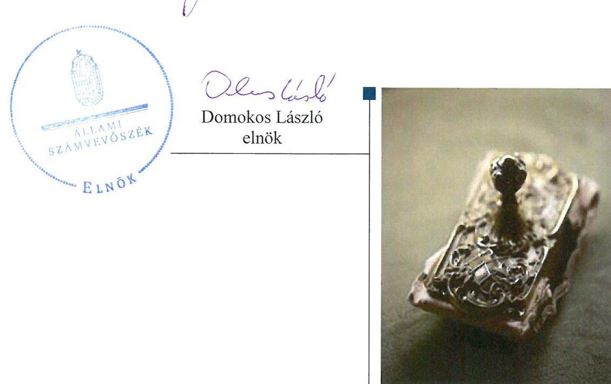

---

# AZ ELLENŐRZÉST FELÜGYELTE: 

MAKKAI MÁRIA felügyeleti vezető

## AZ ELLENŐRZÉST VEZETTE ÉS A VÉGREHAJTÁSÁÉRT FELELŐS:

VALASTYÁNNÉ DR. VÍZHÁNYÓ JÚLIA ellenőrzésvezető

## A PROGRAM ÖSSZEÁLLÍTÁSÁÉRT FELELŐS:

JANIK JÓZSEF osztályvezető

## A TÉMÁHOZ KAPCSOLÓDÓ KORÁBBI SZÁMVEVŐSZÉKI JELENTÉSEK:

- címe: $\quad$ Jelentés Az önkormányzatok gazdasági társaságai Az önkormányzatok többségi tulajdonában lévő gazdasági társaságok közfeladat ellátását érintő gazdálkodási tevékenysége szabályszerűségének ellenőrzése - PÉTÁV Pécsi Távfütő Korlátolt Felelősségű Társaság
- sorszáma: $\quad 15058$
- címe: $\quad$ Jelentés Az önkormányzatok gazdasági társaságai Az önkormányzatok többségi tulajdonában lévő gazdasági társaságok közfeladat ellátását érintő gazdálkodási tevékenysége szabályszerűségének ellenőrzése - BIOKOM Pécsi Városüzemeltetési és Környezetgazdálkodási Kft.
- sorszáma: $\quad 15020$

IKTATÓSZÁM: FV-1096-148/2016.
TÉMASZÁM: 2130
ELLENŐRZÉS-AZONOSÍTÓ SZÁM: V070760

---

# TARTALOMJEGYZÉK 

■ ÖSSZEGZÉS ..... 5
■ AZ ELLENŐRZÉS CÉLJA ..... 6
■ AZ ELLENŐRZÉS TERÜLETE ..... 7
■ AZ ELLENŐRZÉS HÁTTERE, INDOKOLTSÁGA ..... 9
■ FÓKUSZKÉRDÉSEK ..... 10
■ ELLENŐRZÉS HATÓKÖRE ÉS MÓDSZEREI ..... 11
■ MEGÁLLAPÍTÁSOK ..... 13
■ JAVASLATOK ..... 21
■ MELLÉKLETEK ..... 23
I. Sz. melléklet: Értelmező szótár ..... 23
II. Sz. melléklet: Pénzügyi mutatószámok Alakulása ..... 26
■ FÜGGELÉK: ÉSZREVÉTELEK ..... 27
■ RÖVIDÍTÉSEK JEGYZÉKE ..... 43

---

.

---

# ÖSSZEGZÉS 

Az Állami Számvevőszék a Zsolnay Örökségkezelő Nonprofit Kft. gazdálkodásának ellenőrzése során megállapította, hogy Pécs Megyei Jogú Város Önkormányzata a közfeladat ellátását szabályszerűen szervezte meg, tulajdonosi jogait összességében megfelelően gyakorolta. A Társaság vagyongazdálkodása nem volt szabályszerű. Az éves beszámolók mérlegét leltárral nem támasztották alá. A bevételek elszámolása összességében megfelelő, a ráfordítások elszámolása megfelelő volt. Az értékcsökkenés, valamint a beruházások és felújítások elszámolása nem volt megfelelő. A Társaság szabályszerűen végezte az önköltségszámítást.

## Az ellenőrzés társadalmi indokoltsága

Az Állami Számvevőszék kiemelt célja, hogy a helyi önkormányzatok gazdálkodásában rejlő pénzügyi kockázatok feltárásával, az államháztartáson kívülre nyújtott költségvetési támogatások és ingyenes vagyonjuttatások, valamint az államháztartáson kívül múködő feladat-ellátó rendszerek ellenőrzéseivel hozzájáruljon ahhoz, hogy a közpénzeket az államháztartáson kívül múködő szervezetek is átlátható, rendezett módon használják fel.

Magyarországon az intézmény-centrikus közfeladat-ellátás jellemző, de egyre jelentősebb a költségvetésen kívüli feladatellátás térnyerése. Ennek legfontosabb szereplői - a nonprofit szervezetek mellett - az önkormányzati tulajdonú gazdasági társaságok. Az önkormányzatok szervezetalakítási szabadságának következménye, hogy a korábban is vállalati formában múködő közszolgáltatások mellett, mind a kötelező, mind az önként vállalt feladatok ellátásában a gazdasági társaságok kiemelt fontosságú szerephez jutottak.

## Főbb megállapítások, következtetések, javaslatok

Az Önkormányzat a közfeladat ellátását szabályszerűen szervezte meg. Rendeletalkotási kötelezettségének eleget tett. A tulajdonosi jogokat a vagyonrendeletnek megfelelően gyakorolta.

A Társaság számviteli szabályzatokkal rendelkezett. Javadalmazási, valamint adatvédelmi és adatbiztonsági szabályzatot az ellenőrzött időszakban nem készített. A számlarend nem felelt meg a Számv. tv. előírásainak, mert nem tartalmazott rendelkezéseket a vagyonkezelésbe átvett vagyoni eszközök használatából, múködtetéséből származó bevételek és ráfordítások elkülönített nyilvántartására vonatkozóan.

A Társaság vagyongazdálkodása nem volt szabályszerű, mert az éves beszámolók mérlegét leltárral nem támasztották alá. A Társaság kötelezettségeinek állománya nem veszélyeztette a közfeladat ellátást és a múködést. Beszámolási és adatszolgáltatási kötelezettségeit a Társaság teljesítette. A Társaság az ellenőrzött időszakban a tevékenységre, múködésre, gazdálkodásra vonatkozó adatokat a honlapján, illetve az Önkormányzat honlapján nem teljes körűen tette közzé.

Az ellátott közfeladat bevételei elszámolása összességében megfelelő volt. Az anyagjellegú ráfordítások elszámolása megfelelő volt. Az értékcsökkenés, valamint a beruházások és felújítások elszámolása nem felelt meg a Számv. tv. előírásainak, mert az üzembe helyezést hitelt érdemlő módon nem dokumentálták. A Társaság az önköltségszámítási szabályzatát szabályszerűen elkészítette, az önköltségszámítást szabályszerűen végezte.

---

# AZ ELLENŐRZÉS CÉLJA 

## Az önkormányzatok gazdasági társaságai - Az önkormányzatok tulajdonában lévő gazdasági társaságok gazdálkodásának ellenőrzése - Zsolnay Örökségkezelő Nonprofit Kft.

Az ellenőrzés célja annak értékelése volt, hogy az Önkormányzat vagyongazdálkodási tevékenysége során szabályszerűen gyakorolta-e tulajdonosi jogait; a gazdasági társaság szabályozottsága, gazdálkodása és vagyongazdálkodási tevékenysége, bevételeinek és ráfordításainak elszámolása megfelelt-e a jogszabályi és tulajdonosi előírásoknak; a gazdasági társaság kötelezettségállománya jelentett-e kockázatot a múködésre, valamint a gazdálkodás átláthatósága és elszámoltathatósága érdekében biztosítva volt-e a szolgáltatás dijának megalapozottsága szabályszerű önköltségszámítással.

---

# AZ ELLENŐRZÉS TERÜLETE 

## Pécs Megyei Jogú Város Önkormányzata és a kizárólagos tulajdonában álló Zsolnay Örökségkezelő Nonprofit Kft.

PÉCS MEGYEI JOGÚ VÁROS ÖNKORMÁNYZATA ${ }^{1}$ a Zsolnay Örökségkezelő Nonprofit Kft. ${ }^{2}$-t az ellenőrzött időszakot megelőzően 2009. január 22. napján határozatlan időre egyedüli tagként hozta létre, 350,0 M Ft törzstőkével.

A TÁRSASÁG FŐ TEVÉKENYSÉGE történelmi hely, építmény, egyéb látványosság múködtetése közhasznú tevékenység. Közfeladata volt a kulturális tevékenység, kulturális örökség megóvása, múemlékvédelem.

Az Önkormányzat kizárólagos tulajdonát képező ingatlanokat a Társaság üzemeltette. Ennek keretében a Társaság üzemeltette a „Cella Septichora" múemlék épületegyüttest, a Pécsi Középkori Egyetem múemléki épületegyüttest és kapcsolódó létesítményeit, valamint a Zsolnay Kulturális Negyed egyes ingatlanait.

Az Önkormányzat tulajdonát képező Pécsi Kulturális Központban, a Boldogság Házában, Ifjúsági Házban és a Zsolnay Kulturális Negyedben használt kis és nagy értékú ingó vagyonelemeket a Társaság részére közfeladatának ellátása érdekében vagyonkezelésbe adta.

Az ellenőrzött időszakban a polgármester ${ }^{3}$ személye nem, a jegyző ${ }^{4}$ személye egy alkalommal változott. A polgármester az 2010. évi önkormányzati választások óta tölti be tisztségét. Az ellenőrzés ideje alatt a munkakört betöltő jegyző 2011. május 1-jétől látja el feladatait. Az ellenőrzött időszakban az ügyvezető személye két alkalommal változott, a jelenlegi ügyvezető 2012. február 1-je óta tölti be tisztségét.

A 2011-2014. évi gazdálkodás főbb adatait az 1. ábra mutatja be.
1. ábra

A Társaság gazdálkodásának főbb adatai (MFi)
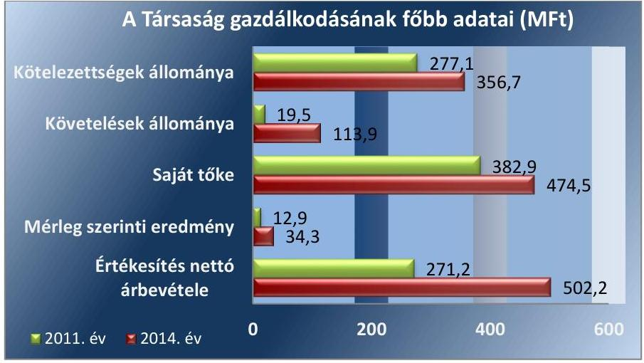

---

A Társaság jegyzett tőkéje az ellenőrzött időszakban 350,4 M Ft-ra növekedett. A Társaság mérleg szerinti vagyona 2011. január 1-je és 2014. december 31-e között 510,0 M Ft-tal emelkedett. Mérlegfőösszege az ellenőrzött időszak végén 1604,9 M Ft volt. 2014. december 31-én az értékesítés nettó árbevétele 502,2 M Ft, az adózott eredmény 34,3 M Ft volt. A Társaság a 2014. év végén az Irány Pécs NKft.-ben rendelkezett 10\%-os részesedéssel.

A Társaság a 2011. évben a 479/2009/EK rendelet ${ }^{5}$, a 2012 - 2014. években pedig az Áht. ${ }^{6} 2$. § (1) bekezdés I) pontja alapján nem minősült kormányzati szektorba sorolt egyéb szervezetnek.

---

# AZ ELLENŐRZÉS HÁTTERE, INDOKOLTSÁGA 

AZ ÖNKORMÁNYZATI TULAJDONÚ GAZDASÁGI TÁRSASÁGOK ellenőrzése kiemelten fontos a vagyon megőrzése, megóvása érdekében, amelyekkel szemben alapvető követelmény, hogy gazdálkodásuk, működésük szabályszerű, az általuk szolgáltatott adatok minél megbízhatóbbak legyenek. A közfeladat-ellátás költségeinek, ráfordításainak alakulása, színvonala hatással van a lakosság elégedettségére.

A TÖRVÉNYALKOTÁS SZÁMÁRA - az észlelt problémák, szabálytalanságok, vagy egyéb nem kívánatos jelenségek felszínre kerülésével - az ellenőrzés megállapításai segítséget nyújthatnak az államháztartáson kívüli közfeladat-ellátás értékeléséhez, jogszabályi keretei pontosításához, átláthatóságot biztosító szabályozásához. Meghatározhatóvá válnak az önkormányzati feladatellátásban részt vevő államháztartáson kívüli szervezeteknek - az önkormányzat költségvetését, pénzügyi helyzetét is befolyásoló - kockázatai, lehetővé válik ezen kockázatok csökkentése. Ellenőrzéseink feltárhatják, hogy az önkormányzat feladat-ellátási kötelezettségének szabályszerűen tett-e eleget, a feladatellátáshoz rendelt vagyonkezelésbe vett és saját vagyon működtetését az elvárható gondossággal, szabályszerűen szervezte-e meg és a tulajdonosi felügyelete hozzájárult-e a feladatellátásához. Az ellenőrzés rávilágíthat arra, hogy a gazdasági társaság a feladat-ellátási, közszolgáltatási szerződésben foglaltak betartásával, a vagyon használatával biztosította-e a szolgáltatás folytatásának feltételeit, a feladat ellátását. Ezzel az ellenőrzöttek és a helyi döntéshozók számára visszajelzést ad feladatszervezési, feladat-ellátási kockázataikról, alapot ad a meglévő hibák megszüntetéséhez, a jobb feladatellátás biztosításához. Fokozza a fegyelmet, igazolja, hogy lejárt a következmények nélküli ellenőrzések időszaka. Az ÁSZ értékteremtő rend kialakításához és megőrzéséhez hozzájáruló tevékenysége pozitív hatással van a szervezetről kialakított összkép formálására.

---

# FÓKUSZKÉRDÉSEK 

1.     - Az önkormányzat közfeladat megszervezéséről szóló döntése, valamint tulajdonosi joggyakorlása szabályszerű volt-e?
2.     - A gazdasági társaság vagyongazdálkodása szabályszerű volt-e, kötelezettségállománya jelent-e kockázatot a müködésre, illetve a közfeladat ellátására?
3.     - A gazdasági társaságnál az ellátott közfeladat bevételei és ráfordításai elszámolása, valamint az önköltségszámítás és árképzés szabályszerű volt-e?

---

# ELLENŐRZÉS HATÓKÖRE ÉS MÓDSZEREI 

## Az ellenőrzés típusa

Megfelelőségi ellenőrzés

## Az ellenőrzött időszak

Az ellenőrzött időszak 2011. január 1-jétől 2014. december 31-ig.

## Az ellenőrzés tárgya

A gazdasági társaság feletti tulajdonosi joggyakorlás, valamint a gazdasági társaság gazdálkodásának szabályozottsága és szabályszerűsége.

Az ellenőrzés kiterjed minden olyan körülményre és adatra, amely az ÁSZ jogszabályban meghatározott feladatainak teljesítéséhez, valamint a program végrehajtása folyamán felmerült újabb összefüggések feltárásához szükséges.

## Az ellenőrzött szervezet

Az ellenőrzött szervezetek:
Pécs Megyei Jogú Város Önkormányzata,
Zsolnay Örökségkezelő Nonprofit Kft.

## Az ellenőrzés jogalapja

Az ellenőrzés jogszabályi alapját az ÁSZ tv. 1. § (3) bekezdése és 5. § (3)-(4)-(5) bekezdései képezik.

## Az ellenőrzés módszerei

Az ellenőrzést a nemzetközi standardokat irányadónak tekintve az ellenőrzési program ellenőrzési kérdései, az ellenőrzött időszakban hatályos jogszabályok, az ellenőrzés szakmai szabályok és módszertanok figyelembevételével végeztük.

Az ellenőrzés ideje alatt az ellenőrzött szervezettel történő kapcsolattartást az ÁSZ Szervezeti és Múködési Szabályzatának vonatkozó előírásai alapján történt.

---

Az ellenőrzés a kizárólagos tulajdonosi jogokat gyakorló Pécs Megyei Jogú Város Önkormányzatára és a Zsolnyai Örökségkezelő Nonprofit Kft.re terjedt ki.

Az ellenőrzési kérdések megválaszolásához szükséges bizonyítékok megszerzése a következő ellenőrzési eljárások alkalmazásával történt: megfigyelés, kérdésfeltevés (információkérés), összehasonlítás, valamint elemző eljárás. Az ellenőrzési bizonyítékként felhasználható adatforrások közé tartoznak egyrészt a szakmai programban felsorolt adatforrások, másrészt adatforrás lehet még minden - az ellenőrzés folyamán - feltárt, az ellenőrzés szempontjából információkat tartalmazó dokumentum.

Az ellenőrzést a kérdésekre adott válaszok kiértékelésével, valamint a megjelölt adatforrások, a csatolt tanúsítványok felhasználásával, továbbá az adott időszakban hatályos jogszabályok figyelembe vételével került lefolytatásra.

A bevételek és ráfordítások elszámolása, valamint a vagyonnyilvántartás terén a szabályszerű múködést véletlen mintavétellel ellenőriztük. A mintavétellel ellenőrzött területek esetében minden egyes tétel vonatkozásában a szabályszerűségre vonatkozó kérdéseket tettünk fel, amelyek eredménye összesítésre került. Az ÁSZ a jogszabályoknak és a belső előírásoknak „megfelelő"-nek tekintette az adott területet, amennyiben a minta ellenőrzésének eredménye alapján 95\%-os bizonyossággal a teljes sokaságban a hibaarány legfeljebb 10\%, „nem megfelelő"-nek, amennyiben 10\%-nál magasabb arányt képviselt. Részben megfelelő minősítést adtunk, amennyiben egy adott terület vonatkozásában a minta alapján a teljes sokaságban nem volt egyértelműen biztosított a jogszabályoknak és a belső szabályzatoknak megfelelő működés. A ráfordítások elszámolására és a vagyonnyilvántartásra vonatkozó véletlen mintavételt kockázati alapú kiválasztással egészítettük ki, amelynek során évente a három legnagyobb öszszegű tételt választottuk ki.

---

# 1. Az önkormányzat közfeladat megszervezéséről szóló döntése, valamint tulajdonosi joggyakorlása szabályszerű volt-e? 

Összegző megállapítás

Az Önkormányzat a közfeladat ellátását szabályszerűen szervezte meg. A tulajdonosi jogokat a vagyonrendeletnek megfelelően gyakorolta.
1.1. számú megállapítás

Az Önkormányzat a közfeladat ellátását szabályszerűen szervezte meg. Rendeletalkotási kötelezettségének eleget tett.

GAZDASÁGI PROGRAMMAL ${ }^{7}$ az ellenőrzött időszakban az Önkormányzat rendelkezett az Ötv. ${ }^{8}$ és a Mötv. ${ }^{9}$-ben meghatározottak szerint. Az Önkormányzat az ellenőrzött időszakban rendelkezett elfogadott Középtávú Kulturális Stratégiával. A Középtávú Kulturális Stratégia a művelődési lehetőségek bővítését tűzte ki célul.

A TELEPÜLÉSFEJLESZTÉSI KONCEPCIÓ ${ }^{10}$ célként határozta meg a Zsolnay Kulturális Negyed fejlesztését, a Zsolnay Gyár leromlott állapotú műemlék épületeinek felújítását, kulturális, közművelődési és oktatási funkciók kialakítását, kulturális negyeddé és rekreációs területté történő átalakítását.

## A KÖZÉP- ÉS HOSSZÚ TÁVÚ VAGYONGAZDÁLKO-

DÁSI TERVET ${ }^{11}$ az Önkormányzat 2012. január 1. és 2013. február 7. között nem készített az Nvtv. ${ }^{12}$ 9. § (1) bekezdésben előírtak ellenére. Az Nvtv.-nek megfelelően a 2013 - 2016. évekre vonatkozóan elkészítette a közép- és hosszú távú vagyongazdálkodási tervét.

KÖZMŰVELŐDÉSI RENDELETET ${ }^{13}$ az Önkormányzat a Közm. tv. ${ }^{14}$-nek megfelelően alkotott.

KÖZSZOLGÁLTATÁSI SZERZŐDÉST ${ }^{15}$ : a Társaság és az Önkormányzat 2011. április 21-én kötött az Ötv. előírásainak megfelelően. A közszolgáltatási szerződés ${ }_{1}$-t 3 év határozott időre kötötték. A közszolgáltatási szerződés ${ }_{1}$-t három alkalommal módosították. A módosítások az ellátandó feladatok körét, a szerződés időbeli hatályát érintették. Az Önkormányzat és a Társaság 2014. május 28-án közszolgáltatási szerződés ${ }^{16}$ 2t kötött a kulturális közszolgáltatási feladatok biztosítása érdekében. A közszolgáltatási szerződés ${ }_{2}$ időbeli hatálya 2018. szeptember 1-ig tart.

VAGYONKEZELÉSI SZERZŐDÉS ${ }^{17}$ az Önkormányzat és a Társaság 2012. május 31-én kötött a Mötv. és az Nvtv. előírásainak megfelelően, határozatlan időre. A vagyonkezelési szerződés melléklete tételesen tartalmazta a vagyonkezelésbe adott eszközöket. A vagyonkezelési

---

szerződés rendelkezett a vagyonkezelésbe adott vagyonnal kapcsolatban az adatszolgáltatási és nyilvántartási kötelezettségekről és meghatározta a vagyonnal való gazdálkodás feltételeit.

ÜZEMELTETÉSI SZERZŐDÉS1 ${ }^{18}$ alapján a Társaság üzemeltette 2011. június 24 -étől az ellenőrzött időszak végéig az Önkormányzat kizárólagos tulajdonában álló „Cella Septichora" műemlék épületegyüttest. Az Önkormányzattal megkötött szerződés tárgya a műemlékingatlanok üzemeltetése, karbantartása és az azzal kapcsolatos hasznosítási tevékenység ellátása volt.

ÜZEMELTETÉSI SZERZŐDÉS2 ${ }^{19}$ alapján látta el 2012. október 19. napjától az ellenőrzött időszak végéig a Társaság a Pécsi Középkori Egyetem műemlékei épületegyüttes és kapcsolódó létesítményeinek üzemeltetését. Az Önkormányzattal megkötött szerződés célja a műemlékingatlanok bemutatása a kulturális idegenforgalmi lehetőségek kiaknázása.

ÜZEMELTETÉSI SZERZŐDÉS ${ }^{20}$ alapján végezte a Társaság 2011. október 19. napjától az ellenőrzött időszak végéig a Zsolnay Kulturális Negyed épületegyüttes és kapcsolódó, a szerződésben megnevezett létesítményeinek üzemeltetését.
1.2. számú megállapítás

A tulajdonosi jogokat a vagyonrendeletnek megfelelően gyakorolták.

# A TULAJDONOSI JOGOK GYAKORLÁSÁNAK 

RENDJÉT a Közgyűlés az Ötv. és az Mötv. szerint a vagyonrendelet ${ }_{1,2}{ }^{21}$ -ben szabályozta. A Társaság feletti tulajdonosi jogokat a vagyonrende-let ${ }_{1,2}$-nek megfelelően gyakorolták.

AZ ALAPÍTÓ OKIRAT a Gt. ${ }^{22}$ és a Ptk. ${ }^{23}$ előírásainak megfelelően készült. Az Alapító Okirat ${ }_{1}$-t az Önkormányzat az ellenőrzött időszakot megelőzően fogadta el. Az Alapító Okirat az ellenőrzött időszakban öt alkalommal módosult.

AZ FB ${ }^{24}$ az Alapító Okiratban előírtak alapján - a Gt., valamint a Ptk. ${ }_{2}$ előírásainak megfelelően - öt tagból állt. Ügyrendjét az ellenőrzött időszakot megelőzően állapította meg.

ELLENŐRZÉST az Önkormányzat a 2012. évben végzett a Társaságnál. Az ellenőrzés tárgya a Társaság pénzügyi és gazdasági tevékenységének vizsgálata volt. Az ellenőrzés eredményeként javaslatokat fogalmaztak meg az ügyvezető, az FB és a jegyző részére. A javaslatok alapján tett intézkedéseket az Önkormányzat belső ellenőrzése utóellenőrzés keretében 2013. szeptember 30-án értékelte.

A TÁRSASÁG BESZÁMOLTATÁS RENDJÉT az Alapító Okiratban és a Közszolgáltatási szerződés ${ }_{1,2}$-ben rögzítették. A közszolgáltatási szerződés ${ }_{1}$ alapján a Társaság az Önkormányzatot a közszolgáltatás teljesítéséről negyedévente, az Éves Működési Jelentésben az éves kompenzáció elszámolásáról és a közszolgáltatási tevékenységről volt köteles tájékoztatni. A közszolgáltatási szerződés ${ }_{2}$-ben meghatározott időpontig

---

adatszolgáltatási, valamint üzleti terv készítési kötelezettséget írtak elő a Társaság részére.

GARANCIA- ÉS KEZESSÉGVÁLLALÁS az Önkormányzat az ellenőrzött időszakot megelőzően a Társaság részére kölcsön fedezetéhez nyújtott. A kölcsön visszafizetése az ellenőrzött időszakban megtörtént. Az ellenőrzött időszak végéig a hitel felvételekhez kapcsolódóan a garancia és a kezesség nem került érvényesítésre.

# 2. A gazdasági társaság vagyongazdálkodása szabályszerű volt-e, kötelezettségállománya jelent-e kockázatot a múködésre, illetve a közfeladat ellátására? 

Összegző megállapítás

A Társaság vagyongazdálkodása nem volt szabályszerű. Kötelezettség állománya nem veszélyeztette a közfeladat ellátást és a múködést.
2.1. számú megállapítás

A Társaság számviteli szabályzatokkal rendelkezett. Az elkészült szabályzatok nem teljes körűen feleltek meg az előírásoknak. Javadalmazási és adatvédelmi és adatbiztonsági szabályzatot nem készített.

ÜZLETI TERVET a Társaság az ellenőrzött időszakban a 2012., 2013. és 2014. évekre vonatkozóan készített. Az Alapító okiratban foglaltak ellenére a 2011. évre vonatkozóan nem készült üzleti terv. A 2012. évi üzleti terv elfogadása az Alapítói okirat előírása ellenére nem történt meg. A 2013-2014. évi üzleti terveket a tulajdonosi joggyakorló hagyta jóvá.

SZÁMVITELI SZABÁLYZATOKKAL 2011. szeptember 30ig a Számv. tv. ${ }^{25}$ 14. § (3)-(5), és a (11) bekezdéseiben, valamint a 161. §ában foglaltakkal ellenére nem rendelkezett. A Társaság 2011. október 1jei hatállyal készítette el és hagyta jóvá a számviteli politikát, valamint a leltározási szabályzatát ${ }^{26}$, az értékelési szabályzatát ${ }^{27}$, a pénzkezelési szabályzatát ${ }^{28}$, illetve a számlarendet ${ }^{29}$.

A SZÁMLAREND az ellenőrzött időszakban a bevételek tekintetében a 2011., 2012. évek kivételével, a ráfordítások tekintetében a 20112014. években nem felelt meg a Számv. tv. 161/A. § (2) bekezdésében előírtaknak, mivel az Mótv. 109. § (7) bekezdése ellenére nem tartalmazott rendelkezéseket a vagyonkezelésbe átvett vagyoni eszközök használatából, múködtetéséből származó bevételek és ráfordítások elkülönített nyilvántartására vonatkozóan.

A Társaság az ellenőrzött időszakban a Közszolgáltatási szerződés; 11.3., a Közszolgáltatási szerződés; 20. pontjaiban, 2011. december 31-ig a Közhasznúsági tv. ${ }^{30}$ 18. § (1) bekezdés ellenére nem alakította ki a számlarendben a 161/A. § (2) bekezdésében foglaltak ellenére a közhasznú tevékenység bevételeinek és ráfordításainak elkülönített nyilvántartását.

---

A LELTÁROZÁSI SZABÁLYZAT az ellenőrzött időszakban megfelelt a Számv. tv.-ben foglaltaknak, abban meghatározták a mennyiségi leltárfelvétel gyakoriságát.

ÖNKÖLTSÉGSZÁMÍTÁSI SZABÁLYZAT ${ }^{31}$ készítési kötelezettsége a Számv. tv. 14. § (7) bekezdése alapján a Társaságnak a 2013. évtől állt fent. A Társaság 2012. szeptember 30-tól rendelkezett önköltségszámítási szabályzattal.

JAVADALMAZÁSI ILLETVE JUTTATÁSI SZABÁLYZATTAL a Társaság a Taktv. ${ }^{32}$ 5. § (3) bekezdés előírása ellenére nem rendelkezett.

ADATVÉDELMI ÉS ADATBIZTONSÁGI SZABÁLYZATTAL a Társaság. az Avtv. ${ }^{33}$ 31/A. § (3) bekezdése, illetve az Info tv. ${ }^{34}$ 24. §. (3) bekezdésében foglaltak ellenére az ellenőrzött időszakban nem rendelkezett.

# 2.2. számú megállapítás 

A Társaság vagyongazdálkodása nem volt szabályszerű, mert a számviteli éves beszámolókat leltárral nem támasztották alá.

A TÁRSASÁG az Önkormányzattal 2012. május 31-én kötött vagyonkezelési szerződést. A vagyonkezelésbe adott eszközök 2012. január 1. napjától voltak a Társaság birtokában. A vagyonkezelésbe vett 97,6 M Ft bruttó, 14,4 M Ft nettó értékú eszközök, valamint a vagyonkezelési szerződésből eredő hosszú lejáratú 14,4 M Ft kötelezettségek számviteli nyilvántartásba vétele megtörtént.

A Társaság a Számv. tv. 69. § (1) bekezdés előírásai ellenére az éves beszámolók mérlegét leltárral a 2011-2014. években nem támasztotta alá. A 2011-2013. évi leltárak nem tartalmazták a pénzeszközöket, a követeléseket, az aktív időbeli elhatárolásokat, valamint a forrásokat. A 2011. évben az immateriális javak, a 2011-2013. évben a tárgyi eszközök leltára nem támasztotta alá a mérleg tételeit, mert a leltárban és a mérlegben szereplő értékadatok eltértek. A 2014. évre az éves beszámoló mérlegét alátámasztó leltár nem készült.

A Társaság éves beszámolóinak főbb mérlegadatait az 1. táblázat mutatja be.

---

| A TÁRSASÁG MÉRLEGÉNEK KIEMELT ADATAI (M FT) |  |  |  |  |  |
| :--: | :--: | :--: | :--: | :--: | :--: |
| Megnevezés | 2011.01 .01 | 2011.12 .31 | 2012.12 .31 | 2013.12 .31 | 2014.12 .31 |
| I. Befektetett eszközök | 1055,8 | 1094,0 | 1144,2 | 1256,5 | 1412,5 |
| - ebből: Tárgyi eszközök | 1051,6 | 1086,1 | 1137,2 | 1249,3 | 1393,4 |
| II. Forgó eszközök | 35,7 | 99,0 | 151,3 | 161,7 | 178,6 |
| - ebből: Követelések | 9,1 | 19,5 | 96,1 | 133,2 | 113,9 |
| III. Aktív időbeli elhatárolások | 3,4 | 37,2 | 54,2 | 38,4 | 13,8 |
| Eszközök összesen | 1094,9 | 1230,2 | 1349,7 | 1456,6 | 1604,9 |
| IV. Saját tőke | 345,3 | 382,9 | 389,1 | 440,3 | 474,5 |
| - ebből: Jegyzett tőke | 350,0 | 350,4 | 350,4 | 350,4 | 350,4 |
| - ebből Mérleg szerinti eredmény | $-9,0$ | 12,9 | 6,2 | 9,3 | 34,3 |
| V. Céltartalékok | 0,0 | 0,0 | 0,0 | 0,0 | 0,0 |
| VI. Kötelezettségek | 312,9 | 277,1 | 278,8 | 263,7 | 356,7 |
| - ebből Hosszú lejáratú | 217,8 | 148,3 | 87,7 | 14,4 | 14,4 |
| VII. Passzív időbeli elhatárolások | 436,7 | 570,2 | 681,8 | 752,6 | 773,7 |
| Források összesen | 1094,9 | 1230,2 | 1349,7 | 1456,6 | 1604,9 |

Forrás: Társaság adatszolgáltatása/Társaság 2011-2014. évi éves beszámolói

AZ ESZKÖZÖK állománya 2014. december 31-re 510,0 M Ft-tal növekedett a 2011. január 1-jei 1094,9 M Ft-tal szemben. Ezt elsődlegesen a tárgyi eszközök állományának 341,8 M Ft-os növekedése okozta. Az emelkedés fő oka, hogy a tárgyi eszköz üzembe helyezések értéke meghaladta az elszámolt értékcsökkenés összegét. Az ellenőrzött időszakban a Társaság az eszközök 121,8 M Ft összegű értékcsökkenéséhez képest 495,3 M Ft jelentős összegű beruházást valósított meg, ezért az eszközállomány értéke folyamatosan emelkedett.

A FORRÁSOK 510,0 M Ft-os összegű növekedését az ellenőrzött időszakban a passzív időbeli elhatárolások értékének 337,0 M Ft összegű emelkedése okozta, amely a Gyugyi gyűjtemény mútárgyai értékének az időbeli elhatárolásban kimutatott részét tartalmazta.

A KÖZSZOLGÁLTATÁS ellátására használt eszközök megőrzésére, hasznosítására, megterhelésére vonatkozó, a közszolgáltatási szerződésben rögzített megőrzési szabályoknak a Társaság az ellenőrzött időszakban eleget tett. A Társaság részére a vagyonkezelési szerződés 12. pontja határozott meg a vagyonkezelésbe adott vagyon után elszámolt és a bevételekben megtérülő értékcsökkenés összegének megfelelő tartalékképzési kötelezettséget, amelyet a Társaság teljesített. Az ellenőrzött időszak végén a vagyonkezelési szerződés szerint a Társaság lekötött tartaléka 9,2 M Ft volt.

A TÁRSASÁG az ellenőrzött időszakban rendelkezett a társasági formájára kötelezően előírt jegyzett tőkének megfelelő összegű saját tőkével, intézkedési kötelezettsége a jegyzett tőke pótlására vonatkozóan nem volt. Az Önkormányzat az ellenőrzött időszakban egy alkalommal, a 2011. évben emelte a Társaság jegyzett tőkéjét 0,4 M Ft-tal.

---

# 2.3. számú megállapítás 

A Társaság kötelezettségeinek állománya nem veszélyeztette a közfeladat ellátást és a múködést.

A Társaság eladósodottsága az ellenőrzött időszakban a saját tőkéhez viszonyítva kedvezően alakult.

A Társaság rövid és hosszú lejáratú kötelezettségeinek összértéke a 2014. év végén 356,7 M Ft volt a 2011. január 1-jei 312,9 M Ft-tal szemben. A hosszú lejáratú kötelezettségek értéke a 2011. január 1-jei 217,8 M Ft-ról 2014. év végére 14,4 M Ft-ra csökkent. A hosszú lejáratú kötelezettségek állománya a Gyugyi-gyűjtemény megvásárlásához az ellenőrzött időszakot megelőzően felvett hitelből és a vagyonkezelésbe vett eszközök értékéből tevődött össze. A hitelt az Önkormányzat támogatásával a 2014. évben visszafizették.

Az ellenőrzött időszak végén a Társaság pénzeszközeinek állománya összesen 43,1 M Ft volt. A Társaság az ellenőrzött időszakban mindösszesen 3763,4 M Ft összegű működési célú-, hiteltörlesztésre szánt, illetve egyéb központi költségvetési és pályázati támogatást kapott. A Társaság nettó árbevételéhez viszonyított eladósodottsága kedvező volt a 20112014. évi időszakban, mivel a forgóeszközök értékével csökkentett kötelezettségek értékét minden évben meghaladta a realizált nettó árbevétel összege. A kötelezettségek állománya nem veszélyeztette a közfeladat ellátást és a múködését.
2. táblázat

## A KÖTELEZETTSÉG ÁLLOMÁNY ALAKULÁSA (M FT)

| Megnevezés | 2011. | 2011. | 2012. | 2013. | 2014. |
| :--: | :--: | :--: | :--: | :--: | :--: |
|  | 01.01. | 12.31. | 12.31. | 12.31. | 12.31. |
| Rövid lejáratú kötelezettségek | 95,1 | 128,8 | 191,1 | 249,3 | 342,3 |
| ebből Rövid lejáratú hitelek | - | 74,1 | 74,1 | 74,9 | 0 |
| ebből Szállítók | - | 13,6 | 70,3 | 122,2 | 267,9 |
| Hosszú lejáratú kötelezettségek | 217,8 | 148,3 | 87,7 | 14,4 | 14,4 |
| ebből Egyéb hosszú lejáratú hitelek | - | 148,3 | 73,3 | 14,4 | 14,4 |
| Kötelezettség összesen | 312,9 | 277,1 | 278,8 | 263,7 | 356,7 |

A beszámolási és adatszolgáltatási kötelezettségeit a Társaság teljesítette. A Társaság az ellenőrzött időszakban a közzétételi kötelezettségét nem teljes körűen teljesítette.

## 2.4. számú megállapítás

BESZÁMOLÁSI ÉS ADATSZOLGÁLTATÁSI kötelezettségének a Társaság az ellenőrzött időszakban a Számv. tv. - ban foglaltaknak megfelelően eleget tett.

A Társaság a Számv. tv.-nek megfelelően elkészítette a 20112014. évekre vonatkozó éves beszámolóit és a Közhasznúsági tv. ${ }^{35}$-ben előírt 2011-2012. években közhasznúsági jelentéseit, illetve 2013-2014.

---

évek közhasznúsági mellékleteit. A Társaság az ellenőrzött időszakra vonatkozó éves beszámolókat, a 2011-2012. években közhasznúsági jelentéseit, valamint a 2013-2014. évek közhasznúsági mellékleteit a Számv. tv.-ben, valamint a Közhasznúsági tv.-ben és a Civil tv.-ben előírt tartalommal és határidőre letétbe helyezte.

A Társaság éves számviteli beszámolóit az ellenőrzött időszakban az FB a Gt., a Ptk2 és az Alapítói Okiratban előírtak szerint megtárgyalta, és írásos jelentést készített. A könyvvizsgáló az ellenőrzött időszak minden évében a beszámolókat hitelesítő záradékkal látta el.

Az ellenőrzött időszakban az éves számviteli beszámolókat, a 20112012. években közhasznúsági jelentéseit, valamint a 2013. év közhasznúsági mellékletét a tulajdonosi joggyakorló a 2014. év kivételével Alapítói határozatban hagyta jóvá.

A közszolgáltatási szerződés-ben előírt negyedéves beszámolót és Éves Működési Jelentést a Társaság nem készített. A közszolgáltatási szerző-dés-ben meghatározott adatszolgáltatási és üzleti terv készítési kötelezettségének Társaság eleget tett.

A KÖZÉRDEKŰ ADATOK NYILVÁNOSSÁGRA HOZATALÁVAL kapcsolatos kötelezettségének a Társaság az Eisztv. ${ }^{36}$ 6. § (1), Info tv. 37. § (1) bekezdéseiben foglaltak ellenére Társaság az ellenőrzött időszakban nem teljes körűen tett eleget, mivel a tevékenységre, működésre, gazdálkodásra vonatkozó adatokat a honlapján, illetve az Önkormányzat honlapján nem teljes körűen tette közzé.

# 3. A gazdasági társaságnál az ellátott közfeladat bevételei és ráfordításai elszámolása, valamint az önköltségszámítás és árképzés szabályszerű volt-e? 

Összegző megállapítás

Az ellátott közfeladat bevételei elszámolása összességében megfelelő volt. A ráfordítások elszámolása megfelelő volt. Az értékcsökkenés, valamint a beruházások és felújítások elszámolása nem felelt meg a Számv. tv. előírásainak. A Társaság önköltségszámítási szabályzatát szabályszerűen elkészítette, az önköltségszámítást szabályszerűen végezte.
3.1. számú megállapítás

Az ellátott közfeladat bevételeinek elszámolása összességében megfelelő volt. A ráfordítások elszámolása megfelelő volt. Az értékcsökkenés, valamint a beruházások és felújítások elszámolása nem felelt meg a Számv. tv. előírásainak.

A KÖZFELADATOK BEVÉTELEINEK elkülönítését a számlatúkörben biztosították. A közhasznú és a vállalkozási tevékenység bevételeit a munkaszámrendszer segítségével elkülönítették, azt a 20112014. évek éves számviteli beszámolóiban bemutatták. A 20132014. években a vagyonkezelésbe vett vagyon használatából származó bevételeket a gyakorlatban nem különítették el az Mötv. 109. § (7) bekezdései előírásai ellenére.

---

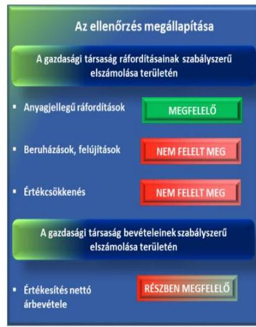
3.2. számú megállapítás

A KÖZFELADATOK RÁFORDÍTÁSAINAK szétválasztását a Társaság a vagyonkezelésbe vett eszközök vonatkozásában az Áht. 1 105/A. § (12) és a Mötv. 109. § (7) bekezdését megsértve a számviteli nyilvántartásaiban a gyakorlatban nem biztosította. A közhasznú és a vállalkozási tevékenység bevételeit a munkaszámrendszer segítségével elkülönítették, azt a 2011-2014. évek éves számviteli beszámolóiban bemutatták.

AZ ANYAGJELLEGŰ RÁFORDÍTÁSOK elszámolása az ellenőrzött időszakban megfelelő volt. Az anyagjellegú költségeket a Számv. tv. előírásainak megfelelő költségnem főkönyvi számlákra számolták el az ellenőrzött időszakban.

AZ ÉRTÉKESÍTÉS NETTÓ ÁRBEVÉTELÉNEK ELSZÁMOLÁSA az ellenőrzött időszakban részben volt megfelelő a vagyonkezelésbe vett vagyon használatából származó bevételek elkülönítésének hiánya miatt. A nettó árbevételek jellemzően jegy- és áruértékesítések voltak, a számlázást bizonylatokkal alátámasztották. A közhasznú és a vállalkozási tevékenység bevételeit a munkaszámrendszer segítségével elkülönítették, azt a 2011-2014. évek éves számviteli beszámolóiban bemutatták.

AZ ÉRTÉKCSÖKKENÉS ELSZÁMOLÁSA és a BERUHÁZÁSOK, FELÚJÍTÁSOK elszámolása az ellenőrzött időszakban nem volt megfelelő. A tárgyi eszközök aktiválásakor a Számv. tv. 52 § (2) bekezdés előírásai ellenére az üzembe helyezést hitelt érdemlő módon nem dokumentálták.

A KÖVETELÉSEK állományba vétele az ellenőrzött időszakban a Számv. tv.-nek megfelelően megtörtént. A Társaság a kétes követelések esetében a Számv. tv. alapján elvégezte az értékvesztés elszámolását.

A Társaság a fizetési határidő lejártát követően a tartozást felhalmozó vevőknek fizetési felszólítást és egyenlegközlő levelet küldött, valamint a követelés peresítésére került sor.

A Társaság az önköltségszámítási szabályzatát szabályszerűen elkészítette, az önköltségszámítást szabályszerűen végezte.

ÖNKÖLTSÉGSZÁMÍTÁSI SZABÁLYZAT készítésére a Társaság a 2013. évtől volt kötelezett. Az önköltségszámítási szabályzatot 2012. szeptember 30-án a Számv. tv. előírásainak megfelelően készítette el és léptette hatályba. A Társaság 2013. november 1-jével elkészítette értékesítési és árképzési szabályzatát a területek alkalmi, kulturális vagy üzleti célú hasznosításakor alkalmazandó árairól. A szabályzat tartalmazta az alkalmi és a tartós bérleti díjakat és a szálláshely árakat. Az ellenőrzött időszakban a kiállításokra, bemutató helyszínekre szóló jegyárakat a Társaság állapította meg, az Önkormányzat elvárásokat erre vonatkozóan nem fogalmazott meg.

Az önköltségszámítás szabályszerűen, a Számv. tv.-nek megfelelően történt. Az egyes közfeladatok és egyéb feladatok önköltségének számítása, illetve elkülönítése során szabályszerűen alkalmazták az jogszabályi és belső szabályzatok előírásait.

---

# JAVASLATOK 

Az ÁSZ tv. 33. § (1) bekezdésében foglaltak értelmében az ellenőrzött szervezet vezetője köteles a jelentésben foglalt megállapításokhoz kapcsolódó intézkedési tervet összeállítani és azt a jelentés kézhezvételétől számított 30 napon belül az ÁSZ részére megküldeni. Amennyiben az ellenőrzött szervezet vezetője nem küldi meg határidőben az intézkedési tervet, vagy továbbra sem elfogadható intézkedési tervet küld, az Állami Számvevőszék elnöke az ÁSZ tv. 33. § (3) bekezdése a) és b) pontjaiban foglaltakat érvényesítheti.

## Pécs Megyei Jogú Város Önkormányzata polgármesterének

1. Intézkedjen a vezető tisztségviselők, felügyelőbizottsági tagok, valamint az Mt. 208. §-ának hatálya alá eső munkavállalók javadalmazása, valamint a jogviszony megszünése esetére biztosított juttatások módjának, mértékének elveire, annak rendszerére vonatkozó szabályzat elkészitéséről.
(2.1. sz. megállapítás 8. bekezdése alapján)

## A Zsolnay Örökségkezelő Nonprofit Kft. ügyvezetőjének

1. Intézkedjen az adatvédelmi és adatbiztonsági szabályzat elkészitéséről.
(2.1. sz. megállapítás 9. bekezdése alapján)
2. Intézkedjen az éves beszámoló mérlegtételeinek leltárral való alátámasztásáról.
(2.2. sz. megállapítás 2. bekezdése alapján)
3. Intézkedjen a kötelezően közzéteendő adatok teljes körű közzétételéről.
(2.4. sz. megállapítás 6. bekezdése alapján)
4. Intézkedjen a bevételek és ráfordítások elkülönített nyilvántartásáról, továbbá az értékcsökkenés szabályszerű elszámolásáról.
(3.1. sz. megállapítás 1-2., 4-5. bekezdése alapján)

---

.

---

# MELLÉKLETEK 

## I. SZ. MELLÉKLET: ÉRTELMEZŐ SZÓTÁR

adósságfedezeti mutató I.
adósságfedezeti mutató II.

Adósságot keletkeztető ügylet
árbevételre vetített eladósodottság
eladósodottság mértéke
(befektetett eszközök + forgó eszközök) / idegen forrás
Azt mutatja, hogy 1 Ft adósságra hány Ft vagyon jut. Általánosságban véve kedvező, ha értéke 2 körül van, de nagy eszközberuházás-igényű iparágakban értéke kisebb is lehet.
működési cash flow / hosszú lejáratú kötelezettségek
A mutató azt jelzi, hogy az adott gazdálkodási időszak működési pénzáramainak eredményeként realizált cash flow révén a vállalkozás mennyiben lenne képes valamennyi hosszú lejáratú kötelezettségének eleget tenni. Ennek vizsgálatára viszonylag ritkán kerül sor, az elsősorban a veszélyhelyzetbe került vállalkozások esetében lehet érdekes. Általánosságban véve kedvező, ha a működési cash flow minél nagyobb arányban nyújt fedezetet a hosszú lejáratú kötelezettségre (értéke nagyobb, mint 1, nő az ellenőrzött időszakban).
Adósságot keletkeztető ügylet és annak értéke:
a) hitel, kölcsön felvétele, átvállalása a folyósítás, átvállalás napjától a végtörlesztés napjáig, és annak aktuális tőketartozása,
b) a Számv. tv. szerinti hitelviszonyt megtestesítő értékpapír forgalomba hozatala a forgalomba hozatal napjától a beváltás napjáig, kamatozó értékpapír esetén annak névértéke, egyéb értékpapír esetén annak vételára,
c) váltó kibocsátása a kibocsátás napjától a beváltás napjáig, és annak a váltóval kiváltott kötelezettséggel megegyező, kamatot nem tartalmazó értéke, d) a Számv. tv. szerint pénzügyi lízing lízingbevevői félként történő megkötése a lízing futamideje alatt, és a lízingszerződésben kikötött tőkerész hátralévő összege,
e) a visszavásárlási kötelezettség kikötésével megkötött adásvételi szerződés eladói félként történő megkötése - ideértve a Számv. tv. szerinti valódi penziós és óvadéki repóügyleteket is - a visszavásárlásig, és a kikötött visszavásárlási ár,
f) a szerződésben kapott, legalább háromszázhatvanöt nap időtartamú halasztott fizetés, részletfizetés, és a még ki nem fizetett ellenérték,
g) hitelintézetek által, származékos műveletek különbözeteként az Államadósság Kezelő Központ Zrt.-nél elhelyezett fedezeti betétek, és azok öszszege.
Forrás: Stabilitási tv. 3. § (1) bekezdése
(kötelezettségek - forgóeszközök) / értékesítés nettó árbevétele
Az árbevételre vetített eladósodottság azt mutatja, hogy az árbevétel mekkora fedezet nyújt a kötelezettségeknek a forgóeszközökkel csökkentett részére. Általánosságban véve kedvező, ha az árbevétel minél nagyobb arányban nyújt fedezetet a forgóeszközökkel csökkentett kötelezettségekre (értéke kisebb, mint 1, csökken az ellenőrzött időszakban).
Kötelezettségek / saját tőke
Fontos szerepet játszik ez a mutató egy vállalat megítélésében. Azt mutatja, hogy a saját források a kötelezettségek hány százalékát fedezik. Törekedni kell, hogy a mutató tartósan (jelentősen) 1 alatti értéket érjen el.

---

eladósodottsági mutató (tőkeáttétel)

ESA 95

ESA 2010
garancia
gazdasági társaság
gazdálkodó szervezet
kezesség
idegen tőke / összes forrás
Egészségesnek mondható egy olyan mértékű áttétel, amelyet az üzleti tervek szerint és az elmúlt időszak tapasztalatai alapján a társaság megfelelő biztonsággal ki tud termelni. Nagy eszközberuházás-igényű iparágakban értéke magasabb, azaz magasabb eladósodottság is elfogadható, de 75-85 \%-ot meghaladó értéknél már itt is erős, sőt túlzott külső finanszírozottságról beszélhetünk. Általánosságban véve kedvező, ha értéke kisebb, mint 0.
Nemzeti és regionális számlák európai rendszere (a továbbiakban: ESA 95), statisztikai definíciók összessége, amely biztosítja a tagállamok gazdasági adatainak egységes és összehasonlítható nyilvántartását.
Forrás: Magyar Nemzeti Bank
Az Európai Unióbeli nemzeti és regionális számlák európai rendszere (a továbbiakban: az ESA 2010), amely módszertanból és egy olyan továbbítási programból áll, amely meghatározza a tagállamok által adott határidőre benyújtandó számlákat és táblázatokat. A Bizottságnak, különös tekintettel a gazdasági konvergencia figyelemmel kísérésére és a tagállamok gazdaságpolitikái közötti szoros koordináció megteremtésére, meghatározott időpontokban adott esetben előzetesen bejelentett adatszolgáltatási naptár alapján - kell ezeket a számlákat és táblákat a felhasználók rendelkezésére bocsátania. A tagállami számlák uniós céloknak megfelelő elkészítésére vonatkozó közös előírások, fogalom meghatározások, osztályozások és számviteli szabályok referenciakerete, mely a tagállamok között összehasonlítható eredményeket szolgáltat, és mint ilyen, minden más rendszernek fokozatosan a helyébe lép (forrás: Az Európai Parlament és a Tanács 549/2013/EU rendelete (12) és (14) bekezdései).
A garancia olyan önálló, az önkormányzat nevében vállalt kötelezettség, amely alapján az önkormányzat az önkormányzati költségvetés terhére szerződésben meghatározott feltételek szerint, a kötelezett nem teljesítése esetén a jogosultnak fizetést teljesít az előzetesen rögzített összeghatárig.
Ptk.: 3:88. § (1) A gazdasági társaságok üzletszerű közös gazdasági tevékenység folytatására, a tagok vagyoni hozzájárulásával létrehozott, jogi személyiséggel rendelkező vállalkozások, amelyekben a tagok a nyereségből közösen részesednek, és a veszteséget közösen viselik.
A Ptk. 685. § c) pontja szerint gazdálkodó szervezet: „az állami vállalat, az egyéb állami gazdálkodó szerv, a szövetkezet, a lakásszövetkezet, az európai szövetkezet, a gazdasági társaság, az európai részvénytársaság, az egyesülés, az európai gazdasági egyesülés, az európai területi együttműködési csoportosulás, az egyes jogi személyek vállalata, a leányvállalat, a vízgazdálkodási társulat, az erdő birtokossági társulat, a végrehajtói iroda, az egyéni cég, továbbá az egyéni vállalkozó."
A kezességre vonatkozó előírásokat a Ptk. 6:416-430. §-ai tartalmazzák. Kezességi szerződéssel a kezes kötelezettséget vállal a jogosulttal szemben, hogyha a kötelezett nem teljesít, maga fog helyette a jogosultnak teljesíteni. Kezesség egy vagy több, fennálló vagy jövőbeli, feltétlen vagy feltételes, meghatározott vagy meghatározható összegű pénzkövetelés vagy pénzben kifejezhető értékkel rendelkező egyéb kötelezettség biztosítására vállalható. A Ptk. szerint kezességet csak írásban lehet vállalni. A kezes kötelezettsége ahhoz a kötelezettséghez igazodik, amelyért kezességet vállalt. A kezes kötelezettsége nem válhat terhesebbé, mint amilyen elvállalásakor volt, kiterjed azonban a kötelezett szerződésszegésének jogkövetkezményeire és a kezesség elvállalása után esedékessé váló mellékkövetelésekre is.

---

Kormányzati szektorba sorolt egyéb szervezet
közfeladat
közszolgáltatás

Közvetett tulajdon, illetve közvetett befolyás
nemzeti vagyon
nettó eladósodottság

Nonprofit gazdasági társaság

Tulajdonosi joggyakorló

Az a szervezet, amely az Áht. ${ }_{2}$ alapján nem része az államháztartásnak, azonban az Európai Közösséget létrehozó szerződéshez csatolt, a túlzott hiány esetén követendő eljárásról szóló jegyzőkönyv alkalmazásáról szóló 2009. május 25-i 479/2009/EK rendelet szerint a kormányzati szektorba tartozik. A nemzetgazdasági miniszter 2013. június 26-án megjelent Közleményben tette közé ezen szervezetek listáját.
Jogszabályban meghatározott állami vagy önkormányzati feladat, amit az arra kötelezett közérdekből, jogszabályban meghatározott követelményeknek és feltételeknek megfelelve végez, ideértve a lakosság közszolgáltatásokkal való ellátását, továbbá az állam nemzetközi szerződésekben vállalt kötelezettségeiből adódó közérdekű feladatokat, valamint e feladatok ellátásához szükséges infrastruktúra biztosítását is (Nvtv. 3. § (1) bekezdés 7. pont).
A közszolgáltatás: „közcélú, illetőleg közérdekü szolgáltatást jelent, amely egy nagyobb közösség (állam, település) minden tagjára nézve megközelítőleg azonos feltételek mellett vehető igénybe, ezért valamilyen mértékig közösségi megszervezést, illetve szabályozást, ellenőrzést igényel." Az Ebktv. 3. § d) pontja a következőképpen határozza meg a közszolgáltatást: „szerződéskötési kötelezettség alapján a lakosság alapvető szükségleteinek ellátására irányuló szolgáltatás, így különösen a villamos energia-, gáz-, hő-, víz-, szennyvíz- és hulladékkezelési, köztisztasági, postai és távközlési szolgáltatás, továbbá a menetrend alapján közlekedő járművekkel végzett közforgalmú személyszállitás"
Egy vállalkozás tulajdoni hányadának, illetőleg szavazati jogának a vállalkozásban tulajdoni részesedéssel, illetőleg szavazati joggal rendelkező más vállalkozás (köztes vállalkozás) tulajdoni hányadán, szavazati jogán keresztül történő gyakorlása. A közvetett tulajdon, a közvetett befolyás arányának megállapításához a közvetett tulajdonnal, közvetett befolyással rendelkezőnek a köztes vállalkozásban fennálló szavazati jogát vagy tulajdoni hányadát meg kell szorozni a köztes vállalkozásnak a vállalkozásban fennálló szavazati vagy tulajdoni hányada közül azzal, amelyik a nagyobb. Ha a köztes vállalkozásban fennálló szavazati vagy tulajdoni hányad az ötven százalékot meghaladja, akkor azt egy egészként kell figyelembe venni (a tőkepiacról szóló 2001. évi CXX. törvény 5. § (1) bekezdés 84. pont).
Az Nvtv. 1. § (2) bekezdés c) pontja szerint „az állam vagy a helyi önkormányzatot tulajdonában lévő pénzügyi eszközök, továbbá az államot vagy a helyi önkormányzatot megillető társasági részesedések"
(kötelezettségek - követelések) / saját tőke
Azt mutatja, hogy a kintlévőségekkel csökkentett kötelezettségeket milyen mértékben fedezi saját forrás. Ez feltételezi, hogy a követelések pénzügyileg előbb realizálódnak, mint ahogy a kötelezettségeket teljesíteni kell. A mutató minél kisebb, csökkenő értéke kedvező.
Gt. 4. § (1) bekezdése szerint „gazdasági társaság nem jövedelemszerzésre irányuló közös gazdasági tevékenység folytatására is alapítható (nonprofit gazdasági társaság). Nonprofit gazdasági társaság bármely társasági formában alapítható és múködtethető. A gazdasági társaság nonprofit jellegét a gazdasági társaság cégnevében a társasági forma megjelölésénél fel kell tüntetni."
Aki a nemzeti vagyon felett az államot vagy a helyi önkormányzatot megillető tulajdonosi jogok és kötelezettségek összességének gyakorlására jogosult (Nvtv. 3. § (1) bekezdés 17. pont).

---

II. SZ. MELLÉKLET: PÉNZÜGYI MUTATÓSZÁMOK ALAKULÁSA

|  PÉNZÜGYI MUTATÓSZÁMOK ALAKULÁSA 2011-2014. KÖZÖTT |  |  |  |   |
| --- | --- | --- | --- | --- |
|   | 2011 | 2012 | 2013 | 2014  |
|  Eladósodottság mértéke
kötelezettségek**/saját tőke | 0,72 | 0,72 | 0,60 | 0,75  |
|  Nettó eladósodottság
(kötelezettségek** követelések)/saját tőke | 0,67 | 0,47 | 0,30 | 0,51  |
|  Adósságfedezeti mutató I.
(befektetett eszközök+forgóeszközök)/idegen forrás | 4,31 | 4,65 | 5,38 | 4,46  |
|  Árbevételre vetített eladósodottság
(kötelezettségek**- forgóeszközök)/értékesítés nettó árbevétele | 0,66 | 0,27 | 0,22 | 0,35  |

Fonrás: A Társaság 2011-2014. évi beszámolói

---

# FÜGGELÉK: ÉSZREVÉTELEK 

A jelentéstervezetet a Számvevőszék 15 napos észrevételezésre megküldte az ellenőrzött szervezetek vezetőinek az ÁSZ tv. 29. §* (1) bekezdése előírásának megfelelően.

Az ÁSZ a jelentéstervezetet észrevételezésre megküldte Pécs Megyei Jogú Város Önkormányzata polgármesterének és a Zsolnay Örökségkezelő Nonprofit Kft. ügyvezetőjének.

Pécs Megyei Jogú Város Önkormányzata polgármesterének és a Zsolnay Örökségkezelő Nonprofit Kft. ügyvezetőjének észrevételét és az arra adott választ a függelék alább tartalmazza.

[^0]
[^0]:    * 29. § (1) Az Állami Számvevőszék az ellenőrzési megállapításait megküldi az ellenőrzött szervezet vezetőjének vagy az általa megbízott személynek, és annak, akinek személyes felelősségét állapította meg.
    (2) Az ellenőrzött szervezet vezetője és a felelősként megjelölt személy az ellenőrzés megállapításaira tizenöt napon belül írásban észrevételt tehet.
    (3) Az Állami Számvevőszék az észrevételre a beérkezésétől számított harminc napon belül írásban válaszol. A figyelembe nem vett észrevételeket köteles a jelentésben feltüntetni, és megindokolni, hogy azokat miért nem fogadta el.

---

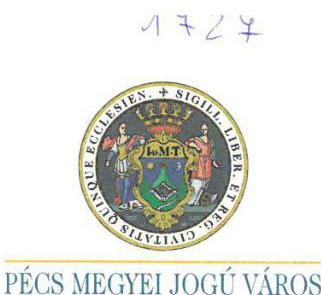

Pécs, 2016. december 9. dr. Szilovicsné dr. Hollósy Andrea

05-5/553-22/2016.
V-1096-135/2016.

Tisztelt Elnök Úr!
Melléklet:
csomó
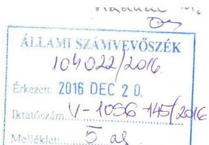

Hivatkozva V-1096-135/2016. számú jelentéstervezet megküldéséről szóló tájékoztató levelében foglaltakra, - amely a Zsolnay Örökségkezelő Nonprofit Kft. gazdálkodásának ellenőrzése tárgyában készült, az alábbi észrevételemet juttatom el Önhöz, további szíves felhasználása.
A jelentés tervezetben foglalt megállapításokat, javaslatokat, kollégái segítő együttműködését ez úton is szeretném megköszönni. A tervezetben foglaltakat az illetékes munkatársaim részére eljuttattam annak érdekében, hogy az abban foglaltak maradéktalanul a közfeladat ellátásának jobb megszervezésére, végrehajtására kerüljenek alkalmazásra, végrehajtásra, a rögzített vizsgálati célok megvalósulása érdekében.
A tervezetben foglaltakkal, az alábbi kiegészítéssel egyetértek, megállapításait, köztük a túlnyomó többségben lévő pozitív visszajelzését megköszönöm.
Az esetlegesen feltárt hiányosságok mielőbbi pótlása érdekében minden szükséges intézkedést haladéktalanul megtesznek illetékes kollégáim.

A jelentéstervezet 15. oldala megállapította, hogy a 2012. évi üzleti terv elfogadása az Alapító okirat előírására ellenére nem történt meg. Az üzleti tervet a Pénzügyi és Gazdasági Bizottság 2012. 05. 16-iülésén az előterjesztés 1. számú mellékleteként a csatolt jegyzőkönyvi kivonat szerint is egyértelműen megtárgyalta, 179/2012. (05.16.) számú állásfoglalásának címe is erre utal azonban az alapítói döntésből és az állásfoglalásból hiba folytán ennek dokumentálása elmaradt. Az alapítói határozat kijavításáról intézkedtem, azt a levelem mellékleteként megküldöm. Kérem a jelentést a 2012. évi üzleti terv elfogadásáról szóló megállapítással kiegészíteni.
A jelentés kiegészítését kérem a Társaság által - számviteli szabályzatok, számviteli politika, értékcsökkenés elszámolása, számlarend, leltár, közérdekủ adatok nyilvánosságra hozatala tárgyában - megküldött észrevételekkel, melyeket a levelükhöz csatolt dokumentációval valamint a honlap címének megadásával támasztottak alá.
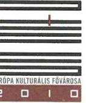

H-7621 PÉCS * Széchenyi tér 1. * Postacím: H-7602 Pécs * Pf. 58.
Telefon: +36 (72) $533-800^{\circ} .533-807$ * Fax: +36 (72)212-049

---

A jelentéstervezet 21. oldalán részemre címzett javaslat szerint „Intézkedjen a vezető tisztségviselők, felügyelőbizottsági tagok, valamint az Mt. 208. §-ának hatálya alá eső munkavállalók javadalmazása valamint a jogviszony megszủnése esetére biztosított juttatások módjának, mértékének elveire, annak rendszerére vonatkozó szabályzat elkészítéséről. A javaslatban foglaltak szerint a szabályzat előkészítésére kértem fel a társaságot, amely az részemre a levelemhez mellékeltek szerinti tartalommal megküldte, és a csatolt alapítói határozatban, melyet szintén mellékelek, jóváhagyása is megtörtént.

Az ellenőrzés során tanúsított mindvégig segítő hozzáállásukat, hasznos megállapításaikat ismételten megköszönöm.

Tisztelettel:
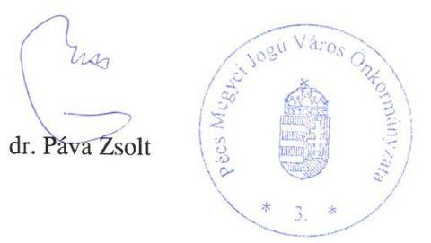

---

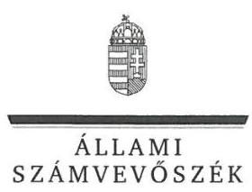

ELNÖK

Ikt.szám: V-1096-146/2016.

# Dr. Páva Zsolt úr 

polgármester
Pécs Megyei Jogú Város Önkormányzata

## Pécs

## Tisztelt Polgármester Úr!

„Az önkormányzatok gazdasági társaságai - Az önkormányzatok többségi tulajdonában lévő gazdasági társaságok gazdálkodásának ellenőrzése - Zsolnay Örökségkezelő Nonprofit Kft." címmel készített számvevőszéki jelentéstervezetre tett észrevételeit köszönettel megkaptam.

Az Állami Számvevőszék észrevételekre vonatkozó álláspontjáról a felügyeleti vezető által készített részletes tájékoztatást csatoltan megküldőm.

Tájékoztatom Polgármester urat, hogy a számvevőszéki jelentésben - az Állami Számvevőszékről szóló 2011. évi LXVI. törvény 29. § (3) bekezdése alapján - a figyelembe nem vett észrevételeket szerepeltetjük az el nem fogadás indokának feltüntetésével.

Budapest, 2017. jusio hó 12 nap
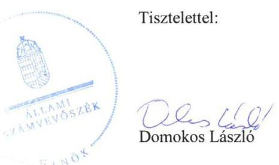

Melléklet: Tájékoztatás az észrevételek kezeléséről

---

# Tájékoztatás   az észrevételek kezeléséről 

„Az önkormányzatok gazdasági társaságai - Az önkormányzatok többségi tulajdonában lévő gazdasági társaságok gazdálkodásának ellenörzése - Zsolnay Örökségkezelö Nonprofit Kft." című jelentéstervezetre 2016. december 20-án érkezett észrevételeit áttekintettük, azok kezelésével kapcsolatban a következő tájékoztatást adom.

1. A jelentéstervezet 2.1. számú megállapítás első bekezdésében az alábbi megállapításra tett észrevételre adott válasz
„A 2012. évi üzleti terv elfogadása az Alapitói okirat elöirása ellenére nem történt meg."
Az ellenőrzés rendelkezésére bocsátott, valamint az észrevételben leírtak és a mellékletként megküldött dokumentumok alátámasztják a jelentéstervezet megállapítását. A Pénzügyi és Gazdasági Bizottság állásfoglalásának címe valóban tartalmazza a 2012. évi üzleti terv elfogadására vonatkozó utalást, azonban a 179/2012. (05. 16.) számú állásfoglalás nem tartalmaz döntést az 2012. évi üzleti terv elfogadására vonatkozóan. Az észrevételhez csatolt Alapítói Határozat az ellenőrzött időszakot követően készült, 2016. december 09-ei keltezésű. A megállapítás helytálló, a jelentéstervezet módosítása nem indokolt.
2. A jelentéstervezet 2.1. számú megállapítás 2. bekezdésre - számviteli szabályzatok - tett észrevételre adott válasz
A Társaság nem bocsátotta az ellenőrzés rendelkezésére az ügyvezető észrevételének mellékleteként megküldött szabályzatokat, az ügyvezető által kiadott Teljességi és hitelességi nyilatkozat azokat nem tartalmazta. Az ellenőrzés a szabályzatok hitelességéről nem tudott meggyőződni. A fentiek alapján a jelentéstervezet módosítása nem szükséges.
3. A jelentéstervezet 2.1. számú megállapítás 3. bekezdésre - számviteli politika, értékcsökkenés elszámolása - tett észrevételre adott válasz
A dokumentumok ismételt áttekintését követően a Társaság észrevételei alapján a jelentéstervezetből a Számviteli Politika és ennek részeként az értékelési szabályzatra vonatkozó megállapítást, valamint a Zsolnay Örökségkezelő Nonprofit Kft. ügyvezetőjének szóló 1. számú javaslatot töröltük.
4. A jelentéstervezet 2.1. számú megállapítás 4. bekezdésre - számlarend - tett észrevételre adott válasz
A Magyarország helyi önkormányzatairól szóló 2011. évi CLXXXIX. törvény 109. § (7) bekezdése szerint a vagyonkezelő a vagyonkezelésébe vett vagyon használatából, működtetéséből származó bevételeit, illetve közvetlen költségeit és ráfordításait elkülönítetten köteles nyilvántartani oly módon, hogy az a saját vagyonnal folytatott vállalkozási

---

tevékenységéből származó bevételeitől, költségeitől és ráfordításaitól egyértelműen elhatárolható legyen.
A Társaság észrevételében leírtak megerősítik az ÁSZ megállapítását, miszerint a Társaság a jogszabályi kötelezettségének nem tett eleget. Ezért az ellenőrzés megállapításának módosítása nem indokolt.

# 5. A jelentéstervezet 2.2. számú megállapítás 2. bekezdésre - leltár - tett észrevételre adott válasz 

A számvitelről szóló 2000 . évi C törvény 69. § (1) bekezdése szerint a könyvek üzleti év végi zárásához, a beszámoló elkészítéséhez, a mérleg tételeinek alátámasztásához olyan leltárt kell összeállítani és e törvény előírásai szerint megőrizni, amely tételesen, ellenőrizhető módon tartalmazza - az (5) bekezdés figyelembevételével - a vállalkozónak a mérleg fordulónapján meglévő eszközeit és forrásait mennyiségben és értékben.

A jelentéstervezet a 2014. év kivételével nem azt állapítja meg, hogy az ellenőrzött időszakban leltárak nem készültek, hanem azt, hogy a mérlegeket a leltárak nem támasztották alá. A 20112013. évi leltárak nem tartalmazták a pénzeszközöket, a követeléseket, az aktív időbeli elhatárolásokat, valamint a forrásokat. A 2011. évben az immateriális javak, a 2011-2013. évben a tárgyi eszközök leltára nem támasztotta alá a mérleg tételeit, mert a leltárban és a mérlegben szereplő értékadatok eltértek. A 2014. évre az ellenőrzés során átadott dokumentum nem tekinthető leltárnak, az a Társaság számviteli rendszeréből kinyomtatott leltárfelvételi ív, amely nem tartalmazza az eszközök értékét, ezért a mérlegérték alátámasztására nem alkalmas. Ezért a jelentéstervezet megállapításának módosítása nem indokolt.

## 6. A jelentéstervezet 2.4. számú megállapítás 6. bekezdésre - közérdekü adatok nyilvánosságra hozatala - tett észrevételre adott válasz

Az ellenőrzés megállapította, hogy a közérdekủ adatok nyilvánosságra hozatalával kapcsolatos kötelezettségének a Társaság a jogszabályi előírásokban foglaltak ellenére az ellenőrzött időszakban nem teljes körűen tett eleget. A Társaság által a honlapon közzétett adatokon túl a jogszabályok további adatokat jelölnek meg, mint kötelezően közzéteendő adatokat. Az egyértelműség érdekében a jelentéstervezetet az alábbiak szerint pontosítjuk:
„A közérdekü adatok nyilvánosságra hozatalával kapcsolatos kötelezettségének a Társaság az Eisztv. 3. § (2), Info tv. 37. § (1) bekezdéseiben foglaltak ellenére Társaság az ellenőrzött időszakban nem teljes körűen tett eleget, mivel a tevékenységre, müködésre, gazdálkodásra vonatkozó adatokat a honlapján, illetve az Önkormányzat honlapján nem teljes körűen tette közzé."

---

# 7. A jelentéstervezet polgármesternek szóló 1. számú javaslatra tett észrevétel 

A javaslattal kapcsolatosan tett intézkedésről szóló tájékoztatást köszönjük, azonban az a jelentéstervezet javaslat részének módosítását nem indokolja, mivel a javadalmazási szabályzat elkészítése és jóváhagyása az ellenőrzött időszakon túl, 2016. évben történt.

Budapest, 2017.

---

Ikt szám: 786/2016
Tárgy: V-1096-134/2016
jelentéstervezettel kapcsolatos észrevételek
Dátum: Pécs, 2016.12.01. Melléklet: 48. oldal Ügyintéző: Magyar Attila

## Állami Számvevőszék Budapest

Apáczai Csere János utca 10. 1052

Tisztelt Domokos László Úr!

Köszönettel megkaptuk „Az önkormányzatok gazdasági társaságai- Az önkormányzatok többségi tulajdonában lévő gazdasági társaságok gazdálkodásának ellenőrzése- Zsolnay Örökségkezelő Nonprofit Kft." címmel készített számvevőszéki jelentéstervezetet.

A jelentéstervezettel kapcsolatban az alábbi észrevételeket kívánjuk tenni a „MEGÁLLAPÍTÁSOK"-kal kapcsolatban:
1.) Összegzö megállapítás: Az Önkormányzat a közfeladat ellátását szabályszerűen szervezte meg. A tulajdonosi jogokat a vagyonrendeletnek megfelelően gyakorolta.
Észrevétel: Ehhez a ponthoz nincs észrevételünk.
2.) Összegzö megállapítás: „A Társaság vagyongazdálkodása nem volt szabályszerű. Kötelezettség állománya nem veszélyeztette a közfeladat ellátást és a müködést."
2.1.) ,,A Társaság számviteli szabályzatokkal rendelkezett. Az elkészült szabályzatok nem teljes körüen feleltek meg az elöírásoknak. Javadalmazási és adatvédelmi és adatbiztonsági szabályzatot nem készített."

- "ÜZLETI TERVET a Társaság az ellenőrzött időszakban a 2012., 2013 és 2014. évekre vonatkozóan készített. Az alapitó okiratban foglaltak ellenére 2011. évre vonatkozóan nem készült üzleti terv. A 2012. évi üzleti terv elfogadása az Alapitói okirat elöírása ellenére nem történt meg. A 2013-2014. évi üzleti terveket a tulajdonosi joggyakorló hagyta jóvá. "

Észrevétel: A Pécs Megyei Jogú Város Közgyűlése Pénzügyi és Gazdasági Bizottságának 179/2012. (05.16.) számú állásfoglalása a Zsolnay Örökség Kezelő Nonprofit Kft. 2011. évi beszámolójának és 2012. évi üzleti tervének elfogadásáról szólt.
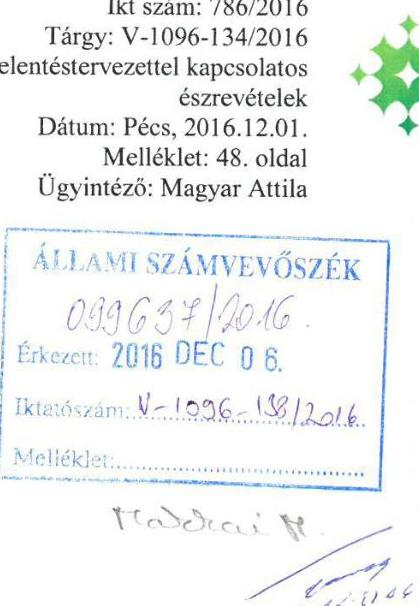

ZSOLNAY
ÖRÖKSÉGKEZELŐ
NONPROFIT KFT.
ZSOLNAY ÖRÖKSÉGKEZELŐ NONPROFIT KFT. Szélehely: 1920. Pécs, Zsolnay, V-1096-134/2016. 27. Levekedés cím: 1923 Pécs, Pf.-27. info@zsolnti.hu www.zsolnti.hu

ZSOLNAY
KULTURÁLIS
MEGYÉZ

ZSOLNAY KULTURÁLIS NEGYÉZ
Cím: 1920 Pécs, Zsolnay, V-1096-134/2016. 27. Levekedés cím: 1923 Pécs, Pf.-27. Tel: +36 72/1001-702 info@zzs.hu www.zzs.hu

Kodály

KODÁLY NÖZPONT
Cím: 1923 Pécs, Róvan, Marcell sétány a Levekedés cím: 1923 Pécs, Pf.-27. Tel: +36 72/1224-705 info@pocsonokog.hu www.pocsonokog.hu

VÖZÉPKOBI
EGYETEM

KÖZÉPKOBI EGYETEM
Cím: 1926 Pécs, Szent István táb Levekedés cím: 1923 Pécs, Pf.-27. Tel: +36 72/1224-705 info@pocsonokog.hu www.pocsonokog.hu

HÖVÉSZETEK ZS
IRDZALIDM HÁZA

HÖVÉSZETEK ÉS IRDZALIDM HÁZA
Cím: 1921 Pécs, Szalmwayi táv 1-9. Levekedés cím: 1923 Pécs, Pf.-27. Tel: +36 72/1224-705 info@pocsonokog.hu www.kozzpionegystem.hu

HÖVÉSZETEK ZS
IRDZALIDM HÁZA

HÖVÉSZETEK ÉS IRDZALIDM HÁZA
Cím: 1921 Pécs, Szalmwayi táv 1-9. Levekedés cím: 1923 Pécs, Pf.-27. Tel: +36 72/1224-705 info@pocsonokog.hu www.kozzpionegystem.hu

HÖVÉSZETEK ZS
IRDZALIDM HÁZA

HÖVÉSZETEK ÉS IRDZALIDM HÁZA
Cím: 1921 Pécs, Szalmwayi táv 1-9. Levekedés cím: 1923 Pécs, Pf.-27. Tel: +36 72/1224-705 info@pocsonokog.hu www.kozzpionegystem.hu

HÖVÉSZETEK ZS
IRDZALIDM HÁZA

HÖVÉSZETEK ÉS IRDZALIDM HÁZA
Cím: 1921 Pécs, Humpell o. 3. Levekedés cím: 1923 Pécs, Pf.-27. Tel: +36 72/389.2662 info@zzs.hu www.eskantshelycsimpecs.hu

PÉCSI GALÉRIA
PÉCI GALÉRIA
Cím: 1921 Pécs, Szélehelyi táv 17. Levekedés cím: 1923 Pécs, Pf.-27. Tel: 3672/210-436 info@zzs.hu www.pecsgaleria.hu

PÉCSI GALÉRIA MZT
Cím: 1926 Pécs, Major o. 21. Levekedés cím: 1923 Pécs, Pf.-27. Tel: 3672/100-350 info@zzs.hu www.pecsgaleria.hu

---

Ennek ellenére a 08-8/1211/2012. iktatószámú Alapítói határozatból kimaradt a 2012. évi üzleti terv elfogadása, amely valószínüsíthetően adminisztrációs hiba miatt maradt ki. Kérjük, hogy a fenti megjegyzést szíveskedjenek figyelembe venni az ellenőrzési jegyzőkönyv készítésekor. A levél mellékleteként csatoljuk az Alapítói határozatot és a 179/2012. (05.16.) számú állásfoglalást is.

- SZÁMVITELI SZABÁLYZATOKKAL 2011. szeptember 30-ig a Számv.tv. 14. § (3)-(5), és a (11) bekezdéseiben, valamint a 161. § -ában foglaltakkal ellenére nem rendelkezett. A Társaság 2011. október 1-jei hatállyal készítette el és hagyta jóvá számviteli politikát, valamint a leltározási szabályzatát, értékelési szabályzatát, a pénzkezelési szabályzatát, illetve a számlarendet.

Észrevétel: A Számviteli politika és az egyéb szabályzatok 2011.01.01-től még az akkori ügyvezető által jóváhagyott formában készült. Ezeket a levél mellékleteiként hitelesítve csatoltan megküldjük az Önök részére.

- SZÁMVITELI POLITIKA és ennek részeként az értékelési szabályzat az ellenőrzött időszakban nem felelt meg a Számv. tv. 14. § (4) és 88. § (4) bekezdéseinek, mert nem tartalmazza az értékcsökkenés elszámolásának gyakoriságát.

Észrevétel: A Számviteli politika „2.1. Mérlegtételek tartalma, értékelése, nyilvántartásán" belül a 9. oldal lap elején a 3. sorban az alábbiakat tartalmazza: " ...Az értékesökkenési leírás elszámolására negyedévente kerül sor...." A szabályzat ezen részét is hitelesítve mellékelten megküldjük Önöknek.

- A SZÁMLAREND az ellenőrzött időszakban a bevételek tekintetében a 2011., 2012. évek kivételével, a ráfordítások tekintetében a 2011-2014. években nem felelt meg a Számtv.tv.161/A. § (2) bekezdésében elöirtaknak, mivel az Mótv. 109. § (7) bekezdése ellenére nem tartalmazott rendelkezéseket a vagyonkezelésbe átvett vagyoni eszközök használatából, müködéséből származó bevételek és ráforditások elkülönített nyilvántartására vonatkozóan.

Észrevétel: Az ellenőrzés alatt elkészítettük a 264/2016-os iktatószámú nyilatkozatot, amelyben leírtuk, hogy az átvett eszközök esetében sem a bevételteremtő képesség, sem az azokkal kapcsolatos kiadások ónállóan nem kimutathatóak eszközönként. Kérjük, hogy szíveskedjenek ezeket a tényeket figyelembe venni és a Társaság tevékenységét és a vagyonkezelésbe átvett eszközök listáját összehasonlítva kérjük vizsgálni ezt a törvényi előirást.

ZSOLNAY
ÖRÖKSÉGKEZELŐ
NONPROFIT KFT.
ZSOLNAY ÖRÖKSÉGKEZELŐ NONPROFIT KFT.
Szélebrey, 7600 Pécs, Zsolnay, Vémos u. 37
Levekedés cím: 7603 Pécs, Pf. 27
info@zsolnikft.hu
www.zsolnikft.hu
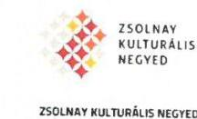

ZSOLNAY KOSTORÁLIS NEGYED
Cím: 7630 Pécs, Zsolnay, Vémos u. 37
Levekedés cím: 7603 Pécs, Pf. 27
Tel +48 72/500-350
info@zsol.rtu.
www.zsrl.rtu

KOSÁLY KÖZFONT
Cím: 7623 Pécs, Brevet Mócsát adtány b. Levekedés cím: 7603 Pécs, Pf. 27. Tel +48 72/500-300 info@koztal.pss.gov.hu www.kostalypss.govt.t.hu

VILÁGÖRÖKSEG PÉCS
VILÁGÖRÖKSEG PÉCS
Cím: 7626 Pécs, Szérít írásén kb. Levekedés cím: 7603 Pécs, Pf. 27. Tel +48 72/224-795 info@parcsonkmeg.hu www.parcsonkmeg.hu

KÖZÉPFORI ECYETEM

KÖZÉPFOR ECYETEM
Cím: 7626 Pécs, Szérít írásén kb. Levekedés cím: 7603 Pécs, Pf. 27. Tel +48 72/224-795 info@parcsonkmeg.hu www.kozeproringsetem.hu

MÖVÉSZETEK ÉS
IRÓDAIOM MÉZA
MÖVÉSZETEK ÉS IRÓDAIOM MÉZA
Cím: 7627 Pécs, Szérítenyi tét-7-8. Levekedés cím: 7603 Pécs, Pf. 27. Tel +48 72/334-426; 510-829 info@prirt.hu www.prirt.hu

ROLOOGSÁG MÉZA
Cím: 7621 Pécs, Hunyadi u. 2. Levekedés cím: 7603 Pécs, Pf. 27. Tel +48 70/869-3662 info@zsm.hu www.minoethshyzzlopics.hu

PÉCSI
CALÉRIA
PÉCS-GALÉRIA
Cím: 7621 Pécs, Szérítenyi tét 11. Levekedés cím: 7603 Pécs, Pf. 27. Tel 08/31/310-436 info@zsm.hu www.pessigzsmia.hu

PÉCS-GALÉRIA MÉT
Cím: 7626 Pécs, Bogni u. 21. Levekedés cím: 7603 Pécs, Pf. 27. Tel 08/31/500-300 info@zsm.hu www.pessigzsmia.hu

---

2.2.) „A Társaság vagyongazdálkodása nem volt szabályszerü, mert a számviteli éves beszámolókat leltárral nem támasztották alá."

- „A Társaság a Számv. tv. 69. § (1) bekezdés előírásai ellenére az éves beszámolók mérlegét leltárral a 2011-2014. években nem támasztotta alá. a 2011-2013. évi leltárak nem tartalmazták a pénzeszközöket, a követeléseket, az aktív időbeli elhatárolásokat, valamint a forrásokat. A 2011. évben az immateriális javak, a 2011-2013. évben a tárgyi eszközök leltára nem támasztotta alá a mérleg tételeit, mert a leltárban és a mérlegben szereplő értékadatok eltértek. A 2014. évre az éves beszámoló mérlegét alátámasztó leltár nem készült."

Észrevétel: A fenti megállapítások kissé ellentmondásosak, ugyanis egyszer az szerepel a fent leírtak között, hogy nem készült a vizsgált időszakra vonatkozóan leltár, mely az éves beszámolókat alátámasztaná, más esetben viszont azt állapítják meg, hogy az elkészített leltárak hiányosak, vagy téves értéken szerepelnek. Ezt a részt kérjük mindenképpen pontosítani!
Azzal a megállapítással egyáltalán nem értünk egyet, hogy nem készültek a leltárak az ellenörzött időszak alatt!
A mérleg alátámasztásaként elkészített leltárakat a vizsgált időszak alatt többször fel kellett töltenünk az Önök által előirt elektronikus oldalra, valamint az Önök által kért email címekre is többször átküldtük, továbbá a helyszíni ellenőrzés során a teljes leltározással kapcsolatos dokumentációinkat az Önök rendelkezésére bocsátottuk, illetve CD formátumon is elérhetővé tettük az Önök számára.
„A 2014. évre az éves beszámoló mérlegét alátámasztó leltár nem készült." állításukkal szintén nem értünk egyet, ugyanis a 2014.01.01. napjától a könyvelést és az eszközök-készletek nyilvántartását a Társaságunk helyben végzi. Ennek megfelelően a fenntartó által javasolt könyvelő programot vásároltuk meg, mely igen fejlett és mind a könyvelés, mind az eszköz nyilvántartásban (eszköz beszerzés - aktiválás - mennyiségi - és -értékbeli nyilvántartása, valamint az eszközállomány csökkenése egyértelműen kimutatható, az eszközkartonokon nyomon követhető a beszerzéstől az esetleges selejtezésig az adott eszköz útja. A 2014. évre vonatkozóan a fent említett programmal készített leltárat szintén az Önök részére több esetben átadtuk. A mintavételes ellenőrzés során kért eszközök közül egy eszközt kiemeltünk, és annak az eszköznek a törzslapját és eszközkartonját csatoltan szintén hitelesítve mellékeljük Önöknek.
2.4.) ,, A beszámolási és adatszolgáltatási kötelezettségeit a Társaság teljesítette. A Társaság az ellenörzött időszakban a közzétételi kötelezettségének nem teljes körüen teljesítette."

- „A KÖZÉRDEKÜ ADATOK NYILVÁNOSSÁGRA HOZATALÁVAL kapcsolatban a Társaság az Eisztv. 6. § (1), Info tv. 37. § (1) bekezdéseiben foglaltak ellenére Társaság az ellenőrzött időszakban nem teljes körüen tett eleget, mivel a tevékenységre, müködésre, gazdálkodásra vonatkozó adatokat a honlapján, illetve az Önkormányzat honlapján nem tette közzé."

---

Észrevétel: Ezzel a megállapítással nem értünk egyet, ugyanis az alábbi honlapon elérhető a Társaság éves beszámolójához kapcsolódó dokumentumok, illetve a Társaság közbeszerzéseivel kapcsolatos, valamint a tüz-, és munkavédelmi szabályzatok a létesítményekre vonatkozó dokumentációk is: http://www.zsokkft.hu/documents. Az önkormányzat honlapján megjelenő felületekhez hozzáférésünk nincs, ezért a közzétett dokumentumok listáján nem áll módunkban változtatni.

Összegezve: Az ellenőrzési jegyzőkönyvtervezet 21-22. oldalon szereplő „javaslatok" esetében az alábbi észrevételeket kívánjuk tenni:
1.) Eszrevétel: a számviteli politika tartalmazza az értékcsökkenés elszámolásának gyakoriságát. Kérjük, hogy szíveskedjenek ismételten átnézni a vizsgált időszak alatt hatályos számviteli szabályzatunk 8-9. oldalát!
2.) Eszrevétel: adatvédelmi és adatbiztonsági szabályzat elkészítéséről gondoskodunk a jövőben!
3.) Eszrevétel: az éves beszámoló mérlegtételeit leltárral támasztjuk alá minden évben, ahogy azt tettük is a vizsgált időszakban! Kérjük, hogy ezen megállapításukat mindenképpen vizsgálják felül!
4.) Eszrevétel: a kötelező közzéteendő adatok teljes körű közzétételéről gondoskodtuk, és kérjük szíveskedjenek ezt is újra ellenőrizni, és módosítani az erre tett megállapításukat!
5.) Eszrevétel: kérjük, hogy szíveskedjenek figyelembe venni a vagyonkezelésbe vett eszközök bevételi és ráfordítási oldalainak megállapításánál, hogy ugyan valóban nem tettünk eleget a törvényi előírásoknak teljes körüen, viszont ez abból fakad, hogy az átvett eszköz sajátosságaiból adódóan nem állapítható meg az eszközök bevételteremtő és ráfordítást keletkeztető képessége.

Tisztelettel:
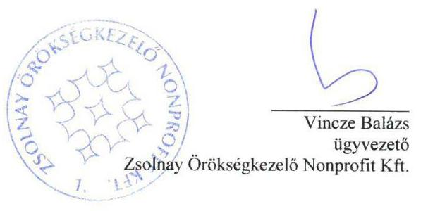

---

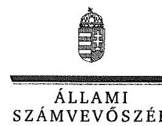

ELKÖK

Ikt.szám: V-1096-139/2016.

# Vincze Balázs úr 

ügyvezető
Zsolnay Örökségkezelő Nonprofit Kft

## Pécs

## Tisztelt Ügyvezető Úr!

„Az önkormányzatok gazdasági társaságai - Az önkormányzatok többségi tulajdonában lévő gazdasági társaságok gazdálkodásának ellenőrzése - Zsolnay Örökségkezelő Nonprofit Kft." címmel készített számvevőszéki jelentéstervezetre tett észrevételét köszönettel megkaptam.

Az Állami Számvevőszék észrevételre vonatkozó álláspontjáról a felügyeleti vezető által készített részletes tájékoztatást csatoltan megküldöm.

Tájékoztatom Ügyvezető urat, hogy a számvevőszéki jelentésben - az Állami Számvevőszékről szóló 2011. évi LXVI. törvény 29. § (3) bekezdése alapján - a figyelembe nem vett észrevételeket szerepeltetjük az el nem fogadás indokának feltüntetésével.

Budapest, 2016. 12 hó22 nap
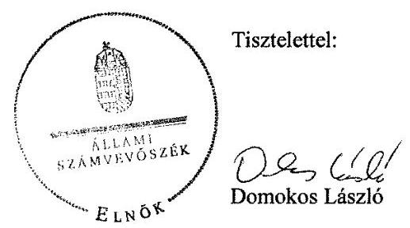

Melléklet: Tájékoztatás az elfogadott és el nem fogadott észrevételekröl

---

# Tájékoztatás   az elfogadott és el nem fogadott észrevételekről 

„Az önkormányzatok gazdasági társaságai - Az önkormányzatok többségi tulajdonában lévő gazdasági társaságok gazdálkodásának ellenörzése - Zsolnay Örökségkezelö Nonprofit Kft." címủ jelentéstervezetre 2016. december 6-án érkezett észrevételét áttekintettük, annak kezelésével kapcsolatban a következő tájékoztatást adom.

## 1. Az alábbi megállapításra tett észrevételre adott válasz

„ÜZLETI TERVET a Társaság az ellenörzött időszakban a 2012., 2013. és 2014. évekre vonatkozóan készitett. Az Alapitó okiratban foglaltak ellenére a 2011. évre vonatkozóan nem készült üzleti terv. A 2012. évi üzleti terv elfogadása az Alapitói okirat elöirása ellenére nem történt meg. A 2013-2014. évi üzleti terveket a tulajdonosi joggyakorló hagyta jóvá."
Az ellenőrzés rendelkezésére bocsátott, valamint az észrevétel mellékleteként megküldött dokumentumok alátámasztják a jelentéstervezet megállapítását. A Pénzügyi és Gazdasági Bizottság állásfoglalásának címe valóban tartalmazza a 2012. évi üzleti terv elfogadására vonatkozó utalást, azonban sem az állásfoglalás, sem az Alapítói Határozat nem tartalmaz döntést az 2012. évi üzleti terv elfogadására vonatkozóan. A fentiek miatt a jelentéstervezet módosítása nem indokolt.

## 2. Az alábbi megállapításra tett észrevételre adott válasz

„SZÁMVITELI SZABÁLYZATOKKAL 2011. szeptember 30-ig a Számv. tv. 14. § (3)-(5), és a (11) bekezdéseiben, valamint a 161. §-ában foglaltakkal ellenére nem rendelkezett. A Társaság 2011. október 1-jei hatállyal készítette el és hagyta jóvá a számviteli politikát, valamint a leltározási szabályzatát, az értékelési szabályzatát, a pénzkezelési szabályzatát, illetve a számlarendet."
A Társaság nem bocsátotta az ellenőrzés rendelkezésére az észrevétel mellékleteként megküldött szabályzatokat, az ügyvezető által kiadott Teljességi és hitelességi nyilatkozat azokat nem tartalmazza. Az ellenőrzés a szabályzatok hitelességéről nem tudott meggyőződni. A fentiek alapján a jelentéstervezet módosítása nem szükséges.

## 3. Az alábbi megállapításra tett észrevételre adott válasz

„SZÁMVITELI POLITIKA és ennek részeként az értékelési szabályzat az ellenörzött időszakban nem felelt meg a Számv. tv. 14. § (4) és 88. § (4) bekezdéseinek, mert nem tartalmazta az értékcsökkenés elszámolásának gyakoriságát."
A dokumentumok ismételt áttekintését követően a jelentéstervezetből a megállapítást, valamint a Zsolnay Örökségkezelő Nonprofit Kft. ügyvezetőjének szóló 1. számú javaslatot töröltük.

## 4. Az alábbi megállapításra tett észrevételre adott válasz

„A számlarend az ellenörzött időszakban a bevételek tekintetében a 2011., 2012. évek kivételével, a ráfordítások tekintetében a 2011-2014. években nem felelt meg a

---

Számv. tv. 161/A. § (2) bekezdésében elöirtaknak, mivel az Mötv. 109. § (7) bekezdése ellenére nem tartalmazott rendelkezéseket a vagyonkezelésbe átvett vagyoni eszközök használatából, müködtetéséböl származó bevételek és ráforditások elkülönített nyilvántartására vonatkozóan."
A Magyarország helyi önkormányzatairól szóló 2011. évi CLXXXIX. törvény 109. § (7) bekezdése szerint a vagyonkezelő a vagyonkezelésébe vett vagyon használatából, működtetéséből származó bevételeit, illetve közvetlen költségeit és ráfordításait elkülönítetten köteles nyilvántartani oly módon, hogy az a saját vagyonnal folytatott vállalkozási tevékenységéből származó bevételeitől, költségeitől és ráfordításaitól egyértelműen elhatárolható legyen.
Az észrevételben leírtak megerősítik a jelentéstervezet megállapítását, miszerint a Társaság a jogszabályi kötelezettségének nem tett eleget, a vagyonkezelésbe átvett vagyoni eszközök használatából, működtetéséből származó bevételeket és ráfordításokat elkülönítetten nem tartotta nyilván, annak szabályait nem határozta meg. Tehát a megállapítás módosítása nem indokolt.

# 5. Az alábbi megállapításra tett észrevételre adott válasz 

„A Társaság a Számv. tv. 69. § (1) bekezdés elöírásai ellenére az éves beszámolók mérlegét leltárral a 2011-2014. években nem támasztotta alá. A 2011-2013. évi leltárak nem tartalmazták a pénzeszközöket, a követeléseket, az aktív időbeli elhatárolásokat, valamint a forrásokat. A 2011. évben az immateriális javak, a 20112013. évben a tárgyi eszközök leltára nem támasztotta alá a mérleg tételeit, mert a leltárban és a mérlegben szereplő értékadatok eltértek. A 2014. évre az éves beszámoló mérlegét alátámasztó leltár nem készült."

A számvitelről szóló 2000 . évi C törvény 69. § (1) bekezdése szerint a könyvek üzleti év végi zárásához, a beszámoló elkészítéséhez, a mérleg tételeinek alátámasztásához olyan leltárt kell összeállítani és e törvény előírásai szerint megőrizni, amely tételesen, ellenőrizhető módon tartalmazza - az (5) bekezdés figyelembevételével - a vállalkozónak a mérleg fordulónapján meglévő eszközeit és forrásait mennyiségben és értékben.

A jelentéstervezet nem azt állapítja meg, hogy az ellenőrzött időszakban leltárak nem készültek, hanem azt, hogy a mérlegeket a leltárak nem támasztották alá. A 2011-2013. évi leltárak nem tartalmazták a pénzeszközöket, a követeléseket, az aktív időbeli elhatárolásokat, valamint a forrásokat. A 2011. évben az immateriális javak, a 2011-2013. évben a tárgyi eszközök leltára nem támasztotta alá a mérleg tételeit, mert a leltárban és a mérlegben szereplő értékadatok eltértek. A 2014. évre az ellenőrzés során átadott dokumentum nem tekinthető leltárnak, az a Társaság számviteli rendszeréből kinyomtatott leltárfelvételi ív, amely nem tartalmazza az eszközök értékét, ezért a mérlegérték alátámasztására nem alkalmas. Ezért a jelentéstervezet megállapításának módosítása nem indokolt.

---

# 6. Az alábbi megállapításra tett észrevételre adott válasz 

„A közérdekü adatok nyilvánosságra hozatalával kapcsolatos kötelezettségének a Társaság az Eisztv. 3. § (2), Info tv. 37. § (1) bekezdéseiben foglaltak ellenére Társaság az ellenörzött idöszakban nem teljes körüen tett eleget, mivel a tevékenységre, müködésre, gazdálkodásra vonatkozó adatokat a honlapján, illetve az Önkormányzat honlapján nem tette közzé."

A megállapítás szerint a Társaság nem teljes körüen tette közzé a tevékenységére, müködésére, gazdálkodására vonatkozó adatokat. A kötelezően közzéteendő adatok listáját az információs önrendelkezési jogról és az információszabadságról szóló törvény 1. számú melléklete tartalmazza. A Társaság által a honlapon közzétett adatokon túl az 1. számú melléklet további dokumentumokat jelöl meg. Így például kötelező közzétenni a közfeladatot ellátó szerv szervezeti felépítését a szervezeti egységek megjelölésével, az egyes szervezeti egységek feladatait, stb. Ezért a jelentéstervezet megállapításának módosítása nem indokolt.
7. A jelentéstervezet 21-22. oldalán szereplő javaslatok esetében tett észrevételekre adott válasz

1. Az észrevételre adott válasz megegyezik a 3. pontban leírtakkal.
2. Az észrevételt az intézkedése terv elkészítésénél javasolt érvényesíteni.
3. Az észrevételre adott válasz megegyezik az 5. pontban leírtakkal.
4. Az észrevételre adott válasz megegyezik a 6. pontban leírtakkal.
5. Az észrevételre adott válasz megegyezik a 4. pontban leírtakkal.

Budapest, 2016. 12. hó 22 nap
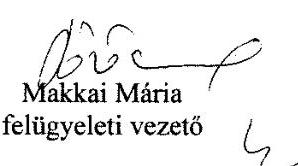

---

.

---

# RÖVIDÍTÉSEK JEGYZÉKE 

${ }^{1}$ Önkormányzat
${ }^{2}$ Társaság
${ }^{3}$ polgármester
${ }^{4}$ jegyző
${ }^{5} 479 / 2009 /$ EK rendelet
${ }^{6}$ Áht. 2
${ }^{7}$ Gazdasági program
${ }^{8}$ Ötv.
${ }^{9}$ Mötv.
${ }^{10}$ Településfejlesztési Koncepció
${ }^{11}$ vagyongazdálkodási terv
${ }^{12}$ Nvtv.
${ }^{13}$ Közművelődési rendelet
${ }^{14}$ Közm. tv.
${ }^{15}$ Közszolgáltatási szerződés ${ }_{1}$
${ }^{16}$ közszolgáltatási szerződés ${ }_{2}$
${ }^{17}$ Vagyonkezelési szerződés
${ }^{18}$ Üzemeltetési szerződés ${ }_{1}$
${ }^{19}$ Üzemeltetési szerződés ${ }_{2}$
${ }^{20}$ üzemeltetési szerződés ${ }_{3}$
${ }^{21}$ vagyonrendelet ${ }_{1}$.
vagyonrendelet ${ }_{2}$

Pécs Megyei Jogú Város Önkormányzata
Zsolnay Örökségkezelő Nonprofit Kft.
Pécs Megyei Jogú Város polgármestere
Pécs Megyei Jogú Város jegyzője
az Európai Közösséget létrehozó szerződéshez csatolt, a túlzott hiány esetén követendő eljárásról szóló jegyzőkönyv alkalmazásáról szóló 479/2009/EK rendelet
az államháztartásról szóló 2011. évi CXCV. törvény (hatályos 2011. december 31től)
Pécs Megyei Jogú Város Önkormányzatának gazdasági programja
a helyi önkormányzatokról szóló 1990. évi LXV. törvény
Magyarország helyi önkormányzatairól szóló 2011. évi CLXXXIX. törvény
Pécs Megyei Jogú Város Önkormányzat Közgyűlésének 546/2009. (11.26.) számú határozatával elfogadott Pécs város településfejlesztési koncepciója
Pécs Megyei Jogú Város Önkormányzatának Közép- és hosszú távú vagyongazdálkodási terve
a nemzeti vagyonról szóló 2011. évi CXCVI. törvény
Pécs Megyei Jogú Város Önkormányzata Közgyűlésének az Önkormányzat közművelődési feladatairól szóló 2/2002. (II. 15.) számú önkormányzati rendelete
A muzeális intézményekről, a nyilvános könyvtári ellátásról és a közművelődésről szóló 1997. évi CLX. törvény
Az Önkormányzat és a Társaság között 2011. április 21-én létrejött (2011. január1től hatályos) és az ellenőrzött időszakban háromszor (2012.06.21., 2013.12.12.) módosított közszolgáltatási szerződés
Az Önkormányzat és a Társaság között 2014. május 28-án létrejött szerződés
Az Önkormányzat és a Társaság között 2012. május 31-én létrejött vagyonkezelési szerződés
Pécs Megyei jogú Város Önkormányzata és Pécs/Sopiáne Örökség Kht. között létrejött a „Cella Septichora" épületegyüttes üzemeltetésére 2006. november 9én létrejött és az ellenőrzött időszakban a jogutódlásnak megfelelően 2011. június 24-én módosított üzemeltetési szerződés
Pécs Megyei jogú Város Önkormányzata és a Társaság között a Pécsi Középkori Egyetem műemlék épületegyüttes üzemeltetésére 2012. október 19-én létrejött üzemeltetési szerződés.
Pécs Megyei jogú Város Önkormányzata, a Társaság, valamint a Pécsi Tudományegyetem között a Zsolnay Kulturális Központ épületegyüttes üzemeltetésére 2011. október 19-én létrejött üzemeltetési szerződés.
Pécs Megyei Jogú Város Önkormányzata Közgyűlésének a többször módosított 40/2008. (XI. 26.) önkormányzati rendelete az Önkormányzat vagyonával kapcsolatos tulajdonosi jogok gyakorlásának szabályairól (hatályos: 2012. február 24-ig)
Pécs Megyei Jogú Város Önkormányzata Közgyűlésének többször módosított 11/2012. (II.24.) önkormányzati rendelete az Önkormányzat vagyonával kapcsolatos tulajdonosi jogok gyakorlásának szabályairól (hatályos: 2012. február 24-től

---

${ }^{22}$ Gt.
${ }^{23}$ Ptk. 2
${ }^{24} \mathrm{FB}$
${ }^{25}$ Számv. tv.
${ }^{26}$ leltározási szabályzat
${ }^{27}$ értékelési szabályzat
${ }^{28}$ pénzkezelési szabályzat
${ }^{29}$ számlarend
${ }^{30}$ Közhasznúsági tv.
${ }^{31}$ önköltségszámítási szabályzat
${ }^{32}$ Taktv.
${ }^{33}$ Avtv
${ }^{34}$ Info tv.
${ }^{35}$ Közhasznúsági tv.
${ }^{36}$ Eisztv.
a gazdasági társaságokról szóló 2006. évi IV. törvény (hatálytalan: 2014. március 15-jétől)
a Polgári Törvénykönyvről szóló 2013. évi V. törvény (hatályos: 2014. március 15jétől)
a Társaság felügyelőbizottsága
a számvitelről szóló 2000. évi C. törvény
4. számú melléklet a Zsolnay Örökségkezelő Nonprofit Kft. Számviteli Politikájához Leltározási Szabályzat (hatályos: 2011. október 1-től)
3. számú melléklet a Zsolnay Örökségkezelő Nonprofit Kft. Számviteli Politikájához Értékelési Szabályzat (hatályos: 2011. október 1-től)
5. számú melléklet a Zsolnay Örökségkezelő Nonprofit Kft. Számviteli Politikájához Pénzkezelési Szabályzat (hatályos: 2011. október 1-től)

1. számú melléklet a Zsolnay Örökségkezelő Nonprofit Kft. Számviteli Politikájához Számlarend (hatályos: 2011. október 1-től)
a közhasznú szervezetekről szóló 1997. évi CLVI. törvény
a Zsolnay Örökségkezelő Nonprofit Kft. Önköltség Számítási Szabályzat 7/2012. számú ügyvezetői utasítás
a köztulajdonban álló gazdasági társaságok takarékosabb múködéséről szóló 2009. évi CXXII. törvény (hatályos: 2009. december 4-től)
a személyes adatok védelméről és a közérdekú adatok nyilvánosságáról szóló 1992. évi LXIII. törvény (hatályos 2011. december 31-éig)
az információs önrendelkezési jogról és az információszabadságról szóló 2011. évi CXII. törvény (hatályos 2012. január 1-től)
a közhasznú szervezetekről szóló 1997. évi CLVI. törvény
az elektronikus információszabadságról szóló 2005. évi XC. törvény (hatályos: 2011. december 31-ig)

---

# ÁLLAMI SZÁMVEVŐSZÉK 

1052 Budapest, Apáczai Csere János utca 10.
Levélcím: 1364 Budapest 4. Pf. 54
Telefon: +36 14849100 Telefax: +36 14849200
www.asz.hu