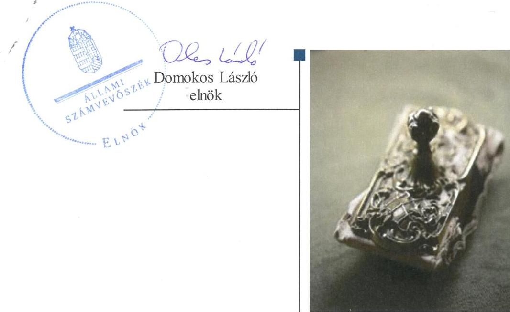
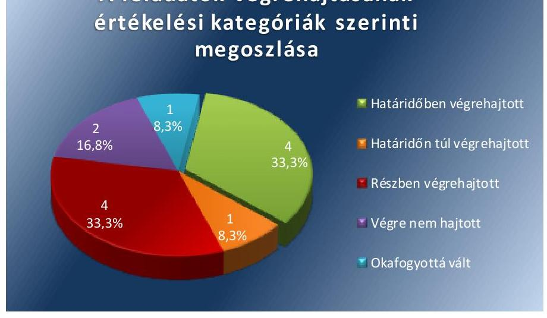
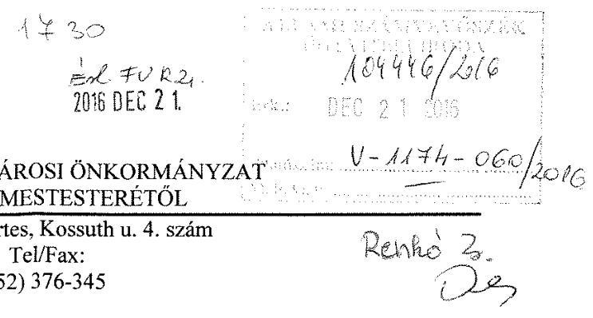
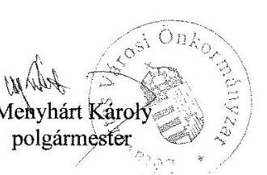
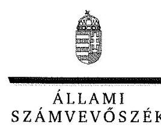
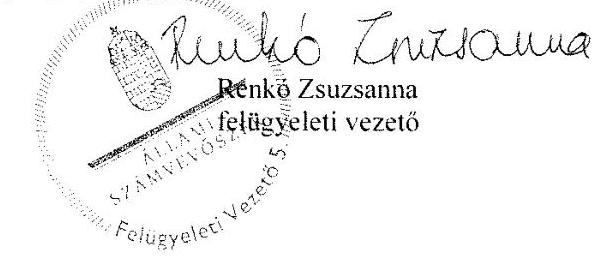

# Jelentés 

## Utóellenőrzések

Az önkormányzatok pénzügyi gazdálkodási helyzetének, szabályszerűségének utóellenőrzése - Létavértes 2017.

---

# Jelentés 

## Utóellenőrzések

Az önkormányzatok pénzügyi gazdálkodási helyzetének, szabályszerűségének utóellenőrzése - Létavértes
2017. 02. hó 03. nap

---

|  AZ ELLENŐRZÉST FELÜGYELTE: | |
| --- | --- |
|  RENKŐ ZSUZSANNA felügyeleti vezető | |
|  AZ ELLENŐRZÉST VEZETTE ÉS A VÉGREHAJTÁSÁÉRT FELELŐS: | |
|  DR. NAGY JUDIT ellenőrzésvezető | |
|  A PROGRAM ÖSSZEÁLLÍTÁSÁÉRT FELELŐS: | |
|  JANIK JÓZSEF LÁSZLÓ osztályvezető | |
|  A TÉMÁHOZ KAPCSOLÓDÓ KORÁBBI SZÁMVEVŐSZÉKI JELENTÉSEK: | |
|  - címe: | |
|  Jelentés az önkormányzatok pénzügyi gazdálkodási helyzete értékelésének, és gazdálkodása szabályosságának - 2013. évben induló - ellenőrzéséről – Létavértes | |
|  - sorszáma: 14022 | |
|  IKTATÓSZÁM: V-1174-066/2016. | |
|  TÉMASZÁM: 2208 | |
|  ELLENŐRZÉS-AZONOSÍTÓ SZÁM: V075523 | |

---

# TARTALOMJEGYZÉK 

■ ÖSSZEGZÉS ..... 5
■ AZ ELLENŐRZÉS CÉLJA ..... 6
■ AZ ELLENŐRZÉS TERÜLETE ..... 7
■ AZ ELLENŐRZÉS HÁTTERE, INDOKOLTSÁGA ..... 8
■ A JELENTÉS LÉNYEGES KÉRDÉSKÖREI ..... 9
■ ELLENŐRZÉS HATÓKÖRE ÉS MÓDSZEREI ..... 10
■ MEGÁLLAPÍTÁSOK. ..... 12
■ MELLÉKLETEK ..... 15
I. sz. melléklet: Létavértes Városi Önkormányzat intézkedési tervének végrehajtása ..... 15
■ FÜGGELÉK: ÉSZREVÉTELEK. ..... 19
■ RÖVIDÍTÉSEK JEGYZÉKE ..... 27

---

.

---

# ÖSSZEGZÉS 

Létavértes Városi Önkormányzat a gazdálkodás szabályozottságára és a szabályszerű működésre vonatkozó feladatokat összességében végrehajtotta. A pénzügyi egyensúly helyreállítására vonatkozó intézkedést igénylő megállapítások hasznosulásának eredményeként a lejárt szállítói tartozások állománya megszűnt, azonban a korábbi eladósodás okait nem tárták fel, azok kezelésére az intézkedési tervben előírt feladatokat összességében nem hajtották végre.

## Az ellenőrzés társadalmi indokoltsága

Az Állami Számvevőszék stratégiájában célul tűzte ki a számvevőszéki munka hasznosulásának javítását. Ezzel összhangban ellenőrzi, hogy az ellenőrzött szervezet megvalósította-e a korábbi ellenőrzései által feltárt hibák, hiányosságok és szabálytalanságok megszüntetése céljából elkészített intézkedési tervében foglaltakat.

Létavértes Városi Önkormányzat pénzügyi gazdálkodási helyzetét, szabályszerűségét érintő utóellenőrzés arra terjedt ki, hogy a korábban feltárt, pénzügyi gazdálkodási szabálytalanságokat kiküszöbölő intézkedési tervet végrehajtották-e, ezzel megteremtve a lehetőségét annak, hogy az adósság ne termelődjön újra.

## Főbb megállapítások, következtetések

Az Állami Számvevőszék jelentésében a polgármester ${ }^{1}$ részére kettő (ezen belül az első javaslathoz négy konkrét, elkülönített javaslatot), a jegyző ${ }^{2}$ részére pedig egy javaslatot fogalmazott meg, amelyek hasznosítására Létavértes Városi Önkormányzat Képviselő-testülete hat pontban határozott meg feladatot. A Képviselő-testület ${ }^{3}$ - az Állami Számvevőszék jelentésében foglalt javaslatokon felül -, az intézkedési tervben az integritás szempontok érvényesítése érdekében további hat feladatot határozott meg. A tizenkét intézkedésből Létavértes Városi Önkormányzat ötöt végrehajtott és további négy intézkedést részben végrehajtott. A végrehajtott intézkedések kizárólag az Állami Számvevőszék javaslatain felül az intézkedési tervben meghatározott feladatokhoz kapcsolódtak.

Az intézkedési tervben rögzített feladatok végrehajtásáról nem vezették a jogszabály előírásainak megfelelő nyilvántartást.

A szabályszerűség helyreállításán túlmenően Létavértes Városi Önkormányzat erőfeszítéseket tett a pénzügyi egyensúly hosszú távú fenntarthatóságára. Rendszeresen figyelemmel kísérte a szállítói állomány alakulását, az ellenőrzési időszak végén nem volt lejárt szállítói állománya. Nem készült azonban a pénzügyi egyensúlyi helyzet gyors helyreállítását, hosszú távú fenntartását, valamint az adósságállomány újratermelődésének elkerülését biztosító intézkedési javaslatokat tartalmazó reorganizációs program. Így Létavértes Városi Önkormányzat pénzügyi helyzete az ellenőrzött időszakban konszolidálódott, de a pénzügyi egyensúly fenntarthatósága nem biztosított.

Az integritási szempontok érvényesítése érdekében elkészített szabályzatok hozzájárulnak Létavértes Városi Önkormányzat törvényes, szabályszerű és célszerű működéséhez.

---

# AZ ELLENŐRZÉS CÉLJA 

Az ellenőrzés célja annak értékelése volt, hogy a számvevőszéki jelentésben foglalt intézkedést igénylő megállapításokkal és javaslatokkal összhangban készített intézkedési tervben meghatározott feladatokat az ellenőrzött szervezet végrehajtotta-e.

---

# AZ ELLENŐRZÉS TERÜLETE 

## Létavértes Városi Önkormányzat

A Hajdú-Bihar megyei Létavértes állandó lakosainak száma ${ }^{4}$ 2015. január 1-jén 7478 fő volt.

Az utóellenőrzés idején hivatalban lévő polgármester a 2006. évi önkormányzati választások óta tölti be tisztségét, a jegyző 2006. november 28-ától látja el feladatait.

Az Önkormányzat ${ }^{5}$ a 2015. évi éves költségvetési beszámoló szerint 1289,1 millió Ft költségvetési bevételt ért el, valamint 1209,4 millió Ft költségvetési kiadást teljesített. Az eszközvagyon értéke 2015. december 31-én 4081,5 millió Ft volt.

A 2015. évben esedékes kötelezettségek 10,6 millió Ft-ot, a költségvetési évet követően esedékes kötelezettség állomány 27,2 millió Ft-ot tett ki. Adósságkonszolidáció keretében az állam 2013. évben 128,0 millió Ft, 2014-ben 89,7 millió Ft pénzintézettel szembeni tőke- és kamattartozást vállalt át.

Az Állami Számvevőszék 2013. évben ellenőrizte az Önkormányzat pénzügyi gazdálkodási helyzetét, a gazdálkodás szabályszerűségét a 2010. január 1. és 2013. június 30. közötti időszak vonatkozásában. Ennek eredményeként az Állami Számvevőszék jelentésében javaslatokat fogalmazott meg a szabálytalanságok megszüntetése, illetve a működési jövedelemtermelő képesség és feladatellátás összhangjának megteremtése tárgyában. Az erről szóló, 14022 sz. jelentését az ÁSZ ${ }^{6}$ 2014. január 29-én tette közzé.

Az ÁSZ jelentésben foglalt javaslatok végrehajtása érdekében a Képviselő-testület 24/2014. (III. 25.) sz. határozattal intézkedési tervet fogadott el, amelyet az ÁSZ a Képviselő-testület 59/2014. (VI.24.) sz. határozatán alapuló kiegészítéssel fogadott el.

Az utóellenőrzés az ÁSZ jelentésben a polgármester és a jegyző részére megfogalmazott intézkedést igénylő megállapításokra és javaslatokra készített intézkedési tervben foglalt feladatok végrehajtásának ellenőrzésére, illetve értékelésére terjedt ki.

---

# AZ ELLENŐRZÉS HÁTTERE, INDOKOLTSÁGA 

Az ÁSZ tv. ${ }^{7}$ 33. § (1) bekezdése értelmében a számvevőszéki jelentések intézkedést igénylő megállapításaihoz és javaslataihoz kapcsolódóan az ellenőrzött szervezet vezetője intézkedési tervet köteles összeállítani, és az Állami Számvevőszék részére megküldeni. Az intézkedési tervben foglaltak megvalósítását - az ÁSZ tv. 33. § (7) bekezdésében foglaltak alapján - az Állami Számvevőszék utóellenőrzés keretében ellenőrizheti. Az intézkedések megvalósulásának értékelése során az Állami Számvevőszék figyelembe veszi az ellenőrzött szervezet működési feltételeiben, valamint a jogszabályi előírásokban bekövetkezett változásokat.

Az intézkedési tervekben foglalt feladatok hiányos, illetve késedelmes végrehajtása, valamint megvalósításának elmaradása azt mutatja, hogy az ellenőrzés során feltárt hibák, hiányosságok és szabálytalanságok megszüntetése nem kapott kellő hangsúlyt. Ez a szabályszerű működés és a felelős vezetői magatartás vonatkozásában kockázatot jelent. E kockázatok feltárásával az Állami Számvevőszék utóellenőrzési rendszere fokozza a fegyelmet, és igazolja, hogy a közpénzzel való szabályos gazdálkodás felelőssége elől nem lehet kitérni.

Az utóellenőrzés négy szinten hasznosulhat:
A társadalom szintjén az utóellenőrzés jelzi, hogy a számvevőszéki ellenőrzés megállapításainak van következménye: a hiányosságok megszüntetésére az ellenőrzött szervezet által meghatározott intézkedések végrehajtását is számon kéri az ÁSZ.

- Az ellenőrzött terület szintjén az utóellenőrzés tájékoztatást nyújt a terület döntéshozóinak a hiányosságok kiküszöbölésének jó gyakorlatairól, ezzel lehetőséget biztosítva arra, hogy az ÁSZ ellenőrzési megállapításai, javaslatai a terület nem ellenőrzött szervezeteinek a működése során is hasznosuljanak.
- Az ellenőrzött szervezet szintjén az utóellenőrzés feltárja, hogy a szervezet az intézkedések végrehajtásával hasznosította-e a korábbi ellenőrzési jelentésben a hiányosságok megszüntetése, illetve a kockázatok kezelése érdekében megfogalmazott javaslatokat.
- Az ÁSZ szintjén az utóellenőrzés visszacsatolást ad az ellenőrzési jelentések hasznosulásáról, az intézkedések elmaradása vagy részleges megvalósulása a további ellenőrzésekhez kockázati jelzésként szolgál.

---

# A JELENTÉS LÉNYEGES KÉRDÉSKÖREI 

Az Önkormányzat az intézkedési tervben foglaltakat az előírt határidőben végrehajtotta-e?

---

# ELLENŐRZÉS HATÓKÖRE ÉS MÓDSZEREI 

## Az ellenőrzés típusa

| Megfelelőségi ellenőrzés

## Az ellenőrzött időszak

Az utóellenőrzés alapját képező ÁSZ jelentés közzétételének napjától (2014. január 29.) az ellenőrzésről szóló kiértesítő levél keltének napjáig (2016. június 23.) tartó időszak.

## Az ellenőrzés tárgya

Az ÁSZ tv. 2011. július 1-jei hatálybalépését követően a számvevőszéki jelentésben foglalt intézkedést igénylő megállapításokkal és javaslatokkal összhangban - az Önkormányzat által - készített Intézkedési Tervben foglaltak végrehajtásának ellenőrzése.

Az ellenőrzés kiterjed minden olyan körülményre és adatra, amely az ÁSZ jogszabályban meghatározott feladatainak teljesítéséhez, valamint a program végrehajtása során felmerült újabb összefüggések feltárásához szükséges.

## Az ellenőrzött szervezet

Létavértes Városi Önkormányzat

## Az ellenőrzés jogalapja

Az ÁSZ törvényben meghatározott feladatkörében ellenőrzi a központi költségvetés végrehajtását, az államháztartás gazdálkodását, az államháztartásból származó források felhasználását és a nemzeti vagyon kezelését.

Az ÁSZ tv. 1. § (3) bekezdése szerint az ÁSZ általános hatáskörrel végzi a közpénzekkel és az állami és önkormányzati vagyonnal való felelős gazdálkodás ellenőrzését.

Az ÁSZ tv. 33. § (7) bekezdése alapján az ÁSZ tv. 33. § (1)-(2) bekezdése szerinti intézkedési tervben foglaltak megvalósítását az ÁSZ utóellenőrzés keretében ellenőrizheti.

---

# Az ellenőrzés módszerei 

Az utóellenőrzést a nemzetközi standardokat irányadónak tekintve az ellenőrzési program ellenőrzési kérdései, az ellenőrzött időszakban hatályos jogszabályok, az ellenőrzés szakmai szabályok és módszertanok figyelembevételével végeztük.

Az ÁSZ az ellenőrzés ideje alatt az Önkormányzattal történő kapcsolattartást az ÁSZ SZMSZ ${ }^{8}$-ének vonatkozó előírásai alapján biztosította.

Az utóellenőrzés megállapításait az ÁSZ rendelkezésére álló, valamint az ellenőrzött szervezettől elektronikusan bekért dokumentumok alapozták meg.

Az ellenőrzési bizonyítékként felhasználható adatforrások közé tartoztak egyrészt a szakmai programban felsorolt adatforrások, másrészt minden - az ellenőrzés folyamán feltárt, az ellenőrzés szempontjából információt tartalmazó - dokumentum.

Az intézkedési tervekben előírt feladatokat azok végrehajthatósága, illetve végrehajtása szempontjából az alábbiak szerint értékeltük:
"határidőben végrehajtott" a feladat, ha a teljesítés dokumentáltan, az intézkedési tervben előírt határidőben és tartalommal megtörtént;
"határidőn túl végrehajtott" a feladat, ha annak teljesítése az intézkedési tervben meghatározott módon, de az előírt határidőn túl történt meg;
"részben végrehajtott" a feladat, ha végrehajtása teljes körűen az intézkedési tervben előírt módon nem történt meg;
"nem végrehajtott" ha a végrehajtás nem történt meg, vagy amennyiben a teljesítést nem dokumentálták;
"okafogyottá vált" a feladat, ha végrehajtására - meghatározott esemény bekövetkezése, továbbá külső körülmény, a működést érintő feltétel változása miatt - már nincs szükség, illetve lehetőség, és egyértelműen megállapítható, hogy az intézkedést szükségessé tevő körülmény a jövőben nem fordulhat elő;
"nem időszerű" az a feladat, amelynek ellenőrzési időszakon belül végrehajtására azért nem került (kerülhetett) sor, mert az intézkedés alapjául szolgáló esemény nem következett be, de annak jövőbeni előfordulása lehetséges, a végrehajtása nem volt esedékes, vagy a végrehajtás határideje még nem járt le.
Az ellenőrzés lefolytatásához az ellenőrzött szervezet a tanúsítványok elektronikus kitöltésével, valamint az ÁSZ által kért dokumentumok elektronikus megküldésével szolgáltatott adatokat, amelyek valódiságát és teljes körűségét az ellenőrzött szervezet vezetője által tett teljességi és hitelességi nyilatkozat igazolja. Az így rendelkezésre bocsátott adatok, információk kontrollja az ellenőrzés keretében megtörtént.

---

# MEGÁLLAPÍTÁSOK 

## Az Önkormányzat az intézkedési tervben foglaltakat az előírt határidőben végrehajtotta-e?

Összegző megállapítás

Az Önkormányzat az intézkedési tervben meghatározott feladataiból ötöt végrehajtott, négyet részben, kettőt nem hajtott végre és egy okafogyottá vált. Az intézkedési tervben rögzített feladatok végrehajtásáról a Bkr. ${ }^{9}$-ben előírt nyilvántartást nem vezették.

Az intézkedési tervben meghatározott feladatokat, határidőket, megjelölt felelősöket és a feladatok végrehajtását az I. sz. melléklet mutatja be.

Az ÁSZ javaslatai alapján készült intézkedési tervben előírt hat feladatból hármat részben, kettőt nem hajtottak végre. Egy feladat okafogyottá vált jogszabályi változás miatt. Az integritási szempontok érvényesülése miatt vállalt hat feladatból négyet határidőben, egyet határidőn túl és egy részben került végrehajtásra.

A jegyző nem
 gondoskodott az intézkedési tervben meghatározott feladatok végrehajtásáról szóló nyilvántartás vezetéséről, a Bkr. 14. § (1) bekezdésében előírtak ellenére.

Az Önkormányzat intézkedési tervében vállalt feladatok végrehajtási kategóriánkénti megoszlását az 1. ábra szemlélteti.

1. ábra

A feladatok végrehajtásának értékelési kategóriák szerinti megoszlása

Forrás: ÁSZ

## HATÁRIDŐBEN VÉGREHAJTOTT FELADATOK:

1. A gazdasági irodavezető az Önkormányzat tulajdonában lévő eszközök magáncélú használatának szabályzatait elkészítette, amelyeket a jegyző hatályba léptetett.

---

2. A közérdekű bejelentések szabályzatát ${ }^{10}$ a jegyző kidolgozta, hatályba léptette.
3. A jegyző a gazdálkodási szabályzatot ${ }^{11}$, a pénzkezelési szabályzatot ${ }^{12}$ és a pénzügyi feladatokat ellátó dolgozók munkaköri leírását felülvizsgálta és a "négy szem elvének" kötelezettségét e szabályzatokban előírta.
4. A jegyző a kockázatkezelési szabályzatot felülvizsgálta, és a pénzügyi kockázatok felmérésére vonatkozó kötelezettség előírásával kiegészítette, hatályba léptette.

# HATÁRIDŐN TÚL VÉGREHAJTOTT FELADAT: 

5. A jegyző az összeférhetetlenségi szabályokat az intézkedési tervben előírt határidőt túllépve az etikai kódexben ${ }^{13}$ határozta meg.

## RÉSZBEN VÉGREHAJTOTT FELADAT:

6. A 2014. évben feltárt bevételszerző és kiadáscsökkentő lehetőségekről a polgármester - a jegyző általi előkészítés hiányában - döntési javaslatot nem terjesztett a Képviselő-testület elé. A polgármester 2015. évben az önkormányzati feladatellátáshoz kapcsolódóan felmért kiadáscsökkentő lehetőségekről készített döntési javaslatot a Képviselő-testület elé terjesztette. A 2016. évben (az ellenőrzött időszak végéig) a bevételszerző, kiadáscsökkentő lehetőségeket nem mérték fel, így döntési javaslat nem készült és Képviselő-testület elé nem került beterjesztésre.
7. A polgármester a Képviselő-testületi ülésekre készített polgármesteri jelentésekben rendszeresen beszámolt az Önkormányzat lejárt szállítói állományának lejárat szerinti alakulásáról. Annak ellenére, hogy ezek a jelentések tartalmaztak kifizetetlen számlákat, nem kezdeményezték a lejárt tartozások átütemezését. 2015. október követően már nem volt lejárt szállítói állomány, így a polgármester beszámolóiban már nem tért ki erre.
8. A jegyző intézkedése eredményeként az Önkormányzat - a Mótv. ${ }^{14}$ előírásainak eleget téve - működési hiányt nem tervezett be. A jegyző azonban nem gondoskodott a tervezett bevételek közgazdasági megalapozottsága követelményének betartásáról az Áht.-ben előírtak szerint az Önkormányzatnál a 2015. és 2016. évi költségvetés tervezése során.
9. A jegyző az intézkedési tervben előírt határidőt túllépve elkészítette az etikai kódexet, de a munkaköri leírásokat nem egészítette ki etikai szabályokkal.

## NEM VÉGREHAJTOTT FELADAT:

10. A polgármester - a jegyző általi előkészítés hiányában - nem terjesztett a Képviselő-testület elé reorganizációs programot.
11. A polgármester - a jegyző általi előkészítés hiányában - nem terjesztett a Képviselő-testület elé döntési javaslatot arról, hogy a realizált többletbevételeket, meglévő és a jövőben képződő tartalékokat minden esetben a kötelezettségek rendezésére fordítják.

---

# OKAFOGYOTTÁ VÁLT FELADAT: 

12. Pénzügyi szolgáltatással kapcsolatos közbeszerzési eljárás lefolytatására nem került sor, mert az intézkedés alapjául szolgáló esemény az Önkormányzatnál nem következett be az utóellenőrzéssel érintett időszak alatt. Az időközi jogszabályi változás következtében 2015. november 1-jétől a közbeszerzési szabályokat a hitel- és kölcsönszerződésekre nem kell alkalmazni.

---

# MELLÉKLETEK

- I. SZ. MELLÉKLET: LÉTAVÉRTES VÁROSI ÖNKORMÁNYZAT INTÉZKEDÉSI TERVÉNEK VÉGREHAJTÁSA

|  Sorszám | Intézkedési terv alapján elvégzendő feladat | Az intézkedési tervben meghatározott határidő | Az intézkedési terv szerinti felelős | A feladat végrehajtása  |
| --- | --- | --- | --- | --- |
|   | 1. | 2. | 3. | 4.  |
|  Határidőben végrehajtott feladat |  |  |  |   |
|  1. | „Önkormányzat tulajdonában lévő eszközök magáncélú használatának vonatkozó szabályzat elkészítése." | 2014. augusztus 31. | gazdasági irodavezető | Az Önkormányzat tulajdonában lévő eszközök magáncélú használatának szabályzatait a 2014. június 1-én hatályba léptetett személygépkocsi használati szabályzat ${ }^{15}$ és a 2014. július 1-jétől hatályos telefonok használatának szabályzat ${ }^{16}$ tartalmazza.  |
|  2. | „Közérdekű bejelentések szabályzatának kidolgozása." | A Képviselő-testület az IT17-ben e feladat végrehajtására határidőt nem rögzített. | jegyző | A közérdekű bejelentések szabályzatát a jegyző 2014. december 18-án elkészítette, melyet 2015. január 1-jével hatályba léptetett.  |
|  3. | „Szabályzatok, munkaköri leírások felülvizsgálata, "négy szem elvének" érvényesítése, beépítése." | 2014. augusztus 31. | jegyző | A jegyző a gazdálkodási szabályzatot 2014. augusztus 16-án, a pénzkezelési szabályzatot 2014. augusztus 17-én és a pénzügyi feladatokat ellátó dolgozók munkaköri leírását 2014. augusztus 1-jén felülvizsgálta, a "négy szem elvének" kötelezettségét e szabályzatokban előírta.  |
|  4. | „Kockázatkezelési szabályzatok módosítása, kiegészítése." | 2014. augusztus 31. | polgármester | A jegyző a kockázatkezelési szabályzatot 2014. augusztus 16-án a pénzügyi kockázatok felmérésére vonatkozó kötelezettség előírásával kiegészítette, és 2014. szeptember 1-jével hatályba léptette.  |
|  Határidőn túl végrehajtott feladat |  |  |  |   |
|  5. | „Összeférhetetlenségi szabályok meghatározása, etikai kódexben meghatározva 1. pont szerint." | 2014. augusztus 31. | jegyző | Az összeférhetetlenségi szabályokat tartalmazó etikai kódexet a jegyző 2015. április 29-én elkészítette, hatályos 2015. június 1-től.  |
|  Részben végrehajtott feladat |  |  |  |   |
|  6. | „Döntési javaslat készítése a költségvetési rendelet és annak évközi módosítása előtt a bevételszerző és kiadáscsökkentő lehetőségek felméréséről." | költségvetési rendelet és annak évközi módosítása által érintett határnapok | Előkészítésre: jegyző
Beterjesztésre: polgármester | Határidőben végrehajtott feladat:
A 2015. évi költségvetési rendelettervezet, valamint annak évközi módosítása előterjesztést megelőzően az állati hulladék kezelése és a hulladékgazdálkodási feladatellátásokhoz kapcsolódóan mérték fel a kiadáscsökkentő lehetőségeket. A polgármester a jegyző által elkészített döntési javaslatokat - az állati hulladék  |

---

|   |  |  | kezelés feladatellátás esetében a 2015. január 27-ei, a hulladékgazdálkodási feladatellátás esetében a 2015. június 30-i – Képviselő-testületi ülésekre terjesztette be.  |
| --- | --- | --- | --- |
|   |  |  | Végre nem hajtott feladat:  |
|   |  |  | A 2014. évben a feltárt bevételszerző, kiadáscsökkentő lehetőségek érvényesítésére a polgármester – a jegyző általi előkészítés hiányában – döntési javaslatot nem terjesztett a Képviselő-testület elé. A 2016. évi költségvetési rendelettervezet, valamint annak évközi módosítása előterjesztést megelőzően a bevételszerző, kiadáscsökkentő lehetőségeket nem mérték fel, így döntési javaslat nem készült, és Képviselő-testület elé nem került beterjesztésre.  |
|  7. | "Képviselő-testület tájékoztatása – a polgármesteri jelentés keretében – a lejárt szállítói állomány alakulásáról. A szállítói számlákat esedékesség szerint kell kiegyenlíteni, a 30 napon túli lejárt tartozások átütemezését kezdeményezni kell a szállítónál. Az átütemezett szállítói tartozásokról a polgármesteri jelentés keretében tájékoztatni kell a képviselőtestületet." | havonta / Képviselő-testületi ülés keretében folyamatos | Előkészítésre: gazdasági irodavezető, Beterjesztésre: polgármester  |
|  8. | "Mótv. 111. §. (4) bekezdésében és az Áht 18. 12. §. (1) bekezdésében foglalt követelmények betartásával közgazdaságilag megalapozott bevételtervezés." | Költségvetési rendelet-tervezet és évközi előirányzat módosítás határnapjai. | jegyző  |
|  9. | "Etikai kódex elkészítése. Munkaköri leírások kiegészítése" | 2014. augusztus 31. | jegyző  |
|  |   |   |   |

**Határidőben végrehajtott feladat:**

A polgármester a Képviselő-testületi ülésekre készített polgármesteri jelentésekben – az utóellenőrzéssel érintett időszakban 17 alkalommal – beszámolt az Önkormányzat lejárt szállítói állományának alakulásáról.

**Végre nem hajtott feladat:**

A szállítói számlákat esedékesség szerint nem egyenlítették ki, illetve a 30 napon túli lejárt tartozások átütemezését a szállítóknál nem kezdeményezték. Ennek hiányában a Képviselő-testületet nem tájékoztatták az átütemezett szállítói tartozásokról.

**Határidőben végrehajtott feladat:**

Az Önkormányzat eleget tett a Mótv. 111. § (4) bekezdésében szereplő előírásnak, mivel a 2015. és 2016. évi költségvetési rendeletekben működési hiányt nem terveztek.

**Végre nem hajtott feladat:**

Az Áht. 2014. december 31-éig hatályos 12. § (1) bekezdésében (2015. január 1-jétől a 4. § (2) bekezdésében), előírtak ellenére a tervezett bevételeket közgazdaságilag nem alapozták meg. A 2015. évi költségvetési rendeletben felhalmozási bevételként összesen 5541 millió Ft, a 2016. évi költségvetési rendeletben összesen 1530 millió Ft EU18-as támogatást terveztek, azonban e bevételekhez a költségvetések Képviselő-testületi elfogadásakor aláírt szerződéssel nem rendelkeztek.

**Határidőn túl végrehajtott feladat:**

A jegyző az etikai kódexet 2015. április 29-én elkészítette, hatályos 2015. június 1-jétől.

**Végre nem hajtott feladat:**

A jegyző a munkaköri leírásokat nem egészítette ki etikai normákkal, elvárható magatartási szabályokkal.

---

|  10. | „Reorganizációs program beterjesztése az önkormányzat gazdasági helyzetének elemzésén alapuló, a pénzügyi egyensúlyi helyzet gyors helyreállítását hosszú fenntartását, valamint az adósságállomány újratermelődésének elkerülését biztosító intézkedésekről." | 2014. december 31. | Előkészítésre: jegyző
Beterjesztésre: polgármester | Az Önkormányzat gazdasági helyzetének elemzését 2014. májusban elkészítették. Ennek ellenére, a pénzügyi egyensúlyi helyzet gyors helyreállítását, hosszú távú fenntartását valamint az adósságállomány újratermelődésének elkerülését biztosító intézkedési javaslatokat tartalmazó reorganizációs programot a polgármester - a jegyző általi előkészítés hiányában - nem terjesztett a Képviselőtestület elé.  |
| --- | --- | --- | --- | --- |
|  11. | „Döntési javaslat Képviselő-testület számára a realizált többletbevételek meglévő és jövőben képződő tartalékokat minden esetben a kötelezettségek rendezésére fordítja." | 2014. április 30. | Előkészítésre: jegyző
Beterjesztésre: polgármester | A polgármester - a jegyző általi előkészítés hiányában - nem terjesztett a Képviselő-testület elé döntési javaslatot arról, hogy a realizált többletbevételeket, meglévő és a jövőben képződő tartalékokat minden esetben a kötelezettségek rendezésére fordítják.  |
|   |  |  |  | Okfogozottá vált feladat  |
|  12. | „Pénzügyi szolgáltatás igénybevétele esetében, amennyiben a Kbt. 120. § k) pontjában foglalt kivétel nem áll fenn, a közbeszerzési eljárás lefolytatásának kötelezettségére a 119. § foglalt előírást érvényesíteni kell." | folyamatos - pénzügyi szolgáltatás igénybevétele esetén | polgármester | Pénzügyi szolgáltatással kapcsolatos közbeszerzési eljárás lefolytatására nem került sor az utóellenőrzéssel érintett időszak alatt az intézkedés alapjául szolgáló esemény bekövetkezésének hiányában. A Kbt. ${ }^{20} 9. \S$ (8) bekezdés f) pontja alapján 2015. november 1.-től a hitel- és kölcsönszerződésekre a közbeszerzési eljárást nem kell alkalmazni.  |

---

.

---

# FÜGGELÉK: ÉSZREVÉTELEK 

A jelentéstervezetet a Számvevőszék 15 napos észrevételezésre megküldte az ellenőrzött szervezet vezetőjének az ÁSZ tv. 29. § (1) bekezdése előírásának megfelelően.
A függelék tartalmazza az ellenőrzött észrevételeit, illetve az el nem fogadott észrevételek elutasításának indoklását.

* 29. § (1) Az Állami Számvevőszék az ellenőrzési megállapításait megküldi az ellenőrzött szervezet vezetőjének vagy az általa megbízott személynek, és annak, akinek személyes felelősségét állapította meg.
(2) Az ellenőrzött szervezet vezetője és a felelősként megjelölt személy az ellenőrzés megállapításaira tizenöt napon belül írásban észrevételt tehet.
(3) Az Állami Számvevőszék az észrevételre a beérkezésétől számított harminc napon belül írásban válaszol. A figyelembe nem vett észrevételeket köteles a jelentésben feltüntetni, és megindokolni, hogy azokat miért nem fogadta el.

---

Szám: 0532 - 1/2016.

Tárgy: Utóellenőrzés - észrevétel
Hiv.szám: V-1174-048/2016.

# ÁLLAMI SZÁMVEVŐSZÉK

   Domokos László Elnök Úr részére 

## BUDAPEST

Fenti számra hivatkozással, hivatkozva az ÁSZ tv. 29. §. (2) bekezdésére Létavértes Városi Önkormányzat pénzügyi, gazdasági helyzetének, szabályszerűségének utóellenőrzéséről készült jelentés tervezettel kapcsolatban az alábbi észrevételekkel élek:

| Megállapítás   és jelentés   szerinti   sorrultna | Megállapítás | Észrevétel a jelentéshez |
| :--: | :--: | :--: |
| 1.mell.   6. pont | A 2014. évben feltárt bevételszerző,   kiadáscsökkentő lehetőségek   érvényesítésére a polgármester - a   jegyző által előkészítés hiányában -   döntési javaslatot nem terjesztett a   Képviselőtestület elé. A 2016. évi   költségvetési rendelettervezet,   valamint annak évközi módosítása   előterjesztését megelőzően a   bevételszerző, kiadáscsökkentő   lehetőségeket nem mérték fel, így   döntési javaslat nem készült, és   Képviselőtestület elé nem került   beterjesztésre | Az önkormányzat pénzügyi helyzete   stabil, likviditási gondokkal nem küzd.   Az önkormányzat bevételszerző   lehetőségei korlátozottak tekintettel arra,   hogy a lakosság terhei tovább nem   növelhetőek (adóemelés, új adónem   kivetése), az önkormányzati vagyon   értékesítése pedig nem lehet cél. Az   önkormányzati kintlévőségek behajtására   tett eredményes intézkedéseknek   köszönhetően a kintlévőség mértéke   csökkent. Az ellenőrzés időszakához   képest a mikro és makrogazdasági   körülmények jelentősen megváltoztak. |
| 1.mell.   7. | A szállítói számlákat esedékesség   szerint nem egyenlítették ki, illetve a   30 napon túli lejárt tartozások   átütemezését a szállítóknál nem   kezdeményezték. Ennek hiányában a   Képviselő-testületet nem tájékoztatták. | Kiegyenlítetlen számla tartozás   elsősorban pályázati támogatás kapcsán   merült fel 2014 és 2015. év elején.   Az önkormányzatnak 2015. május óta   nem volt és jelenleg sincs lejárt   határidejű kifizetetlen számlája. |
| 1.mell   8. | Az Aht. 2014. december 31-éig   hatályos 12. §. (1) bekezdésében   (2015. január 1-től a 4. §. (2)   bekezdésében) előírtak ellenére a   tervezett bevételeket közgazdaságilag   nem alapozták meg. A 2015. évi | Mindkét esetben a pályázati forrás   realizálódásának valós esélye volt, s az az   önkormányzattól független okok miatt   nem valósult meg (szennyvíz beruházás   bonyolítását az állam magához vonta).   A tervezés során azonban valamennyi |

---

|  | költségvetési rendeletben felhalmozási bevételként összesen 5541 millió Ft, a 2016. évi költségvetési rendeletben összesen 1530 millió EU-s támogatást terveztek, azonban a bevételekhez a költségvetések képviselő-testületi elfogadásakor aláírt szerződéssel nem rendelkeztek | 2015-ben eséllyel realizálódó, ám költségvetés elfogadásakor még aláírt támogatási szerződéssel nem alátámasztható beruházást, pályázatot számba kellett vennünk. A beruházások finanszírozása érdekében szükséges hitel felvétel csak abban az esetben lehetséges kormányengedély nélkül, ha azt az elfogadott költségvetés tartalmazza, illetve arról az önkormányzat adatot szolgáltat (március 31-ig) |
| :--: | :--: | :--: |
| $\begin{aligned} & \text { 1.mell } \\ & 9 . \text { pont } \end{aligned}$ | A jegyző a munkaköri leírásokat nem egészítette ki etikai normákkal, elvárható magatartási szabályokkal | Valamennyi dolgozó az etikai kódex megismerését annak mellékleteként csatolt nyilatkozaton magára nézve kötelezőnek ismerte el. A magatartási szabályok és elvárható etikai normákat a kódex részletesen tartalmazza, meglátásunk szerint szükségtelen annak átemelése a munkaköri leírásokba. |
| $\begin{aligned} & \text { 1.mell } \\ & 10 . \end{aligned}$ | Az önkormányzat gazdasági helyzetének elemzését 2014. májusában elkészítették. Ennek ellenére, a pénzügyi egyensúlyi helyzet gyors helyreállítását, hosszú távú fenntartását, valamint az adósságállomány újratermelődésének elkerülését biztosító intézkedési javaslatokat tartalmazó reorganizációs programot a polgármester - a jegyző általi előkészítés hiányában - nem terjesztett a Képviselőtestület elé. | A reorganizációs program elkészítése okafogyottá vált az önkormányzatok állam által történt konszolidációját követően. Az önkormányzat pénzügyi helyzete stabil, likviditási gondok és hitel felvétel nélkül biztonságos gazdálkodást folytat a bevételek és kiadások gondos számbavételének köszönhetően. |
| $\begin{aligned} & \text { 1.mell. } \\ & 11 . \end{aligned}$ | A polgármester - a jegyző általi előkészítés hiányában - nem terjesztett Képviselőtestület elé döntési javaslatot arról, hogy a realizált többletbevételeket, meglévő és a jövőben képződő tartalékokat minden esetben a kötelezettségek rendezésére fordítják. | A realizálódott többletbevételek - önálló döntési javaslat nélkül is - minden esetben a kötelezettségek rendezésére fordította és fordítja az önkormányzat. |

Létavértes, 2016-12-12

---

ELNÖK

# Menyhárt Károly Sándor úr 

polgármester

Létavértes Városi Önkormányzat

## Létavértes

## Tisztelt Polgármester Úr!

Köszönettel megkaptam az ,,Utóellenőrzések - Az önkormányzatok pénzügyi gazdálkodási helyzetének, szabályszerűségének utóellenőrzése - Létavértes" címú jelentéstervezet megállapításaira tett észrevételét.

Az ellenőrzési megállapításokra vonatkozó észrevételét az Állami Számvevőszékről szóló 2011. évi LXVI. törvény 29. § (2) bekezdésében meghatározott tizenöt napos határidőn belül küldte meg. Az Állami Számvevőszék észrevétellel kapcsolatos álláspontját a mellékletként csatolt, a felügyeleti vezető által készített indokolás tartalmazza.

Budapest, 2017. 01 hónap 0 h nap

Melléklet: Észrevételre adott válasz

Tisztelettel:

Domokos László

---

# „Utóellenőrzések - Az önkormányzatok pénzügyi gazdálkodási helyzetének, szabályszerűségének utóellenőrzése - Létavértes" című jelentéstervezetre tett észrevételekre adott válasz 

| Észrevétel: | I. melléklet 6. pont   Megállapítás: A 2014. évben a feltárt bevételszerző, kiadáscsökkentő lehetőségek érvényesítésére a polgármester - a jegyző általi előkészítés hiányában - döntési javaslatot nem terjesztett a Képviselő-testület elé. A 2016. évi költségvetési rendelettervezet, valamint annak évközi módosítása előterjesztését megelőzően a bevételszerző, kiadáscsökkentő lehetőségeket nem mérték fel, így döntési javaslat nem készült, és Képviselő-testület elé nem került beterjesztésre.   Észrevétel: Az önkormányzat pénzügyi helyzete stabil, likviditási gondokkal nem küzd. Az önkormányzat bevételszerző lehetőségei korlátozottak tekintettel arra, hogy a lakosság terhei tovább nem növelhetőek (adóemelés, új adónem kivetése), az önkormányzati vagyon értékesítése pedig nem lehet cél. Az önkormányzati kintlévőségek behajtására tett eredményes intézkedéseknek köszönhetően a kintlévőségek mértéke csökkent. Az ellenőrzés időszakához képest a mikro és makrogazdasági körülmények jelentősen megváltoztak. |
| :--: | :--: |
| Válasz: | Az Állami Számvevőszék az észrevételt nem fogadja el. |
| Indoklás: | Az észrevétel nem vitatta, hogy a bevételszerző, kiadáscsökkentő lehetőségekkel kapcsolatos döntési javaslatot nem terjesztettek a Képviselő-testület elé annak ellenére, hogy ennek végrehajtását vállalták az intézkedési tervben. |
| Észrevétel: | 1. melléklet 7. pont   Megállapítás: A szállítói számlákat esedékesség szerint nem egyenlítették ki, illetve a 30 napon túli lejárt tartozások átütemezését a szállítóknál nem kezdeményezték. Ennek hiányában a Képviselő-testületet nem tájékoztatták az átütemezett szállítói tartozásokról.   Észrevétel: Kiegyenlítetlen számla tartozás elsősorban pályázati támogatás kapcsán merült fel 2014 és 2015. év elején. Az önkormányzatnak 2015. május óta nem volt és jelenleg sincs lejárt határidejű kifizetetlen számlája. |
| Válasz: | Az Állami Számvevőszék az észrevételt nem fogadja el. |
| Indoklás: | Az észrevétel nem vitatta, hogy az ellenőrzött időszakban az Önkormányzatnak volt lejárt tartozása és a 30 napon túl lejárt tartozások átütemezését a szállítóknál nem kezdeményezték annak ellenére, hogy ennek végrehajtását vállalták az intézkedési tervben. |

---

|  | I. melléklet 8. pont   Megállapítás: Az Áht. 2014. december 31-éig hatályos 12. § (1) bekezdésében (2015. január 1-jétől a 4. § (2) bekezdésében) előírtak ellenére a tervezett bevételeket közgazdaságilag nem alapozták meg. A 2015. évi költségvetési rendeletben felhalmozási bevételként összesen 5541 millió Ft, a 2016. évi költségvetési rendeletben összesen 1530 millió Ft EU-s támogatást terveztek, azonban e bevételekhez a költségvetések Képviselő-testületi elfogadásakor aláírt szerződéssel nem rendelkeztek.   Észrevétel: Mindkét esetben a pályázati forrás realizálódásának valós esélye volt, s az az önkormányzattól független okok miatt nem valósult meg (szennyvíz beruházás bonyolítását az állam magához vonta). A tervezés során azonban valamennyi 2015-ben eséllyel realizálódó, ám költségvetés elfogadásakor még aláírt támogatási szerződéssel nem alátámasztható beruházást, pályázatot számba kellett vennünk. A beruházások finanszírozása érdekében szükséges hitel felvétel csak abban az esetben lehetséges kormányengedély nélkül, ha azt az elfogadott költségvetés tartalmazza, illetve arról az önkormányzat adatot szolgáltat (március 31-ig). |
| :--: | :--: |
| Válasz: | Az Állami Számvevőszék az észrevételt nem fogadja el. |
| Indoklás: | Az államháztartásról szóló 2011. évi CXCV. törvény (a továbbiakban: Áht.) 48/A. § (1) bekezdése alapján a támogatási jogviszony közigazgatási hatósági határozattal vagy hatósági szerződéssel, támogatói okirattal vagy támogatási szerződéssel jön létre. Az Áht. 48/A. § (2) bekezdése rögzíti, hogy a támogató a költségvetési támogatás nyújtására a támogatási jogviszonyban köteles. Támogatói jogviszony hiányában tehát a támogatás realizálása bizonytalan, annak szerepeltetése a költségvetési rendeletben nem megalapozott.   Az Áht. 23. § (2) bekezdés f) pontja rögzíti, hogy a helyi önkormányzat költségvetése tartalmazza a költségvetési év azon fejlesztési céljait, amelyek megvalósításához a Magyarország gazdasági stabilitásáról szóló 2011. évi CXCIV. törvény 3. § (1) bekezdése szerinti adósságot keletkeztető ügylet megkötése válik vagy válhat szükségessé, az adósságot keletkeztető ügyletek várható együttes összegével együtt. Azt azonban nem rögzíti, hogy a fejlesztéshez kapcsolódó, még meg nem ítélt támogatást is szerepeltetni kell a költségvetésben. |
|  | I. melléklet 9. pont   Megállapítás: A jegyző a munkaköri leírásokat nem egészítette ki etikai normákkal, elvárható magatartási szabályokkal.   Észrevétel: Valamennyi dolgozó az etikai kódex megismerését annak mellékleteként csatolt nyilatkozaton magára nézve kötelezőnek ismerte el. A magatartási szabályok és elvárható etikai normákat a kódex részletesen tartalmazza, meglátásunk szerint szükségtelen annak átemelése a munkaköri leírásokba. |
| Válasz: | Az Állami Számvevőszék az észrevételt nem fogadja el. |
| Indoklás: | Az észrevétel nem vitatta, hogy a munkaköri leírásokat nem egészítették ki az etikai normákkal, elvárható magatartási szabályokkal annak ellenére, hogy ennek végrehajtását vállalták az intézkedési tervben. |

---

|  | I. melléklet 10. pont   Megállapítás: Az Önkormányzat gazdasági helyzetének elemzését 2014. májusban elkészítették. Ennek ellenére, a pénzügyi egyensúlyi helyzet gyors helyreállítását, hosszú távú fenntartását valamint az adósságállomány újratermelődésének elkerülését biztosító intézkedési javaslatokat tartalmazó reorganizációs programot a polgármester - a jegyző általi előkészítés hiányában - nem terjesztett a Képviselő-testület elé.   Észrevétel: A reorganizációs program elkészítése okafogyottá vált az önkormányzatok állam által történő konszolidációját követően. Az önkormányzat pénzügyi helyzete stabil, likviditási gondok és hitel felvétel nélkül biztonságos gazdálkodást folytat a bevételek és a kiadások gondos számbavételének köszönhetően. |
| :--: | :--: |
| Válasz: | Az Állami Számvevőszék az észrevételt nem fogadja el. |
| Indoklás: | Az észrevétel nem vitatta, hogy reorganizációs program nem készült annak ellenére, hogy ennek elkészítését vállalták az intézkedési tervben. A reorganizációs programnak nem csak a pénzügyi egyensúlyi helyzet helyreállítására vonatkozó, hanem az adósságállomány jövőbeli újratermelődését elkerülését biztosító intézkedési javaslatokat is tartalmaznia kellett volna, ezért annak elkészítése nem okafogyott. |
| Észrevétel: | I. melléklet 11. pont   Megállapítás: A
 polgármester - a jegyző általi előkészítés hiányában - nem terjesztett a Képviselő-testület elé döntési javaslatot arról, hogy a realizált többletbevételeket, meglévő és a jövőben képződő tartalékokat minden esetben a kötelezettségek rendezésére fordítják.   Észrevétel: A realizált többletbevételeket - önálló döntési javaslat nélkül is minden esetben a kötelezettségek rendezésére fordította és fordítja az önkormányzat. |
| Válasz: | Az Állami Számvevőszék az észrevételt nem fogadja el. |
| Indoklás: | Az észrevétel nem vitatta, hogy nem terjesztettek a Képviselő-testület elé döntési javaslatot arról, hogy a realizált többletbevételeket, meglévő és a jövőben képződő tartalékokat minden esetben a kötelezettségek rendezésére fordítják annak ellenére, hogy ennek végrehajtását vállalták az intézkedési tervben. |

Tájékoztatom Polgármester Urat, hogy az Állami Számvevőszékről szóló 2011. évi LXVI. törvény 29. § (3) bekezdése alapján az Állami Számvevőszék a figyelembe nem vett észrevételeket köteles a jelentésben feltüntetni, és megindokolni, hogy azokat miért nem fogadta el.

Budapest, 2017. O.A.
hónap
nap

---

.

---

# RÖVIDÍTÉSEK JEGYZÉKE 

${ }^{1}$ polgármester
${ }^{2}$ jegyző
${ }^{3}$ képviselő-testület
${ }^{4}$ állandó lakosság szám
${ }^{5}$ Önkormányzat
${ }^{6}$ ÁSZ
${ }^{7}$ ÁSZ törvény
${ }^{8}$ SZMSZ
${ }^{9}$ Bkr.
${ }^{10}$ közérdekű bejelentések szabályzata
${ }^{11}$ gazdálkodási szabályzat
${ }^{12}$ pénzkezelési szabályzat
${ }^{13}$ etikai kódex
${ }^{14}$ Mötv.
${ }^{15}$ személygépkocsi használati szabályzat
${ }^{16}$ telefonok használatának szabályzata
${ }^{17}$ IT
${ }^{18}$ Áht.
${ }^{19} \mathrm{EU}$
${ }^{20} \mathrm{Kbt}$.

Létavértes Városi Önkormányzatának polgármestere
Létavértes Közös Önkormányzati Hivatala jegyzője
Létavértes Városi Önkormányzat Képviselő-testülete
A Közigazgatási és Elektronikus Közszolgáltatások Központi Hivatala által közzétett adat

Létavértes Városi Önkormányzat
Állami Számvevőszék
2011. évi LXVI. törvény az Állami Számvevőszékről

Az Állami Számvevőszék elnökének 3/2015. (XII.30.) ÁSZ utasítása az Állami Számvevőszék Szervezeti és Működési Szabályzat (hatályos 2016. január 1-jétől)
370/2011. (XII. 31.) Korm. rendelet a költségvetési szervek belső kontrollrendszeréről és belső ellenőrzéséről (hatályos 2012. január 1.-jétől)
Létavértes Közös Önkormányzati Hivatal Közérdekű bejelentések és panaszok kezelésének szabályzata (hatályos: 2015. január 1-jétől)
Létavértes Közös Önkormányzati Hivatal Gazdálkodási szabályzata (hatályos 2014. szeptember 1-jétől és felülvizsgálva a 2015. és 2016. években)

Létavértes Közös Önkormányzati Hivatal Pénzkezelési szabályzata (hatályos 2014. szeptember 1-jétől és felülvizsgálva a 2015. és 2016. években)

Etikai kódex Létavértesi Közös Önkormányzati Hivatal köztisztviselői számára (74/2015. (V. 26.) számú önkormányzati határozattal fogadva)
2011. évi CLXXXIX. törvény Magyarország helyi önkormányzatairól

Létavértes Közös Önkormányzati Hivatal Személygépkocsi használati szabályzat (hatályos 2014. június 1-jétől)

Létavértes Közös Önkormányzati Hivatal Vezetékes és rádiótelefonok használatának szabályzata (hatályos 2014. július 1-jétől)

Létavértes Városi Önkormányzat intézkedési terve
2011. évi CXCV. törvény az államháztartásról (hatályos 2012. január 1-jétől)

Európai Unió
2015. évi CXLIII. törvény a közbeszerzésekről (hatályos 2015. november 1-jétől)

---

# ÁLLAMI SZÁMVEVŐSZÉK 

1052 Budapest, Apáczai Csere János utca 10.
Levélcím: 1364 Budapest 4. Pf. 54
Telefon: +36 14849100 Telefax: +36 14849200
www.asz.hu
