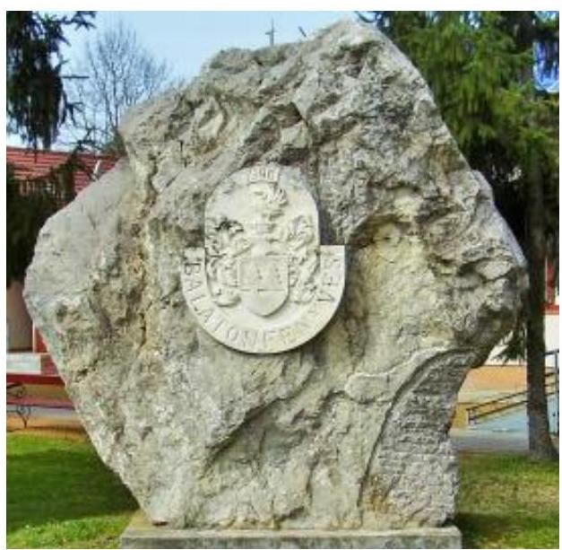
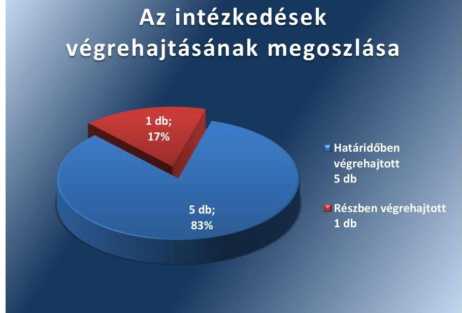

# Jelenetés 

## Utóellenőrzések

Balatonfenyves Község Önkormányzata vagyongazdálkodása szabályszerűségének utóellenőrzése
2017. február 25. nap

Domokos László
elnök

---

# AZ ELLENŐRZÉST FELÜGYELTE: 

DR. NÉMETH ERZSÉBET felügyeleti vezető

## AZ ELLENŐRZÉST VEZETTE ÉS A VÉGREHAJTÁSÁÉRT FELELŐS:

DR. SIMON JÓZSEF ellenőrzésvezető

## A PROGRAM ÖSSZEÁLLÍTÁSÁÉRT FELELŐS:

JANIK JÓZSEF LÁSZLÓ osztályvezető

IKTATÓSZÁM: V-1217-046/2016.
TÉMASZÁM: 2251

## ELLENŐRZÉS-AZONOSÍTÓ SZÁM: V075554

Jelentéseink az Országgyűlés számítógépes hálózatán és az Interneten a www.asz.hu címen is olvashatóak.

---

# TARTALOMJEGYZÉK 

■ ÖSSZEGZÉS ..... 5
■ AZ ELLENŐRZÉS CÉLJA ..... 6
■ AZ ELLENŐRZÉS TERÜLETE ..... 7
■ AZ ELLENŐRZÉS HÁTTERE, INDOKOLTSÁGA ..... 8
■ FÓKUSZKÉRDÉS ..... 9
■ ELLENŐRZÉS HATÓKÖRE ÉS MÓDSZEREI ..... 10
■ MEGÁLLAPÍTÁSOK ..... 12
■ MELLÉKLETEK ..... 15
I. Sz. melléklet: Az ÁSZ 14058 számú jelentéséhez kapcsolódó intézkedési terv végrehajtása ..... 15
■ FÜGGELÉK: ÉSZREVÉTELEK ..... 19
■ RÖVIDÍTÉSEK JEGYZÉKE ..... 21

---

.

---

# ÖSSZEGZÉS 

Az utóellenőrzés megállapította, hogy az intézkedési tervben foglalt feladatokat Balatonfenyves Község Önkormányzata - a közérdekű adatok közzétételét kivéve - végrehajtotta. Az Állami Számvevőszék által korábban feltárt hibák, hiányosságok és szabálytalanságok megszüntetése által jelentősen javult az Önkormányzat vagyongazdálkodásának szabályszerűsége és működésének szabályossága az ellenőrzött időszak során.

## Az ellenőrzés társadalmi indokoltsága

Az ÁSZ ${ }^{1}$ stratégiájában célul tűzte ki a számvevőszéki munka hasznosulásának javítását. Ezzel összhangban utóellenőrzések keretében ellenőrzi, hogy az ellenőrzött szervezetek megvalósították-e a korábbi ellenőrzések által feltárt hibák, hiányosságok és szabálytalanságok megszüntetése céljából kialakított intézkedési terveikben foglaltakat. A rendszeres utóellenőrzések hozzájárulnak a szükséges intézkedések tényleges végrehajtásához, ezáltal a közpénzügyek rendezettségének javulásához és azok szabályszerű felhasználásához.

Balatonfenyves Község Önkormányzatánál a korábbi ÁSZ jelentés² hibákat, hiányosságokat és szabálytalanságokat tárt fel a vagyon nyilvántartásával és kimutatásával, a gazdálkodási jogkörök gyakorlásának, az etikai elvárások szabályozásával illetve a közérdekű adatok közzétételével kapcsolatban. A feladatok jelentősége indokolttá tette az utóellenőrzés elvégzését.

## Főbb megállapítások, következtetések

A polgármester ${ }^{3}$ az ÁSZ jelentésben foglalt intézkedést igénylő megállapításokhoz kapcsolódóan összeállított intézkedési tervet ${ }^{4}$ az előírt határidőn belül megküldte az ÁSZ-nak. Az Önkormányzat ${ }^{5}$ az intézkedési terv feladatainak végrehajtásáról vezette a Bkr. ${ }^{6}$ által előírt nyilvántartást. Az intézkedési tervben meghatározott hat feladatból ötöt határidőben és egy feladatot részben hajtott végre az Önkormányzat.

Az Önkormányzat megfelelő intézkedéseket tett a leltározási és leltárkészítési szabályzatban minden eszközre kiterjedő évenkénti leltározás elvégzése, a vagyonkimutatás megfelelő tartalommal való elkészítése, a gazdálkodási jogkörökkel kapcsolatos szabályzatok aktualizálása, a kötelezettségvállalások folyamatos nyilvántartása valamint a hivatásetikai elvárásokra vonatkozó szabályzat elkészítése érdekében.

A részben végrehajtott feladatok esetén az Önkormányzat nem biztosította a közérdekű adatok teljes körű közzétételét.

Az Önkormányzat az intézkedési tervben megfogalmazott feladatokat jellemzően végrehajtotta, ezáltal a korábban tapasztalt hibák, hiányosságok és szabálytalanságok - a közérdekű adatok nem teljes körű közzétételét kivéve - megszűntek a vagyongazdálkodás területén.

---

# AZ ELLENŐRZÉS CÉLJA 

Az ellenőrzés célja annak értékelése volt, hogy az Önkormányzat vagyongazdálkodása szabályszerűségének ellenőrzéséről készült ÁSZ jelentésben foglalt intézkedést igénylő megállapításokkal és javaslatokkal összhangban készített intézkedési tervben meghatározott feladatokat az Önkormányzat végrehajtotta-e.

---

# **AZ ELLENŐRZÉS TERÜLETE**

## **Balatonfenyves Község Önkormányzata**

Balatonfenyves község Somogy megyében, a Balaton déli partján fekszik, Keszthelytől 19 km-re. Állandó lakosainak száma 2015. január 1-én 2207 fő* volt.

Az éves zárszámadási rendelet alapján az Önkormányzat és költségvetési szervei együttesen 2013-ban 659,0 millió Ft bevételt és 586,3 millió Ft kiadást, 2014-ben 746,3 millió Ft bevételt és 639,9 millió Ft kiadást, 2015-ben pedig 769,0 millió Ft bevételt és 583,8 millió Ft kiadást teljesítettek. A bevételek értéke – 2015-ben 2013-hoz képest – nagyságrendileg 17%-kal növekedett.

Az Önkormányzat vagyona 2014-ben 3458,8 millió Ft, 2015-ben 3520,9 millió Ft volt†. A nemzeti vagyonba tartozó befektetett eszközök aránya 2014-ben 94,3%-ot, 2015-ben 93,4%-ot jelentett. A követelések a 2014-2015. évek tekintetében közel azonos szinten alakultak, 2014-ben 34,9 millió Ft-ot, 2015-ben 35,2 millió Ft szerepelt e mérlegsoron. A kötelezettségállomány 2014-ről 2015-re 55,6%-kal csökkent. A csökkenést jellemzően a költségvetési évben esedékes, rövid lejáratú kötelezettségek csökkenése okozta.

Az utóellenőrzés† – a 2014. április 11-től 2016. július 18-ig végrehajtott intézkedéseket figyelembe véve – az Önkormányzat vagyongazdálkodási tevékenysége szabályszerűségének ellenőrzéséről közzétett ÁSZ jelentés intézkedést igénylő megállapításai és javaslatai hasznosítására készült intézkedési terv végrehajtására irányult. Az ÁSZ jelentés az Önkormányzat jegyzője* számára öt pontban hat javaslatot fogalmazott meg.

* Forrás: Központi Statisztikai Hivatal, Magyarország Közigazgatási Helységnévkönyve, Balatonfenyves Község 2015. január 1-jei adatai

† Forrás: Zárszámadási rendeletek, Balatonfenyves Község Önkormányzata

---

# AZ ELLENŐRZÉS HÁTTERE, INDOKOLTSÁGA 

Az ÁSZ törvény 33. § (1) bekezdése értelmében a számvevőszéki jelentések intézkedést igénylő megállapításaihoz és javaslataihoz kapcsolódóan az ellenőrzött szervezet vezetője intézkedési tervet köteles összeállítani, és az Állami Számvevőszék részére megküldeni. Az intézkedési tervben foglaltak megvalósítását - az ÁSZ tv. 33. § (7) bekezdésében foglaltak alapján - az Állami Számvevőszék utóellenőrzés keretében ellenőrizheti. Az intézkedések megvalósulásának értékelése során az Állami Számvevőszék figyelembe veszi az ellenőrzött szervezetek működési feltételeiben, valamint a jogszabályi előírásokban bekövetkezett változásokat.

Az intézkedési tervekben foglalt feladatok hiányos, illetve késedelmes végrehajtása, valamint megvalósításának elmaradása azt mutatja, hogy az ellenőrzések során feltárt hibák, hiányosságok és szabálytalanságok megszüntetése nem kapott kellő hangsúlyt. Ez a szabályszerű működés és a felelős vezetői magatartás vonatkozásában kockázatot hordoz. E kockázatok feltárásával az Állami Számvevőszék utóellenőrzési rendszere fokozza a fegyelmet, és igazolja, hogy a közpénzzel való szabályos gazdálkodás felelőssége elől nem lehet kitérni.

## AZ UTÓELLENŐRZÉS NÉGY SZINTEN HASZNOSULHAT:

- A társadalom szintjén az utóellenőrzés jelzi, hogy a számvevőszéki ellenőrzés megállapításainak van következménye: a hiányosságok megszüntetésére az ellenőrzött szervezet által meghatározott intézkedések végrehajtását is számon kéri az ÁSZ.
- Az ellenőrzött terület szintjén az utóellenőrzés tájékoztatást nyújt a terület döntéshozóinak a hiányosságok kiküszöbölésének jó gyakorlatairól, ezzel lehetőséget biztosítva arra, hogy az ÁSZ ellenőrzési megállapításai, javaslatai a terület nem ellenőrzött szervezeteinek a működése során is hasznosuljanak.
- Az ellenőrzött szervezet szintjén az utóellenőrzés feltárja, hogy a szervezet az intézkedések végrehajtásával hasznosította-e a korábbi ellenőrzési jelentésben a hiányosságok megszüntetése, illetve a kockázatok kezelése érdekében megfogalmazott javaslatokat.
- Az ÁSZ szintjén az utóellenőrzés visszacsatolást ad az ellenőrzési jelentések hasznosulásáról, az intézkedések elmaradása vagy részleges megvalósulása a további ellenőrzésekhez kockázati jelzésként szolgál.

---

# FÓKUSZKÉRDÉS 

1. Az ellenőrzött szervezet az intézkedési tervben foglaltakat az előírt határidőben végrehajtotta-e?

---

# ELLENŐRZÉS HATÓKÖRE ÉS MÓDSZEREI 

## Az ellenőrzés típusa

Megfelelőségi ellenőrzés.

## Az ellenőrzött időszak

Az utóellenőrzés alapját képező számvevőszéki jelentés közzétételének napjától (2014. április 11.) az ellenőrzésről szóló kiértesítő levél keltének napjáig (2016. július 18.) tartó időszak.

## Az ellenőrzés tárgya

Az ÁSZ tv. 2011. július 1-jei hatálybalépését követően a számvevőszéki jelentésben foglalt intézkedést igénylő megállapításokkal és javaslatokkal összhangban - az ellenőrzött szervezet által - készített intézkedési tervben foglaltak végrehajtásának ellenőrzése.

Az ellenőrzés kiterjed minden olyan körülményre és adatra, amely az ÁSZ jogszabályban meghatározott feladatainak teljesítéséhez, valamint a program végrehajtása folyamán felmerült újabb összefüggések feltárásához szükséges.

## Az ellenőrzött szervezet

Balatonfenyves Község Önkormányzata

## Az ellenőrzés jogalapja

Az ÁSZ az Országgyűlés pénzügyi és gazdasági ellenőrző szerve. Az ÁSZ törvényben meghatározott feladatkörében ellenőrzi a központi költségvetés végrehajtását, az államháztartás gazdálkodását, az államháztartásból származó források felhasználását és a nemzeti vagyon kezelését. Az ÁSZ tv. 1. § (3) bekezdése szerint az ÁSZ általános hatáskörrel végzi a közpénzekkel és az állami és önkormányzati vagyonnal való felelős gazdálkodás ellenőrzését. A 33. § (7) bekezdése alapján az ÁSZ tv. 33. § (1)-(2) bekezdése szerinti intézkedési tervben foglaltak megvalósítását az ÁSZ utóellenőrzés keretében ellenőrizheti.

---

# Az ellenőrzés módszerei 

Az ellenőrzést a nemzetközi standardokat irányadónak tekintve az ellenőrzési program ellenőrzési kérdései, az ellenőrzött időszakban hatályos jogszabályok, az ellenőrzés szakmai szabályok és módszertanok figyelembevételével, önálló ellenőrzés keretében végeztük.

Az ellenőrzés ideje alatt az ellenőrzött szervezettel történő kapcsolattartást az ÁSZ SZMSZ ${ }^{\circledR}$-ének vonatkozó előírásai alapján biztosítottuk.

Az utóellenőrzés megállapításait elsősorban az ÁSZ rendelkezésére álló, valamint az ellenőrzött szervezetektől elektronikusan bekért dokumentumok alapozzák meg, amely szükség esetén helyszíni ellenőrzéssel egészülhet ki. Az ÁSZ az ellenőrzés keretében egyes esetekben teljesítményellenőrzés tervezéséhez is kérhet adatokat.

Az ellenőrzési bizonyítékként felhasználható adatforrások közé tartoznak egyrészt a szakmai programban felsorolt adatforrások, másrészt minden - az ellenőrzés folyamán feltárt, az ellenőrzés szempontjából információt tartalmazó - dokumentum.

Az intézkedési tervekben előírt feladatokat azok végrehajthatósága, illetve végrehajtása szempontjából az alábbiak szerint kell értékelni:
"határidőben végrehajtott" a feladat, ha a teljesítés dokumentáltan, az intézkedési tervben előírt határidőben és tartalommal megtörtént;
"határidőn túl végrehajtott" a feladat, ha annak teljesítése az intézkedési tervben meghatározott módon, de az előírt határidőn túl történt meg;
"részben végrehajtott" a feladat, ha végrehajtása teljes körűen az intézkedési tervben előírt módon nem történt meg;
"nem végrehajtott" ha a végrehajtás nem történt meg, vagy amenynyiben a teljesítést nem dokumentálták;
"okafogyottá vált" a feladat, ha végrehajtására - meghatározott esemény bekövetkezése, továbbá külső körülmény, a működést érintő feltétel változása miatt - már nincs szükség, illetve lehetőség, és egyértelműen megállapítható, hogy az intézkedést szükségessé tevő körülmény a jövőben nem fordulhat elő;
"nem időszerű" az a feladat, amelynek ellenőrzési időszakon belüli végrehajtására azért nem került (kerülhetett) sor, mert az intézkedés alapjául szolgáló esemény nem következett be, de annak jövőbeni előfordulása lehetséges, a végrehajtása nem volt esedékes, vagy a végrehajtás határideje még nem járt le.
Az utóellenőrzésre az Önkormányzat elektronikus adatszolgáltatása alapján került sor, helyszíni ellenőrzést nem végeztünk. Az Önkormányzat által szolgáltatott adatok és dokumentumok valódiságát és teljes körűségét a polgármester által kiállított teljességi és hitelességi nyilatkozat igazolta.

---

# MEGÁLLAPÍTÁSOK 

## 1. Az ellenőrzött szervezet az intézkedési tervben foglaltakat az előírt határidőben végrehajtotta-e?

Összegző megállapítás

Az intézkedési tervben szereplő feladatok közül öt feladatot határidőben illetve egy feladatot részben hajtott végre az Önkormányzat. Az intézkedési tervben rögzített feladatok végrehajtásáról az előírt nyilvántartást vezették.

Az ÁSZ jelentés a jegyző részére öt javaslatot fogalmazott meg, amelynek hasznosítására az Önkormányzat öt pontban hat feladatot határozott meg. A feladatok végrehajtásának felelőseként az intézkedési tervben három esetben a jegyzőt, egy esetben a jegyzőt és a pénzügyi ügyintézőt, két esetben pedig a pénzügyi ügyintézőt jelölték meg.

Az Önkormányzat az intézkedési terv feladatainak végrehajtásáról vezette a Bkr. által előírt nyilvántartást.

Az intézkedési tervben meghatározott feladatokat, határidőket, az ÁSZ jelentés javaslatainak címzettjét és a feladatok végrehajtását az I. számú melléklet mutatja be.

Az Önkormányzat intézkedési tervében vállalt intézkedések végrehajtási kategóriánkénti megoszlását az 1. ábra szemlélteti.

1. ábra

## Az intézkedések végrehajtásának megoszlása

Forrás: ÁSZ

---

# HATÁRIDŐBEN VÉGREHAJTOTT FELADATOK: 

1. A Leltározási és Leltárkészítési Szabályzat ${ }^{10}$ módosítása 2014. január 1-i hatállyal megtörtént. Az Önkormányzat minden eszköz tekintetében - a Számv. tv. ${ }^{11}$ és az Áhsz ${ }_{2}{ }^{12}$ rendelkezéseivel összhangban - évenkénti leltározási kötelezettséget írt elő.
2. Az Önkormányzat az ellenőrzött időszakban az éves zárszámadási rendeleteinek összeállítása során - 2013. december 31-ig az Áhsz. ${ }_{1}{ }^{13}$ illetve 2014. január 1-ét követően az Áhsz.
 ${ }_{2}$ rendelkezéseit figyelembe véve – felmérte és a zárszámadás mellékletében bemutatta a mérlegben értékkel nem szereplő kötelezettségeket, jelezve, hogy ilyen típusú kötelezettséggel nem rendelkezett.
3. A jegyző gondoskodott a Belső Kontrollrendszer Szabályzat ${ }^{14}$ illetve a Gazdálkodási jogkörök gyakorlásának rendjéről szóló szabályzat ${ }^{15}$ aktualizálásáról. A gazdálkodási jogkörök gyakorlására jogosult személyek írásban történő kijelölésének aktualizálása – az Ávr. ${ }^{16}$ rendelkezéseinek megfelelően – folyamatosan, a személyi változásokat figyelembe véve történt.
4. A jegyző intézkedett – az Ávr. rendelkezéseivel összhangban – a kötelezettségvállalások analitikus nyilvántartásának vezetése érdekében. Az ellenőrzött időszak során a kötelezettségvállalások nyilvántartását az Önkormányzat folyamatosan és teljes körűen biztosította.
5. A Belső Kontrollrendszer Szabályzat általános etikai alapelvekkel történő kiegészítésére – a Bkr. rendelkezéseinek megfelelően – az előírt határidőn belül, 2014. február 20-án került sor. Az Önkormányzat ezt követően Hivatásetikai szabályzatot fogadott el 2015. november 26-án, amely 2015. december 1-én lépett hatályba.

## RÉSZBEN VÉGREHAJTOTT FELADATOK:

6. Az önkormányzat honlapján és a közadattárban közzétett adatok felülvizsgálatát dokumentumokkal nem igazolta. Az Önkormányzat honlapján az Info tv. ${ }^{17}$ 1. mellékletében szereplő adatok közzétételét – az Info tv. rendelkezései ellenére – nem teljes körűen hajtották végre, a hiányos adattartalmak pótlása csak részben történt meg.

---

.

---

# MELLÉKLETEK

- I. SZ. MELLÉKLET: AZ ÁSZ 14058 SZÁMÚ JELENTÉSÉHEZ KAPCSOLÓDÓ INTÉZKEDÉSI TERV VÉGREHAJTÁSA

|  1. | Intézkedési terv alapján elvégzendő feladat | Az intézkedési tervben meghatározott határidő 2. | Az intézkedési tervben rögzített feladatok elvégzésének felelőse 3. | A feladat végrehajtása  |
| --- | --- | --- | --- | --- |
|  1. |  | Végrehajtott feladatok |  |   |
|  1. | „A Balatonfenyvesi Polgármesteri Hivatal leltárkészítési és leltározási szabályzatát módosítani kell annak érdekében, hogy az Áhsz. 37. § (4) bekezdésének megfelelően minden eszköz tekintetében évenkénti leltározást írjunk elő.” | 2014. június 30. | pénzügyi ügyintéző | A Leltározási és Leltárkészítési Szabályzat módosított változata 2014. január 1-én lépett hatályba. A Leltározási és Leltárkészítési Szabályzat 2. pontja a leltározási kötelezettség tekintetében – a Számv. tv. 46. § (3) bekezdésében és a 69. § (3)–(4) bekezdéseiben, valamint az Áhsz.; 22. § (1)–(2) bekezdésében foglaltaknak megfelelően – évenkénti leltározási kötelezettséget határozott meg, a mennyiségi felvétellel illetve az egyeztetéssel leltározandó eszközökre egyaránt.  |
|  2. | „A zárszámadás részét képező vagyonkimutatást úgy kell elkészíteni, hogy az tartalmazza a mérlegben értékkel nem szereplő kötelezettségeket.” | 2013. évi zárszámadás elfogadása | jegyző, pénzügyi ügyintéző | A 2013. évi zárszámadási rendelet 21. számú melléklete az Áhsz.; 44/A. § (3) bekezdésében, a 2014. évi ${ }^{18}$ és a 2015. évi zárszámadási rendelet ${ }^{19}$ 24. számú melléklete az Áhsz.; 30. § (3) bekezdésében előírtaknak megfelelően tartalmazta a megállapítást, amely szerint az Önkormányzat a mérlegben értékkel nem szereplő kötelezettséggel nem rendelkezett.  |
|  3. | „A belső kontrollrendszerre vonatkozó szabályzatot illetve a kötelezettségvállalás, pénzügyi ellenjegyzés, teljesítés igazolás, érvényesítés, utalványozás rendjéről szóló szabályzatot folyamatosan igazítani kell a szervezeti struktúrához.” | 2014. június 30. | jegyző | A Belső Kontrollrendszer Szabályzat aktualizálására 2014. február 20-án került sor, amely 2014. március 1-én lépett hatályba. A Kötelezettségvállalás, pénzügyi ellenjegyzés, teljesítés igazolás, érvényesítés, utalványozás rendjéről szóló 1/2014. számú szabályzat 2014. január 15-én illetve ennek módosítása 2015. január 1-én lépett hatályba. Az ellenőrzött időszakban az Önkormányzat szervezeti struktúrája nem változott, ezáltal nem volt szükséges a belső kontrollrendszerre és a gazdálkodási jogkörök gyakorlására vonatkozó szabályzatok aktualizálása. A személyi változásoknak megfelelően – az Ávr. 55. § (2) bekezdés f) pont, 57. § (4) bekezdés, 58. § (4) bekezdés, 59. § (1) bekezdés rendelkezéseit figyelembe véve – történt a gazdálkodási jogkörök gyakorlására jogosult személyek kijelölése.  |

---

|  Mellékletek |  |  |  |   |
| --- | --- | --- | --- | --- |
|   | Intézkedési terv alapján elvégzendő feladat | Az intézkedési tervben meghatározott határidő | Az intézkedési tervben rögzített feladatok elvégzésének felelőse | A feladat végrehajtása  |
|  4 | 1. | 2. | 3. | 4.  |
|  4 | „A kötelezettségvállalások nyilvántartását folyamatosan vezetni kell.” | 2014. június 30. | pénzügyi ügyintéző | A jegyző intézkedett – az Ávr. 56. § (1) bekezdésében foglalt rendelkezéssel összhangban – az ellenőrzött időszakra vonatkozó kötelezettségvállalási nyilvántartások folyamatos és teljes körű vezetése érdekében. Az ellenőrzött időszakra vonatkozóan éves és tételes bontásban rendelkezésre álltak a kötelezettségvállalások nyilvántartását tartalmazó kimutatások, amelyek bemutatták a kötelezettségvállalások jellemzőit. A kötelezettségvállalások nyilvántartásának vezetését az Önkormányzat a 2013-tól alkalmazott EPER program$^{20}$ segítségével biztosította.  |
|  5 | „El kell készíteni az etikai elvárásokra vonatkozó szabályzatot.” | 2014. augusztus 31. | jegyző | A Belső kontrollrendszer szabályzat módosítása, általános etikai alapelvekkel történő kiegészítése – a Bkr. 6. § (1) bekezdés c) pontjában előírtakkal összhangban – 2014. február 20-án megtörtént. Az Önkormányzat ezt követően, 2015. november 26-án fogadta el a Hivatásetikai szabályzatot, amely 2015. december 1-től hatályos.  |
|   |  |  | Részben végrehajtott feladat |   |
|  6 | „Az önkormányzati honlapon és az adattárban közzétett adatokat felül kell vizsgálni és a hiányos adattartalmakat pótolni kell.” | 2014. augusztus 30. (ezt követően folyamatosan) | jegyző | Az önkormányzati honlapon és a közadattárban közzétett adatok felülvizsgálatára vonatkozó jegyzői intézkedés végrehajtását az Önkormányzat dokumentumokkal nem támasztotta alá.  |
|   |  |  |  | Az önkormányzati honlapon illetve a közadattárban a hiányzó adattartalmak pótlását – az Info tv. 37. § (1) bekezdésében – az ellenőrzött időszakon belül nem teljes körűen hajtották végre.  |
|   |  |  |  | Az Info tv. 1. melléklet I. pontjában előírtakkal összhangban a szervezeti, személyzeti adatok közzététele hiánytalanul megtörtént.  |
|   |  |  |  | Az Info tv. 1. melléklet II. pontjában megnevezett adatok közül nem került közzétételre az ellenőrzött időszakban többek között a Szervezeti és Működési Szabályzat archív változata, az adatvédelmi és adatbiztonsági szabályzat hatályos és teljes szövege, a közérdekű adatok megismerésére irányuló igények intézésének rendje, az illetékes szervezeti egység neve, elérhetősége, az ellenőrzések nyilvános megállapításait tartalmazó dokumentumok illetve a közszolgáltatások összefoglalása, a jogszabályban előírt tartalmi elemekkel rendelkező formában történő összegzése.  |
|   |  |  |  | Az Info tv. 1. melléklet III. pontjában szereplő gazdálkodási adatok közzététele az ellenőrzött időszakban szintén nem teljes körűen valósult meg. A jegyző nem  |

---

|  Mellékletek |  |  |  |   |
| --- | --- | --- | --- | --- |
|   | intézkedési terv alapján elvégzendő feladat | Az intézkedési tervben meghatározott határidő | Az intézkedési tervben rögzített feladatok elvégzésének felelőse | A feladat végrehajtása  |
|   | 1. | 2. | 3. | 4.  |
|   |  |  |  | gondoskodott a 2006. évi költségvetés, valamint a 2006., 2009. és 2012. évi beszámolók, a közfeladatot ellátó szervnél foglalkoztatottak létszámára és személyi juttatásaira vonatkozó összesített adatok, az ötmillió forintot elérő vagy azt meghaladó szerződések, valamint a közbeszerzési információk közzététele érdekében.  |
|   |  |  |  | Az Önkormányzat – az intézkedési tervben vállalt feladat ellenére – a közadattárban mindössze az elérhetőségi adatokat, valamint a szervezeti struktúrával, a szerv vezetőivel illetve Balatonfenyves Község hivatalos lapjával kapcsolatos adatokat tette közzé.  |

---

.

---

# FÜGGELÉK: ÉSZREVÉTELEK 

A jelentéstervezetet a Számvevőszék 15 napos észrevételezésre megküldte az ellenőrzött szervezet vezetőjének az ÁSZ tv. 29. § (1) bekezdése előírásának megfelelően.

Az ellenőrzött szervezet vezetője az ÁSZ tv. 29. § (2) bekezdésében foglalt észrevételezési jogával nem élt, a jelentéstervezetre észrevételt nem tett.

[^0]
[^0]:    ${ }^{1}$ 29. § (1) Az Állami Számvevőszék az ellenőrzési megállapításait megküldi az ellenőrzött szervezet vezetőjének vagy az általa megbízott személynek, és annak, akinek személyes felelősségét állapította meg.
    (2) Az ellenőrzött szervezet vezetője és a felelősként megjelölt személy az ellenőrzés megállapításaira tizenöt napon belül írásban észrevételt tehet.
    (3) Az Állami Számvevőszék az észrevételre a beérkezésétől számított harminc napon belül írásban válaszol. A figyelembe nem vett észrevételeket köteles a jelentésben feltüntetni, és megindokolni, hogy azokat miért nem fogadta el.

---

Balatonfenyves Község Önkormányzat Polgármestere 8646 Balatonfenyves, Kölcsey u. 27. Tel: 85/ 560-158 Fax: 85/361-802 E-mail:polgarmester@balatonfenyves.hu

Állami Számvevőszék
Domokos László úrnak
Elnök

Balatonfenyves, 2016-12-27.
Ügyiratszám: 2198-4/2016
Hiv.szám: V-1217-044/2016

# Budapest 

## Tisztelt Elnök úr!

Köszönettel megkaptuk a „Balatonfenyves Község Önkormányzata vagyongazdálkodása szabályszerűségének utóellenőrzése” címmel készített jelentéstervezetet.

Tisztelettel tájékoztatom, hogy a jelentéstervezetre nem kívánunk észrevételt tenni.

Üdvözlettel:

---

# RÖVIDÍTÉSEK JEGYZÉKE 

${ }^{1}$ ÁSZ
${ }^{2}$ ÁSZ jelentés
${ }^{3}$ polgármester
${ }^{4}$ intézkedési terv
${ }^{5}$ Önkormányzat
${ }^{6}$ Bkr.
${ }^{7}$ utóellenőrzés
${ }^{8}$ jegyző
${ }^{9}$ ÁSZ SZMSZ
${ }^{10}$ Leltározási és Leltárkészítési Szabályzat
${ }^{11}$ Számv. tv.
${ }^{12}$ Áhsz. 2
${ }^{13}$ Áhsz. 1
${ }^{14}$ Belső Kontrollrendszer Szabályzat
${ }^{15}$ Gazdálkodási jogkörök gyakorlásának rendjéről szóló szabályzat
${ }^{16}$ Ávr.
${ }^{17}$ Info tv.
${ }^{18}$ 2014. évi zárszámadási rendelet
${ }^{19}$ 2015. évi zárszámadási rendelet
${ }^{20}$ EPER program

Állami Számvevőszék
14058 Állami Számvevőszék – Jelentés az önkormányzatok vagyongazdálkodása szabályszerűségének ellenőrzéséről – Balatonfenyves
Balatonfenyves Község Önkormányzatának polgármestere
Balatonfenyves Község Önkormányzatának intézkedési terve
Balatonfenyves Község Önkormányzata
a költségvetési szervek belső kontrollrendszeréről és belső ellenőrzéséről szóló 370/2011. (XII. 31.) Korm. rendelet (hatályos 2012. január 1-től)
az ÁSZ 14058 számú jelentésében foglalt megállapításokhoz kapcsolódóan összeállított intézkedési tervben foglaltak megvalósításának ellenőrzése
Balatonfenyves Község Önkormányzatának jegyzője
Állami Számvevőszék elnökének 3/2015. (XII.30.) ÁSZ utasítása az Állami Számvevőszék Szervezeti és Működési Szabályzatáról
Balatonfenyvesi Polgármesteri Hivatal Leltározási és leltárkészítési szabályzata (hatályos 2014. január 1-től)
a számvitelről szóló 2000. évi C. törvény
az államháztartás számviteléről szóló 4/2013. (I. 11.) Korm. rendelet (hatályos 2014. január 1-től)
az államháztartás szervezetei beszámolási és könyvvezetési kötelezettségének sajátosságairól szóló 249/2000. (XII. 24.) Korm. rendelet (hatályos 2014. január 1-ig)
Balatonfenyvesi Polgármesteri Hivatal Belső Kontrollrendszer Szabályzata (hatályos 2014. március 1-től)
Balatonfenyvesi Polgármesteri Hivatal Kötelezettségvállalás, pénzügyi ellenjegyzés, teljesítés igazolás, érvényesítés, utalványozás rendjéről szóló szabályzat (hatályos 2014. január 15-től)
az államháztartásról szóló törvény végrehajtásáról szóló 368/2011. (XII. 31.) Korm. rendelet (hatályos 2012. január 1-jétől)
az információs önrendelkezési jogról és az információszabadságról szóló 2011. évi CXII. törvény (hatályos 2011. július 27-től)

Balatonfenyves Község Önkormányzata Képviselő-testületének 5/2015. (IV.24.) számú önkormányzati rendelete Balatonfenyves Község Önkormányzatának 2014. évi zárszámadásáról
Balatonfenyves Község Önkormányzata Képviselő-testületének 3/2016.
 (V.30.) számú önkormányzati rendelete Balatonfenyves Község Önkormányzatának 2015. évi zárszámadásáról
Balatonfenyves Község Önkormányzata által alkalmazott informatikai alkalmazás a kötelezettségvállalások nyilvántartására

---

ÁLLAMI SZÁMVEVŐSZÉK
1052 Budapest, Apáczai Csere János utca 10.
Levélcím: 1364 Budapest, Pf. 54
Telefon: +36 1 4849100 Telefax: +36 1 4849200
www.asz.hu
